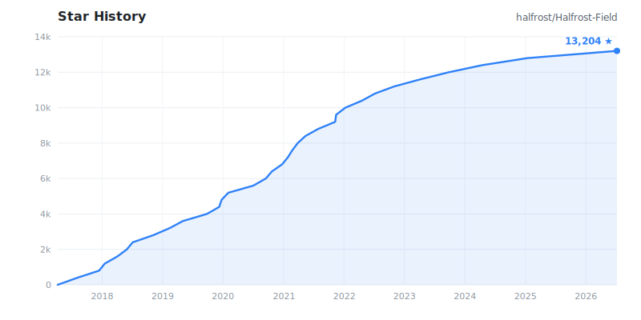

# Halfrost-Field 冰霜之地

<a href="./README.md">English</a>&nbsp;&nbsp;|&nbsp;&nbsp;<b>中文</b>

  

## ⭐️ 为什么要建这个仓库

世人都说阅读开源框架的源代码对于功力有显著的提升，所以我也尝试阅读开源框架的源代码，并对其内容进行详细地分析和理解。在这里将自己阅读开源框架源代码的心得记录下来，希望能对各位开发者有所帮助。我会不断更新这个仓库中的文章，如果想要关注可以点 `star`。

## 📖 目录

# 🐳 Go

| Project | Version | Article |
|:-------:|:-------:|:------|
|Go|1.16 darwin/amd64| [Go 初学者的成长之路](https://github.com/halfrost/Halfrost-Field/blob/master/contents/Go/new_gopher_tips.md) [初探 Go 的编译命令执行过程](https://github.com/halfrost/Halfrost-Field/blob/master/contents/Go/go_command.md) [深入解析 Go Slice 底层实现](https://github.com/halfrost/Halfrost-Field/blob/master/contents/Go/go_slice.md) [如何设计并实现一个线程安全的 Map ？(上篇)](https://github.com/halfrost/Halfrost-Field/blob/master/contents/Go/go_map_chapter_one.md) [如何设计并实现一个线程安全的 Map ？(下篇)](https://github.com/halfrost/Halfrost-Field/blob/master/contents/Go/go_map_chapter_two.md) [面试中 LRU / LFU 的青铜与王者](https://github.com/halfrost/Halfrost-Field/blob/master/contents/Go/LRU_LFU_interview.md) [深入研究 Go interface 底层实现](https://github.com/halfrost/Halfrost-Field/blob/master/contents/Go/go_interface.md) [Go reflection 三定律与最佳实践](https://github.com/halfrost/Halfrost-Field/blob/master/contents/Go/go_reflection.md) [深入 Go 并发原语 — Channel 底层实现](https://github.com/halfrost/Halfrost-Field/blob/master/contents/Go/go_channel.md) |
|空间搜索|golang/geo|[如何理解 n 维空间和 n 维时空](https://github.com/halfrost/Halfrost-Field/blob/master/contents/Go/n-dimensional_space_and_n-dimensional_space-time.md) [高效的多维空间点索引算法 — Geohash 和 Google S2](https://github.com/halfrost/Halfrost-Field/blob/master/contents/Go/go_spatial_search.md) [Google S2 中的 CellID 是如何生成的 ？](https://github.com/halfrost/Halfrost-Field/blob/master/contents/Go/go_s2_CellID.md) [Google S2 中的四叉树求 LCA 最近公共祖先](https://github.com/halfrost/Halfrost-Field/blob/master/contents/Go/go_s2_lowest_common_ancestor.md) [神奇的德布鲁因序列](https://github.com/halfrost/Halfrost-Field/blob/master/contents/Go/go_s2_De_Bruijn.md) [四叉树上如何求希尔伯特曲线的邻居 ？](https://github.com/halfrost/Halfrost-Field/blob/master/contents/Go/go_s2_Hilbert_neighbor.md) [Google S2 是如何解决空间覆盖最优解问题的?](https://github.com/halfrost/Halfrost-Field/blob/master/contents/Go/go_s2_regionCoverer.md) &nbsp;&nbsp;&nbsp;&nbsp;&nbsp;&nbsp;&nbsp;&nbsp;&nbsp;&nbsp;&nbsp;&nbsp;&nbsp;&nbsp;&nbsp;&nbsp;&nbsp;&nbsp;&nbsp;&nbsp;&nbsp;&nbsp;&nbsp;&nbsp;&nbsp;&nbsp;&nbsp;&nbsp;&nbsp;&nbsp;&nbsp;&nbsp;&nbsp;&nbsp;&nbsp;&nbsp;&nbsp;&nbsp;&nbsp;&nbsp;&nbsp;&nbsp;&nbsp;&nbsp;&nbsp;&nbsp;&nbsp;&nbsp;&nbsp;&nbsp;&nbsp;&nbsp;&nbsp;&nbsp;&nbsp;&nbsp;&nbsp;&nbsp;&nbsp;&nbsp;  [Code \<T\> share keynote](https://github.com/halfrost/Halfrost-Field/blob/master/contents/Go/T_Salon_share.pdf)|

----------------------------

# 🍉 Machine Learning

| Project | Version | Article |
|:-------:|:-------:|:------|
|机器学习|Andrew Ng Stanford University|[目录](https://github.com/halfrost/Halfrost-Field/blob/master/contents/Machine_Learning/contents.md) &nbsp;&nbsp;&nbsp;&nbsp;&nbsp;&nbsp;&nbsp;&nbsp;&nbsp;&nbsp;&nbsp;&nbsp;&nbsp;&nbsp;&nbsp;&nbsp;&nbsp;&nbsp;&nbsp;&nbsp;&nbsp;&nbsp;&nbsp;&nbsp;&nbsp;&nbsp;&nbsp;&nbsp;&nbsp;&nbsp;&nbsp;&nbsp;&nbsp;&nbsp;&nbsp;&nbsp;&nbsp;&nbsp;&nbsp;&nbsp;&nbsp;&nbsp;&nbsp;&nbsp;&nbsp;&nbsp;&nbsp;&nbsp;&nbsp;&nbsp;&nbsp;&nbsp;&nbsp;&nbsp;&nbsp;&nbsp;&nbsp;&nbsp;&nbsp;&nbsp; [Week1 —— What is Machine Learning](https://github.com/halfrost/Halfrost-Field/blob/master/contents/Machine_Learning/What_is_Machine_Learning.md) [Week1 —— Linear Regression with One Variable (Gradient Descent)](https://github.com/halfrost/Halfrost-Field/blob/master/contents/Machine_Learning/Gradient_descent.ipynb) [Week2 —— Multivariate Linear Regression](https://github.com/halfrost/Halfrost-Field/blob/master/contents/Machine_Learning/Multivariate_Linear_Regression.ipynb)  [Week2 —— Computing Parameters Analytically](https://github.com/halfrost/Halfrost-Field/blob/master/contents/Machine_Learning/Computing_Parameters_Analytically.ipynb) [Week2 —— Octave Matlab Tutorial](https://github.com/halfrost/Halfrost-Field/blob/master/contents/Machine_Learning/Octave_Matlab_Tutorial.ipynb) [Week3 —— Logistic Regression](https://github.com/halfrost/Halfrost-Field/blob/master/contents/Machine_Learning/Logistic_Regression.ipynb) [Week3 —— Regularization](https://github.com/halfrost/Halfrost-Field/blob/master/contents/Machine_Learning/Regularization.ipynb) [Week4 —— Neural Networks Representation](https://github.com/halfrost/Halfrost-Field/blob/master/contents/Machine_Learning/Neural_Networks_Representation.ipynb) [Week5 —— Neural Networks Learning](https://github.com/halfrost/Halfrost-Field/blob/master/contents/Machine_Learning/Neural_Networks_Learning.ipynb) [Week5 —— Backpropagation in Practice](https://github.com/halfrost/Halfrost-Field/blob/master/contents/Machine_Learning/Backpropagation_in_Practice.ipynb) [Week6 —— Advice for Applying Machine Learning](https://github.com/halfrost/Halfrost-Field/blob/master/contents/Machine_Learning/Advice_for_Applying_Machine_Learning.ipynb) [Week6 —— Machine Learning System Design](https://github.com/halfrost/Halfrost-Field/blob/master/contents/Machine_Learning/Machine_Learning_System_Design.ipynb) [Week7 —— Support Vector Machines](https://github.com/halfrost/Halfrost-Field/blob/master/contents/Machine_Learning/Support_Vector_Machines.ipynb) [Week8 —— Unsupervised Learning](https://github.com/halfrost/Halfrost-Field/blob/master/contents/Machine_Learning/Unsupervised_Learning.ipynb) [Week8 —— Dimensionality Reduction](https://github.com/halfrost/Halfrost-Field/blob/master/contents/Machine_Learning/Dimensionality_Reduction.ipynb) [Week9 —— Anomaly Detection](https://github.com/halfrost/Halfrost-Field/blob/master/contents/Machine_Learning/Anomaly_Detection.ipynb) [Week9 —— Recommender Systems](https://github.com/halfrost/Halfrost-Field/blob/master/contents/Machine_Learning/Recommender_Systems.ipynb) [Week10 —— Large Scale Machine Learning](https://github.com/halfrost/Halfrost-Field/blob/master/contents/Machine_Learning/Large_Scale_Machine_Learning.ipynb) [Week11 —— Application Example: Photo OCR](https://github.com/halfrost/Halfrost-Field/blob/master/contents/Machine_Learning/Application_Photo_OCR.ipynb)|

---------------------------

# 🚀 JavaScript

| Project | Version | Article |
|:-------:|:-------:|:------|
| JavaScript | ECMAScript 6 | [JavaScript 新手的踩坑日记](https://github.com/halfrost/Halfrost-Field/blob/master/contents/JavaScript/lost_in_javascript.md)   [从 JavaScript 作用域说开去](https://github.com/halfrost/Halfrost-Field/blob/master/contents/JavaScript/javascript_scope.md)  [揭开 this & that 之迷](https://github.com/halfrost/Halfrost-Field/blob/master/contents/JavaScript/%E6%8F%AD%E5%BC%80%20this%20%26%20that%20%E4%B9%8B%E8%BF%B7.md) [JSConf China 2017 Day One — JavaScript Change The World](https://github.com/halfrost/Halfrost-Field/blob/master/contents/JavaScript/JSConf%20China%202017%20Day%20One%20%E2%80%94%20JavaScript%20Change%20The%20World.md)   [JSConf China 2017 Day Two — End And Beginning](https://github.com/halfrost/Halfrost-Field/blob/master/contents/JavaScript/jsconf_china_2017_final.md)|
| Vue.js | 2.3.4 | [Vue 全家桶 + Electron 开发的一个跨三端的应用](https://github.com/halfrost/vue-objccn/blob/master/README.md)   [大话大前端时代(一) —— Vue 与 iOS 的组件化](https://github.com/halfrost/Halfrost-Field/blob/master/contents/Vue/%E5%A4%A7%E8%AF%9D%E5%A4%A7%E5%89%8D%E7%AB%AF%E6%97%B6%E4%BB%A3(%E4%B8%80)%20%E2%80%94%E2%80%94%20Vue%20%E4%B8%8E%20iOS%20%E7%9A%84%E7%BB%84%E4%BB%B6%E5%8C%96.md)  |
| Ghost | 1.24.8 | [Ghost 博客搭建日记](https://github.com/halfrost/Halfrost-Field/blob/master/contents/iOS/Ghost/ghost_build.md)  [Ghost 博客升级指南](https://github.com/halfrost/Halfrost-Field/blob/master/contents/iOS/Ghost/ghost_update.md)  [Ghost 博客炫技"新"玩法](https://github.com/halfrost/Halfrost-Field/blob/master/contents/iOS/Ghost/ghost_feature.md)  [博客跑分优化](https://github.com/halfrost/Halfrost-Field/blob/master/contents/iOS/Ghost/ghost_fast.md) &nbsp;&nbsp;&nbsp;&nbsp;&nbsp;&nbsp;&nbsp;&nbsp;&nbsp;&nbsp;&nbsp;&nbsp;&nbsp;&nbsp;&nbsp;&nbsp;&nbsp;&nbsp;&nbsp;&nbsp;&nbsp;&nbsp;&nbsp;&nbsp;&nbsp;&nbsp;&nbsp;&nbsp;&nbsp;&nbsp;&nbsp;&nbsp;&nbsp;&nbsp;&nbsp;&nbsp;&nbsp;&nbsp;&nbsp;&nbsp;&nbsp;&nbsp;&nbsp;&nbsp;&nbsp;&nbsp;&nbsp;&nbsp;&nbsp;&nbsp;&nbsp;&nbsp;&nbsp;&nbsp;&nbsp;&nbsp;&nbsp;&nbsp;&nbsp;&nbsp; |

-------

# 📱 iOS

| Project | Version | Article |
|:-------:|:-------:|:------|
| Weex | 0.10.0 | [Weex 是如何在 iOS 客户端上跑起来的](https://github.com/halfrost/Halfrost-Field/blob/master/contents/iOS/Weex/Weex_how_to_work_in_iOS.md)  [由 FlexBox 算法强力驱动的 Weex 布局引擎](https://github.com/halfrost/Halfrost-Field/blob/master/contents/iOS/Weex/Weex_layout_engine_powered_by_Flexbox's_algorithm.md)  [Weex 事件传递的那些事儿](https://github.com/halfrost/Halfrost-Field/blob/master/contents/iOS/Weex/Weex_events.md)  [Weex 中别具匠心的 JS Framework](https://github.com/halfrost/Halfrost-Field/blob/master/contents/iOS/Weex/Weex_ingenuity_JS_framework.md) [iOS 开发者的 Weex 伪最佳实践指北](https://github.com/halfrost/Halfrost-Field/blob/master/contents/iOS/Weex/Weex_pseudo-best_practices_for_iOS_developers.md)  |
| BeeHive | v1.2.0 | [BeeHive —— 一个优雅但还在完善中的解耦框架](https://github.com/halfrost/Halfrost-Field/blob/master/contents/iOS/beehive.md) |
| 组件化 | 路由与解耦 | [iOS 组件化 —— 路由设计思路分析](https://github.com/halfrost/Halfrost-Field/blob/master/contents/iOS/iOSRouter/iOS_Router.md) |
| ReactiveObjC | 2.1.2 |[函数响应式编程 (FRP) 从入门到 "放弃"—— 基础概念篇](https://github.com/halfrost/Halfrost-Field/blob/master/contents/iOS/RAC/functional_reactive_programming_concept.md)   [函数响应式编程 (FRP) 从入门到 "放弃"—— 图解 RACSignal 篇](https://github.com/halfrost/Halfrost-Field/blob/master/contents/iOS/RAC/ios_rac_racsignal.md)   [ReactiveCocoa 中 RACSignal 是如何发送信号的](https://github.com/halfrost/Halfrost-Field/blob/master/contents/iOS/RAC/reactivecocoa_racsignal.md)   [ReactiveCocoa 中 RACSignal 所有变换操作底层实现分析(上)](https://github.com/halfrost/Halfrost-Field/blob/master/contents/iOS/RAC/reactivecocoa_racsignal_operations1.md) [ReactiveCocoa 中 RACSignal 所有变换操作底层实现分析(中)](https://github.com/halfrost/Halfrost-Field/blob/master/contents/iOS/RAC/reactivecocoa_racsignal_operations2.md)   [ReactiveCocoa 中 RACSignal 所有变换操作底层实现分析(下)](https://github.com/halfrost/Halfrost-Field/blob/master/contents/iOS/RAC/reactivecocoa_racsignal_operations3.md)   [ReactiveCocoa 中 RACSignal 冷信号和热信号底层实现分析](https://github.com/halfrost/Halfrost-Field/blob/master/contents/iOS/RAC/reactivecocoa_hot_cold_signal.md)  [ReactiveCocoa 中 集合类 RACSequence 和 RACTuple 底层实现分析](https://github.com/halfrost/Halfrost-Field/blob/master/contents/iOS/RAC/reactivecocoa_racsequence_ractuple.md)   [ReactiveCocoa 中 RACScheduler 是如何封装 GCD 的](https://github.com/halfrost/Halfrost-Field/blob/master/contents/iOS/RAC/reactivecocoa_racscheduler.md)   [ReactiveCocoa 中 RACCommand 底层实现分析](https://github.com/halfrost/Halfrost-Field/blob/master/contents/iOS/RAC/reactivecocoa_raccommand.md)  [ReactiveCocoa 中 奇妙无比的“宏”魔法](https://github.com/halfrost/Halfrost-Field/blob/master/contents/iOS/RAC/reactivecocoa_macro.md)|
| Aspect |  | [iOS 如何实现Aspect Oriented Programming (上)](https://github.com/halfrost/Halfrost-Field/blob/master/contents/iOS/Aspect/ios_aspect.md) [iOS 如何实现Aspect Oriented Programming (下)](https://github.com/halfrost/Halfrost-Field/blob/master/contents/iOS/Aspect/ios_aspect.md)  |
| ObjC | objc runtime 680 |  [神经病院 Objective-C Runtime 入院第一天—— isa 和 Class](https://github.com/halfrost/Halfrost-Field/blob/master/contents/iOS/ObjC/objc_runtime_isa_class.md) [神经病院 Objective-C Runtime 住院第二天——消息发送与转发](https://github.com/halfrost/Halfrost-Field/blob/master/contents/iOS/ObjC/objc_runtime_objc_msgsend.md)  [神经病院 Objective-C Runtime 出院第三天——如何正确使用 Runtime](https://github.com/halfrost/Halfrost-Field/blob/master/contents/iOS/ObjC/how_to_use_runtime.md)   [ObjC 对象的今生今世](https://github.com/halfrost/Halfrost-Field/blob/master/contents/iOS/ObjC/objc_life.md) |
| iOS Block |  | [深入研究 Block 捕获外部变量和 __block 实现原理](https://github.com/halfrost/Halfrost-Field/blob/master/contents/iOS/Block/ios_block.md)   [深入研究 Block 用 weakSelf、strongSelf、@weakify、@strongify 解决循环引用](https://github.com/halfrost/Halfrost-Field/blob/master/contents/iOS/Block/ios_block_retain_circle.md)  |
| iOS Simulator |  | [给iOS 模拟器“安装”app文件](https://github.com/halfrost/Halfrost-Field/blob/master/contents/iOS/ios_simulator_ios_sim.md)   [Remote debugging on iOS with Safari Web Inspector](https://github.com/halfrost/Halfrost-Field/blob/master/contents/iOS/remote_debugging_on_ios_with_safari_web_inspector.md) |
| xcconfig |  | [手把手教你给一个 iOS app 配置多个环境变量](https://github.com/halfrost/Halfrost-Field/blob/master/contents/iOS/ios_multienvironments.md)    |
| Jenkins | Weekly Release 2.15 | [手把手教你利用 Jenkins 持续集成 iOS 项目](https://github.com/halfrost/Halfrost-Field/blob/master/contents/iOS/ios_jenkins.md)    |
| StoryBoard |  | [关于 IB_DESIGNABLE / IBInspectable 的那些需要注意的事](https://github.com/halfrost/Halfrost-Field/blob/master/contents/iOS/ios_ib_designable_ibinspectable.md)    |
| WWDC 2016 |  | [WWDC2016 Session 笔记 - Xcode 8 Auto Layout 新特性](https://github.com/halfrost/Halfrost-Field/blob/master/contents/iOS/WWDC%202016/WWDC_2016_iOS10_Xcode8_AutoLayout.md)  [WWDC2016 Session 笔记 - iOS 10 UICollectionView 新特性](https://github.com/halfrost/Halfrost-Field/blob/master/contents/iOS/WWDC%202016/WWDC_2016_iOS10_UICollectionView.md)  [WWDC2016 Session 笔记 - iOS 10  推送 Notification 新特性](https://github.com/halfrost/Halfrost-Field/blob/master/contents/iOS/WWDC%202016/WWDC_2016_iOS10_Notification.md)    |
| Jekyll |  | [如何快速给自己构建一个温馨的"家"——用 Jekyll 搭建静态博客](https://github.com/halfrost/Halfrost-Field/blob/master/contents/iOS/Jekyll/Jekyll.md)  |
| Swift | 2.2 | [iOS如何优雅的处理“回调地狱Callback hell”(二)——使用Swift](https://github.com/halfrost/Halfrost-Field/blob/master/contents/iOS/Swift/iOS_Callback_Hell_Swift.md)    |
| PromiseKit |  | [iOS如何优雅的处理“回调地狱Callback hell”(一)——使用PromiseKit](https://github.com/halfrost/Halfrost-Field/blob/master/contents/iOS/PromiseKit/iOS_Callback_Hell_PromiseKit.md)    |
| WebSocket |  | [微信,QQ 这类 IM app 怎么做——谈谈 Websocket](https://github.com/halfrost/Halfrost-Field/blob/master/contents/iOS/WebSocket/iOS_WebSocket.md)  |
| Realm |  | [Realm 数据库 从入门到“放弃”](https://github.com/halfrost/Halfrost-Field/blob/master/contents/iOS/Realm/Realm%E6%95%B0%E6%8D%AE%E5%BA%93%20%E4%BB%8E%E5%85%A5%E9%97%A8%E5%88%B0%E2%80%9C%E6%94%BE%E5%BC%83%E2%80%9D.md)  [手把手教你从 Core Data 迁移到 Realm](https://github.com/halfrost/Halfrost-Field/blob/master/contents/iOS/Realm/%E6%89%8B%E6%8A%8A%E6%89%8B%E6%95%99%E4%BD%A0%E4%BB%8ECore%20Data%E8%BF%81%E7%A7%BB%E5%88%B0Realm.md)   |
| Core Data |  | [iOS Core Data 数据迁移 指南](https://github.com/halfrost/Halfrost-Field/blob/master/contents/iOS/CoreData/iOS_Core_Data.md)   |
| Cordova |  | [iOS Hybrid 框架 ——PhoneGap](https://github.com/halfrost/Halfrost-Field/blob/master/contents/iOS/Cordova/iOS%20Hybrid%20%E6%A1%86%E6%9E%B6%20%E2%80%94%E2%80%94PhoneGap.md)  [Remote debugging on iOS with Safari Web Inspector](https://github.com/halfrost/Halfrost-Field/blob/master/contents/iOS/Cordova/Remote_debug.md)  |
| Animation |  | [iOS app 旧貌换新颜(一) — Launch Page 让 Logo "飞"出屏幕](https://github.com/halfrost/Halfrost-Field/blob/master/contents/iOS/Launchpage/iOS_launchpage_logo_fly.md)   |
| Interview |  | [iOS 面试总结](https://github.com/halfrost/Halfrost-Field/blob/master/contents/iOS/ios_interview.md)   |
| Phabricator |  | [搭建Phabricator我遇到的那些坑](https://github.com/halfrost/Halfrost-Field/blob/master/contents/iOS/Phabricator/%E6%90%AD%E5%BB%BAPhabricator%E6%88%91%E9%81%87%E5%88%B0%E7%9A%84%E9%82%A3%E4%BA%9B%E5%9D%91.md)  [Code review - Phabricator Use guide introduce](https://github.com/halfrost/Halfrost-Field/blob/master/contents/iOS/Phabricator/Code%20review%20-%20Phabricator%20Use%20guide%20introduce.md) &nbsp;&nbsp;&nbsp;&nbsp;&nbsp;&nbsp;&nbsp;&nbsp;&nbsp;&nbsp;&nbsp;&nbsp;&nbsp;&nbsp;&nbsp;&nbsp;&nbsp;&nbsp;&nbsp;&nbsp;&nbsp;&nbsp;&nbsp;&nbsp;&nbsp;&nbsp;&nbsp;&nbsp;&nbsp;&nbsp;&nbsp;&nbsp;&nbsp;&nbsp;&nbsp;&nbsp;&nbsp;&nbsp;&nbsp;&nbsp;&nbsp;&nbsp;&nbsp;&nbsp;&nbsp;&nbsp;&nbsp;&nbsp;&nbsp;&nbsp;&nbsp;&nbsp;&nbsp;&nbsp;&nbsp;&nbsp;&nbsp;&nbsp;&nbsp;&nbsp; |

----------------------------

# 📝 Protocol

| Project | Version | Article |
|:-------:|:-------:|:------|
|HTTP|1.1|[HTTP 基础概述](https://github.com/halfrost/Halfrost-Field/blob/master/contents/Protocol/HTTP.md) |
|HTTP|2|[[RFC 7540] Hypertext Transfer Protocol Version 2 (HTTP/2)](https://github.com/halfrost/Halfrost-Field/blob/master/contents/Protocol/HTTP_2_RFC7540.md) [解开 HTTP/2 的面纱：HTTP/2 是如何建立连接的](https://github.com/halfrost/Halfrost-Field/blob/master/contents/Protocol/HTTP_2-begin.md) [HTTP/2 中的 HTTP 帧和流的多路复用](https://github.com/halfrost/Halfrost-Field/blob/master/contents/Protocol/HTTP_2-HTTP-Frames.md) [HTTP/2 中的帧定义](https://github.com/halfrost/Halfrost-Field/blob/master/contents/Protocol/HTTP_2-HTTP-Frames-Definitions.md) [HTTP/2 中的 HTTP 语义](https://github.com/halfrost/Halfrost-Field/blob/master/contents/Protocol/HTTP_2-HTTP-Semantics.md) [HTTP/2 中的注意事项](https://github.com/halfrost/Halfrost-Field/blob/master/contents/Protocol/HTTP_2-Considerations.md) [HTTP/2 中的常见问题](https://github.com/halfrost/Halfrost-Field/blob/master/contents/Protocol/HTTP_2-Frequently-Asked-Questions.md) [[RFC 7541] HPACK: Header Compression for HTTP/2](https://github.com/halfrost/Halfrost-Field/blob/master/contents/Protocol/HTTP_2_RFC7541.md) [详解 HTTP/2 头压缩算法 —— HPACK](https://github.com/halfrost/Halfrost-Field/blob/master/contents/Protocol/HTTP_2_Header-Compression.md) [HTTP/2 HPACK 实际应用举例](https://github.com/halfrost/Halfrost-Field/blob/master/contents/Protocol/HTTP_2_HPACK-Example.md) [[RFC 7301] TLS Application-Layer Protocol Negotiation Extension](https://github.com/halfrost/Halfrost-Field/blob/master/contents/Protocol/TLS_ALPN.md)|
|WebSocket|Version 13|[全双工通信的 WebSocket](https://github.com/halfrost/Halfrost-Field/blob/master/contents/Protocol/WebSocket.md) |
|Protocol-buffers|proto3|[高效的数据压缩编码方式 Protobuf](https://github.com/halfrost/Halfrost-Field/blob/master/contents/Protocol/Protocol-buffers-encode.md) [高效的序列化/反序列化数据方式 Protobuf](https://github.com/halfrost/Halfrost-Field/blob/master/contents/Protocol/Protocol-buffers-decode.md)|
| FlatBuffers |1.9.0|[深入浅出 FlatBuffers 之 Schema](https://github.com/halfrost/Halfrost-Field/blob/master/contents/Protocol/FlatBuffers-schema.md) [深入浅出 FlatBuffers 之 Encode](https://github.com/halfrost/Halfrost-Field/blob/master/contents/Protocol/FlatBuffers-encode.md) [深入浅出 FlatBuffers 之 FlexBuffers](https://github.com/halfrost/Halfrost-Field/blob/master/contents/Protocol/FlatBuffers-flexBuffers.md)|
|TCP||[TCP/IP 基础概述](https://github.com/halfrost/Halfrost-Field/blob/master/contents/Protocol/TCP_IP.md) [Advance\_TCP](https://github.com/halfrost/Halfrost-Field/blob/master/contents/Protocol/Advance_TCP.md)|
|TLS|Cryptography |[密码学概述](https://github.com/halfrost/Halfrost-Field/blob/master/contents/Protocol/HTTPS-cryptography-overview.md) [漫游对称加密算法](https://github.com/halfrost/Halfrost-Field/blob/master/contents/Protocol/HTTPS-symmetric-encryption.md) [翱游公钥密码算法](https://github.com/halfrost/Halfrost-Field/blob/master/contents/Protocol/HTTPS-asymmetric-encryption.md) [消息的“指纹”是什么？](https://github.com/halfrost/Halfrost-Field/blob/master/contents/Protocol/HTTPS-one-way-hash.md) [消息认证码是怎么一回事？](https://github.com/halfrost/Halfrost-Field/blob/master/contents/Protocol/HTTPS-message-authentication-code.md) [无处不在的数字签名](https://github.com/halfrost/Halfrost-Field/blob/master/contents/Protocol/HTTPS-digital-signature.md) [随处可见的公钥证书](https://github.com/halfrost/Halfrost-Field/blob/master/contents/Protocol/HTTPS-digital-certificate.md) [秘密的实质——密钥](https://github.com/halfrost/Halfrost-Field/blob/master/contents/Protocol/HTTPS-cipherkey.md) [无法预测的根源——随机数](https://github.com/halfrost/Halfrost-Field/blob/master/contents/Protocol/HTTPS-random-number.md)
|TLS|TLS 1.3 |[如何部署 TLS 1.3 ？](https://github.com/halfrost/Halfrost-Field/blob/master/contents/Protocol/TLS1.3_start.md) [[RFC 6520] TLS & DTLS Heartbeat Extension](https://github.com/halfrost/Halfrost-Field/blob/master/contents/Protocol/TLS_Heartbeat.md) [[RFC 8446] The Transport Layer Security (TLS) Protocol Version 1.3](https://github.com/halfrost/Halfrost-Field/blob/master/contents/Protocol/TLS_1.3_RFC8446.md) [TLS 1.3 Introduction](https://github.com/halfrost/Halfrost-Field/blob/master/contents/Protocol/TLS_1.3_Introduction.md) [TLS 1.3 Handshake Protocol](https://github.com/halfrost/Halfrost-Field/blob/master/contents/Protocol/TLS_1.3_Handshake_Protocol.md) [TLS 1.3 Record Protocol](https://github.com/halfrost/Halfrost-Field/blob/master/contents/Protocol/TLS_1.3_Record_Protocol.md) [TLS 1.3 Alert Protocol](https://github.com/halfrost/Halfrost-Field/blob/master/contents/Protocol/TLS_1.3_Alert_Protocol.md) [TLS 1.3 Cryptographic Computations](https://github.com/halfrost/Halfrost-Field/blob/master/contents/Protocol/TLS_1.3_Cryptographic_Computations.md) [TLS 1.3 0-RTT and Anti-Replay](https://github.com/halfrost/Halfrost-Field/blob/master/contents/Protocol/TLS_1.3_0-RTT.md) [TLS 1.3 Compliance Requirements](https://github.com/halfrost/Halfrost-Field/blob/master/contents/Protocol/TLS_1.3_Compliance_Requirements.md) [TLS 1.3 Implementation Notes](https://github.com/halfrost/Halfrost-Field/blob/master/contents/Protocol/TLS_1.3_Implementation_Notes.md) [TLS 1.3 Backward Compatibility](https://github.com/halfrost/Halfrost-Field/blob/master/contents/Protocol/TLS_1.3_Backward_Compatibility.md) [TLS 1.3 Overview of Security Properties](https://github.com/halfrost/Halfrost-Field/blob/master/contents/Protocol/TLS_1.3_Security_Properties.md)|
|HTTPS|TLS 1.2/TLS 1.3|[HTTPS 温故知新（一） —— 开篇](https://github.com/halfrost/Halfrost-Field/blob/master/contents/Protocol/HTTPS-begin.md) [HTTPS 温故知新（二） —— TLS 记录层协议](https://github.com/halfrost/Halfrost-Field/blob/master/contents/Protocol/HTTPS-record-layer.md) [HTTPS 温故知新（三） —— 直观感受 TLS 握手流程(上)](https://github.com/halfrost/Halfrost-Field/blob/master/contents/Protocol/HTTPS-TLS1.2_handshake.md) [HTTPS 温故知新（四） —— 直观感受 TLS 握手流程(下)](https://github.com/halfrost/Halfrost-Field/blob/master/contents/Protocol/HTTPS-TLS1.3_handshake.md) [HTTPS 温故知新（五） —— TLS 中的密钥计算](https://github.com/halfrost/Halfrost-Field/blob/master/contents/Protocol/HTTPS-key-cipher.md) [HTTPS 温故知新（六） —— TLS 中的 Extensions](https://github.com/halfrost/Halfrost-Field/blob/master/contents/Protocol/HTTPS-extensions.md) |
|QUIC|v44|[如何部署 QUIC ？](https://github.com/halfrost/Halfrost-Field/blob/master/contents/Protocol/QUIC_start.md) &nbsp;&nbsp;&nbsp;&nbsp;&nbsp;&nbsp;&nbsp;&nbsp;&nbsp;&nbsp;&nbsp;&nbsp;&nbsp;&nbsp;&nbsp;&nbsp;&nbsp;&nbsp;&nbsp;&nbsp;&nbsp;&nbsp;&nbsp;&nbsp;&nbsp;&nbsp;&nbsp;&nbsp;&nbsp;&nbsp;&nbsp;&nbsp;&nbsp;&nbsp;&nbsp;&nbsp;&nbsp;&nbsp;&nbsp;&nbsp;&nbsp;&nbsp;&nbsp;&nbsp;&nbsp;&nbsp;&nbsp;&nbsp;&nbsp;&nbsp;&nbsp;&nbsp;&nbsp;&nbsp;&nbsp;&nbsp;&nbsp;&nbsp;&nbsp;&nbsp; |

----------------------------

# ❄️ 星霜荏苒

| Project | Version | Article |
|:-------:|:-------:|:------|
| 开篇 |  | [开篇](https://github.com/halfrost/Halfrost-Field/blob/master/contents/TimeElapse/start.md)|
| 2017 |  |[【星霜荏苒】 - 程序员如何在技术浪潮的更迭中保持较高的成长速度 ？](https://github.com/halfrost/Halfrost-Field/blob/master/contents/TimeElapse/2017.md)|
| 2018 |  |[【星霜荏苒】 - 如何看待软件开发 ？](https://github.com/halfrost/Halfrost-Field/blob/master/contents/TimeElapse/2018.md)|
| 2019 |  |[【星霜荏苒】 - 不甘当学渣，努力作学霸，最终是学民](https://github.com/halfrost/Halfrost-Field/blob/master/contents/TimeElapse/2019.md)|
| 2020 |  |[【星霜荏苒】 - 下一个五年计划起航 ！](https://github.com/halfrost/Halfrost-Field/blob/master/contents/TimeElapse/2020.md)|
| 2021 |  |[后疫情时代下美国留学 CS Master 申请纪实](https://github.com/halfrost/Halfrost-Field/blob/master/contents/TimeElapse/2021.md) &nbsp;&nbsp;&nbsp;&nbsp;&nbsp;&nbsp;&nbsp;&nbsp;&nbsp;&nbsp;&nbsp;&nbsp;&nbsp;&nbsp;&nbsp;&nbsp;&nbsp;&nbsp;&nbsp;&nbsp;&nbsp;&nbsp;&nbsp;&nbsp;&nbsp;&nbsp;&nbsp;&nbsp;&nbsp;&nbsp;&nbsp;&nbsp;&nbsp;&nbsp;&nbsp;&nbsp;&nbsp;&nbsp;&nbsp;&nbsp;&nbsp;&nbsp;&nbsp;&nbsp;&nbsp;&nbsp;&nbsp;&nbsp;&nbsp;&nbsp;&nbsp;&nbsp;&nbsp;&nbsp;&nbsp;&nbsp;&nbsp;&nbsp;&nbsp;&nbsp; |

## ❗️ 勘误

+ 如果在文章中发现了问题，欢迎提交 PR 或者 issue，欢迎大神们多多指点🙏🙏🙏

## ♥️ 感谢

感谢Star！

## 🌈 公众号

## ©️ 转载

 本作品由 <a xmlns:cc="http://creativecommons.org/ns#" href="https://github.com/halfrost/Halfrost-Field" property="cc:attributionName" rel="cc:attributionURL">halfrost</a> 创作，采用<a rel="license" href="http://creativecommons.org/licenses/by/4.0/">知识共享署名 4.0 国际许可协议</a>进行许可。