# Efficient Multidimensional Spatial Point Indexing Algorithms — Geohash and Google S2

<p align='center'>

</p>


## Introduction

When we work overtime and go home at night, we may use DiDi or a shared bike. After opening the app, we see an interface like this:  


<p align='center'>
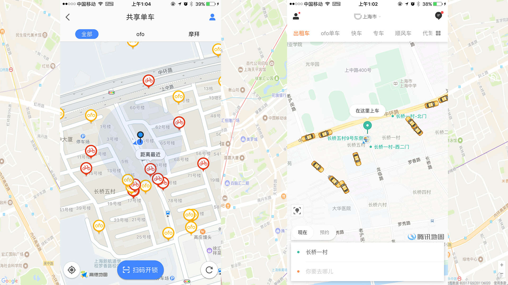
</p>


The app interface displays available taxis or shared bikes within a certain range nearby. Suppose the map displays vehicles within a 5-kilometer radius centered on the user. How should this be implemented? The most straightforward idea is to query a table in the database, compute and retrieve vehicles whose distance from the user is less than or equal to 5 kilometers, filter them out, and return the data to the client.

This approach is rather naive, and in general people do not do it this way. Why? Because it requires computing the relative distance for every row in the entire table. That is too time-consuming. Since the data volume is too large, we need to divide and conquer. That naturally leads to partitioning the map into blocks. Then, even if we compute the relative distance for every item within each block, it is still much faster than computing it once for the entire table.

We also know that many commonly used databases today, such as MySQL and PostgreSQL, natively support B+ trees. This data structure enables efficient queries. The process of partitioning a map is essentially a process of adding an index. If we can come up with a way to add an appropriate index to points on the map, and make that index sortable, then we can use methods similar to binary search for fast queries.

Here comes the problem: points on a map are two-dimensional, with longitude and latitude. How should they be indexed? If we search on only one dimension, either longitude or latitude, we still need to perform a secondary search after the first pass. What about higher dimensions, such as three dimensions? Some people might say we can define priorities among dimensions, for example by concatenating them into a composite key. But in 3D space, which of x, y, and z should have higher priority? Setting priorities does not seem very reasonable.


This article introduces two fairly general spatial point indexing algorithms.
    
------------------------------------------------------

## 1. The GeoHash Algorithm

### 1. Introduction to the Geohash Algorithm
Geohash is a geocoding system invented by [Gustavo Niemeyer](https://en.wikipedia.org/w/index.php?title=Gustavo_Niemeyer&action=edit&redlink=1). It is a hierarchical data structure that partitions space into grids. Geohash is a practical application of the Z-order curve ([Z-order curve](https://en.wikipedia.org/wiki/Z-order_curve)) among space-filling curves.


What is a Z-order curve?


The figure above shows a Z-order curve. This curve is relatively simple, and generating it is also easy: just connect the end of each Z to the beginning of the next one.


A Z-order curve can also be extended to three-dimensional space. As long as the Z shape is sufficiently small and dense, it can also fill the entire 3D space.

At this point, readers may still be confused and not know exactly what Geohash has to do with the Z curve. In fact, the theoretical foundation of the Geohash algorithm is based on the generation principle of the Z curve. Let’s continue with Geohash.

Geohash can provide arbitrary precision levels of segmentation. In general, the levels range from 1 to 12.


| String length | |cell width | |cell height |
|:-------:|:-------:|:------:|:------:|:------:|
|1|≤ |5,000km|×|    5,000km|
|2|≤ |1,250km|×|	 625km|
|3|≤ |156km|×|	         156km|
|4|≤ |39.1km|×|	19.5km|
|5|≤ |4.89km|×|	4.89km|
|6|≤ |1.22km|×|	0.61km|
|7|≤ |153m|×|	           153m|
|8|≤ |38.2m|×|	          19.1m|
|9|≤ |4.77m|×|	          4.77m|
|10|≤ |1.19m|×|	0.596m|
|11|≤ |149mm|×|	149mm|
|12|≤ |37.2mm|×|	18.6mm|


Do you remember the problem mentioned in the introduction? Here we can use Geohash to solve it.

We can use the length of a Geohash string to determine the size of the region to partition. The corresponding relationship can be found in the cell width and height in the table above. Once the cell width and height are selected, the length of the Geohash string is determined. In this way, we divide the map into rectangular regions.


Although the map has now been partitioned into regions, one problem remains: how do we quickly find nearby points and regions around a given point?

Geohash has a property related to the Z-order curve: places near a point (though not absolutely always) tend to have hash strings with a common prefix, and the longer the common prefix, the closer the two points are.

Because of this property, Geohash is often used as a unique identifier. In a database, Geohash can be used to represent a point. This common-prefix property of Geohash can be used to quickly search for neighboring points. Points that are closer to the target point usually have a longer common prefix in their Geohash strings (but this is not guaranteed; there are special cases, which will be illustrated below).

Geohash also has several encoding forms. Two common ones are base 32 and base 36.


| Decimal |0 |1 |2 |3 |4 |5 |6 |7 |8 |9 |10 |11 |12 |13 |14 |15 |
| :-------: |:-------: |:-------: |:-------: |:-------: |:-------: |:-------: |:-------: |:-------: |:-------: |:-------: |:-------: |:-------: |:-------: |:-------: |:-------: |:-------: |
|Base 32 |0 |1 |2 |3 |4 |5 |6 |7 |8 |9 |b |c |d |e |f |g |

| Decimal |16 |17 |18 |19 |20 |21 |22 |23 |24|25 |26 |27 |28 |29 |30 |31 |
| :-------: |:-------: |:-------: |:-------: |:-------: |:-------: |:-------: |:-------: |:-------: |:-------: |:-------: |:-------: |:-------: |:-------: |:-------: |:-------: |:-------: |
|Base 32 |h |j |k |m |n |p |q |r |s |t |u |v |w |x |y |z |

The base 36 version is case-sensitive and uses 36 characters: “23456789bBCdDFgGhHjJKlLMnNPqQrRtTVWX”.


| Decimal |0 |1 |2 |3 |4 |5 |6 |7 |8 |9 |10 |11 |12 |13 |14 |15 |16 |17 |18|
| :-------: |:-------: |:-------: |:-------: |:-------: |:-------: |:-------: |:-------: |:-------: |:-------: |:-------: |:-------: |:-------: |:-------: |:-------: |:-------: |:-------: |:-------: |:-------: |:-------: |
|Base 36 |2 |3 |4 |5 |6 |7 |8 |9 |b |B |C |d |D |F |g |G |h |H |j|


| Decimal |19 |20 |21 |22 |23 |24|25 |26 |27 |28 |29 |30 |31 |32 |33 |34 |35 |
| :-------: |:-------: |:-------: |:-------: |:-------: |:-------: |:-------: |:-------: |:-------: |:-------: |:-------: |:-------: |:-------: |:-------: |:-------: |:-------: |:-------: |:-------: |
|Base 36  |J |K |I |L |M |n |N |P |q |Q |r |R |t |T |V |W |X |


### 2. A Practical Geohash Example

The following example uses base-32. Let’s look at an example.


The figure above is a map, with Metro City in the middle. Suppose we need to query for the restaurants nearest to Metro City. How should we do it?

The first step is to grid the map using geohash. By looking up the table, we choose rectangles with a string length of 6 to grid this map.

After querying, the latitude and longitude of Metro City are [31.1932993, 121.43960190000007].

First process the latitude. The Earth’s latitude range is [-90,90]. Divide this interval into two parts: [-90,0) and [0,90]. 31.1932993 lies in the (0,90] interval, that is, the right interval, so mark it as 1. Then continue bisecting the (0,90] interval into [0,45) and [45,90]. 31.1932993 lies in the [0,45) interval, that is, the left interval, so mark it as 0. Continue partitioning in this way.


| Left interval | Midpoint|Right interval | Binary result|
|:-------:|:-------:|:------:|:------:|
|-90|0|90|1|
|0|45|90|0|
|0|22.5|45|1|
|22.5|33.75|45|0|
|22.5|28.125|33.75|1|
|28.125|30.9375|33.75|1|
|30.9375|32.34375|33.75|0|
|30.9375|31.640625|32.34375|0|
|30.9375|31.2890625|31.640625|0|
|30.9375|31.1132812|31.2890625|1|
|31.1132812|31.2011718|31.2890625|0|
|31.1132812|31.1572265|31.2011718|1|
|31.1572265|31.1791992|31.2011718|1|
|31.1791992|31.1901855|31.2011718|1|
|31.1901855|31.1956786|31.2011718|0|


Then process the longitude in the same way. The Earth’s longitude range is [-180,180].

| Left interval | Midpoint|Right interval | Binary result|
|:-------:|:-------:|:------:|:------:|
|-180|0|180|1|
|0|90|180|1|
|90|135|180|0|
|90|112.5|135|1|
|112.5|123.75|135|0|
|112.5|118.125|123.75|1|
|118.125|120.9375|123.75|1|
|120.9375|122.34375|123.75|0|
|120.9375|121.640625|122.34375|0|
|120.9375|121.289062|121.640625|1|
|121.289062|121.464844|121.640625|0|
|121.289062|121.376953|121.464844|1|
|121.376953|121.420898|121.464844|1|
|121.420898|121.442871|121.464844|0|
|121.420898|121.431885|121.442871|1|


The binary string produced by the latitude is 101011000101110, and the binary string produced by the longitude is 110101100101101. According to the rule “**put longitude in even positions and latitude in odd positions**”, recombine the longitude and latitude binary strings to generate a new one: 111001100111100000110011110110. The final step is to convert this final string into characters by looking up the base-32 table. 11100 11001 11100 00011 00111 10110 converted to decimal is 28 25 28 3 7 22. Looking up the encoding table gives the final result: wtw37q.


We can also compute the eight neighboring grids around this grid.


As can be seen from the map, these nine neighboring cells have exactly the same prefix: wtw37.

What happens if we increase the string by one more character? Increase the Geohash length to 7.


When Geohash increases to 7 characters, the grid becomes smaller, and the Geohash of Metro City becomes wtw37qt.

At this point, readers should already understand the principle of the Geohash algorithm. Let’s combine the 6-character and 7-character grids into one figure and look at them together.


We can see that the Geohash value of the large cell in the middle is wtw37q, so all small cells inside it have the prefix wtw37q. It is easy to imagine that when the Geohash string length is 5, the Geohash must be wtw37.


Next, let’s explain the relationship between Geohash and the Z-order curve mentioned earlier. Recall the rule in the final step for merging the latitude and longitude strings: **“put longitude in even positions and latitude in odd positions”**. Readers may be curious: where does this rule come from? Was it just made up out of thin air? In fact, it was not. This rule is exactly the Z-order curve. See the following figure:


The x-axis is latitude, and the y-axis is longitude. This is where the rule of putting longitude in even positions and latitude in odd positions comes from.

Finally, there is an issue of precision. Part of the data in the table below comes from Wikipedia.

| Geohash string length | Latitude| Longitude|Latitude error |Longitude error |km error |
|:-------:|:-------:|:------:|:------:|:------:|:------:|
|1|2 |3|    ±23|   ±23|   ±2500| 
|2|5 |5|    ±2.8|   ±5.6|   ±630| 
|3|7 |8|    ±0.70|   ±0.70|   ±78| 
|4|10 |10|    ±0.087|   ±0.18|   ±20| 
|5|12 |13|    ±0.022|   ±0.022|   ±2.4| 
|6|15 |15|    ±0.0027|   ±0.0055|   ±0.61| 
|7|17 |18|    ±0.00068|   ±0.00068|   ±0.076| 
|8|20 |20|    ±0.000085|   ±0.00017|   ±0.019| 
|9|22 |23|    |   | | 
|10|25 |25|    |   |   | 
|11|27 |28|    |   |   | 
|12|30 |30|    |   |   | 

### 3. Concrete Geohash Implementation

By now, readers should have a very clear understanding of the Geohash algorithm. Next, let’s implement the Geohash algorithm in Go.
```go

package geohash

import (
	"bytes"
)

const (
	BASE32                = "0123456789bcdefghjkmnpqrstuvwxyz"
	MAX_LATITUDE  float64 = 90
	MIN_LATITUDE  float64 = -90
	MAX_LONGITUDE float64 = 180
	MIN_LONGITUDE float64 = -180
)

var (
	bits   = []int{16, 8, 4, 2, 1}
	base32 = []byte(BASE32)
)

type Box struct {
	MinLat, MaxLat float64 // latitude
	MinLng, MaxLng float64 // longitude
}

func (this *Box) Width() float64 {
	return this.MaxLng - this.MinLng
}

func (this *Box) Height() float64 {
	return this.MaxLat - this.MinLat
}

// Input values: latitude, longitude, precision (geohash length)
// Return geohash and the region containing the point
func Encode(latitude, longitude float64, precision int) (string, *Box) {
	var geohash bytes.Buffer
	var minLat, maxLat float64 = MIN_LATITUDE, MAX_LATITUDE
	var minLng, maxLng float64 = MIN_LONGITUDE, MAX_LONGITUDE
	var mid float64 = 0

	bit, ch, length, isEven := 0, 0, 0, true
	for length < precision {
		if isEven {
			if mid = (minLng + maxLng) / 2; mid < longitude {
				ch |= bits[bit]
				minLng = mid
			} else {
				maxLng = mid
			}
		} else {
			if mid = (minLat + maxLat) / 2; mid < latitude {
				ch |= bits[bit]
				minLat = mid
			} else {
				maxLat = mid
			}
		}

		isEven = !isEven
		if bit < 4 {
			bit++
		} else {
			geohash.WriteByte(base32[ch])
			length, bit, ch = length+1, 0, 0
		}
	}

	b := &Box{
		MinLat: minLat,
		MaxLat: maxLat,
		MinLng: minLng,
		MaxLng: maxLng,
	}

	return geohash.String(), b
}

```

### 4. Pros and Cons of Geohash

The advantages of Geohash are obvious: it encodes locations using a Z-order curve. A Z-order curve can map all points in a two-dimensional or multidimensional space onto a one-dimensional curve. In mathematics, this is referred to as a fractal dimension. In addition, the Z-order curve has locality-preserving properties.

A Z-order curve computes the z-value of a point in multiple dimensions simply by interleaving the binary representations of the point’s coordinate values. Once the data has been added to this ordering, any one-dimensional data structure—such as a binary search tree, B-tree, skip list, or hash table (with the low-order bits truncated)—can be used to process the data. The ordering produced by a Z-order curve can equivalently be described as the ordering obtained from a depth-first traversal of a quadtree.

This is another advantage of Geohash: searching for nearby points is relatively fast.


One drawback of Geohash also comes from the Z-order curve.

The Z-order curve has a fairly serious issue: although it preserves locality, it also has discontinuities. At every corner of the letter Z, abrupt jumps in ordering may occur.


Look at the blue points marked in the figure above. Although each pair of points is adjacent in the ordering, they are far apart in distance. In the lower-right diagram, the two numerically adjacent red points are almost an entire side length of the square apart. The two numerically adjacent green points are also about half the side length of the square apart.

Another drawback of Geohash is that if an appropriate grid size is not chosen, determining nearby points can become cumbersome.


Look at the figure above. If the Geohash string length is chosen as 6, the grid corresponds to the large blue cells. The red star is Metro City, and the purple dots are the target points returned by the search. If the Geohash algorithm is used for the query, the closer cells may be wtw37p, wtw37r, wtw37w, and wtw37m. But the actual nearest point is in wtw37q. If such a large grid is selected, the eight surrounding cells must also be searched.

If the Geohash string length is chosen as 7, the grid becomes the smaller yellow cells. In that case, there is only one point closest to the red star: wtw37qw.

If the grid size and precision are not chosen well, finding the nearest point still requires querying the eight surrounding cells again.


## II. Space-Filling Curves and Fractals

Before introducing the second indexing algorithm for points in multidimensional space, we first need to discuss space-filling curves and fractals.

Indexing points in multidimensional space requires solving two problems: first, how do we reduce multiple dimensions to a lower-dimensional space or to one dimension? Second, how does a one-dimensional curve form a fractal?

### 1. Space-Filling Curves

In mathematical analysis, there is a difficult question: can an infinitely long line pass through all points in a space of arbitrary dimension?


In 1890, Giuseppe Peano discovered a continuous curve, now called the Peano curve, that can pass through every point in the unit square. His goal was to construct a continuous mapping from the unit interval to the unit square. Peano was inspired by Georg Cantor’s earlier counterintuitive result: the infinite number of points in the unit interval has the same cardinality as the infinite number of points in any finite-dimensional [manifold](https://en.wikipedia.org/wiki/Manifold). The problem Peano solved was essentially whether such a continuous mapping exists—a curve that can fill an entire plane. The figure above shows one curve he found.

Generally speaking, a one-dimensional object cannot fill a two-dimensional square. But the Peano curve provides exactly such a counterexample. The Peano curve is continuous but nowhere differentiable.

The construction of the Peano curve is as follows: take a square and divide it into nine equal smaller squares. Starting from the lower-left square and ending at the upper-right square, connect the centers of the small squares with line segments in sequence. In the next step, divide each small square into nine equal squares, and connect their centers in the same way... Continue this procedure indefinitely, and the limiting curve obtained is called the Peano curve.

Peano gave a detailed mathematical description of the mapping between points on the interval [0, 1] and points in the square. In fact, for these points in the square, for , two continuous functions x = f(t) and y = g(t) can be found such that x and y take every value in the unit square.

One year later, in 1891, [Hilbert](https://zh.wikipedia.org/wiki/%E5%B8%8C%E5%B0%94%E4%BC%AF%E7%89%B9) constructed this curve, called the Hilbert curve.


The figure above shows Hilbert curves of order 1 through 6. The concrete construction method will be discussed in the next chapter.


The figure above shows a Hilbert curve filling a three-dimensional space.


Many variants of space-filling curves appeared later, including the Dragon curve, Gosper curve, Koch curve, Moore curve, Sierpiński curve, and Osgood curve. These curves are not directly relevant to this article, so we will not cover them in detail.


In mathematical analysis, a space-filling curve is a parametric injective function that maps the unit interval to a continuous curve in the unit square, cube, or more generally an n-dimensional hypercube. As the parameter increases, it can get arbitrarily close to any given point in the unit cube. Beyond their mathematical significance, space-filling curves are also used in dimensionality reduction, mathematical programming, sparse multidimensional database indexing, electronics, and biology. Space-filling curves are now used in online maps.

### 2. Fractals

The emergence of the Peano curve showed that people’s understanding of dimension was flawed, and that the definition of dimension needed to be reconsidered. This is exactly the problem considered by [fractal geometry](https://zh.wikipedia.org/wiki/%E5%88%86%E5%BD%A2%E5%87%A0%E4%BD%95). In fractal geometry, dimensions can be fractional; these are called fractal dimensions.

After reducing the dimensionality of a multidimensional space, how to form a fractal is another problem. There are many ways to construct fractals. Here is a [list](https://en.wikipedia.org/wiki/List_of_fractals_by_Hausdorff_dimension) that shows how different fractals are constructed, as well as the fractal dimension of each one—that is, the Hausdorff fractal dimension and the topological dimension. We will not go into the details of fractals here; interested readers can read the linked material carefully.

Next, we continue with multidimensional point indexing algorithms. The next algorithm is based on the Hilbert curve, so let’s first take a closer look at the Hilbert curve.

## III. Hilbert Curve

### 1. Definition of the Hilbert Curve


<p align='center'>
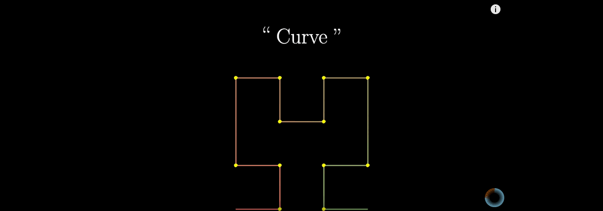
</p>


The **Hilbert curve** is a fractal curve that can fill an entire square plane—a [space-filling curve](https://zh.wikipedia.org/w/index.php?title=%E7%A9%BA%E9%96%93%E5%A1%AB%E5%85%85%E6%9B%B2%E7%B7%9A&action=edit&redlink=1)—proposed by [David Hilbert](https://zh.wikipedia.org/wiki/%E5%A4%A7%E8%A1%9B%C2%B7%E5%B8%8C%E7%88%BE%E4%BC%AF%E7%89%B9) in 1891.

Because it can fill a plane, its [Hausdorff dimension](https://zh.wikipedia.org/wiki/%E8%B1%AA%E6%96%AF%E5%A4%9A%E5%A4%AB%E7%B6%AD) is 2. If the side length of the square it fills is 1, the length of the Hilbert curve at step n is 2^n - 2^(-n).

### 2. Construction of the Hilbert Curve

For a first-order Hilbert curve, the construction method is to divide the square into four equal parts, start from the center of one subsquare, and then draw a line through the centers of the other three subsquares in sequence.


<p align='center'>
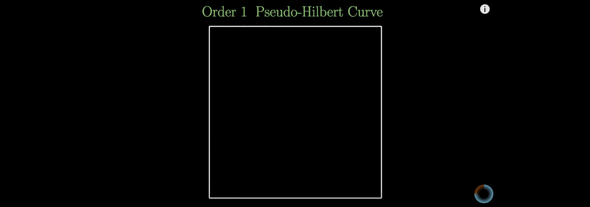
</p>


For a second-order Hilbert curve, the construction method is to continue dividing each previous subsquare into four equal parts. First, generate a first-order Hilbert curve in each group of four smaller squares. Then connect the four first-order Hilbert curves end to end.

<p align='center'>
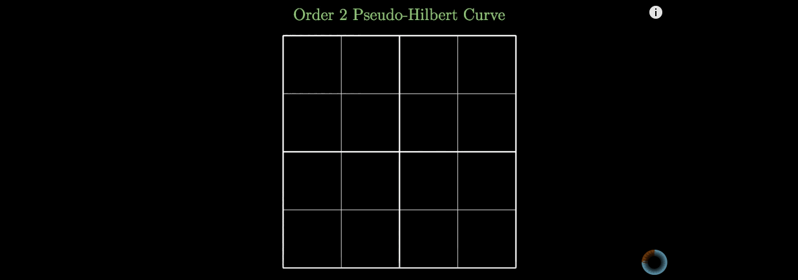
</p>


For a third-order Hilbert curve, the construction is similar to the second order: first generate second-order Hilbert curves, then connect the four second-order Hilbert curves end to end.


<p align='center'>
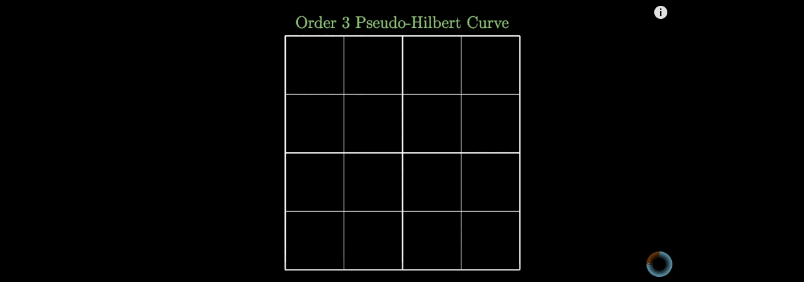
</p>


The construction of an n-th order Hilbert curve is also recursive: first generate an (n-1)-th order Hilbert curve, then connect four (n-1)-th order Hilbert curves end to end.


<p align='center'>
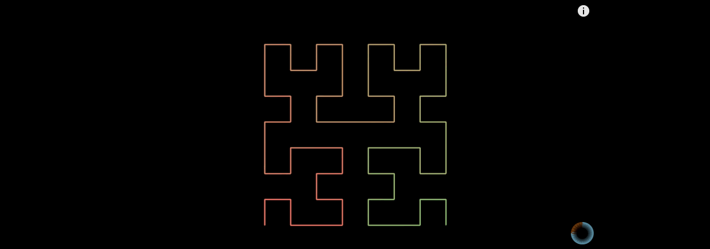
</p>


### 3. Why Choose the Hilbert Curve

At this point, some readers may be wondering: with so many space-filling curves, why choose the Hilbert curve?

Because the Hilbert curve has excellent properties.

#### (1) Dimensionality Reduction

First, as a space-filling curve, the Hilbert curve can effectively reduce the dimensionality of multidimensional space.


<p align='center'>
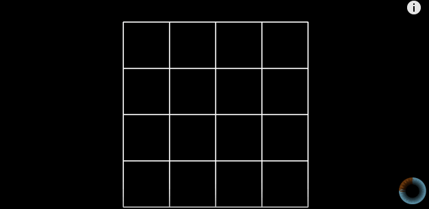
</p>


The figure above shows that after the Hilbert curve fills a plane, all points on the plane are unfolded into a one-dimensional line.

Some people may wonder: the Hilbert curve in the figure above only passes through 16 points, so how can it represent an entire plane?


<p align='center'>
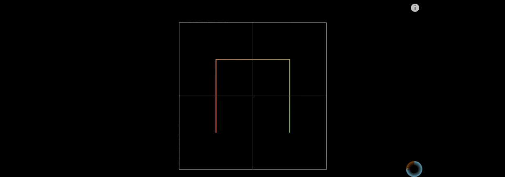
</p>


Of course, when n approaches infinity, an n-th order Hilbert curve can approximately fill the entire plane.

#### (2) Stability

For an n-th order Hilbert curve, as n approaches infinity, the positions of the points on the curve basically become stable. For example:


<p align='center'>
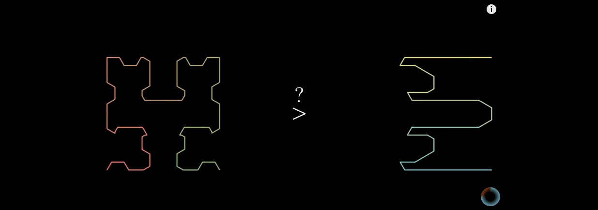
</p>


The left side of the figure above is the Hilbert curve, and the right side is a serpentine curve. As n approaches infinity, both can theoretically fill the plane. But why is the Hilbert curve better?

Given a point on the serpentine curve, as n approaches infinity, the position of that point on the serpentine curve keeps changing.


<p align='center'>
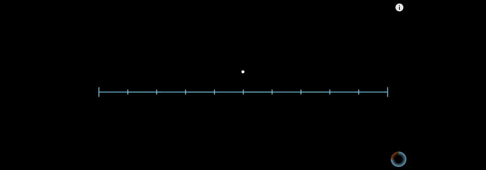
</p>


This makes the relative position of the point constantly uncertain.

Now look at the Hilbert curve. For the same point, as n approaches infinity:


<p align='center'>

</p>


As shown in the figure above, the position of the point changes very little. Therefore, the Hilbert curve is superior.


#### (3) Continuity


The Hilbert curve is continuous, so it can guarantee that it fills space. Continuity requires a mathematical proof. We will not go into the proof here; interested readers can refer to the paper on the Hilbert curve linked at the end of the article, where the proof of continuity is given.


Google’s S2 algorithm, which we will introduce next, is based on the Hilbert curve. By now, readers should understand why the Hilbert curve was chosen.

## IV. [S²](https://godoc.org/github.com/golang/geo/s2)  Algorithm


>[Google’s S2 library](https://code.google.com/p/s2-geometry-library/) is a real treasure, not only due to its capabilities for spatial indexing but also because it is a library that was released more than 4 years ago and it didn’t get the attention it deserved

The paragraph above comes from a 2015 blog post by a Google engineer. He sincerely lamented that the S2 algorithm had been released for four years without receiving the recognition it deserved. Today, however, S2 is already used by major companies.

Before introducing this heavyweight algorithm, let’s first explain where its name comes from. S2 actually comes from the mathematical symbol S² in geometry, which denotes the unit sphere. The S2 library was designed to solve various geometric problems on the sphere. It is worth noting that, apart from the official golang repo’s geo/s2, which is currently only about 40% complete, the S2 implementations in other languages—Java, C++, and Python—are all 100% complete. This article mainly explains the Go version.

Next, let’s see how to use S2 to solve the problem of indexing points in multidimensional space.

### 1. Spherical Coordinate Conversion

Following our earlier approach to handling multidimensional space, we first consider how to reduce dimensions, and then consider how to form a fractal.

As everyone knows, the Earth is approximately a sphere. A sphere is three-dimensional, so how do we reduce three dimensions to one dimension?

A point on the sphere can be represented in a Cartesian coordinate system as follows:


```

x = r * sin θ * cos φ
y = r * sin θ * sin φ 
z = r * cos θ

```
Typically, we represent points on Earth using latitude and longitude.


Taking this a step further, we can relate them to latitude and longitude on a sphere. One thing to note here is that the latitude angle α plus the spherical coordinate θ in a Cartesian coordinate system equals 90°. So you need to be careful when converting trigonometric functions.

Thus, any point on Earth identified by latitude and longitude can be converted to f(x,y,z).

In S2, the Earth's radius is treated as the unit value 1. So the radius does not need to be considered. The ranges of x, y, and z are all constrained to the interval [-1,1] x [-1,1] x [-1,1].

### 2. Flattening the Sphere into a Plane

The next step in S2 is to flatten the sphere into a plane. How is this done?

First, a circumscribed cube is placed around the Earth, as shown below.


<p align='center'>
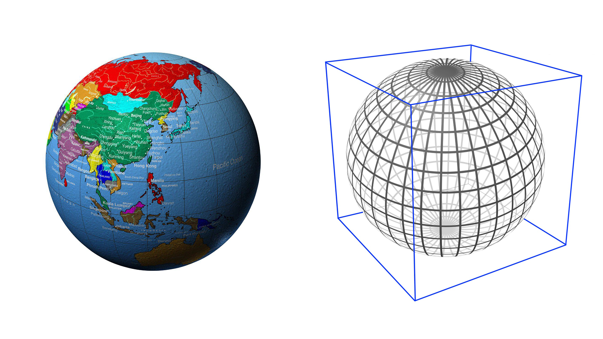
</p>


Projection is performed from the center of the sphere outward onto each of the six faces of the circumscribed cube. S2 projects all points on the sphere onto the six faces of this circumscribed cube.


Here is a simple projection diagram. The left side of the image above illustrates projection onto one face of the cube; the actual spherical region involved is shown on the right.


Viewed from the side, when one spherical region is projected onto one face of the cube, the angle between the lines connecting the edge and the center of the circle is 90°, but the angle relative to the x, y, and z axes is 45°. We can draw 45° auxiliary circles in the six directions of the sphere, as shown on the left in the following image.


The left side of the image above shows six auxiliary lines: the blue lines are the front/back pair, the red lines are the left/right pair, and the green lines are the top/bottom pair. Each represents the locus of points where the line from the center of the sphere at 45° intersects the sphere. With this, we can draw the spherical regions projected onto the six faces of the circumscribed cube, as shown on the right in the image above.

After projecting onto the cube, we can unfold the cube.


There are many ways to unfold a cube. Regardless of how it is unfolded, the smallest unit is a square.

The above is S2's projection scheme. Next, let's look at other projection schemes.

First, there is the following approach, which combines triangles and squares.


Its unfolded view looks like this:


This approach is actually quite complex, because the sub-shapes consist of two different kinds of shapes. Coordinate conversion is somewhat more complicated.

Another approach is to compose everything entirely from triangles. With this method, the more triangles there are, the closer the shape approximates a sphere.


<p align='center'>
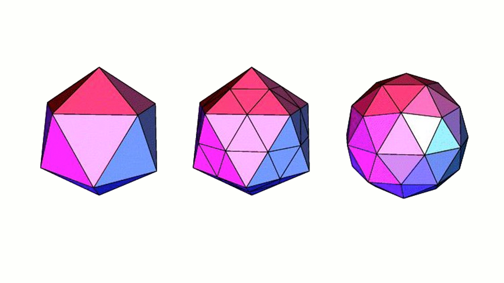
</p>


The leftmost image above is composed of 20 triangles. You can see that it has many sharp corners and differs significantly from a sphere. As the number of triangles increases, it gets closer and closer to a sphere.


After unfolding the 20 triangles, it might look like this.

The final approach may currently be the best one, though it may also be the most complex: projecting with hexagons.


Hexagons have relatively few sharp corners, and their six sides can connect to other hexagons. From the rightmost image above, you can see that once there are enough hexagons, the result is very close to a sphere.


After unfolding the hexagons, it looks like the image above. Of course, there are only 12 hexagons here. The more hexagons there are, the better; the finer the granularity, the closer it gets to a sphere.

In a public talk, Uber mentioned that they use a hexagonal grid to divide a city into many hexagons. This part was probably developed in-house. Perhaps Didi also uses hexagonal partitioning; or perhaps Didi has an even better partitioning scheme.


In Google S2, the Earth is unfolded as follows:

<p align='center'>

</p>


If the six unfolded faces above are all represented using a 5th-order Hilbert curve, the six faces would look like this:

<p align='center'>

</p>

<p align='center'>

</p>

<p align='center'>

</p>

<p align='center'>

</p>

<p align='center'>

</p>

<p align='center'>

</p>


Returning to S2, S2 uses squares. In this way, the spherical coordinates from the first step are further converted as f(x,y,z) -> g(face,u,v). face is one of the six square faces, and u and v correspond to the x and y coordinates on one of those six faces.

### 3. Spherical Rectangle Projection Correction


<p align='center'>
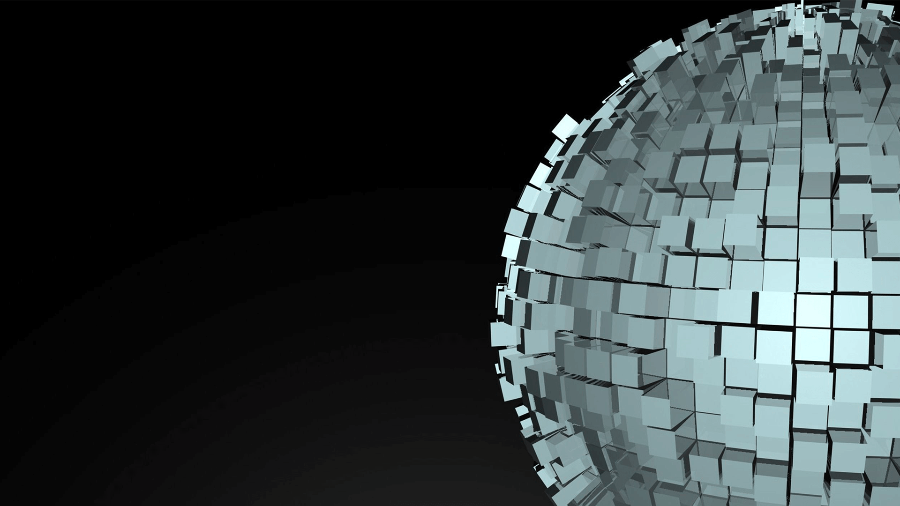
</p>


In the previous step, we projected a spherical rectangle on the sphere onto one face of the square, producing a shape that resembles a rectangle. However, because the angles on the sphere differ, even when projected onto the same face, the area of each rectangle will not be exactly the same.


The image above shows a spherical rectangle on the sphere projected onto one face of the square.


Actual calculations show that the largest area differs from the smallest area by a factor of 5.2. See the left side of the image above. The same angular interval, when projected onto the square at different latitudes, results in different areas.

Now we need to correct the areas of the projected shapes. Choosing an appropriate mapping correction function becomes the key. The goal is to achieve something like the right side of the image above, making the areas of the rectangles as similar as possible.

The code for this transformation is explained in detail only in the C++ version; the Go version only mentions it briefly. This left the author confused for quite a while.

|  | Area Ratio| Edge Ratio|Diagonal Ratio |ToPointRaw |ToPoint |FromPoint |
|:-------:|:-------:|:------:|:------:|:------:|:------:|:------:|
|Linear transform|5.200  | 2.117 |  2.959   |   0.020  |   0.087 |    0.085|
|tan() transform|1.414 | 1.414 |  1.704 |     0.237 |    0.299 |    0.258|
|Quadratic transform|2.082  | 1.802 |  1.932  |    0.033 |    0.096 |    0.108|

The linear transform is the fastest transform, but it has the smallest amount of correction. The tan() transform can make the areas of the projected rectangles more consistent: the ratio between the largest and smallest rectangles differs by only 0.414. It can be considered very close. However, calls to the tan() function take a long time. If all points were computed this way, performance would drop by a factor of 3.

In the end, Google chose the quadratic transform, which is a projection curve that approximates the tangent curve. Its computation speed is much faster than tan(), roughly 3 times as fast as tan() computation. The resulting projected rectangle sizes are also similar. However, the largest rectangle still has a ratio of 2.082 compared with the smallest rectangle.


In the table above, ToPoint and FromPoint are respectively the number of milliseconds required to convert a unit vector to a Cell ID, and the number of milliseconds required to convert a Cell ID back to a unit vector. (A Cell ID is the ID of a rectangle on one of the six faces of the projected cube; the rectangle is called a Cell, and its corresponding ID is called a Cell ID.) ToPointRaw is the number of milliseconds required, for a certain purpose, to convert a Cell ID into a non-unit vector.


In S2, the default transform is the quadratic transform.
```c

#define S2_PROJECTION S2_QUADRATIC_PROJECTION

```
Let’s take a closer look at how these three conversions are actually performed.
```c

#if S2_PROJECTION == S2_LINEAR_PROJECTION

inline double S2::STtoUV(double s) {
  return 2 * s - 1;
}

inline double S2::UVtoST(double u) {
  return 0.5 * (u + 1);
}

#elif S2_PROJECTION == S2_TAN_PROJECTION

inline double S2::STtoUV(double s) {
  // Unfortunately, tan(M_PI_4) is slightly less than 1.0.  This isn't due to
  // a flaw in the implementation of tan(), it's because the derivative of
  // tan(x) at x=pi/4 is 2, and it happens that the two adjacent floating
  // point numbers on either side of the infinite-precision value of pi/4 have
  // tangents that are slightly below and slightly above 1.0 when rounded to
  // the nearest double-precision result.

  s = tan(M_PI_2 * s - M_PI_4);
  return s + (1.0 / (GG_LONGLONG(1) << 53)) * s;
}

inline double S2::UVtoST(double u) {
  volatile double a = atan(u);
  return (2 * M_1_PI) * (a + M_PI_4);
}

#elif S2_PROJECTION == S2_QUADRATIC_PROJECTION

inline double S2::STtoUV(double s) {
  if (s >= 0.5) return (1/3.) * (4*s*s - 1);
  else          return (1/3.) * (1 - 4*(1-s)*(1-s));
}

inline double S2::UVtoST(double u) {
  if (u >= 0) return 0.5 * sqrt(1 + 3*u);
  else        return 1 - 0.5 * sqrt(1 - 3*u);
}

#else

#error Unknown value for S2_PROJECTION

#endif

```
The handling of `tan(M_PI_4)` above is due to precision issues, which make it slightly less than `1.0`.

Therefore, after projection, the three transformations in the correction function should be as follows:
```c

// Linear transform
u = 0.5 * ( u + 1)

// tan() transform
u = 2 / pi * (atan(u) + pi / 4) = 2 * atan(u) / pi + 0.5

// Quadratic transform
u >= 0，u = 0.5 * sqrt(1 + 3*u)
u < 0,    u = 1 - 0.5 * sqrt(1 - 3*u)

```
Note that although the transformation formula above only shows `u`, this does not mean that only `u` is transformed. In actual use, both `u` and `v` are passed in separately, and both are transformed.

In the Go version, this correction function directly implements only the quadratic transformation. The other two transformation methods are not mentioned anywhere in the entire library.
```go

// stToUV converts an s or t value to the corresponding u or v value.
// This is a non-linear transformation from [-1,1] to [-1,1] that
// attempts to make the cell sizes more uniform.
// This uses what the C++ version calls 'the quadratic transform'.
func stToUV(s float64) float64 {
	if s >= 0.5 {
		return (1 / 3.) * (4*s*s - 1)
	}
	return (1 / 3.) * (1 - 4*(1-s)*(1-s))
}

// uvToST is the inverse of the stToUV transformation. Note that it
// is not always true that uvToST(stToUV(x)) == x due to numerical
// errors.
func uvToST(u float64) float64 {
	if u >= 0 {
		return 0.5 * math.Sqrt(1+3*u)
	}
	return 1 - 0.5*math.Sqrt(1-3*u)
}

```
After the correction transform, both u and v are transformed into s and t. The value range also changes. The range of u and v is [-1, 1]; after the transform, the range of s and t is [0, 1].

So far, to summarize: a point on the sphere S(lat,lng) -> f(x,y,z) -> g(face,u,v) -> h(face,s,t). There have been four conversion steps in total: converting spherical latitude/longitude coordinates into spherical xyz coordinates, then converting them into coordinates on the projection face of the circumscribed cube, and finally transforming them into the corrected coordinates.

Up to this point, there are two possible optimizations for S2: first, can the projection shape be changed to a hexagon? Second, can we find a transform function with an effect similar to tan(), but with a computation speed far higher than tan(), so that it does not affect computational performance?

### 4. Converting Between Points and Coordinate-Axis Points

In the S2 algorithm, the default Cell subdivision level is 30, meaning a square is divided into 2^30 * 2^30 small squares.

So how should the s and t from the previous step be mapped onto this square?


The range of s and t is [0, 1], and now the range needs to be expanded to [0, 2^30^-1].
```go

// stToIJ converts value in ST coordinates to a value in IJ coordinates.
func stToIJ(s float64) int {
	return clamp(int(math.Floor(maxSize*s)), 0, maxSize-1)
}

```
The C++ implementation is the same as well.
```c

inline int S2CellId::STtoIJ(double s) {
  // Converting from floating-point to integers via static_cast is very slow
  // on Intel processors because it requires changing the rounding mode.
  // Rounding to the nearest integer using FastIntRound() is much faster.
  // Subtract 0.5 here for rounding
  return max(0, min(kMaxSize - 1, MathUtil::FastIntRound(kMaxSize * s - 0.5)));
}

```
At this step, we have h(face,s,t) -> H(face,i,j).

### 5. Converting Between Coordinate Points and Hilbert Curve Cell IDs

In the final step, how do we associate i, j with points on the Hilbert curve?
```go

const (
	lookupBits = 4
	swapMask   = 0x01
	invertMask = 0x02
)

var (
	ijToPos = [4][4]int{
		{0, 1, 3, 2}, // canonical order
		{0, 3, 1, 2}, // axes swapped
		{2, 3, 1, 0}, // bits inverted
		{2, 1, 3, 0}, // swapped & inverted
	}
	posToIJ = [4][4]int{
		{0, 1, 3, 2}, // canonical order:    (0,0), (0,1), (1,1), (1,0)
		{0, 2, 3, 1}, // axes swapped:       (0,0), (1,0), (1,1), (0,1)
		{3, 2, 0, 1}, // bits inverted:      (1,1), (1,0), (0,0), (0,1)
		{3, 1, 0, 2}, // swapped & inverted: (1,1), (0,1), (0,0), (1,0)
	}
	posToOrientation = [4]int{swapMask, 0, 0, invertMask | swapMask}
	lookupIJ         [1 << (2*lookupBits + 2)]int
	lookupPos        [1 << (2*lookupBits + 2)]int
)

```
Before the transformation, let’s first explain a few of the defined variables.

posToIJ represents a matrix that records the position information for certain unit Hilbert curves.

The information in the posToIJ array is illustrated below:


Similarly, the information in the ijToPos array is illustrated below:


The posToOrientation array contains four numbers: 1, 0, 0, and 3.
lookupIJ and lookupPos are two arrays with a capacity of 1024. They correspond respectively to the lookup table for converting a Hilbert curve ID to IJ coordinates, and the lookup table for converting IJ coordinates to a Hilbert curve ID.
```go


func init() {
	initLookupCell(0, 0, 0, 0, 0, 0)
	initLookupCell(0, 0, 0, swapMask, 0, swapMask)
	initLookupCell(0, 0, 0, invertMask, 0, invertMask)
	initLookupCell(0, 0, 0, swapMask|invertMask, 0, swapMask|invertMask)
}

```
This is the recursive initialization function. In the standard ordering of a Hilbert curve, there are four cells, and each cell has an order, so initialization must iterate through all positions in that order. The fourth input parameter ranges from 0 to 3.
```go

// initLookupCell initializes the lookupIJ table at init time.
func initLookupCell(level, i, j, origOrientation, pos, orientation int) {

	if level == lookupBits {
		ij := (i << lookupBits) + j
		lookupPos[(ij<<2)+origOrientation] = (pos << 2) + orientation
		lookupIJ[(pos<<2)+origOrientation] = (ij << 2) + orientation
	
		return
	}

	level++
	i <<= 1
	j <<= 1
	pos <<= 2
	
	r := posToIJ[orientation]
	
	initLookupCell(level, i+(r[0]>>1), j+(r[0]&1), origOrientation, pos, orientation^posToOrientation[0])
	initLookupCell(level, i+(r[1]>>1), j+(r[1]&1), origOrientation, pos+1, orientation^posToOrientation[1])
	initLookupCell(level, i+(r[2]>>1), j+(r[2]&1), origOrientation, pos+2, orientation^posToOrientation[2])
	initLookupCell(level, i+(r[3]>>1), j+(r[3]&1), origOrientation, pos+3, orientation^posToOrientation[3])
}

```
The function above generates the Hilbert curve. We can see an operation on ` pos << 2 `; this transforms the position into the first four small cells, so the position is multiplied by 4.

Because the initial `lookupBits = 4`, the ranges of i and j are [0,15], for a total of 16\*16=256. The i and j coordinates represent 4 cells, which are then subdivided further. When `lookupBits = 4`, the number of points that can be represented is 256\*4=1024. This is exactly the total capacity of lookupIJ and lookupPos.


Here is a local diagram where i and j range from 0 to 7.


The figure above shows a 4th-order Hilbert curve. The actual initialization process initializes the mapping table between the coordinates of the 1024 points on the 4th-order Hilbert curve and the x and y axes of the coordinate system.

For example, the table below shows the intermediate values generated during the recursion for i and j. The table below shows the computation process for the
 lookupPos table.

|(i,j)|ij  | ij computation|lookupPos[i j]|lookupPos[i j] computation| Actual coordinate |
|:-------:|:-------:|:------:|:------:|:------:|:------:|
|(0,0)|0|0  | 0 |  0  | (0,0)|
|(1,0)|64|(1\*16+0)\*4=64  | 5 |  1\*4+1=5  | (3,0)|
|(1,1)|68|(1\*16+1)\*4=68  | 9 |  2\*4+1=9  | (3,2)|
|(0,1)|4|(0\*16+1)\*4=4  | 14 |  3\*4+2=14  | (0,2)|
|(0,2)|8|(0\*16+2)\*4=8  | 17 |  4\*4+1=17  | (1,4)|
|(0,3)|12|(0\*16+3)\*4=12  | 20 |  5\*4+0=20  | (0,6)|
|(1,3)|76|(1\*16+3)\*4=76  | 24 |  6\*4+0=24  | (2,6)|
|(1,2)|72|(1\*16+2)\*4=72  | 31 |  7\*4+3=31  | (3,4)|
|(2,2)|136|(2\*16+2)\*4=136  | 33 |  8\*4+1=33  | (5,4)|

Take one row and analyze the computation process in detail.

Suppose the current (i,j)=(0,2). The computation of ij shifts i left by 4 bits and then adds j, and then shifts the overall result left by 2 bits. The purpose is to reserve 2 bits for the orientation position. The first 4 bits of ij are i, the next 4 bits are j, and the final 2 bits are the orientation. The computed value of ij is therefore 8.

Next, compute the value of lookupPos[i j]. From the figure above, we can see that the four numbers in the cell represented by (0,2) are 16, 17, 18, and 19. At this step, the value of pos is 4 (pos specifically records which generated cell we are at; in total, pos cycles from 0 to 255). pos represents the current cell number (where each cell consists of 4 small cells). The current one is the 4th cell, and each cell contains 4 small cells. So 4\*4 offsets us to the first number of the current cell, which is 16. The posToIJ array records the shape of the current cell. From it, we extract the orientation.

Looking at the figure above, 16, 17, 18, and 19 correspond to the axis-rotation case in the posToIJ array, so 17 is located in the cell represented by number 1 in the axis-rotation diagram. At this point, orientation = 1.

Thus the number represented by lookupPos[i j] is computed as 4\*4+1=17. This completes the mapping between i, j and the number on the Hilbert curve.

So how do we map a number on the Hilbert curve back to an actual coordinate?

The lookupIJ array records the reverse information. The information stored in the lookupIJ array and the lookupPos array is exactly inverse to each other. The value stored at an index in the lookupIJ array is the index in the lookupPos array. When we query the lookupIJ array, the value of lookupIJ[17] is 8, which corresponds to (i,j)=(0,2). At this point, i and j still refer to the larger cell. We still need to use the shape information described in the posToIJ array. The current shape is axis-rotated, and we already know that orientation = 1. Since each coordinate contains 4 small cells, one i, j represents 2 small cells. Therefore, we need to multiply by 2 and then add the orientation from the shape information. This gives the actual coordinate (0 \* 2 + 1 , 2 \* 2 + 0) = ( 1，4) .

At this point, the entire coordinate mapping for spherical coordinates is complete.

Point S(lat,lng) on the sphere -> f(x,y,z) -> g(face,u,v) -> h(face,s,t)  -> H(face,i,j) -> CellID. So far, there have been 6 conversion steps in total: spherical latitude/longitude coordinates are converted to spherical xyz coordinates, then to coordinates on the projection face of the circumscribed cube, then to corrected coordinates, followed by a coordinate-system transform that maps them to the [0,2^30^-1] interval. The final step maps all points in the coordinate system onto the Hilbert curve.

### 6. S2 Cell ID Data Structure


Finally, we need to discuss the S2 Cell ID data structure. This data structure is directly related to the precision corresponding to different Levels.


In the figure above, the left diagram corresponds to Level 30, and the right diagram corresponds to Level 24. (The exponent of 2 corresponds to the Level value.)


In S2, each CellID consists of 64 bits. It can be stored in a uint64. The first 3 bits indicate one of the 6 faces of the cube, with a value range of [0,5]. Three bits can represent 0-7, but 6 and 7 are invalid values.

The last bit of the 64 bits is 1, and this bit is deliberately reserved. It is used to quickly determine how many bits are in the middle. Starting from the last bit at the end and scanning forward, find the first position that is not 0—that is, the first 1. The bits from the bit before that one up to the 4th bit from the beginning (because the first 3 bits are occupied) are all usable numeric bits.

The number of green cells determines how many cells can be represented after subdivision. In the left diagram above, there are 60 green cells, so it can represent [0,2^30^ -1] * [0,2^30^ -1] cells. In the right diagram above, there are only 48 green cells, so it can only represent [0,2^24^ -1]*[0,2^24^ -1] cells.

So how large is the area of the grid represented by each different level?

From the previous chapter, we know that because of the projection, the areas after projection still differ in size.

The formula derived here is fairly complicated, so I will not prove it; see the documentation for details.
```

MinAreaMetric = Metric{2, 8 * math.Sqrt2 / 9} 
AvgAreaMetric = Metric{2, 4 * math.Pi / 6} 
MaxAreaMetric = Metric{2, 2.635799256963161491}

```
This shows the multiplicative relationship between the maximum/minimum areas and the average area.


(The units in the figure below are km^2^, i.e., square kilometers.)


| level | min area |  max area  |average area  |units  |Random cell 1 (UK) min edge length  |Random cell 1 (UK) max edge length  |Random cell 2 (US) min edge length |Random cell 2 (US) max edge length|Number of cells |
|:-------------: |:-------------:| :-----:| :-----:| :-----:| :-----:| :-----:| :-----:| :-----:| :-----:|
|00	|85011012.19	|85011012.19	|85011012.19	|km2	 	|7842 km	|7842 km	 |	7842 km	|7842 km	|6|
|01	|21252753.05	|21252753.05	|21252753.05	|km2	 	|3921 km	|5004 km	 	|3921 km	|5004 km	|24|
|02	|4919708.23	|6026521.16	|5313188.26	|km2	 	|1825 km	|2489 km	 	|1825 km	|2489 km	|96|
|03	|1055377.48	|1646455.50	|1328297.07	|km2	 |	840 km	|1167 km	 	|1130 km	|1310 km	|384|
|04	|231564.06	|413918.15	|332074.27	|km2	 	|432 km	|609 km	 	|579 km	|636 km	|1536|
|05	|53798.67	|104297.91	|83018.57	|km2	 	|210 km	|298 km	 	|287 km	|315 km	|6K|
|06	|12948.81	|26113.30	|20754.64	|km2	 	|108 km	|151 km	 |	143 km	|156 km	|24K|
|07	|3175.44	|6529.09	|5188.66	|km2	 	|54 km	|76 km	 	|72 km	|78 km	|98K|
|08	|786.20	|1632.45	|1297.17	|km2	 	|27 km	|38 km	 	|36 km	|39 km	|393K|
|09	|195.59	|408.12	|324.29	|km2	 	|14 km	|19 km	 |	18 km	|20 km	|1573K|
|10	|48.78	|102.03	|81.07	|km2	 	|7 km	|9 km	 	|9 km	|10 km	|6M|
|11	|12.18	|25.51	|20.27	|km2	 	|3 km	|5 km	 	|4 km	|5 km	|25M|
|12	|3.04	|6.38	|5.07	|km2	 	|1699 m	|2 km	 	|2 km	|2 km	|100M|
|13	|0.76	|1.59	|1.27	|km2	 	|850 m	|1185 m	 	|1123 m	|1225 m	|402M|
|14	|0.19	|0.40	|0.32	|km2	 	|425 m	|593 m	 	|562 m	|613 m	|1610M|
|15	|47520.30	|99638.93	|79172.67	|m2	 	|212 m	|296 m	 	|281 m	|306 m	|6B|
|16	|11880.08	|24909.73	|19793.17	|m2	 	|106 m	|148 m	 	|140 m	|153 m	|25B|
|17	|2970.02	|6227.43	|4948.29	|m2	 	|53 m	|74 m	 	|70 m	|77 m	|103B|
|18	|742.50	|1556.86	|1237.07	|m2	 	|27 m	|37 m	 	|35 m	|38 m	|412B|
|19	|185.63	|389.21	|309.27	|m2	 	|13 m	|19 m	 	|18 m	|19 m	|1649B|
|20	|46.41	|97.30	|77.32	|m2	 	|7 m	|9 m	 	|9 m	|10 m	|7T|
|21	|11.60	|24.33	|19.33	|m2	 	|3 m	|5 m	 	|4 m	|5 m	|26T|
|22	|2.90	|6.08	|4.83	|m2	 	|166 cm	|2 m	 	|2 m	|2 m	|105T|
|23	|0.73	|1.52	|1.21	|m2	 	|83 cm	|116 cm	 	|110 cm	|120 cm	|422T|
|24	|0.18	|0.38	|0.30	|m2	 	|41 cm	|58 cm	 	|55 cm	|60 cm	|1689T|
|25	|453.19	|950.23	|755.05	|cm2	 	|21 cm	|29 cm	 	|27 cm	|30 cm	|7e15|
|26	|113.30	|237.56	|188.76	|cm2	 	|10 cm	|14 cm	 	|14 cm	|15 cm	|27e15|
|27	|28.32	|59.39	|47.19	|cm2	 	|5 cm	|7 cm	 	|7 cm	|7 cm	|108e15|
|28	|7.08	|14.85	|11.80	|cm2	 	|2 cm	|4 cm	 	|3 cm	|4 cm	|432e15|
|29	|1.77	|3.71	|2.95	|cm2	 	|12 mm	|18 mm	 	|17 mm	|18 mm	|1729e15|
|30	|0.44	|0.93	|0.74	|cm2	 	|6 mm	|9 mm	 	|8 mm	|9 mm	|7e18|


Level 0 is one of the six faces of the cube. The Earth's surface area is approximately 510,100,000 km^2^. The area of level 0 is one sixth of the Earth's surface area. The smallest area that level 30 can represent is 0.48 cm^2^, and the largest is only 0.93 cm^2^.


### 7. S2 vs. Geohash


Geohash has 12 levels, ranging from 5000 km to 3.7 cm. The change from one level to the next is fairly large. Sometimes the next coarser level may be much too large, while the next finer level may be a bit too small. For example, choosing a string length of 4 corresponds to a cell width of 39.1 km, while the requirement might be 50 km. If you choose a string length of 5, the corresponding cell width becomes 156 km, suddenly more than 3 times larger. In this situation, it is hard to decide what Geohash string length to use. If the choice is poor, each check may also require fetching the 8 surrounding cells and checking again. Geohash requires 12 bytes of storage.


S2 has 30 levels, ranging from 0.7 cm² to 85,000,000 km². The change between adjacent levels is much smoother, close to a power-of-four curve. As a result, choosing a precision does not have the same difficulty as with Geohash. S2 only needs a single uint64 for storage.

The S2 library includes not only geocoding, but also many other libraries related to geometric computation. Geocoding is only a small part of it. There are many, many S2 implementations not covered in this article: vector computation, area computation, polygon covering, distance problems, and problems on spheres and spherical surfaces are all implemented.

S2 can also solve polygon-covering problems. For example, given a city, compute a polygon that just covers the city.


As shown above, the generated polygon just covers the blue area below. The generated polygons here can be larger or smaller. In any case, the final result still just covers the target object.


The same goal can also be achieved with cells of the same size. The figure above covers the entire city of São Paulo using cells at the same level.


These are things Geohash cannot do.


Polygon covering uses an approximate algorithm. Although it is not strictly an optimal solution, it works extremely well in practice.

One additional point worth noting is that Google's documentation emphasizes that although this polygon-covering algorithm is very useful for search and preprocessing operations, it is "not something to depend on." The reason is also that it is an approximate algorithm rather than a uniquely optimal one, so the solution obtained may change across different versions of the library.


### 8. S2 Cell Examples

First, let's look at converting between latitude/longitude and CellID, as well as computing the area of a rectangle.
```go

	latlng := s2.LatLngFromDegrees(31.232135, 121.41321700000003)
	cellID := s2.CellIDFromLatLng(latlng)
	cell := s2.CellFromCellID(cellID) //9279882742634381312

	// cell.Level()
	fmt.Println("latlng = ", latlng)
	fmt.Println("cell level = ", cellID.Level())
	fmt.Printf("cell = %d\n", cellID)
	smallCell := s2.CellFromCellID(cellID.Parent(10))
	fmt.Printf("smallCell level = %d\n", smallCell.Level())
	fmt.Printf("smallCell id = %b\n", smallCell.ID())
	fmt.Printf("smallCell ApproxArea = %v\n", smallCell.ApproxArea())
	fmt.Printf("smallCell AverageArea = %v\n", smallCell.AverageArea())
	fmt.Printf("smallCell ExactArea = %v\n", smallCell.ExactArea())


```
Here, the argument to the `Parent` method can directly specify the `CellID` at the corresponding level for that point.

The output printed by the methods above is as follows:
```go

latlng =  [31.2321350, 121.4132170]
cell level =  30
cell = 3869277663051577529

****Parent **** 10000000000000000000000000000000000000000
smallCell level = 10
smallCell id = 11010110110010011011110000000000000000000000000000000000000000
smallCell ApproxArea = 1.9611002454714756e-06
smallCell AverageArea = 1.997370817559429e-06
smallCell ExactArea = 1.9611009480261058e-06


```
Here’s another example of covering a polygon. First, we’ll create an arbitrary region.
```go

	rect = s2.RectFromLatLng(s2.LatLngFromDegrees(48.99, 1.852))
	rect = rect.AddPoint(s2.LatLngFromDegrees(48.68, 2.75))

	rc := &s2.RegionCoverer{MaxLevel: 20, MaxCells: 10, MinLevel: 2}
	r := s2.Region(rect.CapBound())
	covering := rc.Covering(r)


```
Set the covering parameters to levels 2 - 20, with a maximum of 10 Cells.


Next, we change the maximum number of Cells to 20.


Finally, change it to 30.


As you can see, for the same level range, the more cells there are, the more accurately the target area is covered.

This is for matching a rectangular region; matching a circular region works the same way.


I won’t include the code here; it’s similar to the rectangular case. Geohash cannot provide this kind of functionality, so you have to implement it manually.


Finally, here is an example of polygon matching.
```go


func testLoop() {

	ll1 := s2.LatLngFromDegrees(31.803269, 113.421145)
	ll2 := s2.LatLngFromDegrees(31.461846, 113.695803)
	ll3 := s2.LatLngFromDegrees(31.250756, 113.756228)
	ll4 := s2.LatLngFromDegrees(30.902604, 113.997927)
	ll5 := s2.LatLngFromDegrees(30.817726, 114.464846)
	ll6 := s2.LatLngFromDegrees(30.850743, 114.76697)
	ll7 := s2.LatLngFromDegrees(30.713884, 114.997683)
	ll8 := s2.LatLngFromDegrees(30.430111, 115.42615)
	ll9 := s2.LatLngFromDegrees(30.088491, 115.640384)
	ll10 := s2.LatLngFromDegrees(29.907713, 115.656863)
	ll11 := s2.LatLngFromDegrees(29.783833, 115.135012)
	ll12 := s2.LatLngFromDegrees(29.712295, 114.728518)
	ll13 := s2.LatLngFromDegrees(29.55473, 114.24512)
	ll14 := s2.LatLngFromDegrees(29.530835, 113.717776)
	ll15 := s2.LatLngFromDegrees(29.55473, 113.3772)
	ll16 := s2.LatLngFromDegrees(29.678892, 112.998172)
	ll17 := s2.LatLngFromDegrees(29.941039, 112.349978)
	ll18 := s2.LatLngFromDegrees(30.040949, 112.025882)
	ll19 := s2.LatLngFromDegrees(31.803269, 113.421145)

	point1 := s2.PointFromLatLng(ll1)
	point2 := s2.PointFromLatLng(ll2)
	point3 := s2.PointFromLatLng(ll3)
	point4 := s2.PointFromLatLng(ll4)
	point5 := s2.PointFromLatLng(ll5)
	point6 := s2.PointFromLatLng(ll6)
	point7 := s2.PointFromLatLng(ll7)
	point8 := s2.PointFromLatLng(ll8)
	point9 := s2.PointFromLatLng(ll9)
	point10 := s2.PointFromLatLng(ll10)
	point11 := s2.PointFromLatLng(ll11)
	point12 := s2.PointFromLatLng(ll12)
	point13 := s2.PointFromLatLng(ll13)
	point14 := s2.PointFromLatLng(ll14)
	point15 := s2.PointFromLatLng(ll15)
	point16 := s2.PointFromLatLng(ll16)
	point17 := s2.PointFromLatLng(ll17)
	point18 := s2.PointFromLatLng(ll18)
	point19 := s2.PointFromLatLng(ll19)

	points := []s2.Point{}
	points = append(points, point19)
	points = append(points, point18)
	points = append(points, point17)
	points = append(points, point16)
	points = append(points, point15)
	points = append(points, point14)
	points = append(points, point13)
	points = append(points, point12)
	points = append(points, point11)
	points = append(points, point10)
	points = append(points, point9)
	points = append(points, point8)
	points = append(points, point7)
	points = append(points, point6)
	points = append(points, point5)
	points = append(points, point4)
	points = append(points, point3)
	points = append(points, point2)
	points = append(points, point1)

	loop := s2.LoopFromPoints(points)

	fmt.Println("----  loop search (gets too much) -----")
	// fmt.Printf("Some loop status items: empty:%t   full:%t \n", loop.IsEmpty(), loop.IsFull())

	// ref: https://github.com/golang/geo/issues/14#issuecomment-257064823
	defaultCoverer := &s2.RegionCoverer{MaxLevel: 20, MaxCells: 1000, MinLevel: 1}
	// rg := s2.Region(loop.CapBound())
	// cvr := defaultCoverer.Covering(rg)
	cvr := defaultCoverer.Covering(loop)

	// fmt.Println(poly.CapBound())
	for _, c3 := range cvr {
		fmt.Printf("%d,\n", c3)
	}
}


```
This uses the Loop class. The smallest unit for initializing this class is Point, and a Point is generated from latitude and longitude. **The most important thing to note is that a polygon is determined by the region on the left-hand side when traversing its vertices counterclockwise.**

If the points are accidentally ordered clockwise, then the polygon you define is actually the larger outer surface. In other words, everything on the sphere except the polygon you drew is considered the polygon you want.


For a concrete example, suppose the polygon we want to draw looks like this:


If we store the Points in clockwise order and use this clockwise array to initialize a Loop, a “strange” phenomenon occurs, as shown below:


The vertex in the upper-left corner of this image and the vertex in the lower-right corner coincide on the Earth. If this map were restored back onto the sphere, it would be equivalent to hollowing out a polygon from the middle of the entire sphere.

Zooming in on the image above, we get the following:


Now it is very clear that a polygon has been hollowed out in the middle. The reason this happens is that each point was stored in clockwise order. When initializing a Loop, this causes the larger polygon around the outside to be selected.

When using Loop, you must remember: **clockwise represents the outer polygon, while counterclockwise represents the inner polygon.**

The issue of polygon covering is the same as in the previous examples:

With the same MaxLevel = 20 and MinLevel = 1, different MaxCells values produce different covering precision. The following image shows the case where MaxCells = 100:


The following image shows the case where MaxCells = 1000:


From this example, we can also see that for the same Level range, the larger MaxCells is, the higher the covering precision.


### 9. Applications of S2


S2 is mainly useful in the following eight areas:

1. Representing angles, intervals, latitude-longitude points, unit vectors, and so on, as well as performing various operations on these types.  
2. Geometric shapes on the unit sphere, such as spherical caps (“disks”), latitude-longitude rectangles, polylines, and polygons.  
3. Powerful construction operations, such as union, and boolean predicates, such as containment, for arbitrary collections of points, polylines, and polygons.  
4. Fast in-memory indexing of collections of points, polylines, and polygons.  
5. Algorithms for measuring distances and finding nearby objects.  
6. Robust algorithms for snapping and simplifying geometry, with precision and topology guarantees.  
7. A collection of efficient and exact mathematical predicates for testing relationships between geometric objects.  
8. Support for spatial indexing, including approximating regions as collections of discrete “S2 cells”. This makes it easy to build large-scale distributed spatial indexes.  

The final point, spatial indexing, is likely very widely used in industrial production.

S2 is currently used in many places, especially in map-related businesses. Google Maps directly uses S2 extensively; readers can experience for themselves how fast it is. Uber also uses the S2 algorithm when searching for the nearest taxi. The example scenario is the one mentioned in the introduction to this article. Didi probably has related applications as well, and may even have better solutions. The currently popular bike-sharing services also use these spatial indexing algorithms.

Finally, the food delivery industry is also closely tied to maps. Meituan and Ele.me probably have many applications in this area as well. As for exactly where they are used, I will leave that to the reader’s imagination.

Of course, S2 is not suitable for every scenario:

1. Planar geometry problems, for which there are many mature existing planar geometry libraries to choose from. 
2. Converting common formats to/from GIS formats. To read such formats, use external libraries such as [OGR](http://gdal.org/1.11/ogr/). 


## 5. Conclusion


This article focused on the basic implementation of Google’s S2 algorithm. Although Geohash is also a spatial point indexing algorithm, its performance is slightly inferior to Google’s S2. In addition, databases from major companies have basically started adopting Google’s S2 algorithm for indexing.

There is actually another broad class of problems in spatial search: how do we search multidimensional spatial lines, multidimensional spatial surfaces, and multidimensional spatial polygons? They are all composed of countless spatial points. Real-world examples include streets, high-rise buildings, railways, and rivers. To search these things, how should database tables be designed? How can efficient search be achieved? Can we still use a B+ tree?

The answer is, of course, that efficient search can also be implemented. For that, we need to use an R-tree, or an R-tree together with a B+ tree.

This part is outside the scope of this article. When I have time, I may share another article titled “Multidimensional Spatial Polygon Indexing Algorithms”.

Finally, I welcome everyone’s feedback.

------------------------------------------------------

Articles in the spatial search series:

[Understanding n-dimensional space and n-dimensional spacetime](https://github.com/halfrost/Halfrost-Field/blob/master/contents-en/Go/n-dimensional_space_and_n-dimensional_space-time.md)  
[Efficient multidimensional spatial point indexing algorithms — Geohash and Google S2](https://github.com/halfrost/Halfrost-Field/blob/master/contents-en/Go/go_spatial_search.md)  
[How is CellID generated in Google S2?](https://github.com/halfrost/Halfrost-Field/blob/master/contents-en/Go/go_s2_CellID.md)     
[Finding the LCA in the quadtree in Google S2](https://github.com/halfrost/Halfrost-Field/blob/master/contents-en/Go/go_s2_lowest_common_ancestor.md)  
[The magical De Bruijn sequence](https://github.com/halfrost/Halfrost-Field/blob/master/contents-en/Go/go_s2_De_Bruijn.md)  
[How to find Hilbert curve neighbors on a quadtree?](https://github.com/halfrost/Halfrost-Field/blob/master/contents-en/Go/go_s2_Hilbert_neighbor.md)


------------------------------------------------------

Reference:  
[Z-order curve](https://en.wikipedia.org/wiki/Z-order_curve)  
[Geohash wikipedia](https://en.wikipedia.org/wiki/Geohash)  
[Geohash-36](https://en.wikipedia.org/wiki/Geohash-36)  
[Geohash online demo](http://geohash.gofreerange.com/)  
[Geohash query](http://www.movable-type.co.uk/scripts/geohash.html)  
[Geohash Converter](http://geohash.co/)   
[Space-filling curve](https://en.wikipedia.org/wiki/Space-filling_curve)  
[List of fractals by Hausdorff dimension](https://en.wikipedia.org/wiki/List_of_fractals_by_Hausdorff_dimension)  
[YouTube video introducing the Hilbert curve](https://www.youtube.com/watch?v=3s7h2MHQtxc)  
[Hilbert curve online demo](http://bit-player.org/extras/hilbert/hilbert-mapping.html)  
[Hilbert curve paper](http://www4.ncsu.edu/~njrose/pdfFiles/HilbertCurve.pdf)  
[Mapping the Hilbert curve](http://bit-player.org/2013/mapping-the-hilbert-curve)  
[Official Google S2 PPT](https://docs.google.com/presentation/d/1Hl4KapfAENAOf4gv-pSngKwvS_jwNVHRPZTTDzXXn6Q/view#slide=id.i22)  
[Go version of the S2 source code github.com/golang/geo](https://github.com/golang/geo)  
[Java version of the S2 source code github.com/google/s2-geometry-library-java](https://github.com/google/s2-geometry-library-java)  
[L’Huilier’s Theorem](http://numerical.recipes/whp/HuiliersTheorem.pdf)


> GitHub Repo: [Halfrost-Field](https://github.com/halfrost/Halfrost-Field)
> 
> Follow: [halfrost · GitHub](https://github.com/halfrost)
>
> Source: [https://halfrost.com/go\_spatial_search/](https://halfrost.com/go_spatial_search/)