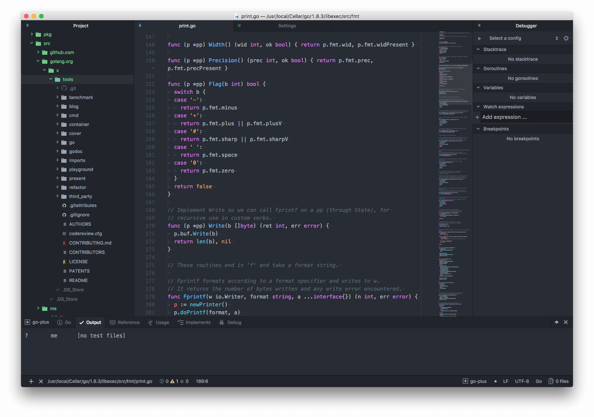

# A Beginner's Roadmap for Growing with Go

## 📖 Open-Source Books

| Book Title | URL | Why Recommended |
|:-------:|:-------:|:------|
| A Tour of Go | [https://tour.go-zh.org/](https://tour.go-zh.org/) |A playground for beginners to get familiar with Go syntax. You do not need to set up a local Go environment; you can write Go code online.|
| Go Best Practices | [https://github.com/astaxie/go-best-practice](https://github.com/astaxie/go-best-practice) | This book is not finished yet, but it has covered most of the fundamentals. The author is [@astaxie](https://github.com/astaxie), the author of the well-known open-source Go project beego. His best practices are well worth reading.|
| Go Web Programming  | [https://github.com/astaxie/build-web-application-with-golang/blob/master/zh/preface.md](https://github.com/astaxie/build-web-application-with-golang/blob/master/zh/preface.md)     [GitBook address](https://wizardforcel.gitbooks.io/build-web-application-with-golang/content/) | The author of this book is also [@astaxie](https://github.com/astaxie), the author of the previous book. It explains everything in great detail, from setting up the development environment to building a Web application. These two books by [@astaxie](https://github.com/astaxie) are well worth studying and reading in depth. This book has been fully completed.|
| Go Command Tutorial | [https://github.com/hyper0x/go\_command\_tutorial](https://github.com/hyper0x/go_command_tutorial) | Examples from the book Go Concurrent Programming in Practice by Hao Lin.|
| The Way to Go  | [https://github.com/Unknwon/the-way-to-go_ZH_CN/blob/master/eBook/directory.md](https://github.com/Unknwon/the-way-to-go_ZH_CN/blob/master/eBook/directory.md) | This book is also very suitable for beginners. However, after reading the books above, you can skim through some of the earlier fundamentals fairly quickly. The main parts to focus on are advanced programming and practical applications. |
| The Go Programming Language |[http://docs.ruanjiadeng.com/gopl-zh/index.html](http://docs.ruanjiadeng.com/gopl-zh/index.html)  | This book is the Chinese translation of the well-known Go book [The Go Programming Language](http://www.gopl.io/). If you do not like translated books, you can read the original directly. |
|Go by Example| [https://gobyexample.com/](https://gobyexample.com/) | I recommend this site because it has many examples worth studying for beginners. It can serve as a place for beginners to “copy” code—in other words, to learn from examples.|
| Go-SCP | [https://checkmarx.gitbooks.io/go-scp/content/](https://checkmarx.gitbooks.io/go-scp/content/) | This book is about Go security. I have not read it yet, so why put it here? Because my boss recommended it 🤓|

----------------------------------------

## 🖥 Editors/IDEs

### 1. Vim Users

Vim users certainly do not need an IDE—just Vim + Vim-go (or Emacs).

### 2. Text Editor + Plugins

The most commonly used and popular text editors today include VSCode, Sublime, and Atom.

They can all install the corresponding plugins to support Go development. I am currently using Atom + go-plus; the UI is fairly nice, as shown below:

### 3. IDE

The IDEs used more often today include IntelliJ idea, Goland, and LiteIDE.

---------------------------------

## 💪 Learning Websites

| Website | URL | Why Recommended |
|:-------:|:-------:|:------|
| The Go Programming Language | [https://golang.org/](https://golang.org/) | Go's official website|
| Go Programming Language | [https://go-zh.org/](https://go-zh.org/) | The Chinese website corresponding to the official Go site|
| The Go Blog | [https://blog.golang.org/](https://blog.golang.org/) | Go's official blog|
| The Go Packages | [https://golang.org/pkg/](https://golang.org/pkg/) | Official documentation for Go packages|
| Chinese Documentation for the Go Standard Library|[http://cngolib.com/](http://cngolib.com/)| Chinese documentation for the Go standard library|
| Golang Tutorial Series|[https://golangbot.com/learn-golang-series/](https://golangbot.com/learn-golang-series/)| A high-quality Go tutorial series from overseas|
| Learn Go with Tests|[https://quii.gitbook.io/learn-go-with-tests](https://quii.gitbook.io/learn-go-with-tests)| Learn the Go language through test-driven development|

---------------------------------

## 💿 Videos

This depends on the person. Some people do not like reading documentation, or sometimes get tired of reading docs and want to watch videos instead. I have watched the beginning of the videos below and think they are decent, but I did not continue watching the rest because I felt learning through videos was a bit slow. I still prefer reading books and grinding exercises~🙄

| Website | URL | Why Recommended |
|:-------:|:-------:|:------|  
|Go Programming Fundamentals| [https://github.com/Unknwon/go-fundamental-programming](https://github.com/Unknwon/go-fundamental-programming) |This video series is suitable for beginners.|
|Go Web Fundamentals|[https://github.com/Unknwon/go-web-foundation](https://github.com/Unknwon/go-web-foundation)|This is an audio/video tutorial series for the Go language produced by Google. It is mainly intended for learners who have completed the Go Programming Fundamentals tutorial and want to further understand Go Web development.|
|Explaining Popular Go Libraries|[https://github.com/Unknwon/go-rock-libraries-showcases](https://github.com/Unknwon/go-rock-libraries-showcases)|This is a comprehensive tutorial that evaluates and explains third-party libraries for the Go language produced by Google, combining blog posts, examples, and audio/video content. It is suitable for learners who have completed the Go Programming Fundamentals tutorial.|
|First Lesson in Go|[Course on imooc](http://www.imooc.com/learn/345)|The instructor of this course is Hao Lin. If you are a fan of his, you may not want to miss it.|

---------------------------------

## 🏆Community

| Go communities (in no particular order) |
|:-------|
|[https://gocn.io](https://gocn.io)|
|[http://studygolang.com](http://studygolang.com)|
|[http://www.golangtc.com](http://www.golangtc.com)|
|[http://www.golangweb.com](http://www.golangweb.com)|

---------------------------------

Finally, practice more and build more with Go. With enough effort, an iron pestle can be ground into a needle!

> GitHub Repo: [Halfrost-Field](https://github.com/halfrost/Halfrost-Field)
> 
> Follow: [halfrost · GitHub](https://github.com/halfrost)
>
> Source: [https://halfrost.com/new\_gopher/](https://halfrost.com/new_gopher/)