# vLLM Source Walkthrough: From `generate()` to the First Token

> Series baseline: [`vllm-project/vllm@6cf7b26bd`](https://github.com/vllm-project/vllm/tree/6cf7b26bd4bff60bf378e1af14044280ac0d214c). This article reads the V1 source at that pinned commit and cross-checks the vLLM engineering blogs and stable design docs. Code excerpts come from that commit; some excerpts elide unrelated lines to keep the focus, every elision is marked with `...`, and lines not marked as pseudocode match the source. Anchors are written `path:Lstart-Lend` and link to the pinned commit on GitHub.

## Why the Request Path Is the Right First Read

vLLM is a large system: fused attention kernels, a block-based KV cache manager, a continuous-batching scheduler, tensor/pipeline/data parallelism, speculative decoding. It is tempting to start at the kernel, because that is where the cleverness that made vLLM famous lives. That is the wrong first read. The kernel is a leaf; the *request path* is the trunk that gives every leaf its meaning. A PagedAttention kernel only ever sees a block table that some other layer built for it — read the kernel first and you are looking at the answer to a question you have not asked yet. Read one request end-to-end and every later subsystem stops being a free-floating optimization and becomes a named hop with an owner and an invariant.

The argument for *why the path matters at all* is a memory argument, and it is worth restating because it is the thing that makes the path more than plumbing. The launch post framed vLLM around a single bottleneck: LLM serving is memory-bound, dominated by KV cache memory, and PagedAttention exists to make that memory easy to allocate, share, and reuse ([launch](https://vllm.ai/blog/2023-06-20-vllm)). The SOSP paper formalizes the mechanism and reports a 2–4x throughput gain over prior systems such as FasterTransformer and Orca at comparable latency ([paper](https://arxiv.org/abs/2309.06180)). But notice where that memory management actually *happens*: not in the kernel, which merely dereferences a block table, but along the request path — where blocks are allocated on admission, shared via prefix caching, and freed on completion. The bottleneck that justifies vLLM's existence is only *legible* if you trace a request across those boundaries. That is the real reason to read the path first.

So the driving question for this whole article is the one the series opens with:

> How does `LLM.generate()` become one model forward pass and one sampled token?

<a href='images/vllm-01-01-request-flow.svg' target='_blank'>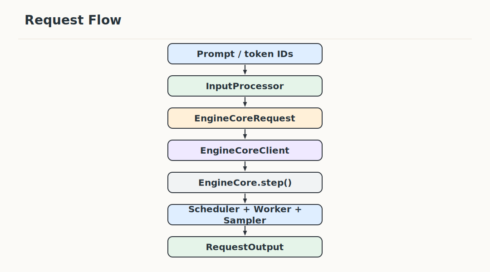</a>

<p class='figure-caption'>Request flow from the public `generate()` call down to one engine output, and back out as a `RequestOutput`.</p>

### The engine is four functions

Before any code, fix the vocabulary. The architecture overview describes the engine as four core functions, and this is the backbone of the entire series ([arch](https://docs.vllm.ai/en/stable/design/arch_overview/)):

> "Input Processing… Scheduling: 'Chooses which requests are processed in each step'… Model Execution: 'Manages the execution of the language model'… Output Processing: 'Processes the outputs generated by the model, decoding the token IDs'."

**Step-by-step read.** *Input processing* turns a raw prompt into an engine-shaped request — tokenization, multimodal preprocessing, parameter finalization (§3). *Scheduling* decides, each step, which requests run and how many tokens each gets (§7; deep dive article 05). *Model execution* runs the forward pass on the GPU and produces logits (§8–§9; articles 08–09). *Output processing* decodes token IDs back into user-visible text (§10; article 04). Every deep article downstream is a zoom into exactly one of these four functions, and the connective tissue between them is what article 01 exists to name.

**The mental model this framing buys.** This series adopts the four core responsibilities from the official architecture overview — input processing, scheduling, model execution, output processing — as its organizing frame (cross-cutting concerns like transport, cache management, and observability get their own treatment where they arise). When you later meet the prefix-cache hasher, the CUDA-graph replayer, or the async output handler, you can place each one under one of these headings and know which boundary it lives behind. The mental model is stable before you read a single kernel.

### Those four functions are one repeated transaction

Here is the idea that reorganizes everything. The four functions are not a pipeline you traverse once per request. Three of them — schedule, execute, process — are a single *transaction* that the engine runs over and over, once per "step", advancing the in-flight requests by a few tokens each turn, until each one finishes. This is not a metaphor. It is literally the body of one method.

[`vllm/v1/engine/core.py:479-508`](https://github.com/vllm-project/vllm/blob/6cf7b26bd4bff60bf378e1af14044280ac0d214c/vllm/v1/engine/core.py#L479-L508) (excerpt; §6 quotes the method in full):

```python
    def step(self) -> tuple[dict[int, EngineCoreOutputs], bool]:
        """Schedule, execute, and make output.

        Returns tuple of outputs and a flag indicating whether the model
        was executed.
        """
        ...
        scheduler_output = self.scheduler.schedule(self._should_throttle_prefills())
        future = self.model_executor.execute_model(scheduler_output, non_block=True)
        ...
            model_output = future.result()
        ...
        self._process_aborts_queue()
        engine_core_outputs = self.scheduler.update_from_output(
            scheduler_output, model_output
        )
        ...
```

<a href='images/vllm-01-11-step-progression.svg' target='_blank'>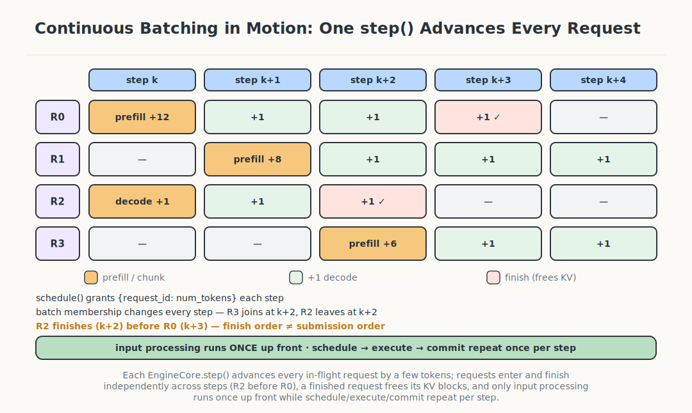</a>

<p class='figure-caption'>Continuous batching in motion: each `EngineCore.step()` advances the in-flight requests by a few tokens, and requests enter and finish independently across steps — three of the four functions (schedule, execute, commit) repeat once per step while input processing runs once up front.</p>

**Step-by-step read.** The docstring — "Schedule, execute, and make output" — is the whole architecture in four words. `schedule()` decides *how many tokens for which requests* without touching the GPU; `execute_model(..., non_block=True)` launches the forward pass and returns a `Future`, so the CPU can build the grammar bitmask *while the GPU computes*; `future.result()` is the synchronization point (and if execution deferred sampling, a separate `sample_tokens` call runs it); `_process_aborts_queue()` consumes any cancellation that arrived mid-frame *before* committing, so a request cancelled during the step is never advanced; and `update_from_output` folds the sampled tokens into request progress and frees the blocks of anything that finished. Those calls — plus the empty-scheduler guard that opens the method and counts finished-but-not-yet-flushed requests so the loop drains cleanly — are one transaction. §6 covers the line-by-line walkthrough (there: article 05 details `schedule()`, articles 08–09 cover `execute_model`, article 10 handles sampling, article 04 explains the loop mechanics). Article 01's job is only to establish that this transaction *is* the engine.

**The invariant this protects.** Every public surface in vLLM — the offline `LLM.generate`, the OpenAI-compatible server, the async `AsyncLLM.generate` — is a thin adapter whose only job is to feed work into this transaction and adapt its outputs back out. `generate()` does not schedule tokens, allocate KV blocks, or run kernels; it validates inputs, assigns request IDs, and drains an engine that spins this exact loop. Internalize `step()` once and the shape of every entrypoint becomes predictable: they all reduce to "add a request, then pull outputs until finished."

### The path is a chain of ownership boundaries

Because the engine is one small transaction wrapped in adapters, the request path reads as a *chain of ownership boundaries*, each protecting one invariant. The public API owns validation, defaulting, and restoring input order. The input processor owns turning a prompt into an owned, fully-defaulted wire struct. The engine client owns a transport-agnostic surface. `EngineCore` owns the schedule/execute/commit transaction — but delegates all lifecycle state (which requests are waiting, running, or finished; who owns which blocks) to the scheduler. The scheduler owns token and memory decisions; the worker owns tensors and logits; the sampler owns token IDs; the output processor owns detokenization, stop strings, and the final `RequestOutput`. Each arrow between these owners is a later article. The value of naming them up front is that when a bug or a feature question arises — "who decides `max_tokens`?", "where does a stop string get detected?", "when are blocks freed?" — you already know which boundary to open.

### The path crosses processes, but the crossing is a deployment decision

The one complication article 01 must confront early is that these boundaries are not all in one process. V1 deliberately splits the four functions across processes so that CPU-bound work (tokenization, multimodal preprocessing, detokenization, streaming) overlaps with GPU-bound work ([v1](https://vllm.ai/blog/2025-01-27-v1-alpha-release), [arch](https://docs.vllm.ai/en/stable/design/arch_overview/)). The front-end process (`AsyncLLM`) handles HTTP, input processing, and streaming; the `EngineCore` process runs the scheduler, KV cache, and execution coordination; the workers run the forward pass. The concrete process count for a four-GPU tensor-parallel deployment is:

> 4-GPU TP=4 deployment = **1 API server + 1 engine core + 4 GPU workers = 6 processes** ([arch](https://docs.vllm.ai/en/stable/design/arch_overview/)); a DP Coordinator process is added under data parallelism.

That the same configuration reaches all six processes coherently is not luck — a single `VllmConfig` object is threaded through the whole stack: "By encapsulating all configurations in one object, we can easily pass the configuration object around and access the configuration we need" ([arch](https://docs.vllm.ai/en/stable/design/arch_overview/)).

Here is the connective-tissue payoff, and the reason you can read the request path as if it were single-process: the split does **not** leak into request semantics. `LLMEngine` holds exactly one handle to the engine, and the transport hides behind it.

[`vllm/v1/engine/llm_engine.py:104-111`](https://github.com/vllm-project/vllm/blob/6cf7b26bd4bff60bf378e1af14044280ac0d214c/vllm/v1/engine/llm_engine.py#L104-L111):

```python
        # EngineCore (gets EngineCoreRequests and gives EngineCoreOutputs)
        self.engine_core = EngineCoreClient.make_client(
            multiprocess_mode=multiprocess_mode,
            asyncio_mode=False,
            vllm_config=vllm_config,
            executor_class=executor_class,
            log_stats=self.log_stats,
        )
```

**Step-by-step read.** The comment states the whole contract: the client "gets `EngineCoreRequest`s and gives `EngineCoreOutputs`." `make_client` picks the realization once, at construction, from `multiprocess_mode`: an in-process object that calls `EngineCore` directly, or a client that serializes requests over a ZMQ socket to a busy-looping `EngineCore` process. After this line, nothing on the request path knows or cares which one it got — `add_request` and `get_output` have identical signatures on both. (One correction worth carrying: even the "offline" `LLM` defaults to the multiprocess client, because `VLLM_ENABLE_V1_MULTIPROCESSING` defaults to true; the in-process path is the opt-out, not the default. Article 03 covers the transport fork in detail.)

**What this protects.** The process boundary is a *deployment* decision, not a *semantic* one. Whether `EngineCore` is a local method call or a process behind a socket changes latency and failure modes, but not the meaning of a request. This is precisely what lets article 01 trace the path as a single logical thread — public API → input processor → `EngineCoreRequest` → client → `EngineCore.step` → scheduler → worker → sampler → output processor → `RequestOutput` — and defer the real ZMQ topology, DP routing, and parallelism to articles 03 and 11.

### How to read the rest of this article

Article 01 is a map, and each hop on that map is a later chapter that zooms in without duplication. The entrypoints that wrap `generate()` and the OpenAI server are article 02; the process architecture and ZMQ transport are 03; the `EngineCore` loop and request lifecycle are 04; the scheduler (continuous batching, chunked prefill) is 05; the KV cache manager is 06 and prefix caching is 07; the PagedAttention kernels and attention backends are 08; the worker, model runner, and CUDA graphs are 09; sampling and logits processing are 10; distributed inference is 11; speculative decoding is 12; extending vLLM is 13. Read this article once, end to end, to fix the shape and the vocabulary. Then treat every subsequent section as a legend for one box — the map stays the same; only the resolution changes.

## LLM.generate(): The Offline Convenience Layer

Starting at the top of the map (§1): `LLM.generate()` is the first ownership boundary in the request path, and it is deliberately boring. It does not schedule tokens, allocate KV blocks, or launch a single CUDA kernel. Its entire job is to validate the call, materialize concrete sampling parameters, mint request IDs, hand the work to the engine, and block until every result is back — then restore the caller's input order. Understanding precisely where that boundary sits, and which invariants it buys, is what lets the rest of this article treat everything below it as a black box that consumes `EngineCoreRequest`s and emits `RequestOutput`s.

The offline surface is really two files. `vllm/entrypoints/llm.py` owns validation and engine construction; `vllm/entrypoints/offline_utils.py` owns the render → add → drain spine. The `LLM` class itself is a façade assembled from mixins:

[`vllm/entrypoints/llm.py:66`](https://github.com/vllm-project/vllm/blob/6cf7b26bd4bff60bf378e1af14044280ac0d214c/vllm/entrypoints/llm.py#L66)

```python
class LLM(BeamSearchOfflineMixin, PoolingOfflineMixin, OfflineInferenceMixin):
```

<a href='images/vllm-01-12-facade-method-map.svg' target='_blank'>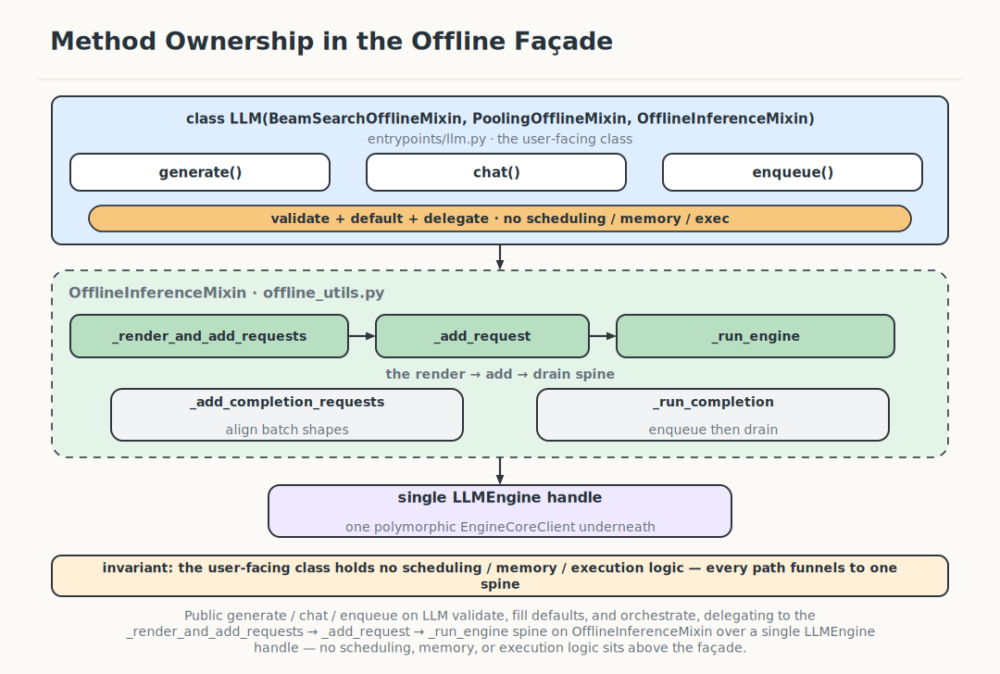</a>

<p class='figure-caption'>Method ownership in the offline façade: the public `generate` / `chat` / `enqueue` on `LLM` validate, fill defaults, and orchestrate, delegating to the `_render_and_add_requests → _add_request → _run_engine` spine on `OfflineInferenceMixin` over a single `LLMEngine` handle — no scheduling, memory, or execution logic sits above the façade.</p>

The public methods (`generate`, `chat`, `enqueue`) live on `LLM` and do validation, default-filling, and orchestration — `enqueue` really does enqueue, calling `_add_completion_requests()` to push requests into the engine queue and return their IDs ([`llm.py:487-530`](https://github.com/vllm-project/vllm/blob/6cf7b26bd4bff60bf378e1af14044280ac0d214c/vllm/entrypoints/llm.py#L487-L530)), and `generate`/`chat` delegate into the same render/add/drain path; the add-then-drain machinery itself lives on `OfflineInferenceMixin` in `offline_utils.py`. **Invariant:** the user-facing class contains no scheduling, memory-management, or execution logic — those responsibilities are strictly below the façade, and every path (`generate`, `chat`, pooling) converges on the same `_render_and_add_requests → _add_request → _run_engine` chain.

### Gate, default, delegate

`generate()` is three moves and a handoff:

[`vllm/entrypoints/llm.py:465-485`](https://github.com/vllm-project/vllm/blob/6cf7b26bd4bff60bf378e1af14044280ac0d214c/vllm/entrypoints/llm.py#L465-L485)

```python
        runner_type = self.model_config.runner_type
        if runner_type != "generate":
            raise ValueError(
                "LLM.generate() is only supported for generative models. "
                "Try passing `--runner generate` to use the model as a "
                "generative model."
            )

        if sampling_params is None:
            sampling_params = self.get_default_sampling_params()

        return self._run_completion(
            prompts=prompts,
            params=sampling_params,
            output_type=RequestOutput,
            use_tqdm=use_tqdm,
            lora_request=lora_request,
            tokenization_kwargs=tokenization_kwargs,
            priority=priority,
            mm_processor_kwargs=mm_processor_kwargs,
        )
```

Read it in order. First, a **runner-type gate**: the model must have been loaded as a generative runner, so a pooling/embedding model is rejected here, before any request object exists. Second, **default materialization**: if the caller passed `sampling_params=None`, `get_default_sampling_params()` ([`llm.py:415-420`](https://github.com/vllm-project/vllm/blob/6cf7b26bd4bff60bf378e1af14044280ac0d214c/vllm/entrypoints/llm.py#L415-L420)) pulls the model's own `generation_config` diff (`get_diff_sampling_param()`) or falls back to a bare `SamplingParams()`. Third, **delegation** to `_run_completion` with `output_type=RequestOutput` pinned as an argument.

Two invariants fall out. **Generative-only** is enforced twice — once by the gate above, and again at drain time by an `assert isinstance(output, output_type)` (below), so a stray pooling output would trip the assertion rather than silently escape. **Params are never `None` at delegation**: the render/add path downstream never has to defend against a missing `SamplingParams`. `chat()` is the same shape with the identical gate and default step; it differs only in that it renders through the chat template before joining this shared path — see article 02 for the entrypoint family (CLI, chat, and the OpenAI server) that all share it.

<a href='images/vllm-01-03-generate-layers.svg' target='_blank'>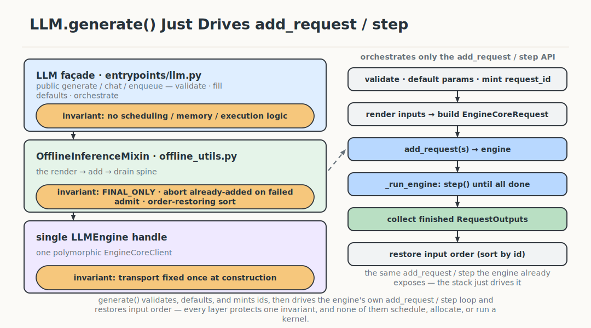</a>

<p class='figure-caption'>The offline stack — `LLM` façade (validate/default/ID) over `OfflineInferenceMixin` (render/add/drain) over the single `LLMEngine` handle; each layer names one invariant it protects.</p>

### Aligning the batch, then forcing FINAL_ONLY

`_run_completion` is two phases: enqueue everything, then block-drain the engine. Before a single request is admitted, `_add_completion_requests` normalizes the four positional inputs — prompts, params, LoRA, priority — into equal-length sequences. The scalar-broadcast-or-validate rule is the critical part:

[`vllm/entrypoints/offline_utils.py:247-256`](https://github.com/vllm-project/vllm/blob/6cf7b26bd4bff60bf378e1af14044280ac0d214c/vllm/entrypoints/offline_utils.py#L247-L256)

```python
        if isinstance(params, Sequence):
            if len(params) != num_requests:
                raise ValueError(
                    f"The lengths of prompts ({num_requests}) "
                    f"and params ({len(params)}) must be the same."
                )

            return params

        return [params] * num_requests
```

A single `SamplingParams` is broadcast to every prompt; a per-prompt list whose length does not equal the prompt count raises `ValueError` **before** any request is added. `_lora_request_to_seq` and `_priority_to_seq` follow the same shape. **The rule:** after this block, prompts/params/LoRA/priority are four positionally-aligned sequences of the same length — index `i` always refers to request `i`, so a prompt can never accidentally run under a neighbor's sampling params. (Prompts are then rendered *lazily*: they are passed to the add loop as a generator, so prompt `i+1` renders while the engine can already be working on prompt `i` (in the default multiprocess mode); passing a materialized list triggers a `warning_once`, [`offline_utils.py:504-512`](https://github.com/vllm-project/vllm/blob/6cf7b26bd4bff60bf378e1af14044280ac0d214c/vllm/entrypoints/offline_utils.py#L504-L512).)

Each aligned tuple reaches `_add_request`, which is where the offline path stamps its two signature decisions:

[`vllm/entrypoints/offline_utils.py:559-563`](https://github.com/vllm-project/vllm/blob/6cf7b26bd4bff60bf378e1af14044280ac0d214c/vllm/entrypoints/offline_utils.py#L559-L563)

```python
        if isinstance(params, SamplingParams):
            # We only care about the final output
            params.output_kind = RequestOutputKind.FINAL_ONLY

        request_id = str(next(self.request_counter))
```

First, **output kind is forced to `FINAL_ONLY`**, overwriting whatever the caller set. The enum makes the three modes explicit:

[`vllm/sampling_params.py:182-188`](https://github.com/vllm-project/vllm/blob/6cf7b26bd4bff60bf378e1af14044280ac0d214c/vllm/sampling_params.py#L182-L188)

```python
class RequestOutputKind(Enum):
    # Return entire output so far in every RequestOutput
    CUMULATIVE = 0
    # Return only deltas in each RequestOutput
    DELTA = 1
    # Do not return intermediate RequestOutput
    FINAL_ONLY = 2
```

<a href='images/vllm-01-13-output-kind-matrix.svg' target='_blank'>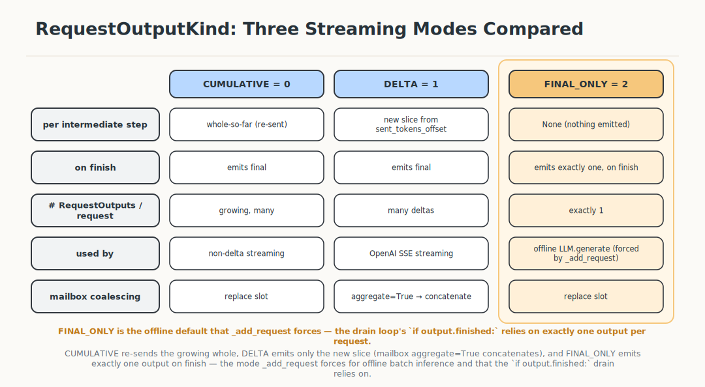</a>

<p class='figure-caption'>`RequestOutputKind` compared: `CUMULATIVE` re-sends the growing whole, `DELTA` emits only the new slice (with mailbox `aggregate=True`), and `FINAL_ONLY` emits exactly one output on finish — the mode `_add_request` forces for offline batch inference and that the drain loop's `if output.finished:` relies on.</p>

Offline batch inference does not stream; `FINAL_ONLY` tells the downstream `OutputProcessor` to emit a `RequestOutput` for a request exactly once, when it finishes. Note this mutates the caller's `SamplingParams` object in place (pooling params are not `SamplingParams`, so they are left alone). **The guarantee:** the engine surfaces each request's output a single time, on completion — which is precisely the assumption the drain loop's `if output.finished:` filter relies on.

Second, **request IDs are monotonic decimal strings** drawn from the `Counter()` created in `__init__`: `"0"`, `"1"`, `"2"`, … in submission order. That ordering is the hook the final sort will exploit.

One more admission-time guarantee wraps this: `_render_and_add_requests` catches any mid-batch exception and aborts every already-added request (`abort_request(..., internal=True)`) before re-raising ([`offline_utils.py:545-548`](https://github.com/vllm-project/vllm/blob/6cf7b26bd4bff60bf378e1af14044280ac0d214c/vllm/entrypoints/offline_utils.py#L545-L548)). **Invariant (atomicity):** either the whole batch enters the engine or a failure leaves zero requests from this call behind — no half-added batch can pollute the drain.

### The blocking drain and input-order restoration

With requests admitted, `generate()` becomes a synchronous driver loop over the engine's own step:

[`vllm/entrypoints/offline_utils.py:594-599, 623-626`](https://github.com/vllm-project/vllm/blob/6cf7b26bd4bff60bf378e1af14044280ac0d214c/vllm/entrypoints/offline_utils.py#L594-L599)

```python
        while self.llm_engine.has_unfinished_requests():
            step_outputs = self.llm_engine.step()
            for output in step_outputs:
                assert isinstance(output, output_type)
                if output.finished:
                    outputs.append(output)  # type: ignore[arg-type]
        ...
        # Sort the outputs by request ID.
        # This is necessary because some requests may be finished earlier than
        # its previous requests.
        return sorted(outputs, key=lambda x: int(x.request_id))
```

<a href='images/vllm-01-14-order-restore.svg' target='_blank'>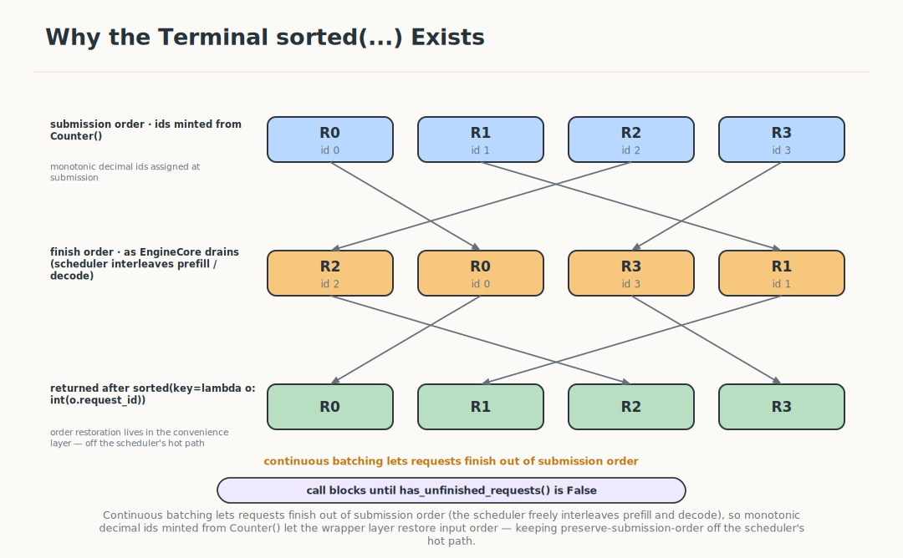</a>

<p class='figure-caption'>Why the terminal `sorted(...)` exists: continuous batching lets requests finish out of submission order (the scheduler freely interleaves prefill and decode), so monotonic decimal IDs minted from `Counter()` let the wrapper layer restore input order — keeping "preserve submission order" off the scheduler's hot path.</p>

Step by step: the loop condition is the *engine's* bookkeeping — `has_unfinished_requests()` is backed by the output processor ([`llm_engine.py:188-195`](https://github.com/vllm-project/vllm/blob/6cf7b26bd4bff60bf378e1af14044280ac0d214c/vllm/v1/engine/llm_engine.py#L188-L195)), not a local counter — so the just-registered work is immediately visible and the loop keeps stepping until nothing is outstanding. Each `llm_engine.step()` is one full schedule → execute → process-outputs cycle (that wrapper is covered in this article's engine-step section, and the `EngineCore` loop it drives in article 04). The `assert isinstance(output, output_type)` is the runtime companion to the front-door gate: with `output_type=RequestOutput`, a pooling output could never sneak through. Because params were forced `FINAL_ONLY`, `if output.finished:` collects each request exactly once. Finally, the results are `sorted` by integer request ID.

That terminal sort is the whole point of the monotonic IDs. Continuous batching *intentionally* lets a later request finish before an earlier one — the scheduler is free to interleave prefill and decode across the whole running set without regard to submission order. The comment at [`offline_utils.py:623-625`](https://github.com/vllm-project/vllm/blob/6cf7b26bd4bff60bf378e1af14044280ac0d214c/vllm/entrypoints/offline_utils.py#L623-L625) states the rationale verbatim. **Invariants:** the call is **blocking/synchronous** (it returns only when the engine reports no unfinished requests — the defining offline contract, versus the streaming `AsyncLLM`), and **output order equals input order** because IDs are assigned in submission order and the sort restores it at the wrapper layer. Order restoration lives here, in the convenience layer, so that the scheduler never has to treat "preserve submission order" as a GPU-hot-path constraint. Article 05 covers why that freedom matters for throughput.

### One user request may become n engine requests

The façade also holds the line on parallel sampling. When `SamplingParams.n > 1`, `LLMEngine.add_request` fans one logical request into `n` children, each with its own ID and child sampling params, but returns the *parent's* ID:

[`vllm/v1/engine/llm_engine.py:279-292`](https://github.com/vllm-project/vllm/blob/6cf7b26bd4bff60bf378e1af14044280ac0d214c/vllm/v1/engine/llm_engine.py#L279-L292)

```python
        # Fan out child requests (for n>1).
        parent_req = ParentRequest(request)
        for idx in range(n):
            request_id, child_params = parent_req.get_child_info(idx)
            child_request = request if idx == n - 1 else copy(request)
            child_request.request_id = request_id
            child_request.sampling_params = child_params

            # Make a new RequestState and queue.
            self.output_processor.add_request(
                child_request, prompt_text, parent_req, idx
            )
            # Add the request to EngineCore.
            self.engine_core.add_request(child_request)
```

Each child is registered on *both* sides — the output processor (for detokenization and aggregation) and the engine core (for scheduling) — while the `ParentRequest` merges the children back into one user-visible result. **Invariant:** `n>1` is `n` engine requests but exactly one `RequestOutput`; the offline `tqdm` accounting anticipates this by advancing the bar by `n = len(output.outputs)`. Child sampling-param derivation belongs to article 10; the two-sided registration to article 04.

### What the layer is, and is not

A subtle point worth stating plainly: "offline" does not mean "in-process." The synchronous `LLM` still defaults to a background `EngineCore` process reached over ZMQ — the façade owns exactly one polymorphic `EngineCoreClient` handle whose transport is fixed once at construction (from the `VLLM_ENABLE_V1_MULTIPROCESSING` default, which is `True`) and never leaks into `generate()`'s semantics. That engine-boundary machinery — the `make_client` fork, the env default, and the ZMQ contract — is §4's subject; from the convenience layer's vantage, the engine is just a thing you `add_request` to and `step()` until drained.

So the offline convenience layer protects a short, precise list: generative-only output; params always concrete and never `None`; four positionally-aligned input sequences; no streaming (`FINAL_ONLY`, one output per request); monotonic submission-order IDs feeding a terminal sort that restores input order; batch-atomic admission; one user-visible output per logical request; and a single owned engine handle whose transport is invisible above it. Everything past `_run_completion` — the render, the scheduler, the KV cache, the kernels, the sampler, the detokenizer — is a black box that the next sections open.

## Input Processing: How a Prompt Becomes an EngineCoreRequest

The last section left off with `LLM.generate()` handing a raw prompt down toward the engine. Between that public call and anything the scheduler can act on sits one transformation boundary: `InputProcessor.process_inputs`. Its job is to take a *heterogeneous* user input — a bare `str`, a `TextPrompt`, a `TokensPrompt` of pre-tokenized IDs, an `EmbedsPrompt` of precomputed embeddings, an encoder/decoder pair, or a multimodal bundle — and collapse it into exactly one uniform, wire-shaped struct: an `EngineCoreRequest`. Everything downstream (client, engine core, scheduler, worker) speaks only that struct. This section is about that crossing and the promises it makes to every layer past it.

The single most important architectural fact is *where* this work runs. V1 deliberately moved tokenization, multimodal preprocessing, detokenization, and streaming **out of the hot execution loop** so CPU-bound preparation overlaps with GPU work ([V1 blog](https://vllm.ai/blog/2025-01-27-v1-alpha-release)). `process_inputs` is the front-end half of that split. By the time a request reaches `EngineCore`, tokenization is already done, params are already defaulted, and multimodal features are already flattened — the core loop never touches a tokenizer.

<a href='images/vllm-01-04-input-to-request.svg' target='_blank'>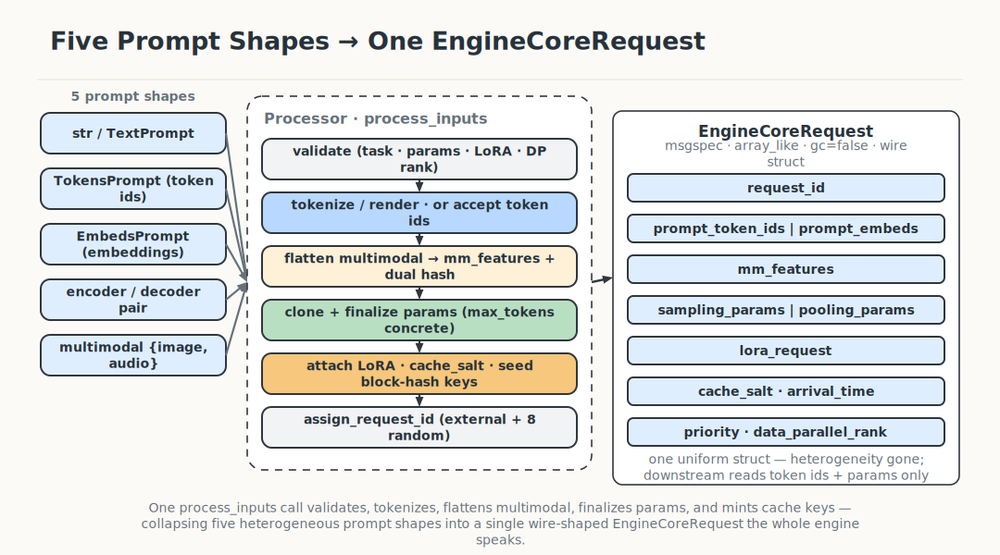</a>

<p class='figure-caption'>One `process_inputs` call funnels five prompt shapes (text, tokens, embeds, enc/dec, multimodal) into a single `EngineCoreRequest` wire struct.</p>

### The boundary and its signature

The transformation has one entry point.

[`vllm/v1/engine/input_processor.py:242-255`](https://github.com/vllm-project/vllm/blob/6cf7b26bd4bff60bf378e1af14044280ac0d214c/vllm/v1/engine/input_processor.py#L242-L255)

```python
    def process_inputs(
        self,
        request_id: str,
        prompt: PromptType | EngineInput,
        params: SamplingParams | PoolingParams,
        supported_tasks: tuple[SupportedTask, ...],
        arrival_time: float | None = None,
        lora_request: LoRARequest | None = None,
        tokenization_kwargs: dict[str, Any] | None = None,
        trace_headers: Mapping[str, str] | None = None,
        priority: int = 0,
        data_parallel_rank: int | None = None,
        resumable: bool = False,
    ) -> EngineCoreRequest:
```

<a href='images/vllm-01-15-process-inputs-stages.svg' target='_blank'>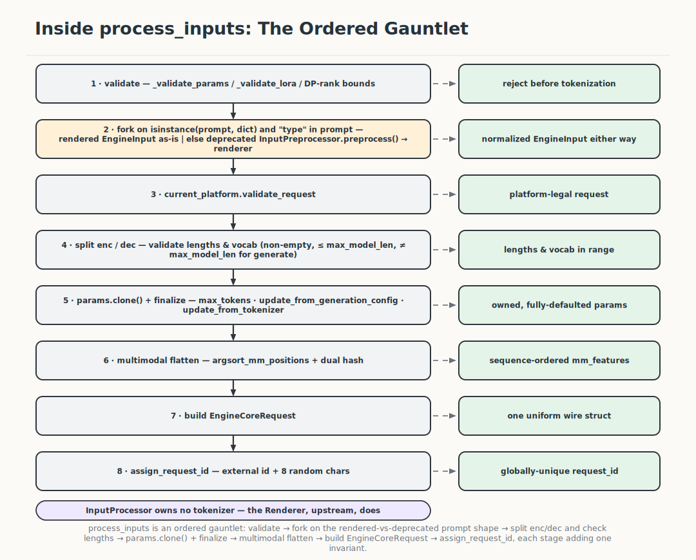</a>

<p class='figure-caption'>Inside `process_inputs`: the ordered gauntlet — validate (`_validate_params` / `_validate_lora` / DP-rank bounds) → fork on `isinstance(prompt, dict) and "type" in prompt` (rendered `EngineInput` as-is vs. deprecated `InputPreprocessor.preprocess()`) → split enc/dec and check lengths → `params.clone()` + finalize → multimodal flatten → build `EngineCoreRequest` → `assign_request_id`, with the invariant each stage adds.</p>

Two type unions in this signature carry the whole design. `prompt: PromptType | EngineInput` says the input may be either a *raw* user prompt or an *already-rendered* `EngineInput` (more on that fork below). `params: SamplingParams | PoolingParams` says the runtime type of `params` selects the task family — generation vs. pooling — for the rest of the pipeline. The return type is fixed: `EngineCoreRequest`, unconditionally.

This method is called from `LLMEngine.add_request`, which is the seam that stitches input processing to the engine boundary from the previous section.

[`vllm/v1/engine/llm_engine.py:249-263`](https://github.com/vllm-project/vllm/blob/6cf7b26bd4bff60bf378e1af14044280ac0d214c/vllm/v1/engine/llm_engine.py#L249-L263)

```python
        else:
            request = self.input_processor.process_inputs(
                request_id,
                prompt,
                params,
                supported_tasks=self.get_supported_tasks(),
                arrival_time=arrival_time,
                lora_request=lora_request,
                tokenization_kwargs=tokenization_kwargs,
                trace_headers=trace_headers,
                priority=priority,
            )
            prompt_text, _, _ = extract_prompt_components(self.model_config, prompt)

        self.input_processor.assign_request_id(request)
```

Read it as a two-step handoff: `process_inputs` builds the struct, then `assign_request_id` stamps it (covered at the end of this section). Only after both does `add_request` register the request on the output processor and the engine core.

### Validation runs before tokenization

The first thing `process_inputs` does is refuse malformed work, and it does so *before* spending a tokenizer pass on it.

[`vllm/v1/engine/input_processor.py:256-267`](https://github.com/vllm-project/vllm/blob/6cf7b26bd4bff60bf378e1af14044280ac0d214c/vllm/v1/engine/input_processor.py#L256-L267)

```python
        self._validate_params(params, supported_tasks)
        self._validate_lora(lora_request)

        parallel_config = self.vllm_config.parallel_config
        dp_size = parallel_config.data_parallel_size
        dp_local_size = parallel_config.data_parallel_size_local
        num_ranks = dp_local_size if parallel_config.local_engines_only else dp_size
        if data_parallel_rank is not None and not (0 <= data_parallel_rank < num_ranks):
            raise ValueError(
                f"data_parallel_rank {data_parallel_rank} "
                f"is out of range [0, {num_ranks})."
            )
```

`_validate_params` ([`input_processor.py:82-144`](https://github.com/vllm-project/vllm/blob/6cf7b26bd4bff60bf378e1af14044280ac0d214c/vllm/v1/engine/input_processor.py#L82-L144)) enforces task/param coherence: a `SamplingParams` must intersect `GENERATION_TASKS` — otherwise `raise ValueError("This model does not support generation")` — and a `PoolingParams` must intersect `POOLING_TASKS`. Along the way it calls `params.verify(...)`, which *validates* (raising on incoherent params — [`sampling_params.py:736-751`](https://github.com/vllm-project/vllm/blob/6cf7b26bd4bff60bf378e1af14044280ac0d214c/vllm/sampling_params.py#L736-L751) just dispatches to a series of pure `_validate_*` checks) but does **not** mutate; the caller's params stay untouched until they are cloned at [`input_processor.py:315`](https://github.com/vllm-project/vllm/blob/6cf7b26bd4bff60bf378e1af14044280ac0d214c/vllm/v1/engine/input_processor.py#L315), after which finalization mutates only the clone. `_validate_lora` (`:146-163`) makes a LoRA request without an enabled `lora_config` a hard error. The DP-rank bounds check above rejects an out-of-range engine target.

**The invariant this protects:** no request reaches tokenization — let alone the engine core — unless the model actually advertises a matching task and the LoRA/DP targeting is legal. The cheap rejections happen at the earliest possible point in the pipeline, and none of these checks can be re-litigated later because the engine core simply trusts the struct it receives.

### The fork: rendered input vs. the deprecated raw path

Here is the connective detail that surprises people reading V1 for the first time: `InputProcessor` **owns no tokenizer of its own**. Tokenization and the HF multimodal processor now live behind a `Renderer`, invoked *upstream* by the entrypoints (see article 02). `process_inputs` prefers to receive input that a renderer already finished.

[`vllm/v1/engine/input_processor.py:269-296`](https://github.com/vllm-project/vllm/blob/6cf7b26bd4bff60bf378e1af14044280ac0d214c/vllm/v1/engine/input_processor.py#L269-L296)

```python
        if isinstance(prompt, dict) and "type" in prompt:
            if tokenization_kwargs:
                logger.warning_once(
                    "Passing tokenization_kwargs to InputProcessor is deprecated "
                    "and will be removed in v0.18. You should instead pass "
                    "them to Renderer.render_cmpl() or Renderer.render_chat()."
                )

            if arrival_time is None:
                arrival_time = prompt.get("arrival_time", time.time())  # type: ignore[assignment]

            processed_inputs: EngineInput = prompt  # type: ignore[assignment]
        else:
            logger.warning_once(
                "Passing raw prompts to InputProcessor is deprecated "
                "and will be removed in v0.18. You should instead pass "
                "the outputs of Renderer.render_cmpl() or Renderer.render_chat()."
            )

            if arrival_time is None:
                arrival_time = time.time()

            processed_inputs = self.input_preprocessor.preprocess(
                prompt,
                tokenization_kwargs=tokenization_kwargs,
            )

        current_platform.validate_request(processed_inputs, params)
```

The discriminator is `isinstance(prompt, dict) and "type" in prompt`. A dict carrying a `"type"` key is treated as an already-rendered `EngineInput` and taken **as-is** — no tokenization happens here at all; `arrival_time` can even be read out of the dict. Everything else — a bare `str`, a `TokensPrompt`, an enc/dec dict — falls through to the **deprecated** `InputPreprocessor.preprocess()`, which delegates back to the renderer for actual tokenization ([`vllm/inputs/preprocess.py:68-88`](https://github.com/vllm-project/vllm/blob/6cf7b26bd4bff60bf378e1af14044280ac0d214c/vllm/inputs/preprocess.py#L68-L88) shows `_tokenize_prompt` proxying `self.renderer`). Both branches converge on `current_platform.validate_request(...)`.

**The rule:** the modern flow renders (tokenizes + runs the multimodal processor) upstream and passes a finished `EngineInput`; the raw path and inline `tokenization_kwargs` survive only for backward compatibility and are flagged for removal in v0.18. Regardless of which branch runs, `processed_inputs` is an `EngineInput` with a `"type"` discriminator — a normalized shape the rest of `process_inputs` can rely on. (For how rendering itself tokenizes and expands multimodal placeholders, see article 02; for how the block hasher later consumes what this stage produces, articles 06 and 07.)

### Cloning and finalizing params

After splitting encoder/decoder inputs and validating lengths and vocabulary (`:298-309`, `:387-484` — decoder prompts can't be empty, can't exceed `max_model_len`, and can't sit exactly at `max_model_len` for `generate` models, since that leaves no room for even one output token), the sampling params are cloned and finalized.

[`vllm/v1/engine/input_processor.py:311-330`](https://github.com/vllm-project/vllm/blob/6cf7b26bd4bff60bf378e1af14044280ac0d214c/vllm/v1/engine/input_processor.py#L311-L330)

```python
        sampling_params = None
        pooling_params = None
        if isinstance(params, SamplingParams):
            # TODO: can we avoid cloning here in multiproc case?
            sampling_params = params.clone()
            # If unset max tokens, then generate up to the max_model_len.
            if sampling_params.max_tokens is None:
                seq_len = length_from_prompt_token_ids_or_embeds(
                    prompt_token_ids, prompt_embeds
                )
                sampling_params.max_tokens = self.model_config.max_model_len - seq_len

            sampling_params.update_from_generation_config(
                self.generation_config_fields,
                self.renderer.get_eos_token_id(),
            )
            if self.tokenizer is not None:
                sampling_params.update_from_tokenizer(self.tokenizer)
        else:
            pooling_params = params.clone()
```

<a href='images/vllm-01-16-sampling-params-budget.svg' target='_blank'>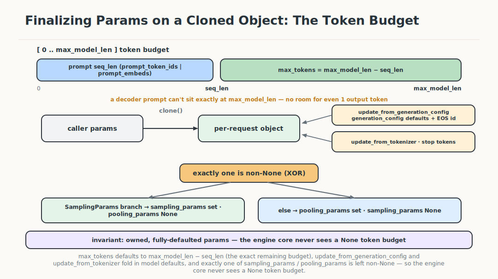</a>

<p class='figure-caption'>Finalizing params on a cloned object: `max_tokens` defaults to `max_model_len - seq_len` (the exact remaining budget along a `[0 .. max_model_len]` bar), `update_from_generation_config` and `update_from_tokenizer` fold in model defaults, and exactly one of `sampling_params` / `pooling_params` is left non-`None` — so the engine core never sees a `None` token budget.</p>

The caller's `params` is **cloned** so per-request finalization never mutates the shared object a caller may reuse across prompts. Then, for sampling: an unset `max_tokens` is filled to `max_model_len - seq_len` (exactly the remaining budget); the model's `generation_config` defaults and EOS id are folded in via `update_from_generation_config`; and tokenizer-derived stop tokens via `update_from_tokenizer`. Exactly one of `sampling_params` / `pooling_params` is non-`None` afterward.

**The invariant:** the engine core receives an *owned, fully-defaulted* params object. `max_tokens` is always concrete — the scheduler never has to reason about a `None` token budget, and no downstream layer needs access to `model_config` or the tokenizer to finish defaulting. All model-specific knowledge is baked in here, once, on the front end.

### Multimodal flattening and the dual hash

Multimodal inputs arrive keyed by modality (`{"image": [...], "audio": [...]}`). This stage flattens them into a single sequence-ordered list.

[`vllm/v1/engine/input_processor.py:354-368`](https://github.com/vllm-project/vllm/blob/6cf7b26bd4bff60bf378e1af14044280ac0d214c/vllm/v1/engine/input_processor.py#L354-L368)

```python
            mm_features = []
            for modality, idx in sorted_mm_idxs:
                base_mm_hash = decoder_mm_hashes[modality][idx]
                mm_features.append(
                    MultiModalFeatureSpec(
                        data=decoder_mm_inputs[modality][idx],
                        modality=modality,
                        identifier=self._get_mm_identifier(
                            base_mm_hash,
                            lora_request,
                        ),
                        mm_position=decoder_mm_positions[modality][idx],
                        mm_hash=base_mm_hash,
                    )
                )
```

<a href='images/vllm-01-17-mm-dual-hash.svg' target='_blank'>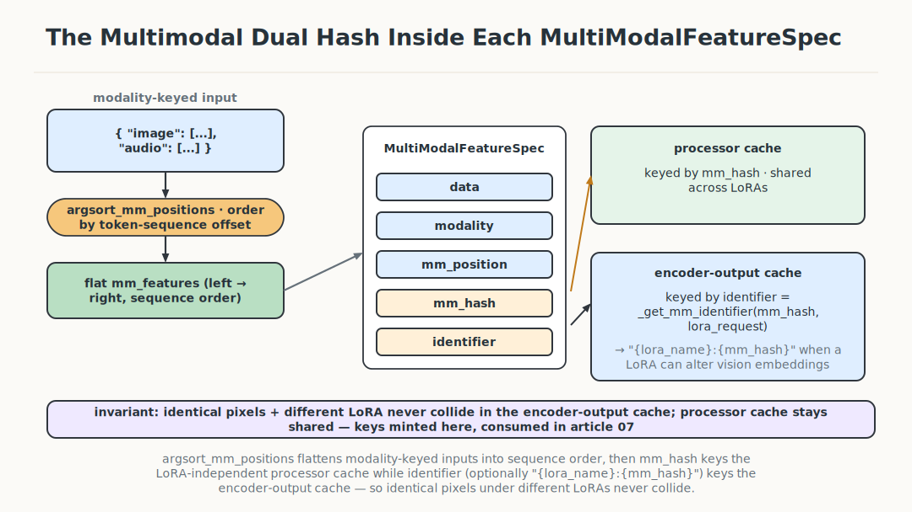</a>

<p class='figure-caption'>The multimodal dual hash inside each `MultiModalFeatureSpec`: `argsort_mm_positions` flattens modality-keyed inputs into sequence order, then `mm_hash` keys the LoRA-independent processor cache while `identifier` (`_get_mm_identifier`, optionally `"{lora_name}:{mm_hash}"`) keys the encoder-output cache — so identical pixels under different LoRAs never collide.</p>

`argsort_mm_positions` (called just above at `:352`) orders items by their offset in the token sequence, so `mm_features` is a flat list that reads left-to-right across all modalities. Each `MultiModalFeatureSpec` carries a **dual hash**: `mm_hash` (the raw, LoRA-independent hash keying the *processor* cache) and `identifier` (which keys the *encoder-output* cache and may be LoRA-prefixed as `"{lora_name}:{mm_hash}"` when a LoRA can alter vision embeddings — see `_get_mm_identifier`, `:165-181`).

**The property:** two requests with identical pixels but different LoRAs never collide in the encoder-output cache, while the LoRA-independent processor cache stays shared. This is prefix-cache correctness territory; article 07 covers how `mm_hash`, LoRA name, and `cache_salt` become block-hash extra keys. Article 01's takeaway is narrower: input processing is where those cache keys are *minted*, not where they are consumed.

### The output: a GC-free wire struct

Everything converges on one constructor.

[`vllm/v1/engine/input_processor.py:370-385`](https://github.com/vllm-project/vllm/blob/6cf7b26bd4bff60bf378e1af14044280ac0d214c/vllm/v1/engine/input_processor.py#L370-L385)

```python
        return EngineCoreRequest(
            request_id=request_id,
            prompt_token_ids=prompt_token_ids,
            prompt_embeds=prompt_embeds,
            prompt_is_token_ids=prompt_is_token_ids,
            mm_features=mm_features,
            sampling_params=sampling_params,
            pooling_params=pooling_params,
            arrival_time=arrival_time,
            lora_request=lora_request,
            cache_salt=decoder_inputs.get("cache_salt"),
            priority=priority,
            data_parallel_rank=data_parallel_rank,
            trace_headers=trace_headers,
            resumable=resumable,
        )
```

Note `cache_salt=decoder_inputs.get("cache_salt")` — the salt rides through `process_inputs` untouched, to be consumed only later as a first-block-only prefix-cache namespace tag (article 07). The struct it builds is deliberately shaped for the wire.

[`vllm/v1/engine/__init__.py:88-102`](https://github.com/vllm-project/vllm/blob/6cf7b26bd4bff60bf378e1af14044280ac0d214c/vllm/v1/engine/__init__.py#L88-L102)

```python
class EngineCoreRequest(
    msgspec.Struct,
    array_like=True,  # type: ignore[call-arg]
    omit_defaults=True,  # type: ignore[call-arg]
    gc=False,
):  # type: ignore[call-arg]
    request_id: str
    prompt_token_ids: list[int] | None
    mm_features: list[MultiModalFeatureSpec] | None
    sampling_params: SamplingParams | None
    pooling_params: PoolingParams | None
    arrival_time: float
    lora_request: LoRARequest | None
    cache_salt: str | None
    data_parallel_rank: int | None
```

The three `msgspec.Struct` options are the point. `array_like=True` serializes fields positionally (no field-name overhead); `omit_defaults=True` skips defaulted fields on the wire; `gc=False` opts the struct out of Python's cyclic garbage collector. These choices only matter because this struct is *serialized and sent over a ZMQ socket* to a background `EngineCore` process on the default multiprocess path — the transport that the previous section's `SyncMPClient`/`AsyncMPClient` sit on (article 03 for the topology, article 04 for the loop that decodes it). A `.params` property ([`__init__.py:139-145`](https://github.com/vllm-project/vllm/blob/6cf7b26bd4bff60bf378e1af14044280ac0d214c/vllm/v1/engine/__init__.py#L139-L145)) returns whichever of the two is set (preferring `sampling_params`) and asserts at least one is present; the never-both invariant is guaranteed at construction ([`input_processor.py:311-330`](https://github.com/vllm-project/vllm/blob/6cf7b26bd4bff60bf378e1af14044280ac0d214c/vllm/v1/engine/input_processor.py#L311-L330), exactly one branch runs), not by the property.

**The guarantees:** `sampling_params` and `pooling_params` are never both set; `arrival_time` is populated on every branch (so its non-optional `float` type holds); and the struct is cheap to serialize. The heterogeneity of user input — five prompt shapes, optional multimodal, optional LoRA — is gone. Downstream code branches on `sampling_params is not None` and reads a flat list of token IDs, nothing else.

### The final stamp: request-id randomization

`process_inputs` returns, and back in `add_request` the request is stamped before registration (the `assign_request_id` call at [`llm_engine.py:263`](https://github.com/vllm-project/vllm/blob/6cf7b26bd4bff60bf378e1af14044280ac0d214c/vllm/v1/engine/llm_engine.py#L263) above).

[`vllm/v1/engine/input_processor.py:222-240`](https://github.com/vllm-project/vllm/blob/6cf7b26bd4bff60bf378e1af14044280ac0d214c/vllm/v1/engine/input_processor.py#L222-L240)

```python
    @staticmethod
    def assign_request_id(request: EngineCoreRequest):
        """Replace the externally supplied request ID with an internal request ID
        that adds 8 random characters in order to ensure uniqueness.
        """
        if request.external_req_id is not None:
            raise ValueError(
                "The external_req_id field should not be set on EngineCoreRequests"
                " passed to vLLM; use the request_id field."
            )
        request.external_req_id = request.request_id
        if envs.VLLM_DISABLE_REQUEST_ID_RANDOMIZATION:
            logger.warning_once(...)
        else:
            request.request_id = f"{request.external_req_id}-{random_uuid():.8}"
```

The caller-supplied id is preserved in `external_req_id`, and `request_id` becomes `"{external}-{8 random chars}"`.

**The invariant:** the internal `request_id` is unique per admission with overwhelming probability (the 8 random characters are appended, not checked against existing ids) even if a caller submits duplicate external ids, while the external id survives for outputs and for `abort(req_id, internal=False)`. The `external_req_id`-must-be-unset guard prevents a second stamping. When results come back out (the output-processing section), the *external* id is what the user sees — never the randomized internal one.

### What this boundary buys the rest of the path

Input processing is a funnel with a guarantee at its mouth. Upstream, prompts are heterogeneous, params are half-specified, and multimodal data is keyed by modality. Downstream — client, engine core, scheduler, worker — every layer receives a single `EngineCoreRequest`: validated against the model's tasks, carrying a flat token list (or embeds), with a fully-defaulted owned params object, sequence-ordered multimodal features with their cache keys already minted, and a wire-shaped body ready to cross a process boundary. The scheduler never tokenizes; the worker never defaults `max_tokens`; the engine core never inspects `model_config` to finish a request. That is the entire reason V1 can run this stage on the front end and overlap it with GPU work — and it is why the next section, the engine boundary, can treat `add_request` as moving an already-finished object rather than doing any real work.

## The Engine Boundary: In-Process vs the Multiprocess Client

The previous sections followed a prompt until it became an `EngineCoreRequest` — a compact wire struct ready to be scheduled. Now it has to reach the thing that schedules it. That thing, `EngineCore`, may live in the same Python process as `LLM.generate()`, or in a background process on the far side of a ZMQ socket, or be one of several data-parallel engines each in its own process. The keystone design fact of V1 is that the front-end code cannot tell the difference. It holds one handle, calls the same methods, and the transport is decided once — at construction — and never again. This section is about that seam: what the single handle is, how the factory forks it, what actually crosses the wall, and the invariant that keeps deployment topology out of request semantics.

### One handle, chosen once

`LLMEngine` — the synchronous engine used by the offline `LLM` path — owns exactly one channel to scheduling and execution. It is created in the constructor and typed as an abstract client, not as a concrete transport.

[`vllm/v1/engine/llm_engine.py:104-111`](https://github.com/vllm-project/vllm/blob/6cf7b26bd4bff60bf378e1af14044280ac0d214c/vllm/v1/engine/llm_engine.py#L104-L111)

```python
        # EngineCore (gets EngineCoreRequests and gives EngineCoreOutputs)
        self.engine_core = EngineCoreClient.make_client(
            multiprocess_mode=multiprocess_mode,
            asyncio_mode=False,
            vllm_config=vllm_config,
            executor_class=executor_class,
            log_stats=self.log_stats,
        )
```

Read this closely. `self.engine_core` is the *only* way `LLMEngine` reaches the scheduler, the KV cache, and the GPU. Every public operation — `add_request`, `step`, `abort_request`, `sleep`, `add_lora`, `collective_rpc` — ultimately forwards to a method of the same name on this one field. `asyncio_mode=False` is hardcoded because the synchronous `LLMEngine` never uses the asyncio client; the online path (`AsyncLLM`) is the one that passes `True`. The single free variable is `multiprocess_mode`, and it flows in from a classmethod constructor:

[`vllm/v1/engine/llm_engine.py:157`](https://github.com/vllm-project/vllm/blob/6cf7b26bd4bff60bf378e1af14044280ac0d214c/vllm/v1/engine/llm_engine.py#L157)

```python
            multiprocess_mode=envs.VLLM_ENABLE_V1_MULTIPROCESSING,
```

**The invariant.** The front-end depends on an *interface*, not on a transport. Whether the engine is in-process or across a socket is a construction-time decision that never leaks downstream. Nothing in `add_request`, `step`, or the output path branches on `multiprocess_mode` — the polymorphic dispatch on `self.engine_core` absorbs the entire difference.

There is exactly one deliberate hole in this abstraction, and it is guarded:

[`vllm/v1/engine/llm_engine.py:123-125`](https://github.com/vllm-project/vllm/blob/6cf7b26bd4bff60bf378e1af14044280ac0d214c/vllm/v1/engine/llm_engine.py#L123-L125)

```python
        if not multiprocess_mode:
            # for v0 compatibility
            self.model_executor = self.engine_core.engine_core.model_executor  # type: ignore
```

The double hop `self.engine_core.engine_core` reaches through the *client* (`InprocClient`) into the real `EngineCore` object it holds, and then into its `model_executor`. This only works because in-process mode guarantees a live local object to reach. In multiprocess mode there is no local `EngineCore` — it lives in another process — so the branch is skipped. This is the exception that proves the rule: the one place the code touches the engine directly is fenced behind `if not multiprocess_mode`.

### The factory is the fork point

The three transports live behind one abstract base class, and `make_client` is where the topology is chosen from two booleans.

[`vllm/v1/engine/core_client.py:82-105`](https://github.com/vllm-project/vllm/blob/6cf7b26bd4bff60bf378e1af14044280ac0d214c/vllm/v1/engine/core_client.py#L82-L105)

```python
    @staticmethod
    def make_client(
        multiprocess_mode: bool,
        asyncio_mode: bool,
        vllm_config: VllmConfig,
        executor_class: type[Executor],
        log_stats: bool,
    ) -> "EngineCoreClient":
        # TODO: support this for debugging purposes.
        if asyncio_mode and not multiprocess_mode:
            raise NotImplementedError(
                "Running EngineCore in asyncio without multiprocessing "
                "is not currently supported."
            )

        if multiprocess_mode and asyncio_mode:
            return EngineCoreClient.make_async_mp_client(
                vllm_config, executor_class, log_stats
            )

        if multiprocess_mode and not asyncio_mode:
            return SyncMPClient(vllm_config, executor_class, log_stats)

        return InprocClient(vllm_config, executor_class, log_stats)
```

<a href='images/vllm-01-18-make-client-fork.svg' target='_blank'>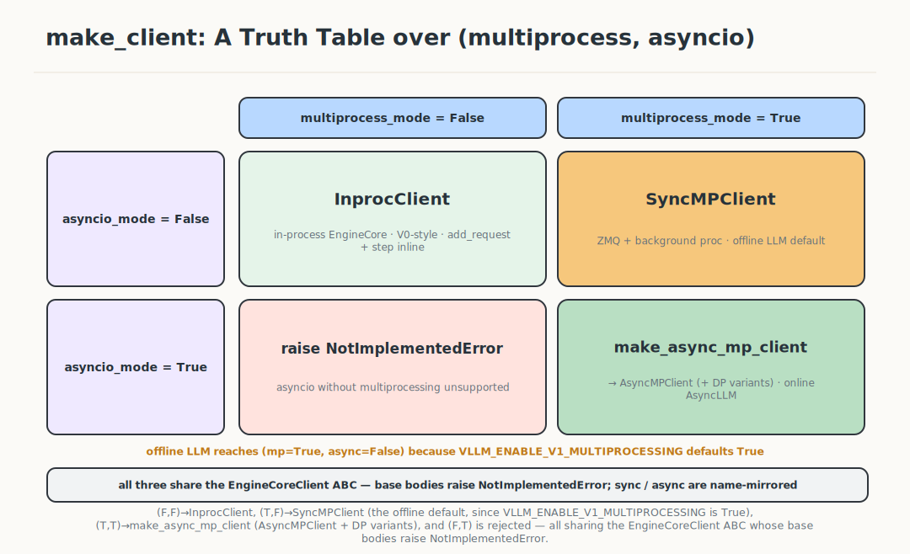</a>

<p class='figure-caption'>`make_client` as a truth table over `(multiprocess_mode, asyncio_mode)`: `(F,F)`→`InprocClient`, `(T,F)`→`SyncMPClient` (the offline default, since `VLLM_ENABLE_V1_MULTIPROCESSING` is `True`), `(T,T)`→`make_async_mp_client` (`AsyncMPClient` + DP variants), and `(F,T)` is rejected — all three sharing the `EngineCoreClient` ABC whose base bodies raise `NotImplementedError`.</p>

Four combinations, three outcomes: `(mp=False, async=False)` → `InprocClient`; `(mp=True, async=False)` → `SyncMPClient` (the multiprocess offline path); `(mp=True, async=True)` → the async family (`AsyncMPClient` and its DP variants, the online-server path); and `(mp=False, async=True)` is explicitly rejected — you cannot run the engine in-process under asyncio. The docstring on the base class names the contract in one place:

[`vllm/v1/engine/core_client.py:71-80`](https://github.com/vllm-project/vllm/blob/6cf7b26bd4bff60bf378e1af14044280ac0d214c/vllm/v1/engine/core_client.py#L71-L80)

```python
class EngineCoreClient(ABC):
    """
    EngineCoreClient: subclasses handle different methods for pushing
        and pulling from the EngineCore for asyncio / multiprocessing.

    Subclasses:
    * InprocClient: In process EngineCore (for V0-style LLMEngine use)
    * SyncMPClient: ZMQ + background proc EngineCore (for LLM)
    * AsyncMPClient: ZMQ + background proc EngineCore w/ asyncio (for AsyncLLM)
    """
```

**The contract.** The ABC declares every operation — sync and its `_async` mirror — and the base-class bodies raise `NotImplementedError`. So any method the front-end calls *must* be explicitly implemented per transport; there is no silent fallthrough that could behave differently across the boundary. The sync and async families are name-mirrored (`add_request`/`add_request_async`, `get_output`/`get_output_async`, `abort_requests`/`abort_requests_async`), which is what lets the offline and online front-ends share one mental model.

### The offline default is multiprocess, not in-process

It is tempting to assume the offline `LLM` runs the engine in-process — after all, there is no HTTP server. It does not. Recall the constructor default flows from `envs.VLLM_ENABLE_V1_MULTIPROCESSING`, and that env var defaults to `True`:

[`vllm/envs.py:147`](https://github.com/vllm-project/vllm/blob/6cf7b26bd4bff60bf378e1af14044280ac0d214c/vllm/envs.py#L147)

```python
    VLLM_ENABLE_V1_MULTIPROCESSING: bool = True
```

[`vllm/envs.py:1311-1313`](https://github.com/vllm-project/vllm/blob/6cf7b26bd4bff60bf378e1af14044280ac0d214c/vllm/envs.py#L1311-L1313)

```python
    "VLLM_ENABLE_V1_MULTIPROCESSING": lambda: bool(
        int(os.getenv("VLLM_ENABLE_V1_MULTIPROCESSING", "1"))
    ),
```

So even a plain `LLM(model=...).generate(...)` script gets `multiprocess_mode=True` → `SyncMPClient`, which means a background `EngineCore` process reached over ZMQ. `InprocClient` is used only when a user sets `VLLM_ENABLE_V1_MULTIPROCESSING=0`. (The bare `multiprocess_mode: bool = False` default on `LLMEngine.__init__` is a red herring — the classmethod constructors `from_vllm_config`/`from_engine_args` always override it with the env value.) The practical consequence: "offline" in vLLM V1 still runs two processes and a socket by default, which is why the boundary machinery below is on the hot path even for batch scripts, and why the engine-side request pipelining (grammar compile overlapping GPU work) matters even offline.

<a href='images/vllm-01-05-engine-boundary.svg' target='_blank'>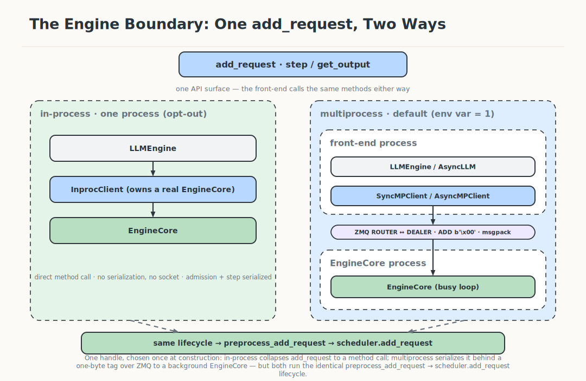</a>

<p class='figure-caption'>One `add_request` call, two realizations: an inline method call (InprocClient) vs. a serialized ROUTER frame decoded on the engine's IO thread (SyncMPClient), converging on the same `preprocess_add_request → scheduler.add_request` pair.</p>

### InprocClient: the boundary collapses to a method call

When the engine is in-process, the "client" is a thin shell that *owns* a real `EngineCore` and calls it directly — no serialization, no socket, no busy loop.

[`vllm/v1/engine/core_client.py:289-299`](https://github.com/vllm-project/vllm/blob/6cf7b26bd4bff60bf378e1af14044280ac0d214c/vllm/v1/engine/core_client.py#L289-L299)

```python
    def get_output(self) -> EngineCoreOutputs:
        outputs, model_executed = self.engine_core.step_fn()
        self.engine_core.post_step(model_executed=model_executed)
        return outputs and outputs.get(0) or EngineCoreOutputs()

    def get_supported_tasks(self) -> tuple[SupportedTask, ...]:
        return self.engine_core.get_supported_tasks()

    def add_request(self, request: EngineCoreRequest) -> None:
        req, request_wave = self.engine_core.preprocess_add_request(request)
        self.engine_core.add_request(req, request_wave)
```

Two things fall out. First, `add_request` is exactly two inline calls on the caller's thread: `preprocess_add_request` turns the wire-shaped `EngineCoreRequest` into an internal `Request` (block-hashing it and initializing grammar), and `add_request` hands that `Request` to the scheduler. Second, `get_output` *drives* the engine one step: `step_fn` is the engine's own `step` (or `step_with_batch_queue` under pipeline parallelism), so in-process the front-end's `step()` call literally *is* the engine's step — there is no separate loop advancing anything. The `outputs.get(0)` picks engine index 0 because in-process there is exactly one engine. This is what the docstring means by "V0-style": one thread, blocking `add_request`/`step`, admission and execution serialized with no concurrency.

### SyncMPClient: the same call, serialized into a self-describing frame

In multiprocess mode the same `add_request` becomes a serialize-and-send. Nothing about the *request* changes; only its delivery does.

[`vllm/v1/engine/core_client.py:886-889`](https://github.com/vllm-project/vllm/blob/6cf7b26bd4bff60bf378e1af14044280ac0d214c/vllm/v1/engine/core_client.py#L886-L889)

```python
    def add_request(self, request: EngineCoreRequest) -> None:
        if self.is_dp:
            self.engines_running = True
        self._send_input(EngineCoreRequestType.ADD, request)
```

[`vllm/v1/engine/core_client.py:861-873`](https://github.com/vllm-project/vllm/blob/6cf7b26bd4bff60bf378e1af14044280ac0d214c/vllm/v1/engine/core_client.py#L861-L873)

```python
    def _send_input(self, request_type: EngineCoreRequestType, request: Any):
        self.ensure_alive()
        self.free_pending_messages()
        # (Identity, RequestType, SerializedRequest)
        msg = (self.core_engine, request_type.value, *self.encoder.encode(request))

        if len(msg) <= 3:
            # No auxiliary buffers => no tensor backing buffers in request.
            self.input_socket.send_multipart(msg, copy=False)
            return

        tracker = self.input_socket.send_multipart(msg, copy=False, track=True)
        self.add_pending_message(tracker, request)
```

<a href='images/vllm-01-19-zmq-frame.svg' target='_blank'>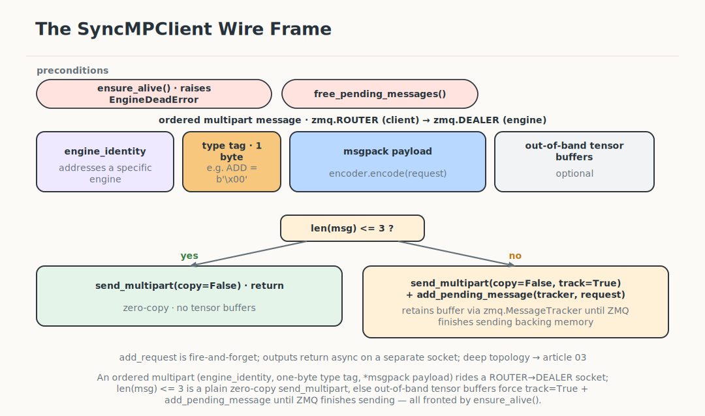</a>

<p class='figure-caption'>The `SyncMPClient` wire frame: an ordered multipart message `(engine_identity, one-byte type tag, *msgpack payload)` sent on a `zmq.ROUTER` to the engine's `zmq.DEALER`; when `len(msg) <= 3` it is a plain zero-copy `send_multipart`, otherwise out-of-band tensor buffers force `track=True` + `add_pending_message` to retain the buffer until ZMQ finishes sending — all fronted by `ensure_alive()`.</p>

The wire message is an ordered, self-describing multipart frame: `(engine_identity, one-byte type tag, *msgpack payload)`. The identity frame addresses a specific engine (essential once there are several under data parallelism); the type byte lets the receiver demux with no schema negotiation; the payload is `msgspec` msgpack. Three pieces of real bookkeeping appear here that `InprocClient` gets for free: `ensure_alive()` raises `EngineDeadError` if the monitored engine process has died (so the boundary carries liveness, not just data); the `len(msg) <= 3` branch is zero-copy tensor safety — if the encoded request carried out-of-band tensor buffers (multimodal), the client must *retain a reference* via a `zmq.MessageTracker` until ZMQ finishes transmitting the backing memory, or it could be freed mid-send; and `add_request` is fire-and-forget — it returns after the send, and outputs come back asynchronously on a separate socket. `self.input_socket` is a `zmq.ROUTER` the client binds; the engine connects a `zmq.DEALER`, which is why the identity frame leads. The deep socket topology — how these sockets are wired, the DP coordinator, load-balanced routing, abort routing that must remember which engine holds each in-flight request — is the subject of **article 03**; here we only need the client contract.

### The wire vocabulary is one byte

The boundary's protocol is a tiny tagged union. Each request type is a single hex byte, so it costs nothing to encode into the frame.

[`vllm/v1/engine/__init__.py:251-264`](https://github.com/vllm-project/vllm/blob/6cf7b26bd4bff60bf378e1af14044280ac0d214c/vllm/v1/engine/__init__.py#L251-L264)

```python
class EngineCoreRequestType(enum.Enum):
    """
    Request types defined as hex byte strings, so it can be sent over sockets
    without separate encoding step.
    """

    ADD = b"\x00"
    ABORT = b"\x01"
    START_DP_WAVE = b"\x02"
    UTILITY = b"\x03"
    # Sentinel used within EngineCoreProc.
    EXECUTOR_FAILED = b"\x04"
    # Sentinel to wake up input_queue.get() during shutdown.
    WAKEUP = b"\x05"
```

<a href='images/vllm-01-20-request-type-routing.svg' target='_blank'>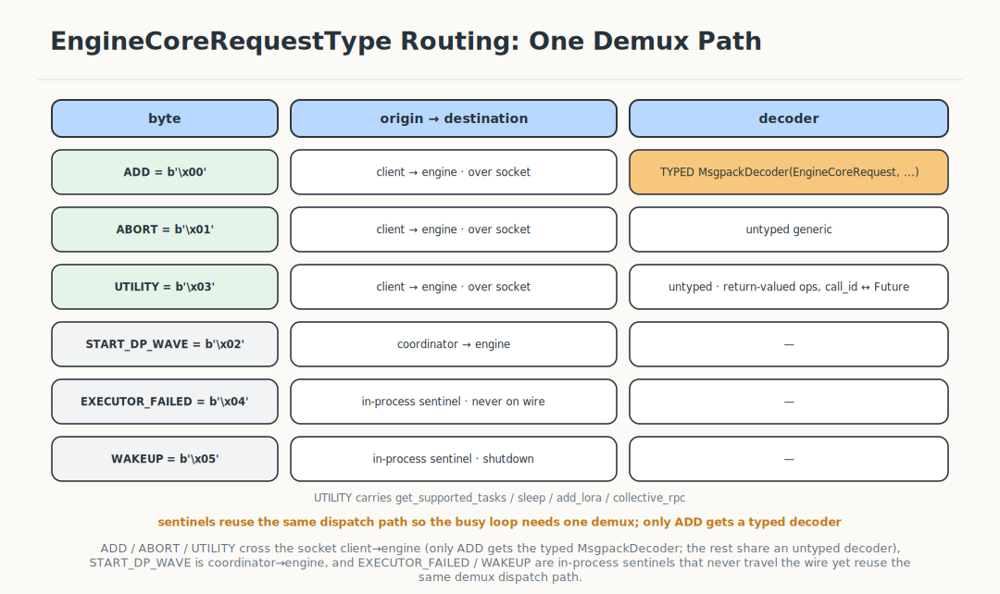</a>

<p class='figure-caption'>`EngineCoreRequestType` routing: `ADD` / `ABORT` / `UTILITY` cross the socket client→engine (only `ADD` gets the typed `MsgpackDecoder(EngineCoreRequest, ...)`; the rest share an untyped decoder), `START_DP_WAVE` is coordinator→engine, and `EXECUTOR_FAILED` / `WAKEUP` are in-process sentinels that never travel the wire yet reuse the same one-demux dispatch path.</p>

`ADD`, `ABORT`, and `UTILITY` are the types that actually travel over the socket from the client; `START_DP_WAVE` is coordinator-to-engine; `EXECUTOR_FAILED` and `WAKEUP` are *in-process sentinels* pushed onto the engine's own input queue and never sent over the wire — they reuse the same dispatch path so the busy loop needs only one demux. Only `ADD` gets a dedicated *typed* decoder — `MsgpackDecoder(EngineCoreRequest, ...)` — because it deserializes into the typed `EngineCoreRequest` struct; every other type shares an untyped generic decoder ([`core.py:1494-1497`](https://github.com/vllm-project/vllm/blob/6cf7b26bd4bff60bf378e1af14044280ac0d214c/vllm/v1/engine/core.py#L1494-L1497)). (Both decoders are built with the same `oob_tensor_provider`, so out-of-band-tensor capability is *not* what distinguishes them, even though in practice only `ADD` payloads actually carry tensors.) Return-valued operations (`get_supported_tasks`, `sleep`, `add_lora`, `collective_rpc`) all ride `UTILITY`, tagged with a `call_id` and correlated back to a `Future` so an inherently async socket round-trip presents a blocking API — in-process those same methods are plain Python returns.

### The symmetry: same lifecycle, relocated threads

The reason two transports can share one contract is that they perform the *same two operations in the same order* — the multiprocess path just splits them across a thread boundary. `InprocClient.add_request` calls `preprocess_add_request` then `scheduler`-bound `add_request` inline. The multiprocess engine does exactly the same pair, but `preprocess_add_request` runs on a dedicated input IO thread that decodes the frame, the resulting `(Request, wave)` tuple rides a thread-safe queue, and `add_request` runs on the busy-loop thread. The engine's own docstring names the intent:

[`vllm/v1/engine/core.py:855-860`](https://github.com/vllm-project/vllm/blob/6cf7b26bd4bff60bf378e1af14044280ac0d214c/vllm/v1/engine/core.py#L855-L860)

```python
    def preprocess_add_request(self, request: EngineCoreRequest) -> tuple[Request, int]:
        """Preprocess the request.

        This function could be directly used in input processing thread to allow
        request initialization running in parallel with Model forward
        """
```

That is the whole payoff of the process split: heavy request initialization — block hashing, grammar compilation — overlaps GPU work instead of blocking it. The in-process client runs the identical code with none of that pipelining, which is the price of running the engine on the caller's thread.

**The consolidated invariant.** A request undergoes the identical `preprocess_add_request → scheduler.add_request` lifecycle in both modes; multiprocess mode only relocates the two halves onto different threads to overlap init with model forward. Symmetrically, `get_output()` is a blocking "give me the next batch of outputs" call with the same signature on both transports — in-process it synchronously steps the engine; multiprocess it blocks on a queue fed by a daemon thread draining a PULL socket, and even engine death and decode errors arrive as `Exception` values *on that same queue*, so failures surface synchronously through the same method as data. The front-end's `step()` loop never learns which world it is in.

This is the seam the rest of the request path hangs from. Upstream, the public API and input processor (§2–§3 of this article) hand the client a fully-formed `EngineCoreRequest` and do not care where it goes. Downstream, `EngineCore.step()` — the `schedule → execute → commit` transaction covered next — runs identically whether it was invoked inline by `InprocClient.get_output()` or by the background process's busy loop. For the socket topology, DP routing, and coordinator internals that `SyncMPClient`/`AsyncMPClient` hide, see **article 03** (process architecture and ZMQ); for how parallelism multiplies engines and workers behind this same client, see **article 11**.

## add_request: A Request Enters EngineCore

The previous section established that `LLMEngine` holds one polymorphic `EngineCoreClient` and that the transport — in-process call or ZMQ round-trip — is fixed at construction and never leaks into request semantics. This section walks the request across that boundary: what `add_request` actually registers, why it registers it in *two* places, where "one user request" can quietly become "n engine requests," and the exact point at which the wire-shaped `EngineCoreRequest` becomes an internal `Request` owned by the scheduler. Everything here is connective tissue — the subsystem internals (scheduler admission, KV blocks, grammar compilation, child sampling) are handed off to the deep articles.

### Two registrars for one request

By the time control reaches the tail of `LLMEngine.add_request`, the raw prompt has already been through `input_processor.process_inputs` (article 01 §3) and is now an `EngineCoreRequest` with fully-defaulted, cloned `SamplingParams`. What remains is registration — and it is deliberately two-sided.

Source anchor: [`vllm/v1/engine/llm_engine.py:263-277`](https://github.com/vllm-project/vllm/blob/6cf7b26bd4bff60bf378e1af14044280ac0d214c/vllm/v1/engine/llm_engine.py#L263-L277)

```python
        self.input_processor.assign_request_id(request)

        req_id = request.request_id

        # Use cloned params that may have been updated in process_inputs()
        params = request.params

        n = params.n if isinstance(params, SamplingParams) else 1

        if n == 1:
            # Make a new RequestState and queue.
            self.output_processor.add_request(request, prompt_text, None, 0)
            # Add the request to EngineCore.
            self.engine_core.add_request(request)
            return req_id
```

Step-by-step read. `assign_request_id` stamps the internal id (external id plus 8 random characters — article 01 §3); `req_id` is captured *here*, before any fan-out, so it is the id the caller gets back. The number of samples `n` is read from the sampling params (pooling requests are always `n == 1`). Then the fast path does exactly two things, in this order:

1. `output_processor.add_request(request, prompt_text, None, 0)` — creates the `RequestState` that will detokenize, aggregate, and (online) hold the caller's output mailbox. This is the *return-path* registration.
2. `engine_core.add_request(request)` — hands the request to the client, which submits it for scheduling. This is the *forward-path* registration.

The ordering is not incidental. The output side is registered **before** the request is submitted for execution, so no `EngineCoreOutput` can ever arrive for a request the `OutputProcessor` has not yet heard of. This closes an output-before-registration race that would otherwise drop the first token of a fast-completing request. The offline drain loop sees the registration immediately for the same reason:

Source anchor: [`vllm/v1/engine/llm_engine.py:188-195`](https://github.com/vllm-project/vllm/blob/6cf7b26bd4bff60bf378e1af14044280ac0d214c/vllm/v1/engine/llm_engine.py#L188-L195)

```python
    def get_num_unfinished_requests(self) -> int:
        return self.output_processor.get_num_unfinished_requests()

    def has_unfinished_requests(self) -> bool:
        has_unfinished = self.output_processor.has_unfinished_requests()
        if self.dp_group is None:
            return has_unfinished or self.engine_core.dp_engines_running()
        return self.has_unfinished_requests_dp(has_unfinished)
```

Both "is there work left?" predicates are backed by the `output_processor`, not by the engine core. So the moment step (1) above returns, `LLM._run_engine`'s `while has_unfinished_requests():` loop (article 01 §2) will keep driving `step()` until this request finishes — even before the engine process has acknowledged it. The output processor is the authority on liveness; the engine core is where the work happens.

### One user request, n engine requests

The interesting case is `n > 1` — parallel sampling, where the user asks for several completions of one prompt. vLLM does not teach the scheduler about "n samples." It fans the single request into `n` independent engine requests and reassembles them on the way out.

Source anchor: [`vllm/v1/engine/llm_engine.py:279-294`](https://github.com/vllm-project/vllm/blob/6cf7b26bd4bff60bf378e1af14044280ac0d214c/vllm/v1/engine/llm_engine.py#L279-L294)

```python
        # Fan out child requests (for n>1).
        parent_req = ParentRequest(request)
        for idx in range(n):
            request_id, child_params = parent_req.get_child_info(idx)
            child_request = request if idx == n - 1 else copy(request)
            child_request.request_id = request_id
            child_request.sampling_params = child_params

            # Make a new RequestState and queue.
            self.output_processor.add_request(
                child_request, prompt_text, parent_req, idx
            )
            # Add the request to EngineCore.
            self.engine_core.add_request(child_request)

        return req_id
```

Step-by-step read. A `ParentRequest` wraps the original. For each child index it mints a child id and child sampling params:

Source anchor: [`vllm/v1/engine/parallel_sampling.py:83-94`](https://github.com/vllm-project/vllm/blob/6cf7b26bd4bff60bf378e1af14044280ac0d214c/vllm/v1/engine/parallel_sampling.py#L83-L94)

```python
    def get_child_info(self, index: int) -> tuple[str, SamplingParams]:
        """Get child request ID and sampling params.

        Args:
          index: index within `n` child requests.

        Returns:
          (request ID, sampling_params) tuple
        """
        child_req_id = f"{index}_{self.request_id}"
        self.child_requests.add(child_req_id)
        return child_req_id, self._get_child_sampling_params(index)
```

Each child id is the parent id prefixed with its index (`0_<parent>`, `1_<parent>`, …); the child sampling params are derived per-child (the seed handling and the `n → 1` collapse for each child belong to sampling — article 01 §9 / deep article 10). The last child (`idx == n - 1`) *reuses the original request object* rather than copying it, an allocation optimization; the earlier children are `copy(request)`. Every child is registered on both sides, just as the `n == 1` fast path did — but each `output_processor.add_request` now passes the shared `parent_req` and the child's `idx`, which is how the `OutputProcessor` later merges the `n` streams back into one.

The invariant this protects: **parallel sampling is `n` engine requests but one user-visible output.** The function returns `req_id` — the parent id captured before the loop — not any child id. The scheduler, KV cache manager, and workers only ever see flat, independent requests; they never carry the concept of "sibling." Aggregation, cancellation, and output ordering across the `n` children are entirely the `OutputProcessor`'s job (article 01 §10). Treating each child as its own public request would break all three.

### Crossing the boundary: EngineCoreRequest becomes Request

`self.engine_core.add_request(child_request)` looks like a single call, but a type change happens inside it that is the real entry into engine ownership. The object the frontend passes is an `EngineCoreRequest` — the GC-free msgspec wire struct. The object the engine's scheduler receives is a `vllm.v1.request.Request`. The conversion sits in `preprocess_add_request`:

Source anchor: [`vllm/v1/engine/core.py:855-877`](https://github.com/vllm-project/vllm/blob/6cf7b26bd4bff60bf378e1af14044280ac0d214c/vllm/v1/engine/core.py#L855-L877)

```python
    def preprocess_add_request(self, request: EngineCoreRequest) -> tuple[Request, int]:
        """Preprocess the request.

        This function could be directly used in input processing thread to allow
        request initialization running in parallel with Model forward
        """
        ...
        req = Request.from_engine_core_request(request, self.request_block_hasher)
        if req.use_structured_output:
            ...
            self.structured_output_manager.grammar_init(req)
        return req, request.current_wave
```

Step-by-step read. `Request.from_engine_core_request` materializes the internal request and runs the block hasher over the prompt tokens (seeding prefix-cache lookup — article 01 §7 / deep article 07). For structured-output requests, `grammar_init` kicks off grammar compilation. The docstring states the design intent verbatim: this "could be directly used in input processing thread to allow request initialization running in parallel with Model forward." That is precisely where the two transports diverge, as the engine-boundary section established: `InprocClient.add_request` runs `preprocess_add_request` then `add_request` inline on the caller's thread, while `EngineCoreProc` runs `preprocess_add_request` on its input IO thread and lets the busy loop call `add_request` — same two operations, same order, relocated to overlap block-hashing and grammar compile with the GPU forward pass (article 01 §4; deep article 03 for the ZMQ threading). Either way, what lands on the engine's scheduling side is a `Request`, never the wire struct.

### Engine-side admission

The engine-side `add_request` — the method the busy loop (or `InprocClient`) finally calls — is short, and its shortness is the point.

Source anchor: [`vllm/v1/engine/core.py:372-407`](https://github.com/vllm-project/vllm/blob/6cf7b26bd4bff60bf378e1af14044280ac0d214c/vllm/v1/engine/core.py#L372-L407)

```python
    def add_request(self, request: Request, request_wave: int = 0):
        """Add request to the scheduler.

        `request_wave`: indicate which wave of requests this is expected to
        belong to in DP case
        """
        # Validate the request_id type.
        if not isinstance(request.request_id, str):
            raise TypeError(
                f"request_id must be a string, got {type(request.request_id)}"
            )

        if pooling_params := request.pooling_params:
            supported_pooling_tasks = [
                task for task in self.get_supported_tasks() if task in POOLING_TASKS
            ]

            if pooling_params.task not in supported_pooling_tasks:
                raise ValueError(
                    f"Unsupported task: {pooling_params.task!r} "
                    f"Supported tasks: {supported_pooling_tasks}"
                )

        if request.kv_transfer_params is not None and (
            not self.scheduler.get_kv_connector()
        ):
            logger.warning(
                "Got kv_transfer_params, but no KVConnector found. "
                "Disabling KVTransfer for this request."
            )

        self.scheduler.add_request(request)
        if request.abort_immediately:
            # Immediately abort so the connector's request_finished hook runs
            # to free any pre-admission KV-transfer resources.
            self.abort_requests([request.request_id])
```

<a href='images/vllm-01-21-engine-admission.svg' target='_blank'>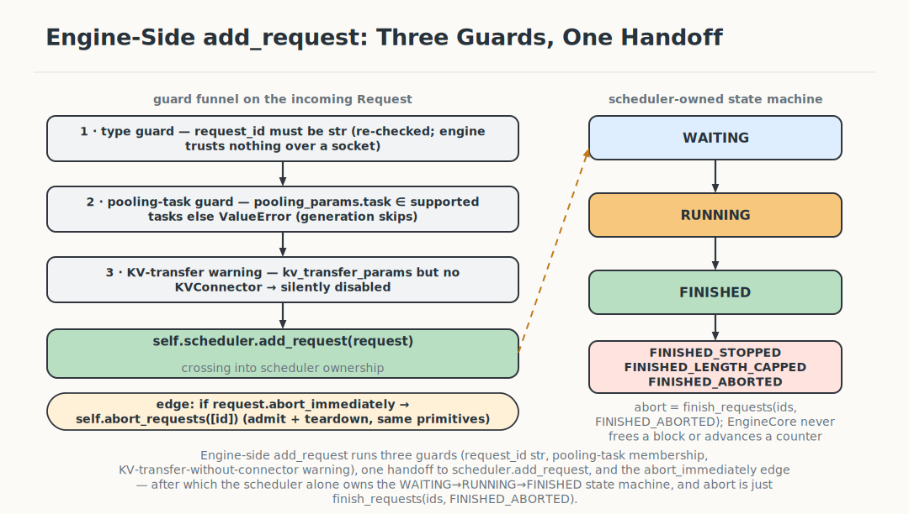</a>

<p class='figure-caption'>Engine-side `add_request`: three guards (request-id `str`, pooling-task membership, KV-transfer-without-connector warning), one handoff to `self.scheduler.add_request(request)`, and the `abort_immediately` edge — after which the scheduler alone owns the WAITING→RUNNING→FINISHED state machine, and abort is just `finish_requests(ids, FINISHED_ABORTED)`.</p>

Step-by-step read. Three guards, one handoff, one edge case:

- **Type guard** — the request id must be a `str`; this is asserted again here even though the frontend already checked, because in multiprocess mode the object arrived over a socket and the engine trusts nothing.
- **Pooling-task guard** — if the request carries `pooling_params`, its task must be in the model's supported pooling tasks, else `ValueError`. Generation requests skip this.
- **KV-transfer warning** — a request with `kv_transfer_params` but no configured `KVConnector` is not rejected; the transfer is silently disabled with a warning (disaggregated prefill territory, deep article 11).
- **The handoff** — `self.scheduler.add_request(request)`. That single line is the crossing into scheduler ownership. From here the request lives in the waiting queue, its blocks are managed by the KV cache manager, and its status machine (WAITING → RUNNING → FINISHED) is the scheduler's alone. `EngineCore.add_request` does not touch a counter, allocate a block, or set a status — it validates and delegates. What `scheduler.add_request` does with the request — enqueue it, register it with the KV connector, record a QUEUED event — is article 01 §7 / deep article 05.
- **The edge case** — `abort_immediately`. A request can be admitted and instantly aborted in the same call so that the KV connector's `request_finished` hook runs to release resources that were reserved before admission. This is not an error path bolted on; it is admission and teardown expressed through the *same* two primitives.

### Abort is just finish

That last point generalizes into the ownership invariant of the whole engine core. Abort does not have its own machinery:

Source anchor: [`vllm/v1/engine/core.py:409-415`](https://github.com/vllm-project/vllm/blob/6cf7b26bd4bff60bf378e1af14044280ac0d214c/vllm/v1/engine/core.py#L409-L415)

```python
    def abort_requests(self, request_ids: list[str]):
        """Abort requests from the scheduler."""

        # TODO: The scheduler doesn't really need to know the
        # specific finish reason, TBD whether we propagate that
        # (i.e. client-aborted vs stop criteria met).
        self.scheduler.finish_requests(request_ids, RequestStatus.FINISHED_ABORTED)
```

Step-by-step read. Aborting a request is `scheduler.finish_requests(ids, FINISHED_ABORTED)` — the exact same call the scheduler uses when a request finishes normally, differing only in the terminal status. There is no separate "cancel" pathway that frees blocks a different way, which is what makes abort race-safe: whether a request stops because it hit EOS, hit a stop string (promoted by the `OutputProcessor`, article 01 §10), or was cancelled by a disconnecting client, it exits through one state machine that owns all block-freeing (deep article 04 covers `finish_requests` / `_free_request` and the deferred, GPU-step-fenced frees). `EngineCore` never frees a block or advances a counter directly; every lifecycle mutation is behind `self.scheduler`.

### The async mirror

The online path registers the same two sides in the same order, with one addition — a per-request output mailbox created *before* submission.

Source anchor: [`vllm/v1/engine/async_llm.py:400-412`](https://github.com/vllm-project/vllm/blob/6cf7b26bd4bff60bf378e1af14044280ac0d214c/vllm/v1/engine/async_llm.py#L400-L412)

```python
    async def _add_request(
        self,
        request: EngineCoreRequest,
        prompt: str | None,
        parent_req: ParentRequest | None,
        index: int,
        queue: RequestOutputCollector,
    ):
        # Add the request to OutputProcessor (this process).
        self.output_processor.add_request(request, prompt, parent_req, index, queue)

        # Add the EngineCoreRequest to EngineCore (separate process).
        await self.engine_core.add_request_async(request)
```

Step-by-step read. The caller (`AsyncLLM.add_request`) first builds a `RequestOutputCollector` — the single-slot mailbox that `generate()` will later drain (article 01 §11) — and passes it here as `queue`. `_add_request` registers the `RequestState` (now holding that mailbox) with the `OutputProcessor`, *then* `await`s the submission to the engine core. The comments make the process split explicit: output processing is "this process," the engine core is a "separate process." Because both steps sit in one un-interleaved `await` chain and registration precedes the submit await, the mailbox provably exists before any output for the request can be produced. The sync `LLMEngine.add_request` gets the same guarantee for free — its two registrations are plain sequential calls on one thread. Register-before-submit is the same invariant on both paths; asyncio just makes the ordering something you have to be deliberate about.

<a href='images/vllm-01-06-add-request.svg' target='_blank'>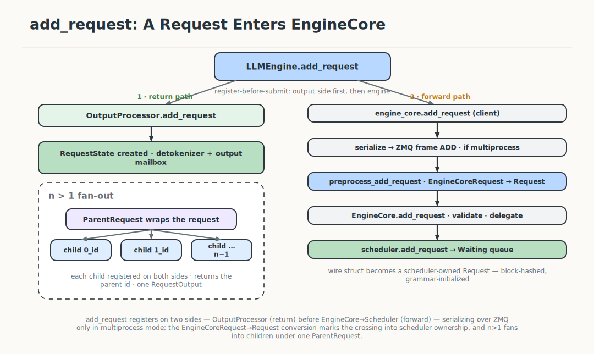</a>

<p class='figure-caption'>`add_request` registers a request on two sides — `OutputProcessor` (return path) and `EngineCore`→`Scheduler` (forward path) — with `n>1` fanning into child requests under one `ParentRequest`, and the `EngineCoreRequest`→`Request` conversion marking the crossing into scheduler ownership.</p>

### What this boundary buys

Four invariants are established the instant a request enters the engine, and every later stage relies on them:

- **Register-before-submit.** The output side is always registered before the forward side is triggered, so an output can never arrive for an unknown request ([`llm_engine.py:274-276`](https://github.com/vllm-project/vllm/blob/6cf7b26bd4bff60bf378e1af14044280ac0d214c/vllm/v1/engine/llm_engine.py#L274-L276); [`async_llm.py:409-412`](https://github.com/vllm-project/vllm/blob/6cf7b26bd4bff60bf378e1af14044280ac0d214c/vllm/v1/engine/async_llm.py#L409-L412)).
- **One user request, n flat engine requests.** Parallel sampling is fanned into independent children under a `ParentRequest`; the scheduler and workers never see the sibling relationship, and the caller gets back the parent id ([`llm_engine.py:279-294`](https://github.com/vllm-project/vllm/blob/6cf7b26bd4bff60bf378e1af14044280ac0d214c/vllm/v1/engine/llm_engine.py#L279-L294)).
- **Type change marks ownership transfer.** The wire `EngineCoreRequest` becomes an internal `Request` in `preprocess_add_request`; downstream of `scheduler.add_request` the wire struct no longer exists ([`core.py:855-877`](https://github.com/vllm-project/vllm/blob/6cf7b26bd4bff60bf378e1af14044280ac0d214c/vllm/v1/engine/core.py#L855-L877), `403`).
- **Admit and abort share one state machine.** `EngineCore` validates and delegates; it never frees blocks or mutates lifecycle state itself, and abort is just `finish_requests(..., FINISHED_ABORTED)` ([`core.py:403`](https://github.com/vllm-project/vllm/blob/6cf7b26bd4bff60bf378e1af14044280ac0d214c/vllm/v1/engine/core.py#L403), `409-415`). The scheduler owns everything from here — which is precisely where article 01 §7 picks up.

## The Engine Step: Schedule, Execute, Process Outputs

Everything up to this point has been adaptation: the façade normalized inputs, the input processor built an `EngineCoreRequest`, and the client abstraction moved it across a process boundary. Now we reach the transaction the whole system is organized around. The "Inside vLLM" walkthrough names the mental model directly — each engine step "selects requests, runs the model, samples tokens, updates request state, and frees resources when requests finish" ([Inside vLLM](https://vllm.ai/blog/2025-09-05-anatomy-of-vllm)). In the V1 source that is one small method, `EngineCore.step()`, and its job is to be *small*: a guard, a schedule, a non-blocking execute, an abort drain, and a commit. Reading it line by line is the fastest way to see which layer owns what.

<a href='images/vllm-01-02-engine-step.svg' target='_blank'>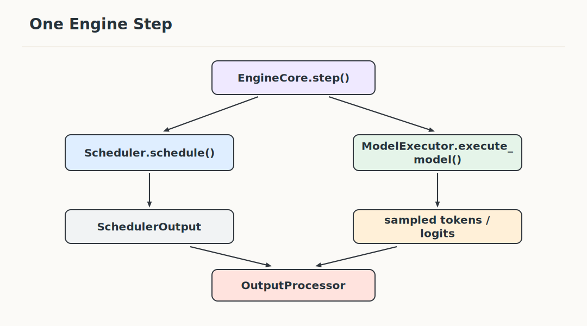</a>

<p class='figure-caption'>One engine step: the schedule → execute → sample → commit transaction and the two ownership boundaries it sits between.</p>

### The four jobs of `EngineCore.step()`

Concept: one step is a transaction. It asks the scheduler what to run, launches the forward pass without blocking, prepares the structured-output bitmask concurrently, samples if execution deferred it, drains any aborts that arrived mid-frame, and only then commits sampled tokens back into request state.

Source: [`vllm/v1/engine/core.py:479-508`](https://github.com/vllm-project/vllm/blob/6cf7b26bd4bff60bf378e1af14044280ac0d214c/vllm/v1/engine/core.py#L479-L508)

```python
    def step(self) -> tuple[dict[int, EngineCoreOutputs], bool]:
        """Schedule, execute, and make output.

        Returns tuple of outputs and a flag indicating whether the model
        was executed.
        """

        # Check for any requests remaining in the scheduler - unfinished,
        # or finished and not yet removed from the batch.
        if not self.scheduler.has_requests():
            return {}, False
        scheduler_output = self.scheduler.schedule(self._should_throttle_prefills())
        future = self.model_executor.execute_model(scheduler_output, non_block=True)
        grammar_output = self.scheduler.get_grammar_bitmask(scheduler_output)
        with (
            self.log_error_detail(scheduler_output),
            self.log_iteration_details(scheduler_output),
        ):
            model_output = future.result()
            if model_output is None:
                model_output = self.model_executor.sample_tokens(grammar_output)

        # Before processing the model output, process any aborts that happened
        # during the model execution.
        self._process_aborts_queue()
        engine_core_outputs = self.scheduler.update_from_output(
            scheduler_output, model_output
        )

        return engine_core_outputs, scheduler_output.total_num_scheduled_tokens > 0
```

Step-by-step read:

**Job 0 — the guard ([`core.py:488-489`](https://github.com/vllm-project/vllm/blob/6cf7b26bd4bff60bf378e1af14044280ac0d214c/vllm/v1/engine/core.py#L488-L489)).** `if not self.scheduler.has_requests(): return {}, False`. No model runs when the scheduler is empty. The comment above it — "unfinished, or finished and not yet removed from the batch" — is load-bearing: `has_requests()` is deliberately wider than "requests still generating." It stays `True` while there are finished request ids not yet flushed to clients, or a KV connector still draining, so the loop takes one more step to actually *emit* those finishes and free deferred blocks before it is allowed to idle. The internals of that predicate belong to article 04; here it is enough to know the guard counts the tail of a request's life, not just its middle.

**Job 1 — schedule ([`core.py:490`](https://github.com/vllm-project/vllm/blob/6cf7b26bd4bff60bf378e1af14044280ac0d214c/vllm/v1/engine/core.py#L490)).** `scheduler.schedule(self._should_throttle_prefills())` returns a `SchedulerOutput` and runs *no model code*. It decides which requests run, how many new tokens each gets, which KV blocks are allocated or reused, which requests are preempted, and what attention/sampling metadata the worker will need. `_should_throttle_prefills()` is `False` in the base class ([`core.py:474-477`](https://github.com/vllm-project/vllm/blob/6cf7b26bd4bff60bf378e1af14044280ac0d214c/vllm/v1/engine/core.py#L474-L477)) and only overridden by the data-parallel engine for prefill balancing. What "how many tokens for which requests" means — continuous batching, chunked prefill, prefix-cache reuse — is the entire subject of article 05; article 01 states only that this one call is the whole scheduling decision for the step.

**Job 2 — execute, overlap, sample ([`core.py:491-499`](https://github.com/vllm-project/vllm/blob/6cf7b26bd4bff60bf378e1af14044280ac0d214c/vllm/v1/engine/core.py#L491-L499)).** This is the connective-tissue trick. `execute_model(scheduler_output, non_block=True)` returns a `Future` immediately instead of blocking on the GPU. That gap is filled by `get_grammar_bitmask(scheduler_output)`, which builds the structured-output token mask on the CPU *while the forward pass runs*. `future.result()` is the synchronization point. The `model_output is None` sentinel means the executor deferred sampling to a separate call, `sample_tokens(grammar_output)`, so a structured-output mask is applied against *this* step's logits at sampling time. The executor→worker→model-runner→logits chain behind `execute_model` is article 08/09; the logits→token-ids step behind `sample_tokens` is article 10. Two facts matter for the end-to-end path: the grammar bitmask comes from the *scheduler*, not the HTTP layer, and CPU mask-prep is typically free because it hides under GPU latency.

**The abort window ([`core.py:501-503`](https://github.com/vllm-project/vllm/blob/6cf7b26bd4bff60bf378e1af14044280ac0d214c/vllm/v1/engine/core.py#L501-L503)).** `self._process_aborts_queue()` runs *after* `future.result()` — the GPU frame is done — but *before* `update_from_output`. This ordering is the whole point: an external cancellation that arrived while the GPU was busy is consumed before the sampled tokens are folded into request state, so a request cancelled mid-frame is never advanced. The drain helper ([`core.py:634-642`](https://github.com/vllm-project/vllm/blob/6cf7b26bd4bff60bf378e1af14044280ac0d214c/vllm/v1/engine/core.py#L634-L642)) batches the entire queue into one `abort_requests` call; because aborting an already-finished request is idempotent, aborts can safely be dual-queued (see article 04).

**Job 3 — commit ([`core.py:504-506`](https://github.com/vllm-project/vllm/blob/6cf7b26bd4bff60bf378e1af14044280ac0d214c/vllm/v1/engine/core.py#L504-L506)).** `scheduler.update_from_output(scheduler_output, model_output)` is where sampled tokens become request progress: output ids appended, finish reasons set, finished KV blocks freed. It returns a `dict[client_index → EngineCoreOutputs]` keyed by owning client, and the second tuple element — `scheduler_output.total_num_scheduled_tokens > 0` — is the `model_executed` flag the loop wrapper consumes.

The invariant this method protects: **schedule is optimistic, but progress is committed only after model output.** Scheduling decides and allocates ahead of the GPU; nothing about request state — token counts, finish status, block frees — moves until `update_from_output` reconciles the plan against what the model actually produced. Running the model without a `SchedulerOutput`, or advancing counters before sampling completes, would decouple GPU work from KV/block accounting and make block-reuse correctness depend on timing luck. The abort window and the guard are the two edges of that same rule: a request can enter or leave the batch right up to the commit, but not during it.

### Why the caller does not see this method

`EngineCore.step()` returns `EngineCoreOutputs` — token ids, finish flags, per-client routing — not user-facing `RequestOutput`s. The offline caller never touches it. What `LLM._run_engine`'s drain loop calls is `LLMEngine.step()`, a synchronous wrapper in a different file and a different process from the core loop.

Source: [`vllm/v1/engine/llm_engine.py:296-334`](https://github.com/vllm-project/vllm/blob/6cf7b26bd4bff60bf378e1af14044280ac0d214c/vllm/v1/engine/llm_engine.py#L296-L334)

```python
    def step(self) -> list[RequestOutput | PoolingRequestOutput]:
        if self.should_execute_dummy_batch:
            self.should_execute_dummy_batch = False
            self.engine_core.execute_dummy_batch()
            return []

        # 1) Get EngineCoreOutput from the EngineCore.
        with record_function_or_nullcontext("llm_engine step: get_output"):
            outputs = self.engine_core.get_output()

        # 2) Process EngineCoreOutputs.
        with record_function_or_nullcontext("llm_engine step: process_outputs"):
            iteration_stats = IterationStats() if self.log_stats else None
            processed_outputs = self.output_processor.process_outputs(
                outputs.outputs,
                engine_core_timestamp=outputs.timestamp,
                iteration_stats=iteration_stats,
            )
            self.output_processor.update_scheduler_stats(outputs.scheduler_stats)

        # 3) Abort any reqs that finished due to stop strings.
        with record_function_or_nullcontext("llm_engine step: abort_requests"):
            self.engine_core.abort_requests(processed_outputs.reqs_to_abort)

        # 4) Record stats
        with record_function_or_nullcontext("llm_engine step: record_stats"):
            if (
                self.logger_manager is not None
                and outputs.scheduler_stats is not None
                and len(outputs.outputs) > 0
            ):
                self.logger_manager.record(
                    scheduler_stats=outputs.scheduler_stats,
                    iteration_stats=iteration_stats,
                    mm_cache_stats=self.renderer.stat_mm_cache(),
                )
                self.do_log_stats_with_interval()

        return processed_outputs.request_outputs
```

<a href='images/vllm-01-22-step-wrapper-feedback.svg' target='_blank'>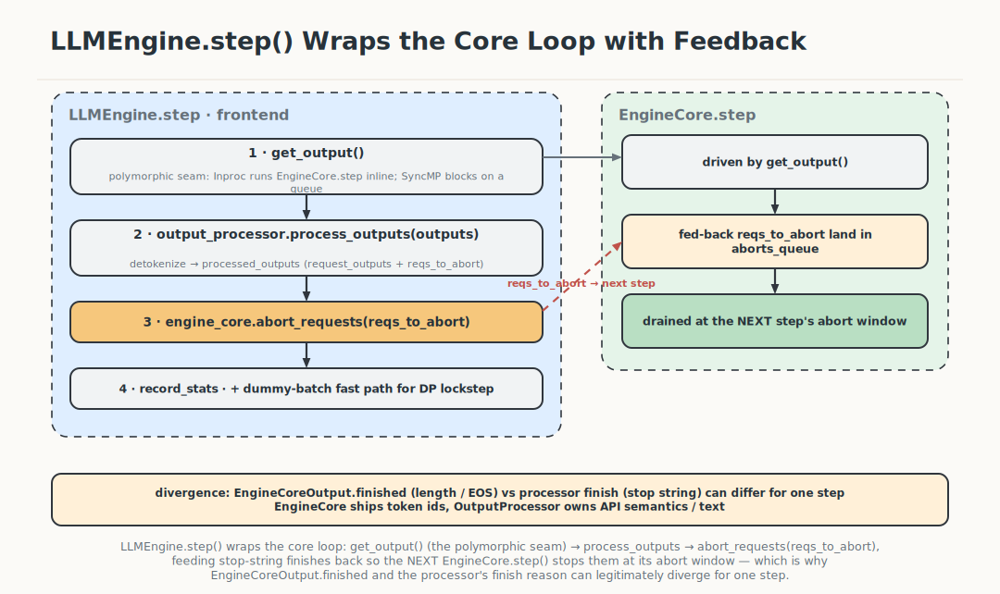</a>

<p class='figure-caption'>`LLMEngine.step()` wraps the core loop: `get_output()` (the polymorphic seam) → `output_processor.process_outputs(...)` → `engine_core.abort_requests(reqs_to_abort)`, feeding stop-string finishes back so the *next* `EngineCore.step()` stops them at its abort window — which is why `EngineCoreOutput.finished` and the processor's finish reason can legitimately diverge for one step.</p>

Step-by-step read:

- **`get_output()` is the polymorphic seam (line 304).** Its blocking signature is identical on both transports (§4). With `InprocClient` it *runs* one `EngineCore.step()` inline on the caller thread and returns the outputs; with `SyncMPClient` it blocks on a queue that a background thread fills from the core process's busy loop. The offline `LLMEngine.step()` is written as if the engine were local, and the client abstraction makes that true whether or not it is.
- **`process_outputs` (line 309) is where token ids become text.** `OutputProcessor` detokenizes incrementally, checks stop strings, and materializes `RequestOutput`s. This is the return-path boundary, owned by article 10 of this map; the point here is that it lives *outside* `EngineCore`.
- **`abort_requests` (line 318) closes the loop.** Stop *strings* cannot be detected inside the core — they need detokenized text — so `process_outputs` returns `reqs_to_abort`, and this line feeds them back into the engine. Those ids land in the `aborts_queue` that the *next* `EngineCore.step()` drains at its abort window. This is why `EngineCoreOutput.finished` and the processor's finish reason can legitimately diverge for one step.
- **The dummy-batch fast path (lines 297-300)** exists for data-parallel lockstep: a rank with no work still must execute an empty batch so its peers can proceed.

The invariant: **`EngineCore` owns the schedule/execute/commit transaction; `OutputProcessor` owns API semantics.** The first token is not returned directly from the core precisely because "first token" is a user-facing concept — it requires detokenization, stop-string checking, and `RequestOutput` construction that the hot loop deliberately does not do. Exposing `EngineCoreOutputs` to callers would leak internal scheduling frames into API-level results.

### The same step, wrapped for a background process

In the default multiprocess deployment (§4), `EngineCore.step()` does not run on the caller thread at all — it runs inside a perpetual loop in the engine process:

Source: [`vllm/v1/engine/core.py:1259-1267`](https://github.com/vllm-project/vllm/blob/6cf7b26bd4bff60bf378e1af14044280ac0d214c/vllm/v1/engine/core.py#L1259-L1267)

```python
    def run_busy_loop(self):
        """Core busy loop of the EngineCore."""
        while self._handle_shutdown():
            # 1) Poll the input queue until there is work to do.
            self._process_input_queue()
            # 2) Step the engine core and return the outputs.
            self._process_engine_step()

        raise SystemExit
```

Each turn absorbs client input, then takes exactly one step via `_process_engine_step` ([`core.py:1300-1317`](https://github.com/vllm-project/vllm/blob/6cf7b26bd4bff60bf378e1af14044280ac0d214c/vllm/v1/engine/core.py#L1300-L1317)), which calls `self.step_fn()`, pushes each `(client_index, EngineCoreOutputs)` pair onto the output queue for the IO thread to serialize, runs the spec-decode `post_step` hook, and — if the step scheduled nothing runnable but requests remain — sleeps 1 ms to yield the GIL so background KV-transfer threads make progress. `step_fn` itself is bound once at construction to either `step` or the pipeline-parallel `step_with_batch_queue` ([`core.py:221-224`](https://github.com/vllm-project/vllm/blob/6cf7b26bd4bff60bf378e1af14044280ac0d214c/vllm/v1/engine/core.py#L221-L224)), so the loop never branches on parallelism per iteration. The busy-loop mechanics, shutdown draining, and finished-request bookkeeping are the deep subject of article 04; article 01's claim is only structural: **the sync offline `LLMEngine.step()` and the async busy loop are the same `EngineCore.step()` transaction wrapped two different ways** — inline-and-return for the blocking offline caller, loop-and-enqueue for the streaming server. The transaction is invariant; only its driver changes.

Cross-references for this step's internals: **05** for what `schedule()` decides; **08/09** for what happens behind `execute_model`; **10** for `sample_tokens`; **12** for the `post_step` draft-token feedback; and **04** for the busy loop, shutdown, and finished-request lifecycle. The next section zooms into the first of those arrows — the scheduler.

## Scheduling One Step (Overview)

We just saw `EngineCore.step()` open with a single line — `scheduler.schedule(...)` — and then hand a `SchedulerOutput` to the executor. This section stays at the overview altitude the rest of this article lives at: it explains *what the scheduler decides*, the *one idea* that lets prefill, decode, chunked prefill, prefix caching, and speculative decoding all share a single loop, and *what crosses the scheduler boundary in each direction*. The internals — the queues, the token-budget accounting, `allocate_slots`, preemption — belong to Article 05 (Scheduler: Continuous Batching and Chunked Prefill). Here we only wire the box into the request path.

### The scheduler decides tokens, not tensors

The scheduler is a pure planner. It runs on the CPU, inside the EngineCore process, and it never touches the GPU. One call answers a single question: *of the requests I am tracking, which ones run this step, and how many tokens does each one advance?* The answer is a `SchedulerOutput` — a plan. Executing that plan is a separate, later phase of the same `step()`.

Source anchor: [`vllm/v1/engine/core.py:488-490`](https://github.com/vllm-project/vllm/blob/6cf7b26bd4bff60bf378e1af14044280ac0d214c/vllm/v1/engine/core.py#L488-L490)

```python
        if not self.scheduler.has_requests():
            return {}, False
        scheduler_output = self.scheduler.schedule(self._should_throttle_prefills())
```

Source anchor: [`vllm/v1/engine/core.py:474-477`](https://github.com/vllm-project/vllm/blob/6cf7b26bd4bff60bf378e1af14044280ac0d214c/vllm/v1/engine/core.py#L474-L477)

```python
    def _should_throttle_prefills(self) -> bool:
        """Whether to defer new prefills this step (DP prefill balancing).
        Overridden by the DP engine core; never throttles otherwise."""
        return False
```

Step-by-step read:

- The guard at `:488-489` means the model is never run without a plan; if the scheduler holds nothing (not even a finished-but-unflushed request — see Article 04), the step short-circuits and reports `model_executed = False`.
- `schedule()` returns a `SchedulerOutput` and returns immediately — no forward pass, no logits. Everything after this line in `step()` (the `execute_model` future, the grammar bitmask, `sample_tokens`, `update_from_output`) consumes that plan; none of it is the plan.
- `_should_throttle_prefills()` is `False` in the base class and only overridden by the data-parallel engine core to defer new prefills for cross-replica balancing (Article 11, Distributed Inference and Parallelism). For the single-engine path you are tracing, the argument is a constant `False`.

The invariant this boundary protects: **planning is decoupled from execution, and progress is committed only after the model output comes back.** The scheduler optimistically advances its own bookkeeping when it plans (`_update_after_schedule`, [`scheduler.py:1169-1217`](https://github.com/vllm-project/vllm/blob/6cf7b26bd4bff60bf378e1af14044280ac0d214c/vllm/v1/core/sched/scheduler.py#L1169-L1217)), but the *token results* are folded in by `update_from_output` at the end of the same step. Article 04 covers that commit-after-output rule; the point for the request path is that `schedule()` is safe to think of as "decide," entirely separate from "run."

### One idea: no prefill phase, no decode phase

The V1 blog frames the central simplification: rather than treating prefill and decode as distinct scheduler phases, V1 treats all tokens uniformly, and a scheduling decision becomes conceptually a dictionary, `{request_id: num_tokens}`. Chunked prefill then falls out for free, because a long prompt is simply a request that is granted only part of the token budget this step ([V1 blog](https://vllm.ai/blog/2025-01-27-v1-alpha-release)). The source states the same thing at the top of `schedule()`.

Source anchor: [`vllm/v1/core/sched/scheduler.py:396-407`](https://github.com/vllm-project/vllm/blob/6cf7b26bd4bff60bf378e1af14044280ac0d214c/vllm/v1/core/sched/scheduler.py#L396-L407)

```python
    def schedule(self, throttle_prefills: bool = False) -> SchedulerOutput:
        self.current_step += 1
        # NOTE(woosuk) on the scheduling algorithm:
        # There's no "decoding phase" nor "prefill phase" in the scheduler.
        # Each request just has the num_computed_tokens and
        # num_tokens_with_spec. num_tokens_with_spec =
        # len(prompt_token_ids) + len(output_token_ids) + len(spec_token_ids).
        # At each step, the scheduler tries to assign tokens to the requests
        # so that each request's num_computed_tokens can catch up its
        # num_tokens_with_spec. This is general enough to cover
        # chunked prefills, prefix caching, speculative decoding,
        # and the "jump decoding" optimization in the future.
```

<a href='images/vllm-01-23-counter-model.svg' target='_blank'>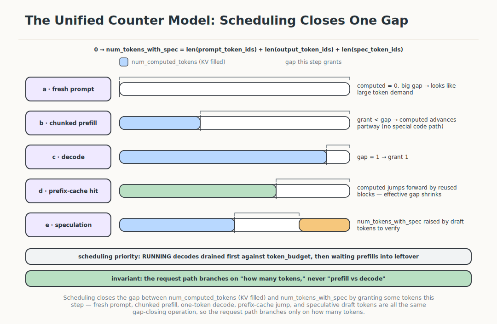</a>

<p class='figure-caption'>The unified counter model: scheduling closes the gap between `num_computed_tokens` (KV filled) and `num_tokens_with_spec` (prompt + output + draft) by granting some tokens this step — a fresh prompt, chunked prefill, a one-token decode, a prefix-cache jump, and speculative draft tokens are all the same gap-closing operation, so the request path branches only on "how many tokens."</p>

Step-by-step read:

- Every request carries two counters: `num_computed_tokens` (how far the KV cache has been filled) and `num_tokens_with_spec` (prompt + generated + any speculative draft tokens). Scheduling is the act of closing that gap by some number of tokens this step.
- A fresh prompt starts with `num_computed_tokens = 0` and a large gap, so it looks like a big token demand; a decoding request has a gap of one (plus draft tokens under speculation). Both are the same operation — "advance `num_computed_tokens`" — differing only in the number granted.
- Because the granted amount can be *less* than the gap, chunked prefill needs no special code path: it is just a prompt that does not receive its whole gap in one step.
- Prefix caching and speculative decoding are named in the same comment as instances of the same generality: prefix caching lowers a request's effective gap by reusing already-computed blocks (Article 07, Automatic Prefix Caching); speculation raises `num_tokens_with_spec` with draft tokens to be verified (Article 12, Speculative Decoding).

The invariant: **one uniform counter model absorbs four features that were separate mechanisms in V0.** The request path never branches on "is this a prefill or a decode"; it branches on "how many tokens," and every advanced feature is expressed as an adjustment to a token count.

### Priority: fill decode first, then waiting prefill

Given a fixed per-step token budget, the scheduler prioritizes requests already in the `running` queue (decodes in flight) and only then pulls waiting prefills into the remaining budget ([Inside vLLM](https://vllm.ai/blog/2025-09-05-anatomy-of-vllm)). The loop order in the source makes this literal.

Source anchor: [`vllm/v1/core/sched/scheduler.py:440-442`](https://github.com/vllm-project/vllm/blob/6cf7b26bd4bff60bf378e1af14044280ac0d214c/vllm/v1/core/sched/scheduler.py#L440-L442)

```python
        # First, schedule the RUNNING requests.
        req_index = 0
        while req_index < len(self.running) and token_budget > 0:
```

Step-by-step read:

- `running` is drained first, against `token_budget`; a second pass (not shown — Article 05) admits waiting requests with whatever budget remains.
- This is precisely why continuous batching and chunked prefill coexist in *one* loop rather than alternating phases: a step can carry a batch of in-flight decodes *and* a slice of a new prompt's prefill together, because both are just token grants against the same budget.

The rule: **latency-sensitive in-flight decodes are never starved of token budget by a large incoming prompt** — the prompt is admitted only into leftover budget and, if necessary, chunked across steps. The scheduling algorithm's queue mechanics, preemption, and budget math are Article 05's subject; the request path only needs the priority rule and the single-loop consequence.

### What crosses the boundary out: the plan plus two finish channels

The `SchedulerOutput` is the request path's payload from CPU planning to GPU execution: it names the new and cached requests, the per-request token counts, KV block assignments, spec-decode tokens, and attention metadata. But it also carries an out-of-band channel that is easy to miss — the set of requests that *finished since the last step* — so downstream workers can drop their per-request state.

Source anchor: [`vllm/v1/core/sched/scheduler.py:1105-1114`](https://github.com/vllm-project/vllm/blob/6cf7b26bd4bff60bf378e1af14044280ac0d214c/vllm/v1/core/sched/scheduler.py#L1105-L1114)

```python
            preempted_req_ids=self.reset_preempted_req_ids,
            # finished_req_ids is an existing state in the scheduler,
            # instead of being newly scheduled in this step.
            # It contains the request IDs that are finished in between
            # the previous and the current steps.
            finished_req_ids=self.finished_req_ids,
            free_encoder_mm_hashes=self.encoder_cache_manager.get_freed_mm_hashes(),
            new_block_ids_to_zero=new_block_ids_to_zero,
            num_spec_tokens_to_schedule=num_spec_tokens_to_schedule,
        )
```

That set is reset each schedule by *reassignment*, not `clear()`, precisely so the just-emitted `SchedulerOutput` keeps its own reference alive:

Source anchor: [`vllm/v1/core/sched/scheduler.py:1213-1217`](https://github.com/vllm-project/vllm/blob/6cf7b26bd4bff60bf378e1af14044280ac0d214c/vllm/v1/core/sched/scheduler.py#L1213-L1217)

```python
        # Clear the finished and preempted request IDs.
        # NOTE: We shouldn't just clear() here because it will also affect
        # the scheduler output.
        self.finished_req_ids = set()
        self.reset_preempted_req_ids = set()
```

A finish must also travel *back to the client*, on a second channel. When a request is freed, its id is recorded per-client, and `update_from_output` attaches those ids to the outgoing `EngineCoreOutputs.finished_requests`:

Source anchor: [`vllm/v1/core/sched/scheduler.py:1833-1845`](https://github.com/vllm-project/vllm/blob/6cf7b26bd4bff60bf378e1af14044280ac0d214c/vllm/v1/core/sched/scheduler.py#L1833-L1845)

```python
        finished_req_ids = self.finished_req_ids_dict
        if finished_req_ids:
            # Include ids of requests that finished since last outputs
            # were sent.
            for client_index, finished_set in finished_req_ids.items():
                # Set finished request set in EngineCoreOutputs for this client.
                if (eco := engine_core_outputs.get(client_index)) is not None:
                    eco.finished_requests = finished_set
                else:
                    engine_core_outputs[client_index] = EngineCoreOutputs(
                        finished_requests=finished_set
                    )
            finished_req_ids.clear()
```

Step-by-step read:

- `finished_req_ids` (a `set`) rides the *next* `SchedulerOutput` so the worker can prune the finished request from its persistent batch state (recall the V1 differential-batch design, where the worker caches request state across steps).
- `finished_req_ids_dict` (per `client_index`) rides the *outgoing* `EngineCoreOutputs`, so the frontend's output processor knows the request is done and can retire its `RequestState`. Both sets are populated in `_free_request` ([`scheduler.py:2116-2118`](https://github.com/vllm-project/vllm/blob/6cf7b26bd4bff60bf378e1af14044280ac0d214c/vllm/v1/core/sched/scheduler.py#L2116-L2118)).
- The consequence for the request path — stated as overview, developed in Article 04 — is that **the two consumers observe the finish on two different clocks.** The client-facing notification rides the *current* step's `EngineCoreOutputs` (`finished_req_ids_dict` is folded in at the end of this very `update_from_output()`, [`scheduler.py:1833-1845`](https://github.com/vllm-project/vllm/blob/6cf7b26bd4bff60bf378e1af14044280ac0d214c/vllm/v1/core/sched/scheduler.py#L1833-L1845)), so the frontend can close the stream immediately. Only the worker-side cleanup waits for the *next* `SchedulerOutput` to carry `finished_req_ids`. The loop's liveness predicate (`has_requests()`) is deliberately wide enough to keep the engine awake for that worker-side flush — it does not delay the client notification.

The property: **finishing a request is bookkeeping that fans out to two consumers on two clocks** — the worker (next step, to drop state) and the client (this step's outputs, to close the stream) — and neither channel is the model's forward pass.

### Freeing blocks, fenced behind the GPU

The scheduler owns KV block ownership, and freeing blocks is where the "plan now, execute later" split becomes a correctness hazard: a request may finish while a forward pass it was part of is still writing its KV. So block frees can be *deferred* and are fenced behind the in-flight step.

Source anchor: [`vllm/v1/core/sched/scheduler.py:2138-2151`](https://github.com/vllm-project/vllm/blob/6cf7b26bd4bff60bf378e1af14044280ac0d214c/vllm/v1/core/sched/scheduler.py#L2138-L2151)

```python
    def _free_request_blocks(self, request: Request):
        """Free the request's KV blocks, deferring the return to the block
        pool when an in-flight GPU step may still write them.
        """
        if not self.defer_block_free or (
            # Last scheduled step already processed: no in-flight write remains
            # (always the case for a normal finish), so free now.
            request.last_sched_seq <= self.processed_step_seq
        ):
            self.kv_cache_manager.free(request)
            return
        blocks = self.kv_cache_manager.pop_blocks_for_free(request)
        if blocks:
            self.deferred_frees.append((self.sched_step_seq, blocks))
```

<a href='images/vllm-01-24-finish-fanout.svg' target='_blank'>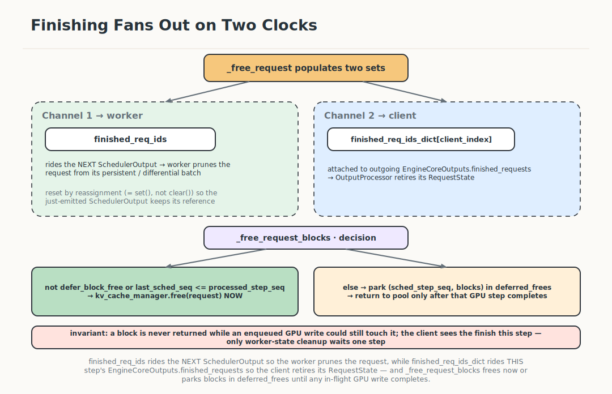</a>

<p class='figure-caption'>Finishing fans out on two clocks: `finished_req_ids` rides the *next* `SchedulerOutput` so the worker prunes the request from its persistent batch, while `finished_req_ids_dict` rides *this* step's `EngineCoreOutputs.finished_requests` so the client retires its `RequestState` — and `_free_request_blocks` frees now or parks blocks in `deferred_frees` until any in-flight GPU write completes.</p>

Step-by-step read:

- The common case (`not self.defer_block_free`, or the request's last scheduled step already processed) frees immediately — a normal end-of-generation finish always hits this branch.
- When async scheduling could have a GPU frame still writing this request's blocks (`last_sched_seq > processed_step_seq`), the blocks are parked in `deferred_frees` keyed by the step sequence and only returned once that step completes.

The invariant, at overview depth: **a block is never returned to the pool while an enqueued GPU write could still touch it** — block-reuse correctness must not depend on timing luck. The paging mechanics, the free-block queue, and prefix-cache hashing live in Article 06 (KV Cache Manager and Paged KV Cache) and Article 07 (Automatic Prefix Caching); the request path only needs to know that the scheduler is the single owner of block lifetime and that frees are fenced.

### The one loop, and where to go next

Everything above collapses to one sentence: the scheduler is the single place where continuous batching, chunked prefill, prefix caching, and speculative decoding all fit into one scheduling loop, expressed as token grants against a per-step budget. The request enters the loop when `EngineCore` calls `scheduler.schedule(...)`, leaves it as a `SchedulerOutput` plan for the GPU, and its finish leaves on two side channels — one to the worker, one to the client. That is all Article 01 asks you to hold. For the queue algorithm, budget accounting, preemption, and `allocate_slots`, continue to Article 05 (Scheduler: Continuous Batching and Chunked Prefill); for block allocation and paging, Article 06; for prefix reuse, Article 07; for draft-token scheduling, Article 12. The next section (§8) follows that `SchedulerOutput` plan across the executor boundary and onto the GPU.

## Model Execution: From Executor to Logits (Overview)

§7 just showed the scheduler emit a `SchedulerOutput`: a plan naming which requests run this step and how many tokens each contributes. This section follows that plan across the last two ownership boundaries before a token exists — `EngineCore` → executor → worker → model runner → logits. It stays at map altitude. The PagedAttention kernels that make the forward pass cheap belong to article 08; input-tensor preparation and CUDA graphs belong to article 09; turning logits into token IDs belongs to article 10. The job here is the connective tissue: how one method call fans out to one-or-many GPUs, and where hidden states become logits.

Recall the two lines from `EngineCore.step()` that hand off to execution:

[`vllm/v1/engine/core.py:490-499`](https://github.com/vllm-project/vllm/blob/6cf7b26bd4bff60bf378e1af14044280ac0d214c/vllm/v1/engine/core.py#L490-L499)

```python
        scheduler_output = self.scheduler.schedule(self._should_throttle_prefills())
        future = self.model_executor.execute_model(scheduler_output, non_block=True)
        grammar_output = self.scheduler.get_grammar_bitmask(scheduler_output)
        with (
            self.log_error_detail(scheduler_output),
            self.log_iteration_details(scheduler_output),
        ):
            model_output = future.result()
            if model_output is None:
                model_output = self.model_executor.sample_tokens(grammar_output)
```

`self.model_executor` is an `Executor`. Everything below is what those two calls — `execute_model` and `sample_tokens` — actually reach.

<a href='images/vllm-01-07-execution-path.svg' target='_blank'>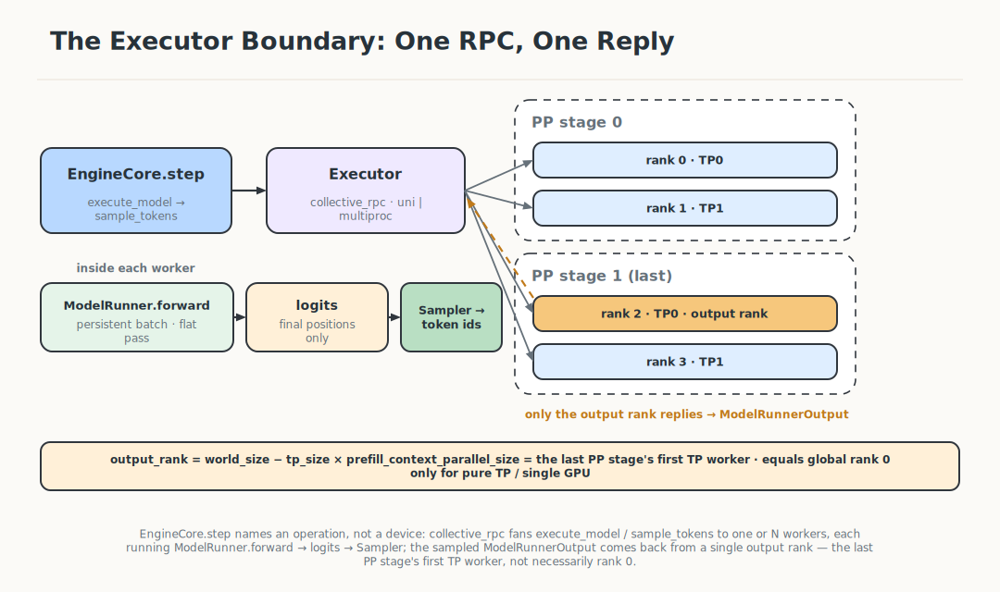</a>

<p class='figure-caption'>`SchedulerOutput` crosses the executor boundary via `collective_rpc`, fans out to one or N workers, and returns a single authoritative worker's `ModelRunnerOutput` (the last PP stage's first TP rank).</p>

### The executor boundary is one method: `collective_rpc`

**Concept.** Just as `EngineCoreClient` (§4) hides whether the engine core is in-process or behind a ZMQ socket, the `Executor` hides whether the model runs on one GPU or many. The engine core never addresses a worker; it names an *operation* and a *target set*, and lets the executor broadcast.

**Source anchor.** [`vllm/v1/executor/abstract.py:221-227`](https://github.com/vllm-project/vllm/blob/6cf7b26bd4bff60bf378e1af14044280ac0d214c/vllm/v1/executor/abstract.py#L221-L227) and `:241-247`.

```python
    def execute_model(
        self, scheduler_output: SchedulerOutput, non_block: bool = False
    ) -> ModelRunnerOutput | None | Future[ModelRunnerOutput | None]:
        output = self.collective_rpc(  # type: ignore[call-overload]
            "execute_model", args=(scheduler_output,), non_block=non_block
        )
        return output[0]
```

```python
    def sample_tokens(
        self, grammar_output: GrammarOutput | None, non_block: bool = False
    ) -> ModelRunnerOutput | Future[ModelRunnerOutput]:
        output = self.collective_rpc(  # type: ignore[call-overload]
            "sample_tokens", args=(grammar_output,), non_block=non_block
        )
        return output[0]
```

**Step-by-step read.**

- Both public executor methods are thin wrappers over `collective_rpc("<method_name>", args=...)`. The named method (`"execute_model"`, `"sample_tokens"`) is invoked on *every* worker in the group; the executor is a fan-out primitive.
- The return *shown* is the **abstract** base's `return output[0]`, but both concrete executors override these methods to request the reply from a single worker. `UniProcExecutor` uses `collective_rpc(..., single_value=True)` ([`uniproc_executor.py:108-131`](https://github.com/vllm-project/vllm/blob/6cf7b26bd4bff60bf378e1af14044280ac0d214c/vllm/v1/executor/uniproc_executor.py#L108-L131)); `MultiprocExecutor` uses `unique_reply_rank=self.output_rank` ([`multiproc_executor.py:310-332`](https://github.com/vllm-project/vllm/blob/6cf7b26bd4bff60bf378e1af14044280ac0d214c/vllm/v1/executor/multiproc_executor.py#L310-L332)), where `output_rank = _get_output_rank()` = `world_size − tp_size × prefill_context_parallel_size` — the first TP worker of the *last PP stage* ([`multiproc_executor.py:498-512`](https://github.com/vllm-project/vllm/blob/6cf7b26bd4bff60bf378e1af14044280ac0d214c/vllm/v1/executor/multiproc_executor.py#L498-L512)). That equals global rank 0 only for pure TP or a single GPU. Under tensor parallelism every rank runs the same forward pass over a sharded weight matrix and produces the same logits after the all-reduce, so any TP rank's `ModelRunnerOutput` is authoritative; under pipeline parallelism the authoritative output lives on the last stage, and the executor asks only that one rank for it rather than gathering all and discarding.
- `non_block=True` is why §6's overlap works: `collective_rpc` returns a `Future` instead of a materialized `ModelRunnerOutput`, so `EngineCore.step()` can run `get_grammar_bitmask` on the CPU while the GPU forward pass is in flight, then call `future.result()` as the sync point.

**Which concrete executor?** Chosen once, at construction, by `Executor.get_class` from `distributed_executor_backend`:

[`vllm/v1/executor/abstract.py:69-76`](https://github.com/vllm-project/vllm/blob/6cf7b26bd4bff60bf378e1af14044280ac0d214c/vllm/v1/executor/abstract.py#L69-L76)

```python
        elif distributed_executor_backend == "mp":
            from vllm.v1.executor.multiproc_executor import MultiprocExecutor

            executor_class = MultiprocExecutor
        elif distributed_executor_backend == "uni":
            from vllm.v1.executor.uniproc_executor import UniProcExecutor

            executor_class = UniProcExecutor
```

For a single GPU the backend resolves to `UniProcExecutor`, whose `collective_rpc` just calls the method on one in-process worker. For tensor/pipeline parallelism it resolves to `MultiprocExecutor` (the docs call it `MultiProcExecutor`), which relays the RPC to worker subprocesses; a Ray-based backend also exists and is deferred wholesale to article 11. The architecture docs summarize the same split — `MultiProcExecutor` for tensor parallelism, `UniProcExecutor` for single-GPU (<https://docs.vllm.ai/en/stable/design/arch_overview/>).

**The invariant.** `EngineCore.step()` contains no branch on GPU count, parallelism degree, or transport. Model execution is expressed as "call `execute_model` on the worker group and take the one authoritative worker's answer." Adding tensor or pipeline parallelism changes which `Executor` subclass is constructed (and which rank that answer comes from), never the step loop. This is the same transport-agnostic contract as the engine client, one layer down. *Deep parallelism internals — how `collective_rpc` reaches worker processes, TP all-reduce, PP microbatching — are article 11.*

### From `SchedulerOutput` to a forward pass: the model runner

**Concept.** Each worker owns exactly one model runner, and each model runner wraps exactly one `torch.nn.Module` — the actual model (<https://docs.vllm.ai/en/stable/design/arch_overview/>). When `collective_rpc("execute_model", ...)` lands on a worker, it calls `GPUModelRunner.execute_model`, whose first job is not the forward pass — it is reconciling the worker's persistent batch with the scheduler's plan.

**Source anchor.** [`vllm/v1/worker/gpu/model_runner.py:1122-1133`](https://github.com/vllm-project/vllm/blob/6cf7b26bd4bff60bf378e1af14044280ac0d214c/vllm/v1/worker/gpu/model_runner.py#L1122-L1133) (excerpt; the full reconciliation is article 09's).

```python
            self.finish_requests(scheduler_output)
            ...
            self.add_requests(scheduler_output)
            self.update_requests(scheduler_output)
```

**Step-by-step read.**

- The worker holds a *persistent* batch across steps and simply **applies the scheduler's diff**: it does not receive freshly-built tensors each iteration but drops finished requests, admits new ones, and refreshes positions/block tables for the survivors. This is V1's "persistent / differential batch," replacing V0's per-step tensor recreation (<https://vllm.ai/blog/2025-01-27-v1-alpha-release>). A guard elided above (`total_num_scheduled_tokens == 0`) short-circuits to `kv_connector.no_forward(...)` so a step scheduled purely for KV-connector bookkeeping runs no model. The full reconciliation set — `finish_requests`/`free_states`/`add_requests`/`update_requests`/`apply_staged_writes` — is article 09's.
- After this prologue, the runner builds the flattened input batch and runs the module. All active sequences are concatenated into one long "super sequence"; position indices and attention metadata keep each sequence attending only to its own tokens, giving continuous batching without right-padding (<https://vllm.ai/blog/2025-09-05-anatomy-of-vllm>). *Input-ID/positions/slot-mapping/block-table construction and CUDA-graph capture/replay are article 09; the attention kernels that consume the block tables are article 08.*

**The rule.** The scheduler's decision (`SchedulerOutput`) is the single source of truth for batch membership; the worker's local batch is a materialized cache of it, mutated by diff and never authoritative on its own. Shipping full tensors every step would be correct but would put CPU-side tensor construction on the GPU's critical path — precisely the overhead V1 removed.

### The hinge: hidden states become logits

**Concept.** A forward pass produces a hidden state for *every* scheduled token, but only the last position of each request needs to be projected to the vocabulary to sample the next token. The model runner selects those positions, then projects.

**Source anchor.** [`vllm/v1/worker/gpu/model_runner.py:1054-1058`](https://github.com/vllm-project/vllm/blob/6cf7b26bd4bff60bf378e1af14044280ac0d214c/vllm/v1/worker/gpu/model_runner.py#L1054-L1058).

```python
        sample_hidden_states = hidden_states[input_batch.logits_indices]
        logits = self.model.compute_logits(sample_hidden_states)
        if grammar_output is not None:
            # Apply grammar bitmask to the logits in-place.
            assert self.structured_outputs_worker is not None
```

**Step-by-step read.**

- `hidden_states` has one row per scheduled token in the flattened batch. `input_batch.logits_indices` picks the rows that need a next-token distribution — the final position of each sequence, plus extra positions when speculative draft tokens are being verified. This is the whole point of computing logits lazily: the vocab projection (`compute_logits`, a `hidden_dim × vocab_size` matmul) runs on a handful of rows, not on every prompt token in a long prefill.
- `compute_logits` applies the language-model head (and, under tensor parallelism, gathers the sharded vocabulary) to produce `[num_sampled_positions, vocab_size]` logits.
- If the scheduler attached a grammar bitmask for this step, it is applied to `logits` **in place**, right here, before sampling. This closes the loop opened in §6: `get_grammar_bitmask` was computed on the engine-core CPU thread concurrently with the forward pass, threaded through as `grammar_output`, and lands on the exact batch it was scheduled for. Structured-output constraints are enforced by masking logits, not by post-hoc filtering of tokens.

**The property.** Only final-position (and draft-verification) hidden states are projected to vocab size. Chunked prefill of a 10,000-token prompt still pays a one-row vocab projection per scheduled chunk for that request, not 10,000 rows. And because the bitmask is applied to *these* logits inside the same call that produced them, the grammar constraint can never drift onto a stale or mismatched batch.

### The execute/sample seam: why sampling can be a second call

**Concept.** §6 showed `EngineCore.step()` calling `execute_model`, then — only if the result is `None` — calling `sample_tokens(grammar_output)`. That `None` is a deliberate signal from the worker: "I ran the forward pass and stashed the hidden states; call me back to sample."

**Source anchor.** [`vllm/v1/worker/gpu/model_runner.py:1358-1371`](https://github.com/vllm-project/vllm/blob/6cf7b26bd4bff60bf378e1af14044280ac0d214c/vllm/v1/worker/gpu/model_runner.py#L1358-L1371) and `:1392-1394`.

```python
    def sample_tokens(
        self, grammar_output: GrammarOutput | None
    ) -> AsyncOutput | ModelRunnerOutput | None:
        if self.execute_model_state is None:
            # The prior execute_model call must have failed.
            return None

        input_batch = self.execute_model_state.input_batch
        attn_metadata = self.execute_model_state.attn_metadata
        slot_mappings_by_layer = self.execute_model_state.slot_mappings_by_layer
        hidden_states = self.execute_model_state.hidden_states
        aux_hidden_states = self.execute_model_state.aux_hidden_states
        finished_req_ids = self.execute_model_state.finished_req_ids
        self.execute_model_state = None
```

```python
        sampler_output, num_sampled, num_rejected = self.sample(
            hidden_states, input_batch, grammar_output
        )
```

**Step-by-step read.**

- The worker's `execute_model` runs the transformer, saves everything sampling needs into `self.execute_model_state` (`hidden_states`, the input batch, attention metadata, the finished-request set), and returns without sampling — which surfaces at the executor as `output[0] is None`, tripping the `if model_output is None:` branch in `step()`.
- `sample_tokens(grammar_output)` then reads that stashed state, clears it (so the seam is single-use per step), and calls `self.sample(hidden_states, input_batch, grammar_output)` — the same `sample` method whose logits hinge we just read.
- Splitting execution from sampling buys two things. First, the grammar bitmask is computed on the CPU *while* the GPU is busy and only needs to exist by the sampling call, so structured output typically costs no serial GPU stall. Second, it is the natural insertion point for pipeline parallelism (only the last PP rank samples; earlier ranks return a KV-connector-only output) and for asynchronous scheduling.
- The `sample` method also forks on `input_batch.num_draft_tokens`: with no draft tokens it runs the ordinary `Sampler`; with draft tokens it runs the rejection sampler for speculative decoding. *That fork is article 12; the ordinary sampler's temperature / top-p / top-k / penalty pipeline is article 10.*

**The design.** Sampling is a distinct, resumable phase keyed to `execute_model_state`. A request can be aborted, or a grammar mask computed, in the window between the forward pass finishing and tokens being drawn — which is precisely the abort window §6 identified between `future.result()` and `update_from_output`.

### What comes back

`sample_tokens` packages the drawn token IDs into a `ModelRunnerOutput`, and the executor returns the authoritative worker's copy up to `EngineCore.step()` as `model_output`. From there §6 takes over: `update_from_output` folds those tokens into request progress and frees finished KV blocks. Note one detail that matters downstream — a single step's `ModelRunnerOutput` may carry **more than one** new token per request (speculative decoding, multi-token prediction), so "one step, one token" is the common case, not an invariant.

### Where this hands off

This section named four boundaries and cross-referenced their internals rather than duplicating them:

- **Executor fan-out, `collective_rpc` over worker processes, TP all-reduce, PP microbatching** → article 11 (distributed inference and parallelism).
- **Input-tensor preparation, slot mapping, CUDA-graph capture/replay** → article 09 (worker and model runner).
- **PagedAttention kernels and attention backends** that consume the block tables → article 08.
- **The `Sampler` — temperature, top-k/p, penalties, logprobs** applied to the logits produced at the hinge → article 10.
- **Rejection sampling and draft-token verification** on the `num_draft_tokens` fork → article 12.

The mental model to keep: `execute_model` and `sample_tokens` are two `collective_rpc` calls that name an operation, not a device; the worker turns the scheduler's diff into a flattened forward pass, projects only the final positions to logits, applies the scheduler-owned grammar mask in place, and samples — returning the authoritative worker's `ModelRunnerOutput` for the engine core to commit.

## From Hidden States to a Sampled Token (Overview)

§8 left the request one array short of an answer: a `[num_scheduled_logits, hidden_size]` tensor of final-position hidden states, projected to a `[·, vocab_size]` logits tensor sitting on the GPU. This section closes the last GPU-side gap — logits to a concrete token id — and shows that in V1 that gap is crossed by a *separate, deliberately deferrable* call. The internals of what makes a token "good" (penalties, temperature, top-k/top-p, min-p, logprobs) are the whole subject of article 10; article 01's job is only to name the seam, show the entry point, and follow the sampled id back onto the return path.

### Sampling is a separate call, on purpose

Concept: in the engine step (§6), `execute_model` runs `non_block=True` and returns a `Future`. When that future resolves to `None`, the executor has *deferred* sampling, and the engine makes a second call — `sample_tokens` — passing the grammar bitmask it prepared on the CPU while the GPU was busy.

Source: [`vllm/v1/engine/core.py:497-499`](https://github.com/vllm-project/vllm/blob/6cf7b26bd4bff60bf378e1af14044280ac0d214c/vllm/v1/engine/core.py#L497-L499)

```python
            model_output = future.result()
            if model_output is None:
                model_output = self.model_executor.sample_tokens(grammar_output)
```

Step-by-step read:

- **`future.result()` is the forward-pass sync point.** It returns a `ModelRunnerOutput` if the worker sampled inline, or `None` if the worker computed hidden states but stopped short of turning them into tokens.
- **`None` is the deferral sentinel.** It says "the forward pass is done; the logits exist; ask me to sample separately." The second call, `sample_tokens(grammar_output)`, feeds in the structured-output mask — the `grammar_output` computed one line earlier by `self.scheduler.get_grammar_bitmask(...)` (§6), concurrently with the forward pass.
- **The mask meets the logits at sampling time.** Because the bitmask is built on the CPU while the GPU runs, and applied only in this `sample_tokens` call, it lands on *this* step's logits, for *this* step's requests.

The invariant this seam protects: **the structured-output bitmask is applied to exactly the batch it was computed for, and CPU mask-prep runs concurrently with the forward pass instead of serializing ahead of it.** Splitting forward from sample also gives async scheduling its opening — the engine can begin scheduling step N+1 while step N's sampling is still in flight — without the grammar mask for one step ever leaking onto another step's logits. Where the split does not happen (the common synchronous case), `future.result()` already carries the sampled `ModelRunnerOutput` and the `if` is skipped; the seam is optional by construction, not mandatory overhead.

### Across the executor boundary, symmetric to `execute_model`

Concept: `sample_tokens` crosses the same executor boundary as `execute_model`, using the same `collective_rpc` shape. The engine loop does not know or care whether one GPU or sixteen sit behind it.

Source: [`vllm/v1/executor/abstract.py:241-247`](https://github.com/vllm-project/vllm/blob/6cf7b26bd4bff60bf378e1af14044280ac0d214c/vllm/v1/executor/abstract.py#L241-L247)

```python
    def sample_tokens(
        self, grammar_output: GrammarOutput | None, non_block: bool = False
    ) -> ModelRunnerOutput | Future[ModelRunnerOutput]:
        output = self.collective_rpc(  # type: ignore[call-overload]
            "sample_tokens", args=(grammar_output,), non_block=non_block
        )
        return output[0]
```

Step-by-step read:

- **`collective_rpc("sample_tokens", ...)` fans the call to the worker group** and the *abstract* base returns `output[0]`. Both concrete executors override that: `MultiprocExecutor` requests the reply from a single `output_rank` — the first TP worker of the last PP stage ([`multiproc_executor.py:310-332`](https://github.com/vllm-project/vllm/blob/6cf7b26bd4bff60bf378e1af14044280ac0d214c/vllm/v1/executor/multiproc_executor.py#L310-L332), `498-512`) — and `UniProcExecutor` uses `single_value=True` ([`uniproc_executor.py:108-131`](https://github.com/vllm-project/vllm/blob/6cf7b26bd4bff60bf378e1af14044280ac0d214c/vllm/v1/executor/uniproc_executor.py#L108-L131)); either way exactly one worker's `ModelRunnerOutput` comes back, not a gather-and-discard. This is byte-for-byte the pattern of `execute_model` ([`abstract.py:221-227`](https://github.com/vllm-project/vllm/blob/6cf7b26bd4bff60bf378e1af14044280ac0d214c/vllm/v1/executor/abstract.py#L221-L227)) — forward and sample are structurally identical RPCs, which is why `EngineCore.step()` can treat them as two calls on one uniform `Executor` handle.
- **Each worker lands in `GPUModelRunner.sample_tokens`** ([`model_runner.py:1358-1363`](https://github.com/vllm-project/vllm/blob/6cf7b26bd4bff60bf378e1af14044280ac0d214c/vllm/v1/worker/gpu/model_runner.py#L1358-L1363)), which retrieves the hidden states and `InputBatch` it stashed during `execute_model` (`self.execute_model_state`) and, on the last pipeline-parallel rank, calls `self.sample(hidden_states, input_batch, grammar_output)` ([`model_runner.py:1391-1394`](https://github.com/vllm-project/vllm/blob/6cf7b26bd4bff60bf378e1af14044280ac0d214c/vllm/v1/worker/gpu/model_runner.py#L1391-L1394)). Non-last PP ranks instead *receive* the sampled tokens broadcast from the last rank — sampling happens once, where the final hidden states live.

The rule: **sampling runs where the hidden states are, behind the same executor contract as the forward pass.** The engine never reaches into a worker; TP/PP fan-out and the last-rank sampling rule are article 09/11 territory. Article 01 records only that the logits-to-token step is one more `collective_rpc`, not a special path.

### The hinge: hidden states to logits to a sampled token

Concept: inside the model runner, one method turns the forward pass's hidden states into a `SamplerOutput`. It is the exact point where the "model" ends and "sampling" begins.

Source: [`vllm/v1/worker/gpu/model_runner.py:1048-1068`](https://github.com/vllm-project/vllm/blob/6cf7b26bd4bff60bf378e1af14044280ac0d214c/vllm/v1/worker/gpu/model_runner.py#L1048-L1068)

```python
    def sample(
        self,
        hidden_states: torch.Tensor,
        input_batch: InputBatch,
        grammar_output: GrammarOutput | None,
    ) -> tuple[SamplerOutput, torch.Tensor, torch.Tensor]:
        sample_hidden_states = hidden_states[input_batch.logits_indices]
        logits = self.model.compute_logits(sample_hidden_states)
        if grammar_output is not None:
            # Apply grammar bitmask to the logits in-place.
            assert self.structured_outputs_worker is not None
            self.structured_outputs_worker.apply_grammar_bitmask(
                logits,
                input_batch,
                grammar_output.structured_output_request_ids,
                grammar_output.grammar_bitmask,
            )

        if input_batch.num_draft_tokens == 0 or self.rejection_sampler is None:
            assert self.sampler is not None
            sampler_output = self.sampler(logits, input_batch)
```

Step-by-step read:

- **`hidden_states[input_batch.logits_indices]` selects only the positions that need a token.** The forward pass ran over a flattened batch of *all* scheduled tokens (§8), but only the last position of each sequence (and, under spec decode, a few extra) needs a logit. `logits_indices` gathers exactly those rows, so the vocab projection is done for a handful of positions, not the whole flattened batch.
- **`self.model.compute_logits(sample_hidden_states)`** is the hidden-states-to-vocab projection — the language-model head. This single line is the boundary the whole section is named after.
- **The grammar bitmask is applied in place, right here.** This closes the loop from §6: the mask is scheduler-owned, carried across `sample_tokens`, and stamped onto the logits *before* the sampler ever sees them — so a structured-output request cannot sample a token its grammar forbids.
- **`self.sampler(logits, input_batch)`** is the handoff into the sampler proper (the common, no-spec-decode branch). The `else` branch ([`model_runner.py:1069-1078`](https://github.com/vllm-project/vllm/blob/6cf7b26bd4bff60bf378e1af14044280ac0d214c/vllm/v1/worker/gpu/model_runner.py#L1069-L1078)) routes to `self.rejection_sampler` when draft tokens are present — speculative decoding, deferred to article 12.

The property: **only final-position hidden states are projected to vocab.** The `[logits_indices]` gather is what keeps decode cheap — computing a full `[num_all_tokens, vocab_size]` logits tensor for every prompt token in every prefill would burn memory bandwidth on rows no one samples. The gather makes "cost of sampling" scale with the number of requests, not the number of tokens in the batch.

### The sampler entry point

Concept: `self.sampler(...)` invokes `Sampler.__call__`, which prepares per-request views and then delegates the actual token draw to `Sampler.sample`. `sample` is where logits become an index; everything upstream of the draw is a logits-processing pipeline.

Source: [`vllm/v1/worker/gpu/sample/sampler.py:198-216`](https://github.com/vllm-project/vllm/blob/6cf7b26bd4bff60bf378e1af14044280ac0d214c/vllm/v1/worker/gpu/sample/sampler.py#L198-L216) (excerpt; the full pipeline is article 10's):

```python
    def sample(
        self,
        logits: torch.Tensor,
        ...
    ) -> tuple[torch.Tensor, torch.Tensor]:
        processed_logits = self.apply_sampling_params(
            logits,
            ...
            skip_top_k_top_p=True,
        )
```

<a href='images/vllm-01-25-sampler-pipeline.svg' target='_blank'>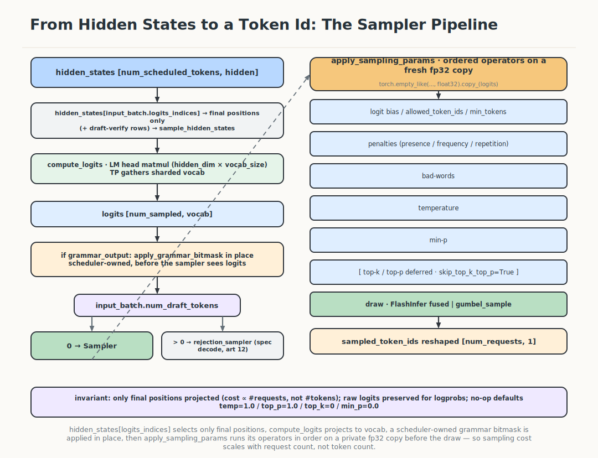</a>

<p class='figure-caption'>From hidden states to a token id: `hidden_states[input_batch.logits_indices]` selects only final positions, `compute_logits` projects to vocab, a scheduler-owned grammar bitmask is applied in place, then `apply_sampling_params` runs its operators in order (bias / `min_tokens` → penalties → bad-words → temperature → min-p, with top-k/top-p deferred) on a private fp32 copy before the draw — so sampling cost scales with request count, not token count.</p>

Step-by-step read:

- **`Sampler.__call__` ([`sampler.py:72-102`](https://github.com/vllm-project/vllm/blob/6cf7b26bd4bff60bf378e1af14044280ac0d214c/vllm/v1/worker/gpu/sample/sampler.py#L72-L102)) is the true entry from the model runner.** It derives `pos` and `input_ids` from `input_batch.logits_indices`, decides whether logprobs are needed, calls `self.sample(...)`, and packs the result into a `SamplerOutput` whose `sampled_token_ids` is reshaped to `[num_requests, 1]` ([`sampler.py:134-144`](https://github.com/vllm-project/vllm/blob/6cf7b26bd4bff60bf378e1af14044280ac0d214c/vllm/v1/worker/gpu/sample/sampler.py#L134-L144)) — one token per request per step, before spec decode expands it.
- **`apply_sampling_params` is the logits-processing pipeline.** In order ([`sampler.py:146-196`](https://github.com/vllm-project/vllm/blob/6cf7b26bd4bff60bf378e1af14044280ac0d214c/vllm/v1/worker/gpu/sample/sampler.py#L146-L196)): copy logits to a fresh fp32 tensor, then apply logit bias / `allowed_token_ids` / `min_tokens`, penalties (presence, frequency, repetition), bad-words masking, temperature, and min-p — with top-k/top-p deferred here (`skip_top_k_top_p=True`) so `sample` can route them through the FlashInfer fused path or the fallback. Each of those operators is a section of article 10; article 01 states only their existence and order.
- **The draw itself** ([`sampler.py:217-244`](https://github.com/vllm-project/vllm/blob/6cf7b26bd4bff60bf378e1af14044280ac0d214c/vllm/v1/worker/gpu/sample/sampler.py#L217-L244)) picks FlashInfer's fused top-k/top-p sampler when eligible, else applies top-k/top-p and calls `gumbel_sample`, returning `(sampled, processed_logits)`.

The invariant, visible in the first line of `apply_sampling_params` ([`sampler.py:157`](https://github.com/vllm-project/vllm/blob/6cf7b26bd4bff60bf378e1af14044280ac0d214c/vllm/v1/worker/gpu/sample/sampler.py#L157), `torch.empty_like(logits, dtype=torch.float32).copy_(logits)`): **sampling works on a private fp32 copy, never the model's original logits.** Penalties and temperature mutate that copy in place, so the raw logits survive intact for logprob computation and the model's own buffer is never corrupted by sampling-time edits. The defaults that make this pipeline a no-op unless asked — `temperature=1.0`, `top_p=1.0`, `top_k=0` (all tokens), `min_p=0.0`, `n=1`, `max_tokens=16` — come from the same `SamplingParams` object on both the offline and online paths ([SamplingParams API](https://docs.vllm.ai/en/stable/api/vllm/sampling_params.html)).

### Closing the loop: the token id becomes `new_token_ids`

Concept: the sampled id does not return to the caller as an integer. It rides back as a field of the wire-shaped `EngineCoreOutput`, folded into request progress by `update_from_output` (§6).

Source: [`vllm/v1/engine/__init__.py:181-205`](https://github.com/vllm-project/vllm/blob/6cf7b26bd4bff60bf378e1af14044280ac0d214c/vllm/v1/engine/__init__.py#L181-L205) (two key fields; §10 quotes the full struct):

```python
    request_id: str
    new_token_ids: list[int]
    ...
    @property
    def finished(self) -> bool:
        return self.finish_reason is not None
```

Step-by-step read:

- **`new_token_ids: list[int]`, not `int`.** The path from sampler to caller is multi-token-ready from the first field. In the common case the list holds one id; under speculative decoding or other multi-token schemes it holds several accepted ids for one step (article 12). Nothing downstream — detokenizer, stop-string check, `RequestOutput` — has to special-case spec decode at this boundary because the type already accounts for it.
- **`finished` is a derived property, not a stored flag.** It is `True` iff `finish_reason` is set. The engine core sets `finish_reason` on length/EOS finishes; stop-*string* finishes are decided later, in the output processor, over detokenized text (§10) — which is why `EngineCoreOutput.finished` and the caller-visible finish can legitimately differ for one step.
- **`num_nans_in_logits`** is the corruption tripwire: the sampler computes it *before* penalties and temperature ([`sampler.py:84-86`](https://github.com/vllm-project/vllm/blob/6cf7b26bd4bff60bf378e1af14044280ac0d214c/vllm/v1/worker/gpu/sample/sampler.py#L84-L86)) so a non-zero value points at the model's own output, not at sampling.

The takeaway: **the sampled token leaves the GPU as data on a msgspec struct, not as a return value up a call stack.** The whole hidden-states-to-token computation happens in the engine (or worker) process; the caller receives `new_token_ids` only after `update_from_output` has committed them to request state and routed an `EngineCoreOutputs` back through the client. "First token," concretely, is the first `EngineCoreOutput` a request emits carrying a non-empty `new_token_ids`; the prefill-to-decode transition it marks is observed one boundary later, in the output processor (§10–§11).

Cross-references: the logits-processing operators named but not opened here — logit bias, penalties, bad words, temperature, min-p, top-k/top-p, and logprob assembly — are the full subject of **article 10** (Sampling and Logits Processing). The `rejection_sampler` branch and the multi-token `new_token_ids` are **article 12** (Speculative Decoding). The `logits_indices` gather and the flattened-batch layout it indexes into belong to **article 08/09**. The next section follows `new_token_ids` off the GPU and into text.

## Output Processing: EngineCoreOutput to RequestOutput

Every prior section pushed a request *forward*: the façade normalized it, the input processor wire-shaped it, the client abstraction ferried it across a process boundary, the engine step scheduled and sampled it. This is the one section that runs the other way. Sampled token IDs leave `EngineCore.step()` as `EngineCoreOutputs` — a per-client bundle of per-request `EngineCoreOutput`s — and have to become user-facing `RequestOutput`s carrying decoded text, finish reasons, and logprobs. That translation is the `OutputProcessor`, and it is deliberately *not* part of the hot engine loop. §6 already showed the seam from the caller's side: `LLMEngine.step()` calls `get_output()`, then `output_processor.process_outputs(...)`, then feeds the returned `reqs_to_abort` back into the engine. This section opens that middle call and shows the invariants it defends.

<a href='images/vllm-01-08-output-path.svg' target='_blank'>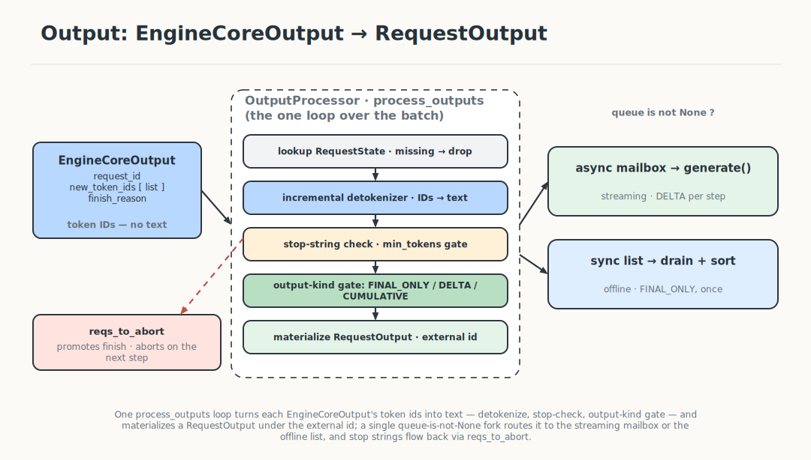</a>

<p class='figure-caption'>The return path: one batch of `EngineCoreOutput`s → the single `process_outputs` loop → per-request detokenize / stop-check / materialize → async queue or sync list.</p>

### The input struct: what the engine actually ships back

Concept: the unit crossing the boundary is intentionally minimal — token IDs plus optional metadata, not text.

Source: [`vllm/v1/engine/__init__.py:175-205`](https://github.com/vllm-project/vllm/blob/6cf7b26bd4bff60bf378e1af14044280ac0d214c/vllm/v1/engine/__init__.py#L175-L205)

```python
class EngineCoreOutput(
    msgspec.Struct,
    array_like=True,  # type: ignore[call-arg]
    omit_defaults=True,  # type: ignore[call-arg]
    gc=False,
):  # type: ignore[call-arg]
    request_id: str
    new_token_ids: list[int]
    ...
    finish_reason: FinishReason | None = None
    stop_reason: int | str | None = None
    ...
    @property
    def finished(self) -> bool:
        return self.finish_reason is not None
```

Step-by-step read. `new_token_ids` is a **list**, not a scalar — one step can commit more than one token per request (speculative decoding, multi-token prediction), so the return path must be written to fold *N* tokens at once rather than assuming one. Everything after it is optional (`omit_defaults=True`), and `finished` is a *derived* property: a request is finished exactly when the engine attached a `finish_reason` (length, EOS, stop-token). Notably there is **no text field** — detokenization was moved out of the engine process in V1 so it overlaps GPU work ([V1 blog](https://vllm.ai/blog/2025-01-27-v1-alpha-release)). The engine ships IDs; text is the output processor's job.

The invariant this shape protects: **"finished" means "has a finish reason," and the engine is the authority on that — except for stop *strings*, which the engine cannot see because it has no text.** That single gap is the whole reason the return path can send a signal *back* into the engine, and the next few subsections are about how it does so safely.

### The one loop allowed to touch the whole batch

Concept: V1 minimizes Python-level per-batch loops. There is exactly one function that iterates the batch, and all per-request work is expected to live inside it.

Source: [`vllm/v1/engine/output_processor.py:594-601`](https://github.com/vllm-project/vllm/blob/6cf7b26bd4bff60bf378e1af14044280ac0d214c/vllm/v1/engine/output_processor.py#L594-L601)

```python
        NOTE FOR DEVELOPERS

        vLLM V1 minimizes the number of python loops over the full
        batch to ensure system overheads are minimized. This is the
        only function that should loop over EngineCoreOutputs.

        If you need to touch every element of the batch, do it from
        within the loop below.
```

The loop begins by looking up per-request state, and drops outputs it does not recognize.

Source: [`vllm/v1/engine/output_processor.py:606-611`](https://github.com/vllm-project/vllm/blob/6cf7b26bd4bff60bf378e1af14044280ac0d214c/vllm/v1/engine/output_processor.py#L606-L611)

```python
        for engine_core_output in engine_core_outputs:
            req_id = engine_core_output.request_id
            req_state = self.request_states.get(req_id)
            if req_state is None:
                # Ignore output for already-aborted request.
                continue
```

Step-by-step read. `req_state` is the long-lived per-request accumulator (`RequestState`) holding this request's detokenizer, logprobs processor, prompt data, and streaming bookkeeping. Its absence is **not an error** — a request aborted a moment ago (from a client disconnect, a cancelled `generate()`, a prior stop string) has already been popped from `request_states`, and the engine may still be mid-flight producing one last output for it. Silently `continue`-ing is what makes abort and output processing race-safe without a lock: the two sides converge because a missing entry is defined to mean "drop," not "crash."

The rule: **the output processor is a pure function of `request_states`; any output for a request it no longer owns is discarded.** This is what lets abort run concurrently with a step whose outputs are already in flight.

### Detokenize, and promote stop strings the engine could not see

Concept: for non-pooling requests, new IDs are fed to an incremental detokenizer that appends decoded text and checks stop strings. A matched stop string *upgrades* the finish state locally.

Source: [`vllm/v1/engine/output_processor.py:635-644`](https://github.com/vllm-project/vllm/blob/6cf7b26bd4bff60bf378e1af14044280ac0d214c/vllm/v1/engine/output_processor.py#L635-L644)

```python
            if pooling_output is None:
                assert req_state.detokenizer is not None
                assert req_state.logprobs_processor is not None
                # 2) Detokenize the token ids into text and perform stop checks.
                stop_string = req_state.detokenizer.update(
                    new_token_ids, finish_reason == FinishReason.STOP
                )
                if stop_string:
                    finish_reason = FinishReason.STOP
                    stop_reason = stop_string
```

The detokenizer's `update` is where token IDs become characters. Its subtlety is that the *token* stream and the *text* stream are deliberately allowed to disagree.

Source: [`vllm/v1/engine/detokenizer.py:107-142`](https://github.com/vllm-project/vllm/blob/6cf7b26bd4bff60bf378e1af14044280ac0d214c/vllm/v1/engine/detokenizer.py#L107-L142) (excerpt; the full incremental-decode loop is article 10's):

```python
        if stop_terminated and not self.include_stop_str_in_output:
            # If stop-terminated, exclude last token from detokenization
            # based on include_stop_str_in_output parameter.
            skipped_stop_token_id = new_token_ids[-1]
            new_token_ids = new_token_ids[:-1]
        else:
            skipped_stop_token_id = None

        # 1) Detokenize the new token ids incrementally.
        stop_check_offset = len(self.output_text)
        ...

        # 2) Evaluate stop strings.
        stop_string = None
        if self.stop and self.num_output_tokens() > self.min_tokens:
            stop = check_stop_strings(
                output_text=self.output_text,
                new_char_count=len(self.output_text) - stop_check_offset,
                stop=self.stop,
                include_in_output=self.include_stop_str_in_output,
            )
            if stop is not None:
                stop_string, truncate_to = stop
                if truncate_to != -1:
                    self.output_text = self.output_text[:truncate_to]

        return stop_string
```

Step-by-step read. When the engine stopped on a stop *token* and the user did not ask to keep it, the last ID is pulled out of the decode set (`skipped_stop_token_id`) so it contributes no characters, then re-appended to `token_ids` — the token list stays complete while the text omits the terminator. The elided incremental loop decodes each new id and advances `stop_check_offset` (a `min_tokens`-gated high-water mark) so the stop-string search covers only *newly added* characters — matching is O(new chars), not O(whole output), each step; the full loop is article 10's. The `num_output_tokens() > self.min_tokens` guard gates the whole stop block, so **no stop string can fire before `min_tokens` is reached**. On a match, `check_stop_strings` may return a truncation length so `output_text` is cut to drop the stop string (unless `truncate_to == -1`, meaning it sits at the very end and no cut is needed).

Back in the loop: if `update` returns a stop string, the processor **overwrites `finish_reason` to `STOP` and sets `stop_reason` to the matched string**. This is the divergence the input struct set up: `engine_core_output.finished` may still be `False` (the engine kept generating) while the processor has locally decided the request is done. §6 showed the other half of the closure — the loop appends such `req_id`s to `reqs_to_abort`, and `LLMEngine.step()` / the async `output_handler` feed them back so the *next* `EngineCore.step()` stops that request at its abort window.

The invariants: **(1) `token_ids` is the complete sampled sequence; `output_text` may omit the stop token/string — they are allowed to disagree by design.** **(2) `min_tokens` is honored on the text side, not just the engine side.** **(3) stop-string detection is a return-path concept, and the only mechanism that lets the return path stop the engine is `reqs_to_abort`.** What this prevents: streaming a stop string to the user, letting a stop string end generation before `min_tokens`, and — because promotion plus `reqs_to_abort` are eventually consistent — an engine that keeps burning tokens on a request the text layer already finished.

### Deciding whether to surface anything this step

Concept: not every `EngineCoreOutput` becomes a `RequestOutput`. `make_request_output` applies the output-kind gates and returns `None` when nothing should be emitted.

Source: [`vllm/v1/engine/output_processor.py:280-331`](https://github.com/vllm-project/vllm/blob/6cf7b26bd4bff60bf378e1af14044280ac0d214c/vllm/v1/engine/output_processor.py#L280-L331)

```python
        finished = finish_reason is not None
        final_only = self.output_kind == RequestOutputKind.FINAL_ONLY

        if not finished and final_only:
            # Only the final output is required in FINAL_ONLY mode.
            return None

        if self.stream_interval > 1:
            assert self.detokenizer is not None
            ...
            if not (
                finished
                or self.sent_tokens_offset == 0
                or self.detokenizer.num_output_tokens() - self.sent_tokens_offset
                >= self.stream_interval
            ):
                return None

            if self.output_kind == RequestOutputKind.DELTA:
                # Send tokens from the offset in DELTA mode, otherwise all
                # tokens are sent.
                new_token_ids = self.detokenizer.output_token_ids[
                    self.sent_tokens_offset :
                ]
                self.sent_tokens_offset = self.detokenizer.num_output_tokens()

        external_req_id = self.external_req_id
        ...
        output = self._new_completion_output(new_token_ids, finish_reason, stop_reason)

        if self.parent_req is None:
            outputs = [output]
        else:
            outputs, finished = self.parent_req.get_outputs(self.request_id, output)
            if not outputs:
                return None
            external_req_id = self.parent_req.external_req_id

        return self._new_request_output(
            external_req_id, outputs, finished, kv_transfer_params
        )
```

Step-by-step read. `output_kind` comes from `SamplingParams.output_kind` and selects the surfacing contract: **`FINAL_ONLY`** (offline default — §2 showed `_add_request` forcing it) emits exactly one output, on completion, so every non-final step returns `None`; **`DELTA`** (OpenAI streaming) emits only the newly generated slice; **`CUMULATIVE`** re-sends the growing whole. `stream_interval > 1` further coalesces: emit only on finish, on the first token, or every `stream_interval` tokens — and in DELTA mode it re-slices `new_token_ids` to `output_token_ids[sent_tokens_offset:]` and advances `sent_tokens_offset`, so tokens skipped across quiet steps are delivered together rather than dropped. Finally, parallel sampling (`n>1`) routes through `parent_req.get_outputs`: child outputs are aggregated, an empty list means "not ready to surface yet" → `None`, and the surfaced id switches to the **parent's** external id (§5's fan-out, closed here).

The guarantees: **`FINAL_ONLY` yields exactly one output; `stream_interval` coalesces but never drops delta tokens (`sent_tokens_offset` is the high-water mark); parallel-sampling children surface under one parent id.** What this prevents: the offline caller receiving a `RequestOutput` per step (it wants one), a delta consumer losing tokens across a coalesced interval, and `n>1` leaking as `n` separate user results.

### The envelope: always the external id

Concept: the final wrapper stamps the user-facing identity onto the result.

Source: [`vllm/v1/engine/output_processor.py:363-373`](https://github.com/vllm-project/vllm/blob/6cf7b26bd4bff60bf378e1af14044280ac0d214c/vllm/v1/engine/output_processor.py#L363-L373)

```python
        return RequestOutput(
            request_id=external_req_id,  # request_id is what was provided externally
            lora_request=self.lora_request,
            prompt=self.prompt,
            prompt_token_ids=prompt_token_ids,
            prompt_logprobs=prompt_logprobs,
            outputs=cast(list[CompletionOutput], outputs),
            finished=finished,
            kv_transfer_params=kv_transfer_params,
            num_cached_tokens=self.num_cached_tokens,
            metrics=self.stats,
        )
```

Step-by-step read. Recall §3: `assign_request_id` appended 8 random characters to the internal id for uniqueness while stashing the caller's id in `external_req_id`. Here, at the last hop before the result reaches the user, `request_id` is set to `external_req_id` — never the internal randomized one, never a parallel-sampling child id. Prompt logprobs are *popped* in DELTA mode (surfaced exactly once) and passed by reference otherwise; that assembly is article 10's territory.

The invariant: **every user-facing `RequestOutput.request_id` is the external id the caller submitted.** What this prevents: the internal ID scheme (random suffixes, child fan-out) ever leaking into API responses, which would break the offline drain's terminal `sorted(..., key=lambda x: int(x.request_id))` (§2) and any client correlating results to its own request IDs.

### The one fork: async push vs sync return

Concept: a single `if` decides whether a materialized output is pushed into a per-request async mailbox or appended to a returned list.

Source: [`vllm/v1/engine/output_processor.py:650-681`](https://github.com/vllm-project/vllm/blob/6cf7b26bd4bff60bf378e1af14044280ac0d214c/vllm/v1/engine/output_processor.py#L650-L681)

```python
            # 4) Create and handle RequestOutput objects.
            if request_output := req_state.make_request_output(
                new_token_ids,
                pooling_output,
                finish_reason,
                stop_reason,
                kv_transfer_params,
            ):
                if req_state.streaming_input:
                    request_output.finished = False

                if req_state.queue is not None:
                    # AsyncLLM: put into queue for handling by generate().
                    req_state.queue.put(request_output)
                else:
                    # LLMEngine: return list of RequestOutputs.
                    request_outputs.append(request_output)

            # Free completed requests.
            if finish_reason is not None:
                if req_state.streaming_input:
                    ...
                else:
                    self._finish_request(req_state)
                    if not engine_core_output.finished:
                        # If req not finished in EngineCore, but Detokenizer
                        # detected stop string, abort needed in EngineCore.
                        reqs_to_abort.append(req_id)
```

Step-by-step read. `req_state.queue is not None` is the *entire* difference between the online and offline return paths. In `AsyncLLM` the queue is a per-request `RequestOutputCollector` that `generate()` awaits; in `LLMEngine` it is `None` and outputs accumulate in a list the sync caller drains. Both branches run the identical detokenize / stop-check / materialize logic above — only the last step diverges. Teardown mirrors this: on finish, `_finish_request` pops the state from every index (`request_states`, the external→internal map, the parent), and the `not engine_core_output.finished` check is precisely the stop-string closure from earlier — the engine still thinks the request is live, so its id joins `reqs_to_abort`.

The design: **online and offline share one code path and diverge at a single branch; the streaming mailbox internals and the async generator live in §11, and the deep async fan-out lives in article 04.** What this prevents: two parallel output-processing implementations drifting apart — the same stop-string, delta, and parallel-sampling semantics are guaranteed identical for `LLM.generate()` and the OpenAI server because they run the same loop.

### What to carry forward

The output processor is where token IDs re-acquire meaning. It owns four things the engine deliberately does not: **incremental detokenization** (IDs → text, with token/text divergence and `min_tokens` respected), **stop-string detection** (the one signal that flows *back* into the engine, via `reqs_to_abort`), **output-kind gating** (FINAL_ONLY / DELTA / CUMULATIVE / stream_interval, deciding whether a step surfaces anything at all), and **identity** (always the external id). It is one race-safe loop, and its single `queue is not None` fork is the seam between blocking offline collection (§2) and streaming online delivery (§11). Hand-offs: **article 10** for logprobs assembly and the detokenizer backends (Rust `DecodeStream` fast path vs. Python slow path); **article 04** for the async `output_handler` fan-out and finished-request lifecycle inside the engine; **§11** for the `RequestOutputCollector` mailbox and how the first `RequestOutput` becomes the first token a client sees.

## Streaming, the Async Generator, and Why the First Token Is Special

The offline path we traced earlier ends in a blocking `while has_unfinished_requests(): step()` loop that accumulates finished outputs into a list and sorts them ([`offline_utils.py:594-599`](https://github.com/vllm-project/vllm/blob/6cf7b26bd4bff60bf378e1af14044280ac0d214c/vllm/entrypoints/offline_utils.py#L594-L599)). Online serving cannot do that. An OpenAI-compatible SSE stream has to deliver each token to the HTTP client the moment it is sampled, for hundreds of concurrent requests, without any one slow client stalling the GPU. The V1 answer is to keep the engine step identical and change only the *return path*: instead of collecting a list, the same per-step batch of `EngineCoreOutputs` is fanned out into one mailbox per request, and one asyncio generator per request drains its mailbox. This section follows that return path, then uses it to pin down what "the first token" actually is.

The online return path is **two producer/consumer boundaries stacked and decoupled by asyncio**. Boundary A: a background task owns the ZMQ output socket, decodes each frame into an `EngineCoreOutputs` batch (one per engine step, covering every in-flight request), and pushes it onto `AsyncMPClient.outputs_queue`, an `asyncio.Queue` ([`core_client.py:973`](https://github.com/vllm-project/vllm/blob/6cf7b26bd4bff60bf378e1af14044280ac0d214c/vllm/v1/engine/core_client.py#L973), `1005-1062`). Boundary B: a single `output_handler` task per `AsyncLLM` awaits that queue, runs `OutputProcessor.process_outputs`, and dispatches each per-request result into its own mailbox. The socket topology behind Boundary A is article 03's territory; here we care about what crosses Boundary B and reaches the caller.

<a href='images/vllm-01-09-prefill-decode-timeline.svg' target='_blank'>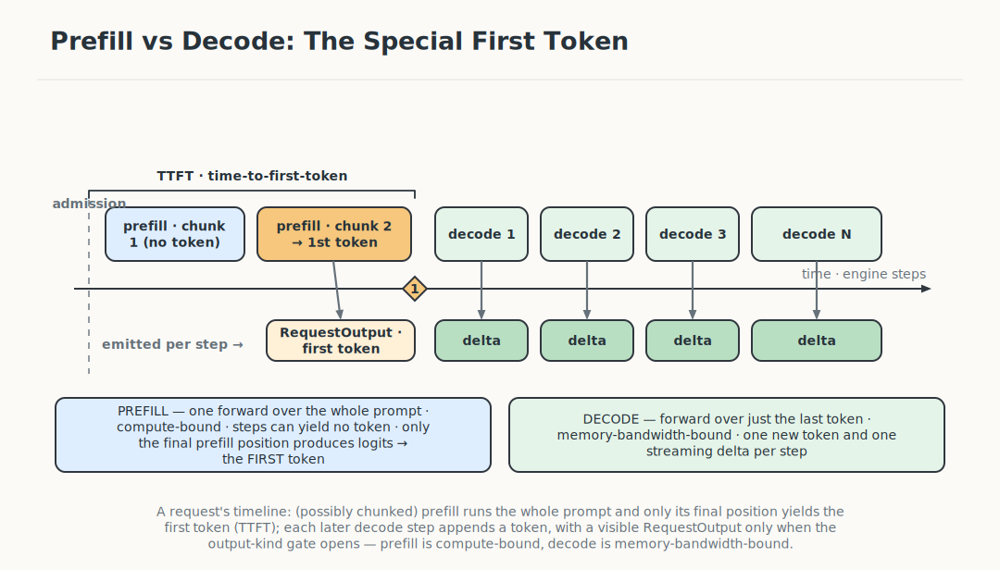</a>

<p class='figure-caption'>One request's timeline — admission, (possibly chunked) prefill, the first sampled token (TTFT), then per-step decode, each step yielding one RequestOutput.</p>

### `generate()` is a pure consumer

The public online API, `AsyncLLM.generate`, is an async generator. Crucially it does **not** drive the engine — it only consumes its own mailbox.

[`vllm/v1/engine/async_llm.py:575-586`](https://github.com/vllm-project/vllm/blob/6cf7b26bd4bff60bf378e1af14044280ac0d214c/vllm/v1/engine/async_llm.py#L575-L586):

```python
            finished = False
            while not finished:
                # Note: drain queue without await if possible (avoids
                # task switching under load which helps performance).
                out = q.get_nowait() or await q.get()

                # Note: both OutputProcessor and EngineCore handle their
                # own request cleanup based on finished.
                assert isinstance(out, RequestOutput)
                finished = out.finished
                if out is not STREAM_FINISHED:
                    yield out
```

<a href='images/vllm-01-26-async-mailbox.svg' target='_blank'>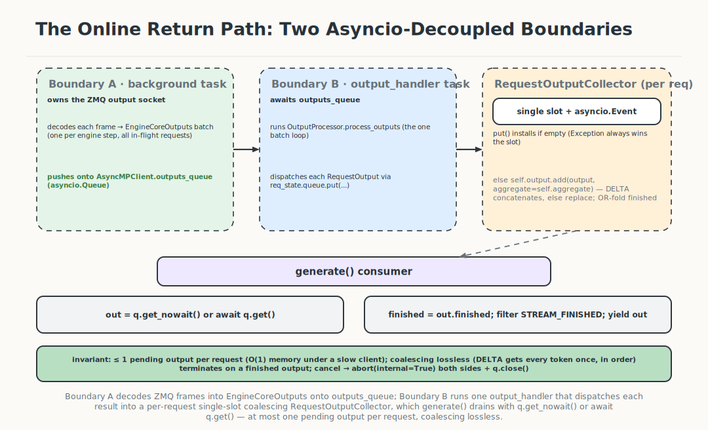</a>

<p class='figure-caption'>The online return path is two asyncio-decoupled boundaries: Boundary A (a background task decodes ZMQ frames into `EngineCoreOutputs` and pushes them onto `outputs_queue`) and Boundary B (one `output_handler` runs `process_outputs` and dispatches each result into a per-request single-slot, coalescing `RequestOutputCollector`), which `generate()` drains with `q.get_nowait() or await q.get()` — at most one pending output per request, coalescing lossless.</p>

Step-by-step read:

1. `q` is the per-request `RequestOutputCollector` returned by `add_request` ([`async_llm.py:559`](https://github.com/vllm-project/vllm/blob/6cf7b26bd4bff60bf378e1af14044280ac0d214c/vllm/v1/engine/async_llm.py#L559)), which also registered the request with the `OutputProcessor` and submitted it to EngineCore in the same await-chain (§5). By the time this loop runs, the mailbox is already wired into the fan-out.
2. `out = q.get_nowait() or await q.get()` (L579) tries the non-blocking grab first; only an empty mailbox forces an `await`. The comment (L577-578) states the intent: skipping the event-loop task switch matters under load, because at high concurrency a token is usually already waiting.
3. The terminal condition rides *on the data*: `finished = out.finished` (L584). The producer stamps `finished=True` on the last `RequestOutput`; the consumer stops after yielding it. `generate()` needs zero visibility into scheduler or EngineCore lifecycle to know when to stop.
4. `STREAM_FINISHED` (a sentinel `RequestOutput` with `finished=True` and empty `outputs`, [`outputs.py:191-199`](https://github.com/vllm-project/vllm/blob/6cf7b26bd4bff60bf378e1af14044280ac0d214c/vllm/outputs.py#L191-L199)) is filtered out (L585) — it unblocks the loop on streaming-input completion without emitting a spurious empty chunk.

The invariant: **the consuming task never blocks the event loop when data is ready, and it terminates exactly on a `finished` output.** Because the loop condition lives on the yielded object, `generate()` is decoupled from every process boundary below it — the request could be served by an in-process engine, a child process over ZMQ, or one of several data-parallel cores (§4), and this loop is unchanged.

### The per-request mailbox is a single-slot, coalescing buffer

The hand-off from the shared `output_handler` (producer) to the per-request `generate()` (consumer) is deliberately *not* an unbounded queue. It is a single-slot mailbox plus an `asyncio.Event`, and if the producer outruns the consumer, successive outputs are **merged in place**.

[`vllm/v1/engine/output_processor.py:62-86`](https://github.com/vllm-project/vllm/blob/6cf7b26bd4bff60bf378e1af14044280ac0d214c/vllm/v1/engine/output_processor.py#L62-L86):

```python
    def put(self, output: RequestOutput | PoolingRequestOutput | Exception) -> None:
        """Non-blocking put operation."""
        if self.output is None or isinstance(output, Exception):
            self.output = output
            self.ready.set()
        elif isinstance(self.output, RequestOutput) and isinstance(
            output, RequestOutput
        ):
            # This ensures that request outputs with different request indexes
            # (if n > 1) do not override each other.
            self.output.add(output, aggregate=self.aggregate)
        elif isinstance(self.output, PoolingRequestOutput) and isinstance(
            output, PoolingRequestOutput
        ):
            self.output = output

    async def get(self) -> RequestOutput | PoolingRequestOutput:
        """Get operation blocks on put event."""
        while (output := self.output) is None:
            await self.ready.wait()
        self.output = None
        self.ready.clear()
        if isinstance(output, Exception):
            raise output
        return output
```

Step-by-step read:

1. `put()` runs synchronously from the producer. If the slot is empty (or the item is an `Exception`), install it and `self.ready.set()` — an exception always wins the slot immediately and is never coalesced away, so a dead engine surfaces to the waiter at once.
2. If the slot already holds a `RequestOutput`, the new one is folded in via `self.output.add(output, aggregate=self.aggregate)` (L72) rather than overwriting. `aggregate` is `True` only in `DELTA` mode (`self.aggregate = output_kind == RequestOutputKind.DELTA`, L55). The merge ([`outputs.py:145-173`](https://github.com/vllm-project/vllm/blob/6cf7b26bd4bff60bf378e1af14044280ac0d214c/vllm/outputs.py#L145-L173)) concatenates text/token-ids/logprobs for DELTA streaming, replaces the whole snapshot for cumulative streaming, and OR-folds `finished` so a coalesced batch that swallowed the terminal chunk still stops the generate loop.
3. `get()` awaits `self.ready` until the slot is non-`None`, then clears both slot and event.

The property: **at most one pending output per request at any instant, and coalescing is lossless.** Per-request live memory is O(1) regardless of how far a slow client lags — the mailbox merges instead of growing a backlog — while a DELTA consumer still receives every token exactly once, in order, because merge equals concatenation. This is the back-pressure story that the synchronous offline list has no need for: the driver thread there consumes each step's outputs immediately, so nothing can accumulate.

### One loop, one flag: where sync and async fork

Both engines share the single hottest CPU loop over the batch — `process_outputs`, "the only function that should loop over EngineCoreOutputs" ([`output_processor.py:594-601`](https://github.com/vllm-project/vllm/blob/6cf7b26bd4bff60bf378e1af14044280ac0d214c/vllm/v1/engine/output_processor.py#L594-L601)). §10 already opened the one branch inside it that forks sync from async: `if req_state.queue is not None:` pushes the materialized `RequestOutput` into the per-request mailbox (async) instead of appending it to a returned list (sync) ([`output_processor.py:650-666`](https://github.com/vllm-project/vllm/blob/6cf7b26bd4bff60bf378e1af14044280ac0d214c/vllm/v1/engine/output_processor.py#L650-L666)). The async engine registers that `queue` at admission (§5); the sync engine passes `queue=None`.

What is genuinely §11's own is that fork's consequence for streaming. Because a queue is present, async dispatch is provably *push-only* — which is why the `output_handler` can `assert not processed_outputs.request_outputs` ([`async_llm.py:679`](https://github.com/vllm-project/vllm/blob/6cf7b26bd4bff60bf378e1af14044280ac0d214c/vllm/v1/engine/async_llm.py#L679)): with a queue wired in, the return list is never touched. So streaming adds *no second loop* over the batch — it reuses the one offline already runs and swaps only the last statement. The detokenization, stop-string checks, and logprob assembly that `make_request_output` depends on are article 10's subject; article 04 details the finished-request bookkeeping and the `reqs_to_abort` path.

### Why the first token is special

Prefill and decode are two different forward passes. From the "Inside vLLM" walkthrough ([Inside vLLM](https://vllm.ai/blog/2025-09-05-anatomy-of-vllm)): **prefill** is "a forward pass over all prompt tokens," typically compute-bound; **decode** is "a forward pass over just the most recent token," memory-bandwidth-bound. V1 does not run them as separate phases — it treats all tokens uniformly and a scheduling decision is conceptually `{request_id: num_tokens}` ([V1 blog](https://vllm.ai/blog/2025-01-27-v1-alpha-release)), so a long prompt can be split across several steps (chunked prefill, article 05). The consequence for streaming: a request can occupy the GPU for one or more steps producing *no* sampled token, because only the final prefill position yields logits to sample. The first `EngineCoreOutput` that carries a real `new_token_ids` is therefore a distinct event, and the output processor marks it.

[`vllm/v1/engine/output_processor.py:628-633`](https://github.com/vllm-project/vllm/blob/6cf7b26bd4bff60bf378e1af14044280ac0d214c/vllm/v1/engine/output_processor.py#L628-L633):

```python
            if req_state.is_prefilling:
                if engine_core_output.prefill_stats is not None:
                    req_state.num_cached_tokens = (
                        engine_core_output.prefill_stats.num_cached_tokens
                    )
                req_state.is_prefilling = False
```

Step-by-step read: `is_prefilling` starts `True` at `RequestState` construction ([`output_processor.py:172`](https://github.com/vllm-project/vllm/blob/6cf7b26bd4bff60bf378e1af14044280ac0d214c/vllm/v1/engine/output_processor.py#L172)); it is later reset to `True` only when a streaming-input request resumes prefilling (`apply_streaming_update`, [`output_processor.py:191-208`](https://github.com/vllm-project/vllm/blob/6cf7b26bd4bff60bf378e1af14044280ac0d214c/vllm/v1/engine/output_processor.py#L191-L208)). The first output to reach the processor captures `num_cached_tokens` once — the prefix-cache hit count for this request, article 07's metric — and flips `is_prefilling` to `False`. Every later step is decode. The elapsed time from admission to the first `RequestOutput` the caller receives is essentially the sum of: any wait in the scheduler's queue before first being scheduled, (possibly multi-step chunked) prefill latency, one sampling call, incremental detokenization, and the two-hop fan-out through Boundaries A and B. That sum is *time-to-first-token* (TTFT), and it is structurally different from the inter-token latency of decode, which is one step apiece.

The full first-token chain across process boundaries is: `EngineCore.step()` commits the sampled token in `update_from_output` and returns a per-client `dict[int, EngineCoreOutputs]` ([`core.py:504-508`](https://github.com/vllm-project/vllm/blob/6cf7b26bd4bff60bf378e1af14044280ac0d214c/vllm/v1/engine/core.py#L504-L508)); Boundary A enqueues that batch; the `output_handler` runs `process_outputs`, which flips `is_prefilling` (above) and pushes the first `RequestOutput` into the mailbox; `generate()` yields it ([`async_llm.py:585-586`](https://github.com/vllm-project/vllm/blob/6cf7b26bd4bff60bf378e1af14044280ac0d214c/vllm/v1/engine/async_llm.py#L585-L586)). No single call stack spans that chain — it is a relay across the async client, the shared handler, the per-request mailbox, and the consumer task.

### Cancellation closes the loop

Because `generate()` is consumed by an HTTP client that can disconnect, cancellation must tear the request down on *both* sides or the engine keeps decoding a dead request. [`async_llm.py:591-596`](https://github.com/vllm-project/vllm/blob/6cf7b26bd4bff60bf378e1af14044280ac0d214c/vllm/v1/engine/async_llm.py#L591-L596) catches `CancelledError`/`GeneratorExit`, calls `self.abort(q.request_id, internal=True)` (which aborts in both the OutputProcessor and EngineCore), and re-raises; the `finally` at [`async_llm.py:633-635`](https://github.com/vllm-project/vllm/blob/6cf7b26bd4bff60bf378e1af14044280ac0d214c/vllm/v1/engine/async_llm.py#L633-L635) calls `q.close()` to cancel any streaming-input feeder. The offline loop needs no analogue: its driver thread owns the requests and simply stops iterating.

So the streaming path is the offline path with the return channel replaced by asyncio plumbing: `LLMEngine.step` is the `output_handler` body run inline with `queue=None` and a returned list ([`llm_engine.py:296-334`](https://github.com/vllm-project/vllm/blob/6cf7b26bd4bff60bf378e1af14044280ac0d214c/vllm/v1/engine/llm_engine.py#L296-L334)), and `LLM._run_engine`'s `while has_unfinished_requests(): step()` ([`offline_utils.py:594-599`](https://github.com/vllm-project/vllm/blob/6cf7b26bd4bff60bf378e1af14044280ac0d214c/vllm/entrypoints/offline_utils.py#L594-L599)) stands in for the whole task/queue/yield apparatus. The engine step, the scheduler, the workers, and the sampler never learn which one they are serving. Article 02 covers the OpenAI server that wraps `generate()`; article 03 covers Boundary A's ZMQ client and the socket-drain task; article 04 covers `process_outputs`, finished-request handling, and the `reqs_to_abort` closure in depth.

## The Full End-to-End Trace, and What to Remember

We have now crossed every boundary on the request path once. This closing section does two things: it reassembles those boundaries into a single logical thread — one uninterrupted trace from `LLM.generate()` to the `RequestOutput` in the caller's hands — and it distills the handful of principles worth carrying into the deep articles. Nothing here is new machinery; every anchor below was established in an earlier section. The value of reading them as one trace is that the *seams* become visible: you can see precisely where a request changes owner, changes representation, and changes process, and you can name the invariant that each seam buys.

<a href='images/vllm-01-10-full-trace.svg' target='_blank'>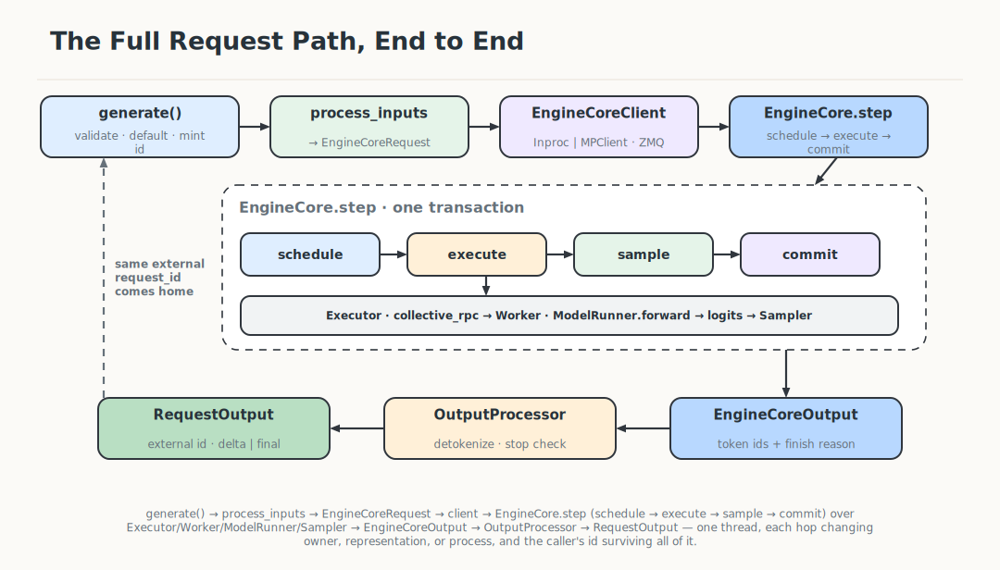</a>

<p class='figure-caption'>The complete request path: `generate()` → input processor → `EngineCoreRequest` → client → `EngineCore.step` (schedule → execute → sample → commit) → output processor → `RequestOutput`, annotated with the owner and invariant at each hop.</p>

### The trace, hop by hop

Follow one prompt. The line anchors point at the exact code each hop executes.

1. **`LLM.generate()` validates and delegates** — [`vllm/entrypoints/llm.py:465-485`](https://github.com/vllm-project/vllm/blob/6cf7b26bd4bff60bf378e1af14044280ac0d214c/vllm/entrypoints/llm.py#L465-L485). The runner-type gate rejects non-generative models, `sampling_params` is defaulted so it is never `None` downstream, and control passes to `_run_completion`. No scheduling, no allocation. *(Article 02.)*

2. **The offline mixin stamps the request and admits it** — [`vllm/entrypoints/offline_utils.py:559-563`](https://github.com/vllm-project/vllm/blob/6cf7b26bd4bff60bf378e1af14044280ac0d214c/vllm/entrypoints/offline_utils.py#L559-L563). `output_kind` is forced to `FINAL_ONLY` and a monotonic decimal `request_id` is minted from a `Counter()`. Then `LLMEngine.add_request` ([`vllm/v1/engine/llm_engine.py:218-294`](https://github.com/vllm-project/vllm/blob/6cf7b26bd4bff60bf378e1af14044280ac0d214c/vllm/v1/engine/llm_engine.py#L218-L294)) registers the work on *both* sides — the output processor (for detokenization and aggregation) and the engine core (for scheduling) — and, when `n > 1`, fans one logical request into `n` children under a `ParentRequest`. *(Article 02 for the façade, 04 for the two-sided registration.)*

3. **The input processor turns a prompt into a wire struct** — [`vllm/v1/engine/input_processor.py:242-255`](https://github.com/vllm-project/vllm/blob/6cf7b26bd4bff60bf378e1af14044280ac0d214c/vllm/v1/engine/input_processor.py#L242-L255). `process_inputs(request_id, prompt, params, ...) -> EngineCoreRequest` runs the validation gauntlet, clones and finalizes the sampling params (so `max_tokens` is concrete), tokenizes or accepts token IDs, and flattens any multimodal inputs. Its output is an `EngineCoreRequest` — a compact `msgspec` struct designed to cross a socket. *(Article 03.)*

4. **The client abstraction moves it across the process boundary** — [`vllm/v1/engine/llm_engine.py:104-111`](https://github.com/vllm-project/vllm/blob/6cf7b26bd4bff60bf378e1af14044280ac0d214c/vllm/v1/engine/llm_engine.py#L104-L111). `LLMEngine` holds one polymorphic `EngineCoreClient`. In the multiprocess default the request is serialized behind a one-byte type tag ([`vllm/v1/engine/__init__.py:251-264`](https://github.com/vllm-project/vllm/blob/6cf7b26bd4bff60bf378e1af14044280ac0d214c/vllm/v1/engine/__init__.py#L251-L264): `ADD = b"\x00"`) and ROUTER-sent over ZMQ to a busy-looping `EngineCore` process; with the in-process client it is a direct method call. Same `add_request`/`get_output` surface either way. *(Article 03 for the ZMQ topology, 11 for DP routing.)*

5. **`EngineCore.step()` runs the transaction** — [`vllm/v1/engine/core.py:479-508`](https://github.com/vllm-project/vllm/blob/6cf7b26bd4bff60bf378e1af14044280ac0d214c/vllm/v1/engine/core.py#L479-L508). Schedule, launch the forward pass non-blocking, build the grammar bitmask on the CPU while the GPU runs, synchronize, drain aborts, then commit. This is the repeated heartbeat the whole system is built around, and step 6–9 all happen *inside* it. A tail hook, `post_step` ([`core.py:510-517`](https://github.com/vllm-project/vllm/blob/6cf7b26bd4bff60bf378e1af14044280ac0d214c/vllm/v1/engine/core.py#L510-L517)), feeds speculative draft tokens back to the scheduler for the next step. *(Article 04.)*

6. **The scheduler plans tokens, not tensors** — the single call `scheduler.schedule(...)` at [`core.py:490`](https://github.com/vllm-project/vllm/blob/6cf7b26bd4bff60bf378e1af14044280ac0d214c/vllm/v1/engine/core.py#L490) answers "which requests run, and how many tokens does each advance," expressed as the uniform counter model `{request_id: num_tokens}`. It returns a `SchedulerOutput` plan and touches no GPU. *(Article 05; KV allocation 06, prefix reuse 07, draft tokens 12.)*

7. **The executor fans the plan out to the GPU** — [`vllm/v1/executor/abstract.py:210-227`](https://github.com/vllm-project/vllm/blob/6cf7b26bd4bff60bf378e1af14044280ac0d214c/vllm/v1/executor/abstract.py#L210-L227). `execute_model` is a `collective_rpc` that names an *operation*, not a device, so one or N workers run the same call and one authoritative worker's answer is taken (the last PP stage's first TP rank; §8). On each worker the model runner reconciles its persistent batch, runs the flattened forward pass, and at the hinge ([`vllm/v1/worker/gpu/model_runner.py:1054-1055`](https://github.com/vllm-project/vllm/blob/6cf7b26bd4bff60bf378e1af14044280ac0d214c/vllm/v1/worker/gpu/model_runner.py#L1054-L1055)) selects final-position hidden states and projects them to logits. *(Articles 08–09 for kernels/CUDA graphs, 11 for parallelism.)*

8. **The sampler draws token IDs** — either inline or, when the worker deferred it, via the second `collective_rpc`, `sample_tokens(grammar_output)` at [`core.py:497-499`](https://github.com/vllm-project/vllm/blob/6cf7b26bd4bff60bf378e1af14044280ac0d214c/vllm/v1/engine/core.py#L497-L499), reaching `Sampler.sample` ([`vllm/v1/worker/gpu/sample/sampler.py:198-210`](https://github.com/vllm-project/vllm/blob/6cf7b26bd4bff60bf378e1af14044280ac0d214c/vllm/v1/worker/gpu/sample/sampler.py#L198-L210)). The grammar bitmask is applied to *these* logits in place before drawing. *(Article 10; rejection sampling for spec decode is 12.)*

9. **The commit folds tokens into progress** — `scheduler.update_from_output(...)` at [`core.py:504-506`](https://github.com/vllm-project/vllm/blob/6cf7b26bd4bff60bf378e1af14044280ac0d214c/vllm/v1/engine/core.py#L504-L506) appends the sampled IDs, sets finish reasons, and frees the KV blocks of anything that finished. Its result is a `dict[client_index -> EngineCoreOutputs]` — token IDs and finish flags, *not* user-facing text. *(Article 04.)*

10. **The output processor turns IDs back into text** — [`vllm/v1/engine/output_processor.py:576-693`](https://github.com/vllm-project/vllm/blob/6cf7b26bd4bff60bf378e1af14044280ac0d214c/vllm/v1/engine/output_processor.py#L576-L693), the one function allowed to loop over the whole batch. It detokenizes incrementally, promotes a detected stop *string* to a finish (and, if the core did not also stop, appends the id to `reqs_to_abort`), and materializes a `RequestOutput`. *(Articles 04 and 10.)*

11. **The result returns two ways.** Offline: the drain loop collects finished outputs and restores input order with a terminal sort ([`offline_utils.py:594-626`](https://github.com/vllm-project/vllm/blob/6cf7b26bd4bff60bf378e1af14044280ac0d214c/vllm/entrypoints/offline_utils.py#L594-L626)). Online: `process_outputs` pushes each `RequestOutput` into a per-request mailbox that the `generate()` async generator yields ([`vllm/v1/engine/async_llm.py:576-586`](https://github.com/vllm-project/vllm/blob/6cf7b26bd4bff60bf378e1af14044280ac0d214c/vllm/v1/engine/async_llm.py#L576-L586)). Both are the *same* `process_outputs` output, dispatched by a single `if req_state.queue is not None:` fork. *(Article 02 offline, 03/11 online streaming.)*

The satisfying bookend: the `request_id` you get back is exactly the one you handed in.

[`vllm/v1/engine/output_processor.py:363-364`](https://github.com/vllm-project/vllm/blob/6cf7b26bd4bff60bf378e1af14044280ac0d214c/vllm/v1/engine/output_processor.py#L363-L364):

```python
        return RequestOutput(
            request_id=external_req_id,  # request_id is what was provided externally
```

**Step-by-step read.** Internally a request may have been suffixed with random characters for uniqueness, and under parallel sampling it may have been split into `n` children — but the surfaced `RequestOutput` always carries `external_req_id`, the caller's own id, never an internal one. **The invariant this protects:** identity is stable across every representation change on the path. The prompt became an `EngineCoreRequest`, then a `Request`, then a flattened row in a batched tensor, then a token ID, then detokenized text — and the id the caller correlates on survives all of it untouched.

### The trace as a table

| Hop | Owner / anchor | Invariant it buys | Deep article |
|---|---|---|---|
| `generate()` | [`entrypoints/llm.py:465-485`](https://github.com/vllm-project/vllm/blob/6cf7b26bd4bff60bf378e1af14044280ac0d214c/vllm/entrypoints/llm.py#L465-L485) | validate; params never `None`; generative-only | 02 |
| admit + fan-out | [`offline_utils.py:559-563`](https://github.com/vllm-project/vllm/blob/6cf7b26bd4bff60bf378e1af14044280ac0d214c/vllm/entrypoints/offline_utils.py#L559-L563), [`llm_engine.py:218-294`](https://github.com/vllm-project/vllm/blob/6cf7b26bd4bff60bf378e1af14044280ac0d214c/vllm/v1/engine/llm_engine.py#L218-L294) | `FINAL_ONLY`; monotonic id; one user output per logical request | 02, 04 |
| input processing | [`input_processor.py:242-255`](https://github.com/vllm-project/vllm/blob/6cf7b26bd4bff60bf378e1af14044280ac0d214c/vllm/v1/engine/input_processor.py#L242-L255) | prompt → owned, fully-defaulted `EngineCoreRequest` | 03 |
| client boundary | [`llm_engine.py:104-111`](https://github.com/vllm-project/vllm/blob/6cf7b26bd4bff60bf378e1af14044280ac0d214c/vllm/v1/engine/llm_engine.py#L104-L111), [`__init__.py:251-264`](https://github.com/vllm-project/vllm/blob/6cf7b26bd4bff60bf378e1af14044280ac0d214c/vllm/v1/engine/__init__.py#L251-L264) | transport is a deployment choice, invisible to semantics | 03, 11 |
| `step()` | [`core.py:479-508`](https://github.com/vllm-project/vllm/blob/6cf7b26bd4bff60bf378e1af14044280ac0d214c/vllm/v1/engine/core.py#L479-L508) | schedule → execute → commit is one atomic transaction | 04 |
| schedule | [`core.py:490`](https://github.com/vllm-project/vllm/blob/6cf7b26bd4bff60bf378e1af14044280ac0d214c/vllm/v1/engine/core.py#L490) | tokens, not tensors: `{request_id: num_tokens}` | 05, 06, 07, 12 |
| execute → logits | [`abstract.py:210-227`](https://github.com/vllm-project/vllm/blob/6cf7b26bd4bff60bf378e1af14044280ac0d214c/vllm/v1/executor/abstract.py#L210-L227), [`model_runner.py:1054-1055`](https://github.com/vllm-project/vllm/blob/6cf7b26bd4bff60bf378e1af14044280ac0d214c/vllm/v1/worker/gpu/model_runner.py#L1054-L1055) | name an operation, not a device; project final positions only | 08, 09, 11 |
| sample | [`sampler.py:198-210`](https://github.com/vllm-project/vllm/blob/6cf7b26bd4bff60bf378e1af14044280ac0d214c/vllm/v1/worker/gpu/sample/sampler.py#L198-L210), [`core.py:497-499`](https://github.com/vllm-project/vllm/blob/6cf7b26bd4bff60bf378e1af14044280ac0d214c/vllm/v1/engine/core.py#L497-L499) | grammar mask applied to *this* batch's logits | 10, 12 |
| commit | [`core.py:504-506`](https://github.com/vllm-project/vllm/blob/6cf7b26bd4bff60bf378e1af14044280ac0d214c/vllm/v1/engine/core.py#L504-L506) | progress moves only after model output | 04 |
| output processing | [`output_processor.py:576-693`](https://github.com/vllm-project/vllm/blob/6cf7b26bd4bff60bf378e1af14044280ac0d214c/vllm/v1/engine/output_processor.py#L576-L693) | detok, stop strings, external-id `RequestOutput` | 04, 10 |
| return | [`offline_utils.py:594-626`](https://github.com/vllm-project/vllm/blob/6cf7b26bd4bff60bf378e1af14044280ac0d214c/vllm/entrypoints/offline_utils.py#L594-L626) / [`async_llm.py:576-586`](https://github.com/vllm-project/vllm/blob/6cf7b26bd4bff60bf378e1af14044280ac0d214c/vllm/v1/engine/async_llm.py#L576-L586) | order restored (offline) / streamed (online) | 02, 03 |

### Five things to remember

**1. The engine is one repeated transaction, not a pipeline.** The four canonical functions — input processing, scheduling, model execution, output processing ([arch](https://docs.vllm.ai/en/stable/design/arch_overview/)) — are not traversed once per request. Three of them (schedule, execute, commit) are the body of `EngineCore.step()` ([`core.py:479-508`](https://github.com/vllm-project/vllm/blob/6cf7b26bd4bff60bf378e1af14044280ac0d214c/vllm/v1/engine/core.py#L479-L508)), run over and over, advancing in-flight requests a few tokens per turn until they finish ([Inside vLLM](https://vllm.ai/blog/2025-09-05-anatomy-of-vllm)). Internalize that one method and the shape of everything else follows.

**2. The three generation entrypoints this article compared are each an adapter over `add_request` + drain.** The offline `LLM.generate`, the async `AsyncLLM.generate`, and the OpenAI-compatible server differ only in how they *drive* the transaction and *collect* its outputs — a blocking loop with a terminal sort, or an async task fanning outputs into per-request mailboxes. The transaction they drive is identical. That is why learning the request path once generalizes across these three surfaces (other entrypoints — embedding, pooling, tokenization — have their own semantics; article 02 maps them).

**3. The path is a chain of ownership boundaries, each buying one invariant.** Public API (validate, default, monotonic IDs, order restore) → input processor (task/param coherence, cloned params, wire struct) → client (transport-agnostic surface) → `EngineCore` (the schedule/execute/commit transaction, delegating *all* lifecycle state to the scheduler) → scheduler (token and memory decisions) → worker/runner (tensors, logits) → sampler (token IDs) → output processor (detok, stop strings, external-id `RequestOutput`). When a question arises — who decides `max_tokens`? where is a stop string detected? when are blocks freed? — you already know which boundary to open.

**4. Process boundaries are a deployment decision, not a semantic one.** `LLMEngine` holds exactly one `EngineCoreClient` handle ([`llm_engine.py:104-111`](https://github.com/vllm-project/vllm/blob/6cf7b26bd4bff60bf378e1af14044280ac0d214c/vllm/v1/engine/llm_engine.py#L104-L111)); the transport is fixed once at construction and never leaks into request meaning. Note the counterintuitive default: even the "offline" `LLM` runs a background `EngineCore` process, because `VLLM_ENABLE_V1_MULTIPROCESSING` defaults to true ([`vllm/envs.py:147`](https://github.com/vllm-project/vllm/blob/6cf7b26bd4bff60bf378e1af14044280ac0d214c/vllm/envs.py#L147); set via [`llm_engine.py:157`](https://github.com/vllm-project/vllm/blob/6cf7b26bd4bff60bf378e1af14044280ac0d214c/vllm/v1/engine/llm_engine.py#L157)) — the in-process client is the opt-out, not the default. This is precisely what lets article 01 trace the path as a single logical thread and defer the real ZMQ topology to article 03.

**5. Progress commits only after model output — and a finish fans out on two clocks.** Scheduling is optimistic and allocates ahead of the GPU, but no request state moves until `update_from_output` reconciles the plan against what the model produced ([`core.py:504-506`](https://github.com/vllm-project/vllm/blob/6cf7b26bd4bff60bf378e1af14044280ac0d214c/vllm/v1/engine/core.py#L504-L506)). The abort window ([`core.py:501-503`](https://github.com/vllm-project/vllm/blob/6cf7b26bd4bff60bf378e1af14044280ac0d214c/vllm/v1/engine/core.py#L501-L503), drained *before* the commit) and the wide liveness guard ([`core.py:488`](https://github.com/vllm-project/vllm/blob/6cf7b26bd4bff60bf378e1af14044280ac0d214c/vllm/v1/engine/core.py#L488), which counts finished-but-unflushed requests) are the two edges of that rule: a request can enter or leave the batch right up to the commit but never during it. When a request finishes, the client notification rides the *current* step's `EngineCoreOutputs` (the stream can close immediately), while the worker-side cleanup rides the *next* `SchedulerOutput` — the liveness guard exists to keep the engine awake for that second, worker-facing flush.

### The key invariants, with anchors

For quick reference, the invariants this article leaned on, each pinned to where it lives:

- **Exactly one offline output per request** — `FINAL_ONLY` at [`offline_utils.py:559-561`](https://github.com/vllm-project/vllm/blob/6cf7b26bd4bff60bf378e1af14044280ac0d214c/vllm/entrypoints/offline_utils.py#L559-L561).
- **Output order equals input order** — terminal sort at [`offline_utils.py:626`](https://github.com/vllm-project/vllm/blob/6cf7b26bd4bff60bf378e1af14044280ac0d214c/vllm/entrypoints/offline_utils.py#L626), keyed on monotonic IDs.
- **Transport never leaks into semantics** — single client handle at [`llm_engine.py:104-111`](https://github.com/vllm-project/vllm/blob/6cf7b26bd4bff60bf378e1af14044280ac0d214c/vllm/v1/engine/llm_engine.py#L104-L111).
- **Aborts fenced before commit** — [`core.py:501-503`](https://github.com/vllm-project/vllm/blob/6cf7b26bd4bff60bf378e1af14044280ac0d214c/vllm/v1/engine/core.py#L501-L503) runs before `update_from_output`.
- **The grammar bitmask is scheduler-owned**, built on the CPU under GPU latency — [`core.py:492-499`](https://github.com/vllm-project/vllm/blob/6cf7b26bd4bff60bf378e1af14044280ac0d214c/vllm/v1/engine/core.py#L492-L499).
- **A detected stop string promotes the finish and closes the loop** via `reqs_to_abort` — [`output_processor.py:678-681`](https://github.com/vllm-project/vllm/blob/6cf7b26bd4bff60bf378e1af14044280ac0d214c/vllm/v1/engine/output_processor.py#L678-L681); this is why `EngineCoreOutput.finished` and the processor's finish reason can legitimately diverge for one step.
- **The surfaced `request_id` is always the external one** — [`output_processor.py:363-364`](https://github.com/vllm-project/vllm/blob/6cf7b26bd4bff60bf378e1af14044280ac0d214c/vllm/v1/engine/output_processor.py#L363-L364).

### Where each arrow goes

Article 01 is the map; each hop is a chapter that zooms in without duplication.

| Arrow on the path | Deep article |
|---|---|
| entrypoints: `LLM`, CLI, OpenAI server | 02 |
| process architecture, ZMQ, client transports | 03 |
| `EngineCore` loop, request lifecycle, output processing internals | 04 |
| scheduler: continuous batching, chunked prefill | 05 |
| KV cache manager, paged KV cache | 06 |
| automatic prefix caching | 07 |
| PagedAttention kernels, attention backends | 08 |
| worker, model runner, input prep, CUDA graphs | 09 |
| sampling, logits processing, logprobs | 10 |
| distributed inference and parallelism | 11 |
| speculative decoding | 12 |
| extending vLLM: models and plugins | 13 |

Read this article once, end to end, to fix the shape and the vocabulary. From here, the map never changes — only the resolution does. The question we opened with, "how does `LLM.generate()` become one model forward pass and one sampled token?", now has a one-sentence answer: it becomes an `EngineCoreRequest` that the client hands to a busy-looping `EngineCore`, whose `step()` transaction schedules a token budget, runs a flattened forward pass on the worker, samples a token ID under any grammar mask, commits it, and lets the output processor detokenize it back into the `RequestOutput` that carries the caller's own id home. Everything else is one of those verbs, seen up close.

## References

- https://vllm.ai/blog/2023-06-20-vllm
- https://arxiv.org/abs/2309.06180
- https://docs.vllm.ai/en/stable/design/arch_overview/
- https://vllm.ai/blog/2025-01-27-v1-alpha-release
- https://vllm.ai/blog/2025-09-05-anatomy-of-vllm
- https://docs.vllm.ai/en/stable/api/vllm/sampling_params.html

*All code conclusions are anchored to [`vllm-project/vllm@6cf7b26bd`](https://github.com/vllm-project/vllm/tree/6cf7b26bd4bff60bf378e1af14044280ac0d214c).*
