# Entrypoints: `LLM`, CLI, and the OpenAI-Compatible Server

> Series baseline: [`vllm-project/vllm@6cf7b26bd`](https://github.com/vllm-project/vllm/tree/6cf7b26bd4bff60bf378e1af14044280ac0d214c). This article reads the V1 source at that pinned commit and cross-checks the vLLM engineering blogs and stable design docs. Code excerpts come from that commit; some excerpts elide unrelated lines to keep the focus, every elision is marked with `...`, and lines not marked as pseudocode match the source. Anchors are written `path:Lstart-Lend` and link to the pinned commit on GitHub.

There are several ways to run vLLM, and they look unrelated from the outside. A Python program calls
[`LLM.generate()`](https://github.com/vllm-project/vllm/blob/6cf7b26bd4bff60bf378e1af14044280ac0d214c/vllm/entrypoints/llm.py#L349). A deployment starts with `vllm serve`. An OpenAI client sends JSON to FastAPI. Once
you follow the source, however, the split is fairly clean: these entrypoints translate their own protocol
into an `EngineCoreRequest`; the engine handles scheduling, memory, and execution.

That shared boundary does not make the entrypoints interchangeable. Offline inference blocks and restores
input order before returning. Online serving manages queues, cancellation, middleware, and streaming.
The CLI is mostly a boot path for the latter. This article follows each path far enough to show both the
common lowering seam and the behavior that remains specific to each frontend.

## 1. Two Front Doors: Offline LLM and the Online Server

The stable docs split vLLM into "Offline Inference" and "Online Serving" ([offline inference](https://docs.vllm.ai/en/stable/serving/offline_inference/); [OpenAI-compatible server](https://docs.vllm.ai/en/stable/serving/online_serving/openai_compatible_server/)). The source makes the relationship between them clearer. `LLM` and the HTTP server lower their inputs through the same `EngineCoreRequest` boundary, while `vllm serve` is the launch path that builds the online server (see [Section 4](#4-the-cli-vllm-serve-and-how-the-server-launches)).

Convergence at that boundary is deliberately narrow. Request ids, arrival times, priorities, cache salts, and `output_kind` can differ, and the frontends retain their own cancellation, streaming, response assembly, and lifecycle behavior. What they share is the engine-facing schema and the code that constructs it.

<a href='images/vllm-02-01-offline-vs-online.svg' target='_blank'>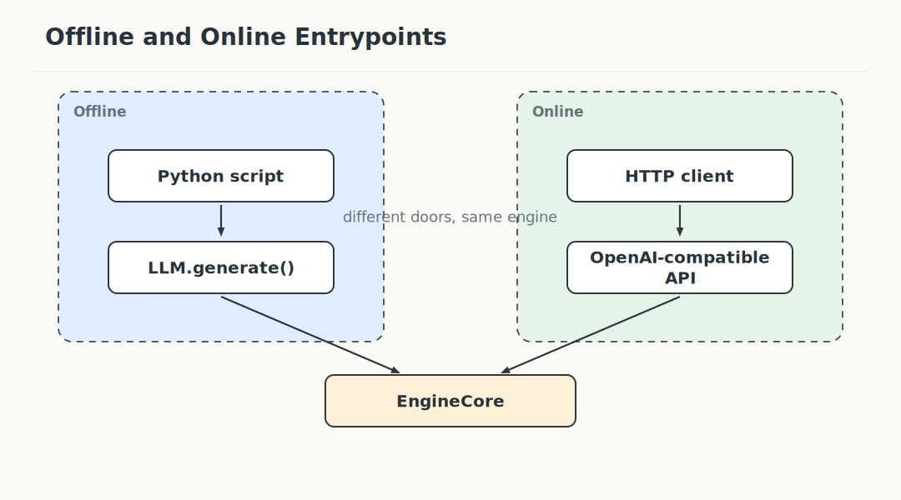</a>

<p class='figure-caption'>Offline `LLM` and the online server are two protocol shells over one shared V1 engine. Their inputs converge on the same `EngineCoreRequest` schema; field values, cancellation, streaming, and response lifecycles still differ.</p>

### The offline door is the same V1 engine behind a synchronous call contract

The offline path is the easiest to read because it strips away everything that is not the engine: no HTTP, no FastAPI, no authentication, no request logging, no streaming transport. What it builds underneath, however, is not a different or simpler engine — it is the *same* V1 `LLMEngine`.

Source: [`vllm/entrypoints/llm.py:55`](https://github.com/vllm-project/vllm/blob/6cf7b26bd4bff60bf378e1af14044280ac0d214c/vllm/entrypoints/llm.py#L55) and [`vllm/entrypoints/llm.py:66`](https://github.com/vllm-project/vllm/blob/6cf7b26bd4bff60bf378e1af14044280ac0d214c/vllm/entrypoints/llm.py#L66).

```python
from vllm.v1.engine.llm_engine import LLMEngine
```

```python
class LLM(BeamSearchOfflineMixin, PoolingOfflineMixin, OfflineInferenceMixin):
```

The import at line 55 pins the offline path to `vllm.v1.engine.llm_engine`, the V1 synchronous engine rather than a legacy V0 class. The class declaration also shows how little `LLM` does itself. It carries `__init__`, `generate`, `chat`, and engine-control methods; `encode`, `embed`, `classify`, `score`, and `beam_search` come from the three mixins covered in [Section 3](#3-the-offline-request-apis-generate-chat-encode-score). Scheduling, memory management, and execution all live below this class. `LLM.generate()` is the adapter, not the engine.

**Offline builds a synchronous engine and drains it in a blocking loop.**

Once configured, offline inference is a synchronous batch driver: it enqueues every prompt, then spins the engine to completion on the calling thread.

Source: [`vllm/entrypoints/llm.py:349-351`](https://github.com/vllm-project/vllm/blob/6cf7b26bd4bff60bf378e1af14044280ac0d214c/vllm/entrypoints/llm.py#L349-L351).

```python
        self.llm_engine = LLMEngine.from_engine_args(
            engine_args=engine_args, usage_context=UsageContext.LLM_CLASS
        )
```

`from_engine_args` ([`vllm/v1/engine/llm_engine.py:160-186`](https://github.com/vllm-project/vllm/blob/6cf7b26bd4bff60bf378e1af14044280ac0d214c/vllm/v1/engine/llm_engine.py#L160-L186)) does the config lowering that both doors share — `engine_args.create_engine_config(usage_context)` produces a `VllmConfig`, `Executor.get_class(vllm_config)` picks the executor, and `log_stats=not engine_args.disable_log_stats` decides per-step metrics — then returns a live `LLMEngine`. The `UsageContext.LLM_CLASS` tag at line 350 is the offline door's telemetry fingerprint; the server uses a different one (below).

The dispatch side is where "offline" becomes visible. Every offline request passes through one shared entry point that forces a non-streaming output shape, and the driver loop is an ordinary `while`.

Source: [`vllm/entrypoints/offline_utils.py:559-561`](https://github.com/vllm-project/vllm/blob/6cf7b26bd4bff60bf378e1af14044280ac0d214c/vllm/entrypoints/offline_utils.py#L559-L561) and [`vllm/entrypoints/offline_utils.py:594-595`](https://github.com/vllm-project/vllm/blob/6cf7b26bd4bff60bf378e1af14044280ac0d214c/vllm/entrypoints/offline_utils.py#L594-L595).

```python
        if isinstance(params, SamplingParams):
            # We only care about the final output
            params.output_kind = RequestOutputKind.FINAL_ONLY
```

```python
        while self.llm_engine.has_unfinished_requests():
            step_outputs = self.llm_engine.step()
```

The full `_add_request` and `_run_engine` bodies appear in [Section 3](#3-the-offline-request-apis-generate-chat-encode-score); these two lines establish the calling model. `_add_request` stamps `RequestOutputKind.FINAL_ONLY` on generation requests (line 561), so the offline API does not expose partial output. `_run_engine` blocks the caller on `while has_unfinished_requests(): step()` (lines 594-595). Each `step()` ([`llm_engine.py:296`](https://github.com/vllm-project/vllm/blob/6cf7b26bd4bff60bf378e1af14044280ac0d214c/vllm/v1/engine/llm_engine.py#L296)) advances whichever in-flight requests the scheduler selected for that iteration.

There is no async event loop in the offline API, although the default `SyncMPClient` still runs EngineCore in a background process and uses an output-collector thread. Requests may finish out of submission order, so `_run_engine` ends with `sorted(outputs, key=lambda x: int(x.request_id))` ([`offline_utils.py:626`](https://github.com/vllm-project/vllm/blob/6cf7b26bd4bff60bf378e1af14044280ac0d214c/vllm/entrypoints/offline_utils.py#L626)). What is deterministic here is the order of the returned list, not sampling or floating-point execution.

### The online door wraps the same engine in an async client

The server builds the *async* sibling of that engine, `AsyncLLM`, which is the concrete implementation of the `EngineClient` interface the HTTP layer talks to.

Source: [`vllm/v1/engine/async_llm.py:70`](https://github.com/vllm-project/vllm/blob/6cf7b26bd4bff60bf378e1af14044280ac0d214c/vllm/v1/engine/async_llm.py#L70).

```python
class AsyncLLM(EngineClient):
    """An asynchronous wrapper for the vLLM engine."""
```

Where offline calls `LLMEngine.from_engine_args`, the server calls `AsyncLLM.from_vllm_config` inside an async context manager that scopes the engine's entire lifetime.

Source: [`vllm/entrypoints/openai/api_server.py:163`](https://github.com/vllm-project/vllm/blob/6cf7b26bd4bff60bf378e1af14044280ac0d214c/vllm/entrypoints/openai/api_server.py#L163) and [`vllm/entrypoints/openai/api_server.py:175-184`](https://github.com/vllm-project/vllm/blob/6cf7b26bd4bff60bf378e1af14044280ac0d214c/vllm/entrypoints/openai/api_server.py#L175-L184).

```python
    vllm_config = engine_args.create_engine_config(usage_context=usage_context)
```

```python
        async_llm = AsyncLLM.from_vllm_config(
            vllm_config=vllm_config,
            usage_context=usage_context,
            enable_log_requests=engine_args.enable_log_requests,
            aggregate_engine_logging=engine_args.aggregate_engine_logging,
            disable_log_stats=engine_args.disable_log_stats,
            client_addresses=client_config,
            client_count=client_count,
            client_index=client_index,
        )
```

<a href='images/vllm-02-12-construction-divergence-matrix.svg' target='_blank'>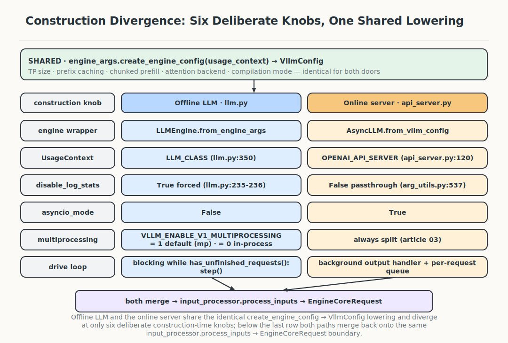</a>

<p class='figure-caption'>Offline `LLM` and the online server share the `create_engine_config` → `VllmConfig` lowering. The diagram highlights six construction-time differences: engine wrapper, usage tag, stats default, `asyncio_mode`, multiprocessing, and drive loop.</p>

Line 163 calls the same `create_engine_config` used by offline `from_engine_args`. Tensor-parallel size, prefix caching, chunked prefill, attention backend, and compilation mode therefore go through the same configuration code. What changes is the wrapper: the server constructs `AsyncLLM`, not `LLMEngine`.

[`AsyncLLM`](https://github.com/vllm-project/vllm/blob/6cf7b26bd4bff60bf378e1af14044280ac0d214c/vllm/v1/engine/async_llm.py#L70) implements `EngineClient`, which keeps FastAPI routes and serving objects behind a small interface (`is_running`, `errored`, `get_supported_tasks`, `generate`, `encode`, and `shutdown`). On the V1 multiprocess path it drives an `EngineCore` in another process over IPC, while a background output handler feeds per-request queues. Sections [5](#5-the-openai-server-fastapi-app-lifespan-and-the-engine-client) and [11](#11-streaming-sse-middleware-auth-and-health) cover that mechanism; article 03 covers the process topology. The useful ownership boundary is simple: the server owns protocol behavior, validation, streaming, and cancellation, while the engine owns request state, scheduling, memory, and execution.

**One constructor-default divergence, and it is deliberate.**

Because both paths use `create_engine_config`, their small differences are easy to overlook. One is the default for stats logging. Offline `LLM` sets `disable_log_stats=True` unless the caller overrides it ([`llm.py:235-236`](https://github.com/vllm-project/vllm/blob/6cf7b26bd4bff60bf378e1af14044280ac0d214c/vllm/entrypoints/llm.py#L235-L236)); the engine dataclass defaults it to `False` ([`vllm/engine/arg_utils.py:537`](https://github.com/vllm-project/vllm/blob/6cf7b26bd4bff60bf378e1af14044280ac0d214c/vllm/engine/arg_utils.py#L537)), and the server passes that value through ([`api_server.py:180`](https://github.com/vllm-project/vllm/blob/6cf7b26bd4bff60bf378e1af14044280ac0d214c/vllm/entrypoints/openai/api_server.py#L180)). That is a sensible default for both uses: a batch job rarely scrapes Prometheus metrics, whereas a long-lived server usually wants throughput and latency data.

Telemetry identity differs as well: offline uses `UsageContext.LLM_CLASS` ([`llm.py:350`](https://github.com/vllm-project/vllm/blob/6cf7b26bd4bff60bf378e1af14044280ac0d214c/vllm/entrypoints/llm.py#L350)), while the server uses `UsageContext.OPENAI_API_SERVER` ([`api_server.py:120`](https://github.com/vllm-project/vllm/blob/6cf7b26bd4bff60bf378e1af14044280ac0d214c/vllm/entrypoints/openai/api_server.py#L120)). The common lowering code should not be read as a claim that their wrappers, process choices, or drive loops are otherwise identical.

### The CLI launches the online path

The `vllm serve` command is not a separate runtime. It is a launch tier on top of the online door: `FlexibleArgumentParser` → `AsyncEngineArgs.from_cli_args(args)` → `create_engine_config` → a pre-bound socket handed to uvicorn, converging on exactly the `run_server` path the HTTP `__main__` module uses ([`api_server.py:134`](https://github.com/vllm-project/vllm/blob/6cf7b26bd4bff60bf378e1af14044280ac0d214c/vllm/entrypoints/openai/api_server.py#L134), `AsyncEngineArgs.from_cli_args(args)`; full trace in [Section 4](#4-the-cli-vllm-serve-and-how-the-server-launches)). This is why `vllm serve`, Python offline inference, and OpenAI-compatible serving share the same lower engine: they all bottom out in `create_engine_config` and one of two engine wrappers.

The server's route table depends on what was loaded. It may expose generation, pooling, speech, tokenization, model, health, and metrics endpoints, with developer routes additionally gated by `VLLM_SERVER_DEV_MODE=1` ([online serving](https://docs.vllm.ai/en/stable/serving/online_serving/)). At startup, `await engine_client.get_supported_tasks()` supplies the model capabilities used to register the relevant handlers, so a generate-only model does not acquire an embeddings route ([Section 5](#5-the-openai-server-fastapi-app-lifespan-and-the-engine-client)). Server arguments, plugins, and model configuration gate the rest.

**Where the paths meet.**

Both doors, and the CLI behind the online one, route every request through the same entry point and the same target:

```text
user protocol -> validated engine input -> EngineCoreRequest -> EngineCore
```

Offline reaches this boundary through `_add_request`, then drains with `while has_unfinished_requests(): step()`. Online reaches it through an HTTP serving object and `AsyncLLM.add_request`, then returns results through a per-request queue. They share input lowering and the engine schema, but not transport, field values, cancellation, or response lifecycle. Optimizations below this line—prefix caching, chunked prefill, speculation, and parallel execution—serve both. Article 01 follows the first-token path; article 04 follows the EngineCore loop.

## 2. Constructing `LLM`: From `EngineArgs` to a Live Engine

With HTTP and asyncio out of the picture, `LLM.__init__` is the easiest place to study engine construction. It turns user kwargs into `EngineArgs`, lowers those into `VllmConfig`, starts `LLMEngine`, and caches the handles used by later requests. Scheduler, KV-cache, and worker internals remain below that boundary.

<a href='images/vllm-02-03-llm-construction.svg' target='_blank'>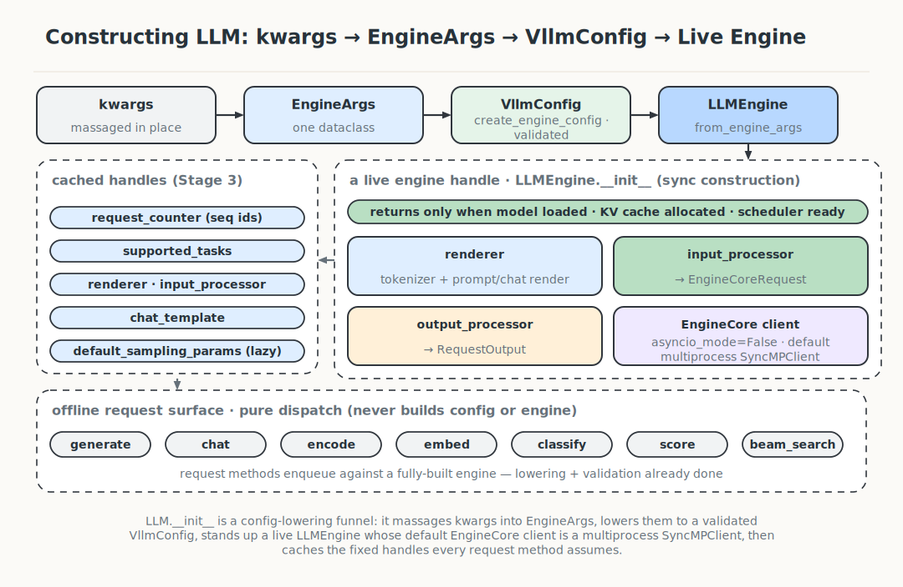</a>

<p class='figure-caption'>`LLM.__init__` lowers `kwargs` → `EngineArgs` → `VllmConfig` → live `LLMEngine`, then caches per-request handles.</p>

**The class is deliberately thin.**

Source: [`vllm/entrypoints/llm.py:66`](https://github.com/vllm-project/vllm/blob/6cf7b26bd4bff60bf378e1af14044280ac0d214c/vllm/entrypoints/llm.py#L66)

```python
class LLM(BeamSearchOfflineMixin, PoolingOfflineMixin, OfflineInferenceMixin):
```

The `LLM` class body holds `__init__`, `generate`, `chat`, their `enqueue`/`wait_for_completion` siblings, and a few engine-control helpers. `encode`, `embed`, `classify`, `score`, and `beam_search` live in its three mixins. It also imports the V1 engine directly at [`llm.py:55`](https://github.com/vllm-project/vllm/blob/6cf7b26bd4bff60bf378e1af14044280ac0d214c/vllm/entrypoints/llm.py#L55). Request methods therefore enqueue work against an engine that the constructor has already built; they do not assemble configuration on demand.

### Normalize `kwargs` before building `EngineArgs`

Source: [`vllm/entrypoints/llm.py:176-221`](https://github.com/vllm-project/vllm/blob/6cf7b26bd4bff60bf378e1af14044280ac0d214c/vllm/entrypoints/llm.py#L176-L221)

The signature has exactly one positional parameter, `model` (line 178); the bare `*` at line 179 forces every other argument to be keyword-only, and a trailing `**kwargs` (line 220) is forwarded verbatim to `EngineArgs`. Before that forwarding, the constructor rewrites a handful of entries in place.

Source: [`vllm/entrypoints/llm.py:235-243`](https://github.com/vllm-project/vllm/blob/6cf7b26bd4bff60bf378e1af14044280ac0d214c/vllm/entrypoints/llm.py#L235-L243)

```python
        if "disable_log_stats" not in kwargs:
            kwargs["disable_log_stats"] = True

        if "worker_cls" in kwargs:
            worker_cls = kwargs["worker_cls"]
            # if the worker_cls is not qualified string name,
            # we serialize it using cloudpickle to avoid pickling issues
            if isinstance(worker_cls, type):
                kwargs["worker_cls"] = cloudpickle.dumps(worker_cls)
```

<a href='images/vllm-02-13-kwargs-massage-pipeline.svg' target='_blank'>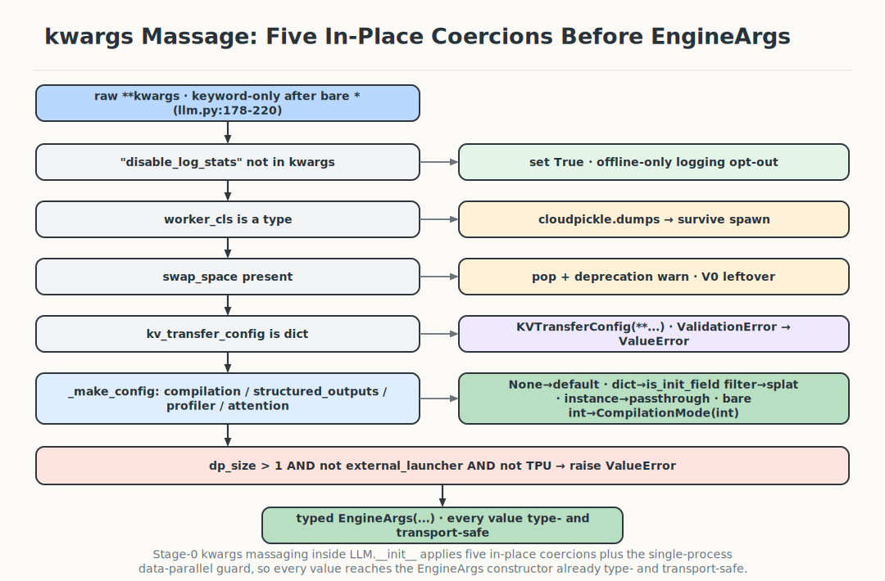</a>

<p class='figure-caption'>Stage-0 `kwargs` massaging inside `LLM.__init__`: five in-place coercions — `disable_log_stats` default `True`, `worker_cls` type → `cloudpickle.dumps`, `swap_space` pop+warn, `kv_transfer_config` dict → `KVTransferConfig`, and `_make_config` sub-config coercion — plus the single-process data-parallel guard, so every value reaches the `EngineArgs` constructor already type- and transport-safe.</p>

- `disable_log_stats` defaults to `True` for the offline `LLM` only (the server leaves it on). This is the one constructor default flipped at this call site (the engine wrapper, usage tag, and multiprocessing/asyncio axes differ too — see the divergence matrix above): a batch job does not want per-step Prometheus logging, so `log_stats` will be `False` downstream. This is why [`llm_engine.py:114`](https://github.com/vllm-project/vllm/blob/6cf7b26bd4bff60bf378e1af14044280ac0d214c/vllm/v1/engine/llm_engine.py#L114) only builds a `StatLoggerManager` when `log_stats` is set — offline batch skips that whole subsystem.
- A `worker_cls` passed as an actual `type` object is `cloudpickle.dumps`'d immediately. The worker class has to survive a process boundary if multiprocessing is enabled, and a live class object does not pickle cleanly across `spawn`; serializing it here means the value stored in config is already transport-safe. (`swap_space`, just above at lines 224-233, is popped and deprecation-warned — a V0 leftover; V1 has no CPU swap space.)
- A `kv_transfer_config` supplied as a raw `dict` (lines 245-262) is upgraded in place to a `KVTransferConfig`, converting a pydantic `ValidationError` into a `ValueError` so the failure reads as a user-input error, not an internal one.

**Coerce structured sub-configs.**

Source: [`vllm/entrypoints/llm.py:275-288`](https://github.com/vllm-project/vllm/blob/6cf7b26bd4bff60bf378e1af14044280ac0d214c/vllm/entrypoints/llm.py#L275-L288)

```python
        if isinstance(compilation_config, int):
            compilation_config_instance = CompilationConfig(
                mode=CompilationMode(compilation_config)
            )
        else:
            compilation_config_instance = _make_config(
                compilation_config, CompilationConfig
            )

        structured_outputs_instance = _make_config(
            structured_outputs_config, StructuredOutputsConfig
        )
        profiler_config_instance = _make_config(profiler_config, ProfilerConfig)
        attention_config_instance = _make_config(attention_config, AttentionConfig)
```

`_make_config` (defined at [`llm.py:267-273`](https://github.com/vllm-project/vllm/blob/6cf7b26bd4bff60bf378e1af14044280ac0d214c/vllm/entrypoints/llm.py#L267-L273)) is the uniform dict/None/instance coercion: `None` becomes a default-constructed config, a `dict` is field-filtered through `is_init_field` before being splatted (so unknown keys don't explode the constructor), and an already-built instance passes through. `compilation_config` gets one extra rule — a bare `int` is read as a `CompilationMode` enum value, letting `compilation_config=3` mean "compilation level 3" rather than a nonsense dict. Each of these four sub-configs enters `EngineArgs` as a concrete, validated object of the right class, so `create_engine_config` downstream can treat them as trusted structured fields.

### Reject a configuration that would hang

Source: [`vllm/entrypoints/llm.py:290-303`](https://github.com/vllm-project/vllm/blob/6cf7b26bd4bff60bf378e1af14044280ac0d214c/vllm/entrypoints/llm.py#L290-L303)

```python
        # warn about single-process data parallel usage.
        _dp_size = int(kwargs.get("data_parallel_size", 1))
        _distributed_executor_backend = kwargs.get("distributed_executor_backend")
        if (
            _dp_size > 1
            and not _distributed_executor_backend == "external_launcher"
            and not current_platform.is_tpu()
        ):
            raise ValueError(
                f"LLM(data_parallel_size={_dp_size}) is not supported for single-"
                "process usage and may hang. Please use "
                "the explicit multi-process data-parallel example at "
                "'examples/features/data_parallel/data_parallel_offline.py'."
            )
```

Data parallelism needs multiple engine processes coordinated by a DP group; the synchronous `LLM` driver cannot bring up that rendezvous itself, so a `data_parallel_size > 1` that is not TPU and not the `external_launcher` backend would deadlock waiting on peers that never start. This guard fails fast with a pointer to the correct multi-process example. The offline door only accepts DP topologies it can actually pump — the coordinator internals belong to article 11 (distributed).

### Lower `EngineArgs` into `VllmConfig` and start the engine

Source: [`vllm/entrypoints/llm.py:347-364`](https://github.com/vllm-project/vllm/blob/6cf7b26bd4bff60bf378e1af14044280ac0d214c/vllm/entrypoints/llm.py#L347-L364)

```python
        log_non_default_args(engine_args)

        self.llm_engine = LLMEngine.from_engine_args(
            engine_args=engine_args, usage_context=UsageContext.LLM_CLASS
        )
        self.model_config = self.llm_engine.model_config
        self.engine_class = type(self.llm_engine)

        self.request_counter = Counter()
        self.default_sampling_params: dict[str, Any] | None = None

        supported_tasks = self.llm_engine.get_supported_tasks()
        self.supported_tasks = supported_tasks

        self.runner_type = self.model_config.runner_type
        self.renderer = self.llm_engine.renderer
        self.chat_template = load_chat_template(chat_template)
        self.input_processor = self.llm_engine.input_processor
```

The `EngineArgs(...)` constructor just above (lines 305-345) is stage 1: named arguments plus the massaged `**kwargs` collapse into one dataclass. `log_non_default_args` then prints only the fields that differ from defaults: the operator's audit trail of what they actually changed. Stage 2 is delegated to `LLMEngine.from_engine_args`, tagged `UsageContext.LLM_CLASS` (the offline usage-telemetry label; the server uses `OPENAI_API_SERVER`).

Source: [`vllm/v1/engine/llm_engine.py:170-186`](https://github.com/vllm-project/vllm/blob/6cf7b26bd4bff60bf378e1af14044280ac0d214c/vllm/v1/engine/llm_engine.py#L170-L186)

```python
        # Create the engine configs.
        vllm_config = engine_args.create_engine_config(usage_context)
        executor_class = Executor.get_class(vllm_config)

        if envs.VLLM_ENABLE_V1_MULTIPROCESSING:
            logger.debug("Enabling multiprocessing for LLMEngine.")
            enable_multiprocessing = True

        # Create the LLMEngine.
        return cls(
            vllm_config=vllm_config,
            executor_class=executor_class,
            log_stats=not engine_args.disable_log_stats,
            usage_context=usage_context,
            stat_loggers=stat_loggers,
            multiprocess_mode=enable_multiprocessing,
        )
```

- `engine_args.create_engine_config(usage_context)` ([`arg_utils.py:1829`](https://github.com/vllm-project/vllm/blob/6cf7b26bd4bff60bf378e1af14044280ac0d214c/vllm/engine/arg_utils.py#L1829)) is the real lowering: it assembles and validates the composite `VllmConfig` — model, cache, parallel, scheduler, and the sub-configs coerced in stage 0b. This is the "validated end state" of configuration; nothing downstream re-validates it.
- `Executor.get_class(vllm_config)` picks the executor implementation (uniprocess / multiproc / Ray / external-launcher) **from the config**, not from a flag the entrypoint reads. This is exactly why the CLI and the OpenAI server can share the same lower engine — the entrypoint never names a worker topology; it hands a config to `Executor.get_class` and lets the config decide (cross-ref article 09 (worker), article 11 (distributed)).
- `log_stats = not engine_args.disable_log_stats` threads the stage-0 default through: offline defaults `disable_log_stats=True`, so `log_stats` arrives `False`.
- `multiprocess_mode` is the **frontend↔EngineCore** axis, and its default is the opposite of what the parameter signature suggests. The keyword defaults `False`, but `from_engine_args` overwrites it whenever `envs.VLLM_ENABLE_V1_MULTIPROCESSING` is set ([`llm_engine.py:174-176`](https://github.com/vllm-project/vllm/blob/6cf7b26bd4bff60bf378e1af14044280ac0d214c/vllm/v1/engine/llm_engine.py#L174-L176)), and that variable defaults to `1` ([`envs.py:1311-1313`](https://github.com/vllm-project/vllm/blob/6cf7b26bd4bff60bf378e1af14044280ac0d214c/vllm/envs.py#L1311-L1313)). So a default offline `LLM` gets `multiprocess_mode=True`: `EngineCoreClient.make_client` returns a `SyncMPClient` ([`core_client.py:102-105`](https://github.com/vllm-project/vllm/blob/6cf7b26bd4bff60bf378e1af14044280ac0d214c/vllm/v1/engine/core_client.py#L102-L105)), the EngineCore runs in a **background process**, the two sides talk over **ZMQ**, and the client spawns an `EngineCoreOutputQueueThread` daemon to drain the output socket ([`core_client.py:839-845`](https://github.com/vllm-project/vllm/blob/6cf7b26bd4bff60bf378e1af14044280ac0d214c/vllm/v1/engine/core_client.py#L839-L845)). `InprocClient` (genuinely one process, no IPC) is the *opt-out*, reached by setting `VLLM_ENABLE_V1_MULTIPROCESSING=0`. Keep this axis separate from the **EngineCore↔workers** axis that `Executor.get_class` picks just above: a `uni` executor means the worker shares the EngineCore process, which says nothing about whether the frontend does (article 03 walks both).

**What "a live engine" actually means.**

Source: [`vllm/v1/engine/llm_engine.py:91-111`](https://github.com/vllm-project/vllm/blob/6cf7b26bd4bff60bf378e1af14044280ac0d214c/vllm/v1/engine/llm_engine.py#L91-L111)

```python
        self.renderer = renderer = renderer_from_config(self.vllm_config)

        # Convert EngineInput --> EngineCoreRequest.
        self.input_processor = InputProcessor(self.vllm_config, renderer)

        # Converts EngineCoreOutputs --> RequestOutput.
        self.output_processor = OutputProcessor(
            renderer.tokenizer,
            log_stats=self.log_stats,
            stream_interval=self.vllm_config.scheduler_config.stream_interval,
            tracing_enabled=tracing_endpoint is not None,
        )

        # EngineCore (gets EngineCoreRequests and gives EngineCoreOutputs)
        self.engine_core = EngineCoreClient.make_client(
            multiprocess_mode=multiprocess_mode,
            asyncio_mode=False,
            vllm_config=vllm_config,
            executor_class=executor_class,
            log_stats=self.log_stats,
        )
```

<a href='images/vllm-02-14-live-engine-anatomy.svg' target='_blank'>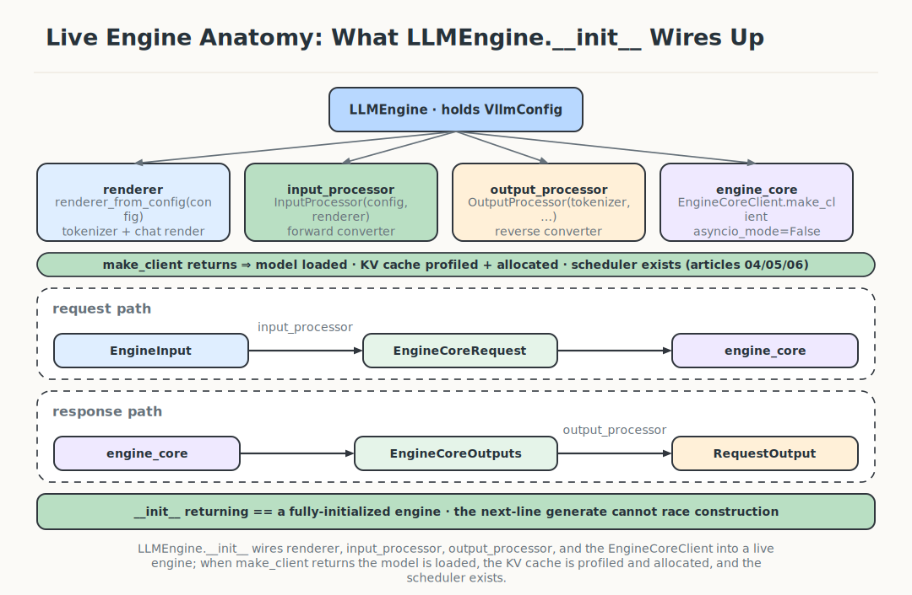</a>

<p class='figure-caption'>What `LLMEngine.__init__` wires into a live engine: `renderer` (from config), `input_processor` (EngineInput → EngineCoreRequest), `output_processor` (EngineCoreOutputs → RequestOutput), and `EngineCoreClient.make_client` (`asyncio_mode=False`). When `make_client` returns, the model is loaded, KV cache profiled and allocated, and the scheduler exists.</p>

This is the moment the engine becomes live. The `renderer` (tokenizer + prompt/chat rendering) is built from config; the `input_processor` is wired with that renderer and owns the `EngineInput → EngineCoreRequest` conversion that every request passes through; the `output_processor` owns the reverse `EngineCoreOutputs → RequestOutput`; and `EngineCoreClient.make_client` stands up the actual `EngineCore` (with `asyncio_mode=False`: the synchronous flavor for offline). When `make_client` returns, the model is loaded, KV cache is profiled and allocated, and the scheduler exists (cross-ref article 04 (EngineCore loop), article 05 (scheduler), article 06 (KV cache)). `LLMEngine.__init__` returning means a fully-initialized engine — a request submitted the next line will find memory allocated and a scheduler ready.

**Cache the handles used by request methods.**

Back in [`llm.py:347-364`](https://github.com/vllm-project/vllm/blob/6cf7b26bd4bff60bf378e1af14044280ac0d214c/vllm/entrypoints/llm.py#L347-L364) (excerpt above), once the engine is live the constructor snapshots exactly the handles the request methods will reach for and never rebuild:

- `self.request_counter = Counter()` — a monotonic source of sequential request IDs; the offline plumbing stamps `request_id = str(next(self.request_counter))` and later sorts outputs back into input order by that integer.
- `self.supported_tasks` — cached from `llm_engine.get_supported_tasks()` ([`llm_engine.py:205-210`](https://github.com/vllm-project/vllm/blob/6cf7b26bd4bff60bf378e1af14044280ac0d214c/vllm/v1/engine/llm_engine.py#L205-L210), which itself memoizes an EngineCore round-trip). Every request method's opening `runner_type` guard reads this snapshot, not a live call.
- `self.renderer` and `self.input_processor` are re-exposed straight off `llm_engine`, so the offline mixins can render prompts and reach the single entry point without threading the engine through every call.
- `self.chat_template = load_chat_template(chat_template)` is loaded once here; `chat()` still allows a per-call override, but the default is resolved at construction.
- `self.default_sampling_params` is left `None` and filled lazily on first `generate` — construction pays for nothing a batch might not use.

Source: [`vllm/entrypoints/llm.py:370-381`](https://github.com/vllm-project/vllm/blob/6cf7b26bd4bff60bf378e1af14044280ac0d214c/vllm/entrypoints/llm.py#L370-L381)

```python
        if self.model_config.renderer_num_workers > 1:
            logger.warning_once(
                "`renderer_num_workers=%d` was set, but the offline `LLM` "
                "entrypoint uses the synchronous renderer path and runs "
                "multimodal preprocessing serially across prompts. The "
                "renderer thread pool is only consumed by the async "
                "renderer path used by `vllm serve` / `AsyncLLM`, so this "
                "setting has no effect here.",
                self.model_config.renderer_num_workers,
            )

        PoolingOfflineMixin.__init__(self)
```

<a href='images/vllm-02-15-llm-method-ownership.svg' target='_blank'>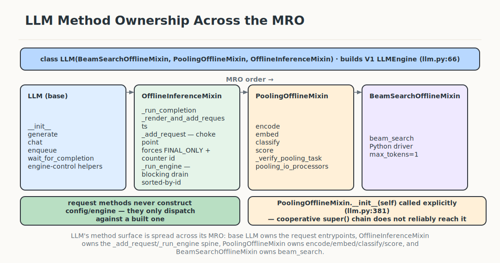</a>

<p class='figure-caption'>`LLM`'s method surface spread across its MRO: base `LLM` owns `__init__`/`generate`/`chat`/`enqueue`, `OfflineInferenceMixin` owns the `_add_request`/`_run_engine` pair, `PoolingOfflineMixin` owns `encode`/`embed`/`classify`/`score`, and `BeamSearchOfflineMixin` owns `beam_search` — with `PoolingOfflineMixin.__init__` called explicitly because the cooperative `super()` chain does not reliably reach it.</p>

Two closing acts. First, a `warning_once` (issue #42901): the renderer thread pool is only consumed by the *async* renderer path (`vllm serve` / `AsyncLLM`), so `renderer_num_workers > 1` is a silent no-op offline; the constructor tells you rather than lying. Second, `PoolingOfflineMixin.__init__(self)` is called **explicitly** rather than via `super().__init__()`, because the cooperative-`super` chain across three mixins doesn't reliably reach it; the pooling mixin needs its own state initialized before `encode`/`embed`/`score` can run.

Finally, the classmethod round-trip at [`llm.py:387-389`](https://github.com/vllm-project/vllm/blob/6cf7b26bd4bff60bf378e1af14044280ac0d214c/vllm/entrypoints/llm.py#L387-L389) is `return cls(**vars(engine_args))` — `from_engine_args` simply explodes an `EngineArgs` dataclass back through the same `__init__`, so the CLI/server config surface and the Python constructor stay a single code path.

## 3. The Offline Request APIs: generate, chat, encode, score

`LLM` multiplexes generation, chat, pooling, scoring, and a beam-search driver over one synchronous engine. Each API checks its runner, fills defaults, and delegates to `OfflineInferenceMixin`: `_add_request` admits a rendered input and `_run_engine` blocks until completion. APIs differ mainly in preprocessing and expected output type; id assignment, ordering, and cleanup after a mid-batch error are shared. The mixin ownership is shown in [Section 2](#2-constructing-llm-from-engineargs-to-a-live-engine).

<a href='images/vllm-02-04-offline-apis.svg' target='_blank'>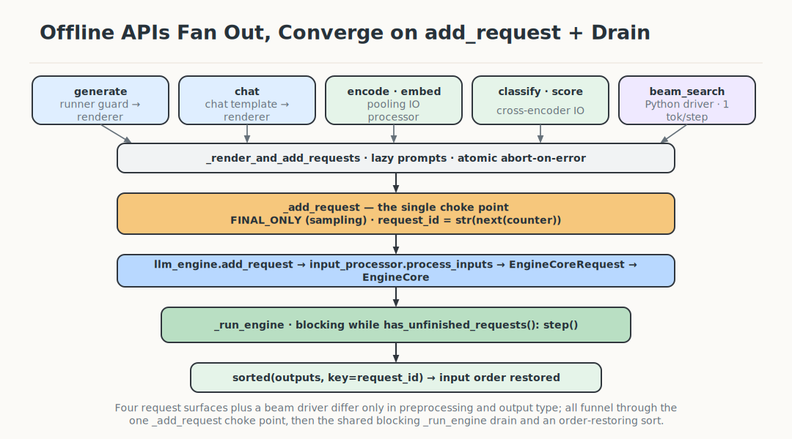</a>

<p class='figure-caption'>The offline request APIs fan out through per-API preprocessing but converge on the same `_add_request → _run_engine` spine.</p>

### `generate` is the archetype

Every offline request method starts identically. `generate` is the cleanest specimen.

[`vllm/entrypoints/llm.py:465-485`](https://github.com/vllm-project/vllm/blob/6cf7b26bd4bff60bf378e1af14044280ac0d214c/vllm/entrypoints/llm.py#L465-L485)
```python
        runner_type = self.model_config.runner_type
        if runner_type != "generate":
            raise ValueError(
                "LLM.generate() is only supported for generative models. "
                "Try passing `--runner generate` to use the model as a "
                "generative model."
            )

        if sampling_params is None:
            sampling_params = self.get_default_sampling_params()

        return self._run_completion(
            prompts=prompts,
            params=sampling_params,
            output_type=RequestOutput,
            use_tqdm=use_tqdm,
            lora_request=lora_request,
            tokenization_kwargs=tokenization_kwargs,
            priority=priority,
            mm_processor_kwargs=mm_processor_kwargs,
        )
```

The runner guard rejects a model not loaded for generation. When `sampling_params` is `None`, `get_default_sampling_params` lazily caches the model's `generation_config.json` deltas and builds a fresh `SamplingParams` for the call ([`llm.py:415-420`](https://github.com/vllm-project/vllm/blob/6cf7b26bd4bff60bf378e1af14044280ac0d214c/vllm/entrypoints/llm.py#L415-L420)); an empty delta falls back to neutral defaults. `_run_completion` receives `RequestOutput` as the expected type, which the drain loop later asserts.

`generate` only ever produces `RequestOutput`s, only for generative runners, and a caller who omits sampling params gets the model's HF-derived defaults rather than vLLM's neutral ones — matching the docstring's promise ([`llm.py:461-463`](https://github.com/vllm-project/vllm/blob/6cf7b26bd4bff60bf378e1af14044280ac0d214c/vllm/entrypoints/llm.py#L461-L463)) of outputs "in the same order as the input prompts."

`generate` is exactly `_run_completion`, which is itself `_add_completion_requests` + `_run_engine` fused ([Section 2](#2-constructing-llm-from-engineargs-to-a-live-engine), [`offline_utils.py:326-349`](https://github.com/vllm-project/vllm/blob/6cf7b26bd4bff60bf378e1af14044280ac0d214c/vllm/entrypoints/offline_utils.py#L326-L349)). The non-blocking twin `enqueue`/`wait_for_completion` ([`llm.py:487-569`](https://github.com/vllm-project/vllm/blob/6cf7b26bd4bff60bf378e1af14044280ac0d214c/vllm/entrypoints/llm.py#L487-L569)) splits those two halves: `enqueue` returns request-id strings without stepping the engine, `wait_for_completion` runs the drain later. Both halves reuse the same shared path below.

### The choke point: `_add_request`

Prompts are rendered to `EngineInput`s by the renderer (completion path) or an IO processor (pooling path), then every offline request, regardless of API, flows through one method to become an engine request.

[`vllm/entrypoints/offline_utils.py:552-571`](https://github.com/vllm-project/vllm/blob/6cf7b26bd4bff60bf378e1af14044280ac0d214c/vllm/entrypoints/offline_utils.py#L552-L571)
```python
    def _add_request(
        self,
        prompt: EngineInput,
        params: SamplingParams | PoolingParams,
        lora_request: LoRARequest | None = None,
        priority: int = 0,
    ) -> str:
        if isinstance(params, SamplingParams):
            # We only care about the final output
            params.output_kind = RequestOutputKind.FINAL_ONLY

        request_id = str(next(self.request_counter))

        return self.llm_engine.add_request(
            request_id,
            prompt,
            params,
            lora_request=lora_request,
            priority=priority,
        )
```

For generation, `_add_request` forces `FINAL_ONLY`, matching the drain's decision to retain only finished outputs. Pooling params are not changed here; their constructor already rejects any other output kind ([`vllm/pooling_params.py:230-235`](https://github.com/vllm-project/vllm/blob/6cf7b26bd4bff60bf378e1af14044280ac0d214c/vllm/pooling_params.py#L230-L235)). The monotonic, stringified counter value is both the engine handle and the terminal sort key. `llm_engine.add_request` then performs input lowering and any `n>1` fan-out (article 04).

`_add_request` is called from `_render_and_add_requests` ([`offline_utils.py:523-550`](https://github.com/vllm-project/vllm/blob/6cf7b26bd4bff60bf378e1af14044280ac0d214c/vllm/entrypoints/offline_utils.py#L523-L550)), which iterates the *lazy* prompt generator and, critically, wraps the loop in a `try/except` that aborts every already-added request with `internal=True` if any prompt fails mid-batch. So a batch that raises leaves no half-added requests lingering in the scheduler.

### The drain: `_run_engine`

The second half of the pair is the synchronous run loop that all four APIs share.

[`vllm/entrypoints/offline_utils.py:594-626`](https://github.com/vllm-project/vllm/blob/6cf7b26bd4bff60bf378e1af14044280ac0d214c/vllm/entrypoints/offline_utils.py#L594-L626)
```python
        while self.llm_engine.has_unfinished_requests():
            step_outputs = self.llm_engine.step()
            for output in step_outputs:
                assert isinstance(output, output_type)
                if output.finished:
                    outputs.append(output)  # type: ignore[arg-type]
                    if use_tqdm:
                        if isinstance(output, RequestOutput):
                            # Calculate tokens only for RequestOutput
                            n = len(output.outputs)
                            assert output.prompt_token_ids is not None
                            total_in_toks += len(output.prompt_token_ids) * n
                            ...
                            pbar.update(n)
                        else:
                            pbar.update(1)
                        ...
        if use_tqdm:
            pbar.close()
        # Sort the outputs by request ID.
        # This is necessary because some requests may be finished earlier than
        # its previous requests.
        return sorted(outputs, key=lambda x: int(x.request_id))
```

The loop blocks on successive engine steps. Its runtime type assertion catches a runner/config mismatch, and `FINAL_ONLY` means retaining only `output.finished` loses no intermediate data. Requests can finish out of order, so the terminal sort uses `_add_request`'s numeric ids to restore submission order. [Section 11](#11-streaming-sse-middleware-auth-and-health) shows the online counterpart.

**`chat` diverges only in preprocessing.**

`chat` ([`llm.py:616-708`](https://github.com/vllm-project/vllm/blob/6cf7b26bd4bff60bf378e1af14044280ac0d214c/vllm/entrypoints/llm.py#L616-L708)) uses the same runner check, defaults, and `RequestOutput` drain as `generate`. Its template, generation-prompt, tool, and content-format options are resolved by the renderer and baked into `EngineInput`; the engine never receives a conversation object. For Gemma4, thinking or tool delimiters encoded as special tokens make the wrapper set `skip_special_tokens=False`, preserving them during detokenization ([`offline_utils.py:447-492`](https://github.com/vllm-project/vllm/blob/6cf7b26bd4bff60bf378e1af14044280ac0d214c/vllm/entrypoints/offline_utils.py#L447-L492)). [Section 7](#7-serving-chat-templates-and-tool-calling) follows the shared chat renderer online.

### `encode` and the pooling family: a disjoint pipeline, same drain

`encode` proves the pattern by breaking one piece of it. Pooling models produce a fixed hidden-state vector, not a token stream, so there is no autoregressive decode — but the *plumbing* is reused.

[`vllm/entrypoints/pooling/offline.py:91-136`](https://github.com/vllm-project/vllm/blob/6cf7b26bd4bff60bf378e1af14044280ac0d214c/vllm/entrypoints/pooling/offline.py#L91-L136)
```python
        self._verify_pooling_task(pooling_task)
        assert pooling_task is not None and pooling_task in self.pooling_io_processors

        io_processor = self.pooling_io_processors[pooling_task]

        if pooling_params is None:
            pooling_params = PoolingParams()

        ctx = OfflineInputsContext(
            prompts=prompts,
            pooling_params=pooling_params,
            tokenization_kwargs=tokenization_kwargs,
        )

        engine_inputs = io_processor.pre_process_offline(ctx)
        n_inputs = len(engine_inputs)
        ...
        params_seq = self._params_to_seq(ctx.pooling_params, n_inputs)

        for param in params_seq:
            if param.task is None:
                param.task = pooling_task
            ...
        self._render_and_add_requests(
            prompts=engine_inputs,
            params=params_seq,
            ...
        )

        outputs = self._run_engine(use_tqdm=use_tqdm, output_type=PoolingRequestOutput)
        outputs = io_processor.post_process_offline(
            ctx=OfflineOutputsContext(outputs=outputs)
        )
        return outputs
```

`_verify_pooling_task` requires a pooling runner, an explicit task, and membership in `supported_tasks` ([`offline.py:138-197`](https://github.com/vllm-project/vllm/blob/6cf7b26bd4bff60bf378e1af14044280ac0d214c/vllm/entrypoints/pooling/offline.py#L138-L197)). A task-specific IO processor renders inputs, and each `PoolingParams.task` is filled or checked for conflict. The shared add/drain path then expects `PoolingRequestOutput`, followed by task-specific postprocessing. `embed` and `classify` merely pin the task and narrow the output type ([`offline.py:199-287`](https://github.com/vllm-project/vllm/blob/6cf7b26bd4bff60bf378e1af14044280ac0d214c/vllm/entrypoints/pooling/offline.py#L199-L287)). Article 10 contrasts pooling with sampling inside the engine.

**`score`: pairwise, gated on `num_labels == 1`.**

`score` ([`offline.py:289-402`](https://github.com/vllm-project/vllm/blob/6cf7b26bd4bff60bf378e1af14044280ac0d214c/vllm/entrypoints/pooling/offline.py#L289-L402)) is the cross-encoder specialization of the pooling path.

[`vllm/entrypoints/pooling/offline.py:340-355`](https://github.com/vllm-project/vllm/blob/6cf7b26bd4bff60bf378e1af14044280ac0d214c/vllm/entrypoints/pooling/offline.py#L340-L355)
```python
        if self.runner_type != "pooling":
            raise ValueError(
                "LLM.score() is only supported for pooling models. "
                "Try passing `--runner pooling` to use the model as a "
                "pooling model."
            )

        score_type: str | None = SCORE_TYPE_MAP.get(self.pooling_task, None)  # type: ignore[arg-type]
        if (
            score_type == "cross-encoder"
            and getattr(self.model_config.hf_config, "num_labels", 0) != 1
        ):
            raise ValueError("Scoring API is only enabled for num_labels == 1.")

        if score_type is None or score_type not in self.pooling_io_processors:
            raise ValueError("This model does not support the Scoring API.")
```

Same pooling runner guard, then a `SCORE_TYPE_MAP` lookup selects a cross-encoder or embedding `ScoringIOProcessor`. The critical gate is `num_labels == 1`: a cross-encoder head must emit a single scalar per pair, so a multi-label head is refused up front. The rest is the pooling pipeline — `valid_inputs` materializes the `1→1 / 1→N / N→N` pairing (tracking `n_queries` so `post_process_offline` can regroup), then `_render_and_add_requests` + `_run_engine(PoolingRequestOutput)`, re-typed to `ScoringRequestOutput`.

**`beam_search` is a driver, not a request.**

One offline API deliberately does *not* map to one engine request. `beam_search` ([`beam_search/offline.py:58-191`](https://github.com/vllm-project/vllm/blob/6cf7b26bd4bff60bf378e1af14044280ac0d214c/vllm/entrypoints/generate/beam_search/offline.py#L58-L191)) is a Python driver loop that reconstructs the beam tree itself, issuing single-token engine requests per beam per step.

[`vllm/entrypoints/generate/beam_search/offline.py:118-123`](https://github.com/vllm-project/vllm/blob/6cf7b26bd4bff60bf378e1af14044280ac0d214c/vllm/entrypoints/generate/beam_search/offline.py#L118-L123)
```python
        base_sampling_params = SamplingParams(
            logprobs=2 * beam_width,
            max_tokens=1,
            temperature=temperature,
            skip_clone=True,  # Internal beam search, safe to skip clone
        )
```

<a href='images/vllm-02-16-beam-search-tree.svg' target='_blank'>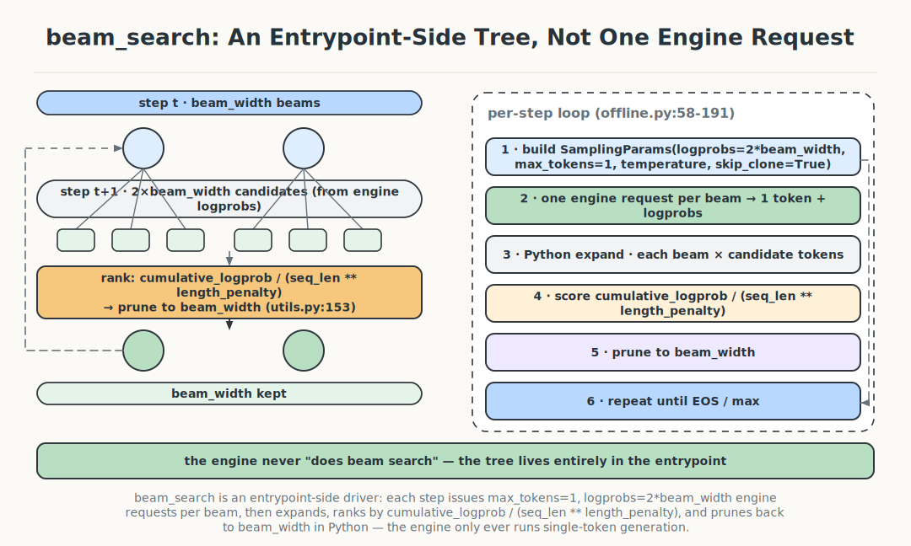</a>

<p class='figure-caption'>`beam_search` is an entrypoint-side driver, not one engine request: each step issues `max_tokens=1`, `logprobs=2*beam_width` engine requests per beam, then expands, ranks by `cumulative_logprob / (seq_len ** length_penalty)`, and prunes back to `beam_width` in Python — the engine only ever runs single-token generation.</p>

Each step asks the engine for one token with `2 * beam_width` logprobs (following HF transformers), then expands and prunes beams in Python, ranking by length-penalized cumulative logprob (`cumulative_logprob / (seq_len ** length_penalty)`, [`vllm/entrypoints/generate/beam_search/utils.py:153`](https://github.com/vllm-project/vllm/blob/6cf7b26bd4bff60bf378e1af14044280ac0d214c/vllm/entrypoints/generate/beam_search/utils.py#L153)). The engine is never asked to "do beam search" — it only runs `max_tokens=1` generation, and the search is entirely an entrypoint concern.

## 4. The CLI: vllm serve and How the Server Launches

`vllm serve` turns command-line arguments into the `Namespace` used by the HTTP server's own `__main__`, selects a launch topology, and on the common path calls `uvloop.run(run_server(args))` with a pre-bound socket. It owns argument validation and process selection, not scheduling or model execution.

<a href='images/vllm-02-05-cli-serve.svg' target='_blank'>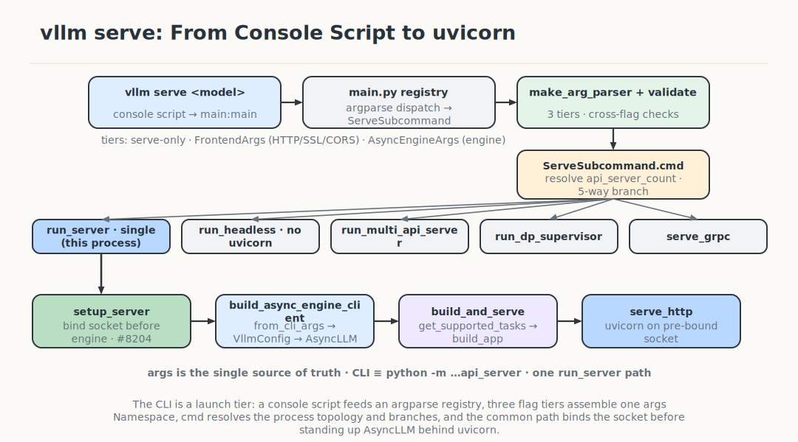</a>

<p class='figure-caption'>`vllm serve` — console script → lazy command registry → three-tier flag assembly → `ServeSubcommand.cmd` five-way branch → bind socket → `run_server`.</p>

### The console-script entry point

Where does `vllm` come from? It is a setuptools console script, declared once in packaging metadata.

`pyproject.toml:44`

```toml
vllm = "vllm.entrypoints.cli.main:main"
```

Installing vLLM writes a `vllm` executable whose body calls `vllm.entrypoints.cli.main:main`. There is no shell wrapper or dispatcher script; the entry point is a plain Python function. The same importable `main` is reachable from the installed binary, tests, and `python -m vllm.entrypoints.cli.main`.

### A lazy command registry, dispatched by argparse defaults

`main()` is deliberately import-cheap. Its docstring ([`main.py:3-6`](https://github.com/vllm-project/vllm/blob/6cf7b26bd4bff60bf378e1af14044280ac0d214c/vllm/entrypoints/cli/main.py#L3-L6)) mandates that "all future modules must be lazily loaded within main to avoid certain eager import breakage" — so every subcommand module is imported *inside* the function body, never at module top level.

[`vllm/entrypoints/cli/main.py:83-97`](https://github.com/vllm-project/vllm/blob/6cf7b26bd4bff60bf378e1af14044280ac0d214c/vllm/entrypoints/cli/main.py#L83-L97)

```python
        subparsers = parser.add_subparsers(required=False, dest="subparser")
        cmds = {}
        for cmd_module in CMD_MODULES:
            new_cmds = cmd_module.cmd_init()
            for cmd in new_cmds:
                cmd.subparser_init(subparsers).set_defaults(dispatch_function=cmd.cmd)
                cmds[cmd.name] = cmd
        args = parser.parse_args()
        if args.subparser in cmds:
            cmds[args.subparser].validate(args)

        if hasattr(args, "dispatch_function"):
            args.dispatch_function(args)
        else:
            parser.print_help()
```

The dispatch is straightforward:

`CMD_MODULES` is imported inside `main`, and each module's `cmd_init()` returns its `CLISubcommand` objects. `subparser_init` builds the parser and stores `cmd.cmd` as the `dispatch_function` default. After one `parse_args()`, a recognized command is validated and dispatched; a bare `vllm` prints help. `serve` contributes one `ServeSubcommand` ([`serve.py:169-170`](https://github.com/vllm-project/vllm/blob/6cf7b26bd4bff60bf378e1af14044280ac0d214c/vllm/entrypoints/cli/serve.py#L169-L170)).

The selected argparse subparser determines the handler; there is no `if name == "serve"` ladder. `validate()` runs before `cmd()`, so invalid combinations fail before engine or socket setup. One implementation detail is worth noticing: because `cmds[cmd.name] = cmd` is keyed by name, a duplicate registration would overwrite the previous entry. (`--omni` and `bench` are exceptions to this pipeline; [`main.py:42-71`](https://github.com/vllm-project/vllm/blob/6cf7b26bd4bff60bf378e1af14044280ac0d214c/vllm/entrypoints/cli/main.py#L42-L71) detects them from raw `sys.argv` before argparse runs.)

**Three tiers of flags, assembled in one place.**

`ServeSubcommand.subparser_init` ([`serve.py:153-166`](https://github.com/vllm-project/vllm/blob/6cf7b26bd4bff60bf378e1af14044280ac0d214c/vllm/entrypoints/cli/serve.py#L153-L166)) delegates the entire flag surface to `make_arg_parser`. That function is the single place the `vllm serve` argument surface is composed, and it stacks three tiers in a fixed order.

[`vllm/entrypoints/openai/cli_args.py:346-383`](https://github.com/vllm-project/vllm/blob/6cf7b26bd4bff60bf378e1af14044280ac0d214c/vllm/entrypoints/openai/cli_args.py#L346-L383)

```python
    parser.add_argument(
        "model_tag",
        type=str,
        nargs="?",
        help="The model tag to serve (optional if specified in config)",
    )
    parser.add_argument(
        "--headless",
        ...
    )
    parser.add_argument(
        "--api-server-count",
        "-asc",
        type=int,
        default=None,
        ...
    )
    parser.add_argument(
        "--config",
        ...
    )
    parser.add_argument(
        "--grpc",
        ...
    )
    parser = FrontendArgs.add_cli_args(parser)
    parser = AsyncEngineArgs.add_cli_args(parser)

    return parser
```

<a href='images/vllm-02-17-cli-flag-tiers.svg' target='_blank'>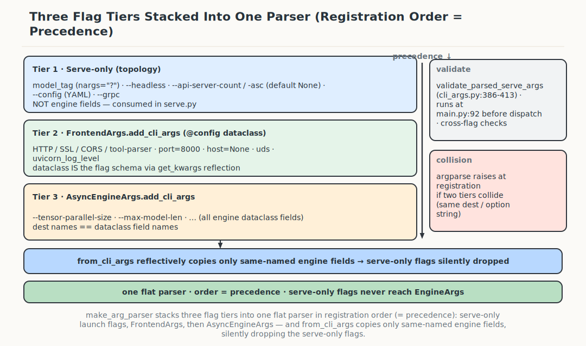</a>

<p class='figure-caption'>`make_arg_parser` stacks three flag tiers into one flat parser in registration order (= precedence): serve-only launch flags (`model_tag`, `--headless`, `--api-server-count`, `--config`, `--grpc`), `FrontendArgs.add_cli_args`, then `AsyncEngineArgs.add_cli_args` — and `from_cli_args` reflectively copies only same-named engine fields, silently dropping the serve-only flags.</p>

Read — three tiers, in registration order:

1. **Serve-only hand-written flags:** the positional `model_tag` (`nargs="?"`, so optional), `--headless`, `--api-server-count`/`-asc` (default `None`), `--config` (a YAML options file), and `--grpc`. These exist only for the CLI's own topology decisions; they are *not* engine fields.
2. **`FrontendArgs.add_cli_args`**: the HTTP/SSL/CORS/tool-parser surface. `FrontendArgs` is a `@config` dataclass ([`cli_args.py:223-247`](https://github.com/vllm-project/vllm/blob/6cf7b26bd4bff60bf378e1af14044280ac0d214c/vllm/entrypoints/openai/cli_args.py#L223-L247), `port=8000`, `host=None`, `uds`, `uvicorn_log_level="info"`); each field becomes a `--flag` via `get_kwargs` reflection, so the dataclass *is* the flag schema.
3. **`AsyncEngineArgs.add_cli_args`** — the full engine flag surface (`--tensor-parallel-size`, `--max-model-len`, and the rest), registered the same reflective way.

Flag precedence follows registration order, with engine args added last. All three tiers register into one parser, so argparse reports a duplicate option instead of silently accepting a serve/engine collision. `--api-server-count` deliberately defaults to `None`; `cmd` uses that sentinel to derive a value from the data-parallel configuration.

Cross-flag consistency is checked separately, up front. `validate()` → `validate_parsed_serve_args` ([`cli_args.py:386-413`](https://github.com/vllm-project/vllm/blob/6cf7b26bd4bff60bf378e1af14044280ac0d214c/vllm/entrypoints/openai/cli_args.py#L386-L413)) enforces dependencies like "`--enable-auto-tool-choice` requires `--tool-call-parser`" and "`--enable-per-request-metrics` requires engine stats logging" — raising `TypeError`/`ValueError` *before* any model load or socket bind. Because it runs at [`main.py:92`](https://github.com/vllm-project/vllm/blob/6cf7b26bd4bff60bf378e1af14044280ac0d214c/vllm/entrypoints/cli/main.py#L92), these are immediate, cheap failures, never mid-startup crashes.

### `ServeSubcommand.cmd`: normalize, resolve topology, branch

`cmd` is the handler argparse dispatched to. It does three things: promote the positional model, resolve the process topology into a concrete `api_server_count`, and branch.

[`vllm/entrypoints/cli/serve.py:49-59`](https://github.com/vllm-project/vllm/blob/6cf7b26bd4bff60bf378e1af14044280ac0d214c/vllm/entrypoints/cli/serve.py#L49-L59)

```python
    @staticmethod
    def cmd(args: argparse.Namespace) -> None:
        # If model is specified in CLI (as positional arg), it takes precedence
        if hasattr(args, "model_tag") and args.model_tag is not None:
            args.model = args.model_tag

        if getattr(args, "grpc", False):
            from vllm.entrypoints.grpc_server import serve_grpc

            uvloop.run(serve_grpc(args))
            return
```

<a href='images/vllm-02-18-serve-topology-branch.svg' target='_blank'>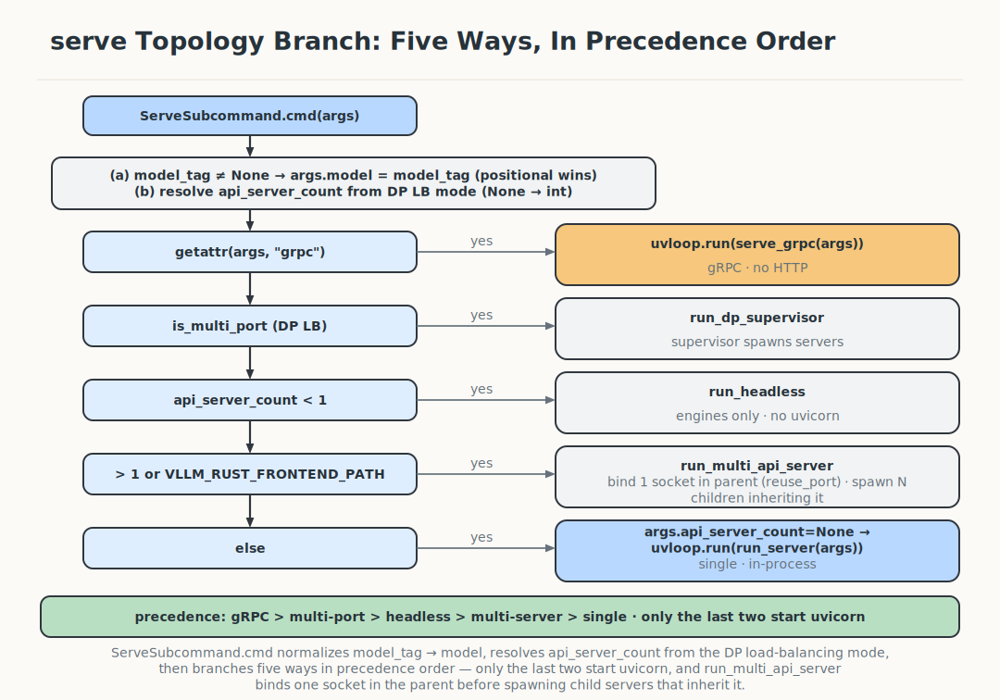</a>

<p class='figure-caption'>`ServeSubcommand.cmd` normalizes `model_tag` → `model`, resolves `api_server_count` from the data-parallel load-balancing mode, then branches five ways (gRPC, `run_dp_supervisor`, `run_headless`, `run_multi_api_server`, single in-process `run_server`) in precedence order — only the last two start uvicorn, and `run_multi_api_server` binds one socket in the parent before spawning child API servers that inherit it.</p>

The positional `model_tag` (a serve-only flag) is copied onto `args.model` (an engine field), with the positional winning if both are given. So `vllm serve Qwen/Qwen3-0.6B` and `vllm serve --model Qwen/Qwen3-0.6B` converge on the same `args.model`. `--grpc` is a full diversion: it hands `args` to `serve_grpc` under `uvloop.run` and returns, never touching the HTTP path.

Between here and the branch, `cmd` ([`serve.py:61-137`](https://github.com/vllm-project/vllm/blob/6cf7b26bd4bff60bf378e1af14044280ac0d214c/vllm/entrypoints/cli/serve.py#L61-L137)) infers the data-parallel load-balancing mode (multi-port / external / hybrid, with `sum([...]) > 1` at [`serve.py:91`](https://github.com/vllm-project/vllm/blob/6cf7b26bd4bff60bf378e1af14044280ac0d214c/vllm/entrypoints/cli/serve.py#L91) enforcing that at most one is active) and resolves `api_server_count` from `None` to a concrete integer — full `data_parallel_size` for plain internal LB, `data_parallel_size_local` for hybrid, and a hard cap of `1` for the Rust frontend and Elastic EP. The DP internals are article 03's subject (the API-server↔EngineCore process split); what matters at the entrypoint boundary is that `api_server_count` is a resolved int before the branch runs.

[`vllm/entrypoints/cli/serve.py:139-148`](https://github.com/vllm-project/vllm/blob/6cf7b26bd4bff60bf378e1af14044280ac0d214c/vllm/entrypoints/cli/serve.py#L139-L148)

```python
        if is_multi_port:
            run_dp_supervisor(args)
        elif args.api_server_count < 1:
            run_headless(args)
        elif args.api_server_count > 1 or envs.VLLM_RUST_FRONTEND_PATH:
            run_multi_api_server(args)
        else:
            # Single API server (this process).
            args.api_server_count = None
            uvloop.run(run_server(args))
```

The terminal dispatch reduces the five cases to four `elif` arms plus the earlier gRPC return:

| Condition | Path | HTTP server? |
|---|---|---|
| `--grpc` | `serve_grpc` (returned earlier) | no (gRPC stack) |
| `is_multi_port` | `run_dp_supervisor` | supervisor spawns servers |
| `api_server_count < 1` | `run_headless` | **no** — engines only |
| `> 1` or Rust frontend | `run_multi_api_server` | yes, N child processes |
| else (single) | `uvloop.run(run_server(args))` | yes, in *this* process |

Three properties follow from the branch order:

Branch order is precedence: multi-port, headless, multi-server, then single-server. `run_headless` starts engine processes without uvicorn for non-serving nodes in a multi-node DP deployment ([`serve.py:173-182`](https://github.com/vllm-project/vllm/blob/6cf7b26bd4bff60bf378e1af14044280ac0d214c/vllm/entrypoints/cli/serve.py#L173-L182)). The multi-server path binds a reusable socket in the parent before engine startup, stamps API-process rank and count, and lets children inherit it. The single-server path sets `api_server_count=None` as its sentinel and calls `uvloop.run(run_server(args))` in process.

### The common path: bind the socket before the engine exists

`run_server` is the target of that `uvloop.run`. It is short, and every line is load-bearing.

[`vllm/entrypoints/openai/api_server.py:746-759`](https://github.com/vllm-project/vllm/blob/6cf7b26bd4bff60bf378e1af14044280ac0d214c/vllm/entrypoints/openai/api_server.py#L746-L759)

```python
async def run_server(args, **uvicorn_kwargs) -> None:
    """Run a single-worker API server."""

    decorate_logs("APIServer", skip_if_decorated=True)

    # Interrupt initialization if SIGTERM arrives before uvicorn installs its
    # own signal handlers. Once uvicorn is running it replaces this.
    def _interrupt_init(*_) -> None:
        raise KeyboardInterrupt("terminated")

    signal.signal(signal.SIGTERM, _interrupt_init)

    listen_address, sock = setup_server(args, reuse_port=False)
    await run_server_worker(listen_address, sock, args, **uvicorn_kwargs)
```

Before doing anything slow, `run_server` installs a temporary `SIGTERM` handler that raises `KeyboardInterrupt`. Model loading can take minutes; without this guard a `kill` during load would be swallowed because uvicorn's own signal handlers do not exist yet. Once uvicorn boots it replaces this handler. Then `setup_server` binds the socket and `run_server_worker` does the rest.

`setup_server` ([`api_server.py:628-637`](https://github.com/vllm-project/vllm/blob/6cf7b26bd4bff60bf378e1af14044280ac0d214c/vllm/entrypoints/openai/api_server.py#L628-L637)) is where the port is claimed, and the source is explicit about why this happens *before* the engine:

```python
    validate_api_server_args(args)

    # workaround to make sure that we bind the port before the engine is set up.
    # This avoids race conditions with ray.
    # see https://github.com/vllm-project/vllm/issues/8204
    if args.uds:
        sock = create_server_unix_socket(args.uds)
    else:
        sock_addr = (args.host or "", args.port)
        sock = create_server_socket(sock_addr, reuse_port=reuse_port)
```

The ordering guarantee is in that comment: the listening socket is bound before engine construction (issue [#8204](https://github.com/vllm-project/vllm/issues/8204)). The returned `sock` is a live, bound socket object; `listen_address` is only a human-readable string. Downstream, `serve_http` ([`launcher.py:26-82`](https://github.com/vllm-project/vllm/blob/6cf7b26bd4bff60bf378e1af14044280ac0d214c/vllm/entrypoints/launcher.py#L26-L82)) calls `server.serve(sockets=[sock])`, so uvicorn serves on the pre-bound socket and never binds the port itself. This port-then-engine ordering is what avoids the Ray race where a slow engine startup would otherwise let a competing process grab the port.

**Handing off, and why the CLI and `__main__` stay identical.**

`run_server_worker` scopes the engine's entire lifetime inside one async context manager, and orders shutdown carefully.

[`vllm/entrypoints/openai/api_server.py:773-784`](https://github.com/vllm-project/vllm/blob/6cf7b26bd4bff60bf378e1af14044280ac0d214c/vllm/entrypoints/openai/api_server.py#L773-L784)

```python
    async with build_async_engine_client(
        args,
        client_config=client_config,
    ) as engine_client:
        shutdown_task = await build_and_serve(
            engine_client, listen_address, sock, args, **uvicorn_kwargs
        )
    # NB: Await server shutdown only after the backend context is exited
    try:
        await shutdown_task
    finally:
        sock.close()
```

`build_async_engine_client` creates the `AsyncLLM` and is also where `args` finally becomes engine configuration: [`api_server.py:134`](https://github.com/vllm-project/vllm/blob/6cf7b26bd4bff60bf378e1af14044280ac0d214c/vllm/entrypoints/openai/api_server.py#L134) calls `AsyncEngineArgs.from_cli_args(args)`, followed by `create_engine_config` and `AsyncLLM.from_vllm_config`. [Section 5](#5-the-openai-server-fastapi-app-lifespan-and-the-engine-client) looks inside that composition root.

`build_and_serve` assembles the FastAPI app and returns a `shutdown_task`. That task is awaited outside the `async with`, so the engine context exits before final HTTP teardown; `sock.close()` comes last. The ordering is easier to remember than the nesting: engine first, socket last.

`from_cli_args` is the bridge that makes the whole CLI a name-matched copy, not a manual mapping.

[`vllm/engine/arg_utils.py:1606-1613`](https://github.com/vllm-project/vllm/blob/6cf7b26bd4bff60bf378e1af14044280ac0d214c/vllm/engine/arg_utils.py#L1606-L1613)

```python
    def from_cli_args(cls, args: argparse.Namespace):
        # Get the list of attributes of this dataclass.
        attrs = [attr.name for attr in dataclasses.fields(cls)]
        # Set the attributes from the parsed arguments.
        engine_args = cls(
            **{attr: getattr(args, attr) for attr in attrs if hasattr(args, attr)}
        )
        return engine_args
```

It enumerates the `AsyncEngineArgs` dataclass fields and copies each same-named attribute off the `args` Namespace. Fields absent on `args` fall back to dataclass defaults. This is exactly why tier 3 of `make_arg_parser` matters: because engine flags register with `dest` names equal to dataclass field names, every engine flag reaches `EngineArgs` automatically. And the serve-only flags (`model_tag`, `headless`, `api_server_count`, `grpc`, `config`) are *not* dataclass fields, so they are silently dropped here — they were already consumed in `serve.py`. **`args` is the single source of truth from shell to engine**, converted by a reflective field copy; there is no hand-maintained flag-to-config table to drift.

Finally, the reason this path is trustworthy: the module's own `__main__` mirrors it.

[`vllm/entrypoints/openai/api_server.py:787-799`](https://github.com/vllm-project/vllm/blob/6cf7b26bd4bff60bf378e1af14044280ac0d214c/vllm/entrypoints/openai/api_server.py#L787-L799)

```python
if __name__ == "__main__":
    # NOTE(simon):
    # This section should be in sync with vllm/entrypoints/cli/main.py for CLI
    # entrypoints.
    cli_env_setup()
    parser = FlexibleArgumentParser(...)
    parser = make_arg_parser(parser)
    args = parser.parse_args()
    validate_parsed_serve_args(args)

    uvloop.run(run_server(args))
```

Running `python -m vllm.entrypoints.openai.api_server` builds the same parser, validates it, and ends at the same `run_server(args)` call; the source comment requires the module and CLI entrypoints to stay in sync.

## 5. The OpenAI Server: FastAPI App, Lifespan, and the Engine Client

`vllm/entrypoints/openai/api_server.py` is a composition root rather than a route table: feature-specific routers define the endpoints, while this module orders socket binding, engine-client lifetime, capability discovery, app construction, and shutdown. `supported_tasks`, server arguments, model configuration, plugins, and developer mode determine the final surface.

<a href='images/vllm-02-02-online-request-path.svg' target='_blank'>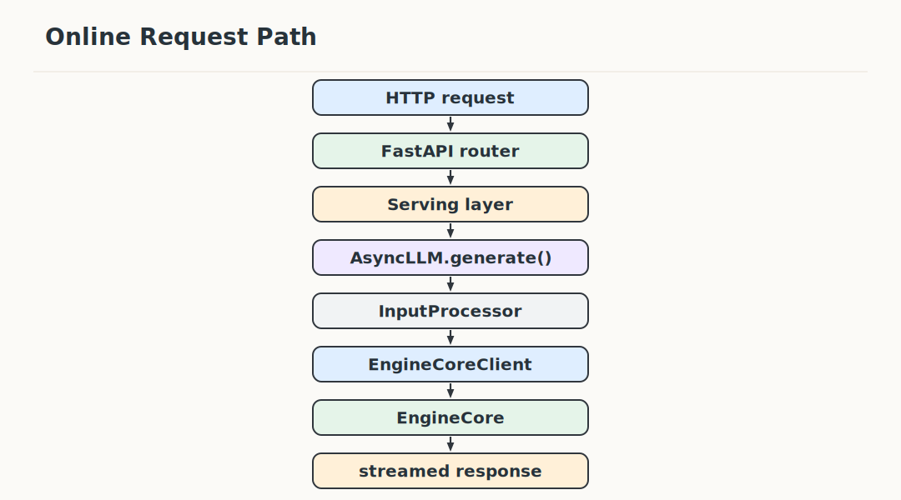</a>

<p class='figure-caption'>The HTTP door: socket → AsyncLLM engine client → FastAPI app gated by supported_tasks → per-request SSE stream.</p>

### The engine client: `AsyncLLM` is the `EngineClient`

The whole server talks to one object, an `EngineClient`, and it is produced by the context manager above. `build_async_engine_client` is a thin outer layer (CLI `args` → `AsyncEngineArgs`, forkserver pre-import); the concrete engine is born one layer down.

[`vllm/entrypoints/openai/api_server.py:162-193`](https://github.com/vllm-project/vllm/blob/6cf7b26bd4bff60bf378e1af14044280ac0d214c/vllm/entrypoints/openai/api_server.py#L162-L193)

```python
    # Create the EngineConfig (determines if we can use V1).
    vllm_config = engine_args.create_engine_config(usage_context=usage_context)

    from vllm.v1.engine.async_llm import AsyncLLM

    async_llm: AsyncLLM | None = None

    # Don't mutate the input client_config
    client_config = dict(client_config) if client_config else {}
    client_count = client_config.pop("client_count", 1)
    client_index = client_config.pop("client_index", 0)

    try:
        async_llm = AsyncLLM.from_vllm_config(
            vllm_config=vllm_config,
            usage_context=usage_context,
            enable_log_requests=engine_args.enable_log_requests,
            aggregate_engine_logging=engine_args.aggregate_engine_logging,
            disable_log_stats=engine_args.disable_log_stats,
            client_addresses=client_config,
            client_count=client_count,
            client_index=client_index,
        )

        # Don't keep the dummy data in memory
        assert async_llm is not None
        await async_llm.reset_mm_cache()

        yield async_llm
    finally:
        if async_llm:
            async_llm.shutdown(timeout=vllm_config.shutdown_timeout)
```

<a href='images/vllm-02-19-socket-engine-lifecycle.svg' target='_blank'>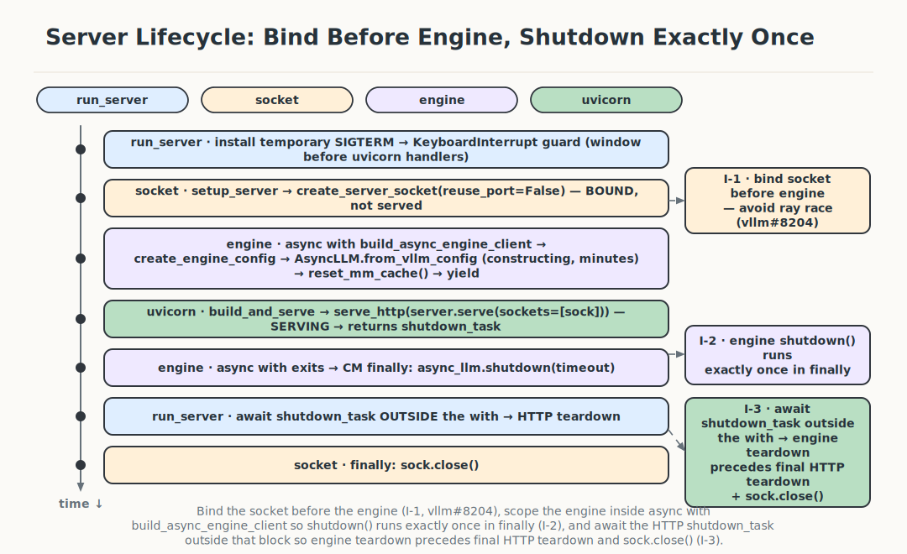</a>

<p class='figure-caption'>Server lifecycle ordering: bind the socket before constructing the engine (vllm#8204), scope the engine inside `async with build_async_engine_client`, and await the HTTP `shutdown_task` outside that block so engine teardown precedes final HTTP teardown and `sock.close()`.</p>

`create_engine_config` lowers `AsyncEngineArgs` to a validated `VllmConfig`, using the same lowering path as offline `LLM` and the CLI. Its default usage context is `UsageContext.OPENAI_API_SERVER` ([`api_server.py:120`](https://github.com/vllm-project/vllm/blob/6cf7b26bd4bff60bf378e1af14044280ac0d214c/vllm/entrypoints/openai/api_server.py#L120), which distinguishes server telemetry from offline `LLM_CLASS`). The concrete client is `AsyncLLM`, a subclass of the engine-client abstract base:

[`vllm/v1/engine/async_llm.py:70`](https://github.com/vllm-project/vllm/blob/6cf7b26bd4bff60bf378e1af14044280ac0d214c/vllm/v1/engine/async_llm.py#L70) — `class AsyncLLM(EngineClient):`
[`vllm/engine/protocol.py:40`](https://github.com/vllm-project/vllm/blob/6cf7b26bd4bff60bf378e1af14044280ac0d214c/vllm/engine/protocol.py#L40) — `class EngineClient(ABC):` ("Protocol class for Clients to Engine").

The server talks to the engine through this ABC rather than reaching into EngineCore internals. `AsyncLLM` implements the [health and lifecycle interface](https://github.com/vllm-project/vllm/blob/6cf7b26bd4bff60bf378e1af14044280ac0d214c/vllm/engine/protocol.py#L50), plus task-discovery, generation, and encoding methods declared on `EngineClient`. After construction, `reset_mm_cache()` releases the multimodal dummy tensors used during startup profiling. The context manager's `finally` calls `async_llm.shutdown(...)` on normal shutdown and on the covered build/serve failure paths; `run_server_worker` relies on that cleanup before it finishes HTTP teardown.

The single yielded `AsyncLLM` is the object every route handler will later dereference as `request.app.state.engine_client`. Its request-admission path (`add_request` → `input_processor.process_inputs` → `EngineCoreRequest`) and its streaming output loop are the subject of [Section 11](#11-streaming-sse-middleware-auth-and-health); here it is just "the engine client, alive for the app's lifetime."

**The ASGI lifespan is *not* the engine context manager.**

There is a second context manager in play, and conflating the two is a classic misread. `build_app` passes `lifespan=lifespan` to `FastAPI(...)`. That `lifespan` is the **ASGI** startup/shutdown hook uvicorn drives *inside* the socket-serving loop — a strictly narrower scope than the engine context manager of the previous subsection, which wraps uvicorn entirely. The engine CM owns the engine's existence; the ASGI lifespan owns two cross-cutting side jobs.

[`vllm/entrypoints/serve/utils/server_utils.py:534-568`](https://github.com/vllm-project/vllm/blob/6cf7b26bd4bff60bf378e1af14044280ac0d214c/vllm/entrypoints/serve/utils/server_utils.py#L534-L568)

```python
@asynccontextmanager
async def lifespan(app: FastAPI):
    try:
        if app.state.log_stats:
            engine_client: EngineClient = app.state.engine_client

            async def _force_log():
                while True:
                    await asyncio.sleep(envs.VLLM_LOG_STATS_INTERVAL)
                    await engine_client.do_log_stats()

            task = asyncio.create_task(_force_log())
            _running_tasks.add(task)
            task.add_done_callback(_running_tasks.remove)
        else:
            task = None

        # Mark the startup heap as static so that it's ignored by GC.
        # Reduces pause times of oldest generation collections.
        freeze_gc_heap()
        try:
            yield
        finally:
            if task is not None:
                task.cancel()
            for attr_name in (
                "openai_serving_transcription",
                "openai_serving_translation",
            ):
                serving = getattr(app.state, attr_name, None)
                if serving is not None and hasattr(serving, "shutdown"):
                    serving.shutdown()
    finally:
        # Ensure app state including engine ref is gc'd
        del app.state
```

When stats are enabled, the ASGI lifespan starts a task that calls `engine_client.do_log_stats()` every `VLLM_LOG_STATS_INTERVAL` seconds. `_running_tasks` keeps a strong reference to it, and a done callback removes it after completion. `freeze_gc_heap()` then removes the startup heap from later cyclic-GC scans. On shutdown, the lifespan cancels the stats task, gives transcription and translation services a chance to close their thread pools, and deletes `app.state`, including its engine-client reference. HTTP-scoped jobs belong to the ASGI lifespan; the enclosing engine context manager owns the engine itself.

### Model-capability routes are gated by `supported_tasks`

`build_and_serve` is the glue that turns "a live engine" into "a serving app." Its first act is to *ask the engine what it can do*, and every routing and state decision downstream is derived from that one answer.

[`vllm/entrypoints/openai/api_server.py:670-675`](https://github.com/vllm-project/vllm/blob/6cf7b26bd4bff60bf378e1af14044280ac0d214c/vllm/entrypoints/openai/api_server.py#L670-L675)

```python
    supported_tasks = await engine_client.get_supported_tasks()
    model_config = engine_client.model_config

    logger.info("Supported tasks: %s", supported_tasks)
    app = build_app(args, supported_tasks, model_config)
    await init_app_state(engine_client, app.state, args, supported_tasks)
```

`get_supported_tasks` is authoritative and cached — it round-trips once to the engine core and memoizes:

[`vllm/v1/engine/async_llm.py:273-278`](https://github.com/vllm-project/vllm/blob/6cf7b26bd4bff60bf378e1af14044280ac0d214c/vllm/v1/engine/async_llm.py#L273-L278)

```python
    async def get_supported_tasks(self) -> tuple[SupportedTask, ...]:
        if not hasattr(self, "_supported_tasks"):
            # Cache the result
            self._supported_tasks = await self.engine_core.get_supported_tasks_async()

        return self._supported_tasks
```

<a href='images/vllm-02-20-supported-tasks-gate.svg' target='_blank'>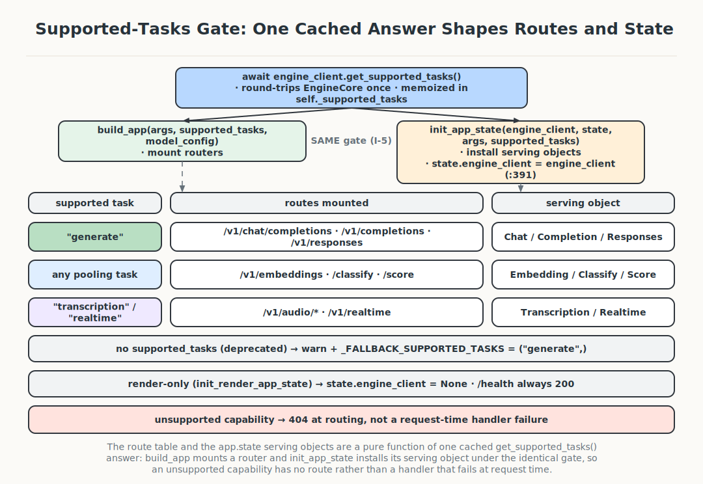</a>

<p class='figure-caption'>Model-capability routes and their matching `app.state` serving objects use the same cached `get_supported_tasks()` gates. `"generate"` enables chat/completions/responses, pooling tasks enable embeddings/classify/score, and the rest of the app still depends on `args`, `model_config`, middleware, developer mode, and plugins.</p>

`build_app(args, supported_tasks, model_config)` registers routers for the capabilities in `supported_tasks`: `"generate"` enables chat/completions/responses, pooling tasks enable embeddings/classify/score, and `"transcription"` or `"realtime"` enables the corresponding speech routes. `init_app_state` applies the same gates when it creates serving objects. Its first assignment connects those objects to the engine:

[`vllm/entrypoints/openai/api_server.py:391`](https://github.com/vllm-project/vllm/blob/6cf7b26bd4bff60bf378e1af14044280ac0d214c/vllm/entrypoints/openai/api_server.py#L391) — `state.engine_client = engine_client`

That assignment is what makes the `AsyncLLM` from three subsections ago reachable to every handler as `request.app.state.engine_client`. If `build_app` is called without `supported_tasks` (a deprecated path), it warns and falls back to `_FALLBACK_SUPPORTED_TASKS = ("generate",)` ([`api_server.py:78`](https://github.com/vllm-project/vllm/blob/6cf7b26bd4bff60bf378e1af14044280ac0d214c/vllm/entrypoints/openai/api_server.py#L78), `:196-209`). The render-only variant `init_render_app_state` instead sets `state.engine_client = None` (`:563`) — a CPU-only server with no engine at all, which the `/health` handler treats as always-healthy.

The route and state gates consume the same cached `await engine_client.get_supported_tasks()` result together with `model_config`. Unsupported model capabilities therefore have no corresponding route, while a registered capability route has a matching serving object. This describes only the capability-dependent part of the app; server args, middleware, developer mode, and plugins shape the rest.

## 6. Serving Completions: From HTTP to add_request

`/v1/completions` is the clearest HTTP-to-engine path because it has no chat template, tool parser, or reasoning boundary. The handler renders prompts, converts protocol fields into `SamplingParams`, and calls `engine_client.generate` once per prompt. Work after that call belongs to the engine.

<a href='images/vllm-02-06-completion-flow.svg' target='_blank'>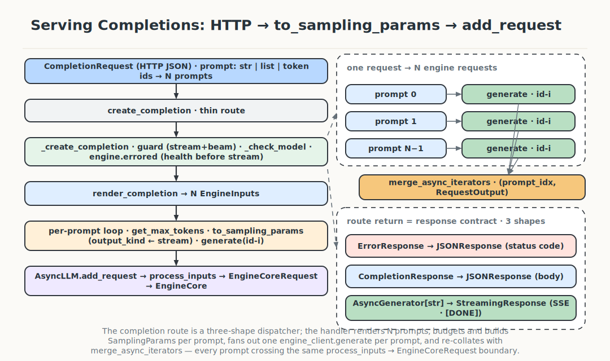</a>

<p class='figure-caption'>One HTTP `CompletionRequest` fans into N per-prompt `engine_client.generate` streams, re-collated by `merge_async_iterators`.</p>

### The route and its three return shapes

The FastAPI handler is deliberately thin. Its whole job is to pull the serving object off `app.state` and map whatever it returns onto an HTTP response.

[`vllm/entrypoints/openai/completion/api_router.py:44-66`](https://github.com/vllm-project/vllm/blob/6cf7b26bd4bff60bf378e1af14044280ac0d214c/vllm/entrypoints/openai/completion/api_router.py#L44-L66):

```python
@with_cancellation
@load_aware_call
async def create_completion(request: CompletionRequest, raw_request: Request):
    ...
    handler = completion(raw_request)
    if handler is None:
        raise NotImplementedError("The model does not support Completions API")

    generator = await handler.create_completion(request, raw_request)

    if isinstance(generator, ErrorResponse):
        return JSONResponse(
            content=generator.model_dump(), status_code=generator.error.code
        )
    elif isinstance(generator, CompletionResponse):
        return JSONResponse(
            content=generator.model_dump(),
            headers=metrics_header(metrics_header_format),
        )

    return StreamingResponse(content=generator, media_type="text/event-stream")
```

FastAPI has already parsed the body into `CompletionRequest`, so `with_cancellation` can race handler work against a disconnect. The serving object comes from `app.state`; capability gating normally prevents the route when it is absent. `create_completion` returns an `ErrorResponse`, a materialized `CompletionResponse`, or an async generator, which the route maps to an error JSON body, normal JSON, or SSE. Other serving routes reuse this thin three-way response contract.

**Guard, render, and the engine-health check that precedes streaming.**

`create_completion` immediately delegates to `_create_completion` wrapped in `_with_kv_transfer_rejection_cleanup` (the disaggregated-prefill block-freeing wrapper, out of scope here). `_create_completion` opens with a guard and a render.

[`vllm/entrypoints/openai/completion/serving.py:136-145`](https://github.com/vllm-project/vllm/blob/6cf7b26bd4bff60bf378e1af14044280ac0d214c/vllm/entrypoints/openai/completion/serving.py#L136-L145):

```python
        if request.stream and request.use_beam_search:
            return self.create_error_response(
                "Streaming is not currently supported with beam search"
            )

        result = await self.render_completion_request(request)
        if isinstance(result, ErrorResponse):
            return result

        engine_inputs = result
```

`render_completion_request` is where a subtle ordering rule lives.

[`vllm/entrypoints/openai/completion/serving.py:101-111`](https://github.com/vllm-project/vllm/blob/6cf7b26bd4bff60bf378e1af14044280ac0d214c/vllm/entrypoints/openai/completion/serving.py#L101-L111):

```python
        error_check_ret = await self._check_model(request)
        if error_check_ret is not None:
            return error_check_ret

        # If the engine is dead, raise the engine's DEAD_ERROR.
        # This is required for the streaming case, where we return a
        # success status before we actually start generating text :).
        if self.engine_client.errored:
            raise self.engine_client.dead_error

        return await self.online_renderer.render_completion(request)
```

`_check_model` first validates the requested model or LoRA name and returns 404 on a mismatch. The engine-health check then runs before rendering and, importantly, before the handler returns a generator. `online_renderer.render_completion` tokenizes the request into a list of `EngineInput`s. The plural matters: OpenAI's `prompt` field accepts a string, a list of strings, token ids, or a list of token-id lists, so one HTTP request may contain several prompts.

The health check catches an already-failed engine before the route commits to a 200 stream. Once `StreamingResponse` has sent the status line, a later failure can only appear in-band or as a truncated stream; checking `engine_client.errored` up front preserves the option of returning a proper error status.

### One request, N engine requests: the fan-out loop

With `engine_inputs` in hand, the handler assigns identity and then loops once per prompt. Identity first:

[`vllm/entrypoints/openai/completion/serving.py:147-157`](https://github.com/vllm-project/vllm/blob/6cf7b26bd4bff60bf378e1af14044280ac0d214c/vllm/entrypoints/openai/completion/serving.py#L147-L157):

```python
        request_id = f"cmpl-{self._base_request_id(raw_request, request.request_id)}"
        created_time = int(time.time())

        request_metadata = RequestResponseMetadata(request_id=request_id)
        if raw_request:
            raw_request.state.request_metadata = request_metadata

        lora_request = self._maybe_get_adapters(request)

        # Extract data_parallel_rank from header (router can inject it)
        data_parallel_rank = self._get_data_parallel_rank(raw_request)
```

`_base_request_id` ([`vllm/entrypoints/serve/engine/serving.py:116-126`](https://github.com/vllm-project/vllm/blob/6cf7b26bd4bff60bf378e1af14044280ac0d214c/vllm/entrypoints/serve/engine/serving.py#L116-L126)) prefers the `X-Request-Id` header, else the request's own id, else a fresh `random_uuid()` — so an upstream router can thread a trace id straight through. `data_parallel_rank` is read from `X-data-parallel-rank`, letting an external DP router pin a request to a specific engine (see article 11, distributed, for DP routing).

Then the key loop.

[`vllm/entrypoints/openai/completion/serving.py:160-219`](https://github.com/vllm-project/vllm/blob/6cf7b26bd4bff60bf378e1af14044280ac0d214c/vllm/entrypoints/openai/completion/serving.py#L160-L219):

```python
        max_model_len = self.model_config.max_model_len
        generators: list[AsyncGenerator[RequestOutput, None]] = []
        for i, engine_input in enumerate(engine_inputs):
            max_tokens = get_max_tokens(
                max_model_len,
                request.max_tokens,
                self._extract_prompt_len(engine_input),
                self.default_sampling_params,
                self.override_max_tokens,
                truncate_prompt_tokens=request.truncate_prompt_tokens,
            )
            ...
            sampling_params = request.to_sampling_params(
                    max_tokens,
                    self.default_sampling_params,
                )

            request_id_item = f"{request_id}-{i}"
            ...
            generator = self.engine_client.generate(
                    engine_input,
                    sampling_params,
                    request_id_item,
                    lora_request=lora_request,
                    trace_headers=trace_headers,
                    priority=request.priority,
                    data_parallel_rank=data_parallel_rank,
                )
            generators.append(generator)

        result_generator = merge_async_iterators(*generators)
```

Each prompt gets its *own* `max_tokens` computed from *its* prompt length, its own `SamplingParams`, and a distinct sub-id `{request_id}-{i}`. Each becomes a separate `engine_client.generate(...)` async generator: a separate engine request. `merge_async_iterators` interleaves the N generators into one stream yielding `(prompt_idx, RequestOutput)` tuples; the streaming and non-streaming assemblers below re-collate by `prompt_idx`. This is the structural difference from chat, which asserts exactly one generator and lets `n>1` ride `output.index` inside a single request.

Completions fan out at the entrypoint: each prompt becomes its own engine request with an independently computed budget. If the fourth prompt in a batch is close to the context limit, it does not reduce the budgets of the first three because `max_tokens` is calculated per `engine_input`.

`get_max_tokens` ([`vllm/entrypoints/serve/utils/api_utils.py:184-206`](https://github.com/vllm-project/vllm/blob/6cf7b26bd4bff60bf378e1af14044280ac0d214c/vllm/entrypoints/serve/utils/api_utils.py#L184-L206)) enforces the context ceiling. It takes the minimum of remaining context (`max_model_len - input_length`), the requested or default `max_tokens`, a server override, and a platform cap, ignoring unset values. An over-long prompt raises `ValueError` before generation and surfaces as a 400. The completion handler calls this once per `engine_input`, which is why each prompt gets its own budget.

### `to_sampling_params`: the two couplings the response path relies on

`CompletionRequest.to_sampling_params` bridges loose pydantic fields to the engine's `SamplingParams`; the full bridge — per-knob precedence (request value → server `default_sampling_params` → neutral defaults), stop-token merging, and the engine-side `_verify_args` domain gate — is [Section 10](#10-protocol-request-schemas-become-samplingparams)'s subject end to end. Two of its decisions, though, are critical for *this* section's response path. (For the knob-resolution table and where `_verify_args` finally rejects illegal values, see [Section 10](#10-protocol-request-schemas-become-samplingparams); for what those fields do at the logits processor, article 10, sampling.)

Source: [`vllm/entrypoints/openai/completion/protocol.py:311`](https://github.com/vllm-project/vllm/blob/6cf7b26bd4bff60bf378e1af14044280ac0d214c/vllm/entrypoints/openai/completion/protocol.py#L311) and [`363-371`](https://github.com/vllm-project/vllm/blob/6cf7b26bd4bff60bf378e1af14044280ac0d214c/vllm/entrypoints/openai/completion/protocol.py#L363-L371).

```python
        echo_without_generation = self.echo and self.max_tokens == 0
        ...
        return SamplingParams.from_optional(
            ...
            max_tokens=max_tokens if not echo_without_generation else 1,
            ...
            output_kind=RequestOutputKind.DELTA
            if self.stream
            else RequestOutputKind.FINAL_ONLY,
            ...
        )
```

`DELTA` yields incremental token deltas and `FINAL_ONLY` one cumulative output; each assembler below is written to exactly one of the two modes, which is what makes this field the contract between admission and assembly. The `else 1` keeps pure echo legal — the engine rejects `max_tokens < 1`, so the request generates a single token and the assembler discards it.

### Crossing the boundary: `generate` → `add_request` → `EngineCoreRequest`

`engine_client.generate` is `AsyncLLM.generate`. It is not the engine — it is the async client wrapper that turns admission into a consumable stream.

[`vllm/v1/engine/async_llm.py:557-586`](https://github.com/vllm-project/vllm/blob/6cf7b26bd4bff60bf378e1af14044280ac0d214c/vllm/v1/engine/async_llm.py#L557-L586):

```python
        q: RequestOutputCollector | None = None
        try:
            q = await self.add_request(
                request_id,
                prompt,
                sampling_params,
                ...
            )

            # The output_handler task pushes items into the queue.
            # This task pulls from the queue and yields to caller.
            finished = False
            while not finished:
                out = q.get_nowait() or await q.get()
                assert isinstance(out, RequestOutput)
                finished = out.finished
                if out is not STREAM_FINISHED:
                    yield out
```

`add_request` is the single entry point every door converges on.

[`vllm/v1/engine/async_llm.py:348-376`](https://github.com/vllm-project/vllm/blob/6cf7b26bd4bff60bf378e1af14044280ac0d214c/vllm/v1/engine/async_llm.py#L348-L376):

```python
        else:
            request = self.input_processor.process_inputs(
                request_id,
                prompt,
                params,
                supported_tasks=await self.get_supported_tasks(),
                arrival_time=arrival_time,
                ...
            )
            prompt_text, _, _ = extract_prompt_components(self.model_config, prompt)
        ...
        self.input_processor.assign_request_id(request)

        # We start the output_handler on the first call to add_request() so
        # we can call __init__ before the event loop, which enables us
        # to handle startup failure gracefully in the OpenAI server.
        self._run_output_handler()

        # Create a new output collector for the request.
        queue = RequestOutputCollector(params.output_kind, request.request_id)
```

`input_processor.process_inputs` produces the validated `EngineCoreRequest`. The shared output handler starts lazily on the first admission, and each request gets a `RequestOutputCollector` configured from the same `DELTA`/`FINAL_ONLY` choice made in `to_sampling_params`. `generate` first tries `q.get_nowait()`, awaiting only when the mailbox is empty. The HTTP handler multiplexes several such generators, while one background task feeds their queues from EngineCore over IPC (article 03). Offline and online paths meet at this input-lowering seam.

**The assemblers, briefly.**

The two terminal branches consume `result_generator`. Non-streaming drains it into a batch and calls `request_output_to_completion_response` ([`serving.py:240-265`](https://github.com/vllm-project/vllm/blob/6cf7b26bd4bff60bf378e1af14044280ac0d214c/vllm/entrypoints/openai/completion/serving.py#L240-L265)). Streaming returns `completion_stream_generator`. One edge deserves note: even `stream=True` can hit the non-streaming path internally, in which case the response is re-wrapped as a one-shot SSE.

[`vllm/entrypoints/openai/completion/serving.py:271-278`](https://github.com/vllm-project/vllm/blob/6cf7b26bd4bff60bf378e1af14044280ac0d214c/vllm/entrypoints/openai/completion/serving.py#L271-L278):

```python
        if request.stream:
            response_json = response.model_dump_json()

            async def fake_stream_generator() -> AsyncGenerator[str, None]:
                yield f"data: {response_json}\n\n"
                yield "data: [DONE]\n\n"

            return fake_stream_generator()
```

For the streaming path, the serving generator produces SSE frames and terminates with `data: [DONE]\n\n`; the route can pass that generator directly to `StreamingResponse`. Choice-index arithmetic, echo-once behavior, and the optional usage chunk stay inside the response assembler.

## 7. Serving Chat: Templates and Tool Calling

`/v1/chat/completions` uses the same handler contract as `/v1/completions`: an `ErrorResponse`, a materialized response model, or an SSE `AsyncGenerator[str]`. Completions create one `engine_client.generate` call per prompt. Chat renders one prompt and creates one generator; choices requested through `n` are handled within that admission path and appear through `output.index` in `RequestOutput`.

Chat also adds three frontend concerns: the template that turns messages into token ids, the tool/reasoning parser that constrains and re-parses output, and a reasoning-boundary hint used by structured decoding. Articles 05 and 10 cover scheduling, sampling, and grammar execution below this layer.

<a href='images/vllm-02-07-chat-template.svg' target='_blank'>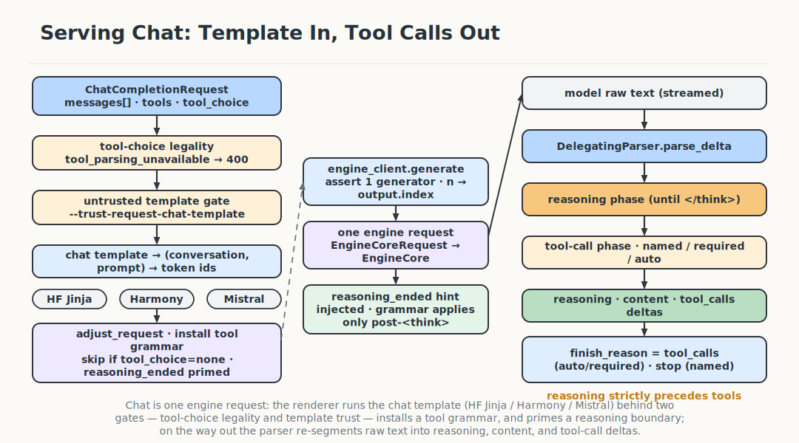</a>

<p class='figure-caption'>Message list → chat template (HF Jinja or Harmony) → token ids → one `engine_client.generate` stream; the parser gates tool syntax on the way in and re-segments it on the way out.</p>

**The route: same three-shape contract as completions, 501 when absent.**

The chat route reuses completions' three response shapes and cancellation wrapper ([`chat_completion/api_router.py:53-74`](https://github.com/vllm-project/vllm/blob/6cf7b26bd4bff60bf378e1af14044280ac0d214c/vllm/entrypoints/openai/chat_completion/api_router.py#L53-L74)). It retrieves `openai_serving_chat` from `app.state`; absence maps to HTTP 501. Template and tool behavior stays inside the serving handler, not the router.

### One prompt, one generator, and reasoning priming

`_create_chat_completion` ([`chat_completion/serving.py:249-401`](https://github.com/vllm-project/vllm/blob/6cf7b26bd4bff60bf378e1af14044280ac0d214c/vllm/entrypoints/openai/chat_completion/serving.py#L249-L401)) builds the parser first, renders the messages, then enters a per-input loop that, unlike completion, is asserted to yield a single generator. The chat-specific branch inside that loop is the reasoning-boundary computation, [`chat_completion/serving.py:344-371`](https://github.com/vllm-project/vllm/blob/6cf7b26bd4bff60bf378e1af14044280ac0d214c/vllm/entrypoints/openai/chat_completion/serving.py#L344-L371):

```python
            else:
                if not request.include_reasoning:
                    reasoning_ended = True
                elif request._grammar_from_tool_parser:
                    # The Mistral grammar already includes an optional
                    # `think?` rule that handles both reasoning and
                    # non-reasoning outputs.
                    reasoning_ended = True
                elif parser is not None and parser.reasoning_parser is not None:
                    reasoning_ended = parser.is_reasoning_end(prompt_token_ids or [])
                else:
                    reasoning_ended = None

                generator = self.engine_client.generate(
                    engine_input,
                    sampling_params,
                    sub_request_id,
                    lora_request=lora_request,
                    trace_headers=trace_headers,
                    priority=request.priority,
                    data_parallel_rank=data_parallel_rank,
                    reasoning_ended=reasoning_ended,
                    reasoning_parser_kwargs={
                        "chat_template_kwargs": chat_template_kwargs,
                    }
                    if parser is not None and parser.reasoning_parser is not None
                    else None,
                )
```

`reasoning_ended` is a three-valued signal passed to `engine_client.generate` by chat but not completions. It tells structured decoding whether the prompt has already passed its `<think>` phase. The server sets it to `True` when reasoning output is disabled or when a Mistral tool grammar absorbs the optional `think?` rule; otherwise a reasoning parser may infer it from the prompt tokens, and without a parser it remains `None`.

After the loop, `assert len(generators) == 1` ([`serving.py:375`](https://github.com/vllm-project/vllm/blob/6cf7b26bd4bff60bf378e1af14044280ac0d214c/vllm/entrypoints/openai/chat_completion/serving.py#L375)) confirms that chat did not fan out over prompts. Variants requested with `n` arrive as separate outputs within one request rather than separate generators. Computing the reasoning boundary on the server lets tool or JSON grammar apply after reasoning instead of constraining the thinking phase. `max_completion_tokens` also takes precedence over deprecated `max_tokens` before the remaining-context clamp ([`serving.py:303-305`](https://github.com/vllm-project/vllm/blob/6cf7b26bd4bff60bf378e1af14044280ac0d214c/vllm/entrypoints/openai/chat_completion/serving.py#L303-L305)).

### Rendering: tool-choice legality and template trust

Before any of that, `render_chat_request` (mirroring completion: `_check_model` → `engine_client.errored` → renderer) delegates to `OnlineRenderer.render_chat`. Two gates there decide whether tool calling is even legal for this request. Source [`renderers/online_renderer.py:117-152`](https://github.com/vllm-project/vllm/blob/6cf7b26bd4bff60bf378e1af14044280ac0d214c/vllm/renderers/online_renderer.py#L117-L152):

```python
        # Check if tool parsing is unavailable (common condition)
        tool_parsing_unavailable = (
            tool_parser is None
            and not is_mistral_tokenizer(tokenizer)
            and not self.use_harmony
        )

        # Validate tool_choice when tool parsing is required but unavailable
        if tool_parsing_unavailable and request.tool_choice not in (
            None,
            "none",
        ):
            if request.tool_choice == "auto" and not self.enable_auto_tools:
                # for hf tokenizers, "auto" tools requires
                # --enable-auto-tool-choice and --tool-call-parser
                return self.create_error_response(
                    '"auto" tool choice requires '
                    "--enable-auto-tool-choice and --tool-call-parser to be set"
                )
            elif request.tool_choice != "auto":
                # "required" or named tool requires tool parser
                if isinstance(request.tool_choice, ChatCompletionNamedToolChoiceParam):
                    tool_choice_desc = f'function "{request.tool_choice.function.name}"'
                else:
                    tool_choice_desc = f'"{request.tool_choice}"'
                return self.create_error_response(
                    f"tool_choice={tool_choice_desc} requires "
                    "--tool-call-parser to be set"
                )

        if request.tools is None or (
            request.tool_choice == "none" and self.exclude_tools_when_tool_choice_none
        ):
            tool_dicts = None
        else:
            tool_dicts = [tool.model_dump() for tool in request.tools]
```

<a href='images/vllm-02-21-tool-choice-legality.svg' target='_blank'>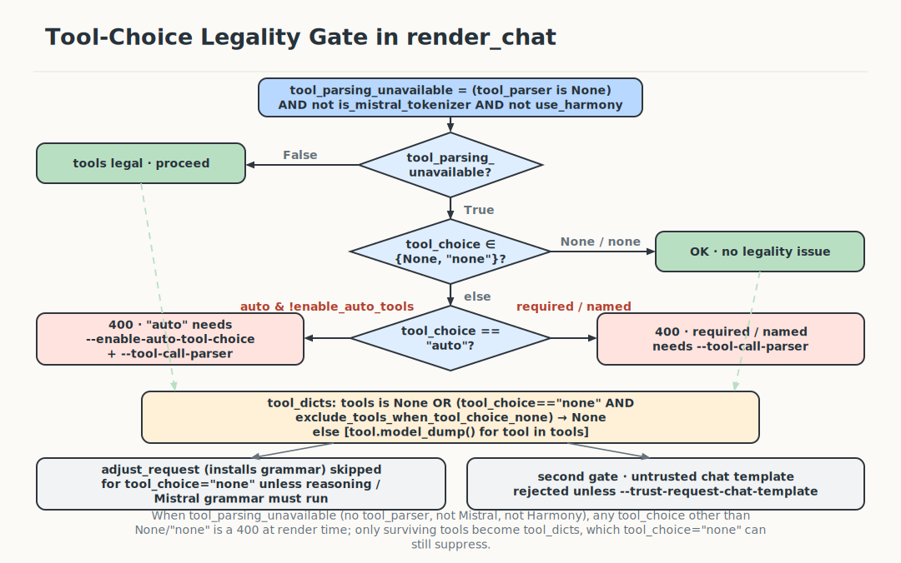</a>

<p class='figure-caption'>Tool-choice legality gate in `render_chat`: when `tool_parsing_unavailable` (no `tool_parser`, not Mistral, not Harmony), any `tool_choice` other than `None`/`"none"` is a 400 at render time — `"auto"` needs `--enable-auto-tool-choice`+`--tool-call-parser`, `"required"`/named needs `--tool-call-parser` — and only surviving tools become `tool_dicts`, which `tool_choice="none"` can still suppress.</p>

`tool_parsing_unavailable` is true when there is no tool parser, the tokenizer is not Mistral, and Harmony (GPT-OSS) is not in use. In that state the server has no way to recover structured calls from model text, so it rejects any `tool_choice` other than `None` or `"none"`. `"auto"` requires both `--enable-auto-tool-choice` and `--tool-call-parser`; `"required"` or a named function requires the parser. Only requests that pass this gate are serialized to `tool_dicts`, turning a configuration mismatch into a render-time 400 instead of a malformed successful response.

The second gate protects the template itself. [`renderers/online_renderer.py:273-285`](https://github.com/vllm-project/vllm/blob/6cf7b26bd4bff60bf378e1af14044280ac0d214c/vllm/renderers/online_renderer.py#L273-L285):

```python
        if not trust_request_chat_template and (
            request_chat_template is not None
            or (
                chat_template_kwargs
                and chat_template_kwargs.get("chat_template") is not None
            )
        ):
            return self.create_error_response(
                "Chat template is passed with request, but "
                "--trust-request-chat-template is not set. "
                "Refused request with untrusted chat template."
            )
        return None
```

A request-supplied Jinja template is rejected unless the operator enabled `--trust-request-chat-template`. The check covers both the top-level `chat_template` field and a `chat_template` nested in `chat_template_kwargs`. This matters because a chat template is executable server-side Jinja, not inert formatting data.

For the common non-Harmony path, `preprocess_chat` merges tools into the template kwargs, renders asynchronously, then lets the parser's `adjust_request` install a structured-output grammar ([`online_renderer.py:335-422`](https://github.com/vllm-project/vllm/blob/6cf7b26bd4bff60bf378e1af14044280ac0d214c/vllm/renderers/online_renderer.py#L335-L422)). With `tool_choice="none"`, that adjustment is skipped unless reasoning or Mistral grammar setup still requires it, so a configured parser cannot reinterpret hallucinated tool syntax against the client's instruction. Request kwargs override server defaults, and `reasoning_effort` can supply `enable_thinking` to templates that require an explicit flag.

The Jinja itself is applied deep in `HfRenderer.render_messages` ([`renderers/hf.py:929-1047`](https://github.com/vllm-project/vllm/blob/6cf7b26bd4bff60bf378e1af14044280ac0d214c/vllm/renderers/hf.py#L929-L1047)) via `safe_apply_chat_template` → `tokenizer.apply_chat_template`; it returns `(conversation, prompt)` where `conversation` is the pre-template message list the response assembler later replays for `echo`. Mistral has its own `render_messages` ([`renderers/mistral.py:62-88`](https://github.com/vllm-project/vllm/blob/6cf7b26bd4bff60bf378e1af14044280ac0d214c/vllm/renderers/mistral.py#L62-L88)). The template is compiled once at startup by `warmup` ([`serving.py:185-192`](https://github.com/vllm-project/vllm/blob/6cf7b26bd4bff60bf378e1af14044280ac0d214c/vllm/entrypoints/openai/chat_completion/serving.py#L185-L192)) to keep the Jinja-compile cost off the first request.

### Tool-call streaming: reasoning strictly precedes tools

When the model streams back, its raw text must be re-segmented into reasoning, content, and incremental tool-call deltas. That is a two-phase state machine in `DelegatingParser.parse_delta` ([`parser/abstract_parser.py:793-920`](https://github.com/vllm-project/vllm/blob/6cf7b26bd4bff60bf378e1af14044280ac0d214c/vllm/parser/abstract_parser.py#L793-L920)), and the phase order is enforced by two guards, [`abstract_parser.py:730-738`](https://github.com/vllm-project/vllm/blob/6cf7b26bd4bff60bf378e1af14044280ac0d214c/vllm/parser/abstract_parser.py#L730-L738):

```python
    def _in_reasoning_phase(self, state: StreamState) -> bool:
        if self._reasoning_parser is None:
            return False
        return not state.reasoning_ended

    def _in_tool_call_phase(self, state: StreamState) -> bool:
        if self._tool_parser is None:
            return False
        return state.reasoning_ended
```

<a href='images/vllm-02-22-reasoning-tool-state-machine.svg' target='_blank'>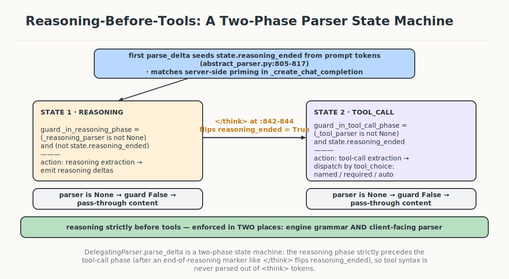</a>

<p class='figure-caption'>`DelegatingParser.parse_delta` two-phase state machine: the reasoning phase (a reasoning parser exists and `!state.reasoning_ended`) strictly precedes the tool-call phase (after an end-of-reasoning marker like `</think>` flips `reasoning_ended`), so tool syntax is never parsed out of `<think>` tokens — the same coherence the server-side `reasoning_ended` flag enforces on the engine's grammar.</p>

`_in_reasoning_phase` remains true while a reasoning parser exists and `state.reasoning_ended` is false. `_in_tool_call_phase` starts after that flag flips. On the first `parse_delta`, the parser seeds the state from the prompt ([`abstract_parser.py:805-817`](https://github.com/vllm-project/vllm/blob/6cf7b26bd4bff60bf378e1af14044280ac0d214c/vllm/parser/abstract_parser.py#L805-L817)); reasoning extraction continues until a marker such as `</think>` triggers the transition, and tool-call extraction begins afterward. The engine grammar and client-facing parser therefore use the same reasoning/tool boundary.

**Finish-reason semantics.**

Non-streaming assembly (`chat_completion_full_generator`, [`serving.py:826-1091`](https://github.com/vllm-project/vllm/blob/6cf7b26bd4bff60bf378e1af14044280ac0d214c/vllm/entrypoints/openai/chat_completion/serving.py#L826-L1091)) parses each `output` then classifies its `finish_reason`. Source [`chat_completion/serving.py:958-982`](https://github.com/vllm-project/vllm/blob/6cf7b26bd4bff60bf378e1af14044280ac0d214c/vllm/entrypoints/openai/chat_completion/serving.py#L958-L982):

```python
            is_finish_reason_tool_calls = auto_tools_called or (
                request.tool_choice
                and request.tool_choice == "required"
                and output.finish_reason == "stop"
            )
            ...
            choice_data = ChatCompletionResponseChoice(
                index=output.index,
                message=message,
                logprobs=logprobs,
                finish_reason="tool_calls"
                if is_finish_reason_tool_calls
                else output.finish_reason
                if output.finish_reason
                else "stop",
                stop_reason=output.stop_reason,
                ...
            )
```

Per the OpenAI contract quoted in the code comment ([`serving.py:955-957`](https://github.com/vllm-project/vllm/blob/6cf7b26bd4bff60bf378e1af14044280ac0d214c/vllm/entrypoints/openai/chat_completion/serving.py#L955-L957)), a tool call uses `finish_reason="tool_calls"` for `"auto"` and `"required"`, but `"stop"` for a named tool choice. `auto_tools_called` is set only when the auto path parses at least one call; `"required"` is special-cased because the engine reports `"stop"` even though a tool was mandated. A missing engine finish reason also normalizes to `"stop"`.

The [streaming assembler](https://github.com/vllm-project/vllm/blob/6cf7b26bd4bff60bf378e1af14044280ac0d214c/vllm/entrypoints/openai/chat_completion/serving.py#L408-L824) reaches the same classification, emits one terminal chunk per choice, frames events as SSE, and serializes mid-stream errors in-band because the 200 status has already been sent. `parallel_tool_calls=False` keeps only the first call ([`tool_calls_utils.py:19-37`](https://github.com/vllm-project/vllm/blob/6cf7b26bd4bff60bf378e1af14044280ac0d214c/vllm/entrypoints/serve/utils/tool_calls_utils.py#L19-L37)). The resulting `finish_reason` tells an OpenAI-compatible client whether it should execute a tool.

## 8. Pooling, Embeddings, and Scoring Endpoints

Completions, chat, Responses, and speech-to-text all reach `engine_client.generate(...)` and produce autoregressive `RequestOutput`s, either as deltas or as a final aggregate. Embedding, classification, scoring, reranking, and generic pooling use a different entrypoint (`encode`), parameter type (`PoolingParams`), and output type (`PoolingRequestOutput`), with no decode loop. The model head determines which family applies; the URL determines how that result is exposed.

<a href='images/vllm-02-08-pooling-endpoints.svg' target='_blank'>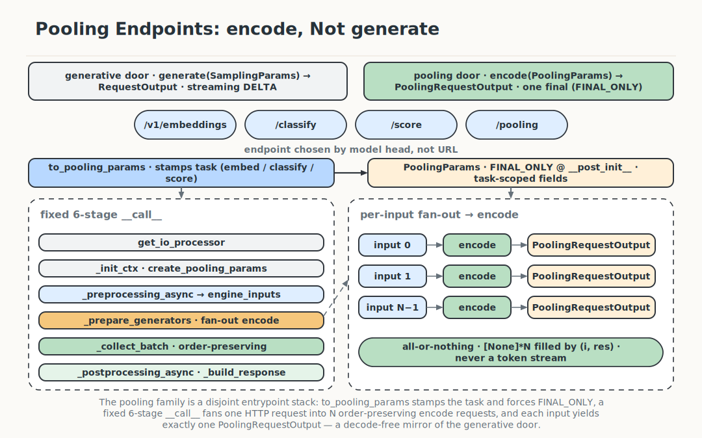</a>

<p class='figure-caption'>The pooling path: HTTP request → `to_pooling_params` → shared `__call__` pipeline → per-input `engine_client.encode` fan-out → one `PoolingRequestOutput` per input, without a token stream.</p>

**The two abstract entrypoints on the engine client.**

The lowest-level expression of the sampling-vs-pooling fork lives on the `EngineClient` ABC that `AsyncLLM` implements. It declares two abstract methods, and their signatures encode the divergence.

Source: [`vllm/engine/protocol.py:64-99`](https://github.com/vllm-project/vllm/blob/6cf7b26bd4bff60bf378e1af14044280ac0d214c/vllm/engine/protocol.py#L64-L99)

```python
    @abstractmethod
    def generate(
        self,
        prompt: EngineCoreRequest | ...,
        sampling_params: SamplingParams,
        request_id: str,
        ...
    ) -> AsyncGenerator[RequestOutput, None]:
        """Generate outputs for a request."""
        ...

    @abstractmethod
    def encode(
        self,
        prompt: PromptType | EngineInput,
        pooling_params: PoolingParams,
        request_id: str,
        lora_request: LoRARequest | None = None,
        trace_headers: Mapping[str, str] | None = None,
        priority: int = 0,
        tokenization_kwargs: dict[str, Any] | None = None,
        reasoning_ended: bool | None = None,
    ) -> AsyncGenerator[PoolingRequestOutput, None]:
        """Generate outputs for a request from a pooling model."""
        ...
```

<a href='images/vllm-02-23-generate-vs-encode-contract.svg' target='_blank'>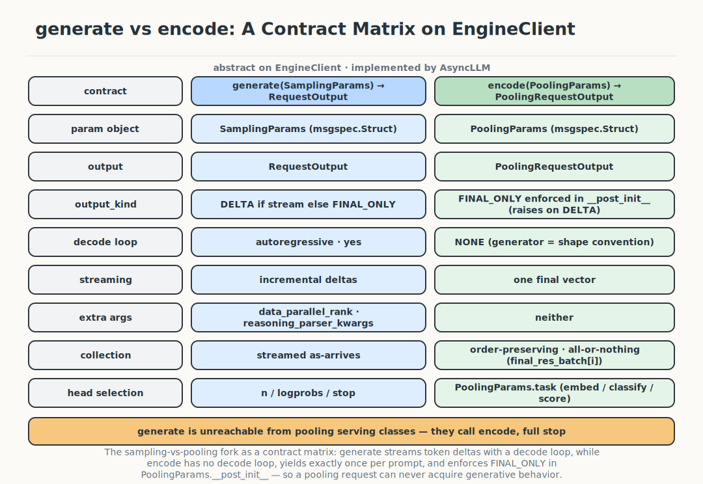</a>

<p class='figure-caption'>The `EngineClient` sampling-vs-pooling fork as a contract matrix: `generate(SamplingParams) → RequestOutput` streams token deltas with a decode loop; `encode(PoolingParams) → PoolingRequestOutput` has no decode loop, yields exactly once per prompt, and enforces `FINAL_ONLY` in `PoolingParams.__post_init__` — so a pooling request can never acquire generative behavior.</p>

The parameter and output types are paired: `generate` accepts `SamplingParams` and yields `RequestOutput`, while `encode` accepts `PoolingParams` and yields `PoolingRequestOutput`. On the pooling path the async generator yields one result per prompt; there is no decode loop beneath it. Using an async generator here gives the serving layer a uniform shape for `merge_async_iterators`, but pooling serving classes still call `encode`, not `generate`. Article 10 follows the pooler/sampler split inside the model runner.

### `PoolingParams`: the no-decode contract, enforced at construction

`PoolingParams` is a `msgspec.Struct`, not the pydantic HTTP request model, and it is deliberately tiny — a handful of task-scoped fields plus internal routing metadata.

Source: [`vllm/pooling_params.py:64-83`](https://github.com/vllm-project/vllm/blob/6cf7b26bd4bff60bf378e1af14044280ac0d214c/vllm/pooling_params.py#L64-L83)

```python
    ## Internal use only
    task: PoolingTask | None = None
    requires_token_ids: bool = False
    skip_reading_prefix_cache: bool | None = None
    late_interaction_params: LateInteractionParams | None = None
    extra_kwargs: dict[str, Any] | None = None
    output_kind: RequestOutputKind = RequestOutputKind.FINAL_ONLY

    @property
    def all_parameters(self) -> list[str]:
        return ["dimensions", "use_activation"]

    @property
    def valid_parameters(self):
        return {
            "embed": ["dimensions", "use_activation"],
            "classify": ["use_activation"],
            "token_embed": ["dimensions", "use_activation"],
            "token_classify": ["use_activation"],
        }
```

Two things carry the contract. First, `output_kind` defaults to `RequestOutputKind.FINAL_ONLY` and is *checked* in `__post_init__` — this is the hard "no decode" guarantee.

Source: [`vllm/pooling_params.py:230-235`](https://github.com/vllm-project/vllm/blob/6cf7b26bd4bff60bf378e1af14044280ac0d214c/vllm/pooling_params.py#L230-L235)

```python
    def __post_init__(self) -> None:
        if self.output_kind != RequestOutputKind.FINAL_ONLY:
            raise ValueError(
                "For pooling output_kind has to be FINAL_ONLY, "
                f"got {self.output_kind!r}"
            )
```

Where a generative `to_sampling_params` sets `output_kind = DELTA if stream else FINAL_ONLY`, `PoolingParams` refuses `DELTA` at construction. There is no such thing as a "streaming embedding" of token deltas — one input yields one final pooled vector, and the type system makes the alternative unconstructable. Second, `valid_parameters` is a per-task allow-list: `embed` and `token_embed` may carry `dimensions` (Matryoshka) and `use_activation`; `classify` may carry only `use_activation`. `verify(model_config)` ([`pooling_params.py:89-106`](https://github.com/vllm-project/vllm/blob/6cf7b26bd4bff60bf378e1af14044280ac0d214c/vllm/pooling_params.py#L89-L106)) merges pooler-config defaults and then rejects any field not legal for the request's `task` — so a `classify` request that smuggles in `dimensions` fails fast, before the engine sees it. `PoolingParams` is task-scoped and decode-free; the fields a request may set are gated by `task`, and `FINAL_ONLY` is non-negotiable. Contrast `SamplingParams`, whose authoritative domain check (`sampling_params.py:_verify_args`, article 10, sampling) validates a decode knob-set that has no counterpart here.

**`task` is stamped by `to_pooling_params`, not by the route.**

The `task` field is what actually selects the pooler head at the engine layer. Each endpoint's request model owns a `to_pooling_params()` that stamps its task and copies only that task's legal fields. Three examples, verbatim:

Source: [`vllm/entrypoints/pooling/embed/protocol.py:39-44`](https://github.com/vllm-project/vllm/blob/6cf7b26bd4bff60bf378e1af14044280ac0d214c/vllm/entrypoints/pooling/embed/protocol.py#L39-L44)

```python
    def to_pooling_params(self):
        return PoolingParams(
            task="embed",
            dimensions=self.dimensions,
            use_activation=self.use_activation,
        )
```

Source: [`vllm/entrypoints/pooling/classify/protocol.py:31-35`](https://github.com/vllm-project/vllm/blob/6cf7b26bd4bff60bf378e1af14044280ac0d214c/vllm/entrypoints/pooling/classify/protocol.py#L31-L35)

```python
    def to_pooling_params(self):
        return PoolingParams(
            task="classify",
            use_activation=self.use_activation,
        )
```

Source: [`vllm/entrypoints/pooling/scoring/protocol.py:77-81`](https://github.com/vllm-project/vllm/blob/6cf7b26bd4bff60bf378e1af14044280ac0d214c/vllm/entrypoints/pooling/scoring/protocol.py#L77-L81)

```python
    def to_pooling_params(self, task: PoolingTask = "classify"):
        return PoolingParams(
            task=task,
            use_activation=self.use_activation,
        )
```

The embedding request carries `dimensions`; the classify request structurally cannot (it never passes the field). Scoring is the interesting case: its `to_pooling_params` takes `task` as an argument, because the scoring io_processor injects the model's *resolved* pooling task rather than trusting the request.

Source: [`vllm/entrypoints/pooling/scoring/io_processor.py:84-85`](https://github.com/vllm-project/vllm/blob/6cf7b26bd4bff60bf378e1af14044280ac0d214c/vllm/entrypoints/pooling/scoring/io_processor.py#L84-L85)

```python
    def create_pooling_params(self, request):
        return request.to_pooling_params(self.pooling_task)
```

The `task` field decides which pooler head runs and which parameters are legal. It is set by the request model or injected by the scoring io_processor. The route (`/v1/embeddings`, `/classify`, or `/score`) selects the serving object and `to_pooling_params` variant; `task` carries the semantic choice into the engine.

### The pooling request path

Every pooling endpoint descends from `PoolingBaseServing`, whose `__call__` is a fixed pipeline. No endpoint overrides the control flow; they override only two hooks.

Source: [`vllm/entrypoints/pooling/base/serving.py:73-83`](https://github.com/vllm-project/vllm/blob/6cf7b26bd4bff60bf378e1af14044280ac0d214c/vllm/entrypoints/pooling/base/serving.py#L73-L83)

```python
    async def __call__(
        self,
        request: AnyPoolingRequest,
        raw_request: Request | None = None,
    ) -> Response:
        io_processor = self.get_io_processor(request)
        ctx = await self._init_ctx(io_processor, request, raw_request)
        await self._preprocessing_async(io_processor, ctx)
        await self._prepare_generators(ctx)
        await self._collect_batch(ctx)
        return await self._postprocessing_async(io_processor, ctx)
```

`get_io_processor` selects preprocessing; `_init_ctx` validates the model and builds `PoolingParams`; `_preprocessing_async` renders engine inputs; `_prepare_generators` starts `encode` calls; `_collect_batch` gathers them; and `_postprocessing_async` serializes the result. Pre- and post-processing run on the renderer's shared thread pool under `@torch.inference_mode()` ([`serving.py:64-71, 89-100`](https://github.com/vllm-project/vllm/blob/6cf7b26bd4bff60bf378e1af14044280ac0d214c/vllm/entrypoints/pooling/base/serving.py#L64-L71)) so CPU and tensor work does not occupy the async loop. Concrete endpoints supply `get_io_processor` and `_build_response`; the control flow between them is shared.

### Fan-out to `encode`, then order-preserving collection

`_prepare_generators` is where a pooling request, which may carry many inputs, becomes many engine requests. It `verify()`s each params object against the model config (supporting a *list* of params, needed by scoring), then issues one `encode` per input.

Source: [`vllm/entrypoints/pooling/base/serving.py:169-180`](https://github.com/vllm-project/vllm/blob/6cf7b26bd4bff60bf378e1af14044280ac0d214c/vllm/entrypoints/pooling/base/serving.py#L169-L180)

```python
            generator = self.engine_client.encode(
                engine_input,
                params,
                prompt_request_id,
                lora_request=ctx.lora_request,
                trace_headers=trace_headers,
                priority=getattr(ctx.request, "priority", 0),
            )

            generators.append(generator)

        ctx.result_generator = merge_async_iterators(*generators)
```

`_collect_batch` then drains the merged iterator into a slot-indexed list and refuses to return a partial result.

Source: [`vllm/entrypoints/pooling/base/serving.py:192-202`](https://github.com/vllm-project/vllm/blob/6cf7b26bd4bff60bf378e1af14044280ac0d214c/vllm/entrypoints/pooling/base/serving.py#L192-L202)

```python
        num_inputs = len(ctx.engine_inputs)
        final_res_batch: list[PoolingRequestOutput | None]
        final_res_batch = [None] * num_inputs

        async for i, res in ctx.result_generator:
            final_res_batch[i] = res

        if None in final_res_batch:
            raise ValueError("Failed to generate results for all prompts")

        ctx.final_res_batch = [res for res in final_res_batch if res is not None]
```

`merge_async_iterators` yields `(index, result)` pairs, so the collector writes each result back to its original input position even when the engine finishes out of order. The HTTP response is assembled after every input has produced a `PoolingRequestOutput`; `if None in final_res_batch` rejects an incomplete batch. Unlike the generative streaming path, this endpoint has no partial token state to expose.

**The io_processor produces `EngineInput`s and nothing else.**

The preprocessing hook confirms that no sampling logic leaks into the pooling path. It branches on request shape and renders engine inputs: no sampling params, no logprobs plumbing, no stop strings.

Source: [`vllm/entrypoints/pooling/base/io_processor.py:65-90`](https://github.com/vllm-project/vllm/blob/6cf7b26bd4bff60bf378e1af14044280ac0d214c/vllm/entrypoints/pooling/base/io_processor.py#L65-L90)

```python
    def pre_process_online(self, ctx: PoolingServeContext):
        request = ctx.request

        if isinstance(request, PoolingChatLikeRequest):
            self._validate_chat_template(...)
            _, engine_inputs = self._preprocess_chat_online(
                request,
                request.messages,
                ...
            )
        elif isinstance(request, PoolingCompletionLikeRequest):
            engine_inputs = self._preprocess_cmpl_online(
                request,
                prompt_input=request.input,
                prompt_embeds=None,
            )
        else:
            raise ValueError(f"Invalid {self.name} request type")

        ctx.engine_inputs = engine_inputs
```

`post_process_online` is a base-class no-op ([`io_processor.py:92-96`](https://github.com/vllm-project/vllm/blob/6cf7b26bd4bff60bf378e1af14044280ac0d214c/vllm/entrypoints/pooling/base/io_processor.py#L92-L96)); endpoints override `_build_response` on the serving side instead. `ServingClassification._build_response` argmaxes pooled logits against the HF `id2label`, while `ServingEmbedding._build_response` emits OpenAI JSON or a Cohere byte stream. Pooling preprocessing yields `EngineInput`s; request-specific behavior travels in `PoolingParams` or `TokenizeParams`, not a per-token decode configuration. The same io_processor also exposes an offline path, which lets `LLM.embed` and `LLM.score` reuse the preprocessing helpers from [Section 3](#3-the-offline-request-apis-generate-chat-encode-score).

**Scoring: the exception that proves the rule.**

Scoring/rerank is the closest the pooling family gets to a multi-step flow, and it still never decodes. `ServingScores` selects its io_processor by the model's *score type*, and for late-interaction (ColBERT-style) models it can promote to a fused, worker-side path.

Source: [`vllm/entrypoints/pooling/scoring/serving.py:68-72`](https://github.com/vllm-project/vllm/blob/6cf7b26bd4bff60bf378e1af14044280ac0d214c/vllm/entrypoints/pooling/scoring/serving.py#L68-L72)

```python
    async def __call__(self, *args, **kwargs) -> Response:
        if not self.enable_flash_late_interaction:
            return await super().__call__(*args, **kwargs)

        return await self.flash_late_interaction(*args, **kwargs)
```

`flash_late_interaction` bypasses the standard single-fan-out `__call__` for a two-stage encode.

Source: [`vllm/entrypoints/pooling/scoring/serving.py:191-200`](https://github.com/vllm-project/vllm/blob/6cf7b26bd4bff60bf378e1af14044280ac0d214c/vllm/entrypoints/pooling/scoring/serving.py#L191-L200)

```python
    async def flash_late_interaction(self, *args, **kwargs) -> Response:
        ctx = await self._init_ctx(self.io_processor, *args, **kwargs)
        await self._preprocessing_async(self.io_processor, ctx)

        # stage 1: encode queries and cache token embeddings on workers.
        await self._flash_late_interaction_encode_queries(ctx)
        # stage 2: encode docs and return scalar scores from workers.
        await self._flash_late_interaction_encode_docs(ctx)

        return await self._postprocessing_async(self.io_processor, ctx)
```

Stage 1 clones the base `PoolingParams` once per query and stamps `late_interaction_params` (a `LateInteractionParams` struct, [`pooling_params.py:17-34`](https://github.com/vllm-project/vllm/blob/6cf7b26bd4bff60bf378e1af14044280ac0d214c/vllm/pooling_params.py#L17-L34)) with a stable `query_key`, so workers can cache the query's token embeddings. Stage 2 encodes each document with that key and returns a scalar MaxSim score. `_prepare_generators` therefore handles a list of `PoolingParams`, one per query/document pair. This stateful two-pass flow still uses `encode`; its state is a cached embedding key, not a decode loop.

## 9. The Responses API and Speech-to-Text

Responses and speech-to-text both use `engine_client.generate`, but add entrypoint-side control flow. Responses can run a server-side multi-turn tool loop with stored/background state; speech-to-text decodes and chunks audio on the CPU, then submits one engine request per chunk. EngineCore sees ordinary generation requests in both cases.

### Responses and event-typed SSE

The route layer ([`responses/api_router.py:60-77`](https://github.com/vllm-project/vllm/blob/6cf7b26bd4bff60bf378e1af14044280ac0d214c/vllm/entrypoints/openai/responses/api_router.py#L60-L77)) is the same three-shape dispatcher archetyped in [Section 6](#6-serving-completions-from-http-to-add_request): `create_responses` branches on the *type* of what the handler returns — `handler is None` (no Responses-capable serving object) → `501`; `ErrorResponse` → its own HTTP code; a materialized `ResponsesResponse` → non-streaming JSON; anything else → a streamed generator. The branch code is not re-pasted here; Responses adds two deltas over completions. It dumps JSON with `model_dump(mode="json", by_alias=True)`, and, more visibly, it wraps the streaming generator in `_convert_stream_to_sse_events(generator)` so its SSE frames carry an **event type**, not just data — [`api_router.py:34-45`](https://github.com/vllm-project/vllm/blob/6cf7b26bd4bff60bf378e1af14044280ac0d214c/vllm/entrypoints/openai/responses/api_router.py#L34-L45):

```python
async def _convert_stream_to_sse_events(
    generator: AsyncGenerator[StreamingResponsesResponse, None],
) -> AsyncGenerator[str, None]:
    """Convert the generator to a stream of events in SSE format"""
    async for event in generator:
        event_type = getattr(event, "type", "unknown")
        # https://developer.mozilla.org/en-US/docs/Web/API/Server-sent_events/Using_server-sent_events#event_stream_format
        event_data = (
            f"event: {event_type}\ndata: "
            f"{event.model_dump_json(indent=None, by_alias=True)}\n\n"
        )
        yield event_data
```

Contrast this with the `data: {json}\n\n` / `data: [DONE]\n\n` framing used by completions and chat (cross-ref [Section 11](#11-streaming-sse-middleware-auth-and-health)): Responses emits `event: <type>\ndata: <json>\n\n` because its stream is a typed event log (created, output-item added, deltas, done), not a flat token delta stream. Two sibling routes complete the surface — `GET /v1/responses/{id}` and `POST /v1/responses/{id}/cancel` ([`api_router.py:80-124`](https://github.com/vllm-project/vllm/blob/6cf7b26bd4bff60bf378e1af14044280ac0d214c/vllm/entrypoints/openai/responses/api_router.py#L80-L124)), which only mean anything when the response store or background execution is on (below).

### Responses: the multi-turn built-in-tool loop

This is the one place in the entrypoint layer where a single HTTP request legitimately drives *many* engine requests in sequence. `_generate_with_builtin_tools` is a `while True` loop: generate, check whether the model asked for a built-in tool, run the tool, re-render the next prompt, generate again.

[`vllm/entrypoints/openai/responses/serving.py:672-700`](https://github.com/vllm-project/vllm/blob/6cf7b26bd4bff60bf378e1af14044280ac0d214c/vllm/entrypoints/openai/responses/serving.py#L672-L700):

```python
        while True:
            # Ensure that each sub-request has a unique request id.
            sub_request_id = f"{request_id}_{sub_request}"

            self._log_inputs(
                sub_request_id,
                engine_input,
                params=sampling_params,
                lora_request=lora_request,
            )

            generator = self.engine_client.generate(
                engine_input,
                sampling_params,
                sub_request_id,
                lora_request=lora_request,
                trace_headers=trace_headers,
                priority=priority,
                reasoning_parser_kwargs=reasoning_parser_kwargs,
            )

            async for res in generator:
                context.append_output(res)
                # NOTE(woosuk): The stop condition is handled by the engine.
                yield context

            if not context.need_builtin_tool_call():
                # The model did not ask for a tool call, so we're done.
                break
```

<a href='images/vllm-02-24-responses-tool-loop.svg' target='_blank'>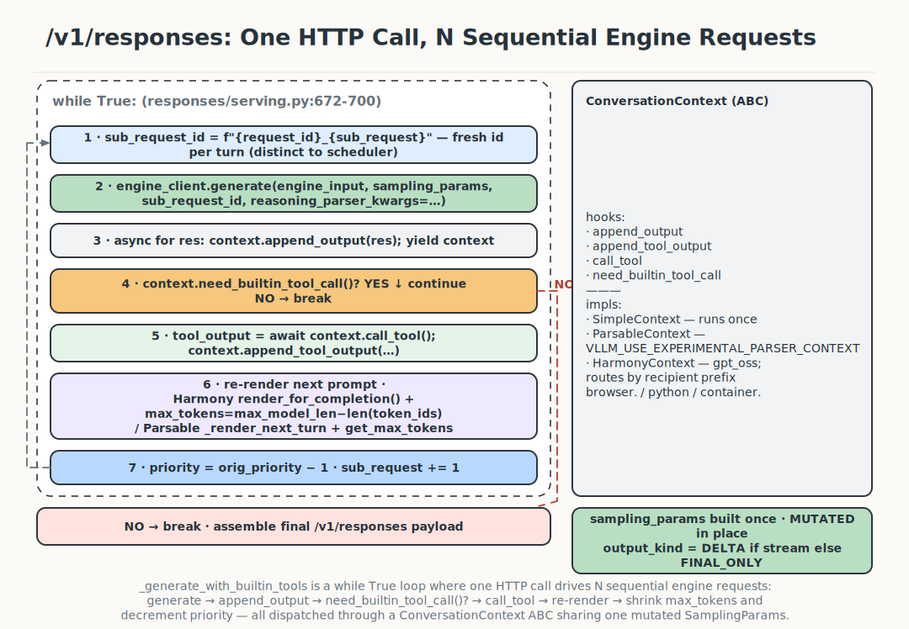</a>

<p class='figure-caption'>`/v1/responses` `_generate_with_builtin_tools` is a `while True` loop where one HTTP call drives N sequential engine requests (`{request_id}_{sub_request}`): generate → `append_output` → `need_builtin_tool_call()`? → `call_tool` → re-render next prompt → shrink `max_tokens` and decrement priority — all dispatched through a `ConversationContext` ABC (`SimpleContext`/`ParsableContext`/`HarmonyContext`) sharing one mutated `SamplingParams`.</p>

And the turn-advance tail, [`serving.py:702-739`](https://github.com/vllm-project/vllm/blob/6cf7b26bd4bff60bf378e1af14044280ac0d214c/vllm/entrypoints/openai/responses/serving.py#L702-L739):

```python
            # Call the tool and update the context with the result.
            tool_output = await context.call_tool()
            context.append_tool_output(tool_output)
            ...
            # Create inputs for the next turn.
            # Render the next prompt token ids and update sampling_params.
            if isinstance(context, HarmonyContext):
                token_ids = context.render_for_completion()
                engine_input = tokens_input(token_ids)

                sampling_params.max_tokens = max_model_len - len(token_ids)
            elif isinstance(context, ParsableContext):
                (engine_input,) = await self._render_next_turn(...)
                sampling_params.max_tokens = get_max_tokens(...)

            # OPTIMIZATION
            priority = orig_priority - 1
            sub_request += 1
```

Each turn mints a **fresh engine request id** `{request_id}_{sub_request}`, so the N engine calls are distinct requests from the scheduler's point of view (cross-ref article 05, scheduler); it streams that turn's outputs into a `ConversationContext` (`context.append_output(res)`) and yields the *context* each step; when the turn ends it asks `context.need_builtin_tool_call()`. If no tool was requested, the loop breaks and the request is done. Otherwise it runs the tool (`context.call_tool()`), folds the result back into the context, **re-renders** the next prompt from the accumulated conversation, and **shrinks `max_tokens`** to `max_model_len - len(prompt)` (Harmony) or via `get_max_tokens` (Parsable) so the growing prompt cannot overrun the context window. Priority is decremented each turn (`orig_priority - 1`), a hint that later tool turns should not starve fresh first-turn requests.

The polymorphism lives in `ConversationContext`, an ABC that declares the four hooks the loop calls — [`vllm/entrypoints/openai/responses/context.py:105-126`](https://github.com/vllm-project/vllm/blob/6cf7b26bd4bff60bf378e1af14044280ac0d214c/vllm/entrypoints/openai/responses/context.py#L105-L126):

```python
class ConversationContext(ABC):
    response_parser: Parser | None = None

    @abstractmethod
    def append_output(self, output: RequestOutput) -> None:
        pass

    @abstractmethod
    def append_tool_output(self, output) -> None:
        pass

    @abstractmethod
    async def call_tool(self) -> list[Message]:
        pass

    @abstractmethod
    def need_builtin_tool_call(self) -> bool:
        pass
```

Three concrete contexts implement it: `SimpleContext` (no tools — `need_builtin_tool_call()` is constant `False`, so the loop runs exactly once and behaves like plain chat), `ParsableContext` (in-flight token parsing, gated by `VLLM_USE_EXPERIMENTAL_PARSER_CONTEXT`, [`serving.py:470-483`](https://github.com/vllm-project/vllm/blob/6cf7b26bd4bff60bf378e1af14044280ac0d214c/vllm/entrypoints/openai/responses/serving.py#L470-L483)), and `HarmonyContext` for gpt-oss. Harmony is selected once at init — `self.use_harmony = self.model_config.hf_config.model_type == "gpt_oss"` ([`serving.py:216`](https://github.com/vllm-project/vllm/blob/6cf7b26bd4bff60bf378e1af14044280ac0d214c/vllm/entrypoints/openai/responses/serving.py#L216)) — and its tool routing is a message-recipient prefix match, [`context.py:759-770`](https://github.com/vllm-project/vllm/blob/6cf7b26bd4bff60bf378e1af14044280ac0d214c/vllm/entrypoints/openai/responses/context.py#L759-L770):

```python
    def need_builtin_tool_call(self) -> bool:
        last_msg = self.messages[-1]
        recipient = last_msg.recipient
        if recipient is None:
            return False
        if recipient.startswith("browser."):
            return "browser" in self.available_tools
        if recipient.startswith("python"):
            return "python" in self.available_tools
        if recipient.startswith("container."):
            return "container" in self.available_tools
        return False
```

The model signals a tool call by addressing its output to `browser.*`, `python`, or `container.*`; the context confirms the tool is actually available before the loop decides to run another turn. The `SamplingParams` feeding this loop is built once, up front, and *mutated in place* across turns (`sampling_params.max_tokens = ...`). Its `output_kind` is set by the stream flag — `RequestOutputKind.DELTA if self.stream else RequestOutputKind.FINAL_ONLY` ([`responses/protocol.py:416-418`](https://github.com/vllm-project/vllm/blob/6cf7b26bd4bff60bf378e1af14044280ac0d214c/vllm/entrypoints/openai/responses/protocol.py#L416-L418)) — the exact opposite of the pooling path's hard `FINAL_ONLY` assertion ([Section 8](#8-pooling-embeddings-and-scoring-endpoints)). See article 10 (sampling) for what these fields mean at the sampler.

**Responses: store, background, and streaming dispatch.**

After the generator is assembled (`assert len(generators) == 1` — Responses never fans over prompts), one of three terminal modes runs, [`serving.py:532-606`](https://github.com/vllm-project/vllm/blob/6cf7b26bd4bff60bf378e1af14044280ac0d214c/vllm/entrypoints/openai/responses/serving.py#L532-L606):

```python
        if request.background:
            created_time = int(time.time())
            response = ResponsesResponse.from_request(
                request, sampling_params, model_name=model_name,
                created_time=created_time, output=[], status="queued", usage=None,
            )
            async with self.response_store_lock:
                self.response_store[response.id] = response
            ...
        if request.stream:
            return self.responses_stream_generator(...)

        return await self.responses_full_generator(...)
```

Background mode registers a `"queued"` response in `self.response_store`, starts the work with `asyncio.create_task`, and returns immediately. The `GET .../{id}` and `.../{id}/cancel` routes can then poll or abort work that the original client is no longer awaiting. The store is [off by default](https://github.com/vllm-project/vllm/blob/6cf7b26bd4bff60bf378e1af14044280ac0d214c/vllm/entrypoints/openai/responses/serving.py#L208); when enabled, vLLM [warns that entries are never removed and may leak memory](https://github.com/vllm-project/vllm/blob/6cf7b26bd4bff60bf378e1af14044280ac0d214c/vllm/entrypoints/openai/responses/serving.py#L210-L213). This differs from OpenAI's default-store behavior, as the source notes ([`serving.py:203-207`](https://github.com/vllm-project/vllm/blob/6cf7b26bd4bff60bf378e1af14044280ac0d214c/vllm/entrypoints/openai/responses/serving.py#L203-L207)). One `/v1/responses` call may drive several engine `generate` calls that share a mutable `SamplingParams` and one persistent `ConversationContext`; chat and completions do not run this server-side loop.

### Speech-to-text: multipart upload, a private thread pool, and per-chunk fan-out

Transcription and translation share one base, `SpeechToTextBaseServing(GenerateBaseServing)` ([`vllm/entrypoints/speech_to_text/base/serving.py:90`](https://github.com/vllm-project/vllm/blob/6cf7b26bd4bff60bf378e1af14044280ac0d214c/vllm/entrypoints/speech_to_text/base/serving.py#L90)); the subclasses differ only by `task_type` and their response/stream classes. `OpenAIServingTranscription.create_transcription` is a thin delegate, [`transcription/serving.py:66-76`](https://github.com/vllm-project/vllm/blob/6cf7b26bd4bff60bf378e1af14044280ac0d214c/vllm/entrypoints/speech_to_text/transcription/serving.py#L66-L76):

```python
        return await self._create_speech_to_text(
            audio_data=audio_data,
            request=request,
            raw_request=raw_request,
            response_class=(
                TranscriptionResponseVerbose
                if request.response_format == "verbose_json"
                else TranscriptionResponse
            ),
            stream_generator_method=self.transcription_stream_generator,
        )
```

The first thing that sets STT apart from every JSON endpoint is the *transport*: it accepts `multipart/form-data` with a file upload, not a JSON body — [`transcription/api_router.py:42-61`](https://github.com/vllm-project/vllm/blob/6cf7b26bd4bff60bf378e1af14044280ac0d214c/vllm/entrypoints/speech_to_text/transcription/api_router.py#L42-L61):

```python
async def create_transcriptions(
    raw_request: Request, request: Annotated[TranscriptionRequest, Form()]
):
    handler = transcription(raw_request)
    if handler is None:
        raise NotImplementedError("The model does not support Transcriptions API")

    audio_data = await read_upload_with_limit(request.file)

    generator = await handler.create_transcription(audio_data, request, raw_request)
    ...
    return StreamingResponse(content=generator, media_type="text/event-stream")
```

`request: Annotated[..., Form()]` binds form fields; `read_upload_with_limit` streams the file with a size cap so a hostile upload can't OOM the server before decode. The decode itself is CPU-heavy (container demux, resample), so it runs on a **dedicated** thread pool, deliberately *not* the renderer's, [`base/serving.py:141-148`](https://github.com/vllm-project/vllm/blob/6cf7b26bd4bff60bf378e1af14044280ac0d214c/vllm/entrypoints/speech_to_text/base/serving.py#L141-L148):

```python
        num_audio_preprocess_workers = envs.VLLM_MAX_AUDIO_PREPROCESS_WORKERS
        self._preprocess_executor = ThreadPoolExecutor(
            max_workers=num_audio_preprocess_workers,
            thread_name_prefix="stt-preprocess",
        )
        self._decode_and_chunk_speech_async = make_async_with_semaphore(
            self._decode_and_chunk_speech, executor=self._preprocess_executor
        )
```

The in-source comment ([`serving.py:138-140`](https://github.com/vllm-project/vllm/blob/6cf7b26bd4bff60bf378e1af14044280ac0d214c/vllm/entrypoints/speech_to_text/base/serving.py#L138-L140)) points at PR #44612: reusing the renderer's pool "showed lower throughput," so audio preprocessing gets its own executor, isolating the long CPU decode from the token-rendering critical path. `_decode_and_chunk_speech` decodes to the model sample rate and, only if the clip exceeds `max_audio_clip_s`, energy-splits it into chunks ([`base/serving.py:182-198`](https://github.com/vllm-project/vllm/blob/6cf7b26bd4bff60bf378e1af14044280ac0d214c/vllm/entrypoints/speech_to_text/base/serving.py#L182-L198)) via `split_audio` with overlap. Optional language auto-detection is itself a **one-token constrained generate** on the engine — [`base/serving.py:220-230`](https://github.com/vllm-project/vllm/blob/6cf7b26bd4bff60bf378e1af14044280ac0d214c/vllm/entrypoints/speech_to_text/base/serving.py#L220-L230):

```python
        sampling_params = SamplingParams(
            max_tokens=1,
            temperature=0.0,
            allowed_token_ids=allowed_token_ids,
        )

        result_generator = self.engine_client.generate(
            prompt,
            sampling_params,
            request_id,
        )
```

`max_tokens=1` plus greedy plus `allowed_token_ids` (the model's language tokens) forces the engine to emit exactly one language token, which is then decoded back to a language string. Language detection reuses the full generate path rather than a side model.

The core dispatch turns the chunk list into one generator per chunk, [`base/serving.py:487-543`](https://github.com/vllm-project/vllm/blob/6cf7b26bd4bff60bf378e1af14044280ac0d214c/vllm/entrypoints/speech_to_text/base/serving.py#L487-L543):

```python
        max_tokens = get_max_tokens(
            max_model_len, request.max_completion_tokens, input_len,
            self.default_sampling_params,
        )

        if request.use_beam_search:
            sampling_params = request.to_beam_search_params(...)
        else:
            sampling_params = request.to_sampling_params(...)

        if request.response_format == "verbose_json":
            sampling_params.logprobs = 1
        ...
                if isinstance(sampling_params, BeamSearchParams):
                    generator = self.beam_search(prompt=engine_input, ...)
                else:
                    generator = self.engine_client.generate(
                        engine_input, sampling_params, request_id_item, ...
                    )
                list_result_generator.append(generator)
```

Three branches worth naming. `use_beam_search` swaps `SamplingParams` for a `BeamSearchParams` ([`transcription/protocol.py:228-234`](https://github.com/vllm-project/vllm/blob/6cf7b26bd4bff60bf378e1af14044280ac0d214c/vllm/entrypoints/speech_to_text/transcription/protocol.py#L228-L234), `beam_width=n`, `length_penalty`) and routes through the offline-style `self.beam_search` driver instead of `engine_client.generate`. `verbose_json` forces `logprobs=1`, because verbose output reconstructs Whisper-style timestamped segments from per-token logprobs — and verbose mode is rejected up front for models without `supports_segment_timestamp` ([`serving.py:447-453`](https://github.com/vllm-project/vllm/blob/6cf7b26bd4bff60bf378e1af14044280ac0d214c/vllm/entrypoints/speech_to_text/base/serving.py#L447-L453)) and cannot stream ([`serving.py:455-458`](https://github.com/vllm-project/vllm/blob/6cf7b26bd4bff60bf378e1af14044280ac0d214c/vllm/entrypoints/speech_to_text/base/serving.py#L455-L458)). Each chunk gets id `request_id` (single chunk) or `{request_id}-{idx}` ([`serving.py:507-510`](https://github.com/vllm-project/vllm/blob/6cf7b26bd4bff60bf378e1af14044280ac0d214c/vllm/entrypoints/speech_to_text/base/serving.py#L507-L510)), and the N generators are later reassembled in chunk order via `merge_async_iterators` before the segments/text are joined.

Speech-to-text still uses the generative path (`SamplingParams` or `BeamSearchParams` in, `RequestOutput` out) but first performs CPU-bound decode and chunking on a private executor. One HTTP request may fan out into one engine request per audio chunk, with results reassembled by chunk index. Responses iterates sequentially over tool turns, whereas STT runs chunk requests concurrently; both eventually call `engine_client.generate`.

## 10. Protocol: Request Schemas Become SamplingParams

Every generative HTTP request crosses one narrow strait on its way to the engine: a pydantic request model (`CompletionRequest`, `ChatCompletionRequest`) is turned into a single `SamplingParams` object by a method called `to_sampling_params`. The design decision worth internalizing is that vLLM splits this into two layers with *different* strictness. The pydantic schema at the HTTP edge is deliberately **loose** — it accepts unknown keys, uses `None` as an "unset" sentinel for almost every sampling knob, and puts almost no numeric bounds on the interesting fields. The real domain gate lives one layer down, in the engine's `SamplingParams._verify_args`. `to_sampling_params` is the bridge: it resolves each unset knob against a server-side default table, merges stop tokens, maps HTTP `stream` to an engine output cadence, and hands a fully-populated object to the engine constructor, which is where illegal values finally get rejected. This section traces that bridge and shows why the strict/loose split is intentional.

<a href='images/vllm-02-09-protocol-to-params.svg' target='_blank'>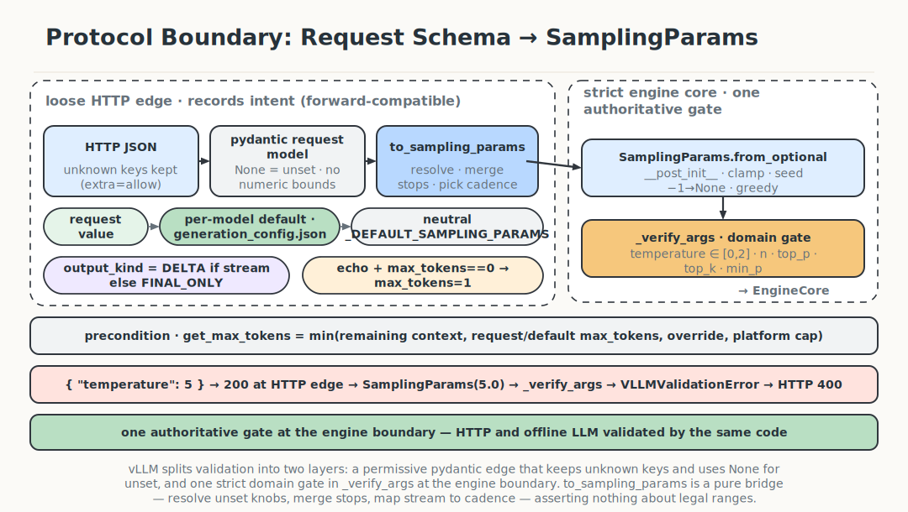</a>

<p class='figure-caption'>HTTP JSON -> permissive pydantic parse -> `to_sampling_params` resolution -> engine `_verify_args` gate; the loose edge and the strict core are two different validators.</p>

**The base model accepts anything.**

The shared base class for OpenAI-compatible requests is permissive by construction: unknown JSON keys are ignored rather than rejected.

Source: [`vllm/entrypoints/openai/engine/protocol.py:28-57`](https://github.com/vllm-project/vllm/blob/6cf7b26bd4bff60bf378e1af14044280ac0d214c/vllm/entrypoints/openai/engine/protocol.py#L28-L57).

```python
class OpenAIBaseModel(BaseModel):
    # OpenAI API does allow extra fields
    model_config = ConfigDict(extra="allow")

    # Cache class field names
    field_names: ClassVar[set[str] | None] = None

    @model_validator(mode="wrap")
    @classmethod
    def __log_extra_fields__(cls, data, handler):
        result = handler(data)
        ...
        # Compare against both field names and aliases
        if any(k not in field_names for k in data):
            logger.debug(
                "The following fields were present in the request but ignored: %s",
                data.keys() - field_names,
            )
        return result
```

`ConfigDict(extra="allow")` tells pydantic to keep, not reject, keys it does not model. The `mode="wrap"` validator runs the normal parse first (`handler(data)`), then diffs the raw JSON keys against the union of field names and aliases (computed once, cached on the class in `field_names`). Extra keys are only `logger.debug`-logged.

This protects **API forward-compatibility**. A client that sends a newer OpenAI parameter vLLM has not yet modeled gets a successful `200`, not a `422`. The cost of that tolerance is real and worth stating: a typo in a parameter name (`temperatuer`) is silently dropped and only visible at DEBUG log level. Strictness is deferred on purpose.

**Two request shapes, mostly `None` defaults.**

Sampler fields default to `None` rather than their neutral values. Here `None` means "the client did not set this"; `to_sampling_params` resolves it later.

Source: [`vllm/entrypoints/openai/completion/protocol.py:48-73`](https://github.com/vllm-project/vllm/blob/6cf7b26bd4bff60bf378e1af14044280ac0d214c/vllm/entrypoints/openai/completion/protocol.py#L48-L73).

```python
class CompletionRequest(OpenAIBaseModel):
    ...
    logprobs: int | None = None
    max_tokens: int | None = 16
    n: int = 1
    ...
    stop: str | list[str] | None = []
    stream: bool | None = False
    ...
    temperature: float | None = None
    top_p: float | None = None
```

`max_tokens` defaults to `16` — OpenAI legacy-completions parity, so an omitted cap still bounds output. But `temperature` and `top_p` (and, further down, `top_k`, `min_p`, `repetition_penalty`) default to `None`. That `None` is not "use temperature 0"; it is "unset, go resolve me against the server default." Note also that these `float | None` fields carry **no** `Field(ge=..., le=...)` bounds — `temperature` can arrive as `-5` or `1e9` and the pydantic parse will happily accept it.

The chat schema diverges in two key places. Source: [`vllm/entrypoints/openai/chat_completion/protocol.py:203-210`](https://github.com/vllm-project/vllm/blob/6cf7b26bd4bff60bf378e1af14044280ac0d214c/vllm/entrypoints/openai/chat_completion/protocol.py#L203-L210).

```python
    logprobs: bool | None = False
    top_logprobs: int | None = 0
    max_tokens: int | None = Field(
        default=None,
        deprecated="max_tokens is deprecated in favor of "
        "the max_completion_tokens field",
    )
    max_completion_tokens: int | None = None
```

The schema records intent rather than the final sampling policy. Keeping `None` as an unset marker allows model defaults from `generation_config.json` to take precedence over library-neutral values without hard-coding them in the HTTP model.

Four fields carry most of the dialect difference between the two schemas, and all four converge inside `to_sampling_params`:

| Protocol field | Chat request | Completion request | Where it lands |
| --- | --- | --- | --- |
| `logprobs` | `bool`, default `False` — an on/off gate (`chat_completion/protocol.py:203`) | `int`, unset by default — the count itself (`completion/protocol.py:62`) | `SamplingParams.logprobs`; chat sends `top_logprobs if logprobs else None` (`chat_completion/protocol.py:680`), completion sends `logprobs` unchanged (`completion/protocol.py:361`) |
| `top_logprobs` | `int`, default `0` — carries the count (`chat_completion/protocol.py:204`) | not a request field (the name exists only in the response body) | the same `SamplingParams.logprobs` slot, and only when chat's `logprobs` is truthy |
| `max_tokens` / `max_completion_tokens` | both optional and unset by default; `max_tokens` is marked deprecated, and `max_completion_tokens` wins when present (`chat_completion/protocol.py:205-210`, `chat_completion/serving.py:301-309`) | only `max_tokens`, default `16` (`completion/protocol.py:63`) | `SamplingParams.max_tokens`, after `get_max_tokens` has clamped it against remaining context; completion additionally rewrites `0` to `1` under `echo_without_generation` (`completion/protocol.py:363`) |
| `stream` | `bool`, default `False` (`chat_completion/protocol.py:216`) | `bool`, default `False` (`completion/protocol.py:68`) | `SamplingParams.output_kind`: `DELTA` when true, `FINAL_ONLY` when false (`chat_completion/protocol.py:688-690`, `completion/protocol.py:369-371`) |

### The budget resolver: a cap that cannot overflow context

Before `to_sampling_params` runs, the handler computes the *effective* output budget and passes it in as an already-resolved integer (not `self.max_tokens`). This is `get_max_tokens`.

Source: [`vllm/entrypoints/serve/utils/api_utils.py:170-206`](https://github.com/vllm-project/vllm/blob/6cf7b26bd4bff60bf378e1af14044280ac0d214c/vllm/entrypoints/serve/utils/api_utils.py#L170-L206).

```python
    model_max_tokens = max_model_len - input_length
    platform_max_tokens = current_platform.get_max_output_tokens(input_length)
    fallback_max_tokens = (
        max_tokens
        if max_tokens is not None
        else default_sampling_params.get("max_tokens")
    )

    return min(
        val
        for val in (
            model_max_tokens,
            fallback_max_tokens,
            override_max_tokens,
            platform_max_tokens,
        )
        if val is not None
    )
```

The effective budget is the minimum of four caps: remaining context (`max_model_len - input_length`), the requested or model-default `max_tokens`, a server-side override, and a platform ceiling. The tightest configured cap wins, and an over-long prompt is rejected earlier as HTTP 400.

### `to_sampling_params`: resolving unset knobs

This is where the loose schema becomes concrete engine input. Each unset sampling knob follows a three-level fallback, stop tokens are merged, `response_format` is converted into structured-output settings, and `stream` selects the output cadence.

The fallback table is a class constant. Source: [`vllm/entrypoints/openai/completion/protocol.py:234-241`](https://github.com/vllm-project/vllm/blob/6cf7b26bd4bff60bf378e1af14044280ac0d214c/vllm/entrypoints/openai/completion/protocol.py#L234-L241).

```python
    # Default sampling parameters for completion requests
    _DEFAULT_SAMPLING_PARAMS: dict = {
        "repetition_penalty": 1.0,
        "temperature": 1.0,
        "top_p": 1.0,
        "top_k": 0,
        "min_p": 0.0,
    }
```

<a href='images/vllm-02-25-sampling-fallback-precedence.svg' target='_blank'>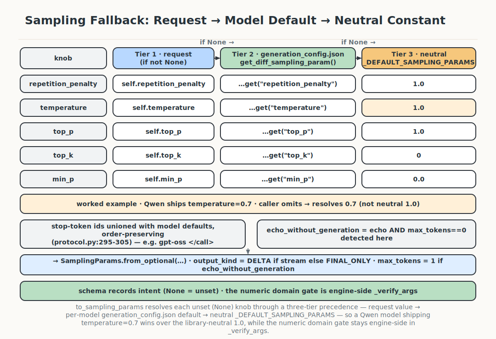</a>

<p class='figure-caption'>`to_sampling_params` resolves each unset (`None`) knob through a three-tier precedence — request value → per-model `generation_config.json` default (`get_diff_sampling_param()`) → neutral `_DEFAULT_SAMPLING_PARAMS` constant — so a Qwen model shipping `temperature: 0.7` wins over the library-neutral `1.0`, while the numeric domain gate stays engine-side in `_verify_args`.</p>

Source: [`vllm/entrypoints/openai/completion/protocol.py:272-293`](https://github.com/vllm-project/vllm/blob/6cf7b26bd4bff60bf378e1af14044280ac0d214c/vllm/entrypoints/openai/completion/protocol.py#L272-L293).

```python
        # Default parameters
        if (repetition_penalty := self.repetition_penalty) is None:
            repetition_penalty = default_sampling_params.get(
                "repetition_penalty",
                self._DEFAULT_SAMPLING_PARAMS["repetition_penalty"],
            )
        if (temperature := self.temperature) is None:
            temperature = default_sampling_params.get(
                "temperature", self._DEFAULT_SAMPLING_PARAMS["temperature"]
            )
        ...
```

For `repetition_penalty`, `temperature`, `top_p`, `top_k`, and `min_p`, resolution follows three levels: an explicit request value, the model's `default_sampling_params`, and finally the neutral `_DEFAULT_SAMPLING_PARAMS` constant. A Qwen model that ships `temperature: 0.7` in `generation_config.json`, for example, keeps that default when the client omits temperature instead of falling back to the library-neutral `1.0`.

Two more resolutions happen here. Stop-token ids are unioned with the model's defaults, order-preserving ([`vllm/entrypoints/openai/completion/protocol.py:295-305`](https://github.com/vllm-project/vllm/blob/6cf7b26bd4bff60bf378e1af14044280ac0d214c/vllm/entrypoints/openai/completion/protocol.py#L295-L305)) — this is how model-specific terminators such as gpt-oss's `</call>` get added even when the request supplies its own. And a pure-echo mode is detected:

Source: [`vllm/entrypoints/openai/completion/protocol.py:307-311`](https://github.com/vllm-project/vllm/blob/6cf7b26bd4bff60bf378e1af14044280ac0d214c/vllm/entrypoints/openai/completion/protocol.py#L307-L311).

```python
        prompt_logprobs = self.prompt_logprobs
        if prompt_logprobs is None and self.echo:
            prompt_logprobs = self.logprobs

        echo_without_generation = self.echo and self.max_tokens == 0
```

`echo_without_generation` (echo plus `max_tokens == 0`) is the "just replay the prompt" case; we return to it below because `max_tokens == 0` would otherwise be rejected by the engine.

**The final construction and the cadence bit.**

Source: [`vllm/entrypoints/openai/completion/protocol.py:349-380`](https://github.com/vllm-project/vllm/blob/6cf7b26bd4bff60bf378e1af14044280ac0d214c/vllm/entrypoints/openai/completion/protocol.py#L349-L380).

```python
        return SamplingParams.from_optional(
            n=self.n,
            ...
            logprobs=self.logprobs,
            ignore_eos=self.ignore_eos,
            max_tokens=max_tokens if not echo_without_generation else 1,
            min_tokens=self.min_tokens,
            prompt_logprobs=prompt_logprobs,
            ...
            output_kind=RequestOutputKind.DELTA
            if self.stream
            else RequestOutputKind.FINAL_ONLY,
            structured_outputs=self.structured_outputs,
            logit_bias=self.logit_bias,
            allowed_token_ids=self.allowed_token_ids,
            bad_words=self.bad_words,
            extra_args=extra_args or None,
            skip_clone=True,  # Created fresh per request, safe to skip clone
            repetition_detection=self.repetition_detection,
            thinking_token_budget=self.thinking_token_budget,
        )
```

Three lines are especially relevant:

- `max_tokens=max_tokens if not echo_without_generation else 1` — pure-echo asks the engine to generate exactly one token (the response layer emits only the prompt). The engine's `_verify_args` rejects `max_tokens < 1`, so the schema-level `max_tokens == 0` is rewritten to `1` here rather than propagated.
- `output_kind = DELTA if self.stream else FINAL_ONLY` — this is the single place where the HTTP `stream` boolean becomes an engine-level output cadence: streaming requests get incremental deltas, non-streaming requests get only the terminal aggregate. Everything downstream (the output processor, the per-request queue) keys off `output_kind`, not off HTTP.
- `skip_clone=True` — the object is freshly built per request, so the engine skips a defensive deep copy.

The chat variant is identical in shape except for one reconciliation. Source: [`vllm/entrypoints/openai/chat_completion/protocol.py:668-680`](https://github.com/vllm-project/vllm/blob/6cf7b26bd4bff60bf378e1af14044280ac0d214c/vllm/entrypoints/openai/chat_completion/protocol.py#L668-L680).

```python
        return SamplingParams.from_optional(
            n=self.n,
            ...
            logprobs=self.top_logprobs if self.logprobs else None,
            prompt_logprobs=prompt_logprobs,
            ignore_eos=self.ignore_eos,
            max_tokens=max_tokens,
            ...
```

`logprobs=self.top_logprobs if self.logprobs else None` is the boolean-to-int reconciliation — the engine's integer `logprobs` count is `top_logprobs` only when the chat boolean `logprobs` is truthy, else `None`. And chat has no `echo_without_generation` clamp; it passes the already-resolved `max_tokens` straight through.

### The authoritative gate is engine-side

`to_sampling_params` does not validate numeric domains itself. It calls `SamplingParams.from_optional`, which [replaces remaining `None` values with neutral defaults](https://github.com/vllm-project/vllm/blob/6cf7b26bd4bff60bf378e1af14044280ac0d214c/vllm/sampling_params.py#L414-L424) and constructs the dataclass. `__post_init__` performs its normalizations—near-zero-temperature handling, `seed == -1` to `None`, and greedy-mode adjustments—before `_verify_args` checks the legal ranges. Article 10 lists that full validation table; here the relevant point is that offline and HTTP callers meet the same `SamplingParams` gate.

Source: [`vllm/sampling_params.py:536-576`](https://github.com/vllm-project/vllm/blob/6cf7b26bd4bff60bf378e1af14044280ac0d214c/vllm/sampling_params.py#L536-L576).

```python
        if self.temperature > 2.0:
            raise VLLMValidationError(
                f"temperature must be in [0, 2], got {self.temperature}.",
                ...
            )
```

The `temperature ∈ [0, 2]` check appears here rather than on the HTTP field, which is an unbounded `float | None`. As a result, `{"temperature": 5}` passes the permissive HTTP parse, becomes `SamplingParams(temperature=5.0)`, and is rejected by `_verify_args`. The handler surfaces the resulting `VLLMValidationError` as an HTTP 400 that names the parameter. Article 10 lists the remaining ranges.

## 11. Streaming (SSE), Middleware, Auth, and Health

This section covers the layers that wrap an HTTP request without implementing its model-specific behavior. V1 streaming uses a per-request in-memory collector. A background task drains outputs from EngineCore into that collector, and the route coroutine turns them into a `StreamingResponse`. Authentication, request ids, CORS, exception mapping, `/health`, and the watchdog sit around this path. Articles 03 and 04 cover the process split and EngineCore internals; the focus here is transport and HTTP lifecycle behavior.

### The wire: SSE framing and the JSON→stream fork

Every generative route ends at the same three-way fork on the serving object's return type — the `ErrorResponse` / materialized-response / `StreamingResponse` branch archetyped in [Section 6](#6-serving-completions-from-http-to-add_request) and reused verbatim by chat, embeddings, and responses — so the route code is not re-pasted here. What [Section 11](#11-streaming-sse-middleware-auth-and-health) covers is the third arm.

`StreamingResponse(content=generator, media_type="text/event-stream")` is the only place the transport is named. The *frames* inside that stream are produced by the serving generators of [Section 6](#6-serving-completions-from-http-to-add_request)/[Section 7](#7-serving-chat-templates-and-tool-calling): every event is `data: {json}\n\n`, the stream always terminates with `data: [DONE]\n\n`, and a mid-stream error is serialized as one more `data:` frame (via `create_streaming_error_response`) rather than raised — because the HTTP 200 status line is already on the wire and cannot be un-sent ([`completion/serving.py:491-497`](https://github.com/vllm-project/vllm/blob/6cf7b26bd4bff60bf378e1af14044280ac0d214c/vllm/entrypoints/openai/completion/serving.py#L491-L497), [`chat_completion/serving.py:824`](https://github.com/vllm-project/vllm/blob/6cf7b26bd4bff60bf378e1af14044280ac0d214c/vllm/entrypoints/openai/chat_completion/serving.py#L824)).

The route layer never sees tokens. It chooses a *response object* by type and hands the byte generator to Starlette; framing and error-in-band-ness are the generator's contract.

### Behind SSE: a single-slot coalescing queue

The `generator` passed to `StreamingResponse` is ultimately `AsyncLLM.generate` ([`async_llm.py:524`](https://github.com/vllm-project/vllm/blob/6cf7b26bd4bff60bf378e1af14044280ac0d214c/vllm/v1/engine/async_llm.py#L524)), and `generate` is a *consumer*, not a producer, of a per-request `RequestOutputCollector`.

[`vllm/v1/engine/output_processor.py:45-72`](https://github.com/vllm-project/vllm/blob/6cf7b26bd4bff60bf378e1af14044280ac0d214c/vllm/v1/engine/output_processor.py#L45-L72)

```python
class RequestOutputCollector:
    """
    Collects streamed RequestOutputs per individual request,
    for hand-off to the consuming asyncio generate task.

    When streaming deltas, RequestOutputs are merged if the
    producer gets ahead of the consumer.
    """

    def __init__(self, output_kind: RequestOutputKind, request_id: str):
        self.aggregate = output_kind == RequestOutputKind.DELTA
        ...
        self.output: RequestOutput | PoolingRequestOutput | Exception | None = None
        self.ready = asyncio.Event()
        ...
    def put(self, output: RequestOutput | PoolingRequestOutput | Exception) -> None:
        """Non-blocking put operation."""
        if self.output is None or isinstance(output, Exception):
            self.output = output
            self.ready.set()
        elif isinstance(self.output, RequestOutput) and isinstance(
            output, RequestOutput
        ):
            ...
            self.output.add(output, aggregate=self.aggregate)
```

This is not an `asyncio.Queue`. It is a *single output slot* plus an `asyncio.Event`. When the request is in DELTA mode (`aggregate = output_kind == RequestOutputKind.DELTA`; see [Section 6](#6-serving-completions-from-http-to-add_request) for how `output_kind` is set from `stream`), and the producer (the background handler) puts a second output before the consumer has taken the first, `put` does not append — it calls `self.output.add(output, aggregate=True)` and *merges the deltas in place*. An `Exception` short-circuits the slot so the consumer re-raises it.

The consumer side, in `generate`:

[`vllm/v1/engine/async_llm.py:576-586`](https://github.com/vllm-project/vllm/blob/6cf7b26bd4bff60bf378e1af14044280ac0d214c/vllm/v1/engine/async_llm.py#L576-L586)

```python
            finished = False
            while not finished:
                # Note: drain queue without await if possible (avoids
                # task switching under load which helps performance).
                out = q.get_nowait() or await q.get()

                # Note: both OutputProcessor and EngineCore handle their
                # own request cleanup based on finished.
                assert isinstance(out, RequestOutput)
                finished = out.finished
                if out is not STREAM_FINISHED:
                    yield out
```

The read tries `get_nowait()` first — if the slot already holds output, the loop takes it without yielding to the scheduler (avoids a task switch under load); otherwise it falls back to `await q.get()`, which blocks on the `ready` event and provides backpressure. `finished` is read from the output; the `STREAM_FINISHED` sentinel (emitted by the output processor at [`output_processor.py:555`](https://github.com/vllm-project/vllm/blob/6cf7b26bd4bff60bf378e1af14044280ac0d214c/vllm/v1/engine/output_processor.py#L555)) sets `finished` but is filtered from the yield.

### The background bridge: one output handler for all requests

The slot is filled by a single background task, started lazily on the first `add_request`:

[`vllm/v1/engine/async_llm.py:658-689`](https://github.com/vllm-project/vllm/blob/6cf7b26bd4bff60bf378e1af14044280ac0d214c/vllm/v1/engine/async_llm.py#L658-L689)

```python
                while True:
                    # 1) Pull EngineCoreOutputs from the EngineCore.
                    outputs = await engine_core.get_output_async()
                    num_outputs = len(outputs.outputs)
                    ...
                    engine_core_outputs = outputs.outputs
                    for start in range(0, num_outputs, chunk_size):
                        end = start + chunk_size
                        outputs_slice = engine_core_outputs[start:end]
                        # 2) Process EngineCoreOutputs.
                        processed_outputs = output_processor.process_outputs(
                            outputs_slice, outputs.timestamp, iteration_stats
                        )
                        # NOTE: RequestOutputs are pushed to their queues.
                        assert not processed_outputs.request_outputs

                        # Allow other asyncio tasks to run between chunks
                        if end < num_outputs:
                            await asyncio.sleep(0)

                        # 3) Abort any reqs that finished due to stop strings.
                        if processed_outputs.reqs_to_abort:
                            await engine_core.abort_requests_async(
                                processed_outputs.reqs_to_abort
                            )
```

One task drains *all* requests. It pulls a batch of `EngineCoreOutputs`, splits it into slices of at most `VLLM_V1_OUTPUT_PROC_CHUNK_SIZE`, and runs `output_processor.process_outputs` per slice. `process_outputs` detokenizes and `put`s each `RequestOutput` into its owning collector — hence `assert not processed_outputs.request_outputs` (the handler must never accumulate outputs itself; they went to the queues). Between chunks it `await asyncio.sleep(0)`, voluntarily yielding so a large batch cannot starve the event loop (and thus other clients' `generate` coroutines). Stop-string finishes are detected *after* detokenization, so the handler asks the engine to abort those requests via `abort_requests_async`.

<a href='images/vllm-02-10-sse-streaming.svg' target='_blank'>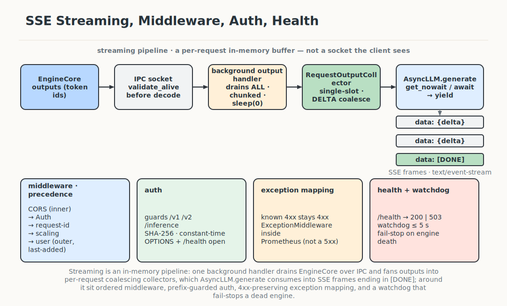</a>

<p class='figure-caption'>EngineCore outputs → IPC socket → one background output handler (chunked, sleep(0)) → per-request coalescing collector → generate() consumer → SSE frames.</p>

### IPC: validate before decode

On the multi-process path, `EngineCoreOutputs` arrive over a ZMQ socket drained by its own thread:

[`vllm/v1/engine/core_client.py:824-830`](https://github.com/vllm-project/vllm/blob/6cf7b26bd4bff60bf378e1af14044280ac0d214c/vllm/v1/engine/core_client.py#L824-L830)

```python
                    frames = out_socket.recv_multipart(copy=False)
                    resources.validate_alive(frames)
                    outputs: EngineCoreOutputs = decoder.decode(frames)
                    if outputs.utility_output:
                        _process_utility_output(outputs.utility_output, utility_results)
                    else:
                        outputs_queue.put_nowait(outputs)
```

`recv_multipart(copy=False)` asks PyZMQ to avoid an extra receive-side payload copy where supported. `validate_alive(frames)` then checks the liveness/version marker before `decoder.decode`, so a dead or mismatched engine is reported before msgpack deserialization of that frame. Article 03 covers the socket topology and DP fan-in.

### Cancellation: a disconnect becomes an engine abort

[`vllm/v1/engine/async_llm.py:591-596`](https://github.com/vllm-project/vllm/blob/6cf7b26bd4bff60bf378e1af14044280ac0d214c/vllm/v1/engine/async_llm.py#L591-L596)

```python
        except (asyncio.CancelledError, GeneratorExit):
            if q is not None:
                await self.abort(q.request_id, internal=True)
            if self.log_requests:
                logger.info("Request %s aborted.", request_id)
            raise
```

When the `StreamingResponse` generator is cancelled or garbage-collected (client TCP disconnect), `generate` catches it and calls `self.abort(q.request_id, internal=True)` — note it uses the *collector's* request id, which is authoritative. The pre-stream phase (before the generator is returned) is separately raced against `listen_for_disconnect` by the `with_cancellation` decorator ([`api_utils.py:52-92`](https://github.com/vllm-project/vllm/blob/6cf7b26bd4bff60bf378e1af14044280ac0d214c/vllm/entrypoints/serve/utils/api_utils.py#L52-L92)), whose docstring notes that once a `StreamingResponse` is returned "this wrapper will stop listening for disconnects and instead the response object will start listening." So two mechanisms cover the two phases; both converge on the same abort.

A transport event (client hangup) is converted into an engine abort, so KV blocks and scheduler slots are freed instead of leaking on a request no one is reading. Cross-ref article 05 (scheduler) and article 06 (KV cache) for what the abort releases.

### Middleware: order is precedence

[`vllm/entrypoints/openai/api_server.py:306-318`](https://github.com/vllm-project/vllm/blob/6cf7b26bd4bff60bf378e1af14044280ac0d214c/vllm/entrypoints/openai/api_server.py#L306-L318)

```python
    # Ensure --api-key option from CLI takes precedence over VLLM_API_KEY
    if tokens := [key for key in (args.api_key or [envs.VLLM_API_KEY]) if key]:
        from vllm.entrypoints.serve.utils.server_utils import AuthenticationMiddleware

        app.add_middleware(AuthenticationMiddleware, tokens=tokens)

    if args.enable_request_id_headers:
        from vllm.entrypoints.serve.utils.server_utils import XRequestIdMiddleware

        app.add_middleware(XRequestIdMiddleware)

    # Add scaling middleware to check for scaling state
    app.add_middleware(ScalingMiddleware)
```

<a href='images/vllm-02-26-middleware-auth-onion.svg' target='_blank'>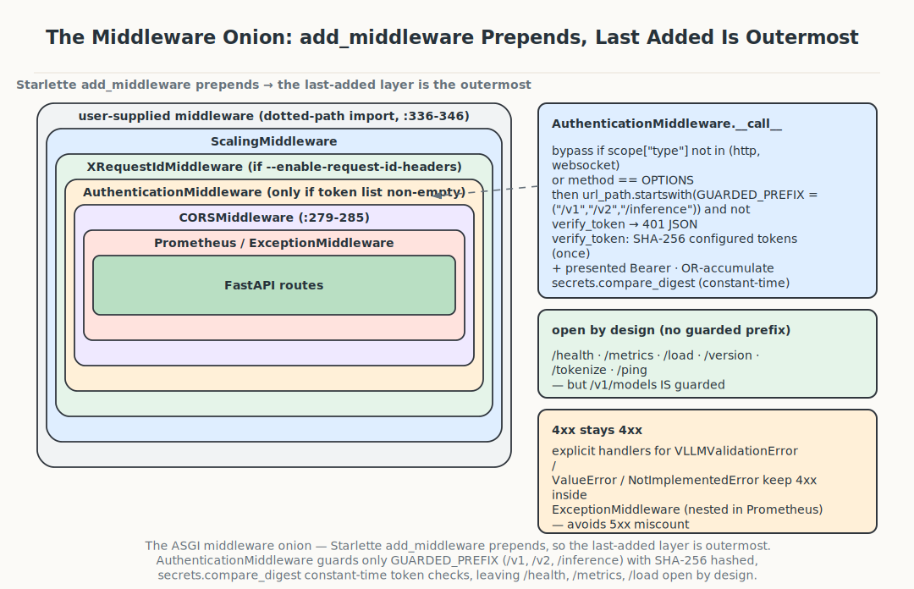</a>

<p class='figure-caption'>The ASGI middleware onion — Starlette `add_middleware` prepends, so the last-added layer is outermost (CORS innermost, then Auth, XRequestId, Scaling, user middleware outermost). `AuthenticationMiddleware` guards only `GUARDED_PREFIX` (`/v1`, `/v2`, `/inference`) with SHA-256 hashed, `secrets.compare_digest` constant-time token checks, leaving `/health`, `/metrics`, `/load` open by design.</p>

Starlette `add_middleware` *prepends*, so the last-added middleware is the outermost. `--api-key` (a CLI list) overrides `VLLM_API_KEY` — the walrus builds the token list from CLI first, env second, dropping falsy entries; if empty, no auth middleware is installed at all. CORS was installed earlier ([`api_server.py:279-285`](https://github.com/vllm-project/vllm/blob/6cf7b26bd4bff60bf378e1af14044280ac0d214c/vllm/entrypoints/openai/api_server.py#L279-L285)); user-supplied middleware (dotted-path import, class or coroutine) is installed last (`:336-346`), hence outermost.

### Auth: hashed, constant-time, guarded prefixes only

[`vllm/entrypoints/serve/utils/server_utils.py:42`](https://github.com/vllm-project/vllm/blob/6cf7b26bd4bff60bf378e1af14044280ac0d214c/vllm/entrypoints/serve/utils/server_utils.py#L42), then `:78-93`

```python
GUARDED_PREFIX = ("/v1", "/v2", "/inference")
```

```python
    def __call__(self, scope: Scope, receive: Receive, send: Send) -> Awaitable[None]:
        if (
            scope["type"] not in ("http", "websocket")
            or scope.get("method") == "OPTIONS"
        ):
            ...
            return self.app(scope, receive, send)
        root_path = scope.get("root_path", "")
        url_path = scope["path"].removeprefix(root_path)
        headers = Headers(scope=scope)
        # Type narrow to satisfy mypy.
        if url_path.startswith(GUARDED_PREFIX) and not self.verify_token(headers):
            response = JSONResponse(content={"error": "Unauthorized"}, status_code=401)
            return response(scope, receive, send)
        return self.app(scope, receive, send)
```

This is pure-ASGI middleware. `verify_token` (`:61-76`) SHA-256-hashes both the configured tokens (done once at init) and the presented `Authorization: Bearer` param, then OR-accumulates `secrets.compare_digest` across all configured token hashes — constant-time comparison over hashes, resistant to timing side-channels. Two documented bypasses: an `OPTIONS` request (so CORS preflight is never blocked) and any path not under `GUARDED_PREFIX`.

Authentication guards only `/v1`, `/v2`, `/inference`. `/health`, `/metrics`, `/load`, `/version`, `/tokenize`, `/ping` are unauthenticated *by design* — they do not start with a guarded prefix, so load balancers and scrapers reach them even with `--api-key` set. Note `/v1/models` *is* guarded (it starts with `/v1`).

### Exception mapping: keep 4xx out of the 5xx counter

[`vllm/entrypoints/openai/api_server.py:287-304`](https://github.com/vllm-project/vllm/blob/6cf7b26bd4bff60bf378e1af14044280ac0d214c/vllm/entrypoints/openai/api_server.py#L287-L304)

```python
    app.exception_handler(HTTPException)(http_exception_handler)
    app.exception_handler(RequestValidationError)(validation_exception_handler)
    app.exception_handler(EngineGenerateError)(engine_error_handler)
    app.exception_handler(EngineDeadError)(engine_error_handler)
    app.exception_handler(GenerationError)(generation_error_handler)
    # Register specific exception types so they are handled by
    # ExceptionMiddleware (inside the Prometheus middleware) rather than
    # ServerErrorMiddleware (outside it). Without this, these exceptions
    # propagate through Prometheus as unhandled and get recorded as 5xx
    # even though they result in 4xx responses to the client.
    app.exception_handler(VLLMValidationError)(exception_handler)
    ...
    app.exception_handler(Exception)(exception_handler)
```

Every exception becomes an OpenAI-shaped `ErrorResponse` JSON. The comment encodes a subtle correctness point: registering `ValueError`, `NotImplementedError`, and the concrete `VLLM*` 4xx types as explicit handlers keeps them inside Starlette's `ExceptionMiddleware`, which is nested *inside* the Prometheus middleware; otherwise they would bubble to `ServerErrorMiddleware` (outside Prometheus) and inflate the 5xx counter even though the client sees a 4xx. The two engine errors route to `engine_error_handler`, whose docstring states the streaming rationale directly: "If an exception is encountered in a StreamingResponse generator, the exception is not raised, since we already sent a 200 status ... Instead, we use the watchdog background task" ([`server_utils.py:347-352`](https://github.com/vllm-project/vllm/blob/6cf7b26bd4bff60bf378e1af14044280ac0d214c/vllm/entrypoints/serve/utils/server_utils.py#L347-L352)). The handler calls `terminate_if_errored` and returns the mapped error.

### Health and the watchdog: fail-stop on engine death

[`vllm/entrypoints/serve/instrumentator/health.py:22-33`](https://github.com/vllm-project/vllm/blob/6cf7b26bd4bff60bf378e1af14044280ac0d214c/vllm/entrypoints/serve/instrumentator/health.py#L22-L33)

```python
@router.get("/health", response_class=Response)
async def health(raw_request: Request) -> Response:
    """Health check."""
    client = engine_client(raw_request)
    if client is None:
        # Render-only servers have no engine; they are always healthy.
        return Response(status_code=200)
    try:
        await client.check_health()
        return Response(status_code=200)
    except EngineDeadError:
        return Response(status_code=503)
```

`/health` is a pull check: `check_health()` on the `AsyncLLM` → 200, `EngineDeadError` → 503, and a render-only server (no engine, `state.engine_client is None`; see [Section 5](#5-the-openai-server-fastapi-app-lifespan-and-the-engine-client)) is always 200. Because `/health` is outside the guarded prefixes, a load balancer keeps probing it even under `--api-key`. `/version` and `/load` ([`instrumentator/basic.py:30-56`](https://github.com/vllm-project/vllm/blob/6cf7b26bd4bff60bf378e1af14044280ac0d214c/vllm/entrypoints/serve/instrumentator/basic.py#L30-L56)) are similarly open; `/load` returns the `server_load_metrics` counter that `load_aware_call` ([`api_utils.py:101-146`](https://github.com/vllm-project/vllm/blob/6cf7b26bd4bff60bf378e1af14044280ac0d214c/vllm/entrypoints/serve/utils/api_utils.py#L101-L146)) increments on entry and decrements via a `BackgroundTask` only after a stream fully drains.

The *push* counterpart is the watchdog, which exists precisely because a stream that dies mid-generation cannot re-raise to the client:

[`vllm/entrypoints/launcher.py:168-178`](https://github.com/vllm-project/vllm/blob/6cf7b26bd4bff60bf378e1af14044280ac0d214c/vllm/entrypoints/launcher.py#L168-L178)

```python
def terminate_if_errored(server: uvicorn.Server, engine: EngineClient):
    ...
    engine_errored = engine.errored and not engine.is_running
    if not envs.VLLM_KEEP_ALIVE_ON_ENGINE_DEATH and engine_errored:
        server.should_exit = True
```

`watchdog_loop` ([`launcher.py:156-165`](https://github.com/vllm-project/vllm/blob/6cf7b26bd4bff60bf378e1af14044280ac0d214c/vllm/entrypoints/launcher.py#L156-L165)) calls this every `VLLM_WATCHDOG_TIME_S = 5.0` seconds; `engine_error_handler` calls it on the next request. Both flip `server.should_exit` when the engine is `errored and not is_running`, unless `VLLM_KEEP_ALIVE_ON_ENGINE_DEATH` overrides it for debugging.

Under normal event-loop progress, the watchdog notices an errored, stopped engine on its next five-second check; the exception handler can trigger the same shutdown decision when a request encounters the error first. `/health` reports 503 for `EngineDeadError`, allowing orchestration to replace the pod.

## 12. From HTTP/CLI to the Engine: The Full Entrypoint Trace

The three traces below separate the CLI boot path from the two request paths, then show where offline and HTTP requests reach the same `EngineCoreRequest` boundary.

<a href='images/vllm-02-11-entrypoint-trace.svg' target='_blank'>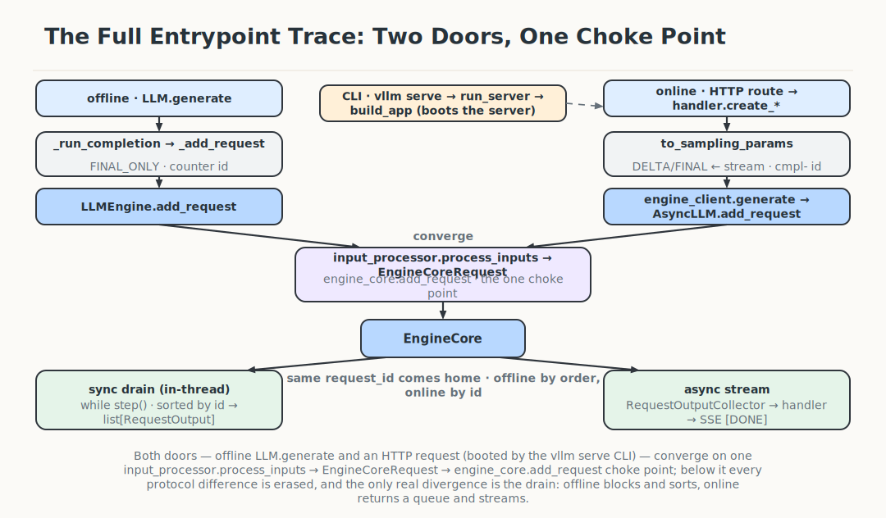</a>

<p class='figure-caption'>Three front doors (offline `LLM.generate`, `vllm serve`, HTTP route) narrowing to one convergence point (`process_inputs` → `EngineCoreRequest` → `EngineCore`), then splitting into sync-drain vs async-stream.</p>

### Trace A — Offline: `generate` to a synchronous drain

The offline request method is a three-line adapter: guard the runner, default the params, delegate. [`vllm/entrypoints/llm.py:465-485`](https://github.com/vllm-project/vllm/blob/6cf7b26bd4bff60bf378e1af14044280ac0d214c/vllm/entrypoints/llm.py#L465-L485):

```python
        runner_type = self.model_config.runner_type
        if runner_type != "generate":
            raise ValueError(
                "LLM.generate() is only supported for generative models. "
                ...
            )

        if sampling_params is None:
            sampling_params = self.get_default_sampling_params()

        return self._run_completion(
            prompts=prompts,
            params=sampling_params,
            output_type=RequestOutput,
            ...
        )
```

`_run_completion` enqueues through `_add_completion_requests` and then blocks in `_run_engine` ([`offline_utils.py:340-349`](https://github.com/vllm-project/vllm/blob/6cf7b26bd4bff60bf378e1af14044280ac0d214c/vllm/entrypoints/offline_utils.py#L340-L349)). `_add_request` supplies the two values needed by that drain:

```python
        if isinstance(params, SamplingParams):
            # We only care about the final output
            params.output_kind = RequestOutputKind.FINAL_ONLY

        request_id = str(next(self.request_counter))
```

Offline forces `FINAL_ONLY` and assigns a monotonic integer request id. The drain collects one final result per request and uses those ids to restore input order before returning.

`LLMEngine.add_request` ([`vllm/v1/engine/llm_engine.py:249-261`](https://github.com/vllm-project/vllm/blob/6cf7b26bd4bff60bf378e1af14044280ac0d214c/vllm/v1/engine/llm_engine.py#L249-L261)) is where the offline door reaches the shared entry point:

```python
        else:
            request = self.input_processor.process_inputs(
                request_id,
                prompt,
                params,
                supported_tasks=self.get_supported_tasks(),
                arrival_time=arrival_time,
                lora_request=lora_request,
                tokenization_kwargs=tokenization_kwargs,
                trace_headers=trace_headers,
                priority=priority,
            )
            prompt_text, _, _ = extract_prompt_components(self.model_config, prompt)
```

`process_inputs` returns an `EngineCoreRequest`; `LLMEngine.add_request` registers frontend output state and calls `engine_core.add_request` ([`llm_engine.py:272-292`](https://github.com/vllm-project/vllm/blob/6cf7b26bd4bff60bf378e1af14044280ac0d214c/vllm/v1/engine/llm_engine.py#L272-L292)), fanning out children when `n > 1`. `_run_engine` then drains synchronously and sorts completed outputs by the assigned integer ids ([`offline_utils.py:590-626`](https://github.com/vllm-project/vllm/blob/6cf7b26bd4bff60bf378e1af14044280ac0d214c/vllm/entrypoints/offline_utils.py#L590-L626)).

### Trace B — CLI: `vllm serve` boots the server

The CLI constructs the server used by Trace C. `ServeSubcommand.cmd` resolves `api_server_count` and selects a topology ([`serve.py:139-148`](https://github.com/vllm-project/vllm/blob/6cf7b26bd4bff60bf378e1af14044280ac0d214c/vllm/entrypoints/cli/serve.py#L139-L148)):

```python
        if is_multi_port:
            run_dp_supervisor(args)
        elif args.api_server_count < 1:
            run_headless(args)
        elif args.api_server_count > 1 or envs.VLLM_RUST_FRONTEND_PATH:
            run_multi_api_server(args)
        else:
            # Single API server (this process).
            args.api_server_count = None
            uvloop.run(run_server(args))
```

The common single-server branch and the module `__main__` both end at `uvloop.run(run_server(args))` ([`api_server.py:799`](https://github.com/vllm-project/vllm/blob/6cf7b26bd4bff60bf378e1af14044280ac0d214c/vllm/entrypoints/openai/api_server.py#L799)).

`run_server` binds the socket *before* the engine exists, via `setup_server` ([`vllm/entrypoints/openai/api_server.py:630-637`](https://github.com/vllm-project/vllm/blob/6cf7b26bd4bff60bf378e1af14044280ac0d214c/vllm/entrypoints/openai/api_server.py#L630-L637)):

```python
    # workaround to make sure that we bind the port before the engine is set up.
    # This avoids race conditions with ray.
    # see https://github.com/vllm-project/vllm/issues/8204
    if args.uds:
        sock = create_server_unix_socket(args.uds)
    else:
        sock_addr = (args.host or "", args.port)
        sock = create_server_socket(sock_addr, reuse_port=reuse_port)
```

Then `run_server_worker` scopes the engine's entire lifetime inside an async context manager ([`vllm/entrypoints/openai/api_server.py:773-784`](https://github.com/vllm-project/vllm/blob/6cf7b26bd4bff60bf378e1af14044280ac0d214c/vllm/entrypoints/openai/api_server.py#L773-L784)):

```python
    async with build_async_engine_client(
        args,
        client_config=client_config,
    ) as engine_client:
        shutdown_task = await build_and_serve(
            engine_client, listen_address, sock, args, **uvicorn_kwargs
        )
    # NB: Await server shutdown only after the backend context is exited
    try:
        await shutdown_task
    finally:
        sock.close()
```

`build_async_engine_client` creates `AsyncLLM`; `build_and_serve` asks the live engine for its capabilities and builds the app from them ([`api_server.py:670-679`](https://github.com/vllm-project/vllm/blob/6cf7b26bd4bff60bf378e1af14044280ac0d214c/vllm/entrypoints/openai/api_server.py#L670-L679)):

```python
    supported_tasks = await engine_client.get_supported_tasks()
    model_config = engine_client.model_config

    logger.info("Supported tasks: %s", supported_tasks)
    app = build_app(args, supported_tasks, model_config)
    await init_app_state(engine_client, app.state, args, supported_tasks)
    ...
    return await serve_http(
        app,
        sock=sock,
        ...
    )
```

The socket is bound before model loading (issue #8204), and `shutdown_task` is awaited after the engine context exits, so engine shutdown precedes final HTTP teardown and `sock.close()`.

### Trace C — HTTP: a request inside the running server

For chat completions, the route selects the serving object, which renders the template, builds `SamplingParams`, and calls `engine_client.generate`. `AsyncLLM.add_request` then reaches the same input processor as offline ([`async_llm.py:348-360`](https://github.com/vllm-project/vllm/blob/6cf7b26bd4bff60bf378e1af14044280ac0d214c/vllm/v1/engine/async_llm.py#L348-L360)):

```python
        else:
            request = self.input_processor.process_inputs(
                request_id,
                prompt,
                params,
                supported_tasks=await self.get_supported_tasks(),
                arrival_time=arrival_time,
                lora_request=lora_request,
                ...
            )
```

The async call awaits task discovery and also carries the online DP-routing rank. After `process_inputs` returns, `AsyncLLM` starts its output handler and creates the per-request collector ([`async_llm.py:370-383`](https://github.com/vllm-project/vllm/blob/6cf7b26bd4bff60bf378e1af14044280ac0d214c/vllm/v1/engine/async_llm.py#L370-L383)):

```python
        # We start the output_handler on the first call to add_request() so
        # we can call __init__ before the event loop, which enables us
        # to handle startup failure gracefully in the OpenAI server.
        self._run_output_handler()

        # Create a new output collector for the request.
        queue = RequestOutputCollector(params.output_kind, request.request_id)

        # Use cloned params that may have been updated in process_inputs()
        params = request.params

        if is_pooling or params.n == 1:
            await self._add_request(request, prompt_text, None, 0, queue)
            return queue
```

With `stream=True`, the protocol sets `DELTA`; `add_request` returns the collector while `_run_output_handler` drains EngineCore output into it. `AsyncLLM.generate` yields those items, and disconnect cleanup converts cancellation into an engine abort without exposing HTTP concepts to the scheduler.

### Takeaways

The request paths share this lowering:

```text
offline:  LLM.generate → _run_completion → _add_request → LLMEngine.add_request ┐
                                                                                ├→ input_processor.process_inputs → EngineCoreRequest → engine_core.add_request
online:   route → handler.create_* → engine_client.generate → AsyncLLM.add_request ┘
```

Both call `input_processor.process_inputs` ([`llm_engine.py:250`](https://github.com/vllm-project/vllm/blob/6cf7b26bd4bff60bf378e1af14044280ac0d214c/vllm/v1/engine/llm_engine.py#L250), [`async_llm.py:349`](https://github.com/vllm-project/vllm/blob/6cf7b26bd4bff60bf378e1af14044280ac0d214c/vllm/v1/engine/async_llm.py#L349)); the CLI constructs the online server rather than adding a third request path.

- **Offline** forces `FINAL_ONLY`, assigns integer counter ids, drives a blocking `while has_unfinished_requests(): step()` loop in-thread, and `sorted()`s by id to restore input order.
- **Online** sets `DELTA`/`FINAL_ONLY` from `stream`, assigns `chatcmpl-`/`cmpl-` ids, returns a `RequestOutputCollector` queue, and lets a background handler + async generator stream deltas as SSE.

The ownership seam remains:

```text
entrypoint = protocol + validation + async stream + cancellation
engine core = request state + scheduling + model execution
```

Beyond this seam, EngineCore does not need to understand Python method calls, CLI parsing, HTTP bodies, or SSE framing.

## 13. References

- https://docs.vllm.ai/en/stable/serving/offline_inference/
- https://docs.vllm.ai/en/stable/serving/online_serving/openai_compatible_server/
- https://docs.vllm.ai/en/stable/serving/online_serving/
- https://vllm.ai/blog/2025-01-27-v1-alpha-release
- https://vllm.ai/blog/2025-09-05-anatomy-of-vllm
- https://github.com/vllm-project/vllm/issues/8204

*All code conclusions are anchored to [`vllm-project/vllm@6cf7b26bd`](https://github.com/vllm-project/vllm/tree/6cf7b26bd4bff60bf378e1af14044280ac0d214c).*
