# V1 Process Architecture: API Server, EngineCore, and GPU Workers

> Source snapshot: [`vllm-project/vllm@6cf7b26bd`](https://github.com/vllm-project/vllm/tree/6cf7b26bd4bff60bf378e1af14044280ac0d214c). All process and transport claims below refer to this commit. Excerpts use `...` for omitted lines; otherwise they are source text unless explicitly labeled as pseudocode. File-and-line annotations link back to the same snapshot.

## 1. Why Multiprocess: The GIL, GPU Blocking, and the Front-End/Engine Split

An LLM server does much more than call PyTorch. Each GPU forward is surrounded by CPU-side work:

```text
HTTP parse -> tokenize -> schedule -> input prep -> GPU kernels -> sample -> detokenize -> stream
```

<a href='images/vllm-03-12-gil-escape-hatches.svg' target='_blank'>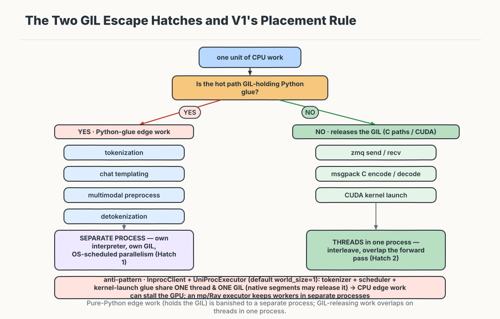</a>

<p class='figure-caption'>The two CPython GIL escape hatches and the placement rule V1 derives from them: pure-Python edge work (holds the GIL) moves to a separate process, while blocking ZMQ I/O and CUDA execution release the GIL; portions of serialization/deserialization can overlap the forward pass on the I/O threads.</p>

V1 keeps that work from serializing the GPU path with two boundaries: a process boundary between the frontend and `EngineCore`, and dedicated I/O threads inside the engine process. The CPython GIL is a major reason for both choices. [Section 2](#2-the-process-map-api-servers-enginecores-and-gpu-workers) maps the processes, [Section 4](#4-the-zmq-transport-request-and-output-sockets) covers their transport, and [Section 6](#6-queues-and-threads-inside-enginecore) follows the queues and owning threads.

### The GIL is the constraint

In CPython a single interpreter-wide mutex serializes the execution of Python bytecode: at most one thread per interpreter runs Python at a time. That has one hard consequence for a serving stack — spawning threads buys you *no* CPU parallelism for pure-Python work, because they take turns under one lock. It also has two escape hatches, and V1 is built on both:

Each OS process has its own interpreter lock, while blocking I/O and native extensions may release that lock within a process. V1 uses both facts: Python-heavy frontend work moves to a separate process, and the engine's socket I/O moves to dedicated threads. Native tokenizer, PyTorch, codec, ZMQ, and CUDA sections may overlap; surrounding Python glue still takes its process's GIL. The source promises overlap for blocking socket calls and some serialization paths, not that every encode/decode instruction is GIL-free.

<a href='images/vllm-03-03-process-split.svg' target='_blank'>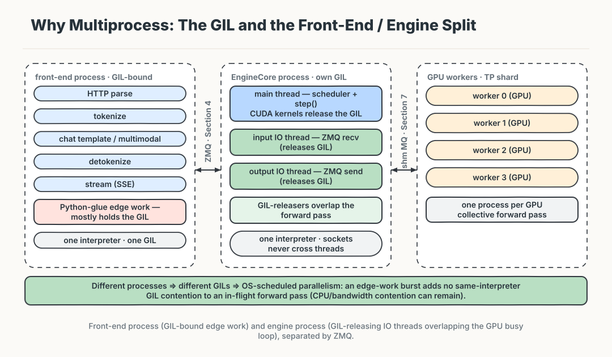</a>

<p class='figure-caption'>Front-end process (GIL-bound edge work) and engine process (GIL-releasing IO threads overlapping the GPU busy loop), separated by ZMQ.</p>

**The engine states the rationale in its own source.**

The clearest statement of the thread-level half of the argument is a comment sitting right where `EngineCoreProc` spawns its background I/O threads.

[`vllm/v1/engine/core.py:974-978`](https://github.com/vllm-project/vllm/blob/6cf7b26bd4bff60bf378e1af14044280ac0d214c/vllm/v1/engine/core.py#L974-L978)

```python
            # Background Threads and Queues for IO. These enable us to
            # overlap ZMQ socket IO with GPU since they release the GIL,
            # and to overlap some serialization/deserialization with the
            # model forward pass.
            # Threads handle Socket <-> Queues and core_busy_loop uses Queue.
```

The constructor ([`core.py:979-1009`](https://github.com/vllm-project/vllm/blob/6cf7b26bd4bff60bf378e1af14044280ac0d214c/vllm/v1/engine/core.py#L979-L1009)) gives the engine a compute thread plus one input and one output IO thread, joined by two `queue.Queue`s ([Section 6](#6-queues-and-threads-inside-enginecore)). Each IO thread owns its ZMQ sockets; the main thread never calls them. Blocking socket work and eligible serialization paths can therefore overlap the forward pass without putting transport on the scheduler's critical path.

For `ADD`, the input thread also runs `preprocess_add_request`: request construction, block hashing, and grammar initialization can begin alongside the forward pass ([`core.py:855-877`](https://github.com/vllm-project/vllm/blob/6cf7b26bd4bff60bf378e1af14044280ac0d214c/vllm/v1/engine/core.py#L855-L877)). Its mutable preprocessing state is confined to that thread. Threads cannot provide the same isolation for Python portions of tokenization, multimodal processing, and detokenization, which is why the frontend is separated at the process level.

### The front-end/engine process split

V1 therefore places the API server and EngineCore in different OS processes. The frontend handles tokenization, multimodal work, detokenization, and streaming while the core process concentrates on scheduling and execution ([V1 blog](https://vllm.ai/blog/2025-01-27-v1-alpha-release); [architecture overview](https://docs.vllm.ai/en/stable/design/arch_overview/)). `AsyncLLM` still uses asyncio concurrency within the frontend process; the process boundary is what removes its Python work from EngineCore's GIL.

Asyncio is itself single-threaded and GIL-bound, so concurrency inside the front-end still does not overlap with the engine; only the process boundary does. The front-end topology (one API server by default, scaling to a many-to-many mesh with data parallelism) is covered by [Section 2](#2-the-process-map-api-servers-enginecores-and-gpu-workers) and article 02.

Crucially, this boundary is a *deployment choice*, not a change to request semantics, because every front-end talks to the engine through one abstract client.

[`vllm/v1/engine/core_client.py:83-105`](https://github.com/vllm-project/vllm/blob/6cf7b26bd4bff60bf378e1af14044280ac0d214c/vllm/v1/engine/core_client.py#L83-L105)

```python
    def make_client(
        multiprocess_mode: bool,
        asyncio_mode: bool,
        vllm_config: VllmConfig,
        executor_class: type[Executor],
        log_stats: bool,
    ) -> "EngineCoreClient":
        # TODO: support this for debugging purposes.
        if asyncio_mode and not multiprocess_mode:
            raise NotImplementedError(
                "Running EngineCore in asyncio without multiprocessing "
                "is not currently supported."
            )

        if multiprocess_mode and asyncio_mode:
            return EngineCoreClient.make_async_mp_client(
                vllm_config, executor_class, log_stats
            )

        if multiprocess_mode and not asyncio_mode:
            return SyncMPClient(vllm_config, executor_class, log_stats)

        return InprocClient(vllm_config, executor_class, log_stats)
```

<a href='images/vllm-03-13-make-client-matrix.svg' target='_blank'>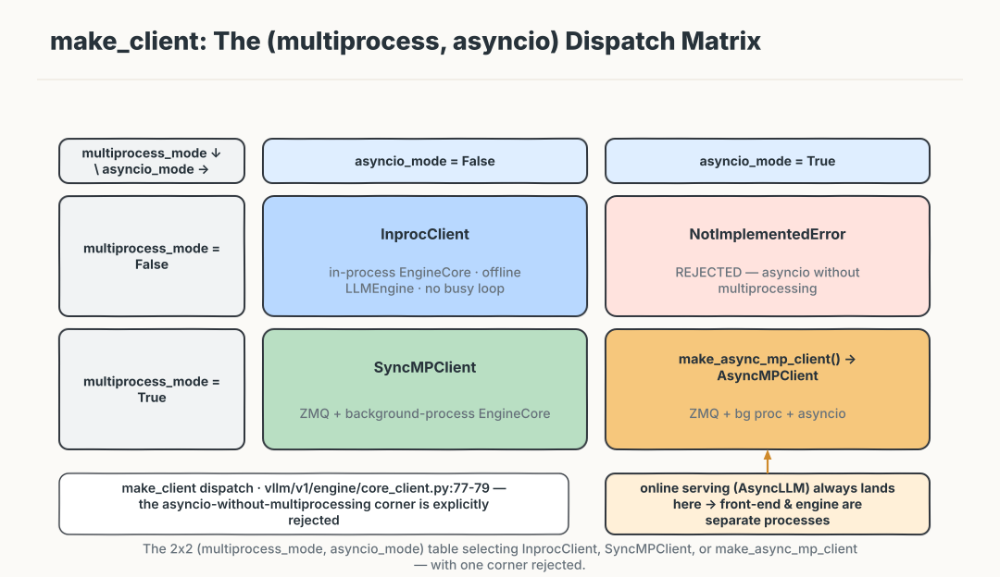</a>

<p class='figure-caption'>make_client's 2x2 dispatch: (multiprocess_mode, asyncio_mode) selects InprocClient, SyncMPClient, or make_async_mp_client — and the asyncio-without-multiprocessing corner is explicitly rejected with NotImplementedError.</p>

Step through the dispatch. Two booleans select the topology. `InprocClient` (the `else`) keeps the engine *in the calling process*. It is the **opt-out**, not the offline default: `LLMEngine.from_engine_args` forces `multiprocess_mode=True` whenever `VLLM_ENABLE_V1_MULTIPROCESSING` is set, and that variable defaults to `1` ([`llm_engine.py:174-176`](https://github.com/vllm-project/vllm/blob/6cf7b26bd4bff60bf378e1af14044280ac0d214c/vllm/v1/engine/llm_engine.py#L174-L176), [`envs.py:1311-1313`](https://github.com/vllm-project/vllm/blob/6cf7b26bd4bff60bf378e1af14044280ac0d214c/vllm/envs.py#L1311-L1313)), so a default `LLM(...)` batch job takes the `SyncMPClient` arm. `InprocClient` is what you get with `VLLM_ENABLE_V1_MULTIPROCESSING=0`.

`SyncMPClient` and the async MP clients reach a background EngineCore over ZMQ; `InprocClient` holds one locally ([`core_client.py:77-79`](https://github.com/vllm-project/vllm/blob/6cf7b26bd4bff60bf378e1af14044280ac0d214c/vllm/v1/engine/core_client.py#L77-L79)). The factory rejects `asyncio_mode and not multiprocess_mode`, so online `AsyncLLM` always separates frontend and core processes.

To see what the split is departing *from*, look at what "in process" concretely means:

[`vllm/v1/engine/core_client.py:286-292`](https://github.com/vllm-project/vllm/blob/6cf7b26bd4bff60bf378e1af14044280ac0d214c/vllm/v1/engine/core_client.py#L286-L292)

```python
    def __init__(self, *args, **kwargs):
        self.engine_core = EngineCore(*args, **kwargs)

    def get_output(self) -> EngineCoreOutputs:
        outputs, model_executed = self.engine_core.step_fn()
        self.engine_core.post_step(model_executed=model_executed)
        return outputs and outputs.get(0) or EngineCoreOutputs()
```

`InprocClient` holds an `EngineCore` object directly. There is no busy loop, no socket, and no thread boundary: `get_output` *drives the engine step itself*, synchronously, on the caller's own thread ([`core_client.py:278-283`](https://github.com/vllm-project/vllm/blob/6cf7b26bd4bff60bf378e1af14044280ac0d214c/vllm/v1/engine/core_client.py#L278-L283) documents this as "no busy loop"). With `InprocClient + UniProcExecutor` (the usual default when `world_size=1`), frontend work, the scheduler, and the Python-side kernel-launch glue all run in the caller's process and share its interpreter GIL (precisely the coupling that lets CPU edge work stall the GPU), though native tokenizer/PyTorch/CUDA sections may release it. If the executor is `mp` or Ray, the workers live in separate processes instead. The multiprocess clients exist to break the frontend coupling.

With EngineCore in its own process, frontend Python work no longer competes for the same interpreter lock. Article 04 follows that core loop; article 09 follows the worker execution it dispatches.

**Making the boundary cheap enough to be the default.**

V1 limits the cost of that boundary by sending incremental batch diffs and using msgpack with large tensors in side frames ([V1 blog](https://vllm.ai/blog/2025-01-27-v1-alpha-release)). The IO threads handle encode/decode, allowing their GIL-releasing portions to overlap execution. Sections 4 and 5 examine the transport and serialization details, including where copies still occur.

## 2. The Process Map: API Servers, EngineCores, and GPU Workers

A V1 deployment uses four OS-process roles: **API servers** for HTTP, tokenization, multimodal input loading, and streaming; **EngineCore** processes for scheduling and KV-cache management; **GPU workers** for model execution; and, in some DP configurations, a **DP coordinator** ([architecture overview](https://docs.vllm.ai/en/stable/design/arch_overview/)). Their counts come from the parallelism configuration. This section maps those roles to their spawn sites and works out the process counts for `--data-parallel-size`, `--tensor-parallel-size`, and `--pipeline-parallel-size`. Article 11 covers the algorithms behind TP, PP, and DP; article 09 covers worker internals; article 02 covers the API server.

### The client abstraction is the topology switch

The front-end never opens a socket to a worker, and it never even names a concrete transport. It holds an `EngineCoreClient`, and the *subclass* of that client is where the process topology is decided. The async factory is the switch:

[`vllm/v1/engine/core_client.py:116-132`](https://github.com/vllm-project/vllm/blob/6cf7b26bd4bff60bf378e1af14044280ac0d214c/vllm/v1/engine/core_client.py#L116-L132)

```python
    ) -> "AsyncMPClient":
        parallel_config = vllm_config.parallel_config
        client_args = (
            vllm_config,
            executor_class,
            log_stats,
            client_addresses,
            client_count,
            client_index,
        )
        if parallel_config.data_parallel_size > 1:
            if parallel_config.data_parallel_external_lb:
                # External load balancer - client per DP rank.
                return DPAsyncMPClient(*client_args)
            # Internal load balancer - client balances to all DP ranks.
            return DPLBAsyncMPClient(*client_args)
        return AsyncMPClient(*client_args)
```

<a href='images/vllm-03-14-async-client-selection.svg' target='_blank'>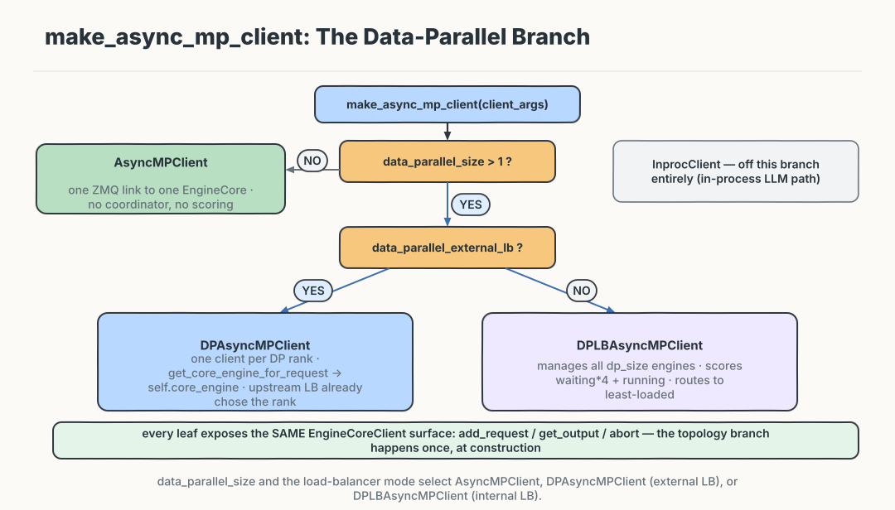</a>

<p class='figure-caption'>The async factory's DP branch: data_parallel_size and the load-balancer mode select AsyncMPClient (DP=1), DPAsyncMPClient (external LB, one client per rank), or DPLBAsyncMPClient (internal LB, scores across all engines).</p>

The async subclasses differ in how many engines they connect to and who balances them. `DP == 1` uses one `AsyncMPClient`. External balancing uses `DPAsyncMPClient`, with routing performed outside vLLM. Internal balancing uses `DPLBAsyncMPClient`, which scores the available engines ([Section 9](#9-data-parallel-and-the-dp-coordinator)). `InprocClient` sits outside the async branch and keeps EngineCore in the caller's process.

Every front-end talks through the identical `EngineCoreClient` surface (`add_request`, `get_output`, `abort`) regardless of whether the engine is in-process, one socket away, or one of many behind a load balancer. The process boundary is a *deployment* decision, not a change to request semantics. Nothing in the API-server code branches on topology; the branch happens once, here, at construction.

### EngineCore: one process per data-parallel rank

The EngineCore is `EngineCoreProc` ([`core.py:896`](https://github.com/vllm-project/vllm/blob/6cf7b26bd4bff60bf378e1af14044280ac0d214c/vllm/v1/engine/core.py#L896)), the multiprocess skin around the synchronous `EngineCore` loop. Its processes are spawned by `CoreEngineProcManager`, and the spawn loop is the concrete statement of "one engine per DP rank":

[`vllm/v1/engine/utils.py:156-171`](https://github.com/vllm-project/vllm/blob/6cf7b26bd4bff60bf378e1af14044280ac0d214c/vllm/v1/engine/utils.py#L156-L171)

```python
        self.processes: list[BaseProcess] = []
        local_dp_ranks = []
        for index in range(local_engine_count):
            local_index = local_start_index + index
            global_index = start_index + index

            # Start EngineCore in background process.
            local_dp_ranks.append(local_index)
            self.processes.append(
                context.Process(
                    target=EngineCoreProc.run_engine_core,
                    name=f"EngineCore_DP{global_index}" if is_dp else "EngineCore",
                    kwargs=common_kwargs
                    | {"dp_rank": global_index, "local_dp_rank": local_index},
                )
            )
```

The manager starts one named `EngineCore_DP{global_index}` process for each local DP rank and passes its global and local rank. Thus DP rank count determines EngineCore process count. `run_engine_core` selects `DPEngineCoreProc` only for MoE wave coordination; dense DP replicas are rewritten as independent DP=1 cores ([`core.py:1188-1200`](https://github.com/vllm-project/vllm/blob/6cf7b26bd4bff60bf378e1af14044280ac0d214c/vllm/v1/engine/core.py#L1188-L1200)).

DP *replicates* the entire engine (scheduler, KV cache, and executor) rather than sharding a single request across ranks. Each replica is a self-contained serving engine; the only thing shared is the front-end that routes to it and (for MoE) the coordinator that keeps their forward passes in lockstep. That replicate-don't-shard property is what makes the process count multiply cleanly against the intra-engine sharding below. The DP algorithm itself (the unfinished-flag all-reduce, EP) is article 11.

### The executor shards each engine into `world_size` workers

One EngineCore owns one executor. `MultiprocExecutor` asserts `world_size = TP · PP · PCP` before device initialization and starts one `VllmWorker-{rank}` process per local rank ([`parallel.py:793-797`](https://github.com/vllm-project/vllm/blob/6cf7b26bd4bff60bf378e1af14044280ac0d214c/vllm/config/parallel.py#L793-L797); [`multiproc_executor.py:117-123`](https://github.com/vllm-project/vllm/blob/6cf7b26bd4bff60bf378e1af14044280ac0d214c/vllm/v1/executor/multiproc_executor.py#L117-L123)). On one node, local and global world sizes match. Workers read scheduler diffs from a shared-memory broadcast queue: ZMQ connects frontend to engine, while shared memory connects that engine to its workers.

<a href='images/vllm-03-01-single-node-tp4.svg' target='_blank'>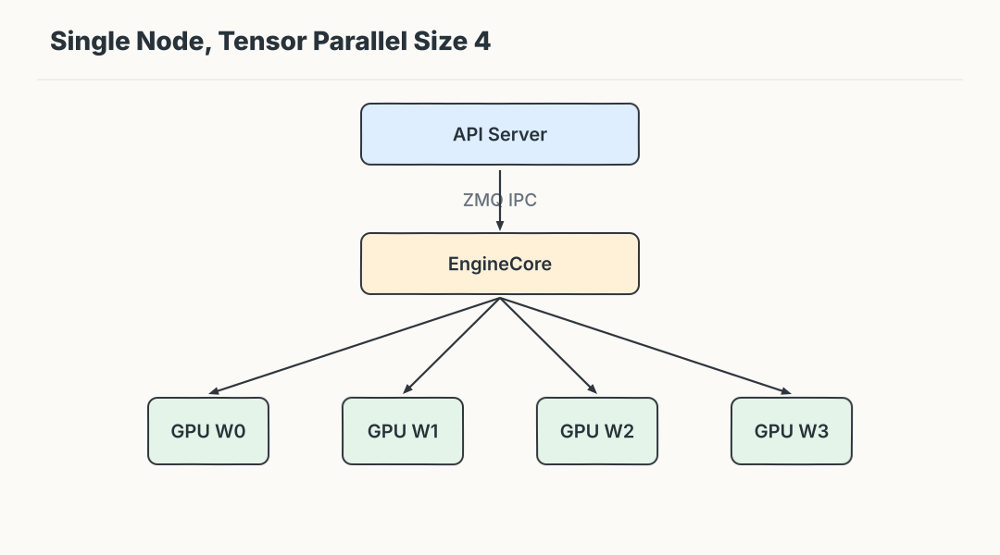</a>

<p class='figure-caption'>Single node, one EngineCore owning a MultiprocExecutor that fans out to four TP worker processes.</p>

`world_size == TP · PP · PCP` is asserted at construction, before any device is touched. A mis-specified shape (say four GPUs requested but a TP/PP product of six) fails as a clean `AssertionError` at launch instead of surviving into `torch.distributed` collective init, where a wrong world size typically manifests as an indefinite NCCL hang that is far harder to diagnose. The worker count is a property of one engine; article 09 covers what those workers then do.

**The DP coordinator: conditional, and exactly one.**

An online DP deployment creates at most one coordinator, on rank 0, when MoE wave coordination or internal/hybrid load statistics require it ([`utils.py:1110-1118`](https://github.com/vllm-project/vllm/blob/6cf7b26bd4bff60bf378e1af14044280ac0d214c/vllm/v1/engine/utils.py#L1110-L1118); [`vllm.py:621-625`](https://github.com/vllm-project/vllm/blob/6cf7b26bd4bff60bf378e1af14044280ac0d214c/vllm/config/vllm.py#L621-L625)). It publishes load snapshots and coordinates MoE waves, but request routing remains client-side. Section 9 covers both control planes; article 11 covers the collective math.

The complete process census, including API-server defaults and the single-GPU `uni` corner, is derived once in [Section 10](#10-dp--tp-together-the-process-count-math).

## 3. EngineCoreProc: The Engine in Its Own Process

`EngineCore` contains the synchronous inference loop: the scheduler, executor, KV management, and the `step()` path from `SchedulerOutput` to `ModelRunnerOutput`. `EngineCoreProc` wraps that loop so it can run in its own OS process and communicate over ZMQ. The distinction is a class boundary, not a mode checked on every step.

`vllm/v1/engine/core.py:L96-L97`

```python
class EngineCore:
    """Inner loop of vLLM's Engine."""
```

`vllm/v1/engine/core.py:L896-L900`

```python
class EngineCoreProc(EngineCore):
    """ZMQ-wrapper for running EngineCore in background process."""

    ENGINE_CORE_DEAD = b"ENGINE_CORE_DEAD"
    addresses: EngineZmqAddresses
```

`EngineCore` itself is process-agnostic. `EngineCoreProc` adds socket addresses, input/output queues between IO threads and the compute loop, and the `ENGINE_CORE_DEAD` sentinel. This section follows process startup and the main loop; Sections 4–6 cover transport and queues, Section 11 the handshake, and Section 12 failure and shutdown.

### The process entrypoint: `run_engine_core`

The client does not construct an `EngineCoreProc` directly. It spawns an OS process whose `main` is a staticmethod. That staticmethod is the actual process boundary — everything above it is the parent, everything below runs on the GPU-owning child.

`vllm/v1/engine/core.py:L1153-L1155`

```python
    @staticmethod
    def run_engine_core(*args, dp_rank: int = 0, local_dp_rank: int = 0, **kwargs):
        """Launch EngineCore busy loop in background process."""
```

Being a `@staticmethod` matters: the parent has no live `EngineCore` to fork — the object is *constructed inside the child*, after the process already exists and has its own CUDA context, so weights and KV caches never traverse a `fork()`. The child first sets a human-readable process title (`EngineCore` or `EngineCore_DP{dp_rank}`, `core.py:L1168-L1171`), then picks which subclass to instantiate:

`vllm/v1/engine/core.py:L1188-L1201`

```python
            parallel_config.data_parallel_index = dp_rank
            if data_parallel and vllm_config.model_config.is_moe:
                # Set data parallel rank for this engine process.
                parallel_config.data_parallel_rank = dp_rank
                engine_core = DPEngineCoreProc(*args, **kwargs)
            else:
                # Non-MoE DP ranks are completely independent, so treat like DP=1.
                # Note that parallel_config.data_parallel_index will still reflect
                # the original DP rank.
                parallel_config.data_parallel_size = 1
                parallel_config.data_parallel_size_local = 1
                parallel_config.data_parallel_rank = 0
                engine_core = EngineCoreProc(*args, engine_index=dp_rank, **kwargs)
```

<a href='images/vllm-03-15-run-engine-core-subclass.svg' target='_blank'>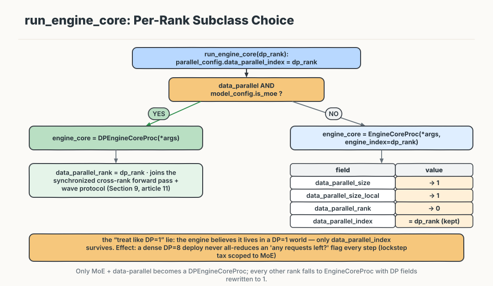</a>

<p class='figure-caption'>run_engine_core's per-rank subclass choice: only MoE + data-parallel becomes a DPEngineCoreProc; every other rank falls to the base EngineCoreProc with data_parallel_size/size_local/rank rewritten to 1 — the "treat like DP=1" lie that scopes the lockstep tax to MoE.</p>

The default manager starts one engine process per DP rank. MoE with active DP selects `DPEngineCoreProc` for synchronized waves; dense DP and single-engine deployments use `EngineCoreProc`. For the dense case, the entry point rewrites the local config to `data_parallel_size=1` and rank 0, making each replica an independent engine. Section 9 covers the coordinator, and article 11 explains why MoE requires lockstep.

The comment is literal: "Non-MoE DP ranks are completely independent." A dense replica runs no cross-rank collective, so only `data_parallel_index` survives to identify it; the per-step lockstep tax is limited to MoE.

The constructor that these lines invoke performs the startup handshake and blocks until the engine is addressable ([Section 11](#11-startup-handshake-and-connection)); once it returns, `run_engine_core` installs SIGTERM/SIGINT handlers ([Section 12](#12-failure-handling-shutdown-and-the-full-topology-trace)) and calls `engine_core.run_busy_loop()`. That call does not return until the process is shutting down.

### The busy loop: a two-phase pump

`run_busy_loop` is the main thread's entire life. It is startlingly short, and its shortness is the point.

`vllm/v1/engine/core.py:L1259-L1267`

```python
    def run_busy_loop(self):
        """Core busy loop of the EngineCore."""
        while self._handle_shutdown():
            # 1) Poll the input queue until there is work to do.
            self._process_input_queue()
            # 2) Step the engine core and return the outputs.
            self._process_engine_step()

        raise SystemExit
```

`_handle_shutdown()` is the loop's state-machine guard, staying true while normal work or a graceful drain remains. Each turn ingests client input, runs one engine step, and queues its outputs. When draining completes, `SystemExit` unwinds through `run_engine_core`, whose `finally` restores signal handlers and calls `engine_core.shutdown()` ([Section 12](#12-failure-handling-shutdown-and-the-full-topology-trace)).

The main thread never touches ZMQ. It consumes `input_queue` and produces `output_queue`; two daemon IO threads own the sockets and marshal wire data on the other side ([Section 6](#6-queues-and-threads-inside-enginecore)). That single-owner design avoids socket locks and lets blocking IO, plus eligible serialization work, overlap the GPU path.

<a href='images/vllm-03-04-busy-loop.svg' target='_blank'>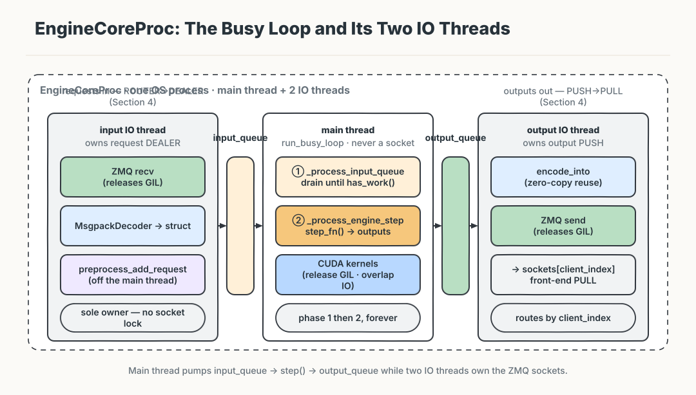</a>

<p class='figure-caption'>Main thread pumps input_queue -> step() -> output_queue while two IO threads own the ZMQ sockets.</p>

**What counts as "work": `has_work` and `step_fn`.**

Phase 1 needs a definition of idleness precise enough to block on. That definition is `has_work`, paired with `is_running` (which reports whether shutdown has been requested):

`vllm/v1/engine/core.py:L1247-L1257`

```python
    def has_work(self) -> bool:
        """Returns true if the engine should be stepped."""
        return (
            self.engines_running
            or self.scheduler.has_requests()
            or bool(self.batch_queue)
        )

    def is_running(self) -> bool:
        """Returns true if shutdown has not been requested."""
        return self.shutdown_state == EngineShutdownState.RUNNING
```

The loop steps for scheduler requests, pipeline microbatches still in `batch_queue`, or a DP wave indicated by `engines_running`. The last case lets an otherwise idle MoE rank join the collective with a dummy forward. With none of these conditions, `_process_input_queue` blocks until client work or a `WAKEUP` sentinel arrives, so an idle base engine does not spin. Sections 7 and 9 cover PP and DP.

Which `step()` the pump calls is bound once, at construction, never re-decided per iteration:

`vllm/v1/engine/core.py:L221-L223`

```python
        self.step_fn = (
            self.step if self.batch_queue is None else self.step_with_batch_queue
        )
```

If there is no PP batch queue, `step_fn` is the plain `self.step`; with PP it is `self.step_with_batch_queue`, which overlaps microbatches across pipeline stages. Binding it once keeps the hot loop free of a per-step branch. Both return the same shape, `(outputs_dict, model_executed)`, so `_process_engine_step` is oblivious to the parallelism mode. The bodies of both are covered in article 04; the scheduler they call is article 05.

**Phase 2: `_process_engine_step`.**

`vllm/v1/engine/core.py:L1300-L1317`

```python
    def _process_engine_step(self) -> bool:
        """Called only when there are unfinished local requests."""

        # Step the engine core.
        outputs, model_executed = self.step_fn()
        # Put EngineCoreOutputs into the output queue.
        for output in outputs.items() if outputs else ():
            self.output_queue.put_nowait(output)
        # Post-step hook.
        self.post_step(model_executed)

        # If no model execution happened but there is still scheduler work
        # (e.g. WAITING_FOR_REMOTE_KVS or delayed KV connector frees), yield
        # the GIL briefly to allow background transfer threads to make progress.
        if not model_executed and self.scheduler.has_requests():
            time.sleep(0.001)

        return model_executed
```

`step_fn()` returns a dict keyed by `client_index` mapping to `EngineCoreOutputs` — one bundle per originating front-end, since a single engine may be multiplexed by several API-server clients ([Section 2](#2-the-process-map-api-servers-enginecores-and-gpu-workers)). Each `(client_index, EngineCoreOutputs)` pair is pushed with `put_nowait` onto `output_queue`; the output IO thread later routes each to the correct client socket by that index ([Section 4](#4-the-zmq-transport-request-and-output-sockets), [Section 6](#6-queues-and-threads-inside-enginecore)). `put_nowait` cannot block because the queue is unbounded — flow control is the loop and the thread, never a queue high-water mark. `post_step` pulls speculative/draft token ids back from the executor when applicable (article 04).

The final branch is a deliberate, tiny concession. When the model did *not* run this step (`model_executed` is false) but the scheduler still holds requests — the canonical case is sequences parked in `WAITING_FOR_REMOTE_KVS` awaiting a disaggregated-prefill KV transfer, or delayed KV-connector frees — the loop would otherwise spin `has_work() → _process_engine_step → no-op` at full CPU. The `time.sleep(0.001)` yields the GIL for a millisecond so the background transfer threads (which need it) can advance. Progress-without-model-execution never becomes a hot spin that starves the very threads it is waiting on, and, restating the loop's core rule, every `EngineCoreOutputs` a step produces reaches `output_queue` *before* the loop iterates, and the compute thread still never writes a socket.

### Stopping: the shutdown state machine

The loop guard, `_handle_shutdown`, reads a three-valued state, not a boolean:

`vllm/v1/engine/core.py:L890-L893`

```python
class EngineShutdownState(IntEnum):
    RUNNING = 0
    REQUESTED = 1
    SHUTTING_DOWN = 2
```

<a href='images/vllm-03-16-shutdown-state-machine.svg' target='_blank'>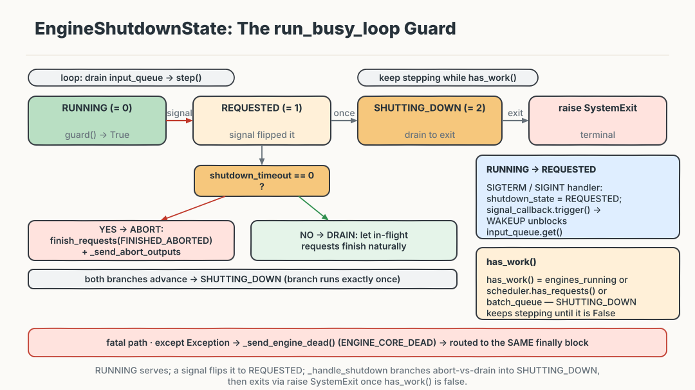</a>

<p class='figure-caption'>The EngineShutdownState machine behind run_busy_loop's guard: RUNNING keeps serving; a signal flips it to REQUESTED; _handle_shutdown branches on shutdown_timeout (abort vs drain) into SHUTTING_DOWN, then exits via raise SystemExit once has_work() is false.</p>

The transition into `REQUESTED` happens off the loop entirely, in the signal handler installed by `run_engine_core`:

`vllm/v1/engine/core.py:L1218-L1224`

```python
                engine_core.shutdown_state = EngineShutdownState.REQUESTED
                signal_callback.trigger()

            signal.signal(signal.SIGTERM, signal_handler)
            signal.signal(signal.SIGINT, signal_handler)

            engine_core.run_busy_loop()
```

A SIGTERM/SIGINT handler does two cheap, async-signal-safe things — flip `shutdown_state` to `REQUESTED` and call `signal_callback.trigger()`. It pointedly does **not** enqueue directly onto `input_queue`; the comment at `core.py:L1205-L1207` warns the handler could interrupt the main thread while it holds the non-reentrant `input_queue.mutex`, so a re-entrant `put_nowait` would deadlock. Instead `SignalCallback` defers the real `WAKEUP` enqueue to a safe context, unblocking the loop's idle `input_queue.get()` so it re-reads the state ([Section 6](#6-queues-and-threads-inside-enginecore)). On the next guard evaluation, `_handle_shutdown` sees `REQUESTED`, advances to `SHUTTING_DOWN`, and, per `vllm_config.shutdown_timeout`, either aborts all in-flight requests immediately (`timeout == 0`) or drains them to natural completion (nonzero), the full body covered in [Section 12](#12-failure-handling-shutdown-and-the-full-topology-trace). Either way it keeps returning `True` until `has_work()` is false, then returns `False`, and the loop reaches `raise SystemExit`.

## 4. The ZMQ Transport: Request and Output Sockets

vLLM V1 connects API servers and engine cores with ZeroMQ. The architecture docs describe a many-to-many mesh in which any API server can route a request to an engine core ([architecture overview](https://docs.vllm.ai/en/stable/design/arch_overview/)); the V1 blog explains how the split lets API-server CPU work overlap the `AsyncLLM`/EngineCore loop ([V1 blog](https://vllm.ai/blog/2025-01-27-v1-alpha-release)). Here we follow the sockets and framing for one client-engine pair. [Section 9](#9-data-parallel-and-the-dp-coordinator) handles DP routing, and [Section 5](#5-serialization-msgpack-across-the-process-boundary) handles the msgpack payload.

Every API-server client ↔ EngineCore pair is joined by **two** dedicated ZMQ links, deliberately asymmetric:

| Link | Client side | Engine side | Direction | Framing |
|------|-------------|-------------|-----------|---------|
| **Requests** | `input_socket` = `ROUTER`, **bind** | `DEALER`, **connect**, identity = dp_rank LE | client → engine | `[engine_identity, req_type_byte, *payload]` |
| **Outputs** | `output_socket` = `PULL`, **bind** | `PUSH`, **connect** | engine → client | `[*payload]` (no identity; `client_index` inside payload) |

The links are intentionally asymmetric. Requests are addressable because the client must select an engine identity. Outputs use a PUSH→PULL fan-in, with the destination client encoded in the payload.

<a href='images/vllm-03-05-zmq-channels.svg' target='_blank'>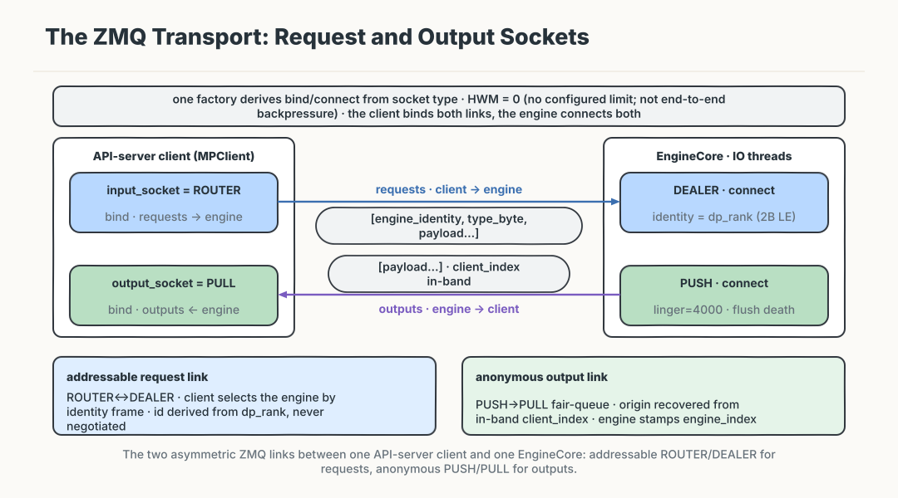</a>

<p class='figure-caption'>The two asymmetric ZMQ links between one API-server client and one EngineCore: addressable ROUTER/DEALER for requests, anonymous PUSH/PULL for outputs.</p>

### One factory decides bind vs. connect

Bind/connect polarity is not chosen ad hoc at each call site; it is derived from the socket *type* by a single helper, which also sets the high-water marks to 0, so the socket does not apply backpressure or drop a message *because a configured HWM threshold was reached* — not a general guarantee against routing loss, peer failure, or shutdown.

Source anchor: [`vllm/utils/network_utils.py:307-316`](https://github.com/vllm-project/vllm/blob/6cf7b26bd4bff60bf378e1af14044280ac0d214c/vllm/utils/network_utils.py#L307-L316).

```python
# vllm/utils/network_utils.py:307-316
    if bind is None:
        bind = socket_type not in (zmq.PUSH, zmq.SUB, zmq.XSUB)

    if socket_type in (zmq.PULL, zmq.DEALER, zmq.ROUTER):
        socket.setsockopt(zmq.RCVHWM, 0)
        socket.setsockopt(zmq.RCVBUF, buf_size)

    if socket_type in (zmq.PUSH, zmq.DEALER, zmq.ROUTER):
        socket.setsockopt(zmq.SNDHWM, 0)
        socket.setsockopt(zmq.SNDBUF, buf_size)
```

- `bind is None` ⇒ derive from type: PUSH/SUB/XSUB *connect*, everything else (PULL/ROUTER/DEALER/PAIR/XPUB) *binds*. Applied to our two links, the client's ROUTER and PULL both bind, so **the client is the stable rendezvous endpoint for both links**; the engine's PUSH auto-connects, and its DEALER, which would default to bind, is forced with an explicit `bind=False` at the call site (below). Engines are therefore always the dynamic connectors, which is why they, not the client, must learn the possibly-kernel-assigned port during startup ([Section 11](#11-startup-handshake-and-connection)).
- `RCVHWM`/`SNDHWM = 0` in both directions of PULL/DEALER/ROUTER (and the send side of PUSH) means **no configured high-water-mark**: ZMQ will not drop a message or block the sender at a threshold of its own. That removes one specific back-pressure mechanism; it is not a promise that a send never waits — memory limits, OS socket buffers, a dead peer, or shutdown can still stall or fail a transfer. This is a deliberate hand-off of flow control — the EngineCore busy loop ([Section 3](#3-enginecoreproc-the-engine-in-its-own-process), article 04) and the output IO thread ([Section 6](#6-queues-and-threads-inside-enginecore)) are the real backpressure, not the socket buffer.

**Exactly one side binds per link, deterministically, and no request or output is silently dropped by a configured high-water-mark limit.** A misconfigured double-bind race is impossible because the polarity is a pure function of socket type; and with HWM at 0 no high-water cap is set, so the socket does not drop or block to enforce one — a bound on socket-level backpressure, not a proof of infinite memory, a peer that never fails, or end-to-end delivery.

### The request link: ROUTER ↔ DEALER, addressed by dp_rank

The client fans out to N engines over one ROUTER; it selects the target engine by a ZMQ *identity* frame. Each engine's identity is its data-parallel rank encoded as two little-endian bytes — a stable, collision-free address computed independently on both sides.

Source anchor: [`vllm/v1/engine/core.py:922`](https://github.com/vllm-project/vllm/blob/6cf7b26bd4bff60bf378e1af14044280ac0d214c/vllm/v1/engine/core.py#L922) (identity) and [`vllm/v1/engine/core.py:1499-1507`](https://github.com/vllm-project/vllm/blob/6cf7b26bd4bff60bf378e1af14044280ac0d214c/vllm/v1/engine/core.py#L1499-L1507) (the DEALER).

```python
# vllm/v1/engine/core.py:922
        identity = self.engine_index.to_bytes(length=2, byteorder="little")
```

```python
# vllm/v1/engine/core.py:1499-1507
        with ExitStack() as stack, zmq.Context() as ctx:
            input_sockets = [
                stack.enter_context(
                    make_zmq_socket(
                        ctx, input_address, zmq.DEALER, identity=identity, bind=False
                    )
                )
                for input_address in input_addresses
            ]
```

- The engine builds one DEALER per API-server client (`input_addresses` is a list — one address per front-end, the fan-in side of the many-to-many mesh), each preset with `identity=identity` and `bind=False`. The `bind=False` overrides the factory default (DEALER would otherwise bind), making the engine the connector.
- The identity is `engine_index.to_bytes(2, "little")`. The client reconstructs the *same* bytes with `rank.to_bytes(2, "little")` when it enumerates the engines it manages ([`core_client.py:596-635`](https://github.com/vllm-project/vllm/blob/6cf7b26bd4bff60bf378e1af14044280ac0d214c/vllm/v1/engine/core_client.py#L596-L635), read in [Section 11](#11-startup-handshake-and-connection)), so the two processes agree on the address without ever exchanging it — it is derived, not negotiated. `to_bytes(2, …)` caps a deployment at 65 536 DP ranks, far beyond any real topology.

The request-type frame that rides alongside the identity is a raw byte, not a serialized field:

Source anchor: [`vllm/v1/engine/__init__.py:251-264`](https://github.com/vllm-project/vllm/blob/6cf7b26bd4bff60bf378e1af14044280ac0d214c/vllm/v1/engine/__init__.py#L251-L264).

```python
# vllm/v1/engine/__init__.py:251-264
class EngineCoreRequestType(enum.Enum):
    """
    Request types defined as hex byte strings, so it can be sent over sockets
    without separate encoding step.
    """

    ADD = b"\x00"
    ABORT = b"\x01"
    START_DP_WAVE = b"\x02"
    UTILITY = b"\x03"
    # Sentinel used within EngineCoreProc.
    EXECUTOR_FAILED = b"\x04"
    # Sentinel to wake up input_queue.get() during shutdown.
    WAKEUP = b"\x05"
```

<a href='images/vllm-03-18-request-type-bytes.svg' target='_blank'>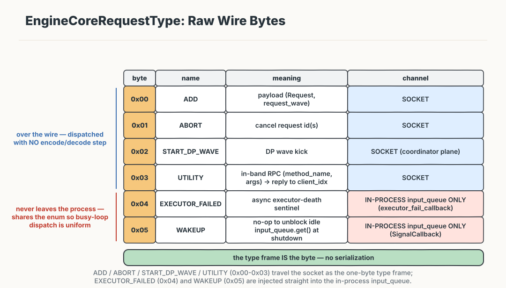</a>

<p class='figure-caption'>EngineCoreRequestType as raw wire bytes: ADD/ABORT/START_DP_WAVE/UTILITY (0x00-0x03) travel the socket as the one-byte type frame; EXECUTOR_FAILED (0x04) and WAKEUP (0x05) share the enum but are injected straight into the in-process input_queue, never sent.</p>

The enum values are the wire bytes: the type frame is one byte, dispatched with no encode/decode step (the docstring says so). `EXECUTOR_FAILED` and `WAKEUP` never travel over the socket — they are injected directly into the engine's in-process `input_queue` ([Section 6](#6-queues-and-threads-inside-enginecore)) — but they share the enum so the busy loop's dispatch is uniform.

Putting the identity and the type byte in front of the payload, the client's send is a three-part-minimum multipart message:

Source anchor: [`vllm/v1/engine/core_client.py:861-873`](https://github.com/vllm-project/vllm/blob/6cf7b26bd4bff60bf378e1af14044280ac0d214c/vllm/v1/engine/core_client.py#L861-L873).

```python
# vllm/v1/engine/core_client.py:861-873
    def _send_input(self, request_type: EngineCoreRequestType, request: Any):
        self.ensure_alive()
        self.free_pending_messages()
        # (Identity, RequestType, SerializedRequest)
        msg = (self.core_engine, request_type.value, *self.encoder.encode(request))

        if len(msg) <= 3:
            # No auxiliary buffers => no tensor backing buffers in request.
            self.input_socket.send_multipart(msg, copy=False)
            return

        tracker = self.input_socket.send_multipart(msg, copy=False, track=True)
        self.add_pending_message(tracker, request)
```

- Frame 0 is `self.core_engine` — the destination engine's identity, the routing key the ROUTER consumes to pick the DEALER. In non-DP this is fixed (`core_engine`); in DP it is `get_core_engine_for_request(...)` ([Section 9](#9-data-parallel-and-the-dp-coordinator)). Frame 1 is `request_type.value` (the raw byte). Frames 2… are the msgpack body plus any memoryview-backed tensor side-frames appended by `encoder.encode` ([Section 5](#5-serialization-msgpack-across-the-process-boundary)).
- `copy=False` asks PyZMQ to transmit from the encoder-owned buffers without first making another Python/PyZMQ payload copy; it is not a promise that libzmq, the OS, or the receiving side performs no copies. Avoiding that sender-side copy creates a lifetime hazard (the buffers may still be in flight after `send_multipart` returns), so the code splits on `len(msg) <= 3`. Three frames means `[identity, type, one-payload-frame]` with no out-of-band tensor buffers, so no tracking is needed. More than three frames means tensor backing buffers were extracted, so the send returns a `MessageTracker` and the request object is parked in `pending_messages` ([`core_client.py:674-680`](https://github.com/vllm-project/vllm/blob/6cf7b26bd4bff60bf378e1af14044280ac0d214c/vllm/v1/engine/core_client.py#L674-L680)) until ZMQ reports the tracker `done`; `free_pending_messages` reaps completed ones lazily on the next send. This is the request-side mirror of the engine's output `pending` deque ([Section 12](#12-failure-handling-shutdown-and-the-full-topology-trace)) and is why the msgpack encoder is confined to one thread ([Section 5](#5-serialization-msgpack-across-the-process-boundary)): its aux-buffer state is per-call and not thread-safe.

On the far side, the DEALER *strips* the identity frame (the ROUTER↔DEALER envelope is handled by ZMQ), so the engine's input thread sees only `[type_frame, *data_frames]`, reads the one type byte, decodes, and pushes onto the in-process queue ([`core.py:1556-1587`](https://github.com/vllm-project/vllm/blob/6cf7b26bd4bff60bf378e1af14044280ac0d214c/vllm/v1/engine/core.py#L1556-L1587), covered in [Section 6](#6-queues-and-threads-inside-enginecore)).

The identity frame is therefore the request link's sole routing mechanism; it is derived, not negotiated. A wrong or absent frame 0 would misroute or drop; because both sides compute the identity from the same dp_rank, they cannot disagree. And because the DEALER carries its identity into the very first frame it sends (the ready payload, [Section 11](#11-startup-handshake-and-connection)), the client's ROUTER learns the address before it ever needs to route to it.

### The output link: PUSH → PULL, addressed from inside the payload

The return path is a fan-in. The engine PUSHes, the client PULLs, and there is *no* identity frame — a PULL socket fair-queues and cannot be addressed by the pusher. So when one engine serves multiple front-end clients, it recovers the destination from a `client_index` field carried *inside* the decoded output, and tags each batch with its own `engine_index` so a multi-engine client can attribute replies.

Source anchor: [`vllm/v1/engine/core.py:1623-1648`](https://github.com/vllm-project/vllm/blob/6cf7b26bd4bff60bf378e1af14044280ac0d214c/vllm/v1/engine/core.py#L1623-L1648).

```python
# vllm/v1/engine/core.py:1623-1648
            while True:
                output = self.output_queue.get()
                if output == EngineCoreProc.ENGINE_CORE_DEAD:
                    for socket in sockets:
                        socket.send(output)
                    break
                assert not isinstance(output, bytes)
                client_index, outputs = output
                outputs.engine_index = engine_index

                if client_index == -1:
                    # Don't reuse buffer for coordinator message
                    # which will be very small.
                    assert coord_socket is not None
                    coord_socket.send_multipart(encoder.encode(outputs))
                    continue

                # Reclaim buffers that zmq is finished with.
                while pending and pending[-1][0].done:
                    reuse_buffers.append(pending.pop()[2])

                buffer = reuse_buffers.pop() if reuse_buffers else bytearray()
                buffers = encoder.encode_into(outputs, buffer)
                tracker = sockets[client_index].send_multipart(
                    buffers, copy=False, track=True
                )
```

<a href='images/vllm-03-17-link-frame-asymmetry.svg' target='_blank'>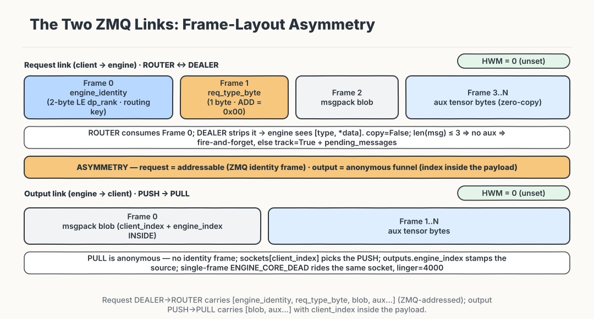</a>

<p class='figure-caption'>The two ZMQ links' frame layouts side by side: the request DEALER-to-ROUTER carries [engine_identity, req_type_byte, msgpack_blob, aux1..N] (ZMQ-addressed), while the output PUSH-to-PULL carries [msgpack_blob, aux1..N] with the destination client_index inside the payload (application-addressed).</p>

- The engine's output IO thread holds a list of PUSH sockets, one per API-server client, built with `make_zmq_socket(ctx, output_path, zmq.PUSH, linger=4000)` ([`core.py:1608`](https://github.com/vllm-project/vllm/blob/6cf7b26bd4bff60bf378e1af14044280ac0d214c/vllm/v1/engine/core.py#L1608)). Each work item pulled off the in-process `output_queue` is a `(client_index, outputs)` tuple; `sockets[client_index]` selects which client's PUSH gets the batch. This is the exact dual of the request link: request routing uses a ZMQ *identity frame* (client→engine), output routing uses an in-payload *`client_index`* (engine→client), because PUSH/PULL is anonymous by construction.
- `client_index == -1` is the reserved coordinator channel: the batch goes to the DP coordinator's PULL instead ([Section 9](#9-data-parallel-and-the-dp-coordinator)), and skips the buffer-reuse path because coordinator messages are tiny.
- `outputs.engine_index = engine_index` stamps the source engine onto every batch, so a DP client that pulls from many engines over one PULL can still tell them apart.
- The same sender-side copy-avoidance discipline as the request path: `encode_into` reuses a pooled `bytearray`, `copy=False` avoids an extra PyZMQ-side payload copy, `track=True` returns a tracker, and finished buffers are reclaimed into `reuse_buffers` before the next send. The `pending` deque holds `(tracker, ref, buffer)` so neither the outputs object nor its backing buffer is freed while ZMQ is still transmitting.

The `linger=4000` on the PUSH sockets gives a queued `ENGINE_CORE_DEAD` frame up to four seconds to flush before close; it improves delivery on the covered, still-routable crash path but cannot guarantee delivery to a disconnected or unroutable peer. If the client receives that one-frame sentinel, its drain loop checks it *before* attempting to decode that frame and raises a well-typed `EngineDeadError` ([`core_client.py:454-457`](https://github.com/vllm-project/vllm/blob/6cf7b26bd4bff60bf378e1af14044280ac0d214c/vllm/v1/engine/core_client.py#L454-L457); covered in [Section 12](#12-failure-handling-shutdown-and-the-full-topology-trace)).

In practice, **replies land at the originating API-server client even though the PUSH/PULL link is anonymous, and an engine-death sentinel is recognized before the receiver attempts to msgpack-decode that sentinel frame.** This says nothing about whether valid partial token outputs were delivered earlier. The request link is addressed by ZMQ; the output link is addressed by the application. Both are exactly-one-owner sockets — each is created inside and touched only by its owning IO thread ([Section 6](#6-queues-and-threads-inside-enginecore)), which is what lets these copy-avoiding buffer pools be lock-free.

## 5. Serialization: Msgpack Across the Process Boundary

The sockets carry structured objects: `EngineCoreRequest` on the way in and `EngineCoreOutputs` on the way out. Those structs may contain `torch.Tensor` or `np.ndarray` fields such as prompt embeddings, pooling outputs, logprob tensors, routed experts, and multimodal kwargs. `vllm/v1/serial_utils.py` turns them into ZMQ frames without first folding large tensor payloads into the msgpack blob and, under the default configuration, without using pickle. The transport stack may still copy bytes after PyZMQ accepts the buffers. `msgspec.msgpack` provides typed serialization but cannot represent tensors directly; a naive custom encoder would also copy tensor bytes into the main payload. The side-frame design avoids that initial copy.

### The wire model: one blob plus side frames

The module layers three tricks on plain msgspec ([`serial_utils.py:41-54`](https://github.com/vllm-project/vllm/blob/6cf7b26bd4bff60bf378e1af14044280ac0d214c/vllm/v1/serial_utils.py#L41-L54) defines the vocabulary). (1) **Direct side buffers for big tensors**: the raw backing memory is *not* copied into the msgpack blob; a small integer index is inlined instead, and the raw `memoryview` is appended to a side list. The encoder returns a *list of buffers*, and ZMQ ships them as one multipart message — frame 0 is the msgpack blob, frames `1..N` are tensor bytes. (2) **Inline for small tensors**: below a byte threshold the raw bytes ride *inside* blob 0 as a msgpack `Ext` carrying a custom type code; the decoder clones that inline data. (3) **Out-of-band (OOB) for shared-memory tensors**: an optional consumer can claim a tensor, ship it via a `torch.multiprocessing.Queue`, and leave only a placeholder dict in the blob. The three custom `Ext` type codes are a closed set — `CUSTOM_TYPE_PICKLE = 1`, `CUSTOM_TYPE_CLOUDPICKLE = 2`, `CUSTOM_TYPE_RAW_VIEW = 3` — and only code 3 is reachable in secure mode.

The frame layout is set up in `encode`:

[`vllm/v1/serial_utils.py:166-178`](https://github.com/vllm-project/vllm/blob/6cf7b26bd4bff60bf378e1af14044280ac0d214c/vllm/v1/serial_utils.py#L166-L178)

```python
    def encode(self, obj: Any) -> Sequence[bytestr]:
        try:
            if self.oob_tensor_consumer is not None:
                self.oob_tensor_consumer.new_message()
            self.aux_buffers = bufs = [b""]
            bufs[0] = self.encoder.encode(obj)
            # This `bufs` list allows us to collect direct pointers to backing
            # buffers of tensors and np arrays, and return them along with the
            # top-level encoded buffer instead of copying their data into the
            # new buffer.
            return bufs
        finally:
            self.aux_buffers = None
```

`aux_buffers` is seeded as `[b""]` — index 0 is a **placeholder** reserved for the blob. Then `self.encoder.encode(obj)` runs the whole msgspec pass; while it runs, any tensor that needs a side frame calls `self.aux_buffers.append(...)` and records its position. Because slot 0 is reserved, tensor indices start at 1, and *frame 0 is always the msgpack blob*. Only after encoding finishes is `bufs[0]` overwritten with the real blob. The result is `[msgpack_blob, tensor0_bytes, tensor1_bytes, ...]`. `encode_into` (`:180-189`) is the same protocol except frame 0 is a caller-supplied reusable `bytearray` — that is the buffer-pooling path the EngineCore output thread uses to amortize frame-0 allocation across steps ([Section 6](#6-queues-and-threads-inside-enginecore)).

The `aux_buffers` stash is a deliberate hack. msgspec's `enc_hook(obj)` gives the hook only the object, no encoder context, so the growing side-buffer list lives as *instance state* for the duration of one `encode()` call. That is precisely why the class docstring says the encoder is "generally not thread-safe when encoding tensors / numpy arrays" ([`serial_utils.py:139-140`](https://github.com/vllm-project/vllm/blob/6cf7b26bd4bff60bf378e1af14044280ac0d214c/vllm/v1/serial_utils.py#L139-L140)): two concurrent encodes would trample each other's `aux_buffers`. This is not a limitation to work around — it is *why* each encoder and decoder is confined to exactly one owning IO thread ([Section 6](#6-queues-and-threads-inside-enginecore)). The `finally: self.aux_buffers = None` guarantees no cross-call leakage even on an encode exception.

<a href='images/vllm-03-06-msgpack.svg' target='_blank'>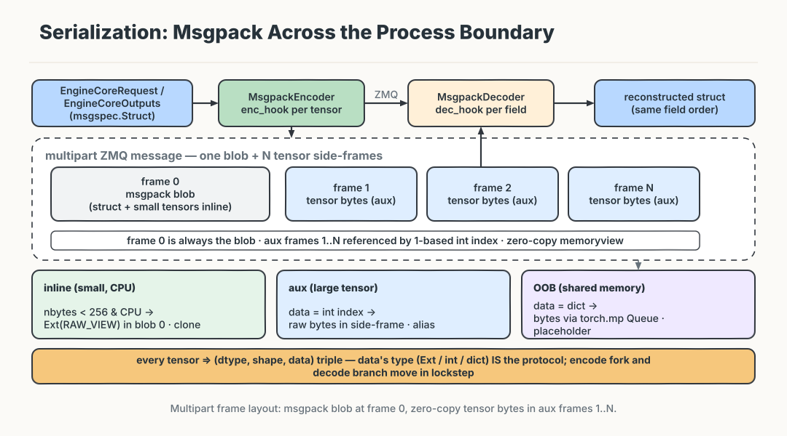</a>

<p class='figure-caption'>Multipart frame layout: msgpack blob at frame 0, with memoryview-backed tensor payloads in aux frames 1..N; copy=False avoids an extra PyZMQ-side payload copy, not every copy in the transport stack.</p>

**A tensor is always a `(dtype, shape, data)` triple.**

The per-tensor decision (inline, aux, or OOB) is made in `_encode_tensor`:

[`vllm/v1/serial_utils.py:257-273`](https://github.com/vllm-project/vllm/blob/6cf7b26bd4bff60bf378e1af14044280ac0d214c/vllm/v1/serial_utils.py#L257-L273)

```python
    def _encode_tensor(
        self, obj: torch.Tensor
    ) -> tuple[str, tuple[int, ...], int | dict | memoryview]:
        oob_consumer = self.oob_tensor_consumer
        # view the tensor as a contiguous 1D array of bytes
        if obj.nbytes < self.size_threshold and obj.is_cpu:
            # Smaller tensors are encoded inline, just like ndarrays.
            data = msgpack.Ext(CUSTOM_TYPE_RAW_VIEW, tensor_data(obj))
        elif oob_consumer is not None and (data := oob_consumer(obj)) is not None:
            assert isinstance(data, dict)
        else:
            # Otherwise encode index of backing buffer to avoid copy.
            assert self.aux_buffers is not None
            data = len(self.aux_buffers)
            self.aux_buffers.append(tensor_data(obj))
        dtype = str(obj.dtype).removeprefix("torch.")
        return dtype, obj.shape, data
```

<a href='images/vllm-03-19-tensor-encode-decode-fork.svg' target='_blank'>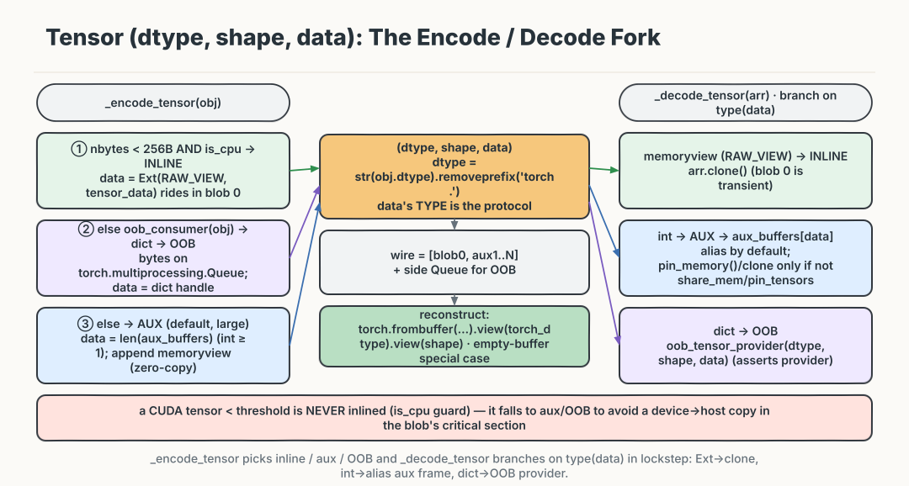</a>

<p class='figure-caption'>The per-tensor (dtype, shape, data) triple and its polymorphic data field: _encode_tensor picks inline / aux / OOB, and _decode_tensor branches on type(data) in lockstep — Ext(RAW_VIEW) clones, int aliases the aux frame, dict routes to the OOB provider.</p>

Every tensor becomes a **3-tuple `(dtype, shape, data)`** where `data` is polymorphic, and that polymorphism *is* the protocol: `data` is a `msgpack.Ext(RAW_VIEW, bytes)` for the inline case, an `int` (≥1) index for the aux case, or a `dict` for OOB. There are three cases:

1. **Inline** fires only when `obj.nbytes < self.size_threshold` **and** `obj.is_cpu`. `tensor_data(obj)` ([`vllm/v1/utils.py:766-776`](https://github.com/vllm-project/vllm/blob/6cf7b26bd4bff60bf378e1af14044280ac0d214c/vllm/v1/utils.py#L766-L776)) returns a uint8 memoryview via `tensor.flatten().cpu().contiguous().view(torch.uint8).numpy().data`. The `is_cpu` guard is load-bearing: a small CUDA tensor is *never* inlined, because inlining would force a device→host copy inside the msgpack blob's critical section — it falls through to OOB or aux instead.
2. **OOB** fires only if a consumer exists and returns a non-`None` dict; the walrus both calls and captures. Those bytes never enter the blob or `aux_buffers` — they travel on the side queue, and the dict is just the addressing handle.
3. **Aux** (the default for large tensors) captures `data = len(self.aux_buffers)` *before* the append, so the recorded index equals the new element's position; then the memoryview (not a copy) is appended.

The threshold defaults to `256` bytes — `VLLM_MSGPACK_ZERO_COPY_THRESHOLD: int = 256` ([`vllm/envs.py:204`](https://github.com/vllm-project/vllm/blob/6cf7b26bd4bff60bf378e1af14044280ac0d214c/vllm/envs.py#L204)) — and the docstring is explicit that "this is a per-tensor limit" ([`serial_utils.py:143`](https://github.com/vllm-project/vllm/blob/6cf7b26bd4bff60bf378e1af14044280ac0d214c/vllm/v1/serial_utils.py#L143)), not a per-message aggregate. `dtype = str(obj.dtype).removeprefix("torch.")` produces a bare attribute name like `"bfloat16"` so the decoder can `getattr(torch, dtype)`; note the asymmetry that `_encode_ndarray` (`:255`) instead stores numpy's `obj.dtype.str` typestr.

**The decode side mirrors the encode fork exactly.**

[`vllm/v1/serial_utils.py:399-425`](https://github.com/vllm-project/vllm/blob/6cf7b26bd4bff60bf378e1af14044280ac0d214c/vllm/v1/serial_utils.py#L399-L425)

```python
    def _decode_tensor(self, arr: Any) -> torch.Tensor:
        dtype, shape, data = arr
        if isinstance(data, dict):
            assert self.oob_tensor_provider, (
                "Received OOB tensor but tensor provider is not set"
            )
            return self.oob_tensor_provider(dtype, shape, data)

        is_aux = isinstance(data, int)
        buffer = self.aux_buffers[data] if is_aux else data
        buffer = buffer if isinstance(buffer, memoryview) else memoryview(buffer)
        torch_dtype = getattr(torch, dtype)
        assert isinstance(torch_dtype, torch.dtype)
        if not buffer.nbytes:  # torch.frombuffer doesn't like empty buffers
            assert 0 in shape
            return torch.empty(shape, dtype=torch_dtype)
        # Create uint8 array
        arr = torch.frombuffer(buffer, dtype=torch.uint8)
        # Clone ensures tensor is backed by pytorch-owned memory for safe
        # future async CPU->GPU transfer.
        # Pin larger tensors for more efficient CPU->GPU transfer.
        if not is_aux:
            arr = arr.clone()
        elif not self.share_mem:
            arr = arr.pin_memory() if self.pin_tensors else arr.clone()
        # Convert back to proper shape & type
        return arr.view(torch_dtype).view(shape)
```

The decoder branches purely on `type(data)`, in lockstep with the encoder's three cases. `dict` → OOB provider (and it *asserts* the provider exists — a dict with no provider is a hard fail, not silent corruption). `int` → `self.aux_buffers[data]`, which is the received ZMQ frame at that index. `memoryview` (the `RAW_VIEW` Ext bytes) → inline. The reconstruction is `torch.frombuffer(...).view(torch_dtype).view(shape)`, with an empty-tensor special case because `torch.frombuffer` rejects zero-length buffers. The clone policy is the subtle part and it protects lifetime: **inline tensors are always cloned** (`if not is_aux: arr = arr.clone()`) because their bytes live in blob 0, which is transient and not held past decode; **aux tensors alias the received frame by default** (no copy) and only copy under `share_mem=False`. Aliasing is why the `_decode_ndarray` comment warns the array "now locks the whole received message buffer in memory" (`:391-392`) — a decoded aux tensor holds the entire multipart frame alive for its lifetime.

The typed target drives all of this. `decode` stashes the multipart frames as `aux_buffers` and decodes `bufs[0]`; msgspec, knowing the declared field type of e.g. `EngineCoreRequest.prompt_embeds: torch.Tensor | None`, calls `dec_hook(torch.Tensor, triple)` → `_decode_tensor`. The field's *declared* type, not the runtime value, selects the reconstruction path.

### The security gate

Custom `Ext` codes are resolved in `ext_hook`, which is the receive-side half of the security boundary:

[`vllm/v1/serial_utils.py:473-483`](https://github.com/vllm-project/vllm/blob/6cf7b26bd4bff60bf378e1af14044280ac0d214c/vllm/v1/serial_utils.py#L473-L483)

```python
    def ext_hook(self, code: int, data: memoryview) -> Any:
        if code == CUSTOM_TYPE_RAW_VIEW:
            return data

        if envs.VLLM_ALLOW_INSECURE_SERIALIZATION:
            if code == CUSTOM_TYPE_PICKLE:
                return pickle.loads(data)
            if code == CUSTOM_TYPE_CLOUDPICKLE:
                return cloudpickle.loads(data)

        raise NotImplementedError(f"Extension type code {code} is not supported")
```

`RAW_VIEW` returns the memoryview verbatim (no copy). Pickle and cloudpickle are gated behind `VLLM_ALLOW_INSECURE_SERIALIZATION` (default `False`, [`envs.py:205`](https://github.com/vllm-project/vllm/blob/6cf7b26bd4bff60bf378e1af14044280ac0d214c/vllm/envs.py#L205)) on the *decode* side, mirroring the same gate on the encode side (`enc_hook` raises `TypeError` at `:221-222` for any unenumerated type unless the flag is set). The consequence is strong: in the default configuration, a maliciously crafted blob containing a code-1 `Ext` cannot trigger `pickle.loads` — it hits the `NotImplementedError`. The only types that can legitimately cross the boundary are the explicitly enumerated ones (tensors, ndarrays, `slice`, multimodal kwargs, utility results) plus msgpack primitives, and unknown codes are a hard error rather than a silent misparse.

**The struct is the cross-process contract.**

[`vllm/v1/engine/__init__.py:88-104`](https://github.com/vllm-project/vllm/blob/6cf7b26bd4bff60bf378e1af14044280ac0d214c/vllm/v1/engine/__init__.py#L88-L104)

```python
class EngineCoreRequest(
    msgspec.Struct,
    array_like=True,  # type: ignore[call-arg]
    omit_defaults=True,  # type: ignore[call-arg]
    gc=False,
):  # type: ignore[call-arg]
    request_id: str
    prompt_token_ids: list[int] | None
    ...
    prompt_embeds: torch.Tensor | None = None
```

`array_like=True` means the struct serializes as a positional msgpack *array*, not a map — smaller and faster, but **field order is the wire contract**: adding or reordering a field is a wire-format change, so the two processes must run compatible vLLM versions. `omit_defaults=True` skips fields at their default; `gc=False` disables cyclic-GC tracking for speed. `EngineCoreOutputs` ([`__init__.py:220-248`](https://github.com/vllm-project/vllm/blob/6cf7b26bd4bff60bf378e1af14044280ac0d214c/vllm/v1/engine/__init__.py#L220-L248)) is declared the same way. The tensor-typed fields on these structs are the entire reason `serial_utils.py` exists — msgspec's declared types are what routes `dec_hook` into `_decode_tensor`.

### Sender-side copy avoidance requires the sender to hold a reference

The copy-avoiding sender gives PyZMQ a `memoryview` aliasing live tensor memory, so that memory must outlive the socket send. `_send_input` ([`core_client.py:861-873`](https://github.com/vllm-project/vllm/blob/6cf7b26bd4bff60bf378e1af14044280ac0d214c/vllm/v1/engine/core_client.py#L861-L873), reproduced with its full framing in [Section 4](#4-the-zmq-transport-request-and-output-sockets)) enforces it in two critical lines:

```python
        tracker = self.input_socket.send_multipart(msg, copy=False, track=True)
        self.add_pending_message(tracker, request)
```

The multipart message is `(engine_identity, request_type_byte, *encoder.encode(request))` — flattened to `[identity, type, blob, aux0, ...]` (the identity and raw type byte are the [Section 4](#4-the-zmq-transport-request-and-output-sockets) framing). When it is three frames or fewer there are no aux frames, so the send is fire-and-forget. When there *are* aux frames, the send is `track=True` and `(tracker, request)` is stashed in `pending_messages`, keeping the `request` — and therefore its source tensors, and therefore the memoryviews in the aux frames — alive until ZMQ reports the send complete. `free_pending_messages` reaps finished trackers on the next call. The EngineCore output thread does the symmetric dance with `encode_into` and a `pending` deque of `(tracker, ref, bytearray)` ([`core.py:1640-1654`](https://github.com/vllm-project/vllm/blob/6cf7b26bd4bff60bf378e1af14044280ac0d214c/vllm/v1/engine/core.py#L1640-L1654)), where the recycled `bytearray` is only reclaimed once `tracker.done`.

Frame 0 is always msgpack; aux frames `1..N` are tensor bytes addressed by 1-based index. Sender-held references make those aliases lifetime-safe until `MessageTracker.done`, while per-call encoder state explains why each encoder remains confined to one I/O thread.

## 6. Queues and Threads Inside EngineCore

Inside `EngineCoreProc`, the main loop does not perform socket I/O directly. The process uses three OS threads and two `queue.Queue`s in the implementation examined here. Each ZMQ socket remains owned by one thread, while the queues carry work between the I/O threads and the engine loop. That ownership model is the basis for the overlap and shutdown paths below.

### The two queues, created before anything else

The very first statements of the constructor build the two in-process queues, before the handshake, before any thread, before the base `EngineCore` (executor + scheduler + KV cache) is even instantiated.

[`vllm/v1/engine/core.py:915-919`](https://github.com/vllm-project/vllm/blob/6cf7b26bd4bff60bf378e1af14044280ac0d214c/vllm/v1/engine/core.py#L915-L919)

```python
        self.input_queue = queue.Queue[tuple[EngineCoreRequestType, Any]]()
        self.output_queue = queue.Queue[tuple[int, EngineCoreOutputs] | bytes]()
        executor_fail_callback = lambda: self.input_queue.put_nowait(
            (EngineCoreRequestType.EXECUTOR_FAILED, b"")
        )
```

`input_queue` carries decoded `(EngineCoreRequestType, payload)` items from the input thread and control callbacks to the main loop. `output_queue` carries `(client_index, EngineCoreOutputs)` or the `ENGINE_CORE_DEAD` byte sentinel to the output thread. The executor failure callback posts `EXECUTOR_FAILED` to `input_queue` ([`core.py:124-125`](https://github.com/vllm-project/vllm/blob/6cf7b26bd4bff60bf378e1af14044280ac0d214c/vllm/v1/engine/core.py#L124-L125)), turning an asynchronous worker death into an ordinary loop input rather than creating a separate error channel.

`queue.Queue` supplies the memory barrier between threads. The loop consumes `input_queue` and produces compute results into `output_queue`; the I/O threads own the opposite ends, so the request and output structs need no additional lock.

**Why three threads: overlapping the GIL-releasers with GPU.**

The rationale is stated inline, right where the threads are spawned:

[`vllm/v1/engine/core.py:974-978`](https://github.com/vllm-project/vllm/blob/6cf7b26bd4bff60bf378e1af14044280ac0d214c/vllm/v1/engine/core.py#L974-L978)

```python
            # Background Threads and Queues for IO. These enable us to
            # overlap ZMQ socket IO with GPU since they release the GIL,
            # and to overlap some serialization/deserialization with the
            # model forward pass.
            # Threads handle Socket <-> Queues and core_busy_loop uses Queue.
```

ZMQ socket calls release the GIL while blocked. Moving (de)serialization to the same I/O threads also allows the portions implemented in native code or otherwise not holding the GIL to overlap the forward pass; the source deliberately says *some* serialization/deserialization rather than promising that every msgpack operation releases the lock. Keeping `recv`/`send`/decode off the `step()` thread also preserves the single-owner socket discipline. The threads are then spawned:

[`vllm/v1/engine/core.py:979-990`](https://github.com/vllm-project/vllm/blob/6cf7b26bd4bff60bf378e1af14044280ac0d214c/vllm/v1/engine/core.py#L979-L990)

```python
            ready_event = threading.Event()
            input_thread = threading.Thread(
                target=self.process_input_sockets,
                args=(
                    addresses.inputs,
                    addresses.coordinator_input,
                    identity,
                    ready_event,
                ),
                daemon=True,
            )
            input_thread.start()
```

The output thread is constructed symmetrically at [`core.py:992-1001`](https://github.com/vllm-project/vllm/blob/6cf7b26bd4bff60bf378e1af14044280ac0d214c/vllm/v1/engine/core.py#L992-L1001) (`target=self.process_output_sockets`), and is retained as `self.output_thread` rather than a local — because the fatal-death path must `join()` it ([Section 12](#12-failure-handling-shutdown-and-the-full-topology-trace)) — whereas `input_thread` is a discarded local that simply dies with the process. Both are `daemon=True`, so neither blocks interpreter exit.

Two subtleties in this excerpt:

Threads receive addresses and construct their own sockets, so a socket handle never leaves its owner. The constructor waits on `ready_event`, periodically checking input-thread liveness, until sockets are connected, frontend handshakes are sent, and any DP coordinator is ready ([`core.py:1005-1009`](https://github.com/vllm-project/vllm/blob/6cf7b26bd4bff60bf378e1af14044280ac0d214c/vllm/v1/engine/core.py#L1005-L1009)). Section 11 follows the full handshake.

### The main thread is a pure queue broker

The main thread runs `run_busy_loop` and **never touches a socket**. Its loop is a two-phase pump (drain the input queue, then step the engine) detailed in [Section 3](#3-enginecoreproc-the-engine-in-its-own-process); what matters here is that both phases talk only to the two queues. Phase 1 is `_process_input_queue`:

[`vllm/v1/engine/core.py:1269-1298`](https://github.com/vllm-project/vllm/blob/6cf7b26bd4bff60bf378e1af14044280ac0d214c/vllm/v1/engine/core.py#L1269-L1298)

```python
    def _process_input_queue(self):
        """Exits when an engine step needs to be performed."""

        waited = False
        while not self.has_work() and self.is_running():
            # Notify callbacks waiting for engine to become idle.
            self._notify_idle_state_callbacks()
            if self.input_queue.empty():
                # Drain aborts queue; all aborts are also processed via input_queue.
                with self.aborts_queue.mutex:
                    self.aborts_queue.queue.clear()
                ...
            block = self.process_input_queue_block
            try:
                req = self.input_queue.get(block=block)
                self._handle_client_request(*req)
            except queue.Empty:
                break
            if not block:
                break
        ...
        # Handle any more client requests.
        while not self.input_queue.empty():
            req = self.input_queue.get_nowait()
            self._handle_client_request(*req)
```

While the base engine is idle and running, it blocks on `input_queue.get`; the DP subclass polls instead because its cohort may require dummy steps. Once an item creates work, the method drains the remaining queue without blocking before the next step, so scheduler state includes every add or abort already delivered. If the queue empties, stale eager abort copies are cleared; their ordered copies still traveled through `input_queue`.

Control leaves `_process_input_queue` only when there is steppable work, or shutdown was requested, or DP wants a dummy step — and always with a fully drained input queue. Phase 2 (`_process_engine_step`, [Section 3](#3-enginecoreproc-the-engine-in-its-own-process)) then `put_nowait`s each `{client_index: EngineCoreOutputs}` onto `output_queue`; because that `queue.Queue` carries no capacity bound, that push never blocks the loop.

**Dispatch happens on the main thread only.**

Every item pulled from `input_queue` is dispatched by `_handle_client_request`, on the main thread, which is the *only* place scheduler state mutates:

[`vllm/v1/engine/core.py:1372-1401`](https://github.com/vllm-project/vllm/blob/6cf7b26bd4bff60bf378e1af14044280ac0d214c/vllm/v1/engine/core.py#L1372-L1401)

```python
    def _handle_client_request(
        self, request_type: EngineCoreRequestType, request: Any
    ) -> None:
        """Dispatch request from client."""

        if request_type == EngineCoreRequestType.WAKEUP:
            return
        elif request_type == EngineCoreRequestType.ADD:
            req, request_wave = request
            if self._reject_add_in_shutdown(req):
                return
            self.add_request(req, request_wave)
        elif request_type == EngineCoreRequestType.ABORT:
            self.abort_requests(request)
        elif request_type == EngineCoreRequestType.UTILITY:
            client_idx, call_id, method_name, args = request
            ...
            enqueue_output = lambda out: self.output_queue.put_nowait(
                (client_idx, EngineCoreOutputs(utility_output=out))
            )
            self._invoke_utility_method(method_name, get_result, output, enqueue_output)
        elif request_type == EngineCoreRequestType.EXECUTOR_FAILED:
            raise RuntimeError("Executor failed.")
```

`WAKEUP` merely unblocks an idle `get` so shutdown state can be checked. `ADD` admits the preprocessed `(Request, request_wave)` tuple; `ABORT` calls `finish_requests`; and `UTILITY` invokes an engine method and queues its reply. `EXECUTOR_FAILED` raises into `run_engine_core`, which sends `ENGINE_CORE_DEAD` ([Section 12](#12-failure-handling-shutdown-and-the-full-topology-trace)). Even utility replies go through the output thread—the main thread never sends on a socket.

All state-mutating dispatch is single-threaded on the main loop. The IO threads only marshal bytes ⇄ queue. Even utility replies and shutdown rejects reach a socket only via `output_queue`.

### The input thread does CPU work so the loop doesn't

The input thread is not a dumb byte-shovel. For `ADD` requests it runs the full request-initialization off the main thread, *before* enqueueing:

[`vllm/v1/engine/core.py:855-863`](https://github.com/vllm-project/vllm/blob/6cf7b26bd4bff60bf378e1af14044280ac0d214c/vllm/v1/engine/core.py#L855-L863)

```python
    def preprocess_add_request(self, request: EngineCoreRequest) -> tuple[Request, int]:
        """Preprocess the request.

        This function could be directly used in input processing thread to allow
        request initialization running in parallel with Model forward
        """
        # Note on thread safety: no race condition.
        # `mm_receiver_cache` is reset at the end of LLMEngine init,
        # and will only be accessed in the input processing thread afterwards.
```

<a href='images/vllm-03-20-add-request-overlap.svg' target='_blank'>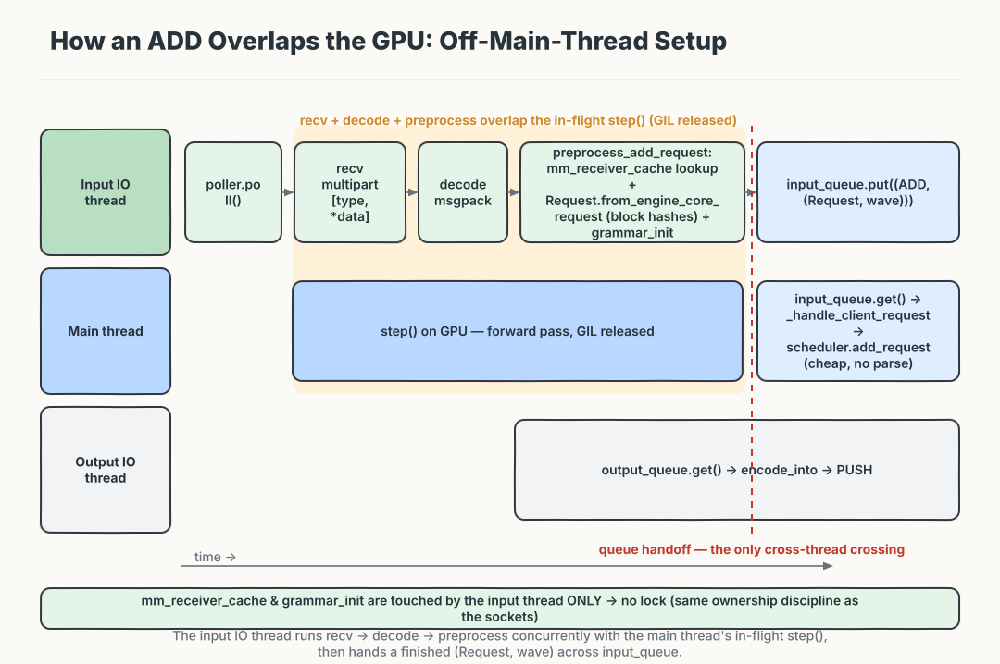</a>

<p class='figure-caption'>How an ADD overlaps the GPU: the input IO thread runs recv, decode, and preprocess_add_request (block hashing, mm-cache lookup, grammar kickoff) concurrently with the main thread's in-flight step(), then hands a finished (Request, wave) across input_queue — so per-request setup hides behind the forward pass.</p>

`preprocess_add_request` does the multimodal-cache lookup, `Request.from_engine_core_request` (which computes block hashes), and grammar-compilation kickoff for structured outputs — all CPU-bound. Running it in the input thread means it overlaps whatever `step()` is doing on the GPU. The docstring's thread-safety argument is the key part: `mm_receiver_cache` and `grammar_init` are touched *only* by this one thread, so no lock is needed. This is the same ownership discipline as the sockets, applied to mutable Python state. What lands on `input_queue` for an `ADD` is therefore a finished `(Request, wave)` tuple, not raw bytes — the main thread's dispatch is a cheap `scheduler.add_request`, not a parse.

**Two queues carry aborts; one closure carries failure.**

Two flows exploit the queues as control-plane injectors rather than data paths.

**Aborts ride two queues on purpose.** When the input thread decodes an `ABORT`, it pushes the request id to *both* `aborts_queue` (eager) and `input_queue` (ordered). The eager copy lets `step()` drain aborts mid-cycle (between schedule and output) so a cancel takes effect without waiting a full turn; the ordered copy on `input_queue` guarantees that if the abort arrived before the matching `ADD` was ingested, ordering is preserved and the request is not leaked. The framing comment in the input loop notes this is safe *because scheduler abort is idempotent* — applying it twice is harmless. The two-queue trick is therefore a latency optimization made legal by idempotency.

**Executor failure rides the closure.** The `executor_fail_callback` from [`core.py:917-919`](https://github.com/vllm-project/vllm/blob/6cf7b26bd4bff60bf378e1af14044280ac0d214c/vllm/v1/engine/core.py#L917-L919), registered at [`core.py:124-125`](https://github.com/vllm-project/vllm/blob/6cf7b26bd4bff60bf378e1af14044280ac0d214c/vllm/v1/engine/core.py#L124-L125), is invoked by the executor's monitor thread when a worker process dies. It does exactly one thing: `input_queue.put_nowait((EXECUTOR_FAILED, b""))`. A failure on a foreign thread thus becomes a normal queue item, dispatched on the main thread, converted to a `RuntimeError`, and turned into an `ENGINE_CORE_DEAD` notification to the client. There is no cross-thread exception, no shared error flag: just the queue.

### The signal path cannot touch the queue directly

The shutdown signal handler is the sharpest illustration of why the queue-only rule is not optional:

[`vllm/v1/engine/core.py:1204-1208`](https://github.com/vllm-project/vllm/blob/6cf7b26bd4bff60bf378e1af14044280ac0d214c/vllm/v1/engine/core.py#L1204-L1208)

```python
            def wakeup_engine():
                # Wakes up idle engine via input_queue when shutdown is requested
                # Not safe in a signal handler - we may interrupt the main thread
                # while it is holding the non-reentrant input_queue.mutex
                engine_core.input_queue.put_nowait((EngineCoreRequestType.WAKEUP, None))
```

A SIGTERM/SIGINT handler runs *on the main thread*, possibly interrupting it mid-`input_queue.get()` while it holds the queue's internal mutex, which is not reentrant. Calling `put_nowait` from inside the handler would deadlock on that same mutex. So the handler only sets `shutdown_state = REQUESTED` and calls `signal_callback.trigger()`; a `SignalCallback` defers the actual `wakeup_engine()` enqueue to a safe context. The `WAKEUP` item then unblocks the idle `get()`, the loop re-checks `is_running()`, sees `REQUESTED`, and begins the graceful drain ([Section 12](#12-failure-handling-shutdown-and-the-full-topology-trace)). The no-op `WAKEUP` exists precisely because the only way to rouse a thread blocked on `queue.get()` is to put something on the queue.

<a href='images/vllm-03-07-queues-threads.svg' target='_blank'>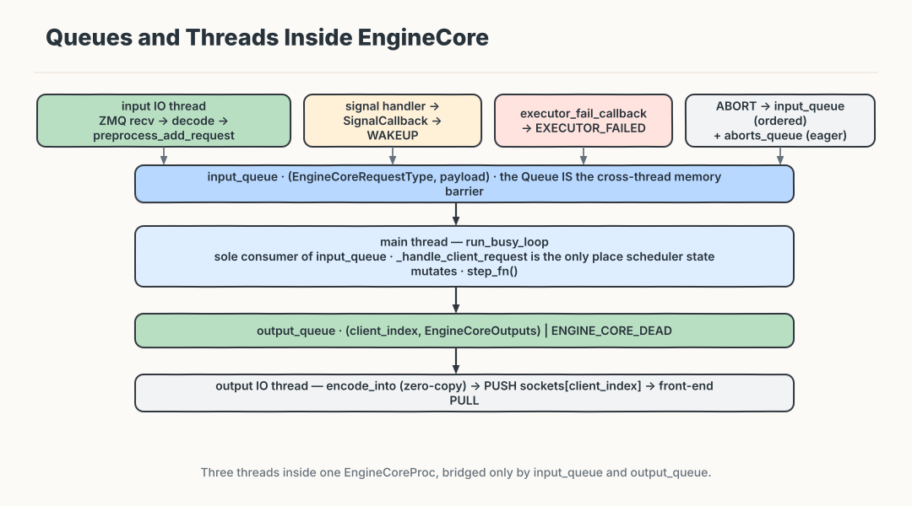</a>

<p class='figure-caption'>Three threads inside one EngineCoreProc, bridged only by input_queue and output_queue.</p>

**The threading map and what it protects.**

| Thread | Entry | Owns | Reads | Writes | Blocks on |
|---|---|---|---|---|---|
| main | `run_busy_loop` ([`core.py:1259`](https://github.com/vllm-project/vllm/blob/6cf7b26bd4bff60bf378e1af14044280ac0d214c/vllm/v1/engine/core.py#L1259)) | scheduler, executor, `step_fn` | `input_queue`, `aborts_queue` | `output_queue` | `input_queue.get(block=True)` when idle |
| input IO | `process_input_sockets` | input DEALER + coord XSUB sockets | sockets | `input_queue`, `aborts_queue` | `poller.poll()` |
| output IO | `process_output_sockets` | output PUSH + coord PUSH sockets | `output_queue` | sockets | `output_queue.get()` |

The two `queue.Queue`s are the only cross-thread channels. Sockets and mutable codec/preprocessing state remain with their owning I/O thread, so the main loop mutates scheduler state without socket locks.

## 7. Single-Node Tensor Parallel: One EngineCore, N Workers

Within one EngineCore, `MultiprocExecutor` fans work out to `world_size` GPU worker processes. This does not add more EngineCore processes. The executor uses a shared-memory `MessageQueue`: one writer broadcasts the same `SchedulerOutput` to every worker, and the designated output rank returns the `ModelRunnerOutput`. ZMQ remains the transport between front-end and engine; shared memory handles the fixed fan-out inside the engine.

The parallelism *math* (what a TP shard actually computes, the all-reduces it runs) is article 11's subject; the ModelRunner that runs inside each worker is article 09's. This article covers only the process count, the transport, and the RPC contract that binds them.

### World size is the worker-process count, and it is asserted, not assumed

The number of worker processes is a pure product of the parallel config, computed once when `ParallelConfig` is constructed.

[`vllm/config/parallel.py:793-797`](https://github.com/vllm-project/vllm/blob/6cf7b26bd4bff60bf378e1af14044280ac0d214c/vllm/config/parallel.py#L793-L797)

```python
        self.world_size = (
            self.pipeline_parallel_size
            * self.tensor_parallel_size
            * self.prefill_context_parallel_size
        )
```

`local_world_size` is then the per-node slice, [`vllm/config/parallel.py:684-685`](https://github.com/vllm-project/vllm/blob/6cf7b26bd4bff60bf378e1af14044280ac0d214c/vllm/config/parallel.py#L684-L685):

```python
    @property
    def local_world_size(self) -> int:
        return self.world_size // self.nnodes_within_dp
```

For a single-node deployment `nnodes_within_dp == 1`, so `local_world_size == world_size` and every rank is a local process on the same host. Pure tensor parallelism sets PP=PCP=1, so `world_size == tensor_parallel_size`: a TP=4 engine is exactly four worker processes, ranks 0..3.

The executor does not trust this arithmetic implicitly — it re-derives and asserts it at launch. [`vllm/v1/executor/multiproc_executor.py:117-123`](https://github.com/vllm-project/vllm/blob/6cf7b26bd4bff60bf378e1af14044280ac0d214c/vllm/v1/executor/multiproc_executor.py#L117-L123):

```python
        tp_size, pp_size, pcp_size = self._get_parallel_sizes()
        assert self.world_size == tp_size * pp_size * pcp_size, (
            f"world_size ({self.world_size}) must be equal to the "
            f"tensor_parallel_size ({tp_size}) x pipeline"
            f"_parallel_size ({pp_size}) x prefill_context"
            f"_parallel_size ({pcp_size}). "
        )
```

`_get_parallel_sizes` (`:249-260`) reads `world_size` from the parallel config, asserts `world_size % nnodes_within_dp == 0` (each node owns an equal contiguous rank block), and returns the three factors. The assertion above then checks the product reconciles. The executor commits to spawning exactly `local_world_size` processes and later gathers from a rank index derived from these same factors (`output_rank`, below). If the decomposition were inconsistent (a `world_size` that did not equal TP·PP·PCP), the mismatch would not surface as a clean error at model time; it would typically surface as a *hang* during the collective device sync, because some rank of the distributed group would never be spawned. Failing here, before any GPU is touched, converts a silent deadlock into an assertion. The deployment-level rule "one worker process per GPU, total count following the TP/PP/DP configuration" ([architecture overview](https://docs.vllm.ai/en/stable/design/arch_overview/)) is this product made executable.

### One writer, N readers: the single fan-out plane

Every RPC the engine issues to its workers travels one shared-memory queue. [`vllm/v1/executor/multiproc_executor.py:135-157`](https://github.com/vllm-project/vllm/blob/6cf7b26bd4bff60bf378e1af14044280ac0d214c/vllm/v1/executor/multiproc_executor.py#L135-L157) (elided):

```python
        if self.parallel_config.node_rank_within_dp == 0:
            # For leader node within each dp rank,
            # each dp will have its own leader multiproc executor.
            max_chunk_bytes = envs.VLLM_MQ_MAX_CHUNK_BYTES_MB * 1024 * 1024
            mq_connect_ip = get_ip()
            ...
            self.rpc_broadcast_mq = MessageQueue(
                self.world_size,
                self.local_world_size,
                max_chunk_bytes=max_chunk_bytes,
                connect_ip=mq_connect_ip,
            )
            scheduler_output_handle = self.rpc_broadcast_mq.export_handle()
```

`MessageQueue(n_reader, n_local_reader, ...)` is constructed with the executor as sole writer, `world_size` total readers, and `local_world_size` of them reachable via shared memory. On a single node those two counts are equal, so the queue is pure shared memory with no cross-node ring-buffer readers. The executor exports a `Handle` for the queue; each worker later attaches to it by rank as a *reader* ([Section 8](#8-the-worker-processes-spawn-and-lifecycle) covers `_init_message_queues`). Note the gate: the broadcast MQ is built only when `node_rank_within_dp == 0`. On a single node that condition is always true, so this branch is unconditional for our topology; it exists so that in multi-node DP only the DP-group leader node owns the broadcast plane, and follower nodes leave `rpc_broadcast_mq` as `None` (which is why `collective_rpc` later asserts it is not `None` — "should not be called on follower node", `:355-357`).

There is exactly one broadcast writer and the fan-out is structural — one enqueue reaches all `world_size` workers with an identical payload, byte-for-byte. This is what lets tensor parallelism be correct: every rank of a TP group must schedule the *same* batch in the *same* step, or their collectives (all-reduce over partial activations) would mismatch. A single-writer broadcast queue makes divergent scheduler outputs across ranks structurally impossible rather than merely discouraged.

**One driver per TP group.**

Within the worker set, one rank per tensor-parallel group is marked the driver. [`vllm/v1/executor/multiproc_executor.py:265-266`](https://github.com/vllm-project/vllm/blob/6cf7b26bd4bff60bf378e1af14044280ac0d214c/vllm/v1/executor/multiproc_executor.py#L265-L266):

```python
    def _is_driver_worker(self, rank: int) -> bool:
        return rank % self.parallel_config.tensor_parallel_size == 0
```

For pure single-node TP the only TP group is ranks 0..TP-1, so rank 0 is the lone driver. The flag is computed at spawn time (`is_driver_worker = self._is_driver_worker(global_rank)`, `:178`) and handed to `make_worker_process`. Under pipeline parallelism there are multiple TP groups stacked into PP stages, and each group's rank-0 becomes a driver; the modulo rule gives a deterministic global-rank→role map without any process needing to negotiate its role after startup. This is a distinct concept from `output_rank` (below): *every* PP stage has a driver, but only *one* rank across the whole world emits the user-visible output.

### `collective_rpc`: one enqueue, a counted number of replies

All engine→worker work (model execution, KV cache init, warmup, health checks) flows through one method. [`vllm/v1/executor/multiproc_executor.py:343-405`](https://github.com/vllm-project/vllm/blob/6cf7b26bd4bff60bf378e1af14044280ac0d214c/vllm/v1/executor/multiproc_executor.py#L343-L405) (elided to the control flow):

```python
    def collective_rpc(
        self,
        method: str | Callable,
        ...
        unique_reply_rank: int | None = None,
        kv_output_aggregator: KVOutputAggregator | None = None,
    ) -> Any:
        ...
        if kv_output_aggregator is not None:
            output_rank = None
            aggregate: Callable[[Any], Any] = partial(
                kv_output_aggregator.aggregate, output_rank=unique_reply_rank or 0
            )
        else:
            output_rank = unique_reply_rank
            aggregate = lambda x: x
        ...
        self.rpc_broadcast_mq.enqueue((send_method, args, kwargs, output_rank))

        response_mqs: Sequence[MessageQueue] = self.response_mqs
        if output_rank is not None:
            response_mqs = (response_mqs[output_rank],)

        def get_response():
            responses = []
            for mq in response_mqs:
                ...
                status, result = mq.dequeue(timeout=dequeue_timeout)
                ...
                responses.append(result)
            return responses[0] if output_rank is not None else responses

        future = FutureWrapper(
            self.futures_queue, get_response=get_response, aggregate=aggregate
        )
        return future if non_block else future.result()
```

<a href='images/vllm-03-21-collective-rpc-fanout.svg' target='_blank'>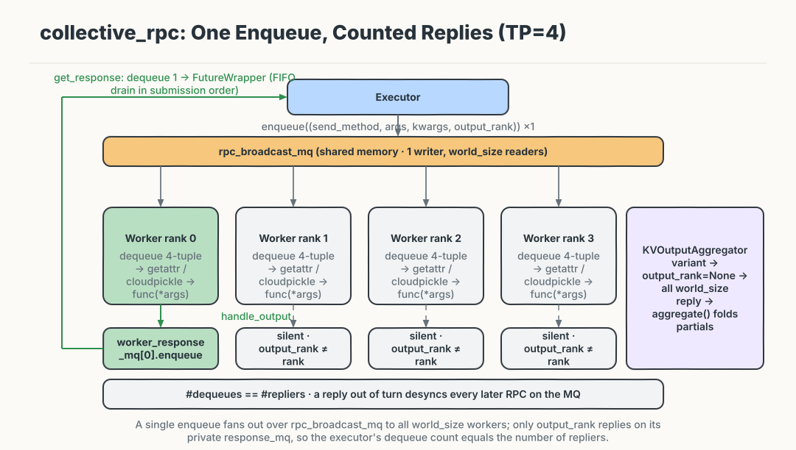</a>

<p class='figure-caption'>collective_rpc's one-enqueue / counted-reply contract: a single enqueue of (send_method, args, kwargs, output_rank) fans out over rpc_broadcast_mq to all world_size workers; only output_rank enqueues onto its private response_mq, and the executor's dequeue count equals the number of repliers (1 if output_rank set, else world_size).</p>

The RPC contract has four parts:

1. **Fan-out.** Exactly one `enqueue((send_method, args, kwargs, output_rank))` onto the single broadcast MQ. `send_method` is either a string attribute name or a cloudpickled callable; the same 4-tuple lands in every worker's read cursor.
2. **Reply selection.** If `output_rank` is set, `get_response` gathers from only `response_mqs[output_rank]`: a one-element tuple. Otherwise it gathers from all `world_size` response MQs and returns a list. The `output_rank` field is *also* the fourth element of the enqueued tuple, so the same value that tells the executor how many replies to expect is broadcast to the workers so they know whether to send one.
3. **KV-aggregator variant.** When a `KVOutputAggregator` is supplied (disaggregated prefill / KV transfer), `output_rank` is forced to `None` so all workers reply, and `aggregate` folds the `world_size` partials into one. For plain single-node TP this branch is inactive.
4. **Deadline / errors / sync.** A monotonic deadline bounds each dequeue; a non-`SUCCESS` status becomes a `RuntimeError` on the caller. `non_block=True` returns the `FutureWrapper`; otherwise `.result()` blocks.

`execute_model` is the hot instance of this pattern. [`vllm/v1/executor/multiproc_executor.py:310-320`](https://github.com/vllm-project/vllm/blob/6cf7b26bd4bff60bf378e1af14044280ac0d214c/vllm/v1/executor/multiproc_executor.py#L310-L320):

```python
    def execute_model(
        self, scheduler_output: SchedulerOutput, non_block: bool = False
    ) -> ModelRunnerOutput | None | Future[ModelRunnerOutput | None]:
        return self.collective_rpc(
            "execute_model",
            args=(scheduler_output,),
            unique_reply_rank=self.output_rank,
            non_block=non_block,
            timeout=envs.VLLM_EXECUTE_MODEL_TIMEOUT_SECONDS,
            kv_output_aggregator=self.kv_output_aggregator,
        )
```

Every step, the whole `SchedulerOutput` is broadcast to all workers, but `unique_reply_rank=self.output_rank` means the engine reads back exactly one `ModelRunnerOutput`.

The number of dequeues the executor performs equals the number of enqueues the worker set produces: one if `output_rank` is set, `world_size` if it is `None`. This count agreement is the entire correctness contract of the interior boundary. Gathering every rank's full output when only one is authoritative would duplicate multi-megabyte logits/token tensors across the shared queue and blur which stage owns the answer; conversely, if a worker replied when the executor was not expecting it, the extra entry would desynchronize every subsequent RPC on that MQ.

**Reply gating on the worker side.**

The worker half of the contract is a single blocking loop. [`vllm/v1/executor/multiproc_executor.py:986-1011`](https://github.com/vllm-project/vllm/blob/6cf7b26bd4bff60bf378e1af14044280ac0d214c/vllm/v1/executor/multiproc_executor.py#L986-L1011):

```python
    def worker_busy_loop(self):
        """Main busy loop for Multiprocessing Workers"""
        assert self.rpc_broadcast_mq is not None
        while True:
            method, args, kwargs, output_rank = self.rpc_broadcast_mq.dequeue(
                indefinite=True
            )
            try:
                if isinstance(method, str):
                    func = getattr(self.worker, method)
                elif isinstance(method, bytes):
                    func = partial(cloudpickle.loads(method), self.worker)

                output = func(*args, **kwargs)

                if output_rank is None or self.rank == output_rank:
                    self.handle_output(output)
            except Exception as e:
                # Notes have been introduced in python 3.11
                if hasattr(e, "add_note"):
                    e.add_note(traceback.format_exc())
                logger.exception("WorkerProc hit an exception.")
                # exception might not be serializable, so we convert it to
                # string, only for logging purpose.
                if output_rank is None or self.rank == output_rank:
                    self.handle_output(e)
```

The worker blocks on the broadcast MQ (`indefinite=True` — no spurious timeout wakeups), resolves the method to a bound attribute or a cloudpickled callable, runs it, and — the load-bearing line — enqueues a reply *only* when `output_rank is None or self.rank == output_rank`. The identical gate wraps the exception path, so a rank that is not the replier stays silent even when it raises. The same `output_rank` value drives both the executor's dequeue count and each worker's decision to reply, so the two counts can never disagree. A mismatch, say a worker replying out of turn, would leave an orphaned entry in a response MQ that the next RPC would mis-read as its own answer.

### `output_rank`: who is authoritative

Which rank is the sole replier is arithmetic, not configuration. [`vllm/v1/executor/multiproc_executor.py:498-512`](https://github.com/vllm-project/vllm/blob/6cf7b26bd4bff60bf378e1af14044280ac0d214c/vllm/v1/executor/multiproc_executor.py#L498-L512):

```python
    def _get_output_rank(self) -> int:
        # Only returns ModelRunnerOutput from TP rank=0 and PP rank=-1
        # (the first TP worker of the last PP stage).
        # Example:
        # Assuming TP=8, PP=4, then the world_size=32
        # 0-7, PP rank 0
        # 8-15, PP rank 1
        # 16-23, PP rank 2
        # 24-31, PP rank 3
        # so world_size - tp_size = 32 - 8 = 24 should be PP rank = -1 (i.e. 3)
        return (
            self.world_size
            - self.parallel_config.tensor_parallel_size
            * self.parallel_config.prefill_context_parallel_size
        )
```

<a href='images/vllm-03-22-rank-layout-grid.svg' target='_blank'>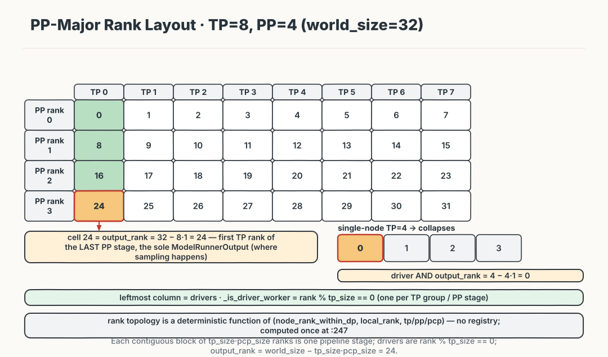</a>

<p class='figure-caption'>PP-major rank layout for TP=8, PP=4 (world_size=32): each contiguous block of tp_size*pcp_size ranks is one pipeline stage; _is_driver_worker = rank % tp_size == 0 marks one driver per TP group; output_rank = world_size - tp_size*pcp_size = 24 is the sole replier (collapsing to rank 0 for single-node TP).</p>

Ranks are laid out PP-major — each contiguous block of `tp_size·pcp_size` ranks is one pipeline stage. The final stage begins at `world_size - tp_size·pcp_size`, and its first rank is where sampling happens and a full `ModelRunnerOutput` exists. **Corollary for pure single-node TP** (PP=PCP=1): `output_rank = world_size - tensor_parallel_size = 0`. So on a TP=4 engine, rank 0 is both the driver and the sole replier, and the executor gathers every step's output from `response_mqs[0]`. The general rule still holds — under pipeline parallelism the replier is *not* rank 0, and reading from rank 0 there would look like a shape bug when the real defect is pipeline ownership. Encoding the replier as one arithmetic expression, evaluated once at `:247` (`self.output_rank = self._get_output_rank()`), removes any per-step decision about where the answer lives.

### FIFO futures over one shared queue

Because async scheduling can keep several `execute_model` calls in flight against one response MQ, replies must be drained strictly in submission order. [`vllm/v1/executor/multiproc_executor.py:70-101`](https://github.com/vllm-project/vllm/blob/6cf7b26bd4bff60bf378e1af14044280ac0d214c/vllm/v1/executor/multiproc_executor.py#L70-L101) (elided):

```python
class FutureWrapper(Future):
    def __init__(self, futures_queue, get_response, aggregate=lambda x: x):
        ...
        self.futures_queue.appendleft(self)

    def result(self, timeout=None):
        ...
        # Drain any futures ahead of us in the queue.
        while not self.done():
            future = self.futures_queue.pop()
            future._wait_for_response()
        return super().result()
```

Each RPC pushes its future onto the left of a shared `deque` and futures are drained from the right (`pop()`) — FIFO in submission order. Resolving future *k* first walks every earlier, still-pending future, reading their responses off the MQ in order. Responses come off the response MQ in exactly the order RPCs were enqueued, and a future may not consume its response until all earlier ones have been drained. This is what lets the engine pipeline multiple in-flight collective RPCs over one MQ without interleaving corruption — the queue is FIFO, and the future draining is FIFO, so the two stay aligned.

## 8. The Worker Processes: Spawn and Lifecycle

`MultiprocExecutor` creates one `WorkerProc` per rank, for `world_size = TP·PP·PCP` workers ([`parallel.py:793-797`](https://github.com/vllm-project/vllm/blob/6cf7b26bd4bff60bf378e1af14044280ac0d214c/vllm/config/parallel.py#L793-L797)). [Section 10](#10-dp--tp-together-the-process-count-math) works through the process count, and article 11 covers the parallelism math. This section follows worker creation, the READY handshake, the parent-child pipes, and teardown. Article 09 picks up at `init_device`, model loading, and the ModelRunner forward pass.

### Spawn: one daemon process and two one-way pipes

A worker is not a thread and not a Ray actor; it is a `multiprocessing` child process running the staticmethod `WorkerProc.worker_main`. The parent wires it up with exactly two `duplex=False` pipes before it starts: a *ready pipe* (child → parent, carries the one READY message) and a *death pipe* (parent → child, carries nothing: its EOF *is* the signal).

Source: [`multiproc_executor.py:661-712`](https://github.com/vllm-project/vllm/blob/6cf7b26bd4bff60bf378e1af14044280ac0d214c/vllm/v1/executor/multiproc_executor.py#L661-L712).

```python
    @staticmethod
    def make_worker_process(
        ...
    ) -> UnreadyWorkerProcHandle:
        context = get_mp_context()
        # Ready pipe to communicate readiness from child to parent
        ready_reader, ready_writer = context.Pipe(duplex=False)
        # Death pipe to let child detect parent process exit
        death_reader, death_writer = context.Pipe(duplex=False)
        ...
        process_kwargs = {
            ...
            "ready_pipe": ready_writer,
            "death_pipe": death_reader,
            ...
        }
        # Run EngineCore busy loop in background process.
        proc = context.Process(
            target=WorkerProc.worker_main,
            kwargs=process_kwargs,
            name=f"VllmWorker-{rank}",
            daemon=True,
        )
        ...
            proc.start()

        # Close child ends of pipes here in the parent
        ready_writer.close()
        death_reader.close()
        # Keep death_writer open in parent - when parent exits,
        # death_reader in child will get EOFError
        return UnreadyWorkerProcHandle(proc, rank, ready_reader, death_writer)
```

Two pipes are created, then each end is split across the boundary. The child receives `ready_writer` and `death_reader` in its kwargs. Immediately after `proc.start()`, the parent closes *its* copies of the child ends (`ready_writer`, `death_reader`) — a pipe reports EOF only when the *last* writer fd closes, so the parent must not keep a stray writer for the death pipe, nor a stray reader that would confuse ownership. What the parent keeps is captured in the returned handle: `ready_reader` (to receive READY) and `death_writer` (held open for the process's entire life). The process is `daemon=True` and named `VllmWorker-{rank}`, so the OS reaps it if the parent dies uncleanly, and so it shows up identifiably in `ps`/`py-spy`.

The death pipe is a *hard*, poll-free liveness tie: the parent holds `death_writer` open and does nothing with it; the child blocks reading `death_reader`. There is no heartbeat, no timeout, no config polling to get wrong. If the engine process dies for any reason (clean exit, crash, `SIGKILL`), the kernel closes its fds, the child's read raises `EOFError`, and the worker tears itself down (see the death monitor below). No worker can be left spinning against a dead engine.

<a href='images/vllm-03-08-worker-spawn.svg' target='_blank'>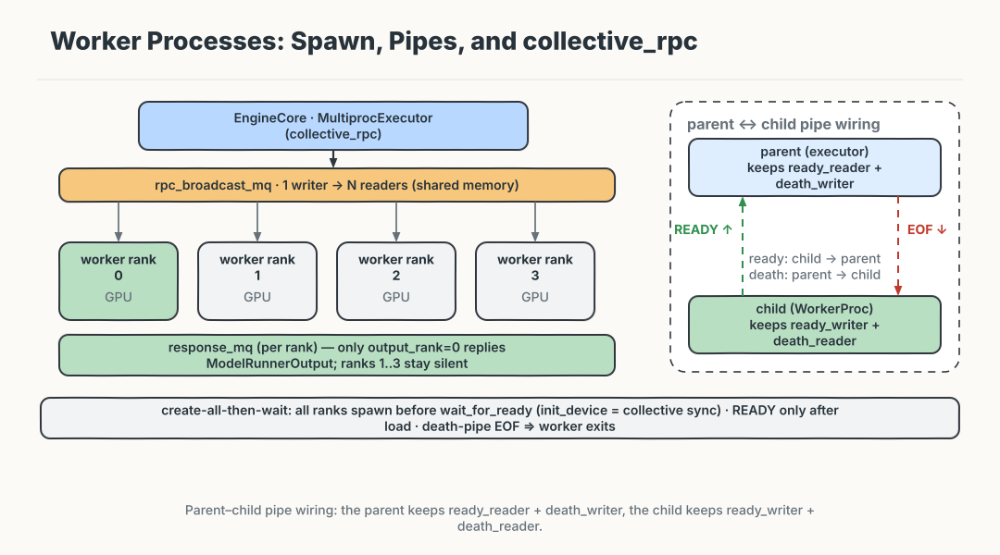</a>

<p class='figure-caption'>Parent–child pipe wiring: the parent keeps ready_reader + death_writer, the child keeps ready_writer + death_reader.</p>

**Create-before-wait: every rank must be live before any device sync.**

The executor spawns *all* local workers first, and only then waits for any of them to report READY. This ordering is not stylistic — it is forced by the collective nature of device init.

Source: [`multiproc_executor.py:176-201`](https://github.com/vllm-project/vllm/blob/6cf7b26bd4bff60bf378e1af14044280ac0d214c/vllm/v1/executor/multiproc_executor.py#L176-L201).

```python
            for local_rank in range(self.local_world_size):
                global_rank = global_start_rank + local_rank
                is_driver_worker = self._is_driver_worker(global_rank)
                with cpu_omp_manager.configure_omp_envs(
                    rank=global_rank, local_rank=local_rank
                ):
                    unready_worker_handle = WorkerProc.make_worker_process(
                        ...
                        rank=global_rank,
                        input_shm_handle=scheduler_output_handle,
                        ...
                    )
                unready_workers.append(unready_worker_handle)
                if inherited_fds is not None:
                    inherited_fds.append(unready_worker_handle.death_writer.fileno())
                    inherited_fds.append(unready_worker_handle.ready_pipe.fileno())

            # Workers must be created before wait_for_ready to avoid
            # deadlock, since worker.init_device() does a device sync.

            # Wait for all local workers to be ready.
            self.workers = WorkerProc.wait_for_ready(unready_workers)
```

`global_rank = global_start_rank + local_rank`, and `global_start_rank = local_world_size · node_rank_within_dp` (`:164-166`), so a node's ranks are a contiguous block — the layout that [Section 7](#7-single-node-tensor-parallel-one-enginecore-n-workers)'s `output_rank` and [Section 10](#10-dp--tp-together-the-process-count-math)'s rank math depend on. Each worker's `input_shm_handle` is the executor's single broadcast-MQ handle ([Section 7](#7-single-node-tensor-parallel-one-enginecore-n-workers)), so every worker attaches to the *same* fan-out queue. Under a `fork` start method, `inherited_fds` accumulates each spawned worker's pipe fds so the *next* worker can close them in `worker_main` — otherwise a fork'd child would silently hold a copy of a sibling's `death_writer`, keeping that pipe's EOF from ever firing and defeating liveness detection. Only after the whole loop does `wait_for_ready` run.

**Why this ordering.** `worker.init_device()` performs a collective device sync (a distributed rendezvous across every rank), so a rank cannot complete init until *all* ranks are alive and participating. If the parent blocked on rank 0's READY before spawning rank 1, rank 0 would wait forever inside `init_device` for a rank that does not yet exist: a deadlock, not an error. Create-all-then-wait is the only ordering that lets the collective close.

### The child's whole life: `worker_main`

`worker_main` is the child process's `main`. It installs signal handlers, constructs the `WorkerProc` (which loads the model and builds its queues), starts the death monitor, sends READY, completes the MQ handshake, and enters the busy loop: the four-line lifecycle the rest of this section expands.

Source: [`multiproc_executor.py:817-892`](https://github.com/vllm-project/vllm/blob/6cf7b26bd4bff60bf378e1af14044280ac0d214c/vllm/v1/executor/multiproc_executor.py#L817-L892) (elisions marked).

```python
        shutdown_requested = threading.Event()

        def signal_handler(signum, frame):
            nonlocal shutdown_requested
            if not shutdown_requested.is_set():
                shutdown_requested.set()
                ...
                raise SystemExit()

        # Either SIGTERM or SIGINT will terminate the worker
        signal.signal(signal.SIGTERM, signal_handler)
        signal.signal(signal.SIGINT, signal_handler)
        ...
        ready_writer = kwargs.pop("ready_pipe")
        death_pipe = kwargs.pop("death_pipe", None)

        # Close inherited pipes from parent (incl. other worker pipes)
        ...
        for fd in kwargs.pop("inherited_fds", []):
            try:
                os.close(fd)
            ...
        try:
            ...
            worker = WorkerProc(*args, **kwargs)
            assert worker.worker_response_mq is not None
            ...
            worker.monitor_death_pipe(death_pipe, shutdown_requested)

            # Send READY once we know everything is loaded
            ready_writer.send(
                {
                    "status": WorkerProc.READY_STR,
                    "handle": worker.worker_response_mq.export_handle(),
                    "peer_response_handles": worker.peer_response_handles,
                }
            )

            # Ensure message queues are ready. Will deadlock if re-ordered.
            # Must be kept consistent with the Executor
            if worker.rpc_broadcast_mq is not None:
                worker.rpc_broadcast_mq.wait_until_ready()
            worker.worker_response_mq.wait_until_ready()
            ready_writer.close()
            ready_writer = None

            worker.worker_busy_loop()
```

<a href='images/vllm-03-23-worker-lifecycle.svg' target='_blank'>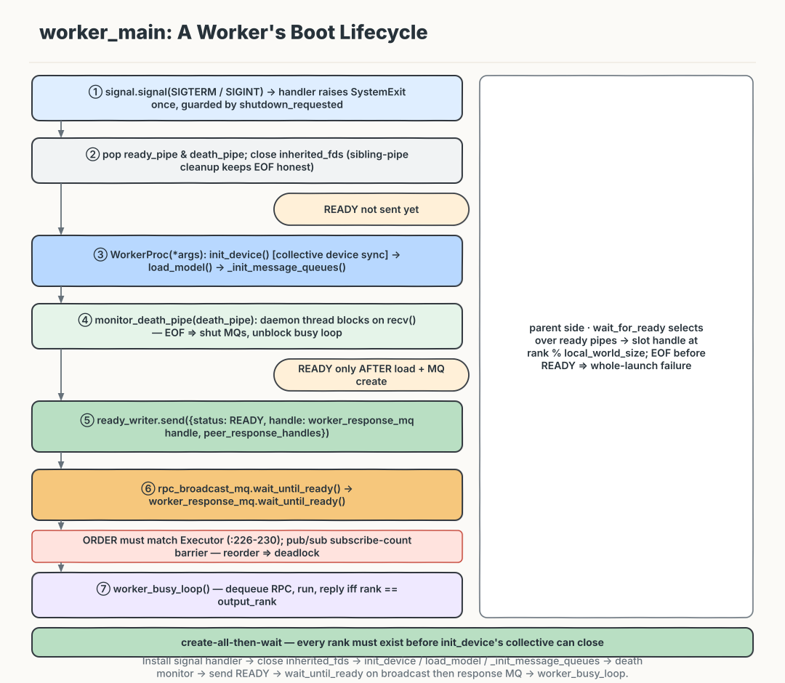</a>

<p class='figure-caption'>A worker's boot lifecycle in worker_main: install the SIGTERM/SIGINT handler, close inherited_fds, run WorkerProc() (init_device / load_model / _init_message_queues), start the death monitor, send the one READY dict (with its response-MQ handle), call wait_until_ready on the broadcast then the response MQ (order must match the executor or both deadlock), then enter worker_busy_loop.</p>

(1) `SIGTERM`/`SIGINT` are trapped by a handler that raises `SystemExit` *once* (guarded by `shutdown_requested`), so the escalating termination ladder in [Section 12](#12-failure-handling-shutdown-and-the-full-topology-trace) can stop a worker cleanly without spamming exceptions through `__del__`. (2) The worker pops its two pipe ends and closes any `inherited_fds`: the sibling-pipe cleanup that keeps EOF detection honest. (3) `WorkerProc(*args, **kwargs)` is where the heavy lifting happens: it runs `init_device()`, `load_model()`, and `_init_message_queues()` (next subsection). (4) Only *after* construction succeeds does it start the death monitor and send the single READY dict — carrying its response-MQ handle back so the parent can read replies from it. (5) It then calls `wait_until_ready()` on the broadcast MQ, then the response MQ — the same order the executor uses ([Section 7](#7-single-node-tensor-parallel-one-enginecore-n-workers), `:226-230`).

The trailing comment, "*Will deadlock if re-ordered. Must be kept consistent with the Executor*," is critical: `wait_until_ready` is a pub/sub subscription-count barrier where both sides rendezvous, so a mismatched order hangs both. (6) Finally, `worker_busy_loop()` — dequeue an RPC off the broadcast MQ, run it, and reply only if this rank is the `output_rank` ([Section 7](#7-single-node-tensor-parallel-one-enginecore-n-workers)).

The `except`/`finally` (`:894-933`) classifies the exit: if `ready_writer` is still set the worker never finished starting ("*failed to start*"); a set `shutdown_requested` means a requested shutdown; `SystemExit` is always re-raised; and `finally` always closes the pipes and calls `worker.shutdown()`.

READY is sent *after* model load and MQ creation, never before. The parent therefore learns a worker is READY only once that worker can actually receive a `SchedulerOutput` and emit a `ModelRunnerOutput` — the front-end's ready barrier (article 01, article 11's first-token path) never fires on a half-initialized GPU process.

**Per-process queues: attach to broadcast, own the reply.**

Each worker reads from a queue it does not own and writes to one it does.

Source: [`multiproc_executor.py:564-575`](https://github.com/vllm-project/vllm/blob/6cf7b26bd4bff60bf378e1af14044280ac0d214c/vllm/v1/executor/multiproc_executor.py#L564-L575) (single-node branch).

```python
        if vllm_config.parallel_config.nnodes_within_dp == 1:
            # Initialize MessageQueue for receiving SchedulerOutput
            self.rpc_broadcast_mq = MessageQueue.create_from_handle(
                input_shm_handle, self.worker.rank
            )

            # Initializes a message queue for sending the model output
            self.worker_response_mq = MessageQueue(1, 1)
            self.peer_response_handles = []
```

For the single-node case (`nnodes_within_dp == 1`; the multi-node `else` branch routes through inner-DP process groups and is out of scope here), the worker attaches to the executor's shared broadcast queue *as a reader keyed by its own rank* via `create_from_handle(input_shm_handle, self.worker.rank)`: one writer (the executor), `world_size` readers. It then creates its *own* `MessageQueue(1, 1)` for replies: one reader (the executor), one writer (itself). That reply queue's handle is what the READY dict ships back to the parent. MQ setup happens after `init_device()` deliberately (`:653-655`), because multi-node reply queues need distributed groups formed first.

Fan-out and gather live on separate queues with unambiguous ownership: one shared broadcast plane the executor writes and all workers read, and N private reply planes each owned by exactly one worker. No worker can write to another's reply queue; the executor gathers each rank's output from a fixed, rank-indexed MQ.

**Admission: `wait_for_ready` on the parent side.**

The parent collects READY messages from all workers over their ready pipes, converting each into a live `WorkerProcHandle`, and treats a broken pipe as a launch failure.

Source: [`multiproc_executor.py:744-771`](https://github.com/vllm-project/vllm/blob/6cf7b26bd4bff60bf378e1af14044280ac0d214c/vllm/v1/executor/multiproc_executor.py#L744-L771).

```python
        pipes = {handle.ready_pipe: handle for handle in unready_proc_handles}
        ready_proc_handles: list[WorkerProcHandle | None] = [None] * len(
            unready_proc_handles
        )
        while pipes:
            ready = multiprocessing.connection.wait(pipes.keys())
            for pipe in ready:
                assert isinstance(pipe, Connection)
                try:
                    # Wait until the WorkerProc is ready.
                    unready_proc_handle = pipes.pop(pipe)
                    response: dict[str, Any] = pipe.recv()
                    if response["status"] != "READY":
                        raise e

                    idx = unready_proc_handle.rank % len(ready_proc_handles)
                    ready_proc_handles[idx] = WorkerProc.wait_for_response_handle_ready(
                        response, unready_proc_handle
                    )
                except EOFError:
                    e.__suppress_context__ = True
                    raise e from None
                finally:
                    # Close connection.
                    pipe.close()
```

The parent `select`s over every worker's `ready_pipe` (`multiprocessing.connection.wait`), and as each becomes readable, `recv()`s the READY dict and slots the resulting handle at `rank % local_world_size` — so `self.workers` is rank-ordered, not arrival-ordered. `wait_for_response_handle_ready` (`:714-733`) rebuilds the worker's `worker_response_mq` from the exported handle in the dict. Crucially, if a worker died before sending READY, its pipe reports `EOFError` rather than a message — and the handler converts that into the shared init-failure exception, aborting the *entire* launch (with `__suppress_context__` to keep the traceback pointing at the real background-process error).

The returned `self.workers` list is either fully populated in rank order or the constructor raised. A worker that crashed during `load_model` cannot leave a silent `None` hole that a later `collective_rpc` would index into; the failure surfaces at launch, and (via the `finally` in the executor constructor, [Section 12](#12-failure-handling-shutdown-and-the-full-topology-trace)) every already-spawned worker is terminated so no orphan GPU process is left holding memory.

### Teardown: the death monitor closes the loop

Every worker runs a tiny daemon thread whose only job is to notice the parent's death and shut the worker's queues, unblocking it from an otherwise indefinite dequeue.

Source: [`multiproc_executor.py:784-807`](https://github.com/vllm-project/vllm/blob/6cf7b26bd4bff60bf378e1af14044280ac0d214c/vllm/v1/executor/multiproc_executor.py#L784-L807).

```python
    def monitor_death_pipe(self, death_pipe, shutdown_requested: threading.Event):
        if death_pipe is None:
            return

        def death_pipe_monitor(queues_to_shutdown: list[MessageQueue]):
            try:
                # This will block until parent process exits (pipe closes)
                death_pipe.recv()
            except EOFError:
                logger.info_once("Parent process exited, terminating worker queues")
                shutdown_requested.set()
                for mq in queues_to_shutdown:
                    if mq is not None:
                        mq.shutdown()
            except Exception as e:
                logger.warning("Death monitoring error: %s", e)

        # Pass queue references directly to avoid gc issues if passing self
        Thread(
            target=death_pipe_monitor,
            args=([self.rpc_broadcast_mq, self.worker_response_mq],),
            daemon=True,
            name="DeathPipeMonitor",
        ).start()
```

The monitor thread blocks on `death_pipe.recv()`, which never returns data — it only ever raises. When the parent exits and its `death_writer` fd closes, `recv()` raises `EOFError`; the monitor sets `shutdown_requested` and shuts down both message queues by direct reference (passed explicitly, the comment notes, to avoid a `self` reference that would keep the worker alive for GC). Shutting the broadcast MQ is what unblocks `worker_busy_loop`, which is otherwise parked in `dequeue(indefinite=True)` waiting for a `SchedulerOutput` that will never come. The worker then falls out of its loop and `worker_main`'s `finally` runs `worker.shutdown()`.

This is the child half of the death-pipe contract from spawn: parent-gone ⇒ `EOFError` ⇒ MQ shutdown ⇒ busy-loop exit ⇒ process exit. Combined with the parent-side monitor that treats any worker death as fatal to the whole executor ([Section 12](#12-failure-handling-shutdown-and-the-full-topology-trace)) and the `daemon=True` OS backstop, the two halves make the worker cohort strictly co-terminal with its engine: no worker outlives the engine, and no single worker's death leaves a wedged, partially-alive TP group. The escalating SIGTERM → SIGKILL ladder and the executor-side liveness monitor that complete this story are [Section 12](#12-failure-handling-shutdown-and-the-full-topology-trace).

## 9. Data Parallel and the DP Coordinator

Data parallel (DP) is the one parallelism axis that adds *processes at the engine tier* rather than inside a single engine. Tensor and pipeline parallel shard one `EngineCore` into `world_size` GPU workers ([Section 7](#7-single-node-tensor-parallel-one-enginecore-n-workers), article 11); DP does the opposite — it *replicates* the whole `EngineCore` N times, one per DP rank, and each replica runs an independent scheduler, KV cache, and executor. No request is split across DP ranks; instead the front-end picks one rank to own the request end to end. The process-tier consequences are three new questions this section answers: which client object routes requests, how the replicas are load-balanced, and, for MoE, how N independent schedulers are kept in lockstep so their expert all-to-all collectives never deadlock. The parallelism *algorithm* (the all-reduce over the "has unfinished requests" flag, expert placement) lives in article 11; here we stay on the process/transport structure.

<a href='images/vllm-03-02-dp-topology.svg' target='_blank'>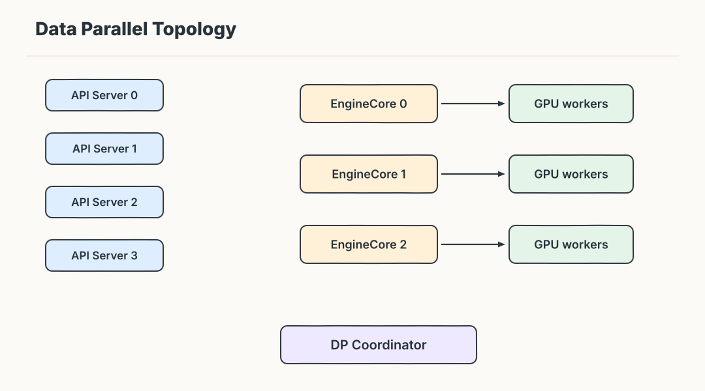</a>

<p class='figure-caption'>Data-parallel topology: N EngineCore replicas, one DP coordinator, front-end clients scoring across engines.</p>

**Which client is built.**

The DP topology is selected entirely by a factory branch on the config; the rest of the serving stack sees one `EngineCoreClient` interface ([Section 2](#2-the-process-map-api-servers-enginecores-and-gpu-workers)).

[`vllm/v1/engine/core_client.py:126-132`](https://github.com/vllm-project/vllm/blob/6cf7b26bd4bff60bf378e1af14044280ac0d214c/vllm/v1/engine/core_client.py#L126-L132):

```python
        if parallel_config.data_parallel_size > 1:
            if parallel_config.data_parallel_external_lb:
                # External load balancer - client per DP rank.
                return DPAsyncMPClient(*client_args)
            # Internal load balancer - client balances to all DP ranks.
            return DPLBAsyncMPClient(*client_args)
        return AsyncMPClient(*client_args)
```

`data_parallel_size == 1` returns a plain `AsyncMPClient`: one engine, no coordinator, no scoring. `DP > 1` with an *external* load balancer returns `DPAsyncMPClient`, which manages only its own local rank and never scores — its `get_core_engine_for_request` just returns the single `self.core_engine` ([`core_client.py:1376-1377`](https://github.com/vllm-project/vllm/blob/6cf7b26bd4bff60bf378e1af14044280ac0d214c/vllm/v1/engine/core_client.py#L1376-L1377)); an upstream LB already decided the rank. `DP > 1` with the default *internal* balancer returns `DPLBAsyncMPClient`, which manages all `dp_size` engines and does the scoring described below. **The load-balancing decision is client-side.** The coordinator (next) only publishes stats; it never routes a request.

**One EngineCore process per rank.**

The replicas are spawned as ordinary OS processes by `CoreEngineProcManager`, one per local DP rank ([`utils.py:156-171`](https://github.com/vllm-project/vllm/blob/6cf7b26bd4bff60bf378e1af14044280ac0d214c/vllm/v1/engine/utils.py#L156-L171), shown in full in [Section 2](#2-the-process-map-api-servers-enginecores-and-gpu-workers)). The line that stamps each replica's identity is the key one for DP:

```python
                    name=f"EngineCore_DP{global_index}" if is_dp else "EngineCore",
```

Each replica gets two ranks — a *global* `dp_rank = start_index + index` and a *local* `local_dp_rank = local_start_index + index` (its GPU-shard index on this node). The manager owns only the local slice `[start_index, start_index + local_engine_count)`, so a node can host a contiguous sub-range of the global ranks (multi-node DP). The global rank becomes the engine's stable ZMQ identity (`rank.to_bytes(2, "little")`) matching the client's `core_engines` list ([`core_client.py:1407`](https://github.com/vllm-project/vllm/blob/6cf7b26bd4bff60bf378e1af14044280ac0d214c/vllm/v1/engine/core_client.py#L1407) asserts `len > 1`) and the handshake identity ([Section 11](#11-startup-handshake-and-connection)). The property: **DP rank identity is stable and contiguous**, and global-vs-local decoupling is what lets one manager instance drive only part of a globally-numbered mesh. Note DP is orthogonal to the in-engine `world_size`: a DP=d, TP=t deployment is `d` EngineCore processes, each fanning out to `t` worker processes, for `d × t` GPU processes total ([Section 10](#10-dp--tp-together-the-process-count-math)).

**Whether a coordinator runs.**

The coordinator is conditional — not every DP deployment has one.

[`vllm/v1/engine/utils.py:1110-1118`](https://github.com/vllm-project/vllm/blob/6cf7b26bd4bff60bf378e1af14044280ac0d214c/vllm/v1/engine/utils.py#L1110-L1118):

```python
    run_coordinator = (
        vllm_config.needs_dp_coordinator and not offline_mode and dp_rank == 0
    )

    if run_coordinator:
        coordinator = DPCoordinator(
            parallel_config,
            enable_wave_coordination=vllm_config.model_config.is_moe,
        )
```

The `needs_dp_coordinator` gate is defined at [`vllm/config/vllm.py:621-625`](https://github.com/vllm-project/vllm/blob/6cf7b26bd4bff60bf378e1af14044280ac0d214c/vllm/config/vllm.py#L621-L625):

```python
        return self.parallel_config.data_parallel_size > 1 and (
            self.model_config is None
            or self.model_config.is_moe
            or not self.parallel_config.data_parallel_external_lb
        )
```

Read three conditions, all required: `DP > 1`, online mode (`not offline_mode` — offline runs one `LLM` per rank with no shared coordinator), and `dp_rank == 0` (exactly one coordinator, co-located with rank 0). The `needs_dp_coordinator` property then narrows *why* it runs: a coordinator is needed either for a **MoE** model (`is_moe`, for wave coordination, even under external LB) or for a dense model in **internal/hybrid LB** mode (`not external_lb`, for stats collection). A dense model under external LB needs neither, so no coordinator spawns. Independently, `enable_wave_coordination` is set to `is_moe`, so a dense internal-LB coordinator runs but skips all wave logic. **There is at most one coordinator, on rank 0, online only; wave logic is MoE-only.**

### The coordinator's sockets and the subscribe barrier

The coordinator is a pure message relay with three bound sockets and no request path.

[`vllm/v1/engine/coordinator.py:207-249`](https://github.com/vllm-project/vllm/blob/6cf7b26bd4bff60bf378e1af14044280ac0d214c/vllm/v1/engine/coordinator.py#L207-L249) (elided):

```python
        with (
            make_zmq_socket(
                path=front_publish_address,  # IPC
                ctx=self.ctx,
                socket_type=zmq.XPUB,
                bind=True,
            ) as publish_front,
            make_zmq_socket(
                path=back_output_address,  # IPC or TCP
                ctx=self.ctx,
                socket_type=zmq.PULL,
                bind=True,
            ) as output_back,
            make_zmq_socket(
                path=back_publish_address,  # IPC or TCP
                ctx=self.ctx,
                socket_type=zmq.XPUB,
                bind=True,
            ) as publish_back,
        ):
            ...
            # Wait until all engines subscribe.
            for _ in self.engines:
                if publish_back.recv() != b"\x01":
                    logger.error(...)
                    return
            # Send ready message to engines.
            publish_back.send(b"READY")
```

<a href='images/vllm-03-24-coordinator-planes.svg' target='_blank'>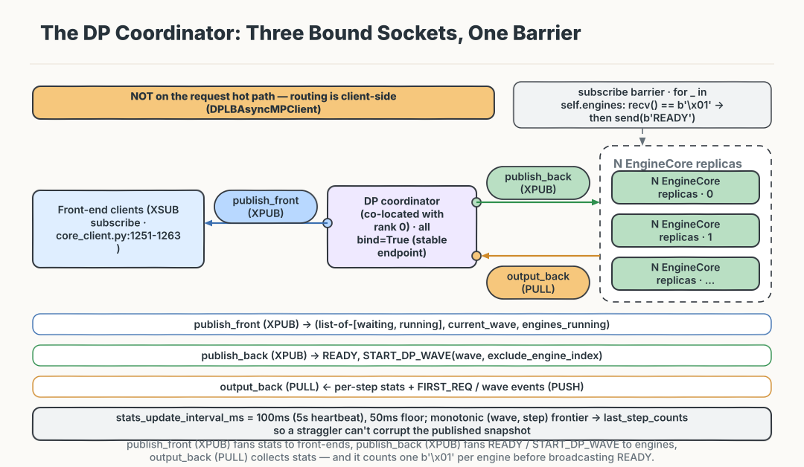</a>

<p class='figure-caption'>The DP coordinator's three bound sockets and subscribe barrier: publish_front (XPUB) fans stats to front-ends, publish_back (XPUB) fans READY/START_DP_WAVE to engines, output_back (PULL) collects per-engine stats and wave events — and it counts one subscription per engine before broadcasting READY. It never routes a request.</p>

Read the three planes: `publish_front` (XPUB) fans aggregated stats out to front-end clients, which subscribe via XSUB ([`core_client.py:1251-1263`](https://github.com/vllm-project/vllm/blob/6cf7b26bd4bff60bf378e1af14044280ac0d214c/vllm/v1/engine/core_client.py#L1251-L1263)); `publish_back` (XPUB) fans control messages (`READY`, `START_DP_WAVE`) out to the engines; `output_back` (PULL) is the fan-in where every engine PUSHes its per-step stats and wave events. All three are `bind=True` because the coordinator is the stable endpoint (the bind/connect polarity rule is `make_zmq_socket`'s, [Section 4](#4-the-zmq-transport-request-and-output-sockets)). The loop over `self.engines` is a **subscribe barrier**: XPUB surfaces each new subscriber as a `b"\x01"` frame, so the coordinator counts exactly `len(self.engines)` subscriptions before broadcasting `b"READY"`. Guarantee: **no engine proceeds past init until every DP peer has connected to the control plane** — a precondition for the collective all-reduce that DP performs each step.

The publish cadence is throttled and step-coherent. [`coordinator.py:256-279`](https://github.com/vllm-project/vllm/blob/6cf7b26bd4bff60bf378e1af14044280ac0d214c/vllm/v1/engine/coordinator.py#L256-L279) waits `stats_update_interval_ms` (default 100 ms) when stats changed, else a 5 s heartbeat, with a 50 ms floor to let a full round of per-engine stats accumulate; the ingest path ([`coordinator.py:379-403`](https://github.com/vllm-project/vllm/blob/6cf7b26bd4bff60bf378e1af14044280ac0d214c/vllm/v1/engine/coordinator.py#L379-L403)) keeps a monotonic `(wave, step)` frontier and snapshots the previous coherent counts into `last_step_counts` when a newer step arrives, so a straggler's late stats can never corrupt the published snapshot. The payload front-ends receive is `(list-of-[waiting, running], current_wave, engines_running)`.

### Client-side scoring

`DPLBAsyncMPClient` mirrors the coordinator's global counts into a local slice and scores over it per request.

[`vllm/v1/engine/core_client.py:1413-1447`](https://github.com/vllm-project/vllm/blob/6cf7b26bd4bff60bf378e1af14044280ac0d214c/vllm/v1/engine/core_client.py#L1413-L1447):

```python
    def get_core_engine_for_request(self, request: EngineCoreRequest) -> EngineIdentity:
        # Engines are in rank order.
        if (eng_index := request.data_parallel_rank) is None and (
            eng_index := get_late_interaction_engine_index(
                request.pooling_params, len(self.core_engines)
            )
        ) is None:
            current_counts = self.lb_engines
            # TODO use P2C alg for larger DP sizes
            num_engines = len(current_counts)
            min_score = sys.maxsize
            eng_index = 0
            for i in range(num_engines):
                # Start from client_index to help with balancing when engines
                # are empty.
                idx = (self.eng_start_index + i) % num_engines
                waiting, running = current_counts[idx]
                score = waiting * 4 + running
                if score < min_score:
                    min_score = score
                    eng_index = idx
            # Increment local waiting count for better balancing between stats
            # updates from the coordinator (which happen every 100ms).
            current_counts[eng_index][0] += self.client_count
            ...
            self.eng_start_index = (self.eng_start_index + 1) % num_engines

        chosen_engine = self.core_engines[eng_index]
        # Record which engine is chosen for this request, to handle aborts.
        self.reqs_in_flight[request.request_id] = chosen_engine
        return chosen_engine
```

Step by step: (1) an **explicit pin wins** — if `request.data_parallel_rank` is set (or late-interaction pooling maps deterministically to an engine) the scan is skipped entirely. (2) Otherwise **`score = waiting * 4 + running`**: a queued request weighs 4× an already-scheduled one, and the lowest score wins. (3) The scan starts at `eng_start_index` (initialized per client to `len(core_engines) * client_index // client_count`, [`core_client.py:1409-1411`](https://github.com/vllm-project/vllm/blob/6cf7b26bd4bff60bf378e1af14044280ac0d214c/vllm/v1/engine/core_client.py#L1409-L1411)) and rotates each call so ties don't systematically favor one engine — this rotation is a recent addition (see the note below). (4) An **optimistic local increment**, `current_counts[eng_index][0] += self.client_count`, bumps the chosen engine's waiting count immediately, before the coordinator's next 100 ms snapshot, so a burst inside one interval still spreads. (5) `reqs_in_flight[request_id] = chosen_engine` records ownership.

The result: **each request lands on exactly one engine and that mapping is remembered**, because aborts are point-to-point (`reqs_in_flight` routes the abort to the same engine, [`core_client.py:1535-1541`](https://github.com/vllm-project/vllm/blob/6cf7b26bd4bff60bf378e1af14044280ac0d214c/vllm/v1/engine/core_client.py#L1535-L1541)) and completions pop it. Article 11's condensed excerpt of this function predates the `eng_start_index` tie-break rotation and the explicit-pin short-circuit; this baseline ([`core_client.py:1415-1442`](https://github.com/vllm-project/vllm/blob/6cf7b26bd4bff60bf378e1af14044280ac0d214c/vllm/v1/engine/core_client.py#L1415-L1442)) is the current one.

### MoE wave coordination

Dense DP replicas are fully independent; MoE replicas are not. An expert all-to-all is a collective across all DP ranks, so an engine cannot run a batch while its peers are paused — every rank must step together, running a *dummy* forward if it has no real work. A global `engines_running` flag, owned solely by the coordinator, enforces this.

The trigger is a first request arriving at a paused cohort. [`core_client.py:1359-1372`](https://github.com/vllm-project/vllm/blob/6cf7b26bd4bff60bf378e1af14044280ac0d214c/vllm/v1/engine/core_client.py#L1359-L1372):

```python
    async def add_request_async(self, request: EngineCoreRequest) -> None:
        self._ensure_stats_update_task()

        request.current_wave = self.current_wave
        request.client_index = self.client_index

        chosen_engine = self.get_core_engine_for_request(request)
        to_await = self._send_input(EngineCoreRequestType.ADD, request, chosen_engine)
        if not self.engines_running:
            # Notify coordinator that we're sending a request
            req_msg = msgspec.msgpack.encode(("FIRST_REQ", chosen_engine))
            await self.first_req_send_socket.send(req_msg)

        await to_await
```

The request is stamped with the client's cached `current_wave` and sent to the scored engine. If the client believes engines are paused (`not self.engines_running`), it also fires `("FIRST_REQ", chosen_engine)` to the coordinator (via its stats task). That reaches the coordinator's front XPUB, and the coordinator (the single authority that owns the global `engines_running` flag) resolves it through a small wave state machine ([`coordinator.py:342-453`](https://github.com/vllm-project/vllm/blob/6cf7b26bd4bff60bf378e1af14044280ac0d214c/vllm/v1/engine/coordinator.py#L342-L453)): it flips `engines_running` and re-broadcasts `START_DP_WAVE = b"\x02"` (carrying `(wave, exclude_engine_index)`, [`coordinator.py:443-453`](https://github.com/vllm-project/vllm/blob/6cf7b26bd4bff60bf378e1af14044280ac0d214c/vllm/v1/engine/coordinator.py#L443-L453)) on its back XPUB (`publish_back`) to drive the cohort forward, always re-broadcasting so no stale wave can strand a subset.

The wave state-machine's exact cases, and the expert all-to-all it gates, belong to the parallelism *algorithm* in article 11. **All DP engines march through waves in lockstep**, flipped by exactly one authority (the coordinator).

### Fail-stop liveness

DP has no partial-failure recovery today. [`vllm/v1/engine/utils.py:222-242`](https://github.com/vllm-project/vllm/blob/6cf7b26bd4bff60bf378e1af14044280ac0d214c/vllm/v1/engine/utils.py#L222-L242):

```python
    def monitor_engine_liveness(self) -> None:
        """Monitor engine core process liveness."""

        sentinel_to_proc = {proc.sentinel: proc for proc in self.processes}
        sentinels = set(sentinel_to_proc.keys())

        while sentinels and not self.manager_stopped.is_set():
            died_sentinels = connection.wait(sentinels, timeout=1)
            ...
            if died_sentinels:
                # Any engine exit currently triggers a shutdown. ...
                break

        self.shutdown()
```

The first engine exit breaks the monitor loop and triggers full shutdown; partial DP recovery is not implemented. That is necessary for collectives: once a replica disappears, survivors cannot safely continue the next cross-rank step.

## 10. DP + TP Together: The Process-Count Math

The process count separates into two factors. TP·PP·PCP **shards** one model across the `world_size` workers managed by an executor. DP **replicates** that engine unit, including its scheduler, KV cache, executor, and workers. The GPU-process count is therefore the product of the shard and replica counts. This section derives the count and rank identities; article 11 covers the collectives, article 09 covers worker execution, and article 04 covers the engine loop.

### The shard axis: `world_size`, computed once per engine

Every model-parallel dimension collapses into a single scalar in config post-init: `world_size = PP · TP · PCP` ([`parallel.py:793-797`](https://github.com/vllm-project/vllm/blob/6cf7b26bd4bff60bf378e1af14044280ac0d214c/vllm/config/parallel.py#L793-L797), derived in full in [Section 7](#7-single-node-tensor-parallel-one-enginecore-n-workers); DP is deliberately absent). `world_size` is the number of worker processes one engine's executor manages, and its own docstring says it "affects the number of workers we create" ([`parallel.py:324-325`](https://github.com/vllm-project/vllm/blob/6cf7b26bd4bff60bf378e1af14044280ac0d214c/vllm/config/parallel.py#L324-L325)). One exception proves the rule: the `external_launcher` backend folds DP back in (`self.world_size *= self.data_parallel_size`, [`parallel.py:799-801`](https://github.com/vllm-project/vllm/blob/6cf7b26bd4bff60bf378e1af14044280ac0d214c/vllm/config/parallel.py#L799-L801)), precisely because torchrun launches every rank itself and there is no separate per-DP `EngineCore` to replicate — that path is out of scope here and deferred to article 11.

In practice, DP is invisible to a `MultiprocExecutor`. An executor sizes itself to `TP·PP·PCP` and cannot tell whether it is DP replica 0 of 8 or a lone engine. That blindness is what lets one executor implementation serve both cases unchanged.

**The replicate axis: one `EngineCore` process per DP rank.**

DP adds processes by cloning the engine, not by widening the executor. `CoreEngineProcManager`'s spawn loop ([`utils.py:156-171`](https://github.com/vllm-project/vllm/blob/6cf7b26bd4bff60bf378e1af14044280ac0d214c/vllm/v1/engine/utils.py#L156-L171), shown in full in [Section 2](#2-the-process-map-api-servers-enginecores-and-gpu-workers)) is one iteration per local DP rank:

```python
        for index in range(local_engine_count):
```

It spawns one OS process per *local* DP rank, each a full `EngineCoreProc.run_engine_core` entrypoint tagged with a global `dp_rank`. A DP=8 deployment split across two nodes runs four of these per node; every engine independently constructs its own executor and therefore its own `world_size` workers. ([Section 9](#9-data-parallel-and-the-dp-coordinator) covers the coordinator and the client-side routing that fans requests across these replicas.)

For the process-managed path described here, `data_parallel_size` determines the number of `EngineCore` replicas. Each replica has its own scheduler and KV cache and serves a separate set of requests.

<a href='images/vllm-03-09-dp-tp-math.svg' target='_blank'>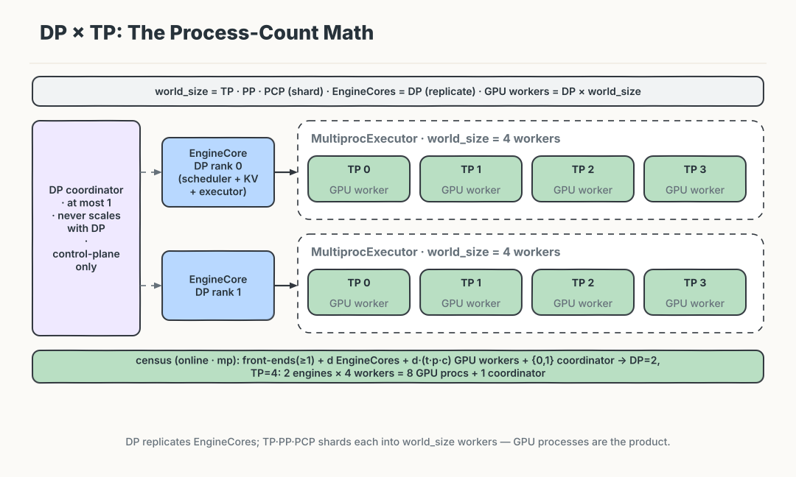</a>

<p class='figure-caption'>DP replicates EngineCores; TP·PP·PCP shards each into world_size workers — GPU processes are the product.</p>

### The formula

For `DP=d`, `TP=t`, `PP=p`, `PCP=c`, with `world_size = t·p·c`:

- **EngineCore processes** = `d` — one per DP rank ([`utils.py:156-171`](https://github.com/vllm-project/vllm/blob/6cf7b26bd4bff60bf378e1af14044280ac0d214c/vllm/v1/engine/utils.py#L156-L171)).
- **GPU worker processes** = `d × world_size` = `d × (t·p·c)` under the `mp` backend — `world_size` per replica ([`parallel.py:793-797`](https://github.com/vllm-project/vllm/blob/6cf7b26bd4bff60bf378e1af14044280ac0d214c/vllm/config/parallel.py#L793-L797)), `d` replicas.
- **Front-end / API-server processes** = the API-server count: `1` for a single engine, with a default that scales with data parallelism ([Section 2](#2-the-process-map-api-servers-enginecores-and-gpu-workers); covered in article 02) — not a GPU process.
- **DP coordinator processes** ∈ {0, 1} — conditional (below), never scales with `d`.

Worked examples, all derived from those anchors:

| DP | TP | PP | PCP | world_size | EngineCores | GPU workers | Coordinator |
| --- | --- | --- | --- | --- | --- | --- | --- |
| 1 | 1 | 1 | 1 | 1 | 1 | 1 (in-proc, `uni`) | 0 |
| 1 | 4 | 1 | 1 | 4 | 1 | 4 | 0 |
| 1 | 8 | 4 | 1 | 32 | 1 | 32 | 0 |
| 8 | 1 | 1 | 1 | 1 | 8 | 8 | 0 or 1 |
| 8 | 4 | 1 | 1 | 4 | 8 | 32 | 0 or 1 |
| 2 | 8 | 1 | 1 (MoE) | 8 | 2 | 16 | 1 |

The `DP=1, TP=1` row is special: `world_size == 1` selects the `uni` backend, where the single worker lives *inside* the `EngineCore` process rather than as a separate one (see *Where the count is actually bound*, below). Under `uni` the `d × world_size` product counts GPU-*touching* logical workers, but the separate-process count is just `d`.

**Each DP rank is a sealed transport island.**

Replication is total — even the shared-memory fan-out plane is per-replica. The broadcast `MessageQueue`, one writer (the executor) and `world_size` readers (its workers), is built only on the DP-leader node of *this* DP rank ([`multiproc_executor.py:135-157`](https://github.com/vllm-project/vllm/blob/6cf7b26bd4bff60bf378e1af14044280ac0d214c/vllm/v1/executor/multiproc_executor.py#L135-L157), covered in [Section 7](#7-single-node-tensor-parallel-one-enginecore-n-workers)). There is no global broadcast plane; DP replica k's `SchedulerOutput` never reaches replica j's workers. Follower nodes (multi-node TP inside a single DP rank) leave `rpc_broadcast_mq = None`, which is why `collective_rpc` opens with `assert self.rpc_broadcast_mq is not None, "collective_rpc should not be called on follower node"` ([`multiproc_executor.py:355-357`](https://github.com/vllm-project/vllm/blob/6cf7b26bd4bff60bf378e1af14044280ac0d214c/vllm/v1/executor/multiproc_executor.py#L355-L357)).

There are `d` independent fan-out planes, one per `EngineCore`. Cross-replica coordination (load balancing, MoE wave sync) travels only over the coordinator's ZMQ side-channels ([Section 9](#9-data-parallel-and-the-dp-coordinator)), never over the shared-memory data plane. The multiplicative process count is matched by a multiplicative *transport* count; nothing is shared laterally between replicas at the data-plane level.

**Where the ranks come from.**

A worker's global rank, and its role, is computed arithmetically, never assigned by a registry.

Source: [`vllm/v1/executor/multiproc_executor.py:164-178`](https://github.com/vllm-project/vllm/blob/6cf7b26bd4bff60bf378e1af14044280ac0d214c/vllm/v1/executor/multiproc_executor.py#L164-L178) (elided)

```python
            global_start_rank = (
                self.local_world_size * self.parallel_config.node_rank_within_dp
            )
            ...
            for local_rank in range(self.local_world_size):
                global_rank = global_start_rank + local_rank
                is_driver_worker = self._is_driver_worker(global_rank)
```

Within one DP rank's executor, `global_rank = local_world_size · node_rank_within_dp + local_rank`. Single-node (`nnodes_within_dp == 1`) makes `local_world_size == world_size` ([`parallel.py:684-685`](https://github.com/vllm-project/vllm/blob/6cf7b26bd4bff60bf378e1af14044280ac0d214c/vllm/config/parallel.py#L684-L685)), so ranks are simply `0 … world_size-1`. `_is_driver_worker` = `rank % tp_size == 0` picks one driver per TP group ([Section 7](#7-single-node-tensor-parallel-one-enginecore-n-workers)). Ranks are laid out PP-major: each contiguous block of `tp_size·pcp_size` is one pipeline stage.

`output_rank`, the sole replier, is likewise pure arithmetic: `output_rank = world_size − tp_size·pcp_size` ([`multiproc_executor.py:498-512`](https://github.com/vllm-project/vllm/blob/6cf7b26bd4bff60bf378e1af14044280ac0d214c/vllm/v1/executor/multiproc_executor.py#L498-L512), derived with its TP=8/PP=4 worked example in [Section 7](#7-single-node-tensor-parallel-one-enginecore-n-workers)). For TP=8, PP=4, PCP=1 → world_size=32, the last stage begins at 32−8=24, so rank 24 is the sole replier; for pure single-node TP (PP=PCP=1) it collapses to `world_size − tp_size = 0`, so rank 0 is the only rank that emits a `ModelRunnerOutput`. DP never enters — `output_rank` is a within-engine index in `[0, world_size)`, computed identically in every replica.

The entire rank topology is a deterministic function of `(node_rank_within_dp, local_rank, tp_size, pp_size, pcp_size)`. No process negotiates its own identity, and the global DP index (`start_index + local offset`, from the spawn loop above) is decoupled from the local shard rank so a node can host any contiguous sub-range of the global ranks. A boot-ordering mistake therefore surfaces as a wrong-rank arithmetic mismatch, not a silent mis-route.

**The coordinator is conditional, and never scales with DP.**

The one process that can span DP replicas is optional and singular. It runs iff `DP > 1` *and* online mode *and* `dp_rank == 0` *and* (MoE or internal/hybrid LB) — the `run_coordinator` / `needs_dp_coordinator` gate covered in [Section 9](#9-data-parallel-and-the-dp-coordinator) ([`utils.py:1110-1118`](https://github.com/vllm-project/vllm/blob/6cf7b26bd4bff60bf378e1af14044280ac0d214c/vllm/v1/engine/utils.py#L1110-L1118), [`vllm/config/vllm.py:621-625`](https://github.com/vllm-project/vllm/blob/6cf7b26bd4bff60bf378e1af14044280ac0d214c/vllm/config/vllm.py#L621-L625)). So a dense model under an *external* load balancer with DP>1 runs zero coordinators, and wave coordination is armed separately on `is_moe` ([`utils.py:1117`](https://github.com/vllm-project/vllm/blob/6cf7b26bd4bff60bf378e1af14044280ac0d214c/vllm/v1/engine/utils.py#L1117)), meaning a dense internal-LB coordinator publishes load stats but never drives MoE waves.

In short: coordinator count ∈ {0, 1} regardless of `d`. It is a control-plane process, not a GPU process, and it does not enter the `d × world_size` product.

### Where the count is actually bound

The backend default is where "how many processes" is decided — and a single-GPU deploy pays nothing.

Source: [`vllm/config/parallel.py:871-916`](https://github.com/vllm-project/vllm/blob/6cf7b26bd4bff60bf378e1af14044280ac0d214c/vllm/config/parallel.py#L871-L916) (elided)

```python
        if self.distributed_executor_backend is None and self.world_size_across_dp > 1:
            # We use multiprocessing by default if world_size fits on the
            # current node and we aren't in a ray placement group.
            ...
            backend: DistributedExecutorBackend = "mp"
            ...
            self.distributed_executor_backend = backend

        if self.distributed_executor_backend is None and self.world_size == 1:
            self.distributed_executor_backend = "uni"
```

`world_size_across_dp = world_size · data_parallel_size = TP·PP·PCP·DP` ([`parallel.py:517-520`](https://github.com/vllm-project/vllm/blob/6cf7b26bd4bff60bf378e1af14044280ac0d214c/vllm/config/parallel.py#L517-L520)). If that product exceeds 1 the default backend is `mp` (out-of-process workers), overridden to `uni` for TPU-SPMD and to `ray` when a Ray placement group is present; if `world_size == 1` the backend is `uni`, a single in-process worker with no IPC. `Executor.get_class` ([`abstract.py:47-92`](https://github.com/vllm-project/vllm/blob/6cf7b26bd4bff60bf378e1af14044280ac0d214c/vllm/v1/executor/abstract.py#L47-L92)) then maps the resolved string to the concrete class. So the `DP=1, TP=1` corner is genuinely one process doing everything: `EngineCore` and its lone worker share an address space, `collective_rpc` is a direct method call (article 09), and none of the ZMQ/shared-memory machinery this article documents exists at all. The process explosion is opt-in — it materializes only when `world_size_across_dp > 1` makes the arithmetic demand it.

The worker count is fixed from `(DP, TP, PP, PCP)` before spawn, but it is not the deployment's total process count. `multiprocess_mode` separately controls the frontend↔EngineCore split, serving adds API-server processes, and external launchers may place workers themselves. A `uni` executor only means its worker shares the EngineCore process.

### Putting the arithmetic together

For an online `mp`-backend deployment, the total process census is:

```text
front-ends (≥1)  +  d EngineCores  +  d·(t·p·c) GPU workers  +  {0,1} coordinator
```

Here `world_size = t·p·c` per engine and DP contributes `d` identical engine units. When `world_size == 1`, the `uni` backend folds the worker into its EngineCore; the formula counts roles, not necessarily distinct processes in that corner.

## 11. Startup Handshake and Connection

The transports in [Section 4](#4-the-zmq-transport-request-and-output-sockets) assume a fact that has to be *manufactured* at boot: every engine DEALER/PUSH knows a concrete, bound endpoint on the client, and the client ROUTER knows every engine's identity. Neither is true when the processes first fork. The client binds its sockets to `tcp://host:0` (kernel-assigned port) and the engines are spawned before that port is known; a ROUTER, moreover, cannot address a DEALER until it has *received* a frame from it. V1 resolves this with a deliberate boot sequence that runs **two rendezvous on two different socket pairs**: a short-lived control handshake (`HELLO → CONNECTED → READY`) on a dedicated ROUTER/DEALER, and a data-plane ready frame on the request ROUTER/DEALER that doubles as identity registration and config reconciliation. The ordering is the critical part.

<a href='images/vllm-03-10-startup-handshake.svg' target='_blank'>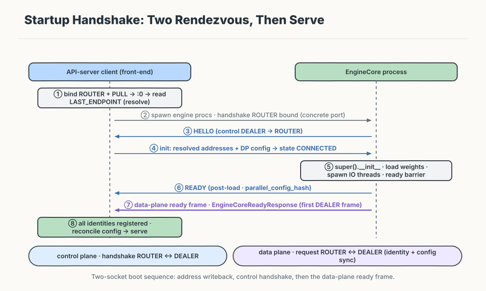</a>

<p class='figure-caption'>Two-socket boot sequence: address writeback, control handshake, then the data-plane ready frame.</p>

### Precondition: single-source addressing

Before any engine exists, the client owns address allocation. In the self-managed path (`LLM`/`AsyncLLM` default), `MPClient.__init__` binds the request ROUTER and output PULL, then rewrites the placeholder ports with the kernel's real ones *before* launching engines.

[`vllm/v1/engine/core_client.py:564-573`](https://github.com/vllm-project/vllm/blob/6cf7b26bd4bff60bf378e1af14044280ac0d214c/vllm/v1/engine/core_client.py#L564-L573)

```python
                # Resolve ``tcp://host:0`` placeholders to bound endpoints
                # before engines DEALER-connect. No-op for IPC.
                addresses.inputs[0] = self.input_socket.getsockopt(
                    zmq.LAST_ENDPOINT
                ).decode()
                addresses.outputs[0] = self.resources.output_socket.getsockopt(
                    zmq.LAST_ENDPOINT
                ).decode()

                with launch_core_engines(
                    vllm_config, executor_class, log_stats, addresses
                ) as (engine_manager, coordinator, addresses, tensor_queue):
```

Bind first (ROUTER and PULL bind per the polarity rule in [Section 4](#4-the-zmq-transport-request-and-output-sockets)), read back `LAST_ENDPOINT` to turn `tcp://host:0` into `tcp://host:54123`, overwrite the `addresses` struct, and only *then* enter `launch_core_engines`, which spawns the engine processes with that struct in hand. For IPC paths the string is already concrete, so the writeback is a no-op. The externally-managed path (multi-API-server) reports its bound endpoints back over a `multiprocessing` pipe instead ([`core_client.py:511-549`](https://github.com/vllm-project/vllm/blob/6cf7b26bd4bff60bf378e1af14044280ac0d214c/vllm/v1/engine/core_client.py#L511-L549)), but the invariant is identical.

An engine's data-plane DEALER/PUSH only ever `connect()`s to a fully-resolved endpoint — never `:0`. The bind-then-resolve-then-launch ordering is what makes the connectors deterministic; there is no bind/connect race because exactly one side (the client) binds and it does so before the peer is born.

### The launch orchestration

`launch_core_engines` is the context manager that binds the *control* socket, spawns the engine procs, hands the client its process handles, and only then blocks on readiness.

[`vllm/v1/engine/utils.py:1190-1213`](https://github.com/vllm-project/vllm/blob/6cf7b26bd4bff60bf378e1af14044280ac0d214c/vllm/v1/engine/utils.py#L1190-L1213)

```python
    with zmq_socket_ctx(
        local_handshake_address, zmq.ROUTER, bind=True
    ) as handshake_socket:
        # Start local engines.
        if local_engine_count:
            local_engine_manager = CoreEngineProcManager(
                ...
                handshake_address=handshake_address,
                ...
            )
        ...
        yield local_engine_manager, coordinator, addresses, tensor_queue

        # Now wait for engines to start.
        wait_for_engine_startup(
            handshake_socket,
            addresses,
            engines_to_handshake,
            ...
        )
```

The handshake ROUTER binds at `handshake_address`, which, unlike the data-plane sockets, is a *concrete* port (`data_parallel_rpc_port or get_open_port()`, [`utils.py:1179`](https://github.com/vllm-project/vllm/blob/6cf7b26bd4bff60bf378e1af14044280ac0d214c/vllm/v1/engine/utils.py#L1179)) because the engines spawned in this process consume it at fork time and cannot defer resolution. `CoreEngineProcManager` `start()`s one `EngineCoreProc.run_engine_core` process per local DP rank, each passed `handshake_address` (see [Section 2](#2-the-process-map-api-servers-enginecores-and-gpu-workers) for the per-rank spawn, [Section 9](#9-data-parallel-and-the-dp-coordinator) for DP replication). The `yield` lets `MPClient.__init__` grab the manager/coordinator handles while the engines are still importing torch and loading weights; the actual barrier is `wait_for_engine_startup` on context exit. This is a separate ROUTER/DEALER pair from the request path: the control plane and the data plane never share a socket.

### Phase A — the control handshake

Each engine, inside its constructor, connects a DEALER to `handshake_address` and drives a three-state machine. The engine side ([`core.py:1115-1151`](https://github.com/vllm-project/vllm/blob/6cf7b26bd4bff60bf378e1af14044280ac0d214c/vllm/v1/engine/core.py#L1115-L1151)) sends `HELLO`, blocks up to `HANDSHAKE_TIMEOUT_MINS = 5` ([`core.py:91`](https://github.com/vllm-project/vllm/blob/6cf7b26bd4bff60bf378e1af14044280ac0d214c/vllm/v1/engine/core.py#L91)) for an init reply, and applies any DP config the front-end hands back. The front-end side is the authority on state transitions:

[`vllm/v1/engine/utils.py:1311-1332`](https://github.com/vllm-project/vllm/blob/6cf7b26bd4bff60bf378e1af14044280ac0d214c/vllm/v1/engine/utils.py#L1311-L1332)

```python
        if status == "HELLO" and engine.state == CoreEngineState.NEW:
            # Send init message with DP config info.
            init_message = msgspec.msgpack.encode(
                EngineHandshakeMetadata(
                    addresses=addresses,
                    parallel_config={
                        k: getattr(parallel_config, k)
                        for k in (
                            "data_parallel_master_ip",
                            ...
                        )
                    }
                    if coordinated_dp
                    else {},
                )
            )
            handshake_socket.send_multipart((eng_identity, init_message), copy=False)
            conn_pending[0 if local else 1] -= 1
            start_pending[0 if local else 1] += 1
            engine.state = CoreEngineState.CONNECTED
```

<a href='images/vllm-03-25-handshake-states.svg' target='_blank'>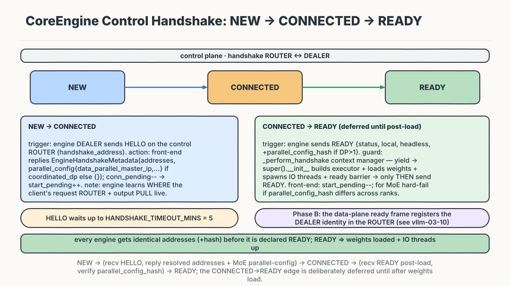</a>

<p class='figure-caption'>The CoreEngine control-handshake state machine on the front-end side: NEW to CONNECTED on HELLO (front-end replies EngineHandshakeMetadata with resolved addresses + MoE parallel-config), then CONNECTED to READY only after weights load + IO threads up (verifying parallel_config_hash); the CONNECTED-to-READY edge is deliberately deferred until post-load.</p>

The engine's 2-byte little-endian rank arrives as the ROUTER identity frame (`eng_identity`); the front-end matches it to a `CoreEngine` tracker, validates the `local`/`headless` flags, and, on `HELLO` in state `NEW`, replies with `EngineHandshakeMetadata` carrying **the resolved `addresses` struct** (the same one written back in the precondition step) plus, for MoE (`coordinated_dp`), the DP master ip/port so all ranks form one process group. The engine transitions `NEW → CONNECTED`; the pending counters move a slot from `conn_pending` to `start_pending`. This is how an engine learns *where* the client's request ROUTER and output PULL actually live.

The second transition, `CONNECTED → READY`, is deferred until *after* model load, and that deferral is structural, not incidental. On the engine side, `_perform_handshake` is a context manager that yields the addresses into the constructor body and sends `READY` only when that body exits:

[`vllm/v1/engine/core.py:1096-1113`](https://github.com/vllm-project/vllm/blob/6cf7b26bd4bff60bf378e1af14044280ac0d214c/vllm/v1/engine/core.py#L1096-L1113)

```python
            addresses = self.startup_handshake(
                handshake_socket, local_client, headless, parallel_config_to_update
            )
            yield addresses

            # Send ready message.
            ready_msg = {
                "status": "READY",
                "local": local_client,
                "headless": headless,
            }
            # Include config hash for DP configuration validation
            if vllm_config.parallel_config.data_parallel_size > 1:
                ready_msg["parallel_config_hash"] = (
                    vllm_config.parallel_config.compute_hash()
                )
            handshake_socket.send(msgspec.msgpack.encode(ready_msg))
```

The `yield` returns into `EngineCoreProc.__init__`, whose `with self._perform_handshakes(...)` body runs `super().__init__` (which constructs the executor and loads weights), spawns the IO threads, and blocks on the ready barrier — all *before* control returns here to send `READY`. So a `READY` frame on the control socket is a post-load fact. On the front-end, `wait_for_engine_startup` consumes it ([`utils.py:1333-1352`](https://github.com/vllm-project/vllm/blob/6cf7b26bd4bff60bf378e1af14044280ac0d214c/vllm/v1/engine/utils.py#L1333-L1352)): in state `CONNECTED` it decrements `start_pending`, moves the engine to `READY`, and for MoE it hard-fails if `parallel_config_hash` differs across ranks.

Every engine receives an *identical* set of ZMQ addresses (and, for MoE, an identical parallel-config hash) before it is declared `READY`; and `READY` is only ever emitted after weights are loaded and IO threads are up. DP collectives, the all-reduce over the "has unfinished requests" flag (article 11), require lockstep configuration, so a config mismatch must fail at boot rather than deadlock a collective later.

### Phase B — the data-plane ready frame

The control handshake told the engine where to connect. It did *not* register the engine's identity with the client's request ROUTER: a ROUTER learns a peer only from a received message. So the engine's input thread, immediately after connecting its request DEALER, sends a ready frame as its very first transmission:

[`vllm/v1/engine/core.py:1541-1547`](https://github.com/vllm-project/vllm/blob/6cf7b26bd4bff60bf378e1af14044280ac0d214c/vllm/v1/engine/core.py#L1541-L1547)

```python
            ready_payload = msgspec.msgpack.encode(ready_response)
            for input_socket in input_sockets:
                # Send initial message to each input socket - this is required
                # before the front-end ROUTER socket can send input messages
                # back to us.
                input_socket.send(ready_payload)
                poller.register(input_socket, zmq.POLLIN)
```

The payload is an `EngineCoreReadyResponse` ([`__init__.py:68-86`](https://github.com/vllm-project/vllm/blob/6cf7b26bd4bff60bf378e1af14044280ac0d214c/vllm/v1/engine/__init__.py#L68-L86)) — a struct of post-initialization facts that may differ from the caller's requested config: `max_model_len`, `num_gpu_blocks`, `block_size`, `dtype`, `world_size`, `data_parallel_size`, KV-cache sizes, and `dp_stats_address`. The `num_gpu_blocks` figure in particular only exists *after* the executor has profiled memory and run KV bring-up ([Section 12](#12-failure-handling-shutdown-and-the-full-topology-trace); [`abstract.py:118-137`](https://github.com/vllm-project/vllm/blob/6cf7b26bd4bff60bf378e1af14044280ac0d214c/vllm/v1/executor/abstract.py#L118-L137) runs `initialize_from_config` then `compile_or_warm_up_model`), which is why this frame is sent from the running input thread, not during the control handshake.

The client blocks until it has one such frame from *every* managed identity:

[`vllm/v1/engine/core_client.py:615-633`](https://github.com/vllm-project/vllm/blob/6cf7b26bd4bff60bf378e1af14044280ac0d214c/vllm/v1/engine/core_client.py#L615-L633)

```python
            # Wait for ready messages from each engine on the input socket.
            identities = set(self.core_engines)
            sync_input_socket = zmq.Socket.shadow(self.input_socket)
            while identities:
                if not sync_input_socket.poll(
                    timeout=VLLM_ENGINE_READY_TIMEOUT_S * 1000  # convert to ms
                ):
                    raise TimeoutError(
                        f"Timed out waiting for engine core processes to "
                        ...
                    )
                identity, payload = sync_input_socket.recv_multipart()
                identities.remove(identity)
                self._apply_ready_response(payload)
```

`self.core_engines` is the set of expected identities, each `dp_rank.to_bytes(2, "little")` — the exact bytes the engine set as its DEALER `zmq.IDENTITY` and the front-end used to key the control handshake. The client shadows its (possibly async) ROUTER as a blocking socket, polls with a `VLLM_ENGINE_READY_TIMEOUT_S = 600` ([`envs.py:27`](https://github.com/vllm-project/vllm/blob/6cf7b26bd4bff60bf378e1af14044280ac0d214c/vllm/envs.py#L27)) second budget, and removes each identity as its frame arrives. Receiving that frame is what teaches the ROUTER the DEALER's identity — so this barrier is simultaneously (a) identity registration and (b) config sync. The sync half is `_apply_ready_response`:

[`vllm/v1/engine/core_client.py:720-729`](https://github.com/vllm-project/vllm/blob/6cf7b26bd4bff60bf378e1af14044280ac0d214c/vllm/v1/engine/core_client.py#L720-L729)

```python
        response = msgspec.msgpack.decode(payload, type=EngineCoreReadyResponse)
        vllm_config.model_config.max_model_len = min(
            vllm_config.model_config.max_model_len, response.max_model_len
        )
        # Setup KV cache config with initialization state from
        # engine core process. Sum num_gpu_blocks from all engines in DP case.
        num_gpu_blocks = vllm_config.cache_config.num_gpu_blocks or 0
        num_gpu_blocks += response.num_gpu_blocks
        vllm_config.cache_config.num_gpu_blocks = num_gpu_blocks
```

Read the folding rules literally: `max_model_len` is reduced to the *minimum* the engines could actually fit (KV-cache auto-fitting may shrink it); `num_gpu_blocks` is *summed* across DP replicas; `block_size` is taken from the engine (a hybrid Mamba worker may have enlarged it). The front-end's advertised config becomes the reconciliation of what every engine reported, not what the user asked for.

No request is dispatched before every engine identity is registered in the ROUTER and has confirmed post-load readiness; and the front-end's serving config is the reconciled truth (min `max_model_len`, summed blocks) rather than the pre-boot guess. Because the request ROUTER uses HWM=0 ([Section 4](#4-the-zmq-transport-request-and-output-sockets)), a ready frame that arrives before the client reaches the barrier is queued rather than dropped by a high-water-mark limit.

**The engine-side barrier and coordinator gate.**

One more barrier sits inside the engine constructor, closing the loop on DP. After spawning the input and output IO threads, the constructor refuses to let the control-plane `READY` fire until the input thread has bound its sockets, sent the data-plane ready frame, and, if a coordinator exists, received the coordinator's `READY`:

[`vllm/v1/engine/core.py:1003-1009`](https://github.com/vllm-project/vllm/blob/6cf7b26bd4bff60bf378e1af14044280ac0d214c/vllm/v1/engine/core.py#L1003-L1009)

```python
            # Don't complete handshake until DP coordinator ready message is
            # received.
            while not ready_event.wait(timeout=10):
                if not input_thread.is_alive():
                    raise RuntimeError("Input socket thread died during startup")
                assert addresses.coordinator_input is not None
                logger.info("Waiting for READY message from DP Coordinator...")
```

The input thread subscribes to the coordinator's back XPUB ([`core.py:1521`](https://github.com/vllm-project/vllm/blob/6cf7b26bd4bff60bf378e1af14044280ac0d214c/vllm/v1/engine/core.py#L1521), sends `b"\x01"`) and blocks on `coord_socket.recv() == b"READY"` ([`core.py:1549-1552`](https://github.com/vllm-project/vllm/blob/6cf7b26bd4bff60bf378e1af14044280ac0d214c/vllm/v1/engine/core.py#L1549-L1552)) before setting `ready_event`. The coordinator, in turn, only broadcasts `READY` after counting a subscribe event from every engine ([Section 9](#9-data-parallel-and-the-dp-coordinator), [`coordinator.py:238-247`](https://github.com/vllm-project/vllm/blob/6cf7b26bd4bff60bf378e1af14044280ac0d214c/vllm/v1/engine/coordinator.py#L238-L247)). So the DP subscribe barrier nests inside the engine ready barrier, which nests inside the control-plane `READY`, which the front-end's `wait_for_engine_startup` gates on. If the input thread dies mid-boot the barrier detects it and raises rather than hanging forever.

### Fail-fast, not hang

Every wait in this sequence is bounded or sentinel-guarded. `wait_for_engine_startup` registers each engine process's `sentinel` (and the coordinator's) alongside the handshake ROUTER on one poller, so a process that crashes during boot surfaces as a poller event, not a timeout:

[`vllm/v1/engine/utils.py:1267-1276`](https://github.com/vllm-project/vllm/blob/6cf7b26bd4bff60bf378e1af14044280ac0d214c/vllm/v1/engine/utils.py#L1267-L1276)

```python
        if len(events) > 1 or events[0][0] != handshake_socket:
            # One of the local core processes exited.
            finished = proc_manager.finished_procs() if proc_manager else {}
            ...
            raise RuntimeError(
                "Engine core initialization failed. "
                "See root cause above. "
                f"Failed core proc(s): {finished}"
            )
```

Together with the bounded handshake waits and the client's mid-construction finalizer, this turns detected startup death or timeout into an exception. It does not cover a peer that stays alive but hangs, an unroutable frame, or an OS/resource failure.

## 12. Failure Handling, Shutdown, and the Full Topology Trace

The mesh has three failure boundaries: front-end↔engine ZMQ, executor↔worker shared memory, and the two in-process queues. The mechanisms below cover detected process death and requested shutdown; they do not guarantee recovery from an alive-but-hung peer, an unroutable ROUTER frame, or an OS failure that also kills the detector.

### The engine's dying breath: the `ENGINE_CORE_DEAD` poison pill

An engine that hits a fatal error must tell every client it serves, because those clients are blocked in a ZMQ `recv` ([Section 4](#4-the-zmq-transport-request-and-output-sockets)) that will otherwise never return. The signal is a single reserved byte-string, sent on the same output socket as normal data.

[`vllm/v1/engine/core.py:896-899`](https://github.com/vllm-project/vllm/blob/6cf7b26bd4bff60bf378e1af14044280ac0d214c/vllm/v1/engine/core.py#L896-L899)

```python
class EngineCoreProc(EngineCore):
    """ZMQ-wrapper for running EngineCore in background process."""

    ENGINE_CORE_DEAD = b"ENGINE_CORE_DEAD"
```

The main thread never touches a socket — even here. It routes the sentinel through the output IO thread and waits for confirmation:

[`vllm/v1/engine/core.py:1470-1482`](https://github.com/vllm-project/vllm/blob/6cf7b26bd4bff60bf378e1af14044280ac0d214c/vllm/v1/engine/core.py#L1470-L1482)

```python
    def _send_engine_dead(self):
        """Send EngineDead status to the EngineCoreClient."""

        # Put ENGINE_CORE_DEAD in the queue.
        self.output_queue.put_nowait(EngineCoreProc.ENGINE_CORE_DEAD)

        # Wait until msg sent by the daemon before shutdown.
        self.output_thread.join(timeout=5.0)
        if self.output_thread.is_alive():
            logger.fatal(
                "vLLM shutdown signal from EngineCore failed "
                "to send. Please report this issue."
            )
```

`_send_engine_dead` `put_nowait`s the sentinel onto `output_queue` (the same channel the busy loop uses for real outputs, [Section 6](#6-queues-and-threads-inside-enginecore)), then `join`s the output thread with a 5 s cap. The output thread, blocked on `output_queue.get()`, pops the sentinel and fans it to every client PUSH socket before breaking its loop:

[`vllm/v1/engine/core.py:1623-1628`](https://github.com/vllm-project/vllm/blob/6cf7b26bd4bff60bf378e1af14044280ac0d214c/vllm/v1/engine/core.py#L1623-L1628)

```python
            while True:
                output = self.output_queue.get()
                if output == EngineCoreProc.ENGINE_CORE_DEAD:
                    for socket in sockets:
                        socket.send(output)
                    break
```

Two details make this reliable. First, the output sockets are created with `linger=4000` for this very reason — `# We must set linger to ensure the ENGINE_CORE_DEAD / # message is sent prior to closing the socket.` ([`core.py:1603-1608`](https://github.com/vllm-project/vllm/blob/6cf7b26bd4bff60bf378e1af14044280ac0d214c/vllm/v1/engine/core.py#L1603-L1608)); without a linger the socket close in the enclosing `ExitStack` could discard a still-queued sentinel. Second, `join(timeout=5.0)` is why the output thread is kept as `self.output_thread` (a joinable attribute) while the input thread is a throwaway local ([Section 3](#3-enginecoreproc-the-engine-in-its-own-process)) — only the output side participates in the death handshake.

When the fatal-engine path can still route to a client, the output thread sends the sentinel on the normal output socket and gives it a bounded linger window without violating the socket-ownership rule of [Section 6](#6-queues-and-threads-inside-enginecore). A disconnected client, unroutable peer, alive-but-hung process, or underlying transport failure remains outside this guarantee.

### The client's first check: `validate_alive` before decode

On the receiving end, the client must recognize the sentinel *before* it hands the frames to the msgpack decoder, because a 16-byte `b"ENGINE_CORE_DEAD"` is not a valid `EngineCoreOutputs`.

[`vllm/v1/engine/core_client.py:454-457`](https://github.com/vllm-project/vllm/blob/6cf7b26bd4bff60bf378e1af14044280ac0d214c/vllm/v1/engine/core_client.py#L454-L457)

```python
    def validate_alive(self, frames: Sequence[zmq.Frame]):
        if len(frames) == 1 and (frames[0].buffer == EngineCoreProc.ENGINE_CORE_DEAD):
            self.engine_dead = True
            raise EngineDeadError()
```

Both drain loops ([Section 4](#4-the-zmq-transport-request-and-output-sockets)), the sync background thread and the async task, call `validate_alive(frames)` on every received frame set before `decoder.decode(frames)`. A one-frame message whose buffer equals the sentinel flips `resources.engine_dead = True` and raises `EngineDeadError`. That exception is not thrown across the thread/task boundary; it is put onto the client's output queue as an in-band value and re-raised at the consumer, where `_format_exception` normalizes every subsequent error to `EngineDeadError` once `engine_dead` is set.

On the covered fatal-engine path, the death sentinel arrives on the normal data socket and is recognized before the receiver attempts to decode that frame; it then collapses into one well-typed `EngineDeadError` at the API boundary. This prevents a decode exception on the sentinel frame from masquerading as a corrupt-output bug. It is not an ordering claim about valid partial outputs delivered before the crash, nor a guarantee against an alive-but-hung or unreachable peer.

### Requested shutdown: the drain-vs-abort state machine

Crashes are one path out; an orderly SIGTERM/SIGINT (e.g. `Ctrl-C`, a container stop) is the other, and it must not drop in-flight requests silently. The signal handler is deliberately minimal:

[`vllm/v1/engine/core.py:1204-1224`](https://github.com/vllm-project/vllm/blob/6cf7b26bd4bff60bf378e1af14044280ac0d214c/vllm/v1/engine/core.py#L1204-L1224)

```python
            def wakeup_engine():
                # Wakes up idle engine via input_queue when shutdown is requested
                # Not safe in a signal handler - we may interrupt the main thread
                # while it is holding the non-reentrant input_queue.mutex
                engine_core.input_queue.put_nowait((EngineCoreRequestType.WAKEUP, None))

            signal_callback = SignalCallback(wakeup_engine)

            def signal_handler(signum, frame):
                signal_name = signal.Signals(signum).name
                logger.info(
                    "[shutdown] EngineCore: trigger received signal=%s",
                    signal_name,
                )
                engine_core.shutdown_state = EngineShutdownState.REQUESTED
                signal_callback.trigger()

            signal.signal(signal.SIGTERM, signal_handler)
            signal.signal(signal.SIGINT, signal_handler)
```

The handler does two cheap things: set `shutdown_state = REQUESTED` and call `signal_callback.trigger()`. It refuses to `put_nowait` directly onto `input_queue` because a signal can interrupt the main thread mid-`input_queue.mutex`, and that mutex is non-reentrant: a re-entrant put would deadlock. `SignalCallback` defers the actual `WAKEUP` enqueue to a safe context; a `WAKEUP` is a no-op whose only job is to unblock the idle `input_queue.get()` so the loop re-evaluates its state ([Section 6](#6-queues-and-threads-inside-enginecore)). The state transition itself lives in the loop guard `_handle_shutdown`, which the busy loop calls each iteration ([Section 3](#3-enginecoreproc-the-engine-in-its-own-process)):

[`vllm/v1/engine/core.py:1324-1370`](https://github.com/vllm-project/vllm/blob/6cf7b26bd4bff60bf378e1af14044280ac0d214c/vllm/v1/engine/core.py#L1324-L1370)

```python
    def _handle_shutdown(self) -> bool:
        # Check if shutdown was requested and handle it
        if self.shutdown_state == EngineShutdownState.RUNNING:
            return True

        if self.shutdown_state == EngineShutdownState.REQUESTED:
            shutdown_timeout = self.vllm_config.shutdown_timeout
            mode = "abort" if shutdown_timeout == 0 else "drain"
            ...
            if shutdown_timeout == 0:
                num_requests = self.scheduler.get_num_unfinished_requests()
                ...
                aborted_reqs = self.scheduler.finish_requests(
                    None, RequestStatus.FINISHED_ABORTED
                )
                self._send_abort_outputs(aborted_reqs)
            else:
                ...
            self.shutdown_state = EngineShutdownState.SHUTTING_DOWN

        # Exit when no work remaining
        if not self.has_work():
            logger.info(
                "[shutdown] EngineCore: request processing complete; "
                "starting resource teardown"
            )
            return False

        return True
```

The three-state machine (`EngineShutdownState.{RUNNING, REQUESTED, SHUTTING_DOWN}`) resolves the policy once. `RUNNING` is the fast path — keep serving. `REQUESTED` branches on `shutdown_timeout`: `0` means **abort** (finish all unfinished requests as `FINISHED_ABORTED` and emit abort outputs immediately), nonzero means **drain** (let them complete naturally), and either way advances to `SHUTTING_DOWN` so this branch runs exactly once. In `SHUTTING_DOWN` the loop keeps stepping until `has_work()` — `engines_running or scheduler.has_requests() or batch_queue` ([Section 3](#3-enginecoreproc-the-engine-in-its-own-process)) — is false, then returns `False`, which drops `run_busy_loop` out of its `while` and executes `raise SystemExit`. That is caught in the fatal-error scaffolding of the process entrypoint, which also handles the *un*requested crash:

[`vllm/v1/engine/core.py:1229-1242`](https://github.com/vllm-project/vllm/blob/6cf7b26bd4bff60bf378e1af14044280ac0d214c/vllm/v1/engine/core.py#L1229-L1242)

```python
        except Exception as e:
            if engine_core is None:
                logger.exception("EngineCore failed to start.")
            else:
                logger.exception("EngineCore encountered a fatal error.")
                engine_core._send_engine_dead()
            raise e
        finally:
            signal.signal(signal.SIGTERM, signal.SIG_DFL)
            signal.signal(signal.SIGINT, signal.SIG_DFL)
            if signal_callback is not None:
                signal_callback.stop()
            if engine_core is not None:
                engine_core.shutdown()
```

Any exception that escapes the busy loop — including the `RuntimeError("Executor failed.")` raised when the executor-failure callback injects `EXECUTOR_FAILED` ([Section 6](#6-queues-and-threads-inside-enginecore)) — routes through `_send_engine_dead()` (the poison pill above) before re-raising, and `EngineCore.shutdown()` always runs in `finally`.

A requested shutdown exits only after requests finish or abort and the PP batch queue is empty. An unexpected crash takes the poison-pill path, while `raise SystemExit` still reaches `finally` for executor and GPU-process teardown.

### Worker death: the sentinel monitor and the termination ladder

The shared-memory plane below the engine has its own liveness story ([Section 7](#7-single-node-tensor-parallel-one-enginecore-n-workers), [Section 8](#8-the-worker-processes-spawn-and-lifecycle)). A GPU worker that segfaults does not raise into the engine; it just stops dequeuing from `rpc_broadcast_mq`, and the next `collective_rpc` would hang on `response_mq.dequeue`. A dedicated monitor converts that silent death into an explicit failure:

[`vllm/v1/executor/multiproc_executor.py:268-302`](https://github.com/vllm-project/vllm/blob/6cf7b26bd4bff60bf378e1af14044280ac0d214c/vllm/v1/executor/multiproc_executor.py#L268-L302)

```python
    def start_worker_monitor(self, inline=False) -> None:
        workers = self.workers
        self_ref = weakref.ref(self)
        ...
        def monitor_workers():
            sentinels = [h.proc.sentinel for h in workers]
            died = multiprocessing.connection.wait(sentinels)
            _self = self_ref()
            if not _self or getattr(_self, "shutting_down", False):
                logger.debug("MultiprocWorkerMonitor: shutdown already initiated")
                return
            _self.is_failed = True
            proc = next(h.proc for h in workers if h.proc.sentinel == died[0])
            logger.error(
                "Worker proc %s died unexpectedly (exit code: %s), "
                "shutting down executor.",
                proc.name,
                proc.exitcode,
            )
            _self.shutdown()
            callback = _self.failure_callback
            if callback is not None:
                _self.failure_callback = None
                callback()
```

<a href='images/vllm-03-26-failure-propagation.svg' target='_blank'>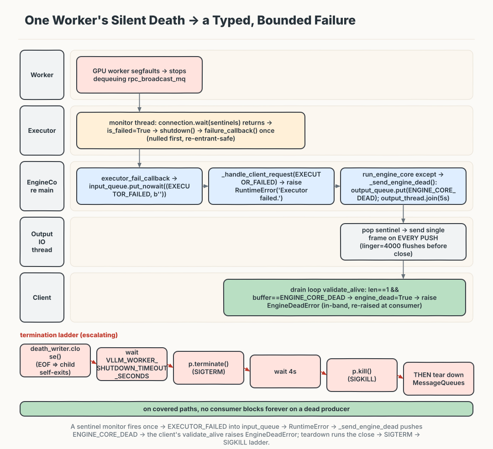</a>

<p class='figure-caption'>How one worker's silent death becomes a typed, bounded failure: the sentinel monitor fires failure_callback once, executor_fail_callback injects EXECUTOR_FAILED into input_queue, _handle_client_request raises RuntimeError, _send_engine_dead pushes ENGINE_CORE_DEAD (linger=4000), and the client's validate_alive raises EngineDeadError; teardown runs the escalating death_writer.close, SIGTERM, 4s, SIGKILL ladder.</p>

A daemon thread blocks on the OS-level `sentinel` of every worker process; `multiprocessing.connection.wait` returns the moment any one exits. The monitor sets `is_failed = True`, shuts the executor down, and fires `failure_callback` exactly once (nulling it first so a re-entrant shutdown can't double-fire). That callback is the `executor_fail_callback` registered by the engine ([Section 6](#6-queues-and-threads-inside-enginecore)), which injects `EXECUTOR_FAILED` into `input_queue` — so one worker's death propagates all the way up to the engine's `_send_engine_dead` and the client's `EngineDeadError`. The `weakref.ref` is what lets the executor be garbage-collected during a normal shutdown without the monitor thread pinning it alive. This is the counterpart to the death pipe of [Section 8](#8-the-worker-processes-spawn-and-lifecycle), which carries the *reverse* signal: parent-to-child, so a dead engine drops each worker's `death_reader` to EOF and unblocks it from its MQ dequeue.

Actual teardown is an idempotent, escalating ladder:

[`vllm/v1/executor/multiproc_executor.py:459-490`](https://github.com/vllm-project/vllm/blob/6cf7b26bd4bff60bf378e1af14044280ac0d214c/vllm/v1/executor/multiproc_executor.py#L459-L490)

```python
    def shutdown(self):
        """Properly shut down the executor and its workers"""
        if not getattr(self, "shutting_down", False):
            ...
            self.shutting_down = True

            # Make sure all the worker processes are terminated first.
            if workers := getattr(self, "workers", None):
                for w in workers:
                    # Close death_writer to signal child processes to exit
                    if w.death_writer is not None:
                        w.death_writer.close()
                        w.death_writer = None
                self._ensure_worker_termination([w.proc for w in workers])

                for w in workers:
                    # Shutdown response queues
                    if w.worker_response_mq is not None:
                        w.worker_response_mq.shutdown()
                        w.worker_response_mq = None

        if rpc_broadcast_mq := getattr(self, "rpc_broadcast_mq", None):
            rpc_broadcast_mq.shutdown()
            self.rpc_broadcast_mq = None
        ...
```

The order is deliberate: close every `death_writer` first (each surviving child sees EOF and self-exits — the cheapest possible termination), then `_ensure_worker_termination` runs the ladder — wait `VLLM_WORKER_SHUTDOWN_TIMEOUT_SECONDS` for graceful exit, else `p.terminate()` (SIGTERM), wait 4 s, else `p.kill()` (SIGKILL) ([`multiproc_executor.py:407-457`](https://github.com/vllm-project/vllm/blob/6cf7b26bd4bff60bf378e1af14044280ac0d214c/vllm/v1/executor/multiproc_executor.py#L407-L457)) — and only *after* the processes are gone are the `MessageQueue`s torn down. The `shutting_down` flag makes the whole thing re-entrant-safe, so the monitor's shutdown and the engine's `finally` shutdown compose without harm. The same discipline covers a *launch* failure: the `finally` in `_init_executor` closes every `death_writer` and force-terminates any half-spawned workers, so a crash during startup leaves no orphaned GPU process ([`multiproc_executor.py:232-247`](https://github.com/vllm-project/vllm/blob/6cf7b26bd4bff60bf378e1af14044280ac0d214c/vllm/v1/executor/multiproc_executor.py#L232-L247)).

Any unexpected worker death is fatal to the executor and reported once. A partial TP group cannot continue because the next collective would deadlock; the teardown also releases the surviving workers' GPU resources.

### Following one request across the topology

A request crosses the process mesh through the following sequence. Each hop also has a corresponding failure or shutdown path.

<a href='images/vllm-03-11-topology-trace.svg' target='_blank'>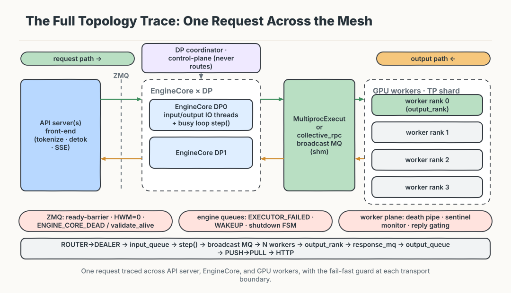</a>

<p class='figure-caption'>One request traced across API server, EngineCore, and GPU workers, with the fail-fast guard at each transport boundary.</p>

The request path is: **front-end ROUTER → engine DEALER (input IO thread) → decode/preprocess → `input_queue` → busy-loop `step()` → executor `collective_rpc` enqueue → `rpc_broadcast_mq` → N workers dequeue → forward pass → `output_rank` enqueues `ModelRunnerOutput` → `response_mq` → executor gather → `output_queue` → engine PUSH (output IO thread) → client PULL (drain loop) → async/sync queue → API server → HTTP stream.**

Reading it as boundaries and guards:

1. **API server → engine (ZMQ ROUTER→DEALER, [Section 4](#4-the-zmq-transport-request-and-output-sockets)).** The client ROUTER routes by the engine's 2-byte identity frame; the engine's input thread strips it and pushes `(type, payload)` onto `input_queue` after decoding and off-loop preprocessing ([Section 6](#6-queues-and-threads-inside-enginecore)). *Guard:* the ready-barrier handshake ([Section 11](#11-startup-handshake-and-connection)) proved this identity was registered before any request was sent, which matters because `ZMQ_ROUTER_MANDATORY` is left at its default, so the ROUTER would *silently* drop an unroutable frame; the handshake is what makes the identity routable. With HWM=0 the ROUTER also applies no high-water cap, so the frame is not dropped *for having hit that cap* either.
2. **`input_queue` → busy loop (in-process queue, [Section 6](#6-queues-and-threads-inside-enginecore)).** The main thread pops the request, mutates scheduler state, and eventually calls `step()` (article 04) and `Scheduler.schedule()` (article 05). *Guard:* `EXECUTOR_FAILED`/`WAKEUP` also travel this queue, so a lower failure or a shutdown surfaces here as an ordinary dequeue.
3. **Engine → workers (shared-memory `MessageQueue`, [Section 7](#7-single-node-tensor-parallel-one-enginecore-n-workers)).** `collective_rpc` performs exactly one `enqueue((method, args, kwargs, output_rank))` onto `rpc_broadcast_mq`; all `world_size` workers dequeue the same tuple and run the forward pass in their `worker_busy_loop` ([Section 7](#7-single-node-tensor-parallel-one-enginecore-n-workers), article 09). *Guard:* the sentinel monitor above watches every worker; the death pipe ([Section 8](#8-the-worker-processes-spawn-and-lifecycle)) watches the engine.
4. **Workers → engine (per-rank `response_mq`, [Section 7](#7-single-node-tensor-parallel-one-enginecore-n-workers)).** Only `output_rank` — the first TP rank of the last PP stage ([Section 7](#7-single-node-tensor-parallel-one-enginecore-n-workers), article 11) — enqueues a `ModelRunnerOutput`; the executor gathers exactly that one reply through a FIFO `FutureWrapper`. *Guard:* reply gating (`output_rank is None or self.rank == output_rank`) keeps the executor's dequeue count equal to the number of repliers, so a mismatch can't wedge the MQ.
5. **Engine → client (ZMQ PUSH→PULL, [Section 4](#4-the-zmq-transport-request-and-output-sockets)).** The busy loop `put_nowait`s `{client_index: EngineCoreOutputs}` onto `output_queue`; the output thread serializes and PUSHes to `sockets[client_index]` (PULL is anonymous, so origin travels in-payload, [Section 4](#4-the-zmq-transport-request-and-output-sockets)). *Guard:* `validate_alive` on the drain side; `ENGINE_CORE_DEAD` + `linger=4000` on the engine side.
6. **Client → HTTP (asyncio, [Section 2](#2-the-process-map-api-servers-enginecores-and-gpu-workers)/article 02).** The drain loop decodes and enqueues `EngineCoreOutputs`; `AsyncLLM` detokenizes and streams tokens to the HTTP response. *Guard:* in-band `EngineDeadError` re-raised at the consumer.

### Takeaways

- The frontend/engine process split removes shared-GIL contention; engine I/O threads overlap socket work with the compute loop without sharing sockets.
- ZMQ carries frontend traffic, in-process queues isolate thread ownership, and shared-memory queues fan one engine step to its GPU workers.
- Startup barriers make routes usable before traffic begins, while detected worker or engine death propagates upward as a bounded, typed failure.

## 13. References

- https://vllm.ai/blog/2025-01-27-v1-alpha-release
- https://docs.vllm.ai/en/stable/design/arch_overview/
- https://vllm.ai/blog/2025-09-05-anatomy-of-vllm

*All code conclusions are anchored to [`vllm-project/vllm@6cf7b26bd`](https://github.com/vllm-project/vllm/tree/6cf7b26bd4bff60bf378e1af14044280ac0d214c).*
