# EngineCore Loop: Request Lifecycle, Step, and Output Processing

> This walkthrough is pinned to [`vllm-project/vllm@6cf7b26bd`](https://github.com/vllm-project/vllm/tree/6cf7b26bd4bff60bf378e1af14044280ac0d214c). The code blocks come from that tree, with `...` marking any omitted lines. References in the form `path:Lstart-Lend` open the corresponding source; synthesized snippets are labeled as such.

## 1. The Loop Is the Heartbeat: The Synchronous step() Contract

An LLM request takes many iterations to finish. It enters the scheduler, runs prefill, advances through decode, and leaves only after a stop condition fires. Orca called this *iteration-level scheduling*: rebuild the runnable batch every step instead of waiting for a fixed request batch to drain ([Orca, OSDI '22](https://www.usenix.org/conference/osdi22/presentation/yu)).

EngineCore implements iteration-level scheduling as a busy loop around `step()`. The vLLM engineering write-up summarizes a step as schedule, forward, and postprocess ([Inside vLLM](https://vllm.ai/blog/2025-09-05-anatomy-of-vllm)); the architecture guide describes the loop that dispatches work to GPU workers ([Architecture Overview](https://docs.vllm.ai/en/stable/design/arch_overview/)). The `(outputs, model_executed)` result connects that loop to the `step()` implementation in [Section 2](#2-step-schedule-execute-update-as-one-transaction).

### The heartbeat: drain input, then step once

[`vllm/v1/engine/core.py:1259-1265`](https://github.com/vllm-project/vllm/blob/6cf7b26bd4bff60bf378e1af14044280ac0d214c/vllm/v1/engine/core.py#L1259-L1265)

```python
    def run_busy_loop(self):
        """Core busy loop of the EngineCore."""
        while self._handle_shutdown():
            # 1) Poll the input queue until there is work to do.
            self._process_input_queue()
            # 2) Step the engine core and return the outputs.
            self._process_engine_step()

        raise SystemExit
```

Each loop iteration has two phases. `_process_input_queue` ([`core.py:1269-1298`](https://github.com/vllm-project/vllm/blob/6cf7b26bd4bff60bf378e1af14044280ac0d214c/vllm/v1/engine/core.py#L1269-L1298)) drains new requests, aborts, and wakeups from the ZMQ input thread before `_process_engine_step` advances the engine. Admission and cancellation therefore land between forwards instead of halfway through one. [Section 4](#4-add_request-entering-the-engine-and-the-waiting-queue) follows the input path; article 03 covers the IPC threads that feed it.

### The gate: step only while there is work

The loop does not spin unconditionally. `_process_input_queue` blocks until `has_work()` is true, and that predicate is the admission gate for the entire heartbeat.

[`vllm/v1/engine/core.py:1247-1253`](https://github.com/vllm-project/vllm/blob/6cf7b26bd4bff60bf378e1af14044280ac0d214c/vllm/v1/engine/core.py#L1247-L1253)

<a href='images/vllm-04-11-has-work-gate.svg' target='_blank'>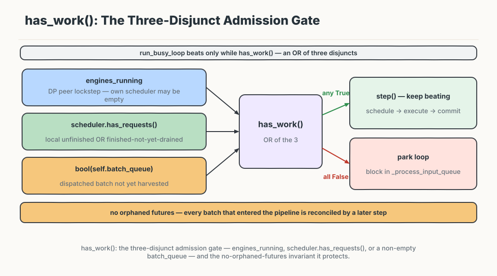</a>

<p class='figure-caption'>has_work(): the three-disjunct admission gate — engines_running, scheduler.has_requests(), or a non-empty batch_queue — and the no-orphaned-futures invariant it protects.</p>

```python
    def has_work(self) -> bool:
        """Returns true if the engine should be stepped."""
        return (
            self.engines_running
            or self.scheduler.has_requests()
            or bool(self.batch_queue)
        )
```

The three terms cover different kinds of work. `scheduler.has_requests()` means local requests are unfinished or not yet drained. `engines_running` keeps a DP engine stepping with its peers even when its local scheduler is empty, which is why `step()` rechecks `has_requests()`. `bool(self.batch_queue)` keeps the loop active while dispatched batches are still pending. As a result, the loop harvests each queued future before it parks.

**The mode is bound once, not per step.**

Which step function runs is decided at construction and never re-evaluated in the hot loop.

[`vllm/v1/engine/core.py:221-224`](https://github.com/vllm-project/vllm/blob/6cf7b26bd4bff60bf378e1af14044280ac0d214c/vllm/v1/engine/core.py#L221-L224)

```python
        self.step_fn = (
            self.step if self.batch_queue is None else self.step_with_batch_queue
        )
        self.async_scheduling = vllm_config.scheduler_config.async_scheduling
```

`batch_queue` is allocated only when `max_concurrent_batches > 1` ([`core.py:196-202`](https://github.com/vllm-project/vllm/blob/6cf7b26bd4bff60bf378e1af14044280ac0d214c/vllm/v1/engine/core.py#L196-L202)) — that is, under pipeline parallelism or async scheduling. When it is `None`, `step_fn` is the synchronous `step`; otherwise it is the overlapped `step_with_batch_queue` ([Section 3](#3-step_with_batch_queue-the-overlapped-variant)). The loop driver calls `self.step_fn()` with no branch, so the busy loop is written once and is oblivious to execution mode. The rest of this section is the synchronous contract: one batch resident at a time.

### The synchronous contract: one transaction, one tuple

[`vllm/v1/engine/core.py:479-489`](https://github.com/vllm-project/vllm/blob/6cf7b26bd4bff60bf378e1af14044280ac0d214c/vllm/v1/engine/core.py#L479-L489)

```python
    def step(self) -> tuple[dict[int, EngineCoreOutputs], bool]:
        """Schedule, execute, and make output.

        Returns tuple of outputs and a flag indicating whether the model
        was executed.
        """

        # Check for any requests remaining in the scheduler - unfinished,
        # or finished and not yet removed from the batch.
        if not self.scheduler.has_requests():
            return {}, False
```

`step()` returns `(dict[int, EngineCoreOutputs], bool)`: a per-client output map keyed by `client_index`, plus a `model_executed` flag. On the synchronous path, the early return at `L488-489` handles an empty scheduler with `{}` and `False`. This check remains necessary even though the outer loop has a `has_work()` gate, because in DP mode `engines_running` can keep the loop active while the local scheduler is empty.

Between the guard and return, `step()` follows a fixed order: **schedule** (`scheduler.schedule(self._should_throttle_prefills())` → `SchedulerOutput`), **execute** (a non-blocking `execute_model` future, followed by `sample_tokens` when sampling was deferred), an **abort barrier** after the forward settles, and **commit** through `update_from_output`. In the base engine, `_should_throttle_prefills()` returns `False` ([`core.py:474-477`](https://github.com/vllm-project/vllm/blob/6cf7b26bd4bff60bf378e1af14044280ac0d214c/vllm/v1/engine/core.py#L474-L477)); the DP engine core overrides it to defer new prefills for cross-engine balancing.

[Section 2](#2-step-schedule-execute-update-as-one-transaction) reads every line of that body; article 05 covers what `schedule` decides; [Section 6](#6-execute_model-handing-the-batch-to-the-executor) the executor edge; [Section 7](#7-update_from_output-model-output-becomes-engine-outputs) the commit half. What matters for the loop is the final line.

[`vllm/v1/engine/core.py:508`](https://github.com/vllm-project/vllm/blob/6cf7b26bd4bff60bf378e1af14044280ac0d214c/vllm/v1/engine/core.py#L508)

<a href='images/vllm-04-12-model-executed-antispin.svg' target='_blank'>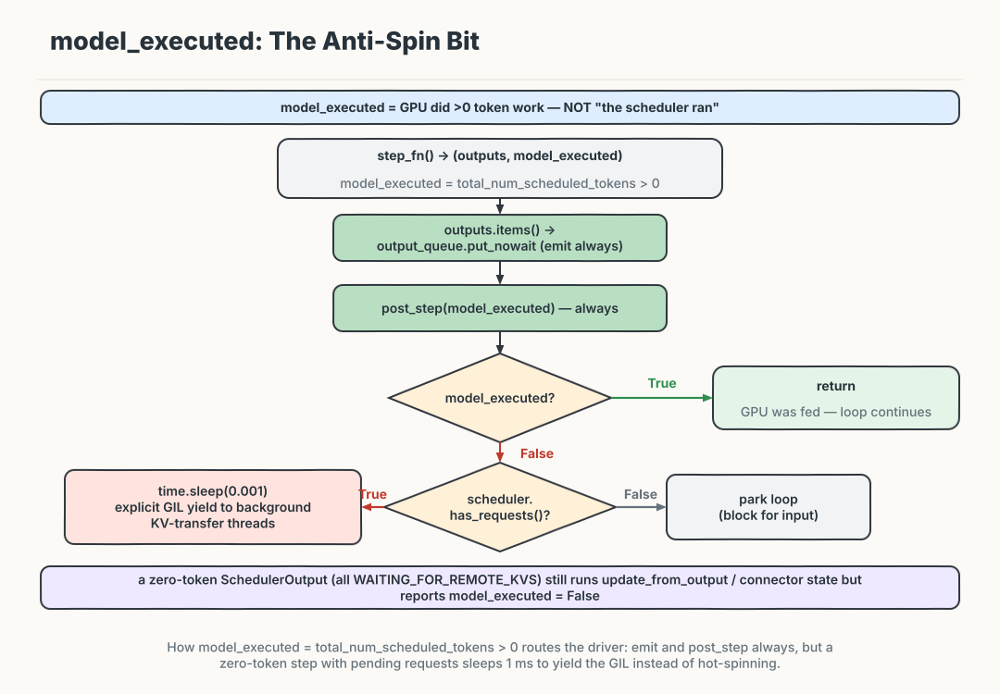</a>

<p class='figure-caption'>How model_executed = total_num_scheduled_tokens > 0 routes the driver: emit and post_step always, but a zero-token step with pending requests sleeps 1 ms to yield the GIL instead of hot-spinning.</p>

```python
        return engine_core_outputs, scheduler_output.total_num_scheduled_tokens > 0
```

`model_executed` is `total_num_scheduled_tokens > 0` — literally "the batch carried more than zero tokens of work for the GPU." It is **not** "the scheduler ran." A `SchedulerOutput` with zero scheduled tokens (for example, every request blocked on remote KV in `WAITING_FOR_REMOTE_KVS`) still flows through the full transaction (it still commits connector and KV-transfer progress inside `update_from_output`), but it reports `model_executed=False`. Decoupling "the scheduler produced a batch" from "the GPU did token work" is what makes the anti-spin policy in the driver correct.

<a href='images/vllm-04-03-step-contract.svg' target='_blank'>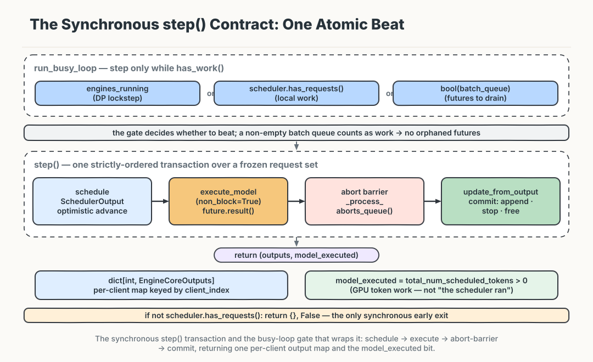</a>

<p class='figure-caption'>The synchronous step() transaction and the busy-loop gate that wraps it.</p>

### The driver: emit, hook, and refuse to hot-spin

[`vllm/v1/engine/core.py:1300-1317`](https://github.com/vllm-project/vllm/blob/6cf7b26bd4bff60bf378e1af14044280ac0d214c/vllm/v1/engine/core.py#L1300-L1317)

```python
    def _process_engine_step(self) -> bool:
        """Called only when there are unfinished local requests."""

        # Step the engine core.
        outputs, model_executed = self.step_fn()
        # Put EngineCoreOutputs into the output queue.
        for output in outputs.items() if outputs else ():
            self.output_queue.put_nowait(output)
        # Post-step hook.
        self.post_step(model_executed)

        # If no model execution happened but there is still scheduler work
        # (e.g. WAITING_FOR_REMOTE_KVS or delayed KV connector frees), yield
        # the GIL briefly to allow background transfer threads to make progress.
        if not model_executed and self.scheduler.has_requests():
            time.sleep(0.001)

        return model_executed
```

Three things happen after the step returns. First, the outputs are fanned onto `output_queue`: `for output in outputs.items() if outputs else ()`. That `if outputs else ()` guard is the seam between the two step functions — `step` returns `{}` when idle, `step_with_batch_queue` can return `None`, and both are falsy, so a single line tolerates both "emit nothing" signals without a mode branch. Each `(client_index, EngineCoreOutputs)` pair is picked up by the output IPC thread and pushed to the right socket ([Section 8](#8-output-aggregation-enginecoreoutputs-per-client); article 03 for the ZMQ topology).

Second, `post_step(model_executed)` runs the once-per-step hook — in the synchronous, non-async case it pulls speculative draft token ids into the scheduler, gated on `model_executed` so an idle step never mutates draft state ([Section 3](#3-step_with_batch_queue-the-overlapped-variant)).

Third, `if not model_executed and self.scheduler.has_requests(): time.sleep(0.001)` handles steps that perform no GPU token work while requests remain, such as when all requests are waiting on remote KV transfers or delayed connector frees. The one-millisecond sleep yields the GIL to the background threads that can unblock those requests. The outer loop still runs while `has_work()` is true, but it avoids hot-spinning during a zero-token interval.

## 2. step(): Schedule, Execute, Update as One Transaction

A synchronous `step()` orders three collaborators: the Scheduler chooses a batch, the Executor runs the forward pass and sampling, and `update_from_output` folds the result back into request state. One batch is resident for the duration of the call. `future.result()` settles the GPU work before the commit, and the same `SchedulerOutput` is used at both ends of the transaction.

<a href='images/vllm-04-01-engine-step.svg' target='_blank'>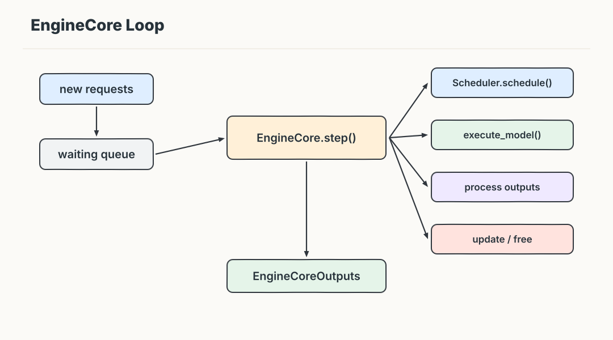</a>

<p class='figure-caption'>One EngineCore step: schedule, execute, sample, abort-barrier, commit.</p>

### The `step()` body

Source anchor — [`vllm/v1/engine/core.py:479-508`](https://github.com/vllm-project/vllm/blob/6cf7b26bd4bff60bf378e1af14044280ac0d214c/vllm/v1/engine/core.py#L479-L508):

```python
    def step(self) -> tuple[dict[int, EngineCoreOutputs], bool]:
        """Schedule, execute, and make output.

        Returns tuple of outputs and a flag indicating whether the model
        was executed.
        """

        # Check for any requests remaining in the scheduler - unfinished,
        # or finished and not yet removed from the batch.
        if not self.scheduler.has_requests():
            return {}, False
        scheduler_output = self.scheduler.schedule(self._should_throttle_prefills())
        future = self.model_executor.execute_model(scheduler_output, non_block=True)
        grammar_output = self.scheduler.get_grammar_bitmask(scheduler_output)
        with (
            self.log_error_detail(scheduler_output),
            self.log_iteration_details(scheduler_output),
        ):
            model_output = future.result()
            if model_output is None:
                model_output = self.model_executor.sample_tokens(grammar_output)

        # Before processing the model output, process any aborts that happened
        # during the model execution.
        self._process_aborts_queue()
        engine_core_outputs = self.scheduler.update_from_output(
            scheduler_output, model_output
        )

        return engine_core_outputs, scheduler_output.total_num_scheduled_tokens > 0
```

The order is: return if idle, schedule, launch the forward pass, build the CPU bitmask, wait for the forward pass, sample if deferred, drain aborts, commit, and report whether model work ran.

**Early return (L488-489).** `if not self.scheduler.has_requests(): return {}, False` is the sole early return of the synchronous path — no requests unfinished *and* none finished-but-not-yet-drained. The check looks redundant with the driver's contract ("called only when there are unfinished local requests", [`core.py:1301`](https://github.com/vllm-project/vllm/blob/6cf7b26bd4bff60bf378e1af14044280ac0d214c/vllm/v1/engine/core.py#L1301)), but it is not: in data-parallel mode `engines_running` alone can drive a step with no local requests, so the concrete `step()` re-verifies. It returns `{}` (empty dict) — the driver's `outputs.items() if outputs else ()` treats that as "emit nothing" ([Section 1](#1-the-loop-is-the-heartbeat-the-synchronous-step-contract)).

**Phase 1 — schedule (L490).** `scheduler.schedule(...)` returns a `SchedulerOutput`: a pure *description* of what should run, which requests, how many new tokens each, which KV blocks are allocated or reused, which requests were preempted or finished. It does not touch the GPU. The argument `self._should_throttle_prefills()` is `False` in the base class ([`core.py:474-477`](https://github.com/vllm-project/vllm/blob/6cf7b26bd4bff60bf378e1af14044280ac0d214c/vllm/v1/engine/core.py#L474-L477)) and overridden only by the DP engine core to defer new prefills for prefill balancing. What `schedule()` decides (token budget, chunked prefill, preemption under KV pressure) is article 05.

**Phase 2 — execute (L491-499).** The three operations run in this order:

`execute_model(..., non_block=True)` launches the forward and returns a `Future`. While it runs, the CPU builds the structured-output bitmask. `future.result()` joins the paths. A `ModelRunnerOutput` means sampling already ran; `None` means the worker retained the logits, so `sample_tokens(grammar_output)` applies the mask and produces the result. Section 6 and article 03 follow the executor edge; article 09 follows the worker.

This launch-before-bitmask ordering is safe because the bitmask is not read until `sample_tokens`. If L491 and L492 were swapped, the bitmask would be computed on the critical path and the GPU would start later; correctness would be identical but the overlap would be lost.

**Abort barrier (L501-503).** `_process_aborts_queue()` runs *after* the forward settles and *before* commit. Aborts that arrived over ZMQ during the forward are drained into the scheduler here (via one batched `abort_requests`), so a request cancelled mid-flight is marked finished before `update_from_output` would otherwise commit its stale token. This barrier and the dual-queue eager/ordered abort scheme are [Section 10](#10-aborts-and-cancellation); the ZMQ path that delivers the abort is article 03.

**Phase 3 — commit (L504-506).** `scheduler.update_from_output(scheduler_output, model_output)` writes sampled tokens into request state, detects stops, frees finished requests' KV, and assembles the per-client `dict[int, EngineCoreOutputs]`. The reconciliation loop is [Section 7](#7-update_from_output-model-output-becomes-engine-outputs); the two-axis output aggregation (`client_index` dict key vs. `engine_index` payload field) is [Section 8](#8-output-aggregation-enginecoreoutputs-per-client); the KV free on finish is [Section 9](#9-finished-requests-detection-cleanup-and-freeing-kv) and article 06.

**Return (L508).** `model_executed = scheduler_output.total_num_scheduled_tokens > 0` is read from the *SchedulerOutput*, not the model output: it means "the GPU did >0 tokens of token work", not "the scheduler ran". A zero-token `SchedulerOutput` (e.g. every request blocked on `WAITING_FOR_REMOTE_KVS`) still runs `update_from_output` to advance connector state, but reports `False`, which triggers the driver's 1 ms GIL yield instead of a busy spin ([Section 1](#1-the-loop-is-the-heartbeat-the-synchronous-step-contract)).

**The error wrapper brackets the result, not the launch.**

Anchor — [`vllm/v1/engine/core.py:417-431`](https://github.com/vllm-project/vllm/blob/6cf7b26bd4bff60bf378e1af14044280ac0d214c/vllm/v1/engine/core.py#L417-L431):

```python
    @contextmanager
    def log_error_detail(self, scheduler_output: SchedulerOutput):
        """Execute the model and log detailed info on failure."""
        try:
            yield
        except Exception as err:
            ...
            dump_engine_exception(
                self.vllm_config, scheduler_output, self.scheduler.make_stats()
            )
            raise err
```

<a href='images/vllm-04-13-launch-bitmask-overlap.svg' target='_blank'>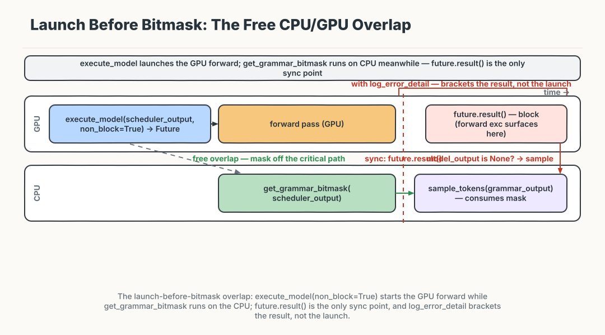</a>

<p class='figure-caption'>The launch-before-bitmask overlap: execute_model(non_block=True) starts the GPU forward while get_grammar_bitmask runs on the CPU; future.result() is the only sync point, and log_error_detail brackets the result, not the launch.</p>

The context manager brackets result collection rather than dispatch because a non-blocking forward surfaces its exception at `future.result()`. The dump therefore captures the `SchedulerOutput` and stats for the failed batch before re-raising the original traceback. `log_iteration_details` is inactive unless explicitly enabled ([`core.py:433-472`](https://github.com/vllm-project/vllm/blob/6cf7b26bd4bff60bf378e1af14044280ac0d214c/vllm/v1/engine/core.py#L433-L472)).

**Optimistic schedule, reconciled commit.**

`step()` stays short because all lifecycle bookkeeping is split across the two ends of the transaction. `schedule()` advances counters *optimistically* before the GPU runs; `update_from_output` *reconciles* them against what actually happened. That asymmetry is the transaction's atomicity mechanism.

Anchor — the optimistic prologue, called at the tail of `schedule()` in `_update_after_schedule` (full listing [Section 7](#7-update_from_output-model-output-becomes-engine-outputs)); the critical line is [`vllm/v1/core/sched/scheduler.py:1182`](https://github.com/vllm-project/vllm/blob/6cf7b26bd4bff60bf378e1af14044280ac0d214c/vllm/v1/core/sched/scheduler.py#L1182):

```python
            request.num_computed_tokens += num_scheduled_token
```

`num_computed_tokens` is advanced the instant the batch is scheduled — *before* the forward. As the comment ([`scheduler.py:1170-1178`](https://github.com/vllm-project/vllm/blob/6cf7b26bd4bff60bf378e1af14044280ac0d214c/vllm/v1/core/sched/scheduler.py#L1170-L1178)) spells out, this is what lets a chunked-prefill request be re-scheduled the very next step without waiting for the forward to land. `num_in_flight_tokens` is the parallel counter of tokens dispatched-but-not-yet-committed, and `last_sched_seq` stamps the step so deferred block frees can be fenced ([Section 9](#9-finished-requests-detection-cleanup-and-freeing-kv)).

The reconcile side runs the counter back down. Anchor — the head of the per-request loop in `update_from_output` (full listing [Section 7](#7-update_from_output-model-output-becomes-engine-outputs)); the unconditional decrement is [`vllm/v1/core/sched/scheduler.py:1571-1572`](https://github.com/vllm-project/vllm/blob/6cf7b26bd4bff60bf378e1af14044280ac0d214c/vllm/v1/core/sched/scheduler.py#L1571-L1572):

```python
            if request is not None:
                request.num_in_flight_tokens -= num_tokens_scheduled
```

The in-flight decrement runs before the skip check, balancing the schedule-time increment even when a request was aborted while its frame ran. The skip tests `is_finished()` as well as object presence because a connector may keep a terminal request registered. Speculative rejections separately subtract rejected drafts from `num_computed_tokens`; Section 7 follows both corrections.

The ordering gives four guarantees used later: the launch overlaps grammar-mask construction, every scheduled batch is reconciled once, aborts land before commit, and `model_executed` reports token work rather than mere scheduler activity.

## 3. step_with_batch_queue: The Overlapped Variant

Synchronous `step()` keeps one batch resident. Pipeline parallelism can then leave early stages idle, while async scheduling has CPU work for step *k+1* that could overlap GPU work for step *k*. `step_with_batch_queue` keeps a bounded number of batches in flight, retaining the same schedule/execute/commit phases but preferring to fill an available slot before harvesting the oldest result.

### Mode is chosen once, at construction

Source: [`vllm/config/vllm.py:491-502`](https://github.com/vllm-project/vllm/blob/6cf7b26bd4bff60bf378e1af14044280ac0d214c/vllm/config/vllm.py#L491-L502):

```python
    @property
    def max_concurrent_batches(self) -> int:
        # PP requires PP-size concurrent batches to fill the pipeline.
        # Async scheduling requires 2 concurrent batches to overlap.
        pp_size = self.parallel_config.pipeline_parallel_size
        if self.scheduler_config.async_scheduling:
            if self.use_v2_model_runner:
                return pp_size + 1
            # V1 Model Runner does not fully support async scheduling with PP.
            if pp_size <= 1:
                return 2
        return pp_size
```

<a href='images/vllm-04-14-step-fn-binding.svg' target='_blank'>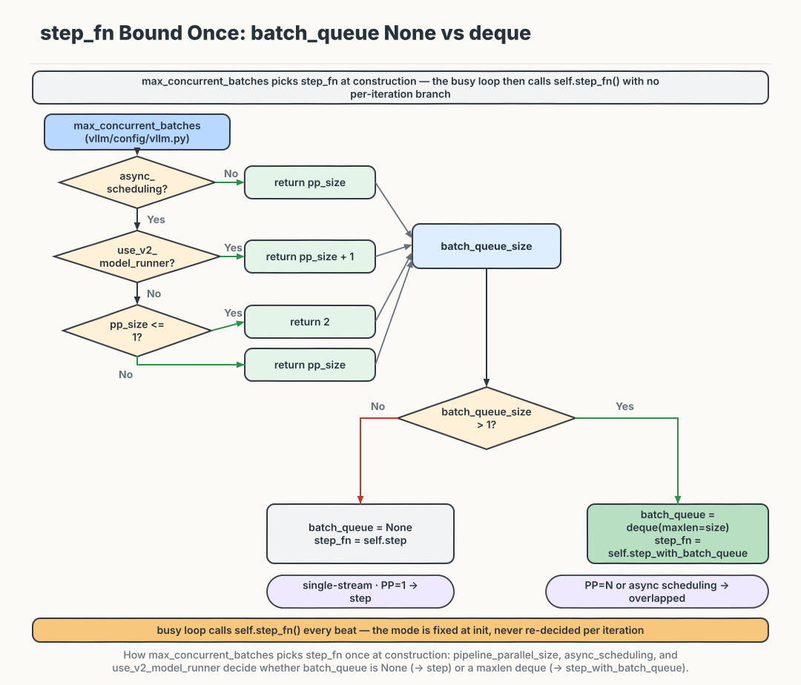</a>

<p class='figure-caption'>How max_concurrent_batches picks step_fn once at construction: pipeline_parallel_size, async_scheduling, and use_v2_model_runner decide whether batch_queue is None (→ step) or a maxlen deque (→ step_with_batch_queue).</p>

Source: [`vllm/v1/engine/core.py:196-202, 221-223`](https://github.com/vllm-project/vllm/blob/6cf7b26bd4bff60bf378e1af14044280ac0d214c/vllm/v1/engine/core.py#L196-L202):

```python
        self.batch_queue_size = vllm_config.max_concurrent_batches
        self.batch_queue: (
            deque[tuple[Future[ModelRunnerOutput], SchedulerOutput, Future[Any]]] | None
        ) = None
        if self.batch_queue_size > 1:
            logger.debug("Batch queue is enabled with size %d", self.batch_queue_size)
            self.batch_queue = deque(maxlen=self.batch_queue_size)
...
        self.step_fn = (
            self.step if self.batch_queue is None else self.step_with_batch_queue
        )
```

Single stream, no async scheduling, PP=1 → `max_concurrent_batches` returns `pp_size` = `1` → `batch_queue` stays `None` → `step_fn = self.step`. Pipeline-parallel size N, or async scheduling on a single stage, → `≥2` → a `deque(maxlen=batch_queue_size)` is allocated and `step_fn = self.step_with_batch_queue`. The queue element is a three-tuple `(sample_future, scheduler_output, exec_future)`: the future you block on to get the sampled tokens, the schedule that produced the batch (needed to reconcile it), and the raw `execute_model` future (kept for error decoding, see below).

<a href='images/vllm-04-04-batch-queue.svg' target='_blank'>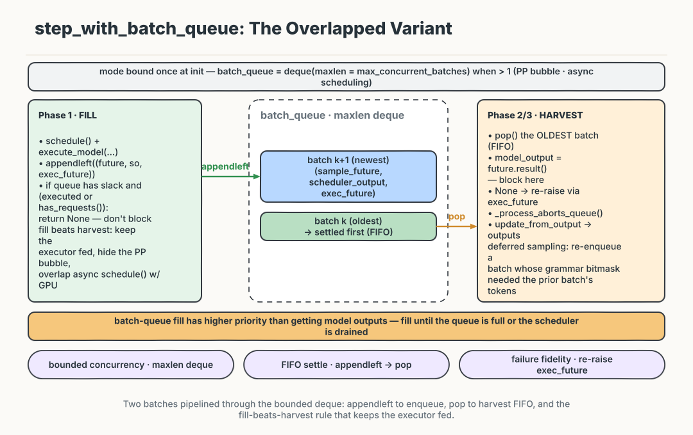</a>

<p class='figure-caption'>Two batches pipelined through the bounded deque: appendleft to enqueue, pop to harvest FIFO.</p>

### The priority rule: fill before harvest

The variant tries to keep the executor fed. When it can schedule a fresh batch, it enqueues that batch and returns instead of blocking to collect an older result.

Source: [`vllm/v1/engine/core.py:519-534`](https://github.com/vllm-project/vllm/blob/6cf7b26bd4bff60bf378e1af14044280ac0d214c/vllm/v1/engine/core.py#L519-L534):

```python
    def step_with_batch_queue(
        self,
    ) -> tuple[dict[int, EngineCoreOutputs] | None, bool]:
        """Schedule and execute batches with the batch queue.
        Note that if nothing to output in this step, None is returned.

        The execution flow is as follows:
        1. Try to schedule a new batch if the batch queue is not full.
        If a new batch is scheduled, directly return an empty engine core
        output. In other words, fulfilling the batch queue has a higher priority
        than getting model outputs.
        2. If there is no new scheduled batch, meaning that the batch queue
        is full or no other requests can be scheduled, we block until the first
        batch in the job queue is finished.
        3. Update the scheduler from the output.
        """
```

Note the return type: `dict[int, EngineCoreOutputs] | None`. Where `step()` returns `{}` when idle, this variant returns `None` — both when it *productively* scheduled-and-deferred and when it *defensively* found nothing. The driver's `outputs.items() if outputs else ()` ([Section 1](#1-the-loop-is-the-heartbeat-the-synchronous-step-contract)) treats both falsy values identically as "emit nothing," which is why the loop needs no mode-specific output handling.

### Phase 1 — schedule the next batch, non-blocking, and enqueue

Source: [`vllm/v1/engine/core.py:536-581`](https://github.com/vllm-project/vllm/blob/6cf7b26bd4bff60bf378e1af14044280ac0d214c/vllm/v1/engine/core.py#L536-L581):

```python
        batch_queue = self.batch_queue
        assert batch_queue is not None
...
        assert len(batch_queue) < self.batch_queue_size

        model_executed = False
        deferred_scheduler_output = None
        if self.scheduler.has_requests():
            scheduler_output = self.scheduler.schedule(self._should_throttle_prefills())
            with self.log_error_detail(scheduler_output):
                exec_future = self.model_executor.execute_model(
                    scheduler_output, non_block=True
                )
            if self.is_ec_consumer:
                model_executed = scheduler_output.total_num_scheduled_tokens > 0

            if self.is_pooling_model or not model_executed:
                # No sampling required (no requests scheduled).
                future = cast(Future[ModelRunnerOutput], exec_future)
            else:
                if not scheduler_output.pending_structured_output_tokens:
                    # We aren't waiting for any tokens, get any grammar output
                    # and sample immediately.
                    grammar_output = self.scheduler.get_grammar_bitmask(
                        scheduler_output
                    )
                    future = self.model_executor.sample_tokens(
                        grammar_output, non_block=True
                    )
                else:
                    # We need to defer sampling until we have processed the model output
                    # from the prior step.
                    deferred_scheduler_output = scheduler_output

            if not deferred_scheduler_output:
                # Add this step's future to the queue.
                batch_queue.appendleft((future, scheduler_output, exec_future))
                if len(batch_queue) < self.batch_queue_size and (
                    model_executed or self.scheduler.has_requests()
                ):
                    # Don't block on next worker response unless the queue is full
                    # or there are no more requests to schedule.
                    return None, model_executed
```

<a href='images/vllm-04-15-sampling-subcases.svg' target='_blank'>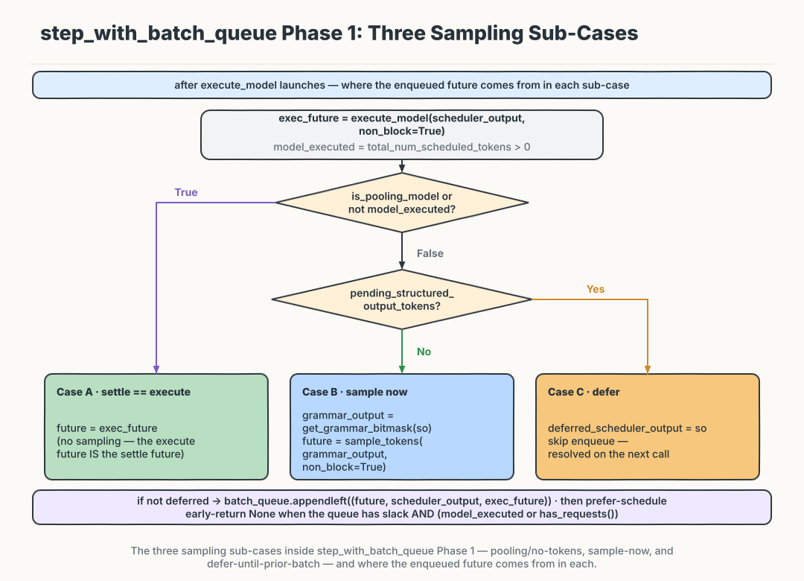</a>

<p class='figure-caption'>The three sampling sub-cases inside step_with_batch_queue Phase 1 — pooling/no-tokens, sample-now, and defer-until-prior-batch — and where the enqueued future comes from in each.</p>

- **Entry precondition (`L542`).** `assert len(batch_queue) < self.batch_queue_size`. The caller must never enter with a full queue — there is always room to enqueue one more. The method preserves this itself: a call that fills the queue skips the early return and falls through to harvest the oldest batch, so it never exits with the queue full.
- **Schedule + non-blocking launch (`L547-551`).** Only if `scheduler.has_requests()`. Unlike the sync path, `execute_model(..., non_block=True)` here returns `exec_future` and *nothing blocks* — the CPU immediately proceeds to consider sampling and, ultimately, to schedule again. The forward for this batch is now running on the GPU/pipeline. What `schedule()` decides (token budget, chunked prefill, KV allocation) is article 05; what the forward does across TP/PP ranks is article 09.
- **`model_executed` gating (`L552-553`).** Set from `total_num_scheduled_tokens > 0` only when `self.is_ec_consumer`, which is `True` whenever there is no encoder-cache transfer config — the common case ([`core.py:204-207`](https://github.com/vllm-project/vllm/blob/6cf7b26bd4bff60bf378e1af14044280ac0d214c/vllm/v1/engine/core.py#L204-L207)). For a pure encoder-cache *producer* it stays `False`, so the producer never claims GPU token work it did not do.
- **Three sampling sub-cases (`L555-571`).** (1) `is_pooling_model or not model_executed` → no tokens to sample; `future = exec_future`, the execute future *is* the settle future. (2) Sampling needed and no `pending_structured_output_tokens` → build the grammar bitmask and dispatch `sample_tokens(..., non_block=True)` now; `future` is the sample future. (3) Sampling needed *but* the batch has `pending_structured_output_tokens` → the bitmask depends on tokens still being produced by an earlier in-flight batch, so it cannot be built yet. Record `deferred_scheduler_output = scheduler_output` and skip enqueue for now.
- **Enqueue + prefer-scheduling early return (`L573-581`).** If sampling was not deferred, `appendleft((future, scheduler_output, exec_future))` pushes the batch onto the *front* of the deque. Then, if the queue still has slack *and* (`model_executed` or more requests remain), `return None, model_executed` immediately — do not fall through to harvest an older batch. This is the docstring's priority rule made literal: keep feeding the executor until the queue is full or the scheduler is drained.

The executor is starved only when there is genuinely nothing left to schedule. As long as `has_requests()` holds and the queue has room, every call adds a batch instead of stalling on a `result()`. The `appendleft`/`maxlen` deque plus the `L542` assert bound outstanding batches at exactly `batch_queue_size`.

**The empty-queue guard.**

Source: [`vllm/v1/engine/core.py:583-587`](https://github.com/vllm-project/vllm/blob/6cf7b26bd4bff60bf378e1af14044280ac0d214c/vllm/v1/engine/core.py#L583-L587):

```python
        elif not batch_queue:
            # Queue is empty. We should not reach here since this method should
            # only be called when the scheduler contains requests or the queue
            # is non-empty.
            return None, False
```

Reached only when the `if self.scheduler.has_requests()` at `L546` was false *and* the queue is empty (i.e. no work at all). `has_work` ([Section 1](#1-the-loop-is-the-heartbeat-the-synchronous-step-contract)) should prevent the loop from ever calling into this state; the guard is defensive, returning the idle `(None, False)` that maps to "emit nothing, and (in the driver) yield the GIL if requests still linger."

### Phase 2/3 — block on the oldest batch, then commit

Only after the fill path declines (queue full, or scheduler drained) does the method block. It settles the *oldest* outstanding batch, not the one just scheduled — FIFO ordering is what makes the pipeline correct.

Source: [`vllm/v1/engine/core.py:589-607`](https://github.com/vllm-project/vllm/blob/6cf7b26bd4bff60bf378e1af14044280ac0d214c/vllm/v1/engine/core.py#L589-L607):

```python
        # Block until the next result is available.
        future, scheduler_output, exec_model_fut = batch_queue.pop()
        with (
            self.log_error_detail(scheduler_output),
            self.log_iteration_details(scheduler_output),
        ):
            model_output = future.result()
            if model_output is None:
                # None from sample_tokens() implies that the original execute_model()
                # call failed - raise that exception.
                exec_model_fut.result()
                raise RuntimeError("unexpected error")

        # Before processing the model output, process any aborts that happened
        # during the model execution.
        self._process_aborts_queue()
        engine_core_outputs = self.scheduler.update_from_output(
            scheduler_output, model_output
        )
```

- **Harvest oldest (`L590`).** Pushes are `appendleft`; `pop()` takes from the *right*. Together they make the deque a FIFO: the first batch scheduled is the first settled. This is essential because the per-batch responses arrive on the executor's message queues in send order (article 03), and the multiproc `FutureWrapper.result()` drains any futures ahead of it before returning ([`multiproc_executor.py:83-91`](https://github.com/vllm-project/vllm/blob/6cf7b26bd4bff60bf378e1af14044280ac0d214c/vllm/v1/executor/multiproc_executor.py#L83-L91)) — so holding several outstanding futures never misattributes a worker response to the wrong batch. That machinery is article 09's concern; the queue here just guarantees the harvest order matches the launch order.
- **Block + failure decode (`L595-600`).** `future.result()` blocks for the oldest batch. A `None` from a `sample_tokens` future means the upstream `execute_model` it depended on *failed*; the code calls `exec_model_fut.result()` purely to re-raise that original exception with its real traceback, and the trailing `raise RuntimeError("unexpected error")` is an unreachable guard. This is why the queue stores `exec_future` alongside the sample future — the raw execute future is the only handle that carries the true error.
- **Abort barrier + commit (`L602-607`).** Identical to the sync path: `_process_aborts_queue()` drains aborts that arrived while this batch was executing, *then* `update_from_output` reconciles. Aborts, the state machine, and output aggregation are all in [Section 2](#2-step-schedule-execute-update-as-one-transaction)/[Section 4](#4-add_request-entering-the-engine-and-the-waiting-queue)-[Section 8](#8-output-aggregation-enginecoreoutputs-per-client) — the barrier ensures a request cancelled mid-forward is removed before its (now stale) tokens would be committed.

### The deferred-sampling tail

Sub-case (3) above parked a batch whose grammar bitmask needed the *prior* batch's structured-output tokens. Those tokens now exist, because the prior batch was just committed at `L605`. So the tail finishes the deferred batch and re-enqueues it.

Source: [`vllm/v1/engine/core.py:609-632`](https://github.com/vllm-project/vllm/blob/6cf7b26bd4bff60bf378e1af14044280ac0d214c/vllm/v1/engine/core.py#L609-L632):

```python
        # NOTE(nick): We can either handle the deferred tasks here or save
        # in a field and do it immediately once step_with_batch_queue is
        # re-called. The latter slightly favors TTFT over TPOT/throughput.
        if deferred_scheduler_output:
            # When draft tokens are used with structured output, validate them
            # before computing the grammar bitmask for the deferred request.
            if self.check_for_draft_tokens:
                draft_token_ids = self.model_executor.take_draft_token_ids()
                if draft_token_ids is not None:
...
                    self.scheduler.update_draft_token_ids_in_output(
                        draft_token_ids, deferred_scheduler_output
                    )
            # We now have the tokens needed to compute the bitmask for the
            # deferred request. Get the bitmask and call sample tokens.
            grammar_output = self.scheduler.get_grammar_bitmask(
                deferred_scheduler_output
            )
            future = self.model_executor.sample_tokens(grammar_output, non_block=True)
            batch_queue.appendleft((future, deferred_scheduler_output, exec_future))

        return engine_core_outputs, model_executed
```

<a href='images/vllm-04-16-deferred-sampling-seq.svg' target='_blank'>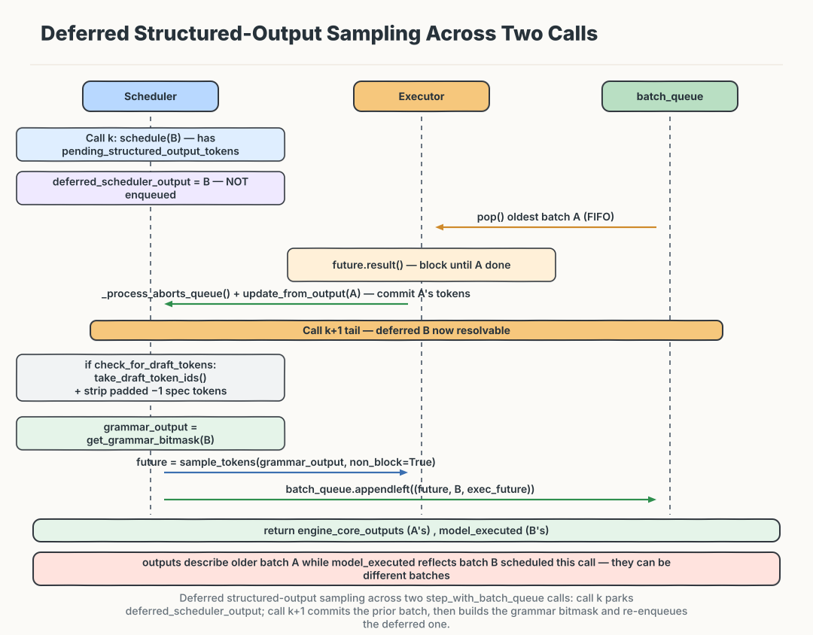</a>

<p class='figure-caption'>Deferred structured-output sampling across two step_with_batch_queue calls: call k parks deferred_scheduler_output; call k+1 commits the prior batch, then builds the grammar bitmask and re-enqueues the deferred one.</p>

With speculative decoding or diffusion active (`check_for_draft_tokens`, [`core.py:160-162`](https://github.com/vllm-project/vllm/blob/6cf7b26bd4bff60bf378e1af14044280ac0d214c/vllm/v1/engine/core.py#L160-L162)), draft token ids are pulled and the invalid spec tokens stripped (padded to `-1` and skipped by the bitmask computation) *before* the mask is built, so structured-output masking is applied to genuine tokens only (spec-decode reconciliation is article 12). The bitmask is then computed against `deferred_scheduler_output`, `sample_tokens(..., non_block=True)` is dispatched, and the batch is `appendleft`'d back for a later harvest. The `exec_future` re-used at `L630` is the deferred batch's own execute future from `L549` — the deferred branch never hit the enqueue at `L575`, so `exec_future` still holds it.

**The return (`L632`).** `engine_core_outputs, model_executed`. The outputs describe the older batch committed at `L605`, while `model_executed` describes the batch scheduled by the current call. They may refer to different batches: outputs go to clients ([Section 8](#8-output-aggregation-enginecoreoutputs-per-client)), whereas `model_executed` drives the post-step hook and anti-spin sleep ([Section 1](#1-the-loop-is-the-heartbeat-the-synchronous-step-contract)).

**One routing detail: draft tokens by mode.**

Draft-token collection has three mutually exclusive owners, one per configuration, so a token is never pulled twice.

Source: [`vllm/v1/engine/core.py:510-517`](https://github.com/vllm-project/vllm/blob/6cf7b26bd4bff60bf378e1af14044280ac0d214c/vllm/v1/engine/core.py#L510-L517):

```python
    def post_step(self, model_executed: bool) -> None:
        # When using async scheduling we can't get draft token ids in advance,
        # so we update draft token ids in the worker process and don't
        # need to update draft token ids here.
        if self.check_for_draft_tokens and not self.async_scheduling and model_executed:
            draft_token_ids = self.model_executor.take_draft_token_ids()
            if draft_token_ids is not None:
                self.scheduler.update_draft_token_ids(draft_token_ids)
```

`post_step` (driver-invoked every call) pulls drafts into the scheduler only for the **sync / non-async** case. Under **async scheduling** drafts are updated worker-side. Under the **batch-queue deferred** path they are pulled inline at `L615-623`. The `model_executed` guard means an idle step never mutates draft state.

The queue is bounded, settles FIFO, fills before harvesting, and retains the raw execute future so sampling failure can re-raise the original exception.

## 4. add_request: Entering the Engine and the Waiting Queue

`add_request` is the entry point from the input queue into EngineCore. Before the busy loop sees it, the wire payload has already been decoded, converted to a `Request`, and, for structured output, sent to grammar compilation on another thread. `add_request` validates the object and hands it to the scheduler. It does not run the model or promote the request to `RUNNING`; `schedule()` owns that transition (article 05). Like abort handling ([Section 10](#10-aborts-and-cancellation)), admission updates scheduler state between steps.

Request decoding, multimodal cache lookup, `Request` construction, and grammar initialization run on the input IO thread instead of the busy loop. This CPU work can overlap the GPU forward pass; the loop itself receives the prepared request and calls `scheduler.add_request`.

<a href='images/vllm-04-05-add-request.svg' target='_blank'>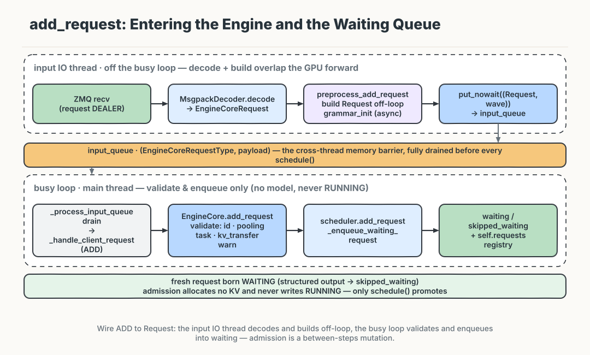</a>

<p class='figure-caption'>Wire ADD to Request: input IO thread decodes and builds, busy loop validates and enqueues into waiting.</p>

### Where admission sits in the loop

The busy loop alternates "drain client input" and "step once":

[`vllm/v1/engine/core.py:1259-1265`](https://github.com/vllm-project/vllm/blob/6cf7b26bd4bff60bf378e1af14044280ac0d214c/vllm/v1/engine/core.py#L1259-L1265)

```python
    def run_busy_loop(self):
        """Core busy loop of the EngineCore."""
        while self._handle_shutdown():
            # 1) Poll the input queue until there is work to do.
            self._process_input_queue()
            # 2) Step the engine core and return the outputs.
            self._process_engine_step()
```

`_process_input_queue` fully drains `input_queue` ([`core.py:1296-1298`](https://github.com/vllm-project/vllm/blob/6cf7b26bd4bff60bf378e1af14044280ac0d214c/vllm/v1/engine/core.py#L1296-L1298)) into `_handle_client_request`, the single dispatcher:

[`vllm/v1/engine/core.py:1372-1385`](https://github.com/vllm-project/vllm/blob/6cf7b26bd4bff60bf378e1af14044280ac0d214c/vllm/v1/engine/core.py#L1372-L1385)

<a href='images/vllm-04-17-request-dispatch.svg' target='_blank'>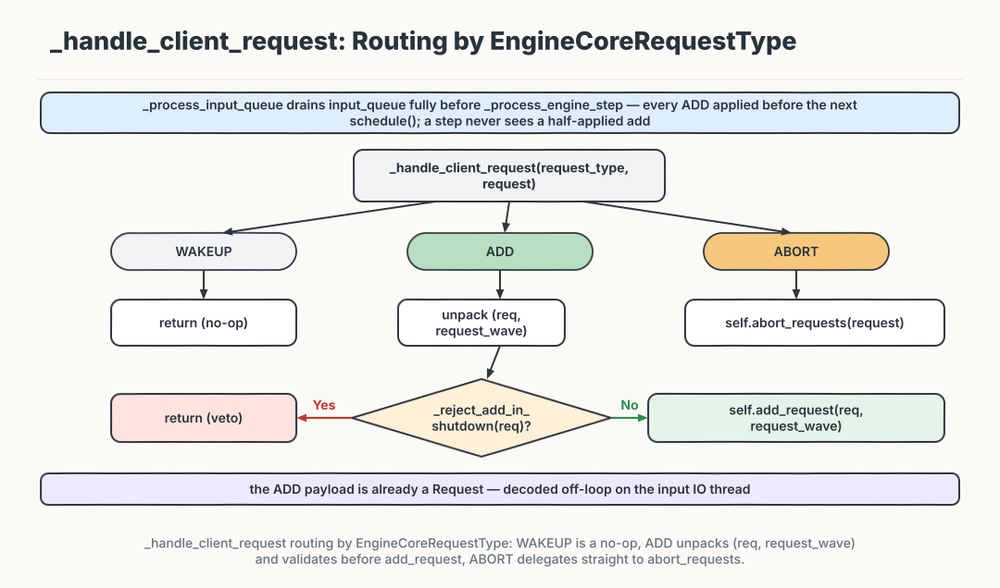</a>

<p class='figure-caption'>_handle_client_request routing by EngineCoreRequestType: WAKEUP is a no-op, ADD unpacks (req, request_wave) and validates before add_request, ABORT delegates straight to abort_requests.</p>

```python
    def _handle_client_request(
        self, request_type: EngineCoreRequestType, request: Any
    ) -> None:
        """Dispatch request from client."""

        if request_type == EngineCoreRequestType.WAKEUP:
            return
        elif request_type == EngineCoreRequestType.ADD:
            req, request_wave = request
            if self._reject_add_in_shutdown(req):
                return
            self.add_request(req, request_wave)
        elif request_type == EngineCoreRequestType.ABORT:
            self.abort_requests(request)
```

An `ADD` message on `input_queue` is a `(req, request_wave)` tuple whose `req` is already a `Request`; decoding happened on the IO thread. The dispatcher unpacks it, lets `_reject_add_in_shutdown` veto admission during shutdown ([Section 10](#10-aborts-and-cancellation)), and calls `add_request`. `_process_input_queue` drains the queue before `_process_engine_step`, so admissions already in that wire-ordered queue are applied before the next `schedule()` call.

### The decode happens off the loop, in the input IO thread

The heavy lifting is in the ZMQ input thread (article 03 covers the socket mechanics), not the busy loop:

[`vllm/v1/engine/core.py:1569-1587`](https://github.com/vllm-project/vllm/blob/6cf7b26bd4bff60bf378e1af14044280ac0d214c/vllm/v1/engine/core.py#L1569-L1587)

```python
                    if request_type == EngineCoreRequestType.ADD:
                        req: EngineCoreRequest = add_request_decoder.decode(data_frames)
                        try:
                            request = self.preprocess_add_request(req)
                        except Exception:
                            self._handle_request_preproc_error(req)
                            continue
                    else:
                        request = generic_decoder.decode(data_frames)

                        if request_type == EngineCoreRequestType.ABORT:
                            # Aborts are added to *both* queues, allows us to eagerly
                            # process aborts while also ensuring ordering in the input
                            # queue to avoid leaking requests. This is ok because
                            # aborting in the scheduler is idempotent.
                            self.aborts_queue.put_nowait(request)

                    # Push to input queue for core busy loop.
                    self.input_queue.put_nowait((request_type, request))
```

The ADD branch decodes the `EngineCoreRequest` (the wire struct built by the front-end, article 01) and immediately calls `preprocess_add_request`, whose return value (a `(Request, current_wave)` tuple) is what crosses `input_queue`. A decode/preprocess failure is caught and routed to `_handle_request_preproc_error` rather than crashing the thread. Contrast the ABORT branch, which is pushed to *both* `aborts_queue` and `input_queue` (the dual-queue eager-abort scheme, [Section 10](#10-aborts-and-cancellation)); ADD goes to the single `input_queue` only, because there is no benefit to applying an admission "eagerly" mid-forward.

`preprocess_add_request` is the actual constructor of engine-side state:

[`vllm/v1/engine/core.py:855-877`](https://github.com/vllm-project/vllm/blob/6cf7b26bd4bff60bf378e1af14044280ac0d214c/vllm/v1/engine/core.py#L855-L877)

```python
    def preprocess_add_request(self, request: EngineCoreRequest) -> tuple[Request, int]:
        """Preprocess the request.

        This function could be directly used in input processing thread to allow
        request initialization running in parallel with Model forward
        """
        # Note on thread safety: no race condition.
        # `mm_receiver_cache` is reset at the end of LLMEngine init,
        # and will only be accessed in the input processing thread afterwards.
        if self.mm_receiver_cache is not None and request.mm_features:
            request.mm_features = self.mm_receiver_cache.get_and_update_features(
                request.mm_features
            )

        req = Request.from_engine_core_request(request, self.request_block_hasher)
        if req.use_structured_output:
            # Note on thread safety: no race condition.
            # `grammar_init` is only invoked in input processing thread. For
            # `structured_output_manager`, each request is independent and
            # grammar compilation is async. Scheduler always checks grammar
            # compilation status before scheduling request.
            self.structured_output_manager.grammar_init(req)
        return req, request.current_wave
```

The input thread resolves multimodal features, builds `Request` with the prefix-cache block hasher, and starts grammar compilation when needed. Its cache and structured-output manager are confined to this thread, so no lock is needed. Because grammar compilation is asynchronous, such a request enters a blocked waiting state until the scheduler sees the compiled grammar.

`from_engine_core_request` is a pure field copy — no allocation of KV, no scheduling decision:

[`vllm/v1/request.py:203-227`](https://github.com/vllm-project/vllm/blob/6cf7b26bd4bff60bf378e1af14044280ac0d214c/vllm/v1/request.py#L203-L227)

```python
    def from_engine_core_request(
        cls,
        request: EngineCoreRequest,
        block_hasher: Callable[["Request"], list["BlockHash"]] | None,
    ) -> "Request":
        return cls(
            request_id=request.request_id,
            client_index=request.client_index,
            prompt_token_ids=request.prompt_token_ids,
            ...
            block_hasher=block_hasher,
            resumable=request.resumable,
            reasoning_ended=request.reasoning_ended,
            reasoning_parser_kwargs=request.reasoning_parser_kwargs,
            abort_immediately=request.abort_immediately,
        )
```

Two fields carried here matter later: `client_index` (the two-axis output routing key of [Section 8](#8-output-aggregation-enginecoreoutputs-per-client) — the scheduler will use it to slot this request's deltas into the right client's `EngineCoreOutputs`) and `abort_immediately` (see the admit-then-abort case below).

**`EngineCore.add_request`: validate, then delegate.**

Now the cheap on-loop half:

[`vllm/v1/engine/core.py:372-407`](https://github.com/vllm-project/vllm/blob/6cf7b26bd4bff60bf378e1af14044280ac0d214c/vllm/v1/engine/core.py#L372-L407)

```python
    def add_request(self, request: Request, request_wave: int = 0):
        """Add request to the scheduler.

        `request_wave`: indicate which wave of requests this is expected to
        belong to in DP case
        """
        # Validate the request_id type.
        if not isinstance(request.request_id, str):
            raise TypeError(
                f"request_id must be a string, got {type(request.request_id)}"
            )

        if pooling_params := request.pooling_params:
            supported_pooling_tasks = [
                task for task in self.get_supported_tasks() if task in POOLING_TASKS
            ]

            if pooling_params.task not in supported_pooling_tasks:
                raise ValueError(
                    f"Unsupported task: {pooling_params.task!r} "
                    f"Supported tasks: {supported_pooling_tasks}"
                )

        if request.kv_transfer_params is not None and (
            not self.scheduler.get_kv_connector()
        ):
            logger.warning(
                "Got kv_transfer_params, but no KVConnector found. "
                "Disabling KVTransfer for this request."
            )

        self.scheduler.add_request(request)
        if request.abort_immediately:
            # Immediately abort so the connector's request_finished hook runs
            # to free any pre-admission KV-transfer resources.
            self.abort_requests([request.request_id])
```

Admission requires a string id and rejects unsupported pooling tasks. KV-transfer parameters without a configured connector only warn and are disabled. `scheduler.add_request` is the line that mutates engine state. An `abort_immediately` request is admitted and then finished in the same call, allowing the connector's normal `request_finished` hook to release resources without scheduling model work ([Section 10](#10-aborts-and-cancellation)).

`DPEngineCoreProc.add_request` ([`core.py:1836-1837`](https://github.com/vllm-project/vllm/blob/6cf7b26bd4bff60bf378e1af14044280ac0d214c/vllm/v1/engine/core.py#L1836-L1837)) wraps this base method with data-parallel wave bookkeeping via `super().add_request(...)`; the `request_wave` argument threaded through the dispatcher exists for that path.

### Scheduler admission: where engine state actually changes

[`vllm/v1/core/sched/scheduler.py:2020-2042`](https://github.com/vllm-project/vllm/blob/6cf7b26bd4bff60bf378e1af14044280ac0d214c/vllm/v1/core/sched/scheduler.py#L2020-L2042)

```python
    def add_request(self, request: Request) -> None:
        existing = self.requests.get(request.request_id)
        if existing is not None:
            update = StreamingUpdate.from_request(request)
            if existing.status != RequestStatus.WAITING_FOR_STREAMING_REQ:
                assert existing.streaming_queue is not None, "duplicate request id"
                # Queue next input chunk (or finished sentinel).
                existing.streaming_queue.append(update)
            elif update is not None:
                # Commence next input chunk.
                self._update_request_as_session(existing, update)
            else:
                # Streaming-input session finished.
                self.finish_requests(request.request_id, RequestStatus.FINISHED_ABORTED)
        else:
            if request.resumable:
                request.streaming_queue = deque()
            self._enqueue_waiting_request(request)
            self.requests[request.request_id] = request
            if self.connector is not None:
                self.connector.on_new_request(request)
            if self.log_stats:
                request.record_event(EngineCoreEventType.QUEUED)
```

The common fresh path is the `else` branch — three mutations in a fixed order: `_enqueue_waiting_request(request)` pushes onto a waiting queue, `self.requests[request.request_id] = request` registers it in the master id→`Request` map, and then optional connector notification and a `QUEUED` stats event. The `existing is not None` branch handles *streaming-input sessions*: the same request id delivering more prompt chunks appends to the request's `streaming_queue`, resumes it via `_update_request_as_session`, or, if the update is the terminal sentinel, aborts the session through `finish_requests(..., FINISHED_ABORTED)`.

`_enqueue_waiting_request` chooses the queue by whether the request is born blocked:

[`vllm/v1/core/sched/scheduler.py:1862-1873`](https://github.com/vllm-project/vllm/blob/6cf7b26bd4bff60bf378e1af14044280ac0d214c/vllm/v1/core/sched/scheduler.py#L1862-L1873)

<a href='images/vllm-04-18-waiting-queue-routing.svg' target='_blank'>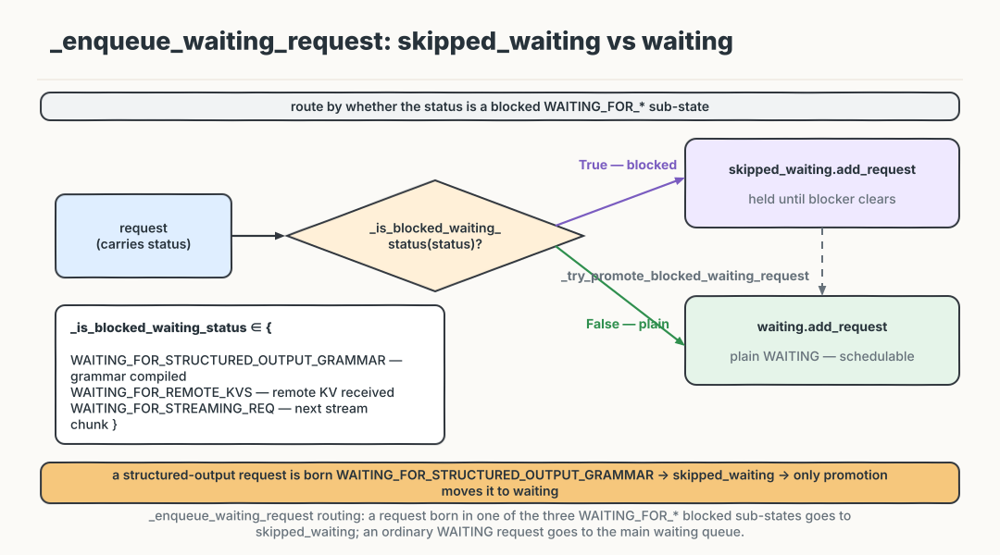</a>

<p class='figure-caption'>_enqueue_waiting_request routing: a request born in one of the three WAITING_FOR_* blocked sub-states goes to skipped_waiting; an ordinary WAITING request goes to the main waiting queue.</p>

```python
    def _is_blocked_waiting_status(status: RequestStatus) -> bool:
        return status in (
            RequestStatus.WAITING_FOR_STRUCTURED_OUTPUT_GRAMMAR,
            RequestStatus.WAITING_FOR_REMOTE_KVS,
            RequestStatus.WAITING_FOR_STREAMING_REQ,
        )

    def _enqueue_waiting_request(self, request: Request) -> None:
        if self._is_blocked_waiting_status(request.status):
            self.skipped_waiting.add_request(request)
        else:
            self.waiting.add_request(request)
```

A request in one of the three `WAITING_FOR_*` sub-states goes to `skipped_waiting` (the scheduler skips it until the blocker clears — grammar compiled, remote KV received, next stream chunk arrived); an ordinary request goes to `waiting`. This is where the structured-output async decision from `preprocess_add_request` lands: because such a request is born `WAITING_FOR_STRUCTURED_OUTPUT_GRAMMAR`, it enters `skipped_waiting` and cannot be scheduled until `_try_promote_blocked_waiting_request` ([Section 5](#5-the-request-lifecycle-the-requeststatus-state-machine)) moves it to `waiting`.

**Fresh requests always start in a waiting state.**

The request's birth status is set in `Request.__init__`, not by the scheduler:

[`vllm/v1/request.py:95-112`](https://github.com/vllm-project/vllm/blob/6cf7b26bd4bff60bf378e1af14044280ac0d214c/vllm/v1/request.py#L95-L112)

```python
        self.status = RequestStatus.WAITING
        self.events: list[EngineCoreEvent] = []
        self.stop_reason: int | str | None = None

        # P/D: Connector-specific KV transfer parameters.
        self.kv_transfer_params: dict[str, Any] | None = None

        if pooling_params is not None:
            # Pooling models.
            self.max_tokens = 1
        elif sampling_params is not None:
            # Generative models.
            assert sampling_params.max_tokens is not None
            self.max_tokens = sampling_params.max_tokens
            if self.structured_output_request is not None:
                self.status = RequestStatus.WAITING_FOR_STRUCTURED_OUTPUT_GRAMMAR
```

Default `WAITING`; a structured-output request is instead born `WAITING_FOR_STRUCTURED_OUTPUT_GRAMMAR`. Either way the status is one of the *waiting* family (`status < RUNNING` in the totally-ordered `RequestStatus` `IntEnum`, [`request.py:328-344`](https://github.com/vllm-project/vllm/blob/6cf7b26bd4bff60bf378e1af14044280ac0d214c/vllm/v1/request.py#L328-L344)), and `num_computed_tokens` is initialized to `0`. Nothing in the admission path ever writes `RUNNING`. Admission places a request on a queue and in the registry; the flip to `RUNNING`, and the KV allocation that flip implies, is deferred to `schedule()`, which is the sole writer of that transition (article 05; [Section 5](#5-the-request-lifecycle-the-requeststatus-state-machine) for the state machine).

Admission inserts a fresh request into the registry and one waiting queue in the same call. A duplicate id is either a streaming-session update or an assertion failure, never a silent overwrite. KV allocation and the transition to `RUNNING` wait for `schedule()`. Decode, multimodal-cache work, request construction, and grammar initialization have already run on the input thread, leaving the loop with validation and enqueue.

## 5. The Request Lifecycle: The RequestStatus State Machine

Admission, scheduling, preemption, and completion all update `request.status`. The field is a totally ordered `IntEnum`, so the engine answers "is this request finished?" with one `>` comparison rather than a set of per-status branches. The scheduler, output path, and free path all use that ordering.

**The enum and the frontier.** The status type and its finish predicate live together.

[`vllm/v1/request.py:328-355`](https://github.com/vllm-project/vllm/blob/6cf7b26bd4bff60bf378e1af14044280ac0d214c/vllm/v1/request.py#L328-L355)

<a href='images/vllm-04-19-status-enum-layout.svg' target='_blank'>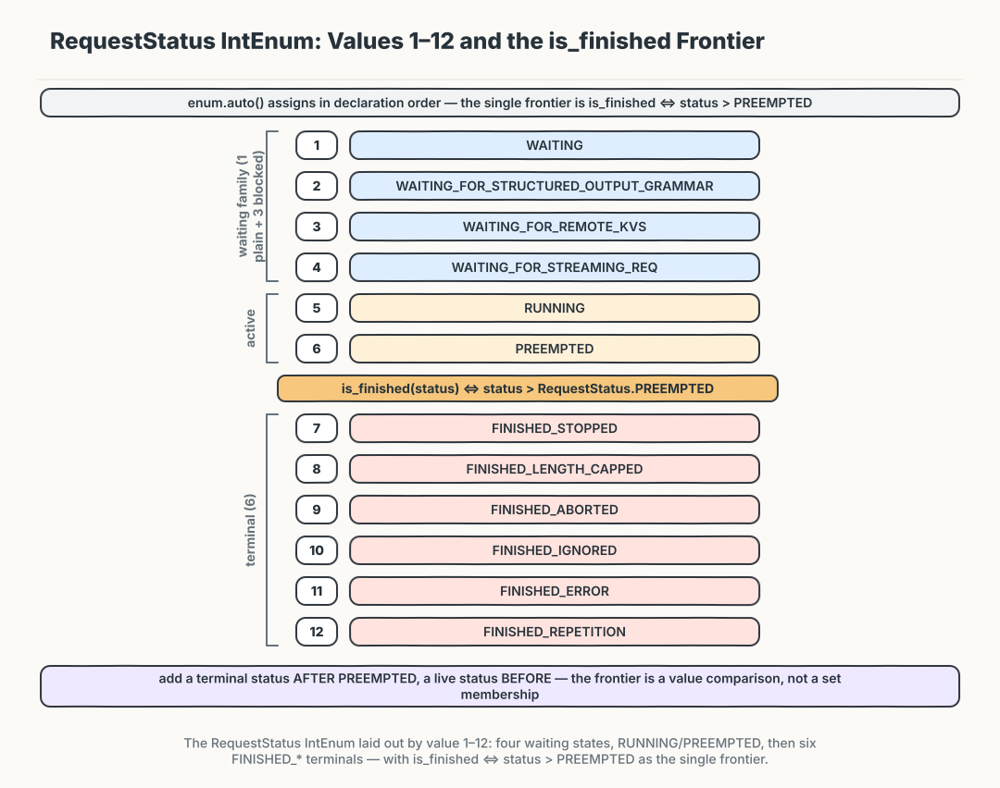</a>

<p class='figure-caption'>The RequestStatus IntEnum laid out by value 1–12: four waiting states, RUNNING/PREEMPTED, then six FINISHED_* terminals — with is_finished ⇔ status > PREEMPTED as the single frontier.</p>

```python
class RequestStatus(enum.IntEnum):
    """Status of a request."""

    WAITING = enum.auto()
    WAITING_FOR_STRUCTURED_OUTPUT_GRAMMAR = enum.auto()
    WAITING_FOR_REMOTE_KVS = enum.auto()
    WAITING_FOR_STREAMING_REQ = enum.auto()
    RUNNING = enum.auto()
    PREEMPTED = enum.auto()
    # Note: anything after PREEMPTED will be considered
    # as a finished status.
    FINISHED_STOPPED = enum.auto()
    FINISHED_LENGTH_CAPPED = enum.auto()
    FINISHED_ABORTED = enum.auto()
    FINISHED_IGNORED = enum.auto()
    FINISHED_ERROR = enum.auto()
    FINISHED_REPETITION = enum.auto()

    def __str__(self) -> str:
        return self.name

    @staticmethod
    def is_finished(status: "RequestStatus") -> bool:
        return status > RequestStatus.PREEMPTED
```

`enum.auto()` assigns values in declaration order: four waiting variants and `RUNNING`/`PREEMPTED` are live; the six entries after `PREEMPTED` are terminal. `is_finished` is therefore one comparison ([`request.py:349-351`](https://github.com/vllm-project/vllm/blob/6cf7b26bd4bff60bf378e1af14044280ac0d214c/vllm/v1/request.py#L349-L351)). Adding a status on the wrong side of that declaration boundary would change its classification everywhere.

| Value | Status | Live / terminal | Written by | Leaves via | `FinishReason` |
| --- | --- | --- | --- | --- | --- |
| 1 | `WAITING` | live, schedulable | `Request.__init__` (`request.py:97`); promotion out of a blocked state (`scheduler.py:2462`, `2469`); a new streaming turn (`scheduler.py:1257`) | `schedule()` → `RUNNING` (`scheduler.py:992`); `finish_requests` → terminal | `None` |
| 2 | `WAITING_FOR_STRUCTURED_OUTPUT_GRAMMAR` | live, blocked | `Request.__init__`, when the request carries a grammar (`request.py:112`) | `_try_promote_blocked_waiting_request` → `WAITING` once the grammar object exists (`scheduler.py:2465-2469`) | `None` |
| 3 | `WAITING_FOR_REMOTE_KVS` | live, blocked | `schedule()`, on async KV load (`scheduler.py:954`) | promotion → `PREEMPTED` if `num_preemptions` is nonzero, else `WAITING` (`scheduler.py:2459-2462`) | `None` |
| 4 | `WAITING_FOR_STREAMING_REQ` | live, blocked | `_handle_stopped_request`, rolling a terminal status back (`scheduler.py:1899`) | never self-promotes (`scheduler.py:2472-2474`); only a new turn writes `WAITING` (`scheduler.py:1257`) | `STOP` — the one *live* key in `_FINISHED_REASON_MAP` (`request.py:368`): the finished turn reports `STOP` while the server-side object stays alive |
| 5 | `RUNNING` | live | `schedule()`, from `WAITING` or `PREEMPTED` only — anything else is a `RuntimeError` (`scheduler.py:978-992`) | `check_stop` → terminal; `_preempt_request` → `PREEMPTED`; `finish_requests` → terminal | `None` |
| 6 | `PREEMPTED` | live, schedulable — the frontier | `_preempt_request` (`scheduler.py:1157`); remote-KV promotion of a previously preempted request (`scheduler.py:2460`) | `schedule()` → `RUNNING` (`scheduler.py:992`); `finish_requests` → terminal | `None` |
| 7 | `FINISHED_STOPPED` | terminal | `check_stop`, on EOS or a stop token (`utils.py:105`, `109`); first pooler output (`scheduler.py:1643`) | rolled back to `WAITING_FOR_STREAMING_REQ` for a resumable session; otherwise nothing — `_free_request` runs | `STOP` |
| 8 | `FINISHED_LENGTH_CAPPED` | terminal | `check_stop`, on `num_tokens >= max_model_len` or `num_output_tokens >= max_tokens` (`utils.py:116`) | — | `LENGTH` |
| 9 | `FINISHED_ABORTED` | terminal | only `finish_requests` (`scheduler.py:2102`), from `abort_requests`, idle drain, shutdown (`core.py:415`, `744`, `1347`, `1691`) and end-of-streaming-session (`scheduler.py:2033`) | — | `ABORT` |
| 10 | `FINISHED_IGNORED` | terminal, **unreachable** | nothing: declared (`request.py:342`) and mapped (`request.py:366`), never assigned anywhere in the v1 tree — `grep -rn` at commit `6cf7b26bd` returns only those two lines | — | `LENGTH` (an over-long prompt actually finishes as `FINISHED_LENGTH_CAPPED`) |
| 11 | `FINISHED_ERROR` | terminal | grammar rejects its own tokens (`scheduler.py:1668`); `finish_requests` on failed KV load (`scheduler.py:1776`) | — | `ERROR` |
| 12 | `FINISHED_REPETITION` | terminal | `check_stop`, on repetition detection (`utils.py:126`) | — | `REPETITION` |

<a href='images/vllm-04-02-request-states.svg' target='_blank'>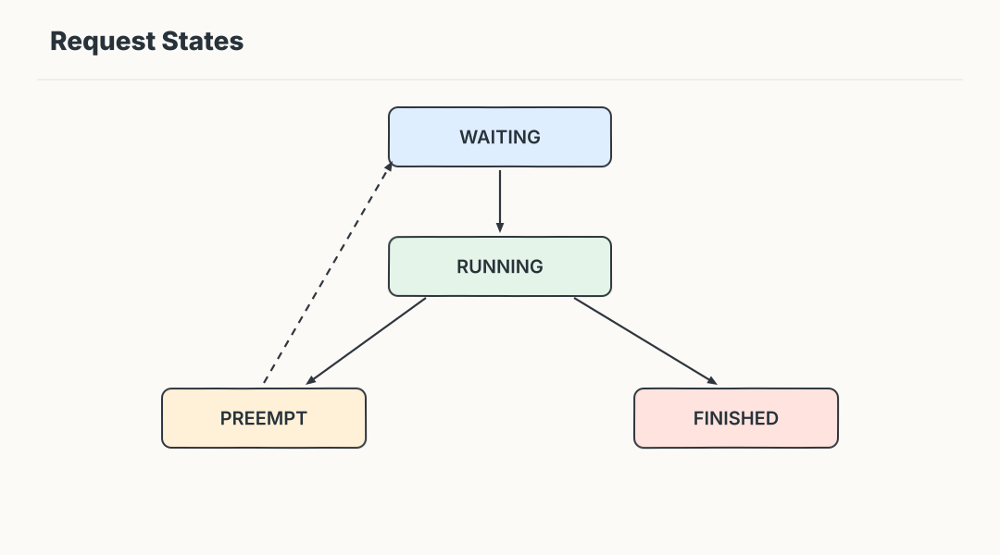</a>

<p class='figure-caption'>Request states and the scheduler transitions between them; the PREEMPTED boundary is the finished frontier.</p>

**Birth.** A request enters the machine already positioned.

[`vllm/v1/request.py:95-112`](https://github.com/vllm-project/vllm/blob/6cf7b26bd4bff60bf378e1af14044280ac0d214c/vllm/v1/request.py#L95-L112) (elided)

```python
        self.status = RequestStatus.WAITING
        ...
        if pooling_params is not None:
            # Pooling models.
            self.max_tokens = 1
        elif sampling_params is not None:
            # Generative models.
            assert sampling_params.max_tokens is not None
            self.max_tokens = sampling_params.max_tokens
            if self.structured_output_request is not None:
                self.status = RequestStatus.WAITING_FOR_STRUCTURED_OUTPUT_GRAMMAR
```

The default birth status is `WAITING` (`L97`). A structured-output request is *born blocked* in `WAITING_FOR_STRUCTURED_OUTPUT_GRAMMAR` (`L111-112`): it cannot be scheduled until its grammar (the FSM used to mask logits) has compiled. Alongside the status, `Request.__init__` zeroes the position counters that the scheduler will drive — `num_computed_tokens = 0` (the KV-cached prefix length) and `num_in_flight_tokens = 0` — and sets `max_tokens` to the output-length cap (`1` for pooling, else `sampling_params.max_tokens`). Output tokens are stored in `_output_token_ids`, and `num_output_tokens` is a *derived* property `len(self._output_token_ids)` ([`request.py:259-261`](https://github.com/vllm-project/vllm/blob/6cf7b26bd4bff60bf378e1af14044280ac0d214c/vllm/v1/request.py#L259-L261)), never a hand-maintained counter, so the count cannot drift from the list.

Admission itself (`add_request`, [Section 4](#4-add_request-entering-the-engine-and-the-waiting-queue)) never advances past a waiting state; only `schedule()` promotes a request to `RUNNING`.

**Finish reasons: six terminal statuses, four user reasons.** The internal status carries more distinction than the API exposes, so a map collapses it at the boundary.

[`vllm/v1/request.py:358-370`](https://github.com/vllm-project/vllm/blob/6cf7b26bd4bff60bf378e1af14044280ac0d214c/vllm/v1/request.py#L358-L370)

<a href='images/vllm-04-20-finish-reason-map.svg' target='_blank'>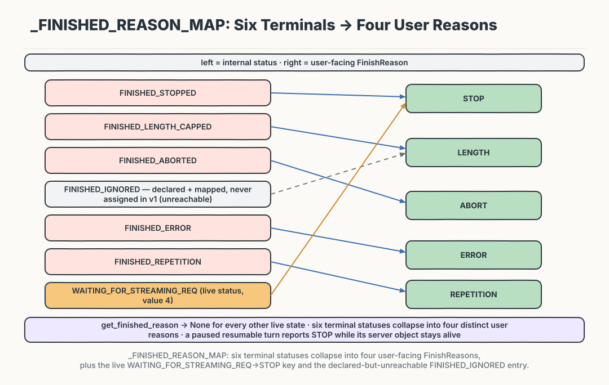</a>

<p class='figure-caption'>_FINISHED_REASON_MAP: six terminal statuses collapse into four user-facing FinishReasons, plus the live WAITING_FOR_STREAMING_REQ→STOP key and the declared-but-unreachable FINISHED_IGNORED entry.</p>

```python
# Mapping of finished statuses to their finish reasons.
# NOTE: The ignored requests are the requests whose prompt lengths
# are longer than the model's length cap. Therefore, the stop
# reason should also be "length" as in OpenAI API.
_FINISHED_REASON_MAP = {
    RequestStatus.FINISHED_STOPPED: FinishReason.STOP,
    RequestStatus.FINISHED_LENGTH_CAPPED: FinishReason.LENGTH,
    RequestStatus.FINISHED_ABORTED: FinishReason.ABORT,
    RequestStatus.FINISHED_IGNORED: FinishReason.LENGTH,
    RequestStatus.FINISHED_ERROR: FinishReason.ERROR,
    RequestStatus.WAITING_FOR_STREAMING_REQ: FinishReason.STOP,
    RequestStatus.FINISHED_REPETITION: FinishReason.REPETITION,
}
```

**The only schedulable transition is WAITING / PREEMPTED → RUNNING.** Only two of the six live states are directly schedulable, and the flip enforces it with a hard error.

[`vllm/v1/core/sched/scheduler.py:978-993`](https://github.com/vllm-project/vllm/blob/6cf7b26bd4bff60bf378e1af14044280ac0d214c/vllm/v1/core/sched/scheduler.py#L978-L993) (elided)

```python
                if request.status == RequestStatus.WAITING:
                    scheduled_new_reqs.append(request)
                elif request.status == RequestStatus.PREEMPTED:
                    scheduled_resumed_reqs.append(request)
                else:
                    raise RuntimeError(f"Invalid request status: {request.status}")
                ...
                request.status = RequestStatus.RUNNING
                request.num_computed_tokens = num_computed_tokens
```

At flip time the status must be exactly `WAITING` (a first-time prefill → `scheduled_new_reqs`) or `PREEMPTED` (a resume → `scheduled_resumed_reqs`); anything else is a `RuntimeError` (`L983`). The pre-flip status is what tells the model runner (article 09) whether this is a fresh prefill or a recompute of a previously-evicted request. Immediately after, `num_computed_tokens` is stamped to the exact cached-prefix length that the just-allocated KV blocks cover (`L993`), so KV allocation and the computed-token counter can never disagree at step start.

The three *blocked* waiting sub-states are held off to the side. `_is_blocked_waiting_status` ([`scheduler.py:1862-1868`](https://github.com/vllm-project/vllm/blob/6cf7b26bd4bff60bf378e1af14044280ac0d214c/vllm/v1/core/sched/scheduler.py#L1862-L1868)) classifies them, and `_enqueue_waiting_request` routes a blocked request into a separate `skipped_waiting` queue rather than the main `waiting` queue. They re-enter the schedulable set only through `_try_promote_blocked_waiting_request` ([`scheduler.py:2448-2479`](https://github.com/vllm-project/vllm/blob/6cf7b26bd4bff60bf378e1af14044280ac0d214c/vllm/v1/core/sched/scheduler.py#L2448-L2479)): `WAITING_FOR_REMOTE_KVS` promotes once the connector signals receipt — to `PREEMPTED` if `num_preemptions > 0`, else `WAITING`, preserving the new-vs-resumed distinction; `WAITING_FOR_STRUCTURED_OUTPUT_GRAMMAR` promotes to `WAITING` as soon as the grammar object exists; `WAITING_FOR_STREAMING_REQ` never self-promotes (it waits for a new turn). Which candidate `schedule()` actually picks, and the token-budget/chunked-prefill policy that gates `num_new_tokens`, is article 05's territory; here the point is only that the *state gate* is one comparison.

**RUNNING → FINISHED: the stop predicate writes the status in place.** After each decode step the sampled token is appended and a single predicate decides termination and reason together.

[`vllm/v1/core/sched/utils.py:94-130`](https://github.com/vllm-project/vllm/blob/6cf7b26bd4bff60bf378e1af14044280ac0d214c/vllm/v1/core/sched/utils.py#L94-L130)

<a href='images/vllm-04-21-check-stop-tree.svg' target='_blank'>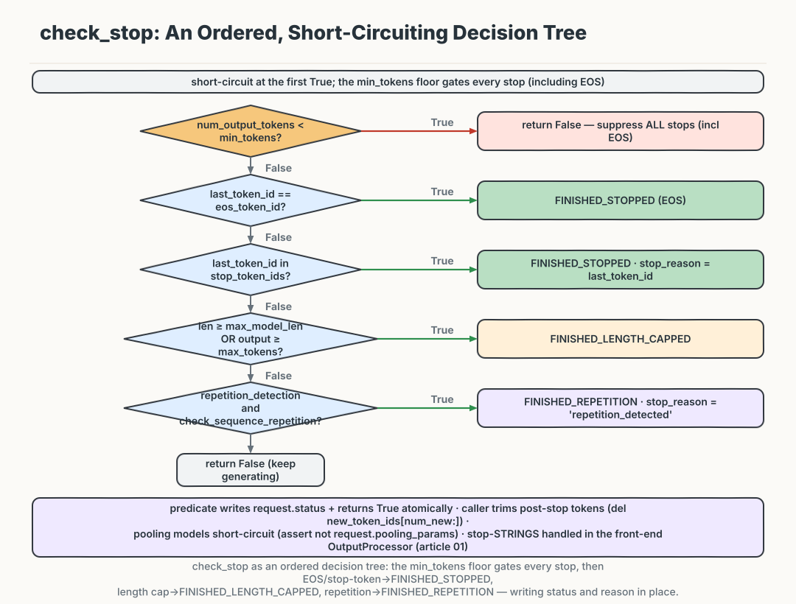</a>

<p class='figure-caption'>check_stop as an ordered decision tree: the min_tokens floor gates every stop, then EOS/stop-token→FINISHED_STOPPED, length cap→FINISHED_LENGTH_CAPPED, repetition→FINISHED_REPETITION — writing status and reason in place.</p>

```python
def check_stop(request: Request, max_model_len: int) -> bool:
    assert not request.pooling_params

    sampling_params = request.sampling_params
    assert sampling_params is not None

    if request.num_output_tokens < sampling_params.min_tokens:
        return False

    last_token_id = request.output_token_ids[-1]
    if last_token_id == sampling_params.eos_token_id:
        request.status = RequestStatus.FINISHED_STOPPED
        return True

    if last_token_id in (sampling_params.stop_token_ids or ()):
        request.status = RequestStatus.FINISHED_STOPPED
        request.stop_reason = last_token_id
        return True
    if (
        request.num_tokens >= max_model_len
        or request.num_output_tokens >= request.max_tokens
    ):
        request.status = RequestStatus.FINISHED_LENGTH_CAPPED
        return True

    repetition_detection = sampling_params.repetition_detection
    if repetition_detection is not None and (
        check_sequence_repetition(
            request.output_token_ids,
            repetition_detection,
        )
    ):
        request.status = RequestStatus.FINISHED_REPETITION
        request.stop_reason = "repetition_detected"
        return True

    return False
```

The order is deliberate: the `min_tokens` guard (`L100-101`) suppresses *every* stop, even EOS, until the output is long enough; then EOS or a custom stop token → `FINISHED_STOPPED` (the custom case also records `stop_reason`); then the length cap, whichever binds first — model context (`num_tokens >= max_model_len`) or per-request budget (`num_output_tokens >= max_tokens`) → `FINISHED_LENGTH_CAPPED`; then optional repetition detection → `FINISHED_REPETITION`. The predicate *is* the transition — it mutates `request.status` and returns `True` in the same breath, so classification and reason are set atomically. Its caller `_update_request_with_output` appends tokens one at a time (spec decode lands several per step) and calls `check_stop` after each, trimming any tokens generated past the stop point ([Section 7](#7-update_from_output-model-output-becomes-engine-outputs)).

Note `assert not request.pooling_params` at `L95`: pooling models never reach this predicate; they short-circuit to `FINISHED_STOPPED` on their first pooler output ([`scheduler.py:1641-1644`](https://github.com/vllm-project/vllm/blob/6cf7b26bd4bff60bf378e1af14044280ac0d214c/vllm/v1/core/sched/scheduler.py#L1641-L1644)). Crucially, this is *token-level* stopping — stop *strings* require detokenized text and are detected downstream in the front-end `OutputProcessor` (article 01), not here.

**RUNNING → PREEMPTED → WAITING: backpressure is loss-free for output.** Under KV pressure the scheduler evicts a running request.

[`vllm/v1/core/sched/scheduler.py:1145-1167`](https://github.com/vllm-project/vllm/blob/6cf7b26bd4bff60bf378e1af14044280ac0d214c/vllm/v1/core/sched/scheduler.py#L1145-L1167)

```python
    def _preempt_request(self, request: Request, timestamp: float) -> None:
        """Preempt a request and put it back to the waiting queue.

        NOTE: The request should be popped from the running queue outside of this
        method.
        """
        assert request.status == RequestStatus.RUNNING, (
            "Only running requests can be preempted"
        )
        self._free_request_blocks(request)
        self.encoder_cache_manager.free(request)
        self._inflight_prefills.discard(request)
        request.status = RequestStatus.PREEMPTED
        request.num_computed_tokens = 0
        if request.spec_token_ids:
            request.spec_token_ids = []
        request.num_preemptions += 1
        if self.log_stats:
            request.record_event(EngineCoreEventType.PREEMPTED, timestamp)

        # Put the request back to the waiting queue.
        self.waiting.prepend_request(request)
        self.reset_preempted_req_ids.add(request.request_id)
```

Only a `RUNNING` request can be preempted (hard assert, `L1151`). Its KV blocks are freed back to the pool — that is *the* point, reclaiming space for the higher-priority request that triggered the eviction — and `num_computed_tokens` is reset to `0` (`L1158`) because the cached prefix is now gone and must be recomputed. But the already-generated `_output_token_ids` are **kept**: only KV / computed-token state is discarded, so on resume the recompute covers prompt + prior output, and prefix caching (article 06) can restore some of that credit. `num_preemptions += 1` (`L1161`) feeds the promote-to-`PREEMPTED`-vs-`WAITING` decision above. The request is re-queued at the *front* (`prepend_request`, `L1166`) so preemptees resume ASAP. Two triggers reach here: KV-allocation failure inside `schedule()` ([`scheduler.py:572-578`](https://github.com/vllm-project/vllm/blob/6cf7b26bd4bff60bf378e1af14044280ac0d214c/vllm/v1/core/sched/scheduler.py#L572-L578)) and a forced cache reset ([`scheduler.py:2222-2232`](https://github.com/vllm-project/vllm/blob/6cf7b26bd4bff60bf378e1af14044280ac0d214c/vllm/v1/core/sched/scheduler.py#L2222-L2232)), which preempts *every* running request.

**The resumable escape hatch.** A "stop" is not always terminal. After `check_stop` sets a terminal status, the per-request loop captures the finish reason *before* consulting `_handle_stopped_request`:

[`vllm/v1/core/sched/scheduler.py:1712-1719`](https://github.com/vllm-project/vllm/blob/6cf7b26bd4bff60bf378e1af14044280ac0d214c/vllm/v1/core/sched/scheduler.py#L1712-L1719) (elided)

```python
            finish_reason = None
            if stopped:
                # Capture finish_reason BEFORE _handle_stopped_request, which may
                # reset the status to WAITING for streaming requests that continue.
                finish_reason = request.get_finished_reason()
                finished = self._handle_stopped_request(request)
                if finished:
                    kv_transfer_params = self._free_request(request)
```

For a non-resumable request `_handle_stopped_request` returns `True` and `_free_request` runs immediately. For a resumable streaming session ([`scheduler.py:1887-1903`](https://github.com/vllm-project/vllm/blob/6cf7b26bd4bff60bf378e1af14044280ac0d214c/vllm/v1/core/sched/scheduler.py#L1887-L1903)) the terminal status set by `check_stop` is *rolled back* to the live `WAITING_FOR_STREAMING_REQ`; the request returns `False`, is *not* freed, and re-enters the waiting side. Because `finish_reason` was snapshotted at `L1716`, the client still sees `STOP` for the completed turn, which is why `WAITING_FOR_STREAMING_REQ` is a key in `_FINISHED_REASON_MAP`. Freeing (`_free_request`, article 06) asserts `request.is_finished()`, so a resumed request can never be freed by accident.

**External termination.** Anything outside the decode loop (client disconnect, engine abort, KV-load error) collapses a request to terminal through `finish_requests`, which asserts the injected status is itself terminal and can jump *any* live state (`WAITING*`, `RUNNING`, `PREEMPTED`) straight to `FINISHED_ABORTED`/`FINISHED_ERROR`, skipping already-finished ids so the operation is idempotent. That path and its dual-queue eager-abort machinery are [Section 10](#10-aborts-and-cancellation).

**The counters underneath.** The status field rides on top of `num_computed_tokens`, which the scheduler advances *optimistically* at schedule time — `+= num_scheduled_token` before the GPU runs (`_update_after_schedule`, [Section 7](#7-update_from_output-model-output-becomes-engine-outputs)) — and reconciles downward on speculative-decode rejection: `num_computed_tokens -= num_rejected`, guarded `> 0` ([`scheduler.py:1610-1611`](https://github.com/vllm-project/vllm/blob/6cf7b26bd4bff60bf378e1af14044280ac0d214c/vllm/v1/core/sched/scheduler.py#L1610-L1611)). The upper bound `num_computed_tokens ≤ num_tokens` is asserted ([`scheduler.py:763`](https://github.com/vllm-project/vllm/blob/6cf7b26bd4bff60bf378e1af14044280ac0d214c/vllm/v1/core/sched/scheduler.py#L763)); the lower bound `0 ≤` holds by construction (the counter is a sum of non-negative terms, [`scheduler.py:760-762`](https://github.com/vllm-project/vllm/blob/6cf7b26bd4bff60bf378e1af14044280ac0d214c/vllm/v1/core/sched/scheduler.py#L760-L762)). It stays inside that band because the counter advances by exactly `num_scheduled_tokens` per step and is repaid by exactly `num_rejected` on rejection.

## 6. execute_model: Handing the Batch to the Executor

The middle phase of `step()` hands a `SchedulerOutput` to `self.model_executor` and receives a `ModelRunnerOutput`. `EngineCore.step` uses the same call shape for in-process, multiprocess, and Ray executors: each engine-to-worker call goes through `collective_rpc` and returns a `Future`. This section follows that edge to the process boundary. Article 09 covers tensor preparation, the forward pass, CUDA graphs, and sampling inside the worker; article 03 covers the shared-memory queue used by the multiprocess executor.

### The engine holds exactly one compute handle

`model_executor` is constructed once and never re-bound:

[`vllm/v1/engine/core.py:123`](https://github.com/vllm-project/vllm/blob/6cf7b26bd4bff60bf378e1af14044280ac0d214c/vllm/v1/engine/core.py#L123)
```python
        self.model_executor = executor_class(vllm_config)
```

`executor_class: type[Executor]` is passed into `__init__` and resolved at construction to one of `UniProcExecutor`, `MultiprocExecutor`, or `RayDistributedExecutor`. `step()` never learns which one it got. It calls three methods on the handle (`execute_model`, `sample_tokens`, `take_draft_token_ids`), and each is a thin wrapper over `collective_rpc`. This is the central design decision: the concrete edge is a construction-time choice, and the per-iteration hot path is oblivious to it.

The call site is two lines of the step transaction (covered in [Section 2](#2-step-schedule-execute-update-as-one-transaction); reproduced here as the anchor for this phase):

[`vllm/v1/engine/core.py:491-499`](https://github.com/vllm-project/vllm/blob/6cf7b26bd4bff60bf378e1af14044280ac0d214c/vllm/v1/engine/core.py#L491-L499)
```python
        future = self.model_executor.execute_model(scheduler_output, non_block=True)
        grammar_output = self.scheduler.get_grammar_bitmask(scheduler_output)
        with (
            self.log_error_detail(scheduler_output),
            self.log_iteration_details(scheduler_output),
        ):
            model_output = future.result()
            if model_output is None:
                model_output = self.model_executor.sample_tokens(grammar_output)
```

Two facts about the edge matter here. First, `non_block=True` makes `execute_model` return a `Future` *immediately* (L491); the forward pass runs concurrently while the engine thread computes the structured-output bitmask on the CPU (L492). Second, execution and sampling are *two* RPCs: `execute_model` may run the forward pass but defer sampling, returning `None`; the engine then calls `sample_tokens(grammar_output)` (L499) to apply the freshly-built bitmask and get the real output. The forward-pass exception, if any, is latched into the `Future` and surfaces at `future.result()` (L497), which is why `log_error_detail` brackets the *result* call, not the launch.

### The base contract: a string method name over `collective_rpc`

`Executor.execute_model` is not the compute; it is a name and a call:

[`vllm/v1/executor/abstract.py:209-227`](https://github.com/vllm-project/vllm/blob/6cf7b26bd4bff60bf378e1af14044280ac0d214c/vllm/v1/executor/abstract.py#L209-L227)

<a href='images/vllm-04-22-executor-backends.svg' target='_blank'>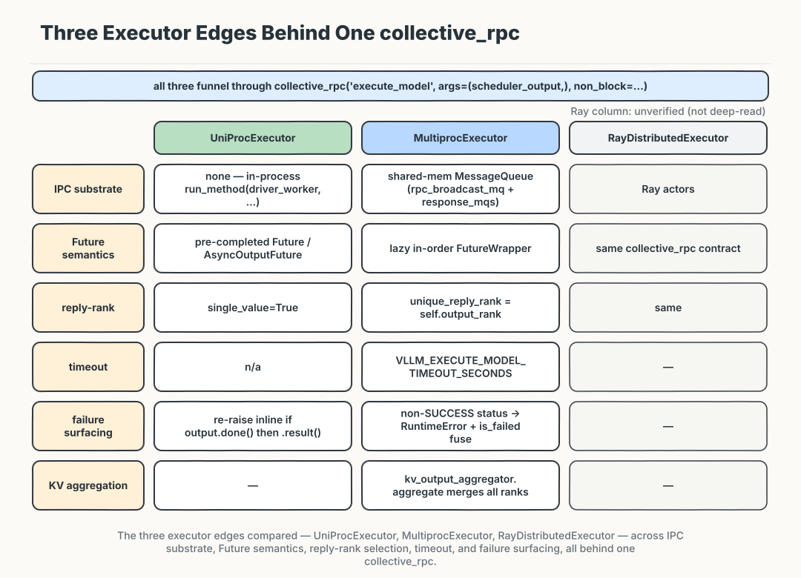</a>

<p class='figure-caption'>The three executor edges compared — UniProcExecutor, MultiprocExecutor, RayDistributedExecutor — across IPC substrate, Future semantics, reply-rank selection, timeout, and failure surfacing, all behind one collective_rpc.</p>
```python
    @overload
    def execute_model(
        self, scheduler_output: SchedulerOutput, non_block: Literal[False] = False
    ) -> ModelRunnerOutput | None:
        pass

    @overload
    def execute_model(
        self, scheduler_output: SchedulerOutput, non_block: Literal[True] = True
    ) -> Future[ModelRunnerOutput | None]:
        pass

    def execute_model(
        self, scheduler_output: SchedulerOutput, non_block: bool = False
    ) -> ModelRunnerOutput | None | Future[ModelRunnerOutput | None]:
        output = self.collective_rpc(  # type: ignore[call-overload]
            "execute_model", args=(scheduler_output,), non_block=non_block
        )
        return output[0]
```

The two `@overload` stubs are type-only: `non_block=False` returns a bare `ModelRunnerOutput | None`, `non_block=True` returns a `Future` of the same. The real body issues `collective_rpc("execute_model", args=(scheduler_output,), ...)` — the method name is a **string** that will be resolved by `getattr` on the worker object at the far end (see "Far side" below). `collective_rpc` returns a *list* (one entry per worker rank in the base contract), and `execute_model` takes `output[0]`. `sample_tokens` is byte-for-byte the same shape at [`abstract.py:229-247`](https://github.com/vllm-project/vllm/blob/6cf7b26bd4bff60bf378e1af14044280ac0d214c/vllm/v1/executor/abstract.py#L229-L247), RPC name `"sample_tokens"`, args `(grammar_output,)`; `take_draft_token_ids` and `execute_dummy_batch` likewise. The base `collective_rpc` itself is abstract ([`abstract.py:198-202`](https://github.com/vllm-project/vllm/blob/6cf7b26bd4bff60bf378e1af14044280ac0d214c/vllm/v1/executor/abstract.py#L198-L202), `raise NotImplementedError`) — every concrete executor must implement the broadcast.

This ensures that there is exactly one primitive through which the `SchedulerOutput` leaves the engine's logical control. `non_block` semantics, error propagation, and rank selection are defined once per executor, so the two-phase execute/sample split in `step()` behaves identically regardless of backend.

### The uniproc edge: a Future with no concurrency

The single-process executor has no IPC and no worker process. It still honors the `Future` contract:

[`vllm/v1/executor/uniproc_executor.py:91-121`](https://github.com/vllm-project/vllm/blob/6cf7b26bd4bff60bf378e1af14044280ac0d214c/vllm/v1/executor/uniproc_executor.py#L91-L121)
```python
        if not non_block:
            result = run_method(self.driver_worker, method, args, kwargs)
            if isinstance(result, AsyncModelRunnerOutput):
                result = result.get_output()
            return result if single_value else [result]

        try:
            result = run_method(self.driver_worker, method, args, kwargs)
            if isinstance(result, AsyncModelRunnerOutput):
                return AsyncOutputFuture(result, single_value)
            future = Future[Any]()
            future.set_result(result if single_value else [result])
        except Exception as e:
            future = Future[Any]()
            future.set_exception(e)
        return future

    def execute_model(  # type: ignore[override]
        self, scheduler_output: SchedulerOutput, non_block: bool = False
    ) -> ModelRunnerOutput | None | Future[ModelRunnerOutput | None]:
        output = self.collective_rpc(
            "execute_model",
            args=(scheduler_output,),
            non_block=non_block,
            single_value=True,
        )
        # In non-blocking mode, surface any exception as early as possible.
        if non_block and output.done():
            # Raise the exception in-line if the task failed.
            output.result()
        return output
```

`run_method(self.driver_worker, method, ...)` calls the in-process `Worker` *synchronously* — the forward pass has already run by the time we build the `Future`. In `non_block` mode the executor still returns a `Future`, but it is a pre-completed one with the result (or exception, L103-105) already set. The `Future` here is a *shape*, not real concurrency — the exception being the genuine-async case, where an `AsyncModelRunnerOutput` is wrapped in an `AsyncOutputFuture`. `execute_model` adds one refinement (L118-120): if the pre-completed future already failed, it re-raises inline so the engine sees the crash at the launch site rather than deferring it to `.result()`.

In practice, with zero worker processes, `execute_model(non_block=True)` still returns a `Future` obeying the multi-process contract. That is why `EngineCore.step` needs no `if uniproc` branch.

### The multiproc edge: the process boundary (article 03)

The multi-process executor adds two knobs the uniproc one does not need:

[`vllm/v1/executor/multiproc_executor.py:310-320`](https://github.com/vllm-project/vllm/blob/6cf7b26bd4bff60bf378e1af14044280ac0d214c/vllm/v1/executor/multiproc_executor.py#L310-L320)
```python
    def execute_model(  # type: ignore[override]
        self, scheduler_output: SchedulerOutput, non_block: bool = False
    ) -> ModelRunnerOutput | None | Future[ModelRunnerOutput | None]:
        return self.collective_rpc(
            "execute_model",
            args=(scheduler_output,),
            unique_reply_rank=self.output_rank,
            non_block=non_block,
            timeout=envs.VLLM_EXECUTE_MODEL_TIMEOUT_SECONDS,
            kv_output_aggregator=self.kv_output_aggregator,
        )
```

`unique_reply_rank=self.output_rank` means "collect the `ModelRunnerOutput` from *one* rank, not all" — across tensor/pipeline parallelism, only the TP driver / last PP rank holds the real sampled output, so gathering every rank's reply would be wasteful and wrong. `timeout=VLLM_EXECUTE_MODEL_TIMEOUT_SECONDS` turns a hung worker into a failed RPC instead of a deadlocked engine. The actual boundary crossing is inside `collective_rpc`:

[`vllm/v1/executor/multiproc_executor.py:355-403`](https://github.com/vllm-project/vllm/blob/6cf7b26bd4bff60bf378e1af14044280ac0d214c/vllm/v1/executor/multiproc_executor.py#L355-L403)
```python
        assert self.rpc_broadcast_mq is not None, (
            "collective_rpc should not be called on follower node"
        )
        if self.is_failed:
            raise RuntimeError("Executor failed.")

        deadline = None if timeout is None else time.monotonic() + timeout
        ...
        self.rpc_broadcast_mq.enqueue((send_method, args, kwargs, output_rank))

        response_mqs: Sequence[MessageQueue] = self.response_mqs
        if output_rank is not None:
            response_mqs = (response_mqs[output_rank],)

        def get_response():
            responses = []
            for mq in response_mqs:
                dequeue_timeout = (
                    None if deadline is None else (deadline - time.monotonic())
                )
                try:
                    status, result = mq.dequeue(timeout=dequeue_timeout)
                except TimeoutError as e:
                    raise TimeoutError(f"RPC call to {method} timed out.") from e
                if status != WorkerProc.ResponseStatus.SUCCESS:
                    raise RuntimeError(
                        f"Worker failed with error '{result}', please check the"
                        " stack trace above for the root cause"
                    )
                responses.append(result)
            return responses[0] if output_rank is not None else responses

        future = FutureWrapper(
            self.futures_queue, get_response=get_response, aggregate=aggregate
        )
```

`rpc_broadcast_mq.enqueue((send_method, args, kwargs, output_rank))` (L377) serializes `("execute_model", (scheduler_output,), {}, output_rank)` into the shared-memory broadcast queue every worker reads — this is the *single point* where the `SchedulerOutput` physically leaves the engine process (queue mechanics: article 03). Because `output_rank` is set for `execute_model`, the engine narrows its read side to exactly one response queue (L379-381). The `get_response` closure (L383-399) is the *deferred* read: it dequeues within the remaining deadline, and, crucially, converts a non-`SUCCESS` status into a `RuntimeError` *on the engine side* (L393-397). A worker crash becomes an engine-side exception, which `log_error_detail` ([Section 2](#2-step-schedule-execute-update-as-one-transaction)) then catches and dumps alongside the offending batch. Finally `get_response` is wrapped in a `FutureWrapper` and returned unresolved (non-block) or blocked on `.result()`.

Two guards bracket this. `is_failed` (L358) is a fuse: once any worker has died, every later RPC fails fast rather than enqueueing into a queue nobody drains. And when a KV connector is active, `kv_output_aggregator.aggregate` (bound at L364-368) merges all ranks' KV-transfer metadata into the one canonical result instead of selecting a single rank: the single-output invariant survives disaggregated serving.

**`FutureWrapper`: lazy, in-order draining.**

The returned future is not a stock `concurrent.futures.Future`; it is ordered:

[`vllm/v1/executor/multiproc_executor.py:70-100`](https://github.com/vllm-project/vllm/blob/6cf7b26bd4bff60bf378e1af14044280ac0d214c/vllm/v1/executor/multiproc_executor.py#L70-L100)

<a href='images/vllm-04-23-collective-rpc-callgraph.svg' target='_blank'>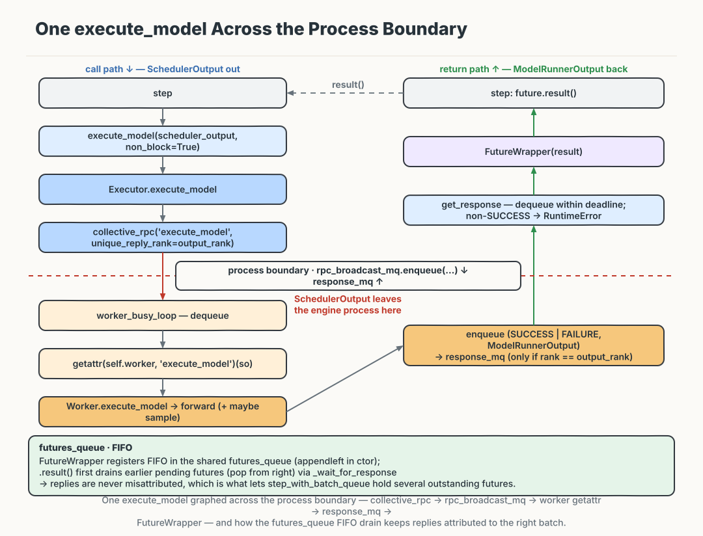</a>

<p class='figure-caption'>One execute_model graphed across the process boundary — collective_rpc → rpc_broadcast_mq → worker getattr → response_mq → FutureWrapper — and how the futures_queue FIFO drain keeps replies attributed to the right batch.</p>
```python
class FutureWrapper(Future):
    def __init__(
        self,
        futures_queue: deque["FutureWrapper"],
        get_response: Callable[[], Any],
        aggregate: Callable = lambda x: x,
    ):
        self.futures_queue = futures_queue
        self.get_response = get_response
        self.aggregate = aggregate
        super().__init__()
        self.futures_queue.appendleft(self)

    def result(self, timeout=None):
        if timeout is not None:
            raise RuntimeError("timeout not implemented")

        # Drain any futures ahead of us in the queue.
        while not self.done():
            future = self.futures_queue.pop()
            future._wait_for_response()
        return super().result()

    def _wait_for_response(self):
        try:
            response = self.aggregate(self.get_response())
            with suppress(InvalidStateError):
                self.set_result(response)
        except Exception as e:
            with suppress(InvalidStateError):
                self.set_exception(e)
```

Every wrapper registers itself FIFO into a shared `futures_queue` at construction (`appendleft`, L81). Calling `.result()` on any future drains all *earlier* pending futures first (L88-91, `pop` from the right): because the underlying response message queues are strictly ordered, replies must be consumed in the order the RPCs were issued. `_wait_for_response` performs the actual blocking dequeue and `aggregate`, latching either result or exception.

This ordering is the enabling mechanism for `step_with_batch_queue` ([Section 3](#3-step_with_batch_queue-the-overlapped-variant)): the pipelined variant holds several outstanding `execute_model`/`sample_tokens` futures at once, and the FIFO drain guarantees no response is ever misattributed to the wrong batch. The plain `step()` never holds more than one, so it never exercises the drain loop — but it depends on the same contract to keep the single future honest.

### The far side: string becomes method (→ article 09)

Inside each worker process, the broadcast is turned back into a real call. The worker-side loop itself is article 09/03 territory; the one line the edge cares about is the `getattr` that turns the RPC's string name back into a bound method:

[`vllm/v1/executor/multiproc_executor.py:986-1002`](https://github.com/vllm-project/vllm/blob/6cf7b26bd4bff60bf378e1af14044280ac0d214c/vllm/v1/executor/multiproc_executor.py#L986-L1002) (worker-internal branches elided)
```python
    def worker_busy_loop(self):
        """Main busy loop for Multiprocessing Workers"""
        ...
            method, args, kwargs, output_rank = self.rpc_broadcast_mq.dequeue(
                indefinite=True
            )
            ...
                if isinstance(method, str):
                    func = getattr(self.worker, method)
                ...
                output = func(*args, **kwargs)

                if output_rank is None or self.rank == output_rank:
                    self.handle_output(output)
```

`getattr(self.worker, "execute_model")(scheduler_output)` (L995, L999) runs the forward pass; only ranks matching `output_rank` enqueue a reply (L1001), a `(SUCCESS | FAILURE, payload)` tuple the engine decodes back in `get_response`. The worker method this lands on is the article-09 entry point, and its return type is the contract that closes the loop:

[`vllm/v1/worker/gpu_worker.py:963-965`](https://github.com/vllm-project/vllm/blob/6cf7b26bd4bff60bf378e1af14044280ac0d214c/vllm/v1/worker/gpu_worker.py#L963-L965)
```python
    def execute_model(
        self, scheduler_output: "SchedulerOutput"
    ) -> ModelRunnerOutput | AsyncModelRunnerOutput | None:
```

The three return shapes are the whole two-phase protocol in one signature: a `ModelRunnerOutput` when the worker sampled immediately; `None` when sampling is deferred to a later `sample_tokens` RPC (the `if model_output is None` branch back at [`core.py:498`](https://github.com/vllm-project/vllm/blob/6cf7b26bd4bff60bf378e1af14044280ac0d214c/vllm/v1/engine/core.py#L498)); and `AsyncModelRunnerOutput` for async scheduling. Everything downstream of this signature (building attention metadata, replaying CUDA graphs, computing logits, sampling) is article 09.

## 7. update_from_output: Model Output Becomes Engine Outputs

`update_from_output` reconciles the `ModelRunnerOutput` with the optimistic schedule. Scheduling advances request counters before the forward finishes, allowing a chunked-prefill request to be planned again without waiting for the GPU. Reconciliation then corrects those counters, appends sampled tokens, detects stop conditions, frees terminal requests, and assembles the per-client `dict[int, EngineCoreOutputs]` returned by `step()`. [Section 2](#2-step-schedule-execute-update-as-one-transaction) covers the transaction boundary; article 05 covers scheduling policy.

The optimism is posted before the forward, in `_update_after_schedule`, called by `schedule()` right after the `SchedulerOutput` snapshot is built.

[`vllm/v1/core/sched/scheduler.py:1179-1189`](https://github.com/vllm-project/vllm/blob/6cf7b26bd4bff60bf378e1af14044280ac0d214c/vllm/v1/core/sched/scheduler.py#L1179-L1189)

<a href='images/vllm-04-24-optimistic-ledger.svg' target='_blank'>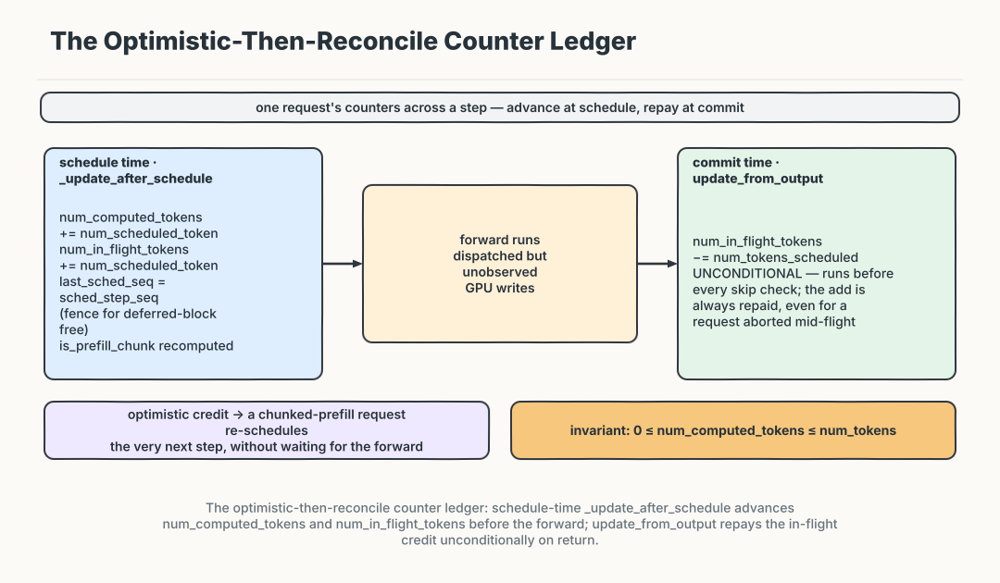</a>

<p class='figure-caption'>The optimistic-then-reconcile counter ledger: schedule-time _update_after_schedule advances num_computed_tokens and num_in_flight_tokens before the forward; update_from_output repays the in-flight credit unconditionally on return.</p>

```python
        num_scheduled_tokens = scheduler_output.num_scheduled_tokens
        for req_id, num_scheduled_token in num_scheduled_tokens.items():
            request = self.requests[req_id]
            request.num_computed_tokens += num_scheduled_token
            request.num_in_flight_tokens += num_scheduled_token
            if self.defer_block_free:
                # Record the in-flight step, to fence deferred block freeing.
                request.last_sched_seq = self.sched_step_seq
            request.is_prefill_chunk = request.num_computed_tokens < (
                request.num_tokens + request.num_output_placeholders
            )
```

`num_computed_tokens += num_scheduled_token` (L1182) credits the request with every scheduled token as if the forward already committed them to KV — the payoff, per the method's own comment 2, is that a prefill chunk is immediately re-schedulable. `num_in_flight_tokens += num_scheduled_token` (L1183) records the same amount as *not-yet-observed* GPU work; `last_sched_seq` (L1186) stamps the step so async-scheduling block frees can be fenced ([Section 9](#9-finished-requests-detection-cleanup-and-freeing-kv)). Comment 3 states the debt explicitly: any tokens rejected later "will be adjusted in `update_from_output`." That debt is what the reconciliation pass repays.

<a href='images/vllm-04-06-update-from-output.svg' target='_blank'>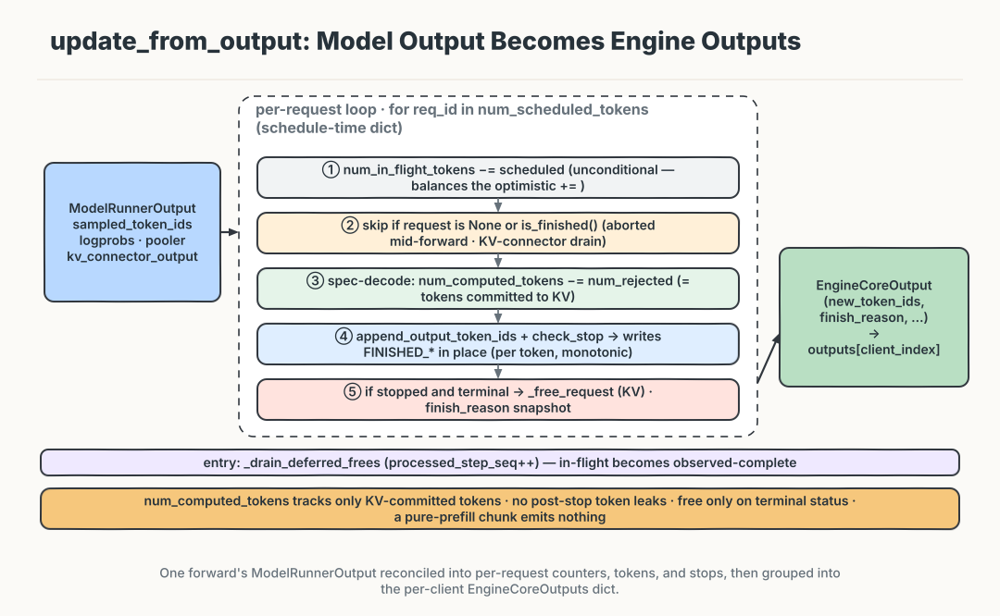</a>

<p class='figure-caption'>One forward's ModelRunnerOutput reconciled into per-request state and grouped into the per-client EngineCoreOutputs dict.</p>

**Entry and the deferred-free drain.** The function unpacks every worker-side channel, then, before touching any request, settles KV blocks whose frees were fenced on earlier steps.

[`vllm/v1/core/sched/scheduler.py:1505-1523`](https://github.com/vllm-project/vllm/blob/6cf7b26bd4bff60bf378e1af14044280ac0d214c/vllm/v1/core/sched/scheduler.py#L1505-L1523)

```python
    def update_from_output(
        self,
        scheduler_output: SchedulerOutput,
        model_runner_output: ModelRunnerOutput,
    ) -> dict[int, EngineCoreOutputs]:
        sampled_token_ids = model_runner_output.sampled_token_ids
        logprobs = model_runner_output.logprobs
        prompt_logprobs_dict = model_runner_output.prompt_logprobs_dict
        num_scheduled_tokens = scheduler_output.num_scheduled_tokens
        pooler_outputs = model_runner_output.pooler_output
        num_nans_in_logits = model_runner_output.num_nans_in_logits
        kv_connector_output = model_runner_output.kv_connector_output
        cudagraph_stats = model_runner_output.cudagraph_stats

        # Every GPU write enqueued by this and earlier steps has completed, so it is
        # safe to return deferred-free blocks to the pool.
        if self.defer_block_free and scheduler_output.total_num_scheduled_tokens > 0:
            self.processed_step_seq += 1
            self._drain_deferred_frees()
```

The return type is `dict[int, EngineCoreOutputs]` keyed by `client_index` — one slice per front-end socket ([Section 8](#8-output-aggregation-enginecoreoutputs-per-client)). Holding this `ModelRunnerOutput` is proof that every GPU write up to and including this step's forward has landed, so `processed_step_seq` is advanced and `_drain_deferred_frees()` returns any blocks whose fence step has now passed ([Section 9](#9-finished-requests-detection-cleanup-and-freeing-kv)). This is the moment "in-flight" becomes "observed complete."

**The per-request loop does an unconditional in-flight decrement, then skips the dead.** The loop iterates `num_scheduled_tokens` (the schedule-time dict, not the model-runner's row order) because that dict is the authoritative record of what was dispatched.

[`vllm/v1/core/sched/scheduler.py:1568-1589`](https://github.com/vllm-project/vllm/blob/6cf7b26bd4bff60bf378e1af14044280ac0d214c/vllm/v1/core/sched/scheduler.py#L1568-L1589)

```python
        for req_id, num_tokens_scheduled in num_scheduled_tokens.items():
            assert num_tokens_scheduled > 0
            request = self.requests.get(req_id)
            if request is not None:
                request.num_in_flight_tokens -= num_tokens_scheduled
            if failed_kv_load_req_ids and req_id in failed_kv_load_req_ids:
                # skip failed or rescheduled requests from KV load failure
                continue
            if request is None or request.is_finished():
                # The request is already finished. This can happen if the
                # request is aborted while the model is executing it (e.g.,
                # in pipeline parallelism or in async scheduling).
                # NOTE(Kuntai): When delay_free_blocks=True (for async KV
                # cache transfer in KV connector), the aborted request will not
                # be set to None (in order to finish async KV transfer).
                # In this case, we use is_finished() to check.
                continue

            req_index = model_runner_output.req_id_to_index[req_id]
            generated_token_ids = (
                sampled_token_ids[req_index] if sampled_token_ids else []
            )
```

The decrement of `num_in_flight_tokens` (L1571-1572) runs *before* the skip checks, so it is unconditional — it exactly cancels the `+=` from `_update_after_schedule` even for a request that was aborted mid-forward. Only then does the loop skip requests that finished while their GPU frame was in flight (PP or async scheduling can abort a request the worker is still computing). The skip uses `is_finished()` rather than `request is None` because a KV-connector transfer keeps the aborted object alive (`delay_free_blocks=True`) until the transfer drains ([Section 10](#10-aborts-and-cancellation)). `generated_token_ids` is empty for a request that was pure prefill this step — the model runner returns no sampled tokens until prefill completes.

**Repaying the speculative-decode advance.** If the request carried scheduled draft tokens, the optimistic advance over-credited `num_computed_tokens` by every draft; rejections are subtracted back the instant real acceptance is known.

[`vllm/v1/core/sched/scheduler.py:1601-1615`](https://github.com/vllm-project/vllm/blob/6cf7b26bd4bff60bf378e1af14044280ac0d214c/vllm/v1/core/sched/scheduler.py#L1601-L1615)

<a href='images/vllm-04-25-spec-reconcile.svg' target='_blank'>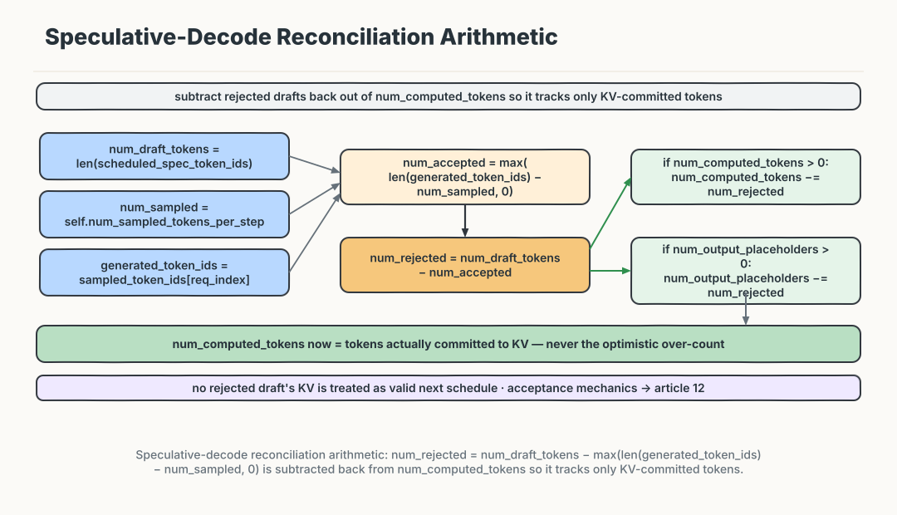</a>

<p class='figure-caption'>Speculative-decode reconciliation arithmetic: num_rejected = num_draft_tokens − max(len(generated_token_ids) − num_sampled, 0) is subtracted back from num_computed_tokens so it tracks only KV-committed tokens.</p>

```python
                num_draft_tokens = len(scheduled_spec_token_ids)
                num_sampled = self.num_sampled_tokens_per_step
                num_accepted = max(len(generated_token_ids) - num_sampled, 0)
                num_rejected = num_draft_tokens - num_accepted
                # num_computed_tokens represents the number of tokens
                # processed in the current step, considering scheduled
                # tokens and rejections. If some tokens are rejected,
                # num_computed_tokens is decreased by the number of rejected
                # tokens.
                if request.num_computed_tokens > 0:
                    request.num_computed_tokens -= num_rejected
                # If async scheduling, num_output_placeholders also includes
                # the scheduled spec tokens count and so is similarly adjusted.
                if request.num_output_placeholders > 0:
                    request.num_output_placeholders -= num_rejected
```

Of the sampled tokens, `num_sampled` (`num_sampled_tokens_per_step`) are genuine model tokens; the rest are accepted drafts, so `num_rejected = num_draft_tokens - num_accepted` (L1604). Subtracting it from `num_computed_tokens` (L1611) restores the actual committed KV length, preventing a rejected draft's KV state from entering the next schedule.

**Appending tokens and detecting stops, one token at a time.** Sampled tokens are folded into request state through `_update_request_with_output`, which is deliberately per-token because speculative decode can land several tokens in a single step.

[`vllm/v1/core/sched/scheduler.py:1905-1921`](https://github.com/vllm-project/vllm/blob/6cf7b26bd4bff60bf378e1af14044280ac0d214c/vllm/v1/core/sched/scheduler.py#L1905-L1921)

```python
    def _update_request_with_output(
        self, request: Request, new_token_ids: list[int]
    ) -> tuple[list[int], bool]:
        # Append generated tokens and check for stop. Note that if
        # a request is still being prefilled, we expect the model runner
        # to return empty token ids for the request.
        stopped = False
        for num_new, output_token_id in enumerate(new_token_ids, 1):
            request.append_output_token_ids(output_token_id)

            # Check for stop and update request state.
            # This must be called before we make the EngineCoreOutput.
            stopped = check_stop(request, self.max_model_len)
            if stopped:
                del new_token_ids[num_new:]  # Trim new tokens if needed.
                break
        return new_token_ids, stopped
```

`check_stop` ([`vllm/v1/core/sched/utils.py:94-130`](https://github.com/vllm-project/vllm/blob/6cf7b26bd4bff60bf378e1af14044280ac0d214c/vllm/v1/core/sched/utils.py#L94-L130), full listing in [Section 5](#5-the-request-lifecycle-the-requeststatus-state-machine)) is the oracle that *sets* the terminal status; `update_from_output`'s `stopped` flag is merely the trigger to act on it. The key shape is that the predicate writes the status in place and returns `True` in the same breath — e.g. on EOS:

```python
    if last_token_id == sampling_params.eos_token_id:
        request.status = RequestStatus.FINISHED_STOPPED
        return True
```

Order matters (the full ordered predicate is in [Section 5](#5-the-request-lifecycle-the-requeststatus-state-machine)): the `min_tokens` gate short-circuits so a request never stops before its floor; then EOS and stop-token both write `FINISHED_STOPPED`; then the length cap writes `FINISHED_LENGTH_CAPPED`; then repetition writes `FINISHED_REPETITION`. Because the check runs after each append and `del new_token_ids[num_new:]` (L1919) trims everything the loop generated *after* the stop token, the emission is monotonic: **no post-stop token ever reaches the client, and the recorded finish reason matches exactly the token that fired it.** Note what `check_stop` does *not* do — stop *strings* require detokenized text and are detected downstream in the front-end `OutputProcessor` (article 01), not here; this article stops at raw token ids.

**Acting on a stop: reason first, then free — but only if terminal.** Back in the main loop, a `stopped` request is finalized. The status-rollback semantics belong to [Section 5](#5-the-request-lifecycle-the-requeststatus-state-machine)'s state machine; the commit-phase gate this section covers is the reason snapshot and the terminal-only free:

[`vllm/v1/core/sched/scheduler.py:1712-1719`](https://github.com/vllm-project/vllm/blob/6cf7b26bd4bff60bf378e1af14044280ac0d214c/vllm/v1/core/sched/scheduler.py#L1712-L1719) (bucketing tail elided; full block [Section 5](#5-the-request-lifecycle-the-requeststatus-state-machine))

```python
            finish_reason = None
            if stopped:
                # Capture finish_reason BEFORE _handle_stopped_request, which may
                # reset the status to WAITING for streaming requests that continue.
                finish_reason = request.get_finished_reason()
                finished = self._handle_stopped_request(request)
                if finished:
                    kv_transfer_params = self._free_request(request)
                ...
```

`finish_reason` is snapshotted *before* `_handle_stopped_request` because a resumable streaming session flips its status back to `WAITING`, erasing the reason ([Section 5](#5-the-request-lifecycle-the-requeststatus-state-machine)'s state machine). `_handle_stopped_request` returns `True` only for a genuinely terminal request; a streaming turn with more queued input returns `False` and re-enters the waiting queue *keeping its KV blocks*. **Freeing is gated on that terminal `finished`, never on the raw `stopped` flag** — the block-return machinery (`_free_request`, terminal-status assert, connector/step fences) is detailed in [Section 9](#9-finished-requests-detection-cleanup-and-freeing-kv) and the block pool it replenishes in article 06. The request is then bucketed by its pre-stop status (`status_before_stop`, captured at L1633) so the batched queue removal after the loop pulls it from `running` or `waiting` correctly ([Section 9](#9-finished-requests-detection-cleanup-and-freeing-kv)).

**Assembling the client-facing outputs.** Each surviving request emits at most one `EngineCoreOutput`, bucketed by `request.client_index`.

[`vllm/v1/core/sched/scheduler.py:1739-1765`](https://github.com/vllm-project/vllm/blob/6cf7b26bd4bff60bf378e1af14044280ac0d214c/vllm/v1/core/sched/scheduler.py#L1739-L1765)

```python
            if (
                new_token_ids
                or pooler_output is not None
                or kv_transfer_params
                or stopped
            ):
                # Add EngineCoreOutput for this Request.
                outputs[request.client_index].append(
                    EngineCoreOutput(
                        request_id=req_id,
                        new_token_ids=new_token_ids,
                        finish_reason=finish_reason,
                        new_logprobs=new_logprobs,
                        new_prompt_logprobs_tensors=prompt_logprobs_tensors,
                        pooling_output=pooler_output,
                        stop_reason=request.stop_reason,
                        events=request.take_events(),
                        prefill_stats=request.take_prefill_stats(),
                        kv_transfer_params=kv_transfer_params,
                        trace_headers=request.trace_headers,
                        routed_experts=routed_experts,
                        num_nans_in_logits=request.num_nans_in_logits,
                    )
                )
            else:
                # Invariant: EngineCore returns no partial prefill outputs.
                assert not prompt_logprobs_tensors
```

The `if` guard is the emission rule: emit only when there is something to deliver — new tokens, a pooling result, a KV-transfer handoff, or a stop. A pure prefill chunk that sampled nothing produces *no* output, and the `else` branch asserts it also carries no pending prompt-logprobs (L1763-1765) — the "EngineCore returns no partial prefill outputs" invariant that keeps the front-end from having to reason about half-formed generations. `finish_reason` and `kv_transfer_params` ride along to tell the front-end the request is done and to carry disaggregated-KV metadata; `take_events()` / `take_prefill_stats()` are drain-once so each is reported in exactly one step.

Finally the buckets are materialized into `EngineCoreOutputs`, finished-ids folded in, and stats attached.

[`vllm/v1/core/sched/scheduler.py:1833-1857`](https://github.com/vllm-project/vllm/blob/6cf7b26bd4bff60bf378e1af14044280ac0d214c/vllm/v1/core/sched/scheduler.py#L1833-L1857)

```python
        finished_req_ids = self.finished_req_ids_dict
        if finished_req_ids:
            for client_index, finished_set in finished_req_ids.items():
                if (eco := engine_core_outputs.get(client_index)) is not None:
                    eco.finished_requests = finished_set
                else:
                    engine_core_outputs[client_index] = EngineCoreOutputs(
                        finished_requests=finished_set
                    )
            finished_req_ids.clear()

        if (
            stats := self.make_stats(
                spec_decoding_stats, kv_connector_stats, cudagraph_stats, perf_stats
            )
        ) is not None:
            # Return stats to only one of the front-ends.
            if (eco := next(iter(engine_core_outputs.values()), None)) is None:
                engine_core_outputs[0] = eco = EngineCoreOutputs()
            eco.scheduler_stats = stats
```

`finished_req_ids_dict` is a separate `client_index → set[str]` accumulator filled by `_free_request` ([Section 9](#9-finished-requests-detection-cleanup-and-freeing-kv)), so a client learns "request X is fully done" even on a step where X produced no token; the set is attached and then `.clear()`ed, guaranteeing each finished-id is reported exactly once. Engine-wide `SchedulerStats` are not per-client, so they attach to a single arbitrary front-end (`next(iter(...))`), fabricating `engine_core_outputs[0]` if the step emitted nothing — stats are never dropped, never double-counted. The dict this returns is keyed only by `client_index`; the payload's `engine_index` is still the default `0` and gets stamped later by the output IO thread that PUSHes each slice to its socket ([Section 8](#8-output-aggregation-enginecoreoutputs-per-client), article 03).

This commit pass balances in-flight counters, removes rejected drafts, applies stops token by token, frees terminal requests, and emits completion ids. It runs after the abort barrier, leaving scheduler state reconciled before the next batch is formed.

## 8. Output Aggregation: EngineCoreOutputs per Client

`step()` returns `dict[int, EngineCoreOutputs]`. The dict key is the frontend's `client_index`, chosen by the scheduler from each request. The payload's `engine_index` identifies the producing engine and is stamped later by the output IO thread. In short, the key controls routing and the field records provenance.

<a href='images/vllm-04-07-output-aggregation.svg' target='_blank'>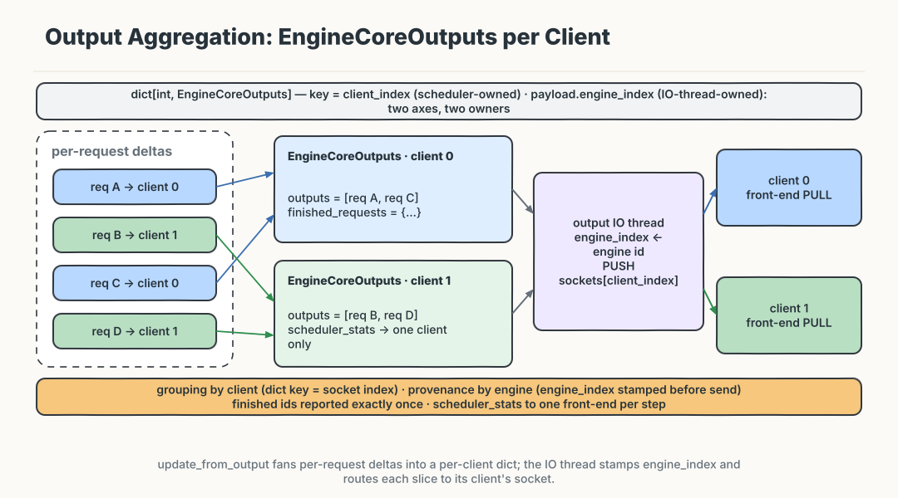</a>

<p class='figure-caption'>One step's update_from_output fans per-request deltas into a per-client dict, which the IO thread stamps with engine_index and routes to each client's socket.</p>

### The two wire structs

The leaf is a per-request, per-step *delta*; the container is one client's whole slice of one step.

Source anchor: [`vllm/v1/engine/__init__.py:175-205`](https://github.com/vllm-project/vllm/blob/6cf7b26bd4bff60bf378e1af14044280ac0d214c/vllm/v1/engine/__init__.py#L175-L205)

```python
class EngineCoreOutput(
    msgspec.Struct,
    array_like=True,  # type: ignore[call-arg]
    omit_defaults=True,  # type: ignore[call-arg]
    gc=False,
):  # type: ignore[call-arg]
    request_id: str
    new_token_ids: list[int]

    new_logprobs: LogprobsLists | None = None
    new_prompt_logprobs_tensors: LogprobsTensors | None = None

    pooling_output: torch.Tensor | None = None

    finish_reason: FinishReason | None = None
    stop_reason: int | str | None = None
    events: list[EngineCoreEvent] | None = None
    kv_transfer_params: dict[str, Any] | None = None
    ...
    @property
    def finished(self) -> bool:
        return self.finish_reason is not None
```

Source anchor: [`vllm/v1/engine/__init__.py:220-248`](https://github.com/vllm-project/vllm/blob/6cf7b26bd4bff60bf378e1af14044280ac0d214c/vllm/v1/engine/__init__.py#L220-L248)

```python
class EngineCoreOutputs(
    msgspec.Struct,
    array_like=True,  # type: ignore[call-arg]
    omit_defaults=True,  # type: ignore[call-arg]
    gc=False,
):  # type: ignore[call-arg]
    ...
    engine_index: int = 0

    # [num_reqs]
    outputs: list[EngineCoreOutput] = []
    scheduler_stats: SchedulerStats | None = None
    timestamp: float = 0.0

    utility_output: UtilityOutput | None = None
    finished_requests: set[str] | None = None
    ...
    def __post_init__(self):
        if self.timestamp == 0.0:
            self.timestamp = time.monotonic()
```

Both structs are declared `array_like=True, omit_defaults=True, gc=False`: msgspec serializes each as a positional array (compact on the wire), skips default-valued fields, and opts the struct out of Python's cyclic GC — these objects are short-lived and cycle-free, so tracking them would be pure overhead. On the leaf, `finished` is a *property*, never serialized; `finish_reason` is the single source of truth, and `request_id` is the *external* request id the client keys on, not the scheduler's internal handle. On the container, `engine_index` defaults to `0` and, critically, is *not* set at construction inside the scheduler; the scheduler does not know or own it. `timestamp` auto-fills to `time.monotonic()` in `__post_init__` if left `0.0`, giving the front-end an inter-step clock for free. Note what is *absent*: there is no client-index field. The client is the **dict key** / the socket the container is sent on; once the payload reaches a client's socket the client is implied.

### The accumulator and the emission rule

`update_from_output` accumulates into a `defaultdict` keyed by `request.client_index`, and appends a delta only when there is something to deliver.

Source anchor: [`vllm/v1/core/sched/scheduler.py:1529`](https://github.com/vllm-project/vllm/blob/6cf7b26bd4bff60bf378e1af14044280ac0d214c/vllm/v1/core/sched/scheduler.py#L1529) then `:1739-1765`

```python
        outputs: dict[int, list[EngineCoreOutput]] = defaultdict(list)
```

```python
            if (
                new_token_ids
                or pooler_output is not None
                or kv_transfer_params
                or stopped
            ):
                # Add EngineCoreOutput for this Request.
                outputs[request.client_index].append(
                    EngineCoreOutput(
                        request_id=req_id,
                        new_token_ids=new_token_ids,
                        finish_reason=finish_reason,
                        new_logprobs=new_logprobs,
                        new_prompt_logprobs_tensors=prompt_logprobs_tensors,
                        pooling_output=pooler_output,
                        stop_reason=request.stop_reason,
                        events=request.take_events(),
                        prefill_stats=request.take_prefill_stats(),
                        kv_transfer_params=kv_transfer_params,
                        trace_headers=request.trace_headers,
                        routed_experts=routed_experts,
                        num_nans_in_logits=request.num_nans_in_logits,
                    )
                )
            else:
                # Invariant: EngineCore returns no partial prefill outputs.
                assert not prompt_logprobs_tensors
```

The intermediate is `client_index → list[EngineCoreOutput]`, not the final struct; each progressing request appends to the bucket for *its own* client. `request.client_index` is copied off the wire request at admission — `Request.from_engine_core_request` sets `client_index=request.client_index` ([`vllm/v1/request.py:210`](https://github.com/vllm-project/vllm/blob/6cf7b26bd4bff60bf378e1af14044280ac0d214c/vllm/v1/request.py#L210)), which itself defaults to `0` on `EngineCoreRequest` ([`vllm/v1/engine/__init__.py:113`](https://github.com/vllm-project/vllm/blob/6cf7b26bd4bff60bf378e1af14044280ac0d214c/vllm/v1/engine/__init__.py#L113)). The four-way `if` is the emission rule: emit an `EngineCoreOutput` only when there are new decoded tokens, a pooling result, KV-transfer params to hand back, or a terminal `stopped`.

A request that was scheduled this step but is still mid-prefill with nothing sampled produces *no* output at all. The `else` branch does not just skip — it `assert not prompt_logprobs_tensors`, turning the "no partial-prefill outputs" rule into a checked invariant: if a code path ever computed prompt logprobs for a request it is about to drop, that is a bug, not silent data loss. `take_events()` and `take_prefill_stats()` are drain-once (moved out of the request object), so each event/stat is delivered in exactly one step and never duplicated across steps.

This ensures that the dict is partitioned strictly by originating front-end, one bucket per client, and EngineCore never leaks a partial-prefill delta downstream. That keeps the front-end `OutputProcessor` (article 01) simple — every `EngineCoreOutput` it sees is a real, deliverable increment, so it never has to distinguish "prefill progress" from "a token for the user."

**Materialize, fold finished ids, attach stats.**

Turn the per-client lists into `EngineCoreOutputs`, then splice in two step-level side channels that do not belong to any single request: the set of ids that finished, and the engine-wide stats.

Source anchor: [`vllm/v1/core/sched/scheduler.py:1826-1859`](https://github.com/vllm-project/vllm/blob/6cf7b26bd4bff60bf378e1af14044280ac0d214c/vllm/v1/core/sched/scheduler.py#L1826-L1859)

```python
        # Create EngineCoreOutputs for all clients that have requests with
        # outputs in this step.
        engine_core_outputs = {
            client_index: EngineCoreOutputs(outputs=outs)
            for client_index, outs in outputs.items()
        }

        finished_req_ids = self.finished_req_ids_dict
        if finished_req_ids:
            # Include ids of requests that finished since last outputs
            # were sent.
            for client_index, finished_set in finished_req_ids.items():
                # Set finished request set in EngineCoreOutputs for this client.
                if (eco := engine_core_outputs.get(client_index)) is not None:
                    eco.finished_requests = finished_set
                else:
                    engine_core_outputs[client_index] = EngineCoreOutputs(
                        finished_requests=finished_set
                    )
            finished_req_ids.clear()

        if (
            stats := self.make_stats(
                spec_decoding_stats, kv_connector_stats, cudagraph_stats, perf_stats
            )
        ) is not None:
            # Return stats to only one of the front-ends.
            if (eco := next(iter(engine_core_outputs.values()), None)) is None:
                # We must return the stats even if there are no request
                # outputs this step.
                engine_core_outputs[0] = eco = EngineCoreOutputs()
            eco.scheduler_stats = stats

        return engine_core_outputs
```

First, one `EngineCoreOutputs(outputs=outs)` is built per client that had at least one delta this step; `engine_index` is left at its default `0` here, deliberately — it is stamped later. Second, `finished_req_ids_dict` is a *separate* `client_index → set[str]` accumulator, declared `dict[int, set[str]] | None` ([`scheduler.py:101`](https://github.com/vllm-project/vllm/blob/6cf7b26bd4bff60bf378e1af14044280ac0d214c/vllm/v1/core/sched/scheduler.py#L101)) and filled in `_free_request` ([`scheduler.py:2117-2118`](https://github.com/vllm-project/vllm/blob/6cf7b26bd4bff60bf378e1af14044280ac0d214c/vllm/v1/core/sched/scheduler.py#L2117-L2118)) every time a request's KV is freed ([Section 9](#9-finished-requests-detection-cleanup-and-freeing-kv)). It exists because a request can finish on a step where its client had no *token* output (e.g. a request freed on a step where it emitted nothing new).

The fold attaches each client's finished set to that client's container, **creating a fresh container keyed by the same `client_index` if the client had no token outputs this step**, then `.clear()`s the accumulator so each finished id is reported exactly once. Third, `SchedulerStats` is engine-wide, not per-client, so it is attached to *exactly one* arbitrary client via `next(iter(engine_core_outputs.values()))`; if the step produced nothing at all, an `engine_core_outputs[0]` is fabricated so the stats are never dropped.

Finished ids are drained and cleared, so each client receives one release signal per request. Stats go to one client per step, including token-less steps, and the scheduler returns a plain dict without touching sockets or engine identities.

**Fanning the dict into the output queue.**

`step()` returns the dict up to `_process_engine_step`, which flattens it into a thread-safe queue as individual `(client_index, EngineCoreOutputs)` items.

Source anchor: [`vllm/v1/engine/core.py:1300-1307`](https://github.com/vllm-project/vllm/blob/6cf7b26bd4bff60bf378e1af14044280ac0d214c/vllm/v1/engine/core.py#L1300-L1307) (queue type at `:916`)

```python
    def _process_engine_step(self) -> bool:
        """Called only when there are unfinished local requests."""

        # Step the engine core.
        outputs, model_executed = self.step_fn()
        # Put EngineCoreOutputs into the output queue.
        for output in outputs.items() if outputs else ():
            self.output_queue.put_nowait(output)
```

```python
        self.output_queue = queue.Queue[tuple[int, EngineCoreOutputs] | bytes]()
```

`outputs.items()` yields `(client_index, EngineCoreOutputs)` tuples, each pushed as-is; the dict is flattened into one queue item per (client, step) that had output. `if outputs else ()` tolerates both `{}` (from `step`) and `None` (from `step_with_batch_queue`, [Section 3](#3-step_with_batch_queue-the-overlapped-variant)) uniformly, so a no-output step simply enqueues nothing. The queue's element type is exactly that tuple, plus a `bytes` alternative reserved for the `ENGINE_CORE_DEAD` sentinel. The same queue is also fed *directly* by control-plane paths that already know their target key — utility-RPC replies, finish/abort notifications, and DP-coordinator messages that use the reserved key `-1` (see article 03 for those control-plane producers). Every element on `output_queue` is a `(client_index, EngineCoreOutputs)` pair where `client_index >= 0` selects a client socket and `-1` selects the coordinator; the scheduler's pairing survives 1:1 onto the queue.

### The IO thread: stamp engine_index, route by client_index

A dedicated output socket thread pops each pair, stamps the payload's `engine_index`, and PUSHes it to the socket for its client. This is the ZMQ boundary detailed in article 03; here we care only about the two-axis contract.

Source anchor: [`vllm/v1/engine/core.py:1623-1648`](https://github.com/vllm-project/vllm/blob/6cf7b26bd4bff60bf378e1af14044280ac0d214c/vllm/v1/engine/core.py#L1623-L1648)

```python
            while True:
                output = self.output_queue.get()
                if output == EngineCoreProc.ENGINE_CORE_DEAD:
                    for socket in sockets:
                        socket.send(output)
                    break
                assert not isinstance(output, bytes)
                client_index, outputs = output
                outputs.engine_index = engine_index

                if client_index == -1:
                    # Don't reuse buffer for coordinator message
                    # which will be very small.
                    assert coord_socket is not None
                    coord_socket.send_multipart(encoder.encode(outputs))
                    continue
                ...
                tracker = sockets[client_index].send_multipart(
                    buffers, copy=False, track=True
                )
```

Line 1631, `outputs.engine_index = engine_index`, overwrites the scheduler default with the real engine id. `client_index == -1` routes to the coordinator; otherwise the dict key selects `sockets[client_index]`. The zero-copy send pins `outputs` until the ZMQ tracker completes. The scheduler therefore owns grouping, while the I/O thread only stamps provenance and routes.

### Client side: one EngineCoreOutputs per get_output()

From the client's side the per-client grouping is invisible — the socket topology (or in-process indexing) has already demultiplexed it, so each `get_output()` returns exactly one container.

Source anchor: [`vllm/v1/engine/core_client.py:289-292`](https://github.com/vllm-project/vllm/blob/6cf7b26bd4bff60bf378e1af14044280ac0d214c/vllm/v1/engine/core_client.py#L289-L292) (in-process) and `:849-859` (multiprocess)

```python
    def get_output(self) -> EngineCoreOutputs:
        outputs, model_executed = self.engine_core.step_fn()
        self.engine_core.post_step(model_executed=model_executed)
        return outputs and outputs.get(0) or EngineCoreOutputs()
```

```python
    def get_output(self) -> EngineCoreOutputs:
        ...
        outputs = self.outputs_queue.get()

        if isinstance(outputs, Exception):
            raise self._format_exception(outputs) from None
        if outputs.wave_complete is not None:
            self.engines_running = False
        return outputs
```

`InprocClient` steps inline and reads client 0's slice, the only client supported by that topology. `SyncMPClient` receives an already-routed `EngineCoreOutputs` from its background socket thread; the per-client dict never crosses to the frontend. In both cases `get_output()` returns one engine's slice for one client and step, including its side channels.

## 9. Finished Requests: Detection, Cleanup, and Freeing KV

After output reconciliation, a terminal request releases encoder state and eventually its KV blocks. A stop can be resumable, and a terminal request may still have an in-flight GPU write or connector transfer, so "stopped," "finished," and "safe to return blocks" are separate checks.

### Detection: the terminal frontier, not the `stopped` flag

Finish is a property of `RequestStatus`, a totally-ordered `IntEnum` whose full definition and transition table live in [Section 5](#5-the-request-lifecycle-the-requeststatus-state-machine). The only fact this section needs is the frontier:

[`vllm/v1/request.py:349-351`](https://github.com/vllm-project/vllm/blob/6cf7b26bd4bff60bf378e1af14044280ac0d214c/vllm/v1/request.py#L349-L351)

```python
    @staticmethod
    def is_finished(status: "RequestStatus") -> bool:
        return status > RequestStatus.PREEMPTED
```

### `stopped` ≠ `finished`: the resumable escape hatch

When `_update_request_with_output` reports `stopped`, the per-request loop acts on it. The full `if stopped:` block — the finish-reason snapshot, the status rollback for resumable sessions, and the `status_before_stop` bucketing — belongs to [Section 5](#5-the-request-lifecycle-the-requeststatus-state-machine) (state machine) and is shown in [Section 7](#7-update_from_output-model-output-becomes-engine-outputs) (commit); the single gate this section turns on is the terminal-only free:

[`vllm/v1/core/sched/scheduler.py:1717-1719`](https://github.com/vllm-project/vllm/blob/6cf7b26bd4bff60bf378e1af14044280ac0d214c/vllm/v1/core/sched/scheduler.py#L1717-L1719) (full block [Section 5](#5-the-request-lifecycle-the-requeststatus-state-machine))

```python
                finished = self._handle_stopped_request(request)
                if finished:
                    kv_transfer_params = self._free_request(request)
```

Reading it in order: `finish_reason` is snapshotted *before* `_handle_stopped_request` (in the full block, [Section 5](#5-the-request-lifecycle-the-requeststatus-state-machine)), because that call can flip the status back to a live `WAITING_FOR_STREAMING_REQ` and erase the reason. `_free_request` runs **only if `finished` is `True`**: the `stopped` flag alone never frees anything. And the request is bucketed by its *pre-stop* status (`status_before_stop`, captured earlier at L1633) so the batched queue removal below knows whether it was running or preempted-then-stopped.

`_handle_stopped_request` is where a stop can be non-terminal:

[`vllm/v1/core/sched/scheduler.py:1887-1903`](https://github.com/vllm-project/vllm/blob/6cf7b26bd4bff60bf378e1af14044280ac0d214c/vllm/v1/core/sched/scheduler.py#L1887-L1903)

```python
    def _handle_stopped_request(self, request: Request) -> bool:
        """Return True if finished (can be False for resumable requests)."""
        if not request.resumable:
            return True

        if request.streaming_queue:
            update = request.streaming_queue.popleft()
            if update is None:
                # Streaming request finished.
                return True
            self._update_request_as_session(request, update)
        else:
            request.status = RequestStatus.WAITING_FOR_STREAMING_REQ
            self.num_waiting_for_streaming_input += 1

        self._enqueue_waiting_request(request)
        return False
```

A non-resumable request returns `True`. A resumable session consumes its next queued input or parks in `WAITING_FOR_STREAMING_REQ`, retaining KV in either case; only an end-of-stream marker makes it terminal. Thus one turn's EOS does not force a multi-turn session to re-prefill.

**Cleanup: batched queue removal.**

Requests are removed from the run/wait queues once, after the loop, not one-at-a-time inside it:

[`vllm/v1/core/sched/scheduler.py:1767-1772`](https://github.com/vllm-project/vllm/blob/6cf7b26bd4bff60bf378e1af14044280ac0d214c/vllm/v1/core/sched/scheduler.py#L1767-L1772)

```python
        # Remove the stopped requests from the running and waiting queues.
        if stopped_running_reqs:
            self.running = remove_all(self.running, stopped_running_reqs)
        if stopped_preempted_reqs:
            # This is a rare case and unlikely to impact performance.
            self.waiting.remove_requests(stopped_preempted_reqs)
```

`remove_all` ([`utils.py:62-91`](https://github.com/vllm-project/vllm/blob/6cf7b26bd4bff60bf378e1af14044280ac0d214c/vllm/v1/core/sched/utils.py#L62-L91)) fast-paths the overwhelmingly common single-decode-stop case with an in-place `list.remove` and falls back to a comprehension only for multi-removal — the `NOTE(woosuk)` comment above the per-request loop ([`scheduler.py:1563-1565`](https://github.com/vllm-project/vllm/blob/6cf7b26bd4bff60bf378e1af14044280ac0d214c/vllm/v1/core/sched/scheduler.py#L1563-L1565)) warns it can run over 1K requests, so per-iteration list surgery would be a real cost. A preempted-then-stopped request lives in `waiting` (preemption re-queues to the front, [Section 5](#5-the-request-lifecycle-the-requeststatus-state-machine)), hence the separate `waiting.remove_requests` path; the `status_before_stop` bucketing above is what routes each request to the right queue.

### Freeing: `_free_request` and the terminal-status assert

`_free_request` is the single funnel both internal stops (above) and external aborts (`finish_requests`, [Section 10](#10-aborts-and-cancellation)) reach:

[`vllm/v1/core/sched/scheduler.py:2107-2124`](https://github.com/vllm-project/vllm/blob/6cf7b26bd4bff60bf378e1af14044280ac0d214c/vllm/v1/core/sched/scheduler.py#L2107-L2124)

```python
    def _free_request(
        self, request: Request, delay_free_blocks: bool = False
    ) -> dict[str, Any] | None:
        assert request.is_finished()

        self._inflight_prefills.discard(request)
        connector_delay_free_blocks, kv_xfer_params = self._connector_finished(request)
        self.encoder_cache_manager.free(request)
        request_id = request.request_id
        self.finished_req_ids.add(request_id)
        if self.finished_req_ids_dict is not None:
            self.finished_req_ids_dict[request.client_index].add(request_id)

        delay_free_blocks |= connector_delay_free_blocks
        if not delay_free_blocks:
            self._free_blocks(request)

        return kv_xfer_params
```

The terminal assertion protects `_free_request`. It notifies the connector, frees encoder cache, and records the id for the next worker update and the owning frontend. KV blocks return immediately only when neither the caller nor connector requests a delay; otherwise the terminal request remains registered until transfer work completes.

<a href='images/vllm-04-08-finish-cleanup.svg' target='_blank'>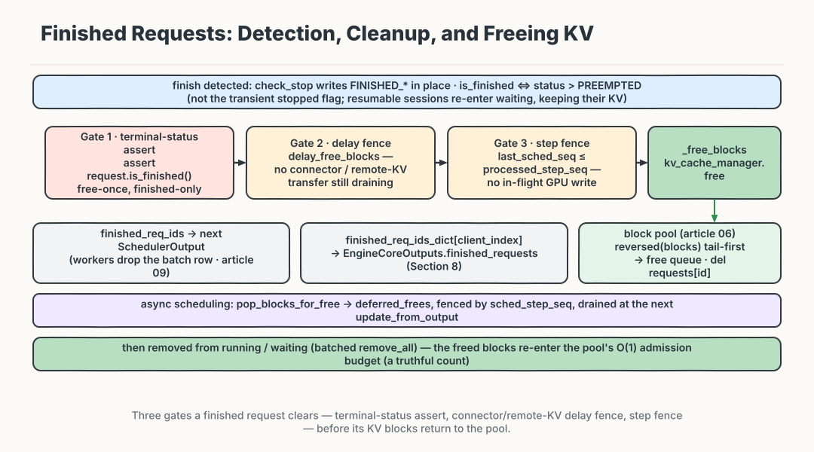</a>

<p class='figure-caption'>Three gates a finished request passes before its KV blocks return to the pool.</p>

### The three gates and the step fence

`_free_blocks` ([`scheduler.py:2126-2129`](https://github.com/vllm-project/vllm/blob/6cf7b26bd4bff60bf378e1af14044280ac0d214c/vllm/v1/core/sched/scheduler.py#L2126-L2129)) re-asserts `is_finished()`, calls `_free_request_blocks`, then `del self.requests[request.request_id]` — after which the id is unknown to the scheduler. The interesting logic is the step fence:

[`vllm/v1/core/sched/scheduler.py:2138-2165`](https://github.com/vllm-project/vllm/blob/6cf7b26bd4bff60bf378e1af14044280ac0d214c/vllm/v1/core/sched/scheduler.py#L2138-L2165)

```python
    def _free_request_blocks(self, request: Request):
        """Free the request's KV blocks, deferring the return to the block
        pool when an in-flight GPU step may still write them.
        """
        if not self.defer_block_free or (
            # Last scheduled step already processed: no in-flight write remains
            # (always the case for a normal finish), so free now.
            request.last_sched_seq <= self.processed_step_seq
        ):
            self.kv_cache_manager.free(request)
            return
        blocks = self.kv_cache_manager.pop_blocks_for_free(request)
        if blocks:
            self.deferred_frees.append((self.sched_step_seq, blocks))

    def _drain_deferred_frees(self):
        """Return deferred blocks whose fence step has completed.

        Entries are appended with monotonically non-decreasing fences, so
        stop at the first one that is still pending.
        """
        while self.deferred_frees:
            fence, _ = self.deferred_frees[0]
            if fence > self.processed_step_seq:
                break
            _, blocks = self.deferred_frees.popleft()
            # Free in reverse order so that the tail blocks are evicted first.
            self.kv_cache_manager.block_pool.free_blocks(reversed(blocks))
```

Blocks return only after terminal status, connector transfer, and GPU-step safety have all cleared. Synchronous scheduling, or an already processed last step, frees immediately. Async scheduling may instead remove the blocks from the request and park them in `deferred_frees` under a step-sequence fence.

The next commit drains fences at or below `processed_step_seq`. Monotonic fence order permits stopping at the first pending entry. Blocks return tail-first, matching the normal KV-manager free path and preserving the cache's eviction order.

**Notifying the worker, and what the pool gets back.**

The freed ids are pushed to the workers on the *next* iteration, not this one. `_free_request` added the id to `self.finished_req_ids`, and `schedule()` hands that same set object out in the `SchedulerOutput`:

[`vllm/v1/core/sched/scheduler.py:1105-1110`](https://github.com/vllm-project/vllm/blob/6cf7b26bd4bff60bf378e1af14044280ac0d214c/vllm/v1/core/sched/scheduler.py#L1105-L1110)

```python
            preempted_req_ids=self.reset_preempted_req_ids,
            # finished_req_ids is an existing state in the scheduler,
            # instead of being newly scheduled in this step.
            # It contains the request IDs that are finished in between
            # the previous and the current steps.
            finished_req_ids=self.finished_req_ids,
```

Because the set object is *shared* with the emitted `SchedulerOutput`, `_update_after_schedule` must rebind, not `.clear()`, it to a fresh `set()` ([`scheduler.py:1213-1217`](https://github.com/vllm-project/vllm/blob/6cf7b26bd4bff60bf378e1af14044280ac0d214c/vllm/v1/core/sched/scheduler.py#L1213-L1217), [Section 7](#7-update_from_output-model-output-becomes-engine-outputs)); mutating in place would corrupt an output already in flight to the workers. This is what makes worker notification exactly-once: each finished id appears in precisely one `SchedulerOutput`, letting the model runner drop the request's batch row and attention slots (article 09).

The actual return-to-pool is one line delegated to the KV cache manager (article 06's territory):

[`vllm/v1/core/kv_cache_manager.py:465-473`](https://github.com/vllm-project/vllm/blob/6cf7b26bd4bff60bf378e1af14044280ac0d214c/vllm/v1/core/kv_cache_manager.py#L465-L473)

```python
    def free(self, request: Request) -> None:
        """Free the blocks allocated for the request.
        We free the blocks in reverse order so that the tail blocks are evicted
        first when caching is enabled.
        ...
        """
        self.coordinator.free(request.request_id)
```

Freed blocks rejoin the eviction-ordered pool tail-first, preserving shared prefixes longer (article 06). Because a block is counted free only after transfers and writes have stopped, `get_num_free_blocks()` remains a valid admission signal for the next schedule (article 05).

## 10. Aborts and Cancellation

An abort originates outside the model, from a client disconnect, timeout, or shutdown. A stop condition is discovered while reconciling a forward pass ([Section 5](#5-the-request-lifecycle-the-requeststatus-state-machine), [Section 9](#9-finished-requests-detection-cleanup-and-freeing-kv)); an abort is applied between steps as `finish_requests(..., RequestStatus.FINISHED_ABORTED)`. There is no intermediate aborting status or cancellation token threaded through the forward. Two queues deliver the cancellation promptly while preserving commit order.

**Abort is a terminal status, not a state machine.**

The `RequestStatus` enum is a totally-ordered `IntEnum`, and cancellation lands past the critical `PREEMPTED` frontier.

[`vllm/v1/request.py:349-351`](https://github.com/vllm-project/vllm/blob/6cf7b26bd4bff60bf378e1af14044280ac0d214c/vllm/v1/request.py#L349-L351) (full enum in [Section 5](#5-the-request-lifecycle-the-requeststatus-state-machine))

```python
    @staticmethod
    def is_finished(status: "RequestStatus") -> bool:
        return status > RequestStatus.PREEMPTED
```

**The engine wrapper delegates straight to the scheduler.**

[`vllm/v1/engine/core.py:409-415`](https://github.com/vllm-project/vllm/blob/6cf7b26bd4bff60bf378e1af14044280ac0d214c/vllm/v1/engine/core.py#L409-L415)

```python
    def abort_requests(self, request_ids: list[str]):
        """Abort requests from the scheduler."""

        # TODO: The scheduler doesn't really need to know the
        # specific finish reason, TBD whether we propagate that
        # (i.e. client-aborted vs stop criteria met).
        self.scheduler.finish_requests(request_ids, RequestStatus.FINISHED_ABORTED)
```

There is nothing else. `EngineCore.abort_requests` neither touches the model executor nor emits an output; it mutates scheduler sets and returns. The same wrapper serves the `abort_immediately` short-circuit on the admission path — a request created only to fire the KV-connector `request_finished` hook is admitted and then aborted in the same busy-loop turn ([`core.py:403-407`](https://github.com/vllm-project/vllm/blob/6cf7b26bd4bff60bf378e1af14044280ac0d214c/vllm/v1/engine/core.py#L403-L407)), so it never survives to `schedule()` yet its connector finish hook still runs exactly once (cross-ref [Section 4](#4-add_request-entering-the-engine-and-the-waiting-queue)).

### Two queues: eager *and* ordered

An abort has two conflicting requirements. It must take effect as fast as possible — ideally while the GPU frame it targets is still running, so the freed KV blocks are reclaimable on the very next step — and it must preserve wire ordering with adds so a request is never leaked (added-then-aborted must not race into aborted-then-added). vLLM satisfies both by putting every abort on **two** queues in the ZMQ input IO thread.

[`vllm/v1/engine/core.py:1576-1587`](https://github.com/vllm-project/vllm/blob/6cf7b26bd4bff60bf378e1af14044280ac0d214c/vllm/v1/engine/core.py#L1576-L1587)

```python
                    else:
                        request = generic_decoder.decode(data_frames)

                        if request_type == EngineCoreRequestType.ABORT:
                            # Aborts are added to *both* queues, allows us to eagerly
                            # process aborts while also ensuring ordering in the input
                            # queue to avoid leaking requests. This is ok because
                            # aborting in the scheduler is idempotent.
                            self.aborts_queue.put_nowait(request)

                    # Push to input queue for core busy loop.
                    self.input_queue.put_nowait((request_type, request))
```

`aborts_queue` is the *eager* path: it is drained inside `step()` the moment the forward returns, without waiting for the busy loop to reach the input queue. `input_queue` is the *ordered* path: it carries the abort interleaved with adds so the request is guaranteed to be finished in wire order. The comment names the property that makes carrying the same abort on two queues legal: **aborting in the scheduler is idempotent.** Without idempotence this would be a double-free bug; with it, the redundancy is free insurance.

### The abort barrier: consumed after execute, before commit

The eager consumer runs at a precise point in the step transaction — after the forward has settled, before `update_from_output` folds any tokens back.

[`vllm/v1/engine/core.py:501-506`](https://github.com/vllm-project/vllm/blob/6cf7b26bd4bff60bf378e1af14044280ac0d214c/vllm/v1/engine/core.py#L501-L506)

```python
        # Before processing the model output, process any aborts that happened
        # during the model execution.
        self._process_aborts_queue()
        engine_core_outputs = self.scheduler.update_from_output(
            scheduler_output, model_output
        )
```

The batch-queue variant places the identical barrier at [`core.py:602-607`](https://github.com/vllm-project/vllm/blob/6cf7b26bd4bff60bf378e1af14044280ac0d214c/vllm/v1/engine/core.py#L602-L607). The drain itself batches everything queued during the forward into one `abort_requests` call:

[`vllm/v1/engine/core.py:634-642`](https://github.com/vllm-project/vllm/blob/6cf7b26bd4bff60bf378e1af14044280ac0d214c/vllm/v1/engine/core.py#L634-L642)

<a href='images/vllm-04-26-abort-dual-queue.svg' target='_blank'>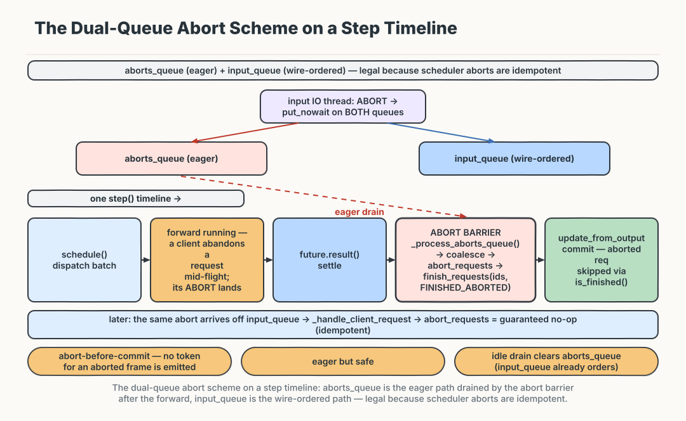</a>

<p class='figure-caption'>The dual-queue abort scheme on a step timeline: aborts_queue is the eager path drained by the abort barrier after the forward, input_queue is the wire-ordered path — legal because scheduler aborts are idempotent.</p>

```python
    def _process_aborts_queue(self):
        if not self.aborts_queue.empty():
            request_ids = []
            while not self.aborts_queue.empty():
                ids = self.aborts_queue.get_nowait()
                # Should be a list here, but also handle string just in case.
                request_ids.extend((ids,) if isinstance(ids, str) else ids)
            # More efficient to abort all as a single batch.
            self.abort_requests(request_ids)
```

The forward may include a request abandoned mid-flight. `_process_aborts_queue()` marks it `FINISHED_ABORTED` before `update_from_output` can append its sampled token. The ordered copy of the same abort later arrives through `input_queue` and becomes a no-op because the id is already finished.

**What the barrier actually prevents in `update_from_output`.**

The payoff is visible in the reconcile loop, where an aborted request is silently skipped.

[`vllm/v1/core/sched/scheduler.py:1568-1584`](https://github.com/vllm-project/vllm/blob/6cf7b26bd4bff60bf378e1af14044280ac0d214c/vllm/v1/core/sched/scheduler.py#L1568-L1584) (full listing [Section 7](#7-update_from_output-model-output-becomes-engine-outputs); only the decrement and skip lines shown here)

```python
        for req_id, num_tokens_scheduled in num_scheduled_tokens.items():
            assert num_tokens_scheduled > 0
            request = self.requests.get(req_id)
            if request is not None:
                request.num_in_flight_tokens -= num_tokens_scheduled
            ...
            if request is None or request.is_finished():
                # The request is already finished. This can happen if the
                # request is aborted while the model is executing it (e.g.,
                # in pipeline parallelism or in async scheduling).
                # NOTE(Kuntai): When delay_free_blocks=True (for async KV
                # cache transfer in KV connector), the aborted request will not
                # be set to None (in order to finish async KV transfer).
                # In this case, we use is_finished() to check.
                continue
```

Two subtleties matter here. First, the optimistic `num_in_flight_tokens` decrement ([Section 7](#7-update_from_output-model-output-becomes-engine-outputs)) runs *unconditionally*, before the skip check — even a request that was aborted mid-forward must have its in-flight accounting balanced, or the counter would leak and permanently distort admission. Second, the skip test is `request is None or request.is_finished()`, not just `is None`. When a KV connector holds `delay_free_blocks=True` for an async transfer, the aborted request is deliberately *not* deleted from `self.requests` yet, so a `None` check alone would miss it; `is_finished()` catches both the deleted case and the still-registered-but-terminal case. The model output for an aborted request is dropped rather than committed (no token append, no stop check, no client emission), which is the guarantee the abort barrier upstream was buying, now enforced defensively even when abort ordering is complicated by pipeline parallelism or async scheduling.

### `finish_requests`: the idempotent teardown funnel

All cancellation — client abort, streaming-session termination, KV-load failure (`FINISHED_ERROR`, [`scheduler.py:1776`](https://github.com/vllm-project/vllm/blob/6cf7b26bd4bff60bf378e1af14044280ac0d214c/vllm/v1/core/sched/scheduler.py#L1776)), and full shutdown — converges on one function.

[`vllm/v1/core/sched/scheduler.py:2058-2103`](https://github.com/vllm-project/vllm/blob/6cf7b26bd4bff60bf378e1af14044280ac0d214c/vllm/v1/core/sched/scheduler.py#L2058-L2103) (elided)

```python
        assert RequestStatus.is_finished(finished_status)
        if isinstance(request_ids, str):
            request_ids = (request_ids,)
        elif request_ids is not None:
            request_ids = set(request_ids)
        else:
            request_ids = self.requests.keys()
        ...
        # First pass: collect requests to remove from queues
        for req_id in request_ids:
            request = self.requests.get(req_id)
            if request is None or request.is_finished():
                # Invalid request ID.
                continue
            valid_requests.append(request)
            if request.status == RequestStatus.RUNNING:
                running_requests_to_remove.add(request)
            else:
                ...
                waiting_requests_to_remove.append(request)
        # Remove all requests from queues at once for better efficiency
        if running_requests_to_remove:
            self.running = remove_all(self.running, running_requests_to_remove)
        if waiting_requests_to_remove:
            self.waiting.remove_requests(waiting_requests_to_remove)
            self.skipped_waiting.remove_requests(waiting_requests_to_remove)
        # Second pass: set status and free requests
        for request in valid_requests:
            delay_free_blocks = False
            if request.status == RequestStatus.WAITING_FOR_REMOTE_KVS:
                delay_free_blocks = (
                    request.request_id not in self.finished_recving_kv_req_ids
                )
                ...
            request.status = finished_status
            self._free_request(request, delay_free_blocks=delay_free_blocks)
```

The `request_ids is None` case finishes *all* live requests: the shutdown / pause-scheduler path. The `request is None or request.is_finished()` guard in pass one is the concrete source of idempotence the dual-queue scheme depends on: an unknown id, or an id already finished by the eager path, is silently skipped. Pass one classifies each surviving request and pulls it out of exactly the queue it lives in (`running` via `remove_all`, or `waiting`/`skipped_waiting`), batching the removals so a large abort set is not O(n·queue) work. Pass two writes the terminal status and hands off to `_free_request` ([Section 9](#9-finished-requests-detection-cleanup-and-freeing-kv)), with one special case: a request blocked in `WAITING_FOR_REMOTE_KVS` defers its block free unless the KV receive already completed, so an in-flight disaggregated-prefill transfer is not torn out from under the connector.

The function returns `(request_id, client_index)` pairs for exactly the requests it aborted; note `EngineCore.abort_requests` discards this return — the client learns of the abort through `finished_req_ids_dict`, recorded inside `_free_request` at [`scheduler.py:2116-2118`](https://github.com/vllm-project/vllm/blob/6cf7b26bd4bff60bf378e1af14044280ac0d214c/vllm/v1/core/sched/scheduler.py#L2116-L2118) and folded into that client's `EngineCoreOutputs.finished_requests` ([Section 8](#8-output-aggregation-enginecoreoutputs-per-client)), while the worker learns of it through `finished_req_ids` shipped in the *next* `SchedulerOutput` and then rebound to a fresh set ([Section 9](#9-finished-requests-detection-cleanup-and-freeing-kv)). Free-once, finished-only: the terminal-status assert in `_free_request` ([`scheduler.py:2110`](https://github.com/vllm-project/vllm/blob/6cf7b26bd4bff60bf378e1af14044280ac0d214c/vllm/v1/core/sched/scheduler.py#L2110)) plus the skip-finished guard here mean an id can traverse `finish_requests` any number of times and free its KV blocks exactly once.

**Idle drain and shutdown edges.**

When the engine parks with an empty input queue, any residual eager-queue entries are dropped, because ordering was already guaranteed by `input_queue`:

[`vllm/v1/engine/core.py:1276-1279`](https://github.com/vllm-project/vllm/blob/6cf7b26bd4bff60bf378e1af14044280ac0d214c/vllm/v1/engine/core.py#L1276-L1279)

```python
            if self.input_queue.empty():
                # Drain aborts queue; all aborts are also processed via input_queue.
                with self.aborts_queue.mutex:
                    self.aborts_queue.queue.clear()
```

This is safe because the eager queue is an optimization, never the system of record — every abort it carries is also, or was already, in `input_queue`. Shutdown is the mirror image on admission: once shutdown is requested, `_reject_add_in_shutdown` ([`core.py:1407-1416`](https://github.com/vllm-project/vllm/blob/6cf7b26bd4bff60bf378e1af14044280ac0d214c/vllm/v1/engine/core.py#L1407-L1416)) refuses new adds and sends the client a synthetic ABORT output rather than dropping the request silently, and a hard shutdown finishes every live request with `finish_requests(None, RequestStatus.FINISHED_ABORTED)`. On the orderly lifecycle path, no request is left unresolved: it is either finished normally, aborted with a reported reason, or rejected with an explicit abort output (process crash or transport loss can still strand an in-flight request).

The dual queue is safe because `finish_requests` is idempotent: eager handling shortens cancellation latency, ordered handling preserves wire order, and both converge on the same finished-only teardown.

## 11. Continuous Batching Across Steps

Continuous batching repeats the schedule → execute → abort barrier → commit transaction from [Section 2](#2-step-schedule-execute-update-as-one-transaction). Each iteration derives a new scheduled batch from persistent `running` and `waiting` sets. Decodes carry over, finished requests leave, newly arrived prefills may enter, and a request short of KV capacity may return to the waiting queue. The active sets persist, but the executable batch is planned again for each step.

This is Orca's iteration-level scheduling ([Orca, OSDI '22](https://www.usenix.org/conference/osdi22/presentation/yu)): rather than admitting a static request-level batch and holding it until every member finishes, the engine "interleaves request phases without synchronized batch boundaries; new requests can be added after each step while others keep generating" ([Inside vLLM](https://vllm.ai/blog/2025-09-05-anatomy-of-vllm)). PagedAttention is the enabling memory manager — non-contiguous KV blocks are what let the resident set churn every step without fragmentation ([Kwon et al.](https://arxiv.org/abs/2309.06180)). This section traces *where in the source* the reshape actually happens, and why the optimistic accounting of [Section 7](#7-update_from_output-model-output-becomes-engine-outputs) is what lets it happen without stalling on the forward pass.

<a href='images/vllm-04-09-continuous-batching.svg' target='_blank'>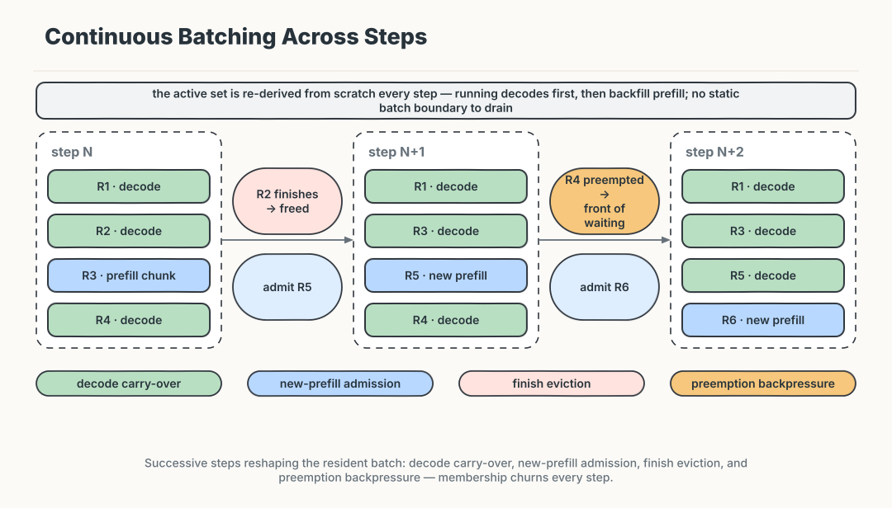</a>

<p class='figure-caption'>Successive steps reshaping the resident batch: decode carry-over, new-prefill admission, finish eviction, and preemption backpressure.</p>

### The step is the reshape unit

On the synchronous path, the engine plans one step at a time. The busy loop's gate is `has_work` ([Section 1](#1-the-loop-is-the-heartbeat-the-synchronous-step-contract)), and that path re-asks the same question at the top of every `step()`. With batch-queue execution, `step_with_batch_queue` can schedule multiple non-blocking batches ahead, but only up to the configured `batch_queue_size`:

[`vllm/v1/engine/core.py:488-490`](https://github.com/vllm-project/vllm/blob/6cf7b26bd4bff60bf378e1af14044280ac0d214c/vllm/v1/engine/core.py#L488-L490)

```python
        if not self.scheduler.has_requests():
            return {}, False
        scheduler_output = self.scheduler.schedule(self._should_throttle_prefills())
```

`schedule()` is called fresh each iteration with no memory of the previous batch's composition beyond the persistent `running`/`waiting` queues. `Scheduler.has_requests` is deliberately broad:

[`vllm/v1/core/sched/scheduler.py:2191-2202`](https://github.com/vllm-project/vllm/blob/6cf7b26bd4bff60bf378e1af14044280ac0d214c/vllm/v1/core/sched/scheduler.py#L2191-L2202)

```python
    def has_requests(self) -> bool:
        # Override the interface default to also keep the engine alive while a
        # connector still has pending push work (e.g. push-mode WRITE transfers
        # in flight after all "live" requests have finished). Without this hook
        # the engine would quiesce before the connector can drain completions.
        # TODO: replace with a more general mechanism for connectors to keep
        # the scheduler alive.
        return (
            self.has_unfinished_requests()
            or self.has_finished_requests()
            or (self.connector is not None and self.connector.has_pending_push_work())
        )
```

The active set for step *N* is whatever is in the scheduler's queues at the instant step *N* begins, which reflects every `add_request`, `abort`, finish, and preemption that landed since step *N-1*. Admissions arrive on the input thread and are drained by `_process_input_queue` *before* the next `schedule()` ([Section 4](#4-add_request-entering-the-engine-and-the-waiting-queue)); aborts are applied by the abort-barrier *before* the commit of the current step ([Section 10](#10-aborts-and-cancellation)). So by the time `schedule()` runs, the queues are already up to date, and the batch it produces is a snapshot of that moment, not a continuation of a prior plan.

There is no static batch to drain. A newly-arrived request never waits behind an in-progress batch the way request-level batching forces it to — it becomes eligible for the very next `schedule()` (actual admission still depends on token budget, `max_num_seqs`, and KV headroom, so it can stay in `waiting` across several steps, article 05), rather than waiting out the tail latency of the longest generation currently running.

### Running decode first, then waiting prefill

The shape of continuous batching ("carry the decodes, backfill with prefill") is literally the two-phase structure of `schedule()`. The running queue is scheduled first:

[`vllm/v1/core/sched/scheduler.py:440-442`](https://github.com/vllm-project/vllm/blob/6cf7b26bd4bff60bf378e1af14044280ac0d214c/vllm/v1/core/sched/scheduler.py#L440-L442)

```python
        # First, schedule the RUNNING requests.
        req_index = 0
        while req_index < len(self.running) and token_budget > 0:
```

Only after the running loop completes does the scheduler pull from the waiting queue:

[`vllm/v1/core/sched/scheduler.py:636-640`](https://github.com/vllm-project/vllm/blob/6cf7b26bd4bff60bf378e1af14044280ac0d214c/vllm/v1/core/sched/scheduler.py#L636-L640)

```python
        # Next, schedule the WAITING requests.
        if not preempted_reqs and self._pause_state == PauseState.UNPAUSED:
            step_skipped_waiting = create_request_queue(self.policy)

            while (self.waiting or self.skipped_waiting) and token_budget > 0:
```

Already-running requests are decode steps (one token each, cheap) plus any in-flight chunked-prefill continuations; they get first claim on the `token_budget`. Whatever budget survives is spent pulling prefills off `waiting`, promoting them `WAITING → RUNNING` ([Section 5](#5-the-request-lifecycle-the-requeststatus-state-machine)). This matches the blog's description: the scheduler "prioritizes already-running decode requests, then pulls prefill requests from the waiting queue" ([Inside vLLM](https://vllm.ai/blog/2025-09-05-anatomy-of-vllm)). The two workloads it interleaves are asymmetric: prefill is a forward pass over the whole prompt and is compute-bound; decode processes one token against cached KV and is memory-bandwidth-bound ([Inside vLLM](https://vllm.ai/blog/2025-09-05-anatomy-of-vllm)). Mixing them in one flattened batch (how chunked prefill fills the compute gaps left by bandwidth-bound decodes) is scheduler policy — the token-budget arithmetic and chunk sizing are the subject of article 05.

Progress before admission. Because the scheduler considers already-running requests before pulling new prefills off `waiting`, mid-generation requests are not starved by newly-arriving prefills under normal operation (a running request can still be skipped by PP/async cadence, deferral, or encoder-budget guards, or preempted under KV pressure); the running set drains toward completion while spare capacity, and only spare capacity, is used to grow it. Note the `if not preempted_reqs` guard at L637: if *any* request had to be preempted this step, the waiting queue is skipped entirely. The engine will not admit new work in the same step it was forced to evict existing work.

**Optimistic advance is why the reshape does not stall.**

The subtle part of continuous batching is not *deciding* the batch — it is doing so without a data dependency on the previous step's GPU result. If `schedule()` for step *N+1* had to wait for step *N*'s sampled tokens to know how far each request had progressed, the pipeline would serialize and the loop would stall. vLLM breaks that dependency by advancing progress counters *at schedule time*, before the forward runs:

[`vllm/v1/core/sched/scheduler.py:1182`](https://github.com/vllm-project/vllm/blob/6cf7b26bd4bff60bf378e1af14044280ac0d214c/vllm/v1/core/sched/scheduler.py#L1182) (in `_update_after_schedule`; full listing [Section 7](#7-update_from_output-model-output-becomes-engine-outputs))

```python
            request.num_computed_tokens += num_scheduled_token
```

`_update_after_schedule` runs at the tail of `schedule()`, after the `SchedulerOutput` snapshot is frozen. `num_computed_tokens += num_scheduled_token` credits the request with every scheduled token *as if the forward will succeed* — the comment block at [`scheduler.py:1170-1178`](https://github.com/vllm-project/vllm/blob/6cf7b26bd4bff60bf378e1af14044280ac0d214c/vllm/v1/core/sched/scheduler.py#L1170-L1178) spells out the payoff ("Advance the number of computed tokens here allowing us to schedule the prefill request again immediately in the next scheduling step") and the debt ("If some tokens ... are rejected later, the number of computed tokens will be adjusted in update_from_output").

In the same block (full listing [Section 7](#7-update_from_output-model-output-becomes-engine-outputs)), the recomputed `is_prefill_chunk` flag and the `_inflight_prefills.discard` mark the exact moment a request crosses from prefill into decode: once its computed tokens catch up to `num_tokens + num_output_placeholders`, it stops being a prefill chunk and next step it is scheduled as a one-token decode, while `num_in_flight_tokens` records the dispatched-but-unobserved GPU writes the commit phase will reconcile.

**Reconcile on return.**

Because schedule-time state is optimistic, every step must repay it. The per-request loop in `update_from_output` ([Section 7](#7-update_from_output-model-output-becomes-engine-outputs)) decrements the in-flight credit unconditionally:

[`vllm/v1/core/sched/scheduler.py:1568-1572`](https://github.com/vllm-project/vllm/blob/6cf7b26bd4bff60bf378e1af14044280ac0d214c/vllm/v1/core/sched/scheduler.py#L1568-L1572) (full listing [Section 7](#7-update_from_output-model-output-becomes-engine-outputs))

```python
        for req_id, num_tokens_scheduled in num_scheduled_tokens.items():
            assert num_tokens_scheduled > 0
            request = self.requests.get(req_id)
            if request is not None:
                request.num_in_flight_tokens -= num_tokens_scheduled
```

The decrement is balanced against the `+=` at L1183 and happens *before* the skip checks for finished/aborted requests, so the in-flight count is always squared even when the request turned out to be aborted mid-flight. Speculative-decode rejections are the other correction: draft tokens that the verifier rejected get subtracted back out of `num_computed_tokens` ([Section 7](#7-update_from_output-model-output-becomes-engine-outputs), [`scheduler.py:1591-1622`](https://github.com/vllm-project/vllm/blob/6cf7b26bd4bff60bf378e1af14044280ac0d214c/vllm/v1/core/sched/scheduler.py#L1591-L1622); the spec-decode mechanics belong to article 12). Together these are the "reconcile" half of the optimistic-then-reconcile contract — `num_computed_tokens` is left equal to the tokens actually committed to KV, not the tokens that were speculatively scheduled.

### Backpressure is preemption, not blocking

Continuous batching admits work greedily, so it needs a release valve when the KV pool cannot back the resident set. That valve is preemption, and it is the fourth way the batch reshapes across steps. It fires from inside `schedule()` when block allocation for a request fails and no more can be squeezed in:

[`vllm/v1/core/sched/scheduler.py:571-578`](https://github.com/vllm-project/vllm/blob/6cf7b26bd4bff60bf378e1af14044280ac0d214c/vllm/v1/core/sched/scheduler.py#L571-L578)

```python
                    else:
                        preempted_req = self.running.pop()

                    self._preempt_request(preempted_req, scheduled_timestamp)
                    preempted_reqs.append(preempted_req)
                    if preempted_req == request:
                        # No more request to preempt. Cannot schedule this request.
                        break
```

The eviction itself (`_preempt_request`, full body [Section 5](#5-the-request-lifecycle-the-requeststatus-state-machine)) resets KV and computed-token state but leaves output intact; the two lines this section argues from are the status flip and the counter reset:

[`vllm/v1/core/sched/scheduler.py:1157-1158`](https://github.com/vllm-project/vllm/blob/6cf7b26bd4bff60bf378e1af14044280ac0d214c/vllm/v1/core/sched/scheduler.py#L1157-L1158) (full body [Section 5](#5-the-request-lifecycle-the-requeststatus-state-machine))

```python
        request.status = RequestStatus.PREEMPTED
        request.num_computed_tokens = 0
```

Under the default policy the victim is `self.running.pop()`: the most recently added running request, i.e. the newest arrival, so backpressure sheds the youngest work first (the PRIORITY-policy branch at L547-570 instead evicts the lowest-priority request; policy detail is article 05). `_preempt_request` frees the victim's KV blocks back to the pool ([Section 9](#9-finished-requests-detection-cleanup-and-freeing-kv)), zeroes `num_computed_tokens`, drops any speculative tokens, bumps `num_preemptions`, and re-queues the request at the *front* of `waiting` via `prepend_request`. Critically, it touches only KV and computed-token state — `_output_token_ids` is untouched. The tokens the request already generated survive; only its cached KV, which can be recomputed, is thrown away. When the request is later resumed it re-enters as `PREEMPTED → RUNNING` ([Section 5](#5-the-request-lifecycle-the-requeststatus-state-machine)) and reprefills from `num_computed_tokens = 0`.

Preemption is lossless at the output level and lossy only at the recompute level. A request under memory pressure surrenders reclaimable KV (recoverable by recomputation) but never surrenders already-emitted tokens, and it is re-queued ahead of never-run waiting requests so it resumes as soon as blocks free. Combined with the `if not preempted_reqs` admission guard (L637), the system's response to KV exhaustion is coherent: stop admitting, evict the newest, keep everyone's output, and let the freed blocks — which are now truthfully counted in the pool ([Section 9](#9-finished-requests-detection-cleanup-and-freeing-kv), article 06) — gate the next admission decision.

## 12. Following One Engine Step

The trace below follows one batch from a busy-loop tick to the bytes read by a client. It connects the optimistic counters ([Section 5](#5-the-request-lifecycle-the-requeststatus-state-machine), [Section 7](#7-update_from_output-model-output-becomes-engine-outputs)), executor call ([Section 6](#6-execute_model-handing-the-batch-to-the-executor)), per-client aggregation ([Section 8](#8-output-aggregation-enginecoreoutputs-per-client)), and abort barrier ([Section 10](#10-aborts-and-cancellation)).

### The tick that wraps the transaction

The engine is a busy loop, but a disciplined one: it steps only while there is work, and it treats a step that did zero GPU work as a signal to yield rather than spin. The "Inside vLLM" write-up frames each step as schedule / forward pass / postprocess ([Inside vLLM](https://vllm.ai/blog/2025-09-05-anatomy-of-vllm)); the arch docs call the engine core a busy loop ([Architecture Overview](https://docs.vllm.ai/en/stable/design/arch_overview/)). In source, one tick is `_process_engine_step`.

[`vllm/v1/engine/core.py:1300-1317`](https://github.com/vllm-project/vllm/blob/6cf7b26bd4bff60bf378e1af14044280ac0d214c/vllm/v1/engine/core.py#L1300-L1317)
```python
    def _process_engine_step(self) -> bool:
        """Called only when there are unfinished local requests."""

        # Step the engine core.
        outputs, model_executed = self.step_fn()
        # Put EngineCoreOutputs into the output queue.
        for output in outputs.items() if outputs else ():
            self.output_queue.put_nowait(output)
        # Post-step hook.
        self.post_step(model_executed)

        # If no model execution happened but there is still scheduler work
        # (e.g. WAITING_FOR_REMOTE_KVS or delayed KV connector frees), yield
        # the GIL briefly to allow background transfer threads to make progress.
        if not model_executed and self.scheduler.has_requests():
            time.sleep(0.001)

        return model_executed
```

The bound `step_fn` emits per-client containers, `post_step` handles mode-specific draft state, and `model_executed` controls the anti-spin sleep. Because `has_work` includes a non-empty batch queue, outstanding futures are harvested before the loop parks.

### The transaction spine

On the synchronous path, one `step()` handles one resident batch. The call to `future.result()` settles its execution before the commit phase begins.

[`vllm/v1/engine/core.py:479-508`](https://github.com/vllm-project/vllm/blob/6cf7b26bd4bff60bf378e1af14044280ac0d214c/vllm/v1/engine/core.py#L479-L508)
```python
    def step(self) -> tuple[dict[int, EngineCoreOutputs], bool]:
        """Schedule, execute, and make output.

        Returns tuple of outputs and a flag indicating whether the model
        was executed.
        """

        # Check for any requests remaining in the scheduler - unfinished,
        # or finished and not yet removed from the batch.
        if not self.scheduler.has_requests():
            return {}, False
        scheduler_output = self.scheduler.schedule(self._should_throttle_prefills())
        future = self.model_executor.execute_model(scheduler_output, non_block=True)
        grammar_output = self.scheduler.get_grammar_bitmask(scheduler_output)
        with (
            self.log_error_detail(scheduler_output),
            self.log_iteration_details(scheduler_output),
        ):
            model_output = future.result()
            if model_output is None:
                model_output = self.model_executor.sample_tokens(grammar_output)

        # Before processing the model output, process any aborts that happened
        # during the model execution.
        self._process_aborts_queue()
        engine_core_outputs = self.scheduler.update_from_output(
            scheduler_output, model_output
        )

        return engine_core_outputs, scheduler_output.total_num_scheduled_tokens > 0
```

The code shows the full transaction: optimistic schedule, non-blocking launch, CPU grammar work, one synchronization point, abort barrier, then reconciliation and per-client aggregation.

### One batch, end to end

Flattening the call graph across all three subsystems this article borders — the executor edge ([Section 6](#6-execute_model-handing-the-batch-to-the-executor), article 09 past the boundary), the process/IPC substrate (article 03), and the scheduler (article 05) — a single batch travels this path. Each line is a source anchor, not a source excerpt.

```text
run_busy_loop → _process_input_queue → _process_engine_step → step_fn()      (core.py:1263,1265,1304)
  scheduler.schedule(...) → SchedulerOutput                                   (core.py:490)
    _update_after_schedule: optimistic counter advance                        (scheduler.py:1169)
  model_executor.execute_model(so, non_block=True) → Future                   (core.py:491)
    Executor.execute_model → collective_rpc("execute_model", (so,))           (abstract.py:221)
      uniproc:   run_method(driver_worker, ...) in-process                    (uniproc_executor.py:98)
      multiproc: rpc_broadcast_mq.enqueue(...)  ← process boundary [art.03]   (multiproc_executor.py:377)
        worker_busy_loop: getattr(worker,"execute_model")(so)                 (multiproc_executor.py:999)
          Worker.execute_model(so) → forward + (maybe) sample [art.09]        (gpu_worker.py:963)
        enqueue_output((SUCCESS, ModelRunnerOutput))                          (multiproc_executor.py:954)
      FutureWrapper.get_response → ModelRunnerOutput                          (multiproc_executor.py:383)
  get_grammar_bitmask(so)   [overlaps forward on CPU]                         (core.py:492)
  model_output = future.result()   [under log_error_detail]                   (core.py:497)
      if None: model_output = sample_tokens(grammar_output)                   (core.py:499)
  _process_aborts_queue()   [abort barrier]                                   (core.py:503)
  scheduler.update_from_output(so, model_output) → dict[int, EngineCoreOutputs](core.py:504)
      per-request: in-flight decrement, spec correction, append, stop, free   (scheduler.py:1563-1772)
      assemble per-client dict, fold finished_requests, attach stats          (scheduler.py:1826-1859)
  output_queue.put_nowait((client_index, EngineCoreOutputs))                  (core.py:1306)
  process_output_sockets: stamp engine_index, PUSH sockets[client_index]      (core.py:1631,1646)
  client.get_output() → one EngineCoreOutputs                                 (core_client.py:289 / 849)
```

The trace is topology-neutral until `collective_rpc`: multiprocess execution crosses shared memory, while uniproc returns a pre-completed `Future`. Outputs are grouped by `client_index`; the I/O thread separately stamps `engine_index` as provenance.

<a href='images/vllm-04-10-step-trace.svg' target='_blank'>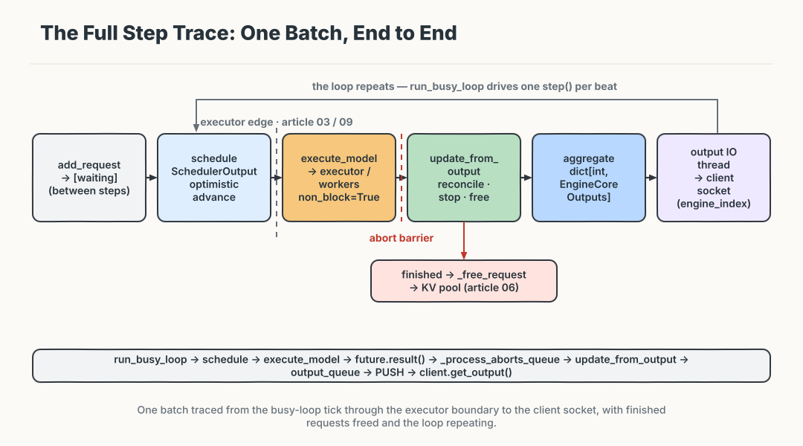</a>

<p class='figure-caption'>One batch traced from the busy-loop tick through the executor boundary to the client socket, with each hop's source anchor.</p>

### The terminal frontier, in three lines

The lifecycle machinery ([Section 5](#5-the-request-lifecycle-the-requeststatus-state-machine)) collapses to one comparison that the entire engine reuses for "is this request done."

[`vllm/v1/request.py:349-351`](https://github.com/vllm-project/vllm/blob/6cf7b26bd4bff60bf378e1af14044280ac0d214c/vllm/v1/request.py#L349-L351)
```python
    @staticmethod
    def is_finished(status: "RequestStatus") -> bool:
        return status > RequestStatus.PREEMPTED
```

Statuses through `PREEMPTED` are live; later enum values are terminal. Both the mid-forward skip and `_free_request` use that same predicate, so an aborted-but-still-retained connector object receives no token and no live request is freed.

### Takeaways

- A synchronous step is schedule → execute → abort barrier → commit; the overlapped path preserves that commit order while keeping several batches resident.
- Schedule-time counters are optimistic. Reconciliation always repays in-flight credit and subtracts rejected speculative tokens.
- `model_executed` means token work occurred; terminality means `status > PREEMPTED`.
- Cancellation is eager but ordered, and output grouping (`client_index`) remains separate from engine provenance (`engine_index`).

## 13. References

- https://www.usenix.org/conference/osdi22/presentation/yu
- https://vllm.ai/blog/2025-09-05-anatomy-of-vllm
- https://docs.vllm.ai/en/stable/design/arch_overview/
- https://arxiv.org/abs/2309.06180

*All code conclusions are anchored to [`vllm-project/vllm@6cf7b26bd`](https://github.com/vllm-project/vllm/tree/6cf7b26bd4bff60bf378e1af14044280ac0d214c).*
