# Scheduler: Continuous Batching and Chunked Prefill

> Version note: the scheduler described here is the one in [`vllm-project/vllm@6cf7b26bd`](https://github.com/vllm-project/vllm/tree/6cf7b26bd4bff60bf378e1af14044280ac0d214c). Source excerpts remain verbatim apart from omissions marked `...`; pseudocode is identified separately. Each `path:Lstart-Lend` citation points to the pinned tree.

## 1. What the Scheduler Decides: One Token Budget per Step

The V1 scheduler answers a narrower question than its name suggests: which requests may advance in this iteration, and by how many tokens? It does not choose kernels or memory layouts, nor does it alternate between fixed prefill and decode batches. Its central ledger is `{req_id: num_tokens}`.

`SchedulerOutput` adds the KV, encoder, grammar, and speculative-decoding metadata needed by the executor ([Section 10](#10-scheduleroutput-what-the-executor-receives)). A plan with scheduled tokens can drive model work; a zero-token result can represent an iteration with no forward pass.

<a href='images/vllm-05-01-token-budget.svg' target='_blank'>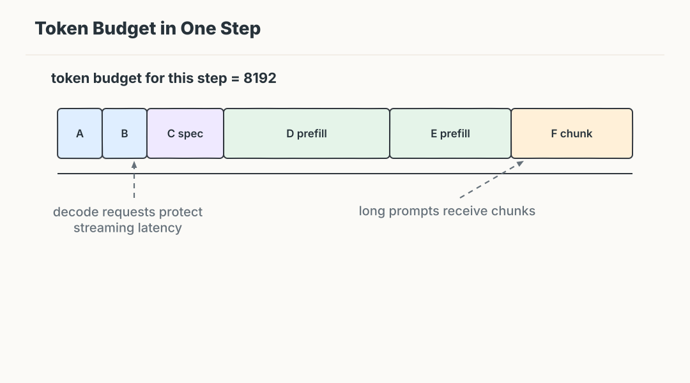</a>

<p class='figure-caption'>One token budget per step, drained across running then waiting requests.</p>

EngineCore's busy loop calls `SchedulerInterface.schedule`; its docstring fixes both the granularity of a call and the shape of the result.

[`vllm/v1/core/sched/interface.py:53-65`](https://github.com/vllm-project/vllm/blob/6cf7b26bd4bff60bf378e1af14044280ac0d214c/vllm/v1/core/sched/interface.py#L53-L65):

```python
        """Schedule the requests to process in this scheduling step.

        The scheduling decision is made at the iteration level. Each scheduling
        step corresponds to a single forward pass of the model. Therefore, this
        method is called repeatedly by a busy loop in the engine.

        Essentially, the scheduler produces a dictionary of {req_id: num_tokens}
        that specifies how many tokens to process for each request in this
        scheduling step. For example, num_tokens can be as large as the number
        of prompt tokens for new requests, or it can be 1 for the requests that
        are auto-regressively generating new tokens one by one. Otherwise, it
        can be somewhere in between in case of chunked prefills, prefix caching,
        speculative decoding, etc.
```

"The scheduling decision is made at the iteration level" follows Orca's model: scheduling happens per generation iteration rather than per request, so batch membership can change between forward passes ([Orca, OSDI '22](https://www.usenix.org/conference/osdi22/presentation/yu)). EngineCore later passes the plan to `update_from_output(...)` ([`interface.py:89-107`](https://github.com/vllm-project/vllm/blob/6cf7b26bd4bff60bf378e1af14044280ac0d214c/vllm/v1/core/sched/interface.py#L89-L107)). Because a value can be the full prompt length, `1`, or anything in between, the same mapping covers prefill, decode, prefix reuse, and speculative work without a global phase label. A forward pass may mix all three kinds of work ([vLLM V1 blog](https://vllm.ai/blog/2025-01-27-v1-alpha-release)).

The opening comment in `schedule()` states the arithmetic used by the branches that follow.

[`vllm/v1/core/sched/scheduler.py:396-407`](https://github.com/vllm-project/vllm/blob/6cf7b26bd4bff60bf378e1af14044280ac0d214c/vllm/v1/core/sched/scheduler.py#L396-L407):

```python
    def schedule(self, throttle_prefills: bool = False) -> SchedulerOutput:
        self.current_step += 1
        # NOTE(woosuk) on the scheduling algorithm:
        # There's no "decoding phase" nor "prefill phase" in the scheduler.
        # Each request just has the num_computed_tokens and
        # num_tokens_with_spec. num_tokens_with_spec =
        # len(prompt_token_ids) + len(output_token_ids) + len(spec_token_ids).
        # At each step, the scheduler tries to assign tokens to the requests
        # so that each request's num_computed_tokens can catch up its
        # num_tokens_with_spec. This is general enough to cover
        # chunked prefills, prefix caching, speculative decoding,
        # and the "jump decoding" optimization in the future.
```

<a href='images/vllm-05-11-gap-four-cases.svg' target='_blank'>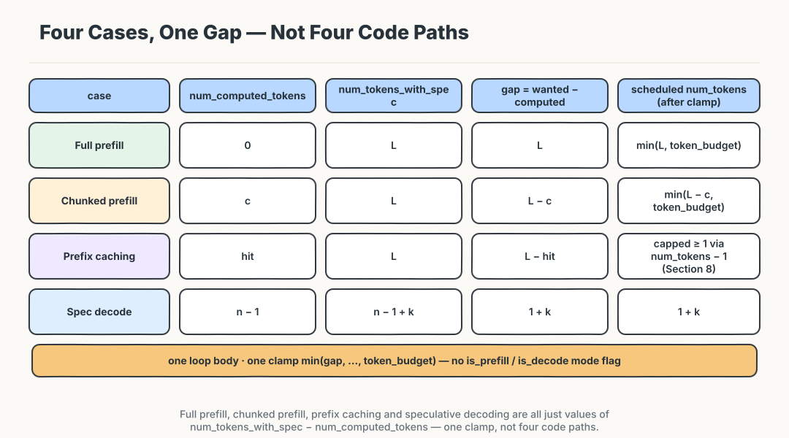</a>

<p class='figure-caption'>Four cases, one gap: full prefill, chunked prefill, prefix caching, and speculative decoding are all just values of num_tokens_with_spec − num_computed_tokens, not separate code paths.</p>

Each request carries two cursors: `num_computed_tokens` (how many of its tokens the model has already processed and has KV cache for) and `num_tokens_with_spec` (how many tokens it currently *wants* processed, including any speculative drafts). The scheduler's job for that request each step is to close the gap `num_tokens_with_spec − num_computed_tokens` — to let the "computed" cursor catch up to the "wanted" cursor. That gap is the demand; the number the scheduler writes into `num_scheduled_tokens[req_id]` is the demand clamped down to what fits (the RUNNING-loop clamp chain lives at [`scheduler.py:473-489`](https://github.com/vllm-project/vllm/blob/6cf7b26bd4bff60bf378e1af14044280ac0d214c/vllm/v1/core/sched/scheduler.py#L473-L489), [Section 4](#4-process-running-before-admitting-waiting); the WAITING-loop clamp at [`scheduler.py:805-845`](https://github.com/vllm-project/vllm/blob/6cf7b26bd4bff60bf378e1af14044280ac0d214c/vllm/v1/core/sched/scheduler.py#L805-L845), [Section 5](#5-chunked-prefill-splitting-long-prompts)). The four cases the comment enumerates are not four code paths — they are four *values of the same gap*:

- **Full prefill:** a fresh request has `num_computed_tokens == 0` and `num_tokens_with_spec == len(prompt)`, so the gap is the entire prompt.
- **Chunked prefill:** the same gap, trimmed by `min(gap, token_budget)` when the prompt is larger than what is left in the step's budget ([Section 5](#5-chunked-prefill-splitting-long-prompts)). The request stays unfinished and resumes next step.
- **Prefix caching:** the WAITING loop probes the cache and advances `num_computed_tokens` *before* admission ([Section 8](#8-prefix-cache-aware-scheduling); mechanics in article 07), shrinking the gap by the cached prefix length — capped so at least one token still runs for logits.
- **Speculative decoding:** `num_tokens_with_spec` includes `k` draft tokens, so the gap is `1 + k` instead of `1` (article 12).

### Where the two cursors come from

`num_tokens_with_spec` is derived from token-list lengths. `num_computed_tokens` is maintained separately: the scheduler advances it optimistically at scheduling time, and output reconciliation rolls back rejected speculative tokens. Under async or speculative scheduling, the two counters may therefore diverge temporarily.

[`vllm/v1/request.py:251-257`](https://github.com/vllm-project/vllm/blob/6cf7b26bd4bff60bf378e1af14044280ac0d214c/vllm/v1/request.py#L251-L257):

```python
    @property
    def num_tokens(self) -> int:
        return len(self._all_token_ids)

    @property
    def num_tokens_with_spec(self) -> int:
        return len(self._all_token_ids) + len(self.spec_token_ids)
```

<a href='images/vllm-05-12-two-cursors.svg' target='_blank'>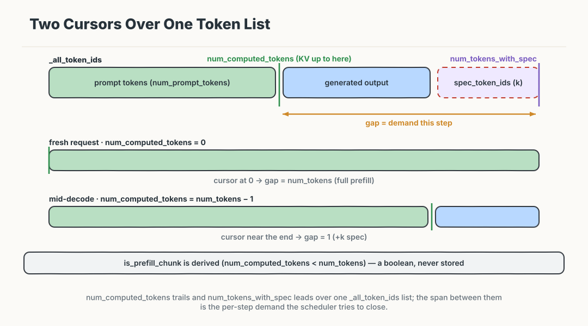</a>

<p class='figure-caption'>The two cursors over one token list: num_computed_tokens trails, num_tokens_with_spec leads, and the span between them is the per-step demand the scheduler tries to close.</p>

`_all_token_ids` concatenates the prompt and generated tokens; `num_tokens_with_spec` adds unverified drafts. `num_computed_tokens` starts at zero ([`request.py:158`](https://github.com/vllm-project/vllm/blob/6cf7b26bd4bff60bf378e1af14044280ac0d214c/vllm/v1/request.py#L158)). A fresh request therefore asks for its full prompt, while an ordinary decode request normally asks for one token, plus any drafts. `is_prefill_chunk` is not an independent phase enum: each schedule recomputes it from whether the computed cursor still trails the request length ([Sections 5](#5-chunked-prefill-splitting-long-prompts) and [6](#6-continuous-batching-membership-changes-each-step)).

### One budget, drained once, spent identically by both loops

The `{req_id: num_tokens}` decision spends one scalar allowance. `schedule()` seeds that allowance once for the step:

[`vllm/v1/core/sched/scheduler.py:414-419`](https://github.com/vllm-project/vllm/blob/6cf7b26bd4bff60bf378e1af14044280ac0d214c/vllm/v1/core/sched/scheduler.py#L414-L419):

```python
        req_to_new_blocks: dict[str, KVCacheBlocks] = {}
        num_scheduled_tokens: dict[str, int] = {}
        token_budget = self.max_num_scheduled_tokens
        if self._pause_state == PauseState.PAUSED_ALL:
            # Do not schedule any requests when paused.
            token_budget = 0
```

`PAUSED_ALL` reduces it to zero; otherwise RUNNING requests spend first and WAITING admissions receive the remainder. Both loops pair each ledger write with the same debit (RUNNING at [`scheduler.py:584-591`](https://github.com/vllm-project/vllm/blob/6cf7b26bd4bff60bf378e1af14044280ac0d214c/vllm/v1/core/sched/scheduler.py#L584-L591), WAITING at [`scheduler.py:950-1000`](https://github.com/vllm-project/vllm/blob/6cf7b26bd4bff60bf378e1af14044280ac0d214c/vllm/v1/core/sched/scheduler.py#L950-L1000)). [Sections 2](#2-schedule-the-main-loop) and [3](#3-the-token-budget-max_num_scheduled_tokens) follow that accounting in detail; [Section 9](#9-preemption-under-kv-pressure) covers the different reactions to KV backpressure.

## 2. schedule(): The Main Loop

EngineCore calls `schedule()` once per scheduling step. The method seeds `token_budget`, visits RUNNING requests first, and spends any remainder on WAITING requests. It returns the token ledger with the metadata the executor needs ([`interface.py:51-81`](https://github.com/vllm-project/vllm/blob/6cf7b26bd4bff60bf378e1af14044280ac0d214c/vllm/v1/core/sched/interface.py#L51-L81)); batch-queue mode may keep several such plans in flight (article 04).

The per-request guards and clamps are in [Section 4](#4-process-running-before-admitting-waiting), chunked-prefill slicing in [Section 5](#5-chunked-prefill-splitting-long-prompts), and preemption and KV feasibility in [Section 9](#9-preemption-under-kv-pressure) and article 06.

**The entry point and the per-step ledgers**

`schedule()` takes one flag and immediately bumps a step counter.

[`vllm/v1/core/sched/scheduler.py:396-397`](https://github.com/vllm-project/vllm/blob/6cf7b26bd4bff60bf378e1af14044280ac0d214c/vllm/v1/core/sched/scheduler.py#L396-L397)

```python
    def schedule(self, throttle_prefills: bool = False) -> SchedulerOutput:
        self.current_step += 1
```

`current_step` is a monotone clock the loop reads for PP/async decode cadence ([Section 4](#4-process-running-before-admitting-waiting)); `throttle_prefills` is the data-parallel prefill-balancing signal (also [Section 4](#4-process-running-before-admitting-waiting)). The design comment that immediately follows ([`scheduler.py:398-407`](https://github.com/vllm-project/vllm/blob/6cf7b26bd4bff60bf378e1af14044280ac0d214c/vllm/v1/core/sched/scheduler.py#L398-L407)) is the thesis of [Section 1](#1-what-the-scheduler-decides-one-token-budget-per-step) and is not repeated here.

The first real work is allocating the step's ledgers and seeding the budget.

[`vllm/v1/core/sched/scheduler.py:409-419`](https://github.com/vllm-project/vllm/blob/6cf7b26bd4bff60bf378e1af14044280ac0d214c/vllm/v1/core/sched/scheduler.py#L409-L419)

```python
        scheduled_new_reqs: list[Request] = []
        scheduled_resumed_reqs: list[Request] = []
        scheduled_running_reqs: list[Request] = []
        preempted_reqs: list[Request] = []

        req_to_new_blocks: dict[str, KVCacheBlocks] = {}
        num_scheduled_tokens: dict[str, int] = {}
        token_budget = self.max_num_scheduled_tokens
        if self._pause_state == PauseState.PAUSED_ALL:
            # Do not schedule any requests when paused.
            token_budget = 0
```

- The three `scheduled_*_reqs` lists partition what gets scheduled by *provenance* — a request already in `running` (`scheduled_running_reqs`), a fresh admission (`scheduled_new_reqs`, was WAITING), or a resumed one (`scheduled_resumed_reqs`, was PREEMPTED). `preempted_reqs` is the eviction log for this step. This three-way split is just what the wire-cost-minimized `SchedulerOutput` needs later (new-vs-cached payload, [Section 10](#10-scheduleroutput-what-the-executor-receives)).
- `num_scheduled_tokens: dict[str, int]` *is* the decision. Its `.values()` sum is what the executor runs and what the closing assert checks.
- `token_budget = self.max_num_scheduled_tokens` ([`scheduler.py:416`](https://github.com/vllm-project/vllm/blob/6cf7b26bd4bff60bf378e1af14044280ac0d214c/vllm/v1/core/sched/scheduler.py#L416)) is the one scalar the whole loop spends. That ceiling is fixed at `__init__` and defaults to `max_num_batched_tokens` ([Section 3](#3-the-token-budget-max_num_scheduled_tokens)); it is the *only* number that seeds this local and the RHS of the headline assert below.
- `PauseState.PAUSED_ALL → token_budget = 0` ([`scheduler.py:417-419`](https://github.com/vllm-project/vllm/blob/6cf7b26bd4bff60bf378e1af14044280ac0d214c/vllm/v1/core/sched/scheduler.py#L417-L419)) makes both `while ... and token_budget > 0` phase guards false on entry: a paused scheduler admits nothing without any special-casing further down.
- Seeded just below ([`scheduler.py:422-427`](https://github.com/vllm-project/vllm/blob/6cf7b26bd4bff60bf378e1af14044280ac0d214c/vllm/v1/core/sched/scheduler.py#L422-L427), quoted in [Section 3](#3-the-token-budget-max_num_scheduled_tokens)) are a *second, independent* `encoder_compute_budget` for multimodal encoder work plus the spec-decode ledgers. That encoder budget can only *shrink* `num_new_tokens` ([Section 11](#11-encoder-inputs-and-multimodal-scheduling)); it never relaxes the token budget, so it cannot break the invariants here.

Budget accounting and the scheduled-token ledger are two views of the same quantity, mutated only in lockstep. Every admit does `num_scheduled_tokens[id] = n; token_budget -= n` together; every preemption refund does the paired `token_budget += num_scheduled_tokens.pop(id)`. The four closing assertions hold precisely because the code never touches one without the other.

Just below, `self.kv_cache_manager.new_step_starts()` ([`scheduler.py:432`](https://github.com/vllm-project/vllm/blob/6cf7b26bd4bff60bf378e1af14044280ac0d214c/vllm/v1/core/sched/scheduler.py#L432)) resets the KV manager's per-step state, and `defer_prefills` is computed ([`scheduler.py:436-438`](https://github.com/vllm-project/vllm/blob/6cf7b26bd4bff60bf378e1af14044280ac0d214c/vllm/v1/core/sched/scheduler.py#L436-L438)) — both are read by later sections (article 06 and [Section 4](#4-process-running-before-admitting-waiting) respectively).

<a href='images/vllm-05-03-schedule-loop.svg' target='_blank'>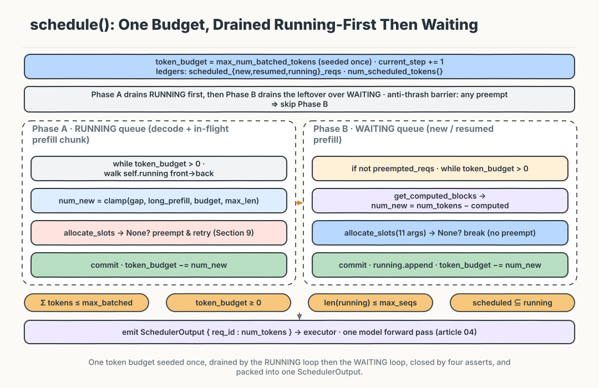</a>

<p class='figure-caption'>One token budget seeded once, drained by the RUNNING loop then the WAITING loop, closed by four asserts.</p>

**Phase A then Phase B: one budget, drained in order**

The body is two `while` loops over the same `token_budget`. Phase A walks `self.running` ([`scheduler.py:440-443`](https://github.com/vllm-project/vllm/blob/6cf7b26bd4bff60bf378e1af14044280ac0d214c/vllm/v1/core/sched/scheduler.py#L440-L443), header detailed in [Section 4](#4-process-running-before-admitting-waiting)): decodes and in-flight prefill chunks, each sized by the clamp chain `num_new_tokens = min(gap, long_prefill_threshold, token_budget, max_model_len − …)` ([`scheduler.py:473-489`](https://github.com/vllm-project/vllm/blob/6cf7b26bd4bff60bf378e1af14044280ac0d214c/vllm/v1/core/sched/scheduler.py#L473-L489), [Section 4](#4-process-running-before-admitting-waiting)/[Section 5](#5-chunked-prefill-splitting-long-prompts)) and fed to `allocate_slots` ([Section 9](#9-preemption-under-kv-pressure), article 06). Whatever survives Phase A is committed by the same eight lines every time.

[`vllm/v1/core/sched/scheduler.py:584-591`](https://github.com/vllm-project/vllm/blob/6cf7b26bd4bff60bf378e1af14044280ac0d214c/vllm/v1/core/sched/scheduler.py#L584-L591)

```python
            # Schedule the request.
            scheduled_running_reqs.append(request)
            prefill_scheduled |= request.is_prefill_chunk
            request_id = request.request_id
            req_to_new_blocks[request_id] = new_blocks
            num_scheduled_tokens[request_id] = num_new_tokens
            token_budget -= num_new_tokens
            req_index += 1
```

<a href='images/vllm-05-13-budget-ledger-lockstep.svg' target='_blank'>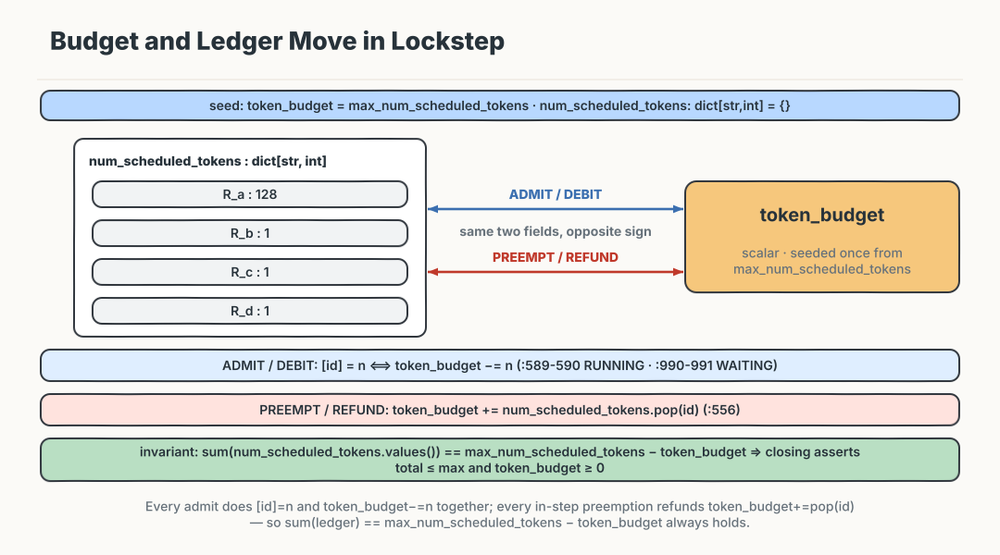</a>

<p class='figure-caption'>Budget and ledger move in lockstep: every admit does num_scheduled_tokens[id]=n and token_budget−=n together, every in-step preemption refunds token_budget+=pop(id) — so sum(ledger) == max_num_scheduled_tokens − token_budget always holds.</p>

Record provenance (`scheduled_running_reqs`), record the KV blocks (`req_to_new_blocks`), write the ledger (`num_scheduled_tokens[id] = num_new_tokens`), then **debit the shared budget** (`token_budget -= num_new_tokens`), then advance the cursor. Lines 588-590 are the atomic "spend." Because `num_new_tokens` was already clamped to `≤ token_budget` upstream ([`scheduler.py:480`](https://github.com/vllm-project/vllm/blob/6cf7b26bd4bff60bf378e1af14044280ac0d214c/vllm/v1/core/sched/scheduler.py#L480)), the debit can never drive the budget negative.

Phase A only ever removes capacity from the budget; it can *grow* memory pressure and trigger preemption inside the `allocate_slots` retry loop ([Section 9](#9-preemption-under-kv-pressure)), which refunds the budget for any request evicted mid-step via `token_budget += num_scheduled_tokens.pop(preempted_req_id)` ([`scheduler.py:556`](https://github.com/vllm-project/vllm/blob/6cf7b26bd4bff60bf378e1af14044280ac0d214c/vllm/v1/core/sched/scheduler.py#L556)).

Between the phases sits the anti-thrash barrier ([`scheduler.py:636-637`](https://github.com/vllm-project/vllm/blob/6cf7b26bd4bff60bf378e1af14044280ac0d214c/vllm/v1/core/sched/scheduler.py#L636-L637), detailed in [Section 4](#4-process-running-before-admitting-waiting)): the entire WAITING loop is guarded by `if not preempted_reqs and self._pause_state == PauseState.UNPAUSED`. If Phase A had to preempt anyone, Phase B is skipped wholesale and any leftover budget goes unused this step: the scheduler never evicts and admits in the same breath.

Phase B ([`scheduler.py:640`](https://github.com/vllm-project/vllm/blob/6cf7b26bd4bff60bf378e1af14044280ac0d214c/vllm/v1/core/sched/scheduler.py#L640), [Section 4](#4-process-running-before-admitting-waiting)) drains the *same* `token_budget` over WAITING requests: probe the prefix cache ([Section 8](#8-prefix-cache-aware-scheduling)), size the prompt slice ([Section 5](#5-chunked-prefill-splitting-long-prompts)), call `allocate_slots` with the full admission surface ([Section 4](#4-process-running-before-admitting-waiting), article 06), and on success commit. The waiting commit mirrors Phase A's debit exactly.

[`vllm/v1/core/sched/scheduler.py:987-993`](https://github.com/vllm-project/vllm/blob/6cf7b26bd4bff60bf378e1af14044280ac0d214c/vllm/v1/core/sched/scheduler.py#L987-L993)

```python
                req_to_new_blocks[request_id] = self.kv_cache_manager.get_blocks(
                    request_id
                )
                num_scheduled_tokens[request_id] = num_new_tokens
                token_budget -= num_new_tokens
                request.status = RequestStatus.RUNNING
                request.num_computed_tokens = num_computed_tokens
```

The difference from Phase A is only what precedes it: the admitted request is `self.running.append(request)`-ed ([`scheduler.py:973`](https://github.com/vllm-project/vllm/blob/6cf7b26bd4bff60bf378e1af14044280ac0d214c/vllm/v1/core/sched/scheduler.py#L973)) and its status flips to `RUNNING`, so a prefill admitted this step is *immediately* a member of the running batch and eligible next step — this is continuous batching ([Section 6](#6-continuous-batching-membership-changes-each-step)), falling straight out of "append then debit."

The provenance split (`scheduled_new_reqs` vs `scheduled_resumed_reqs`) is decided just above at [`scheduler.py:978-983`](https://github.com/vllm-project/vllm/blob/6cf7b26bd4bff60bf378e1af14044280ac0d214c/vllm/v1/core/sched/scheduler.py#L978-L983) off the request's prior status.

```python
# Phase A commit, RUNNING loop   (scheduler.py:589-590)
num_scheduled_tokens[request_id] = num_new_tokens
token_budget -= num_new_tokens

# Phase B commit, WAITING loop   (scheduler.py:990-991)
num_scheduled_tokens[request_id] = num_new_tokens
token_budget -= num_new_tokens

# In-step preemption refund      (scheduler.py:556)
# same two fields, opposite sign
token_budget += num_scheduled_tokens.pop(preempted_req_id)
```

**The ordering guarantee — running is funded before waiting.** One budget, drained Phase A first, means an in-flight generation's decode token is charged before any new prefill is even considered. A decode can lose budget only to already-admitted peers (such as an in-flight prefill chunk ahead of it in `running`), never to a fresh prompt; when it fails outright, it is for lack of *KV blocks* (whereupon Phase A preempts a lower-priority peer, [Section 9](#9-preemption-under-kv-pressure)). Latency of in-flight work is structurally prioritized over admitting new work; chunked prefill is what a long prompt does with the *leftover* budget ([Section 5](#5-chunked-prefill-splitting-long-prompts)).

**Closing accounting: four assertions**

After both phases, before anything is packed into `SchedulerOutput`, the loop asserts its own correctness.

[`vllm/v1/core/sched/scheduler.py:1026-1037`](https://github.com/vllm-project/vllm/blob/6cf7b26bd4bff60bf378e1af14044280ac0d214c/vllm/v1/core/sched/scheduler.py#L1026-L1037)

```python
        # Check if the scheduling constraints are satisfied.
        total_num_scheduled_tokens = sum(num_scheduled_tokens.values())
        assert total_num_scheduled_tokens <= self.max_num_scheduled_tokens

        assert token_budget >= 0
        assert len(self.running) <= self.max_num_running_reqs
        # Since some requests in the RUNNING queue may not be scheduled in
        # this step, the total number of scheduled requests can be smaller than
        # len(self.running).
        assert len(scheduled_new_reqs) + len(scheduled_resumed_reqs) + len(
            scheduled_running_reqs
        ) <= len(self.running)
```

The first two assertions check the same ledger from opposite sides: every grant is clamped before the paired debit, and preemption only refunds budget. The third enforces the independent `max_num_seqs` width cap during admission. The fourth allows skipped RUNNING requests to remain resident while requiring every scheduled request to belong to the running set. These are consistency checks, not recovery paths; a failure means the scheduler constructed an impossible plan.

### Closing the step

The tail packs the ledgers into a single `SchedulerOutput` ([`scheduler.py:1097`](https://github.com/vllm-project/vllm/blob/6cf7b26bd4bff60bf378e1af14044280ac0d214c/vllm/v1/core/sched/scheduler.py#L1097), [Section 10](#10-scheduleroutput-what-the-executor-receives)), attaches connector metadata, and then advances request cursors optimistically:

[`vllm/v1/core/sched/scheduler.py:1136-1138`](https://github.com/vllm-project/vllm/blob/6cf7b26bd4bff60bf378e1af14044280ac0d214c/vllm/v1/core/sched/scheduler.py#L1136-L1138)

```python
        with record_function_or_nullcontext("schedule: update_after_schedule"):
            self._update_after_schedule(scheduler_output)
        return scheduler_output
```

`_update_after_schedule` ([`scheduler.py:1169-1195`](https://github.com/vllm-project/vllm/blob/6cf7b26bd4bff60bf378e1af14044280ac0d214c/vllm/v1/core/sched/scheduler.py#L1169-L1195), [Section 6](#6-continuous-batching-membership-changes-each-step)) advances each scheduled request's computed cursor *before* the model runs and recomputes `is_prefill_chunk`. New requests carry full `NewRequestData`; existing ones carry `CachedRequestData` diffs for the worker's retained `InputBatch` (article 09). EngineCore sends the plan to the executor and later reconciles the result through `update_from_output` (article 04).

## 3. The Token Budget: max_num_scheduled_tokens

The scheduler meters a step in tokens, not requests or phases. `max_num_scheduled_tokens` supplies the allowance that both loops debit; the closing assertion checks the total. Running-before-waiting and chunked prefill are policies for spending that allowance.

**The number is fixed at construction**

`max_num_scheduled_tokens` is not recomputed per step; it is resolved once in `Scheduler.__init__` alongside the batch-width cap.

[`vllm/v1/core/sched/scheduler.py:107-114`](https://github.com/vllm-project/vllm/blob/6cf7b26bd4bff60bf378e1af14044280ac0d214c/vllm/v1/core/sched/scheduler.py#L107-L114)

```python
        # Scheduling constraints.
        self.max_num_running_reqs = self.scheduler_config.max_num_seqs
        self.max_num_scheduled_tokens = (
            self.scheduler_config.max_num_scheduled_tokens
            if self.scheduler_config.max_num_scheduled_tokens is not None
            else self.scheduler_config.max_num_batched_tokens
        )
        self.max_model_len = vllm_config.model_config.max_model_len
```

<a href='images/vllm-05-14-two-axes.svg' target='_blank'>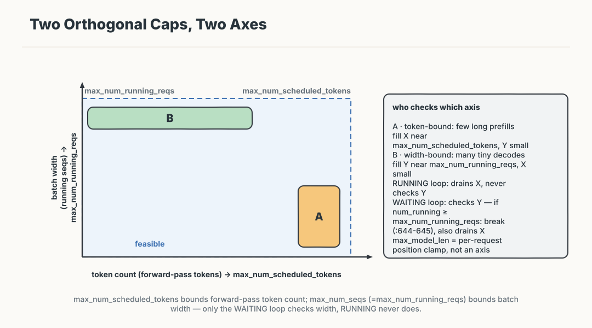</a>

<p class='figure-caption'>Two orthogonal caps, two axes: max_num_scheduled_tokens bounds forward-pass token count while max_num_seqs (=max_num_running_reqs) bounds batch width; only the WAITING loop checks width, RUNNING never does.</p>

- **`max_num_scheduled_tokens` defaults to `max_num_batched_tokens`.** Unless an operator explicitly sets `max_num_scheduled_tokens`, the two are equal. This is the ceiling on how many tokens the model runner will process in a single forward pass. It is the *only* number that seeds the per-step budget, and the right-hand side of the closing assert (below).
- **`max_num_running_reqs = max_num_seqs` is a separate, orthogonal cap.** This bounds *batch width*, the number of concurrent sequences, not token throughput. Crucially, it is enforced only in the WAITING loop ([Section 4](#4-process-running-before-admitting-waiting)); the RUNNING loop never checks it, because those requests are already admitted. Token budget and batch width are two independent axes; a step can be token-bound (many long prefills) or width-bound (many tiny decodes) but not conflate the two.
- **`max_model_len` and `num_sampled_tokens_per_step` are siblings** used for a *per-request* position clamp, not the global budget. `num_sampled_tokens_per_step` is `1` normally and `0` for diffusion models ([`scheduler.py:119-122`](https://github.com/vllm-project/vllm/blob/6cf7b26bd4bff60bf378e1af14044280ac0d214c/vllm/v1/core/sched/scheduler.py#L119-L122)); it feeds `min(num_new_tokens, max_model_len - num_computed_tokens - num_sampled_tokens_per_step)` so that speculative lookahead cannot push a request's write position past `max_model_len` ([Section 4](#4-process-running-before-admitting-waiting)). That clamp is orthogonal to the shared budget — it bounds a single request, not the step.

Why does `max_num_scheduled_tokens` exist as a knob distinct from `max_num_batched_tokens`? The config docstring says exactly when they diverge.

[`vllm/config/scheduler.py:56-61`](https://github.com/vllm-project/vllm/blob/6cf7b26bd4bff60bf378e1af14044280ac0d214c/vllm/config/scheduler.py#L56-L61)

```python
    max_num_scheduled_tokens: int | None = Field(default=None, ge=0)
    """Maximum number of tokens that the scheduler may issue in a single iteration.
    
    This is usually equal to max_num_batched_tokens, but can be smaller in cases
    when the model might append tokens into the batch (such as speculative decoding).
    Defaults to max_num_batched_tokens."""
```

The distinction is the seam between *scheduler intent* and *runner capacity*. `max_num_batched_tokens` is what the forward pass can physically process ([`vllm/config/scheduler.py:49-50`](https://github.com/vllm-project/vllm/blob/6cf7b26bd4bff60bf378e1af14044280ac0d214c/vllm/config/scheduler.py#L49-L50): "Maximum number of tokens that can be processed in a single iteration"; its field default is `2048` ([`config/scheduler.py:42`](https://github.com/vllm-project/vllm/blob/6cf7b26bd4bff60bf378e1af14044280ac0d214c/vllm/config/scheduler.py#L42)), which the field's own docstring flags as a testing convenience — the operational value is set in `EngineArgs.create_engine_config`, as that docstring states verbatim ([`config/scheduler.py:50-54`](https://github.com/vllm-project/vllm/blob/6cf7b26bd4bff60bf378e1af14044280ac0d214c/vllm/config/scheduler.py#L50-L54))).

`max_num_scheduled_tokens` is what the scheduler is *allowed to schedule*. When the model appends tokens the scheduler did not count — draft tokens materialized inside the runner during speculative decoding (article 12) — the scheduled budget is set below the batch budget to leave physical headroom. For the common case the two coincide, and the rest of this section treats them as one number.

**Seeding the per-step budget**

At the top of every `schedule()` call, the fixed ceiling is copied into a mutable local, `token_budget`, that the two phases drain.

[`vllm/v1/core/sched/scheduler.py:414-427`](https://github.com/vllm-project/vllm/blob/6cf7b26bd4bff60bf378e1af14044280ac0d214c/vllm/v1/core/sched/scheduler.py#L414-L427)

```python
        req_to_new_blocks: dict[str, KVCacheBlocks] = {}
        num_scheduled_tokens: dict[str, int] = {}
        token_budget = self.max_num_scheduled_tokens
        if self._pause_state == PauseState.PAUSED_ALL:
            # Do not schedule any requests when paused.
            token_budget = 0

        # Encoder-related.
        scheduled_encoder_inputs: dict[str, list[int]] = {}
        encoder_compute_budget = self.max_num_encoder_input_tokens
        # Spec decode-related.
        scheduled_spec_decode_tokens: dict[str, list[int]] = {}
        # Whether the running batch contains any prefill requests.
        prefill_scheduled = False
```

- **`token_budget` is a local seeded from the fixed ceiling** ([`scheduler.py:416`](https://github.com/vllm-project/vllm/blob/6cf7b26bd4bff60bf378e1af14044280ac0d214c/vllm/v1/core/sched/scheduler.py#L416)). It is decremented on every admitted request and refunded on preemption ([Section 9](#9-preemption-under-kv-pressure)). Both scheduling loops guard on `token_budget > 0` (RUNNING at [`scheduler.py:442`](https://github.com/vllm-project/vllm/blob/6cf7b26bd4bff60bf378e1af14044280ac0d214c/vllm/v1/core/sched/scheduler.py#L442), WAITING at [`scheduler.py:640`](https://github.com/vllm-project/vllm/blob/6cf7b26bd4bff60bf378e1af14044280ac0d214c/vllm/v1/core/sched/scheduler.py#L640)), so the moment it reaches zero, admission stops for the whole step.
- **`num_scheduled_tokens: dict[str, int]` is the per-request ledger** that mirrors the budget. Its `.values()` sum is the quantity checked by the closing assert. Budget and ledger are written together on every spend, so they can never drift.
- **`PAUSED_ALL ⇒ token_budget = 0`** ([`scheduler.py:417-419`](https://github.com/vllm-project/vllm/blob/6cf7b26bd4bff60bf378e1af14044280ac0d214c/vllm/v1/core/sched/scheduler.py#L417-L419)). Pausing is expressed *as a zero budget*, not as a special-cased branch: both `while ... token_budget > 0` guards evaluate false immediately, and a paused scheduler admits nothing while every other invariant still holds trivially. This is a clean example of the design's economy — a control state reuses the budget mechanism instead of adding a code path.
- **`encoder_compute_budget` is a second, independent budget** ([`scheduler.py:423`](https://github.com/vllm-project/vllm/blob/6cf7b26bd4bff60bf378e1af14044280ac0d214c/vllm/v1/core/sched/scheduler.py#L423), seeded from `max_num_encoder_input_tokens`, itself `max_num_batched_tokens` for mm models at [`config/scheduler.py:248`](https://github.com/vllm-project/vllm/blob/6cf7b26bd4bff60bf378e1af14044280ac0d214c/vllm/config/scheduler.py#L248)). Multimodal encoder work draws from it in parallel; it can only *shrink* `num_new_tokens` before KV allocation, never grow it, so it cannot break the token invariant ([Section 11](#11-encoder-inputs-and-multimodal-scheduling)). Keep it mentally separate: this section covers the *decoder token* budget.

**How the budget is spent (and why the two loops are identical)**

The RUNNING loop (decodes and in-flight prefill chunks) and the WAITING loop (new/resumed prefills) both spend the *same* `token_budget` with the *same* two-line debit. RUNNING commit ([`scheduler.py:589-590`](https://github.com/vllm-project/vllm/blob/6cf7b26bd4bff60bf378e1af14044280ac0d214c/vllm/v1/core/sched/scheduler.py#L589-L590)):

```python
            num_scheduled_tokens[request_id] = num_new_tokens
            token_budget -= num_new_tokens
```

WAITING commit ([`scheduler.py:990-991`](https://github.com/vllm-project/vllm/blob/6cf7b26bd4bff60bf378e1af14044280ac0d214c/vllm/v1/core/sched/scheduler.py#L990-L991)) is the same pair. Each loop first clamps `num_new_tokens` to the remaining allowance (RUNNING at [`scheduler.py:480`](https://github.com/vllm-project/vllm/blob/6cf7b26bd4bff60bf378e1af14044280ac0d214c/vllm/v1/core/sched/scheduler.py#L480), WAITING at [`scheduler.py:844`](https://github.com/vllm-project/vllm/blob/6cf7b26bd4bff60bf378e1af14044280ac0d214c/vllm/v1/core/sched/scheduler.py#L844)). The latter clamp also becomes the chunk boundary when a prefill exceeds what RUNNING left behind; [Sections 4](#4-process-running-before-admitting-waiting) and [5](#5-chunked-prefill-splitting-long-prompts) examine that ordering and split rather than repeating them here.

### Bounding the cost of one forward pass

A single scalar budget bounds per-step token work independently of the number of live requests or prompt lengths. The end of `schedule()` checks that bound.

[`vllm/v1/core/sched/scheduler.py:1027-1028`](https://github.com/vllm-project/vllm/blob/6cf7b26bd4bff60bf378e1af14044280ac0d214c/vllm/v1/core/sched/scheduler.py#L1027-L1028)

```python
        total_num_scheduled_tokens = sum(num_scheduled_tokens.values())
        assert total_num_scheduled_tokens <= self.max_num_scheduled_tokens
```

The main bound is **`total_num_scheduled_tokens <= max_num_scheduled_tokens`** ([`scheduler.py:1027-1028`](https://github.com/vllm-project/vllm/blob/6cf7b26bd4bff60bf378e1af14044280ac0d214c/vllm/v1/core/sched/scheduler.py#L1027-L1028)). Each admission clamps `num_new_tokens` to the remaining budget ([`scheduler.py:480`](https://github.com/vllm-project/vllm/blob/6cf7b26bd4bff60bf378e1af14044280ac0d214c/vllm/v1/core/sched/scheduler.py#L480), [`scheduler.py:844`](https://github.com/vllm-project/vllm/blob/6cf7b26bd4bff60bf378e1af14044280ac0d214c/vllm/v1/core/sched/scheduler.py#L844)), each spend debits it ([`scheduler.py:589-590`](https://github.com/vllm-project/vllm/blob/6cf7b26bd4bff60bf378e1af14044280ac0d214c/vllm/v1/core/sched/scheduler.py#L589-L590), [`scheduler.py:990-991`](https://github.com/vllm-project/vllm/blob/6cf7b26bd4bff60bf378e1af14044280ac0d214c/vllm/v1/core/sched/scheduler.py#L990-L991)), and an in-step preemption refunds its earlier debit ([`scheduler.py:556`](https://github.com/vllm-project/vllm/blob/6cf7b26bd4bff60bf378e1af14044280ac0d214c/vllm/v1/core/sched/scheduler.py#L556), [Section 9](#9-preemption-under-kv-pressure)). `assert token_budget >= 0` ([`scheduler.py:1030`](https://github.com/vllm-project/vllm/blob/6cf7b26bd4bff60bf378e1af14044280ac0d214c/vllm/v1/core/sched/scheduler.py#L1030)) checks the counter from the other direction. [Section 2](#2-schedule-the-main-loop) derives all four closing assertions.

Without this bound, a single 100k-token prompt admitted whole would produce a forward pass 50× larger than a well-mixed batch — a latency spike for every concurrent decode, and potentially an activation-memory OOM inside the runner. The token budget is what turns "a long prompt arrived" from a stall into a sequence of bounded, decode-piggybacked steps ([Section 5](#5-chunked-prefill-splitting-long-prompts), Sarathi / Dynamic-SplitFuse). It is also why the runner can size its activation and attention buffers to a fixed maximum: the scheduler contractually promises never to hand it more than `max_num_scheduled_tokens` per pass. The step loop that calls `schedule()` once per forward pass (article 04) relies on this — the executor never has to defend against an over-large batch, because the assert already did.

The third and fourth asserts are not token facts at all: they guard the orthogonal batch-width axis (`len(self.running) <= max_num_running_reqs` and scheduled ⊆ running), and their derivation is [Section 2](#2-schedule-the-main-loop)'s. They appear in the same block only because the budget alone does not bound sequence count.

### One number, two roles — and one guardrail

Because `max_num_scheduled_tokens` defaults to `max_num_batched_tokens`, that single config value plays two roles at once. It is the **forward-pass token ceiling** (this section's invariant) and, by the same arithmetic, the **chunk-size knob**: a prefill chunk is at most the budget minus whatever decodes already consumed this step ([Section 5](#5-chunked-prefill-splitting-long-prompts)). Raising it grows both batch throughput and the maximum prefill chunk; lowering it tightens both. There is no separate chunk-size parameter because chunking is not a mode — it is what the budget clamp *does* to an oversized prompt.

The config layer enforces one coupling between the two orthogonal caps.

[`vllm/config/scheduler.py:286-291`](https://github.com/vllm-project/vllm/blob/6cf7b26bd4bff60bf378e1af14044280ac0d214c/vllm/config/scheduler.py#L286-L291)

```python
        if self.max_num_batched_tokens < self.max_num_seqs:
            raise ValueError(
                f"max_num_batched_tokens ({self.max_num_batched_tokens}) must "
                "be greater than or equal to max_num_seqs "
                f"({self.max_num_seqs})."
            )
```

<a href='images/vllm-05-15-liveness-floor.svg' target='_blank'>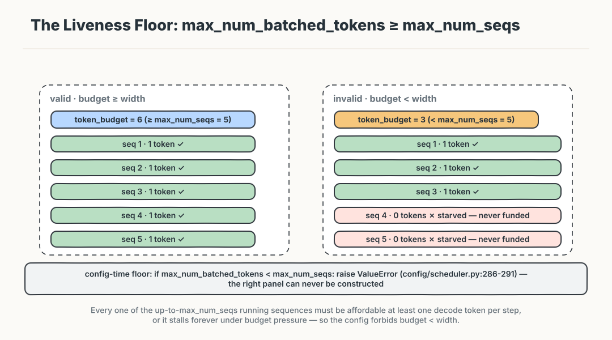</a>

<p class='figure-caption'>The liveness floor max_num_batched_tokens ≥ max_num_seqs: every one of the up-to-max_num_seqs running sequences must be affordable at least one decode token per step, or it stalls forever under budget pressure.</p>

Read this as a liveness guarantee: every one of the up-to-`max_num_seqs` running sequences needs at least one token per step to make forward progress on its decode. If the token budget were smaller than the batch width, some admitted sequence could never be funded even for a single decode token, and it would stall indefinitely under budget pressure. Requiring `max_num_batched_tokens >= max_num_seqs` guarantees the budget can always afford one token for every concurrent sequence — the floor beneath which continuous batching stops being continuous.

Token budget is only one of three feasibility axes a request must clear. This section covers the compute axis: *is there room in the forward pass?* The memory axis — *are there KV blocks?* — is checked inline by `KVCacheManager.allocate_slots`, whose `None` return is the backpressure signal that drives preemption ([Section 9](#9-preemption-under-kv-pressure)); its watermark, full-sequence, and reserved-block gates are article 06's territory and are treated here purely as a black box. A request is scheduled only when it passes the budget clamp *and* `allocate_slots` returns blocks *and*, for new prefills, the batch-width cap has room. The token budget is the first and cheapest of the three, and the one that makes the other two tractable — by keeping every step's token count bounded, it keeps the KV and width questions answerable in constant time per request.

## 4. Process RUNNING Before Admitting WAITING

`schedule()` drains one budget in a fixed order: the RUNNING queue first, then WAITING. RUNNING contains decodes and admitted prefill chunks; WAITING contains new and preempted requests. This gives in-flight work first claim on each step without making its latency constant—a large admitted chunk can still lengthen the forward pass. The same running-first policy is described in the public walkthrough ([Inside vLLM](https://vllm.ai/blog/2025-09-05-anatomy-of-vllm)).

<a href='images/vllm-05-04-running-waiting.svg' target='_blank'>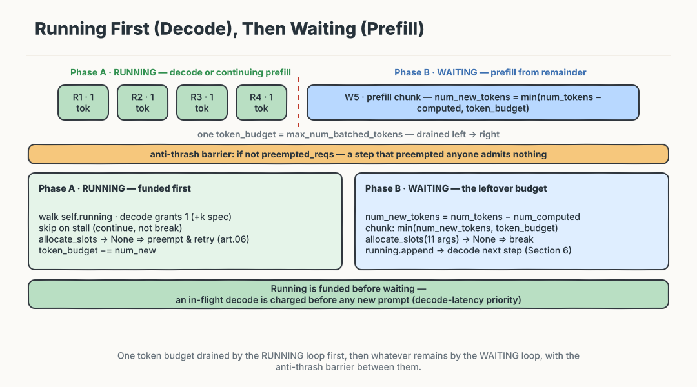</a>

<p class='figure-caption'>One token budget drained by the RUNNING loop first, then whatever remains by the WAITING loop, with the anti-thrash barrier between them.</p>

### Phase A: drain the budget over RUNNING, skipping (not breaking) on stalls

`self.running` is a plain FCFS-ordered `list[Request]` ([`scheduler.py:184`](https://github.com/vllm-project/vllm/blob/6cf7b26bd4bff60bf378e1af14044280ac0d214c/vllm/v1/core/sched/scheduler.py#L184)). The loop walks it front-to-back, gated only by remaining budget, and three guards can skip a request without spending anything.

[`scheduler.py:440-471`](https://github.com/vllm-project/vllm/blob/6cf7b26bd4bff60bf378e1af14044280ac0d214c/vllm/v1/core/sched/scheduler.py#L440-L471)

```python
        # First, schedule the RUNNING requests.
        req_index = 0
        while req_index < len(self.running) and token_budget > 0:
            request = self.running[req_index]

            if (
                request.num_output_placeholders > 0
                # This is (num_computed_tokens + 1) - (num_output_placeholders - 1).
                # Since output placeholders are also included in the computed tokens
                # count, we subtract (num_output_placeholders - 1) to remove any draft
                # tokens, so that we can be sure no further steps are needed even if
                # they are all rejected.
                and request.num_computed_tokens + 2 - request.num_output_placeholders
                >= request.num_prompt_tokens + request.max_tokens
            ):
                # Async scheduling: Avoid scheduling an extra step when we are sure that
                # the previous step has reached request.max_tokens. We don't schedule
                # partial draft tokens since this prevents uniform decode optimizations.
                req_index += 1
                continue

            if self.current_step < request.next_decode_eligible_step:
                # V2+PP+async: enforce `pp_size` steps between same-req decodes
                # to match worker-side sampled-tokens broadcast slot ring cadence.
                req_index += 1
                continue

            if defer_prefills and request.is_prefill_chunk:
                # DP prefill balancing: defer this in-progress prefill chunk to a
                # cadence-aligned step; decodes still run to fill this step.
                req_index += 1
                continue
```

<a href='images/vllm-05-16-phaseA-skip-tree.svg' target='_blank'>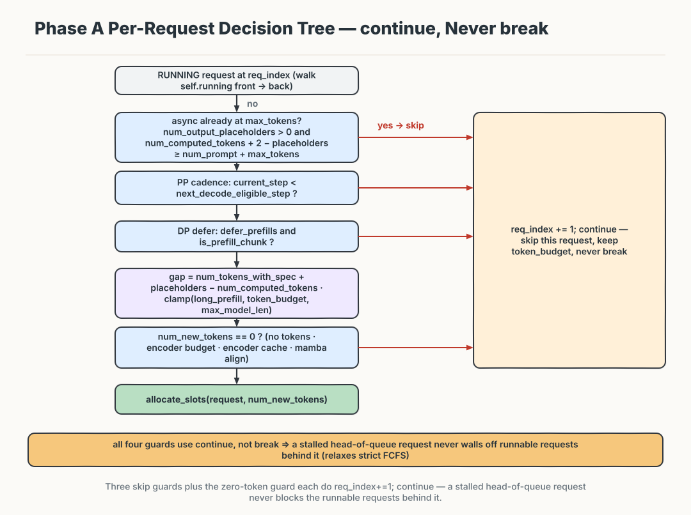</a>

<p class='figure-caption'>Phase A per-request decision tree: three skip guards plus the zero-token guard each do req_index+=1; continue (never break), so a stalled head-of-queue request never walls off runnable requests behind it.</p>

Read the three guards as "reasons a running request has nothing to do *this* step," each resolved with `req_index += 1; continue` — advance the cursor, keep the budget: (1) async scheduling has already emitted the token that reaches `max_tokens`, so no further step is needed; (2) pipeline-parallel cadence (`next_decode_eligible_step`) enforces `pp_size` steps between the same request's decodes; (3) data-parallel prefill balancing defers an in-flight prefill *chunk* while decodes still run to fill the step. The `defer_prefills` predicate above the loop ([`scheduler.py:436-438`](https://github.com/vllm-project/vllm/blob/6cf7b26bd4bff60bf378e1af14044280ac0d214c/vllm/v1/core/sched/scheduler.py#L436-L438)) is `throttle_prefills and not self.prefill_capacity_bound and any(not r.is_prefill_chunk for r in self.running)`. The deliberate choice is `continue`, not `break`: skipping one stalled request lets a later, lower-priority runnable still be scheduled, relaxing strict FCFS rather than blocking the whole queue behind one idle head.

For a request that *does* have work, the token grant is the phase-agnostic gap `num_tokens_with_spec + num_output_placeholders - num_computed_tokens`, then clamped: by `long_prefill_token_threshold`, by the budget itself via `num_new_tokens = min(num_new_tokens, token_budget)` ([`scheduler.py:480`](https://github.com/vllm-project/vllm/blob/6cf7b26bd4bff60bf378e1af14044280ac0d214c/vllm/v1/core/sched/scheduler.py#L480)), and by `max_model_len` ([`scheduler.py:473-489`](https://github.com/vllm-project/vllm/blob/6cf7b26bd4bff60bf378e1af14044280ac0d214c/vllm/v1/core/sched/scheduler.py#L473-L489)). That single `min` against `token_budget` is where a running prefill chunk takes exactly the budget left, and where a decode's need of 1 (+k spec) is trivially satisfiable — the same arithmetic covers both (chunked-prefill mechanics: [Section 5](#5-chunked-prefill-splitting-long-prompts)).

The successful grant is then committed and the budget debited ([`scheduler.py:584-591`](https://github.com/vllm-project/vllm/blob/6cf7b26bd4bff60bf378e1af14044280ac0d214c/vllm/v1/core/sched/scheduler.py#L584-L591), [Section 2](#2-schedule-the-main-loop)): `num_scheduled_tokens[request_id] = num_new_tokens; token_budget -= num_new_tokens`. That subtraction is the entirety of what Phase B inherits.

One more skip closes the loop body — a running request whose grant clamps to zero:

[`scheduler.py:514-530`](https://github.com/vllm-project/vllm/blob/6cf7b26bd4bff60bf378e1af14044280ac0d214c/vllm/v1/core/sched/scheduler.py#L514-L530)

```python
            if num_new_tokens == 0:
                # The request cannot be scheduled because one of the following
                # reasons:
                # 1. No new tokens to schedule. This may happen when
                #    (1) PP>1 and we have already scheduled all prompt tokens
                #    but they are not finished yet.
                #    (2) Async scheduling and the request has reached to either
                #    its max_total_tokens or max_model_len.
                # 2. The encoder budget is exhausted.
                # 3. The encoder cache is exhausted.
                # 4. Insufficient budget for a block-aligned chunk in hybrid
                #    models with mamba cache mode "align".
                # NOTE(woosuk): Here, by doing `continue` instead of `break`,
                # we do not strictly follow the FCFS scheduling policy and
                # allow the lower-priority requests to be scheduled.
                req_index += 1
                continue
```

The author's note is explicit about the trade-off: `continue` over `break` sacrifices strict FCFS so that a head-of-queue request out of tokens (or out of encoder budget/cache, or short of a block-aligned mamba chunk) does not wall off the requests behind it.

**Phase A backpressure: preempt, do not yield**

When a running request needs KV blocks that don't exist, `allocate_slots` returns `None` — backpressure, not an error. Phase A responds by **preempting a victim and retrying in a `while True` loop** ([`scheduler.py:532-582`](https://github.com/vllm-project/vllm/blob/6cf7b26bd4bff60bf378e1af14044280ac0d214c/vllm/v1/core/sched/scheduler.py#L532-L582)): under `PRIORITY` the victim is `max(self.running, key=lambda r: (r.priority, r.arrival_time))`, under FCFS it is `self.running.pop()` (the newest tail), each in-step preemption refunding `token_budget += num_scheduled_tokens.pop(...)` ([`scheduler.py:556`](https://github.com/vllm-project/vllm/blob/6cf7b26bd4bff60bf378e1af14044280ac0d214c/vllm/v1/core/sched/scheduler.py#L556)) so [Section 2](#2-schedule-the-main-loop)'s budget asserts still hold. If the only request left to evict is the current one, the loop breaks and so does Phase A.

The full preempt *mechanism* (victim rollback, `block_hashes` survival for cheap resume) is [Section 9](#9-preemption-under-kv-pressure); the KV block-free *mechanics* and why `allocate_slots` returns `None` are article 06. Here the key fact is the asymmetry: *Phase A evicts to fund an in-flight generation.*

**The barrier: never evict and admit in the same step**

Between the phases sits the single most important guard in the scheduler.

[`scheduler.py:636-645`](https://github.com/vllm-project/vllm/blob/6cf7b26bd4bff60bf378e1af14044280ac0d214c/vllm/v1/core/sched/scheduler.py#L636-L645)

```python
        # Next, schedule the WAITING requests.
        if not preempted_reqs and self._pause_state == PauseState.UNPAUSED:
            step_skipped_waiting = create_request_queue(self.policy)

            while (self.waiting or self.skipped_waiting) and token_budget > 0:
                # Paused streaming sessions (WAITING_FOR_STREAMING_REQ) are not
                # in `running` but still hold a model-runner request slot.
                num_running = len(self.running) + self.num_waiting_for_streaming_input
                if num_running >= self.max_num_running_reqs:
                    break
```

The condition `if not preempted_reqs` avoids admission thrashing. If Phase A preempts a request, the WAITING phase is skipped and any leftover token budget goes unused. Under memory pressure the scheduler does not evict an in-flight request and admit a new one in the same step; admission resumes on a later step after pressure clears.

The `while` header also carries the *other* cap: `num_running >= self.max_num_running_reqs` (i.e. `max_num_seqs`, [Section 3](#3-the-token-budget-max_num_scheduled_tokens)) is the only place batch width is enforced. Phase A never checks it (a decode already in `running` is never rejected for headcount), so `max_num_seqs` bites solely on new admissions, and the count deliberately includes paused streaming sessions that still own a model-runner slot.

### Phase B: admit WAITING prefills, and back off by breaking

Inside the loop, admission runs a gauntlet of skip-or-break checks that Phase A never sees, because a fresh request carries more uncertainty than an in-flight one. A blocked status (e.g. `WAITING_FOR_REMOTE_KVS`) or a LoRA-capacity conflict pops the request and *prepends* it to `step_skipped_waiting` with `continue` — parked, not rejected ([`scheduler.py:653-679`](https://github.com/vllm-project/vllm/blob/6cf7b26bd4bff60bf378e1af14044280ac0d214c/vllm/v1/core/sched/scheduler.py#L653-L679)); the skipped queue is merged back ahead of older skipped items after the loop ([`scheduler.py:1017-1019`](https://github.com/vllm-project/vllm/blob/6cf7b26bd4bff60bf378e1af14044280ac0d214c/vllm/v1/core/sched/scheduler.py#L1017-L1019)).

Then Phase B does its distinctive extra work: a read-only prefix-cache probe on fresh requests ([`scheduler.py:686-790`](https://github.com/vllm-project/vllm/blob/6cf7b26bd4bff60bf378e1af14044280ac0d214c/vllm/v1/core/sched/scheduler.py#L686-L790), mechanics in article 06 and article 07) that can only *reduce* the tokens to schedule, and the WAITING token sizing `num_new_tokens = request.num_tokens - num_computed_tokens` with the chunked-prefill slice ([`scheduler.py:805-845`](https://github.com/vllm-project/vllm/blob/6cf7b26bd4bff60bf378e1af14044280ac0d214c/vllm/v1/core/sched/scheduler.py#L805-L845), [Section 5](#5-chunked-prefill-splitting-long-prompts)).

Note the DP-defer asymmetry with Phase A. A deferred running chunk is *skipped* and the scan continues; a deferred waiting prefill *breaks*:

[`scheduler.py:797-804`](https://github.com/vllm-project/vllm/blob/6cf7b26bd4bff60bf378e1af14044280ac0d214c/vllm/v1/core/sched/scheduler.py#L797-L804)

```python
                if load_kv_async:
                    # KVTransfer: loading remote KV, do not allocate for new work.
                    assert num_external_computed_tokens > 0
                    num_new_tokens = 0
                elif defer_prefills and num_computed_tokens < request.num_tokens - 1:
                    # DP prefill balancing: defer this step's local prefill
                    # compute to a cadence-aligned step.
                    break
```

Once a request has passed the probe and sizing, Phase B calls `allocate_slots` — but with the full admission surface (11 arguments, 9 keyword: prefix-cache blocks, external connector tokens, `full_sequence_must_fit`, `reserved_blocks`, `has_scheduled_reqs=bool(self.running)`), contrasted with Phase A's 3-arg call. And on `None` it does **not** preempt:

[`scheduler.py:907-928`](https://github.com/vllm-project/vllm/blob/6cf7b26bd4bff60bf378e1af14044280ac0d214c/vllm/v1/core/sched/scheduler.py#L907-L928)

```python
                new_blocks = self.kv_cache_manager.allocate_slots(
                    request,
                    num_new_tokens,
                    num_new_computed_tokens=num_new_local_computed_tokens,
                    new_computed_blocks=new_computed_blocks,
                    num_lookahead_tokens=effective_lookahead_tokens,
                    num_external_computed_tokens=num_external_computed_tokens,
                    delay_cache_blocks=load_kv_async,
                    num_encoder_tokens=num_encoder_tokens,
                    full_sequence_must_fit=self.scheduler_reserve_full_isl,
                    reserved_blocks=reserved_blocks,
                    has_scheduled_reqs=bool(self.running),
                )

                if new_blocks is None:
                    # The request cannot be scheduled.

                    # NOTE: we need to untouch the request from the encode cache
                    # manager
                    if request.has_encoder_inputs:
                        self.encoder_cache_manager.free(request)
                    break
```

Where Phase A preempted a peer to make room, Phase B releases its encoder reservation and `break`s the whole waiting loop. A new admission never evicts in-flight work; the waiting request just stays waiting. The extra kwargs are the reason Phase B can fail where Phase A would preempt: `has_scheduled_reqs=bool(self.running)` and `full_sequence_must_fit` route WAITING/PREEMPTED admissions through the watermark and full-sequence gates that RUNNING decodes bypass, leaving free-block headroom for those decodes to grow — the KV-side rationale lives in **article 06** and is treated here as an arbiter. On success the request is `self.running.append`ed and immediately eligible next step (continuous batching, [Section 6](#6-continuous-batching-membership-changes-each-step)), classified new-vs-resumed, and the budget debited ([`scheduler.py:950-1000`](https://github.com/vllm-project/vllm/blob/6cf7b26bd4bff60bf378e1af14044280ac0d214c/vllm/v1/core/sched/scheduler.py#L950-L1000), [Section 2](#2-schedule-the-main-loop)).

## 5. Chunked Prefill: Splitting Long Prompts

Chunked prefill processes a long prompt over several token chunks and interleaves them with running decodes, instead of sending the entire prompt through one large forward pass. It uses the budget left after RUNNING requests have been considered ([Section 4](#4-process-running-before-admitting-waiting)). Sarathi's piggybacked decodes (arXiv:2308.16369) and DeepSpeed-FastGen's Dynamic SplitFuse (arXiv:2401.08671) are useful background, though those papers are not evidence for this repository's implementation. The repository states its policy directly (`docs/configuration/optimization.md:53`, verified):

> In V1, **chunked prefill is enabled by default whenever possible**. With chunked prefill enabled, the scheduling policy prioritizes decode requests. It batches all pending decode requests before scheduling any prefill operations. When there are available tokens in the `max_num_batched_tokens` budget, it schedules pending prefills. If a pending prefill request cannot fit into `max_num_batched_tokens`, it automatically chunks it.

Chunked prefill is not a separate scheduler mode. It occurs when a prompt's demand is clamped to the budget left after RUNNING work. The `{request_id: num_tokens}` representation therefore needs no special phase label: the request simply receives fewer prompt tokens than remain ([V1 blog](https://vllm.ai/blog/2025-01-27-v1-alpha-release)).

**The split point is a single `min`**

The place a long prompt actually gets cut lives in the WAITING loop, where a new prompt is first sized. Recall from [Section 4](#4-process-running-before-admitting-waiting) that the RUNNING queue (decodes and already-admitted prefill chunks) drains the shared `token_budget` first, so by the time control reaches here the budget already reflects what decodes took.

[`vllm/v1/core/sched/scheduler.py:805-845`](https://github.com/vllm-project/vllm/blob/6cf7b26bd4bff60bf378e1af14044280ac0d214c/vllm/v1/core/sched/scheduler.py#L805-L845)

```python
                else:
                    # Number of tokens to be scheduled.
                    # We use `request.num_tokens` instead of
                    # `request.num_prompt_tokens` to consider the resumed
                    # requests, which have output tokens.
                    num_new_tokens = request.num_tokens - num_computed_tokens
...
                    threshold = self.scheduler_config.long_prefill_token_threshold
                    if 0 < threshold < num_new_tokens:
                        num_new_tokens = threshold

                    # chunked prefill has to be enabled explicitly to allow
                    # pooling requests to be chunked
                    if (
                        not self.scheduler_config.enable_chunked_prefill
                        and num_new_tokens > token_budget
                    ):
                        # If chunked_prefill is disabled,
                        # we can stop the scheduling here.
                        break

                    num_new_tokens = min(num_new_tokens, token_budget)
                    assert num_new_tokens > 0
```

Step-by-step:

1. **L810** — the base demand is the remaining prompt: `num_new_tokens = request.num_tokens - num_computed_tokens`. For a fresh prompt with a prefix-cache miss, `num_computed_tokens == 0` (the prefix probe in [Section 8](#8-prefix-cache-aware-scheduling) can raise it), so the demand is the full prompt length. The code uses `num_tokens`, not `num_prompt_tokens`; a request preempted during generation is therefore re-prefilled over its prompt and already-generated tokens.
2. **L830-832** — an optional per-request cap. If `long_prefill_token_threshold` is set (> 0), a single request never contributes more than `threshold` tokens in one step, letting short prompts jump ahead of a very long one. `0` disables the cap.
3. **L836-842** — the `enable_chunked_prefill` gate, the *only* place this flag is consulted for admission. If chunking is **disabled** *and* the prompt does not fit the remaining budget, the loop `break`s: the prompt is left untouched in `waiting`, to be scheduled whole on some future step, never split.
4. **L844** — the split itself: `num_new_tokens = min(num_new_tokens, token_budget)`. With chunking enabled, this one line silently truncates the prompt to whatever budget survived the decodes. The unconsumed tail (`num_computed_tokens + num_new_tokens < request.num_tokens`) is picked up on later steps. **This single `min` is chunked prefill.**

The `assert num_new_tokens > 0` at L845 is the guarantee that a chunk is never empty when it reaches KV allocation: the earlier `while ... and token_budget > 0` header ([Section 4](#4-process-running-before-admitting-waiting)) plus the skip guards ensure the loop only gets here with budget to spend.

The two knobs that govern this are ordinary config fields, defined with defaults at [`vllm/config/scheduler.py:80-90`](https://github.com/vllm-project/vllm/blob/6cf7b26bd4bff60bf378e1af14044280ac0d214c/vllm/config/scheduler.py#L80-L90):

```python
    long_prefill_token_threshold: int = Field(default=0, ge=0)
    """For chunked prefill, a request is considered long if the prompt is
    longer than this number of tokens. 0 disables the cap (default)."""

    enable_chunked_prefill: bool = True
    """If True, prefill requests can be chunked based
    on the remaining `max_num_batched_tokens`.
...
    """
```

<a href='images/vllm-05-17-chunk-config-tree.svg' target='_blank'>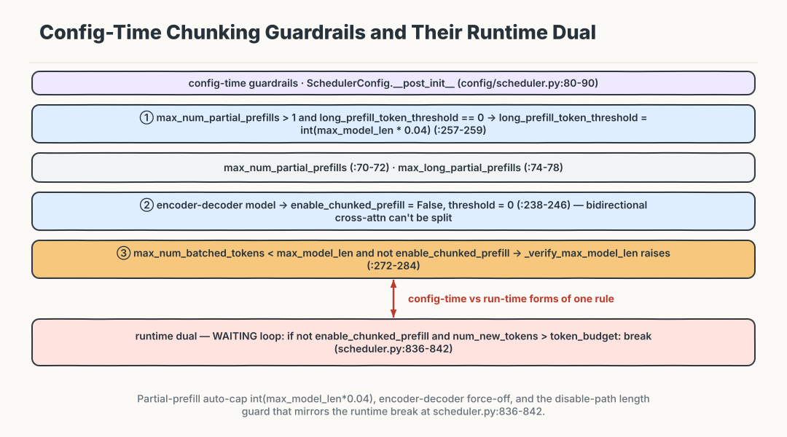</a>

<p class='figure-caption'>The three config-time chunking guardrails and their runtime dual: partial-prefill auto-cap (int(max_model_len*0.04)), encoder-decoder force-off, and the disable-path length guard that mirrors the runtime break at scheduler.py:836-842.</p>

### The RUNNING mirror: an in-flight chunk resumes with the same arithmetic

A prompt only partly prefilled last step sits in `self.running` (continuous batching admits it immediately, [Section 6](#6-continuous-batching-membership-changes-each-step)) with `is_prefill_chunk == True`. The RUNNING loop advances it by another chunk using the identical two-stage clamp — this excerpt's full guard chain is covered in [Section 4](#4-process-running-before-admitting-waiting), shown here trimmed to the truncation that matters for chunking:

[`vllm/v1/core/sched/scheduler.py:473-480`](https://github.com/vllm-project/vllm/blob/6cf7b26bd4bff60bf378e1af14044280ac0d214c/vllm/v1/core/sched/scheduler.py#L473-L480)

```python
            num_new_tokens = (
                request.num_tokens_with_spec
                + request.num_output_placeholders
                - request.num_computed_tokens
            )
            if 0 < self.scheduler_config.long_prefill_token_threshold < num_new_tokens:
                num_new_tokens = self.scheduler_config.long_prefill_token_threshold
            num_new_tokens = min(num_new_tokens, token_budget)
```

<a href='images/vllm-05-18-clamp-chain.svg' target='_blank'>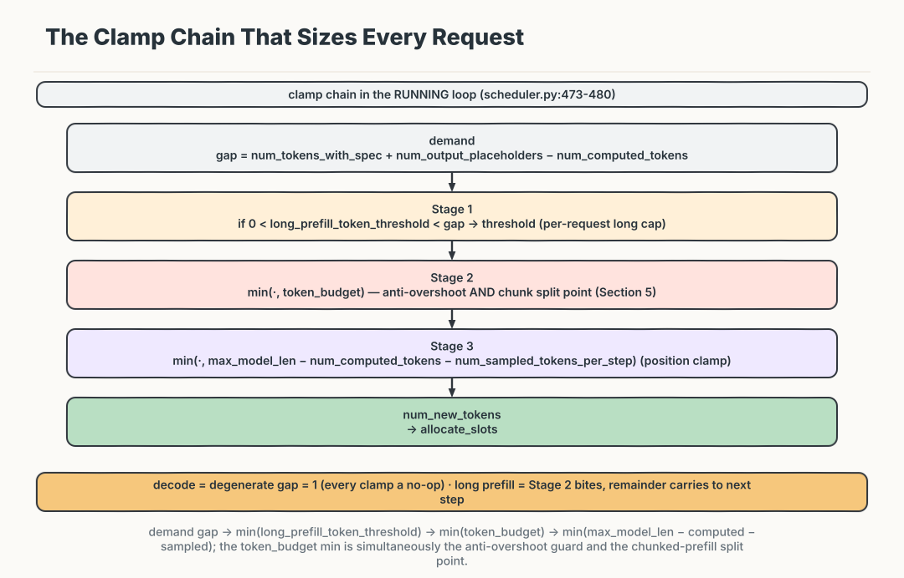</a>

<p class='figure-caption'>The clamp chain that sizes every request: demand gap → min(long_prefill_token_threshold) → min(token_budget) → min(max_model_len − computed − sampled); the min against token_budget is simultaneously the anti-overshoot guard and the chunked-prefill split point.</p>

Two details connect this code to the phase-agnostic design in [Section 1](#1-what-the-scheduler-decides-one-token-budget-per-step):

- The RUNNING loop **does not consult `enable_chunked_prefill`**. That flag gates only *initial admission* in the WAITING loop; an already-admitted prefill is always resumable in chunks. So disabling chunked prefill prevents a long prompt from ever *entering* mid-way, but nothing chunks a prompt already in flight.
- A **decode is the degenerate one-token chunk**. For a decode request `num_tokens_with_spec - num_computed_tokens == 1` (or `1 + num_spec_tokens` for speculative decoding, article 12), so the exact same three lines yield the decode's single token. Prefill and decode are literally the same arithmetic drawing from the same `token_budget`, which is why the "prioritize decode" behavior of the docs quote is not a special case but a consequence of the RUNNING loop running first.

<a href='images/vllm-05-02-chunked-prefill.svg' target='_blank'>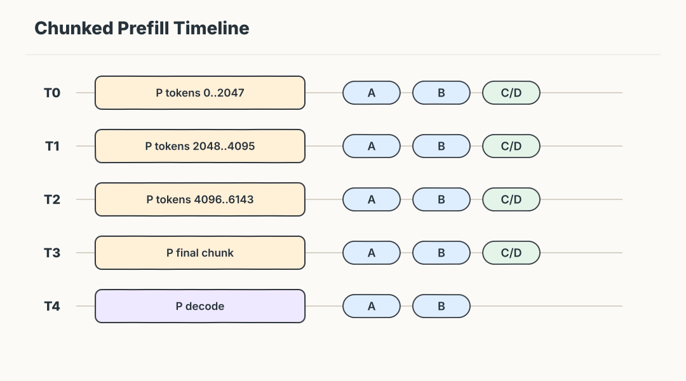</a>

<p class='figure-caption'>A long prompt consumed as a monotone sequence of budget-sized chunks interleaved with concurrent decodes across engine steps.</p>

**Carrying the remainder across steps**

For a chunk to be "in-flight," the scheduler must advance the cursor and remember the prompt is unfinished. Both happen optimistically, *before* the model runs, so the same request can be re-scheduled on the very next step without waiting for output (the mechanism EngineCore's step loop relies on, article 04). At admission, the WAITING commit records a still-prefilling request ([`vllm/v1/core/sched/scheduler.py:998-1000`](https://github.com/vllm-project/vllm/blob/6cf7b26bd4bff60bf378e1af14044280ac0d214c/vllm/v1/core/sched/scheduler.py#L998-L1000), covered in [Section 2](#2-schedule-the-main-loop)):

```python
                # Only track requests that will still be prefilling after this chunk.
                if num_computed_tokens + num_new_tokens < request.num_tokens:
                    self._inflight_prefills.add(request)
```

After the step is dispatched, `_update_after_schedule` advances `num_computed_tokens` by exactly the scheduled chunk and re-derives the phase flag ([`scheduler.py:1180-1189`](https://github.com/vllm-project/vllm/blob/6cf7b26bd4bff60bf378e1af14044280ac0d214c/vllm/v1/core/sched/scheduler.py#L1180-L1189), detailed in [Section 6](#6-continuous-batching-membership-changes-each-step)):

```python
        for req_id, num_scheduled_token in num_scheduled_tokens.items():
            request = self.requests[req_id]
            request.num_computed_tokens += num_scheduled_token
            request.num_in_flight_tokens += num_scheduled_token
...
            request.is_prefill_chunk = request.num_computed_tokens < (
                request.num_tokens + request.num_output_placeholders
            )
```

`is_prefill_chunk` starts `False` ([`vllm/v1/request.py:172-173`](https://github.com/vllm-project/vllm/blob/6cf7b26bd4bff60bf378e1af14044280ac0d214c/vllm/v1/request.py#L172-L173)) and becomes `True` while the cursor still trails the prompt, including async output placeholders. Because it is recomputed from the cursor, consecutive chunks cover the prompt without changing which tokens are processed; chunking changes when they run.

### KV feasibility still gates every chunk

Sizing a chunk to the token budget does not mean it fits in memory. Each chunk still passes through `KVCacheManager.allocate_slots` before commit, and here the RUNNING and WAITING loops differ sharply ([Section 9](#9-preemption-under-kv-pressure)): in the WAITING loop `allocate_slots` returning `None` is backpressure that simply `break`s the loop — a new prompt is never admitted at the cost of preempting a decode. In the RUNNING loop, a returning-`None` for an in-flight chunk triggers preemption of a victim and a retry. The allocation policy stack (watermark gates, full-sequence reservation, why it returns `None`) is entirely article 06's territory; this section simply consumes its verdict. The relevant interaction for chunked prefill is only that the token-budget `min` and the KV-block check are solved together, so a chunk that fits the compute budget can still be denied for lack of blocks.

**Config guardrails around chunking**

Three config-time rules bound the feature (`vllm/config/scheduler.py`):

- **Concurrent partial prefills auto-set the long cap** (`:257-259`): if `max_num_partial_prefills > 1` and `long_prefill_token_threshold == 0`, the threshold defaults to `int(max_model_len * 0.04)`. `max_num_partial_prefills` (`:70-72`) caps how many prompts may be mid-chunk at once; `max_long_partial_prefills` (`:74-78`) caps how many of those may be "long," letting short prompts jump the queue.
- **Encoder-decoder models force chunking off** (`:238-246`): `enable_chunked_prefill = False` and `long_prefill_token_threshold = 0`, because their bidirectional cross-attention cannot be split across steps.
- **The disable-path length guard** (`:272-284`): with chunking off, a prompt longer than the batch budget could never be scheduled, so `verify_max_model_len` raises up front if `max_num_batched_tokens < max_model_len and not enable_chunked_prefill`. This is the config-time dual of the runtime `break` at L836-842: when chunking is disabled a whole prompt must fit `max_num_batched_tokens` in one step, so the config refuses `max_num_batched_tokens < max_model_len`.

The closing assertion enforces the per-step bound regardless of prompt length:

```python
        total_num_scheduled_tokens = sum(num_scheduled_tokens.values())
        assert total_num_scheduled_tokens <= self.max_num_scheduled_tokens
```

Both loops clamp with `min(..., token_budget)` before the paired debit. A long prompt is therefore spread across budget-bounded steps, with any running decodes consuming their grants first. Chunked prefill is enabled by default where supported ([V1 guide](https://docs.vllm.ai/en/stable/usage/v1_guide/)).

## 6. Continuous Batching: Membership Changes Each Step

The batch, in the V1 scheduler, is not an object. It is a derivation. Nothing named `batch` persists between forward passes; what persists is `self.running`, `self.waiting`, and a per-request cursor `num_computed_tokens`. Each forward pass, `schedule()` re-walks those queues from scratch under a fresh `token_budget` ([Section 2](#2-schedule-the-main-loop), [Section 3](#3-the-token-budget-max_num_scheduled_tokens)) and emits `num_scheduled_tokens: {req_id: num_tokens}`: the membership of *this* iteration. Orca named this iteration-level scheduling and showed why it beats request-level (static) batching for multi-step generation: you never make a new arrival wait for an in-flight batch to drain, and you never let a finished request hold a slot past its stop condition ([Orca, OSDI'22](https://www.usenix.org/conference/osdi22/presentation/yu)). Continuous batching is the property that falls out: because the batch is recomputed every step, its membership can change every step.

The contract that fixes "one schedule per forward pass" is the `schedule()` docstring. Its `{req_id: num_tokens}` payload is [Section 1](#1-what-the-scheduler-decides-one-token-budget-per-step)'s subject; the clause that matters here is the iteration-level granularity.

[`vllm/v1/core/sched/interface.py:55-57`](https://github.com/vllm-project/vllm/blob/6cf7b26bd4bff60bf378e1af14044280ac0d214c/vllm/v1/core/sched/interface.py#L55-L57)

```python
        The scheduling decision is made at the iteration level. Each scheduling
        step corresponds to a single forward pass of the model. Therefore, this
        method is called repeatedly by a busy loop in the engine.
```

Read it against the loop that drives it (article 04): the EngineCore busy loop calls `schedule()`, ships the resulting `SchedulerOutput` to the executor for one forward pass, then feeds the tokens back through `update_from_output`, then calls `schedule()` again. There is no batch lifetime longer than one iteration. The membership decision is remade at line [`scheduler.py:442`](https://github.com/vllm-project/vllm/blob/6cf7b26bd4bff60bf378e1af14044280ac0d214c/vllm/v1/core/sched/scheduler.py#L442), `while req_index < len(self.running) and token_budget > 0` — a plain re-scan of a plain `list[Request]` (`self.running` at [`scheduler.py:184`](https://github.com/vllm-project/vllm/blob/6cf7b26bd4bff60bf378e1af14044280ac0d214c/vllm/v1/core/sched/scheduler.py#L184)), from the front, every step.

### The arrival half: admitted this step, running next step

A newly admitted WAITING request joins the running set *immediately*, inside the same `schedule()` call that admitted it — not after the forward pass confirms anything. The commit (covered in [Section 2](#2-schedule-the-main-loop); excerpted here trimmed to the membership-relevant lines) is:

[`vllm/v1/core/sched/scheduler.py:973-1000`](https://github.com/vllm-project/vllm/blob/6cf7b26bd4bff60bf378e1af14044280ac0d214c/vllm/v1/core/sched/scheduler.py#L973-L1000)

```python
                self.running.append(request)
                ...
                if request.status == RequestStatus.WAITING:
                    scheduled_new_reqs.append(request)
                elif request.status == RequestStatus.PREEMPTED:
                    scheduled_resumed_reqs.append(request)
                else:
                    raise RuntimeError(f"Invalid request status: {request.status}")
                ...
                num_scheduled_tokens[request_id] = num_new_tokens
                token_budget -= num_new_tokens
                request.status = RequestStatus.RUNNING
                request.num_computed_tokens = num_computed_tokens
                ...
                # Only track requests that will still be prefilling after this chunk.
                if num_computed_tokens + num_new_tokens < request.num_tokens:
                    self._inflight_prefills.add(request)
```

`self.running.append(request)` (line 973) puts the request at the *tail* of the running list. Its status flips to `RUNNING` (line 992). It is classified once — `scheduled_new_reqs` if it was a fresh `WAITING` request, `scheduled_resumed_reqs` if it was a `PREEMPTED` one being resumed (lines 978-983) — and that classification decides whether the executor gets a full `NewRequestData` payload or a lightweight `CachedRequestData` diff ([Section 10](#10-scheduleroutput-what-the-executor-receives)). `num_computed_tokens` is set to the prefix-hit baseline (line 993; the cache probe of [Section 8](#8-prefix-cache-aware-scheduling)), *not yet advanced* by the tokens scheduled this step — that advance is deferred to the end of `schedule()`.

The consequence for membership: next step's Phase A RUNNING loop ([`scheduler.py:442`](https://github.com/vllm-project/vllm/blob/6cf7b26bd4bff60bf378e1af14044280ac0d214c/vllm/v1/core/sched/scheduler.py#L442)) walks `self.running`, which now contains this request, so it is a first-class scheduling candidate one iteration later. A prompt admitted at step N (even a chunked prefill that only got its first slice) is eligible to continue or decode at step N+1. Because it was appended to the *tail*, and Phase A drains the budget front-to-back ([Section 4](#4-process-running-before-admitting-waiting)), it is funded only after the older in-flight generations ahead of it, which is the decode-latency-priority ordering. Membership grows at the back; it never jumps the queue of already-running work.

**The optimistic cursor: why re-scheduling needs no round-trip**

The subtle piece that makes continuous batching cheap is *when* the per-request cursor advances. It advances at the end of `schedule()`, before the model has run a single token, in `_update_after_schedule`.

[`vllm/v1/core/sched/scheduler.py:1169-1195`](https://github.com/vllm-project/vllm/blob/6cf7b26bd4bff60bf378e1af14044280ac0d214c/vllm/v1/core/sched/scheduler.py#L1169-L1195)

```python
    def _update_after_schedule(self, scheduler_output: SchedulerOutput) -> None:
        # Advance the number of computed tokens for the request AFTER
        # the request is scheduled.
        # 1. The scheduler_output of the current step has to include the
        #    original number of scheduled tokens to determine input IDs.
        # 2. Advance the number of computed tokens here allowing us to
        #    schedule the prefill request again immediately in the next
        #    scheduling step.
        # 3. If some tokens (e.g. spec tokens) are rejected later, the number of
        #    computed tokens will be adjusted in update_from_output.
        num_scheduled_tokens = scheduler_output.num_scheduled_tokens
        for req_id, num_scheduled_token in num_scheduled_tokens.items():
            request = self.requests[req_id]
            request.num_computed_tokens += num_scheduled_token
            request.num_in_flight_tokens += num_scheduled_token
            if self.defer_block_free:
                # Record the in-flight step, to fence deferred block freeing.
                request.last_sched_seq = self.sched_step_seq
            request.is_prefill_chunk = request.num_computed_tokens < (
                request.num_tokens + request.num_output_placeholders
            )
            ...
            # Drop from the in-flight-prefill set once it's no longer prefilling.
            if not request.is_prefill_chunk:
                self._inflight_prefills.discard(request)
```

`schedule()` calls this at [`scheduler.py:1136-1137`](https://github.com/vllm-project/vllm/blob/6cf7b26bd4bff60bf378e1af14044280ac0d214c/vllm/v1/core/sched/scheduler.py#L1136-L1137) and returns `SchedulerOutput` at [`scheduler.py:1138`](https://github.com/vllm-project/vllm/blob/6cf7b26bd4bff60bf378e1af14044280ac0d214c/vllm/v1/core/sched/scheduler.py#L1138). The cursor advance (`num_computed_tokens += num_scheduled_token`, line 1182) therefore happens before the executor receives the plan. The next `schedule()` can see that updated cursor and continue the request without waiting for the previous forward pass to finish.

A 20k-token prompt sliced into chunks of `token_budget` ([Section 5](#5-chunked-prefill-splitting-long-prompts)) walks its cursor forward chunk-by-chunk across consecutive steps; each step's Phase A recomputes `num_new_tokens = num_tokens_with_spec + placeholders − num_computed_tokens` ([Section 4](#4-process-running-before-admitting-waiting)) against the already-advanced cursor. Without the optimistic advance the scheduler would have to wait for `update_from_output` to confirm each chunk before scheduling the next, serializing what is meant to be pipelined — and it would break async scheduling entirely, where step N+1 is scheduled while step N's forward pass is still on the GPU.

The optimism has one correction path, called out in reason 3: speculative decoding drafts *k* tokens and advances the cursor by all of them, but the model may reject some. Those rejected tokens are subtracted back from `num_computed_tokens` in `update_from_output` (article 12). The scheduler is deliberately optimistic (reserve slots for the drafts, advance the cursor as if they all land) and reconciles after the verify step. This is the same "reserve optimistically, cache pessimistically" posture the KV manager takes (article 06): the *cursor* moves ahead of ground truth, but the *cached* blocks never do.

Line 1187 re-derives the phase: `is_prefill_chunk = num_computed_tokens < num_tokens + num_output_placeholders`. This is where a request stops being a prefill and becomes a decode: the moment its cursor catches up to its length. There is no phase transition event; the boolean is simply recomputed from the advanced cursor each step. Phase A's guards read it back (the DP-defer guard at [`scheduler.py:467`](https://github.com/vllm-project/vllm/blob/6cf7b26bd4bff60bf378e1af14044280ac0d214c/vllm/v1/core/sched/scheduler.py#L467), `if defer_prefills and request.is_prefill_chunk`) to tell an in-flight chunk apart from a decode. So "membership changes each step" is really two derivations layered: which requests are in `self.running`, and, for each, whether it is prefilling or decoding this step, both recomputed from the cursor, never stored as a mode.

**The departure half: finished requests announced across the step boundary**

Membership shrinks too, and it shrinks with a one-step lag that is itself carried scheduler state. `finished_req_ids` is not computed inside `schedule()`; it is accumulated between steps.

[`vllm/v1/core/sched/scheduler.py:186-190`](https://github.com/vllm-project/vllm/blob/6cf7b26bd4bff60bf378e1af14044280ac0d214c/vllm/v1/core/sched/scheduler.py#L186-L190)

```python
        # The request IDs that are finished in between the previous and the
        # current steps. This is used to notify the workers about the finished
        # requests so that they can free the cached states for those requests.
        # This is flushed at the end of each scheduling step.
        self.finished_req_ids: set[str] = set()
```

<a href='images/vllm-05-19-finished-handshake.svg' target='_blank'>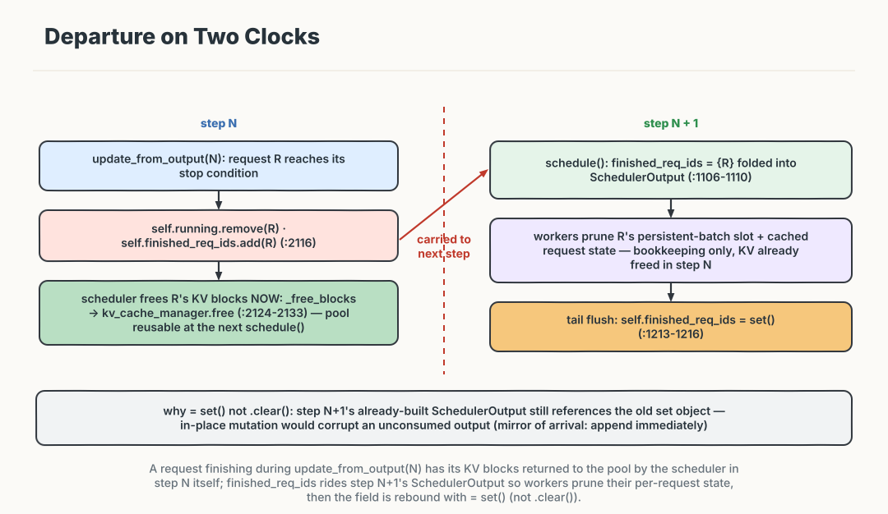</a>

<p class='figure-caption'>Departure on two clocks: a request that finishes during update_from_output(N) has its KV blocks returned to the pool by the scheduler right there in step N; finished_req_ids rides step N+1's SchedulerOutput only so the worker can prune its persistent request/batch state, then the field is rebound with = set() (not .clear()) to avoid corrupting the already-built output.</p>

A request that hits a stop condition during `update_from_output` (or is aborted) is added to this set ([`scheduler.py:2116`](https://github.com/vllm-project/vllm/blob/6cf7b26bd4bff60bf378e1af14044280ac0d214c/vllm/v1/core/sched/scheduler.py#L2116)). The *next* `schedule()` folds the set into its output, verbatim, as carried state rather than a fresh decision:

[`vllm/v1/core/sched/scheduler.py:1106-1110`](https://github.com/vllm-project/vllm/blob/6cf7b26bd4bff60bf378e1af14044280ac0d214c/vllm/v1/core/sched/scheduler.py#L1106-L1110)

```python
            # finished_req_ids is an existing state in the scheduler,
            # instead of being newly scheduled in this step.
            # It contains the request IDs that are finished in between
            # the previous and the current steps.
            finished_req_ids=self.finished_req_ids,
```

Then, at the tail of the same step, it is flushed so it cannot be double-reported:

[`vllm/v1/core/sched/scheduler.py:1213-1216`](https://github.com/vllm-project/vllm/blob/6cf7b26bd4bff60bf378e1af14044280ac0d214c/vllm/v1/core/sched/scheduler.py#L1213-L1216)

```python
        # Clear the finished and preempted request IDs.
        # NOTE: We shouldn't just clear() here because it will also affect
        # the scheduler output.
        self.finished_req_ids = set()
```

Read the lifecycle across the step boundary: request R finishes while step N's output is processed → R is dropped from `self.running`, its KV blocks are returned to the pool *right there* by the scheduler (`_free_request` → `_free_blocks` → `kv_cache_manager.free`, [`scheduler.py:2110-2133`](https://github.com/vllm-project/vllm/blob/6cf7b26bd4bff60bf378e1af14044280ac0d214c/vllm/v1/core/sched/scheduler.py#L2110-L2133) — the scheduler owns the `BlockPool`, and the source notes a normal finish has no in-flight write, so it frees immediately), and R's id is added to `finished_req_ids` → step N+1's `SchedulerOutput` carries `finished_req_ids={R}` so the *workers* prune R's persistent-batch slot and cached request state ([`gpu_model_runner.py:1161-1174`](https://github.com/vllm-project/vllm/blob/6cf7b26bd4bff60bf378e1af14044280ac0d214c/vllm/v1/worker/gpu_model_runner.py#L1161-L1174) — worker-side bookkeeping only, not the block free) → the field is rebound to a fresh empty set.

The `= set()` (not `.clear()`) matters and the comment says why: the old set object is still referenced by step N+1's already-constructed `SchedulerOutput`, so mutating it in place would corrupt an output that has not yet been consumed. Departure thus fans out on two clocks — the KV free happens in the scheduler at finish time, while the worker-state cleanup is instructed on the next step. (Only with `defer_block_free`, an in-flight async step, or a KV-connector delay does the block free itself go through the deferred/fenced path.)

<a href='images/vllm-05-05-continuous-batching.svg' target='_blank'>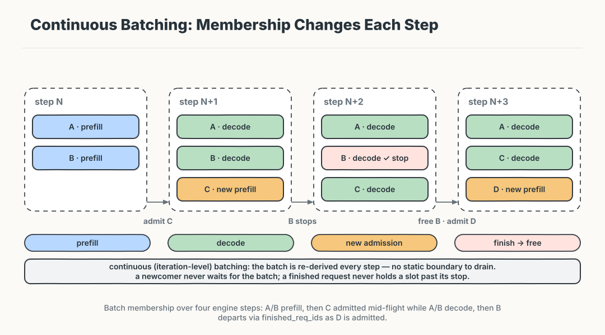</a>

<p class='figure-caption'>Batch membership over four engine steps: A/B prefill, then C admitted mid-flight while A/B decode, then B departs via finished_req_ids as D is admitted.</p>

## 7. The Request Queues: FCFS vs Priority

The WAITING phase ([Section 4](#4-process-running-before-admitting-waiting)) admits new and resumed prefills according to a `RequestQueue`. A factory chooses the FCFS or PRIORITY implementation at construction, while the admission loop uses the same add, peek, and pop interface. Policy-specific behavior is concentrated in the queue implementation, cross-queue arbitration, and preemption re-insertion.

<a href='images/vllm-05-06-request-queues.svg' target='_blank'>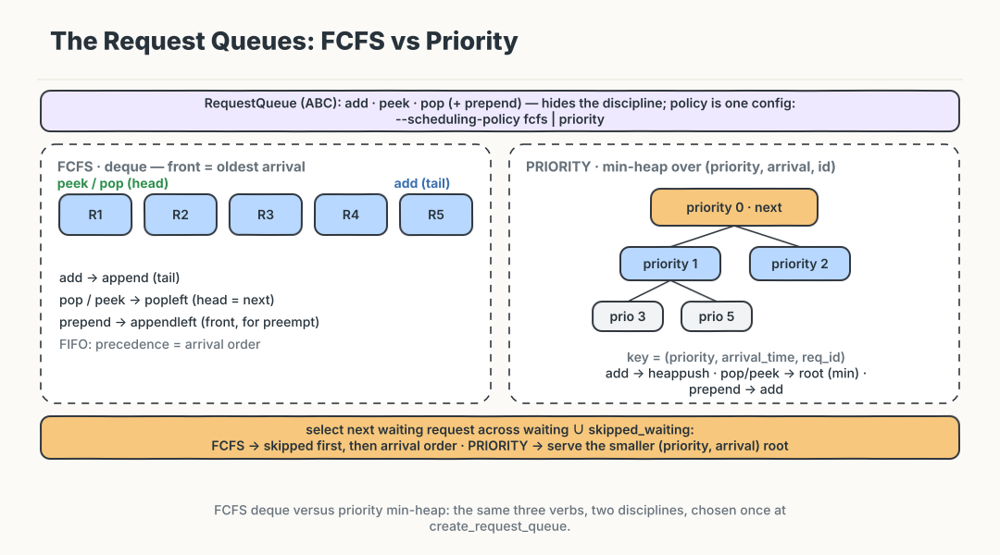</a>

<p class='figure-caption'>FCFS deque versus priority min-heap: the same three verbs, two disciplines.</p>

### The policy enum and the abstract contract

The discipline is a two-value enum, and the queue is an ABC so the scheduler never sees the concrete type on the add/peek/pop path.

Source anchor: [`vllm/v1/core/sched/request_queue.py:13-17`](https://github.com/vllm-project/vllm/blob/6cf7b26bd4bff60bf378e1af14044280ac0d214c/vllm/v1/core/sched/request_queue.py#L13-L17).

```python
# request_queue.py:13-17
class SchedulingPolicy(Enum):
    """Enum for scheduling policies."""

    FCFS = "fcfs"
    PRIORITY = "priority"
```

The ABC ([`request_queue.py:20-72`](https://github.com/vllm-project/vllm/blob/6cf7b26bd4bff60bf378e1af14044280ac0d214c/vllm/v1/core/sched/request_queue.py#L20-L72)) declares ten abstract members: `add_request`, `pop_request`, `peek_request`, `prepend_request`, `prepend_requests`, `remove_request`, `remove_requests`, and the dunders `__bool__` / `__len__` / `__iter__`. Three verbs define the discipline — `add` (where a request lands), `peek` (who is next, without committing), and `pop` (dequeue the next). The `prepend*` verbs exist for FCFS re-insertion semantics and are, as we will see, deliberately weakened under priority. The invariant this buys is **policy transparency**: the scheduler holds a `RequestQueue` and trusts each verb to honor the discipline; the only places it branches on `self.policy` are cross-queue arbitration and preemption-victim choice, never the single-queue verb contract.

**FCFS: a deque, front = oldest arrival**

First-come-first-served is a plain FIFO, implemented by *subclassing* `deque` so the ends are O(1) and `append` / `appendleft` / `popleft` come for free.

Source anchor: [`request_queue.py:78-94`](https://github.com/vllm-project/vllm/blob/6cf7b26bd4bff60bf378e1af14044280ac0d214c/vllm/v1/core/sched/request_queue.py#L78-L94).

```python
# request_queue.py:78-94
    def add_request(self, request: Request) -> None:
        """Add a request to the queue according to FCFS policy."""
        self.append(request)

    def pop_request(self) -> Request:
        """Pop a request from the queue according to FCFS policy."""
        return self.popleft()

    def peek_request(self) -> Request:
        """Peek at the next request in the queue without removing it."""
        if not self:
            raise IndexError("peek from an empty queue")
        return self[0]

    def prepend_request(self, request: Request) -> None:
        """Prepend a request to the front of the queue."""
        self.appendleft(request)
```

`add_request` appends at the tail, `pop_request` pops the head (`popleft`), and `peek_request` returns `self[0]`, the head, behind an explicit empty check that raises `IndexError`. So **head = front = next-to-serve = oldest enqueued**; tail = newest. `prepend_request` uses `appendleft` to push a request back to the *head*, ahead of everything currently queued — this is how a preempted request keeps its precedence (below). Because `__len__` / `__iter__` defer to `deque` ([`request_queue.py:122-128`](https://github.com/vllm-project/vllm/blob/6cf7b26bd4bff60bf378e1af14044280ac0d214c/vllm/v1/core/sched/request_queue.py#L122-L128)), iteration order equals serve order.

The bulk mover `prepend_requests` uses `deque.extendleft` ([`request_queue.py:103`](https://github.com/vllm-project/vllm/blob/6cf7b26bd4bff60bf378e1af14044280ac0d214c/vllm/v1/core/sched/request_queue.py#L103)), whose standard-library consequence is **order reversal** — the docstring calls it out — and that reversal is critical for the skipped-queue merge below. The property: **FIFO monotonicity** — absent `prepend*`, a later arrival is never served before an earlier one, and precedence equals enqueue time without ever reading a field off `Request`.

**PRIORITY: a min-heap over `Request.__lt__`**

Priority scheduling is a binary min-heap; the "smallest" request by key is served first. Unlike FCFS this is *not* a deque subclass — it wraps a private list managed by `heapq`.

Source anchor: [`request_queue.py:144-158`](https://github.com/vllm-project/vllm/blob/6cf7b26bd4bff60bf378e1af14044280ac0d214c/vllm/v1/core/sched/request_queue.py#L144-L158).

```python
# request_queue.py:144-158
    def add_request(self, request: Request) -> None:
        """Add a request to the queue according to priority policy."""
        heapq.heappush(self._heap, request)

    def pop_request(self) -> Request:
        """Pop a request from the queue according to priority policy."""
        if not self._heap:
            raise IndexError("pop from empty heap")
        return heapq.heappop(self._heap)

    def peek_request(self) -> Request:
        """Peek at the next request in the queue without removing it."""
        if not self._heap:
            raise IndexError("peek from empty heap")
        return self._heap[0]
```

`add_request` is `heappush` (O(log n) sift-up), `pop_request` is `heappop` (O(log n), returns the minimum), and `peek_request` returns `self._heap[0]`: the heap root, the current minimum, next-to-serve. Both accessors guard emptiness with `IndexError`, matching the FCFS contract so the caller's peek-then-maybe-pop loop is oblivious to which queue it holds. The comparison itself lives on `Request`, not in this file:

Source anchor: [`vllm/v1/request.py:314-325`](https://github.com/vllm-project/vllm/blob/6cf7b26bd4bff60bf378e1af14044280ac0d214c/vllm/v1/request.py#L314-L325).

```python
# request.py:314-325
    def __lt__(self, other: "Request") -> bool:
        """
        Compare two requests based on priority, arrival time, and request ID.
        Used in priority scheduling.
        """
        if self.priority != other.priority:
            return self.priority < other.priority
        if self.arrival_time != other.arrival_time:
            return self.arrival_time < other.arrival_time
        if self.request_id != other.request_id:
            return self.request_id < other.request_id
        return id(self) < id(other)
```

<a href='images/vllm-05-20-priority-sortkey.svg' target='_blank'>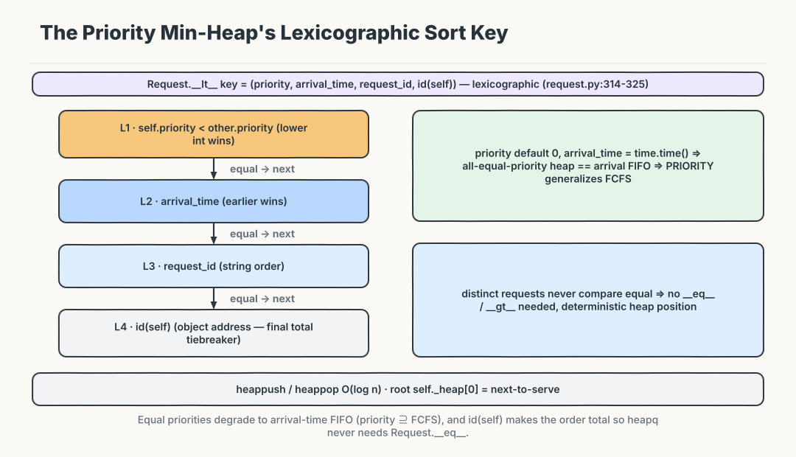</a>

<p class='figure-caption'>The priority min-heap's sort key is the lexicographic tuple (priority, arrival_time, request_id, id(self)): equal priorities degrade to arrival-time FIFO (priority ⊇ FCFS), and id(self) makes the order total so heapq never needs Request.__eq__.</p>

The sort key is the lexicographic tuple `(priority, arrival_time, request_id, id(self))`. Lower `priority` int wins; ties break by earlier `arrival_time`, then lower `request_id` string, then `id(self)` (object address) as a final total tiebreaker. Two facts fall out. First, `priority` defaults to `0` and `arrival_time` to `time.time()` at construction, so **with all priorities equal the heap degrades to arrival-time FIFO** — priority mode is a strict generalization of FCFS, not a different algorithm. Second, because the last key component is `id(self)`, no two distinct requests ever compare equal; `heapq` therefore never needs `Request.__eq__`, and heap position is deterministic. That total-order property is what lets the heap be reasoned about without `Request` defining `__eq__` or `__gt__`.

### Where the priority queue's verbs diverge

A heap has no "front," so the `prepend*` verbs cannot mean what they mean for a deque; and iteration in array order would be only partially sorted.

Source anchor: [`request_queue.py:160-173`](https://github.com/vllm-project/vllm/blob/6cf7b26bd4bff60bf378e1af14044280ac0d214c/vllm/v1/core/sched/request_queue.py#L160-L173) and [`request_queue.py:194-198`](https://github.com/vllm-project/vllm/blob/6cf7b26bd4bff60bf378e1af14044280ac0d214c/vllm/v1/core/sched/request_queue.py#L194-L198).

```python
# request_queue.py:160-173
    def prepend_request(self, request: Request) -> None:
        """Add a request to the queue according to priority policy.

        Note: In a priority queue, there is no concept of prepending to the
        front. Requests are ordered by (priority, arrival_time)."""
        self.add_request(request)

    def prepend_requests(self, requests: RequestQueue) -> None:
        """Add all requests from another queue according to priority policy.

        Note: In a priority queue, there is no concept of prepending to the
        front. Requests are ordered by (priority, arrival_time)."""
        for request in requests:
            self.add_request(request)
```

Both `prepend*` verbs **collapse to `add_request`**: there is no head to jump, so a request "prepended" under priority simply re-competes on its key. `remove_request` ([`request_queue.py:175-178`](https://github.com/vllm-project/vllm/blob/6cf7b26bd4bff60bf378e1af14044280ac0d214c/vllm/v1/core/sched/request_queue.py#L175-L178)) does `list.remove` (O(n)) then `heapq.heapify` (O(n)) to repair the heap property it just broke; `remove_requests` ([`request_queue.py:180-184`](https://github.com/vllm-project/vllm/blob/6cf7b26bd4bff60bf378e1af14044280ac0d214c/vllm/v1/core/sched/request_queue.py#L180-L184)) rebuilds the backing list filtering a `set` of victims, then heapifies once — cheaper than repeated single removals. Iteration is the subtle one:

```python
# request_queue.py:194-198
    def __iter__(self) -> Iterator[Request]:
        """Iterate over the queue according to priority policy."""
        heap_copy = self._heap[:]
        while heap_copy:
            yield heapq.heappop(heap_copy)
```

`__iter__` does *not* walk `self._heap` in array order (only partially sorted). It shallow-copies the backing list and repeatedly `heappop`s the copy, yielding requests in **true serve order** while leaving the live heap intact — an O(n log n) heap-sort plus one allocation, the price of making "iterate in policy order" honest for a heap. Two properties hold: every mutation that could break the min-heap shape restores it before returning, so a later `peek`/`pop` still yields the true minimum; and iteration order equals serve order non-destructively, which is what makes the `prepend_requests`-copies-a-queue path below well-defined.

**One factory, two queues of the same discipline**

The policy string is resolved to a concrete class exactly once.

Source anchor: [`request_queue.py:201-208`](https://github.com/vllm-project/vllm/blob/6cf7b26bd4bff60bf378e1af14044280ac0d214c/vllm/v1/core/sched/request_queue.py#L201-L208); consumer [`scheduler.py:174-183`](https://github.com/vllm-project/vllm/blob/6cf7b26bd4bff60bf378e1af14044280ac0d214c/vllm/v1/core/sched/scheduler.py#L174-L183).

```python
# request_queue.py:201-208
def create_request_queue(policy: SchedulingPolicy) -> RequestQueue:
    """Create request queue based on scheduling policy."""
    if policy == SchedulingPolicy.PRIORITY:
        return PriorityRequestQueue()
    elif policy == SchedulingPolicy.FCFS:
        return FCFSRequestQueue()
    else:
        raise ValueError(f"Unknown scheduling policy: {policy}")
```

At construction the scheduler parses `scheduler_config.policy` into a `SchedulingPolicy` ([`scheduler.py:175`](https://github.com/vllm-project/vllm/blob/6cf7b26bd4bff60bf378e1af14044280ac0d214c/vllm/v1/core/sched/scheduler.py#L175)) and builds **two** queues of the same discipline ([`scheduler.py:181-183`](https://github.com/vllm-project/vllm/blob/6cf7b26bd4bff60bf378e1af14044280ac0d214c/vllm/v1/core/sched/scheduler.py#L181-L183)): `self.waiting`, the main admission queue, and `self.skipped_waiting`, holding requests temporarily blocked on async dependencies or constraints. Both are `RequestQueue`; from here the scheduler uses only the interface verbs. Any unknown policy raises at the factory rather than producing a silently-wrong queue. The invariant, **single point of type selection**, guarantees `waiting` and `skipped_waiting` share one discipline, which is what makes the cross-queue head comparison below well-defined.

### Picking the next waiting request across two queues

"Next waiting request" is a two-queue arbitration. FCFS prefers the skipped queue wholesale; priority merges the two heads by key.

Source anchor: [`scheduler.py:1875-1885`](https://github.com/vllm-project/vllm/blob/6cf7b26bd4bff60bf378e1af14044280ac0d214c/vllm/v1/core/sched/scheduler.py#L1875-L1885).

```python
# scheduler.py:1875-1885
    def _select_waiting_queue_for_scheduling(self) -> RequestQueue | None:
        if self.policy == SchedulingPolicy.FCFS:
            return self.skipped_waiting or self.waiting or None

        # PRIORITY mode: compare queue heads when both queues are non-empty.
        if self.waiting and self.skipped_waiting:
            waiting_req = self.waiting.peek_request()
            skipped_req = self.skipped_waiting.peek_request()
            return self.waiting if waiting_req < skipped_req else self.skipped_waiting

        return self.waiting or self.skipped_waiting or None
```

<a href='images/vllm-05-21-two-queue-arbitration.svg' target='_blank'>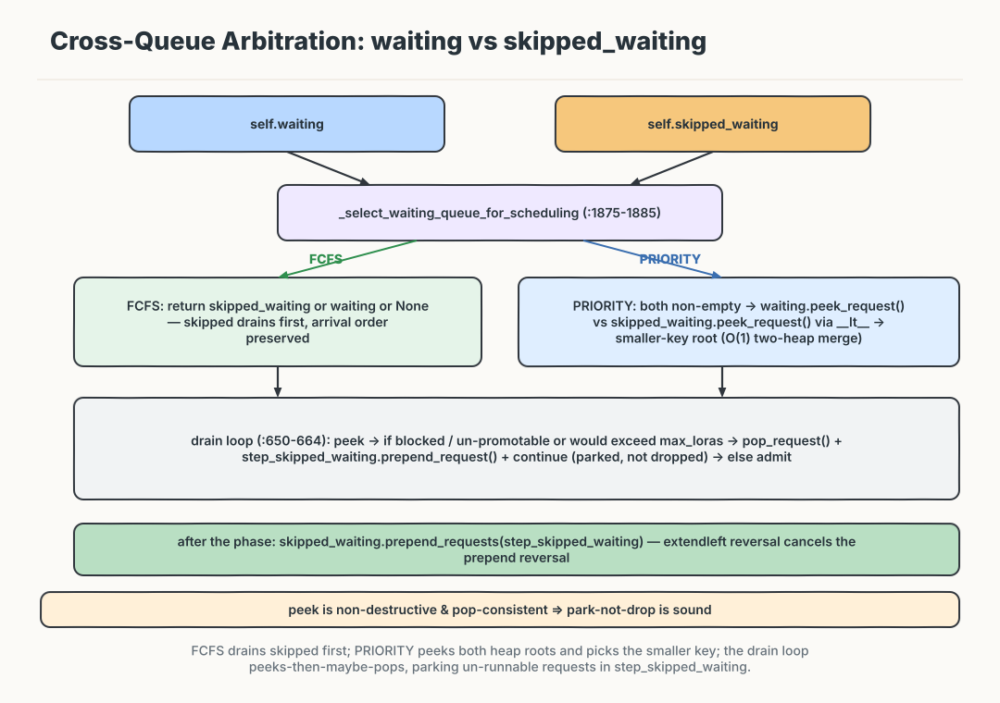</a>

<p class='figure-caption'>Cross-queue arbitration over waiting and skipped_waiting: FCFS drains skipped first (older arrivals), PRIORITY peeks both heap roots and picks the smaller key; the drain loop then peeks-then-maybe-pops, parking un-runnable requests in step_skipped_waiting.</p>

Under **FCFS**, `skipped_waiting` drains first (its `__bool__` truthiness wins): those blocked requests were enqueued earlier and FCFS is arrival-ordered, so reconsidering them ahead of newer arrivals preserves global arrival order. Under **PRIORITY**, when both are non-empty it peeks both roots and returns the queue whose head has the smaller key (`waiting_req < skipped_req` invokes `Request.__lt__`) — an O(1) merge of two min-heaps by comparing roots, so the single highest-priority request across `waiting ∪ skipped_waiting` is chosen each iteration and the two-queue split never perturbs priority order. `None` comes back only when both are empty, and the caller's enclosing `while (self.waiting or self.skipped_waiting)` ([Section 4](#4-process-running-before-admitting-waiting)) already excludes that, so `assert request_queue is not None` at [`scheduler.py:648`](https://github.com/vllm-project/vllm/blob/6cf7b26bd4bff60bf378e1af14044280ac0d214c/vllm/v1/core/sched/scheduler.py#L648) always holds.

The drain loop consumes this with a **peek-then-conditionally-pop** protocol:

```python
# scheduler.py:650-664
                request = request_queue.peek_request()
                request_id = request.request_id

                # try to promote blocked statuses while traversing skipped queue.
                if self._is_blocked_waiting_status(
                    request.status
                ) and not self._try_promote_blocked_waiting_request(request):
                    if request.status == RequestStatus.WAITING_FOR_REMOTE_KVS:
                        logger.debug(
                            "%s is still in WAITING_FOR_REMOTE_KVS state.",
                            request_id,
                        )
                    request_queue.pop_request()
                    step_skipped_waiting.prepend_request(request)
                    continue
```

The loop peeks to inspect the candidate, then decides. If it cannot run this step — still blocked and un-promotable, or (further down, [`scheduler.py:668-679`](https://github.com/vllm-project/vllm/blob/6cf7b26bd4bff60bf378e1af14044280ac0d214c/vllm/v1/core/sched/scheduler.py#L668-L679)) it would exceed `max_loras` — the request is popped from its source queue and `prepend_request`-ed onto a per-step `step_skipped_waiting` queue, then `continue`d over. At the end of the phase that holding queue is merged back with `self.skipped_waiting.prepend_requests(step_skipped_waiting)` ([`scheduler.py:1017-1019`](https://github.com/vllm-project/vllm/blob/6cf7b26bd4bff60bf378e1af14044280ac0d214c/vllm/v1/core/sched/scheduler.py#L1017-L1019)); the FCFS `extendleft` reversal there undoes the reversal that `prepend_request` introduced, so order is conserved. This peek-then-maybe-pop pattern is precisely why `peek_request` must be non-destructive and return the same element `pop_request` would: a request that can't run this step is set aside, never dropped, so the waiting set is conserved within a step.

### Preemption re-insertion: where `prepend` bifurcates by policy

The abstraction's second and sharpest leak is preemption. When the RUNNING loop evicts a victim under KV pressure (the *mechanics* of freeing blocks and choosing when `allocate_slots` returns `None` belong to article 06; the *policy* is [Section 9](#9-preemption-under-kv-pressure)), it puts the victim back with the same `prepend_request` verb — and that verb means two different things.

Source anchor: [`scheduler.py:1157-1167`](https://github.com/vllm-project/vllm/blob/6cf7b26bd4bff60bf378e1af14044280ac0d214c/vllm/v1/core/sched/scheduler.py#L1157-L1167).

```python
# scheduler.py:1157-1167
        request.status = RequestStatus.PREEMPTED
        request.num_computed_tokens = 0
        if request.spec_token_ids:
            request.spec_token_ids = []
        request.num_preemptions += 1
        if self.log_stats:
            request.record_event(EngineCoreEventType.PREEMPTED, timestamp)

        # Put the request back to the waiting queue.
        self.waiting.prepend_request(request)
        self.reset_preempted_req_ids.add(request.request_id)
```

Under **FCFS**, `prepend_request` is `appendleft`: the preempted request goes to the *head* of `waiting` and is re-served before any queued arrival — matching the intent that preemption is temporary eviction, not demotion. Under **PRIORITY**, `prepend_request` is `add_request`: there is no head, so the request is re-heaped and re-competes purely on `(priority, arrival_time, …)`; since `arrival_time` is preserved on the `Request`, it lands in the same relative position its key demands. The *victim selection* branches symmetrically ([`scheduler.py:547-552`](https://github.com/vllm-project/vllm/blob/6cf7b26bd4bff60bf378e1af14044280ac0d214c/vllm/v1/core/sched/scheduler.py#L547-L552), `571-572`): under PRIORITY the victim is `max(self.running, key=lambda r: (r.priority, r.arrival_time))` — largest priority int / latest arrival, i.e. the least important running request — while under FCFS it is `self.running.pop()`, the tail.

## 8. Prefix-Cache-Aware Scheduling

Before admitting a fresh prefill, the WAITING loop asks how much of its prompt is already resident and subtracts that block-aligned hit from scheduled work. The probe is read-only, cannot change model semantics, and leaves at least one token to run even for a fully cached prompt; `allocate_slots` then accounts for the blocks the request shares.

### The probe lives only in the WAITING loop, only for fresh requests

Phase A (RUNNING, [Section 4](#4-process-running-before-admitting-waiting)) calls `allocate_slots` with three arguments and no prefix-cache parameters — a running request's prefix is already committed to its block table, so there is nothing to look up. The prefix probe is exclusive to Phase B (WAITING), and within it, exclusive to requests whose cursor is still at zero.

Source: [`vllm/v1/core/sched/scheduler.py:686-790`](https://github.com/vllm-project/vllm/blob/6cf7b26bd4bff60bf378e1af14044280ac0d214c/vllm/v1/core/sched/scheduler.py#L686-L790) (condensed; elisions marked)

```python
                # Get already-cached tokens.
                if request.num_computed_tokens == 0:
                    # Get locally-cached tokens.
                    ...
                    else:
                        new_computed_blocks, num_new_local_computed_tokens = (
                            self.kv_cache_manager.get_computed_blocks(request)
                        )
                    ...
                else:
                    # KVTransfer: WAITING reqs have num_computed_tokens > 0
                    # after async KV recvs are completed.
                    new_computed_blocks = self.kv_cache_manager.empty_kv_cache_blocks
                    num_new_local_computed_tokens = 0
                    num_computed_tokens = request.num_computed_tokens
```

1. `request.num_computed_tokens == 0` is the gate. A brand-new request and a preempted-then-resumed request both satisfy it (preemption hard-resets the cursor to 0 — [Section 9](#9-preemption-under-kv-pressure)), so both re-probe the cache. That is the point: a resumed request rediscovers its own just-freed blocks here.
2. The common (non-Mamba, non-hybrid) path is the `else` branch calling `get_computed_blocks(request)`, returning `(new_computed_blocks, num_new_local_computed_tokens)`: the block handles and the hit length. The elided branch above it is the hybrid/Mamba coordinator variant (`find_longest_cache_hit_per_group`); it is a different lookup for the same purpose and belongs to article 06.
3. The `else` at the bottom (`num_computed_tokens > 0`) is the KV-transfer resume path: a request whose blocks were populated by an async remote-KV receive already has a non-zero cursor, so it *skips* the local probe entirely (`num_new_local_computed_tokens = 0`) and trusts the count it arrived with.

The prefix probe runs at most once per admission, and only for requests with no committed KV. A request already making forward progress is never re-probed — its `block_hashes`-to-block binding is authoritative, and re-probing could only find what it already holds.

<a href='images/vllm-05-07-prefix-aware.svg' target='_blank'>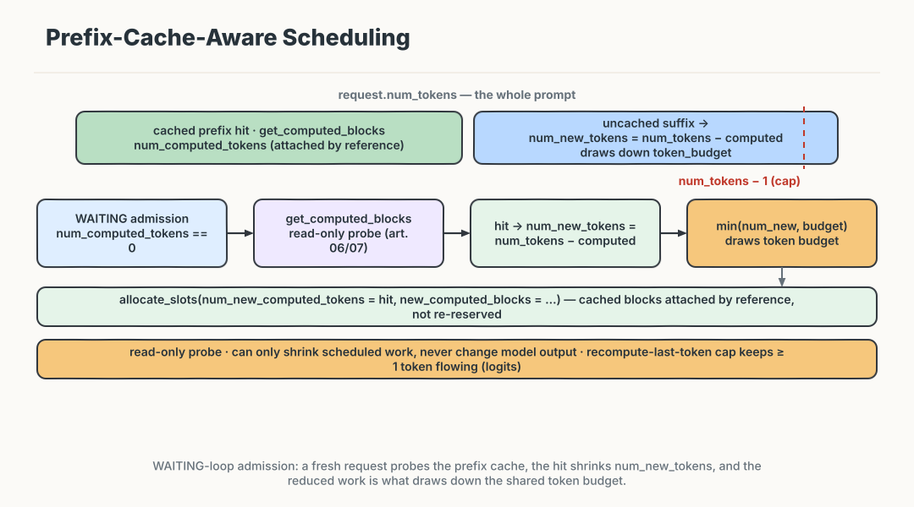</a>

<p class='figure-caption'>WAITING-loop admission: a fresh request probes the prefix cache, the hit shrinks num_new_tokens, and the reduced work is what draws down the shared token budget.</p>

**The probe: a side-effect-free lookup capped at `num_tokens - 1`**

Source: [`vllm/v1/core/kv_cache_manager.py:218-242`](https://github.com/vllm-project/vllm/blob/6cf7b26bd4bff60bf378e1af14044280ac0d214c/vllm/v1/core/kv_cache_manager.py#L218-L242) (trimmed to the scheduling surface; the lookup internals are article 06/07)

```python
        if not self.enable_caching or request.skip_reading_prefix_cache:
            return self.empty_kv_cache_blocks, 0

        # NOTE: When all tokens hit the cache, we must recompute the last token
        # to obtain logits. Thus, set max_cache_hit_length to prompt_length - 1.
        ...
        max_cache_hit_length = request.num_tokens - 1
        computed_blocks, num_new_computed_tokens = (
            self.coordinator.find_longest_cache_hit(
                request.block_hashes, max_cache_hit_length
            )
        )
        ...
        return self.create_kv_cache_blocks(computed_blocks), num_new_computed_tokens
```

— only the parts the scheduler consumes:

1. Two short-circuits return `(empty, 0)`: caching globally disabled, or the request opts out via `skip_reading_prefix_cache` (set when the request needs prompt logprobs or is an all-pooling call — cases where a cached prefix would hide tokens the caller needs recomputed).
2. `max_cache_hit_length = request.num_tokens - 1` is the **keep-one-token-for-logits** cap, and it is the one number here that feeds back into the scheduler's token count: even a prompt 100% resident in the cache must run its final token to produce the next-token logits, so without the `-1` a fully-cached prompt would be admitted with zero tokens to compute and could emit nothing. (The comment flags a block-alignment subtlety — the cap can force recomputing the *entire last block* — but that is `allocate_slots`'s concern; article 06.)
3. `find_longest_cache_hit` resolves the longest already-computed prefix and returns the pair `(blocks, num_new_computed_tokens)`: the block handles plus the hit length. *How* it resolves the hit (block-hash walk, block-alignment) is article 06/07. What matters for scheduling is that it is a **pure probe**: it touches no reference counts and no free queue (the ref-count bump happens later, inside `allocate_slots`), so the scheduler can speculatively ask "what can this request reuse?" *before* committing to admit it.

The lookup is read-only, so the probe by itself commits nothing — a prefix hit changes how many tokens the scheduler still has to schedule for the request, not the tokens the request contains. The `num_tokens - 1` cap guarantees at least one token flows through the model every step a request is admitted, so logits are always produced.

**Stacking local and external hits, then feeding admission**

A hit can come from two places: vLLM's own paged pool (the local probe above) and, when a `KVConnector` is configured, an external tier (another node's cache, a disaggregated prefill server). They stack additively.

Source: [`vllm/v1/core/sched/scheduler.py:759-763`](https://github.com/vllm-project/vllm/blob/6cf7b26bd4bff60bf378e1af14044280ac0d214c/vllm/v1/core/sched/scheduler.py#L759-L763)

```python
                    # Total computed tokens (local + external).
                    num_computed_tokens = (
                        num_new_local_computed_tokens + num_external_computed_tokens
                    )
                    assert num_computed_tokens <= request.num_tokens
```

<a href='images/vllm-05-22-prefix-probe-stack.svg' target='_blank'>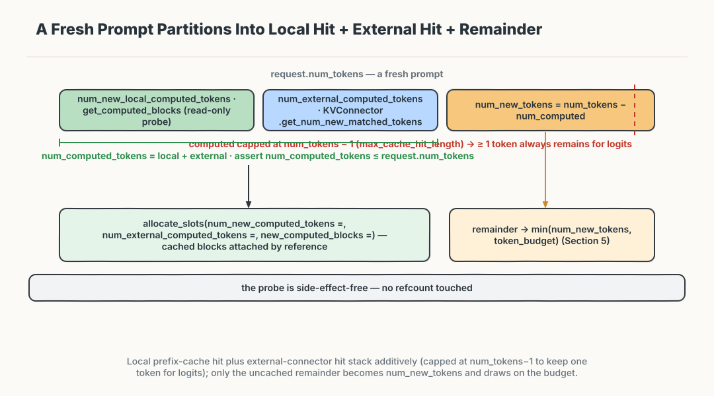</a>

<p class='figure-caption'>A fresh prompt's tokens partition into a local prefix-cache hit plus an external-connector hit (stacked additively, capped at num_tokens−1 to keep one token for logits) plus the uncached remainder; only the remainder becomes num_new_tokens drawing on the budget.</p>

1. `num_new_local_computed_tokens` is the vLLM prefix hit; `num_external_computed_tokens` is what the connector's `get_num_new_matched_tokens` reported (the connector is queried right after the local probe, at [`scheduler.py:737-757`](https://github.com/vllm-project/vllm/blob/6cf7b26bd4bff60bf378e1af14044280ac0d214c/vllm/v1/core/sched/scheduler.py#L737-L757)). The connector is told the local hit length so it only claims tokens *beyond* what is already local.
2. `assert num_computed_tokens <= request.num_tokens` is the safety rail: the combined reuse can never exceed the prompt itself. A miscounting connector cannot make the scheduler believe a request is already more than fully computed.

That combined `num_computed_tokens` is what the WAITING loop's `num_new_tokens` is measured against, and both `num_new_local_computed_tokens` and `num_external_computed_tokens` are then passed straight into `allocate_slots` (the full 11-argument call is covered in [Section 4](#4-process-running-before-admitting-waiting)) as `num_new_computed_tokens=` and `num_external_computed_tokens=`, alongside the `new_computed_blocks` handle. That is how KV admission (article 06) learns to *attach* the already-resident blocks by reference instead of re-reserving fresh physical blocks for the cached prefix.

### The payoff: a hit shrinks the work, so more requests fit the same budget

The entire mechanism exists to make one line smaller.

Source: [`vllm/v1/core/sched/scheduler.py:805-810`](https://github.com/vllm-project/vllm/blob/6cf7b26bd4bff60bf378e1af14044280ac0d214c/vllm/v1/core/sched/scheduler.py#L805-L810)

```python
                else:
                    # Number of tokens to be scheduled.
                    # We use `request.num_tokens` instead of
                    # `request.num_prompt_tokens` to consider the resumed
                    # requests, which have output tokens.
                    num_new_tokens = request.num_tokens - num_computed_tokens
```

1. `num_new_tokens` — the tokens this request will actually consume from the shared `token_budget` this step — is `request.num_tokens` minus everything already computed. A 2000-token prompt with a 1500-token prefix hit schedules only 500 new tokens, so it draws 500 (not 2000) from the budget and leaves room for other admissions or decode headroom.
2. Using `num_tokens` (not `num_prompt_tokens`) means a *resumed* request (one preempted mid-generation, now carrying output tokens) correctly measures the uncached remainder of prompt-plus-output against its re-probed hit.
3. This reduced `num_new_tokens` then flows into the chunked-prefill slice `min(num_new_tokens, token_budget)` ([Section 5](#5-chunked-prefill-splitting-long-prompts)). Prefix caching and chunked prefill compose cleanly: the hit sets the remaining work, chunking caps how much of it runs this step.

Net effect: prefix reuse widens throughput purely through the budget arithmetic. Fewer scheduled tokens per admitted request means more requests fit under the same `max_num_batched_tokens`, and the KV blocks the hit points at are shared by reference rather than re-reserved — so the same request costs less on *both* the token axis and the block axis. Nothing about correctness changes; only the amount of redundant compute the step performs.

### Why resume is cheap: preemption preserves the fingerprint

Preemption resets `num_computed_tokens` to zero but preserves `block_hashes`, so the WAITING path can probe again on resume. It re-attaches only if those blocks remain resident; [Section 9](#9-preemption-under-kv-pressure) follows the reset and this conditional re-hit from the eviction side.

## 9. Preemption Under KV Pressure

The token budget is not the only limit: each scheduled token also needs a KV slot. `KVCacheManager.allocate_slots` reports that constraint by returning `None` when the current request cannot be accommodated. The scheduler treats this as backpressure and decides whether to evict a running request or stop admitting waiting work. Article 06 covers watermarks, reserved blocks, reference counts, and the other reasons allocation can fail; here the focus is the scheduler's response, with `allocate_slots` treated as an oracle.

The oracle's signature is the contract the scheduler reads:

[`vllm/v1/core/kv_cache_manager.py:244-257`](https://github.com/vllm-project/vllm/blob/6cf7b26bd4bff60bf378e1af14044280ac0d214c/vllm/v1/core/kv_cache_manager.py#L244-L257)

```python
    def allocate_slots(
        self,
        request: Request,
        num_new_tokens: int,
        num_new_computed_tokens: int = 0,
        new_computed_blocks: KVCacheBlocks | None = None,
        num_lookahead_tokens: int = 0,
        num_external_computed_tokens: int = 0,
        delay_cache_blocks: bool = False,
        num_encoder_tokens: int = 0,
        full_sequence_must_fit: bool = False,
        reserved_blocks: int = 0,
        has_scheduled_reqs: bool = True,
    ) -> KVCacheBlocks | None:
```

The `| None` in the return type is the entire interface between the scheduler's *policy* and the KV manager's *mechanism*. The scheduler never inspects free-block counts to make this call; it asks for slots and branches on whether it got them.

<a href='images/vllm-05-08-preemption.svg' target='_blank'>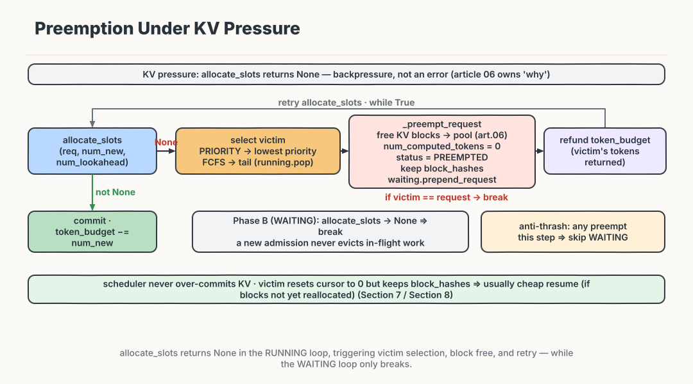</a>

<p class='figure-caption'>allocate_slots returns None in the RUNNING loop, triggering victim selection, block free, and retry.</p>

### The RUNNING loop preempts and retries

Within `schedule()`, preemption lives in exactly one place: the inner allocation loop of Phase A (RUNNING). The scheduler wraps `allocate_slots` in a `while True` and, on `None`, evicts a victim and tries again.

[`vllm/v1/core/sched/scheduler.py:532-582`](https://github.com/vllm-project/vllm/blob/6cf7b26bd4bff60bf378e1af14044280ac0d214c/vllm/v1/core/sched/scheduler.py#L532-L582)

```python
            # Schedule newly needed KV blocks for the request.
            with record_function_or_nullcontext("schedule: allocate_slots"):
                while True:
                    new_blocks = self.kv_cache_manager.allocate_slots(
                        request,
                        num_new_tokens,
                        num_lookahead_tokens=self.num_lookahead_tokens,
                    )

                    if new_blocks is not None:
                        # The request can be scheduled.
                        break

                    # The request cannot be scheduled.
                    # Preempt the lowest-priority request.
                    if self.policy == SchedulingPolicy.PRIORITY:
                        preempted_req = max(
                            self.running,
                            key=lambda r: (r.priority, r.arrival_time),
                        )
                        self.running.remove(preempted_req)
                        if preempted_req in scheduled_running_reqs:
                            preempted_req_id = preempted_req.request_id
                            scheduled_running_reqs.remove(preempted_req)
                            token_budget += num_scheduled_tokens.pop(preempted_req_id)
                            req_to_new_blocks.pop(preempted_req_id)
                            scheduled_spec_decode_tokens.pop(preempted_req_id, None)
                            preempted_encoder_inputs = scheduled_encoder_inputs.pop(
                                preempted_req_id, None
                            )
                            if preempted_encoder_inputs:
                                # Restore encoder compute budget if the preempted
                                # request had encoder inputs scheduled in this step.
                                num_embeds_to_restore = sum(
                                    preempted_req.get_num_encoder_embeds(i)
                                    for i in preempted_encoder_inputs
                                )
                                encoder_compute_budget += num_embeds_to_restore
                            req_index -= 1
                    else:
                        preempted_req = self.running.pop()

                    self._preempt_request(preempted_req, scheduled_timestamp)
                    preempted_reqs.append(preempted_req)
                    if preempted_req == request:
                        # No more request to preempt. Cannot schedule this request.
                        break

            if new_blocks is None:
                # Cannot schedule this request.
                break
```

Step-by-step:

1. **Try.** `allocate_slots(request, num_new_tokens, num_lookahead_tokens=self.num_lookahead_tokens)` — note the three-argument call. The RUNNING loop passes no prefix-cache or reserved-block hints (those are WAITING-loop concerns); it only asks to *grow* an already-admitted request's KV by `num_new_tokens`, plus a lookahead reservation covered below. On success it `break`s and falls through to the commit at [`scheduler.py:584-591`](https://github.com/vllm-project/vllm/blob/6cf7b26bd4bff60bf378e1af14044280ac0d214c/vllm/v1/core/sched/scheduler.py#L584-L591).

2. **Pick a victim by policy.** Under `PRIORITY`, the victim is `max(self.running, key=lambda r: (r.priority, r.arrival_time))` — the request with the highest priority *value* (i.e. the lowest actual priority), tie-broken toward the latest arrival. Under FCFS (the `else`), the victim is `self.running.pop()` — the *tail* of the running list, which is the most recently admitted request in FIFO order. Both policies evict the request that, by their own ordering, least deserves the memory.

3. **Roll back an in-step reservation.** The PRIORITY branch has an extra concern FCFS does not: the victim might have *already been scheduled earlier in this same step* (it precedes the current cursor in `self.running`). If so, every ledger entry it made must be unwound in lockstep — removed from `scheduled_running_reqs`, its tokens returned via `token_budget += num_scheduled_tokens.pop(preempted_req_id)` (line 556), its block handle and spec tokens dropped, and any encoder embeddings it claimed added back to `encoder_compute_budget`. Then `req_index -= 1` because `self.running` shrank at or below the cursor. FCFS pops the tail, which is always *after* the cursor and therefore never yet scheduled, so it needs no rollback.

4. **Evict.** `_preempt_request(preempted_req, ...)` performs the physical eviction (next subsection) and the victim is recorded in `preempted_reqs`.

5. **Terminate.** If `preempted_req == request`, the request we were trying to schedule is itself the only thing left to evict — the pool cannot hold it even alone — so `break`. The outer `if new_blocks is None: break` then ends the entire RUNNING loop; nothing more can be scheduled this step.

The scheduler never over-commits KV. A running request stays in the scheduled set only if `allocate_slots` *physically granted* its blocks; there is no optimistic "assume it fits." And the budget/ledger consistency is total: the four closing asserts of `schedule()` (`total <= max_num_scheduled_tokens`, `token_budget >= 0`, `len(running) <= max_num_running_reqs`, scheduled ⊆ running — [`scheduler.py:1026-1037`](https://github.com/vllm-project/vllm/blob/6cf7b26bd4bff60bf378e1af14044280ac0d214c/vllm/v1/core/sched/scheduler.py#L1026-L1037)) only hold because the in-step preemption refund at line 556 returns the victim's tokens to the budget on the *same* code path that removes it from the ledger. A preempted-in-this-step request leaves no phantom reservation.

**The WAITING loop breaks — it never preempts**

Phase B (admitting new and resumed requests) calls the same arbiter, but its reaction to `None` is the opposite: it gives up rather than evicting anyone.

[`vllm/v1/core/sched/scheduler.py:907-928`](https://github.com/vllm-project/vllm/blob/6cf7b26bd4bff60bf378e1af14044280ac0d214c/vllm/v1/core/sched/scheduler.py#L907-L928)

```python
                new_blocks = self.kv_cache_manager.allocate_slots(
                    request,
                    num_new_tokens,
                    num_new_computed_tokens=num_new_local_computed_tokens,
                    new_computed_blocks=new_computed_blocks,
                    num_lookahead_tokens=effective_lookahead_tokens,
                    num_external_computed_tokens=num_external_computed_tokens,
                    delay_cache_blocks=load_kv_async,
                    num_encoder_tokens=num_encoder_tokens,
                    full_sequence_must_fit=self.scheduler_reserve_full_isl,
                    reserved_blocks=reserved_blocks,
                    has_scheduled_reqs=bool(self.running),
                )

                if new_blocks is None:
                    # The request cannot be scheduled.

                    # NOTE: we need to untouch the request from the encode cache
                    # manager
                    if request.has_encoder_inputs:
                        self.encoder_cache_manager.free(request)
                    break
```

The eleven-argument call is the WAITING loop's richer contract (prefix-cache hits, external KV, full-sequence reservation — see [Section 4](#4-process-running-before-admitting-waiting) and [Section 8](#8-prefix-cache-aware-scheduling)), but the `None` handling is trivial: release any encoder-cache state optimistically touched for this admission, then `break`. No victim, no retry. And Phase B only runs at all under a guard set by Phase A:

[`vllm/v1/core/sched/scheduler.py:636-637`](https://github.com/vllm-project/vllm/blob/6cf7b26bd4bff60bf378e1af14044280ac0d214c/vllm/v1/core/sched/scheduler.py#L636-L637)

```python
        # Next, schedule the WAITING requests.
        if not preempted_reqs and self._pause_state == PauseState.UNPAUSED:
```

A fresh admission does not evict a running request, and when Phase A preempts any request, the WAITING phase is skipped. The freed KV remains available to the victims returned to the waiting queue instead of being handed immediately to a newcomer. Otherwise a victim could lose its newly freed capacity to a Phase B admission in the same step, creating a preempt-and-readmit oscillation.

### `_preempt_request`: what survives an eviction

The eviction primitive is small, and every line is a deliberate state reset.

[`vllm/v1/core/sched/scheduler.py:1145-1167`](https://github.com/vllm-project/vllm/blob/6cf7b26bd4bff60bf378e1af14044280ac0d214c/vllm/v1/core/sched/scheduler.py#L1145-L1167)

```python
    def _preempt_request(self, request: Request, timestamp: float) -> None:
        """Preempt a request and put it back to the waiting queue.

        NOTE: The request should be popped from the running queue outside of this
        method.
        """
        assert request.status == RequestStatus.RUNNING, (
            "Only running requests can be preempted"
        )
        self._free_request_blocks(request)
        self.encoder_cache_manager.free(request)
        self._inflight_prefills.discard(request)
        request.status = RequestStatus.PREEMPTED
        request.num_computed_tokens = 0
        if request.spec_token_ids:
            request.spec_token_ids = []
        request.num_preemptions += 1
        if self.log_stats:
            request.record_event(EngineCoreEventType.PREEMPTED, timestamp)

        # Put the request back to the waiting queue.
        self.waiting.prepend_request(request)
        self.reset_preempted_req_ids.add(request.request_id)
```

<a href='images/vllm-05-23-preempt-recompute-state.svg' target='_blank'>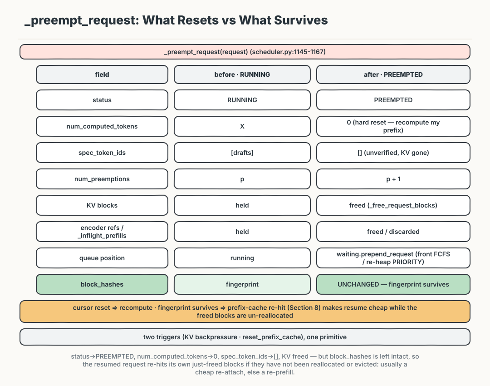</a>

<p class='figure-caption'>What _preempt_request resets versus what it preserves: status→PREEMPTED, num_computed_tokens→0, spec_token_ids→[], KV blocks freed, block_hashes retained. On resume the request can re-hit those blocks if they have not been reallocated or evicted; otherwise it recomputes the prefix.</p>

Step-by-step:

- `assert ... RUNNING` — precondition; the caller must have already popped the request from `self.running` (the docstring makes this contract explicit).
- `_free_request_blocks(request)` — returns the victim's KV blocks to the pool (free-list mechanics: article 06). This is what makes room for the request that triggered the preemption.
- `encoder_cache_manager.free(request)` and `_inflight_prefills.discard(request)` — release encoder-cache references and drop the request from in-flight-prefill accounting.
- `status = PREEMPTED`; `num_computed_tokens = 0`: the KV cursor is *hard-reset to zero*. vLLM V1 preemption is recompute-based: on resume the request re-processes its entire prefix from scratch rather than swapping KV to host memory.
- `spec_token_ids = []` — any drafted speculative tokens are discarded (they were never verified and their KV is gone).
- `num_preemptions += 1` — so the prefix-cache stats recorded in `get_computed_blocks` can flag this request as "recomputed at least once."
- `waiting.prepend_request(request)`: the victim is pushed to the *front* of the waiting queue. Under FCFS `prepend_request` is `appendleft` (front of the deque); under PRIORITY it collapses to `add_request` and the heap re-sorts by key ([Section 7](#7-the-request-queues-fcfs-vs-priority)). Either way its id is recorded in `reset_preempted_req_ids` so the model runner flushes it from the persistent batch.

**Cheap resume.** Notice what `_preempt_request` does *not* touch: `block_hashes`. The content fingerprint of the request's prompt and generated tokens is left intact. The same tokens hash to the same block identities, so when the preempted request is re-scheduled through Phase B, its prefix-cache probe (`get_computed_blocks`, [Section 8](#8-prefix-cache-aware-scheduling)) re-hits *its own just-freed blocks* — provided they have not yet been overwritten by another tenant. `num_computed_tokens = 0` says "I must recompute my prefix"; the surviving `block_hashes` says "but the answer may already be cached." Recompute-based preemption is therefore cheap in the common case, not the full re-prefill the cursor reset would suggest on its own. The mechanics of block-hash survival and re-hit are detailed in article 06; here the key fact is simply that the scheduler resets the cursor but never the fingerprint.

**The lookahead reservation**

The RUNNING call passed `num_lookahead_tokens=self.num_lookahead_tokens`. This is a constant fixed at construction from the speculative-decoding method:

[`vllm/v1/core/sched/scheduler.py:234-257`](https://github.com/vllm-project/vllm/blob/6cf7b26bd4bff60bf378e1af14044280ac0d214c/vllm/v1/core/sched/scheduler.py#L234-L257)

```python
        self.num_lookahead_tokens = 0
        self.dynamic_sd_lookup: list[int] | None = None
        if speculative_config is not None:
            ...
            if speculative_config.use_eagle():
                self.use_eagle = True
                self.num_lookahead_tokens = self.num_spec_tokens
            if speculative_config.uses_draft_model():
                self.num_lookahead_tokens = self.num_spec_tokens
            ...
```

<a href='images/vllm-05-24-lookahead-reservation.svg' target='_blank'>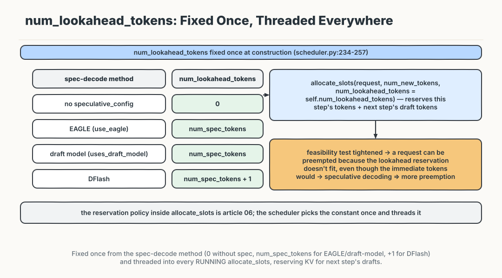</a>

<p class='figure-caption'>num_lookahead_tokens is fixed once at construction from the spec-decode method (0 without spec, num_spec_tokens for EAGLE/draft-model, +1 for DFlash) and threaded into every RUNNING allocate_slots, reserving KV for next step's drafts — which is why speculative decoding raises preemption pressure.</p>

Without speculative decoding it is `0`; with EAGLE or a draft model it is `num_spec_tokens` (DFlash needs `num_spec_tokens + 1` — the branch elided above at [`scheduler.py:248-252`](https://github.com/vllm-project/vllm/blob/6cf7b26bd4bff60bf378e1af14044280ac0d214c/vllm/v1/core/sched/scheduler.py#L248-L252)). Passing it to `allocate_slots` tells the KV manager to reserve slots not just for the tokens scheduled *this* step but for the draft tokens the next step will write. This tightens the memory feasibility test — a request can be preempted because its *lookahead* reservation does not fit, even though its immediate tokens would — which is precisely why speculative decoding raises preemption pressure. The reservation policy inside `allocate_slots` is article 06; the scheduler's contribution is choosing this constant once and threading it through every RUNNING allocation.

### Forced preemption: the other caller

`_preempt_request` has one non-backpressure caller: `reset_prefix_cache(reset_running_requests=True)`, which must drain every running request to zero the KV prefix cache.

[`vllm/v1/core/sched/scheduler.py:2222-2232`](https://github.com/vllm-project/vllm/blob/6cf7b26bd4bff60bf378e1af14044280ac0d214c/vllm/v1/core/sched/scheduler.py#L2222-L2232)

```python
            while self.running:
                request = self.running.pop()
                self._preempt_request(request, timestamp)
                # For async scheduling, any output frames already in flight at
                # preemption time are now stale and must be discarded when they
                # return. num_output_placeholders is exactly that count: 0 if
                # the engine has drained (e.g. pause_generation(keep) waited
                # for idle), 1 for vanilla async mid-step, or 1 + spec/PP frames
                # otherwise.
                request.async_tokens_to_discard = request.num_output_placeholders
                request.num_output_placeholders = 0
```

The drain runs `running.pop()` from the tail so requests re-enter the waiting queue and later resume in FIFO order (each `prepend_request` pushes to the front, reversing the pop order back to arrival order). It marks any in-flight async output frames stale via `async_tokens_to_discard`, so a decode result dispatched before the preemption is discarded rather than mis-attributed on return. And it is not best-effort: if a running request cannot be freed to ref-count zero — e.g. a remote-KV transfer is still in flight — the subsequent `reset_prefix_cache()` returns false and the caller raises ([`scheduler.py:2241-2247`](https://github.com/vllm-project/vllm/blob/6cf7b26bd4bff60bf378e1af14044280ac0d214c/vllm/v1/core/sched/scheduler.py#L2241-L2247)) rather than silently leaving the cache dirty.

Whether preemption is triggered by KV backpressure or by an explicit cache reset, it routes through the same primitive, so the same guarantees hold — blocks freed, cursor reset, fingerprint preserved, victim re-queued in a resumable order. Preemption is one mechanism with two triggers, not two code paths that could drift.

## 10. SchedulerOutput: What the Executor Receives

`SchedulerOutput` carries per-request token counts, allocated KV blocks, preemption bookkeeping, and encoder work to the executor. One instance is produced per `schedule()` call and describes one forward pass (article 04). It is not a complete dump of worker state: new requests carry `NewRequestData`, while existing requests carry `CachedRequestData` diffs applied to the persistent `InputBatch` (article 09). The executor uses this object together with that retained worker-side state.

The contract is declared on the abstract method the busy loop calls.

[`vllm/v1/core/sched/interface.py:51-69`](https://github.com/vllm-project/vllm/blob/6cf7b26bd4bff60bf378e1af14044280ac0d214c/vllm/v1/core/sched/interface.py#L51-L69) (the iteration-level granularity and the `num_tokens` magnitudes are [Section 1](#1-what-the-scheduler-decides-one-token-budget-per-step); here the relevant clauses are the payload and its "useful data" companion):

```python
    @abstractmethod
    def schedule(self, throttle_prefills: bool = False) -> "SchedulerOutput":
        """Schedule the requests to process in this scheduling step.
        ...
        Essentially, the scheduler produces a dictionary of {req_id: num_tokens}
        that specifies how many tokens to process for each request in this
        scheduling step. For example, num_tokens can be as large as the number
        of prompt tokens for new requests, or it can be 1 for the requests that
        are auto-regressively generating new tokens one by one. Otherwise, it
        can be somewhere in between in case of chunked prefills, prefix caching,
        speculative decoding, etc.

        Additionally, the scheduler also returns useful data about each request
        or the batch as a whole. The model runner will use this information in
        preparing inputs to the model.
        ...
        """
```

The map `{req_id: num_tokens}`, materialized as `num_scheduled_tokens`, is the core payload. The remaining fields are the auxiliary data the runner needs to turn that map into flattened GPU tensors. The paired `update_from_output(scheduler_output, model_runner_output)` method ([`interface.py:89-94`](https://github.com/vllm-project/vllm/blob/6cf7b26bd4bff60bf378e1af14044280ac0d214c/vllm/v1/core/sched/interface.py#L89-L94)) folds the runner's result back into scheduler state.

<a href='images/vllm-05-09-scheduler-output.svg' target='_blank'>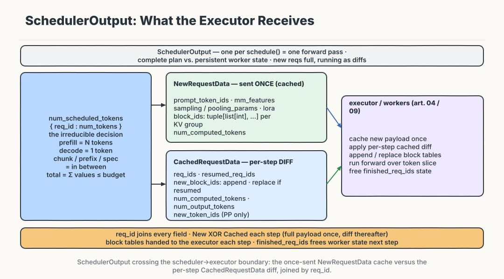</a>

<p class='figure-caption'>SchedulerOutput crossing the scheduler→executor boundary: the once-sent NewRequestData cache versus the per-step CachedRequestData diff, joined by req_id.</p>

### The top-level struct

[`vllm/v1/core/sched/output.py:181-215`](https://github.com/vllm-project/vllm/blob/6cf7b26bd4bff60bf378e1af14044280ac0d214c/vllm/v1/core/sched/output.py#L181-L215):

```python
class SchedulerOutput:
    # list of the requests that are scheduled for the first time.
    # We cache the request's data in each worker process, so that we don't
    # need to re-send it every scheduling step.
    scheduled_new_reqs: list[NewRequestData]
    # list of the requests that have been scheduled before.
    # Since the request's data is already cached in the worker processes,
    # we only send the diff to minimize the communication cost.
    scheduled_cached_reqs: CachedRequestData

    # req_id -> num_scheduled_tokens
    # Number of tokens scheduled for each request.
    num_scheduled_tokens: dict[str, int]
    # Total number of tokens scheduled for all requests.
    # Equal to sum(num_scheduled_tokens.values())
    total_num_scheduled_tokens: int
    # req_id -> spec_token_ids
    # If a request does not have any spec decode tokens, it will not be
    # included in the dictionary.
    scheduled_spec_decode_tokens: dict[str, list[int]]
    # req_id -> encoder input indices that need processing.
    # E.g., if a request has [0, 1], it could mean the vision encoder needs
    # to process that the request's 0-th and 1-th images in the current step.
    scheduled_encoder_inputs: dict[str, list[int]]
    # Number of common prefix blocks for all requests in each KV cache group.
    # This can be used for cascade attention.
    num_common_prefix_blocks: list[int]

    # Request IDs that are finished in between the previous and the current
    # steps. This is used to notify the workers about the finished requests
    # so that they can free the cached states for those requests.
    finished_req_ids: set[str]
    # list of mm_hash strings associated with the encoder outputs to be
    # freed from the encoder cache.
    free_encoder_mm_hashes: list[str]
```

Read the layout as three tiers. First, the request-payload tier — the `scheduled_new_reqs` / `scheduled_cached_reqs` split, discussed below. Second, the scheduling-decision tier — `num_scheduled_tokens` (the map from the docstring), its redundant sum `total_num_scheduled_tokens`, and the phase-specific overlays `scheduled_spec_decode_tokens` (drafts per request; article 12) and `scheduled_encoder_inputs` (which multimodal encoder inputs to run this step). Third, the batch-and-lifecycle tier — `num_common_prefix_blocks` (one entry per KV-cache group, feeding cascade attention), `finished_req_ids` (free their cached state), and `free_encoder_mm_hashes` (evict encoder-cache entries).

The tail of the struct is all optionals with defaults ([`output.py:217-245`](https://github.com/vllm-project/vllm/blob/6cf7b26bd4bff60bf378e1af14044280ac0d214c/vllm/v1/core/sched/output.py#L217-L245)), so the constructor can omit them:

```python
    preempted_req_ids: set[str] | None = None
    ...
    # Block IDs freshly allocated from the pool during this scheduling step.
    # The worker zeros the corresponding GPU memory before the blocks are used,
    # preventing stale NaN/data from corrupting attention or SSM computation.
    new_block_ids_to_zero: list[int] | None = None

    # Dynamic speculative decoding: optimal K chosen by scheduler.
    # Number of spec tokens to schedule for the next step.
    num_spec_tokens_to_schedule: int = 0
```

Also here: `has_structured_output_requests` / `pending_structured_output_tokens` (async-scheduling flags for grammar masking), `num_invalid_spec_tokens` (acceptance-rate accounting), and the two opaque connector blobs `kv_connector_metadata` / `ec_connector_metadata` (disaggregated KV / encoder transfer plans). `new_block_ids_to_zero` is a subtle correctness field, not an optimization: blocks just handed out by the KV pool (article 06) may hold stale data, and attention/SSM kernels would read garbage unless the worker zeros them first.

**Absence encodes the default.** `scheduled_spec_decode_tokens` omits requests with no drafts; `new_block_ids_to_zero` is `None` when nothing is fresh. (`preempted_req_ids` is emitted unconditionally as a set — [`scheduler.py:1105`](https://github.com/vllm-project/vllm/blob/6cf7b26bd4bff60bf378e1af14044280ac0d214c/vllm/v1/core/sched/scheduler.py#L1105) — and is only *consumed* by the v2 runner, per its [`output.py:217-219`](https://github.com/vllm-project/vllm/blob/6cf7b26bd4bff60bf378e1af14044280ac0d214c/vllm/v1/core/sched/output.py#L217-L219) comment; its dataclass *default* is `None` but a produced `SchedulerOutput` always carries a set.) A request with zero speculative tokens is omitted rather than represented by an explicit zero, keeping the per-step message tied to changed state.

### `NewRequestData` — the full payload, sent once

[`vllm/v1/core/sched/output.py:30-44`](https://github.com/vllm-project/vllm/blob/6cf7b26bd4bff60bf378e1af14044280ac0d214c/vllm/v1/core/sched/output.py#L30-L44):

```python
@dataclass
class NewRequestData:
    req_id: str
    prompt_token_ids: list[int] | None
    mm_features: list[MultiModalFeatureSpec]
    sampling_params: SamplingParams | None
    pooling_params: PoolingParams | None
    block_ids: tuple[list[int], ...]
    num_computed_tokens: int
    lora_request: LoRARequest | None
    prompt_embeds: "torch.Tensor | None" = None
    prompt_is_token_ids: list[bool] | None = None

    # Only used for v2 model runner.
    prefill_token_ids: list[int] | None = None
```

This is the entire static description of a request: prompt (as `prompt_token_ids` *or* `prompt_embeds`, disambiguated by the `prompt_is_token_ids` mask), sampling *or* pooling params (one is `None` — generation versus embedding), LoRA adapter, and the KV block table. It is emitted only on the request's first scheduled step, then cached in every worker process, exactly because prompt token ids and mm features are large and immutable — resending them every step would make communication O(total context) instead of O(batch delta).

The central field is `block_ids: tuple[list[int], ...]`. It is a *tuple with one `list[int]` per KV-cache group*, each inner list the ordered physical block ids backing this request in that group. The tuple-of-lists shape (not a flat list) is what lets one request live in several KV-cache groups with independent block tables — full-attention layers and sliding-window layers, for example. `num_computed_tokens` is the other half of the runner's window arithmetic: combined with `num_scheduled_tokens[req_id]`, the runner knows the exact token slice `[num_computed_tokens, num_computed_tokens + num_scheduled_tokens[req_id])` to run this step. That slice is where prefix-cache hits (article 07) show up — a hit raises the starting `num_computed_tokens`, so the runner naturally skips the cached prefix.

**`CachedRequestData` — the per-step diff**

[`vllm/v1/core/sched/output.py:111-126`](https://github.com/vllm-project/vllm/blob/6cf7b26bd4bff60bf378e1af14044280ac0d214c/vllm/v1/core/sched/output.py#L111-L126):

```python
@dataclass
class CachedRequestData:
    req_ids: list[str]
    # For request ids not in resumed_req_ids, new_block_ids will be appended to
    # the request's block IDs. For those in the set, new_block_ids will be used as the
    # request's block IDs instead of appending to the existing block IDs.
    resumed_req_ids: set[str]
    # NOTE(woosuk): new_token_ids is only used for pipeline parallelism.
    # When PP is not used, new_token_ids will be empty.
    new_token_ids: list[list[int]]
    # MRV1-only: For requests not scheduled in the last step, propagate the token ids
    # to the connector. Won't contain requests scheduled in the prior step.
    all_token_ids: dict[str, list[int]]
    new_block_ids: list[tuple[list[int], ...] | None]
    num_computed_tokens: list[int]
    num_output_tokens: list[int]
```

<a href='images/vllm-05-25-cached-soa.svg' target='_blank'>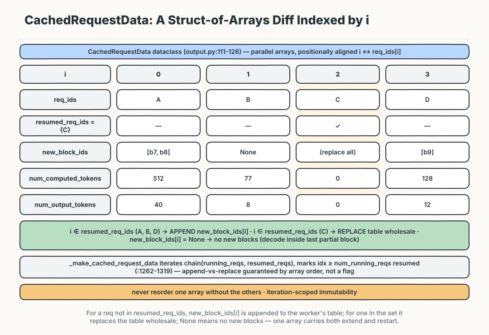</a>

<p class='figure-caption'>CachedRequestData is a struct-of-arrays diff indexed positionally by i↔req_ids[i]: for a req not in resumed_req_ids, new_block_ids[i] is appended to the worker's table; for one in the set it replaces the table wholesale; None means no new blocks — one array carries both extend and restart.</p>

This is a struct-of-arrays diff for every already-cached request. It is strictly positional: index `i` refers to `req_ids[i]` across all the parallel lists, and consumers must never reorder one without the others.

The sharpest rule here is the `new_block_ids` / `resumed_req_ids` interaction spelled out in the field comment. For a `req_id` *not* in `resumed_req_ids`, `new_block_ids[i]` is *appended* to the worker's existing block table — a normal running request keeps its blocks and merely grows. For a `req_id` *in* `resumed_req_ids`, `new_block_ids[i]` *replaces* the table wholesale — a resumed request is one that was preempted, had its blocks freed (article 06), and now re-arrives with a fresh full table. A `None` entry means "no new blocks this step" (a decode that stayed inside its last partially-filled block). This single set-membership test is what lets one array carry both the "extend" and "restart" cases without a second message type.

Two fields are conditional: `new_token_ids` is populated only under pipeline parallelism (the scheduler ferries sampled tokens between PP stages that cannot talk directly; empty otherwise), and `all_token_ids` is an MRV1-only connector payload. The helper `is_context_phase(req_id)` returns `num_output_tokens == 0`, i.e. the request is still prefilling. Its backing `cached_property` ([`output.py:153-161`](https://github.com/vllm-project/vllm/blob/6cf7b26bd4bff60bf378e1af14044280ac0d214c/vllm/v1/core/sched/output.py#L153-L161)) is sound only because, as its own docstring states, each `CachedRequestData` is built fresh per iteration and never mutated during use. That is the iteration-scoped-immutability invariant made concrete.

### How the struct is assembled — producer grounding

`schedule()` builds the whole thing in one shot at its tail. The new-request list splits from the cached diff at [`scheduler.py:1049-1076`](https://github.com/vllm-project/vllm/blob/6cf7b26bd4bff60bf378e1af14044280ac0d214c/vllm/v1/core/sched/scheduler.py#L1049-L1076), then the object is constructed at [`scheduler.py:1097-1114`](https://github.com/vllm-project/vllm/blob/6cf7b26bd4bff60bf378e1af14044280ac0d214c/vllm/v1/core/sched/scheduler.py#L1097-L1114):

```python
        scheduler_output = SchedulerOutput(
            scheduled_new_reqs=new_reqs_data,
            scheduled_cached_reqs=cached_reqs_data,
            num_scheduled_tokens=num_scheduled_tokens,
            total_num_scheduled_tokens=total_num_scheduled_tokens,
            scheduled_spec_decode_tokens=scheduled_spec_decode_tokens,
            scheduled_encoder_inputs=scheduled_encoder_inputs,
            num_common_prefix_blocks=num_common_prefix_blocks,
            preempted_req_ids=self.reset_preempted_req_ids,
            # finished_req_ids is an existing state in the scheduler,
            # instead of being newly scheduled in this step.
            # It contains the request IDs that are finished in between
            # the previous and the current steps.
            finished_req_ids=self.finished_req_ids,
            free_encoder_mm_hashes=self.encoder_cache_manager.get_freed_mm_hashes(),
            new_block_ids_to_zero=new_block_ids_to_zero,
            num_spec_tokens_to_schedule=num_spec_tokens_to_schedule,
        )
```

Note `finished_req_ids` is *carried* scheduler state, not something computed this step — it names requests that finished *between* the previous step and this one, so the worker prunes its cached request/batch state for them on the very next forward pass (their KV blocks were already returned to the pool by the scheduler at finish time, [Section 7](#7-the-request-queues-fcfs-vs-priority)). The connector metadata is attached *after* construction ([`scheduler.py:1120-1129`](https://github.com/vllm-project/vllm/blob/6cf7b26bd4bff60bf378e1af14044280ac0d214c/vllm/v1/core/sched/scheduler.py#L1120-L1129)), because building the KV/EC transfer plan needs the finished object to inspect.

The cached diff comes from `_make_cached_request_data` ([`scheduler.py:1262-1319`](https://github.com/vllm-project/vllm/blob/6cf7b26bd4bff60bf378e1af14044280ac0d214c/vllm/v1/core/sched/scheduler.py#L1262-L1319)), which iterates running and resumed requests as one chain and marks the tail as resumed:

```python
        num_running_reqs = len(running_reqs)
        for idx, req in enumerate(itertools.chain(running_reqs, resumed_reqs)):
            ...
            if idx >= num_running_reqs:
                resumed_req_ids.add(req_id)
            ...
            new_block_ids.append(
                req_to_new_blocks[req_id].get_block_ids(allow_none=True)
            )
```

Because running requests come first and resumed ones second, `idx >= num_running_reqs` is exactly the "this entry replaces its table" predicate, and `allow_none=True` is what produces the `None` sentinel for "no new blocks." So the append-vs-replace semantics the consumer relies on are guaranteed structurally by array order, not by any per-request flag the runner has to trust.

Before the object is built, `schedule()` asserts the invariants that make it well-formed — the same four derived in full in [Section 2](#2-schedule-the-main-loop) ([`scheduler.py:1027-1037`](https://github.com/vllm-project/vllm/blob/6cf7b26bd4bff60bf378e1af14044280ac0d214c/vllm/v1/core/sched/scheduler.py#L1027-L1037)):

```python
        total_num_scheduled_tokens = sum(num_scheduled_tokens.values())
        assert total_num_scheduled_tokens <= self.max_num_scheduled_tokens

        assert token_budget >= 0
        assert len(self.running) <= self.max_num_running_reqs
        ...
        assert len(scheduled_new_reqs) + len(scheduled_resumed_reqs) + len(
            scheduled_running_reqs
        ) <= len(self.running)
```

These fix the numbers the executor will trust blindly: `total_num_scheduled_tokens` equals the sum of the map *and* is bounded by the token budget ([Section 2](#2-schedule-the-main-loop)/[Section 3](#3-the-token-budget-max_num_scheduled_tokens)), and the number of scheduled requests never exceeds the running queue — you can schedule a subset of `running`, never a superset.

### What the executor does with it

The consumer side belongs to the model-runner article (article 09), but the key reads confirm the contract's shape. The runner reads `total_num_scheduled_tokens` directly and asserts it is positive, then uses the token map to expand a per-request index axis ([`gpu_model_runner.py:1924-1925`](https://github.com/vllm-project/vllm/blob/6cf7b26bd4bff60bf378e1af14044280ac0d214c/vllm/v1/worker/gpu_model_runner.py#L1924-L1925), `:1935`):

```python
        total_num_scheduled_tokens = scheduler_output.total_num_scheduled_tokens
        assert total_num_scheduled_tokens > 0
        ...
        req_indices = np.repeat(self.arange_np[:num_reqs], num_scheduled_tokens)
```

The batch order the runner uses is the *dict insertion order* of `num_scheduled_tokens.keys()` ([`gpu_model_runner.py:1190`](https://github.com/vllm-project/vllm/blob/6cf7b26bd4bff60bf378e1af14044280ac0d214c/vllm/v1/worker/gpu_model_runner.py#L1190)) — the order the scheduler committed requests in, running-then-waiting. It branches on `resumed_req_ids` to choose append-vs-replace for block tables (`:1192`), iterates `scheduled_new_reqs` to seed its persistent request cache (`:1218`), consumes `finished_req_ids` to free state (`:1161`, `:1173`), and zeros fresh blocks when `new_block_ids_to_zero` is set (`:1178-1179`). Structured-output masks arrive separately via `get_grammar_bitmask` returning `GrammarOutput` ([`output.py:262-267`](https://github.com/vllm-project/vllm/blob/6cf7b26bd4bff60bf378e1af14044280ac0d214c/vllm/v1/core/sched/output.py#L262-L267)), whose bitmask rows are index-aligned to `structured_output_request_ids` and gated by the two `*_structured_output_*` flags.

## 11. Encoder Inputs and Multimodal Scheduling

Multimodal requests add two budgets beyond `token_budget`: encoder compute and storage for encoder outputs. Before decoder placeholder tokens can be consumed, a vision or audio encoder must produce embeddings and retain them until their last decoder reader has run. `_try_schedule_encoder_inputs` therefore performs an all-or-nothing test for each encoder item, may shorten the decoder chunk before an item that cannot fit, and defers its commit until KV allocation succeeds. Preemption and post-step cleanup update the same budgets.

### Two budgets, fixed at construction

The token budget is seeded once per step from `max_num_scheduled_tokens` ([Section 3](#3-the-token-budget-max_num_scheduled_tokens)). The encoder budgets are seeded once at `__init__` and split into *compute* (how many encoder embeddings may be produced this step) and *storage* (how many may be held in the encoder cache at all).

[`vllm/v1/core/sched/scheduler.py:221-229`](https://github.com/vllm-project/vllm/blob/6cf7b26bd4bff60bf378e1af14044280ac0d214c/vllm/v1/core/sched/scheduler.py#L221-L229)

```python
        self.max_num_encoder_input_tokens = (
            mm_budget.encoder_compute_budget if mm_budget else 0
        )
        encoder_cache_size = mm_budget.encoder_cache_size if mm_budget else 0
        self.encoder_cache_manager = (
            EncoderDecoderCacheManager(cache_size=encoder_cache_size)
            if self.is_encoder_decoder
            else EncoderCacheManager(cache_size=encoder_cache_size)
        )
```

`mm_budget` is `None` for text-only models, so `max_num_encoder_input_tokens = 0` and `cache_size = 0`: the encoder machinery is present but inert. For a multimodal model both numbers come from `compute_mm_encoder_budget`, and both are floored at the largest single item so one image can never be structurally unschedulable:

[`vllm/v1/core/encoder_cache_manager.py:309-314`](https://github.com/vllm-project/vllm/blob/6cf7b26bd4bff60bf378e1af14044280ac0d214c/vllm/v1/core/encoder_cache_manager.py#L309-L314)

```python
    encoder_compute_budget = max(
        scheduler_config.max_num_encoder_input_tokens, max_tokens_per_mm_item
    )
    encoder_cache_size = max(
        scheduler_config.encoder_cache_size, max_tokens_per_mm_item
    )
```

The compute budget is a *per-step* quantity: like the token budget it is re-seeded into a local at the top of `schedule()` — `encoder_compute_budget = self.max_num_encoder_input_tokens` ([`scheduler.py:423`](https://github.com/vllm-project/vllm/blob/6cf7b26bd4bff60bf378e1af14044280ac0d214c/vllm/v1/core/sched/scheduler.py#L423), [Section 2](#2-schedule-the-main-loop)) — and drained as items are scheduled. The cache size is *persistent* state living inside `EncoderCacheManager`; it survives across steps and is what lets an already-computed image be reused instead of recomputed. One subtlety the manager's docstring is explicit about ([`encoder_cache_manager.py:41-45`](https://github.com/vllm-project/vllm/blob/6cf7b26bd4bff60bf378e1af14044280ac0d214c/vllm/v1/core/encoder_cache_manager.py#L41-L45)): both budgets are counted in encoder *embeddings*, not in the placeholder tokens that occupy positions in the decoder sequence. The token budget and the encoder budgets meter different quantities, which is exactly why they cannot be merged.

**The planner: `_try_schedule_encoder_inputs`**

Encoder scheduling is factored into one pure planner called from both the RUNNING sizing path ([`scheduler.py:495-507`](https://github.com/vllm-project/vllm/blob/6cf7b26bd4bff60bf378e1af14044280ac0d214c/vllm/v1/core/sched/scheduler.py#L495-L507)) and the WAITING sizing path ([`scheduler.py:848-860`](https://github.com/vllm-project/vllm/blob/6cf7b26bd4bff60bf378e1af14044280ac0d214c/vllm/v1/core/sched/scheduler.py#L848-L860)), immediately after `num_new_tokens` has been clamped to the token budget but *before* `allocate_slots`. It returns `(encoder_inputs_to_schedule, num_new_tokens, encoder_compute_budget, external_load_encoder_input)` — note it can *shrink* `num_new_tokens`. Its job ([`scheduler.py:1329-1344`](https://github.com/vllm-project/vllm/blob/6cf7b26bd4bff60bf378e1af14044280ac0d214c/vllm/v1/core/sched/scheduler.py#L1329-L1344)) is to find which encoder items overlap the decoder window `[num_computed_tokens, num_computed_tokens + num_new_tokens)` and, for any it cannot admit, to pull the decoder window back so the step stops just before that item.

The window is selected by placeholder position, widened by an EAGLE shift so a spec drafter's +1 lookahead read cannot land on an unscheduled image:

[`vllm/v1/core/sched/scheduler.py:1363-1367`](https://github.com/vllm-project/vllm/blob/6cf7b26bd4bff60bf378e1af14044280ac0d214c/vllm/v1/core/sched/scheduler.py#L1363-L1367)

```python
        lo, hi = get_mm_features_in_window(
            mm_features,
            start=num_computed_tokens,
            end=num_computed_tokens + num_new_tokens + shift_computed_tokens,
        )
```

`shift_computed_tokens` is `1 if self.use_eagle else 0` at both call sites ([`scheduler.py:506`](https://github.com/vllm-project/vllm/blob/6cf7b26bd4bff60bf378e1af14044280ac0d214c/vllm/v1/core/sched/scheduler.py#L506), [`scheduler.py:859`](https://github.com/vllm-project/vllm/blob/6cf7b26bd4bff60bf378e1af14044280ac0d214c/vllm/v1/core/sched/scheduler.py#L859)). Inside the loop, an item is skipped for free if it is already scheduled this step or already in the encoder cache (`check_and_update_cache`, [`scheduler.py:1398-1406`](https://github.com/vllm-project/vllm/blob/6cf7b26bd4bff60bf378e1af14044280ac0d214c/vllm/v1/core/sched/scheduler.py#L1398-L1406)) — a cache hit is the multimodal analogue of the prefix-cache hit in [Section 8](#8-prefix-cache-aware-scheduling): it removes work without touching either budget. The critical branch is what happens when an item is *not* cached and does *not* fit.

### All-or-nothing, and the decoder-chunk clamp

[`vllm/v1/core/sched/scheduler.py:1408-1443`](https://github.com/vllm-project/vllm/blob/6cf7b26bd4bff60bf378e1af14044280ac0d214c/vllm/v1/core/sched/scheduler.py#L1408-L1443)

```python
            # If no encoder input chunking is allowed, we do not want to
            # partially schedule a multimodal item. If the scheduled range would
            # only cover part of the mm input, roll back to before the mm item.
            if (
                self.scheduler_config.disable_chunked_mm_input
                and num_computed_tokens < start_pos
                and (num_computed_tokens + num_new_tokens)
                < (start_pos + num_encoder_tokens)
            ):
                # Account for EAGLE shift when rolling back to avoid
                # encoder cache miss. This ensures the scheduled range
                # stops before start_pos even with the shift.
                num_new_tokens = max(
                    0, start_pos - (num_computed_tokens + shift_computed_tokens)
                )
                break
            if not self.encoder_cache_manager.can_allocate(
                request, i, encoder_compute_budget, num_embeds_to_schedule
            ):
                # The encoder cache is full or the encoder budget is exhausted.
                # NOTE(woosuk): We assume that the encoder input tokens should
                # be processed altogether, as the encoder usually uses
                # bidirectional attention.
                if num_computed_tokens + shift_computed_tokens < start_pos:
                    # We only schedule the decoder tokens just before the
                    # encoder input.
                    num_new_tokens = start_pos - (
                        num_computed_tokens + shift_computed_tokens
                    )
                else:
                    # Because of prefix caching, num_computed_tokens is greater
                    # than start_pos even though its encoder input is not
                    # available. In this case, we can't schedule any token for
                    # the request in this step.
                    num_new_tokens = 0
                break
```

Read the two clamp paths against the invariant stated in the `NOTE(woosuk)` comment: an encoder input is processed *altogether* because the encoder uses bidirectional attention — you cannot compute half an image's embeddings and finish the rest next step. So the scheduler never truncates *inside* an item; it truncates the *decoder chunk* to end at the item's boundary.

- The first branch (`disable_chunked_mm_input`) is the config-forced case. If chunking of mm inputs is off and the current decoder window would only *partially* cover an item (`num_computed_tokens < start_pos` and the window ends before the item ends), pull `num_new_tokens` back to `start_pos − (num_computed_tokens + shift)` and `break`. The decoder chunk now stops exactly at the image's first placeholder; the image is picked up whole on a later step when the full budget can hold it.
- The second branch is the budget/cache case, reached whenever `can_allocate` says no. If the cursor is still *before* the item (`num_computed_tokens + shift < start_pos`), schedule the decoder tokens up to `start_pos` and stop — same boundary clamp, but triggered by resource exhaustion rather than config. The `else` is the corner the comment calls out: prefix caching can advance `num_computed_tokens` *past* `start_pos` while the item's embeddings are still absent (blocks were cached, encoder output was not), and then there is nothing to schedule, so `num_new_tokens = 0`.

Both branches `break`, so once one item in the window fails, later items are not examined — the window is served as a contiguous prefix up to the first unaffordable image. That `num_new_tokens = 0` result is what the caller checks: a WAITING request breaks the whole waiting loop ([`scheduler.py:861-863`](https://github.com/vllm-project/vllm/blob/6cf7b26bd4bff60bf378e1af14044280ac0d214c/vllm/v1/core/sched/scheduler.py#L861-L863)), a RUNNING request skips with `continue` ([`scheduler.py:514-530`](https://github.com/vllm-project/vllm/blob/6cf7b26bd4bff60bf378e1af14044280ac0d214c/vllm/v1/core/sched/scheduler.py#L514-L530), [Section 4](#4-process-running-before-admitting-waiting)).

### `can_allocate`: the two-limit storage test

`can_allocate` is the storage-side arbiter the clamp consults. The decoder-only manager's version (there is a separate one for encoder-decoder models at [`encoder_cache_manager.py:339`](https://github.com/vllm-project/vllm/blob/6cf7b26bd4bff60bf378e1af14044280ac0d214c/vllm/v1/core/encoder_cache_manager.py#L339)):

[`vllm/v1/core/encoder_cache_manager.py:158-182`](https://github.com/vllm-project/vllm/blob/6cf7b26bd4bff60bf378e1af14044280ac0d214c/vllm/v1/core/encoder_cache_manager.py#L158-L182)

```python
        num_embeds = request.get_num_encoder_embeds(input_id)

        # Not enough compute budget
        if num_embeds > encoder_compute_budget:
            return False

        num_embeds += num_embeds_to_schedule

        # Enough free slots
        if num_embeds <= self.num_free_slots:
            return True

        # Not enough reclaimable slots
        if num_embeds > self.num_freeable_slots:
            return False

        # Not enough free slots but enough reclaimable slots
        # NOTE: Eviction takes place here, but physical memory is not freed
        # until model runner is notified by the scheduler output.
        while num_embeds > self.num_free_slots:
            mm_hash, num_free_embeds = self.freeable.popitem(last=False)
            del self.cached[mm_hash]
            self.freed.append(mm_hash)
            self.num_free_slots += num_free_embeds
        return True
```

<a href='images/vllm-05-26-encoder-can-allocate.svg' target='_blank'>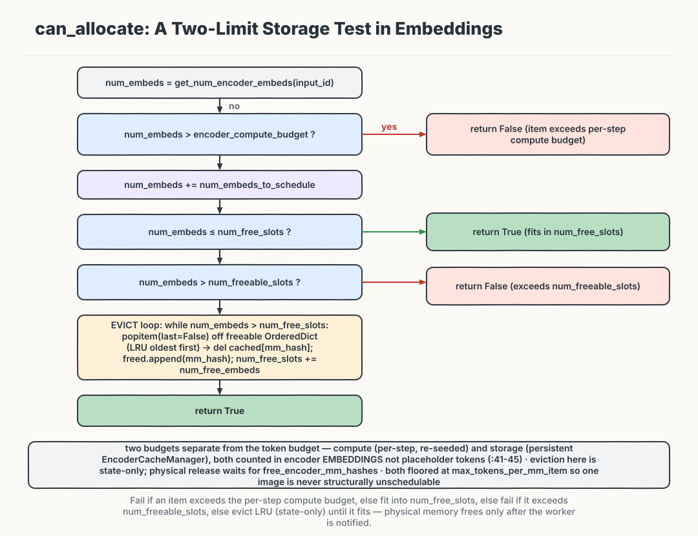</a>

<p class='figure-caption'>can_allocate is a two-limit storage test in embeddings, not placeholder tokens: fail if one item exceeds the per-step compute budget, else fit into num_free_slots, else fail if it exceeds num_freeable_slots, else evict LRU (state-only) until it fits — physical memory frees only after the worker is notified.</p>

Two limits, checked in order. First the *compute* gate: a single item bigger than the remaining per-step compute budget fails immediately (line 161). Then the *storage* gate against two counters: `num_free_slots` (immediately available) and `num_freeable_slots` (available after evicting entries no running request references). If it fits in free slots, done; if it exceeds even the reclaimable total, fail; otherwise evict LRU entries (`popitem(last=False)` off the `freeable` OrderedDict, oldest first) until it fits. The `NOTE` is the important part: eviction here is *state only*. The evicted `mm_hash` is appended to `self.freed`; physical memory in the worker is not released until the scheduler ships that hash in `free_encoder_mm_hashes` (below) and the worker acts on it next step. This mirrors the KV manager's "reserve optimistically, tell the worker later" discipline (article 06).

### Deferred commit, and why it can be rolled back

The planner mutates a *local* copy of the compute budget and returns it; the caller writes it back only after the request has actually been admitted — that is, after `allocate_slots` returned real KV blocks.

[`vllm/v1/core/sched/scheduler.py:611-619`](https://github.com/vllm-project/vllm/blob/6cf7b26bd4bff60bf378e1af14044280ac0d214c/vllm/v1/core/sched/scheduler.py#L611-L619)

```python
            # Encoder-related.
            if encoder_inputs_to_schedule:
                scheduled_encoder_inputs[request_id] = encoder_inputs_to_schedule
                # Allocate the encoder cache.
                for i in encoder_inputs_to_schedule:
                    self.encoder_cache_manager.allocate(request, i)
                    if self.ec_connector is not None:
                        self.ec_connector.update_state_after_alloc(request, i)
                encoder_compute_budget = new_encoder_compute_budget
```

This is the RUNNING commit; the WAITING loop mirrors it exactly at [`scheduler.py:1002-1015`](https://github.com/vllm-project/vllm/blob/6cf7b26bd4bff60bf378e1af14044280ac0d214c/vllm/v1/core/sched/scheduler.py#L1002-L1015). Only here does `encoder_compute_budget` get overwritten with `new_encoder_compute_budget`, and only here does `EncoderCacheManager.allocate` bind cache slots to the request. The ordering (plan, then KV-allocate, then commit encoder) is what makes encoder scheduling safe to abandon. If KV allocation fails in the WAITING loop, the request breaks *before* the commit and the reservation is explicitly untouched:

[`vllm/v1/core/sched/scheduler.py:921-928`](https://github.com/vllm-project/vllm/blob/6cf7b26bd4bff60bf378e1af14044280ac0d214c/vllm/v1/core/sched/scheduler.py#L921-L928)

```python
                if new_blocks is None:
                    # The request cannot be scheduled.

                    # NOTE: we need to untouch the request from the encode cache
                    # manager
                    if request.has_encoder_inputs:
                        self.encoder_cache_manager.free(request)
                    break
```

Because the local `encoder_compute_budget` was never written back and `allocate` was never called, dropping the request costs nothing but the `free(request)` call that releases any references `check_and_update_cache` took during planning. WAITING never preempts ([Section 4](#4-process-running-before-admitting-waiting), [Section 9](#9-preemption-under-kv-pressure)); it just breaks.

RUNNING *does* preempt, and preemption must refund the encoder budget the victim consumed this step, exactly as it refunds the token budget ([Section 9](#9-preemption-under-kv-pressure)). In the PRIORITY victim path:

[`vllm/v1/core/sched/scheduler.py:559-569`](https://github.com/vllm-project/vllm/blob/6cf7b26bd4bff60bf378e1af14044280ac0d214c/vllm/v1/core/sched/scheduler.py#L559-L569)

```python
                            preempted_encoder_inputs = scheduled_encoder_inputs.pop(
                                preempted_req_id, None
                            )
                            if preempted_encoder_inputs:
                                # Restore encoder compute budget if the preempted
                                # request had encoder inputs scheduled in this step.
                                num_embeds_to_restore = sum(
                                    preempted_req.get_num_encoder_embeds(i)
                                    for i in preempted_encoder_inputs
                                )
                                encoder_compute_budget += num_embeds_to_restore
```

When a request that already committed encoder work this step is chosen as the preemption victim, its embeddings are added back to `encoder_compute_budget` so the request being admitted can use them. This is the encoder analogue of the token-budget refund `token_budget += num_scheduled_tokens.pop(...)` at [`scheduler.py:556`](https://github.com/vllm-project/vllm/blob/6cf7b26bd4bff60bf378e1af14044280ac0d214c/vllm/v1/core/sched/scheduler.py#L556); together they keep both budgets consistent through in-step preemption. The victim's persistent cache references are dropped separately by `_preempt_request → encoder_cache_manager.free` ([Section 9](#9-preemption-under-kv-pressure)).

### Freeing encoder outputs: deferred past the last reader

An encoder output cannot be freed the moment its decoder tokens are scheduled — the step has not run yet, and with speculative decoding a drafter may still read one token past the accepted range. Freeing is therefore deferred to `update_from_output`, after the forward pass, and gated on the last attending token having actually been computed.

[`vllm/v1/core/sched/scheduler.py:1934-1954`](https://github.com/vllm-project/vllm/blob/6cf7b26bd4bff60bf378e1af14044280ac0d214c/vllm/v1/core/sched/scheduler.py#L1934-L1954)

```python
        spec_lookahead = 1 if self.use_eagle else 0

        # Here, we use list(set) to avoid modifying the set while iterating
        # over it.
        for input_id in list(cached_encoder_input_ids):
            mm_feature = request.mm_features[input_id]
            start_pos = mm_feature.mm_position.offset
            num_tokens = mm_feature.mm_position.length
            if self.is_encoder_decoder and request.num_computed_tokens > 0:
                # With Whisper, as soon as we've generated a single token,
                # we know we're done with the encoder input. Cross Attention
                # KVs have been calculated and cached already.
                self.encoder_cache_manager.free_encoder_input(request, input_id)
            elif (
                start_pos + num_tokens + spec_lookahead
                <= request.num_computed_tokens - request.num_output_placeholders
            ):
                # Processed, stored in the decoder KV cache, and far enough past
                # the placeholder range (plus the drafter's look-ahead) that no
                # rejection or drafter gather can reference it.
                self.encoder_cache_manager.free_encoder_input(request, input_id)
```

This is called from `update_from_output` under `if request.has_encoder_inputs` ([`scheduler.py:1624-1626`](https://github.com/vllm-project/vllm/blob/6cf7b26bd4bff60bf378e1af14044280ac0d214c/vllm/v1/core/sched/scheduler.py#L1624-L1626)), one request at a time, "only after the step has actually executed" as the comment there says. The release condition `start_pos + num_tokens + spec_lookahead <= num_computed_tokens − num_output_placeholders` is the mirror of the `shift_computed_tokens` widening applied during scheduling: the same +1 EAGLE margin that pulled an image *into* the window on the way in keeps its embeddings referenced on the way out until the drafter's read has provably passed it. `free_encoder_input` does not physically free either — it moves the entry to `freeable` and bumps `num_freeable_slots` ([`encoder_cache_manager.py:216-241`](https://github.com/vllm-project/vllm/blob/6cf7b26bd4bff60bf378e1af14044280ac0d214c/vllm/v1/core/encoder_cache_manager.py#L216-L241)), making it a future eviction candidate for `can_allocate`. Physical release happens only when a later `can_allocate` evicts it into `freed` and the scheduler ships that list.

### Into the SchedulerOutput

Two fields carry the multimodal decisions to the worker ([Section 10](#10-scheduleroutput-what-the-executor-receives)):

[`vllm/v1/core/sched/output.py:204,213-215`](https://github.com/vllm-project/vllm/blob/6cf7b26bd4bff60bf378e1af14044280ac0d214c/vllm/v1/core/sched/output.py#L204)

```python
    scheduled_encoder_inputs: dict[str, list[int]]
    ...
    # list of mm_hash strings associated with the encoder outputs to be
    # freed from the encoder cache.
    free_encoder_mm_hashes: list[str]
```

`scheduled_encoder_inputs` is the per-request list of item indices whose encoder must run this step (assembled from the two commit sites, [`scheduler.py:1103`](https://github.com/vllm-project/vllm/blob/6cf7b26bd4bff60bf378e1af14044280ac0d214c/vllm/v1/core/sched/scheduler.py#L1103)); `free_encoder_mm_hashes = self.encoder_cache_manager.get_freed_mm_hashes()` ([`scheduler.py:1111`](https://github.com/vllm-project/vllm/blob/6cf7b26bd4bff60bf378e1af14044280ac0d214c/vllm/v1/core/sched/scheduler.py#L1111)) drains the `freed` list accumulated by `can_allocate` evictions and reset every call. External-connector prefetch adds a third channel (`external_load_encoder_input`, committed at [`scheduler.py:620-624`](https://github.com/vllm-project/vllm/blob/6cf7b26bd4bff60bf378e1af14044280ac0d214c/vllm/v1/core/sched/scheduler.py#L620-L624), metadata in `ec_connector_metadata`), but the shape is the same: the scheduler decides, the worker executes.

## 12. Following One Scheduling Step

This trace follows one `schedule()` call from budget initialization through queue traversal, admission, and cursor update.

`SchedulerInterface.schedule` defines the granularity of one call.

Source: [`vllm/v1/core/sched/interface.py:51-65`](https://github.com/vllm-project/vllm/blob/6cf7b26bd4bff60bf378e1af14044280ac0d214c/vllm/v1/core/sched/interface.py#L51-L65)

```python
    @abstractmethod
    def schedule(self, throttle_prefills: bool = False) -> "SchedulerOutput":
        """Schedule the requests to process in this scheduling step.

        The scheduling decision is made at the iteration level. Each scheduling
        step corresponds to a single forward pass of the model. Therefore, this
        method is called repeatedly by a busy loop in the engine.

        Essentially, the scheduler produces a dictionary of {req_id: num_tokens}
        that specifies how many tokens to process for each request in this
        scheduling step. For example, num_tokens can be as large as the number
        of prompt tokens for new requests, or it can be 1 for the requests that
        are auto-regressively generating new tokens one by one. Otherwise, it
        can be somewhere in between in case of chunked prefills, prefix caching,
        speculative decoding, etc.
        """
```

One call produces an iteration plan centered on `{req_id: num_tokens}`. Prefill, decode, cache hits, and speculative drafts change those counts rather than selecting separate scheduler modes; a zero-token plan need not execute model work.

### One call in execution order

<a href='images/vllm-05-10-scheduling-trace.svg' target='_blank'>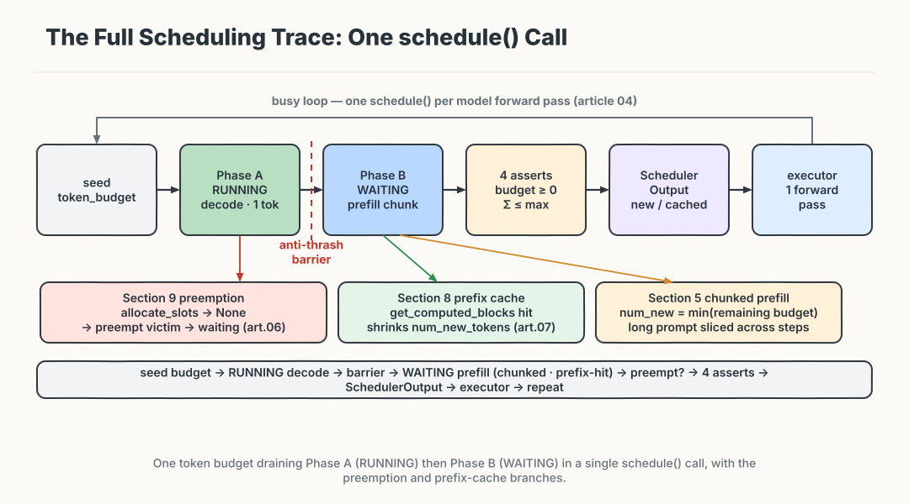</a>

<p class='figure-caption'>One token budget draining Phase A (RUNNING) then Phase B (WAITING) in a single `schedule()` call.</p>

The following is a synthesized trace of one `schedule()` call, not a verbatim source block; each line carries the `scheduler.py` anchor where the real code lives, and the owning section for the full excerpt.

```text
schedule(throttle_prefills):                                   # scheduler.py:396
  current_step += 1                                            # :397
  token_budget = max_num_scheduled_tokens                      # :416   (PAUSED_ALL -> 0 at :417-419)
  init ledgers: scheduled_{new,resumed,running,preempted}_reqs # :409-412
                req_to_new_blocks, num_scheduled_tokens{}      # :414-415
                encoder_compute_budget, spec ledgers           # :422-427
  ── PHASE A: RUNNING (decodes + in-flight prefill chunks) ── Section 4
    req_index = 0
    while req_index < len(running) and token_budget > 0:       # :442
      skip guards (async max-tok / PP cadence / DP defer)      # :445-471   (continue, not break)
      num_new = demand; clamp long_prefill; clamp budget;      # :473-489
               clamp max_model_len
      if num_new == 0: req_index += 1; continue                # :514-530
      while True:                                              # :533
        new_blocks = allocate_slots(req, num_new, lookahead)   # :534-539  (article 06)
        if new_blocks is not None: break
        preempt victim (PRIORITY: max key / FCFS: tail pop)    # :547-572
        refund budget += num_scheduled_tokens.pop(victim)      # :556
        if victim == req: break                                # :576-578
      if new_blocks is None: break                             # :580-582
      commit: num_scheduled_tokens[id] = num_new;              # :589
              token_budget -= num_new; req_index += 1          # :590-591
  ── BARRIER ──────────────────────────────────────────────── Section 4
    if preempted_reqs or paused: SKIP PHASE B                  # :636-637  (anti-thrash)
  ── PHASE B: WAITING (new / resumed prefills) ───────────── Section 4
    while (waiting or skipped_waiting) and token_budget > 0:   # :640
      if len(running)+streaming >= max_num_running_reqs: break # :644-645  (max_num_seqs)
      skip guards (blocked KV / LoRA / connector / mm)         # :653-775
      probe prefix cache: get_computed_blocks(req)             # :686-790  (Section 8, article 07)
      num_new = num_tokens - num_computed_tokens               # :810
      clamp long_prefill                                       # :830-832
      if not enable_chunked_prefill and oversize: break        # :836-842  (Section 5)
      num_new = min(num_new, token_budget)                     # :844
      new_blocks = allocate_slots(req, num_new, ...11 args)    # :907-919  (article 06)
      if new_blocks is None: break                             # :921-928  (NO preempt)
      commit: running.append(req); classify new/resumed;       # :950-993
              num_scheduled_tokens[id] = num_new;
              token_budget -= num_new; status = RUNNING
  ── CLOSE ──────────────────────────────────────────────────
    re-queue skipped_waiting; update prefill_capacity_bound    # :1017-1024
    4 asserts (see below)                                      # :1026-1037  Section 2
    build SchedulerOutput (new / cached split)                 # :1049-1114  Section 10
    _update_after_schedule: num_computed += n; is_prefill_chunk# :1169-1195  Section 6
    return scheduler_output                                    # :1138
```

The scheduling decision is made between `current_step += 1` and the four assertions. Building `SchedulerOutput` and advancing the cursors then record that decision for the executor and the next step.

### The four assertions that close every step

The call ends with four assertions over the resulting plan.

Source: [`vllm/v1/core/sched/scheduler.py:1026-1037`](https://github.com/vllm-project/vllm/blob/6cf7b26bd4bff60bf378e1af14044280ac0d214c/vllm/v1/core/sched/scheduler.py#L1026-L1037)

```python
        # Check if the scheduling constraints are satisfied.
        total_num_scheduled_tokens = sum(num_scheduled_tokens.values())
        assert total_num_scheduled_tokens <= self.max_num_scheduled_tokens

        assert token_budget >= 0
        assert len(self.running) <= self.max_num_running_reqs
        # Since some requests in the RUNNING queue may not be scheduled in
        # this step, the total number of scheduled requests can be smaller than
        # len(self.running).
        assert len(scheduled_new_reqs) + len(scheduled_resumed_reqs) + len(
            scheduled_running_reqs
        ) <= len(self.running)
```

The first two assertions check the token ledger from opposite sides; the third enforces batch width; the fourth allows unscheduled requests to remain resident. KV feasibility is checked separately by `allocate_slots` (article 06).

### The optimistic cursor: why next step is already set up

The last thing `schedule()` does before returning is advance each scheduled request's progress cursor — *before* the model has run.

Source: [`scheduler.py:1169-1195`](https://github.com/vllm-project/vllm/blob/6cf7b26bd4bff60bf378e1af14044280ac0d214c/vllm/v1/core/sched/scheduler.py#L1169-L1195) (the full method is covered in [Section 6](#6-continuous-batching-membership-changes-each-step); shown here trimmed to its two key lines)

```python
        for req_id, num_scheduled_token in num_scheduled_tokens.items():
            request = self.requests[req_id]
            request.num_computed_tokens += num_scheduled_token
            ...
            request.is_prefill_chunk = request.num_computed_tokens < (
                request.num_tokens + request.num_output_placeholders
            )
```

The cursor advances before execution so the next step can be planned immediately; rejected speculative tokens are rolled back in `update_from_output` (article 12).

```text
for this engine step, how many tokens should each request process?
```

### Takeaways

- One `token_budget` funds the step, with RUNNING requests considered before WAITING admissions.
- Prefill, decode, prefix reuse, and speculative work are different sizes of the same cursor gap.
- `allocate_slots` is the memory verdict: RUNNING may preempt and retry, while WAITING backs off.
- `SchedulerOutput` carries the resulting `req_id`-keyed plan; optimistic cursor updates make the next iteration schedulable without introducing a durable phase mode.

## 13. References

- https://www.usenix.org/conference/osdi22/presentation/yu
- https://vllm.ai/blog/2025-01-27-v1-alpha-release
- https://vllm.ai/blog/2025-09-05-anatomy-of-vllm
- https://docs.vllm.ai/en/stable/usage/v1_guide/
- https://arxiv.org/abs/2309.06180

*All code conclusions are anchored to [`vllm-project/vllm@6cf7b26bd`](https://github.com/vllm-project/vllm/tree/6cf7b26bd4bff60bf378e1af14044280ac0d214c).*
