# KV Cache Manager and Paged KV Cache

> The implementation moves quickly, so this article fixes its reference point at [`vllm-project/vllm@6cf7b26bd`](https://github.com/vllm-project/vllm/tree/6cf7b26bd4bff60bf378e1af14044280ac0d214c). A `...` inside an excerpt means unrelated lines were removed; unmarked excerpts otherwise match that revision. Line citations lead to the same commit.

Weights occupy a mostly fixed part of GPU memory; KV state grows with every live sequence. That makes KV capacity one of the main limits on concurrency, although activations, CUDA graphs, encoder state, model shape, and scheduler limits share the same budget. PagedAttention's virtual-memory analogy explains why fixed-size blocks reduce fragmentation. The implementation is more interesting than the analogy.

V1 layers `KVCacheManager` over a `KVCacheCoordinator`, per-type cache managers, and a shared `BlockPool`. Allocation is therefore not a simple request for N blocks. It accounts for prefix hits, admission watermarks, reserved capacity, sliding-window reclamation, connector-owned tokens, and speculative positions before committing anything. The same code must also keep reference counts, eviction order, hash identity, block tables, and slot mappings consistent. This article follows those paths from capacity calculation to the indices consumed by attention.

## 1. KV Cache Is the Serving Memory Problem

LLM serving throughput is often capped by how many requests fit in memory, not by matrix-multiply speed. Autoregressive decoding keeps every earlier token's K and V tensors resident because each later full-attention step may read them again ([vLLM launch blog](https://vllm.ai/blog/2023-06-20-vllm)).

Despite the name, the KV cache is not a lookup cache you can silently drop and refill on a miss: to keep decoding, equivalent KV must be present. vLLM's scheduler *does* free a preempted request's blocks under memory pressure — resetting its `num_computed_tokens` to zero and recomputing the KV when the request resumes (recompute preemption, article 05) — so the precise statement is that shedding KV always costs interrupting the request and recomputing (or swapping) it, never nothing.

V1 makes this pressure quantitative: its memory-accounting path turns usable GPU bytes into the exact block count the scheduler may spend.

### The 65/30 split in the paper's experiment: weights fixed, KV cache the big lever

In the paper's 13B/A100 example, weights occupy about 65% of a 40 GB GPU and dynamic request state nearly 30% ([PagedAttention full text](https://ar5iv.labs.arxiv.org/html/2309.06180)). Weights are fixed after startup; KV occupancy grows with concurrent request length and is the larger runtime lever.

The same example puts one request's KV as high as 1.6 GB, while the request's final length is unknown at admission ([PagedAttention full text](https://ar5iv.labs.arxiv.org/html/2309.06180)). The allocator must therefore grow many unpredictable sequences inside one fixed region.

**Where the memory goes when you pack it naively: three wastes**

The natural implementation, the one pre-vLLM systems typically used, is to give each request a single contiguous slab sized for its maximum possible length. The paper decomposes the resulting waste into three named categories: "Three types of memory wastes – reserved, internal fragmentation, and external fragmentation – exist" ([PagedAttention full text](https://ar5iv.labs.arxiv.org/html/2309.06180)).

- **Internal fragmentation** is over-allocation against the maximum length. Systems "pre-allocate a contiguous chunk of memory with the request's maximum length (e.g., 2048 tokens)," which "can result in severe internal fragmentation, since the request's actual length can be much shorter" ([PagedAttention full text](https://ar5iv.labs.arxiv.org/html/2309.06180)). A request that generates 30 tokens but reserved 2048 wastes the other 2018 slots for its entire lifetime.
- **Reserved** waste is the slack that *will* be filled eventually but is not yet: the "entire chunk is reserved during the request's lifetime," so even the slots that this request will legitimately grow into are unusable by anyone else in the meantime.
- **External fragmentation** is the classic malloc problem: because the "pre-allocated size can be different for each request," the free pool degrades into a patchwork of odd-sized holes, none of which is large enough to admit the next request even when their sum is.

Prior contiguous systems used only 20.4%–38.2% of KV memory for token state ([PagedAttention full text](https://ar5iv.labs.arxiv.org/html/2309.06180)). Fixed-size paging removes external fragmentation and limits internal waste to the final partial block, reported as under 4% ([vLLM launch blog](https://vllm.ai/blog/2023-06-20-vllm)).

<a href='images/vllm-06-03-fragmentation.svg' target='_blank'>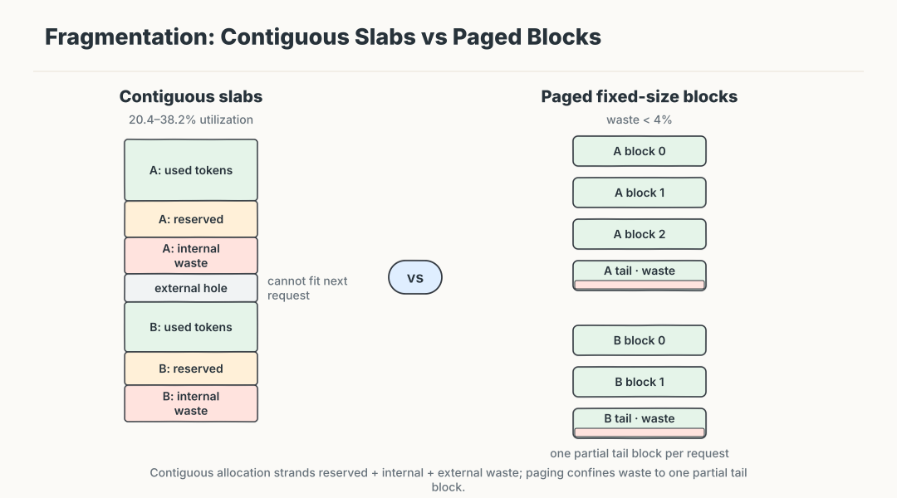</a>

<p class='figure-caption'>Contiguous per-request slabs stranding reserved + internal + external waste (20.4–38.2% utilization) versus paged fixed-size blocks confining waste to one partial tail block per sequence (<4%).</p>

The implementation exposes the same argument through three quantities: bytes per block, total blocks, and currently free blocks.

### How many bytes is one block? The page-size formula

The paper's "800 KB per token" is not a magic constant; it is a formula, and V1 evaluates it per attention layer in `AttentionSpec.real_page_size_bytes`.

Source: `vllm/v1/kv_cache_interface.py:L187-L202`

```python
    @property
    def real_page_size_bytes(self) -> int:
        if self.kv_quant_mode.is_nvfp4:
            # Packed layout: fp4 data + fp8 block scales per head.
            head_dim = nvfp4_kv_cache_full_dim(self.head_size)
        elif self.kv_quant_mode == KVQuantMode.INT4_PER_TOKEN_HEAD:
            head_dim = self.head_size // 2
        else:
            head_dim = self.head_size
        return (
            2
            * self.block_size
            * self.num_kv_heads
            * head_dim
            * get_dtype_size(self.dtype)
        )
```

The factor `2` is K and V (two tensors per token). `self.block_size` is the number of tokens a block holds. `self.num_kv_heads * head_dim` is the width of one token's key (or value) vector after tensor-parallel sharding across KV heads. `get_dtype_size(self.dtype)` is bytes per element (2 for fp16/bf16). Multiply them and you have the byte cost of one block, *for one layer*. Reconstruct the paper's per-token figure by dividing out `block_size` and multiplying across all layers: `2 * num_kv_heads * head_dim * dtype_size * num_layers` bytes per token — plug in a 13B model's shape and you land on the paper's ~800 KB. The quantization branches show why this is a `@property` and not a literal: an nvfp4 or int4-per-token-head layer stores a *narrower* `head_dim`, so its block is physically smaller, and the budget must reflect that.

**The memory budget must count every byte that will actually be carved out of the raw KV allocation, not just the nominal K/V payload.** The sibling `page_size_bytes` property (`vllm/v1/kv_cache_interface.py:L172-L185`) makes the point explicit — for per-token-head quantization it *adds* the space for the scale tensors ("the memory is carved from the raw KV cache allocation so it must be budgeted here") and honors a `page_size_padded` override. If the budget under-counted, the engine would advertise more blocks than physically exist and OOM at runtime instead of applying back-pressure. Getting this number exactly right is the precondition for every admission decision downstream.

### The whole KV region is a fixed budget, floor-divided into blocks

Now the load-bearing conversion. vLLM does not let requests grab GPU memory ad hoc; at startup it computes the total available KV memory once and turns it into an integer count of blocks. That is `get_num_blocks`.

Source: `vllm/v1/core/kv_cache_utils.py:L972-L989`

```python
def get_num_blocks(
    vllm_config: VllmConfig,
    num_layers: int,
    available_memory: int,
    page_size: int,
) -> int:
    """
    Get the number of kv cache blocks.

    Args:
        vllm_config: The global VllmConfig
        num_layers: The number of layers
        available_memory: Memory available for KV cache in bytes.
        page_size: The page size of the KV cache.
    """
    num_blocks = int(available_memory // page_size // num_layers)
    num_blocks = max(num_blocks, 0)
    return may_override_num_blocks(vllm_config, num_blocks)
```

`available_memory` is the residual after weights and the profiled non-KV reserve. `page_size * num_layers` is one model-wide block, so the floor divisions return the number of whole blocks that fit. `max(..., 0)` handles an exhausted budget, and `may_override_num_blocks` permits a fixed test capacity.

**Floor division, never round up.** The block count is the ceiling on the KV state this cache can hold; over-committing it by even one block means physical memory the engine believes it owns does not exist. This startup integer is the manager's primary KV-capacity budget, and every runtime block allocation spends against it. Overall batching and concurrency are also constrained by `max_num_batched_tokens`, `max_num_seqs`, encoder-cache capacity, connector state, and execution/graph limits, so the block count is not the system's only batch-size lever.

**The startup guard: if one request can't fit, refuse to run**

The memory problem is severe enough that vLLM turns it into a hard startup error rather than a runtime surprise. Before serving begins, it checks that the budget can hold at least a single maximum-length request.

Source: `vllm/v1/core/kv_cache_utils.py:L749-L764`

```python
    needed_memory = get_needed_memory()

    if needed_memory > available_memory:
        estimated_max_len = estimate_max_model_len(available_memory)
        estimated_msg = ""
        if estimated_max_len > 0:
            estimated_msg = (
                "Based on the available memory, "
                f"the estimated maximum model length is {estimated_max_len}. "
            )

        raise ValueError(
            f"To serve at least one request with the model's max seq len "
            f"({max_model_len}), ({format_gib(needed_memory)} GiB KV "
            f"cache is needed, which is larger than the available KV cache "
            f"memory ({format_gib(available_memory)} GiB). {estimated_msg}"
```

The `needed_memory` here is a per-request quantity: `FullAttentionSpec.max_memory_usage_bytes` computes exactly what one worst-case request costs.

Source: `vllm/v1/kv_cache_interface.py:L237-L245`

```python
    def max_memory_usage_bytes(self, vllm_config: VllmConfig) -> int:
        max_model_len = vllm_config.model_config.max_model_len
        dcp_world_size = vllm_config.parallel_config.decode_context_parallel_size
        pcp_world_size = vllm_config.parallel_config.prefill_context_parallel_size
        # Note(hc): each dcp rank only need save
        # (max_model_len//dcp_world_size) tokens locally.
        if dcp_world_size * pcp_world_size > 1:
            max_model_len = cdiv(max_model_len, dcp_world_size * pcp_world_size)
        return cdiv(max_model_len, self.block_size) * self.page_size_bytes
```

`cdiv(max_model_len, self.block_size)` is the number of blocks a request needs to reach the context limit — ceiling division, because a partial final block still consumes a whole physical block (this *is* the paper's "waste only in the last block," expressed as an accounting rule). Multiply by `page_size_bytes` and you have the paper's "up to 1.6 GB per request" as a computed value rather than a quoted one. Context parallelism (`dcp`/`pcp`) shards `max_model_len` across ranks, so each rank only budgets its local slice.

If one worst-case sequence exceeds `available_memory`, eviction and prefix reuse cannot guarantee progress, so startup fails with guidance to raise `gpu_memory_utilization` or lower `max_model_len`. Paging improves multi-request utilization; it does not remove this single-request bound.

**The runtime capacity oracle the whole engine watches**

At startup the budget becomes `num_gpu_blocks`; at runtime it becomes a live free-block count. The `BlockPool` pre-carves the entire pool up front — the concrete realization of the paper's "block engine [that] allocates a contiguous chunk of GPU DRAM and divides it into physical KV blocks" ([PagedAttention full text](https://ar5iv.labs.arxiv.org/html/2309.06180)).

Source: `vllm/v1/core/block_pool.py:L175-L182`

```python
        # All kv-cache blocks.
        self.blocks: list[KVCacheBlock] = [
            KVCacheBlock(idx) for idx in range(num_gpu_blocks)
        ]
        # Free block queue that constructs and manipulates a doubly linked
        # list of free blocks (including eviction candidates when caching is
        # enabled).
        self.free_block_queue = FreeKVCacheBlockQueue(self.blocks)
```

Every physical slot exists as a `KVCacheBlock` object from the moment the pool is built; nothing is allocated from CUDA at request time. The one number the scheduler consults every step is the length of that free queue — `get_num_free_blocks` (`vllm/v1/core/block_pool.py:L692-L698`), the O(1) capacity counter whose implementation and lockstep accounting [Section 3](#3-kvcacheblock-and-blockpool-the-free-list-is-an-eviction-structure) walks in full.

This is an O(1) counter, not a traversal — `num_free_blocks` is maintained in lockstep by every allocate/free/evict operation (the mechanics live in the block-pool and free-queue sections of this article). `allocate_slots` compares a request's demand against exactly this value and returns `None` ("cannot schedule this step") when demand exceeds supply, which is what triggers preemption. It is the hard admission gate the scheduler cannot bluff past.

Because every free block is interchangeable, a free count of `k` is sufficient to admit any demand of at most `k` blocks. A contiguous allocator would also need to know the shape of its free regions.

## 2. The Paper Model: Blocks, Block Tables, Sharing, and Copy-on-Write

PagedAttention cuts KV state into fixed-size **blocks**. A per-request **block table** maps logical blocks to non-contiguous physical blocks, while reference counts permit sharing and copy-on-write semantics protect divergence. The useful analogy is `blocks as pages, tokens as bytes, requests as processes` ([PagedAttention paper](https://ar5iv.labs.arxiv.org/html/2309.06180); [vLLM launch blog](https://vllm.ai/blog/2023-06-20-vllm)). V1 realizes the first three primitives directly; immutable content-addressed full blocks make a physical copy-on-write path unnecessary.

Keep one distinction from the paper in front of you the whole way, because the blog blurs it: *PagedAttention* is the attention **kernel** — the thing that makes non-contiguous KV *computable* by gathering scattered blocks at attention time — while the *KV block manager* is the **memory layer** that makes non-contiguous KV *possible and safe* by owning the DRAM pool, the block tables, allocation/free, refcounts, and CoW ([paper, "a block engine allocates a contiguous chunk of GPU DRAM and divides it into physical KV blocks"](https://ar5iv.labs.arxiv.org/html/2309.06180)). Everything below lives on the manager side of that cut. The kernel appears only once, at the very bottom, as the consumer that dereferences what the manager produced.

<a href='images/vllm-06-01-logical-physical-blocks.svg' target='_blank'>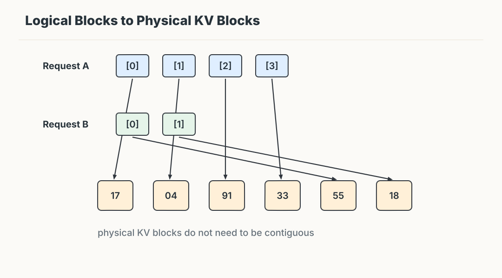</a>
<a href='images/vllm-06-02-copy-on-write.svg' target='_blank'>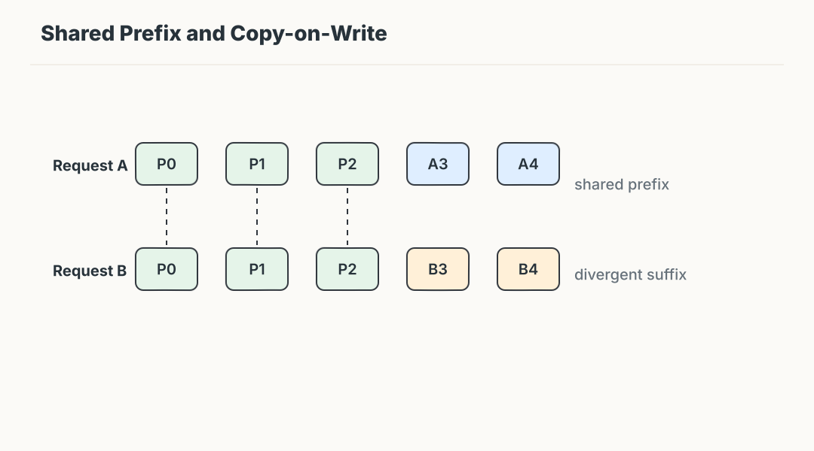</a>

<p class='figure-caption'>Left: a sequence's logical blocks mapped through a block table onto non-contiguous physical KV blocks. Right: block sharing → divergence (CoW *semantics* without a physical copy) — two sequences share a physical prefix block and diverge into private suffix blocks, which in V1 happens structurally because immutable full-block content addressing makes the copy unreachable (see the copy-on-write sub-section below).</p>

### The four-way mapping, and the one field the OS page table does not have

The paper is explicit that a block-table entry is *not* just a page-table entry: `Each block table entry records the corresponding physical blocks of a logical block and the number of filled positions` ([paper](https://ar5iv.labs.arxiv.org/html/2309.06180)). An OS page table needs only the physical frame; the LLM twist is that "number of filled positions" — the reason the last block of a sequence is only partially populated and everything before it is exactly `block_size` tokens. (The paper's ablation uses a 16-token block as its default; in V1 the block size is per-spec and config-driven, `kv_cache_spec.block_size`, never a global constant 16.)

V1 does not store those two things in one struct. It splits them. The physical-block half lives in a `[num_reqs, max_blocks]` tensor whose row is a request and whose columns are that request's physical block ids in logical order. The filled-position half is never stored in the table at all; it is recomputed per token from the request's `positions` when the slot mapping is built. Both halves meet in the arithmetic that turns a logical position into a flat address into the paged cache: `slot = block_id·block_size + pos%block_size` (realized by the slot kernel, [Section 20](#20-from-block-table-to-kernel-slot_mapping-and-the-device-tensors), which also carries the context-parallel machinery elided here).

Without context parallelism, `pos // block_size` selects the logical column, the table supplies its physical block, and `pos % block_size` supplies the offset. Thus the table remains a logical-to-physical map; fill position is derived from the scheduler-owned token position rather than stored beside it.

**"Waste only in the last block" is enforced by refusing to cache a partial block**

The paper's headline is `near-zero waste`, and the blog quantifies it: `Memory waste only happens in the last block of a sequence ... a mere waste of under 4%` ([blog](https://vllm.ai/blog/2023-06-20-vllm)), against the `20.4% - 38.2%` utilization of contiguous-allocation systems ([paper](https://ar5iv.labs.arxiv.org/html/2309.06180)). Uniform block size is what kills *external* fragmentation (any free block fits any request), but the "only the last block" clause is a separate, code-enforced property: nothing but a *full* block is ever allowed to become a cache entity. The hash function that mints a block's content identity assumes exactly that:

`vllm/v1/core/kv_cache_utils.py:L591-L604`

```python
        curr_block_token_ids: A list of token ids in the current
            block. The current block is assumed to be full.
        extra_keys: Extra keys for the block.
    Returns:
        The hash value of the block and the token ids in the block.
        The entire tuple is used as the hash key of the block.
    """
    if not parent_block_hash:
        parent_block_hash = NONE_HASH

    curr_block_token_ids_tuple = tuple(curr_block_token_ids)
    return BlockHash(
        hash_function((parent_block_hash, curr_block_token_ids_tuple, extra_keys))
    )
```

Lookup also stops at full blocks (`kv_cache_manager.py:L204`). A partial tail has no hash and cannot be shared. Hits are therefore block-aligned, and the `request.num_tokens - 1` cap may make an otherwise complete hit recompute one block so the forward pass still produces logits.

### The reference count is a literal field, and it is write-once about identity

The paper says `we introduce a reference count for each physical block`. In V1 that sentence is a struct field. Every physical GPU slot is described by exactly one `KVCacheBlock` (`vllm/v1/core/kv_cache_utils.py:L117-L138`; [Section 3](#3-kvcacheblock-and-blockpool-the-free-list-is-an-eviction-structure) walks the full dataclass field by field), where the paper's refcount, its content identity, and its free-list membership all live side by side.

Three things to read off that record. First, `ref_cnt: int = 0` is the paper's per-physical-block reference count, verbatim: a block born with zero references. Second, `_block_hash` is `only available when the block is full and cached`; a block's *identity* (what content it holds) and its *reference count* (how many sequences claim it) are orthogonal fields, which is why a block can be cached-but-unreferenced (a prefix-cache hit waiting to happen) or referenced-but-uncached (a live partial block). Third, that identity is write-once until eviction, guarded by `set_block_hash`/`reset_hash` (`vllm/v1/core/kv_cache_utils.py:L148-L162`, read in full in [Section 3](#3-kvcacheblock-and-blockpool-the-free-list-is-an-eviction-structure)).

`set_block_hash` requires an empty identity slot; only eviction calls `reset_hash`. A referenced block therefore cannot silently change the content it advertises.

**Sharing is `touch`: two logical blocks, one physical block, one refcount bump**

The paper describes sharing as `mapping their logical blocks to the same physical block` ([blog](https://vllm.ai/blog/2023-06-20-vllm)); the docs describe the reuse action as, on a hit, `increases the reference count of the computed block by one, and removes the block from the free queue` ([Prefix Caching docs](https://docs.vllm.ai/en/stable/design/prefix_caching/)). That single sentence is one method, `BlockPool.touch` (`vllm/v1/core/block_pool.py:L597-L612`), read line by line in [Section 23](#23-the-life-of-a-physical-block-allocate-use-free-cache-evict).

Sharing appends the same `block_id` to another request's row and calls `touch`. If the block was cached but free, `touch` removes it from the eviction queue before raising `ref_cnt`, so adoption and reclamation cannot race.

### Copy-on-write: where V1 diverges from the paper on purpose

The paper is precise about the last primitive: `vLLM implements a copy-on-write mechanism at the block granularity for the physical blocks that need modification by multiple sequences` ([paper](https://ar5iv.labs.arxiv.org/html/2309.06180)). The intent is the classic OS pattern — share while identical, copy the one block when a sequence must write into it and diverge. In the original vLLM (V0), that meant literally copying a *partially filled* shared block when two sequences appended different next tokens into it.

At commit `6cf7b26bd`, the V1 KV core has no `copy_on_write`/`cow` implementation. Only immutable full blocks are shareable; divergent tokens enter each request's private partial block. V1 therefore gets share-until-divergence semantics by allocating new suffix blocks rather than copying a shared block.

What remains of the paper's mechanism is its bookkeeping half: the reference count, decremented when a sequence lets go of a shared block. That is `free_blocks` (`vllm/v1/core/block_pool.py:L614-L635`), whose body [Section 23](#23-the-life-of-a-physical-block-allocate-use-free-cache-evict) reads in full.

`free_blocks` returns a block to the pool only when the last reference is released. Hashed blocks go to the queue tail for possible reuse; hashless blocks go to the front for early recycling.

## 3. KVCacheBlock and BlockPool: The Free List Is an Eviction Structure

In V1, the free list and the cache-eviction list are the **same doubly linked list**. A block on that queue is allocatable capacity and may still be a valid cached prefix until it is popped for reuse. `KVCacheBlock.ref_cnt` connects those two roles; `FreeKVCacheBlockQueue` supplies the eviction order. This collapse is what makes prefix-cache eviction O(1) without a background scan ([vLLM V1 alpha](https://vllm.ai/blog/2025-01-27-v1-alpha-release)).

### `KVCacheBlock`: the record whose `ref_cnt` is the join key

Every physical GPU KV slot — index `0 .. num_gpu_blocks-1` — is described by exactly one `KVCacheBlock`. The pool builds `num_gpu_blocks` of them at construction (`block_pool.py:L176-L178`), so the record is deliberately cheap: it is a `slots=True` dataclass, which drops the per-instance `__dict__` and lays the fields out in a fixed slot array.

Source anchor — `vllm/v1/core/kv_cache_utils.py:L117-L138`:

```python
@dataclass(slots=True)
class KVCacheBlock:
    """KV-cache block metadata."""

    # Block ID, ranging from 0 to num_gpu_blocks - 1.
    block_id: int
    # Reference count.
    ref_cnt: int = 0
    # The hash key (block hash + group id) of the block, only available
    # when the block is full and cached.
    _block_hash: BlockHashWithGroupId | None = None
    # Number of prefix tokens covered by _block_hash. For full blocks this is
    # the full block boundary; partial aliases can end inside a cache block.
    _block_hash_num_tokens: int | None = None

    # Used to construct a doubly linked list for free blocks.
    # These two attributes should only be manipulated by FreeKVCacheBlockQueue.
    prev_free_block: "KVCacheBlock | None" = None
    next_free_block: "KVCacheBlock | None" = None

    # Whether the block is a null block that should never be cached.
    is_null: bool = False
```

Read the fields as three orthogonal concerns bolted onto one identity:

- `block_id` is the *stable* physical identity. It is assigned once at construction and never changes, because — as `BlockHashToBlockMap` documents ([Section 7](#7-prefix-cache-lookup-hashing-longest-hit-and-the-recompute-last-token-rule)) — the pool deliberately does not de-duplicate cached blocks so that "block tables are append-only." A block's KV *contents* churn as it is allocated, cached, evicted, and reallocated, but its `block_id` is a fixed address the worker's block table can point at forever ([Section 20](#20-from-block-table-to-kernel-slot_mapping-and-the-device-tensors)).
- `ref_cnt` is the **allocation** concern and the central field of this whole section. `ref_cnt == 0` is not merely "no request holds this block" — it is, for every non-null block, *definitionally equivalent* to "this block is currently linked into the free queue and is an eviction candidate." `ref_cnt > 0` means in use and off the queue. The entire allocate/free/touch dance ([Section 23](#23-the-life-of-a-physical-block-allocate-use-free-cache-evict)) exists to keep that biconditional true at every observable moment.
- `_block_hash` and `_block_hash_num_tokens` are the **caching** concern, reached only through the read-only `block_hash` property. A non-`None` hash means "this block still advertises a prefix-cache key"; `None` means it carries no cache identity. Crucially, this is *independent* of `ref_cnt`: a block can be `ref_cnt == 0` (on the free queue) yet still carry a hash (still cache-reachable). That independence is the "free but still cached" state made concrete.
- `prev_free_block` / `next_free_block` are the intrusive list pointers, manipulated only by `FreeKVCacheBlockQueue` as their comment requires. The block *is* its own list node; there are no wrapper node objects.
- `is_null` marks the one sentinel block (`block_id=0`) whose `ref_cnt` is intentionally not maintained and which must never be freed or cached.

**The hash is write-once until reset — the anti-phantom-key guard**

The hash fields are private (`_`-prefixed) and mutated through exactly two guarded methods.

Source anchor — `vllm/v1/core/kv_cache_utils.py:L148-L162`:

```python
    def set_block_hash(
        self,
        block_hash: BlockHashWithGroupId,
        num_tokens: int | None = None,
    ) -> None:
        assert self.block_hash is None and self._block_hash_num_tokens is None, (
            "The block already has a hash. This should not happen."
        )
        self._block_hash = block_hash
        self._block_hash_num_tokens = num_tokens

    def reset_hash(self):
        """Reset the block hash when the block is evicted."""
        self._block_hash = None
        self._block_hash_num_tokens = None
```

`set_block_hash` refuses to run against a block that already has a hash: the assertion fires before either field is touched. The only route back to a settable state is `reset_hash`, which the pool calls on eviction (`_remove_cached_block_hashes`, [Section 23](#23-the-life-of-a-physical-block-allocate-use-free-cache-evict)). So a block's primary cache key is **write-once until an explicit reset**.

The forward index `cached_block_hash_to_block` maps a hash to *the block that advertises it*. If `set_block_hash` silently overwrote a live key, the block would start advertising key B while the index still resolved key A to it — a phantom hit, where a lookup for A returns a block whose KV is now B's. The write-once assertion makes the only legal transition `hash → reset_hash() → new hash`, and eviction is the sole caller of `reset_hash`, so the index and the block's advertised key can never silently disagree. This is the block-level counterpart to the map-level consistency [Section 7](#7-prefix-cache-lookup-hashing-longest-hit-and-the-recompute-last-token-rule) protects.

### Why a hand-rolled intrusive list and not `collections.deque`

The free queue is not a `deque`. It is a hand-written doubly linked list, and the class docstring states precisely why.

Source anchor — `vllm/v1/core/kv_cache_utils.py:L179-L195`:

```python
class FreeKVCacheBlockQueue:
    """This class organizes a list of KVCacheBlock objects to a doubly linked
    list of free blocks. We implement this class instead of using Python
    builtin deque to support removing a block in the middle of the queue
    in O(1) time. To close the performance gap to the builtin deque which is
    implemented in C++, this class does not allocate any Python objects when
    manipulating the linked list. Instead, this class manipulates the
    prev_free_block and next_free_block attributes of the given blocks.

    The queue is ordered by block ID in the beginning. When a block is allocated
    and then freed, it will be appended back with the eviction order:
    1. The least recent used block is at the front (LRU).
    2. If two blocks have the same last accessed time (allocated by the
       same sequence), the one with more hash tokens (the tail of a block
       chain) is at the front.
```

Two design forces are stated outright. First, **O(1) middle removal**. A `deque` gives O(1) at both ends but O(n) to pull an element from the interior. The free queue *needs* interior removal on the hot path: when an incoming request's prefix hits a block that is cached-but-free (sitting somewhere in the middle of the queue), `touch` must extract precisely that block and hand it back to the requester ([Section 23](#23-the-life-of-a-physical-block-allocate-use-free-cache-evict)). With a `deque` that is a linear scan per prefix-hit block; with an intrusive list where the block holds its own `prev/next`, it is a constant-time pointer splice. This is *the* reason prefix-cache reuse doesn't degrade allocation to O(n).

Second, **zero per-operation Python allocation**. A `deque` of `KVCacheBlock` would still be a container of references, and the C implementation is fast, but the authors close the gap by storing the links *inside the blocks themselves* (`prev_free_block`/`next_free_block`), so splicing touches no allocator and creates no garbage — it only rewrites two attributes per node. At the scale of a block pool (tens to hundreds of thousands of blocks, config- and GPU-dependent per [Anatomy of vLLM](https://vllm.ai/blog/2025-09-05-anatomy-of-vllm)), churning through popleft/append on every scheduler step, GC pressure from wrapper nodes would be a real tax.

The second paragraph of the docstring also defines the **eviction order**: front = LRU = evicted first; among blocks freed together by one sequence, the one with *more* hash tokens (the tail of a block chain) sorts nearer the front. The list class does not compute that tie-break — "we maintain this order by reversing the block order when free blocks of a request. This operation is outside of this class." The caller (`KVCacheManager.free`, [Section 23](#23-the-life-of-a-physical-block-allocate-use-free-cache-evict)) supplies blocks in reverse order so the chain tail lands frontmost.

<a href='images/vllm-06-04-free-queue.svg' target='_blank'>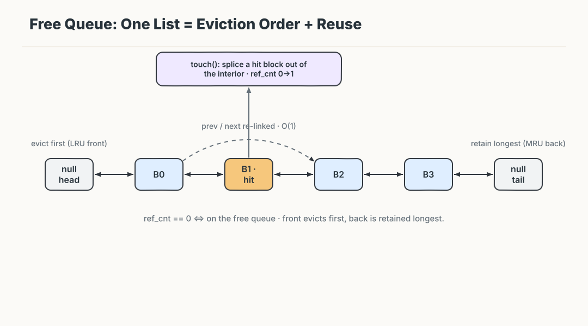</a>

<p class='figure-caption'>one intrusive doubly linked list playing two roles at once — LRU eviction order runs front (evict-first) to back (retain-longest), with sentinels bracketing the real blocks; `touch` splices a hit block out of the interior in O(1).</p>

**Sentinels: the corruption tripwire**

Construction chains the real blocks in `block_id` order, then brackets them with two fake nodes.

Source anchor — `vllm/v1/core/kv_cache_utils.py:L211-L229`:

```python
        # Create a fake head and a tail block for the doubly linked list to
        # reduce branching in the code
        #
        # The implementation guaranteed that the fake head and tail
        # are NEVER got popped, so we could safely assume each real blocks
        # in the queue has prev and next blocks.
        self.fake_free_list_head = KVCacheBlock(block_id=-1)
        self.fake_free_list_tail = KVCacheBlock(block_id=-1)
        if self.num_free_blocks > 0:
            # Connect fake_head and fake_tail to the first and last block
            # respectively.
            self.fake_free_list_head.next_free_block = blocks[0]
            blocks[0].prev_free_block = self.fake_free_list_head
            self.fake_free_list_tail.prev_free_block = blocks[-1]
            blocks[-1].next_free_block = self.fake_free_list_tail
        else:
            # For empty list, simply connect the fake head and tail.
            self.fake_free_list_head.next_free_block = self.fake_free_list_tail
            self.fake_free_list_tail.prev_free_block = self.fake_free_list_head
```

The two `KVCacheBlock(block_id=-1)` sentinels are never popped. The payoff is stated in the comment: "we could safely assume each real block in the queue has prev and next blocks." Every splice primitive (`popleft`, `remove`, `prepend_n`, `append_n`) can therefore rewrite neighbor pointers without special-casing the ends of the list. The empty-list branch wires head directly to tail so the structure is well-formed even with zero real blocks.

Because a genuinely queued block always has non-`None` `prev` and `next`, a `None` pointer on a block that is *supposed* to be free is an unambiguous corruption signal: a double-free or a block that was never actually enqueued. `remove` weaponizes this: it raises `RuntimeError(f"remove() called on an invalid block: {block}")` the instant either pointer is `None` (`kv_cache_utils.py:L307-L310`), and `popleft` raises a parallel error for a first block with no valid `next`. The sentinels turn "block not actually on the queue" from silent list corruption into a loud crash at the call site.

**The dequeue primitives keep the counter honest**

`popleft` removes one block from the head. It is called *exactly once* in the whole system — at pool construction, to carve out the null block (`block_pool.py:L191`, which sets `is_null = True` on `block_id=0`).

Source anchor — `vllm/v1/core/kv_cache_utils.py:L237-L245`:

```python
        if (
            self.fake_free_list_head.next_free_block is self.fake_free_list_tail
            or self.fake_free_list_head.next_free_block is None
        ):
            assert self.num_free_blocks == 0, (
                f"num_free_blocks ({self.num_free_blocks}) is out of sync "
                "with the free list."
            )
            raise ValueError("No free blocks available")
```

Note what the empty-list guard does *before* raising: it asserts `num_free_blocks == 0`. The maintained integer counter and the actual list topology are cross-checked here — if the queue looks empty (head points at tail) but the counter disagrees, that is a synchronization bug and the assertion catches it rather than letting the counter drift on.

Real allocation uses the batched `popleft_n`, whose accounting is the interesting part.

Source anchor — `vllm/v1/core/kv_cache_utils.py:L277-L299`:

```python
        if n == 0:
            return []
        assert self.num_free_blocks >= n
        self.num_free_blocks -= n

        curr_block = self.fake_free_list_head.next_free_block
        # Pop n blocks from the head of the list
        ret = []
        for _ in range(n):
            assert curr_block is not None
            ret.append(curr_block)
            last_block = curr_block
            curr_block = curr_block.next_free_block
            # Reset prev_free_block and next_free_block of all popped blocks
            last_block.prev_free_block = None
            last_block.next_free_block = None

        if curr_block is not None:
            # The queue is not empty, connect the fake head to
            # the new first block.
            self.fake_free_list_head.next_free_block = curr_block
            curr_block.prev_free_block = self.fake_free_list_head
        return ret
```

Read the accounting: `num_free_blocks` is decremented by exactly `n` up front, and each of the `n` returned blocks has *both* pointers nulled as it leaves. The expensive pointer surgery (stitching the fake head to the new front) happens once, after the loop, rather than n times. The only capacity check inside this method is `assert self.num_free_blocks >= n`; there is no `ValueError` fallback here, because the *caller* (`get_new_blocks`, [Section 23](#23-the-life-of-a-physical-block-allocate-use-free-cache-evict)) is contractually required to have already checked `get_num_free_blocks()`. The returned blocks are detached-but-not-yet-referenced: they have left the queue but still carry `ref_cnt == 0` until the caller bumps it. For the brief window inside `get_new_blocks`, that is the *one* legal violation of "`ref_cnt == 0 ⇔ on queue," and it is closed within the same synchronous call.

### The two ends of the list *are* the two eviction priorities

Enqueue is where eviction policy is written into topology. `free_blocks` splits reclaimed blocks by cache value and pushes each group onto a *different end* ([Section 23](#23-the-life-of-a-physical-block-allocate-use-free-cache-evict) covers that split; here we read the primitives it calls).

Source anchor — `vllm/v1/core/kv_cache_utils.py:L344-L363`:

```python
    def prepend_n(self, blocks: list[KVCacheBlock]) -> None:
        """Put a list of blocks at the front of the free list."""
        if len(blocks) == 0:
            return

        first_block = self.fake_free_list_head.next_free_block
        assert first_block is not None, (
            "next_free_block of fake_free_list_head should always exist"
        )

        prev_block = self.fake_free_list_head
        for block in blocks:
            block.prev_free_block = prev_block
            prev_block.next_free_block = block
            prev_block = block

        prev_block.next_free_block = first_block
        first_block.prev_free_block = prev_block

        self.num_free_blocks += len(blocks)
```

`prepend_n` places a batch at the LRU front; `append_n` places it at the MRU back. `free_blocks` therefore prepends hashless blocks and appends reusable hashed blocks, encoding the two priority classes directly in list position.

### `get_num_free_blocks`: the O(1) capacity oracle the whole engine watches

Every admission decision in `allocate_slots` — the watermark check, the reserved-block check, the full-sequence-fit gate ([Section 9](#9-allocate_slots-is-a-policy-stack-not-an-allocation)) — ultimately compares demand against one number.

Source anchor — `vllm/v1/core/block_pool.py:L692-L711`:

```python
    def get_num_free_blocks(self) -> int:
        """Get the number of free blocks in the pool.

        Returns:
            The number of free blocks.
        """
        return self.free_block_queue.num_free_blocks

    def get_usage(self) -> float:
        """Get the KV cache usage.

        Returns:
            The KV cache usage (between 0.0 and 1.0).
        """

        # Subtract 1 to account for null block.
        total_gpu_blocks = self.num_gpu_blocks - 1
        if not total_gpu_blocks:
            return 0
        return 1.0 - (self.get_num_free_blocks() / total_gpu_blocks)
```

`get_num_free_blocks` reads the counter maintained by every queue splice. The null block was removed at construction, so both this count and `get_usage` describe usable blocks only.

## 4. Where the Blocks Come From: Memory Profiling, num_gpu_blocks, and KV Cache Config

`available_memory` comes from a live profiling forward pass on every worker. After heterogeneous per-layer KV specifications are reconciled to a common page size, the engine takes the minimum per-worker block count across the tensor- and pipeline-parallel cluster. That final `num_gpu_blocks` scalar is what pre-carves the `BlockPool` described in [Section 3](#3-kvcacheblock-and-blockpool-the-free-list-is-an-eviction-structure).

<a href='images/vllm-06-13-memory-to-blocks.svg' target='_blank'>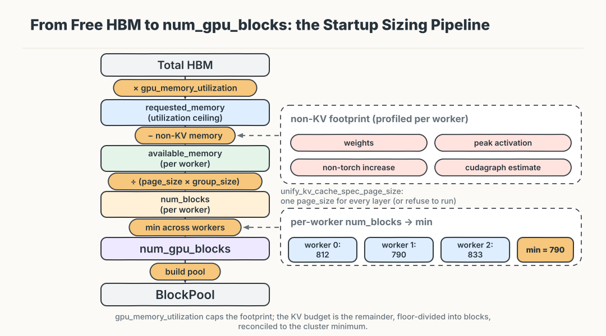</a>

<p class='figure-caption'>Total HBM → utilization ceiling → minus (weights + peak activation + non-torch + cudagraph) → per-worker `available_memory` → ÷ (unified page_size × group_size) → per-worker `num_blocks` → min across workers → `num_gpu_blocks` → `BlockPool`.</p>

### The spine: one scalar assembled from a whole cluster

The scalar that eventually sizes `BlockPool` is produced by a chain that crosses three processes' worth of responsibility — each worker profiles its own memory and reports its own layer specs; the engine core fans those in and reconciles them; the result is broadcast back. The engine-core driver is the spine.

Source: `vllm/v1/engine/core.py:L283-L296`

```python
                available_gpu_memory = self.model_executor.determine_available_memory()
                self.available_gpu_memory_for_kv_cache = available_gpu_memory[0]
        else:
            # Attention free models don't need memory for kv cache
            available_gpu_memory = [0] * len(kv_cache_specs)

        assert len(kv_cache_specs) == len(available_gpu_memory)

        # Track max_model_len before KV cache config to detect auto-fit changes
        max_model_len_before = vllm_config.model_config.max_model_len

        kv_cache_configs = get_kv_cache_configs(
            vllm_config, kv_cache_specs, available_gpu_memory
        )
```

`kv_cache_specs` is a **list, one dict per worker** (gathered by `collective_rpc("get_kv_cache_spec")`); under pipeline parallelism different workers own different layers, so the dicts differ. `determine_available_memory()` returns a **list of byte budgets, one per worker** (the executor fans the RPC out) — each entry is that worker's private "memory available for KV cache." The `assert len(kv_cache_specs) == len(available_gpu_memory)` pins the two lists into positional correspondence. Both feed `get_kv_cache_configs(vllm_config, kv_cache_specs, available_gpu_memory)`, the function that maps `(specs, bytes) → KVCacheConfig` per worker and reconciles them into one `num_blocks`.

Source: `vllm/v1/engine/core.py:L305-L311`

```python
        scheduler_kv_cache_config = generate_scheduler_kv_cache_config(kv_cache_configs)
        vllm_config.cache_config.num_gpu_blocks = scheduler_kv_cache_config.num_blocks
        kv_cache_groups = scheduler_kv_cache_config.kv_cache_groups
        if kv_cache_groups:
            vllm_config.cache_config.block_size = min(
                g.kv_cache_spec.block_size for g in kv_cache_groups
            )
```

`generate_scheduler_kv_cache_config` collapses those worker configs to the single `num_blocks` value used to build `BlockPool`.

**The utilization ceiling: `gpu_memory_utilization` caps the whole footprint**

Before any profiling, each worker fixes a hard ceiling. The budget [Section 1](#1-kv-cache-is-the-serving-memory-problem) divides is not carved out of raw free memory — it is carved out of `total_memory × gpu_memory_utilization`.

Source: `vllm/v1/worker/utils.py:L410-L423`

```python
    requested_memory = math.ceil(
        init_snapshot.total_memory * cache_config.gpu_memory_utilization
    )

    if init_snapshot.free_memory < requested_memory:
        raise ValueError(
            f"Free memory on device {init_snapshot.device_} "
            f"({format_gib(init_snapshot.free_memory)}/"
            f"{format_gib(init_snapshot.total_memory)} GiB) on startup "
            f"is less than desired GPU memory utilization "
            f"({cache_config.gpu_memory_utilization}, "
            f"{format_gib(requested_memory)} GiB). Decrease GPU memory "
            f"utilization or reduce GPU memory used by other processes."
        )
```

`requested_memory = ceil(total_memory × gpu_memory_utilization)` caps the whole vLLM footprint, not KV alone. The startup snapshot is taken after NCCL initialization and allocator cleanup; if current free HBM is below the requested cap, initialization fails with the deficit.

**Profiling the ceiling into a KV byte budget**

`determine_available_memory` runs a dummy forward pass at the maximum batch size, measures what the model *actually* consumes, and subtracts that from `requested_memory`. The remainder is `available_memory` — the argument [Section 1](#1-kv-cache-is-the-serving-memory-problem) took as given. (There is an escape hatch: if the operator set `kv_cache_memory_bytes` explicitly, profiling is skipped and that exact count is used, `gpu_worker.py:L448-L451`.) The measured non-KV total is assembled first.

Source: `vllm/v1/worker/gpu_worker.py:L495-L499`

```python
        profile_result.non_kv_cache_memory = (
            profile_result.non_torch_increase
            + profile_result.torch_peak_increase
            + profile_result.weights_memory
        )
```

`non_kv_cache_memory` is the three things that must live in HBM but are *not* KV cache: raw CUDA/library allocations outside the PyTorch allocator (`non_torch_increase`), the PyTorch activation peak during the dummy forward (`torch_peak_increase`, taken pre-cudagraph to avoid double-counting, `L491-L494`), and model weights. Then the subtraction, guarded against a classic race.

Source: `vllm/v1/worker/gpu_worker.py:L513-L529`

```python
        free_gpu_memory = profile_result.after_profile.free_memory
        # NOTE(woosuk): Here we assume that the other processes using the same
        # GPU did not change their memory usage during the profiling.
        assert self.init_snapshot.free_memory >= free_gpu_memory, (
            "Error in memory profiling. "
            f"Initial free memory {format_gib(self.init_snapshot.free_memory)} GiB, "
            f"current free memory {format_gib(free_gpu_memory)} GiB. "
            "This happens when other processes sharing the same container "
            "release GPU memory while vLLM is profiling during initialization. "
            "To fix this, ensure consistent GPU memory allocation or "
            "isolate vLLM in its own container."
        )
        self.available_kv_cache_memory_bytes = (
            self.requested_memory
            - profile_result.non_kv_cache_memory
            - cudagraph_memory_estimate_applied
        )
```

The subtraction is `requested_memory − non_kv_cache_memory − cudagraph_estimate`. The CUDA-graph term is applied only when its profiling flag is enabled. The assertion rejects a changing external-memory baseline rather than deriving capacity from an inconsistent snapshot.

### One page size for every layer — the precondition `get_num_blocks` assumes

[Section 1](#1-kv-cache-is-the-serving-memory-problem) quoted `get_num_blocks` and its floor division `available_memory // page_size // num_layers`, and [Section 15](#15-the-coordinator-and-hybrid-kv-cache-when-one-block-type-is-not-enough) walks the four unrelated `page_size_bytes` formulas (attention K+V, Mamba state-tensor sum, compressed-MLA, padded). Neither addresses the problem those two facts create together: the `KVCacheManager` can allocate blocks of exactly **one** size, but a hybrid model's layers report *different* `page_size_bytes`. Before grouping, they must be forced onto a common page. That is `unify_kv_cache_spec_page_size`.

Source: `vllm/v1/core/kv_cache_utils.py:L1075-L1111`

```python
    max_page_size = max(page_sizes)
    new_kv_cache_spec = {}
    for layer_name, layer_spec in kv_cache_spec.items():
        if layer_spec.page_size_bytes == max_page_size:
            new_kv_cache_spec[layer_name] = layer_spec
        elif isinstance(layer_spec, MambaSpec):
            # MambaSpec's page size is determined by its state shapes and does
            # not scale with block_size, so pad the page instead. This is the
            # same padding mechanism the platform uses to align Mamba pages
            # with the main model's attention page size; it is needed here
            # when another layer (e.g. from a draft model) has a larger page
            # than the already-aligned Mamba page.
            new_spec: KVCacheSpec = replace(layer_spec, page_size_padded=max_page_size)
            assert new_spec.page_size_bytes == max_page_size
            new_kv_cache_spec[layer_name] = new_spec
        else:
            layer_page_size = layer_spec.page_size_bytes
            if max_page_size % layer_page_size == 0:
                ratio = max_page_size // layer_page_size
                new_block_size = layer_spec.block_size * ratio
                new_spec = replace(layer_spec, block_size=new_block_size)
            elif (
                isinstance(layer_spec, AttentionSpec)
                and layer_spec.indexes_kv_by_block_stride
            ):
                new_spec = replace(layer_spec, page_size_padded=max_page_size)
            else:
                raise NotImplementedError(
                    f"Layer {layer_name}: page size is not divisible by the "
                    "maximum page size and cannot be padded. Padding is only "
                    "supported for attention layers whose backend indexes KV "
                    "pages by the block stride (indexes_kv_by_block_stride is "
                    "True)."
                )
            assert new_spec.page_size_bytes == max_page_size
            new_kv_cache_spec[layer_name] = new_spec
    return new_kv_cache_spec
```

The target is `max_page_size`, the largest page among all layers; every smaller layer is grown up to it by one of three mechanisms. Already-max layers are untouched. A `MambaSpec`'s page is fixed by its state-tensor shapes and does not scale with `block_size` (see [Section 15](#15-the-coordinator-and-hybrid-kv-cache-when-one-block-type-is-not-enough)), so it cannot be grown by adding tokens — it is **padded** via `page_size_padded=max_page_size`. A divisible attention layer grows its `block_size` by the exact ratio (`block_size *= max_page_size // page`), so the page grows to precisely the max — recall from [Section 15](#15-the-coordinator-and-hybrid-kv-cache-when-one-block-type-is-not-enough) that an attention page is `2 · block_size · num_kv_heads · head_dim · dtype`, linear in `block_size`.

A non-divisible attention layer can only be padded if its backend opts in via `indexes_kv_by_block_stride` (it reads the padded page through a strided view); otherwise `NotImplementedError` — vLLM refuses to run rather than silently mis-size a block. Every branch ends with `assert new_spec.page_size_bytes == max_page_size`. The postcondition: **after unification, every layer reports an identical `page_size_bytes`.** Smaller layers now over-allocate (real waste), but a single block size is globally valid, which is exactly what makes `get_num_blocks`'s single `page_size` argument ([Section 1](#1-kv-cache-is-the-serving-memory-problem)) and `get_uniform_page_size`'s internal `assert len(page_sizes) == 1` well-defined for a hybrid model. This runs on the default general grouping path; [Section 15](#15-the-coordinator-and-hybrid-kv-cache-when-one-block-type-is-not-enough) covers the group-*topology* dispatch (`get_kv_cache_groups`) that decides how many groups those unified layers land in.

### From groups and bytes to physical tensors: `get_kv_cache_config_from_groups`

`get_num_blocks` ([Section 1](#1-kv-cache-is-the-serving-memory-problem)) is the general-case arithmetic, but the config builder chooses the *divisor* and emits the physical `KVCacheTensor` layout, and it does so differently per grouping. The default general path:

Source: `vllm/v1/core/kv_cache_utils.py:L1385-L1402`

```python
        group_size = max(len(group.layer_names) for group in kv_cache_groups)

        page_size = get_uniform_page_size(
            [group.kv_cache_spec for group in kv_cache_groups]
        )
        assert group_size > 0, "group_size must be greater than 0"
        num_blocks = get_num_blocks(
            vllm_config, group_size, available_memory, page_size
        )
        kv_cache_tensors = []
        for i in range(group_size):
            shared_by = []
            for j in range(len(kv_cache_groups)):
                if i < len(kv_cache_groups[j].layer_names):
                    shared_by.append(kv_cache_groups[j].layer_names[i])
            kv_cache_tensors.append(
                KVCacheTensor(size=page_size * num_blocks, shared_by=shared_by)
            )
```

`group_size` is the *layers per group* (the max across groups), and it is what [Section 1](#1-kv-cache-is-the-serving-memory-problem)'s `get_num_blocks` receives as its `num_layers` argument — so the floor division is `available_memory // page_size // group_size`. `get_uniform_page_size` confirms the page size chosen in the previous step. Then `group_size` tensors are emitted, tensor `i` `shared_by` the `i`-th layer of every group and sized `page_size × num_blocks`: layers in different groups occupy different regions of the same physical tensor, indexed by their own block tables ([Section 20](#20-from-block-table-to-kernel-slot_mapping-and-the-device-tensors)).

Other layouts change the divisor but preserve the bound: uniform specs sum per-layer page sizes, packed layouts sum bytes per slot, and attention-free models retain one null block with no KV tensors. Every branch emits one scalar `num_blocks` within `available_memory`.

### Reconciling a cluster: everyone converges to `min_num_blocks`

Each worker computes its own `num_blocks` from its own budget and its own layers. Under pipeline parallelism those differ — a stage with more layers or less free memory yields fewer blocks. But the scheduler reasons about **one** block namespace ([Section 3](#3-kvcacheblock-and-blockpool-the-free-list-is-an-eviction-structure), [Section 9](#9-allocate_slots-is-a-policy-stack-not-an-allocation)), so the cluster must agree on a single count. The reconciliation is a min-clamp.

Source: `vllm/v1/core/kv_cache_utils.py:L2132-L2142`

```python
    min_num_blocks = min(
        kv_cache_config.num_blocks for kv_cache_config in kv_cache_configs
    )
    for kv_cache_config in kv_cache_configs:
        num_blocks_old = kv_cache_config.num_blocks
        kv_cache_config.num_blocks = min_num_blocks

        # Shrink tensor size proportionally
        for tensor in kv_cache_config.kv_cache_tensors:
            assert tensor.size % num_blocks_old == 0
            tensor.size = tensor.size // num_blocks_old * min_num_blocks
```

The weakest worker caps the cluster. Each tensor shrinks proportionally to `min_num_blocks`, and divisibility holds because its old size was page size times the old count.

Source: `vllm/v1/core/kv_cache_utils.py:L1780-L1782`

```python
    assert all(
        [cfg.num_blocks == kv_cache_configs[0].num_blocks for cfg in kv_cache_configs]
    )
```

The final assertion enforces identical counts across workers. Before the clamp, the same projected configs also run the one-request feasibility check and, when present, substitute `num_gpu_blocks_override × bytes_per_block` for the profiled budget.

**Back to the worker: the scalar becomes the pool**

The reconciled config is broadcast back; each worker records `num_blocks` and materializes the tensors.

Source: `vllm/v1/worker/gpu_worker.py:L704-L716`

```python
        # Update local config with adjusted num blocks after profiling,
        # so that it's available to the warmup stage.
        self.cache_config.num_gpu_blocks = kv_cache_config.num_blocks

        # Init kv cache connector here, because it requires
        # `kv_cache_config`.
        # NOTE(Kuntai): This need to be done before `initialize_kv_cache`,
        # because `initialize_kv_cache` will inject kv cache groups not
        # related to kv cache connector (e.g. kv cache sharing layers).
        ensure_kv_transfer_initialized(self.vllm_config, kv_cache_config)

        with self._maybe_get_memory_pool_context(tag="kv_cache"):
            self.model_runner.initialize_kv_cache(kv_cache_config)
```

`cache_config.num_gpu_blocks = kv_cache_config.num_blocks` records the reconciled scalar locally, then `initialize_kv_cache` allocates each `KVCacheTensor` (sized `page_size × num_blocks`) inside the CuMem pool. That same `num_gpu_blocks` is precisely the count [Section 3](#3-kvcacheblock-and-blockpool-the-free-list-is-an-eviction-structure)'s `BlockPool` is constructed with — one `KVCacheBlock(idx) for idx in range(num_gpu_blocks)`, as [Section 1](#1-kv-cache-is-the-serving-memory-problem) and [Section 3](#3-kvcacheblock-and-blockpool-the-free-list-is-an-eviction-structure) both quote — and the length of the free queue [Section 1](#1-kv-cache-is-the-serving-memory-problem)'s capacity counter watches.

## 5. The Request as KV-State Holder: block_hashes, num_computed_tokens, and Speculative Tokens

At runtime, `Request` (`vllm/v1/request.py`) is the shared mutable source of truth for a request's KV state. Its token streams drive length arithmetic; `block_hashes` fingerprints the reusable prefix; `num_computed_tokens` advances optimistically and can roll back; and `spec_token_ids` stays outside committed counts. Each KV-relevant field has one writer, which keeps those transitions sound under asynchronous scheduling and pipeline-parallel run-ahead.

<a href='images/vllm-06-19-request-state.svg' target='_blank'>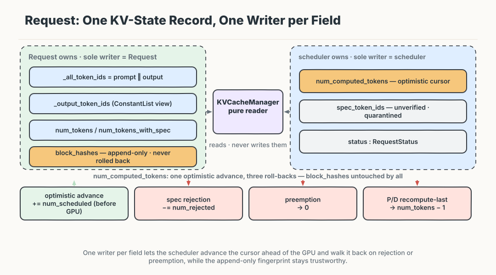</a>

<p class='figure-caption'>The `Request` KV-state fields and their sole writers: token streams and `block_hashes` (append-only, written by `Request` itself) vs `num_computed_tokens` / `spec_token_ids` / `status` (written by the scheduler), with `KVCacheManager` a pure reader of all of them.</p>

**Three token streams, grown in lockstep**

The length math the whole KV path depends on — how many tokens a request has, how many are output, how many including unverified drafts — is computed from lists, not stored as counters. Construction seeds them:

`vllm/v1/request.py:L133-L138`

```python
        self._output_token_ids: list[int] = []
        self._all_token_ids: list[int] = (
            self.prompt_token_ids.copy()
            if self.prompt_token_ids is not None
            else [0] * self.num_prompt_tokens
        )
```

`_all_token_ids` is the concatenation `prompt || output`. It is seeded as a **copy** of the prompt (the caller's prompt list is never aliased or mutated) or, when the prompt is embeds-only (`prompt_token_ids is None`), as `num_prompt_tokens` placeholder zeros that hold positions while the real content lives in `prompt_embeds`. The three length properties read straight off these lists:

`vllm/v1/request.py:L251-L261`

```python
    @property
    def num_tokens(self) -> int:
        return len(self._all_token_ids)

    @property
    def num_tokens_with_spec(self) -> int:
        return len(self._all_token_ids) + len(self.spec_token_ids)

    @property
    def num_output_tokens(self) -> int:
        return len(self._output_token_ids)
```

`num_tokens` is the *committed* length — prompt plus all appended output, growing every decode step. `num_tokens_with_spec` is that length **plus** currently-attached drafts, summed on demand. Speculative tokens are not in `_all_token_ids`; they are unverified and live in `spec_token_ids` (below). This split is exactly the model [Section 10](#10-the-scheduler-contract-how-scheduling-drives-the-kv-cache-manager)'s `schedule()` docstring builds on ("each request just has the `num_computed_tokens` and `num_tokens_with_spec`") so the property boundary here *is* the scheduler's chase-the-target loop boundary.

The two underlying lists must never drift apart, and the engine enforces that structurally rather than by convention:

`vllm/v1/request.py:L164-L168`

```python
        # Read-only views
        # Prevent directly appending to these lists since
        # they should also be updated simultaneously.
        self.output_token_ids = ConstantList(self._output_token_ids)
        self.all_token_ids = ConstantList(self._all_token_ids)
```

The rest of the engine sees only `ConstantList` wrappers, so no external code can append to one list without the other. The single sanctioned writer is:

`vllm/v1/request.py:L229-L240`

```python
    def append_output_token_ids(
        self,
        token_ids: int | list[int],
    ) -> None:
        if isinstance(token_ids, int):
            self._output_token_ids.append(token_ids)
            self._all_token_ids.append(token_ids)
        else:
            self._output_token_ids.extend(token_ids)
            self._all_token_ids.extend(token_ids)

        self.update_block_hashes()
```

Every commit of output tokens (1) appends to both underlying lists in lockstep and then (2) immediately refreshes `block_hashes`. The output stream and the all-tokens stream grow together and only here, and `block_hashes` is recomputed exactly when `_all_token_ids` lengthens — so the fingerprint can never lag the token stream by more than one partial (non-full) block. There is no code path that appends a token without dragging the hash list forward in the same call.

### `block_hashes`: append-only, and *not* rolled back

`block_hashes` is a per-request list of `BlockHash`, one entry per full hash-block chunk of the prefix. Its field and its updater are the parts that belong to `Request`; the hasher body — how each entry chains its parent and folds in LoRA / multimodal / cache-salt / prompt-embed keys — is [Section 7](#7-prefix-cache-lookup-hashing-longest-hit-and-the-recompute-last-token-rule)'s and article 07's.

`vllm/v1/request.py:L184-L189`

```python
        self.block_hashes: list[BlockHash] = []
        # Store the block hasher without binding self to avoid creating a
        # reference cycle (Request -> partial -> Request) that prevents
        # immediate garbage collection via reference counting.
        self._block_hasher: Callable[[Request], list[BlockHash]] | None = block_hasher
        self.update_block_hashes()
```

Two design facts hide here. First, the hasher is stored *unbound* (a plain callable taking `self` at call time, not a `partial(fn, self)`) specifically to avoid a `Request -> partial -> Request` reference cycle that would defer garbage collection of a hot, short-lived object; the KV manager never holds a `Request` alive, so refcount GC is the intended reclamation path. Second, `update_block_hashes()` runs once in `__init__` to hash whatever full blocks the prompt already contains. The updater itself is three lines:

`vllm/v1/request.py:L242-L245`

```python
    def update_block_hashes(self) -> None:
        """Compute block hashes for any new full blocks and append them."""
        if self._block_hasher is not None:
            self.block_hashes.extend(self._block_hasher(self))
```

`extend` — never assign, never truncate, never `del`. It appends only the new full-block hashes the hasher returns. The hasher (`kv_cache_utils.py:L688`, quoted in full in [Section 7](#7-prefix-cache-lookup-hashing-longest-hit-and-the-recompute-last-token-rule)) resumes at `start_token_idx = len(request.block_hashes) * hash_block_size` and refuses any partial trailing block, so repeated calls are incremental-and-idempotent: `len(block_hashes) == num_tokens // hash_block_size`, and the hashed prefix always covers `<= num_tokens`.

The key observation for *this* section is the contrast with the next field. `block_hashes` is **never truncated — not even on preemption or on speculative-token rejection.** When a request is preempted, its blocks are freed and its `num_computed_tokens` is reset to 0 (below), but its `block_hashes` list is left untouched, because the token *content* at those positions did not change: the same prompt-plus-output still hashes to the same fingerprints, and those fingerprints are exactly what lets the request re-hit its own just-freed blocks (or another tenant's identical prefix) via `get_computed_blocks` on resume. Rejected draft tokens were never committed into `_all_token_ids` in the first place, so they never produced a hash to roll back. The append-only property is therefore not an accident of the updater; it is the reason a preempted or mis-speculated request can recover cheaply.

Downstream, [Section 8](#8-the-prefix-cache-write-path-cache_full_blocks-and-committing-a-hash)'s cache-write path relies on this monotonicity — `block_pool.cache_full_blocks` asserts `len(block_hashes) >= num_full_blocks`, which fires the instant the hash list ever lagged the number of full computed blocks.

`block_hashes` is append-only, full-blocks-only, and monotonic across the whole request lifetime including preemption and rejection; its length is the ground truth for "how far have we hashed," and it is decoupled from every physical `block_id`.

### `num_computed_tokens`: the optimistic cursor with three roll-backs

Where `block_hashes` never retreats, `num_computed_tokens` retreats routinely. It is a plain mutable int, not a property, owned by `Request` but written *only* by the scheduler:

`vllm/v1/request.py:L157-L158`

```python
        self.spec_token_ids: list[int] = []
        self.num_computed_tokens = 0
```

It is the cursor separating the "already computed (or optimistically assumed computed)" prefix from the "still to compute" suffix. The word *optimistically* is the whole story, and the source names it:

`vllm/v1/request.py:L144-L147`

```python
        # Tokens of steps whose output is not yet processed (async scheduling
        # and PP run ahead of the GPU); `num_computed_tokens` counts them
        # optimistically.
        self.num_in_flight_tokens = 0
```

The advance happens at *schedule* time, before the GPU has produced anything:

`vllm/v1/core/sched/scheduler.py:L1179-L1189`

```python
        num_scheduled_tokens = scheduler_output.num_scheduled_tokens
        for req_id, num_scheduled_token in num_scheduled_tokens.items():
            request = self.requests[req_id]
            request.num_computed_tokens += num_scheduled_token
            request.num_in_flight_tokens += num_scheduled_token
            if self.defer_block_free:
                # Record the in-flight step, to fence deferred block freeing.
                request.last_sched_seq = self.sched_step_seq
            request.is_prefill_chunk = request.num_computed_tokens < (
                request.num_tokens + request.num_output_placeholders
            )
```

The cursor jumps by exactly the tokens scheduled this step, so the *next* scheduling step can immediately continue the request (queue the next prefill chunk, or the next decode) without waiting for the forward pass — this is what makes async scheduling and PP run-ahead possible. `is_prefill_chunk` is a derived boolean: still prefilling iff the cursor has not yet reached the committed length. [Section 10](#10-the-scheduler-contract-how-scheduling-drives-the-kv-cache-manager) reads this loop as choreography; here the point is narrower — the number is a *bet* that every scheduled token, including speculative ones, will stick. When the bet is wrong, three code paths walk it back — two that fire generally (spec rejection, preemption) and one confined to the P/D remote-KV path — each landing on a value consistent with what is actually cached.

**Roll-back 1 — speculative rejection.** The sampler accepts some drafts and rejects the rest, and the optimistic advance is walked back by exactly the rejected count: `if request.num_computed_tokens > 0: request.num_computed_tokens -= num_rejected` (`scheduler.py:L1604-L1611`, guarded `> 0` so it cannot go negative; `num_output_placeholders` is adjusted in lockstep for the async case). [Section 14](#14-speculative-decoding-meets-the-kv-cache-lookahead-slots-and-rollback) quotes and dissects the full rollback — how `num_rejected = num_draft_tokens - num_accepted` is derived from the sampler output and how the finish check discounts still-unverified drafts. Critically for *this* section, `block_hashes` is *not* touched — the rejected drafts never entered `_all_token_ids`, so there is nothing to un-hash. This is the concrete payoff of keeping speculation out of committed state.

**Roll-back 2 — preemption to zero.**

`vllm/v1/core/sched/scheduler.py:L1154-L1161`

```python
        self._free_request_blocks(request)
        self.encoder_cache_manager.free(request)
        self._inflight_prefills.discard(request)
        request.status = RequestStatus.PREEMPTED
        request.num_computed_tokens = 0
        if request.spec_token_ids:
            request.spec_token_ids = []
        request.num_preemptions += 1
```

Preemption frees the request's blocks (preemption is [Section 13](#13-under-pressure-preemption-recomputation-and-reclaiming-blocks)'s subject; the free-list mechanics are [Section 23](#23-the-life-of-a-physical-block-allocate-use-free-cache-evict)) and hard-resets the cursor to 0 — the request must recompute its whole prefix on resume, though prefix caching may hand most of it back for free. `spec_token_ids` is cleared (its drafts are discarded), and `num_preemptions` ticks up so `get_computed_blocks` can flag this request as "recomputed at least once" in its prefix-cache stats (`kv_cache_manager.py:L239`). And, as stressed above, `block_hashes` is deliberately left intact so the recompute can be a cache *hit*.

**Roll-back 3 (P/D only) — the recompute-last-token clamp.** This one is *not* a general downward correction: the four lines below live inside `_update_waiting_for_remote_kv` (method def at `scheduler.py:L2414`), the remote-KV receive-completion path reached only when a connector load finishes. Even when the whole prompt arrives cached, one token must stay uncomputed so the model can emit logits:

`vllm/v1/core/sched/scheduler.py:L2441-L2444`

```python
            # on a full prompt hit, we need to re-compute the last token
            # in order to be able to sample the next token
            if request.num_computed_tokens == request.num_tokens:
                request.num_computed_tokens = request.num_tokens - 1
```

In the ordinary (non-disaggregated) path there is no write-side roll-back here at all: the cursor is prevented from ever reaching `num_tokens` on the *read* side by `max_cache_hit_length = request.num_tokens - 1` in `get_computed_blocks` (`kv_cache_manager.py:L227`, [Section 7](#7-prefix-cache-lookup-hashing-longest-hit-and-the-recompute-last-token-rule)), so it never advances to `num_tokens` and nothing needs clamping. The P/D clamp is the write-side mate of that read-side cap, firing only for connector/remote-KV requests whose external hit filled the cursor directly. Both exist because `allocate_slots()` requires `num_computed_tokens` to be **block-size aligned** (`kv_cache_manager.py:L224-L225`), which is why shaving one token can force recomputation of an entire block rather than a single position, and why block invalidation on resume truncates the cursor to a block boundary rather than mid-block.

**`spec_token_ids`: attached, unverified, and quarantined from all committed state**

The drafts are held in their own list precisely so no committed count can ever see them until they verify.

`vllm/v1/request.py:L157`

```python
        self.spec_token_ids: list[int] = []
```

They surface in exactly one place, `num_tokens_with_spec` (`request.py:L256-L257`, above), and nowhere else: not `num_tokens`, not `num_computed_tokens`, not `block_hashes`. The draft proposer writes the field:

`vllm/v1/core/sched/scheduler.py:L1972-L1976`

```python
            # Add newly generated spec token ids to the request.
            if self.structured_output_manager.should_advance(request):
                metadata = request.structured_output_request
                spec_token_ids = metadata.grammar.validate_tokens(spec_token_ids)  # type: ignore[union-attr]
            request.spec_token_ids = spec_token_ids
```

And it is cleared the moment it becomes stale. On a prefill chunk the drafts are meaningless and dropped:

`vllm/v1/core/sched/scheduler.py:L1966-L1970`

```python
            if request.is_prefill_chunk:
                # Ignore draft tokens for prefill chunks.
                if request.spec_token_ids:
                    request.spec_token_ids = []
                continue
```

It is also reset on preemption (`scheduler.py:L1159-L1160`, above). Under async scheduling the field is even set to a shared placeholder before the real drafts arrive from the worker:

`vllm/v1/core/sched/async_scheduler.py:L44`

```python
            request.spec_token_ids = self._spec_token_placeholders
```

The verified drafts only enter committed state through `append_output_token_ids` (the token-streams part above), which is the single path that also refreshes `block_hashes`. That routing is what makes the accounting cheap to unwind: because a draft never reaches `_all_token_ids` or `block_hashes` before verification, rejecting it costs a single decrement of `num_computed_tokens` (roll-back 1) and nothing else. [Section 9](#9-allocate_slots-is-a-policy-stack-not-an-allocation)'s caching cap (`min(total_computed_tokens + num_new_tokens, request.num_tokens)`) is the same principle enforced one layer out: the prefix cache stores KV only for finalized tokens, never for unverified drafts.

**`RequestStatus`: terminality encoded in enum order**

One more field the manager reads is `status`. Its terminal-vs-live distinction is not a set membership test but an integer comparison, which pins a constraint on the enum's declaration order:

`vllm/v1/request.py:L328-L351`

```python
class RequestStatus(enum.IntEnum):
    """Status of a request."""

    WAITING = enum.auto()
    WAITING_FOR_STRUCTURED_OUTPUT_GRAMMAR = enum.auto()
    WAITING_FOR_REMOTE_KVS = enum.auto()
    WAITING_FOR_STREAMING_REQ = enum.auto()
    RUNNING = enum.auto()
    PREEMPTED = enum.auto()
    # Note: anything after PREEMPTED will be considered
    # as a finished status.
    FINISHED_STOPPED = enum.auto()
    FINISHED_LENGTH_CAPPED = enum.auto()
    FINISHED_ABORTED = enum.auto()
    FINISHED_IGNORED = enum.auto()
    FINISHED_ERROR = enum.auto()
    FINISHED_REPETITION = enum.auto()

    def __str__(self) -> str:
        return self.name

    @staticmethod
    def is_finished(status: "RequestStatus") -> bool:
        return status > RequestStatus.PREEMPTED
```

`is_finished` is the single comparison `status > PREEMPTED`; every member declared after `PREEMPTED` is terminal by construction. The lifecycle is `WAITING`(/`WAITING_FOR_*`) → `RUNNING` → either a `FINISHED_*` terminal or `PREEMPTED`, and `PREEMPTED` loops back to the waiting queue via `_preempt_request`. `allocate_slots` reads `status` for its watermark gate, treating `WAITING` and `PREEMPTED` identically as admission-gated states ([Section 9](#9-allocate_slots-is-a-policy-stack-not-an-allocation)). Terminality is positional; the comment at `L337-L338` is critical — a new non-terminal state inserted *after* `PREEMPTED` would silently register as finished.

### The read/write contract: one writer per field

Pulling the fields together yields the discipline the section opened on. `KVCacheManager` is a pure *reader* of `Request` KV state and a writer only of block-pool state. `get_computed_blocks` reads `block_hashes`, `num_preemptions`, and `num_tokens` and mutates nothing on the request ([Section 7](#7-prefix-cache-lookup-hashing-longest-hit-and-the-recompute-last-token-rule)). `allocate_slots` reads `num_computed_tokens` as the base of its block layout:

`vllm/v1/core/kv_cache_manager.py:L353-L357`

```python
        # The number of computed tokens is the number of computed tokens plus
        # the new prefix caching hits
        num_local_computed_tokens = (
            request.num_computed_tokens + num_new_computed_tokens
        )
```

It layers `num_new_computed_tokens` (fresh vLLM prefix hits) and `num_external_computed_tokens` (connector-supplied, [Section 11](#11-connector-aware-allocation-external-kv-delay_cache_blocks-and-pd-disaggregation)) on top of `request.num_computed_tokens`, reads `request.status` for the watermark and `request.num_tokens` for the full-sequence-fit gate — and writes **none** of them back. The sole writers are: `Request` itself for the token streams and `block_hashes` (`append_output_token_ids` / `update_block_hashes`), and the scheduler for `num_computed_tokens`, `spec_token_ids`, `num_preemptions`, and `status`. No field has two writers.

## 6. Block Size and the Performance Frontier

`block_size` affects different paths differently. The KV write path (`reshape_and_cache`) is nearly indifferent to it; MLA deliberately decouples physical rows from the configured block size; and speculative allocation pays for rejected drafts in block-sized increments. The familiar fragmentation-versus-overhead tradeoff therefore appears mainly on the read and capacity sides, not uniformly across the system.

<a href='images/vllm-06-25-block-size.svg' target='_blank'>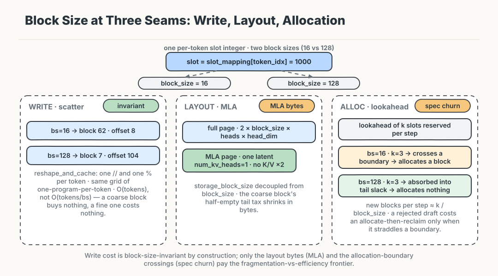</a>

<p class='figure-caption'>Figure: the same per-token `slot_mapping` value decomposed under two block sizes — write cost is block-size-invariant, while layout bytes and allocation-boundary crossings are not.</p>

**The write path is block-size-blind: `reshape_and_cache` decomposes, it never amortizes**

The manager resolves logical blocks to a per-token `slot_mapping` before the backend writes KV. The kernel then computes `block_idx = slot // block_size` and `block_offset = slot % block_size`; `block_size` is a compile-time constant, while each program still writes one token's K and V. Write cost is therefore O(tokens), independent of block granularity.

`slot < 0` rejects CUDA-graph padding before that decomposition. Larger blocks mainly amortize read-side block-table traversal; they do not reduce the number of KV writes.

### MLA decouples the tokens you count from the rows you store

MLA separates `block_size` (logical token span), `storage_block_size` (stored latent rows), and `page_size_bytes` (reserved bytes). Compression can reduce stored rows, and caching one joint latent removes the separate K/V and per-head expansion. The scheduler still addresses token positions in `block_size` units.

Custom `fp8_ds_mla` layouts instead use fixed 584/656-byte token footprints and may add alignment padding. Section 19 derives those layouts; the allocator must budget their padded page size without exposing that padding to token indexing.

**Speculative decoding: reserving blocks for tokens that may never commit**

`num_lookahead_tokens` is fixed from the speculative method: `k` for EAGLE/draft-model/DSpark and `k+1` for DFlash. Those provisional positions receive real slots before the drafter runs, but the cache-publication cap at `request.num_tokens` excludes them.

Additional block demand depends on whether lookahead crosses the current block boundary—roughly `k / block_size` blocks per step. Rejection moves the cursor back; later reclamation uses the in-flight-safe processed-token boundary, so provisional KV can be overwritten without ever becoming a shared cache entry.

### Where the frontier actually bites

The three seams generalize. Every path in this article that touches `block_size` pays the frontier somewhere, and exactly one of them is flat in both directions:

| Path that touches `block_size` | Larger `block_size` | Smaller `block_size` | Where the evidence is |
| --- | --- | --- | --- |
| KV write scatter (`reshape_and_cache`) | **unchanged** — the grid is indexed by token, and `block_size` enters only as a `tl.constexpr` divisor | **unchanged** — same programs, same per-token payload | [Section 22](#22-reshape_and_cache-how-a-token-kv-enters-its-physical-block) |
| Paged-attention read gather | cheaper — fewer, longer contiguous runs and a shorter block table per request | costlier — more per-token block-table indirection | article 08 |
| Tail-block internal fragmentation | costlier — up to `block_size - 1` token slots stranded in each sequence's last block | cheaper — a shorter tail left to strand | [Section 1](#1-kv-cache-is-the-serving-memory-problem) and [Section 2](#2-the-paper-model-blocks-block-tables-sharing-and-copy-on-write) |
| Prefix-cache hit granularity | coarser — a hit rounds down to whole blocks; `hash_block_size` is the escape hatch | finer — shared prefixes are detected closer to their true boundary | [Section 7](#7-prefix-cache-lookup-hashing-longest-hit-and-the-recompute-last-token-rule) and [Section 4](#4-where-the-blocks-come-from-memory-profiling-num_gpu_blocks-and-kv-cache-config) |
| Bytes a block reserves | costlier in proportion — unless MLA moves the base by decoupling `storage_block_size` and dropping the K/V factor of two | cheaper in proportion | [Section 19](#19-mla-the-compressed-latent-kv-cache) |
| Speculative lookahead churn | cheaper — roughly `k / block_size` new blocks per decode step, so most steps allocate nothing | costlier — the lookahead straddles a block boundary more often | [Section 14](#14-speculative-decoding-meets-the-kv-cache-lookahead-slots-and-rollback) |
| Cascade shared-prefix granularity | coarser — `common_prefix_len // block_size * block_size` truncates more of the shared prefix out of the prefix kernel | finer — more of the true common prefix survives the rounding | [Section 12](#12-cascade-attention-one-shared-prefix-across-the-whole-batch) |

Only the read-gather row carries the amortization the frontier is named for, and it is the one row this article does not own — article 08 is the section to read next if the question is "how big should my blocks be for throughput" rather than "what does block size cost my memory manager."

## 7. Prefix-Cache Lookup: Hashing, Longest Hit, and the Recompute-Last-Token Rule

Prefix caching lets requests with the same prompt prefix share physical KV blocks and skip recomputation. The lookup path must establish content identity and the longest safe hit without changing ownership: it is a pure probe that does **not** mutate reference counts or the free queue.

That commit step belongs to `allocate_slots` and `touch` ([Section 9](#9-allocate_slots-is-a-policy-stack-not-an-allocation) and [Section 23](#23-the-life-of-a-physical-block-allocate-use-free-cache-evict)); keeping lookup side-effect-free is what lets the scheduler ask "what could this request reuse?" speculatively, before it decides whether the request is even admissible.

**The entry point is a read-only probe, with two correctness escape hatches**

The scheduler's single question ("how much of this request's prompt is already computed?") enters through `get_computed_blocks`. Two guards short-circuit it before any hashing happens.

`vllm/v1/core/kv_cache_manager.py:L214-L219`

```python
        # We skip finding the prefix cache hit when prefix caching is
        # disabled or the request is marked as skipping kv cache read
        # (which happens when the request requires prompt logprobs
        # or calls a pooling model with all pooling).
        if not self.enable_caching or request.skip_reading_prefix_cache:
            return self.empty_kv_cache_blocks, 0
```

The first guard (`not self.enable_caching`) is obvious. The second (`request.skip_reading_prefix_cache`) is the subtle one: prompt-logprobs requests and all-pooling requests need the model to *actually run the forward pass over every prompt token* to emit the per-token outputs the caller asked for. If those tokens were served from cache, the forward pass would never execute over them and the required logprobs/embeddings would be missing. So correctness, not memory, forces a full recompute here, and the request returns `(empty_singleton, 0)`. Note the return is the shared `empty_kv_cache_blocks` singleton ([Section 9](#9-allocate_slots-is-a-policy-stack-not-an-allocation)), so the common "caching off / opt-out" path allocates zero objects.

`get_computed_blocks` returns only *full, block-aligned* computed prefixes (its docstring at `L204` states "the computed blocks must be full"), and it never returns cached KV for a request whose semantics require recomputation. A prefix "hit" is only ever a performance shortcut, never a change to what the model computes.

### The recompute-last-token rule: a 100% hit must still leave one token to run

The pivotal subtlety of the whole read path is one line, and it is worth reading its comment verbatim.

`vllm/v1/core/kv_cache_manager.py:L221-L227`

```python
        # NOTE: When all tokens hit the cache, we must recompute the last token
        # to obtain logits. Thus, set max_cache_hit_length to prompt_length - 1.
        # This can trigger recomputation of an entire block, rather than just
        # the single last token, because allocate_slots() requires
        # num_computed_tokens to be block-size aligned. Removing this limitation
        # could slightly improve performance in the future.
        max_cache_hit_length = request.num_tokens - 1
```

The cache-hit search is capped at `request.num_tokens - 1`, never the full prompt length. Consider a request whose entire prompt is already cached from a prior identical request. If the lookup were allowed to report a 100% hit, the scheduler would mark every prompt token as computed, `allocate_slots` would schedule **zero** new tokens, and the forward pass would have no position at which to produce logits: the first decode step would have nothing to sample from. Reserving the final token guarantees at least one token always flows through the model.

The comment also flags the *coarseness cost* honestly. Because `allocate_slots` requires `num_computed_tokens` to be block-size aligned (a hit is measured in whole blocks), shaving a single token off the tail can drop the entire trailing block from the hit. If the prompt is an exact multiple of the block size, the request recomputes up to `block_size` tokens, not one. That is a known, accepted inefficiency, not a bug — and the comment marks it as a future optimization.

Every admitted request always has at least one token to compute, so the first sampling step always has fresh logits. This prevents the degenerate "fully cached prompt schedules no work and produces no output" state.

<a href='images/vllm-06-05-recompute-last-token.svg' target='_blank'>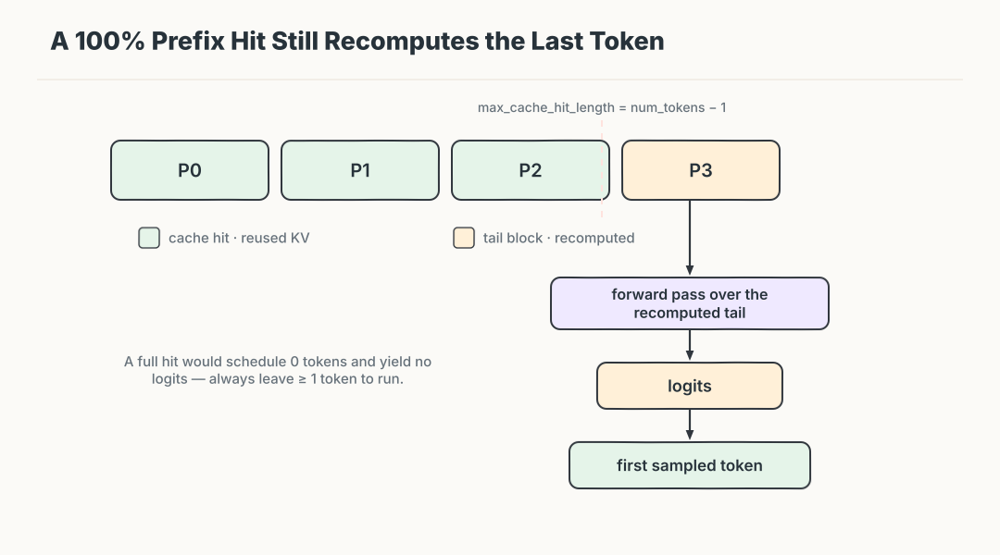</a>

<p class='figure-caption'>a fully-cached prompt (all blocks hit) still shaves the last token, dropping the tail block and forcing a partial recompute so the forward pass produces logits.</p>

### A block's identity is content, not location: the Merkle hash chain

Everything downstream (which cached block a lookup resolves to) depends on a single notion of block *identity*. That identity is content-addressed and prefix-chained. The one function that mints it is `hash_block_tokens`.

`vllm/v1/core/kv_cache_utils.py:L598-L604`

```python
    if not parent_block_hash:
        parent_block_hash = NONE_HASH

    curr_block_token_ids_tuple = tuple(curr_block_token_ids)
    return BlockHash(
        hash_function((parent_block_hash, curr_block_token_ids_tuple, extra_keys))
    )
```

The hashed object is a 3-tuple: `(parent_block_hash, this block's token ids, extra_keys)`. Because the *parent's* hash is folded in, each block hash fingerprints the **entire prefix up to that block's boundary**, not just the tokens local to the block — a Merkle-style chain ([vLLM Prefix Caching docs](https://docs.vllm.ai/en/stable/design/prefix_caching/); intuition in [Sankalp, "How prompt caching works"](https://sankalp.bearblog.dev/how-prompt-caching-works/)). The consequence is the property the longest-hit scan will exploit below: **if block *i*'s hash matches, then blocks 0..i are guaranteed byte-for-byte identical in token content and metadata**. Conversely, a single differing token anywhere in the prefix diverges every downstream hash.

Note that `hash_function` is a parameter, not a hard-coded algorithm — the concrete function is injected once per engine (`caching_hash_fn`). The docs state the default is SHA-256 as of v0.11; the code only constrains the CBOR-based family via `_CBOR_HASH_FUNCTIONS = frozenset({sha256_cbor, xxhash_cbor})`. The exact resolved default is config-driven and not pinned in these excerpts (treat "SHA-256 default" as doc-stated, not asserted by this code).

Two blocks share a `BlockHash` iff they have identical (parent-prefix, local tokens, extra keys). This is the guard that a cache hit reuses KV only for a genuinely identical prefix.

<a href='images/vllm-06-06-block-hash-chain.svg' target='_blank'>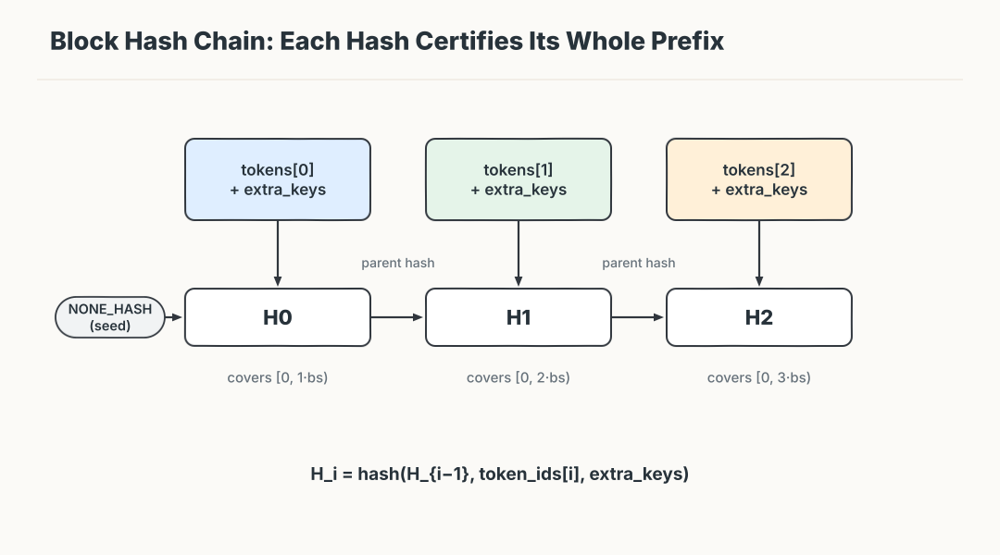</a>

<p class='figure-caption'>`hash_block_tokens` chains each block's hash from its parent's, so block *i*'s hash certifies the whole prefix [0, i·block_size).</p>

**The chain seed doubles as cross-tenant isolation**

The first block of any prefix has no parent. `NONE_HASH` stands in for that missing parent — and its construction is where multi-tenant isolation lives.

`vllm/v1/core/kv_cache_utils.py:L99-L114`

```python
def init_none_hash(hash_fn: Callable[[Any], bytes]):
    global NONE_HASH

    hash_seed = os.getenv("PYTHONHASHSEED")
    if hash_seed is None and hash_fn in _CBOR_HASH_FUNCTIONS:
        logger.warning(
            "PYTHONHASHSEED is not set. This will lead to non-reproducible "
            "block-hashes when using CBOR-based hash functions such as "
            "sha256_cbor or xxhash_cbor. Consider setting PYTHONHASHSEED to a "
            "fixed value for reproducibility."
        )

    if hash_seed is None:
        NONE_HASH = BlockHash(os.urandom(32))
    else:
        NONE_HASH = BlockHash(hash_fn(hash_seed))
```

When `PYTHONHASHSEED` is unset, `NONE_HASH` is 32 random bytes drawn per process. Because the seed is the root of every chain, an attacker who wants to make a crafted prompt collide into another process's cached prefix cannot — they cannot predict the per-process seed, mirroring CPython's randomized `hash()`. When the seed *is* set, `NONE_HASH` becomes deterministic and hashes become reproducible across processes, which is required for the deliberate cross-process sharing cases: prefix sharing across engine replicas, prefill/decode (P/D) disaggregation, and KV offloading.

### Extra keys keep the wrong tenant, adapter, or modality out of a hit

Token ids alone do not identify KV. The same token sequence under a different LoRA adapter, a different multimodal image, or a different cache-isolation salt produces *different* KV and must never collide. `generate_block_hash_extra_keys` assembles the disambiguators into the `extra_keys` slot of the hash tuple.

`vllm/v1/core/kv_cache_utils.py:L555-L574`

```python
    mm_extra_keys: list[Any]
    mm_extra_keys, new_start_mm_idx = _gen_mm_extra_hash_keys(
        request, start_token_idx, end_token_idx, start_mm_idx
    )
    lora_extra_keys: list[str] = _gen_lora_extra_hash_keys(request)
    cache_salt_keys: list[str] = (
        [request.cache_salt] if (start_token_idx == 0 and request.cache_salt) else []
    )
    prompt_embeds_keys = _gen_prompt_embeds_extra_hash_keys(
        request, start_token_idx, end_token_idx
    )

    extra_keys: list[Any] = (
        lora_extra_keys + mm_extra_keys + cache_salt_keys + prompt_embeds_keys
    )

    if not extra_keys:
        return None, new_start_mm_idx

    return tuple(extra_keys), new_start_mm_idx
```

Four sources, assembled in a fixed positional order (`lora + mm + salt + prompt_embeds`), and that order is part of the hash — it must never be reshuffled. Three details matter:

- **Cache salt is applied only to the first block** (`start_token_idx == 0`). It looks cheap and local, but because block 0's hash chains into every later block, salting block 0 alone taints the *entire* request's prefix chain. One salt value partitions a whole conversation's cache away from other tenants at O(1) cost.
- **Multimodal keys carry an in-block offset** (via `_gen_mm_extra_hash_keys`), not just the content id, so the same image landing at a different position among otherwise-identical placeholder tokens produces a distinct key.
- **The all-text common path returns `None`, not an empty tuple.** `need_extra_keys` (`L411-L428`) is the cheap gate; when a request has no LoRA, no multimodal features, and no salt, the hash tuple's third slot is `None` and the hot path allocates nothing extra.

**Only full blocks are hashed, and the hash list is append-only and physical-id-free**

Block hashes are produced by a per-request closure, `request_block_hasher`, that runs every time the request grows and returns *only the newly-completed* block hashes.

`vllm/v1/core/kv_cache_utils.py:L687-L693`

```python
    def request_block_hasher(request: Request) -> list[BlockHash]:
        start_token_idx = len(request.block_hashes) * hash_block_size
        num_tokens = request.num_tokens

        if start_token_idx + hash_block_size > num_tokens:
            # Early stop when there no new full blocks created.
            return []
```

`vllm/v1/core/kv_cache_utils.py:L707-L726`

```python
        while True:
            end_token_idx = start_token_idx + hash_block_size
            if end_token_idx > num_tokens:
                # We only hash full blocks
                break

            # MM and LoRA requests need extra keys for block-hash computation.
            extra_keys, curr_mm_idx = generate_block_hash_extra_keys(
                request, start_token_idx, end_token_idx, curr_mm_idx
            )

            # Compute the hash of the current block
            block_tokens = request.all_token_ids[start_token_idx:end_token_idx]
            block_hash = hash_block_tokens(
                caching_hash_fn, prev_block_hash_value, block_tokens, extra_keys
            )

            new_block_hashes.append(block_hash)
            start_token_idx += hash_block_size
            prev_block_hash_value = block_hash
```

Three points: (1) the resume index is `len(request.block_hashes) * hash_block_size` — already-hashed prefix is never re-hashed, so appending tokens is incremental. (2) `end_token_idx > num_tokens` breaks the loop, so a partial trailing block is never hashed; it waits for enough tokens to fill it. This is the code-level enforcement of the docs' "only full blocks are cached." (3) `prev_block_hash_value` threads the chain forward across calls, preserving Merkle continuity. The closure's output is spliced onto the request:

`vllm/v1/request.py:L242-L245`

```python
    def update_block_hashes(self) -> None:
        """Compute block hashes for any new full blocks and append them."""
        if self._block_hasher is not None:
            self.block_hashes.extend(self._block_hasher(self))
```

`request.block_hashes` is an append-only list indexed by hash-block position — index *i* fingerprints tokens `[0, (i+1)*hash_block_size)`. It is pure content identity, entirely divorced from any physical `block_id`. This is what the pool looks up; the request never has to know which physical blocks (if any) currently back its prefix.

### Resolving identity to physical blocks: all-or-nothing across groups

The lookup that turns a `BlockHash` into a `KVCacheBlock` lives on the pool. It resolves the hash *for every KV-cache group at once* and treats a miss in any group as a total miss.

`vllm/v1/core/block_pool.py:L213-L224`

```python
        cached_blocks = []
        for group_id in kv_cache_group_ids:
            block_hash_with_group_id = make_block_hash_with_group_id(
                block_hash, group_id
            )
            block = self.cached_block_hash_to_block.get_one_block(
                block_hash_with_group_id
            )
            if not block:
                return None
            cached_blocks.append(block)
        return cached_blocks
```

The physical key is not the bare `BlockHash` but `make_block_hash_with_group_id(block_hash, group_id)`, which appends a 4-byte big-endian group id:

`vllm/v1/core/kv_cache_utils.py:L57-L66`

```python
def make_block_hash_with_group_id(
    block_hash: BlockHash, group_id: int
) -> BlockHashWithGroupId:
    """Pack a `BlockHash` and group id into a `BlockHashWithGroupId`.

    The group id is encoded using 4 bytes in big-endian order and appended to
    the block hash bytes.  This representation avoids creating tuples while
    still allowing us to recover both components when needed.
    """
    return BlockHashWithGroupId(block_hash + group_id.to_bytes(4, "big", signed=False))
```

So the *same* token prefix in a full-attention group and a sliding-window group produces the same `BlockHash` but distinct `BlockHashWithGroupId` keys — their physical blocks never alias. And `get_cached_block` returns `None` the instant any group misses: a prefix is only reusable if *all* groups that must serve it have the KV cached.

The map behind it, `BlockHashToBlockMap`, records a deliberate design choice in its docstring:

`vllm/v1/core/block_pool.py:L48-L52`

```python
    NOTE #1: We currently don't de-duplicate the blocks in the cache,
    meaning that if a block becomes full and is cached, we don't check
    if there is already an identical block in the cache. This is because
    we want to make sure the allocated block IDs won't change so that
    block tables are append-only.
```

Not de-duplicating means the value is usually a single `KVCacheBlock`, but on a genuine hash collision (two different blocks hashing equal) `insert` (`L89-L105`) promotes the value to an inner `{block_id: KVCacheBlock}` dict, and `get_one_block` returns any member. The reason to tolerate this rather than collapse duplicates: collapsing would change a block's id out from under a request whose block table already recorded it, and block tables ([Section 20](#20-from-block-table-to-kernel-slot_mapping-and-the-device-tensors)) rely on being append-only.

A resolved hit points at real blocks whose KV genuinely matches the request's prefix, in every group simultaneously. And membership in this map does *not* mean a block is off the free queue — a cached block can be live *or* free-and-evictable (its docstring, `L45-L46`, says exactly this). Making a hit non-evictable is `touch`'s job at commit time ([Section 23](#23-the-life-of-a-physical-block-allocate-use-free-cache-evict)); the lookup here only reads.

### Longest hit: the scan direction is the attention type's memory model

`find_longest_cache_hit` is the one method each `SingleTypeKVCacheManager` must implement ([Section 15](#15-the-coordinator-and-hybrid-kv-cache-when-one-block-type-is-not-enough) covers the coordinator's cross-group fixed point). The single-type scans are where the Merkle-chain property pays off. Full attention scans left to right and stops at the first miss:

`vllm/v1/core/single_type_kv_cache_manager.py:L591-L602`

```python
        max_num_blocks = max_length // block_size
        for block_hash in itertools.islice(block_hashes, max_num_blocks):
            # block_hashes is a chain of block hashes. If a block hash is not
            # in the cached_block_hash_to_id, the following block hashes are
            # not computed yet for sure.
            if cached_block := block_pool.get_cached_block(
                block_hash, kv_cache_group_ids
            ):
                for computed, cached in zip(computed_blocks, cached_block):
                    computed.append(cached)
            else:
                break
```

The comment states the crucial fact: because the hashes form a chain, the first miss guarantees every subsequent block is also uncached, so the scan can stop immediately: an O(hit-length) probe, not O(prompt-length). This is the "zero-overhead" prefix caching the [V1 alpha notes](https://vllm.ai/blog/2025-01-27-v1-alpha-release) describe: constant work per matched block, early termination on miss.

Sliding-window attention cannot scan the same way. A window-limited layer only needs the *last* `sliding_window` tokens resident, so a valid hit is a contiguous run of blocks near the tail, and the scan runs right to left:

`vllm/v1/core/single_type_kv_cache_manager.py:L727-L741`

```python
        # Search from right to left and early stop when a match is found.
        for i in range(max_num_blocks - 1, -1, -1):
            if cached_block := block_pool.get_cached_block(
                block_hashes[i], kv_cache_group_ids
            ):
                # Skip prefix matching check if the block is not aligned with
                # `alignment_tokens`.
                if num_contiguous_blocks == 0 and block_size != alignment_tokens:
                    post_pop_blocks = i if drop_eagle_block else i + 1
                    if (post_pop_blocks * block_size) % alignment_tokens != 0:
                        continue
                # Add the cached block to the computed blocks.
                for computed, cached in zip(computed_blocks, cached_block):
                    computed[i] = cached
                num_contiguous_blocks += 1
```

The result array is pre-filled with `null_block` (`L720-L723`) and the scan fills real blocks into their positions, requiring a contiguous window's worth before declaring a hit. Both scans end with an alignment trim: the full-attention manager pops trailing blocks until `len * block_size` is a multiple of `alignment_tokens` (`L607-L612`), so the reported hit is block-aligned in *every* group at once — the property the recompute-last-token comment relied on when it warned that shaving one token can drop a whole block.

Each attention type's scan matches its own memory model — full attention needs the whole prefix contiguous from the left; sliding-window needs only a contiguous window at the right — and both return only block-aligned prefixes. The longest common hit the scheduler ultimately sees is the length every participating group can serve simultaneously, never a length some group would have to satisfy with KV it never retained.

## 8. The Prefix-Cache Write Path: cache_full_blocks and Committing a Hash

The write path is separate from lookup. It runs at the tail of `allocate_slots`, publishes only finalized full blocks, and can be delayed for P/D transfers. The trace begins at `self.coordinator.cache_blocks(request, num_tokens_to_cache)` and ends when the block's content identity enters the hash map.

The write funnel publishes only full, finalized blocks at boundaries the lookup path can confirm. Its layers successively clamp token count, eligible blocks, and content identities.

<a href='images/vllm-06-14-cache-write.svg' target='_blank'>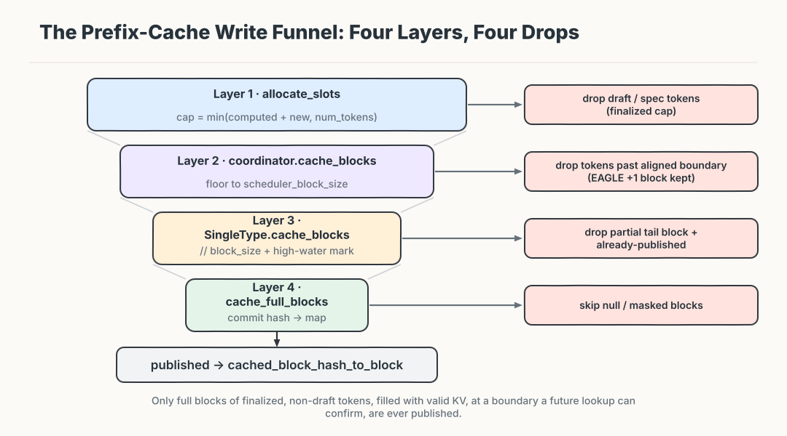</a>

<p class='figure-caption'>The four-layer write funnel from `allocate_slots`' finalized-token cap through `coordinator.cache_blocks` (scheduler-block alignment), `SingleTypeKVCacheManager.cache_blocks` (floor to full blocks + high-water mark), to `BlockPool.cache_full_blocks` committing each block's hash into `cached_block_hash_to_block`; annotate where each layer drops tokens/blocks (draft cap, alignment floor, integer floor, null/mask skip).</p>

**Layer 1: the manager guard and the fan-out over groups**

The façade method is a one-line gate. It re-checks caching (the same flag [Section 9](#9-allocate_slots-is-a-policy-stack-not-an-allocation) already checked, because `cache_blocks` is also a public method other call sites could reach) and delegates to the coordinator.

`vllm/v1/core/kv_cache_manager.py:L599-L608`

```python
    def cache_blocks(self, request: Request, num_computed_tokens: int) -> None:
        """Cache the blocks for the request, if enabled.

        Args:
            request: The request to cache the blocks.
            num_computed_tokens: The number of computed tokens, including tokens
                that are already cached and tokens to be cached.
        """
        if self.enable_caching:
            self.coordinator.cache_blocks(request, num_computed_tokens)
```

The coordinator is the layer that owns the KV-cache groups ([Section 15](#15-the-coordinator-and-hybrid-kv-cache-when-one-block-type-is-not-enough)). In the generic / single-group base, `cache_blocks` is a bare fan-out: the same finalized token count is handed to every `SingleTypeKVCacheManager` unchanged.

`vllm/v1/core/kv_cache_coordinator.py:L279-L284`

```python
        for manager in self.single_type_managers:
            manager.cache_blocks(
                request,
                num_computed_tokens,
                retention_interval=self.retention_interval,
            )
```

The coordinator does not know or care about block sizes here; it forwards `num_computed_tokens` (a *token* count) plus a `retention_interval` (a sparse-checkpoint knob only SWA managers act on) to each per-type manager, which will do its own block arithmetic. Because the tuple of managers is positionally aligned to `kv_cache_config.kv_cache_groups` ([Section 15](#15-the-coordinator-and-hybrid-kv-cache-when-one-block-type-is-not-enough)), this loop publishes into every group's slice of the one shared pool in one pass.

### Layer 2: hybrid alignment and the EAGLE lookahead exception

The hybrid coordinator overrides that fan-out, and the override is where write-granularity is forced to match read-granularity. Recall from [Section 15](#15-the-coordinator-and-hybrid-kv-cache-when-one-block-type-is-not-enough) that this coordinator only ever *reports* a cache hit at a multiple of `scheduler_block_size` (the block-size lattice `hash_block_size | group.block_size | scheduler_block_size`). If the writer published at a finer boundary than the reader can confirm, those keys would be unreachable clutter. So the writer floors to the same coarse boundary.

`vllm/v1/core/kv_cache_coordinator.py:L603-L629`

```python
    def cache_blocks(self, request: Request, num_computed_tokens: int) -> None:
        # Cache hits in this coordinator are always a multiple of
        # ``scheduler_block_size`` tokens (see ``find_longest_cache_hit``).
        # Within an aligned region, SWA groups may only consult a subset of blocks
        # per ``scheduler_block_size``-segment so the unused blocks also stay
        # out of the prefix-cache hash map.
        aligned_num_computed_tokens = (
            num_computed_tokens // self.scheduler_block_size * self.scheduler_block_size
        )
        for manager in self.single_type_managers:
            num_tokens_to_cache = aligned_num_computed_tokens
            # EAGLE groups match one block past each aligned boundary and drop
            # it, so make that lookahead block eligible to be cached.
            if manager.use_eagle and aligned_num_computed_tokens > 0:
                num_tokens_to_cache = min(
                    num_computed_tokens,
                    aligned_num_computed_tokens + manager.block_size,
                )
            # The manager already knows the fine hit granularity
            # (``scheduler_block_size``); retention is passed separately so it
            # can keep both the coarse segment tails and the fine replay
            # boundary (which needs the fine value).
            manager.cache_blocks(
                request,
                num_tokens_to_cache,
                retention_interval=self.retention_interval,
            )
```

`aligned_num_computed_tokens = num_computed_tokens // scheduler_block_size * scheduler_block_size` floors the finalized count to the coarse alignment — so the writer never publishes past the last boundary a `find_longest_cache_hit` sweep could confirm across *all* groups at once. The EAGLE branch is the one deliberate exception: an EAGLE draft group's lookup matches one block *past* each aligned boundary and then drops it ([Section 15](#15-the-coordinator-and-hybrid-kv-cache-when-one-block-type-is-not-enough)'s per-type hit rules), so if the writer floored strictly, that one lookahead block would never be cacheable at all. The branch bumps the cap by exactly one `manager.block_size` — but re-clamps with `min(num_computed_tokens, ...)` so it can never exceed the true finalized count that [Section 9](#9-allocate_slots-is-a-policy-stack-not-an-allocation) already established. The comment about SWA groups consulting "a subset of blocks per `scheduler_block_size`-segment" foreshadows the per-block mask two layers down: alignment gets the *segment* boundary right, and the mask then drops the individual blocks within a segment that a sparse-attention lookup would never read.

**Write granularity equals read granularity.** A block is published only at a prefix length where a future lookup could actually land; the EAGLE +1-block carve-out is the single audited over-publish, bounded on both sides.

**Layer 3: floor to full blocks, and the per-request high-water mark**

The per-type manager converts a token count into a *block set* and calls the pool. This is the second, independent enforcement of "only full blocks," now at the group's own `block_size` (which may be a multiple of `hash_block_size`).

`vllm/v1/core/single_type_kv_cache_manager.py:L338-L363`

```python
        num_cached_blocks = self.num_cached_block.get(request.request_id, 0)
        num_full_blocks = num_tokens // self.block_size

        if num_cached_blocks >= num_full_blocks:
            return

        block_mask = self.reachable_block_mask(
            start_block=num_cached_blocks,
            end_block=num_full_blocks,
            alignment_tokens=self.scheduler_block_size,
            kv_cache_spec=self.kv_cache_spec,
            use_eagle=self.use_eagle,
            retention_interval=retention_interval,
            num_prompt_tokens=request.num_prompt_tokens,
        )
        self.block_pool.cache_full_blocks(
            request=request,
            blocks=self.req_to_blocks[request.request_id],
            num_cached_blocks=num_cached_blocks,
            num_full_blocks=num_full_blocks,
            block_size=self.block_size,
            kv_cache_group_id=self.kv_cache_group_id,
            block_mask=block_mask,
        )

        self.num_cached_block[request.request_id] = num_full_blocks
```

`num_full_blocks = num_tokens // self.block_size` is an **integer floor**: the trailing partial block (`num_tokens % block_size` tokens) is never eligible — the code-level twin of the hasher's "only hash full blocks" break that [Section 7](#7-prefix-cache-lookup-hashing-longest-hit-and-the-recompute-last-token-rule) read in `request_block_hasher`. `num_cached_block` is a per-request dict (`self.num_cached_block: dict[str, int]`) that records how many of this request's blocks are *already published*; the eligible window is exactly `blocks[num_cached_blocks : num_full_blocks]`, and `if num_cached_blocks >= num_full_blocks: return` early-exits when nothing new filled since the last step. After the pool call returns, `self.num_cached_block[request.request_id] = num_full_blocks` advances the high-water mark. This same `num_cached_block` dict is what the two-phase touch ([Section 15](#15-the-coordinator-and-hybrid-kv-cache-when-one-block-type-is-not-enough)) checks to decide a running request "won't have new prefix-cache hits" — the write path's bookkeeping and the allocation path's fast-path guard share one field.

The `block_mask` comes from `reachable_block_mask`, which for full attention is simply `None` — cache every non-null block:

`vllm/v1/core/single_type_kv_cache_manager.py:L376-L383`

```python
        """Per-block mask for ``cache_full_blocks``. ``None`` means cache
        every (non-null) block — the default for full attention.

        Subclasses with sparse hit semantics (SWA) override this to skip
        blocks that can never serve a hit at any alignment-aligned prefix
        length.
        """
        return None
```

The sliding-window manager overrides this to a `list[bool]` that drops the interior blocks a right-to-left windowed lookup ([Section 15](#15-the-coordinator-and-hybrid-kv-cache-when-one-block-type-is-not-enough)) could never consult — so those blocks stay out of the map even though they are "full." Cross-attention opts out one layer higher: its `cache_blocks` raises rather than publishing at all ([Section 15](#15-the-coordinator-and-hybrid-kv-cache-when-one-block-type-is-not-enough)), because encoder KV is per-request and never shared.

**Publishing is monotone and idempotent** (the high-water mark never re-processes a block, so re-entering `cache_blocks` every decode step is cheap and cannot double-publish), and **only full, reachable blocks are eligible** (integer floor + mask).

### Layer 4: BlockPool.cache_full_blocks — the actual publish

This method consumes `request.block_hashes`; it does not compute hashes itself. Its docstring points back to the producer [Section 7](#7-prefix-cache-lookup-hashing-longest-hit-and-the-recompute-last-token-rule) examined: "The block hashes values are computed by the Request object immediately when it is created and when new tokens are appended" (`block_pool.py:L241-L242`). It first selects the hash source and checks that the request has already produced enough entries.

`vllm/v1/core/block_pool.py:L260-L274`

```python
        if num_cached_blocks >= num_full_blocks:
            return
        new_full_blocks = blocks[num_cached_blocks:num_full_blocks]
        assert block_mask is None or len(block_mask) == len(new_full_blocks)
        if block_size == self.hash_block_size:
            # Common case.
            block_hashes: BlockHashList = request.block_hashes
        else:
            # block_size is a multiple of hash_block_size. This happens when
            # different KV cache groups have different block sizes.
            assert block_size % self.hash_block_size == 0
            block_hashes = BlockHashListWithBlockSize(
                request.block_hashes, self.hash_block_size, block_size
            )
        assert len(block_hashes) >= num_full_blocks
```

In the common case the group's `block_size` equals `hash_block_size`, so `request.block_hashes` ([Section 7](#7-prefix-cache-lookup-hashing-longest-hit-and-the-recompute-last-token-rule)'s append-only, physical-id-free content list) is read directly. When a group uses fatter blocks (a multiple of `hash_block_size`), the fine-grained hash list is wrapped so index *i* returns the *coarse* block's hash. That wrapper does not re-hash anything; it picks the fine hash sitting at the coarse block's last sub-block boundary:

`vllm/v1/core/kv_cache_utils.py:L2231-L2234`

```python
    def _get_value_at(self, idx: int) -> BlockHash:
        # The last hash_block_size hash within the target block already chains
        # over the whole prefix, so it is the target block's hash.
        return self.block_hashes[(idx + 1) * self.scale_factor - 1]
```

This works precisely because of the Merkle-chain property [Section 7](#7-prefix-cache-lookup-hashing-longest-hit-and-the-recompute-last-token-rule) established: a `hash_block_size` hash already fingerprints the *entire* prefix ending at its boundary, so the last sub-block's hash is a valid identity for the whole coarse block. The `assert len(block_hashes) >= num_full_blocks` is the write path's dependence on [Section 7](#7-prefix-cache-lookup-hashing-longest-hit-and-the-recompute-last-token-rule)'s eager `update_block_hashes` made explicit: if the Request had somehow not yet computed a hash for a block we are about to publish, this fails loudly rather than caching an unidentified block.

Then the per-block commit loop:

`vllm/v1/core/block_pool.py:L276-L308`

```python
        new_block_hashes = block_hashes[num_cached_blocks:]
        new_hashes: list[ExternalBlockHash] | None = (
            [] if self.enable_kv_cache_events else None
        )
        for i, blk in enumerate(new_full_blocks):
            # Some blocks may be null or masked out when enabling sparse attention
            # like sliding window attention, or Mamba models with prefix-caching
            # in align mode. We skip null blocks here.
            if blk.is_null or (block_mask is not None and not block_mask[i]):
                continue
            block_hash = new_block_hashes[i]
            num_hash_tokens = (num_cached_blocks + i + 1) * block_size

            # Update and added the full block to the cache.
            block_hash_with_group_id = make_block_hash_with_group_id(
                block_hash, kv_cache_group_id
            )
            if blk.block_hash is not None:
                # The only valid case where a "new full block" already has a
                # hash is partial->full promotion of the same cache block.
                assert (
                    blk.block_hash_num_tokens is not None
                    and blk.block_hash_num_tokens < num_hash_tokens
                )
                removed_hashes = self._remove_cached_block_hashes(blk)
                self._emit_block_removed_events(removed_hashes)
            self._insert_block_hash(
                block_hash_with_group_id,
                blk,
                num_tokens=num_hash_tokens,
            )
            if new_hashes is not None:
                new_hashes.append(maybe_convert_block_hash(block_hash))
```

In commit order:

1. **Skip null or masked-out blocks** — `if blk.is_null or (block_mask is not None and not block_mask[i]): continue`. Null blocks are the shared sentinel ([Section 3](#3-kvcacheblock-and-blockpool-the-free-list-is-an-eviction-structure)) standing in for skipped SWA/Mamba states; masked blocks are the sparse-attention blocks Layer 3 flagged unreachable. Neither carries valid, reusable KV, so neither may ever be advertised.
2. **`num_hash_tokens = (num_cached_blocks + i + 1) * block_size`**: the prefix length in tokens this block's KV covers. It is stored alongside the hash (via `_insert_block_hash`'s `num_tokens` argument) and is the quantity the promotion assertion below compares against.
3. **The map key is content plus group** — `make_block_hash_with_group_id(block_hash, kv_cache_group_id)` appends the group id as four big-endian bytes to the content hash (`kv_cache_utils.py:L66`, `block_hash + group_id.to_bytes(4, "big", signed=False)`; [Section 7](#7-prefix-cache-lookup-hashing-longest-hit-and-the-recompute-last-token-rule) details this key format). Identical token prefixes in *different* KV-cache groups get distinct keys, so a hit in the full-attention group can never resolve to a sliding-window block ([Section 20](#20-from-block-table-to-kernel-slot_mapping-and-the-device-tensors)'s group-id argument, from the write side).
4. **Partial→full promotion**: the `if blk.block_hash is not None` branch. A block in the eligible window `[num_cached_blocks:num_full_blocks]` should not already own a hash: the high-water mark of Layer 3 excludes anything already published, and `get_new_blocks` resets a block's hash the moment it is reallocated ([Section 23](#23-the-life-of-a-physical-block-allocate-use-free-cache-evict)). The comment names the single legal exception — a block previously registered as a *partial* alias (see below) that is now being promoted to a full-block hash. The assertion `blk.block_hash_num_tokens < num_hash_tokens` enforces that the pre-existing hash covers *strictly fewer* tokens than the full block, i.e. it is genuinely a shorter partial prefix, not a stale full hash. The old partial hashes are stripped via `_remove_cached_block_hashes` ([Section 23](#23-the-life-of-a-physical-block-allocate-use-free-cache-evict) reads its body; here it is the repair step that clears the block's identity so a fresh primary hash can seat) before the promotion proceeds.
5. **The publish** — `_insert_block_hash(...)`. [Section 23](#23-the-life-of-a-physical-block-allocate-use-free-cache-evict) already reads this method line by line (it is the mirror of eviction): the first key becomes the block's write-once primary `_block_hash`, additional keys are recorded as secondary aliases in `cached_block_hashes_by_block`, and both early-outs make the call idempotent. From the write path's vantage, the important fact is that `cache_full_blocks` is the *only* producer that feeds full-block hashes into it, and it does so through the promotion-aware guard above.

The trailing `new_hashes.append(...)` and the `enable_kv_cache_events` block below it (`L310-L356`, elided) build a `BlockStored` telemetry event for external KV-event subscribers (P/D, offloading); it is not part of the in-GPU cache state and never gates a hit.

**Null and unreachable blocks are never advertised; every key is content-plus-group so cross-group prefixes never alias; and a block can only pre-own a hash via a legitimate, strictly-shorter partial entry, which is torn down before the full hash lands** — so the map never ends up with two live keys claiming the same block covers two different prefix lengths.

**Where a "new full block that already has a hash" comes from**

The promotion branch above is guarding against a state that, at commit `6cf7b26bd`, the live scheduler never actually produces. The primitive that would create it, `cache_partial_block`, has **no caller inside `vllm/v1/core/`**; it is exercised only by `tests/v1/core/prefix_cache/test_partial_prefix_cache_primitives.py`. It is best read as forward-compatible infrastructure: the `cache_full_blocks` promotion path is already correct for the day partial caching is wired into allocation, but today a full block reaching `cache_full_blocks` has `blk.block_hash is None` and the branch is dormant. Reading the primitive is still worthwhile, because it completes the write-path model.

`vllm/v1/core/block_pool.py:L397-L425`

```python
        if block.is_null:
            return None

        assert block_size > self.hash_block_size
        assert block_size % self.hash_block_size == 0
        assert num_tokens % block_size != 0
        block_hash = self._get_partial_block_hash(request, num_tokens)
        num_hash_blocks = num_tokens // self.hash_block_size
        block_hash_with_group_id = make_block_hash_with_group_id(
            block_hash, kv_cache_group_id
        )
        already_cached = block.block_hash == block_hash_with_group_id or (
            self.cached_block_hash_to_block.contain(
                block_hash_with_group_id, block.block_id
            )
        )
        if (
            not already_cached
            and block.block_hash is not None
            and block.block_hash_num_tokens is not None
            and block.block_hash_num_tokens < num_hash_blocks * self.hash_block_size
        ):
            removed_hashes = self._remove_cached_block_hashes(block)
            self._emit_block_removed_events(removed_hashes)
        self._insert_block_hash(
            block_hash_with_group_id,
            block,
            num_tokens=num_hash_blocks * self.hash_block_size,
        )
```

A partial entry makes an *existing* fat cache block reachable from a *fine-grained* prefix boundary *inside* it, without allocating or copying anything. The three asserts pin the only scenario where this is meaningful: `block_size > hash_block_size` (a group whose blocks span several hash windows) and `num_tokens % block_size != 0` (the entry is genuinely partial — it stops mid-block). `_get_partial_block_hash` (`block_pool.py:L459`) returns `request.block_hashes[num_hash_blocks - 1]` (`L470`) — again the fine hash at the partial boundary, valid because it chains the whole prefix. It then reuses the exact same seat-or-alias machinery as the full path: if the block already carries a shorter primary hash, strip it first (`block.block_hash_num_tokens < num_hash_blocks * hash_block_size`), then `_insert_block_hash` seats the new key. So a block can accumulate a partial hash first and be promoted to its full hash later by `cache_full_blocks` — and the promotion assertion at `L296-L299` is exactly the mirror of the strip condition here (`num_tokens` strictly greater on promotion, strictly lesser on the earlier partial insert).

**Partial and full entries for one physical block form a strictly increasing chain of prefix lengths, each repairing the previous, so the block is never simultaneously advertised as covering two incompatible prefixes** — and because every seat routes through `_insert_block_hash` and every strip through `_remove_cached_block_hashes`, the forward and reverse indices [Section 23](#23-the-life-of-a-physical-block-allocate-use-free-cache-evict) relies on stay paired whether the entry is partial or full.

## 9. allocate_slots() Is a Policy Stack, Not an Allocation

`get_computed_blocks` reports what a request could reuse; `allocate_slots` either commits that answer or refuses it as backpressure. Despite its name, `allocate_slots` is an admission pipeline: no pool allocation occurs until every gate has passed, and the method may return without mutating the pool. Its return type makes that explicit:

`vllm/v1/core/kv_cache_manager.py:L244-L257`

```python
    def allocate_slots(
        self,
        request: Request,
        num_new_tokens: int,
        num_new_computed_tokens: int = 0,
        new_computed_blocks: KVCacheBlocks | None = None,
        num_lookahead_tokens: int = 0,
        num_external_computed_tokens: int = 0,
        delay_cache_blocks: bool = False,
        num_encoder_tokens: int = 0,
        full_sequence_must_fit: bool = False,
        reserved_blocks: int = 0,
        has_scheduled_reqs: bool = True,
    ) -> KVCacheBlocks | None:
```

`None` is backpressure, not an error: the scheduler either leaves the request waiting or preempts a running victim. Physical allocation is deferred until the prediction and admission gates have passed.

<a href='images/vllm-06-07-allocate-slots-flow.svg' target='_blank'>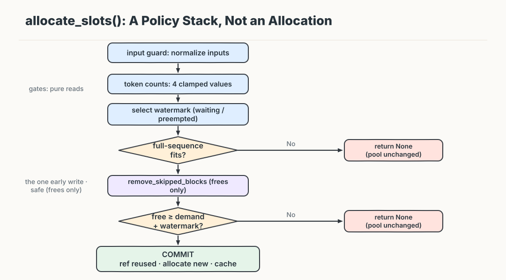</a>

<p class='figure-caption'>The allocate_slots pipeline: input guard → token-count arithmetic → watermark selection → full-sequence gate → skipped-block reclamation → per-step admission gate → commit (ref computed, allocate new, cache). Every diamond above the commit line can return `None` without having mutated the pool.</p>

**There are four token counts, not one, and each answers a different question**

The paper model has one number: tokens. The code has four, computed in a tight arithmetic chain, and conflating any two of them is a class of bug. The first pair is set up right after the input guard normalizes `new_computed_blocks` to the shared empty singleton:

`vllm/v1/core/kv_cache_manager.py:L353-L361`

```python
        # The number of computed tokens is the number of computed tokens plus
        # the new prefix caching hits
        num_local_computed_tokens = (
            request.num_computed_tokens + num_new_computed_tokens
        )
        total_computed_tokens = min(
            num_local_computed_tokens + num_external_computed_tokens,
            self.max_model_len,
        )
```

The second pair is set up just before reclamation:

`vllm/v1/core/kv_cache_manager.py:L389-L392`

```python
        num_tokens_main_model = total_computed_tokens + num_new_tokens
        num_tokens_need_slot = min(
            num_tokens_main_model + num_lookahead_tokens, self.max_model_len
        )
```

`num_local_computed_tokens` is what *vLLM itself* already holds KV for: the request's running `num_computed_tokens` plus this call's fresh prefix-cache hits (`new_comp` in the layout comment). `total_computed_tokens` folds in connector-supplied KV (`ext_comp`, from a P/D peer) and clamps to `max_model_len` — the computed prefix can never claim to exceed the context window even if local hits plus remote KV arithmetically overshoot it. `num_tokens_main_model` is what the *target model actually runs* this step: computed prefix plus new tokens. `num_tokens_need_slot` adds `num_lookahead_tokens` (speculative/EAGLE draft slots) and clamps again.

### The method never rolls back, so ordering *is* the design

`allocate_slots` has no `try/except`, no compensating undo, no transaction. Once it mutates the pool it does not un-mutate on a later failure. That single fact dictates the entire body layout: **every gate that can return `None` must run before any irreversible write.** The physical writes are the last three coordinator calls (`allocate_new_computed_blocks`, `allocate_new_blocks`, `cache_blocks`) and every `return None` in the method sits strictly above them.

There is exactly one apparent violation, and it is the most instructive line in the method. Block reclamation runs *before* the final admission gate:

`vllm/v1/core/kv_cache_manager.py:L394-L407`

```python
        # Free the blocks that are skipped during the attention computation
        # (e.g., tokens outside the sliding window).
        # We can do this even if we cannot schedule this request due to
        # insufficient free blocks.
        # Should call this function before allocating new blocks to reduce
        # the number of evicted blocks.
        # Free on the processed-token basis: in-flight steps' attention windows
        # still read blocks below the optimistic boundary, and rejected spec
        # tokens can roll it back.
        self.coordinator.remove_skipped_blocks(
            request.request_id,
            max(0, total_computed_tokens - request.num_in_flight_tokens),
            num_prompt_tokens=request.num_prompt_tokens,
        )
```

This is a *write* — for sliding-window, chunked-local, and Mamba groups it frees blocks and nulls them in the block table — and it runs unconditionally, even on a step that will return `None` two lines later. The comment says so outright: "We can do this even if we cannot schedule this request due to insufficient free blocks." Why is that safe when nothing else above the commit line is allowed to mutate? Because `remove_skipped_blocks` is *monotone on supply*: it only ever returns blocks to the pool, never consumes them. Running it early can only *increase* `get_num_free_blocks()`, which can only make the subsequent gate more likely to pass — it can never wrongly admit a request. It is also idempotent (the underlying `_remove_blocks_in_range` scans backward and nulls already-null slots harmlessly), so re-running it on the next step's retry is free. Placing it before the gate rather than after is a pure win: freed windowed-out blocks become available to *this very allocation*, cutting evictions of otherwise-cacheable prefix blocks.

The reclamation boundary itself is the other subtlety. It is not `total_computed_tokens` but `max(0, total_computed_tokens - request.num_in_flight_tokens)` — the *processed and committed* prefix, deliberately pulled back by the in-flight token count. In-flight forward passes still read blocks below the optimistic boundary, and a rejected speculative batch can roll `num_computed_tokens` backward; freeing on the optimistic boundary would hand a still-live block back to the pool.

### Two admission gates, both pure predictions, sized against different budgets

The stack contains two separate capacity checks, and they are not duplicates — they size different token spans against different budgets, and *both* are pure reads (`get_num_blocks_to_allocate` never touches the pool). The first is optional, gated on `full_sequence_must_fit`:

`vllm/v1/core/kv_cache_manager.py:L372-L387`

```python
        if full_sequence_must_fit:
            # First check and fail if the full request sequence won't fit.
            full_num_tokens = min(request.num_tokens, self.max_model_len)

            num_blocks_to_allocate = self.coordinator.get_num_blocks_to_allocate(
                request_id=request.request_id,
                num_tokens=full_num_tokens,
                new_computed_blocks=new_computed_block_list,
                num_encoder_tokens=num_encoder_tokens,
                total_computed_tokens=total_computed_tokens,
                num_tokens_main_model=full_num_tokens,
                apply_admission_cap=True,
            )
            required_blocks = num_blocks_to_allocate + watermark_blocks
            if required_blocks > self.block_pool.get_num_free_blocks():
                return None
```

The second is unconditional, and it is the gate that actually guards the commit:

`vllm/v1/core/kv_cache_manager.py:L409-L425`

```python
        num_blocks_to_allocate = self.coordinator.get_num_blocks_to_allocate(
            request_id=request.request_id,
            num_tokens=num_tokens_need_slot,
            new_computed_blocks=new_computed_block_list,
            num_encoder_tokens=num_encoder_tokens,
            total_computed_tokens=num_local_computed_tokens
            + num_external_computed_tokens,
            num_tokens_main_model=num_tokens_main_model,
        )

        # Keep `reserved_blocks` free for other in-flight sequences, and an
        # additional watermark of headroom for waiting/preempted admissions.
        available_blocks = self.block_pool.get_num_free_blocks() - reserved_blocks
        required_blocks = num_blocks_to_allocate + watermark_blocks
        if required_blocks > available_blocks:
            # Cannot allocate new blocks
            return None
```

Three differences distinguish them. First, **span**: the full-sequence gate sizes `full_num_tokens = min(request.num_tokens, max_model_len)`, the *entire* eventual sequence, whereas the per-step gate sizes `num_tokens_need_slot`, only this step's slots. Second, **admission cap**: the full-sequence gate passes `apply_admission_cap=True`, the per-step gate leaves it at its default `False`. That flag is critical, and the coordinator docstring pins exactly why:

`vllm/v1/core/kv_cache_coordinator.py:L156-L159`

```python
            apply_admission_cap: If True, apply the recycling-aware
                per-request admission cap (SWA / chunked-local). Set only by
                the full-sequence admission gate; per-step allocation must
                leave it False so the predictor matches `allocate_new_blocks`.
```

The per-step predictor must return a count the committing allocator will actually consume; if it applied the recycling cap it would under-count and the pool could OOM mid-prefill. The full-sequence gate *wants* the capped number, because for sliding-window specs the whole sequence never needs more than a window's worth of live blocks at once. Third, **budget**: the full-sequence gate checks against raw `get_num_free_blocks()`, while the per-step gate checks against `get_num_free_blocks() - reserved_blocks`. `reserved_blocks` is carved out for in-flight prefilling sequences that will need those blocks to finish; it gates async KV-connector loads so a fresh admission cannot strand a sequence already mid-flight. Both gates then add `watermark_blocks` to the demand side.

The full-sequence gate prevents chunked-prefill over-admission: without it, the first chunk could fit and admit a request that later wedges when another chunk cannot allocate. Checking the whole sequence up front, with the recycling cap for windowed attention, closes the issue-#39734 deadlock referenced by the admission-cap comment in `get_num_blocks_to_allocate` (`single_type_kv_cache_manager.py:L153-L154`).

Both capacity checks run before mutation. The full-sequence gate makes chunked-prefill admission all-or-nothing, while `apply_admission_cap` lets that gate use the tighter windowed bound without weakening the per-step predictor.

**The watermark is conditional on *who* is asking, not just how full the pool is**

`watermark_blocks` is selected, not always applied, by a three-way condition set just above the gates:

`vllm/v1/core/kv_cache_manager.py:L363-L370`

```python
        watermark_blocks = 0
        # The watermark is applied to waiting/preempted requests only, and only
        # when there's at least one request already scheduled.
        if has_scheduled_reqs and request.status in (
            RequestStatus.WAITING,
            RequestStatus.PREEMPTED,
        ):
            watermark_blocks = self.watermark_blocks
```

With the reserve itself fixed once at construction as a fraction of the pool:

`vllm/v1/core/kv_cache_manager.py:L160-L163`

```python
        # Watermark: minimum number of KV cache blocks to keep free when
        # admitting waiting/preempted requests, to avoid frequent preemptions.
        assert watermark >= 0.0, "watermark must be non-negative"
        self.watermark_blocks = int(watermark * kv_cache_config.num_blocks)
```

The watermark is a soft floor of free blocks that a *newly admitted* request must leave behind. It applies only when the request is `WAITING` or `PREEMPTED` — i.e. entering or re-entering the running set — and only when `has_scheduled_reqs` says at least one request is already scheduled this step. A request that is already `RUNNING` and merely appending a decode token bypasses the watermark entirely: it is holding blocks the system already committed to, and blocking its next token to preserve headroom would be self-defeating. The `has_scheduled_reqs` condition prevents a deadlock at the other extreme — if nothing is scheduled and the watermark would block the *only* candidate, forward progress would stall, so the floor is waived when this request is the first through the door.

**Commit ordering: reference the reused blocks before pulling new ones**

Only past both gates does state mutate, and the two writes must occur in this order:

`vllm/v1/core/kv_cache_manager.py:L427-L445`

```python
        if (
            new_computed_block_list is not self.empty_kv_cache_blocks.blocks
            or num_external_computed_tokens > 0
        ):
            # Append the new computed blocks to the request blocks until now to
            # avoid the case where the new blocks cannot be allocated.
            self.coordinator.allocate_new_computed_blocks(
                request_id=request.request_id,
                new_computed_blocks=new_computed_block_list,
                num_local_computed_tokens=num_local_computed_tokens,
                num_external_computed_tokens=num_external_computed_tokens,
            )

        new_blocks = self.coordinator.allocate_new_blocks(
            request.request_id,
            num_tokens_need_slot,
            num_tokens_main_model,
            num_encoder_tokens,
        )
```

Two details. The guard is an **identity** check (`new_computed_block_list is not self.empty_kv_cache_blocks.blocks`), not a length or truth test. This works only because the input guard normalized a `None` argument to *the exact singleton* `self.empty_kv_cache_blocks.blocks` back at `L348-L351`; the pure-miss path therefore skips the ref-count step in O(1) with no per-group iteration. When there *are* reused blocks (or external tokens), `allocate_new_computed_blocks` runs first: it bumps the reference counts on the prefix-hit blocks (the layout comment's "ref_cnt not increased yet" → "increased" transition) *before* `allocate_new_blocks` pulls fresh blocks off the LRU free queue. If the order were reversed, a fresh allocation could evict a still-ref-count-0 cache-hit block this request had just decided to reuse. (Inside the coordinator this same discipline generalizes across groups as the two-phase touch-before-allocate of issue #33775.)

### Caching is capped to finalized tokens, on a different axis than slots

The final stage decides what enters the prefix cache, and it uses neither of the slot-axis counts:

`vllm/v1/core/kv_cache_manager.py:L447-L463`

```python
        # P/D: delay caching blocks if we have to recv from
        # remote. Update state for locally cached blocks.
        if not self.enable_caching or delay_cache_blocks:
            return self.create_kv_cache_blocks(new_blocks)

        # NOTE(woosuk): We want to commit (cache) up to num_local_computed_tokens
        # + num_external_computed_tokens + num_new_tokens, but must exclude
        # "non-committable" tokens (e.g., draft tokens that could be rejected).
        # Therefore, we cap the number at `request.num_tokens`, ensuring only
        # "finalized" tokens are cached.
        num_tokens_to_cache = min(
            total_computed_tokens + num_new_tokens,
            request.num_tokens,
        )
        self.coordinator.cache_blocks(request, num_tokens_to_cache)

        return self.create_kv_cache_blocks(new_blocks)
```

First short-circuit: if caching is disabled, or `delay_cache_blocks` is set (P/D, where the block's KV will only arrive from a remote peer in a future step), return the allocated blocks *without* caching — you must never publish a prefix-cache entry for KV that is not yet valid, or a later request could hit it and read garbage. Otherwise the cache extent is `min(total_computed_tokens + num_new_tokens, request.num_tokens)`. The natural extent is everything computed plus everything new — but `num_new_tokens` includes unverified draft tokens. `request.num_tokens` counts only *finalized* tokens, so the `min` caps the cache at the committed prefix. Note the divergence from the slot axis: slots were reserved for `num_tokens_need_slot` (which *added* lookahead), while the cache is bounded by `request.num_tokens` (which *excludes* even the current step's speculative tail). The system reserves memory optimistically and caches pessimistically.

The prefix cache only ever holds KV for finalized tokens. A speculative token that is later rejected can never leave behind a cached block that a future request would reuse (which would serve KV for a token the model never actually committed to) and P/D-pending blocks are withheld until their KV is real.

## 10. The Scheduler Contract: How Scheduling Drives the KV Cache Manager

`Scheduler.schedule()` controls when the passive KV manager probes, allocates, caches, and frees. In one step it spends token and block budgets together, preempts only from the running loop when allocation fails, and fences frees that could race with in-flight GPU writes. The manager calls below appear in that execution order.

<a href='images/vllm-06-15-scheduler-contract.svg' target='_blank'>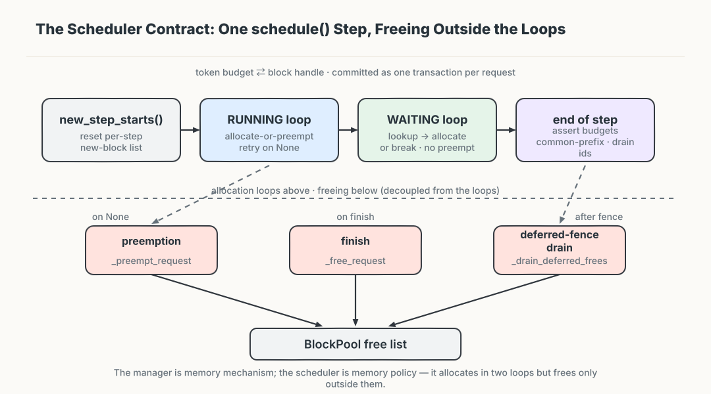</a>

<p class='figure-caption'>One `schedule()` step as a timeline: `new_step_starts` → RUNNING loop (allocate-or-preempt) → WAITING loop (lookup → allocate-or-break) → end-of-step asserts, common-prefix, drain new block ids; freeing happens on preemption, finish, and deferred-fence drain outside the allocation loops.</p>

### Two budgets, one step, committed atomically

The scheduling algorithm has no notion of "prefill" versus "decode." The docstring that opens `schedule()` states the whole model the file is built around:

`vllm/v1/core/sched/scheduler.py:L398-L407`

```python
        # NOTE(woosuk) on the scheduling algorithm:
        # There's no "decoding phase" nor "prefill phase" in the scheduler.
        # Each request just has the num_computed_tokens and
        # num_tokens_with_spec. num_tokens_with_spec =
        # len(prompt_token_ids) + len(output_token_ids) + len(spec_token_ids).
        # At each step, the scheduler tries to assign tokens to the requests
        # so that each request's num_computed_tokens can catch up its
        # num_tokens_with_spec. This is general enough to cover
        # chunked prefills, prefix caching, speculative decoding,
        # and the "jump decoding" optimization in the future.
```

Every request is just `num_computed_tokens` chasing `num_tokens_with_spec`. The step's job is to hand out tokens so the gap shrinks — and each token handed out must be backed by a physical KV slot. That yields two independent constraints the loop threads together. The token side is a scalar budget set up as local state:

`vllm/v1/core/sched/scheduler.py:L414-L419`

```python
        req_to_new_blocks: dict[str, KVCacheBlocks] = {}
        num_scheduled_tokens: dict[str, int] = {}
        token_budget = self.max_num_scheduled_tokens
        if self._pause_state == PauseState.PAUSED_ALL:
            # Do not schedule any requests when paused.
            token_budget = 0
```

`token_budget` starts at `max_num_scheduled_tokens` (derived once at construction, `scheduler.py:L109`) and is decremented as tokens are committed. The block side is not a scalar the scheduler tracks at all — it lives in the `BlockPool`'s free count, and the scheduler learns about it only through `allocate_slots` returning a `KVCacheBlocks` handle or `None`. `req_to_new_blocks` holds that handle per request; `num_scheduled_tokens` holds the committed token count. The key property is that these two maps are always written on the *same* code path. Here is the running-loop commit:

`vllm/v1/core/sched/scheduler.py:L584-L591`

```python
            # Schedule the request.
            scheduled_running_reqs.append(request)
            prefill_scheduled |= request.is_prefill_chunk
            request_id = request.request_id
            req_to_new_blocks[request_id] = new_blocks
            num_scheduled_tokens[request_id] = num_new_tokens
            token_budget -= num_new_tokens
            req_index += 1
```

`new_blocks` (the allocation the manager just handed back) is stored, `num_scheduled_tokens[request_id]` records the tokens, and `token_budget -= num_new_tokens` charges the scalar budget — three writes with no branch between them. The waiting loop mirrors this exactly at `L987-L993`. There is no path that debits `token_budget` without holding a block handle, and no path that stores a block handle without debiting the budget.

Token accounting and block accounting move as one transaction per request. A request can never consume scheduling budget without holding physical KV blocks (which would let the batch exceed the pool), and can never hold blocks without being charged budget (which would let the token count drift from the KV footprint). Both are re-asserted at end of step (below).

### The manager is bound to the connector at construction, sharing one pool

Before any step runs, the scheduler builds the `KVCacheManager` and, only if a KV connector exists, hands the connector a direct reference to the manager's `BlockPool`:

`vllm/v1/core/sched/scheduler.py:L277-L280`

```python
        # Bind GPU block pool to the KV connector. This must happen after
        # kv_cache_manager is constructed so block_pool is available.
        if self.connector is not None:
            self.connector.bind_gpu_block_pool(self.kv_cache_manager.block_pool)
```

The base connector declares the seam as a no-op that P/D and offloading connectors override:

`vllm/distributed/kv_transfer/kv_connector/v1/base.py:L443-L451`

```python
    def bind_gpu_block_pool(self, gpu_block_pool: "BlockPool") -> None:
        """
        Bind the GPU block pool to the connector for per-GPU block status tracking.
        For example, inc/dec ref counts, or iterate over the prefix cache blocks.

        Args:
            gpu_block_pool: the GPU block pool.
        """
        return
```

The comment at `L277-L278` pins the ordering: the bind must run *after* the manager is constructed, because it passes `self.kv_cache_manager.block_pool` — the same pool object the scheduler allocates from through `allocate_slots`. The connector does not get a copy or a view; it gets the identical pool so that external KV loads and saves touch exactly the blocks the scheduler handed out (see [Section 23](#23-the-life-of-a-physical-block-allocate-use-free-cache-evict) for the ref-count semantics the connector piggybacks on).

There is one `BlockPool` per engine, shared by scheduler and connector. This is what makes a connector's ref-count bookkeeping meaningful — and it is precisely why freeing needs a fence (below): a connector can reallocate and fill a freed block through a load that is *not* ordered against the GPU write that freed it.

**`new_step_starts`: the once-per-step reset**

The first manager call in every step resets per-step bookkeeping:

`vllm/v1/core/kv_cache_manager.py:L623-L625`

```python
    def new_step_starts(self) -> None:
        """Called when a new step is started."""
        self.coordinator.new_step_starts()
```

The scheduler calls this at `scheduler.py:L432`, immediately after setting up local state and before either loop runs. It fans out through the coordinator to every single-type manager ([Section 15](#15-the-coordinator-and-hybrid-kv-cache-when-one-block-type-is-not-enough)), where it clears the "new block ids for zeroing" accumulator that will be drained at the end of the step (below). The point of interest from the caller's side is the *cardinality*: exactly one reset per step, at the top, before any allocation. The accumulator therefore reflects only this step's new blocks when the scheduler drains it.

The per-step, per-group new-block list is reset exactly once per step, so the list the scheduler hands to the worker for KV-cache zeroing contains only blocks allocated *this* step — never a stale carryover that would zero live KV.

**The two call sites are deliberately asymmetric**

The two `allocate_slots` call sites reflect different request states. A RUNNING request already owns blocks and has completed prefix lookup:

`vllm/v1/core/sched/scheduler.py:L535-L539`

```python
                    new_blocks = self.kv_cache_manager.allocate_slots(
                        request,
                        num_new_tokens,
                        num_lookahead_tokens=self.num_lookahead_tokens,
                    )
```

Two positional arguments and a lookahead count. No `new_computed_blocks`, no `num_external_computed_tokens`, no `full_sequence_must_fit`, no `reserved_blocks` — and because a running request is neither `WAITING` nor `PREEMPTED`, the watermark inside `allocate_slots` evaluates to zero ([Section 9](#9-allocate_slots-is-a-policy-stack-not-an-allocation), `kv_cache_manager.py:L363-L370`). A running request pays no admission tax; it only needs slots for the tokens it is about to compute. The WAITING call is the full form:

`vllm/v1/core/sched/scheduler.py:L907-L919`

```python
                new_blocks = self.kv_cache_manager.allocate_slots(
                    request,
                    num_new_tokens,
                    num_new_computed_tokens=num_new_local_computed_tokens,
                    new_computed_blocks=new_computed_blocks,
                    num_lookahead_tokens=effective_lookahead_tokens,
                    num_external_computed_tokens=num_external_computed_tokens,
                    delay_cache_blocks=load_kv_async,
                    num_encoder_tokens=num_encoder_tokens,
                    full_sequence_must_fit=self.scheduler_reserve_full_isl,
                    reserved_blocks=reserved_blocks,
                    has_scheduled_reqs=bool(self.running),
                )
```

Every extra argument is a value the *scheduler* computes and injects; [Section 9](#9-allocate_slots-is-a-policy-stack-not-an-allocation) explained what each does *inside* the gate, but the scheduler is what supplies them. `new_computed_blocks` / `num_new_computed_tokens` come from the prefix-cache lookup the waiting loop just ran (`get_computed_blocks`, [Section 7](#7-prefix-cache-lookup-hashing-longest-hit-and-the-recompute-last-token-rule)). `num_external_computed_tokens` and `delay_cache_blocks=load_kv_async` come from asking the connector how much KV lives remotely. `full_sequence_must_fit=self.scheduler_reserve_full_isl` turns on the all-or-nothing admission gate. `has_scheduled_reqs=bool(self.running)` tells the gate whether to apply the watermark — it is `True` exactly when at least one request is already scheduled, so the watermark never blocks the very first admission and stalls the engine. `reserved_blocks` is computed just above (below).

### Preemption is the only recovery, and only the running loop may preempt

In the RUNNING loop, `None` triggers victim eviction and retry. FCFS chooses the running tail; PRIORITY chooses the lowest-priority request. If that victim was already planned earlier in the step, its token, block, speculative, and encoder reservations are rolled back before retry.

The eviction itself runs through `_preempt_request` (`scheduler.py:L1145-L1167`), which returns the victim's blocks to the pool, resets `num_computed_tokens` to 0 (the victim re-prefills on re-admission — though a prefix-cache hit on its just-freed, still-hashed blocks can shortcut that, [Section 7](#7-prefix-cache-lookup-hashing-longest-hit-and-the-recompute-last-token-rule)/[Section 23](#23-the-life-of-a-physical-block-allocate-use-free-cache-evict)), prepends it to the *front* of the waiting queue so it resumes before newer arrivals, and bumps `num_preemptions` (which later marks its prefix-cache queries as `preempted=True`). The loop terminates when the victim *is* the request we were trying to schedule (`preempted_req == request`): nothing is left to evict, so the inner loop breaks with `new_blocks` still `None`, and the outer running loop then breaks too (`L580-L582`).

The WAITING loop does the opposite. When its `allocate_slots` returns `None`, it does not preempt anyone — it rolls back an encoder-cache touch and breaks the entire loop:

`vllm/v1/core/sched/scheduler.py:L921-L928`

```python
                if new_blocks is None:
                    # The request cannot be scheduled.

                    # NOTE: we need to untouch the request from the encode cache
                    # manager
                    if request.has_encoder_inputs:
                        self.encoder_cache_manager.free(request)
                    break
```

And the waiting loop only runs at all if nobody was preempted this step:

`vllm/v1/core/sched/scheduler.py:L637`

```python
        if not preempted_reqs and self._pause_state == PauseState.UNPAUSED:
```

Only the running retry loop evicts. Each retry either succeeds, removes one victim, or reaches self-eviction; after any preemption, the step admits no fresh waiting work.

### Reservations keep non-preemptible async loads from deadlocking

One knob in the full `allocate_slots` call deserves its own read because the scheduler computes it and it exists purely to prevent a deadlock the preemption machinery cannot fix. An async KV load (P/D receive) holds its blocks for the entire transfer with no forward progress, and it is *not* preemptible from the waiting loop. So before issuing one, the scheduler reserves the blocks every other in-flight prefill still needs:

`vllm/v1/core/sched/scheduler.py:L2394-L2412`

```python
    def _request_remaining_blocks(self, request: Request) -> int:
        """Blocks `request` still needs to allocate to hold its full sequence."""
        full_num_tokens = min(request.num_tokens, self.max_model_len)
        return self.kv_cache_manager.coordinator.get_num_blocks_to_allocate(
            request_id=request.request_id,
            num_tokens=full_num_tokens,
            new_computed_blocks=self.kv_cache_manager.empty_kv_cache_blocks.blocks,
            num_encoder_tokens=0,
            total_computed_tokens=request.num_computed_tokens,
            num_tokens_main_model=full_num_tokens,
            apply_admission_cap=True,
        )

    def _inflight_prefill_reserved_blocks(self) -> int:
        """Num blocks in-flight prefills still need to finish (their reservation)."""

        return sum(
            self._request_remaining_blocks(req) for req in self._inflight_prefills
        )
```

`_request_remaining_blocks` asks the coordinator's block predictor (`get_num_blocks_to_allocate`, [Section 15](#15-the-coordinator-and-hybrid-kv-cache-when-one-block-type-is-not-enough), the same predictor the admission gate uses) how many blocks this request still needs to hold its *entire* sequence, with `apply_admission_cap=True` for the tight windowed bound. Summed over `_inflight_prefills`, that becomes `reserved_blocks`, which [Section 9](#9-allocate_slots-is-a-policy-stack-not-an-allocation)'s per-step gate subtracts from the free count (`available = free - reserved`). The comment at the call site (`L900-L904`) is explicit: an async load "isn't preemptible here," so it is admitted "only if it fits in (free - other in-flight reservations), to avoid deadlock and predictable preemptions."

### Freeing is fenced against in-flight GPU writes

Blocks return to the pool through a single shared path, `_free_request_blocks`, which chooses between an immediate free and a deferred one:

`vllm/v1/core/sched/scheduler.py:L2138-L2151`

```python
    def _free_request_blocks(self, request: Request):
        """Free the request's KV blocks, deferring the return to the block
        pool when an in-flight GPU step may still write them.
        """
        if not self.defer_block_free or (
            # Last scheduled step already processed: no in-flight write remains
            # (always the case for a normal finish), so free now.
            request.last_sched_seq <= self.processed_step_seq
        ):
            self.kv_cache_manager.free(request)
            return
        blocks = self.kv_cache_manager.pop_blocks_for_free(request)
        if blocks:
            self.deferred_frees.append((self.sched_step_seq, blocks))
```

The immediate path calls `kv_cache_manager.free` (which fans out to the coordinator and returns blocks tail-first, [Section 23](#23-the-life-of-a-physical-block-allocate-use-free-cache-evict)). The deferred path fires only when `defer_block_free` is set — enabled solely for a KV *consumer* connector running with overlapping batches (`scheduler.py:L146-L152`), the exact configuration where the shared-pool binding from earlier creates a hazard: a step may still be writing a freed request's KV while a connector reallocates and fills those same blocks through an unordered load. So instead of freeing, it *pops* the blocks without returning them and fences them behind the current schedule sequence number `sched_step_seq`. They are reclaimed later, in `update_from_output`, once the writing step's output has been processed:

`vllm/v1/core/sched/scheduler.py:L1519-L1523`

```python
        # Every GPU write enqueued by this and earlier steps has completed, so it is
        # safe to return deferred-free blocks to the pool.
        if self.defer_block_free and scheduler_output.total_num_scheduled_tokens > 0:
            self.processed_step_seq += 1
            self._drain_deferred_frees()
```

`sched_step_seq` advances on the schedule side for non-empty steps (`L1133-L1134`), `processed_step_seq` advances here on the output side; `_drain_deferred_frees` (`L2153-L2165`) returns only blocks whose fence has been reached. Normal finishes take the immediate path — `request.last_sched_seq <= self.processed_step_seq` is always true when a request finishes, since its last scheduled step has by definition been processed.

A block is never returned to the free list while an in-flight GPU step, or a connector load ordered against the shared pool, might still write it. The two monotonic sequence counters form a fence: deferred blocks reappear as allocatable only after the step that could have been writing them has had its output processed, closing a use-after-free that the shared `BlockPool` (earlier) would otherwise open.

**End of step: re-assert the budgets, then hand off**

After both loops drain, the scheduler re-checks the two constraints it maintained all step and computes the cascade-attention hint:

`vllm/v1/core/sched/scheduler.py:L1026-L1037`

```python
        # Check if the scheduling constraints are satisfied.
        total_num_scheduled_tokens = sum(num_scheduled_tokens.values())
        assert total_num_scheduled_tokens <= self.max_num_scheduled_tokens

        assert token_budget >= 0
        assert len(self.running) <= self.max_num_running_reqs
        # Since some requests in the RUNNING queue may not be scheduled in
        # this step, the total number of scheduled requests can be smaller than
        # len(self.running).
        assert len(scheduled_new_reqs) + len(scheduled_resumed_reqs) + len(
            scheduled_running_reqs
        ) <= len(self.running)
```

`total_num_scheduled_tokens` (summed from the per-request map) must not exceed the cap, and `token_budget` (which moved down on every commit and up only on rollback) must not have gone negative. The scheduler then queries the manager for the longest common prefix across running requests (`get_num_common_prefix_blocks(running[0].request_id)`, [Section 15](#15-the-coordinator-and-hybrid-kv-cache-when-one-block-type-is-not-enough) for why any running id suffices), a cascade-attention hint, and finally drains the per-step new-block list that `new_step_starts` reset at the top:

`vllm/v1/core/sched/scheduler.py:L1083-L1088`

```python
        # Drain new attention block ids every step so the manager-side list
        # does not grow unbounded; only kv-cache zeroing consumes them.
        new_attn_block_ids = self.kv_cache_manager.take_new_block_ids()
        new_block_ids_to_zero = (
            (new_attn_block_ids or None) if self.needs_kv_cache_zeroing else None
        )
```

`take_new_block_ids` concatenates each single-type manager's accumulated ids ([Section 15](#15-the-coordinator-and-hybrid-kv-cache-when-one-block-type-is-not-enough)) and empties them, so the list is drained exactly once per step: the closing bracket on the `new_step_starts` reset.

## 11. Connector-Aware Allocation: External KV, delay_cache_blocks, and P/D Disaggregation

`KVConnectorBase_V1` turns the manager into one endpoint of a cross-node KV transfer for P/D disaggregation, LMCache, NIXL, and offloading. The scheduler produces `num_external_computed_tokens` and `delay_cache_blocks`; the manager consumes them. That seam determines when remote KV can count toward progress, when a block may be published, and when it may be freed.

### The connector boundary is a query/commit split, and the query is required to be pure

The scheduler-side connector API is three side-effect-disciplined hooks, and the class docstring names them up front:

`vllm/distributed/kv_transfer/kv_connector/v1/base.py:L10-L14`

```
        get_num_new_matched_tokens() - get number of new tokens
            that exist in the remote KV cache. Might be called multiple
            times for a given request and should be side-effect free.
        update_state_after_alloc() - update KVConnector state after
            temporary buffer alloc by the CacheManager.
```

The first hook is a pure **query** that may run repeatedly; the second **commits** connector state only after the manager confirms that the blocks fit. The query returns:

`vllm/distributed/kv_transfer/kv_connector/v1/base.py:L453-L458`

```python
    @abstractmethod
    def get_num_new_matched_tokens(
        self,
        request: "Request",
        num_computed_tokens: int,
    ) -> tuple[int | None, bool]:
```

The input `num_computed_tokens` is the request's *local* computed-token count — the local prefix-cache hit length that [Section 7](#7-prefix-cache-lookup-hashing-longest-hit-and-the-recompute-last-token-rule)'s `get_computed_blocks` produced. The connector returns how many *additional* tokens it can supply beyond that: an `int | None`, plus an async flag. `None` in slot 0 means "I cannot decide yet, ask again later." The docstring requires the async flag to be false when the count is zero (`base.py:L475-L477`) and the query to remain side-effect-free (`base.py:L12`). Admission can retry the same request across scheduler steps, so a side effect here would be applied more than once.

**Binding the pool: connector and manager share one allocation namespace**

Before any of that runs, the connector is handed the *same* `BlockPool` the manager allocates from, once at scheduler construction. [Section 10](#10-the-scheduler-contract-how-scheduling-drives-the-kv-cache-manager) quotes this bind (`scheduler.py:L277-L280`). The connector therefore sees the manager's refcount-governed free list and hash→block index ([Section 3](#3-kvcacheblock-and-blockpool-the-free-list-is-an-eviction-structure)/[Section 23](#23-the-life-of-a-physical-block-allocate-use-free-cache-evict)), not a second namespace.

**Producing `num_external_computed_tokens`: two prefixes that must not overlap**

Now the front half of admission. On the first schedule of a request, after the local prefix lookup, the scheduler asks the connector how much external KV exists:

`vllm/v1/core/sched/scheduler.py:L736-L763`

```python
                    # Get externally-cached tokens if using a KVConnector.
                    if self.connector is not None:
                        ext_tokens, load_kv_async = (
                            self.connector.get_num_new_matched_tokens(
                                request, num_new_local_computed_tokens
                            )
                        )

                        if ext_tokens is None:
                            # The request cannot be scheduled because
                            # the KVConnector couldn't determine
                            # the number of matched tokens.
                            request_queue.pop_request()
                            step_skipped_waiting.prepend_request(request)
                            continue

                        num_external_computed_tokens = ext_tokens

                        connector_prefix_cache_queries = (
                            request.num_tokens - num_new_local_computed_tokens
                        )
                        connector_prefix_cache_hits = num_external_computed_tokens

                    # Total computed tokens (local + external).
                    num_computed_tokens = (
                        num_new_local_computed_tokens + num_external_computed_tokens
                    )
                    assert num_computed_tokens <= request.num_tokens
```

`num_new_local_computed_tokens` — the local prefix-cache hit from [Section 7](#7-prefix-cache-lookup-hashing-longest-hit-and-the-recompute-last-token-rule) — is passed *into* the connector, so the connector reports only the *incremental* prefix it can supply on top of the local hit, never an overlapping region. The `ext_tokens is None` branch is the docstring's "ask me later" path made concrete: the request is popped and re-queued via `step_skipped_waiting.prepend_request` rather than scheduled, so a connector still resolving a remote match defers the request instead of forcing a wrong decision. The final assertion checks that the local hit and connector delta form a disjoint prefix no longer than the prompt.

### One boolean, three consequences: async ⇒ zero compute, reserved blocks, delayed cache

The async flag the connector returned is the pivot of the entire P/D path. If the load is asynchronous, this step allocates landing space but schedules *no* forward compute:

`vllm/v1/core/sched/scheduler.py:L797-L800`

```python
                if load_kv_async:
                    # KVTransfer: loading remote KV, do not allocate for new work.
                    assert num_external_computed_tokens > 0
                    num_new_tokens = 0
```

`num_new_tokens = 0` means the request will occupy KV blocks but do no model work this step — the blocks are a *recv buffer* the worker-side connector fills between scheduler steps. The assertion enforces the async requirement at the point of use: an asynchronous load must contribute external tokens. This zero would normally be a caller bug; the manager knows it is not, and the empty-request guard is relaxed precisely for this case:

`vllm/v1/core/kv_cache_manager.py:L340-L346`

```python
        # When loading KV data asynchronously, we may have zero new tokens to
        # compute while still allocating slots for externally computed tokens.
        if num_new_tokens == 0 and num_external_computed_tokens == 0:
            raise ValueError(
                "num_new_tokens must be greater than 0 when there are no "
                "external computed tokens"
            )
```

The guard fires only when *both* counts are zero. `num_new_tokens == 0` alone is legal — as long as `num_external_computed_tokens > 0`, the call is the async-load path reserving landing space, not a no-op. The two conditions are the exact complement of the async case from `scheduler.py:L797-L800`. `allocate_slots` always does *some* work: it either computes new tokens or reserves landing blocks for external tokens. It is never admitted as a genuine no-op, which would waste a scheduler slot on a request that touches nothing.

The two connector-facing parameters carry their own docstrings, and the second one names the whole mechanism this section is about:

`vllm/v1/core/kv_cache_manager.py:L270-L274`

```python
            num_external_computed_tokens: The number of tokens that their
                KV caches are not cached by vLLM but cached by the connector.
            delay_cache_blocks: Whether to skip caching the blocks. This is
                used by P/D when allocating blocks used in a KV transfer
                which will complete in a future step.
```

The `ext_comp` region these tokens occupy is the third band in the block-layout comment [Section 9](#9-allocate_slots-is-a-policy-stack-not-an-allocation) quoted (`kv_cache_manager.py:L290-L322`): it sits between the vLLM-cached prefix and the to-be-computed tail, is "not cached by vLLM, but cached by the connector," and (this is the point) its blocks must be *allocated* (space reserved, ref counts arranged) even though their KV arrives by transfer, not by compute. [Section 9](#9-allocate_slots-is-a-policy-stack-not-an-allocation) covers the admission-gate arithmetic that folds `num_external_computed_tokens` into `total_computed_tokens` (capped at `max_model_len`) and inflates the block demand; the takeaway to carry here is that external tokens cost real GPU blocks while carrying no compute.

<a href='images/vllm-06-16-connector-pd.svg' target='_blank'>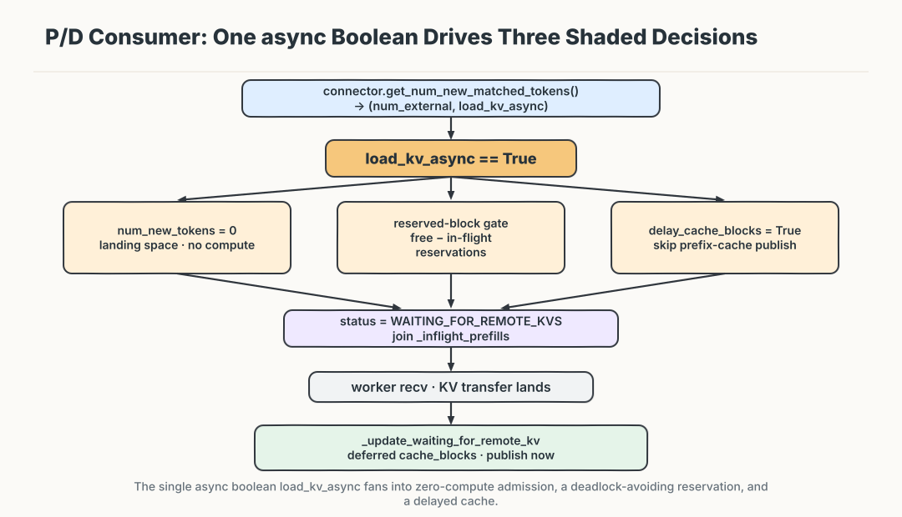</a>

<p class='figure-caption'>P/D consumer lifecycle: connector query → async admission (num_new_tokens=0, reserved-block gate, delay_cache_blocks) → WAITING_FOR_REMOTE_KVS → worker recv → deferred cache_blocks on completion. The single async boolean drives all three shaded decisions.</p>

### Reserved blocks: why an async load must not starve an in-flight prefill

[Section 9](#9-allocate_slots-is-a-policy-stack-not-an-allocation) documented the admission gate itself (`kv_cache_manager.py:L419-L425`): `available = free - reserved_blocks`, `required = demand + watermark`, `required > available ⇒ None`. It did not say where the `reserved_blocks` *value* comes from. That is the caller's job, and it is computed only for async loads:

`vllm/v1/core/sched/scheduler.py:L899-L905`

```python
                reserved_blocks = 0
                if load_kv_async:
                    # An async load holds its blocks for the whole transfer with
                    # no forward progress and isn't preemptible here. Admit it
                    # only if it fits in (free - other in-flight reservations), to
                    # avoid deadlock and predictable preemptions.
                    reserved_blocks = self._inflight_prefill_reserved_blocks()
```

[Section 10](#10-the-scheduler-contract-how-scheduling-drives-the-kv-cache-manager) walks `_inflight_prefill_reserved_blocks` and `_request_remaining_blocks`. Here, `reserved_blocks` is computed **only** for `load_kv_async`, and the same `allocate_slots` call passes `delay_cache_blocks=load_kv_async`. The one flag therefore drives (a) `num_new_tokens = 0`, (b) the reservation gate, and (c) delayed publication, all because the KV is arriving later.

An async connector load is admitted only if, after taking its blocks, every already in-flight prefill still has enough free blocks to run to completion. External loads never cannibalize committed forward progress, so the two non-preemptible activities cannot deadlock each other over the pool.

**Delaying publication: a block enters the prefix cache only once its KV is real**

[Section 9](#9-allocate_slots-is-a-policy-stack-not-an-allocation) quoted the delayed-cache branch itself (`kv_cache_manager.py:L447-L463`), where `not self.enable_caching or delay_cache_blocks` returns the allocated blocks *without* calling `cache_blocks`. The reason is easiest to see in connector terms: `cache_blocks` is what *publishes* a request's blocks into the prefix cache — hashing them so other requests can find and reuse them ([Section 7](#7-prefix-cache-lookup-hashing-longest-hit-and-the-recompute-last-token-rule)). For a P/D recv, the blocks exist and are owned by the request, but their KV contents are still in flight. Publishing them would let a *different* request hit a block full of garbage or partially-written KV. So publication is skipped at allocation time and deferred to the exact moment the transfer lands.

The commit half of the boundary fires next, but only on the success path:

`vllm/v1/core/sched/scheduler.py:L930-L939`

```python
                # KVTransfer: the connector uses this info to determine
                # if a load is needed. Note that
                # This information is used to determine if a load is
                # needed for this request.
                if self.connector is not None:
                    self.connector.update_state_after_alloc(
                        request,
                        self.kv_cache_manager.get_blocks(request_id),
                        num_external_computed_tokens,
                    )
```

Only after `allocate_slots` returned non-`None` (admission succeeded — the preceding `if new_blocks is None: break` handles the failure) does the scheduler tell the connector the concrete blocks and how many external tokens land in them. This is the commit half of the query/commit split: `get_num_new_matched_tokens` asked, `update_state_after_alloc` commits. Per its docstring (`base.py:L488-L507`), for async loads this may fire twice — once when the recv-buffer blocks are allocated, once after the transfer completes and any remaining blocks are allocated.

The async request then parks in a dedicated state rather than joining the running set:

`vllm/v1/core/sched/scheduler.py:L950-L971`

```python
                request = request_queue.pop_request()
                if load_kv_async:
                    # If loading async, allocate memory and put request
                    # into the WAITING_FOR_REMOTE_KV state.
                    request.status = RequestStatus.WAITING_FOR_REMOTE_KVS
                    step_skipped_waiting.prepend_request(request)
                    # Set num_computed_tokens even though KVs are not yet loaded.
                    # request.num_computed_tokens will not be used anywhere until
                    # the request finished the KV transfer.
                    #
                    # If a transfer error is reported by the connector,
                    # request.num_computed_tokens will be re-set accordingly in
                    # _update_requests_with_invalid_blocks.
                    #
                    # When the transfer is finished, either successfully or not,
                    # request.num_computed_tokens will correctly reflect the number
                    # of computed tokens.
                    # _update_waiting_for_remote_kv will then cache
                    # only the successfully loaded tokens.
                    request.num_computed_tokens = num_computed_tokens
                    self._inflight_prefills.add(request)
                    continue
```

The request goes to `WAITING_FOR_REMOTE_KVS` and joins `_inflight_prefills` — the very set whose remaining-block sum feeds the reservation gate above, so *this* load's blocks now protect *other* pending loads' admission. `num_computed_tokens` is set optimistically but, the comment stresses, is not read anywhere until the transfer resolves.

When the worker-side connector signals recv-complete, the deferred publication finally happens, and it is partial-safe:

`vllm/v1/core/sched/scheduler.py:L2414-L2446`

```python
    def _update_waiting_for_remote_kv(self, request: Request) -> None:
        """
        KV Connector: update request state after async recv is finished.

        When the kv transfer is ready, we cache the blocks
        and the request state will be moved back to WAITING from
        WAITING_FOR_REMOTE_KV.
        """
        assert self.connector is not None

        if request.request_id in self.failed_recving_kv_req_ids:
            # Request had KV load failures; num_computed_tokens was already
            # updated in _update_requests_with_invalid_blocks
            if request.num_computed_tokens:
                # Cache any valid computed tokens.
                self.kv_cache_manager.cache_blocks(request, request.num_computed_tokens)
            else:
                # No valid computed tokens, release allocated blocks.
                # There may be a local cache hit on retry.
                self.kv_cache_manager.free(request)

            self.failed_recving_kv_req_ids.remove(request.request_id)
        else:
            # Now that the blocks are ready, actually cache them.
            # This will cache the blocks iff caching is enabled.
            self.kv_cache_manager.cache_blocks(request, request.num_computed_tokens)

            # on a full prompt hit, we need to re-compute the last token
            # in order to be able to sample the next token
            if request.num_computed_tokens == request.num_tokens:
                request.num_computed_tokens = request.num_tokens - 1

        self.finished_recving_kv_req_ids.remove(request.request_id)
```

This closes the loop the delayed-cache branch opened. On success, `cache_blocks` publishes exactly `request.num_computed_tokens` worth of now-resident blocks into the prefix cache — the call that `allocate_slots` skipped, deferred to the instant the KV became valid. On failure, only the *valid* prefix is cached, or every block is freed if nothing loaded, so a partial or failed transfer never publishes garbage. The full-hit branch decrements `num_computed_tokens` by one so there is a last token to run the forward pass on — the same recompute-last-token rule [Section 7](#7-prefix-cache-lookup-hashing-longest-hit-and-the-recompute-last-token-rule) established for local full hits (`kv_cache_manager.py:L221-L227`), applied here to a remote full hit.

### The mirror image: the producer side frees blocks *asynchronously* after the send

Everything above is the consumer (decode) side pulling KV in. P/D has a symmetric hazard on the producer (prefill) side: when a prefill instance finishes computing a prompt's KV, those blocks must survive long enough to be *sent* to the decode peer, which may not have pulled them yet. Freeing on the normal path would reclaim blocks mid-transfer. The `request_finished` hook is the escape hatch:

`vllm/distributed/kv_transfer/kv_connector/v1/base.py:L542-L561`

```python
    def request_finished(
        self,
        request: "Request",
        block_ids: list[int],
    ) -> tuple[bool, dict[str, Any] | None]:
        """
        Called exactly once when a request has finished, before its blocks are
        freed.

        The connector may assumes responsibility for freeing the blocks
        asynchronously by returning True.

        Returns:
            True if the request is being saved/sent asynchronously and blocks
            should not be freed until the request_id is returned from
            get_finished().
            Optional KVTransferParams to be included in the request outputs
            returned by the engine.
        """
        return False, None
```

The scheduler honors that return value in `_free_request`:

`vllm/v1/core/sched/scheduler.py:L2107-L2124`

```python
    def _free_request(
        self, request: Request, delay_free_blocks: bool = False
    ) -> dict[str, Any] | None:
        assert request.is_finished()

        self._inflight_prefills.discard(request)
        connector_delay_free_blocks, kv_xfer_params = self._connector_finished(request)
        self.encoder_cache_manager.free(request)
        request_id = request.request_id
        self.finished_req_ids.add(request_id)
        if self.finished_req_ids_dict is not None:
            self.finished_req_ids_dict[request.client_index].add(request_id)

        delay_free_blocks |= connector_delay_free_blocks
        if not delay_free_blocks:
            self._free_blocks(request)
```

`_connector_finished` calls `request_finished` (after first reclaiming out-of-window prefix blocks on the same processed-token basis [Section 9](#9-allocate_slots-is-a-policy-stack-not-an-allocation) used, `scheduler.py:L2374-L2380`) and returns the connector's `delay_free_blocks` verdict. If the connector returned `True`, it has assumed ownership of the blocks for an in-flight send; `_free_blocks` is *not* called, and the blocks are held until the connector reports the request done via `get_finished()`. This is the exact dual of the consumer's delayed *cache*: the consumer delays *publishing* blocks until KV arrives, the producer delays *freeing* blocks until KV departs. Both defer a block-pool operation across an asynchronous transfer boundary, and both hand the timing decision to the connector rather than the scheduler's normal lifecycle ([Section 23](#23-the-life-of-a-physical-block-allocate-use-free-cache-evict)).

A block whose KV is still being transferred out is never returned to the free list ([Section 3](#3-kvcacheblock-and-blockpool-the-free-list-is-an-eviction-structure)) where `get_new_blocks` could hand it to another request and overwrite live-but-not-yet-sent KV. Ownership passes to the connector for the duration of the send, and the pool reclaims the block only after the connector signals the transfer complete.

## 12. Cascade Attention: One Shared Prefix Across the Whole Batch

Prefix caching deduplicates a shared prompt's **storage** by pointing several block tables at the same physical blocks. Cascade attention targets the remaining compute cost: without it, a batch of N requests still streams that shared prefix from HBM N times per layer and step.

Cascade attention reads it once — a single non-causal kernel over all N concatenated queries against the shared KV, plus a per-request causal kernel over each private suffix, merged by log-sum-exp. It is an exact softmax decomposition, so correctness is unchanged; the only thing bought is HBM bandwidth on the prefix. It is opt-in and off by default ([`vllm/config/model.py:244-250`](https://github.com/vllm-project/vllm/blob/6cf7b26bd4bff60bf378e1af14044280ac0d214c/vllm/config/model.py#L244-L250), `disable_cascade_attn: bool = True`), precisely because it does not change math but *can* change the last bits of a float.

The manager supplies one input to that optimization: a conservative count of leading physical blocks shared by the entire running batch, derived from block reference counts.

<a href='images/vllm-06-20-cascade-prefix.svg' target='_blank'>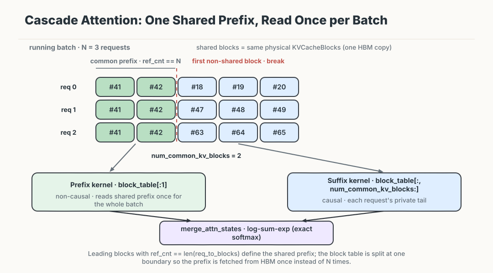</a>

<p class='figure-caption'>Figure: the refcount-defined common prefix — leading blocks with `ref_cnt == len(req_to_blocks)` are the same physical blocks every request holds, so the prefix kernel reads them through `block_table[:1]` once for the whole batch, while each request's suffix is read through `block_table[:, num_common_kv_blocks:]`.</p>

### Refcount *is* the commonness predicate

The scheduler probes for the shared prefix exactly once per step, and only from a single request.

[`vllm/v1/core/sched/scheduler.py:1039-1047`](https://github.com/vllm-project/vllm/blob/6cf7b26bd4bff60bf378e1af14044280ac0d214c/vllm/v1/core/sched/scheduler.py#L1039-L1047)
```python
        # Get the longest common prefix among all requests in the running queue.
        # This can be potentially used for cascade attention.
        num_common_prefix_blocks = [0] * len(self.kv_cache_config.kv_cache_groups)
        with record_function_or_nullcontext("schedule: get_num_common_prefix_blocks"):
            if self.running:
                any_request_id = self.running[0].request_id
                num_common_prefix_blocks = (
                    self.kv_cache_manager.get_num_common_prefix_blocks(any_request_id)
                )
```

The default is a per-group all-zeros list, and the probe runs only when the running queue is non-empty. The telling detail is the variable name: `any_request_id = self.running[0].request_id`. *Any* running request is a valid probe. The count is computed by walking one request's blocks and asking, per block, whether every other cache-holding request also holds it — and that predicate is symmetric, so which request you start from cannot change the answer. Picking one request is what makes this O(prefix blocks) rather than O(requests × blocks). The result rides out on the scheduler output as one integer per KV-cache group ([`vllm/v1/core/sched/output.py:205-207`](https://github.com/vllm-project/vllm/blob/6cf7b26bd4bff60bf378e1af14044280ac0d214c/vllm/v1/core/sched/output.py#L205-L207), `num_common_prefix_blocks: list[int]`).

The manager's docstring explains why one probe is sufficient.

[`vllm/v1/core/kv_cache_manager.py:531-537`](https://github.com/vllm-project/vllm/blob/6cf7b26bd4bff60bf378e1af14044280ac0d214c/vllm/v1/core/kv_cache_manager.py#L531-L537)
```python
    def get_num_common_prefix_blocks(self, running_request_id: str) -> list[int]:
        """Calculate the number of common prefix blocks for each kv cache group.

        The function selects a running request and iterates through its blocks.
        A block is considered a common prefix block if ALL requests with
        allocated KV cache share it (i.e., ref_cnt equals the number of entries
        in req_to_blocks).
```

The actual scan lives in the full-attention manager — the only single-type manager that participates (more on that below).

[`vllm/v1/core/single_type_kv_cache_manager.py:615-623`](https://github.com/vllm-project/vllm/blob/6cf7b26bd4bff60bf378e1af14044280ac0d214c/vllm/v1/core/single_type_kv_cache_manager.py#L615-L623)
```python
    def get_num_common_prefix_blocks(self, running_request_id: str) -> int:
        blocks = self.req_to_blocks[running_request_id]
        num_common_blocks = 0
        for block in blocks:
            if block.ref_cnt == len(self.req_to_blocks):
                num_common_blocks += 1
            else:
                break
        return num_common_blocks
```

`blocks` is the probe request's block list in position order (index 0 is the first tokens). Walk left to right. `block.ref_cnt` is how many requests currently hold that *physical* block; `len(self.req_to_blocks)` is how many requests hold any KV in this group: the "all requests" denominator. The equality `ref_cnt == len(req_to_blocks)` is true exactly when *every* cache-holding request points at this one physical block, which (because prefix caching deduplicates by content hash) means it sits at the same prefix position in every request's table. That is the single-probe justification: a full-refcount leading block is, by definition, present in all requests, so enumerating the probe's full-refcount leading run enumerates the batch's shared prefix exactly.

The `break` on the first miss is not an optimization, it is the definition. Commonness must be a *contiguous* prefix. Once one request diverges, every block after the divergence is per-request even if some later block coincidentally reaches full refcount (e.g. two unrelated requests that happen to share a mid-conversation block); counting past the break would claim a non-prefix block as shared. The scan stops at the first hole.

**The count is deliberately conservative — a never-over-count**

The denominator hides the subtlety that keeps cascade safe. `len(req_to_blocks)` counts *all requests with allocated KV cache*, which the docstring is explicit is a superset of the requests scheduled this step.

[`vllm/v1/core/kv_cache_manager.py:539-553`](https://github.com/vllm-project/vllm/blob/6cf7b26bd4bff60bf378e1af14044280ac0d214c/vllm/v1/core/kv_cache_manager.py#L539-L553)
```python
        NOTE(woosuk): The number of requests with allocated KV cache is **greater
        than or equal to** the number of requests scheduled in the current step.
        This is because having allocated KV cache only indicates that:
        1. The request has not yet finished, and
        2. The request holds its blocks unfreed.

        While all scheduled requests must have allocated KV cache, the inverse
        is not necessarily true. There may be requests with allocated KV cache
        that are not scheduled in the current step.

        This can result in an edge case where the number of common prefix blocks
        is 0, even though all scheduled requests share a common prefix. This
        occurs because there may be unscheduled requests that do not share the
        common prefix. Currently, this case cannot be easily detected, so the
        function returns 0 in such cases.
```

The consequence is a one-sided error the right way round. If a request is running-but-not-scheduled-this-step, it still holds its blocks, so it still inflates the denominator. If that unscheduled request does *not* share the prefix, the leading blocks have `ref_cnt < len(req_to_blocks)`, the scan breaks early (possibly at block 0), and cascade is silently skipped for the whole step. The estimate can therefore be *too small* (a missed optimization) but never *too large* (a correctness bug). This is the guard that matters, because of what cascade does downstream: the prefix kernel reads request-0's prefix blocks *on behalf of everyone*. If the count ever claimed a block as shared while some live request's KV differed there, cascade would feed that request the wrong KV. Tying the predicate to full refcount over the all-holders set makes a false positive structurally impossible: the count degrades to zero rather than lying.

### Only full attention participates; everything else opts out

The count fans out per KV-cache group. The base coordinator returns one count per single-type manager ([`vllm/v1/core/kv_cache_coordinator.py:315-330`](https://github.com/vllm-project/vllm/blob/6cf7b26bd4bff60bf378e1af14044280ac0d214c/vllm/v1/core/kv_cache_coordinator.py#L315-L330), a list comprehension over `self.single_type_managers`), and the no-prefix-cache coordinator short-circuits the whole thing.

[`vllm/v1/core/kv_cache_coordinator.py:414-415`](https://github.com/vllm-project/vllm/blob/6cf7b26bd4bff60bf378e1af14044280ac0d214c/vllm/v1/core/kv_cache_coordinator.py#L414-L415)
```python
    def get_num_common_prefix_blocks(self, running_request_id: str) -> list[int]:
        return [0] * self.num_single_type_manager
```

No prefix cache means no deduplicated physical blocks means no shared prefix to exploit: a hard zero, no scan. For the caching coordinators, the per-group answer depends on the attention type of that group, and every non-full-attention manager returns 0 by construction. Sliding window ([`single_type_kv_cache_manager.py:869-876`](https://github.com/vllm-project/vllm/blob/6cf7b26bd4bff60bf378e1af14044280ac0d214c/vllm/v1/core/single_type_kv_cache_manager.py#L869-L876)) notes that "The prefix blocks are null blocks for sliding window layers. So it's not correct to count ref_cnt like FullAttentionManager." Chunked local attention (`:1022-1026`) and Mamba (`:1176-1180`) each return 0 with a one-line "not supported" docstring, and cross-attention (`:1397-1400`) returns 0 because "Cross-attention blocks contain request-specific encoder states and are not shared between different requests."

This dovetails with [Section 16](#16-per-type-block-math-sliding-window-mamba-and-chunked-local-attention)'s per-type block math (SWA/Mamba/chunked): those managers deliberately null out or request-specialize their leading blocks (windowed reclamation, in-place state blocks, encoder KV), so there is no byte-identical shared prefix to read once. `RSWAManager` still subclasses `FullAttentionManager` ([`single_type_kv_cache_manager.py:626`](https://github.com/vllm-project/vllm/blob/6cf7b26bd4bff60bf378e1af14044280ac0d214c/vllm/v1/core/single_type_kv_cache_manager.py#L626)) and inherits the counter because its full-attention layers do retain shared leading blocks.

For a hybrid model, then, only the full-attention group(s) can ever contribute a positive count, and the per-group list keeps that decision independent per group — the same group-major discipline [Section 15](#15-the-coordinator-and-hybrid-kv-cache-when-one-block-type-is-not-enough) describes. A model with interleaved full and sliding-window layers can cascade its full layers while its windowed layers fall back to ordinary attention in the same step.

### From block count to a capped token length

A block count is not yet a usable prefix length. The model runner turns each group's count into a token length and applies two management-side caps before the attention backend ever sees it. The driver ([`gpu_model_runner.py:2565-2601`](https://github.com/vllm-project/vllm/blob/6cf7b26bd4bff60bf378e1af14044280ac0d214c/vllm/v1/worker/gpu_model_runner.py#L2565-L2601), `_compute_cascade_attn_prefix_lens`) loops groups × attention-groups, forces 0 for encoder-only specs, and returns `None` unless *some* group survived with a positive length — `None` being the signal the rest of the runner keys on to fall back to plain attention for the whole step. The per-group work starts by converting blocks to tokens:

[`vllm/v1/worker/gpu_model_runner.py:2629-2632`](https://github.com/vllm-project/vllm/blob/6cf7b26bd4bff60bf378e1af14044280ac0d214c/vllm/v1/worker/gpu_model_runner.py#L2629-L2632)
```python
        common_prefix_len = num_common_prefix_blocks * kv_cache_spec.block_size
        if common_prefix_len == 0:
            # Common case.
            return 0
```

Then the two caps:

[`vllm/v1/worker/gpu_model_runner.py:2673-2677`](https://github.com/vllm-project/vllm/blob/6cf7b26bd4bff60bf378e1af14044280ac0d214c/vllm/v1/worker/gpu_model_runner.py#L2673-L2677)
```python
        common_prefix_len = min(common_prefix_len, num_computed_tokens.min())
        # common_prefix_len should be a multiple of the block size.
        common_prefix_len = (
            common_prefix_len // kv_cache_spec.block_size * kv_cache_spec.block_size
        )
```

The `min(..., num_computed_tokens.min())` cap exists because the prefix kernel is non-causal — it applies no mask (the worked `[A, B, C, D, E]` example at [`gpu_model_runner.py:2634-2672`](https://github.com/vllm-project/vllm/blob/6cf7b26bd4bff60bf378e1af14044280ac0d214c/vllm/v1/worker/gpu_model_runner.py#L2634-L2672) walks through why). If the declared prefix extended into a region that some request is still computing (its query tokens, whose KV is not yet finalized), that request's earlier query positions would illegally attend forward into their own not-yet-real prefix. Capping at the batch's *smallest* `num_computed_tokens` keeps the entire maskless prefix inside finalized KV for every request. The comment also documents a deliberate off-by-one: the code uses `[A, B, C]` rather than `[A, B, C, D]`, omitting the "plus one" so the suffix kernel always receives a non-empty tail.

The floor to `block_size` gives Cascade one shared split point: `num_common_kv_blocks = common_prefix_len // block_size`. A non-block-aligned prefix would split a block down the middle, which the block-table representation ([Section 20](#20-from-block-table-to-kernel-slot_mapping-and-the-device-tensors)) cannot express, and the runtime asserts against it ([`flash_attn.py:1466`](https://github.com/vllm-project/vllm/blob/6cf7b26bd4bff60bf378e1af14044280ac0d214c/vllm/v1/attention/backends/flash_attn.py#L1466), below). Cache hits entering the kernel follow the same whole-block rule. After these caps, the backend's benefit heuristic (`use_cascade_attention`) can still return zero, so a positive value downstream means the split is both valid and worthwhile.

**The physical-identity payoff: reading the prefix once**

Everything above earns one runtime fact: because the counted prefix blocks all had `ref_cnt == len(req_to_blocks)`, request-0's first `num_common_kv_blocks` block ids *are* the same physical blocks every request holds. That is what lets the prefix kernel read the shared KV through a single-row block table.

[`vllm/v1/attention/backends/flash_attn.py:1464-1468`](https://github.com/vllm-project/vllm/blob/6cf7b26bd4bff60bf378e1af14044280ac0d214c/vllm/v1/attention/backends/flash_attn.py#L1464-L1468)
```python
    num_tokens = query.shape[0]
    block_size = key_cache.shape[-3]
    assert common_prefix_len % block_size == 0
    num_common_kv_blocks = common_prefix_len // block_size
    assert num_common_kv_blocks > 0
```

The prefix kernel then reads `block_table=block_table[:1]` ([`flash_attn.py:1483`](https://github.com/vllm-project/vllm/blob/6cf7b26bd4bff60bf378e1af14044280ac0d214c/vllm/v1/attention/backends/flash_attn.py#L1483)), i.e. row 0 only, non-causal, all query tokens flattened into one logical sequence, so the shared prefix KV is fetched from HBM exactly once for the entire batch. The suffix kernel reads `block_table=block_table[:, num_common_kv_blocks:]` ([`flash_attn.py:1511`](https://github.com/vllm-project/vllm/blob/6cf7b26bd4bff60bf378e1af14044280ac0d214c/vllm/v1/attention/backends/flash_attn.py#L1511)), i.e. every request's row with the shared prefix columns *sliced off*, so each request causally attends only to its private tail, and no prefix block is double-counted.

The two partial results are combined by `merge_attn_states(output, prefix_output, prefix_lse, suffix_output, suffix_lse)` ([`flash_attn.py:1523`](https://github.com/vllm-project/vllm/blob/6cf7b26bd4bff60bf378e1af14044280ac0d214c/vllm/v1/attention/backends/flash_attn.py#L1523)), the online-softmax rescaling that makes the decomposition exact rather than approximate (the merge math and the two-kernel scheduling are article 08's territory).

The block-table slicing is where the KV-cache manager's dedup pays off. `block_table[:1]` can stand in for every row because the refcount test admitted only physically shared leading blocks and stopped before any block a live request lacked. Runtime assertions check that the slice is aligned and non-empty (`common_prefix_len % block_size == 0`, `num_common_kv_blocks > 0`).

### When it is worth the two kernels

Cascade is gated at both ends. `self.cascade_attn_enabled = not self.model_config.disable_cascade_attn` ([`gpu_model_runner.py:510`](https://github.com/vllm-project/vllm/blob/6cf7b26bd4bff60bf378e1af14044280ac0d214c/vllm/v1/worker/gpu_model_runner.py#L510)) is the opt-in from `config/model.py`; CPU and XPU runners hard-disable it ([`cpu_model_runner.py:34`](https://github.com/vllm-project/vllm/blob/6cf7b26bd4bff60bf378e1af14044280ac0d214c/vllm/v1/worker/cpu_model_runner.py#L34), [`xpu_model_runner.py:27`](https://github.com/vllm-project/vllm/blob/6cf7b26bd4bff60bf378e1af14044280ac0d214c/vllm/v1/worker/xpu_model_runner.py#L27) both set `self.cascade_attn_enabled = False`). The runner also skips the whole computation under DBO microbatching ([`gpu_model_runner.py:4157-4165`](https://github.com/vllm-project/vllm/blob/6cf7b26bd4bff60bf378e1af14044280ac0d214c/vllm/v1/worker/gpu_model_runner.py#L4157-L4165), guarded by `not self.parallel_config.use_ubatching`), and the `None`/not-`None` result feeds cudagraph-mode selection (`use_cascade_attn=cascade_attn_prefix_lens is not None`, `:4178`). The backend heuristic then encodes when reading-once beats reading-N-times:

[`vllm/v1/attention/backends/flash_attn.py:1375-1387`](https://github.com/vllm-project/vllm/blob/6cf7b26bd4bff60bf378e1af14044280ac0d214c/vllm/v1/attention/backends/flash_attn.py#L1375-L1387)
```python
    if common_prefix_len < 256:
        return False
    # Cascade attention is currently not supported with these variants.
    if use_alibi or use_sliding_window or use_local_attention:
        return False
    # Too few queries. Probably not worth using cascade attention.
    # We use an arbitrary threshold of 8 queries. TODO: Tune this threshold.
    num_reqs = len(query_lens)
    if num_reqs < 8:
        return False
    # disable cascade attention for DCP
    if dcp_world_size > 1:
        return False
```

The `num_reqs < 8` and `common_prefix_len < 256` gates are the "batch sharing a long prefix" precondition made numeric: the once-versus-N-times bandwidth saving generally clears the two-kernel-plus-merge overhead only when the batch is wide and the prefix is long. The masking-shape exclusions (ALiBi, sliding window, local attention) mirror the manager-side opt-outs above — cascade only ever fires for a wide batch of plain full-attention requests over a long shared prefix, which is exactly the workload prefix caching was built to serve.

The manager therefore supplies one conservative count per group: `ref_cnt == len(req_to_blocks)` must hold for every leading block, and the scan stops at the first exception. Once block-aligned and capped to already-computed KV, that count lets the attention kernel read one request's prefix blocks for the whole batch. Cascade leaves the softmax unchanged; if the sharing test fails, it simply declines the optimization.

## 13. Under Pressure: Preemption, Recomputation, and Reclaiming Blocks

The KV footprint of a running request grows every `block_size` tokens, so a batch that fit at admission may later exhaust the pool. When `allocate_slots` returns `None`, V1 **preempts** a running victim: it frees that request's KV, resets its progress, and puts it at the front of the waiting queue for recomputation.

<a href='images/vllm-06-21-preemption.svg' target='_blank'>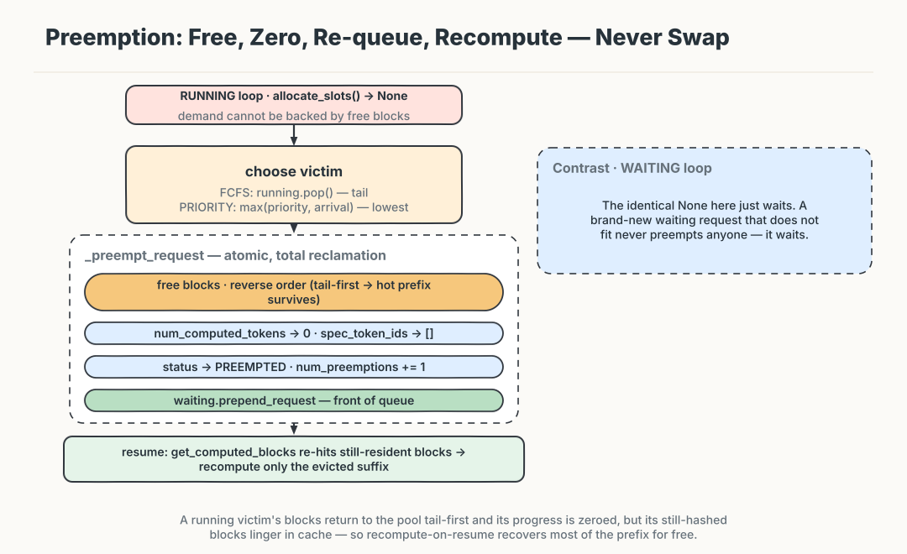</a>

<p class='figure-caption'>Figure: the preemption lifecycle — a running victim's blocks are freed to the pool, its `num_computed_tokens` zeroed, it is prepended to the waiting queue, then recomputed on resume with any surviving prefix recovered for free.</p>

**The trigger: `None` is a demand for a victim**

The running loop treats `None` as a request to evict and retry; the waiting loop treats it as backpressure and stops admitting.

Source anchor — [`vllm/v1/core/sched/scheduler.py:534-543`](https://github.com/vllm-project/vllm/blob/6cf7b26bd4bff60bf378e1af14044280ac0d214c/vllm/v1/core/sched/scheduler.py#L534-L543):

```python
                while True:
                    new_blocks = self.kv_cache_manager.allocate_slots(
                        request,
                        num_new_tokens,
                        num_lookahead_tokens=self.num_lookahead_tokens,
                    )

                    if new_blocks is not None:
                        # The request can be scheduled.
                        break
```

Source anchor — `vllm/v1/core/sched/scheduler.py:L545-L578`:

```python
                    # The request cannot be scheduled.
                    # Preempt the lowest-priority request.
                    if self.policy == SchedulingPolicy.PRIORITY:
                        preempted_req = max(
                            self.running,
                            key=lambda r: (r.priority, r.arrival_time),
                        )
                        self.running.remove(preempted_req)
                        if preempted_req in scheduled_running_reqs:
                            preempted_req_id = preempted_req.request_id
                            scheduled_running_reqs.remove(preempted_req)
                            token_budget += num_scheduled_tokens.pop(preempted_req_id)
                            req_to_new_blocks.pop(preempted_req_id)
                            scheduled_spec_decode_tokens.pop(preempted_req_id, None)
                            preempted_encoder_inputs = scheduled_encoder_inputs.pop(
                                preempted_req_id, None
                            )
                            if preempted_encoder_inputs:
                                # Restore encoder compute budget if the preempted
                                # request had encoder inputs scheduled in this step.
                                num_embeds_to_restore = sum(
                                    preempted_req.get_num_encoder_embeds(i)
                                    for i in preempted_encoder_inputs
                                )
                                encoder_compute_budget += num_embeds_to_restore
                            req_index -= 1
                    else:
                        preempted_req = self.running.pop()

                    self._preempt_request(preempted_req, scheduled_timestamp)
                    preempted_reqs.append(preempted_req)
                    if preempted_req == request:
                        # No more request to preempt. Cannot schedule this request.
                        break
```

- The whole thing is a `while True` retry loop around one request. `allocate_slots` is called; if it returns blocks, `break` and schedule (`:541-543`). If it returns `None`, the loop body evicts exactly one victim and loops back to retry `allocate_slots` for the *same* request — each eviction has released more blocks, so the retry may now succeed.
- **Victim selection is policy-dependent.** Under the default FCFS policy the victim is `self.running.pop()` (`:571-572`): the *tail* of the running queue, i.e. the most-recently-admitted request, the one with the least sunk cost. Under `PRIORITY` the victim is `max(self.running, key=lambda r: (r.priority, r.arrival_time))` (`:548-551`) — the numerically-highest priority value (which is the *lowest* scheduling priority) tie-broken by latest arrival.
- **Same-step rollback.** The `PRIORITY` branch has a subtlety FCFS does not: the chosen victim may already have been tentatively scheduled *earlier in this very iteration* of `schedule()`. If so (`:553`), all of its provisional state must be unwound so the accounting stays consistent: it is removed from `scheduled_running_reqs`, its token budget is refunded (`token_budget += num_scheduled_tokens.pop(...)`, `:556`), its new blocks and spec-decode tokens are un-scheduled (`:557-558`), and any encoder compute budget it reserved is restored (`:562-569`). `req_index -= 1` (`:570`) rewinds the loop cursor so the next iteration does not skip a request. FCFS pops the tail, which by construction was never scheduled ahead of the current request, so it needs no rollback.
- **Termination is self-referential.** The victim is evicted via `_preempt_request` (`:574`). If the victim *is the request we are trying to schedule* (`:576`), there is nothing left below it to preempt — `break`. The outer `if new_blocks is None: break` (`:580-582`) then halts scheduling for the whole step.

Preemption is greedy and bounded: it evicts running requests one at a time until the current request fits, while self-preemption halts the step. A new waiting request never evicts admitted work.

### `_preempt_request`: atomic, total reclamation

The eviction primitive is where blocks actually return to the pool. It is deliberately all-or-nothing.

Source anchor — [`vllm/v1/core/sched/scheduler.py:1145-1167`](https://github.com/vllm-project/vllm/blob/6cf7b26bd4bff60bf378e1af14044280ac0d214c/vllm/v1/core/sched/scheduler.py#L1145-L1167):

```python
    def _preempt_request(self, request: Request, timestamp: float) -> None:
        """Preempt a request and put it back to the waiting queue.

        NOTE: The request should be popped from the running queue outside of this
        method.
        """
        assert request.status == RequestStatus.RUNNING, (
            "Only running requests can be preempted"
        )
        self._free_request_blocks(request)
        self.encoder_cache_manager.free(request)
        self._inflight_prefills.discard(request)
        request.status = RequestStatus.PREEMPTED
        request.num_computed_tokens = 0
        if request.spec_token_ids:
            request.spec_token_ids = []
        request.num_preemptions += 1
        if self.log_stats:
            request.record_event(EngineCoreEventType.PREEMPTED, timestamp)

        # Put the request back to the waiting queue.
        self.waiting.prepend_request(request)
        self.reset_preempted_req_ids.add(request.request_id)
```

- `assert ... RUNNING` (`:1151-1153`): only running requests are preemptible, and the caller must already have removed the victim from `self.running`.
- `_free_request_blocks(request)` (`:1154`) returns every KV block the request holds to the pool (next subsection). This is the reclaimed memory.
- **Progress is zeroed.** `request.num_computed_tokens = 0` (`:1158`) throws away *all* recorded progress — the request is treated as if it had computed nothing, so its entire prompt plus generated-so-far must be re-prefilled on resume. Any speculative draft tokens are dropped too (`:1159-1160`); a request mid-recompute has no verified draft to carry.
- `request.num_preemptions += 1` (`:1161`) is the monotone counter that drives metrics and the "has this request ever been preempted" branches (final subsections).
- **Re-queue at the front.** `self.waiting.prepend_request(request)` (`:1166`) prepends, not appends. A preempted request is work the engine already admitted; retrying it ahead of never-started arrivals preserves rough FCFS fairness and bounds how long a victim starves.
- `reset_preempted_req_ids.add(...)` (`:1167`) records that the worker's persistent batch slot for this request is now stale. That set is handed to the worker as `SchedulerOutput.preempted_req_ids` ([`scheduler.py:1105`](https://github.com/vllm-project/vllm/blob/6cf7b26bd4bff60bf378e1af14044280ac0d214c/vllm/v1/core/sched/scheduler.py#L1105)) and cleared each step after it is consumed ([`scheduler.py:1217`](https://github.com/vllm-project/vllm/blob/6cf7b26bd4bff60bf378e1af14044280ac0d214c/vllm/v1/core/sched/scheduler.py#L1217)), so the GPU-side runner knows to reset the request's row rather than continue appending to it.

After `_preempt_request` the victim holds zero KV blocks, has `num_computed_tokens == 0`, is `PREEMPTED`, and sits at the head of the waiting queue. There is no half-freed state, no partially-decremented refcount, and, critically, no CPU copy of its KV anywhere. Recovery is by recomputation only.

**Freeing under fence, and why order matters**

`_preempt_request` frees through the same path a normal finish uses, so preemption and completion share one reclamation routine.

Source anchor — [`vllm/v1/core/sched/scheduler.py:2138-2151`](https://github.com/vllm-project/vllm/blob/6cf7b26bd4bff60bf378e1af14044280ac0d214c/vllm/v1/core/sched/scheduler.py#L2138-L2151):

```python
    def _free_request_blocks(self, request: Request):
        """Free the request's KV blocks, deferring the return to the block
        pool when an in-flight GPU step may still write them.
        """
        if not self.defer_block_free or (
            # Last scheduled step already processed: no in-flight write remains
            # (always the case for a normal finish), so free now.
            request.last_sched_seq <= self.processed_step_seq
        ):
            self.kv_cache_manager.free(request)
            return
        blocks = self.kv_cache_manager.pop_blocks_for_free(request)
        if blocks:
            self.deferred_frees.append((self.sched_step_seq, blocks))
```

Source anchor — [`vllm/v1/core/kv_cache_manager.py:465-473`](https://github.com/vllm-project/vllm/blob/6cf7b26bd4bff60bf378e1af14044280ac0d214c/vllm/v1/core/kv_cache_manager.py#L465-L473):

```python
    def free(self, request: Request) -> None:
        """Free the blocks allocated for the request.
        We free the blocks in reverse order so that the tail blocks are evicted
        first when caching is enabled.

        Args:
            request: The request to free the blocks.
        """
        self.coordinator.free(request.request_id)
```

- In the common case (`defer_block_free` off, or the request's last scheduled step already committed), `_free_request_blocks` calls `kv_cache_manager.free` immediately (`:2146-2147`). [Section 23](#23-the-life-of-a-physical-block-allocate-use-free-cache-evict) already covered what `coordinator.free` does at the pool level — decrement refcounts, and re-queue only blocks whose count hit zero, splitting them by whether they still carry a hash. The point *here* is the ordering: freeing happens **tail-first** ([`kv_cache_manager.py:467-468`](https://github.com/vllm-project/vllm/blob/6cf7b26bd4bff60bf378e1af14044280ac0d214c/vllm/v1/core/kv_cache_manager.py#L467-L468)), which pushes the request's tail blocks toward the LRU front (evicted first) and leaves its *head*, the prompt-prefix blocks, sitting longest in the reusable pool.
- That reverse order is not incidental to preemption; it is the mechanism that makes recompute cheap in the common case. The prefix blocks a preempted request will most want back on resume are exactly the ones this reverse free keeps hottest.
- `defer_block_free` ([`scheduler.py:130`](https://github.com/vllm-project/vllm/blob/6cf7b26bd4bff60bf378e1af14044280ac0d214c/vllm/v1/core/sched/scheduler.py#L130), set only at `:150-152`) fences the free against an in-flight GPU write under overlapping batches (async scheduling or PP) when a KV *consumer* connector could reallocate and fill those blocks via a load that is not ordered against the pending write. This is a connector-disaggregation concern, not the memory-pressure path, and [Section 11](#11-connector-aware-allocation-external-kv-delay_cache_blocks-and-pd-disaggregation) covers it — but it is why the free is guarded rather than unconditional.

### `PREEMPTED` is a live state, not a grave

A preempted request has to come back, so the status system treats it as resumable. `RequestStatus` is an `IntEnum` whose `is_finished` is the single comparison `status > RequestStatus.PREEMPTED` ([`request.py:328-351`](https://github.com/vllm-project/vllm/blob/6cf7b26bd4bff60bf378e1af14044280ac0d214c/vllm/v1/request.py#L328-L351)), so every member declared after `PREEMPTED` is terminal and `PREEMPTED` itself is the **last non-finished state**: the sentinel wedged directly below the finished band. The full enum and the positional-terminality rule are dissected in [Section 5](#5-the-request-as-kv-state-holder-block_hashes-num_computed_tokens-and-speculative-tokens); what matters here is that a preempted request is one integer away from terminal but is emphatically still live and schedulable.

On resume it re-enters the same waiting loop that admits fresh arrivals — [`scheduler.py:978-993`](https://github.com/vllm-project/vllm/blob/6cf7b26bd4bff60bf378e1af14044280ac0d214c/vllm/v1/core/sched/scheduler.py#L978-L993):

```python
                if request.status == RequestStatus.WAITING:
                    scheduled_new_reqs.append(request)
                elif request.status == RequestStatus.PREEMPTED:
                    scheduled_resumed_reqs.append(request)
                else:
                    raise RuntimeError(f"Invalid request status: {request.status}")

                if self.lora_config and request.lora_request:
                    scheduled_loras.add(request.lora_request.lora_int_id)
                req_to_new_blocks[request_id] = self.kv_cache_manager.get_blocks(
                    request_id
                )
                num_scheduled_tokens[request_id] = num_new_tokens
                token_budget -= num_new_tokens
                request.status = RequestStatus.RUNNING
                request.num_computed_tokens = num_computed_tokens
```

The two statuses are distinguished only for bookkeeping — new requests go to `scheduled_new_reqs`, resumed ones to `scheduled_resumed_reqs` (`:978-983`) — then both flip to `RUNNING` (`:992`), and `num_computed_tokens` is set to the value computed earlier in the loop (`:993`). That value is where recompute stops being naive.

### Recompute is not from scratch: the surviving prefix comes back free

`_preempt_request` zeroed `num_computed_tokens`, but freeing the blocks does **not** necessarily evict their *contents* from the prefix cache. A freed-but-still-hashed block lingers in the LRU cache until something reuses it. So when the request loops back through the waiting queue, the ordinary prefix-cache lookup re-detects whatever of its own prefix is still resident.

The lookup is the same `get_computed_blocks` [Section 7](#7-prefix-cache-lookup-hashing-longest-hit-and-the-recompute-last-token-rule) dissected in full ([`kv_cache_manager.py:202-242`](https://github.com/vllm-project/vllm/blob/6cf7b26bd4bff60bf378e1af14044280ac0d214c/vllm/v1/core/kv_cache_manager.py#L202-L242)), so the hashing, the `find_longest_cache_hit` fan-out, and the recompute-last-token clamp are not repeated here. What matters for preemption is that the lookup tags its `prefix_cache_stats.record(...)` with `preempted=request.num_preemptions > 0`, making preemption-driven re-hits observable and distinct from cold-start hits — the record mechanics are [Section 25](#25-observability-prefix-cache-stats-and-kv-cache-events)'s subject. The hit result then folds into the resumed request's computed-token count via the same local+external fold [Section 11](#11-connector-aware-allocation-external-kv-delay_cache_blocks-and-pd-disaggregation) covers (`scheduler.py:L759-L763`, `num_computed_tokens = num_new_local_computed_tokens + num_external_computed_tokens`).

On resume, `get_computed_blocks` runs a longest-prefix hit over the request's `block_hashes`. If the request's own prefix blocks were never LRU-evicted while it sat in the waiting queue, the hit length is large and most of the "recompute" is skipped — only the uncached suffix is actually re-run. That hit count becomes `num_computed_tokens` (`:760-762`) and is written back onto the request at admission (`:993`). The `preempted=request.num_preemptions > 0` tag (and its twin at [`scheduler.py:721`](https://github.com/vllm-project/vllm/blob/6cf7b26bd4bff60bf378e1af14044280ac0d214c/vllm/v1/core/sched/scheduler.py#L721)) makes preemption-driven re-hits observable in prefix-cache stats, distinct from cold-start hits.

What makes recompute-only preemption viable is this: preemption frees a request's *ownership* of its blocks and zeroes its progress, but it does not force-evict the block *contents* from the prefix cache. Recompute on resume therefore costs only the tokens whose blocks have since been evicted to make room. Best case (nothing was evicted in the interim), resume is nearly free; worst case it is a full re-prefill. The reverse-order free above is what biases this toward the best case.

**`num_preemptions`: the single source of truth**

Field definition — [`vllm/v1/request.py:179-180`](https://github.com/vllm-project/vllm/blob/6cf7b26bd4bff60bf378e1af14044280ac0d214c/vllm/v1/request.py#L179-L180):

```python
        # The number of times this request has been preempted by the scheduler.
        self.num_preemptions = 0
```

Bumped once per eviction at [`scheduler.py:1161`](https://github.com/vllm-project/vllm/blob/6cf7b26bd4bff60bf378e1af14044280ac0d214c/vllm/v1/core/sched/scheduler.py#L1161), it feeds three consumers. **Metrics:** each `PREEMPTED` engine-core event increments per-iteration stats — [`vllm/v1/metrics/stats.py:424-425`](https://github.com/vllm-project/vllm/blob/6cf7b26bd4bff60bf378e1af14044280ac0d214c/vllm/v1/metrics/stats.py#L424-L425):

```python
            elif event.type == EngineCoreEventType.PREEMPTED:
                self.num_preempted_reqs += 1
```

which aggregates into the Prometheus counter `vllm:num_preemptions` ([`vllm/v1/metrics/loggers.py:624-627`](https://github.com/vllm-project/vllm/blob/6cf7b26bd4bff60bf378e1af14044280ac0d214c/vllm/v1/metrics/loggers.py#L624-L627)), the number the [optimization docs](https://docs.vllm.ai/en/stable/configuration/optimization/) tell operators to watch as the signal to raise `gpu_memory_utilization` or lower `max_num_seqs`. **Cache-stat tagging:** the `preempted=...` flags above. **Async-resume classification** — after a remote-KV load completes, a request that had been preempted returns to `PREEMPTED`, not fresh `WAITING` — [`scheduler.py:2459-2462`](https://github.com/vllm-project/vllm/blob/6cf7b26bd4bff60bf378e1af14044280ac0d214c/vllm/v1/core/sched/scheduler.py#L2459-L2462):

```python
            if request.num_preemptions:
                request.status = RequestStatus.PREEMPTED
            else:
                request.status = RequestStatus.WAITING
```

`num_preemptions` is monotone per request and is the one authority for "has this request ever been preempted," used consistently across metrics, cache stats, and resume-state classification.

### Two other users of the same primitive

`_preempt_request` is also how the scheduler force-drains the running queue when the prefix cache is reset with requests in flight — [`scheduler.py:2214-2224`](https://github.com/vllm-project/vllm/blob/6cf7b26bd4bff60bf378e1af14044280ac0d214c/vllm/v1/core/sched/scheduler.py#L2214-L2224):

```python
        if reset_running_requests:
            # For logging.
            timestamp = time.monotonic()
            # Invalidate all the current running requests KV's by pushing them to
            # the waiting queue. In this case, we can reduce the ref count of all
            # the kv blocks to 0 and thus we can make sure the reset is successful.
            # Preempt in reverse order so the requests will be added back to the
            # running queue in FIFO order.
            while self.running:
                request = self.running.pop()
                self._preempt_request(request, timestamp)
```

To reset the cache safely every block's refcount must reach zero, so every running request is preempted; popping in reverse and prepending each restores original FIFO order on resume. Same primitive, different trigger.

Finally, do not confuse memory-pressure preemption with the connector-scoped `recompute_kv_load_failures` flag ([`scheduler.py:129`](https://github.com/vllm-project/vllm/blob/6cf7b26bd4bff60bf378e1af14044280ac0d214c/vllm/v1/core/sched/scheduler.py#L129), overridden from `kv_load_failure_policy` at `:143-144`, default `"fail"` in [`vllm/config/kv_transfer.py:69`](https://github.com/vllm-project/vllm/blob/6cf7b26bd4bff60bf378e1af14044280ac0d214c/vllm/config/kv_transfer.py#L69)). That flag decides, when a KV-*connector* load fails during P/D disaggregation, whether to recompute the affected tokens locally or fail the request — a narrower, token-granular decision [Section 11](#11-connector-aware-allocation-external-kv-delay_cache_blocks-and-pd-disaggregation) covers. It is not the block-pool-is-full path described here.

### Why recompute, not swap

V0 handled preemption by copying a victim's KV blocks to CPU memory (`--swap-space`) and copying them back on resume. V1 removed that machinery entirely. A whole-tree grep for `swap_out` / `swap_in` / `PreemptionMode` finds no swap path anywhere under `vllm/v1/`; the only `recompute*` symbols are the connector-load-failure flags above. The design docs state it directly — [`docs/configuration/optimization.md:47`](https://docs.vllm.ai/en/stable/configuration/optimization/): *"In vLLM V1, the default preemption mode is `RECOMPUTE` rather than `SWAP`, as recomputation has lower overhead in the V1 architecture."* And [`docs/design/metrics.md:505-525`](https://docs.vllm.ai/en/stable/design/metrics/) records why: `--swap-space` and its metrics (`vllm:num_requests_swapped`, `vllm:cpu_cache_usage_perc`) were removed because *"prefix caching ... proved to be a better option than CPU swapping since blocks can be evicted slowly on demand and the part of the prompt that was evicted can be recomputed."* With zero-overhead prefix caching on by default, a short preempted request is recovered by one prefill of its uncached suffix — cheaper than the bidirectional PCIe round-trip and pinned CPU buffer that swap paid, and with no second memory tier to manage. V1 commits to this single strategy: there is no swap fallback in the code.

## 14. Speculative Decoding Meets the KV Cache: Lookahead Slots and Rollback

Speculative decoding writes KV for tokens that may be rejected. The manager therefore **reserves** physical slots for every speculative position but **publishes** only finalized tokens to the prefix cache. Rejected draft KV can be overwritten later, but it can never be shared as committed state.

When verification rejects drafts, a single decrement walks the processed-prefix pointer back so the freed positions are recomputed rather than trusted. How the proposer actually produces those guesses (EAGLE's tree, n-gram matching, the accept/reject sampling math) is article 12's subject. Here we name the boundary, reserve for it, cap around it, and roll it back.

<a href='images/vllm-06-26-spec-decode.svg' target='_blank'>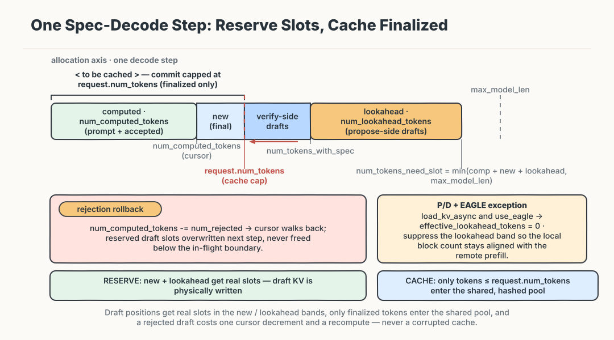</a>

<p class='figure-caption'>Figure: a decode step under speculative decoding — draft positions get physical slots in the `new` and `lookahead` bands, the prefix-cache commit is capped at the finalized-token boundary, and rejected drafts decrement `num_computed_tokens` back down for recompute.</p>

**The proposer→KV boundary is a list of counts**

Everything the proposer computes crosses into the scheduler as one field on the request: `request.spec_token_ids`, a plain `list[int]`. There is no richer object; the KV logic downstream never sees a tree, a logit, or an acceptance probability. It sees a length.

Source anchor — [`vllm/v1/core/sched/scheduler.py:1956-1976`](https://github.com/vllm-project/vllm/blob/6cf7b26bd4bff60bf378e1af14044280ac0d214c/vllm/v1/core/sched/scheduler.py#L1956-L1976):

```python
    def update_draft_token_ids(self, draft_token_ids: DraftTokenIds) -> None:
        for req_id, spec_token_ids in zip(
            draft_token_ids.req_ids,
            draft_token_ids.draft_token_ids,
        ):
            request = self.requests.get(req_id)
            if request is None or request.is_finished():
                # The request may have been finished. Skip.
                continue

            if request.is_prefill_chunk:
                # Ignore draft tokens for prefill chunks.
                if request.spec_token_ids:
                    request.spec_token_ids = []
                continue

            # Add newly generated spec token ids to the request.
            if self.structured_output_manager.should_advance(request):
                metadata = request.structured_output_request
                spec_token_ids = metadata.grammar.validate_tokens(spec_token_ids)  # type: ignore[union-attr]
            request.spec_token_ids = spec_token_ids
```

- The proposer runs after a step and hands the scheduler a `DraftTokenIds` batch; this method fans it out onto individual requests. A finished request is skipped (`:1962-1964`): its slots are already gone.
- A request still mid-prefill has its drafts discarded (`:1966-1970`): you cannot verify guesses for a prompt you have not finished ingesting, so any stale `spec_token_ids` are cleared to `[]`.
- The one non-trivial transform is structured-output masking (`:1973-1975`): if a grammar constrains the request, drafts that violate it are filtered before landing. Everything else is a straight assignment, `request.spec_token_ids = spec_token_ids` (`:1976`).

The proposer's only KV-visible output is a `list[int]` on the request. From here the cache path treats those tokens purely as *counts of positions that need slots but are not finalized* — `num_lookahead_tokens`, `num_draft_tokens`. No proposer internal ever reaches allocation or caching logic, which is exactly the fence that lets article 12 own the proposer without touching this article's machinery.

That "finalized vs. speculative" distinction is two counters on the request. [Section 5](#5-the-request-as-kv-state-holder-block_hashes-num_computed_tokens-and-speculative-tokens) reads the full request-state model; the spec-decode-relevant slice is the pair at [`vllm/v1/request.py:251-257`](https://github.com/vllm-project/vllm/blob/6cf7b26bd4bff60bf378e1af14044280ac0d214c/vllm/v1/request.py#L251-L257):

```python
    @property
    def num_tokens(self) -> int:
        return len(self._all_token_ids)

    @property
    def num_tokens_with_spec(self) -> int:
        return len(self._all_token_ids) + len(self.spec_token_ids)
```

`num_tokens` is `len(_all_token_ids)` = prompt + **already-accepted** output. Draft tokens are *not* in `_all_token_ids`; they live in the separate `spec_token_ids` list until accepted. So `num_tokens` is precisely the finalized, committable length — and it is the cap that excludes drafts from caching below. `num_tokens_with_spec` adds the unverified drafts: the *optimistic* length the scheduler must find slots for, but must never cache to.

### `num_lookahead_tokens`: reserving slots for tokens that do not exist yet

The verify-side drafts are already inside `num_tokens_with_spec`. But a spec-decode step also runs the *proposer* to generate the next round of drafts, and those need slots to write their KV into as well. That reservation is `num_lookahead_tokens`, a per-scheduler constant fixed at construction.

Source anchor — [`vllm/v1/core/sched/scheduler.py:234-257`](https://github.com/vllm-project/vllm/blob/6cf7b26bd4bff60bf378e1af14044280ac0d214c/vllm/v1/core/sched/scheduler.py#L234-L257):

```python
        self.num_lookahead_tokens = 0
        ...
            if speculative_config.use_eagle():
                self.use_eagle = True
                self.num_lookahead_tokens = self.num_spec_tokens
            if speculative_config.uses_draft_model():
                self.num_lookahead_tokens = self.num_spec_tokens
            if speculative_config.use_dflash():
                # DFlash requires an extra lookahead slot since it uses in-fill-style
                # decoding instead of standard next-token sampling, so it has a query
                # for the last sampled token plus queries for each draft token.
                self.num_lookahead_tokens = self.num_spec_tokens + 1
            if speculative_config.use_dspark():
                # DSpark drafts a block of num_spec_tokens query tokens in which the
                # anchor itself is the first prediction position (no separate bonus
                # query), so it needs exactly num_spec_tokens lookahead slots.
                self.num_lookahead_tokens = self.num_spec_tokens
```

- Without a `speculative_config`, `num_lookahead_tokens` stays `0` (`:234`), so `allocate_slots` reserves nothing extra: the non-spec path pays no lookahead tax at all.
- For EAGLE, a draft model, or DSpark the count equals `num_spec_tokens` — the proposer will write KV for exactly that many extra positions in the next forward.
- DFlash is the one variant that needs `num_spec_tokens + 1` (`:252`): its in-fill-style decoding issues a query for the last sampled token *plus* one per draft, so it needs one more slot than it has drafts.

`num_lookahead_tokens` is the number of extra speculative positions the proposer will physically write KV for next step, resolved once per scheduler from the spec-decode variant. It is a reservation constant, not a promise those tokens will be kept.

### Two draft bands: verify-side (`new`) and propose-side (`lookahead`)

A decoding request under speculative decoding carries drafts in two distinct roles at once, and the allocator handles them in two different bands of its token axis. The drafts scheduled to be *verified this step* are already folded into the running request's new-token demand.

Source anchor — [`vllm/v1/core/sched/scheduler.py:473-477`](https://github.com/vllm-project/vllm/blob/6cf7b26bd4bff60bf378e1af14044280ac0d214c/vllm/v1/core/sched/scheduler.py#L473-L477):

```python
            num_new_tokens = (
                request.num_tokens_with_spec
                + request.num_output_placeholders
                - request.num_computed_tokens
            )
```

`num_new_tokens` is computed from `num_tokens_with_spec`, so the verify-side drafts ride inside `<new>`. Then the same call site passes `num_lookahead_tokens=self.num_lookahead_tokens` straight into `allocate_slots` ([`scheduler.py:535-538`](https://github.com/vllm-project/vllm/blob/6cf7b26bd4bff60bf378e1af14044280ac0d214c/vllm/v1/core/sched/scheduler.py#L535-L538), the running-decode path [Section 9](#9-allocate_slots-is-a-policy-stack-not-an-allocation) and [Section 10](#10-the-scheduler-contract-how-scheduling-drives-the-kv-cache-manager) already walk) to reserve the propose-side band on top. The `allocate_slots` docstring names both bands explicitly — [`vllm/v1/core/kv_cache_manager.py:320-321`](https://github.com/vllm-project/vllm/blob/6cf7b26bd4bff60bf378e1af14044280ac0d214c/vllm/v1/core/kv_cache_manager.py#L320-L321):

```
        new       = num_new_tokens, including unverified draft tokens
        lookahead = num_lookahead_tokens
```

[Section 9](#9-allocate_slots-is-a-policy-stack-not-an-allocation) walks the full five-region block-layout diagram (`comp | new_comp | ext_comp | new | lookahead`) as part of the `allocate_slots` policy stack; what matters *here* is where the drafts live in it. The verify-side drafts sit inside `<new>` ("including unverified draft tokens"), the propose-side drafts sit inside `<lookahead>` to the right of it, and the diagram places `<lookahead>` explicitly *outside* the `< to be cached >` bracket. Both bands get physical slots; neither is inside the cacheable region.

**The P/D + EAGLE lookahead-zeroing guard**

There is exactly one place the scheduler suppresses the lookahead reservation: an async KV load under EAGLE, on the waiting/admit path.

Source anchor — [`vllm/v1/core/sched/scheduler.py:877-885`](https://github.com/vllm-project/vllm/blob/6cf7b26bd4bff60bf378e1af14044280ac0d214c/vllm/v1/core/sched/scheduler.py#L877-L885):

```python
                # Handles an edge case when P/D Disaggregation
                # is used with Spec Decoding where an
                # extra block gets allocated which
                # creates a mismatch between the number
                # of local and remote blocks.
                limit_lookahead_tokens = load_kv_async and self.use_eagle
                effective_lookahead_tokens = (
                    0 if limit_lookahead_tokens else self.num_lookahead_tokens
                )
```

- Normally `effective_lookahead_tokens = self.num_lookahead_tokens` — the admit reserves the same lookahead band as a running decode.
- The single exception is `load_kv_async and self.use_eagle` (`:882`): when a request's KV is being pulled from a remote prefill worker under P/D disaggregation *and* EAGLE is on, reserving a lookahead block locally would allocate one block the remote side did not, desynchronizing the local and remote block counts.
- In that case lookahead is forced to `0` for this admission, and the value flows into the `allocate_slots(..., num_lookahead_tokens=effective_lookahead_tokens, ...)` call ([`scheduler.py:912`](https://github.com/vllm-project/vllm/blob/6cf7b26bd4bff60bf378e1af14044280ac0d214c/vllm/v1/core/sched/scheduler.py#L912)) [Section 11](#11-connector-aware-allocation-external-kv-delay_cache_blocks-and-pd-disaggregation) reads from the connector angle.

### Inside `allocate_slots`: lookahead extends the slot count, clamped

Once inside the manager, the lookahead band becomes arithmetic: it lengthens the region blocks are physically allocated for, and it is clamped so runaway speculation cannot overrun the model's position budget. [Section 9](#9-allocate_slots-is-a-policy-stack-not-an-allocation) quotes and dissects the clamp itself — `num_tokens_need_slot = min(num_tokens_main_model + num_lookahead_tokens, self.max_model_len)` where `num_tokens_main_model = total_computed_tokens + num_new_tokens` ([`vllm/v1/core/kv_cache_manager.py:389-392`](https://github.com/vllm-project/vllm/blob/6cf7b26bd4bff60bf378e1af14044280ac0d214c/vllm/v1/core/kv_cache_manager.py#L389-L392)). The spec-relevant reading of those three lines:

- `num_tokens_main_model` is the length the *target* model will compute this step: everything already processed plus `new` (which includes the verify-side drafts).
- `num_tokens_need_slot` adds the propose-side `lookahead` on top — this is the length blocks are actually allocated for, so the next draft forward has somewhere to write.
- The `min(..., self.max_model_len)` clamp is the guard: a large `num_spec_tokens` near the end of a sequence could otherwise reserve positions past the context window. Speculative slots are allowed, but never beyond `max_model_len`.

`num_tokens_need_slot` is what the coordinator allocates against — [`vllm/v1/core/kv_cache_manager.py:440-445`](https://github.com/vllm-project/vllm/blob/6cf7b26bd4bff60bf378e1af14044280ac0d214c/vllm/v1/core/kv_cache_manager.py#L440-L445):

```python
        new_blocks = self.coordinator.allocate_new_blocks(
            request.request_id,
            num_tokens_need_slot,
            num_tokens_main_model,
            num_encoder_tokens,
        )
```

Blocks are physically allocated for `comp + new + lookahead` (`num_tokens_need_slot`), clamped at `max_model_len`, so every draft position the proposer will write has a real KV slot — and speculation can never reserve past the context window. The per-group fan-out of `allocate_new_blocks` is [Section 15](#15-the-coordinator-and-hybrid-kv-cache-when-one-block-type-is-not-enough)'s coordinator machinery.

### The caching cap: only finalized tokens enter the shared pool

This is the decisive line of the whole feature. Slots exist for drafts (above), but the prefix-cache commit is capped at the finalized-token count so a draft that gets rejected can never have been hashed or shared. [Section 9](#9-allocate_slots-is-a-policy-stack-not-an-allocation) quotes and dissects the cap itself — `num_tokens_to_cache = min(total_computed_tokens + num_new_tokens, request.num_tokens)` at [`vllm/v1/core/kv_cache_manager.py:452-461`](https://github.com/vllm-project/vllm/blob/6cf7b26bd4bff60bf378e1af14044280ac0d214c/vllm/v1/core/kv_cache_manager.py#L452-L461), feeding `self.coordinator.cache_blocks(request, num_tokens_to_cache)`. What is spec-specific is *why* the cap reads `request.num_tokens`, which the same `allocate_slots` method docstring restates in draft-token terms — [`vllm/v1/core/kv_cache_manager.py:324-326`](https://github.com/vllm-project/vllm/blob/6cf7b26bd4bff60bf378e1af14044280ac0d214c/vllm/v1/core/kv_cache_manager.py#L324-L326):

```
        NOTE: for new tokens which include both verified and unverified draft
        tokens, we only cache the verified tokens (by capping the number at
        `request.num_tokens`).
```

1. `total_computed_tokens + num_new_tokens` is the *optimistic* processed length — it counts the unverified drafts that have slots but are not yet accepted.
2. `request.num_tokens = len(_all_token_ids)` is the *finalized* length: prompt + accepted output only. Drafts live in `spec_token_ids`, not `_all_token_ids`, so they are excluded by construction — the counter split from the first subsection is exactly what makes this cap correct without any per-token spec bookkeeping.
3. `min(...)` therefore stops the caching boundary at the last finalized token; `cache_blocks` only hashes and commits blocks fully covered by `num_tokens_to_cache`.

Why the cap must exist: prefix-cache blocks are content-addressed and *shared across requests* — [Section 7](#7-prefix-cache-lookup-hashing-longest-hit-and-the-recompute-last-token-rule) reads the `find_longest_cache_hit` lookup and [Section 8](#8-the-prefix-cache-write-path-cache_full_blocks-and-committing-a-hash) reads the `cache_full_blocks` write path. If a block containing an unverified draft were hashed and committed, another request (or this same request after a rollback) could match that hash and read back KV for a token that was later *rejected* — silent corruption of a completely unrelated sequence. Capping at `num_tokens` guarantees only content that will never be rolled back ever enters the shared, hashed pool. The draft slots still exist and simply get overwritten in place on the next forward; the free-queue and hashing mechanics they reuse are [Section 3](#3-kvcacheblock-and-blockpool-the-free-list-is-an-eviction-structure) and [Section 8](#8-the-prefix-cache-write-path-cache_full_blocks-and-committing-a-hash).

The prefix cache is only ever committed up to `request.num_tokens` (finalized tokens). Unverified drafts (present in physical slots and in `num_computed_tokens`) are never hashed or shared. This is what prevents a rejected draft's KV from becoming a phantom cache hit for another tenant.

### Safe freeing under an in-flight / rollback boundary

`allocate_slots` frees sliding-window-skipped blocks *before* it allocates, to reduce evictions ([Section 9](#9-allocate_slots-is-a-policy-stack-not-an-allocation) covers `remove_skipped_blocks` in general). Under speculative decoding that free must be careful: it must not free a block that an in-flight step still reads or that a coming rejection will pull back into scope.

Source anchor — [`vllm/v1/core/kv_cache_manager.py:400-407`](https://github.com/vllm-project/vllm/blob/6cf7b26bd4bff60bf378e1af14044280ac0d214c/vllm/v1/core/kv_cache_manager.py#L400-L407):

```python
        # Free on the processed-token basis: in-flight steps' attention windows
        # still read blocks below the optimistic boundary, and rejected spec
        # tokens can roll it back.
        self.coordinator.remove_skipped_blocks(
            request.request_id,
            max(0, total_computed_tokens - request.num_in_flight_tokens),
            num_prompt_tokens=request.num_prompt_tokens,
        )
```

- The skip-free boundary is `total_computed_tokens - num_in_flight_tokens`, floored at 0 — deliberately *below* the optimistic processed pointer.
- `num_in_flight_tokens` covers the tokens whose forward is still executing (including scheduled drafts). Pulling the free boundary back by that amount means no block that an in-flight attention window still reads, or that a rejection will restore, can be freed here.

Skipped-block freeing runs on the committed (non-in-flight) basis, so a subsequent draft rejection that decrements `num_computed_tokens` (next subsection) never finds that a block it must re-read was already freed. This is the free-side counterpart to the caching cap.

**Rollback: rejected drafts decrement `num_computed_tokens`**

The rollback undoes an optimistic advance made at schedule time. When a step is scheduled, *all* scheduled tokens, drafts included, are added to `num_computed_tokens` up front.

Source anchor — [`vllm/v1/core/sched/scheduler.py:1177-1183`](https://github.com/vllm-project/vllm/blob/6cf7b26bd4bff60bf378e1af14044280ac0d214c/vllm/v1/core/sched/scheduler.py#L1177-L1183):

```python
        # 3. If some tokens (e.g. spec tokens) are rejected later, the number of
        #    computed tokens will be adjusted in update_from_output.
        num_scheduled_tokens = scheduler_output.num_scheduled_tokens
        for req_id, num_scheduled_token in num_scheduled_tokens.items():
            request = self.requests[req_id]
            request.num_computed_tokens += num_scheduled_token
            request.num_in_flight_tokens += num_scheduled_token
```

The comment at `:1177` flags the plan: advance optimistically now, correct after verification. That correction lands in `update_from_output` — [`vllm/v1/core/sched/scheduler.py:1591-1615`](https://github.com/vllm-project/vllm/blob/6cf7b26bd4bff60bf378e1af14044280ac0d214c/vllm/v1/core/sched/scheduler.py#L1591-L1615):

```python
            scheduled_spec_token_ids = (
                scheduler_output.scheduled_spec_decode_tokens.get(req_id)
            )
            # Skip a stale frame still pending discard (async_tokens_to_discard
            # > 0): its pre-reset rejection count would underflow the counters.
            if (
                scheduled_spec_token_ids
                and (generated_token_ids or self.num_sampled_tokens_per_step == 0)
                and request.async_tokens_to_discard == 0
            ):
                num_draft_tokens = len(scheduled_spec_token_ids)
                num_sampled = self.num_sampled_tokens_per_step
                num_accepted = max(len(generated_token_ids) - num_sampled, 0)
                num_rejected = num_draft_tokens - num_accepted
                # num_computed_tokens represents the number of tokens
                # processed in the current step, considering scheduled
                # tokens and rejections. If some tokens are rejected,
                # num_computed_tokens is decreased by the number of rejected
                # tokens.
                if request.num_computed_tokens > 0:
                    request.num_computed_tokens -= num_rejected
                # If async scheduling, num_output_placeholders also includes
                # the scheduled spec tokens count and so is similarly adjusted.
                if request.num_output_placeholders > 0:
                    request.num_output_placeholders -= num_rejected
```

1. `num_draft_tokens` = drafts scheduled for verification this step (the `<new>`-band drafts).
2. `num_accepted = max(len(generated_token_ids) - num_sampled, 0)`: `generated_token_ids` holds the accepted drafts *plus* the bonus/base sampled token(s); subtracting `num_sampled` (`num_sampled_tokens_per_step`) leaves the count of accepted drafts.
3. `num_rejected = num_draft_tokens - num_accepted`.
4. `request.num_computed_tokens -= num_rejected` (`:1610-1611`) is the rollback. Schedule time advanced the pointer by *all* scheduled tokens; here the rejected suffix is subtracted back off, so the processed-prefix pointer lands exactly at prompt + accepted. Next step recomputes from there, the reserved draft slots are overwritten in place, and because caching was capped at `num_tokens`, no rejected KV was ever committed.
5. `num_output_placeholders` is decremented in lockstep for the async-scheduling path (`:1614-1615`), since placeholders also counted the scheduled drafts.

Contrast with [Section 13](#13-under-pressure-preemption-recomputation-and-reclaiming-blocks)'s preemption, which *zeroes* `num_computed_tokens` to force a full re-prefill. Rejection is the surgical version: it decrements by exactly `num_rejected`, discarding only the wrong suffix while keeping every verified token's progress and cached KV.

One supporting guard closes the loop: a request must never be declared finished on the strength of drafts that could still be rejected — [`vllm/v1/core/sched/scheduler.py:445-453`](https://github.com/vllm-project/vllm/blob/6cf7b26bd4bff60bf378e1af14044280ac0d214c/vllm/v1/core/sched/scheduler.py#L445-L453):

```python
            if (
                request.num_output_placeholders > 0
                # This is (num_computed_tokens + 1) - (num_output_placeholders - 1).
                # Since output placeholders are also included in the computed tokens
                # count, we subtract (num_output_placeholders - 1) to remove any draft
                # tokens, so that we can be sure no further steps are needed even if
                # they are all rejected.
                and request.num_computed_tokens + 2 - request.num_output_placeholders
                >= request.num_prompt_tokens + request.max_tokens
            ):
```

The early-exit condition subtracts the draft-bearing placeholders before comparing against `max_tokens`, so a request is only retired when it would be complete *even if every outstanding draft is rejected*.

### The state-transition chain

Speculative positions receive slots but not cache identities. Rejection retreats `num_computed_tokens`, while reclamation stays behind the in-flight boundary; a wrong draft therefore costs recomputation rather than exposing stale shared KV.

## 15. The Coordinator and Hybrid KV Cache: When One Block Type Is Not Enough

Hybrid models mix full, sliding-window, chunked-local, Mamba, and cross-attention layers whose pages are not interchangeable. `KVCacheManager` delegates to a `KVCacheCoordinator`, which fans one logical allocation across typed KV-cache groups and computes the single aligned prefix length every group can reuse.

**One coordinator, one pool, a positionally-aligned tuple of typed managers**

The `KVCacheManager` owns exactly one coordinator. The coordinator's job is stated in its class docstring, and it is deliberately narrow.

`vllm/v1/core/kv_cache_coordinator.py:L61-L64`

```python
class KVCacheCoordinator(ABC):
    """
    Coordinate the KV cache of different KV cache groups.
    """
```

A *KV cache group* is a set of model layers that share one `KVCacheSpec` — same attention type, same block size, same byte layout. Full-attention layers form one group; sliding-window layers of a given window form another. The coordinator constructor materializes three things every subclass relies on: the single shared `BlockPool`, the set of EAGLE group indices, and the central structure, an immutable tuple of one `SingleTypeKVCacheManager` per group.

`vllm/v1/core/kv_cache_coordinator.py:L107-L121`

```python
        self.single_type_managers = tuple(
            get_manager_for_kv_cache_spec(
                kv_cache_spec=kv_cache_group.kv_cache_spec,
                max_in_flight_tokens=max_in_flight_tokens,
                max_model_len=max_model_len,
                block_pool=self.block_pool,
                enable_caching=enable_caching,
                kv_cache_group_id=i,
                dcp_world_size=dcp_world_size,
                pcp_world_size=pcp_world_size,
                scheduler_block_size=self.scheduler_block_size,
                needs_kv_cache_zeroing=self.kv_cache_config.needs_kv_cache_zeroing,
            )
            for i, kv_cache_group in enumerate(self.kv_cache_config.kv_cache_groups)
        )
```

Every manager receives the *same* `self.block_pool` (constructed just above at `L91-L97` from `kv_cache_config.num_blocks`). There is exactly one pool of physical VRAM; the groups do not partition it, they *compete* for it — a fact that returns to bite in the admission-cap discussion below. The tuple is built by `enumerate`, so `single_type_managers[i]` corresponds to `kv_cache_config.kv_cache_groups[i]` by construction, and the tuple is immutable for the coordinator's lifetime.

**Positional alignment.** `single_type_managers[i] ↔ kv_cache_groups[i] ↔ new_computed_blocks[i] ↔ returned_tuple[i]` holds for every fan-out method in the coordinator. That is what lets the coordinator `zip` a per-group slice of cache-hit blocks to the right manager without ever carrying a group id in the data: the index *is* the group id. Every fan-out (`get_num_blocks_to_allocate`, `allocate_new_blocks`, `remove_skipped_blocks`, `find_longest_cache_hit`) is a loop over this tuple, and correctness rests on the tuple never being reordered after construction.

<a href='images/vllm-06-08-hybrid-groups.svg' target='_blank'>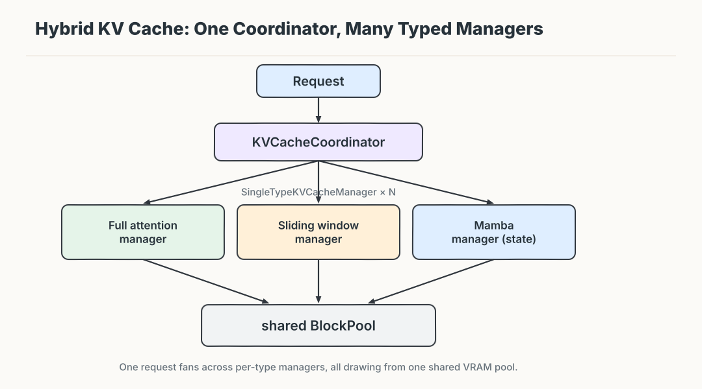</a>

<p class='figure-caption'>One `KVCacheCoordinator` fanning a single request across per-type `SingleTypeKVCacheManager`s (full attention, sliding window, Mamba), all drawing from one shared `BlockPool`.</p>

### The block-size lattice: why a hit is aligned in every group at once

Different groups may use different block sizes. A full-attention group might use 16-token blocks while a sliding-window group uses 64. The coordinator reconciles them with a divisibility lattice, asserted up front in the constructor.

`vllm/v1/core/kv_cache_coordinator.py:L83-L89`

```python
        # The scheduling granularity (LCM of all group block sizes), must be a multiple
        # of the hash_block_size and the block size of each group.
        assert scheduler_block_size % hash_block_size == 0 and all(
            scheduler_block_size % g.kv_cache_spec.block_size == 0
            for g in kv_cache_config.kv_cache_groups
        )
        self.scheduler_block_size = scheduler_block_size
```

`scheduler_block_size` is the LCM of every group's block size, and it is divisible by both the `hash_block_size` (the granularity at which prefix-cache hashes are computed) and each group's `block_size`. The hybrid coordinator additionally asserts the *other* direction — each group's block size is itself a multiple of `hash_block_size` (`L552-L558`, `"block_size must be divisible by hash_block_size"`) — so fine-grained hashes can be regrouped into coarser per-group blocks.

**`hash_block_size | group.block_size | scheduler_block_size`.** Because every hit length the coordinator reports is a multiple of `scheduler_block_size`, it is simultaneously a whole number of blocks in *every* group — no group is ever handed a fractional block at a hit boundary. The same assert also carries the news that DCP/PCP context parallelism only works in the single-group case; the hybrid constructor asserts `dcp_world_size == 1` and `pcp_world_size == 1` (`L557-L558`).

### `page_size_bytes` is abstract, and that is the whole point

The reason a coordinator layer exists at all is that a "block" is not a uniform object. Its byte size depends on the attention type of the layer that owns it, and the base spec refuses to commit to a formula.

`vllm/v1/kv_cache_interface.py:L108-L116`

```python
    @property
    def page_size_bytes(self) -> int:
        """
        The size of a page with `block_size` tokens in bytes.

        Returns:
            The page size
        """
        raise NotImplementedError
```

`page_size_bytes` is abstract because there is no single answer. For an attention layer the concrete arithmetic lives in `real_page_size_bytes` — a plain K-and-V tensor, `2·block·heads·head_dim·dtype`; the public `page_size_bytes` wraps that value, *adding* per-token-head scale bytes for per-token-head quantization and honoring a `page_size_padded` override (so the two differ whenever scales or padding apply). The excerpt below is the `real_page_size_bytes` body:

`vllm/v1/kv_cache_interface.py:L196-L202`

```python
        return (
            2
            * self.block_size
            * self.num_kv_heads
            * head_dim
            * get_dtype_size(self.dtype)
        )
```

The factor of `2` (K and V), `num_kv_heads`, and `head_dim` are the tells: this formula is meaningless for a layer that stores neither keys/values nor a head dimension. A Mamba layer stores a recurrent *state snapshot* instead, and computes its page size as a sum over arbitrary state-tensor shapes:

`vllm/v1/kv_cache_interface.py:L680-L689`

```python
    @property
    def page_size_bytes(self) -> int:
        page_size = sum(
            prod(shape) * get_dtype_size(dtype)
            for (shape, dtype) in zip(self.shapes, self.dtypes)
        )
        if self.page_size_padded is not None:
            assert self.page_size_padded >= page_size
            return self.page_size_padded
        return page_size
```

No `block_size`, no `num_kv_heads`, no factor of 2. A Mamba page's byte size is unrelated to how many tokens it "covers." (Compressed MLA adds two more incompatible formulas — a `storage_block_size = block_size // compress_ratio` layout and hard-coded 584/656-byte per-token layouts at `kv_cache_interface.py:L375-L398` — so the count is four unrelated implementations, not two.) The vLLM design docs give an intuition-level formula, `page size = num_layers × block_size × kv_hidden_size` ([Hybrid KV Cache Manager docs](https://docs.vllm.ai/en/stable/design/hybrid_kv_cache_manager/)); treat that as a per-group mental model and the per-spec code above as the ground truth — they are reconcilable for attention layers and simply do not apply to Mamba.

Layers of *different* byte size can even coexist in one group — `UniformTypeKVCacheSpecs.page_size_bytes` *sums* the constituent page sizes rather than assuming equality (`kv_cache_interface.py:L797-L799`). A single global "block size in bytes" constant would be a lie the moment a hybrid model loads.

The second clause of the paper model ("blocks are held until the request finishes") is also per-type, and the seam is one method. The base returns zero:

`vllm/v1/core/single_type_kv_cache_manager.py:L547-L558`

```python
    def get_num_skipped_tokens(self, num_computed_tokens: int) -> int:
        """
        Get the number of tokens that will be skipped for attention computation.

        Args:
            num_computed_tokens: The number of tokens that have been computed.

        Returns:
            The number of tokens that will be skipped for attention computation.
        """
        # The default behavior is to not skip any tokens.
        return 0
```

Returning `0` *is* full-attention behavior: nothing ever leaves the window, so no block is freed mid-request. Mamba overrides it to keep exactly the latest state:

`vllm/v1/core/single_type_kv_cache_manager.py:L1331-L1337`

```python
    def get_num_skipped_tokens(self, num_computed_tokens: int) -> int:
        """
        Get the number of tokens whose mamba state are not needed anymore. Mamba only
        need to keep the state of the last computed token, so we return
        num_computed_tokens - 1.
        """
        return num_computed_tokens - 1
```

Sliding window returns `max(0, n - sliding_window + 1)`, chunked-local snaps to the chunk boundary, R-SWA frees an interior gap. The *same* `remove_skipped_blocks` primitive, driven by five different `get_num_skipped_tokens`, produces five materially different free-set geometries — nothing, a shrinking head, a chunk-aligned head, an interior band, a single interior state block — all against the one shared pool. This is why the abstract base class is named `SingleTypeKVCacheManager`: "the kv cache management logic of one specific type of attention layer" (`L33-L37`). Cross-attention is the outlier that opts out of prefix caching entirely: its `CrossAttentionManager.cache_blocks` *raises* rather than caching (`single_type_kv_cache_manager.py:L1387-L1395`), because encoder KV is request-specific and never shared between requests.

**The dispatch table and the one branch that carries a recycling cap**

The spec-to-manager mapping is a registry; `get_manager_for_kv_cache_spec` looks it up and injects exactly one type-specific kwarg.

`vllm/v1/core/single_type_kv_cache_manager.py:L1476-L1493`

```python
    # SlidingWindow / ChunkedLocalAttention managers recycle blocks;
    # the runtime admission cap must match the recycling-aware bound the
    # startup pool sizer uses (single source of truth: the spec method).
    # R-SWA also recycles gap blocks but peak physical KV still fits the
    # full-attention bound (prefix + window <= max_model_len), so it inherits
    # FullAttentionSpec sizing without a separate admission cap.
    if isinstance(
        kv_cache_spec,
        (SlidingWindowSpec, ChunkedLocalAttentionSpec),
    ):
        kwargs["max_admission_blocks_per_request"] = (
            kv_cache_spec.max_admission_blocks_per_request(
                max_in_flight_tokens=max_in_flight_tokens,
                max_model_len=max_model_len,
            )
        )
    manager = manager_class(kv_cache_spec, **kwargs)
```

Only the two block-*recycling* types (sliding-window and chunked-local) get a `max_admission_blocks_per_request`. Full attention, Mamba, and R-SWA do not. The reason is a coupling the comment spells out: a recycling type frees blocks mid-request as its window slides, so its *peak* held-block count plateaus well below `cdiv(tokens, block_size)`. The startup pool sizer bets on that plateau, so the runtime admission gate must reserve using the *identical* bound: the same spec method feeds both.

**`sum(reservations) ≤ pool ⇔ sum(peak_real_held) ≤ pool`.** If the admission gate reserved the naive per-token count while the pool was sized for the plateau, admission and reality would drift — and, as the `get_num_blocks_to_allocate` comment notes, drift "would re-introduce the deadlock from issue #39734 or, worse, mid-prefill OOM." R-SWA is explicitly excluded because prefix + window already fits the full-attention bound, and `SinkFullAttentionManager` goes the other way, permanently withholding sink blocks off the free queue at construction (`L1445-L1448`) so the sizer must not assume every block is freely allocatable.

### Three coordinators, chosen purely by (caching, group count)

The coordinator subclass is a pure function of two facts: whether caching is on, and how many groups there are.

`vllm/v1/core/kv_cache_coordinator.py:L796-L835` (constructor argument lists elided)

```python
    if not enable_caching:
        return KVCacheCoordinatorNoPrefixCache(
            ...
        )
    if len(kv_cache_config.kv_cache_groups) == 1:
        return UnitaryKVCacheCoordinator(
            ...
        )
    return HybridKVCacheCoordinator(
        ...
    )
```

`KVCacheCoordinatorNoPrefixCache` always misses (its `find_longest_cache_hit` returns empty per-group lists and length 0) and is the only coordinator that accepts *any* group count, including zero. `UnitaryKVCacheCoordinator` handles exactly one group with a single manager call, asserts `hash_block_size == block_size` when caching, and is the *only* coordinator that supports DCP/PCP context parallelism (it pre-multiplies `block_size` by the world sizes). `HybridKVCacheCoordinator` handles more than one group and is the only one that runs the fixed point below.

The split keeps single-type models off the hybrid path and mixed groups out of the unitary path. Subclass assertions enforce `len(...groups) == 1` for unitary and `len(attention_groups) > 1` for hybrid. The V1 guide's note that prefix caching "is not yet supported" for Mamba/hybrid models ([V1 User Guide](https://docs.vllm.ai/en/stable/usage/v1_guide/)) is the user-visible consequence.

### `find_longest_cache_hit`: the one abstract method, and the hybrid fixed point

Everything else in the coordinator is shared; the cache-hit search is the single method subclasses *must* implement.

`vllm/v1/core/kv_cache_coordinator.py:L364-L370`

```python
    @abstractmethod
    def find_longest_cache_hit(
        self,
        block_hashes: list[BlockHash],
        max_cache_hit_length: int,
    ) -> tuple[tuple[list[KVCacheBlock], ...], int]:
        pass
```

Given the request's block hashes and an upper bound, return `(per-group hit blocks, hit length in tokens)`. For a single group this is one delegated call. For a hybrid model it is genuinely hard, because the groups *disagree* on how long the reusable prefix is: a full-attention group can reuse a cached prefix of length L only if all L tokens are still cached, while a sliding-window group can reuse it only if the last window's worth is contiguous. The hit that satisfies everyone is the *intersection*, and the hybrid coordinator finds it by monotonic-shrink iteration. Before the loop it sorts full attention to the front:

`vllm/v1/core/kv_cache_coordinator.py:L591-L601`

```python
        # Put full attention first: its efficient left-to-right scan provides
        # a tighter initial bound, reducing work for subsequent groups.
        self.attention_groups.sort(
            key=lambda g: not isinstance(g.spec, FullAttentionSpec)
        )

        # Propagate the eagle bit to each manager (default to ``use_eagle=False``).
        for group in self.attention_groups:
            if group.use_eagle:
                for gid in group.group_ids:
                    self.single_type_managers[gid].use_eagle = True
```

Then it sweeps until no group shrinks the candidate:

`vllm/v1/core/kv_cache_coordinator.py:L677-L726`

```python
        while True:
            curr_hit_length = hit_length

            for idx, (spec, group_ids, manager_cls, use_eagle) in enumerate(
                self.attention_groups
            ):
                cached_blocks = hit_blocks_by_group[group_ids[0]]
                if isinstance(spec, FullAttentionSpec) and cached_blocks is not None:
                    # Full attention is downward-closed: we only need to look
                    # up cached blocks once; on subsequent iterations just trim
                    # to the (reduced) current hit length.
                    curr_hit_length = (
                        curr_hit_length // spec.block_size * spec.block_size
                    )
                    continue

                drop_eagle_block = use_eagle and idx not in eagle_verified

                _max_length = curr_hit_length
                if drop_eagle_block:
                    # Eagle needs to match one more block and then pop the last.
                    _max_length = min(
                        curr_hit_length + spec.block_size, max_cache_hit_length
                    )
                hit_blocks = manager_cls.find_longest_cache_hit(
                    block_hashes=_get_block_hashes(spec),
                    max_length=_max_length,
                    kv_cache_group_ids=group_ids,
                    block_pool=self.block_pool,
                    kv_cache_spec=spec,
                    drop_eagle_block=drop_eagle_block,
                    alignment_tokens=self.scheduler_block_size,
                )
                _new_hit_length = len(hit_blocks[0]) * spec.block_size
                if drop_eagle_block:
                    eagle_verified.add(idx)
                elif _new_hit_length < curr_hit_length:
                    # length shrunk; invalidate previous eagle verifications
                    eagle_verified.clear()
                curr_hit_length = _new_hit_length
                for group_id, blocks in zip(group_ids, hit_blocks):
                    hit_blocks_by_group[group_id] = blocks

                longest_hit_length = max(longest_hit_length, curr_hit_length)

            if curr_hit_length >= hit_length:
                break
            hit_length = curr_hit_length
            if is_simple_hybrid:
                break
```

Reading it as an algorithm:

1. **Full attention is looked up once.** It is downward-closed (a hit at length L implies a hit at every L′ < L) so once its blocks are cached in `hit_blocks_by_group`, later sweeps only *trim* the result to the current (possibly reduced) length rather than re-querying the pool (`L684-L691`). That is exactly why it is sorted first: it establishes a tight initial bound cheaply.
2. **Each non-full group either accepts or reduces `curr_hit_length`.** It runs its own type-specific `find_longest_cache_hit` bounded by the current candidate, and the returned block count becomes the new candidate (`L710`, `L716`). A sliding-window group that cannot find a contiguous window shrinks the length; the next group then re-evaluates against the smaller bound.
3. **Convergence.** The outer loop breaks when a full sweep failed to reduce the candidate (`curr_hit_length >= hit_length`, `L722`). Termination is guaranteed because the candidate only ever decreases and is bounded below by 0. The `is_simple_hybrid` case (exactly one full-attention group plus one other) is provably a single-sweep fixed point, so it breaks after one pass (`L725-L726`).
4. **EAGLE draws one extra block then drops it,** verified at most once per candidate length; if a later group shrinks the length, `eagle_verified` is cleared so the drop is re-checked (issue #32802).

Post-processing trims full-attention blocks to the final length and records a cross-request signal:

`vllm/v1/core/kv_cache_coordinator.py:L728-L741`

```python
        # Truncate full attention blocks to final hit_length (if present)
        first_group = self.attention_groups[0]
        if isinstance(first_group.spec, FullAttentionSpec):
            num_blocks = hit_length // first_group.spec.block_size
            for group_id in first_group.group_ids:
                if (blks := hit_blocks_by_group[group_id]) is not None:
                    del blks[num_blocks:]

        # Uncached shared prefix detection: If any attn. group cached a longer prefix
        # than the current prefix, it is an uncached common prefix across requests:
        self.num_uncached_common_prefix_tokens = longest_hit_length - hit_length
        return tuple(
            blocks if blocks is not None else [] for blocks in hit_blocks_by_group
        ), hit_length
```

**The returned `hit_length` is the *common* reusable prefix across all groups** (the largest length every group can serve from cache simultaneously) and, because of the block-size lattice and `alignment_tokens=self.scheduler_block_size`, it is block-aligned in every group at once. `None` slots become `[]` so the tuple stays full-length and positionally aligned. `num_uncached_common_prefix_tokens = longest_hit_length - hit_length` records that some group cached a longer prefix than the common hit — a signal that an uncached cross-request common prefix exists, usable elsewhere as an optimization hint.

**Two-phase touch-before-allocate: the shared pool bites back**

Because all groups draw from one pool, the order in which a first-time request claims its cache-hit blocks matters. `allocate_new_computed_blocks` touches every group's hits before any group allocates fresh blocks.

`vllm/v1/core/kv_cache_coordinator.py:L206-L232`

```python
        # A running request is already tracked in num_cached_block and won't
        # have new prefix-cache hits, so this is a no-op for it.
        if any(
            request_id in manager.num_cached_block
            for manager in self.single_type_managers
        ):
            assert all(len(blocks) == 0 for blocks in new_computed_blocks)
            return

        # Two-phase allocation (issue #33775): first touch every group's local
        # cache-hit blocks, then allocate external blocks for every group. This
        # ensures an earlier group's external `get_new_blocks` cannot evict a
        # later group's not-yet-touched cache-hit blocks.
        for i, manager in enumerate(self.single_type_managers):
            manager.add_local_computed_blocks(
                request_id,
                new_computed_blocks[i],
                num_local_computed_tokens,
                num_external_computed_tokens,
            )
        if num_external_computed_tokens > 0:
            for manager in self.single_type_managers:
                manager.allocate_external_computed_blocks(
                    request_id,
                    num_local_computed_tokens,
                    num_external_computed_tokens,
                )
```

Phase 1 (`L219-L225`): every group calls `add_local_computed_blocks`, which `touch`es its hit blocks so their ref count reflects the new request and they leave the eviction queue. Phase 2 (`L226-L232`): only if external (connector-supplied) KV exists, every group allocates fresh blocks to receive it.

A cache-hit block sits at `ref_cnt == 0`, free-but-cached, until it is touched. If phase 2 for an *earlier* group ran before phase 1 for a *later* group, that earlier group's `get_new_blocks` could pop the later group's not-yet-touched hit block off the LRU front and reuse it, silently corrupting a valid hit. Touching *all* groups first makes every hit block non-evictable before *any* group pulls from the shared pool. The leading short-circuit (`L206-L213`) asserts a running request carries no new hits, preserving the fast path.

## 16. Per-Type Block Math: Sliding Window, Mamba, and Chunked Local Attention

Per-type managers share three templates—head freeing, demand prediction, and startup sizing—but supply different skip policies. The same machinery yields O(context) retention for full attention, a window-height plateau for sliding window, a one-chunk plateau for chunked-local attention, and O(1) retention for Mamba. Safe coexistence reduces to `sum(reservations) ≤ pool ⇔ sum(peak_real_held) ≤ pool`.

<a href='images/vllm-06-17-per-type-math.svg' target='_blank'>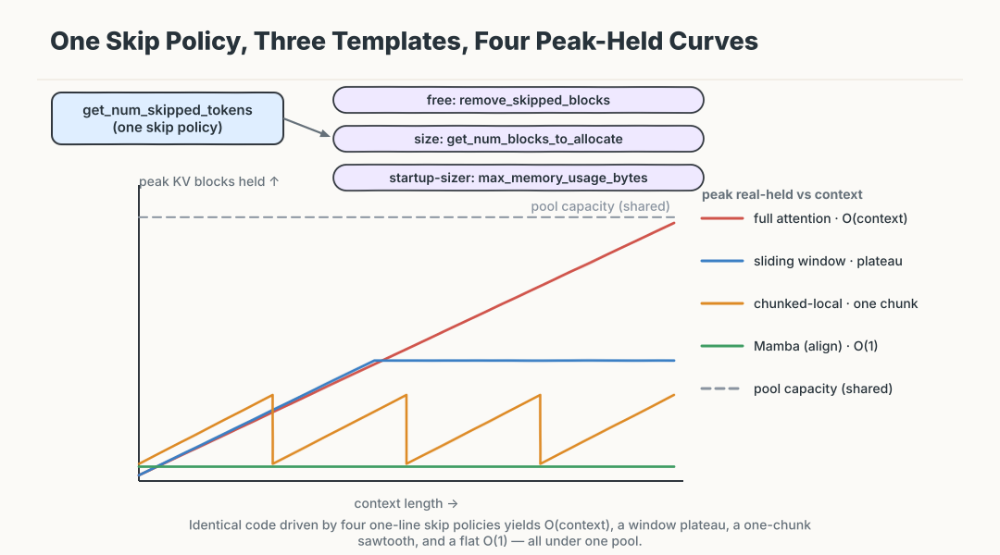</a>

<p class='figure-caption'>One skip policy propagating through three shared templates — free, size, and startup-sizer — to produce four different peak-held curves against one shared pool.</p>

**The two skip functions Section 15 named but did not evaluate**

[Section 15](#15-the-coordinator-and-hybrid-kv-cache-when-one-block-type-is-not-enough) pasted the two extremes: base `= 0` (hold everything) and Mamba `= n - 1` (keep only the last state). The two intermediate policies are where the arithmetic actually bites, and both are one line under a worked-example docstring. Sliding window:

`vllm/v1/core/single_type_kv_cache_manager.py:L864-L867`

```python
        Returns:
            The number of tokens that will be skipped for attention computation.
        """
        return max(0, num_computed_tokens - self.sliding_window + 1)
```

With `num_computed_tokens` already committed, the *next* token attends to a window of `sliding_window` positions, i.e. tokens `[num_computed_tokens - sliding_window + 1 .. num_computed_tokens]`. Everything strictly below that lower bound can never again be read, so it is skipped. The `+1` is because the window includes the position about to be written, not just the ones already computed. The docstring's own worked case (`L845-L859`) is `sliding_window=4, num_computed_tokens=7 → 4`: the live window is tokens 4–7, tokens 0–3 are dead. Note the shape of the function — it is `max(0, ...)`, so it stays pinned at `0` until `num_computed_tokens` first exceeds `sliding_window - 1`, then rises one-for-one with each new token.

**Window monotonicity.** `get_num_skipped_tokens` is non-decreasing in `num_computed_tokens`. The skipped head prefix only ever grows, so a block freed at one step can never be resurrected as "needed" by a later step at an equal-or-larger boundary. Combined with [Section 9](#9-allocate_slots-is-a-policy-stack-not-an-allocation)'s processed-token boundary (which pulls the argument *back* by in-flight tokens), freeing is safe against both in-flight reads and speculative rollback.

Chunked-local attention resets the window at each chunk boundary instead of rolling it, so its skip is a floor to a chunk multiple, not a subtraction:

`vllm/v1/core/single_type_kv_cache_manager.py:L1017-L1020`

```python
        num_skipped_tokens = (
            num_computed_tokens // self.attention_chunk_size
        ) * self.attention_chunk_size
        return num_skipped_tokens
```

The next token attends only *within its own chunk*, so every complete prior chunk is dead. `num_computed_tokens // C * C` floors the count to the nearest multiple of `attention_chunk_size`: the start of the live chunk. The docstring cases (`L983-L1009`, chunk size 8) are worth internalizing because one is counterintuitive: `13 → 8`, `7 → 0`, and `8 → 8`. That last one is the tell. At an *exact* chunk boundary the whole previous chunk `[0..7]` is already skipped, because the next token to be written (index 8) opens a fresh chunk and attends to nothing behind it. Full attention's skip stays `0` forever; chunked-local's skip jumps in whole-chunk steps.

**Chunk alignment.** The skip boundary is always a multiple of `attention_chunk_size`, so a freed prefix never straddles the live chunk. The surviving suffix is `[chunk_start .. num_computed_tokens]`, a chunk-aligned tail. `ChunkedLocalAttentionSpec` can therefore cap admission at one chunk plus the in-flight overhang described below.

### From skipped tokens to freed blocks: the base head-freeing template

Full attention, sliding window, and chunked-local all inherit the *same* `remove_skipped_blocks`; only its input (the skip count) differs. The base body is where "skipped tokens" becomes "freed physical blocks":

`vllm/v1/core/single_type_kv_cache_manager.py:L529-L545`

```python
        del num_prompt_tokens
        # Remove the blocks that will be skipped during attention computation.
        num_skipped_tokens = self.get_num_skipped_tokens(processed_computed_tokens)
        if num_skipped_tokens <= 0:
            # This indicates that ALL tokens are inside attention window.
            # Thus we do not need to free any blocks outside attention window.
            # A typical case is full attention that we never free any token
            # before the request is finished.
            return
        blocks = self.req_to_blocks[request_id]
        num_skipped_blocks = num_skipped_tokens // self.block_size
        # `num_skipped_tokens` may include tokens that haven't been allocated yet
        # (e.g., when the attention window moves into the external computed tokens
        # range), so we must cap to the number of blocks that currently exist for
        # this request.
        num_skipped_blocks = min(num_skipped_blocks, len(blocks))
        self._remove_blocks_in_range(request_id, 0, num_skipped_blocks)
```

**Full attention:** its inherited `get_num_skipped_tokens` returns `0`, hits the `num_skipped_tokens <= 0` early return (`L532-L537`), and frees nothing: the "typical case" the comment names by hand. This is the source-level reason a full-attention request holds every block until it finishes. **Sliding window / chunked-local:** the skip is positive, so `num_skipped_tokens // block_size` head *blocks* are freed. The `// block_size` floor matters — freeing is at block granularity, so a partially-skipped block (whose live tokens are still inside the window) is *not* freed; only whole dead blocks below it are. The `min(num_skipped_blocks, len(blocks))` clamp (`L544`) guards the case the comment flags: when the window has advanced into external/connector KV that this manager has not physically allocated yet, `num_skipped_tokens` can exceed the request's real block count, and freeing past `len(blocks)` would index out of the list.

The actual freeing is the shared helper, and its scan direction matters:

`vllm/v1/core/single_type_kv_cache_manager.py:L499-L506`

```python
        freed: list[KVCacheBlock] = []
        for i in range(last_block - 1, first_block - 1, -1):
            if blocks[i] == self._null_block:
                break
            freed.append(blocks[i])
            blocks[i] = self._null_block
        if freed:
            self.block_pool.free_blocks(freed)
```

It walks the range *backward* and breaks at the first already-null slot. Because each step only ever *grows* the skipped head (window monotonicity), the tail of the range is the newly-dead frontier and the front is already null from prior calls; the backward scan reaches the new frontier and stops the instant it re-enters previously-freed territory, making the call idempotent and O(newly-freed) rather than O(prefix).

**Null-padding preserves indexing.** Freed head slots are overwritten with `self._null_block`, not spliced out of the list. A block's index in `req_to_blocks[request_id]` therefore still equals its logical token-block position, even after its physical block has been recycled. That is what lets one dense block-table layout serve every attention type: the block table handed to the kernel ([Section 20](#20-from-block-table-to-kernel-slot_mapping-and-the-device-tensors)) stays correctly offset, and the skipped positions resolve to the all-zero null block, which the attention op masks out. The freed blocks go back to the pool through `free_blocks` ([Section 23](#23-the-life-of-a-physical-block-allocate-use-free-cache-evict)), which re-queues them by cache value. This convention is upheld symmetrically on the allocation side by `add_local_computed_blocks`, which pads out-of-window prefix hits with null blocks so the index never desynchronizes.

**Mamba's override: the align-mode double buffer**

Mamba is the one type in this section that cannot use the base head-free unchanged. Its skip of `n - 1` ([Section 15](#15-the-coordinator-and-hybrid-kv-cache-when-one-block-type-is-not-enough)) already nulls everything below the last block via `super()`, but a recurrent layer in `align` mode keeps a *second* live block for one extra step (the one the current step copies its state *out of*) so it must free that one explicitly:

`vllm/v1/core/single_type_kv_cache_manager.py:L1146-L1174`

```python
    def remove_skipped_blocks(
        self,
        request_id: str,
        processed_computed_tokens: int,
        num_prompt_tokens: int | None = None,
    ) -> None:
        assert isinstance(self.kv_cache_spec, MambaSpec)

        super().remove_skipped_blocks(
            request_id, processed_computed_tokens, num_prompt_tokens
        )
        if self.mamba_cache_mode == "align":
            # `last_state_block_idx` refers to the block index allocated two steps ago.
            # The block allocated in the previous step is used to copy Mamba states
            # into the block allocated in the current step; the earlier block is
            # no longer needed and should be freed here.
            last_state_block_idx = self.last_state_block_idx.get(request_id)
            # Blocks allocated during prefill may be non-contiguous. Use
            # `last_state_block_idx` to free the appropriate block and replace it
            # with a null block.
            if (
                last_state_block_idx is not None
                and last_state_block_idx
                < cdiv(processed_computed_tokens, self.block_size) - 1
            ):
                blocks = self.req_to_blocks[request_id]
                if blocks[last_state_block_idx] != self._null_block:
                    self.block_pool.free_blocks([blocks[last_state_block_idx]])
                    blocks[last_state_block_idx] = self._null_block
```

Call the base first — that nulls the whole prefix below the last block. Then, only in `align` mode, look up `last_state_block_idx`, the block allocated *two steps ago*. The recurrence works as a double buffer: the current step reads the previous step's state block and writes the freshly-allocated block; once that copy is done, the block from two steps back is genuinely dead. The guard `last_state_block_idx < cdiv(processed_computed_tokens, block_size) - 1` is what keeps this from ever freeing the *currently live* state — it only fires when the tracked index sits strictly below the block holding the newest committed token. The `blocks[...] != self._null_block` check makes the free idempotent against the base having already nulled it (prefill can allocate non-contiguous blocks, so the two frees are not guaranteed disjoint).

**The double-buffer floor.** Base head-free plus the aligned free leaves at most two state blocks, previous and current, regardless of sequence length. The spec accordingly reserves `2 + num_speculative_blocks` pages at startup, decoupling recurrent-state memory from context length.

### From skipped tokens to demand: the base predictor

The same skip hook drives *sizing*. `remove_skipped_blocks` having already run this step ([Section 9](#9-allocate_slots-is-a-policy-stack-not-an-allocation)'s ordering), the base predictor asks "how many new blocks does the non-skipped suffix still need?":

`vllm/v1/core/single_type_kv_cache_manager.py:L144-L192`

```python
        num_required_blocks = cdiv(num_tokens, self.block_size)
        if apply_admission_cap and self._max_admission_blocks_per_request is not None:
            # Recycling-aware specs (SWA, chunked-local) cap the per-request
            # reservation here so admission matches the startup pool sizer
            # (`SlidingWindowSpec.max_admission_blocks_per_request` / its
            # chunked-local counterpart). `remove_skipped_blocks` runs from
            # `allocate_slots` before each chunk's `get_num_blocks_to_allocate`,
            # so per-request peak real-held blocks <= this cap, which keeps
            # `sum(reservations) <= pool` <=> `sum(peak_real_held) <= pool`.
            # Drift between the two would re-introduce the deadlock from
            # issue #39734 or, worse, mid-prefill OOM.
            num_required_blocks = min(
                num_required_blocks, self._max_admission_blocks_per_request
            )
        num_req_blocks = len(self.req_to_blocks.get(request_id, ()))

        if request_id in self.num_cached_block:
            # Fast-path: a running request won't have any new prefix-cache hits.
            assert len(new_computed_blocks) == 0
            # NOTE: With speculative decoding, request's blocks may be allocated
            # for draft tokens which are later rejected. In this case,
            # num_required_blocks may be smaller than num_req_blocks.
            return max(num_required_blocks - num_req_blocks, 0)

        num_skipped_tokens = self.get_num_skipped_tokens(total_computed_tokens)
        num_local_computed_blocks = len(new_computed_blocks) + num_req_blocks
        # Number of whole blocks that are skipped by the attention window.
        # If nothing is skipped, this is 0.
        num_skipped_blocks = num_skipped_tokens // self.block_size
        # We need blocks for the non-skipped suffix. If there are still
        # local-computed blocks inside the window, they contribute to the
        # required capacity; otherwise, skipped blocks dominate.
        num_new_blocks = max(
            num_required_blocks - max(num_skipped_blocks, num_local_computed_blocks),
            0,
        )

        # Among the `new_computed_blocks`, the first `num_skipped_blocks` worth
        # of blocks are skipped; `num_req_blocks` of those may already be in
        # `req_to_blocks`, so only skip the remainder from `new_computed_blocks`.
        num_skipped_new_computed_blocks = max(0, num_skipped_blocks - num_req_blocks)

        # If a computed block is an eviction candidate (in the free queue and
        # ref_cnt == 0), it will be removed from the free queue when touched by
        # the allocated request, so we must count it in the free-capacity check.
        num_evictable_blocks = self._get_num_evictable_blocks(
            new_computed_blocks[num_skipped_new_computed_blocks:]
        )
        return num_new_blocks + num_evictable_blocks
```

The admission-cap clamp at `L145-L157` is the runtime half of the coupling [Section 9](#9-allocate_slots-is-a-policy-stack-not-an-allocation) and [Section 15](#15-the-coordinator-and-hybrid-kv-cache-when-one-block-type-is-not-enough) already discussed (the `apply_admission_cap` flag, and the dispatch that installs `_max_admission_blocks_per_request` for SWA/chunked-local only); the new part is what happens *below* it. The critical line is the skipped-block subtraction at `L176-L179`: `num_new_blocks = max(num_required_blocks - max(num_skipped_blocks, num_local_computed_blocks), 0)`. Here the skip hook does the type-specific sizing work. For full attention `num_skipped_blocks = 0`, so demand is `num_required_blocks - num_local_computed_blocks` — the full cost of the suffix, nothing subtracted, which is why full attention pays O(context).

For sliding-window and chunked-local, `num_skipped_blocks` is positive and the head the window already dropped is subtracted away, so a long request only pays for its *live* suffix. The `max(num_skipped_blocks, num_local_computed_blocks)` picks whichever bound dominates: if there are still cached/allocated blocks inside the window they set the floor; once the window has slid past all of them, the skipped count takes over. The final `num_evictable_blocks` term (`L189-L192`) then counts prefix-hit blocks that are currently free-but-cached (`ref_cnt == 0`), because touching them on commit pulls them off the free queue and they must be charged against capacity — but only the non-skipped remainder, since the skipped head will be nulled, not touched.

**The predictor charges for exactly the live suffix.** For a windowed type the reservation tracks the plateau, not the running length; for full attention it tracks the full length; and (with `apply_admission_cap=False` on the per-step path, [Section 9](#9-allocate_slots-is-a-policy-stack-not-an-allocation)) the number returned is a faithful upper bound on what `allocate_new_blocks` will actually consume, so the pool cannot OOM between the gate and the commit.

### Mamba's demand override: constant, not context-proportional

Full attention, SWA, and chunked-local share that predictor. Mamba replaces it entirely, and the replacement is where its footprint becomes a length-independent constant:

`vllm/v1/core/single_type_kv_cache_manager.py:L1192-L1247`

```python
        if (
            len(new_computed_blocks) > 0
            and new_computed_blocks[-1].block_hash in self.cached_blocks_this_step
        ):
            # Mamba can't rely on blocks generated by other requests in the current step
            # To put it in the next step, we return num_gpu_blocks + 1 so
            # that kv_cache_manager will think there is no enough blocks to allocate now
            # and don't schedule it in the current step.
            return self.block_pool.num_gpu_blocks + 1
        if self.mamba_cache_mode != "align":
            # Allocate extra `num_speculative_blocks` blocks for
            # speculative decoding (MTP/EAGLE) with linear attention.
            if self.num_speculative_blocks > 0:
                num_tokens += (
                    self.kv_cache_spec.block_size * self.num_speculative_blocks
                )
            return super().get_num_blocks_to_allocate(
                request_id,
                num_tokens,
                new_computed_blocks,
                total_computed_tokens,
                num_tokens_main_model,
                apply_admission_cap=apply_admission_cap,
            )
        else:
            # We don't allocate blocks for lookahead tokens in align mode, because if
            # x * block_size tokens are scheduled, num_tokens is
            # x * block_size + num_lookahead_tokens and breaks the alignment.
            # We can ignore lookahead tokens because current draft models don't have
            # mamba layers.
            num_tokens = num_tokens_main_model

            # NOTE(tdouble): this is an over-estimate of how many blocks we need because
            # num_tokens can include draft tokens that will later be rejected.
            num_required_blocks = (
                cdiv(num_tokens, self.block_size) + self.num_speculative_blocks
            )
            num_new_blocks = (
                num_required_blocks
                - len(new_computed_blocks)
                - len(self.req_to_blocks[request_id])
            )
            if num_new_blocks > 0:
                if request_id in self._allocated_block_reqs:
                    # Old request. Needs at most 1 more blocks as we can reuse the
                    # speculative blocks in previous step.
                    num_new_blocks = 1
                else:
                    # First prefill. Allocate 1 block for running state and the
                    # speculative blocks.
                    num_new_blocks = 1 + self.num_speculative_blocks

            num_evictable_computed_blocks = self._get_num_evictable_blocks(
                new_computed_blocks
            )
            return num_new_blocks + num_evictable_computed_blocks
```

Two things distinguish it. First, a scheduling hazard guard (`L1192-L1200`): a Mamba request cannot consume a block that another request cached *this same step*, because the recurrent state hasn't been materialized into it yet. Rather than risk it, the manager returns `num_gpu_blocks + 1` (deliberately larger than the entire pool) so `allocate_slots`' free-block gate ([Section 9](#9-allocate_slots-is-a-policy-stack-not-an-allocation)) reads "cannot fit" and defers the request to the next step. This is a false "no room" used purely as a one-step scheduling barrier. Second, the `align` demand (`L1216-L1247`): whatever the sequence length, if `num_new_blocks > 0` it is *rewritten* to a constant — `1` for a request already tracked in `_allocated_block_reqs` (`L1234-L1238`, it reuses the previous step's speculative blocks), or `1 + num_speculative_blocks` for a first prefill (`L1239-L1242`). The `cdiv(num_tokens, block_size)` term is computed only to decide whether *any* new block is needed; the amount is capped at one running-state block regardless.

**An O(1) working set.** A running Mamba request asks for at most one new block per step; a first prefill for `1 + num_speculative_blocks`. Demand is decoupled from `num_tokens` entirely. Paired with the `align` remove-skipped double-buffer free above, real-held blocks stay flat in context length. This is precisely what makes hybrid (attention + Mamba) models fit in one pool: the Mamba groups contribute a flat per-request cost that the full-attention groups' O(context) cost is layered on top of, rather than two O(context) costs competing.

**The other end of the single source of truth: the startup memory sizer**

The runtime admission cap (`_max_admission_blocks_per_request`, [Section 15](#15-the-coordinator-and-hybrid-kv-cache-when-one-block-type-is-not-enough)'s dispatch) is only *half* of a coupling. The other half is the startup pool sizer, `max_memory_usage_bytes`, which decides how many blocks the pool has in the first place. For the recycling types these two callers share one method:

`vllm/v1/kv_cache_interface.py:L563-L580` (SlidingWindowSpec)

```python
        # During chunked prefill, we hold KV for the last `sliding_window-1`
        # computed tokens plus the in-flight tokens (frees happen on the
        # processed-token basis); never more than `max_model_len`.
        num_tokens = min(self.sliding_window - 1 + max_in_flight_tokens, max_model_len)
        # +1 because the sliding window may not start from the beginning of
        # the block. E.g. block size 4 and num_token 4 needs two blocks
        # [XXCD][EF] to store the 6-token window [CDEF].
        return cdiv(num_tokens, self.block_size) + 1

    def max_memory_usage_bytes(self, vllm_config: VllmConfig) -> int:
        assert vllm_config.parallel_config.decode_context_parallel_size == 1, (
            "DCP not support sliding window."
        )
        max_blocks = self.max_admission_blocks_per_request(
            max_in_flight_tokens=vllm_config.max_in_flight_tokens,
            max_model_len=vllm_config.model_config.max_model_len,
        )
        return max_blocks * self.page_size_bytes
```

`max_memory_usage_bytes` (`L572-L580`) does not invent its own bound — it calls `max_admission_blocks_per_request` with the identical arguments the dispatch passed the manager ([Section 15](#15-the-coordinator-and-hybrid-kv-cache-when-one-block-type-is-not-enough)). The window plateau is `sliding_window - 1` live tokens plus the in-flight overhang, capped at `max_model_len`, and the `+1` block accounts for the window not being block-aligned (the comment's `[XXCD][EF]` example: a 6-token window over block size 4 spills into two blocks). Chunked-local is the same pattern with one chunk instead of one window:

`vllm/v1/kv_cache_interface.py:L496-L508` (ChunkedLocalAttentionSpec)

```python
        # During chunked prefill, we hold KV for at most one chunk window plus
        # the in-flight tokens, since frees happen on the processed-token basis.
        num_tokens = min(
            self.attention_chunk_size + max_in_flight_tokens, max_model_len
        )
        return cdiv(num_tokens, self.block_size)

    def max_memory_usage_bytes(self, vllm_config: VllmConfig) -> int:
        max_blocks = self.max_admission_blocks_per_request(
            max_in_flight_tokens=vllm_config.max_in_flight_tokens,
            max_model_len=vllm_config.model_config.max_model_len,
        )
        return max_blocks * self.page_size_bytes
```

Mamba does not size from a window at all; its sizer is a flat per-mode constant:

`vllm/v1/kv_cache_interface.py:L691-L700` (MambaSpec)

```python
    def max_memory_usage_bytes(self, vllm_config: VllmConfig) -> int:
        if vllm_config.cache_config.mamba_cache_mode == "all":
            max_model_len = vllm_config.model_config.max_model_len
            return (
                cdiv(max_model_len, self.block_size) + self.num_speculative_blocks
            ) * self.page_size_bytes
        elif vllm_config.cache_config.mamba_cache_mode == "align":
            return self.page_size_bytes * (2 + self.num_speculative_blocks)
        else:
            return self.page_size_bytes * (1 + self.num_speculative_blocks)
```

`align` mode budgets `2 + num_speculative_blocks` pages, matching the double buffer maintained by `remove_skipped_blocks`. `all` mode, which never frees recurrent history, uses an O(context) `cdiv(max_model_len, block_size)` bound like full attention; the default `none` mode budgets one page plus speculative lookahead.

**`sum(reservations) ≤ pool ⇔ sum(peak_real_held) ≤ pool`.** Because `remove_skipped_blocks` runs before every chunk's `get_num_blocks_to_allocate` ([Section 9](#9-allocate_slots-is-a-policy-stack-not-an-allocation)), per-request peak real-held blocks never exceed `max_admission_blocks_per_request`; because the startup pool sizer used the *same* method, a request the startup budget could fit is a request runtime can actually admit, and vice versa. If the runtime gate reserved the naive `cdiv(full_len, block_size)` while the pool was sized for the plateau, the two would drift — and a request longer than the window would be admitted at sizing time but wedge mid-prefill, the deadlock the base predictor's comment names as issue #39734, or worse a mid-prefill OOM. One method feeding both callers is what forecloses the drift.

### The four profiles, from one shared mechanism

| type | `get_num_skipped_tokens(n)` | `remove_skipped_blocks` frees | per-step demand | admission cap / sizer | peak real-held |
|---|---|---|---|---|---|
| FullAttention | `0` | nothing (early return) | full suffix, no cap | none (`_max_admission… = None`) | O(context) |
| SlidingWindow | `max(0, n - W + 1)` | head below the rolling window | suffix − skipped head | `cdiv(W-1+in_flight, bs)+1` | ≈ window blocks (plateau) |
| ChunkedLocal | `⌊n/C⌋·C` | all fully-prior chunks | suffix − skipped chunks | `cdiv(C+in_flight, bs)` | ≈ one chunk |
| Mamba (`align`) | `n − 1` | all but last + prev state | **≤ 1** (running) / `1+spec` (first) | `2 + spec` pages | O(1) (double buffer) |

(`W = sliding_window`, `C = attention_chunk_size`, `bs = block_size`.)

Every row is produced by the *same* `allocate_slots` driver ([Section 9](#9-allocate_slots-is-a-policy-stack-not-an-allocation)) fanned out by the *same* coordinator ([Section 15](#15-the-coordinator-and-hybrid-kv-cache-when-one-block-type-is-not-enough)). Full attention overrides only its cache-hit scan and inherits "hold everything" from a skip of `0`. Sliding window and chunked-local override only the one skip line and inherit the base free template, the base predictor, and the shared-source admission cap — their entire divergence is `max(0, n-W+1)` versus `⌊n/C⌋·C`. Mamba is the one type that has to override the free and the predictor too, because a recurrent state is not a windowed suffix, but even it calls `super()` first and adds only a strictly-local extra free.

Full attention and Mamba share the same driver but supply different one-line retention policies. The runtime gate and startup sizer use the same cap, with freeing evaluated before demand at the processed-token boundary.

## 17. The Encoder Cache Manager: The Multimodal Sibling Allocator

Multimodal inputs introduce a second cache with different units and eviction behavior: the encoder cache. It shares scheduler pressure with paged KV blocks but uses its own allocator and lifecycle.

`EncoderCacheManager` caches vision or audio embeddings so repeated multimodal inputs need not be encoded again. Unlike the KV manager, it owns bookkeeping over an embedding-slot budget rather than a physical block pool, and drops entries once the decoder has consumed the placeholder tokens they support.

<a href='images/vllm-06-22-encoder-cache.svg' target='_blank'>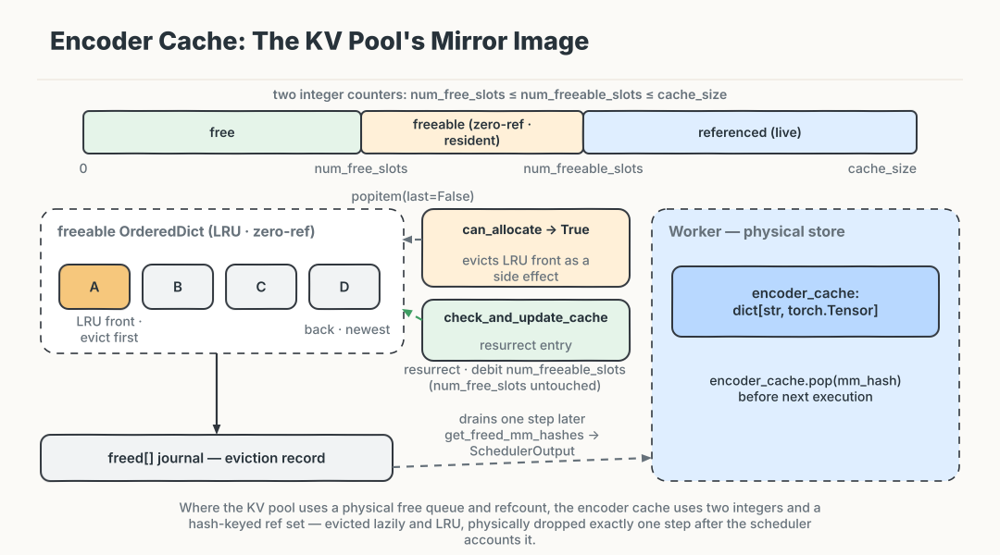</a>

<p class='figure-caption'>Two-counter accounting (`num_free_slots ≤ num_freeable_slots`), the LRU `freeable` queue, and the `freed` journal draining one step later into the worker's physical `encoder_cache` dict.</p>

### The unit of account is embeddings, not tokens

The KV manager accounts in fixed-size token blocks; the encoder manager accounts in *encoder embeddings*, and the class docstring is emphatic that these are not the same as the placeholder tokens a modality occupies in the sequence.

`vllm/v1/core/encoder_cache_manager.py:L41-L45`

```python
    NOTE: The EncoderCacheManager operates on the level of multimodal embeddings
    instead of encoder tokens (i.e. all tokens that represent the multimodal data
    in the input sequence). This means all break/text tokens in-between multimodal
    embeddings are not considered with respect to the cache size and the number
    of free slots.
```

The distinction is concrete, not rhetorical. Every quantity the manager tracks comes from `Request.get_num_encoder_embeds`, which delegates to the placeholder range:

`vllm/multimodal/inputs.py:L152-L156`

```python
    def get_num_embeds(self) -> int:
        if self.embeds_cumsum is None:
            return self.length

        return self.embeds_cumsum[-1] if self.embeds_cumsum else 0
```

A `PlaceholderRange` spans `[offset, offset+length)` positions in the token sequence, but it carries an optional boolean `is_embed` mask (`inputs.py:L141-L145`) marking which of those positions actually receive an embedding versus which are interleaved break/newline/text tokens. When there is no mask, embeds equal `length`; when there is one, embeds equal the number of `True` entries (`embeds_cumsum[-1]`). So a "5-token" image placeholder run with `is_embed = [False, True, False, True, True]` counts as **3** against the encoder budget, not 5. The scheduler's *free* gate, by contrast, works in token positions (`offset`, `length`) because it is asking "has the decoder walked past these sequence positions?": the two axes are deliberately different.

The budget measures the thing that actually consumes GPU memory (the embedding tensor), not the thing that occupies sequence positions (the placeholder run). Sizing the cache in tokens would over-charge every modality whose placeholders are padded with structural tokens, silently shrinking the effective cache. This is the opposite decision from the KV side, where a block is charged for every token position regardless of content.

**Two integer counters replace the intrusive free queue**

The block pool's free list ([Section 3](#3-kvcacheblock-and-blockpool-the-free-list-is-an-eviction-structure)) is a hand-rolled intrusive doubly linked list with `ref_cnt == 0 ⇔ on-queue`, tuned for O(1) middle removal. The encoder manager throws all of that out and tracks capacity with **two plain integers plus an `OrderedDict`**:

`vllm/v1/core/encoder_cache_manager.py:L67-L79`

```python
    def __init__(self, cache_size: int):
        self.cache_size = cache_size
        self.num_free_slots = cache_size
        self.num_freeable_slots = cache_size

        # mm_hash of mm_data => ids of requests that reference the mm_data
        self.cached: dict[str, set[str]] = {}
        # request_id => set of input_ids cached for that request
        self.request_cached_ids: dict[str, set[int]] = {}

        # mm_hash of mm_data => num_encoder_embeds of the mm_data
        self.freeable: OrderedDict[str, int] = OrderedDict()
        self.freed: list[str] = []
```

`cached` is a reverse ref-count (`mm_hash → {request_id, …}`) where an *empty set* means "the entry physically exists but no live request references it" (evictable), exactly analogous to a KV block at `ref_cnt == 0` but with the referencing request ids kept explicit rather than summed to an integer. The two counters are the key pair:

- `num_free_slots` — capacity that can be handed out *without evicting anything*.
- `num_freeable_slots` — capacity that can be handed out *after evicting the whole LRU queue* of zero-ref entries.

Their difference, `num_freeable_slots − num_free_slots`, is the sum of embeds sitting in `freeable`: occupied but reclaimable. The `OrderedDict` is the LRU (oldest at the front, `mm_hash → num_embeds`), and `freed` is an eviction journal drained to the worker. These counts always satisfy:

```
0 ≤ num_free_slots ≤ num_freeable_slots ≤ cache_size
    and    (mm_hash ∈ freeable)  ⇔  (cached[mm_hash] == set())
```

Splitting free from freeable lets an entry be simultaneously "not counted as immediately available" and "still physically resident and resurrectable," without the physical-queue surgery the KV side needs. A zero-ref encoder entry lingers as a warm hit until the room is actually needed — the two-counter split is what encodes that lingering state as arithmetic instead of list membership.

### `can_allocate`: an admission gate that evicts as a side effect

`allocate_slots` on the KV side ([Section 9](#9-allocate_slots-is-a-policy-stack-not-an-allocation)) is a pure policy stack: it computes demand, checks supply, and returns `None` on failure *without mutating state*. The encoder manager's admission gate is the inverse — it returns a bool, and on the path to `True` it may **perform eviction as a side effect**, journaling what it dropped.

`vllm/v1/core/encoder_cache_manager.py:L158-L182`

```python
        num_embeds = request.get_num_encoder_embeds(input_id)

        # Not enough compute budget
        if num_embeds > encoder_compute_budget:
            return False

        num_embeds += num_embeds_to_schedule

        # Enough free slots
        if num_embeds <= self.num_free_slots:
            return True

        # Not enough reclaimable slots
        if num_embeds > self.num_freeable_slots:
            return False

        # Not enough free slots but enough reclaimable slots
        # NOTE: Eviction takes place here, but physical memory is not freed
        # until model runner is notified by the scheduler output.
        while num_embeds > self.num_free_slots:
            mm_hash, num_free_embeds = self.freeable.popitem(last=False)
            del self.cached[mm_hash]
            self.freed.append(mm_hash)
            self.num_free_slots += num_free_embeds
        return True
```

(1) A **compute-budget gate** checks `num_embeds` alone against `encoder_compute_budget` — a per-step ceiling on how many embeddings the encoder may *compute* this step (distinct from the cache-size budget; see below). A single item that exceeds it can never run this step. (2) `num_embeds_to_schedule` — the running tally of embeds already committed to *earlier* mm items in this same scheduling pass — is folded in, so all *space* checks are cumulative. (3) Fast path: fits in `num_free_slots`, return `True`, no mutation. (4) Hard reject: doesn't fit even after reclaiming everything (`> num_freeable_slots`), return `False`. (5) **Evict-then-admit**: `popitem(last=False)` pops the LRU-oldest entry, deletes it from `cached`, appends its `mm_hash` to the `freed` journal, and credits `num_free_slots`, looping until it fits. Because `freeable` only ever holds zero-ref entries (established in `free_encoder_input`), eviction can never drop an embedding a live request still needs.

Two properties of this gate matter. First, eviction is *lazy, LRU, and zero-ref-only* — the physical GPU tensor is not touched here; the comment is explicit that "physical memory is not freed until model runner is notified." Second, a `True` return leaves `num_free_slots ≥ num_embeds`, which the commit half asserts. The scheduler uses this result when sizing an uncached multimodal item, truncating `num_new_tokens` before an item that does not fit so the decoder can still progress up to it (`scheduler.py:L1424-L1443`; [Section 10](#10-the-scheduler-contract-how-scheduling-drives-the-kv-cache-manager)).

**`allocate`: commit after admission**

`can_allocate` reserves and evicts; `allocate` commits. The split mirrors the KV coordinator's predictor/allocator pair ([Section 16](#16-per-type-block-math-sliding-window-mamba-and-chunked-local-attention): `get_num_blocks_to_allocate` must upper-bound `allocate_new_blocks`), and it is enforced by two asserts rather than a comment.

`vllm/v1/core/encoder_cache_manager.py:L202-L210`

```python
        # NOTE: Encoder cache should always have enough space for encoder inputs
        # that are scheduled since eviction takes place at can_allocate().
        assert self.num_free_slots >= num_encoder_embeds
        assert self.num_freeable_slots >= num_encoder_embeds

        self.cached[mm_hash].add(request_id)
        self.request_cached_ids.setdefault(request_id, set()).add(input_id)
        self.num_free_slots -= num_encoder_embeds
        self.num_freeable_slots -= num_encoder_embeds
```

Both counters drop by the same `num_encoder_embeds`: a freshly-allocated, referenced entry is neither free nor freeable. The request id joins the ref set; the input id is mirrored under `request_cached_ids` so the manager can later enumerate everything a request holds. The scheduler calls `allocate` only after the request is confirmed schedulable (`scheduler.py:L612-L618`), one item at a time, so by the time it runs the eviction that made room has already happened inside `can_allocate`.

`allocate` is *total for both budgets* and presupposes a passing `can_allocate`. If the scheduler ever allocated without gating, the asserts trip immediately rather than silently over-committing GPU memory. Debiting both counters by the same amount is what keeps `num_free_slots ≤ num_freeable_slots` intact through the commit.

### The resurrection path: a cache hit on a would-be-evicted entry

On the KV side, a prefix hit against a cached-but-free block calls `BlockPool.touch` ([Section 23](#23-the-life-of-a-physical-block-allocate-use-free-cache-evict)): remove it from the free queue in O(1), bump its ref count. The encoder manager's equivalent is `check_and_update_cache`, and it performs the same "un-evict a zero-ref entry" move — but as counter arithmetic on `num_freeable_slots`, never touching `num_free_slots`.

`vllm/v1/core/encoder_cache_manager.py:L109-L121`

```python
        mm_hash = request.mm_features[input_id].identifier
        # Not cached at all
        if mm_hash not in self.cached:
            return False

        # Cached but currently not referenced by any request
        if not self.cached[mm_hash]:
            num_encoder_embeds = self.freeable.pop(mm_hash)
            self.num_freeable_slots -= num_encoder_embeds

        self.cached[mm_hash].add(request.request_id)
        self.request_cached_ids.setdefault(request.request_id, set()).add(input_id)
        return True
```

A true miss (`mm_hash not in cached`) returns `False`, and the scheduler must compute + `allocate`. A hit on a *zero-ref* entry, one sitting in the `freeable` LRU, pulls it out of `freeable` and debits `num_freeable_slots`, re-pinning it. Crucially `num_free_slots` is untouched: the slots were never physically reclaimed, they merely leave the *reclaimable* pool. A hit on a still-referenced entry just adds this request to the ref set. A `True` return lets the scheduler `continue` past the item without spending compute budget (`scheduler.py:L1403-L1406`).

A resurrected entry can never be double-counted as free. By moving it out of `freeable` and debiting exactly `num_freeable_slots` (leaving `num_free_slots` alone), the two-counter accounting stays exact through the resurrection — the same correctness `touch`'s queue-removal buys the KV side, expressed as arithmetic.

### Freeing is lazy and consumption-gated, not retained for reuse

This is the sharpest divergence from the KV cache. A KV block's KV is *retained* after a request finishes, sitting in the pool's MRU tail for cross-request prefix reuse ([Section 23](#23-the-life-of-a-physical-block-allocate-use-free-cache-evict)). An encoder embedding is *released* the moment the decoder has consumed the placeholder tokens it backs — it has no further use, because the information has already flowed into the decoder KV. `free_encoder_input` drops one request's reference:

`vllm/v1/core/encoder_cache_manager.py:L237-L241`

```python
        self.cached[mm_hash].discard(req_id)
        if not self.cached[mm_hash]:
            num_encoder_embeds = request.get_num_encoder_embeds(input_id)
            self.freeable[mm_hash] = num_encoder_embeds
            self.num_freeable_slots += num_encoder_embeds
```

Reaching zero refs makes the entry *freeable* — appended to the LRU (newest at the back) and crediting `num_freeable_slots` only. `num_free_slots` is not credited: the tensor still physically occupies GPU memory and can still be resurrected by `check_and_update_cache`. It truly frees only when a later `can_allocate` needs the room. The *when* is decided by the scheduler, which runs the free gate only after the step has executed (`scheduler.py:L1624-L1626`, [Section 10](#10-the-scheduler-contract-how-scheduling-drives-the-kv-cache-manager)), and only for items the decoder has walked past:

`vllm/v1/core/sched/scheduler.py:L1947-L1954`

```python
            elif (
                start_pos + num_tokens + spec_lookahead
                <= request.num_computed_tokens - request.num_output_placeholders
            ):
                # Processed, stored in the decoder KV cache, and far enough past
                # the placeholder range (plus the drafter's look-ahead) that no
                # rejection or drafter gather can reference it.
                self.encoder_cache_manager.free_encoder_input(request, input_id)
```

The predicate is "the whole placeholder range `[start_pos, start_pos+num_tokens)` sits at or below the confirmed decode boundary `num_computed_tokens − num_output_placeholders`, with a `spec_lookahead` margin." `spec_lookahead` is `1 if self.use_eagle else 0` (`scheduler.py:L1934`). The `+1` is not cosmetic: with EAGLE speculative decoding the drafter reads one position ahead, and if the embedding were dropped a step early the drafter's gather would hit a `RuntimeError("Encoder cache miss …")` — the worker's fallback at `gpu_model_runner.py:L3200-L3210` only tolerates a miss for a feature *at or after* the not-yet-processed boundary. Subtracting `num_output_placeholders` (which under async scheduling includes in-flight spec tokens) means a spec-decode rejection that rolls `num_computed_tokens` back can never have dropped an embedding a re-decode still needs.

An encoder embedding is never dropped while any decoder step (including a speculative drafter lookahead or a post-rejection re-decode) could still read it. Multimodal encoders use *bidirectional* attention over the whole item, so the item is read whole; the gate frees only past the entire range plus the spec margin. Contrast the KV policy explicitly: KV is kept for *future* requests, encoder embeddings are dropped for the *current* one — different caches, opposite lifetimes.

### The physical store lives in the worker; the manager is bookkeeping only

The block pool *is* the KV cache's source of truth — block ids index directly into device tensors ([Section 20](#20-from-block-table-to-kernel-slot_mapping-and-the-device-tensors)). The encoder manager owns no tensors at all. The physical store is a plain dict in the model runner (`self.encoder_cache: dict[str, torch.Tensor]`, `gpu_model_runner.py:L559`), written after the encoder runs (`:L2963`, `:L3141`) and freed only when the scheduler *tells* it to. The channel is the `freed` journal, drained once per step:

`vllm/v1/core/encoder_cache_manager.py:L264-L266`

```python
        freed = self.freed
        self.freed = []
        return freed
```

The scheduler places that list into `SchedulerOutput.free_encoder_mm_hashes` (`scheduler.py:L1111`), and the worker pops exactly those tensors before the next model execution:

`vllm/v1/worker/gpu_model_runner.py:L1181-L1183`

```python
        # Free the cached encoder outputs.
        for mm_hash in scheduler_output.free_encoder_mm_hashes:
            self.encoder_cache.pop(mm_hash, None)
```

Scheduler bookkeeping (`num_free_slots`) and the worker's physical dict are *eventually consistent, exactly one channel apart*: `can_allocate` evicts into `freed` → `get_freed_mm_hashes` drains into `SchedulerOutput` → worker `encoder_cache.pop`. The one-step lag is deliberate — an in-flight step may still be reading a tensor the scheduler has already accounted as evicted, so the physical drop is deferred to *before the next* execution, never mid-step. This is why the code stresses "physical memory is not freed until model runner is notified." It is the same producer/consumer discipline the KV block table uses (stage, then commit, [Section 21](#21-gpu-side-staging-device-block-tables-and-attention-metadata)), applied to a second cache with its own drain.

**The enc-dec shim: budget without reuse**

Encoder-decoder models (Whisper) do not yet *reuse* encoder outputs, so the scheduler instantiates a subclass, `EncoderDecoderCacheManager` (`scheduler.py:L225-L228`), that keeps only the *scheduling* accounting and stubs the reuse machinery: `check_and_update_cache` always returns `False`, `can_allocate` is a pure budget check with no eviction, and there is no `freeable`/`num_freeable_slots` state at all. The one subtlety worth reading is how it fakes the base class's "free only after execution" ordering without the LRU queue:

`vllm/v1/core/encoder_cache_manager.py:L369-L377`

```python
    def get_freed_mm_hashes(self) -> list[str]:
        # As encoder cache is not used for enc-dec models, we can free the entries here
        # The actual free happens in the runner, *before* the model is executed.
        # Therefore, `freeable` acts as a buffer to free the entries only after the
        # model is executed, mimicking the state transition of `EncoderCacheManager`.
        to_free = self.to_free
        self.to_free = self.allocated
        self.allocated = []
        return to_free
```

It returns *last* step's `allocated` (rotated into `to_free`) and stages *this* step's `allocated` for next time: a one-step delay buffer. That lag reproduces the base class's post-execution free ordering: an entry is reported freeable only after the step that used it has executed, so the worker's `encoder_cache.pop` never drops a tensor the in-flight step still reads. The subclass is documented as a temporary shim (`:L319-L322`) that will fold back into the base class as the two paths converge.

A multimodal request thus touches two allocators with opposite retention policies. The KV manager ([Section 3](#3-kvcacheblock-and-blockpool-the-free-list-is-an-eviction-structure)–[Section 23](#23-the-life-of-a-physical-block-allocate-use-free-cache-evict)) owns ref-counted physical blocks and retains contents for prefix reuse. The encoder manager tracks an embedding-slot budget by `mm_hash`: `num_free_slots ≤ num_freeable_slots ≤ cache_size`, zero-ref LRU eviction, consumption-gated freeing with a speculative-decoding margin, and a physical-free notification one step behind bookkeeping. Where the block pool uses a queue and refcount, the encoder manager uses counters and a hash-keyed reference set; where KV is retained for future reuse, consumed encoder output is released.

## 18. FP8 and Quantized KV Cache: Fitting More Tokens per Byte

KV capacity ultimately follows `num_gpu_blocks = available_memory // page_size_bytes // group_size`. Quantizing the cache shrinks the denominator, allowing more token blocks in the same HBM budget without changing the allocator.

Paging itself is unchanged. The management path maps `kv_cache_dtype` to a smaller `page_size_bytes` and accounts for quantization scales that may be stored inside the same allocation; the quantize/dequantize arithmetic runs in the attention kernels.

<a href='images/vllm-06-27-quantized-kv.svg' target='_blank'>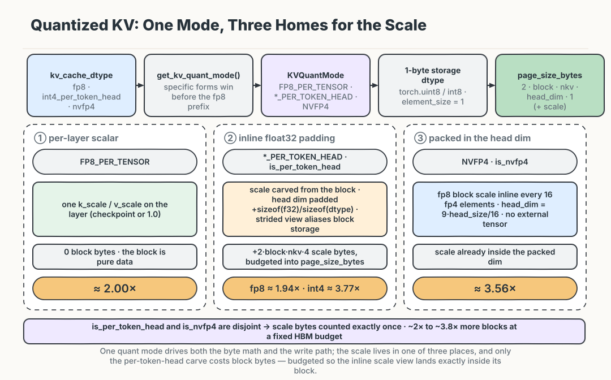</a>

<p class='figure-caption'>The `kv_cache_dtype` string → `KVQuantMode` → storage dtype → `page_size_bytes` chain, and the three places a scale can live: a per-layer scalar (zero block bytes), inline padding carved from the block (per-token-head), or packed inside the head dim (NVFP4).</p>

**The dispatch enum: one mode drives both the byte math and the write path**

Rather than string-matching `kv_cache_dtype` at every branch, vLLM maps it once to a compact `IntEnum` that both the page-size math and the write kernels dispatch on.

Source anchor: `vllm/v1/kv_cache_interface.py:L33-L59`.

```python
class KVQuantMode(IntEnum):
    """KV cache quantization mode.

    Used by attention backends and kernels to dispatch quantization logic
    without string matching on ``kv_cache_dtype``.
    """

    NONE = 0
    FP8_PER_TENSOR = 1  # per-tensor scales (current fp8 path)
    INT8_PER_TOKEN_HEAD = 2  # per-token-head dynamic scales for int8
    FP8_PER_TOKEN_HEAD = 3  # per-token-head dynamic scales for fp8
    INT4_PER_TOKEN_HEAD = 4  # packed 2×int4/byte, RHT + asymmetric zp
    NVFP4 = 5  # packed fp4 data + fp8 block scales

    @property
    def is_per_token_head(self) -> bool:
        """True for any per-token-head quantization mode."""
        return self in (
            KVQuantMode.INT8_PER_TOKEN_HEAD,
            KVQuantMode.FP8_PER_TOKEN_HEAD,
            KVQuantMode.INT4_PER_TOKEN_HEAD,
        )

    @property
    def is_nvfp4(self) -> bool:
        """True for NVFP4 packed quantization mode."""
        return self == KVQuantMode.NVFP4
```

The modes fall into three families that are accounted differently in `page_size_bytes`. **Per-tensor fp8** (`FP8_PER_TENSOR`) carries one scale scalar per attention layer — zero per-block overhead. **Per-token-head** modes (`is_per_token_head`: int8/fp8/int4) carry one scale per `(token, head)`, which *is* per-block overhead. **NVFP4** (`is_nvfp4`) packs a block-scale inline every 16 fp4 elements, so its scale is inside the data region, not a separate carve, which is exactly why `NVFP4` is deliberately excluded from `is_per_token_head`.

The two predicates avoid double-counting: `is_nvfp4` and `is_per_token_head` are mutually exclusive, and the two scale-accounting paths in `page_size_bytes` (a separate additive term vs. an inflated `head_dim`) are guarded by these two predicates. Because at most one is true, the scale bytes are counted exactly once — never double-charged, never dropped.

The string→enum resolution is ordered so the specific forms win before the generic `fp8` prefix — `vllm/v1/kv_cache_interface.py:L62-L74`:

```python
def get_kv_quant_mode(kv_cache_dtype: str) -> KVQuantMode:
    """Map a ``kv_cache_dtype`` string to a :class:`KVQuantMode`."""
    if kv_cache_dtype == "int4_per_token_head":
        return KVQuantMode.INT4_PER_TOKEN_HEAD
    if kv_cache_dtype == "int8_per_token_head":
        return KVQuantMode.INT8_PER_TOKEN_HEAD
    if kv_cache_dtype == "fp8_per_token_head":
        return KVQuantMode.FP8_PER_TOKEN_HEAD
    if kv_cache_dtype == "nvfp4":
        return KVQuantMode.NVFP4
    if isinstance(kv_cache_dtype, str) and kv_cache_dtype.startswith("fp8"):
        return KVQuantMode.FP8_PER_TENSOR
    return KVQuantMode.NONE
```

The `startswith("fp8")` catch-all folds `fp8`, `fp8_e4m3`, and `fp8_e5m2` into `FP8_PER_TENSOR`. The earlier `fp8_per_token_head` check must precede it; otherwise that mode would be misclassified as per-tensor and its scale budget omitted.

### Where the shrink actually comes from: the storage dtype is one byte

The bytes drop because the KV cache *tensor* is allocated in a 1-byte-per-element dtype, not because of any Python-level cleverness (NVFP4/int4 additionally pack the last dim, below).

Source anchor: `vllm/utils/torch_utils.py:L32-L52`.

```python
STR_DTYPE_TO_TORCH_DTYPE = {
    "float32": torch.float32,
    "half": torch.half,
    "float16": torch.float16,
    "bfloat16": torch.bfloat16,
    "float": torch.float,
    "fp8": torch.uint8,
    "fp8_e4m3": torch.uint8,
    "fp8_e5m2": torch.uint8,
    "int8": torch.int8,
    "int4_per_token_head": torch.uint8,
    "int8_per_token_head": torch.int8,
    "fp8_per_token_head": torch.uint8,
    "fp8_inc": torch.float8_e4m3fn,
    "fp8_ds_mla": torch.uint8,
    "turboquant_k8v4": torch.uint8,
    "turboquant_4bit_nc": torch.uint8,
    "turboquant_k3v4_nc": torch.uint8,
    "turboquant_3bit_nc": torch.uint8,
    "nvfp4": torch.uint8,
}
```

Every fp8/int4/nvfp4 string resolves to a 1-byte dtype (`torch.uint8`), int8 to `torch.int8` (also 1 byte). The page-size math (next section) multiplies by `get_dtype_size(self.dtype)`, and that helper is nothing but `element_size()` — `vllm/utils/torch_utils.py:L212-L214`:

```python
def get_dtype_size(dtype: torch.dtype) -> int:
    """Get the size of the data type in bytes."""
    return torch.tensor([], dtype=dtype).element_size()
```

So `get_dtype_size(torch.uint8) == 1` versus `get_dtype_size(torch.bfloat16) == 2`: storing fp8 instead of the model's bf16 activation dtype *halves* the per-element byte count, and every block therefore holds the same tokens at half the bytes. The cache is physically a `uint8` tensor that the write kernel `.view()`s as fp8 at store time (below), keeping allocation math and storage width tied to the same tensor.

### How the quant mode re-shapes `page_size_bytes`

`real_page_size_bytes` is the same K+V tensor formula [Section 16](#16-per-type-block-math-sliding-window-mamba-and-chunked-local-attention) walked for the non-quantized types (`2 · block_size · num_kv_heads · head_size · dtype`), but the quant mode rewrites two of its factors (the element size (above) and the effective `head_dim`) and `page_size_bytes` adds a separate scale term for per-token-head modes.

Source anchor: `vllm/v1/kv_cache_interface.py:L172-L202`.

```python
    @property
    def page_size_bytes(self) -> int:
        real_page_size = self.real_page_size_bytes
        # Per-token-head scales are stored in separate tensors managed
        # by the attention backend, but the memory is carved from the
        # raw KV cache allocation so it must be budgeted here.
        if self.kv_quant_mode.is_per_token_head:
            real_page_size += (
                2 * self.block_size * self.num_kv_heads * get_dtype_size(torch.float32)
            )
        if self.page_size_padded is not None:
            assert self.page_size_padded >= real_page_size
            return self.page_size_padded
        return real_page_size

    @property
    def real_page_size_bytes(self) -> int:
        if self.kv_quant_mode.is_nvfp4:
            # Packed layout: fp4 data + fp8 block scales per head.
            head_dim = nvfp4_kv_cache_full_dim(self.head_size)
        elif self.kv_quant_mode == KVQuantMode.INT4_PER_TOKEN_HEAD:
            head_dim = self.head_size // 2
        else:
            head_dim = self.head_size
        return (
            2
            * self.block_size
            * self.num_kv_heads
            * head_dim
            * get_dtype_size(self.dtype)
        )
```

`real_page_size_bytes` is the token-holding data only. The quant mode picks `head_dim`: NVFP4 inflates it to `nvfp4_kv_cache_full_dim(head_size)` (data plus inline scale, below); INT4 halves it to `head_size // 2` (two int4 packed per byte); per-tensor fp8 and int8 keep `head_size` and shrink purely through the 1-byte `elem_bytes`. Then `page_size_bytes` (and this is the management-critical line) adds, *only for per-token-head modes*, `2 · block_size · num_kv_heads · sizeof(f32)` bytes: one float32 K-scale and one float32 V-scale for every `(slot, head)` in the block. The comment states the architectural fact plainly: those scale bytes live in *separate backend-managed tensors*, but the memory is *carved from the same raw KV allocation*, so they must be counted here or the allocator would over-provision blocks and the scale views would run off the end of the buffer.

Note the ordering: the quant add-on is folded into `real_page_size` *before* the `page_size_padded` gate — so when [Section 4](#4-where-the-blocks-come-from-memory-profiling-num_gpu_blocks-and-kv-cache-config)'s `unify_kv_cache_spec_page_size` later pads a quantized layer up to a hybrid model's common page ([Section 4](#4-where-the-blocks-come-from-memory-profiling-num_gpu_blocks-and-kv-cache-config)), the assertion `page_size_padded >= real_page_size` is checked against the already-scale-inclusive size.

For a per-token-head layer, `page_size_bytes` is quantized-data bytes **plus** `2·block_size·num_kv_heads·4` scale bytes. The backend's inline scale views below are safe because this region is included in the page budget here.

The packed last-dim helper — `vllm/utils/torch_utils.py:L414-L416`:

```python
def nvfp4_kv_cache_full_dim(head_size: int) -> int:
    """Packed last dim for NVFP4 KV cache: fp4 data + fp8 block scales."""
    return head_size // 2 + head_size // 16
```

For one head: `head_size // 2` bytes of fp4 data (two fp4 per byte) plus `head_size // 16` bytes of fp8 e4m3 block scales (one scale per 16 fp4 elements), totalling `9·head_size/16`. NVFP4's scale is self-describing and inline, no external tensor, which closes the loop on why it is excluded from `is_per_token_head`.

Worked denominators, at an illustrative `head_size=128, num_kv_heads=8, block_size=16` (arithmetic from the verbatim formulas, not source constants): bf16 baseline is `2·16·8·128·2 = 65,536` B/block; per-tensor fp8 is `32,768` B/block, **2.00×** more blocks with zero scale tax; fp8 per-token-head is `32,768 + 2·16·8·4 = 33,792` B/block, **1.94×** (the +1,024 is the scale tax); int4 per-token-head is `16,384 + 1,024 = 17,408`, **3.77×**; NVFP4 is `head_dim = 9·128/16 = 72` → `18,432` B/block, **3.56×** with the scale already inside the 72. These multipliers are exactly the ratios by which `num_gpu_blocks` grows for a fixed HBM budget.

Two spec variants extend the same formula and are owned by [Section 16](#16-per-type-block-math-sliding-window-mamba-and-chunked-local-attention) (full attention) and [Section 19](#19-mla-the-compressed-latent-kv-cache) (MLA): `FullAttentionSpec.real_page_size_bytes` (`kv_cache_interface.py:L309-L324`) sums `head_size + head_size_v` rather than multiplying by 2, because K and V head sizes can differ, and it packs each side independently for NVFP4; and the compressed-MLA path (`MLAAttentionSpec.real_page_size_bytes`, `kv_cache_interface.py:L379-L398`) hard-codes DeepSeek's fp8 MLA byte layouts (`storage_block_size · 584` for V4, `block_size · 656` for V3.2) instead of the generic `head_dim · elem_bytes` formula — an fp8 layout where the 8-byte-per-token scale is *already baked into* the custom page size rather than driven by `kv_quant_mode`. The MLA kernel that reads those bytes is article 08's subject; from the manager's side the only fact is that these specs report a byte-exact page size that the same floor division consumes.

**Where the fp8 scale lives, family by family**

This is the crux of why quantized KV is a *cache-management* topic and not just a kernel topic: the three families put their scales in three physically different places, and only one of them is free of block-accounting consequences.

**Per-tensor fp8 — a scalar on the layer, zero block bytes.** For `FP8_PER_TENSOR` there is one `k_scale`/`v_scale` per attention layer, loaded from the checkpoint (or defaulted to 1.0), kept as a registered buffer. The loader enforces that it is a scalar — `vllm/model_executor/layers/quantization/kv_cache.py:L42-L48` and `L128-L131`:

```python
class BaseKVCacheMethod(QuantizeMethodBase):
    """
    Quant method that adds `_k_scale` and `_v_scale` attributes to the
    Attention layer to support loading those scaling factors from checkpoints.
    The k/v_scale will be used to:
        - quantize k/v_cache entries before saving them to the cache
        - dequantize k/v_cache entries before fetching them from the cache
```

```python
            if not isinstance(k_scale, float) or not isinstance(v_scale, float):
                raise ValueError(
                    "Only support per-tensor scaling factor for fp8 KV cache"
                )
```

Because the scale is one float per layer, it never enters `page_size_bytes` — consistent with the `else` branch of `real_page_size_bytes` keeping `head_dim = head_size` and adding nothing. A per-tensor fp8 layer has exactly one K and one V scale, so the block is pure data and the 2.00× block multiplier above carries no asterisk.

**Per-token-head — the scale is carved inline from the block.** For `*_per_token_head`, the loader takes an early exit that pins the layer's scalar buffers to 1.0, deletes the checkpoint scale parameters, and returns — the scales are computed live in the kernel, so checkpoint scales and `calculate_kv_scales` are inert — `vllm/model_executor/layers/quantization/kv_cache.py:L82-L94`:

```python
        # Per-token-head quantized KV cache: scales are computed dynamically
        # per (token, head) in the kernel at cache-write time.  Checkpoint
        # scales are never used regardless of calculate_kv_scales.
        if kv_cache_uses_per_token_head_scales(layer.kv_cache_dtype):
            layer._k_scale.copy_(1.0)
            layer._v_scale.copy_(1.0)
            layer._k_scale_float = 1.0
            layer._v_scale_float = 1.0
            del layer.k_scale
            del layer.v_scale
            del layer.q_scale
            del layer.prob_scale
            return
```

The live scale has to live *somewhere in memory that is addressed by the same block id as the data it scales*, and vLLM's answer is to pad the head dimension of the cache tensor and reinterpret the padding as float32. The shape padding — `vllm/v1/attention/backends/triton_attn.py:L327-L345`:

```python
        if kv_cache_uses_per_token_head_scales(cache_dtype_str):
            # Pad the head dim by sizeof(float32)/sizeof(cache_dtype) so the
            # per-(token, head) scale fits inline after the quantized data;
            # the backend extracts data[:head_size] and scale[head_size:] via
            # typed views (see _ensure_scale_caches).  INT4 packs two values
            # per byte, so the data occupies only head_size // 2 bytes.
            from vllm.utils.torch_utils import (
                STR_DTYPE_TO_TORCH_DTYPE,
                get_dtype_size,
            )

            cache_dtype = STR_DTYPE_TO_TORCH_DTYPE[cache_dtype_str]
            scale_pad = get_dtype_size(torch.float32) // get_dtype_size(cache_dtype)
            if get_kv_quant_mode(cache_dtype_str) == KVQuantMode.INT4_PER_TOKEN_HEAD:
                data_head_size = head_size // 2
            else:
                data_head_size = head_size
            return (num_blocks, 2, block_size, num_kv_heads, data_head_size + scale_pad)
        return (num_blocks, 2, block_size, num_kv_heads, head_size)
```

For fp8/int8 (1-byte cache) `scale_pad = 4 // 1 = 4` extra elements per head: exactly one float32. Multiply across `(K/V, slot, head)` and you get `2·block_size·num_kv_heads` float32s, byte-for-byte the add-on [the `page_size_bytes` reshaping above](#how-the-quant-mode-re-shapes-page_size_bytes) budgeted into `page_size_bytes`. The backend then materializes strided float32 *views* over those padding bytes rather than allocating any new tensor — `vllm/v1/attention/backends/triton_attn.py:L431-L452`:

```python
        raw = kv_cache.untyped_storage()
        base_f32 = torch.tensor([], dtype=torch.float32, device=kv_cache.device).set_(
            raw
        )

        # In the raw bytes, each (block, kv_half, slot, head) occupies
        # padded_hs * dtype_sz bytes.  The scale float32 sits at byte
        # offset hs * dtype_sz within that region.
        kv_half_bytes = block_size * nkv * padded_hs * dtype_sz
        full_block_f32 = 2 * kv_half_bytes // 4  # stride between blocks
        slot_f32 = nkv * padded_hs * dtype_sz // 4  # stride between slots
        head_f32 = padded_hs * dtype_sz // 4  # stride between heads
        scale_off_f32 = hs * dtype_sz // 4  # offset to scale within head

        # K scales: kv_half=0
        self._k_scale_cache = torch.as_strided(
            base_f32,
            size=(num_blocks, block_size, nkv),
            stride=(full_block_f32, slot_f32, head_f32),
            storage_offset=scale_off_f32,
        )
        self._k_scale_cache.fill_(1.0)
```

The scale tensor *aliases* the KV allocation's own `untyped_storage()`; there is no second buffer. This is the literal realization of the `page_size_bytes` comment "the memory is carved from the raw KV cache allocation." This establishes *budget↔carve equality*: the `scale_pad` here (`sizeof(f32)/sizeof(cache_dtype)`) and the `page_size_bytes` add-on both derive from the same ratio, so the strided scale view lands exactly inside the bytes the allocator reserved. If they diverged by even one element per head, `as_strided` would read or write past the block and corrupt the neighboring block's data: a silent cross-block clobber, the worst kind of KV bug.

**NVFP4 — scale packed inside the head dim.** The `9·head_size/16` full-dim lays each head out as `[fp4 data | fp8 e4m3 block scales]` contiguously, so a single `uint8` head region round-trips through quantize/dequantize with no external scale tensor and no separate carve — again, why it is not `is_per_token_head`. The `[K_data | K_scale | V_data | V_scale]` per-page split and its strided views are the FlashInfer backend's concern (article 08); the manager only needs the `full_dim` byte count, which it already has.

### Writing the quantized KV into the right physical block

The write path, `reshape_and_cache`, is where a token's freshly computed K/V lands in the physical block the allocator handed out. [Section 22](#22-reshape_and_cache-how-a-token-kv-enters-its-physical-block) covers the general mechanism: `slot_mapping[t] = physical_block_id · block_size + (t % block_size)` is the flat index the kernel writes at, computed from the block table. Quantization does not change *which* slot a token writes to; it changes *what* is written there and adds a second write for the scale. The backend dispatch makes the split explicit — `vllm/v1/attention/backends/triton_attn.py:L779-L812`:

```python
        if self._is_per_token_head_quant:
            self._ensure_scale_caches(kv_cache)
            key_cache, value_cache = kv_cache.unbind(1)
            k_scale_cache = self._k_scale_cache
            v_scale_cache = self._v_scale_cache
            if self._kv_quant_mode == KVQuantMode.FP8_PER_TOKEN_HEAD:
                key_cache = key_cache.view(self.fp8_dtype)
                value_cache = value_cache.view(self.fp8_dtype)
            triton_reshape_and_cache_flash_per_token_head_quant(
                key,
                value,
                key_cache,
                value_cache,
                k_scale_cache,
                v_scale_cache,
                slot_mapping,
                kv_quant_mode=self._kv_quant_mode,
            )
            return
        # For decoder and cross-attention, use KV cache as before.
        key_cache, value_cache = kv_cache.unbind(1)
        if is_quantized_kv_cache(self.kv_cache_dtype):
            key_cache = key_cache.view(self.fp8_dtype)
            value_cache = value_cache.view(self.fp8_dtype)
        triton_reshape_and_cache_flash(
            key,
            value,
            key_cache,
            value_cache,
            slot_mapping,
            self.kv_cache_dtype,
            layer._k_scale,
            layer._v_scale,
        )
```

Both branches reinterpret the `uint8` cache as fp8 with `.view(self.fp8_dtype)` before writing — the byte-level tensor is the same one `page_size_bytes` measured. The **per-tensor** branch passes the layer's scalar `_k_scale`/`_v_scale` (the checkpoint value) straight into the kernel, which divides by it and casts. The **per-token-head** branch passes the *carved* `_k_scale_cache`/`_v_scale_cache` views, and the kernel writes each `(token, head)` scale into them at strides derived from the same `slot_mapping`-addressed block. Because the scale region aliases that block, allocation, sharing, freeing, and eviction ([Section 23](#23-the-life-of-a-physical-block-allocate-use-free-cache-evict)) carry data and scales through one lifecycle; a reused block has no separate stale scale state. Dequantization reads the same scalars/views, while article 08 covers the kernel arithmetic (absmax, clamp, INT4 Hadamard rotation).

One consequence worth naming for the speculative path: when `allocate_slots` reserves lookahead slots for draft tokens ([Section 9](#9-allocate_slots-is-a-policy-stack-not-an-allocation)), the per-token-head write kernel computes and stores scales for those speculative slots too — but the prefix-cache write is capped to *finalized* tokens (`min(total_computed_tokens + num_new_tokens, request.num_tokens)`, [Section 9](#9-allocate_slots-is-a-policy-stack-not-an-allocation)), and a rejected draft's slot is simply overwritten on the next step. So no quant-specific rollback exists or is needed; the scale is quarantined by the same mechanism that quarantines the data ([Section 5](#5-the-request-as-kv-state-holder-block_hashes-num_computed_tokens-and-speculative-tokens), and article 12 for the proposer).

### The authoritative allow-list

Finally, the set of strings that can ever reach any of the above is fixed by one `Literal`, `vllm/config/cache.py:L19-L36`, and validated with a log that splits on exactly the per-token-head predicate — `vllm/config/cache.py:L274-L292`:

```python
    @field_validator("cache_dtype", mode="after")
    @classmethod
    def _validate_cache_dtype(cls, cache_dtype: CacheDType) -> CacheDType:
        if kv_cache_uses_per_token_head_scales(cache_dtype):
            logger.info(
                "Using %s data type to store kv cache. It reduces the GPU "
                "memory footprint and boosts the performance. "
                "Dynamic per-token-head scales will be computed at runtime.",
                str(cache_dtype),
            )
        elif is_quantized_kv_cache(cache_dtype):
            logger.info(
                "Using %s data type to store kv cache. It reduces the GPU "
                "memory footprint and boosts the performance. "
                "Meanwhile, it may cause accuracy drop without a proper "
                "scaling factor",
                str(cache_dtype),
            )
        return cache_dtype
```

Per-token-head modes advertise "scales computed at runtime" (they are self-scaling); every other quantized mode warns about accuracy without a proper scale (it relies on a checkpoint or per-tensor dynamic scale). The guard: this `Literal` is the sole entry gate, so any string reaching `get_kv_quant_mode` or `STR_DTYPE_TO_TORCH_DTYPE` is one of these — there is no unhandled quant string that could produce a mismatched storage dtype and byte budget.

The whole section reduces to one identity, the same one [Section 1](#1-kv-cache-is-the-serving-memory-problem) and [Section 4](#4-where-the-blocks-come-from-memory-profiling-num_gpu_blocks-and-kv-cache-config) built the sizing pipeline around, now with a quantized denominator: `num_gpu_blocks ≈ available_memory / page_size_bytes`, and quantization drops `page_size_bytes` from bf16's `2·block·nkv·head_size·2` to a 1-byte (and, for int4/NVFP4, sub-`head_size`) figure, buying ~2× to ~3.8× more blocks, minus a per-token-head scale tax of `2·block·nkv·4` bytes that is explicitly budgeted so that the inline scale carve always lands inside the block it belongs to. Prefix caching of quantized blocks reuses the same content hash over the smaller bytes (article 07); the attention kernel does the actual quantize/dequantize (article 08). The manager's job is only the counting, and the counting is exact. The next section keeps this denominator focus but shrinks a slot by changing its *shape* rather than its dtype: MLA's single compressed latent per token ([Section 19](#19-mla-the-compressed-latent-kv-cache)).

## 19. MLA: The Compressed Latent KV Cache

Multi-head Latent Attention changes the shape of a cache slot: instead of separate per-head K and V rows, it stores one compressed latent vector per token. Page-size accounting, tensor shape, the write path, and grouping all follow from that layout; reconstruction inside the attention kernel belongs to article 08.

<a href='images/vllm-06-28-mla-kv.svg' target='_blank'>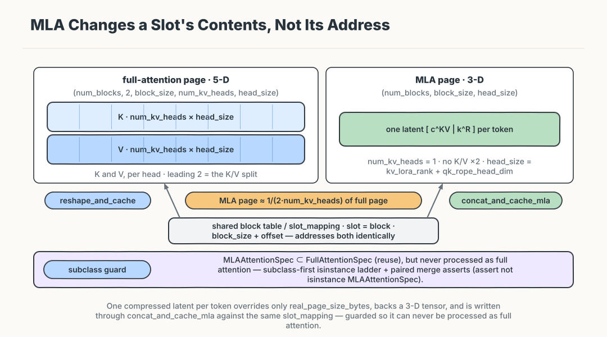</a>

<p class='figure-caption'>An MLA page stores one `head_size`-wide latent per token in a 3-D `(num_blocks, block_size, head_size)` tensor, versus the 5-D K/V pair of a full-attention page.</p>

**One latent per token, not K+V per head**

The idea is from DeepSeek-V2 (arXiv:2405.04434, [arXiv:2405.04434](https://arxiv.org/abs/2405.04434):) instead of caching the full per-head key and value (which for MHA is `2 * num_heads * head_dim` numbers per token), MLA does a low-rank joint compression of keys and values into one latent vector `c^{KV}_t` of width `kv_lora_rank`, plus a small decoupled RoPE key `k^R_t` of width `qk_rope_head_dim`. Only those two, concatenated, are cached; full per-head K and V are reconstructed on the fly by up-projections that get absorbed into the query/output projections so they never materialize as cache. That absorption is the kernel story (article 08). What lands in *this* layer is a single projection whose output width is the sum of the two cached parts:

[`vllm/model_executor/models/deepseek_v2.py:509-516`](https://github.com/vllm-project/vllm/blob/6cf7b26bd4bff60bf378e1af14044280ac0d214c/vllm/model_executor/models/deepseek_v2.py#L509-L516)
```python
        self.kv_a_proj_with_mqa = ReplicatedLinear(
            self.hidden_size,
            self.kv_lora_rank + self.qk_rope_head_dim,
            bias=False,
            quant_config=quant_config,
            prefix=f"{prefix}.kv_a_proj_with_mqa",
        )
        self.kv_a_layernorm = RMSNorm(self.kv_lora_rank, eps=config.rms_norm_eps)
```

`kv_a_proj_with_mqa` maps the hidden state to a single vector of width `kv_lora_rank + qk_rope_head_dim`, and that single concatenated vector *is* what occupies the cache. The `_with_mqa` suffix is literal — MLA's cache behaves like Multi-Query Attention with one shared KV head, which is why `num_kv_heads == 1` everywhere downstream. The compressed head width is fixed as exactly that sum, with the single-head count hard-set:

[`vllm/model_executor/layers/attention/mla_attention.py:379-386`](https://github.com/vllm-project/vllm/blob/6cf7b26bd4bff60bf378e1af14044280ac0d214c/vllm/model_executor/layers/attention/mla_attention.py#L379-L386)
```python
        self.kv_lora_rank = kv_lora_rank
        self.kv_b_proj = kv_b_proj
        self.head_size = kv_lora_rank + qk_rope_head_dim
        self.layer_name = prefix
        self.indexer = indexer

        self.num_kv_heads = 1
        self.qk_head_dim = self.qk_nope_head_dim + self.qk_rope_head_dim
```

MLA's cache `head_size` is `kv_lora_rank + qk_rope_head_dim` and `num_kv_heads = 1`. Contrast this with normal attention, where `head_size` is a per-head key dimension and there are `num_kv_heads` of them, cached separately for K and V. The layer that emits the KV-cache spec records the distinction in a comment:

[`vllm/model_executor/models/deepseek_v2.py:628-634`](https://github.com/vllm-project/vllm/blob/6cf7b26bd4bff60bf378e1af14044280ac0d214c/vllm/model_executor/models/deepseek_v2.py#L628-L634)
```python
    def get_kv_cache_spec(self, vllm_config: VllmConfig) -> KVCacheSpec:
        return MLAAttentionSpec(
            block_size=self.cache_config.block_size,
            num_kv_heads=1,
            head_size=self.head_dim,
            dtype=self.dtype,
        )  # Only has one vector instead of K + V
```

The comment `# Only has one vector instead of K + V` is literal: an MLA page stores **one** latent vector per token, not a `(K, V)` pair per head. The page bytes, tensor rank, and merge rules all follow from `num_kv_heads == 1` and the absence of a factor of two.

For an MLA layer the KV cache holds exactly one compressed latent per token per layer (`[c^{KV} | k^R]`, width `kv_lora_rank + qk_rope_head_dim`, `num_kv_heads = 1`). Full per-head K and V are never stored; they are reconstructed by absorbed up-projections at attention time. This is the paper's central memory claim, and it is why the page-size math below carries no `2×` and no head fan-out.

### The page-size formula: where MLA actually diverges

Page size is the number the entire engine watches: it is what `num_gpu_blocks` is divided out of during the memory-profiling sweep ([Section 4](#4-where-the-blocks-come-from-memory-profiling-num_gpu_blocks-and-kv-cache-config)'s block-sizing walk), and every allocator budget flows through it. MLA overrides exactly this one property. Put the three formulas side by side.

Base `AttentionSpec`, [`vllm/v1/kv_cache_interface.py:187-202`](https://github.com/vllm-project/vllm/blob/6cf7b26bd4bff60bf378e1af14044280ac0d214c/vllm/v1/kv_cache_interface.py#L187-L202):
```python
    @property
    def real_page_size_bytes(self) -> int:
        if self.kv_quant_mode.is_nvfp4:
            # Packed layout: fp4 data + fp8 block scales per head.
            head_dim = nvfp4_kv_cache_full_dim(self.head_size)
        elif self.kv_quant_mode == KVQuantMode.INT4_PER_TOKEN_HEAD:
            head_dim = self.head_size // 2
        else:
            head_dim = self.head_size
        return (
            2
            * self.block_size
            * self.num_kv_heads
            * head_dim
            * get_dtype_size(self.dtype)
        )
```

`FullAttentionSpec`, [`vllm/v1/kv_cache_interface.py:309-324`](https://github.com/vllm-project/vllm/blob/6cf7b26bd4bff60bf378e1af14044280ac0d214c/vllm/v1/kv_cache_interface.py#L309-L324):
```python
    @property
    def real_page_size_bytes(self) -> int:
        if self.kv_quant_mode.is_nvfp4:
            ...
            last_dim = nvfp4_kv_cache_full_dim(
                self.head_size
            ) + nvfp4_kv_cache_full_dim(self.head_size_v)
        elif self.kv_quant_mode == KVQuantMode.INT4_PER_TOKEN_HEAD:
            last_dim = self.head_size // 2 + self.head_size_v // 2
        else:
            last_dim = self.head_size + self.head_size_v
        return (
            self.block_size * self.num_kv_heads * last_dim * get_dtype_size(self.dtype)
        )
```

`MLAAttentionSpec`, [`vllm/v1/kv_cache_interface.py:379-398`](https://github.com/vllm-project/vllm/blob/6cf7b26bd4bff60bf378e1af14044280ac0d214c/vllm/v1/kv_cache_interface.py#L379-L398):
```python
    @property
    def real_page_size_bytes(self) -> int:
        if self.cache_dtype_str == "fp8_ds_mla":
            if self.model_version == "deepseek_v4":
                # DeepseekV4: 448B NoPE + 128B RoPE + 8B fp8 scale = 584B per token.
                # head_size stays semantic (512); bytes are determined here.
                return self.storage_block_size * 584
            # V3.2 main MLA: 656-byte custom layout (kv_lora_rank=512 +
            # qk_rope_head_dim=64, head_size=576). See flashmla_sparse.py.
            return self.block_size * 656
        if self.kv_quant_mode == KVQuantMode.INT4_PER_TOKEN_HEAD:
            head_dim = self.head_size // 2
        else:
            head_dim = self.head_size
        return (
            self.storage_block_size
            * self.num_kv_heads
            * head_dim
            * get_dtype_size(self.dtype)
        )
```

Read the trailing formulas in order:
- base `AttentionSpec`: `2 * block_size * num_kv_heads * head_dim * dtype` — the leading `2` is one slab for K and one for V, scaled by every KV head.
- `FullAttentionSpec`: `block_size * num_kv_heads * (head_size + head_size_v) * dtype` — K and V summed explicitly (so `head_size_v` may differ from `head_size`), still `× num_kv_heads`.
- `MLAAttentionSpec`: `storage_block_size * num_kv_heads(=1) * head_dim * dtype` — **no `2`, no K+V sum, and `num_kv_heads` collapses to 1**.

So an MLA page is roughly `2 × num_kv_heads` times *smaller* than the equivalent full-attention page for the same context. The absolute win is larger than that ratio suggests because the latent width is small: `get_supported_head_sizes` pins the only legal MLA widths to the latent dimensions, `576 = 512 (kv_lora_rank) + 64 (qk_rope_head_dim)` for DeepSeek-V2/V3 and `320` for the smaller-rank variant (verified below); those are latent-vector widths, not per-head key dims. Note that MLA still honors the FP8/quantized-KV machinery from [Section 18](#18-fp8-and-quantized-kv-cache-fitting-more-tokens-per-byte): `kv_quant_mode` and `cache_dtype_str` select packed byte layouts here exactly as they do for full attention, and `page_size_bytes` (the caller of `real_page_size_bytes`, [`kv_cache_interface.py:172-185`](https://github.com/vllm-project/vllm/blob/6cf7b26bd4bff60bf378e1af14044280ac0d214c/vllm/v1/kv_cache_interface.py#L172-L185)) still adds per-token-head scale storage and applies `page_size_padded` on top.

Every consumer of `page_size_bytes` (the block-count budget, `max_memory_usage_bytes`, `KVCacheTensor.size`) inherits MLA's smaller page transparently, because MLA changes only the leaf `real_page_size_bytes` and nothing above it. The paper's "small KV cache" claim is realized as a single overridden property, not a special-cased allocator.

**The physical tensor is 3-D, and the write path knows it**

The page-size number has a shape twin. The MLA backend's cache tensor drops the K/V axis and the head axis entirely:

[`vllm/model_executor/layers/attention/mla_attention.py:1215-1223`](https://github.com/vllm-project/vllm/blob/6cf7b26bd4bff60bf378e1af14044280ac0d214c/vllm/model_executor/layers/attention/mla_attention.py#L1215-L1223)
```python
    @staticmethod
    def get_kv_cache_shape(
        num_blocks: int,
        block_size: int,
        num_kv_heads: int,  # assumed to be 1 for MLA
        head_size: int,
        cache_dtype_str: str = "auto",
    ) -> tuple[int, ...]:
        return (num_blocks, block_size, head_size)
```

[`vllm/model_executor/layers/attention/mla_attention.py:1236-1238`](https://github.com/vllm-project/vllm/blob/6cf7b26bd4bff60bf378e1af14044280ac0d214c/vllm/model_executor/layers/attention/mla_attention.py#L1236-L1238)
```python
    @classmethod
    def get_supported_head_sizes(cls) -> list[int]:
        return [320, 576]
```

The MLA cache is 3-D `(num_blocks, block_size, head_size)` — one `head_size`-wide latent per token slot, with the `# assumed to be 1 for MLA` note on the ignored `num_kv_heads` param. Compare the FlashAttention full-attention tensor, which is 5-D `(num_blocks, 2, block_size, num_kv_heads, head_size)` (the flash_attn backend; the leading `2` is the K/V split, `num_kv_heads` a real axis). Crucially, the *block table* does not change: block ids, paging, prefix-caching, and the `block_table → slot_mapping` bridge ([Section 20](#20-from-block-table-to-kernel-slot_mapping-and-the-device-tensors)) index MLA blocks identically to full-attention blocks. One block still covers `block_size` tokens; only the per-slot byte width shrinks.

That identical addressing is what lets the write path reuse the same `slot_mapping` the worker computes for every other attention type. Where full attention calls `reshape_and_cache` to scatter separate K and V into a 5-D tensor (the write mechanics [Section 22](#22-reshape_and_cache-how-a-token-kv-enters-its-physical-block) covers), MLA scatters one concatenated latent into the 3-D tensor via a dedicated op:

[`vllm/v1/attention/backend.py:1009-1029`](https://github.com/vllm-project/vllm/blob/6cf7b26bd4bff60bf378e1af14044280ac0d214c/vllm/v1/attention/backend.py#L1009-L1029)
```python
    def do_kv_cache_update(
        self,
        kv_c_normed: torch.Tensor,
        k_pe: torch.Tensor,
        kv_cache: torch.Tensor,
        slot_mapping: torch.Tensor,
        kv_cache_dtype: str,
        k_scale: torch.Tensor,
    ) -> None:
        if kv_cache.numel() == 0:
            return
        from vllm import _custom_ops as ops

        ops.concat_and_cache_mla(
            kv_c_normed,
            k_pe.squeeze(1),
            kv_cache,
            slot_mapping.flatten(),
            kv_cache_dtype=kv_cache_dtype,
            scale=k_scale,
        )
```

[`vllm/_custom_ops.py:2546-2556`](https://github.com/vllm-project/vllm/blob/6cf7b26bd4bff60bf378e1af14044280ac0d214c/vllm/_custom_ops.py#L2546-L2556)
```python
def concat_and_cache_mla(
    kv_c: torch.Tensor,
    k_pe: torch.Tensor,
    kv_cache: torch.Tensor,
    slot_mapping: torch.Tensor,
    kv_cache_dtype: str,
    scale: torch.Tensor,
) -> None:
    torch.ops._C_cache_ops.concat_and_cache_mla(
        kv_c, k_pe, kv_cache, slot_mapping, kv_cache_dtype, scale
    )
```

Read step by step: the compressed latent `kv_c_normed` (RMSNorm'd `c^{KV}`) and the decoupled RoPE key `k_pe` (`k^R`) arrive as two separate tensors; `concat_and_cache_mla` concatenates them and writes the joined latent into `kv_cache` at the flat offsets in `slot_mapping`. That `slot_mapping` is the *same* per-token flat index the worker produced from the block table (`slot = physical_block_id * block_size + position % block_size`, [Section 20](#20-from-block-table-to-kernel-slot_mapping-and-the-device-tensors)) — the management layer computes one addressing scheme, and MLA's write op consumes it against a 3-D tensor instead of a 5-D one. From the block-manager's point of view a token still occupies exactly one slot in one block; only the kernel-side element width differs. The concat/RoPE-fusion and dtype-scale details of the op itself are article 08.

**The subclass trap: why MLA must never merge as full attention**

`MLAAttentionSpec` *subclasses* `FullAttentionSpec` so it can reuse `max_memory_usage_bytes`, window-merge handling, and the `page_size_bytes` wrapper — while overriding only `real_page_size_bytes`. That inheritance is a loaded gun: an `MLAAttentionSpec` passes `isinstance(x, FullAttentionSpec)`, so any code that switches on the base type would silently treat MLA as full attention and hand it a `2×`-oversized page. Two mechanisms defuse it.

First, kind classification tests the most specific subclass first:

[`vllm/v1/kv_cache_interface.py:860-869`](https://github.com/vllm-project/vllm/blob/6cf7b26bd4bff60bf378e1af14044280ac0d214c/vllm/v1/kv_cache_interface.py#L860-L869)
```python
    # Keep subclass checks before base classes so specialized specs keep their
    # more precise kind.
    if isinstance(kv_cache_spec, SlidingWindowMLASpec):
        return KVCacheSpecKind.SLIDING_WINDOW_MLA
    if isinstance(kv_cache_spec, MLAAttentionSpec):
        return KVCacheSpecKind.MLA_ATTENTION
    if isinstance(kv_cache_spec, SinkFullAttentionSpec):
        return KVCacheSpecKind.SINK_FULL_ATTENTION
    if isinstance(kv_cache_spec, FullAttentionSpec):
        return KVCacheSpecKind.FULL_ATTENTION
```

If `FullAttentionSpec` were tested before `MLAAttentionSpec`, every MLA spec would be mislabeled `FULL_ATTENTION`. The ordering comment (L860-861) makes the class hierarchy safe to rely on for routing.

Second (and this is the more dangerous path), merging. `FullAttentionSpec.merge` guards against an MLA spec sneaking through its base `isinstance` check:

[`vllm/v1/kv_cache_interface.py:259-279`](https://github.com/vllm-project/vllm/blob/6cf7b26bd4bff60bf378e1af14044280ac0d214c/vllm/v1/kv_cache_interface.py#L259-L279)
```python
    @classmethod
    def merge(cls, specs: list[Self]) -> Self:
        """
        Merge a list of FullAttentionSpec objects into a single
        FullAttentionSpec object.
        """
        assert all(isinstance(spec, FullAttentionSpec) for spec in specs), (
            "All attention layers in the same KV cache group must be FullAttentionSpec."
        )

        sliding_window = set(
            spec.sliding_window for spec in specs if spec.sliding_window is not None
        )
        attention_chunk_size = set(
            spec.attention_chunk_size
            for spec in specs
            if spec.attention_chunk_size is not None
        )
        assert not any(isinstance(spec, MLAAttentionSpec) for spec in specs), (
            "MLAAttentionSpec should be merged in MLAAttentionSpec.merge"
        )
```

The first assert (L265-267) would *pass* for an MLA spec because it is a `FullAttentionSpec` subclass; so a second, explicit assert (L277-279) rejects any `MLAAttentionSpec`. Without it, MLA layers would be reconstructed via `cls(...)` as plain `FullAttentionSpec`, losing `cache_dtype_str`, `compress_ratio`, `model_version`, and the overridden page size — producing a silently 2×-oversized cache. The same guard is duplicated in `SinkFullAttentionSpec.merge` ([`kv_cache_interface.py:754-756`](https://github.com/vllm-project/vllm/blob/6cf7b26bd4bff60bf378e1af14044280ac0d214c/vllm/v1/kv_cache_interface.py#L754-L756)), which is also a `FullAttentionSpec` subclass. The correct path collects and validates the MLA-defining fields, then rebuilds a genuine `MLAAttentionSpec`:

[`vllm/v1/kv_cache_interface.py:400-418`](https://github.com/vllm-project/vllm/blob/6cf7b26bd4bff60bf378e1af14044280ac0d214c/vllm/v1/kv_cache_interface.py#L400-L418)
```python
    @classmethod
    def merge(cls, specs: list[Self]) -> Self:
        assert all(isinstance(spec, MLAAttentionSpec) for spec in specs), (
            "All attention layers in the same KV cache group must be MLAAttentionSpec."
        )
        cache_dtype_str_set = set(spec.cache_dtype_str for spec in specs)
        compress_ratio_set = set(spec.compress_ratio for spec in specs)
        model_version_set = set(spec.model_version for spec in specs)
        block_stride_set = set(spec.indexes_kv_by_block_stride for spec in specs)
        assert (
            len(cache_dtype_str_set) == 1
            and len(compress_ratio_set) == 1
            and len(model_version_set) == 1
            and len(block_stride_set) == 1
        ), (
            "All attention layers in the same KV cache group must use the same "
            "quantization method, compress ratio, model version, and KV block "
            "stride indexing."
        )
```

Every layer merged into one KV-cache group must be byte-layout-identical. For MLA that means the same `cache_dtype_str` (physical byte layout), `compress_ratio` (token packing), `model_version` (deepseek_v4 vs not), and `indexes_kv_by_block_stride` (block-stride indexing mode) — on top of the shape equality that `merge` assumes by reading `specs[0]`. The runtime class of the first spec picks which `merge` runs (`layer_specs[0].merge(layer_specs)` in the coordinator/grouping code), so an MLA-first list dispatches here and the two `assert not ... MLAAttentionSpec` guards catch any mixed list that was mis-dispatched into a full-attention path.

`MLAAttentionSpec ⊂ FullAttentionSpec` is deliberate reuse, but the subtype must never be *processed* as the base type. Subclass-first `isinstance` ladders and paired merge assertions preserve the single-latent page size and layout fields through classification and grouping, avoiding a phantom 2× cache or a group with conflicting byte layouts.

### Compression ratio, custom fp8 layouts, and sliding-window MLA

Two MLA fields exist purely for DeepseekV4 and default to no-ops elsewhere. `compress_ratio` packs multiple logical tokens into one stored slot, and `storage_block_size` is what the page formula actually multiplies:

[`vllm/v1/kv_cache_interface.py:375-377`](https://github.com/vllm-project/vllm/blob/6cf7b26bd4bff60bf378e1af14044280ac0d214c/vllm/v1/kv_cache_interface.py#L375-L377)
```python
    @property
    def storage_block_size(self) -> int:
        return self.block_size // self.compress_ratio
```

`storage_block_size = block_size // compress_ratio` is the number of *stored* token-slots per block. With the default `compress_ratio = 1`, `storage_block_size == block_size` (no compression) for DeepSeek-V2/V3. The two `fp8_ds_mla` branches in the page formula above bypass the element-size arithmetic entirely and return hand-computed per-token byte counts — 584 bytes for DeepseekV4 (`448B NoPE + 128B RoPE + 8B fp8 scale`) and 656 bytes for the V3.2 main MLA layout — because those custom FlashMLA layouts are not a simple `dtype_size × width` product. (The exact field breakdowns are taken verbatim from the in-source comments and not re-derived here.) This is where MLA and [Section 18](#18-fp8-and-quantized-kv-cache-fitting-more-tokens-per-byte) meet: `cache_dtype_str == "fp8_ds_mla"` is the MLA-specific quant mode, sitting alongside the `kv_quant_mode` NVFP4/INT4 packing shared with full attention.

DeepseekV4 also mixes dense MLA layers with sliding-window MLA layers, which needs a spec that inherits sliding-window admission logic but keeps MLA's byte layout:

[`vllm/v1/kv_cache_interface.py:592-624`](https://github.com/vllm-project/vllm/blob/6cf7b26bd4bff60bf378e1af14044280ac0d214c/vllm/v1/kv_cache_interface.py#L592-L624)
```python
@dataclass(frozen=True, kw_only=True)
class SlidingWindowMLASpec(SlidingWindowSpec):
    """Sliding window attention with MLA cache format."""

    cache_dtype_str: str | None = None
    # DeepseekV4-only: see MLAAttentionSpec.model_version.
    alignment: int | None = None  # Default to None for no padding.
    compress_ratio: int = 1
    model_version: str | None = None

    def __post_init__(self):
        _apply_alignment_padding(self)

    @property
    def storage_block_size(self) -> int:
        return self.block_size // self.compress_ratio

    @property
    def real_page_size_bytes(self) -> int:
        if self.model_version == "deepseek_v4" and self.cache_dtype_str == "fp8_ds_mla":
            # DeepseekV4 FlashMLA: 448B NoPE + 128B RoPE + 8B fp8 scale = 584B
            # per token. FlashInfer's contiguous bf16/fp8 cache falls through to
            # the element-size formula below.
            return self.storage_block_size * 584
        assert self.model_version in (None, "deepseek_v4"), (
            f"Unsupported model version: {self.model_version}"
        )
        return (
            self.storage_block_size
            * self.num_kv_heads
            * self.head_size
            * get_dtype_size(self.dtype)
        )
```

`SlidingWindowMLASpec(SlidingWindowSpec)` branches off the *sliding-window* base (not `FullAttentionSpec`), so it inherits window-bounded block sizing and `max_admission_blocks_per_request` from the sliding-window machinery — but reimplements `real_page_size_bytes` with the identical single-latent formula. It keeps MLA's byte layout (one latent per token) with a sliding window's block-count bound (only ~`sliding_window` tokens live at once), so its memory footprint is far smaller than a dense MLA layer of the same width. Its own `merge` additionally requires a unique `sliding_window` across the group ([`kv_cache_interface.py:635,641`](https://github.com/vllm-project/vllm/blob/6cf7b26bd4bff60bf378e1af14044280ac0d214c/vllm/v1/kv_cache_interface.py#L635)). This is the `SLIDING_WINDOW_MLA` kind, and note it is *not* a subclass of `MLAAttentionSpec` (their lineages diverge at `AttentionSpec` — one via `SlidingWindowSpec`, the other via `FullAttentionSpec`), so **neither is a subclass of the other**, which is exactly why the kind ladder and the grouping code test each independently.

Grouping keys off those two MLA subtypes (this is the DeepseekV4 path into the hybrid coordinator/groups of [Section 15](#15-the-coordinator-and-hybrid-kv-cache-when-one-block-type-is-not-enough)):

[`vllm/v1/core/kv_cache_utils.py:1526-1534`](https://github.com/vllm-project/vllm/blob/6cf7b26bd4bff60bf378e1af14044280ac0d214c/vllm/v1/core/kv_cache_utils.py#L1526-L1534)
```python
    for name, spec in kv_cache_spec.items():
        if isinstance(spec, SlidingWindowMLASpec):
            grouped_swa_mla_specs[(spec.block_size, spec.sliding_window)][name] = spec
        elif isinstance(spec, MLAAttentionSpec):
            mla_specs[name] = spec

    assert len(mla_specs) > 0
    mla_uniform_spec = UniformTypeKVCacheSpecs.from_specs(mla_specs)
    assert mla_uniform_spec is not None
```

Dense MLA layers coalesce into one `UniformTypeKVCacheSpecs`; sliding-window MLA layers sub-group by `(block_size, sliding_window)`. The `SlidingWindowMLASpec` branch is tested before `MLAAttentionSpec` again, subclass/subtype specificity first, because both are MLA-format but must land in different groups. A uniform-type group's page is the *sum* of its member layers' single-latent pages, so the small per-layer MLA page compounds correctly across the layer tuple.

Finally, the page-size math has exactly one source of truth even at the platform-probe level. The per-token page-size estimate a platform computes for any MLA model routes back through the same class:

[`vllm/platforms/interface.py:799-807`](https://github.com/vllm-project/vllm/blob/6cf7b26bd4bff60bf378e1af14044280ac0d214c/vllm/platforms/interface.py#L799-L807)
```python
        # Compute attention page size for 1 token
        if model_config.use_mla:
            attn_page_size_1_token = MLAAttentionSpec(
                block_size=1,
                num_kv_heads=model_config.get_num_kv_heads(parallel_config),
                head_size=model_config.get_head_size(),
                dtype=kv_cache_dtype,
                kv_quant_mode=kv_quant_mode,
            ).page_size_bytes
```

Even a `block_size=1` probe used during memory profiling constructs an `MLAAttentionSpec` and reads its `page_size_bytes`, so the single-latent formula is the one authority for MLA byte accounting everywhere — profiling, allocator budgets, tensor sizing.

An MLA layer caches one compressed latent per token (`num_kv_heads = 1`, no `2×`), overrides only `real_page_size_bytes`, backs a 3-D tensor, and is written through `concat_and_cache_mla` against the same `slot_mapping` every other type uses. Its subtype relationship to `FullAttentionSpec` is guarded at classification and merge so it cannot be processed as full attention, and its DeepseekV4 variants (`compress_ratio`, `fp8_ds_mla`, `SlidingWindowMLASpec`) extend the layout without changing the addressing. MLA shrinks the *slot* without giving the block manager a new *address*; [Section 20](#20-from-block-table-to-kernel-slot_mapping-and-the-device-tensors) derives that address, and [Section 22](#22-reshape_and_cache-how-a-token-kv-enters-its-physical-block) follows the physical `concat_and_cache_mla` write.

## 20. From Block Table to Kernel: slot_mapping and the Device Tensors

The kernel consumes dense device tensors, not `KVCacheBlock` objects: a `[num_reqs, max_blocks]` block table maps logical positions to physical blocks, and `slot_mapping` gives one flat cache offset per query token. The CPU-staged and GPU-resident paths both reduce the manager's block ids to `block_id * block_size + offset`.

The tensors handed to the model need *stable, CUDA-graph-safe addresses and fixed dimensions* every step, even as requests come, grow, and go and physical block ids are reassigned. Padding, persistent buffers, and a single publish point provide that stability.

**The staging buffer: one matrix, three views, zero extra copies**

The block table is not a GPU tensor you write to directly. It is a `CpuGpuBuffer`, and the trick that makes it cheap is that its numpy view *aliases the pinned CPU tensor*.

`vllm/v1/worker/block_table.py:L70-L77`

```python
        self.block_table = self._make_buffer(
            self.max_num_reqs, self.max_num_blocks_per_req, dtype=torch.int32
        )
        self.num_blocks_per_row = np.zeros(max_num_reqs, dtype=np.int32)

        self.slot_mapping = self._make_buffer(
            self.max_num_batched_tokens, dtype=torch.int64
        )
```

`vllm/v1/utils.py:L123-L142`

```python
            self.cpu = torch.zeros(
                *size, dtype=dtype, device="cpu", pin_memory=pin_memory
            )
            self.gpu = torch.zeros_like(self.cpu, device=device)
        ...
            self.np = self.cpu.numpy()

    def copy_to_gpu(self, n: int | None = None) -> torch.Tensor:
        if n is None:
            return self.gpu.copy_(self.cpu, non_blocking=True)
        return self.gpu[:n].copy_(self.cpu[:n], non_blocking=True)
```

`self.cpu` is a `pin_memory` tensor (page-locked, so its H2D DMA is async and fast); `self.gpu` is its device twin; and `self.np = self.cpu.numpy()` is a numpy array that *shares storage* with `self.cpu`. There is no marshalling step between "numpy view" and "the bytes that DMA to GPU" — they are the same bytes. Every CPU-side mutation of the block table therefore targets `block_table.np`, and `copy_to_gpu(n)` later ships the first `n` rows to `block_table.gpu` with `non_blocking=True`.

The dimensions are central. The block table is `int32` and shaped `[max_num_reqs, max_num_blocks_per_req]` — allocated once at maximum size, never resized. `slot_mapping` is `int64` (slot indices reach into the full flattened KV cache, which easily exceeds 2^31 elements) and sized `max_num_batched_tokens`, one entry per scheduled query token, not per request.

`block_table.np`, `.cpu`, and `.gpu` are three faces of one `[max_num_reqs, max_num_blocks_per_req]` matrix: row `r` is the request occupying persistent batch slot `r`, column `j` is that request's `j`-th kernel block. The GPU sees nothing until an explicit `copy_to_gpu`. This is what lets the runner mutate the table freely on the CPU across a step and publish it atomically at the end: no torn reads by the kernel mid-update.

**Writing a row, and the length that actually counts**

Rows are filled incrementally as a request grows.

`vllm/v1/worker/block_table.py:L102-L122`

```python
    def append_row(
        self,
        block_ids: list[int],
        row_idx: int,
    ) -> None:
        if not block_ids:
            return

        if self.use_hybrid_blocks:
            block_ids = self.map_to_kernel_blocks(
                np.array(block_ids), self.blocks_per_kv_block, self._kernel_block_arange
            )

        num_blocks = len(block_ids)
        start = self.num_blocks_per_row[row_idx]
        self.num_blocks_per_row[row_idx] += num_blocks
        self.block_table.np[row_idx, start : start + num_blocks] = block_ids

    def add_row(self, block_ids: list[int], row_idx: int) -> None:
        self.num_blocks_per_row[row_idx] = 0
        self.append_row(block_ids, row_idx)
```

`append_row` writes the new logical ids at the current tail, `start = num_blocks_per_row[row_idx]`, and bumps the count. This is exactly the per-step call the runner makes when `allocate_slots` handed a request a few fresh blocks (`gpu_model_runner.py:L1426`: `self.input_batch.block_table.append_row(new_block_ids, req_index)`). `add_row` differs only in resetting the count to zero first, so it *overwrites* a row from scratch — used when a persistent slot is (re)assigned to a different request.

The subtle part is `num_blocks_per_row`. The block-table tensor is a fixed `[max_num_reqs, max_num_blocks_per_req]` allocation, so most columns of most rows hold stale ids from previous occupants or zeros. `num_blocks_per_row[r]` is the *only* authoritative statement of how many columns of row `r` are valid. The kernel never reads past it — it is bounded by `query_start_loc` and per-token positions, which can only index columns the request actually owns.

Because unused tail columns are never zeroed on `append_row` (only `add_row`/`clear_row` reset), the correctness of the whole table rests on `num_blocks_per_row` and on positions never exceeding a request's real length. A row is never "cleared" between appends; it just grows, and the valid-length counter grows with it. This is the cheap alternative to reallocating or memsetting a huge matrix every step.

### The kernel-block split: when a manager block is not a kernel block

The KV cache manager allocates in blocks of `kv_cache_spec.block_size`, but the attention backend may index the cache in a *different*, smaller block. `BlockTable` reconciles this at construction:

`vllm/v1/worker/block_table.py:L64-L68`

```python
            self.block_size = kernel_block_size
            self.blocks_per_kv_block = block_size // kernel_block_size
            self.use_hybrid_blocks = True

        self.max_num_blocks_per_req = max_num_blocks_per_req * self.blocks_per_kv_block
```

and expands each manager id into a contiguous run of kernel ids:

`vllm/v1/worker/block_table.py:L193-L201`

```python
        if blocks_per_kv_block == 1:
            return kv_manager_block_ids

        kernel_block_ids = (
            kv_manager_block_ids.reshape(-1, 1) * blocks_per_kv_block
            + kernel_block_arange
        )

        return kernel_block_ids.reshape(-1)
```

With a 32-token manager block and a 16-token kernel block, `blocks_per_kv_block == 2`, and manager id `b` expands to kernel ids `[b*2, b*2+1]` (the docstring's own worked example: `[0,1,2] -> [0,1,2,3,4,5]`). The constructor also inflates `max_num_blocks_per_req` by the same factor so the wider row still fits. From `append_row`'s perspective this is invisible: it always stores rows in *kernel-block units*.

The block table is always expressed in the block size the attention kernel indexes with, never the coarser allocation block size. The slot formula downstream (`block_id * block_size + offset`) uses `self.block_size == kernel_block_size`, so the manager's choice to hand out fat blocks for allocation efficiency never leaks into the kernel's addressing. This is the runner-side counterpart to the coordinator's `block_size % hash_block_size == 0` lattice ([Section 15](#15-the-coordinator-and-hybrid-kv-cache-when-one-block-type-is-not-enough)): both exist so a single logical id resolves cleanly at every granularity.

**One publish point, issued early to overlap**

There is exactly one place the CPU table crosses to the device:

`vllm/v1/worker/block_table.py:L166-L167`

```python
    def commit_block_table(self, num_reqs: int) -> None:
        self.block_table.copy_to_gpu(num_reqs)
```

And the runner issues it *first*, before it builds positions and cumulative sequence lengths:

`vllm/v1/worker/gpu_model_runner.py:L1929-L1931`

```python
        # OPTIMIZATION: Start copying the block table first.
        # This way, we can overlap the copy with the following CPU operations.
        self.input_batch.block_table.commit_block_table(num_reqs)
```

`copy_to_gpu(num_reqs)` is a `non_blocking=True` H2D DMA of the first `num_reqs` rows. Because it is async and the source is pinned, the runner kicks it off and then keeps doing CPU work (assembling `req_indices`, `query_start_loc`, `positions`) while the DMA runs in the background on the copy stream.

Every `append_row`/`add_row`/`move_row` for a step must land in `block_table.np` *before* `commit_block_table`, and the slot-mapping kernel (which reads `block_table.gpu`) must run *after* it. The single publish point is what makes that orderable at all: there is no incremental GPU write to race against, just "mutate CPU freely, then flush once." Only the first `num_reqs` rows are shipped — the persistent batch is kept compacted so active requests occupy rows `[0, num_reqs)`.

### The slot formula: where the page table becomes arithmetic

`slot_mapping` is not built on the CPU. It is computed on the GPU by a Triton kernel from the freshly committed block table plus each token's absolute `position`.

`vllm/v1/worker/block_table.py:L357-L380`

```python
    virtual_block_size = block_size * TOTAL_CP_WORLD_SIZE
    row_offset = req_idx * block_table_stride
    for i in range(start_idx, end_idx, BLOCK_SIZE):
        offsets = i + tl.arange(0, BLOCK_SIZE)
        mask = offsets < end_idx
        pos = tl.load(positions_ptr + offsets, mask=mask, other=0)
        block_indices = pos // virtual_block_size
        block_numbers = tl.load(block_table_ptr + row_offset + block_indices).to(
            tl.int64
        )

        virtual_block_offsets = pos - block_indices * virtual_block_size
        is_local = (
            virtual_block_offsets // CP_KV_CACHE_INTERLEAVE_SIZE
        ) % TOTAL_CP_WORLD_SIZE == TOTAL_CP_RANK
        local_block_offsets = (
            virtual_block_offsets // (TOTAL_CP_WORLD_SIZE * CP_KV_CACHE_INTERLEAVE_SIZE)
        ) * CP_KV_CACHE_INTERLEAVE_SIZE + (
            virtual_block_offsets % CP_KV_CACHE_INTERLEAVE_SIZE
        )

        slot_ids = block_numbers * block_size + local_block_offsets
        slot_ids = tl.where(is_local, slot_ids, PAD_ID)
        tl.store(slot_mapping_ptr + offsets, slot_ids, mask=mask)
```

The kernel is launched with grid `(num_reqs + 1,)`, one program per request, so `req_idx == tl.program_id(0)` directly selects both a slice of `query_start_loc` (`start_idx..end_idx`, the query tokens of that request) and a *row* of the block table (`row_offset = req_idx * block_table_stride`). Note the implication: the CPU path indexes the block table by the *same* `req_idx` it uses for `query_start_loc`, so the two must already agree — the persistent batch is compacted to batch order, and row `r` is request `r`. (The GPU path below breaks this coupling with an explicit index map.)

In the common case, where context parallelism is off so `TOTAL_CP_WORLD_SIZE == 1` and thus `virtual_block_size == block_size`:

1. `block_indices = pos // block_size`: which *column* of this request's row holds the token at absolute position `pos`.
2. `block_numbers = block_table[req_idx, block_indices]`: the *physical* kernel-block id stored in that column.
3. `virtual_block_offsets = pos - block_indices * block_size`, i.e. `pos % block_size`: the token's offset inside its block. With `TOTAL_CP_WORLD_SIZE == 1`, `is_local` is always true and `local_block_offsets` collapses to exactly `virtual_block_offsets`.
4. `slot_ids = block_numbers * block_size + local_block_offsets` — **physical block id × block size + intra-block offset**. That int64 is the flat index into the paged KV cache the attention kernel reads and writes for this token.

This is the single formula both worker paths converge on, and it is precisely the addressing the vLLM PagedAttention design doc describes on the kernel side: a token's KV lives at `physical_block_number`, `physical_block_offset` within a cache laid out as `[num_blocks, num_kv_heads, head_size/x, block_size, x]` ([Paged Attention docs](https://docs.vllm.ai/en/stable/design/paged_attention/)). The context-parallel branch (`is_local`, `local_block_offsets`) exists so that when a sequence's tokens are sharded across CP ranks, a rank writes only its own tokens and stamps everyone else's slot with `PAD_ID`.

<a href='images/vllm-08-01-block-table-to-kv.svg' target='_blank'></a>
<a href='images/vllm-06-09-slot-mapping.svg' target='_blank'>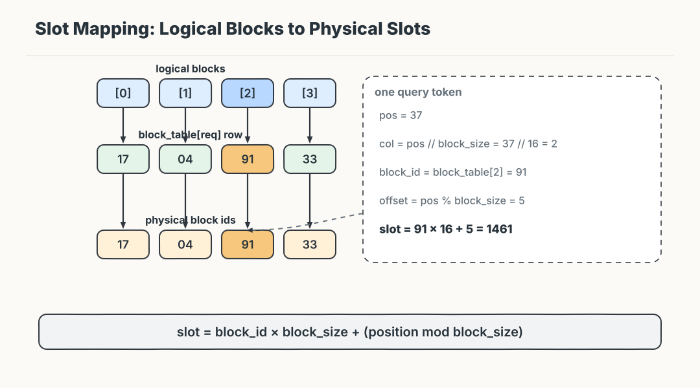</a>

<p class='figure-caption'>a request's logical blocks resolve through its block-table row to physical block ids, and each query token flattens to `slot = block_id * block_size + position % block_size`.</p>

The last program in the grid does no addressing at all — it pads:

`vllm/v1/worker/block_table.py:L343-L352`

```python
    if req_idx == tl.num_programs(0) - 1:
        # Pad remaining slots for CUDA graph compatibility.
        for i in range(num_tokens, max_num_tokens, BLOCK_SIZE):
            offsets = i + tl.arange(0, BLOCK_SIZE)
            tl.store(
                slot_mapping_ptr + offsets,
                PAD_ID,
                mask=offsets < max_num_tokens,
            )
        return
```

`PAD_SLOT_ID` is `-1` (`vllm/v1/attention/backends/utils.py:L45`). The `slot_mapping` buffer is a fixed `max_num_batched_tokens` wide, but a step usually schedules fewer tokens; the tail `[num_tokens, max_num_tokens)` is stamped `-1` so a CUDA-graph replay that always launches the full width writes padding tokens to a sentinel slot the KV-cache write path ignores, rather than corrupting a real block. Launch dimensions stay fixed while unused positions remain harmless.

### Multi-group fan-out, and why the group id is baked into the hash

A hybrid model has several KV-cache groups with independent block-id namespaces and possibly different block sizes, so there is not one block table but one *per group*.

`vllm/v1/worker/block_table.py:L283-L289`

```python
    def append_row(self, block_ids: tuple[list[int], ...], row_idx: int) -> None:
        for i, block_table in enumerate(self.block_tables):
            block_table.append_row(block_ids[i], row_idx)
```

`MultiGroupBlockTable` holds a `BlockTable` per group and dispatches every operation element-wise; `compute_slot_mapping` and `commit_block_table` likewise loop over all groups (`L303-L314`), producing one `slot_mapping` per group. Each group's `BlockTable` carries its own `block_size` and its own `blocks_per_kv_block`, so the slot formula runs with the right constants for that group's cache.

This is the runner-side reason a `BlockHash` alone is insufficient as a cache key. The pool stores blocks under `BlockHashWithGroupId` — content hash with a 4-byte group id appended ([Section 7](#7-prefix-cache-lookup-hashing-longest-hit-and-the-recompute-last-token-rule)) — precisely because block id `b` in the full-attention group and block id `b` in the sliding-window group are *different physical blocks* addressed through *different* block tables. The group id is the tag that keeps their slots from ever aliasing.

Group `i`'s logical ids only ever flow into `block_tables[i]`, and group `i`'s `slot_mapping` is computed with group `i`'s block size. The per-group independence asserted at the pool/hash layer is mechanically enforced here by never crossing group indices in the fan-out.

### The GPU-resident path: staged writes and persistent, capture-safe tensors

`vllm/v1/worker/gpu/block_table.py` implements the same mapping with different mechanics: block-table rows live in `StagedWriteTensor`s and are mutated by *staged GPU writes* rather than numpy assignment.

`vllm/v1/worker/gpu/block_table.py:L107-L120`

```python
    def append_block_ids(
        self,
        req_index: int,
        new_block_ids: tuple[list[int], ...],
        overwrite: bool,
    ) -> None:
        for i in range(self.num_kv_cache_groups):
            start = self.num_blocks.np[i, req_index] if not overwrite else 0
            block_ids = new_block_ids[i]
            bpk = self.blocks_per_kv_block[i]
            if bpk > 1:
                block_ids = [b * bpk + k for b in block_ids for k in range(bpk)]
            self.block_tables[i].stage_write(req_index, start, block_ids)
            self.num_blocks.np[i, req_index] = start + len(block_ids)
```

This is the `append_row`/`add_row` analogue — `overwrite` is the `add_row` reset (`start = 0`), otherwise it appends at the current `num_blocks`; the `bpk > 1` expansion is the same kernel-block split, done inline. But `stage_write` (`buffer_utils.py:L155-L165`) does not touch the GPU — it merely appends `(index, start, contents, cu_len)` to Python lists. The writes are flushed in one shot:

`vllm/v1/worker/gpu/block_table.py:L122-L132`

```python
    def apply_staged_writes(self) -> None:
        if self.num_kv_cache_groups == 1:
            # Single group: write directly, skipping the per-write group lookup.
            self.block_tables[0].apply_write()
        else:
            # Multiple groups: apply all block tables with one fused kernel.
            assert self.fused_writer is not None
            self.fused_writer.apply(
                self.block_tables, self.block_table_ptrs, self.block_table_strides
            )
        self.num_blocks.copy_to_uva()
```

A single group calls `apply_write` (which H2D-copies the staged index/start/content buffers and runs `_apply_write_kernel` to scatter the diffs into the persistent GPU table, `buffer_utils.py:L174-L199`); a multi-group model uses one fused kernel across all groups. `num_blocks` is then published to UVA: a CPU-owned tensor the GPU can read directly. This is the `commit_block_table` equivalent, but instead of DMAing whole rows it scatters only the *changed* spans, which is cheaper when most rows are unchanged step to step.

The tensors actually handed to the model are separate, and never reallocated:

`vllm/v1/worker/gpu/block_table.py:L67-L78`

```python
        # Block tables used for model's forward pass.
        # num_kv_cache_groups x [max_num_reqs, max_num_blocks]
        self.input_block_tables: list[torch.Tensor] = [
            torch.zeros_like(b.gpu) for b in self.block_tables
        ]

        self.slot_mappings = torch.zeros(
            self.num_kv_cache_groups,
            self.max_num_batched_tokens,
            dtype=torch.int64,
            device=self.device,
        )
```

`gather_block_tables` copies each active batch row from its persistent master slot into the compacted `input_block_tables` (zeroing padded rows), and `compute_slot_mappings` fills `slot_mappings` — both returning slices of these *same* preallocated tensors. The methods say so explicitly: `get_dummy_slot_mappings` and `get_dummy_block_tables` note they "must return the persistent tensor with the same memory address as that used during the model's forward pass, rather than allocating a new tensor" (`L153-L158`, `L187-L196`) — because a captured CUDA graph bakes in the tensor addresses.

The key structural difference from the CPU path shows up in the slot kernel:

`vllm/v1/worker/gpu/block_table.py:L283-L291`

```python
        block_indices = positions // (block_size * CP_SIZE)
        block_offsets = positions % (block_size * CP_SIZE)
        block_numbers = tl.load(
            block_table_ptr + req_state_idx * block_table_stride + block_indices
        )

        if CP_SIZE == 1:
            # Common case: Context parallelism is not used.
            slot_ids = block_numbers * block_size + block_offsets
```

The arithmetic is identical (`slot = block_numbers * block_size + block_offsets`) but the row is selected by `req_state_idx = tl.load(idx_mapping + batch_idx)`, an explicit *batch-index → persistent-request-slot* remap. Where the CPU path requires the block-table rows to already be in scheduled-batch order (row `r` = batch position `r`), the GPU path keeps a master table indexed by persistent request slot and gathers into batch order via `idx_mapping`. That indirection is what lets it avoid CPU-side `move_row`/`swap_row` compaction.

`slot = physical_block_id * block_size + (position % block_size)`, and the block table is the per-request logical→physical map while `slot_mapping` is its per-token flattening. The device tensors the kernel dereferences — `block_table.gpu[:num_reqs]` on the CPU path, `input_block_tables`/`slot_mappings` on the GPU path — are committed once per step and (on the GPU path, always; on the CPU path, at fixed max shape) stable in address and dimension for CUDA-graph replay.

## 21. GPU-Side Staging: Device Block Tables and Attention Metadata

The GPU-resident `BlockTables` path compresses staged row edits into CSR buffers, applies them with one Triton kernel across KV groups, rotates UVA staging buffers around in-flight work, and exposes the committed `block_table` and `slot_mapping` through `CommonAttentionMetadata`.

The kernel sees device tensors committed once per step, before the forward pass. The staging machinery keeps that publish cheap across groups and safe under CUDA-graph replay and pipelined execution.

<a href='images/vllm-06-18-gpu-staging.svg' target='_blank'>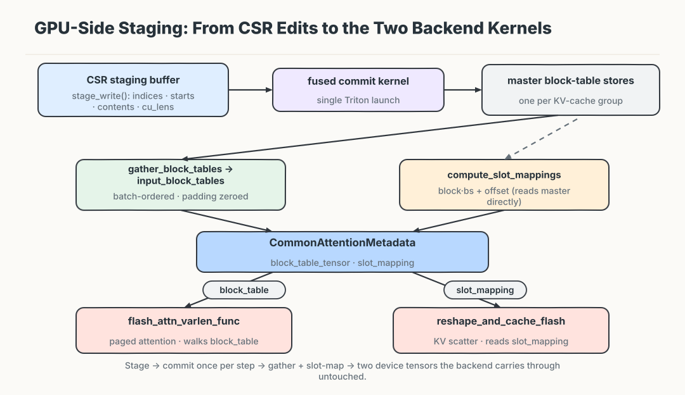</a>

<p class='figure-caption'>per-step flow on the GPU runner path — CSR-staged row edits → single fused commit kernel → `gather_block_tables` into the batch-ordered forward tensor and `compute_slot_mappings` → `CommonAttentionMetadata` → the two backend kernels that read `block_table` and `slot_mapping`.</p>

**The staging buffer is CSR, and one kernel drains it**

[Section 20](#20-from-block-table-to-kernel-slot_mapping-and-the-device-tensors) described `stage_write` as "appends `(index, start, contents, cu_len)` to Python lists." Those four lists are not four independent logs — together they are a compressed-sparse-row encoding of an arbitrary set of variable-length row edits, and reading them that way is what explains the commit kernel.

`vllm/v1/worker/gpu/buffer_utils.py:L155-L165`

```python
    def stage_write(
        self, index: int, start: int, x: Iterable[int] | Iterable[float]
    ) -> None:
        assert index >= 0
        assert start >= 0
        if not x:
            return
        self._staged_write_indices.append(index)
        self._staged_write_starts.append(start)
        self._staged_write_contents.extend(x)
        self._staged_write_cu_lens.append(len(self._staged_write_contents))
```

Each staged edit records a row (`index`), a start column (`start`), and *extends* one flat contents buffer with the payload, then pushes the running length of that flat buffer. `_staged_write_cu_lens` is therefore a strict prefix sum over payload lengths: write `p`'s contents occupy the slice `[cu_lens[p-1], cu_lens[p])`. Empty writes are dropped (`if not x`) so they never consume a program at commit time. This is exactly a CSR row-pointer array over a values array — the standard sparse-matrix layout, repurposed so a single flat buffer serves an arbitrary number of variable-length row appends without one Python object or one device call per row.

The commit kernel is the CSR reader. Its body, shared by the single-group and fused multi-group paths:

`vllm/v1/worker/gpu/buffer_utils.py:L286-L309`

```python
    pid = tl.program_id(0)
    row_idx = tl.load(write_indices_ptr + pid)
    start_idx = tl.load(write_starts_ptr + pid)

    cu_start = tl.load(write_cu_lens_ptr + pid - 1) if pid > 0 else 0
    cu_end = tl.load(write_cu_lens_ptr + pid)
    content_len = cu_end - cu_start

    if MULTI_GROUP:
        # Each write targets a different output tensor (KV cache group);
        # resolve its base pointer and row stride per write.
        group_id = tl.load(write_group_ids_ptr + pid)
        row_ptr = _load_ptr(output_ptr + group_id, tl.int32)
        row_stride = tl.load(output_stride + group_id)
    else:
        row_ptr = output_ptr
        row_stride = output_stride
    row_ptr += row_idx * row_stride + start_idx

    for i in range(0, content_len, BLOCK_SIZE):
        block = i + tl.arange(0, BLOCK_SIZE)
        mask = block < content_len
        content = tl.load(write_contents_ptr + cu_start + block, mask=mask)
        tl.store(row_ptr + block, content, mask=mask)
```

Read, one program per staged write: recover the row (`row_idx`), the append column (`start_idx`), and the contents slice `[cu_start, cu_end)` from the CSR arrays; resolve a destination address `base + row_idx*row_stride + start_idx`; stream the payload in 1024-element chunks. The single-group launch (`apply_write`, `buffer_utils.py:L189-L199`) passes the store's own data pointer and stride directly; the multi-group branch resolves per-write base pointer and stride via `group_id`, which is what the next subsection's pointer tables exist to supply.

The staging scheme protects two invariants. First, `_staged_write_cu_lens[-1] == len(_staged_write_contents)` after every `stage_write`, so the prefix sum is always a valid CSR row-pointer array — the kernel can recover every slice with no separate length array. Second, each write touches only columns `[start_idx, start_idx+content_len)` of its own row, and `start_idx` came from the pre-append `num_blocks` cursor ([Section 20](#20-from-block-table-to-kernel-slot_mapping-and-the-device-tensors)'s `append_block_ids`, `overwrite`-vs-append). Appends therefore never overlap live entries, and rows not staged this step are never touched at all — the commit is idempotent with respect to untouched rows, which is precisely what lets a hybrid model with dozens of mostly-static rows pay only for the handful that grew this step.

### Pointer/stride tables: one launch spans every KV-cache group

A hybrid model has one block-table store *per* KV-cache group ([Section 20](#20-from-block-table-to-kernel-slot_mapping-and-the-device-tensors)'s `MultiGroupBlockTable` is the numpy analogue), and on this path each store is a separate device allocation with its own row stride. The naive commit would loop groups in Python and launch a kernel per group. Instead, `BlockTables` caches each store's raw `data_ptr()` and row stride into small device tensors, so the multi-group commit is *one* launch that indexes those tables by `program_id`.

`vllm/v1/worker/gpu/block_table.py:L88-L105`

```python
    def init_block_table_layout_tensors(self) -> None:
        # Called at init and after a CuMem kv_cache wake-up. The ptr tensors
        # cache raw data_ptr() values that go stale once the underlying tensors
        # are reallocated on wake; block_sizes_tensor needs re-populating
        # because its storage lives under the kv_cache pool tag and comes back
        # with undefined contents.
        self.block_table_ptrs = self._make_ptr_tensor(
            [b.gpu for b in self.block_tables]
        )
        self.block_table_strides = torch.tensor(
            [b.gpu.stride(0) for b in self.block_tables],
            dtype=torch.int64,
            device=self.device,
        )
        self.block_sizes_tensor = torch.tensor(
            self.kernel_block_sizes, dtype=torch.int32, device=self.device
        )
        self.input_block_table_ptrs = self._make_ptr_tensor(self.input_block_tables)
```

`_make_ptr_tensor` (`L82-L86`) stores each tensor's `data_ptr()` as `uint64` — the comment there notes uint64 "to cover all possible addresses." The commit kernel's `MULTI_GROUP` branch above does `_load_ptr(output_ptr + group_id, ...)` to turn `block_table_ptrs[group_id]` back into a typed pointer (`_load_ptr` casts the raw integer and asserts 16-byte alignment, `buffer_utils.py:L312-L316`). The fused writer, `FusedStagedWriter.apply` (`buffer_utils.py:L225-L271`), concatenates every group's CSR arrays into flat buffers, tags each write with its `group_id`, and re-bases each group's `cu_lens` by the running `content_base` so the per-group prefix sums chain into one global CSR contents buffer — then a single launch sized to the *total* number of writes across all groups drains them, each write routed to its own store by `block_table_ptrs`/`block_table_strides`.

`block_table_ptrs`, `block_table_strides`, `block_sizes_tensor`, and `input_block_table_ptrs` cache *raw addresses and layout*, not tensor handles. If the underlying stores are ever reallocated — the documented case is a CuMem sleep/wake of the KV-cache pool, where the storage comes back at a new address (and, for `block_sizes_tensor`, with undefined contents because it lives under the KV-cache pool tag): the cached pointers dangle. `init_block_table_layout_tensors` is written to be idempotent and is re-invoked on wake for exactly that reason; skipping it would have every multi-group commit, gather, and slot-mapping kernel dereference a stale address. This is the price of trading a Python group-loop for a single group-parallel launch: the pointer tables must be rebuilt whenever the pool moves.

### Round-robin UVA: staging buffers must survive an in-flight step

The small CSR index/start/cu_len arrays and the `num_blocks` cursor do not go to the device via an explicit H2D copy; they go through UVA — a zero-copy, device-addressable view over pinned host memory (`UvaBuffer.uva = get_accelerator_view_from_cpu_tensor(self.cpu)`, `buffer_utils.py:L48-L50`). The hazard: with a pipelined engine (`batch_queue_size > 1`), step *N*'s commit kernel can still be reading its UVA buffer when step *N+1* begins staging. A single reused buffer would let the next step's host writes corrupt the in-flight launch's inputs. The defense is a rotating pool.

`vllm/v1/worker/gpu/buffer_utils.py:L71-L79`

```python
    def copy_to_uva(self, x: torch.Tensor | np.ndarray | list) -> torch.Tensor:
        # Round robin to the next buffer.
        self._curr = (self._curr + 1) % self.max_concurrency
        buf = self._uva_bufs[self._curr]
        # CPU-to-CPU copy
        dst = buf.cpu if isinstance(x, torch.Tensor) else buf.np
        n = len(x)
        dst[:n] = x
        return buf.uva[:n]
```

Each call advances `_curr` modulo `max_concurrency`, writes the payload into *that* pinned buffer (a cheap CPU-to-CPU copy), and hands back `buf.uva[:n]` — the accelerator-addressable window the GPU reads directly, with no separate H2D transfer. The default depth is set once:

`vllm/v1/worker/gpu/buffer_utils.py:L16-L18`

```python
# Default round-robin depth for the UVA buffer pools. Must be >= the number of
# concurrent in-flight steps (engine batch_queue_size).
_DEFAULT_MAX_CONCURRENCY = 2
```

With pool depth ≥ `batch_queue_size`, the buffer handed to step *N* is not reused until at least `max_concurrency` steps later, so an async kernel that has not yet launched (or not yet finished) never reads host memory that the next step already clobbered. `apply_staged_writes` closes the loop by publishing the updated `num_blocks` cursor through the same rotation — `UvaBackedTensor.copy_to_uva` (`buffer_utils.py:L108-L111`) keeps `self.cpu`/`self.np` as the durable source of truth and re-points `self.gpu` at the fresh rotation buffer each commit, so the gather kernel that reads `self.num_blocks.gpu` a moment later always sees the count committed *this* step, not a half-overwritten one. This is the pipelining-safety analogue of [Section 20](#20-from-block-table-to-kernel-slot_mapping-and-the-device-tensors)'s single-publish `commit_block_table`, and it is why the GPU path can scatter only changed spans instead of DMAing whole rows.

**`gather_block_tables`: the only bridge from master store to forward tensor**

[Section 20](#20-from-block-table-to-kernel-slot_mapping-and-the-device-tensors) noted that the GPU path keeps a master table keyed by persistent request slot and gathers into batch order via `idx_mapping`, dodging the CPU path's `move_row`/`swap_row` compaction. Here is the gather itself, which also does double duty as the CUDA-graph padding zeroer.

`vllm/v1/worker/gpu/block_table.py:L210-L236`

```python
    # kv cache group id
    group_id = tl.program_id(0)
    batch_idx = tl.program_id(1)

    stride = tl.load(block_table_strides + group_id)
    max_num_blocks = stride  # stride equals max_num_blocks for this group.
    dst_block_table_ptr = _load_ptr(dst_block_table_ptrs + group_id, tl.int32)
    dst_row_ptr = dst_block_table_ptr + batch_idx * stride

    if batch_idx >= num_reqs:
        # Zero out padded rows.
        for i in tl.range(0, max_num_blocks, BLOCK_SIZE):
            offset = i + tl.arange(0, BLOCK_SIZE)
            tl.store(dst_row_ptr + offset, 0, mask=offset < max_num_blocks)
        return

    req_idx = tl.load(batch_idx_to_req_idx + batch_idx)
    group_num_blocks_ptr = num_blocks_ptr + group_id * num_blocks_stride
    num_blocks = tl.load(group_num_blocks_ptr + req_idx)

    src_block_table_ptr = _load_ptr(src_block_table_ptrs + group_id, tl.int32)
    src_row_ptr = src_block_table_ptr + req_idx * stride

    for i in tl.range(0, num_blocks, BLOCK_SIZE):
        offset = i + tl.arange(0, BLOCK_SIZE)
        block_ids = tl.load(src_row_ptr + offset, mask=offset < num_blocks)
        tl.store(dst_row_ptr + offset, block_ids, mask=offset < num_blocks)
```

The grid is `(num_kv_cache_groups, num_reqs_padded)`, so one program owns one `(group, batch row)`. If `batch_idx >= num_reqs` the program zeros the whole destination row and returns. Otherwise it resolves the persistent slot `req_idx = idx_mapping[batch_idx]`, loads that request's live length `num_blocks` from the just-committed `num_blocks.gpu`, and copies exactly that many kernel-block ids from the master row `req_idx` into the batch row `batch_idx` of `input_block_tables[group]`. `stride == max_num_blocks` because the store is contiguous `[max_num_reqs, max_num_blocks]`. The launch is deliberately sized to `num_reqs_padded` (`gather_block_tables`, `L134-L151`) so the zeroing of padded rows is *fused into the same launch* as the copy, not a separate memset.

Three, all about not leaking stale state. (1) Only `num_blocks` entries are copied per row, so destination columns beyond the live length retain whatever a previous, longer occupant left, which is why every downstream consumer keys off `seq_lens`/positions, never off the destination row width. (2) Padded rows (`batch_idx >= num_reqs`) are *explicitly* zeroed because the returned slice is sized `num_reqs_padded` and may be captured into a CUDA graph; a stale block id from a previous larger batch that survived into a padded row would be silently gathered by a replay. This is the runtime enforcement of the same "persistent tensor, same memory address" rule [Section 20](#20-from-block-table-to-kernel-slot_mapping-and-the-device-tensors) quoted from `get_dummy_block_tables`. (3) A quieter but essential fact: `compute_slot_mappings` (`L160-L185`) reads the *persistent* `block_table_ptrs` store directly, indexed by `req_state_idx = idx_mapping[batch_idx]` (`L276`, `L285-L287`) — **not** the gathered `input_block_tables`.

Gather and slot-mapping are therefore independent consumers of the same committed master store; the gather exists only to hand the attention kernel a compacted, batch-ordered, padding-clean block table, while slot mapping bypasses it entirely and computes `block_number*block_size + offset` straight from the master rows. (Slot mapping and its `PAD_SLOT_ID` padding tail are [Section 20](#20-from-block-table-to-kernel-slot_mapping-and-the-device-tensors); the new observation here is only that the two consumers do not chain.)

Both `gather_block_tables` and `compute_slot_mappings` run inside `prepare_attn`, *after* `apply_staged_writes` has committed the step's edits (`model_runner.py:L1129` commits; `L1175` calls `prepare_attn`). The order is stage → commit-all-at-once → gather/slot; neither consumer can observe an incremental device update.

### The metadata handoff: `CommonAttentionMetadata` and the pass-through builder

`prepare_attn` returns two finished device objects and nothing else:

`vllm/v1/worker/gpu/model_runner.py:L1021-L1037`

```python
    def prepare_attn(
        self, input_batch: InputBatch
    ) -> tuple[tuple[torch.Tensor, ...], torch.Tensor]:
        # Block tables: num_kv_cache_groups x [num_reqs_padded, max_num_blocks].
        block_tables = self.block_tables.gather_block_tables(
            input_batch.idx_mapping,
            num_reqs_padded=input_batch.num_reqs_after_padding,
        )
        # Slot mappings: [num_kv_cache_groups, num_tokens_padded].
        # Kernel pads beyond num_tokens with PAD_SLOT_ID.
        slot_mappings = self.block_tables.compute_slot_mappings(
            input_batch.idx_mapping,
            input_batch.query_start_loc,
            input_batch.positions,
            num_tokens_padded=input_batch.num_tokens_after_padding,
        )
        return block_tables, slot_mappings
```

These flow into `model_state.prepare_attn(input_batch, cg_mode, block_tables, slot_mappings, ...)` (`L1220-L1227`), which assembles the per-group metadata. The single object every attention backend's `build()` consumes is `CommonAttentionMetadata`, whose two key fields are:

`vllm/v1/attention/backend.py:L420-L421`

```python
    block_table_tensor: torch.Tensor
    slot_mapping: torch.Tensor
```

Its docstring (`L396-L398`) calls it "Per-batch attention metadata, shared across layers and backends. `AttentionMetadataBuilder` instances use it to construct per-layer metadata." The entire staging layer (CSR buffers, pointer tables, UVA rotation, gather) is now invisible; the backend sees two device tensors.

And the backend builder does *not* transform them. `FlashAttentionMetadataBuilder.build` unpacks `block_table_tensor = common_attn_metadata.block_table_tensor` / `slot_mapping = common_attn_metadata.slot_mapping` (`L444-L445`) and copies the references straight into per-layer metadata:

`vllm/v1/attention/backends/flash_attn.py:L607-L614`

```python
        attn_metadata = FlashAttentionMetadata(
            num_actual_tokens=num_actual_tokens,
            max_query_len=max_query_len,
            query_start_loc=query_start_loc,
            max_seq_len=max_seq_len,
            seq_lens=seq_lens,
            block_table=block_table_tensor,
            slot_mapping=slot_mapping,
```

`build`'s real work is elsewhere (AOT scheduler metadata, cascade/DCP splitting); for these two fields it is a pure pass-through, and `FlashAttentionMetadata` re-declares them at `flash_attn.py:L234-L235`.

The block table and slot mapping the kernel dereferences are byte-identical to what the worker committed: no re-derivation, no re-layout. Correctness of the physical KV addressing is owned *entirely* by the staging/commit layer above; the builder cannot introduce a mismatch because it never touches the values. That clean seam is what makes the two-path design ([Section 20](#20-from-block-table-to-kernel-slot_mapping-and-the-device-tensors)'s numpy path and this GPU path) tenable: both converge on the same two tensors, and the whole backend below is agnostic to which produced them.

**The two consumers, and the in-place re-bind**

Downstream, exactly two kernels dereference these tensors. `slot_mapping` drives the KV-cache scatter:

`vllm/v1/attention/backends/flash_attn.py:L1033-L1042`

```python
        reshape_and_cache_flash(
            key,
            value,
            key_cache,
            value_cache,
            slot_mapping,
            self.kv_cache_dtype,
            layer._k_scale,
            layer._v_scale,
        )
```

`slot_mapping[t]` is the flat physical slot for token `t`; `reshape_and_cache_flash` scatters each token's K/V there, and the `PAD_SLOT_ID = -1` tail ([Section 20](#20-from-block-table-to-kernel-slot_mapping-and-the-device-tensors)) is written nowhere. The surrounding comment (`L1028-L1032`) notes the op "uses the `slot_mapping`'s shape to determine the number of actual tokens" — so the *un-padded* length of `slot_mapping`, not the padded query tensor, sets the token count. `block_table` drives paged attention:

`vllm/v1/attention/backends/flash_attn.py:L952-L966`

```python
                flash_attn_varlen_func(
                    q=query[:num_actual_tokens],
                    k=key_cache,
                    v=value_cache,
                    out=output[:num_actual_tokens],
                    cu_seqlens_q=cu_seqlens_q,
                    max_seqlen_q=max_seqlen_q,
                    seqused_k=seqused_k,
                    max_seqlen_k=max_seqlen_k,
                    softmax_scale=self.scale,
                    causal=causal,
                    alibi_slopes=self.alibi_slopes,
                    window_size=sliding_window_size,
                    block_table=block_table,
                    softcap=self.logits_soft_cap,
```

`block_table` (bound `= attn_metadata.block_table` at `L845`) is the paging map the varlen kernel walks to gather each request's non-contiguous K/V pages during attention — the concrete indirection [Section 20](#20-from-block-table-to-kernel-slot_mapping-and-the-device-tensors) flagged as the object of the vAttention critique.

Finally, backends that advertise `supports_update_block_table: bool = True` (`flash_attn.py:L327`) let the runner swap paging onto an already-built metadata object without a full rebuild:

`vllm/v1/attention/backends/flash_attn.py:L659-L668`

```python
    def update_block_table(
        self,
        metadata: FlashAttentionMetadata,
        blk_table: torch.Tensor,
        slot_mapping: torch.Tensor,
    ) -> FlashAttentionMetadata:
        new_metadata = copy.copy(metadata)
        new_metadata.block_table = blk_table
        new_metadata.slot_mapping = slot_mapping
        return new_metadata
```

A shallow `copy.copy` re-points *only* `block_table` and `slot_mapping`; every other field (AOT scheduler metadata, cascade state, DCP context lengths) is shared with the original. Those are therefore the only physical-layout tensors a backend rebinds when paging changes mid-flight. The staging layer produces them once per step, and the backend carries them into the physical KV write in [Section 22](#22-reshape_and_cache-how-a-token-kv-enters-its-physical-block); [Section 23](#23-the-life-of-a-physical-block-allocate-use-free-cache-evict) then follows the corresponding blocks through their lifecycle.

## 22. reshape_and_cache: How a Token KV Enters Its Physical Block

`block_table` and `slot_mapping` are addresses, not data. `reshape_and_cache` is the per-step, per-layer CUDA/Triton scatter that writes freshly computed K and V values to those slots—the physical counterpart to publishing a finalized block in the prefix-cache index.

**`slot_mapping[token_idx]` determines where a token's KV lands.** The write kernel derives `(block, offset)` from that integer and never dereferences `block_table`, because [Section 21](#21-gpu-side-staging-device-block-tables-and-attention-metadata)'s construction has already folded the table lookup into the slot. Article 08's read inverts the same arithmetic, so both sides use the same physical address.

<a href='images/vllm-06-29-reshape-cache.svg' target='_blank'>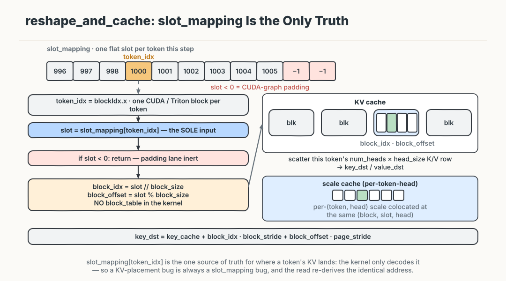</a>

<p class='figure-caption'>Figure: one CUDA block per token decodes `slot → (block_idx, block_offset)` and scatters that token's K/V into its physical page; `slot = -1` lanes are inert.</p>

### The write is a torch.compile side-effect, ordered before the read

The KV write is not a data output of attention. It is a deliberate *side-effect* sequenced ahead of the attention read so the read of step *t* sees step *t*'s tokens. The call site is the `unified_kv_cache_update` wrapper, whose entire reason for returning a value is to pin that ordering under `torch.compile`.

[`vllm/model_executor/layers/attention/attention.py:774-792`](https://github.com/vllm-project/vllm/blob/6cf7b26bd4bff60bf378e1af14044280ac0d214c/vllm/model_executor/layers/attention/attention.py#L774-L792)
```python
    """
    Returns a dummy that is passed to unified_attention to signal a side effect and
    the data dependency between them to ensure torch.compile preserves ordering.
    """
    layer_name = _resolve_layer_name(layer_name)
    _, attn_layer, kv_cache, layer_slot_mapping = get_attention_context(layer_name)
    if layer_slot_mapping is not None:
        assert hasattr(attn_layer.impl, "do_kv_cache_update"), (
            f"{attn_layer.impl.__class__.__name__} does not support kv cache update"
        )
        attn_layer.impl.do_kv_cache_update(  # type: ignore[attr-defined]
            attn_layer,
            key,
            value,
            kv_cache,
            layer_slot_mapping,
        )

    return torch.empty(0, device=kv_cache.device, dtype=kv_cache.dtype)
```

Against the docstring: `layer_slot_mapping` is the per-layer `slot_mapping` fetched from `ForwardContext` (`forward_context.slot_mapping` is a dict keyed by layer name, [`attention.py:761-765`](https://github.com/vllm-project/vllm/blob/6cf7b26bd4bff60bf378e1af14044280ac0d214c/vllm/model_executor/layers/attention/attention.py#L761-L765)). It *gates* the write — a `None` entry (a layer that does not own a KV cache) skips the scatter entirely. The function then returns `torch.empty(0, ...)`, a zero-element dummy whose only job, per the docstring at [`attention.py:774-776`](https://github.com/vllm-project/vllm/blob/6cf7b26bd4bff60bf378e1af14044280ac0d214c/vllm/model_executor/layers/attention/attention.py#L774-L776), is "to signal a side effect and the data dependency ... to ensure torch.compile preserves ordering." That fake data dependency is what forbids the compiler from floating the scatter *after* the same layer's attention read.

**ordering:** the scatter-write of step-*t* tokens is compiler-pinned to run before the read that consumes them; without the empty-tensor return, `torch.compile` could legally reorder a pure side-effecting op and the read would gather stale KV.

**`do_kv_cache_update`: unbind the cache, let `slot_mapping` set the token count**

The dispatch into the physical write lives in the backend impl. For FlashAttention:

[`vllm/v1/attention/backends/flash_attn.py:1017-1042`](https://github.com/vllm-project/vllm/blob/6cf7b26bd4bff60bf378e1af14044280ac0d214c/vllm/v1/attention/backends/flash_attn.py#L1017-L1042)
```python
        if self.attn_type in (AttentionType.ENCODER_ONLY, AttentionType.ENCODER):
            # For encoder attention,
            # we use direct Q, K, V tensors without caching
            return

        # Scatter write into the KV cache using slot_mapping indices.
        # No TMA kernel is invoked here, so stride canonicalization is not needed.
        key_cache, value_cache = kv_cache.unbind(1)

        # Reshape the input keys and values and store them in the cache.
        # Skip this if sharing KV cache with an earlier attention layer.
        # NOTE(woosuk): Here, key and value are padded while slot_mapping is
        # not padded. However, we don't need to do key[:num_actual_tokens]
        # and value[:num_actual_tokens] because the reshape_and_cache_flash
        # op uses the slot_mapping's shape to determine the number of
        # actual tokens.
        reshape_and_cache_flash(
            key,
            value,
            key_cache,
            value_cache,
            slot_mapping,
            self.kv_cache_dtype,
            layer._k_scale,
            layer._v_scale,
        )
```

Three facts matter here. First, encoder / encoder-only layers `return` early (`L1017-1020`): their Q/K/V are consumed directly and never paged, so there is no slot to write ([Section 17](#17-the-encoder-cache-manager-the-multimodal-sibling-allocator)). Second, `key_cache, value_cache = kv_cache.unbind(1)` produces views of the backing FlashAttention tensor, so stores need no copy or re-materialization. Third, the `NOTE(woosuk)` comment (`L1028-1032`) distinguishes CUDA-graph-padded `key`/`value` from the exact-length `slot_mapping`. The op trusts the latter's length, avoiding a `key[:num_actual_tokens]` slice.

**token count:** the number of tokens written equals `slot_mapping.shape[0]`, independent of the (CUDA-graph-padded) `key`/`value` leading dimension. Get this wrong in the other direction, trust `key.size(0)`, and CUDA-graph padding tokens would scatter garbage into block 0.

The Python `reshape_and_cache_flash` symbol is itself platform-dispatched: on CUDA it is bound to the C++ custom op ([`fa_utils.py:21-22`](https://github.com/vllm-project/vllm/blob/6cf7b26bd4bff60bf378e1af14044280ac0d214c/vllm/v1/attention/backends/fa_utils.py#L21-L22), `from vllm._custom_ops import reshape_and_cache_flash`), on XPU to `ops.reshape_and_cache_flash`, and other backends (e.g. `triton_attn`) substitute the Triton implementation. All share one 8-argument signature — the pass-through wrapper is a thin shim:

[`vllm/_custom_ops.py:2457-2476`](https://github.com/vllm-project/vllm/blob/6cf7b26bd4bff60bf378e1af14044280ac0d214c/vllm/_custom_ops.py#L2457-L2476)
```python
def reshape_and_cache_flash(
    key: torch.Tensor,
    value: torch.Tensor,
    key_cache: torch.Tensor,
    value_cache: torch.Tensor,
    slot_mapping: torch.Tensor,
    kv_cache_dtype: str,
    k_scale: torch.Tensor,
    v_scale: torch.Tensor,
) -> None:
    torch.ops._C_cache_ops.reshape_and_cache_flash(
        key,
        value,
        key_cache,
        value_cache,
        slot_mapping,
        kv_cache_dtype,
        k_scale,
        v_scale,
    )
```

### The placement arithmetic: `slot → (block_idx, block_offset)`, no block_table in sight

The CUDA kernel turns the flat slot integer into a physical address. Its launcher takes the token count directly from `slot_mapping`:

[`csrc/libtorch_stable/cache_kernels.cu:761-767`](https://github.com/vllm-project/vllm/blob/6cf7b26bd4bff60bf378e1af14044280ac0d214c/csrc/libtorch_stable/cache_kernels.cu#L761-L767)
```c++
  // In vLLM V1, however, key.size(0) can be larger than slot_mapping.size(0)
  // since key includes padding for CUDA graphs, while slot_mapping does not.
  // In this case, slot_mapping.size(0) represents the actual number of tokens
  // before padding.
  // For compatibility with both cases, we use slot_mapping.size(0) as the
  // number of tokens.
  int num_tokens = slot_mapping.size(0);
```

The launch grid is one thread block per token. The body is the entire placement decision — six lines:

[`csrc/libtorch_stable/cache_kernels.cu:326-344`](https://github.com/vllm-project/vllm/blob/6cf7b26bd4bff60bf378e1af14044280ac0d214c/csrc/libtorch_stable/cache_kernels.cu#L326-L344)
```c++
  const int64_t token_idx = blockIdx.x;
  const int64_t slot_idx = slot_mapping[token_idx];
  // NOTE: slot_idx can be -1 if the token is padded
  if (slot_idx < 0) {
    return;
  }
  const int64_t block_idx = slot_idx / block_size;
  const int64_t block_offset = slot_idx % block_size;
  const int n_elems = num_heads * head_size;

  // pointers to the beginning of the source row for this token.
  const scalar_t* __restrict__ key_src = key + token_idx * key_stride;
  const scalar_t* __restrict__ value_src = value + token_idx * value_stride;

  // find the start position inside the kv-cache for this token.
  cache_t* __restrict__ key_dst =
      key_cache + block_idx * block_stride + block_offset * page_stride;
  cache_t* __restrict__ value_dst =
      value_cache + block_idx * block_stride + block_offset * page_stride;
```

Line by line: `token_idx = blockIdx.x` — this CUDA block owns exactly one token. `slot_idx = slot_mapping[token_idx]` — the single source-of-truth lookup; nothing else is consulted. The kernel's parameter list ([`cache_kernels.cu:315-325`](https://github.com/vllm-project/vllm/blob/6cf7b26bd4bff60bf378e1af14044280ac0d214c/csrc/libtorch_stable/cache_kernels.cu#L315-L325)) receives `slot_mapping`, the block/page/key/value strides used to place and copy the row, and the scale pointers — **but no `block_table` pointer at all**; the block identity is already baked into `slot`. `if (slot_idx < 0) return;` drops padding lanes: a `-1` slot means "no real token here," so CUDA-graph padding tokens are inert instead of corrupting block 0 (the `-1` is stamped onto the padded tail during slot-mapping construction, [Section 21](#21-gpu-side-staging-device-block-tables-and-attention-metadata) — this kernel merely honors the sentinel).

Then `block_idx = slot_idx / block_size` and `block_offset = slot_idx % block_size` — **the exact inverse of `slot = block_id * block_size + offset`**. The flat integer decomposes into (which physical block, which row inside it). Finally `key_dst = key_cache + block_idx * block_stride + block_offset * page_stride`: `block_stride` skips a whole block, `page_stride` skips one token-slot inside a block. `n_elems = num_heads * head_size` elements are then vectorized-copied from source row to destination row (the copy has NHD contiguous-heads and HND per-head fast paths; the layout mechanics belong to article 08's read side).

**Placement:** `KVcache[block_idx][block_offset] ← token`, with the pair derived from `slot = slot_mapping[token_idx]`. The read kernel (article 08) decodes the same integer. The block-table indirection that vAttention critiques ([Section 26](#26-tuning-the-kv-cache-an-operator-guide-grounded-in-config)) has already happened upstream; the hot per-step kernel only decodes the resulting slot.

**fp8 KV cache: the write applies the layer's static scale**

When the cache dtype is fp8, the copy is not a cast but a quantization. The per-element op branches at compile time on the KV dtype:

[`csrc/libtorch_stable/cache_kernels.cu:242-252`](https://github.com/vllm-project/vllm/blob/6cf7b26bd4bff60bf378e1af14044280ac0d214c/csrc/libtorch_stable/cache_kernels.cu#L242-L252)
```c++
struct CopyWithScaleOp {
  float scale;

  __device__ __forceinline__ void operator()(OutT& dst, const InT src) const {
    if constexpr (kv_dt == Fp8KVCacheDataType::kAuto) {
      dst = static_cast<OutT>(src);
    } else {
      dst = fp8::scaled_convert<OutT, InT, kv_dt>(src, scale);
    }
  }
};
```

For a non-quantized cache (`kAuto`: fp16/bf16/fp32) the store is a plain `static_cast` and `scale` is unused. For an fp8 cache, `fp8::scaled_convert(src, scale)` divides by the scale and packs to fp8, with `scale` taken from `layer._k_scale` / `layer._v_scale`: the same tensors threaded through `do_kv_cache_update`. The scale can be a single `[1]` value (fast path) or a `[num_heads]` per-head vector (the HND branch). The Triton static-scale path mirrors the CUDA `CopyWithScaleOp` semantics (`key_load / tl.load(k_scale)` with an implicit fp8 cast on `tl.store`) so a backend may pick either kernel with identical semantics.

**FP8 round-trip:** the stored value is `convert_to_fp8(src / scale)`; the read (article 08) multiplies by the same `layer._k_scale`/`_v_scale`. A different scale would shift every cached value by a constant factor.

### Dynamic per-token-head quant: the scale is computed *and stored* alongside the data

Beyond the static-scale path there is a second write kernel for INT8 / FP8 *per-(token, head)* quantization, where the scale is not a layer constant but is derived from the data at write time and persisted into a companion scale cache. This is the case where the physical write does genuinely more than move bytes:

[`vllm/v1/attention/ops/triton_reshape_and_cache_flash.py:187-229`](https://github.com/vllm-project/vllm/blob/6cf7b26bd4bff60bf378e1af14044280ac0d214c/vllm/v1/attention/ops/triton_reshape_and_cache_flash.py#L187-L229)
```python
    tok = tl.program_id(0)
    head = tl.program_id(1)

    slot = tl.load(slot_mapping_ptr + tok).to(tl.int64)
    if slot < 0:
        return

    blk = slot // block_size
    slot_in_blk = slot % block_size
    ...
    tl.store(
        k_scale_cache_ptr
        + blk * stride_ks_blk
        + slot_in_blk * stride_ks_slot
        + head * stride_ks_head,
        k_scale,
    )
    ...
```

The grid is now 2-D (`(token, head)`), but the placement decode is unchanged: `slot < 0` skip, `blk = slot // block_size`, `slot_in_blk = slot % block_size`. The KV-management fact this section covers is scale *colocation*: the per-head scale is written into a **parallel scale cache** at the *same* `(blk, slot_in_blk, head)` coordinate as the quantized data, so the one slot decode addresses both tensors. The *value* transform itself — absmax → scale → clamp, the int-path half-away-from-zero rounding, and the `QUANT_MAX`/`QUANT_MIN` bounds drawn from the cache dtype (`_PER_TOKEN_HEAD_QUANT_PARAMS`, [`triton_reshape_and_cache_flash.py:266-269`](https://github.com/vllm-project/vllm/blob/6cf7b26bd4bff60bf378e1af14044280ac0d214c/vllm/v1/attention/ops/triton_reshape_and_cache_flash.py#L266-L269)) — is article 08's kernel arithmetic, the same boundary [Section 18](#18-fp8-and-quantized-kv-cache-fitting-more-tokens-per-byte) draws when it defers "absmax, clamp, INT4 Hadamard rotation" to article 08.

**Scale colocation:** dynamic per-token-head quant stores the generated scale at the same `(block, slot, head)` coordinate as its data, and the read finds both through one slot decode.

### Cross-cuts: MLA and speculative decoding

Two related write paths deliberately live in adjacent sections, and it is worth being precise about the seam.

**MLA writes through a different op with a different page layout.** DeepSeek-style Multi-head Latent Attention does not store separate K and V; it caches a single compressed latent plus a RoPE key. Its physical write is therefore not `reshape_and_cache_flash` but `concat_and_cache_mla` ([`vllm/_custom_ops.py:2546-2556`](https://github.com/vllm-project/vllm/blob/6cf7b26bd4bff60bf378e1af14044280ac0d214c/vllm/_custom_ops.py#L2546-L2556)), whose signature takes `kv_c`, `k_pe`, one `kv_cache` tensor, `slot_mapping`, and a single `scale` — note there is no separate `value_cache` view to unbind, and only one scale. The *management* consequence — a page holds one latent-plus-rope row instead of a `[2, block_size, heads, head_size]` K/V pair, so the byte page size and `storage_block_size` differ — is [Section 19](#19-mla-the-compressed-latent-kv-cache)'s province; the MLA *kernel* math (how the latent is up-projected at read time) is article 08.

MLA's write still consumes the same `slot_mapping` and uses `slot = block*block_size + offset`, so the placement arithmetic above applies unchanged.

**Speculative decoding is a KV-allocation story, not a write-kernel story.** The scatter kernel is entirely agnostic to whether a token is verified or speculative — it writes whatever `slot_mapping` addresses. The subtlety is upstream, in `allocate_slots`: the `new` region of the token layout explicitly *includes* unverified draft tokens, and a `lookahead` region reserves extra slots for speculative positions ([Section 9](#9-allocate_slots-is-a-policy-stack-not-an-allocation), and [Section 14](#14-speculative-decoding-meets-the-kv-cache-lookahead-slots-and-rollback) for the full spec-decode walk). Those lookahead slots get real, valid `slot_mapping` entries, so the proposer's draft K/V *is* physically written into blocks this step.

What must never happen is caching that KV as if it were finalized — so the prefix-cache write caps its extent at `request.num_tokens`, excluding draft tokens (again, [Section 9](#9-allocate_slots-is-a-policy-stack-not-an-allocation)). On rejection, the block table can roll the processed-token boundary back and those slots are simply overwritten on a later step; because placement is a stateless function of `slot`, no cleanup of the physical bytes is needed — a subsequent write to the same `slot` overwrites them, and the prefix cache never published them. The proposer mechanics themselves (how draft tokens are generated and verified) are article 12.

## 23. The Life of a Physical Block: Allocate, Use, Free, Cache, Evict

A physical block is one of `num_gpu_blocks` records recycled for the process lifetime. Its `block_id` stays fixed while its state cycles through free, allocated, shared, cached-but-free, evicted, and reallocated. Three fields encode that state, and the pool's mutators preserve one central relationship between ownership and free-queue membership.

<a href='images/vllm-06-10-block-lifecycle.svg' target='_blank'>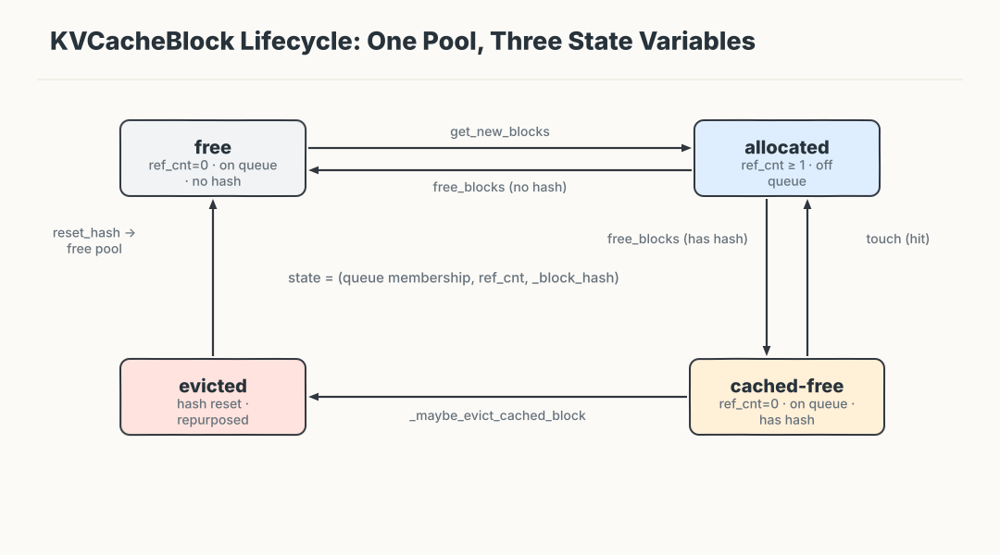</a>

<p class='figure-caption'>The `KVCacheBlock` lifecycle — free-queue membership, `ref_cnt`, and `_block_hash` as the three state variables, with the pool methods that transition between states.</p>

### The three state variables

A physical block is described by exactly one `KVCacheBlock`, a `slots=True` dataclass so the pool can hold hundreds of thousands of them cheaply (`vllm/v1/core/kv_cache_utils.py:L117-L138`; the full field-by-field walk is in [Section 3](#3-kvcacheblock-and-blockpool-the-free-list-is-an-eviction-structure)).

The state of a block is the tuple `(ref_cnt, _block_hash, free-list membership)`. `block_id` is *not* state — it is immutable identity, which is why block tables can be append-only and why the cache map deliberately never de-duplicates. For every non-null block, one relation governs queue membership:

> **`ref_cnt == 0` ⇔ the block is currently linked in the free queue and is an eviction candidate.**

`_block_hash` is independent of that relation: a block can be on the free queue (`ref_cnt == 0`) and still carry a live cache identity. This free-but-cached state enables low-overhead prefix reuse. The field is write-once until reset and is exposed through two guarded methods, `set_block_hash` and `reset_hash` (`vllm/v1/core/kv_cache_utils.py:L148-L162`, quoted in [Section 3](#3-kvcacheblock-and-blockpool-the-free-list-is-an-eviction-structure)).

`set_block_hash` asserts the block currently has no hash, so the only legal path from "has a hash" back to "settable" is `reset_hash`, which fires exclusively on eviction. This forbids silently re-keying a live block — an overwrite that would leave `cached_block_hash_to_block` pointing at a key the block no longer advertises, i.e. a phantom cache hit resolving to the wrong KV.

One block never plays this game. At pool construction the null block is carved out of the free queue and permanently excluded.

Source anchor — `vllm/v1/core/block_pool.py:L188-L192`:

```python
        # To represent a placeholder block with block_id=0.
        # The ref_cnt of null_block is not maintained, needs special care to
        # avoid freeing it.
        self.null_block = self.free_block_queue.popleft()
        self.null_block.is_null = True
```

`touch` and `free_blocks` exclude `is_null` because the sentinel's `ref_cnt` is meaningless and it must never enter the free queue or cache map. It gives sliding-window and chunked-local managers a valid block id for skipped block-table slots without allocating real storage.

**Allocate: `get_new_blocks` pulls anonymous capacity off the LRU front**

Allocation is the pool's single entry point for fresh storage. It takes blocks the caller does *not* care about specifically (just "give me `num_blocks` of free capacity") from the least-recently-used front of the queue.

Source anchor — `vllm/v1/core/block_pool.py:L542-L572`:

```python
    def get_new_blocks(self, num_blocks: int) -> list[KVCacheBlock]:
        """Get new blocks from the free block pool.

        Note that we do not check block cache in this function.

        Args:
            num_blocks: The number of blocks to allocate.

        Returns:
            A list of new block.
        """
        if num_blocks > self.get_num_free_blocks():
            raise ValueError(f"Cannot get {num_blocks} free blocks from the pool")

        ret: list[KVCacheBlock] = self.free_block_queue.popleft_n(num_blocks)

        # In order to only iterate the list once, we duplicated code a bit
        if self.enable_caching:
            for block in ret:
                self._maybe_evict_cached_block(block)
                assert block.ref_cnt == 0
                block.ref_cnt += 1
                if self.metrics_collector:
                    self.metrics_collector.on_block_allocated(block)
        else:
            for block in ret:
                assert block.ref_cnt == 0
                block.ref_cnt += 1
                if self.metrics_collector:
                    self.metrics_collector.on_block_allocated(block)
        return ret
```

The capacity gate is *here*, up front, against `get_num_free_blocks()`, the O(1) counter the queue maintains, not deferred to the linked-list surgery (`popleft_n`'s own assert is a secondary tripwire). The caching-on and caching-off branches are deliberately duplicated ("we duplicated code a bit") to keep the hot loop to a single pass over `ret` rather than branching per block. In either branch, `assert block.ref_cnt == 0` checks the queue relation above: a referenced block on the free list would be corruption. Then `ref_cnt += 1` claims the block.

The caching-on branch runs `_maybe_evict_cached_block` *before* claiming, and that ordering is the whole point.

Every block leaving `get_new_blocks` was genuinely free (`ref_cnt == 0`) *and*, under caching, has had any stale prefix-cache identity stripped before the caller touches it. A recycled block therefore can never be resolved as a phantom hit for the previous tenant's tokens, and the up-front capacity check means the pool cannot over-promise.

### Evict: `_maybe_evict_cached_block` destroys identity before storage is repurposed

`get_new_blocks` took an anonymous LRU-front block, but that block may still be *cached* — it may still carry a `_block_hash` and still be reachable through the prefix-cache map. Reusing its physical storage requires first severing every path that could resolve to it.

Source anchor — `vllm/v1/core/block_pool.py:L574-L595`:

```python
    def _maybe_evict_cached_block(self, block: KVCacheBlock) -> bool:
        """
        If a block is cached in `cached_block_hash_to_block`, we reset its hash
        metadata and evict it from the cache.

        Args:
            block: The block to evict.

        Returns:
            True if the block is evicted, False otherwise.
        """
        # Clean up metrics tracking first to prevent leaks
        if self.metrics_collector:
            self.metrics_collector.on_block_evicted(block)

        evicted_hashes = self._remove_cached_block_hashes(block)
        if not evicted_hashes:
            # The block doesn't have hash, eviction is not needed
            return False

        self._emit_block_removed_events(evicted_hashes)
        return True
```

The removal itself gathers not just the block's primary hash but every *partial-alias* hash recorded against its `block_id`.

Source anchor — `vllm/v1/core/block_pool.py:L484-L503`:

```python
    def _remove_cached_block_hashes(
        self,
        block: KVCacheBlock,
    ) -> list[BlockHashWithGroupId]:
        block_hashes: list[BlockHashWithGroupId] = []
        if block.block_hash is not None:
            block_hashes.append(block.block_hash)
        block_hashes.extend(self.cached_block_hashes_by_block.pop(block.block_id, ()))
        if not block_hashes:
            return []

        removed_hashes: list[BlockHashWithGroupId] = []
        for block_hash in block_hashes:
            if (
                self.cached_block_hash_to_block.pop(block_hash, block.block_id)
                is not None
            ):
                removed_hashes.append(block_hash)
        block.reset_hash()
        return removed_hashes
```

A block can be reachable under more than one key: its primary `_block_hash`, plus any secondary keys accumulated in `cached_block_hashes_by_block[block_id]` when distinct content hashes collided onto the same physical block. Eviction pops *every* one of them from `cached_block_hash_to_block`, then calls `reset_hash()` to clear the block's own metadata, which is exactly what re-arms `set_block_hash` for the block's next life. The metrics `on_block_evicted` call is placed *first*, before any map mutation, "to prevent leaks": if it ran after `reset_hash`, the collector would be handed a block that had already lost the identity the metric is keyed on.

After `_remove_cached_block_hashes` returns, there is no surviving path, primary or alias, in the prefix-cache index that resolves to this block, and its `_block_hash` is `None`. That is the precondition that makes it *safe* for `get_new_blocks` to overwrite the block's KV storage: no concurrent `get_cached_block` lookup can point at a block whose contents are about to change.

**Use and share: `touch` reclaims a *specific* free-but-cached block**

Allocation takes anonymous capacity; a prefix hit does the opposite. When an incoming request's hashes resolve to a block that is cached but currently sitting idle in the free queue (`ref_cnt == 0`), that specific block must be pulled back out of the eviction list before someone else's `get_new_blocks` claims it.

Source anchor — `vllm/v1/core/block_pool.py:L597-L612`:

```python
    def touch(self, blocks: Sequence[KVCacheBlock]) -> None:
        """Touch a block increases its reference count by 1, and may remove
        the block from the free queue. This is used when a block is hit by
        another request with the same prefix.

        Args:
            blocks: A list of blocks to touch.
        """
        for block in blocks:
            # ref_cnt=0 means this block is in the free list (i.e. eviction
            # candidate), so remove it.
            if block.ref_cnt == 0 and not block.is_null:
                self.free_block_queue.remove(block)
            block.ref_cnt += 1
            if self.metrics_collector:
                self.metrics_collector.on_block_accessed(block)
```

For each hit block, `ref_cnt == 0` means it is on the free queue, so `free_block_queue.remove(block)` extracts it in O(1). This is why the free list is a hand-rolled intrusive doubly linked list rather than a `deque`: `remove` splices a block out of the *middle* by rewriting its neighbours' pointers, with no scan and no per-op allocation. A block already in use (`ref_cnt > 0`) skips the removal and only increments its count, accumulating references across requests (the paper's block-level sharing, [PagedAttention paper](https://arxiv.org/abs/2309.06180)). `touch` is the inverse of `free_blocks`: one pulls a block off the queue when it gains its first live reference; the other pushes it back after the last reference is released.

**Free: the reverse-order path that turns eviction order into cache policy**

Freeing a request is a chain: `KVCacheManager.free` (`kv_cache_manager.py:L465-L473`, a thin façade that just delegates to `self.coordinator.free`) → `KVCacheCoordinator.free` → each `SingleTypeKVCacheManager.free`. The critical step is the last one, where the request's blocks are handed back to the pool *reversed*.

Source anchor — `vllm/v1/core/single_type_kv_cache_manager.py:L403-L411`:

```python
    def free(self, request_id: str) -> None:
        """
        Free the blocks for the request.

        Args:
            request_id: The request ID.
        """
        # Free blocks in reverse order so that the tail blocks are freed first.
        self.block_pool.free_blocks(reversed(self.pop_blocks_for_free(request_id)))
```

`pop_blocks_for_free` returns the request's blocks in *allocation* order (head-of-sequence first); `reversed(...)` feeds them to `free_blocks` tail-first. `free_blocks` then performs the second ordering decision.

Source anchor — `vllm/v1/core/block_pool.py:L614-L635`:

```python
    def free_blocks(self, ordered_blocks: Iterable[KVCacheBlock]) -> None:
        """Free a list of blocks. The blocks should be ordered by their
        eviction priority, where the first block will be evicted first.

        Args:
            ordered_blocks: A list of blocks to free ordered by their eviction
                priority.
        """
        # Identify blocks with hash (LRU cache) and without it (will never match in APC)
        blocks_with_hash = []
        blocks_without_hash = []
        for block in ordered_blocks:
            block.ref_cnt -= 1
            if block.ref_cnt == 0 and not block.is_null:
                if block.block_hash is None:
                    blocks_without_hash.append(block)
                else:
                    blocks_with_hash.append(block)

        # Blocks without hash always get evicted first - prepend them last to the tail
        self.free_block_queue.prepend_n(blocks_without_hash)
        self.free_block_queue.append_n(blocks_with_hash)
```

Reverse-order freeing puts a request's less-reusable tail nearer the eviction front. Of the blocks whose reference count reaches zero, hashless entries are prepended for immediate reuse and hashed entries appended for longer retention ([Prefix Caching design](https://docs.vllm.ai/en/stable/design/prefix_caching/)).

The `ref_cnt -= 1` / `== 0` gate is the use-after-free guard: a block still referenced by another sequence is never made an eviction candidate, so its shared KV cannot be handed to a new tenant while a live request still reads it. The `is_null` guard keeps the sentinel out of the queue permanently. And the two orderings together keep the free queue sorted by *reuse value* (hashless capacity drains first, shared prefixes drain last) so prefix-cache content survives allocation pressure for as long as it possibly can.

### The "free but still cached" duality — and the index that keeps it honest

A zero-reference hashed block is both an eviction candidate and a live cache entry. `touch` claims it on a hit; `_maybe_evict_cached_block` removes its identity when allocation pressure reuses the slot.

For that duality to be safe, the forward map (`cached_block_hash_to_block`) and the reverse index (`cached_block_hashes_by_block`) must stay perfectly paired — every key reachable in the forward direction must be removable in the reverse direction on eviction.

Source anchor — `vllm/v1/core/block_pool.py:L184-L186`:

```python
        # Cache for block lookup
        self.cached_block_hash_to_block: BlockHashToBlockMap = BlockHashToBlockMap()
        self.cached_block_hashes_by_block: dict[int, set[BlockHashWithGroupId]] = {}
```

Insertion is the mirror of eviction and refuses to create a path it could not later tear down.

Source anchor — `vllm/v1/core/block_pool.py:L520-L540`:

```python
    def _insert_block_hash(
        self,
        block_hash_with_group_id: BlockHashWithGroupId,
        block: KVCacheBlock,
        num_tokens: int | None,
    ) -> None:
        if block.block_hash == block_hash_with_group_id:
            return

        if self.cached_block_hash_to_block.contain(
            block_hash_with_group_id, block.block_id
        ):
            return

        if block.block_hash is None:
            block.set_block_hash(block_hash_with_group_id, num_tokens=num_tokens)
        else:
            self.cached_block_hashes_by_block.setdefault(block.block_id, set()).add(
                block_hash_with_group_id
            )
        self.cached_block_hash_to_block.insert(block_hash_with_group_id, block)
```

The first key a block acquires becomes its primary `_block_hash` (via `set_block_hash`, which asserts the slot was empty); any *additional* key that maps to the same physical block is recorded as a secondary key in `cached_block_hashes_by_block[block_id]`. Both early-outs (identity with the existing primary, and `contain(...)`) make insertion idempotent, so a repeated cache attempt never double-registers. This is the exact structure `_remove_cached_block_hashes` walks in reverse: primary key plus every secondary key, all popped, then `reset_hash`.

The paired indices prevent dangling keys after eviction. Insertion rejects an existing `(key, block_id)`, and eviction removes every key for that block, so a resolved hit still points to storage advertising the same hash.

## 24. KV Offloading: CPU-Backed and Tiered KV Cache

KV offloading copies full blocks to a slower, larger tier—pinned CPU memory, optionally backed by disk or a remote peer—using the same content hash as the GPU prefix cache. A later request can restore an HBM-evicted prefix by DMA instead of recomputation.

The whole subsystem is best read as **the [Section 3](#3-kvcacheblock-and-blockpool-the-free-list-is-an-eviction-structure)/[Section 23](#23-the-life-of-a-physical-block-allocate-use-free-cache-evict) block pool replicated one memory tier down**, with a single deliberate inversion that we build toward: the GPU pool sits on the scheduling critical path and must *preempt* when it runs dry ([Section 9](#9-allocate_slots-is-a-policy-stack-not-an-allocation)); the offload pool sits *off* that path and simply *drops* work when it runs dry. Everything else — content-hash identity ([Section 7](#7-prefix-cache-lookup-hashing-longest-hit-and-the-recompute-last-token-rule)), a ref-counted free list ([Section 23](#23-the-life-of-a-physical-block-allocate-use-free-cache-evict)), per-attention-type reuse geometry ([Section 16](#16-per-type-block-math-sliding-window-mamba-and-chunked-local-attention)), recompute-last-token ([Section 7](#7-prefix-cache-lookup-hashing-longest-hit-and-the-recompute-last-token-rule)) — is faithfully mirrored.

First, a disambiguation. vLLM also has *model-weight* offloading (`vllm/config/offload.py`, the `UVAOffloadConfig`/`PrefetchOffloadConfig` backends) that pages transformer weights between CPU and GPU. That is a different subsystem and out of the KV-cache-management lane. This section is exclusively about `vllm/v1/kv_offload/` and its scheduler-side driver, the `OffloadingConnector`, which is a `KVConnectorBase_V1` — so it reaches the KV cache manager through the *same* external-tokens contract as P/D disaggregation ([Section 11](#11-connector-aware-allocation-external-kv-delay_cache_blocks-and-pd-disaggregation)), only the backing store is local rather than a remote prefill worker.

<a href='images/vllm-06-23-kv-offload.svg' target='_blank'>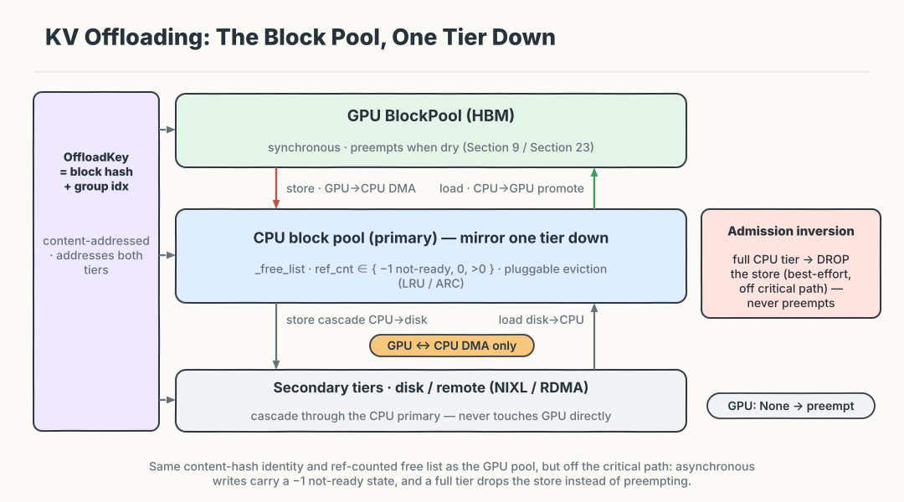</a>

<p class='figure-caption'>KV offloading rebuilds the block pool one tier down with the same content-hash identity and ref-counted free list, but off the critical path — asynchronous writes and best-effort admission that drops work instead of preempting.</p>

**The offload key: reusing the GPU-side content hash as a cross-tier address**

An offloaded block is addressed not by a physical slot number but by *what it contains*. The `OffloadKey` is the same block-content hash the GPU prefix cache computes ([Section 7](#7-prefix-cache-lookup-hashing-longest-hit-and-the-recompute-last-token-rule)), concatenated with the KV-cache group index ([Section 15](#15-the-coordinator-and-hybrid-kv-cache-when-one-block-type-is-not-enough)): the offload-tier analogue of `BlockHashWithGroupId`.

Source anchor — `vllm/v1/kv_offload/base.py:L26-L36`:

```python
# `OffloadKey` identifies an offloaded block. It combines a block hash with
# its KV cache group index, encoded as raw bytes to avoid tuple GC overhead.
# Use the helper functions below to construct / decompose keys.
OffloadKey = NewType("OffloadKey", bytes)

logger = init_logger(__name__)


def make_offload_key(block_hash: bytes, group_idx: int) -> OffloadKey:
    """Pack a block hash and group index into an `OffloadKey`."""
    return OffloadKey(block_hash + group_idx.to_bytes(4, "big", signed=False))
```

The scheduler-side driver derives keys straight from `request.block_hashes` (the append-only Merkle chain of [Section 7](#7-prefix-cache-lookup-hashing-longest-hit-and-the-recompute-last-token-rule)), grouping GPU-block hashes into offload-block units (`vllm/distributed/kv_transfer/kv_connector/v1/offloading/scheduler.py:L275-L289`). Because the key *is* the content hash, a hit in the CPU tier returns the KV that computing that prefix already produced and stored, not a recomputation — the offload tier is not a separate cache with its own coherence problem, it is a spillover extent of the *same* content-addressed cache. This is also why cross-process/cross-instance sharing of a filesystem tier requires a fixed `PYTHONHASHSEED`: the chain seed `NONE_HASH` ([Section 7](#7-prefix-cache-lookup-hashing-longest-hit-and-the-recompute-last-token-rule)) must be deterministic across processes or identical token content produces different keys (`docs/features/kv_offloading_usage.md`, "Cross-Process Sharing").

No fresh identity is minted for offloaded KV. A CPU/disk hit resolves through the same hash as GPU-side prefix reuse, extending [Section 7](#7-prefix-cache-lookup-hashing-longest-hit-and-the-recompute-last-token-rule)'s tenant isolation to tiers below HBM.

### A second block pool, one tier down — with a not-ready state HBM never needed

`CPUOffloadingManager` runs in the scheduler and is, structurally, the [Section 3](#3-kvcacheblock-and-blockpool-the-free-list-is-an-eviction-structure) `BlockPool`: a fixed `_num_blocks` capacity, an integer `_num_allocated_blocks` high-water mark, a `_free_list`, and `_allocate_blocks`/`_free_block` primitives that recycle slot ids forever. What it manages is not GPU `KVCacheBlock`s but `BlockStatus` records — and those carry one field the GPU block does not.

Source anchor — `vllm/v1/kv_offload/cpu/policies/base.py:L20-L33`:

```python
    _fields_ = [("ref_cnt", ctypes.c_int32), ("block_id", ctypes.c_int64)]

    def __init__(self, block_id: int):
        super().__init__()
        # initialize block as "not ready" (ref_cnt = -1)
        self.ref_cnt = -1
        self.block_id = block_id

    @property
    def is_ready(self) -> bool:
        """
        Returns whether the block is ready to be read.
        """
        return self.ref_cnt >= 0
```

A GPU block ([Section 23](#23-the-life-of-a-physical-block-allocate-use-free-cache-evict)) has two live states relevant to allocation — `ref_cnt == 0` (evictable, on the free queue) and `ref_cnt > 0` (in use). The offload block adds a *third*: `ref_cnt == -1`, "allocated a CPU slot but the store DMA has not landed yet." `is_ready` is false until `complete_store` flips `ref_cnt` to `0`. The reason is that offload writes are *asynchronous* (the store is a DMA that completes across scheduler steps) whereas GPU KV is written synchronously by the forward pass within the step that allocated it, so a GPU block is valid the instant it is filled. The `-1` sentinel is the whole difference between a synchronous and an asynchronous tier.

A block that is mid-write is invisible to readers: `lookup` returns `HIT_PENDING` rather than `HIT` for a not-ready block (`vllm/v1/kv_offload/cpu/manager.py:L127-L132`), and `prepare_load` asserts `block.is_ready`. This prevents promoting garbage — the DMA source of a load can never be a slot whose store is still in flight.

The ref-count machinery on the read side mirrors [Section 23](#23-the-life-of-a-physical-block-allocate-use-free-cache-evict)'s `touch`/`free_blocks` exactly. `prepare_load` pins each source block against eviction before a promotion DMA is issued:

Source anchor — `vllm/v1/kv_offload/cpu/manager.py:L145-L149`:

```python
            if block.ref_cnt == 0:
                self._policy.mark_non_evictable(key)
                self._num_evictable_cache_blocks -= 1  # ref_cnt 0 -> 1
                assert self._num_evictable_cache_blocks >= 0
            block.ref_cnt += 1
```

`complete_load` reverses it (`ref_cnt -= 1`; at `0`, `mark_evictable`). This is the offload-tier restatement of the [Section 23](#23-the-life-of-a-physical-block-allocate-use-free-cache-evict) rule that a block acting as the *source* of an in-flight transfer must not be reclaimed underneath the copy — here the transfer is a CPU→GPU promotion instead of a GPU-internal share, but the guard is identical.

**The admission inversion: offloading drops work, it never preempts**

Here is the one place the mirror breaks on purpose. When `allocate_slots` cannot find GPU blocks, it returns `None` and the scheduler *preempts or defers* a request ([Section 9](#9-allocate_slots-is-a-policy-stack-not-an-allocation)): the GPU pool is critical for correctness. When the CPU tier cannot make room for a store, it also returns `None`, but that `None` means "skip this store and keep serving."

Source anchor — `vllm/v1/kv_offload/cpu/manager.py:L191-L197`:

```python
        num_blocks_to_evict = len(keys_to_store) - self._get_num_free_blocks()

        to_evict: list[OffloadKey] = []
        if num_blocks_to_evict > 0:
            if num_blocks_to_evict > self._num_evictable_cache_blocks:
                # Eviction will fail.
                return None
```

`prepare_store` computes how many CPU blocks must be evicted to fit the new stores. If more must be evicted than are *evictable* (`ref_cnt == 0` — the pinned load sources are off-limits), it bails with `None`. The caller treats that as a no-op: the KV simply stays only in HBM, and if it is later evicted from HBM it is recomputed. The store path also filters keys already present (`self._policy.get(k) is None`) and, on `complete_store(success=False)`, removes and frees the half-written slots so a failed DMA leaves no phantom entry (`vllm/v1/kv_offload/cpu/manager.py:L259-L264`).

Offloading is strictly best-effort and off the critical path. A saturated CPU tier degrades hit rate but never stalls, preempts, or blocks a request. This is the architectural reason the offload pool can afford a coarser, lazier eviction policy than the GPU pool: nothing downstream depends on a store succeeding.

Eviction ordering is a pluggable `CachePolicy` (`lru` default, or `arc`) rather than [Section 3](#3-kvcacheblock-and-blockpool-the-free-list-is-an-eviction-structure)'s hand-rolled intrusive free queue. `LRUCachePolicy` keeps a dedicated `evictable_blocks` `OrderedDict` and, on `evict`, walks it front-to-back skipping any key in the `protected` set, atomically returning `None` if it cannot satisfy the full count (`vllm/v1/kv_offload/cpu/policies/lru.py:L54-L77`). The `protected` set is exactly the keys being stored this batch: a block already resident must survive its own restore.

### Coarser blocks below, and the alignment they force

The offload tier can use a *larger* block than the GPU, amortizing per-block bookkeeping and DMA setup over more tokens. The size relation is a config-driven integer factor.

Source anchor — `vllm/v1/kv_offload/base.py:L540-L555`:

```python
        # offloaded_block_size / gpu_block_size
        self.block_size_factor: int = 1

        offloaded_block_size = self.extra_config.get("block_size")
        if offloaded_block_size is not None:
            offloaded_block_size_int = int(offloaded_block_size)
            gpu_block_sizes = set(self.gpu_block_size)
            assert len(gpu_block_sizes) == 1, (
                "If 'block_size' is specified in kv_connector_extra_config, "
                "there must be at least one KV cache group, "
                "and all groups must have the same block size."
            )
            gpu_block_size = gpu_block_sizes.pop()

            assert offloaded_block_size_int % gpu_block_size == 0
            self.block_size_factor = offloaded_block_size_int // gpu_block_size
```

`offloaded_block_size` must be a whole multiple of the GPU block size ([Section 4](#4-where-the-blocks-come-from-memory-profiling-num_gpu_blocks-and-kv-cache-config)), so one offloaded block maps to `block_size_factor` contiguous GPU blocks — the offload-tier counterpart of the manager-block-to-kernel-block expansion in [Section 20](#20-from-block-table-to-kernel-slot_mapping-and-the-device-tensors). The consequence surfaces on a partial hit: a GPU load may need to *start inside* an offloaded block. `GPULoadStoreSpec` therefore carries `block_indices` ("the block index of the first block in group #i") so the worker can "correctly skip part of the first matching offloaded block" (`vllm/v1/kv_offload/base.py:L367-L374`).

The coarser CPU granularity never forces GPU blocks to realign. The load/store spec carries enough per-group index information for the worker to slice an offloaded block at a GPU-block boundary, so [Section 20](#20-from-block-table-to-kernel-slot_mapping-and-the-device-tensors)'s block table stays in clean kernel-block units regardless of the offload block size.

### Plugging into `allocate_slots`: the external-tokens contract, backed by a local tier

Offloading reaches the KV cache manager through the connector contract of [Section 11](#11-connector-aware-allocation-external-kv-delay_cache_blocks-and-pd-disaggregation), not through any new `allocate_slots` argument. Two hooks matter.

On the *lookup* side, `get_num_new_matched_tokens` scans the offload tiers for a hit beyond what HBM already holds and returns that count, which the scheduler folds into `num_external_computed_tokens` through the same local+external fold [Section 11](#11-connector-aware-allocation-external-kv-delay_cache_blocks-and-pd-disaggregation) covers (`scheduler.py:L759-L762`, `num_computed_tokens = num_new_local_computed_tokens + num_external_computed_tokens`): no new arithmetic is introduced here.

The connector returns `(num_hit_tokens, bool(num_hit_tokens))` — the second element flags that the load is *asynchronous* (`scheduler.py:L747`), so the scheduler allocates the destination blocks but runs no compute on them this step. Two guards echo earlier sections. A request with in-flight transfers is deferred rather than re-looked-up (returning `None, False`), which the scheduler treats exactly like a not-yet-ready connector match:

Source anchor — `vllm/distributed/kv_transfer/kv_connector/v1/offloading/scheduler.py:L718-L723`:

```python
        if req_status.transfer_jobs:
            logger.debug(
                "Delaying request %s since it still has in-flight transfers",
                request.request_id,
            )
            return None, False
```

And `skip_reading_prefix_cache` short-circuits the offload lookup to zero (`scheduler.py:L729-L730`), the same prompt-logprobs/pooling guard that disables GPU prefix reuse in [Section 7](#7-prefix-cache-lookup-hashing-longest-hit-and-the-recompute-last-token-rule) — a request that must recompute per-token outputs must not be handed reused KV from *any* tier.

On the *commit* side, `update_state_after_alloc` receives the freshly allocated GPU blocks and wires the promotion: it pins the CPU sources with `prepare_load` and names the GPU destinations in a `GPULoadStoreSpec`.

Source anchor — `vllm/distributed/kv_transfer/kv_connector/v1/offloading/scheduler.py:L823-L826`:

```python
        src_spec = self.manager.prepare_load(keys_to_load, req_status.req_context)
        dst_spec = GPULoadStoreSpec(
            dst_block_ids, group_sizes=group_sizes, block_indices=block_indices
        )
```

GPU `allocate_slots` reserves the destination; the offload manager pins the source; only then does the worker DMA source→dest. This is the offload-tier analogue of [Section 15](#15-the-coordinator-and-hybrid-kv-cache-when-one-block-type-is-not-enough)'s two-phase touch-before-allocate: the source is made non-evictable *before* the destination is handed to the worker, so a concurrent eviction cannot reclaim the block being promoted.

### Per-type reuse geometry, reproduced in the offload lookup

The offload manager cannot just match a flat prefix — it must reproduce the exact per-attention-type reuse rules the `SingleTypeKVCacheManager` family enforces ([Section 16](#16-per-type-block-math-sliding-window-mamba-and-chunked-local-attention)), because a hit has to be loadable into that type's block layout. So `_lookup` runs a full-attention **prefix** scan (`_maximal_prefix_lookup`, front-to-back, stop at first miss) and a sliding-window **suffix** scan (`_sliding_window_lookup`, back-to-front, requiring a contiguous window's worth of consecutive hits), then iterates to a fixed point when one group tightens another's bound — the offload-tier echo of the hybrid coordinator's monotonic-shrink loop ([Section 15](#15-the-coordinator-and-hybrid-kv-cache-when-one-block-type-is-not-enough)). It reproduces the recompute-last-token reduction, but only for its sliding-window groups (`…/offloading/scheduler.py:L519-L523`, guarded by `if self._sliding_window_groups:`); a full-attention-only model takes no reduction in this offload-lookup function:

Source anchor — `vllm/distributed/kv_transfer/kv_connector/v1/offloading/scheduler.py:L519-L523`:

```python
        if self._sliding_window_groups:
            # the last prompt token has to be recomputed to get the logprobs
            # for sliding window attention, we must reduce by 1 to make sure
            # we still have a hit after reduction
            max_hit_size_tokens -= 1
```

The offload tier never advertises a hit the GPU block layout could not consume. Full-attention hits are block-aligned prefixes; sliding-window hits are contiguous windows; Mamba hits are rounded down to the align size (`round_down(..., self._mamba_align_size)`). A promotion always lands in a legal per-type geometry, so [Section 16](#16-per-type-block-math-sliding-window-mamba-and-chunked-local-attention)'s admission math holds tier-independently.

### Tiering: the CPU primary is the only GPU-adjacent tier

The `TieringOffloadingSpec` (selected by `spec_name`, registered in `vllm/v1/kv_offload/factory.py:L69-L73`) adds secondary tiers below the CPU primary — filesystem, or a remote peer over NIXL/RDMA. The topology constraint is strict.

Source anchor — `vllm/v1/kv_offload/tiering/base.py:L94-L98`:

```python
    Secondary tiers cannot directly access GPU memory. All data transfers
    must go through the CPU (primary) tier:
      - Store: GPU → CPU (primary) → secondary  (cascade)
      - Load:  secondary → CPU (primary) → GPU  (promotion)
```

Only the CPU tier owns pinned host memory that a GPU DMA can reach. A disk or remote hit is first staged into a CPU slot, then promoted GPU-ward; a store cascades GPU→CPU→disk. The GPU-facing transfer itself is a copy-engine DMA — for GPU→CPU the worker deliberately picks the dedicated copy engine over a Triton kernel ("GPU->CPU is bandwidth-bound; the dedicated copy engine beats Triton", `vllm/v1/kv_offload/cpu/gpu_worker.py:L40-L42`), issued on separate, per-transfer CUDA streams (`vllm/v1/kv_offload/cpu/gpu_worker.py:L170-171`: "Each transfer uses a unique CUDA stream, and its stream will start executing only after the streams of previous transfers have finished"). That these transfers overlap the forward pass is an inference from the per-transfer-stream design, not text present at any doc cite.

The GPU only ever transfers to/from one pinned CPU region, regardless of how many tiers sit below it. The complexity of disk sharding or RDMA sessions is entirely contained beneath the CPU primary, keeping the HBM-facing path uniform and the [Section 20](#20-from-block-table-to-kernel-slot_mapping-and-the-device-tensors) kernel-side layout untouched.

**Policy knobs: deciding what is worth the DMA**

Because the slower tier is finite and each transfer costs bandwidth, several admission gates decide what descends. `store_threshold`, when set to N ≥ 2 (the default of 0 disables the filter), requires a block to be *seen* N times before it is offloaded, so one-shot prefixes skip the DMA (`manager.py:L176-L179`). `offload_prompt_only` (default `true`) skips decode-phase KV, useful when generated tokens are discarded between turns (`base.py:L506-L512`). A per-request `max_offload_tokens` caps how much of a request is eligible. And `OffloadPolicy` chooses whether prefix-hit blocks are re-offloaded:

Source anchor — `vllm/v1/kv_offload/base.py:L64-L71`:

```python
class OffloadPolicy(Enum):
    # Offload only newly-computed blocks as they arrive; prefix-hit
    # blocks (already offloaded by a prior request) are skipped.
    BLOCK_LEVEL = "block_level"
    # Offload all blocks for the request, including prefix hits.
    # Used by tiers that need the complete KV context for a request.
    REQUEST_LEVEL = "request_level"
```

Under `BLOCK_LEVEL`, `next_stored_block_idx` is advanced past a request's prefix-hit blocks so they are not redundantly re-stored (`scheduler.py:L820-L821`); `REQUEST_LEVEL` keeps it at `0` so a tier that needs a request's *complete* context (e.g. a P/D peer) gets every block. The knob lets each tier trade store amplification against completeness without touching the shared block-hash identity.

## 25. Observability: Prefix-Cache Stats and KV Cache Events

The manager exposes three independent observability channels: prefix-hit accounting, structural KV-cache events, and sampled block-residency metrics. Each has its own producer and consumer, but all use **drain-and-replace snapshots** so an observation is emitted once.

The three channels are:

1. **Prefix-cache hit accounting** — per-request `(queries=tokens, hits=tokens)` counts, aggregated into a bounded sliding-window hit rate plus monotonic Prometheus counters. Internal.
2. **KV cache events** — structural `BlockStored` / `BlockRemoved` / `AllBlocksCleared` records emitted from the block pool, batched, and published over ZMQ to *external* KV routers.
3. **KV residency metrics** — sampled per-block lifetime / idle / reuse-gap histograms, off by default.

<a href='images/vllm-06-24-metrics-events.svg' target='_blank'>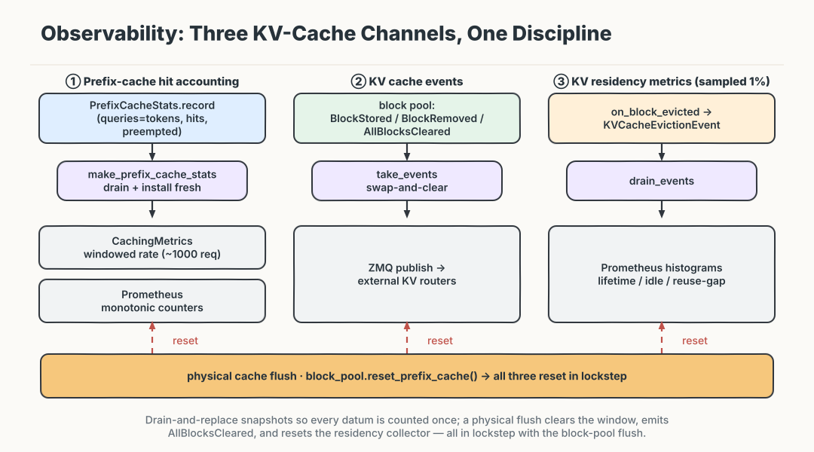</a>

<p class='figure-caption'>The three KV-cache observability channels: hit-rate accounting (internal → text log + Prometheus counters), structural KV events (block pool → ZMQ → external routers), and sampled residency histograms — each draining through a snapshot-and-replace primitive.</p>

### Prefix-cache hit accounting: token-denominated, preemption-quarantined

The per-interval accumulator that answers "how many tokens did requests query against the prefix cache this interval, and how many hit." It is a `dataclass`, not a metric object — it holds raw counts that downstream consumers reshape.

Source anchor: [`vllm/v1/metrics/stats.py:131-142`](https://github.com/vllm-project/vllm/blob/6cf7b26bd4bff60bf378e1af14044280ac0d214c/vllm/v1/metrics/stats.py#L131-L142).

```python
# vllm/v1/metrics/stats.py:131-142
    def record(self, num_tokens: int, num_hits: int, preempted: bool) -> None:
        """Aggregate request information into the stats."""
        if preempted:
            # Previously preempted request
            self.preempted_requests += 1
            self.preempted_queries += num_tokens
            self.preempted_hits += num_hits
        else:
            # New request
            self.requests += 1
            self.queries += num_tokens
            self.hits += num_hits
```

`record` routes each request into one of two disjoint bucket sets, keyed on `preempted`. `num_tokens` is the whole request's token count, the *denominator*, and `num_hits` is the number of prefix tokens matched. A request that was previously preempted (`request.num_preemptions > 0`) is accounted entirely in the `preempted_*` buckets and is deliberately kept out of the primary `requests` / `queries` / `hits`. The base fields carry a comment ([`stats.py:118-119`](https://github.com/vllm-project/vllm/blob/6cf7b26bd4bff60bf378e1af14044280ac0d214c/vllm/v1/metrics/stats.py#L118-L119)) making the unit explicit: "`queries`: Refers to the number of tokens that were queried."

The split keeps **hit accounting token-denominated** and quarantines preemption requeries. When vLLM V1 preempts by recompute (it no longer swaps KV to host — see [Section 10](#10-the-scheduler-contract-how-scheduling-drives-the-kv-cache-manager), and [Section 13](#13-under-pressure-preemption-recomputation-and-reclaiming-blocks) for the recompute-vs-swap policy), a preempted request will re-hit exactly the prefix it just gave up. Folding that trivial re-hit into the primary counters would inflate the reported hit rate toward 100% under memory pressure: precisely when the operator most needs an honest number. The split keeps the primary rate a measure of *cross-request* prefix reuse.

There are exactly two internal call sites, and they feed the same object. The normal path records inside the LOOKUP method ([Section 7](#7-prefix-cache-lookup-hashing-longest-hit-and-the-recompute-last-token-rule), not re-explained here) — [`vllm/v1/core/kv_cache_manager.py:234-242`](https://github.com/vllm-project/vllm/blob/6cf7b26bd4bff60bf378e1af14044280ac0d214c/vllm/v1/core/kv_cache_manager.py#L234-L242):

```python
# vllm/v1/core/kv_cache_manager.py:234-242
        if self.log_stats:
            assert self.prefix_cache_stats is not None
            self.prefix_cache_stats.record(
                num_tokens=request.num_tokens,
                num_hits=num_new_computed_tokens,
                preempted=request.num_preemptions > 0,
            )

        return self.create_kv_cache_blocks(computed_blocks), num_new_computed_tokens
```

The second site lives in the hybrid/Mamba branch of the scheduler, where the hit length is computed by the scheduler itself rather than returned from `get_computed_blocks` (this is the coordinator + hybrid-groups path, [Section 15](#15-the-coordinator-and-hybrid-kv-cache-when-one-block-type-is-not-enough)) — [`vllm/v1/core/sched/scheduler.py:716-722`](https://github.com/vllm-project/vllm/blob/6cf7b26bd4bff60bf378e1af14044280ac0d214c/vllm/v1/core/sched/scheduler.py#L716-L722):

```python
# vllm/v1/core/sched/scheduler.py:716-722
                        if self.kv_cache_manager.log_stats:
                            assert self.kv_cache_manager.prefix_cache_stats is not None
                            self.kv_cache_manager.prefix_cache_stats.record(
                                num_tokens=request.num_tokens,
                                num_hits=num_new_local_computed_tokens,
                                preempted=request.num_preemptions > 0,
                            )
```

Both sites guard on `log_stats` and assert the accumulator is non-`None` before touching it. That is not defensive noise: the accumulator is created *iff* logging is on — [`vllm/v1/core/kv_cache_manager.py:141`](https://github.com/vllm-project/vllm/blob/6cf7b26bd4bff60bf378e1af14044280ac0d214c/vllm/v1/core/kv_cache_manager.py#L141):

```python
# vllm/v1/core/kv_cache_manager.py:141
        self.prefix_cache_stats = PrefixCacheStats() if log_stats else None
```

`prefix_cache_stats is None ⇔ log_stats is False`, and every `record` is dominated by that assertion, so the two are structurally consistent — you cannot record into a disabled channel.

A third, *parallel* accumulator counts externally fetched tokens via a KV connector (the P/D-disaggregation / offloading path, [Section 11](#11-connector-aware-allocation-external-kv-delay_cache_blocks-and-pd-disaggregation)/[Section 24](#24-kv-offloading-cpu-backed-and-tiered-kv-cache)). It is a separate `PrefixCacheStats` on the scheduler, recorded only when there is something to record — [`vllm/v1/core/sched/scheduler.py:940-948`](https://github.com/vllm-project/vllm/blob/6cf7b26bd4bff60bf378e1af14044280ac0d214c/vllm/v1/core/sched/scheduler.py#L940-L948):

```python
# vllm/v1/core/sched/scheduler.py:940-948
                    if (
                        self.connector_prefix_cache_stats is not None
                        and connector_prefix_cache_queries != 0
                    ):
                        self.connector_prefix_cache_stats.record(
                            num_tokens=connector_prefix_cache_queries,
                            num_hits=connector_prefix_cache_hits,
                            preempted=request.num_preemptions > 0,
                        )
```

External-cache hits are never mixed into local prefix-cache accounting, and the `!= 0` guard means idle connector steps append no empty updates (which matters for the sliding window, below).

### The sliding-window hit rate: `CachingMetrics`

The logged "Prefix cache hit rate" should reflect *recent* behavior, not a lifetime average that a long-running server would freeze. `CachingMetrics` is a bounded moving window — default 1000 requests.

Source anchor: [`vllm/v1/metrics/stats.py:54-92`](https://github.com/vllm-project/vllm/blob/6cf7b26bd4bff60bf378e1af14044280ac0d214c/vllm/v1/metrics/stats.py#L54-L92).

```python
# vllm/v1/metrics/stats.py:54-92
    def observe(self, stats: BaseCacheStats):
        ...
        # reset_prefix_cache was invoked before the current update.
        # Reset the metrics before aggregating the current stats.
        if stats.reset:
            self.reset()

        # DO NOT appending empty stats to avoid helpful info get kicked out
        # due to sliding window.
        if stats.requests == 0:
            return

        # Update the metrics.
        self.query_queue.append((stats.requests, stats.queries, stats.hits))
        self.aggregated_requests += stats.requests
        self.aggregated_query_total += stats.queries
        self.aggregated_query_hit += stats.hits

        # Remove the oldest stats until number of requests does not exceed
        # the limit.
        # NOTE: We preserve the latest added stats regardless.
        while (
            len(self.query_queue) > 1
            and self.aggregated_requests > self.max_recent_requests
        ):
            old_requests, old_queries, old_hits = self.query_queue.popleft()
            self.aggregated_requests -= old_requests
            self.aggregated_query_total -= old_queries
            self.aggregated_query_hit -= old_hits
```

`observe` first honors the `reset` flag by fully clearing the window (`reset()`, [`stats.py:94-99`](https://github.com/vllm-project/vllm/blob/6cf7b26bd4bff60bf378e1af14044280ac0d214c/vllm/v1/metrics/stats.py#L94-L99)). Then it drops empty updates *before* enqueue — so a burst of idle logging intervals cannot flush useful history out of the deque. It appends the new `(requests, queries, hits)` triple, then evicts from the front while the aggregated *request* count exceeds `max_recent_requests` — but the `len(self.query_queue) > 1` guard keeps the most recent entry even if it alone exceeds the window. The rate itself is token-weighted ([`stats.py:106-111`](https://github.com/vllm-project/vllm/blob/6cf7b26bd4bff60bf378e1af14044280ac0d214c/vllm/v1/metrics/stats.py#L106-L111)): `aggregated_query_hit / aggregated_query_total`, guarded against divide-by-zero.

**Snapshot-and-reset: the drain primitive**

Every logging step must read the accumulator *and* zero it, atomically, so no interval double-counts. That is `make_prefix_cache_stats` — [`vllm/v1/core/kv_cache_manager.py:190-200`](https://github.com/vllm-project/vllm/blob/6cf7b26bd4bff60bf378e1af14044280ac0d214c/vllm/v1/core/kv_cache_manager.py#L190-L200):

```python
# vllm/v1/core/kv_cache_manager.py:190-200
    def make_prefix_cache_stats(self) -> PrefixCacheStats | None:
        """Get (and reset) the prefix cache stats.

        Returns:
            The current prefix caching stats, or None if logging is disabled.
        """
        if not self.log_stats:
            return None
        stats = self.prefix_cache_stats
        self.prefix_cache_stats = PrefixCacheStats()
        return stats
```

The `reset` flag that `CachingMetrics.observe` keys on is planted by `reset_prefix_cache`, but only if the *physical* block-pool flush succeeded — [`vllm/v1/core/kv_cache_manager.py:515-529`](https://github.com/vllm-project/vllm/blob/6cf7b26bd4bff60bf378e1af14044280ac0d214c/vllm/v1/core/kv_cache_manager.py#L515-L529):

```python
# vllm/v1/core/kv_cache_manager.py:524-529
        if not self.block_pool.reset_prefix_cache():
            return False
        if self.log_stats:
            assert self.prefix_cache_stats is not None
            self.prefix_cache_stats.reset = True
        return True
```

`make_prefix_cache_stats` hands out the live accumulator and installs a fresh empty one in the same expression pair: a hand-off, not a copy. `reset_prefix_cache` sets `reset=True` on the *not-yet-drained* accumulator, so the flag rides along to the next snapshot and then into `observe`, which clears the window. Crucially the flag is set only after `block_pool.reset_prefix_cache()` returns `True`.

Each `PrefixCacheStats` instance is observed once. The metrics window resets only after the corresponding cache flush succeeds, not when a flush is refused because blocks remain in use.

The scheduler ties both accumulators and the residency channel together per step, in `make_stats` — [`vllm/v1/core/sched/scheduler.py:2293-2303`](https://github.com/vllm-project/vllm/blob/6cf7b26bd4bff60bf378e1af14044280ac0d214c/vllm/v1/core/sched/scheduler.py#L2293-L2303):

```python
# vllm/v1/core/sched/scheduler.py:2293-2303
        prefix_cache_stats = self.kv_cache_manager.make_prefix_cache_stats()
        assert prefix_cache_stats is not None
        connector_prefix_cache_stats: PrefixCacheStats | None = None
        if self.connector_prefix_cache_stats is not None:
            connector_prefix_cache_stats = self.connector_prefix_cache_stats
            self.connector_prefix_cache_stats = PrefixCacheStats()
        eviction_events = (
            self.kv_metrics_collector.drain_events()
            if self.kv_metrics_collector is not None
            else []
        )
```

All three are drain-and-replace: the local stats via `make_prefix_cache_stats`, the connector stats via a manual swap, the residency events via `drain_events`. They are packed into a `SchedulerStats` and shipped to the loggers. Note the top guard `if not self.log_stats: return None` ([`scheduler.py:2291-2292`](https://github.com/vllm-project/vllm/blob/6cf7b26bd4bff60bf378e1af14044280ac0d214c/vllm/v1/core/sched/scheduler.py#L2291-L2292)): no `SchedulerStats` is even built when logging is off.

The same `SchedulerStats` snapshot feeds two differently shaped consumers: the text logger reports a *windowed rate*, while Prometheus exports *monotonic lifetime counters*.

Text logger — [`vllm/v1/metrics/loggers.py:250-271`](https://github.com/vllm-project/vllm/blob/6cf7b26bd4bff60bf378e1af14044280ac0d214c/vllm/v1/metrics/loggers.py#L250-L271):

```python
# vllm/v1/metrics/loggers.py:250-261
        log_parts.extend(
            [
                "GPU KV cache usage: %.1f%%",
                "Prefix cache hit rate: %.1f%%",
            ]
        )
        log_args.extend(
            [
                self.last_scheduler_stats.kv_cache_usage * 100,
                self.prefix_caching_metrics.hit_rate * 100,
            ]
        )
```

The connector and multimodal lines are appended only when their windows are non-empty ([`loggers.py:266-271`](https://github.com/vllm-project/vllm/blob/6cf7b26bd4bff60bf378e1af14044280ac0d214c/vllm/v1/metrics/loggers.py#L266-L271)), using the `CachingMetrics.empty` property — so a run without a connector never prints a misleading `0.0%` external-cache line.

Prometheus — [`vllm/v1/metrics/loggers.py:1088-1101`](https://github.com/vllm-project/vllm/blob/6cf7b26bd4bff60bf378e1af14044280ac0d214c/vllm/v1/metrics/loggers.py#L1088-L1101):

```python
# vllm/v1/metrics/loggers.py:1088-1101
            self.counter_prefix_cache_queries[engine_idx].inc(
                scheduler_stats.prefix_cache_stats.queries
            )
            self.counter_prefix_cache_hits[engine_idx].inc(
                scheduler_stats.prefix_cache_stats.hits
            )

            if scheduler_stats.connector_prefix_cache_stats is not None:
                self.counter_connector_prefix_cache_queries[engine_idx].inc(
                    scheduler_stats.connector_prefix_cache_stats.queries
                )
                self.counter_connector_prefix_cache_hits[engine_idx].inc(
                    scheduler_stats.connector_prefix_cache_stats.hits
                )
```

The text sink reads the *aggregated rate* from `CachingMetrics.hit_rate`; the Prometheus sink `.inc()`s raw `queries` and `hits` into monotonic counters (`vllm:prefix_cache_queries` / `vllm:prefix_cache_hits`, and `vllm:external_prefix_cache_queries` / `..._hits` for the connector — [`loggers.py:548-559,571-584`](https://github.com/vllm-project/vllm/blob/6cf7b26bd4bff60bf378e1af14044280ac0d214c/vllm/v1/metrics/loggers.py#L548-L559)). A dashboard reconstructs the rate downstream as `rate(hits) / rate(queries)`, the standard Prometheus counter idiom ([prometheus.io](https://prometheus.io/docs/concepts/metric_types/#counter)).

Windowing exists only in the text logger; Prometheus remains a counter. The sinks can therefore use different time ranges (a 1000-request average versus the query's range) while deriving from the same once-drained `queries` and `hits`.

### KV cache events: the external contract

Channel 2 is not for the local operator — it is for an *out-of-process* KV router that decides which engine holds a given prefix. That router must be able to reconstruct vLLM's block-hash chain without shared memory, so the event schema carries everything needed to do so.

Source anchor: [`vllm/distributed/kv_events.py:49-74`](https://github.com/vllm-project/vllm/blob/6cf7b26bd4bff60bf378e1af14044280ac0d214c/vllm/distributed/kv_events.py#L49-L74).

```python
# vllm/distributed/kv_events.py:49-74
class BlockStored(KVCacheEvent):
    block_hashes: list[ExternalBlockHash]
    parent_block_hash: ExternalBlockHash | None
    token_ids: list[int]
    block_size: int

    lora_id: int | None
    ...
    medium: str | None
    lora_name: str | None

    extra_keys: list[tuple[Any, ...] | None] | None = None
    """Extra keys used in block hash computation, one entry per block in
    block_hashes. ... Exposed for external
    KV cache consumers to reconstruct block hashes.
    """

    group_idx: int | None = None
    # Store events carry cache-spec metadata so consumers can classify and
    # filter groups as they are learned. Remove events only need group_idx+hash.
    kv_cache_spec_kind: str | None = None
    kv_cache_spec_sliding_window: int | None = None
```

A `BlockStored` carries the block hashes, the `parent_block_hash` linking to the preceding block (so the consumer can rebuild the prefix tree edge-by-edge), the raw `token_ids`, the `block_size`, LoRA identity, a `medium` tier ("GPU"/"CPU"), per-block `extra_keys`, and `group_idx` + spec metadata for multi-group hybrid caches. The docstring is explicit that `extra_keys` exists "so external KV cache consumers [can] reconstruct block hashes." `BlockRemoved` is minimal — hashes + medium + group ([`kv_events.py:93-96`](https://github.com/vllm-project/vllm/blob/6cf7b26bd4bff60bf378e1af14044280ac0d214c/vllm/distributed/kv_events.py#L93-L96)) — because a consumer only needs to invalidate; `AllBlocksCleared` is a bare flush signal ([`kv_events.py:108-109`](https://github.com/vllm-project/vllm/blob/6cf7b26bd4bff60bf378e1af14044280ac0d214c/vllm/distributed/kv_events.py#L108-L109)). The batch is a tagged union: `KVEventBatch.events: list[BlockStored | BlockRemoved | AllBlocksCleared]` ([`kv_events.py:112-113`](https://github.com/vllm-project/vllm/blob/6cf7b26bd4bff60bf378e1af14044280ac0d214c/vllm/distributed/kv_events.py#L112-L113)), decodable via `tag=True` on the base struct.

The wire form of a hash is env-controlled — [`vllm/v1/core/kv_cache_utils.py:79-82`](https://github.com/vllm-project/vllm/blob/6cf7b26bd4bff60bf378e1af14044280ac0d214c/vllm/v1/core/kv_cache_utils.py#L79-L82):

```python
# vllm/v1/core/kv_cache_utils.py:79-82
def maybe_convert_block_hash(hash_bytes: BlockHash) -> ExternalBlockHash:
    if not envs.VLLM_KV_EVENTS_USE_INT_BLOCK_HASHES:
        return hash_bytes
    return int.from_bytes(hash_bytes, byteorder="big") & ((1 << 64) - 1)
```

Producer and consumer must use the same `VLLM_KV_EVENTS_USE_INT_BLOCK_HASHES` setting (raw bytes versus a 64-bit-truncated integer), or reconstructed hashes will not match. `extra_keys` and the spec fields let the router mirror the prefix tree deterministically; the local pool does not otherwise need them.

**Emission mirrors the hash map**

An external mirror is only correct if *every* insert into `cached_block_hash_to_block` produces a `BlockStored` and *every* removal produces a `BlockRemoved`. The events are emitted from inside the same WRITE and eviction paths this article already covered — here only the emission tail matters. In `cache_full_blocks` (WRITE path, [Section 8](#8-the-prefix-cache-write-path-cache_full_blocks-and-committing-a-hash)) — [`vllm/v1/core/block_pool.py:340-356`](https://github.com/vllm-project/vllm/blob/6cf7b26bd4bff60bf378e1af14044280ac0d214c/vllm/v1/core/block_pool.py#L340-L356):

```python
# vllm/v1/core/block_pool.py:340-356
            self.kv_event_queue.append(
                BlockStored(
                    block_hashes=new_hashes,
                    parent_block_hash=parent_block_hash,
                    token_ids=request.all_token_ids[start_token_idx:end_token_idx],
                    block_size=block_size,
                    lora_id=request.lora_request.adapter_id
                    if request.lora_request
                    else None,
                    medium=MEDIUM_GPU,
                    lora_name=request.lora_request.name
                    if request.lora_request
                    else None,
                    extra_keys=extra_keys_list if extra_keys_list else None,
                    group_idx=kv_cache_group_id,
                )
            )
```

Note the parallel `new_hashes` list is only materialized when events are on — [`vllm/v1/core/block_pool.py:277-279`](https://github.com/vllm-project/vllm/blob/6cf7b26bd4bff60bf378e1af14044280ac0d214c/vllm/v1/core/block_pool.py#L277-L279):

```python
# vllm/v1/core/block_pool.py:277-279
        new_hashes: list[ExternalBlockHash] | None = (
            [] if self.enable_kv_cache_events else None
        )
```

Removals flow through one helper used by *every* eviction/promotion path (partial→full promotion, hash replacement, real eviction) — [`vllm/v1/core/block_pool.py:505-518`](https://github.com/vllm-project/vllm/blob/6cf7b26bd4bff60bf378e1af14044280ac0d214c/vllm/v1/core/block_pool.py#L505-L518):

```python
# vllm/v1/core/block_pool.py:505-518
    def _emit_block_removed_events(
        self,
        block_hashes: list[BlockHashWithGroupId],
    ) -> None:
        if not self.enable_kv_cache_events:
            return
        for block_hash in block_hashes:
            self.kv_event_queue.append(
                BlockRemoved(
                    block_hashes=[maybe_convert_block_hash(get_block_hash(block_hash))],
                    medium=MEDIUM_GPU,
                    group_idx=get_group_id(block_hash),
                )
            )
```

`AllBlocksCleared` is enqueued from `reset_prefix_cache` ([`block_pool.py:687-688`](https://github.com/vllm-project/vllm/blob/6cf7b26bd4bff60bf378e1af14044280ac0d214c/vllm/v1/core/block_pool.py#L687-L688)). In this event path, `_emit_block_removed_events` unpacks the group id back out of each `BlockHashWithGroupId` (`get_block_hash` / `get_group_id`, the pack format from [Section 7](#7-prefix-cache-lookup-hashing-longest-hit-and-the-recompute-last-token-rule)) so a remove event carries both the bare hash and its group. Every emission (store, remove, clear, and the `new_hashes` allocation) is short-circuited by the same `enable_kv_cache_events` flag.

Events are emitted at the same points that mutate `cached_block_hash_to_block`, so an external consumer can replay the hash-map insert/delete log without a second bookkeeping path.

### Drain, annotate, publish

The block pool owns a queue; the manager layers *semantic* metadata onto structural events; the scheduler batches and publishes. Pool drain is a swap — [`vllm/v1/core/block_pool.py:713-723`](https://github.com/vllm-project/vllm/blob/6cf7b26bd4bff60bf378e1af14044280ac0d214c/vllm/v1/core/block_pool.py#L713-L723):

```python
# vllm/v1/core/block_pool.py:713-723
    def take_events(self) -> list[KVCacheEvent]:
        """Atomically takes all events and clears the queue.
        ...
        """
        if not self.enable_kv_cache_events:
            return []
        events = self.kv_event_queue
        self.kv_event_queue = []
        return events
```

The manager annotates only `BlockStored` with the group's cache-spec kind and sliding window — [`vllm/v1/core/kv_cache_manager.py:571-589`](https://github.com/vllm-project/vllm/blob/6cf7b26bd4bff60bf378e1af14044280ac0d214c/vllm/v1/core/kv_cache_manager.py#L571-L589):

```python
# vllm/v1/core/kv_cache_manager.py:571-589
        events = self.block_pool.take_events()
        for event in events:
            if not isinstance(event, BlockStored):
                continue
            if event.group_idx is None:
                continue
            if event.group_idx < 0 or event.group_idx >= len(
                self.kv_cache_event_metadata
            ):
                logger.warning(
                    "Group index `%s` not in KV cache metadata", event.group_idx
                )
                continue
            # Annotate here so BlockPool can keep emitting structural cache
            # events without owning semantic KV cache spec metadata.
            kind, sliding_window = self.kv_cache_event_metadata[event.group_idx]
            event.kv_cache_spec_kind = kind
            event.kv_cache_spec_sliding_window = sliding_window
        return events
```

`block_pool.take_events` swaps the queue for a fresh list: an atomic drain, no partial reads. The manager then post-processes, filling `kv_cache_spec_kind` / `kv_cache_spec_sliding_window` from `kv_cache_event_metadata[group_idx]` (built once in the constructor, [`kv_cache_manager.py:164-170`](https://github.com/vllm-project/vllm/blob/6cf7b26bd4bff60bf378e1af14044280ac0d214c/vllm/v1/core/kv_cache_manager.py#L164-L170)). This is a deliberate layering cut: the block pool emits structural events and does not know cache-spec semantics; the manager owns the semantics and stamps them on. An out-of-range group index is logged-and-skipped, never fatal.

The scheduler drains manager + connector events, wraps them in a timestamped batch, and publishes — [`vllm/v1/core/sched/scheduler.py:1809-1824`](https://github.com/vllm-project/vllm/blob/6cf7b26bd4bff60bf378e1af14044280ac0d214c/vllm/v1/core/sched/scheduler.py#L1809-L1824):

```python
# vllm/v1/core/sched/scheduler.py:1809-1824
        # collect KV cache events from KV cache manager
        events = self.kv_cache_manager.take_events()

        # collect KV cache events from connector
        if self.connector is not None:
            connector_events = self.connector.take_events()
            if connector_events:
                if events is None:
                    events = list(connector_events)
                else:
                    events.extend(connector_events)

        # publish collected KV cache events
        if events:
            batch = KVEventBatch(ts=time.time(), events=events)
            self.kv_event_publisher.publish(batch)
```

The publisher is built once at construction (`EventPublisherFactory.create`, [`scheduler.py:154-157`](https://github.com/vllm-project/vllm/blob/6cf7b26bd4bff60bf378e1af14044280ac0d214c/vllm/v1/core/sched/scheduler.py#L154-L157)) with the DP index. For tensor/pipeline-parallel replicas, `KVEventAggregator` ([`kv_events.py:116-153`](https://github.com/vllm-project/vllm/blob/6cf7b26bd4bff60bf378e1af14044280ac0d214c/vllm/distributed/kv_events.py#L116-L153)) emits only events counted from *all* workers (`count == self._num_workers`) so replicas don't multiply events. (Note: the `request.take_events()` calls elsewhere in the scheduler are `EngineCoreEvent` request-lifecycle events — a different channel, not KV block events.)

Swap-and-clear at both pool and manager drains each event once. Only `BlockStored`, the event that teaches the router a key, receives spec annotation; the batch timestamp and DP index support ordering and attribution across the fleet. Empty batches are not published.

### KV residency metrics: sampled lifecycle histograms

Channel 3 answers a different question — *how long do blocks live, and how long do they sit idle before eviction?* It is optional and sampled, because tracking every block would tax the hot allocation path. Config — [`vllm/config/observability.py:48-54`](https://github.com/vllm-project/vllm/blob/6cf7b26bd4bff60bf378e1af14044280ac0d214c/vllm/config/observability.py#L48-L54):

```python
# vllm/config/observability.py:48-54
    kv_cache_metrics: bool = False
    """Enable KV cache residency metrics (lifetime, idle time, reuse gaps).
    Uses sampling to minimize overhead.
    Requires log stats to be enabled (i.e., --disable-log-stats not set)."""

    kv_cache_metrics_sample: float = Field(default=0.01, gt=0, le=1)
    """Sampling rate for KV cache metrics (0.0, 1.0]. Default 0.01 = 1% of blocks."""
```

The collector samples membership at allocation and produces one `KVCacheEvictionEvent` per sampled block at eviction — [`vllm/v1/core/kv_cache_metrics.py:62-86`](https://github.com/vllm-project/vllm/blob/6cf7b26bd4bff60bf378e1af14044280ac0d214c/vllm/v1/core/kv_cache_metrics.py#L62-L86):

```python
# vllm/v1/core/kv_cache_metrics.py:62-86
    def on_block_allocated(self, block: "KVCacheBlock") -> None:
        if self.should_sample_block():
            self.block_metrics[block.block_id] = BlockMetricsState()

    def on_block_accessed(self, block: "KVCacheBlock") -> None:
        metrics = self.block_metrics.get(block.block_id)
        if metrics:
            metrics.record_access()

    def on_block_evicted(self, block: "KVCacheBlock") -> None:
        metrics = self.block_metrics.pop(block.block_id, None)
        if not metrics:
            return

        lifetime = metrics.get_lifetime_seconds()
        idle_time = metrics.get_idle_time_seconds()
        reuse_gaps = tuple(metrics.get_reuse_gaps_seconds())

        self._eviction_events.append(
            KVCacheEvictionEvent(
                lifetime_seconds=lifetime,
                idle_seconds=idle_time,
                reuse_gaps_seconds=reuse_gaps,
            )
        )
```

The three hooks live in the block lifecycle methods this article already covered — `on_block_allocated` in `get_new_blocks` ([`block_pool.py:564-565,570-571`](https://github.com/vllm-project/vllm/blob/6cf7b26bd4bff60bf378e1af14044280ac0d214c/vllm/v1/core/block_pool.py#L564-L565)), `on_block_accessed` in `touch` ([`block_pool.py:611-612`](https://github.com/vllm-project/vllm/blob/6cf7b26bd4bff60bf378e1af14044280ac0d214c/vllm/v1/core/block_pool.py#L611-L612)), and `on_block_evicted` first thing in `_maybe_evict_cached_block` ([`block_pool.py:585-587`](https://github.com/vllm-project/vllm/blob/6cf7b26bd4bff60bf378e1af14044280ac0d214c/vllm/v1/core/block_pool.py#L585-L587), "Clean up metrics tracking first to prevent leaks"). Per-block reuse history is a `deque(maxlen=4)` ([`kv_cache_metrics.py:24`](https://github.com/vllm-project/vllm/blob/6cf7b26bd4bff60bf378e1af14044280ac0d214c/vllm/v1/core/kv_cache_metrics.py#L24)), so at most three reuse gaps per block.

`on_block_allocated` decides membership with `random.random() < sample_rate` — only ~1% of blocks are ever tracked, so `block_metrics` stays bounded. Access and eviction are no-ops for unsampled blocks (`.get` / `.pop` return `None`). Eviction `pop`s the entry (so a sampled block yields exactly one event) and is called *before* the hash removal so tracking cannot leak a block about to lose its identity. The Prometheus sink observes only when events exist — [`vllm/v1/metrics/loggers.py:1116-1128`](https://github.com/vllm-project/vllm/blob/6cf7b26bd4bff60bf378e1af14044280ac0d214c/vllm/v1/metrics/loggers.py#L1116-L1128):

```python
# vllm/v1/metrics/loggers.py:1116-1128
            if (
                self.kv_cache_metrics_enabled
                and scheduler_stats.kv_cache_eviction_events
            ):
                lifetime_hist = self.histogram_kv_block_lifetime[engine_idx]
                idle_hist = self.histogram_kv_block_idle_before_evict[engine_idx]
                reuse_hist = self.histogram_kv_block_reuse_gap[engine_idx]

                for event in scheduler_stats.kv_cache_eviction_events:
                    lifetime_hist.observe(event.lifetime_seconds)
                    idle_hist.observe(event.idle_seconds)
                    for gap in event.reuse_gaps_seconds:
                        reuse_hist.observe(gap)
```

The three histograms (`vllm:kv_block_lifetime_seconds`, `vllm:kv_block_idle_before_evict_seconds`, `vllm:kv_block_reuse_gap_seconds`) are created per engine only when `kv_cache_metrics_enabled`, sharing a residency bucket ladder from 1 ms to 1800 s ([`loggers.py:942-1005`](https://github.com/vllm-project/vllm/blob/6cf7b26bd4bff60bf378e1af14044280ac0d214c/vllm/v1/metrics/loggers.py#L942-L1005)).

Residency samples are produced at eviction for the roughly 1% sampled cohort. A block that remains resident contributes nothing; entries are sampled at `sample_rate` or below and removed on eviction or reset, bounding the tracking dictionary. The histograms therefore describe the *evicted* population at fixed overhead, which is useful for tuning `num_gpu_blocks` and eviction policy rather than auditing every block.

## 26. Tuning the KV Cache: An Operator Guide Grounded in Config

Most operational controls live in `CacheConfig` (`vllm/config/cache.py`), with related settings in `UVAOffloadConfig`, `SpeculativeConfig`, and cross-config validation on `VllmConfig`.

For each knob below, the useful facts are its default, its validator or deprecation path, and the runtime symptom that justifies changing it.

One naming trap first, because it burns everyone. The engine-arg/CLI flag is `--kv-cache-dtype`, but the `CacheConfig` field is `cache_dtype`. The bridge is explicit — `vllm/engine/arg_utils.py:L1165` binds the flag, and `vllm/engine/arg_utils.py:L443` maps it back to the field default:

```python
        cache_group.add_argument("--kv-cache-dtype", **cache_kwargs["cache_dtype"])
```

```python
    kv_cache_dtype: CacheDType = CacheConfig.cache_dtype
```

So any doc that says `kv_cache_dtype` and any config dump that says `cache_dtype` are the same knob. Keep that mapping in mind for every `--x` / `field_y` pair below.

<a href='images/vllm-06-30-tuning.svg' target='_blank'>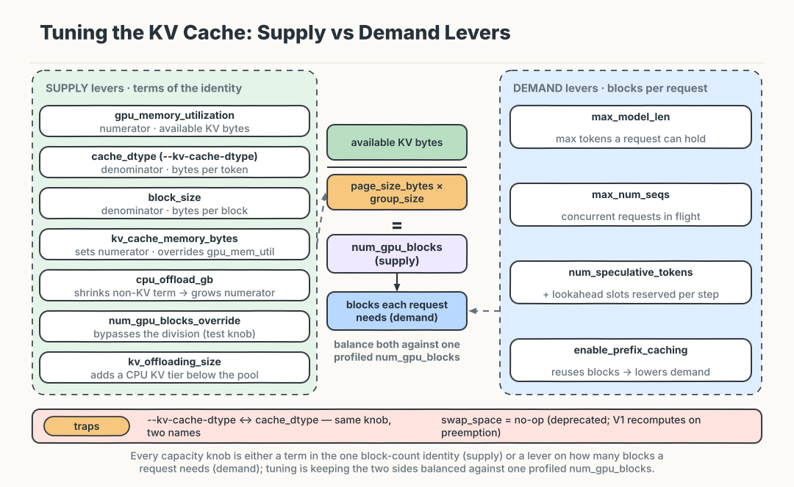</a>

<p class='figure-caption'>the `CacheConfig` knob surface mapped to the machinery it steers — byte budget, bytes-per-block, reuse, and spill — each arrow annotated with the section that covers the mechanism.</p>

**The one identity every capacity knob moves**

Four knobs (`gpu_memory_utilization`, `block_size`, `cache_dtype`, `num_gpu_blocks_override`) terminate in a single arithmetic identity that [Section 4](#4-where-the-blocks-come-from-memory-profiling-num_gpu_blocks-and-kv-cache-config) derives in full: **GPU KV blocks = available KV bytes ÷ bytes-per-block**, unless the override replaces the quotient wholesale. `gpu_memory_utilization` moves the numerator; `block_size` and `cache_dtype` move the denominator; `num_gpu_blocks_override` bypasses the division. That is the mental model to carry into the rest of this section — every knob below is either a term in that identity or a lever on *demand* (how many tokens a request needs) rather than *supply* (how many blocks exist). Read [Section 4](#4-where-the-blocks-come-from-memory-profiling-num_gpu_blocks-and-kv-cache-config) for the byte accounting; here we stay on the config surface.

### `gpu_memory_utilization` — the byte-budget lever

`vllm/config/cache.py:L68-L75`:

```python
    gpu_memory_utilization: float = Field(default=0.92, gt=0, le=1)
    """The fraction of GPU memory to be used for the model executor, which can
    range from 0 to 1. For example, a value of 0.5 would imply 50% GPU memory
    utilization. If unspecified, will use the default value of 0.92. This is a
    per-instance limit, and only applies to the current vLLM instance. It does
    not matter if you have another vLLM instance running on the same GPU. For
    example, if you have two vLLM instances running on the same GPU, you can
    set the GPU memory utilization to 0.5 for each instance."""
```

The Pydantic constraint `gt=0, le=1` bounds it to `(0, 1]`. The docstring's key operator caveat is the *per-instance* semantics: it is the fraction of **total** device memory this instance's whole footprint (weights + activations + CUDA graphs + KV) may occupy — not the fraction reserved for KV, and not coordinated with any co-tenant on the same card. [Section 4](#4-where-the-blocks-come-from-memory-profiling-num_gpu_blocks-and-kv-cache-config) showed the KV budget is only the *residual* after weights, activations, and cudagraph memory are subtracted from `total_memory × gpu_memory_utilization`. So raising this knob enlarges that residual and therefore `num_blocks` — it is the single largest lever on KV capacity, which is exactly why the out-of-memory path names it. `vllm/v1/core/kv_cache_utils.py:L739-L747`:

```python
    if available_memory <= 0:
        raise ValueError(
            "No available memory for the cache blocks. "
            "Try increasing `gpu_memory_utilization` when initializing the engine "
            "(this flag also controls CPU memory reservation on the CPU "
            "backend, despite its name). "
            "See https://docs.vllm.ai/en/latest/configuration/conserving_memory/ "
            "for more details."
        )
```

The stable docs frame the same lever from the preemption side ([Optimization](https://docs.vllm.ai/en/stable/configuration/optimization/), `docs/configuration/optimization.md:L40`): "Increase `gpu_memory_utilization`. vLLM pre-allocates GPU cache using this percentage of memory. By increasing utilization, you can provide more KV cache space." The reciprocal move is to lower *demand* (`max_model_len` / `max_num_seqs`, from the same doc list), not supply.

`gpu_memory_utilization` is a *hard reservation validated against live free memory at boot* ([Section 4](#4-where-the-blocks-come-from-memory-profiling-num_gpu_blocks-and-kv-cache-config)'s snapshot guard), not a hint that silently shrinks. And there is one escape hatch that overrides it entirely: `kv_cache_memory_bytes` (`cache.py:L171-L178`) sets the KV budget as an absolute byte count and, per its own docstring, "(when not-None) ignores `gpu_memory_utilization`" — use it when you need reproducible KV sizing across heterogeneous cards rather than a percentage that resolves to different absolute bytes on each.

### `block_size` — page granularity, and the provenance the allocator trusts

`vllm/config/cache.py:L47-L53`:

```python
    DEFAULT_BLOCK_SIZE: ClassVar[int] = 16

    block_size: int = Field(default=None, gt=0)  # type: ignore[assignment]
    """Size of a contiguous cache block in number of tokens.
    Accepts None (meaning "use default"). After construction, always int."""
    user_specified_block_size: bool = field(default=False, init=False)
    """Whether block_size was explicitly provided. Derived automatically."""
```

The field defaults to `None`, not `16`, and a post-init validator resolves it while recording whether the operator chose it. `vllm/config/cache.py:L247-L260`:

```python
    @model_validator(mode="after")
    def _apply_block_size_default(self) -> "CacheConfig":
        # Pydantic re-runs validators when CacheConfig is nested inside
        # another pydantic model (e.g. VllmConfig). Guard against that.
        if self._block_size_resolved:
            return self
        self._block_size_resolved = True
        if self.block_size is None:
            self.block_size = self.DEFAULT_BLOCK_SIZE
        else:
            self.user_specified_block_size = True
        if self.mamba_block_size is not None:
            self.user_specified_mamba_block_size = True
        return self
```

If unset, `block_size` becomes `16`; if set, `user_specified_block_size` flips to `True`. The `_block_size_resolved` guard makes this idempotent because Pydantic re-runs `mode="after"` validators whenever `CacheConfig` is nested inside `VllmConfig` — without it, the second run would mis-record a defaulted `16` as operator-specified. That provenance bit matters downstream: [Section 4](#4-where-the-blocks-come-from-memory-profiling-num_gpu_blocks-and-kv-cache-config)'s page-size unification picks the *minimum* block size across resolved KV-cache groups, and it must be able to tell an operator's deliberate `8` from an accidental default.

The physical page is linear in this value — [Section 15](#15-the-coordinator-and-hybrid-kv-cache-when-one-block-type-is-not-enough)'s attention page is `2 · block_size · num_kv_heads · head_dim · dtype` — so a larger `block_size` yields *fewer* blocks each covering more tokens (total token capacity roughly invariant), trading finer tail-fragmentation and prefix granularity for shorter block tables and less per-step bookkeeping. Note the prefix-cache key granularity is *decoupled* via `hash_block_size` (`cache.py:L56-L67`): hashes may be computed at a finer boundary "as long as every KV cache group's `block_size` is divisible by it," then merged — so you can keep large physical blocks and still hash at 8-token resolution (see [Section 7](#7-prefix-cache-lookup-hashing-longest-hit-and-the-recompute-last-token-rule) for how the hash chain consumes this).

After construction `block_size` is always a positive `int`, never `None`, and `user_specified_block_size` faithfully records origin — so no downstream alignment code ever confuses a default with a choice.

### `cache_dtype` (`--kv-cache-dtype`) — the bytes-per-token lever

`vllm/config/cache.py:L76-L83`:

```python
    cache_dtype: CacheDType = "auto"
    """Data type for kv cache storage. If "auto", will use model data type.
    CUDA 11.8+ supports fp8 (=fp8_e4m3) and fp8_e5m2. ROCm (AMD GPU) supports
    fp8 (=fp8_e4m3). Intel Gaudi (HPU) supports fp8 (using fp8_inc).
    Some models (namely DeepSeekV3.2) default to fp8, set to bfloat16 to use
    bfloat16 instead, this is an invalid option for models that do not default
    to fp8.
    """
```

`"auto"` follows the model dtype; the fp8/int4/nvfp4 values pack the KV into 1-byte containers, roughly doubling token capacity at a fixed budget — [Section 18](#18-fp8-and-quantized-kv-cache-fitting-more-tokens-per-byte) covers that byte math, the allow-list of legal strings, and the write-time scaling, so this section does not repeat them. The operator-relevant subtleties are two. First, the last two docstring lines: some models (DeepSeek V3.2) *default* to fp8, and the way to force bf16 for them is to set `cache_dtype` explicitly to `bfloat16` — the knob's default direction flips per-model, which is why "leave it at auto" is not always the low-risk choice. Second, the accuracy trade is logged, not silent: the `_validate_cache_dtype` validator (`cache.py:L274-L292`, quoted in [Section 18](#18-fp8-and-quantized-kv-cache-fitting-more-tokens-per-byte)) emits an info line warning that a quantized KV cache "may cause accuracy drop without a proper scaling factor."

When you need most layers quantized but a few kept in full precision, the per-layer escape hatch is `kv_cache_dtype_skip_layers` (`cache.py:L116-L118`) — "Layer patterns to skip KV cache quantization. Accepts layer indices ... or attention type names."

The dtype sets the `get_dtype_size` factor in the page-size denominator ([Section 18](#18-fp8-and-quantized-kv-cache-fitting-more-tokens-per-byte)), and validation surfaces the accuracy risk at configuration time rather than as a silent quality regression. The stable docs frame the same capacity/precision trade at model level ([Conserving Memory](https://docs.vllm.ai/en/stable/configuration/conserving_memory/), `docs/configuration/conserving_memory.md:L30`): "Quantized models take less memory at the cost of lower precision."

**`calculate_kv_scales` — deprecated dynamic fp8 scaling, and its eager-pass tax**

`vllm/config/cache.py:L111-L115`:

```python
    calculate_kv_scales: bool = False
    """Deprecated: This option is deprecated and will be removed in v0.19.
    It enables dynamic calculation of `k_scale` and `v_scale` when
    kv_cache_dtype is fp8. If `False`, the scales will be loaded from the model
    checkpoint if available. Otherwise, the scales will default to 1.0."""
```

The deprecation is enforced with a warning, `vllm/config/cache.py:L262-L272`:

```python
    @field_validator("calculate_kv_scales", mode="after")
    @classmethod
    def _warn_deprecated_calculate_kv_scales(cls, calculate_kv_scales: bool) -> bool:
        if calculate_kv_scales:
            logger.warning(
                "The `--calculate-kv-scales` option is deprecated and will "
                "be removed in v0.19. The scales will be loaded from the "
                "model checkpoint if available, otherwise they default to "
                "1.0."
            )
        return calculate_kv_scales
```

When `True`, fp8 `k_scale`/`v_scale` are computed at runtime from the first forward pass instead of loaded from the checkpoint (or defaulted to `1.0`). The recommended state is `False` — checkpoint scales are both faster and no longer the deprecated path. The operator cost of turning it on is not just accuracy calibration: dynamic scale calculation is incompatible with CUDA-graph capture, so the model runner forces one eager pass and then flips the flag off itself. `vllm/v1/worker/gpu_model_runner.py:L4306-L4312`:

```python
        # Set cudagraph mode to none if calc_kv_scales is true.
        # KV scales calculation involves dynamic operations that are incompatible
        # with CUDA graph capture.
        if self.calculate_kv_scales:
            cudagraph_mode = CUDAGraphMode.NONE
            # Mark KV scales as calculated after the first forward pass
            self.calculate_kv_scales = False
```

Enabling dynamic scales degrades to eager for exactly one pass and then self-disables, so you never silently pay graph-disabled latency for the whole run — but you also cannot rely on the flag as a persistent runtime setting. Where those scales are actually applied at KV-write time is [Section 18](#18-fp8-and-quantized-kv-cache-fitting-more-tokens-per-byte)/[Section 22](#22-reshape_and_cache-how-a-token-kv-enters-its-physical-block).

### `enable_prefix_caching` + `prefix_caching_hash_algo` — the reuse toggle and the hash-algo trade

`vllm/config/cache.py:L93-L110`:

```python
    enable_prefix_caching: bool = True
    """Whether to enable prefix caching."""
    prefix_caching_hash_algo: PrefixCachingHashAlgo = "sha256"
    """Set the hash algorithm for prefix caching:

    - "sha256" uses Pickle for object serialization before hashing. This is the current
      default, as SHA256 is the most secure choice to avoid potential hash collisions.
    - "sha256_cbor" provides a reproducible, cross-language compatible hash. It
      serializes objects using canonical CBOR and hashes them with SHA-256.
    - "xxhash" uses Pickle serialization with xxHash (128-bit) for faster,
      non-cryptographic hashing. Requires the optional ``xxhash`` package.
      IMPORTANT: Use of a hashing algorithm that is not considered  cryptographically
      secure theoretically increases the risk of hash collisions, which can cause
      undefined behavior or even leak private information in multi-tenant environments.
      Even if collisions are still very unlikely, it is important to consider your
      security risk tolerance against the performance benefits before turning this on.
    - "xxhash_cbor" combines canonical CBOR serialization with xxHash for
      reproducible hashing. Requires the optional ``xxhash`` package."""
```

[Section 7](#7-prefix-cache-lookup-hashing-longest-hit-and-the-recompute-last-token-rule) covers the lookup/write mechanism this toggle gates; here the operator angle is the *algorithm choice*, and the docstring states the trade precisely. `sha256` (default) is the collision-safest; `xxhash`/`xxhash_cbor` are faster but non-cryptographic, with the docstring's explicit warning that in multi-tenant serving a collision could "leak private information." The `*_cbor` variants matter for a different reason: they are reproducible and `PYTHONHASHSEED`-independent, which is what makes prefix keys *shareable across processes* — required for P/D disaggregation ([Section 11](#11-connector-aware-allocation-external-kv-delay_cache_blocks-and-pd-disaggregation)) and cross-tier KV offloading ([Section 24](#24-kv-offloading-cpu-backed-and-tiered-kv-cache)), where two processes must agree on a content hash for the same tokens.

Where the algo is consumed: the engine core builds the block hasher exactly once, and only if caching *or* a KV connector is active. `vllm/v1/engine/core.py:L210-L219`:

```python
        self.request_block_hasher: Callable[[Request], list[BlockHash]] | None = None
        if vllm_config.cache_config.enable_prefix_caching or kv_connector is not None:
            caching_hash_fn = get_hash_fn_by_name(
                vllm_config.cache_config.prefix_caching_hash_algo
            )
            init_none_hash(caching_hash_fn)

            self.request_block_hasher = get_request_block_hasher(
                hash_block_size, caching_hash_fn
            )
```

`get_hash_fn_by_name` is a total mapping over the four legal strings that raises on anything else (`vllm/utils/hashing.py:L91-L100`, returning `sha256` / `sha256_cbor` / `xxhash` / `xxhash_cbor` respectively, else `ValueError`).

The `or kv_connector is not None` clause is the subtle one: even with `enable_prefix_caching=False`, a connector still gets a working `request_block_hasher`, so P/D and offloading keep content-addressed keys. The toggle symmetrically gates local read and write ([Section 7](#7-prefix-cache-lookup-hashing-longest-hit-and-the-recompute-last-token-rule)), so disabling it can never leave a half-populated GPU cache — but it does *not* disable the hashing a connector depends on.

**`num_gpu_blocks_override` — the preemption test knob**

`vllm/config/cache.py:L87-L89`:

```python
    num_gpu_blocks_override: int | None = None
    """Number of GPU blocks to use. This overrides the profiled `num_gpu_blocks`
    if specified. Does nothing if `None`. Used for testing preemption."""
```

This replaces the profiled `num_blocks` with a literal count. Its documented purpose is *testing preemption* — shrink capacity to deterministically force the preempt/recompute path ([Section 13](#13-under-pressure-preemption-recomputation-and-reclaiming-blocks)). [Section 4](#4-where-the-blocks-come-from-memory-profiling-num_gpu_blocks-and-kv-cache-config) covers the important subtlety: the override is projected back into an *effective* `available_memory = override × bytes_per_block` (`kv_cache_utils.py:L2078-L2098`) so the auto-fit planner, the admission check, and the per-worker config builder all agree on one capacity. **Operator warning:** the override is *not* clamped to what the GPU can physically hold (setting it above the profiled fit will OOM at allocation) and it ignores `gpu_memory_utilization` for the block count (though not for the boot-time free-memory reservation). Treat it as a test/benchmark instrument, not a production sizing knob.

### Spill and offload — three different resources, one deprecated

The classic "CPU swap buffer" knob is gone. `swap_space` is not a `CacheConfig` field at all; it is intercepted and dropped in the `LLM` constructor. `vllm/entrypoints/llm.py:L224-L233`:

```python
        if "swap_space" in kwargs:
            kwargs.pop("swap_space")
            import warnings

            warnings.warn(
                "The 'swap_space' parameter is deprecated and ignored. "
                "It will be removed in a future version.",
                DeprecationWarning,
                stacklevel=2,
            )
```

Passing it changes nothing but a `DeprecationWarning` — V1 handles overflow by recompute-based preemption ([Section 13](#13-under-pressure-preemption-recomputation-and-reclaiming-blocks)), not GPU↔CPU KV swap. Two live knobs replace it, addressing *different* resources. To spill **KV**, `vllm/config/cache.py:L180-L189`:

```python
    kv_offloading_size: float | None = None
    """Size of the KV cache offloading buffer in GiB. When TP > 1, this is
    the total buffer size summed across all TP ranks. By default, this is set
    to None, which means no KV offloading is enabled. When set, vLLM will
    enable KV cache offloading to CPU using the kv_offloading_backend."""

    kv_offloading_backend: KVOffloadingBackend = "native"
    """The backend to use for KV cache offloading. Supported backends include
    'native' (vLLM native CPU offloading), 'lmcache'.
    KV offloading is only activated when kv_offloading_size is set."""
```

This is the real KV-spill lever; [Section 24](#24-kv-offloading-cpu-backed-and-tiered-kv-cache) walks the CPU mirror it builds and the content-hash keys it shares with the GPU pool. Distinct from it, to spill **model weights** and thereby free GPU room *indirectly*, `vllm/config/offload.py:L23-L32`:

```python
    cpu_offload_gb: float = Field(default=0, ge=0)
    """The space in GiB to offload to CPU, per GPU. Default is 0, which means
    no offloading. Intuitively, this argument can be seen as a virtual way to
    increase the GPU memory size. For example, if you have one 24 GB GPU and
    set this to 10, virtually you can think of it as a 34 GB GPU. Then you can
    load a 13B model with BF16 weight, which requires at least 26GB GPU memory.
    Note that this requires fast CPU-GPU interconnect, as part of the model is
    loaded from CPU memory to GPU memory on the fly in each model forward pass.
    This uses UVA (Unified Virtual Addressing) for zero-copy access.
    """
```

These three knobs are *not* interchangeable: `swap_space` is a no-op; `kv_offloading_size` spills KV to a CPU tier keyed by content hash ([Section 24](#24-kv-offloading-cpu-backed-and-tiered-kv-cache)); `cpu_offload_gb` offloads *weights* via UVA, shrinking the non-KV term in [Section 4](#4-where-the-blocks-come-from-memory-profiling-num_gpu_blocks-and-kv-cache-config)'s budget so the KV residual grows — but only pays off with a fast interconnect, since each forward pass streams weights host→device. Reach for `kv_offloading_size` when evicted prefixes are being recomputed; reach for `cpu_offload_gb` when the model barely fits and you have NVLink/PCIe4+ headroom.

**`mamba_block_size` — the hybrid-SSM knob with a hard cross-config constraint**

`vllm/config/cache.py:L127-L130`:

```python
    mamba_block_size: int | None = Field(default=None, gt=0)
    """Size of a contiguous cache block in number of tokens for mamba cache.
    Can be set only when prefix caching is enabled.
    Value must be a multiple of 8 to align with causal_conv1d kernel."""
```

This sets the block granularity of the Mamba/SSM state cache independently of the attention `block_size` ([Section 16](#16-per-type-block-math-sliding-window-mamba-and-chunked-local-attention) covers the state-tensor page math). Its "can be set only when prefix caching is enabled" clause is enforced cross-config on `VllmConfig`, `vllm/config/vllm.py:L2261-L2273`:

```python
    @model_validator(mode="after")
    def validate_mamba_block_size(self) -> "VllmConfig":
        if self.model_config is None:
            return self
        mamba_block_size_is_set = (
            self.cache_config.mamba_block_size is not None
            and self.cache_config.mamba_block_size != self.model_config.max_model_len
        )
        if mamba_block_size_is_set and not self.cache_config.enable_prefix_caching:
            raise ValueError(
                "--mamba-block-size can only be set with --enable-prefix-caching"
            )
        return self
```

A *non-trivial* `mamba_block_size` (set and not equal to `max_model_len`) is legal only with prefix caching on — because Mamba prefix-cache correctness relies on block-aligned state snapshots (`mamba_cache_mode`, `cache.py:L139-L147`). Leave it `None` unless you run a hybrid Mamba model with prefix caching and need to align SSM pages to the attention page.

### Speculative decoding is a KV-allocation knob too

The operator knob is `num_speculative_tokens` (`vllm/config/speculative.py:L86-L88`: "The number of speculative tokens, if provided. It will default to the number in the draft model config if present, otherwise, it is required"). It is easy to think of it as purely a compute/acceptance dial, but it also *reserves extra KV slots every step*. The scheduler translates it into a per-method `num_lookahead_tokens` constant at construction (`scheduler.py:L243-L257`) — usually one-for-one with `num_speculative_tokens`, but `+1` for DFlash's in-fill query pattern; [Section 14](#14-speculative-decoding-meets-the-kv-cache-lookahead-slots-and-rollback) quotes that resolution and walks the full lookahead/rollback mechanics. That count flows into `allocate_slots(..., num_lookahead_tokens=...)`, where it *extends the slot reservation but not the cache extent* — [Section 9](#9-allocate_slots-is-a-policy-stack-not-an-allocation) walks the "reserve optimistically, cache pessimistically" split (rejected drafts never enter the shared prefix cache, and reclamation runs on a processed-token basis so a spec-rollback can walk `num_computed_tokens` back). The proposer internals themselves are article 12.

Every extra speculative token costs a reserved KV slot per in-flight request, so raising `num_speculative_tokens` trades effective batch capacity (fewer concurrent sequences before preemption) for a higher acceptance ceiling — and that trade interacts directly with `gpu_memory_utilization` and `max_num_seqs`. If enabling spec-decode starts triggering preemptions, the lookahead reservation is a likely cause; size it against the same block budget [Section 4](#4-where-the-blocks-come-from-memory-profiling-num_gpu_blocks-and-kv-cache-config) computes.

### Symptom → knob, at a glance

| Symptom | First knob to reach for | Mechanism / caveat |
|---|---|---|
| Frequent preemption / OOM on cache blocks | Raise `gpu_memory_utilization` (or lower `max_model_len` / `max_num_seqs`) | [Section 4](#4-where-the-blocks-come-from-memory-profiling-num_gpu_blocks-and-kv-cache-config) budget; the OOM error names it verbatim (`kv_cache_utils.py:L739-L747`) |
| Need more token capacity, tolerate slight quality loss | `cache_dtype=fp8` (`--kv-cache-dtype`) | ~2× tokens/byte; validator warns on accuracy ([Section 18](#18-fp8-and-quantized-kv-cache-fitting-more-tokens-per-byte)) |
| A few layers too sensitive to quantize | `kv_cache_dtype_skip_layers` | per-layer opt-out (`cache.py:L116-L118`) |
| Repeated system prompts / few-shot prefixes | keep `enable_prefix_caching=True` | near-zero cost on a miss ([Section 7](#7-prefix-cache-lookup-hashing-longest-hit-and-the-recompute-last-token-rule)) |
| Multi-tenant, cross-process key sharing (P/D, offload) | `prefix_caching_hash_algo=sha256_cbor` | reproducible, `PYTHONHASHSEED`-independent ([Section 11](#11-connector-aware-allocation-external-kv-delay_cache_blocks-and-pd-disaggregation), [Section 24](#24-kv-offloading-cpu-backed-and-tiered-kv-cache)) |
| Evicted prefixes being recomputed | set `kv_offloading_size` | CPU KV tier ([Section 24](#24-kv-offloading-cpu-backed-and-tiered-kv-cache)); **not** `swap_space` (a no-op) |
| Model barely fits; fast CPU link available | `cpu_offload_gb` | offloads *weights*, frees KV room ([Section 4](#4-where-the-blocks-come-from-memory-profiling-num_gpu_blocks-and-kv-cache-config) term) |
| Deterministically test the preempt path | `num_gpu_blocks_override` | not clamped — can OOM if set too high |
| Spec-decode causing preemption | lower `num_speculative_tokens` | each token reserves a lookahead slot ([Section 14](#14-speculative-decoding-meets-the-kv-cache-lookahead-slots-and-rollback)) |
| Reproducible KV sizing across cards | `kv_cache_memory_bytes` | absolute bytes; ignores `gpu_memory_utilization` |

The through-line: the knobs split cleanly into *supply* levers (`gpu_memory_utilization`, `cache_dtype`, `block_size`, `num_gpu_blocks_override`, `kv_cache_memory_bytes`, `cpu_offload_gb`, `kv_offloading_size`) and *demand* levers (`max_model_len`, `max_num_seqs`, `num_speculative_tokens`, `enable_prefix_caching`). Every supply lever is a term in [Section 4](#4-where-the-blocks-come-from-memory-profiling-num_gpu_blocks-and-kv-cache-config)'s capacity identity; every demand lever changes how many blocks a request asks for. Tuning the KV cache is, mechanically, keeping those two sides in balance against one profiled `num_gpu_blocks`.

## 27. Alternatives and Tradeoffs: vAttention and the Cost of Paging

Paging removes external fragmentation and enables constant-time allocation and content-addressed sharing, but it also adds indirection and kernel specialization. vAttention makes the clearest published case for a virtual-memory alternative ([arXiv:2405.04437](https://arxiv.org/abs/2405.04437)); its objections map directly onto code already shown here.

<a href='images/vllm-06-11-pagedattention-vs-vattention.svg' target='_blank'>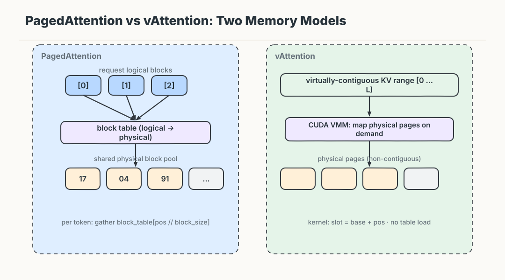</a>

<p class='figure-caption'>two memory models side by side — PagedAttention (per-request logical block table indexing a shared physical block pool) vs. vAttention (per-request virtually-contiguous KV range, physical pages mapped on demand via CUDA VMM).</p>

### The indirection vAttention names, in vLLM's own source

VAttention's core objection is an abstraction complaint: "in trying to allocate physical memory at runtime, PagedAttention ends up **changing the virtual memory layout of the KV cache from contiguous to non-contiguous**," and "such a design leads to **non-trivial programming and performance overheads**" (vAttention abstract, [arXiv:2405.04437](https://arxiv.org/abs/2405.04437)). Those two overheads are not vague. The "performance overhead" is a per-token address computation the kernel must do because the KV cache is no longer a flat array; the "programming overhead" is that the attention kernel must be *taught* to do it. Both are visible in exactly one place in vLLM — the function that turns a per-request block table into the flat `slot_mapping` the paged-attention kernel dereferences.

Source: `vllm/v1/worker/block_table.py:L359-L380`

```python
    for i in range(start_idx, end_idx, BLOCK_SIZE):
        offsets = i + tl.arange(0, BLOCK_SIZE)
        mask = offsets < end_idx
        pos = tl.load(positions_ptr + offsets, mask=mask, other=0)
        block_indices = pos // virtual_block_size
        block_numbers = tl.load(block_table_ptr + row_offset + block_indices).to(
            tl.int64
        )

        virtual_block_offsets = pos - block_indices * virtual_block_size
        is_local = (
            virtual_block_offsets // CP_KV_CACHE_INTERLEAVE_SIZE
        ) % TOTAL_CP_WORLD_SIZE == TOTAL_CP_RANK
        local_block_offsets = (
            virtual_block_offsets // (TOTAL_CP_WORLD_SIZE * CP_KV_CACHE_INTERLEAVE_SIZE)
        ) * CP_KV_CACHE_INTERLEAVE_SIZE + (
            virtual_block_offsets % CP_KV_CACHE_INTERLEAVE_SIZE
        )

        slot_ids = block_numbers * block_size + local_block_offsets
        slot_ids = tl.where(is_local, slot_ids, PAD_ID)
        tl.store(slot_mapping_ptr + offsets, slot_ids, mask=mask)
```

Ignore the context-parallel machinery first: when context parallelism is off, `TOTAL_CP_WORLD_SIZE == 1`, so `virtual_block_size == block_size`, `virtual_block_offsets == pos % block_size`, `is_local` is always true, and `local_block_offsets` collapses to `pos % block_size`. What remains is the essential paging arithmetic. For a token at absolute position `pos`, `block_indices = pos // block_size` selects a *column* in this request's block-table row; `block_numbers = tl.load(block_table_ptr + row_offset + block_indices)` is a **second memory load** that reads the *physical* block id stored in that column; and `slot_ids = block_numbers * block_size + (pos % block_size)` is the final flat index into the paged KV pool. This is the double indirection vAttention names as the performance overhead: a contiguous cache would let the kernel compute a slot as `base + pos` with no table load at all, but every token here pays a dependent gather (`positions → block_table[column] → slot`) before it can touch a single key or value.

The payoff of that indirection is that the *logical* row is stable while the *physical* block id in each column is free to be anything the pool hands out, which is precisely what lets `touch`, `free_blocks`, and `_maybe_evict_cached_block` ([Section 23](#23-the-life-of-a-physical-block-allocate-use-free-cache-evict)) recycle *free* physical blocks through the pool — a block a live request still references (`ref_cnt > 0`) keeps its id and is never moved or evicted underneath it; only free, unreferenced blocks are reassigned. The block table is the seam between logical and physical, and the slot formula is where that seam is paid for, once per token per KV-cache group (the layers in a group share one slot mapping rather than recomputing it per layer). vAttention's claim is that this per-token tax is avoidable if you fix physical fragmentation without ever making the *virtual* layout non-contiguous.

**The programming overhead: a bespoke paged kernel**

The second overhead is authorship. The excerpt above is not incidental Python glue — it is a Triton kernel that ships as part of vLLM, and the attention kernels downstream of it (FlashAttention, FlashInfer) must consume a `block_table` tensor and a `slot_mapping` rather than a plain pointer-and-length. The vLLM PagedAttention design doc makes this explicit on the kernel side: a block "stores data for a fixed number (`BLOCK_SIZE`) of tokens at one head," `BLOCK_SIZE` is a compile-time template parameter, and block addressing is done with `physical_block_number` and `physical_block_offset` pointer math ([vLLM docs](https://docs.vllm.ai/en/stable/design/paged_attention/)). vAttention's framing is that this is a maintenance liability: it positions itself as "a **simpler, portable, and performant** alternative to PagedAttention" that "**supports various attention kernels out-of-the-box**" (abstract, [arXiv:2405.04437](https://arxiv.org/abs/2405.04437)).

The key word is *out-of-the-box*: the argument is that PagedAttention forces each attention kernel to ship a bespoke paged (block-table-aware) variant, whereas a virtually-contiguous cache can feed an unmodified dense kernel. The specific rewrite-burden argument — that vLLM, FlashAttention, and FlashInfer each had to maintain a separate paged kernel — lives in the paper body, not the abstract, so it should be cited to the PDF ([arxiv.org](https://arxiv.org/pdf/2405.04437)) rather than the abstract.

This is not a hypothetical. The very existence of `map_to_kernel_blocks` in vLLM's block table is a downstream tax of the paged kernel contract: when the KV manager's allocation block size differs from the kernel's block size, one manager block id must be *expanded* into several kernel block ids before it can be written into a row.

Source: `vllm/v1/worker/block_table.py:L193-L201`

```python
        if blocks_per_kv_block == 1:
            return kv_manager_block_ids

        kernel_block_ids = (
            kv_manager_block_ids.reshape(-1, 1) * blocks_per_kv_block
            + kernel_block_arange
        )

        return kernel_block_ids.reshape(-1)
```

When the manager and kernel agree on block size (`blocks_per_kv_block == 1`) this is a no-op passthrough. Otherwise each manager id `b` becomes the contiguous run `b * blocks_per_kv_block + [0 .. blocks_per_kv_block)`, so that rows are always stored in *kernel-block units*: the granularity the slot kernel above indexes. The manager and the kernel have two different notions of "block," and the block table is where they are reconciled on every append. In a virtually-contiguous design there is no such reconciliation, because there is no block table to reconcile — this expansion step is a pure cost of the paged contract, not of memory management as such.

**vAttention's alternative: fix physical fragmentation, keep virtual contiguity**

VAttention's counter-design keeps the KV cache virtually contiguous and attacks only the physical fragmentation that motivated paging in the first place: it is "an approach that **mitigates fragmentation in physical memory while retaining the contiguity of KV cache in virtual memory**," achieved "by **decoupling the allocation of virtual and physical memory using CUDA virtual memory management APIs**" (abstract, [arXiv:2405.04437](https://arxiv.org/abs/2405.04437)). Concretely, reserve a large contiguous *virtual* address range per request up front, then back it with physical pages on demand as the sequence grows (the `cuMemAddressReserve` / `cuMemCreate` / `cuMemMap` family, named in the abstract only as "CUDA virtual memory management APIs").

Because the virtual layout stays flat, the attention kernel indexes it as `base + pos` (no `block_table` load, no `slot_mapping`) and the physical pages can still be non-contiguous without the kernel knowing. The headline result is that this "improves LLM serving throughput by **up to 1.23x** compared to the use of PagedAttention-based kernels of FlashAttention and FlashInfer" (abstract). That number and the CUDA-VMM framing are abstract-level and safe to cite directly; treat the deeper per-kernel comparisons as PDF-body claims.

### Why vLLM keeps the indirection anyway

Here is the honest tradeoff the article has to make. If fragmentation were the *only* thing paging bought, vAttention's argument would be close to decisive — CUDA VMM removes fragmentation at page granularity with no kernel changes. But in vLLM the block table is not merely a fragmentation fix; it is the substrate on which [Section 7](#7-prefix-cache-lookup-hashing-longest-hit-and-the-recompute-last-token-rule) and [Section 23](#23-the-life-of-a-physical-block-allocate-use-free-cache-evict) build features that a per-request contiguous range does not natively provide:

- **Content-addressed prefix reuse.** The prefix cache ([Section 7](#7-prefix-cache-lookup-hashing-longest-hit-and-the-recompute-last-token-rule)) is a `BlockHashWithGroupId → KVCacheBlock` map: any *physical* block can back any *logical* position of any request, because the block table interposes between them. The lookup returns a physical block id, and the requesting row simply stores that id in a column. This only works because logical position and physical block are decoupled: the same decoupling the slot kernel pays for.
- **Block-granularity sharing.** Two requests that share a prompt prefix can store the *same physical block id* in the same column of two different rows; the refcount on that `KVCacheBlock` ([Section 23](#23-the-life-of-a-physical-block-allocate-use-free-cache-evict)) governs when it becomes reclaimable. The paper's copy-on-write model rides on exactly this: share while the physical id is identical, allocate a fresh block when a write must diverge.
- **Constant-time eviction.** A freed-but-cached block stays resolvable through the hash map while sitting in the free queue, and the intrusive doubly-linked list gives O(1) removal when a later prefix hit re-`touch`es it. The whole `FreeKVCacheBlockQueue` ([Section 3](#3-kvcacheblock-and-blockpool-the-free-list-is-an-eviction-structure)) is an eviction-ordered index over *physical* blocks that are addressed independently of any request's logical layout.

Whether vAttention's virtually-contiguous design can reconstruct all three cheaply is not settled by its abstract, and I will not assert it can or cannot (unverified). What *is* verifiable from vLLM's source is that these three features are entangled with the very indirection vAttention removes: in vLLM the manager's wins ([Section 3](#3-kvcacheblock-and-blockpool-the-free-list-is-an-eviction-structure)–[Section 23](#23-the-life-of-a-physical-block-allocate-use-free-cache-evict)) and the kernel's gather cost ([Section 20](#20-from-block-table-to-kernel-slot_mapping-and-the-device-tensors)) are separable only in principle — in practice they share one block table. This is the manager-versus-kernel distinction from the paper model, restated adversarially: PagedAttention-the-kernel is the *enabling primitive*, and its per-token gather is the price of admission for everything the manager does on top.

### Costs of paging visible in the source, beyond the gather

Two further costs of paging are legible in the block-table code and worth naming, because they are the kind of thing a fragmentation-only analysis misses.

First, **fixed-shape padding for CUDA graphs.** The slot kernel dedicates its last program instance to padding, not real work:

Source: `vllm/v1/worker/block_table.py:L343-L352`

```python
    if req_idx == tl.num_programs(0) - 1:
        # Pad remaining slots for CUDA graph compatibility.
        for i in range(num_tokens, max_num_tokens, BLOCK_SIZE):
            offsets = i + tl.arange(0, BLOCK_SIZE)
            tl.store(
                slot_mapping_ptr + offsets,
                PAD_ID,
                mask=offsets < max_num_tokens,
            )
        return
```

`slot_mapping` must be a fixed-size tensor `[max_num_tokens]` for CUDA-graph replay to be valid, so the tail `[num_tokens, max_num_tokens)` is filled with `PAD_ID` (a sentinel physical slot). The paged indirection makes shapes data-dependent (the number of valid slots varies per step) so the system spends both a kernel program and a reserved sentinel slot to keep the shape constant. A contiguous cache indexed by `base + pos` has the same graph-stability problem, but this padding program is specifically the paged path's way of paying it.

Second, **two full implementations of the same bridge.** vLLM ships a CPU-staged `BlockTable` (numpy writes into a pinned `CpuGpuBuffer`, published by `commit_block_table`) and a GPU-resident `BlockTables` (staged GPU writes flushed by `apply_staged_writes`). Both maintain `slot = physical_block_id * block_size + position % block_size` across `worker/block_table.py` and `worker/gpu/block_table.py`. That duplicated engineering surface is a maintenance cost of the paged bridge with no analogue when the KV range is a contiguous tensor.

### vLLM V1's own tradeoffs and current limits

Finally, paging is not a finished story even inside vLLM, and the honest framing includes V1's own concessions. V1 *removed* GPU↔CPU KV-cache swapping: "with the new simplified core architecture, vLLM V1 no longer requires KV cache swapping to handle request preemptions" ([vLLM docs](https://docs.vllm.ai/en/stable/usage/v1_guide/)) — preemption is now recompute-based, which is a deliberate simplification of the V0 paging machinery, not an extension of it. And prefix caching, the flagship benefit of content-addressed paging, is "not yet supported" for Mamba/SSM and hybrid models on the guide's list (same source). That is a real limitation of the *current* manager, not a gap in the paper model: the per-type managers of [Section 15](#15-the-coordinator-and-hybrid-kv-cache-when-one-block-type-is-not-enough) give hybrid models correct allocation, but the layer-specific cache-hit rules that would let their prefixes be reused are still in progress. vAttention's critique lands hardest exactly where paging's marquee feature is least available, which is the fair way to leave the tradeoff.

**The tradeoff in one line.** PagedAttention pays a per-token gather, a bespoke-kernel authoring burden, and a duplicated logical↔physical bridge, and it buys near-zero fragmentation *plus* content-addressed prefix caching, block-granularity sharing/CoW, and constant-time eviction. vAttention keeps the fragmentation win via CUDA virtual memory and discards the gather and the kernel rewrite — at the price of giving up, or having to re-engineer through a different mechanism, the content-addressed reuse that [Section 7](#7-prefix-cache-lookup-hashing-longest-hit-and-the-recompute-last-token-rule) and [Section 23](#23-the-life-of-a-physical-block-allocate-use-free-cache-evict) make almost free. vLLM V1's answer is not to deny the critique but to invest in the manager: the machinery of [Section 3](#3-kvcacheblock-and-blockpool-the-free-list-is-an-eviction-structure)–[Section 23](#23-the-life-of-a-physical-block-allocate-use-free-cache-evict) exists because the paging is worth its cost only if the reuse it enables is safe, and making that reuse safe is what the whole KV cache manager is for.

## 28. A Guided Source-Reading Plan and What To Remember

The shortest useful source-reading route follows the objects passed between six files: `kv_cache_manager.py`, `block_pool.py`, `kv_cache_utils.py`, `kv_cache_coordinator.py`, `single_type_kv_cache_manager.py`, and `worker/block_table.py`.

<a href='images/vllm-06-12-read-path-callstack.svg' target='_blank'>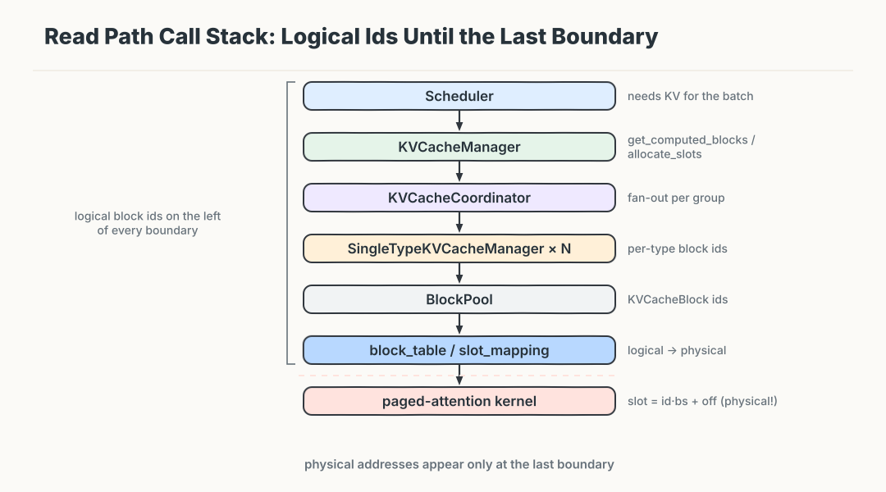</a>

<p class='figure-caption'>the read path as a call stack — Scheduler → KVCacheManager → KVCacheCoordinator → SingleTypeKVCacheManager × N → BlockPool → block_table/slot_mapping → paged-attention kernel, with logical block ids on the left of each boundary and physical addresses only appearing at the last one.</p>

### 0. Start at one constructor, because the whole object graph hangs off it

Do not start with `allocate_slots`. Start with `KVCacheManager.__init__`, because it is the only place the entire object graph is wired, and every later `self.coordinator.…` / `self.block_pool.…` call is resolved here.

`vllm/v1/core/kv_cache_manager.py:L143-L158`

```python
        self.coordinator = get_kv_cache_coordinator(
            kv_cache_config=kv_cache_config,
            max_model_len=self.max_model_len,
            max_in_flight_tokens=max_in_flight_tokens,
            use_eagle=self.use_eagle,
            enable_caching=self.enable_caching,
            enable_kv_cache_events=enable_kv_cache_events,
            dcp_world_size=dcp_world_size,
            pcp_world_size=pcp_world_size,
            scheduler_block_size=scheduler_block_size,
            hash_block_size=hash_block_size,
            metrics_collector=self.metrics_collector,
        )
        self.num_kv_cache_groups = len(kv_cache_config.kv_cache_groups)
        self.block_pool = self.coordinator.block_pool
        self.kv_cache_config = kv_cache_config
```

The manager owns exactly one coordinator (built by a factory, shown in step 1 below), and it does not build its own `BlockPool` — it aliases the coordinator's (`self.block_pool = self.coordinator.block_pool`, `L157`). So there is one pool per manager, reachable by two names, and every `SingleTypeKVCacheManager` the coordinator constructs receives that same pool. When you later see `self.block_pool.get_num_free_blocks()` in `allocate_slots` and `self.block_pool.get_new_blocks()` deep inside a single-type manager, they are the same object. The invariant this pins down for the reader: **the pool is a singleton shared across all groups**, which is why groups compete for one VRAM budget and why the admission arithmetic (step 2 below) is a sum over groups against a single scalar.

### 1. Before tracing anything, decide which code path is even live

Seven concrete manager classes and three concrete coordinator classes exist; for any given model, most of that source is dead. The single highest-leverage reading move is to open the two dispatch functions first and pin down *your* instantiation, so you never step into `HybridKVCacheCoordinator` for a plain Llama or into `MambaManager` for a dense transformer.

`vllm/v1/core/kv_cache_coordinator.py:L796-L809`

```python
    if not enable_caching:
        return KVCacheCoordinatorNoPrefixCache(
            kv_cache_config,
            max_model_len,
            max_in_flight_tokens,
            use_eagle,
            enable_kv_cache_events,
            dcp_world_size=dcp_world_size,
            pcp_world_size=pcp_world_size,
            scheduler_block_size=scheduler_block_size,
            hash_block_size=hash_block_size,
            metrics_collector=metrics_collector,
        )
    if len(kv_cache_config.kv_cache_groups) == 1:
```

The coordinator subclass is a pure function of `(enable_caching, num_groups)` — no caching → `KVCacheCoordinatorNoPrefixCache`; caching + exactly one group → `UnitaryKVCacheCoordinator` (`L809-L810`); caching + more than one group → `HybridKVCacheCoordinator` (`L823`). A dense full-attention model with prefix caching on is *always* the Unitary path, so the entire iterative fixed-point in `HybridKVCacheCoordinator.find_longest_cache_hit` ([Section 15](#15-the-coordinator-and-hybrid-kv-cache-when-one-block-type-is-not-enough)) is code you can skip on a first pass. Which single-type managers exist inside that coordinator is decided by a second dispatch — a registry that fans eleven spec classes (`single_type_kv_cache_manager.py:L1498-L1553`) into seven concrete manager classes (`:L565,L626,L672,L879,L1029,L1364,L1427`):

`vllm/v1/core/single_type_kv_cache_manager.py:L1529-L1548`

```python
    # FullAttentionSpec subclasses — grouped with FullAttentionSpec
    KVCacheSpecRegistry.register(
        TQFullAttentionSpec,
        FullAttentionManager,
        uniform_type_base_spec=FullAttentionSpec,
    )
    KVCacheSpecRegistry.register(
        MLAAttentionSpec, FullAttentionManager, uniform_type_base_spec=FullAttentionSpec
    )
    KVCacheSpecRegistry.register(
        RSWASpec, RSWAManager, uniform_type_base_spec=FullAttentionSpec
    )
    # NOTE(Mengqing): HiddenStateCacheSpec won't take part in
    # grouping, thus the uniform_type_base_spec is just a
    # placeholder.
    KVCacheSpecRegistry.register(
        HiddenStateCacheSpec,
        FullAttentionManager,
        uniform_type_base_spec=FullAttentionSpec,
    )
```

`get_manager_for_kv_cache_spec` (`L1451-L1493`) looks up the class in this registry, so to know which `find_longest_cache_hit` / `remove_skipped_blocks` body actually runs, you look up your model's spec here — `MLAAttentionSpec` and `TQFullAttentionSpec` both collapse onto `FullAttentionManager`, while `RSWASpec` gets its own `RSWAManager` but still sizes memory as full attention (`uniform_type_base_spec=FullAttentionSpec`). What this prevents for the reader: chasing branches that your configuration never takes. What it prevents for the engine: an unregistered spec silently falling through — `get_manager_for_kv_cache_spec` asserts `manager_class is not None` (`L1473-L1475`). The [Hybrid KV Cache Manager design doc](https://docs.vllm.ai/en/stable/design/hybrid_kv_cache_manager/) is the prose companion to this dispatch; the code is ground truth, and the doc's "one page size per group" formula is an intuition, not the per-spec arithmetic (step 2 below).

### 2. Watch one scalar — and know where it comes from

Every scheduling decision in `allocate_slots` ultimately gates on one integer — `get_num_free_blocks` (`vllm/v1/core/block_pool.py:L692-L698`, read in full in [Section 3](#3-kvcacheblock-and-blockpool-the-free-list-is-an-eviction-structure)) — and it is worth setting a watch on it before you read anything else.

This is an O(1) counter, kept in lockstep by every queue mutator (`popleft`, `remove`, `append_n`, `prepend_n`); no traversal. `allocate_slots` compares it against a per-request demand estimate three times (the `full_sequence_must_fit` gate, the `reserved_blocks` admission check, and implicitly inside `get_new_blocks`). The other half of the story is where the *total* block count came from, decided once at startup by the pool sizer:

`vllm/v1/kv_cache_interface.py:L237-L245`

```python
    def max_memory_usage_bytes(self, vllm_config: VllmConfig) -> int:
        max_model_len = vllm_config.model_config.max_model_len
        dcp_world_size = vllm_config.parallel_config.decode_context_parallel_size
        pcp_world_size = vllm_config.parallel_config.prefill_context_parallel_size
        # Note(hc): each dcp rank only need save
        # (max_model_len//dcp_world_size) tokens locally.
        if dcp_world_size * pcp_world_size > 1:
            max_model_len = cdiv(max_model_len, dcp_world_size * pcp_world_size)
        return cdiv(max_model_len, self.block_size) * self.page_size_bytes
```

A full-attention layer's worst-case footprint is `ceil(max_model_len / block_size)` blocks times `page_size_bytes`: a *context-bounded* number. Read this alongside `MambaSpec.max_memory_usage_bytes` (near-constant, no `max_model_len` term) and `SlidingWindowSpec` (window-bounded) to internalize the [Section 15](#15-the-coordinator-and-hybrid-kv-cache-when-one-block-type-is-not-enough) lesson from the sizing side: "blocks ∝ tokens" is only true for full attention. The invariant to carry: the free-block scalar `get_num_free_blocks` reports is a genuine capacity, because the pool was sized so `sum` of per-group peak demand fits, and the null block was popped out of the count at construction — it can never over-promise, which is what makes `allocate_slots`' early `return None` a hard, honest admission gate rather than an optimistic guess ([PagedAttention paper](https://arxiv.org/abs/2309.06180) motivates why this scalar is *the* throughput lever).

### 3. The reading order as a debugger session

The existing article's checklist lists breakpoints and objects; here is the same set arranged as an *ordered* trace, with what you should expect to see at each stop and which section covers the detail:

| # | Breakpoint | What you observe | Owns |
|---|---|---|---|
| 1 | `KVCacheManager.get_computed_blocks` | a pure lookup: `max_cache_hit_length = num_tokens - 1`, then delegates to the coordinator; no ref-count change, no allocation | [Section 7](#7-prefix-cache-lookup-hashing-longest-hit-and-the-recompute-last-token-rule) |
| 2 | `KVCacheCoordinator.find_longest_cache_hit` | Unitary → one manager call; Hybrid → the monotonic-shrink fixed point; returns `(per-group blocks, hit_length)` | [Section 15](#15-the-coordinator-and-hybrid-kv-cache-when-one-block-type-is-not-enough) |
| 3 | `KVCacheManager.allocate_slots` | the policy stack: clamp computed tokens, apply watermark/reserved/full-sequence gates, `remove_skipped_blocks`, then commit | [Section 9](#9-allocate_slots-is-a-policy-stack-not-an-allocation) |
| 4 | `KVCacheCoordinator.allocate_new_computed_blocks` | two-phase touch-before-allocate across groups (issue #33775) | [Section 15](#15-the-coordinator-and-hybrid-kv-cache-when-one-block-type-is-not-enough) |
| 5 | `BlockPool.touch` / `get_new_blocks` / `free_blocks` | the ref-count state machine on one shared free list | [Section 3](#3-kvcacheblock-and-blockpool-the-free-list-is-an-eviction-structure), [Section 23](#23-the-life-of-a-physical-block-allocate-use-free-cache-evict) |
| 6 | `KVCacheManager.cache_blocks` | full-block hashing capped at `request.num_tokens` (draft tokens excluded) | [Section 7](#7-prefix-cache-lookup-hashing-longest-hit-and-the-recompute-last-token-rule), [Section 9](#9-allocate_slots-is-a-policy-stack-not-an-allocation) |
| 7 | `compute_slot_mapping` / the slot Triton kernel | logical block ids become physical addresses | [Section 20](#20-from-block-table-to-kernel-slot_mapping-and-the-device-tensors) |

Objects to keep in the watch window — the four counts [Section 9](#9-allocate_slots-is-a-policy-stack-not-an-allocation) walks, and why each is a distinct quantity you will confuse if you do not name it: `num_local_computed_tokens` (running `num_computed_tokens` plus this call's prefix hits), `total_computed_tokens` (that plus any external/connector KV, clamped to `max_model_len`), `num_tokens_main_model` = `total_computed_tokens + num_new_tokens` (what the model runs), and `num_tokens_need_slot` = that plus lookahead, clamped to `max_model_len` (what gets physical slots). Caching is bounded by the computed family; slot reservation uses `num_tokens_need_slot`. On the block side: `KVCacheBlock.ref_cnt` and `KVCacheBlock._block_hash` (the two fields that jointly locate a block in the free-list/cache-map lattice), `num_free_blocks`, `request.block_hashes` (content identity, append-only, divorced from any `block_id`), and `block_table.np/cpu/gpu` (three views of one logical matrix).

Reading in this order works because each breakpoint produces exactly the object the next consumes: the hit blocks from stop 2 feed the touch at stop 4; the block ids committed at stop 5 feed the slot kernel at stop 7.

### 4. The rule to keep in mind while reading `BlockPool`

If you memorize a single equivalence before reading `block_pool.py`, make it this: **for a non-null block, `ref_cnt == 0` if and only if the block is currently linked in the free queue.** Every mutator is written to preserve it, and `touch` (`vllm/v1/core/block_pool.py:L597-L612`, read line by line in [Section 23](#23-the-life-of-a-physical-block-allocate-use-free-cache-evict)) is the clearest place to see the atomic maintenance.

A prefix hit may resolve to a cached block already on the free queue. `touch` removes it before taking the first reference; `get_new_blocks` and `free_blocks` perform the opposite transitions. Together they preserve `ref_cnt == 0 ⇔ on the free queue` for non-null blocks.

### 5. The line the whole article converges on

Everything upstream (hashes, groups, admission gates, refcounts, block tables) exists so that this one arithmetic statement can execute correctly for every token, every step (realized by the slot kernel, [Section 20](#20-from-block-table-to-kernel-slot_mapping-and-the-device-tensors), `vllm/v1/worker/block_table.py:L357-L380`). For each token position `pos`, the kernel selects the column of the request's block-table row (`pos // block_size`), loads the *physical* block id stored there, and adds the intra-block offset. Collapsing the context-parallel machinery (the common case: `TOTAL_CP_WORLD_SIZE == 1`, `is_local` always true), the whole kernel reduces to the one formula worth memorizing:

```text
slot = physical_block_id * block_size + (position % block_size)
```

This is the moment logical layout becomes physical address, and it is the single point where a bug in any upstream layer (a wrong `block_id` in the table, an unaligned hit length, a stale committed row) manifests as a corrupt read. The precondition: the block table must be fully mutated and committed *before* this kernel runs, and the row indexed by `req_idx` must hold the request's blocks in kernel-block units, which is exactly why `map_to_kernel_blocks` expands one manager block into `blocks_per_kv_block` contiguous kernel ids when the manager and kernel block sizes differ. The [PagedAttention docs](https://docs.vllm.ai/en/stable/design/paged_attention/) describe the kernel-side tensor layout this `slot_mapping` feeds.

### Takeaways

- For every non-null block, `ref_cnt == 0` exactly when the block is on the free queue; allocation, sharing, eviction, and reuse all preserve that equivalence.
- Lookup is side-effect free, admission gates precede pool mutation, and cross-group hits are touched before any group allocates.
- Hashes identify finalized full-block contents, not physical ownership; a full hit still leaves the final token to recompute.
- Hybrid managers align hit lengths and reservations across distinct attention types while spending one shared pool.
- The host-side policy ultimately produces the kernel address `physical_block_id * block_size + offset`; PagedAttention consumes that mapping rather than managing it.

`hash_block_tokens` is configurable; confirm the resolved algorithm in the target build before treating its default as part of an interoperability contract.

## 29. References

**Papers**

- Kwon et al., "Efficient Memory Management for Large Language Model Serving with PagedAttention" (PagedAttention): https://arxiv.org/abs/2309.06180
- Prabhu et al., "vAttention: Dynamic Memory Management for Serving LLMs without PagedAttention": https://arxiv.org/abs/2405.04437
- Yu et al., "Orca: A Distributed Serving System for Transformer-Based Generative Models": https://www.usenix.org/conference/osdi22/presentation/yu

**vLLM blogs**

- "vLLM: Easy, Fast, and Cheap LLM Serving with PagedAttention" (launch): https://vllm.ai/blog/2023-06-20-vllm
- "vLLM V1: A Major Upgrade to vLLM's Core Architecture": https://vllm.ai/blog/2025-01-27-v1-alpha-release
- "Inside vLLM: Anatomy of a High-Throughput LLM Inference System": https://vllm.ai/blog/2025-09-05-anatomy-of-vllm

**vLLM docs**

- Architecture Overview: https://docs.vllm.ai/en/stable/design/arch_overview/
- Paged Attention: https://docs.vllm.ai/en/stable/design/paged_attention/
- Automatic Prefix Caching (design): https://docs.vllm.ai/en/stable/design/prefix_caching/
- Hybrid KV Cache Manager: https://docs.vllm.ai/en/stable/design/hybrid_kv_cache_manager/
- vLLM V1 Guide: https://docs.vllm.ai/en/stable/usage/v1_guide/

**Cross-checked community source analyses** (used for framing/terminology, verified against local source)

- coolclaws/vllm-book: https://github.com/coolclaws/vllm-book
- shizhengLi/vllm-learning: https://github.com/shizhengLi/vllm-learning

*All code conclusions in this article are anchored to the local source tree at [`vllm-project/vllm@6cf7b26bd`](https://github.com/vllm-project/vllm/tree/6cf7b26bd4bff60bf378e1af14044280ac0d214c) (commit `6cf7b26bd`).*
