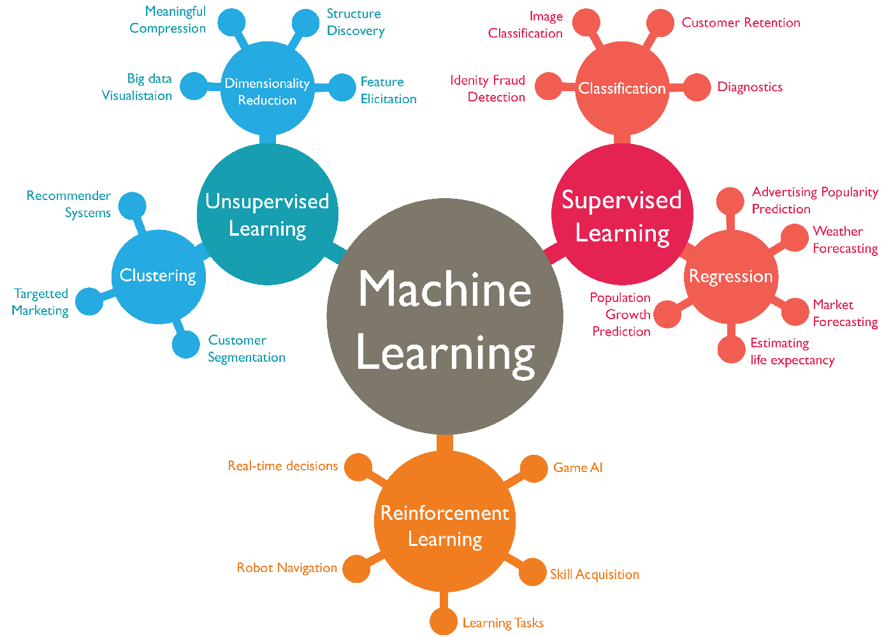
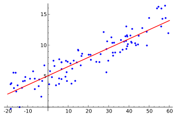
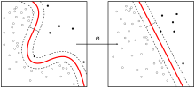
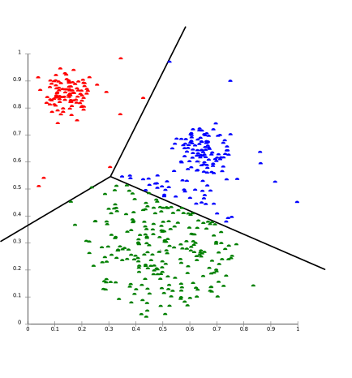

# I. What is Machine Learning?

In the history of machine learning, two definitions have emerged.

- In 1956, Arthur Samuel, who developed a checkers AI program, defined the term “machine learning” at the Dartmouth Conference, which marked the birth of artificial intelligence as a discipline. He defined it as “the field of study that gives computers the ability to learn without being explicitly programmed.”

- In 1997, Tom Mitchell provided a more modern definition: “A computer program is said to learn from experience E with respect to some class of tasks T and performance measure P if its performance at tasks in T, as measured by P, improves with experience E.”

For example: playing checkers. 

E = the experience of playing many games of checkers

T = the task of playing checkers.

P = the probability that the program will win the next game.

# II. Classify

In general, any machine learning problem can be assigned to one of two broad categories:

supervised learning and unsupervised learning.

Put simply, supervised learning is where we teach the computer to do something, while unsupervised learning is where we let the computer learn on its own.

## 1. supervised learning

In supervised learning, we first have a dataset, we know what the correct output should be, and there is a relationship between the input and the output. Supervised learning problems are divided into “Regression” and “Classification” problems.

In a regression problem, we try to predict a result in a continuous output space, which means we try to map input variables to some continuous function. For example, given a photo of a person, predicting their age from the photo is a regression problem.

In a classification problem, we try to predict a result in a discrete output space. In other words, we try to map input variables to discrete categories. For example, given a patient with a tumor, we must predict whether the tumor is malignant or benign.

## 2. unsupervised learning

Unsupervised learning allows us to work with little or no knowledge of what our results should look like. We can derive structure from the data without necessarily knowing the effects of the variables. We can infer this structure by clustering the data based on relationships between variables in the data. In unsupervised learning, there is no feedback based on predicted results. Unsupervised learning can be divided into “clustering” and “non-clustering.”

Clustering: Take a collection of 1,000,000 different genes and find a way to automatically group these genes into similar or related groups according to different variables, such as lifespan, location, role, and so on. 

Non-clustering: The “cocktail party algorithm,” which allows you to find results in a chaotic environment. (That is, identifying an individual voice and music from a mesh of sounds at a cocktail party.)

------------------------------------------------------

# III. Review

## Question 1

A computer program is said to learn from experience E with respect to some task T and some performance measure P if its performance on T, as measured by P, improves with experience E. Suppose we feed a learning algorithm a lot of historical weather data, and have it learn to predict weather. In this setting, what is E?

Answer
The process of the algorithm examining a large amount of historical weather data.

Explanation:  
T := The weather prediction task.  
P := The probability of it correctly predicting a future date's weather.  
E := The process of the algorithm examining a large amount of historical weather data.  

## Question 2
Suppose you are working on weather prediction, and you would like to predict whether or not it will be raining at 5pm tomorrow. You want to use a learning algorithm for this. Would you treat this as a classification or a regression problem?

Answer
Classification

Explanation:  
Classification is appropriate when we are trying to predict one of a small number of discrete outputs, such as whether it will rain (which we might designate as class 0) or not (for example, class 1).

## Question 3
Suppose you are working on stock market prediction, and you would like to predict the price of a particular stock tomorrow (measured in dollars). You want to use a learning algorithm for this. Would you treat this as a classification or a regression problem?

Answer
Regression

Explanation:  
Regression is appropriate when we are trying to predict a continuous-valued output, such as the price of a stock (similar to the house price example in the lecture).

## Question 4
Some of the problems below are best addressed using a supervised learning algorithm, and the others with an unsupervised learning algorithm. Which of the following would you apply supervised learning to? (Select all that apply.) In each case, assume some appropriate dataset is available for your algorithm to learn from.

Explanation: 

1. Take a collection of 1000 essays written on the US Economy, and find a way to automatically group these essays into a small number of groups of essays that are somehow "similar" or "related".   
>This is an unsupervised learning/clustering problem (similar to the Google News example in the lecture).

2. Given a large dataset of medical records from patients suffering from heart disease, try to learn whether there might be different clusters of such patients for which we might tailor separate treatments.  
>This can be solved using unsupervised learning, with a clustering algorithm that groups patients into different clusters.

3. Given genetic (DNA) data from a person, predict the odds of him/her developing diabetes over the next 10 years. 
>This can be solved as a supervised learning, classification problem. We can learn from a labeled dataset that contains genetic data from different people and tells us whether they developed diabetes.

4. Given 50 articles written by male authors, and 50 articles written by female authors, learn to predict the gender of a new manuscript's author (when the identity of this author is unknown).
>This can be solved as a supervised learning, classification problem. We learn from labeled data to predict gender.

5. In farming, given data on crop yields over the last 50 years, learn to predict next year's crop yields.
>This can be solved as a supervised learning problem. We learn from historical data (labeled with historical crop yields) to predict future crop yields.

6. Examine a large collection of emails that are known to be spam email, to discover if there are sub-types of spam mail.
>This can be solved using a clustering (unsupervised learning) algorithm to cluster spam emails into subtypes.

7. Examine a web page, and classify whether the content on the web page should be considered "child friendly" (e.g., non-pornographic, etc.) or "adult."
>This can be solved as a supervised learning, classification problem. We can learn from a dataset of web pages that have been labeled as “child friendly” or “adult.”

8. Examine the statistics of two football teams, and predict which team will win tomorrow's match (given historical data of teams' wins/losses to learn from).
>This can be solved using supervised learning. We learn from historical records to make win/loss predictions.

## Question 5
Which of these is a reasonable definition of machine learning?

Answer
Machine learning is the field of study that gives computers the ability to learn without being explicitly programmed.

Explanation:  
This is the definition given by Arthur Samuel, who developed a checkers AI program.

------------------------------------------------------

> GitHub Repo: [Halfrost-Field](https://github.com/halfrost/Halfrost-Field)
> 
> Follow: [halfrost · GitHub](https://github.com/halfrost)
>
> Source: [https://github.com/halfrost/Halfrost-Field/blob/master/contents-en/Machine\_Learning/What\_is\_Machine\_Learning.md](https://github.com/halfrost/Halfrost-Field/blob/master/contents-en/Machine_Learning/What_is_Machine_Learning.md)