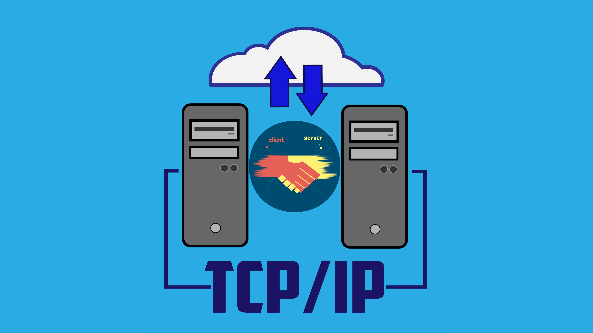
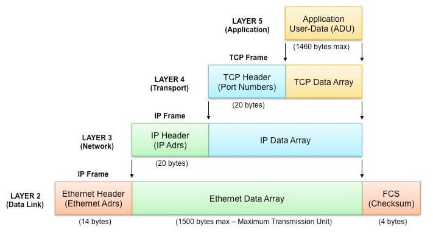
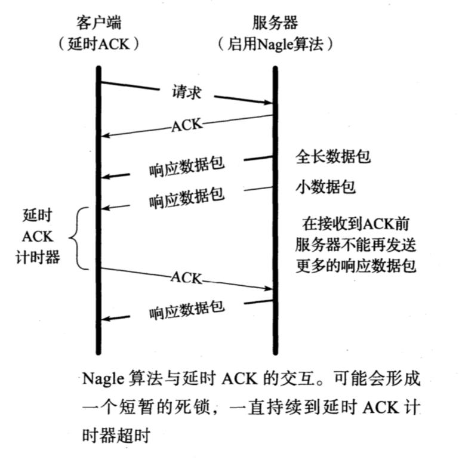
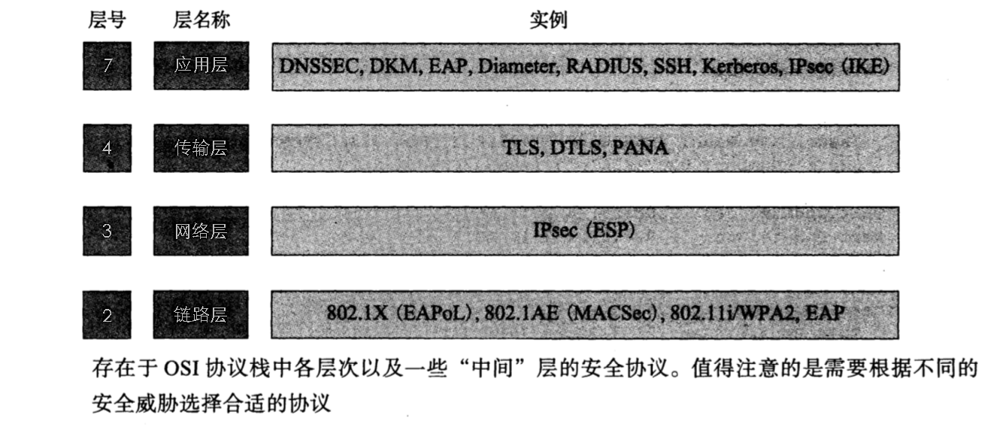

<p align='center'>

</p>

## I. Port Numbers

Standard port numbers are assigned by the Internet Assigned Numbers Authority (IANA). This set of numbers is divided into specific ranges, including
well-known port numbers (0 - 1023), registered port numbers (1024 - 49151), and dynamic/private port numbers (49152 - 65535).

> If we examine the port numbers used by these standard services and other TCP/IP services (Telnet, FTP, SMTP, etc.), we find that most of them are odd numbers. There is a historical reason for this: these port numbers were derived from NCP port numbers (NCP was the Network Control Protocol, used as ARPANET's transport-layer protocol before TCP). Although NCP was simple, it was not full-duplex, so each application required two connections, and odd/even pairs of port numbers were reserved for each application. When TCP and UDP became the standard transport-layer protocols, each application needed only one port number, so the odd-numbered ports from NCP were used.


## II. TCP Initial Sequence Number

In a TCP datagram, there is a Sequence Number. If the sequence number can be guessed, TCP’s vulnerability becomes apparent.

If the right sequence number, IP address, and port number are chosen, anyone can forge a TCP segment and thereby disrupt a normal TCP connection [RFC5961]. One way to defend against this behavior is to make the initial sequence number (or ephemeral port number [RFC6056]) relatively hard to guess; another is encryption.

Linux uses a relatively complex process to choose its initial sequence number. It uses a clock-based scheme and sets a random offset for the clock for each connection. The random offset is derived using a cryptographic hash function based on the connection identifier (a 4-tuple consisting of two IP addresses and two port numbers, i.e., the 4-tuple). The input to the hash function changes every 5 minutes. In the 32-bit initial sequence number, the highest 8 bits are a secret sequence number, while the remaining bits are generated by the hash function. Sequence numbers generated by this method are difficult to guess, but they still increase gradually over time. Reports indicate that Windows uses a similar scheme based on RC4 [S94].

## III. TCP Maximum Segment Size

The maximum segment size refers to the largest segment that the TCP protocol allows to be received from the peer; therefore, it is also the largest segment the communication peer can use when sending data. According to [RFCO879], the maximum segment size records only the number of bytes of TCP data and does not include the associated TCP and IP headers. When establishing a TCP connection, each side of the communication must state its permitted maximum segment size in the MSS option of the SYN segment. This 16-bit option specifies the value of the maximum segment size. If it is not specified in advance, the default maximum segment size is 536 bytes. Any host should be able to handle IPv4 datagrams of at least 576 bytes. Calculated using the minimum IPv4 and TCP headers, TCP requires a maximum segment size of 536 bytes for each transmission, which results exactly in a 576-byte IPv4 datagram (20+20+536=576).

**The maximum segment size is 1460. This is the typical value in IPv4**, so the size of the IPv4 datagram correspondingly increases by 40 bytes (1500 bytes in total, the typical value for the Ethernet maximum transmission unit and the Internet path maximum transmission unit): a 20-byte TCP header plus a 20-byte IP header.

When IPv6 is used, the maximum segment size is typically 1440 bytes. Because the IPv6 header is 20 bytes larger than the IPv4 header, the maximum segment size is correspondingly reduced by 20 bytes. In [RFC2675], 65535 is a special value used together with IPv6 jumbograms to specify an effectively infinite maximum segment size. In this case, the sender’s maximum segment size is equal to the path MTU minus 60 bytes (40 bytes for the IPv6 header and 20 bytes for the TCP header). It is worth noting that the maximum segment size is not a negotiated result between the two TCP endpoints, but rather a limiting value. When one side of the communication sends its maximum segment size option to the other side, it has indicated that it is unwilling to receive any segment larger than that size for the duration of the connection.

<p align='center'>

</p>


## IV. Solutions for Excessive CLOSE\_WAIT

Scenario: the system generates a large number of “Too many open files” errors.

Cause analysis: During communication between the server and the client, the server failed to close sockets, resulting in closed\_wait states. As a result, the number of handles opened by the listening port reached 1024, all in the close\_wait state, ultimately exhausting the configured port and causing “Too many open files”, so communication could no longer continue.   
The close\_wait state occurs because the passive closer has not closed the socket, as shown in the attached figure: 


Solution: two measures are feasible.

I. Fix: 
The reason is that calling the accept() method of the ServerSocket class and the read() method of a Socket input stream causes the thread to block, so setSoTimeout() should be used to set a timeout (the default setting is 0, meaning a timeout never occurs). Timeout evaluation is cumulative: after it is set once, the blocking time caused by each call is deducted from this value until another timeout is set or a timeout exception is thrown.   
For example, if a service needs to call read() three times and the timeout is set to 1 minute, then if the total time of the three read() calls for a particular service exceeds 1 minute, an exception will be thrown. If this service is to be performed repeatedly on the same Socket, the timeout must be set once before each service invocation.
 
II. Workaround:   
Adjust system parameters, including handle-related parameters and TCP/IP parameters.

Notes:   
/proc/sys/fs/file-max is the limit on the number of files that can be opened by the entire system, controlled by sysctl.conf; 
ulimit modifies the limit on the number of files that can be opened by the current shell and its child processes, controlled by limits.conf; 
lsof lists the resources occupied by the system, but these resources do not necessarily consume open file descriptors. For example: shared memory, semaphores, message queues, memory mappings, etc. occupy these resources but do not consume open file descriptors;   
Therefore, what needs to be adjusted is the limit on the number of files that can be opened by child processes of the current user, that is, the configuration in limits.conf; 
If the value of `cat /proc/sys/fs/file-max` is 65536 or even larger, this value does not need to be modified; 
If ulimit -a shows that the value of the open files parameter is less than 4096 (the default is 1024), use the following method to modify the open files parameter value to 8192:  
 
1. Log in as root and modify the file /etc/security/limits.conf 
vi /etc/security/limits.conf and add 
xxx - nofile 8192 
xxx is a user. If you want it to take effect for all users, replace it with * . The value to set depends on the hardware configuration; do not set it too high.
```http

#<domain>      <type>     <item>         <value> 

*         soft    nofile    8192 
*         hard    nofile    8192 

#All users can use 8192 file descriptors per process.
```
2. Make these limits take effect  
Ensure that the files /etc/pam.d/login and /etc/pam.d/sshd contain the following line:  
session required pam_limits.so  
Then have the user log in again for the changes to take effect.  
3. In bash, you can use ulimit -a to check whether the changes have been applied:  

I. Modification method: (takes effect temporarily; after the server is restarted, it will revert to the default value)
```http
sysctl -w net.ipv4.tcp_keepalive_time=600   
sysctl -w net.ipv4.tcp_keepalive_probes=2 
sysctl -w net.ipv4.tcp_keepalive_intvl=2 
```
Note: When tuning Linux kernel parameters, verify that the settings are appropriate by observing their behavior, especially during peak business traffic.

2. If the changes above take effect, make the following changes to persist them permanently.

vi /etc/sysctl.conf

If the configuration file does not contain the following entries, add them:
```http
net.ipv4.tcp_keepalive_time = 1800 
net.ipv4.tcp_keepalive_probes = 3 
net.ipv4.tcp_keepalive_intvl = 15 
```
After editing /etc/sysctl.conf, restart network for the changes to take effect.

/etc/rc.d/init.d/network restart

Then run the sysctl command to apply the changes, and you are essentially done.

------------------------------------------------------------
Reason for the change:

When the client sends a FIN signal before the server for some reason, the server will be passively closed. If the server does not actively close the socket and send a FIN to the Client, the server Socket will remain in the CLOSE\_WAIT state (rather than the LAST\_ACK state). Typically, a CLOSE\_WAIT state lasts at least 2 hours (the system default timeout is 7200 seconds, i.e., 2 hours). If the server program causes a large number of CLOSE\_WAIT connections to consume system resources for some reason, the system will usually crash before those connections are released. Therefore, another way to solve this problem is to shorten this duration by modifying TCP/IP parameters, specifically the tcp\_keepalive\_\* parameter series:

tcp\_keepalive\_time:  
/proc/sys/net/ipv4/tcp\_keepalive\_time  
INTEGER, default value is 7200 (2 hours)  
When keepalive is enabled, the frequency at which TCP sends keepalive messages. The recommended value is 1800 seconds.

tcp\_keepalive\_probes: INTEGER  
/proc/sys/net/ipv4/tcp\_keepalive\_probes  
INTEGER, default value is 9  
The number of TCP keepalive probes sent to determine whether the connection has been broken. (Note: keepalive probes are sent only when the SO\_KEEPALIVE socket option is enabled. The default number generally does not need to be changed, though it can be reduced appropriately depending on the situation. Setting it to 5 is usually reasonable.)

tcp\_keepalive\_intvl: INTEGER  
/proc/sys/net/ipv4/tcp\_keepalive\_intvl  
INTEGER, default value is 75  
The interval at which probes are retransmitted when no acknowledgment is received. This is the frequency at which probe messages are sent (how many TCP keepalive probes are sent before the connection is considered invalid). Multiplying this by tcp\_keepalive\_probes gives the time after probing starts before an unresponsive connection is killed. The default value is 75 seconds, meaning an inactive connection will be dropped after roughly 11 minutes. (For typical applications, this value is somewhat high and can be reduced as needed. In particular, web servers should use a smaller value; 15 is a reasonable choice.)

【Verification method】  

1. The system no longer reports “Too many open files”.

2. The number of sockets in the TIME\_WAIT state no longer grows rapidly.

On Linux, you can use the following command to check the server’s TCP states (connection state count statistics):
```http
netstat -n | awk '/^tcp/ {++S[$NF]} END {for(a in S) print a, S[a]}' 
```
Example output:

ESTABLISHED 1423   
FIN\_WAIT1 1   
FIN\_WAIT2 262   
SYN\_SENT 1   
TIME\_WAIT 962  


## V. TIME\_WAIT State

The TIME\_WAIT state is also known as the 2MSL wait state. In this state, TCP waits for twice the Maximum Segment Lifetime (MSL), sometimes also referred to as the doubled wait. Each implementation must choose a value for the Maximum Segment Lifetime. It represents the longest time any segment is allowed to exist in the network before being discarded. We know this time limit is bounded because TCP segments are transmitted as IP datagrams, and IP datagrams have a TTL field and a hop-limit field. These two fields limit the effective lifetime of an IP datagram.

[RFC0793] sets the Maximum Segment Lifetime to 2 minutes. However, in common implementations, the MSL value may be 30 seconds, 1 minute, or 2 minutes. In the vast majority of cases, this value is configurable. On Linux, the value of `net.ipv4.tcp_fin_timeout` records the timeout duration (in seconds) that the 2MSL state needs to wait. On Windows, the following registry key value also stores the timeout duration:
```http
HKLM\SYSTEM\currentcontrolSet\Services\Tcpip\parameters\TcpTimedWaitDelay
```
The value for this key ranges from 30 to 300 seconds. For IPv6, you only need to replace `Tcpip` in the key with `Tcpip6`.

As for why the 2MSL waiting time needs to be set, see [here](https://github.com/halfrost/Halfrost-Field/blob/master/contents-en/Protocol/TCP_IP.md#%E4%B8%BA%E4%BB%80%E4%B9%88%E5%AE%A2%E6%88%B7%E7%AB%AF%E9%87%8A%E6%94%BE%E6%9C%80%E5%90%8E%E9%9C%80%E8%A6%81-time-wait-%E7%AD%89%E5%BE%85-2msl-%E5%91%A2).


## VI. TCP Reset Segments

The TCP header contains the RST flag field. A segment with this field set is called a “reset segment,” or simply a “reset.” In general, when TCP determines that an arriving segment is incorrect for the associated connection, it sends a reset segment. (Here, the associated connection refers to the connection identified by the 4-tuple in the TCP and IP headers of the reset segment.) A reset segment typically causes the TCP connection to be torn down quickly.

Reset segments are used for the following purposes:

- 1. Connection requests to nonexistent ports.
- 2. Terminating a connection.
- 3. Half-open connections.
- 4. TIME-WAIT errors.


Explanation of TIME-WAIT errors:

When the client is in the TIME\_WAIT state and suddenly receives an old segment from the server, TCP sends an ACK in response, containing the latest sequence number and ACK number (K and L, respectively). However, when the server receives this segment, it has no information about this connection, so it sends a reset segment in response. This is not a problem with the server, but it can cause the client to transition prematurely from the TIME_WAIT state to the CLOSED state. Many systems specify that reset segments should be ignored while in the TIME\_WAIT state, thereby avoiding the issue described above.


## VII. Nagle’s Algorithm

In an ssh connection, a single keystroke often triggers data transmission. With IPv4, one keystroke generates a TCP/IPv4 packet of roughly 88 bytes (using encryption and authentication): a 20-byte IP header, a 20-byte TCP header (assuming no options), and a 48-byte data payload. These small packets (called tinygrams) incur a fairly high network transmission cost. In other words, the useful application data accounts for only a very small portion of the packet compared with the rest of it. This is not a major issue on LANs, because most LANs are not congested and these packets do not need to travel very far. On WANs, however, they increase congestion and can seriously degrade network performance. John Nagle proposed a simple and effective solution in [RFCO896], now known as Nagle’s algorithm.

Nagle’s algorithm requires that when a TCP connection has data in flight (that is, data that has been sent but not yet acknowledged), small segments (with a length less than the SMSS) must not be sent until all in-flight data has been ACKed. After receiving the ACK, TCP should collect the small pieces of data and combine them into a single segment for transmission. This forces TCP to follow a stop-and-wait procedure: it can continue sending only after receiving ACKs for all in-flight data. The elegance of the algorithm lies in its self-clocking control: the faster ACKs return, the faster data is transmitted. In relatively high-latency WANs, where reducing the number of tinygrams is more important, the algorithm reduces the number of segments sent per unit time. In other words, the RTT controls the packet transmission rate.

### Problems Caused by Nagle’s Algorithm and Delayed ACKs

If delayed ACKs are used directly together with Nagle’s algorithm, the result may be less than ideal. Consider the following scenario: the client uses delayed ACKs while sending a request to the server, and the server’s response data is not suitable for transmission in the same packet.

<p align='center'>

</p>


As shown above, after receiving two packets from the server, the client does not immediately send an ACK. Instead, it waits, hoping to piggyback the ACK on outgoing data. Normally, TCP should return an ACK after receiving two full-sized packets, but that is not what happens here. On the server side, because Nagle’s algorithm is in use, no new data can be sent until an ACK is received, since at most one packet may be in flight at any time. As a result, the combination of delayed ACKs and Nagle’s algorithm leads to a kind of deadlock (both ends waiting for the other to act) [MMSV99] [MMO1]. Fortunately, this deadlock is not permanent; it is broken when the delayed ACK timer expires. At that point, even if the client still has no data to send, it no longer needs to wait and can send only the ACK to the server. However, during the deadlock, the entire transport connection remains idle, degrading performance. In some cases, such as the ssh transmission here, Nagle’s algorithm can be disabled.

**Applications that require low latency, such as real-time online games, should disable Nagle’s algorithm**.

There are several ways to disable Nagle’s algorithm; the Host Requirements RFC [RFCl122] lists the relevant methods. If an application uses the Berkeley sockets API, it can set the TCP\_NODELAY option. Alternatively, the algorithm can be disabled system-wide. On Windows, use the following registry key:
```http
    HKLM\SOFTWARE\Microsoft\MSMQ\parameters\TCPNoDelay
```
This two-byte type value must be added by the user and should be set to 1. For the change to take effect, the message queue also needs to be reset.

## VIII. TCP Security Protocols and Layering


Security services at the link layer aim to protect information in one-hop communication; security services at the network layer aim to protect information transmitted between two hosts; security services at the transport layer aim to protect process-to-process communication; and security services at the application layer aim to protect information manipulated by applications. At any layer of communication, it is also possible for an application independent of the communication layer to take responsibility for protecting data (for example, a file can be encrypted and sent as an email attachment).


<p align='center'>

</p>

The figure above shows the most common security protocols used together with TCP/IP.


Some security protocols target a specific protocol layer, while others span multiple protocol layers. Although they are not discussed as frequently as the TCP/IP protocols, some link technologies—including their own encryption and authentication protocols—start providing security at Layer 2. In TCP/IP, EAP is used to establish authentication with multiple mechanisms, such as machine certificates, user certificates, smart cards, passwords, and so on. EAP is commonly used in enterprise environments with back-end authentication or AAA servers. EAP can also be used for authentication in other protocols, such as IPsec.

IPsec is a collection of protocols that provide Layer 3 security, including IKE, AH, and ESP. IKE establishes and manages security associations between the two parties. A security association involves authentication (AH) or encryption (ESP), and can run in either transport mode or tunnel mode. In transport mode, the IP header is modified for authentication or encryption; in tunnel mode, the IP datagram is placed entirely inside a new IP datagram. ESP is the most popular IPsec protocol. All IPsec protocols can use different algorithms and parameters (cipher suites) for encryption, integrity protection, DH key agreement, and identity authentication.

Moving up the protocol stack, Transport Layer Security (the current version is TLS 1.3) protects information between two applications. It has its own internal layering, consisting of a record-layer protocol and three information-exchange protocols: the Change Cipher Spec protocol, the Alert protocol, and the Handshake protocol. In addition, the record protocol supports application data. The record layer is responsible for encrypting data and ensuring its integrity based on the parameters provided by the Handshake protocol. The Change Cipher Spec protocol is used to change the previously established pending protocol state into the active protocol state. The Alert protocol indicates errors or connection issues. TLS used with TCP/IP is the most widely used security protocol, and it also supports encrypted web browser connections (HTTPS). A variant of TLS called DTLS applies TLS to datagram protocols such as UDP and DCCP.


## IX. Short Connections, Parallel Connections, Persistent Connections, and Long-Lived Connections


## Short Connections

Short connections are mostly used for frequent, point-to-point communication where the number of connections must not be too large. Establishing each TCP connection requires a three-way handshake, and closing each TCP connection requires a four-way termination. This is suitable for scenarios with high concurrency where each user does not need to perform frequent operations.  

However, in business scenarios where users need to operate frequently (such as new user registration or submitting e-commerce orders), frequent use of short connections causes performance latency to accumulate.

Infrequent operations such as user login can consider using short connections.

## Parallel Connections

As an optimization for short connections, people came up with the idea of opening multiple connections to form parallel connections. 
    
Parallel connections allow a client to open multiple connections and execute multiple transactions in parallel, with each transaction having its own TCP connection. This can overcome the idle time and bandwidth limits of a single connection; latencies can overlap, and if a single connection does not fully utilize the client's network bandwidth, the unused bandwidth can be allocated to load other objects.  

In the PC era, parallel connections were widely used to take full advantage of modern browsers' multithreaded concurrent download capabilities. 
 
However, parallel connections can also introduce certain problems. First, parallel connections are not necessarily faster, because bandwidth resources are limited, and every connection competes for that limited bandwidth. The resulting performance improvement may be very small, or even nonexistent.  

**On typical machines, the number of parallel connections is 4–6**.

## Persistent Connections

After HTTP 1.0, HTTP devices were allowed to keep TCP connections open after transaction processing ended, so that existing connections could be reused for future HTTP requests. TCP connections that remain open after transaction processing ends are called persistent connections.

The time parameter for a persistent connection is usually configured by the server, such as nginx's keepalivetimeout. The keepalive timout value means: after a TCP connection created by an HTTP request finishes sending the last response, it still needs to be held for keepalive\_timeout seconds before the connection starts to close;


**In HTTP 1.1, all connections are persistent by default**, unless support is explicitly disclaimed. HTTP persistent connections do not use separate keepalive messages; they simply allow multiple requests to use a single connection. However, the default connection expiration time for Apache 2.0 httpd is only 15 seconds, and for Apache 2.2 it is only 5 seconds. The advantage of a short expiration time is that multiple web page components can be transferred quickly without tying up multiple server processes or threads for too long.

Compared with parallel connections, persistent connections provide the following advantages:

1. They avoid the time and bandwidth costs of opening/closing a new connection for every transaction;
2. They avoid the performance degradation on each new connection caused by TCP slow start;
3. The number of parallel connections that can be opened is limited in practice, while persistent connections can reduce the number of connections established;


## Long-Lived Connections
  Long-lived connections and persistent connections are essentially very similar. Persistent connections focus on the HTTP application layer, specifically meaning that after a request ends, the server closes the established connection only after its configured keepalivetimeout expires. A long-lived connection means that the client and server first establish a connection; after the connection is established, it is not closed, and messages are then sent and received until one side actively closes the connection.

Long-lived connections are also used in a very wide range of scenarios:

1. Monitoring systems: back-end hardware hot-swap events, LED changes, temperature changes, voltage changes, and so on;
2. IM applications: sending and receiving messages;
3. Real-time quotation systems: for example, stock market quote push, and so on;
4. Push services: push notification services built into various apps;

## X. Heartbeat Issues

### Why Heartbeats Are Necessary

Although TCP provides a KeepAlive mechanism, it cannot replace application-layer heartbeat keepalive. The main reasons are as follows:

(1) After the Keep Alive mechanism is enabled, the TCP layer sends the corresponding KeepAlive probes after the timer expires to determine connection availability. The default time is 7200s (two hours); after failure, it retries 10 times, with a timeout of 75s each time. Clearly, the default values cannot meet the requirements of mobile networks;

(2) Even if the default values in (1) are modified, they still cannot properly satisfy business requirements. TCP KeepAlive is used to detect whether a connection is alive, but cannot detect the liveness of both communicating parties. For example, if a server has an extremely high load for some reason and cannot respond to any business requests, TCP probes can still determine that the connection is alive. This is a typical case where the connection is alive but the service provider is dead. For the client, the best choice at this point is to disconnect and reconnect to another server, rather than continuing to believe the current server is available and sending requests to it that are bound to fail.

(3) A socks proxy can make Keep Alive ineffective. The socks protocol only forwards concrete data packets at the TCP layer; it does not forward packets that implement TCP protocol details. Therefore, if an application uses a socks proxy, TCP's KeepAlive mechanism becomes ineffective.

(4) Keep Alive may fail in some complex situations, such as a router going down or a network cable being physically unplugged;

**KeepAlive is not suitable for scenarios where the liveness of both parties must be detected. Such scenarios still need to rely on application-layer heartbeats. Application-layer heartbeats are also more flexible: they can control detection timing, intervals, and handling flows, and can even carry additional information in heartbeat packets.**


### Factors Affecting the Heartbeat Interval

Application-layer heartbeats are an effective way to detect connection validity and determine whether both parties are alive. However, overly frequent heartbeats consume power and traffic, while heartbeat intervals that are too long affect the real-time nature of connection detection. In the industry, heartbeat interval configuration and optimization are mainly based on the following factors:

1. NAT timeout—most mobile wireless network operators remove the corresponding entry from the NAT table when there has been no data communication on a link for some time, causing the link to break;
2. DHCP lease—when the DHCP lease expires, the device needs to renew it proactively; otherwise it continues using an expired IP, causing occasional disconnections of long-lived connections;
3. Network state changes—switching between mobile networks and WIFI networks, network disconnection and reconnection, and other network state changes can also turn a long-lived connection into an invalid connection;

The following are some NAT timeout values from network operators.

| Region/Network | NAT Timeout |  Notes|
| :---: | :---: | :---: | 
|China Mobile 3G and 2G|	5 minutes||
|China Unicom 2G|	5 minutes||
|China Telecom 3G	|More than 28 minutes||
|U.S. 3G|	More than 28 minutes||
|Taiwan 3G	|More than 28 minutes||

Therefore, the heartbeat packet interval is generally set to around 3 minutes.

### Intelligent Heartbeats

a）Delayed heartbeat testing method: this is the prerequisite for accurate test results. We believe that after a long-lived connection is established, three consecutive successful short heartbeats can largely guarantee that the environment for the next heartbeat is normal.

b）One success is conclusive; failures are determined only after consecutive accumulation: success is definitive, while only multiple consecutive failures may indicate failure.

c）Avoiding boundary values: we use a value slightly smaller than the calculated heartbeat as the stable heartbeat interval to avoid boundary values.

d）Dynamic adjustment: even if we do not find the best value during one complete intelligent heartbeat calculation process, we still have opportunities to correct it.

Background for needing heartbeat packets:

a. Operators' signaling storms.  
b. Operator network upgrades, with NAT timeouts tending to increase.  
c. Alarm consumes power, and heartbeats consume traffic.  

Dynamic heartbeats introduce the following states:

a. Foreground active state: screen on, WeChat in the foreground, period minHeart (4.5min), ensuring user experience.  
b. Background active state: WeChat in the background for less than 10 minutes, period minHeart, ensuring user experience.  
c. Adaptive calculation state: incrementally increase the heartbeat interval and try to obtain the maximum heartbeat period (sucHeart).  
d. Background stable state: maintain a stable heartbeat using the maximum period.  

Older versions of WeChat kept the heartbeat interval at 4.5 minutes, or about 270 s.

The strategy can be as follows:

Start with an initial heartbeat of 180 s. Each time a heartbeat packet is sent, delay the next one by 30 s. If every heartbeat packet can be sent successfully, keep delaying it. The purpose is to find the longest heartbeat interval. Once a connection failure is detected, reconnect. After reconnecting, first reduce the accumulated heartbeat duration before disconnection by 20 s, and then try sending heartbeats with this new heartbeat duration. Gradually find an optimal value. If connection fails 5 times in a row, reconnect again using the initial heartbeat of 180 s.


## XI. QQ and WeChat

In the early days, QQ mainly used the TCP protocol, but later switched to using UDP to maintain online presence and TCP to upload and download data. Today, UDP is QQ's default operating mode and performs well. This approach is likely also used in WeChat.

A simple verification: log in to the PC version of QQ, close all unnecessary QQ windows so that only the main window remains, and minimize it. After a few minutes, check the system's network connections. You will find that the QQ process no longer holds any TCP connections, but does have UDP network activity. At this point, if you send a chat message or open other windows and features, you will find that the QQ process starts using TCP connections.

After a successful login, QQ has a TCP connection to maintain online status. The remote port of this TCP connection is usually 80. When logging in using UDP, the port is 8000.


Message transmission between QQ clients uses UDP, because the domestic network environment is very complex, and many users access the Internet by sharing a single connection through a proxy server. Under these complex conditions, the probability that clients can establish TCP connections with each other is relatively low, which seriously affects the efficiency of message transmission. UDP packets can penetrate most proxy servers, so QQ chose UDP as the primary communication protocol between clients.

Tencent uses an upper-layer protocol to ensure reliable transmission: after a client sends a message using UDP, when the server receives the packet, it needs to send an acknowledgment packet back using UDP. This ensures that messages can be transmitted without loss. The reason users sometimes see "message sending failed" on the client even though the recipient received the message is that the server had already received and successfully forwarded the message sent by the client, but the client did not receive the server's acknowledgment packet due to network issues.

To summarize:

Login uses the TCP protocol and HTTP protocol. Messages between friends are mainly sent using the UDP protocol. File transfer on an internal network uses P2P and does not require server relay.


------------------------------------------------------

Reference:  
《TCP/IP Illustrated, Volume 1: The Protocols》  

> GitHub Repo: [Halfrost-Field](https://github.com/halfrost/Halfrost-Field)
> 
> Follow: [halfrost · GitHub](https://github.com/halfrost)
>
> Source: [https://halfrost.com/advance\_tcp/](https://halfrost.com/advance_tcp/)