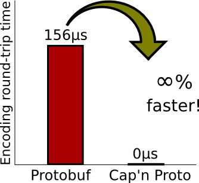

# FlatBuffers Encode, Explained from First Principles

<p align='center'>

</p>

## 1. FlatBuffers Generates a Binary Stream

Using FlatBuffers is broadly similar to using Protocol Buffers. The main difference is that FlatBuffers provides one additional capability: parsing JSON.

- Write a schema file to describe the data structures and interface definitions.
- Compile it with flatc to generate code files for the corresponding language.
- Parse JSON data, store the data according to the corresponding schema, and write it into a FlatBuffers binary file.
- Develop using the files generated for FlatBuffers-supported languages, such as C++, Java, and others.

Next, let’s define a simple schema file and see how FlatBuffers is used.
```schema
// Example IDL file for our monster's schema.
namespace MyGame.Sample;
enum Color:byte { Red = 0, Green, Blue = 2 }
union Equipment { Weapon } // Optionally add more tables.
struct Vec3 {
  x:float;
  y:float;
  z:float;
}
table Monster {
  pos:Vec3; // Struct.
  mana:short = 150;
  hp:short = 100;
  name:string;
  friendly:bool = false (deprecated);
  inventory:[ubyte];  // Vector of scalars.
  color:Color = Blue; // Enum.
  weapons:[Weapon];   // Vector of tables.
  equipped:Equipment; // Union.
  path:[Vec3];        // Vector of structs.
}
table Weapon {
  name:string;
  damage:short;
}
root_type Monster;
```
After compiling with `flatc`, you can start development using the generated files.
```go
import (
        flatbuffers "github.com/google/flatbuffers/go"
        sample "MyGame/Sample"
)

// Create a `FlatBufferBuilder` instance, use it to start creating FlatBuffers, with an initial size of 1024
// The buffer size grows automatically as needed, so don't worry about running out of space
builder := flatbuffers.NewBuilder(1024)

weaponOne := builder.CreateString("Sword")
weaponTwo := builder.CreateString("Axe")
// Create the first weapon, a sword
sample.WeaponStart(builder)
sample.Weapon.AddName(builder, weaponOne)
sample.Weapon.AddDamage(builder, 3)
sword := sample.WeaponEnd(builder)
// Create the second weapon, an axe
sample.WeaponStart(builder)
sample.Weapon.AddName(builder, weaponTwo)
sample.Weapon.AddDamage(builder, 5)
axe := sample.WeaponEnd(builder)

```
Before serializing `Monster`, we first need to serialize all objects contained within `Monster`; that is, we use a depth-first, pre-order traversal to serialize the data tree. This is usually easy to implement for any tree structure.
```go
// Assign a value to the name field
name := builder.CreateString("Orc")

// Note that since this is PrependByte, which prepends bytes, the loop needs to iterate in reverse
sample.MonsterStartInventoryVector(builder, 10)
for i := 9; i >= 0; i-- {
        builder.PrependByte(byte(i))
}
inv := builder.EndVector(10)
```
In the code above, we serialized two built-in data types (a string and an array) and captured their return values. This value is the offset of the serialized data, indicating where it is stored. Once we have this offset, we can reference it when adding fields to `Monster`.

The recommendation here is that if you need to create an array of nested objects (such as tables, an array of strings, or other arrays), you can first collect their offsets into a temporary data structure, then create an additional array containing those offsets to store them all.

If you are not creating an array from an existing array, but instead serializing elements one by one, pay attention to the order: buffers are built from back to front.
```go
// Create a FlatBuffer array and prepend these weapons.
// Note: since we prepend data, remember to insert in reverse order.
sample.MonsterStartWeaponsVector(builder, 2)
builder.PrependUOffsetT(axe)
builder.PrependUOffsetT(sword)
weapons := builder.EndVector(2)
```
The FlatBuffer array now contains their offsets.

Also note that handling arrays of structs is completely different from handling tables, because structs are stored entirely inline in the array. For example, to create an array for the `path` field above:
```go
sample.MonsterStartPathVector(builder, 2)
sample.CreateVec3(builder, 1.0, 2.0, 3.0)
sample.CreateVec3(builder, 4.0, 5.0, 6.0)
path := builder.EndVector(2)
```
The non-scalar fields have already been serialized above; next, we can continue serializing the scalar fields:
```go
// Building a monster starts by calling `MonsterStart()` and ends with `MonsterEnd()`.
sample.MonsterStart(builder)
vec3 := sample.CreateVec3(builder, 1.0, 2.0, 3.0)
sample.MonsterAddPos(builder, vec3)
sample.MonsterAddName(builder, name)
sample.MonsterAddColor(builder, sample.ColorRed)
sample.MonsterAddHp(builder, 500)
sample.MonsterAddInventory(builder, inv)
sample.MonsterAddWeapons(builder, weapons)
sample.MonsterAddEquippedType(builder, sample.EquipmentWeapon)
sample.MonsterAddEquipped(builder, axe)
sample.MonsterAddPath(builder, path)
orc := sample.MonsterEnd(builder)
```
One thing to keep in mind is how to create the `Vec3` struct in a table. Unlike tables, structs are simple combinations of scalars; they are always stored inline, just like scalars themselves.

**Important reminder**: Unlike structs, you should not serialize nested tables or other objects. This is why we created all the strings / vectors / tables referenced by this monster before calling `start`. If you try to create any of them between `start` and `end`, you will get an assert / exception / panic depending on your language.

Default values for `hp` and `mana` are defined in the schema. If you do not need to change them during initialization, there is no need to add those values to the buffer. This means the fields will not be written to the buffer, saving transmission overhead and reducing the buffer size. Therefore, setting a reasonable default value can save some space. Of course, there is no need to worry that the value is not stored in the buffer: when you call `get`, the default value will be read from elsewhere.

**This also means you do not need to worry about adding many fields that are used in only a small number of instances. They all use their default values by default and do not take up any space in the buffer**.

Before finishing serialization, let’s revisit the FlatBuffer union `Equipment`. Every FlatBuffer union has two parts (for a detailed description, see [the previous article](https://github.com/halfrost/Halfrost-Field/blob/master/contents-en/Protocol/FlatBuffers-schema.md)). The first is the hidden field `_type`, which is generated to store the type of the table referenced by the union. This lets you know which type to use at runtime. The second field is the union’s data.

So we also need to add two fields: one is `Equipped Type`, and the other is the `Equipped` union. The specific code is here (initialized above):
```go
sample.MonsterAddEquippedType(builder, sample.EquipmentWeapon) // Union type
sample.MonsterAddEquipped(builder, axe) // Union data
```
After creating the buffer, you will get the offset of the entire data relative to the root. End the creation by calling the `finish` method; this offset will be stored in a variable. In the code below, the offset is stored in the `orc` variable:
```go
// Call the `Finish()` method to tell the builder that monster construction is complete.
builder.Finish(orc)
```
At this point, the buffer has been fully constructed. It can be sent over the network or compressed and stored. The final step is completed using the following method:
```go
// This method can only be called after the `Finish()` method has been called.
buf := builder.FinishedBytes() // Of type `byte[]`.
```
At this point, you can write the binary bytes to a file or send them over the network. **Be absolutely sure that the file mode (or transport protocol) you use is binary, not text**. If a FlatBuffer is transferred in text format, the buffer will be corrupted, which can make issues very hard to diagnose when you read the buffer on the other side.


## II. Reading a Binary Stream with FlatBuffers

<p align='center'>

</p>


The previous chapter covered how to use FlatBuffers to convert data into a binary stream. This section explains how to read it.

Before reading, you still need to ensure that the data is read in binary mode; other reading modes will not produce the correct data.
```go
import (
        flatbuffers "github.com/google/flatbuffers/go"
        sample "MyGame/Sample"
)

// First prepare a byte array to store the buffer binary stream
var buf []byte = /* the data you just read */
// Get the root accessor from the buffer
monster := sample.GetRootAsMonster(buf, 0)

```
Here, the default offset is 0. If you want to start reading data directly from `builder.Bytes`, you need to pass in an offset to skip `builder.Head()`. Since the builder constructs data in reverse, the offset will definitely not be 0.

Because the file generated by flatc has been imported, it already includes the get and set methods. Fields marked as deprecated will not generate the corresponding methods by default.
```go
hp := monster.Hp()
mana := monster.Mana()
name := string(monster.Name()) // Note: `monster.Name()` returns a byte[].

pos := monster.Pos(nil)
x := pos.X()
y := pos.Y()
z := pos.Z()
```
In the code above, `pos` is passed in as `nil`. If your program has particularly high performance requirements, you can pass in a pointer variable instead, allowing it to be reused and significantly reducing the performance overhead caused by allocating many small objects and garbage collection. If there are especially many small objects, this can also lead to GC-related issues.
```go
invLength := monster.InventoryLength()
thirdItem := monster.Inventory(2)
```
Reading an array is the same as using arrays in general, so I won’t go into it again here.
```go
weaponLength := monster.WeaponsLength()
weapon := new(sample.Weapon) // We need a `sample.Weapon` to pass into `monster.Weapons()`
                             // to capture the output of the function.
if monster.Weapons(weapon, 1) {
        secondWeaponName := weapon.Name()
        secondWeaponDamage := weapon.Damage()
}
```
Arrays of tables are used in essentially the same way as regular arrays. The only difference is that their elements are objects, so you just handle them accordingly.

Finally, there is the way to read a union. As we know, a union contains two fields: a type and data. You need to use the type to determine what data to deserialize.
```go
// Create a `flatbuffers.Table` to store the result of `monster.Equipped()`.
unionTable := new(flatbuffers.Table)
if monster.Equipped(unionTable) {
        unionType := monster.EquippedType()
        if unionType == sample.EquipmentWeapon {
                // Create a `sample.Weapon` object that can be initialized with the contents
                // of the `flatbuffers.Table` (`unionTable`), which was populated by
                // `monster.Equipped()`.
                unionWeapon = new(sample.Weapon)
                unionWeapon.Init(unionTable.Bytes, unionTable.Pos)
                weaponName = unionWeapon.Name()
                weaponDamage = unionWeapon.Damage()
        }
}
```
Use `unionType` to map to different types and deserialize data of different types. After all, a union contains only one table.


## III. Mutable FlatBuffers


<p align='center'>

</p>

From the usage above, the sender prepares the binary buffer stream and sends it to the consumer. After the consumer receives the binary buffer stream, it reads data from it. If the consumer also wants to make minor changes to the buffer and pass it on to the next consumer, it can only create a completely new buffer, modify the fields to be changed during creation, and then pass it to the next consumer.

If you only want to make a small change to one field, having to recreate a very large buffer is extremely inconvenient. If you need to modify many fields, you can consider building a new buffer from scratch, because that is more efficient and the API is more general-purpose.

If you want to create a mutable flatbuffer, you need to add the `--gen-mutable` compilation parameter when compiling the schema with flatc.

The generated code uses mutate instead of set to indicate that this is a special use case, helping avoid confusion with the default way of constructing FlatBuffer data.

**The mutating API does not support golang yet**.

Note that any mutate function in a table returns a boolean value. If we try to set a field that does not exist in the buffer, it returns false. **There are two cases where a field does not exist in the buffer: one is that it was never set, and the other is that its value is the same as the default value**. For example, `mana = 150` in the example above is the default value, so it is not stored in the buffer. If you call the mutate method, it returns false, and the value will not be modified.

One way to solve this problem is to call ForceDefaults on the FlatBufferBuilder to force all fields to be writable. This certainly increases the size of the buffer, but that is acceptable for a mutable buffer.

If this approach is still not acceptable, call the corresponding API (`--gen-object-api`) or use reflection. Currently, the C++ version of the API has the most complete support in this regard.


## IV. FlatBuffers Encoding Principles

<p align='center'>

</p>

Based on the simple usage flow above, let’s walk through the source code step by step.


### 1. Create a New FlatBufferBuilder
```go
builder := flatbuffers.NewBuilder(1024)
```
The first step is to create a `FlatBufferBuilder`. In the builder, the final serialized binary stream is initialized in little-endian format, and the binary stream is written from higher memory addresses toward lower memory addresses.
```go
type Builder struct {
	// `Bytes` gives raw access to the buffer. Most users will want to use
	// FinishedBytes() instead.
	Bytes []byte

	minalign  int
	vtable    []UOffsetT
	objectEnd UOffsetT
	vtables   []UOffsetT
	head      UOffsetT
	nested    bool
	finished  bool
}


type (
	// A SOffsetT stores a signed offset into arbitrary data.
	SOffsetT int32
	// A UOffsetT stores an unsigned offset into vector data.
	UOffsetT uint32
	// A VOffsetT stores an unsigned offset in a vtable.
	VOffsetT uint16
)

```
There are three special types here: SOffsetT, UOffsetT, and VOffsetT. SOffsetT stores a signed offset, UOffsetT stores an unsigned offset for array data, and VOffsetT stores an unsigned offset in the vtable.


Bytes in Builder is the final serialized binary stream. Creating a new FlatBufferBuilder initializes the Builder struct:
```go
func NewBuilder(initialSize int) *Builder {
	if initialSize <= 0 {
		initialSize = 0
	}

	b := &Builder{}
	b.Bytes = make([]byte, initialSize)
	b.head = UOffsetT(initialSize)
	b.minalign = 1
	b.vtables = make([]UOffsetT, 0, 16) // sensible default capacity

	return b
}
```

### 2. Serializing Scalar Data

Scalar data includes the following types: Bool, uint8, uint16, uint32, uint64, int8, int16, int32, int64, float32, float64, and byte. The serialization method is the same for all of these data types. Here, PrependInt16 is used as an example:
```go
func (b *Builder) PrependInt16(x int16) {
	b.Prep(SizeInt16, 0)
	b.PlaceInt16(x)
}
```
The concrete implementation calls two functions: `Prep()` and `PlaceXXX()`. `Prep()` is a common function that is invoked when serializing all scalars.
```go
func (b *Builder) Prep(size, additionalBytes int) {
	// Track the biggest thing we've ever aligned to.
	if size > b.minalign {
		b.minalign = size
	}
	// Find the amount of alignment needed such that `size` is properly
	// aligned after `additionalBytes`:
	alignSize := (^(len(b.Bytes) - int(b.Head()) + additionalBytes)) + 1
	alignSize &= (size - 1)

	// Reallocate the buffer if needed:
	for int(b.head) <= alignSize+size+additionalBytes {
		oldBufSize := len(b.Bytes)
		b.growByteBuffer()
		b.head += UOffsetT(len(b.Bytes) - oldBufSize)
	}
	b.Pad(alignSize)
}
```
The first input parameter of `Prep()` is `size`. Here, `size` is measured in bytes: however many bytes it occupies, that is the value of `size`. For example, `SizeUint8 = 1`, `SizeUint16 = 2`, `SizeUint32 = 4`, and `SizeUint64 = 8`. The same applies to other types. The three special offset types also have fixed sizes: `SOffsetT` is `int32`, so its `size = 4`; `UOffsetT` is `uint32`, so its `size = 4`; and `VOffsetT` is `uint16`, so its `size = 2`.

The `Prep()` method has two purposes:

1. Perform all alignment operations.
2. Allocate additional memory when there is insufficient space.

After adding `additional_bytes` bytes, `size` more bytes still need to be added. What needs to be aligned here is this final `size` bytes, which is effectively the size of the object being added—for example, an `Int` is 4 bytes. The end result is that, after allocating `additional_bytes`, the offset is an integer multiple of `size`. The number of bytes needed for alignment is computed in two statements:
```go
	alignSize := (^(len(b.Bytes) - int(b.Head()) + additionalBytes)) + 1
	alignSize &= (size - 1)
```
After alignment, reallocate the buffer if necessary:
```go
func (b *Builder) growByteBuffer() {
	if (int64(len(b.Bytes)) & int64(0xC0000000)) != 0 {
		panic("cannot grow buffer beyond 2 gigabytes")
	}
	newLen := len(b.Bytes) * 2
	if newLen == 0 {
		newLen = 1
	}

	if cap(b.Bytes) >= newLen {
		b.Bytes = b.Bytes[:newLen]
	} else {
		extension := make([]byte, newLen-len(b.Bytes))
		b.Bytes = append(b.Bytes, extension...)
	}

	middle := newLen / 2
	copy(b.Bytes[middle:], b.Bytes[:middle])
}
```
The `growByteBuffer()` method expands the buffer to twice its original size. Notably, the final `copy` operation:
```go
copy(b.Bytes[middle:], b.Bytes[:middle])
```
The old data is actually copied to the end of the newly expanded array, because the build buffer is built from back to front.

The last step of `Prep()` is to add `0` at the current offset:
```go
func (b *Builder) Pad(n int) {
	for i := 0; i < n; i++ {
		b.PlaceByte(0)
	}
}
```
In the example above, hp = 500, and the binary representation of 500 is 111110100. Since the current buffer contains 2 bytes, 500 is stored in reverse order as 1111 0100 0000 0001. According to the alignment rules mentioned above, the type of 500 is Sizeint16, with a size of 2 bytes. The current offset is 133 bytes (why it is 133 bytes will be discussed below; for now, just accept this value). 133 + 2 = 135 bytes, which is not a multiple of Sizeint16, so byte alignment is required. The effect of alignment is to add 0s, aligning to an integer multiple of Sizeint16. Based on the rules above, alignSize is calculated as 1, meaning that one additional byte of 0 needs to be added.

So the final representation of 500 in the binary stream is:

<p align='center'>

</p>
```c
500 = 1111 0100 0000 0001 0000 0000
    = 244 1 0
```
Finally, we should also mention the default values of scalars. As we know, in FlatBuffers, default values are not stored in the binary stream. So where are they stored? They are actually compiled by the flatc file directly into the generated code. Let’s again use `hp` here as an example; its default value is `100`.

When we serialize `hp` for `Monster`, we call the `MonsterAddHp()` method:
```go
func MonsterAddHp(builder *flatbuffers.Builder, hp int16) {
	builder.PrependInt16Slot(2, hp, 100)
}
```
The concrete implementation makes this immediately clear: the default value is written directly, and the default value `100` is passed into the builder as an input parameter.
```go
func (b *Builder) PrependInt16Slot(o int, x, d int16) {
	if x != d {
		b.PrependInt16(x)
		b.Slot(o)
	}
}
```
When preparing a Slot, if the serialized value is equivalent to the default value, it will not continue being written into the binary stream. The corresponding code is the `if` check above. Only when it is not equal to the default value will the `PrependInt16()` operation continue.

The final step in serializing all scalar values is to record the offset in the vtable:
```go
func (b *Builder) Slot(slotnum int) {
	b.vtable[slotnum] = UOffsetT(b.Offset())
}
```
`slotnum` is passed in by the caller, and we developers do not need to worry about this value, because it is the num that `flatc` automatically generates according to the schema.
```schema
table Monster {
  pos:Vec3; // Struct.
  mana:short = 150;
  hp:short = 100;
  name:string;
  friendly:bool = false (deprecated);
  inventory:[ubyte];  // Vector of scalars.
  color:Color = Blue; // Enum.
  weapons:[Weapon];   // Vector of tables.
  equipped:Equipment; // Union.
  path:[Vec3];        // Vector of structs.
}
```
In the definition of Monster, `hp` is counted downward from `pos`, starting at 0. By the time you reach `hp`, it is the second field, so in the builder’s vtable, `hp` occupies the second slot. The value stored in `vtable[2]` is its corresponding offset.


### 3. Serializing Arrays

An array stores contiguous scalar values, and also stores a `SizeUint32` representing the size of the array. The array is not stored inline in its parent object; instead, it is referenced via an offset.

In the example above, the arrays actually fall into three categories: scalar arrays, table arrays, and struct arrays. In practice, when serializing an array, you do not need to consider what it specifically contains. The serialization method is the same for all three kinds of arrays: they all call the following method:
```go
func (b *Builder) StartVector(elemSize, numElems, alignment int) UOffsetT {
	b.assertNotNested()
	b.nested = true
	b.Prep(SizeUint32, elemSize*numElems)
	b.Prep(alignment, elemSize*numElems) // Just in case alignment > int.
	return b.Offset()
}
```
This method takes three input parameters: the element size, the number of elements, and the alignment bytes.

In the example above, the scalar array InventoryVector contains `SizeInt8`, which is one byte, so its alignment is also 1 byte (use the largest byte size occupied by the elements in the array). The table array WeaponsVector contains tables of type Weapons. The element size of a table is `string + short = 4` bytes, and the alignment is also 4 bytes. The struct array PathVector contains structs of type Path. The element size of a struct is `SizeFloat32 * 3 = 4 * 3 = 12` bytes, but the alignment size is only 4 bytes.

The `StartVector()` method first checks whether the current build has any nesting:
```go
func (b *Builder) assertNotNested() {
	if b.nested {
		panic("Incorrect creation order: object must not be nested.")
	}
}
```
Table/Vector/String cannot be created in a nested manner. The `nested` field in the builder also indicates whether the current state is nested. If they are created inside a nested loop, a panic will occur here.

Next are two `Prep()` operations. Here, `SizeUint32` is prepared first, followed by the `alignment` `Prep`, because `alignment` may be greater than `SizeUint32`.

After the alignment space has been prepared and the offset has been calculated, the next step is to serialize elements into the array by calling various `PrependXXXX()` methods. (The `PrependInt16()` method was used as an example above; other types are similar, so they will not be discussed further here.)

After the data has been loaded into the array, the final step is to call `EndVector()` once to finish serializing the array:
```go
func (b *Builder) EndVector(vectorNumElems int) UOffsetT {
	b.assertNested()

	// we already made space for this, so write without PrependUint32
	b.PlaceUOffsetT(UOffsetT(vectorNumElems))

	b.nested = false
	return b.Offset()
}
```
`EndVector()` internally calls the `PlaceUOffsetT()` method:
```go
func (b *Builder) PlaceUOffsetT(x UOffsetT) {
	b.head -= UOffsetT(SizeUOffsetT)
	WriteUOffsetT(b.Bytes[b.head:], x)
}

func WriteUOffsetT(buf []byte, n UOffsetT) {
	WriteUint32(buf, uint32(n))
}

func WriteUint32(buf []byte, n uint32) {
	buf[0] = byte(n)
	buf[1] = byte(n >> 8)
	buf[2] = byte(n >> 16)
	buf[3] = byte(n >> 24)
}
```
The PlaceUOffsetT() method mainly sets the builder’s UOffset. SizeUOffsetT = 4 bytes. It serializes the array length into the binary stream. The array length is 4 bytes.

In the example above, the offset to InventoryVector is 60. After adding ten 1-byte scalar elements, it reaches byte 70. Since alignment = 1, which is smaller than SizeUint32 = 4, it is aligned to 4 bytes. The closest offset to 70 that is also a multiple of 4 is 72, so alignment requires adding 2 extra zero bytes. The final representation in the binary stream is:

<p align='center'>

</p>
```c
10 0 0 0 0 1 2 3 4 5 6 7 8 9 0 0
```

### 4. Serializing `string`

A string can be viewed as a byte array, except that there is a null terminator at the end of the string. A string also cannot be stored inline in its parent; it is referenced via an offset.

Therefore, serializing a `string` is very similar to serializing an array.
```go
func (b *Builder) CreateString(s string) UOffsetT {
	b.assertNotNested()
	b.nested = true

	b.Prep(int(SizeUOffsetT), (len(s)+1)*SizeByte)
	b.PlaceByte(0)

	l := UOffsetT(len(s))

	b.head -= l
	copy(b.Bytes[b.head:b.head+l], s)

	return b.EndVector(len(s))
}
```
The implementation code and the process for serializing an array are basically the same, with a few additional steps explained below. It also starts with `Prep()` and alignment. The difference from an array is that a `string` ends with a null terminator, so one extra byte with value `0` must be added after the last byte of the array. That is why there is an additional `b.PlaceByte(0)`.

`copy(b.Bytes[b.head:b.head+l], s)` copies the string into the corresponding offset.

Finally, `b.EndVector()` similarly writes the length into the binary stream. Note the two places where the length is handled: `Prep()` accounts for the trailing `0`, so it uses `len(s) + 1`; the final `EndVector()` does not account for the trailing `0`, so it uses `len(s)`.

Let’s use the concrete example above to illustrate this.
```go
weaponOne := builder.CreateString("Sword")
```
At the very beginning, we serialized the `Sword` string. The ASCII codes for this string are 83 119 111 114 100. Since a 0 also needs to be padded at the end of the string, the entire string in the binary stream should be 83 119 111 114 100 0. Now consider alignment: because `SizeUOffsetT = 4` bytes, the string’s current offset is 0. After adding the string length of 6, the nearest multiple of 4 greater than or equal to 6 is 8, so two more 0 bytes need to be appended at the end. Finally, add the string length, 5 (note that this length does not include the trailing 0 at the end of the string).

So the final layout of the `Sword` string in the binary stream is as follows:

<p align='center'>

</p>
```c
5 0 0 0 83 119 111 114 100 0 0 0
```

### 5. Serializing structs


Structs are always stored inline within their parent (struct, table, or vector) for maximum compactness. A struct defines a consistent memory layout in which all fields are aligned to their size, and the struct itself is aligned to its largest scalar member. This approach enforces alignment rules independent of the underlying compiler, ensuring a cross-platform-compatible layout. This layout is constructed in the generated code. Next, let’s look at how it is constructed.

Serializing a struct is straightforward: serialize it directly into binary and insert it into the slot:
```go
func (b *Builder) PrependStructSlot(voffset int, x, d UOffsetT) {
	if x != d {
		b.assertNested()
		if x != b.Offset() {
			panic("inline data write outside of object")
		}
		b.Slot(voffset)
	}
}
```
In the actual implementation, it first checks whether the two `UOffsetT` values in the input parameters are equal. It then checks whether there is any current nesting. If there is no nesting, it also verifies whether the `UOffsetT` matches the offset after actual serialization. If all these checks pass, it generates the slot—recording the offset in the vtable.
```go
builder.PrependStructSlot(0, flatbuffers.UOffsetT(pos), 0)
```
When called, it computes the struct’s UOffsetT once (32-bit, 4 bytes).
```go
func CreateVec3(builder *flatbuffers.Builder, x float32, y float32, z float32) flatbuffers.UOffsetT {
	builder.Prep(4, 12)
	builder.PrependFloat32(z)
	builder.PrependFloat32(y)
	builder.PrependFloat32(x)
	return builder.Offset()
}
```
Because the type is `float32`, the size is 4 bytes. The struct contains three variables, so its total size is 12 bytes. You can see that the struct’s values are placed directly in memory without any additional processing, and there is no issue of nested allocation, so it can be inlined inside other structures. The storage order is the same as the field order.
```c
1.0 floating-point type converted to binary is：00111111100000000000000000000000
2.0 floating-point type converted to binary is：01000000000000000000000000000000
3.0 floating-point type converted to binary is：01000000010000000000000000000000

```
<p align='center'>

</p>


```c
0 0 128 63 0 0 0 64 0 0 64 64
```

### 6. Serializing a table

Unlike a struct, a table is not stored inline within its parent, but instead via a reference offset. A table contains an `SOffsetT`, which is the signed version of `UOffsetT`; the offset it represents is directional. Because a vtable can be stored anywhere, its offset should be calculated from the start of the stored object minus the start of the vtable—that is, the offset between the object and the vtable.

Serializing a table consists of three steps. The first step is `StartObject`:
```go
func (b *Builder) StartObject(numfields int) {
	b.assertNotNested()
	b.nested = true

	// use 32-bit offsets so that arithmetic doesn't overflow.
	if cap(b.vtable) < numfields || b.vtable == nil {
		b.vtable = make([]UOffsetT, numfields)
	} else {
		b.vtable = b.vtable[:numfields]
		for i := 0; i < len(b.vtable); i++ {
			b.vtable[i] = 0
		}
	}

	b.objectEnd = b.Offset()
	b.minalign = 1
}
```
The first step in serializing a table is to initialize the vtable. Before initialization, exception checks are performed to determine whether nesting is occurring. Next, the vtable space is initialized. Here, `UOffsetT = UOffsetT uint32` is used during initialization to prevent overflow. The input parameter to `StartObject()` is the number of fields. Note that a union has 2 fields.

Each table has its own vtable, which stores the offset of each field. This is the purpose of the `slot` function mentioned above: the generated slots are all recorded in the vtable. Identical vtables share the same vtable instance.

The second step is to add each field. The fields can be added in any order, because after `flatc` compiles the schema, the order of each field within the slots has already been arranged and will not change based on the order in which we call the serialization methods. For example:
```go
func MonsterAddPos(builder *flatbuffers.Builder, pos flatbuffers.UOffsetT) {
	builder.PrependStructSlot(0, flatbuffers.UOffsetT(pos), 0)
}
func MonsterAddMana(builder *flatbuffers.Builder, mana int16) {
	builder.PrependInt16Slot(1, mana, 150)
}
func MonsterAddHp(builder *flatbuffers.Builder, hp int16) {
	builder.PrependInt16Slot(2, hp, 100)
}
func MonsterAddName(builder *flatbuffers.Builder, name flatbuffers.UOffsetT) {
	builder.PrependUOffsetTSlot(3, flatbuffers.UOffsetT(name), 0)
}
func MonsterAddInventory(builder *flatbuffers.Builder, inventory flatbuffers.UOffsetT) {
	builder.PrependUOffsetTSlot(5, flatbuffers.UOffsetT(inventory), 0)
}
func MonsterStartInventoryVector(builder *flatbuffers.Builder, numElems int) flatbuffers.UOffsetT {
	return builder.StartVector(1, numElems, 1)
}
func MonsterAddColor(builder *flatbuffers.Builder, color int8) {
	builder.PrependInt8Slot(6, color, 2)
}
func MonsterAddWeapons(builder *flatbuffers.Builder, weapons flatbuffers.UOffsetT) {
	builder.PrependUOffsetTSlot(7, flatbuffers.UOffsetT(weapons), 0)
}
func MonsterStartWeaponsVector(builder *flatbuffers.Builder, numElems int) flatbuffers.UOffsetT {
	return builder.StartVector(4, numElems, 4)
}
func MonsterAddEquippedType(builder *flatbuffers.Builder, equippedType byte) {
	builder.PrependByteSlot(8, equippedType, 0)
}
func MonsterAddEquipped(builder *flatbuffers.Builder, equipped flatbuffers.UOffsetT) {
	builder.PrependUOffsetTSlot(9, flatbuffers.UOffsetT(equipped), 0)
}
func MonsterAddPath(builder *flatbuffers.Builder, path flatbuffers.UOffsetT) {
	builder.PrependUOffsetTSlot(10, flatbuffers.UOffsetT(path), 0)
}
func MonsterStartPathVector(builder *flatbuffers.Builder, numElems int) flatbuffers.UOffsetT {
	return builder.StartVector(12, numElems, 4)
```
The above shows the serialization implementation for all fields in the Monster table. We can look at the first argument of each function, which corresponds to the slot position in the vtable: 0 - pos, 1 - mana, 2 - hp, 3 - name, (no 4 - friendly, because it has been deprecated), 5 - inventory, 6 - color, 7 - weapons, 8 - equippedType, 9 - equipped, 10 - path. Monster has 11 fields in total (including one deprecated field; the union counts as 2 fields), and the final serialization needs to serialize 10 fields. **This is also why id values can only increase going forward: you cannot add fields before existing ones, nor can you remove deprecated fields, because once a slot position is fixed, it cannot be changed**. With id values in place, changes to field names no longer matter.

In addition, **the serialization list also shows that when serializing a table, nested table / string / vector types cannot be serialized inline; they cannot be inlined and must be created before the root object is created**. inventory is a scalar array: it is serialized first, and then its offset is referenced in Monster. weapons is an array of tables: it is likewise serialized first, and then its offset is referenced. path is a struct and is also referenced. pos is a struct and is inlined directly in the table. equipped is a union and is also inlined directly in the table.
```go
func WeaponAddName(builder *flatbuffers.Builder, name flatbuffers.UOffsetT) {
	builder.PrependUOffsetTSlot(0, flatbuffers.UOffsetT(name), 0)
}
```
When serializing the `name` in the `weapon` table, the offset is computed as a relative position—not relative to the end of the buffer, but relative to the current write position:
```go
// PrependSOffsetT prepends an SOffsetT, relative to where it will be written.
func (b *Builder) PrependSOffsetT(off SOffsetT) {
	b.Prep(SizeSOffsetT, 0) // Ensure alignment is already done.
	if !(UOffsetT(off) <= b.Offset()) {
		panic("unreachable: off <= b.Offset()")
	}
	// Note that the offset calculated here is relative to the current write position
	off2 := SOffsetT(b.Offset()) - off + SOffsetT(SizeSOffsetT)
	b.PlaceSOffsetT(off2)
}

// PrependUOffsetT prepends an UOffsetT, relative to where it will be written.
func (b *Builder) PrependUOffsetT(off UOffsetT) {
	b.Prep(SizeUOffsetT, 0) // Ensure alignment is already done.
	if !(off <= b.Offset()) {
		panic("unreachable: off <= b.Offset()")
	}
	// Note that the offset calculated here is relative to the current write position
	off2 := b.Offset() - off + UOffsetT(SizeUOffsetT)
	b.PlaceUOffsetT(off2)
}
```
For other scalar types, you can simply compute the offset directly; the only ones that require special attention are UOffsetT and SOffsetT.

The final step in serializing a table is EndObject():
```go
func (b *Builder) EndObject() UOffsetT {
	b.assertNested()
	n := b.WriteVtable()
	b.nested = false
	return n
}
```
Finally, when ending serialization, you also need to first check whether it is nested. The important part is calling WriteVtable(). Before looking at the concrete implementation of WriteVtable(), we need to introduce the vtable data structure.


The elements of a vtable are all of type VOffsetT, which is uint16. The first element is the size of the vtable in bytes, including itself. The second is the size of the object in bytes, including the vtable offset. This size can be used for streaming, so you know how many bytes must be read to access all inline fields of the object. The third part consists of N offsets, where N is the number of fields declared in the schema at the time the code that builds this buffer was compiled (therefore, the table size is N + 2), including deprecated fields. Each is SizeVOffsetT bytes wide. See the figure below:

<p align='center'>

</p>


The first element of an object is SOffsetT, the offset between the object and the vtable, which may be positive or negative. The second element is the object's data. When reading an object, SOffsetT is checked first to prevent cases where new code reads old data. If the field to be read is outside the bounds of the offset array, or the vtable entry is 0, it means the field does not exist in this object, and the field's default value is returned. If it is not out of bounds, the offset for that field is read.

<p align='center'>

</p>


Next, let's take a closer look at the concrete implementation of WriteVtable():
```go
func (b *Builder) WriteVtable() (n UOffsetT) {
	// 1. Add a 0-valued aligned scalar; after alignment, write the offset. This slot will later be overwritten by the offset to the vtable
	b.PrependSOffsetT(0)

	objectOffset := b.Offset()
	existingVtable := UOffsetT(0)

	// 2. Remove trailing zeros
	i := len(b.vtable) - 1
	for ; i >= 0 && b.vtable[i] == 0; i-- {
	}
	b.vtable = b.vtable[:i+1]

	// 3. Search vtables in reverse for a vtable already stored; if an identical stored vtable exists, find it directly and have the index point to it
	//    See the BenchmarkVtableDeduplication test results: pointing to the same vtable via the index instead of creating a new one can improve performance by 30%
	for i := len(b.vtables) - 1; i >= 0; i-- {
		// Pick a vtable from vtables
		vt2Offset := b.vtables[i]
		vt2Start := len(b.Bytes) - int(vt2Offset)
		vt2Len := GetVOffsetT(b.Bytes[vt2Start:])

		metadata := VtableMetadataFields * SizeVOffsetT
		vt2End := vt2Start + int(vt2Len)
		vt2 := b.Bytes[vt2Start+metadata : vt2End]

		// 4. Compare the current b.vtable with vt2; if they are the same, record the offset in existingVtable and break as soon as one is found
		if vtableEqual(b.vtable, objectOffset, vt2) {
			existingVtable = vt2Offset
			break
		}
	}

	if existingVtable == 0 {
		// 5. If no identical vtable is found, create a new one and write it to the buffer
		//    It is also written in reverse, because serialization is tail-first.
		for i := len(b.vtable) - 1; i >= 0; i-- {
			var off UOffsetT
			if b.vtable[i] != 0 {
				// 6. Calculate the offsets of subsequent fields from the start of the object
				off = objectOffset - b.vtable[i]
			}
			b.PrependVOffsetT(VOffsetT(off))
		}

		// 7. Finally write two metadata fields
		//    First, write the object's size, including the vtable offset
		objectSize := objectOffset - b.objectEnd
		b.PrependVOffsetT(VOffsetT(objectSize))

		// 8. Second, store the size of the vtable
		vBytes := (len(b.vtable) + VtableMetadataFields) * SizeVOffsetT
		b.PrependVOffsetT(VOffsetT(vBytes))

		// 9. Final step: update the offset-to-vtable value in the object header; the value is SOffsetT, 4 bytes
		objectStart := SOffsetT(len(b.Bytes)) - SOffsetT(objectOffset)
		WriteSOffsetT(b.Bytes[objectStart:],
			SOffsetT(b.Offset())-SOffsetT(objectOffset))

		// 10. Finally, store the vtable in memory for future “deduplication” (do not create identical vtables; just update the index)
		b.vtables = append(b.vtables, b.Offset())
	} else {
		// 11. If an identical vtable was found
		objectStart := SOffsetT(len(b.Bytes)) - SOffsetT(objectOffset)
		b.head = UOffsetT(objectStart)

		// 12. Update the offset-to-vtable value in the object header; the value is SOffsetT, 4 bytes
		WriteSOffsetT(b.Bytes[b.head:],
			SOffsetT(existingVtable)-SOffsetT(objectOffset))
	}

	// 13. Finally destroy b.vtable
	b.vtable = b.vtable[:0]
	return objectOffset
}
```
Next, let’s walk through it step by step:

Step 1: Add a 0-aligned scalar. After alignment, write the offset; this position will later be overwritten by the offset to the vtable. `b.PrependSOffsetT(0)`

<p align='center'>

</p>

The definition of Weapon in the schema is as follows:
```go
table Weapon {
  name:string;
  damage:short;
}
```
`Weapon` has two fields: `name` and `damage`. `name` is a `string`; it must be created before the table is created, and the table can only reference its offset. Here we have already created the string `"sword"`, whose offset is 12. Therefore, in the `sword` object, we need to reference this offset, 12. The current offset is 24; subtracting 12 gives 12, so we write 12 here. This means that the data stored 12 bytes backward is the `name` for this field. `damage` is a `short`, so it can be embedded directly in the `sword` object. Then add two `0`s for 4-byte alignment, and prepend the current offset as a 4-byte value. **Note that at this point, the offset is relative to the end of the buffer, not yet relative to the vtable**. The current `b.offset()` is 32, so fill in 32 as 4 bytes.

Step 3: search backward through `vtables` for a vtable that has already been stored. If an identical stored vtable exists, find it directly and point the index to it. You can check the benchmark results of `BenchmarkVtableDeduplication`: pointing the index to the same vtable instead of creating a new one can improve performance by 30%.

This step is about looking up the vtable. If it is not found, create a new vtable; if it is found, update the index to point to it.

First assume it is not found. Proceed to step 5.

The values stored in the current vtable are `[24,26]`, which are the offsets of `name` and `damage` in the `sword` object. Starting from the beginning of the object, compute the offsets of the following fields. `off = objectOffset - b.vtable[i]`. This corresponds to step 6 in the code above.


The result of steps 6 through 8 is shown below:


<p align='center'>

</p>


Compute the offset of `sword` from right to left. The current offset of `sword` is 32. Move 6 bytes to the `Damage` field, then move another 2 bytes to the `name` field. Therefore, the last 4 bytes in the vtable are `8 0 6 0`. The entire `sword` object is 12 bytes in size, including the header offset. Finally, write the vtable size, which is 8 bytes.


<p align='center'>

</p>

The final step is to fix up the offset in the header of the `sword` object, changing it to the offset to the vtable. Since the current vtable is at a lower address, the `sword` object is to its right, so the offset is positive: `offset = vtable size = 8` bytes. The corresponding implementation is shown in step 9 of the code.


If an identical vtable was found earlier in `vtables`, then simply update the offset in the object header to the offset to that vtable. This corresponds to step 12 in the code.


<p align='center'>

</p>

The `axe` object can be used as an example to illustrate the case where an identical vtable is found. Since both the `sword` object and the `axe` object are of type `Weapon`, the internal field-offset layout of the objects should be exactly the same, so they share a vtable with the same structure. The `sword` object is created first, with its vtable immediately after it; then the `axe` object is created. Therefore, the offset in the header of the `axe` object is negative. Here it is `-12`.
```c
12's sign-magnitude = 00000000 00000000 00000000 00001100
12's one's complement = 11111111 11111111 11111111 11110011
12's two's complement = 11111111 11111111 11111111 11110100
```
Stored in reverse order, this is 244 255 255 255.


### 7. End Serialization
```go
func (b *Builder) Finish(rootTable UOffsetT) {
	b.assertNotNested()
	b.Prep(b.minalign, SizeUOffsetT)
	b.PrependUOffsetT(rootTable)
	b.finished = true
}
```
At the end of serialization, two more operations are required: byte alignment, and storing the offset pointing to the root object.

<p align='center'>

</p>

Because we defined the root object as Monster in the schema, after serializing the Monster object, its vtable is generated immediately afterward. Therefore, the offset of the root table here is 32.


At this point, the entire Monster has been serialized. The final binary buffer is as follows:

<p align='center'>

</p>

In the figure above, the numbers above the binary stream indicate the offset values of the fields. The labels below the binary stream indicate the field names.


## V. How FlatBuffers Decoding Works

<p align='center'>

</p>

The FlatBuffers decoding process is very simple. Since the offsets of all fields are stored during serialization, deserialization is essentially just reading data from the specified offsets.

For scalars, there are two cases: with a default value and without a default value. In the example above, when serializing the Mana field, we directly used the default value. In the FlatBuffer binary stream, you can see that the Mana field is all 0, and its offset is also 0. In fact, this field uses the default value; when reading it, the value is read directly from the default value recorded in the file generated by flatc.

The Hp field has a default value, but we did not use the default value during serialization; instead, we assigned it a new value. In this case, the binary stream records the offset of Hp, and the value is also stored in the binary stream.

Deserialization reads the binary stream backward from the root table. It reads the corresponding offset from the vtable, then finds the corresponding field in the corresponding object. If it is a reference type, such as string / vector / table, it reads the offset, then looks up the value corresponding to that offset and reads it. If it is not a reference type, it directly reads from the corresponding position according to the offset in the vtable.


The entire deserialization process is zero-copy and does not consume any additional memory resources. In addition, FlatBuffers can read arbitrary fields, unlike JSON and protocol buffer, which require reading the entire object before a particular field can be obtained. The main advantage of FlatBuffers lies precisely in deserialization.


## VI. FlatBuffers Performance

Since FlatBuffers’ advantage lies in deserialization, let’s compare how strong its performance really is.

<p align='center'>

</p>

<p align='center'>

</p>


1. Encoding performance: flatbuf’s encoding performance is lower than protobuf’s. Among JSON, protobuf, and flatbuf, flatbuf has the worst encoding performance, while JSON falls somewhere between the two.

2. Size of encoded data: In most cases, transmitted data is compressed. Without compression, FlatBuffers produces the largest data size. The reason is simple: the binary stream contains many 0 bytes inserted for alignment, and the original data does not use any special compression processing either, so the overall data expands even more. Whether compressed or not, FlatBuffers produces the largest data size. After compression, JSON’s data size becomes close to that of protocol buffer. Since protocol buffer’s own encoding is already compact, after further compression with algorithms such as GZIP, its size consistently remains the smallest.


3. Decoding performance: FlatBuffers is a binary format that does not require decoding, so its decoding performance is much higher—roughly hundreds of times faster than protobuf. Compared with JSON, the gap is even larger.


The conclusion is: if your use case heavily depends on deserialization, you can consider using FlatBuffers. Protobuf, by contrast, demonstrates well-balanced capabilities across all dimensions.


## VI. Pros and Cons of FlatBuffers 

<p align='center'>

</p>

After reading this article on how FlatBuffers encoding works, readers should understand the following points:

The FlatBuffers API is also relatively verbose. The API for creating buffers is somewhat similar to creating sprites in Cocos2D-X with C++. Perhaps it was naturally born for games.


Compared with protocol buffers, FlatBuffers has the following advantages:

- 1. Serialized data can be accessed without parsing/unpacking  
Serialized data, including hierarchical data, can be accessed without parsing. Thanks to this, we do not need to spend time initializing a parser (which means building complex field mappings) or parsing data.
- 2. Direct memory usage  
FlatBuffers data uses its own memory buffer and does not require allocating more additional memory. Unlike JSON, we do not need to allocate extra in-memory objects for the entire hierarchical structure while parsing data. **FlatBuffers can be considered a zero-copy + random-access reads version of protobuf**.

The advantages provided by FlatBuffers do not come without trade-offs. Its disadvantages can also be seen as sacrifices made for those advantages.

- 1. No readability    
Both FlatBuffers and protocol buffers organize data in binary form, which means debugging becomes more difficult. (To some extent, this can also be considered an advantage, as it provides a certain degree of “security.”)  
- 2. The API is somewhat verbose    
Due to the construction method of the binary protocol, data must be inserted “from the inside out.” Building FlatBuffers objects is relatively cumbersome.
- 3. Backward compatibility    
When dealing with structured binary data, we must consider the possibility of changes to that structure. Adding or removing fields from our schema must be done carefully. When reading older versions of objects, incorrect schema changes may cause errors without any explicit indication.
- 4. Serialization performance is sacrificed  
Because FlatBuffers optimizes for deserialization performance, it sacrifices some serialization-time performance. The serialized data is the largest, and serialization performance is also the worst.


## VII. Final Notes


Finally, as this article was nearing its end, I discovered another open-source library with performance and characteristics similar to FlatBuffers.

<p align='center'>

</p>


<p align='center'>

</p>

Cap'n Proto is an insanely fast data interchange format and can also be used in RPC systems. Here is a performance comparison article: [“Cap'n Proto: Cap'n Proto, FlatBuffers, and SBE”](https://capnproto.org/news/2014-06-17-capnproto-flatbuffers-sbe.html). Interested readers can treat it as additional reading material.


------------------------------------------------------

References:  

[Official FlatBuffers Documentation](https://google.github.io/flatbuffers/index.html)     
[Official flatcc Documentation](https://github.com/dvidelabs/flatcc/blob/master/doc/binary-format.md#flatbuffers-binary-format)       
[Improving Facebook's performance on Android with FlatBuffers](https://code.facebook.com/posts/872547912839369/improving-facebook-s-performance-on-android-with-flatbuffers/)   
[ Cap'n Proto: Cap'n Proto, FlatBuffers, and SBE](https://capnproto.org/news/2014-06-17-capnproto-flatbuffers-sbe.html)  
[How much can using FlatBuffers speed up data reads and writes in a real game project?](https://www.zhihu.com/question/28500901)  
[Trying Out FlatBuffers](https://www.race604.com/flatbuffers-intro/#fn:1)  
[Using FlatBuffers in Android](https://www.wolfcstech.com/2016/12/08/%E5%9C%A8Android%E4%B8%AD%E4%BD%BF%E7%94%A8FlatBuffers/)  


> GitHub Repo：[Halfrost-Field](https://github.com/halfrost/Halfrost-Field)
> 
> Follow: [halfrost · GitHub](https://github.com/halfrost)
>
> Source: [https://halfrost.com/flatbuffers\_encode/](https://halfrost.com/flatbuffers_encode/)