# Overview of HTTP Fundamentals

<p align='center'>

</p>


The Web uses a protocol called HTTP (HyperText Transfer Protocol) as its specification.
>A more rigorous translation of HTTP would be “HyperText Transfer Protocol.”


HTTP came into being in 1990. At that time, HTTP was not a formal standard, so it was called HTTP/0.9   
HTTP was officially published as a standard in May 1996, with the version named HTTP/1.0, documented in RFC1945   
HTTP published what is currently the most widely used version in January 1997, named HTTP/1.1, documented in RFC2616  
HTTP/2 was released on May 14, 2015. It introduced multiple features such as server push and is currently the latest version. It is documented in RFC7540
(It is not called HTTP/2.0 because the standards committee does not intend to release minor versions anymore; the next new version will be HTTP/3)


## I. Methods Supported by HTTP

HTTP is a protocol that does not retain state; that is, it is a stateless protocol. The HTTP protocol itself does not preserve communication state between requests and responses. In other words, at the HTTP level, the protocol does not persist any sent requests or responses. This is also intended to process large numbers of transactions faster and ensure the scalability of the protocol.

Although HTTP/1.1 is a stateless protocol, Cookie technology was intentionally introduced to implement the desired stateful behavior.

| Method Name | Description | Supported HTTP Protocol Versions | Details|
| :---: | :---: | :---: |:---: |
| GET | Retrieve a resource | 1.0、1.1 | The GET method is used to request access to a resource identified by a URI. After the specified resource is resolved by the server, the response content is returned. (I want to access one of your resources)|
| POST | Transfer an entity body | 1.0、1.1 | The POST method is used to transfer the body of an entity. Although GET can also transfer an entity body, GET is generally not used for this purpose; POST is used instead. The primary purpose of POST is not to retrieve the response body. (I want to tell you this piece of information)|
| PUT | Transfer a file | 1.0、1.1 | Requires the request message body to include file content, which is then saved to the location specified by the request URI. (I want to send you this file)|
| HEAD | Retrieve message headers | 1.0、1.1 | The HEAD method is the same as GET, except that it does not return the message body. It is used to verify the validity of a URI, the date and time when a resource was updated, and so on. (I want that related information)|
| DELETE | Delete a file | 1.0、1.1 | The opposite of PUT. The DELETE method deletes the specified resource according to the request URI. (Please delete this file)|
| OPTIONS | Query supported methods | 1.1 | OPTIONS is used to query the methods supported for the resource specified by the request URI. (Which methods do you support?)|
| TRACE | Trace the path | 1.1 | The TRACE method causes the Web server to return the previous request communication to the client. TRACE is rarely used and can easily lead to XST (Cross-Site-Tracing) attacks, so it is generally avoided|
| CONNECT | Request a proxy connection using a tunneling protocol | 1.1 | The CONNECT method requests that a tunnel be established when communicating with a proxy server, enabling TCP communication through a tunneling protocol. It is mainly used with SSL (Secure Sockets Layers) and TLS (Transport Layer Security) to encrypt communication content and transmit it through a network tunnel|
| PATCH | Update part of a file’s content| 1.1| **When the resource exists**, PATCH is used to update part of the resource content, such as updating a single field. For example, it might update only the phone number field in user information, whereas PUT is used to update a more complete representation of a resource; for example, a user refills an entire form to update all information, and backend processing might only preserve the internal record ID unchanged. <br>**When the resource does not exist**, PATCH modifies the original content and may also produce a new version. For example, when the resource does not exist, PATCH may create a new resource, which in this sense is like a saveOrUpdate operation. PUT, however, only updates existing resources, so it is an update operation|
| LINK | Establish a relationship with a resource | 1.0 | ✖︎Deprecated in the latest version✖︎|
| UNLINK | Disconnect a relationship | 1.0 | ✖︎Deprecated in the latest version✖︎|
|  |  |  | |
| PROPFIND | Retrieve properties | 1.1 | WebDAV retrieves properties|
| PROPPATCH | Modify properties | 1.1 | WebDAV modifies properties|
| MKCOL | Create properties | 1.1 | WebDAV creates properties|
| COPY | Copy resources and properties | 1.1 | WebDAV copies resources and properties|
| MOVE | Move resources | 1.1 | WebDAV moves resources|
| LOCK | Lock a resource | 1.1 | WebDAV locks a resource|
| UNLOCK | Unlock a resource | 1.1 | WebDAV unlocks a resource|


The definition of idempotency in the HTTP/1.1 specification is:

>Methods can also have the property of "idempotence" in that (aside from error or expiration issues) the side-effects of N > 0 identical requests is the same as for a single request.

By definition, the idempotency of an HTTP method means that making one request or multiple requests for a given resource should have the same side effects. Idempotency is a semantic concept. Just as a compiler can only help detect syntax errors, the HTTP specification cannot define idempotency through syntactic mechanisms such as message formats. This may be one reason why it does not receive much attention. In practice, however, idempotency is an extremely important concept in distributed system design, and the distributed nature of HTTP determines its importance in HTTP as well.


The safety of an HTTP method means that it does not change server state; in other words, it is read-only. Therefore, only OPTIONS, GET, and HEAD are safe; all others are unsafe.

| HTTP Method | Idempotent | Safe |
| :---: | :---: | :---: |
|OPTIONS|	yes	|yes|
|GET	|yes	|yes|
|HEAD	|yes	|yes|
|PUT	|yes	|no|
|DELETE	|yes	|no|
|POST	|no	|no|
|PATCH	|no	|no|

**POST and PATCH are not idempotent**.  
Two identical POST requests create two resources on the server, each with a different URI.  
The side effects of multiple PUT requests to the same URI are the same as those of a single PUT.  


## II. HTTP Status Codes


The first line of the **response message** returned by the server is the status line, which contains the status code and reason phrase used to inform the client of the result of the request.

| Status Code | Category | Reason Phrase |
| :---: | :---: | :---: |
| 1XX | Informational | The received request is being processed |
| 2XX | Success | The request was processed successfully |
| 3XX | Redirection | Additional action is required to complete the request |
| 4XX | Client Error | The server cannot process the request |
| 5XX | Server Error | The server encountered an error while processing the request |


### 1XX Informational

-  **100 Continue** ：Indicates that everything is normal so far, and the client may continue sending the request or ignore this response.

### 2XX Success

-  **200 OK** 

-  **204 No Content** ：The request has been processed successfully, but the returned response message does not include an entity body. It is generally used when the client only needs to send information to the server and no data needs to be returned.

-  **206 Partial Content** ：Indicates that the client made a range request. The response message contains the entity content for the range specified by Content-Range.

### 3XX Redirection

-  **301 Moved Permanently** ：Permanent redirect

-  **302 Found** ：Temporary redirect

-  **303 See Other** ：Has the same function as 302, but 303 explicitly requires the client to retrieve the resource using the GET method.

- Note: Although the HTTP protocol specifies that redirects with status codes 301 and 302 must not change the POST method to GET, most browsers change POST to GET for redirects with status codes 301, 302, and 303.

-  **304 Not Modified** ：If the request message headers include conditions such as If-Match, If-ModifiedSince, If-None-Match, If-Range, or If-Unmodified-Since, and the conditions are not satisfied, the server returns the 304 status code.

-  **307 Temporary Redirect** ：Temporary redirect, similar in meaning to 302, but 307 requires that the browser not change the redirected request’s POST method to GET.

### 4XX Client Error

-  **400 Bad Request** ：There is a syntax error in the request message.

-  **401 Unauthorized** ：This status code indicates that the sent request requires authentication information (BASIC authentication, DIGEST authentication). If a request has already been made previously, it indicates that user authentication failed.

-  **403 Forbidden** ：The request was rejected, and the server does not need to provide detailed reasons for the rejection.

-  **404 Not Found** 

### 5XX Server Error

-  **500 Internal Server Error** ：An error occurred while the server was executing the request.

-  **503 Service Unavailable** ：The server is temporarily overloaded or undergoing downtime maintenance and cannot currently process the request.

------------------------------------------------------------

## RFC 2616 Status Codes

| Status Code | Category | Reason Phrase |Meaning||
| :---: | :---: | :---: |:---: |:---:|
| 100 | Informational | Continue |The initial part of the request has been received, and the client should continue with the request.|❤|
| 101 | Informational | Switching Protocols |The server is switching protocols as instructed by the client, to the protocol listed in the Update header.|❤|
|||||
| 200 | Success| OK |The server has successfully processed the request|❤|
| 201 | Success|Created| For requests that require the server to create an object, the resource has been created|
| 202 | Success|Accepted| The request has been accepted, but the server has not yet processed it|
| 203 | Success|Non-Authoritative Information| The server has successfully processed the transaction, but the information contained in the entity headers does not come from the origin server; it comes from a copy of the resource|
| 204 | Success|No Content| The response message contains some headers and a status line, **but does not contain an entity body**. **It is generally used when information only needs to be sent from the client to the server and no new information content needs to be sent back to the client**|❤|
| 205 | Success|Reset Content| Another code mainly used by browsers. It means the browser should reset all HTML forms on the current page |
| 206 | Success |Partial Content| A partial or Range request was successfully executed. The client can use special headers to retrieve part of a document or a document within a certain range<br>**The response message contains entity content in the range specified by Content-Range, Date, and ETag or Content-Location**|❤|
|||||
|300| Redirection |Multiple Choices| The client requested a URL that actually points to multiple resources. This code is returned together with a list of options, after which the user can choose the option they want to use. The server may include the preferred URL in the Location header| 
|301| Redirection | Moved Permanently| **Permanent redirect**. The requested URL has moved. The response should include a Location URL indicating where the resource is now located|❤|
|302| Redirection| Found| **Temporary redirect**. Similar to status code 301, but the removal here is temporary. The client should temporarily locate the resource using the URL given in the Location header|❤|
|303| Redirection| See Other| Tells the client that it should retrieve the resource using another URL. This new URL is located in the Location header of the response message. Status code 303 has the same function as status code 302, **but 303 explicitly states that the client should use the GET method to retrieve the resource**.|❤|
||||When 301, 302, or 303 response status codes are returned, almost all browsers change POST to GET, delete the body of the request message, and then automatically send the request again.<br>The 301 and 302 standards prohibit changing the POST method to GET, but in practice everyone does this||
|304| Redirection| Not Modified| This status code indicates that when the client sends a conditional request, the server allows the request to access the resource, but because the request conditions are not satisfied, it directly returns 304 Not Modified (the server-side resource has not changed, so the client can directly use its unexpired cache). When the 304 status code is returned, it does not include any response body. **Although 304 is classified under the 3XX category, it has nothing to do with redirection**|❤|
||||(A conditional request refers to a GET request message that contains any of the following headers: If-Match, If-Modified-Since, If-None-Match, If-Range, or If-Unmodified-Since)||
|305| Redirection| Use Proxy| The resource must be accessed through a proxy, and the proxy location is given in the Location header|
|306|（Unused）||This status code is currently unused|
|307| Redirection| Temporary Redirect| Similar to status code 302. However, the client should temporarily locate the resource using the URL given in the Location header.<br>307 follows the browser standard and does not change POST to GET|❤|
|||||
|400|Client Error| Bad request| Tells the client that it sent an abnormal request|❤|
|401|Client Error| Unauthorized| Returned with the appropriate headers, asking the client to authenticate before it obtains access to the resource|❤|
|402|Client Error| Payment Required| This status code is currently unused and reserved for future use |
|403|Client Error| Forbidden| The server rejected the request|❤| 
|404|Client Error| Not Found| The server cannot find the requested URL|❤|
|405|Client Error| Method Not Allowed|The request contains a method that is not supported by the requested URI. The response should include an Allow header to inform the client which methods are supported by the requested resource| 
|406|Client Error| Not Acceptable| The client can specify parameters to indicate which types of entities it is willing to accept. This code can be used when the server has no resource matching a URL acceptable to the client| 
|407|Client Error| Proxy Authentication Required|Similar to status code 401, but used for proxy servers that require resource authentication|
|408|Client Error| Request Timeout| If the client takes too long to complete its request, the server can send back this status code and close the connection |
|409|Client Error| Conflict| The issued request caused some conflict on the resource| 
|410|Client Error| Gone| Similar to status code 404, except that the server once held these resources |
|411|Client Error| Length Required| This code is used when the server requires the request message to contain a Content-Length header. If the initiated request does not include a Content-Length header, the server will not accept the resource request| 
|412|Client Error|Precondition Failed| If the client initiates a conditional request and the server cannot satisfy one of the conditions, it returns this response code| 
|413|Client Error| Request Entity Too Large| The entity body sent by the client is larger than the server can or is willing to process|
|414|Client Error| Request URI Too Long| The request URL carried by the client’s request exceeds the length that the server can or is willing to process|
|415 |Client Error|Unsupported Media Type| The server cannot understand or does not support the content type of the entity sent by the client| 
|416 |Client Error|Requested Range Not Satisfiable| The request message requests a specified resource within a range, but that range is invalid or cannot be satisfied |
|417|Client Error| Expectation Failed| The request’s Expect header contains an expectation that the server cannot satisfy||
|||||
|500|Server Error| Internal Server Error| The server encountered an error that prevented it from servicing the request|❤|
|501 |Server Error|Not Implemented| The server cannot satisfy a feature requested by the client |
|502 |Server Error|Bad Gateway| A server acting as a proxy or gateway received an invalid response from an upstream server in the response chain |
|503|Server Error| Service Unavailable| The server is currently unable to service the request, but service can be restored after some time|❤|
|504|Server Error |Gateway Timeout| Similar to status code 408, but the response comes from a gateway or proxy that timed out while waiting for a response from another server |
|505|Server Error| HTTP Version Not Supported| The request received by the server is expressed using a protocol version that it does not support or is unwilling to support|

>RFC2616 defines 40 HTTP status codes. WebDAV (Web-based Distributed Authoring and Versioning) defines some special status codes in RFC4918 and RFC5842, and RFC2518, RFC2817, RFC2295, RFC2774, and RFC6585 additionally define some supplemental HTTP status codes. In total, there are 60+ types. For details, see [HTTP Status Codes (Wikipedia)](https://zh.wikipedia.org/wiki/HTTP%E7%8A%B6%E6%80%81%E7%A0%81)


Status codes added by WebDAV

| Status Code | Category | Reason Phrase |Meaning||
| :---: | :---: | :---: |:---: |:---:|
| 102 | Informational | Processing|The request can be processed normally, but it is currently still being processed. A WebDAV request may contain many subrequests involving file operations and can take a long time to complete. This code indicates that the server has received and is processing the request, but no response is available yet. This prevents the client from timing out and assuming the request was lost.||
| 207 | Success | Multi-Status| Multiple statuses exist. It indicates that the following message body will be an XML message and may contain a series of independent response codes, depending on the number of previous subrequests.||
| 208 | Success | Already Reported| Members of a DAV binding have already been enumerated in a previous part of the multistatus response and are not included again.||
|422|Client Error| Unprocessable Entity| The format is correct, but the content is erroneous, so the response cannot be processed||
|423|Client Error| Locked| The resource has been locked||
|424|Client Error| Failed Dependency| Processing of a request associated with another request failed because the dependency is no longer maintained.||
|507|Server Error| Insufficient Storage| The server is unable to store the content required to complete the request. This condition is considered temporary.||
|508|Server Error| Loop Detected| The server fell into an infinite loop while processing the request.|

## III. MIME Media Content


HTTP carefully labels every object to be transmitted over the Web with a data-format tag called a MIME type. MIME (Multipurpose Internet Mail Extension) was originally designed to solve problems that arose when moving messages between different email systems. MIME worked very well in email systems, so HTTP adopted it as well, using it to describe and label multimedia content.


RFC2045, “MIME: Format of Internet Message Bodies” (“MIME: Format of Internet Message Bodies”)


Common primary MIME types

| Type| Description | 
| :---: | :---: |
|application |Application-specific content format (discrete type)|
|audio| Audio format (discrete type) |
|chemical |Chemical data set (discrete IETF extension type)| 
|image| Image format (discrete type) |
|message |Message format (composite type)| 
|model| Three-dimensional model format (discrete IETF extension type)| 
|multipart |Collection of multiple parts (composite type)|
| text |Text format (discrete type)| 
|video |Video/movie format (discrete type)|


## IV. HTTP Message Structure

<p align='center'>

</p>


<p align='center'>
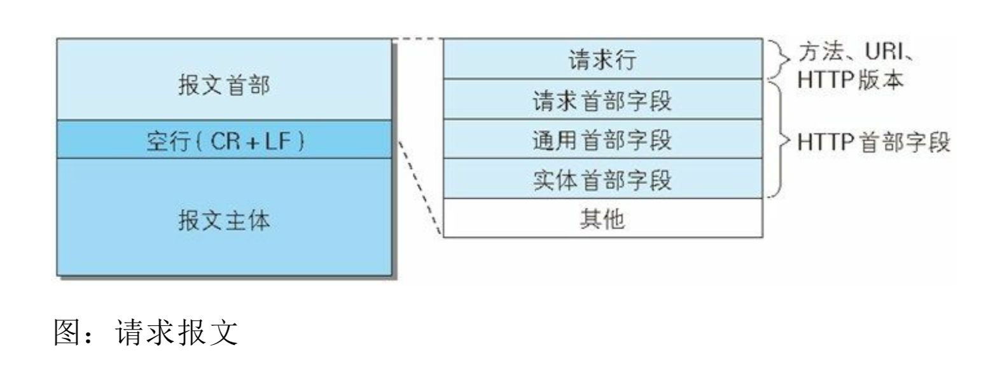
</p>


<p align='center'>
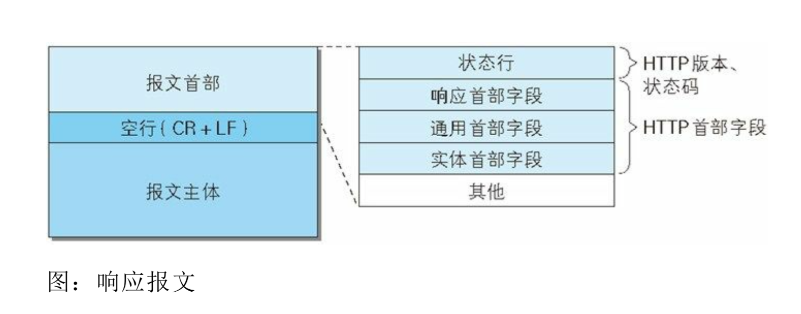
</p>


<p align='center'>
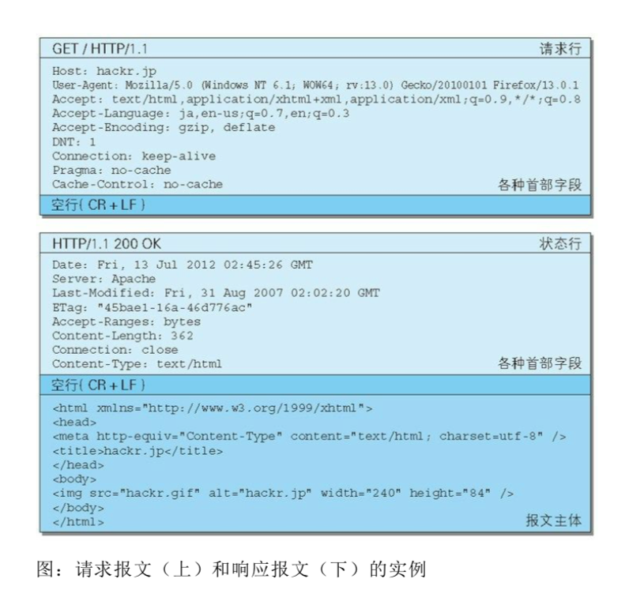
</p>


For example:
```http

General:

Request URL: https://github.com/halfrost
Request Method: GET
Status Code: 200 OK
Remote Address: 127.0.0.1:6152
Referrer Policy: no-referrer-when-downgrade


```


Response Headers:

<p align='center'>
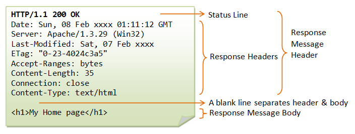
</p>


```http  

HTTP/1.1 200 OK
Date: Sun, 22 Apr 2018 15:47:27 GMT
Content-Type: text/html; charset=utf-8
Transfer-Encoding: chunked
Server: GitHub.com
Status: 200 OK
Cache-Control: no-cache
Vary: X-Requested-With
Set-Cookie: user_session=GYkmjrs9T6H9r16Gx85; path=/; expires=Sun, 06 May 2018 15:47:27 -0000; secure; HttpOnly
Set-Cookie: __Host-user_session_same_site=GYkmjre6H9r16Gx85; path=/; expires=Sun, 06 May 2018 15:47:27 -0000; secure; HttpOnly; SameSite=Strict
Set-Cookie: _gh_sess=OHppNS84T05ubXZFS2swUm9SUlBqdXNpWlA2bHZZ3alUyUGNLZ0pqMD0tLTNLWDI0K1pTUUFlaWJUVU5XUTJaNFE9PQ%3D%3D--74346822d2bf179f6ff73ce52c8b8606c8f78755; path=/; secure; HttpOnly
X-Request-Id: 855feee9-5be2-482f-911a-b0eb22d55088
X-Runtime: 0.170448
Strict-Transport-Security: max-age=31536000; includeSubdomains; preload
X-Frame-Options: deny
X-Content-Type-Options: nosniff
X-XSS-Protection: 1; mode=block
Referrer-Policy: origin-when-cross-origin, strict-origin-when-cross-origin
Expect-CT: max-age=2592000, report-uri="https://api.github.com/_private/browser/errors"
Content-Security-Policy: default-src 'none'; base-uri 'self'; block-all-mixed-content; child-src render.githubusercontent.com; connect-src 'self' uploads.github.com status.github.com collector.githubapp.com api.github.com www.google-analytics.com github-cloud.s3.amazonaws.com github-production-repository-file-5c1aeb.s3.amazonaws.com github-production-upload-manifest-file-7fdce7.s3.amazonaws.com github-production-user-asset-6210df.s3.amazonaws.com wss://live.github.com; font-src assets-cdn.github.com; form-action 'self' github.com gist.github.com; frame-ancestors 'none'; img-src 'self' data: assets-cdn.github.com identicons.github.com collector.githubapp.com github-cloud.s3.amazonaws.com *.githubusercontent.com; manifest-src 'self'; media-src 'none'; script-src assets-cdn.github.com; style-src 'unsafe-inline' assets-cdn.github.com
X-Runtime-rack: 0.175479
Content-Encoding: gzip
Vary: Accept-Encoding
X-GitHub-Request-Id: B706:3019:355B8D9:52B9B00:5ADCAE85


```


Request Headers:


<p align='center'>
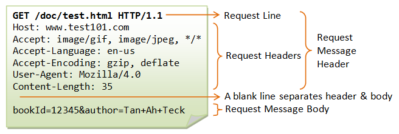
</p>


```http

GET /halfrost HTTP/1.1
Host: github.com
Connection: keep-alive
Cache-Control: max-age=0
Upgrade-Insecure-Requests: 1
User-Agent: Mozilla/5.0 (Linux; Android 6.0; Nexus 5 Build/MRA58N) AppleWebKit/537.36 (KHTML, like Gecko) Chrome/66.0.3359.117 Mobile Safari/537.36
Accept: text/html,application/xhtml+xml,application/xml;q=0.9,image/webp,image/apng,*/*;q=0.8
Referer: https://github.com/halfrost/Halfrost-Field/blob/master/contents-en/Protocol/HTTP.md
Accept-Encoding: gzip, deflate, br
Accept-Language: zh-CN,zh;q=0.9,en;q=0.8
Cookie: _octo=GH1.1.101205900.1486965233; logged_in=yes; dotcom_user=halfrost; _ga=GA1.2.183217117.1486965233; user_session=GYkmjrs9Ts80x85; __Host-user_session_same_site=GYkmjrs9THGx85; tz=Asia%2FShanghai; _gat=1; _gh_sess=S1JyM0tEbTVEcU50OXRERmUwOVlqRVZiQWp5SDlBeWt3RitrbEczRkxjaWVLWWNVc2k4YjhBTDVQT3BZajEwSGRJOEE2bz0tLVNLRHhiTlVDN2xEUXJ1OFM1ME1VeVE9PQ%3D%3D--59dc56a889d38d30125fbee36df9dab97e7a46c0


```
A request message consists of a request method, request URI, protocol version, optional request header fields, and a content entity.

A response message basically consists of a protocol version, a status code (a numeric code indicating whether the request succeeded or failed), a reason phrase explaining the status code, optional response header fields, and an entity body.


### 1. General Headers

| Header | Description | 
| :---: | :---: |
|Cache-Control|Controls caching behavior; used to pass caching directives along with the message|
|Connection| Allows the client and server to specify options related to the request/response connection| 
|Date| Provides a date and time marker indicating when the message was created |
|Pragma|Message directive; another way to pass directives along with a message, though not dedicated to caching. Pragma is a legacy field from versions prior to HTTP/1.1 and is defined only for backward compatibility with HTTP/1.0. If you want all servers to behave consistently, you can consider sending the Pragma directive. For example: Pragma: no-cache Cache-Control: no-cache|
|MIME-Version |Indicates the MIME version used by the sender |
|Trailer| If the message uses chunked transfer encoding, this header can list the set of headers located in the trailer part of the message |
|Transfer- Encoding |Tells the receiver what encoding has been applied to the message to ensure reliable transmission |
|Update| Indicates newer versions or protocols that the sender may want to “upgrade” to|
|Via |Shows the intermediate nodes (proxies, gateways) that the message passed through|
|Warning| Error notification|


The Cache-Control header is very powerful. Both servers and clients can use it to describe freshness, and many directives are available beyond lifetime or expiration time. 


| Directive | Parameter | Message Type | Description | 
| :---: | :---: | :---: | :---: |
|no-cache ||Request| Do not return a cached copy of the document before revalidating it with the server |
|no-store|| Request| Do not return a cached copy of the document. Do not store the server response |
|max-age = [seconds]|Required| Request |The document in the cache must not exceed the specified lifetime |
|max-stale ( = [seconds]) |Optional|Request| The document may be stale (calculated based on expiration information provided by the server), but must not exceed the stale value specified in the directive |
|min-fresh = [seconds]|Required|Request| The document’s lifetime must not be less than the sum of this specified time and its current age. In other words, the response must remain fresh for at least the specified duration |
|no-transform|| Request| The document must not be transformed before being sent |
|only-if-cached ||Request| Send the document only if it is in the cache; do not contact the origin server |
|cache-extension||Request|New directive token|
|||||
|public ||Response| The response may be cached by any server |
|private |Optional|Response |The response may be cached, but can only be accessed by a single client |
|no-cache |Optional|Response |If this directive is accompanied by a list of headers, the content may be cached and served to the client, but the listed headers must be removed first. If no headers are specified, the cached copy must not be served to the client before being revalidated with the server |
|no-store ||Response |The response must not be cached |
|no-transform ||Response| The response must not be modified in any way before being served to the client |
|must-revalidate ||Response| The response must be revalidated with the server before being served to the client |
|proxy-revalidate ||Response |A shared cache must revalidate the response with the origin server before serving it to the client. Private caches may ignore this directive|
| max-age = [seconds]|Required|Response| Specifies how long the document can be cached and the maximum duration for which it remains fresh|
|s-max-age = [seconds] |Required|Response |Specifies the maximum lifetime of the document when used as a shared cache (if a max-age directive is present, this directive takes precedence). Private caches may ignore this directive|
|cache-extension||Response|New directive token|


> Difference between no-cache and no-store: no-cache means not caching stale resources; the cache will validate freshness with the origin server before processing the resource. no-store is the one that truly means no caching.


no-cache does not mean caching is completely disabled. Instead, it means the client checks the server’s Etag every time. If it is the same, the client will not download the full resource from the server and will receive a 304 Not Modified. (Maximum cache duration: 3 years)

no-store is what truly disables caching. It means the latest resource will be downloaded from the server every time. (Of course, it usually seems unnecessary.)

The main difference between public and private is that for pages involving user authentication, setting private means only the end-user browser will cache them, while intermediate CDNs will not. Setting public means they will be cached at every layer. By default, there is no need to set public, because max-age already indicates that the response may be cached at every layer (in seconds). At this point, if the cache is hit, the client will no longer request the server to check the Etag, but will directly return 200(from disk).

Of course, because public caches at every layer, if a webpage has a strong requirement for previewing modifications and updates, it is best not to use this caching strategy; otherwise, you also need to refresh the CDN origin, which is troublesome.

If you are choosing a caching strategy, see the figure below:

<p align='center'>
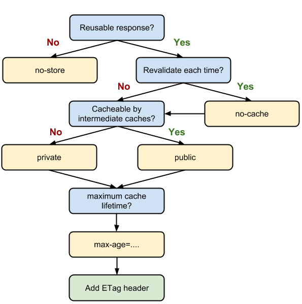
</p>


### HTTP Cache Control

<p align='center'>
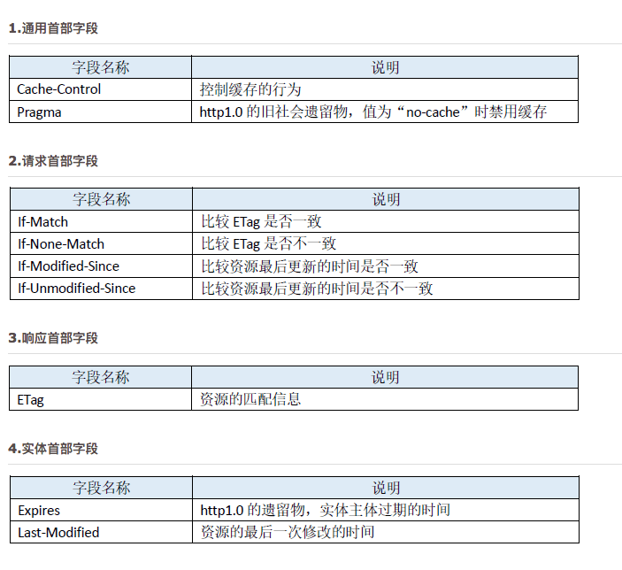
</p>

To address the issue that “the Expires time is relative to the server, so it cannot be guaranteed to be consistent with the client time,” HTTP/1.1 added Cache-Control to define cache expiration time. Note: if both Expires and Cache-Control appear in the message, Cache-Control takes precedence.

In other words, the priority from highest to lowest is **Pragma -> Cache-Control -> Expires**.

| Header | Advantages and Characteristics | Disadvantages and Issues | Additional Notes | 
| :---: | :---: | :---: | :---: |
|Expires|	1. A product of HTTP 1.0; usable in both HTTP 1.0 and 1.1; simple and easy to use.<br>2. Uses an absolute point in time to indicate expiration.|1. The time is sent by the server (UTC). If the server time and client time are inconsistent, issues may occur.<br>2. There is a versioning problem: modifications made before expiration are unknown to the client.||
|Cache-Control|1. A product of HTTP 1.1; uses a time interval to indicate expiration, solving the relative time issue between the Expires server and client.<br>2. Provides many more configuration options than Expires.|1. Available only in HTTP 1.1; not applicable to HTTP 1.0.<br>2. There is a versioning problem: modifications made before expiration are unknown to the client.||
|Last-Modified|1. No versioning problem. Every request goes to the server for validation. The server compares the last modification time and returns 304 if it is the same, or 200 plus the resource content if it is different.|1. As long as the resource is modified, it will be returned to the client regardless of whether the content has substantively changed. For example, periodic rewrites may occur even though the data contained in the resource is actually the same.<br>2. Uses an absolute point in time as the identifier, so it cannot distinguish multiple modifications within one second.<br>3. Some servers cannot accurately obtain the file’s last modification time.||
|ETag|1. Can determine more precisely whether a resource has been modified, and can identify multiple modifications within one second.<br>2. No versioning problem. Every request goes back to the server for validation.|1. Computing the ETag value incurs a performance cost.<br>2. In distributed server storage scenarios, if the algorithms for computing ETag differ, the browser may obtain page content from one server and then validate it against another server, only to find that the ETag does not match.||

1. Expires / Cache-Control  
Expires uses an absolute point in time to indicate expiration, so it is inevitably affected by time synchronization, while Cache-Control uses a time interval and solves this problem well. However, Cache-Control is available only in HTTP/1.1 and does not apply to HTTP/1.0, while Expires applies to both HTTP/1.0 and HTTP/1.1. Therefore, in most cases, sending both headers is a better choice. When the client can parse both headers, **Cache-Control will be used first**.

2. Last-Modified / ETag  
Both request a resource through some identifier value. If the server-side resource has not changed, the server automatically returns the HTTP 304 (Not Changed) status code with an empty body, saving the amount of data transmitted. When the resource has changed, the response is similar to the first request. This ensures that resources are not repeatedly sent to the client, while also ensuring that when the server changes, the client can obtain the latest resource.  
Last-Modified uses the file’s last modification time as the file identifier. It cannot handle multiple modifications within one second, and as long as the file has been modified, even if the file’s substantive content has not changed, the resource content will be returned again. ETag, as the “entity value of the requested variant,” can completely solve the problems of the Last-Modified header, but its computation process consumes server resources.

3. from-cache / 304    
Expires and Cache-Control both have a problem: if the server-side resource has been modified but is still within the cache validity period, the client will not request the resource from the server (unless refreshed). This creates a resource version mismatch problem. A forced refresh will always initiate an HTTP request and return the resource content, regardless of whether the content has changed during that period. **However, Last-Modified and Etag initiate a request every time the resource is requested. Even for resources that will not be modified for a long time, there is at least the cost of one request/response**.

For all cacheable resources, it is crucial to specify an Expires or Cache-Control max-age, as well as a Last-Modified or ETag. Using the former and the latter together allows them to complement each other well.  
**The former avoids initiating a request every time to validate resource freshness, while the latter ensures that when the resource has not changed, it does not need to be resent**. Across different user page refresh behaviors, the combination of the two can also make good use of HTTP cache-control characteristics. Whether the user enters a URI in the address bar and presses Enter to visit it, or clicks the refresh button, the browser can fully leverage cached content and avoid unnecessary requests and data transmission.

4. Avoiding 304

The approach is actually simple: **it moves the server-side ETag theory to the frontend**. Page static resources are published with versions. Common methods include adding an md5 string or timestamp marker to the filename or parameters:
```http
https://hm.baidu.com/hm.js?e23800c454aa573c0ccb16b52665ac26
http://tb1.bdstatic.com/tb/_/tbean_safe_ajax_94e7ca2.js
http://img1.gtimg.com/ninja/2/2016/04/ninja145972803357449.jpg
```
As you can see, the examples above use different approaches: some append an md5 parameter to the URI, some make the md5 value part of the filename, and some place the resource under a directory for a specific version.

When the file has not changed, the browser can use the cached file directly without making a request. When the file does change, the file version changes as well, which changes the filename; the requested URL changes, and the file is naturally updated. This ensures that the client can promptly retrieve the newly modified file from the server. With this approach, the cache duration for static resources—especially image resources—is extended, preventing those resources from expiring too quickly and avoiding frequent client requests to the server that merely result in 304 responses (when Last-Modified/Etag is present).


<p align='center'>
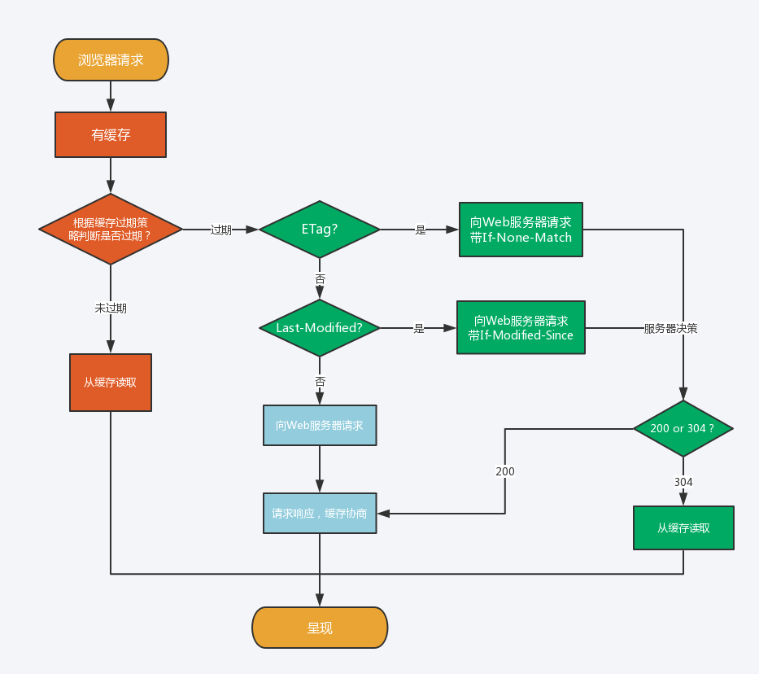
</p>


| User action | HTTP status code | Reason | Additional notes | 
| :---: | :---: | :---: | :---: |
|Enter a URI in the address bar and press Enter|200(from cache)|Controlled by Expires / Cache-Control. Expires is an absolute time, while Cache-Control is a relative time. When both are present, Cache-Control overrides Expires. As long as the cache has not expired, the browser only accesses its own cache||
|F5 / click the refresh button in the toolbar / reload from the context menu|304|Controlled by Last-Modified/Etag. When the user's local cache has expired and the user refreshes, the browser sends a request to the server. If the server-side resource has not changed, it returns 304 to the browser||
|Ctl+F5|200|Only when the local browser has no cache, or when the resource returned by 304 has also expired, or when the user forces a refresh with Ctl+F5, will the browser ultimately download the latest data||

Summary:

- When compatibility with HTTP1.0 is required, use Expires; otherwise, you can consider using Cache-Control directly.
- Use ETag only when you need to handle multiple modifications within one second, or other cases that Last-Modified cannot handle; otherwise, use Last-Modified.
- For all cacheable resources, specify either Expires or Cache-Control, and also specify either Last-Modified or Etag.
- You can reduce 304 responses by identifying file versions in filenames and extending cache durations.

------------------------------------------------------------------


The Warning header evolved from an HTTP/1.0 response header (Retry-After). This header typically warns users about cache-related issues.

The format of the Warning header is as follows:
```http
Warning: [warning code][warning host：port number]"[warning content]"([date content])

```
HTTP/1.1 defines 7 types of warnings. Warning codes are extensible, and new warning codes may be added in the future.

| Warning Code | Warning Content | Description |
| :---: | :---: | :---: |
|110|Response is stale (response has expired)| A proxy returned an expired resource|
|111|Revalidation failed (revalidation failed)|The proxy failed while revalidating the resource’s validity (for example, because the server was unreachable)|
|112|Disconnection operation (disconnection operation)| The proxy’s connection to the Internet was deliberately disconnected|
|113|Heuristic expiration (heuristic expiration)|The response’s lifetime exceeds 24 hours (when the configured lifetime of a valid cache is greater than 24 hours)|
|199|Miscellaneous warning (miscellaneous warning)|Any warning content|
|214|Transformation applied (transformation applied)|When a proxy has performed some processing on the content encoding, media type, and so on|
|299|Miscellaneous persistent warning (miscellaneous persistent warning)| Any warning content|


### 2. Request Headers

### Request Informational Headers

| Header | Description | 
| :---: | :---: |
|Client-IP4| Provides the IP address of the machine running the client|
|From| Provides the email address of the client user |
|Host |Gives the hostname and port number of the server receiving the request |
|Referer |Provides the URL of the document containing the current request URI (the correct spelling should actually be Referrer, but everyone has consistently used the misspelling to this day) |
|UA-Color |Provides information about the color capabilities of the client display |
|UA-CPU |Gives the type or manufacturer of the client CPU |
|UA-Disp |Provides information about the capabilities of the client display (screen)| 
|UA-OS |Gives the name and version of the operating system running on the client machine |
|UA-Pixels |Provides pixel information for the client display |
|User-Agent |Tells the server the name of the application that initiated the request|

### Accept Headers

| Header | Description | 
| :---: | :---: |
|Accept |Tells the server which media types it can send |
|Accept- Charset |Tells the server which character sets it can send |
|Accept- Encoding |Tells the server which encodings it can send |
|Accept- Language |Tells the server which languages it can send |
|TE | Tells the server which extension transfer codings can be used|


Common Content Codings

Commonly used content codings include the following:

- gzip (GNU zip)  
  An encoding format generated by the file compression program gzip (GNU zip) (RFC1952), using the Lempel-Ziv algorithm (LZ77) and a 32-bit Cyclic Redundancy Check (CRC)
- compress (standard UNIX compression)  
  An encoding format generated by the UNIX file compression program compress, using the Lempel-Ziv-Welch algorithm (LZW)
- deflate (zlib)  
  An encoding format that combines the zlib format (RFC1950) with the deflate compression algorithm (RFC1951)
- identity (no encoding)  
  The default encoding format that performs no compression or transformation


### Conditional Request Headers

| Header | Description | 
| :---: | :---: |
|Expect |Allows the client to list the server behaviors required for a request |
|If-Match| Retrieves the document if the entity tag matches the document’s current entity tag |
|If-Modified-Since |Restricts this request unless the resource has been modified after a specified date |
|If-None-Match |Retrieves the document if the provided entity tag does not match the current document’s entity tag |
|If-Range |Allows a conditional request for a range of a document |
|If-Unmodified-Since| Restricts this request unless the resource has not been modified after a specified date |
|Range |Requests the specified range of the resource if the server supports range requests|

### Security Request Headers

| Header | Description | 
| :---: | :---: |
|Authorization |Contains data provided by the client to the server so the client can authenticate itself |
|Cookie |Used by the client to send a token to the server — it is not truly a security header, but it does imply security functionality |
| Cookie2 | Used to indicate the cookie version supported by the requester|

 
### Proxy Request Headers

| Header | Description | 
| :---: | :---: |
|Max-Forward |The maximum number of times the request may be forwarded to other proxies or gateways on the path to the origin server — used with the TRACE method |
|Proxy-Authorization |Same as the Authorization header, but this header is used when authenticating with a proxy |
|Proxy-Connection |Same as the Connection header, but this header is used when establishing a connection with a proxy|


### 3. Response Headers

### Response Informational Headers

| Header | Description | 
| :---: | :---: |
|Age |How long the response has existed (since it was originally created) |
|Public | The list of request methods supported by the server for its resources |
|Retry-After |If the resource is unavailable, retry at this date or time; Server: the name and version of the server application software |
|Title | For an HTML document, the title provided by the origin of the HTML document |
|Warning| A warning message that is more detailed than the reason phrase|


### Negotiation Headers

| Header | Description | 
| :---: | :---: |
|Accept-Ranges |The range types the server accepts for this resource |
|Vary |A list of other headers the server examines that may cause the response to vary; in other words, this is a list of headers whose contents the server uses to select the most appropriate version of the resource to send to the client. The Vary header field can control caching. The origin server communicates directives about local cache usage to proxy servers. After a proxy server receives a response from the origin server containing the fields specified by Vary, if it caches the response, it returns the cached response only for requests that contain the same header fields specified by Vary. Even if the request is for the same resource, if the header fields specified by Vary are different, the resource must be fetched from the origin server again.|

### Security Response Headers

| Header | Description | 
| :---: | :---: |
|Proxy-Authenticate| A list of challenges from the proxy to the client |
|Set-Cookie |Not truly a security header, but it implies security functionality; it can set a token on the client so the server can identify the client |
|Set-Cookie2 |Similar to Set-Cookie; defined by RFC 2965 Cookie; |
|WWW-Authenticate| A list of challenges from the server to the client. It tells the client the authentication scheme (Basic or Digest) applicable to the resource specified by the request URI, along with a parameterized challenge|


The HttpOnly attribute of a Cookie is an extension feature of cookies that prevents JavaScript scripts from obtaining the Cookie. Its primary purpose is to prevent Cross-site scripting (XSS) attacks from stealing Cookie information.
```http
Set-Cookie: name-value;HttpOnly

```
Incidentally, this extension was not developed to prevent XSS.

### 4. Entity Headers


### Entity Informational Headers

| Header | Description | 
| :---: | :---: |
|Allow |Lists the request methods that can be performed on this entity |
|Location |Tells the client where the entity is actually located; used to direct the recipient to the (possibly new) location (URL) of the resource|


### Content Headers

| Header | Description | 
| :---: | :---: |
|Content-Base16 |The base URL used when resolving relative URLs in the body |
|Content-Encoding |Any encoding applied to the body |
|Content-Language| The natural language most appropriate for understanding the body |
|Content-Length |The length or size of the body|
| Content-Location |The actual location of the resource |
|Content-MD5 |The MD5 checksum of the body|
| Content-Range |The byte range within the entire resource that this entity represents |
|Content-Type |The object type of this body|


Because HTTP headers cannot record binary values, they must be processed using Base-64 encoding. Using an approach such as Content-MD5 cannot verify accidental changes to the content, nor can it detect malicious tampering. The reason is that if the content is tampered with, Content-MD5 can also be recomputed and updated, and therefore tampered with as well. As a result, the client on the receiving end cannot tell that the message body and the Content-MD5 header field have already been tampered with.

### Entity Caching Headers

| Header | Description | 
| :---: | :---: |
|ETag |The entity tag associated with this entity |
|Expires |The date and time after which the entity is no longer valid and must be fetched again from the origin server |
|Last-Modified |The date and time when this entity was last modified|


Expires is a Web server response header field. When responding to an HTTP request, it tells the browser that, before the expiration time, the browser can retrieve the data directly from its cache without making another request.

The drawback of Expires is that the cache time defined by Expires in the response message is relative to the server's time; it defines the resource's “expiration moment.” If the client's time is inconsistent with the server's time, the cache will become invalid.  

In addition, Expires is primarily used in HTTP/1.0.


If the URIs of the two are the same, it is difficult to identify the cached resource solely by URI. If repeated interruptions and reconnections occur during the download process, the resource will be identified based on the ETag value.

ETag values are also divided into strong ETag values and weak ETag values:

Strong ETag value:

A strong ETag value changes whenever the entity changes, no matter how slight the change is.
```http  
ETag: "usagi-1234"

```
Weak ETag value:

A weak ETag value is used only as a hint to indicate whether resources are the same. The ETag value changes only when the resource has changed fundamentally and a difference is produced. In this case, `W/` is prepended to the beginning of the field value.
```http  
ETag: W/"usagi-1234"

```

### 5. Extension Headers


### (1) X-Frame-Options

The `X-Frame-Options` header field is an HTTP response header used to control whether website content can be displayed inside a `frame` tag on another website. Its primary purpose is to prevent clickjacking attacks.

### (2) X-XSS-Protection

The `X-XSS-Protection` header field is an HTTP response header. It is a countermeasure against cross-site scripting (XSS) attacks and is used to control whether the browser’s XSS protection mechanism is enabled. `0`: disable XSS filtering; `1`: enable XSS filtering.

### (3) DNT

The `DNT` header field is an HTTP request header. `DNT` stands for “Do Not Track,” meaning refusal to have personal information collected; it is a way to indicate that the user does not want to be tracked for targeted advertising. `0`: consent to being tracked; `1`: refuse to be tracked.

### (4) P3P

The `P3P` header field is an HTTP response header. By using P3P (The Platform for Privacy Preferences) technology, personal privacy information on a website can be represented in a form understandable only by programs, thereby helping protect user privacy.

>In HTTP and many other protocols, non-standard parameters were distinguished from standard parameters by adding the `X-` prefix, making it possible for those non-standard parameters to exist as extensions. However, this crude approach does far more harm than good, so “RFC6648 - Deprecating the "X-" Prefix and Similar Constructs in Application Protocols” proposed discontinuing this practice. However, existing uses of the `X-` prefix should not be required to change.


HTTP header fields define the behavior of caching and non-caching proxies, and are divided into end-to-end headers and hop-by-hop headers.

- End-to-end headers: Headers in this category are forwarded to the final recipient of the corresponding request/response, must be stored in responses generated by caches, and are required to be forwarded.
- Hop-by-hop headers: Headers in this category are valid only for a single forwarding step and are not forwarded through caches or proxies. In HTTP/1.1 and later, if hop-by-hop headers are to be used, the `Connection` header field must be provided. (`Connection`, `Keep-Alive`, `Proxy-Authenticate`, `Proxy-Authorization`, `Trailer`, `TE`, `Transfer-Encoding`, and `Upgrade` are the eight hop-by-hop header fields; all other fields are end-to-end headers.)


## V. Improving HTTP Performance

### 1. Parallel Connections

Initiate concurrent HTTP requests over multiple TCP connections.

### 2. Persistent Connections 

Reuse TCP connections to eliminate the latency of connection setup and teardown. Persistent connections (HTTP Persistent Connections) are also known as HTTP keep-alive or HTTP connection reuse.

In HTTP/1.1, all connections are persistent by default. However, not all servers necessarily support persistent connections, so in addition to the server, the client also needs to support persistent connections.


### 3. Pipelined Connections 

Initiate concurrent HTTP requests over a shared TCP connection.

Persistent connections make it possible to send most requests using pipelining. Previously, after sending a request, the client had to wait for and receive the response before sending the next request. With pipelining, the next request can be sent immediately without waiting for the response.

For example, when requesting an HTML web page that contains 10 images, persistent connections allow the requests to complete faster than opening connections one by one. Pipelining is even faster than persistent connections. The more requests there are, the more obvious the time difference becomes.


### 4. Multiplexed Connections

Interleave request and response messages (experimental).


## VI. Differences Between GET and POST

## Parameters

Both GET and POST requests can use additional parameters, but GET parameters appear in the URL as a query string, whereas POST parameters are stored in the message body (they are still transmitted in plaintext; they are simply stored in a different place than GET parameters).

GET parameter passing is less secure than POST because parameters sent with GET are visible in the URL and may leak private information. In addition, GET supports only ASCII characters, so Chinese parameters may become garbled, whereas POST supports standard character sets.
```http
GET /test/demo_form.asp?name1=value1&name2=value2 HTTP/1.1
```

```http
POST /test/demo_form.asp HTTP/1.1
Host: w3schools.com
name1=value1&name2=value2
```

## Safety

A safe HTTP method does not change server state; in other words, it is read-only.

The GET method is safe, whereas POST is not, because the purpose of POST is to transmit the entity body. That content may be form data uploaded by a user, and after the upload succeeds, the server may store the data in a database, thereby changing its state.

Safe methods other than GET include: HEAD and OPTIONS.

Unsafe methods other than POST include PUT and DELETE.

## Idempotency

For an idempotent HTTP method, executing the same request once has the same effect as executing it multiple times in succession, and the server state remains the same. In other words, idempotent methods should not have side effects (except for statistical purposes). When correctly implemented, methods such as GET, HEAD, PUT, and DELETE are idempotent, whereas POST is not. All safe methods are also idempotent.

GET /pageX HTTP/1.1 is idempotent. When it is called multiple times in succession, the client receives the same result each time:
```http
GET /pageX HTTP/1.1
GET /pageX HTTP/1.1
GET /pageX HTTP/1.1
GET /pageX HTTP/1.1
```
POST /add_row HTTP/1.1 is not idempotent. If it is called multiple times, it will add multiple rows:
```http
POST /add_row HTTP/1.1
POST /add_row HTTP/1.1   -> Adds a 2nd row
POST /add_row HTTP/1.1   -> Adds a 3rd row
```
DELETE /idX/delete HTTP/1.1 is idempotent, even if the status codes received across different requests differ:
```http
DELETE /idX/delete HTTP/1.1   -> Returns 200 if idX exists
DELETE /idX/delete HTTP/1.1   -> Returns 404 as it just got deleted
DELETE /idX/delete HTTP/1.1   -> Returns 404
```

## Cacheable

To cache a response, the following conditions must be met:

1. The HTTP method of the request message itself is cacheable, including GET and HEAD; PUT and DELETE are not cacheable, and POST is not cacheable in most cases.
2. The status code of the response message is cacheable, including: 200, 203, 204, 206, 300, 301, 404, 405, 410, 414, and 501.
3. The Cache-Control header field of the response message does not specify that it must not be cached.

## XMLHttpRequest

To explain another difference between POST and GET, we first need to understand XMLHttpRequest:

> XMLHttpRequest is an API that provides clients with the ability to transfer data between the client and the server. It provides a simple way to retrieve data via a URL without refreshing the entire page. This allows a web page to update only part of the page without disrupting the user. XMLHttpRequest is widely used in AJAX.

When using the POST method with XMLHttpRequest, the browser sends the Header first and then the Data. However, not all browsers do this; for example, Firefox does not.


## VII. Comparison of HTTP Versions

## Differences Between HTTP/1.0 and HTTP/1.1

1. HTTP/1.1 uses persistent connections by default
2. HTTP/1.1 supports pipelining
3. HTTP/1.1 supports virtual hosts
4. HTTP/1.1 adds status code 100
5. HTTP/1.1 supports chunked transfer encoding
6. HTTP/1.1 adds the max-age cache-control directive

See the preceding sections for details.

## Differences Between HTTP/1.1 and HTTP/2.0

> [Introduction to HTTP/2](https://developers.google.com/web/fundamentals/performance/http2/?hl=zh-cn)

### 1. Multiplexing

HTTP/2.0 uses multiplexing, allowing the same TCP connection to handle multiple requests.

### 2. Header Compression

HTTP/1.1 headers carry a large amount of information and must be sent repeatedly each time. HTTP/2.0 requires both communicating parties to maintain their own cached header field table, thereby avoiding repeated transmission.

### 3. Server Push

When the client requests a resource, HTTP/2.0 sends related resources to the client as well, so the client does not need to initiate another request. For example, when the client requests the index.html page, the server also sends index.js to the client.

### 4. Binary Format

HTTP/1.1 parsing is text-based, whereas HTTP/2.0 uses a binary format.


## VIII. CORS Cross-Origin Access

When a resource is requested from a domain or port different from the server where the resource itself resides, the resource initiates a cross-origin HTTP request.
 
For example, an HTML page on the site http://domain-a.com requests http://domain-b.com/image.jpg via the src of . Many pages on the web load resources such as CSS stylesheets, images, and scripts from different domains.
 
For security reasons, browsers restrict cross-origin HTTP requests initiated from within scripts. For example, XMLHttpRequest and the Fetch API follow the same-origin policy. This means web applications using these APIs can request HTTP resources only from the same domain that loaded the application, unless CORS headers are used.

(Translator’s note: Cross-origin access does not necessarily mean the browser blocks the initiation of cross-site requests. It may also be that the cross-site request is initiated normally, but the returned result is intercepted by the browser. The best example is the principle of CSRF cross-site attacks: the request is sent to the backend server regardless of whether it is cross-origin! Note: some browsers do not allow cross-origin access from an HTTPS domain to HTTP, such as Chrome and Firefox. These browsers intercept the request before it is even sent; this is a special case.)
  
  
  
<p align='center'>
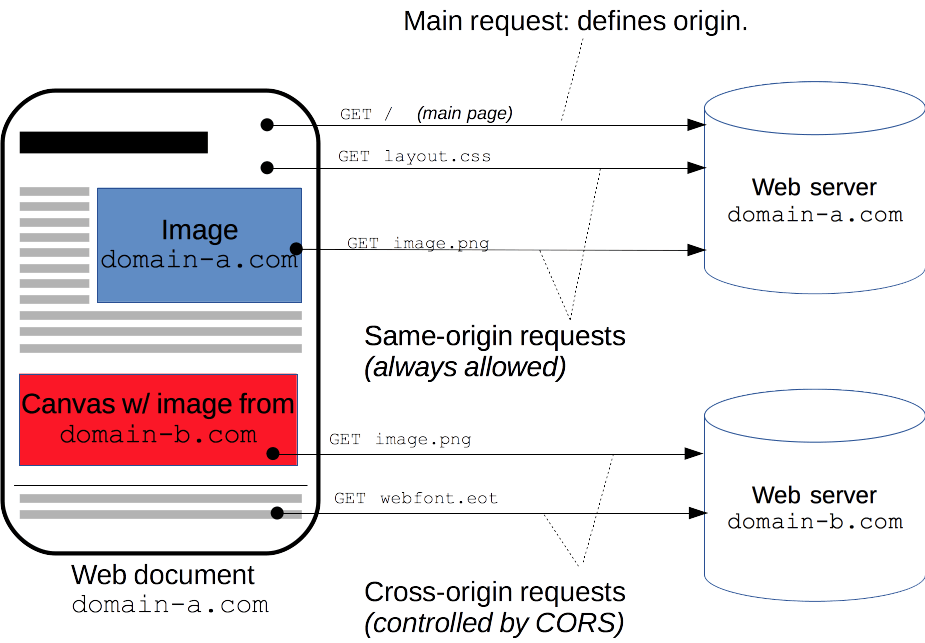
</p>

The W3C Web Applications Working Group recommends a new mechanism: Cross-Origin Resource Sharing (CORS). This mechanism allows web application servers to support cross-site access control, thereby making secure cross-site data transfer possible. It is especially important to note that this specification targets API containers (such as XMLHttpReques or Fetch) to mitigate the risks of cross-origin HTTP requests. **CORS requires support from both the client and the server. Currently, all browsers support this mechanism. **

The cross-origin sharing standard allows cross-origin HTTP requests in the following scenarios:

- Cross-origin HTTP requests initiated by XMLHttpRequest or Fetch, as mentioned earlier.
- Web fonts (cross-origin font resources used via @font-face in CSS). Therefore, websites can publish TrueType font resources and allow only authorized sites to invoke them cross-site.
- WebGL textures
- Drawing Images/video frames to canvas using drawImage
- Stylesheets (using CSSOM)
- Scripts (unhandled exceptions)

CORS is divided into: simple requests, preflight requests, and requests with credentials.


### 1. Simple Requests

Certain requests do not trigger a CORS preflight request. This article calls such requests “simple requests”; note that this term is not part of the Fetch specification (which defines CORS). If a request meets all of the following conditions, it can be considered a “simple request”:


(1). Uses one of the following methods:  

- GET
- HEAD
- POST

  
(2). The Fetch specification defines a set of CORS-safelisted request headers. No other header fields outside this set may be set manually. The set is:

Accept  
Accept-Language  
Content-Language  
Content-Type (note the additional restrictions)  
DPR  
Downlink  
Save-Data  
Viewport-Width  
Width  

(3). The value of Content-Type is limited to one of the following three:  

- text/plain
- multipart/form-data
- application/x-www-form-urlencoded

(4). No XMLHttpRequestUpload object in the request has any event listeners registered; the XMLHttpRequestUpload object can be accessed using the XMLHttpRequest.upload property.

(5). No ReadableStream object is used in the request.


In simple terms, the two key points to remember are:

**(1) Use only the GET, HEAD, or POST request methods. If POST is used to send data to the server, the data type (Content-Type) can only be one of application/x-www-form-urlencoded, multipart/form-data, or text/plain.  
(2) No custom request headers are used (such as X-Modified).**


Example:
```javascript

//For example, suppose a web application at http://foo.example wants to access resources at http://bar.other. The following JavaScript code 
//should run on foo.example:    
var invocation = new XMLHttpRequest();
var url = 'http://bar.other/resources/public-data/';
function callOtherDomain() {
  if(invocation) {    
    invocation.open('GET', url, true);
    invocation.onreadystatechange = handler;
    invocation.send(); 
  }
}

```

<p align='center'>
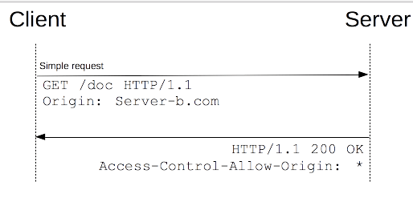
</p>


```http

//Let's see what request the browser sends to the server in this scenario, and what the server returns to the browser:
GET /resources/public-data/ HTTP/1.1
Host: bar.other
User-Agent: Mozilla/5.0 (Macintosh; U; Intel Mac OS X 10.5; en-US; rv:1.9.1b3pre) Gecko/20081130 
Minefield/3.1b3pre
Accept: text/html,application/xhtml+xml,application/xml;q=0.9,*/*;q=0.8
Accept-Language: en-us,en;q=0.5
Accept-Encoding: gzip,deflate
Accept-Charset: ISO-8859-1,utf-8;q=0.7,*;q=0.7
Connection: keep-alive
Referer: http://foo.example/examples/access-control/simpleXSInvocation.html
Origin: http://foo.example //This request comes from http://foo.exmaple.
//The above is the request sent by the browser

HTTP/1.1 200 OK
Date: Mon, 01 Dec 2008 00:23:53 GMT
Server: Apache/2.0.61 
Access-Control-Allow-Origin: * //This indicates that the server accepts cross-site requests from any site. If set to http://foo.example, other sites cannot access resources at http://bar.other cross-site.
Keep-Alive: timeout=2, max=100
Connection: Keep-Alive
Transfer-Encoding: chunked
Content-Type: application/xml
//The above is the information returned by the server to the browser

```
In the following cases, the request will return the relevant response information:

- If the resource is allowed to be publicly accessed (like any HTTP resource that allows GET access), returning the `Access-Control-Allow-Origin: *` header is sufficient, unless the request requires cookies or HTTP authentication information.  
- If access to the resource is restricted based on the same domain, or if the resource being accessed requires credentials (or sets credentials), then it is necessary to filter the `ORIGIN` in the request headers, or at least respond with the request’s origin (for example, `Access-Control-Allow-Origin: http://arunranga.com`).  
In addition, the `Access-Control-Allow-Credentials: TRUE` header will be sent, which will be discussed in a later section.

### 2. Preflight Requests

Unlike the simple requests described above, “requests that require preflight” must first send a preflight request to the server using the OPTIONS method to determine whether the server permits the actual request. The use of a “preflight request” can prevent cross-origin requests from causing unintended effects on user data on the server.

When a request satisfies any of the following conditions, a preflight request should be sent first:

(1). It uses any of the following HTTP methods:  

PUT  
DELETE  
CONNECT  
OPTIONS  
TRACE  
PATCH  

(2). It manually sets header fields outside the set of CORS-safelisted request headers. That set is:

Accept  
Accept-Language  
Content-Language  
Content-Type (but note the additional requirements below)  
DPR  
Downlink  
Save-Data  
Viewport-Width  
Width  

(3). The value of Content-Type is not one of the following:  

application/x-www-form-urlencoded  
multipart/form-data  
text/plain  

(4). The `XMLHttpRequestUpload` object in the request has one or more event listeners registered.  
(5). The request uses a `ReadableStream` object.


Unlike the simple requests discussed above, a “preflight request” requires first sending an OPTIONS request to the target site to determine whether the cross-site request is safe and acceptable to that site. This is done because cross-site requests may damage data on the target site. When a request meets the following conditions, it will be handled as a preflight request:

**(1) The request is initiated with a method other than GET, HEAD, or POST. Or, POST is used, but the request data has a media type other than application/x-www-form-urlencoded, multipart/form-data, or text/plain. For example, a request that sends XML data with the media type application/xml or text/xml using POST.  
(2) Custom request headers are used (for example, adding headers such as X-PINGOTHER).**


For example:
```javascript
var invocation = new XMLHttpRequest();
var url = 'http://bar.other/resources/post-here/';
var body = '{C}{C}{C}{C}{C}{C}{C}{C}{C}{C}Arun';
function callOtherDomain(){
  if(invocation){
    invocation.open('POST', url, true);
    invocation.setRequestHeader('X-PINGOTHER', 'pingpong');
    invocation.setRequestHeader('Content-Type', 'application/xml');
    invocation.onreadystatechange = handler;
    invocation.send(body); 
  }
}

```
As shown above, an XMLHttpRequest is used to create a POST request, a custom request header (`X-PINGOTHER: pingpong`) is added to that request, and the data type is specified as `application/xml`. Therefore, this request is a cross-origin request in the form of a “preflight request.” The browser sends a “preflight request” using OPTIONS. Based on the request parameters, Firefox 3.1 determines that it needs to send a “preflight request” to find out whether the server will accept the subsequent actual request. OPTIONS is an HTTP/1.1 method used to obtain more information from the server, and it should not have any effect on server-side data. The following two request headers are sent along with the OPTIONS request:
```http
Access-Control-Request-Method: POST
Access-Control-Request-Headers: X-PINGOTHER

```
Assume the server returns the following partial information in a successful response:
```http
Access-Control-Allow-Origin: http://foo.example //Indicates that the server allows requests from http://foo.example
Access-Control-Allow-Methods: POST, GET, OPTIONS //Indicates that the server can accept the POST, GET, and OPTIONS request methods
Access-Control-Allow-Headers: X-PINGOTHER //Passes a list of acceptable custom request headers. The server must also set a corresponding value for the browser. Otherwise, a Request header field X-Requested-With is not allowed by Access-Control-Allow-Headers in preflight response error will be reported
Access-Control-Max-Age: 1728000 //Tells the browser how long the response to this “preflight request” is valid. In the example above, 1728000 seconds means that for 20 days, when the browser handles cross-site requests to this server, it does not need to send another “preflight request” and can simply decide based on this result.

```
<p align='center'>
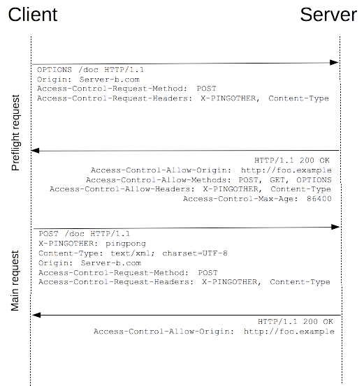
</p>


### 3. Requests with Credential Information

An interesting feature of Fetch and CORS is that identity credentials can be sent based on HTTP cookies and HTTP authentication information. In general, for cross-origin XMLHttpRequest or Fetch requests, the browser does not send identity credential information. To send credential information, a special flag on XMLHttpRequest needs to be set.

In this example, a script from http://foo.example initiates a GET request to http://bar.other and sets Cookies:
```javascript
var invocation = new XMLHttpRequest();
var url = 'http://bar.other/resources/credentialed-content/';
    
function callOtherDomain(){
  if(invocation) {
    invocation.open('GET', url, true);
    invocation.withCredentials = true;
    invocation.onreadystatechange = handler;
    invocation.send(); 
  }
}

```
Line 7 sets the `withCredentials` flag of `XMLHttpRequest` to `true`, thereby sending Cookies to the server. Because this is a simple GET request, the browser will not issue a “preflight request” for it. However, if the server-side response does not include `Access-Control-Allow-Credentials: true`, the browser will not return the response content to the sender of the request.


<p align='center'>
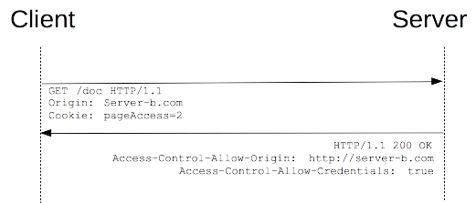
</p>

Assume part of the server’s successful response is as follows:
```http
Access-Control-Allow-Origin: http://foo.example
Access-Control-Allow-Credentials: true
Set-Cookie: pageAccess=3; expires=Wed, 31-Dec-2008 01:34:53 GMT
```
If the response headers from bar.other do not include Access-Control-Allow-Credentials: true, the response will be ignored. Pay special attention: when sending a response to a request with withCredentials, the server must specify the allowed requesting domain and cannot use “\*”. In the example above, if the response header were Access-Control-Allow-Origin: \*, the response would fail. In this example, because the value of Access-Control-Allow-Origin is the specific requesting domain http://foo.example, the client receives the credentialed content. Also note that additional cookie information is created.


## 9. Comparing CORS and JSONP

- JSONP can only issue GET requests, whereas CORS supports all types of HTTP requests.

- With CORS, developers can use a standard XMLHttpRequest to issue requests and retrieve data, with better error handling than JSONP.

- JSONP is mainly supported by older browsers, which often do not support CORS, while the vast majority of modern browsers already support CORS.

- Compared with JSONP, CORS is undoubtedly more advanced, convenient, and reliable.


------------------------------------------------------

Reference:  
*Illustrated HTTP*    
*HTTP: The Definitive Guide*    
[RFC2616](https://tools.ietf.org/html/rfc2616)  
[HTTP Access Control (CORS)](https://developer.mozilla.org/zh-CN/docs/Web/HTTP/Access_control_CORS)  
[A Detailed Explanation of Cross-Origin Resource Sharing (CORS)](http://www.ruanyifeng.com/blog/2016/04/cors.html)  
[HTTP Cache-Control Summary](http://imweb.io/topic/5795dcb6fb312541492eda8c)

> GitHub Repo: [Halfrost-Field](https://github.com/halfrost/Halfrost-Field)
> 
> Follow: [halfrost · GitHub](https://github.com/halfrost)
>
> Source: [https://halfrost.com/http/](https://halfrost.com/http/)