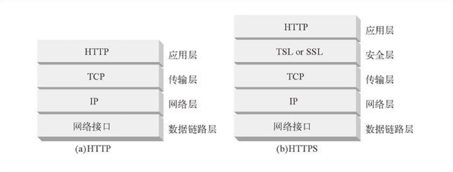

# HTTPS Refresher (I) — Introduction


<p align='center'>

</p>


## I. Why HTTPS Is Needed

HTTP/1.1 has the following security issues:

1. It communicates in plaintext (unencrypted), so content may be eavesdropped on;
2. It does not verify the identity of the communicating party, so that party may be impersonated;
3. It cannot prove message integrity, so messages may be tampered with.

Because these points were not considered when HTTP was originally designed, applications built on HTTP all have these security issues.

### 1. Data Is Not Encrypted

On TCP/IP-based networks, there is a risk of monitoring at every point in the network. Moreover, if communication uses the HTTP protocol, HTTP itself has no encryption capability, so it cannot encrypt the communication as a whole (the contents of requests and responses communicated using HTTP). In other words, HTTP messages are sent in plaintext (that is, unencrypted messages).

<p align='center'>

</p>

As shown above, every segment of the Internet may be monitored. Even encrypted communication can be monitored; it is just that the listener sees ciphertext. To solve the three major security issues with HTTP, the first step is to enable encrypted communication. Therefore, an SSL (Secure Sockets Layer) / TLS (Transport Layer Security) layer was added on top of the transport layer to encrypt HTTP communication content.

HTTPS (HTTP Secure) is not a new protocol. Instead, HTTP first communicates with SSL (Secure Sockets Layer) / TLS (Transport Layer Security), and SSL/TLS then communicates with TCP. In other words, HTTPS communicates through a tunnel.

At this point, some readers may wonder: why not encrypt HTTP messages directly, eliminating the need for the SSL/TLS layer? Indeed, directly encrypting HTTP messages can provide encrypted communication. However, while that solves the first issue, the other two become difficult to address.


<p align='center'>

</p>

Even if HTTP is encrypted directly, the HTTP headers are not encrypted, and header information can also make the communication insecure.

### 2. The Identity of the Peer Cannot Be Verified

Although TCP-based HTTP can ensure that data is transmitted completely to the peer, it cannot verify the peer’s identity. Because of HTTP’s protocol flexibility, it is extremely widely used. Neither side of the communication needs to verify identity; as long as the server receives a request it can recognize, it returns a response—a request always gets a response. Because the communicating peer is not verified, this leads to several risks:

- The server cannot verify who sent the request or whether it is a legitimate client.
- After receiving a response, the client cannot verify whether it came from a legitimate server.
- It cannot prevent DoS attacks under massive request traffic (Denial of Service).

### 3. Data Tampering Cannot Be Prevented

The HTTP protocol cannot guarantee data integrity. Integrity refers to the accuracy of information. If information integrity cannot be proven, it means there is no way to determine whether the information is accurate.

When clients and servers receive responses and requests, they can only accept them unconditionally. HTTP also has no way to know whether a request or response has been tampered with during transmission, for example by a man-in-the-middle attack (Man-in-the-Middle attack, MITM).

HTTP also has ways to verify message integrity, but they are still unreliable. For example, hash-value checks such as MD5 and SHA-1 can be used to verify a file’s digital signature. (Low-bit-strength MD5 and SHA-1 are no longer secure and are vulnerable to collision attacks; this will be analyzed in detail in a later article.)

Websites that provide download services also provide digital signatures created by PGP (Pretty Good Privacy) and hash values generated by the MD5 algorithm. PGP is used to prove the digital signature of the created file, and MD5 is a hash value generated by a one-way function. Under the HTTP protocol, the browser cannot know whether data has been tampered with; the user still has to check manually. But if PGP and MD5 were already tampered with before transmission, and the user obtains them and verifies that they match, this still cannot guarantee the data’s complete correctness.

<p align='center'>

</p>

By using SSL, HTTPS not only guarantees ciphertext transmission, but more importantly also verifies the identity of the communicating party and guarantees message integrity. It perfectly solves HTTP’s three major security defects.


## II. What Are the Benefits of Deploying HTTPS?

<p align='center'>

</p>

Some readers may wonder: aside from e-commerce, finance, and websites involving money, where HTTPS is mandatory, does it matter whether other websites use HTTPS? I used to have a similar view, but that view is wrong.

There is no doubt that e-commerce, finance, and other money-related websites must deploy HTTPS in order to prevent users from suffering monetary losses. But what about other websites? If HTTPS is not deployed and bare HTTP is used, the site can easily be hijacked, including possibly having small ads injected by an ISP. These small ads seriously affect the user experience. If they are adult ads, they can also affect the user’s impression of the website. In addition, which pages a user browsed and the user’s behavior can also be easily analyzed; this also counts as a leak of user privacy.

Deploying HTTPS has the following benefits:

### 1. Use HTTP/2 for Better Performance

Content delivery networks and web hosting providers are beginning to promote HTTP/2. At a Velocity conference, Load Impact and Mozilla reported that Internet users can achieve 50–70% better website performance through HTTP/2 optimization than on HTTP/1.1. However, to take advantage of HTTP/2 performance benefits, HTTPS must be deployed first. This requirement can also be considered a way to promote HTTPS.

### 2. Improve SEO Ranking

Google announced in 2014 that HTTPS-enabled websites would receive a larger ranking boost.

### 3. Better Referral Data

If you use Google’s Analytics library, it currently runs on HTTPS by force. If you still use HTTP, Analytics will not obtain referral information for HTTP sites, resulting in inaccurate data.

### 4. Higher Security

Mainstream browsers now add a small green lock icon for HTTPS websites. A website without the green lock will not make a good first impression on users.

### 5. Improve Website Trust and Credibility

Since Chrome 62, if a web page has an input box, any page without HTTPS is displayed as insecure.

### 6. HTML5 New Features

Since Chrome 50, geolocation and audio/video interfaces must run on HTTPS, with the goal of ensuring secure data transmission.

### 7. iOS ATS Requirement

To promote HTTPS, Apple also announced at WWDC 2017 that new apps must enable the ATS (App Transport Security) security feature.

## III. Cryptography in HTTPS

### 1. Symmetric-Key Encryption

Symmetric-key encryption uses the same key for encryption and decryption.

- Advantage: fast computation;
- Disadvantage: the key is easy to obtain.

<p align='center'>

</p>

> For more details about symmetric encryption, see the article I wrote earlier: [A Tour of Symmetric Encryption Algorithms](https://github.com/halfrost/Halfrost-Field/blob/master/contents-en/Protocol/HTTPS-symmetric-encryption.md)

### 2. Public-Key Encryption

Public-key encryption, also known as asymmetric-key encryption, uses a pair of keys for encryption and decryption: a public key and a private key. Anyone can obtain the public key. After the sender obtains the recipient’s public key, it can use the public key to encrypt the data. After receiving the communication content, the recipient uses the private key to decrypt it.

- Advantage: more secure;
- Disadvantage: slower computation;

<p align='center'>

</p>

> For more details about public-key encryption, see the article I wrote earlier: [A Tour of Public-Key Cryptographic Algorithms](https://github.com/halfrost/Halfrost-Field/blob/master/contents-en/Protocol/HTTPS-asymmetric-encryption.md)

### 3. Encryption Method Used by HTTPS

HTTPS uses a hybrid encryption mechanism: public-key encryption is used to transmit the symmetric key, and symmetric-key encryption is then used for communication. (The Session Key in the diagram below is the symmetric key.)


<p align='center'>

</p>


### 4. Authentication

HTTPS authenticates the communicating party by using **certificates**.

A digital certificate authority (CA, Certificate Authority) is a third-party organization trusted by both the client and the server. The server operator applies to the CA for a public key. After verifying the identity of the applicant, the CA digitally signs the requested public key, then distributes the signed public key and binds it together with a public-key certificate by placing the public key into the certificate.

During HTTPS communication, the server sends the certificate to the client. After the client obtains the public key from it, it first verifies the certificate. If verification succeeds, communication can begin.


<p align='center'>

</p>

> For more details about certificates, see the article I wrote earlier: [Public-Key Certificates Everywhere](https://github.com/halfrost/Halfrost-Field/blob/master/contents-en/Protocol/HTTPS-digital-certificate.md)

Using the open-source OpenSSL toolkit, anyone can build their own certificate authority and issue server certificates to themselves. When a browser accesses that server, it will display warning messages such as “Unable to confirm connection security” or “There is a problem with this website’s security certificate.”

### 5. Integrity

TLS / SSL provides message digest functionality to verify integrity.

## IV. The TLS / SSL Protocol in HTTPS


<p align='center'>

</p>

What gives HTTPS its security is the TLS protocol behind it. TLS originated from a protocol called Secure Sockets Layer (SSL), developed at Netscape in the mid-1990s. By the late 1990s, Netscape handed SSL over to the IETF, which renamed it TLS and has managed the protocol ever since. Many people still refer to web encryption as SSL, even though the vast majority of services have switched to supporting only TLS.

<p align='center'>

</p>

- 1994: SSL 1.0 was proposed by Netscape, mainly solving the problem of taking secure transmission from 0 to 1.

- 1995: SSL 2.0. Proposed by Netscape. This version was insecure due to design flaws; serious vulnerabilities were soon discovered, and it has been deprecated.

- 1996: SSL 3.0. Written as an RFC and began to gain popularity. It is now (as of 2015) insecure and must be disabled.

- 1999: TLS 1.0. The Internet Society (ISOC) took over from NetScape and released TLS 1.0 as an upgraded version of SSL.

- 2006: TLS 1.1. Released as RFC 4346. It mainly fixed vulnerabilities related to CBC mode, such as the BEAST attack.

- 2008: TLS 1.2. Released as RFC 5246. It improved security. It should be the primary version deployed today (as of 2015); make sure you are using this version.

- 2018: On August 10, RFC 8446, the TLS 1.3 protocol, was officially released. It removed insecure elements from TLS 1.2 and greatly enhanced the protocol’s security and performance.

In the IETF, protocols are called RFCs. TLS 1.0 is RFC 2246, TLS 1.1 is RFC 4346, and TLS 1.2 is RFC 5246. Today, TLS 1.3 is RFC 8446. It took nearly 10 years from TLS 1.2 to TLS 1.3. RFCs are usually published sequentially, so the fact that all official TLS specifications have 46 as part of their RFC number looks more planned than coincidental.


The TLS/SSL protocol sits between the application layer and the transport-layer TCP protocol. At a high level, TLS can be divided into two layers:

- The TLS Handshaking Protocols, closer to the application layer
- The TLS Record Protocol, closer to TCP

The TLS handshake protocols can be further divided into five subprotocols:

- change\_cipher\_spec (this protocol has been removed in TLS 1.3, but it may still exist for compatibility with older TLS versions)
- alert
- handshake
- application\_data
- heartbeat (this was added in TLS 1.3; versions before TLS 1.3 did not have this protocol)

The relationships among these subprotocols can be represented by the following diagram:


<p align='center'>

</p>


### 1. TLS Record Protocol


The record layer fragments upper-layer information blocks into TLSPlaintext records. TLSPlaintext contains blocks of 2^14 bytes or fewer. How message boundaries are handled depends on the underlying ContentType. The rules in TLS 1.3 are stricter than those enforced in TLS 1.2.

Handshake messages may be coalesced into a single TLSPlaintext record or fragmented across several records, provided that:

- Handshake messages must not be interleaved with other record types. That is, if a handshake message is split into two or more records, there must not be any other record between them.

- Handshake messages must never span a key change. Implementations must verify that all messages before a key change are aligned with record boundaries; if not, they must terminate the connection with an "unexpected_message" alert message. Because the ClientHello, EndOfEarlyData, ServerHello, Finished, and KeyUpdate messages may occur immediately before a key change, implementations must align these messages with record boundaries.

Implementations must never send zero-length fragments of handshake type, even if those fragments contain padding.

In addition, Alert messages are forbidden from being fragmented across records, and multiple alert messages must not be coalesced into a single TLSPlaintext record. In other words, a record of alert type must contain exactly one message.

Application data messages contain data that is opaque to TLS. Application data messages should always be protected. Zero-length fragments of application data may be sent, because they may be used as a traffic-analysis countermeasure. Application data fragments may be split across multiple records or coalesced into one record.
```c
      struct {
          ContentType type;
          ProtocolVersion legacy_record_version;
          uint16 length;
          opaque fragment[TLSPlaintext.length];
      } TLSPlaintext;
```
<p align='center'>

</p>

- type:  
A high-level protocol used to handle the TLS handshake layer.
```c
      enum {
          invalid(0),
          change_cipher_spec(20),
          alert(21),
          handshake(22),
          application_data(23),
          heartbeat(24),  /* RFC 6520 */
          (255)
      } ContentType;
```
ContentType is an encapsulation of the handshake protocol. The mapping between message header types and handshake-layer subprotocol IDs is as follows:

|Message header type| ContentType |
|:---:|:---:|
| change\_cipher\_spec |0x014 |
| alert |0x015 |
| handshake |0x016 |
| application\_data |0x017 |
| heartbeat (added in TLS 1.3)|0x018 |
   

- legacy\_record\_version:  
For all records generated by a TLS 1.3 implementation except the initial ClientHello (that is, records not generated after a HelloRetryRequest), this field MUST be set to 0x0303; for compatibility purposes, it MAY also be 0x0301. This field has been deprecated in TLS 1.3 and MUST be ignored. In some cases, earlier versions of TLS used other values in this field.

In TLS 1.3, version is 0x0304. The mapping between earlier protocol versions and version is as follows:

|Protocol version|version|
|:---:|:---:|
|TLS 1.3 |0x0304 |
|TLS 1.2 |0x0303 |
|TLS 1.1 |0x0302 |
|TLS 1.0 |0x0301 |
|SSL 3.0 |0x0300 |

- length:  
The length of TLSPlaintext.fragment in bytes. The length MUST NOT exceed 2 ^ 14 bytes. An endpoint that receives a record exceeding this length MUST terminate the connection with a "record_overflow" alert message.

- fragment:  
The data being transmitted. The value of this field is opaque and is treated as an independent block to be processed by the higher-level protocol specified by the type field.


When cryptographic protection has not yet been applied, the TLSPlaintext structure is written directly to the transport. Once record protection begins, TLSPlaintext records are cryptographically protected. Note that application data records MUST NOT be written to an unprotected connection. Therefore, application data cannot be sent before the handshake succeeds.

The TLS record layer protocol is positioned within the overall TLS protocol as follows:

- It encapsulates the parallel subprotocols in the upper TLS layer (the handshake layer)—5 subprotocols in TLS 1.3, and 4 subprotocols in TLS 1.2 and earlier—adds a message header, packages them, and passes them down to TCP for processing.

- It provides cryptographic protection for upper-layer application data protocols, while only simply encapsulating the other subprotocols (that is, without encryption).

>More details about the TLS record layer protocol will be analyzed in depth in the following articles. TLS 1.2 and TLS 1.3 will also be compared.

### 2. TLS Change Cipher Spec Protocol

>**Note**: This protocol has been removed from the TLS 1.3 standard specification. However, in actual use, it may still appear on the wire for compatibility with older TLS versions and some middleboxes.

The change\_cipher\_spec protocol (hereinafter referred to as the CCS protocol) is the boundary in the TLS record layer that determines whether application data is encrypted. Once the client or server receives a CCS protocol message from the peer, it means that application data protocols can be encrypted during subsequent data transmission.

When the TLS record layer processes the five upper-layer protocols (the Change Cipher Spec protocol, Alert protocol, Handshake protocol, Heartbeat protocol, and Application Data protocol), different TLS versions encrypt different protocols in different ways. The details are as follows:

|Protocol version|Change Cipher Spec protocol|Alert protocol|Handshake protocol|Heartbeat protocol|Application Data protocol|
|:---:|:---:|:---:|:---:|:---:|:---:|
|TLS 1.3 | None |✅(encrypted depending on the connection state; that is, some messages are encrypted) |✅(partially encrypted)|❌|✅|
|TLS 1.2 | ❌ | ❌|❌|None|✅|


>More details about the TLS CCS protocol will be analyzed in depth in the following handshake articles. TLS 1.2 and TLS 1.3 will also be compared.

The protocol data structure is as follows:
```c
   struct {
       enum { change_cipher_spec(1), (255) } type;
   } ChangeCipherSpec;
```
After being wrapped by the TLS record layer, the structure is as follows:

<p align='center'>

</p>


### 3. TLS Alert Protocol

TLS provides the alert content type to indicate closure information and errors. As with other messages, alert messages are encrypted according to the current connection state. In TLS 1.3, the severity of an error is implicit in the type of alert being sent, and the "level" field can be safely ignored. The "close\_notify" alert is used to indicate that an orderly shutdown of the connection has begun in one direction. After receiving such an alert, the TLS implementation should indicate to the application that the application data has ended.

After receiving an error alert, the TLS implementation should indicate to the application that an error has occurred, and must not allow any further data to be sent or received on the connection.

The protocol data structure is as follows:
```c
      enum { warning(1), fatal(2), (255) } AlertLevel;
      
      struct {
          AlertLevel level;
          AlertDescription description;
      } Alert;
```
After being wrapped by the TLS record layer, the structure is as follows:

<p align='center'>

</p>

TLS 1.3 makes very few changes to this protocol compared with TLS 1.2; it only adds a few new enum types.

All TLS 1.2 alert description messages:
```c
enum {
       close_notify(0),
       unexpected_message(10),
       bad_record_mac(20),
       decryption_failed_RESERVED(21),
       record_overflow(22),
       decompression_failure(30),
       handshake_failure(40),
       no_certificate_RESERVED(41),
       bad_certificate(42),
       unsupported_certificate(43),
       certificate_revoked(44),
       certificate_expired(45),
       certificate_unknown(46),
       illegal_parameter(47),
       unknown_ca(48),
       access_denied(49),
       decode_error(50),
       decrypt_error(51),
       export_restriction_RESERVED(60),
       protocol_version(70),
       insufficient_security(71),
       internal_error(80),
       user_canceled(90),
       no_renegotiation(100),
       unsupported_extension(110),           /* new */
       (255)
   } AlertDescription;
```
All TLS 1.3 alert descriptions:
```c
      enum {
          close_notify(0),
          unexpected_message(10),
          bad_record_mac(20),
          decryption_failed_RESERVED(21),
          record_overflow(22),
          decompression_failure_RESERVED(30),
          handshake_failure(40),
          no_certificate_RESERVED(41),
          bad_certificate(42),
          unsupported_certificate(43),
          certificate_revoked(44),
          certificate_expired(45),
          certificate_unknown(46),
          illegal_parameter(47),
          unknown_ca(48),
          access_denied(49),
          decode_error(50),
          decrypt_error(51),
          export_restriction_RESERVED(60),
          protocol_version(70),
          insufficient_security(71),
          internal_error(80),
          inappropriate_fallback(86),
          user_canceled(90),
          no_renegotiation_RESERVED(100),
          missing_extension(109),
          unsupported_extension(110),
          certificate_unobtainable_RESERVED(111),
          unrecognized_name(112),
          bad_certificate_status_response(113),
          bad_certificate_hash_value_RESERVED(114),
          unknown_psk_identity(115),
          certificate_required(116),
          no_application_protocol(120),
          (255)
      } AlertDescription;
```
TLS 1.3 adds 9 new warning alert descriptions compared with TLS 1.2:
```c
          inappropriate_fallback(86),
          missing_extension(109),
          certificate_unobtainable_RESERVED(111),
          unrecognized_name(112),
          bad_certificate_status_response(113),
          bad_certificate_hash_value_RESERVED(114),
          unknown_psk_identity(115),
          certificate_required(116),
          no_application_protocol(120),

```

### 4. TLS Handshake Protocol

The handshake protocol is the most central protocol in the entire TLS protocol suite, and HTTPS can guarantee security because of it.

The handshake protocol consists of multiple submessages. The first time a server and client complete a handshake, it requires 2 RTTs.

The purpose of the handshake protocol is for both parties to negotiate a cipher block, which is then passed to the TLS record layer for key encryption. In other words, the “consensus” (the cipher block) reached by the handshake protocol is the foundation of the security of TLS and HTTPS as a whole.

The handshake protocol changed significantly between TLS 1.2 and TLS 1.3. TLS 1.3’s 0-RTT is an entirely new concept. The two versions differ greatly in key agreement and cipher suite selection.

The TLS 1.2 protocol data structure is as follows:
```c
   enum {
       hello_request(0), 
       client_hello(1), 
       server_hello(2),
       certificate(11), 
       server_key_exchange (12),
       certificate_request(13), 
       server_hello_done(14),
       certificate_verify(15), 
       client_key_exchange(16),
       finished(20)
       (255)
   } HandshakeType;

   struct {
       HandshakeType msg_type;
       uint24 length;
       select (HandshakeType) {
           case hello_request:       HelloRequest;
           case client_hello:        ClientHello;
           case server_hello:        ServerHello;
           case certificate:         Certificate;
           case server_key_exchange: ServerKeyExchange;
           case certificate_request: CertificateRequest;
           case server_hello_done:   ServerHelloDone;
           case certificate_verify:  CertificateVerify;
           case client_key_exchange: ClientKeyExchange;
           case finished:            Finished;
       } body;
   } Handshake;
```
The TLS 1.3 protocol data structures are as follows:
```c
      enum {
          hello_request_RESERVED(0),
          client_hello(1),
          server_hello(2),
          hello_verify_request_RESERVED(3),
          new_session_ticket(4),
          end_of_early_data(5),
          hello_retry_request_RESERVED(6),
          encrypted_extensions(8),
          certificate(11),
          server_key_exchange_RESERVED(12),
          certificate_request(13),
          server_hello_done_RESERVED(14),
          certificate_verify(15),
          client_key_exchange_RESERVED(16),
          finished(20),
          certificate_url_RESERVED(21),
          certificate_status_RESERVED(22),
          supplemental_data_RESERVED(23),
          key_update(24),
          message_hash(254),
          (255)
      } HandshakeType;

      struct {
          HandshakeType msg_type;    /* handshake type */
          uint24 length;             /* bytes in message */
          select (Handshake.msg_type) {
              case client_hello:          ClientHello;
              case server_hello:          ServerHello;
              case end_of_early_data:     EndOfEarlyData;
              case encrypted_extensions:  EncryptedExtensions;
              case certificate_request:   CertificateRequest;
              case certificate:           Certificate;
              case certificate_verify:    CertificateVerify;
              case finished:              Finished;
              case new_session_ticket:    NewSessionTicket;
              case key_update:            KeyUpdate;
          };
      } Handshake;
```
After being wrapped by the TLS record layer, the structure is as follows:

<p align='center'>

</p>

Although there are many types of handshake messages, after they are ultimately passed to the TLS record layer, some of them may be coalesced into a single message.

>More details about the TLS handshake protocol will be analyzed in depth in the following articles. There will also be a comparison between TLS 1.2 and TLS 1.3.

### 5. TLS Application Data Protocol

The application data protocol refers to the various upper-layer protocols over TLS. The primary data protected by TLS is the data of the application data protocol.


After being wrapped by the TLS record layer, the structure is as follows:

<p align='center'>

</p>

The TLS record layer appends MAC verification data to the end of the application data depending on the encryption mode.

### 6. TLS Heartbeat Protocol

This protocol was added in TLS 1.3. For more details, see this article, [“TLS & DTLS Heartbeat Extension”](https://github.com/halfrost/Halfrost-Field/blob/master/contents-en/Protocol/TLS_Heartbeat.md), which the author translated based on [[RFC 6520]](https://tools.ietf.org/html/rfc6520). If you are interested, you can take a look. This article also covers DTLS and PMTU discovery.

The protocol data structure is as follows:
```c
   enum {
      heartbeat_request(1),
      heartbeat_response(2),
      (255)
   } HeartbeatMessageType;
   
   struct {
      HeartbeatMessageType type;
      uint16 payload_length;
      opaque payload[HeartbeatMessage.payload_length];
      opaque padding[padding_length];
   } HeartbeatMessage;
```
After being wrapped by the TLS record layer, the structure is as follows:

<p align='center'>

</p>

According to the definition in [[RFC6066]](https://tools.ietf.org/html/rfc6066), during negotiation, the total length of a HeartbeatMessage must not exceed 2 ^ 14 or max\_fragment\_length.

The length of a HeartbeatMessage is TLSPlaintext.length for TLS and DTLSPlaintext.length for DTLS. In addition, the type field is 1 byte long, and payload\_length is 2 bytes long. Therefore, padding\_length is TLSPlaintext.length  -  payload\_length  -  3 for TLS, and DTLSPlaintext.length  -  payload\_length  -  3 for DTLS. padding\_length must be at least 16.

The sender of a HeartbeatMessage must use at least 16 bytes of random padding. The padding in a received HeartbeatMessage must be ignored.


## V. What’s Next

As the opening article in this HTTPS series, this article analyzed why the HTTPS protocol is necessary, the benefits HTTPS provides, the essence of HTTPS security, and the relationships and roles of the various TLS subprotocols.

The next few articles will compare TLS 1.2 and TLS 1.3 in detail: their differences in the handshake protocol, their differences in the record layer, their differences in key derivation, and what the new 0-RTT mechanism in TLS 1.3 is really about.


------------------------------------------------------

References:
  
《HTTP: The Definitive Guide》    
《HTTPS Explained》  
[TLS 1.3 Specification [RFC 8446]](https://tools.ietf.org/html/rfc8446)  
[TLS 1.2 Specification [RFC 5246]](https://tools.ietf.org/html/rfc5246)

> GitHub Repo: [Halfrost-Field](HTTPS://github.com/halfrost/Halfrost-Field)
> 
> Follow: [halfrost · GitHub](HTTPS://github.com/halfrost)
>
> Source: [https://halfrost.com/HTTPS\_begin/](https://halfrost.com/https-begin/)