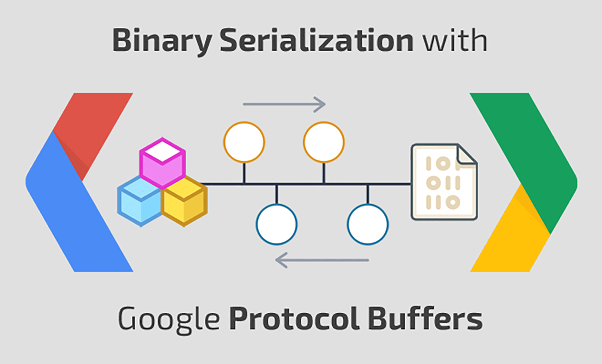
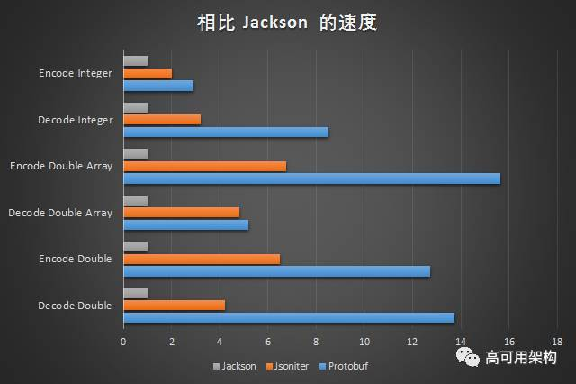
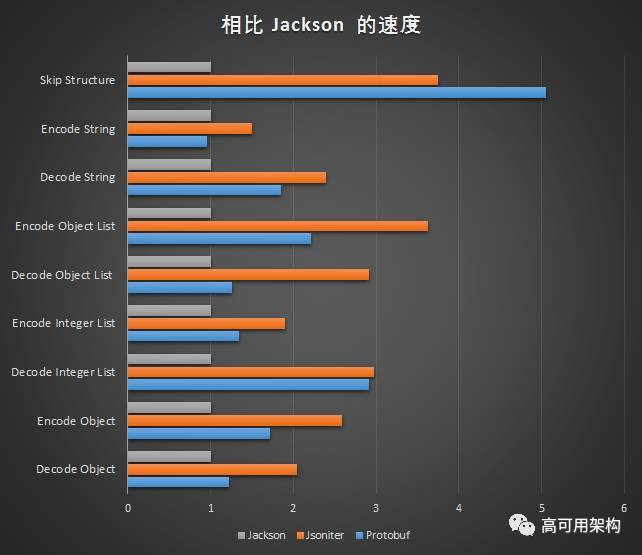

# Efficient Data Serialization/Deserialization with Protobuf

<p align='center'>

</p>


## I. protocol buffers Serialization

The previous article already covered the encoding process. In this article, using golang as an example, we’ll discuss the serialization and deserialization process from the perspective of the code implementation.

Here is an example of using protobuf in Go for data serialization and deserialization. This article starts with this example.

First, create a new example message:
```proto
	syntax = "proto2";
	package example;

	enum FOO { X = 17; };

	message Test {
	  required string label = 1;
	  optional int32 type = 2 [default=77];
	  repeated int64 reps = 3;
	  optional group OptionalGroup = 4 {
	    required string RequiredField = 5;
	  }
	}
```
Use `protoc-gen-go` to generate the corresponding get/set methods. You can then use the generated code to perform serialization and deserialization in your application.
```go
	package main

	import (
		"log"

		"github.com/golang/protobuf/proto"
		"path/to/example"
	)

	func main() {
		test := &example.Test {
			Label: proto.String("hello"),
			Type:  proto.Int32(17),
			Reps:  []int64{1, 2, 3},
			Optionalgroup: &example.Test_OptionalGroup {
				RequiredField: proto.String("good bye"),
			},
		}
		data, err := proto.Marshal(test)
		if err != nil {
			log.Fatal("marshaling error: ", err)
		}
		newTest := &example.Test{}
		err = proto.Unmarshal(data, newTest)
		if err != nil {
			log.Fatal("unmarshaling error: ", err)
		}
		// Now test and newTest contain the same data.
		if test.GetLabel() != newTest.GetLabel() {
			log.Fatalf("data mismatch %q != %q", test.GetLabel(), newTest.GetLabel())
		}
		// etc.
	}
```
In the code above, `proto.Marshal()` is the serialization process. `proto.Unmarshal()` is the deserialization process. This section first looks at the implementation of the serialization process; the next section will analyze the implementation of the deserialization process.
```go
// Marshal takes the protocol buffer
// and encodes it into the wire format, returning the data.
func Marshal(pb Message) ([]byte, error) {
	// Can the object marshal itself?
	if m, ok := pb.(Marshaler); ok {
		return m.Marshal()
	}
	p := NewBuffer(nil)
	err := p.Marshal(pb)
	if p.buf == nil && err == nil {
		// Return a non-nil slice on success.
		return []byte{}, nil
	}
	return p.buf, err
}
```
On entry, the serialization function first invokes the serialization method implemented by the message object itself.
```go
// Marshaler is the interface representing objects that can marshal themselves.
type Marshaler interface {
	Marshal() ([]byte, error)
}
```
`Marshaler` is an interface specifically intended for objects to customize their own serialization. If an implementation exists, it returns the result of the custom method. If not, it proceeds with the default serialization behavior.
```go
	p := NewBuffer(nil)
	err := p.Marshal(pb)
	if p.buf == nil && err == nil {
		// Return a non-nil slice on success.
		return []byte{}, nil
	}
```
Create a new Buffer and call its Marshal() method. After the message is serialized, the data stream is written into the Buffer’s buf byte stream. Serialization ultimately just returns the buf byte stream.
```go
type Buffer struct {
	buf   []byte // encode/decode byte stream
	index int    // read point

	// pools of basic types to amortize allocation.
	bools   []bool
	uint32s []uint32
	uint64s []uint64

	// extra pools, only used with pointer_reflect.go
	int32s   []int32
	int64s   []int64
	float32s []float32
	float64s []float64
}
```
The data structure of `Buffer` is shown above. `Buffer` is a buffer manager used for serializing and deserializing protocol buffers. It can be reused across calls to reduce memory usage. Internally, it maintains 7 pools: 3 pools for primitive data types, and 4 pools used only by `pointer_reflect`.
```go
func (p *Buffer) Marshal(pb Message) error {
	// Can the object marshal itself?
	if m, ok := pb.(Marshaler); ok {
		data, err := m.Marshal()
		p.buf = append(p.buf, data...)
		return err
	}

	t, base, err := getbase(pb)
	// Error handling
	if structPointer_IsNil(base) {
		return ErrNil
	}
	if err == nil {
		err = p.enc_struct(GetProperties(t.Elem()), base)
	}

	// For counting Encode calls
	if collectStats {
		(stats).Encode++ // Parens are to work around a goimports bug.
	}
	// maxMarshalSize = 1<<31 - 1, this is the maximum size protobuf can encode.
	if len(p.buf) > maxMarshalSize {
		return ErrTooLarge
	}
	return err
}
```
The `Buffer` type’s `Marshal()` method still first checks whether the object implements the `Marshal()` interface. If it does, the object is allowed to serialize itself, and the resulting binary data stream is appended to the `buf` data stream.
```go
func getbase(pb Message) (t reflect.Type, b structPointer, err error) {
	if pb == nil {
		err = ErrNil
		return
	}
	// get the reflect type of the pointer to the struct.
	t = reflect.TypeOf(pb)
	// get the address of the struct.
	value := reflect.ValueOf(pb)
	b = toStructPointer(value)
	return
}
```
The getbase method uses reflection to obtain the type of message and the struct pointer corresponding to value. After obtaining the struct pointer, it first performs exception handling.

So the core serialization logic is actually just one line: p.enc\_struct(GetProperties(t.Elem()), base)
```go
// Encode a struct.
func (o *Buffer) enc_struct(prop *StructProperties, base structPointer) error {
	var state errorState
	// Encode fields in tag order so that decoders may use optimizations
	// that depend on the ordering.
	// https://developers.google.com/protocol-buffers/docs/encoding#order
	for _, i := range prop.order {
		p := prop.Prop[i]
		if p.enc != nil {
			err := p.enc(o, p, base)
			if err != nil {
				if err == ErrNil {
					if p.Required && state.err == nil {
						state.err = &RequiredNotSetError{p.Name}
					}
				} else if err == errRepeatedHasNil {
					// Give more context to nil values in repeated fields.
					return errors.New("repeated field " + p.OrigName + " has nil element")
				} else if !state.shouldContinue(err, p) {
					return err
				}
			}
			if len(o.buf) > maxMarshalSize {
				return ErrTooLarge
			}
		}
	}

	// Do oneof fields.
	if prop.oneofMarshaler != nil {
		m := structPointer_Interface(base, prop.stype).(Message)
		if err := prop.oneofMarshaler(m, o); err == ErrNil {
			return errOneofHasNil
		} else if err != nil {
			return err
		}
	}

	// Add unrecognized fields at the end.
	if prop.unrecField.IsValid() {
		v := *structPointer_Bytes(base, prop.unrecField)
		if len(o.buf)+len(v) > maxMarshalSize {
			return ErrTooLarge
		}
		if len(v) > 0 {
			o.buf = append(o.buf, v...)
		}
	}

	return state.err
}

```
As you can see in the code above, except for oneof fields and unrecognized fields, which are handled separately at the end, all other types are serialized by calling `p.enc(o, p, base)`.

The data structure of Properties is defined as follows:
```go
type Properties struct {
	Name     string // name of the field, for error messages
	OrigName string // original name before protocol compiler (always set)
	JSONName string // name to use for JSON; determined by protoc
	Wire     string
	WireType int
	Tag      int
	Required bool
	Optional bool
	Repeated bool
	Packed   bool   // relevant for repeated primitives only
	Enum     string // set for enum types only
	proto3   bool   // whether this is known to be a proto3 field; set for []byte only
	oneof    bool   // whether this is a oneof field

	Default     string // default value
	HasDefault  bool   // whether an explicit default was provided
	CustomType  string
	StdTime     bool
	StdDuration bool

	enc           encoder
	valEnc        valueEncoder // set for bool and numeric types only
	field         field
	tagcode       []byte // encoding of EncodeVarint((Tag<<3)|WireType)
	tagbuf        [8]byte
	stype         reflect.Type      // set for struct types only
	sstype        reflect.Type      // set for slices of structs types only
	ctype         reflect.Type      // set for custom types only
	sprop         *StructProperties // set for struct types only
	isMarshaler   bool
	isUnmarshaler bool

	mtype    reflect.Type // set for map types only
	mkeyprop *Properties  // set for map types only
	mvalprop *Properties  // set for map types only

	size    sizer
	valSize valueSizer // set for bool and numeric types only

	dec    decoder
	valDec valueDecoder // set for bool and numeric types only

	// If this is a packable field, this will be the decoder for the packed version of the field.
	packedDec decoder
}

```
In the `Properties` struct, an encoder named `enc` and a decoder named `dec` are defined.

The `encoder` and `decoder` function definitions are exactly the same.
```go
type encoder func(p *Buffer, prop *Properties, base structPointer) error
```

```go
type decoder func(p *Buffer, prop *Properties, base structPointer) error

```
The encoder and decoder functions are initialized in Properties:
```go
// Initialize the fields for encoding and decoding.
func (p *Properties) setEncAndDec(typ reflect.Type, f *reflect.StructField, lockGetProp bool) {
	// The code below has been trimmed; similar parts are omitted.
	// proto3 scalar types
	
	case reflect.Int32:
		if p.proto3 {
			p.enc = (*Buffer).enc_proto3_int32
			p.dec = (*Buffer).dec_proto3_int32
			p.size = size_proto3_int32
		} else {
			p.enc = (*Buffer).enc_ref_int32
			p.dec = (*Buffer).dec_proto3_int32
			p.size = size_ref_int32
		}
	case reflect.Uint32:
		if p.proto3 {
			p.enc = (*Buffer).enc_proto3_uint32
			p.dec = (*Buffer).dec_proto3_int32 // can reuse
			p.size = size_proto3_uint32
		} else {
			p.enc = (*Buffer).enc_ref_uint32
			p.dec = (*Buffer).dec_proto3_int32 // can reuse
			p.size = size_ref_uint32
		}
	case reflect.Float32:
		if p.proto3 {
			p.enc = (*Buffer).enc_proto3_uint32 // can just treat them as bits
			p.dec = (*Buffer).dec_proto3_int32
			p.size = size_proto3_uint32
		} else {
			p.enc = (*Buffer).enc_ref_uint32 // can just treat them as bits
			p.dec = (*Buffer).dec_proto3_int32
			p.size = size_ref_uint32
		}
	case reflect.String:
		if p.proto3 {
			p.enc = (*Buffer).enc_proto3_string
			p.dec = (*Buffer).dec_proto3_string
			p.size = size_proto3_string
		} else {
			p.enc = (*Buffer).enc_ref_string
			p.dec = (*Buffer).dec_proto3_string
			p.size = size_ref_string
		}

	case reflect.Slice:
		switch t2 := t1.Elem(); t2.Kind() {
		default:
			logNoSliceEnc(t1, t2)
			break

		case reflect.Int32:
			if p.Packed {
				p.enc = (*Buffer).enc_slice_packed_int32
				p.size = size_slice_packed_int32
			} else {
				p.enc = (*Buffer).enc_slice_int32
				p.size = size_slice_int32
			}
			p.dec = (*Buffer).dec_slice_int32
			p.packedDec = (*Buffer).dec_slice_packed_int32
		
			default:
				logNoSliceEnc(t1, t2)
				break
			}
		}

	case reflect.Map:
		p.enc = (*Buffer).enc_new_map
		p.dec = (*Buffer).dec_new_map
		p.size = size_new_map

		p.mtype = t1
		p.mkeyprop = &Properties{}
		p.mkeyprop.init(reflect.PtrTo(p.mtype.Key()), "Key", f.Tag.Get("protobuf_key"), nil, lockGetProp)
		p.mvalprop = &Properties{}
		vtype := p.mtype.Elem()
		if vtype.Kind() != reflect.Ptr && vtype.Kind() != reflect.Slice {
			// The value type is not a message (*T) or bytes ([]byte),
			// so we need encoders for the pointer to this type.
			vtype = reflect.PtrTo(vtype)
		}

		p.mvalprop.CustomType = p.CustomType
		p.mvalprop.StdDuration = p.StdDuration
		p.mvalprop.StdTime = p.StdTime
		p.mvalprop.init(vtype, "Value", f.Tag.Get("protobuf_val"), nil, lockGetProp)
	}
	p.setTag(lockGetProp)
}

```
In the code above, each type is enumerated via `switch`-`case`. For each case, the corresponding `encode` encoder, `decode` decoder, and `size` are set. Places where proto2 and proto3 differ are also handled as two separate cases.

There are 12 major categories: `reflect.Bool`, `reflect.Int32`, `reflect.Uint32`, `reflect.Int64`, `reflect.Uint64`, `reflect.Float32`, `reflect.Float64`, `reflect.String`, `reflect.Struct`, `reflect.Ptr`, `reflect.Slice`, and `reflect.Map`.

Below, we mainly analyze the code implementation for three categories: `Int32`, `String`, and `Map`.


### 1. Int32
```go
func (o *Buffer) enc_proto3_int32(p *Properties, base structPointer) error {
	v := structPointer_Word32Val(base, p.field)
	x := int32(word32Val_Get(v)) // permit sign extension to use full 64-bit range
	if x == 0 {
		return ErrNil
	}
	o.buf = append(o.buf, p.tagcode...)
	p.valEnc(o, uint64(x))
	return nil
}
```
The code for handling Int32 is relatively straightforward: first, put the tagcode into the buf binary data stream buffer; then serialize the Int32 value and write the serialized data into the buffer immediately after the tagcode.
```go
// EncodeVarint writes a varint-encoded integer to the Buffer.
// This is the format for the
// int32, int64, uint32, uint64, bool, and enum
// protocol buffer types.
func (p *Buffer) EncodeVarint(x uint64) error {
	for x >= 1<<7 {
		p.buf = append(p.buf, uint8(x&0x7f|0x80))
		x >>= 7
	}
	p.buf = append(p.buf, uint8(x))
	return nil
}
```
The encoding method for Int32 was covered in the [previous article](https://github.com/halfrost/Halfrost-Field/blob/master/contents-en/Protocol/Protocol-buffers-encode.md), using Varint. The function above is also applicable to int32, int64, uint32, uint64, bool, and enum.

You can also take a look at the specific code implementations of sint32 and Fixed32.
```go
// EncodeZigzag32 writes a zigzag-encoded 32-bit integer
// to the Buffer.
// This is the format used for the sint32 protocol buffer type.
func (p *Buffer) EncodeZigzag32(x uint64) error {
	// use signed number to get arithmetic right shift.
	return p.EncodeVarint(uint64((uint32(x) << 1) ^ uint32((int32(x) >> 31))))
}
```
For signed sint32, the approach is to apply ZigZag first, and then encode it as a Varint.
```go
// EncodeFixed32 writes a 32-bit integer to the Buffer.
// This is the format for the
// fixed32, sfixed32, and float protocol buffer types.
func (p *Buffer) EncodeFixed32(x uint64) error {
	p.buf = append(p.buf,
		uint8(x),
		uint8(x>>8),
		uint8(x>>16),
		uint8(x>>24))
	return nil
}
```
For Fixed32, the handling is merely a bit-shift operation; no compression is performed.

### 2. String
```go
func (o *Buffer) enc_proto3_string(p *Properties, base structPointer) error {
	v := *structPointer_StringVal(base, p.field)
	if v == "" {
		return ErrNil
	}
	o.buf = append(o.buf, p.tagcode...)
	o.EncodeStringBytes(v)
	return nil
}
```
Serializing a string also happens in two steps: first put in the tagcode, then serialize the data.
```go
// EncodeStringBytes writes an encoded string to the Buffer.
// This is the format used for the proto2 string type.
func (p *Buffer) EncodeStringBytes(s string) error {
	p.EncodeVarint(uint64(len(s)))
	p.buf = append(p.buf, s...)
	return nil
}
```
When serializing a string, its length is first encoded as a Varint and written to the buf. The length is then immediately followed by the string. This is the implementation of tag-length-value.


### 3. Map
```go
// Encode a map field.
func (o *Buffer) enc_new_map(p *Properties, base structPointer) error {
	var state errorState // XXX: or do we need to plumb this through?

	v := structPointer_NewAt(base, p.field, p.mtype).Elem() // map[K]V
	if v.Len() == 0 {
		return nil
	}

	keycopy, valcopy, keybase, valbase := mapEncodeScratch(p.mtype)

	enc := func() error {
		if err := p.mkeyprop.enc(o, p.mkeyprop, keybase); err != nil {
			return err
		}
		if err := p.mvalprop.enc(o, p.mvalprop, valbase); err != nil && err != ErrNil {
			return err
		}
		return nil
	}

	// Don't sort map keys. It is not required by the spec, and C++ doesn't do it.
	for _, key := range v.MapKeys() {
		val := v.MapIndex(key)

		keycopy.Set(key)
		valcopy.Set(val)

		o.buf = append(o.buf, p.tagcode...)
		if err := o.enc_len_thing(enc, &state); err != nil {
			return err
		}
	}
	return nil
}
```
The above code can also serialize an array of dictionaries, for example:
```go
map<key_type, value_type> map_field = N;
```
Convert it to the corresponding `repeated message` form before serialization.
```
message MapFieldEntry {
		key_type key = 1;
		value_type value = 2;
}
repeated MapFieldEntry map_field = N;
```
Map serialization processes each k-v pair by first writing the tagcode, then serializing the k-v pair. Here, when serializing a struct with an unknown length, you need to call the enc\_len\_thing() method.
```go
// Encode something, preceded by its encoded length (as a varint).
func (o *Buffer) enc_len_thing(enc func() error, state *errorState) error {
	iLen := len(o.buf)
	o.buf = append(o.buf, 0, 0, 0, 0) // reserve four bytes for length
	iMsg := len(o.buf)
	err := enc()
	if err != nil && !state.shouldContinue(err, nil) {
		return err
	}
	lMsg := len(o.buf) - iMsg
	lLen := sizeVarint(uint64(lMsg))
	switch x := lLen - (iMsg - iLen); {
	case x > 0: // actual length is x bytes larger than the space we reserved
		// Move msg x bytes right.
		o.buf = append(o.buf, zeroes[:x]...)
		copy(o.buf[iMsg+x:], o.buf[iMsg:iMsg+lMsg])
	case x < 0: // actual length is x bytes smaller than the space we reserved
		// Move msg x bytes left.
		copy(o.buf[iMsg+x:], o.buf[iMsg:iMsg+lMsg])
		o.buf = o.buf[:len(o.buf)+x] // x is negative
	}
	// Encode the length in the reserved space.
	o.buf = o.buf[:iLen]
	o.EncodeVarint(uint64(lMsg))
	o.buf = o.buf[:len(o.buf)+lMsg]
	return state.err
}
```
The enc\_len\_thing() method first reserves 4 bytes as a placeholder for the length. After serialization, it computes the length. If the length takes more than 4 bytes, it shifts the serialized binary data to the right and writes the length between the tagcode and the data. If the length takes fewer than 4 bytes, it correspondingly shifts the data to the left.


### 4. slice

Finally, here is another array example, using []int32 as an example.
```go
// Encode a slice of int32s ([]int32) in packed format.
func (o *Buffer) enc_slice_packed_int32(p *Properties, base structPointer) error {
	s := structPointer_Word32Slice(base, p.field)
	l := s.Len()
	if l == 0 {
		return ErrNil
	}
	// TODO: Reuse a Buffer.
	buf := NewBuffer(nil)
	for i := 0; i < l; i++ {
		x := int32(s.Index(i)) // permit sign extension to use full 64-bit range
		p.valEnc(buf, uint64(x))
	}

	o.buf = append(o.buf, p.tagcode...)
	o.EncodeVarint(uint64(len(buf.buf)))
	o.buf = append(o.buf, buf.buf...)
	return nil
}
```
Serialize this array in three steps: first write the tagcode, then serialize the length of the entire array, and finally serialize each element of the array and append it afterward. The final format is tag - length - value - value - value.

The above is the Protocol Buffer serialization process.

### Serialization Summary:

Protocol Buffer serialization uses Varint and Zigzag encoding to compress integer and signed integer values. It does not compress floating-point numbers (this could be further optimized; Protocol Buffer still has room for improvement). When encoding a `.proto` file, it checks `option` and `repeated` fields. If an `optional` or `repeated` field has not been assigned a value, that field is completely absent from the serialized data; in other words, it is not serialized (one fewer field is encoded).

These two points help compress the data and reduce serialization work.

The serialization process consists entirely of binary bit shifts, making it very fast. Data is stored in the binary stream in the form tag - length - value (or tag - value). By using a TLV structure to store data, it also eliminates delimiters such as `{`, `}`, `;`, and `,` used in JSON. Removing these delimiters reduces the amount of data even further.

This makes serialization extremely fast.

## II. Protocol Buffers Deserialization

Deserialization is implemented as the exact reverse of serialization.
```go
func Unmarshal(buf []byte, pb Message) error {
	pb.Reset()
	return UnmarshalMerge(buf, pb)
}
```
Reset the buffer before deserialization begins.
```go
func (p *Buffer) Reset() {
	p.buf = p.buf[0:0] // for reading/writing
	p.index = 0        // for reading
}
```
Clear all data in `buf` and reset `index`.
```go
func UnmarshalMerge(buf []byte, pb Message) error {
	// If the object can unmarshal itself, let it.
	if u, ok := pb.(Unmarshaler); ok {
		return u.Unmarshal(buf)
	}
	return NewBuffer(buf).Unmarshal(pb)
}
```
Deserialization starts with the function above. If the incoming `message` result does not match the `buf` result, the final outcome is unpredictable. Before deserialization, it will likewise first call the corresponding custom `Unmarshal()` method.
```go
type Unmarshaler interface {
	Unmarshal([]byte) error
}
```
`Unmarshal()` is an interface that you can implement yourself.

`UnmarshalMerge` calls the `Unmarshal(pb Message)` method.
```go
func (p *Buffer) Unmarshal(pb Message) error {
	// If the object can unmarshal itself, let it.
	if u, ok := pb.(Unmarshaler); ok {
		err := u.Unmarshal(p.buf[p.index:])
		p.index = len(p.buf)
		return err
	}

	typ, base, err := getbase(pb)
	if err != nil {
		return err
	}

	err = p.unmarshalType(typ.Elem(), GetProperties(typ.Elem()), false, base)

	if collectStats {
		stats.Decode++
	}

	return err
}
```
The `Unmarshal(pb Message)` function takes only one parameter, and its function signature differs from `proto.Unmarshal()` (the former takes 1 parameter, while the latter takes 2). The difference is that the implementation of the single-parameter function does not reset the `buf` buffer, whereas the two-parameter version resets the `buf` buffer first.

Both functions eventually call the `unmarshalType()` method, which is the function that ultimately supports deserialization.
```go
func (o *Buffer) unmarshalType(st reflect.Type, prop *StructProperties, is_group bool, base structPointer) error {
	var state errorState
	required, reqFields := prop.reqCount, uint64(0)

	var err error
	for err == nil && o.index < len(o.buf) {
		oi := o.index
		var u uint64
		u, err = o.DecodeVarint()
		if err != nil {
			break
		}
		wire := int(u & 0x7)
		
		// Code below omitted
		
		dec := p.dec
		
		// Middle code omitted
		
		decErr := dec(o, p, base)
		if decErr != nil && !state.shouldContinue(decErr, p) {
			err = decErr
		}
		if err == nil && p.Required {
			// Successfully decoded a required field.
			if tag <= 64 {
				// use bitmap for fields 1-64 to catch field reuse.
				var mask uint64 = 1 << uint64(tag-1)
				if reqFields&mask == 0 {
					// new required field
					reqFields |= mask
					required--
				}
			} else {
				// This is imprecise. It can be fooled by a required field
				// with a tag > 64 that is encoded twice; that's very rare.
				// A fully correct implementation would require allocating
				// a data structure, which we would like to avoid.
				required--
			}
		}
	}
	if err == nil {
		if is_group {
			return io.ErrUnexpectedEOF
		}
		if state.err != nil {
			return state.err
		}
		if required > 0 {
			// Not enough information to determine the exact field. If we use extra
			// CPU, we could determine the field only if the missing required field
			// has a tag <= 64 and we check reqFields.
			return &RequiredNotSetError{"{Unknown}"}
		}
	}
	return err
}
```
The `unmarshalType()` function is relatively long and handles many cases, including `oneof` and `WireEndGroup`. The function that actually performs deserialization is on this line: `decErr := dec(o, p, base)`.

The `dec` function is initialized in the `setEncAndDec()` function of `Properties`. We discussed that function earlier when covering serialization, so we will not repeat it here. The `dec()` function has a corresponding deserialization function for each different type.

Similarly, next we will use four examples to look at the actual code implementation of deserialization.


### 1. Int32
```go
func (o *Buffer) dec_proto3_int32(p *Properties, base structPointer) error {
	u, err := p.valDec(o)
	if err != nil {
		return err
	}
	word32Val_Set(structPointer_Word32Val(base, p.field), uint32(u))
	return nil
}
```
The code for deserializing Int32 is relatively simple. The idea is to restore the original data by following the inverse process of encoding.
```go
func (p *Buffer) DecodeVarint() (x uint64, err error) {
	i := p.index
	buf := p.buf

	if i >= len(buf) {
		return 0, io.ErrUnexpectedEOF
	} else if buf[i] < 0x80 {
		p.index++
		return uint64(buf[i]), nil
	} else if len(buf)-i < 10 {
		return p.decodeVarintSlow()
	}

	var b uint64
	// we already checked the first byte
	x = uint64(buf[i]) - 0x80
	i++

	b = uint64(buf[i])
	i++
	x += b << 7
	if b&0x80 == 0 {
		goto done
	}
	x -= 0x80 << 7

	b = uint64(buf[i])
	i++
	x += b << 14
	if b&0x80 == 0 {
		goto done
	}
	x -= 0x80 << 14

	b = uint64(buf[i])
	i++
	x += b << 21
	if b&0x80 == 0 {
		goto done
	}
	x -= 0x80 << 21

	b = uint64(buf[i])
	i++
	x += b << 28
	if b&0x80 == 0 {
		goto done
	}
	x -= 0x80 << 28

	b = uint64(buf[i])
	i++
	x += b << 35
	if b&0x80 == 0 {
		goto done
	}
	x -= 0x80 << 35

	b = uint64(buf[i])
	i++
	x += b << 42
	if b&0x80 == 0 {
		goto done
	}
	x -= 0x80 << 42

	b = uint64(buf[i])
	i++
	x += b << 49
	if b&0x80 == 0 {
		goto done
	}
	x -= 0x80 << 49

	b = uint64(buf[i])
	i++
	x += b << 56
	if b&0x80 == 0 {
		goto done
	}
	x -= 0x80 << 56

	b = uint64(buf[i])
	i++
	x += b << 63
	if b&0x80 == 0 {
		goto done
	}
	// x -= 0x80 << 63 // Always zero.

	return 0, errOverflow

done:
	p.index = i
	return x, nil
}
```
After an Int32 is serialized, the first byte is always `0x80`. Once that byte is removed, every subsequent binary byte is data. The remaining step is to add up each number using bit-shift operations. The deserialization function above also applies to int32, int64, uint32, uint64, bool, and enum.

You can also take a look at the concrete deserialization implementations for sint32 and Fixed32.
```go
func (p *Buffer) DecodeZigzag32() (x uint64, err error) {
	x, err = p.DecodeVarint()
	if err != nil {
		return
	}
	x = uint64((uint32(x) >> 1) ^ uint32((int32(x&1)<<31)>>31))
	return
}
```
For signed `sint32`, deserialization first deserializes the Varint, then deserializes the ZigZag.
```go
func (p *Buffer) DecodeFixed32() (x uint64, err error) {
	// x, err already 0
	i := p.index + 4
	if i < 0 || i > len(p.buf) {
		err = io.ErrUnexpectedEOF
		return
	}
	p.index = i

	x = uint64(p.buf[i-4])
	x |= uint64(p.buf[i-3]) << 8
	x |= uint64(p.buf[i-2]) << 16
	x |= uint64(p.buf[i-1]) << 24
	return
}
```
The Fixed32 deserialization process also uses bit shifting; by accumulating the contents of each byte, the original data can be restored. Note that here you also need to skip over the `tag` position first.

### 2. String
```go
func (p *Buffer) DecodeRawBytes(alloc bool) (buf []byte, err error) {
	n, err := p.DecodeVarint()
	if err != nil {
		return nil, err
	}

	nb := int(n)
	if nb < 0 {
		return nil, fmt.Errorf("proto: bad byte length %d", nb)
	}
	end := p.index + nb
	if end < p.index || end > len(p.buf) {
		return nil, io.ErrUnexpectedEOF
	}

	if !alloc {
		// todo: check if can get more uses of alloc=false
		buf = p.buf[p.index:end]
		p.index += nb
		return
	}

	buf = make([]byte, nb)
	copy(buf, p.buf[p.index:])
	p.index += nb
	return
}
```
When deserializing a string, first deserialize the length using DecodeVarint. Once you have the length, the rest is just a direct copy. In the previous article on encode, we learned that strings are not processed and are placed directly into the binary stream, so deserialization only needs to extract them directly.

### 3. Map
```go
func (o *Buffer) dec_new_map(p *Properties, base structPointer) error {
	raw, err := o.DecodeRawBytes(false)
	if err != nil {
		return err
	}
	oi := o.index       // index at the end of this map entry
	o.index -= len(raw) // move buffer back to start of map entry

	mptr := structPointer_NewAt(base, p.field, p.mtype) // *map[K]V
	if mptr.Elem().IsNil() {
		mptr.Elem().Set(reflect.MakeMap(mptr.Type().Elem()))
	}
	v := mptr.Elem() // map[K]V

	// Some code is omitted here, mainly to prepare double-indirect placeholders for key - value; see the enc_new_map function in the serialization code for details

	// Decode.
	// This parses a restricted wire format, namely the encoding of a message
	// with two fields. See enc_new_map for the format.
	for o.index < oi {
		// tagcode for key and value properties are always a single byte
		// because they have tags 1 and 2.
		tagcode := o.buf[o.index]
		o.index++
		switch tagcode {
		case p.mkeyprop.tagcode[0]:
			if err := p.mkeyprop.dec(o, p.mkeyprop, keybase); err != nil {
				return err
			}
		case p.mvalprop.tagcode[0]:
			if err := p.mvalprop.dec(o, p.mvalprop, valbase); err != nil {
				return err
			}
		default:
			// TODO: Should we silently skip this instead?
			return fmt.Errorf("proto: bad map data tag %d", raw[0])
		}
	}
	keyelem, valelem := keyptr.Elem(), valptr.Elem()
	if !keyelem.IsValid() {
		keyelem = reflect.Zero(p.mtype.Key())
	}
	if !valelem.IsValid() {
		valelem = reflect.Zero(p.mtype.Elem())
	}

	v.SetMapIndex(keyelem, valelem)
	return nil
}
```
When deserializing a map, you need to extract each tag, then immediately deserialize each key-value pair. Finally, it checks whether keyelem and valelem are zero values; if they are, reflect.Zero is called for each to handle the zero-value case.

### 4. slice

Finally, let’s still use an array example, with []int32 as the example.
```go
func (o *Buffer) dec_slice_packed_int32(p *Properties, base structPointer) error {
	v := structPointer_Word32Slice(base, p.field)

	nn, err := o.DecodeVarint()
	if err != nil {
		return err
	}
	nb := int(nn) // number of bytes of encoded int32s

	fin := o.index + nb
	if fin < o.index {
		return errOverflow
	}
	for o.index < fin {
		u, err := p.valDec(o)
		if err != nil {
			return err
		}
		v.Append(uint32(u))
	}
	return nil
}
```
Deserialize this array in two steps: skip the tagcode to obtain the length, then deserialize the length. Within that length, deserialize each value in sequence.

The above is the Protocol Buffer deserialization process.

### Deserialization summary:

Protocol Buffer deserialization reads directly from a binary byte stream. Deserialization is the reverse of encoding, and likewise consists of binary operations. During deserialization, you typically only need the length. The tag value is only used to identify the type. The Properties setEncAndDec() method has already initialized the decode decoder corresponding to each type, so during deserialization the tag value can be skipped directly and processing can start from the length.

XML parsing is more complex. XML needs to read a string from a file and then convert it into an XML document object structure model. After that, it reads the string of a specified node from the XML document object structure model, and finally converts that string into a variable of the specified type. This process is very complex. In particular, converting an XML file into a document object structure model usually requires a large amount of CPU-intensive computation, such as lexical and syntactic analysis.


## III. Serialization / Deserialization Performance

Protocol Buffer has long been regarded as high-performance. Many people have also implemented benchmarks to verify this claim, such as the experiments in this link: [jvm-serializers](https://github.com/eishay/jvm-serializers/wiki).

Before looking at the data, we can first rationally analyze what advantages Protocol Buffer has over JSON, XML, and similar formats:

1. Protobuf uses Varint and Zigzag to significantly compress integer types. It also does not have data delimiters such as {, }, and ; as in JSON. For fields identified with option, deserialization is not performed when there is no data. These measures make the overall pb data volume much smaller than JSON.
2. Protobuf uses a TLV format, while JSON and similar formats use strings. String comparisons should be more time-consuming than numeric field tags. Protobuf has a size or length marker before the payload, whereas JSON must scan the entire document and cannot skip fields that are not needed.

The following figure comes from the reference article “Is Protobuf 5x Faster than JSON? Using Code to Debunk the pb Performance Myth”:

<p align='center'>

</p>

From this experiment, Protobuf is indeed extremely strong in terms of performance when serializing numbers.

Serializing / deserializing numbers is indeed an advantage of Protobuf over JSON and XML, but there are also areas where it has no advantage, such as strings. Strings are basically not processed in Protobuf, except for adding tag - length in front. In the process of serializing / deserializing strings, the speed of string copying instead determines the real performance.


<p align='center'>

</p>

As shown in the figure above, when encoding strings, the speed is basically almost the same as JSON.

## III. Final Notes

At this point, readers should have a clear understanding of everything about protocol buffers.

When protocol buffers were first created, they were not intended for data transmission. They were designed to solve the problem of protocol compatibility across multiple server versions. In essence, they introduced a new cross-language, unambiguous IDL (Interface description language). It was only later that people discovered it was also good for transmitting data, and started using protocol buffers for that purpose.

If you want to replace JSON with protocol buffers, the considerations may include:

1. For the same data, protocol buffers transmit less data than JSON. After gzip or 7zip compression, network transmission costs are lower.
2. protocol buffers are not self-describing. Without the `.proto` file, they have a certain degree of opacity. During data transmission, the data is a binary stream rather than plaintext.
3. protocol buffers provide a set of tools, making it very convenient to automatically generate code.
4. protocol buffers are backward compatible. After the data structure changes, older versions are not affected.
5. protocol buffers are natively and perfectly compatible with RPC calls.


If integer numbers and floating-point numbers are rarely used, and all the data is string data, then the performance difference between JSON and protocol buffers will not be very large. For pure front-end interactions, choosing JSON or protocol buffers does not make much difference.

In interactions with the backend, protocol buffers are used more often. In the author's opinion, aside from strong performance, perfect compatibility with RPC calls is also an important factor in choosing protocol buffers.

------------------------------------------------------

Reference:  

[Official Google documentation](https://developers.google.com/protocol-buffers/docs/overview)      
[thrift-protobuf-compare - Benchmarking.wiki](https://code.google.com/archive/p/thrift-protobuf-compare/wikis/Benchmarking.wiki)    
[jvm-serializers](https://github.com/eishay/jvm-serializers/wiki)  
[Is Protobuf 5x Faster than JSON? Using Code to Debunk the pb Performance Myth](https://mp.weixin.qq.com/s?__biz=MzA3NDcyMTQyNQ==&mid=2649257430&idx=1&sn=975b6123d8256221f6bac3b99e52af9a&chksm=8767a428b0102d3e6ab7abdf797c481da570cb29e274aa4ff6ecd931f535166b776e6548941d&scene=0&key=399a205ce674169cbedcc1c459650908e22d6a2b81674195c3b251114acdf821dbde7bb49102c6b47f61b26a7a404d74e0e8440cea3675a7ea8f49eafd8639bfb733183a1bfb4603232d6cb8ecd230e5&ascene=0&uin=NTkxMDk2NjU=&devicetype=iMac+MacBookPro12,1+OSX+OSX+10.12.4+build(16E195)&version=12020510&nettype=WIFI&fontScale=100&pass_ticket=wHPj0w18CV8zHl6HCfd9t9LQfs3I0ZULhUILuOHgL0E=)

> GitHub Repo: [Halfrost-Field](https://github.com/halfrost/Halfrost-Field)
> 
> Follow: [halfrost · GitHub](https://github.com/halfrost)
>
> Source: [https://halfrost.com/protobuf\_decode/](https://halfrost.com/protobuf_decode/)