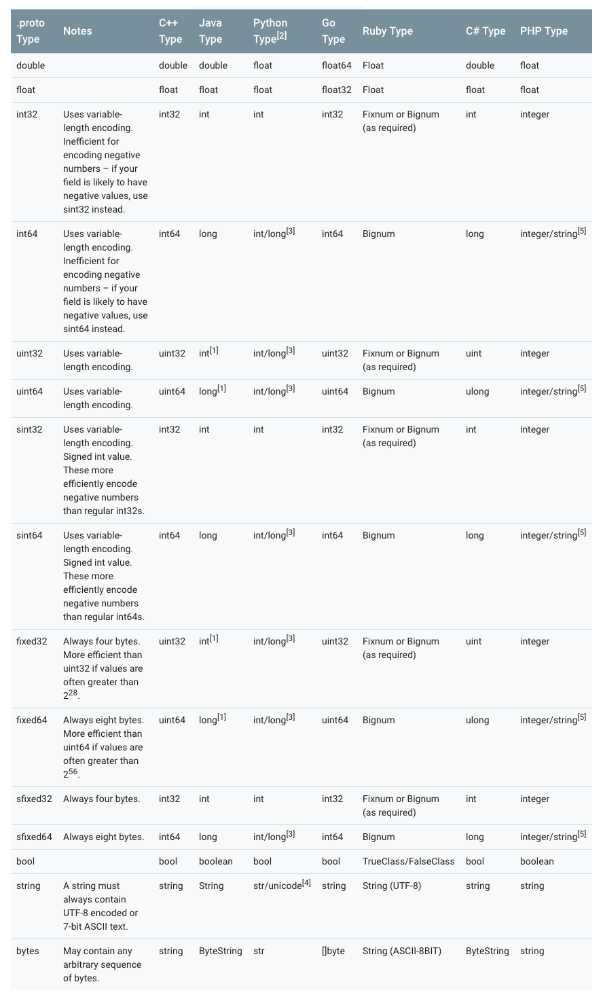
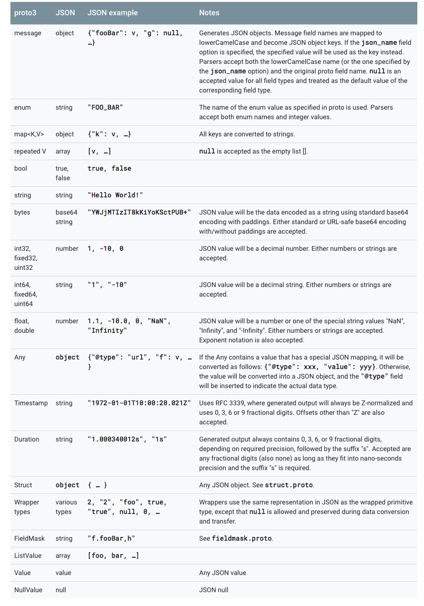
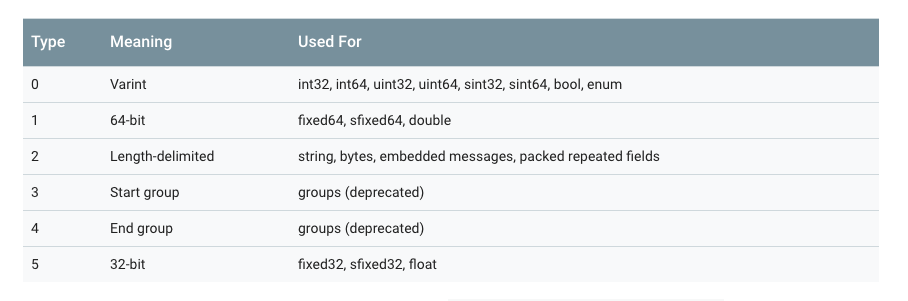
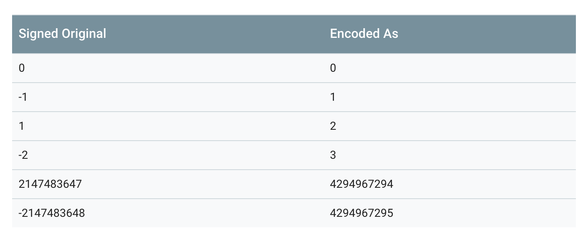
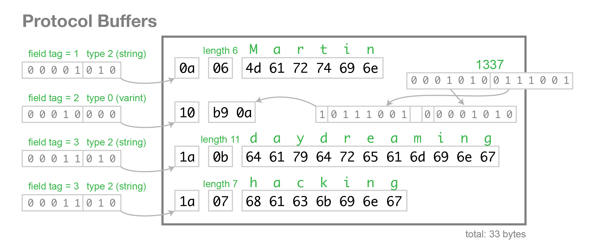

# Efficient Data Compression Encoding with Protobuf

<p align='center'>

</p>

## I. What are protocol buffers?

Protocol buffers are a language-neutral, platform-neutral, extensible format for serializing structured data, and can be used for communication protocols, data storage, and more.

When it comes to serializing data, Protocol buffers are flexible and efficient. Compared with XML, Protocol buffers are more compact, faster, and simpler. Once you have defined the data structure you want to process, you can use the Protocol buffers code generation tools to generate the corresponding code. You can even update the data structure without redeploying the program. Describe your data structure once with Protobuf, and you can easily read and write your structured data across different languages or from different data streams.

**Protocol buffers are well suited for data storage or as an RPC data interchange format. They provide a language-neutral, platform-neutral, extensible serialization format for structured data, usable in areas such as communication protocols and data storage**.


## II. Why were protocol buffers invented?

<p align='center'>

</p>


You might think Google invented protocol buffers to improve serialization speed, but that is not actually the real reason.

protocol buffers were initially used at Google to solve the request/response protocol for index servers. Before protocol buffers, Google already had a request/response format for manually handling the marshaling and unmarshaling of requests and responses. It also supported multiple protocol versions, but the code was rather ugly:
```c
 if (version == 3) {
   ...
 } else if (version > 4) {
   if (version == 5) {
     ...
   }
   ...
 }
```
If the formatting protocol is extremely explicit, it makes the new protocol very complex. That is because developers must ensure that every server between the request initiator and the actual server handling the request can understand the new protocol before they can flip the switch and start using it.

This is exactly the kind of backward-compatibility and old/new protocol compatibility issue that every server-side developer has encountered.

protocol buffers was created to solve these problems. protocol buffers was designed with the following two characteristics in mind:

- New fields can be introduced easily, and intermediate servers that do not need to inspect the data can simply parse and forward it without understanding all fields.
- The data format is more self-describing and can be processed in various languages (C++, Java, and so on).

This version of protocol buffers still required developers to hand-write parsing code.

However, as systems gradually developed and evolved, protocol buffers acquired more capabilities:

- Automatically generated serialization and deserialization code eliminates the need for manual parsing. (The official tooling provides code generators, and basically every language platform has support.)
- In addition to being used for RPC (Remote Procedure Call) requests, people began using protocol buffers as a convenient self-describing format for persistently stored data (for example, in Bigtable).
- A server's RPC interface can first be declared as part of the protocol, and then protocol compiler can generate base classes that users can override with actual implementations of the server interface.


protocol buffers is now Google's common language for data. At the time of writing, Google's code tree defines 48,162 different message types across 12,183 .proto files. They are used both in RPC systems and for persistent data storage across various storage systems.


Summary:

**protocol buffers was originally created to solve server-side compatibility issues between old and new protocols (higher and lower versions). The name is also quite fitting: "protocol buffers." Only later did it gradually evolve into a mechanism for transmitting data**.


> Origin of the name Protocol Buffers: 
>  
> Why the name "Protocol Buffers"?  
The name originates from the early days of the format, before we had the protocol buffer compiler to generate classes for us. At the time, there was a class called ProtocolBuffer which actually acted as a buffer for an individual method. Users would add tag/value pairs to this buffer individually by calling methods like AddValue(tag, value). The raw bytes were stored in a buffer which could then be written out once the message had been constructed.
> 
> Since that time, the "buffers" part of the name has lost its meaning, but it is still the name we use. Today, people usually use the term "protocol message" to refer to a message in an abstract sense, "protocol buffer" to refer to a serialized copy of a message, and "protocol message object" to refer to an in-memory object representing the parsed message.
> 
> The name originates from the early days of the format, before we had the protocol buffer compiler to generate classes for us. At the time, there was a class called ProtocolBuffer, which actually acted as a buffer for an individual method. Users could add tag/value pairs to this buffer one by one by calling methods such as AddValue(tag,value). The raw bytes were stored in a buffer, which could then be written out once the message had been constructed. 
> 
> Since then, the "buffer" part of the name has lost its meaning, but it is still the name we use. Today, people usually use the term "protocol message" to refer to a message in an abstract sense, "protocol buffer" to refer to a serialized copy of a message, and "protocol message object" to refer to an in-memory object representing the parsed message.


## III. Defining a message in proto3


<p align='center'>

</p>


The latest version of protocol buffers is currently proto3, which differs somewhat from the older proto2 version. The APIs of the two versions are not fully compatible.

> The names proto2 and proto3 can seem a bit confusing. That is because when we first open sourced protocol buffers, it was actually Google's second version, so it was called proto2. This is also why our open-source version numbering started at v2. The initial version was called proto1 and had been developed at Google starting in early 2001.


In proto, all structured data is called a message.
```proto
message helloworld 
{ 
   required int32     id = 1;  // ID 
   required string    str = 2;  // str 
   optional int32     opt = 3;  //optional field 
}
```
The lines above define a message named helloworld. This message has three fields: an `int32` field named `id`, and a `string` field named `str`. `opt` is an optional field, meaning the message may omit this field.

Next, let’s cover a few things to be aware of in proto3.
```proto
syntax = "proto3";

message SearchRequest {
  string query = 1;
  int32 page_number = 2;
  int32 result_per_page = 3;
}
```
If the first line does not declare `syntax = "proto3";`, proto2 is used for parsing by default.

### 1. Assigning Field Numbers

Each field in every message definition has a **unique number**. These field numbers are used to identify fields in the message’s binary format and should not be changed once the message type is in use. Note that field numbers in the range 1 to 15 require one byte to encode, including the field number and field type (for the reason, see the section [How Protocol Buffer Encoding Works](https://github.com/halfrost/Halfrost-Field/blob/master/contents-en/Protocol/Protocol-buffers-encode.md#%E5%85%AD-protocol-buffer-%E7%BC%96%E7%A0%81%E5%8E%9F%E7%90%86)). Field numbers in the range 16 to 2047 require two bytes. Therefore, you should reserve numbers 1 through 15 for very frequently occurring message elements. Remember to leave some room for frequently occurring elements that may be added in the future.

The smallest field number you can specify is 1, and the largest is 2^29^-1, or 536,870,911. You also cannot use the numbers 19000 through 19999 (`FieldDescriptor::kFirstReservedNumber` through `FieldDescriptor::kLastReservedNumber`), because they are reserved for the Protocol Buffers implementation.

If you use one of these reserved numbers in a .proto file, the Protocol Buffers compiler will report an error.

Similarly, you cannot use any field numbers previously reserved by Protocol Buffers. What reserved fields are is explained in detail in the next section.

### 2. Reserved Fields

If you update a message type by completely removing a field or commenting it out, future users may reuse that field number when making their own updates to the type. If an old version of the `.proto` file is later loaded, this can cause serious server-side issues, such as data corruption, privacy bugs, and so on. One way to ensure this does not happen is to mark the field number (or name, which can also cause JSON serialization issues) of the deleted field as `reserved`. If any future user tries to use these field identifiers, the Protocol Buffers compiler will report an error.
```proto
message Foo {
  reserved 2, 15, 9 to 11;
  reserved "foo", "bar";
}
```
**Note: field names and field numbers cannot be mixed in the same `reserved` statement**. If necessary, write them separately as shown in the example above.

### 3. Default Field Rules

- Field names cannot be duplicated; they must be unique.
- repeated fields: any number can appear multiple times in a message (including 0 times), and the order of these repeated values is preserved.

In proto3, repeated fields of plain numeric types use packed encoding by default (for the details, see the section [How Protocol Buffer Encoding Works](https://github.com/halfrost/Halfrost-Field/blob/master/contents-en/Protocol/Protocol-buffers-encode.md#%E5%85%AD-protocol-buffer-%E7%BC%96%E7%A0%81%E5%8E%9F%E7%90%86)).

### 4. Scalar Type Mappings Across Languages

<p align='center'>

</p>

Notes:

- [1] In Java, unsigned 32-bit and 64-bit integers use the corresponding signed representations, with the most significant bit storing the sign bit.  
- [2] In all cases, type checking is performed when assigning a value to a field to ensure that the value is valid.  
- [3] 64-bit or unsigned 32-bit integers are always represented as long when decoded, but they may be int if an int was set when assigning the field. In all cases, the value must conform to the type used at assignment time. See [2].  
- [4] Python strings are represented as unicode when decoded, but may be str if an ASCII string is provided (this string may change).  
- [5] Integer is used on 64-bit machines, and string is used on 32-bit machines.  
 

### 5. Enums

Enum types can be embedded in a message.
```proto
message SearchRequest {
  string query = 1;
  int32 page_number = 2;
  int32 result_per_page = 3;
  enum Corpus {
    UNIVERSAL = 0;
    WEB = 1;
    IMAGES = 2;
    LOCAL = 3;
    NEWS = 4;
    PRODUCTS = 5;
    VIDEO = 6;
  }
  Corpus corpus = 4;
}
```
One thing to note about enum types is that they must always have a 0 value.

- The enum value 0 is used as the zero value. When no value is assigned, it will be the zero value.
- This is for compatibility with proto2. In proto2, the zero value must be the first value.

In addition, during deserialization, unrecognized enum values are preserved in the messaage. This is because how a message is represented during deserialization depends on the language. In languages with open enum types that support values outside the specified symbol range, such as C++ and Go, unknown enum values are simply stored as their underlying integer representation. In languages with closed enum types, such as Java, an enum value is used to identify the unrecognized value, and special accessors can access the underlying integer.

In other cases, if the message is serialized, the unrecognized value will still be serialized together with the message.


### 5. Reserved Values in Enums


If you update an enum type by completely deleting an enum entry or commenting it out, future users may reuse the numeric value when making their own updates to that type. If an old version of the `.proto` file is loaded later, this can cause serious server issues, such as data corruption, privacy bugs, and so on. One way to ensure this does not happen is to specify the numeric values (or names, which may also cause issues with JSON serialization) of deleted entries as `reserved`. If any future user tries to use these field identifiers, the Protocol Buffers compiler will report an error. You can use the `max` keyword to specify that your reserved numeric range extends up to the maximum possible value.
```proto
enum Foo {
  reserved 2, 15, 9 to 11, 40 to max;
  reserved "FOO", "BAR";
}
```
**Note that field names and field numbers cannot be mixed in the same `reserved` statement**. If necessary, write them separately as shown in the example above.

### 6. Nesting Is Allowed

Protocol Buffers message definitions allow nesting to compose more complex messages.
```proto
message SearchResponse {
  repeated Result results = 1;
}

message Result {
  string url = 1;
  string title = 2;
  repeated string snippets = 3;
}
```
In the example above, `SearchResponse` uses `Result` as an embedded type.

More examples:
```proto
message SearchResponse {
  message Result {
    string url = 1;
    string title = 2;
    repeated string snippets = 3;
  }
  repeated Result results = 1;
}

message SomeOtherMessage {
  SearchResponse.Result result = 1;
}
```


```proto
message Outer {                  // Level 0
  message MiddleAA {  // Level 1
    message Inner {   // Level 2
      int64 ival = 1;
      bool  booly = 2;
    }
  }
  message MiddleBB {  // Level 1
    message Inner {   // Level 2
      int32 ival = 1;
      bool  booly = 2;
    }
  }
}
```

### 7. Enum Incompatibility

You can import proto2 message types and use them in proto3 messages, and vice versa. However, proto2 enums cannot be used directly in proto3 syntax (although it is fine if imported proto2 messages use them).


### 8. Updating a message

If you later find that a previously defined message needs additional fields, this is where the advantages of Protocol Buffers become apparent: you do not need to modify the existing code. However, the following 10 rules must be satisfied:

1. Do not change the data structure of existing fields.
2. If you add a new field, any message serialized by code using the “old” message format can still be parsed by the newly generated code. You should keep the default values of these elements in mind so that the new code can correctly interoperate with messages generated by the old code. Likewise, messages created by new code can be parsed by old code: old binaries simply ignore the new fields when parsing. (For the specific reason, see the section on [unknown fields](https://github.com/halfrost/Halfrost-Field/blob/master/contents-en/Protocol/Protocol-buffers-encode.md#9-%E6%9C%AA%E7%9F%A5%E5%AD%97%E6%AE%B5).)
3. As long as the field number is no longer used in the updated message type, a field can be deleted. You may want to rename the field, perhaps by adding the prefix “OBSOLETE_”, or mark it as a reserved field number using `reserved`, so that future `.proto` users do not accidentally reuse that number.
4. int32, uint32, int64, uint64, and bool are all compatible. This means you can change a field from one of these types to another without breaking forward or backward compatibility. If a number is parsed from the wire that does not fit the corresponding type, the effect is the same as casting that number to that type in C++ (for example, if a 64-bit number is read as int32, it will be truncated to 32 bits).
5. sint32 and sint64 are compatible with each other, but not with other integer types.
6. string and bytes are compatible as long as the bytes are valid UTF-8.
7. An embedded message is compatible with bytes if the bytes contain the encoded version of the message.
8. fixed32 is compatible with sfixed32, and fixed64 is compatible with sfixed64.
9. enum is compatible with int32, uint32, int64, and uint64 in terms of the wire format (note that values will be truncated if they do not fit). However, note that client code may treat them differently when deserializing a message: for example, unrecognized proto3 enum values are retained in the message, but how they are represented when the message is deserialized is language-dependent. (This is language-dependent, as mentioned above.) Int fields always retain only their values.
10. Changing a single **value** to a new member is safe and binary-compatible. If you are sure that no code sets multiple **fields** at the same time, moving multiple fields into a new field may be safe. Moving any **field** into an existing field is unsafe. (Note the distinction between field and value: a field is a field, and a value is a value.)

### 9. Unknown fields

Unknown fields are Protocol Buffers serialized data representing fields that the parser does not recognize. For example, when an old binary parses new data sent by a new binary, those new fields become unknown fields in the old binary.

Proto3 implementations can successfully parse messages with unknown fields; however, an implementation may or may not support retaining those unknown fields. You should not rely on unknown fields being preserved or discarded. For most Google Protocol Buffers implementations, unknown fields in proto3 cannot be accessed through the corresponding proto runtime, and they are discarded and forgotten during deserialization. This differs from proto2, where unknown fields are always preserved and serialized together with the message.

### 10. Map types

The repeated type can be used to represent arrays, while the Map type can be used to represent dictionaries.
```proto
map<key_type, value_type> map_field = N;

map<string, Project> projects = 3;
```
`key_type` can be any `int` or `string` type (any scalar type; see the scalar type mapping table above for details, but excluding `float`, `double`, and `bytes`).

**Enum values also cannot be used as keys**.

`key_type` can be any type except `map`.

Important notes:

- `map` cannot be modified with `repeated`.
- The iteration order of arrays and maps is undefined, so you cannot rely on your map being in any specific order.
- When generating the text format for a `.proto`, maps are sorted by key. Numeric keys are sorted numerically.
- When parsing or merging from an array, if duplicate keys are present, the last key seen is used (last-write-wins). When parsing a map from the text format, parsing may fail if duplicate keys are present.


Although Protocol Buffer does not support arrays of `map` types, you can transform the structure and implement an array of maps using the following approach:
```
message MapFieldEntry {
  key_type key = 1;
  value_type value = 2;
}

repeated MapFieldEntry map_field = N;
```
The above approach is completely equivalent to an array of maps, so `repeated` is used cleverly to implement the requirement for an array of maps.

### 11. JSON Mapping

Proto3 supports canonical encoding in JSON, making it easier to share data between systems. The encoding is described by type in the table below.

If a value is missing from JSON-encoded data or its value is empty, it is interpreted as the appropriate default value when parsed into a protocol buffer. If a field has the default value in a protocol buffer, it is omitted from the JSON-encoded data by default to save space. A concrete Mapping implementation may provide an option to determine whether fields with default values are emitted in the JSON-encoded output.

<p align='center'>

</p>

The JSON implementation of proto3 provides the following 4 options:

- Emit fields with default values: By default, fields with default values are omitted from proto3 JSON output. An implementation may provide an option to override this behavior and output fields with their default values.
- Ignore unknown fields: By default, the Proto3 JSON parser should reject unknown fields, but it may provide an option to ignore unknown fields during parsing.
- Use proto field names instead of lowerCamelCase names: By default, the proto3 JSON printer converts field names to lowerCamelCase and uses them as JSON names. An implementation may provide an option to use the original field names as JSON names. The Proto3 JSON parser must accept both the converted lowerCamelCase names and the original field names.
- Emit enum values as numbers instead of strings: By default, the names of enum values are used in JSON output. An option may be provided to use the numeric values of enum values.


## IV. Defining Services in proto3

If you want to use message types with an RPC (remote procedure call) system, you can define RPC service interfaces in a `.proto` file, and the protocol buffer compiler will generate service interface code and stubs in the selected language. For example, if you define an RPC service whose input parameter is SearchRequest and whose return value is SearchResponse, you can define it in your `.proto` file as follows:
```proto
service SearchService {
  rpc Search (SearchRequest) returns (SearchResponse);
}
```
The most straightforward RPC system to use with protocol buffers is gRPC: a language- and platform-neutral open source RPC system developed by Google. gRPC works very well with protocol buffers and lets you generate RPC-related code directly from `.proto` files by using a special protocol buffer compiler plugin.

If you do not want to use gRPC, you can also use protocol buffers in your own RPC implementation. You can find more information about these topics in the Proto2 Language Guide.

There are also several ongoing third-party projects developing RPC implementations for Protocol Buffers.


## 5. Protocol Buffer Naming Conventions

Use CamelCase for message names. Message names should start with an uppercase letter. Use lower_snake_case for field names.
```proto
message SongServerRequest {
  required string song_name = 1;
}
```
Enum types use camel case. Enum type names start with an uppercase letter. Each enum value is all uppercase and named using underscores as separators.
```proto
enum Foo {
  FIRST_VALUE = 0;
  SECOND_VALUE = 1;
}
```
**Each enum value ends with a semicolon, not a comma**.

Service names and method names both use CamelCase. Their first letter should be uppercase.
```proto
service FooService {
  rpc GetSomething(FooRequest) returns (FooResponse);
}
```

## VI. Protocol Buffer Encoding Principles

Before discussing how Protocol Buffer encoding works, we must first talk about Varint encoding.

### Base 128 Varint Encoding


A Varint is a compact way to represent numbers. It uses one or more bytes to represent a number; smaller values use fewer bytes. This reduces the number of bytes needed to represent numbers.

In a Varint, each byte except the last has its most significant bit (MSB) set. This bit indicates that more bytes follow. The lower 7 bits of each byte are used to store the two’s-complement binary representation of the number in 7-bit groups, with the least significant group first.

If fewer than 1 byte is needed, the most significant bit is set to 0. In the example below, `1` can be represented in a single byte, so the MSB is `0`.
```c
0000 0001
```
If multiple bytes are required, the msb should be set to 1. For example, if 300 is represented as a Varint:
```c
1010 1100 0000 0010
```
If calculated as a normal binary value, this represents 88068 (65536 + 16384 + 4096 + 2048 + 4).

So how is Varint encoded?

The following code shows the encoding calculation method for a Varint int32.
```c
char* EncodeVarint32(char* dst, uint32_t v) {
  // Operate on characters as unsigneds
  unsigned char* ptr = reinterpret_cast<unsigned char*>(dst);
  static const int B = 128;
  if (v < (1<<7)) {
    *(ptr++) = v;
  } else if (v < (1<<14)) {
    *(ptr++) = v | B;
    *(ptr++) = v>>7;
  } else if (v < (1<<21)) {
    *(ptr++) = v | B;
    *(ptr++) = (v>>7) | B;
    *(ptr++) = v>>14;
  } else if (v < (1<<28)) {
    *(ptr++) = v | B;
    *(ptr++) = (v>>7) | B;
    *(ptr++) = (v>>14) | B;
    *(ptr++) = v>>21;
  } else {
    *(ptr++) = v | B;
    *(ptr++) = (v>>7) | B;
    *(ptr++) = (v>>14) | B;
    *(ptr++) = (v>>21) | B;
    *(ptr++) = v>>28;
  }
  return reinterpret_cast<char*>(ptr);
}
```

```c
300 = 100101100
```
Since 300 exceeds 7 bits (in a Varint, only 7 bits of each byte can be used to represent the number; the most significant bit, msb, indicates whether more bytes follow), 300 needs to be represented using 2 bytes.

Varint encoding, using 300 as an example:
```c
if (v < (1<<14)) {
    *(ptr++) = v | B;
    *(ptr++) = v>>7;
}

1. 100101100 | 10000000 = 1 1010 1100
2. 110101100 extract last 7 bits = 010 1100
3. 100101100 >> 7 = 10 = 0000 0010
4. 1010 1100 0000 0010 (final Varint result)
```
The decoding algorithm for Varint should be as follows (essentially the inverse of the encoding process):

1. If there are multiple bytes, first remove the MSB of each byte (via a logical OR operation), leaving only 7 bits in each byte.
2. Reverse the entire result. There are at most 5 bytes, ordered as 1-2-3-4-5; after reversal, the order becomes 5-4-3-2-1. The order of the bits within each byte remains unchanged; what changes is the relative position of the bytes.

The decoding process calls the `GetVarint32Ptr` function. If the value spans more than one byte, it calls `GetVarint32PtrFallback` to handle it.
```c
inline const char* GetVarint32Ptr(const char* p,
                                  const char* limit,
                                  uint32_t* value) {
  if (p < limit) {
    uint32_t result = *(reinterpret_cast<const unsigned char*>(p));
    if ((result & 128) == 0) {
      *value = result;
      return p + 1;
    }
  }
  return GetVarint32PtrFallback(p, limit, value);
}

const char* GetVarint32PtrFallback(const char* p,
                                   const char* limit,
                                   uint32_t* value) {
  uint32_t result = 0;
  for (uint32_t shift = 0; shift <= 28 && p < limit; shift += 7) {
    uint32_t byte = *(reinterpret_cast<const unsigned char*>(p));
    p++;
    if (byte & 128) {
      // More bytes are present
      result |= ((byte & 127) << shift);
    } else {
      result |= (byte << shift);
      *value = result;
      return reinterpret_cast<const char*>(p);
    }
  }
  return NULL;
}

```
By this point, readers should be familiar with the Varint processing flow. The algorithm for 32-bit Varint was listed above; the 64-bit version follows the same idea, except we no longer write the code with 10 branches—it’s too ugly. (32-bit uses 5 bytes; 64-bit uses 10 bytes.)

64-bit Varint encoding implementation:
```c
char* EncodeVarint64(char* dst, uint64_t v) {
  static const int B = 128;
  unsigned char* ptr = reinterpret_cast<unsigned char*>(dst);
  while (v >= B) {
    *(ptr++) = (v & (B-1)) | B;
    v >>= 7;
  }
  *(ptr++) = static_cast<unsigned char>(v);
  return reinterpret_cast<char*>(ptr);
}
```
The principle remains the same; it is just solved using a loop.

64-bit Varint decoding implementation:
```c
const char* GetVarint64Ptr(const char* p, const char* limit, uint64_t* value) {
  uint64_t result = 0;
  for (uint32_t shift = 0; shift <= 63 && p < limit; shift += 7) {
    uint64_t byte = *(reinterpret_cast<const unsigned char*>(p));
    p++;
    if (byte & 128) {
      // More bytes are present
      result |= ((byte & 127) << shift);
    } else {
      result |= (byte << shift);
      *value = result;
      return reinterpret_cast<const char*>(p);
    }
  }
  return NULL;
}
```
At this point, some readers may ask: isn’t Varint meant to make ints compact? Then 300 could originally be represented with 2 bytes, and now it still takes 2 bytes. How is that compact? The space cost has not changed at all, has it?!

Varint is indeed a compact way to represent numbers. It uses one or more bytes to represent a number; smaller values use fewer bytes. This can reduce the number of bytes required to represent a number. For example, an int32 value generally requires 4 bytes. But with Varint, a very small int32 value can be represented with 1 byte. Of course, everything has trade-offs: with Varint encoding, large numbers require 5 bytes. From a statistical perspective, not all numbers in all messages are usually large, so in most cases, using Varint allows numeric information to be represented with fewer bytes.

If 300 were represented as an int32, it would require 4 bytes. Now, represented with Varint, it only needs 2 bytes. The size is cut in half!


### 1. Message Structure Encoding

In protocol buffer, a message is a series of key-value pairs. The binary version of a message uses only the field number (field's number and wire_type) as the key. The name and declared type of each field can only be determined on the decoding side by referring to the definition of the message type (that is, the `.proto` file). This is also why people often say protocol buffer is somewhat safer than JSON or XML: without the data structure description in the `.proto` file, the data cannot be interpreted as normal data after it is obtained.

<p align='center'>

</p>

Because the tag-value form is used, if an optional field exists, it is present in this message buffer; if it does not exist, it will not be here. This can also be considered a way of compressing the size of the message.


When a message is encoded, keys and values are concatenated into a byte stream. When the message is decoded, the parser needs to be able to skip fields it does not recognize. In this way, new fields can be added to a message without breaking older programs that do not know about them. This is what is known as “backward” compatibility.


To achieve this, the “key” of each pair in the linear-format message is actually two values: one is the field number from the `.proto` file, plus just enough information to determine the length of the next value. In most language implementations, this key is called a tag.


<p align='center'>

</p>

**Note that in the figure above, 3 and 4 have been deprecated, so the current possible values of wire\_type are only 0, 1, 2, and 5**.

The key is computed as `(field_number << 3) | wire_type`; in other words, the last 3 bits of the key represent `wire_type`.

For example, message field numbers generally start from 1, so the corresponding tags may look like this:
```c
000 1000
```
The last 3 bits indicate the type of the value. Here it is 000, i.e. 0, which represents a varint value. Shifting right by 3 bits gives 0001, which represents the field number. That’s enough examples of tags; next, let’s look at an example of a value, still using varint:
```c
96 01 = 1001 0110  0000 0001
       → 000 0001  ++  001 0110 (drop the msb and reverse the groups of 7 bits)
       → 10010110
       → 128 + 16 + 4 + 2 = 150
```
Yes, the data represented by 96 01 is 150.
```proto
message Test1 {
  required int32 a = 1;
}
```
If there is a message structure like the one above, and 150 is stored in it, the binary representation shown in Protocol Buffer should be 08 96 01 .


As an additional note, for type, pay attention to the case where type = 2. In the tag, besides the field number and wire\_type, a length also needs to be included to determine which segment the value is extracted from. (For the specific reason, see the [Protocol Buffer strings](https://github.com/halfrost/Halfrost-Field/blob/master/contents-en/Protocol/Protocol-buffers-encode.md#4-%E5%AD%97%E7%AC%A6%E4%B8%B2) section.) 


### 2. Signed Integers Encoding

From the table above, we can see that wire\_type = 0 includes unsigned varints, but what if the value is signed?

A negative number is generally represented as a very large integer, because computers define the sign bit of a negative number as the highest bit of the number. If Varint is used to represent a negative number, it will definitely require 10 bytes.

> Why do both 32-bit and 64-bit negative numbers require 10 bytes?
> 
>```c
>inline void CodedOutputStream::WriteVarint32SignExtended(int32 value) {
>  WriteVarint64(static_cast<uint64>(value));
>}
>```
>Because this is how it is defined in the source code. All 32-bit signed integers are converted to 64-bit unsigned integers for processing. As for why the source code defines it this way, my guess is that it may be to avoid possible overflow when converting 32-bit negative numbers. (Just a guess)
>

For this reason, Google Protocol Buffer defines the sint32 type, which uses zigzag encoding. **It maps all integers to unsigned integers, and then encodes them using varint encoding**. In this way, integers with small absolute values will also have small varint-encoded values after encoding.

The Zigzag mapping function is:
```c
Zigzag(n) = (n << 1) ^ (n >> 31), when n is sint32

Zigzag(n) = (n << 1) ^ (n >> 63), when n is sint64

```
Using this method, -1 is encoded as 1, 1 is encoded as 2, and -2 is encoded as 3, as shown in the table below:


<p align='center'>

</p>

Note that the second transformation, the `（n >> 31）` part, is an arithmetic shift. In other words, the result of the shift is either all 0s (if n is positive) or all 1s (if n is negative).

When a sint32 or sint64 is parsed, its value is decoded back to the original signed version.

### 3. Non-varint Numbers 

Non-varint numbers are relatively straightforward. The wire\_type for double and fixed64 is 1, which tells the parser during parsing that this type of data requires a 64-bit data block. Similarly, the wire\_type for float and fixed32 is 5, so a 32-bit data block is sufficient. In both cases, the high-order bytes come later and the low-order bytes come first.

**This is why Protocol Buffer compression does not reach the theoretical limit: floating-point types such as float and double are not compressed**.

### 4. Strings


<p align='center'>

</p>


Data with wire\_type 2 uses a length-delimited encoding format: key + length + content. The key is encoded using the standard method; length is encoded using varints; and content is the Bytes sequence whose length is specified by length.

For example, suppose the following message format is defined:
```proto
message Test2 {
  optional string b = 2;
}
```
Set this value to "testing" and view it in binary format:
```c
12 07 74 65 73 74 69 6e 67
```
<span style="color: red;">74 65 73 74 69 6e 67 </span> is the UTF-8 encoding of “testing”.

Here, the key is represented in hexadecimal, so expanding it gives:

12 -> 0001 0010. The last three bits, 010, indicate wire type = 2. Shifting 0001 0010 right by three bits gives 0000 0010, which means tag = 2.

The length here is 7, followed by 7 bytes, i.e., our string "testing".

**Therefore, when data with wire\_type type 2 is encoded, it is converted by default into the T-L-V (Tag - Length - Value) form**.

### 5. Embedded message

Suppose we define the following nested message:
```proto
message Test3 {
  optional Test1 c = 3;
}
```
Set the field to the integer 150; the encoded bytes are:
```c
1a 03 08 96 01
```
<span style="color: red;">08 96 01</span> These three bytes represent 150, as explained above, so we will not repeat it here.

1a -> 0001 1010. The last three bits, 010, indicate wire type = 2. Shifting 0001 1010 right by three bits gives 0000 0011, so tag = 3.

The length is 3, meaning the following 3 bytes are included: 08 96 01.

The types that need to be converted into the T - L - V form also include string, bytes, embedded messages, and packed repeated fields (that is, any form with wire\_type equal to 2 will be converted into the T - L - V form).


### 6. Encoding Optional and Repeated Fields

In proto2, a field defined as repeated (without the [packed=true] option) is encoded in the message as one or more key-value pairs with the same tag number. These repeated values do not need to appear contiguously; they may be interleaved with other fields. Although they are unordered, they must be ordered when parsed. In proto3, repeated fields use packed encoding by default (for the specific reason, see the section [Packed Repeated Fields](https://github.com/halfrost/Halfrost-Field/blob/master/contents-en/Protocol/Protocol-buffers-encode.md#7-packed-repeated-fields)).

For any non-repeated field in proto3, or any optional field in proto2, the encoded message may or may not contain a key-value pair with that field number.


Typically, in an encoded message, each required or optional field has at most one instance. However, the parser must still handle the many-to-one case. For numeric types and string types, if the same value appears multiple times, the parser accepts the last value it receives. For embedded fields, the parser merges multiple instances of the same field that it receives. As with the MergeFrom method, for all singular fields, later values replace earlier ones; all singular embedded messages are merged; and all repeated fields are concatenated. The result of these rules is that **parsing two concatenated encoded messages produces the same result as parsing the two messages separately and then merging them**. For example:
```c
MyMessage message;
message.ParseFromString(str1 + str2);
```
Equivalent to
```c
MyMessage message, message2;
message.ParseFromString(str1);
message2.ParseFromString(str2);
message.MergeFrom(message2);
```
This approach can be very useful at times. For example, you can merge a message even without knowing its type.


### 7. Packed Repeated Fields

Starting with version 2.1.0, protocol buffers introduced this type. It is the same as a repeated field, except that [packed=true] is declared at the end. It is similar to a repeated field, but not identical. In proto3, repeated fields are handled this way by default. For a packed repeated field, if no value is assigned in the message, it will not appear in the encoded data. Otherwise, all elements of the field are packed into a single key-value pair, with wire\_type=2 and a fixed length. Each element is encoded normally, except that it is not preceded by a tag. For example, consider the following message type:
```proto
message Test4 {
  repeated int32 d = 4 [packed=true];
}
```
Construct a Test4 field, and set the repeated field d to three values: 3, 270, and 86942. After encoding:
```c
22 // tag 0010 0010(field number 010 0 = 4, wire type 010 = 2)

06 // payload size (set length = 6 bytes)
 
03 // first element (varint 3)
 
8E 02 // second element (varint 270)
 
9E A7 05 // third element (varint 86942)
```
**forming Tag - Length - Value - Value - Value …… pairs**.

Only repeated fields of primitive numeric types (using varint, 32-bit, or 64-bit) can be declared as “packed”.


One point to note: for packed repeated fields, although there is usually no reason to encode them as multiple key-value pairs, encoders must be prepared to accept multiple key-value pairs. In this case, the payloads must be concatenated, and each pair must contain a complete set of elements.


Protocol Buffer parsers must be able to parse fields that have been recompiled as packed as if they were not packed, and vice versa. This allows [packed = true] to be added to existing fields in a forward- and backward-compatible manner.


### 8. Field Order

Encoding/decoding is independent of field order, which is guaranteed by the key-value mechanism.

If a message has unknown fields, the current Java and C++ implementations write them in arbitrary order after the known fields sorted by order. The current Python implementation does not track unknown fields.


## VII. Advantages and Disadvantages of protocol buffers


<p align='center'>

</p>


Compared with XML, protocol buffers have many advantages in terms of serialization:

- Simpler
- Data size is 3–10 times smaller
- Faster deserialization, with a 20–100x speedup
- Can automatically generate data access classes that are easier to use in code

For example:

If you want to encode a user’s name and email information, the XML approach is as follows:
```xml
  <person>
    <name>John Doe</name>
    <email>jdoe@example.com</email>
  </person>

```
For the same requirements, if implemented with protocol buffers, the definition file would be as follows:
```c

# Textual representation of a protocol buffer.

# This is *not* the binary format used on the wire.
person {
  name: "John Doe"
  email: "jdoe@example.com"
}
```
After encoding, Protocol Buffers transmits data in binary form, requiring at most only 28 bytes of space and 100–200 ns for deserialization. XML, however, requires at least 69 bytes of space (after compression and removing all whitespace) and 5,000–10,000 ns for deserialization.

The above describes the performance advantages. Next, let’s look at the advantages in terms of coding.

Protocol Buffers comes with a code generation tool that can generate friendly interfaces for data access and storage, making it more convenient for developers to use in code. For example, in the example above, if you use C++ to read a user’s name and email, you can simply call the corresponding get methods directly. The code for the get and set methods of all properties is generated automatically; you only need to call them.
```c
  cout << "Name: " << person.name() << endl;
  cout << "E-mail: " << person.email() << endl;
```
Reading data from XML, however, is a bit more cumbersome:
```xml
  cout << "Name: "
       << person.getElementsByTagName("name")->item(0)->innerText()
       << endl;
  cout << "E-mail: "
       << person.getElementsByTagName("email")->item(0)->innerText()
       << endl;
```
Protobuf has clearer semantics and does not require anything like an XML parser (because the Protobuf compiler compiles `.proto` files into the corresponding data access classes, which are used to serialize and deserialize Protobuf data).

Using Protobuf does not require learning a complex document object model. Protobuf’s programming model is developer-friendly and easy to learn, and it comes with good documentation and examples. For people who prefer simple things, Protobuf is more attractive than other technologies.

One final excellent property of protocol buffers is its strong “backward” compatibility: people can upgrade data structures without breaking deployed programs that depend on “old” data formats. This means your program does not need to worry about large-scale code refactoring or migration caused by changes to message structures. Adding fields to new messages does not require any changes to already released programs (because the storage format is inherently unordered and key-value based).


Of course, protocol buffers are not perfect; they also have some limitations in practice.

Because text is not well suited for describing data structures, Protobuf is also not suitable for modeling text-based markup documents such as HTML. In addition, XML is self-describing to some extent and can be read and edited directly by humans. Protobuf cannot do this: it is stored in binary form, and unless you have the `.proto` definition, you cannot directly read anything from Protobuf data.


## VIII. Conclusion 


After reading this article on the encoding principles of Protocol Buffer, readers should understand the following points:

1. After Protocol Buffer compresses data using the varint principle, the binary data is very compact, and option can also be considered a measure to reduce size. Therefore, pb has a smaller footprint; if it is used for network data transmission, the same data will inevitably consume less network traffic. However, it is not compressed to the extreme: floating-point types such as float and double are not compressed.
2. Protocol Buffer omits symbols such as {, }, and : compared with JSON and XML, which also reduces the size somewhat. Combined with varint compression and gzip compression, the resulting size is even smaller!
3. Protocol Buffer is an implementation of the Tag - Value (Tag - Length - Value) encoding scheme. It reduces the use of delimiters and makes data storage more compact.
4. Another core value of Protocol Buffer is that it provides a toolchain: a compiler tool that automatically generates get/set code. This simplifies the complexity of multi-language interoperability and makes encoding and decoding more productive.
5. Protocol Buffer is not self-describing. Without the data description `.proto` file, it is impossible to understand the binary data stream. This is both an advantage—it gives the data a certain degree of “encryption”—and a disadvantage, because the data is extremely hard to read. Therefore, Protocol Buffer is very suitable for RPC calls and data transfer between internal services.
6. Protocol Buffer is backward compatible: after the data structure is updated, older versions can still remain compatible. This was also one of the problems Protocol Buffer was created to solve. The compiler skips newly added fields it does not recognize.

This concludes the article on Protocol Buffer encoding principles. The next article will discuss why Protocol Buffer deserialization and unpacking are fast.


------------------------------------------------------

Reference:  

[Google official documentation](https://developers.google.com/protocol-buffers/docs/overview)      
[thrift-protobuf-compare - Benchmarking.wiki](https://code.google.com/archive/p/thrift-protobuf-compare/wikis/Benchmarking.wiki)    
[jvm-serializers](https://github.com/eishay/jvm-serializers/wiki)

> GitHub Repo: [Halfrost-Field](https://github.com/halfrost/Halfrost-Field)
> 
> Follow: [halfrost · GitHub](https://github.com/halfrost)
>
> Source: [https://halfrost.com/protobuf\_encode/](https://halfrost.com/protobuf_encode/)