<p align='center'>
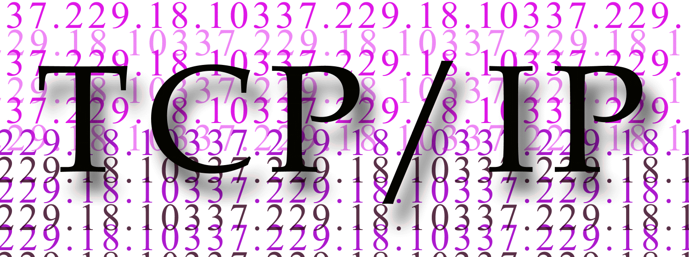
</p>


## I. OSI Model

The OSI reference model is, after all, only a “model.” It provides only a rough delineation of the role of each layer and does not define protocols and interfaces in detail. It can only serve as guidance for learning about and designing protocols. Therefore, if you want to understand the details of a protocol, you still need to consult the specific specification for that protocol.


<p align='center'>
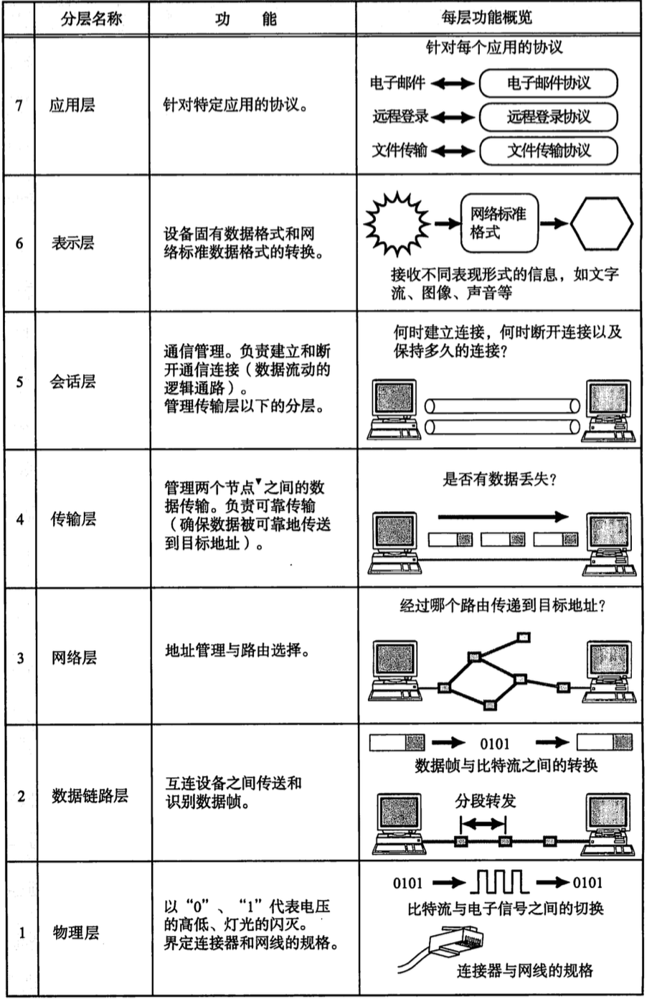
</p>

The figure above shows the definition of the seven-layer model from *Illustrated TCP/IP*.

| Layer | Level | Description |  Notes|
| :---: | :---: | :---: | :---: |
| Application Layer | 7 | Provides services to applications and specifies communication-related details within applications| | 
| Presentation Layer | 6 | Converts information processed by applications into a format suitable for network transmission. More specifically, it converts device-specific data formats into standard network transmission formats; different devices may interpret the same bit stream differently| Mainly responsible for data-format conversion|
| Session Layer | 5 | Responsible for establishing and terminating communication connections (the logical paths over which data flows), as well as managing data transmission, such as data segmentation||
| Transport Layer | 4 | Provides reliable transmission. It is processed only on the communicating end nodes and does not need to be processed on routers.||
| Network Layer | 3 | Transmits data to the destination address.||
| Data Link Layer | 2 | Responsible for communication transmission between physically interconnected nodes||
| Physical Layer | 1 |Responsible for conversion between 0/1 bit streams (0/1 sequences) and voltage levels or light on/off states||


<p align='center'>
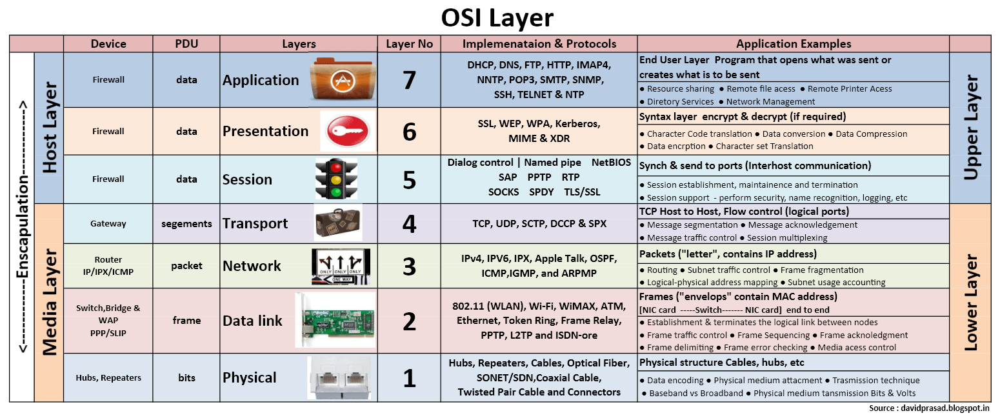
</p>

The figure above shows where some protocols sit in the OSI model. It is worth noting that DNS is an application-layer protocol, while SSL spans Layer 5, the Session Layer, and Layer 6, the Presentation Layer. TLS is located at Layer 5, the Session Layer. (DNS, SSL, and TLS will be analyzed and explained in detail later.)


<p align='center'>
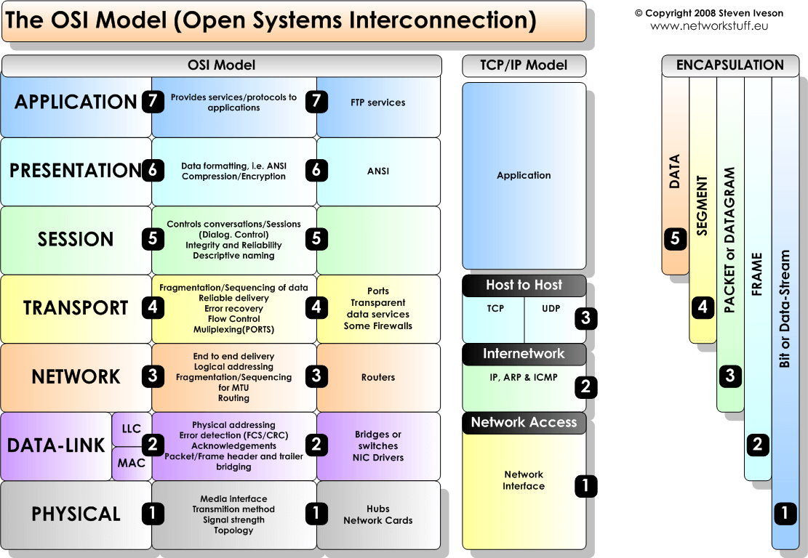
</p>

The figure above compares the TCP/IP model with the OSI model.


Next are two images from the Internet. The author disputes some of the content in them. As for what is right and wrong in the two figures below, feel free to open an issue for discussion.

<p align='center'>
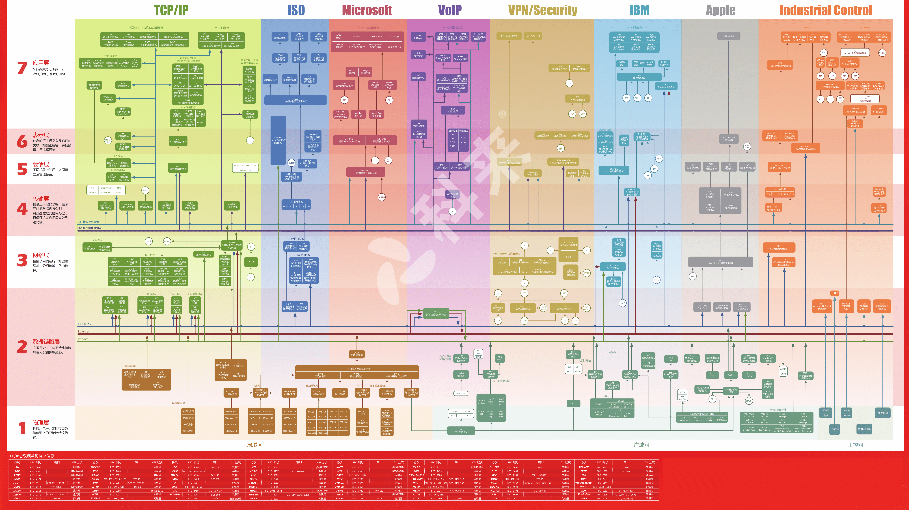
</p>

The figure above says DNS is a network-layer protocol, but many of the author’s friends agree that it is an application-layer protocol. Another error is that SSL is shown as spanning Layer 6 and Layer 7; this is also incorrect.

<p align='center'>
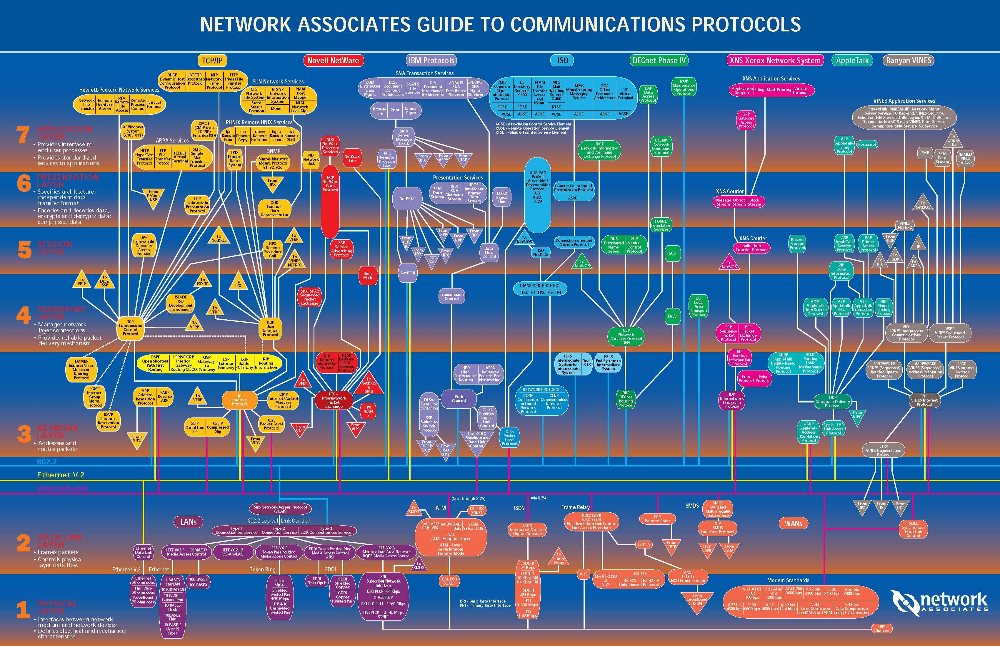
</p>

In the figure above, DNS is placed in the application layer, which I agree with, and it also shows that DNS is based on both UDP and TCP. This is also very good! (As for why some people do not know that DNS is also based on TCP, this will be analyzed in detail in the DNS section.) However, the figure above does not show which layer SSL/TLS belongs to.

In the author’s view, although the two figures above look very complex and detailed, on closer inspection they still have shortcomings and inaccuracies.

## II. OSI Reference Model Communication Example

<p align='center'>

</p>

The figure above shows the data exchanged during communication in the five-layer TCP/IP model. One point worth noting: in an Ethernet frame at the data link layer, excluding the 14-byte Ethernet header and the 4-byte FCS trailer, the data length in the middle is between 46 and 1500 bytes.


<p align='center'>
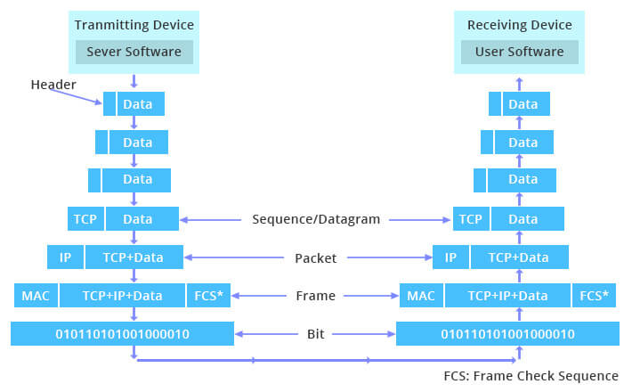
</p>


<p align='center'>
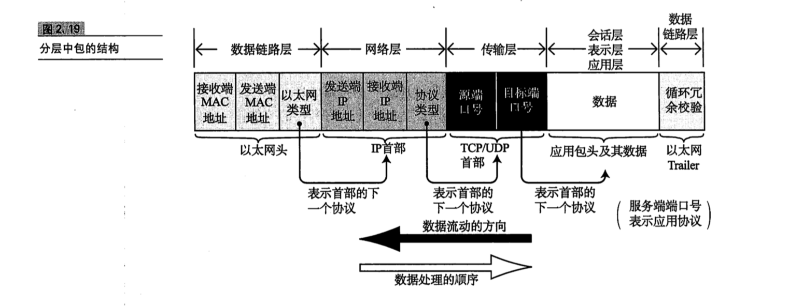
</p>


The figure above shows the data exchanged during communication in the seven-layer OSI model. From the seven-layer model in the figure above, the physical layer transmits byte streams; the unit of a packet at the data link layer is called a frame. The unit of a packet at the IP, TCP, and UDP network layers is called a datagram. Information in TCP and UDP data streams is called a segment. Finally, the unit of data in application-layer protocols is called a message.

As data moves down layer by layer from the seventh, application layer, protocol headers are continuously wrapped around it. These protocol headers are effectively the “face” of the protocol.

<p align='center'>
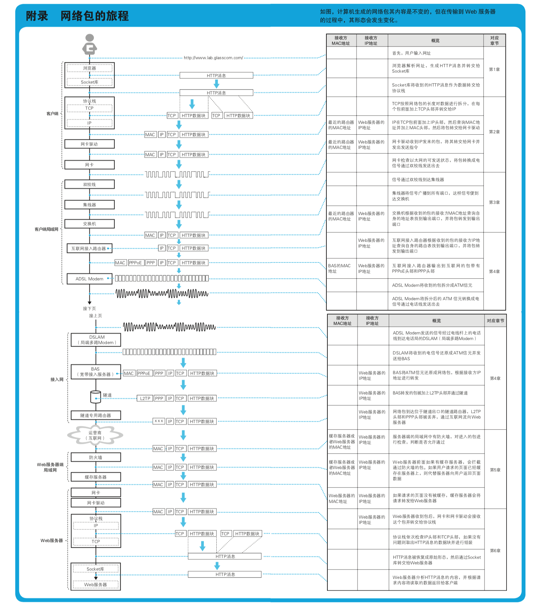
</p>

The figure above comes from the appendix of the book *How Networks Connect*.

From the three figures above, we can clearly see how data flows when one application communicates with another application or with a server.


## III. TCP/IP Standardization Process

The standardization process for the TCP/IP protocol suite is roughly divided into the following stages: first, the Internet-Draft stage; second, if the work is considered suitable for standardization, it is recorded as an RFC and enters the Proposed Standard stage; third, the Draft Standard stage; and finally, the actual Standard stage.


<p align='center'>
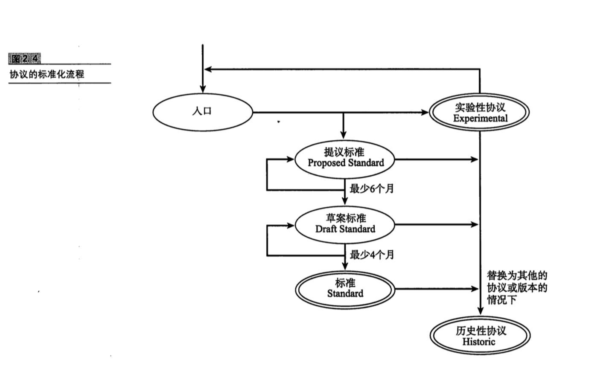
</p>


## IV. Ethernet Frame Structure


Before an Ethernet frame, there is a Preamble section, used as a marker so that the peer network card can ensure synchronization with it. At the end of the preamble is a field called the SFD (Start Frame Delimiter). In Ethernet, the SFD is the final 2 bits, 11; in IEEE802.3, the SFD is the final 8 bits, 10101011.

<p align='center'>
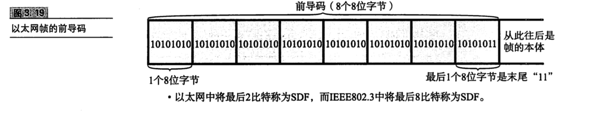
</p>

The structures of Ethernet frames and IEEE802.3 frames are also different, as shown below.

<p align='center'>
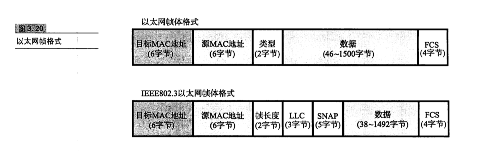
</p>

The frame trailer contains a 4-byte FCS (Frame Check Sequence). FCS stands for Frame Check Sequence and is used to determine whether a frame was corrupted during transmission (for example, by electronic noise interference). The FCS stores the remainder obtained by dividing the transmitted frame by a certain polynomial. The received frame undergoes the same calculation; if the resulting value is the same as the FCS, there is no error.

Ethernet frames are relatively common, so let’s discuss the Ethernet frame structure in detail. Excluding the destination MAC address and source MAC address, what remains is a type code.

| Type Number (hex) | Protocol| |
| :---: | :---: | :---: |
|0000-05DC| IEEE802.3 Length Field (01500)||
|0101-01FF|Experimental use||
|0800| Internet IP (IPv4)|❤|
|0806| Address Resolution Protocol (ARP)|❤|
|8035| Reverse Address Resolution Protocol (RARP)|❤|
|8037| IPX (Novell NetWare)||
|805B| VMTP (Versatile Message Transaction Protocol) ||
|809B| AppleTalk (EtherTalk)||
|80F3| AppleTalk Address Resolution Protocol (AARP)||
|8100| IEEE802.1Q Customer VLAN| |
|814C| SNMP over Ethernet| |
|8191| NetBIOS/NetBEUI||
|817D| XTP||
|86DD| IP version (IPv6)|❤|
|8847-8848| MPLS (Multi-protocol Label Switching)||
|8863| PPPoE Discovery Stage||
|8864| PPPoE Session Stage||
|9000| Loopback (Configuration Test Protocol)||


<p align='center'>
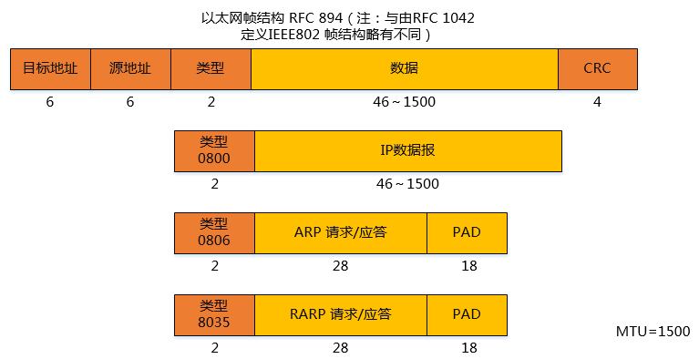
</p>

Now let’s look at the IEEE802.3 frame structure. Compared with an Ethernet frame, the IEEE802.3 frame structure has several additional parts: frame length, LLC, and SNAP.

The data link layer can be subdivided into two layers: the Media Access Control (MAC) layer and the Logical Link Control (LLC) layer. The Media Access Control layer performs control based on header information specific to different data links, such as Ethernet or FDDI. The Logical Link Control layer performs control based on frame-header information common to different data links, such as Ethernet or FDDI.


<p align='center'>
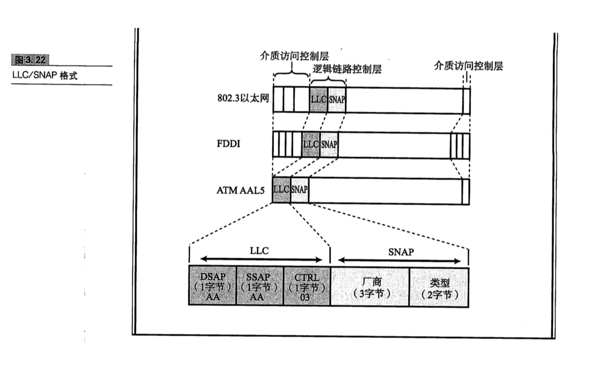
</p>

SNAP is 5 bytes in total. Excluding the first 3 bytes, which identify the vendor, the last 2 bytes have the same meaning as the type field in an Ethernet frame.

In VLAN switches, another 4 bytes are appended to the frame structure, resulting in the following:


<p align='center'>
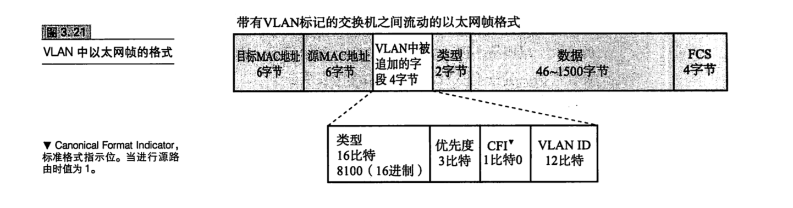
</p>


## V. IP Protocol

The network layer is mainly composed of IP (Internet Protocol) and ICMP (Internet Control Message Protocol).

IP is connectionless for two reasons: first, to simplify the protocol; second, to improve speed. Its goal is to send packets to the final destination address on a best-effort basis. Simple and fast. Reliability is left to TCP.


Each data link has a different Maximum Transmission Unit (MTU).

An Ethernet frame can transmit up to 1500 bytes, FDDI can transmit up to 4352 bytes, and ATM can transmit up to 9180 bytes.

|Data Link| MTU (bytes) | Total Length (in bytes, including FCS) |  |
| :---: | :--: | :--: | :--: |
| Maximum IP MTU | 65535 | - ||
| Hyperchannel | 65535 | - ||
| IP over HIPPI | 65280 | 65320 ||
| 16Mbps IBM Token Ring | 17914| 17958||
| IP over ATM | 9180 | - |❤|
| IEEE802.4 Token Bus | 8166 | 8191 ||
| IEEE802.5 Token Bus | 4464 | 4508 ||
| FDDI | 4352 | 4500 |❤|
| Ethernet | 1500 | 1518 |❤|
| PPP (Default) | 1500| -|❤|
| IEEE802.3 Ethernet | 1492 | 1518 |❤|
| PPPoE | 1492 | - ||
| X.25 | 576 | -||
| Minimum IP MTU | 68 | - ||

Because MTUs differ, IP fragmentation and reassembly are required. Routers only perform fragmentation; the endpoint (destination host) performs reassembly.

During fragmentation on a router, if any fragment is lost, the entire IP datagram becomes invalid. To address this issue, Path MTU Discovery was developed.

The host first obtains the minimum MTU across all data links on the entire path and fragments the data according to that size. As a result, no router along the transmission path needs to perform fragmentation.

To find the Path MTU, the host first sends the entire packet and sets the Don’t Fragment flag in the IP header to 1. In this way, when a router encounters a packet that would require fragmentation, it does not fragment it; instead, it discards the data directly and sends an unreachable message back to the host via ICMP.

The host sets the MTU from the ICMP notification as the current MTU and fragments the data according to that MTU. This process repeats until no more ICMP notifications are received; the MTU at that point is the Path MTU.

Taking data transmission over UDP as an example:

<p align='center'>
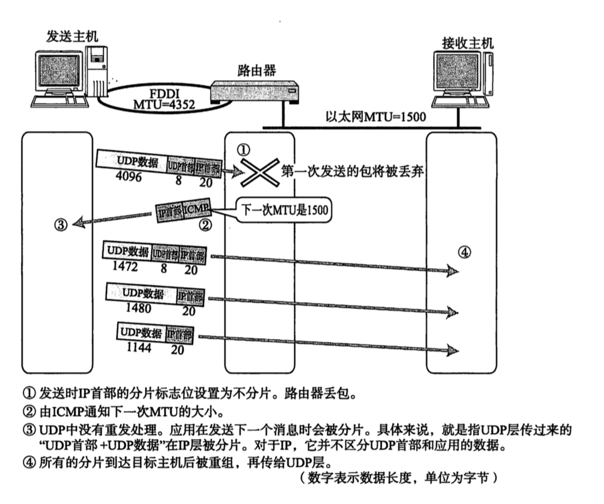
</p>


## VI. IPv4 Header

<p align='center'>
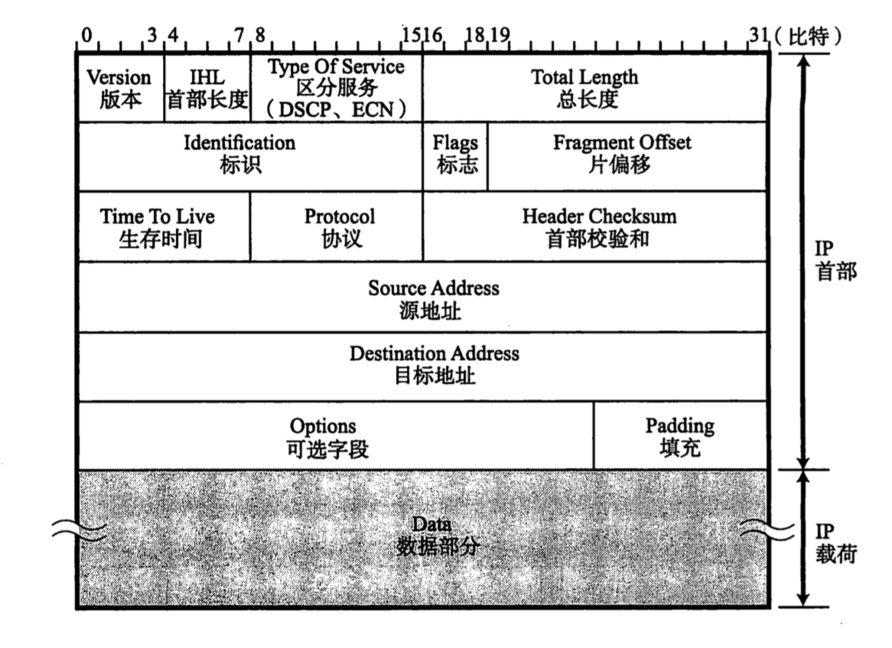
</p>

Several fields in the middle are described below:

- Version:

|Version| Abbreviation  |  Protocol |
| :---: | :--: | :--:|
|4|IP| Internet Protocol version 4|
|5|ST| ST Datagram Mode|
|6|IPv6| Internet Protocol version 6 |
|7|TP/IX| TP/IX: The Next Internet|
|8|PIP| The P Internet Protocol|
|9|TUBA| TUBA |

The IPv4 header version number is 4.

- Header Length (IHL: Internet Header Length):  
  Consists of 4 bits and indicates the size of the IP header, in units of 4 bytes (32 bits). For an IP packet without options, the header length is set to “5”. In other words, when there are no options, the length of the IP header is 20 bytes (4 * 5 = 20).

- Differentiated Services:  
  Consists of 8 bits and is used to indicate quality of service. However, current networks generally ignore this field. Some have proposed subdividing the TOS field itself into two fields: DSCP (Differential Services Codepoint) and ECN (Explicit Congestion Notification). 

- Total Length:   
  This field is 16 bytes long and indicates the total number of bytes of the IP header plus the data portion. Since this field is 16 bytes long, the maximum length of an IP packet is 65535 (2^16^) bytes.
  
  
- Identification:  
  The identification ID is used to identify fragments. Different fragments have different identification values. Even if the IDs are the same, if the destination address, source address, or protocol differs, they are treated as different fragments.
  
- Flags:  
  
|Bit| Meaning  |
| :---: | :--: |
| 0 | Unused. Must currently be 0 |
| 1 | Indicates whether fragmentation is allowed: 0 - may be fragmented; 1 - must not be fragmented|
| 2 | If the packet is fragmented, indicates whether this is the last packet: 0 - last fragment; 1 - non-final fragment|

- Fragment Offset:  
  Consists of 13 bits and can represent up to 8192 (2^13^) relative positions. Since the flags have three bits, the unit is 8 bytes. It can represent positions in the original data up to 8 * 8192 = 65536 bytes.

- Time To Live (TTL:Time To Live):  
  Consists of 8 bits. Its original meaning was to record, in seconds, how long the current packet should live on the network. In practice, however, it refers to how many routers the packet has traversed. Each time it passes through a router, TTL is decremented by 1; when it reaches 0, the packet is discarded.
    
- Protocol:  
  Consists of 8 bits and indicates which protocol the next header after the IP header belongs to.
  
- Header Checksum:  
  Consists of 16 bits (2 bytes). This field checks only the datagram header, not the data portion. It is mainly used to ensure that the IP datagram has not been corrupted.

- Source Address:  
  Consists of 32 bits (4 bytes).
  
- Destination Address:  
  Consists of 32 bits (4 bytes).
  
- Options:  
  Variable length, usually used only for experimentation or diagnostics. It includes the following information: security level, source route, route record, and timestamp.
  
- Padding:  
  Also called filler. When options are present, the header length may not be an integer multiple of 32 bits. Therefore, the field is padded with 0s to align it to an integer multiple of 32 bits.

## VII. IPv6 Header


<p align='center'>
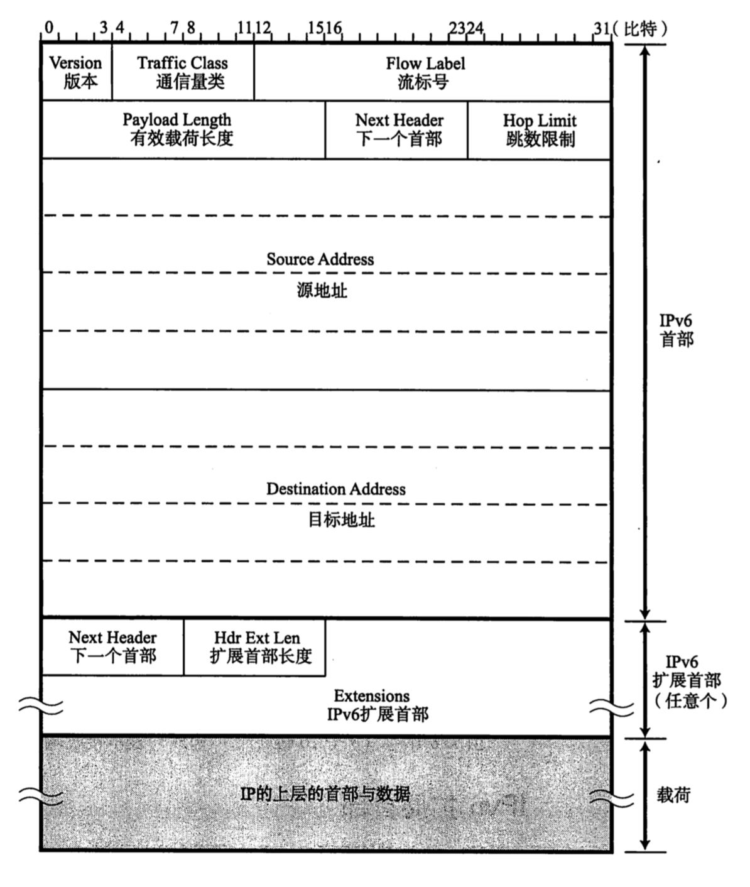
</p>

- Version:

The IPv6 header version number is 6.

- Traffic Class:  
  Equivalent to the TOS (Type Of Service, TOS) field in IPv4, and also consists of 8 bits. There were originally plans to remove this field in IPv6 (because it was not used effectively in IPv4), but it was ultimately retained.

- Flow Label:  
  Consists of 20 bits and is used for Quality of Service (Qos: Quality Of Service) control.
  
- Payload Length:      
  Refers to the data portion of the packet. This differs from IPv4: in IPv4, TL (Total Length) represents the total length. Here, however, Payload Length does not include the header.
  
- Next Header:  
  Equivalent to the Protocol field in IPv4 and consists of 8 bits. It usually indicates that the upper-layer protocol above IP is TCP or UDP. However, when IPv6 extension headers are present, this field indicates the protocol type of the first extension header that follows.
  
- Hop Limit:  
  Consists of 8 bits and has the same meaning as TTL in IPv4. It is decremented by 1 each time the packet passes through a router. When it reaches 0, the data is discarded.
  
- Source Address:  
  Consists of 128 bits (eight 16-bit bytes). Indicates the sender’s IP address.
  
- Destination Address:  
  Consists of 128 bits (eight 16-bit bytes). Indicates the receiver’s IP address.


## VIII. DNS (Domain Name System)

DNS can automatically convert that string into a specific IP address. DNS applies not only to IPv4, but also to IPv6.


|Type| Number  |  Content |
| :---: | :--: | :--:|
|A|1| Hostname IP address (IPv4)|
|NS|2| Domain name server|
|CNAME|5| Canonical name corresponding to a host alias |
|SOA|6| Start marker for authoritative records in a zone|
|WKS|11| Well-known services|
|PTR|12| Reverse resolution of an IP address |
|HINFO|13| Additional host-related information |
|MINFO|14| Mailbox and mail group information |
|MX|15| Mail Exchange |
|TXT|16| Text |
|SIG|24| Security certificate |
|KEY|25| Key |
|GPOS|27| Geographic location |
|AAAA|28| Host IPv6 address |
|NXT|30| Next-generation domain name |
|SRV|33| Server selection |
|*|255| All cached records |


There is a basic DNS message format [RFC6195]. It is used for all DNS operations (queries, responses, zone transfers, notifications, and dynamic updates).

<p align='center'>
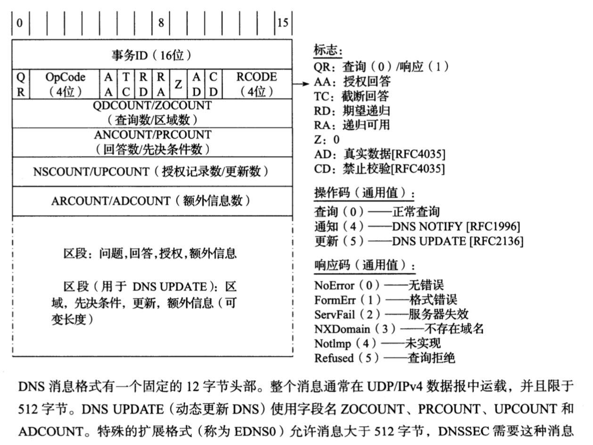
</p>


For both TCP and UDP, DNS uses the well-known port number 53. The most common format uses the UDP/IPv4 datagram structure shown below.

When a resolver sends a query message and the TC bit field in the returned response message is set (“truncated”), the actual response message is longer than 512 bytes, so the server returns only the first 512 bytes. The resolver may send the request again using TCP, and this is now a configuration that must be supported [RFC5966]. This allows messages larger than 512 bytes to be returned, because TCP splits larger messages into multiple segments. 

**Therefore, DNS is based on both UDP and TCP**.

When a secondary name server for a zone starts, it usually performs a zone transfer from the primary name server for that zone. A zone transfer may be triggered by a timer or by a DNSNOTIFY message. Full zone transfers use TCP because they can be large. Incremental zone transfers, in which only updated entries are transferred, may use UDP first, but if the response message is too large, they switch to TCP, just like regular queries.

When UDP is used, both resolver and server application software must implement their own timeouts and retransmissions. Recommendations for this are provided in [RFC1536]. It recommends an initial timeout of at least 4 seconds, with subsequent timeouts causing exponential growth in the timeout duration. Linux and UNIX-like systems allow retransmission timeout parameters to be changed by modifying the `/etc/resoIv.conf` file (by setting the timeout and attempts parameters).


<p align='center'>
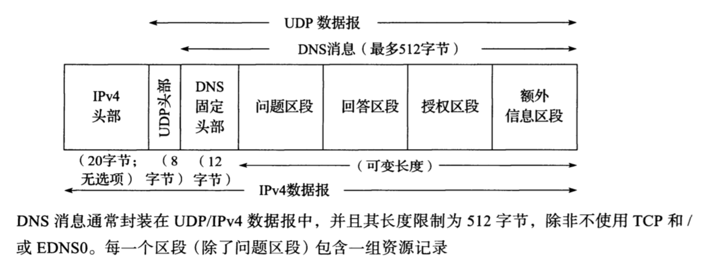
</p>

## 9. ARP (Address Resolution Protocol)

ARP is a protocol for resolving addresses. Using the destination IP address as a clue, it locates the MAC address of the network device that should receive the next data packet. ARP can only be used with IPv4, not IPv6. In IPv6, ICMPv6 can be used instead of ARP to send Neighbor Discovery messages.


## 10. ICMP

The main functions of ICMP include confirming whether an IP packet successfully reached the destination address, reporting the specific reason why an IP packet was discarded during transmission, and improving network configuration. With these capabilities, you can obtain information about whether the network is functioning normally, whether the configuration is incorrect, and whether devices are behaving abnormally, making it easier to diagnose network problems. ICMP messages can generally be divided into two categories: error messages that report the cause of an error, and query messages used for diagnostics.

In IPv6, the role of ICMP is expanded. Without ICMPv6, IPv6 cannot communicate normally.


## 11. TCP

<p align='center'>
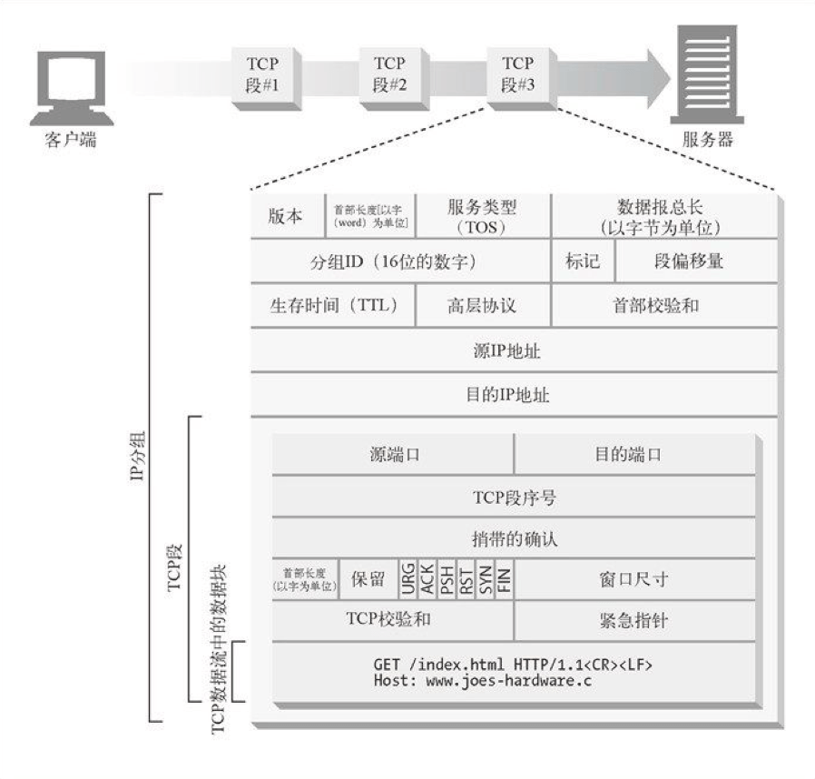
</p>

- TCP provides a connection-oriented, reliable byte-stream service.  
- In a TCP connection, only two parties communicate with each other. Broadcast and multicast cannot be used with TCP.  
- TCP uses checksums, acknowledgments, and retransmission mechanisms to ensure reliable transmission.  
- TCP orders data segments and uses cumulative acknowledgments to ensure that data remains in order and is not duplicated.  
- TCP uses a sliding-window mechanism for flow control, and performs congestion control by dynamically changing the window size.  

TCP achieves reliable transmission through mechanisms such as checksums, sequence numbers, acknowledgments, retransmission control, connection management, and window control.

The two key elements in the IP protocol are the source IP address and the destination IP address. The main role of the transport layer is to **enable communication between applications**. Therefore, transport-layer protocols add three more elements: source port number, destination port number, and protocol number. With these five pieces of information, a communication can be uniquely identified.

Different ports are used to distinguish different applications on the same host. Suppose you open two browsers: requests sent by browser A will not be received by browser B, because A and B use different ports.

The protocol number is used to distinguish whether TCP or UDP is being used. Therefore, communication between the same two processes on the same two hosts can still be correctly distinguished when TCP and UDP are used separately.

In one sentence: as long as any one of the five pieces of information—“source IP address, destination IP address, source port number, destination port number, and protocol number”—differs, it is considered a different communication.

TCP header: **excluding the options field, the TCP header length is 20 bytes**  

<p align='center'>
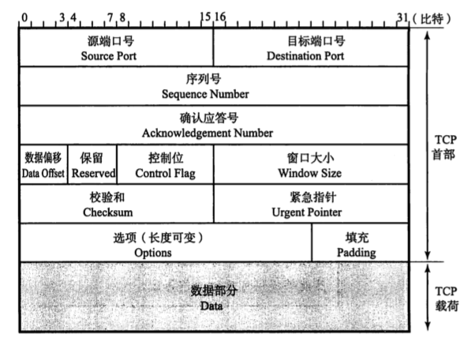
</p>

TCP does not have a separate field indicating packet length or data length. The TCP packet length can be obtained from the IP layer, and the data length can be derived from the TCP packet length.

- Sequence Number:  
  This field is 32 bits long. The sequence number indicates the position of the data being sent; each time data is sent, it is incremented by the number of bytes in that data. The sequence number does not start from 0 or 1. Instead, when the connection is established, the computer generates a random number as the initial value and sends it to the receiving host via the SYN packet.

- Acknowledgement Number:    
  The acknowledgment number field is 32 bits long. It indicates the sequence number of the data that should be received next. In effect, it acknowledges all data up to the acknowledgment number minus one. After the sender receives this acknowledgment, it can assume that all data before this sequence number has been received correctly. It is valid when ACK=1.

- Data Offset:
  This field indicates from which bit in the TCP packet the data portion transmitted by TCP begins; it can also be viewed as the length of the TCP header. This field is 4 bits long, in units of 4 bytes (that is, 32 bits). If the options field is not included, the data offset field can be set to 5. Conversely, if the value of this field is 5, it means that the first 20 bytes of the TCP packet are the TCP header, and the remaining part is TCP data.

- Reserved:    
  This field is mainly reserved for future extensions. It is 4 bits long and is generally set to 0. Even if a received packet has a nonzero value in this field, the packet will not be discarded.
  
- Control Flag:    
  This field is 8 bits long. From left to right, the bits are shown below:
  
<p align='center'>
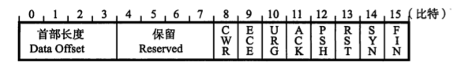
</p>

CWR (Congestion Window Reduced):    
The CWR flag and the following ECE flag are both used for the ECN field in the IP header. When the ECE field is 1, it notifies the peer that the congestion window has been reduced.

ECE (ECN-Echo):    
The ECE flag indicates ECN-Echo. When set to 1, it notifies the peer that there is congestion on the network path from the peer to this side.

URD (Urgent Flag):  
When this bit is 1, it indicates that the packet contains data that requires urgent processing.

ACK (Acknowledgement Flag):    
When this bit is 1, the acknowledgment field becomes valid.

PSH (Push Flag):    
When this bit is 1, it indicates that the received data should be immediately passed to the upper-layer application protocol. When it is 0, the data does not need to be passed up immediately and is buffered first.

RST (Reset Flag):    
When this bit is 1, it indicates that an abnormal condition has occurred in the TCP connection and the connection must be forcibly terminated.

SYN (Synchronize Flag):    
When this bit is 1, it indicates a desire to establish a connection, and the sequence number field is used to set the random initial value of the sequence number.

FIN (Fin Flag):    
When this bit is 1, it indicates that no more data will be sent and the connection should be closed.

- Checksum:

TCP’s checksum is similar to UDP’s. The difference is that the TCP checksum cannot be disabled (UDP can disable checksum validation by setting the checksum field to 0). **As with UDP datagrams, when calculating the checksum for a TCP segment, a 12-byte pseudo-header is also included.**

Note: The pseudo-header of a TCP segment provides a dual check: 1. by checking the IP addresses in the pseudo-header, TCP can confirm that IP has not accepted a datagram that was not intended for this host; 2. by checking the protocol field in the pseudo-header, TCP can confirm that IP has not delivered to TCP a datagram that should have been delivered to another upper-layer protocol, such as UDP, ICMP, or IGMP.

<p align='center'>
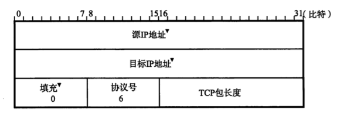
</p>


- Urgent Pointer:  
This field is 16 bits long and is valid only when the URG control bit is 1. The value of this field indicates the pointer to urgent data in this segment.

- Options:    
  The options field is used to improve TCP transmission performance. Because it is controlled according to the data offset (header length), its maximum length is 40 bytes. In addition, the options field should be padded as much as possible to an integer multiple of 32 bits. Representative options are shown below:
  
<p align='center'>
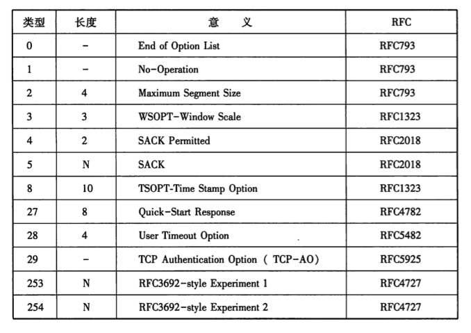
</p>
  


### TCP Sliding Window


<p align='center'>
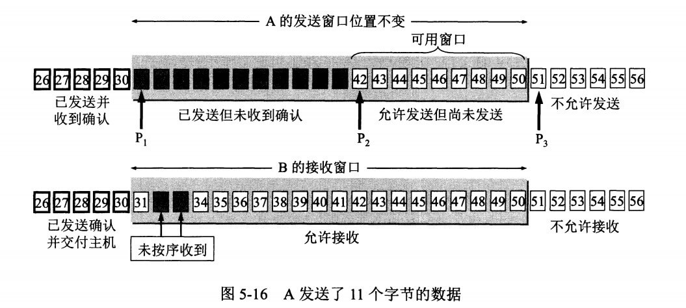
</p>


A window is part of the buffer used to temporarily store the byte stream. The sender and receiver each have a window. The receiver tells the sender its window size through the window field in the TCP segment, and the sender sets its own window size based on this value and other information.

Bytes within the send window are allowed to be sent, and bytes within the receive window are allowed to be received. If the bytes on the left side of the send window have been sent and acknowledged, the send window slides to the right by some distance until the first byte on the left is no longer both sent and acknowledged. The receive window slides similarly: when the bytes on the left side of the receive window have been acknowledged and delivered to the host, the receive window slides to the right.

The receive window only acknowledges the last in-order byte within the window. For example, if the bytes already received by the receive window are {31, 32, 34, 35}, where {31, 32} arrived in order but {34, 35} did not, then only byte 32 is acknowledged. After the sender receives an acknowledgment for a byte, it knows that all bytes before that byte have already been received.

### TCP Reliable Transmission

TCP uses timeout-based retransmission to achieve reliable transmission: if an already-sent segment is not acknowledged within the timeout period, that segment is retransmitted.

The time elapsed from sending a segment to receiving its acknowledgment is called the round-trip time, RTT. The weighted average round-trip time, RTTs, is calculated as follows:

<div align="center"></div> <br>

The timeout RTO should be slightly larger than RTTs. The timeout used by TCP is calculated as follows:

<div align="center"></div> <br>

where RTT<sub>d</sub> is the deviation.

### TCP Flow Control

Flow control is used to control the sender’s transmission rate and ensure that the receiver has enough time to receive the data.

The window field in acknowledgment messages sent by the receiver can be used to control the sender’s window size, thereby affecting the sender’s transmission rate. If the window field is set to 0, the sender cannot send data.

### TCP Congestion Control

If congestion occurs in the network, packets will be lost. At that point, the sender will continue retransmitting, which causes an even higher degree of network congestion. Therefore, when congestion occurs, the sender’s rate should be controlled. This is similar to flow control, but the motivation is different. Flow control ensures that the receiver has enough time to receive data, while congestion control reduces the overall level of congestion in the network.

<p align='center'>
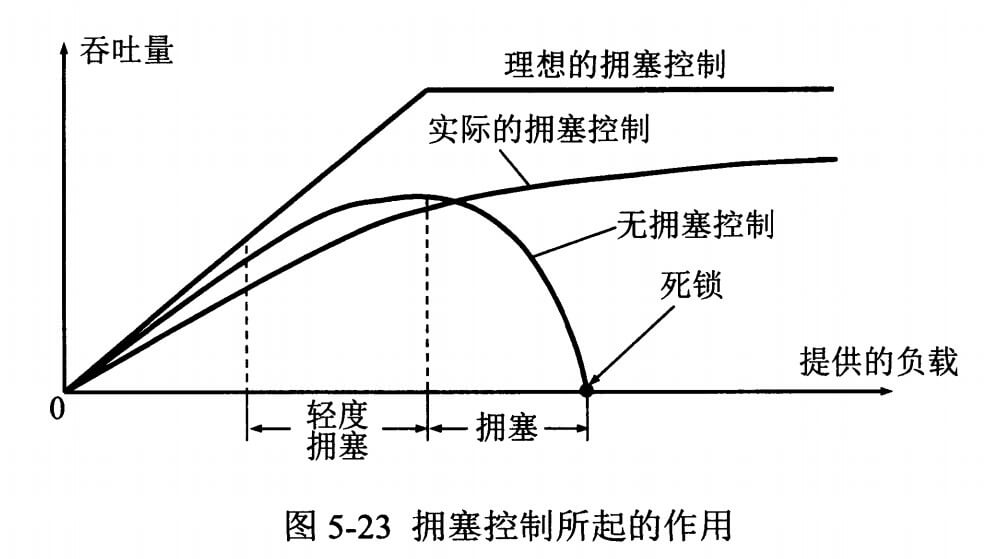
</p>


TCP mainly performs congestion control through four algorithms: slow start, congestion avoidance, fast retransmit, and fast recovery. The sender needs to maintain a state variable called the congestion window (cwnd). Note the difference between the congestion window and the sender’s window: the congestion window is only a state variable; what actually determines how much data the sender can send is the sender’s window.

For ease of discussion, make the following assumptions:

1. The receiver has a sufficiently large receive buffer, so flow control will not occur;
2. Although TCP’s window is byte-based, here the window size is measured in segments.


<p align='center'>
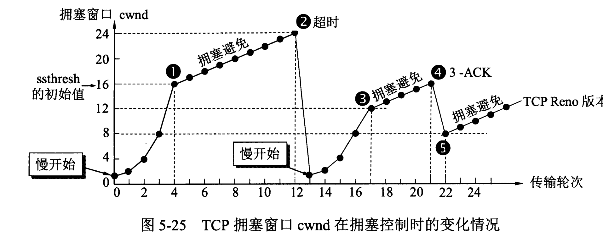
</p>

### 1. Slow Start and Congestion Avoidance

Transmission initially executes slow start. Set cwnd=1, so the sender can send only 1 segment. After receiving an acknowledgment, cwnd is doubled. Therefore, the number of segments the sender can send afterward is: 2, 4, 8 ...

Notice that slow start doubles cwnd in each round. This makes cwnd grow very quickly, causing the sender’s transmission rate to increase too rapidly and making network congestion more likely. A slow-start threshold, ssthresh, is set. When cwnd >= ssthresh, TCP enters congestion avoidance, where cwnd is increased by only 1 in each round.

If a timeout occurs, set ssthresh = cwnd/2, and then execute slow start again.

### 2. Fast Retransmit and Fast Recovery

At the receiver, an acknowledgment for the received in-order segments should be sent every time a segment is received. For example, if M<sub>1</sub> and M<sub>2</sub> have already been received, and M<sub>4</sub> is then received, an acknowledgment for M<sub>2</sub> should be sent.

At the sender, if three duplicate acknowledgments are received, it can determine that the next segment has been lost. For example, if three acknowledgments for M<sub>2</sub> are received, then M<sub>3</sub> has been lost. At this point, fast retransmit is performed, and the next segment is retransmitted immediately.

In this case, only an individual segment has been lost rather than the network being congested. Therefore, fast recovery is performed: set ssthresh = cwnd/2 and cwnd = ssthresh. Note that this directly enters congestion avoidance.

<p align='center'>
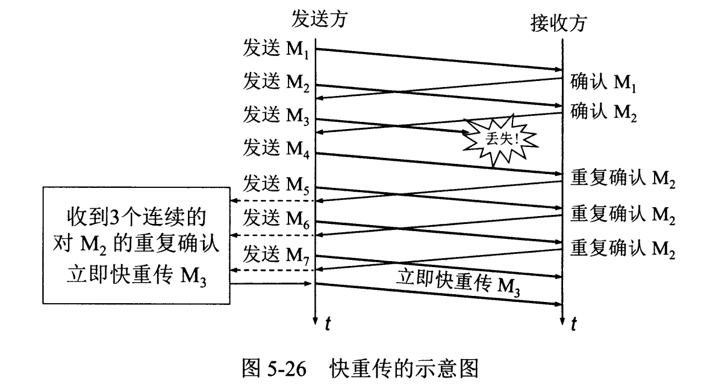
</p>


## 12. UDP

UDP stands for User Datagram Protocol.
UDP does not provide complex control mechanisms; it uses IP to provide connectionless communication services. Even if packets are lost during transmission, UDP is not responsible for retransmission. It also does not correct packets that arrive out of order. UDP is connectionless, so it can send data at any time.

It is mainly used in the following scenarios:

- Communication with a small total number of packets (DNS, SNMP, etc.)  
- Multimedia communication such as video and audio (instant communication)  
- Application communication limited to specific networks such as a LAN  
- Broadcast communication (broadcast, multicast)  

UDP header:  

<p align='center'>
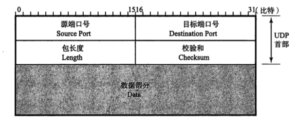
</p>

- Packet Length:  
  This field stores the sum of the UDP header length and the data length.
  
- Checksum:  
The checksum is used to determine whether data was corrupted during transmission. When calculating this checksum, not only the source port number and destination port number are considered, but also the source IP address, destination IP address, and protocol number in the IP header (these are also called the UDP pseudo-header). This is because all five elements are indispensable when identifying a communication. If the checksum only considered port numbers, then if the other three elements were corrupted, the application would not be able to tell. This could cause an application that should not receive the packet to receive it, while the application that should receive the packet does not.


<p align='center'>
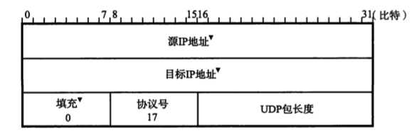
</p>

UDP uses the pseudo-header shown above to calculate the checksum.


UDP is a simple protocol. Its formal specification, [RFC0768], is only 3 pages long (including references). The services it provides to user processes (above the IP layer) are port numbers and checksums. It has no flow control, no congestion control, and no error correction. It does provide error detection (optional for UDP/IPv4, but mandatory for UDP/IPv6) and message-boundary preservation.

UDP is most commonly used when the overhead of establishing a connection should be avoided, when multi-endpoint delivery is needed (multicast, broadcast), or when TCP’s relatively “heavyweight” reliable semantics (such as ordering, flow control, and retransmission) are not required. Thanks to multimedia and peer-to-peer applications, UDP is seeing increasing use, and it is also the primary protocol supporting VoIP [RFC3550][RFC3261]. It is also the traditional method for encapsulating traffic that must traverse NAT without introducing too much additional overhead (only 8 bytes for the UDP header). UDP is used to support an IPv6 transition mechanism (Teredo) and the STUN method for helping NAT traversal. UDP is also used for IPSec NAT traversal. Another use is supporting DNS.

## 13. TCP vs. UDP

TCP provides reliable communication transmission, while UDP is often used for communication where broadcasting and fine-grained control are left to the application.

TCP is used in cases where reliable transmission must be implemented at the transport layer. Because it is connection-oriented and includes mechanisms such as ordering control and retransmission control, it can provide reliable transmission for applications.

UDP is mainly used for communications or broadcast communications that have high requirements for high-speed transmission and real-time behavior. Broadcast-based protocols such as RIP and DHCP also rely on UDP.

**Note: TCP cannot guarantee that data will definitely be received by the peer, because that is impossible. What TCP can do is deliver data to the receiver if possible; otherwise, it notifies the user by giving up retransmission and aborting the connection. Therefore, strictly speaking, TCP is not a 100% reliable protocol either. What it can provide is reliable delivery of data or reliable notification of failure.**

## 14. IP Address Structure

IPv4 address structure:

<p align='center'>
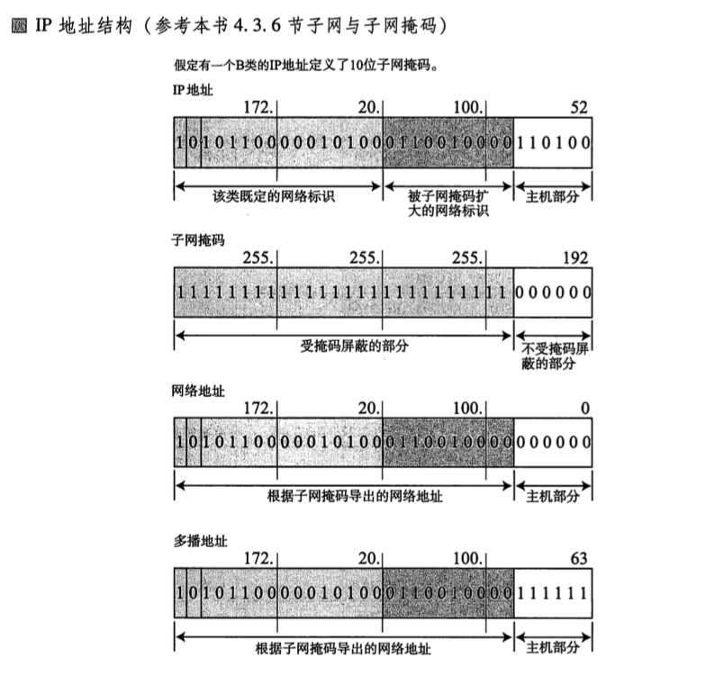
</p>

IPv6 address structure:


<p align='center'>
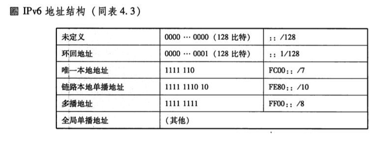
</p>


## 15. TCP Three-Way Handshake

Establishing a TCP connection between a client and a server requires sending a total of 3 packets. This process is called the three-way handshake. As described above, the data segment sequence number, acknowledgment number, and sliding-window size are all completed during this process. In socket programming, when the client calls connect(), the three-way handshake is triggered.

The so-called three-way handshake refers to the fact that, when establishing a TCP connection, the client and server need to send a total of 3 packets.

The purpose of the three-way handshake is to connect to the server’s specified port, establish a TCP connection, synchronize the sequence and acknowledgment numbers of both sides of the connection, and exchange TCP window size information. In socket programming, when the client calls connect(), the three-way handshake is triggered.

- First handshake (SYN=1, seq=x):

The client sends a TCP packet with the SYN flag set to 1, indicating the server port that the client intends to connect to, as well as the initial sequence number X, stored in the Sequence Number field of the packet header. **The implementation of sequence numbers currently changes over time, so the sequence number is different each time a connection is established**

After sending, the client enters the SYN\_SEND state.

- Second handshake (SYN=1, ACK=1, seq=y, ACKnum=x+1):

The server sends back an acknowledgment packet (ACK). That is, both the SYN flag and ACK flag are set to 1. The server selects its own ISN sequence number and places it in the Seq field. At the same time, it sets the Acknowledgement Number to the client’s ISN plus 1, that is, X+1. After sending, the server enters the SYN\_RCVD state.

- Third handshake (ACK=1, ACKnum=y+1)

The client sends another acknowledgment packet (ACK). The SYN flag is 0 and the ACK flag is 1. It increments the sequence number field in the ACK sent by the server by 1, places it in the acknowledgment field, and sends it to the peer; it also writes ISN+1 in the data segment.

After sending, the client enters the ESTABLISHED state. When the server receives this packet, it also enters the ESTABLISHED state, and the TCP handshake ends.

The following diagram illustrates the three-way handshake process:


<p align='center'>
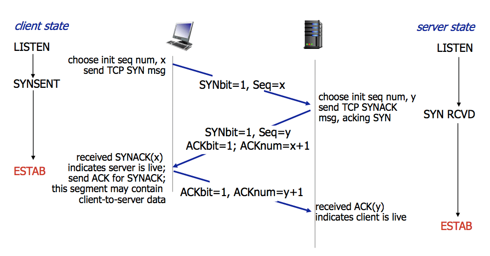
</p>

<p align='center'>
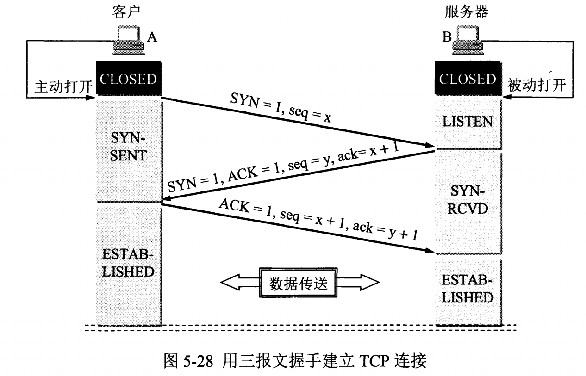
</p>

### Why Three Handshakes

Following ordinary intuition, we might think that two handshakes should be enough, and that the third acknowledgment seems redundant. So why does the TCP protocol go out of its way to add this handshake?

Because in network requests, we should always remember: “the network is unreliable, and packets may be lost.” Suppose there is no third acknowledgment. The client sends a SYN to the server, requesting that a connection be established. Due to delay, the server does not receive this packet in time. The client therefore retransmits a SYN packet. Recall the sequence number mentioned when introducing the TCP header: the sequence numbers of these two packets are obviously the same.

Suppose the server receives the second SYN packet, establishes communication, and after some time the communication ends and the connection is closed. At this point, the SYN packet that was originally sent has just arrived at the server, and the server sends another ACK acknowledgment. Since a connection is established with only two handshakes, the server will now establish a new connection. However, the client believes it did not request a connection, so it will not send data to the server. This causes the server to establish an empty connection, wasting resources.

With the three-way handshake, the server does not establish the connection until it receives the client’s response. Therefore, in the scenario above, the client will receive an identical ACK packet. It will discard that packet and will not perform the third handshake with the server, thereby avoiding the server establishing an empty connection.

### SYN Attack:

### 1. What Is a SYN Attack (SYN Flood)?

During the three-way handshake, the TCP connection after the server sends SYN-ACK and before it receives the client's ACK is called a half-open connection. At this point, the server is in the SYN\_RCVD state. Only after receiving the ACK can the server transition to the ESTABLISHED state.

A SYN attack means that the attacking client forges a large number of nonexistent IP addresses in a short period of time and continuously sends SYN packets to the server. The server replies with acknowledgment packets and waits for client acknowledgments. Because the source addresses do not exist, the server must keep retransmitting until timeout. These forged SYN packets occupy the incomplete connection queue for a long time, causing legitimate SYN requests to be dropped. As a result, the target system runs slowly; in severe cases, it can cause network congestion or even system failure.

A SYN attack is a typical DoS/DDoS attack.

### 2. How Do You Detect a SYN Attack?

Detecting a SYN attack is very straightforward. When you see a large number of half-open connections on the server, especially with random source IP addresses, you can basically conclude that it is a SYN attack. On Linux/Unix, you can use the built-in `netstats` command to detect SYN attacks.
```http

# netstat -na TCP | grep SYN_RECV | more，
```

### 3. How to Defend Against SYN Attacks?

SYN attacks cannot be completely prevented unless the TCP protocol is redesigned. What we can do is mitigate the impact of SYN attacks as much as possible. Common methods for defending against SYN attacks include:

- Shortening the timeout (SYN Timeout)
- Increasing the maximum number of half-open connections
- Protection via filtering gateways
- SYN cookies technology


## 16. TCP Four-Way Handshake

Tearing down a TCP connection requires sending four packets, so it is called the Four-way handshake, also known as an improved three-way handshake. Either the client or the server can actively initiate the handshake. In socket programming, either side can trigger the handshake by performing a close() operation.

- First handshake (FIN=1, seq=x)

Assume the client wants to close the connection. The client sends a packet with the FIN flag set to 1, indicating that it has no more data to send, but can still receive data.

After sending it, the client enters the FIN_WAIT_1 state.

- Second handshake (ACK=1, ACKnum=x+1)

The server acknowledges the client’s FIN packet by sending an acknowledgment packet, indicating that it has received the client’s request to close the connection but is not yet ready to close the connection.

After sending it, the server enters the CLOSE\_WAIT state. After receiving this acknowledgment packet, the client enters the FIN\_WAIT\_2 state and waits for the server to close the connection.

- Third handshake (FIN=1, seq=y)

When the server is ready to close the connection, it sends a connection termination request to the client, with FIN set to 1.

After sending it, the server enters the LAST\_ACK state and waits for the final ACK from the client.

- Fourth handshake (ACK=1, ACKnum=y+1)

After receiving the close request from the server, the client sends an acknowledgment packet and enters the TIME\_WAIT state, waiting for any possible ACK packet retransmission request.

After receiving this acknowledgment packet, the server closes the connection and enters the CLOSED state.

After the client waits for a fixed period of time (two Maximum Segment Lifetimes, 2MSL), if it does not receive an ACK from the server, it assumes that the server has closed the connection normally, so it also closes the connection and enters the CLOSED state.

The following diagrams illustrate the four-way handshake:


<p align='center'>
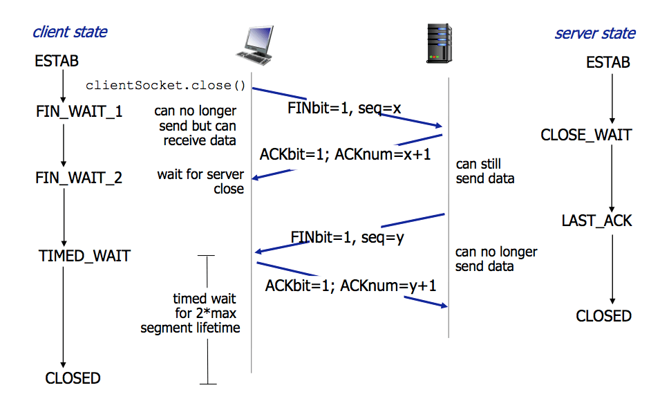
</p>

<p align='center'>
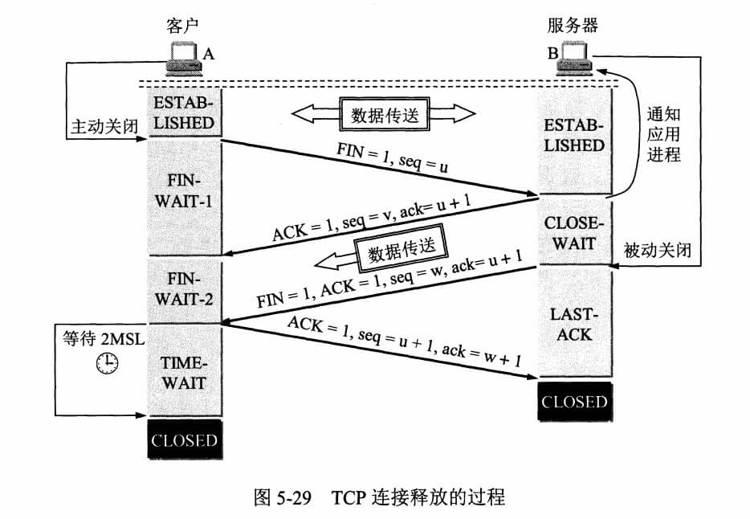
</p>

### Why Does TCP Require a Four-Way Handshake? / Why Does TCP Need Three Handshakes to Establish a Connection but Four to Release One?

Because TCP is full-duplex. After the client requests to close the connection, the connection from the client to the server is closed (the first and second handshakes), while the server continues transmitting any remaining data to the client (data transfer). Then the connection from the server to the client is closed (the third and fourth handshakes). Therefore, when TCP releases a connection, the server’s ACK and FIN are sent separately (with data transfer in between). When TCP establishes a connection, the server’s ACK and SYN are sent together (the second handshake). That is why TCP needs three handshakes to establish a connection but four to release one.

### Why Can ACK and SYN Be Sent Together When Establishing a TCP Connection, but ACK and FIN Must Be Sent Separately When Releasing One? (ACK and FIN being separate refers to the second and third handshakes)

Because when the client requests connection release, the server may still have data to transmit to the client. Therefore, the server must first respond to the client’s FIN request (the server sends ACK), then transmit the data, and after the transmission is complete, the server initiates its own FIN request (the server sends FIN). During connection establishment, there is no data transfer in between, so ACK and SYN can be sent together.

### Why Does the Client Need to Wait for 2MSL in TIME-WAIT at the End of Connection Release?

1. To ensure that the final ACK segment sent by the client can reach the server. If it does not arrive successfully, the server will retransmit the FIN+ACK segment after a timeout; the client will then retransmit the ACK and restart the timer.    
2. To prevent expired connection request segments from appearing in this connection. Keeping TIME-WAIT for 2MSL ensures that all segments generated during the lifetime of this connection have disappeared from the network, so old connection segments will not appear in the next connection.

What happens if the ACK returned by the client in the TIME\_WAIT state is lost? Since the server does not receive the ACK number, it may retransmit FIN. At this point, if the client does not wait for a period of time and closes the connection directly, the corresponding port number used by the communication will also be released. If an application happens to create a socket and is assigned the same port number, and the server’s FIN packet then happens to arrive, that FIN—originally intended to close the previous connection—may start tearing down this newly established connection because the port number is the same. This is why the client needs to wait for a period of time: to prevent this kind of erroneous operation.


<p align='center'>
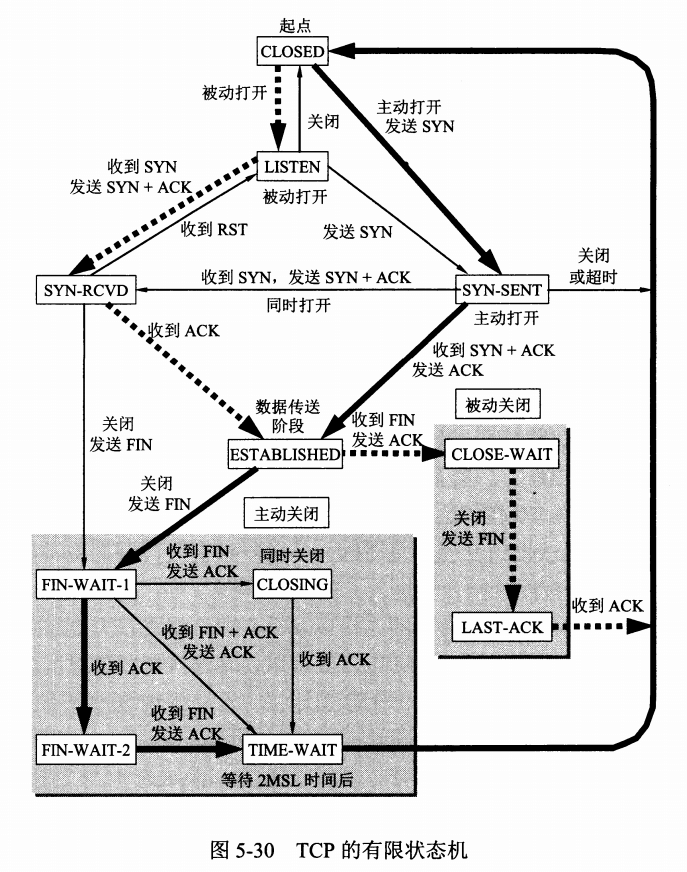
</p>


## Common Ports

Well-known port numbers are generally assigned from the range 0–1023.

|Application| Application-Layer Protocol | Port Number | Transport-Layer Protocol | Notes |
| :---: | :--: | :--: | :--: | :--:|
| Domain name resolution | DNS | 53 | UDP/TCP | TCP is used when the length exceeds 512 bytes |
| Dynamic Host Configuration Protocol | DHCP | 67/68 | UDP | |
| Simple Network Management Protocol | SNMP | 161/162 | UDP | |
| File Transfer Protocol | FTP | 20/21 | TCP | Control connection 21, data connection 20
| Remote terminal protocol | TELNET | 23 | TCP | |
|Hypertext Transfer Protocol | HTTP | 80 | TCP | |
| Simple Mail Transfer Protocol | SMTP | 25 | TCP | |
| Mail retrieval protocol | POP3 | 110 | TCP | |
| Internet Message Access Protocol | IMAP | 143 | TCP | |

Representative well-known TCP ports:

<p align='center'>
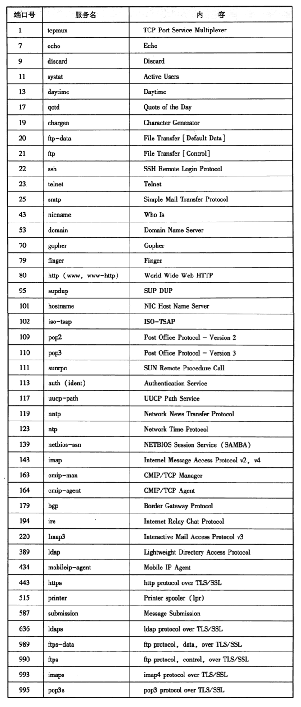
</p>

Representative well-known UDP ports:

<p align='center'>
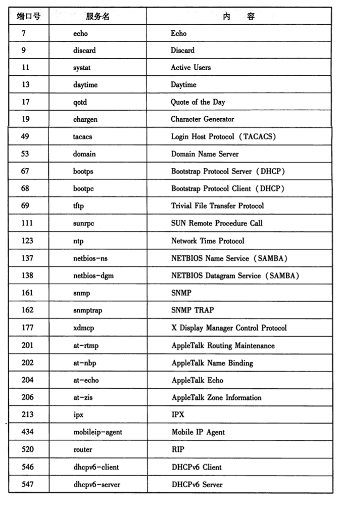
</p>


## 17. Socket Interfaces


From the perspective of the Linux kernel, a socket is one endpoint of communication. From the perspective of a Linux program, a socket is a file with a corresponding descriptor. Opening an ordinary file returns a file descriptor, while socket() is used to create a socket descriptor that uniquely identifies a socket. This socket descriptor is the same as a file descriptor in that subsequent operations use it as an argument to perform various operations.

Commonly used functions include:

socket()  
bind()  
listen()  
connect()  
accept()  
write()  
read()  
close()  

### Socket Interaction Flow

<p align='center'>
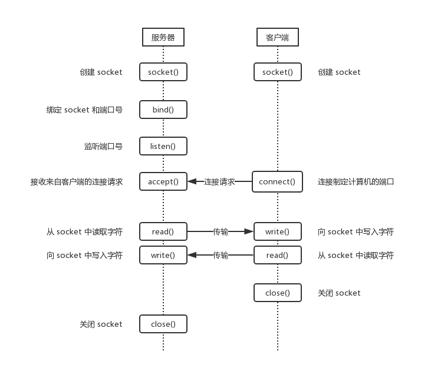
</p>

<p align='center'>
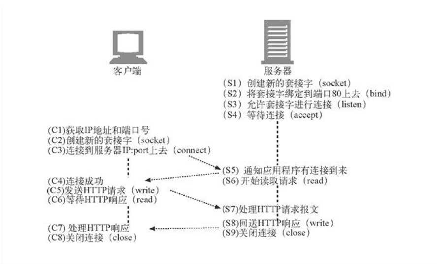
</p>

The diagram shows the socket interaction flow for the TCP protocol, described as follows:

1. The server creates a socket based on the address type, socket type, and protocol.
2. The server binds an IP address and port number to the socket.
3. The server socket listens for requests on the port number and is ready to receive connections from clients at any time. At this point, the server socket is not fully opened.
4. The client creates a socket.
5. The client opens the socket and attempts to connect to the server socket using the server’s IP address and port number.
6. The server socket receives the client socket’s request, passively opens, and starts receiving the client request until the client returns connection information. At this point, the socket enters the blocking state. The blocking occurs because the accept() method does not return until the client returns connection information, after which it starts handling the next client connection request.
7. The client connects successfully and sends connection status information to the server.
8. The server’s accept() method returns, and the connection is established successfully.
9. The server and client transfer data via network I/O functions.
10. The client closes the socket.
11. The server closes the socket.

In this process, the part where the server and client establish the connection reflects the principle of TCP’s three-way handshake.


------------------------------------------------------

Reference:  
《Illustrated TCP/IP》  
《TCP/IP Illustrated, Volume 1: The Protocols》  
《How Networks Connect》

> GitHub Repo: [Halfrost-Field](https://github.com/halfrost/Halfrost-Field)
> 
> Follow: [halfrost · GitHub](https://github.com/halfrost)
>
> Source: [https://halfrost.com/tcp\_ip/](https://halfrost.com/tcp_ip/)