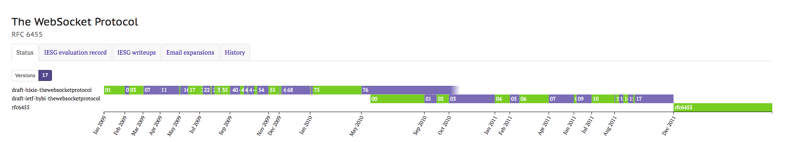
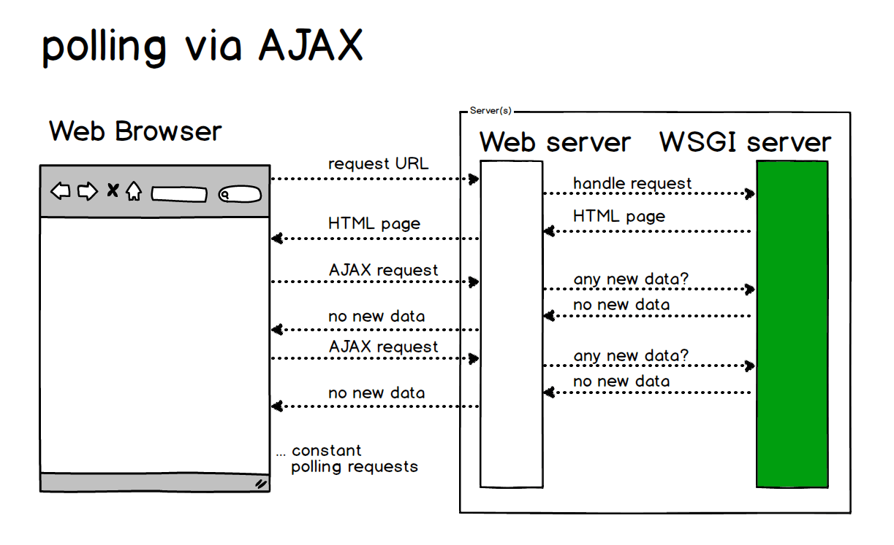
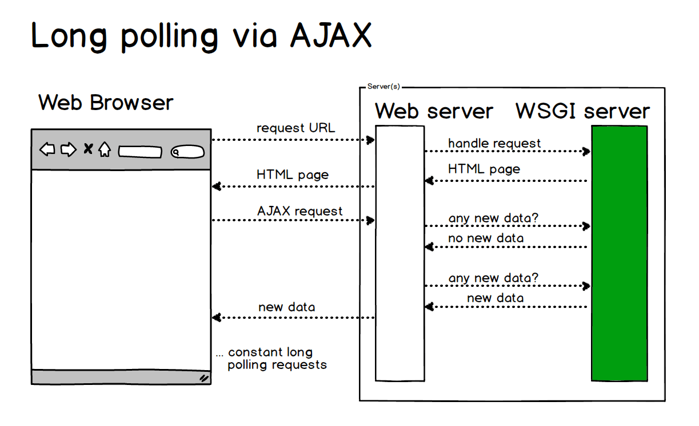
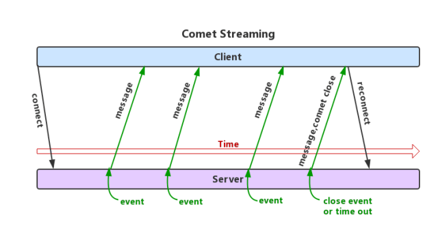
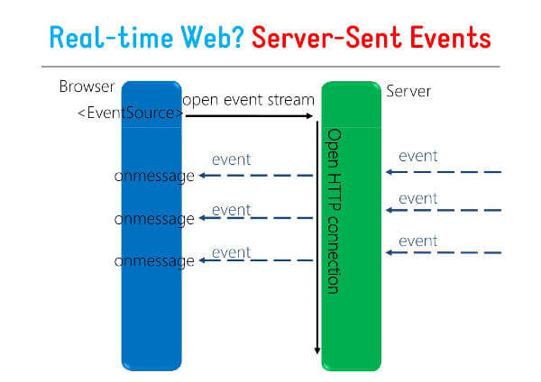
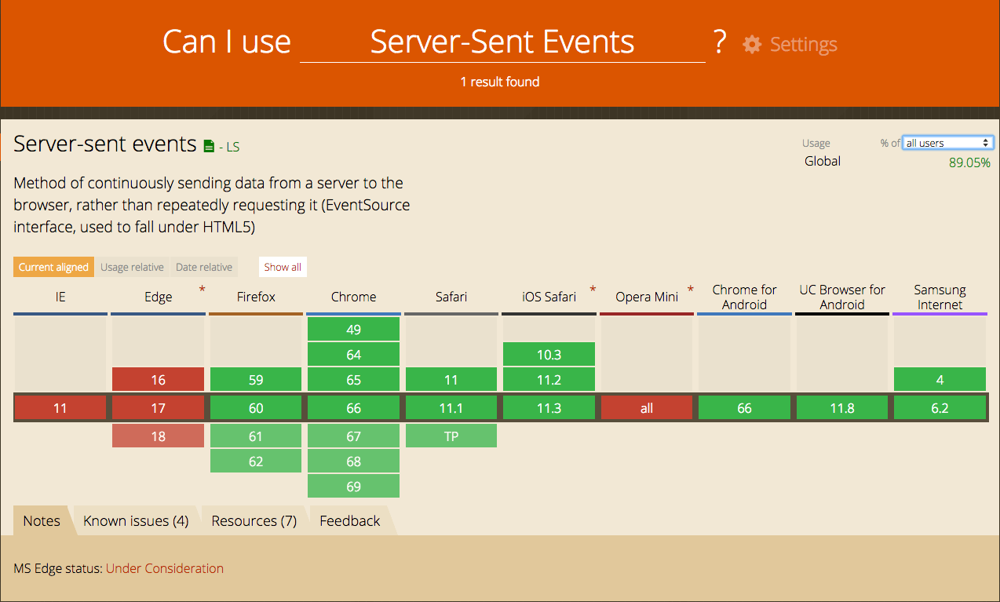
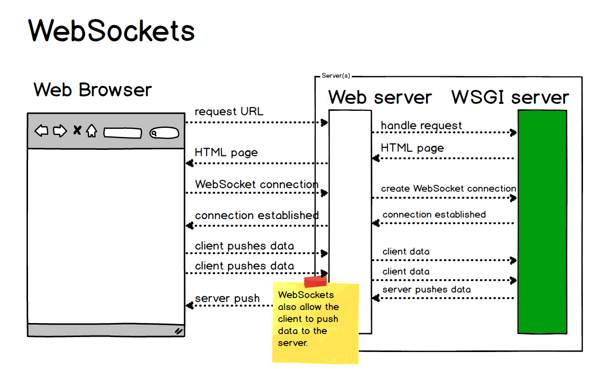
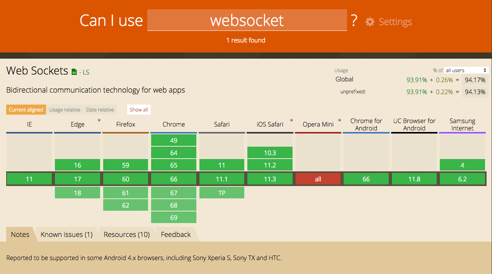

# Full-Duplex WebSocket Communication

<p align='center'>

</p>


## 1. What Is WebSocket?

<p align='center'>

</p>


WebSocket is a network communication protocol. It was created in 2009 and standardized by the IETF in 2011 as the RFC 6455 communication standard, with supplemental specifications provided by RFC7936. The WebSocket API has also been standardized by the W3C.

WebSocket is a protocol introduced with HTML5 for **full-duplex communication over a single TCP connection**. There is no longer a concept of Request and Response; both sides have completely equal status. Once the connection is established, a truly persistent connection is created, and either side can send data to the other at any time.


(HTML5 is the latest version of HTML and includes some new tags and entirely new APIs. HTTP is a protocol, and the latest version is currently HTTP/2. Therefore, WebSocket and HTTP overlap in some areas, but they also differ in many ways. Their overlap occurs during the HTTP handshake phase. After the handshake succeeds, data is transmitted directly over the TCP channel.)

## 2. Why Was WebSocket Invented?


Before WebSocket, the Web had several approaches for implementing real-time communication: initially polling, then Long polling, then streaming-based approaches, and finally SSE. These approaches went through several different stages of evolution.


## (1) The Initial Short-Polling Stage: Polling


This approach is not suitable for obtaining real-time information. The client and server continuously establish connections, with the client asking at intervals whether there are any new messages. The client polls for new messages. This approach creates many connections—one for receiving and one for sending. In addition, every request carries HTTP headers, which consumes a lot of traffic and also uses CPU resources.

At this stage, you can see that one Request corresponds to one Response, back and forth repeatedly.

On the Web, short polling is implemented with AJAX JSONP Polling.

Because HTTP cannot keep a connection open indefinitely, data cannot be pushed frequently and for long periods between the server and the Web browser. Therefore, Web applications implement polling through frequent asynchronous JavaScript and XML (AJAX) requests.


<p align='center'>

</p>

- Advantages: short-lived connections, simple server-side handling, supports cross-origin requests, and has good browser compatibility.
- Disadvantages: some latency, high server pressure, wasted bandwidth, and most requests are ineffective.


## (2) The Improved Long-Polling Stage: Long polling (Comet Long polling)


Long polling is an improved version of polling. After the client sends an HTTP request to the server, the server checks whether there is a new message. If there is no new message, it keeps waiting. It returns to the client only when a message arrives or the request times out. After the message is returned, the client establishes the connection again, and the process repeats. This approach reduces issues such as network bandwidth usage and CPU utilization to some extent.

This approach also has certain drawbacks: its real-time performance is not high. Systems with strict real-time requirements definitely would not use this method. Because a GET request round trip requires 2 RTTs, data may change significantly during that period, and the data received by the client may already be far behind.

In addition, the problem of low network bandwidth utilization is not solved at the root. Every Request carries the same Header.

Correspondingly, the Web also has AJAX long polling, also called XHR long polling.

The client opens an AJAX request to the server and then waits for a response. The server needs specific capabilities to allow the request to remain suspended. As soon as an event occurs, the server sends a response on the suspended request and closes it. After the client processes the information returned by the server, it issues another request, re-establishes the connection, and the loop continues.

<p align='center'>

</p>

- Advantages: fewer polling attempts, low latency, and good browser compatibility.
- Disadvantages: the server needs to maintain a large number of connections.

## (3) Streaming-Based Approaches (Comet Streaming)

### 1. Iframe- and htmlfile-Based Streaming (Iframe Streaming)

The iframe streaming approach inserts a hidden iframe into the page and uses its src attribute to create a long-lived connection between the server and the client. The server transmits data to the iframe—typically HTML containing JavaScript responsible for inserting messages—to update the page in real time. The advantage of iframe streaming is good browser compatibility.

<p align='center'>

</p>

Using an iframe to request a long-lived connection has an obvious drawback: in IE and Mozilla Firefox, the progress bar indicates that loading has not completed, and in IE, the icon at the top keeps spinning, indicating that loading is still in progress.

Google’s engineers used an ActiveX component called “htmlfile” to solve the loading-display problem in IE and applied this method in the gmail+gtalk products. Alex Russell introduced this method in the article “What else is burried down in the depth's of Google's amazing JavaScript?” The comet-iframe.tar.gz provided by the Zeitoun website encapsulates a JavaScript comet object based on iframe and htmlfile, supports IE and Mozilla Firefox, and can be used as a reference.


- Advantages: simple to implement, available in all browsers that support iframe, one client connection, and multiple server pushes.
- Disadvantages: the connection state cannot be known accurately. During an iframe request in IE, the browser title remains in the loading state, and the bottom status bar also shows that it is loading, resulting in a poor user experience (htmlfile can solve this issue by dynamically writing to memory through ActiveXObject).


### 2. AJAX multipart streaming (XHR Streaming)

Implementation idea: the browser must support the multi-part flag. The client sends a Request through AJAX, and the server holds this connection open. It can then continuously push data to the client through HTTP/1.1’s chunked encoding mechanism (chunked transfer encoding) until timeout or a manual disconnect.

- Advantages: one client connection, and server data can be pushed multiple times.
- Disadvantages: not all browsers support the multi-part flag.


### 3. Flash Socket (Flash Streaming)

Implementation idea: embed a Flash program that uses the Socket class into the page. JavaScript communicates with the server-side Socket interface by calling the Socket interface provided by this Flash program. JavaScript receives the data sent by the server through Flash Socket.

- Advantages: implements true real-time communication rather than pseudo-real-time communication.
- Disadvantages: the client must install the Flash plugin; it is not an HTTP protocol and cannot automatically traverse firewalls.


### 4. Server-Sent Events

Server-Sent Events (SSE) is also an HTML5 technology for initiating data transfer from a server to a browser client. Once the initial connection is created, the event stream remains open until the client closes it. This technology is sent over traditional HTTP and provides various features that WebSockets lack, such as automatic reconnection, event IDs, and the ability to send arbitrary events.


SSE works by having the server declare to the client that what it is about to send is streaming information, which will be sent continuously. At this point, the client does not close the connection; it keeps waiting for new data streams sent by the server, analogous to a video stream. SSE uses this mechanism to push information to the browser using streaming information. It is based on the HTTP protocol and is currently supported by all browsers except IE/Edge.

SSE is a one-way channel: only the server can send to the browser, because streaming information is essentially a download.

SSE data sent by the server to the browser must be UTF-8 encoded text with the following HTTP headers.
```http
Content-Type: text/event-stream
Cache-Control: no-cache
Connection: keep-alive
```
Among the three lines above, the first line’s Content-Type must specify the MIME type as event-steam

<p align='center'>

</p>

- Pros: Suitable for frequent updates, low latency, and data flowing entirely from the server to the client.
- Cons: Browser compatibility is difficult to handle.


<p align='center'>

</p>


The above are the four common stream-based approaches: Iframe Streaming, XHR Streaming, Flash Streaming, and Server-Sent Events.

In terms of browser compatibility difficulty — short polling/AJAX > long polling/Comet > persistent connection/SSE

## The Arrival of WebSocket

Looking at the evolution of the approaches above, it is also a process of continuous improvement.

Short polling is inefficient and wastes a lot of resources (network bandwidth and compute resources). It has some latency, puts relatively high pressure on the server, and most requests are ineffective.

Although long polling eliminates a large number of ineffective requests, reducing server pressure and some network bandwidth usage, it still requires maintaining a large number of connections.

Finally, with stream-based approaches, the server pushes data to the client, and this direction of the stream has good real-time performance. However, it is still unidirectional; when the client requests the server, it still needs another HTTP request.

So people began to wonder: is there a perfect solution that supports bidirectional communication, saves the network overhead of request headers, has stronger extensibility, and ideally also supports binary frames, compression, and other features?

Thus, people invented what currently seems to be a “perfect” solution — WebSocket.

After the WebSocket standard was published in HTML5, it directly replaced Comet as the new method for server push.

> Comet is a push technology for the web that enables the server to deliver updated information to the client in real time without the client sending a request. There are currently two implementation approaches: long polling and iframe streaming.


<p align='center'>

</p>

- Pros:
- Lower control overhead. After the connection is established, when data is exchanged between the server and the client, the packet header used for protocol control is relatively small. Without extensions, for server-to-client content, this header is only 2 to 10 bytes (depending on the packet length); for client-to-server content, this header also requires an additional 4-byte mask. Compared with HTTP requests, which must carry complete headers every time, this overhead is significantly reduced.
- Stronger real-time performance. Since the protocol is full-duplex, the server can proactively send data to the client at any time. Compared with HTTP requests, where the server must wait for the client to initiate a request before responding, latency is significantly lower; even compared with similar long-polling techniques such as Comet, it can deliver data more frequently within a short period of time.
- Persistent connection with connection state maintained. Unlike HTTP, WebSocket needs to create a connection first, making it a stateful protocol; subsequent communication can omit part of the state information. HTTP requests, by contrast, may need to carry state information (such as authentication) in every request.
- Bidirectional communication and better binary support. It has good compatibility with the HTTP protocol. The default ports are also 80 and 443, and the handshake phase uses the HTTP protocol, so it is less likely to be blocked during the handshake and can pass through various HTTP proxy servers.

- Cons: Some browsers do not support it (the number of supported browsers will continue to increase).
Use cases: Supported by newer browsers, not constrained by frameworks, and requiring higher extensibility.

<p align='center'>

</p>

To summarize WebSocket in one sentence:

WebSocket is a **stateful** protocol, introduced with HTML5, that operates **independently** over a single **TCP** connection to provide **full-duplex communication** (unlike stateless HTTP), and it can also support binary frames, extension protocols, partially customized subprotocols, compression, and other features.


**As things stand, WebSocket can perfectly replace AJAX polling and Comet. However, in some scenarios it still cannot replace SSE; WebSocket and SSE each have their own strengths!**


## III. WebSocket Handshake

The RFC6455 standard for WebSocket defines two high-level components: an opening HTTP handshake used to negotiate connection parameters, and a binary message framing mechanism used to support low-overhead, message-based transmission of text and binary data. Next, we will take a close look at these two high-level components. This chapter discusses the details of the handshake in depth, and the next chapter will discuss the binary message framing mechanism.

First, RFC6455 includes the following passage:

>The WebSocket Protocol attempts to implement bidirectional HTTP communication over existing HTTP infrastructure; as such, it also uses HTTP ports 80 and 443... However, this design does not limit WebSocket communication to being implemented over HTTP. Future implementations could use a simpler handshake over a dedicated port without redefining such a protocol.
>										
>——WebSocket Protocol RFC 6455


From this passage, we can see the “ambition” of the people who designed the WebSocket protocol, or rather how far ahead they were planning for the future. From the very beginning, WebSocket was designed to support handshakes on arbitrary ports, not only by relying on an HTTP handshake.

However, what is most commonly used today is still the HTTP-based handshake, because the HTTP infrastructure is already quite mature.


### Standard Handshake Flow

Next, let’s look at a concrete example of a WebSocket handshake. We will use the author’s own website, [https://threes.halfrost.com/](https://threes.halfrost.com/), as an example.

Open this website, and as soon as the page is rendered, a wss handshake request is initiated. The handshake request is as follows:
```http
GET wss://threes.halfrost.com/sockjs/689/8x5nnke6/websocket HTTP/1.1
// The request method must be GET, and the HTTP version must be at least 1.1

Host: threes.halfrost.com
Connection: Upgrade
Pragma: no-cache
Cache-Control: no-cache
Upgrade: websocket
// Request an upgrade to the WebSocket protocol

Origin: https://threes.halfrost.com
Sec-WebSocket-Version: 13
// The WebSocket protocol version used by the client

User-Agent: Mozilla/5.0 (Linux; Android 6.0; Nexus 5 Build/MRA58N) AppleWebKit/537.36 (KHTML, like Gecko) Chrome/66.0.3359.181 Mobile Safari/537.36
Accept-Encoding: gzip, deflate, br
Accept-Language: zh-CN,zh;q=0.9,en;q=0.8
Cookie: _ga=GA1.2.00000006.14111111496; _gid=GA1.2.23232376.14343448247; Hm_lvt_d60c126319=1524898423,1525574369,1526206975,1526784803; Hm_lpvt_d606319=1526784803; _gat_53806_2=1
Sec-WebSocket-Key: wZgx0uTOgNUsHGpdWc0T+w==
// An automatically generated key used to verify the server's support for the protocol; its value must be a randomly selected 16-byte nonce encoded in base64

Sec-WebSocket-Extensions: permessage-deflate; client_max_window_bits
// An optional list of protocol extensions supported by the client, indicating the protocol-level extensions the client wants to use

```
Compared with the regular HTTP protocol, the differences here are as follows:

The request URL starts with ws:// or wss://, rather than HTTP:// or HTTPS://. Because WebSocket may be used outside browser scenarios, it uses a custom URI here. By analogy with HTTP, the ws protocol is for ordinary requests and uses the same port 80 as HTTP; the wss protocol is for SSL-based secure transmission and uses the same port 443 as TLS.
```http
Connection: Upgrade
Upgrade: websocket
```
These two fields are generally not present in ordinary HTTP messages. Here, `Upgrade` is used to perform a protocol upgrade, indicating an upgrade to the WebSocket protocol.
```http
Sec-WebSocket-Version: 13
Sec-WebSocket-Key: wZgx0uTOgNUsHGpdWc0T+w==
Sec-WebSocket-Extensions: permessage-deflate; client_max_window_bits
```
Sec-WebSocket-Version indicates the WebSocket version. Initially, there were many WebSocket protocols, and different vendors had their own protocol versions, but this has now been standardized. If the server does not support that version, it must return a Sec-WebSocket-Version containing the version numbers supported by the server. (For details, see the section on [WebSocket handshakes with multiple versions](https://github.com/halfrost/Halfrost-Field/blob/master/contents-en/Protocol/WebSocket.md#%E5%A4%9A%E7%89%88%E6%9C%AC%E7%9A%84-websocket-%E6%8F%A1%E6%89%8B) below.)

The latest version is 13. Of course, very early versions 7 and 8 may still exist (though versions 7 and 8 are essentially no longer encountered today).

**Note**: Although draft versions of this document (09, 10, 11, and 12) were published (they were mostly editorial changes and clarifications rather than changes to the wire protocol), the values 9, 10, 11, and 12 are not used as valid Sec-WebSocket-Version values. These values are reserved in the IANA registry, but will not be used.
```http
+--------+-----------------------------------------+----------+
|Version |                Reference                |  Status  |
| Number |                                         |          |
+--------+-----------------------------------------+----------+
| 0      + draft-ietf-hybi-thewebsocketprotocol-00 | Interim  |
+--------+-----------------------------------------+----------+
| 1      + draft-ietf-hybi-thewebsocketprotocol-01 | Interim  |
+--------+-----------------------------------------+----------+
| 2      + draft-ietf-hybi-thewebsocketprotocol-02 | Interim  |
+--------+-----------------------------------------+----------+
| 3      + draft-ietf-hybi-thewebsocketprotocol-03 | Interim  |
+--------+-----------------------------------------+----------+
| 4      + draft-ietf-hybi-thewebsocketprotocol-04 | Interim  |
+--------+-----------------------------------------+----------+
| 5      + draft-ietf-hybi-thewebsocketprotocol-05 | Interim  |
+--------+-----------------------------------------+----------+
| 6      + draft-ietf-hybi-thewebsocketprotocol-06 | Interim  |
+--------+-----------------------------------------+----------+
| 7      + draft-ietf-hybi-thewebsocketprotocol-07 | Interim  |
+--------+-----------------------------------------+----------+
| 8      + draft-ietf-hybi-thewebsocketprotocol-08 | Interim  |
+--------+-----------------------------------------+----------+
| 9      +                Reserved                 |          |
+--------+-----------------------------------------+----------+
| 10     +                Reserved                 |          |
+--------+-----------------------------------------+----------+
| 11     +                Reserved                 |          |
+--------+-----------------------------------------+----------+
| 12     +                Reserved                 |          |
+--------+-----------------------------------------+----------+
| 13     +                RFC 6455                 | Standard |
+--------+-----------------------------------------+----------+
```
>[RFC 6455]
>
>The |Sec-WebSocket-Key| header field is used in the WebSocket opening handshake.  It is sent from the client to the server to provide part of the information used by the server to prove that it received a valid WebSocket opening handshake.  This helps ensure that the server does not accept connections from non-WebSocket clients (e.g., HTTP clients) that are being abused to send data to unsuspecting WebSocket servers.
>
>The Sec-WebSocket-Key field is used during the handshake phase. It is sent from the client to the server to provide part of the information the server uses to prove that it received the request and can successfully complete the WebSocket handshake. This helps ensure that the server does not accept connections from non-WebSocket clients (such as HTTP clients) that are being abused to send data to unsuspecting WebSocket servers.

Sec-WebSocket-Key is randomly generated by the browser and provides basic protection against malicious or unintended connections.

Sec-WebSocket-Extensions is part of upgrade negotiation; we will cover it in detail in the next section.

Next, let’s look at the Response:
```http
HTTP/1.1 101 Switching Protocols
// 101 HTTP response code confirms upgrade to the WebSocket protocol
Server: nginx/1.12.1
Date: Sun, 20 May 2018 09:06:28 GMT
Connection: upgrade
Upgrade: websocket
Sec-WebSocket-Accept: 375guuMrnCICpulKbj7+JGkOhok=
// Signed key value validates protocol support
Sec-WebSocket-Extensions: permessage-deflate
// WebSocket extension selected by the server

```
In the response, reply with the HTTP 101 status code to confirm the upgrade to the WebSocket protocol.

There are likewise two WebSocket headers:
```http
Sec-WebSocket-Accept: 375guuMrnCICpulKbj7+JGkOhok=
// Signed key-value validation protocol support
Sec-WebSocket-Extensions: permessage-deflate
// WebSocket extensions selected by the server
```
Sec-WebSocket-Accept is the server-confirmed and encrypted form of Sec-WebSocket-Key.

Sec-WebSocket-Accept is computed as follows:

1. First, take the Sec-WebSocket-Key from the client request header and concatenate it with 258EAFA5-E914-47DA-95CA-C5AB0DC85B11; (258EAFA5-E914-47DA-95CA-C5AB0DC85B11, the Globally Unique Identifier (GUID, [RFC4122]), is uniquely fixed and never changes.)
2. Then compute the SHA-1 hash, and finally apply base64 encoding. The resulting value is Sec-WebSocket-Accept.

Pseudocode:
```javascript
> toBase64(sha1( Sec-WebSocket-Key + 258EAFA5-E914-47DA-95CA-C5AB0DC85B11 ))
```
Likewise, `Sec-WebSocket-Key`/`Sec-WebSocket-Accept` only ensure a successful handshake during the handshake process; they do not provide any guarantee of data security. Using `wss://` is slightly more secure.

### Subprotocols in the Handshake

The WebSocket handshake may involve subprotocols.

First, take a look at the WebSocket object initialization function:
```javascript
WebSocket WebSocket(
in DOMString url, 
// The URL to connect to. This URL should be the address responding to WebSocket.
in optional DOMString protocols 
// Can be a single protocol name string or an array containing multiple protocol name strings. Defaults to an empty string.
);
```
There is an `optional` field here, which is an array of protocols that can be negotiated.
```javascript
var ws = new WebSocket('wss://example.com/socket', ['appProtocol', 'appProtocol-v2']);

ws.onopen = function () {
if (ws.protocol == 'appProtocol-v2') { 
	...
	} else {
	... 
	}
}
```
When creating a WebSocket object, you can pass an optional array of subprotocols to tell the server which protocols the client understands or which protocols it wants the server to accept. The server can select supported protocols from this data and return them. If none are supported, the handshake will fail directly, triggering the `onerror` callback and closing the connection.

The subprotocol here can be a custom protocol.

### Multi-version WebSocket handshake

Using the WebSocket version notification capability (the `Sec-WebSocket-Version` header field), the client can initially request the version of the WebSocket protocol it chooses (this does not necessarily have to be the latest version supported by the client). If the server supports the requested version and the handshake message is otherwise valid, the server will accept that version. If the server does not support the requested version, it must respond with a `Sec-WebSocket-Version` header field (or multiple `Sec-WebSocket-Version` header fields) containing all versions it is willing to use. At that point, if the client supports one of the advertised versions, it can redo the WebSocket handshake using the new version value.

For example:
```http
GET /chat HTTP/1.1
Host: server.example.com
Upgrade: websocket
Connection: Upgrade
...
Sec-WebSocket-Version: 25
```
If the server does not support version 25, it will return:
```http
HTTP/1.1 400 Bad Request
...
Sec-WebSocket-Version: 13, 8, 7
```
If the client supports version 1.3, a new handshake is required:
```http
GET /chat HTTP/1.1
Host: server.example.com
Upgrade: websocket
Connection: Upgrade
...
Sec-WebSocket-Version: 13
```

## IV. WebSocket Upgrade Negotiation

During the WebSocket handshake, there are five WebSocket-related headers. All five headers are related to upgrade negotiation.

- Sec-WebSocket-Version  
The client indicates the version it wants to use (typically version 13). If the server does not support this version, it must return the versions it does support. After receiving the response, the client needs to initiate a new handshake using a version it supports. This header must be sent by the client.

- Sec-WebSocket-Key  
A key automatically generated by the client request. This header must be sent by the client.

- Sec-WebSocket-Accept  
The response value computed by the server from the client’s Sec-WebSocket-Key. This header must be sent by the server.

- Sec-WebSocket-Protocol  
Used to negotiate the application subprotocol: the client sends a list of supported protocols, and the server must respond with exactly one protocol name. If the server cannot support any of the protocols, the handshake fails immediately. The client may omit the subprotocol, but once it sends one, the handshake will fail if the server cannot support any of them. This header is optional for the client.

- Sec-WebSocket-Extensions  
Used to negotiate the WebSocket extensions to use for this connection: the client sends the extensions it supports, and the server confirms support for one or more extensions by returning the same header. This header is optional for the client. If the server supports none of them, the handshake does not fail, but no extensions can be used for this connection.

Negotiation happens during the handshake phase. After the handshake completes, HTTP communication ends, and the subsequent full-duplex communication is managed entirely by the WebSocket protocol (over TCP).


## V. WebSocket Protocol Extensions

The HyBi Working Group, which was responsible for defining the WebSocket specification, defined two Sec-WebSocket-Extensions extensions:

- Multiplexing Extension (A Multiplexing Extension for WebSockets)  
  This extension can separate WebSocket logical connections, allowing them to share the underlying TCP connection.

- Compression Extensions (Compression Extensions for WebSocket)   
  Adds compression support to the WebSocket protocol. (For example, the x-webkit-deflate-frame extension.)

Without the multiplexing extension, each WebSocket connection can only exclusively use its own dedicated TCP connection. In addition, when a large message is split into multiple frames, head-of-line blocking can easily occur. Head-of-line blocking increases latency, so keeping frames as small as possible when splitting a message is important. However, even after enabling the multiplexing extension, multiple connections share a single TCP connection, and each channel can still suffer from head-of-line blocking. In addition to multiplexing, messages also need to be sent in parallel across multiple streams.

If WebSocket is transported over HTTP/2, performance can be somewhat better, since HTTP/2 natively supports stream multiplexing. By using HTTP/2’s framing mechanism for WebSocket framing, multiple WebSockets can be transmitted within the same session.


## VI. WebSocket Data Frames

Another advanced component of WebSocket is its binary message framing mechanism. WebSocket splits application messages into one or more frames. The receiver reassembles multiple received frames and notifies the receiving endpoint only after the complete message has been received.

### WebSocket Data Frame Structure

The WebSocket data frame format is as follows:
```http
 0                   1                   2                   3
 0 1 2 3 4 5 6 7 8 9 0 1 2 3 4 5 6 7 8 9 0 1 2 3 4 5 6 7 8 9 0 1
 +-+-+-+-+-------+-+-------------+-------------------------------+
 |F|R|R|R| opcode|M| Payload len |    Extended payload length    |
 |I|S|S|S|  (4)  |A|     (7)     |             (16/64)           |
 |N|V|V|V|       |S|             |   (if payload len==126/127)   |
 | |1|2|3|       |K|             |                               |
 +-+-+-+-+-------+-+-------------+ - - - - - - - - - - - - - - - +
 |     Extended payload length continued, if payload len == 127  |
 + - - - - - - - - - - - - - - - +-------------------------------+
 |                               |Masking-key, if MASK set to 1  |
 +-------------------------------+-------------------------------+
 | Masking-key (continued)       |          Payload Data         |
 +-------------------------------- - - - - - - - - - - - - - - - +
 :                     Payload Data continued ...                :
 + - - - - - - - - - - - - - - - - - - - - - - - - - - - - - - - +
 |                     Payload Data continued ...                |
 +---------------------------------------------------------------+
```
- FIN: 0 indicates this is not the final fragment; 1 indicates this is the final fragment.

- RSV1, RSV2, RSV3:

Under normal circumstances, all are 0. When the client and server have negotiated the use of WebSocket extensions, these three flag bits may be non-zero, and the meaning of their values is defined by the extension. If a non-zero value appears and no WebSocket extension is in use, the connection has an error.

- Opcode:

%x0: indicates a continuation frame. When Opcode is 0, it means this data transmission uses fragmentation, and the currently received data frame is one of the fragments;  
%x1: indicates this is a text frame;  
%x2: indicates this is a binary frame;  
%x3-7: reserved opcodes for subsequently defined non-control frames;  
%x8: indicates connection close;  
%x9: indicates this is a heartbeat request (ping);  
%xA: indicates this is a heartbeat response (pong);  
%xB-F: reserved opcodes for subsequently defined control frames.  

- Mask:

Indicates whether the data payload should be **masked via XOR**. 1 means yes; 0 means no. (This applies only to messages sent from the client to the server. **When the client sends a message to the server, this must be 1**.)

- Payload len:

Indicates the length of the data payload. There are 3 cases:

If the data length is between 0 and 125, then 7 bits are sufficient for Payload len, and the value represented is the payload length;    
If the data length is equal to 126, then Payload len must be represented using 7 + 16 bits, and the following 2 bytes, interpreted as a 16-bit unsigned integer, are the length of this frame;    
If the data length is equal to 127, then Payload len must be represented using 7 + 64 bits, and the following 8 bytes, interpreted as a 64-bit unsigned integer, are the length of this frame.    

- Masking-key:

If Mask = 0, there is no Masking-key. If Mask = 1, the Masking-key is 4 bytes, or 32 bits, long.

The mask is a 32-bit value randomly selected by the client. When preparing a masked frame, the client must choose a new masking key from the set of allowed 32-bit values. The masking key needs to be unpredictable; therefore, the masking key must come from a strong source of entropy, and the masking key used for a given frame must not be easily predictable by the server/proxy as the masking key for subsequent frames. The unpredictability of the masking key is necessary to prevent authors of malicious applications from choosing the bytes that appear on the wire. RFC 4086 [RFC4086] discusses what is required of an appropriate entropy source for security-sensitive applications.

Masking does not affect the length of the “Payload data”. To transform masked data into unmasked data, or vice versa, the following algorithm is applied. The same algorithm is used regardless of the direction of the transformation; that is, the same steps are applied to both masked data and unmasked data.

- original-octet-i: the i-th byte of the original data.
- transformed-octet-i: the i-th byte of the transformed data.
- j: the result of i mod 4.
- masking-key-octet-j: the j-th byte of the mask key.

Octet i of the transformed data ("transformed-octet-i") is the result of XORing octet i of the original data ("original-octet-i") with the octet of the masking key at position i modulo 4 ("masking-key-octet-j"):
```c
j = i MOD 4
transformed-octet-i = original-octet-i XOR masking-key-octet-j
```
Brief description of the algorithm: perform a cyclic bitwise XOR operation. First take the index of the current byte modulo the length of the Masking-key to obtain the corresponding value x, then XOR the current byte with x to recover the actual byte data.  

Note: the purpose of masking is not to prevent data leakage, but to prevent malicious scripts running in clients from launching proxy cache poisoning attacks against intermediaries that do not support WebSocket.

>For details of this attack, refer to the W2SP 2011 paper [Talking to Yourself for Fun and Profit](http://www.adambarth.com/papers/2011/huang-chen-barth-rescorla-jackson.pdf).
>

The attack mainly consists of two steps.

First, establish a WebSocket connection. The attacker performs a WebSocket handshake with their own server through a proxy server. Because the WebSocket handshake is an HTTP message, when the proxy server forwards the Response from the attacker’s own server back to the attacker, it considers the HTTP request complete.

<p align='center'>

</p>

Second, perform the “poisoning” attack on the proxy server. Because the WebSocket handshake has succeeded, the attacker can now send data to their own server, specifically a carefully crafted text message in HTTP format. The host in this data must be forged as the server that an ordinary user is about to access, and the requested resource must be the resource that the ordinary user is about to request. The proxy server treats this as a new request and therefore sends the request to the attacker’s own server. At this point, the attacker’s server must also cooperate: after receiving the message following this “poisoning” request, it immediately returns the “poison”, such as malicious script resources. At this point, the “poisoning” succeeds.


<p align='center'>

</p>


When a user requests the intended safe resource through the proxy server, because the host and url have already been cached in the proxy server by the attacker using a text message in HTTP format, the “poisoned” resource has also been cached. At this point, when the user requests a resource with the same host and url, the proxy cache server finds that it has already cached it and immediately returns the “poisoned” malicious script or resource to the user. The user is then attacked.

Therefore, **when the client sends data to the server, it must include the Masking-key, which is used to mark the Payload data (including both extension data and application data)**.

- Payload Data: 

Payload data is divided into two types: extension data and application data.

Extension data: If no extensions have been negotiated, the extension data is 0 bytes. If extension data has a length, it must be fixed during the handshake phase. The length of the payload data must also include the extension data.

Application data: If extension data exists, application data follows the extension data.


### WebSocket Control Frames

A control frame is identified by its opcode, whose most significant bit is 1. The currently defined opcodes for control frames include 0x8 (Close), 0x9 (Ping), and 0xA (Pong). Opcodes 0xB-0xF are reserved for as-yet undefined future control frames.

Control frames are used to convey WebSocket state. Control frames may be inserted in the middle of a fragmented message.

All control frames must have a payload length less than or equal to 125 bytes, and control frames must not be fragmented.

- After receiving a control frame with opcode 0x8 Close, the underlying TCP connection may be closed. The client may also wait for the server to close first, and if there is no response for a period of time, then close its own TCP connection.

RFC6455 provides recommended status codes for closing. They are not defined normatively; it only provides a set of predefined status codes.

| Status Code | Description | Reserved ✔︎ or Cannot Be Used ✖︎|
| :---: | :---: | :---:|
|0-999 |Status codes in this range are not used.|✖︎|
| 1000 |Indicates a normal closure, meaning that the suggested connection has completed. ||
| 1001 |Indicates that an endpoint is “going away”, for example because the server is shutting down or the browser is navigating to another page.||
| 1002 |Indicates that an endpoint is terminating the connection due to a protocol error. ||
| 1003 |Indicates that an endpoint is terminating the connection because it received a type of data it cannot accept (for example, an endpoint understands only text data but received a binary message). ||
| 1004 |Reserved. Its specific meaning may be defined in the future. |✔︎|
| 1005 |This is a reserved value and must not be set as a status code by an endpoint in a Close control frame. It is designated for use by applications expecting a status code to indicate that no status code was actually present. |✔︎|
| 1006 |This is a reserved value and must not be set as a status code by an endpoint in a Close control frame. It is designated for use by applications expecting a status code to indicate that the connection was closed abnormally. |✔︎|
| 1007 |Indicates that an endpoint is terminating the connection because the data received in a message is not consistent with the message type (for example, non-UTF-8 [RFC3629] data exists in a text message). ||
| 1008 |Indicates that an endpoint is terminating the connection because the received message violates its policy. This is a generic status code that can be returned when no other suitable status code (such as 1003 or 1009) applies, or when the specific details of the policy need to be hidden.||
| 1009 |Indicates that an endpoint is terminating the connection because the received message is too large for it to process. ||
| 1010 |Indicates that an endpoint (client) is terminating the connection because it expected the server to negotiate one or more extensions, but the server did not return them in the WebSocket handshake response message. The list of required extensions should appear in the reason part of the Close frame. ||
| 1011 |Indicates that the server is terminating the connection because it encountered an unexpected condition that prevented it from fulfilling the request. ||
| 1012 | ||
| 1013 | ||
| 1014 | ||
| 1015 |This is a reserved value and must not be set as a status code by an endpoint in a Close frame. It is designated for use by applications expecting a status code to indicate that the connection was closed due to failure to perform the TLS handshake (for example, the server certificate could not be verified). |✔︎|
|1000-2999| Status codes in this range are reserved for definition by this protocol, future revisions of it, and extensions specified in permanent and readily available public specifications.|✔︎|
|3000-3999 |Status codes in this range are reserved for use by libraries, frameworks, and applications. These status codes are registered directly with IANA. This specification does not define the interpretation of these status codes.|✔︎|
|4000-4999 |Status codes in this range are reserved for private use and therefore cannot be registered. These status codes may be used by prior agreements between WebSocket applications. This specification does not define the interpretation of these status codes.|✔︎|

- After receiving a control frame with opcode 0x9 Ping, a frame containing the pong opcode should be sent in response immediately, unless a Close frame has been received. Either endpoint may send a Ping frame at any time after the connection is established and before it is closed. A Ping frame may contain “application data”. A ping frame can be used as a keepalive heartbeat packet.

- After receiving a control frame with opcode 0xA pong, the endpoint knows that the peer can still respond. A Pong frame must contain exactly the same application data as the Ping frame being responded to. If an endpoint receives a Ping frame and has not yet sent a Pong response for a previous Ping frame, the endpoint may choose to send a Pong frame only for the most recently processed Ping frame. A Pong frame may be sent unsolicited as a one-way heartbeat. Avoid sending pong frames proactively whenever possible.

### WebSocket Fragmentation Rules

The fragmentation rules are defined by RFC6455, and applications are unaware of how fragmentation is performed. Fragmentation is handled by the client and the server.

Fragmentation can also make better use of multiplexing protocol extensions. Multiplexing requires messages to be split into smaller fragments so that the output channel can be shared more effectively.

The fragmentation rules specified by RFC 6455 are as follows:

- An unfragmented message consists of a single frame with the FIN bit set and a non-0 opcode.
- A fragmented message consists of a single frame with the FIN bit cleared and a non-0 opcode, followed by zero or more frames with the FIN bit cleared and the opcode set to 0, and terminated by a frame with the FIN bit set and opcode 0. Conceptually, a fragmented message is equivalent to a single large message whose payload is equivalent to the concatenation of the payloads of the fragments in order; however, in the presence of extensions, this may not apply to the interpretation of “extension data” as defined by the extension. For example, “extension data” may exist only at the beginning of the first fragment and apply to subsequent fragments, or “extension data” may exist in each fragment and apply only to that particular fragment. In the absence of “extension data”, the following example shows how fragmentation works.

Example: For a text message sent as three fragments, the first fragment will have opcode 0x1 and the FIN bit cleared, the second fragment will have opcode 0x0 and the FIN bit cleared, and the third fragment will have opcode 0x0 and the FIN bit set. (The 0x0 opcode was explained above and indicates a continuation frame. When the opcode is 0x0, it means that data fragmentation is used for this data transmission, and the currently received data frame is one of the data fragments.)

- Control frames may be injected in the middle of a fragmented message. Control frames themselves must not be fragmented.
- Message fragments must be delivered to the recipient in the order sent by the sender.
- The fragments of one message must not be interleaved with the fragments of another message, unless an extension that can interpret the interleaving has been negotiated.
- An endpoint must be able to handle control frames in the middle of a fragmented message.
- A sender may create fragments of any size for non-control messages.
- Clients and servers must support receiving both fragmented and unfragmented messages.
- Because control frames cannot be fragmented, an intermediary must not attempt to change the fragmentation of a control frame.
- If any reserved bit values are used and the meaning of those values is unknown to the intermediary, the intermediary must not change the fragmentation of a message.
- In the context of a connection where extensions have been negotiated and the intermediary does not know the semantics of the negotiated extensions, the intermediary must not change the fragmentation of any message. Similarly, an intermediary that has not seen the WebSocket handshake (and has not been notified of its contents) that led to a WebSocket connection must not change the fragmentation of any message on that connection.
- Because of these rules, all fragments of a message are of the same type, as set by the opcode of the first fragment. Since control frames cannot be fragmented, the type used by all fragments of a message must be either text, binary, or a reserved opcode.

Note: If control frames could not be inserted, the latency of a ping, for example, would be very long if it followed a large message. Therefore, control frames are required to be processed in the middle of fragmented messages.

Implementation note: In the absence of any extensions, a receiver does not need to buffer an entire frame in order before processing it. For example, if a streaming API is used, part of a frame can be delivered to the application. Note, however, that this assumption may not hold for all future WebSocket extensions.

### WebSocket Fragmentation Overhead

A fragmented message consists of: it starts with a single frame whose FIN is set to 0 and whose opcode is non-0; followed by 0 or more frames whose FIN is set to 0 and whose opcode is set to 0; and ends with a single frame whose FIN is set to 1 and whose opcode is set to 0. Conceptually, a fragmented message is equivalent to one large unfragmented message, and its payload length is equal to the sum of the payload lengths of all frames. However, this may not hold when extensions are present, because extensions define the interpretation of the Extension data that appears. For example, Extension data may appear only in the first frame and apply to all subsequent frames, or Extension data may appear in every frame and apply only to that specific frame.

>Frame: the smallest unit of communication, consisting of a variable-length frame header and a payload part. The payload may contain a complete or partial application message.
>
>Message: a sequence of frames, corresponding to an application message.

Generally speaking, server-side fragmentation has three kinds of frames: start frames, middle frames, and end frames. Start frames and end frames may carry data or may carry no data. **Fragmentation overhead is mainly spent on the newly added frame header information**. When no data is carried, the overhead is 1 + 3 + 4 + 1 + 7 + 0 = 16 bit = 2 Byte. When a middle frame carries data, the overhead is 1 + 3 + 4 + 1 + 7 + 64 = 80 bit = 10 Byte (assuming the data length is 127 bit, so payload len needs to add 64 bit).

The server-side fragmentation overhead range is [2,10] bytes. The client has an additional Masking-key compared with the server, which occupies 4 bytes (32 bits), so the client-side fragmentation overhead is [6,14] bytes.

## VII. WebSocket API and Data Format

### 1. WebSocket API


The WebSocket API is extremely concise; there are only the following callable functions:
```javascript
var ws = new WebSocket('wss://example.com/socket');
ws.onerror = function (error) { ... }
ws.onclose = function () { ... }
ws.onopen = function () {
ws.send("Connection established. Hello server!");
}
ws.onmessage = function(msg) {
	if(msg.data instanceof Blob) {
   		processBlob(msg.data);
  	} else {
       processText(msg.data);
   }
}
```
Apart from creating a new WebSocket object and the `send()` method, what remains are the four callback methods.

Among the methods mentioned above, one thing to pay extra attention to with the `send()` method is that it is asynchronous, not synchronous. This means that when we pass the content to be sent into this function, the function returns asynchronously; at this point, **do not mistakenly assume it has already been sent**. WebSocket itself has a queuing mechanism: data is first placed into a data buffer, and then sent in queue order.

If a huge file is in the queue, and later some messages with higher priority than that message arrive—for example, the system encounters an error and needs to disconnect immediately—then because they are queued behind the large file, they must wait until the large file has finished sending before those higher-priority messages can be sent. This causes a head-of-line blocking problem, delaying the higher-priority messages.

The designers of the WebSocket API took this issue into account, so they gave us two of the very few properties that can change the behavior of a WebSocket object: `bufferedAmount` and `binaryType`.
```javascript
if (ws.bufferedAmount == 0)
    ws.send(evt.data);
```
In the scenario described above, you can use bufferedAmount to monitor the amount of data in the buffer, thereby avoiding head-of-line blocking. Taking it a step further, it can also be combined with a Priority Queue to send messages according to their priority.


### 2. Data Format

WebSocket imposes no restrictions on the format of transmitted data; it can be either text or binary. In the protocol, the Opcode field is used to distinguish between UTF-8 and binary data. The WebSocket API can receive UTF-8-encoded DOMString objects, as well as binary data such as ArrayBuffer, ArrayBufferView, or Blob.

For data received by the browser, if no additional options are explicitly configured, the default handling is as follows: text is converted to a DOMString object by default, while binary data or Blob objects are passed directly to the application without any intermediate processing.
```javascript
var ws = new WebSocket('wss://example.com/socket'); 
ws.binaryType = "arraybuffer";
```
The only place you can intervene is to force all received binary data to be converted to the arraybuffer type rather than the Blob type. As for why it should be converted to arraybuffer, the W3C Candidate Recommendation gives the following guidance:

>User agents can use this as a hint for how to handle incoming binary data: if it is set to “blob”, it is safe to spool it to disk; if it is set to “arraybuffer”, it is likely more efficient to keep the data in memory. Naturally, user agents are encouraged to use more nuanced cues to decide whether incoming data should be held in memory.
>
>——The WebSocket API W3C Candidate Recommendation


In simple terms: if the data is converted into a Blob object, it represents an immutable file object or raw data. If you do not need to modify or slice it, keeping it as a Blob object is a good choice. If you need to process this raw data, it is clearly more appropriate to process it in memory, in which case you should convert it to the arraybuffer type.


## VIII. WebSocket Performance and Use Cases

Here is a test from WebSocket.org comparing XHR polling with WebSocket:

<p align='center'>

</p>

In the figure above, let’s first look at the blue bar chart, which shows the traffic consumed by polling. In this test, the total overhead of the HTTP request and response headers is 871 bytes. Of course, different requests in different tests have different header overheads. This test uses requests with 871 bytes of overhead.

**Use case A**: 1,000 clients polling every second: Network throughput is (871 x 1,000) = 871,000 bytes = 6,968,000 bits per second (6.6 Mbps)  
**Use case B**: 10,000 clients polling every second: Network throughput is (871 x 10,000) = 8,710,000 bytes = 69,680,000 bits per second (66 Mbps)  
**Use case C**: 100,000 clients polling every 1 second: Network throughput is (871 x 100,000) = 87,100,000 bytes = 696,800,000 bits per second (665 Mbps)  
By contrast, a WebSocket frame has just two bytes of overhead instead of 871—only 2 bytes replace the 871 bytes used by polling!

**Use case A**: 1,000 clients receive 1 message per second: Network throughput is (2 x 1,000) = 2,000 bytes = 16,000 bits per second (0.015 Mbps)  
**Use case B**: 10,000 clients receive 1 message per second: Network throughput is (2 x 10,000) = 20,000 bytes = 160,000 bits per second (0.153 Mbps)  
**Use case C**: 100,000 clients receive 1 message per second: Network throughput is (2 x 100,000) = 200,000 bytes = 1,600,000 bits per second (1.526 Mbps)  

With the same number of client polls per second, when the rate reaches a high frequency of 100,000/s, polling consumes 665 Mbps, while WebSocket consumes only 1.526 Mbps—nearly 435 times less!

Judging from the results, WebSocket is indeed much better than polling in terms of both efficiency and network bandwidth consumption.


From a use-case perspective, XHR, SSE, and WebSocket each have their own advantages and disadvantages.

Compared with the other two approaches, XHR is simpler and, relying on HTTP’s mature infrastructure, easy to implement. However, it does not support request streams, and its support for response streams is not perfect either (it requires support for the Streams API to support response streams). In terms of data formats, it supports both text and binary, and it also supports compression. HTTP is responsible for framing its messages.


SSE likewise does not support request streams. After a single handshake, the server can send data to the client as a response stream using the event source protocol. SSE only supports text data and cannot support binary data. Because SSE was not designed for transmitting binary data, if necessary, binary objects can be encoded as base64 and then transmitted using SSE. SSE also supports compression, and the event stream is responsible for framing it.

WebSocket is currently the only full-duplex protocol implemented over the same TCP connection, with perfect support for both request streams and response streams. It supports both text and binary data, and comes with binary framing built in. Its compression story is somewhat weaker, because some extensions are not supported; for example, in the ws request used as an example earlier, the server did not support compression via the x-webkit-deflate-frame extension.

It would of course be ideal if every network environment supported WebSocket or SSE. But that is unrealistic. Network environments vary enormously: some networks may block WebSocket communication, or a user’s device may not support the WebSocket protocol. In those cases, XHR still has its place.

If the client does not need to send messages to the server and only needs continuous real-time updates, SSE is also a good option to consider. However, SSE currently has poor support in IE and Edge. WebSocket is stronger than SSE in this respect.

Therefore, different protocols should be selected for different scenarios, making the best use of each.

------------------------------------------------------

Reference:  

[RFC6455](https://tools.ietf.org/html/rfc6455)    
[Server-Sent Events Tutorial](http://www.ruanyifeng.com/blog/2017/05/server-sent_events.html)    
[Comet: “Server Push” Technology Based on HTTP Persistent Connections](https://www.ibm.com/developerworks/cn/web/wa-lo-comet/)    
[High Performance Browser Networking]()  
[What is Sec-WebSocket-Key for?](https://stackoverflow.com/questions/18265128/what-is-sec-websocket-key-for)     
[10.3. Attacks On Infrastructure (Masking)](https://tools.ietf.org/html/rfc6455#section-10.3)    
[Why are WebSockets masked?](https://stackoverflow.com/questions/33250207/why-are-websockets-masked)    
[How does websocket frame masking protect against cache poisoning?](https://security.stackexchange.com/questions/36930/how-does-websocket-frame-masking-protect-against-cache-poisoning)    
[What is the mask in a WebSocket frame?](https://stackoverflow.com/questions/14174184/what-is-the-mask-in-a-websocket-frame)     

> GitHub Repo: [Halfrost-Field](https://github.com/halfrost/Halfrost-Field)
> 
> Follow: [halfrost · GitHub](https://github.com/halfrost)
>
> Source: [https://halfrost.com/websocket/](https://halfrost.com/websocket/)