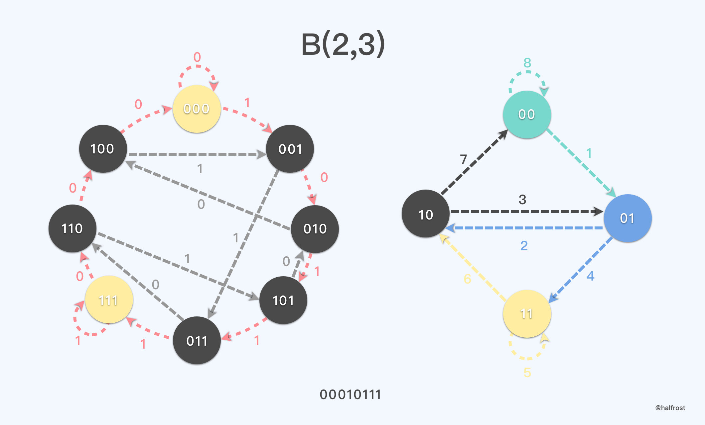
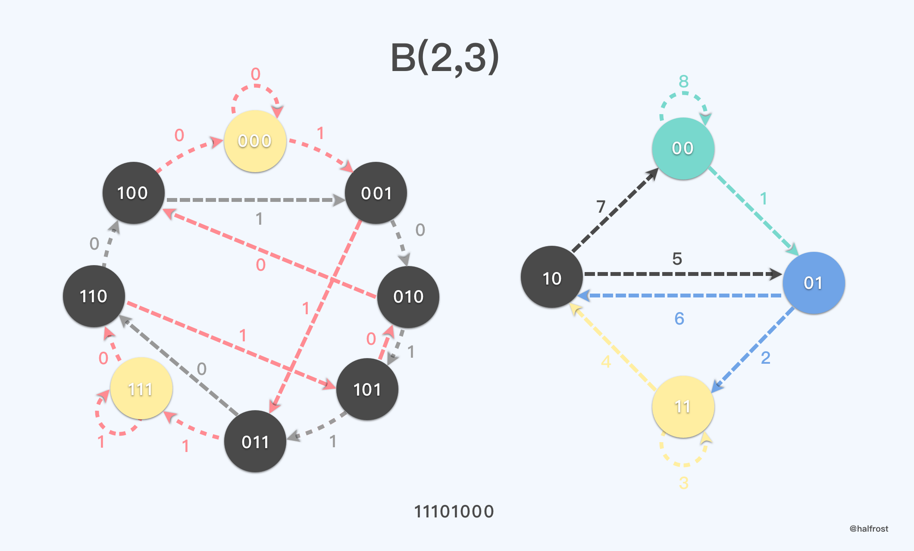
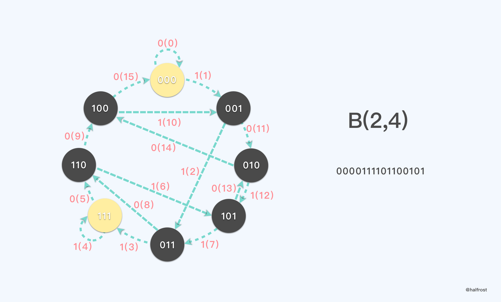
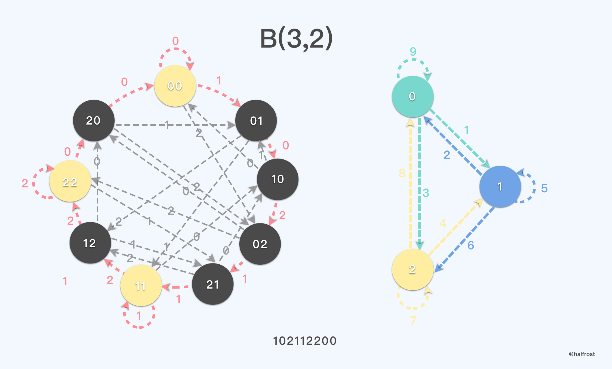

# 神奇的德布鲁因序列


数学中存在这样一个序列，它充满魔力，在实际工程中也有一部分的应用。今天就打算分享一下这个序列，它在 Google S2 中是如何使用的以及它在图论中，其他领域中的应用。这个序列就是德布鲁因序列 De Bruijn。

## 一. 从一个魔术开始说起


有这样一个扑克牌魔术。魔术师手上拿着一叠牌，给5个人(这里的人数只能少于等于32，原因稍后会解释)分别检查扑克牌，查看扑克牌的花色和点数是否都是不同的，即没有相同的牌。

检查完扑克牌，没有重复的牌以后，就可以给这5个人洗牌了。让这5个人任意的抽一叠牌从上面放到下面，即切牌。5个人轮流切完牌，牌的顺序已经全部变化了。

接着开始抽牌。魔术师让最后一个切牌的人抽走这叠牌最上面的一张，依次给每个人抽走最上面的一张。这时候抽走了5张牌。魔术师会说，“我已经看透了你们的心思，你们手上的牌我都知道了”。然后魔术师会让拿黑色牌的人站起来(这一步很关键！)。然后魔术师会依次说出所有人手上的牌。最后每个人翻出自己的牌，全部命中。全场欢呼。


## 二. 魔术原理揭秘


在整个魔术中，有两个地方比较关键。第一个是参与的人数只能少于等于32 。一副完整的扑克牌中，总共有54张牌，但是除去2张鬼牌(因为他们花色只有2种)，总共就52张牌。


在上述魔术中，所有的牌都用二进制进行编码，要想任意说出任意连续的5张牌，那么必须这副牌具有全排列的特性。即枚举所有种组合，并且每个组合都唯一代表了一组排列。

如果窗口大小为5，5张连续的扑克牌。二进制编码 2^5^ = 32 ，所以需要32张牌。如果窗口大小为6，6张连续的扑克牌，二进制编码 2^6^ = 64，需要64张扑克牌。总共牌只有52张，所以不可能到64张。所以32个人是上限了 。

第二个关键的地方是，只有让拿黑色的牌的人或者拿红色的牌的人站出来，魔术师才能知道这5个人拿到的连续5张扑克牌究竟是什么。其实魔术师说“我已经知道你们所有人拿到的是什么牌”的时候，他并不知道每个人拿到的是什么牌。

扑克牌除了点数以外，还有4种花色。现在需要32张牌，就是1-8号牌，每号牌都有4种花色。花色用2位二进制编码，1-8用3位二进制编码。于是5位二进制正好可以表示一张扑克牌所有信息。


如上图，00110 表示的就是梅花6 。11000 表示的是红桃8（因为没有 0 号牌，所以000就表示8）

第一步将扑克牌编码完成以后，第二步就需要找到一个序列，它必须满足以下的条件：由 2^n-1^个1和2^n-1^个0构成的序列或者圆排列，是否能存在在任意 n 个位置上0，1序列两两都不同。满足这个条件的序列也称为 n 阶完备二进圆排列。

这个魔术中我们需要找的是 5 阶完备二进圆排列。答案是存在这样一个满足条件的序列。这个序列也就是文章的主角，德布鲁因序列。


上述序列就是一个窗口大小为5的德布鲁因序列。任意连续的5个二进制相互之间都是两两不同的。所以给观众任意洗牌，不管怎么洗牌，只要最终挑出来是连续的5张，这5张的组合都在最终的结果之中。

将窗口大小为5的德布鲁因序列每5个二进制位都转换成扑克牌的编码，如下：


所以32张牌的初始顺序如下：

梅花8，梅花A，梅花2，梅花4，黑桃A，方片2，梅花5，黑桃3，方片6，黑桃4，红桃A，方片3，梅花7，黑桃7，红桃7，红桃6，红桃4，红桃8，方片A，梅花3，梅花6，黑桃5，红桃3，方片7，黑桃6，红桃5，红桃2，方片5，黑桃2，方片4，黑桃8，方片8。


将所有的排列组合列举出来，如上图。当魔术师让黑色或者红色的牌的人出列的时候，就能确定到具体是哪一种组合了。于是也就可以直接说出每个人手上拿的是什么牌了。

这个魔术中选取的德布鲁因序列也非常特殊，是可以通过一部分的递推得到。


这个特殊的序列，任意取出其中一个窗口，即5个连续的二进制，5个二进制的第一位和第三位，或者倒数第三位和倒数第五位相加，加法遵循二进制规则，即可得到这个窗口紧接着的下一位。


如上图的例子，假设当前窗口里面的五位是 00001，左数第一位加上第三位，或者右数第三位加上第五位，得到的是0，那么这个窗口紧接着的后一位就是0 ，即 000010 。再举一个例子，当前窗口里面是 11000 ，左数第一位加上第三位为1，所以紧接着的下一位是1，即 110001 。


## 三. 德布鲁因序列的定义和性质

### 1. 定义

德布鲁因序列(De Bruijn sequence)，记为B(k, n)，是 k 元素构成的循环序列。所有长度为 n 的 k 元素构成序列都在它的子序列（以环状形式）中，出现并且仅出现一次。

例如，序列 00010111 属于B(2,3)。 00010111 的所有长度为3的子序列为000,001,010,101,011,111,110,100，正好构成了 {0,1} ^3^ 的所有组合。

### 2. 长度

德布鲁因序列的长度为 k^n^。

注意到，所有长度为 n 的 k 元素构成的序列总共有 k^n^。而对于德布鲁因序列中的每个元素，恰好构成一个以此元素开头长度为 n 的子序列。所以德布鲁因序列的长度为 k^n^ 。

### 3. 数量

德布鲁因序列的数量 B(k,n) 的数量为 (k!) ^ (k^n-1^) / k^n^ 。

我们用数学归纳法证明一下上述的结论。

我们先假设德布鲁因序列是二进制的，即 k = 2。想计算序列数量总共有多少个，其实可以看这个序列每个子序列转换成10进制的数最大的是多少，那么就是它的数量。

由于每相邻的子序列是相互依赖的关系，比如下一个子序列是前一个子序列左移一位再加上 0 或者 1，产生下一个子序列。当然最后要 mod 2^n^，这样控制每个子序列的长度都在 n 位之间。于是我们可以得到这样的一个式子：

```go

s[i+1]=(2s[i]+(0|1))mod(2^n)

```

利用错位相减法，我们可以得到通项公式：


|B(2,n)|= 2 ^ 2^(n−1)^ / 2^n^

最后利用数学归纳法我们可以得到一个通用的式子，即：


|B(k,n)| 的数量为  (k!) ^ (k^n-1^) / k^n^


最最常用的德布鲁因序列就是 k = 2 。计算一下 |B(2,n)| 的数量，如下：


### 4. 生成方式

由于德布鲁因序列并不唯一，所以用代码可以生成其中的任意一种。

```python

def de_bruijn(k, n):
    """
    de Bruijn sequence for alphabet k
    and subsequences of length n.
    """
    try:
        # let's see if k can be cast to an integer;
        # if so, make our alphabet a list
        _ = int(k)
        alphabet = list(map(str, range(k)))

    except (ValueError, TypeError):
        alphabet = k
        k = len(k)

    a = [0] * k * n
    sequence = []

    def db(t, p):
        if t > n:
            if n % p == 0:
                sequence.extend(a[1:p + 1])
        else:
            a[t] = a[t - p]
            db(t + 1, p)
            for j in range(a[t - p] + 1, k):
                a[t] = j
                db(t + 1, t)
    db(1, 1)
    return "".join(alphabet[i] for i in sequence)


```

二进制的德布鲁因序列用的比较多，接下来看看它生成的序列。

B(2，1) 就唯一一种情况。

```go

i  01  s[i]
0  0    0
1   1   1

```

B(2，2) 由4位二进制位组成。也是唯一一种情况。

```go

i  0011|0  s[i]
0  00 . . . 0
1   01      1
2  . 11 . . 3
3     1|0   2

```

B(2，3) 由8位二进制位组成。有2种德布鲁因序列。

```go

i  00010111|00 s[i]    i  00011101|00 s[i]
0  000 . . . .  0      0  000 . . . .  0
1   001         1      1   001         1
2  . 010 . . .  2      2  . 011 . . .  3
3     101       5      3     111       7
4  . . 011 . .  3      4  . . 110 . .  6
5       111     7      5       101     5
6  . . . 11|0   6      6  . . . 01|0   2
7         1|00  4      7         1|00  4

```

B(2，4) 由16位二进制位组成。对应有16种德布鲁因序列。

```go

0x09af  0000100110101111
0x09eb  0000100111101011
0x0a6f  0000101001101111
0x0a7b  0000101001111011
0x0b3d  0000101100111101
0x0b4f  0000101101001111
0x0bcd  0000101111001101
0x0bd3  0000101111010011
0x0cbd  0000110010111101
0x0d2f  0000110100101111
0x0d79  0000110101111001
0x0de5  0000110111100101
0x0f2d  0000111100101101
0x0f4b  0000111101001011
0x0f59  0000111101011001
0x0f65  0000111101100101

```


取出其中的 0x0d2f ：

```go

 i  0000110100101111|000 s[i]
 0  0000 . . . . . . . .  0
 1   0001                 1
 2  . 0011 . . . . . . .  3
 3     0110               6
 4  . . 1101 . . . . . . 13
 5       1010            10
 6  . . . 0100 . . . . .  4
 7         1001           9
 8  . . . . 0010 . . . .  2
 9           0101         5
10  . . . . . 1011 . . . 11
11             0111       7
12  . . . . . . 1111 . . 15
13               111|0   14
14  . . . . . . . 11|00  12
15                 1|000  8


```


B(2，5) 由32位二进制位组成。对应有2048种德布鲁因序列。由于太多了，这里没法一一列举出来，任意挑选一个出来举例：

```go

 i  00000111011010111110011000101001|0000 s[i]
 0  00000 . . . . . . . . . . . . . . . .  0
 1   00001                                 1
 2  . 00011 . . . . . . . . . . . . . . .  3
 3     00111                               7
 4  . . 01110 . . . . . . . . . . . . . . 14
 5       11101                            29
 6  . . . 11011 . . . . . . . . . . . . . 27
 7         10110                          22
 8  . . . . 01101 . . . . . . . . . . . . 13
 9           11010                        26
10  . . . . . 10101 . . . . . . . . . . . 21
11             01011                      11
12  . . . . . . 10111 . . . . . . . . . . 23
13               01111                    15
14  . . . . . . . 11111 . . . . . . . . . 31
15                 11110                  30
16  . . . . . . . . 11100 . . . . . . . . 28
17                   11001                25
18  . . . . . . . . . 10011 . . . . . . . 19
19                     00110               6
20  . . . . . . . . . . 01100 . . . . . . 12
21                       11000            24
22  . . . . . . . . . . . 10001 . . . . . 17
23                         00010           2
24  . . . . . . . . . . . . 00101 . . . .  5
25                           01010        10
26  . . . . . . . . . . . . . 10100 . . . 20
27                             01001       9
28  . . . . . . . . . . . . . . 1001|0. . 18
29                               001|00    4
30  . . . . . . . . . . . . . . . 01|000   8
31                                 1|0000 16

```

B(2，6) 由64位二进制位组成。对应有67,108,864种德布鲁因序列。由于太多了，这里没法一一列举出来，任意挑选一个出来举例：

```go

 i  0000001000101111110111010110001111001100100101010011100001101101|00000 s[i]
 0  000000 . . . . . . . . . . . . . . . . . . . . . . . . . . . . . . . .  0
 1   000001                                                                 1
 2  . 000010 . . . . . . . . . . . . . . . . . . . . . . . . . . . . . . .  2
 3     000100                                                               4
 4  . . 001000 . . . . . . . . . . . . . . . . . . . . . . . . . . . . . .  8
 5       010001                                                            17
 6  . . . 100010 . . . . . . . . . . . . . . . . . . . . . . . . . . . . . 34
 7         000101                                                           5
 8  . . . . 001011 . . . . . . . . . . . . . . . . . . . . . . . . . . . . 11
 9           010111                                                        23
10  . . . . . 101111 . . . . . . . . . . . . . . . . . . . . . . . . . . . 47
11             011111                                                      31
12  . . . . . . 111111 . . . . . . . . . . . . . . . . . . . . . . . . . . 63
13               111110                                                    62
14  . . . . . . . 111101 . . . . . . . . . . . . . . . . . . . . . . . . . 61
15                 111011                                                  59
16  . . . . . . . . 110111 . . . . . . . . . . . . . . . . . . . . . . . . 55
17                   101110                                                46
18  . . . . . . . . . 011101 . . . . . . . . . . . . . . . . . . . . . . . 29
19                     111010                                              58
20  . . . . . . . . . . 110101 . . . . . . . . . . . . . . . . . . . . . . 53
21                       101011                                            43
22  . . . . . . . . . . . 010110 . . . . . . . . . . . . . . . . . . . . . 22
23                         101100                                          44
24  . . . . . . . . . . . . 011000 . . . . . . . . . . . . . . . . . . . . 24
25                           110001                                        49
26  . . . . . . . . . . . . . 100011 . . . . . . . . . . . . . . . . . . . 35
27                             000111                                       7
28  . . . . . . . . . . . . . . 001111 . . . . . . . . . . . . . . . . . . 15
29                               011110                                    30
30  . . . . . . . . . . . . . . . 111100 . . . . . . . . . . . . . . . . . 60
31                                 111001                                  57
32  . . . . . . . . . . . . . . . . 110011 . . . . . . . . . . . . . . . . 51
33                                   100110                                38
34  . . . . . . . . . . . . . . . . . 001100 . . . . . . . . . . . . . . . 12
35                                     011001                              25
36  . . . . . . . . . . . . . . . . . . 110010 . . . . . . . . . . . . . . 50
37                                       100100                            36
38  . . . . . . . . . . . . . . . . . . . 001001 . . . . . . . . . . . . .  9
39                                         010010                          18
40  . . . . . . . . . . . . . . . . . . . . 100101 . . . . . . . . . . . . 37
41                                           001010                        10
42  . . . . . . . . . . . . . . . . . . . . . 010101 . . . . . . . . . . . 21
43                                             101010                      42
44  . . . . . . . . . . . . . . . . . . . . . . 010100 . . . . . . . . . . 20
45                                               101001                    41
46  . . . . . . . . . . . . . . . . . . . . . . . 010011 . . . . . . . . . 19
47                                                 100111                  39
48  . . . . . . . . . . . . . . . . . . . . . . . . 001110 . . . . . . . . 14
49                                                   011100                28
50  . . . . . . . . . . . . . . . . . . . . . . . . . 111000 . . . . . . . 56
51                                                     110000              48
52  . . . . . . . . . . . . . . . . . . . . . . . . . . 100001 . . . . . . 33
53                                                       000011             3
54  . . . . . . . . . . . . . . . . . . . . . . . . . . . 000110 . . . . .  6
55                                                         001101          13
56  . . . . . . . . . . . . . . . . . . . . . . . . . . . . 011011 . . . . 27
57                                                           110110        54
58  . . . . . . . . . . . . . . . . . . . . . . . . . . . . . 101101 . . . 45
59                                                             01101|0     26
60  . . . . . . . . . . . . . . . . . . . . . . . . . . . . . . 1101|00  . 52
61                                                               101|000   40
62  . . . . . . . . . . . . . . . . . . . . . . . . . . . . . . . 01|0000  16
63                                                                 1|00000 32

```


B(2，5) 和 B(2，6) 在实际生产中都有广泛的用途。


## 四. 在图论中的应用：欧拉回路 和 汉密尔顿回路


在图论中，有这样一种无向连通图，有一条通路，能经过这个图的每条边一次并且仅一次的路径被称为欧拉回路。这个问题也是最常见的哥尼斯堡七桥问题：能不能一次走遍所有的7座桥，并且每座桥只经过一次。其实就是判断是否存在欧拉回路。


与欧拉问题非常类似的是汉密尔顿回路的问题。该问题起源于英国数学家威廉汉密尔顿（Willian Hamilton）于1857年发明的一个关于正十二面体的数学游戏：正十二面体的每个棱角上标有一个当时非常有名的城市，游戏的目的是“环绕地球”旅行，也就是说，寻找一个环游路线使得经过每个城市一次且恰好一次。


如果把正十二面体的20个棱角看成图中的顶点，将正十二面体画成如上图的平面图，那么问题就转换成：能否在图中找到一条回路，经过每个顶点一次有且仅有一次。上图就给出了一条符合要求的回路。

欧拉回路的问题一般求解方法有两种，DFS 和 Fleury 佛罗莱算法。但是汉密尔顿图没有一个有效的判断方法，它只是给出了一些充分条件或者必要条件，并非充要条件。


德布鲁因序列 和 欧拉回路，汉密尔顿回路 有紧密的联系。


若由 k 种符号组成的所有长度为 n 的序列列表为有向图的顶点，则图中有 k^n^ 个顶点， 若顶点 m 去掉第一个符号并在尾端添加一个符号便可得顶点 n ，则有一个有向边由 m 指向 n，此时图就是 德布鲁因图。如下图，k = 2， n = 3 的图中，顶点 010 有两条对外的边，分别指向 101 和 100 。

我们以 B(2,3) 举例。

在德布鲁因图中的汉密尔顿回路 即为 德布鲁因序列。如下图，左图中红色的汉密尔顿回路 ，图中对应的德布鲁因序列是 00010111，且这个汉密尔顿回路等价于窗口长度为 2 的德布鲁因序列中的一个欧拉回路，见下右图中标记的欧拉回路对应的顺序编号。


<p align='center'>

</p>


所以，**窗口为 n 的德布鲁因图中的汉密尔顿回路可以等价转换为窗口为 n - 1 的德布鲁因图中的欧拉回路。**

<p align='center'>

</p>


当然，一个德布鲁因图中的汉密尔顿回路并不一定唯一。如上左图，同样是 k = 2，n = 3 的德布鲁因图，还可以找到一条汉密尔顿回路。对应的欧拉回路的顺序也对应的发生了变化，见右图。

这也说明了，k = 2，n = 3 的时候，德布鲁因序列存在多个，并不唯一。

再进一步，既然说高阶的德布鲁因图的汉密尔顿回路可以转换成低级的欧拉回路。那么我们就用 k = 2，n = 3 的德布鲁因图的欧拉回路去构造高阶的汉密尔顿图，可以么？答案是当然可以。


<p align='center'>

</p>


如上图，用 k = 2，n = 3 的德布鲁因图中的一条欧拉回路，我们构造出了 k = 2，n = 4 的德布鲁因序列。


同理，当 k = 3，n = 2 的时候，德布鲁因图中依旧可以找到一条汉密尔顿回路，与之对应的 n = 1 的窗口的欧拉回路也存在。如下图。

<p align='center'>

</p>

## 五. 位运算

德布鲁因序列用的比较广泛的一点应用就是 位扫描器。在 Google S2 中也是这个作用。


## 六. 工业应用

De Bruijn 序列的奇妙不仅体现在魔术上。我们还可以使用它为机器人做路标定位：将两种不同颜色的小方块排成一条长线摆在机器人行进的路上，机器人只要识别出自己前后的几个方块是什么颜色，既不需要GPS，也不需要高精度探测仪，就可以知道自己走了多少米。


研究人员利用 De Bruijn 序列设计了每次可以产生一个用于加密的不同随机数字的简单电子元件“反馈移位寄存器”，上一个随机数字和下一个随机数字之间只改变一个数位和移位一下就可以，电路构造非常简单。


最后关于德布鲁因序列还有一些值得研究的方向：窗口长度为 K 的德布鲁因序列是否一定存在并且唯一 ？如果不唯一，有多少个呢？是否有构造任意窗口长度的德布鲁因序列的方法？比如推广到 n ，窗口长度为 n 的德布鲁因的通项公式。


------------------------------------------------------

Reference：

[Wiki  De Bruijn sequence](http://en.wikipedia.org/wiki/De_Bruijn_sequence)  
[Wolfram Mathworld de Bruijn Sequence](http://mathworld.wolfram.com/deBruijnSequence.html)    
[http://chessprogramming.wikispaces.com/De+Bruijn+sequence](http://chessprogramming.wikispaces.com/De+Bruijn+sequence)    
[The On-Line Encyclopedia of Integer Sequences](http://oeis.org/A166315)  
[De Bruijn cycle generator](https://cfn.upenn.edu/aguirre/wiki/public:de_bruijn_software)  
[On line Sequence Generator](http://jgeisler0303.github.io/deBruijnDecode/#decoderTest)  
[de Bruijn cycles for neural decoding](http://www.ncbi.nlm.nih.gov/pubmed/21315160)  


------------------------------------------------------

空间搜索系列文章：

[如何理解 n 维空间和 n 维时空](https://github.com/halfrost/Halfrost-Field/blob/master/contents/Go/n-dimensional_space_and_n-dimensional_space-time.md)  
[高效的多维空间点索引算法 — Geohash 和 Google S2](https://github.com/halfrost/Halfrost-Field/blob/master/contents/Go/go_spatial_search.md)  
[Google S2 中的四叉树求 LCA 最近公共祖先](https://github.com/halfrost/Halfrost-Field/blob/master/contents/Go/go_s2_lowest_common_ancestor.md)  
[神奇的德布鲁因序列](https://github.com/halfrost/Halfrost-Field/blob/master/contents/Go/go_s2_De_Bruijn.md)


> GitHub Repo：[Halfrost-Field](https://github.com/halfrost/Halfrost-Field)
> 
> Follow: [halfrost · GitHub](https://github.com/halfrost)
>
> Source: [https://halfrost.com/go\_s2\_De\_Bruijn/](https://halfrost.com/go_s2_De_Bruijn/)