# 高效的多维空间点索引算法 — Geohash 和 Google S2

<p align='center'>

</p>


## 引子

每天我们晚上加班回家，可能都会用到滴滴或者共享单车。打开 app 会看到如下的界面：  


<p align='center'>

</p>


app 界面上会显示出自己附近一个范围内可用的出租车或者共享单车。假设地图上会显示以自己为圆心，5公里为半径，这个范围内的车。如何实现呢？最直观的想法就是去数据库里面查表，计算并查询车距离用户小于等于5公里的，筛选出来，把数据返回给客户端。

这种做法比较笨，一般也不会这么做。为什么呢？因为这种做法需要对整个表里面的每一项都计算一次相对距离。太耗时了。既然数据量太大，我们就需要分而治之。那么就会想到把地图分块。这样即使每一块里面的每条数据都计算一次相对距离，也比之前全表都计算一次要快很多。

我们也都知道，现在用的比较多的数据库 MySQL、PostgreSQL 都原生支持 B+ 树。这种数据结构能高效的查询。地图分块的过程其实就是一种添加索引的过程，如果能想到一个办法，把地图上的点添加一个合适的索引，并且能够排序，那么就可以利用类似二分查找的方法进行快速查询。

问题就来了，地图上的点是二维的，有经度和纬度，这如何索引呢？如果只针对其中的一个维度，经度或者纬度进行搜索，那搜出来一遍以后还要进行二次搜索。那要是更高维度呢？三维。可能有人会说可以设置维度的优先级，比如拼接一个联合键，那在三维空间中，x，y，z 谁的优先级高呢？设置优先级好像并不是很合理。


本篇文章就来介绍2种比较通用的空间点索引算法。
    
------------------------------------------------------

## 一. GeoHash 算法

### 1. Geohash 算法简介
Geohash 是一种地理编码，由 [Gustavo Niemeyer](https://en.wikipedia.org/w/index.php?title=Gustavo_Niemeyer&action=edit&redlink=1) 发明的。它是一种分级的数据结构，把空间划分为网格。Geohash 属于空间填充曲线中的 Z 阶曲线（[Z-order curve](https://en.wikipedia.org/wiki/Z-order_curve)）的实际应用。


何为 Z 阶曲线？


上图就是 Z 阶曲线。这个曲线比较简单，生成它也比较容易，只需要把每个 Z 首尾相连即可。


Z 阶曲线同样可以扩展到三维空间。只要 Z 形状足够小并且足够密，也能填满整个三维空间。

说到这里可能读者依旧一头雾水，不知道 Geohash 和 Z 曲线究竟有啥关系？其实 Geohash算法 的理论基础就是基于 Z 曲线的生成原理。继续说回 Geohash。

Geohash 能够提供任意精度的分段级别。一般分级从 1-12 级。


| 字符串长度 | |cell 宽度 | |cell 高度 |
|:-------:|:-------:|:------:|:------:|:------:|
|1|≤ |5,000km|×|    5,000km|
|2|≤ |1,250km|×|	 625km|
|3|≤ |156km|×|	         156km|
|4|≤ |39.1km|×|	19.5km|
|5|≤ |4.89km|×|	4.89km|
|6|≤ |1.22km|×|	0.61km|
|7|≤ |153m|×|	           153m|
|8|≤ |38.2m|×|	          19.1m|
|9|≤ |4.77m|×|	          4.77m|
|10|≤ |1.19m|×|	0.596m|
|11|≤ |149mm|×|	149mm|
|12|≤ |37.2mm|×|	18.6mm|


还记得引语里面提到的问题么？这里我们就可以用 Geohash 来解决这个问题。

我们可以利用 Geohash 的字符串长短来决定要划分区域的大小。这个对应关系可以参考上面表格里面 cell 的宽和高。一旦选定 cell 的宽和高，那么 Geohash 字符串的长度就确定下来了。这样我们就把地图分成了一个个的矩形区域了。


地图上虽然把区域划分好了，但是还有一个问题没有解决，那就是如何快速的查找一个点附近邻近的点和区域呢？

Geohash 有一个和 Z 阶曲线相关的性质，那就是一个点附近的地方(但不绝对) hash 字符串总是有公共前缀，并且公共前缀的长度越长，这两个点距离越近。

由于这个特性，Geohash 就常常被用来作为唯一标识符。用在数据库里面可用 Geohash 来表示一个点。Geohash 这个公共前缀的特性就可以用来快速的进行邻近点的搜索。越接近的点通常和目标点的 Geohash 字符串公共前缀越长（但是这不一定，也有特殊情况，下面举例会说明）

Geohash 也有几种编码形式，常见的有2种，base 32 和 base 36。


| Decimal |0 |1 |2 |3 |4 |5 |6 |7 |8 |9 |10 |11 |12 |13 |14 |15 |
| :-------: |:-------: |:-------: |:-------: |:-------: |:-------: |:-------: |:-------: |:-------: |:-------: |:-------: |:-------: |:-------: |:-------: |:-------: |:-------: |:-------: |
|Base 32 |0 |1 |2 |3 |4 |5 |6 |7 |8 |9 |b |c |d |e |f |g |

| Decimal |16 |17 |18 |19 |20 |21 |22 |23 |24|25 |26 |27 |28 |29 |30 |31 |
| :-------: |:-------: |:-------: |:-------: |:-------: |:-------: |:-------: |:-------: |:-------: |:-------: |:-------: |:-------: |:-------: |:-------: |:-------: |:-------: |:-------: |
|Base 32 |h |j |k |m |n |p |q |r |s |t |u |v |w |x |y |z |

base 36 的版本对大小写敏感，用了36个字符，“23456789bBCdDFgGhHjJKlLMnNPqQrRtTVWX”。


| Decimal |0 |1 |2 |3 |4 |5 |6 |7 |8 |9 |10 |11 |12 |13 |14 |15 |16 |17 |18|
| :-------: |:-------: |:-------: |:-------: |:-------: |:-------: |:-------: |:-------: |:-------: |:-------: |:-------: |:-------: |:-------: |:-------: |:-------: |:-------: |:-------: |:-------: |:-------: |:-------: |
|Base 36 |2 |3 |4 |5 |6 |7 |8 |9 |b |B |C |d |D |F |g |G |h |H |j|


| Decimal |19 |20 |21 |22 |23 |24|25 |26 |27 |28 |29 |30 |31 |32 |33 |34 |35 |
| :-------: |:-------: |:-------: |:-------: |:-------: |:-------: |:-------: |:-------: |:-------: |:-------: |:-------: |:-------: |:-------: |:-------: |:-------: |:-------: |:-------: |:-------: |
|Base 36  |J |K |I |L |M |n |N |P |q |Q |r |R |t |T |V |W |X |


### 2. Geohash 实际应用举例

接下来的举例以 base-32 为例。举个例子。


上图是一个地图，地图中间有一个美罗城，假设需要查询距离美罗城最近的餐馆，该如何查询？

第一步我们需要把地图网格化，利用 geohash。通过查表，我们选取字符串长度为6的矩形来网格化这张地图。

经过查询，美罗城的经纬度是[31.1932993, 121.43960190000007]。

先处理纬度。地球的纬度区间是[-90,90]。把这个区间分为2部分，即[-90,0)，[0,90]。31.1932993位于(0,90]区间，即右区间，标记为1。然后继续把(0,90]区间二分，分为[0,45)，[45,90]，31.1932993位于[0,45)区间，即左区间，标记为0。一直划分下去。


| 左区间 | 中值|右区间 | 二进制结果|
|:-------:|:-------:|:------:|:------:|
|-90|0|90|1|
|0|45|90|0|
|0|22.5|45|1|
|22.5|33.75|45|0|
|22.5|28.125|33.75|1|
|28.125|30.9375|33.75|1|
|30.9375|32.34375|33.75|0|
|30.9375|31.640625|32.34375|0|
|30.9375|31.2890625|31.640625|0|
|30.9375|31.1132812|31.2890625|1|
|31.1132812|31.2011718|31.2890625|0|
|31.1132812|31.1572265|31.2011718|1|
|31.1572265|31.1791992|31.2011718|1|
|31.1791992|31.1901855|31.2011718|1|
|31.1901855|31.1956786|31.2011718|0|


再处理经度，一样的处理方式。地球经度区间是[-180,180]

| 左区间 | 中值|右区间 | 二进制结果|
|:-------:|:-------:|:------:|:------:|
|-180|0|180|1|
|0|90|180|1|
|90|135|180|0|
|90|112.5|135|1|
|112.5|123.75|135|0|
|112.5|118.125|123.75|1|
|118.125|120.9375|123.75|1|
|120.9375|122.34375|123.75|0|
|120.9375|121.640625|122.34375|0|
|120.9375|121.289062|121.640625|1|
|121.289062|121.464844|121.640625|0|
|121.289062|121.376953|121.464844|1|
|121.376953|121.420898|121.464844|1|
|121.420898|121.442871|121.464844|0|
|121.420898|121.431885|121.442871|1|


纬度产生的二进制是101011000101110，经度产生的二进制是110101100101101，按照“**偶数位放经度，奇数位放纬度**”的规则，重新组合经度和纬度的二进制串，生成新的：111001100111100000110011110110，最后一步就是把这个最终的字符串转换成字符，对应需要查找 base-32 的表。11100 11001 11100 00011 00111 10110转换成十进制是 28 25 28 3 7 22，查表编码得到最终结果，wtw37q。


我们还可以把这个网格周围8个各自都计算出来。


从地图上可以看出，这邻近的9个格子，前缀都完全一致。都是wtw37。

如果我们把字符串再增加一位，会有什么样的结果呢？Geohash 增加到7位。


当Geohash 增加到7位的时候，网格更小了，美罗城的 Geohash 变成了 wtw37qt。

看到这里，读者应该已经清楚了 Geohash 的算法原理了。咱们把6位和7位都组合到一张图上面来看。


可以看到中间大格子的 Geohash 的值是 wtw37q，那么它里面的所有小格子前缀都是 wtw37q。可以想象，当 Geohash 字符串长度为5的时候，Geohash 肯定就为 wtw37 了。


接下来解释之前说的 Geohash 和 Z 阶曲线的关系。回顾最后一步合并经纬度字符串的规则，**“偶数位放经度，奇数位放纬度”**。读者一定有点好奇，这个规则哪里来的？凭空瞎想的？其实并不是，这个规则就是 Z 阶曲线。看下图：


x 轴就是纬度，y轴就是经度。经度放偶数位，纬度放奇数位就是这样而来的。

最后有一个精度的问题，下面的表格数据一部分来自 Wikipedia。

| Geohash 字符串长度 | 纬度| 经度|纬度误差 |经度误差 |km误差 |
|:-------:|:-------:|:------:|:------:|:------:|:------:|
|1|2 |3|    ±23|   ±23|   ±2500| 
|2|5 |5|    ±2.8|   ±5.6|   ±630| 
|3|7 |8|    ±0.70|   ±0.70|   ±78| 
|4|10 |10|    ±0.087|   ±0.18|   ±20| 
|5|12 |13|    ±0.022|   ±0.022|   ±2.4| 
|6|15 |15|    ±0.0027|   ±0.0055|   ±0.61| 
|7|17 |18|    ±0.00068|   ±0.00068|   ±0.076| 
|8|20 |20|    ±0.000085|   ±0.00017|   ±0.019| 
|9|22 |23|    |   | | 
|10|25 |25|    |   |   | 
|11|27 |28|    |   |   | 
|12|30 |30|    |   |   | 

### 3. Geohash 具体实现

到此，读者应该对 Geohash 的算法都很明了了。接下来用 Go 实现一下 Geohash 算法。


```go

package geohash

import (
	"bytes"
)

const (
	BASE32                = "0123456789bcdefghjkmnpqrstuvwxyz"
	MAX_LATITUDE  float64 = 90
	MIN_LATITUDE  float64 = -90
	MAX_LONGITUDE float64 = 180
	MIN_LONGITUDE float64 = -180
)

var (
	bits   = []int{16, 8, 4, 2, 1}
	base32 = []byte(BASE32)
)

type Box struct {
	MinLat, MaxLat float64 // 纬度
	MinLng, MaxLng float64 // 经度
}

func (this *Box) Width() float64 {
	return this.MaxLng - this.MinLng
}

func (this *Box) Height() float64 {
	return this.MaxLat - this.MinLat
}

// 输入值：纬度，经度，精度(geohash的长度)
// 返回geohash, 以及该点所在的区域
func Encode(latitude, longitude float64, precision int) (string, *Box) {
	var geohash bytes.Buffer
	var minLat, maxLat float64 = MIN_LATITUDE, MAX_LATITUDE
	var minLng, maxLng float64 = MIN_LONGITUDE, MAX_LONGITUDE
	var mid float64 = 0

	bit, ch, length, isEven := 0, 0, 0, true
	for length < precision {
		if isEven {
			if mid = (minLng + maxLng) / 2; mid < longitude {
				ch |= bits[bit]
				minLng = mid
			} else {
				maxLng = mid
			}
		} else {
			if mid = (minLat + maxLat) / 2; mid < latitude {
				ch |= bits[bit]
				minLat = mid
			} else {
				maxLat = mid
			}
		}

		isEven = !isEven
		if bit < 4 {
			bit++
		} else {
			geohash.WriteByte(base32[ch])
			length, bit, ch = length+1, 0, 0
		}
	}

	b := &Box{
		MinLat: minLat,
		MaxLat: maxLat,
		MinLng: minLng,
		MaxLng: maxLng,
	}

	return geohash.String(), b
}

```


### 4. Geohash 的优缺点

Geohash 的优点很明显，它利用 Z 阶曲线进行编码。而 Z 阶曲线可以将二维或者多维空间里的所有点都转换成一维曲线。在数学上成为分形维。并且 Z 阶曲线还具有局部保序性。

Z 阶曲线通过交织点的坐标值的二进制表示来简单地计算多维度中的点的z值。一旦将数据被加到该排序中，任何一维数据结构，例如二叉搜索树，B树，跳跃表或（具有低有效位被截断）哈希表 都可以用来处理数据。通过 Z 阶曲线所得到的顺序可以等同地被描述为从四叉树的深度优先遍历得到的顺序。

这也是 Geohash 的另外一个优点，搜索查找邻近点比较快。


Geohash 的缺点之一也来自 Z 阶曲线。

Z 阶曲线有一个比较严重的问题，虽然有局部保序性，但是它也有突变性。在每个 Z 字母的拐角，都有可能出现顺序的突变。


看上图中标注出来的蓝色的点点。每两个点虽然是相邻的，但是距离相隔很远。看右下角的图，两个数值邻近红色的点两者距离几乎达到了整个正方形的边长。两个数值邻近绿色的点也达到了正方形的一半的长度。

Geohash 的另外一个缺点是，如果选择不好合适的网格大小，判断邻近点可能会比较麻烦。


看上图，如果选择 Geohash 字符串为6的话，就是蓝色的大格子。红星是美罗城，紫色的圆点是搜索出来的目标点。如果用 Geohash 算法查询的话，距离比较近的可能是 wtw37p，wtw37r，wtw37w，wtw37m。但是其实距离最近的点就在 wtw37q。如果选择这么大的网格，就需要再查找周围的8个格子。

如果选择 Geohash 字符串为7的话，那变成黄色的小格子。这样距离红星星最近的点就只有一个了。就是 wtw37qw。

如果网格大小，精度选择的不好，那么查询最近点还需要再次查询周围8个点。


## 二. 空间填充曲线 和 分形

在介绍第二种多维空间点索引算法之前，要先谈谈空间填充曲线(Space-filling curve)和分形。

解决多维空间点索引需要解决2个问题，第一，如何把多维降为低维或者一维？第二，一维的曲线如何分形？

### 1. 空间填充曲线

在数学分析中，有这样一个难题：能否用一条无限长的线，穿过任意维度空间里面的所有点？


在1890年，Giuseppe Peano 发现了一条连续曲线，现在称为 Peano 曲线，它可以穿过单位正方形上的每个点。他的目的是构建一个可以从单位区间到单位正方形的连续映射。 Peano 受到 Georg Cantor 早期违反直觉的研究结果的启发，即单位区间中无限数量的点与任何有限维度流型（[manifold](https://en.wikipedia.org/wiki/Manifold)）中无限数量的点，基数相同。 Peano 解决的问题实质就是，是否存在这样一个连续的映射，一条能填充满平面的曲线。上图就是他找到的一条曲线。

一般来说，一维的东西是不可能填满2维的方格的。但是皮亚诺曲线恰恰给出了反例。皮亚诺曲线是一条连续的但处处不可导的曲线。

皮亚诺曲线的构造方法如下：取一个正方形并且把它分出九个相等的小正方形，然后从左下角的正方形开始至右上角的正方形结束，依次把小正方形的中心用线段连接起来；下一步把每个小正方形分成九个相等的正方形，然后上述方式把其中中心连接起来……将这种操作手续无限进行下去，最终得到的极限情况的曲线就被称作皮亚诺曲线。

皮亚诺对区间[0，1]上的点和正方形上的点的映射作了详细的数学描述。实际上，正方形的这些点对于，可找到两个连续函数 x = f(t) 和 y = g(t)，使得 x 和 y 取属于单位正方形的每一个值。

一年后，即1891年，[希尔伯特](https://zh.wikipedia.org/wiki/%E5%B8%8C%E5%B0%94%E4%BC%AF%E7%89%B9)就作出了这条曲线，叫希尔伯特曲线（Hilbert curve）。


上图就是1-6阶的希尔伯特曲线。具体构造方式在下一章再说。


上图是希尔伯特曲线填充满3维空间。


之后还有很多变种的空间填充曲线，龙曲线(Dragon curve)、 高斯帕曲线(Gosper curve)、Koch曲线(Koch curve)、摩尔定律曲线(Moore curve)、谢尔宾斯基曲线(Sierpiński curve)、奥斯古德曲线(Osgood curve)。这些曲线和本文无关，就不详细介绍了。


在数学分析中，空间填充曲线是一个参数化的注入函数，它将单位区间映射到单位正方形，立方体，更广义的，n维超立方体等中的连续曲线，随着参数的增加，它可以任意接近单位立方体中的给定点。除了数学重要性之外，空间填充曲线也可用于降维，数学规划，稀疏多维数据库索引，电子学和生物学。空间填充曲线的现在被用在互联网地图中。

### 2. 分形

皮亚诺曲线的出现，说明了人们对维数的认识是有缺陷的，有必要重新考察维数的定义。这就是[分形几何](https://zh.wikipedia.org/wiki/%E5%88%86%E5%BD%A2%E5%87%A0%E4%BD%95)考虑的问题。在分形几何中，维数可以是分数叫做分维。

多维空间降维以后，如何分形，也是一个问题。分形的方式有很多种，这里有一个[列表](https://en.wikipedia.org/wiki/List_of_fractals_by_Hausdorff_dimension)，可以查看如何分形，以及每个分形的分形维数，即豪斯多夫分形维(Hausdorff fractals dimension)和拓扑维数。这里就不细说分形的问题了，感兴趣的可以仔细阅读链接里面的内容。

接下来继续来说多维空间点索引算法，下面一个算法的理论基础来自希尔伯特曲线，先来仔细说说希尔伯特曲线。

## 三. Hilbert Curve 希尔伯特曲线

### 1. 希尔伯特曲线的定义


<p align='center'>
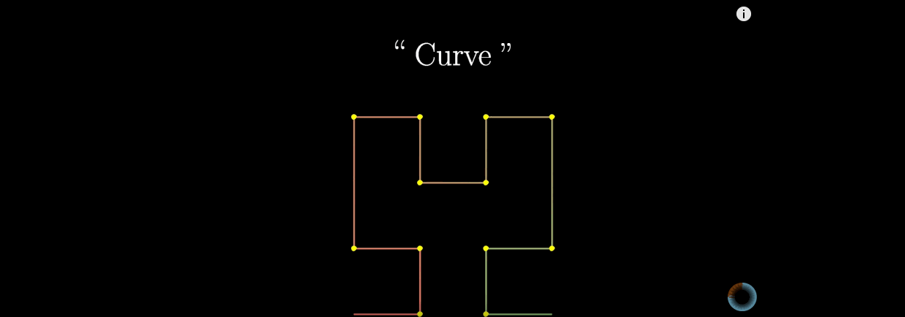
</p>


**希尔伯特曲线**一种能填充满一个平面正方形的分形曲线（[空间填充曲线](https://zh.wikipedia.org/w/index.php?title=%E7%A9%BA%E9%96%93%E5%A1%AB%E5%85%85%E6%9B%B2%E7%B7%9A&action=edit&redlink=1)），由[大卫·希尔伯特](https://zh.wikipedia.org/wiki/%E5%A4%A7%E8%A1%9B%C2%B7%E5%B8%8C%E7%88%BE%E4%BC%AF%E7%89%B9)在1891年提出。

由于它能填满平面，它的[豪斯多夫维](https://zh.wikipedia.org/wiki/%E8%B1%AA%E6%96%AF%E5%A4%9A%E5%A4%AB%E7%B6%AD)是2。取它填充的正方形的边长为1，第n步的希尔伯特曲线的长度是2^n - 2^(-n)。

### 2. 希尔伯特曲线的构造方法

一阶的希尔伯特曲线，生成方法就是把正方形四等分，从其中一个子正方形的中心开始，依次穿线，穿过其余3个正方形的中心。


<p align='center'>
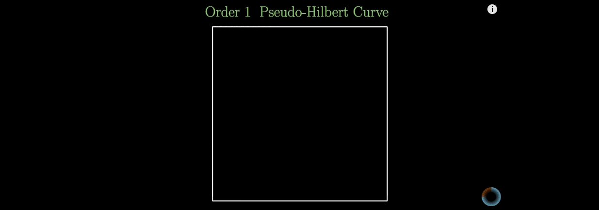
</p>


二阶的希尔伯特曲线，生成方法就是把之前每个子正方形继续四等分，每4个小的正方形先生成一阶希尔伯特曲线。然后把4个一阶的希尔伯特曲线首尾相连。

<p align='center'>
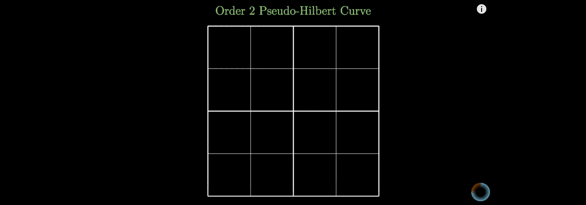
</p>


三阶的希尔伯特曲线，生成方法就是与二阶类似，先生成二阶希尔伯特曲线。然后把4个二阶的希尔伯特曲线首尾相连。


<p align='center'>
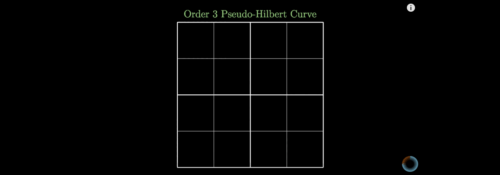
</p>


n阶的希尔伯特曲线的生成方法也是递归的，先生成n-1阶的希尔伯特曲线，然后把4个n-1阶的希尔伯特曲线首尾相连。


<p align='center'>
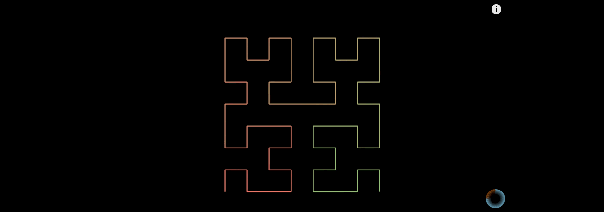
</p>


### 3. 为何要选希尔伯特曲线

看到这里可能就有读者有疑问了，这么多空间填充曲线，为何要选希尔伯特曲线？

因为希尔伯特曲线有非常好的特性。

#### (1) 降维

首先，作为空间填充曲线，希尔伯特曲线可以对多维空间有效的降维。


<p align='center'>
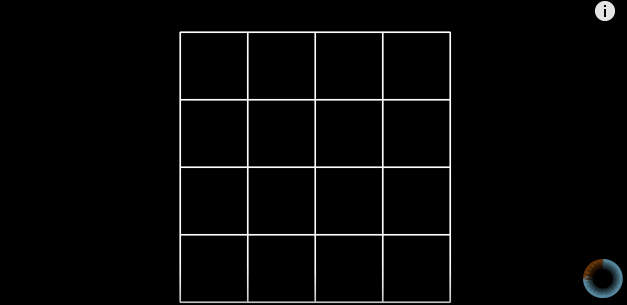
</p>


上图就是希尔伯特曲线在填满一个平面以后，把平面上的点都展开成一维的线了。

可能有人会有疑问，上图里面的希尔伯特曲线只穿了16个点，怎么能代表一个平面呢？


<p align='center'>
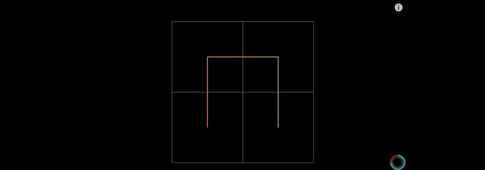
</p>


当然，当n趋近于无穷大的时候，n阶希尔伯特曲线就可以近似填满整个平面了。

#### (2) 稳定

当n阶希尔伯特曲线，n趋于无穷大的时候，曲线上的点的位置基本上趋于稳定。举个例子：


<p align='center'>
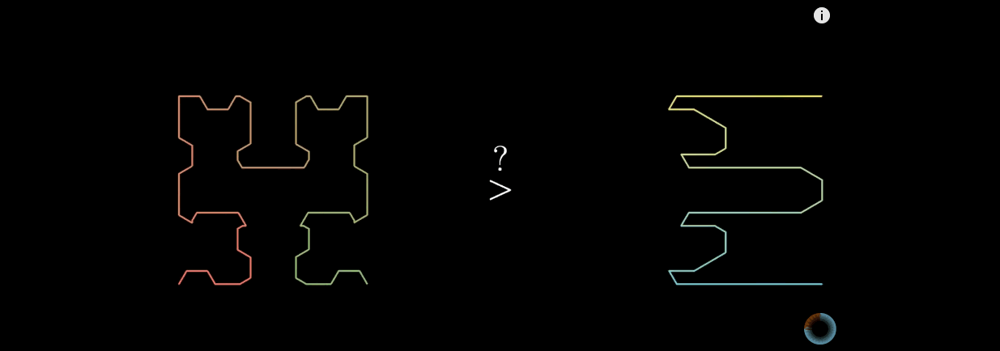
</p>


上图左边是希尔伯特曲线，右边是蛇形的曲线。当n趋于无穷大的时候，两者理论上都可以填满平面。但是为何希尔伯特曲线更加优秀呢？

在蛇形曲线上给定一个点，当n趋于无穷大的过程中，这个点在蛇形曲线上的位置是时刻变化的。


<p align='center'>
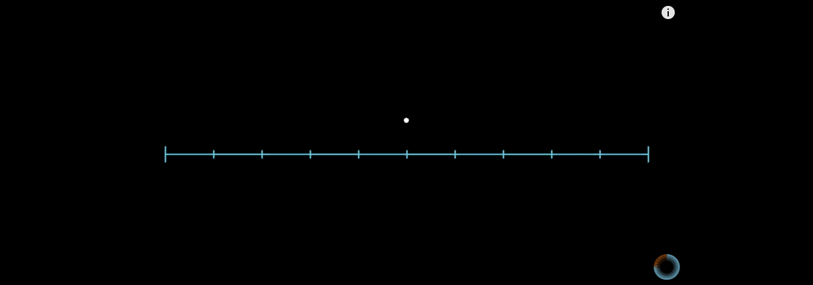
</p>


这就造成了点的相对位置始终不定。

再看看希尔伯特曲线，同样是一个点，在n趋于无穷大的情况下：


<p align='center'>

</p>


从上图可以看到，点的位置几乎没有怎么变化。所以希尔伯特曲线更加优秀。


#### (3) 连续


希尔伯特曲线是连续的，所以能保证一定可以填满空间。连续性是需要数学证明的。具体证明方法这里就不细说了，感兴趣的可以点文章末尾一篇关于希尔伯特曲线的论文，那里有连续性的证明。


接下来要介绍的谷歌的 S2 算法就是基于希尔伯特曲线的。现在读者应该明白选择希尔伯特曲线的原因了吧。

## 四. [S²](https://godoc.org/github.com/golang/geo/s2)  算法


>[Google’s S2 library](https://code.google.com/p/s2-geometry-library/) is a real treasure, not only due to its capabilities for spatial indexing but also because it is a library that was released more than 4 years ago and it didn’t get the attention it deserved

上面这段话来自2015年一位谷歌工程师的博文。他由衷的感叹 S2 算法发布4年没有得到它应有的赞赏。不过现在 S2 已经被各大公司使用了。

在介绍这个重量级算法之前，先解释一些这个算法的名字由来。S2其实是来自几何数学中的一个数学符号 S²，它表示的是单位球。S2 这个库其实是被设计用来解决球面上各种几何问题的。值得提的一点是，除去 golang 官方 repo 里面的 geo/s2 完成度目前只有40%，其他语言，Java，C++，Python 的 S2 实现都完成100%了。本篇文章讲解以 Go 的这个版本为主。

接下来就看看怎么用 S2 来解决多维空间点索引的问题的。

### 1. 球面坐标转换

按照之前我们处理多维空间的思路，先考虑如何降维，再考虑如何分形。

众所周知，地球是近似一个球体。球体是一个三维的，如何把三维降成一维呢？

球面上的一个点，在直角坐标系中，可以这样表示：


```

x = r * sin θ * cos φ
y = r * sin θ * sin φ 
z = r * cos θ

```

通常地球上的点我们会用经纬度来表示。


再进一步，我们可以和球面上的经纬度联系起来。不过这里需要注意的是，纬度的角度 α 和直角坐标系下的球面坐标 θ 加起来等于 90°。所以三角函数要注意转换。

于是地球上任意的一个经纬度的点，就可以转换成 f(x,y,z)。

在 S2 中，地球半径被当成单位 1 了。所以半径不用考虑。x，y，z的值域都被限定在了[-1,1] x [-1,1] x [-1,1]这个区间之内了。

### 2. 球面变平面

接下来一步 S2 把球面碾成平面。怎么做的呢？

首先在地球外面套了一个外切的正方体，如下图。


<p align='center'>
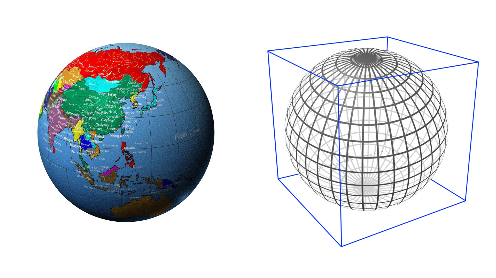
</p>


从球心向外切正方体6个面分别投影。S2 是把球面上所有的点都投影到外切正方体的6个面上。


这里简单的画了一个投影图，上图左边的是投影到正方体一个面的示意图，实际上影响到的球面是右边那张图。


从侧面看，其中一个球面投影到正方体其中一个面上，边缘与圆心的连线相互之间的夹角为90°，但是和x，y，z轴的角度是45°。我们可以在球的6个方向上，把45°的辅助圆画出来，见下图左边。


上图左边的图画了6个辅助线，蓝线是前后一对，红线是左右一对，绿线是上下一对。分别都是45°的地方和圆心连线与球面相交的点的轨迹。这样我们就可以把投影到外切正方体6个面上的球面画出来，见上图右边。

投影到正方体以后，我们就可以把这个正方体展开了。


一个正方体的展开方式有很多种。不管怎么展开，最小单元都是一个正方形。

以上就是 S2 的投影方案。接下来讲讲其他的投影方案。

首先有下面一种方式，三角形和正方形组合。


这种方式展开图如下图。


这种方式其实很复杂，构成子图形由两种图形构成。坐标转换稍微复杂一点。

再还有一种方式是全部用三角形组成，这种方式三角形个数越多，就能越切近于球体。


<p align='center'>
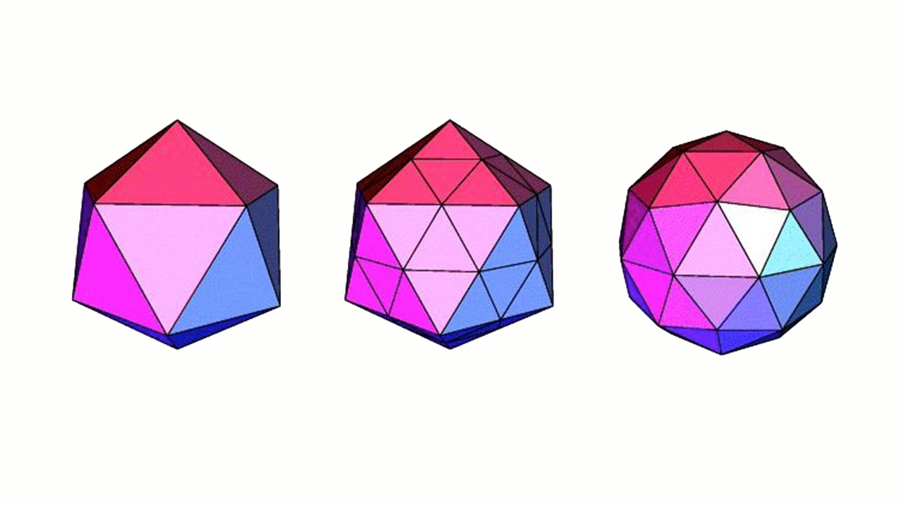
</p>


上图最左边的图，由20个三角形构成，可以看的出来，菱角非常多，与球体相差比较大，当三角形个数越来越多，就越来越贴近球体。


20个三角形展开以后就可能变成这样。

最后一种方式可能是目前最好的方式，不过也可能是最复杂的方式。按照六边形来投影。


六边形的菱角比较少，六个边也能相互衔接其他的六边形。看上图最后边的图可以看出来，六边形足够多以后，非常近似球体。


六边形展开以后就是上面这样。当然这里只有12个六边形。六边形个数越多越好，粒度越细，就越贴近球体。

Uber 在一个公开分享上提到了他们用的是六边形的网格，把城市划分为很多六边形。这块应该是他们自己开发的。也许滴滴也是划分六边形，也许滴滴有更好的划分方案也说不定。


在 Google S2 中，它是把地球展开成如下的样子：

<p align='center'>

</p>


如果上面展开的6个面，假设都用5阶的希尔伯特曲线表示出来的话，6个面会是如下的样子：

<p align='center'>

</p>

<p align='center'>

</p>

<p align='center'>

</p>

<p align='center'>

</p>

<p align='center'>

</p>

<p align='center'>

</p>


回到 S2 上面来，S2是用的正方形。这样第一步的球面坐标进一步的被转换成 f(x,y,z) -> g(face,u,v)，face是正方形的六个面，u，v对应的是六个面中的一个面上的x，y坐标。

### 3. 球面矩形投影修正


<p align='center'>

</p>


上一步我们把球面上的球面矩形投影到正方形的某个面上，形成的形状类似于矩形，但是由于球面上角度的不同，最终会导致即使是投影到同一个面上，每个矩形的面积也不大相同。


上图就表示出了球面上个一个球面矩形投影到正方形一个面上的情况。


经过实际计算发现，最大的面积和最小的面积相差5.2倍。见上图左边。相同的弧度区间，在不同的纬度上投影到正方形上的面积不同。

现在就需要修正各个投影出来形状的面积。如何选取合适的映射修正函数就成了关键。目标是能达到上图右边的样子，让各个矩形的面积尽量相同。

这块转换的代码在 C++ 的版本里面才有详细的解释，在 Go 的版本里面只一笔带过了。害笔者懵逼了好久。

|  | 面积比率| 边比率|对角线比率 |ToPointRaw |ToPoint |FromPoint |
|:-------:|:-------:|:------:|:------:|:------:|:------:|:------:|
|线性变换|5.200  | 2.117 |  2.959   |   0.020  |   0.087 |    0.085|
|tan()变换|1.414 | 1.414 |  1.704 |     0.237 |    0.299 |    0.258|
|二次变换|2.082  | 1.802 |  1.932  |    0.033 |    0.096 |    0.108|

线性变换是最快的变换，但是变换比最小。tan() 变换可以使每个投影以后的矩形的面积更加一致，最大和最小的矩形比例仅仅只差0.414。可以说非常接近了。但是 tan() 函数的调用时间非常长。如果把所有点都按照这种方式计算的话，性能将会降低3倍。

最后谷歌选择的是二次变换，这是一个近似切线的投影曲线。它的计算速度远远快于 tan() ，大概是 tan() 计算的3倍速度。生成的投影以后的矩形大小也类似。不过最大的矩形和最小的矩形相比依旧有2.082的比率。


上表中，ToPoint 和 FromPoint 分别是把单位向量转换到 Cell ID 所需要的毫秒数、把 Cell ID 转换回单位向量所需的毫秒数（Cell ID 就是投影到正方体六个面，某个面上矩形的 ID，矩形称为 Cell，它对应的 ID 称为 Cell ID）。ToPointRaw 是某种目的下，把 Cell ID 转换为非单位向量所需的毫秒数。


在 S2 中默认的转换是二次转换。

```c

#define S2_PROJECTION S2_QUADRATIC_PROJECTION

```

详细看看这三种转换到底是怎么转换的。

```c

#if S2_PROJECTION == S2_LINEAR_PROJECTION

inline double S2::STtoUV(double s) {
  return 2 * s - 1;
}

inline double S2::UVtoST(double u) {
  return 0.5 * (u + 1);
}

#elif S2_PROJECTION == S2_TAN_PROJECTION

inline double S2::STtoUV(double s) {
  // Unfortunately, tan(M_PI_4) is slightly less than 1.0.  This isn't due to
  // a flaw in the implementation of tan(), it's because the derivative of
  // tan(x) at x=pi/4 is 2, and it happens that the two adjacent floating
  // point numbers on either side of the infinite-precision value of pi/4 have
  // tangents that are slightly below and slightly above 1.0 when rounded to
  // the nearest double-precision result.

  s = tan(M_PI_2 * s - M_PI_4);
  return s + (1.0 / (GG_LONGLONG(1) << 53)) * s;
}

inline double S2::UVtoST(double u) {
  volatile double a = atan(u);
  return (2 * M_1_PI) * (a + M_PI_4);
}

#elif S2_PROJECTION == S2_QUADRATIC_PROJECTION

inline double S2::STtoUV(double s) {
  if (s >= 0.5) return (1/3.) * (4*s*s - 1);
  else          return (1/3.) * (1 - 4*(1-s)*(1-s));
}

inline double S2::UVtoST(double u) {
  if (u >= 0) return 0.5 * sqrt(1 + 3*u);
  else        return 1 - 0.5 * sqrt(1 - 3*u);
}

#else

#error Unknown value for S2_PROJECTION

#endif

```

上面有一处对 tan(M\_PI\_4) 的处理，是因为精度的原因，导致略小于1.0 。

所以投影之后的修正函数三种变换应该如下：

```c

// 线性转换
u = 0.5 * ( u + 1)

// tan() 变换
u = 2 / pi * (atan(u) + pi / 4) = 2 * atan(u) / pi + 0.5

// 二次变换
u >= 0，u = 0.5 * sqrt(1 + 3*u)
u < 0,    u = 1 - 0.5 * sqrt(1 - 3*u)

```

注意上面虽然变换公式只写了u，不代表只变换u。实际使用过程中，u，v都分别当做入参，都会进行变换。

这块修正函数在 Go 的版本里面就直接只实现了二次变换，其他两种变换方式找遍整个库，根本没有提及。

```go

// stToUV converts an s or t value to the corresponding u or v value.
// This is a non-linear transformation from [-1,1] to [-1,1] that
// attempts to make the cell sizes more uniform.
// This uses what the C++ version calls 'the quadratic transform'.
func stToUV(s float64) float64 {
	if s >= 0.5 {
		return (1 / 3.) * (4*s*s - 1)
	}
	return (1 / 3.) * (1 - 4*(1-s)*(1-s))
}

// uvToST is the inverse of the stToUV transformation. Note that it
// is not always true that uvToST(stToUV(x)) == x due to numerical
// errors.
func uvToST(u float64) float64 {
	if u >= 0 {
		return 0.5 * math.Sqrt(1+3*u)
	}
	return 1 - 0.5*math.Sqrt(1-3*u)
}

```

经过修正变换以后，u，v都变换成了s，t。值域也发生了变化。u，v的值域是[-1,1]，变换以后，是s，t的值域是[0,1]。

至此，小结一下，球面上的点S(lat,lng) -> f(x,y,z) -> g(face,u,v) -> h(face,s,t)。目前总共转换了4步，球面经纬度坐标转换成球面xyz坐标，再转换成外切正方体投影面上的坐标，最后变换成修正后的坐标。

到目前为止，S2 可以优化的点有两处，一是投影的形状能否换成六边形？二是修正的变换函数能否找到一个效果和 tan() 类似的函数，但是计算速度远远高于 tan()，以致于不会影响计算性能？

### 4. 点与坐标轴点相互转换

在 S2 算法中，默认划分 Cell 的等级是30，也就是说把一个正方形划分为 2^30 * 2^30个小的正方形。

那么上一步的s，t映射到这个正方形上面来，对应该如何转换呢？


s，t的值域是[0,1]，现在值域要扩大到[0,2^30^-1]。


```go

// stToIJ converts value in ST coordinates to a value in IJ coordinates.
func stToIJ(s float64) int {
	return clamp(int(math.Floor(maxSize*s)), 0, maxSize-1)
}

```

C ++ 的实现版本也一样

```c

inline int S2CellId::STtoIJ(double s) {
  // Converting from floating-point to integers via static_cast is very slow
  // on Intel processors because it requires changing the rounding mode.
  // Rounding to the nearest integer using FastIntRound() is much faster.
  // 这里减去0.5是为了四舍五入
  return max(0, min(kMaxSize - 1, MathUtil::FastIntRound(kMaxSize * s - 0.5)));
}

```

到这一步，是h(face,s,t) -> H(face,i,j)。

### 5. 坐标轴点与希尔伯特曲线 Cell ID 相互转换

最后一步，如何把 i，j 和希尔伯特曲线上的点关联起来呢？

```go

const (
	lookupBits = 4
	swapMask   = 0x01
	invertMask = 0x02
)

var (
	ijToPos = [4][4]int{
		{0, 1, 3, 2}, // canonical order
		{0, 3, 1, 2}, // axes swapped
		{2, 3, 1, 0}, // bits inverted
		{2, 1, 3, 0}, // swapped & inverted
	}
	posToIJ = [4][4]int{
		{0, 1, 3, 2}, // canonical order:    (0,0), (0,1), (1,1), (1,0)
		{0, 2, 3, 1}, // axes swapped:       (0,0), (1,0), (1,1), (0,1)
		{3, 2, 0, 1}, // bits inverted:      (1,1), (1,0), (0,0), (0,1)
		{3, 1, 0, 2}, // swapped & inverted: (1,1), (0,1), (0,0), (1,0)
	}
	posToOrientation = [4]int{swapMask, 0, 0, invertMask | swapMask}
	lookupIJ         [1 << (2*lookupBits + 2)]int
	lookupPos        [1 << (2*lookupBits + 2)]int
)

```

在变换之前，先来解释一下定义的一些变量。

posToIJ 代表的是一个矩阵，里面记录了一些单元希尔伯特曲线的位置信息。

把 posToIJ 数组里面的信息用图表示出来，如下图：


同理，把 ijToPos 数组里面的信息用图表示出来，如下图：


posToOrientation 数组里面装了4个数字，分别是1,0,0,3。
lookupIJ 和 lookupPos 分别是两个容量为1024的数组。这里面分别对应的就是希尔伯特曲线 ID 转换成坐标轴 IJ 的转换表，和坐标轴 IJ 转换成希尔伯特曲线 ID 的转换表。


```go


func init() {
	initLookupCell(0, 0, 0, 0, 0, 0)
	initLookupCell(0, 0, 0, swapMask, 0, swapMask)
	initLookupCell(0, 0, 0, invertMask, 0, invertMask)
	initLookupCell(0, 0, 0, swapMask|invertMask, 0, swapMask|invertMask)
}

```

这里是初始化的递归函数，在希尔伯特曲线的标准顺序中可以看到是有4个格子，并且格子都有顺序的，所以初始化要遍历满所有顺序。入参的第4个参数，就是从0 - 3 。

```go

// initLookupCell initializes the lookupIJ table at init time.
func initLookupCell(level, i, j, origOrientation, pos, orientation int) {

	if level == lookupBits {
		ij := (i << lookupBits) + j
		lookupPos[(ij<<2)+origOrientation] = (pos << 2) + orientation
		lookupIJ[(pos<<2)+origOrientation] = (ij << 2) + orientation
	
		return
	}

	level++
	i <<= 1
	j <<= 1
	pos <<= 2
	
	r := posToIJ[orientation]
	
	initLookupCell(level, i+(r[0]>>1), j+(r[0]&1), origOrientation, pos, orientation^posToOrientation[0])
	initLookupCell(level, i+(r[1]>>1), j+(r[1]&1), origOrientation, pos+1, orientation^posToOrientation[1])
	initLookupCell(level, i+(r[2]>>1), j+(r[2]&1), origOrientation, pos+2, orientation^posToOrientation[2])
	initLookupCell(level, i+(r[3]>>1), j+(r[3]&1), origOrientation, pos+3, orientation^posToOrientation[3])
}

```


上面这个函数是生成希尔伯特曲线的。我们可以看到有一处对` pos << 2 `的操作，这里是把位置变换到第一个4个小格子中，所以位置乘以了4。

由于初始设置的`lookupBits = 4`，所以i，j的变化范围是从[0,15]，总共有16\*16=256个，然后i，j坐标是表示的4个格子，再细分，`lookupBits = 4`这种情况下能表示的点的个数就是256\*4=1024个。这也正好是 lookupIJ 和 lookupPos 的总容量。


画一个局部的图，i，j从 0-7 变化。


上图是一个4阶希尔伯特曲线。初始化的实际过程就是初始化4阶希尔伯特上的1024个点的坐标与坐标轴上的x，y轴的对应关系表。

举个例子，下表是i，j在递归过程中产生的中间过程。下表是
 lookupPos 表计算过程。

|(i,j)|ij  | ij 计算过程|lookupPos[i j]|lookupPos[i j]计算过程| 实际坐标 |
|:-------:|:-------:|:------:|:------:|:------:|:------:|
|(0,0)|0|0  | 0 |  0  | (0,0)|
|(1,0)|64|(1\*16+0)\*4=64  | 5 |  1\*4+1=5  | (3,0)|
|(1,1)|68|(1\*16+1)\*4=68  | 9 |  2\*4+1=9  | (3,2)|
|(0,1)|4|(0\*16+1)\*4=4  | 14 |  3\*4+2=14  | (0,2)|
|(0,2)|8|(0\*16+2)\*4=8  | 17 |  4\*4+1=17  | (1,4)|
|(0,3)|12|(0\*16+3)\*4=12  | 20 |  5\*4+0=20  | (0,6)|
|(1,3)|76|(1\*16+3)\*4=76  | 24 |  6\*4+0=24  | (2,6)|
|(1,2)|72|(1\*16+2)\*4=72  | 31 |  7\*4+3=31  | (3,4)|
|(2,2)|136|(2\*16+2)\*4=136  | 33 |  8\*4+1=33  | (5,4)|

取出一行详细分析一下计算过程。

假设当前(i,j)=(0,2)，ij 的计算过程是把 i 左移4位再加上 j，整体结果再左移2位。目的是为了留出2位的方向位置。ij的前4位是i，接着4位是j，最后2位是方向。这样计算出ij的值就是8 。

接着计算lookupPos[i j]的值。从上图中可以看到(0,2)代表的单元格的4个数字是16，17，18，19 。计算到这一步，pos的值为4（pos是专门记录生成格子到第几个了，总共pos的值会循环0-255）。pos代表的是当前是第几个格子(4个小格子组成)，当前是第4个，每个格子里面有4个小格子。所以4\*4就可以偏移到当前格子的第一个数字，也就是16 。posToIJ 数组里面会记录下当前格子的形状。从这里我们从中取出 orientation 。

看上图，16，17，18，19对应的是 posToIJ 数组轴旋转的情况，所以17是位于轴旋转图的数字1代表的格子中。这时 orientation = 1 。

这样 lookupPos[i j] 表示的数字就计算出来了，4\*4+1=17 。这里就完成了i，j与希尔伯特曲线上数字的对应。

那如何由希尔伯特曲线上的数字对应到实际的坐标呢？

lookupIJ 数组里面记录了反向的信息。lookupIJ 数组 和 lookupPos 数组存储的信息正好是反向的。lookupIJ 数组 下表存的值是 lookupPos 数组 的下表。我们查  lookupIJ 数组 ，lookupIJ[17]的值就是8，对应算出来(i,j)=(0,2)。这个时候的i，j还是大格子。还是需要借助 posToIJ 数组 里面描述的形状信息。当前形状是轴旋转，之前也知道 orientation = 1，由于每个坐标里面有4个小格子，所以一个i，j代表的是2个小格子，所以需要乘以2，再加上形状信息里面的方向，可以计算出实际的坐标 (0 \* 2 + 1 , 2 \* 2 + 0) = ( 1，4) 。

至此，整个球面坐标的坐标映射就已经完成了。

球面上的点S(lat,lng) -> f(x,y,z) -> g(face,u,v) -> h(face,s,t)  -> H(face,i,j) -> CellID。目前总共转换了6步，球面经纬度坐标转换成球面xyz坐标，再转换成外切正方体投影面上的坐标，最后变换成修正后的坐标，再坐标系变换，映射到 [0,2^30^-1]区间，最后一步就是把坐标系上的点都映射到希尔伯特曲线上。

### 6. S2 Cell ID 数据结构


最后需要来谈谈 S2 Cell ID 数据结构，这个数据结构直接关系到不同 Level 对应精度的问题。


上图左图中对应的是 Level 30 的情况，右图对应的是 Level 24 的情况。(2的多少次方，角标对应的也就是 Level 的值)


在 S2 中，每个 CellID 是由64位的组成的。可以用一个 uint64 存储。开头的3位表示正方体6个面中的一个，取值范围[0,5]。3位可以表示0-7，但是6，7是无效值。

64位的最后一位是1，这一位是特意留出来的。用来快速查找中间有多少位。从末尾最后一位向前查找，找到第一个不为0的位置，即找到第一个1。这一位的前一位到开头的第4位（因为前3位被占用）都是可用数字。

绿色格子有多少个就能表示划分多少格。上图左图，绿色的有60个格子，于是可以表示[0,2^30^ -1] * [0,2^30^ -1]这么多个格子。上图右图中，绿色格子只有48个，那么就只能表示[0,2^24^ -1]*[0,2^24^ -1]这么多个格子。

那么不同 level 可以代表的网格的面积究竟是多大呢？

由上一章我们知道，由于投影的原因，所以导致投影之后的面积依旧有大小差别。

这里推算的公式比较复杂，就不证明了，具体的可以看文档。

```

MinAreaMetric = Metric{2, 8 * math.Sqrt2 / 9} 
AvgAreaMetric = Metric{2, 4 * math.Pi / 6} 
MaxAreaMetric = Metric{2, 2.635799256963161491}

```

这就是最大最小面积和平均面积的倍数关系。


(下图单位是km^2^，平方公里)


| level | min area |  max area  |average area  |units  |Random cell 1 (UK) min edge length  |Random cell 1 (UK) max edge length  |Random cell 2 (US) min edge length |Random cell 2 (US) max edge length|Number of cells |
|:-------------: |:-------------:| :-----:| :-----:| :-----:| :-----:| :-----:| :-----:| :-----:| :-----:|
|00	|85011012.19	|85011012.19	|85011012.19	|km2	 	|7842 km	|7842 km	 |	7842 km	|7842 km	|6|
|01	|21252753.05	|21252753.05	|21252753.05	|km2	 	|3921 km	|5004 km	 	|3921 km	|5004 km	|24|
|02	|4919708.23	|6026521.16	|5313188.26	|km2	 	|1825 km	|2489 km	 	|1825 km	|2489 km	|96|
|03	|1055377.48	|1646455.50	|1328297.07	|km2	 |	840 km	|1167 km	 	|1130 km	|1310 km	|384|
|04	|231564.06	|413918.15	|332074.27	|km2	 	|432 km	|609 km	 	|579 km	|636 km	|1536|
|05	|53798.67	|104297.91	|83018.57	|km2	 	|210 km	|298 km	 	|287 km	|315 km	|6K|
|06	|12948.81	|26113.30	|20754.64	|km2	 	|108 km	|151 km	 |	143 km	|156 km	|24K|
|07	|3175.44	|6529.09	|5188.66	|km2	 	|54 km	|76 km	 	|72 km	|78 km	|98K|
|08	|786.20	|1632.45	|1297.17	|km2	 	|27 km	|38 km	 	|36 km	|39 km	|393K|
|09	|195.59	|408.12	|324.29	|km2	 	|14 km	|19 km	 |	18 km	|20 km	|1573K|
|10	|48.78	|102.03	|81.07	|km2	 	|7 km	|9 km	 	|9 km	|10 km	|6M|
|11	|12.18	|25.51	|20.27	|km2	 	|3 km	|5 km	 	|4 km	|5 km	|25M|
|12	|3.04	|6.38	|5.07	|km2	 	|1699 m	|2 km	 	|2 km	|2 km	|100M|
|13	|0.76	|1.59	|1.27	|km2	 	|850 m	|1185 m	 	|1123 m	|1225 m	|402M|
|14	|0.19	|0.40	|0.32	|km2	 	|425 m	|593 m	 	|562 m	|613 m	|1610M|
|15	|47520.30	|99638.93	|79172.67	|m2	 	|212 m	|296 m	 	|281 m	|306 m	|6B|
|16	|11880.08	|24909.73	|19793.17	|m2	 	|106 m	|148 m	 	|140 m	|153 m	|25B|
|17	|2970.02	|6227.43	|4948.29	|m2	 	|53 m	|74 m	 	|70 m	|77 m	|103B|
|18	|742.50	|1556.86	|1237.07	|m2	 	|27 m	|37 m	 	|35 m	|38 m	|412B|
|19	|185.63	|389.21	|309.27	|m2	 	|13 m	|19 m	 	|18 m	|19 m	|1649B|
|20	|46.41	|97.30	|77.32	|m2	 	|7 m	|9 m	 	|9 m	|10 m	|7T|
|21	|11.60	|24.33	|19.33	|m2	 	|3 m	|5 m	 	|4 m	|5 m	|26T|
|22	|2.90	|6.08	|4.83	|m2	 	|166 cm	|2 m	 	|2 m	|2 m	|105T|
|23	|0.73	|1.52	|1.21	|m2	 	|83 cm	|116 cm	 	|110 cm	|120 cm	|422T|
|24	|0.18	|0.38	|0.30	|m2	 	|41 cm	|58 cm	 	|55 cm	|60 cm	|1689T|
|25	|453.19	|950.23	|755.05	|cm2	 	|21 cm	|29 cm	 	|27 cm	|30 cm	|7e15|
|26	|113.30	|237.56	|188.76	|cm2	 	|10 cm	|14 cm	 	|14 cm	|15 cm	|27e15|
|27	|28.32	|59.39	|47.19	|cm2	 	|5 cm	|7 cm	 	|7 cm	|7 cm	|108e15|
|28	|7.08	|14.85	|11.80	|cm2	 	|2 cm	|4 cm	 	|3 cm	|4 cm	|432e15|
|29	|1.77	|3.71	|2.95	|cm2	 	|12 mm	|18 mm	 	|17 mm	|18 mm	|1729e15|
|30	|0.44	|0.93	|0.74	|cm2	 	|6 mm	|9 mm	 	|8 mm	|9 mm	|7e18|


level 0 就是正方体的六个面之一。地球表面积约等于510,100,000 km^2^。level 0 的面积就是地球表面积的六分之一。level 30 能表示的最小的面积0.48cm^2^，最大也就0.93cm^2^ 。


### 7. S2 与 Geohash 对比


Geohash 有12级，从5000km 到 3.7cm。中间每一级的变化比较大。有时候可能选择上一级会大很多，选择下一级又会小一些。比如选择字符串长度为4，它对应的 cell 宽度是39.1km，需求可能是50km，那么选择字符串长度为5，对应的 cell 宽度就变成了156km，瞬间又大了3倍了。这种情况选择多长的 Geohash 字符串就比较难选。选择不好，每次判断可能就还需要取出周围的8个格子再次进行判断。Geohash 需要 12 bytes 存储。


S2 有30级，从 0.7cm²  到 85,000,000km² 。中间每一级的变化都比较平缓，接近于4次方的曲线。所以选择精度不会出现 Geohash 选择困难的问题。S2 的存储只需要一个 uint64 即可存下。

S2 库里面不仅仅有地理编码，还有其他很多几何计算相关的库。地理编码只是其中的一小部分。本文没有介绍到的 S2 的实现还有很多很多，各种向量计算，面积计算，多边形覆盖，距离问题，球面球体上的问题，它都有实现。

S2 还能解决多边形覆盖的问题。比如给定一个城市，求一个多边形刚刚好覆盖住这个城市。


如上图，生成的多边形刚刚好覆盖住下面蓝色的区域。这里生成的多边形可以有大有小。不管怎么样，最终的结果也是刚刚覆盖住目标物。


用相同的 Cell 也可以达到相同的目的，上图就是用相同 Level 的 Cell 覆盖了整个圣保罗城市。


这些都是 Geohash 做不到的。


多边形覆盖利用的是近似的算法，虽然不是严格意义上的最优解，但是实践中效果特别好。

额外值得说明的一点是，Google 文档上强调了，这种多边形覆盖的算法虽然对搜索和预处理操作非常有用，但是“不可依赖”的。理由也是因为是近似算法，并不是唯一最优算法，所以得到的解会依据库的不同版本而产生变化。


### 8. S2 Cell 举例

先来看看经纬度和 CellID 的转换，以及矩形面积的计算。

```go

	latlng := s2.LatLngFromDegrees(31.232135, 121.41321700000003)
	cellID := s2.CellIDFromLatLng(latlng)
	cell := s2.CellFromCellID(cellID) //9279882742634381312

	// cell.Level()
	fmt.Println("latlng = ", latlng)
	fmt.Println("cell level = ", cellID.Level())
	fmt.Printf("cell = %d\n", cellID)
	smallCell := s2.CellFromCellID(cellID.Parent(10))
	fmt.Printf("smallCell level = %d\n", smallCell.Level())
	fmt.Printf("smallCell id = %b\n", smallCell.ID())
	fmt.Printf("smallCell ApproxArea = %v\n", smallCell.ApproxArea())
	fmt.Printf("smallCell AverageArea = %v\n", smallCell.AverageArea())
	fmt.Printf("smallCell ExactArea = %v\n", smallCell.ExactArea())


```

这里 Parent 方法参数可以直接指定返回改点的对应 level 的 CellID。

上面那些方法打印出来的结果如下：

```go

latlng =  [31.2321350, 121.4132170]
cell level =  30
cell = 3869277663051577529

****Parent **** 10000000000000000000000000000000000000000
smallCell level = 10
smallCell id = 11010110110010011011110000000000000000000000000000000000000000
smallCell ApproxArea = 1.9611002454714756e-06
smallCell AverageArea = 1.997370817559429e-06
smallCell ExactArea = 1.9611009480261058e-06


```

再举一个覆盖多边形的例子。我们先随便创建一个区域。

```go

	rect = s2.RectFromLatLng(s2.LatLngFromDegrees(48.99, 1.852))
	rect = rect.AddPoint(s2.LatLngFromDegrees(48.68, 2.75))

	rc := &s2.RegionCoverer{MaxLevel: 20, MaxCells: 10, MinLevel: 2}
	r := s2.Region(rect.CapBound())
	covering := rc.Covering(r)


```


覆盖参数设置成 level 2 - 20，最多的 Cell 的个数是10个。


接着我们把 Cell 至多改成20个。


最后再改成30个。


可以看到相同的 level 的范围，cell 个数越多越精确目标范围。

这里是匹配矩形区域，匹配圆形区域也同理。


代码就不贴了，与矩形类似。这种功能 Geohash 就做不到，需要自己手动实现了。


最后举一个多边形匹配的例子。

```go


func testLoop() {

	ll1 := s2.LatLngFromDegrees(31.803269, 113.421145)
	ll2 := s2.LatLngFromDegrees(31.461846, 113.695803)
	ll3 := s2.LatLngFromDegrees(31.250756, 113.756228)
	ll4 := s2.LatLngFromDegrees(30.902604, 113.997927)
	ll5 := s2.LatLngFromDegrees(30.817726, 114.464846)
	ll6 := s2.LatLngFromDegrees(30.850743, 114.76697)
	ll7 := s2.LatLngFromDegrees(30.713884, 114.997683)
	ll8 := s2.LatLngFromDegrees(30.430111, 115.42615)
	ll9 := s2.LatLngFromDegrees(30.088491, 115.640384)
	ll10 := s2.LatLngFromDegrees(29.907713, 115.656863)
	ll11 := s2.LatLngFromDegrees(29.783833, 115.135012)
	ll12 := s2.LatLngFromDegrees(29.712295, 114.728518)
	ll13 := s2.LatLngFromDegrees(29.55473, 114.24512)
	ll14 := s2.LatLngFromDegrees(29.530835, 113.717776)
	ll15 := s2.LatLngFromDegrees(29.55473, 113.3772)
	ll16 := s2.LatLngFromDegrees(29.678892, 112.998172)
	ll17 := s2.LatLngFromDegrees(29.941039, 112.349978)
	ll18 := s2.LatLngFromDegrees(30.040949, 112.025882)
	ll19 := s2.LatLngFromDegrees(31.803269, 113.421145)

	point1 := s2.PointFromLatLng(ll1)
	point2 := s2.PointFromLatLng(ll2)
	point3 := s2.PointFromLatLng(ll3)
	point4 := s2.PointFromLatLng(ll4)
	point5 := s2.PointFromLatLng(ll5)
	point6 := s2.PointFromLatLng(ll6)
	point7 := s2.PointFromLatLng(ll7)
	point8 := s2.PointFromLatLng(ll8)
	point9 := s2.PointFromLatLng(ll9)
	point10 := s2.PointFromLatLng(ll10)
	point11 := s2.PointFromLatLng(ll11)
	point12 := s2.PointFromLatLng(ll12)
	point13 := s2.PointFromLatLng(ll13)
	point14 := s2.PointFromLatLng(ll14)
	point15 := s2.PointFromLatLng(ll15)
	point16 := s2.PointFromLatLng(ll16)
	point17 := s2.PointFromLatLng(ll17)
	point18 := s2.PointFromLatLng(ll18)
	point19 := s2.PointFromLatLng(ll19)

	points := []s2.Point{}
	points = append(points, point19)
	points = append(points, point18)
	points = append(points, point17)
	points = append(points, point16)
	points = append(points, point15)
	points = append(points, point14)
	points = append(points, point13)
	points = append(points, point12)
	points = append(points, point11)
	points = append(points, point10)
	points = append(points, point9)
	points = append(points, point8)
	points = append(points, point7)
	points = append(points, point6)
	points = append(points, point5)
	points = append(points, point4)
	points = append(points, point3)
	points = append(points, point2)
	points = append(points, point1)

	loop := s2.LoopFromPoints(points)

	fmt.Println("----  loop search (gets too much) -----")
	// fmt.Printf("Some loop status items: empty:%t   full:%t \n", loop.IsEmpty(), loop.IsFull())

	// ref: https://github.com/golang/geo/issues/14#issuecomment-257064823
	defaultCoverer := &s2.RegionCoverer{MaxLevel: 20, MaxCells: 1000, MinLevel: 1}
	// rg := s2.Region(loop.CapBound())
	// cvr := defaultCoverer.Covering(rg)
	cvr := defaultCoverer.Covering(loop)

	// fmt.Println(poly.CapBound())
	for _, c3 := range cvr {
		fmt.Printf("%d,\n", c3)
	}
}


```


这里用到了 Loop 类，这个类的初始化的最小单元是 Point，Point 是由经纬度产生的。**最重要的一点需要注意的是，多边形是按照逆时针方向，左手边区域确定的。**

如果一不小心点是按照顺时针排列的话，那么多边形确定的是外层更大的面，意味着球面除去画的这个多边形以外的都是你想要的多边形。


举个具体的例子，假如我们想要画的多边形是下图这个样子的：


如果我们用顺时针的方式依次存储 Point 的话，并用顺时针的这个数组去初始化 Loop，那么就会出现“奇怪”的现象。如下图：


这张图左上角的顶点和右下角的顶点在地球上是重合的。如果把这个地图重新还原成球面，那么就是整个球面中间挖空了一个多边形。

把上图放大，如下图：


这样就可以很清晰的看到了，中间被挖空了一个多边形。造成这种现象的原因就是按照顺时针的方向存储了每个点，那么初始化一个 Loop 的时候就会选择多边形外圈的更大的多边形。

使用 Loop 一定要切记，**顺时针表示的是外圈多边形，逆时针表示的是内圈多边形。**

多边形覆盖的问题同之前举的例子一样：

相同的 MaxLevel = 20，MinLevel = 1，MaxCells 不同，覆盖的精度就不同，下图是 MaxCells = 100 的情况：


下图是 MaxCells = 1000 的情况：


从这个例子也可以看出来  相同的 Level 范围，MaxCells 越精度，覆盖的精度越高。


### 9. S2 的应用


S2 主要能用在以下 8 个地方：

1. 涉及到角度，间隔，纬度经度点，单位矢量等的表示，以及对这些类型的各种操作。  
2. 单位球体上的几何形状，如球冠（“圆盘”），纬度 - 经度矩形，折线和多边形。  
3. 支持点，折线和多边形的任意集合的强大的构造操作（例如联合）和布尔谓词（例如，包含）。  
4. 对点，折线和多边形的集合进行快速的内存索引。  
5. 针对测量距离和查找附近物体的算法。  
6. 用于捕捉和简化几何的稳健算法（该算法具有精度和拓扑保证）。  
7. 用于测试几何对象之间关系的有效且精确的数学谓词的集合。  
8. 支持空间索引，包括将区域近似为离散“S2单元”的集合。此功能可以轻松构建大型分布式空间索引。  

最后一点空间索引相信在工业生产中使用的非常广泛。

S2 目前应用比较多，用在和地图相关业务上更多。Google Map 就直接大量使用了 S2 ，速度有多快读者可以自己体验体验。Uber 在搜寻最近的出租车也是用的 S2 算法进行计算的。场景的例子就是本篇文章引语里面提到的场景。滴滴应该也有相关的应用，也许有更加优秀的解法。现在很火的共享单车也会用到这些空间索引算法。

最后就是外卖行业和地图关联也很密切。美团和饿了么相信也在这方面有很多应用，具体哪里用到了，就请读者自己想象吧。

当然 S2 也有不适合的使用场景：

1. 平面几何问题（有许多精细的现有平面几何图库可供选择）。 
2. 转换常见的 to/from GIS格式（要阅读这种格式，请使用[OGR](http://gdal.org/1.11/ogr/)等外部库）。 


## 五. 最后


本篇文章里面着重介绍了谷歌的 S2 算法的基础实现。虽然 Geohash 也是空间点索引算法，但是性能方面比谷歌的 S2 略逊一筹。并且大公司的数据库也基本上开始采用谷歌的 S2 算法进行索引。

关于空间搜索其实还有一大类问题，如何搜索多维空间线，多维空间面，多维空间多边形呢？他们都是由无数个空间点组成的。实际的例子，比如街道，高楼，铁路，河流。要搜索这些东西，数据库表如何设计？如何做到高效的搜索呢？还能用 B+ 树来做么？

答案当然是也可以实现高效率的搜索，那就需要用到 R 树，或者 R 树 和 B+树。

这部分就不在本文的范畴内了，下次有空可以再分享一篇《多维空间多边形索引算法》

最后，请大家多多指点。

------------------------------------------------------

空间搜索系列文章：

[如何理解 n 维空间和 n 维时空](https://github.com/halfrost/Halfrost-Field/blob/master/contents/Go/n-dimensional_space_and_n-dimensional_space-time.md)  
[高效的多维空间点索引算法 — Geohash 和 Google S2](https://github.com/halfrost/Halfrost-Field/blob/master/contents/Go/go_spatial_search.md)  
[Google S2 中的 CellID 是如何生成的 ？](https://github.com/halfrost/Halfrost-Field/blob/master/contents/Go/go_s2_CellID.md)     
[Google S2 中的四叉树求 LCA 最近公共祖先](https://github.com/halfrost/Halfrost-Field/blob/master/contents/Go/go_s2_lowest_common_ancestor.md)  
[神奇的德布鲁因序列](https://github.com/halfrost/Halfrost-Field/blob/master/contents/Go/go_s2_De_Bruijn.md)  
[四叉树上如何求希尔伯特曲线的邻居 ？](https://github.com/halfrost/Halfrost-Field/blob/master/contents/Go/go_s2_Hilbert_neighbor.md)


------------------------------------------------------

Reference：  
[Z-order curve](https://en.wikipedia.org/wiki/Z-order_curve)  
[Geohash wikipedia](https://en.wikipedia.org/wiki/Geohash)  
[Geohash-36](https://en.wikipedia.org/wiki/Geohash-36)  
[Geohash 在线演示](http://geohash.gofreerange.com/)  
[Geohash 查询](http://www.movable-type.co.uk/scripts/geohash.html)  
[Geohash Converter](http://geohash.co/)   
[Space-filling curve](https://en.wikipedia.org/wiki/Space-filling_curve)  
[List of fractals by Hausdorff dimension](https://en.wikipedia.org/wiki/List_of_fractals_by_Hausdorff_dimension)  
[介绍希尔伯特曲线的Youtube视频](https://www.youtube.com/watch?v=3s7h2MHQtxc)  
[希尔伯特曲线在线演示](http://bit-player.org/extras/hilbert/hilbert-mapping.html)  
[希尔伯特曲线论文](http://www4.ncsu.edu/~njrose/pdfFiles/HilbertCurve.pdf)  
[Mapping the Hilbert curve](http://bit-player.org/2013/mapping-the-hilbert-curve)  
[S2 谷歌官方PPT](https://docs.google.com/presentation/d/1Hl4KapfAENAOf4gv-pSngKwvS_jwNVHRPZTTDzXXn6Q/view#slide=id.i22)  
[ Go 版 S2 源码 github.com/golang/geo](https://github.com/golang/geo)  
[ Java 版 S2 源码 github.com/google/s2-geometry-library-java](https://github.com/google/s2-geometry-library-java)  
[L’Huilier’s Theorem](http://numerical.recipes/whp/HuiliersTheorem.pdf)


> GitHub Repo：[Halfrost-Field](https://github.com/halfrost/Halfrost-Field)
> 
> Follow: [halfrost · GitHub](https://github.com/halfrost)
>
> Source: [https://halfrost.com/go\_spatial_search/](https://halfrost.com/go_spatial_search/)