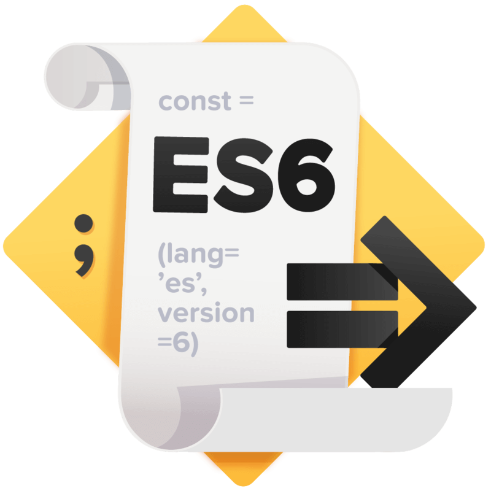

<p align='center'>

</p>


新手在入门 JavaScript 的过程中，一定会踩很多关于 this 的坑，出现问题的本质就是 this 指针的指向和自己想的不一样。笔者在入门学习的过程中，也踩了很多坑，于是便写下本篇文章记录自己“踩坑”历程。

### 一. this 在哪里？

在上篇[《从 JavaScript 作用域说开去》](http://www.jianshu.com/p/9ecb728c5db9)分析中，我们知道，在 Execution Context 中有一个属性是 this，这里的 this 就是我们所说的 this 。this 与上下文中可执行代码的类型有直接关系，** this 的值在进入执行上下文时确定，并且在执行上下文运行期间永久不变。**

this 到底取何值？this 的取值是动态的，是在函数真正被调用执行的时候确定的，函数定义的时候确定不了。因为 this 的取值是执行上下文环境的一部分，每次调用函数，都会产生一个新的执行上下文环境。

所以 this 的作用就是用来指明执行上下文是在哪个上下文中被触发的对象。令人迷惑的地方就在这里，同一个函数，当在不同的上下文进行调用的时候，this 的值就可能会不同。也就是说，this 的值就是函数调用表达式（也就是函数被调用的方式）的 caller。

### 二. this & that 具体值得是谁？

目前接触的有以下14种情况，笔者打算一一列举出来，以后如果遇到了更多的情况，还会继续增加。

既然 this 是执行上下文确定的，那么从执行上下文的种类进行分类，可以分为3种：


那么接下来我们就从 Global Execution Context 全局执行上下文，Function Execution Context 函数执行上下文，Eval Execution Context Eval执行上下文 这三类，具体谈谈 this 究竟指的是谁。


#### （一）. 全局执行上下文

#### 1. 非严格模式下的函数调用

这是函数的最通常用法，属于全局性调用，因此 this 就代表全局对象 Global。

```javascript

var name = 'halfrost';
function test() {
    console.log(this); // window
    console.log(this.name); // halfrost
}                                                                                                                                                                                                                                                                                                                              
test();


```

在全局上下文（Global Context）中，this 总是 global object，在浏览器中就是 window 对象。

#### 2. 严格模式下的函数调用

严格模式由 [ECMAScript 5.1](http://www.ecma-international.org/ecma-262/5.1/#sec-10.1.1) 引进，用来限制 JavaScript 的一些异常处理，提供更好的安全性和更强壮的错误检查机制。使用严格模式，只需要将 'use strict' 置于函数体的顶部。这样就可以将上下文环境中的 this 转为 undefined。这样执行上下文环境不再是全局对象，与非严格模式刚好相反。

在严格模式下，情况并不是仅仅是 undefined 这么简单，有可能严格模式夹杂着非严格模式。

先看严格模式的情况：

```javascript

'use strict';
function test() {
  console.log(this); //undefined
};
test();

```

上面的这个情况比较好理解，还有一种情况也是严格模式下的：

```javascript

    function execute() {  
      'use strict'; // 开启严格模式
      function test() {
        // 内部函数也是严格模式
        console.log(this); // undefined
      }
      // 在严格模式下调用 test()
      // this 在 test() 下是 undefined
      test(); // undefined
    }
    execute();  

```

如果严格模式在外层，那么在执行作用域内部声明的函数，它会继承严格模式。


接下来就看看严格模式和非严格模式混合的情况。

```javascript

    function nonStrict() {  
      // 非严格模式
      console.log(this); // window
    }
    function strict() {  
      'use strict';
      // 严格模式
      console.log(this); // undefined
    }


```

这种情况就比较简单了，各个模式下分别判断就可以了。


#### （二）.函数执行上下文

#### 3. 函数调用

当通过正常的方式调用一个函数的时候，this 的值就会被设置为 global object（浏览器中的 window 对象）。

严格模式和非严格模式的情况和上述全局执行上下文的情况一致，严格模式对应的 undefined ，非严格模式对应的 window 这里就不再赘述了。


#### 4. 方法作为对象的属性被调用

```javascript

var person = {
    name: "halfrost",
    func: function () {
        console.log(this + ":" + this.name);
    }
};

person.func(); // halfrost

```

在这个例子里面的 this 调用的是函数的调用者 person，所以会输出 person.name 。

当然如果函数的调用者是一个全局对象的话，那么这里的 this 指向又会发生变化。

```javascript

var name = "YDZ";
var person = {
    name: "halfrost",
    func: function () {
        console.log(this + ":" + this.name);
    }
};

temp = person.func;
temp(); // YDZ


```

在上面这个例子里面，由于函数被赋值到了另一个变量中，并没有作为 person 的一个属性被调用，那么 this 的值就是 window。


上述现象其实可以描述为，“**从一个类中提取方式时丢失了 this 对象**”。针对这个现象可以再举一个例子：

```javascript

var counter = {
      count: 0,
      inc: function() {
          this.count ++;
      }
}


var func = counter.inc;
func();
counter.count;   // 输出0，会发现func函数根本不起作用

```

这里我们虽然把 counter.inc 函数提取出来了，但是函数里面的 this 变成了全局对象了，所以 func() 函数执行的结果是 window.count++。然而 window.count 根本不存在，且值是 undefined，对 undefined 操作，得到的结果只能是 NaN。

验证一下，我们打印全局的 count：

```javascript

count  // 输出是 NaN

```

那么这种情况我们应该如何解决呢？如果就是想提取出一个有用的方法给其他类使用呢？这个时候的正确做法是使用 bind 函数。


```javascript

var func2 = counter.inc.bind(counter);
func2();
counter.count; // 输出是1，函数生效了！

```


#### 5. 构造函数的调用

所谓构造函数就是用来 new 对象的函数。严格的来说，所有的函数都可以 new 一个对象，但是有些函数的定义是为了 new 一个对象，而有些函数则不是。另外注意，构造函数的函数名第一个字母大写（规则约定）。例如：Object、Array、Function等。

```javascript


function person() {
    this.name = "halfrost";
    this.age = 18;
    console.log(this);
}

var ydz = new person();  // person {name: "halfrost", age: 18}
console.log(ydz.name, ydz.age); // halfrost 18

```

如果是构造函数被调用的话，this 其实指向的是 new 出来的那个对象。

如果不是被当做构造函数调用的话，情况有所区别：

```javascript


function person() {
    this.name = "halfrost";
    this.age = 18;
    console.log(this);
}

person(); // Window {stop: function, open: function, alert: function, confirm: function, prompt: function…}

```

如果不是被当做构造函数调用的话，那就变成了普通函数调用的情况，那么这里的 this 就是 window。

构造函数里面如果还定义了 prototype，this 会指向什么呢？

```javascript

function person() {
    this.name = "halfrost";
    this.age = 18;
    console.log(this);
}

person.prototype.getName = function() {
    console.log(this.name); // person {name: "halfrost", age: 18} "halfrost"
}

var ydz = new person();  // person {name: "halfrost", age: 18}
ydz.getName();

```

在 person.prototype.getName 函数中，this 指向的是 ydz 对象。因此可以通过 this.name 获取 ydz.name 的值。

其实，不仅仅是构造函数的 prototype，即便是在整个原型链中，this 代表的也都是当前对象的值。


#### 6. 内部函数 / 匿名函数 的调用

如果在一个对象的属性是一个方法，这个方法里面又定义了内部函数和匿名函数，那么它们的 this 又是怎么样的呢？

```javascript


var context = "global";

var test = {  
    context: "inside",
    method: function () {  
        console.log(this + ":" +this.context);
        
        function f() {
            var context = "function";
            console.log(this + ":" +this.context); 
        };
        f(); 
        
        (function(){
            var context = "function";
            console.log(this + ":" +this.context); 
        })();
    }
};

test.method();

// [object Object]:object
// [object Window]:global
// [object Window]:global

```

从输出可以看出，内部函数和匿名函数里面的 this 都是指向外面的 window。


#### 7. call() / apply() / bind() 的方式调用

this 本身是不可变的，但是 JavaScript 中提供了 call() / apply() / bind() 三个函数来在函数调用时设置 this 的值。

这三个函数的原型如下：

```javascript

// Sets obj1 as the value of this inside fun() and calls fun() passing elements of argsArray as its arguments.
fun.apply(obj1 [, argsArray])

// Sets obj1 as the value of this inside fun() and calls fun() passing arg1, arg2, arg3, ... as its arguments.
fun.call(obj1 [, arg1 [, arg2 [,arg3 [, ...]]]])

// Returns the reference to the function fun with this inside fun() bound to obj1 and parameters of fun bound to the parameters specified arg1, arg2, arg3, ....
fun.bind(obj1 [, arg1 [, arg2 [,arg3 [, ...]]]])


```

在这3个函数里面，this 都是对应的第一个参数。

```javascript

    var rabbit = { name: 'White Rabbit' };  
    function concatName(string) {  
      console.log(this === rabbit); // => true
      return string + this.name;
    }
    // 间接调用
    concatName.call(rabbit, 'Hello ');  // => 'Hello White Rabbit'  
    concatName.apply(rabbit, ['Bye ']); // => 'Bye White Rabbit'  


```


apply() 和 call() 能够强制改变函数执行时的当前对象，让 this 指向其他对象。apply() 和 call() 的区别在于，apply() 的入参是一个数组，call() 的入参是一个参数列表。


apply() 和 call()，它俩都立即执行了函数，而 bind() 函数返回了一个新的函数，它允许创建预先设置好 this 的函数 ，并可以延后调用。

```javascript

    function multiply(number) {  
      'use strict';
      return this * number;
    }
    // 创建绑定函数，绑定上下文2
    var double = multiply.bind(2);  
    // 调用间接调用
    double(3);  // => 6  
    double(10); // => 20


```

bind() 函数实质其实是实现了，原始绑定函数共享相同的代码和作用域，但是在执行时拥有不同的上下文环境。

bind() 函数创建了一个永恒的上下文链并不可修改。一个绑定函数即使使用 call() 或者 apply()传入其他不同的上下文环境，也不会更改它之前连接的上下文环境，重新绑定也不会起任何作用。

只有在构造器调用时，绑定函数可以改变上下文，然而这并不是特别推荐的做法。

```javascript


    function getThis() {  
      'use strict';
      return this;
    }
    var one = getThis.bind(1);  
    // 绑定函数调用
    one(); // => 1  
    // 使用 .apply() 和 .call() 绑定函数
    one.call(2);  // => 1  
    one.apply(2); // => 1  
    // 重新绑定
    one.bind(2)(); // => 1  
    // 利用构造器方式调用绑定函数
    new one(); // => Object 


```

只有 new one() 时可以改变绑定函数的上下文环境，其他类型的调用结果是 this 永远指向 1。


#### 8. setTimeout、setInterval 中的 this 

《 javascript 高级程序设计》中写到：“超时调用的代码需要调用 window 对象的 setTimeout 方法”。setTimeout/setInterval 执行的时候，this 默认指向 window 对象，除非手动改变 this 的指向。

```javascript

var name = 'halfrost';
function Person(){
    this.name = 'YDZ';
    this.sayName=function(){
    	console.log(this); // window
        console.log(this.name); // halfrost
        };
    setTimeout(this.sayName, 10);
    }
var person=new Person();

```

上面这个例子如果想改变 this 的指向，可是使用 apply/call 等，也可以使用 that 保存 this。

值得注意的是：**setTimeout 中的回调函数在严格模式下也指向 window 而不是 undefined ！**

```javascript

'use strict';
function test() {
  console.log(this);  //window
}
setTimeout(test, 0);

```

因为 setTimeout 的回调函数如果没有指定的 this ，会做一个隐式的操作，将全局上下文注入进去，不管是在严格还是非严格模式下。


#### 9. DOM event

当一个函数被当作event handler的时候，this会被设置为触发事件的页面元素（element）。

```html

var body = document.getElementsByTagName("body")[0];
body.addEventListener("click", function(){
    console.log(this);
});
// <body>…</body>

```

#### 10. in-line 的方式调用

当代码通过 in-line handler 执行的时候，this 同样指向拥有该
 handler 的页面元素。

看下面的代码：

```javascript

document.write('<button onclick="console.log(this)">Show this</button>');
// <button onclick="console.log(this)">Show this</button>
document.write('<button onclick="(function(){console.log(this);})()">Show this</button>');
// window

```

在第一行代码中，正如上面 in-line handler 所描述的，this 将指向 "button" 这个 element。但是，对于第二行代码中的匿名函数，是一个上下文无关（context-less）的函数，所以 this 会被默认的设置为
 window。

前面我们已经介绍过了 bind 函数，所以，通过下面的修改就能改变上面例子中第二行代码的行为：


```javascript


document.write('<button onclick="((function(){console.log(this);}).bind(this))()">Show this</button>');
// <button onclick="((function(){console.log(this);}).bind(this))()">Show this</button>

```


#### 11. this & that

在 JavaScript 中，经常会存在嵌套函数，这是因为函数可以作为参数，并可以在合适的时候通过函数表达式创建。这会引发一些问题，如果一个方法包含一个普通函数，而你又想在后者的内部访问到前者，方法中的 this 会被普通函数的 this 覆盖，比如下面的例子：

```javascript

var person = {
       name: 'halfrost',
       friends: [ 'AA', 'BB'],
       loop: function() {
            'use strict';
             this.friends.forEach(
                 function(friend) {   // (1)
                    console.log(this.name + ' knows ' + friend);   // (2)
                 }
          );
      }
};


```

上述这个例子中，假设(1)处的函数想要在(2)这一行访问到 loop 方法里面的 this，该怎么做呢？

如果直接去调用 loop 方法是不行的，会发现报了下面这个错误。

```javascript

person.loop();
// Uncaught TypeError: Cannot read property 'name' of undefined

```

因为(1)处的函数拥有自己的 this，是没有办法在里面调用外面一层的 this 的。那怎么办呢？

解决办法有3种：

(1) that = this
我们可以把外层的 this 保存一份，一般会使用 that ，self，me，这些变量名暂存 this。

```javascript

var person = {
       name: 'halfrost',
       friends: [ 'AA', 'BB'],
       loop: function() {
            'use strict';
             var that = this;
             this.friends.forEach(
                 function(friend) {   // (1)
                    console.log(that.name + ' knows ' + friend);   // (2)
                 }
          );
      }
};

person.loop();

// halfrost knows AA
// halfrost knows BB

```

这样就可以正确的输出想要的答案了。


(2) bind()

借助 bind() 函数，直接给回调函数的 this 绑定一个固定值，即函数的 this：

```javascript

var person = {
       name: 'halfrost',
       friends: [ 'AA', 'BB'],
       loop: function() {
            'use strict';
             var that = this;
             this.friends.forEach(
                 function(friend) {   // (1)
                    console.log(this.name + ' knows ' + friend);   // (2)
                 }.bind(this)
          );
      }
};

person.loop();

// halfrost knows AA
// halfrost knows BB

```


(3) forEach() 的 thisValue

这种方法特定于 forEach()中，因为在这个方法的回调函数里面提供了第二个参数，我们可以利用这个参数，让它来为我们提供 this：

```javascript


var person = {
       name: 'halfrost',
       friends: [ 'AA', 'BB'],
       loop: function() {
            'use strict';
             var that = this;
             this.friends.forEach(
                 function(friend) {   // (1)
                    console.log(this.name + ' knows ' + friend);   // (2)
                 }, this );
      }
};

person.loop();

// halfrost knows AA
// halfrost knows BB

```


#### 12. 箭头函数
 
箭头函数是 ES6 增加的新用法。

```javascript

    var numbers = [1, 2];  
    (function() {  
      var get = () => {
        console.log(this === numbers); // => true
        return this;
      };
      console.log(this === numbers); // => true
      get(); // => [1, 2]
      // 箭头函数使用 .apply() 和 .call()
      get.call([0]);  // => [1, 2]
      get.apply([0]); // => [1, 2]
      // Bind
      get.bind([0])(); // => [1, 2]
    }).call(numbers);


```

从上面的例子可以看出：

1. 箭头函数里面的 this 对象就是定义时候所在的对象，而不是使用时所在的对象。
2. 箭头函数不能被用来当做构造函数，于是也不能使用 new 命令。否则会报错`TypeError: get is not a constructor`。

    this 指向的固化，并不是因为箭头函数内部有绑定 this 的机制，实际原因是箭头函数根本就没有自己的 this ，导致内部的 this 就是外层代码块的 this。正因为它没有 this，所以也就不能作为构造函数了。
3. 箭头函数也不能使用 arguments 对象，因为 arguments 对象在箭头函数体内不存在，如果要使用，可以用 rest 参数代替。同样的，super，new.target 在箭头函数里面也是不存在的。所以，arguments、super、new.target 这3个变量在箭头函数里面都不存在。
4. 箭头函数里面也不能使用 yield 命令，因此箭头函数也不能用作 Generator 函数。

5. 由于箭头函数没有自己的 this ，当然就不能用 call()、apply()、bind() 这些方法去改变 this 的指向。


#### 13. 函数绑定

虽然在 ES6 中引入了箭头函数可以绑定 this 对象，大大减少了显示绑定 this 对象的写法(call、apply、bind)。鉴于箭头函数有上述说到的4个缺点（不能当做构造函数，不能使用 arguments 对象，不能使用 yield 命令，不能使用call、apply、bind），所以在 ES7 中又提出了函数绑定运算符。用来取代 call、apply、bind 的调用。


函数绑定运算符是并排的双冒号（::），双冒号左边是一个对象，右边是一个函数。该运算符会自动的将左边的对象作为上下文环境（即
 this 对象）绑定到右边的函数上。

```javascript

foo::bar  // 等同于 bar.bind(foo)

foo::bar(...arguments) // 等同于 bar.apply(foo,arguments)


```


#### （三）. Eval执行上下文


#### 14. Eval 函数

Eval 函数比较特殊，this 指向就是当前作用域的对象。

```javascript


var name = 'halfrost';
var person = {
    name: 'YDZ',
    getName: function(){
        eval("console.log(this.name)");
    }
}
person.getName();  // YDZ

var getName=person.getName;
getName();  // halfrost


```

这里的结果和方法作为对象的属性被调用的结果是一样的。


### 总结

如果要判断一个运行中函数的 this 绑定，就需要找到这个函数的直接调用位置。找到之后
就可以顺序应用下面这四条规则来判断 this 的绑定对象。

1. 函数是否在new中调用(new绑定)?如果是的话this绑定的是新创建的对象。  
     var bar = new foo()
2. 函数是否通过call、apply(显式绑定)或者硬绑定调用?如果是的话，this绑定的是 指定的对象。   
     var bar = foo.call(obj2)
3. 函数是否在某个上下文对象中调用(隐式绑定)?如果是的话，this绑定的是那个上 下文对象。   
     var bar = obj1.foo()
4. 如果都不是的话，使用默认绑定。如果在严格模式下，就绑定到undefined，否则绑定到 全局对象。   
     var bar = foo()

ES6 中的箭头函数并不会使用四条标准的绑定规则，而是根据当前的词法作用域来决定 this，具体来说，箭头函数会继承外层函数调用的 this 绑定(无论 this 绑定到什么)。这 其实和ES6之前代码中的self = this机制一样。

------------

Reference：    
《ECMAScript 6 Primer》   
《javascript 高级程序设计》   
《[JavaScript This 之谜(译文)](https://gold.xitu.io/entry/576d640d2e958a005724e07f)》 [原文https://rainsoft.io/gentle-explanation-of-this-in-javascript/](https://rainsoft.io/gentle-explanation-of-this-in-javascript/)   
《你不知道的JavaScript（上卷）》 


> GitHub Repo：[Halfrost-Field](https://github.com/halfrost/Halfrost-Field)
> 
> Follow: [halfrost · GitHub](https://github.com/halfrost)
>
> Source: [https://halfrost.com/javascript\_this/](https://halfrost.com/javascript_this/)