# vLLM 源码导读：从 `generate()` 到首个 Token

> 系列基线：[`halfrost/vllm@6cf7b26bd`](https://github.com/halfrost/vllm/tree/6cf7b26bd4bff60bf378e1af14044280ac0d214c)。本文基于该固定 commit 阅读 V1 源码，并交叉核对 vLLM 工程博客与稳定版设计文档。代码摘录取自该 commit；为聚焦关键路径，部分片段省略了无关行，省略处一律以 `...` 标注，未标注为伪代码的行与源码一致。锚点以 `path:Lstart-Lend` 书写，并链接到 GitHub 上的固定 commit。

## 为什么请求路径是最适合首先阅读的部分

vLLM 是一个庞大的系统：融合 attention kernel、基于 block 的 KV cache 管理器、continuous batching 调度器、张量/流水线/数据并行、speculative decoding。你很容易想从 kernel 开始看，因为 vLLM 成名所依赖的巧妙之处就在那里。但这并不是正确的首读入口。kernel 是叶子；*请求路径* 才是主干，它赋予每一片叶子意义。PagedAttention kernel 看到的永远只是由其他层为它构建好的 block table——如果先读 kernel，你看到的是一个尚未提出的问题的答案。端到端读完一个请求之后，后续每个子系统就不再是漂浮在空中的优化点，而会变成一个有名称、有归属方、有不变量的路径节点。

关于*为什么请求路径本身重要*，其论证本质上是一个内存论证，值得重述，因为正是这一点让请求路径不只是管线串接。发布文章围绕一个单一瓶颈来阐述 vLLM：LLM serving 受内存限制，主要由 KV cache 内存主导，而 PagedAttention 的存在是为了让这块内存易于分配、共享和复用（[launch](https://vllm.ai/blog/2023-06-20-vllm)）。SOSP 论文形式化了这一机制，并报告称在相近延迟下，相比 FasterTransformer 和 Orca 等既有系统可获得 2–4x 的吞吐提升（[paper](https://arxiv.org/abs/2309.06180)）。但请注意，这些内存管理实际*发生*在哪里：不是在 kernel 中，kernel 只是解引用 block table；而是在请求路径上——block 在准入时被分配，通过 prefix caching 被共享，并在完成时被释放。支撑 vLLM 存在意义的瓶颈，只有在你跨越这些边界追踪一个请求时，才是*可读懂的*。这才是首先阅读请求路径的真正原因。

因此，贯穿整篇文章的核心问题，就是本系列开篇提出的问题：

> `LLM.generate()` 如何变成一次模型 forward pass 和一个采样得到的 token？

<a href='images/vllm-01-01-request-flow.svg' target='_blank'>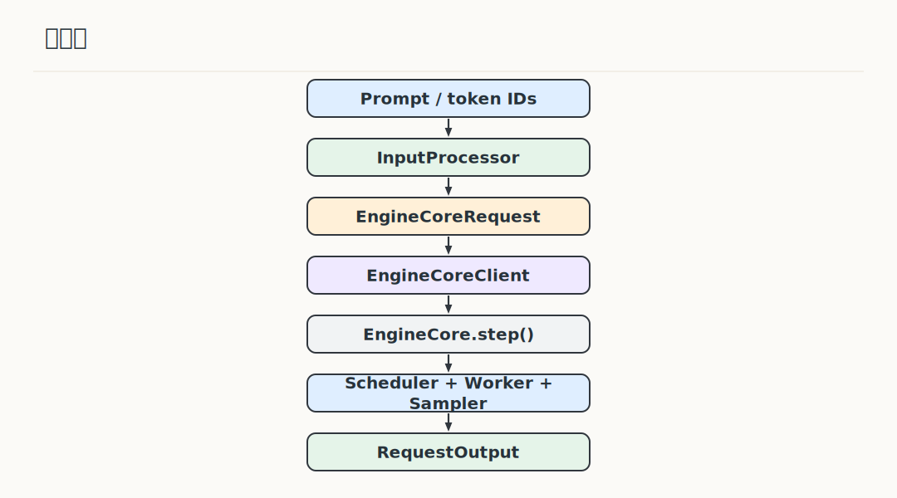</a>

<p class='figure-caption'>请求流从公开的 `generate()` 调用下沉到一次 engine 输出，再作为 `RequestOutput` 返回。</p>

### engine 就是四个函数

在看任何代码之前，先固定术语。架构概览把 engine 描述为四个核心函数，而这正是整个系列的主线（[arch](https://docs.vllm.ai/en/stable/design/arch_overview/)）：

> “Input Processing… Scheduling: ‘Chooses which requests are processed in each step’… Model Execution: ‘Manages the execution of the language model’… Output Processing: ‘Processes the outputs generated by the model, decoding the token IDs’。”

**逐步阅读。** *Input processing* 将原始 prompt 转换成 engine 形态的 request——包括 tokenization、多模态预处理、参数最终化（§3）。*Scheduling* 在每个 step 决定哪些 request 运行，以及每个 request 获得多少 token（§7；深挖文章 05）。*Model execution* 在 GPU 上执行 forward pass 并产生 logits（§8–§9；文章 08–09）。*Output processing* 将 token ID 解码回用户可见的文本（§10；文章 04）。后续每篇深挖文章，都是对这四个函数之一的放大观察，而它们之间的连接组织，正是文章 01 要命名清楚的内容。

**这种框架带来的心智模型。** 本系列采用官方架构概览中的四项核心职责——input processing、scheduling、model execution、output processing——作为组织框架（transport、cache 管理、可观测性等横切关注点会在出现时单独讨论）。当你后面遇到 prefix-cache hasher、CUDA-graph replayer，或 async output handler 时，你都可以把它们放到这些标题之一下面，并知道它们位于哪条边界之后。这个心智模型在你阅读任何一个 kernel 之前就已经稳定了。

### 这四个函数是一笔反复执行的事务

下面这个想法会重组一切。四个函数并不是一个请求只穿过一次的 pipeline。其中三个——schedule、execute、process——构成了 engine 反复执行的一笔*事务*，每个 “step” 执行一次，每一轮将 in-flight request 推进若干 token，直到每个 request 完成。这不是比喻。它字面上就是某个方法的方法体。

[`vllm/v1/engine/core.py:479-508`](https://github.com/halfrost/vllm/blob/6cf7b26bd4bff60bf378e1af14044280ac0d214c/vllm/v1/engine/core.py#L479-L508)（摘录；§6 会完整引用该方法）：

```python
    def step(self) -> tuple[dict[int, EngineCoreOutputs], bool]:
        """Schedule, execute, and make output.

        Returns tuple of outputs and a flag indicating whether the model
        was executed.
        """
        ...
        scheduler_output = self.scheduler.schedule(self._should_throttle_prefills())
        future = self.model_executor.execute_model(scheduler_output, non_block=True)
        ...
            model_output = future.result()
        ...
        self._process_aborts_queue()
        engine_core_outputs = self.scheduler.update_from_output(
            scheduler_output, model_output
        )
        ...
```

<a href='images/vllm-01-11-step-progression.svg' target='_blank'>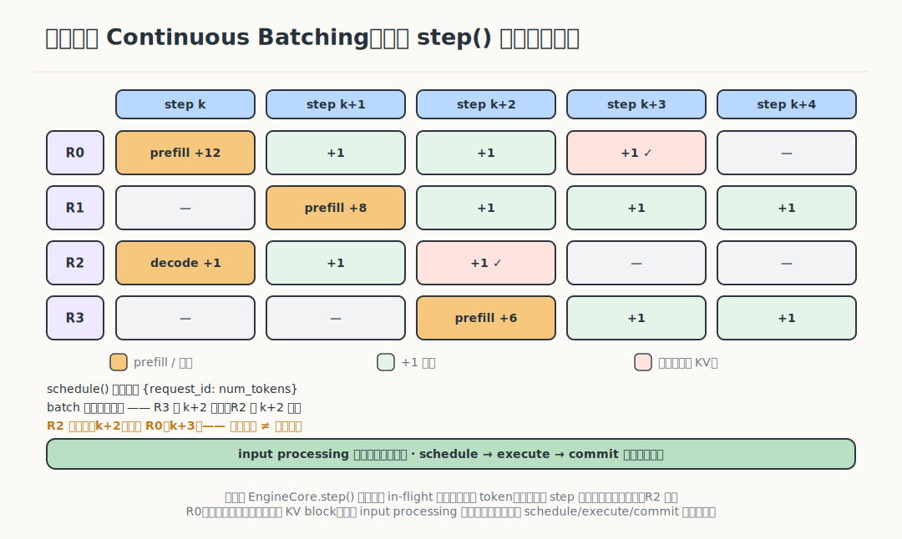</a>

<p class='figure-caption'>运行中的 continuous batching：每一次 `EngineCore.step()` 都把 in-flight 请求推进若干 token，请求在各个 step 之间独立进入与完成——四个函数中的三个（schedule、execute、commit）每个 step 重复一次，而 input processing 只在最前面运行一次。</p>

**逐步阅读。** 这个 docstring——“Schedule, execute, and make output”——用四个词概括了整个架构。`schedule()` 决定*哪些请求各生成多少 token*，且不触碰 GPU；`execute_model(..., non_block=True)` 发起 forward pass 并返回一个 `Future`，因此 CPU 可以在 *GPU 计算的同时*构建 grammar bitmask；`future.result()` 是同步点（如果执行阶段延迟了采样，则会通过单独的 `sample_tokens` 调用来运行采样）；`_process_aborts_queue()` 会在提交之前消费任何在本帧中途到达的取消请求，因此在该 step 期间被取消的请求绝不会被推进；而 `update_from_output` 会把采样得到的 token 折叠进请求进度，并释放所有已完成请求占用的 block。这些调用——再加上方法开头的空调度器保护逻辑，它会统计已完成但尚未 flush 的请求，从而让循环干净地排空——构成一个事务。§6 负责逐行讲解（其中：第 05 篇负责 `schedule()`，第 08–09 篇负责 `execute_model`，第 10 篇负责采样，第 04 篇负责循环机制）。第 01 篇的任务只是确立：这个事务*就是*引擎。

**它所保护的不变量。** vLLM 中的每一个公开接口——离线的 `LLM.generate`、OpenAI 兼容服务器、异步的 `AsyncLLM.generate`——都是一个很薄的适配层，其唯一职责就是把工作汇入这个事务，并把其输出适配回去。`generate()` 不会调度 token、分配 KV block 或运行 kernel；它验证输入、分配 request ID，并排空一个运行着这一精确循环的引擎。一旦把 `step()` 内化，所有入口点的形态都会变得可预测：它们都归约为“添加一个请求，然后拉取输出直到完成”。

### 路径是一串所有权边界

因为引擎就是包在适配器里的一个小事务，所以请求路径可以读作一串*所有权边界*，每个边界都保护一个不变量。公开 API 负责验证、默认值填充以及恢复输入顺序。输入处理器负责把 prompt 转换成一个自持有、默认值已完全填充的 wire struct。引擎客户端负责提供与传输无关的接口。`EngineCore` 负责 schedule/execute/commit 事务——但会把所有生命周期状态（哪些请求在等待、运行或已完成；谁拥有哪些 block）委托给 scheduler。scheduler 负责 token 和内存决策；worker 负责 tensor 和 logits；sampler 负责 token ID；输出处理器负责 detokenization、stop string，以及最终的 `RequestOutput`。这些所有者之间的每一条箭头都会在后续文章中展开。预先命名它们的价值在于，当出现 bug 或功能问题时——“谁决定 `max_tokens`？”、“stop string 在哪里被检测到？”、“block 什么时候释放？”——你已经知道该打开哪个边界。

### 路径会跨进程，但跨进程是部署决策

第 01 篇必须及早面对的一个复杂点是：这些边界并不全都在同一个进程中。V1 有意把这四个函数拆到多个进程中，以便让 CPU-bound 工作（tokenization、multimodal preprocessing、detokenization、streaming）与 GPU-bound 工作重叠执行（[v1](https://vllm.ai/blog/2025-01-27-v1-alpha-release)，[arch](https://docs.vllm.ai/en/stable/design/arch_overview/)）。前端进程（`AsyncLLM`）处理 HTTP、输入处理和 streaming；`EngineCore` 进程运行 scheduler、KV cache 和执行协调；worker 运行 forward pass。对于一个四 GPU tensor-parallel 部署，具体进程数是：

> 4-GPU TP=4 部署 = **1 个 API server + 1 个 engine core + 4 个 GPU worker = 6 个进程**（[arch](https://docs.vllm.ai/en/stable/design/arch_overview/)）；在 data parallelism 下会额外添加一个 DP Coordinator 进程。

同一份配置能够一致地到达全部六个进程并不是靠运气——一个单一的 `VllmConfig` 对象会贯穿整个栈：“By encapsulating all configurations in one object, we can easily pass the configuration object around and access the configuration we need”（[arch](https://docs.vllm.ai/en/stable/design/arch_overview/)）。

下面是这层连接组织带来的收益，也是你可以把请求路径当成单进程来阅读的原因：这种拆分**不会**泄漏到请求语义中。`LLMEngine` 只持有一个指向引擎的句柄，而传输细节隐藏在它背后。

[`vllm/v1/engine/llm_engine.py:104-111`](https://github.com/halfrost/vllm/blob/6cf7b26bd4bff60bf378e1af14044280ac0d214c/vllm/v1/engine/llm_engine.py#L104-L111):

```python
        # EngineCore (gets EngineCoreRequests and gives EngineCoreOutputs)
        self.engine_core = EngineCoreClient.make_client(
            multiprocess_mode=multiprocess_mode,
            asyncio_mode=False,
            vllm_config=vllm_config,
            executor_class=executor_class,
            log_stats=self.log_stats,
        )
```

**逐步阅读。** 这段注释说明了完整契约：client “获取 `EngineCoreRequest`，并给出 `EngineCoreOutputs`”。`make_client` 会在构造时根据 `multiprocess_mode` 一次性选择具体实现：要么是一个进程内对象，直接调用 `EngineCore`；要么是一个 client，将请求通过 ZMQ socket 序列化发送给一个忙轮询的 `EngineCore` 进程。经过这一行之后，请求路径上的任何组件都不知道、也不关心拿到的是哪一种——两者的 `add_request` 和 `get_output` 签名完全相同。（有一个值得记住的修正：即便是“offline”的 `LLM`，默认也使用多进程 client，因为 `VLLM_ENABLE_V1_MULTIPROCESSING` 默认是 true；进程内路径是 opt-out，而不是默认选项。文章 03 会详细介绍传输层分叉。）

**它所保护的不变量。** 进程边界是一个*部署*决策，而不是一个*语义*决策。`EngineCore` 是一次本地方法调用，还是 socket 后面的一个进程，只会改变延迟和故障模式，而不会改变请求的含义。正因为如此，文章 01 才能把整条路径追踪成一条逻辑线程——public API → input processor → `EngineCoreRequest` → client → `EngineCore.step` → scheduler → worker → sampler → output processor → `RequestOutput`——并把真实的 ZMQ 拓扑、DP 路由和并行机制推迟到文章 03 和 11 再讲。

### 如何阅读本文其余部分

文章 01 是一张地图，而这张地图上的每一跳，都会在后续章节中被放大讲解，且不会重复。封装 `generate()` 和 OpenAI server 的入口点在文章 02；进程架构和 ZMQ 传输在 03；`EngineCore` 循环和请求生命周期在 04；scheduler（continuous batching、chunked prefill）在 05；KV cache manager 在 06，prefix caching 在 07；PagedAttention kernel 和 attention backend 在 08；worker、model runner 和 CUDA graph 在 09；sampling 和 logits processing 在 10；分布式推理在 11；speculative decoding 在 12；扩展 vLLM 在 13。先把本文从头到尾读一遍，固定整体形状和术语。然后把后续每一节都当作某个方框的图例——地图保持不变；变化的只是分辨率。

## LLM.generate(): Offline 便利层

从地图顶部（§1）开始：`LLM.generate()` 是请求路径上的第一个所有权边界，而且它刻意保持乏味。它不会调度 token，不会分配 KV block，也不会启动任何 CUDA kernel。它的全部职责，就是验证调用、实例化具体的采样参数、生成 request ID、把工作交给 engine，并阻塞直到每个结果都返回——然后恢复调用者的输入顺序。准确理解这个边界位于哪里、以及它带来了哪些不变量，才能让本文后续把其下方的一切都当作一个黑盒：消费 `EngineCoreRequest`，产出 `RequestOutput`。

离线对外接口实际上由两个文件构成。`vllm/entrypoints/llm.py` 负责验证和 engine 构造；`vllm/entrypoints/offline_utils.py` 负责 render → add → drain 这条主干。`LLM` 类本身是一个由 mixin 组装起来的 façade：

[`vllm/entrypoints/llm.py:66`](https://github.com/halfrost/vllm/blob/6cf7b26bd4bff60bf378e1af14044280ac0d214c/vllm/entrypoints/llm.py#L66)

```python
class LLM(BeamSearchOfflineMixin, PoolingOfflineMixin, OfflineInferenceMixin):
```

<a href='images/vllm-01-12-facade-method-map.svg' target='_blank'>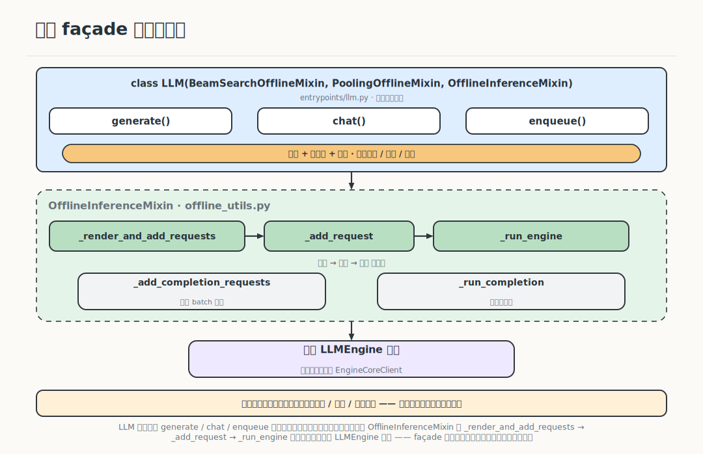</a>

<p class='figure-caption'>离线 façade 的方法归属：`LLM` 上的公开 `generate` / `chat` / `enqueue` 负责校验、填默认值与编排，委托给位于 `OfflineInferenceMixin` 的 `_render_and_add_requests → _add_request → _run_engine` 主干，其下是单个 `LLMEngine` 句柄——façade 之上不含任何调度、内存或执行逻辑。</p>

公共方法（`generate`、`chat`、`enqueue`）位于 `LLM` 上，负责校验、填默认值与编排——`enqueue` 是真的在入队：它调用 `_add_completion_requests()` 把请求推进 engine queue 并返回 request ID（[`llm.py:487-530`](https://github.com/halfrost/vllm/blob/6cf7b26bd4bff60bf378e1af14044280ac0d214c/vllm/entrypoints/llm.py#L487-L530)），`generate`/`chat` 则委托进同一条 render/add/drain 路径；“添加后再排空”（add-then-drain）机制本身位于 `offline_utils.py` 中的 `OfflineInferenceMixin`。**不变式：** 面向用户的类不包含任何调度、内存管理或执行逻辑——这些职责严格位于 façade 之下，并且每条路径（`generate`、`chat`、pooling）都会汇入同一条 `_render_and_add_requests → _add_request → _run_engine` 主干。

### Gate、default、delegate

`generate()` 包含三个动作，然后交接：

[`vllm/entrypoints/llm.py:465-485`](https://github.com/halfrost/vllm/blob/6cf7b26bd4bff60bf378e1af14044280ac0d214c/vllm/entrypoints/llm.py#L465-L485)

```python
        runner_type = self.model_config.runner_type
        if runner_type != "generate":
            raise ValueError(
                "LLM.generate() is only supported for generative models. "
                "Try passing `--runner generate` to use the model as a "
                "generative model."
            )

        if sampling_params is None:
            sampling_params = self.get_default_sampling_params()

        return self._run_completion(
            prompts=prompts,
            params=sampling_params,
            output_type=RequestOutput,
            use_tqdm=use_tqdm,
            lora_request=lora_request,
            tokenization_kwargs=tokenization_kwargs,
            priority=priority,
            mm_processor_kwargs=mm_processor_kwargs,
        )
```

按顺序来看。首先是一个 **runner-type gate**：模型必须以生成式 runner 加载，因此 pooling/embedding 模型会在这里被拒绝，此时甚至还没有任何请求对象。其次是 **默认值实体化**：如果调用方传入 `sampling_params=None`，`get_default_sampling_params()`（[`llm.py:415-420`](https://github.com/halfrost/vllm/blob/6cf7b26bd4bff60bf378e1af14044280ac0d214c/vllm/entrypoints/llm.py#L415-L420)）会拉取模型自身 `generation_config` 的 diff（`get_diff_sampling_param()`），或者回退到一个裸的 `SamplingParams()`。第三是 **委派** 给 `_run_completion`，并将 `output_type=RequestOutput` 固定为参数。

由此可以得出两个不变量。**仅限生成式** 会被执行两次——一次是上面的 gate，另一次是在排空阶段通过 `assert isinstance(output, output_type)`（见下文）执行，因此一个意外混入的 pooling 输出会触发断言，而不是静默逃逸。**委派时参数绝不会是 `None`**：下游的 render/add 路径不需要防御缺失的 `SamplingParams`。`chat()` 具有相同的形状，拥有相同的 gate 和默认值步骤；区别只在于它会先经过 chat template 渲染，再汇入这条主干——参见文章 02，了解共享该主干的入口点家族（CLI、chat 以及 OpenAI server）。

<a href='images/vllm-01-03-generate-layers.svg' target='_blank'>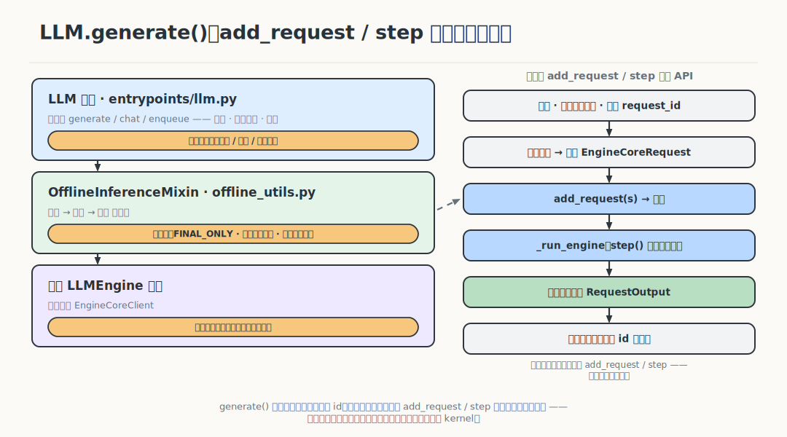</a>

<p class='figure-caption'>离线栈——`LLM` façade（validate/default/ID）位于 `OfflineInferenceMixin`（render/add/drain）之上，后者又位于单个 `LLMEngine` 句柄之上；每一层都标明了它所保护的一个不变量。</p>

### 对齐 batch，然后强制 FINAL_ONLY

`_run_completion` 分为两个阶段：先将所有内容入队，然后阻塞式排空 engine。在接纳任何单个请求之前，`_add_completion_requests` 会将四个位置参数——prompts、params、LoRA、priority——规范化为等长序列。标量广播或校验规则是其中的关键部分：

[`vllm/entrypoints/offline_utils.py:247-256`](https://github.com/halfrost/vllm/blob/6cf7b26bd4bff60bf378e1af14044280ac0d214c/vllm/entrypoints/offline_utils.py#L247-L256)

```python
        if isinstance(params, Sequence):
            if len(params) != num_requests:
                raise ValueError(
                    f"The lengths of prompts ({num_requests}) "
                    f"and params ({len(params)}) must be the same."
                )

            return params

        return [params] * num_requests
```

单个 `SamplingParams` 会广播到每个 prompt；如果传入按 prompt 列表但其长度不等于 prompt 数量，则会在添加任何 request **之前**抛出 `ValueError`。`_lora_request_to_seq` 和 `_priority_to_seq` 遵循相同的形状规则。**不变式：** 在这个代码块之后，prompts/params/LoRA/priority 是四个长度相同、按位置对齐的序列 —— 索引 `i` 始终对应 request `i`，因此某个 prompt 永远不会意外地使用相邻 prompt 的 sampling params 运行。（随后 prompts 会被*惰性*渲染：它们会作为 generator 传入 add loop，因此（在默认的多进程模式下）当引擎可能已经在处理 prompt `i` 时，prompt `i+1` 才会进行渲染；传入已物化的列表会触发一次 `warning_once`，[`offline_utils.py:504-512`](https://github.com/halfrost/vllm/blob/6cf7b26bd4bff60bf378e1af14044280ac0d214c/vllm/entrypoints/offline_utils.py#L504-L512)。）

每个对齐后的元组都会进入 `_add_request`，离线路径正是在这里打上它的两个标志性决策：

[`vllm/entrypoints/offline_utils.py:559-563`](https://github.com/halfrost/vllm/blob/6cf7b26bd4bff60bf378e1af14044280ac0d214c/vllm/entrypoints/offline_utils.py#L559-L563)

```python
        if isinstance(params, SamplingParams):
            # We only care about the final output
            params.output_kind = RequestOutputKind.FINAL_ONLY

        request_id = str(next(self.request_counter))
```

首先，**输出类型会被强制为 `FINAL_ONLY`**，覆盖调用方设置的任何值。该枚举明确给出了三种模式：

[`vllm/sampling_params.py:182-188`](https://github.com/halfrost/vllm/blob/6cf7b26bd4bff60bf378e1af14044280ac0d214c/vllm/sampling_params.py#L182-L188)

```python
class RequestOutputKind(Enum):
    # Return entire output so far in every RequestOutput
    CUMULATIVE = 0
    # Return only deltas in each RequestOutput
    DELTA = 1
    # Do not return intermediate RequestOutput
    FINAL_ONLY = 2
```

<a href='images/vllm-01-13-output-kind-matrix.svg' target='_blank'>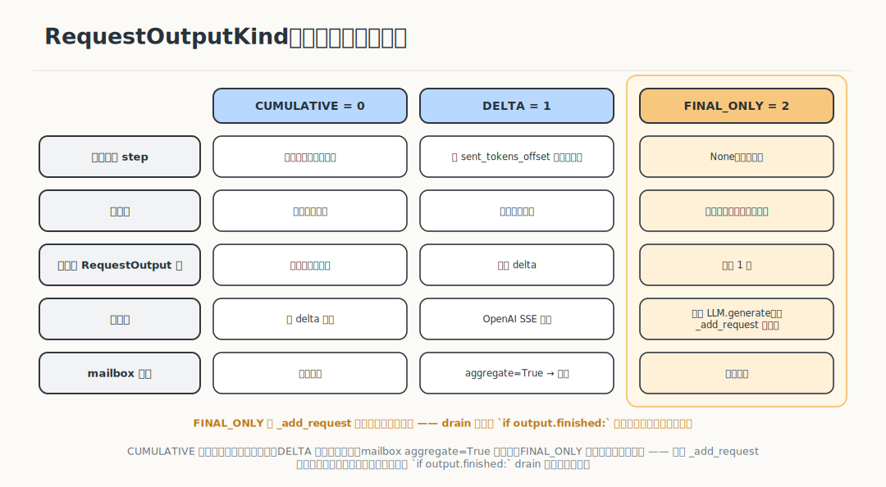</a>

<p class='figure-caption'>`RequestOutputKind` 对比：`CUMULATIVE` 重发不断增长的完整内容，`DELTA` 只发出新切片（mailbox `aggregate=True`），`FINAL_ONLY` 只在完成时产出一次输出——正是 `_add_request` 为离线批量推理强制设置的模式，也是排空循环 `if output.finished:` 所依赖的假设。</p>

离线批量推理不进行流式输出；`FINAL_ONLY` 会指示下游的 `OutputProcessor` 在某个请求完成时，仅对该请求发出一次 `RequestOutput`。请注意，这会原地修改调用方的 `SamplingParams` 对象（pooling params 并不是 `SamplingParams`，因此不会被改动）。**不变式：** 引擎只会在完成时将每个请求的输出暴露一次——这正是排空循环中的 `if output.finished:` 过滤条件所依赖的假设。

其次，**请求 ID 是单调递增的十进制字符串**，来自 `__init__` 中创建的 `Counter()`：`"0"`、`"1"`、`"2"`、……，按提交顺序分配。这个顺序正是最终排序将利用的钩子。

还有一条准入时保证包裹着这一过程：`_render_and_add_requests` 会捕获 batch 中途发生的任何异常，并在重新抛出之前（[`offline_utils.py:545-548`](https://github.com/halfrost/vllm/blob/6cf7b26bd4bff60bf378e1af14044280ac0d214c/vllm/entrypoints/offline_utils.py#L545-L548)）中止所有已经添加的请求（`abort_request(..., internal=True)`）。**不变式（原子性）：** 要么整个 batch 进入引擎，要么失败后此调用不会遗留任何请求——不会有半添加的 batch 污染排空过程。

### 阻塞式排空与输入顺序恢复

请求准入后，`generate()` 就变成了一个围绕引擎自身 step 的同步驱动循环：

[`vllm/entrypoints/offline_utils.py:594-599, 623-626`](https://github.com/halfrost/vllm/blob/6cf7b26bd4bff60bf378e1af14044280ac0d214c/vllm/entrypoints/offline_utils.py#L594-L599)

```python
        while self.llm_engine.has_unfinished_requests():
            step_outputs = self.llm_engine.step()
            for output in step_outputs:
                assert isinstance(output, output_type)
                if output.finished:
                    outputs.append(output)  # type: ignore[arg-type]
        ...
        # Sort the outputs by request ID.
        # This is necessary because some requests may be finished earlier than
        # its previous requests.
        return sorted(outputs, key=lambda x: int(x.request_id))
```

<a href='images/vllm-01-14-order-restore.svg' target='_blank'>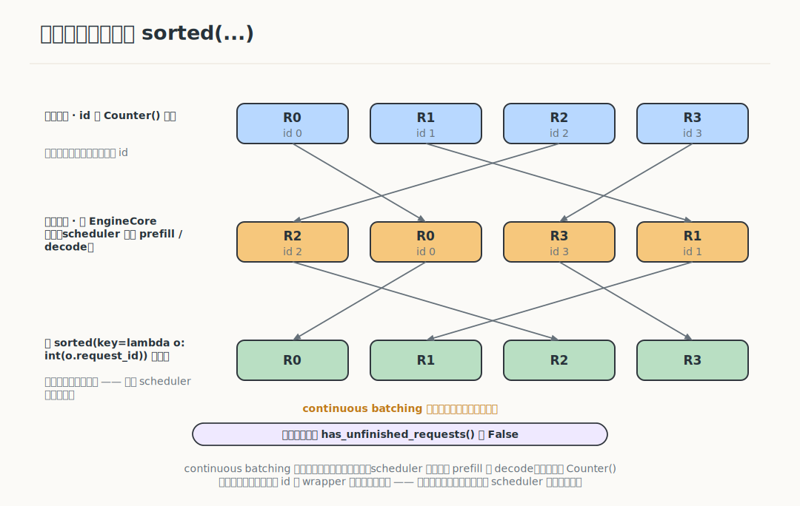</a>

<p class='figure-caption'>为什么需要末尾的 `sorted(...)`：continuous batching 允许请求不按提交顺序完成（scheduler 自由交错 prefill 与 decode），因此由 `Counter()` 生成的单调递增十进制 ID 让 wrapper 层恢复输入顺序——把“保持提交顺序”这件事挡在 scheduler 热路径之外。</p>

逐步来看：循环条件是*引擎自身*的簿记逻辑——`has_unfinished_requests()` 由输出处理器支撑（[`llm_engine.py:188-195`](https://github.com/halfrost/vllm/blob/6cf7b26bd4bff60bf378e1af14044280ac0d214c/vllm/v1/engine/llm_engine.py#L188-L195)），而不是某个局部计数器——因此刚注册的工作会立刻可见，循环会持续 step，直到没有任何未完成的请求。每次 `llm_engine.step()` 都是一次完整的 调度 → 执行 → 处理输出 周期（这个 wrapper 会在本文的 engine-step 部分介绍，它驱动的 `EngineCore` 循环则在第 04 篇文章中介绍）。`assert isinstance(output, output_type)` 是前门校验的运行时配套：当 `output_type=RequestOutput` 时，pooling 输出不可能混进来。由于 params 被强制为 `FINAL_ONLY`，`if output.finished:` 会确保每个请求只被收集一次。最后，结果会按整数 request ID 进行 `sorted` 排序。

终端的这次排序正是单调 ID 的全部意义。Continuous batching *有意*允许后提交的请求先于先提交的请求完成——scheduler 可以自由地在整个运行集合中交错执行 prefill 和 decode，而无需考虑提交顺序。[`offline_utils.py:623-625`](https://github.com/halfrost/vllm/blob/6cf7b26bd4bff60bf378e1af14044280ac0d214c/vllm/entrypoints/offline_utils.py#L623-L625) 处的注释逐字说明了其理由。**不变量：**该调用是**阻塞/同步**的（只有当引擎报告没有未完成请求时才会返回——这定义了 offline contract，与 streaming `AsyncLLM` 相对），并且**输出顺序等于输入顺序**，因为 ID 按提交顺序分配，而排序会在 wrapper 层将其恢复。顺序恢复放在这里，即便利层中，这样 scheduler 就永远不必把“保持提交顺序”当作 GPU 热路径约束来处理。第 05 篇文章会解释为什么这种自由度对吞吐量很重要。

### 一个用户请求可能变成 n 个引擎请求

该 façade 也负责守住 parallel sampling 的边界。当 `SamplingParams.n > 1` 时，`LLMEngine.add_request` 会将一个逻辑请求展开成 `n` 个子请求，每个子请求都有自己的 ID 和子 sampling params，但返回的是*父请求*的 ID：

[`vllm/v1/engine/llm_engine.py:279-292`](https://github.com/halfrost/vllm/blob/6cf7b26bd4bff60bf378e1af14044280ac0d214c/vllm/v1/engine/llm_engine.py#L279-L292)

```python
        # Fan out child requests (for n>1).
        parent_req = ParentRequest(request)
        for idx in range(n):
            request_id, child_params = parent_req.get_child_info(idx)
            child_request = request if idx == n - 1 else copy(request)
            child_request.request_id = request_id
            child_request.sampling_params = child_params

            # Make a new RequestState and queue.
            self.output_processor.add_request(
                child_request, prompt_text, parent_req, idx
            )
            # Add the request to EngineCore.
            self.engine_core.add_request(child_request)
```

每个子请求都会在*两侧*注册——输出处理器一侧（用于反 tokenization 和聚合）以及引擎核心一侧（用于调度）——而 `ParentRequest` 会把这些子请求重新合并成一个用户可见的结果。**不变式：** `n>1` 表示有 `n` 个引擎请求，但只有一个 `RequestOutput`；离线 `tqdm` 计数会预先考虑这一点，通过 `n = len(output.outputs)` 来推进进度条。子请求采样参数的派生属于第 10 篇；双侧注册属于第 04 篇。

### 这一层是什么，不是什么

有一个细微点值得明确说明："offline" 并不意味着 "in-process"。同步 `LLM` 仍然默认使用后台 `EngineCore` 进程，并通过 ZMQ 访问——这个 façade 恰好拥有一个多态的 `EngineCoreClient` 句柄，其传输方式在构造时就已固定（来自 `VLLM_ENABLE_V1_MULTIPROCESSING` 的默认值，即 `True`），并且永远不会泄漏到 `generate()` 的语义中。那些引擎边界机制——`make_client` 分叉、环境变量默认值以及 ZMQ 契约——是 §4 的主题；从便利层的视角看，引擎只是一个可以对其 `add_request` 并持续 `step()` 直到排空的东西。

因此，离线便利层保护的是一份简短而精确的列表：仅生成式输出；参数始终是具体值且绝不为 `None`；四个按位置对齐的输入序列；不支持流式输出（`FINAL_ONLY`，每个请求一个输出）；单调递增的提交顺序 ID 会进入最终排序，以恢复输入顺序；批次原子接纳；每个逻辑请求对应一个用户可见输出；以及一个单一持有的引擎句柄，其传输方式在上层不可见。`_run_completion` 之后的一切——render、scheduler、KV cache、kernel、sampler、detokenizer——都是黑盒，接下来的章节会逐一打开。

## 输入处理：Prompt 如何变成 EngineCoreRequest

上一节停在 `LLM.generate()` 将原始 prompt 向下交给引擎。位于这个公开调用和调度器真正能操作的任何内容之间的，是一个转换边界：`InputProcessor.process_inputs`。它的职责是接收*异构*用户输入——一个裸 `str`、一个 `TextPrompt`、一个预先 tokenized ID 的 `TokensPrompt`、一个预先计算好 embeddings 的 `EmbedsPrompt`、一个 encoder/decoder 对，或一个多模态 bundle——并将其折叠为一个统一的、适合传输的结构体：`EngineCoreRequest`。下游的一切（client、engine core、scheduler、worker）只理解这个结构体。本节讨论的就是这次跨越，以及它对后续每一层作出的承诺。

最重要的架构事实是这项工作在*哪里*运行。V1 有意将 tokenization、多模态预处理、detokenization 和 streaming **移出热执行循环**，从而让 CPU-bound 的准备工作与 GPU 工作重叠（[V1 blog](https://vllm.ai/blog/2025-01-27-v1-alpha-release)）。`process_inputs` 是这一拆分的前端一半。当一个请求到达 `EngineCore` 时，tokenization 已经完成，参数已经填好默认值，多模态特征也已经展平——核心循环绝不会碰 tokenizer。

<a href='images/vllm-01-04-input-to-request.svg' target='_blank'>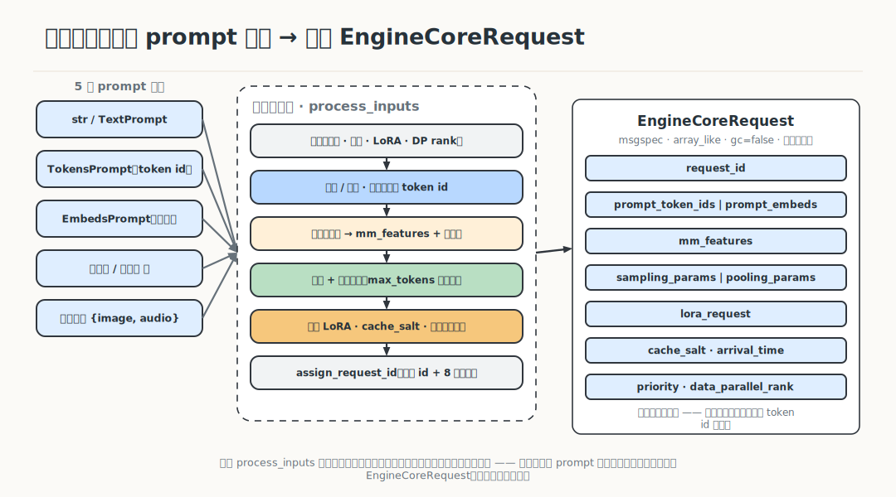</a>

<p class='figure-caption'>一次 `process_inputs` 调用会将五种 prompt 形态（text、tokens、embeds、enc/dec、multimodal）汇聚成单一的 `EngineCoreRequest` 传输结构体。</p>

### 边界及其签名

这个转换只有一个入口点。

[`vllm/v1/engine/input_processor.py:242-255`](https://github.com/halfrost/vllm/blob/6cf7b26bd4bff60bf378e1af14044280ac0d214c/vllm/v1/engine/input_processor.py#L242-L255)

```python
    def process_inputs(
        self,
        request_id: str,
        prompt: PromptType | EngineInput,
        params: SamplingParams | PoolingParams,
        supported_tasks: tuple[SupportedTask, ...],
        arrival_time: float | None = None,
        lora_request: LoRARequest | None = None,
        tokenization_kwargs: dict[str, Any] | None = None,
        trace_headers: Mapping[str, str] | None = None,
        priority: int = 0,
        data_parallel_rank: int | None = None,
        resumable: bool = False,
    ) -> EngineCoreRequest:
```

<a href='images/vllm-01-15-process-inputs-stages.svg' target='_blank'>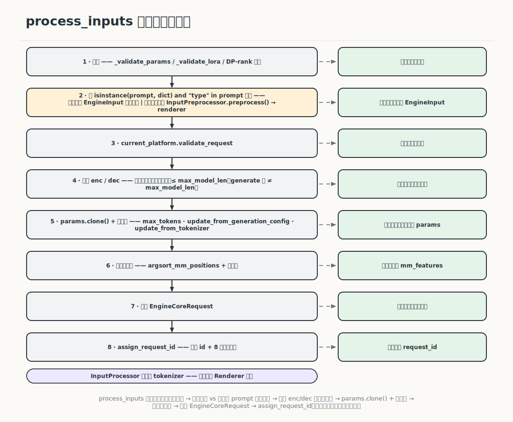</a>

<p class='figure-caption'>`process_inputs` 内部的有序流程：校验（`_validate_params` / `_validate_lora` / DP-rank 边界）→ 依 `isinstance(prompt, dict) and "type" in prompt` 分叉（已渲染的 `EngineInput` 原样接收 vs. 已弃用的 `InputPreprocessor.preprocess()`）→ 拆分 enc/dec 并校验长度 → `params.clone()` + 最终化 → 多模态展平 → 构建 `EngineCoreRequest` → `assign_request_id`，并标注每个阶段所加的不变量。</p>

此签名中的两个联合类型承载了整个设计。`prompt: PromptType | EngineInput` 表示输入可以是*原始*用户 prompt，也可以是*已经渲染好的* `EngineInput`（下面会进一步说明这个分支）。`params: SamplingParams | PoolingParams` 表示 `params` 的运行时类型会为后续整个 pipeline 选择任务族——generation 或 pooling。返回类型是固定的：无条件返回 `EngineCoreRequest`。

该方法由 `LLMEngine.add_request` 调用，后者是上一节中将输入处理与引擎边界衔接起来的接缝。

[`vllm/v1/engine/llm_engine.py:249-263`](https://github.com/halfrost/vllm/blob/6cf7b26bd4bff60bf378e1af14044280ac0d214c/vllm/v1/engine/llm_engine.py#L249-L263)

```python
        else:
            request = self.input_processor.process_inputs(
                request_id,
                prompt,
                params,
                supported_tasks=self.get_supported_tasks(),
                arrival_time=arrival_time,
                lora_request=lora_request,
                tokenization_kwargs=tokenization_kwargs,
                trace_headers=trace_headers,
                priority=priority,
            )
            prompt_text, _, _ = extract_prompt_components(self.model_config, prompt)

        self.input_processor.assign_request_id(request)
```

把它理解为一个两步交接：`process_inputs` 构建该结构体，然后 `assign_request_id` 给它打上标识（在本节末尾介绍）。只有这两步都完成后，`add_request` 才会在输出处理器和引擎核心上注册该请求。

### 校验在 tokenization 之前运行

`process_inputs` 做的第一件事是拒绝格式错误的工作，而且它会在花费一次 tokenizer pass 之前就这样做。

[`vllm/v1/engine/input_processor.py:256-267`](https://github.com/halfrost/vllm/blob/6cf7b26bd4bff60bf378e1af14044280ac0d214c/vllm/v1/engine/input_processor.py#L256-L267)

```python
        self._validate_params(params, supported_tasks)
        self._validate_lora(lora_request)

        parallel_config = self.vllm_config.parallel_config
        dp_size = parallel_config.data_parallel_size
        dp_local_size = parallel_config.data_parallel_size_local
        num_ranks = dp_local_size if parallel_config.local_engines_only else dp_size
        if data_parallel_rank is not None and not (0 <= data_parallel_rank < num_ranks):
            raise ValueError(
                f"data_parallel_rank {data_parallel_rank} "
                f"is out of range [0, {num_ranks})."
            )
```

`_validate_params` ([`input_processor.py:82-144`](https://github.com/halfrost/vllm/blob/6cf7b26bd4bff60bf378e1af14044280ac0d214c/vllm/v1/engine/input_processor.py#L82-L144)) 强制保证 task/param 的一致性：`SamplingParams` 必须与 `GENERATION_TASKS` 有交集——否则 `raise ValueError("This model does not support generation")`——而 `PoolingParams` 必须与 `POOLING_TASKS` 有交集。在此过程中它会调用 `params.verify(...)`，该调用会进行*校验*（参数不一致时抛出异常——[`sampling_params.py:736-751`](https://github.com/halfrost/vllm/blob/6cf7b26bd4bff60bf378e1af14044280ac0d214c/vllm/sampling_params.py#L736-L751) 只是分派到一系列纯 `_validate_*` 检查），但**不会**发生变更；调用方的 params 会保持不变，直到它们在 [`input_processor.py:315`](https://github.com/halfrost/vllm/blob/6cf7b26bd4bff60bf378e1af14044280ac0d214c/vllm/v1/engine/input_processor.py#L315) 被克隆，之后 finalization 只会变更该克隆。`_validate_lora` (`:146-163`) 会将未启用 `lora_config` 却发起 LoRA request 视为硬错误。上方的 DP-rank 边界检查会拒绝超出范围的 engine target。

**它所保护的不变量：** 任何 request 都不会到达 tokenization 阶段——更不用说进入 engine core——除非模型确实声明支持匹配的 task，并且 LoRA/DP 定向是合法的。廉价的拒绝会发生在 pipeline 中尽可能早的位置，并且这些检查之后无法被重新争辩，因为 engine core 只会信任它收到的 struct。

### 分叉点：rendered input 与已弃用的 raw path

下面这个关联细节常常会让第一次阅读 V1 的人感到意外：`InputProcessor` **本身并不拥有 tokenizer**。Tokenization 和 HF multimodal processor 现在位于 `Renderer` 后面，由 entrypoints 在*上游*调用（见 article 02）。`process_inputs` 更倾向于接收 renderer 已经处理完成的 input。

[`vllm/v1/engine/input_processor.py:269-296`](https://github.com/halfrost/vllm/blob/6cf7b26bd4bff60bf378e1af14044280ac0d214c/vllm/v1/engine/input_processor.py#L269-L296)

```python
        if isinstance(prompt, dict) and "type" in prompt:
            if tokenization_kwargs:
                logger.warning_once(
                    "Passing tokenization_kwargs to InputProcessor is deprecated "
                    "and will be removed in v0.18. You should instead pass "
                    "them to Renderer.render_cmpl() or Renderer.render_chat()."
                )

            if arrival_time is None:
                arrival_time = prompt.get("arrival_time", time.time())  # type: ignore[assignment]

            processed_inputs: EngineInput = prompt  # type: ignore[assignment]
        else:
            logger.warning_once(
                "Passing raw prompts to InputProcessor is deprecated "
                "and will be removed in v0.18. You should instead pass "
                "the outputs of Renderer.render_cmpl() or Renderer.render_chat()."
            )

            if arrival_time is None:
                arrival_time = time.time()

            processed_inputs = self.input_preprocessor.preprocess(
                prompt,
                tokenization_kwargs=tokenization_kwargs,
            )

        current_platform.validate_request(processed_inputs, params)
```

判别条件是 `isinstance(prompt, dict) and "type" in prompt`。携带 `"type"` key 的 dict 会被视为已经渲染好的 `EngineInput`，并被**原样**接收——这里完全不会发生 tokenization；甚至可以从该 dict 中读出 `arrival_time`。其他所有情况——裸 `str`、`TokensPrompt`、enc/dec dict——都会落到**已弃用的** `InputPreprocessor.preprocess()`，后者会再委托给 renderer 来执行实际的 tokenization（[`vllm/inputs/preprocess.py:68-88`](https://github.com/halfrost/vllm/blob/6cf7b26bd4bff60bf378e1af14044280ac0d214c/vllm/inputs/preprocess.py#L68-L88) 展示了 `_tokenize_prompt` 代理到 `self.renderer`）。两个分支最终都会汇合到 `current_platform.validate_request(...)`。

**不变式：**现代流程会在上游完成渲染（tokenize + 运行 multimodal processor），并传入一个完成态的 `EngineInput`；原始路径和内联的 `tokenization_kwargs` 仅为向后兼容而保留，并已标记为将在 v0.18 移除。无论走哪个分支，`processed_inputs` 都是带有 `"type"` 判别字段的 `EngineInput`——这是一个归一化后的形态，`process_inputs` 的其余部分可以依赖它。（关于渲染本身如何进行 tokenization 以及扩展 multimodal placeholder，请参见文章 02；关于 block hasher 后续如何消费本阶段产物，请参见文章 06 和 07。）

### 克隆并最终确定 params

在拆分 encoder/decoder 输入并校验长度和词表（`:298-309`、`:387-484`——decoder prompts 不能为空，不能超过 `max_model_len`；对于 `generate` 模型，也不能恰好等于 `max_model_len`，因为那样连一个输出 token 的空间都没有）之后，会克隆 sampling params 并进行最终确定。

[`vllm/v1/engine/input_processor.py:311-330`](https://github.com/halfrost/vllm/blob/6cf7b26bd4bff60bf378e1af14044280ac0d214c/vllm/v1/engine/input_processor.py#L311-L330)

```python
        sampling_params = None
        pooling_params = None
        if isinstance(params, SamplingParams):
            # TODO: can we avoid cloning here in multiproc case?
            sampling_params = params.clone()
            # If unset max tokens, then generate up to the max_model_len.
            if sampling_params.max_tokens is None:
                seq_len = length_from_prompt_token_ids_or_embeds(
                    prompt_token_ids, prompt_embeds
                )
                sampling_params.max_tokens = self.model_config.max_model_len - seq_len

            sampling_params.update_from_generation_config(
                self.generation_config_fields,
                self.renderer.get_eos_token_id(),
            )
            if self.tokenizer is not None:
                sampling_params.update_from_tokenizer(self.tokenizer)
        else:
            pooling_params = params.clone()
```

<a href='images/vllm-01-16-sampling-params-budget.svg' target='_blank'>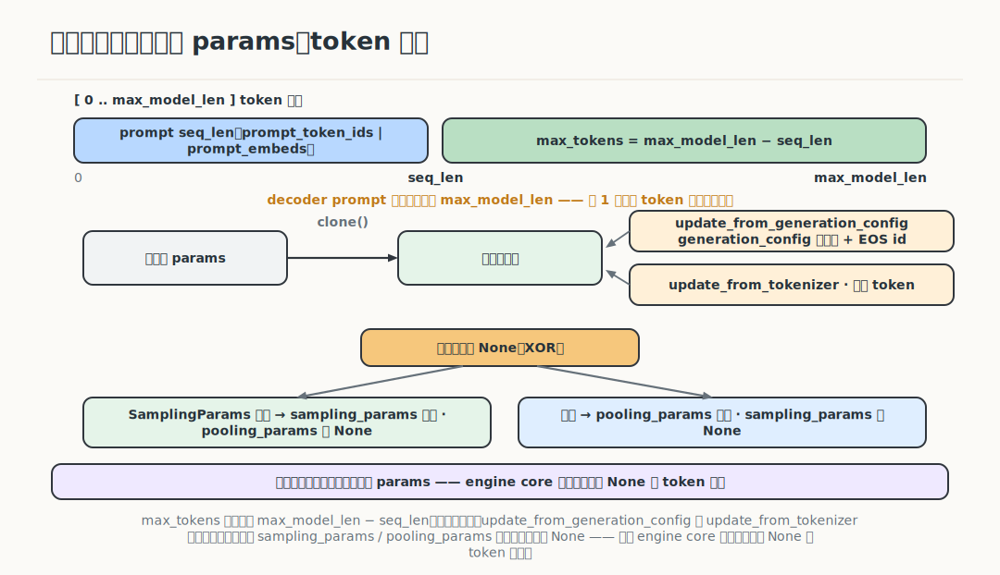</a>

<p class='figure-caption'>在克隆对象上最终化 params：`max_tokens` 默认填为 `max_model_len - seq_len`（即 `[0 .. max_model_len]` 预算条上的剩余额度），`update_from_generation_config` 与 `update_from_tokenizer` 折入模型默认值，且 `sampling_params` / `pooling_params` 恰好只有一个非 `None`——因此 engine core 永远不会看到 `None` 的 token 预算。</p>

调用方的 `params` 会被**克隆**，因此每个请求的最终化过程绝不会修改调用方可能在多个 prompt 之间复用的共享对象。随后，对于采样：未设置的 `max_tokens` 会被填充为 `max_model_len - seq_len`（即严格等于剩余预算）；模型的 `generation_config` 默认值和 EOS id 会通过 `update_from_generation_config` 合并进来；而 tokenizer 派生的停止 token 会通过 `update_from_tokenizer` 合并进来。此后，`sampling_params` / `pooling_params` 中恰好只有一个为非 `None`。

**不变式：** engine core 接收到的是一个*独占拥有、默认值已完全填充*的 params 对象。`max_tokens` 始终是具体值——scheduler 永远不需要处理 `None` token 预算，且任何下游层都不需要访问 `model_config` 或 tokenizer 来完成默认值填充。所有模型特定知识都会在这里、在前端一次性固化进去。

### 多模态展平与双重哈希

多模态输入按 modality 作为键传入（`{"image": [...], "audio": [...]}`）。这一阶段会将它们展平成一个按序列顺序排列的单一列表。

[`vllm/v1/engine/input_processor.py:354-368`](https://github.com/halfrost/vllm/blob/6cf7b26bd4bff60bf378e1af14044280ac0d214c/vllm/v1/engine/input_processor.py#L354-L368)

```python
            mm_features = []
            for modality, idx in sorted_mm_idxs:
                base_mm_hash = decoder_mm_hashes[modality][idx]
                mm_features.append(
                    MultiModalFeatureSpec(
                        data=decoder_mm_inputs[modality][idx],
                        modality=modality,
                        identifier=self._get_mm_identifier(
                            base_mm_hash,
                            lora_request,
                        ),
                        mm_position=decoder_mm_positions[modality][idx],
                        mm_hash=base_mm_hash,
                    )
                )
```

<a href='images/vllm-01-17-mm-dual-hash.svg' target='_blank'>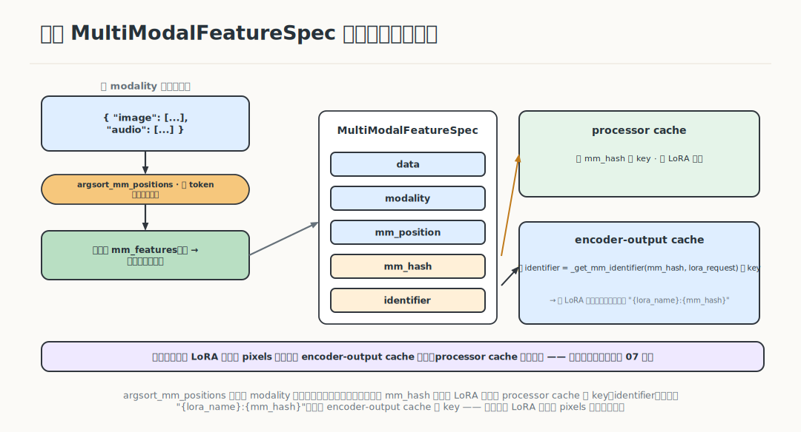</a>

<p class='figure-caption'>每个 `MultiModalFeatureSpec` 中的多模态双重哈希：`argsort_mm_positions` 先把按 modality 组织的输入展平成序列顺序，然后 `mm_hash` 作为与 LoRA 无关的 processor cache 的 key，`identifier`（`_get_mm_identifier`，可能为 `"{lora_name}:{mm_hash}"`）作为 encoder-output cache 的 key——因此不同 LoRA 下相同 pixels 绝不会冲突。</p>

`argsort_mm_positions`（在 `:352` 处刚刚调用）会按 token 序列中的偏移量对条目排序，因此 `mm_features` 是一个跨所有 modality 从左到右读取的扁平列表。每个 `MultiModalFeatureSpec` 都携带一个**双重 hash**：`mm_hash`（原始的、与 LoRA 无关的 hash，用于作为 *processor* cache 的 key）和 `identifier`（用于作为 *encoder-output* cache 的 key；当 LoRA 可能改变 vision embeddings 时，它可能会带上 LoRA 前缀，形如 `"{lora_name}:{mm_hash}"` —— 参见 `_get_mm_identifier`，`:165-181`）。

**不变量：** 两个 pixels 完全相同但 LoRA 不同的请求，绝不会在 encoder-output cache 中发生冲突；而与 LoRA 无关的 processor cache 仍然保持共享。这属于 prefix-cache 正确性的范畴；第 07 篇会讲 `mm_hash`、LoRA 名称和 `cache_salt` 如何成为 block-hash 的额外 key。第 01 篇的结论更窄：输入处理阶段只是这些 cache key 被**铸造**出来的地方，而不是它们被消费的地方。

### 输出：无 GC 的传输结构体

所有内容最终汇聚到一个构造函数。

[`vllm/v1/engine/input_processor.py:370-385`](https://github.com/halfrost/vllm/blob/6cf7b26bd4bff60bf378e1af14044280ac0d214c/vllm/v1/engine/input_processor.py#L370-L385)

```python
        return EngineCoreRequest(
            request_id=request_id,
            prompt_token_ids=prompt_token_ids,
            prompt_embeds=prompt_embeds,
            prompt_is_token_ids=prompt_is_token_ids,
            mm_features=mm_features,
            sampling_params=sampling_params,
            pooling_params=pooling_params,
            arrival_time=arrival_time,
            lora_request=lora_request,
            cache_salt=decoder_inputs.get("cache_salt"),
            priority=priority,
            data_parallel_rank=data_parallel_rank,
            trace_headers=trace_headers,
            resumable=resumable,
        )
```

注意 `cache_salt=decoder_inputs.get("cache_salt")`——该 salt 会原样穿过 `process_inputs`，仅在之后作为**仅首个 block 使用**的 prefix-cache 命名空间标签被消费（文章 07）。它构造的结构体是刻意设计成适合在线路上传输的形态。

[`vllm/v1/engine/__init__.py:88-102`](https://github.com/halfrost/vllm/blob/6cf7b26bd4bff60bf378e1af14044280ac0d214c/vllm/v1/engine/__init__.py#L88-L102)

```python
class EngineCoreRequest(
    msgspec.Struct,
    array_like=True,  # type: ignore[call-arg]
    omit_defaults=True,  # type: ignore[call-arg]
    gc=False,
):  # type: ignore[call-arg]
    request_id: str
    prompt_token_ids: list[int] | None
    mm_features: list[MultiModalFeatureSpec] | None
    sampling_params: SamplingParams | None
    pooling_params: PoolingParams | None
    arrival_time: float
    lora_request: LoRARequest | None
    cache_salt: str | None
    data_parallel_rank: int | None
```

这三个 `msgspec.Struct` 选项才是关键。`array_like=True` 会按位置序列化字段（没有字段名开销）；`omit_defaults=True` 会在线路上传输时跳过取默认值的字段；`gc=False` 让该 struct 不参与 Python 的循环垃圾回收。这些选择之所以重要，是因为该 struct 会被*序列化并通过 ZMQ socket 发送*到后台 `EngineCore` 进程（默认的多进程路径）——也就是上一节的 `SyncMPClient`/`AsyncMPClient` 所依托的传输层（拓扑见第 03 篇，解码它的循环见第 04 篇）。`.params` 属性（[`__init__.py:139-145`](https://github.com/halfrost/vllm/blob/6cf7b26bd4bff60bf378e1af14044280ac0d214c/vllm/v1/engine/__init__.py#L139-L145)）会返回两者中被设置的那个（优先 `sampling_params`），并断言至少存在一个；“二者绝不同时存在”的不变量是在构造时保证的（[`input_processor.py:311-330`](https://github.com/halfrost/vllm/blob/6cf7b26bd4bff60bf378e1af14044280ac0d214c/vllm/v1/engine/input_processor.py#L311-L330)，只会有一个分支执行），而不是由该属性保证的。

**不变量：** `sampling_params` 和 `pooling_params` 绝不会同时设置；`arrival_time` 在每个分支都会被填充（因此其非可选的 `float` 类型成立）；并且该 struct 的序列化成本很低。用户输入的异构性——五种 prompt 形态、可选的多模态、可选的 LoRA——已经消失。下游代码只需基于 `sampling_params is not None` 分支，并读取一个扁平的 token ID 列表，除此之外别无其他。

### 最终盖章：request-id 随机化

`process_inputs` 返回后，回到 `add_request` 中，请求会在注册前被打上标记（即上文 [`llm_engine.py:263`](https://github.com/halfrost/vllm/blob/6cf7b26bd4bff60bf378e1af14044280ac0d214c/vllm/v1/engine/llm_engine.py#L263) 处的 `assign_request_id` 调用）。

[`vllm/v1/engine/input_processor.py:222-240`](https://github.com/halfrost/vllm/blob/6cf7b26bd4bff60bf378e1af14044280ac0d214c/vllm/v1/engine/input_processor.py#L222-L240)

```python
    @staticmethod
    def assign_request_id(request: EngineCoreRequest):
        """Replace the externally supplied request ID with an internal request ID
        that adds 8 random characters in order to ensure uniqueness.
        """
        if request.external_req_id is not None:
            raise ValueError(
                "The external_req_id field should not be set on EngineCoreRequests"
                " passed to vLLM; use the request_id field."
            )
        request.external_req_id = request.request_id
        if envs.VLLM_DISABLE_REQUEST_ID_RANDOMIZATION:
            logger.warning_once(...)
        else:
            request.request_id = f"{request.external_req_id}-{random_uuid():.8}"
```

调用方提供的 id 会保留在 `external_req_id` 中，而 `request_id` 会变成 `"{external}-{8 random chars}"`。

**不变量：**即使调用方提交了重复的外部 id，内部 `request_id` 在每次准入时也几乎必然唯一（8 个随机字符只是被追加，并不会与现有 id 查重）；同时，外部 id 会保留下来，用于输出以及 `abort(req_id, internal=False)`。`external_req_id` 必须未设置的保护逻辑会防止二次盖章。当结果返回时（输出处理部分），用户看到的是*外部* id——绝不会是随机化后的内部 id。

### 这个边界为后续路径带来了什么

输入处理是一个漏斗，并且在入口处提供了保证。上游的 prompt 形态各异，参数只指定了一部分，多模态数据按 modality 作为 key 组织。下游——client、engine core、scheduler、worker——每一层接收到的都是一个统一的 `EngineCoreRequest`：它已根据模型的任务进行校验，携带扁平的 token 列表（或 embeds），拥有一个已完全补齐默认值且归自己所有的 params 对象，多模态特征按序列顺序排列且其 cache key 已经生成，并且请求体已具备可跨进程边界传输的 wire 形态。scheduler 从不进行 tokenization；worker 从不为 `max_tokens` 补默认值；engine core 从不检查 `model_config` 来补完一个 request。这正是 V1 能在前端运行这个阶段并将其与 GPU 工作重叠的根本原因——也正是为什么下一节的 engine 边界可以把 `add_request` 视为移动一个已经完成的对象，而不是执行任何真正的工作。

## Engine 边界：进程内与多进程 Client

前几节跟踪了一个 prompt，直到它变成 `EngineCoreRequest`——一个紧凑的 wire struct，已准备好进入调度。现在它必须到达负责调度它的对象。这个对象 `EngineCore` 可能与 `LLM.generate()` 位于同一个 Python 进程中，也可能位于 ZMQ socket 另一端的后台进程中，或者是多个数据并行 engine 之一、各自运行在自己的进程中。V1 的关键设计事实是：前端代码无法分辨这些差异。它持有同一个句柄，调用相同的方法，而传输方式只在构造时决定一次，之后不再变化。本节讨论的就是这个接缝：这个单一句柄是什么，factory 如何分叉出不同实现，实际跨越边界的是什么，以及那个将部署拓扑从 request 语义中隔离出来的不变量。

### 一个句柄，只选择一次

`LLMEngine`——离线 `LLM` 路径使用的同步 engine——只拥有一个通向调度与执行的 channel。它在构造函数中创建，并被类型标注为抽象 client，而不是某种具体 transport。

[`vllm/v1/engine/llm_engine.py:104-111`](https://github.com/halfrost/vllm/blob/6cf7b26bd4bff60bf378e1af14044280ac0d214c/vllm/v1/engine/llm_engine.py#L104-L111)

```python
        # EngineCore (gets EngineCoreRequests and gives EngineCoreOutputs)
        self.engine_core = EngineCoreClient.make_client(
            multiprocess_mode=multiprocess_mode,
            asyncio_mode=False,
            vllm_config=vllm_config,
            executor_class=executor_class,
            log_stats=self.log_stats,
        )
```

仔细读一下。`self.engine_core` 是 `LLMEngine` 触达 scheduler、KV cache 和 GPU 的*唯一*方式。每一个 public operation —— `add_request`、`step`、`abort_request`、`sleep`、`add_lora`、`collective_rpc` —— 最终都会转发到这个字段上同名的方法。`asyncio_mode=False` 是硬编码的，因为同步版 `LLMEngine` 从不使用 asyncio client；在线路径（`AsyncLLM`）才会传入 `True`。唯一的自由变量是 `multiprocess_mode`，它从一个 classmethod 构造函数流入：

[`vllm/v1/engine/llm_engine.py:157`](https://github.com/halfrost/vllm/blob/6cf7b26bd4bff60bf378e1af14044280ac0d214c/vllm/v1/engine/llm_engine.py#L157)

```python
            multiprocess_mode=envs.VLLM_ENABLE_V1_MULTIPROCESSING,
```

**不变式。** 前端依赖的是一个*接口*，而不是某种传输方式。引擎是在进程内还是跨 socket，是构造时的决策，绝不会向下游泄漏。`add_request`、`step` 或输出路径中没有任何逻辑会基于 `multiprocess_mode` 分支——对 `self.engine_core` 的多态派发吸收了全部差异。

这个抽象中只有一个刻意留下的缺口，而且它是受保护的：

[`vllm/v1/engine/llm_engine.py:123-125`](https://github.com/halfrost/vllm/blob/6cf7b26bd4bff60bf378e1af14044280ac0d214c/vllm/v1/engine/llm_engine.py#L123-L125)

```python
        if not multiprocess_mode:
            # for v0 compatibility
            self.model_executor = self.engine_core.engine_core.model_executor  # type: ignore
```

双跳 `self.engine_core.engine_core` 会穿过 *client*（`InprocClient`）访问它持有的真正 `EngineCore` 对象，然后再访问其 `model_executor`。这之所以行得通，是因为进程内模式保证有一个可访问的本地存活对象。在多进程模式下，本地并不存在 `EngineCore`——它运行在另一个进程中——因此会跳过该分支。这是“例外证明规则”的情况：代码中唯一直接触碰 engine 的地方，被 `if not multiprocess_mode` 保护起来。

### 工厂是分叉点

三种传输方式都隐藏在同一个抽象基类之后，而 `make_client` 则根据两个布尔值选择拓扑结构。

[`vllm/v1/engine/core_client.py:82-105`](https://github.com/halfrost/vllm/blob/6cf7b26bd4bff60bf378e1af14044280ac0d214c/vllm/v1/engine/core_client.py#L82-L105)

```python
    @staticmethod
    def make_client(
        multiprocess_mode: bool,
        asyncio_mode: bool,
        vllm_config: VllmConfig,
        executor_class: type[Executor],
        log_stats: bool,
    ) -> "EngineCoreClient":
        # TODO: support this for debugging purposes.
        if asyncio_mode and not multiprocess_mode:
            raise NotImplementedError(
                "Running EngineCore in asyncio without multiprocessing "
                "is not currently supported."
            )

        if multiprocess_mode and asyncio_mode:
            return EngineCoreClient.make_async_mp_client(
                vllm_config, executor_class, log_stats
            )

        if multiprocess_mode and not asyncio_mode:
            return SyncMPClient(vllm_config, executor_class, log_stats)

        return InprocClient(vllm_config, executor_class, log_stats)
```

<a href='images/vllm-01-18-make-client-fork.svg' target='_blank'>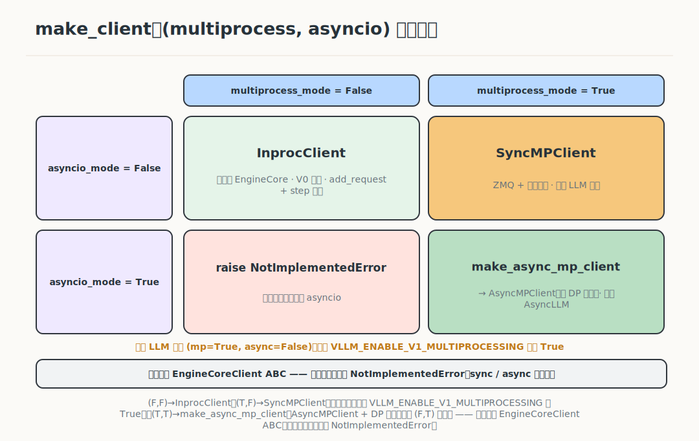</a>

<p class='figure-caption'>`make_client` 作为 `(multiprocess_mode, asyncio_mode)` 的真值表：`(F,F)`→`InprocClient`，`(T,F)`→`SyncMPClient`（离线默认，因为 `VLLM_ENABLE_V1_MULTIPROCESSING` 为 `True`），`(T,T)`→`make_async_mp_client`（`AsyncMPClient` 及其 DP 变体），而 `(F,T)` 被拒绝——三者共享 `EngineCoreClient` ABC，其基类方法体会抛出 `NotImplementedError`。</p>

四种组合，三种结果：`(mp=False, async=False)` → `InprocClient`；`(mp=True, async=False)` → `SyncMPClient`（多进程离线路径）；`(mp=True, async=True)` → 异步系列（`AsyncMPClient` 及其 DP 变体，即在线服务器路径）；而 `(mp=False, async=True)` 会被明确拒绝——你不能在 asyncio 下以进程内方式运行引擎。基类上的 docstring 在一个地方说明了这一约定：

[`vllm/v1/engine/core_client.py:71-80`](https://github.com/halfrost/vllm/blob/6cf7b26bd4bff60bf378e1af14044280ac0d214c/vllm/v1/engine/core_client.py#L71-L80)

```python
class EngineCoreClient(ABC):
    """
    EngineCoreClient: subclasses handle different methods for pushing
        and pulling from the EngineCore for asyncio / multiprocessing.

    Subclasses:
    * InprocClient: In process EngineCore (for V0-style LLMEngine use)
    * SyncMPClient: ZMQ + background proc EngineCore (for LLM)
    * AsyncMPClient: ZMQ + background proc EngineCore w/ asyncio (for AsyncLLM)
    """
```

**不变式。** ABC 声明了每一个操作——同步操作及其 `_async` 镜像——而基类方法体会抛出 `NotImplementedError`。因此，前端调用的任何方法都*必须*针对每种 transport 显式实现；不存在可能在边界两侧表现不同的静默 fallthrough。同步和异步两组接口在命名上互为镜像（`add_request`/`add_request_async`、`get_output`/`get_output_async`、`abort_requests`/`abort_requests_async`），这使得离线和在线前端可以共享同一个心智模型。

### 离线默认是多进程，而不是进程内

很容易以为离线 `LLM` 会在进程内运行 engine——毕竟并没有 HTTP server。但事实并非如此。回顾一下，构造函数默认值来自 `envs.VLLM_ENABLE_V1_MULTIPROCESSING`，而这个环境变量默认是 `True`：

[`vllm/envs.py:147`](https://github.com/halfrost/vllm/blob/6cf7b26bd4bff60bf378e1af14044280ac0d214c/vllm/envs.py#L147)

```python
    VLLM_ENABLE_V1_MULTIPROCESSING: bool = True
```

[`vllm/envs.py:1311-1313`](https://github.com/halfrost/vllm/blob/6cf7b26bd4bff60bf378e1af14044280ac0d214c/vllm/envs.py#L1311-L1313)

```python
    "VLLM_ENABLE_V1_MULTIPROCESSING": lambda: bool(
        int(os.getenv("VLLM_ENABLE_V1_MULTIPROCESSING", "1"))
    ),
```

因此，即便是一个普通的 `LLM(model=...).generate(...)` 脚本，也会得到 `multiprocess_mode=True` → `SyncMPClient`，这意味着会通过 ZMQ 访问一个后台 `EngineCore` 进程。只有当用户设置 `VLLM_ENABLE_V1_MULTIPROCESSING=0` 时，才会使用 `InprocClient`。（`LLMEngine.__init__` 上那个裸露的 `multiprocess_mode: bool = False` 默认值只是个干扰项——类方法构造器 `from_vllm_config`/`from_engine_args` 总是会用环境变量值覆盖它。）实际后果是：vLLM V1 中的 “offline” 默认仍会运行两个进程和一个 socket，这也解释了为什么下面这些边界机制即便对批处理脚本也处在热路径上，以及为什么引擎侧请求流水线化（grammar 编译与 GPU 工作重叠）即使在 offline 场景中也很重要。

<a href='images/vllm-01-05-engine-boundary.svg' target='_blank'>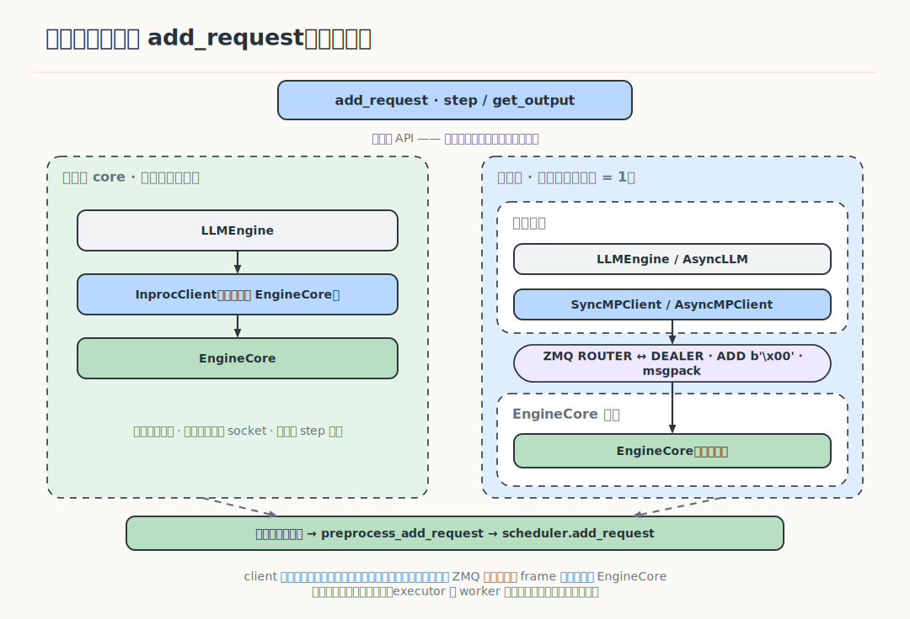</a>

<p class='figure-caption'>一次 `add_request` 调用，两种实现：内联方法调用（InprocClient）与在引擎 IO 线程上解码的序列化 ROUTER 帧（SyncMPClient），最终汇合到同一对 `preprocess_add_request → scheduler.add_request`。</p>

### InprocClient：边界塌缩为一次方法调用

当引擎位于进程内时，这个 “client” 只是一个很薄的外壳，它*拥有*一个真正的 `EngineCore` 并直接调用它——没有序列化、没有 socket、也没有 busy loop。

[`vllm/v1/engine/core_client.py:289-299`](https://github.com/halfrost/vllm/blob/6cf7b26bd4bff60bf378e1af14044280ac0d214c/vllm/v1/engine/core_client.py#L289-L299)

```python
    def get_output(self) -> EngineCoreOutputs:
        outputs, model_executed = self.engine_core.step_fn()
        self.engine_core.post_step(model_executed=model_executed)
        return outputs and outputs.get(0) or EngineCoreOutputs()

    def get_supported_tasks(self) -> tuple[SupportedTask, ...]:
        return self.engine_core.get_supported_tasks()

    def add_request(self, request: EngineCoreRequest) -> None:
        req, request_wave = self.engine_core.preprocess_add_request(request)
        self.engine_core.add_request(req, request_wave)
```

会得出两点。首先，`add_request` 恰好是在调用方线程上的两次内联调用：`preprocess_add_request` 将传输格式的 `EngineCoreRequest` 转换为内部的 `Request`（对其进行 block 哈希并初始化 grammar），而 `add_request` 则将该 `Request` 交给 scheduler。其次，`get_output` 会*驱动*引擎前进一步：`step_fn` 是引擎自身的 `step`（在 pipeline parallelism 下则是 `step_with_batch_queue`），因此在进程内模式下，前端的 `step()` 调用实际上*就是*引擎的 step——并不存在另一个独立的循环在推进任何东西。`outputs.get(0)` 选择引擎索引 0，是因为在进程内模式下只有一个引擎。这就是 docstring 中 “V0-style” 的含义：单线程、阻塞式 `add_request`/`step`，准入与执行串行化，没有并发。

### SyncMPClient：同一个调用，被序列化为自描述帧

在多进程模式下，同一个 `add_request` 会变成一次 serialize-and-send。*request* 本身没有变化；变化的只是它的投递方式。

[`vllm/v1/engine/core_client.py:886-889`](https://github.com/halfrost/vllm/blob/6cf7b26bd4bff60bf378e1af14044280ac0d214c/vllm/v1/engine/core_client.py#L886-L889)

```python
    def add_request(self, request: EngineCoreRequest) -> None:
        if self.is_dp:
            self.engines_running = True
        self._send_input(EngineCoreRequestType.ADD, request)
```

[`vllm/v1/engine/core_client.py:861-873`](https://github.com/halfrost/vllm/blob/6cf7b26bd4bff60bf378e1af14044280ac0d214c/vllm/v1/engine/core_client.py#L861-L873)

```python
    def _send_input(self, request_type: EngineCoreRequestType, request: Any):
        self.ensure_alive()
        self.free_pending_messages()
        # (Identity, RequestType, SerializedRequest)
        msg = (self.core_engine, request_type.value, *self.encoder.encode(request))

        if len(msg) <= 3:
            # No auxiliary buffers => no tensor backing buffers in request.
            self.input_socket.send_multipart(msg, copy=False)
            return

        tracker = self.input_socket.send_multipart(msg, copy=False, track=True)
        self.add_pending_message(tracker, request)
```

<a href='images/vllm-01-19-zmq-frame.svg' target='_blank'>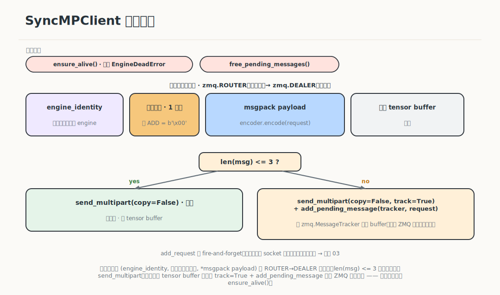</a>

<p class='figure-caption'>`SyncMPClient` 的线上帧：一个有序多部分消息 `(engine_identity, 单字节类型标签, *msgpack payload)`，在 `zmq.ROUTER` 上发往 engine 的 `zmq.DEALER`；当 `len(msg) <= 3` 时是普通的零拷贝 `send_multipart`，否则带外 tensor buffer 会触发 `track=True` + `add_pending_message`，保留引用直到 ZMQ 发送完成——整个过程前置 `ensure_alive()`。</p>

线上的消息是一个有序的、自描述的多部分帧：`(engine_identity, one-byte type tag, *msgpack payload)`。identity 帧用于寻址某个特定 engine（在数据并行下存在多个 engine 时至关重要）；type 字节让接收端无需 schema 协商即可进行 demux；载荷是 `msgspec` msgpack。这里出现了三项真实的记账工作，而这些在 `InprocClient` 中是“免费”获得的：如果被监控的 engine 进程已经死亡，`ensure_alive()` 会抛出 `EngineDeadError`（因此这个边界承载的是存活性，而不仅仅是数据）；`len(msg) <= 3` 分支是零拷贝张量安全机制——如果编码后的请求携带了带外 tensor buffer（多模态场景），client 必须通过 `zmq.MessageTracker` *保留一个引用*，直到 ZMQ 完成对底层内存的发送，否则该内存可能会在发送过程中被释放；而 `add_request` 是 fire-and-forget——它在发送完成后即返回，输出会在另一个 socket 上异步返回。`self.input_socket` 是 client 绑定的 `zmq.ROUTER`；engine 连接的是 `zmq.DEALER`，这也是 identity 帧位于最前面的原因。更深层的 socket 拓扑——这些 socket 如何连线、DP coordinator、负载均衡路由、必须记住每个 in-flight request 由哪个 engine 持有的 abort 路由——是 **article 03** 的主题；这里我们只需要关注 client contract。

### 线上词汇表只有一个字节

该边界协议是一个很小的 tagged union。每种请求类型都是单个十六进制字节，因此编码进帧几乎没有成本。

[`vllm/v1/engine/__init__.py:251-264`](https://github.com/halfrost/vllm/blob/6cf7b26bd4bff60bf378e1af14044280ac0d214c/vllm/v1/engine/__init__.py#L251-L264)

```python
class EngineCoreRequestType(enum.Enum):
    """
    Request types defined as hex byte strings, so it can be sent over sockets
    without separate encoding step.
    """

    ADD = b"\x00"
    ABORT = b"\x01"
    START_DP_WAVE = b"\x02"
    UTILITY = b"\x03"
    # Sentinel used within EngineCoreProc.
    EXECUTOR_FAILED = b"\x04"
    # Sentinel to wake up input_queue.get() during shutdown.
    WAKEUP = b"\x05"
```

<a href='images/vllm-01-20-request-type-routing.svg' target='_blank'>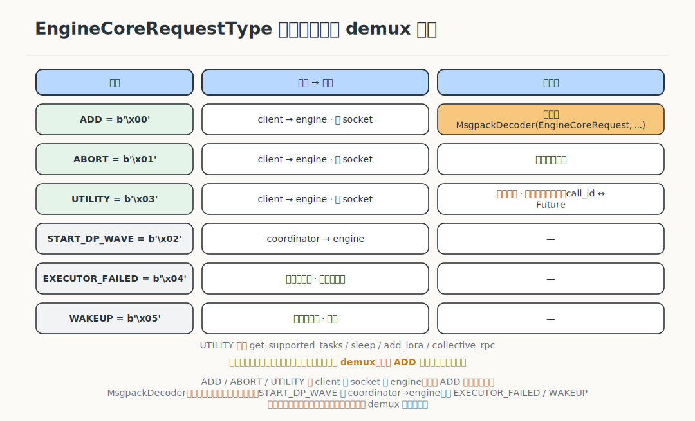</a>

<p class='figure-caption'>`EngineCoreRequestType` 路由：`ADD` / `ABORT` / `UTILITY` 从 client 跨 socket 到 engine（只有 `ADD` 使用带类型的 `MsgpackDecoder(EngineCoreRequest, ...)`，其余共享非类型化解码器），`START_DP_WAVE` 是 coordinator→engine，而 `EXECUTOR_FAILED` / `WAKEUP` 是从不走线上的进程内哨兵，但复用同一条 demux 分发路径。</p>

`ADD`、`ABORT` 和 `UTILITY` 是实际通过 socket 从客户端传输的类型；`START_DP_WAVE` 是 coordinator 到 engine 的消息；`EXECUTOR_FAILED` 和 `WAKEUP` 是推送到 engine 自身输入队列中的*进程内哨兵*，从不会通过网络发送——它们复用同一条分发路径，因此 busy loop 只需要一个 demux。只有 `ADD` 拥有专用的*带类型*解码器——`MsgpackDecoder(EngineCoreRequest, ...)`——因为它会反序列化为带类型的 `EngineCoreRequest` 结构体；其他所有类型共享一个非类型化的通用解码器（[`core.py:1494-1497`](https://github.com/halfrost/vllm/blob/6cf7b26bd4bff60bf378e1af14044280ac0d214c/vllm/v1/engine/core.py#L1494-L1497)）。（两个解码器都使用相同的 `oob_tensor_provider` 构建，因此带外 tensor 能力*并不是*它们的区别所在，尽管实践中只有 `ADD` 的载荷实际携带 tensor。）带返回值的操作（`get_supported_tasks`、`sleep`、`add_lora`、`collective_rpc`）全都走 `UTILITY`，并用 `call_id` 打标签，再关联回一个 `Future`，从而让本质上异步的 socket 往返呈现为阻塞式 API——在进程内，这些相同方法只是普通的 Python 返回。

### 对称性：相同生命周期，迁移的线程

两种 transport 能共享同一份契约，是因为它们按*相同顺序执行相同的两个操作*——多进程路径只是把它们拆到了线程边界两侧。`InprocClient.add_request` 会先调用 `preprocess_add_request`，然后内联调用绑定到 `scheduler` 的 `add_request`。多进程 engine 做的正是同一对操作，只不过 `preprocess_add_request` 运行在专用的 input IO 线程上，该线程负责解码 frame；得到的 `(Request, wave)` 元组经由线程安全队列传递；而 `add_request` 则运行在 busy-loop 线程上。engine 自身的 docstring 道出了这一意图：

[`vllm/v1/engine/core.py:855-860`](https://github.com/halfrost/vllm/blob/6cf7b26bd4bff60bf378e1af14044280ac0d214c/vllm/v1/engine/core.py#L855-L860)

```python
    def preprocess_add_request(self, request: EngineCoreRequest) -> tuple[Request, int]:
        """Preprocess the request.

        This function could be directly used in input processing thread to allow
        request initialization running in parallel with Model forward
        """
```

这就是进程拆分带来的全部收益：重量级的请求初始化——block 哈希、grammar 编译——会与 GPU 工作重叠，而不是阻塞 GPU。进程内客户端运行的是完全相同的代码，但没有这种流水线化；这是在调用方线程上运行引擎所付出的代价。

**统一的不变式。** 无论哪种模式，请求都会经历相同的 `preprocess_add_request → scheduler.add_request` 生命周期；多进程模式只是把这两个阶段迁移到不同线程上，以便将初始化与模型 forward 重叠起来。对称地，`get_output()` 是一个阻塞式的“给我下一批输出”调用，在两种传输方式上具有相同签名——进程内模式会同步推进引擎；多进程模式则阻塞在一个队列上，该队列由一个守护线程负责从 PULL socket 中持续取数填充，甚至引擎死亡和解码错误也会以 `Exception` 值的形式到达*同一个队列*，因此失败会和数据一样，通过同一个方法同步暴露出来。前端的 `step()` 循环永远不需要知道自己处在哪个世界里。

这是请求路径其余部分所依附的接缝。上游，公共 API 和输入处理器（本文 §2–§3）会向客户端交付一个完全成形的 `EngineCoreRequest`，并不关心它会去哪里。下游，`EngineCore.step()`——下一节讨论的 `schedule → execute → commit` 事务——无论是由 `InprocClient.get_output()` 内联调用，还是由后台进程的忙循环调用，都会以完全相同的方式运行。至于 `SyncMPClient`/`AsyncMPClient` 所隐藏的 socket 拓扑、DP 路由以及 coordinator 内部机制，请参见**文章 03**（进程架构与 ZMQ）；关于并行化如何在同一个客户端背后扩展出多个 engine 和 worker，请参见**文章 11**。

## add_request：请求进入 EngineCore

上一节已经说明，`LLMEngine` 持有一个多态的 `EngineCoreClient`，并且传输方式——进程内调用或 ZMQ 往返——在构造时就已固定，绝不会泄漏到请求语义中。本节将沿着这个边界跟踪请求：`add_request` 实际注册了什么，为什么要在*两个*地方注册，一个“用户请求”会在何处悄然变成“n 个 engine 请求”，以及传输形态的 `EngineCoreRequest` 在哪个精确时刻变成由 scheduler 拥有的内部 `Request`。这里的所有内容都是连接组织——子系统内部机制（scheduler 准入、KV blocks、grammar 编译、子采样）会交给深入文章展开。

### 一个请求的两个注册方

当控制流抵达 `LLMEngine.add_request` 的尾部时，原始 prompt 已经经过了 `input_processor.process_inputs`（文章 01 §3），现在变成了一个带有完整默认值且已克隆 `SamplingParams` 的 `EngineCoreRequest`。剩下的就是注册——而且这是有意设计成双边的。

Source anchor: [`vllm/v1/engine/llm_engine.py:263-277`](https://github.com/halfrost/vllm/blob/6cf7b26bd4bff60bf378e1af14044280ac0d214c/vllm/v1/engine/llm_engine.py#L263-L277)

```python
        self.input_processor.assign_request_id(request)

        req_id = request.request_id

        # Use cloned params that may have been updated in process_inputs()
        params = request.params

        n = params.n if isinstance(params, SamplingParams) else 1

        if n == 1:
            # Make a new RequestState and queue.
            self.output_processor.add_request(request, prompt_text, None, 0)
            # Add the request to EngineCore.
            self.engine_core.add_request(request)
            return req_id
```

逐步来看。`assign_request_id` 会标记内部 id（外部 id 加上 8 个随机字符——文章 01 §3）；`req_id` 在*这里*被捕获，早于任何扇出操作，因此它就是调用方拿到的 id。采样数 `n` 从采样参数中读取（pooling 请求始终是 `n == 1`）。随后 fast path 会严格按以下顺序做两件事：

1. `output_processor.add_request(request, prompt_text, None, 0)` —— 创建 `RequestState`，用于 detokenize、聚合，并且（在线场景下）持有调用方的输出邮箱。这是*返回路径*注册。
2. `engine_core.add_request(request)` —— 将请求交给 client，由其提交进行调度。这是*前向路径*注册。

这个顺序并非偶然。输出侧会在请求提交执行**之前**完成注册，因此不可能有某个请求的 `EngineCoreOutput` 在 `OutputProcessor` 尚未感知该请求时就到达。这消除了“输出早于注册”的竞态；否则，一个快速完成的请求的首个 token 可能会被丢弃。出于同样原因，离线排空循环也会立即看到该注册：

源码锚点：[`vllm/v1/engine/llm_engine.py:188-195`](https://github.com/halfrost/vllm/blob/6cf7b26bd4bff60bf378e1af14044280ac0d214c/vllm/v1/engine/llm_engine.py#L188-L195)

```python
    def get_num_unfinished_requests(self) -> int:
        return self.output_processor.get_num_unfinished_requests()

    def has_unfinished_requests(self) -> bool:
        has_unfinished = self.output_processor.has_unfinished_requests()
        if self.dp_group is None:
            return has_unfinished or self.engine_core.dp_engines_running()
        return self.has_unfinished_requests_dp(has_unfinished)
```

这两个“还有剩余工作吗？”谓词都由 `output_processor` 支撑，而不是由 engine core 支撑。因此，一旦上面的步骤 (1) 返回，`LLM._run_engine` 的 `while has_unfinished_requests():` 循环（文章 01 §2）就会持续驱动 `step()`，直到该请求完成——甚至在 engine 进程确认它之前。output processor 是存活性（liveness）的权威来源；engine core 才是实际执行工作的地方。

### 一个用户请求，n 个 engine 请求

有意思的情况是 `n > 1`——也就是 parallel sampling，用户希望针对一个 prompt 生成多个 completion。vLLM 并不会让 scheduler 理解“n 个 samples”。它会把单个请求扇出为 `n` 个独立的 engine requests，并在输出路径上将它们重新组装。

源码锚点：[`vllm/v1/engine/llm_engine.py:279-294`](https://github.com/halfrost/vllm/blob/6cf7b26bd4bff60bf378e1af14044280ac0d214c/vllm/v1/engine/llm_engine.py#L279-L294)

```python
        # Fan out child requests (for n>1).
        parent_req = ParentRequest(request)
        for idx in range(n):
            request_id, child_params = parent_req.get_child_info(idx)
            child_request = request if idx == n - 1 else copy(request)
            child_request.request_id = request_id
            child_request.sampling_params = child_params

            # Make a new RequestState and queue.
            self.output_processor.add_request(
                child_request, prompt_text, parent_req, idx
            )
            # Add the request to EngineCore.
            self.engine_core.add_request(child_request)

        return req_id
```

逐步阅读。`ParentRequest` 会包装原始请求。对于每个子索引，它会生成一个子 id 和子采样参数：

源码锚点：[`vllm/v1/engine/parallel_sampling.py:83-94`](https://github.com/halfrost/vllm/blob/6cf7b26bd4bff60bf378e1af14044280ac0d214c/vllm/v1/engine/parallel_sampling.py#L83-L94)

```python
    def get_child_info(self, index: int) -> tuple[str, SamplingParams]:
        """Get child request ID and sampling params.

        Args:
          index: index within `n` child requests.

        Returns:
          (request ID, sampling_params) tuple
        """
        child_req_id = f"{index}_{self.request_id}"
        self.child_requests.add(child_req_id)
        return child_req_id, self._get_child_sampling_params(index)
```

每个子请求 ID 都是在父请求 ID 前加上其索引前缀（`0_<parent>`、`1_<parent>`、……）；子请求的采样参数按每个子请求派生（seed 处理以及每个子请求的 `n → 1` 折叠都属于 sampling —— 文章 01 §9 / 深入文章 10）。最后一个子请求（`idx == n - 1`）会*复用原始 request 对象*而不是复制它，这是一种分配优化；更早的子请求则是 `copy(request)`。每个子请求都会在两侧注册，方式与 `n == 1` 快路径完全相同——但现在每次 `output_processor.add_request` 都会传入共享的 `parent_req` 以及子请求的 `idx`，这就是 `OutputProcessor` 之后将 `n` 条流合并回一条流的依据。

这里维护的不变量是：**并行采样是 `n` 个 engine request，但只有一个用户可见的输出。** 该函数返回的是 `req_id`——也就是循环前捕获的父 ID——而不是任何子 ID。scheduler、KV cache manager 和 workers 只会看到扁平的、彼此独立的请求；它们从不承载“sibling”这一概念。跨 `n` 个子请求的聚合、取消和输出排序完全是 `OutputProcessor` 的职责（文章 01 §10）。如果把每个子请求都当作各自独立的公开 request，会破坏这三者。

### 跨越边界：EngineCoreRequest 变成 Request

`self.engine_core.add_request(child_request)` 看起来只是一次调用，但真正进入 engine 所有权边界的是其中发生的一次类型转换。前端传入的对象是 `EngineCoreRequest`——无 GC 的 msgspec wire struct。engine 的 scheduler 接收到的对象则是 `vllm.v1.request.Request`。转换发生在 `preprocess_add_request` 中：

Source anchor: [`vllm/v1/engine/core.py:855-877`](https://github.com/halfrost/vllm/blob/6cf7b26bd4bff60bf378e1af14044280ac0d214c/vllm/v1/engine/core.py#L855-L877)

```python
    def preprocess_add_request(self, request: EngineCoreRequest) -> tuple[Request, int]:
        """Preprocess the request.

        This function could be directly used in input processing thread to allow
        request initialization running in parallel with Model forward
        """
        ...
        req = Request.from_engine_core_request(request, self.request_block_hasher)
        if req.use_structured_output:
            ...
            self.structured_output_manager.grammar_init(req)
        return req, request.current_wave
```

逐步来看。`Request.from_engine_core_request` 会实例化内部请求，并在 prompt tokens 上运行 block hasher（为 prefix-cache 查找做初始化——文章 01 §7 / 深度文章 07）。对于结构化输出请求，`grammar_init` 会启动 grammar 编译。docstring 逐字说明了其设计意图：这“could be directly used in input processing thread to allow request initialization running in parallel with Model forward.” 这正是两种传输方式出现分歧的地方，正如 engine-boundary 部分所述：`InprocClient.add_request` 会在调用方线程上内联执行 `preprocess_add_request` 然后执行 `add_request`，而 `EngineCoreProc` 会在其 input IO thread 上运行 `preprocess_add_request`，并让 busy loop 调用 `add_request`——同样两个操作、同样的顺序，只是被重新安置，以便让 block-hashing 和 grammar compile 与 GPU forward pass 重叠执行（文章 01 §4；ZMQ threading 见深度文章 03）。无论哪种方式，最终落到 engine 调度侧的都是一个 `Request`，而不是 wire struct。

### Engine 侧准入

Engine 侧的 `add_request`——即 busy loop（或 `InprocClient`）最终调用的方法——很短，而它的短正是重点所在。

源码锚点：[`vllm/v1/engine/core.py:372-407`](https://github.com/halfrost/vllm/blob/6cf7b26bd4bff60bf378e1af14044280ac0d214c/vllm/v1/engine/core.py#L372-L407)

```python
    def add_request(self, request: Request, request_wave: int = 0):
        """Add request to the scheduler.

        `request_wave`: indicate which wave of requests this is expected to
        belong to in DP case
        """
        # Validate the request_id type.
        if not isinstance(request.request_id, str):
            raise TypeError(
                f"request_id must be a string, got {type(request.request_id)}"
            )

        if pooling_params := request.pooling_params:
            supported_pooling_tasks = [
                task for task in self.get_supported_tasks() if task in POOLING_TASKS
            ]

            if pooling_params.task not in supported_pooling_tasks:
                raise ValueError(
                    f"Unsupported task: {pooling_params.task!r} "
                    f"Supported tasks: {supported_pooling_tasks}"
                )

        if request.kv_transfer_params is not None and (
            not self.scheduler.get_kv_connector()
        ):
            logger.warning(
                "Got kv_transfer_params, but no KVConnector found. "
                "Disabling KVTransfer for this request."
            )

        self.scheduler.add_request(request)
        if request.abort_immediately:
            # Immediately abort so the connector's request_finished hook runs
            # to free any pre-admission KV-transfer resources.
            self.abort_requests([request.request_id])
```

<a href='images/vllm-01-21-engine-admission.svg' target='_blank'>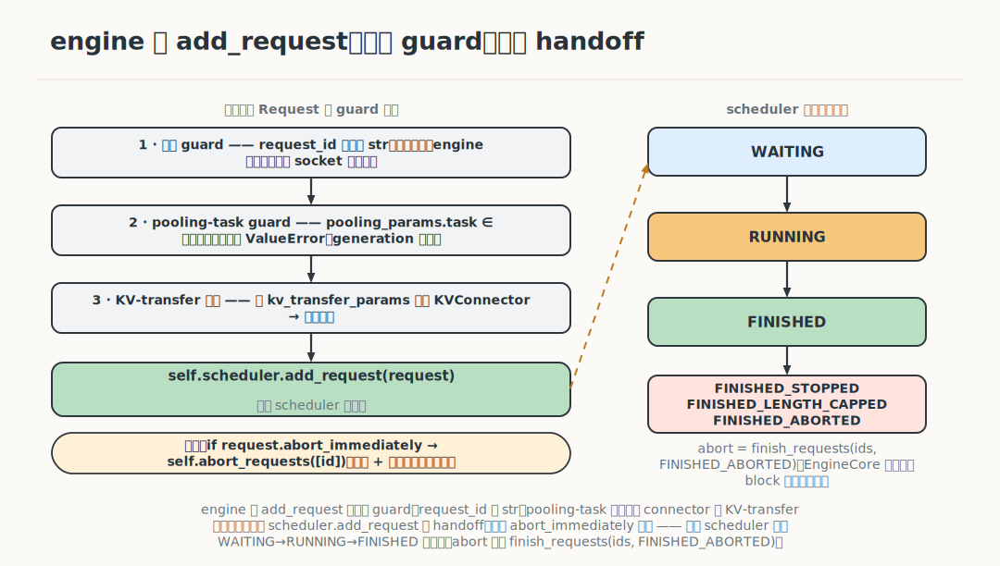</a>

<p class='figure-caption'>engine 侧 `add_request`：三个 guard（request-id 必须为 `str`、pooling-task 成员校验、无 connector 的 KV-transfer 告警）、一次向 `self.scheduler.add_request(request)` 的 handoff，以及 `abort_immediately` 边界情况——此后 scheduler 独占 WAITING→RUNNING→FINISHED 状态机，abort 只是 `finish_requests(ids, FINISHED_ABORTED)`。</p>

逐步来看。三个 guard、一次 handoff、一个 edge case：

- **类型 guard** — 请求 id 必须是 `str`；即使前端已经检查过，这里仍会再次断言，因为在多进程模式下，对象是通过 socket 传来的，而 engine 不信任任何东西。
- **Pooling-task guard** — 如果请求携带 `pooling_params`，其 task 必须在模型支持的 pooling tasks 中，否则抛出 `ValueError`。生成请求会跳过这里。
- **KV-transfer warning** — 如果请求带有 `kv_transfer_params`，但没有配置 `KVConnector`，不会拒绝该请求；transfer 会被静默禁用并给出 warning（disaggregated prefill 领域，深度文章 11）。
- **handoff** — `self.scheduler.add_request(request)`。这一行就是进入 scheduler 所有权边界的跨越。从这里开始，请求存在于 waiting queue 中，它的 block 由 KV cache manager 管理，它的状态机（WAITING → RUNNING → FINISHED）完全归 scheduler 所有。`EngineCore.add_request` 不会触碰 counter、分配 block 或设置状态 —— 它只做验证并委托。`scheduler.add_request` 如何处理该请求——将其入队、向 KV connector 注册、记录 QUEUED event——属于文章 01 §7 / 深度文章 05 的内容。
- **edge case** — `abort_immediately`。一个请求可以在同一次调用中被接纳并立即 abort，这样 KV connector 的 `request_finished` hook 就会运行，以释放准入前已预留的资源。这不是临时拼接的错误路径；而是通过*相同*的两个原语来表达准入和 teardown。

### Abort 就是 finish

最后一点可以推广为整个 engine core 的所有权不变量。Abort 没有自己单独的一套机制：

Source anchor: [`vllm/v1/engine/core.py:409-415`](https://github.com/halfrost/vllm/blob/6cf7b26bd4bff60bf378e1af14044280ac0d214c/vllm/v1/engine/core.py#L409-L415)

```python
    def abort_requests(self, request_ids: list[str]):
        """Abort requests from the scheduler."""

        # TODO: The scheduler doesn't really need to know the
        # specific finish reason, TBD whether we propagate that
        # (i.e. client-aborted vs stop criteria met).
        self.scheduler.finish_requests(request_ids, RequestStatus.FINISHED_ABORTED)
```

逐步阅读。中止一个请求就是 `scheduler.finish_requests(ids, FINISHED_ABORTED)` —— 这与 scheduler 在请求正常完成时使用的调用完全相同，只是终态状态不同。并不存在一条单独的“cancel”路径会以不同方式释放 block；这正是让 abort 具备 race-safe 的原因：无论请求是因为命中 EOS、命中 stop string（由 `OutputProcessor` 提升处理，见文章 01 §10），还是因为客户端断开连接而被取消，它都会通过同一个状态机退出，而该状态机拥有所有 block 释放逻辑（深度文章 04 会覆盖 `finish_requests` / `_free_request` 以及延迟的、以 GPU step 为栅栏的释放）。`EngineCore` 从不直接释放 block 或推进计数器；每一个生命周期变更都在 `self.scheduler` 之后完成。

### 异步镜像

在线路径会以相同顺序注册同样的两侧，并额外增加一项 —— 在提交之前创建一个按请求粒度的输出 mailbox。

Source anchor: [`vllm/v1/engine/async_llm.py:400-412`](https://github.com/halfrost/vllm/blob/6cf7b26bd4bff60bf378e1af14044280ac0d214c/vllm/v1/engine/async_llm.py#L400-L412)

```python
    async def _add_request(
        self,
        request: EngineCoreRequest,
        prompt: str | None,
        parent_req: ParentRequest | None,
        index: int,
        queue: RequestOutputCollector,
    ):
        # Add the request to OutputProcessor (this process).
        self.output_processor.add_request(request, prompt, parent_req, index, queue)

        # Add the EngineCoreRequest to EngineCore (separate process).
        await self.engine_core.add_request_async(request)
```

逐步阅读。调用方（`AsyncLLM.add_request`）首先构造一个 `RequestOutputCollector`——也就是 `generate()` 随后会排空的单槽信箱（文章 01 §11）——并在这里将其作为 `queue` 传入。`_add_request` 将 `RequestState`（此时已持有该信箱）注册到 `OutputProcessor`，*然后* `await` 向 engine core 提交请求。注释明确把流程拆成两部分：输出处理在“本进程”中，engine core 在“独立进程”中。由于这两个步骤处在同一条未交错的 `await` 链上，并且注册发生在 submit await 之前，因此可以证明：在该请求的任何输出被产生之前，信箱一定已经存在。同步的 `LLMEngine.add_request` 也天然获得同样的保证——它的两次注册是在同一个线程上的普通顺序调用。register-before-submit 是两条路径上的同一个不变量；asyncio 只是让这种顺序成为你必须显式关注的事情。

<a href='images/vllm-01-06-add-request.svg' target='_blank'>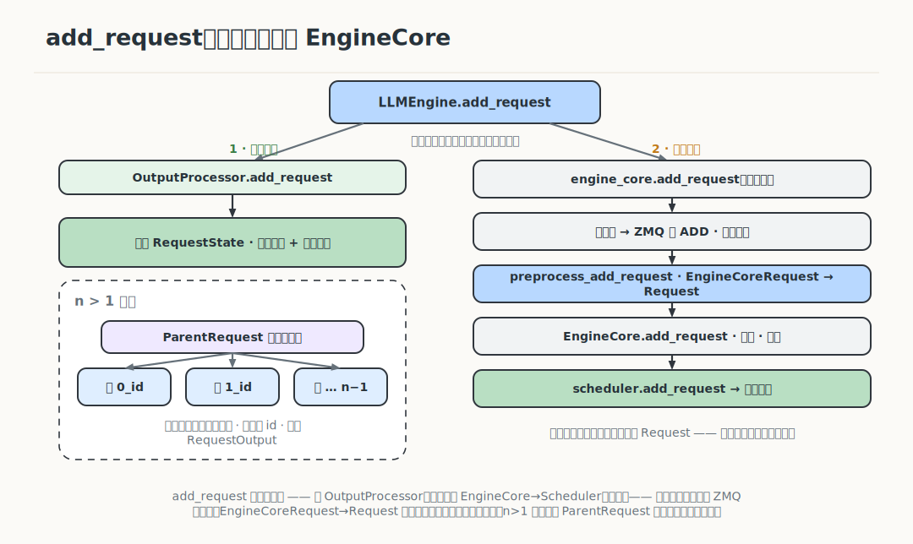</a>

<p class='figure-caption'>`add_request` 在两侧注册请求——`OutputProcessor`（返回路径）和 `EngineCore`→`Scheduler`（前向路径）——其中 `n>1` 会在同一个 `ParentRequest` 下扇出为子请求，而 `EngineCoreRequest`→`Request` 的转换标记着请求跨入 scheduler 所有权边界。</p>

### 这个边界带来了什么

请求进入引擎的瞬间会建立四个不变量，后续每个阶段都依赖它们：

- **Register-before-submit。** 输出侧总是在前向侧被触发之前完成注册，因此输出永远不可能到达一个未知请求（[`llm_engine.py:274-276`](https://github.com/halfrost/vllm/blob/6cf7b26bd4bff60bf378e1af14044280ac0d214c/vllm/v1/engine/llm_engine.py#L274-L276)；[`async_llm.py:409-412`](https://github.com/halfrost/vllm/blob/6cf7b26bd4bff60bf378e1af14044280ac0d214c/vllm/v1/engine/async_llm.py#L409-L412)）。
- **一个用户请求，n 个扁平 engine 请求。** 并行采样会在一个 `ParentRequest` 下扇出为独立的子请求；scheduler 和 worker 永远看不到 sibling 关系，而调用方拿回的是 parent id（[`llm_engine.py:279-294`](https://github.com/halfrost/vllm/blob/6cf7b26bd4bff60bf378e1af14044280ac0d214c/vllm/v1/engine/llm_engine.py#L279-L294)）。
- **类型变化标记所有权转移。** 线上的 `EngineCoreRequest` 会在 `preprocess_add_request` 中变成内部的 `Request`；在 `scheduler.add_request` 下游，线上结构体不再存在（[`core.py:855-877`](https://github.com/halfrost/vllm/blob/6cf7b26bd4bff60bf378e1af14044280ac0d214c/vllm/v1/engine/core.py#L855-L877)，`403`）。
- **准入和中止共享同一套状态机。** `EngineCore` 只做校验和委派；它自己从不释放 block，也不修改生命周期状态，而 abort 只是 `finish_requests(..., FINISHED_ABORTED)`（[`core.py:403`](https://github.com/halfrost/vllm/blob/6cf7b26bd4bff60bf378e1af14044280ac0d214c/vllm/v1/engine/core.py#L403)，`409-415`）。从这里开始一切都归 scheduler 所有——这也正是文章 01 §7 接续的地方。

## Engine Step：调度、执行、处理输出

到目前为止的一切都还是适配：façade 规范化输入，input processor 构造 `EngineCoreRequest`，client 抽象把它跨进程边界传过去。现在我们到达了整个系统围绕其组织的事务。“Inside vLLM” walkthrough 直接给出了这个心智模型——每个 engine step 都会“选择请求、运行模型、采样 token、更新请求状态，并在请求完成时释放资源”（[Inside vLLM](https://vllm.ai/blog/2025-09-05-anatomy-of-vllm)）。在 V1 源码中，这就是一个很小的方法：`EngineCore.step()`，而它的职责就是保持*很小*：一个 guard、一次 schedule、一次非阻塞 execute、一次 abort 排空，以及一次提交。逐行阅读它，是看清哪一层拥有什么的最快方式。

<a href='images/vllm-01-02-engine-step.svg' target='_blank'>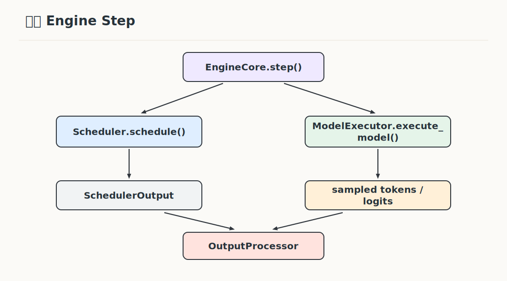</a>

<p class='figure-caption'>一个 engine step：schedule → execute → sample → commit 事务，以及它所处的两个所有权边界。</p>

### `EngineCore.step()` 的四项工作

概念上：一个 step 就是一笔事务。它向 scheduler 询问要运行什么，在不阻塞的情况下发起 forward pass，并发地准备 structured-output bitmask；如果执行阶段推迟了采样，则执行采样；排空帧中途到达的所有 abort；只有到这时，才把采样得到的 token 提交回请求状态。

来源：[`vllm/v1/engine/core.py:479-508`](https://github.com/halfrost/vllm/blob/6cf7b26bd4bff60bf378e1af14044280ac0d214c/vllm/v1/engine/core.py#L479-L508)

```python
    def step(self) -> tuple[dict[int, EngineCoreOutputs], bool]:
        """Schedule, execute, and make output.

        Returns tuple of outputs and a flag indicating whether the model
        was executed.
        """

        # Check for any requests remaining in the scheduler - unfinished,
        # or finished and not yet removed from the batch.
        if not self.scheduler.has_requests():
            return {}, False
        scheduler_output = self.scheduler.schedule(self._should_throttle_prefills())
        future = self.model_executor.execute_model(scheduler_output, non_block=True)
        grammar_output = self.scheduler.get_grammar_bitmask(scheduler_output)
        with (
            self.log_error_detail(scheduler_output),
            self.log_iteration_details(scheduler_output),
        ):
            model_output = future.result()
            if model_output is None:
                model_output = self.model_executor.sample_tokens(grammar_output)

        # Before processing the model output, process any aborts that happened
        # during the model execution.
        self._process_aborts_queue()
        engine_core_outputs = self.scheduler.update_from_output(
            scheduler_output, model_output
        )

        return engine_core_outputs, scheduler_output.total_num_scheduled_tokens > 0
```

Step-by-step 解读：

**Job 0 — guard（[`core.py:488-489`](https://github.com/halfrost/vllm/blob/6cf7b26bd4bff60bf378e1af14044280ac0d214c/vllm/v1/engine/core.py#L488-L489)）。** `if not self.scheduler.has_requests(): return {}, False`。当 scheduler 为空时，不会运行模型。它上面的注释——“unfinished, or finished and not yet removed from the batch”——是关键约束：`has_requests()` 的语义有意比“仍在生成的请求”更宽。只要还有已完成但尚未 flush 给客户端的 request id，或者某个 KV connector 仍在排空，它就会保持为 `True`，这样循环会再走一步，真正*发出*这些完成事件，并释放延迟释放的 block，然后才允许进入 idle。这个谓词的内部细节属于第 04 篇；这里只需要知道，这个 guard 统计的是请求生命周期的尾部，而不只是中段。

**Job 1 — schedule（[`core.py:490`](https://github.com/halfrost/vllm/blob/6cf7b26bd4bff60bf378e1af14044280ac0d214c/vllm/v1/engine/core.py#L490)）。** `scheduler.schedule(self._should_throttle_prefills())` 返回一个 `SchedulerOutput`，并且*不运行任何模型代码*。它决定哪些请求运行、每个请求获得多少个新 token、哪些 KV block 被分配或复用、哪些请求被 preempt，以及 worker 将需要哪些 attention/sampling metadata。`_should_throttle_prefills()` 在基类中为 `False`（[`core.py:474-477`](https://github.com/halfrost/vllm/blob/6cf7b26bd4bff60bf378e1af14044280ac0d214c/vllm/v1/engine/core.py#L474-L477)），只有数据并行引擎会为了 prefill 均衡而覆写它。“给哪些请求分配多少 token”具体意味着什么——continuous batching、chunked prefill、prefix-cache reuse——是第 05 篇的完整主题；第 01 篇这里只说明：这一次调用就是该 step 的全部调度决策。

**Job 2 — execute、overlap、sample（[`core.py:491-499`](https://github.com/halfrost/vllm/blob/6cf7b26bd4bff60bf378e1af14044280ac0d214c/vllm/v1/engine/core.py#L491-L499)）。** 这是连接各阶段的关键技巧。`execute_model(scheduler_output, non_block=True)` 会立即返回一个 `Future`，而不是阻塞等待 GPU。这个空档由 `get_grammar_bitmask(scheduler_output)` 填上：它会在 CPU 上构建 structured-output token mask，*同时 forward pass 正在运行*。`future.result()` 是同步点。`model_output is None` 这个 sentinel 表示 executor 将 sampling 延迟到一个单独调用 `sample_tokens(grammar_output)` 中执行，因此 structured-output mask 会在 sampling 时应用到*本* step 的 logits 上。`execute_model` 背后的 executor→worker→model-runner→logits 链路是第 08/09 篇；`sample_tokens` 背后的 logits→token-ids 步骤是第 10 篇。对端到端路径来说，有两个事实很重要：grammar bitmask 来自 *scheduler*，而不是 HTTP 层；CPU 侧的 mask 准备通常是免费的，因为它隐藏在 GPU latency 之下。

**abort window（[`core.py:501-503`](https://github.com/halfrost/vllm/blob/6cf7b26bd4bff60bf378e1af14044280ac0d214c/vllm/v1/engine/core.py#L501-L503)）。** `self._process_aborts_queue()` 在 `future.result()` *之后*运行——此时 GPU frame 已完成——但在 `update_from_output` *之前*运行。这个顺序正是关键所在：当 GPU 忙碌期间到达的外部取消会在 sampled token 被合并进请求状态之前被消费，因此一个在 frame 中途被取消的请求永远不会被推进。排空辅助函数（[`core.py:634-642`](https://github.com/halfrost/vllm/blob/6cf7b26bd4bff60bf378e1af14044280ac0d214c/vllm/v1/engine/core.py#L634-L642)）会把整个队列批量合并为一次 `abort_requests` 调用；由于 abort 一个已经完成的请求是幂等的，abort 可以安全地被双重入队（见第 04 篇）。

**Job 3 — commit（[`core.py:504-506`](https://github.com/halfrost/vllm/blob/6cf7b26bd4bff60bf378e1af14044280ac0d214c/vllm/v1/engine/core.py#L504-L506)）。** `scheduler.update_from_output(scheduler_output, model_output)` 是 sampled token 变成请求进度的地方：追加 output id、设置 finish reason、释放已完成的 KV block。它返回一个按所属 client 分组的 `dict[client_index → EngineCoreOutputs]`，第二个 tuple 元素——`scheduler_output.total_num_scheduled_tokens > 0`——是循环 wrapper 消费的 `model_executed` flag。

这个方法维护的不变量是：**schedule 是乐观的，但进度只在拿到 model output 之后才提交。** Scheduling 会在 GPU 执行之前做决定并分配资源；在 `update_from_output` 根据模型实际产出对计划进行 reconcile 之前，请求状态中的任何内容——token 计数、finish 状态、block 释放——都不会前移。如果在没有 `SchedulerOutput` 的情况下运行模型，或者在 sampling 完成前推进计数器，就会让 GPU work 与 KV/block accounting 脱钩，并使 block-reuse 的正确性依赖时序运气。abort window 和 guard 是同一条规则的两个边界：请求可以一直到提交前进入或离开 batch，但不能在提交期间这样做。

### 为什么调用方看不到这个方法

`EngineCore.step()` 返回的是 `EngineCoreOutputs`——token id、finish flag、按 client 路由的信息——而不是面向用户的 `RequestOutput`。offline caller 从不直接接触它。`LLM._run_engine` 的排空循环调用的是 `LLMEngine.step()`，这是另一个文件、另一个进程中的同步 wrapper。

Source: [`vllm/v1/engine/llm_engine.py:296-334`](https://github.com/halfrost/vllm/blob/6cf7b26bd4bff60bf378e1af14044280ac0d214c/vllm/v1/engine/llm_engine.py#L296-L334)

```python
    def step(self) -> list[RequestOutput | PoolingRequestOutput]:
        if self.should_execute_dummy_batch:
            self.should_execute_dummy_batch = False
            self.engine_core.execute_dummy_batch()
            return []

        # 1) Get EngineCoreOutput from the EngineCore.
        with record_function_or_nullcontext("llm_engine step: get_output"):
            outputs = self.engine_core.get_output()

        # 2) Process EngineCoreOutputs.
        with record_function_or_nullcontext("llm_engine step: process_outputs"):
            iteration_stats = IterationStats() if self.log_stats else None
            processed_outputs = self.output_processor.process_outputs(
                outputs.outputs,
                engine_core_timestamp=outputs.timestamp,
                iteration_stats=iteration_stats,
            )
            self.output_processor.update_scheduler_stats(outputs.scheduler_stats)

        # 3) Abort any reqs that finished due to stop strings.
        with record_function_or_nullcontext("llm_engine step: abort_requests"):
            self.engine_core.abort_requests(processed_outputs.reqs_to_abort)

        # 4) Record stats
        with record_function_or_nullcontext("llm_engine step: record_stats"):
            if (
                self.logger_manager is not None
                and outputs.scheduler_stats is not None
                and len(outputs.outputs) > 0
            ):
                self.logger_manager.record(
                    scheduler_stats=outputs.scheduler_stats,
                    iteration_stats=iteration_stats,
                    mm_cache_stats=self.renderer.stat_mm_cache(),
                )
                self.do_log_stats_with_interval()

        return processed_outputs.request_outputs
```

<a href='images/vllm-01-22-step-wrapper-feedback.svg' target='_blank'>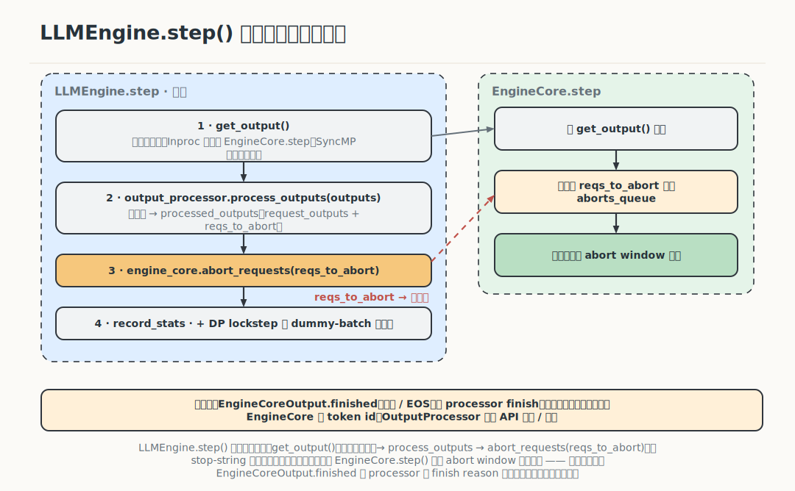</a>

<p class='figure-caption'>`LLMEngine.step()` 包装核心循环：`get_output()`（多态衔接点）→ `output_processor.process_outputs(...)` → `engine_core.abort_requests(reqs_to_abort)`，把 stop-string 触发的完成反馈回去，使*下一次* `EngineCore.step()` 在其 abort window 停止它们——这就是为什么 `EngineCoreOutput.finished` 与 processor 的 finish reason 可以在某一步中合法地不一致。</p>

逐步阅读：

- **`get_output()` 是多态衔接点（第 304 行）。** 它的阻塞式签名在两种传输方式上完全相同（§4）。使用 `InprocClient` 时，它会在调用方线程上内联运行一次 `EngineCore.step()` 并返回输出；使用 `SyncMPClient` 时，它会阻塞在一个队列上，该队列由后台线程从 core 进程的忙循环中填充。离线 `LLMEngine.step()` 的写法就像 engine 是本地的一样，而 client 抽象让这一点无论是否本地都成立。
- **`process_outputs`（第 309 行）是 token id 转为文本的位置。** `OutputProcessor` 会增量 detokenize，检查 stop strings，并物化 `RequestOutput`。这是返回路径边界，归本图的第 10 篇文章所有；这里的重点是它位于 `EngineCore` *之外*。
- **`abort_requests`（第 318 行）闭合了循环。** Stop *strings* 无法在 core 内部检测到——它们需要 detokenized text——因此 `process_outputs` 会返回 `reqs_to_abort`，而这一行会把它们反馈回 engine。这些 id 会进入 `aborts_queue`，由*下一次* `EngineCore.step()` 在其 abort window 中排空。这就是为什么 `EngineCoreOutput.finished` 和 processor 的 finish reason 可以在某一步中合理地出现分歧。
- **dummy-batch 快路径（第 297-300 行）** 是为数据并行 lockstep 而存在的：某个 rank 即使没有工作，也仍然必须执行一个空 batch，以便其 peers 可以继续推进。

不变量：**`EngineCore` 拥有 schedule/execute/commit 事务；`OutputProcessor` 拥有 API 语义。** 第一个 token 之所以不直接从 core 返回，正是因为“第一个 token”是一个面向用户的概念——它需要 detokenization、stop-string 检查以及 `RequestOutput` 构造，而热循环有意不做这些。把 `EngineCoreOutputs` 暴露给调用方，会把内部调度帧泄漏到 API 级结果中。

### 同一个 step，封装给后台进程

在默认的多进程部署（§4）中，`EngineCore.step()` 根本不在调用方线程上运行——它运行在 engine 进程中的一个永久循环里：

Source: [`vllm/v1/engine/core.py:1259-1267`](https://github.com/halfrost/vllm/blob/6cf7b26bd4bff60bf378e1af14044280ac0d214c/vllm/v1/engine/core.py#L1259-L1267)

```python
    def run_busy_loop(self):
        """Core busy loop of the EngineCore."""
        while self._handle_shutdown():
            # 1) Poll the input queue until there is work to do.
            self._process_input_queue()
            # 2) Step the engine core and return the outputs.
            self._process_engine_step()

        raise SystemExit
```

每一轮都会吸收客户端输入，然后通过 `_process_engine_step`（[`core.py:1300-1317`](https://github.com/halfrost/vllm/blob/6cf7b26bd4bff60bf378e1af14044280ac0d214c/vllm/v1/engine/core.py#L1300-L1317)）严格执行一步；它会调用 `self.step_fn()`，将每个 `(client_index, EngineCoreOutputs)` 对推送到输出队列，供 IO 线程序列化；运行 spec-decode 的 `post_step` hook；并且——如果本步没有调度任何可运行内容但仍有请求存在——休眠 1 ms 以让出 GIL，使后台 KV-transfer 线程能够继续推进。`step_fn` 本身在构造时只绑定一次，要么绑定到 `step`，要么绑定到 pipeline-parallel 的 `step_with_batch_queue`（[`core.py:221-224`](https://github.com/halfrost/vllm/blob/6cf7b26bd4bff60bf378e1af14044280ac0d214c/vllm/v1/engine/core.py#L221-L224)），因此循环不会在每次迭代时根据并行方式进行分支。忙循环机制、关闭时的排空，以及已完成请求的记账，是文章 04 深入讨论的主题；文章 01 的主张仅是结构性的：**同步离线的 `LLMEngine.step()` 与异步忙循环，都是同一个 `EngineCore.step()` 事务的两种不同包装方式**——对阻塞式离线调用者来说是 inline-and-return，对流式服务器来说是 loop-and-enqueue。事务本身不变；变化的只是它的驱动方式。

关于这一步内部机制的交叉引用：**05** 讨论 `schedule()` 会做出哪些决策；**08/09** 讨论 `execute_model` 背后发生了什么；**10** 讨论 `sample_tokens`；**12** 讨论 `post_step` 的 draft-token 反馈；**04** 讨论忙循环、关闭以及已完成请求的生命周期。下一节将放大这些箭头中的第一个——scheduler。

## 调度一步（概览）

我们刚刚看到 `EngineCore.step()` 以一行代码开场——`scheduler.schedule(...)`——随后把一个 `SchedulerOutput` 交给 executor。本节保持在本文其余部分所处的概览高度：它解释 *scheduler 决定什么*，解释让 prefill、decode、chunked prefill、prefix caching 和 speculative decoding 都能共享同一个循环的 *一个核心思想*，以及 *在 scheduler 边界的两个方向上分别传递什么*。其内部机制——队列、token 预算记账、`allocate_slots`、preemption——属于文章 05（Scheduler: Continuous Batching and Chunked Prefill）。这里我们只把这个盒子接入请求路径。

### scheduler 决定 token，而不是 tensor

scheduler 是一个纯规划器。它运行在 CPU 上，位于 EngineCore 进程内部，并且从不接触 GPU。一次调用只回答一个问题：*在我正在跟踪的请求中，哪些请求在这一步运行，以及每个请求推进多少个 token？* 答案是一个 `SchedulerOutput`——一份计划。执行这份计划，是同一个 `step()` 中稍后的一个独立阶段。

源码锚点：[`vllm/v1/engine/core.py:488-490`](https://github.com/halfrost/vllm/blob/6cf7b26bd4bff60bf378e1af14044280ac0d214c/vllm/v1/engine/core.py#L488-L490)

```python
        if not self.scheduler.has_requests():
            return {}, False
        scheduler_output = self.scheduler.schedule(self._should_throttle_prefills())
```

源代码锚点：[`vllm/v1/engine/core.py:474-477`](https://github.com/halfrost/vllm/blob/6cf7b26bd4bff60bf378e1af14044280ac0d214c/vllm/v1/engine/core.py#L474-L477)

```python
    def _should_throttle_prefills(self) -> bool:
        """Whether to defer new prefills this step (DP prefill balancing).
        Overridden by the DP engine core; never throttles otherwise."""
        return False
```

逐步阅读：

- `:488-489` 处的 guard 意味着模型绝不会在没有计划的情况下运行；如果调度器里什么都没有（甚至没有已完成但尚未 flush 的请求——见 Article 04），该 step 会短路并报告 `model_executed = False`。
- `schedule()` 返回一个 `SchedulerOutput` 后立即返回——没有 forward pass，也没有 logits。`step()` 中这一行之后的所有内容（`execute_model` future、grammar bitmask、`sample_tokens`、`update_from_output`）都是在消费该计划；它们都不是计划本身。
- `_should_throttle_prefills()` 在基类中为 `False`，只有数据并行 engine core 会覆写它，用于为了跨副本均衡而延迟新的 prefill（Article 11, Distributed Inference and Parallelism）。对于你正在跟踪的单引擎路径，这个参数是常量 `False`。

这个边界所保护的不变量是：**规划与执行解耦，且只有在模型输出返回之后才提交进展。** 调度器在制定计划时会乐观地推进自己的账本记录（`_update_after_schedule`, [`scheduler.py:1169-1217`](https://github.com/halfrost/vllm/blob/6cf7b26bd4bff60bf378e1af14044280ac0d214c/vllm/v1/core/sched/scheduler.py#L1169-L1217)），但 *token 结果* 会在同一个 step 末尾由 `update_from_output` 合并。Article 04 会介绍这条“输出之后再提交”的规则；对于请求路径而言，关键点是可以安全地把 `schedule()` 理解为“决策”，它与“运行”完全分离。

### 一个理念：没有 prefill 阶段，也没有 decode 阶段

V1 博客阐述了核心简化：V1 不再把 prefill 和 decode 当作两个不同的调度阶段，而是统一对待所有 token；一次调度决策在概念上就变成了一个字典 `{request_id: num_tokens}`。这样一来，chunked prefill 就自然成立，因为长 prompt 只是一个在当前 step 中只被授予部分 token 预算的请求（[V1 blog](https://vllm.ai/blog/2025-01-27-v1-alpha-release)）。源码在 `schedule()` 开头也表达了同样的意思。

源码锚点：[`vllm/v1/core/sched/scheduler.py:396-407`](https://github.com/halfrost/vllm/blob/6cf7b26bd4bff60bf378e1af14044280ac0d214c/vllm/v1/core/sched/scheduler.py#L396-L407)

```python
    def schedule(self, throttle_prefills: bool = False) -> SchedulerOutput:
        self.current_step += 1
        # NOTE(woosuk) on the scheduling algorithm:
        # There's no "decoding phase" nor "prefill phase" in the scheduler.
        # Each request just has the num_computed_tokens and
        # num_tokens_with_spec. num_tokens_with_spec =
        # len(prompt_token_ids) + len(output_token_ids) + len(spec_token_ids).
        # At each step, the scheduler tries to assign tokens to the requests
        # so that each request's num_computed_tokens can catch up its
        # num_tokens_with_spec. This is general enough to cover
        # chunked prefills, prefix caching, speculative decoding,
        # and the "jump decoding" optimization in the future.
```

<a href='images/vllm-01-23-counter-model.svg' target='_blank'>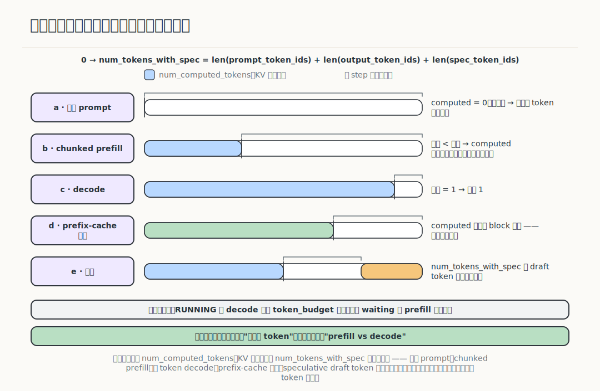</a>

<p class='figure-caption'>统一计数器模型：调度就是在本 step 授予若干 token，缩小 `num_computed_tokens`（KV 已填充）与 `num_tokens_with_spec`（prompt + output + draft）之间的差距——全新 prompt、chunked prefill、单 token decode、prefix-cache 跳跃、speculative draft token 都是同一种缩差操作，因此请求路径只根据“多少个 token”分支。</p>

逐步解读：

- 每个请求都带有两个计数器：`num_computed_tokens`（KV cache 已经填充到的位置）和 `num_tokens_with_spec`（prompt + 已生成 token + 任意 speculative draft token）。调度就是在当前 step 中用一定数量的 token 来缩小这个差距。
- 一个全新的 prompt 从 `num_computed_tokens = 0` 开始，并且有一个很大的差距，因此它看起来像一个很大的 token 需求；一个 decoding 请求的差距为 1（在 speculation 下还会加上 draft token）。两者都是同一种操作——“推进 `num_computed_tokens`”——只是授予的数量不同。
- 因为授予的数量可以*小于*这个差距，所以 chunked prefill 不需要特殊代码路径：它只是一个在单个 step 中没有拿到完整差距额度的 prompt。
- Prefix caching 和 speculative decoding 在同一条注释中被命名为这种通用性的实例：prefix caching 通过复用已经计算过的 block 来降低请求的有效差距（Article 07, Automatic Prefix Caching）；speculation 则用需要验证的 draft token 来提高 `num_tokens_with_spec`（Article 12, Speculative Decoding）。

不变量：**一个统一的计数器模型吸收了在 V0 中原本属于独立机制的四个特性。** 请求路径从不根据“这是 prefill 还是 decode”来分支；它根据“多少个 token”来分支，并且每个高级特性都表示为对 token 计数的调整。

### 优先级：先填充 decode，再填充等待中的 prefill

在固定的每 step token 预算下，调度器会优先处理已经在 `running` 队列中的请求（正在进行中的 decode），然后才把等待中的 prefill 拉入剩余预算中（[Inside vLLM](https://vllm.ai/blog/2025-09-05-anatomy-of-vllm)）。源码中的循环顺序把这一点体现得非常直观。

源码锚点：[`vllm/v1/core/sched/scheduler.py:440-442`](https://github.com/halfrost/vllm/blob/6cf7b26bd4bff60bf378e1af14044280ac0d214c/vllm/v1/core/sched/scheduler.py#L440-L442)

```python
        # First, schedule the RUNNING requests.
        req_index = 0
        while req_index < len(self.running) and token_budget > 0:
```

逐步解读：

- 首先针对 `token_budget` 消耗 `running`；第二轮（此处未展示 — 文章 05）会用剩余的任何预算接纳等待中的请求。
- 这正是 continuous batching 与 chunked prefill 在*同一个*循环中共存、而不是分阶段交替的原因：一个 step 可以同时携带一批正在进行的 decode，*以及*一个新 prompt 的 prefill 切片，因为二者本质上都只是针对同一预算的 token 授予。

不变式：**对延迟敏感的进行中 decode 永远不会在 token 预算上被大型传入 prompt 饿死** — prompt 只会被接纳进剩余预算，并且如有必要，会跨多个 step 进行 chunk。调度算法的队列机制、抢占和预算计算是文章 05 的主题；请求路径只需要关注优先级规则和单循环带来的结果。

### 边界向外传递什么：计划以及两个完成通道

`SchedulerOutput` 是请求路径中从 CPU 规划传递到 GPU 执行的载荷：它会标明新的和已缓存的请求、每个请求的 token 数、KV block 分配、spec-decode token，以及 attention metadata。但它还携带了一个容易忽略的带外通道 — *自上一个 step 以来已完成的请求*集合 — 这样下游 worker 就可以丢弃它们的按请求状态。

Source anchor: [`vllm/v1/core/sched/scheduler.py:1105-1114`](https://github.com/halfrost/vllm/blob/6cf7b26bd4bff60bf378e1af14044280ac0d214c/vllm/v1/core/sched/scheduler.py#L1105-L1114)

```python
            preempted_req_ids=self.reset_preempted_req_ids,
            # finished_req_ids is an existing state in the scheduler,
            # instead of being newly scheduled in this step.
            # It contains the request IDs that are finished in between
            # the previous and the current steps.
            finished_req_ids=self.finished_req_ids,
            free_encoder_mm_hashes=self.encoder_cache_manager.get_freed_mm_hashes(),
            new_block_ids_to_zero=new_block_ids_to_zero,
            num_spec_tokens_to_schedule=num_spec_tokens_to_schedule,
        )
```

该集合在每次调度时通过*重新赋值*来重置，而不是 `clear()`，这正是为了让刚刚发出的 `SchedulerOutput` 保持其自身引用仍然有效：

源码锚点：[`vllm/v1/core/sched/scheduler.py:1213-1217`](https://github.com/halfrost/vllm/blob/6cf7b26bd4bff60bf378e1af14044280ac0d214c/vllm/v1/core/sched/scheduler.py#L1213-L1217)

```python
        # Clear the finished and preempted request IDs.
        # NOTE: We shouldn't just clear() here because it will also affect
        # the scheduler output.
        self.finished_req_ids = set()
        self.reset_preempted_req_ids = set()
```

finish 还必须通过第二个通道*返回到客户端*。当一个请求被释放时，它的 id 会按客户端记录下来，`update_from_output` 会将这些 id 附加到传出的 `EngineCoreOutputs.finished_requests` 上：

源码定位：[`vllm/v1/core/sched/scheduler.py:1833-1845`](https://github.com/halfrost/vllm/blob/6cf7b26bd4bff60bf378e1af14044280ac0d214c/vllm/v1/core/sched/scheduler.py#L1833-L1845)

```python
        finished_req_ids = self.finished_req_ids_dict
        if finished_req_ids:
            # Include ids of requests that finished since last outputs
            # were sent.
            for client_index, finished_set in finished_req_ids.items():
                # Set finished request set in EngineCoreOutputs for this client.
                if (eco := engine_core_outputs.get(client_index)) is not None:
                    eco.finished_requests = finished_set
                else:
                    engine_core_outputs[client_index] = EngineCoreOutputs(
                        finished_requests=finished_set
                    )
            finished_req_ids.clear()
```

逐步阅读：

- `finished_req_ids`（一个 `set`）会随*下一个* `SchedulerOutput` 一起传递，这样 worker 就可以从其持久化批次状态中裁剪掉已完成的请求（回想一下 V1 的 differential-batch 设计，其中 worker 会跨 step 缓存请求状态）。
- `finished_req_ids_dict`（按 `client_index` 划分）会随*对外发出的* `EngineCoreOutputs` 一起传递，这样前端的输出处理器就知道该请求已完成，并可以回收其 `RequestState`。这两个集合都在 `_free_request` 中填充（[`scheduler.py:2116-2118`](https://github.com/halfrost/vllm/blob/6cf7b26bd4bff60bf378e1af14044280ac0d214c/vllm/v1/core/sched/scheduler.py#L2116-L2118)）。
- 对请求路径的影响——这里先概述，文章 04 中会展开——是：**两个消费者是在两个不同的时钟上观察到 finish 的。** 面向客户端的完成通知随*当前* step 的 `EngineCoreOutputs` 发出（`finished_req_ids_dict` 就在这一次 `update_from_output()` 的末尾被折入，[`scheduler.py:1833-1845`](https://github.com/halfrost/vllm/blob/6cf7b26bd4bff60bf378e1af14044280ac0d214c/vllm/v1/core/sched/scheduler.py#L1833-L1845)），因此前端可以立即关闭 stream。只有 worker 侧的状态清理才要等*下一个* `SchedulerOutput` 携带 `finished_req_ids`。循环的活性谓词（`has_requests()`）有意设置得足够宽，以保持引擎唤醒去完成这次 worker 侧的 flush——它并不会推迟客户端的完成通知。

不变量：**完成一个请求是一项记账工作，它会在两个时钟上分发给两个消费者**——worker（下一个 step，用于丢弃状态）和 client（本 step 的输出，用于关闭流）——而这两个通道都不是模型的 forward pass。

### Freeing blocks，被 GPU 栅栏保护

scheduler 拥有 KV block 的所有权，而释放 block 正是“现在规划、稍后执行”这一拆分会变成正确性隐患的地方：一个请求可能在它所属的某次 forward pass 仍在写入其 KV 时完成。因此 block 的释放可以被*延迟*，并被 in-flight step 栅栏保护在其之后。

源码锚点：[`vllm/v1/core/sched/scheduler.py:2138-2151`](https://github.com/halfrost/vllm/blob/6cf7b26bd4bff60bf378e1af14044280ac0d214c/vllm/v1/core/sched/scheduler.py#L2138-L2151)

```python
    def _free_request_blocks(self, request: Request):
        """Free the request's KV blocks, deferring the return to the block
        pool when an in-flight GPU step may still write them.
        """
        if not self.defer_block_free or (
            # Last scheduled step already processed: no in-flight write remains
            # (always the case for a normal finish), so free now.
            request.last_sched_seq <= self.processed_step_seq
        ):
            self.kv_cache_manager.free(request)
            return
        blocks = self.kv_cache_manager.pop_blocks_for_free(request)
        if blocks:
            self.deferred_frees.append((self.sched_step_seq, blocks))
```

<a href='images/vllm-01-24-finish-fanout.svg' target='_blank'>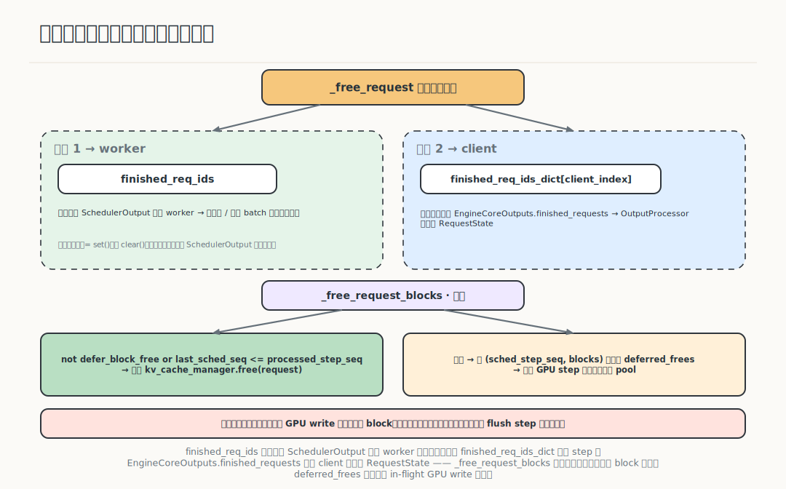</a>

<p class='figure-caption'>完成一个请求会在两个时钟上分发：`finished_req_ids` 随*下一个* `SchedulerOutput` 传给 worker，使其从持久 batch 中裁剪该请求；`finished_req_ids_dict` 随*本* step 的 `EngineCoreOutputs.finished_requests` 传给 client，使其回收 `RequestState`——而 `_free_request_blocks` 要么立即释放，要么把 block 暂存进 `deferred_frees`，直到任何 in-flight GPU write 完成。</p>

逐步来看：

- 常见情况（`not self.defer_block_free`，或请求最后一次已调度的 step 已经处理完成）会立即释放——正常的生成结束总是走这个分支。
- 当异步调度可能仍有某个 GPU frame 在写入该请求的 block（`last_sched_seq > processed_step_seq`）时，这些 block 会按 step sequence 作为 key 暂存在 `deferred_frees` 中，只有等该 step 完成后才归还。

从概览层面看，不变量是：**只要某个已入队的 GPU write 仍可能触碰某个 block，该 block 就绝不会被归还到池中**——block 复用的正确性不能依赖时序上的运气。分页机制、free-block queue 以及 prefix-cache hashing 属于 Article 06（KV Cache Manager and Paged KV Cache）和 Article 07（Automatic Prefix Caching）；请求路径只需要知道 scheduler 是 block 生命周期的唯一所有者，并且释放操作都有 fence 保护。

### 这一个循环，以及接下来该去哪里

上面的所有内容可以归结为一句话：scheduler 是唯一一个把 continuous batching、chunked prefill、prefix caching 和 speculative decoding 都纳入同一个调度循环的位置，其表达形式是在每个 step 的预算下授予 token。请求在 `EngineCore` 调用 `scheduler.schedule(...)` 时进入该循环，以面向 GPU 的 `SchedulerOutput` 计划形式离开；而它的完成会通过两条旁路离开——一条到 worker，一条到 client。这就是 Article 01 要求你掌握的全部内容。关于队列算法、预算核算、preemption 和 `allocate_slots`，请继续阅读 Article 05（Scheduler: Continuous Batching and Chunked Prefill）；关于 block 分配和分页，请阅读 Article 06；关于 prefix 复用，请阅读 Article 07；关于 draft-token scheduling，请阅读 Article 12。下一节（§8）会跟踪这个 `SchedulerOutput` 计划跨过 executor 边界并进入 GPU。

## 模型执行：从 Executor 到 Logits（概览）

§7 刚刚展示了 scheduler 产出一个 `SchedulerOutput`：这是一份计划，指明本 step 中哪些请求会运行，以及每个请求贡献多少个 token。本节会跟踪这份计划跨过 token 生成之前最后两个所有权边界——`EngineCore` → executor → worker → model runner → logits。本节保持在架构图层面的高度。让 forward pass 变得高效的 PagedAttention kernel 属于 article 08；input-tensor preparation 和 CUDA graphs 属于 article 09；将 logits 转成 token ID 属于 article 10。这里的任务是说明连接组织：一次方法调用如何扇出到一个或多个 GPU，以及 hidden states 在哪里变成 logits。

回顾 `EngineCore.step()` 中移交给执行阶段的两行：

[`vllm/v1/engine/core.py:490-499`](https://github.com/halfrost/vllm/blob/6cf7b26bd4bff60bf378e1af14044280ac0d214c/vllm/v1/engine/core.py#L490-L499)

```python
        scheduler_output = self.scheduler.schedule(self._should_throttle_prefills())
        future = self.model_executor.execute_model(scheduler_output, non_block=True)
        grammar_output = self.scheduler.get_grammar_bitmask(scheduler_output)
        with (
            self.log_error_detail(scheduler_output),
            self.log_iteration_details(scheduler_output),
        ):
            model_output = future.result()
            if model_output is None:
                model_output = self.model_executor.sample_tokens(grammar_output)
```

`self.model_executor` 是一个 `Executor`。下面所有内容，都是 `execute_model` 和 `sample_tokens` 这两个调用实际会抵达的路径。

<a href='images/vllm-01-07-execution-path.svg' target='_blank'>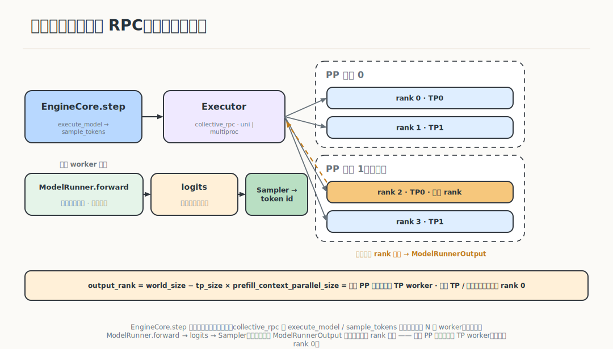</a>

<p class='figure-caption'>`SchedulerOutput` 通过 `collective_rpc` 跨越 executor 边界，扇出到一个或 N 个 worker，并返回单个权威 worker 的 `ModelRunnerOutput`（最后一个 PP stage 的第一个 TP rank）。</p>

### executor 边界就是一个方法：`collective_rpc`

**概念。** 正如 `EngineCoreClient`（§4）隐藏了 engine core 是在进程内还是位于 ZMQ socket 之后，`Executor` 也隐藏了模型是在单个 GPU 还是多个 GPU 上运行。engine core 从不直接寻址某个 worker；它只命名一个*操作*和一个*目标集合*，然后让 executor 进行广播。

**源码锚点。** [`vllm/v1/executor/abstract.py:221-227`](https://github.com/halfrost/vllm/blob/6cf7b26bd4bff60bf378e1af14044280ac0d214c/vllm/v1/executor/abstract.py#L221-L227) 和 `:241-247`。

```python
    def execute_model(
        self, scheduler_output: SchedulerOutput, non_block: bool = False
    ) -> ModelRunnerOutput | None | Future[ModelRunnerOutput | None]:
        output = self.collective_rpc(  # type: ignore[call-overload]
            "execute_model", args=(scheduler_output,), non_block=non_block
        )
        return output[0]
```


```python
    def sample_tokens(
        self, grammar_output: GrammarOutput | None, non_block: bool = False
    ) -> ModelRunnerOutput | Future[ModelRunnerOutput]:
        output = self.collective_rpc(  # type: ignore[call-overload]
            "sample_tokens", args=(grammar_output,), non_block=non_block
        )
        return output[0]
```

**逐步阅读。**

- 两个 public executor 方法都只是 `collective_rpc("<method_name>", args=...)` 的薄封装。具名方法（`"execute_model"`、`"sample_tokens"`）会在组内的*每个* worker 上被调用；executor 是一种 fan-out 原语。
- 这里*展示的*返回值是**抽象**基类中的 `return output[0]`，但两个具体 executor 都重写了这些方法，以便只从单个 worker 请求回复。`UniProcExecutor` 使用 `collective_rpc(..., single_value=True)`（[`uniproc_executor.py:108-131`](https://github.com/halfrost/vllm/blob/6cf7b26bd4bff60bf378e1af14044280ac0d214c/vllm/v1/executor/uniproc_executor.py#L108-L131)）；`MultiprocExecutor` 使用 `unique_reply_rank=self.output_rank`（[`multiproc_executor.py:310-332`](https://github.com/halfrost/vllm/blob/6cf7b26bd4bff60bf378e1af14044280ac0d214c/vllm/v1/executor/multiproc_executor.py#L310-L332)），其中 `output_rank = _get_output_rank()` = `world_size − tp_size × prefill_context_parallel_size` —— 即*最后一个 PP stage* 的第一个 TP worker（[`multiproc_executor.py:498-512`](https://github.com/halfrost/vllm/blob/6cf7b26bd4bff60bf378e1af14044280ac0d214c/vllm/v1/executor/multiproc_executor.py#L498-L512)）。只有在纯 TP 或单 GPU 的情况下，它才等于 global rank 0。在张量并行下，每个 rank 都会在分片权重矩阵上运行相同的 forward pass，并在 all-reduce 后产生相同的 logits，因此任意 TP rank 的 `ModelRunnerOutput` 都是权威的；在流水线并行下，权威输出位于最后一个 stage，executor 只向那一个 rank 请求输出，而不是收集所有输出后再丢弃。
- `non_block=True` 正是 §6 中的重叠得以工作的原因：`collective_rpc` 返回的是一个 `Future`，而不是已经物化的 `ModelRunnerOutput`，因此 `EngineCore.step()` 可以在 GPU forward pass 进行中的同时，在 CPU 上运行 `get_grammar_bitmask`，然后调用 `future.result()` 作为同步点。

**哪个具体 executor？** 在构造时由 `Executor.get_class` 根据 `distributed_executor_backend` 一次性选定：

[`vllm/v1/executor/abstract.py:69-76`](https://github.com/halfrost/vllm/blob/6cf7b26bd4bff60bf378e1af14044280ac0d214c/vllm/v1/executor/abstract.py#L69-L76)

```python
        elif distributed_executor_backend == "mp":
            from vllm.v1.executor.multiproc_executor import MultiprocExecutor

            executor_class = MultiprocExecutor
        elif distributed_executor_backend == "uni":
            from vllm.v1.executor.uniproc_executor import UniProcExecutor

            executor_class = UniProcExecutor
```

对于单 GPU，后端会解析为 `UniProcExecutor`，其 `collective_rpc` 只是调用同一进程内单个 worker 上的方法。对于张量/流水线并行，它会解析为 `MultiprocExecutor`（文档称为 `MultiProcExecutor`），由它将 RPC 转发给 worker 子进程；此外还存在一个基于 Ray 的后端，本文将整体延后到第 11 篇讨论。架构文档也总结了相同的划分——用于张量并行的 `MultiProcExecutor`，以及用于单 GPU 的 `UniProcExecutor`（<https://docs.vllm.ai/en/stable/design/arch_overview/>）。

**不变量。** `EngineCore.step()` 不包含任何关于 GPU 数量、并行度或传输方式的分支。模型执行被表达为：“在 worker group 上调用 `execute_model`，并取那个权威 worker 的答案。”添加张量并行或流水线并行只会改变构造哪个 `Executor` 子类（以及答案来自哪个 rank），而不会改变 step 循环。这与引擎客户端的传输无关契约相同，只是下沉了一层。*深层并行内部机制——`collective_rpc` 如何到达 worker 进程、TP all-reduce、PP microbatching——属于第 11 篇。*

### 从 `SchedulerOutput` 到一次 forward pass：model runner

**概念。** 每个 worker 恰好拥有一个 model runner，而每个 model runner 恰好包装一个 `torch.nn.Module`——也就是实际的模型（<https://docs.vllm.ai/en/stable/design/arch_overview/>）。当 `collective_rpc("execute_model", ...)` 落到某个 worker 上时，它会调用 `GPUModelRunner.execute_model`；它的第一项工作并不是 forward pass，而是将 worker 的持久 batch 与 scheduler 的计划进行对齐。

**源码锚点。** [`vllm/v1/worker/gpu/model_runner.py:1122-1133`](https://github.com/halfrost/vllm/blob/6cf7b26bd4bff60bf378e1af14044280ac0d214c/vllm/v1/worker/gpu/model_runner.py#L1122-L1133)（摘录；完整的对齐过程属于第 09 篇）。

```python
            self.finish_requests(scheduler_output)
            ...
            self.add_requests(scheduler_output)
            self.update_requests(scheduler_output)
```

**逐步解读。**

- worker 会跨 step 持有一个*持久化* batch，并且只是**应用 scheduler 的 diff**：它不是每次迭代都接收新构建的 tensor，而是移除已完成的 request，接纳新的 request，并为保留下来的 request 刷新 position/block table。这就是 V1 的“persistent / differential batch”，取代了 V0 每个 step 重新创建 tensor 的做法（<https://vllm.ai/blog/2025-01-27-v1-alpha-release>）。上文省略的一个 guard（`total_num_scheduled_tokens == 0`）会短路到 `kv_connector.no_forward(...)`，因此如果某个 step 纯粹是为了 KV-connector 的记账工作而被调度，就不会运行模型。完整的对账集合——`finish_requests`/`free_states`/`add_requests`/`update_requests`/`apply_staged_writes`——属于第 09 篇文章的内容。
- 在这个序幕后，runner 会构建扁平化的输入 batch 并运行 module。所有活跃序列会被拼接成一个很长的“super sequence”；position index 和 attention metadata 会确保每个序列只 attend 到自己的 token，从而在不做 right-padding 的情况下实现 continuous batching（<https://vllm.ai/blog/2025-09-05-anatomy-of-vllm>）。*Input-ID/position/slot-mapping/block-table 的构建以及 CUDA-graph capture/replay 属于第 09 篇；消费这些 block table 的 attention kernel 属于第 08 篇。*

**不变量。** scheduler 的决策（`SchedulerOutput`）是 batch 成员关系的唯一事实来源；worker 的本地 batch 只是它的一个物化缓存，通过 diff 进行变更，单独来看从不具备权威性。每个 step 都传输完整 tensor 当然也正确，但会把 CPU 侧 tensor 构建放到 GPU 的关键路径上——这正是 V1 移除掉的开销。

### 关键转折：hidden state 变成 logits

**概念。** 一次 forward pass 会为*每个*被调度的 token 生成 hidden state，但只有每个 request 的最后一个位置需要被投影到 vocabulary 上，用于采样下一个 token。model runner 会选出这些位置，然后进行投影。

**源码锚点。** [`vllm/v1/worker/gpu/model_runner.py:1054-1058`](https://github.com/halfrost/vllm/blob/6cf7b26bd4bff60bf378e1af14044280ac0d214c/vllm/v1/worker/gpu/model_runner.py#L1054-L1058).

```python
        sample_hidden_states = hidden_states[input_batch.logits_indices]
        logits = self.model.compute_logits(sample_hidden_states)
        if grammar_output is not None:
            # Apply grammar bitmask to the logits in-place.
            assert self.structured_outputs_worker is not None
```

**逐步解读。**

- `hidden_states` 中的每一行对应扁平化 batch 里一个被调度的 token。`input_batch.logits_indices` 会选出需要 next-token distribution 的那些行——每个序列的最终位置，以及在验证 speculative draft token 时的额外位置。这正是惰性计算 logits 的意义所在：词表投影（`compute_logits`，一个 `hidden_dim × vocab_size` 的 matmul）只在少量行上运行，而不是在长 prefill 中对每个 prompt token 都运行。
- `compute_logits` 会应用语言模型 head（并且在 tensor parallelism 下，gather 分片后的词表），生成 `[num_sampled_positions, vocab_size]` 的 logits。
- 如果 scheduler 为这一步附加了 grammar bitmask，那么它会在采样前就地应用到 `logits` 上，位置就在这里。这闭合了 §6 中打开的链路：`get_grammar_bitmask` 在 engine-core CPU 线程上与 forward pass 并发计算，通过 `grammar_output` 传递，并落到它被调度到的精确 batch 上。结构化输出约束是通过 masking logits 来强制执行的，而不是事后对 token 做过滤。

**不变式。** 只有最终位置（以及 draft-verification）的 hidden states 会被投影到词表大小。对一个 10,000-token prompt 做 chunked prefill 时，该请求在每个被调度的 chunk 上也只付出一行词表投影成本，而不是 10,000 行。而且因为 bitmask 是在生成这些 logits 的同一次调用中应用到这些 logits 上的，grammar 约束绝不会漂移到陈旧或不匹配的 batch 上。

### execute/sample 边界：为什么 sampling 可以是第二次调用

**概念。** §6 展示了 `EngineCore.step()` 先调用 `execute_model`，然后——仅当结果为 `None` 时——调用 `sample_tokens(grammar_output)`。这个 `None` 是 worker 发出的一个有意信号：“我已经运行了 forward pass 并暂存了 hidden states；再回调我来 sample。”

**源码锚点。** [`vllm/v1/worker/gpu/model_runner.py:1358-1371`](https://github.com/halfrost/vllm/blob/6cf7b26bd4bff60bf378e1af14044280ac0d214c/vllm/v1/worker/gpu/model_runner.py#L1358-L1371) 和 `:1392-1394`。

```python
    def sample_tokens(
        self, grammar_output: GrammarOutput | None
    ) -> AsyncOutput | ModelRunnerOutput | None:
        if self.execute_model_state is None:
            # The prior execute_model call must have failed.
            return None

        input_batch = self.execute_model_state.input_batch
        attn_metadata = self.execute_model_state.attn_metadata
        slot_mappings_by_layer = self.execute_model_state.slot_mappings_by_layer
        hidden_states = self.execute_model_state.hidden_states
        aux_hidden_states = self.execute_model_state.aux_hidden_states
        finished_req_ids = self.execute_model_state.finished_req_ids
        self.execute_model_state = None
```


```python
        sampler_output, num_sampled, num_rejected = self.sample(
            hidden_states, input_batch, grammar_output
        )
```

**逐步阅读。**

- worker 的 `execute_model` 会运行 transformer，将采样所需的一切保存到 `self.execute_model_state`（`hidden_states`、输入 batch、attention 元数据、已完成请求集合），然后在不执行采样的情况下返回 —— 这在 executor 侧表现为 `output[0] is None`，从而触发 `step()` 中的 `if model_output is None:` 分支。
- 随后 `sample_tokens(grammar_output)` 会读取这份暂存状态，并将其清空（因此这个接缝在每个 step 中只能使用一次），然后调用 `self.sample(hidden_states, input_batch, grammar_output)` —— 也就是我们刚刚读到的那个以 logits 为枢纽的 `sample` 方法。
- 将执行与采样拆开有两个好处。第一，grammar bitmask 可以在 GPU 忙碌时由 CPU 计算，并且只需在采样调用前存在即可，因此结构化输出通常不会引入串行的 GPU 停顿。第二，它是接入 pipeline parallelism 的天然插入点（只有最后一个 PP rank 采样；更早的 rank 只返回仅包含 KV connector 的输出），也适合异步调度。
- `sample` 方法还会根据 `input_batch.num_draft_tokens` 分叉：没有 draft token 时运行普通 `Sampler`；有 draft token 时运行 speculative decoding 的 rejection sampler。*这个分叉是第 12 篇文章的内容；普通 sampler 的 temperature / top-p / top-k / penalty pipeline 是第 10 篇文章的内容。*

**不变式。** Sampling 是一个独立、可恢复的阶段，以 `execute_model_state` 为键。一个请求可以在 forward pass 完成与抽取 token 之间的窗口中被 abort，或者在这个窗口中计算 grammar mask —— 这正是 §6 在 `future.result()` 与 `update_from_output` 之间识别出的 abort window。

### 返回了什么

`sample_tokens` 会把抽取到的 token ID 打包进 `ModelRunnerOutput`，executor 则把权威 worker 的副本作为 `model_output` 返回给 `EngineCore.step()`。从这里开始由 §6 接管：`update_from_output` 会将这些 token 合并进请求进度，并释放已完成的 KV block。注意一个对下游很重要的细节 —— 单个 step 的 `ModelRunnerOutput` 可能为每个请求携带**不止一个**新 token（speculative decoding、多 token 预测），因此“一个 step，一个 token”只是常见情形，而不是不变式。

### 这里交接到哪里

本节命名了四个边界，并交叉引用其内部机制，而不是重复展开：

- **Executor fan-out、跨 worker 进程的 `collective_rpc`、TP all-reduce、PP microbatching** → 第 11 篇文章（分布式推理与并行）。
- **输入张量准备、slot mapping、CUDA graph capture/replay** → 第 09 篇文章（worker 与 model runner）。
- **PagedAttention kernels 以及消费 block table 的 attention backends** → 第 08 篇文章。
- **`Sampler` —— temperature、top-k/p、penalties、logprobs**，应用于在枢纽处产生的 logits → 第 10 篇文章。
- **Rejection sampling 与 draft-token verification**，位于 `num_draft_tokens` 分叉上 → 第 12 篇文章。

要牢记的心智模型是：`execute_model` 和 `sample_tokens` 是两个 `collective_rpc` 调用，它们命名的是一个操作，而不是一台设备；worker 会把 scheduler 的 diff 转换成一个扁平化的 forward pass，只把最终位置投影成 logits，就地应用由 scheduler 持有的 grammar mask，然后采样 —— 返回权威 worker 的 `ModelRunnerOutput`，供 engine core 提交。

## 从 Hidden States 到采样 Token（概览）

§8 让请求离答案只差一个数组：一个 `[num_scheduled_logits, hidden_size]` 的最终位置 hidden states 张量，它被投影成位于 GPU 上的 `[·, vocab_size]` logits 张量。本节补上 GPU 侧最后这段缺口 —— 从 logits 到具体 token id —— 并说明在 V1 中，这段缺口是通过一次*独立且有意可延后*的调用跨越的。什么样的 token 才算“好”（penalties、temperature、top-k/top-p、min-p、logprobs）的内部机制，是第 10 篇文章的完整主题；第 01 篇文章的任务只是命名这个接缝、展示入口点，并沿返回路径追踪采样得到的 id。

### Sampling 是一个独立调用，这是有意设计的

概念：在 engine step（§6）中，`execute_model` 以 `non_block=True` 运行并返回一个 `Future`。当该 future 解析为 `None` 时，executor 已经*延后*了 sampling，engine 会发起第二次调用 —— `sample_tokens` —— 并传入它在 GPU 忙碌时于 CPU 上准备好的 grammar bitmask。

来源：[`vllm/v1/engine/core.py:497-499`](https://github.com/halfrost/vllm/blob/6cf7b26bd4bff60bf378e1af14044280ac0d214c/vllm/v1/engine/core.py#L497-L499)

```python
            model_output = future.result()
            if model_output is None:
                model_output = self.model_executor.sample_tokens(grammar_output)
```

逐步解读：

- **`future.result()` 是前向传递的同步点。** 如果 worker 已在线完成采样，它会返回一个 `ModelRunnerOutput`；如果 worker 只计算了 hidden states，但还没有把它们转换成 token，则返回 `None`。
- **`None` 是延迟执行的哨兵值。** 它表示：“前向传递已经完成；logits 已经存在；请另外调用我来采样。” 第二次调用 `sample_tokens(grammar_output)` 会传入结构化输出 mask —— 也就是前一行由 `self.scheduler.get_grammar_bitmask(...)` (§6) 计算出的 `grammar_output`，它是在前向传递并发执行期间生成的。
- **mask 在采样时与 logits 相遇。** 因为 bitmask 是在 CPU 上构建的，同时 GPU 在运行，并且只在这次 `sample_tokens` 调用中应用，所以它会落到*当前* step 的 logits 上，作用于*当前* step 的请求。

这条接缝所保护的不变量是：**结构化输出 bitmask 会精确应用到为其计算的那个 batch 上，并且 CPU 端的 mask 准备与 forward pass 并发进行，而不是先于它串行执行。** 将 forward 与 sample 拆分，也为异步调度打开了入口——engine 可以在 step N 的 sampling 仍在进行时，开始调度 step N+1——同时绝不会让某个 step 的 grammar mask 泄漏到另一个 step 的 logits 上。对于未发生这种拆分的情况（常见的同步路径），`future.result()` 已经携带采样后的 `ModelRunnerOutput`，因此会跳过这个 `if`；这条接缝在设计上是可选的，而不是强制性的开销。

### 跨越 executor 边界，与 `execute_model` 对称

概念：`sample_tokens` 与 `execute_model` 一样跨越相同的 executor 边界，使用相同形态的 `collective_rpc`。engine loop 并不需要知道、也不关心它背后是一块 GPU 还是十六块 GPU。

来源：[`vllm/v1/executor/abstract.py:241-247`](https://github.com/halfrost/vllm/blob/6cf7b26bd4bff60bf378e1af14044280ac0d214c/vllm/v1/executor/abstract.py#L241-L247)

```python
    def sample_tokens(
        self, grammar_output: GrammarOutput | None, non_block: bool = False
    ) -> ModelRunnerOutput | Future[ModelRunnerOutput]:
        output = self.collective_rpc(  # type: ignore[call-overload]
            "sample_tokens", args=(grammar_output,), non_block=non_block
        )
        return output[0]
```

逐步阅读：

- **`collective_rpc("sample_tokens", ...)` 会将调用扇出到 worker group**，而*抽象*基类返回 `output[0]`。两个具体 executor 都覆盖了这一行为：`MultiprocExecutor` 从单个 `output_rank` 请求回复——也就是最后一个 PP stage 的第一个 TP worker（[`multiproc_executor.py:310-332`](https://github.com/halfrost/vllm/blob/6cf7b26bd4bff60bf378e1af14044280ac0d214c/vllm/v1/executor/multiproc_executor.py#L310-L332), `498-512`）——而 `UniProcExecutor` 使用 `single_value=True`（[`uniproc_executor.py:108-131`](https://github.com/halfrost/vllm/blob/6cf7b26bd4bff60bf378e1af14044280ac0d214c/vllm/v1/executor/uniproc_executor.py#L108-L131)）；无论哪种方式，返回的都恰好是一个 worker 的 `ModelRunnerOutput`，而不是 gather 后再丢弃。这与 `execute_model`（[`abstract.py:221-227`](https://github.com/halfrost/vllm/blob/6cf7b26bd4bff60bf378e1af14044280ac0d214c/vllm/v1/executor/abstract.py#L221-L227)）的模式逐字节一致——forward 和 sample 在结构上是相同的 RPC，这也是为什么 `EngineCore.step()` 可以把它们当作同一个统一 `Executor` 句柄上的两次调用来处理。
- **每个 worker 都会进入 `GPUModelRunner.sample_tokens`**（[`model_runner.py:1358-1363`](https://github.com/halfrost/vllm/blob/6cf7b26bd4bff60bf378e1af14044280ac0d214c/vllm/v1/worker/gpu/model_runner.py#L1358-L1363)），它会取回在 `execute_model` 期间暂存的 hidden states 和 `InputBatch`（`self.execute_model_state`），并且在最后一个 pipeline-parallel rank 上调用 `self.sample(hidden_states, input_batch, grammar_output)`（[`model_runner.py:1391-1394`](https://github.com/halfrost/vllm/blob/6cf7b26bd4bff60bf378e1af14044280ac0d214c/vllm/v1/worker/gpu/model_runner.py#L1391-L1394)）。非最后 PP rank 则会*接收*从最后一个 rank 广播来的采样 token——采样只发生一次，就发生在最终 hidden states 所在的位置。

不变式：**采样在 hidden states 所在的位置运行，并且位于与 forward pass 相同的 executor 契约之后。** engine 从不会深入到某个 worker 内部；TP/PP 扇出以及 last-rank sampling 规则属于第 09/11 篇的内容。第 01 篇只记录 logits-to-token 这一步只是又一次 `collective_rpc`，而不是特殊路径。

### 关键转折点：hidden states 到 logits，再到 sampled token

概念：在 model runner 内部，有一个方法会把 forward pass 的 hidden states 转换成 `SamplerOutput`。这里正是“model”结束、“sampling”开始的精确位置。

来源：[`vllm/v1/worker/gpu/model_runner.py:1048-1068`](https://github.com/halfrost/vllm/blob/6cf7b26bd4bff60bf378e1af14044280ac0d214c/vllm/v1/worker/gpu/model_runner.py#L1048-L1068)

```python
    def sample(
        self,
        hidden_states: torch.Tensor,
        input_batch: InputBatch,
        grammar_output: GrammarOutput | None,
    ) -> tuple[SamplerOutput, torch.Tensor, torch.Tensor]:
        sample_hidden_states = hidden_states[input_batch.logits_indices]
        logits = self.model.compute_logits(sample_hidden_states)
        if grammar_output is not None:
            # Apply grammar bitmask to the logits in-place.
            assert self.structured_outputs_worker is not None
            self.structured_outputs_worker.apply_grammar_bitmask(
                logits,
                input_batch,
                grammar_output.structured_output_request_ids,
                grammar_output.grammar_bitmask,
            )

        if input_batch.num_draft_tokens == 0 or self.rejection_sampler is None:
            assert self.sampler is not None
            sampler_output = self.sampler(logits, input_batch)
```

逐步解读：

- **`hidden_states[input_batch.logits_indices]` 只选择需要 token 的位置。** 前向传播是在一个扁平化批次中的 *所有* 已调度 token 上运行的（§8），但只有每个序列的最后一个位置（以及在 spec decode 下少量额外位置）需要 logit。`logits_indices` 精确 gather 这些行，因此 vocab projection 只会针对少数位置执行，而不是整个扁平化批次。
- **`self.model.compute_logits(sample_hidden_states)`** 是从 hidden states 到 vocab 的 projection —— 也就是 language-model head。这一行正是整个章节名称所指的边界。
- **grammar bitmask 会在这里原地应用。** 这闭合了来自 §6 的链路：mask 由 scheduler 拥有，随 `sample_tokens` 携带，并在 sampler 看到 logits *之前* 盖到 logits 上 —— 因此 structured-output 请求不可能采样到其 grammar 禁止的 token。
- **`self.sampler(logits, input_batch)`** 是交接给 sampler 本体的入口（常见的、无 spec-decode 分支）。`else` 分支（[`model_runner.py:1069-1078`](https://github.com/halfrost/vllm/blob/6cf7b26bd4bff60bf378e1af14044280ac0d214c/vllm/v1/worker/gpu/model_runner.py#L1069-L1078)）会在存在 draft tokens 时路由到 `self.rejection_sampler` —— speculative decoding 留到第 12 篇文章再讲。

不变量：**只有最终位置的 hidden states 会被投影到 vocab。** `[logits_indices]` gather 正是让 decode 保持低成本的关键 —— 如果为每次 prefill 中每个 prompt token 都计算完整的 `[num_all_tokens, vocab_size]` logits tensor，会在无人采样的行上浪费内存带宽。这个 gather 让“采样成本”随请求数量扩展，而不是随 batch 中的 token 数量扩展。

### sampler 入口点

概念：`self.sampler(...)` 调用 `Sampler.__call__`，后者准备 per-request 视图，然后把实际的 token 抽取委托给 `Sampler.sample`。`sample` 是 logits 变成索引的位置；抽取之前的所有上游步骤都是 logits-processing pipeline。

来源：[`vllm/v1/worker/gpu/sample/sampler.py:198-216`](https://github.com/halfrost/vllm/blob/6cf7b26bd4bff60bf378e1af14044280ac0d214c/vllm/v1/worker/gpu/sample/sampler.py#L198-L216)（摘录；完整 pipeline 属于第 10 篇文章）：

```python
    def sample(
        self,
        logits: torch.Tensor,
        ...
    ) -> tuple[torch.Tensor, torch.Tensor]:
        processed_logits = self.apply_sampling_params(
            logits,
            ...
            skip_top_k_top_p=True,
        )
```

<a href='images/vllm-01-25-sampler-pipeline.svg' target='_blank'>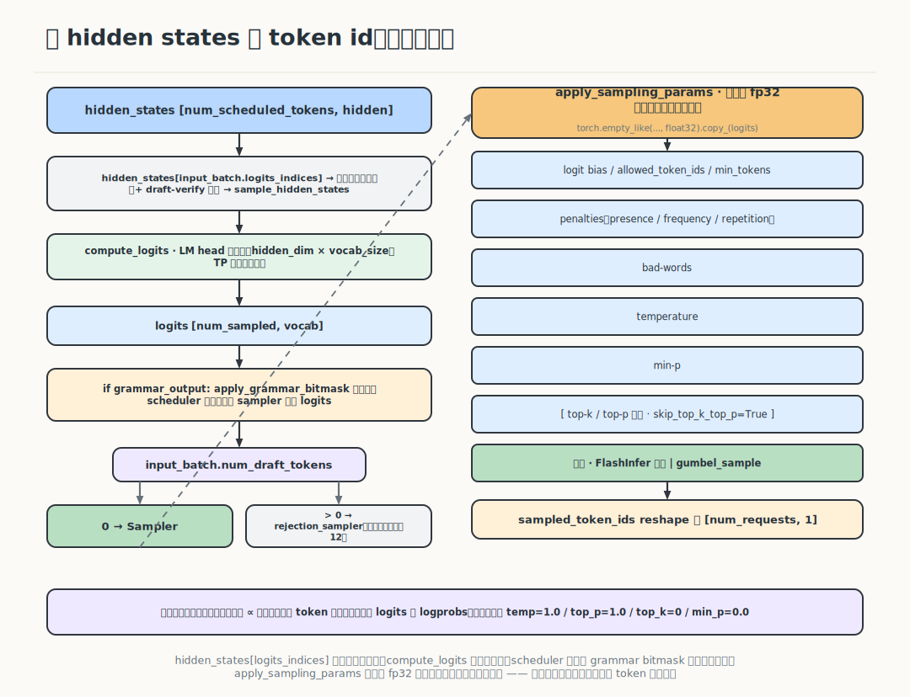</a>

<p class='figure-caption'>从 hidden states 到 token id：`hidden_states[input_batch.logits_indices]` 只选出最终位置，`compute_logits` 投影到词表，scheduler 拥有的 grammar bitmask 原地应用，然后 `apply_sampling_params` 在私有 fp32 副本上按顺序运行算子（bias / `min_tokens` → penalties → bad-words → temperature → min-p，top-k/top-p 暂缓）再抽取——因此采样成本随请求数而非 token 数扩展。</p>

逐步阅读：

- **`Sampler.__call__`（[`sampler.py:72-102`](https://github.com/halfrost/vllm/blob/6cf7b26bd4bff60bf378e1af14044280ac0d214c/vllm/v1/worker/gpu/sample/sampler.py#L72-L102)）是来自 model runner 的真正入口。** 它根据 `input_batch.logits_indices` 推导 `pos` 和 `input_ids`，判断是否需要 logprobs，调用 `self.sample(...)`，并将结果打包进 `SamplerOutput`，其中 `sampled_token_ids` 被 reshape 为 `[num_requests, 1]`（[`sampler.py:134-144`](https://github.com/halfrost/vllm/blob/6cf7b26bd4bff60bf378e1af14044280ac0d214c/vllm/v1/worker/gpu/sample/sampler.py#L134-L144)）——在 spec decode 将其展开之前，每个 step 中每个 request 对应一个 token。
- **`apply_sampling_params` 是 logits-processing 流水线。** 按顺序（[`sampler.py:146-196`](https://github.com/halfrost/vllm/blob/6cf7b26bd4bff60bf378e1af14044280ac0d214c/vllm/v1/worker/gpu/sample/sampler.py#L146-L196)）：将 logits 复制到一个全新的 fp32 tensor，然后依次应用 logit bias / `allowed_token_ids` / `min_tokens`、penalties（presence、frequency、repetition）、bad-words masking、temperature 和 min-p——这里暂缓 top-k/top-p（`skip_top_k_top_p=True`），以便 `sample` 可以将它们路由到 FlashInfer fused path 或 fallback。每个算子都是第 10 篇文章的一个小节；第 01 篇只说明它们的存在和顺序。
- **抽样本身**（[`sampler.py:217-244`](https://github.com/halfrost/vllm/blob/6cf7b26bd4bff60bf378e1af14044280ac0d214c/vllm/v1/worker/gpu/sample/sampler.py#L217-L244)）在满足条件时选择 FlashInfer 的 fused top-k/top-p sampler，否则应用 top-k/top-p 并调用 `gumbel_sample`，返回 `(sampled, processed_logits)`。

这个不变量可以从 `apply_sampling_params` 的第一行看出（[`sampler.py:157`](https://github.com/halfrost/vllm/blob/6cf7b26bd4bff60bf378e1af14044280ac0d214c/vllm/v1/worker/gpu/sample/sampler.py#L157)，`torch.empty_like(logits, dtype=torch.float32).copy_(logits)`）：**sampling 始终在私有的 fp32 副本上进行，绝不会直接操作模型原始 logits。** Penalties 和 temperature 会原地修改这个副本，因此 raw logits 会完好保留下来用于 logprob 计算，模型自身的 buffer 也绝不会被 sampling 阶段的修改破坏。使这条流水线在未显式请求时保持 no-op 的默认值——`temperature=1.0`、`top_p=1.0`、`top_k=0`（所有 token）、`min_p=0.0`、`n=1`、`max_tokens=16`——来自 offline 和 online 两条路径共用的同一个 `SamplingParams` 对象（[SamplingParams API](https://docs.vllm.ai/en/stable/api/vllm/sampling_params.html)）。

### 闭环：token id 变成 `new_token_ids`

概念：采样得到的 id 不会以整数形式返回给调用方。它会作为 wire-shaped `EngineCoreOutput` 的一个字段返回，并由 `update_from_output` 折叠进 request progress（§6）。

来源：[`vllm/v1/engine/__init__.py:181-205`](https://github.com/halfrost/vllm/blob/6cf7b26bd4bff60bf378e1af14044280ac0d214c/vllm/v1/engine/__init__.py#L181-L205)（两个关键字段；§10 引用了完整 struct）：

```python
    request_id: str
    new_token_ids: list[int]
    ...
    @property
    def finished(self) -> bool:
        return self.finish_reason is not None
```

Step-by-step 解读：

- **`new_token_ids: list[int]`，不是 `int`。** 从 sampler 到调用方的路径，从第一个字段开始就已经为多 token 做好了准备。常见情况下，这个列表只包含一个 id；在 speculative decoding 或其他多 token 方案下，它会包含某一步中被接受的多个 id（文章 12）。下游的任何组件——detokenizer、stop-string 检查、`RequestOutput`——都不需要在这个边界上对 spec decode 做特殊处理，因为类型本身已经覆盖了这种情况。
- **`finished` 是派生属性，不是存储的标志位。** 当且仅当 `finish_reason` 被设置时，它才是 `True`。engine core 会在 length/EOS 结束时设置 `finish_reason`；stop-*string* 结束则稍后由 output processor 基于 detokenized text 判定（§10）——这也是为什么在某一步中，`EngineCoreOutput.finished` 和调用方可见的结束状态可以合理地不一致。
- **`num_nans_in_logits`** 是损坏检测的 tripwire：sampler 会在 penalties 和 temperature 之前计算它（[`sampler.py:84-86`](https://github.com/halfrost/vllm/blob/6cf7b26bd4bff60bf378e1af14044280ac0d214c/vllm/v1/worker/gpu/sample/sampler.py#L84-L86)），因此非零值指向的是模型自身输出的问题，而不是 sampling 的问题。

这个不变量是：**采样得到的 token 是作为 msgspec struct 上的数据离开 GPU 的，而不是沿着调用栈向上返回的返回值。** 从 hidden states 到 token 的整个计算都发生在 engine（或 worker）进程中；调用方只有在 `update_from_output` 已经把 `new_token_ids` 提交到 request state，并通过 client 将 `EngineCoreOutputs` 路由回来之后，才会收到这些 `new_token_ids`。具体来说，“first token”就是某个 request 发出的第一个携带非空 `new_token_ids` 的 `EngineCoreOutput`；它所标记的 prefill-to-decode 转换，要到下一个边界，也就是 output processor 中才会被观察到（§10–§11）。

交叉引用：这里提到但尚未展开的 logits-processing 算子——logit bias、penalties、bad words、temperature、min-p、top-k/top-p，以及 logprob assembly——是**文章 10**（Sampling and Logits Processing）的完整主题。`rejection_sampler` 分支和多 token 的 `new_token_ids` 属于**文章 12**（Speculative Decoding）。`logits_indices` gather 以及它所索引的 flattened-batch 布局属于**文章 08/09**。下一节会沿着 `new_token_ids` 离开 GPU、进入文本的路径继续追踪。

## Output Processing：从 EngineCoreOutput 到 RequestOutput

前面的每一节都在把 request *向前* 推进：façade 对其规范化，input processor 将其整理成线路上的形态，client abstraction 将其跨进程边界传送，engine step 对其进行调度和采样。本节则是唯一一个反向运行的部分。采样得到的 token ID 会以 `EngineCoreOutputs` 的形式离开 `EngineCore.step()`——这是一个按 client 分组、内部包含各 request 的 `EngineCoreOutput` 的 bundle——随后必须变成面向用户的 `RequestOutput`，其中携带 decoded text、finish reasons 和 logprobs。这个转换由 `OutputProcessor` 完成，并且它被有意设计为*不*属于热路径 engine loop 的一部分。§6 已经从调用方一侧展示了这个接缝：`LLMEngine.step()` 调用 `get_output()`，然后调用 `output_processor.process_outputs(...)`，再把返回的 `reqs_to_abort` 喂回 engine。本节会打开中间这个调用，并展示它所维护的不变量。

<a href='images/vllm-01-08-output-path.svg' target='_blank'>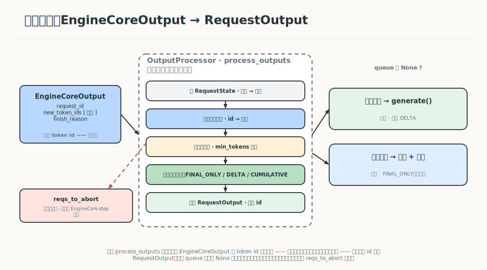</a>

<p class='figure-caption'>返回路径：一批 `EngineCoreOutput`s → 单个 `process_outputs` 循环 → 按 request 执行 detokenize / stop-check / materialize → async queue 或 sync list。</p>

### 输入结构：engine 实际传回的是什么

概念：跨越边界的单元被刻意设计得很小——token ID 加可选 metadata，而不是文本。

来源：[`vllm/v1/engine/__init__.py:175-205`](https://github.com/halfrost/vllm/blob/6cf7b26bd4bff60bf378e1af14044280ac0d214c/vllm/v1/engine/__init__.py#L175-L205)

```python
class EngineCoreOutput(
    msgspec.Struct,
    array_like=True,  # type: ignore[call-arg]
    omit_defaults=True,  # type: ignore[call-arg]
    gc=False,
):  # type: ignore[call-arg]
    request_id: str
    new_token_ids: list[int]
    ...
    finish_reason: FinishReason | None = None
    stop_reason: int | str | None = None
    ...
    @property
    def finished(self) -> bool:
        return self.finish_reason is not None
```

逐步阅读。`new_token_ids` 是一个 **list**，不是标量——一个 step 可以为每个请求提交多个 token（speculative decoding、多 token prediction），因此返回路径必须写成一次性折叠 *N* 个 token，而不是假设只有一个。它后面的所有内容都是可选的（`omit_defaults=True`），而 `finished` 是一个*派生*属性：当且仅当 engine 附加了 `finish_reason`（length、EOS、stop-token）时，请求才算完成。尤其要注意，这里**没有 text 字段**——在 V1 中，detokenization 被移出了 engine 进程，以便与 GPU 工作重叠（[V1 blog](https://vllm.ai/blog/2025-01-27-v1-alpha-release)）。engine 发送 ID；text 是 output processor 的职责。

这个形状所保护的不变量是：**“finished” 表示“具有 finish reason”，而 engine 是这件事的权威来源——除了 stop *strings*，因为 engine 没有文本，所以看不到它们。** 这个唯一的缺口，就是返回路径能够向 engine *反向*发送信号的全部原因；接下来的几个小节会说明它如何安全地做到这一点。

### 唯一允许触碰整个 batch 的循环

概念：V1 尽量减少 Python 层面的逐 batch 循环。只有一个函数会迭代 batch，并且所有逐请求工作都应当放在其中。

来源：[`vllm/v1/engine/output_processor.py:594-601`](https://github.com/halfrost/vllm/blob/6cf7b26bd4bff60bf378e1af14044280ac0d214c/vllm/v1/engine/output_processor.py#L594-L601)

```python
        NOTE FOR DEVELOPERS

        vLLM V1 minimizes the number of python loops over the full
        batch to ensure system overheads are minimized. This is the
        only function that should loop over EngineCoreOutputs.

        If you need to touch every element of the batch, do it from
        within the loop below.
```

该循环首先查找每个请求的状态，并丢弃无法识别的输出。

来源：[`vllm/v1/engine/output_processor.py:606-611`](https://github.com/halfrost/vllm/blob/6cf7b26bd4bff60bf378e1af14044280ac0d214c/vllm/v1/engine/output_processor.py#L606-L611)

```python
        for engine_core_output in engine_core_outputs:
            req_id = engine_core_output.request_id
            req_state = self.request_states.get(req_id)
            if req_state is None:
                # Ignore output for already-aborted request.
                continue
```

逐步阅读。`req_state` 是生命周期较长的逐请求累加器（`RequestState`），保存该请求的 detokenizer、logprobs processor、prompt data 以及流式传输的记账状态。它不存在**并不是错误**——某个请求可能在片刻之前已经中止（由于客户端断开连接、被取消的 `generate()`、或先前命中的 stop string），并且已经从 `request_states` 中弹出，而引擎此时可能仍在飞行中，为它产生最后一个输出。静默地 `continue`，正是让中止与输出处理在没有锁的情况下做到竞态安全的原因：双方会收敛，因为缺失的条目被定义为“丢弃”，而不是“崩溃”。

该不变量是：**输出处理器是 `request_states` 的纯函数；对于它不再拥有的请求，任何输出都会被丢弃。** 这使得 abort 可以与某个步骤并发执行，即使该步骤的输出已经在飞行中。

### Detokenize，并提升引擎无法看见的 stop strings

概念：对于非 pooling 请求，新的 ID 会被送入增量式 detokenizer，后者追加解码文本并检查 stop strings。命中的 stop string 会在本地*升级*完成状态。

来源：[`vllm/v1/engine/output_processor.py:635-644`](https://github.com/halfrost/vllm/blob/6cf7b26bd4bff60bf378e1af14044280ac0d214c/vllm/v1/engine/output_processor.py#L635-L644)

```python
            if pooling_output is None:
                assert req_state.detokenizer is not None
                assert req_state.logprobs_processor is not None
                # 2) Detokenize the token ids into text and perform stop checks.
                stop_string = req_state.detokenizer.update(
                    new_token_ids, finish_reason == FinishReason.STOP
                )
                if stop_string:
                    finish_reason = FinishReason.STOP
                    stop_reason = stop_string
```

detokenizer 的 `update` 是 token ID 转换为字符的地方。它的微妙之处在于，*token* 流和 *text* 流被有意允许不一致。

来源：[`vllm/v1/engine/detokenizer.py:107-142`](https://github.com/halfrost/vllm/blob/6cf7b26bd4bff60bf378e1af14044280ac0d214c/vllm/v1/engine/detokenizer.py#L107-L142)（节选；完整的增量解码循环见第 10 篇）：

```python
        if stop_terminated and not self.include_stop_str_in_output:
            # If stop-terminated, exclude last token from detokenization
            # based on include_stop_str_in_output parameter.
            skipped_stop_token_id = new_token_ids[-1]
            new_token_ids = new_token_ids[:-1]
        else:
            skipped_stop_token_id = None

        # 1) Detokenize the new token ids incrementally.
        stop_check_offset = len(self.output_text)
        ...

        # 2) Evaluate stop strings.
        stop_string = None
        if self.stop and self.num_output_tokens() > self.min_tokens:
            stop = check_stop_strings(
                output_text=self.output_text,
                new_char_count=len(self.output_text) - stop_check_offset,
                stop=self.stop,
                include_in_output=self.include_stop_str_in_output,
            )
            if stop is not None:
                stop_string, truncate_to = stop
                if truncate_to != -1:
                    self.output_text = self.output_text[:truncate_to]

        return stop_string
```

逐步阅读。当 engine 因 stop *token* 停止，而用户没有要求保留它时，最后一个 ID 会从 decode set 中取出（`skipped_stop_token_id`），因此它不会贡献任何字符，随后再追加回 `token_ids` —— token 列表保持完整，而文本会省略终止符。省略的增量循环会解码每个新 ID，并推进 `stop_check_offset`（一个受 `min_tokens` 门控的高水位标记），因此 stop-string 搜索只覆盖*新添加的*字符 —— 每一步的匹配复杂度是 O(new chars)，而不是 O(whole output)；完整循环见第 10 篇。`num_output_tokens() > self.min_tokens` 这个 guard 会门控整个 stop block，因此**在达到 `min_tokens` 之前，任何 stop string 都不会触发**。匹配时，`check_stop_strings` 可能返回一个截断长度，于是 `output_text` 会被裁剪以删除 stop string（除非 `truncate_to == -1`，表示它正好位于末尾，不需要裁剪）。

回到循环中：如果 `update` 返回了一个 stop string，processor 会**将 `finish_reason` 覆盖为 `STOP`，并将 `stop_reason` 设置为匹配到的字符串**。这就是输入结构体所铺垫的分歧：`engine_core_output.finished` 可能仍然是 `False`（engine 还在继续生成），但 processor 已经在本地判定该请求已完成。§6 展示了闭环的另一半 —— 循环会把这些 `req_id` 追加到 `reqs_to_abort`，而 `LLMEngine.step()` / 异步的 `output_handler` 会将它们反馈回去，使得*下一次* `EngineCore.step()` 在其 abort window 停止该请求。

不变量：**(1) `token_ids` 是完整的采样序列；`output_text` 可以省略 stop token/string —— 二者按设计允许不一致。** **(2) `min_tokens` 在文本侧同样得到遵守，而不只是 engine 侧。** **(3) stop-string 检测是 return-path 概念，而让 return path 停止 engine 的唯一机制是 `reqs_to_abort`。** 这能防止：把 stop string 流式传给用户、让 stop string 在 `min_tokens` 之前终止生成，以及——由于 promotion 加上 `reqs_to_abort` 具有最终一致性——engine 继续在文本层已经完成的请求上浪费 token。

### 决定本步骤是否要暴露任何内容

概念：并不是每个 `EngineCoreOutput` 都会变成一个 `RequestOutput`。`make_request_output` 会应用 output-kind gates，并在不应发出任何内容时返回 `None`。

来源：[`vllm/v1/engine/output_processor.py:280-331`](https://github.com/halfrost/vllm/blob/6cf7b26bd4bff60bf378e1af14044280ac0d214c/vllm/v1/engine/output_processor.py#L280-L331)

```python
        finished = finish_reason is not None
        final_only = self.output_kind == RequestOutputKind.FINAL_ONLY

        if not finished and final_only:
            # Only the final output is required in FINAL_ONLY mode.
            return None

        if self.stream_interval > 1:
            assert self.detokenizer is not None
            ...
            if not (
                finished
                or self.sent_tokens_offset == 0
                or self.detokenizer.num_output_tokens() - self.sent_tokens_offset
                >= self.stream_interval
            ):
                return None

            if self.output_kind == RequestOutputKind.DELTA:
                # Send tokens from the offset in DELTA mode, otherwise all
                # tokens are sent.
                new_token_ids = self.detokenizer.output_token_ids[
                    self.sent_tokens_offset :
                ]
                self.sent_tokens_offset = self.detokenizer.num_output_tokens()

        external_req_id = self.external_req_id
        ...
        output = self._new_completion_output(new_token_ids, finish_reason, stop_reason)

        if self.parent_req is None:
            outputs = [output]
        else:
            outputs, finished = self.parent_req.get_outputs(self.request_id, output)
            if not outputs:
                return None
            external_req_id = self.parent_req.external_req_id

        return self._new_request_output(
            external_req_id, outputs, finished, kv_transfer_params
        )
```

逐步阅读。`output_kind` 来自 `SamplingParams.output_kind`，用于选择对外呈现契约：**`FINAL_ONLY`**（离线默认值——§2 展示了 `_add_request` 会强制设为它）只在完成时恰好产出一次输出，因此每个非最终步骤都返回 `None`；**`DELTA`**（OpenAI 流式）只产出新生成的切片；**`CUMULATIVE`** 会重新发送不断增长的完整内容。`stream_interval > 1` 会进一步合并：只在完成时、首个 token 时，或每隔 `stream_interval` 个 token 时产出——并且在 DELTA 模式下，它会将 `new_token_ids` 重新切片为 `output_token_ids[sent_tokens_offset:]`，并推进 `sent_tokens_offset`，因此在静默步骤中被跳过的 token 会被一起交付，而不是被丢弃。最后，并行采样（`n>1`）会通过 `parent_req.get_outputs` 路由：子输出会被聚合，空列表表示“尚未准备好对外呈现”→ `None`，而对外呈现的 id 会切换为**父请求的**外部 id（§5 的 fan-out，在这里闭合）。

这些不变量是：**`FINAL_ONLY` 恰好产出一次输出；`stream_interval` 会合并但绝不会丢弃 delta token（`sent_tokens_offset` 是高水位标记）；并行采样的子请求会在同一个父 id 下对外呈现。** 这能防止：离线调用方每一步都收到一个 `RequestOutput`（它只想要一个）、delta 消费者在合并间隔中丢失 token，以及 `n>1` 泄漏成 `n` 个独立的用户结果。

### 信封：始终使用外部 id

概念：最终的包装器会把面向用户的身份标记到结果上。

来源：[`vllm/v1/engine/output_processor.py:363-373`](https://github.com/halfrost/vllm/blob/6cf7b26bd4bff60bf378e1af14044280ac0d214c/vllm/v1/engine/output_processor.py#L363-L373)

```python
        return RequestOutput(
            request_id=external_req_id,  # request_id is what was provided externally
            lora_request=self.lora_request,
            prompt=self.prompt,
            prompt_token_ids=prompt_token_ids,
            prompt_logprobs=prompt_logprobs,
            outputs=cast(list[CompletionOutput], outputs),
            finished=finished,
            kv_transfer_params=kv_transfer_params,
            num_cached_tokens=self.num_cached_tokens,
            metrics=self.stats,
        )
```

逐步阅读。回忆 §3：`assign_request_id` 会向内部 id 追加 8 个随机字符以确保唯一性，同时把调用方的 id 存入 `external_req_id`。这里，在结果到达用户前的最后一跳，`request_id` 被设置为 `external_req_id` —— 绝不是内部随机化后的 id，也绝不是并行采样的子 id。Prompt logprobs 在 DELTA 模式下会被 *popped*（只暴露一次），否则按引用传递；这部分组装属于第 10 篇文章的范围。

不变量：**每个面向用户的 `RequestOutput.request_id` 都是调用方提交的外部 id。** 它防止的是：内部 ID 方案（随机后缀、子请求扇出）泄漏到 API 响应中；否则会破坏离线排空的终端 `sorted(..., key=lambda x: int(x.request_id))`（§2），以及任何依赖自身请求 ID 关联结果的客户端。

### 唯一分叉：异步 push vs 同步 return

概念：一个单独的 `if` 决定物化后的输出是被 push 到每个请求的异步 mailbox，还是追加到返回列表中。

Source: [`vllm/v1/engine/output_processor.py:650-681`](https://github.com/halfrost/vllm/blob/6cf7b26bd4bff60bf378e1af14044280ac0d214c/vllm/v1/engine/output_processor.py#L650-L681)

```python
            # 4) Create and handle RequestOutput objects.
            if request_output := req_state.make_request_output(
                new_token_ids,
                pooling_output,
                finish_reason,
                stop_reason,
                kv_transfer_params,
            ):
                if req_state.streaming_input:
                    request_output.finished = False

                if req_state.queue is not None:
                    # AsyncLLM: put into queue for handling by generate().
                    req_state.queue.put(request_output)
                else:
                    # LLMEngine: return list of RequestOutputs.
                    request_outputs.append(request_output)

            # Free completed requests.
            if finish_reason is not None:
                if req_state.streaming_input:
                    ...
                else:
                    self._finish_request(req_state)
                    if not engine_core_output.finished:
                        # If req not finished in EngineCore, but Detokenizer
                        # detected stop string, abort needed in EngineCore.
                        reqs_to_abort.append(req_id)
```

逐步读下来。`req_state.queue is not None` 是在线与离线返回路径之间的*唯一*差异。在 `AsyncLLM` 中，这个 queue 是每个请求独有的 `RequestOutputCollector`，由 `generate()` await；在 `LLMEngine` 中它是 `None`，输出会累积到一个 list 中，由同步调用方取走。两个分支都会执行上面完全相同的 detokenize / stop-check / materialize 逻辑——只有最后一步不同。清理过程也与此对应：完成时，`_finish_request` 会从每个索引中 pop 掉状态（`request_states`、external→internal 映射、parent），而 `not engine_core_output.finished` 检查正是前面 stop-string 闭包的结果——engine 仍然认为该请求是存活的，因此它的 id 会加入 `reqs_to_abort`。

这里的不变式是：**在线和离线共享同一条代码路径，只在单个分支处分流；streaming mailbox 的内部机制和 async generator 在 §11 中，深层 async fan-out 在第 04 篇中。** 这避免了什么：两套并行的输出处理实现逐渐偏离——相同的 stop-string、delta 和 parallel-sampling 语义可以保证对 `LLM.generate()` 和 OpenAI server 完全一致，因为它们运行的是同一个循环。

### 需要带到后文的要点

output processor 是 token ID 重新获得语义的地方。它拥有 engine 刻意不负责的四件事：**增量 detokenization**（IDs → text，同时尊重 token/text divergence 和 `min_tokens`）、**stop-string 检测**（唯一会通过 `reqs_to_abort` *回流*到 engine 的信号）、**output-kind gating**（FINAL_ONLY / DELTA / CUMULATIVE / stream_interval，决定某个 step 是否真正对外暴露任何内容），以及**身份标识**（始终使用 external id）。它是一个 race-safe 的循环，而其唯一的 `queue is not None` 分叉，就是阻塞式离线收集（§2）与流式在线投递（§11）之间的接缝。交接点：**第 10 篇**讲 logprobs 组装和 detokenizer 后端（Rust `DecodeStream` 快路径 vs. Python 慢路径）；**第 04 篇**讲 async `output_handler` fan-out 以及 engine 内部 finished-request 生命周期；**§11**讲 `RequestOutputCollector` mailbox，以及第一个 `RequestOutput` 如何变成客户端看到的第一个 token。

## Streaming、Async Generator，以及为什么第一个 Token 很特殊

我们前面追踪过的离线路径，最终落在一个阻塞的 `while has_unfinished_requests(): step()` 循环中：它把完成的输出累积到 list 里并排序（[`offline_utils.py:594-599`](https://github.com/halfrost/vllm/blob/6cf7b26bd4bff60bf378e1af14044280ac0d214c/vllm/entrypoints/offline_utils.py#L594-L599)）。在线 serving 不能这么做。一个 OpenAI 兼容的 SSE stream 必须在每个 token 被采样出来的瞬间就把它交付给 HTTP 客户端，同时还要支撑数百个并发请求，并且不能让任何一个慢客户端拖住 GPU。V1 的答案是保持 engine step 完全相同，只改变*返回路径*：不再收集 list，而是把同一份逐 step 的 `EngineCoreOutputs` batch fan out 到每个请求各自的 mailbox 中，再由每个请求一个 asyncio generator 去排空自己的 mailbox。本节会沿着这条返回路径走一遍，然后借它明确“第一个 token”到底是什么。

在线返回路径是**两层 producer/consumer 边界堆叠在一起，并由 asyncio 解耦**。边界 A：一个后台任务拥有 ZMQ output socket，把每个 frame 解码成一个 `EngineCoreOutputs` batch（每个 engine step 一个，覆盖所有 in-flight 请求），并将其推入 `AsyncMPClient.outputs_queue`，即一个 `asyncio.Queue`（[`core_client.py:973`](https://github.com/halfrost/vllm/blob/6cf7b26bd4bff60bf378e1af14044280ac0d214c/vllm/v1/engine/core_client.py#L973)，`1005-1062`）。边界 B：每个 `AsyncLLM` 有一个独立的 `output_handler` task await 这个 queue，运行 `OutputProcessor.process_outputs`，并把每个请求的结果 dispatch 到其自己的 mailbox。边界 A 背后的 socket topology 属于第 03 篇的范围；这里我们关心的是跨过边界 B 并到达调用方的内容。

<a href='images/vllm-01-09-prefill-decode-timeline.svg' target='_blank'>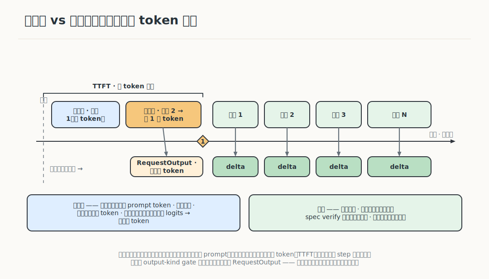</a>

<p class='figure-caption'>单个请求的时间线——准入、（可能 chunked 的）prefill、第一个采样 token（TTFT），然后是逐 step decode，每个 step 产出一个 RequestOutput。</p>

### `generate()` 是一个纯消费者

公开的在线 API `AsyncLLM.generate` 是一个 async generator。关键在于，它**不会**驱动 engine——它只消费自己的 mailbox。

[`vllm/v1/engine/async_llm.py:575-586`](https://github.com/halfrost/vllm/blob/6cf7b26bd4bff60bf378e1af14044280ac0d214c/vllm/v1/engine/async_llm.py#L575-L586)：

```python
            finished = False
            while not finished:
                # Note: drain queue without await if possible (avoids
                # task switching under load which helps performance).
                out = q.get_nowait() or await q.get()

                # Note: both OutputProcessor and EngineCore handle their
                # own request cleanup based on finished.
                assert isinstance(out, RequestOutput)
                finished = out.finished
                if out is not STREAM_FINISHED:
                    yield out
```

<a href='images/vllm-01-26-async-mailbox.svg' target='_blank'>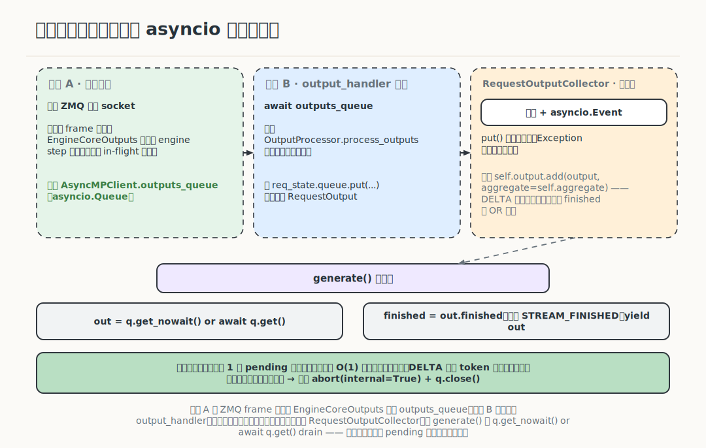</a>

<p class='figure-caption'>在线返回路径是两个由 asyncio 解耦的边界：边界 A（后台任务把 ZMQ frame 解码成 `EngineCoreOutputs` 并推入 `outputs_queue`）与 边界 B（一个 `output_handler` 运行 `process_outputs`，把每个结果分发进每请求的单槽、可合并 `RequestOutputCollector`），由 `generate()` 用 `q.get_nowait() or await q.get()` 排空——每个请求至多一个 pending 输出，合并无损。</p>

逐步解读：

1. `q` 是由 `add_request` 返回的、按请求对应的 `RequestOutputCollector`（[`async_llm.py:559`](https://github.com/halfrost/vllm/blob/6cf7b26bd4bff60bf378e1af14044280ac0d214c/vllm/v1/engine/async_llm.py#L559)）；它也在同一个 await 链路中将该请求注册到 `OutputProcessor`，并提交给 EngineCore（§5）。当这个循环运行时，mailbox 已经接入 fan-out。
2. `out = q.get_nowait() or await q.get()`（L579）会先尝试非阻塞获取；只有 mailbox 为空时才会触发 `await`。注释（L577-578）说明了其意图：在高负载下，跳过事件循环的 task switch 很重要，因为在高并发时通常已经有 token 在等待。
3. 终止条件**随数据一起传递**：`finished = out.finished`（L584）。producer 会在最后一个 `RequestOutput` 上标记 `finished=True`；consumer 在 yield 它之后停止。`generate()` 不需要了解 scheduler 或 EngineCore 的生命周期，也能知道何时停止。
4. `STREAM_FINISHED`（一个 `finished=True` 且 `outputs` 为空的哨兵 `RequestOutput`，[`outputs.py:191-199`](https://github.com/halfrost/vllm/blob/6cf7b26bd4bff60bf378e1af14044280ac0d214c/vllm/outputs.py#L191-L199)）会被过滤掉（L585）——它用于在 streaming-input 完成时解除循环阻塞，但不会发出一个多余的空 chunk。

不变式：**当数据已就绪时，消费任务绝不会阻塞事件循环，并且会精确地在一个 `finished` output 上终止。** 由于循环条件位于被 yield 的对象上，`generate()` 与其下方的每一个进程边界都解耦了——该请求可以由进程内 engine 提供服务，可以通过 ZMQ 由子进程提供服务，也可以由多个数据并行 core 中的某一个提供服务（§4），而这个循环保持不变。

### 按请求的 mailbox 是一个单槽、可合并的缓冲区

从共享的 `output_handler`（producer）到按请求的 `generate()`（consumer）的交接，被有意设计成**不是**无界队列。它是一个单槽 mailbox 加上一个 `asyncio.Event`；如果 producer 跑得比 consumer 快，连续的 output 会被**原地合并**。

[`vllm/v1/engine/output_processor.py:62-86`](https://github.com/halfrost/vllm/blob/6cf7b26bd4bff60bf378e1af14044280ac0d214c/vllm/v1/engine/output_processor.py#L62-L86)：

```python
    def put(self, output: RequestOutput | PoolingRequestOutput | Exception) -> None:
        """Non-blocking put operation."""
        if self.output is None or isinstance(output, Exception):
            self.output = output
            self.ready.set()
        elif isinstance(self.output, RequestOutput) and isinstance(
            output, RequestOutput
        ):
            # This ensures that request outputs with different request indexes
            # (if n > 1) do not override each other.
            self.output.add(output, aggregate=self.aggregate)
        elif isinstance(self.output, PoolingRequestOutput) and isinstance(
            output, PoolingRequestOutput
        ):
            self.output = output

    async def get(self) -> RequestOutput | PoolingRequestOutput:
        """Get operation blocks on put event."""
        while (output := self.output) is None:
            await self.ready.wait()
        self.output = None
        self.ready.clear()
        if isinstance(output, Exception):
            raise output
        return output
```

分步阅读：

1. `put()` 由 producer 同步执行。如果 slot 为空（或该 item 是 `Exception`），就安装它并执行 `self.ready.set()` —— 异常总是会立即占用 slot，且永远不会被合并掉，因此死亡的 engine 会立刻暴露给 waiter。
2. 如果 slot 中已经持有一个 `RequestOutput`，新的输出会通过 `self.output.add(output, aggregate=self.aggregate)`（L72）折叠进去，而不是覆盖。`aggregate` 只在 `DELTA` 模式下为 `True`（`self.aggregate = output_kind == RequestOutputKind.DELTA`，L55）。该 merge（[`outputs.py:145-173`](https://github.com/halfrost/vllm/blob/6cf7b26bd4bff60bf378e1af14044280ac0d214c/vllm/outputs.py#L145-L173)）会在 DELTA streaming 中拼接 text/token-ids/logprobs，在 cumulative streaming 中替换整个 snapshot，并对 `finished` 做 OR 折叠，因此即使某个合并后的 batch 吞掉了终止 chunk，generate loop 仍然会停止。
3. `get()` 会 await `self.ready`，直到 slot 非 `None`，然后清空 slot 和 event。

该不变量是：**任意时刻每个请求最多只有一个 pending output，且 coalescing 是无损的。** 无论慢客户端落后多远，每个请求的 live memory 都是 O(1) —— mailbox 会合并而不是积累 backlog —— 同时 DELTA consumer 仍会按顺序、且恰好一次地接收每个 token，因为 merge 等价于拼接。这就是同步 offline list 不需要的 back-pressure 机制：那里的 driver thread 会立即消费每一步的输出，因此不会有任何东西累积。

### 一个 loop，一个 flag：sync 与 async 在哪里分叉

两个 engine 共享 batch 上最热的那个 CPU loop —— `process_outputs`，即“唯一应该遍历 EngineCoreOutputs 的函数”（[`output_processor.py:594-601`](https://github.com/halfrost/vllm/blob/6cf7b26bd4bff60bf378e1af14044280ac0d214c/vllm/v1/engine/output_processor.py#L594-L601)）。§10 已经展开了其中唯一一个将 sync 与 async 分开的分支：`if req_state.queue is not None:` 会把物化后的 `RequestOutput` 推入每个请求的 mailbox（async），而不是追加到返回 list（sync）（[`output_processor.py:650-666`](https://github.com/halfrost/vllm/blob/6cf7b26bd4bff60bf378e1af14044280ac0d214c/vllm/v1/engine/output_processor.py#L650-L666)）。async engine 在准入时注册该 `queue`（§5）；sync engine 则传入 `queue=None`。

真正属于 §11 自身的是该分叉对 streaming 的影响。因为存在 queue，async dispatch 可被证明是纯 push-only 的 —— 这就是为什么 `output_handler` 可以 `assert not processed_outputs.request_outputs`（[`async_llm.py:679`](https://github.com/halfrost/vllm/blob/6cf7b26bd4bff60bf378e1af14044280ac0d214c/vllm/v1/engine/async_llm.py#L679)）：一旦接入 queue，返回 list 就永远不会被触碰。所以 streaming 不会增加第二个遍历 batch 的 loop —— 它复用 offline 已经在运行的那个 loop，只替换最后一条语句。`make_request_output` 所依赖的 detokenization、stop-string 检查和 logprob 组装是第 10 篇文章的主题；第 04 篇则负责已完成请求的记账和 `reqs_to_abort` 路径。

### 为什么首个 token 是特殊的

Prefill 和 decode 是两种不同的 forward pass。根据 “Inside vLLM” walkthrough（[Inside vLLM](https://vllm.ai/blog/2025-09-05-anatomy-of-vllm)）：**prefill** 是“对所有 prompt token 的一次 forward pass”，通常受 compute 限制；**decode** 是“只对最近一个 token 的一次 forward pass”，受 memory bandwidth 限制。V1 并不会把它们作为独立阶段运行 —— 它统一处理所有 token，调度决策在概念上是 `{request_id: num_tokens}`（[V1 blog](https://vllm.ai/blog/2025-01-27-v1-alpha-release)），因此长 prompt 可以被拆分到多个 step 中（chunked prefill，第 05 篇文章）。这对 streaming 的影响是：一个请求可能会占用 GPU 一个或多个 step，却不产生任何 sampled token，因为只有最终 prefill 位置才会产生用于 sampling 的 logits。因此，第一个携带真实 `new_token_ids` 的 `EngineCoreOutput` 是一个独立事件，output processor 会对其进行标记。

[`vllm/v1/engine/output_processor.py:628-633`](https://github.com/halfrost/vllm/blob/6cf7b26bd4bff60bf378e1af14044280ac0d214c/vllm/v1/engine/output_processor.py#L628-L633)：

```python
            if req_state.is_prefilling:
                if engine_core_output.prefill_stats is not None:
                    req_state.num_cached_tokens = (
                        engine_core_output.prefill_stats.num_cached_tokens
                    )
                req_state.is_prefilling = False
```

逐步阅读：`is_prefilling` 在 `RequestState` 构造时初始为 `True`（[`output_processor.py:172`](https://github.com/halfrost/vllm/blob/6cf7b26bd4bff60bf378e1af14044280ac0d214c/vllm/v1/engine/output_processor.py#L172)）；之后只有当流式输入请求恢复 prefill 时，才会再次被重置为 `True`（`apply_streaming_update`, [`output_processor.py:191-208`](https://github.com/halfrost/vllm/blob/6cf7b26bd4bff60bf378e1af14044280ac0d214c/vllm/v1/engine/output_processor.py#L191-L208)）。到达处理器的第一个输出会一次性捕获 `num_cached_tokens`——即该请求的 prefix-cache 命中数，也就是文章 07 的指标——并将 `is_prefilling` 翻转为 `False`。之后的每一步都是 decode。从准入到调用方收到第一个 `RequestOutput` 的耗时，基本上就是以下几部分之和：首次被调度前在 scheduler 队列中的等待（如有）、prefill 延迟（可能是多步 chunked prefill）、一次采样调用、增量 detokenization，以及跨边界 A 和 B 的两跳 fan-out。这个总和就是 *time-to-first-token*（TTFT），并且它在结构上不同于 decode 的 inter-token latency，后者是一步一个 token。

跨进程边界的完整首 token 链路是：`EngineCore.step()` 在 `update_from_output` 中提交采样得到的 token，并返回一个按 client 划分的 `dict[int, EngineCoreOutputs]`（[`core.py:504-508`](https://github.com/halfrost/vllm/blob/6cf7b26bd4bff60bf378e1af14044280ac0d214c/vllm/v1/engine/core.py#L504-L508)）；边界 A 将该 batch 入队；`output_handler` 运行 `process_outputs`，它会翻转 `is_prefilling`（如上所述）并把第一个 `RequestOutput` 推入 mailbox；`generate()` 将其 yield 出去（[`async_llm.py:585-586`](https://github.com/halfrost/vllm/blob/6cf7b26bd4bff60bf378e1af14044280ac0d214c/vllm/v1/engine/async_llm.py#L585-L586)）。没有任何单一调用栈贯穿这条链路——它是在 async client、共享 handler、每请求 mailbox 和 consumer task 之间接力完成的。

### 取消操作闭合了这条链路

因为 `generate()` 由可能断开的 HTTP client 消费，所以取消必须在 *两端* 都拆掉请求，否则 engine 会继续 decode 一个已经死亡的请求。[`async_llm.py:591-596`](https://github.com/halfrost/vllm/blob/6cf7b26bd4bff60bf378e1af14044280ac0d214c/vllm/v1/engine/async_llm.py#L591-L596) 捕获 `CancelledError`/`GeneratorExit`，调用 `self.abort(q.request_id, internal=True)`（这会同时在 OutputProcessor 和 EngineCore 中 abort），然后重新抛出；[`async_llm.py:633-635`](https://github.com/halfrost/vllm/blob/6cf7b26bd4bff60bf378e1af14044280ac0d214c/vllm/v1/engine/async_llm.py#L633-L635) 的 `finally` 会调用 `q.close()`，以取消任何 streaming-input feeder。离线路径不需要对应机制：它的 driver thread 拥有这些请求，只要停止迭代即可。

因此，流式路径就是把返回通道替换成 asyncio 管道后的离线路径：`LLMEngine.step` 是以内联方式运行的 `output_handler` 主体，其中 `queue=None` 并返回一个列表（[`llm_engine.py:296-334`](https://github.com/halfrost/vllm/blob/6cf7b26bd4bff60bf378e1af14044280ac0d214c/vllm/v1/engine/llm_engine.py#L296-L334)）；而 `LLM._run_engine` 的 `while has_unfinished_requests(): step()`（[`offline_utils.py:594-599`](https://github.com/halfrost/vllm/blob/6cf7b26bd4bff60bf378e1af14044280ac0d214c/vllm/entrypoints/offline_utils.py#L594-L599)）则承担了整个 task/queue/yield 机制的角色。engine step、scheduler、worker 和 sampler 从不知道自己正在服务哪一种路径。文章 02 介绍包装 `generate()` 的 OpenAI server；文章 03 介绍 边界 A 的 ZMQ client 和 socket 排空任务；文章 04 深入介绍 `process_outputs`、已完成请求处理，以及 `reqs_to_abort` 闭包。

## 完整的端到端 Trace，以及应该记住什么

现在，我们已经依次穿过了请求路径上的每一个边界。本收尾部分做两件事：把这些边界重新组装成一条单一的逻辑线程——从 `LLM.generate()` 到调用方手中的 `RequestOutput` 的一条不间断 trace——并提炼出值得带入后续深度文章的几条原则。这里没有新的机制；下面每一个锚点都已在前文中建立。把它们作为一条 trace 来读，其价值在于让 *接缝* 变得可见：你可以准确看到请求在何处更换所有者、更换表示形式、更换进程，并且可以说出每个接缝所换来的不变量。

<a href='images/vllm-01-10-full-trace.svg' target='_blank'>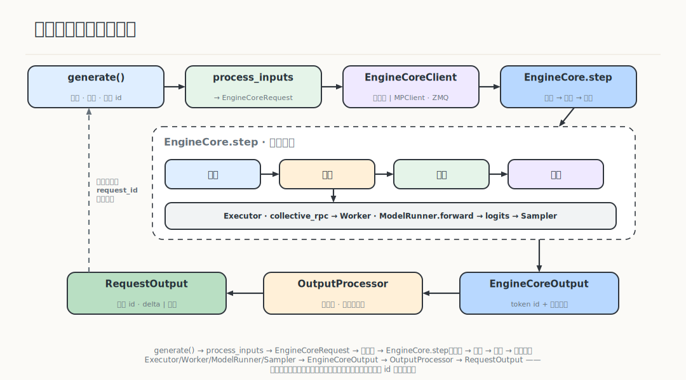</a>

<p class='figure-caption'>完整请求路径：`generate()` → input processor → `EngineCoreRequest` → client → `EngineCore.step`（schedule → execute → sample → commit）→ output processor → `RequestOutput`，并标注每一跳的所有者与不变量。</p>

### 逐跳 trace

跟随一个 prompt。行锚点指向每一跳实际执行的精确代码。

1. **`LLM.generate()` 执行校验并委托** — [`vllm/entrypoints/llm.py:465-485`](https://github.com/halfrost/vllm/blob/6cf7b26bd4bff60bf378e1af14044280ac0d214c/vllm/entrypoints/llm.py#L465-L485)。runner-type gate 会拒绝非生成式模型，`sampling_params` 会被填充默认值，因此下游永远不会看到 `None`，随后控制流转交给 `_run_completion`。没有调度，也没有分配。*（文章 02。）*

2. **offline mixin 为请求打标并准入** — [`vllm/entrypoints/offline_utils.py:559-563`](https://github.com/halfrost/vllm/blob/6cf7b26bd4bff60bf378e1af14044280ac0d214c/vllm/entrypoints/offline_utils.py#L559-L563)。`output_kind` 被强制设为 `FINAL_ONLY`，并通过 `Counter()` 生成一个单调递增的十进制 `request_id`。随后 `LLMEngine.add_request`（[`vllm/v1/engine/llm_engine.py:218-294`](https://github.com/halfrost/vllm/blob/6cf7b26bd4bff60bf378e1af14044280ac0d214c/vllm/v1/engine/llm_engine.py#L218-L294)）在 *两端* 注册这项工作——output processor（用于 detokenization 和聚合）以及 engine core（用于调度）——并且当 `n > 1` 时，在一个 `ParentRequest` 之下将一个逻辑请求 fan-out 成 `n` 个子请求。*（façade 见文章 02，双端注册见文章 04。）*

3. **input processor 将 prompt 转换成 wire struct** — [`vllm/v1/engine/input_processor.py:242-255`](https://github.com/halfrost/vllm/blob/6cf7b26bd4bff60bf378e1af14044280ac0d214c/vllm/v1/engine/input_processor.py#L242-L255)。`process_inputs(request_id, prompt, params, ...) -> EngineCoreRequest` 会走完验证流程，克隆并最终确定 sampling params（从而使 `max_tokens` 变为具体值），执行 tokenizer 或接受 token IDs，并展平任何 multimodal inputs。它的输出是一个 `EngineCoreRequest`——一个紧凑的 `msgspec` struct，设计用于跨 socket 传输。*（文章 03。）*
4. **客户端抽象将其跨进程边界传递** — [`vllm/v1/engine/llm_engine.py:104-111`](https://github.com/halfrost/vllm/blob/6cf7b26bd4bff60bf378e1af14044280ac0d214c/vllm/v1/engine/llm_engine.py#L104-L111)。`LLMEngine` 持有一个多态的 `EngineCoreClient`。在默认的多进程模式下，请求会在一个单字节类型标签之后被序列化（[`vllm/v1/engine/__init__.py:251-264`](https://github.com/halfrost/vllm/blob/6cf7b26bd4bff60bf378e1af14044280ac0d214c/vllm/v1/engine/__init__.py#L251-L264)：`ADD = b"\x00"`），并通过 ZMQ 以 ROUTER 发送给一个忙轮询的 `EngineCore` 进程；使用进程内客户端时，则是直接方法调用。无论哪种方式，对外都是同一个 `add_request`/`get_output` 接口。*（ZMQ 拓扑见第 03 篇，DP 路由见第 11 篇。）*

5. **`EngineCore.step()` 执行这笔事务** — [`vllm/v1/engine/core.py:479-508`](https://github.com/halfrost/vllm/blob/6cf7b26bd4bff60bf378e1af14044280ac0d214c/vllm/v1/engine/core.py#L479-L508)。调度、以非阻塞方式发起 forward pass、在 GPU 运行期间于 CPU 上构建 grammar bitmask、同步、清空 aborts，然后提交。这是整个系统围绕其构建的重复心跳，步骤 6–9 都发生在它的*内部*。尾部 hook `post_step`（[`core.py:510-517`](https://github.com/halfrost/vllm/blob/6cf7b26bd4bff60bf378e1af14044280ac0d214c/vllm/v1/engine/core.py#L510-L517)）会把 speculative draft tokens 回馈给 scheduler，用于下一步。*（第 04 篇。）*

6. **scheduler 规划的是 token，而不是 tensor** — [`core.py:490`](https://github.com/halfrost/vllm/blob/6cf7b26bd4bff60bf378e1af14044280ac0d214c/vllm/v1/engine/core.py#L490) 处的单次调用 `scheduler.schedule(...)` 回答的是“哪些请求运行，以及每个请求前进多少个 token”，并以统一的计数器模型 `{request_id: num_tokens}` 表达。它返回一个 `SchedulerOutput` 计划，且不接触 GPU。*（第 05 篇；KV 分配见第 06 篇，prefix 复用见第 07 篇，draft tokens 见第 12 篇。）*

7. **executor 将计划扇出到 GPU** — [`vllm/v1/executor/abstract.py:210-227`](https://github.com/halfrost/vllm/blob/6cf7b26bd4bff60bf378e1af14044280ac0d214c/vllm/v1/executor/abstract.py#L210-L227)。`execute_model` 是一个 `collective_rpc`，它命名的是一个*操作*，而不是某个设备，因此 1 个或 N 个 worker 会执行同一次调用，并采用一个权威 worker 的答案（最后一个 PP stage 的第一个 TP rank；§8）。在每个 worker 上，model runner 会对齐其持久 batch，运行展平后的 forward pass，并在枢纽处（[`vllm/v1/worker/gpu/model_runner.py:1054-1055`](https://github.com/halfrost/vllm/blob/6cf7b26bd4bff60bf378e1af14044280ac0d214c/vllm/v1/worker/gpu/model_runner.py#L1054-L1055)）选择最终位置的 hidden states 并投影为 logits。*（kernel/CUDA graph 见第 08–09 篇，并行见第 11 篇。）*

8. **sampler 抽取 token ID** — 要么内联执行；要么在 worker 延迟采样时，通过第二个 `collective_rpc`，即 [`core.py:497-499`](https://github.com/halfrost/vllm/blob/6cf7b26bd4bff60bf378e1af14044280ac0d214c/vllm/v1/engine/core.py#L497-L499) 处的 `sample_tokens(grammar_output)`，到达 `Sampler.sample`（[`vllm/v1/worker/gpu/sample/sampler.py:198-210`](https://github.com/halfrost/vllm/blob/6cf7b26bd4bff60bf378e1af14044280ac0d214c/vllm/v1/worker/gpu/sample/sampler.py#L198-L210)）。grammar bitmask 会在抽样前原地应用到*这些* logits 上。*（第 10 篇；spec decode 的 rejection sampling 见第 12 篇。）*

9. **提交阶段将 token 折叠进进度** — [`core.py:504-506`](https://github.com/halfrost/vllm/blob/6cf7b26bd4bff60bf378e1af14044280ac0d214c/vllm/v1/engine/core.py#L504-L506) 处的 `scheduler.update_from_output(...)` 会追加采样得到的 ID，设置 finish reasons，并释放所有已完成请求的 KV blocks。其结果是一个 `dict[client_index -> EngineCoreOutputs]` —— token ID 和 finish flag，*不是*面向用户的文本。*（第 04 篇。）*

10. **output processor 将 ID 转回文本** — [`vllm/v1/engine/output_processor.py:576-693`](https://github.com/halfrost/vllm/blob/6cf7b26bd4bff60bf378e1af14044280ac0d214c/vllm/v1/engine/output_processor.py#L576-L693)，这是唯一允许遍历整个 batch 的函数。它会增量 detokenize，将检测到的 stop *string* 提升为一次 finish（并且，如果 core 未同时停止，则把该 id 追加到 `reqs_to_abort`），并物化出一个 `RequestOutput`。*（第 04 篇和第 10 篇。）*

11. **结果通过两种方式返回。** Offline：排空循环收集已完成输出，并通过终端排序恢复输入顺序（[`offline_utils.py:594-626`](https://github.com/halfrost/vllm/blob/6cf7b26bd4bff60bf378e1af14044280ac0d214c/vllm/entrypoints/offline_utils.py#L594-L626)）。Online：`process_outputs` 将每个 `RequestOutput` 推入每个请求各自的 mailbox，随后由 `generate()` async generator yield 出来（[`vllm/v1/engine/async_llm.py:576-586`](https://github.com/halfrost/vllm/blob/6cf7b26bd4bff60bf378e1af14044280ac0d214c/vllm/v1/engine/async_llm.py#L576-L586)）。两者都是*同一个* `process_outputs` 输出，只是通过单个 `if req_state.queue is not None:` 分支派发。*（offline 见第 02 篇，online streaming 见第 03/11 篇。）*

令人满意的首尾呼应是：你拿回来的 `request_id` 正是你传入的那个。

[`vllm/v1/engine/output_processor.py:363-364`](https://github.com/halfrost/vllm/blob/6cf7b26bd4bff60bf378e1af14044280ac0d214c/vllm/v1/engine/output_processor.py#L363-L364):

```python
        return RequestOutput(
            request_id=external_req_id,  # request_id is what was provided externally
```

**逐步阅读。** 在内部，一个请求可能会被追加随机字符以保证唯一性；在并行采样下，它也可能被拆分成 `n` 个子请求——但对外暴露的 `RequestOutput` 始终携带 `external_req_id`，也就是调用方自己的 id，而绝不是内部 id。**它所保护的不变量：** 在路径上的每一次表示转换中，身份始终稳定。prompt 先变成 `EngineCoreRequest`，再变成 `Request`，再变成批量 tensor 中被展平的一行，再变成 token ID，最后 detokenize 成文本——而调用方用于关联的 id 在整个过程中原封不动地保留下来。

### 以表格形式看 trace

| Hop | Owner / anchor | Invariant it buys | Deep article |
|---|---|---|---|
| `generate()` | [`entrypoints/llm.py:465-485`](https://github.com/halfrost/vllm/blob/6cf7b26bd4bff60bf378e1af14044280ac0d214c/vllm/entrypoints/llm.py#L465-L485) | 校验；params 绝不为 `None`；仅生成式任务 | 02 |
| admit + fan-out | [`offline_utils.py:559-563`](https://github.com/halfrost/vllm/blob/6cf7b26bd4bff60bf378e1af14044280ac0d214c/vllm/entrypoints/offline_utils.py#L559-L563), [`llm_engine.py:218-294`](https://github.com/halfrost/vllm/blob/6cf7b26bd4bff60bf378e1af14044280ac0d214c/vllm/v1/engine/llm_engine.py#L218-L294) | `FINAL_ONLY`；单调 id；每个逻辑请求对应一个用户输出 | 02, 04 |
| input processing | [`input_processor.py:242-255`](https://github.com/halfrost/vllm/blob/6cf7b26bd4bff60bf378e1af14044280ac0d214c/vllm/v1/engine/input_processor.py#L242-L255) | prompt → 被拥有、默认值完整的 `EngineCoreRequest` | 03 |
| client boundary | [`llm_engine.py:104-111`](https://github.com/halfrost/vllm/blob/6cf7b26bd4bff60bf378e1af14044280ac0d214c/vllm/v1/engine/llm_engine.py#L104-L111), [`__init__.py:251-264`](https://github.com/halfrost/vllm/blob/6cf7b26bd4bff60bf378e1af14044280ac0d214c/vllm/v1/engine/__init__.py#L251-L264) | 传输方式是部署选择，对语义不可见 | 03, 11 |
| `step()` | [`core.py:479-508`](https://github.com/halfrost/vllm/blob/6cf7b26bd4bff60bf378e1af14044280ac0d214c/vllm/v1/engine/core.py#L479-L508) | schedule → execute → commit 是一个原子事务 | 04 |
| schedule | [`core.py:490`](https://github.com/halfrost/vllm/blob/6cf7b26bd4bff60bf378e1af14044280ac0d214c/vllm/v1/engine/core.py#L490) | token，而不是 tensor：`{request_id: num_tokens}` | 05, 06, 07, 12 |
| execute → logits | [`abstract.py:210-227`](https://github.com/halfrost/vllm/blob/6cf7b26bd4bff60bf378e1af14044280ac0d214c/vllm/v1/executor/abstract.py#L210-L227), [`model_runner.py:1054-1055`](https://github.com/halfrost/vllm/blob/6cf7b26bd4bff60bf378e1af14044280ac0d214c/vllm/v1/worker/gpu/model_runner.py#L1054-L1055) | 命名的是操作，而不是设备；只投影最终位置 | 08, 09, 11 |
| sample | [`sampler.py:198-210`](https://github.com/halfrost/vllm/blob/6cf7b26bd4bff60bf378e1af14044280ac0d214c/vllm/v1/worker/gpu/sample/sampler.py#L198-L210), [`core.py:497-499`](https://github.com/halfrost/vllm/blob/6cf7b26bd4bff60bf378e1af14044280ac0d214c/vllm/v1/engine/core.py#L497-L499) | grammar mask 应用于*这个* batch 的 logits | 10, 12 |
| commit | [`core.py:504-506`](https://github.com/halfrost/vllm/blob/6cf7b26bd4bff60bf378e1af14044280ac0d214c/vllm/v1/engine/core.py#L504-L506) | 只有在模型输出之后才推进进度 | 04 |
| output processing | [`output_processor.py:576-693`](https://github.com/halfrost/vllm/blob/6cf7b26bd4bff60bf378e1af14044280ac0d214c/vllm/v1/engine/output_processor.py#L576-L693) | detok、stop strings、带 external-id 的 `RequestOutput` | 04, 10 |
| return | [`offline_utils.py:594-626`](https://github.com/halfrost/vllm/blob/6cf7b26bd4bff60bf378e1af14044280ac0d214c/vllm/entrypoints/offline_utils.py#L594-L626) / [`async_llm.py:576-586`](https://github.com/halfrost/vllm/blob/6cf7b26bd4bff60bf378e1af14044280ac0d214c/vllm/v1/engine/async_llm.py#L576-L586) | 恢复顺序（offline）/ 流式返回（online） | 02, 03 |

### 需要记住的五件事

**1. 引擎是一个反复执行的事务，而不是一条 pipeline。** 四个典型函数——input processing、scheduling、model execution、output processing（[arch](https://docs.vllm.ai/en/stable/design/arch_overview/)）——并不是每个请求只走一遍。其中三个（schedule、execute、commit）构成了 `EngineCore.step()`（[`core.py:479-508`](https://github.com/halfrost/vllm/blob/6cf7b26bd4bff60bf378e1af14044280ac0d214c/vllm/v1/engine/core.py#L479-L508)）的主体，会反复运行，每一轮把 in-flight request 向前推进几个 token，直到完成（[Inside vLLM](https://vllm.ai/blog/2025-09-05-anatomy-of-vllm)）。理解这个方法之后，其他所有结构的形状都会随之清晰。

**2. 本文比较的三种 generation entrypoint，各自都是 `add_request` + 排空之上的适配器。** offline 的 `LLM.generate`、async 的 `AsyncLLM.generate`，以及 OpenAI-compatible server 的区别，只在于它们如何*驱动*这个事务、如何*收集*它的输出——要么是带最终排序的阻塞循环，要么是把输出分发到每个请求邮箱的 async task。它们驱动的事务是相同的。这就是为什么只要学会一次请求路径，就可以在这三个接口之间泛化（embedding、pooling、tokenization 等其他入口有各自的语义，文章 02 有完整梳理）。

**3. 这条路径是一串所有权边界，每一层都换来一个不变量。** Public API（校验、默认值、单调 IDs、恢复顺序）→ input processor（task/param 一致性、克隆 params、wire struct）→ client（与传输无关的接口）→ `EngineCore`（schedule/execute/commit 事务，并把*所有*生命周期状态委托给 scheduler）→ scheduler（token 与内存决策）→ worker/runner（tensors、logits）→ sampler（token IDs）→ output processor（detok、stop strings、带 external-id 的 `RequestOutput`）。当出现问题时——谁决定 `max_tokens`？stop string 在哪里检测？blocks 什么时候释放？——你已经知道应该打开哪一层边界去看。

**4. 进程边界是部署决策，而不是语义决策。** `LLMEngine` 只持有一个 `EngineCoreClient` 句柄（[`llm_engine.py:104-111`](https://github.com/halfrost/vllm/blob/6cf7b26bd4bff60bf378e1af14044280ac0d214c/vllm/v1/engine/llm_engine.py#L104-L111)）；传输方式在构造时一次性确定，并且永远不会泄漏到请求语义里。注意这个反直觉的默认值：即使是 “offline” 的 `LLM`，也会运行一个后台 `EngineCore` 进程，因为 `VLLM_ENABLE_V1_MULTIPROCESSING` 默认是 true（[`vllm/envs.py:147`](https://github.com/halfrost/vllm/blob/6cf7b26bd4bff60bf378e1af14044280ac0d214c/vllm/envs.py#L147)；通过 [`llm_engine.py:157`](https://github.com/halfrost/vllm/blob/6cf7b26bd4bff60bf378e1af14044280ac0d214c/vllm/v1/engine/llm_engine.py#L157) 设置）——in-process client 是 opt-out，而不是默认值。正是这一点使得文章 01 可以把路径追踪为单条逻辑线程，并把真实的 ZMQ 拓扑推迟到文章 03 再讲。

**5. 只有在模型输出之后才提交进度——而 finish 会在两个时钟上分发。** Scheduling 是乐观的，会在 GPU 执行前预先分配，但在 `update_from_output` 将计划与模型实际产出对齐之前（[`core.py:504-506`](https://github.com/halfrost/vllm/blob/6cf7b26bd4bff60bf378e1af14044280ac0d214c/vllm/v1/engine/core.py#L504-L506)），任何请求状态都不会移动。abort window（[`core.py:501-503`](https://github.com/halfrost/vllm/blob/6cf7b26bd4bff60bf378e1af14044280ac0d214c/vllm/v1/engine/core.py#L501-L503)，在提交*之前*排空）和宽松的存活性 guard（[`core.py:488`](https://github.com/halfrost/vllm/blob/6cf7b26bd4bff60bf378e1af14044280ac0d214c/vllm/v1/engine/core.py#L488)，会计入 finished-but-unflushed requests）是这条规则的两个边界：请求可以在提交之前进入或离开 batch，但绝不会在提交过程中发生。当请求完成时，客户端通知随*当前* step 的 `EngineCoreOutputs` 发出（stream 可以立即关闭），而 worker 侧的状态清理随*下一个* `SchedulerOutput` 进行——存活性 guard 的存在正是为了让引擎保持唤醒去完成这第二次、面向 worker 的 flush。

### 核心不变量及其锚点

为便于快速查阅，本文所依赖的不变量如下，每一项都标注了其所在位置：

- **每个请求恰好对应一个离线输出** — `FINAL_ONLY`，见 [`offline_utils.py:559-561`](https://github.com/halfrost/vllm/blob/6cf7b26bd4bff60bf378e1af14044280ac0d214c/vllm/entrypoints/offline_utils.py#L559-L561)。
- **输出顺序等于输入顺序** — 终态排序在 [`offline_utils.py:626`](https://github.com/halfrost/vllm/blob/6cf7b26bd4bff60bf378e1af14044280ac0d214c/vllm/entrypoints/offline_utils.py#L626)，按单调递增 ID 排序。
- **传输层永不泄漏到语义层** — 单一客户端句柄，见 [`llm_engine.py:104-111`](https://github.com/halfrost/vllm/blob/6cf7b26bd4bff60bf378e1af14044280ac0d214c/vllm/v1/engine/llm_engine.py#L104-L111)。
- **Abort 在提交前被隔离** — [`core.py:501-503`](https://github.com/halfrost/vllm/blob/6cf7b26bd4bff60bf378e1af14044280ac0d214c/vllm/v1/engine/core.py#L501-L503) 在 `update_from_output` 之前运行。
- **grammar bitmask 归 scheduler 所有**，在 GPU 延迟期间于 CPU 上构建 — [`core.py:492-499`](https://github.com/halfrost/vllm/blob/6cf7b26bd4bff60bf378e1af14044280ac0d214c/vllm/v1/engine/core.py#L492-L499)。
- **检测到 stop string 会提升 finish 状态并通过 `reqs_to_abort` 闭合循环** — [`output_processor.py:678-681`](https://github.com/halfrost/vllm/blob/6cf7b26bd4bff60bf378e1af14044280ac0d214c/vllm/v1/engine/output_processor.py#L678-L681)；这就是为什么 `EngineCoreOutput.finished` 与 processor 的 finish reason 可以在某一步中合法地不一致。
- **对外暴露的 `request_id` 始终是外部 ID** — [`output_processor.py:363-364`](https://github.com/halfrost/vllm/blob/6cf7b26bd4bff60bf378e1af14044280ac0d214c/vllm/v1/engine/output_processor.py#L363-L364)。

### 每个箭头指向哪里

第 01 篇是地图；每一跳都是一章，在不重复的前提下放大细节。

| 路径上的箭头 | 深入文章 |
|---|---|
| entrypoints：`LLM`、CLI、OpenAI server | 02 |
| 进程架构、ZMQ、客户端传输 | 03 |
| `EngineCore` 循环、请求生命周期、输出处理内部机制 | 04 |
| scheduler：continuous batching、chunked prefill | 05 |
| KV cache manager、paged KV cache | 06 |
| automatic prefix caching | 07 |
| PagedAttention kernels、attention backends | 08 |
| worker、model runner、输入准备、CUDA graphs | 09 |
| sampling、logits processing、logprobs | 10 |
| 分布式推理与并行 | 11 |
| speculative decoding | 12 |
| 扩展 vLLM：模型与插件 | 13 |

请从头到尾读一遍本文，以固定整体形状和词汇。从这里开始，地图不再变化——变化的只有分辨率。开篇提出的问题：“`LLM.generate()` 如何变成一次模型 forward pass 和一个采样 token？”，现在可以用一句话回答：它会变成一个 `EngineCoreRequest`，由客户端交给处于 busy-loop 中的 `EngineCore`；后者的 `step()` 事务会调度 token budget，在 worker 上运行一次扁平化的 forward pass，在任何 grammar mask 约束下采样一个 token ID，提交它，并让 output processor 将其 detokenize 回携带调用者自身 ID 的 `RequestOutput`。其余所有内容，都只是近距离观察这些动词中的某一个。

## References

- https://vllm.ai/blog/2023-06-20-vllm
- https://arxiv.org/abs/2309.06180
- https://docs.vllm.ai/en/stable/design/arch_overview/
- https://vllm.ai/blog/2025-01-27-v1-alpha-release
- https://vllm.ai/blog/2025-09-05-anatomy-of-vllm
- https://docs.vllm.ai/en/stable/api/vllm/sampling_params.html

*所有代码结论都锚定到本地源码树 [`halfrost/vllm@6cf7b26bd`](https://github.com/halfrost/vllm/tree/6cf7b26bd4bff60bf378e1af14044280ac0d214c)（commit `6cf7b26bd`）。*