# Entrypoints：`LLM`、CLI 与 OpenAI-Compatible Server

> 系列基准：[`vllm-project/vllm@6cf7b26bd`](https://github.com/vllm-project/vllm/tree/6cf7b26bd4bff60bf378e1af14044280ac0d214c)。本文以指定 commit 的 V1 源码为分析对象，并与 vLLM 工程博客和稳定版设计文档交叉核对。代码片段均取自该 commit；为突出重点，部分片段省略了无关行，每处省略均以 `...` 标记；未标注为 pseudocode 的行与源码一致。anchor 采用 `path:Lstart-Lend` 形式，并链接到 GitHub 上的指定 commit。

vLLM 有多种运行方式，从外部看起来彼此毫无关联。Python 程序会调用
[`LLM.generate()`](https://github.com/vllm-project/vllm/blob/6cf7b26bd4bff60bf378e1af14044280ac0d214c/vllm/entrypoints/llm.py#L349)。部署通过 `vllm serve` 启动，OpenAI client 则向 FastAPI 发送 JSON。然而，沿源码继续追踪后，
会发现它们的分层其实相当清晰：这些 entrypoint 会将各自的协议转换
为一个 `EngineCoreRequest`；engine 则负责调度、内存管理和执行。

共用这一边界并不意味着这些 entrypoint 可以互换。离线推理会阻塞，并在返回前恢复
输入顺序；在线服务则负责管理 queue、取消、middleware 和 streaming。
CLI 基本只是后者的启动路径。本文会沿每条路径逐层深入，既展示
共用的 lowering 边界，也说明每个 frontend 仍然保留的专属行为。

## 1. 两个入口：Offline LLM 与 Online Server

稳定版文档将 vLLM 分为“离线推理”和“在线服务”（[离线推理](https://docs.vllm.ai/en/stable/serving/offline_inference/)；[OpenAI 兼容 server](https://docs.vllm.ai/en/stable/serving/online_serving/openai_compatible_server/)）。源码更清楚地展示了二者的关系：`LLM` 和 HTTP server 都通过同一个 `EngineCoreRequest` 边界完成输入 lowering，而 `vllm serve` 是构建 online server 的启动路径（见 [第 4 节](#4-clivllm-serve-与-server-的启动方式)）。

二者只在这一边界汇合，而且范围被刻意收得很窄。request id、到达时间、优先级、cache salt 和 `output_kind` 都可能不同，各 frontend 也保留各自的取消、streaming、响应组装及生命周期行为。双方共享的只有面向 engine 的 schema，以及构造该 schema 的代码。

<a href='images/vllm-02-01-offline-vs-online.svg' target='_blank'>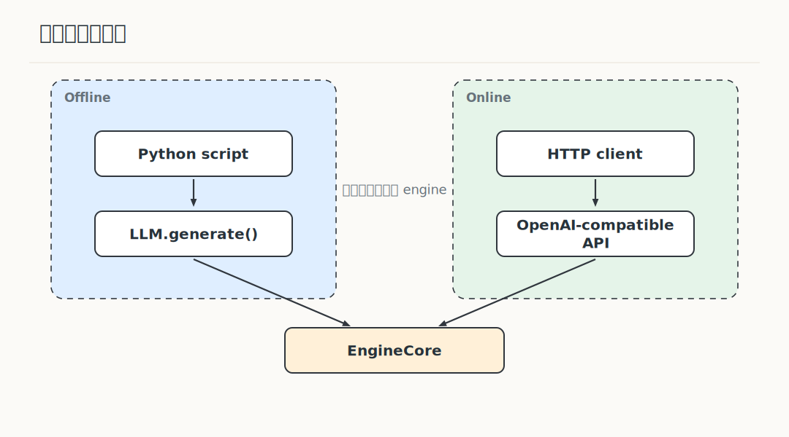</a>

<p class='figure-caption'>离线 `LLM` 和在线 server 都只是共享 V1 engine 之上的协议外壳。它们的输入汇入同一个 `EngineCoreRequest` schema；但字段值、取消、streaming 和响应生命周期仍各不相同。</p>

### 离线入口：同步调用契约背后仍是同一个 V1 engine

离线路径最容易读懂，因为它剥离了 engine 之外的一切：没有 HTTP，没有 FastAPI，没有身份认证，没有 request 日志，也没有 streaming transport。但它在底层构建的并不是另一套不同或更简单的 engine——而是 *同一个* V1 `LLMEngine`。

源码：[`vllm/entrypoints/llm.py:55`](https://github.com/vllm-project/vllm/blob/6cf7b26bd4bff60bf378e1af14044280ac0d214c/vllm/entrypoints/llm.py#L55) 和 [`vllm/entrypoints/llm.py:66`](https://github.com/vllm-project/vllm/blob/6cf7b26bd4bff60bf378e1af14044280ac0d214c/vllm/entrypoints/llm.py#L66)。

```python
from vllm.v1.engine.llm_engine import LLMEngine
```

```python
class LLM(BeamSearchOfflineMixin, PoolingOfflineMixin, OfflineInferenceMixin):
```

第 55 行的 import 将离线路径锁定到 `vllm.v1.engine.llm_engine`，也就是 V1 同步 engine，而不是旧版 V0 class。class 声明也说明 `LLM` 自身承担的工作很少。它提供 `__init__`、`generate`、`chat` 和 engine 控制方法；`encode`、`embed`、`classify`、`score`、`beam_search` 则来自 [第 3 节](#3-offline-request-apigeneratechatencodescore) 介绍的三个 mixin。调度、内存管理和执行全都位于这个 class 之下。`LLM.generate()` 是 adapter，而不是 engine。

**Offline 会构建同步 engine，并通过阻塞循环将所有 request 处理完。**

配置完成后，离线推理就是一个同步 batch driver：它先将所有 prompt 加入 queue，再在调用 thread 上持续驱动 engine，直到全部完成。

源码：[`vllm/entrypoints/llm.py:349-351`](https://github.com/vllm-project/vllm/blob/6cf7b26bd4bff60bf378e1af14044280ac0d214c/vllm/entrypoints/llm.py#L349-L351)。

```python
        self.llm_engine = LLMEngine.from_engine_args(
            engine_args=engine_args, usage_context=UsageContext.LLM_CLASS
        )
```

`from_engine_args`（[`vllm/v1/engine/llm_engine.py:160-186`](https://github.com/vllm-project/vllm/blob/6cf7b26bd4bff60bf378e1af14044280ac0d214c/vllm/v1/engine/llm_engine.py#L160-L186)）负责两个入口共用的配置 lowering——`engine_args.create_engine_config(usage_context)` 生成 `VllmConfig`，`Executor.get_class(vllm_config)` 选择 executor，`log_stats=not engine_args.disable_log_stats` 决定是否记录 per-step metrics——随后返回一个可运行的 `LLMEngine`。第 350 行的 `UsageContext.LLM_CLASS` tag 是离线入口的 telemetry 指纹；server 使用的是另一个 tag（见下文）。

“离线”特征在 dispatch 侧最为明显。每个离线 request 都经过同一个入口，该入口会强制采用 non-streaming 输出形式；driver loop 则只是普通的 `while`。

源码：[`vllm/entrypoints/offline_utils.py:559-561`](https://github.com/vllm-project/vllm/blob/6cf7b26bd4bff60bf378e1af14044280ac0d214c/vllm/entrypoints/offline_utils.py#L559-L561) 和 [`vllm/entrypoints/offline_utils.py:594-595`](https://github.com/vllm-project/vllm/blob/6cf7b26bd4bff60bf378e1af14044280ac0d214c/vllm/entrypoints/offline_utils.py#L594-L595)。

```python
        if isinstance(params, SamplingParams):
            # We only care about the final output
            params.output_kind = RequestOutputKind.FINAL_ONLY
```

```python
        while self.llm_engine.has_unfinished_requests():
            step_outputs = self.llm_engine.step()
```

`_add_request` 和 `_run_engine` 的完整函数体见 [第 3 节](#3-offline-request-apigeneratechatencodescore)；上述两行已经说明了调用模型。`_add_request` 会在 generation request 上写入 `RequestOutputKind.FINAL_ONLY`（第 561 行），因此离线 API 不会暴露中间输出。`_run_engine` 会让调用方阻塞在 `while has_unfinished_requests(): step()` 上（第 594-595 行）。每次调用 `step()`（[`llm_engine.py:296`](https://github.com/vllm-project/vllm/blob/6cf7b26bd4bff60bf378e1af14044280ac0d214c/vllm/v1/engine/llm_engine.py#L296)）都会推进 scheduler 在该 iteration 中选中的 in-flight request。

离线 API 本身没有 async event loop，不过默认的 `SyncMPClient` 仍会在后台进程中运行 EngineCore，并使用一个 output-collector thread。request 的完成顺序可能与提交顺序不同，因此 `_run_engine` 最后会执行 `sorted(outputs, key=lambda x: int(x.request_id))`（[`offline_utils.py:626`](https://github.com/vllm-project/vllm/blob/6cf7b26bd4bff60bf378e1af14044280ac0d214c/vllm/entrypoints/offline_utils.py#L626)）。这里具有确定性的只是返回 list 的顺序，而不是 sampling 或浮点执行结果。

### 在线入口：用 async client 封装同一个 engine

server 构建的是该 engine 的 *async* 版本 `AsyncLLM`；它是 HTTP 层所对接的 `EngineClient` interface 的具体实现。

源码：[`vllm/v1/engine/async_llm.py:70`](https://github.com/vllm-project/vllm/blob/6cf7b26bd4bff60bf378e1af14044280ac0d214c/vllm/v1/engine/async_llm.py#L70)。

```python
class AsyncLLM(EngineClient):
    """An asynchronous wrapper for the vLLM engine."""
```

离线路径调用 `LLMEngine.from_engine_args`；server 则在 async context manager 中调用 `AsyncLLM.from_vllm_config`，由该 context manager 管理 engine 的完整生命周期。

源码：[`vllm/entrypoints/openai/api_server.py:163`](https://github.com/vllm-project/vllm/blob/6cf7b26bd4bff60bf378e1af14044280ac0d214c/vllm/entrypoints/openai/api_server.py#L163) 和 [`vllm/entrypoints/openai/api_server.py:175-184`](https://github.com/vllm-project/vllm/blob/6cf7b26bd4bff60bf378e1af14044280ac0d214c/vllm/entrypoints/openai/api_server.py#L175-L184)。

```python
    vllm_config = engine_args.create_engine_config(usage_context=usage_context)
```

```python
        async_llm = AsyncLLM.from_vllm_config(
            vllm_config=vllm_config,
            usage_context=usage_context,
            enable_log_requests=engine_args.enable_log_requests,
            aggregate_engine_logging=engine_args.aggregate_engine_logging,
            disable_log_stats=engine_args.disable_log_stats,
            client_addresses=client_config,
            client_count=client_count,
            client_index=client_index,
        )
```

<a href='images/vllm-02-12-construction-divergence-matrix.svg' target='_blank'>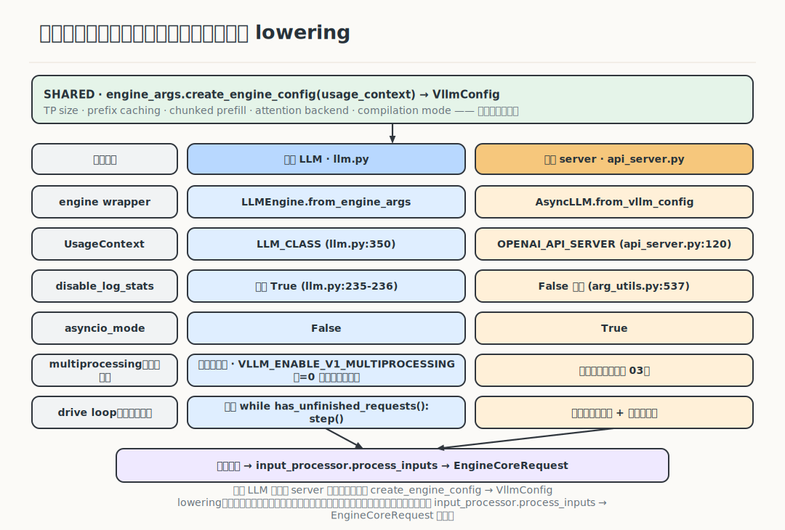</a>

<p class='figure-caption'>离线 `LLM` 和在线 server 共用 `create_engine_config` → `VllmConfig` 这条 lowering 路径。图中突出展示了构造阶段的六项差异：engine wrapper、usage tag、stats 默认值、`asyncio_mode`、multiprocessing 和 drive loop。</p>

第 163 行调用了离线 `from_engine_args` 所使用的同一个 `create_engine_config`。因此，Tensor-parallel size、prefix caching、chunked prefill、attention backend 和 compilation mode 都会经过同一套配置代码。不同之处在于 wrapper：server 构建的是 `AsyncLLM`，而不是 `LLMEngine`。

[`AsyncLLM`](https://github.com/vllm-project/vllm/blob/6cf7b26bd4bff60bf378e1af14044280ac0d214c/vllm/v1/engine/async_llm.py#L70) 实现了 `EngineClient`，通过一个精简的 interface 封装 FastAPI route 和 serving object（`is_running`、`errored`、`get_supported_tasks`、`generate`、`encode` 和 `shutdown`）。在 V1 multiprocess 路径中，它通过 IPC 驱动运行在另一进程中的 `EngineCore`，同时由后台 output handler 向 per-request queue 推送结果。[第 5 节](#5-openai-serverfastapi-applifespan-与-engine-client)和[第 11 节](#11-streaming-ssemiddlewareauth-与-health)会介绍这一机制；进程拓扑则见第 03 篇。职责边界很清晰：server 负责 protocol 行为、validation、streaming 和 cancellation，engine 则负责 request 状态、调度、内存和执行。

**构造函数默认值只有一处差异，而且这是有意为之。**

由于两条路径都使用 `create_engine_config`，它们之间的细微差异很容易被忽略，其中一项就是 stats logging 的默认值。除非调用方显式覆盖，否则 offline `LLM` 会设置 `disable_log_stats=True`（[`llm.py:235-236`](https://github.com/vllm-project/vllm/blob/6cf7b26bd4bff60bf378e1af14044280ac0d214c/vllm/entrypoints/llm.py#L235-L236)）；engine dataclass 的默认值则为 `False`（[`vllm/engine/arg_utils.py:537`](https://github.com/vllm-project/vllm/blob/6cf7b26bd4bff60bf378e1af14044280ac0d214c/vllm/engine/arg_utils.py#L537)），server 会将该值直接透传（[`api_server.py:180`](https://github.com/vllm-project/vllm/blob/6cf7b26bd4bff60bf378e1af14044280ac0d214c/vllm/entrypoints/openai/api_server.py#L180)）。这组默认设置对两类用途都很合理：batch job 很少需要采集 Prometheus metrics，而常驻 server 通常需要吞吐和延迟数据。

Telemetry 标识也不相同：offline 使用 `UsageContext.LLM_CLASS`（[`llm.py:350`](https://github.com/vllm-project/vllm/blob/6cf7b26bd4bff60bf378e1af14044280ac0d214c/vllm/entrypoints/llm.py#L350)），server 则使用 `UsageContext.OPENAI_API_SERVER`（[`api_server.py:120`](https://github.com/vllm-project/vllm/blob/6cf7b26bd4bff60bf378e1af14044280ac0d214c/vllm/entrypoints/openai/api_server.py#L120)）。不能因为它们共用 lowering code，就认为二者的 wrapper、进程选择或 drive loop 也完全相同。

### CLI 启动 online 路径

`vllm serve` command 并不是一套独立的 runtime，而是构建在 online 入口之上的启动层：`FlexibleArgumentParser` → `AsyncEngineArgs.from_cli_args(args)` → `create_engine_config` → 交给 uvicorn 的 pre-bound socket，最终汇入与 HTTP `__main__` module 完全相同的 `run_server` 路径（[`api_server.py:134`](https://github.com/vllm-project/vllm/blob/6cf7b26bd4bff60bf378e1af14044280ac0d214c/vllm/entrypoints/openai/api_server.py#L134)、`AsyncEngineArgs.from_cli_args(args)`；完整调用链见[第 4 节](#4-clivllm-serve-与-server-的启动方式)）。正因如此，`vllm serve`、Python offline inference 和 OpenAI-compatible serving 才能共享同一个底层 engine：它们最终都会落到 `create_engine_config` 和两种 engine wrapper 之一。

server 的 route table 取决于实际加载的内容。它可能暴露 generation、pooling、speech、tokenization、model、health 和 metrics endpoint，developer route 还会额外受 `VLLM_SERVER_DEV_MODE=1` 控制（[在线服务](https://docs.vllm.ai/en/stable/serving/online_serving/)）。启动时，`await engine_client.get_supported_tasks()` 会提供注册相关 handler 所需的 model capability，因此 generate-only model 不会获得 embeddings route（[第 5 节](#5-openai-serverfastapi-applifespan-与-engine-client)）。其余 endpoint 则由 server 参数、plugin 和 model config 控制。

**两条路径的交汇点。**

两个入口，以及 online 入口背后的 CLI，都会将每个 request 路由到相同的 entry point 和 target：

```text
user protocol -> validated engine input -> EngineCoreRequest -> EngineCore
```

offline 通过 `_add_request` 到达这一边界，再使用 `while has_unfinished_requests(): step()` drain 结果。online 则经由 HTTP serving object 和 `AsyncLLM.add_request` 到达该边界，随后通过 per-request queue 返回结果。二者共享 input lowering 和 engine schema，但 transport、字段值、cancellation 和 response lifecycle 并不相同。该边界以下的优化——prefix caching、chunked prefill、speculation 和 parallel execution——对两者都生效。第 01 篇沿着首 token 路径展开；第 04 篇则追踪 EngineCore loop。

## 2. 构建 `LLM`：从 `EngineArgs` 到可运行的 engine

排除 HTTP 和 asyncio 后，`LLM.__init__` 是研究 engine 构建过程最简单的切入点。它将用户 kwargs 转换为 `EngineArgs`，再 lowering 为 `VllmConfig`，启动 `LLMEngine`，并缓存供后续 request 使用的 handle。scheduler、KV-cache 和 worker 的内部实现仍位于该边界之下。

<a href='images/vllm-02-03-llm-construction.svg' target='_blank'>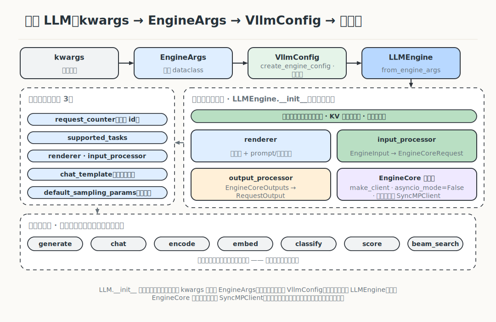</a>

<p class='figure-caption'>`LLM.__init__` 依次完成 `kwargs` → `EngineArgs` → `VllmConfig` → 可运行的 `LLMEngine` 的 lowering，随后缓存 per-request handle。</p>

**这个 class 被刻意设计为薄封装。**

源码：[`vllm/entrypoints/llm.py:66`](https://github.com/vllm-project/vllm/blob/6cf7b26bd4bff60bf378e1af14044280ac0d214c/vllm/entrypoints/llm.py#L66)

```python
class LLM(BeamSearchOfflineMixin, PoolingOfflineMixin, OfflineInferenceMixin):
```

`LLM` 的 class body 包含 `__init__`、`generate`、`chat`，以及对应的 `enqueue`/`wait_for_completion` 同类成员和少量 engine-control helper。`encode`、`embed`、`classify`、`score` 和 `beam_search` 则分布在它的三个 mixin 中。此外，它还在 [`llm.py:55`](https://github.com/vllm-project/vllm/blob/6cf7b26bd4bff60bf378e1af14044280ac0d214c/vllm/entrypoints/llm.py#L55) 处直接 import V1 engine。因此，request method 只会向构造函数已经构建好的 engine enqueue 工作，而不会按需组装 config。

### 构建 `EngineArgs` 前先规范化 `kwargs`

源码：[`vllm/entrypoints/llm.py:176-221`](https://github.com/vllm-project/vllm/blob/6cf7b26bd4bff60bf378e1af14044280ac0d214c/vllm/entrypoints/llm.py#L176-L221)

该 signature 恰好只有一个 positional parameter，即 `model`（第 178 行）；第 179 行单独出现的 `*` 会强制其余所有参数都采用 keyword-only 形式，而末尾的 `**kwargs`（第 220 行）则会原样转发给 `EngineArgs`。在转发之前，构造函数会原地改写其中少数几项。

源码：[`vllm/entrypoints/llm.py:235-243`](https://github.com/vllm-project/vllm/blob/6cf7b26bd4bff60bf378e1af14044280ac0d214c/vllm/entrypoints/llm.py#L235-L243)

```python
        if "disable_log_stats" not in kwargs:
            kwargs["disable_log_stats"] = True

        if "worker_cls" in kwargs:
            worker_cls = kwargs["worker_cls"]
            # if the worker_cls is not qualified string name,
            # we serialize it using cloudpickle to avoid pickling issues
            if isinstance(worker_cls, type):
                kwargs["worker_cls"] = cloudpickle.dumps(worker_cls)
```

<a href='images/vllm-02-13-kwargs-massage-pipeline.svg' target='_blank'>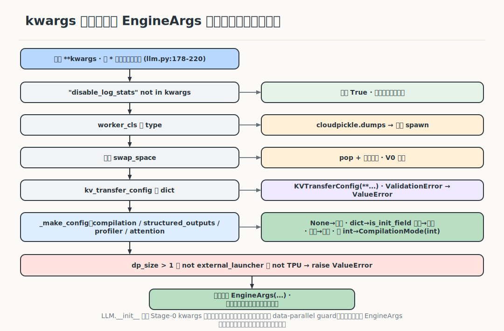</a>

<p class='figure-caption'>`LLM.__init__` 内部对 `kwargs` 的 Stage-0 处理：共进行五项原地转换——将 `disable_log_stats` 的默认值设为 `True`、`worker_cls` type → `cloudpickle.dumps`、对 `swap_space` 执行 pop+warn、`kv_transfer_config` dict → `KVTransferConfig`，以及对 `_make_config` 执行 sub-config 转换——外加 single-process data-parallel guard，从而确保传给 `EngineArgs` 构造函数的每个值都已经满足类型安全与传输安全要求。</p>

- 只有 offline `LLM` 会将 `disable_log_stats` 默认设为 `True`，server 侧则仍保持 stats logging 开启。这是该调用点唯一被翻转的构造函数默认值（engine wrapper、usage tag 以及 multiprocessing/asyncio 维度也不同——见上方差异矩阵）：batch job 不需要逐 step 记录 Prometheus 日志，因此下游的 `log_stats` 将为 `False`。这也解释了为什么 [`llm_engine.py:114`](https://github.com/vllm-project/vllm/blob/6cf7b26bd4bff60bf378e1af14044280ac0d214c/vllm/v1/engine/llm_engine.py#L114) 只有在设置 `log_stats` 时才会构建 `StatLoggerManager`——offline batch 会跳过整个子系统。
- 如果传入的 `worker_cls` 是实际的 `type` object，就会立即使用 `cloudpickle.dumps` 进行序列化。如果启用 multiprocessing，worker class 必须能够跨越进程边界，而实际的 class object 在跨越 `spawn` 时无法可靠 pickle。在这里提前序列化，可以确保 config 中存储的值已经能够安全传输。（上方第 224-233 行的 `swap_space` 会被 pop 并触发 deprecation warning——这是 V0 的遗留项；V1 已不再提供 CPU swap space。）
- 以原始 `dict` 形式提供的 `kv_transfer_config`（第 245-262 行）会被原地升级为 `KVTransferConfig`，同时将 pydantic `ValidationError` 转换为 `ValueError`，从而让报错明确体现为用户输入错误，而不是内部错误。

**转换结构化 sub-config。**

源码：[`vllm/entrypoints/llm.py:275-288`](https://github.com/vllm-project/vllm/blob/6cf7b26bd4bff60bf378e1af14044280ac0d214c/vllm/entrypoints/llm.py#L275-L288)

```python
        if isinstance(compilation_config, int):
            compilation_config_instance = CompilationConfig(
                mode=CompilationMode(compilation_config)
            )
        else:
            compilation_config_instance = _make_config(
                compilation_config, CompilationConfig
            )

        structured_outputs_instance = _make_config(
            structured_outputs_config, StructuredOutputsConfig
        )
        profiler_config_instance = _make_config(profiler_config, ProfilerConfig)
        attention_config_instance = _make_config(attention_config, AttentionConfig)
```

`_make_config`（定义见 [`llm.py:267-273`](https://github.com/vllm-project/vllm/blob/6cf7b26bd4bff60bf378e1af14044280ac0d214c/vllm/entrypoints/llm.py#L267-L273)）负责统一的 dict/None/instance 转换：`None` 会变成以默认参数构造的 config；`dict` 在展开为参数前，会先经 `is_init_field` 按字段过滤（因此未知 key 不会让 constructor 报错）；已经构造好的 instance 则直接透传。`compilation_config` 还有一条额外规则——裸 `int` 会被解析为 `CompilationMode` enum value，因此 `compilation_config=3` 表示“编译级别 3”，而不是一个毫无意义的 dict。这四个 sub-config 进入 `EngineArgs` 时，都已经是对应 class 的具体 object，并通过了验证，因此下游的 `create_engine_config` 可以将它们视为可信的结构化字段。

### 拒绝会导致挂起的配置

源码：[`vllm/entrypoints/llm.py:290-303`](https://github.com/vllm-project/vllm/blob/6cf7b26bd4bff60bf378e1af14044280ac0d214c/vllm/entrypoints/llm.py#L290-L303)

```python
        # warn about single-process data parallel usage.
        _dp_size = int(kwargs.get("data_parallel_size", 1))
        _distributed_executor_backend = kwargs.get("distributed_executor_backend")
        if (
            _dp_size > 1
            and not _distributed_executor_backend == "external_launcher"
            and not current_platform.is_tpu()
        ):
            raise ValueError(
                f"LLM(data_parallel_size={_dp_size}) is not supported for single-"
                "process usage and may hang. Please use "
                "the explicit multi-process data-parallel example at "
                "'examples/features/data_parallel/data_parallel_offline.py'."
            )
```

Data parallelism 需要由 DP group 协调多个 engine process；同步 `LLM` driver 无法自行建立该 rendezvous，因此，如果 `data_parallel_size > 1` 既不是 TPU，也不是 `external_launcher` backend，就会一直等待永远不会启动的 peer，最终陷入死锁。这个 guard 会立即报错，并指向正确的 multi-process 示例。离线入口只接受自身确实能够驱动的 DP topology——coordinator 的内部机制留到第 11 篇（distributed）展开。

### 将 `EngineArgs` 下沉为 `VllmConfig` 并启动 engine

源码：[`vllm/entrypoints/llm.py:347-364`](https://github.com/vllm-project/vllm/blob/6cf7b26bd4bff60bf378e1af14044280ac0d214c/vllm/entrypoints/llm.py#L347-L364)

```python
        log_non_default_args(engine_args)

        self.llm_engine = LLMEngine.from_engine_args(
            engine_args=engine_args, usage_context=UsageContext.LLM_CLASS
        )
        self.model_config = self.llm_engine.model_config
        self.engine_class = type(self.llm_engine)

        self.request_counter = Counter()
        self.default_sampling_params: dict[str, Any] | None = None

        supported_tasks = self.llm_engine.get_supported_tasks()
        self.supported_tasks = supported_tasks

        self.runner_type = self.model_config.runner_type
        self.renderer = self.llm_engine.renderer
        self.chat_template = load_chat_template(chat_template)
        self.input_processor = self.llm_engine.input_processor
```

上面的 `EngineArgs(...)` constructor（305-345 行）完成第 1 阶段：具名参数和整理后的 `**kwargs` 被收拢到一个 dataclass 中。随后，`log_non_default_args` 只打印与默认值不同的字段，形成 operator 实际修改内容的审计记录。第 2 阶段委托给 `LLMEngine.from_engine_args`，并标记为 `UsageContext.LLM_CLASS`（offline usage telemetry 标签；server 使用 `OPENAI_API_SERVER`）。

源码：[`vllm/v1/engine/llm_engine.py:170-186`](https://github.com/vllm-project/vllm/blob/6cf7b26bd4bff60bf378e1af14044280ac0d214c/vllm/v1/engine/llm_engine.py#L170-L186)

```python
        # Create the engine configs.
        vllm_config = engine_args.create_engine_config(usage_context)
        executor_class = Executor.get_class(vllm_config)

        if envs.VLLM_ENABLE_V1_MULTIPROCESSING:
            logger.debug("Enabling multiprocessing for LLMEngine.")
            enable_multiprocessing = True

        # Create the LLMEngine.
        return cls(
            vllm_config=vllm_config,
            executor_class=executor_class,
            log_stats=not engine_args.disable_log_stats,
            usage_context=usage_context,
            stat_loggers=stat_loggers,
            multiprocess_mode=enable_multiprocessing,
        )
```

- `engine_args.create_engine_config(usage_context)` ([`arg_utils.py:1829`](https://github.com/vllm-project/vllm/blob/6cf7b26bd4bff60bf378e1af14044280ac0d214c/vllm/engine/arg_utils.py#L1829)) 才是真正执行 lowering 的地方：它会组装并验证复合 `VllmConfig`——其中包含 model、cache、parallel、scheduler，以及在第 0b 阶段完成转换的 sub-config。这是配置的“验证后终态”；下游不会再次验证。
- `Executor.get_class(vllm_config)` **根据 config** 选择 executor 实现（uniprocess / multiproc / Ray / external-launcher），而不是根据 entrypoint 读取的 flag。正因如此，CLI 和 OpenAI server 才能共享同一个底层 engine——entrypoint 从不指定 worker topology；它只将 config 交给 `Executor.get_class`，再由 config 自行决定（参见第 09 篇（worker）、第 11 篇（distributed））。
- `log_stats = not engine_args.disable_log_stats` 将第 0 阶段的 default 一路传递下来：offline 场景下默认为 `disable_log_stats=True`，因此 `log_stats` 收到的是 `False`。
- `multiprocess_mode` 是 **frontend↔EngineCore** 这一轴，其 default 与 parameter signature 暗示的正好相反。这个 keyword argument 默认为 `False`，但 `from_engine_args` 会在设置了 `envs.VLLM_ENABLE_V1_MULTIPROCESSING` 时将其覆盖（[`llm_engine.py:174-176`](https://github.com/vllm-project/vllm/blob/6cf7b26bd4bff60bf378e1af14044280ac0d214c/vllm/v1/engine/llm_engine.py#L174-L176)），而该 variable 的 default 是 `1`（[`envs.py:1311-1313`](https://github.com/vllm-project/vllm/blob/6cf7b26bd4bff60bf378e1af14044280ac0d214c/vllm/envs.py#L1311-L1313)）。因此，默认的 offline `LLM` 得到的是 `multiprocess_mode=True`：`EngineCoreClient.make_client` 返回一个 `SyncMPClient`（[`core_client.py:102-105`](https://github.com/vllm-project/vllm/blob/6cf7b26bd4bff60bf378e1af14044280ac0d214c/vllm/v1/engine/core_client.py#L102-L105)），EngineCore 运行在**后台 process** 中，两端通过 **ZMQ** 通信，client 还会启动一个 `EngineCoreOutputQueueThread` daemon，持续读取 output socket（[`core_client.py:839-845`](https://github.com/vllm-project/vllm/blob/6cf7b26bd4bff60bf378e1af14044280ac0d214c/vllm/v1/engine/core_client.py#L839-L845)）。`InprocClient`（真正的单 process、无 IPC）才是 *opt-out*，需设置 `VLLM_ENABLE_V1_MULTIPROCESSING=0` 才能进入。要把这条轴与 **EngineCore↔workers** 轴区分开；后者正是上面的 `Executor.get_class` 所选择的轴。使用 `uni` executor 意味着 worker 与 EngineCore 共享同一 process，但这并不能说明 frontend 是否也在该 process 中（第 03 篇会逐一讲解这两条轴）。

**“live engine”究竟意味着什么。**

源码：[`vllm/v1/engine/llm_engine.py:91-111`](https://github.com/vllm-project/vllm/blob/6cf7b26bd4bff60bf378e1af14044280ac0d214c/vllm/v1/engine/llm_engine.py#L91-L111)

```python
        self.renderer = renderer = renderer_from_config(self.vllm_config)

        # Convert EngineInput --> EngineCoreRequest.
        self.input_processor = InputProcessor(self.vllm_config, renderer)

        # Converts EngineCoreOutputs --> RequestOutput.
        self.output_processor = OutputProcessor(
            renderer.tokenizer,
            log_stats=self.log_stats,
            stream_interval=self.vllm_config.scheduler_config.stream_interval,
            tracing_enabled=tracing_endpoint is not None,
        )

        # EngineCore (gets EngineCoreRequests and gives EngineCoreOutputs)
        self.engine_core = EngineCoreClient.make_client(
            multiprocess_mode=multiprocess_mode,
            asyncio_mode=False,
            vllm_config=vllm_config,
            executor_class=executor_class,
            log_stats=self.log_stats,
        )
```

<a href='images/vllm-02-14-live-engine-anatomy.svg' target='_blank'>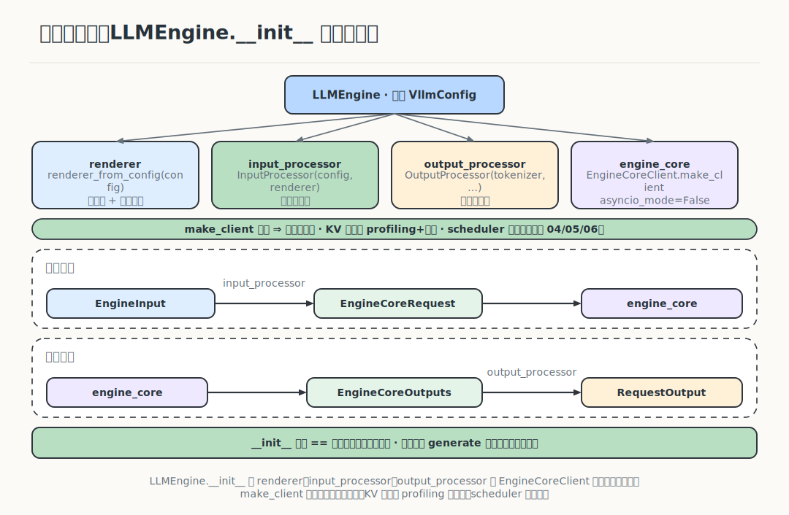</a>

<p class='figure-caption'>`LLMEngine.__init__` 组装 live engine 时连接的组件：`renderer`（来自 config）、`input_processor`（EngineInput → EngineCoreRequest）、`output_processor`（EngineCoreOutputs → RequestOutput），以及 `EngineCoreClient.make_client`（`asyncio_mode=False`）。当 `make_client` 返回时，model 已加载，KV cache 已完成 profiling 和分配，scheduler 也已创建。</p>

engine 正是在这一刻进入 live 状态。`renderer`（tokenizer + prompt/chat rendering）根据 config 构建；`input_processor` 接入该 renderer，负责每个 request 都会经过的 `EngineInput → EngineCoreRequest` 转换；`output_processor` 负责反向的 `EngineCoreOutputs → RequestOutput`；`EngineCoreClient.make_client` 则启动实际的 `EngineCore`（配合 `asyncio_mode=False`，即 offline 场景使用的 synchronous 版本）。当 `make_client` 返回时，model 已加载，KV cache 已完成 profiling 和分配，scheduler 也已创建（参见第 04 篇（EngineCore loop）、第 05 篇（scheduler）、第 06 篇（KV cache））。`LLMEngine.__init__` 返回意味着 engine 已完成全部初始化——下一行提交 request 时，内存已经分配完毕，scheduler 也已就绪。

**缓存 request method 使用的 handle。**

回到 [`llm.py:347-364`](https://github.com/vllm-project/vllm/blob/6cf7b26bd4bff60bf378e1af14044280ac0d214c/vllm/entrypoints/llm.py#L347-L364)（上文摘录），engine 进入 live 状态后，constructor 会将 request method 后续要用的 handle 全部缓存为快照，并且永不重建：

- `self.request_counter = Counter()` — 单调递增的连续 request ID 生成器；offline plumbing 会据此写入 `request_id = str(next(self.request_counter))`，随后再按这个整数将 output 排回 input 顺序。
- `self.supported_tasks` — 缓存自 `llm_engine.get_supported_tasks()`（[`llm_engine.py:205-210`](https://github.com/vllm-project/vllm/blob/6cf7b26bd4bff60bf378e1af14044280ac0d214c/vllm/v1/engine/llm_engine.py#L205-L210)，后者自身也会缓存 EngineCore round-trip 的结果）。每个 request method 开头的 `runner_type` guard 读取的都是这份 snapshot，不会再发起 live call。
- `self.renderer` 和 `self.input_processor` 直接从 `llm_engine` 重新暴露，因此 offline mixin 无需在每次调用中层层传递 engine，就能渲染 prompt 并访问统一的 entry point。
- `self.chat_template = load_chat_template(chat_template)` 在这里只加载一次；`chat()` 仍允许每次调用时 override，但 default 已在构造阶段解析完成。
- `self.default_sampling_params` 保持为 `None`，首次 `generate` 时才 lazy 初始化——batch 可能根本不会用到它，构造阶段因此无需为之付出任何成本。

源码：[`vllm/entrypoints/llm.py:370-381`](https://github.com/vllm-project/vllm/blob/6cf7b26bd4bff60bf378e1af14044280ac0d214c/vllm/entrypoints/llm.py#L370-L381)

```python
        if self.model_config.renderer_num_workers > 1:
            logger.warning_once(
                "`renderer_num_workers=%d` was set, but the offline `LLM` "
                "entrypoint uses the synchronous renderer path and runs "
                "multimodal preprocessing serially across prompts. The "
                "renderer thread pool is only consumed by the async "
                "renderer path used by `vllm serve` / `AsyncLLM`, so this "
                "setting has no effect here.",
                self.model_config.renderer_num_workers,
            )

        PoolingOfflineMixin.__init__(self)
```

<a href='images/vllm-02-15-llm-method-ownership.svg' target='_blank'>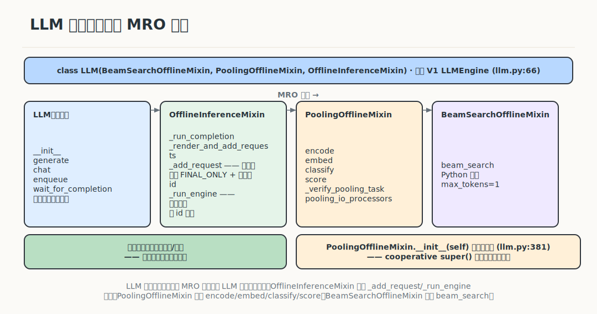</a>

<p class='figure-caption'>`LLM` 的 method 接口分散在其 MRO 中：基类 `LLM` 定义 `__init__`/`generate`/`chat`/`enqueue`，`OfflineInferenceMixin` 定义 `_add_request`/`_run_engine` 这一对 method，`PoolingOfflineMixin` 定义 `encode`/`embed`/`classify`/`score`，`BeamSearchOfflineMixin` 定义 `beam_search`；而 `PoolingOfflineMixin.__init__` 必须显式调用，因为协作式 `super()` 调用链无法保证执行到它。</p>

收尾还有两项。第一处是 `warning_once`（issue #42901）：renderer thread pool 只有 *async* renderer path（`vllm serve` / `AsyncLLM`）才会使用，因此 `renderer_num_workers > 1` 在 offline 场景下只是一个静默的 no-op；constructor 会明确指出这一点，而不是假装它有效。第二，`PoolingOfflineMixin.__init__(self)` 是**显式**调用的，而不是通过 `super().__init__()` 调用，因为跨越三个 mixin 的 cooperative-`super` 调用链无法可靠地触达它；pooling mixin 必须先初始化自身状态，之后才能运行 `encode`/`embed`/`score`。

最后，[`llm.py:387-389`](https://github.com/vllm-project/vllm/blob/6cf7b26bd4bff60bf378e1af14044280ac0d214c/vllm/entrypoints/llm.py#L387-L389) 处的 classmethod round-trip 就是 `return cls(**vars(engine_args))`——`from_engine_args` 只是将一个 `EngineArgs` dataclass 重新展开，再传回同一个 `__init__`，从而让 CLI/server config 接口和 Python constructor 始终走同一条 code path。

## 3. Offline Request API：generate、chat、encode、score

`LLM` 在一个同步 engine 上统一承载 generation、chat、pooling、scoring 和 beam-search driver。每个 API 都会检查其 runner、补齐默认值，然后委托给 `OfflineInferenceMixin`：`_add_request` 接纳渲染后的 input，`_run_engine` 则阻塞直至完成。各 API 的主要区别在于 preprocessing 和预期 output type；request id 分配、顺序恢复，以及 batch 中途出错后的清理逻辑都是共用的。各 mixin 的职责归属见 [第 2 节](#2-构建-llm从-engineargs-到可运行的-engine)。

<a href='images/vllm-02-04-offline-apis.svg' target='_blank'>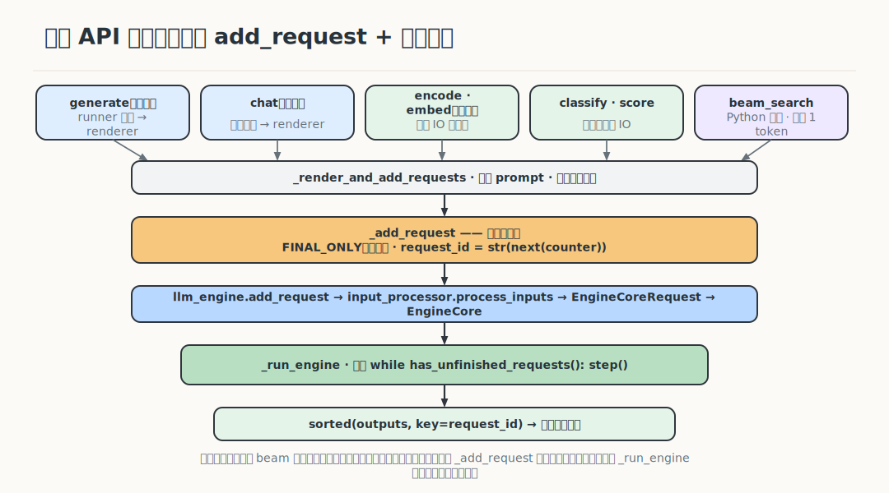</a>

<p class='figure-caption'>Offline request API 会先分别经过各自的 preprocessing，最终再汇入同一条 `_add_request → _run_engine` 主干。</p>

### `generate` 是典型范式

每个 offline request 方法的开头都如出一辙，`generate` 是最清晰的范例。

[`vllm/entrypoints/llm.py:465-485`](https://github.com/vllm-project/vllm/blob/6cf7b26bd4bff60bf378e1af14044280ac0d214c/vllm/entrypoints/llm.py#L465-L485)
```python
        runner_type = self.model_config.runner_type
        if runner_type != "generate":
            raise ValueError(
                "LLM.generate() is only supported for generative models. "
                "Try passing `--runner generate` to use the model as a "
                "generative model."
            )

        if sampling_params is None:
            sampling_params = self.get_default_sampling_params()

        return self._run_completion(
            prompts=prompts,
            params=sampling_params,
            output_type=RequestOutput,
            use_tqdm=use_tqdm,
            lora_request=lora_request,
            tokenization_kwargs=tokenization_kwargs,
            priority=priority,
            mm_processor_kwargs=mm_processor_kwargs,
        )
```

runner guard 会拒绝并非为 generation 加载的 model。当 `sampling_params` 为 `None` 时，`get_default_sampling_params` 会惰性缓存 model 的 `generation_config.json` delta，并为本次调用新建一个 `SamplingParams`（[`llm.py:415-420`](https://github.com/vllm-project/vllm/blob/6cf7b26bd4bff60bf378e1af14044280ac0d214c/vllm/entrypoints/llm.py#L415-L420)）；若 delta 为空，则回退到中性默认值。`_run_completion` 接收 `RequestOutput` 作为预期 type，之后 drain loop 会对此执行断言。

`generate` 只用于 generative runner，并且只会生成 `RequestOutput`；如果 caller 省略 sampling params，拿到的会是 model 基于 HF 推导出的默认值，而不是 vLLM 的中性默认值——这与 docstring 的承诺（[`llm.py:461-463`](https://github.com/vllm-project/vllm/blob/6cf7b26bd4bff60bf378e1af14044280ac0d214c/vllm/entrypoints/llm.py#L461-L463)）一致：output 的顺序“与 input prompt 相同”。

`generate` 恰好就是 `_run_completion`，而后者本身由 `_add_completion_requests` + `_run_engine` 融合而成（[第 2 节](#2-构建-llm从-engineargs-到可运行的-engine)、[`offline_utils.py:326-349`](https://github.com/vllm-project/vllm/blob/6cf7b26bd4bff60bf378e1af14044280ac0d214c/vllm/entrypoints/offline_utils.py#L326-L349)）。对应的非阻塞版本 `enqueue`/`wait_for_completion`（[`llm.py:487-569`](https://github.com/vllm-project/vllm/blob/6cf7b26bd4bff60bf378e1af14044280ac0d214c/vllm/entrypoints/llm.py#L487-L569)）会将这两部分拆开：`enqueue` 返回 request-id string，但不推进 engine；`wait_for_completion` 稍后再运行 drain。两部分都会复用下文的同一条共享 path。

### 唯一汇流点：`_add_request`

prompt 会由 renderer（completion path）或 IO processor（pooling path）渲染为 `EngineInput`；随后，无论来自哪个 API，每个 offline request 都会流经同一个方法，转化为 engine request。

[`vllm/entrypoints/offline_utils.py:552-571`](https://github.com/vllm-project/vllm/blob/6cf7b26bd4bff60bf378e1af14044280ac0d214c/vllm/entrypoints/offline_utils.py#L552-L571)
```python
    def _add_request(
        self,
        prompt: EngineInput,
        params: SamplingParams | PoolingParams,
        lora_request: LoRARequest | None = None,
        priority: int = 0,
    ) -> str:
        if isinstance(params, SamplingParams):
            # We only care about the final output
            params.output_kind = RequestOutputKind.FINAL_ONLY

        request_id = str(next(self.request_counter))

        return self.llm_engine.add_request(
            request_id,
            prompt,
            params,
            lora_request=lora_request,
            priority=priority,
        )
```

对于 generation，`_add_request` 会被强制设为 `FINAL_ONLY`，与 drain 只保留 finished output 的策略一致。这里不会改动 pooling params；其 constructor 已经会拒绝其他任何 output kind（[`vllm/pooling_params.py:230-235`](https://github.com/vllm-project/vllm/blob/6cf7b26bd4bff60bf378e1af14044280ac0d214c/vllm/pooling_params.py#L230-L235)）。单调递增并 string 化的 counter 值，既是 engine handle，也是最终的 sort key。随后，`llm_engine.add_request` 会执行 input lowering，以及可能需要的 `n>1` fan-out（第 04 篇）。

`_add_request` 由 `_render_and_add_requests` 调用（[`offline_utils.py:523-550`](https://github.com/vllm-project/vllm/blob/6cf7b26bd4bff60bf378e1af14044280ac0d214c/vllm/entrypoints/offline_utils.py#L523-L550)）。后者遍历*惰性* prompt generator；更关键的是，整个 loop 都包裹在 `try/except` 中：如果任何 prompt 在 batch 中途失败，它就会通过 `internal=True` abort 此前已经添加的所有 request。因此，即使 batch 抛出异常，也不会有先前已加入的 request 滞留在 scheduler 中。

### drain 阶段：`_run_engine`

这对方法的后半部分，是四个 API 共用的同步 run loop。

[`vllm/entrypoints/offline_utils.py:594-626`](https://github.com/vllm-project/vllm/blob/6cf7b26bd4bff60bf378e1af14044280ac0d214c/vllm/entrypoints/offline_utils.py#L594-L626)
```python
        while self.llm_engine.has_unfinished_requests():
            step_outputs = self.llm_engine.step()
            for output in step_outputs:
                assert isinstance(output, output_type)
                if output.finished:
                    outputs.append(output)  # type: ignore[arg-type]
                    if use_tqdm:
                        if isinstance(output, RequestOutput):
                            # Calculate tokens only for RequestOutput
                            n = len(output.outputs)
                            assert output.prompt_token_ids is not None
                            total_in_toks += len(output.prompt_token_ids) * n
                            ...
                            pbar.update(n)
                        else:
                            pbar.update(1)
                        ...
        if use_tqdm:
            pbar.close()
        # Sort the outputs by request ID.
        # This is necessary because some requests may be finished earlier than
        # its previous requests.
        return sorted(outputs, key=lambda x: int(x.request_id))
```

loop 会不断执行 engine step，并在每一步阻塞等待结果。runtime type assertion 能捕获 runner/config 不匹配；由于有 `FINAL_ONLY`，只保留 `output.finished` 也不会丢失任何中间数据。request 可能乱序完成，因此最终会按 `_add_request` 的数字 id 排序，以恢复提交顺序。[第 11 节](#11-streaming-ssemiddlewareauth-与-health) 展示了对应的 online 流程。

**`chat` 只有 preprocessing 不同。**

`chat`（[`llm.py:616-708`](https://github.com/vllm-project/vllm/blob/6cf7b26bd4bff60bf378e1af14044280ac0d214c/vllm/entrypoints/llm.py#L616-L708)）的 runner check、默认值以及 `RequestOutput` drain 都与 `generate` 相同。它的 template、generation-prompt、tool 和 content-format options 都由 renderer 解析并固化到 `EngineInput` 中；engine 从不会收到 conversation object。对于 Gemma4，当 thinking 或 tool delimiter 被编码为 special token 时，wrapper 会设置 `skip_special_tokens=False`，从而在 detokenization 期间保留它们（[`offline_utils.py:447-492`](https://github.com/vllm-project/vllm/blob/6cf7b26bd4bff60bf378e1af14044280ac0d214c/vllm/entrypoints/offline_utils.py#L447-L492)）。[第 7 节](#7-chat-服务template-与-tool-calling) 追踪了 online 场景下共用的 chat renderer。

### `encode` 与 pooling 家族：独立的 pipeline，相同的 drain

`encode` 通过替换其中一个环节，反而印证了这套模式。Pooling model 产出的是固定的 hidden-state vector，而不是 token stream，因此不存在 autoregressive decode——但*底层管线*仍然得到复用。

[`vllm/entrypoints/pooling/offline.py:91-136`](https://github.com/vllm-project/vllm/blob/6cf7b26bd4bff60bf378e1af14044280ac0d214c/vllm/entrypoints/pooling/offline.py#L91-L136)
```python
        self._verify_pooling_task(pooling_task)
        assert pooling_task is not None and pooling_task in self.pooling_io_processors

        io_processor = self.pooling_io_processors[pooling_task]

        if pooling_params is None:
            pooling_params = PoolingParams()

        ctx = OfflineInputsContext(
            prompts=prompts,
            pooling_params=pooling_params,
            tokenization_kwargs=tokenization_kwargs,
        )

        engine_inputs = io_processor.pre_process_offline(ctx)
        n_inputs = len(engine_inputs)
        ...
        params_seq = self._params_to_seq(ctx.pooling_params, n_inputs)

        for param in params_seq:
            if param.task is None:
                param.task = pooling_task
            ...
        self._render_and_add_requests(
            prompts=engine_inputs,
            params=params_seq,
            ...
        )

        outputs = self._run_engine(use_tqdm=use_tqdm, output_type=PoolingRequestOutput)
        outputs = io_processor.post_process_offline(
            ctx=OfflineOutputsContext(outputs=outputs)
        )
        return outputs
```

`_verify_pooling_task` 要求使用 pooling runner、显式指定 task，并且该 task 必须属于 `supported_tasks`（[`offline.py:138-197`](https://github.com/vllm-project/vllm/blob/6cf7b26bd4bff60bf378e1af14044280ac0d214c/vllm/entrypoints/pooling/offline.py#L138-L197)）。task-specific IO processor 负责渲染 input，每个 `PoolingParams.task` 要么会被补齐，要么接受冲突检查。随后，共享的 add/drain path 会期待 `PoolingRequestOutput`，再执行 task-specific postprocessing。`embed` 和 `classify` 只是固定 task 并收窄 output type（[`offline.py:199-287`](https://github.com/vllm-project/vllm/blob/6cf7b26bd4bff60bf378e1af14044280ac0d214c/vllm/entrypoints/pooling/offline.py#L199-L287)）。第 10 篇对比了 engine 内部的 pooling 与 sampling。

**`score`：pairwise，且以 `num_labels == 1` 为准入条件。**

`score`（[`offline.py:289-402`](https://github.com/vllm-project/vllm/blob/6cf7b26bd4bff60bf378e1af14044280ac0d214c/vllm/entrypoints/pooling/offline.py#L289-L402)）是 pooling path 针对 cross-encoder 的特化实现。

[`vllm/entrypoints/pooling/offline.py:340-355`](https://github.com/vllm-project/vllm/blob/6cf7b26bd4bff60bf378e1af14044280ac0d214c/vllm/entrypoints/pooling/offline.py#L340-L355)
```python
        if self.runner_type != "pooling":
            raise ValueError(
                "LLM.score() is only supported for pooling models. "
                "Try passing `--runner pooling` to use the model as a "
                "pooling model."
            )

        score_type: str | None = SCORE_TYPE_MAP.get(self.pooling_task, None)  # type: ignore[arg-type]
        if (
            score_type == "cross-encoder"
            and getattr(self.model_config.hf_config, "num_labels", 0) != 1
        ):
            raise ValueError("Scoring API is only enabled for num_labels == 1.")

        if score_type is None or score_type not in self.pooling_io_processors:
            raise ValueError("This model does not support the Scoring API.")
```

首先是相同的 pooling runner guard，接着由 `SCORE_TYPE_MAP` lookup 选择 cross-encoder 或 embedding `ScoringIOProcessor`。关键 gate 是 `num_labels == 1`：cross-encoder head 必须为每个 pair 输出一个 scalar，因此 multi-label head 会在入口处直接被拒绝。其余部分仍是 pooling pipeline——`valid_inputs` 会实际展开 `1→1 / 1→N / N→N` pairing（同时记录 `n_queries`，供 `post_process_offline` 重新分组），接着执行 `_render_and_add_requests` + `_run_engine(PoolingRequestOutput)`，并将结果的 type 收窄为 `ScoringRequestOutput`。

**`beam_search` 是 driver，不是 request。**

有一个 offline API 刻意不与单个 engine request 一一对应。`beam_search`（[`beam_search/offline.py:58-191`](https://github.com/vllm-project/vllm/blob/6cf7b26bd4bff60bf378e1af14044280ac0d214c/vllm/entrypoints/generate/beam_search/offline.py#L58-L191)）是一个 Python driver loop，会自行重建 beam tree；在每一步中，它都会为每个 beam 发出一个 single-token engine request。

[`vllm/entrypoints/generate/beam_search/offline.py:118-123`](https://github.com/vllm-project/vllm/blob/6cf7b26bd4bff60bf378e1af14044280ac0d214c/vllm/entrypoints/generate/beam_search/offline.py#L118-L123)
```python
        base_sampling_params = SamplingParams(
            logprobs=2 * beam_width,
            max_tokens=1,
            temperature=temperature,
            skip_clone=True,  # Internal beam search, safe to skip clone
        )
```

<a href='images/vllm-02-16-beam-search-tree.svg' target='_blank'>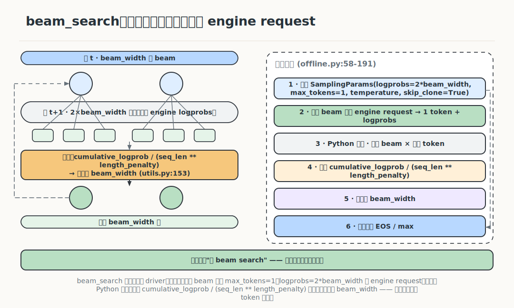</a>

<p class='figure-caption'>`beam_search` 是 entrypoint 侧的 driver，而不是单个 engine request：每一步都会为每个 beam 发出带有 `max_tokens=1`、`logprobs=2*beam_width` 的 engine request，然后在 Python 中扩展候选、按 `cumulative_logprob / (seq_len ** length_penalty)` 排序，再裁剪回 `beam_width`；engine 始终只执行 single-token generation。</p>

每一步都会让 engine 生成一个 token，并返回 `2 * beam_width` 个 logprobs（与 HF transformers 的做法一致）；随后在 Python 中扩展并裁剪 beam，排序依据是经过长度惩罚的累计 logprob（`cumulative_logprob / (seq_len ** length_penalty)`，[`vllm/entrypoints/generate/beam_search/utils.py:153`](https://github.com/vllm-project/vllm/blob/6cf7b26bd4bff60bf378e1af14044280ac0d214c/vllm/entrypoints/generate/beam_search/utils.py#L153)）。engine 从不会被要求“执行 beam search”——它只负责 `max_tokens=1` generation，整个 search 完全由 entrypoint 层负责。

## 4. CLI：vllm serve 与 server 的启动方式

`vllm serve` 将命令行参数转换成 `Namespace`，供 HTTP server 自身的 `__main__` 使用；它还会选择启动拓扑，并在常规路径上调用 `uvloop.run(run_server(args))`，传入一个已预先 bind 的 socket。它负责参数校验和进程选择，不参与调度或 model 执行。

<a href='images/vllm-02-05-cli-serve.svg' target='_blank'>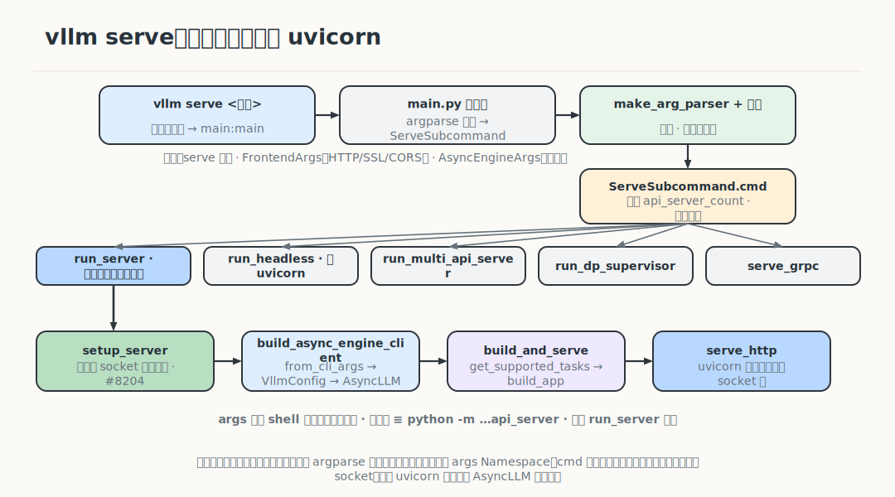</a>

<p class='figure-caption'>`vllm serve` — console script → 延迟加载的 command registry → 三层 flag 组装 → `ServeSubcommand.cmd` 五路分支 → bind socket → `run_server`。</p>

### console-script entrypoint

`vllm` 从何而来？它是 setuptools console script，只在 packaging metadata 中声明一次。

`pyproject.toml:44`

```toml
vllm = "vllm.entrypoints.cli.main:main"
```

安装 vLLM 时会生成一个 `vllm` executable，其内部直接调用 `vllm.entrypoints.cli.main:main`。这里没有 shell wrapper，也没有 dispatcher script；entrypoint 就是普通的 Python function。同一个可 import 的 `main` 可从已安装的 binary、tests 和 `python -m vllm.entrypoints.cli.main` 访问。

### 通过 argparse defaults 分派的延迟加载 command registry

`main()` 特意将 import 开销降到最低。它的 docstring（[`main.py:3-6`](https://github.com/vllm-project/vllm/blob/6cf7b26bd4bff60bf378e1af14044280ac0d214c/vllm/entrypoints/cli/main.py#L3-L6)）明确要求：“今后的所有 module 都必须在 main 内部 lazy load，以避免某些 eager import 引发的故障”——因此，每个 subcommand module 都只在函数体*内部* import，绝不会在 module 顶层 import。

[`vllm/entrypoints/cli/main.py:83-97`](https://github.com/vllm-project/vllm/blob/6cf7b26bd4bff60bf378e1af14044280ac0d214c/vllm/entrypoints/cli/main.py#L83-L97)

```python
        subparsers = parser.add_subparsers(required=False, dest="subparser")
        cmds = {}
        for cmd_module in CMD_MODULES:
            new_cmds = cmd_module.cmd_init()
            for cmd in new_cmds:
                cmd.subparser_init(subparsers).set_defaults(dispatch_function=cmd.cmd)
                cmds[cmd.name] = cmd
        args = parser.parse_args()
        if args.subparser in cmds:
            cmds[args.subparser].validate(args)

        if hasattr(args, "dispatch_function"):
            args.dispatch_function(args)
        else:
            parser.print_help()
```

分派流程很直接：

`CMD_MODULES` 在 `main` 内部 import，每个 module 的 `cmd_init()` 都会返回自己的 `CLISubcommand` object。`subparser_init` 构建 parser，并将 `cmd.cmd` 保存为 `dispatch_function` 的 default。执行一次 `parse_args()` 后，已识别的 command 会先经过校验，再被分派；如果只输入 `vllm`，则打印 help。`serve` 只提供一个 `ServeSubcommand`（[`serve.py:169-170`](https://github.com/vllm-project/vllm/blob/6cf7b26bd4bff60bf378e1af14044280ac0d214c/vllm/entrypoints/cli/serve.py#L169-L170)）。

handler 由选中的 argparse subparser 决定，不存在 `if name == "serve"` 式判断链。`validate()` 先于 `cmd()` 运行，因此无效组合会在 engine 或 socket 初始化前直接失败。这里有个实现细节值得注意：由于 `cmds[cmd.name] = cmd` 以 name 为 key，重复注册会覆盖此前的注册项。（`--omni` 和 `bench` 不走这条 pipeline；[`main.py:42-71`](https://github.com/vllm-project/vllm/blob/6cf7b26bd4bff60bf378e1af14044280ac0d214c/vllm/entrypoints/cli/main.py#L42-L71) 会在 argparse 运行前直接从原始 `sys.argv` 中检测它们。）

**三层 flag，集中在一处组装。**

`ServeSubcommand.subparser_init`（[`serve.py:153-166`](https://github.com/vllm-project/vllm/blob/6cf7b26bd4bff60bf378e1af14044280ac0d214c/vllm/entrypoints/cli/serve.py#L153-L166)）将全部 flag 的定义交给 `make_arg_parser`。该函数是组装 `vllm serve` 参数集合的唯一位置，并以固定顺序叠加三层 flag。

[`vllm/entrypoints/openai/cli_args.py:346-383`](https://github.com/vllm-project/vllm/blob/6cf7b26bd4bff60bf378e1af14044280ac0d214c/vllm/entrypoints/openai/cli_args.py#L346-L383)

```python
    parser.add_argument(
        "model_tag",
        type=str,
        nargs="?",
        help="The model tag to serve (optional if specified in config)",
    )
    parser.add_argument(
        "--headless",
        ...
    )
    parser.add_argument(
        "--api-server-count",
        "-asc",
        type=int,
        default=None,
        ...
    )
    parser.add_argument(
        "--config",
        ...
    )
    parser.add_argument(
        "--grpc",
        ...
    )
    parser = FrontendArgs.add_cli_args(parser)
    parser = AsyncEngineArgs.add_cli_args(parser)

    return parser
```

<a href='images/vllm-02-17-cli-flag-tiers.svg' target='_blank'>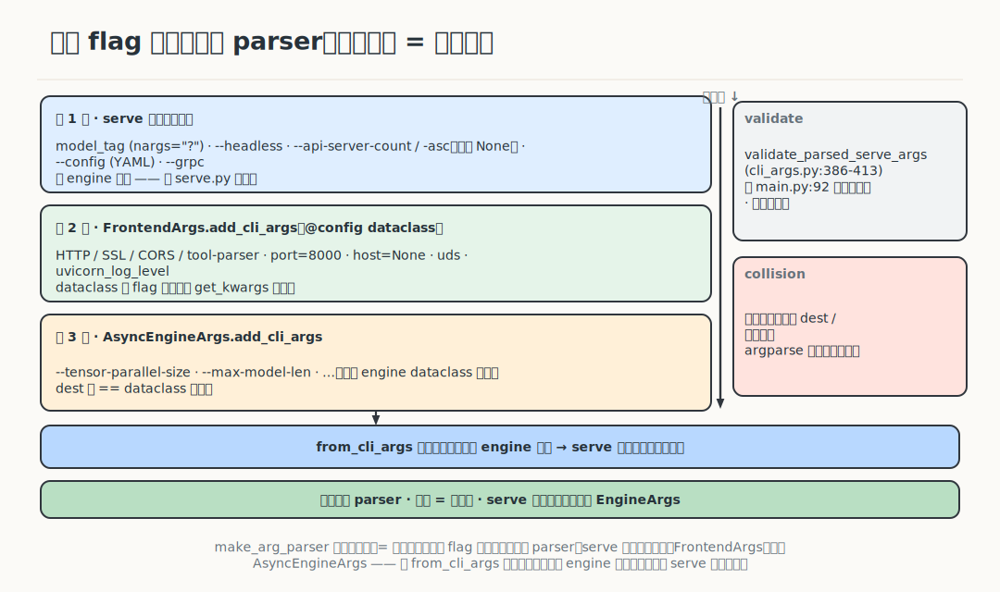</a>

<p class='figure-caption'>`make_arg_parser` 按注册顺序（= 优先级）将三层 flag 叠加到同一个扁平 parser 中：serve-only 启动 flag（`model_tag`、`--headless`、`--api-server-count`、`--config`、`--grpc`）、`FrontendArgs.add_cli_args`，最后是 `AsyncEngineArgs.add_cli_args`；`from_cli_args` 通过反射只复制同名 engine 字段，静默丢弃 serve-only flag。</p>

具体来说，按注册顺序分为三层：

1. **手写的 serve-only flag：** 位置参数 `model_tag`（`nargs="?"`，因此可选）、`--headless`、`--api-server-count`/`-asc`（default 为 `None`）、`--config`（YAML options file）和 `--grpc`。这些 flag 只用于 CLI 自身的拓扑决策；它们*不是* engine 字段。
2. **`FrontendArgs.add_cli_args`**：HTTP/SSL/CORS/tool-parser 参数集合。`FrontendArgs` 是 `@config` dataclass（[`cli_args.py:223-247`](https://github.com/vllm-project/vllm/blob/6cf7b26bd4bff60bf378e1af14044280ac0d214c/vllm/entrypoints/openai/cli_args.py#L223-L247)、`port=8000`、`host=None`、`uds`、`uvicorn_log_level="info"`）；每个字段都会变成一个 `--flag`，这是通过 `get_kwargs` reflection 实现的，因此 dataclass *就是* flag schema。
3. **`AsyncEngineArgs.add_cli_args`**——完整的 engine flag 参数集合（`--tensor-parallel-size`、`--max-model-len` 及其他参数），同样通过反射方式注册。

flag 优先级遵循注册顺序，engine args 最后添加。三层 flag 全部注册到同一个 parser，因此发生 serve/engine 冲突时，argparse 会报告重复 option，而不是静默接受。`--api-server-count` 的 default 被刻意设为 `None`；`cmd` 使用这个 sentinel，根据 data-parallel 配置推导实际值。

跨 flag 一致性会提前单独检查。`validate()` → `validate_parsed_serve_args`（[`cli_args.py:386-413`](https://github.com/vllm-project/vllm/blob/6cf7b26bd4bff60bf378e1af14044280ac0d214c/vllm/entrypoints/openai/cli_args.py#L386-L413)）强制检查“`--enable-auto-tool-choice` 需要 `--tool-call-parser`”“`--enable-per-request-metrics` 需要启用 engine stats logging”等依赖关系，并在 model 加载或 socket bind *之前* 抛出 `TypeError`/`ValueError`。由于它在 [`main.py:92`](https://github.com/vllm-project/vllm/blob/6cf7b26bd4bff60bf378e1af14044280ac0d214c/vllm/entrypoints/cli/main.py#L92) 执行，这类错误会立即、低成本地暴露，绝不会演变成启动中途的 crash。

### `ServeSubcommand.cmd`：规范化、解析拓扑并分支

`cmd` 是 argparse 分派到的 handler。它完成三件事：把位置参数 model 归并到 engine 配置中，将进程拓扑解析为具体的 `api_server_count`，然后进入对应分支。

[`vllm/entrypoints/cli/serve.py:49-59`](https://github.com/vllm-project/vllm/blob/6cf7b26bd4bff60bf378e1af14044280ac0d214c/vllm/entrypoints/cli/serve.py#L49-L59)

```python
    @staticmethod
    def cmd(args: argparse.Namespace) -> None:
        # If model is specified in CLI (as positional arg), it takes precedence
        if hasattr(args, "model_tag") and args.model_tag is not None:
            args.model = args.model_tag

        if getattr(args, "grpc", False):
            from vllm.entrypoints.grpc_server import serve_grpc

            uvloop.run(serve_grpc(args))
            return
```

<a href='images/vllm-02-18-serve-topology-branch.svg' target='_blank'>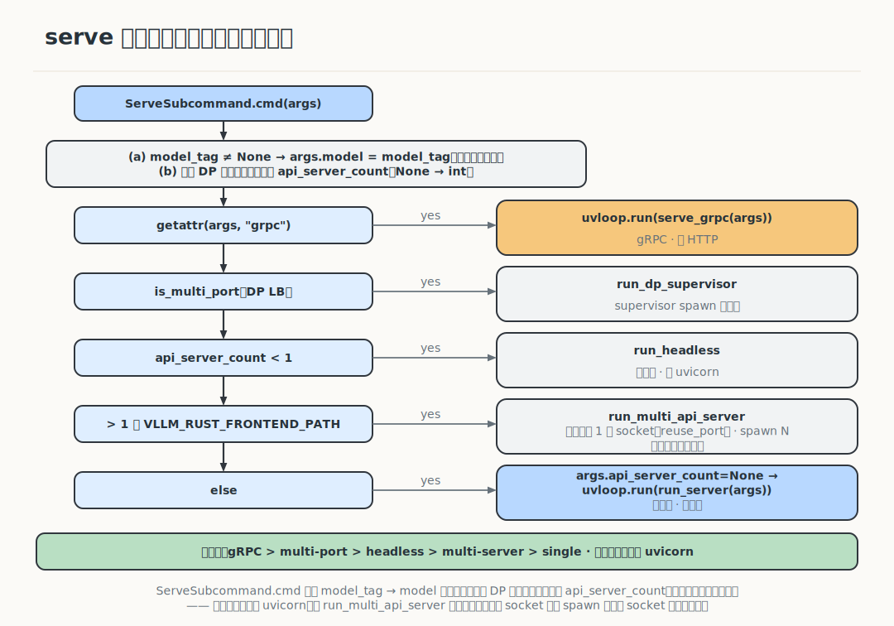</a>

<p class='figure-caption'>`ServeSubcommand.cmd` 将 `model_tag` 规范化为 `model`，根据 data-parallel 负载均衡模式解析 `api_server_count`，然后按优先级顺序进入五个分支（gRPC、`run_dp_supervisor`、`run_headless`、`run_multi_api_server`、单进程内 `run_server`）——只有最后两个会启动 uvicorn；`run_multi_api_server` 会先在父进程中 bind 一个 socket，再创建继承该 socket 的子 API server。</p>

位置参数 `model_tag`（serve-only flag）会被复制到 `args.model`（engine 字段）；如果二者都提供，则位置参数优先。因此，`vllm serve Qwen/Qwen3-0.6B` 和 `vllm serve --model Qwen/Qwen3-0.6B` 最终会汇入同一个 `args.model`。`--grpc` 是一条完全分流的路径：它把 `args` 交给 `serve_grpc`，并在 `uvloop.run` 下运行，随后直接返回，完全不进入 HTTP path。

从这里到真正进入分支之前，`cmd`（[`serve.py:61-137`](https://github.com/vllm-project/vllm/blob/6cf7b26bd4bff60bf378e1af14044280ac0d214c/vllm/entrypoints/cli/serve.py#L61-L137)）会推断 data-parallel 负载均衡模式（multi-port / external / hybrid；`sum([...]) > 1` 在 [`serve.py:91`](https://github.com/vllm-project/vllm/blob/6cf7b26bd4bff60bf378e1af14044280ac0d214c/vllm/entrypoints/cli/serve.py#L91) 确保最多只能启用其中一种），并将 `api_server_count` 从 `None` 解析为具体整数——普通 internal LB 使用完整的 `data_parallel_size`，hybrid 使用 `data_parallel_size_local`，而 Rust frontend 和 Elastic EP 的硬上限为 `1`。DP 内部机制是第 03 篇的主题（API-server↔EngineCore 的进程拆分）；在 entrypoint 边界，关键在于分支执行前，`api_server_count` 已经是解析完成的 int。

[`vllm/entrypoints/cli/serve.py:139-148`](https://github.com/vllm-project/vllm/blob/6cf7b26bd4bff60bf378e1af14044280ac0d214c/vllm/entrypoints/cli/serve.py#L139-L148)

```python
        if is_multi_port:
            run_dp_supervisor(args)
        elif args.api_server_count < 1:
            run_headless(args)
        elif args.api_server_count > 1 or envs.VLLM_RUST_FRONTEND_PATH:
            run_multi_api_server(args)
        else:
            # Single API server (this process).
            args.api_server_count = None
            uvloop.run(run_server(args))
```

末端 dispatch 将五种情况归并为四个 `elif` 分支，再加上前面提前返回的 gRPC 路径：

| 条件 | 路径 | HTTP server？ |
|---|---|---|
| `--grpc` | `serve_grpc`（此前已返回） | 否（gRPC stack） |
| `is_multi_port` | `run_dp_supervisor` | supervisor 派生 server |
| `api_server_count < 1` | `run_headless` | **否**——仅启动 engine |
| `> 1` 或 Rust frontend | `run_multi_api_server` | 是，N 个 child process |
| 其他（single） | `uvloop.run(run_server(args))` | 是，在*当前* process 中 |

由分支顺序可以得出三点结论：

分支顺序就是优先级：依次为 multi-port、headless、multi-server，最后是 single-server。在多节点 DP 部署中，`run_headless` 会为不对外提供服务的 node 启动 engine process，但不启动 uvicorn（[`serve.py:173-182`](https://github.com/vllm-project/vllm/blob/6cf7b26bd4bff60bf378e1af14044280ac0d214c/vllm/entrypoints/cli/serve.py#L173-L182)）。multi-server 路径会在 engine 启动前，由 parent process bind 一个可复用的 socket，写入 API process 的 rank 和总数，再让 child process 继承它。single-server 路径则将 `api_server_count=None` 设为哨兵值，并直接在当前 process 中调用 `uvloop.run(run_server(args))`。

### 通用路径：在创建 engine 前 bind socket

`run_server` 就是该 `uvloop.run` 的调用目标。它很短，但每一行都不可或缺。

[`vllm/entrypoints/openai/api_server.py:746-759`](https://github.com/vllm-project/vllm/blob/6cf7b26bd4bff60bf378e1af14044280ac0d214c/vllm/entrypoints/openai/api_server.py#L746-L759)

```python
async def run_server(args, **uvicorn_kwargs) -> None:
    """Run a single-worker API server."""

    decorate_logs("APIServer", skip_if_decorated=True)

    # Interrupt initialization if SIGTERM arrives before uvicorn installs its
    # own signal handlers. Once uvicorn is running it replaces this.
    def _interrupt_init(*_) -> None:
        raise KeyboardInterrupt("terminated")

    signal.signal(signal.SIGTERM, _interrupt_init)

    listen_address, sock = setup_server(args, reuse_port=False)
    await run_server_worker(listen_address, sock, args, **uvicorn_kwargs)
```

在执行任何耗时操作之前，`run_server` 会安装一个临时的 `SIGTERM` handler，用于抛出 `KeyboardInterrupt`。模型加载可能持续数分钟；如果没有这层保护，加载期间收到的 `kill` 会被吞掉，因为此时 uvicorn 自己的 signal handler 尚未就绪。uvicorn 启动后会替换这个 handler。随后，`setup_server` bind socket，`run_server_worker` 完成其余工作。

`setup_server`（[`api_server.py:628-637`](https://github.com/vllm-project/vllm/blob/6cf7b26bd4bff60bf378e1af14044280ac0d214c/vllm/entrypoints/openai/api_server.py#L628-L637)）负责 bind port，源码也明确说明了为什么这一步必须在创建 engine *之前*完成：

```python
    validate_api_server_args(args)

    # workaround to make sure that we bind the port before the engine is set up.
    # This avoids race conditions with ray.
    # see https://github.com/vllm-project/vllm/issues/8204
    if args.uds:
        sock = create_server_unix_socket(args.uds)
    else:
        sock_addr = (args.host or "", args.port)
        sock = create_server_socket(sock_addr, reuse_port=reuse_port)
```

这条注释明确给出了顺序保证：必须先 bind 监听 socket，再构建 engine（issue [#8204](https://github.com/vllm-project/vllm/issues/8204)）。返回的 `sock` 是一个处于活动状态且已经 bind 的 socket 对象；`listen_address` 只是一段便于阅读的字符串。下游的 `serve_http`（[`launcher.py:26-82`](https://github.com/vllm-project/vllm/blob/6cf7b26bd4bff60bf378e1af14044280ac0d214c/vllm/entrypoints/launcher.py#L26-L82)）会调用 `server.serve(sockets=[sock])`，因此 uvicorn 直接基于预先 bind 的 socket 提供服务，绝不会自行 bind port。这种先 bind port、后启动 engine 的顺序，可以避免 Ray 竞态：否则 engine 启动过慢时，其他 process 可能会抢先占用该 port。

**控制权交接，以及 CLI 和 `__main__` 为何始终保持一致。**

`run_server_worker` 将 engine 的完整生命周期限定在一个 async context manager 内，并精确安排 shutdown 顺序。

[`vllm/entrypoints/openai/api_server.py:773-784`](https://github.com/vllm-project/vllm/blob/6cf7b26bd4bff60bf378e1af14044280ac0d214c/vllm/entrypoints/openai/api_server.py#L773-L784)

```python
    async with build_async_engine_client(
        args,
        client_config=client_config,
    ) as engine_client:
        shutdown_task = await build_and_serve(
            engine_client, listen_address, sock, args, **uvicorn_kwargs
        )
    # NB: Await server shutdown only after the backend context is exited
    try:
        await shutdown_task
    finally:
        sock.close()
```

`build_async_engine_client` 创建 `AsyncLLM`；也正是在这里，`args` 最终转化为 engine 配置：[`api_server.py:134`](https://github.com/vllm-project/vllm/blob/6cf7b26bd4bff60bf378e1af14044280ac0d214c/vllm/entrypoints/openai/api_server.py#L134) 先调用 `AsyncEngineArgs.from_cli_args(args)`，然后调用 `create_engine_config` 和 `AsyncLLM.from_vllm_config`。[第 5 节](#5-openai-serverfastapi-applifespan-与-engine-client) 将深入分析这个 composition root。

`build_and_serve` 组装 FastAPI app，并返回一个 `shutdown_task`。该 task 会在 `async with` 之外 await，因此 engine context 会先于最终 HTTP teardown 退出；最后才执行 `sock.close()`。相比嵌套关系，执行顺序更容易记：先 engine，后 socket。

`from_cli_args` 是连接两者的桥梁：整套 CLI 参数通过名称匹配直接复制，而不是依赖手工 mapping。

[`vllm/engine/arg_utils.py:1606-1613`](https://github.com/vllm-project/vllm/blob/6cf7b26bd4bff60bf378e1af14044280ac0d214c/vllm/engine/arg_utils.py#L1606-L1613)

```python
    def from_cli_args(cls, args: argparse.Namespace):
        # Get the list of attributes of this dataclass.
        attrs = [attr.name for attr in dataclasses.fields(cls)]
        # Set the attributes from the parsed arguments.
        engine_args = cls(
            **{attr: getattr(args, attr) for attr in attrs if hasattr(args, attr)}
        )
        return engine_args
```

它枚举 `AsyncEngineArgs` dataclass 的所有 field，再从 `args` Namespace 中复制每个同名 attribute。如果 `args` 上不存在某个 field，就使用 dataclass default。这正是 `make_arg_parser` 第 3 层如此重要的原因：engine flag 注册时使用的 `dest` 名称与 dataclass field 名称一致，因此每个 engine flag 都会自动传入 `EngineArgs`。serve 专用 flag（`model_tag`、`headless`、`api_server_count`、`grpc`、`config`）则*不是* dataclass field，因此会在这里被静默丢弃——它们此前已经在 `serve.py` 中消费完毕。**`args` 是从 shell 到 engine 的唯一事实来源**，通过反射式 field 复制完成转换；系统中不存在需要手工维护、可能逐渐失配的 flag-to-config 映射表。

最后，这条路径之所以可信，还因为 module 自己的 `__main__` 完整复现了同一流程。

[`vllm/entrypoints/openai/api_server.py:787-799`](https://github.com/vllm-project/vllm/blob/6cf7b26bd4bff60bf378e1af14044280ac0d214c/vllm/entrypoints/openai/api_server.py#L787-L799)

```python
if __name__ == "__main__":
    # NOTE(simon):
    # This section should be in sync with vllm/entrypoints/cli/main.py for CLI
    # entrypoints.
    cli_env_setup()
    parser = FlexibleArgumentParser(...)
    parser = make_arg_parser(parser)
    args = parser.parse_args()
    validate_parsed_serve_args(args)

    uvloop.run(run_server(args))
```

执行 `python -m vllm.entrypoints.openai.api_server` 会构建同一个 parser，执行同样的校验，并最终调用同一个 `run_server(args)`；源码注释明确要求 module 与 CLI entrypoint 始终保持同步。

## 5. OpenAI Server：FastAPI App、Lifespan 与 Engine Client

`vllm/entrypoints/openai/api_server.py` 不是 route table，而是 composition root：各功能 router 负责定义 endpoint；这个 module 则依次组织 socket bind、engine client 生命周期、能力探测、app 构建与 shutdown。`supported_tasks`、server 参数、model 配置、plugin 和 developer mode 共同决定最终暴露的 API surface。

<a href='images/vllm-02-02-online-request-path.svg' target='_blank'>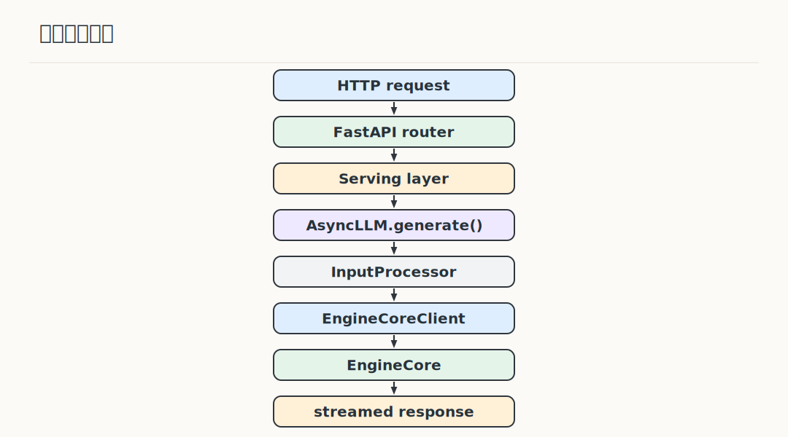</a>

<p class='figure-caption'>HTTP 入口：socket → AsyncLLM engine client → 受 supported_tasks 控制的 FastAPI app → 每个 request 对应的 SSE stream。</p>

### engine client：`AsyncLLM` 就是 `EngineClient`

整个 server 只与一个对象通信，也就是 `EngineClient`，它由上面的 context manager 创建。`build_async_engine_client` 只是轻量的外层封装（CLI `args` → `AsyncEngineArgs`，forkserver 预导入）；具体 engine 到下一层才真正创建。

[`vllm/entrypoints/openai/api_server.py:162-193`](https://github.com/vllm-project/vllm/blob/6cf7b26bd4bff60bf378e1af14044280ac0d214c/vllm/entrypoints/openai/api_server.py#L162-L193)

```python
    # Create the EngineConfig (determines if we can use V1).
    vllm_config = engine_args.create_engine_config(usage_context=usage_context)

    from vllm.v1.engine.async_llm import AsyncLLM

    async_llm: AsyncLLM | None = None

    # Don't mutate the input client_config
    client_config = dict(client_config) if client_config else {}
    client_count = client_config.pop("client_count", 1)
    client_index = client_config.pop("client_index", 0)

    try:
        async_llm = AsyncLLM.from_vllm_config(
            vllm_config=vllm_config,
            usage_context=usage_context,
            enable_log_requests=engine_args.enable_log_requests,
            aggregate_engine_logging=engine_args.aggregate_engine_logging,
            disable_log_stats=engine_args.disable_log_stats,
            client_addresses=client_config,
            client_count=client_count,
            client_index=client_index,
        )

        # Don't keep the dummy data in memory
        assert async_llm is not None
        await async_llm.reset_mm_cache()

        yield async_llm
    finally:
        if async_llm:
            async_llm.shutdown(timeout=vllm_config.shutdown_timeout)
```

<a href='images/vllm-02-19-socket-engine-lifecycle.svg' target='_blank'>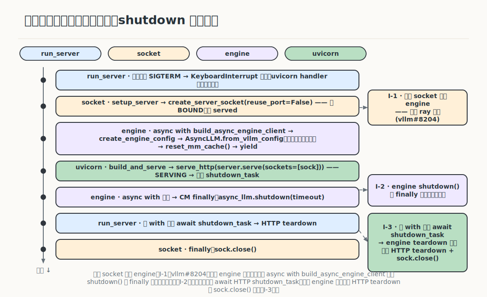</a>

<p class='figure-caption'>Server 生命周期顺序：在构建 engine 之前 bind socket（vllm#8204），将 engine 的生命周期限定在 `async with build_async_engine_client` 内，并在该 block 之外 await HTTP `shutdown_task`。这样，engine teardown 会先于最终 HTTP teardown 和 `sock.close()` 执行。</p>

`create_engine_config` 将 `AsyncEngineArgs` 转换为经过验证的 `VllmConfig`，沿用与 offline `LLM` 和 CLI 相同的 lowering 路径。其默认 usage context 是 `UsageContext.OPENAI_API_SERVER`（[`api_server.py:120`](https://github.com/vllm-project/vllm/blob/6cf7b26bd4bff60bf378e1af14044280ac0d214c/vllm/entrypoints/openai/api_server.py#L120)，用于区分 server telemetry 与 offline `LLM_CLASS`）。具体 client 为 `AsyncLLM`，它是 engine client 抽象基类的子类：

[`vllm/v1/engine/async_llm.py:70`](https://github.com/vllm-project/vllm/blob/6cf7b26bd4bff60bf378e1af14044280ac0d214c/vllm/v1/engine/async_llm.py#L70) — `class AsyncLLM(EngineClient):`
[`vllm/engine/protocol.py:40`](https://github.com/vllm-project/vllm/blob/6cf7b26bd4bff60bf378e1af14044280ac0d214c/vllm/engine/protocol.py#L40) — `class EngineClient(ABC):`（“面向 Engine 的 Client Protocol 类”）。

server 通过这个 ABC 与 engine 通信，而不是直接访问 EngineCore 的内部实现。`AsyncLLM` 实现了[健康检查与生命周期接口](https://github.com/vllm-project/vllm/blob/6cf7b26bd4bff60bf378e1af14044280ac0d214c/vllm/engine/protocol.py#L50)，以及 `EngineClient` 中声明的 task discovery、generation 和 encoding 方法。构建完成后，`reset_mm_cache()` 会释放启动 profiling 时使用的多模态 dummy tensors。`finally` 在正常 shutdown 以及所覆盖的 build/serve 失败路径中都会调用 `async_llm.shutdown(...)`；`run_server_worker` 会等这项清理完成后，再结束 HTTP teardown。

唯一 yield 出来的 `AsyncLLM`，就是之后每个 route handler 都会以 `request.app.state.engine_client` 形式解引用的对象。它的 request 准入路径（`add_request` → `input_processor.process_inputs` → `EngineCoreRequest`）和流式输出循环将在[第 11 节](#11-streaming-ssemiddlewareauth-与-health)详细讨论；这里只需把它视为“在 app 整个生命周期内始终存活的 engine client”。

**ASGI lifespan *并不是* engine context manager。**

这里还存在第二个 context manager，将两者混为一谈是一种很典型的误读。`build_app` 会将 `lifespan=lifespan` 传给 `FastAPI(...)`。这个 `lifespan` 是由 uvicorn 在 socket 服务循环*内部*驱动的 **ASGI** startup/shutdown hook，其作用域明显小于上一小节的 engine context manager，后者会完整包裹 uvicorn。engine CM 管理 engine 本身的存续，而 ASGI lifespan 负责两项横切辅助任务。

[`vllm/entrypoints/serve/utils/server_utils.py:534-568`](https://github.com/vllm-project/vllm/blob/6cf7b26bd4bff60bf378e1af14044280ac0d214c/vllm/entrypoints/serve/utils/server_utils.py#L534-L568)

```python
@asynccontextmanager
async def lifespan(app: FastAPI):
    try:
        if app.state.log_stats:
            engine_client: EngineClient = app.state.engine_client

            async def _force_log():
                while True:
                    await asyncio.sleep(envs.VLLM_LOG_STATS_INTERVAL)
                    await engine_client.do_log_stats()

            task = asyncio.create_task(_force_log())
            _running_tasks.add(task)
            task.add_done_callback(_running_tasks.remove)
        else:
            task = None

        # Mark the startup heap as static so that it's ignored by GC.
        # Reduces pause times of oldest generation collections.
        freeze_gc_heap()
        try:
            yield
        finally:
            if task is not None:
                task.cancel()
            for attr_name in (
                "openai_serving_transcription",
                "openai_serving_translation",
            ):
                serving = getattr(app.state, attr_name, None)
                if serving is not None and hasattr(serving, "shutdown"):
                    serving.shutdown()
    finally:
        # Ensure app state including engine ref is gc'd
        del app.state
```

启用 stats 后，ASGI lifespan 会启动一个 task，每隔 `VLLM_LOG_STATS_INTERVAL` 秒调用一次 `engine_client.do_log_stats()`。`_running_tasks` 会保留对该 task 的强引用，task 完成后，done callback 会将其移除。随后，`freeze_gc_heap()` 会将 startup heap 排除在后续 cyclic GC 扫描之外。shutdown 时，lifespan 会取消 stats task，让 transcription 和 translation service 有机会关闭各自的 thread pool，并删除 `app.state`，包括其中的 engine-client 引用。HTTP scope 内的任务归 ASGI lifespan 管理；外层的 engine context manager 则负责 engine 本身。

### Model capability route 由 `supported_tasks` gate 控制

`build_and_serve` 是将“正在运行的 engine”转变为“可提供服务的 app”的粘合层。它首先会*向 engine 询问其支持哪些能力*，后续所有 routing 和 state 决策都源自这一结果。

[`vllm/entrypoints/openai/api_server.py:670-675`](https://github.com/vllm-project/vllm/blob/6cf7b26bd4bff60bf378e1af14044280ac0d214c/vllm/entrypoints/openai/api_server.py#L670-L675)

```python
    supported_tasks = await engine_client.get_supported_tasks()
    model_config = engine_client.model_config

    logger.info("Supported tasks: %s", supported_tasks)
    app = build_app(args, supported_tasks, model_config)
    await init_app_state(engine_client, app.state, args, supported_tasks)
```

`get_supported_tasks` 是权威来源，其结果会被 cache：它只与 engine core 往返通信一次，之后便会 memoize 结果：

[`vllm/v1/engine/async_llm.py:273-278`](https://github.com/vllm-project/vllm/blob/6cf7b26bd4bff60bf378e1af14044280ac0d214c/vllm/v1/engine/async_llm.py#L273-L278)

```python
    async def get_supported_tasks(self) -> tuple[SupportedTask, ...]:
        if not hasattr(self, "_supported_tasks"):
            # Cache the result
            self._supported_tasks = await self.engine_core.get_supported_tasks_async()

        return self._supported_tasks
```

<a href='images/vllm-02-20-supported-tasks-gate.svg' target='_blank'>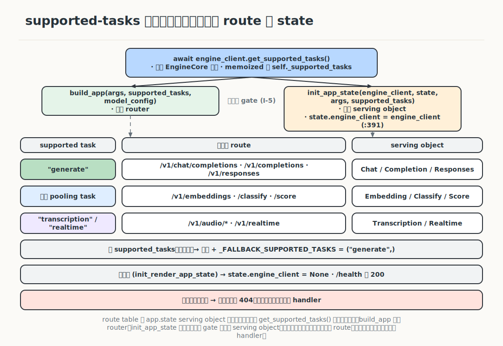</a>

<p class='figure-caption'>Model capability route 及其对应的 `app.state` serving object 共享同一组 cache 后的 `get_supported_tasks()` gate。`"generate"` 会启用 chat/completions/responses，pooling task 会启用 embeddings/classify/score；app 的其余部分仍取决于 `args`、`model_config`、middleware、developer mode 和 plugins。</p>

`build_app(args, supported_tasks, model_config)` 会根据 `supported_tasks` 中的 capability 注册 router：`"generate"` 会启用 chat/completions/responses，pooling task 会启用 embeddings/classify/score，而 `"transcription"` 或 `"realtime"` 则会启用对应的 speech route。`init_app_state` 创建 serving object 时也会应用相同的 gate。它的第一条赋值语句会将这些对象连接到 engine：

[`vllm/entrypoints/openai/api_server.py:391`](https://github.com/vllm-project/vllm/blob/6cf7b26bd4bff60bf378e1af14044280ac0d214c/vllm/entrypoints/openai/api_server.py#L391) — `state.engine_client = engine_client`

正是这条赋值语句，让三个小节前提到的 `AsyncLLM` 能够被每个 handler 通过 `request.app.state.engine_client` 访问。如果调用 `build_app` 时没有传入 `supported_tasks`（这是一条已弃用的路径），它会发出警告并 fallback 到 `_FALLBACK_SUPPORTED_TASKS = ("generate",)`（[`api_server.py:78`](https://github.com/vllm-project/vllm/blob/6cf7b26bd4bff60bf378e1af14044280ac0d214c/vllm/entrypoints/openai/api_server.py#L78)，`:196-209`）。render-only 变体 `init_render_app_state` 则会设置 `state.engine_client = None`（`:563`）。这是一个完全没有 engine 的 CPU-only server，`/health` handler 会始终将其视为健康状态。

route gate 和 state gate 会同时使用 cache 后的 `await engine_client.get_supported_tasks()` 结果与 `model_config`。因此，不受 model 支持的 capability 不会有对应 route；已经注册的 capability route 则一定有与之匹配的 serving object。这里只描述 app 中依赖 capability 的部分；其余部分还会受到 server args、middleware、developer mode 和 plugins 的影响。

## 6. Completions 服务：从 HTTP 到 add_request

`/v1/completions` 是最清晰的 HTTP-to-engine 路径，因为它不涉及 chat template、tool parser 或 reasoning boundary。handler 负责渲染 prompt，将 protocol 字段转换为 `SamplingParams`，并针对每个 prompt 调用一次 `engine_client.generate`。该调用之后的工作都由 engine 负责。

<a href='images/vllm-02-06-completion-flow.svg' target='_blank'>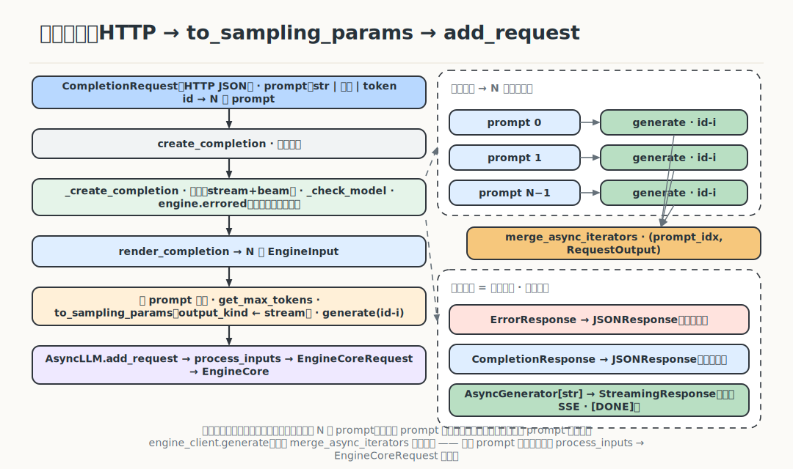</a>

<p class='figure-caption'>一个 HTTP `CompletionRequest` 会 fan-out 为 N 条与 prompt 一一对应的 `engine_client.generate` stream，再由 `merge_async_iterators` 重新归并。</p>

### route 及其三种返回形式

FastAPI handler 被刻意设计得非常精简。它只负责从 `app.state` 中取出 serving object，并将其返回结果映射为 HTTP response。

[`vllm/entrypoints/openai/completion/api_router.py:44-66`](https://github.com/vllm-project/vllm/blob/6cf7b26bd4bff60bf378e1af14044280ac0d214c/vllm/entrypoints/openai/completion/api_router.py#L44-L66):

```python
@with_cancellation
@load_aware_call
async def create_completion(request: CompletionRequest, raw_request: Request):
    ...
    handler = completion(raw_request)
    if handler is None:
        raise NotImplementedError("The model does not support Completions API")

    generator = await handler.create_completion(request, raw_request)

    if isinstance(generator, ErrorResponse):
        return JSONResponse(
            content=generator.model_dump(), status_code=generator.error.code
        )
    elif isinstance(generator, CompletionResponse):
        return JSONResponse(
            content=generator.model_dump(),
            headers=metrics_header(metrics_header_format),
        )

    return StreamingResponse(content=generator, media_type="text/event-stream")
```

FastAPI 此时已经将 body 解析为 `CompletionRequest`，因此 `with_cancellation` 可以让 handler 的处理任务与 disconnect 事件并发竞速。serving object 来自 `app.state`；capability gate 通常会确保该对象不存在时不开放这个 route。`create_completion` 会返回一个 `ErrorResponse`、一个已经物化的 `CompletionResponse`，或者一个 async generator；route 会分别将其映射为错误 JSON body、普通 JSON 或 SSE。其他 serving route 也复用了这种轻量的三路 response 契约。

**Guard、render，以及 streaming 之前执行的 engine health check。**

`create_completion` 会立即委托给 `_create_completion`，并由 `_with_kv_transfer_rejection_cleanup` 包裹（这是 disaggregated-prefill 中用于释放 block 的 wrapper，此处不展开）。`_create_completion` 一开始就会执行 guard 和 render。

[`vllm/entrypoints/openai/completion/serving.py:136-145`](https://github.com/vllm-project/vllm/blob/6cf7b26bd4bff60bf378e1af14044280ac0d214c/vllm/entrypoints/openai/completion/serving.py#L136-L145):

```python
        if request.stream and request.use_beam_search:
            return self.create_error_response(
                "Streaming is not currently supported with beam search"
            )

        result = await self.render_completion_request(request)
        if isinstance(result, ErrorResponse):
            return result

        engine_inputs = result
```

`render_completion_request` 中隐藏着一条细微的执行顺序规则。

[`vllm/entrypoints/openai/completion/serving.py:101-111`](https://github.com/vllm-project/vllm/blob/6cf7b26bd4bff60bf378e1af14044280ac0d214c/vllm/entrypoints/openai/completion/serving.py#L101-L111):

```python
        error_check_ret = await self._check_model(request)
        if error_check_ret is not None:
            return error_check_ret

        # If the engine is dead, raise the engine's DEAD_ERROR.
        # This is required for the streaming case, where we return a
        # success status before we actually start generating text :).
        if self.engine_client.errored:
            raise self.engine_client.dead_error

        return await self.online_renderer.render_completion(request)
```

`_check_model` 首先校验 request 指定的 model 或 LoRA 名称，不匹配时返回 404。随后执行 engine health check；该检查位于 render 之前，更重要的是，也位于 handler 返回 generator 之前。`online_renderer.render_completion` 会将 request tokenize 成一个由 `EngineInput` 组成的列表。这里使用复数至关重要：OpenAI 的 `prompt` 字段可以接受一个 string、string 列表、token id 序列或 token-id 序列的列表，因此一个 HTTP request 可能包含多个 prompt。

health check 可以在 route 提交 200 stream response 之前捕获已经失败的 engine。一旦 `StreamingResponse` 发出 status line，之后发生的故障就只能以 in-band 方式暴露，或者表现为被截断的 stream。预先检查 `engine_client.errored`，才能保留返回正确错误状态码的可能性。

### 一个 request，N 个 engine request：fan-out loop

拿到 `engine_inputs` 后，handler 会先分配 identity，然后针对每个 prompt 执行一次 loop。首先处理 identity：

[`vllm/entrypoints/openai/completion/serving.py:147-157`](https://github.com/vllm-project/vllm/blob/6cf7b26bd4bff60bf378e1af14044280ac0d214c/vllm/entrypoints/openai/completion/serving.py#L147-L157):

```python
        request_id = f"cmpl-{self._base_request_id(raw_request, request.request_id)}"
        created_time = int(time.time())

        request_metadata = RequestResponseMetadata(request_id=request_id)
        if raw_request:
            raw_request.state.request_metadata = request_metadata

        lora_request = self._maybe_get_adapters(request)

        # Extract data_parallel_rank from header (router can inject it)
        data_parallel_rank = self._get_data_parallel_rank(raw_request)
```

`_base_request_id`（[`vllm/entrypoints/serve/engine/serving.py:116-126`](https://github.com/vllm-project/vllm/blob/6cf7b26bd4bff60bf378e1af14044280ac0d214c/vllm/entrypoints/serve/engine/serving.py#L116-L126)）会优先使用 `X-Request-Id` header；否则使用 request 自身的 id；如果仍然没有，则创建新的 `random_uuid()`。这样，upstream router 就能将 trace id 一路透传。`data_parallel_rank` 从 `X-data-parallel-rank` 中读取，使外部 DP router 可以将 request 固定到某个特定 engine（DP routing 参见第 11 篇 distributed）。

接下来进入关键 loop。

[`vllm/entrypoints/openai/completion/serving.py:160-219`](https://github.com/vllm-project/vllm/blob/6cf7b26bd4bff60bf378e1af14044280ac0d214c/vllm/entrypoints/openai/completion/serving.py#L160-L219):

```python
        max_model_len = self.model_config.max_model_len
        generators: list[AsyncGenerator[RequestOutput, None]] = []
        for i, engine_input in enumerate(engine_inputs):
            max_tokens = get_max_tokens(
                max_model_len,
                request.max_tokens,
                self._extract_prompt_len(engine_input),
                self.default_sampling_params,
                self.override_max_tokens,
                truncate_prompt_tokens=request.truncate_prompt_tokens,
            )
            ...
            sampling_params = request.to_sampling_params(
                    max_tokens,
                    self.default_sampling_params,
                )

            request_id_item = f"{request_id}-{i}"
            ...
            generator = self.engine_client.generate(
                    engine_input,
                    sampling_params,
                    request_id_item,
                    lora_request=lora_request,
                    trace_headers=trace_headers,
                    priority=request.priority,
                    data_parallel_rank=data_parallel_rank,
                )
            generators.append(generator)

        result_generator = merge_async_iterators(*generators)
```

每个 prompt 都会得到*专属*的 `max_tokens`，它根据*该 prompt 自身*的 prompt length 计算得出；此外，每个 prompt 还有专属的 `SamplingParams` 和独立的 sub-id `{request_id}-{i}`。每个 prompt 都会生成独立的 `engine_client.generate(...)` async generator，也就是独立的 engine request。`merge_async_iterators` 会交错合并 N 个 generator，形成一条产出 `(prompt_idx, RequestOutput)` tuple 的 stream；下文的 streaming 和 non-streaming assembler 再按照 `prompt_idx` 重新归并。这正是它与 chat 在结构上的差异：chat 会断言 generator 恰好只有一个，并让 `n>1` 搭载在单个 request 内的 `output.index` 上。

Completions 在 entrypoint 处分流：每个 prompt 都会成为独立的 engine request，并单独计算额度。如果 batch 中第四个 prompt 已接近 context 上限，也不会压缩前三个 prompt 的额度，因为 `max_tokens` 是按每个 `engine_input` 单独计算的。

`get_max_tokens`（[`vllm/entrypoints/serve/utils/api_utils.py:184-206`](https://github.com/vllm-project/vllm/blob/6cf7b26bd4bff60bf378e1af14044280ac0d214c/vllm/entrypoints/serve/utils/api_utils.py#L184-L206)）负责执行 context 上限约束。它会取以下值中的最小值：剩余 context（`max_model_len - input_length`）、request 指定或默认的 `max_tokens`、server 覆盖值，以及 platform 上限；未设置的值会被忽略。如果 prompt 过长，则会在 generation 开始前抛出 `ValueError`，并最终返回 400。completion handler 会针对每个 `engine_input` 调用一次，因此每个 prompt 都有独立额度。

### `to_sampling_params`：response path 依赖的两处耦合

`CompletionRequest.to_sampling_params` 将宽松的 pydantic field 桥接到 engine 的 `SamplingParams`；完整的桥接链路——各参数的优先级（request 值 → server `default_sampling_params` → 中性默认值）、stop token 合并，以及 engine 侧由 `_verify_args` 执行的值域校验——正是 [第 10 节](#10-协议request-schema-如何转换为-samplingparams) 从头到尾讨论的主题。不过，其中两项决策对*本节*的 response path 至关重要。（参数解析表以及 `_verify_args` 最终拒绝非法值的位置，参见 [第 10 节](#10-协议request-schema-如何转换为-samplingparams)；这些 field 在 logits processor 中的作用，参见第 10 篇 sampling。）

源码：[`vllm/entrypoints/openai/completion/protocol.py:311`](https://github.com/vllm-project/vllm/blob/6cf7b26bd4bff60bf378e1af14044280ac0d214c/vllm/entrypoints/openai/completion/protocol.py#L311) 和 [`363-371`](https://github.com/vllm-project/vllm/blob/6cf7b26bd4bff60bf378e1af14044280ac0d214c/vllm/entrypoints/openai/completion/protocol.py#L363-L371)。

```python
        echo_without_generation = self.echo and self.max_tokens == 0
        ...
        return SamplingParams.from_optional(
            ...
            max_tokens=max_tokens if not echo_without_generation else 1,
            ...
            output_kind=RequestOutputKind.DELTA
            if self.stream
            else RequestOutputKind.FINAL_ONLY,
            ...
        )
```

`DELTA` 产生增量 token delta，`FINAL_ONLY` 则产生一份累积 output；下文每个 assembler 都严格只对应这两种模式之一，因此该 field 构成了准入与组装之间的 contract。`else 1` 让纯 echo 请求保持合法——engine 会拒绝 `max_tokens < 1`，所以 request 会生成一个 token，再由 assembler 将其丢弃。

### 跨越边界：`generate` → `add_request` → `EngineCoreRequest`

`engine_client.generate` 就是 `AsyncLLM.generate`。它并非 engine，而是一个 async client wrapper，负责将准入过程转换为可消费的 stream。

[`vllm/v1/engine/async_llm.py:557-586`](https://github.com/vllm-project/vllm/blob/6cf7b26bd4bff60bf378e1af14044280ac0d214c/vllm/v1/engine/async_llm.py#L557-L586)：

```python
        q: RequestOutputCollector | None = None
        try:
            q = await self.add_request(
                request_id,
                prompt,
                sampling_params,
                ...
            )

            # The output_handler task pushes items into the queue.
            # This task pulls from the queue and yields to caller.
            finished = False
            while not finished:
                out = q.get_nowait() or await q.get()
                assert isinstance(out, RequestOutput)
                finished = out.finished
                if out is not STREAM_FINISHED:
                    yield out
```

`add_request` 是所有路径最终汇聚到的唯一 entrypoint。

[`vllm/v1/engine/async_llm.py:348-376`](https://github.com/vllm-project/vllm/blob/6cf7b26bd4bff60bf378e1af14044280ac0d214c/vllm/v1/engine/async_llm.py#L348-L376)：

```python
        else:
            request = self.input_processor.process_inputs(
                request_id,
                prompt,
                params,
                supported_tasks=await self.get_supported_tasks(),
                arrival_time=arrival_time,
                ...
            )
            prompt_text, _, _ = extract_prompt_components(self.model_config, prompt)
        ...
        self.input_processor.assign_request_id(request)

        # We start the output_handler on the first call to add_request() so
        # we can call __init__ before the event loop, which enables us
        # to handle startup failure gracefully in the OpenAI server.
        self._run_output_handler()

        # Create a new output collector for the request.
        queue = RequestOutputCollector(params.output_kind, request.request_id)
```

`input_processor.process_inputs` 生成经过校验的 `EngineCoreRequest`。共享 output handler 会在首个 request 准入时延迟启动；每个 request 都会获得一个 `RequestOutputCollector`，其配置沿用 `to_sampling_params` 中做出的同一项 `DELTA`/`FINAL_ONLY` 选择。`generate` 会先尝试 `q.get_nowait()`，仅当 mailbox 为空时才 await。HTTP handler 会 multiplex 多个这样的 generator，同时由一个 background task 通过 IPC 将 EngineCore 的输出送入这些 queue（第 03 篇）。Offline 与 online path 在这个输入 lowering 边界汇合。

**简述 assembler。**

两个终止分支都会消费 `result_generator`。Non-streaming 会将其全部读取并汇总成 batch，再调用 `request_output_to_completion_response`（[`serving.py:240-265`](https://github.com/vllm-project/vllm/blob/6cf7b26bd4bff60bf378e1af14044280ac0d214c/vllm/entrypoints/openai/completion/serving.py#L240-L265)）。Streaming 则返回 `completion_stream_generator`。有个边界情况值得注意：即便是 `stream=True`，内部也可能走到 non-streaming path；此时 response 会被重新包装成一次性 SSE。

[`vllm/entrypoints/openai/completion/serving.py:271-278`](https://github.com/vllm-project/vllm/blob/6cf7b26bd4bff60bf378e1af14044280ac0d214c/vllm/entrypoints/openai/completion/serving.py#L271-L278)：

```python
        if request.stream:
            response_json = response.model_dump_json()

            async def fake_stream_generator() -> AsyncGenerator[str, None]:
                yield f"data: {response_json}\n\n"
                yield "data: [DONE]\n\n"

            return fake_stream_generator()
```

对于 streaming path，serving generator 会生成 SSE frame，并以 `data: [DONE]\n\n` 结束；route 可以将该 generator 直接传给 `StreamingResponse`。choice index 计算、只 echo 一次的行为，以及可选的 usage chunk，都封装在 response assembler 内部。

## 7. Chat 服务：template 与 tool calling

`/v1/chat/completions` 与 `/v1/completions` 使用相同的 handler contract：返回 `ErrorResponse`、已物化的 response model，或 SSE `AsyncGenerator[str]`。Completions 会为每个 prompt 创建一次 `engine_client.generate` 调用。Chat 只 render 一个 prompt，并创建一个 generator；通过 `n` 请求的多个 choice 会在这一次准入路径内处理，并经由 `output.index` 体现在 `RequestOutput` 中。

Chat 还增加了三项 frontend 关注点：将 messages 转换为 token ids 的 template、负责约束并重新解析 output 的 tool/reasoning parser，以及供 structured decoding 使用的 reasoning boundary hint。第 05 篇和第 10 篇介绍这一层以下的 scheduling、sampling 与 grammar 执行。

<a href='images/vllm-02-07-chat-template.svg' target='_blank'>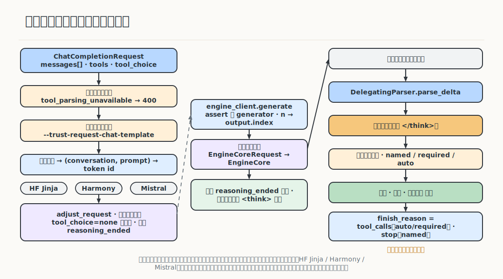</a>

<p class='figure-caption'>消息列表 → chat template（HF Jinja 或 Harmony）→ token ids → 单个 `engine_client.generate` stream；parser 在输入侧对 tool syntax 进行门控，并在输出侧重新分段。</p>

**route：沿用 completions 的三种返回形态契约；缺失时返回 501。**

Chat route 复用 completions 的三种 response 形态和 cancellation wrapper（[`chat_completion/api_router.py:53-74`](https://github.com/vllm-project/vllm/blob/6cf7b26bd4bff60bf378e1af14044280ac0d214c/vllm/entrypoints/openai/chat_completion/api_router.py#L53-L74)）。要获取的 `openai_serving_chat` 来自 `app.state`；若不存在，则映射为 HTTP 501。template 与 tool 相关行为都留在 serving handler 内部，而非 router 中。

### 一个 prompt、一个 generator，以及 reasoning 初始化

`_create_chat_completion`（[`chat_completion/serving.py:249-401`](https://github.com/vllm-project/vllm/blob/6cf7b26bd4bff60bf378e1af14044280ac0d214c/vllm/entrypoints/openai/chat_completion/serving.py#L249-L401)）先构建 parser，再 render messages，随后进入逐 input 循环；与 completion 不同，这里通过 assert 保证只产生一个 generator。该循环中的 chat 专属分支负责计算 reasoning boundary，见 [`chat_completion/serving.py:344-371`](https://github.com/vllm-project/vllm/blob/6cf7b26bd4bff60bf378e1af14044280ac0d214c/vllm/entrypoints/openai/chat_completion/serving.py#L344-L371)：

```python
            else:
                if not request.include_reasoning:
                    reasoning_ended = True
                elif request._grammar_from_tool_parser:
                    # The Mistral grammar already includes an optional
                    # `think?` rule that handles both reasoning and
                    # non-reasoning outputs.
                    reasoning_ended = True
                elif parser is not None and parser.reasoning_parser is not None:
                    reasoning_ended = parser.is_reasoning_end(prompt_token_ids or [])
                else:
                    reasoning_ended = None

                generator = self.engine_client.generate(
                    engine_input,
                    sampling_params,
                    sub_request_id,
                    lora_request=lora_request,
                    trace_headers=trace_headers,
                    priority=request.priority,
                    data_parallel_rank=data_parallel_rank,
                    reasoning_ended=reasoning_ended,
                    reasoning_parser_kwargs={
                        "chat_template_kwargs": chat_template_kwargs,
                    }
                    if parser is not None and parser.reasoning_parser is not None
                    else None,
                )
```

`reasoning_ended` 是 chat 会传给 `engine_client.generate`、而 completions 不会传递的三值信号。它用于告知 structured decoding：prompt 是否已经越过 `<think>` 阶段。server 会在以下情况下将其设为 `True`：reasoning output 被禁用，或 Mistral tool grammar 已纳入可选的 `think?` 规则；否则，reasoning parser 可以根据 prompt token 推断其值，而没有 parser 时则保持为 `None`。

循环结束后，`assert len(generators) == 1`（[`serving.py:375`](https://github.com/vllm-project/vllm/blob/6cf7b26bd4bff60bf378e1af14044280ac0d214c/vllm/entrypoints/openai/chat_completion/serving.py#L375)）会确认 chat 并未按多个 prompt 分流。通过 `n` 请求的变体会以同一 request 内多个独立 output 的形式返回，而不是多个 generator。在 server 端计算 reasoning boundary 后，tool 或 JSON grammar 便可在 reasoning 结束后生效，而不会约束 thinking 阶段。`max_completion_tokens` 的优先级也高于已弃用的 `max_tokens`，之后才执行 remaining-context clamp（[`serving.py:303-305`](https://github.com/vllm-project/vllm/blob/6cf7b26bd4bff60bf378e1af14044280ac0d214c/vllm/entrypoints/openai/chat_completion/serving.py#L303-L305)）。

### Rendering：tool choice 合法性与 template 信任机制

在上述流程之前，`render_chat_request`（与 completion 对称：`_check_model` → `engine_client.errored` → renderer）会委托给 `OnlineRenderer.render_chat`。其中两道校验决定当前 request 是否允许 tool calling。源码见 [`renderers/online_renderer.py:117-152`](https://github.com/vllm-project/vllm/blob/6cf7b26bd4bff60bf378e1af14044280ac0d214c/vllm/renderers/online_renderer.py#L117-L152)：

```python
        # Check if tool parsing is unavailable (common condition)
        tool_parsing_unavailable = (
            tool_parser is None
            and not is_mistral_tokenizer(tokenizer)
            and not self.use_harmony
        )

        # Validate tool_choice when tool parsing is required but unavailable
        if tool_parsing_unavailable and request.tool_choice not in (
            None,
            "none",
        ):
            if request.tool_choice == "auto" and not self.enable_auto_tools:
                # for hf tokenizers, "auto" tools requires
                # --enable-auto-tool-choice and --tool-call-parser
                return self.create_error_response(
                    '"auto" tool choice requires '
                    "--enable-auto-tool-choice and --tool-call-parser to be set"
                )
            elif request.tool_choice != "auto":
                # "required" or named tool requires tool parser
                if isinstance(request.tool_choice, ChatCompletionNamedToolChoiceParam):
                    tool_choice_desc = f'function "{request.tool_choice.function.name}"'
                else:
                    tool_choice_desc = f'"{request.tool_choice}"'
                return self.create_error_response(
                    f"tool_choice={tool_choice_desc} requires "
                    "--tool-call-parser to be set"
                )

        if request.tools is None or (
            request.tool_choice == "none" and self.exclude_tools_when_tool_choice_none
        ):
            tool_dicts = None
        else:
            tool_dicts = [tool.model_dump() for tool in request.tools]
```

<a href='images/vllm-02-21-tool-choice-legality.svg' target='_blank'>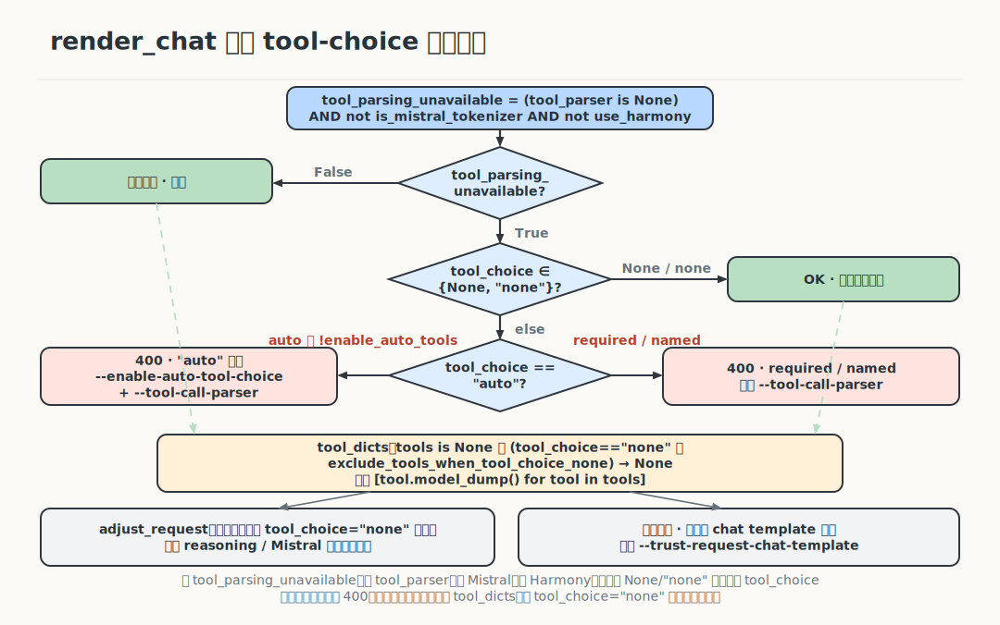</a>

<p class='figure-caption'>`render_chat` 中的 tool choice 合法性 gate：当 `tool_parsing_unavailable`（没有 `tool_parser`、非 Mistral、非 Harmony）时，`tool_choice` 只要不是 `None`/`"none"`，就会在 render 阶段返回 400——`"auto"` 需要 `--enable-auto-tool-choice`+`--tool-call-parser`，`"required"`/named 需要 `--tool-call-parser`——只有通过校验的 tools 才会成为 `tool_dicts`，而 `tool_choice="none"` 仍可将其屏蔽。</p>

`tool_parsing_unavailable` 在以下条件同时满足时为 true：不存在 tool parser、tokenizer 不是 Mistral，且未使用 Harmony (GPT-OSS)。在这种状态下，server 无法从 model 文本中还原结构化调用，因此会拒绝任何 `tool_choice`，除非其值为 `None` 或 `"none"`。`"auto"` 同时要求 `--enable-auto-tool-choice` 和 `--tool-call-parser`；`"required"` 或指定名称的 function 则必须依赖 parser。只有通过这项校验的 request 才会被序列化到 `tool_dicts`，这样就会把配置不匹配转化为渲染阶段的 400，而不是返回一个格式错误的成功 response。

第二项校验用于保护 template 本身。[`renderers/online_renderer.py:273-285`](https://github.com/vllm-project/vllm/blob/6cf7b26bd4bff60bf378e1af14044280ac0d214c/vllm/renderers/online_renderer.py#L273-L285)：

```python
        if not trust_request_chat_template and (
            request_chat_template is not None
            or (
                chat_template_kwargs
                and chat_template_kwargs.get("chat_template") is not None
            )
        ):
            return self.create_error_response(
                "Chat template is passed with request, but "
                "--trust-request-chat-template is not set. "
                "Refused request with untrusted chat template."
            )
        return None
```

除非运维方已启用 `--trust-request-chat-template`，否则会拒绝 request 提供的 Jinja template。这项检查同时覆盖顶层 `chat_template` field 和 `chat_template`（后者嵌套在 `chat_template_kwargs` 中）。这一点很重要，因为 chat template 是可在 server 侧执行的 Jinja 代码，而非静态的格式化数据。

对于常见的非 Harmony 路径，`preprocess_chat` 会将 tools 合并到 template kwargs 中，异步完成渲染，再由 parser 的 `adjust_request` 安装 structured-output grammar（[`online_renderer.py:335-422`](https://github.com/vllm-project/vllm/blob/6cf7b26bd4bff60bf378e1af14044280ac0d214c/vllm/renderers/online_renderer.py#L335-L422)）。启用 `tool_choice="none"` 后，除非 reasoning 或 Mistral grammar 配置仍然需要，否则会跳过这项调整，从而避免已配置的 parser 违背 client 指令，把 model 幻觉生成的 tool syntax 重新解释为调用。request kwargs 会覆盖 server 默认值，而 `reasoning_effort` 可以向需要显式 flag 的 template 提供 `enable_thinking`。

Jinja 实际是在 `HfRenderer.render_messages` 内部深处应用的（[`renderers/hf.py:929-1047`](https://github.com/vllm-project/vllm/blob/6cf7b26bd4bff60bf378e1af14044280ac0d214c/vllm/renderers/hf.py#L929-L1047)），调用链为 `safe_apply_chat_template` → `tokenizer.apply_chat_template`；它会返回 `(conversation, prompt)`，其中 `conversation` 是应用 template 前的 message list，response assembler 随后会为 `echo` 重放该列表。Mistral 则有自己的 `render_messages`（[`renderers/mistral.py:62-88`](https://github.com/vllm-project/vllm/blob/6cf7b26bd4bff60bf378e1af14044280ac0d214c/vllm/renderers/mistral.py#L62-L88)）。template 会在启动时由 `warmup` 编译一次（[`serving.py:185-192`](https://github.com/vllm-project/vllm/blob/6cf7b26bd4bff60bf378e1af14044280ac0d214c/vllm/entrypoints/openai/chat_completion/serving.py#L185-L192)），避免首个 request 承担 Jinja compile 开销。

### Tool-call streaming：reasoning 必须严格先于 tool-call 阶段

当 model 以 streaming 方式返回时，必须把原始文本重新切分为 reasoning、content 和增量 tool-call delta。这由 `DelegatingParser.parse_delta` 中的两阶段状态机完成（[`parser/abstract_parser.py:793-920`](https://github.com/vllm-project/vllm/blob/6cf7b26bd4bff60bf378e1af14044280ac0d214c/vllm/parser/abstract_parser.py#L793-L920)），阶段顺序则由两个 guard 强制保证（[`abstract_parser.py:730-738`](https://github.com/vllm-project/vllm/blob/6cf7b26bd4bff60bf378e1af14044280ac0d214c/vllm/parser/abstract_parser.py#L730-L738)）：

```python
    def _in_reasoning_phase(self, state: StreamState) -> bool:
        if self._reasoning_parser is None:
            return False
        return not state.reasoning_ended

    def _in_tool_call_phase(self, state: StreamState) -> bool:
        if self._tool_parser is None:
            return False
        return state.reasoning_ended
```

<a href='images/vllm-02-22-reasoning-tool-state-machine.svg' target='_blank'>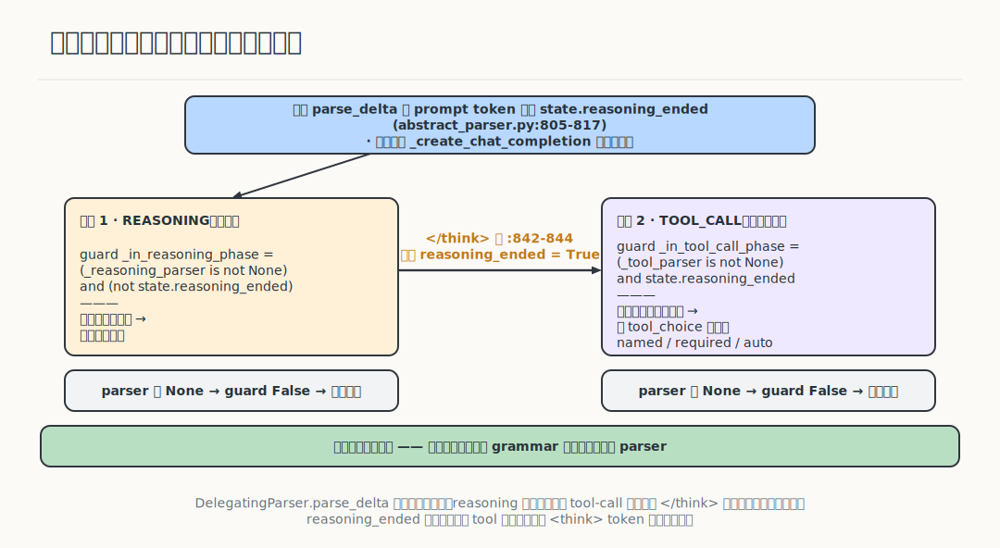</a>

<p class='figure-caption'>`DelegatingParser.parse_delta` 两阶段状态机：reasoning 阶段（存在 reasoning parser 且 `!state.reasoning_ended`）严格先于 tool-call 阶段（当 `</think>` 之类的 reasoning 结束标记翻转 `reasoning_ended` 后才进入），因此绝不会从 `<think>` token 中解析 tool syntax——这与 server 侧 `reasoning_ended` flag 对 engine grammar 强制施加的约束保持一致。</p>

只要存在 reasoning parser 且 `state.reasoning_ended` 为 false，`_in_reasoning_phase` 就保持 true。`_in_tool_call_phase` 会在该 flag 翻转后启动。遇到第一个 `parse_delta` 时，parser 会根据 prompt 初始化状态（[`abstract_parser.py:805-817`](https://github.com/vllm-project/vllm/blob/6cf7b26bd4bff60bf378e1af14044280ac0d214c/vllm/parser/abstract_parser.py#L805-L817)）；reasoning 提取会一直持续到 `</think>` 之类的标记触发状态转换，随后才开始提取 tool call。因此，engine grammar 与面向 client 的 parser 使用同一条 reasoning/tool 边界。

**Finish-reason 语义。**

非 streaming 组装流程（`chat_completion_full_generator`，[`serving.py:826-1091`](https://github.com/vllm-project/vllm/blob/6cf7b26bd4bff60bf378e1af14044280ac0d214c/vllm/entrypoints/openai/chat_completion/serving.py#L826-L1091)）会逐个解析 `output`，再对其 `finish_reason` 进行分类。源码 [`chat_completion/serving.py:958-982`](https://github.com/vllm-project/vllm/blob/6cf7b26bd4bff60bf378e1af14044280ac0d214c/vllm/entrypoints/openai/chat_completion/serving.py#L958-L982)：

```python
            is_finish_reason_tool_calls = auto_tools_called or (
                request.tool_choice
                and request.tool_choice == "required"
                and output.finish_reason == "stop"
            )
            ...
            choice_data = ChatCompletionResponseChoice(
                index=output.index,
                message=message,
                logprobs=logprobs,
                finish_reason="tool_calls"
                if is_finish_reason_tool_calls
                else output.finish_reason
                if output.finish_reason
                else "stop",
                stop_reason=output.stop_reason,
                ...
            )
```

根据代码注释中引用的 OpenAI 契约（[`serving.py:955-957`](https://github.com/vllm-project/vllm/blob/6cf7b26bd4bff60bf378e1af14044280ac0d214c/vllm/entrypoints/openai/chat_completion/serving.py#L955-L957)），tool call 使用 `finish_reason="tool_calls"` 来表示 `"auto"` 和 `"required"`，但 named tool choice 使用 `"stop"`。只有 auto 路径至少解析出一个 tool call 时，才会设置 `auto_tools_called`；`"required"` 会被特殊处理，因为即使已强制指定 tool，engine 仍会报告 `"stop"`。如果 engine finish reason 缺失，也会归一化为 `"stop"`。

[streaming 组装器](https://github.com/vllm-project/vllm/blob/6cf7b26bd4bff60bf378e1af14044280ac0d214c/vllm/entrypoints/openai/chat_completion/serving.py#L408-L824)同样会得出这一分类结果，为每个 choice 发出一个终止 chunk，并将 event 封装为 SSE；由于 200 status 已经发送，streaming 中途出现的 error 会被作为带内数据序列化。`parallel_tool_calls=False` 只保留第一个 call（[`tool_calls_utils.py:19-37`](https://github.com/vllm-project/vllm/blob/6cf7b26bd4bff60bf378e1af14044280ac0d214c/vllm/entrypoints/serve/utils/tool_calls_utils.py#L19-L37)）。最终的 `finish_reason` 会告诉 OpenAI-compatible client 是否应执行 tool。

## 8. Pooling、Embeddings 与 Scoring Endpoints

Completions、chat、Responses 和 speech-to-text 最终都会进入 `engine_client.generate(...)`，并生成自回归 `RequestOutput`；结果可能是 delta，也可能是最终聚合结果。Embedding、classification、scoring、reranking 和通用 pooling 则使用不同的 entrypoint（`encode`）、parameter type（`PoolingParams`）和 output type（`PoolingRequestOutput`），且没有 decode loop。由 model head 决定采用哪一类路径，而 URL 决定如何对外暴露该结果。

<a href='images/vllm-02-08-pooling-endpoints.svg' target='_blank'>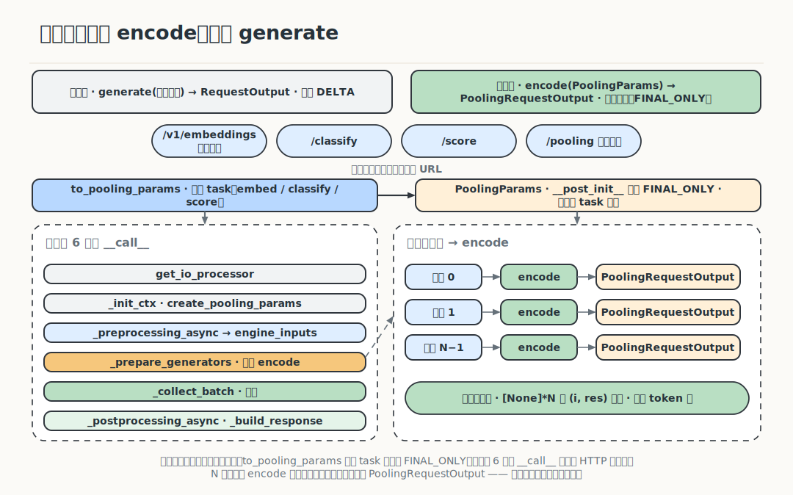</a>

<p class='figure-caption'>Pooling 路径：HTTP request → `to_pooling_params` → 共享 `__call__` pipeline → 按 input 通过 `engine_client.encode` fan-out → 每个 input 对应一个 `PoolingRequestOutput`，全程没有 token stream。</p>

**engine client 的两个抽象 entrypoint。**

sampling-vs-pooling 分叉在最底层体现于 `EngineClient` ABC，`AsyncLLM` 实现了这个 ABC。它声明了两个抽象方法，其方法签名直接体现了两条路径的差异。

源码：[`vllm/engine/protocol.py:64-99`](https://github.com/vllm-project/vllm/blob/6cf7b26bd4bff60bf378e1af14044280ac0d214c/vllm/engine/protocol.py#L64-L99)

```python
    @abstractmethod
    def generate(
        self,
        prompt: EngineCoreRequest | ...,
        sampling_params: SamplingParams,
        request_id: str,
        ...
    ) -> AsyncGenerator[RequestOutput, None]:
        """Generate outputs for a request."""
        ...

    @abstractmethod
    def encode(
        self,
        prompt: PromptType | EngineInput,
        pooling_params: PoolingParams,
        request_id: str,
        lora_request: LoRARequest | None = None,
        trace_headers: Mapping[str, str] | None = None,
        priority: int = 0,
        tokenization_kwargs: dict[str, Any] | None = None,
        reasoning_ended: bool | None = None,
    ) -> AsyncGenerator[PoolingRequestOutput, None]:
        """Generate outputs for a request from a pooling model."""
        ...
```

<a href='images/vllm-02-23-generate-vs-encode-contract.svg' target='_blank'>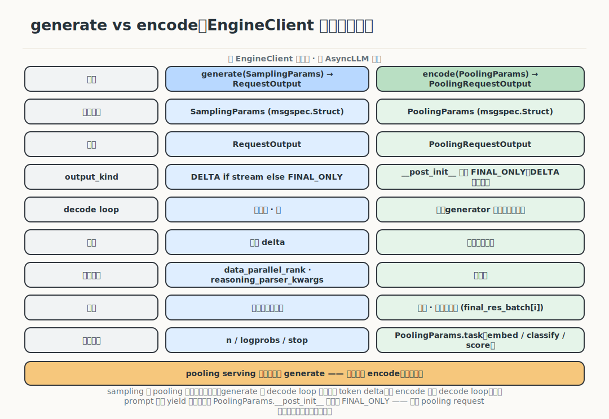</a>

<p class='figure-caption'>该 `EngineClient` sampling-vs-pooling 分叉的契约矩阵：`generate(SamplingParams) → RequestOutput` 通过 decode loop 以 streaming 方式输出 token delta；`encode(PoolingParams) → PoolingRequestOutput` 没有 decode loop，对每个 prompt 恰好 yield 一次，并强制执行 `FINAL_ONLY`（位于 `PoolingParams.__post_init__` 中）——因此 pooling request 绝不可能获得生成行为。</p>

parameter type 与 output type 一一配对：`generate` 接收 `SamplingParams` 并 yield `RequestOutput`，而 `encode` 接收 `PoolingParams` 并 yield `PoolingRequestOutput`。在 pooling 路径上，async generator 对每个 prompt yield 一个结果；其下层不存在 decode loop。此处使用 async generator，让 serving layer 处理 `merge_async_iterators` 时具有统一的接口形态，但 pooling serving class 仍会调用 `encode`，而不是 `generate`。第 10 篇将继续追踪 model runner 内部的 pooler/sampler 分叉。

### `PoolingParams`：在构造阶段强制执行 no-decode 契约

`PoolingParams` 是一个 `msgspec.Struct`，而非 pydantic HTTP request model；它被刻意设计得非常精简——仅包含少量 task 专用 field 和内部 routing metadata。

源码：[`vllm/pooling_params.py:64-83`](https://github.com/vllm-project/vllm/blob/6cf7b26bd4bff60bf378e1af14044280ac0d214c/vllm/pooling_params.py#L64-L83)

```python
    ## Internal use only
    task: PoolingTask | None = None
    requires_token_ids: bool = False
    skip_reading_prefix_cache: bool | None = None
    late_interaction_params: LateInteractionParams | None = None
    extra_kwargs: dict[str, Any] | None = None
    output_kind: RequestOutputKind = RequestOutputKind.FINAL_ONLY

    @property
    def all_parameters(self) -> list[str]:
        return ["dimensions", "use_activation"]

    @property
    def valid_parameters(self):
        return {
            "embed": ["dimensions", "use_activation"],
            "classify": ["use_activation"],
            "token_embed": ["dimensions", "use_activation"],
            "token_classify": ["use_activation"],
        }
```

这个契约由两点共同保证。首先，`output_kind` 的默认值是 `RequestOutputKind.FINAL_ONLY`，并会在 `__post_init__` 中被*检查*——这就是硬性的“no decode”保证。

源码：[`vllm/pooling_params.py:230-235`](https://github.com/vllm-project/vllm/blob/6cf7b26bd4bff60bf378e1af14044280ac0d214c/vllm/pooling_params.py#L230-L235)

```python
    def __post_init__(self) -> None:
        if self.output_kind != RequestOutputKind.FINAL_ONLY:
            raise ValueError(
                "For pooling output_kind has to be FINAL_ONLY, "
                f"got {self.output_kind!r}"
            )
```

当 generative `to_sampling_params`设置 `output_kind = DELTA if stream else FINAL_ONLY`时，`PoolingParams`会在构造阶段拒绝 `DELTA`。根本不存在由 token delta 构成的所谓 "streaming embedding"——一个 input 只会产出一个最终的 pooled vector，类型系统也让其他形式从根本上无法构造。其次，`valid_parameters`是以 task 为粒度的 allow-list：`embed`和 `token_embed`可以携带 `dimensions`（Matryoshka）和 `use_activation`；`classify`只能携带 `use_activation`。`verify(model_config)`（[`pooling_params.py:89-106`](https://github.com/vllm-project/vllm/blob/6cf7b26bd4bff60bf378e1af14044280ac0d214c/vllm/pooling_params.py#L89-L106)）先合并 pooler-config 默认值，再拒绝任何对当前 request 的 `task`不合法的字段——因此，`classify` request 一旦夹带 `dimensions`，就会在 engine 看到它之前快速失败。`PoolingParams`的作用域限定在 task 内，且完全不涉及 decode；request 可以设置哪些字段由 `task`控制，而 `FINAL_ONLY`是硬性要求。相比之下，`SamplingParams`的权威取值域检查（`sampling_params.py:_verify_args`，第 10 篇，sampling）验证的是一组此处完全不存在的 decode 参数。

**`task`由 `to_pooling_params`写入，而不是由 route 决定。**

真正决定 engine 层选用哪个 pooler head 的，是 `task`字段。每个 endpoint 的 request model 都有自己的 `to_pooling_params()`，由它写入对应的 task，并且只复制该 task 允许的字段。以下三个示例均照录原文：

来源：[`vllm/entrypoints/pooling/embed/protocol.py:39-44`](https://github.com/vllm-project/vllm/blob/6cf7b26bd4bff60bf378e1af14044280ac0d214c/vllm/entrypoints/pooling/embed/protocol.py#L39-L44)

```python
    def to_pooling_params(self):
        return PoolingParams(
            task="embed",
            dimensions=self.dimensions,
            use_activation=self.use_activation,
        )
```

来源：[`vllm/entrypoints/pooling/classify/protocol.py:31-35`](https://github.com/vllm-project/vllm/blob/6cf7b26bd4bff60bf378e1af14044280ac0d214c/vllm/entrypoints/pooling/classify/protocol.py#L31-L35)

```python
    def to_pooling_params(self):
        return PoolingParams(
            task="classify",
            use_activation=self.use_activation,
        )
```

来源：[`vllm/entrypoints/pooling/scoring/protocol.py:77-81`](https://github.com/vllm-project/vllm/blob/6cf7b26bd4bff60bf378e1af14044280ac0d214c/vllm/entrypoints/pooling/scoring/protocol.py#L77-L81)

```python
    def to_pooling_params(self, task: PoolingTask = "classify"):
        return PoolingParams(
            task=task,
            use_activation=self.use_activation,
        )
```

embedding request 携带 `dimensions`；classify request 从结构上就无法携带它（因为该字段根本不会被传递）。Scoring 是更值得关注的情形：它的 `to_pooling_params`接收 `task`作为参数，因为 scoring io_processor 注入的是 model *最终解析出的* pooling task，而不是盲信 request。

来源：[`vllm/entrypoints/pooling/scoring/io_processor.py:84-85`](https://github.com/vllm-project/vllm/blob/6cf7b26bd4bff60bf378e1af14044280ac0d214c/vllm/entrypoints/pooling/scoring/io_processor.py#L84-L85)

```python
    def create_pooling_params(self, request):
        return request.to_pooling_params(self.pooling_task)
```

`task`字段决定运行哪个 pooler head，以及哪些参数合法。它由 request model 设置，或由 scoring io_processor 注入。route（`/v1/embeddings`、`/classify`或 `/score`）负责选择 serving object 和 `to_pooling_params` variant；真正把这一语义选择传入 engine 的是 `task`。

### pooling request 路径

所有 pooling endpoint 都继承自 `PoolingBaseServing`，其 `__call__`是一条固定 pipeline。endpoint 不会重写控制流，只会重写两个 hook。

来源：[`vllm/entrypoints/pooling/base/serving.py:73-83`](https://github.com/vllm-project/vllm/blob/6cf7b26bd4bff60bf378e1af14044280ac0d214c/vllm/entrypoints/pooling/base/serving.py#L73-L83)

```python
    async def __call__(
        self,
        request: AnyPoolingRequest,
        raw_request: Request | None = None,
    ) -> Response:
        io_processor = self.get_io_processor(request)
        ctx = await self._init_ctx(io_processor, request, raw_request)
        await self._preprocessing_async(io_processor, ctx)
        await self._prepare_generators(ctx)
        await self._collect_batch(ctx)
        return await self._postprocessing_async(io_processor, ctx)
```

`get_io_processor`选择 preprocessing；`_init_ctx`校验 model 并构建 `PoolingParams`；`_preprocessing_async`渲染 engine input；`_prepare_generators`发起 `encode`调用；`_collect_batch`收集结果；`_postprocessing_async`将结果序列化。preprocessing 和 post-processing 通过 `@torch.inference_mode()`（[`serving.py:64-71, 89-100`](https://github.com/vllm-project/vllm/blob/6cf7b26bd4bff60bf378e1af14044280ac0d214c/vllm/entrypoints/pooling/base/serving.py#L64-L71)）在 renderer 的共享 thread pool 中执行，避免 CPU 和 tensor 工作占用 async loop。具体 endpoint 提供 `get_io_processor`和 `_build_response`；两者之间的控制流则完全复用。

### Fan-out 到 `encode`，再按原顺序收集

`_prepare_generators`负责把一个可携带多个 input 的 pooling request 拆成多个 engine request。它先依据 model config 对每个 params object 执行 `verify()`（支持 params *list*，这是 scoring 所必需的），然后为每个 input 发起一个 `encode`。

来源：[`vllm/entrypoints/pooling/base/serving.py:169-180`](https://github.com/vllm-project/vllm/blob/6cf7b26bd4bff60bf378e1af14044280ac0d214c/vllm/entrypoints/pooling/base/serving.py#L169-L180)

```python
            generator = self.engine_client.encode(
                engine_input,
                params,
                prompt_request_id,
                lora_request=ctx.lora_request,
                trace_headers=trace_headers,
                priority=getattr(ctx.request, "priority", 0),
            )

            generators.append(generator)

        ctx.result_generator = merge_async_iterators(*generators)
```

随后，`_collect_batch`会消费完整个合并后的 iterator，把结果写入按 slot 索引的 list，并且绝不会返回部分结果。

来源：[`vllm/entrypoints/pooling/base/serving.py:192-202`](https://github.com/vllm-project/vllm/blob/6cf7b26bd4bff60bf378e1af14044280ac0d214c/vllm/entrypoints/pooling/base/serving.py#L192-L202)

```python
        num_inputs = len(ctx.engine_inputs)
        final_res_batch: list[PoolingRequestOutput | None]
        final_res_batch = [None] * num_inputs

        async for i, res in ctx.result_generator:
            final_res_batch[i] = res

        if None in final_res_batch:
            raise ValueError("Failed to generate results for all prompts")

        ctx.final_res_batch = [res for res in final_res_batch if res is not None]
```

`merge_async_iterators`会产出 `(index, result)` pair，因此即使 engine 不按输入顺序完成，collector 也会把每个结果写回其原始 input 位置。只有每个 input 都产出 `PoolingRequestOutput`后，才会组装 HTTP response；`if None in final_res_batch`会拒绝不完整的 batch。与 generative streaming path 不同，该 endpoint 没有可对外暴露的部分 token state。

**io_processor 只会产出 `EngineInput`，不会产出其他内容。**

preprocessing hook 进一步确认，sampling 逻辑不会渗入 pooling path。它会按 request 形态分支并渲染 engine input：这里没有 sampling params、logprobs plumbing，也没有 stop string。

来源：[`vllm/entrypoints/pooling/base/io_processor.py:65-90`](https://github.com/vllm-project/vllm/blob/6cf7b26bd4bff60bf378e1af14044280ac0d214c/vllm/entrypoints/pooling/base/io_processor.py#L65-L90)

```python
    def pre_process_online(self, ctx: PoolingServeContext):
        request = ctx.request

        if isinstance(request, PoolingChatLikeRequest):
            self._validate_chat_template(...)
            _, engine_inputs = self._preprocess_chat_online(
                request,
                request.messages,
                ...
            )
        elif isinstance(request, PoolingCompletionLikeRequest):
            engine_inputs = self._preprocess_cmpl_online(
                request,
                prompt_input=request.input,
                prompt_embeds=None,
            )
        else:
            raise ValueError(f"Invalid {self.name} request type")

        ctx.engine_inputs = engine_inputs
```

`post_process_online`是 base class 的 no-op（[`io_processor.py:92-96`](https://github.com/vllm-project/vllm/blob/6cf7b26bd4bff60bf378e1af14044280ac0d214c/vllm/entrypoints/pooling/base/io_processor.py#L92-L96)）；endpoint 转而在 serving 侧重写 `_build_response`。`ServingClassification._build_response`依据 HF `id2label`对 pooled logits 执行 argmax，而 `ServingEmbedding._build_response`则输出 OpenAI JSON 或 Cohere byte stream。pooling preprocessing 产出 `EngineInput`；request 特有的行为由 `PoolingParams`或 `TokenizeParams`承载，而不是通过 per-token decode 配置传递。同一个 io_processor 还提供 offline path，使 `LLM.embed`和 `LLM.score`可以复用[第 3 节](#3-offline-request-apigeneratechatencodescore)中的 preprocessing helper。

**Scoring：这个例外恰恰印证了规则。**

Scoring/rerank 是 pooling 家族中最接近 multi-step flow 的路径，但它依然不执行 decode。`ServingScores`根据 model 的 *score type* 选择 io_processor；对于 late-interaction（ColBERT-style）模型，它还可以切换到 fused worker-side path。

来源：[`vllm/entrypoints/pooling/scoring/serving.py:68-72`](https://github.com/vllm-project/vllm/blob/6cf7b26bd4bff60bf378e1af14044280ac0d214c/vllm/entrypoints/pooling/scoring/serving.py#L68-L72)

```python
    async def __call__(self, *args, **kwargs) -> Response:
        if not self.enable_flash_late_interaction:
            return await super().__call__(*args, **kwargs)

        return await self.flash_late_interaction(*args, **kwargs)
```

`flash_late_interaction`绕过标准的 single-fan-out `__call__`，改走 two-stage encode。

来源：[`vllm/entrypoints/pooling/scoring/serving.py:191-200`](https://github.com/vllm-project/vllm/blob/6cf7b26bd4bff60bf378e1af14044280ac0d214c/vllm/entrypoints/pooling/scoring/serving.py#L191-L200)

```python
    async def flash_late_interaction(self, *args, **kwargs) -> Response:
        ctx = await self._init_ctx(self.io_processor, *args, **kwargs)
        await self._preprocessing_async(self.io_processor, ctx)

        # stage 1: encode queries and cache token embeddings on workers.
        await self._flash_late_interaction_encode_queries(ctx)
        # stage 2: encode docs and return scalar scores from workers.
        await self._flash_late_interaction_encode_docs(ctx)

        return await self._postprocessing_async(self.io_processor, ctx)
```

Stage 1 会为每个 query 克隆一份基础 `PoolingParams`，并在 `late_interaction_params`（一个 `LateInteractionParams` struct，[`pooling_params.py:17-34`](https://github.com/vllm-project/vllm/blob/6cf7b26bd4bff60bf378e1af14044280ac0d214c/vllm/pooling_params.py#L17-L34)）中写入稳定的 `query_key`，以便 workers 将该 query 的 token embedding 写入 cache。Stage 2 使用这个 key 对每个 document 执行 encode，并返回标量 MaxSim score。因此，`_prepare_generators`会处理一个由 `PoolingParams`组成的 list，每个 query/document pair 对应一项。这个有状态的 two-pass flow 仍然使用 `encode`；它的 state 是一个 embedding cache key，而不是 decode loop。

## 9. Responses API 与 Speech-to-Text

Responses 和 speech-to-text 都使用 `engine_client.generate`，但会在 entrypoint 侧加入额外控制流。Responses 可以在 server 侧运行 multi-turn tool loop，并维护 stored/background state；speech-to-text 则在 CPU 上对音频执行 decode 和分块，然后为每个 chunk 提交一个 engine request。在这两种情况下，EngineCore 看到的都只是普通 generation request。

### Responses 与带 event type 的 SSE

route 层（[`responses/api_router.py:60-77`](https://github.com/vllm-project/vllm/blob/6cf7b26bd4bff60bf378e1af14044280ac0d214c/vllm/entrypoints/openai/responses/api_router.py#L60-L77)）采用的仍是[第 6 节](#6-completions-服务从-http-到-add_request)中定型的三形态 dispatcher：`create_responses`根据 handler 返回值的 *type* 进行分支——`handler is None`（没有支持 Responses 的 serving object）→ `501`；`ErrorResponse` → 其自身的 HTTP 状态码；实体化的 `ResponsesResponse` → non-streaming JSON；其他任何值 → streaming generator。这里不再重复粘贴这段分支代码；相较 completions，Responses 有两点不同。它使用 `model_dump(mode="json", by_alias=True)` dump JSON；更明显的是，它用 `_convert_stream_to_sse_events(generator)`包装 streaming generator，使 SSE frame 携带 **event type** 而不只是 data——[`api_router.py:34-45`](https://github.com/vllm-project/vllm/blob/6cf7b26bd4bff60bf378e1af14044280ac0d214c/vllm/entrypoints/openai/responses/api_router.py#L34-L45)：

```python
async def _convert_stream_to_sse_events(
    generator: AsyncGenerator[StreamingResponsesResponse, None],
) -> AsyncGenerator[str, None]:
    """Convert the generator to a stream of events in SSE format"""
    async for event in generator:
        event_type = getattr(event, "type", "unknown")
        # https://developer.mozilla.org/en-US/docs/Web/API/Server-sent_events/Using_server-sent_events#event_stream_format
        event_data = (
            f"event: {event_type}\ndata: "
            f"{event.model_dump_json(indent=None, by_alias=True)}\n\n"
        )
        yield event_data
```

与 completions 和 chat 采用的 `data: {json}\n\n` / `data: [DONE]\n\n` 封装格式相比（参见[第 11 节](#11-streaming-ssemiddlewareauth-与-health)），Responses 会发出 `event: <type>\ndata: <json>\n\n`。这是因为它的 stream 是 typed event log（依次记录 created、output-item added、deltas、done），而不是扁平的 token delta stream。另有两个同级 route 补齐了这套接口——`GET /v1/responses/{id}` 和 `POST /v1/responses/{id}/cancel`（[`api_router.py:80-124`](https://github.com/vllm-project/vllm/blob/6cf7b26bd4bff60bf378e1af14044280ac0d214c/vllm/entrypoints/openai/responses/api_router.py#L80-L124)）；它们只有在启用 response store 或 background execution 时才有意义（见下文）。

### Responses：多轮 built-in tool loop

这是 entrypoint 层唯一会由单个 HTTP request 合理驱动*多个* engine request 顺序执行的地方。`_generate_with_builtin_tools` 是一个 `while True` loop：执行 generate，检查 model 是否请求了 built-in tool，运行 tool，重新 render 下一个 prompt，然后再次 generate。

[`vllm/entrypoints/openai/responses/serving.py:672-700`](https://github.com/vllm-project/vllm/blob/6cf7b26bd4bff60bf378e1af14044280ac0d214c/vllm/entrypoints/openai/responses/serving.py#L672-L700)：

```python
        while True:
            # Ensure that each sub-request has a unique request id.
            sub_request_id = f"{request_id}_{sub_request}"

            self._log_inputs(
                sub_request_id,
                engine_input,
                params=sampling_params,
                lora_request=lora_request,
            )

            generator = self.engine_client.generate(
                engine_input,
                sampling_params,
                sub_request_id,
                lora_request=lora_request,
                trace_headers=trace_headers,
                priority=priority,
                reasoning_parser_kwargs=reasoning_parser_kwargs,
            )

            async for res in generator:
                context.append_output(res)
                # NOTE(woosuk): The stop condition is handled by the engine.
                yield context

            if not context.need_builtin_tool_call():
                # The model did not ask for a tool call, so we're done.
                break
```

<a href='images/vllm-02-24-responses-tool-loop.svg' target='_blank'>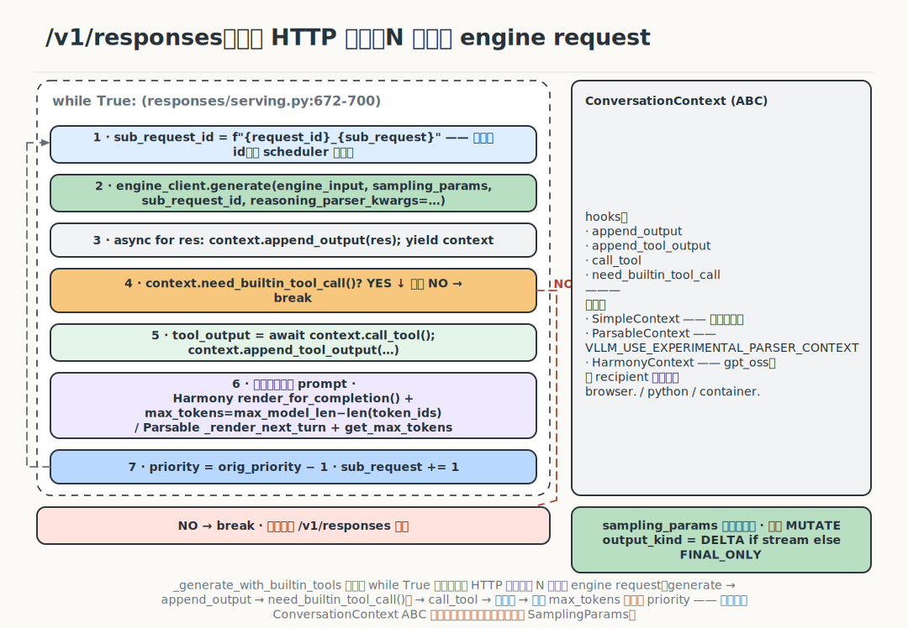</a>

<p class='figure-caption'>`/v1/responses` `_generate_with_builtin_tools` 是一个 `while True` loop，一次 HTTP 调用会驱动 N 个顺序执行的 engine request（`{request_id}_{sub_request}`）：generate → `append_output` → `need_builtin_tool_call()`？ → `call_tool` → 重新 render 下一个 prompt → 缩减 `max_tokens` 并下调 priority——这些操作都通过一个 `ConversationContext` ABC（`SimpleContext`/`ParsableContext`/`HarmonyContext`）完成 dispatch，并共享同一个持续被修改的 `SamplingParams`。</p>

轮次推进的尾部逻辑见 [`serving.py:702-739`](https://github.com/vllm-project/vllm/blob/6cf7b26bd4bff60bf378e1af14044280ac0d214c/vllm/entrypoints/openai/responses/serving.py#L702-L739)：

```python
            # Call the tool and update the context with the result.
            tool_output = await context.call_tool()
            context.append_tool_output(tool_output)
            ...
            # Create inputs for the next turn.
            # Render the next prompt token ids and update sampling_params.
            if isinstance(context, HarmonyContext):
                token_ids = context.render_for_completion()
                engine_input = tokens_input(token_ids)

                sampling_params.max_tokens = max_model_len - len(token_ids)
            elif isinstance(context, ParsableContext):
                (engine_input,) = await self._render_next_turn(...)
                sampling_params.max_tokens = get_max_tokens(...)

            # OPTIMIZATION
            priority = orig_priority - 1
            sub_request += 1
```

每一轮都会生成一个**全新的 engine request id** `{request_id}_{sub_request}`，因此从 scheduler 的角度看，这 N 次 engine 调用是彼此独立的 request（参见第 05 篇 scheduler 解析）。该轮输出会以 stream 形式写入 `ConversationContext`（`context.append_output(res)`），并在每一步 yield *context*；本轮结束后，它会查询 `context.need_builtin_tool_call()`。如果没有请求 tool，loop 就会退出，request 随之结束。否则，它会运行 tool（`context.call_tool()`），将结果回填到 context，根据累积的 conversation **重新 render** 下一轮 prompt，并将 **`max_tokens` 缩减**至 `max_model_len - len(prompt)`（Harmony），或通过 `get_max_tokens`（Parsable）完成缩减，以免不断增长的 prompt 超出 context window。每轮还会下调 priority（`orig_priority - 1`），以避免后续 tool 轮次饿死刚进入首轮的新 request。

多态逻辑位于 `ConversationContext` 中。它是一个 ABC，声明了 loop 会调用的四个 hook——[`vllm/entrypoints/openai/responses/context.py:105-126`](https://github.com/vllm-project/vllm/blob/6cf7b26bd4bff60bf378e1af14044280ac0d214c/vllm/entrypoints/openai/responses/context.py#L105-L126)：

```python
class ConversationContext(ABC):
    response_parser: Parser | None = None

    @abstractmethod
    def append_output(self, output: RequestOutput) -> None:
        pass

    @abstractmethod
    def append_tool_output(self, output) -> None:
        pass

    @abstractmethod
    async def call_tool(self) -> list[Message]:
        pass

    @abstractmethod
    def need_builtin_tool_call(self) -> bool:
        pass
```

有三个具体 context 实现了它：`SimpleContext`（不使用 tool——`need_builtin_tool_call()` 恒为 `False`，因此 loop 恰好只执行一次，行为与普通 chat 相同）、`ParsableContext`（实时解析生成中的 token，由 `VLLM_USE_EXPERIMENTAL_PARSER_CONTEXT` 控制，[`serving.py:470-483`](https://github.com/vllm-project/vllm/blob/6cf7b26bd4bff60bf378e1af14044280ac0d214c/vllm/entrypoints/openai/responses/serving.py#L470-L483)），以及面向 gpt-oss 的 `HarmonyContext`。Harmony 在初始化时一次性选定——`self.use_harmony = self.model_config.hf_config.model_type == "gpt_oss"`（[`serving.py:216`](https://github.com/vllm-project/vllm/blob/6cf7b26bd4bff60bf378e1af14044280ac0d214c/vllm/entrypoints/openai/responses/serving.py#L216)）——其 tool routing 通过 message recipient 前缀匹配实现，[`context.py:759-770`](https://github.com/vllm-project/vllm/blob/6cf7b26bd4bff60bf378e1af14044280ac0d214c/vllm/entrypoints/openai/responses/context.py#L759-L770)：

```python
    def need_builtin_tool_call(self) -> bool:
        last_msg = self.messages[-1]
        recipient = last_msg.recipient
        if recipient is None:
            return False
        if recipient.startswith("browser."):
            return "browser" in self.available_tools
        if recipient.startswith("python"):
            return "python" in self.available_tools
        if recipient.startswith("container."):
            return "container" in self.available_tools
        return False
```

model 通过将输出的 recipient 指向 `browser.*`、`python` 或 `container.*` 来发出 tool call 信号；在 loop 决定是否执行下一轮之前，context 会确认相应 tool 确实可用。传入该 loop 的 `SamplingParams` 会预先构建一次，并在多轮之间*原地修改*（`sampling_params.max_tokens = ...`）。其中的 `output_kind` 由 stream flag 决定——`RequestOutputKind.DELTA if self.stream else RequestOutputKind.FINAL_ONLY`（[`responses/protocol.py:416-418`](https://github.com/vllm-project/vllm/blob/6cf7b26bd4bff60bf378e1af14044280ac0d214c/vllm/entrypoints/openai/responses/protocol.py#L416-L418)）——这与 pooling path 中对 `FINAL_ONLY` 的硬性 assertion 恰好相反（[第 8 节](#8-poolingembeddings-与-scoring-endpoints)）。这些 field 在 sampler 端的含义，请参见第 10 篇 sampling 解析。

**Responses：store、background 与 streaming dispatch。**

generator 组装完成后（`assert len(generators) == 1`——Responses 从不对多个 prompt 做 fan-out），会进入三种终结模式之一，[`serving.py:532-606`](https://github.com/vllm-project/vllm/blob/6cf7b26bd4bff60bf378e1af14044280ac0d214c/vllm/entrypoints/openai/responses/serving.py#L532-L606)：

```python
        if request.background:
            created_time = int(time.time())
            response = ResponsesResponse.from_request(
                request, sampling_params, model_name=model_name,
                created_time=created_time, output=[], status="queued", usage=None,
            )
            async with self.response_store_lock:
                self.response_store[response.id] = response
            ...
        if request.stream:
            return self.responses_stream_generator(...)

        return await self.responses_full_generator(...)
```

Background mode 会在 `self.response_store` 中注册一个 `"queued"` response，通过 `asyncio.create_task` 启动任务，然后立即返回。随后，`GET .../{id}` 和 `.../{id}/cancel` route 可以轮询或中止原 client 已不再等待的任务。store [默认关闭](https://github.com/vllm-project/vllm/blob/6cf7b26bd4bff60bf378e1af14044280ac0d214c/vllm/entrypoints/openai/responses/serving.py#L208)；启用后，vLLM 会[警告其中的条目永远不会被删除，并可能导致内存泄漏](https://github.com/vllm-project/vllm/blob/6cf7b26bd4bff60bf378e1af14044280ac0d214c/vllm/entrypoints/openai/responses/serving.py#L210-L213)。正如源码所指出的，这与 OpenAI 默认启用 store 的行为不同（[`serving.py:203-207`](https://github.com/vllm-project/vllm/blob/6cf7b26bd4bff60bf378e1af14044280ac0d214c/vllm/entrypoints/openai/responses/serving.py#L203-L207)）。一次 `/v1/responses` 调用可能驱动多次 engine `generate` 调用，这些调用共享一个可变的 `SamplingParams` 和一个持久的 `ConversationContext`；chat 和 completions 不会运行这种 server-side loop。

### Speech-to-text：multipart upload、专用 thread pool 与按 chunk fan-out

Transcription 和 translation 共用同一个 base `SpeechToTextBaseServing(GenerateBaseServing)`（[`vllm/entrypoints/speech_to_text/base/serving.py:90`](https://github.com/vllm-project/vllm/blob/6cf7b26bd4bff60bf378e1af14044280ac0d214c/vllm/entrypoints/speech_to_text/base/serving.py#L90)）；各子类仅在 `task_type` 以及所使用的 response/stream class 上有所不同。`OpenAIServingTranscription.create_transcription` 只是一个轻量的委托层，[`transcription/serving.py:66-76`](https://github.com/vllm-project/vllm/blob/6cf7b26bd4bff60bf378e1af14044280ac0d214c/vllm/entrypoints/speech_to_text/transcription/serving.py#L66-L76)：

```python
        return await self._create_speech_to_text(
            audio_data=audio_data,
            request=request,
            raw_request=raw_request,
            response_class=(
                TranscriptionResponseVerbose
                if request.response_format == "verbose_json"
                else TranscriptionResponse
            ),
            stream_generator_method=self.transcription_stream_generator,
        )
```

STT 与其他所有 JSON endpoint 的首要区别在于*传输方式*：它接收包含文件上传的 `multipart/form-data`，而不是 JSON body——[`transcription/api_router.py:42-61`](https://github.com/vllm-project/vllm/blob/6cf7b26bd4bff60bf378e1af14044280ac0d214c/vllm/entrypoints/speech_to_text/transcription/api_router.py#L42-L61)：

```python
async def create_transcriptions(
    raw_request: Request, request: Annotated[TranscriptionRequest, Form()]
):
    handler = transcription(raw_request)
    if handler is None:
        raise NotImplementedError("The model does not support Transcriptions API")

    audio_data = await read_upload_with_limit(request.file)

    generator = await handler.create_transcription(audio_data, request, raw_request)
    ...
    return StreamingResponse(content=generator, media_type="text/event-stream")
```

`request: Annotated[..., Form()]` 负责绑定 form field；`read_upload_with_limit` 以 stream 方式读取文件并设置大小上限，防止恶意上传在 decode 前就导致 server OOM。decode 本身是 CPU-heavy 操作（包括 container demux、resample），因此会在**专用** thread pool 中运行，并且刻意不复用 renderer 的 thread pool，[`base/serving.py:141-148`](https://github.com/vllm-project/vllm/blob/6cf7b26bd4bff60bf378e1af14044280ac0d214c/vllm/entrypoints/speech_to_text/base/serving.py#L141-L148)：

```python
        num_audio_preprocess_workers = envs.VLLM_MAX_AUDIO_PREPROCESS_WORKERS
        self._preprocess_executor = ThreadPoolExecutor(
            max_workers=num_audio_preprocess_workers,
            thread_name_prefix="stt-preprocess",
        )
        self._decode_and_chunk_speech_async = make_async_with_semaphore(
            self._decode_and_chunk_speech, executor=self._preprocess_executor
        )
```

源码注释（[`serving.py:138-140`](https://github.com/vllm-project/vllm/blob/6cf7b26bd4bff60bf378e1af14044280ac0d214c/vllm/entrypoints/speech_to_text/base/serving.py#L138-L140)）指向 PR #44612：复用 renderer 的 thread pool“会导致吞吐量降低”，因此 audio preprocessing 使用自己的 executor，将耗时较长的 CPU decode 与 token rendering 的关键路径隔离开。`_decode_and_chunk_speech` 会将音频 decode 到 model sample rate；只有 clip 超过 `max_audio_clip_s` 时，才会通过 `split_audio` 按能量将其切分成多个带 overlap 的 chunk（[`base/serving.py:182-198`](https://github.com/vllm-project/vllm/blob/6cf7b26bd4bff60bf378e1af14044280ac0d214c/vllm/entrypoints/speech_to_text/base/serving.py#L182-L198)）。可选的 language auto-detection 本身也是在 engine 上执行的一次**仅生成一个 token 的 constrained generate**——[`base/serving.py:220-230`](https://github.com/vllm-project/vllm/blob/6cf7b26bd4bff60bf378e1af14044280ac0d214c/vllm/entrypoints/speech_to_text/base/serving.py#L220-L230)：

```python
        sampling_params = SamplingParams(
            max_tokens=1,
            temperature=0.0,
            allowed_token_ids=allowed_token_ids,
        )

        result_generator = self.engine_client.generate(
            prompt,
            sampling_params,
            request_id,
        )
```

组合使用 `max_tokens=1`、greedy 和 `allowed_token_ids`（model 的 language token）会强制 engine 恰好发出一个 language token，随后再将其 decode 回 language string。language detection 复用了完整的 generate path，而不是使用独立的辅助 model。

核心 dispatch 会将 chunk list 转换为每个 chunk 一个 generator，[`base/serving.py:487-543`](https://github.com/vllm-project/vllm/blob/6cf7b26bd4bff60bf378e1af14044280ac0d214c/vllm/entrypoints/speech_to_text/base/serving.py#L487-L543)：

```python
        max_tokens = get_max_tokens(
            max_model_len, request.max_completion_tokens, input_len,
            self.default_sampling_params,
        )

        if request.use_beam_search:
            sampling_params = request.to_beam_search_params(...)
        else:
            sampling_params = request.to_sampling_params(...)

        if request.response_format == "verbose_json":
            sampling_params.logprobs = 1
        ...
                if isinstance(sampling_params, BeamSearchParams):
                    generator = self.beam_search(prompt=engine_input, ...)
                else:
                    generator = self.engine_client.generate(
                        engine_input, sampling_params, request_id_item, ...
                    )
                list_result_generator.append(generator)
```

有三个分支值得单独说明。在 `use_beam_search` 分支中，会用 `BeamSearchParams` 替换 `SamplingParams`（[`transcription/protocol.py:228-234`](https://github.com/vllm-project/vllm/blob/6cf7b26bd4bff60bf378e1af14044280ac0d214c/vllm/entrypoints/speech_to_text/transcription/protocol.py#L228-L234)、`beam_width=n`、`length_penalty`），并改走 offline 风格的 `self.beam_search` driver，而不是 `engine_client.generate`。`verbose_json` 会强制设置 `logprobs=1`，因为 verbose 输出需要根据每个 token 的 logprobs 重建 Whisper 风格的带 timestamp segment；对于不具备 `supports_segment_timestamp` 的 model，系统会预先拒绝 verbose mode（[`serving.py:447-453`](https://github.com/vllm-project/vllm/blob/6cf7b26bd4bff60bf378e1af14044280ac0d214c/vllm/entrypoints/speech_to_text/base/serving.py#L447-L453)），而且该模式不支持 stream（[`serving.py:455-458`](https://github.com/vllm-project/vllm/blob/6cf7b26bd4bff60bf378e1af14044280ac0d214c/vllm/entrypoints/speech_to_text/base/serving.py#L455-L458)）。每个 chunk 都会获得 id `request_id`（单个 chunk）或 `{request_id}-{idx}`（[`serving.py:507-510`](https://github.com/vllm-project/vllm/blob/6cf7b26bd4bff60bf378e1af14044280ac0d214c/vllm/entrypoints/speech_to_text/base/serving.py#L507-L510)）；之后，N 个 generator 会通过 `merge_async_iterators` 按 chunk 顺序重新组装，再拼接 segment/text。

Speech-to-text 仍走生成式路径（输入 `SamplingParams` 或 `BeamSearchParams`，输出 `RequestOutput`），但首先会在专用 executor 上执行 CPU 密集型的 decode 和 chunking。一个 HTTP request 可能按每个 audio chunk 扇出一个 engine request，再按 chunk index 重组结果。Responses 会依次迭代各个 tool turn，而 STT 会并发运行 chunk request；二者最终都会调用 `engine_client.generate`。

## 10. 协议：Request schema 如何转换为 SamplingParams

每个生成式 HTTP request 在进入 engine 的途中，都必须经过同一道狭窄关口：pydantic request model（`CompletionRequest`、`ChatCompletionRequest`）通过名为 `to_sampling_params` 的 method 转换成单个 `SamplingParams` object。这里最值得理解的设计决策是，vLLM 将这一过程拆成了严格程度*不同*的两层。HTTP edge 的 pydantic schema 被有意设计得很**宽松**——它接受未知 key，几乎所有 sampling 参数都用 `None` 作为“未设置”哨兵，并且几乎不对关键字段施加数值边界约束。真正的取值范围关卡位于下一层，即 engine 的 `SamplingParams._verify_args`。`to_sampling_params` 是连接两层的桥梁：它根据 server 端默认表解析每个未设置参数，合并 stop token，将 HTTP `stream` 映射为 engine output cadence，然后把填充完整的 object 交给 engine constructor；非法值直到这里才会被拒绝。本节将追踪这座桥梁，并说明为什么这种一松一严的拆分是有意为之。

<a href='images/vllm-02-09-protocol-to-params.svg' target='_blank'>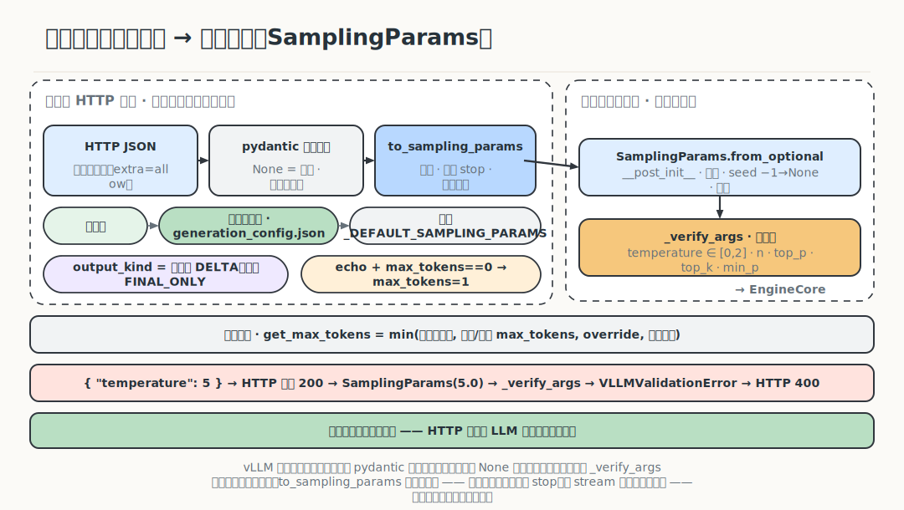</a>

<p class='figure-caption'>HTTP JSON -> 宽松的 pydantic parse -> 解析 `to_sampling_params` -> engine 的 `_verify_args` 关卡；宽松的 edge 与严格的 core 是两个不同的 validator。</p>

**基础 model 接受任何内容。**

OpenAI-compatible request 共用的 base class 天生宽松：未知 JSON key 会被忽略，而不会导致 request 被拒绝。

源码：[`vllm/entrypoints/openai/engine/protocol.py:28-57`](https://github.com/vllm-project/vllm/blob/6cf7b26bd4bff60bf378e1af14044280ac0d214c/vllm/entrypoints/openai/engine/protocol.py#L28-L57)。

```python
class OpenAIBaseModel(BaseModel):
    # OpenAI API does allow extra fields
    model_config = ConfigDict(extra="allow")

    # Cache class field names
    field_names: ClassVar[set[str] | None] = None

    @model_validator(mode="wrap")
    @classmethod
    def __log_extra_fields__(cls, data, handler):
        result = handler(data)
        ...
        # Compare against both field names and aliases
        if any(k not in field_names for k in data):
            logger.debug(
                "The following fields were present in the request but ignored: %s",
                data.keys() - field_names,
            )
        return result
```

`ConfigDict(extra="allow")` 会让 pydantic 保留而非拒绝未建模的 key。`mode="wrap"` validator 会先执行常规 parse（`handler(data)`），再将原始 JSON key 与字段名和 alias 的并集做 diff（该并集只计算一次，并缓存在 class 的 `field_names` 中）。额外 key 只会通过 `logger.debug` 记录到 log 中。

这保障了**API 前向兼容性**。如果 client 发送了 vLLM 尚未建模的新版 OpenAI parameter，得到的会是成功的 `200`，而不是 `422`。这种宽容并非没有代价，而且必须明确指出：parameter 名称中的拼写错误（`temperatuer`）会被静默丢弃，只有在 DEBUG log level 下才能看到。严格校验被有意推迟了。

**两种 request 结构，默认值大多为 `None`。**

Sampler 字段的默认值是 `None`，而不是对应的中性值。这里，`None` 表示“client 未设置此项”；之后由 `to_sampling_params` 解析。

源码：[`vllm/entrypoints/openai/completion/protocol.py:48-73`](https://github.com/vllm-project/vllm/blob/6cf7b26bd4bff60bf378e1af14044280ac0d214c/vllm/entrypoints/openai/completion/protocol.py#L48-L73)。

```python
class CompletionRequest(OpenAIBaseModel):
    ...
    logprobs: int | None = None
    max_tokens: int | None = 16
    n: int = 1
    ...
    stop: str | list[str] | None = []
    stream: bool | None = False
    ...
    temperature: float | None = None
    top_p: float | None = None
```

`max_tokens` 默认为 `16`——这与 OpenAI legacy-completions 保持一致，因此即使省略该上限，输出长度仍会受到约束。但 `temperature` 和 `top_p`（以及后文的 `top_k`、`min_p`、`repetition_penalty`）默认为 `None`。这个 `None` 并不表示“使用 temperature 0”，而是“尚未设置，请根据 server 默认值解析”。还要注意，这些 `float | None` 字段**没有** `Field(ge=..., le=...)` 边界约束——`temperature` 即使传入 `-5` 或 `1e9`，pydantic parse 也会照单全收。

chat schema 有两个关键差异。源码：[`vllm/entrypoints/openai/chat_completion/protocol.py:203-210`](https://github.com/vllm-project/vllm/blob/6cf7b26bd4bff60bf378e1af14044280ac0d214c/vllm/entrypoints/openai/chat_completion/protocol.py#L203-L210)。

```python
    logprobs: bool | None = False
    top_logprobs: int | None = 0
    max_tokens: int | None = Field(
        default=None,
        deprecated="max_tokens is deprecated in favor of "
        "the max_completion_tokens field",
    )
    max_completion_tokens: int | None = None
```

schema 记录的是意图，而非最终的 sampling 策略。将 `None` 保留为未设置标记，可以让 `generation_config.json` 中的 model 默认值优先于 library 的中性值，而无需将其硬编码到 HTTP model 中。

两个 schema 的语义差异主要集中在以下四个字段，四者最终都会在 `to_sampling_params` 中收敛：

| Protocol 字段 | Chat request | Completion request | 最终去向 |
| --- | --- | --- | --- |
| `logprobs` | `bool`，默认 `False`——充当开关（`chat_completion/protocol.py:203`） | `int`，默认未设置——表示数量本身（`completion/protocol.py:62`） | `SamplingParams.logprobs`；chat 传入 `top_logprobs if logprobs else None`（`chat_completion/protocol.py:680`），completion 原样传入 `logprobs`（`completion/protocol.py:361`） |
| `top_logprobs` | `int`，默认 `0`——携带数量（`chat_completion/protocol.py:204`） | 不是 request 字段（该名称只出现在 response body 中） | 同一个 `SamplingParams.logprobs` slot，而且仅当 chat 的 `logprobs` 为 truthy 时才会传入 |
| `max_tokens` / `max_completion_tokens` | 二者均为 optional，默认未设置；`max_tokens` 已标记为 deprecated，`max_completion_tokens` 出现时优先（`chat_completion/protocol.py:205-210`、`chat_completion/serving.py:301-309`） | 仅有 `max_tokens`，默认 `16`（`completion/protocol.py:63`） | `SamplingParams.max_tokens`；`get_max_tokens` 会先根据剩余 context 对其执行 clamp；此外，在 `echo_without_generation` 下，completion 还会将 `0` 改写为 `1`（`completion/protocol.py:363`） |
| `stream` | `bool`，默认 `False`（`chat_completion/protocol.py:216`） | `bool`，默认 `False`（`completion/protocol.py:68`） | `SamplingParams.output_kind`：为 true 时取 `DELTA`，为 false 时取 `FINAL_ONLY`（`chat_completion/protocol.py:688-690`、`completion/protocol.py:369-371`） |

### 预算解析器：不会超出 context 的上限

在 `to_sampling_params` 运行前，handler 会计算*有效*输出预算，并以已经解析好的整数（而非 `self.max_tokens`）传入。这一步由 `get_max_tokens` 完成。

源码：[`vllm/entrypoints/serve/utils/api_utils.py:170-206`](https://github.com/vllm-project/vllm/blob/6cf7b26bd4bff60bf378e1af14044280ac0d214c/vllm/entrypoints/serve/utils/api_utils.py#L170-L206)。

```python
    model_max_tokens = max_model_len - input_length
    platform_max_tokens = current_platform.get_max_output_tokens(input_length)
    fallback_max_tokens = (
        max_tokens
        if max_tokens is not None
        else default_sampling_params.get("max_tokens")
    )

    return min(
        val
        for val in (
            model_max_tokens,
            fallback_max_tokens,
            override_max_tokens,
            platform_max_tokens,
        )
        if val is not None
    )
```

有效预算取四个 cap 中的最小值：剩余 context（`max_model_len - input_length`）、request 指定值或 model 默认的 `max_tokens`、server 端 override，以及 platform 上限。所有已配置的 cap 中，以最严格者为准；过长的 prompt 会更早以 HTTP 400 拒绝。

### `to_sampling_params`：解析未设置的 sampling 参数

宽松 schema 在这里变成具体的 engine input。每个未设置的 sampling 参数都遵循三级 fallback；同时合并 stop token，将 `response_format` 转换为 structured output 配置，并由 `stream` 选择 output cadence。

fallback 表以 class constant 的形式定义。源码：[`vllm/entrypoints/openai/completion/protocol.py:234-241`](https://github.com/vllm-project/vllm/blob/6cf7b26bd4bff60bf378e1af14044280ac0d214c/vllm/entrypoints/openai/completion/protocol.py#L234-L241)。

```python
    # Default sampling parameters for completion requests
    _DEFAULT_SAMPLING_PARAMS: dict = {
        "repetition_penalty": 1.0,
        "temperature": 1.0,
        "top_p": 1.0,
        "top_k": 0,
        "min_p": 0.0,
    }
```

<a href='images/vllm-02-25-sampling-fallback-precedence.svg' target='_blank'>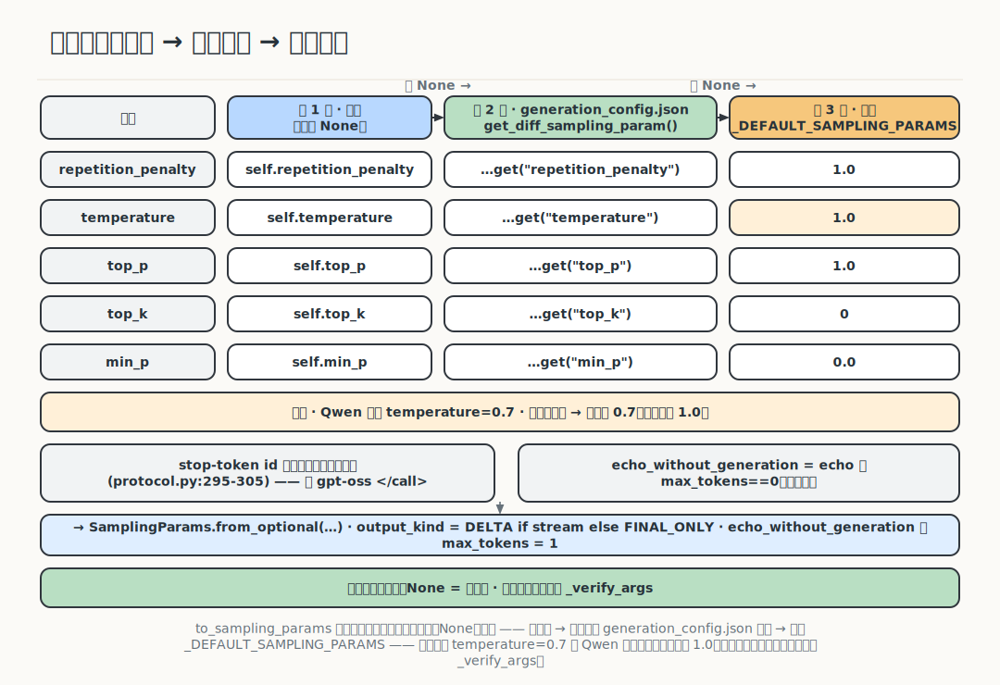</a>

<p class='figure-caption'>`to_sampling_params` 会按三级优先级解析每个未设置（`None`）的参数——request 值 → 每个 model 的 `generation_config.json` 默认值（`get_diff_sampling_param()`）→ 中性的 `_DEFAULT_SAMPLING_PARAMS` constant。因此，如果 Qwen model 自带 `temperature: 0.7`，它就会优先于 library 的中性值 `1.0`；数值取值范围的关卡则仍位于 engine 侧的 `_verify_args` 中。</p>

源码：[`vllm/entrypoints/openai/completion/protocol.py:272-293`](https://github.com/vllm-project/vllm/blob/6cf7b26bd4bff60bf378e1af14044280ac0d214c/vllm/entrypoints/openai/completion/protocol.py#L272-L293)。

```python
        # Default parameters
        if (repetition_penalty := self.repetition_penalty) is None:
            repetition_penalty = default_sampling_params.get(
                "repetition_penalty",
                self._DEFAULT_SAMPLING_PARAMS["repetition_penalty"],
            )
        if (temperature := self.temperature) is None:
            temperature = default_sampling_params.get(
                "temperature", self._DEFAULT_SAMPLING_PARAMS["temperature"]
            )
        ...
```

对于 `repetition_penalty`、`temperature`、`top_p`、`top_k` 和 `min_p`，取值会依次经过三个层级：request 中显式指定的值、model 的 `default_sampling_params`，最后是中性的 `_DEFAULT_SAMPLING_PARAMS` 常量。例如，某个 Qwen model 自带 `temperature: 0.7`，并将其定义在 `generation_config.json` 中；当 client 省略 temperature 时，它会沿用这一默认值，而不会回退到库级中性值 `1.0`。

这里还会完成另外两项取值处理。stop token id 会与 model 的默认值取并集，并保持原有顺序（[`vllm/entrypoints/openai/completion/protocol.py:295-305`](https://github.com/vllm-project/vllm/blob/6cf7b26bd4bff60bf378e1af14044280ac0d214c/vllm/entrypoints/openai/completion/protocol.py#L295-L305)）——这样一来，即使 request 提供了自己的 stop token，也仍会加入 gpt-oss 的 `</call>` 这类 model 特有终止符。此外，这里还会检测纯 echo 模式：

来源：[`vllm/entrypoints/openai/completion/protocol.py:307-311`](https://github.com/vllm-project/vllm/blob/6cf7b26bd4bff60bf378e1af14044280ac0d214c/vllm/entrypoints/openai/completion/protocol.py#L307-L311)。

```python
        prompt_logprobs = self.prompt_logprobs
        if prompt_logprobs is None and self.echo:
            prompt_logprobs = self.logprobs

        echo_without_generation = self.echo and self.max_tokens == 0
```

`echo_without_generation`（echo 加 `max_tokens == 0`）对应“只重放 prompt”的情况；下文还会回到这一点，因为否则 `max_tokens == 0` 会被 engine 拒绝。

**最终构造与输出节奏标志位。**

来源：[`vllm/entrypoints/openai/completion/protocol.py:349-380`](https://github.com/vllm-project/vllm/blob/6cf7b26bd4bff60bf378e1af14044280ac0d214c/vllm/entrypoints/openai/completion/protocol.py#L349-L380)。

```python
        return SamplingParams.from_optional(
            n=self.n,
            ...
            logprobs=self.logprobs,
            ignore_eos=self.ignore_eos,
            max_tokens=max_tokens if not echo_without_generation else 1,
            min_tokens=self.min_tokens,
            prompt_logprobs=prompt_logprobs,
            ...
            output_kind=RequestOutputKind.DELTA
            if self.stream
            else RequestOutputKind.FINAL_ONLY,
            structured_outputs=self.structured_outputs,
            logit_bias=self.logit_bias,
            allowed_token_ids=self.allowed_token_ids,
            bad_words=self.bad_words,
            extra_args=extra_args or None,
            skip_clone=True,  # Created fresh per request, safe to skip clone
            repetition_detection=self.repetition_detection,
            thinking_token_budget=self.thinking_token_budget,
        )
```

以下三行尤其关键：

- `max_tokens=max_tokens if not echo_without_generation else 1` — 在纯 echo 模式下，会要求 engine 恰好生成一个 token（response 层只输出 prompt）。engine 的 `_verify_args` 会拒绝 `max_tokens < 1`，因此这里会把 schema 层的 `max_tokens == 0` 改写为 `1`，而不是继续向下传递。
- `output_kind = DELTA if self.stream else FINAL_ONLY` — 这是 HTTP `stream` 的 boolean 值转化为 engine 层输出节奏的唯一位置：streaming request 会获得增量 delta，非 streaming request 则只获得最终聚合结果。下游所有组件（output processor、每个 request 的 queue）都以 `output_kind` 为准，而不是 HTTP 层。
- `skip_clone=True` — 该对象会为每个 request 重新构造，因此 engine 可以省去防御性的 deep copy。

chat 版本的整体结构完全相同，只有一处类型对齐不同。来源：[`vllm/entrypoints/openai/chat_completion/protocol.py:668-680`](https://github.com/vllm-project/vllm/blob/6cf7b26bd4bff60bf378e1af14044280ac0d214c/vllm/entrypoints/openai/chat_completion/protocol.py#L668-L680)。

```python
        return SamplingParams.from_optional(
            n=self.n,
            ...
            logprobs=self.top_logprobs if self.logprobs else None,
            prompt_logprobs=prompt_logprobs,
            ignore_eos=self.ignore_eos,
            max_tokens=max_tokens,
            ...
```

`logprobs=self.top_logprobs if self.logprobs else None` 负责 boolean 到 int 的类型对齐——engine 的整数计数 `logprobs` 会被设为 `top_logprobs`，但仅限 chat boolean `logprobs` 为 truthy 的情况；否则会设为 `None`。此外，chat 不会对 `echo_without_generation` 执行 clamp，而是直接透传已经解析好的 `max_tokens`。

### 权威校验关口位于 engine 侧

`to_sampling_params` 本身不校验数值范围。它会调用 `SamplingParams.from_optional`；后者会[用中性默认值替换剩余的 `None` 值](https://github.com/vllm-project/vllm/blob/6cf7b26bd4bff60bf378e1af14044280ac0d214c/vllm/sampling_params.py#L414-L424)，然后构造 dataclass。`__post_init__` 会先完成常规归一化——处理接近零的 temperature、将 `seed == -1` 调整为 `None`，以及执行 greedy 模式调整——然后再由 `_verify_args` 检查合法范围。第 10 篇列出了完整的校验表；这里的关键在于，offline caller 和 HTTP caller 最终都会经过同一个 `SamplingParams` 校验关口。

来源：[`vllm/sampling_params.py:536-576`](https://github.com/vllm-project/vllm/blob/6cf7b26bd4bff60bf378e1af14044280ac0d214c/vllm/sampling_params.py#L536-L576)。

```python
        if self.temperature > 2.0:
            raise VLLMValidationError(
                f"temperature must be in [0, 2], got {self.temperature}.",
                ...
            )
```

`temperature ∈ [0, 2]` 的检查位于此处，而不是 HTTP 字段上；该字段只是一个没有边界约束的 `float | None`。因此，`{"temperature": 5}` 可以通过宽松的 HTTP 解析，随后变成 `SamplingParams(temperature=5.0)`，最终被 `_verify_args` 拒绝。handler 会将由此产生的 `VLLMValidationError` 以 HTTP 400 形式返回，并在错误信息中点明参数名称。第 10 篇列出了其余范围。

## 11. Streaming (SSE)、Middleware、Auth 与 Health

本节介绍封装 HTTP request、但不负责实现 model 特定行为的各层。V1 streaming 会为每个 request 使用独立的内存 collector。一个 background task 持续从 EngineCore 取出 output 并送入该 collector，再由 route coroutine 将其转换为 `StreamingResponse`。身份认证、request id、CORS、异常映射、`/health` 和 watchdog 都围绕这条路径工作。第 03、04 篇介绍了进程拆分与 EngineCore 内部机制；这里聚焦 transport 和 HTTP 生命周期。

### 传输层：SSE framing 与 JSON→stream 分支

每个生成类 route 最终都会根据 serving object 的返回类型进入同一个三路分支——即 `ErrorResponse` / materialized-response / `StreamingResponse` 这一分支结构。该范式在[第 6 节](#6-completions-服务从-http-到-add_request)中给出，随后由 chat、embeddings 和 responses 原样复用，因此这里不再重复粘贴 route code。[第 11 节](#11-streaming-ssemiddlewareauth-与-health)讨论的是第三个分支。

`StreamingResponse(content=generator, media_type="text/event-stream")` 是唯一明确指定 transport 的地方。该 stream 内的*frame*由[第 6 节](#6-completions-服务从-http-到-add_request)/[第 7 节](#7-chat-服务template-与-tool-calling)中的 serving generator 生成：每个 event 都是 `data: {json}\n\n`，stream 始终以 `data: [DONE]\n\n` 结束；stream 中途出现的 error 会被序列化为额外的一个 `data:` frame（通过 `create_streaming_error_response`），而不是被抛出——因为 HTTP 200 状态行已经发出，无法撤回（[`completion/serving.py:491-497`](https://github.com/vllm-project/vllm/blob/6cf7b26bd4bff60bf378e1af14044280ac0d214c/vllm/entrypoints/openai/completion/serving.py#L491-L497)、[`chat_completion/serving.py:824`](https://github.com/vllm-project/vllm/blob/6cf7b26bd4bff60bf378e1af14044280ac0d214c/vllm/entrypoints/openai/chat_completion/serving.py#L824)）。

route 层完全接触不到 token。它只根据类型选择一个 response object，并将 byte generator 交给 Starlette；framing 和错误的带内传输方式都由 generator 的契约规定。

### SSE 背后：单 slot 合并 queue

`generator` 会被传给 `StreamingResponse`，最终就是 `AsyncLLM.generate`（[`async_llm.py:524`](https://github.com/vllm-project/vllm/blob/6cf7b26bd4bff60bf378e1af14044280ac0d214c/vllm/v1/engine/async_llm.py#L524)）；而 `generate` 是每个 request 对应的 `RequestOutputCollector` 的*consumer*，不是 producer。

[`vllm/v1/engine/output_processor.py:45-72`](https://github.com/vllm-project/vllm/blob/6cf7b26bd4bff60bf378e1af14044280ac0d214c/vllm/v1/engine/output_processor.py#L45-L72)

```python
class RequestOutputCollector:
    """
    Collects streamed RequestOutputs per individual request,
    for hand-off to the consuming asyncio generate task.

    When streaming deltas, RequestOutputs are merged if the
    producer gets ahead of the consumer.
    """

    def __init__(self, output_kind: RequestOutputKind, request_id: str):
        self.aggregate = output_kind == RequestOutputKind.DELTA
        ...
        self.output: RequestOutput | PoolingRequestOutput | Exception | None = None
        self.ready = asyncio.Event()
        ...
    def put(self, output: RequestOutput | PoolingRequestOutput | Exception) -> None:
        """Non-blocking put operation."""
        if self.output is None or isinstance(output, Exception):
            self.output = output
            self.ready.set()
        elif isinstance(self.output, RequestOutput) and isinstance(
            output, RequestOutput
        ):
            ...
            self.output.add(output, aggregate=self.aggregate)
```

这不是 `asyncio.Queue`。它只是一个*单个 output slot*加上一个 `asyncio.Event`。当 request 处于 DELTA 模式（`aggregate = output_kind == RequestOutputKind.DELTA`；参见[第 6 节](#6-completions-服务从-http-到-add_request)，其中说明了 `output_kind` 如何由 `stream` 设置），并且 producer（background handler）在 consumer 取走第一个 output 前又放入第二个 output 时，`put` 不会执行 append，而是调用 `self.output.add(output, aggregate=True)`，原地合并 delta。若出现 `Exception`，该 slot 会直接短路，随后由 consumer 将其重新抛出。

在 `generate` 中，consumer 侧的逻辑如下：

[`vllm/v1/engine/async_llm.py:576-586`](https://github.com/vllm-project/vllm/blob/6cf7b26bd4bff60bf378e1af14044280ac0d214c/vllm/v1/engine/async_llm.py#L576-L586)

```python
            finished = False
            while not finished:
                # Note: drain queue without await if possible (avoids
                # task switching under load which helps performance).
                out = q.get_nowait() or await q.get()

                # Note: both OutputProcessor and EngineCore handle their
                # own request cleanup based on finished.
                assert isinstance(out, RequestOutput)
                finished = out.finished
                if out is not STREAM_FINISHED:
                    yield out
```

读取时会先尝试 `get_nowait()`——如果 slot 中已经有 output，loop 无需向 scheduler 让出执行权就能取走它（避免高负载下的 task 切换）；否则会回退到 `await q.get()`，后者会阻塞在 `ready` event 上并形成背压。`finished` 从 output 中读取；`STREAM_FINISHED` 哨兵值（由 output processor 在 [`output_processor.py:555`](https://github.com/vllm-project/vllm/blob/6cf7b26bd4bff60bf378e1af14044280ac0d214c/vllm/v1/engine/output_processor.py#L555) 处发出）会设置 `finished`，但它本身不会被 yield 出去。

### 后台桥接：所有 request 共用一个 output handler

该 slot 由一个 background task 填充，这个 task 会在首次执行 `add_request` 时按需启动：

[`vllm/v1/engine/async_llm.py:658-689`](https://github.com/vllm-project/vllm/blob/6cf7b26bd4bff60bf378e1af14044280ac0d214c/vllm/v1/engine/async_llm.py#L658-L689)

```python
                while True:
                    # 1) Pull EngineCoreOutputs from the EngineCore.
                    outputs = await engine_core.get_output_async()
                    num_outputs = len(outputs.outputs)
                    ...
                    engine_core_outputs = outputs.outputs
                    for start in range(0, num_outputs, chunk_size):
                        end = start + chunk_size
                        outputs_slice = engine_core_outputs[start:end]
                        # 2) Process EngineCoreOutputs.
                        processed_outputs = output_processor.process_outputs(
                            outputs_slice, outputs.timestamp, iteration_stats
                        )
                        # NOTE: RequestOutputs are pushed to their queues.
                        assert not processed_outputs.request_outputs

                        # Allow other asyncio tasks to run between chunks
                        if end < num_outputs:
                            await asyncio.sleep(0)

                        # 3) Abort any reqs that finished due to stop strings.
                        if processed_outputs.reqs_to_abort:
                            await engine_core.abort_requests_async(
                                processed_outputs.reqs_to_abort
                            )
```

一个 task 会把*所有* request 全部处理完。它拉取一批 `EngineCoreOutputs`，将其拆分成每个最多包含 `VLLM_V1_OUTPUT_PROC_CHUNK_SIZE` 的 slice，并对每个 slice 执行 `output_processor.process_outputs`。`process_outputs` 负责 detokenize，`put` 则将每个 `RequestOutput` 送入其所属的 collector —— 因此得到 `assert not processed_outputs.request_outputs`（handler 绝不能自行累积 output；它们已经进入各自的 queue）。每处理完一个 chunk，它都会执行 `await asyncio.sleep(0)`，主动让出执行权，避免大 batch 饿死 event loop（进而导致其他 client 的 `generate` coroutine 得不到调度）。由 stop string 触发的 finish 要到 detokenize *之后*才能检测到，因此 handler 会调用 `abort_requests_async`，让 engine abort 这些 request。

<a href='images/vllm-02-10-sse-streaming.svg' target='_blank'>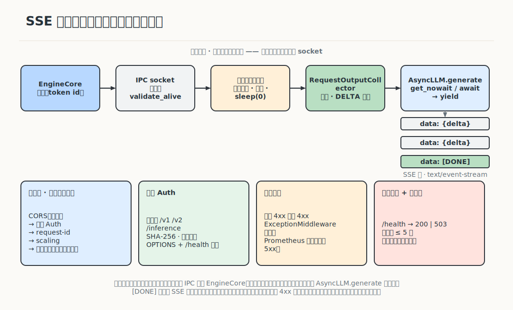</a>

<p class='figure-caption'>EngineCore output → IPC socket → 单个 background output handler（按 chunk 处理，sleep(0)）→ per-request 合并 collector → generate() consumer → SSE frame。</p>

### IPC：decode 前先校验

在 multi-process 路径中，`EngineCoreOutputs` 通过 ZMQ socket 到达，并由专属 thread 持续读取：

[`vllm/v1/engine/core_client.py:824-830`](https://github.com/vllm-project/vllm/blob/6cf7b26bd4bff60bf378e1af14044280ac0d214c/vllm/v1/engine/core_client.py#L824-L830)

```python
                    frames = out_socket.recv_multipart(copy=False)
                    resources.validate_alive(frames)
                    outputs: EngineCoreOutputs = decoder.decode(frames)
                    if outputs.utility_output:
                        _process_utility_output(outputs.utility_output, utility_results)
                    else:
                        outputs_queue.put_nowait(outputs)
```

`recv_multipart(copy=False)` 会要求 PyZMQ 在支持时避免接收端额外复制一次 payload。随后，`validate_alive(frames)` 会在 `decoder.decode` 之前检查 liveness/version marker；这样，如果 engine 已失效或版本不匹配，就能在对该 frame 进行 msgpack 反序列化之前报告错误。第 03 篇介绍了 socket 拓扑和 DP fan-in。

### 取消：连接断开转化为 engine abort

[`vllm/v1/engine/async_llm.py:591-596`](https://github.com/vllm-project/vllm/blob/6cf7b26bd4bff60bf378e1af14044280ac0d214c/vllm/v1/engine/async_llm.py#L591-L596)

```python
        except (asyncio.CancelledError, GeneratorExit):
            if q is not None:
                await self.abort(q.request_id, internal=True)
            if self.log_requests:
                logger.info("Request %s aborted.", request_id)
            raise
```

当 `StreamingResponse` generator 被取消或被 GC 回收时（client 的 TCP 连接断开），`generate` 会捕获这一情况并调用 `self.abort(q.request_id, internal=True)` —— 注意，它使用的是 *collector 的* request id，该 id 才是权威依据。pre-stream 阶段（generator 返回前）会单独与 `listen_for_disconnect` 竞速，这由 `with_cancellation` decorator（[`api_utils.py:52-92`](https://github.com/vllm-project/vllm/blob/6cf7b26bd4bff60bf378e1af14044280ac0d214c/vllm/entrypoints/serve/utils/api_utils.py#L52-L92)）实现。其 docstring 指出，一旦返回 `StreamingResponse`，“此 wrapper 将停止监听连接断开，改由 response object 开始监听。”因此，两套机制分别覆盖两个阶段，最终都会执行同一个 abort。

transport event（client hangup）会被转化为 engine abort，使 KV block 和 scheduler slot 得以及时释放，避免资源泄漏在一个已无人读取的 request 上。关于 abort 具体释放哪些资源，请参见第 05 篇（scheduler）和第 06 篇（KV cache）。

### Middleware：顺序即优先级

[`vllm/entrypoints/openai/api_server.py:306-318`](https://github.com/vllm-project/vllm/blob/6cf7b26bd4bff60bf378e1af14044280ac0d214c/vllm/entrypoints/openai/api_server.py#L306-L318)

```python
    # Ensure --api-key option from CLI takes precedence over VLLM_API_KEY
    if tokens := [key for key in (args.api_key or [envs.VLLM_API_KEY]) if key]:
        from vllm.entrypoints.serve.utils.server_utils import AuthenticationMiddleware

        app.add_middleware(AuthenticationMiddleware, tokens=tokens)

    if args.enable_request_id_headers:
        from vllm.entrypoints.serve.utils.server_utils import XRequestIdMiddleware

        app.add_middleware(XRequestIdMiddleware)

    # Add scaling middleware to check for scaling state
    app.add_middleware(ScalingMiddleware)
```

<a href='images/vllm-02-26-middleware-auth-onion.svg' target='_blank'>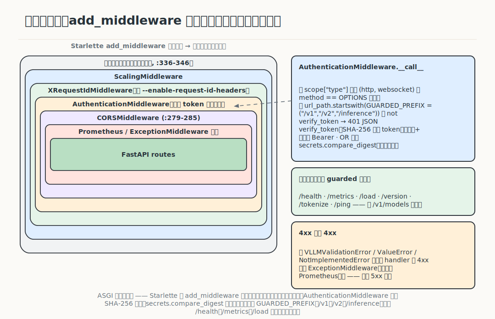</a>

<p class='figure-caption'>ASGI middleware 洋葱模型 —— Starlette `add_middleware` 采用 prepend 方式，因此最后添加的 layer 位于最外层（由内向外依次为 CORS、Auth、XRequestId、Scaling，user middleware 位于最外层）。`AuthenticationMiddleware` 仅保护 `GUARDED_PREFIX`（`/v1`、`/v2`、`/inference`）；token 先经 SHA-256 hash，再由 `secrets.compare_digest` 进行 constant-time 校验，而 `/health`、`/metrics`、`/load` 按设计保持开放。</p>

Starlette `add_middleware` 采用 *prepend*，因此最后添加的 middleware 位于最外层。`--api-key`（一个 CLI list）的优先级高于 `VLLM_API_KEY` —— walrus 表达式先从 CLI、再从 env 构建 token list，并过滤掉 falsy 项；如果结果为空，则完全不会安装 auth middleware。CORS 安装得更早（[`api_server.py:279-285`](https://github.com/vllm-project/vllm/blob/6cf7b26bd4bff60bf378e1af14044280ac0d214c/vllm/entrypoints/openai/api_server.py#L279-L285)）；用户提供的 middleware（通过 dotted-path import，可为 class 或 coroutine）最后安装（`:336-346`），因此位于最外层。

### Auth：hash 与 constant-time 校验，仅保护指定 prefix

[`vllm/entrypoints/serve/utils/server_utils.py:42`](https://github.com/vllm-project/vllm/blob/6cf7b26bd4bff60bf378e1af14044280ac0d214c/vllm/entrypoints/serve/utils/server_utils.py#L42)，随后是 `:78-93`

```python
GUARDED_PREFIX = ("/v1", "/v2", "/inference")
```

```python
    def __call__(self, scope: Scope, receive: Receive, send: Send) -> Awaitable[None]:
        if (
            scope["type"] not in ("http", "websocket")
            or scope.get("method") == "OPTIONS"
        ):
            ...
            return self.app(scope, receive, send)
        root_path = scope.get("root_path", "")
        url_path = scope["path"].removeprefix(root_path)
        headers = Headers(scope=scope)
        # Type narrow to satisfy mypy.
        if url_path.startswith(GUARDED_PREFIX) and not self.verify_token(headers):
            response = JSONResponse(content={"error": "Unauthorized"}, status_code=401)
            return response(scope, receive, send)
        return self.app(scope, receive, send)
```

这是 pure-ASGI middleware。`verify_token`（`:61-76`）会对已配置的 token（仅在 init 时执行一次）和请求携带的 `Authorization: Bearer` param 都进行 SHA-256 hash，然后遍历所有已配置的 token hash，对 `secrets.compare_digest` 的结果进行 OR 累积 —— 由此实现以 hash 为对象的 constant-time 比较，可抵御 timing side-channel 攻击。文档明确列出了两种 bypass：一是 `OPTIONS` request（确保 CORS preflight 永远不会被阻止），二是任何不属于 `GUARDED_PREFIX` 的 path。

Authentication 只保护 `/v1`、`/v2`、`/inference`。`/health`、`/metrics`、`/load`、`/version`、`/tokenize`、`/ping` 均*按设计*不做 Authentication —— 它们不以受保护的 prefix 开头，因此即使设置了 `--api-key`，load balancer 和 scraper 也能访问。注意，`/v1/models` *确实*受到保护（因为它以 `/v1` 开头）。

### Exception mapping：避免 4xx 进入 5xx counter

[`vllm/entrypoints/openai/api_server.py:287-304`](https://github.com/vllm-project/vllm/blob/6cf7b26bd4bff60bf378e1af14044280ac0d214c/vllm/entrypoints/openai/api_server.py#L287-L304)

```python
    app.exception_handler(HTTPException)(http_exception_handler)
    app.exception_handler(RequestValidationError)(validation_exception_handler)
    app.exception_handler(EngineGenerateError)(engine_error_handler)
    app.exception_handler(EngineDeadError)(engine_error_handler)
    app.exception_handler(GenerationError)(generation_error_handler)
    # Register specific exception types so they are handled by
    # ExceptionMiddleware (inside the Prometheus middleware) rather than
    # ServerErrorMiddleware (outside it). Without this, these exceptions
    # propagate through Prometheus as unhandled and get recorded as 5xx
    # even though they result in 4xx responses to the client.
    app.exception_handler(VLLMValidationError)(exception_handler)
    ...
    app.exception_handler(Exception)(exception_handler)
```

每个 exception 都会转换为符合 OpenAI 格式的 `ErrorResponse` JSON。注释体现了一个细微但重要的正确性问题：将 `ValueError`、`NotImplementedError` 以及具体的 `VLLM*` 4xx type 注册为显式 handler，可以确保它们留在 Starlette 的 `ExceptionMiddleware` 内部；该组件又嵌套在 Prometheus middleware 的*内部*。否则，它们会向上冒泡到 `ServerErrorMiddleware`（位于 Prometheus 外部），从而抬高 5xx counter，尽管 client 实际收到的是 4xx。两种 engine error 都会交给 `engine_error_handler`，其 docstring 直接说明了 streaming 场景下的原因：“如果 StreamingResponse generator 中遇到 exception，该 exception 不会被抛出，因为我们已经发送了 200 状态码 ... 因此，我们改用 watchdog background task”（[`server_utils.py:347-352`](https://github.com/vllm-project/vllm/blob/6cf7b26bd4bff60bf378e1af14044280ac0d214c/vllm/entrypoints/serve/utils/server_utils.py#L347-L352)）。handler 会调用 `terminate_if_errored` 并返回映射后的 error。

### Health 与 watchdog：engine 故障时 fail-stop

[`vllm/entrypoints/serve/instrumentator/health.py:22-33`](https://github.com/vllm-project/vllm/blob/6cf7b26bd4bff60bf378e1af14044280ac0d214c/vllm/entrypoints/serve/instrumentator/health.py#L22-L33)

```python
@router.get("/health", response_class=Response)
async def health(raw_request: Request) -> Response:
    """Health check."""
    client = engine_client(raw_request)
    if client is None:
        # Render-only servers have no engine; they are always healthy.
        return Response(status_code=200)
    try:
        await client.check_health()
        return Response(status_code=200)
    except EngineDeadError:
        return Response(status_code=503)
```

`/health` 是一种 pull check：`check_health()` 在 `AsyncLLM` 上检查通过 → 200，`EngineDeadError` → 503；render-only server（没有 engine，即 `state.engine_client is None`；见[第 5 节](#5-openai-serverfastapi-applifespan-与-engine-client)）则始终返回 200。由于 `/health` 不在受保护的 prefix 下，即使设置了 `--api-key`，load balancer 也会持续探测它。`/version` 和 `/load`（[`instrumentator/basic.py:30-56`](https://github.com/vllm-project/vllm/blob/6cf7b26bd4bff60bf378e1af14044280ac0d214c/vllm/entrypoints/serve/instrumentator/basic.py#L30-L56)）同样保持开放；`/load` 返回 `server_load_metrics` counter，而 `load_aware_call`（[`api_utils.py:101-146`](https://github.com/vllm-project/vllm/blob/6cf7b26bd4bff60bf378e1af14044280ac0d214c/vllm/entrypoints/serve/utils/api_utils.py#L101-L146)）会在进入时递增该值，并仅在 stream 完全 drain 后才通过 `BackgroundTask` 将其递减。

与之对应的 *push* 机制是 watchdog；它的存在正是因为 stream 在 generation 中途失败后，无法再将 exception 抛给 client：

[`vllm/entrypoints/launcher.py:168-178`](https://github.com/vllm-project/vllm/blob/6cf7b26bd4bff60bf378e1af14044280ac0d214c/vllm/entrypoints/launcher.py#L168-L178)

```python
def terminate_if_errored(server: uvicorn.Server, engine: EngineClient):
    ...
    engine_errored = engine.errored and not engine.is_running
    if not envs.VLLM_KEEP_ALIVE_ON_ENGINE_DEATH and engine_errored:
        server.should_exit = True
```

`watchdog_loop`（[`launcher.py:156-165`](https://github.com/vllm-project/vllm/blob/6cf7b26bd4bff60bf378e1af14044280ac0d214c/vllm/entrypoints/launcher.py#L156-L165)）每隔 `VLLM_WATCHDOG_TIME_S = 5.0` 秒调用一次；`engine_error_handler` 则会在下一个 request 到来时调用。两者都会将 `server.should_exit` 置位，前提是 engine 处于 `errored and not is_running`；除非 `VLLM_KEEP_ALIVE_ON_ENGINE_DEATH` 为调试目的覆盖这一行为。

正常情况下，只要 event loop 持续推进，watchdog 就会在下一次五秒检查时发现已经报错并停止的 engine；如果某个 request 更早遇到该 error，exception handler 也能触发同样的 shutdown 决策。`/health` 会针对 `EngineDeadError` 返回 503，使 orchestration 系统能够替换 pod。

## 12. 从 HTTP/CLI 到 Engine：完整入口调用链

下面三条调用链先将 CLI 启动路径与两条 request 路径分开，再说明 offline request 和 HTTP request 在何处到达同一个 `EngineCoreRequest` 边界。

<a href='images/vllm-02-11-entrypoint-trace.svg' target='_blank'>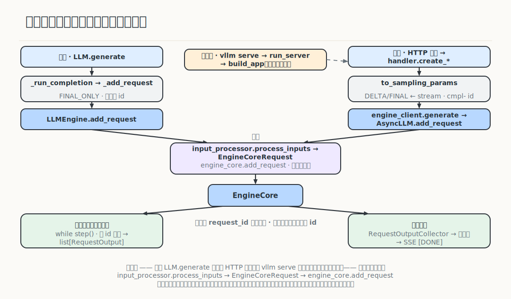</a>

<p class='figure-caption'>三个入口（offline `LLM.generate`、`vllm serve`、HTTP route）逐步收敛到同一点（`process_inputs` → `EngineCoreRequest` → `EngineCore`），随后分为同步 drain 和异步 stream 两条路径。</p>

### Trace A — Offline：从 `generate` 到同步 drain

Offline request 方法是一个只有三行的 adapter：检查 runner、为 params 设置默认值，然后委托处理。[`vllm/entrypoints/llm.py:465-485`](https://github.com/vllm-project/vllm/blob/6cf7b26bd4bff60bf378e1af14044280ac0d214c/vllm/entrypoints/llm.py#L465-L485)：

```python
        runner_type = self.model_config.runner_type
        if runner_type != "generate":
            raise ValueError(
                "LLM.generate() is only supported for generative models. "
                ...
            )

        if sampling_params is None:
            sampling_params = self.get_default_sampling_params()

        return self._run_completion(
            prompts=prompts,
            params=sampling_params,
            output_type=RequestOutput,
            ...
        )
```

`_run_completion` 通过 `_add_completion_requests` enqueue，随后阻塞在 `_run_engine` 中（[`offline_utils.py:340-349`](https://github.com/vllm-project/vllm/blob/6cf7b26bd4bff60bf378e1af14044280ac0d214c/vllm/entrypoints/offline_utils.py#L340-L349)）。`_add_request` 提供该 drain 所需的两个值：

```python
        if isinstance(params, SamplingParams):
            # We only care about the final output
            params.output_kind = RequestOutputKind.FINAL_ONLY

        request_id = str(next(self.request_counter))
```

Offline 会强制使用 `FINAL_ONLY`，并分配单调递增的 integer request id。drain 会为每个 request 收集一份最终结果，再根据这些 id 恢复输入顺序后返回。

`LLMEngine.add_request`（[`vllm/v1/engine/llm_engine.py:249-261`](https://github.com/vllm-project/vllm/blob/6cf7b26bd4bff60bf378e1af14044280ac0d214c/vllm/v1/engine/llm_engine.py#L249-L261)）是 Offline 入口接入共享入口点的位置：

```python
        else:
            request = self.input_processor.process_inputs(
                request_id,
                prompt,
                params,
                supported_tasks=self.get_supported_tasks(),
                arrival_time=arrival_time,
                lora_request=lora_request,
                tokenization_kwargs=tokenization_kwargs,
                trace_headers=trace_headers,
                priority=priority,
            )
            prompt_text, _, _ = extract_prompt_components(self.model_config, prompt)
```

`process_inputs` 返回一个 `EngineCoreRequest`；`LLMEngine.add_request` 注册 frontend output state，并调用 `engine_core.add_request`（[`llm_engine.py:272-292`](https://github.com/vllm-project/vllm/blob/6cf7b26bd4bff60bf378e1af14044280ac0d214c/vllm/v1/engine/llm_engine.py#L272-L292)），当 `n > 1` 时将子项 fan-out。随后，`_run_engine` 以同步方式 drain，并按分配的 integer id 对已完成的 output 排序（[`offline_utils.py:590-626`](https://github.com/vllm-project/vllm/blob/6cf7b26bd4bff60bf378e1af14044280ac0d214c/vllm/entrypoints/offline_utils.py#L590-L626)）。

### Trace B — CLI：`vllm serve` 启动 server

CLI 会构建 Trace C 使用的 server。`ServeSubcommand.cmd` 解析 `api_server_count` 并选择 topology（[`serve.py:139-148`](https://github.com/vllm-project/vllm/blob/6cf7b26bd4bff60bf378e1af14044280ac0d214c/vllm/entrypoints/cli/serve.py#L139-L148)）：

```python
        if is_multi_port:
            run_dp_supervisor(args)
        elif args.api_server_count < 1:
            run_headless(args)
        elif args.api_server_count > 1 or envs.VLLM_RUST_FRONTEND_PATH:
            run_multi_api_server(args)
        else:
            # Single API server (this process).
            args.api_server_count = None
            uvloop.run(run_server(args))
```

常见的 single-server 分支和 module `__main__` 最终都会进入 `uvloop.run(run_server(args))`（[`api_server.py:799`](https://github.com/vllm-project/vllm/blob/6cf7b26bd4bff60bf378e1af14044280ac0d214c/vllm/entrypoints/openai/api_server.py#L799)）。

`run_server` 通过 `setup_server`，在 engine 创建*之前*就绑定 socket（[`vllm/entrypoints/openai/api_server.py:630-637`](https://github.com/vllm-project/vllm/blob/6cf7b26bd4bff60bf378e1af14044280ac0d214c/vllm/entrypoints/openai/api_server.py#L630-L637)）：

```python
    # workaround to make sure that we bind the port before the engine is set up.
    # This avoids race conditions with ray.
    # see https://github.com/vllm-project/vllm/issues/8204
    if args.uds:
        sock = create_server_unix_socket(args.uds)
    else:
        sock_addr = (args.host or "", args.port)
        sock = create_server_socket(sock_addr, reuse_port=reuse_port)
```

随后，`run_server_worker` 将 engine 的整个生命周期限定在一个 async context manager 内（[`vllm/entrypoints/openai/api_server.py:773-784`](https://github.com/vllm-project/vllm/blob/6cf7b26bd4bff60bf378e1af14044280ac0d214c/vllm/entrypoints/openai/api_server.py#L773-L784)）：

```python
    async with build_async_engine_client(
        args,
        client_config=client_config,
    ) as engine_client:
        shutdown_task = await build_and_serve(
            engine_client, listen_address, sock, args, **uvicorn_kwargs
        )
    # NB: Await server shutdown only after the backend context is exited
    try:
        await shutdown_task
    finally:
        sock.close()
```

`build_async_engine_client` 创建 `AsyncLLM`；`build_and_serve` 向正在运行的 engine 查询其 capabilities，并据此构建 app（[`api_server.py:670-679`](https://github.com/vllm-project/vllm/blob/6cf7b26bd4bff60bf378e1af14044280ac0d214c/vllm/entrypoints/openai/api_server.py#L670-L679)）：

```python
    supported_tasks = await engine_client.get_supported_tasks()
    model_config = engine_client.model_config

    logger.info("Supported tasks: %s", supported_tasks)
    app = build_app(args, supported_tasks, model_config)
    await init_app_state(engine_client, app.state, args, supported_tasks)
    ...
    return await serve_http(
        app,
        sock=sock,
        ...
    )
```

socket 会在 model loading 前完成绑定（issue #8204）；engine context 退出后才会 await `shutdown_task`。因此，engine shutdown 会先于最终的 HTTP teardown 和 `sock.close()` 执行。

### Trace C — HTTP：运行中 server 内的一个 request

对于 chat completions，route 会选择对应的 serving object；后者渲染 template、构建 `SamplingParams`，并调用 `engine_client.generate`。随后，`AsyncLLM.add_request` 会进入与 Offline 相同的 input processor（[`async_llm.py:348-360`](https://github.com/vllm-project/vllm/blob/6cf7b26bd4bff60bf378e1af14044280ac0d214c/vllm/v1/engine/async_llm.py#L348-L360)）：

```python
        else:
            request = self.input_processor.process_inputs(
                request_id,
                prompt,
                params,
                supported_tasks=await self.get_supported_tasks(),
                arrival_time=arrival_time,
                lora_request=lora_request,
                ...
            )
```

这个 async 调用会 await task discovery，同时携带 Online DP-routing rank。`process_inputs` 返回后，`AsyncLLM` 会启动其 output handler，并创建该 request 专用的 collector（[`async_llm.py:370-383`](https://github.com/vllm-project/vllm/blob/6cf7b26bd4bff60bf378e1af14044280ac0d214c/vllm/v1/engine/async_llm.py#L370-L383)）：

```python
        # We start the output_handler on the first call to add_request() so
        # we can call __init__ before the event loop, which enables us
        # to handle startup failure gracefully in the OpenAI server.
        self._run_output_handler()

        # Create a new output collector for the request.
        queue = RequestOutputCollector(params.output_kind, request.request_id)

        # Use cloned params that may have been updated in process_inputs()
        params = request.params

        if is_pooling or params.n == 1:
            await self._add_request(request, prompt_text, None, 0, queue)
            return queue
```

启用 `stream=True` 时，protocol 会设置 `DELTA`；`add_request` 返回 collector，而 `_run_output_handler` 则将 EngineCore output drain 到其中。`AsyncLLM.generate` 会 yield 这些条目；断连清理逻辑会把 cancellation 转换为 engine abort，而无需让 scheduler 感知任何 HTTP 概念。

### 要点总结

这些 request 路径共享以下 lowering 流程：

```text
offline:  LLM.generate → _run_completion → _add_request → LLMEngine.add_request ┐
                                                                                ├→ input_processor.process_inputs → EngineCoreRequest → engine_core.add_request
online:   route → handler.create_* → engine_client.generate → AsyncLLM.add_request ┘
```

两者都会调用 `input_processor.process_inputs`（[`llm_engine.py:250`](https://github.com/vllm-project/vllm/blob/6cf7b26bd4bff60bf378e1af14044280ac0d214c/vllm/v1/engine/llm_engine.py#L250)、[`async_llm.py:349`](https://github.com/vllm-project/vllm/blob/6cf7b26bd4bff60bf378e1af14044280ac0d214c/vllm/v1/engine/async_llm.py#L349)）；CLI 只是构建 Online server，并没有引入第三条 request 路径。

- **Offline** 强制使用 `FINAL_ONLY`，分配 integer counter id，在当前 thread 中驱动阻塞式 `while has_unfinished_requests(): step()` loop，再按 id 执行 `sorted()`，以恢复输入顺序。
- **Online** 根据 `stream` 设置 `DELTA`/`FINAL_ONLY`，分配 `chatcmpl-`/`cmpl-` id，返回一个 `RequestOutputCollector` queue，并由后台 handler 和 async generator 将 delta 以 SSE 形式 stream 给客户端。

ownership 边界依然是：

```text
entrypoint = protocol + validation + async stream + cancellation
engine core = request state + scheduling + model execution
```

越过该边界后，EngineCore 无需理解 Python method call、CLI parsing、HTTP body 或 SSE framing。

## 13. 参考资料

- https://docs.vllm.ai/en/stable/serving/offline_inference/
- https://docs.vllm.ai/en/stable/serving/online_serving/openai_compatible_server/
- https://docs.vllm.ai/en/stable/serving/online_serving/
- https://vllm.ai/blog/2025-01-27-v1-alpha-release
- https://vllm.ai/blog/2025-09-05-anatomy-of-vllm
- https://github.com/vllm-project/vllm/issues/8204

*所有代码层面的结论均以 [`vllm-project/vllm@6cf7b26bd`](https://github.com/vllm-project/vllm/tree/6cf7b26bd4bff60bf378e1af14044280ac0d214c) 为依据。*