# V1 进程架构：API Server、EngineCore 与 GPU Workers

> 源码快照：[`vllm-project/vllm@6cf7b26bd`](https://github.com/vllm-project/vllm/tree/6cf7b26bd4bff60bf378e1af14044280ac0d214c)。下文所有关于进程和传输机制的描述均基于该 commit。摘录中用 `...` 表示省略的行；除非明确标为伪代码，其余内容均为源码原文。文件与行号标注均链接回同一快照。

## 1. 为什么采用多进程：GIL、GPU 阻塞与 frontend/engine 拆分

LLM server 所做的远不只是调用 PyTorch。每次 GPU forward 前后，都伴随着大量 CPU 侧工作：

```text
HTTP parse -> tokenize -> schedule -> input prep -> GPU kernels -> sample -> detokenize -> stream
```

<a href='images/vllm-03-12-gil-escape-hatches.svg' target='_blank'>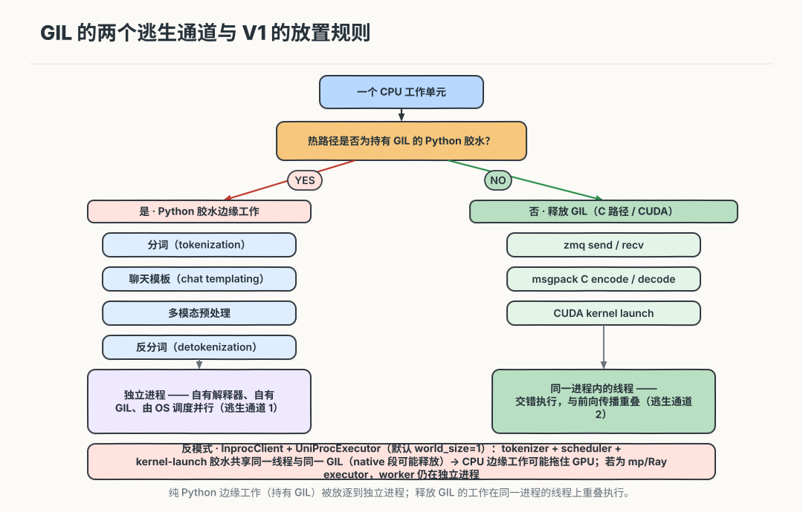</a>

<p class='figure-caption'>CPython GIL 的两种绕开机制，以及 V1 由此推导出的任务放置原则：持有 GIL 的 pure-Python 边缘侧工作移至独立进程；blocking ZMQ I/O 与 CUDA 执行会释放 GIL；部分序列化/反序列化工作可在 I/O thread 上与 forward pass 重叠执行。</p>

V1 通过两层边界，避免这些工作迫使 GPU 路径串行执行：一层是 frontend 与 `EngineCore` 之间的进程边界，另一层是 engine 进程内部的专用 I/O thread。CPython GIL 是这两项设计的重要原因。[第 2 节](#2-进程拓扑api-serverenginecore-与-gpu-worker)梳理进程拓扑，[第 4 节](#4-zmq-transportrequest-与-output-socket)介绍进程间传输机制，[第 6 节](#6-enginecore-内部的-queue-与-thread)则追踪 queue 及其所属 thread。

### GIL 带来的约束

在 CPython 中，一个覆盖整个解释器的互斥锁会串行化 Python bytecode 的执行：每个解释器同一时刻最多只有一个 thread 在运行 Python。这会给 serving 栈带来一个直接后果——增加 thread 对 pure-Python 工作*没有*任何 CPU 并行加速效果，因为它们只能在同一把锁下轮流运行。不过，GIL 也有两种绕开机制，V1 同时利用了这两点：

每个 OS 进程都有自己的解释器锁，而 blocking I/O 和 native extension 可以在进程内释放这把锁。V1 同时利用了这两个特性：将 Python 负载较重的 frontend 工作移至独立进程，并将 engine 的 socket I/O 放到专用 thread 中。原生 tokenizer、PyTorch、codec、ZMQ 和 CUDA 执行区段可以重叠运行；外围的 Python 胶水代码仍会占用所在进程的 GIL。源码所能保证的，是 blocking socket 调用和部分序列化路径可重叠执行，并不意味着每一条 encode/decode 指令都不受 GIL 约束。

<a href='images/vllm-03-03-process-split.svg' target='_blank'>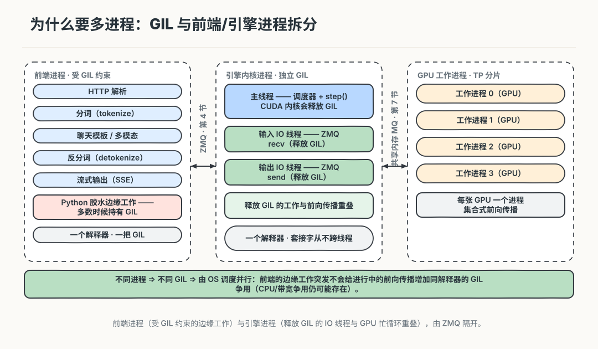</a>

<p class='figure-caption'>frontend 进程负责受 GIL 限制的边缘侧工作，engine 进程则通过会释放 GIL 的 IO thread 与 GPU busy loop 重叠执行；二者之间以 ZMQ 为边界。</p>

**engine 源码本身给出了这样设计的理由。**

关于 thread 层面的论据，最直接的说明就在 `EngineCoreProc` 创建后台 I/O thread 的位置。

[`vllm/v1/engine/core.py:974-978`](https://github.com/vllm-project/vllm/blob/6cf7b26bd4bff60bf378e1af14044280ac0d214c/vllm/v1/engine/core.py#L974-L978)

```python
            # Background Threads and Queues for IO. These enable us to
            # overlap ZMQ socket IO with GPU since they release the GIL,
            # and to overlap some serialization/deserialization with the
            # model forward pass.
            # Threads handle Socket <-> Queues and core_busy_loop uses Queue.
```

constructor（[`core.py:979-1009`](https://github.com/vllm-project/vllm/blob/6cf7b26bd4bff60bf378e1af14044280ac0d214c/vllm/v1/engine/core.py#L979-L1009)）为 engine 配置了一个 compute thread、一个 input IO thread 和一个 output IO thread，三者通过两个 `queue.Queue` 相连（[第 6 节](#6-enginecore-内部的-queue-与-thread)）。每个 IO thread 都独占自己的 ZMQ socket；main thread 从不调用这些 socket。因此，blocking socket 操作和符合条件的序列化路径可以与 forward pass 重叠执行，而无需把传输工作放到 scheduler 的关键路径上。

对于 `ADD`，input thread 还会运行 `preprocess_add_request`：request 构造、block 哈希计算和 grammar 初始化都可以与 forward pass 同时启动（[`core.py:855-877`](https://github.com/vllm-project/vllm/blob/6cf7b26bd4bff60bf378e1af14044280ac0d214c/vllm/v1/engine/core.py#L855-L877)）。相关的可变预处理状态被限制在该 thread 内。对于 tokenization、多模态处理和 detokenization 中的 Python 部分，thread 无法提供同等级别的隔离，这正是 frontend 需要在进程层面拆分出去的原因。

### frontend/engine 进程拆分

因此，V1 将 API server 与 EngineCore 放在不同的 OS 进程中。frontend 负责 tokenization、多模态处理、detokenization 和流式输出，core 进程则专注于调度与执行（[V1 博客](https://vllm.ai/blog/2025-01-27-v1-alpha-release)；[架构概览](https://docs.vllm.ai/en/stable/design/arch_overview/)）。`AsyncLLM` 在 frontend 进程内仍使用 asyncio 并发；真正让其 Python 工作不再争用 EngineCore GIL 的，是进程边界。

asyncio 本身运行于单一 thread，同样受 GIL 约束。因此，frontend 内部的并发本身仍无法让这些工作与 engine 重叠执行；真正做到这一点的是进程边界。frontend 拓扑默认只有一个 API server，启用 data parallelism 后可扩展为多对多 mesh，详见[第 2 节](#2-进程拓扑api-serverenginecore-与-gpu-worker)和第 02 篇。

关键在于，这条边界属于*部署选择*，并不会改变 request 语义，因为每个 frontend 都通过同一种抽象 client 与 engine 通信。

[`vllm/v1/engine/core_client.py:83-105`](https://github.com/vllm-project/vllm/blob/6cf7b26bd4bff60bf378e1af14044280ac0d214c/vllm/v1/engine/core_client.py#L83-L105)

```python
    def make_client(
        multiprocess_mode: bool,
        asyncio_mode: bool,
        vllm_config: VllmConfig,
        executor_class: type[Executor],
        log_stats: bool,
    ) -> "EngineCoreClient":
        # TODO: support this for debugging purposes.
        if asyncio_mode and not multiprocess_mode:
            raise NotImplementedError(
                "Running EngineCore in asyncio without multiprocessing "
                "is not currently supported."
            )

        if multiprocess_mode and asyncio_mode:
            return EngineCoreClient.make_async_mp_client(
                vllm_config, executor_class, log_stats
            )

        if multiprocess_mode and not asyncio_mode:
            return SyncMPClient(vllm_config, executor_class, log_stats)

        return InprocClient(vllm_config, executor_class, log_stats)
```

<a href='images/vllm-03-13-make-client-matrix.svg' target='_blank'>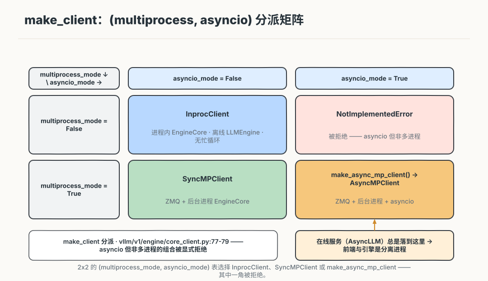</a>

<p class='figure-caption'>make_client 的 2x2 dispatch：由 (multiprocess_mode, asyncio_mode) 选择 InprocClient、SyncMPClient 或 make_async_mp_client；对于启用 asyncio 但未启用 multiprocessing 的组合，则会显式抛出 NotImplementedError。</p>

逐步分析这段 dispatch。两个 boolean 值决定最终拓扑。`InprocClient`（即 `else`）会让 engine *留在调用方进程中*。它提供的是**显式关闭 multiprocess**的路径，而不是 offline 模式的默认选择：只要设置了 `VLLM_ENABLE_V1_MULTIPROCESSING`，`LLMEngine.from_engine_args` 就会强制使用 `multiprocess_mode=True`，而该变量默认值为 `1`（[`llm_engine.py:174-176`](https://github.com/vllm-project/vllm/blob/6cf7b26bd4bff60bf378e1af14044280ac0d214c/vllm/v1/engine/llm_engine.py#L174-L176)、[`envs.py:1311-1313`](https://github.com/vllm-project/vllm/blob/6cf7b26bd4bff60bf378e1af14044280ac0d214c/vllm/envs.py#L1311-L1313)）。因此，默认的 `LLM(...)` batch 作业会走 `SyncMPClient` 分支。使用 `VLLM_ENABLE_V1_MULTIPROCESSING=0` 时，得到的则是 `InprocClient`。

`SyncMPClient` 和 async MP client 通过 ZMQ 访问后台 EngineCore；`InprocClient` 则在本地直接持有一个 EngineCore（[`core_client.py:77-79`](https://github.com/vllm-project/vllm/blob/6cf7b26bd4bff60bf378e1af14044280ac0d214c/vllm/v1/engine/core_client.py#L77-L79)）。该 factory 会拒绝 `asyncio_mode and not multiprocess_mode`，因此 online `AsyncLLM` 始终将 frontend 与 core 分置于不同进程。

要看清这种拆分改变了什么，先具体看看“进程内”究竟意味着什么：

[`vllm/v1/engine/core_client.py:286-292`](https://github.com/vllm-project/vllm/blob/6cf7b26bd4bff60bf378e1af14044280ac0d214c/vllm/v1/engine/core_client.py#L286-L292)

```python
    def __init__(self, *args, **kwargs):
        self.engine_core = EngineCore(*args, **kwargs)

    def get_output(self) -> EngineCoreOutputs:
        outputs, model_executed = self.engine_core.step_fn()
        self.engine_core.post_step(model_executed=model_executed)
        return outputs and outputs.get(0) or EngineCoreOutputs()
```

`InprocClient` 直接持有一个 `EngineCore` 对象。这里没有 busy loop，没有 socket，也没有 thread 边界：`get_output` 会在调用方自己的 thread 上，以同步方式*自行驱动 engine step*（[`core_client.py:278-283`](https://github.com/vllm-project/vllm/blob/6cf7b26bd4bff60bf378e1af14044280ac0d214c/vllm/v1/engine/core_client.py#L278-L283)将其描述为“没有 busy loop”）。使用 `InprocClient + UniProcExecutor` 时（`world_size=1` 场景下通常如此），frontend 工作、scheduler 以及 Python 侧负责启动 kernel 的胶水代码，全都运行在调用方进程中，共用该解释器的 GIL（正是这种耦合会让 CPU 边缘侧工作阻塞 GPU），尽管 tokenizer/PyTorch/CUDA 的 native 执行区段可能释放 GIL。如果 executor 是 `mp` 或 Ray，worker 则位于独立进程中。multiprocess client 的存在，就是为了打破这种 frontend 耦合。

将 EngineCore 放到独立进程后，frontend 的 Python 工作便不再争用同一个解释器锁。第 04 篇追踪这一核心 loop，第 09 篇则追踪它调度的 worker 执行过程。

**让跨进程边界的开销足够低，使其成为默认方案。**

V1 通过传输增量 batch diff，并使用 msgpack 将大型 tensor 放入 side frame，从而降低跨越该边界的成本（[V1 博客](https://vllm.ai/blog/2025-01-27-v1-alpha-release)）。IO thread 负责 encode/decode，因此其中会释放 GIL 的阶段可以与执行过程重叠。第 4、5 节将分析 transport 和 serialization 的细节，包括哪些位置仍会发生数据复制。

## 2. 进程拓扑：API server、EngineCore 与 GPU worker

V1 部署包含四类 OS 进程角色：**API server**负责 HTTP、tokenization、多模态输入加载和 streaming；**EngineCore** 进程负责 scheduling 和 KV-cache 管理；**GPU worker** 负责模型执行；某些 DP 配置还会使用 **DP coordinator**（[架构概览](https://docs.vllm.ai/en/stable/design/arch_overview/)）。各类进程的数量由并行配置决定。本节会将这些角色映射到各自的 spawn 位置，并推导 `--data-parallel-size`、`--tensor-parallel-size` 和 `--pipeline-parallel-size` 对应的进程数量。第 11 篇介绍 TP、PP 和 DP 背后的算法；第 09 篇介绍 worker 内部机制；第 02 篇介绍 API server。

### client 抽象决定进程拓扑

front-end 从不直接与 worker 建立 socket 连接，甚至不会指定具体的 transport。它只持有一个 `EngineCoreClient`，真正决定进程拓扑的是该 client 的*子类*。async factory 就是这个切换点：

[`vllm/v1/engine/core_client.py:116-132`](https://github.com/vllm-project/vllm/blob/6cf7b26bd4bff60bf378e1af14044280ac0d214c/vllm/v1/engine/core_client.py#L116-L132)

```python
    ) -> "AsyncMPClient":
        parallel_config = vllm_config.parallel_config
        client_args = (
            vllm_config,
            executor_class,
            log_stats,
            client_addresses,
            client_count,
            client_index,
        )
        if parallel_config.data_parallel_size > 1:
            if parallel_config.data_parallel_external_lb:
                # External load balancer - client per DP rank.
                return DPAsyncMPClient(*client_args)
            # Internal load balancer - client balances to all DP ranks.
            return DPLBAsyncMPClient(*client_args)
        return AsyncMPClient(*client_args)
```

<a href='images/vllm-03-14-async-client-selection.svg' target='_blank'>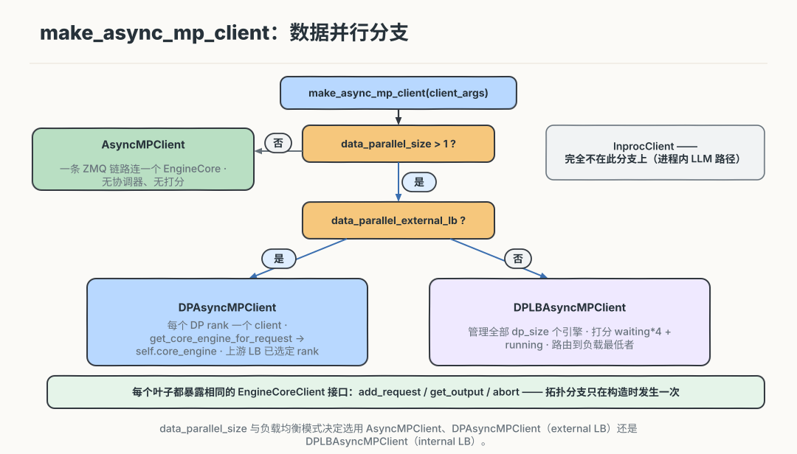</a>

<p class='figure-caption'>async factory 的 DP 分支：data_parallel_size 和 load-balancer mode 决定使用 AsyncMPClient（DP=1）、DPAsyncMPClient（外部 LB，每个 rank 一个 client）还是 DPLBAsyncMPClient（内部 LB，对所有 engine 进行评分）。</p>

这些 async 子类的区别在于它们连接多少个 engine，以及由谁负责负载均衡。`DP == 1` 使用一个 `AsyncMPClient`。外部负载均衡使用 `DPAsyncMPClient`，routing 在 vLLM 外部完成。内部负载均衡使用 `DPLBAsyncMPClient`，由它对可用 engine 进行评分（[第 9 节](#9-data-parallel-与-dp-coordinator)）。`InprocClient` 位于 async 分支之外，它会让 EngineCore 留在调用方进程内。

无论 engine 与 front-end 位于同一进程、隔着一个 socket，还是作为多个 engine 之一隐藏在 load balancer 后面，所有 front-end 都通过完全相同的 `EngineCoreClient` 接口（`add_request`、`get_output`、`abort`）通信。进程边界属于*部署*决策，不会改变 request 语义。API-server 代码不会根据拓扑走不同分支；相关分支只会在这里构造对象时执行一次。

### EngineCore：每个 data-parallel rank 对应一个进程

EngineCore 是 `EngineCoreProc`（[`core.py:896`](https://github.com/vllm-project/vllm/blob/6cf7b26bd4bff60bf378e1af14044280ac0d214c/vllm/v1/engine/core.py#L896)），它是同步 `EngineCore` loop 的多进程封装层。其进程由 `CoreEngineProcManager` spawn，而下面的 spawn loop 具体体现了“每个 DP rank 一个 engine”：

[`vllm/v1/engine/utils.py:156-171`](https://github.com/vllm-project/vllm/blob/6cf7b26bd4bff60bf378e1af14044280ac0d214c/vllm/v1/engine/utils.py#L156-L171)

```python
        self.processes: list[BaseProcess] = []
        local_dp_ranks = []
        for index in range(local_engine_count):
            local_index = local_start_index + index
            global_index = start_index + index

            # Start EngineCore in background process.
            local_dp_ranks.append(local_index)
            self.processes.append(
                context.Process(
                    target=EngineCoreProc.run_engine_core,
                    name=f"EngineCore_DP{global_index}" if is_dp else "EngineCore",
                    kwargs=common_kwargs
                    | {"dp_rank": global_index, "local_dp_rank": local_index},
                )
            )
```

manager 会为每个本地 DP rank 启动一个名为 `EngineCore_DP{global_index}` 的进程，并传入对应的 global rank 和 local rank。因此，DP rank 的数量决定了 EngineCore 进程数。只有在进行 MoE wave coordination 时，`run_engine_core` 才会选择 `DPEngineCoreProc`；dense DP replica 则会被改写为彼此独立的 DP=1 core（[`core.py:1188-1200`](https://github.com/vllm-project/vllm/blob/6cf7b26bd4bff60bf378e1af14044280ac0d214c/vllm/v1/engine/core.py#L1188-L1200)）。

DP 会*复制*整个 engine（包括 scheduler、KV cache 和 executor），而不是将单个 request 切分到多个 rank。每个 replica 都是一个自包含的 serving engine；它们只共享负责 routing 的 front-end，以及在 MoE 场景下让 forward pass 保持同步的 coordinator。正是这种“只复制、不切分”的特性，使进程数量可以直接与下文的 engine 内部切分倍数相乘。DP 算法本身，包括 unfinished-flag all-reduce 和 EP，将在第 11 篇介绍。

### executor 将每个 engine 切分到 `world_size` 个 worker

一个 EngineCore 拥有一个 executor。`MultiprocExecutor` 会在 device 初始化前 assert `world_size = TP · PP · PCP`，并为每个 local rank 启动一个 `VllmWorker-{rank}` 进程（[`parallel.py:793-797`](https://github.com/vllm-project/vllm/blob/6cf7b26bd4bff60bf378e1af14044280ac0d214c/vllm/config/parallel.py#L793-L797)；[`multiproc_executor.py:117-123`](https://github.com/vllm-project/vllm/blob/6cf7b26bd4bff60bf378e1af14044280ac0d214c/vllm/v1/executor/multiproc_executor.py#L117-L123)）。在单节点上，local world size 与 global world size 相同。worker 从共享内存 broadcast queue 中读取 scheduler diff：ZMQ 负责连接 frontend 与 engine，共享内存则负责连接该 engine 与其 worker。

<a href='images/vllm-03-01-single-node-tp4.svg' target='_blank'>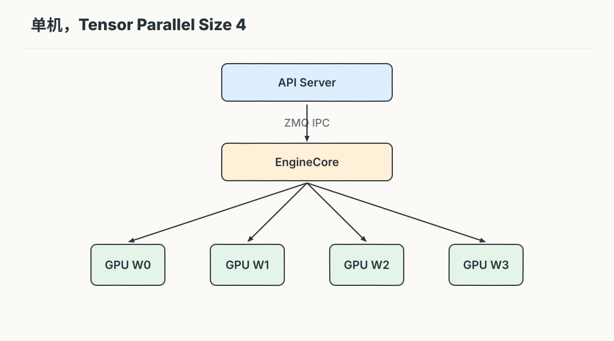</a>

<p class='figure-caption'>单节点中，一个 EngineCore 持有一个 MultiprocExecutor，后者扇出到四个 TP worker 进程。</p>

`world_size == TP · PP · PCP` 会在构造阶段、接触任何 device 之前进行 assert。如果配置形态有误，例如请求使用四块 GPU，但 TP/PP 的乘积为六，系统会在启动时明确抛出 `AssertionError`，而不会一直运行到 `torch.distributed` collective init。world size 错误通常会在该阶段表现为无休止的 NCCL hang，诊断难度要高得多。worker 数量是单个 engine 的属性；第 09 篇将介绍这些 worker 随后的工作。

**DP coordinator：按需创建，且只会有一个。**

在线 DP 部署最多创建一个 coordinator。需要进行 MoE wave coordination，或内部/混合 load 统计要求使用 coordinator 时，它会创建在 rank 0 上（[`utils.py:1110-1118`](https://github.com/vllm-project/vllm/blob/6cf7b26bd4bff60bf378e1af14044280ac0d214c/vllm/v1/engine/utils.py#L1110-L1118)；[`vllm.py:621-625`](https://github.com/vllm-project/vllm/blob/6cf7b26bd4bff60bf378e1af14044280ac0d214c/vllm/config/vllm.py#L621-L625)）。它负责发布 load 快照并协调 MoE wave，但 request routing 仍在 client 侧完成。第 9 节将介绍这两套控制平面；第 11 篇则介绍 collective 运算原理。

完整的进程数量汇总，包括 API-server 的默认配置和单 GPU 下的 `uni` 特殊情况，将在[第 10 节](#10-dp--tp-组合进程数公式)统一推导。

## 3. EngineCoreProc：运行在独立进程中的 Engine

`EngineCore` 包含同步 inference loop：scheduler、executor、KV 管理，以及从 `SchedulerOutput` 到 `ModelRunnerOutput` 的 `step()` 路径。`EngineCoreProc` 对该 loop 进行封装，使其能够在独立 OS 进程中运行并通过 ZMQ 通信。这种区别由类边界体现，而不是每一步都要检查的 mode。

`vllm/v1/engine/core.py:L96-L97`

```python
class EngineCore:
    """Inner loop of vLLM's Engine."""
```

`vllm/v1/engine/core.py:L896-L900`

```python
class EngineCoreProc(EngineCore):
    """ZMQ-wrapper for running EngineCore in background process."""

    ENGINE_CORE_DEAD = b"ENGINE_CORE_DEAD"
    addresses: EngineZmqAddresses
```

`EngineCore` 本身与进程无关。`EngineCoreProc` 增加了 socket 地址、连接 IO thread 与 compute loop 的 input/output queue，以及 `ENGINE_CORE_DEAD` sentinel。本节将追踪进程启动和 main loop；第 4–6 节介绍 transport 与 queue，第 11 节介绍握手过程，第 12 节介绍故障与关闭流程。

### 进程入口：`run_engine_core`

client 不会直接构造 `EngineCoreProc`。它会启动一个 OS 进程，其 `main` 是 staticmethod。这个 staticmethod 才是真正的进程边界——上面的所有代码都在父进程中执行，下面的所有代码则运行在持有 GPU 的子进程中。

`vllm/v1/engine/core.py:L1153-L1155`

```python
    @staticmethod
    def run_engine_core(*args, dp_rank: int = 0, local_dp_rank: int = 0, **kwargs):
        """Launch EngineCore busy loop in background process."""
```

`@staticmethod` 的身份至关重要：父进程中并不存在可供 fork 的活跃 `EngineCore`——该对象是在进程已创建并拥有独立 CUDA context 后，才在子进程内部构造的。因此，权重和 KV cache 永远不需要穿过 `fork()`。子进程首先设置一个便于识别的进程标题（`EngineCore` 或 `EngineCore_DP{dp_rank}`、`core.py:L1168-L1171`），然后选择要实例化的子类：

`vllm/v1/engine/core.py:L1188-L1201`

```python
            parallel_config.data_parallel_index = dp_rank
            if data_parallel and vllm_config.model_config.is_moe:
                # Set data parallel rank for this engine process.
                parallel_config.data_parallel_rank = dp_rank
                engine_core = DPEngineCoreProc(*args, **kwargs)
            else:
                # Non-MoE DP ranks are completely independent, so treat like DP=1.
                # Note that parallel_config.data_parallel_index will still reflect
                # the original DP rank.
                parallel_config.data_parallel_size = 1
                parallel_config.data_parallel_size_local = 1
                parallel_config.data_parallel_rank = 0
                engine_core = EngineCoreProc(*args, engine_index=dp_rank, **kwargs)
```

<a href='images/vllm-03-15-run-engine-core-subclass.svg' target='_blank'>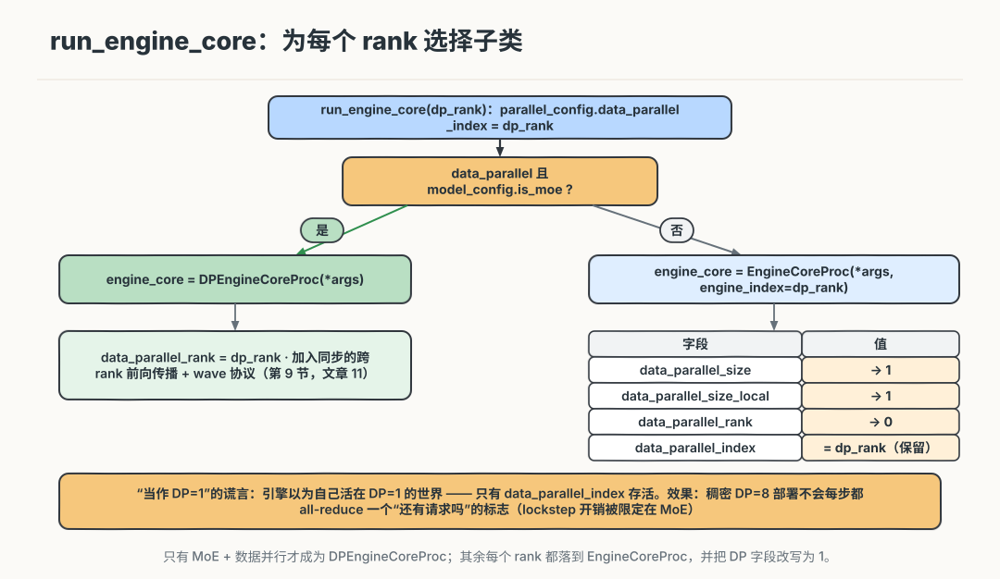</a>

<p class='figure-caption'>run_engine_core 针对每个 rank 选择子类：只有 MoE + data-parallel 会使用 DPEngineCoreProc；其余所有 rank 都会落到基础 EngineCoreProc，并将 data_parallel_size/size_local/rank 重写为 1——这个“按 DP=1 处理”的谎言，将 lockstep 开销限定在 MoE。</p>

默认 manager 会为每个 DP rank 启动一个 engine 进程。启用 DP 的 MoE 会选择 `DPEngineCoreProc` 来执行同步 wave；dense DP 和 single-engine 部署则使用 `EngineCoreProc`。对于 dense 场景，入口点会将本地 config 重写为 `data_parallel_size=1` 和 rank 0，使每个 replica 都成为独立的 engine。第 9 节介绍 coordinator，第 11 篇则解释 MoE 为何必须采用 lockstep。

注释说得非常直白：“非 MoE DP rank 彼此完全独立。”dense replica 不会执行任何跨 rank collective，因此只保留 `data_parallel_index` 来标识自身；每个 step 的 lockstep 开销仅限于 MoE。

这些代码调用的构造函数会完成启动握手，并阻塞到 engine 可访问为止（[第 11 节](#11-启动握手与连接)）；返回后，`run_engine_core` 会安装 SIGTERM/SIGINT handler（[第 12 节](#12-故障处理关闭流程与完整拓扑追踪)），然后调用 `engine_core.run_busy_loop()`。该调用会一直阻塞，直到进程开始关闭。

### busy loop：两阶段 pump

`run_busy_loop` 构成了 main thread 的整个生命周期。它短得惊人，而这恰恰是设计意图。

`vllm/v1/engine/core.py:L1259-L1267`

```python
    def run_busy_loop(self):
        """Core busy loop of the EngineCore."""
        while self._handle_shutdown():
            # 1) Poll the input queue until there is work to do.
            self._process_input_queue()
            # 2) Step the engine core and return the outputs.
            self._process_engine_step()

        raise SystemExit
```

`_handle_shutdown()` 是 loop 的状态机 guard：只要仍有正常工作，或 graceful drain 尚未结束，它就会保持 true。每轮迭代都会接收 client 输入、执行一个 engine step，并将输出放入 queue。drain 完成后，`SystemExit` 会经由 `run_engine_core` 展开调用栈；其中的 `finally` 会恢复 signal handler，并调用 `engine_core.shutdown()`（[第 12 节](#12-故障处理关闭流程与完整拓扑追踪)）。

main thread 从不接触 ZMQ。它消费 `input_queue` 并生成 `output_queue`；另一侧由两个 daemon IO thread 独占 socket，并负责 wire data 的 marshal（[第 6 节](#6-enginecore-内部的-queue-与-thread)）。这种单一所有者设计避免了 socket lock，并让 blocking IO 及符合条件的 serialization 工作能够与 GPU path 重叠执行。

<a href='images/vllm-03-04-busy-loop.svg' target='_blank'>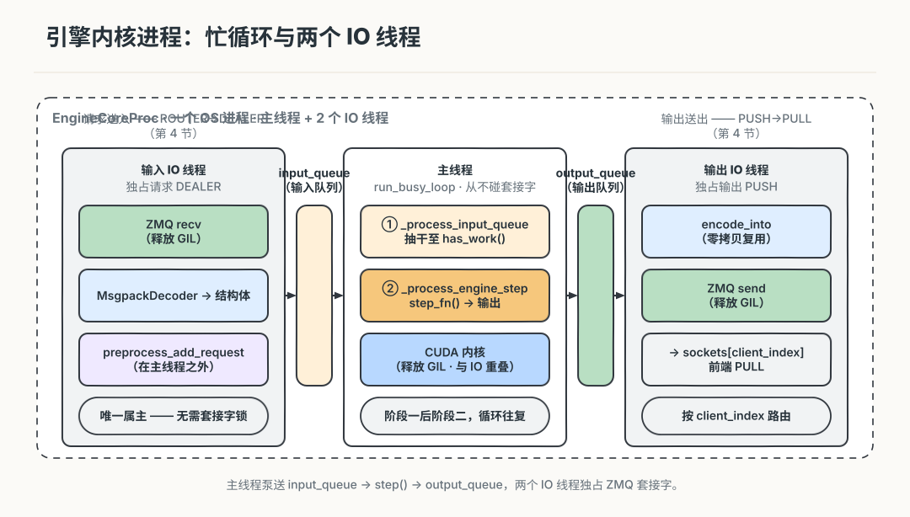</a>

<p class='figure-caption'>main thread 沿 input_queue -> step() -> output_queue 执行 pump，而两个 IO thread 独占 ZMQ socket。</p>

**哪些情况算作“工作”：`has_work` 和 `step_fn`。**

阶段 1 需要足够精确定义空闲状态，才能据此进入阻塞。这个定义由 `has_work` 给出，并与 `is_running` 配合使用，后者负责报告是否已请求 shutdown：

`vllm/v1/engine/core.py:L1247-L1257`

```python
    def has_work(self) -> bool:
        """Returns true if the engine should be stepped."""
        return (
            self.engines_running
            or self.scheduler.has_requests()
            or bool(self.batch_queue)
        )

    def is_running(self) -> bool:
        """Returns true if shutdown has not been requested."""
        return self.shutdown_state == EngineShutdownState.RUNNING
```

只要 scheduler 中有 request、`batch_queue` 中仍有 pipeline microbatch，或 `engines_running` 指示存在 DP wave，loop 就会执行 step。最后一种情况允许原本空闲的 MoE rank 通过 dummy forward 加入 collective。如果这些条件均不满足，`_process_input_queue` 就会阻塞，直到收到 client 工作或 `WAKEUP` sentinel，因此空闲的基础 engine 不会持续 spin。第 7、9 节介绍 PP 和 DP。

pump 所调用的 `step()` 会在构造时一次性绑定，绝不会在每轮迭代中重新选择：

`vllm/v1/engine/core.py:L221-L223`

```python
        self.step_fn = (
            self.step if self.batch_queue is None else self.step_with_batch_queue
        )
```

如果没有 PP batch queue，`step_fn` 就是普通的 `self.step`；启用 PP 时则使用 `self.step_with_batch_queue`，它会让多个 microbatch 在不同 pipeline stage 之间重叠执行。只绑定一次，可以避免 hot loop 在每个 step 都执行一次分支判断。二者返回的结构相同，都是 `(outputs_dict, model_executed)`，因此 `_process_engine_step` 无需感知 parallelism mode。两者的实现见第 04 篇；它们调用的 scheduler 则在第 05 篇介绍。

**阶段 2：`_process_engine_step`。**

`vllm/v1/engine/core.py:L1300-L1317`

```python
    def _process_engine_step(self) -> bool:
        """Called only when there are unfinished local requests."""

        # Step the engine core.
        outputs, model_executed = self.step_fn()
        # Put EngineCoreOutputs into the output queue.
        for output in outputs.items() if outputs else ():
            self.output_queue.put_nowait(output)
        # Post-step hook.
        self.post_step(model_executed)

        # If no model execution happened but there is still scheduler work
        # (e.g. WAITING_FOR_REMOTE_KVS or delayed KV connector frees), yield
        # the GIL briefly to allow background transfer threads to make progress.
        if not model_executed and self.scheduler.has_requests():
            time.sleep(0.001)

        return model_executed
```

`step_fn()` 返回一个以 `client_index` 为 key、以 `EngineCoreOutputs` 为值的 dict——每个来源 front-end 对应一个 bundle，因为单个 engine 可能由多个 API-server client 复用（[第 2 节](#2-进程拓扑api-serverenginecore-与-gpu-worker)）。每个 `(client_index, EngineCoreOutputs)` 二元组都会通过 `put_nowait` 放入 `output_queue`；随后，output IO thread 会根据该 index，将其路由到正确的 client socket（[第 4 节](#4-zmq-transportrequest-与-output-socket)、[第 6 节](#6-enginecore-内部的-queue-与-thread)）。由于 queue 无界，`put_nowait` 不可能阻塞——flow control 由 loop 和 thread 实现，而不是依赖 queue high-water mark。适用时，`post_step` 会从 executor 取回 speculative/draft token id（第 04 篇）。

最后这个分支是刻意做出的一点小让步。当模型在当前 step *没有*运行（`model_executed` 为 false），但 scheduler 中仍有 request 时——典型场景是 sequence 停在 `WAITING_FOR_REMOTE_KVS` 中等待 disaggregated-prefill KV transfer，或 KV-connector 的 free 被延后执行——否则 loop 会以满 CPU 负载反复调用 `has_work() → _process_engine_step → no-op`。`time.sleep(0.001)` 会将 GIL 让出 1 ms，让需要它的后台 transfer thread 得以推进。这种无需执行模型即可推进进度的路径，绝不会演变成 hot spin，进而饿死它正在等待的那些 thread。再次强调 loop 的核心规则：每个 step 产生的 `EngineCoreOutputs` 都会在 loop 进入下一轮*之前*送入 `output_queue`，而 compute thread 依旧绝不会写 socket。

### 停机：shutdown 状态机

loop guard `_handle_shutdown` 读取的是三值状态，而不是 boolean：

`vllm/v1/engine/core.py:L890-L893`

```python
class EngineShutdownState(IntEnum):
    RUNNING = 0
    REQUESTED = 1
    SHUTTING_DOWN = 2
```

<a href='images/vllm-03-16-shutdown-state-machine.svg' target='_blank'>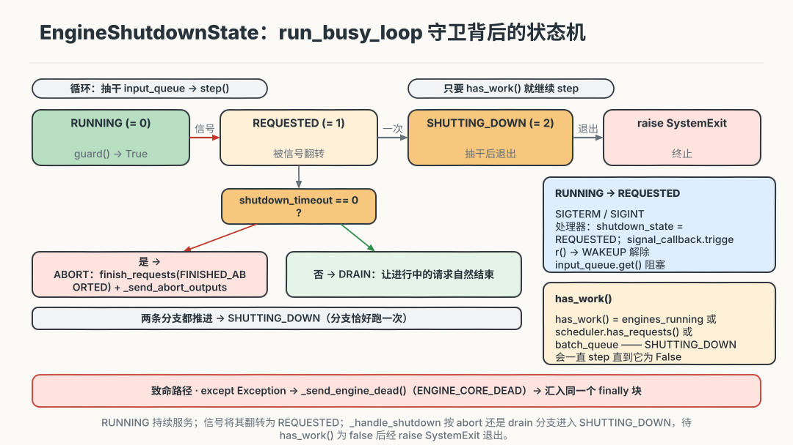</a>

<p class='figure-caption'>run_busy_loop 的 guard 所依赖的 EngineShutdownState 状态机：RUNNING 会继续提供服务；signal 将其切换为 REQUESTED；_handle_shutdown 根据 shutdown_timeout 选择不同分支（abort 或 drain）并进入 SHUTTING_DOWN；随后，当 has_work() 为 false 时，通过 raise SystemExit 退出。</p>

进入 `REQUESTED` 的状态转换完全发生在 loop 之外，具体是在 `run_engine_core` 安装的 signal handler 中：

`vllm/v1/engine/core.py:L1218-L1224`

```python
                engine_core.shutdown_state = EngineShutdownState.REQUESTED
                signal_callback.trigger()

            signal.signal(signal.SIGTERM, signal_handler)
            signal.signal(signal.SIGINT, signal_handler)

            engine_core.run_busy_loop()
```

SIGTERM/SIGINT handler 只做两件开销极低且 async-signal-safe 的事——将 `shutdown_state` 置为 `REQUESTED`，并调用 `signal_callback.trigger()`。它刻意**不**直接向 `input_queue` enqueue；`core.py:L1205-L1207` 处的注释警告，handler 可能恰好在 main thread 持有不可重入的 `input_queue.mutex` 时将其中断，此时重入 `put_nowait` 就会造成 deadlock。相反，`SignalCallback` 会把真正的 `WAKEUP` enqueue 推迟到安全上下文中执行，并唤醒 loop 中处于 idle 状态的 `input_queue.get()`，使其重新读取 state（[第 6 节](#6-enginecore-内部的-queue-与-thread)）。下一次计算 guard 时，`_handle_shutdown` 看到 `REQUESTED`，随即推进到 `SHUTTING_DOWN`；根据 `vllm_config.shutdown_timeout` 的取值，它要么立即 abort 所有 in-flight request（`timeout == 0`），要么等待它们自然执行完毕（非零值）。完整逻辑见[第 12 节](#12-故障处理关闭流程与完整拓扑追踪)。无论采用哪种方式，它都会持续返回 `True`，直到 `has_work()` 为 false；随后返回 `False`，loop 最终执行到 `raise SystemExit`。

## 4. ZMQ Transport：Request 与 Output Socket

vLLM V1 使用 ZeroMQ 连接 API server 与 engine core。架构文档描述了一套 many-to-many mesh，其中任意 API server 都可以把 request 路由到某个 engine core（[架构概览](https://docs.vllm.ai/en/stable/design/arch_overview/)）；V1 博客则说明了这种拆分如何让 API-server 的 CPU 工作与 `AsyncLLM`/EngineCore loop 重叠执行（[V1 博客](https://vllm.ai/blog/2025-01-27-v1-alpha-release)）。这里我们将沿着一个 client-engine pair，分析其 socket 和 frame 格式。[第 9 节](#9-data-parallel-与-dp-coordinator)介绍 DP routing，[第 5 节](#5-序列化跨进程边界使用-msgpack)介绍 msgpack payload。

每个 API-server client ↔ EngineCore pair 都通过**两条**独立的 ZMQ 链路连接，而且两条链路刻意采用了非对称设计：

| 链路 | client 端 | engine 端 | 方向 | Frame 格式 |
|------|-------------|-------------|-----------|---------|
| **Requests** | `input_socket` = `ROUTER`，**bind** | `DEALER`，**connect**，identity = dp_rank LE | client → engine | `[engine_identity, req_type_byte, *payload]` |
| **Outputs** | `output_socket` = `PULL`，**bind** | `PUSH`，**connect** | engine → client | `[*payload]`（无 identity；`client_index` 位于 payload 内） |

这两条链路有意采用非对称设计。Request 可寻址，因为 client 必须选定某个 engine identity。Output 则使用 PUSH→PULL fan-in，目标 client 编码在 payload 中。

<a href='images/vllm-03-05-zmq-channels.svg' target='_blank'>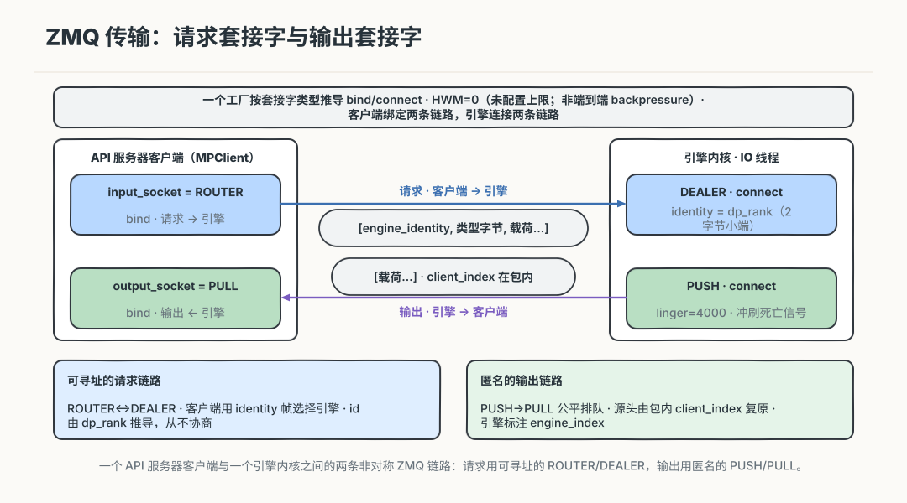</a>

<p class='figure-caption'>单个 API-server client 与单个 EngineCore 之间的两条非对称 ZMQ 链路：request 使用可寻址的 ROUTER/DEALER，output 使用匿名的 PUSH/PULL。</p>

### 由一个 factory 统一决定 bind 还是 connect

bind/connect 的分工并不是在每个 call site 临时决定的，而是由一个 helper 根据 socket *type* 统一推导。该 helper 还会把 high-water mark 设为 0，因此 socket 不会*仅仅因为达到配置的 HWM threshold*而施加 backpressure 或丢弃 message——但这并不等于对 routing loss、peer failure 或 shutdown 提供了普遍保证。

源码定位：[`vllm/utils/network_utils.py:307-316`](https://github.com/vllm-project/vllm/blob/6cf7b26bd4bff60bf378e1af14044280ac0d214c/vllm/utils/network_utils.py#L307-L316)。

```python
# vllm/utils/network_utils.py:307-316
    if bind is None:
        bind = socket_type not in (zmq.PUSH, zmq.SUB, zmq.XSUB)

    if socket_type in (zmq.PULL, zmq.DEALER, zmq.ROUTER):
        socket.setsockopt(zmq.RCVHWM, 0)
        socket.setsockopt(zmq.RCVBUF, buf_size)

    if socket_type in (zmq.PUSH, zmq.DEALER, zmq.ROUTER):
        socket.setsockopt(zmq.SNDHWM, 0)
        socket.setsockopt(zmq.SNDBUF, buf_size)
```

- `bind is None` ⇒ 根据 type 推导：PUSH/SUB/XSUB 执行 *connect*，其他所有类型（PULL/ROUTER/DEALER/PAIR/XPUB）都执行 *bind*。应用到这里的两条链路，client 的 ROUTER 和 PULL 都会 bind，因此**client 是两条链路共同的稳定 rendezvous endpoint**；engine 的 PUSH 会自动 connect，而其 DEALER 原本默认 bind，但 call site（见下文）通过显式传入 `bind=False` 强制其 connect。因此，engine 始终是动态 connector；这也解释了为什么启动时必须获知可能由 kernel 分配的 port 的是 engine，而不是 client（[第 11 节](#11-启动握手与连接)）。
- PULL/DEALER/ROUTER 收发方向上的 `RCVHWM`/`SNDHWM = 0`（以及 PUSH 的 send 端）意味着**没有配置 high-water mark**：ZMQ 不会在自身设定的某个 threshold 处丢弃 message 或 block sender。这只消除了一种特定的 backpressure 机制，并不意味着 send 永远无需等待——memory limit、OS socket buffer、dead peer 或 shutdown 仍可能导致传输停滞或失败。这是有意将 flow control 移交给其他组件：EngineCore busy loop（[第 3 节](#3-enginecoreproc运行在独立进程中的-engine)，第 04 篇）和 output IO thread（[第 6 节](#6-enginecore-内部的-queue-与-thread)）才是真正的 backpressure，而不是 socket buffer。

**每条链路都以确定性方式保证仅一端 bind，request 和 output 也都不会因配置的 high-water-mark limit 而被静默丢弃。** 配置错误导致的 double-bind race 不可能发生，因为 bind/connect 极性完全由 socket type 决定；同时，HWM 为 0 意味着没有设置 high-water cap，因此 socket 不会为了强制执行该 cap 而 drop 或 block。这界定的只是 socket-level backpressure，并不能证明 memory 无限、peer 永不失败或 end-to-end delivery 必然成功。

### Request 链路：ROUTER ↔ DEALER，通过 dp_rank 寻址

client 通过一个 ROUTER 向 N 个 engine fan-out，并使用 ZMQ *identity* frame 选择目标 engine。每个 engine 的 identity 都是把其 data-parallel rank 编码为两个 little-endian byte 得到的。这是一个稳定且无冲突的地址，由两端各自独立计算。

源码定位：[`vllm/v1/engine/core.py:922`](https://github.com/vllm-project/vllm/blob/6cf7b26bd4bff60bf378e1af14044280ac0d214c/vllm/v1/engine/core.py#L922)（identity）以及 [`vllm/v1/engine/core.py:1499-1507`](https://github.com/vllm-project/vllm/blob/6cf7b26bd4bff60bf378e1af14044280ac0d214c/vllm/v1/engine/core.py#L1499-L1507)（DEALER）。

```python
# vllm/v1/engine/core.py:922
        identity = self.engine_index.to_bytes(length=2, byteorder="little")
```

```python
# vllm/v1/engine/core.py:1499-1507
        with ExitStack() as stack, zmq.Context() as ctx:
            input_sockets = [
                stack.enter_context(
                    make_zmq_socket(
                        ctx, input_address, zmq.DEALER, identity=identity, bind=False
                    )
                )
                for input_address in input_addresses
            ]
```

- engine 会为每个 API-server client 创建一个 DEALER（`input_addresses` 是一个 list——每个 front-end 对应一个地址，构成 many-to-many mesh 的 fan-in 端），并分别预设 `identity=identity` 和 `bind=False`。`bind=False` 会覆盖 factory 的默认行为（否则 DEALER 将执行 bind），使 engine 成为 connector。
- identity 为 `engine_index.to_bytes(2, "little")`。client 枚举自己管理的 engine 时，会使用 `rank.to_bytes(2, "little")` 重建*相同*的 byte（[`core_client.py:596-635`](https://github.com/vllm-project/vllm/blob/6cf7b26bd4bff60bf378e1af14044280ac0d214c/vllm/v1/engine/core_client.py#L596-L635)，读取过程见[第 11 节](#11-启动握手与连接)），因此两个 process 无需交换地址即可达成一致——该地址来自推导，而非协商。`to_bytes(2, …)` 将单个 deployment 限制在最多 65 536 个 DP rank，远超任何实际 topology 的规模。

与 identity 一同传输的 request-type frame 是一个 raw byte，而不是 serialized field：

源码定位：[`vllm/v1/engine/__init__.py:251-264`](https://github.com/vllm-project/vllm/blob/6cf7b26bd4bff60bf378e1af14044280ac0d214c/vllm/v1/engine/__init__.py#L251-L264)。

```python
# vllm/v1/engine/__init__.py:251-264
class EngineCoreRequestType(enum.Enum):
    """
    Request types defined as hex byte strings, so it can be sent over sockets
    without separate encoding step.
    """

    ADD = b"\x00"
    ABORT = b"\x01"
    START_DP_WAVE = b"\x02"
    UTILITY = b"\x03"
    # Sentinel used within EngineCoreProc.
    EXECUTOR_FAILED = b"\x04"
    # Sentinel to wake up input_queue.get() during shutdown.
    WAKEUP = b"\x05"
```

<a href='images/vllm-03-18-request-type-bytes.svg' target='_blank'>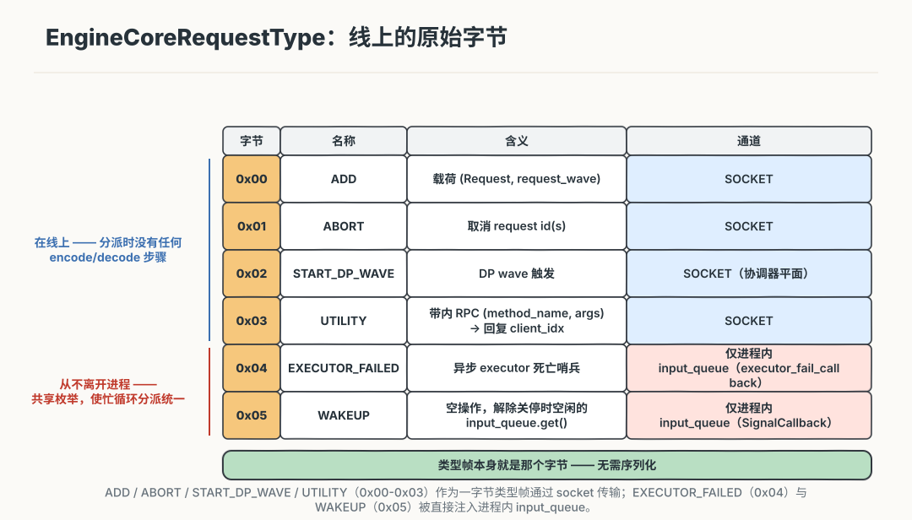</a>

<p class='figure-caption'>EngineCoreRequestType 的 wire 表示是 raw byte：ADD/ABORT/START_DP_WAVE/UTILITY（0x00-0x03）以单字节 type frame 的形式经 socket 传输；EXECUTOR_FAILED（0x04）和 WAKEUP（0x05）虽然共用同一个 enum，但会直接注入进程内 input_queue，从不经 socket 发送。</p>

enum 的取值就是 wire byte：type frame 只占一个 byte，dispatch 时不经过任何 encode/decode 步骤（docstring 中也明确说明了这一点）。`EXECUTOR_FAILED` 和 `WAKEUP` 从不通过 socket 传输——它们会被直接注入 engine 进程内的 `input_queue`（[第 6 节](#6-enginecore-内部的-queue-与-thread)）——但二者仍共用同一个 enum，以便 busy loop 统一 dispatch。

将 identity 和 type byte 依次放在 payload 前面后，client 发送的 multipart message 至少包含三个部分：

源码锚点：[`vllm/v1/engine/core_client.py:861-873`](https://github.com/vllm-project/vllm/blob/6cf7b26bd4bff60bf378e1af14044280ac0d214c/vllm/v1/engine/core_client.py#L861-L873)。

```python
# vllm/v1/engine/core_client.py:861-873
    def _send_input(self, request_type: EngineCoreRequestType, request: Any):
        self.ensure_alive()
        self.free_pending_messages()
        # (Identity, RequestType, SerializedRequest)
        msg = (self.core_engine, request_type.value, *self.encoder.encode(request))

        if len(msg) <= 3:
            # No auxiliary buffers => no tensor backing buffers in request.
            self.input_socket.send_multipart(msg, copy=False)
            return

        tracker = self.input_socket.send_multipart(msg, copy=False, track=True)
        self.add_pending_message(tracker, request)
```

- Frame 0 是 `self.core_engine`——即目标 engine 的 identity，也是 ROUTER 用来选择 DEALER 的 routing key。在 non-DP 模式下，它固定为 `core_engine`；在 DP 模式下则为 `get_core_engine_for_request(...)`（[第 9 节](#9-data-parallel-与-dp-coordinator)）。Frame 1 是 `request_type.value`（原始 byte）。Frames 2… 是 msgpack body，以及由 `encoder.encode` 追加、以 memoryview-backed tensor 为底层存储的 side-frame（[第 5 节](#5-序列化跨进程边界使用-msgpack)）。
- `copy=False` 会让 PyZMQ 直接从 encoder 持有的 buffer 发送，避免先额外执行一次 Python/PyZMQ payload copy；但这并不保证 libzmq、OS 或接收端完全不发生 copy。避免 sender 侧 copy 会带来生命周期风险：`send_multipart` 返回后，buffer 可能仍在传输中，因此代码会根据 `len(msg) <= 3` 分支处理。三个 frame 意味着 `[identity, type, one-payload-frame]`，且不存在带外 tensor buffer，因此无需 tracking。超过三个 frame 则说明提取出了 tensor 的 backing buffer，此时 send 会返回 `MessageTracker`，request object 会被暂存到 `pending_messages`（[`core_client.py:674-680`](https://github.com/vllm-project/vllm/blob/6cf7b26bd4bff60bf378e1af14044280ac0d214c/vllm/v1/engine/core_client.py#L674-L680)）中，直到 ZMQ 报告 tracker `done`；`free_pending_messages` 会在下一次 send 时惰性回收已完成的项。这与 engine output 侧的 `pending` deque（[第 12 节](#12-故障处理关闭流程与完整拓扑追踪)）互为镜像，也解释了为何 msgpack encoder 只能在单个 thread 内使用（[第 5 节](#5-序列化跨进程边界使用-msgpack)）：它的 aux-buffer state 以单次调用为粒度，并非 thread-safe。

在另一端，DEALER 会*移除* identity frame（ROUTER↔DEALER envelope 由 ZMQ 处理），因此 engine 的 input thread 只能看到 `[type_frame, *data_frames]`。它会读取这个单 byte 的 type 字段，完成 decode，然后将结果压入进程内 queue（[`core.py:1556-1587`](https://github.com/vllm-project/vllm/blob/6cf7b26bd4bff60bf378e1af14044280ac0d214c/vllm/v1/engine/core.py#L1556-L1587)，详见[第 6 节](#6-enginecore-内部的-queue-与-thread)）。

因此，identity frame 是 request link 唯一的路由机制；它由规则推导得出，而非协商产生。Frame 0 错误或缺失都会导致误路由或丢弃；由于两端都根据同一个 dp_rank 计算 identity，因此不会出现不一致。又因为 DEALER 在第一次发送（即 ready payload，[第 11 节](#11-启动握手与连接)）时就会携带自身 identity，所以 client 的 ROUTER 在真正需要向它路由之前，就已经获知了对应地址。

### output link：PUSH → PULL，在 payload 内部寻址

返回路径采用 fan-in 结构。engine 通过 PUSH 发送，client 通过 PULL 接收，而且*不存在* identity frame——PULL socket 使用 fair-queue，pusher 无法对其定向寻址。因此，当一个 engine 服务多个前端 client 时，它会从 decode 后的 output 内部携带的 `client_index` 字段中获取目标，并在每个 batch 上写入自身的 `engine_index`，让连接多个 engine 的 client 能够判断 reply 来自哪个 engine。

源码锚点：[`vllm/v1/engine/core.py:1623-1648`](https://github.com/vllm-project/vllm/blob/6cf7b26bd4bff60bf378e1af14044280ac0d214c/vllm/v1/engine/core.py#L1623-L1648)。

```python
# vllm/v1/engine/core.py:1623-1648
            while True:
                output = self.output_queue.get()
                if output == EngineCoreProc.ENGINE_CORE_DEAD:
                    for socket in sockets:
                        socket.send(output)
                    break
                assert not isinstance(output, bytes)
                client_index, outputs = output
                outputs.engine_index = engine_index

                if client_index == -1:
                    # Don't reuse buffer for coordinator message
                    # which will be very small.
                    assert coord_socket is not None
                    coord_socket.send_multipart(encoder.encode(outputs))
                    continue

                # Reclaim buffers that zmq is finished with.
                while pending and pending[-1][0].done:
                    reuse_buffers.append(pending.pop()[2])

                buffer = reuse_buffers.pop() if reuse_buffers else bytearray()
                buffers = encoder.encode_into(outputs, buffer)
                tracker = sockets[client_index].send_multipart(
                    buffers, copy=False, track=True
                )
```

<a href='images/vllm-03-17-link-frame-asymmetry.svg' target='_blank'>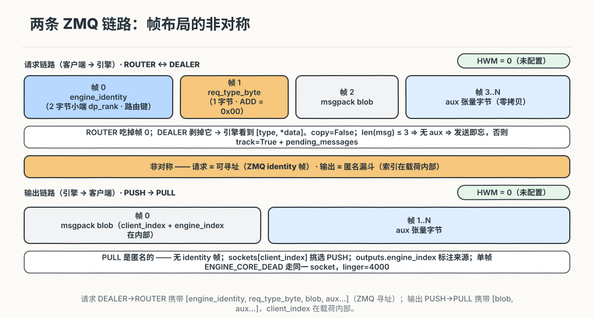</a>

<p class='figure-caption'>并排展示两条 ZMQ link 的 frame layout：request 侧的 DEALER-to-ROUTER 携带 [engine_identity, req_type_byte, msgpack_blob, aux1..N]（由 ZMQ 寻址），而 output 侧的 PUSH-to-PULL 携带 [msgpack_blob, aux1..N]，目标 client_index 位于 payload 内部（由应用层寻址）。</p>

- engine 的 output IO thread 持有一组 PUSH socket，每个 API-server client 对应一个，这些 socket 通过 `make_zmq_socket(ctx, output_path, zmq.PUSH, linger=4000)` 创建（[`core.py:1608`](https://github.com/vllm-project/vllm/blob/6cf7b26bd4bff60bf378e1af14044280ac0d214c/vllm/v1/engine/core.py#L1608)）。从进程内 `output_queue` 取出的每个 work item 都是一个 `(client_index, outputs)` tuple；`sockets[client_index]` 决定将 batch 发送到哪个 client 的 PUSH。这与 request link 完全对偶：request routing 使用 ZMQ *identity frame*（client→engine），output routing 则使用 payload 内的 *`client_index`*（engine→client），因为 PUSH/PULL 在设计上就是匿名的。
- `client_index == -1` 是预留的 coordinator channel：batch 会改发到 DP coordinator 的 PULL（[第 9 节](#9-data-parallel-与-dp-coordinator)），并跳过 buffer reuse 路径，因为 coordinator message 很小。
- `outputs.engine_index = engine_index` 会在每个 batch 上标记 source engine，因此即使 DP client 通过同一个 PULL 接收多个 engine 的数据，仍能区分它们。
- sender 侧采用与 request path 相同的 copy avoidance 机制：`encode_into` 会复用 pool 中的 `bytearray`，`copy=False` 避免额外的 PyZMQ payload copy，`track=True` 返回 tracker，已完成传输的 buffer 会在下一次 send 前回收到 `reuse_buffers`。`pending` deque 持有 `(tracker, ref, buffer)`，从而确保 ZMQ 仍在传输时，outputs object 及其 backing buffer 都不会被释放。

PUSH socket 上的 `linger=4000` 会让已经进入 queue 的 `ENGINE_CORE_DEAD` frame 在 close 前最多有四秒时间完成 flush；对于这里讨论的、仍然可路由的 crash path，这能提高送达概率，但无法保证消息一定能送达已断开连接或无法路由的 peer。如果 client 收到这个单 frame sentinel，其 drain loop 会在尝试 decode 该 frame 之前先检查 sentinel，并抛出类型明确的 `EngineDeadError`（[`core_client.py:454-457`](https://github.com/vllm-project/vllm/blob/6cf7b26bd4bff60bf378e1af14044280ac0d214c/vllm/v1/engine/core_client.py#L454-L457)；详见[第 12 节](#12-故障处理关闭流程与完整拓扑追踪)）。

实际运行中，**即使 PUSH/PULL link 是匿名的，reply 仍会抵达最初发起 request 的 API-server client；receiver 也会在尝试对 engine-death sentinel frame 执行 msgpack decode 之前识别出该 sentinel。** 但这并不能说明此前是否已经送达有效的 partial token output。request link 由 ZMQ 寻址，output link 则由应用层寻址。二者的 socket 都严格只有一个 owner——每个 socket 都在其 owner IO thread 内创建，也只由该 thread 访问（[第 6 节](#6-enginecore-内部的-queue-与-thread)），因此这些规避 copy 的 buffer pool 可以保持 lock-free。

## 5. 序列化：跨进程边界使用 Msgpack

socket 中传输的是结构化对象：入站为 `EngineCoreRequest`，出站为 `EngineCoreOutputs`。这些 struct 可能包含 `torch.Tensor` 或 `np.ndarray` 字段，例如 prompt embedding、pooling output、logprob tensor、routed expert 和 multimodal kwargs。`vllm/v1/serial_utils.py` 会将它们转换为 ZMQ frame；这个过程不会先把大型 tensor payload 塞进 msgpack blob，而且在默认配置下也不会使用 pickle。PyZMQ 接收这些 buffer 后，transport stack 内部仍可能发生字节拷贝。`msgspec.msgpack` 提供带类型的序列化，但无法直接表示 tensor；朴素实现的自定义 encoder 同样会把 tensor 字节拷贝到 main payload 中。side-frame 设计避免了这次初始拷贝。

### 传输模型：一个 blob 加若干 side frame

该 module 在原生 msgspec 之上叠加了三项机制（[`serial_utils.py:41-54`](https://github.com/vllm-project/vllm/blob/6cf7b26bd4bff60bf378e1af14044280ac0d214c/vllm/v1/serial_utils.py#L41-L54) 定义了相关术语）。(1) **大型 tensor 使用直接 side buffer**：底层原始内存*不会*被拷贝进 msgpack blob；blob 中只 inline 一个很小的整数 index，原始 `memoryview` 则追加到 side list。encoder 返回一个 *buffer 列表*，ZMQ 将其作为一条 multipart message 发送——frame 0 是 msgpack blob，frame `1..N` 承载 tensor 字节。(2) **小型 tensor inline**：字节数低于阈值时，原始字节会以带有自定义 type code 的 msgpack `Ext` 形式直接放进 blob 0；decoder 会 clone 这些 inline 数据。(3) **shared-memory tensor 使用 out-of-band (OOB)**：可选的 consumer 可以接管 tensor，通过 `torch.multiprocessing.Queue` 发送，并在 blob 中只留下一个 placeholder dict。三个自定义 `Ext` type code 构成一个封闭集合——`CUSTOM_TYPE_PICKLE = 1`、`CUSTOM_TYPE_CLOUDPICKLE = 2`、`CUSTOM_TYPE_RAW_VIEW = 3`——secure mode 下只有 code 3 可达。

frame 布局由 `encode` 完成初始化：

[`vllm/v1/serial_utils.py:166-178`](https://github.com/vllm-project/vllm/blob/6cf7b26bd4bff60bf378e1af14044280ac0d214c/vllm/v1/serial_utils.py#L166-L178)

```python
    def encode(self, obj: Any) -> Sequence[bytestr]:
        try:
            if self.oob_tensor_consumer is not None:
                self.oob_tensor_consumer.new_message()
            self.aux_buffers = bufs = [b""]
            bufs[0] = self.encoder.encode(obj)
            # This `bufs` list allows us to collect direct pointers to backing
            # buffers of tensors and np arrays, and return them along with the
            # top-level encoded buffer instead of copying their data into the
            # new buffer.
            return bufs
        finally:
            self.aux_buffers = None
```

`aux_buffers` 的初始值设为 `[b""]`——index 0 是为 blob 保留的 **placeholder**。随后，`self.encoder.encode(obj)` 执行完整的 msgspec 编码；在此过程中，任何需要 side frame 的 tensor 都会调用 `self.aux_buffers.append(...)` 并记录其位置。由于 slot 0 已保留，tensor index 从 1 开始，因此 *frame 0 始终是 msgpack blob*。只有在 encoding 结束后，才会用真正的 blob 覆盖 `bufs[0]`。最终得到 `[msgpack_blob, tensor0_bytes, tensor1_bytes, ...]`。`encode_into`（`:180-189`）采用相同的协议，区别仅在于 frame 0 使用由调用方提供且可复用的 `bytearray`——这正是 EngineCore output thread 使用的 buffer pooling 路径，用于将 frame 0 的分配成本摊销到多个 step 上（[第 6 节](#6-enginecore-内部的-queue-与-thread)）。

用 `aux_buffers` 暂存数据是一种有意为之的 hack。msgspec 的 `enc_hook(obj)` 传给 hook 的只有对象，没有 encoder context，因此在一次 `encode()` 调用期间，持续增长的 side-buffer list 会作为 *instance state* 保存。正因如此，class docstring 才会说明 encoder“在编码 tensor / numpy array 时通常不是 thread-safe 的”（[`serial_utils.py:139-140`](https://github.com/vllm-project/vllm/blob/6cf7b26bd4bff60bf378e1af14044280ac0d214c/vllm/v1/serial_utils.py#L139-L140)）：两个并发 encode 会相互覆盖对方的 `aux_buffers`。这不是一个需要绕开的限制——恰恰因为这一点，每个 encoder 和 decoder 都被限制在恰好一个专属 IO thread 中（[第 6 节](#6-enginecore-内部的-queue-与-thread)）。即使 encode 抛出异常，`finally: self.aux_buffers = None` 也能保证不会发生跨调用泄漏。

<a href='images/vllm-03-06-msgpack.svg' target='_blank'>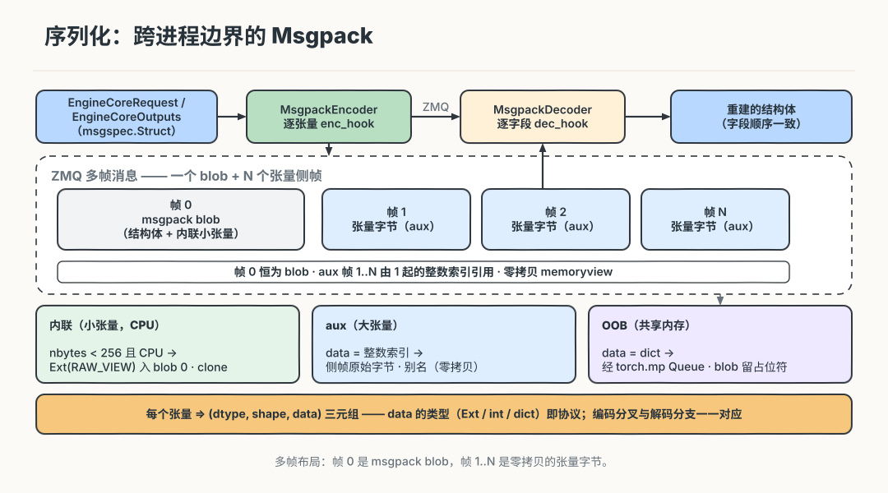</a>

<p class='figure-caption'>Multipart frame 布局：msgpack blob 位于 frame 0，以 memoryview 为 backing 的 tensor payload 位于 aux frame 1..N；copy=False 避免的是 PyZMQ 一侧额外的 payload 拷贝，并不能消除 transport stack 中的所有拷贝。</p>

**tensor 始终采用 `(dtype, shape, data)` 三元组表示。**

每个 tensor 采用 inline、aux 还是 OOB，由 `_encode_tensor` 决定：

[`vllm/v1/serial_utils.py:257-273`](https://github.com/vllm-project/vllm/blob/6cf7b26bd4bff60bf378e1af14044280ac0d214c/vllm/v1/serial_utils.py#L257-L273)

```python
    def _encode_tensor(
        self, obj: torch.Tensor
    ) -> tuple[str, tuple[int, ...], int | dict | memoryview]:
        oob_consumer = self.oob_tensor_consumer
        # view the tensor as a contiguous 1D array of bytes
        if obj.nbytes < self.size_threshold and obj.is_cpu:
            # Smaller tensors are encoded inline, just like ndarrays.
            data = msgpack.Ext(CUSTOM_TYPE_RAW_VIEW, tensor_data(obj))
        elif oob_consumer is not None and (data := oob_consumer(obj)) is not None:
            assert isinstance(data, dict)
        else:
            # Otherwise encode index of backing buffer to avoid copy.
            assert self.aux_buffers is not None
            data = len(self.aux_buffers)
            self.aux_buffers.append(tensor_data(obj))
        dtype = str(obj.dtype).removeprefix("torch.")
        return dtype, obj.shape, data
```

<a href='images/vllm-03-19-tensor-encode-decode-fork.svg' target='_blank'>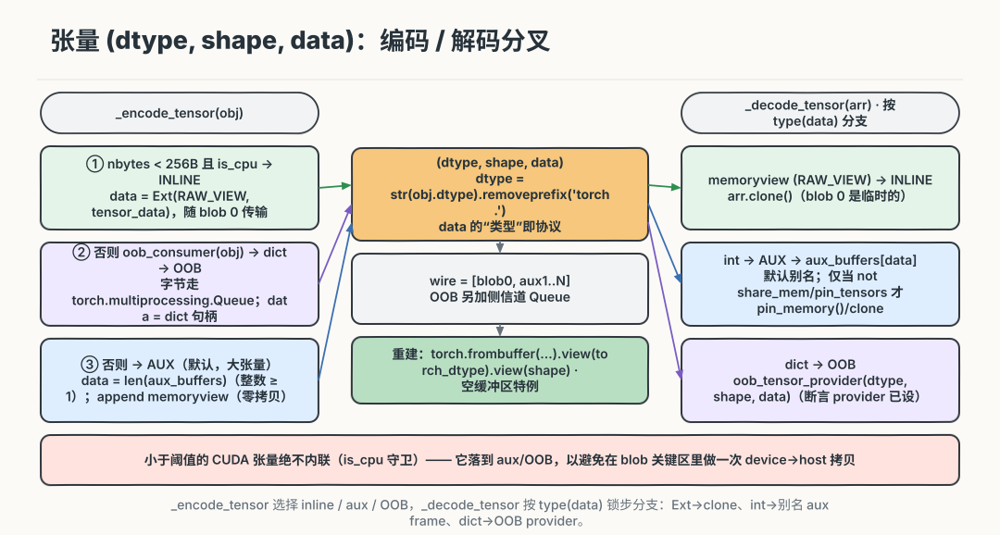</a>

<p class='figure-caption'>每个 tensor 的 (dtype, shape, data) 三元组及其多态 data 字段：_encode_tensor 选择 inline / aux / OOB，_decode_tensor 则严格同步地根据 type(data) 选择分支——Ext(RAW_VIEW) 会 clone，int 会 alias aux frame，dict 会转交 OOB provider。</p>

每个 tensor 都会变成一个 **3-tuple `(dtype, shape, data)`**，其中 `data` 具有多态性，而这种多态性*正是*协议本身：在 inline 情况下，`data` 是 `msgpack.Ext(RAW_VIEW, bytes)`；在 aux 情况下，是一个 `int` (≥1) index；在 OOB 情况下，则是 `dict`。共有三种情况：

1. **Inline** 仅在 `obj.nbytes < self.size_threshold` **且** `obj.is_cpu` 时触发。`tensor_data(obj)`（[`vllm/v1/utils.py:766-776`](https://github.com/vllm-project/vllm/blob/6cf7b26bd4bff60bf378e1af14044280ac0d214c/vllm/v1/utils.py#L766-L776)）通过 `tensor.flatten().cpu().contiguous().view(torch.uint8).numpy().data` 返回一个 uint8 memoryview。`is_cpu` 这个 guard 至关重要：小型 CUDA tensor *绝不会*被 inline，因为这会在 msgpack blob 的 critical section 内强制执行 device→host 拷贝——它会转而进入 OOB 或 aux 分支。
2. **OOB** 仅在 consumer 存在且返回非 `None` 的 dict 时触发；walrus 表达式会同时完成调用和结果捕获。这些字节不会进入 blob 或 `aux_buffers`——它们通过 side queue 传输，dict 只是用于寻址的 handle。
3. **Aux**（大型 tensor 的默认分支）会在 append 之前取得 `data = len(self.aux_buffers)`，因此记录的 index 恰好等于新元素的位置；随后追加的是 memoryview（而非副本）。

threshold 默认为 `256` bytes——`VLLM_MSGPACK_ZERO_COPY_THRESHOLD: int = 256`（[`vllm/envs.py:204`](https://github.com/vllm-project/vllm/blob/6cf7b26bd4bff60bf378e1af14044280ac0d214c/vllm/envs.py#L204)）——docstring 明确指出“该限制针对单个 tensor”（[`serial_utils.py:143`](https://github.com/vllm-project/vllm/blob/6cf7b26bd4bff60bf378e1af14044280ac0d214c/vllm/v1/serial_utils.py#L143)），而不是按 message 聚合计算。`dtype = str(obj.dtype).removeprefix("torch.")` 会生成类似 `"bfloat16"` 这样不带修饰的 attribute 名称，以便 decoder 执行 `getattr(torch, dtype)`；需要注意的是，`_encode_ndarray`（`:255`）保存的则是 numpy 的 `obj.dtype.str` typestr，二者并不对称。

**decode 端与 encode 分支完全镜像对应。**

[`vllm/v1/serial_utils.py:399-425`](https://github.com/vllm-project/vllm/blob/6cf7b26bd4bff60bf378e1af14044280ac0d214c/vllm/v1/serial_utils.py#L399-L425)

```python
    def _decode_tensor(self, arr: Any) -> torch.Tensor:
        dtype, shape, data = arr
        if isinstance(data, dict):
            assert self.oob_tensor_provider, (
                "Received OOB tensor but tensor provider is not set"
            )
            return self.oob_tensor_provider(dtype, shape, data)

        is_aux = isinstance(data, int)
        buffer = self.aux_buffers[data] if is_aux else data
        buffer = buffer if isinstance(buffer, memoryview) else memoryview(buffer)
        torch_dtype = getattr(torch, dtype)
        assert isinstance(torch_dtype, torch.dtype)
        if not buffer.nbytes:  # torch.frombuffer doesn't like empty buffers
            assert 0 in shape
            return torch.empty(shape, dtype=torch_dtype)
        # Create uint8 array
        arr = torch.frombuffer(buffer, dtype=torch.uint8)
        # Clone ensures tensor is backed by pytorch-owned memory for safe
        # future async CPU->GPU transfer.
        # Pin larger tensors for more efficient CPU->GPU transfer.
        if not is_aux:
            arr = arr.clone()
        elif not self.share_mem:
            arr = arr.pin_memory() if self.pin_tensors else arr.clone()
        # Convert back to proper shape & type
        return arr.view(torch_dtype).view(shape)
```

decoder 完全根据 `type(data)` 选择分支，与 encoder 的三种情况严格同步。`dict` → OOB provider（并且会 *assert* provider 存在——收到 dict 却没有 provider 时会直接失败，而不是造成静默数据损坏）。`int` → `self.aux_buffers[data]`，即接收消息中该 index 对应的 ZMQ frame。`memoryview`（即 `RAW_VIEW` Ext bytes）→ inline。tensor 通过 `torch.frombuffer(...).view(torch_dtype).view(shape)` 重建；空 tensor 需要特殊处理，因为 `torch.frombuffer` 不接受零长度 buffer。clone 策略是其中最微妙的部分，它负责保障对象生命周期：**inline tensor 一律 clone**（`if not is_aux: arr = arr.clone()`），因为其字节存放在 blob 0 中，而 blob 0 是临时的，decode 结束后不会继续保留；**aux tensor 默认 alias 接收到的 frame**（不拷贝），仅在 `share_mem=False` 下才会拷贝。正因为存在 alias，`_decode_ndarray` 的 comment 才会警告 array“现在会把整个收到的 message buffer 锁在内存中”（`:391-392`）——decoded aux tensor 会让整个 multipart frame 在其生命周期内始终存活。

目标类型决定了这一切。`decode` 将 multipart frame 暂存为 `aux_buffers`，并 decode `bufs[0]`；msgspec 会根据例如 `EngineCoreRequest.prompt_embeds: torch.Tensor | None` 的字段声明类型，调用 `dec_hook(torch.Tensor, triple)` → `_decode_tensor`。决定重建路径的是字段的*声明*类型，而不是运行时值。

### 安全关卡

自定义 `Ext` code 在 `ext_hook` 中解析，这构成了安全边界的接收端：

[`vllm/v1/serial_utils.py:473-483`](https://github.com/vllm-project/vllm/blob/6cf7b26bd4bff60bf378e1af14044280ac0d214c/vllm/v1/serial_utils.py#L473-L483)

```python
    def ext_hook(self, code: int, data: memoryview) -> Any:
        if code == CUSTOM_TYPE_RAW_VIEW:
            return data

        if envs.VLLM_ALLOW_INSECURE_SERIALIZATION:
            if code == CUSTOM_TYPE_PICKLE:
                return pickle.loads(data)
            if code == CUSTOM_TYPE_CLOUDPICKLE:
                return cloudpickle.loads(data)

        raise NotImplementedError(f"Extension type code {code} is not supported")
```

`RAW_VIEW` 直接返回原 memoryview（不发生 copy）。在 *decode* 端，Pickle 和 cloudpickle 受 `VLLM_ALLOW_INSECURE_SERIALIZATION` 控制（默认为 `False`，[`envs.py:205`](https://github.com/vllm-project/vllm/blob/6cf7b26bd4bff60bf378e1af14044280ac0d214c/vllm/envs.py#L205)）；这与 encode 端的同一关卡相呼应：除非设置该 flag，否则任何未枚举类型都会使 `enc_hook` 在 `:221-222` 处抛出 `TypeError`。这带来了很强的安全保证：在默认配置下，即使恶意构造的 blob 包含 code-1 `Ext`，也无法触发 `pickle.loads`，而会进入 `NotImplementedError`。只有明确枚举的类型（tensor、ndarray、`slice`、多模态 kwargs、utility result）以及 msgpack primitive 才能合法跨越这道边界；未知 code 会直接报错，而不会被悄悄误解析。

**struct 就是跨进程契约。**

[`vllm/v1/engine/__init__.py:88-104`](https://github.com/vllm-project/vllm/blob/6cf7b26bd4bff60bf378e1af14044280ac0d214c/vllm/v1/engine/__init__.py#L88-L104)

```python
class EngineCoreRequest(
    msgspec.Struct,
    array_like=True,  # type: ignore[call-arg]
    omit_defaults=True,  # type: ignore[call-arg]
    gc=False,
):  # type: ignore[call-arg]
    request_id: str
    prompt_token_ids: list[int] | None
    ...
    prompt_embeds: torch.Tensor | None = None
```

`array_like=True` 表示 struct 会被序列化为按位置编码的 msgpack *array*，而不是 map。这样体积更小、速度更快，但**字段顺序就是 wire contract**：添加字段或调整字段顺序都会改变 wire format，因此两个进程必须运行兼容的 vLLM 版本。`omit_defaults=True` 会跳过取默认值的字段；`gc=False` 则关闭循环 GC 跟踪以提升速度。`EngineCoreOutputs`（[`__init__.py:220-248`](https://github.com/vllm-project/vllm/blob/6cf7b26bd4bff60bf378e1af14044280ac0d214c/vllm/v1/engine/__init__.py#L220-L248)）也采用相同方式声明。正是这些 struct 中的 tensor 类型字段，才需要 `serial_utils.py` 存在——msgspec 会根据声明类型，将 `dec_hook` 路由到 `_decode_tensor`。

### sender 端要避免 copy，就必须持有引用

为避免 copy，sender 会将一个直接引用有效 tensor memory 的 `memoryview` 交给 PyZMQ，因此在 socket send 完成之前，这块 memory 必须始终有效。`_send_input`（[`core_client.py:861-873`](https://github.com/vllm-project/vllm/blob/6cf7b26bd4bff60bf378e1af14044280ac0d214c/vllm/v1/engine/core_client.py#L861-L873)，其完整 framing 已在[第 4 节](#4-zmq-transportrequest-与-output-socket)复现）通过两行关键代码确保了这一点：

```python
        tracker = self.input_socket.send_multipart(msg, copy=False, track=True)
        self.add_pending_message(tracker, request)
```

multipart message 为 `(engine_identity, request_type_byte, *encoder.encode(request))`，随后被展平为 `[identity, type, blob, aux0, ...]`（identity 和原始 type byte 属于[第 4 节](#4-zmq-transportrequest-与-output-socket)介绍的 framing）。当 frame 不超过三个时，不存在 aux frame，因此 send 可以直接发出而无需等待。存在 aux frame 时，send 为 `track=True`，并将 `(tracker, request)` 存入 `pending_messages`。这会让 `request` 保持存活，进而保证其源 tensor 以及 aux frame 中的 memoryview 始终有效，直到 ZMQ 报告 send 完成。`free_pending_messages` 会在下一次调用时清理已完成的 tracker。EngineCore 的 output thread 采用对称做法：使用 `encode_into` 以及由 `(tracker, ref, bytearray)` 组成的 `pending` deque（[`core.py:1640-1654`](https://github.com/vllm-project/vllm/blob/6cf7b26bd4bff60bf378e1af14044280ac0d214c/vllm/v1/engine/core.py#L1640-L1654)）；只有当 `tracker.done` 后，才会回收复用的 `bytearray`。

Frame 0 始终是 msgpack；aux frame `1..N` 存放 tensor byte，并通过从 1 开始的 index 寻址。由 sender 持有的引用确保这些 alias 在 `MessageTracker.done` 之前始终有效；而 encoder 的 per-call state 则解释了为何每个 encoder 都必须限定在单个 I/O thread 中使用。

## 6. EngineCore 内部的 queue 与 thread

在 `EngineCoreProc` 内部，main loop 不直接执行 socket I/O。在这里考察的实现中，该进程使用三个 OS thread 和两个 `queue.Queue`。每个 ZMQ socket 始终只归一个 thread 所有，queue 则负责在 I/O thread 与 engine loop 之间传递工作。后文的重叠执行与关闭流程都建立在这一所有权模型之上。

### 最先创建的两个 queue

构造函数一开始便创建了这两个进程内 queue。它们的创建早于 handshake、早于任何 thread，甚至早于基础 `EngineCore`（executor + scheduler + KV cache）的实例化。

[`vllm/v1/engine/core.py:915-919`](https://github.com/vllm-project/vllm/blob/6cf7b26bd4bff60bf378e1af14044280ac0d214c/vllm/v1/engine/core.py#L915-L919)

```python
        self.input_queue = queue.Queue[tuple[EngineCoreRequestType, Any]]()
        self.output_queue = queue.Queue[tuple[int, EngineCoreOutputs] | bytes]()
        executor_fail_callback = lambda: self.input_queue.put_nowait(
            (EngineCoreRequestType.EXECUTOR_FAILED, b"")
        )
```

`input_queue` 承载 input thread 送来的、decode 后的 `(EngineCoreRequestType, payload)` 条目，以及 control callback，并将它们交给 main loop。`output_queue` 则将 `(client_index, EngineCoreOutputs)` 或作为 byte sentinel 的 `ENGINE_CORE_DEAD` 送往 output thread。executor failure callback 会将 `EXECUTOR_FAILED` 投递到 `input_queue`（[`core.py:124-125`](https://github.com/vllm-project/vllm/blob/6cf7b26bd4bff60bf378e1af14044280ac0d214c/vllm/v1/engine/core.py#L124-L125)），从而把异步发生的 worker 异常退出转换为普通的 loop input，而不必另设 error channel。

`queue.Queue` 提供了 thread 之间的 memory barrier。loop 从 `input_queue` 消费数据，并将计算结果写入 `output_queue`；I/O thread 分别持有另一端，因此 request struct 和 output struct 都无需额外加锁。

**为什么需要三个 thread：让释放 GIL 的操作与 GPU 计算重叠执行。**

源码就在创建这些 thread 的位置直接说明了设计动机：

[`vllm/v1/engine/core.py:974-978`](https://github.com/vllm-project/vllm/blob/6cf7b26bd4bff60bf378e1af14044280ac0d214c/vllm/v1/engine/core.py#L974-L978)

```python
            # Background Threads and Queues for IO. These enable us to
            # overlap ZMQ socket IO with GPU since they release the GIL,
            # and to overlap some serialization/deserialization with the
            # model forward pass.
            # Threads handle Socket <-> Queues and core_busy_loop uses Queue.
```

ZMQ socket 调用在阻塞期间会释放 GIL。将序列化/反序列化也放到相同的 I/O thread 中，可以让其中由 native code 实现或以其他方式不持有 GIL 的部分，与 forward pass 重叠执行；源码特意只说*部分*序列化/反序列化，而没有承诺每个 msgpack 操作都会释放这把锁。让 `recv`/`send`/decode 避开 `step()` thread，也能维持 socket 由单一 owner 持有的原则。随后创建这些 thread：

[`vllm/v1/engine/core.py:979-990`](https://github.com/vllm-project/vllm/blob/6cf7b26bd4bff60bf378e1af14044280ac0d214c/vllm/v1/engine/core.py#L979-L990)

```python
            ready_event = threading.Event()
            input_thread = threading.Thread(
                target=self.process_input_sockets,
                args=(
                    addresses.inputs,
                    addresses.coordinator_input,
                    identity,
                    ready_event,
                ),
                daemon=True,
            )
            input_thread.start()
```

output thread 则在 [`core.py:992-1001`](https://github.com/vllm-project/vllm/blob/6cf7b26bd4bff60bf378e1af14044280ac0d214c/vllm/v1/engine/core.py#L992-L1001) 处以对称方式构造（`target=self.process_output_sockets`），并保存为 `self.output_thread`，而不是只放在局部变量中。这是因为致命异常路径必须对其执行 `join()`（[第 12 节](#12-故障处理关闭流程与完整拓扑追踪)）；相比之下，`input_thread` 只是一个随后被丢弃的局部变量，会随进程一同消失。二者均为 `daemon=True`，因此都不会阻止解释器退出。

这段代码有两个容易忽略的细节：

thread 接收 address 并自行构造 socket，因此 socket handle 从不会离开其 owner。构造函数会在 `ready_event` 上等待，并定期检查 input thread 是否存活，直到 socket 建立连接、frontend handshake 已发送，且可能存在的 DP coordinator 已就绪（[`core.py:1005-1009`](https://github.com/vllm-project/vllm/blob/6cf7b26bd4bff60bf378e1af14044280ac0d214c/vllm/v1/engine/core.py#L1005-L1009)）。第 11 节会完整梳理 handshake 流程。

### main thread 只负责在 queue 之间中转

main thread 运行 `run_busy_loop`，并且**从不接触 socket**。它的 loop 分两个阶段运行（先清空 input queue，再执行 engine step），具体过程见[第 3 节](#3-enginecoreproc运行在独立进程中的-engine)；这里的关键在于，这两个阶段都只与两个 queue 交互。第一阶段为 `_process_input_queue`：

[`vllm/v1/engine/core.py:1269-1298`](https://github.com/vllm-project/vllm/blob/6cf7b26bd4bff60bf378e1af14044280ac0d214c/vllm/v1/engine/core.py#L1269-L1298)

```python
    def _process_input_queue(self):
        """Exits when an engine step needs to be performed."""

        waited = False
        while not self.has_work() and self.is_running():
            # Notify callbacks waiting for engine to become idle.
            self._notify_idle_state_callbacks()
            if self.input_queue.empty():
                # Drain aborts queue; all aborts are also processed via input_queue.
                with self.aborts_queue.mutex:
                    self.aborts_queue.queue.clear()
                ...
            block = self.process_input_queue_block
            try:
                req = self.input_queue.get(block=block)
                self._handle_client_request(*req)
            except queue.Empty:
                break
            if not block:
                break
        ...
        # Handle any more client requests.
        while not self.input_queue.empty():
            req = self.input_queue.get_nowait()
            self._handle_client_request(*req)
```

基础 engine 在空闲且仍处于运行状态时，会阻塞在 `input_queue.get` 上；DP subclass 则改为轮询，因为同组实例可能需要执行 dummy step。一旦某个 item 产生了可执行工作，该方法就会在下一个 step 前以非阻塞方式排空 queue 中的其余 item，确保 scheduler state 纳入所有已经送达的 add 或 abort。如果 queue 被排空，过期的 eager abort 副本就会被清除；对应的 ordered 副本仍然会经由 `input_queue` 传递。

只有在存在可执行 step 的工作、收到 shutdown request，或 DP 需要 dummy step 时，控制流才会离开 `_process_input_queue`；而且此时 input queue 一定已被彻底排空。阶段 2（`_process_engine_step`，[第 3 节](#3-enginecoreproc运行在独立进程中的-engine)）随后通过 `put_nowait` 将每个 `{client_index: EngineCoreOutputs}` 推入 `output_queue`；由于 `queue.Queue` 没有容量上限，这次 push 永远不会阻塞 loop。

**dispatch 仅在 main thread 上进行。**

从 `input_queue` 取出的每个 item 都由 main thread 上的 `_handle_client_request` 进行 dispatch；这里也是 scheduler state 发生变更的*唯一*位置：

[`vllm/v1/engine/core.py:1372-1401`](https://github.com/vllm-project/vllm/blob/6cf7b26bd4bff60bf378e1af14044280ac0d214c/vllm/v1/engine/core.py#L1372-L1401)

```python
    def _handle_client_request(
        self, request_type: EngineCoreRequestType, request: Any
    ) -> None:
        """Dispatch request from client."""

        if request_type == EngineCoreRequestType.WAKEUP:
            return
        elif request_type == EngineCoreRequestType.ADD:
            req, request_wave = request
            if self._reject_add_in_shutdown(req):
                return
            self.add_request(req, request_wave)
        elif request_type == EngineCoreRequestType.ABORT:
            self.abort_requests(request)
        elif request_type == EngineCoreRequestType.UTILITY:
            client_idx, call_id, method_name, args = request
            ...
            enqueue_output = lambda out: self.output_queue.put_nowait(
                (client_idx, EngineCoreOutputs(utility_output=out))
            )
            self._invoke_utility_method(method_name, get_result, output, enqueue_output)
        elif request_type == EngineCoreRequestType.EXECUTOR_FAILED:
            raise RuntimeError("Executor failed.")
```

`WAKEUP` 仅用于解除空闲状态下 `get` 的阻塞，以便检查 shutdown state。`ADD` 接收经过预处理的 `(Request, request_wave)` tuple；`ABORT` 调用 `finish_requests`；`UTILITY` 则调用 engine method 并将 reply 放入 queue。`EXECUTOR_FAILED` 会将异常抛给 `run_engine_core`，后者发送 `ENGINE_CORE_DEAD`（[第 12 节](#12-故障处理关闭流程与完整拓扑追踪)）。即便是 utility reply 也会经由 output thread 发送——main thread 从不通过 socket 发送数据。

所有会改变 state 的 dispatch 都只在 main loop 的单一 thread 中执行。IO thread 只负责在 bytes ⇄ queue 之间进行编组转换。即便是 utility reply 和 shutdown reject，也只能通过 `output_queue` 到达 socket。

### input thread 承担 CPU 工作，避免 loop 处理这些任务

input thread 并非只会搬运 byte。对于 `ADD` request，它会在 main thread 之外完成整套 request 初始化，然后*才* enqueue：

[`vllm/v1/engine/core.py:855-863`](https://github.com/vllm-project/vllm/blob/6cf7b26bd4bff60bf378e1af14044280ac0d214c/vllm/v1/engine/core.py#L855-L863)

```python
    def preprocess_add_request(self, request: EngineCoreRequest) -> tuple[Request, int]:
        """Preprocess the request.

        This function could be directly used in input processing thread to allow
        request initialization running in parallel with Model forward
        """
        # Note on thread safety: no race condition.
        # `mm_receiver_cache` is reset at the end of LLMEngine init,
        # and will only be accessed in the input processing thread afterwards.
```

<a href='images/vllm-03-20-add-request-overlap.svg' target='_blank'>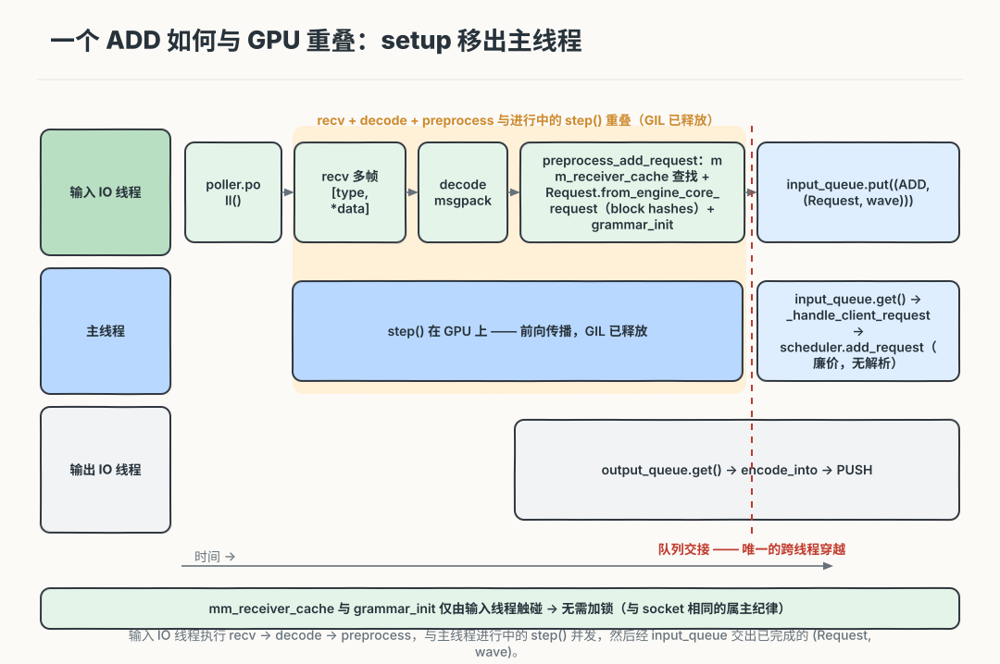</a>

<p class='figure-caption'>ADD 如何与 GPU 计算重叠执行：input IO thread 执行 recv、decode 和 preprocess_add_request（block hashing、mm-cache lookup、grammar kickoff），同时 main thread 正在执行尚未完成的 step()；随后，它经由 input_queue 交付准备完毕的 (Request, wave)，从而让每个 request 的初始化开销隐藏在 forward pass 之后。</p>

`preprocess_add_request` 负责 multimodal-cache lookup、`Request.from_engine_core_request`（用于计算 block hash），以及启动 structured output 的 grammar compilation——这些全都是 CPU-bound 工作。将其放在 input thread 中运行，就能与 `step()` 在 GPU 上执行的任务重叠。docstring 中关于 thread-safety 的论证是关键：`mm_receiver_cache` 和 `grammar_init` *只会*由这一个 thread 访问，因此无需 lock。这与 socket 遵循的是同一套 ownership 约束，只是应用对象换成了 mutable Python state。因此，对于一个 `ADD`，送入 `input_queue` 的是已经完成的 `(Request, wave)` tuple，而不是 raw bytes——main thread 的 dispatch 只需执行廉价的 `scheduler.add_request`，无需 parse。

**两个 queue 传递 abort；一个 closure 传递 failure。**

有两条流程把 queue 用作 control plane 的注入通道，而不是 data path。

**abort 被刻意同时送入两个 queue。** 当 input thread decode 出 `ABORT` 时，会把 request id 同时推入 `aborts_queue`（eager）和 `input_queue`（ordered）。eager 副本让 `step()` 可以在周期中途（schedule 与 output 之间）排空 abort，因此 cancel 无需等待完整一轮即可生效；`input_queue` 中的 ordered 副本则能保证：如果 abort 先于对应的 `ADD` 被接收，原有顺序仍会保留，request 也不会泄漏。input loop 中关于 framing 的注释指出，这样做之所以安全，*是因为 scheduler abort 是幂等的*——重复应用两次也无妨。因此，双 queue 技巧本质上是一项 latency 优化，而幂等性为其提供了正确性基础。

**executor failure 通过 closure 传递。** 来自 [`core.py:917-919`](https://github.com/vllm-project/vllm/blob/6cf7b26bd4bff60bf378e1af14044280ac0d214c/vllm/v1/engine/core.py#L917-L919)、并在 [`core.py:124-125`](https://github.com/vllm-project/vllm/blob/6cf7b26bd4bff60bf378e1af14044280ac0d214c/vllm/v1/engine/core.py#L124-L125) 注册的 `executor_fail_callback`，会在 worker process 退出时由 executor 的 monitor thread 调用。它只做一件事：`input_queue.put_nowait((EXECUTOR_FAILED, b""))`。这样，外部 thread 上的 failure 就会变成普通的 queue item，在 main thread 上 dispatch，转换为 `RuntimeError`，并最终成为发给 client 的 `ENGINE_CORE_DEAD` notification。这里没有 cross-thread exception，也没有 shared error flag，只有 queue。

### signal 路径不能直接操作 queue

shutdown signal handler 最能说明为什么 queue-only 规则绝非可选项：

[`vllm/v1/engine/core.py:1204-1208`](https://github.com/vllm-project/vllm/blob/6cf7b26bd4bff60bf378e1af14044280ac0d214c/vllm/v1/engine/core.py#L1204-L1208)

```python
            def wakeup_engine():
                # Wakes up idle engine via input_queue when shutdown is requested
                # Not safe in a signal handler - we may interrupt the main thread
                # while it is holding the non-reentrant input_queue.mutex
                engine_core.input_queue.put_nowait((EngineCoreRequestType.WAKEUP, None))
```

SIGTERM/SIGINT handler *运行在 main thread 上*，可能在 main thread 执行 `input_queue.get()` 途中将其打断；此时 main thread 可能正持有 queue 的内部 mutex，而该 mutex 不可重入。如果从 handler 内部调用 `put_nowait`，就会在同一个 mutex 上发生 deadlock。因此，handler 只设置 `shutdown_state = REQUESTED` 并调用 `signal_callback.trigger()`；`SignalCallback` 会把真正的 `wakeup_engine()` enqueue 延后到安全的 context 中执行。随后，`WAKEUP` item 会解除空闲状态下 `get()` 的阻塞，loop 再次检查 `is_running()`，看到 `REQUESTED` 后开始 graceful drain（[第 12 节](#12-故障处理关闭流程与完整拓扑追踪)）。no-op 的 `WAKEUP` 之所以存在，正是因为唤醒阻塞在 `queue.get()` 上的 thread 的唯一方式，就是向 queue 放入内容。

<a href='images/vllm-03-07-queues-threads.svg' target='_blank'>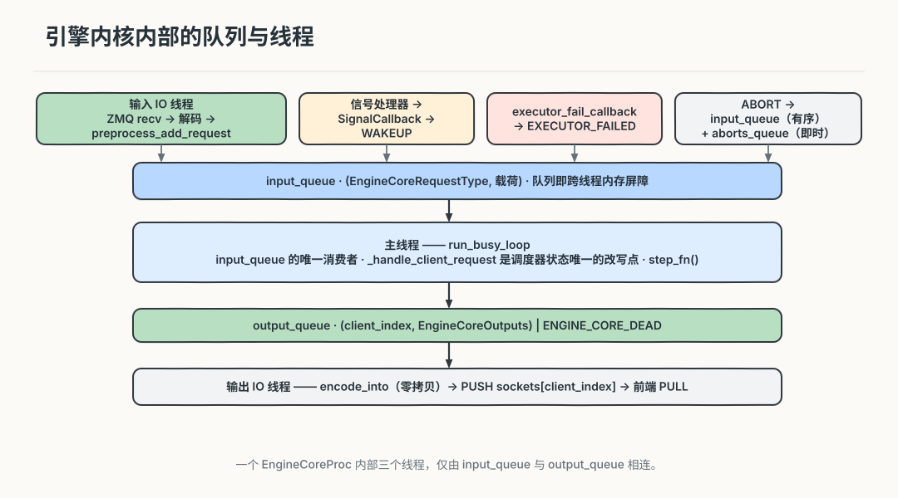</a>

<p class='figure-caption'>一个 EngineCoreProc 内部的三个 thread，仅通过 input_queue 和 output_queue 连接。</p>

**thread 布局及其保护对象。**

| thread | 入口 | 独占 | 读取 | 写入 | 阻塞于 |
|---|---|---|---|---|---|
| main | `run_busy_loop`（[`core.py:1259`](https://github.com/vllm-project/vllm/blob/6cf7b26bd4bff60bf378e1af14044280ac0d214c/vllm/v1/engine/core.py#L1259)） | scheduler、executor、`step_fn` | `input_queue`、`aborts_queue` | `output_queue` | 空闲时阻塞于 `input_queue.get(block=True)` |
| input IO | `process_input_sockets` | input DEALER + coord XSUB sockets | sockets | `input_queue`、`aborts_queue` | `poller.poll()` |
| output IO | `process_output_sockets` | output PUSH + coord PUSH sockets | `output_queue` | sockets | `output_queue.get()` |

两个 `queue.Queue` 是仅有的跨 thread 通道。socket 以及可变的 codec/preprocessing state 都留在各自所属的 I/O thread 中，因此 main loop 无需 socket lock 即可修改 scheduler state。

## 7. 单节点 Tensor Parallel：一个 EngineCore，N 个 worker

在单个 EngineCore 内，`MultiprocExecutor` 会把工作分发给 `world_size` 个 GPU worker process。这不会增加 EngineCore process 的数量。executor 使用基于 shared memory 的 `MessageQueue`：一个 writer 将同一个 `SchedulerOutput` 广播给所有 worker，再由指定的 output rank 返回 `ModelRunnerOutput`。ZMQ 仍然负责 front-end 与 engine 之间的传输；shared memory 则处理 engine 内部固定规模的 fan-out。

并行计算的*数学原理*（TP shard 实际执行哪些计算、运行哪些 all-reduce）是第 11 篇的主题；每个 worker 内部运行的 ModelRunner 则是第 09 篇的主题。本文只讨论 process 数量、transport，以及将这些 process 连接起来的 RPC contract。

### World size 就是 worker process 数量：这一点通过 assert 明确校验，而非默认成立

worker process 的数量完全由 parallel config 各项参数的乘积决定，并在构造 `ParallelConfig` 时一次性计算完成。

[`vllm/config/parallel.py:793-797`](https://github.com/vllm-project/vllm/blob/6cf7b26bd4bff60bf378e1af14044280ac0d214c/vllm/config/parallel.py#L793-L797)

```python
        self.world_size = (
            self.pipeline_parallel_size
            * self.tensor_parallel_size
            * self.prefill_context_parallel_size
        )
```

随后，`local_world_size` 表示每个 node 对应的分片，见 [`vllm/config/parallel.py:684-685`](https://github.com/vllm-project/vllm/blob/6cf7b26bd4bff60bf378e1af14044280ac0d214c/vllm/config/parallel.py#L684-L685)：

```python
    @property
    def local_world_size(self) -> int:
        return self.world_size // self.nnodes_within_dp
```

对于 single-node deployment，`nnodes_within_dp == 1`，因此 `local_world_size == world_size`，所有 rank 都是同一 host 上的 local process。纯 tensor parallelism 会令 PP=PCP=1，因此 `world_size == tensor_parallel_size`：TP=4 的 engine 恰好包含四个 worker process，对应 rank 0..3。

executor 并不会默认这套计算一定正确——launch 时会重新推导并 assert。[`vllm/v1/executor/multiproc_executor.py:117-123`](https://github.com/vllm-project/vllm/blob/6cf7b26bd4bff60bf378e1af14044280ac0d214c/vllm/v1/executor/multiproc_executor.py#L117-L123)：

```python
        tp_size, pp_size, pcp_size = self._get_parallel_sizes()
        assert self.world_size == tp_size * pp_size * pcp_size, (
            f"world_size ({self.world_size}) must be equal to the "
            f"tensor_parallel_size ({tp_size}) x pipeline"
            f"_parallel_size ({pp_size}) x prefill_context"
            f"_parallel_size ({pcp_size}). "
        )
```

`_get_parallel_sizes`（`:249-260`）从 parallel config 读取 `world_size`，assert `world_size % nnodes_within_dp == 0`（每个 node 拥有大小相同且连续的 rank block），然后返回这三个 factor。上面的 assertion 随后会检查乘积是否吻合。executor 由此确定恰好 spawn `local_world_size` 个 process，后续还会从根据同一组 factor 推导出的 rank index（下文的 `output_rank`）收集结果。如果分解关系不一致（例如 `world_size` 不等于 TP·PP·PCP），问题通常不会在模型运行阶段以清晰的 error 暴露出来，而会在 collective device sync 期间表现为*hang*，因为 distributed group 中的某个 rank 根本不会被 spawn。在接触任何 GPU 之前就在这里失败，可以把无声的 deadlock 转化成明确的 assertion。deployment 层面的规则“一块 GPU 对应一个 worker process，总数由 TP/PP/DP config 决定”（[架构概览](https://docs.vllm.ai/en/stable/design/arch_overview/)），正是将这个乘积关系落实成了可执行逻辑。

### 一个 writer，N 个 reader：唯一的 fan-out 平面

engine 发给 worker 的每个 RPC 都经由同一个 shared memory queue 传输。[`vllm/v1/executor/multiproc_executor.py:135-157`](https://github.com/vllm-project/vllm/blob/6cf7b26bd4bff60bf378e1af14044280ac0d214c/vllm/v1/executor/multiproc_executor.py#L135-L157)（省略部分内容）：

```python
        if self.parallel_config.node_rank_within_dp == 0:
            # For leader node within each dp rank,
            # each dp will have its own leader multiproc executor.
            max_chunk_bytes = envs.VLLM_MQ_MAX_CHUNK_BYTES_MB * 1024 * 1024
            mq_connect_ip = get_ip()
            ...
            self.rpc_broadcast_mq = MessageQueue(
                self.world_size,
                self.local_world_size,
                max_chunk_bytes=max_chunk_bytes,
                connect_ip=mq_connect_ip,
            )
            scheduler_output_handle = self.rpc_broadcast_mq.export_handle()
```

构造 `MessageQueue(n_reader, n_local_reader, ...)` 时，executor 是唯一的 writer，共有 `world_size` 个 reader，其中 `local_world_size` 个可通过 shared memory 访问。在 single node 上，这两个数量相等，因此该 queue 完全基于 shared memory，不包含任何 cross-node ring buffer reader。executor 会导出该 queue 的 `Handle`；随后，每个 worker 按 rank attach 到该 queue，并作为*reader*（[第 8 节](#8-worker-进程spawn-与生命周期)会介绍 `_init_message_queues`）。注意这里的 gate：只有在 `node_rank_within_dp == 0` 时才会构建 broadcast MQ。在 single node 上，该条件始终成立，因此对于本文讨论的 topology，这个分支是无条件执行的；它的存在是为了支持 multi-node DP：只有 DP-group leader node 拥有 broadcast 平面，follower node 会将 `rpc_broadcast_mq` 保持为 `None`（这也解释了为什么 `collective_rpc` 随后会 assert 它不是 `None`——“不应在 follower node 上调用”，`:355-357`）。

broadcast writer 只有一个，fan-out 在结构上得到保证——一次 enqueue 就会将逐字节完全相同的 payload 发送给全部 `world_size` 个 worker。这正是 tensor parallelism 能正确运行的基础：TP group 中的每个 rank 必须在同一个 step schedule 同一个 batch，否则它们的 collective（对 partial activation 执行 all-reduce）就会错配。single-writer broadcast queue 从结构上杜绝了各 rank 的 scheduler output 出现分歧，而不只是建议它们保持一致。

**每个 TP group 一个 driver。**

在 worker 集合中，每个 tensor-parallel group 都有一个 rank 被标记为 driver。[`vllm/v1/executor/multiproc_executor.py:265-266`](https://github.com/vllm-project/vllm/blob/6cf7b26bd4bff60bf378e1af14044280ac0d214c/vllm/v1/executor/multiproc_executor.py#L265-L266)：

```python
    def _is_driver_worker(self, rank: int) -> bool:
        return rank % self.parallel_config.tensor_parallel_size == 0
```

对于纯 single-node TP，唯一的 TP group 包含 rank 0..TP-1，因此 rank 0 是唯一的 driver。该 flag 在 spawn 时计算（`is_driver_worker = self._is_driver_worker(global_rank)`、`:178`），随后传给 `make_worker_process`。在 pipeline parallelism 下，多个 TP group 会堆叠为不同的 PP stage，每个 group 的 rank-0 都会成为 driver；modulo 规则提供了确定性的 global-rank→role 映射，无需任何 process 在 startup 后协商自己的 role。这与 `output_rank`（见下文）是两个不同的概念：*每个* PP stage 都有一个 driver，但整个 world 中只有*一个* rank 会发出面向用户的 output。

### `collective_rpc`：一次 enqueue，按预定数量接收 reply

engine→worker 的所有工作（模型执行、KV cache 初始化、warmup、health check）都经由同一个 method。[`vllm/v1/executor/multiproc_executor.py:343-405`](https://github.com/vllm-project/vllm/blob/6cf7b26bd4bff60bf378e1af14044280ac0d214c/vllm/v1/executor/multiproc_executor.py#L343-L405)（仅保留 control flow）：

```python
    def collective_rpc(
        self,
        method: str | Callable,
        ...
        unique_reply_rank: int | None = None,
        kv_output_aggregator: KVOutputAggregator | None = None,
    ) -> Any:
        ...
        if kv_output_aggregator is not None:
            output_rank = None
            aggregate: Callable[[Any], Any] = partial(
                kv_output_aggregator.aggregate, output_rank=unique_reply_rank or 0
            )
        else:
            output_rank = unique_reply_rank
            aggregate = lambda x: x
        ...
        self.rpc_broadcast_mq.enqueue((send_method, args, kwargs, output_rank))

        response_mqs: Sequence[MessageQueue] = self.response_mqs
        if output_rank is not None:
            response_mqs = (response_mqs[output_rank],)

        def get_response():
            responses = []
            for mq in response_mqs:
                ...
                status, result = mq.dequeue(timeout=dequeue_timeout)
                ...
                responses.append(result)
            return responses[0] if output_rank is not None else responses

        future = FutureWrapper(
            self.futures_queue, get_response=get_response, aggregate=aggregate
        )
        return future if non_block else future.result()
```

<a href='images/vllm-03-21-collective-rpc-fanout.svg' target='_blank'>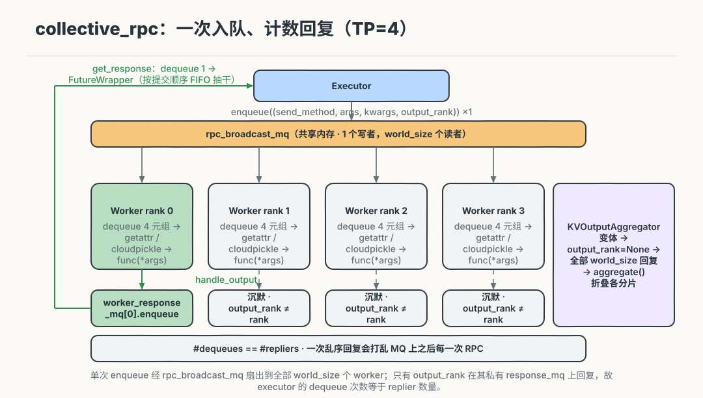</a>

<p class='figure-caption'>collective_rpc 的单次 enqueue / 定量 reply contract：将 (send_method, args, kwargs, output_rank) enqueue 到 rpc_broadcast_mq 一次，即可 fan-out 至全部 world_size 个 worker；只有 output_rank 对应的 worker 会向自己的 private response_mq enqueue，而 executor 的 dequeue 次数等于实际 reply 的 worker 数量（设置 output_rank 时为 1，否则为 world_size）。</p>

RPC contract 由四部分组成：

1. **Fan-out。** 只向 single broadcast MQ 执行一次 `enqueue((send_method, args, kwargs, output_rank))`。`send_method` 要么是 string attribute name，要么是 cloudpickled callable；同一个 4-tuple 会到达每个 worker 的 read cursor。
2. **Reply selection。** 如果设置了 `output_rank`，`get_response` 只会从 `response_mqs[output_rank]` 收集结果，即一个 one-element tuple。否则，它会从全部 `world_size` response MQ 收集结果并返回一个 list。`output_rank` field*同时*也是 enqueued tuple 的第四个元素，因此同一个值既会告诉 executor 应等待多少个 reply，也会 broadcast 给所有 worker，让它们知道是否只需发送一个 reply。
3. **KV aggregator 变体。** 当提供 `KVOutputAggregator` 时（disaggregated prefill / KV transfer），`output_rank` 会被强制设为 `None`，让所有 worker 都返回 reply；随后，`aggregate` 会将各个 `world_size` partial 聚合为一个结果。对于普通的 single-node TP，该分支不会启用。
4. **Deadline / error / sync。** monotonic deadline 会限制每次 dequeue 的等待时间；任何非 `SUCCESS` 状态都会在 caller 侧转化为 `RuntimeError`。`non_block=True` 会返回 `FutureWrapper`；否则，`.result()` 会 block。

`execute_model` 是这一模式在 hot path 上的实现。[`vllm/v1/executor/multiproc_executor.py:310-320`](https://github.com/vllm-project/vllm/blob/6cf7b26bd4bff60bf378e1af14044280ac0d214c/vllm/v1/executor/multiproc_executor.py#L310-L320)：

```python
    def execute_model(
        self, scheduler_output: SchedulerOutput, non_block: bool = False
    ) -> ModelRunnerOutput | None | Future[ModelRunnerOutput | None]:
        return self.collective_rpc(
            "execute_model",
            args=(scheduler_output,),
            unique_reply_rank=self.output_rank,
            non_block=non_block,
            timeout=envs.VLLM_EXECUTE_MODEL_TIMEOUT_SECONDS,
            kv_output_aggregator=self.kv_output_aggregator,
        )
```

每个 step，完整的 `SchedulerOutput` 都会 broadcast 给所有 worker；但 `unique_reply_rank=self.output_rank` 意味着 engine 只会回读一个 `ModelRunnerOutput`。

executor 执行 dequeue 的次数，与 worker set 产生 enqueue 的次数相同：如果设置了 `output_rank`，则为一次；如果其值为 `None`，则为 `world_size` 次。这种计数一致性就是内部边界完整的正确性契约。如果只有一个 rank 的结果有效，却 gather 每个 rank 的完整 output，就会在 shared queue 中复制数 MB 的 logits/token tensor，也会模糊结果究竟归哪个 stage 所有；反过来，如果 executor 并未等待回复，而某个 worker 却发送了回复，多出的 entry 就会导致该 MQ 上后续所有 RPC 全部失去同步。

**Worker 侧的 reply gating。**

Worker 侧的契约由一个 blocking loop 实现。[`vllm/v1/executor/multiproc_executor.py:986-1011`](https://github.com/vllm-project/vllm/blob/6cf7b26bd4bff60bf378e1af14044280ac0d214c/vllm/v1/executor/multiproc_executor.py#L986-L1011)：

```python
    def worker_busy_loop(self):
        """Main busy loop for Multiprocessing Workers"""
        assert self.rpc_broadcast_mq is not None
        while True:
            method, args, kwargs, output_rank = self.rpc_broadcast_mq.dequeue(
                indefinite=True
            )
            try:
                if isinstance(method, str):
                    func = getattr(self.worker, method)
                elif isinstance(method, bytes):
                    func = partial(cloudpickle.loads(method), self.worker)

                output = func(*args, **kwargs)

                if output_rank is None or self.rank == output_rank:
                    self.handle_output(output)
            except Exception as e:
                # Notes have been introduced in python 3.11
                if hasattr(e, "add_note"):
                    e.add_note(traceback.format_exc())
                logger.exception("WorkerProc hit an exception.")
                # exception might not be serializable, so we convert it to
                # string, only for logging purpose.
                if output_rank is None or self.rank == output_rank:
                    self.handle_output(e)
```

worker 会阻塞在 broadcast MQ 上（`indefinite=True`——不会因虚假 timeout 而被唤醒），将 method 解析为 bound attribute 或经 cloudpickle 序列化的 callable，然后执行它。最关键的一行是：仅当 `output_rank is None or self.rank == output_rank` 时，才 enqueue reply。exception path 也受完全相同的 gate 控制，因此，不负责回复的 rank 即便抛出异常也会保持静默。同一个 `output_rank` 值既决定 executor 的 dequeue 次数，也决定每个 worker 是否回复，因此两边的计数绝不可能出现分歧。假如某个 worker 在不该回复时发出了 reply，就会在 response MQ 中留下一个无人消费的 entry，下一次 RPC 会误将其当作自己的结果读取。

### `output_rank`：哪个 rank 拥有最终结果

唯一负责回复的 rank 由算术规则确定，而不是由配置决定。[`vllm/v1/executor/multiproc_executor.py:498-512`](https://github.com/vllm-project/vllm/blob/6cf7b26bd4bff60bf378e1af14044280ac0d214c/vllm/v1/executor/multiproc_executor.py#L498-L512)：

```python
    def _get_output_rank(self) -> int:
        # Only returns ModelRunnerOutput from TP rank=0 and PP rank=-1
        # (the first TP worker of the last PP stage).
        # Example:
        # Assuming TP=8, PP=4, then the world_size=32
        # 0-7, PP rank 0
        # 8-15, PP rank 1
        # 16-23, PP rank 2
        # 24-31, PP rank 3
        # so world_size - tp_size = 32 - 8 = 24 should be PP rank = -1 (i.e. 3)
        return (
            self.world_size
            - self.parallel_config.tensor_parallel_size
            * self.parallel_config.prefill_context_parallel_size
        )
```

<a href='images/vllm-03-22-rank-layout-grid.svg' target='_blank'>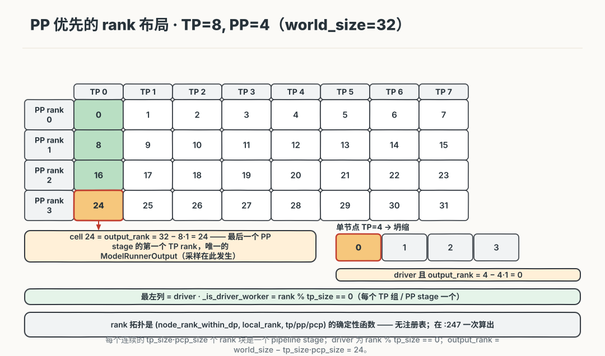</a>

<p class='figure-caption'>TP=8、PP=4（world_size=32）时按 PP-major 排列的 rank 布局：每个由 tp_size*pcp_size 个连续 rank 构成的 block 对应一个 pipeline stage；_is_driver_worker = rank % tp_size == 0 表示每个 TP group 中有一个 driver；output_rank = world_size - tp_size*pcp_size = 24 是唯一回复方（在 single-node TP 下退化为 rank 0）。</p>

所有 rank 按 PP-major 排列——每个由 `tp_size·pcp_size` 个连续 rank 构成的 block 对应一个 pipeline stage。最后一个 stage 从 `world_size - tp_size·pcp_size` 开始，其首个 rank 负责 sampling，并拥有完整的 `ModelRunnerOutput`。**纯 single-node TP 下的推论**（PP=PCP=1）：`output_rank = world_size - tensor_parallel_size = 0`。因此，在 TP=4 的 engine 中，rank 0 既是 driver，也是唯一回复方，executor 每一步都从 `response_mqs[0]` gather output。一般规则依然成立——使用 pipeline parallelism 时，回复方并不是 rank 0；此时如果从 rank 0 读取结果，表面上看会像是 shape bug，实际问题却是 pipeline 的结果归属错误。将回复方编码为一个算术表达式，并在 `:247`（`self.output_rank = self._get_output_rank()`）处只求值一次，就不必在每一步重新判断结果位于何处。

### 单个 shared queue 上的 FIFO future

由于 async scheduling 可以让多个 `execute_model` 调用同时处于 in-flight 状态，并共用一个 response MQ，因此必须严格按照提交顺序 drain reply。[`vllm/v1/executor/multiproc_executor.py:70-101`](https://github.com/vllm-project/vllm/blob/6cf7b26bd4bff60bf378e1af14044280ac0d214c/vllm/v1/executor/multiproc_executor.py#L70-L101)（已省略部分代码）：

```python
class FutureWrapper(Future):
    def __init__(self, futures_queue, get_response, aggregate=lambda x: x):
        ...
        self.futures_queue.appendleft(self)

    def result(self, timeout=None):
        ...
        # Drain any futures ahead of us in the queue.
        while not self.done():
            future = self.futures_queue.pop()
            future._wait_for_response()
        return super().result()
```

每个 RPC 都会将自己的 future push 到 shared `deque` 左侧，并从右侧 drain future（`pop()`）——也就是严格遵循提交顺序的 FIFO。解析 future *k* 时，会先遍历所有更早提交但仍处于 pending 状态的 future，并依次从 MQ 读取它们的 response。response 离开 response MQ 的顺序，与 RPC 被 enqueue 的顺序完全一致；只有更早的 future 全部 drain 后，当前 future 才能消费自己的 response。正因为如此，engine 才能通过一个 MQ，以 pipeline 方式执行多个 in-flight collective RPC，而不会因交错读取导致数据损坏——queue 是 FIFO，future 的 drain 也是 FIFO，两者始终保持对齐。

## 8. Worker 进程：Spawn 与生命周期

`MultiprocExecutor` 会为每个 rank 创建一个 `WorkerProc`，共创建 `world_size = TP·PP·PCP` 个 worker（[`parallel.py:793-797`](https://github.com/vllm-project/vllm/blob/6cf7b26bd4bff60bf378e1af14044280ac0d214c/vllm/config/parallel.py#L793-L797)）。[第 10 节](#10-dp--tp-组合进程数公式)将详细推导进程数量，第 11 篇则介绍 parallelism 的计算方式。本节会继续分析 worker 创建、READY 握手、父子进程 pipe 以及 teardown。第 09 篇将从 `init_device` 继续，介绍 model loading 和 ModelRunner forward pass。

### Spawn：一个 daemon process 和两条单向 pipe

worker 既不是 thread，也不是 Ray actor，而是一个运行 staticmethod `WorkerProc.worker_main` 的 `multiprocessing` 子进程。启动之前，父进程会用两条 `duplex=False` pipe 完成连接：一条是 *ready pipe*（子进程 → 父进程，只传递一条 READY 消息），另一条是 *death pipe*（父进程 → 子进程，不传递任何内容：它的 EOF *就是* signal）。

源码：[`multiproc_executor.py:661-712`](https://github.com/vllm-project/vllm/blob/6cf7b26bd4bff60bf378e1af14044280ac0d214c/vllm/v1/executor/multiproc_executor.py#L661-L712)。

```python
    @staticmethod
    def make_worker_process(
        ...
    ) -> UnreadyWorkerProcHandle:
        context = get_mp_context()
        # Ready pipe to communicate readiness from child to parent
        ready_reader, ready_writer = context.Pipe(duplex=False)
        # Death pipe to let child detect parent process exit
        death_reader, death_writer = context.Pipe(duplex=False)
        ...
        process_kwargs = {
            ...
            "ready_pipe": ready_writer,
            "death_pipe": death_reader,
            ...
        }
        # Run EngineCore busy loop in background process.
        proc = context.Process(
            target=WorkerProc.worker_main,
            kwargs=process_kwargs,
            name=f"VllmWorker-{rank}",
            daemon=True,
        )
        ...
            proc.start()

        # Close child ends of pipes here in the parent
        ready_writer.close()
        death_reader.close()
        # Keep death_writer open in parent - when parent exits,
        # death_reader in child will get EOFError
        return UnreadyWorkerProcHandle(proc, rank, ready_reader, death_writer)
```

代码先创建两条 pipe，再将各个端点分配到进程边界两侧。子进程通过 kwargs 接收 `ready_writer` 和 `death_reader`。调用 `proc.start()` 后，父进程会立即关闭自己持有的子进程端点副本（`ready_writer`、`death_reader`）——只有最后一个 writer fd 关闭时，pipe 才会报告 EOF。因此，父进程不能意外保留 death pipe 的多余 writer，也不能保留会混淆 ownership 的多余 reader。父进程保留的端点封装在返回的 handle 中：`ready_reader` 用于接收 READY，`death_writer` 则会在进程的整个生命周期内保持打开。该进程被设为 `daemon=True`，名称为 `VllmWorker-{rank}`。这样，即便父进程异常死亡，OS 也会回收它；同时，在 `ps`/`py-spy` 中也能清楚识别该进程。

death pipe 提供了一种强制且无需 poll 的存活绑定：父进程始终保持 `death_writer` 打开，但不对它执行任何操作；子进程则阻塞读取 `death_reader`。这里没有 heartbeat、timeout，也没有容易出错的 config polling。如果 engine 进程因任何原因退出（正常退出、崩溃或 `SIGKILL`），kernel 就会关闭它的 fd，子进程的读取操作会抛出 `EOFError`，随后 worker 开始 teardown（参见下文的 death monitor）。这样就不会有 worker 在 engine 已经死亡后仍继续空转。

<a href='images/vllm-03-08-worker-spawn.svg' target='_blank'>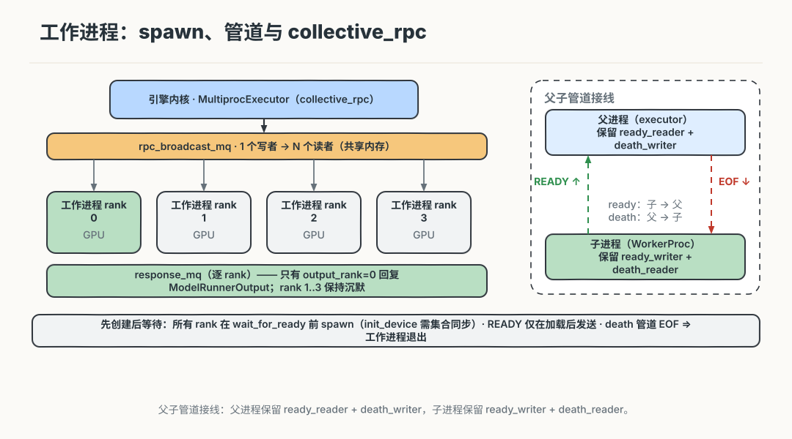</a>

<p class='figure-caption'>父子进程的 pipe 连接方式：父进程保留 ready_reader + death_writer，子进程保留 ready_writer + death_reader。</p>

**先创建、后等待：执行任何 device sync 之前，所有 rank 都必须已处于 live 状态。**

executor 会先 spawn 所有 local worker，然后才等待其中任何一个报告 READY。这种顺序并非编码风格上的选择，而是由 device init 的 collective 特性决定的。

源码：[`multiproc_executor.py:176-201`](https://github.com/vllm-project/vllm/blob/6cf7b26bd4bff60bf378e1af14044280ac0d214c/vllm/v1/executor/multiproc_executor.py#L176-L201)。

```python
            for local_rank in range(self.local_world_size):
                global_rank = global_start_rank + local_rank
                is_driver_worker = self._is_driver_worker(global_rank)
                with cpu_omp_manager.configure_omp_envs(
                    rank=global_rank, local_rank=local_rank
                ):
                    unready_worker_handle = WorkerProc.make_worker_process(
                        ...
                        rank=global_rank,
                        input_shm_handle=scheduler_output_handle,
                        ...
                    )
                unready_workers.append(unready_worker_handle)
                if inherited_fds is not None:
                    inherited_fds.append(unready_worker_handle.death_writer.fileno())
                    inherited_fds.append(unready_worker_handle.ready_pipe.fileno())

            # Workers must be created before wait_for_ready to avoid
            # deadlock, since worker.init_device() does a device sync.

            # Wait for all local workers to be ready.
            self.workers = WorkerProc.wait_for_ready(unready_workers)
```

`global_rank = global_start_rank + local_rank` 和 `global_start_rank = local_world_size · node_rank_within_dp`（`:164-166`），因此同一节点上的 rank 会形成一个连续区间——[第 7 节](#7-单节点-tensor-parallel一个-enginecoren-个-worker)中的 `output_rank` 和[第 10 节](#10-dp--tp-组合进程数公式)中的 rank 计算都依赖这种布局。每个 worker 的 `input_shm_handle` 都是 executor 唯一的 broadcast-MQ handle（[第 7 节](#7-单节点-tensor-parallel一个-enginecoren-个-worker)），因此所有 worker 都挂接到*同一个* fan-out queue。采用 `fork` start method 时，`inherited_fds` 会收集每个已 spawn worker 的 pipe fd，以便*下一个* worker 在 `worker_main` 中将其关闭。否则，fork 出的子进程会悄悄持有兄弟进程 `death_writer` 的副本，导致对应 pipe 永远无法触发 EOF，使 liveness detection 失效。只有整个循环结束后，才会运行 `wait_for_ready`。

**为何必须采用这种顺序。** `worker.init_device()` 会执行 collective device sync（即所有 rank 共同参与的 distributed rendezvous），所以只有当*所有* rank 都已存活并参与其中时，任一 rank 才能完成 init。如果父进程在 spawn rank 1 之前就阻塞等待 rank 0 的 READY，那么 rank 0 会在 `init_device` 中永远等待一个尚不存在的 rank：这不是普通错误，而是 deadlock。先全部创建、再统一等待，是唯一能让 collective 顺利完成的顺序。

### 子进程的完整生命周期：`worker_main`

`worker_main` 是子进程的 `main`。它会安装 signal handler、构造 `WorkerProc`（加载模型并创建所需 queue）、启动 death monitor、发送 READY、完成 MQ handshake，随后进入 busy loop。后文将围绕这四行代码所呈现的生命周期展开说明。

来源：[`multiproc_executor.py:817-892`](https://github.com/vllm-project/vllm/blob/6cf7b26bd4bff60bf378e1af14044280ac0d214c/vllm/v1/executor/multiproc_executor.py#L817-L892)（已省略部分内容）。

```python
        shutdown_requested = threading.Event()

        def signal_handler(signum, frame):
            nonlocal shutdown_requested
            if not shutdown_requested.is_set():
                shutdown_requested.set()
                ...
                raise SystemExit()

        # Either SIGTERM or SIGINT will terminate the worker
        signal.signal(signal.SIGTERM, signal_handler)
        signal.signal(signal.SIGINT, signal_handler)
        ...
        ready_writer = kwargs.pop("ready_pipe")
        death_pipe = kwargs.pop("death_pipe", None)

        # Close inherited pipes from parent (incl. other worker pipes)
        ...
        for fd in kwargs.pop("inherited_fds", []):
            try:
                os.close(fd)
            ...
        try:
            ...
            worker = WorkerProc(*args, **kwargs)
            assert worker.worker_response_mq is not None
            ...
            worker.monitor_death_pipe(death_pipe, shutdown_requested)

            # Send READY once we know everything is loaded
            ready_writer.send(
                {
                    "status": WorkerProc.READY_STR,
                    "handle": worker.worker_response_mq.export_handle(),
                    "peer_response_handles": worker.peer_response_handles,
                }
            )

            # Ensure message queues are ready. Will deadlock if re-ordered.
            # Must be kept consistent with the Executor
            if worker.rpc_broadcast_mq is not None:
                worker.rpc_broadcast_mq.wait_until_ready()
            worker.worker_response_mq.wait_until_ready()
            ready_writer.close()
            ready_writer = None

            worker.worker_busy_loop()
```

<a href='images/vllm-03-23-worker-lifecycle.svg' target='_blank'>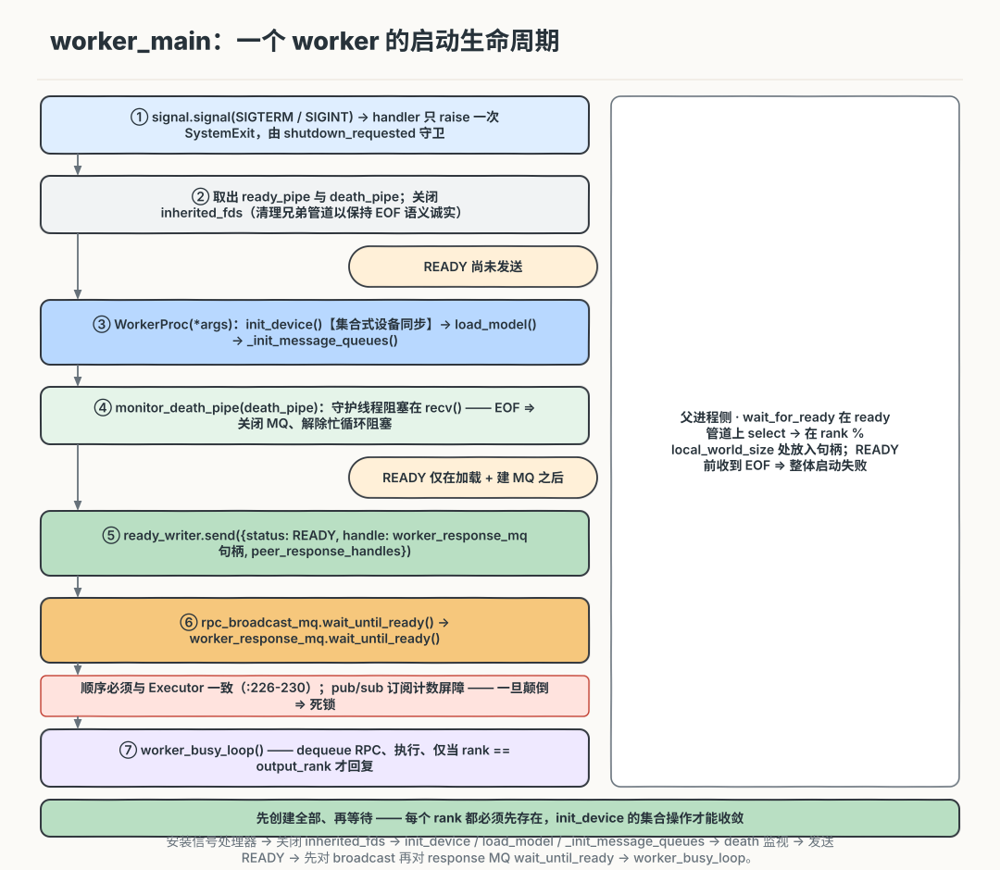</a>

<p class='figure-caption'>worker 在 worker_main 中的启动生命周期：安装 SIGTERM/SIGINT handler，关闭 inherited_fds，运行 WorkerProc()（init_device / load_model / _init_message_queues），启动 death monitor，发送唯一一条 READY dict（其中包含自己的 response-MQ handle），依次对 broadcast MQ 和 response MQ 调用 wait_until_ready（顺序必须与 executor 一致，否则双方都会 deadlock），随后进入 worker_busy_loop。</p>

(1) `SIGTERM`/`SIGINT` 由一个 handler 捕获；该 handler 只会抛出一次 `SystemExit`（由 `shutdown_requested` 保护），这样[第 12 节](#12-故障处理关闭流程与完整拓扑追踪)中的渐进式终止流程就能干净地停止 worker，而不会让异常经由 `__del__` 大量涌入。(2) worker 会 pop 出自己的两个 pipe 端点，并关闭所有 `inherited_fds`。这种兄弟进程 pipe 清理机制能确保 EOF 检测真实可靠。(3) `WorkerProc(*args, **kwargs)` 承担核心工作：运行 `init_device()`、`load_model()` 和 `_init_message_queues()`（见下一小节）。(4) 只有在构造成功*之后*，它才会启动 death monitor 并发送唯一一条 READY dict，其中携带 response-MQ handle，以便父进程读取该 worker 的 reply。(5) 接着，它先对 broadcast MQ 调用 `wait_until_ready()`，再对 response MQ 调用；这个顺序与 executor 完全一致（[第 7 节](#7-单节点-tensor-parallel一个-enginecoren-个-worker)，`:226-230`）。

末尾的注释“*重新排序会导致 deadlock。必须与 Executor 保持一致*”至关重要：`wait_until_ready` 是一个基于 pub/sub 的 subscription-count barrier，双方会在此 rendezvous，因此顺序不一致会让双方同时挂起。(6) 最后进入 `worker_busy_loop()`：从 broadcast MQ 中 dequeue 一个 RPC，执行它，并且仅当本 rank 是 `output_rank` 时才发送 reply（[第 7 节](#7-单节点-tensor-parallel一个-enginecoren-个-worker)）。

`except`/`finally`（`:894-933`）会按原因处理进程退出：如果 `ready_writer` 仍处于 set 状态，说明 worker 从未完成启动（“*启动失败*”）；`shutdown_requested` 处于 set 状态表示这是一次主动请求的 shutdown；`SystemExit` 始终会被重新抛出；而 `finally` 始终会关闭 pipe 并调用 `worker.shutdown()`。

READY 一定在模型加载和 MQ 创建*之后*发送，绝不会提前。因此，只有当 worker 确实能够接收 `SchedulerOutput` 并发出 `ModelRunnerOutput` 时，父进程才会得知它已 READY。front-end 的 ready barrier（第 01 篇，以及第 11 篇介绍的首 token 路径）绝不会被一个仅完成部分初始化的 GPU process 触发。

**进程级 queue：接入 broadcast，独占 reply。**

每个 worker 都从一个不归自己所有的 queue 读取，并向自己所有的 queue 写入。

来源：[`multiproc_executor.py:564-575`](https://github.com/vllm-project/vllm/blob/6cf7b26bd4bff60bf378e1af14044280ac0d214c/vllm/v1/executor/multiproc_executor.py#L564-L575)（单节点分支）。

```python
        if vllm_config.parallel_config.nnodes_within_dp == 1:
            # Initialize MessageQueue for receiving SchedulerOutput
            self.rpc_broadcast_mq = MessageQueue.create_from_handle(
                input_shm_handle, self.worker.rank
            )

            # Initializes a message queue for sending the model output
            self.worker_response_mq = MessageQueue(1, 1)
            self.peer_response_handles = []
```

对于单节点场景（`nnodes_within_dp == 1`；多节点的 `else` 分支通过 inner-DP process group 路由，不在本文讨论范围内），worker 通过 `create_from_handle(input_shm_handle, self.worker.rank)` 挂接到 executor 的共享 broadcast queue，并以自身 rank 为 key 充当 reader：一个 writer（executor），`world_size` 个 reader。然后，它会创建自己的 `MessageQueue(1, 1)` 作为 reply queue：一个 reader（executor），一个 writer（自身）。READY dict 回传给父进程的正是这个 reply queue 的 handle。MQ setup 被特意安排在 `init_device()` 之后执行（`:653-655`），因为多节点 reply queue 需要先创建 distributed group。

Fan-out 和 gather 使用彼此独立、归属明确的 queue：一个共享 broadcast 平面，由 executor 写入、所有 worker 读取；另有 N 个私有 reply 平面，每个都只归一个 worker 所有。任何 worker 都无法写入其他 worker 的 reply queue；executor 则从固定且按 rank 索引的 MQ 中 gather 各个 rank 的输出。

**准入：父进程侧的 `wait_for_ready`。**

父进程通过各个 worker 的 ready pipe 收集 READY message，将每条 message 转换为可用的 `WorkerProcHandle`，并把 broken pipe 视为启动失败。

来源：[`multiproc_executor.py:744-771`](https://github.com/vllm-project/vllm/blob/6cf7b26bd4bff60bf378e1af14044280ac0d214c/vllm/v1/executor/multiproc_executor.py#L744-L771)。

```python
        pipes = {handle.ready_pipe: handle for handle in unready_proc_handles}
        ready_proc_handles: list[WorkerProcHandle | None] = [None] * len(
            unready_proc_handles
        )
        while pipes:
            ready = multiprocessing.connection.wait(pipes.keys())
            for pipe in ready:
                assert isinstance(pipe, Connection)
                try:
                    # Wait until the WorkerProc is ready.
                    unready_proc_handle = pipes.pop(pipe)
                    response: dict[str, Any] = pipe.recv()
                    if response["status"] != "READY":
                        raise e

                    idx = unready_proc_handle.rank % len(ready_proc_handles)
                    ready_proc_handles[idx] = WorkerProc.wait_for_response_handle_ready(
                        response, unready_proc_handle
                    )
                except EOFError:
                    e.__suppress_context__ = True
                    raise e from None
                finally:
                    # Close connection.
                    pipe.close()
```

父进程通过 `select` 轮询所有 worker 的 `ready_pipe`（`multiprocessing.connection.wait`）；每当其中一个变为可读，就调用 `recv()` 接收 READY dict，并将得到的 handle 放入 `rank % local_world_size` 对应的位置。因此，`self.workers` 按 rank 排序，而不是按到达顺序排列。`wait_for_response_handle_ready`（`:714-733`）根据 dict 中导出的 handle 重建 worker 的 `worker_response_mq`。关键在于，如果某个 worker 在发送 READY 前就已退出，其 pipe 会报告 `EOFError`，而不是返回 message；handler 会将其转换为统一的 init 失败异常，并中止*整个*启动流程（同时借助 `__suppress_context__`，让 traceback 指向真正来自 background process 的错误）。

返回的 `self.workers` list 要么已按 rank 顺序完整填充，要么构造函数已经抛出异常。在 `load_model` 期间崩溃的 worker 不可能留下一个不会报错的 `None` 空洞，等到后续 `collective_rpc` 才索引到它；失败会在启动阶段立即暴露，并且通过 executor 构造函数中的 `finally`（[第 12 节](#12-故障处理关闭流程与完整拓扑追踪)），所有已经 spawn 的 worker 都会被终止，不会留下仍占用显存的孤儿 GPU process。

### Teardown：death monitor 完成闭环

每个 worker 都运行着一个微型 daemon thread，它唯一的职责是察觉 parent 已退出并关闭该 worker 的 queue，让 worker 从原本可能无限期阻塞的 dequeue 中返回。

来源：[`multiproc_executor.py:784-807`](https://github.com/vllm-project/vllm/blob/6cf7b26bd4bff60bf378e1af14044280ac0d214c/vllm/v1/executor/multiproc_executor.py#L784-L807)。

```python
    def monitor_death_pipe(self, death_pipe, shutdown_requested: threading.Event):
        if death_pipe is None:
            return

        def death_pipe_monitor(queues_to_shutdown: list[MessageQueue]):
            try:
                # This will block until parent process exits (pipe closes)
                death_pipe.recv()
            except EOFError:
                logger.info_once("Parent process exited, terminating worker queues")
                shutdown_requested.set()
                for mq in queues_to_shutdown:
                    if mq is not None:
                        mq.shutdown()
            except Exception as e:
                logger.warning("Death monitoring error: %s", e)

        # Pass queue references directly to avoid gc issues if passing self
        Thread(
            target=death_pipe_monitor,
            args=([self.rpc_broadcast_mq, self.worker_response_mq],),
            daemon=True,
            name="DeathPipeMonitor",
        ).start()
```

monitor thread 会阻塞在 `death_pipe.recv()` 上；它永远不会返回数据，只会抛出异常。当 parent 退出、其 `death_writer` fd 关闭时，`recv()` 会抛出 `EOFError`；monitor 随后设置 `shutdown_requested`，并通过直接引用关闭两个 message queue（comment 特别指出，这些引用是显式传入的，以避免产生 `self` reference，导致 GC 无法回收 worker）。关闭 broadcast MQ 后，原本停在 `dequeue(indefinite=True)` 中等待一个永远不会到来的 `SchedulerOutput` 的 `worker_busy_loop` 会被唤醒。随后 worker 跳出 loop，`worker_main` 中的 `finally` 会执行 `worker.shutdown()`。

这就是 spawn 所建立 death-pipe contract 的 child 侧：parent 消失 ⇒ `EOFError` ⇒ MQ shutdown ⇒ busy-loop 退出 ⇒ process 退出。再结合 parent 侧 monitor——它会将任何 worker 的死亡都视为整个 executor 的致命故障（[第 12 节](#12-故障处理关闭流程与完整拓扑追踪)）——以及 `daemon=True` 这一 OS 兜底机制，两侧共同保证 worker 群组与其 engine 严格同生共死：不会有 worker 比 engine 存活得更久，任何单个 worker 的死亡也不会留下卡死且仅部分存活的 TP group。构成完整闭环的递进式 SIGTERM → SIGKILL 机制，以及 executor 侧的 liveness monitor，见[第 12 节](#12-故障处理关闭流程与完整拓扑追踪)。

## 9. Data Parallel 与 DP Coordinator

Data parallel（DP）是唯一一个*在 engine 层增加 process*、而不是在单个 engine 内增加 process 的并行维度。Tensor parallel 与 pipeline parallel 会把一个 `EngineCore` 分片到 `world_size` 个 GPU worker 上（[第 7 节](#7-单节点-tensor-parallel一个-enginecoren-个-worker)，第 11 篇）；DP 则正好相反——它会将整个 `EngineCore` *复制* N 份，每个 DP rank 一份，每个 replica 都运行独立的 scheduler、KV cache 和 executor。request 不会跨 DP rank 拆分；front-end 会选择一个 rank，由它端到端负责整个 request。由此在 process 层带来三个新问题，本节将逐一回答：由哪个 client 对象路由 request、如何在 replica 之间进行 load balance，以及对于 MoE，如何让 N 个独立 scheduler 保持同步推进，避免其 expert all-to-all collective 发生 deadlock。并行相关的 *algorithm*——针对 "has unfinished requests" flag 执行 all-reduce、expert placement——将在第 11 篇讨论；本节只关注 process 与 transport 结构。

<a href='images/vllm-03-02-dp-topology.svg' target='_blank'>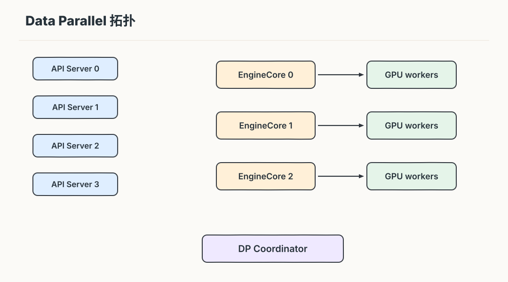</a>

<p class='figure-caption'>Data-parallel 拓扑：N 个 EngineCore replica、一个 DP coordinator，以及对各 engine 打分的 front-end client。</p>

**会构建哪一种 client。**

DP 拓扑完全由 factory 根据 config 的分支决定；serving stack 的其余部分只会看到统一的 `EngineCoreClient` interface（[第 2 节](#2-进程拓扑api-serverenginecore-与-gpu-worker)）。

[`vllm/v1/engine/core_client.py:126-132`](https://github.com/vllm-project/vllm/blob/6cf7b26bd4bff60bf378e1af14044280ac0d214c/vllm/v1/engine/core_client.py#L126-L132)：

```python
        if parallel_config.data_parallel_size > 1:
            if parallel_config.data_parallel_external_lb:
                # External load balancer - client per DP rank.
                return DPAsyncMPClient(*client_args)
            # Internal load balancer - client balances to all DP ranks.
            return DPLBAsyncMPClient(*client_args)
        return AsyncMPClient(*client_args)
```

`data_parallel_size == 1` 返回普通的 `AsyncMPClient`：只有一个 engine，没有 coordinator，也不进行打分。当 `DP > 1` 使用 *external* load balancer 时，会返回 `DPAsyncMPClient`。它只管理自己的 local rank，从不打分——其 `get_core_engine_for_request` 只会返回唯一的 `self.core_engine`（[`core_client.py:1376-1377`](https://github.com/vllm-project/vllm/blob/6cf7b26bd4bff60bf378e1af14044280ac0d214c/vllm/v1/engine/core_client.py#L1376-L1377)）；因为 upstream LB 已经选定了 rank。当 `DP > 1` 使用默认的 *internal* balancer 时，则会返回 `DPLBAsyncMPClient`。它管理全部 `dp_size` 个 engine，并执行下文介绍的打分逻辑。**load-balancing 决策在 client 侧完成。** coordinator（下文介绍）只负责发布 stats，从不路由 request。

**每个 rank 对应一个 EngineCore process。**

这些 replica 由 `CoreEngineProcManager` 作为普通 OS process spawn，每个 local DP rank 对应一个（[`utils.py:156-171`](https://github.com/vllm-project/vllm/blob/6cf7b26bd4bff60bf378e1af14044280ac0d214c/vllm/v1/engine/utils.py#L156-L171)，完整代码见[第 2 节](#2-进程拓扑api-serverenginecore-与-gpu-worker)）。其中，为每个 replica 标记 identity 的那行代码是 DP 的关键：

```python
                    name=f"EngineCore_DP{global_index}" if is_dp else "EngineCore",
```

每个 replica 都有两个 rank——一个 *global* `dp_rank = start_index + index`，以及一个 *local* `local_dp_rank = local_start_index + index`（即它在当前 node 上的 GPU shard 索引）。manager 只管理 local slice `[start_index, start_index + local_engine_count)`，因此一个 node 可以承载 global rank 的一段连续子区间，从而支持 multi-node DP。global rank 会成为 engine 稳定的 ZMQ identity（`rank.to_bytes(2, "little")`），与 client 的 `core_engines` list（[`core_client.py:1407`](https://github.com/vllm-project/vllm/blob/6cf7b26bd4bff60bf378e1af14044280ac0d214c/vllm/v1/engine/core_client.py#L1407) 会 assert `len > 1`）以及 handshake identity（[第 11 节](#11-启动握手与连接)）相匹配。其核心性质是：**DP rank identity 稳定且连续**。global 与 local 解耦后，一个 manager instance 便可以只负责全局编号 mesh 的一部分。需要注意，DP 与 engine 内部的 `world_size` 相互正交：DP=d、TP=t 的部署包含 `d` 个 EngineCore process，每个 process 再展开为 `t` 个 worker process，总计 `d × t` 个 GPU process（[第 10 节](#10-dp--tp-组合进程数公式)）。

**是否运行 coordinator。**

coordinator 是否启动取决于具体条件——并非每种 DP 部署都需要 coordinator。

[`vllm/v1/engine/utils.py:1110-1118`](https://github.com/vllm-project/vllm/blob/6cf7b26bd4bff60bf378e1af14044280ac0d214c/vllm/v1/engine/utils.py#L1110-L1118)：

```python
    run_coordinator = (
        vllm_config.needs_dp_coordinator and not offline_mode and dp_rank == 0
    )

    if run_coordinator:
        coordinator = DPCoordinator(
            parallel_config,
            enable_wave_coordination=vllm_config.model_config.is_moe,
        )
```

`needs_dp_coordinator` gate 定义在 [`vllm/config/vllm.py:621-625`](https://github.com/vllm-project/vllm/blob/6cf7b26bd4bff60bf378e1af14044280ac0d214c/vllm/config/vllm.py#L621-L625)：

```python
        return self.parallel_config.data_parallel_size > 1 and (
            self.model_config is None
            or self.model_config.is_moe
            or not self.parallel_config.data_parallel_external_lb
        )
```

这里有三个必须同时满足的条件：`DP > 1`、online 模式（`not offline_mode`——offline 模式下，每个 rank 各运行一个 `LLM`，不使用共享 coordinator），以及 `dp_rank == 0`（确保只有一个 coordinator，并与 rank 0 部署在一起）。随后，`needs_dp_coordinator` property 进一步限定 coordinator 的用途：对于 **MoE** model，需要 coordinator（`is_moe`）执行 wave coordination，即使使用 external LB 也是如此；对于 dense model，则只有在 **internal/hybrid LB** 模式下才需要 coordinator（`not external_lb`）收集 stats。使用 external LB 的 dense model 两者都不需要，因此不会 spawn coordinator。与此同时，`enable_wave_coordination` 会被设为 `is_moe`，所以 dense internal-LB coordinator 虽然会运行，但会跳过所有 wave logic。**最多只有一个 coordinator，位于 rank 0，且仅在 online 模式下运行；wave logic 只用于 MoE。**

### Coordinator 的 socket 与 subscribe barrier

coordinator 是纯粹的 message relay，bind 了三个 socket，且不在 request path 上。

[`vllm/v1/engine/coordinator.py:207-249`](https://github.com/vllm-project/vllm/blob/6cf7b26bd4bff60bf378e1af14044280ac0d214c/vllm/v1/engine/coordinator.py#L207-L249)（有删节）：

```python
        with (
            make_zmq_socket(
                path=front_publish_address,  # IPC
                ctx=self.ctx,
                socket_type=zmq.XPUB,
                bind=True,
            ) as publish_front,
            make_zmq_socket(
                path=back_output_address,  # IPC or TCP
                ctx=self.ctx,
                socket_type=zmq.PULL,
                bind=True,
            ) as output_back,
            make_zmq_socket(
                path=back_publish_address,  # IPC or TCP
                ctx=self.ctx,
                socket_type=zmq.XPUB,
                bind=True,
            ) as publish_back,
        ):
            ...
            # Wait until all engines subscribe.
            for _ in self.engines:
                if publish_back.recv() != b"\x01":
                    logger.error(...)
                    return
            # Send ready message to engines.
            publish_back.send(b"READY")
```

<a href='images/vllm-03-24-coordinator-planes.svg' target='_blank'>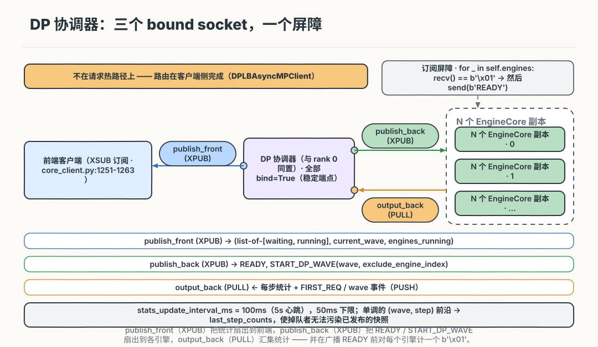</a>

<p class='figure-caption'>DP coordinator 的三个 bound socket 与 subscribe barrier：publish_front (XPUB) 将 stats 广播给 front-end，publish_back (XPUB) 将 READY/START_DP_WAVE 广播给 engine，output_back (PULL) 收集各 engine 的 stats 和 wave event；此外，它会先为每个 engine 计入一个 subscription，再广播 READY。它从不路由 request。</p>

先看这三个平面：`publish_front` (XPUB) 将聚合统计信息扇出给前端客户端，客户端通过 XSUB 订阅（[`core_client.py:1251-1263`](https://github.com/vllm-project/vllm/blob/6cf7b26bd4bff60bf378e1af14044280ac0d214c/vllm/v1/engine/core_client.py#L1251-L1263)）；`publish_back` (XPUB) 将控制消息（`READY`、`START_DP_WAVE`）扇出给各个 engine；`output_back` (PULL) 则是 fan-in 端点，每个 engine 都会将每个 step 的统计信息和 wave event PUSH 到这里。三者都采用 `bind=True`，因为协调器是稳定端点（bind/connect 的极性规则遵循 `make_zmq_socket`，见[第 4 节](#4-zmq-transportrequest-与-output-socket)）。对 `self.engines` 的循环构成一道**订阅屏障**：XPUB 会用一个 `b"\x01"` 帧上报每个新订阅者，因此协调器会等到恰好收到 `len(self.engines)` 个订阅后，才广播 `b"READY"`。其保证是：**在所有 DP peer 都连接到控制平面之前，任何 engine 都不会越过 init 阶段**——这是 DP 每个 step 执行 collective all-reduce 的前提条件。

发布频率会受到节流，并保持 step 一致性。统计信息发生变化时，[`coordinator.py:256-279`](https://github.com/vllm-project/vllm/blob/6cf7b26bd4bff60bf378e1af14044280ac0d214c/vllm/v1/engine/coordinator.py#L256-L279) 会等待 `stats_update_interval_ms`（默认 100 ms），否则按 5 s 的 heartbeat 周期等待；此外还设置了 50 ms 的下限，以便聚齐一整轮各 engine 的统计信息。接收路径（[`coordinator.py:379-403`](https://github.com/vllm-project/vllm/blob/6cf7b26bd4bff60bf378e1af14044280ac0d214c/vllm/v1/engine/coordinator.py#L379-L403)）维护单调递增的 `(wave, step)` frontier；当更新的 step 到来时，它会将上一个一致 step 的计数快照保存到 `last_step_counts` 中，因此 straggler 迟到的统计信息绝不会破坏已经发布的 snapshot。前端收到的 payload 是 `(list-of-[waiting, running], current_wave, engines_running)`。

### 客户端打分

`DPLBAsyncMPClient` 会将协调器的全局计数同步到本地 slice，并针对每个 request 在该 slice 上打分。

[`vllm/v1/engine/core_client.py:1413-1447`](https://github.com/vllm-project/vllm/blob/6cf7b26bd4bff60bf378e1af14044280ac0d214c/vllm/v1/engine/core_client.py#L1413-L1447)：

```python
    def get_core_engine_for_request(self, request: EngineCoreRequest) -> EngineIdentity:
        # Engines are in rank order.
        if (eng_index := request.data_parallel_rank) is None and (
            eng_index := get_late_interaction_engine_index(
                request.pooling_params, len(self.core_engines)
            )
        ) is None:
            current_counts = self.lb_engines
            # TODO use P2C alg for larger DP sizes
            num_engines = len(current_counts)
            min_score = sys.maxsize
            eng_index = 0
            for i in range(num_engines):
                # Start from client_index to help with balancing when engines
                # are empty.
                idx = (self.eng_start_index + i) % num_engines
                waiting, running = current_counts[idx]
                score = waiting * 4 + running
                if score < min_score:
                    min_score = score
                    eng_index = idx
            # Increment local waiting count for better balancing between stats
            # updates from the coordinator (which happen every 100ms).
            current_counts[eng_index][0] += self.client_count
            ...
            self.eng_start_index = (self.eng_start_index + 1) % num_engines

        chosen_engine = self.core_engines[eng_index]
        # Record which engine is chosen for this request, to handle aborts.
        self.reqs_in_flight[request.request_id] = chosen_engine
        return chosen_engine
```

具体过程如下：(1) **显式 pin 优先**——如果设置了 `request.data_parallel_rank`（或者 late-interaction pooling 以确定性方式映射到某个 engine），就完全跳过扫描。(2) 否则采用 **`score = waiting * 4 + running`**：queue 中 request 的权重是已调度 request 的 4×，分数最低者胜出。(3) 扫描从 `eng_start_index` 开始（每个客户端都会将其初始化为 `len(core_engines) * client_index // client_count`，见 [`core_client.py:1409-1411`](https://github.com/vllm-project/vllm/blob/6cf7b26bd4bff60bf378e1af14044280ac0d214c/vllm/v1/engine/core_client.py#L1409-L1411)），并在每次调用时轮转起点，避免出现平分时总是偏向同一个 engine——这一轮转机制是最近才加入的（参见下文说明）。(4) 通过一次**乐观本地递增**，`current_counts[eng_index][0] += self.client_count` 会立即增加所选 engine 的等待计数，而不必等到协调器下一个 100 ms snapshot；这样，即使同一周期内突发大量 request，也仍能将其分散开来。(5) `reqs_in_flight[request_id] = chosen_engine` 记录归属关系。

最终效果是：**每个 request 都恰好落到一个 engine 上，而且该映射会被记录下来**。这是因为 abort 采用点对点方式（`reqs_in_flight` 会将 abort 路由到同一个 engine，见 [`core_client.py:1535-1541`](https://github.com/vllm-project/vllm/blob/6cf7b26bd4bff60bf378e1af14044280ac0d214c/vllm/v1/engine/core_client.py#L1535-L1541)），而 request 完成后则会移除该映射。第 11 篇引用的该函数精简版本早于 `eng_start_index` tie-break 轮转机制和显式 pin 短路逻辑；这里的 baseline（[`core_client.py:1415-1442`](https://github.com/vllm-project/vllm/blob/6cf7b26bd4bff60bf378e1af14044280ac0d214c/vllm/v1/engine/core_client.py#L1415-L1442)）才是当前实现。

### MoE wave 协调

Dense DP 副本彼此完全独立，MoE 副本则不然。expert all-to-all 是覆盖所有 DP rank 的 collective，因此只要 peer 仍处于暂停状态，任何 engine 都不能运行 batch——每个 rank 都必须同步推进 step；即使没有实际工作，也要执行一次 *dummy* forward。全局 `engines_running` flag 仅由协调器持有，用于强制执行这一约束。

触发条件是：处于暂停状态的一组 engine 收到第一个 request。[`core_client.py:1359-1372`](https://github.com/vllm-project/vllm/blob/6cf7b26bd4bff60bf378e1af14044280ac0d214c/vllm/v1/engine/core_client.py#L1359-L1372)：

```python
    async def add_request_async(self, request: EngineCoreRequest) -> None:
        self._ensure_stats_update_task()

        request.current_wave = self.current_wave
        request.client_index = self.client_index

        chosen_engine = self.get_core_engine_for_request(request)
        to_await = self._send_input(EngineCoreRequestType.ADD, request, chosen_engine)
        if not self.engines_running:
            # Notify coordinator that we're sending a request
            req_msg = msgspec.msgpack.encode(("FIRST_REQ", chosen_engine))
            await self.first_req_send_socket.send(req_msg)

        await to_await
```

request 会带上客户端缓存的 `current_wave`，然后发送给打分选中的 engine。如果客户端认为各 engine 仍处于暂停状态（`not self.engines_running`），还会经由其统计任务向协调器发送 `("FIRST_REQ", chosen_engine)`。该消息会到达协调器的前侧 XPUB；协调器是持有全局 `engines_running` flag 的唯一权威方，并通过一个小型 wave 状态机处理该消息（[`coordinator.py:342-453`](https://github.com/vllm-project/vllm/blob/6cf7b26bd4bff60bf378e1af14044280ac0d214c/vllm/v1/engine/coordinator.py#L342-L453)）：它会翻转 `engines_running`，并在后侧 XPUB（`publish_back`）上重新广播 `START_DP_WAVE = b"\x02"`（携带 `(wave, exclude_engine_index)`，见 [`coordinator.py:443-453`](https://github.com/vllm-project/vllm/blob/6cf7b26bd4bff60bf378e1af14044280ac0d214c/vllm/v1/engine/coordinator.py#L443-L453)），以驱动整组 engine 继续前进。这里始终会执行重新广播，避免过期 wave 导致部分 engine 永久卡住。

wave 状态机的精确分支，以及由它控制的 expert all-to-all，都属于第 11 篇讨论的并行 *algorithm*。**所有 DP engine 都以 lockstep 方式逐 wave 推进，wave 状态只由唯一的权威方（协调器）翻转。**

### Fail-stop 活性

DP 目前不支持局部故障恢复。[`vllm/v1/engine/utils.py:222-242`](https://github.com/vllm-project/vllm/blob/6cf7b26bd4bff60bf378e1af14044280ac0d214c/vllm/v1/engine/utils.py#L222-L242)：

```python
    def monitor_engine_liveness(self) -> None:
        """Monitor engine core process liveness."""

        sentinel_to_proc = {proc.sentinel: proc for proc in self.processes}
        sentinels = set(sentinel_to_proc.keys())

        while sentinels and not self.manager_stopped.is_set():
            died_sentinels = connection.wait(sentinels, timeout=1)
            ...
            if died_sentinels:
                # Any engine exit currently triggers a shutdown. ...
                break

        self.shutdown()
```

第一个 engine 退出后，monitor loop 就会中断并触发整体 shutdown；目前尚未实现 DP 的局部恢复。collective 通信要求如此：一旦某个副本消失，其余副本就无法安全地继续执行下一个跨 rank step。

## 10. DP + TP 组合：进程数公式

进程数可以拆成两个因子。TP·PP·PCP 会将一个模型**分片**到由 executor 管理的 `world_size` 个 worker 上。DP 则会**复制**整个 engine 单元，其中包括 scheduler、KV cache、executor 和 worker。因此，GPU 进程数等于分片数与副本数的乘积。本节将推导进程数及 rank 身份关系；第 11 篇介绍 collective，第 09 篇介绍 worker 执行，第 04 篇介绍 engine loop。

### 分片轴：`world_size`，每个 engine 只计算一次

所有模型并行维度都会在 config 的 post-init 阶段汇总成一个标量：`world_size = PP · TP · PCP`（[`parallel.py:793-797`](https://github.com/vllm-project/vllm/blob/6cf7b26bd4bff60bf378e1af14044280ac0d214c/vllm/config/parallel.py#L793-L797)，完整推导见[第 7 节](#7-单节点-tensor-parallel一个-enginecoren-个-worker)；其中有意不包含 DP）。`world_size` 是一个 engine 的 executor 所管理的 worker 进程数，其 docstring 也明确表示它“会影响我们创建的 worker 数量”（[`parallel.py:324-325`](https://github.com/vllm-project/vllm/blob/6cf7b26bd4bff60bf378e1af14044280ac0d214c/vllm/config/parallel.py#L324-L325)）。有一个例外反而印证了这条规则：`external_launcher` backend 会将 DP 重新计入（`self.world_size *= self.data_parallel_size`，见 [`parallel.py:799-801`](https://github.com/vllm-project/vllm/blob/6cf7b26bd4bff60bf378e1af14044280ac0d214c/vllm/config/parallel.py#L799-L801)），原因正是 torchrun 会自行启动每个 rank，不存在可供复制的、每个 DP rank 独立一个的 `EngineCore`——这条路径不在本文讨论范围内，将留到第 11 篇介绍。

实际运行中，`MultiprocExecutor` 完全感知不到 DP 的存在。executor 按 `TP·PP·PCP` 确定自身规模，无法分辨自己究竟是 8 个 DP 副本中的第 0 个，还是单独运行的 engine。正是这种无感知性，让同一套 executor 实现无需改动即可同时适用于这两种情况。

**副本轴：每个 DP rank 对应一个 `EngineCore` 进程。**

DP 通过复制 engine 来增加进程，而不是扩大 executor 的规模。`CoreEngineProcManager` 的 spawn loop（[`utils.py:156-171`](https://github.com/vllm-project/vllm/blob/6cf7b26bd4bff60bf378e1af14044280ac0d214c/vllm/v1/engine/utils.py#L156-L171)，完整代码见[第 2 节](#2-进程拓扑api-serverenginecore-与-gpu-worker)）会针对每个本地 DP rank 迭代一次：

```python
        for index in range(local_engine_count):
```

它会为每个 *local* DP rank 创建一个 OS 进程；每个进程都是完整的 `EngineCoreProc.run_engine_core` entrypoint，并带有 global `dp_rank` 标记。一个跨两个节点的 DP=8 部署会在每个节点上运行四个此类进程；每个 engine 都会独立构建自己的 executor，进而创建各自的 `world_size` worker。（[第 9 节](#9-data-parallel-与-dp-coordinator)会介绍 coordinator 和 client-side routing，后者负责将 request 分发到这些副本。）

对于这里介绍的进程管理路径，`data_parallel_size` 决定 `EngineCore` 副本的数量。每个副本都有自己的 scheduler 和 KV cache，并负责处理一组独立的 request。

<a href='images/vllm-03-09-dp-tp-math.svg' target='_blank'>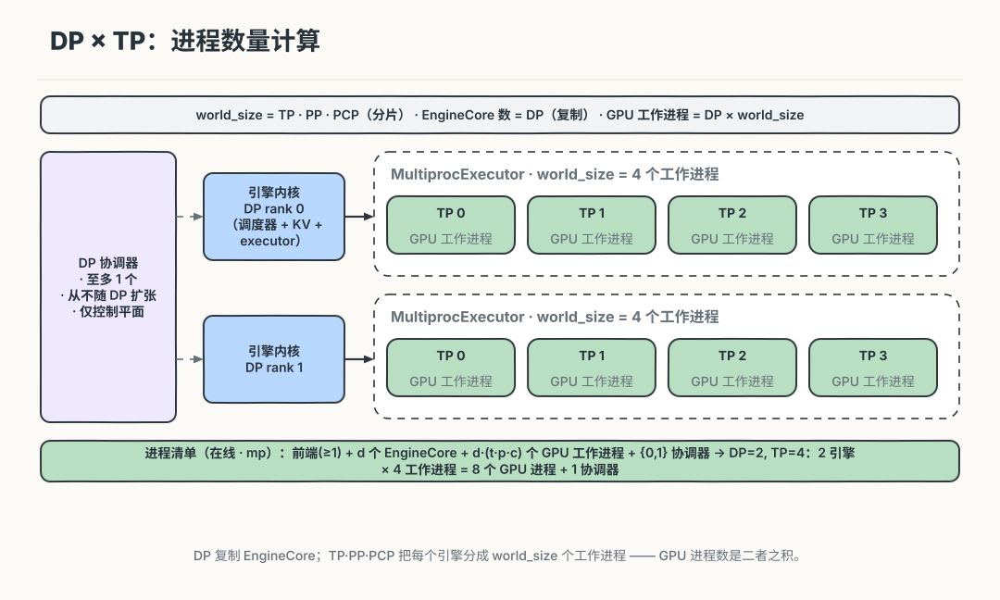</a>

<p class='figure-caption'>DP 复制 EngineCores；TP·PP·PCP 再将每个副本 shard 为 world_size 个 worker——GPU 进程数等于二者的乘积。</p>

### 计算公式

对于 `DP=d`、`TP=t`、`PP=p`、`PCP=c`，且 `world_size = t·p·c`：

- **EngineCore 进程** = `d`——每个 DP rank 一个（[`utils.py:156-171`](https://github.com/vllm-project/vllm/blob/6cf7b26bd4bff60bf378e1af14044280ac0d214c/vllm/v1/engine/utils.py#L156-L171)）。
- **GPU worker 进程** = `d × world_size` = `d × (t·p·c)`；在 `mp` backend 下，每个副本有 `world_size` 个（[`parallel.py:793-797`](https://github.com/vllm-project/vllm/blob/6cf7b26bd4bff60bf378e1af14044280ac0d214c/vllm/config/parallel.py#L793-L797)），共 `d` 个副本。
- **front-end / API-server 进程** = API-server 的数量：单 engine 时为 `1`，默认值会随数据并行规模调整（[第 2 节](#2-进程拓扑api-serverenginecore-与-gpu-worker)；详见第 02 篇）——它不是 GPU 进程。
- **DP coordinator 进程** ∈ {0, 1}——是否存在取决于下文条件，绝不会随 `d` 增长。

以下示例全部由上述依据推导而来：

| DP | TP | PP | PCP | world_size | EngineCores | GPU worker | coordinator |
| --- | --- | --- | --- | --- | --- | --- | --- |
| 1 | 1 | 1 | 1 | 1 | 1 | 1 (in-proc, `uni`) | 0 |
| 1 | 4 | 1 | 1 | 4 | 1 | 4 | 0 |
| 1 | 8 | 4 | 1 | 32 | 1 | 32 | 0 |
| 8 | 1 | 1 | 1 | 1 | 8 | 8 | 0 或 1 |
| 8 | 4 | 1 | 1 | 4 | 8 | 32 | 0 或 1 |
| 2 | 8 | 1 | 1 (MoE) | 8 | 2 | 16 | 1 |

`DP=1, TP=1` 这一行比较特殊：`world_size == 1` 会选择 `uni` backend；在此 backend 中，唯一的 worker 位于 `EngineCore` 进程*内部*，而不是单独运行在一个进程中（见下文 *进程数究竟在哪里确定*）。在 `uni` 下，`d × world_size` 的乘积统计的是会*访问 GPU*的 logical worker 数量，但单独创建的进程数只有 `d`。

**每个 DP rank 都是一个封闭的 transport 孤岛。**

所有组件都会完整复制——甚至 shared-memory fan-out plane 也是每个副本各自一套。broadcast `MessageQueue` 包含一个 writer（executor）和 `world_size` 个 reader（其 worker），并且只会构建在*当前* DP rank 的 DP-leader 节点上（[`multiproc_executor.py:135-157`](https://github.com/vllm-project/vllm/blob/6cf7b26bd4bff60bf378e1af14044280ac0d214c/vllm/v1/executor/multiproc_executor.py#L135-L157)，详见[第 7 节](#7-单节点-tensor-parallel一个-enginecoren-个-worker)）。系统中不存在 global broadcast plane；DP 副本 k 的 `SchedulerOutput` 永远不会到达副本 j 的 worker。follower 节点（单个 DP rank 内的 multi-node TP）不会设置 `rpc_broadcast_mq = None`，因此 `collective_rpc` 开头就是 `assert self.rpc_broadcast_mq is not None, "collective_rpc should not be called on follower node"`（[`multiproc_executor.py:355-357`](https://github.com/vllm-project/vllm/blob/6cf7b26bd4bff60bf378e1af14044280ac0d214c/vllm/v1/executor/multiproc_executor.py#L355-L357)）。

系统中共有 `d` 个彼此独立的 fan-out plane，每个 `EngineCore` 一个。跨副本协调（load balancing、MoE wave sync）只通过 coordinator 的 ZMQ side-channel 进行（[第 9 节](#9-data-parallel-与-dp-coordinator)），绝不会经过 shared-memory 数据平面。进程数按乘法增长，*transport* 数量也随之按乘法增长；在 data-plane 层面，各副本之间不存在任何横向共享。

**rank 从何而来。**

worker 的 global rank 及其角色均通过算术计算得出，绝不是由 registry 分配。

来源：[`vllm/v1/executor/multiproc_executor.py:164-178`](https://github.com/vllm-project/vllm/blob/6cf7b26bd4bff60bf378e1af14044280ac0d214c/vllm/v1/executor/multiproc_executor.py#L164-L178)（有删节）

```python
            global_start_rank = (
                self.local_world_size * self.parallel_config.node_rank_within_dp
            )
            ...
            for local_rank in range(self.local_world_size):
                global_rank = global_start_rank + local_rank
                is_driver_worker = self._is_driver_worker(global_rank)
```

在一个 DP rank 的 executor 内，`global_rank = local_world_size · node_rank_within_dp + local_rank`。在 single-node 场景（`nnodes_within_dp == 1`）下，`local_world_size == world_size`（[`parallel.py:684-685`](https://github.com/vllm-project/vllm/blob/6cf7b26bd4bff60bf378e1af14044280ac0d214c/vllm/config/parallel.py#L684-L685)），因此 rank 就是 `0 … world_size-1`。`_is_driver_worker` = `rank % tp_size == 0` 会为每个 TP group 选出一个 driver（[第 7 节](#7-单节点-tensor-parallel一个-enginecoren-个-worker)）。rank 按 PP-major 排列：每个连续的 `tp_size·pcp_size` block 对应一个 pipeline stage。

`output_rank`（唯一的 replier）同样完全由算术计算得出：`output_rank = world_size − tp_size·pcp_size`（[`multiproc_executor.py:498-512`](https://github.com/vllm-project/vllm/blob/6cf7b26bd4bff60bf378e1af14044280ac0d214c/vllm/v1/executor/multiproc_executor.py#L498-L512)，[第 7 节](#7-单节点-tensor-parallel一个-enginecoren-个-worker)结合 TP=8/PP=4 的示例给出了推导过程）。对于 TP=8, PP=4, PCP=1 → world_size=32，最后一个 stage 从 32−8=24 开始，因此 rank 24 是唯一的 replier；对于仅使用 single-node TP 的情况（PP=PCP=1），该公式可化简为 `world_size − tp_size = 0`，因此只有 rank 0 会发出 `ModelRunnerOutput`。这个计算完全不涉及 DP——`output_rank` 是 `[0, world_size)` 中的 engine 内部索引，每个副本都以完全相同的方式计算它。

整个 rank 拓扑都是 `(node_rank_within_dp, local_rank, tp_size, pp_size, pcp_size)` 的确定性函数。没有任何进程会协商自身身份；global DP index（`start_index + local offset`，来自上面的 spawn loop）与 local shard rank 解耦，因此一个节点可以承载 global rank 的任意连续子区间。由此，启动顺序错误会表现为 rank 算术结果不匹配，而不会造成静默误路由。

**coordinator 是有条件启用的，而且数量绝不会随 DP 增长。**

能够跨越多个 DP 副本的进程至多只有一个，而且它是可选的。当且仅当 `DP > 1` *且* 处于 online mode *且* `dp_rank == 0` *且*（MoE 或 internal/hybrid LB）时，它才会运行——这正是[第 9 节](#9-data-parallel-与-dp-coordinator)介绍的 `run_coordinator` / `needs_dp_coordinator` gate（[`utils.py:1110-1118`](https://github.com/vllm-project/vllm/blob/6cf7b26bd4bff60bf378e1af14044280ac0d214c/vllm/v1/engine/utils.py#L1110-L1118)、[`vllm/config/vllm.py:621-625`](https://github.com/vllm-project/vllm/blob/6cf7b26bd4bff60bf378e1af14044280ac0d214c/vllm/config/vllm.py#L621-L625)）。因此，在 *external* load balancer 下运行的 dense model 即使 DP>1，也不会启动任何 coordinator；MoE wave coordination 则通过 `is_moe` 单独启用（[`utils.py:1117`](https://github.com/vllm-project/vllm/blob/6cf7b26bd4bff60bf378e1af14044280ac0d214c/vllm/v1/engine/utils.py#L1117)）。这意味着 dense model 的 internal-LB coordinator 会发布 load stats，但绝不会驱动 MoE wave。

简而言之：无论 `d` 取何值，coordinator 数量始终 ∈ {0, 1}。它是 control-plane 进程，而不是 GPU 进程，也不计入 `d × world_size` 的乘积。

### 进程数究竟在哪里确定

进程数是在 backend 的默认选择逻辑中确定的——single-GPU 部署无需承担任何额外开销。

来源：[`vllm/config/parallel.py:871-916`](https://github.com/vllm-project/vllm/blob/6cf7b26bd4bff60bf378e1af14044280ac0d214c/vllm/config/parallel.py#L871-L916)（有删节）

```python
        if self.distributed_executor_backend is None and self.world_size_across_dp > 1:
            # We use multiprocessing by default if world_size fits on the
            # current node and we aren't in a ray placement group.
            ...
            backend: DistributedExecutorBackend = "mp"
            ...
            self.distributed_executor_backend = backend

        if self.distributed_executor_backend is None and self.world_size == 1:
            self.distributed_executor_backend = "uni"
```

`world_size_across_dp = world_size · data_parallel_size = TP·PP·PCP·DP`（[`parallel.py:517-520`](https://github.com/vllm-project/vllm/blob/6cf7b26bd4bff60bf378e1af14044280ac0d214c/vllm/config/parallel.py#L517-L520)）。若该乘积大于 1，默认 backend 是 `mp`（out-of-process worker）；TPU-SPMD 场景会覆盖为 `uni`，存在 Ray placement group 时则覆盖为 `ray`。若 `world_size == 1`，backend 就是 `uni`，即一个不需要 IPC 的 in-process worker。随后，`Executor.get_class`（[`abstract.py:47-92`](https://github.com/vllm-project/vllm/blob/6cf7b26bd4bff60bf378e1af14044280ac0d214c/vllm/v1/executor/abstract.py#L47-L92)）会将解析后的字符串映射到具体 class。因此，`DP=1, TP=1` 这个 corner case 确实只用一个进程完成所有工作：`EngineCore` 与唯一的 worker 共享同一 address space，`collective_rpc` 是直接 method call（第 09 篇），本文介绍的 ZMQ/shared-memory 机制全都不存在。进程数量激增是 opt-in 的——只有当 `world_size_across_dp > 1` 使上述算术关系确实需要更多进程时，这种激增才会出现。

worker 数量在 spawn 前就由 `(DP, TP, PP, PCP)` 固定下来，但它并不等于整个部署的 process 总数。`multiprocess_mode` 单独控制 frontend↔EngineCore 的拆分；serving 还会增加 API-server process，external launcher 也可能自行部署 worker。`uni` executor 只表示其 worker 与 EngineCore 共用同一个 process。

### 汇总计算关系

对于采用在线 `mp`-backend 的部署，process 总数为：

```text
front-ends (≥1)  +  d EngineCores  +  d·(t·p·c) GPU workers  +  {0,1} coordinator
```

这里，每个 engine 对应 `world_size = t·p·c`，DP 则会贡献 `d` 个完全相同的 engine 单元。当 `world_size == 1` 时，`uni` backend 会将 worker 合并到自己的 EngineCore 中；在这种特殊情况下，该公式统计的是角色，不一定代表彼此独立的 process。

## 11. 启动握手与连接

[第 4 节](#4-zmq-transportrequest-与-output-socket)介绍的传输机制依赖一个必须在启动时*主动建立*的前提：每个 engine 的 DEALER/PUSH 都知道 client 上已 bind 的具体 endpoint，而 client 的 ROUTER 也知道每个 engine 的 identity。process 刚 fork 时，这两个条件都不成立。client 将 socket bind 到 `tcp://host:0`（port 由 kernel 分配），但 engine 在该 port 确定之前就已 spawn；此外，ROUTER 在从 DEALER 收到 frame 之前，无法向它定向发送消息。V1 通过一套精心设计的启动序列解决了这个问题：**在两组不同的 socket pair 上完成两次 rendezvous**。第一次是专用 ROUTER/DEALER 上短暂的 control handshake（`HELLO → CONNECTED → READY`）；第二次是在 request ROUTER/DEALER 上发送 data-plane ready frame，它同时完成 identity 注册和 config 对齐。其中最关键的是执行顺序。

<a href='images/vllm-03-10-startup-handshake.svg' target='_blank'>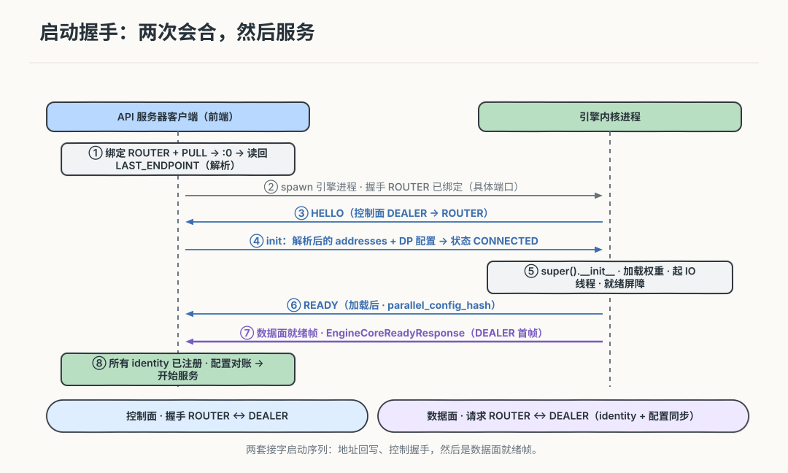</a>

<p class='figure-caption'>双 socket 启动序列：地址回写、control handshake，然后发送 data-plane ready frame。</p>

### 前置条件：单一来源寻址

在任何 engine 创建之前，地址分配权都由 client 单独掌握。在 self-managed 路径中（默认使用 `LLM`/`AsyncLLM`），`MPClient.__init__` 会 bind request ROUTER 和 output PULL，并在启动 engine 之前，将占位 port 改写为 kernel 实际分配的 port。

[`vllm/v1/engine/core_client.py:564-573`](https://github.com/vllm-project/vllm/blob/6cf7b26bd4bff60bf378e1af14044280ac0d214c/vllm/v1/engine/core_client.py#L564-L573)

```python
                # Resolve ``tcp://host:0`` placeholders to bound endpoints
                # before engines DEALER-connect. No-op for IPC.
                addresses.inputs[0] = self.input_socket.getsockopt(
                    zmq.LAST_ENDPOINT
                ).decode()
                addresses.outputs[0] = self.resources.output_socket.getsockopt(
                    zmq.LAST_ENDPOINT
                ).decode()

                with launch_core_engines(
                    vllm_config, executor_class, log_stats, addresses
                ) as (engine_manager, coordinator, addresses, tensor_queue):
```

首先执行 bind（ROUTER 和 PULL 按照[第 4 节](#4-zmq-transportrequest-与-output-socket)中的 polarity rule 进行 bind），然后回读 `LAST_ENDPOINT`，将 `tcp://host:0` 变为 `tcp://host:54123`，覆盖 `addresses` struct，之后才进入 `launch_core_engines`；它会拿着这个 struct spawn engine process。对于 IPC path，这个 string 本身已经是具体地址，因此 writeback 是 no-op。由外部管理的路径（multi-API-server）则通过 `multiprocessing` pipe 回报 bind 后的 endpoint（参见[`core_client.py:511-549`](https://github.com/vllm-project/vllm/blob/6cf7b26bd4bff60bf378e1af14044280ac0d214c/vllm/v1/engine/core_client.py#L511-L549)），但核心不变量完全相同。

engine 的 data-plane DEALER/PUSH 只会对完全解析后的 endpoint 执行 `connect()`，绝不会连接到 `:0`。bind-then-resolve-then-launch 的顺序保证了 connector 行为的确定性；这里不存在 bind/connect race，因为只有一端（client）执行 bind，而且是在 peer 创建之前完成的。

### 启动编排

`launch_core_engines` 是一个 context manager：它负责 bind control socket、spawn engine process，将 process handle 交给 client，之后才阻塞等待所有 engine ready。

[`vllm/v1/engine/utils.py:1190-1213`](https://github.com/vllm-project/vllm/blob/6cf7b26bd4bff60bf378e1af14044280ac0d214c/vllm/v1/engine/utils.py#L1190-L1213)

```python
    with zmq_socket_ctx(
        local_handshake_address, zmq.ROUTER, bind=True
    ) as handshake_socket:
        # Start local engines.
        if local_engine_count:
            local_engine_manager = CoreEngineProcManager(
                ...
                handshake_address=handshake_address,
                ...
            )
        ...
        yield local_engine_manager, coordinator, addresses, tensor_queue

        # Now wait for engines to start.
        wait_for_engine_startup(
            handshake_socket,
            addresses,
            engines_to_handshake,
            ...
        )
```

handshake ROUTER 会 bind 到 `handshake_address`。与 data-plane socket 不同，这是一个*具体* port（`data_parallel_rpc_port or get_open_port()`，参见[`utils.py:1179`](https://github.com/vllm-project/vllm/blob/6cf7b26bd4bff60bf378e1af14044280ac0d214c/vllm/v1/engine/utils.py#L1179)），因为在当前 process 中 spawn 出来的 engine 会在 fork 时获取它，无法推迟解析。`CoreEngineProcManager` 通过 `start()` 为每个 local DP rank 启动一个 `EngineCoreProc.run_engine_core` process，并为其传入 `handshake_address`（每个 rank 的 spawn 参见[第 2 节](#2-进程拓扑api-serverenginecore-与-gpu-worker)，DP replication 参见[第 9 节](#9-data-parallel-与-dp-coordinator)）。通过 `yield`，`MPClient.__init__` 可以在 engine 仍在 import torch、加载 weights 时取得 manager/coordinator handle；真正的 barrier 是 context 退出时的 `wait_for_engine_startup`。这是独立于 request 路径的另一组 ROUTER/DEALER：control plane 和 data plane 从不共用 socket。

### 阶段 A — control handshake

每个 engine 都会在 constructor 内将 DEALER connect 到 `handshake_address`，并驱动一个包含三种状态的状态机。engine 侧（[`core.py:1115-1151`](https://github.com/vllm-project/vllm/blob/6cf7b26bd4bff60bf378e1af14044280ac0d214c/vllm/v1/engine/core.py#L1115-L1151)）会发送 `HELLO`，最多阻塞等待 `HANDSHAKE_TIMEOUT_MINS = 5`（[`core.py:91`](https://github.com/vllm-project/vllm/blob/6cf7b26bd4bff60bf378e1af14044280ac0d214c/vllm/v1/engine/core.py#L91)）以接收 init reply，并应用 front-end 返回的 DP config。状态转换以 front-end 侧为准：

[`vllm/v1/engine/utils.py:1311-1332`](https://github.com/vllm-project/vllm/blob/6cf7b26bd4bff60bf378e1af14044280ac0d214c/vllm/v1/engine/utils.py#L1311-L1332)

```python
        if status == "HELLO" and engine.state == CoreEngineState.NEW:
            # Send init message with DP config info.
            init_message = msgspec.msgpack.encode(
                EngineHandshakeMetadata(
                    addresses=addresses,
                    parallel_config={
                        k: getattr(parallel_config, k)
                        for k in (
                            "data_parallel_master_ip",
                            ...
                        )
                    }
                    if coordinated_dp
                    else {},
                )
            )
            handshake_socket.send_multipart((eng_identity, init_message), copy=False)
            conn_pending[0 if local else 1] -= 1
            start_pending[0 if local else 1] += 1
            engine.state = CoreEngineState.CONNECTED
```

<a href='images/vllm-03-25-handshake-states.svg' target='_blank'>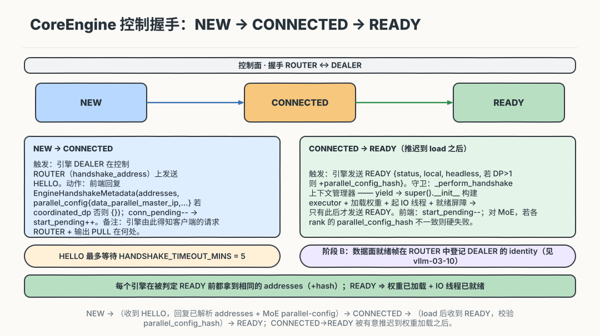</a>

<p class='figure-caption'>front-end 侧的 CoreEngine control-handshake 状态机：收到 HELLO 后从 NEW 转为 CONNECTED（front-end 返回 EngineHandshakeMetadata，其中包含解析后的地址和 MoE parallel-config）；只有在 weights 加载完成且 IO thread 启动后，才从 CONNECTED 转为 READY（同时校验 parallel_config_hash）；CONNECTED 到 READY 的转换被刻意推迟到 load 完成之后。</p>

engine 的 rank 采用 2-byte little-endian 编码，并作为 ROUTER identity frame（`eng_identity`）到达；front-end 将它与一个 `CoreEngine` tracker 匹配，校验 `local`/`headless` flag，并在收到 `HELLO` 且当前处于 `NEW` 状态时，回复 `EngineHandshakeMetadata`。其中携带**解析后的 `addresses` struct**（也就是前置步骤中回写的同一个 struct）；对于 MoE（`coordinated_dp`），还会包含 DP master ip/port，使所有 rank 组成同一个 process group。engine 随后转入 `NEW → CONNECTED`；pending counter 会将一个 slot 从 `conn_pending` 移到 `start_pending`。engine 正是通过这种方式获知 client 的 request ROUTER 和 output PULL 实际位于何处。

第二次状态转换 `CONNECTED → READY` 会推迟到 model load 完成之后，而且这种延后由代码结构保证，并非偶然形成的时序。在 engine 侧，`_perform_handshake` 是一个 context manager，它会将地址 yield 给 constructor body，并且只在该 body 退出时发送 `READY`：

[`vllm/v1/engine/core.py:1096-1113`](https://github.com/vllm-project/vllm/blob/6cf7b26bd4bff60bf378e1af14044280ac0d214c/vllm/v1/engine/core.py#L1096-L1113)

```python
            addresses = self.startup_handshake(
                handshake_socket, local_client, headless, parallel_config_to_update
            )
            yield addresses

            # Send ready message.
            ready_msg = {
                "status": "READY",
                "local": local_client,
                "headless": headless,
            }
            # Include config hash for DP configuration validation
            if vllm_config.parallel_config.data_parallel_size > 1:
                ready_msg["parallel_config_hash"] = (
                    vllm_config.parallel_config.compute_hash()
                )
            handshake_socket.send(msgspec.msgpack.encode(ready_msg))
```

`yield` 会返回到 `EngineCoreProc.__init__`；后者的 `with self._perform_handshakes(...)` body 会运行 `super().__init__`（负责构造 executor 并加载 weights）、spawn IO thread，并阻塞在 ready barrier 上——所有这些都发生在控制流返回此处发送 `READY` 之前。因此，control socket 上出现 `READY` frame 就意味着 load 已完成。front-end 侧由 `wait_for_engine_startup` 处理该 frame（[`utils.py:1333-1352`](https://github.com/vllm-project/vllm/blob/6cf7b26bd4bff60bf378e1af14044280ac0d214c/vllm/v1/engine/utils.py#L1333-L1352)）：当状态为 `CONNECTED` 时，它会递减 `start_pending`，将 engine 转入 `READY`；对于 MoE，如果各 rank 的 `parallel_config_hash` 不一致，则会直接 hard-fail。

每个 engine 在被宣告为 `READY` 之前，都会收到一组*完全相同*的 ZMQ address（对于 MoE，还包括完全相同的 parallel-config hash）；而 `READY` 只会在 weights 加载完毕、IO thread 启动后发出。DP collective 会针对 "has unfinished requests" flag 执行 all-reduce（第 11 篇），这要求各方 config 严格同步。因此，config 一旦不一致，就必须在启动时立即失败，而不能等到后续 collective deadlock。

### 阶段 B — data-plane ready frame

control handshake 告诉了 engine 应连接到哪里，但*没有*向 client 的 request ROUTER 注册 engine identity：ROUTER 只有在收到 message 后才能识别 peer。因此，engine 的 input thread 连接 request DEALER 后，发出的第一条 message 就是 ready frame：

[`vllm/v1/engine/core.py:1541-1547`](https://github.com/vllm-project/vllm/blob/6cf7b26bd4bff60bf378e1af14044280ac0d214c/vllm/v1/engine/core.py#L1541-L1547)

```python
            ready_payload = msgspec.msgpack.encode(ready_response)
            for input_socket in input_sockets:
                # Send initial message to each input socket - this is required
                # before the front-end ROUTER socket can send input messages
                # back to us.
                input_socket.send(ready_payload)
                poller.register(input_socket, zmq.POLLIN)
```

payload 是一个 `EngineCoreReadyResponse`（[`__init__.py:68-86`](https://github.com/vllm-project/vllm/blob/6cf7b26bd4bff60bf378e1af14044280ac0d214c/vllm/v1/engine/__init__.py#L68-L86)）——这是一个记录初始化后实际信息的 struct，其中的值可能不同于调用方请求的 config：`max_model_len`、`num_gpu_blocks`、`block_size`、`dtype`、`world_size`、`data_parallel_size`、KV-cache 容量，以及 `dp_stats_address`。尤其是 `num_gpu_blocks` 的数值，只有在 executor 完成内存 profiling 和 KV bring-up *之后*才能确定（[第 12 节](#12-故障处理关闭流程与完整拓扑追踪)；[`abstract.py:118-137`](https://github.com/vllm-project/vllm/blob/6cf7b26bd4bff60bf378e1af14044280ac0d214c/vllm/v1/executor/abstract.py#L118-L137) 会先运行 `initialize_from_config`，再运行 `compile_or_warm_up_model`）。因此，这个 frame 由已进入运行状态的 input thread 发出，而不是在 control handshake 期间发送。

client 会一直阻塞，直到收到*每个*受管 identity 发来的 frame：

[`vllm/v1/engine/core_client.py:615-633`](https://github.com/vllm-project/vllm/blob/6cf7b26bd4bff60bf378e1af14044280ac0d214c/vllm/v1/engine/core_client.py#L615-L633)

```python
            # Wait for ready messages from each engine on the input socket.
            identities = set(self.core_engines)
            sync_input_socket = zmq.Socket.shadow(self.input_socket)
            while identities:
                if not sync_input_socket.poll(
                    timeout=VLLM_ENGINE_READY_TIMEOUT_S * 1000  # convert to ms
                ):
                    raise TimeoutError(
                        f"Timed out waiting for engine core processes to "
                        ...
                    )
                identity, payload = sync_input_socket.recv_multipart()
                identities.remove(identity)
                self._apply_ready_response(payload)
```

`self.core_engines` 是预期 identity 的集合，其中每个 identity 都是一个 `dp_rank.to_bytes(2, "little")`——这正是 engine 为其 DEALER 的 `zmq.IDENTITY` 设置的原始 bytes，也是 front-end 用作 control handshake key 的 bytes。client 通过 shadow，将自身（可能是 async）的 ROUTER 包装成 blocking socket，以 `VLLM_ENGINE_READY_TIMEOUT_S = 600`（[`envs.py:27`](https://github.com/vllm-project/vllm/blob/6cf7b26bd4bff60bf378e1af14044280ac0d214c/vllm/envs.py#L27)）秒为总时限执行 poll，并在每个 identity 的 frame 到达后将其从集合中移除。收到 frame 后，ROUTER 才能识别 DEALER 的 identity。因此，这个 barrier 同时完成了两件事：(a) identity 注册；(b) config 同步。同步部分由 `_apply_ready_response` 完成：

[`vllm/v1/engine/core_client.py:720-729`](https://github.com/vllm-project/vllm/blob/6cf7b26bd4bff60bf378e1af14044280ac0d214c/vllm/v1/engine/core_client.py#L720-L729)

```python
        response = msgspec.msgpack.decode(payload, type=EngineCoreReadyResponse)
        vllm_config.model_config.max_model_len = min(
            vllm_config.model_config.max_model_len, response.max_model_len
        )
        # Setup KV cache config with initialization state from
        # engine core process. Sum num_gpu_blocks from all engines in DP case.
        num_gpu_blocks = vllm_config.cache_config.num_gpu_blocks or 0
        num_gpu_blocks += response.num_gpu_blocks
        vllm_config.cache_config.num_gpu_blocks = num_gpu_blocks
```

这些归并规则必须严格按字面理解：`max_model_len` 会归约为所有 engine 实际可容纳值中的*最小值*（KV-cache auto-fitting 可能会将其缩小）；`num_gpu_blocks` 会在所有 DP replica 之间*求和*；`block_size` 则直接采用 engine 端的值（hybrid Mamba worker 可能已经将其调大）。front-end 对外公布的 config，最终取决于所有 engine 上报结果的协调值，而不是用户请求的值。

在 ROUTER 注册完所有 engine identity，并且每个 engine 都确认 weights 加载后的 ready 状态之前，不会分发任何 request；front-end 的 serving config 也以协调后的真实值（min `max_model_len`、求和后的 blocks）为准，而不是启动前的估值。由于 request ROUTER 使用 HWM=0（[第 4 节](#4-zmq-transportrequest-与-output-socket)），即使 ready frame 在 client 进入 barrier 前到达，也会进入 queue，不会因 high-water-mark 限制而被丢弃。

**engine 侧 barrier 与 coordinator gate。**

engine constructor 内部还有一道 barrier，用于补齐 DP 启动闭环。spawn input 和 output IO thread 后，在 input thread 完成 socket bind、发送 data-plane ready frame，并且在存在 coordinator 时收到 coordinator 发来的 `READY` 之前，constructor 不会允许 control-plane `READY` 触发：

[`vllm/v1/engine/core.py:1003-1009`](https://github.com/vllm-project/vllm/blob/6cf7b26bd4bff60bf378e1af14044280ac0d214c/vllm/v1/engine/core.py#L1003-L1009)

```python
            # Don't complete handshake until DP coordinator ready message is
            # received.
            while not ready_event.wait(timeout=10):
                if not input_thread.is_alive():
                    raise RuntimeError("Input socket thread died during startup")
                assert addresses.coordinator_input is not None
                logger.info("Waiting for READY message from DP Coordinator...")
```

input thread 会订阅 coordinator 的 back XPUB（[`core.py:1521`](https://github.com/vllm-project/vllm/blob/6cf7b26bd4bff60bf378e1af14044280ac0d214c/vllm/v1/engine/core.py#L1521)，并发送 `b"\x01"`），随后阻塞在 `coord_socket.recv() == b"READY"` 上（[`core.py:1549-1552`](https://github.com/vllm-project/vllm/blob/6cf7b26bd4bff60bf378e1af14044280ac0d214c/vllm/v1/engine/core.py#L1549-L1552)），之后才设置 `ready_event`。而 coordinator 只有在统计到每个 engine 的 subscribe event 后，才会广播 `READY`（[第 9 节](#9-data-parallel-与-dp-coordinator)，[`coordinator.py:238-247`](https://github.com/vllm-project/vllm/blob/6cf7b26bd4bff60bf378e1af14044280ac0d214c/vllm/v1/engine/coordinator.py#L238-L247)）。因此，DP subscribe barrier 嵌套在 engine ready barrier 中；engine ready barrier 又嵌套在 control-plane `READY` 中，而 front-end 的 `wait_for_engine_startup` 还会等待这个信号。如果 input thread 在启动途中退出，barrier 会检测到这一情况并抛出异常，而不是永久挂起。

### 快速失败，而非挂起

这个流程中的每一次 wait 都有明确时限或 sentinel 保护。`wait_for_engine_startup` 会将每个 engine 进程的 `sentinel`（以及 coordinator 的对应项）和 handshake ROUTER 一并注册到同一个 poller。因此，进程在启动期间崩溃时，会立即体现为 poller event，而不是等待 timeout：

[`vllm/v1/engine/utils.py:1267-1276`](https://github.com/vllm-project/vllm/blob/6cf7b26bd4bff60bf378e1af14044280ac0d214c/vllm/v1/engine/utils.py#L1267-L1276)

```python
        if len(events) > 1 or events[0][0] != handshake_socket:
            # One of the local core processes exited.
            finished = proc_manager.finished_procs() if proc_manager else {}
            ...
            raise RuntimeError(
                "Engine core initialization failed. "
                "See root cause above. "
                f"Failed core proc(s): {finished}"
            )
```

再结合有时限的 handshake wait，以及 client 在构造中途就已安装的 finalizer，检测到启动期进程死亡或 timeout 时，系统会将其转化为异常。但这套机制无法覆盖以下情况：peer 仍然存活却已经 hang、frame 无法 route，或者 OS/资源故障。

## 12. 故障处理、关闭流程与完整拓扑追踪

整个 mesh 有三处故障边界：front-end↔engine 之间的 ZMQ、executor↔worker 之间的 shared memory，以及两条进程内 queue。下面这些机制可以处理已检测到的进程死亡和主动 shutdown，但无法保证从以下故障中恢复：peer 仍然存活却已经 hang、ROUTER frame 无法 route，或者 OS 故障同时导致 detector 失效。

### engine 的临终一息：`ENGINE_CORE_DEAD` poison pill

engine 遇到 fatal error 时，必须通知其服务的每个 client，因为这些 client 正阻塞在 ZMQ `recv` 上（[第 4 节](#4-zmq-transportrequest-与-output-socket)），否则永远不会返回。这个信号是一个 reserved byte-string，通过发送正常 data 的同一个 output socket 发出。

[`vllm/v1/engine/core.py:896-899`](https://github.com/vllm-project/vllm/blob/6cf7b26bd4bff60bf378e1af14044280ac0d214c/vllm/v1/engine/core.py#L896-L899)

```python
class EngineCoreProc(EngineCore):
    """ZMQ-wrapper for running EngineCore in background process."""

    ENGINE_CORE_DEAD = b"ENGINE_CORE_DEAD"
```

即使在这里，main thread 也绝不会直接操作 socket。它会让 sentinel 经 output IO thread 转发，并等待确认：

[`vllm/v1/engine/core.py:1470-1482`](https://github.com/vllm-project/vllm/blob/6cf7b26bd4bff60bf378e1af14044280ac0d214c/vllm/v1/engine/core.py#L1470-L1482)

```python
    def _send_engine_dead(self):
        """Send EngineDead status to the EngineCoreClient."""

        # Put ENGINE_CORE_DEAD in the queue.
        self.output_queue.put_nowait(EngineCoreProc.ENGINE_CORE_DEAD)

        # Wait until msg sent by the daemon before shutdown.
        self.output_thread.join(timeout=5.0)
        if self.output_thread.is_alive():
            logger.fatal(
                "vLLM shutdown signal from EngineCore failed "
                "to send. Please report this issue."
            )
```

`_send_engine_dead` 会通过 `put_nowait` 把 sentinel 放入 `output_queue`（也就是 busy loop 传递真实 output 所使用的同一 channel，[第 6 节](#6-enginecore-内部的-queue-与-thread)），再对 output thread 执行 `join`，等待上限为 5 s。output thread 原本阻塞在 `output_queue.get()` 上；它会取出 sentinel，将其 fan-out 到每个 client PUSH socket，然后退出自身 loop：

[`vllm/v1/engine/core.py:1623-1628`](https://github.com/vllm-project/vllm/blob/6cf7b26bd4bff60bf378e1af14044280ac0d214c/vllm/v1/engine/core.py#L1623-L1628)

```python
            while True:
                output = self.output_queue.get()
                if output == EngineCoreProc.ENGINE_CORE_DEAD:
                    for socket in sockets:
                        socket.send(output)
                    break
```

有两个细节保证了这一机制的可靠性。首先，创建 output socket 时正是出于这个原因设置了 `linger=4000`——`# We must set linger to ensure the ENGINE_CORE_DEAD / # message is sent prior to closing the socket.`（[`core.py:1603-1608`](https://github.com/vllm-project/vllm/blob/6cf7b26bd4bff60bf378e1af14044280ac0d214c/vllm/v1/engine/core.py#L1603-L1608)）；如果没有 linger，外层 `ExitStack` 中的 socket close 操作可能会丢弃仍在 queue 中的 sentinel。其次，正因为 `join(timeout=5.0)`，output thread 才会作为 `self.output_thread` 保留下来（一个可 join 的 attribute），而 input thread 只是一次性的 local（[第 3 节](#3-enginecoreproc运行在独立进程中的-engine)）——只有 output 侧会参与 death handshake。

在 engine 致命故障路径上，只要仍能将消息路由到 client，output thread 就会通过正常的 output socket 发送 sentinel，并提供一个时长受限的 linger 窗口，同时遵守[第 6 节](#6-enginecore-内部的-queue-与-thread)中的 socket 所有权规则。client 已断开连接、peer 无法路由、process 仍存活但已挂起，或底层 transport 发生故障，都不在这一保证范围内。

### client 的第一道检查：`validate_alive` 必须先于 decode

在接收端，client 必须先识别 sentinel，再把 frame 交给 msgpack decoder，因为 16 字节的 `b"ENGINE_CORE_DEAD"` 并不是有效的 `EngineCoreOutputs`。

[`vllm/v1/engine/core_client.py:454-457`](https://github.com/vllm-project/vllm/blob/6cf7b26bd4bff60bf378e1af14044280ac0d214c/vllm/v1/engine/core_client.py#L454-L457)

```python
    def validate_alive(self, frames: Sequence[zmq.Frame]):
        if len(frames) == 1 and (frames[0].buffer == EngineCoreProc.ENGINE_CORE_DEAD):
            self.engine_dead = True
            raise EngineDeadError()
```

两个 drain loop（[第 4 节](#4-zmq-transportrequest-与-output-socket)），即 sync background thread 和 async task，都会对每组收到的 frame 先调用 `validate_alive(frames)`，再调用 `decoder.decode(frames)`。如果一条单 frame 消息的 buffer 与 sentinel 相等，就会将 `resources.engine_dead = True` 置位并抛出 `EngineDeadError`。这个 exception 不会跨越 thread/task 边界抛出，而是作为带内值放入 client 的 output queue，再由 consumer 重新抛出；一旦 `engine_dead` 置位，`_format_exception` 就会把此后的所有错误统一转换为 `EngineDeadError`。

在本文覆盖的 engine 致命故障路径上，death sentinel 会经由正常的 data socket 到达，并在 receiver 尝试 decode 该 frame 前被识别；随后，它会在 API 边界统一收敛为一个类型明确的 `EngineDeadError`。这样可以避免 sentinel frame 引发的 decode exception 被误判为 output 损坏 bug。这并不保证 crash 前交付的有效 partial output 具有任何特定顺序，也不对仍存活但挂起或无法访问的 peer 提供保证。

### 主动请求的 shutdown：drain 与 abort 状态机

crash 是一种退出路径；另一种是有序处理 SIGTERM/SIGINT（例如 `Ctrl-C` 这样的 container stop），这种情况下绝不能静默丢弃 in-flight request。signal handler 被刻意设计得极为精简：

[`vllm/v1/engine/core.py:1204-1224`](https://github.com/vllm-project/vllm/blob/6cf7b26bd4bff60bf378e1af14044280ac0d214c/vllm/v1/engine/core.py#L1204-L1224)

```python
            def wakeup_engine():
                # Wakes up idle engine via input_queue when shutdown is requested
                # Not safe in a signal handler - we may interrupt the main thread
                # while it is holding the non-reentrant input_queue.mutex
                engine_core.input_queue.put_nowait((EngineCoreRequestType.WAKEUP, None))

            signal_callback = SignalCallback(wakeup_engine)

            def signal_handler(signum, frame):
                signal_name = signal.Signals(signum).name
                logger.info(
                    "[shutdown] EngineCore: trigger received signal=%s",
                    signal_name,
                )
                engine_core.shutdown_state = EngineShutdownState.REQUESTED
                signal_callback.trigger()

            signal.signal(signal.SIGTERM, signal_handler)
            signal.signal(signal.SIGINT, signal_handler)
```

handler 只做两件低开销的事：将 `shutdown_state = REQUESTED` 置位，并调用 `signal_callback.trigger()`。它不会直接在 `input_queue` 上执行 `put_nowait`，因为 signal 可能恰好在 main thread 执行 `input_queue.mutex` 的过程中将其打断，而该 mutex 不可重入：此时若重入执行 put，就会 deadlock。`SignalCallback` 会把真正的 `WAKEUP` enqueue 延后到安全 context 中；`WAKEUP` 是一个 no-op，唯一作用是解除 idle 状态下 `input_queue.get()` 的阻塞，使 loop 重新检查自身状态（[第 6 节](#6-enginecore-内部的-queue-与-thread)）。真正的状态转换逻辑位于 loop guard `_handle_shutdown` 中，busy loop 每轮都会调用它（[第 3 节](#3-enginecoreproc运行在独立进程中的-engine)）：

[`vllm/v1/engine/core.py:1324-1370`](https://github.com/vllm-project/vllm/blob/6cf7b26bd4bff60bf378e1af14044280ac0d214c/vllm/v1/engine/core.py#L1324-L1370)

```python
    def _handle_shutdown(self) -> bool:
        # Check if shutdown was requested and handle it
        if self.shutdown_state == EngineShutdownState.RUNNING:
            return True

        if self.shutdown_state == EngineShutdownState.REQUESTED:
            shutdown_timeout = self.vllm_config.shutdown_timeout
            mode = "abort" if shutdown_timeout == 0 else "drain"
            ...
            if shutdown_timeout == 0:
                num_requests = self.scheduler.get_num_unfinished_requests()
                ...
                aborted_reqs = self.scheduler.finish_requests(
                    None, RequestStatus.FINISHED_ABORTED
                )
                self._send_abort_outputs(aborted_reqs)
            else:
                ...
            self.shutdown_state = EngineShutdownState.SHUTTING_DOWN

        # Exit when no work remaining
        if not self.has_work():
            logger.info(
                "[shutdown] EngineCore: request processing complete; "
                "starting resource teardown"
            )
            return False

        return True
```

这个三态状态机（`EngineShutdownState.{RUNNING, REQUESTED, SHUTTING_DOWN}`）只会判定一次 shutdown 策略。`RUNNING` 是 fast path——继续提供服务。`REQUESTED` 根据 `shutdown_timeout` 分支：`0` 表示 **abort**（将所有未完成的 request 以 `FINISHED_ABORTED` 结束，并立即发出 abort output），非零值表示 **drain**（让它们自然完成）；无论哪种情况，状态都会推进到 `SHUTTING_DOWN`，确保该分支只执行一次。在 `SHUTTING_DOWN` 状态下，loop 会持续 step，直到 `has_work()`——即 `engines_running or scheduler.has_requests() or batch_queue`（[第 3 节](#3-enginecoreproc运行在独立进程中的-engine)）——变为 false，然后返回 `False`，使 `run_busy_loop` 跳出它的 `while` 并执行 `raise SystemExit`。该 exception 会被 process 入口点的致命错误处理框架捕获；这个框架也负责处理*非*主动请求的 crash：

[`vllm/v1/engine/core.py:1229-1242`](https://github.com/vllm-project/vllm/blob/6cf7b26bd4bff60bf378e1af14044280ac0d214c/vllm/v1/engine/core.py#L1229-L1242)

```python
        except Exception as e:
            if engine_core is None:
                logger.exception("EngineCore failed to start.")
            else:
                logger.exception("EngineCore encountered a fatal error.")
                engine_core._send_engine_dead()
            raise e
        finally:
            signal.signal(signal.SIGTERM, signal.SIG_DFL)
            signal.signal(signal.SIGINT, signal.SIG_DFL)
            if signal_callback is not None:
                signal_callback.stop()
            if engine_core is not None:
                engine_core.shutdown()
```

任何逃出 busy loop 的 exception——包括 executor 故障 callback 注入 `EXECUTOR_FAILED`（[第 6 节](#6-enginecore-内部的-queue-与-thread)）时抛出的 `RuntimeError("Executor failed.")`——都会先经过 `_send_engine_dead()`（即上文的 poison pill）再重新抛出；而 `EngineCore.shutdown()` 始终会在 `finally` 中执行。

主动请求的 shutdown 只会在所有 request 完成或被 abort，且 PP batch queue 为空后退出。意外 crash 则走 poison-pill 路径；与此同时，`raise SystemExit` 仍会执行到 `finally`，以完成 executor 和 GPU process 的 teardown。

### worker 死亡：sentinel monitor 与分级终止机制

engine 下层的 shared-memory 平面有自己独立的存活性机制（[第 7 节](#7-单节点-tensor-parallel一个-enginecoren-个-worker)、[第 8 节](#8-worker-进程spawn-与生命周期)）。GPU worker 发生 segfault 时，exception 不会传到 engine；它只会停止从 `rpc_broadcast_mq` dequeue，下一次 `collective_rpc` 则会阻塞在 `response_mq.dequeue` 上。专用 monitor 会把这种静默死亡转换为显式 failure：

[`vllm/v1/executor/multiproc_executor.py:268-302`](https://github.com/vllm-project/vllm/blob/6cf7b26bd4bff60bf378e1af14044280ac0d214c/vllm/v1/executor/multiproc_executor.py#L268-L302)

```python
    def start_worker_monitor(self, inline=False) -> None:
        workers = self.workers
        self_ref = weakref.ref(self)
        ...
        def monitor_workers():
            sentinels = [h.proc.sentinel for h in workers]
            died = multiprocessing.connection.wait(sentinels)
            _self = self_ref()
            if not _self or getattr(_self, "shutting_down", False):
                logger.debug("MultiprocWorkerMonitor: shutdown already initiated")
                return
            _self.is_failed = True
            proc = next(h.proc for h in workers if h.proc.sentinel == died[0])
            logger.error(
                "Worker proc %s died unexpectedly (exit code: %s), "
                "shutting down executor.",
                proc.name,
                proc.exitcode,
            )
            _self.shutdown()
            callback = _self.failure_callback
            if callback is not None:
                _self.failure_callback = None
                callback()
```

<a href='images/vllm-03-26-failure-propagation.svg' target='_blank'>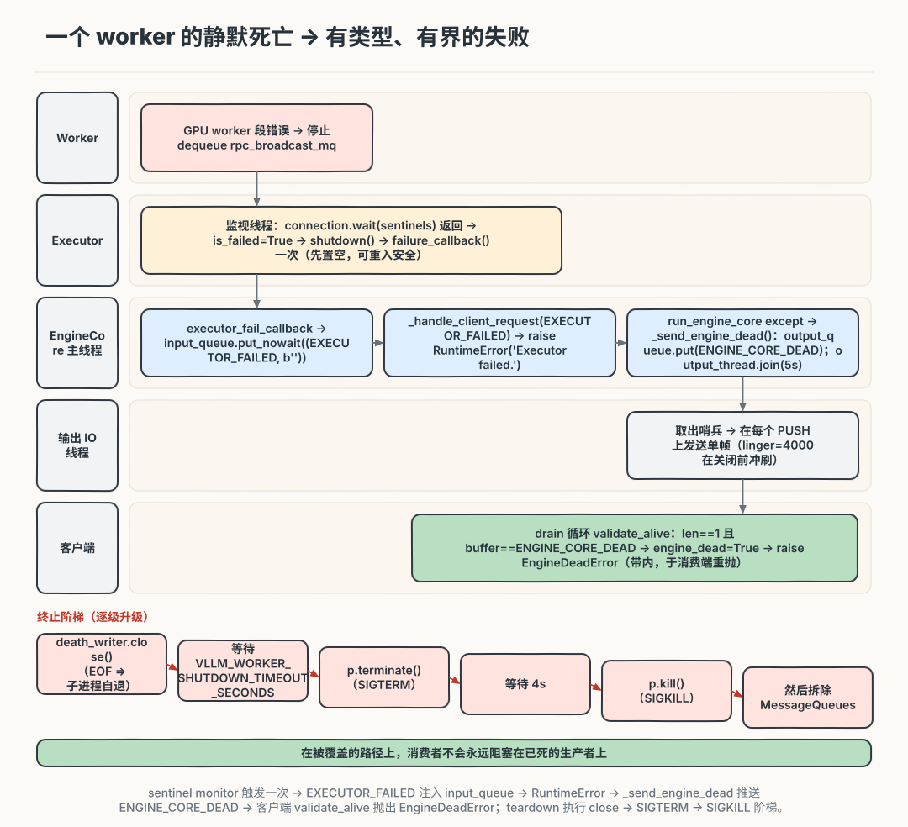</a>

<p class='figure-caption'>一个 worker 的静默死亡如何转化为类型明确且有时间上限的 failure：sentinel monitor 仅触发一次 failure_callback，executor_fail_callback 将 EXECUTOR_FAILED 注入 input_queue，_handle_client_request 抛出 RuntimeError，_send_engine_dead 推送 ENGINE_CORE_DEAD（linger=4000），client 的 validate_alive 抛出 EngineDeadError；teardown 则执行逐级升级的 death_writer.close、SIGTERM、4s、SIGKILL 终止流程。</p>

一个 daemon thread 会阻塞在所有 worker process 的 OS 级 `sentinel` 上；任意一个 process 退出时，`multiprocessing.connection.wait` 都会立即返回。monitor 会将 `is_failed = True` 置位、关闭 executor，并且只触发一次 `failure_callback`（先将其置空，避免 re-entrant shutdown 导致重复触发）。这个 callback 就是 engine 注册的 `executor_fail_callback`（[第 6 节](#6-enginecore-内部的-queue-与-thread)）；它会把 `EXECUTOR_FAILED` 注入 `input_queue`，使单个 worker 的死亡一路向上传导为 engine 的 `_send_engine_dead` 和 client 的 `EngineDeadError`。借助 `weakref.ref`，executor 在正常 shutdown 期间可以被 GC，而不会因 monitor thread 的引用而无法回收。这一机制与[第 8 节](#8-worker-进程spawn-与生命周期)的 death pipe 相对应，后者传递的是*反向* signal：从 parent 到 child。因此，一旦 engine 死亡，每个 worker 的 `death_reader` 都会读到 EOF，使其从 MQ dequeue 的阻塞中退出。

实际 teardown 采用幂等、逐级升级的终止流程：

[`vllm/v1/executor/multiproc_executor.py:459-490`](https://github.com/vllm-project/vllm/blob/6cf7b26bd4bff60bf378e1af14044280ac0d214c/vllm/v1/executor/multiproc_executor.py#L459-L490)

```python
    def shutdown(self):
        """Properly shut down the executor and its workers"""
        if not getattr(self, "shutting_down", False):
            ...
            self.shutting_down = True

            # Make sure all the worker processes are terminated first.
            if workers := getattr(self, "workers", None):
                for w in workers:
                    # Close death_writer to signal child processes to exit
                    if w.death_writer is not None:
                        w.death_writer.close()
                        w.death_writer = None
                self._ensure_worker_termination([w.proc for w in workers])

                for w in workers:
                    # Shutdown response queues
                    if w.worker_response_mq is not None:
                        w.worker_response_mq.shutdown()
                        w.worker_response_mq = None

        if rpc_broadcast_mq := getattr(self, "rpc_broadcast_mq", None):
            rpc_broadcast_mq.shutdown()
            self.rpc_broadcast_mq = None
        ...
```

这一顺序经过刻意设计：首先关闭每个 `death_writer`（每个仍存活的 child 都会看到 EOF 并自行退出——这是成本最低的终止方式），然后由 `_ensure_worker_termination` 执行分级流程——先通过 `VLLM_WORKER_SHUTDOWN_TIMEOUT_SECONDS` 等待其优雅退出；否则调用 `p.terminate()`（SIGTERM），等待 4 s；仍未退出则调用 `p.kill()`（SIGKILL）（[`multiproc_executor.py:407-457`](https://github.com/vllm-project/vllm/blob/6cf7b26bd4bff60bf378e1af14044280ac0d214c/vllm/v1/executor/multiproc_executor.py#L407-L457)）——只有当所有 process 都退出后，才会 teardown `MessageQueue`。`shutting_down` flag 让整个流程可安全重入，因此 monitor 的 shutdown 与 engine 的 `finally` shutdown 可以安全协同。同样的原则也覆盖 *launch* 失败：`_init_executor` 中的 `finally` 会关闭每个 `death_writer`，并强制终止任何 spawn 到一半的 worker，因此启动期间的 crash 不会遗留孤儿 GPU process（[`multiproc_executor.py:232-247`](https://github.com/vllm-project/vllm/blob/6cf7b26bd4bff60bf378e1af14044280ac0d214c/vllm/v1/executor/multiproc_executor.py#L232-L247)）。

任何非预期的 worker 退出都会导致 executor 终止，且只会上报一次。成员不完整的 TP group 无法继续运行，因为下一次 collective 会陷入 deadlock；teardown 还会释放其余 worker 占用的 GPU 资源。

### 跟踪一个 request 在整个 topology 中的流转

一个 request 会按以下顺序穿过 process mesh。每个 hop 也有对应的 failure 或 shutdown 路径。

<a href='images/vllm-03-11-topology-trace.svg' target='_blank'>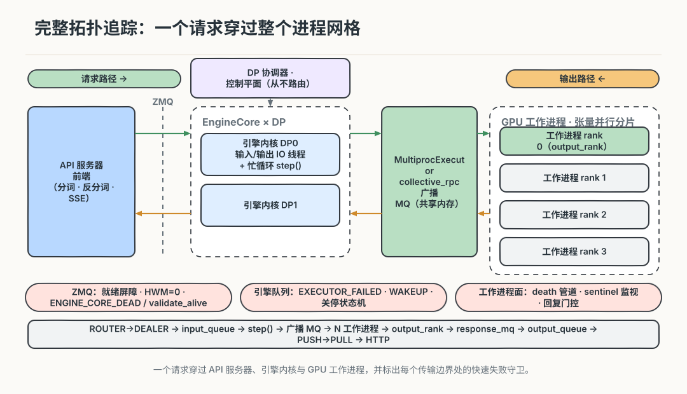</a>

<p class='figure-caption'>一个 request 在 API server、EngineCore 和 GPU workers 之间的完整追踪路径，并标出了每个 transport boundary 上的 fail-fast guard。</p>

该 request 的路径如下：**front-end ROUTER → engine DEALER（input IO thread）→ decode/preprocess → `input_queue` → busy-loop `step()` → executor `collective_rpc` enqueue → `rpc_broadcast_mq` → N 个 worker dequeue → forward pass → `output_rank` enqueue `ModelRunnerOutput` → `response_mq` → executor gather → `output_queue` → engine PUSH（output IO thread）→ client PULL（drain loop）→ async/sync queue → API server → HTTP stream。**

按 boundary 与 guard 拆解如下：

1. **API server → engine（ZMQ ROUTER→DEALER，[第 4 节](#4-zmq-transportrequest-与-output-socket)）。** client ROUTER 根据 engine 的 2-byte identity frame 进行路由；engine 的 input thread 会剥离该 frame，并在完成 decode 和 off-loop preprocessing 后，将 `(type, payload)` push 到 `input_queue`（[第 6 节](#6-enginecore-内部的-queue-与-thread)）。*Guard：* ready-barrier handshake（[第 11 节](#11-启动握手与连接)）证明，该 identity 在发送任何 request 之前就已完成注册。这一点至关重要：由于 `ZMQ_ROUTER_MANDATORY` 保持默认值，ROUTER 会将无法路由的 frame *静默地* 丢弃；正是该 handshake 使 identity 具备了可路由性。HWM=0 时，ROUTER 也不会施加 high-water cap，因此 frame 同样不会 *因为触及该上限* 而被丢弃。
2. **`input_queue` → busy loop（in-process queue，[第 6 节](#6-enginecore-内部的-queue-与-thread)）。** main thread 从 queue 中 pop request、修改 scheduler state，并最终调用 `step()`（第 04 篇）和 `Scheduler.schedule()`（第 05 篇）。*Guard：* `EXECUTOR_FAILED`/`WAKEUP` 也会经由该 queue 传递，因此下层的 failure 或 shutdown 会在这里通过一次普通 dequeue 显现。
3. **Engine → workers（shared-memory `MessageQueue`，[第 7 节](#7-单节点-tensor-parallel一个-enginecoren-个-worker)）。** `collective_rpc` 只通过一次 `enqueue((method, args, kwargs, output_rank))` 写入 `rpc_broadcast_mq`；所有 `world_size` 个 worker 都会 dequeue 同一个 tuple，并在各自的 `worker_busy_loop` 中执行 forward pass（[第 7 节](#7-单节点-tensor-parallel一个-enginecoren-个-worker)，第 09 篇）。*Guard：* 上文介绍的 sentinel monitor 会监控每个 worker；death pipe（[第 8 节](#8-worker-进程spawn-与生命周期)）则监控 engine。
4. **Workers → engine（per-rank `response_mq`，[第 7 节](#7-单节点-tensor-parallel一个-enginecoren-个-worker)）。** 只有 `output_rank`——即 last PP stage 的第一个 TP rank（[第 7 节](#7-单节点-tensor-parallel一个-enginecoren-个-worker)，第 11 篇）——会 enqueue 一个 `ModelRunnerOutput`；executor 通过 FIFO `FutureWrapper` 只 gather 这一条 reply。*Guard：* reply gating（`output_rank is None or self.rank == output_rank`）确保 executor 的 dequeue 次数与发出 reply 的 worker 数量一致，从而避免因数量不匹配而卡死 MQ。
5. **Engine → client（ZMQ PUSH→PULL，[第 4 节](#4-zmq-transportrequest-与-output-socket)）。** busy loop 调用 `put_nowait`，将 `{client_index: EngineCoreOutputs}` 放入 `output_queue`；output thread 将其 serialize 后 PUSH 到 `sockets[client_index]`（PULL 是匿名的，因此来源信息随 payload 传递，[第 4 节](#4-zmq-transportrequest-与-output-socket)）。*Guard：* drain 侧为 `validate_alive`；engine 侧为 `ENGINE_CORE_DEAD` + `linger=4000`。
6. **Client → HTTP（asyncio，[第 2 节](#2-进程拓扑api-serverenginecore-与-gpu-worker)/第 02 篇）。** drain loop 完成 decode 后 enqueue `EngineCoreOutputs`；`AsyncLLM` 执行 detokenize，并以 stream 形式将 token 写入 HTTP response。*Guard：* consumer 侧会将 in-band `EngineDeadError` 重新 raise。

### 要点

- frontend/engine 的 process 拆分消除了 shared-GIL contention；engine 的 I/O threads 无需共享 socket，即可让 socket 操作与 compute loop 重叠执行。
- ZMQ 用于承载 frontend traffic，in-process queue 隔离 thread ownership，shared-memory queue 则将一次 engine step 扇出到 GPU workers。
- startup barrier 确保 route 在流量进入前就已可用；检测到的 worker 或 engine 退出会在有限时间内以类型明确的 failure 向上传播。

## 13. 参考资料

- https://vllm.ai/blog/2025-01-27-v1-alpha-release
- https://docs.vllm.ai/en/stable/design/arch_overview/
- https://vllm.ai/blog/2025-09-05-anatomy-of-vllm

*本文所有代码层面的结论均以 [`vllm-project/vllm@6cf7b26bd`](https://github.com/vllm-project/vllm/tree/6cf7b26bd4bff60bf378e1af14044280ac0d214c) 为依据。*