# EngineCore Loop：request 生命周期、step 与 output 处理

> 本文解析严格基于 [`vllm-project/vllm@6cf7b26bd`](https://github.com/vllm-project/vllm/tree/6cf7b26bd4bff60bf378e1af14044280ac0d214c)。文中的 code block 均取自该源码树，省略的行以 `...` 标记。形如 `path:Lstart-Lend` 的引用可打开对应源码；综合整理的 snippet 会明确标注。

## 1. Loop 是心跳：同步 step() 契约

一条 LLM request 需要经过多轮迭代才能完成。它进入 scheduler，先执行 prefill，再逐步 decode；只有触发 stop condition 后才会退出。Orca 将这种方式称为 *iteration-level scheduling*：每个 step 都重新构建 runnable batch，而不是等待固定的 request batch 全部排空（[Orca, OSDI '22](https://www.usenix.org/conference/osdi22/presentation/yu)）。

EngineCore 通过围绕 `step()` 构建 busy loop 来实现 iteration-level scheduling。vLLM 的工程文章将一次 step 概括为 schedule、forward 和 postprocess（[深入 vLLM](https://vllm.ai/blog/2025-09-05-anatomy-of-vllm)）；架构指南则描述了向 GPU worker 分发任务的 loop（[架构概览](https://docs.vllm.ai/en/stable/design/arch_overview/)）。`(outputs, model_executed)` 返回值将该 loop 衔接到 `step()` 实现，详见[第 2 节](#2-stepscheduleexecute-与-update-构成一个-transaction)。

### 心跳机制：先排空 input，再执行一次 step

[`vllm/v1/engine/core.py:1259-1265`](https://github.com/vllm-project/vllm/blob/6cf7b26bd4bff60bf378e1af14044280ac0d214c/vllm/v1/engine/core.py#L1259-L1265)

```python
    def run_busy_loop(self):
        """Core busy loop of the EngineCore."""
        while self._handle_shutdown():
            # 1) Poll the input queue until there is work to do.
            self._process_input_queue()
            # 2) Step the engine core and return the outputs.
            self._process_engine_step()

        raise SystemExit
```

每轮 loop iteration 分为两个阶段。`_process_input_queue`（[`core.py:1269-1298`](https://github.com/vllm-project/vllm/blob/6cf7b26bd4bff60bf378e1af14044280ac0d214c/vllm/v1/engine/core.py#L1269-L1298)）会先排空来自 ZMQ input thread 的 new request、abort 和 wakeup，然后 `_process_engine_step` 才推进 engine。因此，request 的接纳与取消只会发生在两次 forward 之间，而不会插入某次 forward 的执行中途。[第 4 节](#4-add_request-进入-engine-和-waiting-queue)会沿着 input 路径展开分析；第 03 篇介绍为其提供消息的 IPC thread。

### 门控：仅在有工作时执行 step

loop 并不会无条件 spin。`_process_input_queue` 会一直 block，直到 `has_work()` 为 true；这一 predicate 就是整个 heartbeat 的 admission gate。

[`vllm/v1/engine/core.py:1247-1253`](https://github.com/vllm-project/vllm/blob/6cf7b26bd4bff60bf378e1af14044280ac0d214c/vllm/v1/engine/core.py#L1247-L1253)

<a href='images/vllm-04-11-has-work-gate.svg' target='_blank'>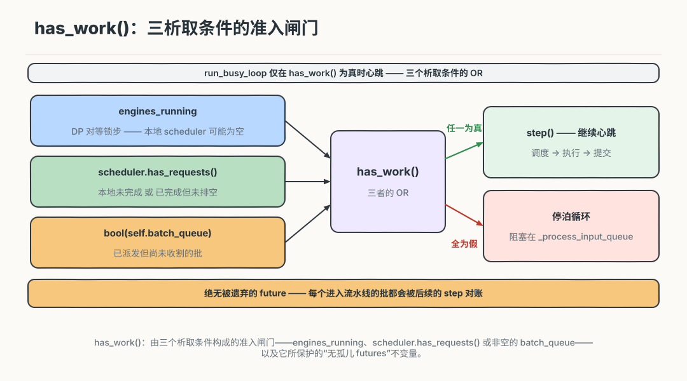</a>

<p class='figure-caption'>has_work()：由三个析取项组成的 admission gate——engines_running、scheduler.has_requests() 或非空 batch_queue——以及它所维护的“future 不会被遗落”不变量。</p>

```python
    def has_work(self) -> bool:
        """Returns true if the engine should be stepped."""
        return (
            self.engines_running
            or self.scheduler.has_requests()
            or bool(self.batch_queue)
        )
```

这三项分别覆盖不同类型的工作。`scheduler.has_requests()` 表示本地 request 尚未完成，或尚未排空。`engines_running` 让 DP engine 即使本地 scheduler 为空，也能与 peer 一同执行 step，这正是 `step()` 要重新检查 `has_requests()` 的原因。`bool(self.batch_queue)` 则在已下发的 batch 仍处于 pending 时维持 loop 活跃。因此，loop 会在休眠前回收 queue 中每个 future 的结果。

**执行模式只绑定一次，不会在每个 step 重新绑定。**

运行哪个 step 函数在构造时就已确定，hot loop 中不会重新判断。

[`vllm/v1/engine/core.py:221-224`](https://github.com/vllm-project/vllm/blob/6cf7b26bd4bff60bf378e1af14044280ac0d214c/vllm/v1/engine/core.py#L221-L224)

```python
        self.step_fn = (
            self.step if self.batch_queue is None else self.step_with_batch_queue
        )
        self.async_scheduling = vllm_config.scheduler_config.async_scheduling
```

`batch_queue` 只有在 `max_concurrent_batches > 1`（[`core.py:196-202`](https://github.com/vllm-project/vllm/blob/6cf7b26bd4bff60bf378e1af14044280ac0d214c/vllm/v1/engine/core.py#L196-L202)）时才会分配——也就是启用 pipeline parallelism 或 async scheduling 时。当它为 `None` 时，`step_fn` 就是同步版本 `step`；否则为可重叠执行的 `step_with_batch_queue`（[第 3 节](#3-step_with_batch_queue重叠执行版本)）。loop driver 调用 `self.step_fn()` 时无需任何 branch，因此 busy loop 只需一套实现，完全不感知 execution mode。本节余下内容讨论同步契约：同一时间只驻留一个 batch。

### 同步契约：一个 transaction，一个 tuple

[`vllm/v1/engine/core.py:479-489`](https://github.com/vllm-project/vllm/blob/6cf7b26bd4bff60bf378e1af14044280ac0d214c/vllm/v1/engine/core.py#L479-L489)

```python
    def step(self) -> tuple[dict[int, EngineCoreOutputs], bool]:
        """Schedule, execute, and make output.

        Returns tuple of outputs and a flag indicating whether the model
        was executed.
        """

        # Check for any requests remaining in the scheduler - unfinished,
        # or finished and not yet removed from the batch.
        if not self.scheduler.has_requests():
            return {}, False
```

`step()` 返回 `(dict[int, EngineCoreOutputs], bool)`：一个以 `client_index` 为 key、按 client 划分的 output map，以及一个 `model_executed` flag。同步路径中，`L488-489` 处的 early return 会在 scheduler 为空时返回 `{}` 和 `False`。即使 outer loop 已有 `has_work()` gate，这项检查仍然必不可少，因为在 DP mode 下，即使本地 scheduler 为空，`engines_running` 也能让 loop 保持活跃。

在 guard 与 return 之间，`step()` 按固定顺序执行：**schedule**（`scheduler.schedule(self._should_throttle_prefills())` → `SchedulerOutput`）、**execute**（先得到 non-blocking 的 `execute_model` future；如果 sampling 被延后，再执行 `sample_tokens`）、forward 完成后的 **abort barrier**，以及经由 `update_from_output` 完成的 **commit**。在基础 engine 中，`_should_throttle_prefills()` 返回 `False`（[`core.py:474-477`](https://github.com/vllm-project/vllm/blob/6cf7b26bd4bff60bf378e1af14044280ac0d214c/vllm/v1/engine/core.py#L474-L477)）；DP engine core 则会重写该行为，延后新的 prefill，以实现跨 engine 均衡。

[第 2 节](#2-stepscheduleexecute-与-update-构成一个-transaction)会逐行解析这段函数体；第 05 篇介绍 `schedule` 的决策逻辑；[第 6 节](#6-execute_model将-batch-交给-executor)讨论 executor 边界；[第 7 节](#7-update_from_output模型输出转化为-engine-输出)分析 commit 后半段。对 loop 而言，真正关键的是最后一行。

[`vllm/v1/engine/core.py:508`](https://github.com/vllm-project/vllm/blob/6cf7b26bd4bff60bf378e1af14044280ac0d214c/vllm/v1/engine/core.py#L508)

<a href='images/vllm-04-12-model-executed-antispin.svg' target='_blank'>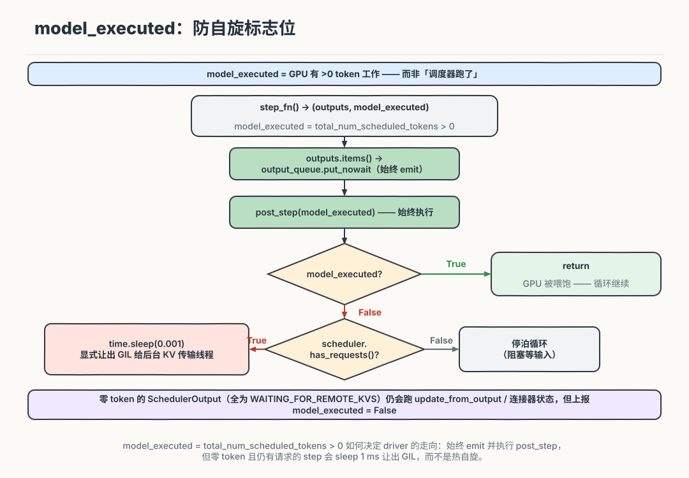</a>

<p class='figure-caption'>model_executed = total_num_scheduled_tokens > 0 如何决定 driver 的执行路径：emit 和 post_step 始终执行；但如果 token 数为零的 step 仍有 pending request，就会 sleep 1 ms 来让出 GIL，而不是 hot-spin。</p>

```python
        return engine_core_outputs, scheduler_output.total_num_scheduled_tokens > 0
```

`model_executed` 即 `total_num_scheduled_tokens > 0`——字面意思是“该 batch 包含的 GPU token 工作量大于零”。它**并不表示**“scheduler 已运行”。scheduled token 数为零的 `SchedulerOutput`（例如，`WAITING_FOR_REMOTE_KVS` 中每个 request 都因 remote KV 而阻塞）仍会走完整个 transaction（它仍会在 `update_from_output` 内 commit connector 和 KV-transfer 的进度），但会报告 `model_executed=False`。将“scheduler 产出了 batch”与“GPU 执行了 token 工作”解耦，driver 的 anti-spin 策略才能正确工作。

<a href='images/vllm-04-03-step-contract.svg' target='_blank'>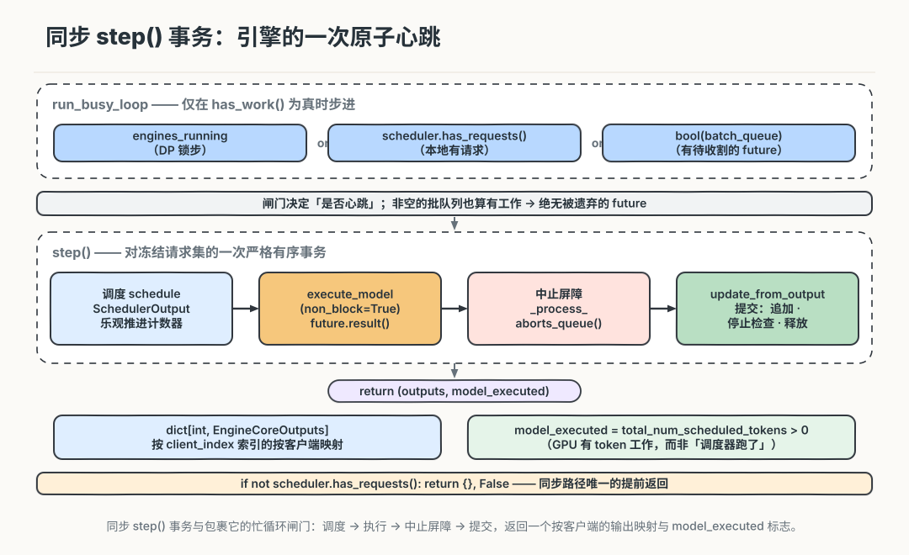</a>

<p class='figure-caption'>同步 step() transaction，以及包裹它的 busy-loop gate。</p>

### driver：emit、hook，并避免 hot-spin

[`vllm/v1/engine/core.py:1300-1317`](https://github.com/vllm-project/vllm/blob/6cf7b26bd4bff60bf378e1af14044280ac0d214c/vllm/v1/engine/core.py#L1300-L1317)

```python
    def _process_engine_step(self) -> bool:
        """Called only when there are unfinished local requests."""

        # Step the engine core.
        outputs, model_executed = self.step_fn()
        # Put EngineCoreOutputs into the output queue.
        for output in outputs.items() if outputs else ():
            self.output_queue.put_nowait(output)
        # Post-step hook.
        self.post_step(model_executed)

        # If no model execution happened but there is still scheduler work
        # (e.g. WAITING_FOR_REMOTE_KVS or delayed KV connector frees), yield
        # the GIL briefly to allow background transfer threads to make progress.
        if not model_executed and self.scheduler.has_requests():
            time.sleep(0.001)

        return model_executed
```

step 返回后会发生三件事。首先，output 被 fan out 到 `output_queue`：`for output in outputs.items() if outputs else ()`。这个 `if outputs else ()` guard 是两个 step 函数之间的衔接点——`step` 在 idle 时返回 `{}`，`step_with_batch_queue` 则可能返回 `None`；二者都是 falsy，因此同一行代码无需 mode branch，就能兼容两种“无 output 可 emit”的信号。每个 `(client_index, EngineCoreOutputs)` pair 都由 output IPC thread 取走，并推送到对应的 socket（[第 8 节](#8-output-聚合每个-client-对应的-enginecoreoutputs)；ZMQ 拓扑见第 03 篇）。

其次，`post_step(model_executed)` 执行每个 step 触发一次的 hook——在同步、非 async 情况下，它会将 speculative draft token ids 拉入 scheduler。这个过程受 `model_executed` 控制，因此 idle step 不会修改 draft state（[第 3 节](#3-step_with_batch_queue重叠执行版本)）。

最后，`if not model_executed and self.scheduler.has_requests(): time.sleep(0.001)` 处理 request 仍存在但 step 没有执行任何 GPU token 工作的情况，例如所有 request 都在等待 remote KV transfer 或延迟的 connector free。这 1 ms 的 sleep 会把 GIL 让给能够解除这些 request 阻塞的 background thread。只要 `has_work()` 为 true，outer loop 仍会继续运行，但不会在 zero-token 区间 hot-spin。

## 2. step()：Schedule、Execute 与 Update 构成一个 Transaction

同步 `step()` 负责协调三个组件：Scheduler 选择 batch，Executor 执行 forward pass 和 sampling，`update_from_output` 再将结果合并回 request 状态。整个调用期间，该 batch 始终驻留。`future.result()` 会在 commit 前等待 GPU 工作完成，事务两端使用的是同一个 `SchedulerOutput`。

<a href='images/vllm-04-01-engine-step.svg' target='_blank'>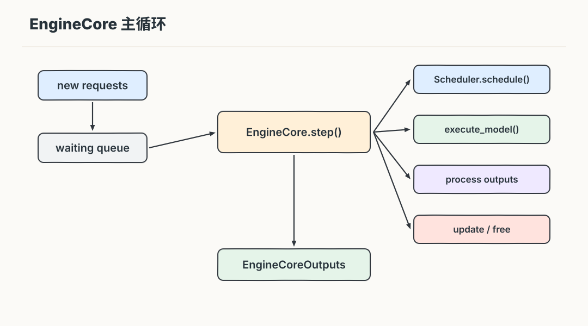</a>

<p class='figure-caption'>一次 EngineCore step：schedule、execute、sample、abort 屏障、commit。</p>

### `step()` 的主体

源码锚点 — [`vllm/v1/engine/core.py:479-508`](https://github.com/vllm-project/vllm/blob/6cf7b26bd4bff60bf378e1af14044280ac0d214c/vllm/v1/engine/core.py#L479-L508)：

```python
    def step(self) -> tuple[dict[int, EngineCoreOutputs], bool]:
        """Schedule, execute, and make output.

        Returns tuple of outputs and a flag indicating whether the model
        was executed.
        """

        # Check for any requests remaining in the scheduler - unfinished,
        # or finished and not yet removed from the batch.
        if not self.scheduler.has_requests():
            return {}, False
        scheduler_output = self.scheduler.schedule(self._should_throttle_prefills())
        future = self.model_executor.execute_model(scheduler_output, non_block=True)
        grammar_output = self.scheduler.get_grammar_bitmask(scheduler_output)
        with (
            self.log_error_detail(scheduler_output),
            self.log_iteration_details(scheduler_output),
        ):
            model_output = future.result()
            if model_output is None:
                model_output = self.model_executor.sample_tokens(grammar_output)

        # Before processing the model output, process any aborts that happened
        # during the model execution.
        self._process_aborts_queue()
        engine_core_outputs = self.scheduler.update_from_output(
            scheduler_output, model_output
        )

        return engine_core_outputs, scheduler_output.total_num_scheduled_tokens > 0
```

执行顺序如下：空闲则返回、schedule、发起 forward pass、构建 CPU bitmask、等待 forward pass 完成、若 sampling 被延后则执行 sampling、处理 abort、commit，最后报告是否执行了模型计算。

**提前返回（L488-489）。** `if not self.scheduler.has_requests(): return {}, False` 是同步路径中唯一的提前返回——既没有尚未完成的 request，*也*没有已完成但尚未取走的 request。这个检查看似与 driver 的约定重复（“仅当本地存在尚未完成的 request 时才调用”，见 [`core.py:1301`](https://github.com/vllm-project/vllm/blob/6cf7b26bd4bff60bf378e1af14044280ac0d214c/vllm/v1/engine/core.py#L1301)），但事实并非如此：在 data-parallel 模式下，即使没有本地 request，`engines_running` 也能单独驱动一个 step，因此具体的 `step()` 还会再校验一次。它返回 `{}`（空 dict）——driver 的 `outputs.items() if outputs else ()` 会将其视为“不输出任何内容”（[第 1 节](#1-loop-是心跳同步-step-契约)）。

**阶段 1 — schedule（L490）。** `scheduler.schedule(...)` 返回一个 `SchedulerOutput`，它只是对待执行内容的纯粹*描述*：要运行哪些 request、每个 request 新增多少 token、分配或复用了哪些 KV block，以及哪些 request 被 preempt 或已经完成。它不会操作 GPU。在基类中，参数 `self._should_throttle_prefills()` 为 `False`（[`core.py:474-477`](https://github.com/vllm-project/vllm/blob/6cf7b26bd4bff60bf378e1af14044280ac0d214c/vllm/v1/engine/core.py#L474-L477)）；只有 DP engine core 会 override 该参数，用于延后新的 prefill，以实现 prefill 均衡。`schedule()` 如何决策 token budget、chunked prefill，以及 KV 压力下的 preemption，将在第 05 篇介绍。

**阶段 2 — execute（L491-499）。** 三项操作按以下顺序执行：

`execute_model(..., non_block=True)` 发起 forward 并返回一个 `Future`。在它运行期间，CPU 会构建 structured output bitmask。两条路径在 `future.result()` 处汇合。`ModelRunnerOutput` 表示 sampling 已经执行；`None` 表示 worker 保留了 logits，因此由 `sample_tokens(grammar_output)` 应用 mask 并生成结果。第 6 节和第 03 篇会沿 executor 侧的调用链继续展开；第 09 篇则深入 worker。

这种先 launch、后构建 bitmask 的顺序是安全的，因为直到 `sample_tokens` 才会读取 bitmask。如果交换 L491 和 L492，bitmask 的计算就会落到 critical path 上，GPU 也会更晚启动；正确性不受影响，但 overlap 会消失。

**Abort 屏障（L501-503）。** `_process_aborts_queue()` 在 forward 完成*之后*、commit *之前*运行。forward 期间通过 ZMQ 到达的 abort 会在这里集中交给 scheduler（通过一次批量 `abort_requests` 调用）。这样，在执行途中被取消的 request 会先被标记为完成，避免 `update_from_output` 随后提交其过期 token。该屏障以及双 queue 的 eager/ordered abort 机制详见[第 10 节](#10-abort-与取消)；负责传递 abort 的 ZMQ 路径将在第 03 篇介绍。

**阶段 3 — commit（L504-506）。** `scheduler.update_from_output(scheduler_output, model_output)` 将 sampled token 写入 request 状态，检测 stop，释放已完成 request 的 KV，并组装按 client 划分的 `dict[int, EngineCoreOutputs]`。对账 loop 详见[第 7 节](#7-update_from_output模型输出转化为-engine-输出)；双轴输出聚合（`client_index` 的 dict key 与 `engine_index` 的 payload field）详见[第 8 节](#8-output-聚合每个-client-对应的-enginecoreoutputs)；完成时释放 KV 的逻辑详见[第 9 节](#9-已结束-request检测清理与-kv-释放)和第 06 篇。

**返回（L508）。** `model_executed = scheduler_output.total_num_scheduled_tokens > 0` 取自 *SchedulerOutput*，而不是模型输出：它表示“GPU 实际处理了超过 0 个 token”，而不是“scheduler 运行过”。零 token 的 `SchedulerOutput`（例如所有 request 都阻塞在 `WAITING_FOR_REMOTE_KVS` 上）仍会运行 `update_from_output` 以推进 connector 状态，但会报告 `False`。这会触发 driver 执行 1 ms 的 GIL yield，而不是 busy spin（[第 1 节](#1-loop-是心跳同步-step-契约)）。

**错误包装器覆盖的是 result，而非 launch。**

锚点 — [`vllm/v1/engine/core.py:417-431`](https://github.com/vllm-project/vllm/blob/6cf7b26bd4bff60bf378e1af14044280ac0d214c/vllm/v1/engine/core.py#L417-L431)：

```python
    @contextmanager
    def log_error_detail(self, scheduler_output: SchedulerOutput):
        """Execute the model and log detailed info on failure."""
        try:
            yield
        except Exception as err:
            ...
            dump_engine_exception(
                self.vllm_config, scheduler_output, self.scheduler.make_stats()
            )
            raise err
```

<a href='images/vllm-04-13-launch-bitmask-overlap.svg' target='_blank'>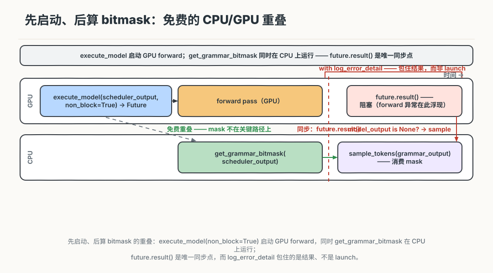</a>

<p class='figure-caption'>先 launch、后构建 bitmask 所形成的 overlap：execute_model(non_block=True) 启动 GPU forward，同时 CPU 执行 get_grammar_bitmask；future.result() 是唯一的同步点，log_error_detail 覆盖的是 result 获取，而非 launch。</p>

context manager 覆盖 result 收集而非 dispatch，是因为 non-blocking forward 会在 `future.result()` 处暴露异常。因此，dump 会先捕获失败 batch 的 `SchedulerOutput` 和 stats，再沿原始 traceback 重新抛出异常。除非显式启用，否则 `log_iteration_details` 不会生效（[`core.py:433-472`](https://github.com/vllm-project/vllm/blob/6cf7b26bd4bff60bf378e1af14044280ac0d214c/vllm/v1/engine/core.py#L433-L472)）。

**乐观 schedule，commit 时对账。**

`step()` 之所以简短，是因为所有生命周期记账都被拆分到事务两端。GPU 执行前，`schedule()` 会*乐观地*推进计数器；`update_from_output` 则根据实际执行结果进行*对账*。这种不对称正是该事务实现原子性的机制。

锚点 — 乐观更新的前置逻辑，在 `_update_after_schedule` 中 `schedule()` 的末尾调用（完整代码见[第 7 节](#7-update_from_output模型输出转化为-engine-输出)）；关键行见 [`vllm/v1/core/sched/scheduler.py:1182`](https://github.com/vllm-project/vllm/blob/6cf7b26bd4bff60bf378e1af14044280ac0d214c/vllm/v1/core/sched/scheduler.py#L1182)：

```python
            request.num_computed_tokens += num_scheduled_token
```

batch 一经 schedule，`num_computed_tokens` 就立刻递增——而且是在 forward *之前*。正如注释（[`scheduler.py:1170-1178`](https://github.com/vllm-project/vllm/blob/6cf7b26bd4bff60bf378e1af14044280ac0d214c/vllm/v1/core/sched/scheduler.py#L1170-L1178)）明确说明的，这使 chunked-prefill request 能在紧接着的下一个 step 再次被 schedule，无需等待 forward 完成。`num_in_flight_tokens` 是另一个配套计数器，用于记录已 dispatch 但尚未 commit 的 token 数；`last_sched_seq` 则记录当前 step，以便为延迟的 block 释放设置 fence（[第 9 节](#9-已结束-request检测清理与-kv-释放)）。

reconcile 一侧会再把计数器减回来。锚点 — `update_from_output` 中逐 request loop 的起始处（完整代码见[第 7 节](#7-update_from_output模型输出转化为-engine-输出)）；无条件递减操作见 [`vllm/v1/core/sched/scheduler.py:1571-1572`](https://github.com/vllm-project/vllm/blob/6cf7b26bd4bff60bf378e1af14044280ac0d214c/vllm/v1/core/sched/scheduler.py#L1571-L1572)：

```python
            if request is not None:
                request.num_in_flight_tokens -= num_tokens_scheduled
```

in-flight 计数会在 skip check 之前先递减，从而抵消 schedule 时的递增；即使 request 在其 frame 执行期间被 abort，也依然如此。skip 判断除了检查对象是否存在，还会检查 `is_finished()`，因为 connector 可能让已经终止的 request 继续保持注册状态。speculative rejection 还会单独从 `num_computed_tokens` 中扣除被拒绝的 draft token；第 7 节会追踪这两项修正。

该执行顺序提供了后续逻辑依赖的四项保证：launch 可与 grammar mask 构建重叠；每个已 schedule 的 batch 都恰好 reconcile 一次；abort 先于 commit 生效；`model_executed` 反映的是 token 计算，而非 scheduler 仅仅运行过。

## 3. step_with_batch_queue：重叠执行版本

同步版 `step()` 会让一个 batch 常驻。这样一来，pipeline parallelism 可能导致前面的 stage 空闲；而在 async scheduling 下，step *k+1* 的 CPU 工作本可与 step *k* 的 GPU 工作重叠执行。`step_with_batch_queue` 会让不超过上限的 batch 同时处于 in-flight 状态，仍采用相同的 schedule/execute/commit 三个 phase，但会优先填补可用 slot，再收取最旧的结果。

### mode 在构造时一次性选定

源码：[`vllm/config/vllm.py:491-502`](https://github.com/vllm-project/vllm/blob/6cf7b26bd4bff60bf378e1af14044280ac0d214c/vllm/config/vllm.py#L491-L502)：

```python
    @property
    def max_concurrent_batches(self) -> int:
        # PP requires PP-size concurrent batches to fill the pipeline.
        # Async scheduling requires 2 concurrent batches to overlap.
        pp_size = self.parallel_config.pipeline_parallel_size
        if self.scheduler_config.async_scheduling:
            if self.use_v2_model_runner:
                return pp_size + 1
            # V1 Model Runner does not fully support async scheduling with PP.
            if pp_size <= 1:
                return 2
        return pp_size
```

<a href='images/vllm-04-14-step-fn-binding.svg' target='_blank'>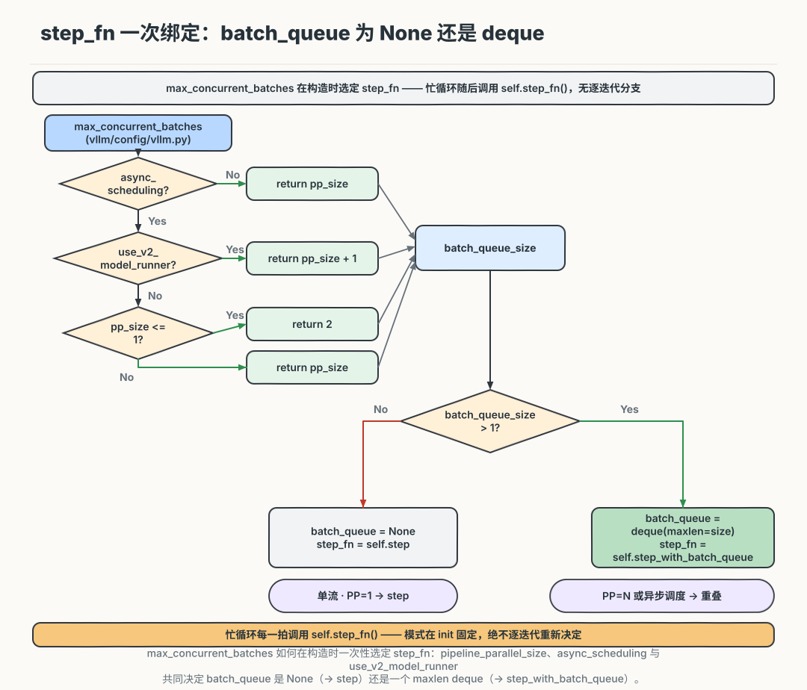</a>

<p class='figure-caption'>max_concurrent_batches 如何在构造时一次性选定 step_fn：pipeline_parallel_size、async_scheduling 和 use_v2_model_runner 共同决定 batch_queue 是 None（→ step），还是一个 maxlen deque（→ step_with_batch_queue）。</p>

源码：[`vllm/v1/engine/core.py:196-202, 221-223`](https://github.com/vllm-project/vllm/blob/6cf7b26bd4bff60bf378e1af14044280ac0d214c/vllm/v1/engine/core.py#L196-L202)：

```python
        self.batch_queue_size = vllm_config.max_concurrent_batches
        self.batch_queue: (
            deque[tuple[Future[ModelRunnerOutput], SchedulerOutput, Future[Any]]] | None
        ) = None
        if self.batch_queue_size > 1:
            logger.debug("Batch queue is enabled with size %d", self.batch_queue_size)
            self.batch_queue = deque(maxlen=self.batch_queue_size)
...
        self.step_fn = (
            self.step if self.batch_queue is None else self.step_with_batch_queue
        )
```

单 stream、未启用 async scheduling、PP=1 → `max_concurrent_batches` 返回 `pp_size` = `1` → `batch_queue` 保持为 `None` → `step_fn = self.step`。当 pipeline-parallel size 为 N，或在单个 stage 上启用 async scheduling 时，→ `≥2` → 分配一个 `deque(maxlen=batch_queue_size)`，并执行 `step_fn = self.step_with_batch_queue`。该 queue 的 element 是一个三元组 `(sample_future, scheduler_output, exec_future)`：第一个是为获取 sampled token 而 block 等待的 future；第二个是生成该 batch 的 schedule（reconcile 时需要）；第三个是原始的 `execute_model` future（用于错误解析，见下文）。

<a href='images/vllm-04-04-batch-queue.svg' target='_blank'>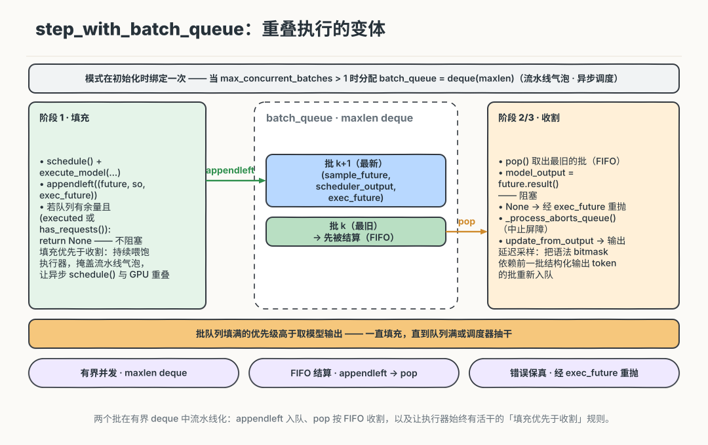</a>

<p class='figure-caption'>两个 batch 经由有界 deque 实现 pipeline：appendleft 负责入队，pop 负责按 FIFO 顺序收取结果。</p>

### 优先级规则：先填充，再收取

该变体会尽量让 executor 始终有任务可执行。只要还能 schedule 新 batch，它就会将该 batch 入队并直接返回，而不会 block 等待并收取更早的结果。

源码：[`vllm/v1/engine/core.py:519-534`](https://github.com/vllm-project/vllm/blob/6cf7b26bd4bff60bf378e1af14044280ac0d214c/vllm/v1/engine/core.py#L519-L534)：

```python
    def step_with_batch_queue(
        self,
    ) -> tuple[dict[int, EngineCoreOutputs] | None, bool]:
        """Schedule and execute batches with the batch queue.
        Note that if nothing to output in this step, None is returned.

        The execution flow is as follows:
        1. Try to schedule a new batch if the batch queue is not full.
        If a new batch is scheduled, directly return an empty engine core
        output. In other words, fulfilling the batch queue has a higher priority
        than getting model outputs.
        2. If there is no new scheduled batch, meaning that the batch queue
        is full or no other requests can be scheduled, we block until the first
        batch in the job queue is finished.
        3. Update the scheduler from the output.
        """
```

注意返回类型：`dict[int, EngineCoreOutputs] | None`。空闲时，`step()` 返回 `{}`，而该变体返回 `None`——无论是*确实推进了工作*，完成 schedule 并延后收取结果，还是*防御性地*发现无事可做，都是如此。driver 的 `outputs.items() if outputs else ()`（[第 1 节](#1-loop-是心跳同步-step-契约)）会将这两个 falsy 值一律视为“不输出任何内容”，因此 loop 无需针对不同 mode 做特殊的输出处理。

### 阶段 1 — 以 non-blocking 方式 schedule 下一个 batch 并入队

源码：[`vllm/v1/engine/core.py:536-581`](https://github.com/vllm-project/vllm/blob/6cf7b26bd4bff60bf378e1af14044280ac0d214c/vllm/v1/engine/core.py#L536-L581)：

```python
        batch_queue = self.batch_queue
        assert batch_queue is not None
...
        assert len(batch_queue) < self.batch_queue_size

        model_executed = False
        deferred_scheduler_output = None
        if self.scheduler.has_requests():
            scheduler_output = self.scheduler.schedule(self._should_throttle_prefills())
            with self.log_error_detail(scheduler_output):
                exec_future = self.model_executor.execute_model(
                    scheduler_output, non_block=True
                )
            if self.is_ec_consumer:
                model_executed = scheduler_output.total_num_scheduled_tokens > 0

            if self.is_pooling_model or not model_executed:
                # No sampling required (no requests scheduled).
                future = cast(Future[ModelRunnerOutput], exec_future)
            else:
                if not scheduler_output.pending_structured_output_tokens:
                    # We aren't waiting for any tokens, get any grammar output
                    # and sample immediately.
                    grammar_output = self.scheduler.get_grammar_bitmask(
                        scheduler_output
                    )
                    future = self.model_executor.sample_tokens(
                        grammar_output, non_block=True
                    )
                else:
                    # We need to defer sampling until we have processed the model output
                    # from the prior step.
                    deferred_scheduler_output = scheduler_output

            if not deferred_scheduler_output:
                # Add this step's future to the queue.
                batch_queue.appendleft((future, scheduler_output, exec_future))
                if len(batch_queue) < self.batch_queue_size and (
                    model_executed or self.scheduler.has_requests()
                ):
                    # Don't block on next worker response unless the queue is full
                    # or there are no more requests to schedule.
                    return None, model_executed
```

<a href='images/vllm-04-15-sampling-subcases.svg' target='_blank'>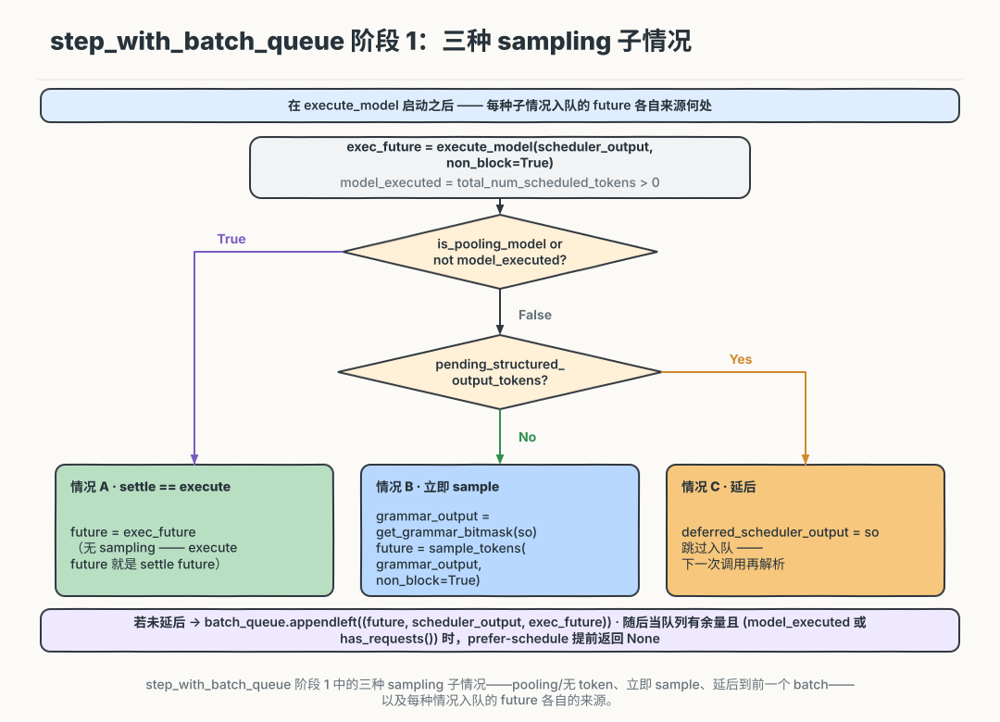</a>

<p class='figure-caption'>step_with_batch_queue 阶段 1 中 sampling 的三个子分支——pooling/no-tokens、sample-now 和 defer-until-prior-batch，以及各分支中入队 future 的来源。</p>

- **入口前置条件（`L542`）。** `assert len(batch_queue) < self.batch_queue_size`。调用方绝不能在 queue 已满时进入——必须始终留有一个空位，供下一项入队。该方法会自行维持这一约束：如果某次调用恰好填满 queue，它会跳过 early return，继续向下执行并收取最旧 batch 的结果，因此绝不会在 queue 满载时退出。
- **Schedule + non-blocking 启动（`L547-551`）。** 仅在 `scheduler.has_requests()` 时执行。与 sync path 不同，这里的 `execute_model(..., non_block=True)` 会返回 `exec_future`，且*不会发生任何 block*——CPU 会立即继续判断是否需要 sampling，并最终再次 schedule。此时，该 batch 的 forward 已在 GPU/pipeline 上运行。`schedule()` 如何决定 token budget、chunked prefill 和 KV allocation，详见第 05 篇；forward 如何跨 TP/PP rank 执行，详见第 09 篇。
- **`model_executed` gating（`L552-553`）。** 它根据 `total_num_scheduled_tokens > 0` 设置，但仅限 `self.is_ec_consumer` 的情况；只要不存在 encoder-cache transfer config，后者就是 `True`——这也是最常见的情况（[`core.py:204-207`](https://github.com/vllm-project/vllm/blob/6cf7b26bd4bff60bf378e1af14044280ac0d214c/vllm/v1/engine/core.py#L204-L207)）。对于纯 encoder-cache *producer*，该值会保持为 `False`，因此 producer 不会把自己并未执行的 GPU token 工作算到自己头上。
- **三个 sampling 子分支（`L555-571`）。** (1) `is_pooling_model or not model_executed` → 没有 token 可供 sample；`future = exec_future`，execute future *就是* settle future。(2) 需要 sampling，且没有 `pending_structured_output_tokens` → 构建 grammar bitmask，并立即 dispatch `sample_tokens(..., non_block=True)`；`future` 是 sample future。(3) 需要 sampling，*但*该 batch 中存在 `pending_structured_output_tokens` → bitmask 依赖更早的 in-flight batch 尚未产出的 token，因此暂时无法构建。记录 `deferred_scheduler_output = scheduler_output`，并暂不入队。
- **入队 + 优先 schedule 的 early return（`L573-581`）。** 如果 sampling 没有被 defer，`appendleft((future, scheduler_output, exec_future))` 会将 batch 放到 deque 的*前端*。随后，只要 queue 仍有空位，*并且*（`model_executed` 或还有更多 request 待处理），就立即执行 `return None, model_executed`——不要继续向下执行并收取更早 batch 的结果。这正是对 docstring 中优先级规则的直接实现：持续为 executor 提供任务，直到 queue 已满或 scheduler 中已无可调度任务。

executor 只有在确实没有剩余工作可供 schedule 时才会处于饥饿状态。只要 `has_requests()` 成立且 queue 还有空间，每次调用都会加入一个 batch，而不会卡在 `result()` 上。采用 `appendleft`/`maxlen` 的 deque 再配合 `L542` assert，将 outstanding batch 的数量上限严格限定为 `batch_queue_size`。

**空 queue guard。**

源码：[`vllm/v1/engine/core.py:583-587`](https://github.com/vllm-project/vllm/blob/6cf7b26bd4bff60bf378e1af14044280ac0d214c/vllm/v1/engine/core.py#L583-L587)：

```python
        elif not batch_queue:
            # Queue is empty. We should not reach here since this method should
            # only be called when the scheduler contains requests or the queue
            # is non-empty.
            return None, False
```

只有在 `if self.scheduler.has_requests()` 于 `L546` 处为 false，*且* queue 为空（即完全没有工作）时，才会执行到这里。`has_work`（[第 1 节](#1-loop-是心跳同步-step-契约)）本应确保 loop 永远不会在这种状态下调用该方法；这个 guard 只是防御性措施，会返回表示 idle 的 `(None, False)`。它对应“不输出任何内容；如果仍有 request 未处理，则在 driver 中让出 GIL”。

### 阶段 2/3 — block 等待最旧的 batch，然后 commit

只有当 fill path 无法继续（queue 已满，或 scheduler 已无任务）时，该方法才会 block。它会等待*最旧*的 outstanding batch 完成，而不是刚刚 schedule 的那个——FIFO 顺序正是保证 pipeline 正确性的关键。

源码：[`vllm/v1/engine/core.py:589-607`](https://github.com/vllm-project/vllm/blob/6cf7b26bd4bff60bf378e1af14044280ac0d214c/vllm/v1/engine/core.py#L589-L607)：

```python
        # Block until the next result is available.
        future, scheduler_output, exec_model_fut = batch_queue.pop()
        with (
            self.log_error_detail(scheduler_output),
            self.log_iteration_details(scheduler_output),
        ):
            model_output = future.result()
            if model_output is None:
                # None from sample_tokens() implies that the original execute_model()
                # call failed - raise that exception.
                exec_model_fut.result()
                raise RuntimeError("unexpected error")

        # Before processing the model output, process any aborts that happened
        # during the model execution.
        self._process_aborts_queue()
        engine_core_outputs = self.scheduler.update_from_output(
            scheduler_output, model_output
        )
```

- **回收最旧项（`L590`）。** push 操作通过 `appendleft` 完成；`pop()` 从*右端*取出元素。二者配合，使 deque 成为 FIFO：最先调度的 batch 也最先被回收处理。这一点至关重要，因为每个 batch 的 response 会按发送顺序到达 executor 的 message queue（第 03 篇），而 multiproc `FutureWrapper.result()` 返回前，会先处理完排在目标之前的所有 future（[`multiproc_executor.py:83-91`](https://github.com/vllm-project/vllm/blob/6cf7b26bd4bff60bf378e1af14044280ac0d214c/vllm/v1/executor/multiproc_executor.py#L83-L91)）——因此，即便同时持有多个尚未完成的 future，也绝不会把某个 worker response 错配给其他 batch。这套机制由第 09 篇展开；这里的 queue 只需确保回收顺序与发起顺序一致。
- **阻塞 + 失败解析（`L595-600`）。** `future.result()` 会阻塞等待最旧的 batch。来自 `sample_tokens` future 的 `None`，意味着其依赖的上游 `execute_model` *失败*了；代码调用 `exec_model_fut.result()`，只是为了重新抛出原始 exception，并保留真实 traceback，末尾的 `raise RuntimeError("unexpected error")` 则是一条永远无法到达的 guard。这也解释了为什么 queue 要把 `exec_future` 与 sample future 一同保存——raw execute future 是唯一携带真实 error 的 handle。
- **Abort barrier + 提交（`L602-607`）。** 与 sync path 完全一致：`_process_aborts_queue()` 会清空这个 batch 执行期间到达的 abort，*然后* `update_from_output` 再完成状态对齐。abort、状态机和 output 聚合均见[第 2 节](#2-stepscheduleexecute-与-update-构成一个-transaction)/[第 4 节](#4-add_request-进入-engine-和-waiting-queue)-[第 8 节](#8-output-聚合每个-client-对应的-enginecoreoutputs)——这个 barrier 可确保在 forward 中途取消的 request，会在其（此时已 stale 的）token 被提交之前移除。

### 延迟 sampling 的尾部逻辑

上述子情况 (3) 暂存了一个 batch，因为它的 grammar bitmask 依赖*前一个* batch 的 structured-output token。现在这些 token 已经生成，因为前一个 batch 刚在 `L605` 处完成提交。因此，尾部逻辑会完成这个 deferred batch 的后续处理，并将它重新入队。

来源：[`vllm/v1/engine/core.py:609-632`](https://github.com/vllm-project/vllm/blob/6cf7b26bd4bff60bf378e1af14044280ac0d214c/vllm/v1/engine/core.py#L609-L632)：

```python
        # NOTE(nick): We can either handle the deferred tasks here or save
        # in a field and do it immediately once step_with_batch_queue is
        # re-called. The latter slightly favors TTFT over TPOT/throughput.
        if deferred_scheduler_output:
            # When draft tokens are used with structured output, validate them
            # before computing the grammar bitmask for the deferred request.
            if self.check_for_draft_tokens:
                draft_token_ids = self.model_executor.take_draft_token_ids()
                if draft_token_ids is not None:
...
                    self.scheduler.update_draft_token_ids_in_output(
                        draft_token_ids, deferred_scheduler_output
                    )
            # We now have the tokens needed to compute the bitmask for the
            # deferred request. Get the bitmask and call sample tokens.
            grammar_output = self.scheduler.get_grammar_bitmask(
                deferred_scheduler_output
            )
            future = self.model_executor.sample_tokens(grammar_output, non_block=True)
            batch_queue.appendleft((future, deferred_scheduler_output, exec_future))

        return engine_core_outputs, model_executed
```

<a href='images/vllm-04-16-deferred-sampling-seq.svg' target='_blank'>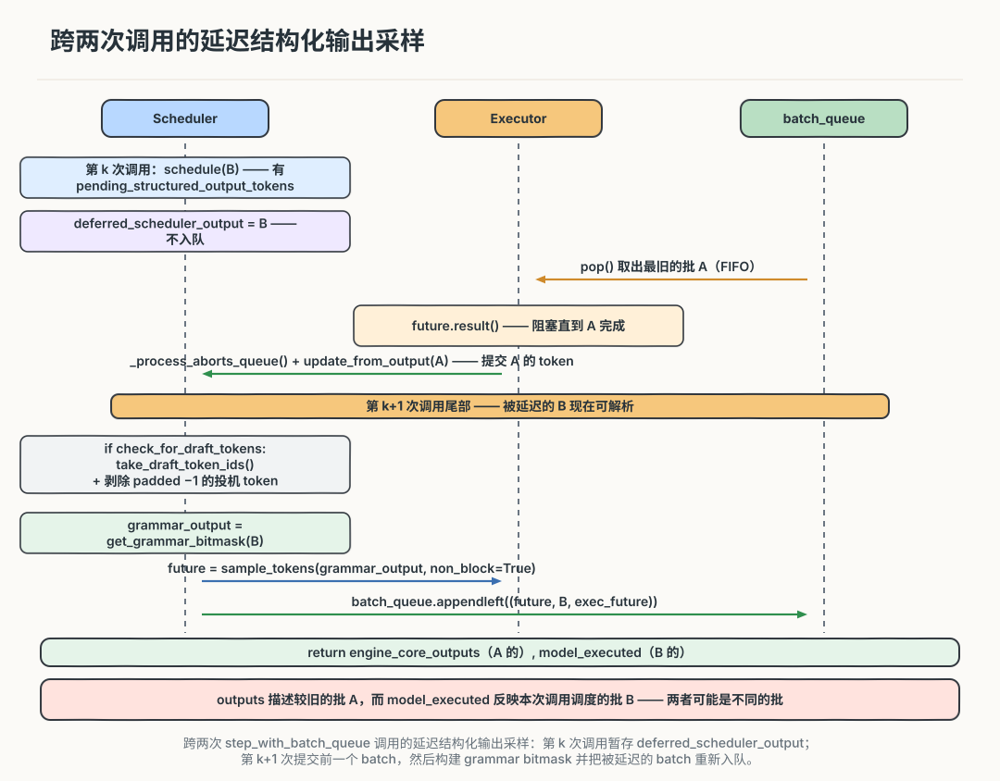</a>

<p class='figure-caption'>跨两次 step_with_batch_queue 调用的延迟 structured-output sampling：调用 k 暂存 deferred_scheduler_output；调用 k+1 提交前一个 batch，然后构建 grammar bitmask，并将延迟 batch 重新入队。</p>

启用 speculative decoding 或 diffusion 时（`check_for_draft_tokens`，[`core.py:160-162`](https://github.com/vllm-project/vllm/blob/6cf7b26bd4bff60bf378e1af14044280ac0d214c/vllm/v1/engine/core.py#L160-L162)），会先拉取 draft token ids 并剔除无效 spec token（pad 为 `-1`，bitmask 计算时会跳过），*之后*才构建 mask，因此 structured-output masking 只作用于真实 token（spec-decode 的状态对齐见第 12 篇）。随后基于 `deferred_scheduler_output` 计算 bitmask，dispatch `sample_tokens(..., non_block=True)`，并通过 `appendleft` 将 batch 重新放回 queue，等待后续回收。在 `L630` 处复用的 `exec_future`，正是 deferred batch 自己在 `L549` 处产生的 execute future——deferred 分支没有执行到 `L575` 处的 enqueue，因此 `exec_future` 仍保存着它。

**返回值（`L632`）。** `engine_core_outputs, model_executed`。outputs 对应在 `L605` 处提交的较早 batch，而 `model_executed` 对应当前调用调度的 batch。两者可能指向不同 batch：outputs 会发给 client（[第 8 节](#8-output-聚合每个-client-对应的-enginecoreoutputs)），而 `model_executed` 则用于驱动 post-step hook 和防空转 sleep（[第 1 节](#1-loop-是心跳同步-step-契约)）。

**一个路由细节：不同 mode 下的 draft token。**

draft token 的收集逻辑有三个互斥的 owner，每种配置各有一个，因此同一个 token 绝不会被拉取两次。

来源：[`vllm/v1/engine/core.py:510-517`](https://github.com/vllm-project/vllm/blob/6cf7b26bd4bff60bf378e1af14044280ac0d214c/vllm/v1/engine/core.py#L510-L517)：

```python
    def post_step(self, model_executed: bool) -> None:
        # When using async scheduling we can't get draft token ids in advance,
        # so we update draft token ids in the worker process and don't
        # need to update draft token ids here.
        if self.check_for_draft_tokens and not self.async_scheduling and model_executed:
            draft_token_ids = self.model_executor.take_draft_token_ids()
            if draft_token_ids is not None:
                self.scheduler.update_draft_token_ids(draft_token_ids)
```

`post_step`（每次调用都由 driver 触发）只有在 **sync / non-async** 情况下才会把 draft 拉入 scheduler。启用 **async scheduling** 时，draft 在 worker 侧更新；走 **batch-queue deferred** path 时，则在 `L615-623` 处 inline 拉取。`model_executed` 这个 guard 确保空闲 step 不会修改 draft 状态。

queue 有界、按 FIFO 顺序回收、先填满再回收，并保留 raw execute future，从而在 sampling 失败时重新抛出原始 exception。

## 4. add_request: 进入 Engine 和 waiting queue

`add_request` 是从 input queue 进入 EngineCore 的入口。busy loop 看到它之前，wire payload 已经完成 decode 并转换为 `Request`；如果涉及 structured output，还已送往另一条 thread 进行 grammar 编译。`add_request` 会验证该对象并交给 scheduler。它既不会运行 model，也不会将 request 转入 `RUNNING`；这个转换由 `schedule()` 负责（第 05 篇）。与 abort 处理（[第 10 节](#10-abort-与取消)）一样，接入操作会在各 step 之间更新 scheduler 状态。

Request decode、multimodal cache 查询、`Request` 构造以及 grammar 初始化都在 input IO thread 上执行，而不是在 busy loop 中执行。这部分 CPU 工作可与 GPU forward pass 重叠；busy loop 自身只接收准备好的 request，然后调用 `scheduler.add_request`。

<a href='images/vllm-04-05-add-request.svg' target='_blank'>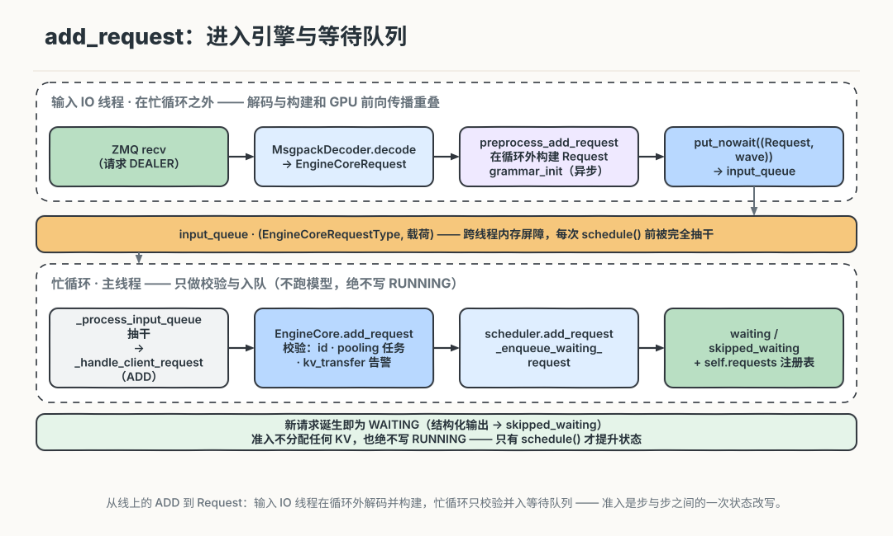</a>

<p class='figure-caption'>从 wire ADD 到 Request：input IO thread 负责 decode 和构建，busy loop 负责验证并 enqueue 到 waiting。</p>

### request 接入在 loop 中的位置

busy loop 在“清空 client 输入”和“执行一个 step”之间交替：

[`vllm/v1/engine/core.py:1259-1265`](https://github.com/vllm-project/vllm/blob/6cf7b26bd4bff60bf378e1af14044280ac0d214c/vllm/v1/engine/core.py#L1259-L1265)

```python
    def run_busy_loop(self):
        """Core busy loop of the EngineCore."""
        while self._handle_shutdown():
            # 1) Poll the input queue until there is work to do.
            self._process_input_queue()
            # 2) Step the engine core and return the outputs.
            self._process_engine_step()
```

`_process_input_queue` 会将 `input_queue`（[`core.py:1296-1298`](https://github.com/vllm-project/vllm/blob/6cf7b26bd4bff60bf378e1af14044280ac0d214c/vllm/v1/engine/core.py#L1296-L1298)）彻底清空，把其中的消息全部交给唯一的 dispatcher `_handle_client_request`：

[`vllm/v1/engine/core.py:1372-1385`](https://github.com/vllm-project/vllm/blob/6cf7b26bd4bff60bf378e1af14044280ac0d214c/vllm/v1/engine/core.py#L1372-L1385)

<a href='images/vllm-04-17-request-dispatch.svg' target='_blank'>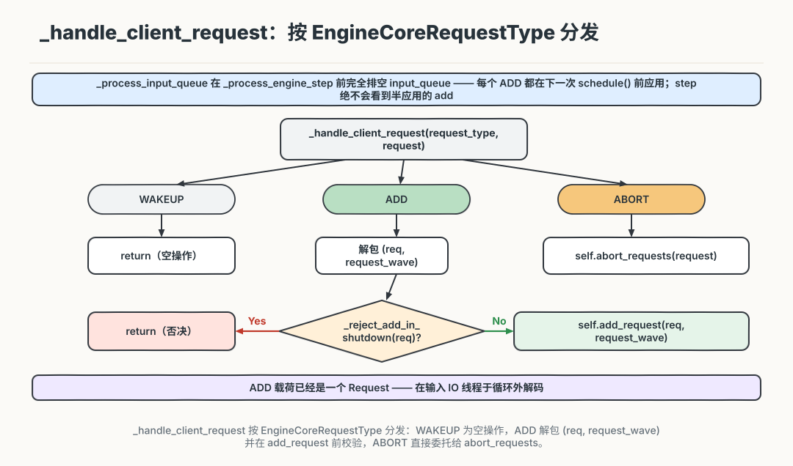</a>

<p class='figure-caption'>_handle_client_request 按 EngineCoreRequestType 进行路由：WAKEUP 是 no-op，ADD 解包 (req, request_wave) 并在调用 add_request 前完成验证，ABORT 则直接委托给 abort_requests。</p>

```python
    def _handle_client_request(
        self, request_type: EngineCoreRequestType, request: Any
    ) -> None:
        """Dispatch request from client."""

        if request_type == EngineCoreRequestType.WAKEUP:
            return
        elif request_type == EngineCoreRequestType.ADD:
            req, request_wave = request
            if self._reject_add_in_shutdown(req):
                return
            self.add_request(req, request_wave)
        elif request_type == EngineCoreRequestType.ABORT:
            self.abort_requests(request)
```

`input_queue` 上的一个 `ADD` message 是 `(req, request_wave)` tuple，其中的 `req` 已经是 `Request`；decode 已在 IO thread 完成。dispatcher 将其解包，先由 `_reject_add_in_shutdown` 在 shutdown 期间否决接入（[第 10 节](#10-abort-与取消)），再调用 `add_request`。`_process_input_queue` 会在 `_process_engine_step` 之前清空 queue，因此，按 wire 顺序已进入该 queue 的接入操作，会在下一次调用 `schedule()` 前全部生效。

### decode 不在 loop 中进行，而是在 input IO thread 中完成

主要工作位于 ZMQ input thread（socket 机制见第 03 篇），而不是 busy loop：

[`vllm/v1/engine/core.py:1569-1587`](https://github.com/vllm-project/vllm/blob/6cf7b26bd4bff60bf378e1af14044280ac0d214c/vllm/v1/engine/core.py#L1569-L1587)

```python
                    if request_type == EngineCoreRequestType.ADD:
                        req: EngineCoreRequest = add_request_decoder.decode(data_frames)
                        try:
                            request = self.preprocess_add_request(req)
                        except Exception:
                            self._handle_request_preproc_error(req)
                            continue
                    else:
                        request = generic_decoder.decode(data_frames)

                        if request_type == EngineCoreRequestType.ABORT:
                            # Aborts are added to *both* queues, allows us to eagerly
                            # process aborts while also ensuring ordering in the input
                            # queue to avoid leaking requests. This is ok because
                            # aborting in the scheduler is idempotent.
                            self.aborts_queue.put_nowait(request)

                    # Push to input queue for core busy loop.
                    self.input_queue.put_nowait((request_type, request))
```

ADD 分支会 decode `EngineCoreRequest`（由 front-end 构建的 wire struct，见第 01 篇），并立即调用 `preprocess_add_request`；后者的返回值（一个 `(Request, current_wave)` tuple）才是跨过 `input_queue` 的内容。decode/preprocess 失败会被捕获并转交给 `_handle_request_preproc_error`，而不会导致 thread 崩溃。相比之下，ABORT 分支会同时被推入 `aborts_queue` 和 `input_queue`（双 queue 的 eager-abort 方案，见[第 10 节](#10-abort-与取消)）；ADD 只会进入单一的 `input_queue`，因为在 forward 中途“提前”执行准入并无收益。

`preprocess_add_request` 才是真正负责构造 engine 侧状态的函数：

[`vllm/v1/engine/core.py:855-877`](https://github.com/vllm-project/vllm/blob/6cf7b26bd4bff60bf378e1af14044280ac0d214c/vllm/v1/engine/core.py#L855-L877)

```python
    def preprocess_add_request(self, request: EngineCoreRequest) -> tuple[Request, int]:
        """Preprocess the request.

        This function could be directly used in input processing thread to allow
        request initialization running in parallel with Model forward
        """
        # Note on thread safety: no race condition.
        # `mm_receiver_cache` is reset at the end of LLMEngine init,
        # and will only be accessed in the input processing thread afterwards.
        if self.mm_receiver_cache is not None and request.mm_features:
            request.mm_features = self.mm_receiver_cache.get_and_update_features(
                request.mm_features
            )

        req = Request.from_engine_core_request(request, self.request_block_hasher)
        if req.use_structured_output:
            # Note on thread safety: no race condition.
            # `grammar_init` is only invoked in input processing thread. For
            # `structured_output_manager`, each request is independent and
            # grammar compilation is async. Scheduler always checks grammar
            # compilation status before scheduling request.
            self.structured_output_manager.grammar_init(req)
        return req, request.current_wave
```

input thread 会解析 multimodal feature，使用 prefix-cache block hasher 构建 `Request`，并在需要时启动 grammar compilation。其 cache 和 structured-output manager 都仅限该 thread 使用，因此不需要加锁。由于 grammar compilation 是异步的，这类 request 会先进入 blocked waiting 状态，直到 scheduler 发现 grammar 已编译完成。

`from_engine_core_request` 只是单纯复制字段——不会分配 KV，也不会做任何调度决策：

[`vllm/v1/request.py:203-227`](https://github.com/vllm-project/vllm/blob/6cf7b26bd4bff60bf378e1af14044280ac0d214c/vllm/v1/request.py#L203-L227)

```python
    def from_engine_core_request(
        cls,
        request: EngineCoreRequest,
        block_hasher: Callable[["Request"], list["BlockHash"]] | None,
    ) -> "Request":
        return cls(
            request_id=request.request_id,
            client_index=request.client_index,
            prompt_token_ids=request.prompt_token_ids,
            ...
            block_hasher=block_hasher,
            resumable=request.resumable,
            reasoning_ended=request.reasoning_ended,
            reasoning_parser_kwargs=request.reasoning_parser_kwargs,
            abort_immediately=request.abort_immediately,
        )
```

这里携带的两个字段会在后续发挥作用：`client_index`（[第 8 节](#8-output-聚合每个-client-对应的-enginecoreoutputs)介绍的二维 output 路由 key——scheduler 会用它将该 request 的 delta 放入对应 client 的 `EngineCoreOutputs` 槽位）和 `abort_immediately`（参见下文先准入再 abort 的情况）。

**`EngineCore.add_request`：先校验，再委派。**

下面来看 loop 内成本较低的另一半：

[`vllm/v1/engine/core.py:372-407`](https://github.com/vllm-project/vllm/blob/6cf7b26bd4bff60bf378e1af14044280ac0d214c/vllm/v1/engine/core.py#L372-L407)

```python
    def add_request(self, request: Request, request_wave: int = 0):
        """Add request to the scheduler.

        `request_wave`: indicate which wave of requests this is expected to
        belong to in DP case
        """
        # Validate the request_id type.
        if not isinstance(request.request_id, str):
            raise TypeError(
                f"request_id must be a string, got {type(request.request_id)}"
            )

        if pooling_params := request.pooling_params:
            supported_pooling_tasks = [
                task for task in self.get_supported_tasks() if task in POOLING_TASKS
            ]

            if pooling_params.task not in supported_pooling_tasks:
                raise ValueError(
                    f"Unsupported task: {pooling_params.task!r} "
                    f"Supported tasks: {supported_pooling_tasks}"
                )

        if request.kv_transfer_params is not None and (
            not self.scheduler.get_kv_connector()
        ):
            logger.warning(
                "Got kv_transfer_params, but no KVConnector found. "
                "Disabling KVTransfer for this request."
            )

        self.scheduler.add_request(request)
        if request.abort_immediately:
            # Immediately abort so the connector's request_finished hook runs
            # to free any pre-admission KV-transfer resources.
            self.abort_requests([request.request_id])
```

准入要求 id 为 string 类型，并会拒绝不支持的 pooling task。如果没有配置 connector，传入 KV-transfer 参数只会触发 warning，随后这些参数会被禁用。`scheduler.add_request` 这一行会真正修改 engine 状态。对 `abort_immediately` request，会在同一次调用中先准入、再结束，从而让 connector 通过常规的 `request_finished` hook 释放资源，而无需调度 model 计算（[第 10 节](#10-abort-与取消)）。

`DPEngineCoreProc.add_request`（[`core.py:1836-1837`](https://github.com/vllm-project/vllm/blob/6cf7b26bd4bff60bf378e1af14044280ac0d214c/vllm/v1/engine/core.py#L1836-L1837)）在这个基础方法外又封装了一层，通过 `super().add_request(...)` 执行 data-parallel wave bookkeeping；dispatcher 一路传入的 `request_wave` 参数就是为这条路径准备的。

### Scheduler 准入：engine 状态真正发生变化的位置

[`vllm/v1/core/sched/scheduler.py:2020-2042`](https://github.com/vllm-project/vllm/blob/6cf7b26bd4bff60bf378e1af14044280ac0d214c/vllm/v1/core/sched/scheduler.py#L2020-L2042)

```python
    def add_request(self, request: Request) -> None:
        existing = self.requests.get(request.request_id)
        if existing is not None:
            update = StreamingUpdate.from_request(request)
            if existing.status != RequestStatus.WAITING_FOR_STREAMING_REQ:
                assert existing.streaming_queue is not None, "duplicate request id"
                # Queue next input chunk (or finished sentinel).
                existing.streaming_queue.append(update)
            elif update is not None:
                # Commence next input chunk.
                self._update_request_as_session(existing, update)
            else:
                # Streaming-input session finished.
                self.finish_requests(request.request_id, RequestStatus.FINISHED_ABORTED)
        else:
            if request.resumable:
                request.streaming_queue = deque()
            self._enqueue_waiting_request(request)
            self.requests[request.request_id] = request
            if self.connector is not None:
                self.connector.on_new_request(request)
            if self.log_stats:
                request.record_event(EngineCoreEventType.QUEUED)
```

新 request 的常规路径是 `else` 分支——其中按固定顺序发生三次修改：`_enqueue_waiting_request(request)` 将 request 压入 waiting queue，`self.requests[request.request_id] = request` 将其登记到主 id→`Request` map，随后是可选的 connector 通知和一个 `QUEUED` stats event。`existing is not None` 分支负责处理 *streaming-input session*：同一个 request id 送来更多 prompt chunk 时，会将其追加到该 request 的 `streaming_queue`；也可以通过 `_update_request_as_session` 恢复 request；如果 update 是 terminal sentinel，则通过 `finish_requests(..., FINISHED_ABORTED)` abort 该 session。

`_enqueue_waiting_request` 根据 request 创建时是否处于 blocked 状态来选择 queue：

[`vllm/v1/core/sched/scheduler.py:1862-1873`](https://github.com/vllm-project/vllm/blob/6cf7b26bd4bff60bf378e1af14044280ac0d214c/vllm/v1/core/sched/scheduler.py#L1862-L1873)

<a href='images/vllm-04-18-waiting-queue-routing.svg' target='_blank'>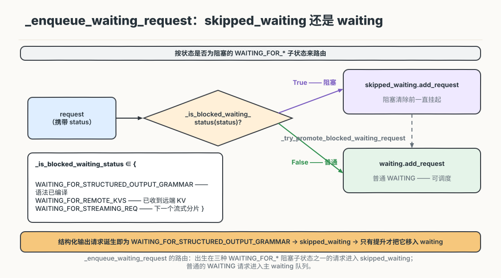</a>

<p class='figure-caption'>_enqueue_waiting_request 路由：创建时处于三个 WAITING_FOR_* blocked 子状态之一的 request 会进入 skipped_waiting；普通 WAITING request 会进入主 waiting queue。</p>

```python
    def _is_blocked_waiting_status(status: RequestStatus) -> bool:
        return status in (
            RequestStatus.WAITING_FOR_STRUCTURED_OUTPUT_GRAMMAR,
            RequestStatus.WAITING_FOR_REMOTE_KVS,
            RequestStatus.WAITING_FOR_STREAMING_REQ,
        )

    def _enqueue_waiting_request(self, request: Request) -> None:
        if self._is_blocked_waiting_status(request.status):
            self.skipped_waiting.add_request(request)
        else:
            self.waiting.add_request(request)
```

处于三个 `WAITING_FOR_*` 子状态之一的 request 会进入 `skipped_waiting`（scheduler 会跳过它，直到阻塞条件解除——grammar 编译完成、remote KV 接收完毕或下一个 stream chunk 到达）；普通 request 则进入 `waiting`。`preprocess_add_request` 中 structured-output 的异步决策会在这里落地：由于这类 request 创建时就是 `WAITING_FOR_STRUCTURED_OUTPUT_GRAMMAR` 状态，因此会进入 `skipped_waiting`，必须等到 `_try_promote_blocked_waiting_request`（[第 5 节](#5-request-生命周期requeststatus-状态机)）将其移至 `waiting` 后才能被调度。

**新 request 一律从 waiting 状态开始。**

request 的初始 status 由 `Request.__init__` 设置，而不是 scheduler：

[`vllm/v1/request.py:95-112`](https://github.com/vllm-project/vllm/blob/6cf7b26bd4bff60bf378e1af14044280ac0d214c/vllm/v1/request.py#L95-L112)

```python
        self.status = RequestStatus.WAITING
        self.events: list[EngineCoreEvent] = []
        self.stop_reason: int | str | None = None

        # P/D: Connector-specific KV transfer parameters.
        self.kv_transfer_params: dict[str, Any] | None = None

        if pooling_params is not None:
            # Pooling models.
            self.max_tokens = 1
        elif sampling_params is not None:
            # Generative models.
            assert sampling_params.max_tokens is not None
            self.max_tokens = sampling_params.max_tokens
            if self.structured_output_request is not None:
                self.status = RequestStatus.WAITING_FOR_STRUCTURED_OUTPUT_GRAMMAR
```

默认值为 `WAITING`；structured-output request 创建时则是 `WAITING_FOR_STRUCTURED_OUTPUT_GRAMMAR`。无论哪种情况，status 都属于 *waiting* 状态族（`status < RUNNING`，位于全序的 `RequestStatus` `IntEnum` 中，[`request.py:328-344`](https://github.com/vllm-project/vllm/blob/6cf7b26bd4bff60bf378e1af14044280ac0d214c/vllm/v1/request.py#L328-L344)），并且 `num_computed_tokens` 会初始化为 `0`。准入路径从不写入 `RUNNING`。准入只负责将 request 放入 queue 并登记到 registry；切换到 `RUNNING` 以及该切换所隐含的 KV 分配，都会推迟到 `schedule()`。它是唯一会写入这一状态转换的位置（见第 05 篇；状态机参见[第 5 节](#5-request-生命周期requeststatus-状态机)）。

准入会在同一次调用中，将新 request 插入 registry 和一个 waiting queue。重复 id 要么表示 streaming-session update，要么会触发 assertion failure，绝不会被静默覆盖。KV 分配和向 `RUNNING` 的状态转换都要等到 `schedule()` 执行。decode、multimodal-cache 处理、request 构造和 grammar 初始化此前都已在 input thread 上完成，因此 loop 只需执行校验和 enqueue。

## 5. Request 生命周期：RequestStatus 状态机

准入、调度、preemption 和完成都会更新 `request.status`。该字段是全序的 `IntEnum`，因此 engine 只需执行一次 `>` 比较，就能判断“这个 request 是否已结束”，无须针对每种 status 分别判断。scheduler、output path 和 free path 都依赖这一顺序。

**enum 与分界线。** status 类型及其 finish predicate 定义在一起。

[`vllm/v1/request.py:328-355`](https://github.com/vllm-project/vllm/blob/6cf7b26bd4bff60bf378e1af14044280ac0d214c/vllm/v1/request.py#L328-L355)

<a href='images/vllm-04-19-status-enum-layout.svg' target='_blank'>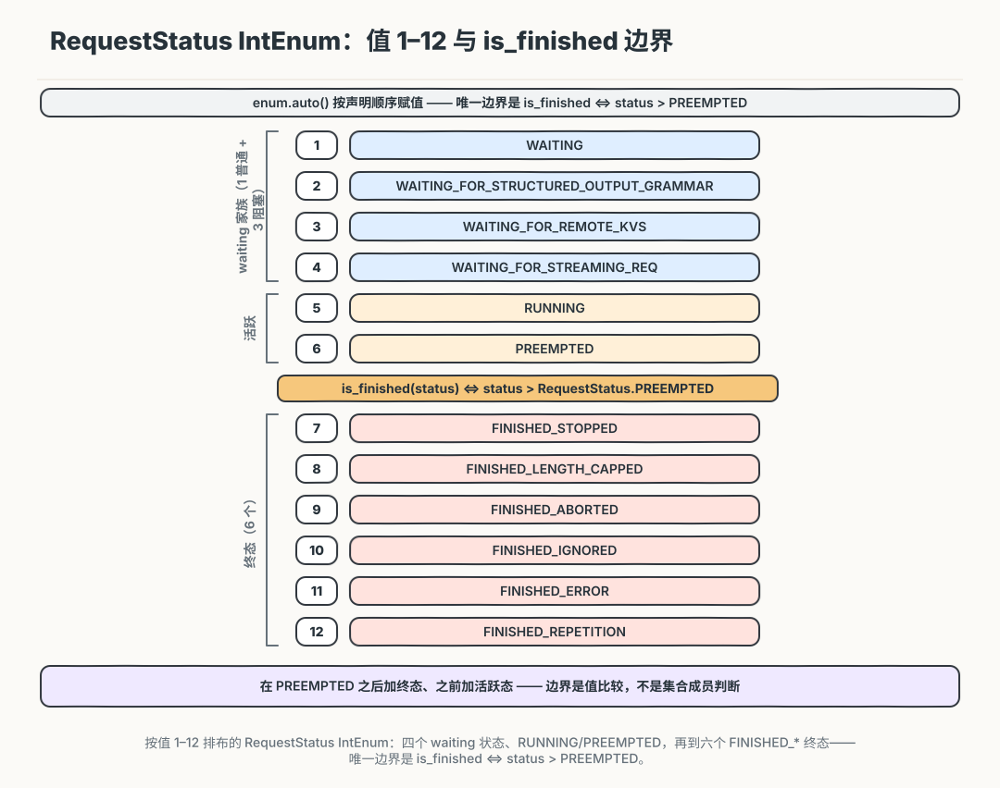</a>

<p class='figure-caption'>RequestStatus IntEnum 按数值 1–12 排列：四个 waiting 状态、RUNNING/PREEMPTED，以及之后的六个 FINISHED_* 终态；唯一的分界条件是 is_finished ⇔ status > PREEMPTED。</p>

```python
class RequestStatus(enum.IntEnum):
    """Status of a request."""

    WAITING = enum.auto()
    WAITING_FOR_STRUCTURED_OUTPUT_GRAMMAR = enum.auto()
    WAITING_FOR_REMOTE_KVS = enum.auto()
    WAITING_FOR_STREAMING_REQ = enum.auto()
    RUNNING = enum.auto()
    PREEMPTED = enum.auto()
    # Note: anything after PREEMPTED will be considered
    # as a finished status.
    FINISHED_STOPPED = enum.auto()
    FINISHED_LENGTH_CAPPED = enum.auto()
    FINISHED_ABORTED = enum.auto()
    FINISHED_IGNORED = enum.auto()
    FINISHED_ERROR = enum.auto()
    FINISHED_REPETITION = enum.auto()

    def __str__(self) -> str:
        return self.name

    @staticmethod
    def is_finished(status: "RequestStatus") -> bool:
        return status > RequestStatus.PREEMPTED
```

`enum.auto()` 按声明顺序赋值：四个 waiting variant 以及 `RUNNING`/`PREEMPTED` 都是非终态；`PREEMPTED` 之后的六项则是终态。因此，`is_finished` 只需一次比较（[`request.py:349-351`](https://github.com/vllm-project/vllm/blob/6cf7b26bd4bff60bf378e1af14044280ac0d214c/vllm/v1/request.py#L349-L351)）。如果在声明边界错误的一侧新增 status，它在所有位置的分类都会随之改变。

| 值 | 状态 | 活跃 / 终态 | 写入方 | 退出方式 | `FinishReason` |
| --- | --- | --- | --- | --- | --- |
| 1 | `WAITING` | 活跃、可调度 | `Request.__init__`（`request.py:97`）；从阻塞状态提升（`scheduler.py:2462`、`2469`）；新的 streaming 轮次（`scheduler.py:1257`） | `schedule()` → `RUNNING`（`scheduler.py:992`）；`finish_requests` → 终态 | `None` |
| 2 | `WAITING_FOR_STRUCTURED_OUTPUT_GRAMMAR` | 活跃、阻塞 | request 携带 grammar 时由 `Request.__init__` 写入（`request.py:112`） | grammar 对象存在后，`_try_promote_blocked_waiting_request` → `WAITING`（`scheduler.py:2465-2469`） | `None` |
| 3 | `WAITING_FOR_REMOTE_KVS` | 活跃、阻塞 | 异步 KV load 时由 `schedule()` 写入（`scheduler.py:954`） | 提升 → `PREEMPTED`（若 `num_preemptions` 非零），否则 → `WAITING`（`scheduler.py:2459-2462`） | `None` |
| 4 | `WAITING_FOR_STREAMING_REQ` | 活跃、阻塞 | 回滚终态状态时由 `_handle_stopped_request` 写入（`scheduler.py:1899`） | 从不自行提升（`scheduler.py:2472-2474`）；只有新轮次才会写入 `WAITING`（`scheduler.py:1257`） | `STOP`——`_FINISHED_REASON_MAP` 中唯一的*活跃*键（`request.py:368`）：已结束轮次报告 `STOP`，而 server 端对象仍保持存活 |
| 5 | `RUNNING` | 活跃 | 仅可由 `schedule()` 从 `WAITING` 或 `PREEMPTED` 写入——其他任何状态都会触发 `RuntimeError`（`scheduler.py:978-992`） | `check_stop` → 终态；`_preempt_request` → `PREEMPTED`；`finish_requests` → 终态 | `None` |
| 6 | `PREEMPTED` | 活跃、可调度——分界线 | `_preempt_request`（`scheduler.py:1157`）；先前被 preempt 的 request 经 remote-KV 提升（`scheduler.py:2460`） | `schedule()` → `RUNNING`（`scheduler.py:992`）；`finish_requests` → 终态 | `None` |
| 7 | `FINISHED_STOPPED` | 终态 | 遇到 EOS 或 stop token 时由 `check_stop` 写入（`utils.py:105`、`109`）；首次 pooler output（`scheduler.py:1643`） | 对可恢复 session 回滚为 `WAITING_FOR_STREAMING_REQ`；否则不再转换——`_free_request` 会执行 | `STOP` |
| 8 | `FINISHED_LENGTH_CAPPED` | 终态 | 遇到 `num_tokens >= max_model_len` 或 `num_output_tokens >= max_tokens` 时由 `check_stop` 写入（`utils.py:116`） | — | `LENGTH` |
| 9 | `FINISHED_ABORTED` | 终态 | 仅由 `finish_requests`（`scheduler.py:2102`）写入，来源包括 `abort_requests`、idle drain、shutdown（`core.py:415`、`744`、`1347`、`1691`）以及 streaming session 结束（`scheduler.py:2033`） | — | `ABORT` |
| 10 | `FINISHED_IGNORED` | 终态、**不可达** | 没有：虽有声明（`request.py:342`）和映射（`request.py:366`），但在整个 v1 代码树中从未被赋值——`grep -rn` 在 commit `6cf7b26bd` 上只返回这两行 | — | `LENGTH`（过长的 prompt 实际会以 `FINISHED_LENGTH_CAPPED` 状态结束） |
| 11 | `FINISHED_ERROR` | 终态 | grammar 拒绝其自身的 token（`scheduler.py:1668`）；KV load 失败时由 `finish_requests` 写入（`scheduler.py:1776`） | — | `ERROR` |
| 12 | `FINISHED_REPETITION` | 终态 | 检测到重复时由 `check_stop` 写入（`utils.py:126`） | — | `REPETITION` |

<a href='images/vllm-04-02-request-states.svg' target='_blank'>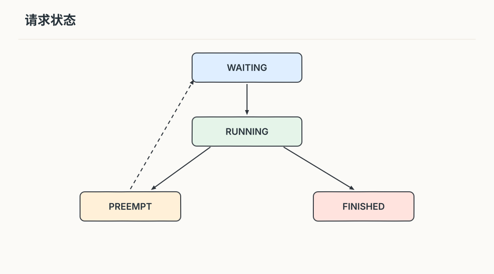</a>

<p class='figure-caption'>request 的各个状态及 scheduler 在状态间的转换；PREEMPTED 所在边界是终态分界线。</p>

**诞生。** request 进入系统时，便已处于确定的初始状态。

[`vllm/v1/request.py:95-112`](https://github.com/vllm-project/vllm/blob/6cf7b26bd4bff60bf378e1af14044280ac0d214c/vllm/v1/request.py#L95-L112)（省略）

```python
        self.status = RequestStatus.WAITING
        ...
        if pooling_params is not None:
            # Pooling models.
            self.max_tokens = 1
        elif sampling_params is not None:
            # Generative models.
            assert sampling_params.max_tokens is not None
            self.max_tokens = sampling_params.max_tokens
            if self.structured_output_request is not None:
                self.status = RequestStatus.WAITING_FOR_STRUCTURED_OUTPUT_GRAMMAR
```

默认初始状态为 `WAITING`（`L97`）。结构化输出 request 则*初始即被阻塞*，状态为 `WAITING_FOR_STRUCTURED_OUTPUT_GRAMMAR`（`L111-112`）：在其 grammar（用于 mask logits 的 FSM）编译完成前，它无法被调度。在设置状态的同时，`Request.__init__` 会将后续由 scheduler 推进的位置计数器清零——即 `num_computed_tokens = 0`（KV cache 中的 prefix 长度）和 `num_in_flight_tokens = 0`——并把 `max_tokens` 设为输出长度上限（pooling 时为 `1`，否则为 `sampling_params.max_tokens`）。输出 token 存放在 `_output_token_ids` 中，而 `num_output_tokens` 是*派生*属性 `len(self._output_token_ids)`（[`request.py:259-261`](https://github.com/vllm-project/vllm/blob/6cf7b26bd4bff60bf378e1af14044280ac0d214c/vllm/v1/request.py#L259-L261)），绝不是手工维护的计数器，因此计数值不可能与列表内容失去同步。

准入流程本身（`add_request`，[第 4 节](#4-add_request-进入-engine-和-waiting-queue)）绝不会让 request 越过等待状态；只有 `schedule()` 才会将 request 提升为 `RUNNING`。

**结束原因：六种终态，四种用户原因。** 内部状态比 API 对外暴露的区分更细，因此会在边界处通过映射将其归并。

[`vllm/v1/request.py:358-370`](https://github.com/vllm-project/vllm/blob/6cf7b26bd4bff60bf378e1af14044280ac0d214c/vllm/v1/request.py#L358-L370)

<a href='images/vllm-04-20-finish-reason-map.svg' target='_blank'>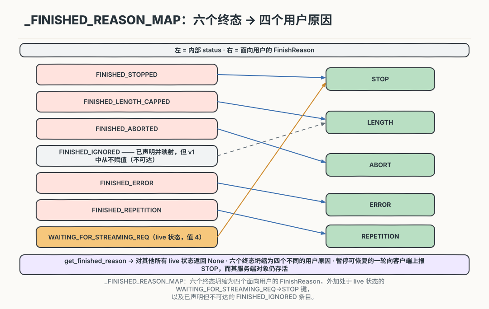</a>

<p class='figure-caption'>_FINISHED_REASON_MAP：六种终态被归并为四种面向用户的 FinishReasons；此外还包含活跃的 WAITING_FOR_STREAMING_REQ→STOP 键，以及已声明但不可达的 FINISHED_IGNORED 条目。</p>

```python
# Mapping of finished statuses to their finish reasons.
# NOTE: The ignored requests are the requests whose prompt lengths
# are longer than the model's length cap. Therefore, the stop
# reason should also be "length" as in OpenAI API.
_FINISHED_REASON_MAP = {
    RequestStatus.FINISHED_STOPPED: FinishReason.STOP,
    RequestStatus.FINISHED_LENGTH_CAPPED: FinishReason.LENGTH,
    RequestStatus.FINISHED_ABORTED: FinishReason.ABORT,
    RequestStatus.FINISHED_IGNORED: FinishReason.LENGTH,
    RequestStatus.FINISHED_ERROR: FinishReason.ERROR,
    RequestStatus.WAITING_FOR_STREAMING_REQ: FinishReason.STOP,
    RequestStatus.FINISHED_REPETITION: FinishReason.REPETITION,
}
```

**唯一可调度的状态转换是 WAITING / PREEMPTED → RUNNING。** 六种活跃状态中，只有两种可以直接调度；切换逻辑会通过硬错误强制执行这一约束。

[`vllm/v1/core/sched/scheduler.py:978-993`](https://github.com/vllm-project/vllm/blob/6cf7b26bd4bff60bf378e1af14044280ac0d214c/vllm/v1/core/sched/scheduler.py#L978-L993)（省略）

```python
                if request.status == RequestStatus.WAITING:
                    scheduled_new_reqs.append(request)
                elif request.status == RequestStatus.PREEMPTED:
                    scheduled_resumed_reqs.append(request)
                else:
                    raise RuntimeError(f"Invalid request status: {request.status}")
                ...
                request.status = RequestStatus.RUNNING
                request.num_computed_tokens = num_computed_tokens
```

状态切换时，状态必须恰好是 `WAITING`（首次 prefill → `scheduled_new_reqs`）或 `PREEMPTED`（恢复执行 → `scheduled_resumed_reqs`）；否则一律触发 `RuntimeError`（`L983`）。model runner（第 09 篇）正是根据切换前的状态来判断，本次是全新的 prefill，还是对先前已驱逐 request 的 recompute。紧接着，`num_computed_tokens` 会被写为刚分配的 KV block 所覆盖的精确 cache prefix 长度（`L993`），从而确保每个 step 开始时，KV 分配结果与已计算 token 计数器始终一致。

三个*阻塞型*等待子状态会被单独放置。`_is_blocked_waiting_status`（[`scheduler.py:1862-1868`](https://github.com/vllm-project/vllm/blob/6cf7b26bd4bff60bf378e1af14044280ac0d214c/vllm/v1/core/sched/scheduler.py#L1862-L1868)）负责识别这些状态，而 `_enqueue_waiting_request` 会把被阻塞的 request 路由到独立的 `skipped_waiting` queue，而非主 `waiting` queue。只有通过 `_try_promote_blocked_waiting_request`（[`scheduler.py:2448-2479`](https://github.com/vllm-project/vllm/blob/6cf7b26bd4bff60bf378e1af14044280ac0d214c/vllm/v1/core/sched/scheduler.py#L2448-L2479)），它们才能重新进入可调度集合：connector 发出接收完成信号后，`WAITING_FOR_REMOTE_KVS` 会将其提升到 `PREEMPTED`（若 `num_preemptions > 0` 成立），否则提升到 `WAITING`，从而保留首次执行与恢复执行的区别；grammar 对象一旦存在，`WAITING_FOR_STRUCTURED_OUTPUT_GRAMMAR` 就会将其提升到 `WAITING`；`WAITING_FOR_STREAMING_REQ` 从不自行提升（它会等待新轮次）。`schedule()` 最终会选中哪个候选项，以及用于门控 `num_new_tokens` 的 token-budget/chunked-prefill 策略，属于第 05 篇的讨论范围；这里要强调的只有一点：*状态门控*只需一次比较。

**RUNNING → FINISHED：stop 判定逻辑会原地写入状态。** 每个 decode step 后，采样得到的 token 会被追加，再由同一个判定逻辑同时决定是否终止及终止原因。

[`vllm/v1/core/sched/utils.py:94-130`](https://github.com/vllm-project/vllm/blob/6cf7b26bd4bff60bf378e1af14044280ac0d214c/vllm/v1/core/sched/utils.py#L94-L130)

<a href='images/vllm-04-21-check-stop-tree.svg' target='_blank'>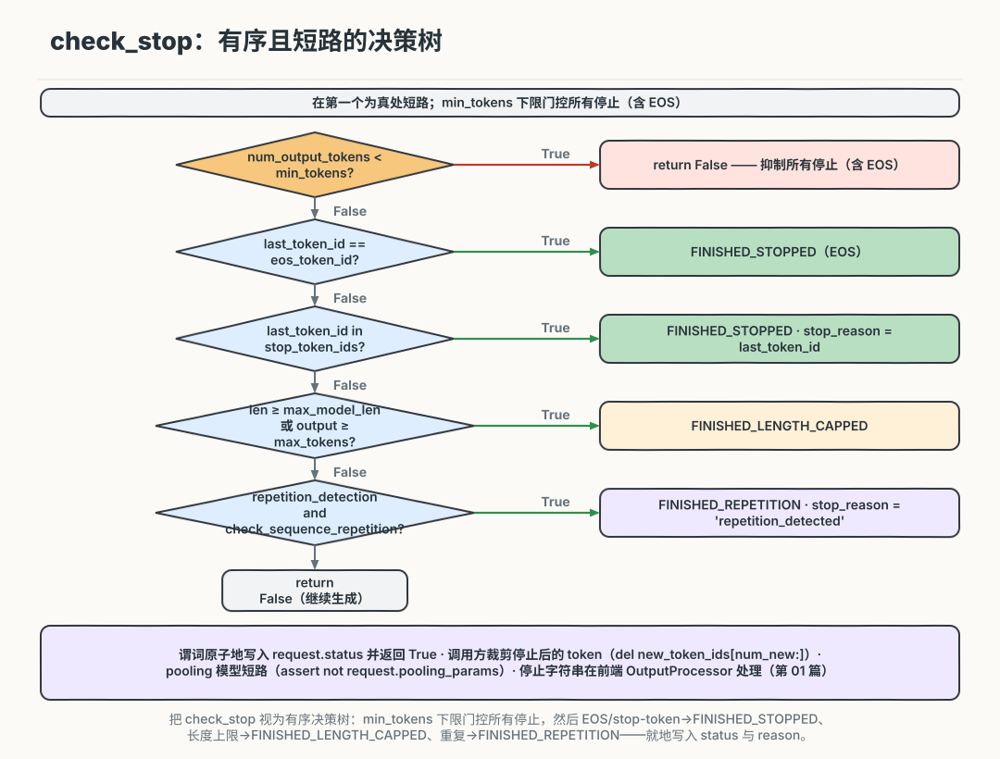</a>

<p class='figure-caption'>check_stop 的有序决策树：min_tokens 下限构成所有 stop 条件的前置门控；随后依次判断 EOS/stop-token→FINISHED_STOPPED、长度上限→FINISHED_LENGTH_CAPPED、重复→FINISHED_REPETITION，并原地写入状态和原因。</p>

```python
def check_stop(request: Request, max_model_len: int) -> bool:
    assert not request.pooling_params

    sampling_params = request.sampling_params
    assert sampling_params is not None

    if request.num_output_tokens < sampling_params.min_tokens:
        return False

    last_token_id = request.output_token_ids[-1]
    if last_token_id == sampling_params.eos_token_id:
        request.status = RequestStatus.FINISHED_STOPPED
        return True

    if last_token_id in (sampling_params.stop_token_ids or ()):
        request.status = RequestStatus.FINISHED_STOPPED
        request.stop_reason = last_token_id
        return True
    if (
        request.num_tokens >= max_model_len
        or request.num_output_tokens >= request.max_tokens
    ):
        request.status = RequestStatus.FINISHED_LENGTH_CAPPED
        return True

    repetition_detection = sampling_params.repetition_detection
    if repetition_detection is not None and (
        check_sequence_repetition(
            request.output_token_ids,
            repetition_detection,
        )
    ):
        request.status = RequestStatus.FINISHED_REPETITION
        request.stop_reason = "repetition_detected"
        return True

    return False
```

这样的判定顺序是刻意设计的：`min_tokens` guard（`L100-101`）会在 output 足够长之前屏蔽*所有* stop，连 EOS 也不例外；达到该长度后，EOS 或 custom stop token → `FINISHED_STOPPED`（custom stop token 的情况还会记录 `stop_reason`）；接着检查长度上限，在 model context（`num_tokens >= max_model_len`）与 per-request budget（`num_output_tokens >= max_tokens`）中，以先触及者为准 → `FINISHED_LENGTH_CAPPED`；最后是可选的 repetition detection → `FINISHED_REPETITION`。这个 predicate *本身就是* transition——它会在同一次操作中修改 `request.status` 并返回 `True`，从而以原子方式同时设置 classification 和 reason。它的 caller `_update_request_with_output` 会逐个追加 token（spec decode 每个 step 会一次产出多个 token），并在每次追加后调用 `check_stop`，裁掉越过 stop point 后生成的所有 token（[第 7 节](#7-update_from_output模型输出转化为-engine-输出)）。

请注意 `assert not request.pooling_params`，它位于 `L95`：pooling model 根本不会进入这个 predicate；拿到第一个 pooler output 后，它们就直接 short-circuit 到 `FINISHED_STOPPED`（[`scheduler.py:1641-1644`](https://github.com/vllm-project/vllm/blob/6cf7b26bd4bff60bf378e1af14044280ac0d214c/vllm/v1/core/sched/scheduler.py#L1641-L1644)）。更关键的是，这里执行的是 *token-level* stop——stop *strings* 需要 detokenized text，因此是在下游 front-end `OutputProcessor`（第 01 篇）中检测，而不是在这里。

**RUNNING → PREEMPTED → WAITING：backpressure 不会造成 output 丢失。** KV 空间承压时，scheduler 会驱逐一个 running request。

[`vllm/v1/core/sched/scheduler.py:1145-1167`](https://github.com/vllm-project/vllm/blob/6cf7b26bd4bff60bf378e1af14044280ac0d214c/vllm/v1/core/sched/scheduler.py#L1145-L1167)

```python
    def _preempt_request(self, request: Request, timestamp: float) -> None:
        """Preempt a request and put it back to the waiting queue.

        NOTE: The request should be popped from the running queue outside of this
        method.
        """
        assert request.status == RequestStatus.RUNNING, (
            "Only running requests can be preempted"
        )
        self._free_request_blocks(request)
        self.encoder_cache_manager.free(request)
        self._inflight_prefills.discard(request)
        request.status = RequestStatus.PREEMPTED
        request.num_computed_tokens = 0
        if request.spec_token_ids:
            request.spec_token_ids = []
        request.num_preemptions += 1
        if self.log_stats:
            request.record_event(EngineCoreEventType.PREEMPTED, timestamp)

        # Put the request back to the waiting queue.
        self.waiting.prepend_request(request)
        self.reset_preempted_req_ids.add(request.request_id)
```

只有 `RUNNING` 状态的 request 才能被 preempt（hard assert，`L1151`）。它的 KV block 会被释放回 pool——这正是 preemption 的*核心目的*：回收空间，供触发这次驱逐的更高优先级 request 使用——同时，`num_computed_tokens` 会被重置为 `0`（`L1158`），因为 cached prefix 已经丢失，必须重新计算。但已经生成的 `_output_token_ids` 会被**保留**：丢弃的只有 KV / computed-token state，因此 resume 后的 recompute 会覆盖 prompt + 此前的 output，而 prefix caching（第 06 篇）还能复用其中一部分计算结果。`num_preemptions += 1`（`L1161`）会作为依据，决定上文是将其提升到 `PREEMPTED`，还是保持在 `WAITING`。request 会重新放回 queue 的*队首*（`prepend_request`、`L1166`），让被 preempt 的 request 尽快 resume。这里有两个触发来源：`schedule()` 内部的 KV allocation 失败（[`scheduler.py:572-578`](https://github.com/vllm-project/vllm/blob/6cf7b26bd4bff60bf378e1af14044280ac0d214c/vllm/v1/core/sched/scheduler.py#L572-L578)），以及强制 cache reset（[`scheduler.py:2222-2232`](https://github.com/vllm-project/vllm/blob/6cf7b26bd4bff60bf378e1af14044280ac0d214c/vllm/v1/core/sched/scheduler.py#L2222-L2232)）；后者会 preempt *所有* running request。

**resumable request 的兜底通道。** “stop” 并不总是 terminal。`check_stop` 设置 terminal status 后，per-request loop 会在检查 `_handle_stopped_request` *之前*保存 finish reason：

[`vllm/v1/core/sched/scheduler.py:1712-1719`](https://github.com/vllm-project/vllm/blob/6cf7b26bd4bff60bf378e1af14044280ac0d214c/vllm/v1/core/sched/scheduler.py#L1712-L1719)（省略部分）

```python
            finish_reason = None
            if stopped:
                # Capture finish_reason BEFORE _handle_stopped_request, which may
                # reset the status to WAITING for streaming requests that continue.
                finish_reason = request.get_finished_reason()
                finished = self._handle_stopped_request(request)
                if finished:
                    kv_transfer_params = self._free_request(request)
```

对于 non-resumable request，`_handle_stopped_request` 返回 `True`，随后立即执行 `_free_request`。对于 resumable streaming session（[`scheduler.py:1887-1903`](https://github.com/vllm-project/vllm/blob/6cf7b26bd4bff60bf378e1af14044280ac0d214c/vllm/v1/core/sched/scheduler.py#L1887-L1903)），`check_stop` 设置的 terminal status 会被*回滚*到 live 状态 `WAITING_FOR_STREAMING_REQ`；request 返回 `False`，*不会*被释放，并重新进入 waiting 路径。由于 `finish_reason` 已在 `L1716` 处完成 snapshot，client 仍能看到本轮已完成 turn 的 `STOP`，这正是 `WAITING_FOR_STREAMING_REQ` 会成为 `_FINISHED_REASON_MAP` 中一个 key 的原因。释放路径（`_free_request`，第 06 篇）会 assert `request.is_finished()`，因此 resumed request 绝不可能被误释放。

**外部终止。** decode loop 外部的任何事件（client disconnect、engine abort、KV-load error）都会通过 `finish_requests` 将 request 直接收敛到 terminal 状态；它会 assert 传入的 status 本身就是 terminal，还能将*任意* live state（`WAITING*`、`RUNNING`、`PREEMPTED`）直接跳转到 `FINISHED_ABORTED`/`FINISHED_ERROR`，并跳过已经结束的 id，从而保证该操作是幂等的。该路径及与之配套的 dual-queue eager-abort 机制详见 [第 10 节](#10-abort-与取消)。

**底层 counter。** status field 建立在 `num_computed_tokens` 之上；scheduler 会在 schedule 时*乐观地*提前推进它——在 GPU 运行前执行 `+= num_scheduled_token`（`_update_after_schedule`，[第 7 节](#7-update_from_output模型输出转化为-engine-输出)）——并在 speculative decode reject 时向下校正：`num_computed_tokens -= num_rejected`，且受 `> 0` guard（[`scheduler.py:1610-1611`](https://github.com/vllm-project/vllm/blob/6cf7b26bd4bff60bf378e1af14044280ac0d214c/vllm/v1/core/sched/scheduler.py#L1610-L1611)）。代码 assert 了 upper bound `num_computed_tokens ≤ num_tokens`（[`scheduler.py:763`](https://github.com/vllm-project/vllm/blob/6cf7b26bd4bff60bf378e1af14044280ac0d214c/vllm/v1/core/sched/scheduler.py#L763)）；lower bound `0 ≤` 则由构造方式天然保证（该 counter 是若干非负项之和，[`scheduler.py:760-762`](https://github.com/vllm-project/vllm/blob/6cf7b26bd4bff60bf378e1af14044280ac0d214c/vllm/v1/core/sched/scheduler.py#L760-L762)）。它始终处于这个区间内，因为每个 step 会恰好增加 `num_scheduled_tokens`，reject 时又会恰好扣回 `num_rejected`。

## 6. execute_model：将 Batch 交给 Executor

`step()` 的中间阶段会把 `SchedulerOutput` 交给 `self.model_executor`，并接收一个 `ModelRunnerOutput`。`EngineCore.step` 对 in-process、multiprocess 和 Ray executor 采用相同的 call shape：每次 engine-to-worker 调用都经过 `collective_rpc`，并返回 `Future`。本节将沿着这条调用链路一直追踪到 process boundary。第 09 篇介绍 worker 内部的 tensor 准备、forward pass、CUDA graph 和 sampling；第 03 篇介绍 multiprocess executor 使用的 shared-memory queue。

### engine 有且仅有一个 compute handle

`model_executor` 只会构造一次，此后从不重新绑定：

[`vllm/v1/engine/core.py:123`](https://github.com/vllm-project/vllm/blob/6cf7b26bd4bff60bf378e1af14044280ac0d214c/vllm/v1/engine/core.py#L123)
```python
        self.model_executor = executor_class(vllm_config)
```

`executor_class: type[Executor]` 被传入 `__init__`，并在构造阶段解析为 `UniProcExecutor`、`MultiprocExecutor` 或 `RayDistributedExecutor` 之一。`step()` 完全不需要知道实际拿到哪一种。它只调用 handle 上的三个 method（`execute_model`、`sample_tokens`、`take_draft_token_ids`），而每个 method 都只是对 `collective_rpc` 的一层薄封装。这是核心设计决策：具体执行链路在构造时确定，per-iteration hot path 完全无须感知其具体类型。

这处 call site 只占 step transaction 中的两行（已在 [第 2 节](#2-stepscheduleexecute-与-update-构成一个-transaction) 介绍；此处再次列出，作为本阶段的定位锚点）：

[`vllm/v1/engine/core.py:491-499`](https://github.com/vllm-project/vllm/blob/6cf7b26bd4bff60bf378e1af14044280ac0d214c/vllm/v1/engine/core.py#L491-L499)
```python
        future = self.model_executor.execute_model(scheduler_output, non_block=True)
        grammar_output = self.scheduler.get_grammar_bitmask(scheduler_output)
        with (
            self.log_error_detail(scheduler_output),
            self.log_iteration_details(scheduler_output),
        ):
            model_output = future.result()
            if model_output is None:
                model_output = self.model_executor.sample_tokens(grammar_output)
```

这里有两个关键事实。首先，`non_block=True` 会让 `execute_model` *立即*返回 `Future`（L491）；forward pass 随后并发执行，与此同时 engine thread 在 CPU 上计算 structured-output bitmask（L492）。其次，execution 与 sampling 分属*两次* RPC：`execute_model` 可以执行 forward pass，但会推迟 sampling，并返回 `None`；随后 engine 调用 `sample_tokens(grammar_output)`（L499），应用刚刚构建好的 bitmask 并取得实际 output。forward pass 中如果发生 exception，会记录在 `Future` 中，直到 `future.result()`（L497）处才抛出；因此 `log_error_detail` 包裹的是 *result* call，而不是 launch。

### 基础 contract：通过 `collective_rpc` 传递 string method name

`Executor.execute_model` 不承载实际 compute；它做的只是传入一个 method name，再发起一次 call：

[`vllm/v1/executor/abstract.py:209-227`](https://github.com/vllm-project/vllm/blob/6cf7b26bd4bff60bf378e1af14044280ac0d214c/vllm/v1/executor/abstract.py#L209-L227)

<a href='images/vllm-04-22-executor-backends.svg' target='_blank'>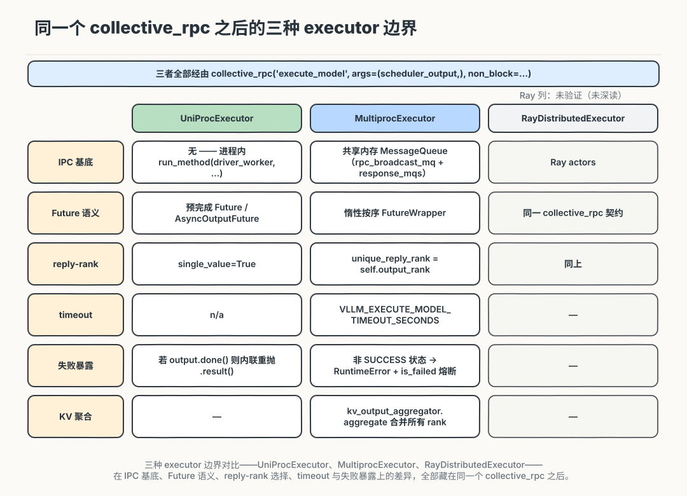</a>

<p class='figure-caption'>三种 executor 调用链路的对比——UniProcExecutor、MultiprocExecutor 与 RayDistributedExecutor——涵盖 IPC 基础设施、Future 语义、reply-rank 选择、timeout 和 failure 暴露方式；所有差异都统一隐藏在一个 collective_rpc 之后。</p>
```python
    @overload
    def execute_model(
        self, scheduler_output: SchedulerOutput, non_block: Literal[False] = False
    ) -> ModelRunnerOutput | None:
        pass

    @overload
    def execute_model(
        self, scheduler_output: SchedulerOutput, non_block: Literal[True] = True
    ) -> Future[ModelRunnerOutput | None]:
        pass

    def execute_model(
        self, scheduler_output: SchedulerOutput, non_block: bool = False
    ) -> ModelRunnerOutput | None | Future[ModelRunnerOutput | None]:
        output = self.collective_rpc(  # type: ignore[call-overload]
            "execute_model", args=(scheduler_output,), non_block=non_block
        )
        return output[0]
```

这两个 `@overload` stub 只提供类型信息：`non_block=False` 直接返回 `ModelRunnerOutput | None`，`non_block=True` 则返回封装了同一类型的 `Future`。真正的函数体会发起 `collective_rpc("execute_model", args=(scheduler_output,), ...)`——method name 是一个 **string**，远端 worker object 上的 `getattr` 会据此解析出对应的 method（见下文“远端”）。`collective_rpc` 返回一个 *list*（基础契约中每个 worker rank 对应一项），`execute_model` 则接收 `output[0]`。`sample_tokens` 在 [`abstract.py:229-247`](https://github.com/vllm-project/vllm/blob/6cf7b26bd4bff60bf378e1af14044280ac0d214c/vllm/v1/executor/abstract.py#L229-L247) 处的结构逐字节完全相同，RPC name 为 `"sample_tokens"`，args 为 `(grammar_output,)`；`take_draft_token_ids` 和 `execute_dummy_batch` 也是如此。基类 `collective_rpc` 本身是 abstract（[`abstract.py:198-202`](https://github.com/vllm-project/vllm/blob/6cf7b26bd4bff60bf378e1af14044280ac0d214c/vllm/v1/executor/abstract.py#L198-L202)，`raise NotImplementedError`）——每个具体 executor 都必须实现 broadcast。

这样一来，`SchedulerOutput` 要脱离 engine 的逻辑控制时，只能经过这一个原语。每种 executor 只需定义一次 `non_block` 的语义、错误传播和 rank 选择，因此无论 backend 是什么，`step()` 中两阶段 execute/sample 拆分的行为都完全一致。

### uniproc 边界：不涉及并发的 Future

single-process executor 没有 IPC，也不创建 worker process，但仍遵守 `Future` 契约：

[`vllm/v1/executor/uniproc_executor.py:91-121`](https://github.com/vllm-project/vllm/blob/6cf7b26bd4bff60bf378e1af14044280ac0d214c/vllm/v1/executor/uniproc_executor.py#L91-L121)
```python
        if not non_block:
            result = run_method(self.driver_worker, method, args, kwargs)
            if isinstance(result, AsyncModelRunnerOutput):
                result = result.get_output()
            return result if single_value else [result]

        try:
            result = run_method(self.driver_worker, method, args, kwargs)
            if isinstance(result, AsyncModelRunnerOutput):
                return AsyncOutputFuture(result, single_value)
            future = Future[Any]()
            future.set_result(result if single_value else [result])
        except Exception as e:
            future = Future[Any]()
            future.set_exception(e)
        return future

    def execute_model(  # type: ignore[override]
        self, scheduler_output: SchedulerOutput, non_block: bool = False
    ) -> ModelRunnerOutput | None | Future[ModelRunnerOutput | None]:
        output = self.collective_rpc(
            "execute_model",
            args=(scheduler_output,),
            non_block=non_block,
            single_value=True,
        )
        # In non-blocking mode, surface any exception as early as possible.
        if non_block and output.done():
            # Raise the exception in-line if the task failed.
            output.result()
        return output
```

`run_method(self.driver_worker, method, ...)` 会*同步*调用进程内的 `Worker`——等到构造 `Future` 时，forward pass 已经执行完毕。即使处于 `non_block` 模式，executor 仍会返回 `Future`，但这是一个预先完成的 Future，结果（或异常，L103-105）已经写入其中。这里的 `Future` 只是一种*接口形态*，并不代表真正的并发；真正的 async 情况是唯一例外，此时 `AsyncModelRunnerOutput` 会被包装进 `AsyncOutputFuture`。`execute_model` 还增加了一层处理（L118-120）：如果这个预先完成的 Future 已经失败，它会当场重新抛出异常，让 engine 在调用发起处就感知到崩溃，而不是推迟到 `.result()` 时才暴露。

实际运行中，即使 worker process 数为零，`execute_model(non_block=True)` 仍会返回符合 multi-process 契约的 `Future`。正因如此，`EngineCore.step` 不需要针对 `if uniproc` 增加分支。

### multiproc 边界：进程边界（第 03 篇）

multi-process executor 比 uniproc 多了两个后者不需要的控制项：

[`vllm/v1/executor/multiproc_executor.py:310-320`](https://github.com/vllm-project/vllm/blob/6cf7b26bd4bff60bf378e1af14044280ac0d214c/vllm/v1/executor/multiproc_executor.py#L310-L320)
```python
    def execute_model(  # type: ignore[override]
        self, scheduler_output: SchedulerOutput, non_block: bool = False
    ) -> ModelRunnerOutput | None | Future[ModelRunnerOutput | None]:
        return self.collective_rpc(
            "execute_model",
            args=(scheduler_output,),
            unique_reply_rank=self.output_rank,
            non_block=non_block,
            timeout=envs.VLLM_EXECUTE_MODEL_TIMEOUT_SECONDS,
            kv_output_aggregator=self.kv_output_aggregator,
        )
```

`unique_reply_rank=self.output_rank` 表示“只从*一个* rank 收集 `ModelRunnerOutput`，而不是从所有 rank 收集”——在 tensor/pipeline parallelism 下，只有 TP driver / 最后一个 PP rank 持有真正的采样输出，因此收集每个 rank 的 response 不仅浪费资源，而且逻辑上也是错误的。`timeout=VLLM_EXECUTE_MODEL_TIMEOUT_SECONDS` 会让卡死的 worker 导致 RPC 失败，而不是让 engine 陷入死锁。真正跨越进程边界的逻辑位于 `collective_rpc` 内部：

[`vllm/v1/executor/multiproc_executor.py:355-403`](https://github.com/vllm-project/vllm/blob/6cf7b26bd4bff60bf378e1af14044280ac0d214c/vllm/v1/executor/multiproc_executor.py#L355-L403)
```python
        assert self.rpc_broadcast_mq is not None, (
            "collective_rpc should not be called on follower node"
        )
        if self.is_failed:
            raise RuntimeError("Executor failed.")

        deadline = None if timeout is None else time.monotonic() + timeout
        ...
        self.rpc_broadcast_mq.enqueue((send_method, args, kwargs, output_rank))

        response_mqs: Sequence[MessageQueue] = self.response_mqs
        if output_rank is not None:
            response_mqs = (response_mqs[output_rank],)

        def get_response():
            responses = []
            for mq in response_mqs:
                dequeue_timeout = (
                    None if deadline is None else (deadline - time.monotonic())
                )
                try:
                    status, result = mq.dequeue(timeout=dequeue_timeout)
                except TimeoutError as e:
                    raise TimeoutError(f"RPC call to {method} timed out.") from e
                if status != WorkerProc.ResponseStatus.SUCCESS:
                    raise RuntimeError(
                        f"Worker failed with error '{result}', please check the"
                        " stack trace above for the root cause"
                    )
                responses.append(result)
            return responses[0] if output_rank is not None else responses

        future = FutureWrapper(
            self.futures_queue, get_response=get_response, aggregate=aggregate
        )
```

`rpc_broadcast_mq.enqueue((send_method, args, kwargs, output_rank))`（L377）会将 `("execute_model", (scheduler_output,), {}, output_rank)` 序列化到所有 worker 都会读取的共享内存 broadcast queue 中——这是 `SchedulerOutput` 在物理上离开 engine process 的*唯一位置*（queue 机制见第 03 篇）。因为 `output_rank` 是为 `execute_model` 设置的，所以 engine 会把读取端精确收窄到一个 response queue（L379-381）。`get_response` closure（L383-399）负责*延迟*读取：它会在剩余 deadline 内执行 dequeue；更关键的是，它会在*engine 侧*把非 `SUCCESS` status 转换为 `RuntimeError`（L393-397）。worker 崩溃由此变成 engine 侧的异常，随后被 `log_error_detail`（[第 2 节](#2-stepscheduleexecute-与-update-构成一个-transaction)）捕获，并与引发问题的 batch 一起 dump。最后，`get_response` 被包装成 `FutureWrapper`；在 non-block 模式下，它会以 unresolved 状态返回，否则会阻塞等待 `.result()`。

前后各有一道 guard。`is_failed`（L358）相当于熔断器：只要有任何 worker 挂掉，之后所有 RPC 都会快速失败，而不会继续向无人 drain 的 queue enqueue。启用 KV connector 时，`kv_output_aggregator.aggregate`（绑定于 L364-368）会把所有 rank 的 KV-transfer metadata 合并成唯一的规范结果，而不是选择单个 rank：这样即使在 disaggregated serving 场景下，单输出不变量依然成立。

**`FutureWrapper`：惰性按序 drain。**

返回的 Future 并非普通的 `concurrent.futures.Future`；它是有序的：

[`vllm/v1/executor/multiproc_executor.py:70-100`](https://github.com/vllm-project/vllm/blob/6cf7b26bd4bff60bf378e1af14044280ac0d214c/vllm/v1/executor/multiproc_executor.py#L70-L100)

<a href='images/vllm-04-23-collective-rpc-callgraph.svg' target='_blank'>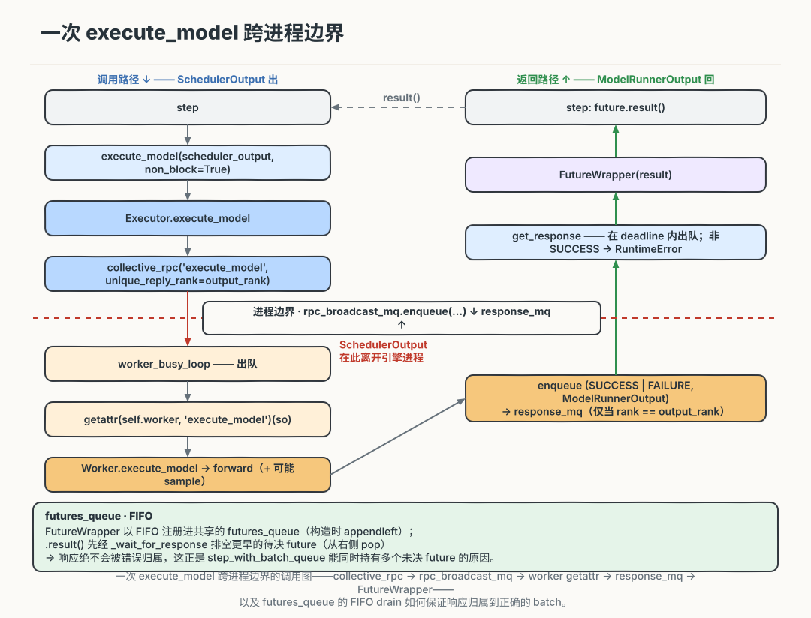</a>

<p class='figure-caption'>一次 execute_model 调用跨越进程边界的完整路径——collective_rpc → rpc_broadcast_mq → worker getattr → response_mq → FutureWrapper——以及 futures_queue 的 FIFO drain 如何确保 response 始终归属于正确的 batch。</p>
```python
class FutureWrapper(Future):
    def __init__(
        self,
        futures_queue: deque["FutureWrapper"],
        get_response: Callable[[], Any],
        aggregate: Callable = lambda x: x,
    ):
        self.futures_queue = futures_queue
        self.get_response = get_response
        self.aggregate = aggregate
        super().__init__()
        self.futures_queue.appendleft(self)

    def result(self, timeout=None):
        if timeout is not None:
            raise RuntimeError("timeout not implemented")

        # Drain any futures ahead of us in the queue.
        while not self.done():
            future = self.futures_queue.pop()
            future._wait_for_response()
        return super().result()

    def _wait_for_response(self):
        try:
            response = self.aggregate(self.get_response())
            with suppress(InvalidStateError):
                self.set_result(response)
        except Exception as e:
            with suppress(InvalidStateError):
                self.set_exception(e)
```

每个 wrapper 在构造时都会按 FIFO 顺序将自身注册到共享 `futures_queue` 中（`appendleft`，L81）。对任意 Future 调用 `.result()`，都会先 drain 所有*更早*的 pending Future（L88-91，`pop` 从右侧取出）：由于底层 response message queue 严格保持顺序，因此必须按照 RPC 发起顺序消费 response。`_wait_for_response` 会实际执行阻塞式 dequeue，再通过 `aggregate` 锁存结果或异常。

这种有序性正是 `step_with_batch_queue`（[第 3 节](#3-step_with_batch_queue重叠执行版本)）得以工作的关键机制：pipelined 版本会同时持有多个尚未完成的 `execute_model`/`sample_tokens` Future，FIFO drain 则保证任何 response 都不会被错误归到其他 batch。普通 `step()` 始终最多只持有一个 Future，因此不会触发 drain loop——但它同样依赖这一契约来确保这个唯一 Future 的语义正确。

### 远端：string 解析为 method（→ 第 09 篇）

在每个 worker process 内部，broadcast 会被还原成真正的调用。worker 侧 loop 本身属于第 09、03 篇的内容；本节所讨论的边界只关心其中一行 `getattr`：它会把 RPC 中的 string name 重新解析为 bound method：

[`vllm/v1/executor/multiproc_executor.py:986-1002`](https://github.com/vllm-project/vllm/blob/6cf7b26bd4bff60bf378e1af14044280ac0d214c/vllm/v1/executor/multiproc_executor.py#L986-L1002)（已省略 worker 内部分支）
```python
    def worker_busy_loop(self):
        """Main busy loop for Multiprocessing Workers"""
        ...
            method, args, kwargs, output_rank = self.rpc_broadcast_mq.dequeue(
                indefinite=True
            )
            ...
                if isinstance(method, str):
                    func = getattr(self.worker, method)
                ...
                output = func(*args, **kwargs)

                if output_rank is None or self.rank == output_rank:
                    self.handle_output(output)
```

`getattr(self.worker, "execute_model")(scheduler_output)`（L995、L999）执行 forward pass；只有与 `output_rank` 匹配的 rank 才会 enqueue response（L1001）。这个 response 是一个 `(SUCCESS | FAILURE, payload)` tuple，engine 会在 `get_response` 中将其 decode 还原。最终调用到的 worker method 是第 09 篇的入口，其返回类型就是闭合整个调用链的契约：

[`vllm/v1/worker/gpu_worker.py:963-965`](https://github.com/vllm-project/vllm/blob/6cf7b26bd4bff60bf378e1af14044280ac0d214c/vllm/v1/worker/gpu_worker.py#L963-L965)
```python
    def execute_model(
        self, scheduler_output: "SchedulerOutput"
    ) -> ModelRunnerOutput | AsyncModelRunnerOutput | None:
```

这个 signature 中的三种返回形态，完整概括了两阶段协议：worker 立即完成 sampling 时返回 `ModelRunnerOutput`；返回 `None` 表示 sampling 被推迟到后续的 `sample_tokens` RPC（也就是前文的 `if model_output is None` 分支，见 [`core.py:498`](https://github.com/vllm-project/vllm/blob/6cf7b26bd4bff60bf378e1af14044280ac0d214c/vllm/v1/engine/core.py#L498)）；async scheduling 则返回 `AsyncModelRunnerOutput`。该 signature 之后的所有流程（构建 attention metadata、重放 CUDA graph、计算 logits、执行 sampling）都属于第 09 篇。

## 7. update_from_output：模型输出转化为 engine 输出

`update_from_output` 会根据乐观调度结果对 `ModelRunnerOutput` 进行对账。调度会在 forward 完成前推进 request 计数器，因此 chunked-prefill request 无需等待 GPU，即可再次进入调度规划。随后，对账过程会修正这些计数器、追加采样得到的 token、检测 stop 条件、释放 terminal request，并组装 per-client `dict[int, EngineCoreOutputs]`，再由 `step()` 返回。[第 2 节](#2-stepscheduleexecute-与-update-构成一个-transaction)介绍事务边界；第 05 篇介绍调度策略。

这笔乐观记账发生在 forward 之前，具体由 `_update_after_schedule` 完成；`schedule()` 会在构建完 `SchedulerOutput` snapshot 后立即调用它。

[`vllm/v1/core/sched/scheduler.py:1179-1189`](https://github.com/vllm-project/vllm/blob/6cf7b26bd4bff60bf378e1af14044280ac0d214c/vllm/v1/core/sched/scheduler.py#L1179-L1189)

<a href='images/vllm-04-24-optimistic-ledger.svg' target='_blank'>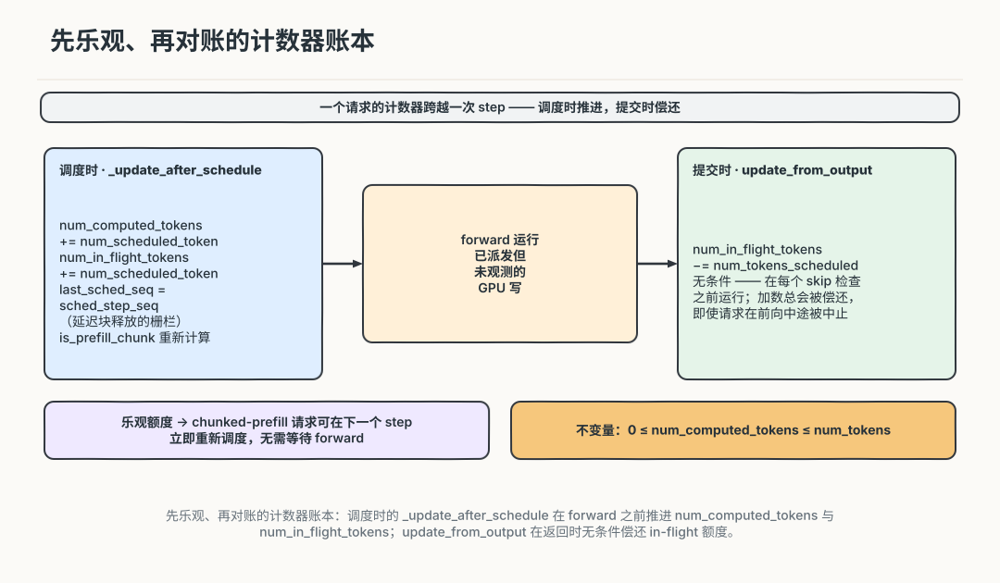</a>

<p class='figure-caption'>先乐观记账、再对账的计数台账：调度时，_update_after_schedule 会在 forward 之前推进 num_computed_tokens 和 num_in_flight_tokens；update_from_output 返回时则无条件冲销这笔 in-flight 额度。</p>

```python
        num_scheduled_tokens = scheduler_output.num_scheduled_tokens
        for req_id, num_scheduled_token in num_scheduled_tokens.items():
            request = self.requests[req_id]
            request.num_computed_tokens += num_scheduled_token
            request.num_in_flight_tokens += num_scheduled_token
            if self.defer_block_free:
                # Record the in-flight step, to fence deferred block freeing.
                request.last_sched_seq = self.sched_step_seq
            request.is_prefill_chunk = request.num_computed_tokens < (
                request.num_tokens + request.num_output_placeholders
            )
```

`num_computed_tokens += num_scheduled_token`（L1182）会把所有 scheduled token 都记到 request 名下，仿佛 forward 已经将它们提交到 KV。正如该方法自己的注释 2 所说，这样做的好处是 prefill chunk 可以立即再次参与调度。`num_in_flight_tokens += num_scheduled_token`（L1183）会把相同数量记录为*尚未观测到的* GPU 工作；`last_sched_seq`（L1186）则为该 step 打上标记，以便为 async scheduling 中的 block 释放设置 fence（[第 9 节](#9-已结束-request检测清理与-kv-释放)）。注释 3 明确指出了这笔欠账：后续被 reject 的 token“会在 `update_from_output` 中调整”。这正是对账 pass 需要冲销的欠账。

<a href='images/vllm-04-06-update-from-output.svg' target='_blank'>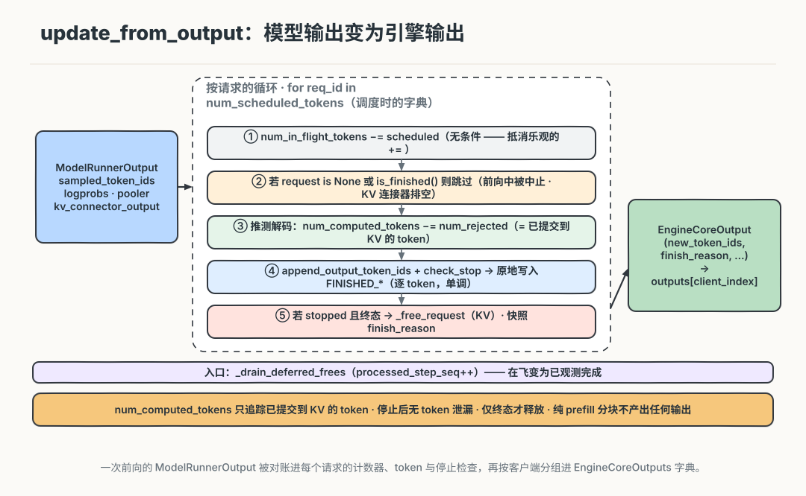</a>

<p class='figure-caption'>单次 forward 的 ModelRunnerOutput 被对账到各个 request state，再按 client 分组到 per-client EngineCoreOutputs dict 中。</p>

**入口与延迟释放项的清理。** 函数先解包 worker 侧的所有 channel，然后在处理任何 request 之前，释放此前 step 中因 fence 而延迟处理的 KV block。

[`vllm/v1/core/sched/scheduler.py:1505-1523`](https://github.com/vllm-project/vllm/blob/6cf7b26bd4bff60bf378e1af14044280ac0d214c/vllm/v1/core/sched/scheduler.py#L1505-L1523)

```python
    def update_from_output(
        self,
        scheduler_output: SchedulerOutput,
        model_runner_output: ModelRunnerOutput,
    ) -> dict[int, EngineCoreOutputs]:
        sampled_token_ids = model_runner_output.sampled_token_ids
        logprobs = model_runner_output.logprobs
        prompt_logprobs_dict = model_runner_output.prompt_logprobs_dict
        num_scheduled_tokens = scheduler_output.num_scheduled_tokens
        pooler_outputs = model_runner_output.pooler_output
        num_nans_in_logits = model_runner_output.num_nans_in_logits
        kv_connector_output = model_runner_output.kv_connector_output
        cudagraph_stats = model_runner_output.cudagraph_stats

        # Every GPU write enqueued by this and earlier steps has completed, so it is
        # safe to return deferred-free blocks to the pool.
        if self.defer_block_free and scheduler_output.total_num_scheduled_tokens > 0:
            self.processed_step_seq += 1
            self._drain_deferred_frees()
```

返回类型为 `dict[int, EngineCoreOutputs]`，其 key 是 `client_index`——每个 front-end socket 对应一个 slice（[第 8 节](#8-output-聚合每个-client-对应的-enginecoreoutputs)）。拿到 `ModelRunnerOutput` 就意味着，截至当前 step 的 forward，所有 GPU write 都已落地。因此，`processed_step_seq` 会被推进，`_drain_deferred_frees()` 也会归还 fence step 已经过去的所有 block（[第 9 节](#9-已结束-request检测清理与-kv-释放)）。正是在这一刻，in-flight 状态转为“已观测完成”。

**per-request 循环先无条件递减 in-flight 计数，再跳过已终止的 request。** 循环遍历的是 `num_scheduled_tokens`（调度时的 dict，而非 model-runner 的 row 顺序），因为这个 dict 才是已派发内容的权威记录。

[`vllm/v1/core/sched/scheduler.py:1568-1589`](https://github.com/vllm-project/vllm/blob/6cf7b26bd4bff60bf378e1af14044280ac0d214c/vllm/v1/core/sched/scheduler.py#L1568-L1589)

```python
        for req_id, num_tokens_scheduled in num_scheduled_tokens.items():
            assert num_tokens_scheduled > 0
            request = self.requests.get(req_id)
            if request is not None:
                request.num_in_flight_tokens -= num_tokens_scheduled
            if failed_kv_load_req_ids and req_id in failed_kv_load_req_ids:
                # skip failed or rescheduled requests from KV load failure
                continue
            if request is None or request.is_finished():
                # The request is already finished. This can happen if the
                # request is aborted while the model is executing it (e.g.,
                # in pipeline parallelism or in async scheduling).
                # NOTE(Kuntai): When delay_free_blocks=True (for async KV
                # cache transfer in KV connector), the aborted request will not
                # be set to None (in order to finish async KV transfer).
                # In this case, we use is_finished() to check.
                continue

            req_index = model_runner_output.req_id_to_index[req_id]
            generated_token_ids = (
                sampled_token_ids[req_index] if sampled_token_ids else []
            )
```

对 `num_in_flight_tokens` 的递减（L1571-1572）发生在 skip 检查*之前*，因此是无条件的。它恰好抵消对 `+=` 的那次增加，而这次增加来自 `_update_after_schedule`；即使 request 在 forward 过程中被 abort，也同样如此。完成递减后，循环才会跳过那些在 GPU frame 仍处于 in-flight 状态时已经结束的 request（PP 或 async scheduling 可能 abort 一个 worker 仍在计算的 request）。这里使用 `is_finished()` 而不是 `request is None`，因为 KV-connector transfer 会让已 abort 的 object（`delay_free_blocks=True`）继续存活，直到 transfer 清空（[第 10 节](#10-abort-与取消)）。对于本 step 只执行 prefill 的 request，`generated_token_ids` 为空——model runner 在 prefill 完成前不会返回 sampled token。

**冲销 speculative-decode 的预记增量。** 如果 request 携带了已调度的 draft token，乐观推进会按每个 draft 预先多记 `num_computed_tokens`；一旦实际接受结果明确，reject 的部分就会立即扣回。

[`vllm/v1/core/sched/scheduler.py:1601-1615`](https://github.com/vllm-project/vllm/blob/6cf7b26bd4bff60bf378e1af14044280ac0d214c/vllm/v1/core/sched/scheduler.py#L1601-L1615)

<a href='images/vllm-04-25-spec-reconcile.svg' target='_blank'>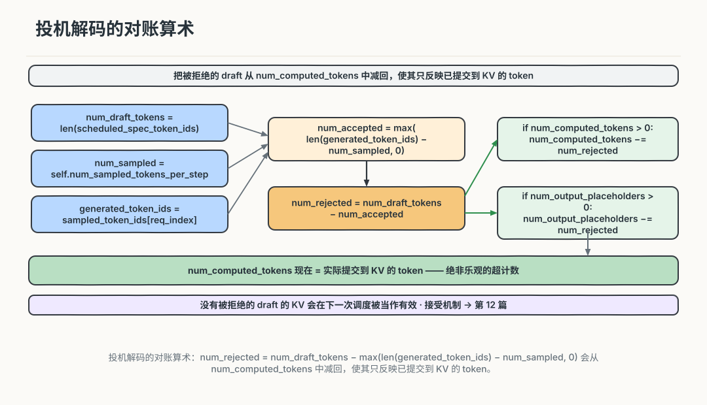</a>

<p class='figure-caption'>speculative-decode 对账计算：num_rejected = num_draft_tokens − max(len(generated_token_ids) − num_sampled, 0)。该值会从 num_computed_tokens 中扣回，使后者只跟踪已提交到 KV 的 token。</p>

```python
                num_draft_tokens = len(scheduled_spec_token_ids)
                num_sampled = self.num_sampled_tokens_per_step
                num_accepted = max(len(generated_token_ids) - num_sampled, 0)
                num_rejected = num_draft_tokens - num_accepted
                # num_computed_tokens represents the number of tokens
                # processed in the current step, considering scheduled
                # tokens and rejections. If some tokens are rejected,
                # num_computed_tokens is decreased by the number of rejected
                # tokens.
                if request.num_computed_tokens > 0:
                    request.num_computed_tokens -= num_rejected
                # If async scheduling, num_output_placeholders also includes
                # the scheduled spec tokens count and so is similarly adjusted.
                if request.num_output_placeholders > 0:
                    request.num_output_placeholders -= num_rejected
```

在 sampled token 中，`num_sampled`（`num_sampled_tokens_per_step`）对应真正的 model token；其余都是 accepted draft，因此有 `num_rejected = num_draft_tokens - num_accepted`（L1604）。再从 `num_computed_tokens`（L1611）中扣除该值，就能恢复实际已提交的 KV 长度，避免 rejected draft 的 KV state 进入下一轮调度。

**逐 token 追加并检测 stop 条件。** sampled token 会通过 `_update_request_with_output` 逐一写入 request state。这里刻意采用 per-token 处理，因为 speculative decode 可能在单个 step 中一次产出多个 token。

[`vllm/v1/core/sched/scheduler.py:1905-1921`](https://github.com/vllm-project/vllm/blob/6cf7b26bd4bff60bf378e1af14044280ac0d214c/vllm/v1/core/sched/scheduler.py#L1905-L1921)

```python
    def _update_request_with_output(
        self, request: Request, new_token_ids: list[int]
    ) -> tuple[list[int], bool]:
        # Append generated tokens and check for stop. Note that if
        # a request is still being prefilled, we expect the model runner
        # to return empty token ids for the request.
        stopped = False
        for num_new, output_token_id in enumerate(new_token_ids, 1):
            request.append_output_token_ids(output_token_id)

            # Check for stop and update request state.
            # This must be called before we make the EngineCoreOutput.
            stopped = check_stop(request, self.max_model_len)
            if stopped:
                del new_token_ids[num_new:]  # Trim new tokens if needed.
                break
        return new_token_ids, stopped
```

`check_stop`（[`vllm/v1/core/sched/utils.py:94-130`](https://github.com/vllm-project/vllm/blob/6cf7b26bd4bff60bf378e1af14044280ac0d214c/vllm/v1/core/sched/utils.py#L94-L130)，完整代码见[第 5 节](#5-request-生命周期requeststatus-状态机)）是负责*写入* terminal status 的最终裁决者；`update_from_output` 的 `stopped` flag 只是触发后续动作的信号。关键在于，predicate 会原地写入 status，同时返回 `True`——例如遇到 EOS 时：

```python
    if last_token_id == sampling_params.eos_token_id:
        request.status = RequestStatus.FINISHED_STOPPED
        return True
```

执行顺序至关重要（完整的有序 predicate 见[第 5 节](#5-request-生命周期requeststatus-状态机)）：`min_tokens` gate 会触发短路，使 request 在达到下限前绝不停止；随后，EOS 和 stop token 都会写入 `FINISHED_STOPPED`；长度上限再写入 `FINISHED_LENGTH_CAPPED`；repetition 最后写入 `FINISHED_REPETITION`。由于每次 append 后都会执行检查，而且 `del new_token_ids[num_new:]`（L1919）会裁掉循环在 stop token *之后*生成的所有内容，因此发往 client 的输出是单调的：**任何 stop 之后的 token 都绝不会到达 client，记录的 finish reason 也与触发它的 token 完全一致。** 还要注意 `check_stop` *不会*做的一件事——stop *string* 需要 detokenized text，因此由下游 front-end 的 `OutputProcessor` 检测（第 01 篇），而不是在这里处理；本文只处理到 raw token ids。

**处理 stop：先确定 reason，再执行 free——但仅限 terminal request。** 回到主循环后，`stopped` request 会完成收尾。status 回滚语义属于[第 5 节](#5-request-生命周期requeststatus-状态机)的 state machine；本节关注的 commit-phase gate，是保存 reason snapshot，并且只对 terminal request 执行 free：

[`vllm/v1/core/sched/scheduler.py:1712-1719`](https://github.com/vllm-project/vllm/blob/6cf7b26bd4bff60bf378e1af14044280ac0d214c/vllm/v1/core/sched/scheduler.py#L1712-L1719)（省略末尾的 bucketing 逻辑；完整 block 见[第 5 节](#5-request-生命周期requeststatus-状态机)）

```python
            finish_reason = None
            if stopped:
                # Capture finish_reason BEFORE _handle_stopped_request, which may
                # reset the status to WAITING for streaming requests that continue.
                finish_reason = request.get_finished_reason()
                finished = self._handle_stopped_request(request)
                if finished:
                    kv_transfer_params = self._free_request(request)
                ...
```

在执行 `_handle_stopped_request` *之前*，会先对 `finish_reason` 做快照，因为可恢复的 streaming session 会将其 status 改回 `WAITING`，导致停止原因被抹除（[第 5 节](#5-request-生命周期requeststatus-状态机)中的状态机）。只有 request 真正进入终态时，`_handle_stopped_request` 才返回 `True`；若某个 streaming 轮次仍有更多 input 在 queue 中等待，则返回 `False`，并在*保留其 KV block*的情况下重新进入 waiting queue。**释放操作只由终态 `finished` 触发，绝不能依据原始 `stopped` flag**——block 归还机制（`_free_request`、terminal-status assert、connector/step fence）详见[第 9 节](#9-已结束-request检测清理与-kv-释放)，它所补充的 block pool 则见第 06 篇。随后，request 会按 stop 前的 status（`status_before_stop`，在 L1633 捕获）分桶，这样循环结束后的批量 queue 移除操作就能正确地将其从 `running` 或 `waiting` 中移除（[第 9 节](#9-已结束-request检测清理与-kv-释放)）。

**组装面向 client 的 output。** 每个保留下来的 request 最多发送一个 `EngineCoreOutput`，并按 `request.client_index` 分桶。

[`vllm/v1/core/sched/scheduler.py:1739-1765`](https://github.com/vllm-project/vllm/blob/6cf7b26bd4bff60bf378e1af14044280ac0d214c/vllm/v1/core/sched/scheduler.py#L1739-L1765)

```python
            if (
                new_token_ids
                or pooler_output is not None
                or kv_transfer_params
                or stopped
            ):
                # Add EngineCoreOutput for this Request.
                outputs[request.client_index].append(
                    EngineCoreOutput(
                        request_id=req_id,
                        new_token_ids=new_token_ids,
                        finish_reason=finish_reason,
                        new_logprobs=new_logprobs,
                        new_prompt_logprobs_tensors=prompt_logprobs_tensors,
                        pooling_output=pooler_output,
                        stop_reason=request.stop_reason,
                        events=request.take_events(),
                        prefill_stats=request.take_prefill_stats(),
                        kv_transfer_params=kv_transfer_params,
                        trace_headers=request.trace_headers,
                        routed_experts=routed_experts,
                        num_nans_in_logits=request.num_nans_in_logits,
                    )
                )
            else:
                # Invariant: EngineCore returns no partial prefill outputs.
                assert not prompt_logprobs_tensors
```

`if` guard 定义了发送规则：只有确实有内容需要交付时才发送——包括新 token、pooling result、KV-transfer handoff 或 stop。未 sample 出任何内容的纯 prefill chunk *不会*产生 output；`else` 分支还会断言它不携带任何待处理的 prompt-logprobs（L1763-1765）。这正是“EngineCore 不返回 partial prefill output”这一 invariant，使 front-end 不必处理尚未完整形成的 generation。`finish_reason` 和 `kv_transfer_params` 也会一并传递，分别用于告知 front-end request 已结束，以及携带 disaggregated-KV metadata；`take_events()` / `take_prefill_stats()` 采用 drain-once 语义，因此各自都只会在一个 step 中上报一次。

最后，各 bucket 被实体化为 `EngineCoreOutputs`，再合并 finished id，并附加 stats。

[`vllm/v1/core/sched/scheduler.py:1833-1857`](https://github.com/vllm-project/vllm/blob/6cf7b26bd4bff60bf378e1af14044280ac0d214c/vllm/v1/core/sched/scheduler.py#L1833-L1857)

```python
        finished_req_ids = self.finished_req_ids_dict
        if finished_req_ids:
            for client_index, finished_set in finished_req_ids.items():
                if (eco := engine_core_outputs.get(client_index)) is not None:
                    eco.finished_requests = finished_set
                else:
                    engine_core_outputs[client_index] = EngineCoreOutputs(
                        finished_requests=finished_set
                    )
            finished_req_ids.clear()

        if (
            stats := self.make_stats(
                spec_decoding_stats, kv_connector_stats, cudagraph_stats, perf_stats
            )
        ) is not None:
            # Return stats to only one of the front-ends.
            if (eco := next(iter(engine_core_outputs.values()), None)) is None:
                engine_core_outputs[0] = eco = EngineCoreOutputs()
            eco.scheduler_stats = stats
```

`finished_req_ids_dict` 是一个独立的 `client_index → set[str]` accumulator，由 `_free_request` 填充（[第 9 节](#9-已结束-request检测清理与-kv-释放)），因此即使 X 在某个 step 中没有生成 token，client 也能得知“request X 已彻底结束”。这个 set 被附加后会执行 `.clear()`，确保每个 finished id 恰好上报一次。engine 级的 `SchedulerStats` 不属于任何特定 client，因此只会附加到任意一个 front-end（`next(iter(...))`）上；若该 step 没有生成任何 output，则临时构造 `engine_core_outputs[0]`——stats 绝不会丢失，也绝不会被重复统计。这里返回的 dict 仅以 `client_index` 为 key；payload 中的 `engine_index` 仍取默认值 `0`，稍后由 output IO thread 写入。该 thread 会将每个 slice PUSH 到对应的 socket（[第 8 节](#8-output-聚合每个-client-对应的-enginecoreoutputs)，第 03 篇）。

这一轮 commit pass 会校准 in-flight counter、移除被拒绝的 draft、逐 token 应用 stop、释放终态 request，并发送 completion id。它在 abort barrier 之后运行，从而确保 scheduler state 在下一 batch 形成前完成对账。

## 8. Output 聚合：每个 Client 对应的 EngineCoreOutputs

`step()` 返回 `dict[int, EngineCoreOutputs]`。dict 的 key 是 frontend 的 `client_index`，由 scheduler 根据各 request 选定。payload 中的 `engine_index` 标识产出该结果的 engine，稍后由 output IO thread 写入。简言之，key 决定路由，field 记录来源。

<a href='images/vllm-04-07-output-aggregation.svg' target='_blank'>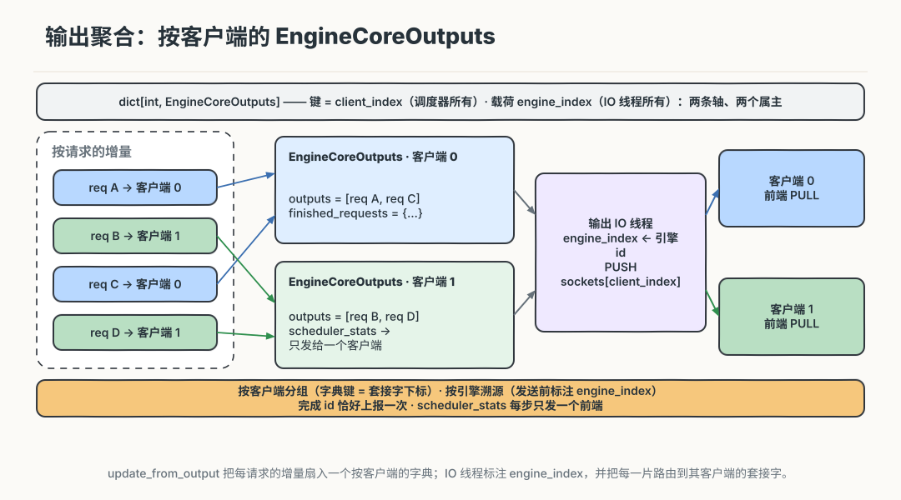</a>

<p class='figure-caption'>单个 step 中的 update_from_output 会把各 request 的 delta 扇出到按 client 划分的 dict；IO thread 随后为其写入 engine_index，并路由到各 client 的 socket。</p>

### 两个 wire struct

叶子对象是单个 request 在单个 step 内的*delta*；container 则汇集某个 client 在该 step 中的完整 slice。

源码定位：[`vllm/v1/engine/__init__.py:175-205`](https://github.com/vllm-project/vllm/blob/6cf7b26bd4bff60bf378e1af14044280ac0d214c/vllm/v1/engine/__init__.py#L175-L205)

```python
class EngineCoreOutput(
    msgspec.Struct,
    array_like=True,  # type: ignore[call-arg]
    omit_defaults=True,  # type: ignore[call-arg]
    gc=False,
):  # type: ignore[call-arg]
    request_id: str
    new_token_ids: list[int]

    new_logprobs: LogprobsLists | None = None
    new_prompt_logprobs_tensors: LogprobsTensors | None = None

    pooling_output: torch.Tensor | None = None

    finish_reason: FinishReason | None = None
    stop_reason: int | str | None = None
    events: list[EngineCoreEvent] | None = None
    kv_transfer_params: dict[str, Any] | None = None
    ...
    @property
    def finished(self) -> bool:
        return self.finish_reason is not None
```

源码定位：[`vllm/v1/engine/__init__.py:220-248`](https://github.com/vllm-project/vllm/blob/6cf7b26bd4bff60bf378e1af14044280ac0d214c/vllm/v1/engine/__init__.py#L220-L248)

```python
class EngineCoreOutputs(
    msgspec.Struct,
    array_like=True,  # type: ignore[call-arg]
    omit_defaults=True,  # type: ignore[call-arg]
    gc=False,
):  # type: ignore[call-arg]
    ...
    engine_index: int = 0

    # [num_reqs]
    outputs: list[EngineCoreOutput] = []
    scheduler_stats: SchedulerStats | None = None
    timestamp: float = 0.0

    utility_output: UtilityOutput | None = None
    finished_requests: set[str] | None = None
    ...
    def __post_init__(self):
        if self.timestamp == 0.0:
            self.timestamp = time.monotonic()
```

两个 struct 均以 `array_like=True, omit_defaults=True, gc=False` 声明：msgspec 会将每个对象序列化为 positional array（wire 上更紧凑），跳过值为默认值的 field，并使 struct 不参与 Python 的 cyclic GC——这些对象生命周期短且不存在 cycle，因此对其进行 GC tracking 纯属额外开销。在 leaf 上，`finished` 是一个*property*，绝不会被序列化；`finish_reason` 是唯一事实来源，而 `request_id` 是 client 用作 key 的*外部* request id，不是 scheduler 的内部 handle。在 container 上，`engine_index` 的默认值是 `0`；关键是，scheduler 内部构造对象时*不会*设置它，因为 scheduler 既不知道这个值，也不负责管理它。`timestamp` 会自动填充为 `time.monotonic()`；该逻辑位于 `__post_init__` 中，仅在其值仍为 `0.0` 时触发，让 front-end 无需额外成本即可获得跨 step 时钟。注意其中*没有*什么：不存在 client-index field。client 由 **dict key** / container 被发送到的 socket 表示；payload 一旦到达某个 client 的 socket，client 身份也就不言自明。

### accumulator 与发送规则

`update_from_output` 将数据累积到 `defaultdict` 中；该结构以 `request.client_index` 为 key，并且只有在确实有内容可交付时才追加 delta。

源码定位：[`vllm/v1/core/sched/scheduler.py:1529`](https://github.com/vllm-project/vllm/blob/6cf7b26bd4bff60bf378e1af14044280ac0d214c/vllm/v1/core/sched/scheduler.py#L1529)，然后是 `:1739-1765`

```python
        outputs: dict[int, list[EngineCoreOutput]] = defaultdict(list)
```

```python
            if (
                new_token_ids
                or pooler_output is not None
                or kv_transfer_params
                or stopped
            ):
                # Add EngineCoreOutput for this Request.
                outputs[request.client_index].append(
                    EngineCoreOutput(
                        request_id=req_id,
                        new_token_ids=new_token_ids,
                        finish_reason=finish_reason,
                        new_logprobs=new_logprobs,
                        new_prompt_logprobs_tensors=prompt_logprobs_tensors,
                        pooling_output=pooler_output,
                        stop_reason=request.stop_reason,
                        events=request.take_events(),
                        prefill_stats=request.take_prefill_stats(),
                        kv_transfer_params=kv_transfer_params,
                        trace_headers=request.trace_headers,
                        routed_experts=routed_experts,
                        num_nans_in_logits=request.num_nans_in_logits,
                    )
                )
            else:
                # Invariant: EngineCore returns no partial prefill outputs.
                assert not prompt_logprobs_tensors
```

中间结构是 `client_index → list[EngineCoreOutput]`，而非最终 struct；每个有进展的 request 都会追加到*自身* client 对应的 bucket。`request.client_index` 是在 request admission 时从 wire request 复制的——`Request.from_engine_core_request` 会设置 `client_index=request.client_index`（[`vllm/v1/request.py:210`](https://github.com/vllm-project/vllm/blob/6cf7b26bd4bff60bf378e1af14044280ac0d214c/vllm/v1/request.py#L210)）；`0` 则是后者在 `EngineCoreRequest` 上的默认值（[`vllm/v1/engine/__init__.py:113`](https://github.com/vllm-project/vllm/blob/6cf7b26bd4bff60bf378e1af14044280ac0d214c/vllm/v1/engine/__init__.py#L113)）。包含四种情况的 `if` 定义了发送规则：只有确实存在需要交付的内容时才发送 `EngineCoreOutput`，即新 decoded token、pooling result、需要回传的 KV-transfer params，或终态 `stopped`。

某个 request 即使在当前 step 被 schedule，只要仍处于 prefill 中段且尚未 sample 出任何内容，就*完全不会*产生 output。`else` 分支并非只是 skip——它还会执行 `assert not prompt_logprobs_tensors`，把“不输出 partial-prefill output”这一规则落实为可检查的 invariant：如果某条 code path 为一个即将丢弃的 request 计算了 prompt logprobs，这就是 bug，而不是悄无声息的 data loss。`take_events()` 和 `take_prefill_stats()` 都采用 drain-once 语义（会从 request object 中移出），因此每个 event/stat 都只会在一个 step 中交付，绝不会跨 step 重复。

这样，dict 会严格按来源 front-end 分区，每个 client 对应一个 bucket；EngineCore 也绝不会把 partial-prefill delta 泄漏到 downstream。这使 front-end `OutputProcessor`（第 01 篇）得以保持简单——它看到的每个 `EngineCoreOutput` 都是真正可交付的 increment，因此无需区分“prefill 进度”和“交给用户的 token”。

**生成最终结构，合并 finished id，并附加 stats。**

将按 client 划分的 list 转为 `EngineCoreOutputs`，然后并入两个不属于任何单个 request 的 step 级 side channel：finished id set 和 engine-wide stats。

源码锚点：[`vllm/v1/core/sched/scheduler.py:1826-1859`](https://github.com/vllm-project/vllm/blob/6cf7b26bd4bff60bf378e1af14044280ac0d214c/vllm/v1/core/sched/scheduler.py#L1826-L1859)

```python
        # Create EngineCoreOutputs for all clients that have requests with
        # outputs in this step.
        engine_core_outputs = {
            client_index: EngineCoreOutputs(outputs=outs)
            for client_index, outs in outputs.items()
        }

        finished_req_ids = self.finished_req_ids_dict
        if finished_req_ids:
            # Include ids of requests that finished since last outputs
            # were sent.
            for client_index, finished_set in finished_req_ids.items():
                # Set finished request set in EngineCoreOutputs for this client.
                if (eco := engine_core_outputs.get(client_index)) is not None:
                    eco.finished_requests = finished_set
                else:
                    engine_core_outputs[client_index] = EngineCoreOutputs(
                        finished_requests=finished_set
                    )
            finished_req_ids.clear()

        if (
            stats := self.make_stats(
                spec_decoding_stats, kv_connector_stats, cudagraph_stats, perf_stats
            )
        ) is not None:
            # Return stats to only one of the front-ends.
            if (eco := next(iter(engine_core_outputs.values()), None)) is None:
                # We must return the stats even if there are no request
                # outputs this step.
                engine_core_outputs[0] = eco = EngineCoreOutputs()
            eco.scheduler_stats = stats

        return engine_core_outputs
```

首先，凡是在当前 step 至少产生一个 delta 的 client，都会为其构建一个 `EngineCoreOutputs(outputs=outs)`；此处刻意让 `engine_index` 保持默认值 `0`——稍后再写入。其次，`finished_req_ids_dict` 是一个*独立的* `client_index → set[str]` accumulator，声明于 `dict[int, set[str]] | None`（[`scheduler.py:101`](https://github.com/vllm-project/vllm/blob/6cf7b26bd4bff60bf378e1af14044280ac0d214c/vllm/v1/core/sched/scheduler.py#L101)）；每当 request 的 KV 被释放时，都会在 `_free_request`（[`scheduler.py:2117-2118`](https://github.com/vllm-project/vllm/blob/6cf7b26bd4bff60bf378e1af14044280ac0d214c/vllm/v1/core/sched/scheduler.py#L2117-L2118)）中填充该 accumulator（[第 9 节](#9-已结束-request检测清理与-kv-释放)）。之所以需要它，是因为 request 可能恰好在其 client 没有 *token* output 的 step 结束（例如，该 request 在没有生成任何新 token 的 step 被释放）。

fold 会将每个 client 的 finished set 附加到该 client 的 container 上；**如果该 client 在当前 step 没有 token output，则以同一个 `client_index` 为 key 新建一个 container**。随后通过 `.clear()` 清空 accumulator，确保每个 finished id 只上报一次。第三，`SchedulerStats` 属于整个 engine，而非单个 client，因此会通过 `next(iter(engine_core_outputs.values()))` 附加到*任意一个且仅一个* client 上；如果该 step 完全没有产生任何内容，则会构造一个 `engine_core_outputs[0]`，确保 stats 不会丢失。

finished id 会被取出并清空，因此每个 client 针对每个 request 只会收到一次 release signal。每个 step 的 stats 只发送给一个 client，即使是没有 token 的 step 也不例外；scheduler 返回普通 dict，不接触 socket，也不处理 engine identity。

**将 dict 扇出到 output queue。**

`step()` 将 dict 返回给 `_process_engine_step`，后者把它展开，以一个个 `(client_index, EngineCoreOutputs)` item 的形式写入 thread-safe queue。

源码锚点：[`vllm/v1/engine/core.py:1300-1307`](https://github.com/vllm-project/vllm/blob/6cf7b26bd4bff60bf378e1af14044280ac0d214c/vllm/v1/engine/core.py#L1300-L1307)（queue 类型位于 `:916`）

```python
    def _process_engine_step(self) -> bool:
        """Called only when there are unfinished local requests."""

        # Step the engine core.
        outputs, model_executed = self.step_fn()
        # Put EngineCoreOutputs into the output queue.
        for output in outputs.items() if outputs else ():
            self.output_queue.put_nowait(output)
```

```python
        self.output_queue = queue.Queue[tuple[int, EngineCoreOutputs] | bytes]()
```

`outputs.items()` 会生成 `(client_index, EngineCoreOutputs)` tuple，每个 tuple 都原样 push；dict 被展开后，每个产生 output 的 (client, step) 对应一个 queue item。`if outputs else ()` 会以相同方式兼容 `{}`（来自 `step`）和 `None`（来自 `step_with_batch_queue`，[第 3 节](#3-step_with_batch_queue重叠执行版本)），因此没有 output 的 step 不会向 queue 加入任何 item。queue 的元素类型正是该 tuple，另外还允许 `bytes` 这一备选类型，专供 `ENGINE_CORE_DEAD` sentinel 使用。已知目标 key 的 control-plane 路径也会直接向同一 queue 写入数据——包括 utility-RPC reply、finish/abort notification，以及使用保留 key `-1` 的 DP-coordinator message（这些 control-plane producer 参见第 03 篇）。`output_queue` 上的每个元素都是一个 `(client_index, EngineCoreOutputs)` pair，其中 `client_index >= 0` 用于选择 client socket，`-1` 用于选择 coordinator；scheduler 建立的配对关系会按 1:1 原样进入 queue。

### IO thread：写入 engine_index，按 client_index 路由

一个专用的 output socket thread 会 pop 每个 pair，写入 payload 的 `engine_index`，然后将其 PUSH 到对应 client 的 socket。这就是第 03 篇详细介绍的 ZMQ 边界；这里我们只关注双轴约定。

源码锚点：[`vllm/v1/engine/core.py:1623-1648`](https://github.com/vllm-project/vllm/blob/6cf7b26bd4bff60bf378e1af14044280ac0d214c/vllm/v1/engine/core.py#L1623-L1648)

```python
            while True:
                output = self.output_queue.get()
                if output == EngineCoreProc.ENGINE_CORE_DEAD:
                    for socket in sockets:
                        socket.send(output)
                    break
                assert not isinstance(output, bytes)
                client_index, outputs = output
                outputs.engine_index = engine_index

                if client_index == -1:
                    # Don't reuse buffer for coordinator message
                    # which will be very small.
                    assert coord_socket is not None
                    coord_socket.send_multipart(encoder.encode(outputs))
                    continue
                ...
                tracker = sockets[client_index].send_multipart(
                    buffers, copy=False, track=True
                )
```

第 1631 行的 `outputs.engine_index = engine_index` 会用真实 engine id 覆盖 scheduler 写入的默认值。`client_index == -1` 会路由到 coordinator；否则由 dict key 选择 `sockets[client_index]`。zero-copy send 会 pin 住 `outputs`，直至 ZMQ tracker 完成。由此，分组由 scheduler 负责，而 I/O thread 只负责写入来源信息并执行路由。

### Client 端：每次 get_output() 返回一个 EngineCoreOutputs

从 client 端看，按 client 分组的过程不可见——socket 拓扑（或 in-process indexing）已经完成 demultiplex，因此每次 `get_output()` 都只返回一个 container。

源码锚点：[`vllm/v1/engine/core_client.py:289-292`](https://github.com/vllm-project/vllm/blob/6cf7b26bd4bff60bf378e1af14044280ac0d214c/vllm/v1/engine/core_client.py#L289-L292)（in-process）和 `:849-859`（multiprocess）

```python
    def get_output(self) -> EngineCoreOutputs:
        outputs, model_executed = self.engine_core.step_fn()
        self.engine_core.post_step(model_executed=model_executed)
        return outputs and outputs.get(0) or EngineCoreOutputs()
```

```python
    def get_output(self) -> EngineCoreOutputs:
        ...
        outputs = self.outputs_queue.get()

        if isinstance(outputs, Exception):
            raise self._format_exception(outputs) from None
        if outputs.wave_complete is not None:
            self.engines_running = False
        return outputs
```

`InprocClient` 以内联方式执行 step，并读取 client 0 的 slice；该拓扑只支持这一个 client。`SyncMPClient` 从其后台 socket thread 接收已经路由好的 `EngineCoreOutputs`；按 client 分组的 dict 不会传到 frontend。在两种情况下，`get_output()` 返回的都是某个 engine 对应一个 client、一个 step 的 slice，其中还包含 side channel。

## 9. 已结束 request：检测、清理与 KV 释放

完成 output reconciliation 后，terminal request 会释放 encoder state，并最终释放其 KV block。stop 操作可能支持恢复，而 terminal request 可能仍有 in-flight GPU write 或 connector transfer，因此，“已停止”“已结束”和“可以安全归还 block”是三项彼此独立的检查。

### 检测：看终态边界，而非 `stopped` flag

request 是否结束由 `RequestStatus` 决定；它是一个具有全序关系的 `IntEnum`，完整定义和状态转换表见[第 5 节](#5-request-生命周期requeststatus-状态机)。本节只需要关注以下终态边界：

[`vllm/v1/request.py:349-351`](https://github.com/vllm-project/vllm/blob/6cf7b26bd4bff60bf378e1af14044280ac0d214c/vllm/v1/request.py#L349-L351)

```python
    @staticmethod
    def is_finished(status: "RequestStatus") -> bool:
        return status > RequestStatus.PREEMPTED
```

### `stopped` ≠ `finished`：resumable 机制的例外通道

当 `_update_request_with_output` 返回 `stopped` 时，per-request loop 会据此处理。完整的 `if stopped:` block——包括 finish reason 快照、resumable session 的 status 回滚，以及 `status_before_stop` 分桶——属于[第 5 节](#5-request-生命周期requeststatus-状态机)（state machine），并在[第 7 节](#7-update_from_output模型输出转化为-engine-输出)（commit）中展示；本节只关注其中控制“仅 terminal 才释放”的 gate：

[`vllm/v1/core/sched/scheduler.py:1717-1719`](https://github.com/vllm-project/vllm/blob/6cf7b26bd4bff60bf378e1af14044280ac0d214c/vllm/v1/core/sched/scheduler.py#L1717-L1719)（完整 block 见[第 5 节](#5-request-生命周期requeststatus-状态机)）

```python
                finished = self._handle_stopped_request(request)
                if finished:
                    kv_transfer_params = self._free_request(request)
```

按顺序看：必须在 `_handle_stopped_request` *之前* 对 `finish_reason` 取快照（完整 block 见[第 5 节](#5-request-生命周期requeststatus-状态机)），因为该调用可能把 status 改回 live `WAITING_FOR_STREAMING_REQ`，并清除 reason。**仅当 `finished` 为 `True` 时**才会执行 `_free_request`：仅有 `stopped` flag 绝不会触发任何释放。request 会按其 *stop 前* 的 status 分桶（`status_before_stop`，之前在 L1633 捕获），这样下方的批量 queue removal 才能判断它此前处于 running，还是先被 preempt、后被 stop。

在 `_handle_stopped_request` 中，stop 不一定意味着进入 terminal：

[`vllm/v1/core/sched/scheduler.py:1887-1903`](https://github.com/vllm-project/vllm/blob/6cf7b26bd4bff60bf378e1af14044280ac0d214c/vllm/v1/core/sched/scheduler.py#L1887-L1903)

```python
    def _handle_stopped_request(self, request: Request) -> bool:
        """Return True if finished (can be False for resumable requests)."""
        if not request.resumable:
            return True

        if request.streaming_queue:
            update = request.streaming_queue.popleft()
            if update is None:
                # Streaming request finished.
                return True
            self._update_request_as_session(request, update)
        else:
            request.status = RequestStatus.WAITING_FOR_STREAMING_REQ
            self.num_waiting_for_streaming_input += 1

        self._enqueue_waiting_request(request)
        return False
```

non-resumable request 会返回 `True`。resumable session 会消费下一个 queued input，或停驻在 `WAITING_FOR_STREAMING_REQ`；两种情况下都会保留 KV，只有 end-of-stream marker 才会使其进入 terminal。因此，某一轮的 EOS 不会迫使 multi-turn session 重新执行 prefill。

**清理：批量移除 queue。**

request 会在 loop 结束后一次性从 run/wait queue 中移除，而不是在 loop 内逐个移除：

[`vllm/v1/core/sched/scheduler.py:1767-1772`](https://github.com/vllm-project/vllm/blob/6cf7b26bd4bff60bf378e1af14044280ac0d214c/vllm/v1/core/sched/scheduler.py#L1767-L1772)

```python
        # Remove the stopped requests from the running and waiting queues.
        if stopped_running_reqs:
            self.running = remove_all(self.running, stopped_running_reqs)
        if stopped_preempted_reqs:
            # This is a rare case and unlikely to impact performance.
            self.waiting.remove_requests(stopped_preempted_reqs)
```

`remove_all`（[`utils.py:62-91`](https://github.com/vllm-project/vllm/blob/6cf7b26bd4bff60bf378e1af14044280ac0d214c/vllm/v1/core/sched/utils.py#L62-L91)）针对占绝对多数的单个 decode request 停止场景走 fast path：原地执行 `list.remove`；只有需要移除多个 request 时，才退回 comprehension。per-request loop 上方的 `NOTE(woosuk)` 注释（[`scheduler.py:1563-1565`](https://github.com/vllm-project/vllm/blob/6cf7b26bd4bff60bf378e1af14044280ac0d214c/vllm/v1/core/sched/scheduler.py#L1563-L1565)）警告说，该循环可能会处理超过 1K 个 request，因此每轮迭代都修改 list 确实会带来不小的开销。经历 preemption 后又停止的 request 位于 `waiting` 中（preemption 会将其重新排到 queue 首部，见[第 5 节](#5-request-生命周期requeststatus-状态机)），因此需要单独的 `waiting.remove_requests` path；前面的 `status_before_stop` 分桶逻辑会将每个 request 路由到正确的 queue。

### 释放：`_free_request` 与 terminal-status assert

`_free_request` 是内部 stop（如上所述）与外部 abort（`finish_requests`，见[第 10 节](#10-abort-与取消)）最终汇合的唯一入口：

[`vllm/v1/core/sched/scheduler.py:2107-2124`](https://github.com/vllm-project/vllm/blob/6cf7b26bd4bff60bf378e1af14044280ac0d214c/vllm/v1/core/sched/scheduler.py#L2107-L2124)

```python
    def _free_request(
        self, request: Request, delay_free_blocks: bool = False
    ) -> dict[str, Any] | None:
        assert request.is_finished()

        self._inflight_prefills.discard(request)
        connector_delay_free_blocks, kv_xfer_params = self._connector_finished(request)
        self.encoder_cache_manager.free(request)
        request_id = request.request_id
        self.finished_req_ids.add(request_id)
        if self.finished_req_ids_dict is not None:
            self.finished_req_ids_dict[request.client_index].add(request_id)

        delay_free_blocks |= connector_delay_free_blocks
        if not delay_free_blocks:
            self._free_blocks(request)

        return kv_xfer_params
```

terminal assert 为 `_free_request` 提供保护。该流程会通知 connector、释放 encoder cache，并记录 id，供下一次 worker update 和所属 frontend 使用。仅当 caller 和 connector 都不要求延迟时，KV block 才会立即归还；否则，terminal request 会保持注册状态，直到 transfer 完成。

<a href='images/vllm-04-08-finish-cleanup.svg' target='_blank'>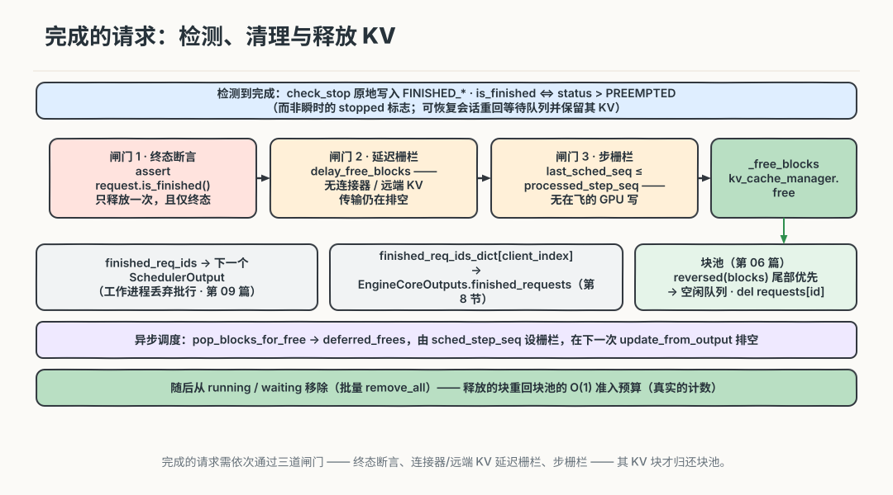</a>

<p class='figure-caption'>已完成的 request 在其 KV block 返回 pool 之前，需要通过三道关卡。</p>

### 三道关卡与 step fence

`_free_blocks`（[`scheduler.py:2126-2129`](https://github.com/vllm-project/vllm/blob/6cf7b26bd4bff60bf378e1af14044280ac0d214c/vllm/v1/core/sched/scheduler.py#L2126-L2129)）会再次 assert `is_finished()`，依次调用 `_free_request_blocks` 和 `del self.requests[request.request_id]`。此后，该 id 对 scheduler 而言便不再存在。真正值得关注的是 step fence 逻辑：

[`vllm/v1/core/sched/scheduler.py:2138-2165`](https://github.com/vllm-project/vllm/blob/6cf7b26bd4bff60bf378e1af14044280ac0d214c/vllm/v1/core/sched/scheduler.py#L2138-L2165)

```python
    def _free_request_blocks(self, request: Request):
        """Free the request's KV blocks, deferring the return to the block
        pool when an in-flight GPU step may still write them.
        """
        if not self.defer_block_free or (
            # Last scheduled step already processed: no in-flight write remains
            # (always the case for a normal finish), so free now.
            request.last_sched_seq <= self.processed_step_seq
        ):
            self.kv_cache_manager.free(request)
            return
        blocks = self.kv_cache_manager.pop_blocks_for_free(request)
        if blocks:
            self.deferred_frees.append((self.sched_step_seq, blocks))

    def _drain_deferred_frees(self):
        """Return deferred blocks whose fence step has completed.

        Entries are appended with monotonically non-decreasing fences, so
        stop at the first one that is still pending.
        """
        while self.deferred_frees:
            fence, _ = self.deferred_frees[0]
            if fence > self.processed_step_seq:
                break
            _, blocks = self.deferred_frees.popleft()
            # Free in reverse order so that the tail blocks are evicted first.
            self.kv_cache_manager.block_pool.free_blocks(reversed(blocks))
```

只有 terminal status 已确认、connector transfer 已完成且 GPU step 已确保安全后，block 才会归还。采用同步 scheduling，或 last step 已处理完成时，block 会立即释放。采用 async scheduling 时，则可能先从 request 上摘下这些 block，再将它们停放到 `deferred_frees` 中，并由 step-sequence fence 保护。

下一次 commit 会清理 fence 值不高于 `processed_step_seq` 的条目。由于 fence 单调有序，扫描到第一个仍 pending 的条目时即可停止。block 按 tail-first 顺序归还，与常规 KV-manager free path 一致，从而保持 cache 的 eviction order。

**通知 worker，以及 pool 最终收回什么。**

已释放的 id 会在*下一轮*迭代中推送给 worker，而不是本轮。`_free_request` 将 id 加入 `self.finished_req_ids`，随后 `schedule()` 会把同一个 set object 交给 `SchedulerOutput`：

[`vllm/v1/core/sched/scheduler.py:1105-1110`](https://github.com/vllm-project/vllm/blob/6cf7b26bd4bff60bf378e1af14044280ac0d214c/vllm/v1/core/sched/scheduler.py#L1105-L1110)

```python
            preempted_req_ids=self.reset_preempted_req_ids,
            # finished_req_ids is an existing state in the scheduler,
            # instead of being newly scheduled in this step.
            # It contains the request IDs that are finished in between
            # the previous and the current steps.
            finished_req_ids=self.finished_req_ids,
```

由于这个 set object 会被已发出的 `SchedulerOutput` *共享*，因此必须使用 `_update_after_schedule` 将其重新绑定到新的 `set()`，而不能执行 `.clear()`（[`scheduler.py:1213-1217`](https://github.com/vllm-project/vllm/blob/6cf7b26bd4bff60bf378e1af14044280ac0d214c/vllm/v1/core/sched/scheduler.py#L1213-L1217)，见[第 7 节](#7-update_from_output模型输出转化为-engine-输出)）；原地修改会破坏一个已经在发往 worker 途中的 output。正是这一点保证了 worker notification 的 exactly-once 语义：每个已完成的 id 只会出现在一个 `SchedulerOutput` 中，model runner 因而可以移除该 request 对应的 batch row 和 attention slot（第 09 篇）。

真正将 block 归还 pool 的操作只有一行，并委托给 KV cache manager 完成（属于第 06 篇的内容）：

[`vllm/v1/core/kv_cache_manager.py:465-473`](https://github.com/vllm-project/vllm/blob/6cf7b26bd4bff60bf378e1af14044280ac0d214c/vllm/v1/core/kv_cache_manager.py#L465-L473)

```python
    def free(self, request: Request) -> None:
        """Free the blocks allocated for the request.
        We free the blocks in reverse order so that the tail blocks are evicted
        first when caching is enabled.
        ...
        """
        self.coordinator.free(request.request_id)
```

释放后的 block 按 tail-first 顺序重新加入按 eviction 顺序组织的 pool，使共享 prefix 能在 cache 中保留更久（第 06 篇）。由于只有 transfer 和 write 均已停止后，block 才会计入 free 容量，因此 `get_num_free_blocks()` 仍可作为下一轮 schedule 的有效 admission 信号（第 05 篇）。

## 10. Abort 与取消

abort 来自 model 外部，例如 client 断连、timeout 或 shutdown。stop condition 是在对 forward pass 结果进行 reconcile 时发现的（[第 5 节](#5-request-生命周期requeststatus-状态机)、[第 9 节](#9-已结束-request检测清理与-kv-释放)）；abort 则在 step 之间通过 `finish_requests(..., RequestStatus.FINISHED_ABORTED)` 应用。系统不存在中间的 aborting status，也不会让 cancellation token 贯穿 forward。两条 queue 在保证 commit 顺序的同时，及时传递取消操作。

**Abort 是 terminal status，而不是 state machine。**

`RequestStatus` enum 是一个具备全序关系的 `IntEnum`，取消对应的值位于关键的 `PREEMPTED` 分界线之后。

[`vllm/v1/request.py:349-351`](https://github.com/vllm-project/vllm/blob/6cf7b26bd4bff60bf378e1af14044280ac0d214c/vllm/v1/request.py#L349-L351)（完整 enum 见[第 5 节](#5-request-生命周期requeststatus-状态机)）

```python
    @staticmethod
    def is_finished(status: "RequestStatus") -> bool:
        return status > RequestStatus.PREEMPTED
```

**engine wrapper 直接委托给 scheduler。**

[`vllm/v1/engine/core.py:409-415`](https://github.com/vllm-project/vllm/blob/6cf7b26bd4bff60bf378e1af14044280ac0d214c/vllm/v1/engine/core.py#L409-L415)

```python
    def abort_requests(self, request_ids: list[str]):
        """Abort requests from the scheduler."""

        # TODO: The scheduler doesn't really need to know the
        # specific finish reason, TBD whether we propagate that
        # (i.e. client-aborted vs stop criteria met).
        self.scheduler.finish_requests(request_ids, RequestStatus.FINISHED_ABORTED)
```

除此之外没有其他操作。`EngineCore.abort_requests` 既不接触 model executor，也不产生 output；它只修改 scheduler 的 set，然后返回。同一个 wrapper 也负责 admission path 上 `abort_immediately` 的 short-circuit：一个专为触发 KV-connector `request_finished` hook 而创建的 request，会在 busy loop 的同一轮中完成 admission 并随即 abort（[`core.py:403-407`](https://github.com/vllm-project/vllm/blob/6cf7b26bd4bff60bf378e1af14044280ac0d214c/vllm/v1/engine/core.py#L403-L407)）。因此，它不会留到 `schedule()`，但其 connector finish hook 仍会且只会运行一次（另见[第 4 节](#4-add_request-进入-engine-和-waiting-queue)）。

### 两条 queue：eager *且* ordered

abort 有两项相互冲突的要求。一方面，它必须尽快生效——最好在目标 GPU frame 仍在运行时生效，这样释放的 KV block 在紧接着的下一 step 就能回收。另一方面，它还必须保持与 add 操作之间的 wire ordering，避免 request 泄漏（added-then-aborted 不能因竞态变成 aborted-then-added）。vLLM 同时满足这两点的方式，是让 ZMQ input IO thread 将每个 abort 都放入**两条** queue。

[`vllm/v1/engine/core.py:1576-1587`](https://github.com/vllm-project/vllm/blob/6cf7b26bd4bff60bf378e1af14044280ac0d214c/vllm/v1/engine/core.py#L1576-L1587)

```python
                    else:
                        request = generic_decoder.decode(data_frames)

                        if request_type == EngineCoreRequestType.ABORT:
                            # Aborts are added to *both* queues, allows us to eagerly
                            # process aborts while also ensuring ordering in the input
                            # queue to avoid leaking requests. This is ok because
                            # aborting in the scheduler is idempotent.
                            self.aborts_queue.put_nowait(request)

                    # Push to input queue for core busy loop.
                    self.input_queue.put_nowait((request_type, request))
```

`aborts_queue` 是 *eager* path：forward 一返回，它就会在 `step()` 内被 drain，无需等待 busy loop 推进到 input queue。`input_queue` 是 *ordered* path：它让 abort 与 add 交错传输，确保 request 严格按照 wire order 完成处理。注释明确指出了同一个 abort 可以同时放入两条 queue 的前提：**scheduler 中的 abort 操作是幂等的。** 如果不具备幂等性，这会成为 double-free bug；有了幂等性，这份冗余就是无需额外成本的保险。

### Abort barrier：在 execute 之后、commit 之前消费

eager consumer 位于 step transaction 中一个非常精确的位置：forward 已结束之后、`update_from_output` 将任何 token 回填之前。

[`vllm/v1/engine/core.py:501-506`](https://github.com/vllm-project/vllm/blob/6cf7b26bd4bff60bf378e1af14044280ac0d214c/vllm/v1/engine/core.py#L501-L506)

```python
        # Before processing the model output, process any aborts that happened
        # during the model execution.
        self._process_aborts_queue()
        engine_core_outputs = self.scheduler.update_from_output(
            scheduler_output, model_output
        )
```

batch-queue 变体在 [`core.py:602-607`](https://github.com/vllm-project/vllm/blob/6cf7b26bd4bff60bf378e1af14044280ac0d214c/vllm/v1/engine/core.py#L602-L607) 设置了完全相同的 barrier。drain 操作本身会将 forward 期间入队的所有内容合并到一次 `abort_requests` 调用中：

[`vllm/v1/engine/core.py:634-642`](https://github.com/vllm-project/vllm/blob/6cf7b26bd4bff60bf378e1af14044280ac0d214c/vllm/v1/engine/core.py#L634-L642)

<a href='images/vllm-04-26-abort-dual-queue.svg' target='_blank'>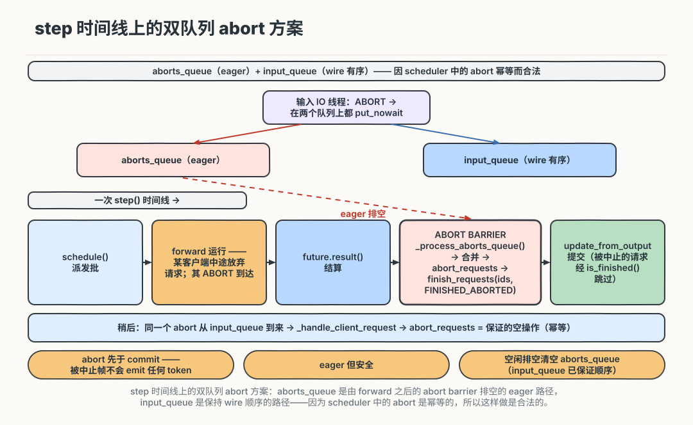</a>

<p class='figure-caption'>step 时间线上的双 queue abort 机制：aborts_queue 是由 abort barrier 在 forward 后 drain 的 eager path，input_queue 是保证 wire ordering 的 path——scheduler abort 具备幂等性，因此这样做是合法的。</p>

```python
    def _process_aborts_queue(self):
        if not self.aborts_queue.empty():
            request_ids = []
            while not self.aborts_queue.empty():
                ids = self.aborts_queue.get_nowait()
                # Should be a list here, but also handle string just in case.
                request_ids.extend((ids,) if isinstance(ids, str) else ids)
            # More efficient to abort all as a single batch.
            self.abort_requests(request_ids)
```

一次 forward 中可能包含一个执行到一半便被放弃的 request。`_process_aborts_queue()` 会先将它标记为 `FINISHED_ABORTED`，此时 `update_from_output` 还来不及追加采样得到的 token。随后，同一 abort 的有序副本会经由 `input_queue` 到达；由于该 id 已经 finished，此时它只会成为 no-op。

**barrier 在 `update_from_output` 中实际防止了什么。**

这一机制的效果可以在 reconcile loop 中看到：被 abort 的 request 会被直接跳过，不产生任何提示。

[`vllm/v1/core/sched/scheduler.py:1568-1584`](https://github.com/vllm-project/vllm/blob/6cf7b26bd4bff60bf378e1af14044280ac0d214c/vllm/v1/core/sched/scheduler.py#L1568-L1584) (完整代码见[第 7 节](#7-update_from_output模型输出转化为-engine-输出)；此处仅展示 decrement 和 skip 相关行)

```python
        for req_id, num_tokens_scheduled in num_scheduled_tokens.items():
            assert num_tokens_scheduled > 0
            request = self.requests.get(req_id)
            if request is not None:
                request.num_in_flight_tokens -= num_tokens_scheduled
            ...
            if request is None or request.is_finished():
                # The request is already finished. This can happen if the
                # request is aborted while the model is executing it (e.g.,
                # in pipeline parallelism or in async scheduling).
                # NOTE(Kuntai): When delay_free_blocks=True (for async KV
                # cache transfer in KV connector), the aborted request will not
                # be set to None (in order to finish async KV transfer).
                # In this case, we use is_finished() to check.
                continue
```

这里有两个细节需要注意。第一，对 `num_in_flight_tokens` 的乐观 decrement（[第 7 节](#7-update_from_output模型输出转化为-engine-输出)）会在 skip 检查之前*无条件*执行。即使 request 在 forward 期间被 abort，也必须对其 in-flight 计数进行冲抵，否则计数器就会泄漏，并永久干扰 admission 判断。第二，skip 条件是 `request is None or request.is_finished()`，而不只是 `is None`。当 KV connector 为 async transfer 持有 `delay_free_blocks=True` 时，被 abort 的 request 会被刻意*不*从 `self.requests` 中删除，因此仅检查 `None` 会将其漏掉；`is_finished()` 则可以同时覆盖已经删除的情况，以及仍在注册但已进入终态的情况。被 abort request 的 model output 会被丢弃，而不是 commit：不追加 token，不执行 stop check，也不向 client 发送任何内容。这正是上游 abort barrier 要提供的保证；即使 pipeline parallelism 或 async scheduling 让 abort 顺序变得复杂，这里仍会以防御性方式落实该保证。

### `finish_requests`：幂等 teardown 的统一入口

所有取消操作——client abort、streaming session 终止、KV load 失败（`FINISHED_ERROR`，[`scheduler.py:1776`](https://github.com/vllm-project/vllm/blob/6cf7b26bd4bff60bf378e1af14044280ac0d214c/vllm/v1/core/sched/scheduler.py#L1776)）以及全量 shutdown——最终都会汇聚到同一个函数。

[`vllm/v1/core/sched/scheduler.py:2058-2103`](https://github.com/vllm-project/vllm/blob/6cf7b26bd4bff60bf378e1af14044280ac0d214c/vllm/v1/core/sched/scheduler.py#L2058-L2103) (有省略)

```python
        assert RequestStatus.is_finished(finished_status)
        if isinstance(request_ids, str):
            request_ids = (request_ids,)
        elif request_ids is not None:
            request_ids = set(request_ids)
        else:
            request_ids = self.requests.keys()
        ...
        # First pass: collect requests to remove from queues
        for req_id in request_ids:
            request = self.requests.get(req_id)
            if request is None or request.is_finished():
                # Invalid request ID.
                continue
            valid_requests.append(request)
            if request.status == RequestStatus.RUNNING:
                running_requests_to_remove.add(request)
            else:
                ...
                waiting_requests_to_remove.append(request)
        # Remove all requests from queues at once for better efficiency
        if running_requests_to_remove:
            self.running = remove_all(self.running, running_requests_to_remove)
        if waiting_requests_to_remove:
            self.waiting.remove_requests(waiting_requests_to_remove)
            self.skipped_waiting.remove_requests(waiting_requests_to_remove)
        # Second pass: set status and free requests
        for request in valid_requests:
            delay_free_blocks = False
            if request.status == RequestStatus.WAITING_FOR_REMOTE_KVS:
                delay_free_blocks = (
                    request.request_id not in self.finished_recving_kv_req_ids
                )
                ...
            request.status = finished_status
            self._free_request(request, delay_free_blocks=delay_free_blocks)
```

`request_ids is None` 分支会结束*所有*仍然存活的 request，也就是 shutdown / pause-scheduler 路径。第一轮中的 `request is None or request.is_finished()` guard 是 dual-queue 方案实现幂等性的关键：未知 id，或者已被 eager 路径结束的 id，都会被直接跳过。第一轮会对每个仍存活的 request 进行分类，并将其从实际所在的 queue 中移除：要么通过 `remove_all` 从 `running` 移除，要么从 `waiting`/`skipped_waiting` 移除。移除操作会批量执行，避免较大的 abort set 产生 O(n·queue) 复杂度。第二轮写入终态 status，并将 request 交给 `_free_request`（[第 9 节](#9-已结束-request检测清理与-kv-释放)）。其中有一种特殊情况：阻塞在 `WAITING_FOR_REMOTE_KVS` 中的 request 会推迟释放其 block，除非 KV receive 已经完成，从而避免在 connector 仍处理过程中强行拆除 in-flight 的 disaggregated-prefill transfer。

该函数仅为它实际 abort 的 request 返回 `(request_id, client_index)` pair。需要注意的是，`EngineCore.abort_requests` 会丢弃这个返回值：client 通过 `finished_req_ids_dict` 得知 abort，该信息会在 [`scheduler.py:2116-2118`](https://github.com/vllm-project/vllm/blob/6cf7b26bd4bff60bf378e1af14044280ac0d214c/vllm/v1/core/sched/scheduler.py#L2116-L2118) 处记录到 `_free_request` 中，并合并进该 client 的 `EngineCoreOutputs.finished_requests`（[第 8 节](#8-output-聚合每个-client-对应的-enginecoreoutputs)）；worker 则通过 `finished_req_ids` 获知，后者会随下一次 `SchedulerOutput` 发送，随后重新绑定到一个新的 set（[第 9 节](#9-已结束-request检测清理与-kv-释放)）。只释放一次，且只释放 finished request：`_free_request` 中的 terminal-status assert（[`scheduler.py:2110`](https://github.com/vllm-project/vllm/blob/6cf7b26bd4bff60bf378e1af14044280ac0d214c/vllm/v1/core/sched/scheduler.py#L2110)），再加上这里的 skip-finished guard，意味着一个 id 无论经过 `finish_requests` 多少次，其 KV block 都只会被释放一次。

**空闲 drain 与 shutdown 边界。**

当 engine 因 input queue 为空而进入停驻状态时，残留的 eager-queue 条目会被丢弃，因为 `input_queue` 已经保证了顺序：

[`vllm/v1/engine/core.py:1276-1279`](https://github.com/vllm-project/vllm/blob/6cf7b26bd4bff60bf378e1af14044280ac0d214c/vllm/v1/engine/core.py#L1276-L1279)

```python
            if self.input_queue.empty():
                # Drain aborts queue; all aborts are also processed via input_queue.
                with self.aborts_queue.mutex:
                    self.aborts_queue.queue.clear()
```

这样做是安全的，因为 eager queue 只是一项优化，而不是系统的权威数据源。它携带的每个 abort 现在或此前也一定存在于 `input_queue` 中。在 admission 侧，shutdown 的处理则恰好相反：一旦收到 shutdown 请求，`_reject_add_in_shutdown`（[`core.py:1407-1416`](https://github.com/vllm-project/vllm/blob/6cf7b26bd4bff60bf378e1af14044280ac0d214c/vllm/v1/engine/core.py#L1407-L1416)）就会拒绝新增 request，并向 client 发送一个合成的 ABORT output，而不是静默丢弃 request；hard shutdown 则会使用 `finish_requests(None, RequestStatus.FINISHED_ABORTED)` 结束所有仍存活的 request。在正常 lifecycle 路径上，不会有任何 request 悬而未决：它要么正常结束，要么以已上报的 reason 被 abort，要么被拒绝并产生明确的 abort output（process crash 或 transport loss 仍可能让 in-flight request 悬空）。

dual queue 之所以安全，是因为 `finish_requests` 具有幂等性：eager 处理可以缩短取消延迟，有序处理可以保持 wire order，而二者最终都会汇聚到同一套仅处理 finished request 的 teardown 流程。

## 11. 跨 step 的 Continuous Batching

Continuous batching 会重复执行[第 2 节](#2-stepscheduleexecute-与-update-构成一个-transaction)中的 schedule → execute → abort barrier → commit 事务。每轮迭代都会从持久存在的 `running` 和 `waiting` set 中推导出新的 scheduled batch。decode request 会延续到下一轮，finished request 会离开，新到达的 prefill 可以进入，而 KV capacity 不足的 request 则可能返回 waiting queue。active set 会持续存在，但 executable batch 会在每个 step 重新规划。

这就是 Orca 的 iteration-level scheduling（[Orca, OSDI '22](https://www.usenix.org/conference/osdi22/presentation/yu)）：engine 不会接纳一个静态的 request-level batch，并一直保留到所有成员都结束；相反，它会“在没有同步 batch 边界的情况下交错执行各个 request phase；每个 step 之后都可以加入新的 request，而其他 request 则继续生成”（[Inside vLLM](https://vllm.ai/blog/2025-09-05-anatomy-of-vllm)）。PagedAttention 是支撑这一机制的 memory manager——非连续的 KV block 使 resident set 能在每个 step 持续变化，同时避免碎片化（[Kwon et al.](https://arxiv.org/abs/2309.06180)）。本节将沿着源码追踪 reshape 实际发生在*源码中的哪个位置*，并解释为何[第 7 节](#7-update_from_output模型输出转化为-engine-输出)中的乐观计数能够让这一过程无需等待 forward pass 而停滞。

<a href='images/vllm-04-09-continuous-batching.svg' target='_blank'>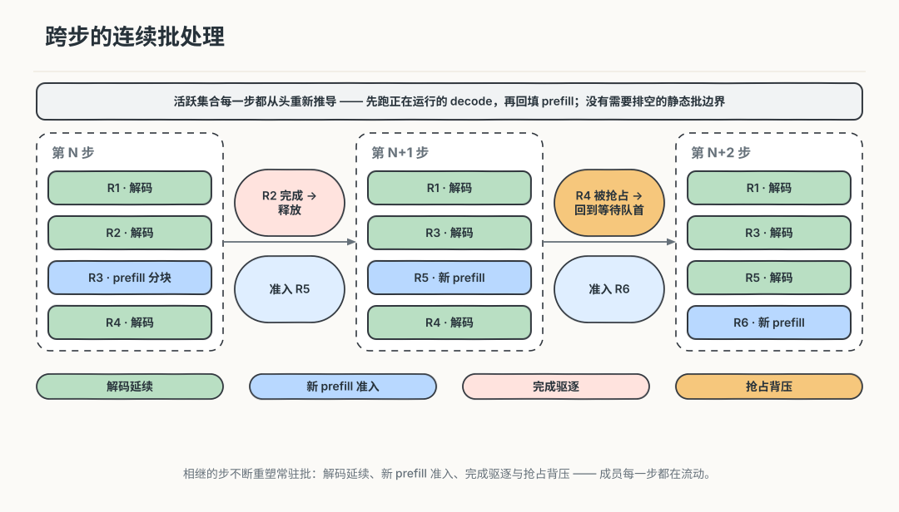</a>

<p class='figure-caption'>连续多个 step 对 resident batch 进行 reshape：延续 decode、接纳新的 prefill、驱逐 finished request，以及由 preemption 产生的 backpressure。</p>

### step 是 reshape 的基本单位

在同步路径上，engine 一次只规划一个 step。busy loop 的 gate 是 `has_work`（[第 1 节](#1-loop-是心跳同步-step-契约)），这条路径会在每个 `step()` 顶部重新检查同一个条件。启用 batch-queue execution 后，`step_with_batch_queue` 可以提前 schedule 多个 non-blocking batch，但数量不会超过配置的 `batch_queue_size`：

[`vllm/v1/engine/core.py:488-490`](https://github.com/vllm-project/vllm/blob/6cf7b26bd4bff60bf378e1af14044280ac0d214c/vllm/v1/engine/core.py#L488-L490)

```python
        if not self.scheduler.has_requests():
            return {}, False
        scheduler_output = self.scheduler.schedule(self._should_throttle_prefills())
```

每轮迭代都会重新调用 `schedule()`；除了持久存在的 `running`/`waiting` queue 之外，它不会保留上一轮 batch 构成的任何信息。`Scheduler.has_requests` 的判定范围被刻意设计得很宽：

[`vllm/v1/core/sched/scheduler.py:2191-2202`](https://github.com/vllm-project/vllm/blob/6cf7b26bd4bff60bf378e1af14044280ac0d214c/vllm/v1/core/sched/scheduler.py#L2191-L2202)

```python
    def has_requests(self) -> bool:
        # Override the interface default to also keep the engine alive while a
        # connector still has pending push work (e.g. push-mode WRITE transfers
        # in flight after all "live" requests have finished). Without this hook
        # the engine would quiesce before the connector can drain completions.
        # TODO: replace with a more general mechanism for connectors to keep
        # the scheduler alive.
        return (
            self.has_unfinished_requests()
            or self.has_finished_requests()
            or (self.connector is not None and self.connector.has_pending_push_work())
        )
```

第 *N* 个 step 开始时，scheduler 的各个 queue 中有哪些 request，它们就构成该 step 的 active set。这个集合包含自第 *N-1* 个 step 以来发生的每一次 `add_request`、`abort`、finish 和 preemption。新 request 通过 input thread 到达，并由 `_process_input_queue` 在下一次 `schedule()` 之前完成 drain（[第 4 节](#4-add_request-进入-engine-和-waiting-queue)）；abort 则由 abort-barrier 在当前 step commit 之前应用（[第 10 节](#10-abort-与取消)）。因此，等到 `schedule()` 运行时，queue 已经是最新状态；它生成的 batch 是这一时刻的快照，而不是此前某个计划的延续。

不存在一个静态 batch 等待 drain。新到达的 request 不会像 request-level batching 那样，被迫排在正在执行的 batch 后面；它从紧接着的下一次 `schedule()` 起就具备被调度资格（实际 admission 仍取决于 token budget、`max_num_seqs` 和 KV headroom，因此它可能连续多个 step 留在 `waiting` 中，详见第 05 篇），而不必承受当前运行时间最长的 generation 所带来的 tail latency。

### 先调度 running decode，再调度 waiting prefill

continuous batching 的基本形态（“延续 decode，用 prefill 回填”）就是 `schedule()` 的两阶段结构。scheduler 会先调度 running queue：

[`vllm/v1/core/sched/scheduler.py:440-442`](https://github.com/vllm-project/vllm/blob/6cf7b26bd4bff60bf378e1af14044280ac0d214c/vllm/v1/core/sched/scheduler.py#L440-L442)

```python
        # First, schedule the RUNNING requests.
        req_index = 0
        while req_index < len(self.running) and token_budget > 0:
```

只有 running loop 完成后，scheduler 才会从 waiting queue 中拉取 request：

[`vllm/v1/core/sched/scheduler.py:636-640`](https://github.com/vllm-project/vllm/blob/6cf7b26bd4bff60bf378e1af14044280ac0d214c/vllm/v1/core/sched/scheduler.py#L636-L640)

```python
        # Next, schedule the WAITING requests.
        if not preempted_reqs and self._pause_state == PauseState.UNPAUSED:
            step_skipped_waiting = create_request_queue(self.policy)

            while (self.waiting or self.skipped_waiting) and token_budget > 0:
```

已经处于 running 状态的 request 包括 decode step（每次一个 token，开销较低），以及仍在 in-flight 的 chunked-prefill continuation；它们可以优先占用 `token_budget`。剩余 budget 则用于从 `waiting` 中拉取 prefill，并通过 `WAITING → RUNNING` 完成状态提升（[第 5 节](#5-request-生命周期requeststatus-状态机)）。这与博客中的描述一致：scheduler 会“优先处理已经 running 的 decode request，再从 waiting queue 中取出 prefill request”（[深入 vLLM](https://vllm.ai/blog/2025-09-05-anatomy-of-vllm)）。交错执行的这两类 workload 并不对称：prefill 会对整个 prompt 执行一次 forward pass，属于 compute-bound；decode 则基于 cached KV 处理一个 token，属于 memory-bandwidth-bound（[深入 vLLM](https://vllm.ai/blog/2025-09-05-anatomy-of-vllm)）。将二者混合到同一个 flattened batch 中（即用 chunked prefill 填补 bandwidth-bound decode 留下的 compute 空档）属于 scheduler policy——token-budget 计算与 chunk sizing 是第 05 篇的主题。

先推进已有 request，再 admission 新 request。由于 scheduler 会先考虑 already-running request，再从 `waiting` 中拉取新的 prefill，因此正常情况下，生成中的 request 不会因不断到达的新 prefill 而饥饿（running request 仍可能因为 PP/async cadence、deferral 或 encoder-budget guard 而被跳过，也可能在 KV pressure 下遭到 preemption）；running set 会持续推进至完成，只有 spare capacity——也仅有 spare capacity——会被用于扩充它。注意 `if not preempted_reqs` guard（L637）：只要本 step 有*任何* request 被 preempt，waiting queue 就会被彻底跳过。engine 不会在被迫 evict 现有任务的同一个 step 中接纳新任务。

**正是 optimistic advance，才让 batch 重塑无需停顿。**

continuous batching 真正微妙的地方，不在于如何*决定* batch，而在于如何在不依赖前一个 step 的 GPU 结果的情况下完成这一过程。如果 `schedule()` 在 step *N+1* 必须等到 step *N* 的 sampled token 返回后，才能知道每个 request 已推进到哪里，pipeline 就会串行化，loop 也会 stall。vLLM 通过在 forward 执行前、*在 schedule time* 就推进 progress counter，打破了这一依赖：

[`vllm/v1/core/sched/scheduler.py:1182`](https://github.com/vllm-project/vllm/blob/6cf7b26bd4bff60bf378e1af14044280ac0d214c/vllm/v1/core/sched/scheduler.py#L1182)（位于 `_update_after_schedule` 中；完整代码见[第 7 节](#7-update_from_output模型输出转化为-engine-输出)）

```python
            request.num_computed_tokens += num_scheduled_token
```

`_update_after_schedule` 在 `schedule()` 尾部运行，此时 `SchedulerOutput` 快照已经冻结。`num_computed_tokens += num_scheduled_token` 会把所有已调度 token 都记入该 request 的进度，*就好像 forward 必然成功*——[`scheduler.py:1170-1178`](https://github.com/vllm-project/vllm/blob/6cf7b26bd4bff60bf378e1af14044280ac0d214c/vllm/v1/core/sched/scheduler.py#L1170-L1178) 处的 comment block 明确说明了收益（“在这里推进 computed token 的数量，使我们可以在下一个 scheduling step 立即再次调度该 prefill request”）和欠账（“如果某些 token……之后被拒绝，computed token 的数量将在 update_from_output 中调整”）。

在同一个 block 中（完整代码见[第 7 节](#7-update_from_output模型输出转化为-engine-输出)），重新计算得到的 `is_prefill_chunk` flag 与 `_inflight_prefills.discard` 一起精确标出了 request 从 prefill 跨入 decode 的时刻：一旦它的 computed token 数追上 `num_tokens + num_output_placeholders`，它就不再是 prefill chunk，并会在下一个 step 被调度为 one-token decode；与此同时，`num_in_flight_tokens` 会记录已经 dispatch 但尚未观测到结果的 GPU 写入，之后由 commit 阶段 reconcile。

**返回后 reconcile。**

由于 schedule-time state 是 optimistic 的，每个 step 都必须在结果返回时对平这笔账。`update_from_output` 中针对每个 request 的 loop（[第 7 节](#7-update_from_output模型输出转化为-engine-输出)）会无条件扣减 in-flight credit：

[`vllm/v1/core/sched/scheduler.py:1568-1572`](https://github.com/vllm-project/vllm/blob/6cf7b26bd4bff60bf378e1af14044280ac0d214c/vllm/v1/core/sched/scheduler.py#L1568-L1572)（完整代码见[第 7 节](#7-update_from_output模型输出转化为-engine-输出)）

```python
        for req_id, num_tokens_scheduled in num_scheduled_tokens.items():
            assert num_tokens_scheduled > 0
            request = self.requests.get(req_id)
            if request is not None:
                request.num_in_flight_tokens -= num_tokens_scheduled
```

这次 decrement 会与 `+=`（L1183）相抵，而且发生在针对 finished/aborted request 的 skip check 之前。因此，即使 request 在执行中途被 abort，in-flight count 也一定会结清。speculative-decode rejection 是另一种校正：verifier 拒绝的 draft token 会从 `num_computed_tokens` 中扣回（[第 7 节](#7-update_from_output模型输出转化为-engine-输出)，[`scheduler.py:1591-1622`](https://github.com/vllm-project/vllm/blob/6cf7b26bd4bff60bf378e1af14044280ac0d214c/vllm/v1/core/sched/scheduler.py#L1591-L1622)；spec-decode 机制详见第 12 篇）。这两者共同构成 optimistic-then-reconcile 契约中的 reconcile 部分——最终，`num_computed_tokens` 等于实际 commit 到 KV 的 token 数，而不是此前 speculative scheduling 的 token 数。

### Backpressure 依靠 preemption，而非 blocking

continuous batching 会贪心地接纳任务，因此当 KV pool 无法支撑 resident set 时，需要一个泄压阀。这个泄压阀就是 preemption，也是 batch 在不同 step 之间重塑的第四种方式。当 request 的 block allocation 失败、且已经无法再挤出空间时，preemption 会在 `schedule()` 内部触发：

[`vllm/v1/core/sched/scheduler.py:571-578`](https://github.com/vllm-project/vllm/blob/6cf7b26bd4bff60bf378e1af14044280ac0d214c/vllm/v1/core/sched/scheduler.py#L571-L578)

```python
                    else:
                        preempted_req = self.running.pop()

                    self._preempt_request(preempted_req, scheduled_timestamp)
                    preempted_reqs.append(preempted_req)
                    if preempted_req == request:
                        # No more request to preempt. Cannot schedule this request.
                        break
```

eviction 本身（`_preempt_request`，完整实现见[第 5 节](#5-request-生命周期requeststatus-状态机)）会重置 KV 和 computed-token state，但保留 output；本节论证所依据的两行代码，分别是 status flip 和 counter reset：

[`vllm/v1/core/sched/scheduler.py:1157-1158`](https://github.com/vllm-project/vllm/blob/6cf7b26bd4bff60bf378e1af14044280ac0d214c/vllm/v1/core/sched/scheduler.py#L1157-L1158)（完整实现见[第 5 节](#5-request-生命周期requeststatus-状态机)）

```python
        request.status = RequestStatus.PREEMPTED
        request.num_computed_tokens = 0
```

默认 policy 下，被选为 victim 的是 `self.running.pop()`：即最近加入的 running request，也就是最晚到达者。因此，backpressure 会优先让最新到达的 work 让路（L547-570 的 PRIORITY policy 分支则会淘汰 priority 最低的 request；具体 policy 见第 05 篇）。`_preempt_request` 会将 victim 的 KV block 释放回 pool（[第 9 节](#9-已结束-request检测清理与-kv-释放)），把 `num_computed_tokens` 清零，丢弃所有 speculative tokens，递增 `num_preemptions`，并将 request 重新放到 `waiting` 的*队首*，这一操作由 `prepend_request` 完成。关键在于，它只修改 KV 和 computed-token state——`_output_token_ids` 完全不受影响。request 已经生成的 tokens 会完整保留；被丢弃的只有其 cached KV，而这部分可以重新计算。后续恢复时，request 会以 `PREEMPTED → RUNNING` 状态重新进入（[第 5 节](#5-request-生命周期requeststatus-状态机)），并从 `num_computed_tokens = 0` 开始重新 prefill。

Preemption 在 output 层面无损，代价只体现在 recompute 层面。面临内存压力时，request 会交出可回收的 KV（可通过 recompute 恢复），但绝不会丢弃已经输出的 tokens；同时，它会排在从未运行过的 waiting request 之前重新入 queue，因此 block 一旦释放就能尽快恢复。再结合 `if not preempted_reqs` admission guard（L637），系统应对 KV 耗尽的逻辑十分连贯：停止接纳新 request，淘汰最新到达者，保留所有 request 的 output，再由释放出的 block 决定下一次 admission 是否放行——这些 block 此时已被 pool 如实计入可用量（[第 9 节](#9-已结束-request检测清理与-kv-释放)，第 06 篇）。

## 12. 追踪一次 Engine Step

下面的 trace 从 busy-loop 的一个 tick 开始，一直追踪到 client 读取的字节。它串起了乐观计数器（[第 5 节](#5-request-生命周期requeststatus-状态机)、[第 7 节](#7-update_from_output模型输出转化为-engine-输出)）、executor 调用（[第 6 节](#6-execute_model将-batch-交给-executor)）、per-client 聚合（[第 8 节](#8-output-聚合每个-client-对应的-enginecoreoutputs)）和 abort barrier（[第 10 节](#10-abort-与取消)）。

### 包裹整个事务的 tick

engine 是一个 busy loop，但运行节奏很克制：只有存在 work 时才执行 step；如果某次 step 没有完成任何 GPU work，就会 yield，而不是继续 spin。文章《[深入 vLLM](https://vllm.ai/blog/2025-09-05-anatomy-of-vllm)》将每个 step 划分为 schedule / forward pass / postprocess；[架构概览](https://docs.vllm.ai/en/stable/design/arch_overview/)则把 engine core 称为 busy loop。在源码中，一个 tick 对应 `_process_engine_step`。

[`vllm/v1/engine/core.py:1300-1317`](https://github.com/vllm-project/vllm/blob/6cf7b26bd4bff60bf378e1af14044280ac0d214c/vllm/v1/engine/core.py#L1300-L1317)
```python
    def _process_engine_step(self) -> bool:
        """Called only when there are unfinished local requests."""

        # Step the engine core.
        outputs, model_executed = self.step_fn()
        # Put EngineCoreOutputs into the output queue.
        for output in outputs.items() if outputs else ():
            self.output_queue.put_nowait(output)
        # Post-step hook.
        self.post_step(model_executed)

        # If no model execution happened but there is still scheduler work
        # (e.g. WAITING_FOR_REMOTE_KVS or delayed KV connector frees), yield
        # the GIL briefly to allow background transfer threads to make progress.
        if not model_executed and self.scheduler.has_requests():
            time.sleep(0.001)

        return model_executed
```

边界 `step_fn` 用于生成 per-client container，`post_step` 处理特定 mode 的 draft state，`model_executed` 则控制防止空转的 sleep。由于 `has_work` 会将非空 batch queue 也纳入判断，因此 loop 在挂起之前会先回收尚未完成的 future。

### 事务主干

在同步路径上，一次 `step()` 调用处理一个驻留 batch。对 `future.result()` 的调用会在 commit 阶段开始前等待本次执行完成。

[`vllm/v1/engine/core.py:479-508`](https://github.com/vllm-project/vllm/blob/6cf7b26bd4bff60bf378e1af14044280ac0d214c/vllm/v1/engine/core.py#L479-L508)
```python
    def step(self) -> tuple[dict[int, EngineCoreOutputs], bool]:
        """Schedule, execute, and make output.

        Returns tuple of outputs and a flag indicating whether the model
        was executed.
        """

        # Check for any requests remaining in the scheduler - unfinished,
        # or finished and not yet removed from the batch.
        if not self.scheduler.has_requests():
            return {}, False
        scheduler_output = self.scheduler.schedule(self._should_throttle_prefills())
        future = self.model_executor.execute_model(scheduler_output, non_block=True)
        grammar_output = self.scheduler.get_grammar_bitmask(scheduler_output)
        with (
            self.log_error_detail(scheduler_output),
            self.log_iteration_details(scheduler_output),
        ):
            model_output = future.result()
            if model_output is None:
                model_output = self.model_executor.sample_tokens(grammar_output)

        # Before processing the model output, process any aborts that happened
        # during the model execution.
        self._process_aborts_queue()
        engine_core_outputs = self.scheduler.update_from_output(
            scheduler_output, model_output
        )

        return engine_core_outputs, scheduler_output.total_num_scheduled_tokens > 0
```

这段代码呈现了完整的事务流程：乐观 schedule、非阻塞 launch、CPU 侧 grammar 处理、一次同步、abort barrier，随后进行状态校准和 per-client 聚合。

### 一个 batch 的端到端路径

展开本文所涉及的三个 subsystem 之间的 call graph——executor 边界（[第 6 节](#6-execute_model将-batch-交给-executor)，跨过该边界后的内容见第 09 篇）、process/IPC 基础设施（第 03 篇）以及 scheduler（第 05 篇）——一个 batch 会沿以下路径流转。每一行都是源码锚点，而非源码摘录。

```text
run_busy_loop → _process_input_queue → _process_engine_step → step_fn()      (core.py:1263,1265,1304)
  scheduler.schedule(...) → SchedulerOutput                                   (core.py:490)
    _update_after_schedule: optimistic counter advance                        (scheduler.py:1169)
  model_executor.execute_model(so, non_block=True) → Future                   (core.py:491)
    Executor.execute_model → collective_rpc("execute_model", (so,))           (abstract.py:221)
      uniproc:   run_method(driver_worker, ...) in-process                    (uniproc_executor.py:98)
      multiproc: rpc_broadcast_mq.enqueue(...)  ← process boundary [art.03]   (multiproc_executor.py:377)
        worker_busy_loop: getattr(worker,"execute_model")(so)                 (multiproc_executor.py:999)
          Worker.execute_model(so) → forward + (maybe) sample [art.09]        (gpu_worker.py:963)
        enqueue_output((SUCCESS, ModelRunnerOutput))                          (multiproc_executor.py:954)
      FutureWrapper.get_response → ModelRunnerOutput                          (multiproc_executor.py:383)
  get_grammar_bitmask(so)   [overlaps forward on CPU]                         (core.py:492)
  model_output = future.result()   [under log_error_detail]                   (core.py:497)
      if None: model_output = sample_tokens(grammar_output)                   (core.py:499)
  _process_aborts_queue()   [abort barrier]                                   (core.py:503)
  scheduler.update_from_output(so, model_output) → dict[int, EngineCoreOutputs](core.py:504)
      per-request: in-flight decrement, spec correction, append, stop, free   (scheduler.py:1563-1772)
      assemble per-client dict, fold finished_requests, attach stats          (scheduler.py:1826-1859)
  output_queue.put_nowait((client_index, EngineCoreOutputs))                  (core.py:1306)
  process_output_sockets: stamp engine_index, PUSH sockets[client_index]      (core.py:1631,1646)
  client.get_output() → one EngineCoreOutputs                                 (core_client.py:289 / 849)
```

在到达 `collective_rpc` 之前，这条 trace 与拓扑无关：multiprocess 执行路径会跨越 shared memory，而 uniproc 会返回一个已预先完成的 `Future`。output 按 `client_index` 分组；I/O thread 还会单独写入 `engine_index`，标记其来源。

<a href='images/vllm-04-10-step-trace.svg' target='_blank'>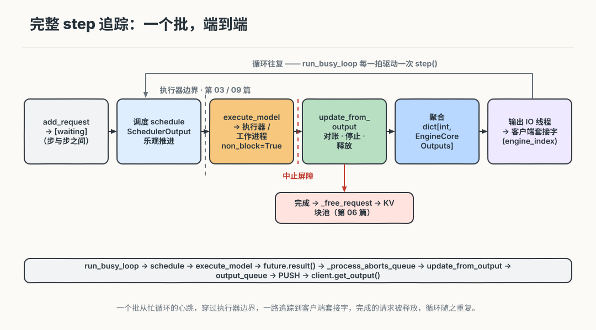</a>

<p class='figure-caption'>一个 batch 从 busy-loop tick 出发，跨越 executor 边界，最终到达 client socket；图中标出了每一跳对应的源码锚点。</p>

### 三行代码刻画 terminal 边界

生命周期机制（[第 5 节](#5-request-生命周期requeststatus-状态机)）最终归结为一次比较，整个 engine 都复用它来判断“这个 request 是否完成”。

[`vllm/v1/request.py:349-351`](https://github.com/vllm-project/vllm/blob/6cf7b26bd4bff60bf378e1af14044280ac0d214c/vllm/v1/request.py#L349-L351)
```python
    @staticmethod
    def is_finished(status: "RequestStatus") -> bool:
        return status > RequestStatus.PREEMPTED
```

截至 `PREEMPTED`（含）的 status 都是 live；之后的 enum value 均为 terminal。forward 中途的 skip 路径与 `_free_request` 都使用同一个 predicate，因此，已经 abort 但仍保留的 connector object 不会收到 token，任何 live request 也不会被释放。

### 要点

- 同步 step 的顺序是 schedule → execute → abort barrier → commit；overlapped path 即使同时保留多个驻留 batch，也维持相同的 commit 顺序。
- schedule 阶段的计数器采用乐观更新。状态校准总会归还 in-flight credit，并扣除被拒绝的 speculative tokens。
- `model_executed` 表示发生了 token work；terminal 的判定则是 `status > PREEMPTED`。
- 取消会立即发起，但严格有序；output grouping（`client_index`）与 engine provenance（`engine_index`）始终彼此独立。

## 13. 参考资料

- https://www.usenix.org/conference/osdi22/presentation/yu
- https://vllm.ai/blog/2025-09-05-anatomy-of-vllm
- https://docs.vllm.ai/en/stable/design/arch_overview/
- https://arxiv.org/abs/2309.06180

*本文关于代码的所有结论均以 [`vllm-project/vllm@6cf7b26bd`](https://github.com/vllm-project/vllm/tree/6cf7b26bd4bff60bf378e1af14044280ac0d214c) 为依据。*