# Scheduler：Continuous Batching 与 Chunked Prefill

> 版本说明：本文介绍的 scheduler 对应 [`vllm-project/vllm@6cf7b26bd`](https://github.com/vllm-project/vllm/tree/6cf7b26bd4bff60bf378e1af14044280ac0d214c)。除以 `...` 标出的省略外，源码摘录均保持原文；pseudocode 会另行注明。每个 `path:Lstart-Lend` 引用均指向固定版本的源码树。

## 1. Scheduler 决定什么：每个步骤一份 token 预算

V1 scheduler 所解决的问题比其名称暗示的范围更窄：本次迭代中，哪些 request 可以继续推进？每个 request 又能推进多少个 token？它不负责选择 kernel 或内存布局，也不会在固定的 prefill batch 与 decode batch 之间切换。其核心账本是 `{req_id: num_tokens}`。

`SchedulerOutput` 会补充 executor 所需的 KV、encoder、grammar 和 speculative decoding 元数据（[第 10 节](#10-scheduleroutputexecutor-会收到什么)）。只要调度方案中包含已调度的 token，就可以驱动模型执行；token 数为零的结果则表示本次迭代无需执行 forward pass。

<a href='images/vllm-05-01-token-budget.svg' target='_blank'>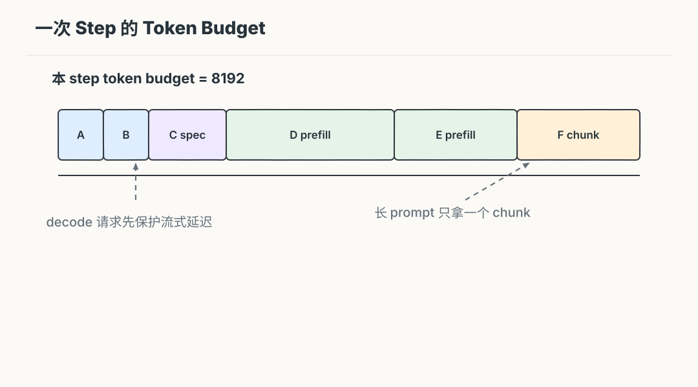</a>

<p class='figure-caption'>每个步骤只有一份 token 预算，先由 running request 消耗，再由 waiting request 消耗。</p>

EngineCore 的 busy loop 会调用 `SchedulerInterface.schedule`；其 docstring 明确规定了单次调用的粒度和返回结果的结构。

[`vllm/v1/core/sched/interface.py:53-65`](https://github.com/vllm-project/vllm/blob/6cf7b26bd4bff60bf378e1af14044280ac0d214c/vllm/v1/core/sched/interface.py#L53-L65)：

```python
        """Schedule the requests to process in this scheduling step.

        The scheduling decision is made at the iteration level. Each scheduling
        step corresponds to a single forward pass of the model. Therefore, this
        method is called repeatedly by a busy loop in the engine.

        Essentially, the scheduler produces a dictionary of {req_id: num_tokens}
        that specifies how many tokens to process for each request in this
        scheduling step. For example, num_tokens can be as large as the number
        of prompt tokens for new requests, or it can be 1 for the requests that
        are auto-regressively generating new tokens one by one. Otherwise, it
        can be somewhere in between in case of chunked prefills, prefix caching,
        speculative decoding, etc.
```

“调度决策以迭代为粒度”遵循 Orca 的模型：调度按生成迭代而非按 request 进行，因此两次 forward pass 之间的 batch 成员可以发生变化（[Orca, OSDI '22](https://www.usenix.org/conference/osdi22/presentation/yu)）。之后，EngineCore 会将调度方案传给 `update_from_output(...)`（[`interface.py:89-107`](https://github.com/vllm-project/vllm/blob/6cf7b26bd4bff60bf378e1af14044280ac0d214c/vllm/v1/core/sched/interface.py#L89-L107)）。由于某个值既可以是完整 prompt 的长度，也可以是 `1`，还可以是二者之间的任意值，因此同一个映射就能统一表示 prefill、decode、prefix 复用和 speculative 任务，无需设置全局 phase 标签。一次 forward pass 可以混合执行这三类任务（[vLLM V1 博客](https://vllm.ai/blog/2025-01-27-v1-alpha-release)）。

`schedule()` 开头的注释给出了后续各分支使用的算术关系。

[`vllm/v1/core/sched/scheduler.py:396-407`](https://github.com/vllm-project/vllm/blob/6cf7b26bd4bff60bf378e1af14044280ac0d214c/vllm/v1/core/sched/scheduler.py#L396-L407)：

```python
    def schedule(self, throttle_prefills: bool = False) -> SchedulerOutput:
        self.current_step += 1
        # NOTE(woosuk) on the scheduling algorithm:
        # There's no "decoding phase" nor "prefill phase" in the scheduler.
        # Each request just has the num_computed_tokens and
        # num_tokens_with_spec. num_tokens_with_spec =
        # len(prompt_token_ids) + len(output_token_ids) + len(spec_token_ids).
        # At each step, the scheduler tries to assign tokens to the requests
        # so that each request's num_computed_tokens can catch up its
        # num_tokens_with_spec. This is general enough to cover
        # chunked prefills, prefix caching, speculative decoding,
        # and the "jump decoding" optimization in the future.
```

<a href='images/vllm-05-11-gap-four-cases.svg' target='_blank'>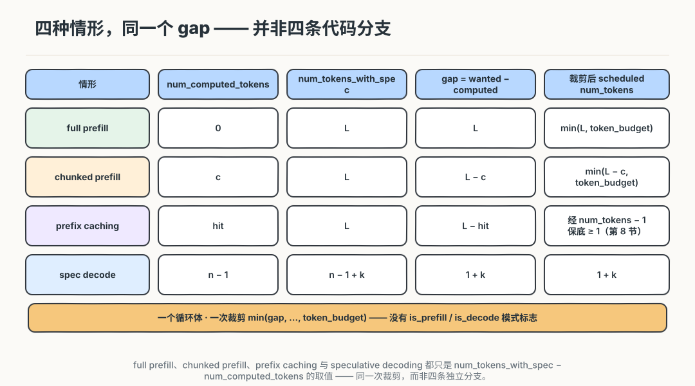</a>

<p class='figure-caption'>四种情形，同一个 gap：full prefill、chunked prefill、prefix caching 和 speculative decoding 都只是 num_tokens_with_spec − num_computed_tokens 的不同取值，而不是彼此独立的代码路径。</p>

每个 request 都有两个游标：`num_computed_tokens` 表示模型已经处理且拥有 KV cache 的 token 数；`num_tokens_with_spec` 表示它当前*希望*处理的 token 数，其中包括 speculative draft。scheduler 在每个步骤中的任务，就是缩小该 request 的 `num_tokens_with_spec − num_computed_tokens` gap，让“已计算”游标追上“目标”游标。这个 gap 就是需求量；scheduler 写入 `num_scheduled_tokens[req_id]` 的数值，是将该需求 clamp 到当前可容纳范围后的结果（RUNNING loop 的 clamp 链见 [`scheduler.py:473-489`](https://github.com/vllm-project/vllm/blob/6cf7b26bd4bff60bf378e1af14044280ac0d214c/vllm/v1/core/sched/scheduler.py#L473-L489) 和[第 4 节](#4-先处理-running再接纳-waiting)；WAITING loop 的 clamp 见 [`scheduler.py:805-845`](https://github.com/vllm-project/vllm/blob/6cf7b26bd4bff60bf378e1af14044280ac0d214c/vllm/v1/core/sched/scheduler.py#L805-L845) 和[第 5 节](#5-chunked-prefill拆分长-prompt)）。注释列出的四种情形并不是四条代码路径，而是同一个 gap 的四种*取值*：

- **Full prefill：**新 request 的状态是 `num_computed_tokens == 0` 和 `num_tokens_with_spec == len(prompt)`，因此 gap 就是整个 prompt。
- **Chunked prefill：**仍然是同一个 gap；当 prompt 大于本步骤的剩余预算时，会由 `min(gap, token_budget)` 对其进行截断（[第 5 节](#5-chunked-prefill拆分长-prompt)）。该 request 会保持未完成状态，并在下一步继续执行。
- **Prefix caching：**WAITING loop 会探测 cache，并在接纳 request *之前*推进 `num_computed_tokens`（[第 8 节](#8-prefix-cache-感知调度)；具体机制见第 07 篇），从而将 gap 缩短已缓存 prefix 的长度。其上限会确保至少仍有一个 token 实际执行，以生成 logits。
- **Speculative decoding：**`num_tokens_with_spec` 包含 `k` draft token，因此 gap 是 `1 + k`，而不是 `1`（第 12 篇）。

### 两个游标从何而来

`num_tokens_with_spec` 根据 token 列表的长度得出。`num_computed_tokens` 则单独维护：scheduler 在调度时会乐观地推进它，随后由输出对账回滚被拒绝的 speculative token。因此，在 async 或 speculative scheduling 下，这两个计数器可能暂时出现偏差。

[`vllm/v1/request.py:251-257`](https://github.com/vllm-project/vllm/blob/6cf7b26bd4bff60bf378e1af14044280ac0d214c/vllm/v1/request.py#L251-L257)：

```python
    @property
    def num_tokens(self) -> int:
        return len(self._all_token_ids)

    @property
    def num_tokens_with_spec(self) -> int:
        return len(self._all_token_ids) + len(self.spec_token_ids)
```

<a href='images/vllm-05-12-two-cursors.svg' target='_blank'>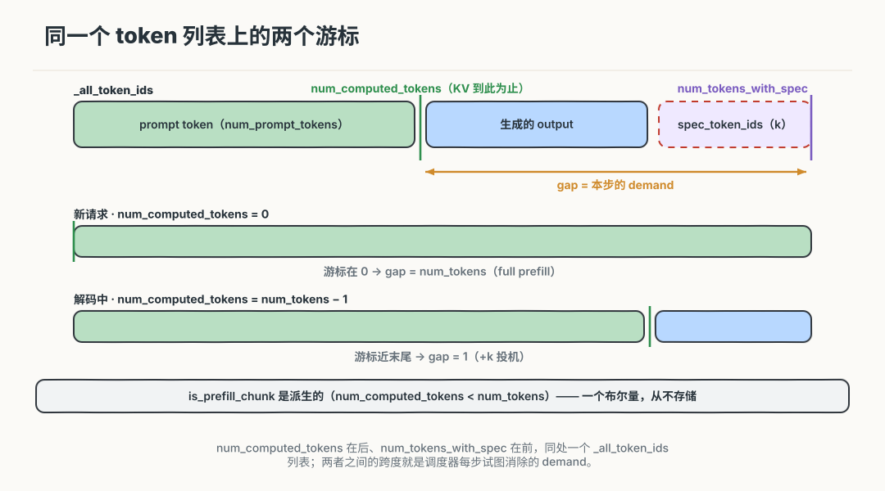</a>

<p class='figure-caption'>同一 token 列表上的两个游标：num_computed_tokens 落在后面，num_tokens_with_spec 走在前面；二者之间的区间就是 scheduler 每个步骤尝试缩小的需求量。</p>

`_all_token_ids` 会拼接 prompt token 和已生成的 token；`num_tokens_with_spec` 则会加入尚未验证的 draft。`num_computed_tokens` 从零开始（[`request.py:158`](https://github.com/vllm-project/vllm/blob/6cf7b26bd4bff60bf378e1af14044280ac0d214c/vllm/v1/request.py#L158)）。因此，新 request 会请求处理完整 prompt，而普通 decode request 通常只请求一个 token，再加上可能存在的 draft。`is_prefill_chunk` 并不是独立的 phase enum：每次调度都会根据已计算游标是否仍落后于 request 长度重新计算它（[第 5 节](#5-chunked-prefill拆分长-prompt)和[第 6 节](#6-continuous-batching成员集合每个-step-都会变化)）。

### 一份预算只消耗一次，两个 loop 采用相同的扣减方式

`{req_id: num_tokens}` 的调度决策只消耗一份标量额度。`schedule()` 会在每个步骤开始时初始化这份额度：

[`vllm/v1/core/sched/scheduler.py:414-419`](https://github.com/vllm-project/vllm/blob/6cf7b26bd4bff60bf378e1af14044280ac0d214c/vllm/v1/core/sched/scheduler.py#L414-L419)：

```python
        req_to_new_blocks: dict[str, KVCacheBlocks] = {}
        num_scheduled_tokens: dict[str, int] = {}
        token_budget = self.max_num_scheduled_tokens
        if self._pause_state == PauseState.PAUSED_ALL:
            # Do not schedule any requests when paused.
            token_budget = 0
```

`PAUSED_ALL` 会将其降为零；否则由 RUNNING request 优先消耗，WAITING request 的接纳则使用剩余额度。两个 loop 每次写入账本时，都会配套执行相同的扣减操作（RUNNING 见 [`scheduler.py:584-591`](https://github.com/vllm-project/vllm/blob/6cf7b26bd4bff60bf378e1af14044280ac0d214c/vllm/v1/core/sched/scheduler.py#L584-L591)，WAITING 见 [`scheduler.py:950-1000`](https://github.com/vllm-project/vllm/blob/6cf7b26bd4bff60bf378e1af14044280ac0d214c/vllm/v1/core/sched/scheduler.py#L950-L1000)）。[第 2 节](#2-schedule主循环)和[第 3 节](#3-token-预算max_num_scheduled_tokens)会详细跟踪这套记账过程；[第 9 节](#9-kv-压力下的-preemption)则介绍两者面对 KV backpressure 时采取的不同处理方式。

## 2. schedule()：主循环

EngineCore 每个调度步骤都会调用一次 `schedule()`。该方法先初始化 `token_budget`，然后优先遍历 RUNNING request，并将剩余预算用于 WAITING request。它会返回 token 账本以及 executor 所需的元数据（[`interface.py:51-81`](https://github.com/vllm-project/vllm/blob/6cf7b26bd4bff60bf378e1af14044280ac0d214c/vllm/v1/core/sched/interface.py#L51-L81)）；在 batch-queue 模式下，可能同时有多个此类调度方案处于在途状态（第 04 篇）。

针对每个 request 的 guard 和 clamp 见[第 4 节](#4-先处理-running再接纳-waiting)，chunked prefill 切片见[第 5 节](#5-chunked-prefill拆分长-prompt)，preemption 与 KV 可行性则见[第 9 节](#9-kv-压力下的-preemption)和第 06 篇。

**入口与每个步骤的账本**

`schedule()` 接收一个 flag，并立即递增 step 计数器。

[`vllm/v1/core/sched/scheduler.py:396-397`](https://github.com/vllm-project/vllm/blob/6cf7b26bd4bff60bf378e1af14044280ac0d214c/vllm/v1/core/sched/scheduler.py#L396-L397)

```python
    def schedule(self, throttle_prefills: bool = False) -> SchedulerOutput:
        self.current_step += 1
```

`current_step` 是 loop 用于控制 PP/async decode 节奏的单调时钟（[第 4 节](#4-先处理-running再接纳-waiting)）；`throttle_prefills` 是 data-parallel prefill 均衡信号（同样见[第 4 节](#4-先处理-running再接纳-waiting)）。紧随其后的设计注释（[`scheduler.py:398-407`](https://github.com/vllm-project/vllm/blob/6cf7b26bd4bff60bf378e1af14044280ac0d214c/vllm/v1/core/sched/scheduler.py#L398-L407)）正是[第 1 节](#1-scheduler-决定什么每个步骤一份-token-预算)的核心主旨，此处不再重复。

真正开始处理时，首先要为当前步骤分配账本并初始化预算。

[`vllm/v1/core/sched/scheduler.py:409-419`](https://github.com/vllm-project/vllm/blob/6cf7b26bd4bff60bf378e1af14044280ac0d214c/vllm/v1/core/sched/scheduler.py#L409-L419)

```python
        scheduled_new_reqs: list[Request] = []
        scheduled_resumed_reqs: list[Request] = []
        scheduled_running_reqs: list[Request] = []
        preempted_reqs: list[Request] = []

        req_to_new_blocks: dict[str, KVCacheBlocks] = {}
        num_scheduled_tokens: dict[str, int] = {}
        token_budget = self.max_num_scheduled_tokens
        if self._pause_state == PauseState.PAUSED_ALL:
            # Do not schedule any requests when paused.
            token_budget = 0
```

- 这三个 `scheduled_*_reqs` list 会按 *provenance* 对调度结果进行划分——已经位于 `running` 中的 request（`scheduled_running_reqs`）、新 admission 的 request（`scheduled_new_reqs`，原状态为 WAITING），以及恢复执行的 request（`scheduled_resumed_reqs`，原状态为 PREEMPTED）。`preempted_reqs` 是当前 step 的 eviction log。这种三路划分正是后续以最小化 wire cost 为目标的 `SchedulerOutput` 所需要的（new-vs-cached payload，[第 10 节](#10-scheduleroutputexecutor-会收到什么)）。
- `num_scheduled_tokens: dict[str, int]` *就是*调度决策。`.values()` 的总和就是 executor 实际执行的工作量，也是收尾 assert 校验的值。
- `token_budget = self.max_num_scheduled_tokens`（[`scheduler.py:416`](https://github.com/vllm-project/vllm/blob/6cf7b26bd4bff60bf378e1af14044280ac0d214c/vllm/v1/core/sched/scheduler.py#L416)）是整个 loop 唯一会消耗的标量。该上限固定为 `__init__`，默认值为 `max_num_batched_tokens`（[第 3 节](#3-token-预算max_num_scheduled_tokens)）；它是*唯一*用于初始化这个 local 变量、同时出现在下方核心 assert RHS 中的数值。
- `PauseState.PAUSED_ALL → token_budget = 0`（[`scheduler.py:417-419`](https://github.com/vllm-project/vllm/blob/6cf7b26bd4bff60bf378e1af14044280ac0d214c/vllm/v1/core/sched/scheduler.py#L417-L419)）会让两个 `while ... and token_budget > 0` Phase guard 在进入时均为 false：paused scheduler 不会接纳任何 request，后续代码也无须再做特判。
- 紧接着下方还会初始化用于 multimodal encoder work 的*第二个相互独立的* `encoder_compute_budget`，以及 spec-decode ledgers（[`scheduler.py:422-427`](https://github.com/vllm-project/vllm/blob/6cf7b26bd4bff60bf378e1af14044280ac0d214c/vllm/v1/core/sched/scheduler.py#L422-L427)，原文见[第 3 节](#3-token-预算max_num_scheduled_tokens)）。该 encoder budget 只能*缩减* `num_new_tokens`（[第 11 节](#11-encoder-input-与-multimodal-scheduling)）；它绝不会放宽 token budget，因此不可能破坏这里的 invariant。

Budget 核算和 scheduled-token ledger 记录的是同一个量，并且只会同步变更。每次 admission 都会同时执行 `num_scheduled_tokens[id] = n; token_budget -= n`；每次 preemption refund 则会执行与之配对的 `token_budget += num_scheduled_tokens.pop(id)`。代码从不会只修改其中一个而不修改另一个，因此结尾的四条 assert 才能成立。

紧接着，`self.kv_cache_manager.new_step_starts()`（[`scheduler.py:432`](https://github.com/vllm-project/vllm/blob/6cf7b26bd4bff60bf378e1af14044280ac0d214c/vllm/v1/core/sched/scheduler.py#L432)）会重置 KV manager 的 per-step state，同时计算 `defer_prefills`（[`scheduler.py:436-438`](https://github.com/vllm-project/vllm/blob/6cf7b26bd4bff60bf378e1af14044280ac0d214c/vllm/v1/core/sched/scheduler.py#L436-L438)）；后续内容会分别读取二者（第 06 篇与[第 4 节](#4-先处理-running再接纳-waiting)）。

<a href='images/vllm-05-03-schedule-loop.svg' target='_blank'>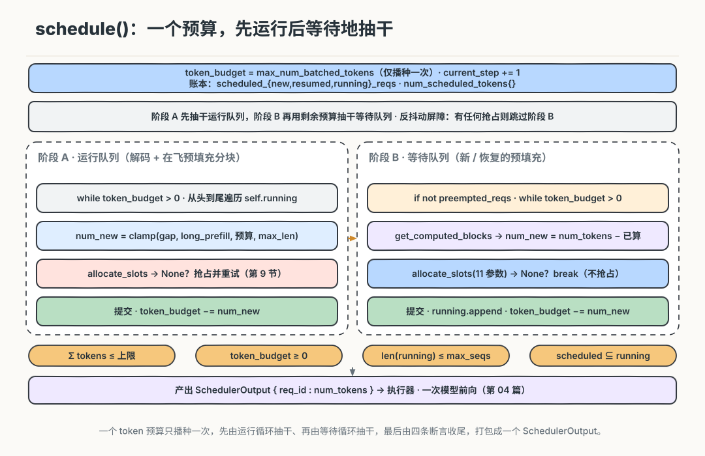</a>

<p class='figure-caption'>一个 token budget 只初始化一次，先由 RUNNING loop 消耗，再由 WAITING loop 消耗，最后通过四条 assert 收尾。</p>

**Phase A，然后 Phase B：同一个 budget，依次消耗**

主体包含两个共用同一 `token_budget` 的 `while` loop。Phase A 遍历 `self.running`（[`scheduler.py:440-443`](https://github.com/vllm-project/vllm/blob/6cf7b26bd4bff60bf378e1af14044280ac0d214c/vllm/v1/core/sched/scheduler.py#L440-L443)，loop header 详见[第 4 节](#4-先处理-running再接纳-waiting)）：处理 decode 和 in-flight prefill chunk，每次调度的规模都由 clamp 链 `num_new_tokens = min(gap, long_prefill_threshold, token_budget, max_model_len − …)` 决定（[`scheduler.py:473-489`](https://github.com/vllm-project/vllm/blob/6cf7b26bd4bff60bf378e1af14044280ac0d214c/vllm/v1/core/sched/scheduler.py#L473-L489)，[第 4 节](#4-先处理-running再接纳-waiting)/[第 5 节](#5-chunked-prefill拆分长-prompt)），然后交给 `allocate_slots`（[第 9 节](#9-kv-压力下的-preemption)，第 06 篇）。所有通过 Phase A 检查的工作，最终都会由同样的八行代码 commit。

[`vllm/v1/core/sched/scheduler.py:584-591`](https://github.com/vllm-project/vllm/blob/6cf7b26bd4bff60bf378e1af14044280ac0d214c/vllm/v1/core/sched/scheduler.py#L584-L591)

```python
            # Schedule the request.
            scheduled_running_reqs.append(request)
            prefill_scheduled |= request.is_prefill_chunk
            request_id = request.request_id
            req_to_new_blocks[request_id] = new_blocks
            num_scheduled_tokens[request_id] = num_new_tokens
            token_budget -= num_new_tokens
            req_index += 1
```

<a href='images/vllm-05-13-budget-ledger-lockstep.svg' target='_blank'>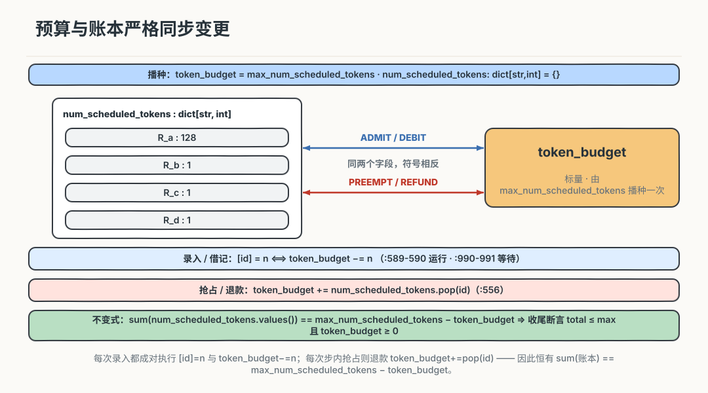</a>

<p class='figure-caption'>budget 与 ledger 始终同步变化：每次 admission 都会同时执行 num_scheduled_tokens[id]=n 和 token_budget−=n；每次 step 内的 preemption 都通过 token_budget+=pop(id) 返还 budget——因此 sum(ledger) == max_num_scheduled_tokens − token_budget 始终成立。</p>

依次记录 provenance（`scheduled_running_reqs`）、记录 KV blocks（`req_to_new_blocks`）、写入 ledger（`num_scheduled_tokens[id] = num_new_tokens`），然后**扣减共享 budget**（`token_budget -= num_new_tokens`），最后推进 cursor。588-590 行构成一个原子化的“spend”操作。由于 `num_new_tokens` 已在上游被 clamp 到 `≤ token_budget`（[`scheduler.py:480`](https://github.com/vllm-project/vllm/blob/6cf7b26bd4bff60bf378e1af14044280ac0d214c/vllm/v1/core/sched/scheduler.py#L480)），这次扣减永远不会让 budget 变成负数。

Phase A 只会消耗 budget 容量；它可能*增加* memory pressure，并在 `allocate_slots` retry loop 内触发 preemption（[第 9 节](#9-kv-压力下的-preemption)）。对于当前 step 中途被 eviction 的任何 request，`token_budget += num_scheduled_tokens.pop(preempted_req_id)` 都会返还其 budget（[`scheduler.py:556`](https://github.com/vllm-project/vllm/blob/6cf7b26bd4bff60bf378e1af14044280ac0d214c/vllm/v1/core/sched/scheduler.py#L556)）。

两个 Phase 之间设有 anti-thrash barrier（[`scheduler.py:636-637`](https://github.com/vllm-project/vllm/blob/6cf7b26bd4bff60bf378e1af14044280ac0d214c/vllm/v1/core/sched/scheduler.py#L636-L637)，详见[第 4 节](#4-先处理-running再接纳-waiting)）：整个 WAITING loop 都受 `if not preempted_reqs and self._pause_state == PauseState.UNPAUSED` 保护。如果 Phase A preempt 过任何 request，Phase B 就会整体跳过，剩余 budget 在当前 step 中也不会使用：scheduler 绝不会在同一个 step 中同时执行 eviction 和 admission。

Phase B（[`scheduler.py:640`](https://github.com/vllm-project/vllm/blob/6cf7b26bd4bff60bf378e1af14044280ac0d214c/vllm/v1/core/sched/scheduler.py#L640)，[第 4 节](#4-先处理-running再接纳-waiting)）针对 WAITING request 继续消耗*同一个* `token_budget`：探测 prefix cache（[第 8 节](#8-prefix-cache-感知调度)）、确定 prompt slice 的大小（[第 5 节](#5-chunked-prefill拆分长-prompt)）、携带完整的 admission 参数集调用 `allocate_slots`（[第 4 节](#4-先处理-running再接纳-waiting)，第 06 篇），并在成功后 commit。WAITING 路径的 commit 对 budget 的扣减与 Phase A 完全一致。

[`vllm/v1/core/sched/scheduler.py:987-993`](https://github.com/vllm-project/vllm/blob/6cf7b26bd4bff60bf378e1af14044280ac0d214c/vllm/v1/core/sched/scheduler.py#L987-L993)

```python
                req_to_new_blocks[request_id] = self.kv_cache_manager.get_blocks(
                    request_id
                )
                num_scheduled_tokens[request_id] = num_new_tokens
                token_budget -= num_new_tokens
                request.status = RequestStatus.RUNNING
                request.num_computed_tokens = num_computed_tokens
```

它与 Phase A 的区别只在 commit 之前：完成 admission 的 request 会先被 `self.running.append(request)`（[`scheduler.py:973`](https://github.com/vllm-project/vllm/blob/6cf7b26bd4bff60bf378e1af14044280ac0d214c/vllm/v1/core/sched/scheduler.py#L973)），其 status 随即切换为 `RUNNING`。因此，当前 step admission 的 prefill 会*立即*成为 running batch 的成员，并可在下一个 step 参与调度——这就是 continuous batching（[第 6 节](#6-continuous-batching成员集合每个-step-都会变化)），直接源于“先 append、再 debit”。

provenance 分流（`scheduled_new_reqs` 与 `scheduled_resumed_reqs`）由上方的 [`scheduler.py:978-983`](https://github.com/vllm-project/vllm/blob/6cf7b26bd4bff60bf378e1af14044280ac0d214c/vllm/v1/core/sched/scheduler.py#L978-L983) 根据 request 之前的 status 决定。

```python
# Phase A commit, RUNNING loop   (scheduler.py:589-590)
num_scheduled_tokens[request_id] = num_new_tokens
token_budget -= num_new_tokens

# Phase B commit, WAITING loop   (scheduler.py:990-991)
num_scheduled_tokens[request_id] = num_new_tokens
token_budget -= num_new_tokens

# In-step preemption refund      (scheduler.py:556)
# same two fields, opposite sign
token_budget += num_scheduled_tokens.pop(preempted_req_id)
```

**顺序保证——先为 running 提供 budget，再为 waiting 提供 budget。** 同一个 budget 先由 Phase A 消耗，这意味着 in-flight generation 的 decode token 会先计入开销，然后才会考虑任何新 prefill。decode 的 budget 只可能被已经完成 admission 的 peer 挤占（例如 `running` 中排在它前面的 in-flight prefill chunk），绝不会被 fresh prompt 挤占；只有在*KV blocks*不足时才会彻底失败（此时 Phase A 会 preempt 一个优先级更低的 peer，[第 9 节](#9-kv-压力下的-preemption)）。调度结构会优先保障 in-flight work 的 latency，而不是新 work 的 admission；对于 long prompt，chunked prefill 只会使用*剩余* budget（[第 5 节](#5-chunked-prefill拆分长-prompt)）。

**收尾核算：四条 assert**

两个 Phase 结束后、任何内容被打包进 `SchedulerOutput` 之前，loop 会 assert 自身的正确性。

[`vllm/v1/core/sched/scheduler.py:1026-1037`](https://github.com/vllm-project/vllm/blob/6cf7b26bd4bff60bf378e1af14044280ac0d214c/vllm/v1/core/sched/scheduler.py#L1026-L1037)

```python
        # Check if the scheduling constraints are satisfied.
        total_num_scheduled_tokens = sum(num_scheduled_tokens.values())
        assert total_num_scheduled_tokens <= self.max_num_scheduled_tokens

        assert token_budget >= 0
        assert len(self.running) <= self.max_num_running_reqs
        # Since some requests in the RUNNING queue may not be scheduled in
        # this step, the total number of scheduled requests can be smaller than
        # len(self.running).
        assert len(scheduled_new_reqs) + len(scheduled_resumed_reqs) + len(
            scheduled_running_reqs
        ) <= len(self.running)
```

前两条 assert 从相反方向检查同一个 ledger：每次 grant 都会在配对的 debit 之前经过 clamp，而 preemption 只会返还 budget。第三条在 admission 期间强制执行独立的 `max_num_seqs` width 上限。第四条允许被跳过的 RUNNING request 继续驻留，同时要求每个 scheduled request 都属于 running set。这些是 consistency check，而不是 recovery path；任一 assert 失败，都意味着 scheduler 构造出了不可能成立的调度方案。

### 当前 step 收尾

末尾会把各个 ledger 打包成一个 `SchedulerOutput`（[`scheduler.py:1097`](https://github.com/vllm-project/vllm/blob/6cf7b26bd4bff60bf378e1af14044280ac0d214c/vllm/v1/core/sched/scheduler.py#L1097)，[第 10 节](#10-scheduleroutputexecutor-会收到什么)），附加 connector metadata，然后乐观地推进 request cursor：

[`vllm/v1/core/sched/scheduler.py:1136-1138`](https://github.com/vllm-project/vllm/blob/6cf7b26bd4bff60bf378e1af14044280ac0d214c/vllm/v1/core/sched/scheduler.py#L1136-L1138)

```python
        with record_function_or_nullcontext("schedule: update_after_schedule"):
            self._update_after_schedule(scheduler_output)
        return scheduler_output
```

`_update_after_schedule`（[`scheduler.py:1169-1195`](https://github.com/vllm-project/vllm/blob/6cf7b26bd4bff60bf378e1af14044280ac0d214c/vllm/v1/core/sched/scheduler.py#L1169-L1195)、[第 6 节](#6-continuous-batching成员集合每个-step-都会变化)）会在 model 运行*之前*推进每个已调度 request 的计算游标，并重新计算 `is_prefill_chunk`。新 request 会携带完整的 `NewRequestData`；已有 request 则携带 `CachedRequestData` diff，与 worker 中保留的 `InputBatch` 配合使用（第 09 篇）。EngineCore 会将调度方案发送给 executor，随后再通过 `update_from_output` 归并执行结果（第 04 篇）。

## 3. Token 预算：max_num_scheduled_tokens

scheduler 以 token 为单位衡量一个 step 的工作量，而不是按 request 数量或阶段计量。`max_num_scheduled_tokens` 提供两个 loop 共同扣减的额度，末尾的 assert 会校验总量。先处理 RUNNING 再处理 WAITING，以及 chunked prefill，都是如何使用这份额度的策略。

**该数值在构造时即固定**

`max_num_scheduled_tokens` 不会在每个 step 重新计算，而是在 `Scheduler.__init__` 中与 batch 宽度上限一起一次性确定。

[`vllm/v1/core/sched/scheduler.py:107-114`](https://github.com/vllm-project/vllm/blob/6cf7b26bd4bff60bf378e1af14044280ac0d214c/vllm/v1/core/sched/scheduler.py#L107-L114)

```python
        # Scheduling constraints.
        self.max_num_running_reqs = self.scheduler_config.max_num_seqs
        self.max_num_scheduled_tokens = (
            self.scheduler_config.max_num_scheduled_tokens
            if self.scheduler_config.max_num_scheduled_tokens is not None
            else self.scheduler_config.max_num_batched_tokens
        )
        self.max_model_len = vllm_config.model_config.max_model_len
```

<a href='images/vllm-05-14-two-axes.svg' target='_blank'>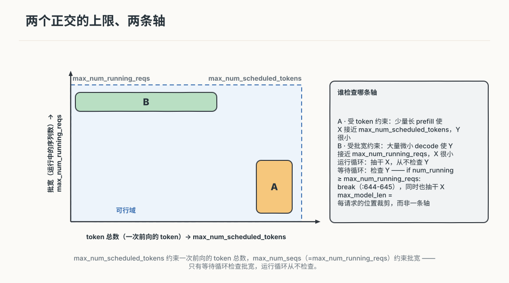</a>

<p class='figure-caption'>两个彼此正交的上限，对应两个独立维度：max_num_scheduled_tokens 限制 forward pass 的 token 数量，max_num_seqs (=max_num_running_reqs) 限制 batch 宽度；只有 WAITING loop 检查宽度，RUNNING 从不检查。</p>

- **`max_num_scheduled_tokens` 的默认值为 `max_num_batched_tokens`。** 除非运维人员显式设置 `max_num_scheduled_tokens`，否则两者相等。该上限规定 model runner 在单次 forward pass 中最多可以处理多少 token。它是为每 step budget 设定初值的*唯一*依据，也是末尾 assert（见下文）右侧的值。
- **`max_num_running_reqs = max_num_seqs` 是另一个彼此正交的独立上限。** 它限制的是 *batch 宽度*，也就是并发 sequence 的数量，而不是 token 吞吐量。关键在于，该限制只会在 WAITING loop 中执行（[第 4 节](#4-先处理-running再接纳-waiting)）；RUNNING loop 从不检查它，因为其中的 request 早已被接纳。Token budget 与 batch 宽度是两个相互独立的维度：一个 step 可能受 token 限制（大量长 prefill），也可能受宽度限制（大量极短 decode），二者不能混为一谈。
- **`max_model_len` 和 `num_sampled_tokens_per_step` 是一组同级配置**，用于*单个 request*的位置 clamp，而不是全局 budget。通常 `num_sampled_tokens_per_step` 为 `1`，对于 diffusion model 则为 `0`（[`scheduler.py:119-122`](https://github.com/vllm-project/vllm/blob/6cf7b26bd4bff60bf378e1af14044280ac0d214c/vllm/v1/core/sched/scheduler.py#L119-L122)）；它会传入 `min(num_new_tokens, max_model_len - num_computed_tokens - num_sampled_tokens_per_step)`，确保 speculative lookahead 不会将 request 的写入位置推进到 `max_model_len` 之外（[第 4 节](#4-先处理-running再接纳-waiting)）。这个 clamp 与共享 budget 彼此正交——它约束的是单个 request，而不是整个 step。

为什么要把 `max_num_scheduled_tokens` 设计成与 `max_num_batched_tokens` 分离的独立配置项？config docstring 明确说明了二者会在什么情况下不同。

[`vllm/config/scheduler.py:56-61`](https://github.com/vllm-project/vllm/blob/6cf7b26bd4bff60bf378e1af14044280ac0d214c/vllm/config/scheduler.py#L56-L61)

```python
    max_num_scheduled_tokens: int | None = Field(default=None, ge=0)
    """Maximum number of tokens that the scheduler may issue in a single iteration.
    
    This is usually equal to max_num_batched_tokens, but can be smaller in cases
    when the model might append tokens into the batch (such as speculative decoding).
    Defaults to max_num_batched_tokens."""
```

这种区分正是 *scheduler 意图*与 *runner 容量*之间的分界线。`max_num_batched_tokens` 表示 forward pass 在物理上实际能够处理的量（[`vllm/config/scheduler.py:49-50`](https://github.com/vllm-project/vllm/blob/6cf7b26bd4bff60bf378e1af14044280ac0d214c/vllm/config/scheduler.py#L49-L50)：“单次迭代中可处理的最大 token 数”）；其字段默认值为 `2048`（[`config/scheduler.py:42`](https://github.com/vllm-project/vllm/blob/6cf7b26bd4bff60bf378e1af14044280ac0d214c/vllm/config/scheduler.py#L42)），该字段自身的 docstring 明确指出，这只是为了方便测试——正如 docstring 原文所述（[`config/scheduler.py:50-54`](https://github.com/vllm-project/vllm/blob/6cf7b26bd4bff60bf378e1af14044280ac0d214c/vllm/config/scheduler.py#L50-L54)），实际运行值会在 `EngineArgs.create_engine_config` 中设置。

`max_num_scheduled_tokens` 表示 scheduler *获准调度*的量。当 model 会追加 scheduler 未计入的 token 时——例如 speculative decoding 期间在 runner 内实际生成的 draft token（第 12 篇）——scheduled budget 会设置得低于 batch budget，以预留实际处理余量。在常见场景下，两者完全一致，本节后文也会将其视为同一个数值。

**为每 step budget 设定初值**

每次调用 `schedule()` 时，固定上限都会先复制到可变局部变量 `token_budget` 中，再由两个阶段逐步扣减。

[`vllm/v1/core/sched/scheduler.py:414-427`](https://github.com/vllm-project/vllm/blob/6cf7b26bd4bff60bf378e1af14044280ac0d214c/vllm/v1/core/sched/scheduler.py#L414-L427)

```python
        req_to_new_blocks: dict[str, KVCacheBlocks] = {}
        num_scheduled_tokens: dict[str, int] = {}
        token_budget = self.max_num_scheduled_tokens
        if self._pause_state == PauseState.PAUSED_ALL:
            # Do not schedule any requests when paused.
            token_budget = 0

        # Encoder-related.
        scheduled_encoder_inputs: dict[str, list[int]] = {}
        encoder_compute_budget = self.max_num_encoder_input_tokens
        # Spec decode-related.
        scheduled_spec_decode_tokens: dict[str, list[int]] = {}
        # Whether the running batch contains any prefill requests.
        prefill_scheduled = False
```

- **`token_budget` 是由固定上限初始化的局部变量**（[`scheduler.py:416`](https://github.com/vllm-project/vllm/blob/6cf7b26bd4bff60bf378e1af14044280ac0d214c/vllm/v1/core/sched/scheduler.py#L416)）。每接纳一个 request 都会扣减它，发生 preemption 时则会退还（[第 9 节](#9-kv-压力下的-preemption)）。两个 scheduling loop 都以 `token_budget > 0` 作为 guard 条件（RUNNING 见 [`scheduler.py:442`](https://github.com/vllm-project/vllm/blob/6cf7b26bd4bff60bf378e1af14044280ac0d214c/vllm/v1/core/sched/scheduler.py#L442)，WAITING 见 [`scheduler.py:640`](https://github.com/vllm-project/vllm/blob/6cf7b26bd4bff60bf378e1af14044280ac0d214c/vllm/v1/core/sched/scheduler.py#L640)），因此它一旦归零，整个 step 就会停止接纳 request。
- **`num_scheduled_tokens: dict[str, int]` 是按 request 记录的账本**，与 budget 一一对应。其中 `.values()` 的总和就是末尾 assert 检查的值。每次支出都会同步更新 budget 与账本，因此二者绝不会出现偏差。
- **`PAUSED_ALL ⇒ token_budget = 0`**（[`scheduler.py:417-419`](https://github.com/vllm-project/vllm/blob/6cf7b26bd4bff60bf378e1af14044280ac0d214c/vllm/v1/core/sched/scheduler.py#L417-L419)）。暂停不是通过特殊分支处理，而是*将 budget 置零*：两个 `while ... token_budget > 0` guard 会立即求值为 false，处于暂停状态的 scheduler 不会接纳任何 request，同时其他 invariant 仍自然成立。这充分体现了该设计的简洁性——控制状态直接复用 budget 机制，无须增加新的代码路径。
- **`encoder_compute_budget` 是第二份相互独立的 budget**（[`scheduler.py:423`](https://github.com/vllm-project/vllm/blob/6cf7b26bd4bff60bf378e1af14044280ac0d214c/vllm/v1/core/sched/scheduler.py#L423)，初始值来自 `max_num_encoder_input_tokens`；对于 mm model，后者在 [`config/scheduler.py:248`](https://github.com/vllm-project/vllm/blob/6cf7b26bd4bff60bf378e1af14044280ac0d214c/vllm/config/scheduler.py#L248) 处为 `max_num_batched_tokens`）。multimodal encoder 的工作会并行消耗这份 budget；它只会在 KV allocation 之前*缩小* `num_new_tokens`，绝不会将其增大，因此不可能破坏 token invariant（[第 11 节](#11-encoder-input-与-multimodal-scheduling)）。在概念上应将二者分开：本节讨论的是 *decoder token* budget。

**budget 的支出方式（以及两个 loop 为何完全相同）**

RUNNING loop（decode 和执行中的 prefill chunk）与 WAITING loop（新进入或恢复执行的 prefill）都会消耗*同一个* `token_budget`，使用的也是*相同*的两行扣减逻辑。RUNNING 的 commit 逻辑（[`scheduler.py:589-590`](https://github.com/vllm-project/vllm/blob/6cf7b26bd4bff60bf378e1af14044280ac0d214c/vllm/v1/core/sched/scheduler.py#L589-L590)）：

```python
            num_scheduled_tokens[request_id] = num_new_tokens
            token_budget -= num_new_tokens
```

WAITING 的 commit（[`scheduler.py:990-991`](https://github.com/vllm-project/vllm/blob/6cf7b26bd4bff60bf378e1af14044280ac0d214c/vllm/v1/core/sched/scheduler.py#L990-L991)）也是同样两行。每个 loop 都会先将 `num_new_tokens` clamp 到剩余额度以内（RUNNING 见 [`scheduler.py:480`](https://github.com/vllm-project/vllm/blob/6cf7b26bd4bff60bf378e1af14044280ac0d214c/vllm/v1/core/sched/scheduler.py#L480)，WAITING 见 [`scheduler.py:844`](https://github.com/vllm-project/vllm/blob/6cf7b26bd4bff60bf378e1af14044280ac0d214c/vllm/v1/core/sched/scheduler.py#L844)）。当 prefill 超出 RUNNING 留下的额度时，后一个 clamp 也就确定了 chunk 边界；[第 4 节](#4-先处理-running再接纳-waiting)和[第 5 节](#5-chunked-prefill拆分长-prompt)会分别分析这种调度顺序与拆分方式，此处不再重复。

### 单次 forward pass 的成本上界

单一标量 budget 即可限制每 step 的 token 工作量，不受活跃 request 数量或 prompt 长度影响。`schedule()` 末尾会检查该上界。

[`vllm/v1/core/sched/scheduler.py:1027-1028`](https://github.com/vllm-project/vllm/blob/6cf7b26bd4bff60bf378e1af14044280ac0d214c/vllm/v1/core/sched/scheduler.py#L1027-L1028)

```python
        total_num_scheduled_tokens = sum(num_scheduled_tokens.values())
        assert total_num_scheduled_tokens <= self.max_num_scheduled_tokens
```

主要上界是 **`total_num_scheduled_tokens <= max_num_scheduled_tokens`**（[`scheduler.py:1027-1028`](https://github.com/vllm-project/vllm/blob/6cf7b26bd4bff60bf378e1af14044280ac0d214c/vllm/v1/core/sched/scheduler.py#L1027-L1028)）。每次接纳 request 时，都会将 `num_new_tokens` clamp 到剩余 budget 以内（[`scheduler.py:480`](https://github.com/vllm-project/vllm/blob/6cf7b26bd4bff60bf378e1af14044280ac0d214c/vllm/v1/core/sched/scheduler.py#L480)、[`scheduler.py:844`](https://github.com/vllm-project/vllm/blob/6cf7b26bd4bff60bf378e1af14044280ac0d214c/vllm/v1/core/sched/scheduler.py#L844)）；每次支出都会扣减 budget（[`scheduler.py:589-590`](https://github.com/vllm-project/vllm/blob/6cf7b26bd4bff60bf378e1af14044280ac0d214c/vllm/v1/core/sched/scheduler.py#L589-L590)、[`scheduler.py:990-991`](https://github.com/vllm-project/vllm/blob/6cf7b26bd4bff60bf378e1af14044280ac0d214c/vllm/v1/core/sched/scheduler.py#L990-L991)）；step 内发生 preemption 时，则会退还此前扣减的额度（[`scheduler.py:556`](https://github.com/vllm-project/vllm/blob/6cf7b26bd4bff60bf378e1af14044280ac0d214c/vllm/v1/core/sched/scheduler.py#L556)、[第 9 节](#9-kv-压力下的-preemption)）。`assert token_budget >= 0`（[`scheduler.py:1030`](https://github.com/vllm-project/vllm/blob/6cf7b26bd4bff60bf378e1af14044280ac0d214c/vllm/v1/core/sched/scheduler.py#L1030)）会从另一个方向校验该计数器。[第 2 节](#2-schedule主循环)推导了全部四个末尾 assert。

如果没有这个上限，单个 100k-token prompt 一旦被整段接纳，就会产生规模相当于均衡混合 batch 50 倍的 forward pass。这不仅会让所有并发 decode 遭遇延迟尖峰，还可能导致 runner 内部的 activation memory OOM。正是 token budget 把“一个超长 prompt 到达”从一次 stall，转化成一系列规模有界、搭载在 decode 上执行的 step（[第 5 节](#5-chunked-prefill拆分长-prompt)，Sarathi / Dynamic-SplitFuse）。也正因如此，runner 才能按固定上限确定 activation buffer 和 attention buffer 的大小：scheduler 通过约定保证，每次 forward pass 交给它的 token 数绝不会超过 `max_num_scheduled_tokens`。每次 forward pass 调用一次 `schedule()` 的 step loop（第 04 篇）依赖的正是这一保证——executor 无须自行防御过大的 batch，因为 assert 已经提前把关。

第三、第四个 assert 约束的根本不是 token，而是与其正交的 batch 宽度轴（`len(self.running) <= max_num_running_reqs` 和 scheduled ⊆ running）；其推导见[第 2 节](#2-schedule主循环)。它们之所以出现在同一个代码块中，只是因为 budget 本身无法限制 sequence 数量。

### 一个数值，两种作用——以及一道护栏

由于 `max_num_scheduled_tokens` 默认取值为 `max_num_batched_tokens`，同一个 config 值同时承担了两种作用。它既是 **forward pass 的 token 上限**（本节讨论的 invariant），按照同一套计算逻辑，也是 **chunk size 调节旋钮**：prefill chunk 的大小最多等于 budget 减去本 step 中 decode 已消耗的部分（[第 5 节](#5-chunked-prefill拆分长-prompt)）。调高它，会同时提升 batch throughput 和 prefill chunk 的最大值；调低它，则会同时收紧两者。系统没有单独的 chunk size 参数，因为 chunking 并不是一种 mode——它只是 budget clamp 作用于超大 prompt 后的自然结果。

config 层还对这两个相互正交的上限施加了一项联动约束。

[`vllm/config/scheduler.py:286-291`](https://github.com/vllm-project/vllm/blob/6cf7b26bd4bff60bf378e1af14044280ac0d214c/vllm/config/scheduler.py#L286-L291)

```python
        if self.max_num_batched_tokens < self.max_num_seqs:
            raise ValueError(
                f"max_num_batched_tokens ({self.max_num_batched_tokens}) must "
                "be greater than or equal to max_num_seqs "
                f"({self.max_num_seqs})."
            )
```

<a href='images/vllm-05-15-liveness-floor.svg' target='_blank'>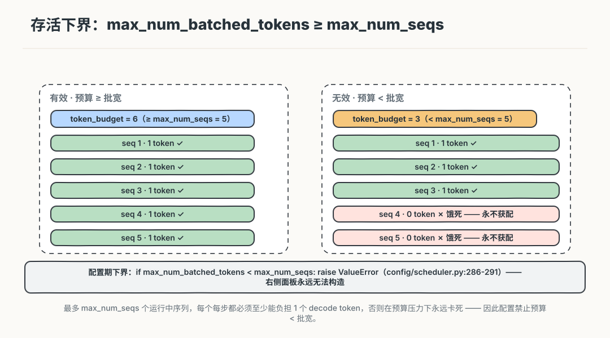</a>

<p class='figure-caption'>liveness 下限 max_num_batched_tokens ≥ max_num_seqs：最多 max_num_seqs 个 running sequence 中的每一个，每个 step 都必须至少能分到一个 decode token，否则它会在 budget 压力下永久 stall。</p>

这是一项 liveness 保证：最多 `max_num_seqs` 个 running sequence 中的每一个，每个 step 都至少需要一个 token，才能持续推进 decode。如果 token budget 小于 batch 宽度，那么某个已经接纳的 sequence 可能连一个 decode token 都无法获得，并在 budget 压力下无限期 stall。要求 `max_num_batched_tokens >= max_num_seqs`，可以保证 budget 始终足以为每个并发 sequence 分配一个 token——低于这个下限，continuous batching 就不再“continuous”。

token budget 只是 request 必须通过的三个可行性维度之一。本节讨论的是 compute 轴：*forward pass 中还有空间吗？* memory 轴——*还有 KV block 吗？*——由 `KVCacheManager.allocate_slots` 在调度过程中直接检查，其 `None` 返回值是触发 preemption 的背压信号（[第 9 节](#9-kv-压力下的-preemption)）；其中的 watermark、full-sequence 和 reserved-block gate 属于第 06 篇的讨论范围，这里仅将其视为 black box。一个 request 只有同时通过 budget clamp、由 `allocate_slots` 成功返回 block，并且在新 prefill 场景下 batch 宽度上限仍有余量，才会被调度。token budget 是三个检查中最先执行、成本最低的一个，也是让另外两个维度易于处理的关键——通过限制每个 step 的 token 数量，它让 KV 和宽度检查都能以每个 request 常数时间完成。

## 4. 先处理 RUNNING，再接纳 WAITING

`schedule()` 按固定顺序消耗一轮 budget：先处理 RUNNING queue，再处理 WAITING。RUNNING 中包含 decode 和已接纳的 prefill chunk；WAITING 中包含新 request 和被 preempt 的 request。这样一来，每个 step 都会优先保障在途任务，但并不意味着其 latency 恒定——一个较大的已接纳 chunk 仍可能拉长 forward pass。公开的实现导读也描述了相同的 running-first 策略（[Inside vLLM](https://vllm.ai/blog/2025-09-05-anatomy-of-vllm)）。

<a href='images/vllm-05-04-running-waiting.svg' target='_blank'>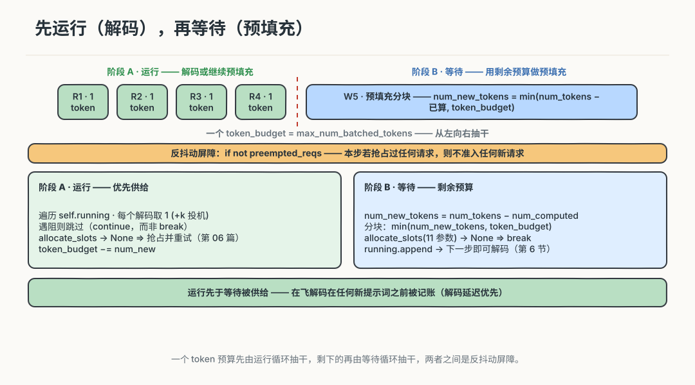</a>

<p class='figure-caption'>同一份 token budget 先由 RUNNING loop 消耗，再由 WAITING loop 使用剩余部分；两者之间设有 anti-thrash 屏障。</p>

### Phase A：在 RUNNING 上消耗 budget，遇到 stall 时 skip（而不是 break）

`self.running` 是一个按 FCFS 排序的普通 `list[Request]`（[`scheduler.py:184`](https://github.com/vllm-project/vllm/blob/6cf7b26bd4bff60bf378e1af14044280ac0d214c/vllm/v1/core/sched/scheduler.py#L184)）。loop 从头到尾遍历它，唯一的门控条件是剩余 budget；其中有三个 guard 可以跳过 request，而不消耗任何 budget。

[`scheduler.py:440-471`](https://github.com/vllm-project/vllm/blob/6cf7b26bd4bff60bf378e1af14044280ac0d214c/vllm/v1/core/sched/scheduler.py#L440-L471)

```python
        # First, schedule the RUNNING requests.
        req_index = 0
        while req_index < len(self.running) and token_budget > 0:
            request = self.running[req_index]

            if (
                request.num_output_placeholders > 0
                # This is (num_computed_tokens + 1) - (num_output_placeholders - 1).
                # Since output placeholders are also included in the computed tokens
                # count, we subtract (num_output_placeholders - 1) to remove any draft
                # tokens, so that we can be sure no further steps are needed even if
                # they are all rejected.
                and request.num_computed_tokens + 2 - request.num_output_placeholders
                >= request.num_prompt_tokens + request.max_tokens
            ):
                # Async scheduling: Avoid scheduling an extra step when we are sure that
                # the previous step has reached request.max_tokens. We don't schedule
                # partial draft tokens since this prevents uniform decode optimizations.
                req_index += 1
                continue

            if self.current_step < request.next_decode_eligible_step:
                # V2+PP+async: enforce `pp_size` steps between same-req decodes
                # to match worker-side sampled-tokens broadcast slot ring cadence.
                req_index += 1
                continue

            if defer_prefills and request.is_prefill_chunk:
                # DP prefill balancing: defer this in-progress prefill chunk to a
                # cadence-aligned step; decodes still run to fill this step.
                req_index += 1
                continue
```

<a href='images/vllm-05-16-phaseA-skip-tree.svg' target='_blank'>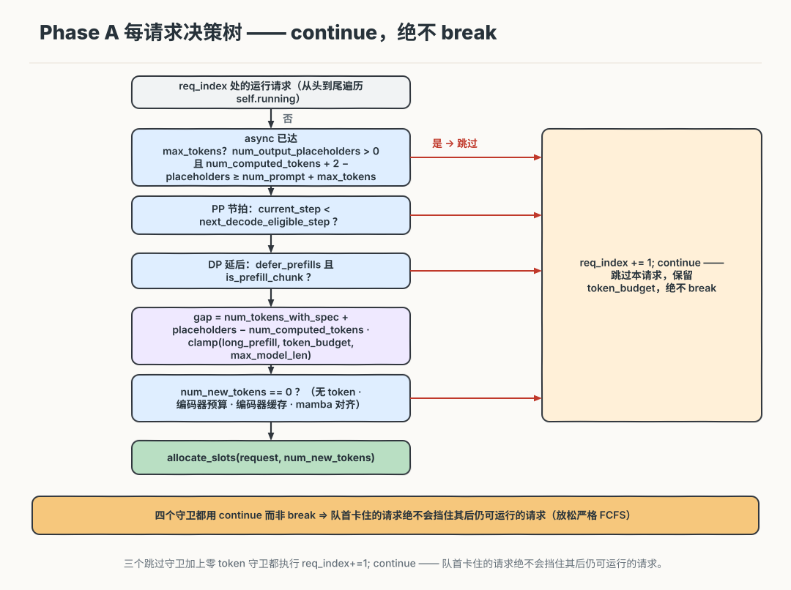</a>

<p class='figure-caption'>Phase A 针对每个 request 的决策树：三个 skip guard 加上 zero-token guard，都会执行 req_index+=1; continue（绝不会 break），因此队首 stall 的 request 永远不会挡住后面可运行的 request。</p>

这三个 guard 可以理解为“某个 running request 在*当前* step 无事可做的原因”。每种情况都会通过 `req_index += 1; continue` 处理——推进 cursor，同时保留 budget：(1) async scheduling 已经产出了抵达 `max_tokens` 的 token，因此无须再执行 step；(2) pipeline parallel 节拍（`next_decode_eligible_step`）要求同一 request 的两次 decode 之间间隔 `pp_size` 个 step；(3) data parallel prefill 均衡策略会延后一个在途 prefill *chunk*，同时继续运行 decode 来填满当前 step。loop 上方的 `defer_prefills` predicate（[`scheduler.py:436-438`](https://github.com/vllm-project/vllm/blob/6cf7b26bd4bff60bf378e1af14044280ac0d214c/vllm/v1/core/sched/scheduler.py#L436-L438)）是 `throttle_prefills and not self.prefill_capacity_bound and any(not r.is_prefill_chunk for r in self.running)`。这里刻意选择 `continue` 而不是 `break`：跳过一个 stall 的 request 后，后面优先级较低但可运行的 request 仍可被调度。这样会放宽严格 FCFS，但不会让整个 queue 被一个空闲的队首 request 阻塞。

对于*确实*有工作可做的 request，token grant 首先取与 phase 无关的缺口 `num_tokens_with_spec + num_output_placeholders - num_computed_tokens`，随后依次进行 clamp：受 `long_prefill_token_threshold` 限制，通过 `num_new_tokens = min(num_new_tokens, token_budget)` 受 budget 本身限制（[`scheduler.py:480`](https://github.com/vllm-project/vllm/blob/6cf7b26bd4bff60bf378e1af14044280ac0d214c/vllm/v1/core/sched/scheduler.py#L480)），并受 `max_model_len` 限制（[`scheduler.py:473-489`](https://github.com/vllm-project/vllm/blob/6cf7b26bd4bff60bf378e1af14044280ac0d214c/vllm/v1/core/sched/scheduler.py#L473-L489)）。针对 `token_budget` 执行的这一次 `min`，正是 running prefill chunk 恰好取得全部剩余 budget 的位置；而 decode 所需的 1（+k 个 spec token）显然也能得到满足——两者统一使用同一套计算逻辑（chunked prefill 机制见[第 5 节](#5-chunked-prefill拆分长-prompt)）。

随后，成功的 grant 会被提交，并从 budget 中扣除（[`scheduler.py:584-591`](https://github.com/vllm-project/vllm/blob/6cf7b26bd4bff60bf378e1af14044280ac0d214c/vllm/v1/core/sched/scheduler.py#L584-L591)，[第 2 节](#2-schedule主循环)）：`num_scheduled_tokens[request_id] = num_new_tokens; token_budget -= num_new_tokens`。Phase B 继承的全部状态，就是这次减法留下的剩余 budget。

loop body 最后还有一次 skip：running request 的 grant 被 clamp 到零。

[`scheduler.py:514-530`](https://github.com/vllm-project/vllm/blob/6cf7b26bd4bff60bf378e1af14044280ac0d214c/vllm/v1/core/sched/scheduler.py#L514-L530)

```python
            if num_new_tokens == 0:
                # The request cannot be scheduled because one of the following
                # reasons:
                # 1. No new tokens to schedule. This may happen when
                #    (1) PP>1 and we have already scheduled all prompt tokens
                #    but they are not finished yet.
                #    (2) Async scheduling and the request has reached to either
                #    its max_total_tokens or max_model_len.
                # 2. The encoder budget is exhausted.
                # 3. The encoder cache is exhausted.
                # 4. Insufficient budget for a block-aligned chunk in hybrid
                #    models with mamba cache mode "align".
                # NOTE(woosuk): Here, by doing `continue` instead of `break`,
                # we do not strictly follow the FCFS scheduling policy and
                # allow the lower-priority requests to be scheduled.
                req_index += 1
                continue
```

作者的注释明确点出了这一取舍：`continue` 相较于 `break` 牺牲了严格 FCFS，但这样一来，当 queue 头部的 request 缺少 token（或 encoder budget/cache 不足，或凑不出一个按 block 对齐的 mamba chunk）时，就不会堵住后面的 request。

**Phase A backpressure：preempt，而非 yield**

当一个 running request 需要的 KV block 当前无法分配时，`allocate_slots` 会返回 `None`——这表示 backpressure，而非错误。Phase A 的应对方式是**preempt 一个 victim，并在 `while True` loop 中重试**（[`scheduler.py:532-582`](https://github.com/vllm-project/vllm/blob/6cf7b26bd4bff60bf378e1af14044280ac0d214c/vllm/v1/core/sched/scheduler.py#L532-L582)）：在 `PRIORITY` 下，victim 是 `max(self.running, key=lambda r: (r.priority, r.arrival_time))`；在 FCFS 下，则是 `self.running.pop()`（最新加入的 tail request）。当前 step 内每次执行 preemption，都会退回 `token_budget += num_scheduled_tokens.pop(...)`（[`scheduler.py:556`](https://github.com/vllm-project/vllm/blob/6cf7b26bd4bff60bf378e1af14044280ac0d214c/vllm/v1/core/sched/scheduler.py#L556)），从而确保[第 2 节](#2-schedule主循环)中的 budget assert 仍然成立。如果最后唯一可 evict 的 request 就是当前 request，则 loop 会 break，Phase A 也随之结束。

完整的 preempt *机制*（victim rollback，以及保留 `block_hashes` 以便低成本 resume）见[第 9 节](#9-kv-压力下的-preemption)；释放 KV block 的*具体流程*，以及 `allocate_slots` 为何返回 `None`，见第 06 篇。这里的关键在于这种非对称性：*Phase A 会通过 evict 为 in-flight generation 腾出资源。*

**屏障：绝不在同一个 step 中既 evict 又 admit**

两个 phase 之间，是 scheduler 中最重要的一道 guard。

[`scheduler.py:636-645`](https://github.com/vllm-project/vllm/blob/6cf7b26bd4bff60bf378e1af14044280ac0d214c/vllm/v1/core/sched/scheduler.py#L636-L645)

```python
        # Next, schedule the WAITING requests.
        if not preempted_reqs and self._pause_state == PauseState.UNPAUSED:
            step_skipped_waiting = create_request_queue(self.policy)

            while (self.waiting or self.skipped_waiting) and token_budget > 0:
                # Paused streaming sessions (WAITING_FOR_STREAMING_REQ) are not
                # in `running` but still hold a model-runner request slot.
                num_running = len(self.running) + self.num_waiting_for_streaming_input
                if num_running >= self.max_num_running_reqs:
                    break
```

条件 `if not preempted_reqs` 可以避免 admission thrashing。如果 Phase A preempt 了某个 request，就会跳过 WAITING phase，剩余的 token budget 也不再使用。在 memory pressure 下，scheduler 不会在同一个 step 中先 evict 一个 in-flight request，再 admit 一个新 request；只有后续 step 中 pressure 缓解后，才会恢复 admission。

`while` header 还承载了*另一项*上限：`num_running >= self.max_num_running_reqs`（即 `max_num_seqs`，见[第 3 节](#3-token-预算max_num_scheduled_tokens)）是唯一执行 batch width 限制的地方。Phase A 从不检查该限制（已经位于 `running` 中的 decode，绝不会因为 request 数量超限而被拒绝），因此 `max_num_seqs` 只会限制新 admission。其计数还会特意纳入那些已暂停、但仍占有 model-runner slot 的 streaming session。

### Phase B：admit WAITING prefill，并通过 break 退让

在 loop 内，admission 要依次通过层层 skip-or-break 检查；Phase A 完全不需要面对这些检查，因为新 request 带来的不确定性更高。遇到 blocked status（例如 `WAITING_FOR_REMOTE_KVS`）或 LoRA-capacity 冲突时，系统会 pop 出该 request，将它*前插*到 `step_skipped_waiting`，具体使用 `continue`——这只是暂时 parked，并非 rejected（[`scheduler.py:653-679`](https://github.com/vllm-project/vllm/blob/6cf7b26bd4bff60bf378e1af14044280ac0d214c/vllm/v1/core/sched/scheduler.py#L653-L679)）；loop 结束后，skipped queue 会合并回去，并排在更早被 skip 的 item 之前（[`scheduler.py:1017-1019`](https://github.com/vllm-project/vllm/blob/6cf7b26bd4bff60bf378e1af14044280ac0d214c/vllm/v1/core/sched/scheduler.py#L1017-L1019)）。

接下来，Phase B 还会执行其特有的额外工作：对新 request 进行一次只读 prefix-cache probe（[`scheduler.py:686-790`](https://github.com/vllm-project/vllm/blob/6cf7b26bd4bff60bf378e1af14044280ac0d214c/vllm/v1/core/sched/scheduler.py#L686-L790)，具体机制见第 06、07 篇），这只可能减少待调度的 token 数量；随后由 `num_new_tokens = request.num_tokens - num_computed_tokens` 确定 WAITING token 数量，并执行 chunked-prefill slice（[`scheduler.py:805-845`](https://github.com/vllm-project/vllm/blob/6cf7b26bd4bff60bf378e1af14044280ac0d214c/vllm/v1/core/sched/scheduler.py#L805-L845)，[第 5 节](#5-chunked-prefill拆分长-prompt)）。

注意，DP-defer 在 Phase B 与 Phase A 中的处理并不对称。被 defer 的 running chunk 会被 skip，扫描继续；被 defer 的 waiting prefill 则会 break：

[`scheduler.py:797-804`](https://github.com/vllm-project/vllm/blob/6cf7b26bd4bff60bf378e1af14044280ac0d214c/vllm/v1/core/sched/scheduler.py#L797-L804)

```python
                if load_kv_async:
                    # KVTransfer: loading remote KV, do not allocate for new work.
                    assert num_external_computed_tokens > 0
                    num_new_tokens = 0
                elif defer_prefills and num_computed_tokens < request.num_tokens - 1:
                    # DP prefill balancing: defer this step's local prefill
                    # compute to a cadence-aligned step.
                    break
```

一旦 request 通过 probe 和 sizing，Phase B 就会调用 `allocate_slots`——但会带齐 admission 所需的全部参数（11 个 argument，其中 9 个是 keyword argument：prefix-cache block、external connector token、`full_sequence_must_fit`、`reserved_blocks`、`has_scheduled_reqs=bool(self.running)`）。相比之下，Phase A 的调用只有 3 个 argument。而当 `None` 时，它也**不会** preempt：

[`scheduler.py:907-928`](https://github.com/vllm-project/vllm/blob/6cf7b26bd4bff60bf378e1af14044280ac0d214c/vllm/v1/core/sched/scheduler.py#L907-L928)

```python
                new_blocks = self.kv_cache_manager.allocate_slots(
                    request,
                    num_new_tokens,
                    num_new_computed_tokens=num_new_local_computed_tokens,
                    new_computed_blocks=new_computed_blocks,
                    num_lookahead_tokens=effective_lookahead_tokens,
                    num_external_computed_tokens=num_external_computed_tokens,
                    delay_cache_blocks=load_kv_async,
                    num_encoder_tokens=num_encoder_tokens,
                    full_sequence_must_fit=self.scheduler_reserve_full_isl,
                    reserved_blocks=reserved_blocks,
                    has_scheduled_reqs=bool(self.running),
                )

                if new_blocks is None:
                    # The request cannot be scheduled.

                    # NOTE: we need to untouch the request from the encode cache
                    # manager
                    if request.has_encoder_inputs:
                        self.encoder_cache_manager.free(request)
                    break
```

Phase A 会 preempt 同级 request 来腾出空间，而 Phase B 则会释放 encoder reservation，并通过 `break` 直接退出整个 waiting loop。新 admission 绝不会 evict in-flight work；waiting request 只会继续等待。正是这些额外 kwargs，导致 Phase B 可能失败，而 Phase A 会转而 preempt：`has_scheduled_reqs=bool(self.running)` 和 `full_sequence_must_fit` 会让 WAITING/PREEMPTED admission 经过 watermark gate 和 full-sequence gate，而 RUNNING decode 可以绕过这些 gate，从而为这些 decode 后续增长保留 free-block headroom——KV 侧的原理详见**第 06 篇**，这里仅把它作为裁决依据。成功后，会对 request 执行 `self.running.append`，它从下一个 step 起便可立即参与调度（continuous batching，[第 6 节](#6-continuous-batching成员集合每个-step-都会变化)），同时被归类为 new 或 resumed，budget 也会相应扣减（[`scheduler.py:950-1000`](https://github.com/vllm-project/vllm/blob/6cf7b26bd4bff60bf378e1af14044280ac0d214c/vllm/v1/core/sched/scheduler.py#L950-L1000)，[第 2 节](#2-schedule主循环)）。

## 5. Chunked Prefill：拆分长 prompt

Chunked prefill 会把长 prompt 拆成多个 token chunk 分批处理，并与正在运行的 decode 交错执行，而不是把整个 prompt 放进一次大型 forward pass。它会使用 RUNNING request 调度完成后剩余的 budget（[第 4 节](#4-先处理-running再接纳-waiting)）。Sarathi 的 piggybacked decode（arXiv:2308.16369）和 DeepSpeed-FastGen 的 Dynamic SplitFuse（arXiv:2401.08671）是很有价值的背景资料，但这些论文不能作为该代码仓库具体实现的证据。代码仓库直接说明了其策略（`docs/configuration/optimization.md:53`，已核验）：

> 在 V1 中，只要条件允许，**默认启用 chunked prefill**。启用 chunked prefill 后，调度策略会优先处理 decode request。它会先将所有 pending decode request 组成 batch，然后才调度 prefill 操作。当 `max_num_batched_tokens` budget 中还有可用 token 时，它会调度 pending prefill。如果某个 pending prefill request 无法放入 `max_num_batched_tokens`，就会自动将其切分为 chunk。

Chunked prefill 并非独立的 scheduler mode。当 prompt 的需求被 clamp 到 RUNNING work 占用后剩余的 budget 时，它就会自然发生。因此，`{request_id: num_tokens}` 这种表示形式不需要特殊的 phase label：request 只是拿到少于其尚待处理数量的 prompt token（[V1 博客](https://vllm.ai/blog/2025-01-27-v1-alpha-release)）。

**实际切分点就是一个 `min`**

长 prompt 真正被切开的地方位于 WAITING loop，新 prompt 会在这里首次确定 token 数量。如[第 4 节](#4-先处理-running再接纳-waiting)所述，RUNNING queue（decode 和已 admit 的 prefill chunk）会优先消耗共享的 `token_budget`，因此控制流执行到这里时，budget 已经扣除了 decode 的消耗。

[`vllm/v1/core/sched/scheduler.py:805-845`](https://github.com/vllm-project/vllm/blob/6cf7b26bd4bff60bf378e1af14044280ac0d214c/vllm/v1/core/sched/scheduler.py#L805-L845)

```python
                else:
                    # Number of tokens to be scheduled.
                    # We use `request.num_tokens` instead of
                    # `request.num_prompt_tokens` to consider the resumed
                    # requests, which have output tokens.
                    num_new_tokens = request.num_tokens - num_computed_tokens
...
                    threshold = self.scheduler_config.long_prefill_token_threshold
                    if 0 < threshold < num_new_tokens:
                        num_new_tokens = threshold

                    # chunked prefill has to be enabled explicitly to allow
                    # pooling requests to be chunked
                    if (
                        not self.scheduler_config.enable_chunked_prefill
                        and num_new_tokens > token_budget
                    ):
                        # If chunked_prefill is disabled,
                        # we can stop the scheduling here.
                        break

                    num_new_tokens = min(num_new_tokens, token_budget)
                    assert num_new_tokens > 0
```

分步来看：

1. **L810** — 基础需求量是 prompt 的剩余部分：`num_new_tokens = request.num_tokens - num_computed_tokens`。对于发生 prefix-cache miss 的新 prompt，`num_computed_tokens == 0`（[第 8 节](#8-prefix-cache-感知调度)中的 prefix probe 可以将其调高），因此需求量就是完整的 prompt 长度。代码使用的是 `num_tokens`，而不是 `num_prompt_tokens`；因此，在生成期间被 preempt 的 request，会基于其 prompt 和已生成的 token 重新执行 prefill。
2. **L830-832** — 可选的单 request 上限。如果设置了 `long_prefill_token_threshold`（> 0），单个 request 在一个 step 中贡献的 token 数永远不会超过 `threshold`，从而让短 prompt 能越过超长 prompt 优先获得调度机会。`0` 会禁用该上限。
3. **L836-842** — `enable_chunked_prefill` gate，这是 admission 时唯一会检查该 flag 的地方。如果 chunking **已禁用**，并且 prompt 无法放入剩余 budget，loop 就会执行 `break`：prompt 会原封不动地留在 `waiting` 中，等待未来某个 step 整体调度，绝不会被拆分。
4. **L844** — 真正执行切分的代码：`num_new_tokens = min(num_new_tokens, token_budget)`。启用 chunking 后，这一行会直接将 prompt 截断到 decode 执行后剩余 budget 所能容纳的长度。尚未消费的尾部（`num_computed_tokens + num_new_tokens < request.num_tokens`）会在后续 step 中继续处理。**这一个 `min` 就实现了 chunked prefill。**

L845 的 `assert num_new_tokens > 0` 保证 chunk 到达 KV allocation 时绝不会为空：前面的 `while ... and token_budget > 0` header（[第 4 节](#4-先处理-running再接纳-waiting)）配合各个 skip guard，确保 loop 只有在还有 budget 可用时才能运行到这里。

控制这一行为的两个参数都是普通的 config 字段，其默认值定义在 [`vllm/config/scheduler.py:80-90`](https://github.com/vllm-project/vllm/blob/6cf7b26bd4bff60bf378e1af14044280ac0d214c/vllm/config/scheduler.py#L80-L90)：

```python
    long_prefill_token_threshold: int = Field(default=0, ge=0)
    """For chunked prefill, a request is considered long if the prompt is
    longer than this number of tokens. 0 disables the cap (default)."""

    enable_chunked_prefill: bool = True
    """If True, prefill requests can be chunked based
    on the remaining `max_num_batched_tokens`.
...
    """
```

<a href='images/vllm-05-17-chunk-config-tree.svg' target='_blank'>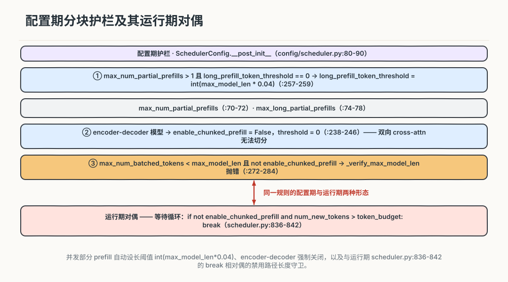</a>

<p class='figure-caption'>config 阶段的三项 chunking 保护规则，以及它们在 runtime 的对应机制：partial prefill 自动上限（int(max_model_len*0.04)）、encoder-decoder 强制关闭，以及 disable 路径下与 scheduler.py:836-842 的 runtime break 相对应的长度保护。</p>

### RUNNING 侧的镜像逻辑：in-flight chunk 使用相同的计算继续推进

如果一个 prompt 在上个 step 中只完成了部分 prefill，它会位于 `self.running` 中（continuous batching 会立即接纳它，参见[第 6 节](#6-continuous-batching成员集合每个-step-都会变化)），并带有 `is_prefill_chunk == True`。RUNNING loop 使用完全相同的两阶段 clamp，让它再推进一个 chunk。这段代码完整的 guard chain 已在[第 4 节](#4-先处理-running再接纳-waiting)中介绍；这里仅保留与 chunking 相关的截断部分：

[`vllm/v1/core/sched/scheduler.py:473-480`](https://github.com/vllm-project/vllm/blob/6cf7b26bd4bff60bf378e1af14044280ac0d214c/vllm/v1/core/sched/scheduler.py#L473-L480)

```python
            num_new_tokens = (
                request.num_tokens_with_spec
                + request.num_output_placeholders
                - request.num_computed_tokens
            )
            if 0 < self.scheduler_config.long_prefill_token_threshold < num_new_tokens:
                num_new_tokens = self.scheduler_config.long_prefill_token_threshold
            num_new_tokens = min(num_new_tokens, token_budget)
```

<a href='images/vllm-05-18-clamp-chain.svg' target='_blank'>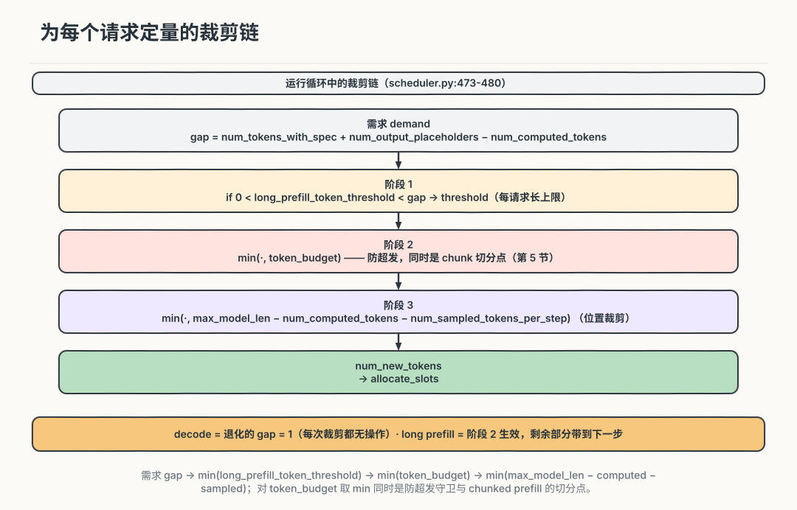</a>

<p class='figure-caption'>用于确定每个 request 大小的 clamp chain：需求缺口 → min(long_prefill_token_threshold) → min(token_budget) → min(max_model_len − computed − sampled)；与 token_budget 取 min 既是防止超限的 guard，也是 chunked-prefill 的切分点。</p>

以下两个细节将这段代码与[第 1 节](#1-scheduler-决定什么每个步骤一份-token-预算)介绍的 phase-agnostic 设计联系起来：

- RUNNING loop **不会读取 `enable_chunked_prefill`**。该 flag 只在 WAITING loop 中控制 request 的初始 admission；已经 admission 的 prefill 始终可以按 chunk 恢复执行。因此，禁用 chunked prefill 会阻止长 prompt 以部分 prefill 的方式进入 scheduler，但无法阻止已经 in-flight 的 prompt 继续按 chunk 执行。
- **decode 是退化后的单 token chunk**。对于 decode request，`num_tokens_with_spec - num_computed_tokens == 1`（speculative decoding 则为 `1 + num_spec_tokens`，参见第 12 篇），因此完全相同的三行代码会得到 decode 所需的单个 token。prefill 和 decode 实际使用的是同一套计算逻辑，并从同一个 `token_budget` 中获取额度。因此，文档所说的“优先 decode”并不是特殊分支，而只是 RUNNING loop 优先执行的自然结果。

<a href='images/vllm-05-02-chunked-prefill.svg' target='_blank'>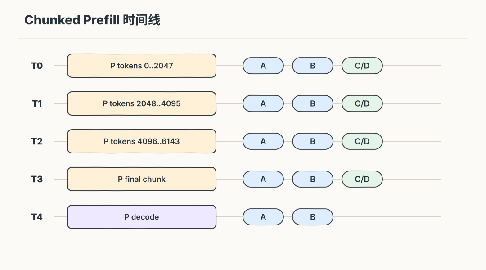</a>

<p class='figure-caption'>一个长 prompt 在多个 engine step 中被拆成按序单调推进、大小由 budget 决定的一系列 chunk，并与并发 decode 交错执行。</p>

**跨 step 携带剩余部分**

要让一个 chunk 保持 in-flight，scheduler 必须推进 cursor，并记住 prompt 尚未完成。这两个操作都会在 model 运行之前以乐观方式完成，因此同一个 request 可以在紧接着的下一个 step 中再次被调度，无需等待输出；这正是 EngineCore 的 step loop 所依赖的机制，参见第 04 篇。admission 时，WAITING 侧的 commit 会将 request 记录为仍处于 prefill 状态（[`vllm/v1/core/sched/scheduler.py:998-1000`](https://github.com/vllm-project/vllm/blob/6cf7b26bd4bff60bf378e1af14044280ac0d214c/vllm/v1/core/sched/scheduler.py#L998-L1000)，详见[第 2 节](#2-schedule主循环)）：

```python
                # Only track requests that will still be prefilling after this chunk.
                if num_computed_tokens + num_new_tokens < request.num_tokens:
                    self._inflight_prefills.add(request)
```

step dispatch 后，`_update_after_schedule` 会按本次调度的 chunk 大小精确推进 `num_computed_tokens`，并重新推导 phase flag（[`scheduler.py:1180-1189`](https://github.com/vllm-project/vllm/blob/6cf7b26bd4bff60bf378e1af14044280ac0d214c/vllm/v1/core/sched/scheduler.py#L1180-L1189)，详见[第 6 节](#6-continuous-batching成员集合每个-step-都会变化)）：

```python
        for req_id, num_scheduled_token in num_scheduled_tokens.items():
            request = self.requests[req_id]
            request.num_computed_tokens += num_scheduled_token
            request.num_in_flight_tokens += num_scheduled_token
...
            request.is_prefill_chunk = request.num_computed_tokens < (
                request.num_tokens + request.num_output_placeholders
            )
```

`is_prefill_chunk` 的初始值为 `False`（[`vllm/v1/request.py:172-173`](https://github.com/vllm-project/vllm/blob/6cf7b26bd4bff60bf378e1af14044280ac0d214c/vllm/v1/request.py#L172-L173)）；只要 cursor 仍落后于 prompt，它就会变为 `True`，其中也包括 async output placeholder。由于该值会根据 cursor 重新计算，连续的 chunk 可以完整覆盖 prompt，而不会改变实际处理哪些 token；chunking 改变的只是这些 token 的执行时机。

### 每个 chunk 仍须通过 KV 可行性检查

根据 token budget 确定 chunk 大小，并不意味着它一定能放入 memory。每个 chunk 在 commit 前仍须经过 `KVCacheManager.allocate_slots`，而 RUNNING loop 与 WAITING loop 在这里的处理方式截然不同（[第 9 节](#9-kv-压力下的-preemption)）：在 WAITING loop 中，`allocate_slots` 返回 `None` 只表示 backpressure，loop 会直接执行 `break`；系统绝不会为了 admission 一个新 prompt 而 preempt decode。在 RUNNING loop 中，如果 in-flight chunk 遇到返回的 `None`，则会 preempt 一个 victim，然后重试。allocation policy stack（水位线 gate、完整 sequence 预留，以及它为何返回 `None`）完全属于第 06 篇的讨论范围；本节只使用它给出的结论。对于 chunked prefill，关键交互只有一点：token-budget 侧的 `min` 与 KV-block check 必须同时满足，因此即使一个 chunk 符合 compute budget，也仍可能因 block 不足而被拒绝。

**围绕 chunking 的 config 保护规则**

共有三条 config 阶段的规则用于约束该特性（`vllm/config/scheduler.py`）：

- **并发 partial prefill 会自动设置 long 上限** (`:257-259`)：如果 `max_num_partial_prefills > 1` 且 `long_prefill_token_threshold == 0`，该阈值默认为 `int(max_model_len * 0.04)`。`max_num_partial_prefills` (`:70-72`) 限制同一时间最多有多少个 prompt 处于分块处理中；`max_long_partial_prefills` (`:74-78`) 则限制其中最多有多少个可标记为 "long"，从而让短 prompt 能够插队。
- **Encoder-decoder model 会强制关闭 chunking** (`:238-246`)：即 `enable_chunked_prefill = False` 和 `long_prefill_token_threshold = 0`，因为其双向 cross-attention 无法拆分到多个 step 中执行。
- **关闭 chunking 路径的长度保护** (`:272-284`)：关闭 chunking 后，长度超过 batch budget 的 prompt 将永远无法被调度。因此，若 `max_num_batched_tokens < max_model_len and not enable_chunked_prefill`，`verify_max_model_len` 会直接提前抛错。这是 config-time 侧与 runtime `break`（L836-842）对应的检查：chunking 关闭时，整个 prompt 必须在一个 step 内放入 `max_num_batched_tokens`，因此 config 会拒绝 `max_num_batched_tokens < max_model_len`。

结尾的 assertion 会强制执行 per-step 上限，无论 prompt 长短：

```python
        total_num_scheduled_tokens = sum(num_scheduled_tokens.values())
        assert total_num_scheduled_tokens <= self.max_num_scheduled_tokens
```

两个 loop 都会先通过 `min(..., token_budget)` 执行 clamp，再进行对应的 budget 扣减。因此，长 prompt 会分摊到多个受 budget 限制的 step 中，而所有 running decode 都会优先消耗分配给它们的额度。在支持该能力的场景中，Chunked prefill 默认开启（[V1 指南](https://docs.vllm.ai/en/stable/usage/v1_guide/)）。

## 6. Continuous Batching：成员集合每个 step 都会变化

在 V1 scheduler 中，batch 并不是一个持续存在的 object，而是每轮动态推导出的结果。不存在名为 `batch`、能跨 forward pass 持续存在的对象；真正持久化的是 `self.running`、`self.waiting`，以及每个 request 的 cursor `num_computed_tokens`。每次 forward pass，`schedule()` 都会在全新的 `token_budget` 约束下，从头遍历这些 queue（[第 2 节](#2-schedule主循环)、[第 3 节](#3-token-预算max_num_scheduled_tokens)），并生成 `num_scheduled_tokens: {req_id: num_tokens}`，也就是*本轮*的成员集合。Orca 将其称为 iteration-level scheduling，并说明了为什么在 multi-step generation 中，它优于 request-level (static) batching：新到达的 request 无需等待正在执行的 batch 全部结束；已经完成的 request 也不会在满足 stop condition 后继续占用 slot（[Orca, OSDI'22](https://www.usenix.org/conference/osdi22/presentation/yu)）。Continuous batching 由此自然产生：由于 batch 会在每个 step 重新计算，其成员集合也可以每个 step 都发生变化。

“每次 forward pass 只执行一次 schedule”这一 contract 由 `schedule()` 的 docstring 明确。它的 `{req_id: num_tokens}` payload 是[第 1 节](#1-scheduler-决定什么每个步骤一份-token-预算)讨论的主题；这里真正关键的是 iteration-level 粒度这一条。

[`vllm/v1/core/sched/interface.py:55-57`](https://github.com/vllm-project/vllm/blob/6cf7b26bd4bff60bf378e1af14044280ac0d214c/vllm/v1/core/sched/interface.py#L55-L57)

```python
        The scheduling decision is made at the iteration level. Each scheduling
        step corresponds to a single forward pass of the model. Therefore, this
        method is called repeatedly by a busy loop in the engine.
```

把它与驱动该流程的 loop（第 04 篇）对照起来看：EngineCore busy loop 调用 `schedule()`，将生成的 `SchedulerOutput` 交给 executor 执行一次 forward pass，再通过 `update_from_output` 回传 token，然后再次调用 `schedule()`。batch 的生命周期不会超过一个 iteration。成员集合会在 [`scheduler.py:442`](https://github.com/vllm-project/vllm/blob/6cf7b26bd4bff60bf378e1af14044280ac0d214c/vllm/v1/core/sched/scheduler.py#L442) 行的 `while req_index < len(self.running) and token_budget > 0` 处重新决定——归根结底，就是每个 step 都从头重新扫描一个普通的 `list[Request]`（`self.running`，定义见 [`scheduler.py:184`](https://github.com/vllm-project/vllm/blob/6cf7b26bd4bff60bf378e1af14044280ac0d214c/vllm/v1/core/sched/scheduler.py#L184)）。

### 加入端：本 step 接纳，下个 step 运行

新接纳的 WAITING request 会立即加入 running 集合，就发生在接纳它的同一次 `schedule()` 调用中，而不是等 forward pass 完成任何确认之后。对应的提交逻辑如下（详见[第 2 节](#2-schedule主循环)；此处仅保留与成员关系有关的代码行）：

[`vllm/v1/core/sched/scheduler.py:973-1000`](https://github.com/vllm-project/vllm/blob/6cf7b26bd4bff60bf378e1af14044280ac0d214c/vllm/v1/core/sched/scheduler.py#L973-L1000)

```python
                self.running.append(request)
                ...
                if request.status == RequestStatus.WAITING:
                    scheduled_new_reqs.append(request)
                elif request.status == RequestStatus.PREEMPTED:
                    scheduled_resumed_reqs.append(request)
                else:
                    raise RuntimeError(f"Invalid request status: {request.status}")
                ...
                num_scheduled_tokens[request_id] = num_new_tokens
                token_budget -= num_new_tokens
                request.status = RequestStatus.RUNNING
                request.num_computed_tokens = num_computed_tokens
                ...
                # Only track requests that will still be prefilling after this chunk.
                if num_computed_tokens + num_new_tokens < request.num_tokens:
                    self._inflight_prefills.add(request)
```

`self.running.append(request)`（第 973 行）会把 request 放到 running list 的*末尾*，其状态随后切换为 `RUNNING`（第 992 行）。它只会被分类一次——`scheduled_new_reqs` 对应新的 `WAITING` request，`scheduled_resumed_reqs` 对应恢复执行的 `PREEMPTED` request（第 978-983 行）；该分类决定 executor 收到的是完整的 `NewRequestData` payload，还是轻量级的 `CachedRequestData` diff（[第 10 节](#10-scheduleroutputexecutor-会收到什么)）。`num_computed_tokens` 会被设为 prefix 命中基线（第 993 行；也就是[第 8 节](#8-prefix-cache-感知调度)介绍的 cache probe），此时*尚未因本 step 调度的 token 而向前推进*——这次推进会延后到 `schedule()` 末尾执行。

对成员集合而言，结果是：下一 step 的 Phase A RUNNING loop（[`scheduler.py:442`](https://github.com/vllm-project/vllm/blob/6cf7b26bd4bff60bf378e1af14044280ac0d214c/vllm/v1/core/sched/scheduler.py#L442)）会遍历 `self.running`，而其中此时已经包含该 request。因此，仅仅一个 iteration 之后，它就会成为正式的调度候选。某个 prompt 在 step N 被接纳后，即使它是 chunked prefill、只拿到了第一个 slice，也可以在 step N+1 继续执行 prefill 或进入 decode。由于它被追加到了*尾部*，而 Phase A 会从前到后消耗 budget（[第 4 节](#4-先处理-running再接纳-waiting)），只有排在前面的、更早进入且仍在执行的 generation 都获得 budget 后，它才会分到额度。这正是优先保障 decode latency 的排序方式。成员只从尾部增加，绝不会越过已经 running 的任务插队。

**乐观 cursor：为何重新调度无需 round-trip**

Continuous batching 之所以开销很低，关键在于 per-request cursor 推进的*时机*。它会在 `schedule()` 末尾推进，具体逻辑位于 `_update_after_schedule`；此时 model 还没有实际运行任何一个 token。

[`vllm/v1/core/sched/scheduler.py:1169-1195`](https://github.com/vllm-project/vllm/blob/6cf7b26bd4bff60bf378e1af14044280ac0d214c/vllm/v1/core/sched/scheduler.py#L1169-L1195)

```python
    def _update_after_schedule(self, scheduler_output: SchedulerOutput) -> None:
        # Advance the number of computed tokens for the request AFTER
        # the request is scheduled.
        # 1. The scheduler_output of the current step has to include the
        #    original number of scheduled tokens to determine input IDs.
        # 2. Advance the number of computed tokens here allowing us to
        #    schedule the prefill request again immediately in the next
        #    scheduling step.
        # 3. If some tokens (e.g. spec tokens) are rejected later, the number of
        #    computed tokens will be adjusted in update_from_output.
        num_scheduled_tokens = scheduler_output.num_scheduled_tokens
        for req_id, num_scheduled_token in num_scheduled_tokens.items():
            request = self.requests[req_id]
            request.num_computed_tokens += num_scheduled_token
            request.num_in_flight_tokens += num_scheduled_token
            if self.defer_block_free:
                # Record the in-flight step, to fence deferred block freeing.
                request.last_sched_seq = self.sched_step_seq
            request.is_prefill_chunk = request.num_computed_tokens < (
                request.num_tokens + request.num_output_placeholders
            )
            ...
            # Drop from the in-flight-prefill set once it's no longer prefilling.
            if not request.is_prefill_chunk:
                self._inflight_prefills.discard(request)
```

`schedule()` 在 [`scheduler.py:1136-1137`](https://github.com/vllm-project/vllm/blob/6cf7b26bd4bff60bf378e1af14044280ac0d214c/vllm/v1/core/sched/scheduler.py#L1136-L1137) 处调用它，并返回 `SchedulerOutput`，返回位置见 [`scheduler.py:1138`](https://github.com/vllm-project/vllm/blob/6cf7b26bd4bff60bf378e1af14044280ac0d214c/vllm/v1/core/sched/scheduler.py#L1138)。因此，cursor 的推进（`num_computed_tokens += num_scheduled_token`，第 1182 行）发生在 executor 收到调度计划之前。下一次 `schedule()` 可以直接看到更新后的 cursor，并继续处理该 request，无需等待上一次 forward pass 完成。

一个包含 20k 个 token 的 prompt 按 `token_budget` 大小切成 chunk 后（[第 5 节](#5-chunked-prefill拆分长-prompt)），其 cursor 会在连续多个 step 中随 chunk 逐步向前推进；每个 step 的 Phase A 都会重新计算 `num_new_tokens = num_tokens_with_spec + placeholders − num_computed_tokens`（[第 4 节](#4-先处理-running再接纳-waiting)），计算时使用已经提前推进的 cursor。如果没有这种乐观推进，scheduler 就必须先等待 `update_from_output` 确认当前 chunk，才能调度下一个 chunk，使原本应以 pipeline 方式执行的流程被迫串行化。async scheduling 也会因此完全失效，因为在这种模式下，step N 的 forward pass 仍在 GPU 上运行时，step N+1 就已经开始调度。

这种乐观机制有一条校正路径，即原因 3 中指出的情况：speculative decoding 会先 draft 出 *k* 个 token，并假定它们全部被接受来推进 cursor，但 model 可能会拒绝其中一部分。被拒绝的 token 会从 `num_computed_tokens` 中扣回，这一步发生在 `update_from_output`（第 12 篇）里。scheduler 有意采用乐观策略：先为 draft 预留 slot，并假定它们都会落地来推进 cursor，再在 verify step 后进行校正。这与 KV manager 采用的“乐观预留、保守写入 cache”策略相同（第 06 篇）：*cursor* 会领先于 ground truth，但 *cached* block 绝不会如此。

第 1187 行重新推导了当前阶段：`is_prefill_chunk = num_computed_tokens < num_tokens + num_output_placeholders`。request 在这里不再执行 prefill，而是转入 decode：也就是其 cursor 追上自身长度的那一刻。这里没有阶段切换事件；每个 step 只是根据推进后的 cursor 重新计算这个 boolean。Phase A 的 guard 会读回该值（[`scheduler.py:467`](https://github.com/vllm-project/vllm/blob/6cf7b26bd4bff60bf378e1af14044280ac0d214c/vllm/v1/core/sched/scheduler.py#L467)、`if defer_prefills and request.is_prefill_chunk` 处的 DP-defer guard），以区分 in-flight chunk 和 decode。因此，“成员关系每个 step 都会变化”实际上叠加了两层推导：哪些 request 位于 `self.running` 中，以及其中每个 request 在当前 step 执行 prefill 还是 decode；二者都根据 cursor 重新计算，从不存储为某种 mode。

**离场部分：跨 step 边界通知已完成的 request**

成员集合也会缩小，而且会滞后一个 step；这份滞后本身由 scheduler state 承载。`finished_req_ids` 并不是在 `schedule()` 内部计算的，而是在相邻 step 之间逐步累积。

[`vllm/v1/core/sched/scheduler.py:186-190`](https://github.com/vllm-project/vllm/blob/6cf7b26bd4bff60bf378e1af14044280ac0d214c/vllm/v1/core/sched/scheduler.py#L186-L190)

```python
        # The request IDs that are finished in between the previous and the
        # current steps. This is used to notify the workers about the finished
        # requests so that they can free the cached states for those requests.
        # This is flushed at the end of each scheduling step.
        self.finished_req_ids: set[str] = set()
```

<a href='images/vllm-05-19-finished-handshake.svg' target='_blank'>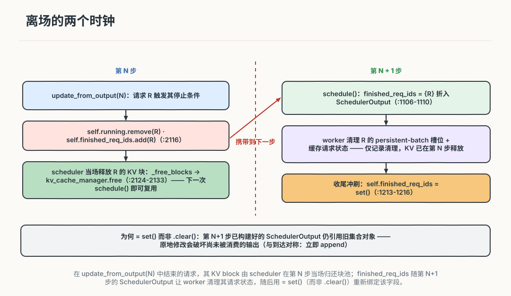</a>

<p class='figure-caption'>离场遵循两套时钟：request 在 update_from_output(N) 期间结束后，scheduler 会在 step N 当场将其 KV blocks 归还到 pool；finished_req_ids 只会随 step N+1 的 SchedulerOutput 传递，以便 worker 清理持久化的 request/batch 状态。随后，该字段通过 = set()（而不是 .clear()）重新绑定，避免破坏已经构造好的 output。</p>

在 `update_from_output` 期间触发 stop condition（或被 abort）的 request，会被加入这个 set（[`scheduler.py:2116`](https://github.com/vllm-project/vllm/blob/6cf7b26bd4bff60bf378e1af14044280ac0d214c/vllm/v1/core/sched/scheduler.py#L2116)）。*下一个* `schedule()` 会将该 set 原样纳入 output；它是跨 step 携带的 state，而不是当场重新做出的决策：

[`vllm/v1/core/sched/scheduler.py:1106-1110`](https://github.com/vllm-project/vllm/blob/6cf7b26bd4bff60bf378e1af14044280ac0d214c/vllm/v1/core/sched/scheduler.py#L1106-L1110)

```python
            # finished_req_ids is an existing state in the scheduler,
            # instead of being newly scheduled in this step.
            # It contains the request IDs that are finished in between
            # the previous and the current steps.
            finished_req_ids=self.finished_req_ids,
```

随后，在同一 step 的末尾将其清空，避免重复上报：

[`vllm/v1/core/sched/scheduler.py:1213-1216`](https://github.com/vllm-project/vllm/blob/6cf7b26bd4bff60bf378e1af14044280ac0d214c/vllm/v1/core/sched/scheduler.py#L1213-L1216)

```python
        # Clear the finished and preempted request IDs.
        # NOTE: We shouldn't just clear() here because it will also affect
        # the scheduler output.
        self.finished_req_ids = set()
```

跨 step 边界看完整 lifecycle：处理 step N 的 output 时，request R 结束 → R 被移出 `self.running`，其 KV blocks 由 scheduler *当场*归还到 pool（`_free_request` → `_free_blocks` → `kv_cache_manager.free`，[`scheduler.py:2110-2133`](https://github.com/vllm-project/vllm/blob/6cf7b26bd4bff60bf378e1af14044280ac0d214c/vllm/v1/core/sched/scheduler.py#L2110-L2133) —— scheduler 持有 `BlockPool`；源码指出，正常结束时不存在 in-flight write，因此会立即释放），同时将 R 的 id 加入 `finished_req_ids` → step N+1 的 `SchedulerOutput` 携带 `finished_req_ids={R}`，让 *worker* 清理 R 在 persistent batch 中的 slot 和 cached request state（[`gpu_model_runner.py:1161-1174`](https://github.com/vllm-project/vllm/blob/6cf7b26bd4bff60bf378e1af14044280ac0d214c/vllm/v1/worker/gpu_model_runner.py#L1161-L1174) —— 这只是 worker 侧的 bookkeeping，不负责释放 block） → 该字段重新绑定到一个全新的空 set。

这里必须使用 `= set()`（而不是 `.clear()`），comment 也解释了原因：step N+1 已经构造好的 `SchedulerOutput` 仍然引用旧的 set object，因此原地修改它会破坏尚未消费的 output。离场处理由此分散在两套时钟上——KV 释放由 scheduler 在 request 结束时执行，而 worker state 的清理指令则在下一个 step 发出。（只有在 `defer_block_free`、in-flight async step 或 KV-connector 延迟这几种情况下，block 释放本身才会走 deferred/fenced 路径。）

<a href='images/vllm-05-05-continuous-batching.svg' target='_blank'>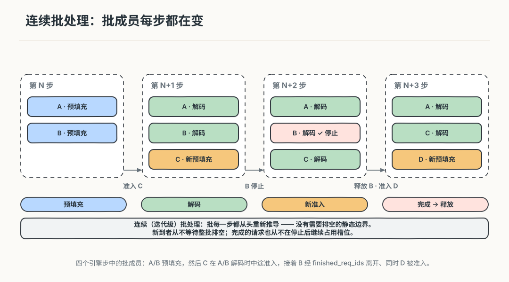</a>

<p class='figure-caption'>四个 engine step 中的 batch 成员变化：A/B 先执行 prefill；随后在 A/B decode 期间中途接纳 C；最后接纳 D 的同时，B 通过 finished_req_ids 离场。</p>

## 7. Request Queue：FCFS 与 Priority

WAITING 阶段（[第 4 节](#4-先处理-running再接纳-waiting)）按照 `RequestQueue` 接纳新进入或恢复执行的 prefill request。构造时由 factory 选择 FCFS 或 PRIORITY 实现，而准入流程统一使用 add、peek 和 pop interface。不同 policy 的行为差异集中在 queue 实现、跨 queue 仲裁，以及 preemption 后的重新插入逻辑中。

<a href='images/vllm-05-06-request-queues.svg' target='_blank'>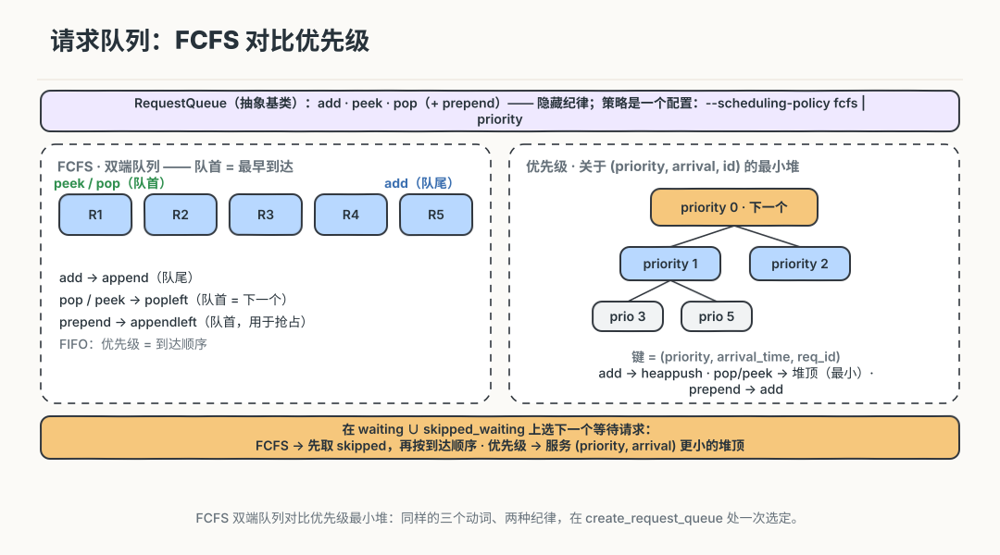</a>

<p class='figure-caption'>FCFS deque 与 priority min-heap：同样三种操作，两套调度规则。</p>

### policy enum 与抽象契约

该调度规则由一个仅含两个取值的 enum 表示；queue 则是 ABC，因此在 add/peek/pop 路径上，scheduler 根本看不到具体类型。

源码定位：[`vllm/v1/core/sched/request_queue.py:13-17`](https://github.com/vllm-project/vllm/blob/6cf7b26bd4bff60bf378e1af14044280ac0d214c/vllm/v1/core/sched/request_queue.py#L13-L17)。

```python
# request_queue.py:13-17
class SchedulingPolicy(Enum):
    """Enum for scheduling policies."""

    FCFS = "fcfs"
    PRIORITY = "priority"
```

ABC（[`request_queue.py:20-72`](https://github.com/vllm-project/vllm/blob/6cf7b26bd4bff60bf378e1af14044280ac0d214c/vllm/v1/core/sched/request_queue.py#L20-L72)）声明了十个 abstract 成员：`add_request`、`pop_request`、`peek_request`、`prepend_request`、`prepend_requests`、`remove_request`、`remove_requests`，以及 dunder `__bool__` / `__len__` / `__iter__`。三种操作定义了调度规则——`add`（request 插入何处）、`peek`（不实际出队地查看下一个 request）和 `pop`（将下一个 request 出队）。`prepend*` 这一组操作用于实现 FCFS 的重新插入语义；后文可以看到，它们在 priority 下被有意弱化。由此得到的 invariant 是 **policy 透明性**：scheduler 持有一个 `RequestQueue`，并相信每种操作都会遵守对应的调度规则；只有跨 queue 仲裁和 preemption victim 选择这两处会根据 `self.policy` 走分支，单 queue 的操作契约绝不会因此改变。

**FCFS：deque，front = 最早到达的 request**

FCFS 就是普通 FIFO，通过*继承* `deque` 实现，因此两端操作都是 O(1)，而且可以直接获得 `append` / `appendleft` / `popleft`，无需额外实现。

源码定位：[`request_queue.py:78-94`](https://github.com/vllm-project/vllm/blob/6cf7b26bd4bff60bf378e1af14044280ac0d214c/vllm/v1/core/sched/request_queue.py#L78-L94)。

```python
# request_queue.py:78-94
    def add_request(self, request: Request) -> None:
        """Add a request to the queue according to FCFS policy."""
        self.append(request)

    def pop_request(self) -> Request:
        """Pop a request from the queue according to FCFS policy."""
        return self.popleft()

    def peek_request(self) -> Request:
        """Peek at the next request in the queue without removing it."""
        if not self:
            raise IndexError("peek from an empty queue")
        return self[0]

    def prepend_request(self, request: Request) -> None:
        """Prepend a request to the front of the queue."""
        self.appendleft(request)
```

`add_request` 在 tail 追加，`pop_request` 从 head 弹出（`popleft`），`peek_request` 则会先显式判空，再返回作为 head 的 `self[0]`；如果为空，会抛出 `IndexError`。因此，**head = front = 下一个接受服务的 request = 最早入队的 request**；tail = 最新入队者。`prepend_request` 通过 `appendleft` 将 request 放回 *head*，排在当前 queue 中所有 request 之前——遭到 preemption 的 request 正是以这种方式保留原有先后顺序（见下文）。由于 `__len__` / `__iter__` 直接委托给 `deque`（[`request_queue.py:122-128`](https://github.com/vllm-project/vllm/blob/6cf7b26bd4bff60bf378e1af14044280ac0d214c/vllm/v1/core/sched/request_queue.py#L122-L128)），迭代顺序与服务顺序一致。

批量搬运操作 `prepend_requests` 使用 `deque.extendleft`（[`request_queue.py:103`](https://github.com/vllm-project/vllm/blob/6cf7b26bd4bff60bf378e1af14044280ac0d214c/vllm/v1/core/sched/request_queue.py#L103)）；按照标准库语义，这会导致**顺序反转**——docstring 也明确指出了这一点——而这种反转对下文合并 skipped queue 至关重要。其性质是：**FIFO 单调性**——如果不使用 `prepend*`，后到达的 request 永远不会先于更早到达的 request 得到服务；优先顺序完全由入队时间决定，无需读取 `Request` 的任何字段。

**PRIORITY：基于 `Request.__lt__` 的 min-heap**

Priority scheduling 使用 binary min-heap；按 key 排序“最小”的 request 会最先得到服务。与 FCFS 不同，它*并非* deque 的子类，而是封装了一份由 `heapq` 管理的 private list。

源码定位：[`request_queue.py:144-158`](https://github.com/vllm-project/vllm/blob/6cf7b26bd4bff60bf378e1af14044280ac0d214c/vllm/v1/core/sched/request_queue.py#L144-L158)。

```python
# request_queue.py:144-158
    def add_request(self, request: Request) -> None:
        """Add a request to the queue according to priority policy."""
        heapq.heappush(self._heap, request)

    def pop_request(self) -> Request:
        """Pop a request from the queue according to priority policy."""
        if not self._heap:
            raise IndexError("pop from empty heap")
        return heapq.heappop(self._heap)

    def peek_request(self) -> Request:
        """Peek at the next request in the queue without removing it."""
        if not self._heap:
            raise IndexError("peek from empty heap")
        return self._heap[0]
```

`add_request` 是 `heappush`（O(log n) 的 sift-up），`pop_request` 是 `heappop`（O(log n)，返回最小值），而 `peek_request` 返回 `self._heap[0]`：即 heap root，也就是当前最小值和下一个待服务项。两个 accessor 都通过 `IndexError` 防止访问空 queue，这与 FCFS 契约一致。因此，调用方的 peek-then-maybe-pop loop 无须感知自己持有的是哪种 queue。比较逻辑实现在 `Request` 上，而不在本文件中：

源码定位：[`vllm/v1/request.py:314-325`](https://github.com/vllm-project/vllm/blob/6cf7b26bd4bff60bf378e1af14044280ac0d214c/vllm/v1/request.py#L314-L325)。

```python
# request.py:314-325
    def __lt__(self, other: "Request") -> bool:
        """
        Compare two requests based on priority, arrival time, and request ID.
        Used in priority scheduling.
        """
        if self.priority != other.priority:
            return self.priority < other.priority
        if self.arrival_time != other.arrival_time:
            return self.arrival_time < other.arrival_time
        if self.request_id != other.request_id:
            return self.request_id < other.request_id
        return id(self) < id(other)
```

<a href='images/vllm-05-20-priority-sortkey.svg' target='_blank'>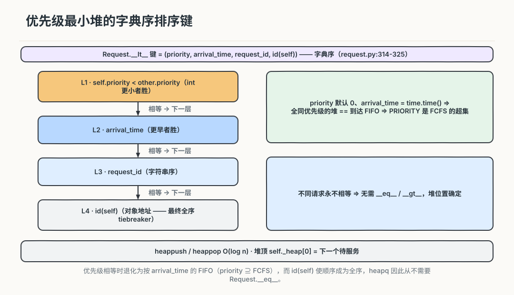</a>

<p class='figure-caption'>priority min-heap 的排序键是字典序 tuple (priority, arrival_time, request_id, id(self))：priority 相同时会退化为按 arrival_time 排序的 FIFO（priority ⊇ FCFS）；id(self) 则让顺序成为全序，因此 heapq 永远不需要 Request.__eq__。</p>

排序键是字典序 tuple `(priority, arrival_time, request_id, id(self))`。`priority` 的 int 值越小，优先级越高；若相同，则依次比较更早的 `arrival_time`、字典序更小的 `request_id` string，最后用 `id(self)`（对象地址）作为最终 tie-breaker，形成全序。由此可以得出两个结论。第一，构造时 `priority` 的默认值为 `0`，`arrival_time` 的默认值为 `time.time()`，所以**当所有 priority 都相同时，heap 会退化为按 arrival_time 排序的 FIFO**——priority 模式是 FCFS 的严格泛化，而不是另一套算法。第二，由于排序键的最后一项是 `id(self)`，任意两个不同 request 的比较结果都不会相等；因此，`heapq` 永远不需要 `Request.__eq__`，request 在 heap 中的位置也因而是确定的。正是这种全序性质，使我们无须让 `Request` 定义 `__eq__` 或 `__gt__`，也能严谨分析 heap 的行为。

### priority queue 的操作语义在何处分化

heap 中不存在“front”，因此 `prepend*` 操作在这里的语义不可能与 deque 中相同；而按 array order 迭代，得到的也只是部分有序的结果。

源码定位：[`request_queue.py:160-173`](https://github.com/vllm-project/vllm/blob/6cf7b26bd4bff60bf378e1af14044280ac0d214c/vllm/v1/core/sched/request_queue.py#L160-L173) 和 [`request_queue.py:194-198`](https://github.com/vllm-project/vllm/blob/6cf7b26bd4bff60bf378e1af14044280ac0d214c/vllm/v1/core/sched/request_queue.py#L194-L198)。

```python
# request_queue.py:160-173
    def prepend_request(self, request: Request) -> None:
        """Add a request to the queue according to priority policy.

        Note: In a priority queue, there is no concept of prepending to the
        front. Requests are ordered by (priority, arrival_time)."""
        self.add_request(request)

    def prepend_requests(self, requests: RequestQueue) -> None:
        """Add all requests from another queue according to priority policy.

        Note: In a priority queue, there is no concept of prepending to the
        front. Requests are ordered by (priority, arrival_time)."""
        for request in requests:
            self.add_request(request)
```

两个 `prepend*` 操作都**统一退化为 `add_request`**：这里没有可供插队的 head，因此，在 priority 模式下被 prepend 的 request 只会根据自己的 key 重新参与竞争。`remove_request`（[`request_queue.py:175-178`](https://github.com/vllm-project/vllm/blob/6cf7b26bd4bff60bf378e1af14044280ac0d214c/vllm/v1/core/sched/request_queue.py#L175-L178)）先执行 `list.remove`（O(n)），再执行 `heapq.heapify`（O(n)），以修复刚刚被破坏的 heap 性质；`remove_requests`（[`request_queue.py:180-184`](https://github.com/vllm-project/vllm/blob/6cf7b26bd4bff60bf378e1af14044280ac0d214c/vllm/v1/core/sched/request_queue.py#L180-L184)）则重建底层 list，过滤掉 `set` 中的 victim，然后只执行一次 heapify——这比反复逐个删除更高效。最微妙的是迭代：

```python
# request_queue.py:194-198
    def __iter__(self) -> Iterator[Request]:
        """Iterate over the queue according to priority policy."""
        heap_copy = self._heap[:]
        while heap_copy:
            yield heapq.heappop(heap_copy)
```

`__iter__` *不会*按 array order 遍历 `self._heap`，因为这种顺序只是部分有序。它会对底层 list 做 shallow copy，再反复对副本执行 `heappop`，从而按**真实服务顺序**生成 request，同时保持实际 heap 不变。这相当于一次 O(n log n) 的 heap sort 外加一次内存分配，是让 heap 真正做到“按 policy 顺序迭代”所付出的代价。这里有两个性质始终成立：任何可能破坏 min-heap 结构的 mutation，都会在返回前恢复该结构，因此后续调用 `peek`/`pop` 时仍能得到真正的最小值；迭代顺序以非破坏方式保持与服务顺序一致，也正因此，下文通过 `prepend_requests` 复制 queue 的路径才具备明确语义。

**一个 factory，两个遵循同一策略的 queue**

policy 字符串只会解析一次，以确定具体 class。

源码定位：[`request_queue.py:201-208`](https://github.com/vllm-project/vllm/blob/6cf7b26bd4bff60bf378e1af14044280ac0d214c/vllm/v1/core/sched/request_queue.py#L201-L208)；调用方见 [`scheduler.py:174-183`](https://github.com/vllm-project/vllm/blob/6cf7b26bd4bff60bf378e1af14044280ac0d214c/vllm/v1/core/sched/scheduler.py#L174-L183)。

```python
# request_queue.py:201-208
def create_request_queue(policy: SchedulingPolicy) -> RequestQueue:
    """Create request queue based on scheduling policy."""
    if policy == SchedulingPolicy.PRIORITY:
        return PriorityRequestQueue()
    elif policy == SchedulingPolicy.FCFS:
        return FCFSRequestQueue()
    else:
        raise ValueError(f"Unknown scheduling policy: {policy}")
```

构造 scheduler 时，它会将 `scheduler_config.policy` 解析为 `SchedulingPolicy`（[`scheduler.py:175`](https://github.com/vllm-project/vllm/blob/6cf7b26bd4bff60bf378e1af14044280ac0d214c/vllm/v1/core/sched/scheduler.py#L175)），并创建遵循同一策略的**两个** queue（[`scheduler.py:181-183`](https://github.com/vllm-project/vllm/blob/6cf7b26bd4bff60bf378e1af14044280ac0d214c/vllm/v1/core/sched/scheduler.py#L181-L183)）：主准入 queue `self.waiting`，以及用于暂存因 async dependency 或约束而被 blocked 的 request 的 `self.skipped_waiting`。两者均为 `RequestQueue`；此后 scheduler 只使用 interface 提供的操作。任何未知 policy 都会在 factory 处直接抛错，而不会悄无声息地产生策略错误的 queue。**类型选择的单一入口**这一 invariant 保证 `waiting` 和 `skipped_waiting` 采用同一种策略，也让下文的跨 queue head 比较具备明确语义。

### 从两个 queue 中选择下一个 waiting request

“下一个 waiting request”的选择需要在两个 queue 之间进行仲裁。FCFS 会整体优先选择 skipped queue；priority 则按 key 合并两个 head。

源码定位：[`scheduler.py:1875-1885`](https://github.com/vllm-project/vllm/blob/6cf7b26bd4bff60bf378e1af14044280ac0d214c/vllm/v1/core/sched/scheduler.py#L1875-L1885)。

```python
# scheduler.py:1875-1885
    def _select_waiting_queue_for_scheduling(self) -> RequestQueue | None:
        if self.policy == SchedulingPolicy.FCFS:
            return self.skipped_waiting or self.waiting or None

        # PRIORITY mode: compare queue heads when both queues are non-empty.
        if self.waiting and self.skipped_waiting:
            waiting_req = self.waiting.peek_request()
            skipped_req = self.skipped_waiting.peek_request()
            return self.waiting if waiting_req < skipped_req else self.skipped_waiting

        return self.waiting or self.skipped_waiting or None
```

<a href='images/vllm-05-21-two-queue-arbitration.svg' target='_blank'>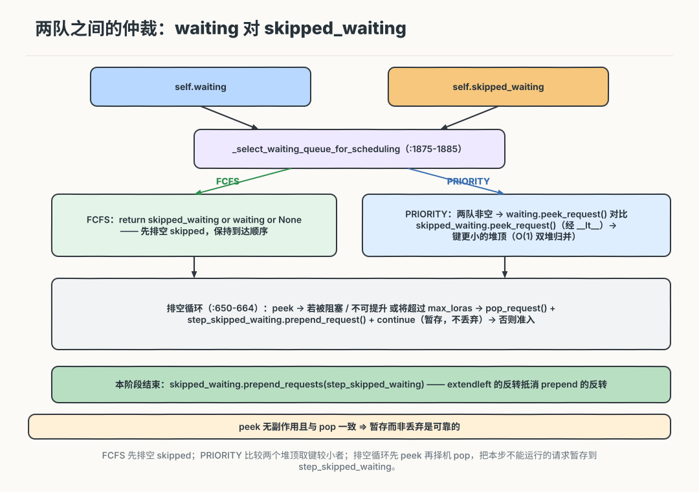</a>

<p class='figure-caption'>waiting 与 skipped_waiting 之间的跨 queue 仲裁：FCFS 会先 drain skipped（其中 request 到达更早）；PRIORITY 会 peek 两个 heap root 并选择 key 较小者；随后 drain loop 采用先 peek、再视情况 pop 的方式，将无法运行的 request 暂存到 step_skipped_waiting。</p>

在 **FCFS** 模式下，会优先 drain `skipped_waiting`（其 `__bool__` 为真时优先）：这些 blocked request 更早入队，而 FCFS 按 arrival 顺序调度，因此在较新的 request 之前重新考虑它们，可以保持全局 arrival 顺序。在 **PRIORITY** 模式下，如果两个 queue 都非空，则会 peek 两边的 root，并返回 head key 较小的那个 queue（`waiting_req < skipped_req` 会调用 `Request.__lt__`）——只需比较 root，就能以 O(1) 完成两个 min-heap 的合并式选择。因此，每轮都会从 `waiting ∪ skipped_waiting` 中选出全局 priority 最高的唯一 request，两个 queue 的拆分不会扰乱 priority 顺序。仅当两个 queue 都为空时才会返回 `None`，而调用方外层的 `while (self.waiting or self.skipped_waiting)`（[第 4 节](#4-先处理-running再接纳-waiting)）已经排除了这种情况，因此 `assert request_queue is not None` 在 [`scheduler.py:648`](https://github.com/vllm-project/vllm/blob/6cf7b26bd4bff60bf378e1af14044280ac0d214c/vllm/v1/core/sched/scheduler.py#L648) 处始终成立。

drain loop 使用的是**先 peek、再按条件 pop**的协议：

```python
# scheduler.py:650-664
                request = request_queue.peek_request()
                request_id = request.request_id

                # try to promote blocked statuses while traversing skipped queue.
                if self._is_blocked_waiting_status(
                    request.status
                ) and not self._try_promote_blocked_waiting_request(request):
                    if request.status == RequestStatus.WAITING_FOR_REMOTE_KVS:
                        logger.debug(
                            "%s is still in WAITING_FOR_REMOTE_KVS state.",
                            request_id,
                        )
                    request_queue.pop_request()
                    step_skipped_waiting.prepend_request(request)
                    continue
```

loop 先 peek 并检查 candidate，然后再作决定。如果该 request 在本 step 无法运行——要么仍处于 blocked 状态且无法 promote，要么（在后续的 [`scheduler.py:668-679`](https://github.com/vllm-project/vllm/blob/6cf7b26bd4bff60bf378e1af14044280ac0d214c/vllm/v1/core/sched/scheduler.py#L668-L679) 处）会超出 `max_loras`——就会从来源 queue 中 pop 该 request，再通过 `prepend_request` 将其放入本 step 专用的 `step_skipped_waiting` queue，随后借助 `continue` 进入下一轮。在该阶段结束时，再通过 `self.skipped_waiting.prepend_requests(step_skipped_waiting)` 将这个暂存 queue 合并回去（[`scheduler.py:1017-1019`](https://github.com/vllm-project/vllm/blob/6cf7b26bd4bff60bf378e1af14044280ac0d214c/vllm/v1/core/sched/scheduler.py#L1017-L1019)）；其中 FCFS 路径上 `extendleft` 的反转效果会抵消 `prepend_request` 引入的反转，因此顺序保持不变。正是这种 peek-then-maybe-pop 模式，要求 `peek_request` 必须是非破坏性的，并且返回与 `pop_request` 将返回的同一个元素：无法在本 step 运行的 request 只会被暂存，绝不会丢失，因此 waiting 集合在一个 step 内保持不变。

### Preemption 后重新插入：`prepend` 如何因 policy 而分化

这套抽象的第二处、也是最明显的泄漏，出现在 preemption 上。当 RUNNING loop 因 KV 压力驱逐 victim 时（释放 block、以及决定 `allocate_slots` 何时返回 `None` 的具体机制属于第 06 篇；相关 policy 见[第 9 节](#9-kv-压力下的-preemption)），它会通过同一个 `prepend_request` 操作将 victim 放回——但这个操作在两种 policy 下含义完全不同。

源码定位：[`scheduler.py:1157-1167`](https://github.com/vllm-project/vllm/blob/6cf7b26bd4bff60bf378e1af14044280ac0d214c/vllm/v1/core/sched/scheduler.py#L1157-L1167)。

```python
# scheduler.py:1157-1167
        request.status = RequestStatus.PREEMPTED
        request.num_computed_tokens = 0
        if request.spec_token_ids:
            request.spec_token_ids = []
        request.num_preemptions += 1
        if self.log_stats:
            request.record_event(EngineCoreEventType.PREEMPTED, timestamp)

        # Put the request back to the waiting queue.
        self.waiting.prepend_request(request)
        self.reset_preempted_req_ids.add(request.request_id)
```

在 **FCFS** 下，`prepend_request` 为 `appendleft`：被抢占的 request 会进入 `waiting` 的 *head*，并先于 queue 中任何后来到达的 request 再次获得服务——这符合抢占的本意：它只是临时驱逐，而不是降低优先级。在 **PRIORITY** 下，`prepend_request` 为 `add_request`：这里不存在 head，因此 request 会重新入 heap，并完全依据 `(priority, arrival_time, …)` 重新竞争；由于 `arrival_time` 仍保留在 `Request` 中，它最终会落在其 key 所决定的相对位置。*victim 选择*分支也采用对称逻辑（[`scheduler.py:547-552`](https://github.com/vllm-project/vllm/blob/6cf7b26bd4bff60bf378e1af14044280ac0d214c/vllm/v1/core/sched/scheduler.py#L547-L552)，`571-572`）：在 PRIORITY 下，victim 是 `max(self.running, key=lambda r: (r.priority, r.arrival_time))`——priority 整数最大 / 到达时间最晚，也就是运行中的 request 里最不重要的一个；而在 FCFS 下，victim 是 `self.running.pop()`，即 tail。

## 8. Prefix Cache 感知调度

WAITING loop 在接纳新的 prefill 前，会先查询其 prompt 已有多少内容驻留在 cache 中，并从待调度工作量里扣除按 block 对齐的命中部分。这个探测是只读的，不会改变模型语义；即便 prompt 已全部命中 cache，也至少会保留一个 token 实际运行。随后，`allocate_slots` 会计入 request 所共享的 block。

### 探测只存在于 WAITING loop，且仅针对初始状态的 request

Phase A（RUNNING，[第 4 节](#4-先处理-running再接纳-waiting)）调用 `allocate_slots` 时只传入三个参数，不带任何 prefix cache 参数——运行中的 request 已经把 prefix 提交到自己的 block table 中，因此没有内容需要查找。prefix 探测只会出现在 Phase B（WAITING），并且其中只有 cursor 仍为零的 request 才会执行。

源码：[`vllm/v1/core/sched/scheduler.py:686-790`](https://github.com/vllm-project/vllm/blob/6cf7b26bd4bff60bf378e1af14044280ac0d214c/vllm/v1/core/sched/scheduler.py#L686-L790)（精简版；省略处已标出）

```python
                # Get already-cached tokens.
                if request.num_computed_tokens == 0:
                    # Get locally-cached tokens.
                    ...
                    else:
                        new_computed_blocks, num_new_local_computed_tokens = (
                            self.kv_cache_manager.get_computed_blocks(request)
                        )
                    ...
                else:
                    # KVTransfer: WAITING reqs have num_computed_tokens > 0
                    # after async KV recvs are completed.
                    new_computed_blocks = self.kv_cache_manager.empty_kv_cache_blocks
                    num_new_local_computed_tokens = 0
                    num_computed_tokens = request.num_computed_tokens
```

1. `request.num_computed_tokens == 0` 是 gate 条件。全新 request 和被抢占后又恢复的 request 都满足该条件（抢占会将 cursor 硬重置为 0——见[第 9 节](#9-kv-压力下的-preemption)），因此两者都会重新探测 cache。这正是设计目的：恢复执行的 request 会在这里再次找到自己刚刚释放的 block。
2. 常规的非 Mamba、非 hybrid 路径会进入 `else` 分支并调用 `get_computed_blocks(request)`，返回 `(new_computed_blocks, num_new_local_computed_tokens)`：即 block handle 和命中长度。上方被省略的分支是 hybrid/Mamba coordinator 变体（`find_longest_cache_hit_per_group`）；它采用不同的查找方式来实现相同目的，相关内容属于第 06 篇。
3. 底部的 `else`（`num_computed_tokens > 0`）对应 KV-transfer 恢复路径：如果 request 的 block 已通过异步 remote-KV 接收填充，其 cursor 就已经非零，因此会完全跳过本地探测（`num_new_local_computed_tokens = 0`），直接信任随 request 一起传入的计数。

每次准入最多执行一次 prefix 探测，而且只会对尚未提交 KV 的 request 执行。已经在向前推进的 request 绝不会被重新探测——它的 `block_hashes`-to-block 绑定才是权威依据，重复探测也只会找到它已经持有的内容。

<a href='images/vllm-05-07-prefix-aware.svg' target='_blank'>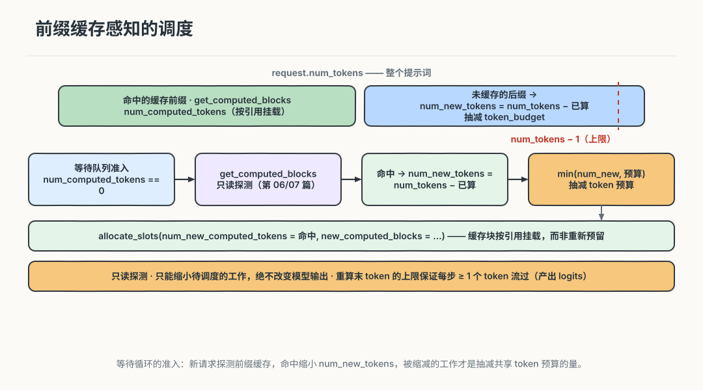</a>

<p class='figure-caption'>WAITING loop 的准入流程：初始状态的 request 探测 prefix cache，命中量会缩减 num_new_tokens；真正扣减共享 token 预算的是缩减后的工作量。</p>

**探测：无副作用查找，上限为 `num_tokens - 1`**

源码：[`vllm/v1/core/kv_cache_manager.py:218-242`](https://github.com/vllm-project/vllm/blob/6cf7b26bd4bff60bf378e1af14044280ac0d214c/vllm/v1/core/kv_cache_manager.py#L218-L242)（仅保留与调度相关的部分；查找内部实现见第 06/07 篇）

```python
        if not self.enable_caching or request.skip_reading_prefix_cache:
            return self.empty_kv_cache_blocks, 0

        # NOTE: When all tokens hit the cache, we must recompute the last token
        # to obtain logits. Thus, set max_cache_hit_length to prompt_length - 1.
        ...
        max_cache_hit_length = request.num_tokens - 1
        computed_blocks, num_new_computed_tokens = (
            self.coordinator.find_longest_cache_hit(
                request.block_hashes, max_cache_hit_length
            )
        )
        ...
        return self.create_kv_cache_blocks(computed_blocks), num_new_computed_tokens
```

— 以下只看 scheduler 使用的部分：

1. 两条短路路径都会返回 `(empty, 0)`：cache 被全局禁用，或 request 通过 `skip_reading_prefix_cache` 禁用 prefix cache（当 request 需要 prompt logprobs，或这是一个 all-pooling call 时会设置该项——在这些场景中，cache 中的 prefix 会让调用方需要重新计算的 token 被跳过）。
2. `max_cache_hit_length = request.num_tokens - 1` 是**为 logits 保留一个 token**的上限，也是这里唯一会反过来影响 scheduler token 计数的数值：即便整个 prompt 都已驻留在 cache 中，仍必须运行最后一个 token 才能生成 next-token logits；如果没有 `-1`，完全命中 cache 的 prompt 会以零个待计算 token 被接纳，最终无法输出任何内容。（注释还指出一个 block 对齐上的细节——这个上限可能导致*最后一个 block 的全部内容*都要重新计算——不过这属于 `allocate_slots` 的职责范围；见第 06 篇。）
3. `find_longest_cache_hit` 会找出已计算的最长 prefix，并返回 `(blocks, num_new_computed_tokens)` 这一对结果：block handle 与命中长度。它*如何*找出命中部分（block-hash 遍历、block 对齐）属于第 06/07 篇的内容。对调度而言，关键在于这是一次**纯探测**：它既不修改引用计数，也不触碰 free queue（引用计数稍后才会在 `allocate_slots` 内递增），因此 scheduler 可以先试探性地询问“这个 request 能复用什么？”，*然后*再决定是否正式准入。

查找是只读的，因此探测本身不会提交任何状态——prefix 命中改变的是 scheduler 还要为该 request 调度多少 token，而不是 request 本身包含哪些 token。`num_tokens - 1` 这个上限保证 request 每次获准运行时，至少有一个 token 流过模型，因此始终会生成 logits。

**叠加本地与外部命中，再用于准入**

命中可来自两处：vLLM 自身的 paged pool（即上面的本地探测），以及配置 `KVConnector` 后的外部 tier（如其他节点的 cache 或 disaggregated prefill server）。两者的命中量直接相加。

源码：[`vllm/v1/core/sched/scheduler.py:759-763`](https://github.com/vllm-project/vllm/blob/6cf7b26bd4bff60bf378e1af14044280ac0d214c/vllm/v1/core/sched/scheduler.py#L759-L763)

```python
                    # Total computed tokens (local + external).
                    num_computed_tokens = (
                        num_new_local_computed_tokens + num_external_computed_tokens
                    )
                    assert num_computed_tokens <= request.num_tokens
```

<a href='images/vllm-05-22-prefix-probe-stack.svg' target='_blank'>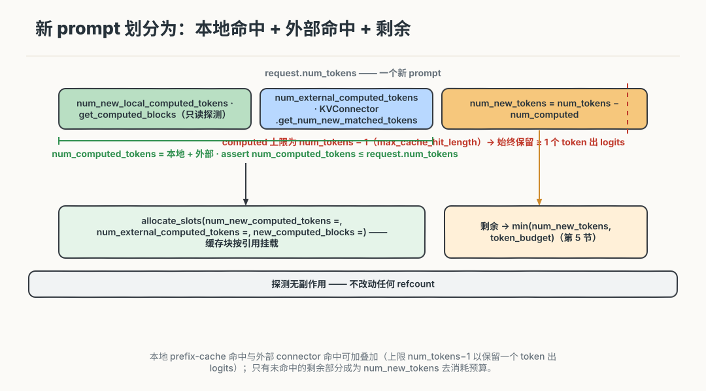</a>

<p class='figure-caption'>全新 prompt 的 token 可分为三部分：本地 prefix cache 命中、外部 connector 命中（两者相加，总量以 num_tokens−1 为上限，从而为 logits 保留一个 token），以及未命中的剩余部分；只有剩余部分会成为 num_new_tokens，并消耗 token 预算。</p>

1. `num_new_local_computed_tokens` 是 vLLM 的 prefix 命中量；`num_external_computed_tokens` 是 connector 的 `get_num_new_matched_tokens` 所报告的命中量（connector 会在本地探测结束后立即被查询，位置见 [`scheduler.py:737-757`](https://github.com/vllm-project/vllm/blob/6cf7b26bd4bff60bf378e1af14044280ac0d214c/vllm/v1/core/sched/scheduler.py#L737-L757)）。本地命中长度会告知 connector，使其只申报*超出*本地已有命中范围的 token。
2. `assert num_computed_tokens <= request.num_tokens` 是安全护栏：组合后的复用量绝不能超过 prompt 自身长度。即便 connector 计数有误，也无法让 scheduler 误以为 request 的已计算 token 数超过其总 token 数。

合并后的 `num_computed_tokens` 是 WAITING loop 中 `num_new_tokens` 的计算基准；随后，`num_new_local_computed_tokens` 和 `num_external_computed_tokens` 会直接传入 `allocate_slots`（完整的 11 参数调用见[第 4 节](#4-先处理-running再接纳-waiting)），分别对应 `num_new_computed_tokens=` 和 `num_external_computed_tokens=`，同时还会传入 `new_computed_blocks` handle。KV 准入逻辑（第 06 篇）正是通过这些信息得知，应通过引用*挂接*已驻留的 block，而不是为命中 cache 的 prefix 再次预留新的物理 block。

### 收益：一次 hit 会缩减工作量，让同一 budget 容纳更多 request

整套机制的目的，就是让某一行中的数值变小。

来源：[`vllm/v1/core/sched/scheduler.py:805-810`](https://github.com/vllm-project/vllm/blob/6cf7b26bd4bff60bf378e1af14044280ac0d214c/vllm/v1/core/sched/scheduler.py#L805-L810)

```python
                else:
                    # Number of tokens to be scheduled.
                    # We use `request.num_tokens` instead of
                    # `request.num_prompt_tokens` to consider the resumed
                    # requests, which have output tokens.
                    num_new_tokens = request.num_tokens - num_computed_tokens
```

1. `num_new_tokens`——即该 request 在当前 step 实际会从共享 `token_budget` 中消耗的 token 数——等于 `request.num_tokens` 减去所有已经完成计算的部分。一个包含 2000 个 token 的 prompt 如果命中了 1500 个 token 的 prefix，本次只需调度 500 个新 token，因此只会从 budget 中扣除 500，而不是 2000，从而为接纳其他 request 或 decode 余量留出空间。
2. 使用 `num_tokens` 而不是 `num_prompt_tokens`，可以让一个*恢复执行*的 request（即在生成中途被 preempt、现在已经携带 output token 的 request）根据重新 probe 得到的 hit，正确计算 prompt 加 output 中尚未 cache 的剩余部分。
3. 缩减后的 `num_new_tokens` 随后会进入 chunked prefill 的 slice `min(num_new_tokens, token_budget)`（[第 5 节](#5-chunked-prefill拆分长-prompt)）。Prefix caching 与 chunked prefill 可以自然组合：hit 决定剩余工作量，chunking 则限制当前 step 最多执行其中多少工作。

总体而言，prefix 复用仅通过 budget 运算就能提升 throughput。每个已接纳 request 需要调度的 token 越少，同一个 `max_num_batched_tokens` 下就能容纳更多 request；同时，hit 指向的 KV block 会通过引用共享，无须重新预留。因此，同一个 request 在 token 和 block *两个*维度上的成本都会降低。正确性没有任何变化，减少的只是当前 step 执行的冗余 compute。

### resume 为何开销很低：preemption 会保留 fingerprint

Preemption 会将 `num_computed_tokens` 重置为零，但会保留 `block_hashes`，因此 WAITING path 可以在 resume 时再次 probe。只有这些 block 仍然 resident，才会重新 attach；[第 9 节](#9-kv-压力下的-preemption)将从 eviction 一侧梳理这一 reset 过程以及有条件的再次 hit。

## 9. KV 压力下的 Preemption

token budget 并不是唯一限制：每个被调度的 token 还需要一个 KV slot。当前 request 无法获得所需空间时，`KVCacheManager.allocate_slots` 会返回 `None`，以此报告该约束。scheduler 将此视为 backpressure，并决定是 evict 某个 running request，还是停止接纳 waiting work。第 06 篇介绍了 watermark、reserved block、reference count，以及可能导致 allocation 失败的其他原因；这里重点分析 scheduler 的响应，并将 `allocate_slots` 视为一个 oracle。

oracle 的 signature 就是 scheduler 读取的 contract：

[`vllm/v1/core/kv_cache_manager.py:244-257`](https://github.com/vllm-project/vllm/blob/6cf7b26bd4bff60bf378e1af14044280ac0d214c/vllm/v1/core/kv_cache_manager.py#L244-L257)

```python
    def allocate_slots(
        self,
        request: Request,
        num_new_tokens: int,
        num_new_computed_tokens: int = 0,
        new_computed_blocks: KVCacheBlocks | None = None,
        num_lookahead_tokens: int = 0,
        num_external_computed_tokens: int = 0,
        delay_cache_blocks: bool = False,
        num_encoder_tokens: int = 0,
        full_sequence_must_fit: bool = False,
        reserved_blocks: int = 0,
        has_scheduled_reqs: bool = True,
    ) -> KVCacheBlocks | None:
```

返回类型中的 `| None`，就是 scheduler 的*策略*与 KV manager 的*机制*之间的完整接口。scheduler 不会为了做出这个决定而检查 free block 的数量；它只会请求 slot，然后根据是否成功获得 slot 进行分支。

<a href='images/vllm-05-08-preemption.svg' target='_blank'>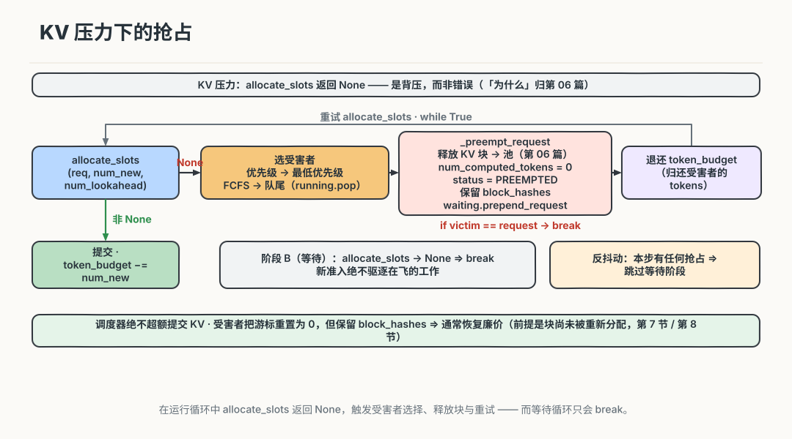</a>

<p class='figure-caption'>allocate_slots 在 RUNNING loop 中返回 None，从而触发 victim 选择、block 释放和重试。</p>

### RUNNING loop：preempt 后重试

在 `schedule()` 内部，preemption 只出现在一处：Phase A（RUNNING）的内部 allocation loop。scheduler 将 `allocate_slots` 放在 `while True` 中执行；遇到 `None` 时，它会 evict 一个 victim，然后重试。

[`vllm/v1/core/sched/scheduler.py:532-582`](https://github.com/vllm-project/vllm/blob/6cf7b26bd4bff60bf378e1af14044280ac0d214c/vllm/v1/core/sched/scheduler.py#L532-L582)

```python
            # Schedule newly needed KV blocks for the request.
            with record_function_or_nullcontext("schedule: allocate_slots"):
                while True:
                    new_blocks = self.kv_cache_manager.allocate_slots(
                        request,
                        num_new_tokens,
                        num_lookahead_tokens=self.num_lookahead_tokens,
                    )

                    if new_blocks is not None:
                        # The request can be scheduled.
                        break

                    # The request cannot be scheduled.
                    # Preempt the lowest-priority request.
                    if self.policy == SchedulingPolicy.PRIORITY:
                        preempted_req = max(
                            self.running,
                            key=lambda r: (r.priority, r.arrival_time),
                        )
                        self.running.remove(preempted_req)
                        if preempted_req in scheduled_running_reqs:
                            preempted_req_id = preempted_req.request_id
                            scheduled_running_reqs.remove(preempted_req)
                            token_budget += num_scheduled_tokens.pop(preempted_req_id)
                            req_to_new_blocks.pop(preempted_req_id)
                            scheduled_spec_decode_tokens.pop(preempted_req_id, None)
                            preempted_encoder_inputs = scheduled_encoder_inputs.pop(
                                preempted_req_id, None
                            )
                            if preempted_encoder_inputs:
                                # Restore encoder compute budget if the preempted
                                # request had encoder inputs scheduled in this step.
                                num_embeds_to_restore = sum(
                                    preempted_req.get_num_encoder_embeds(i)
                                    for i in preempted_encoder_inputs
                                )
                                encoder_compute_budget += num_embeds_to_restore
                            req_index -= 1
                    else:
                        preempted_req = self.running.pop()

                    self._preempt_request(preempted_req, scheduled_timestamp)
                    preempted_reqs.append(preempted_req)
                    if preempted_req == request:
                        # No more request to preempt. Cannot schedule this request.
                        break

            if new_blocks is None:
                # Cannot schedule this request.
                break
```

分步来看：

1. **尝试。** `allocate_slots(request, num_new_tokens, num_lookahead_tokens=self.num_lookahead_tokens)`——注意，这是一个三参数调用。RUNNING loop 不会传入 prefix-cache 或 reserved-block hint（这些是 WAITING loop 才需要考虑的内容）；它只是请求将已接纳 request 的 KV *扩展* `num_new_tokens`，并额外申请下文会介绍的 lookahead reservation。成功后执行 `break`，随后继续进入 [`scheduler.py:584-591`](https://github.com/vllm-project/vllm/blob/6cf7b26bd4bff60bf378e1af14044280ac0d214c/vllm/v1/core/sched/scheduler.py#L584-L591) 处的 commit。

2. **按 policy 选择 victim。** 在 `PRIORITY` 下，victim 是 `max(self.running, key=lambda r: (r.priority, r.arrival_time))`，即 priority *值*最高（也就是实际 priority 最低）的 request；如果值相同，则选择最晚到达的 request。在 FCFS（即 `else`）下，victim 是 `self.running.pop()`，也就是 running list 的 *tail*，它是 FIFO 顺序中最近被接纳的 request。两种 policy 都会按照各自的排序规则，evict 最不值得继续占用 memory 的 request。

3. **回滚当前 step 内的 reservation。** PRIORITY branch 还要处理一个 FCFS 不会遇到的问题：victim *可能已经在同一个 step 更早时被调度*，即它在 `self.running` 中位于当前 cursor 之前。如果是这样，它写入的每一项 ledger 记录都必须同步撤销：从 `scheduled_running_reqs` 中移除，通过 `token_budget += num_scheduled_tokens.pop(preempted_req_id)` 归还其 token（第 556 行），丢弃其 block handle 和 spec token，并将它占用的所有 encoder embedding 归还给 `encoder_compute_budget`。随后执行 `req_index -= 1`，因为 `self.running` 在 cursor 所在位置或之前缩短了。FCFS 弹出的是 tail，它始终位于 cursor 之后，因此尚未被调度，无须执行 rollback。

4. **执行 eviction。** `_preempt_request(preempted_req, ...)` 负责实际的 eviction（见下一小节），随后将 victim 记录到 `preempted_reqs` 中。

5. **终止。** 如果 `preempted_req == request`，说明正在尝试调度的 request 本身就是唯一还能 evict 的对象——即使 pool 中只放它一个也容纳不下——因此执行 `break`。外层的 `if new_blocks is None: break` 随后会终止整个 RUNNING loop；当前 step 无法再调度任何内容。

scheduler 绝不会超额 commit KV。只有 `allocate_slots` *确实分配*了所需 block，running request 才会留在 scheduled 集合中；这里不存在“乐观地假定它放得下”的处理。budget 与 ledger 也始终完全一致：`schedule()` 末尾的四个 assert（`total <= max_num_scheduled_tokens`、`token_budget >= 0`、`len(running) <= max_num_running_reqs`、scheduled ⊆ running——[`scheduler.py:1026-1037`](https://github.com/vllm-project/vllm/blob/6cf7b26bd4bff60bf378e1af14044280ac0d214c/vllm/v1/core/sched/scheduler.py#L1026-L1037)）之所以能够成立，是因为第 556 行会在将 victim 从 ledger 移除的*同一条* code path 上，把当前 step 内被 preempt request 的 token 归还给 budget。在当前 step 被 preempt 的 request 不会留下任何幽灵 reservation。

**WAITING loop 会 break——绝不 preempt**

Phase B（接纳新 request 和恢复执行的 request）调用的是同一个 arbiter，但它对 `None` 的处理恰恰相反：直接放弃，而不是 evict 任何 request。

[`vllm/v1/core/sched/scheduler.py:907-928`](https://github.com/vllm-project/vllm/blob/6cf7b26bd4bff60bf378e1af14044280ac0d214c/vllm/v1/core/sched/scheduler.py#L907-L928)

```python
                new_blocks = self.kv_cache_manager.allocate_slots(
                    request,
                    num_new_tokens,
                    num_new_computed_tokens=num_new_local_computed_tokens,
                    new_computed_blocks=new_computed_blocks,
                    num_lookahead_tokens=effective_lookahead_tokens,
                    num_external_computed_tokens=num_external_computed_tokens,
                    delay_cache_blocks=load_kv_async,
                    num_encoder_tokens=num_encoder_tokens,
                    full_sequence_must_fit=self.scheduler_reserve_full_isl,
                    reserved_blocks=reserved_blocks,
                    has_scheduled_reqs=bool(self.running),
                )

                if new_blocks is None:
                    # The request cannot be scheduled.

                    # NOTE: we need to untouch the request from the encode cache
                    # manager
                    if request.has_encoder_inputs:
                        self.encoder_cache_manager.free(request)
                    break
```

这个十一参数调用体现了 WAITING loop 更丰富的 contract（prefix-cache hit、external KV、full-sequence reservation——见[第 4 节](#4-先处理-running再接纳-waiting)和[第 8 节](#8-prefix-cache-感知调度)），但对 `None` 的处理很简单：释放本次 admission 过程中预先占用的所有 encoder-cache state，然后执行 `break`。不选择 victim，也不重试。而且，Phase B 只有在 Phase A 设置的 guard 条件满足时才会运行：

[`vllm/v1/core/sched/scheduler.py:636-637`](https://github.com/vllm-project/vllm/blob/6cf7b26bd4bff60bf378e1af14044280ac0d214c/vllm/v1/core/sched/scheduler.py#L636-L637)

```python
        # Next, schedule the WAITING requests.
        if not preempted_reqs and self._pause_state == PauseState.UNPAUSED:
```

新的 request 获准进入时，不会驱逐正在运行的 request；而 Phase A 一旦抢占任意 request，就会跳过 WAITING 阶段。释放出的 KV 仍可供被放回 waiting queue 的被抢占 request 使用，不会立刻交给新来的 request。否则，被抢占 request 刚释放的容量可能在同一步内被 Phase B 准入的 request 占走，从而形成 preempt-and-readmit 振荡。

### `_preempt_request`：eviction 后保留了什么

eviction primitive 的实现很短，每一行都在有意重置某项状态。

[`vllm/v1/core/sched/scheduler.py:1145-1167`](https://github.com/vllm-project/vllm/blob/6cf7b26bd4bff60bf378e1af14044280ac0d214c/vllm/v1/core/sched/scheduler.py#L1145-L1167)

```python
    def _preempt_request(self, request: Request, timestamp: float) -> None:
        """Preempt a request and put it back to the waiting queue.

        NOTE: The request should be popped from the running queue outside of this
        method.
        """
        assert request.status == RequestStatus.RUNNING, (
            "Only running requests can be preempted"
        )
        self._free_request_blocks(request)
        self.encoder_cache_manager.free(request)
        self._inflight_prefills.discard(request)
        request.status = RequestStatus.PREEMPTED
        request.num_computed_tokens = 0
        if request.spec_token_ids:
            request.spec_token_ids = []
        request.num_preemptions += 1
        if self.log_stats:
            request.record_event(EngineCoreEventType.PREEMPTED, timestamp)

        # Put the request back to the waiting queue.
        self.waiting.prepend_request(request)
        self.reset_preempted_req_ids.add(request.request_id)
```

<a href='images/vllm-05-23-preempt-recompute-state.svg' target='_blank'>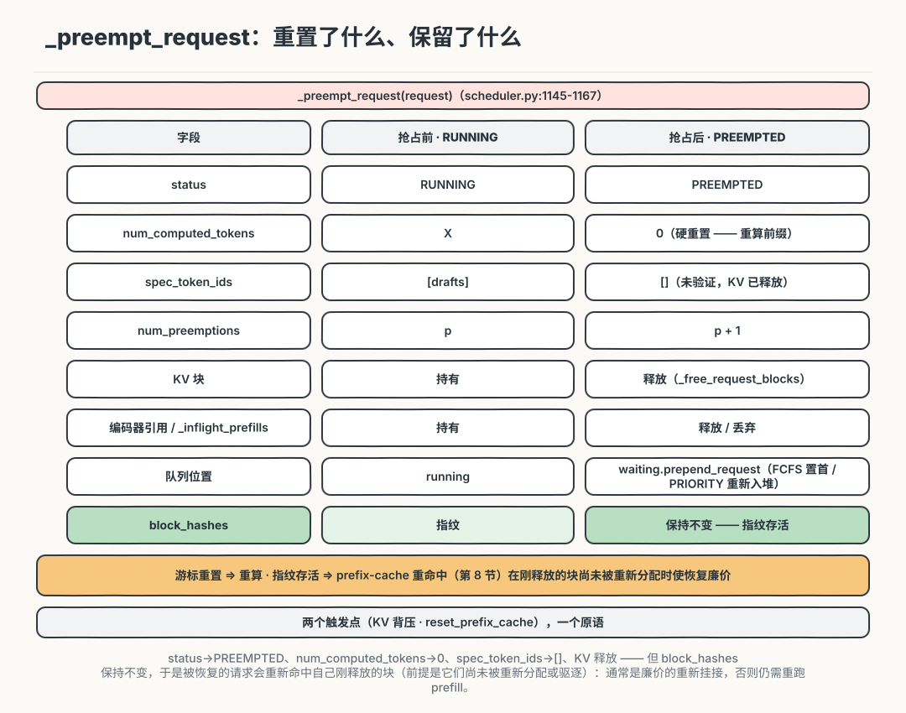</a>

<p class='figure-caption'>_preempt_request 重置了什么、又保留了什么：status→PREEMPTED，num_computed_tokens→0，spec_token_ids→[]，释放 KV block，保留 block_hashes。恢复执行时，只要这些 block 尚未被重新分配或驱逐，request 就能再次命中；否则便会重新计算 prefix。</p>

逐步来看：

- `assert ... RUNNING` — 前置条件；调用方必须已经从 `self.running` 中弹出了该 request（docstring 明确写明了这一约定）。
- `_free_request_blocks(request)` — 将被抢占 request 的 KV block 归还 pool（free-list 机制见第 06 篇）。正是这一步为触发此次抢占的 request 腾出了空间。
- `encoder_cache_manager.free(request)` 和 `_inflight_prefills.discard(request)` — 释放 encoder-cache 引用，并将该 request 从 in-flight-prefill 统计中移除。
- `status = PREEMPTED`；`num_computed_tokens = 0`：KV cursor 被*硬重置为零*。vLLM V1 的抢占采用 recompute：request 恢复执行时，会从头重新处理整个 prefix，而不是将 KV swap 到 host memory。
- `spec_token_ids = []` — 丢弃所有 draft 出的 speculative token（它们从未经过验证，对应的 KV 也已消失）。
- `num_preemptions += 1` — 这样，`get_computed_blocks` 中记录的 prefix-cache 统计就能将该 request 标记为“至少重新计算过一次”。
- `waiting.prepend_request(request)`：被抢占 request 被放到 waiting queue 的*队首*。在 FCFS 下，`prepend_request` 是 `appendleft`（deque 的队首）；在 PRIORITY 下，它会退化为 `add_request`，heap 会按 key 重新排序（[第 7 节](#7-request-queuefcfs-与-priority)）。无论哪种情况，其 id 都会记录在 `reset_preempted_req_ids` 中，model runner 据此将它从持久化 batch 中移除。

**低成本恢复。** 注意，`_preempt_request` 并不会修改 `block_hashes`。request 的 prompt 和已生成 token 所对应的内容 fingerprint 会完整保留下来。相同 token 的 hash 对应相同的 block 标识。因此，当被抢占的 request 经 Phase B 重新调度时，其 prefix-cache 探测（`get_computed_blocks`，[第 8 节](#8-prefix-cache-感知调度)）会再次命中它自己刚释放的 block——前提是这些 block 尚未被其他租户覆盖。`num_computed_tokens = 0` 表示“我必须重新计算自己的 prefix”；保留下来的 `block_hashes` 则表示“但结果可能已经在 cache 中”。因此，基于 recompute 的抢占在常见情况下成本很低，并不需要仅凭 cursor 重置所暗示的完整 re-prefill。block hash 的保留与再次命中机制详见第 06 篇；这里的关键在于，scheduler 只会重置 cursor，绝不会重置 fingerprint。

**lookahead 预留**

RUNNING 调用传入了 `num_lookahead_tokens=self.num_lookahead_tokens`。它是在构造时根据 speculative-decoding method 确定的常量：

[`vllm/v1/core/sched/scheduler.py:234-257`](https://github.com/vllm-project/vllm/blob/6cf7b26bd4bff60bf378e1af14044280ac0d214c/vllm/v1/core/sched/scheduler.py#L234-L257)

```python
        self.num_lookahead_tokens = 0
        self.dynamic_sd_lookup: list[int] | None = None
        if speculative_config is not None:
            ...
            if speculative_config.use_eagle():
                self.use_eagle = True
                self.num_lookahead_tokens = self.num_spec_tokens
            if speculative_config.uses_draft_model():
                self.num_lookahead_tokens = self.num_spec_tokens
            ...
```

<a href='images/vllm-05-24-lookahead-reservation.svg' target='_blank'>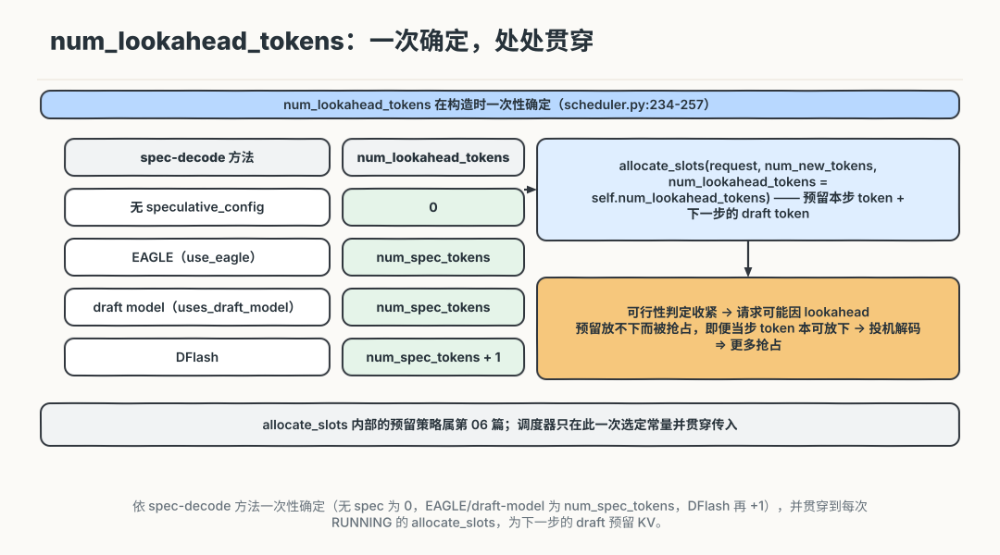</a>

<p class='figure-caption'>num_lookahead_tokens 在构造阶段根据 spec-decode method 一次性确定（不启用 spec 时为 0，EAGLE/draft-model 时为 num_spec_tokens，DFlash 时再 +1），之后传入每次 RUNNING 的 allocate_slots 调用，为下一 step 的 draft token 预留 KV——这正是 speculative decoding 会加剧抢占压力的原因。</p>

不使用 speculative decoding 时，该值为 `0`；使用 EAGLE 或 draft model 时为 `num_spec_tokens`（DFlash 则需要 `num_spec_tokens + 1`——上文在 [`scheduler.py:248-252`](https://github.com/vllm-project/vllm/blob/6cf7b26bd4bff60bf378e1af14044280ac0d214c/vllm/v1/core/sched/scheduler.py#L248-L252) 处省略了这一分支）。将它传给 `allocate_slots`，意味着要求 KV manager 不仅为*当前* step 调度的 token 预留 slot，还要为下一 step 将写入的 draft token 预留 slot。这会收紧内存可行性检查：request 可能仅仅因为它的 *lookahead* 预留无法容纳而被抢占，即便其当前所需的 token 本可容纳；这正是 speculative decoding 会加剧抢占压力的原因。`allocate_slots` 内部的预留策略见第 06 篇；scheduler 在这里所做的，是一次性选定这个常量，并将其传入每次 RUNNING allocation。

### 强制抢占：另一个调用方

除 backpressure 场景外，`_preempt_request` 还有一个调用方：`reset_prefix_cache(reset_running_requests=True)`。它必须排空所有正在运行的 request，才能将 KV prefix cache 清零。

[`vllm/v1/core/sched/scheduler.py:2222-2232`](https://github.com/vllm-project/vllm/blob/6cf7b26bd4bff60bf378e1af14044280ac0d214c/vllm/v1/core/sched/scheduler.py#L2222-L2232)

```python
            while self.running:
                request = self.running.pop()
                self._preempt_request(request, timestamp)
                # For async scheduling, any output frames already in flight at
                # preemption time are now stale and must be discarded when they
                # return. num_output_placeholders is exactly that count: 0 if
                # the engine has drained (e.g. pause_generation(keep) waited
                # for idle), 1 for vanilla async mid-step, or 1 + spec/PP frames
                # otherwise.
                request.async_tokens_to_discard = request.num_output_placeholders
                request.num_output_placeholders = 0
```

排空过程从队尾开始执行 `running.pop()`，因此 request 会重新进入 waiting queue，之后按 FIFO 顺序恢复执行（每次 `prepend_request` 都将 request 放到队首，从而把 pop 顺序再次反转为到达顺序）。它还会通过 `async_tokens_to_discard` 将所有 in-flight async output frame 标记为 stale。这样，抢占前已经 dispatch 的 decode 结果会被丢弃，而不会在返回时被错误归属。而且该过程并非 best-effort：如果某个正在运行的 request 无法释放到 ref-count 为零——例如 remote-KV transfer 仍在进行——那么后续的 `reset_prefix_cache()` 会返回 false，调用方将抛出异常（[`scheduler.py:2241-2247`](https://github.com/vllm-project/vllm/blob/6cf7b26bd4bff60bf378e1af14044280ac0d214c/vllm/v1/core/sched/scheduler.py#L2241-L2247)），而不是悄悄留下未清理干净的 cache。

无论抢占由 KV backpressure 触发，还是由显式 cache reset 触发，都会经过同一个 primitive，因此具备相同的保证——释放 block、重置 cursor、保留 fingerprint，并按可恢复执行的顺序将被抢占 request 重新入队。抢占机制只有一套、触发源有两个，而不是两条可能逐渐分化的 code path。

## 10. SchedulerOutput：Executor 会收到什么

`SchedulerOutput` 向 executor 传递每个 request 的 token 数量、已分配的 KV block、抢占记录以及 encoder 工作项。每次调用 `schedule()` 都会生成一个实例，用于描述一次 forward pass（第 04 篇）。它并非 worker state 的完整 dump：新 request 携带 `NewRequestData`，已有 request 则携带 `CachedRequestData` diff，并将其应用到持久化的 `InputBatch`（第 09 篇）。executor 会将该对象与 worker 侧保留的 state 配合使用。

busy loop 所调用的 abstract method 声明了这份契约。

[`vllm/v1/core/sched/interface.py:51-69`](https://github.com/vllm-project/vllm/blob/6cf7b26bd4bff60bf378e1af14044280ac0d214c/vllm/v1/core/sched/interface.py#L51-L69)（iteration 级粒度和 `num_tokens` 的数量级见 [第 1 节](#1-scheduler-决定什么每个步骤一份-token-预算)；这里相关的是 payload 条款及其配套的 "useful data" 条款）：

```python
    @abstractmethod
    def schedule(self, throttle_prefills: bool = False) -> "SchedulerOutput":
        """Schedule the requests to process in this scheduling step.
        ...
        Essentially, the scheduler produces a dictionary of {req_id: num_tokens}
        that specifies how many tokens to process for each request in this
        scheduling step. For example, num_tokens can be as large as the number
        of prompt tokens for new requests, or it can be 1 for the requests that
        are auto-regressively generating new tokens one by one. Otherwise, it
        can be somewhere in between in case of chunked prefills, prefix caching,
        speculative decoding, etc.

        Additionally, the scheduler also returns useful data about each request
        or the batch as a whole. The model runner will use this information in
        preparing inputs to the model.
        ...
        """
```

map `{req_id: num_tokens}` 由 `num_scheduled_tokens` 具体承载，是这里的核心 payload。其余字段都是 runner 所需的辅助数据，用于把这张 map 转换成展平的 GPU tensor。与之配套的 `update_from_output(scheduler_output, model_runner_output)` method（[`interface.py:89-94`](https://github.com/vllm-project/vllm/blob/6cf7b26bd4bff60bf378e1af14044280ac0d214c/vllm/v1/core/sched/interface.py#L89-L94)）会将 runner 的结果回写到 scheduler state 中。

<a href='images/vllm-05-09-scheduler-output.svg' target='_blank'>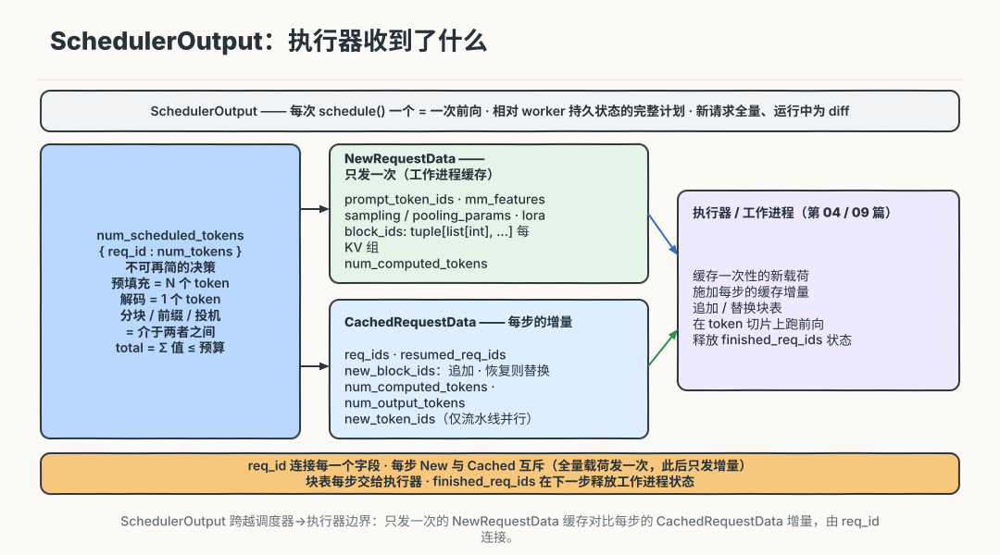</a>

<p class='figure-caption'>SchedulerOutput 穿过 scheduler→executor 边界时：仅发送一次的 NewRequestData cache 与每步发送的 CachedRequestData diff 通过 req_id 关联起来。</p>

### 顶层 struct

[`vllm/v1/core/sched/output.py:181-215`](https://github.com/vllm-project/vllm/blob/6cf7b26bd4bff60bf378e1af14044280ac0d214c/vllm/v1/core/sched/output.py#L181-L215)：

```python
class SchedulerOutput:
    # list of the requests that are scheduled for the first time.
    # We cache the request's data in each worker process, so that we don't
    # need to re-send it every scheduling step.
    scheduled_new_reqs: list[NewRequestData]
    # list of the requests that have been scheduled before.
    # Since the request's data is already cached in the worker processes,
    # we only send the diff to minimize the communication cost.
    scheduled_cached_reqs: CachedRequestData

    # req_id -> num_scheduled_tokens
    # Number of tokens scheduled for each request.
    num_scheduled_tokens: dict[str, int]
    # Total number of tokens scheduled for all requests.
    # Equal to sum(num_scheduled_tokens.values())
    total_num_scheduled_tokens: int
    # req_id -> spec_token_ids
    # If a request does not have any spec decode tokens, it will not be
    # included in the dictionary.
    scheduled_spec_decode_tokens: dict[str, list[int]]
    # req_id -> encoder input indices that need processing.
    # E.g., if a request has [0, 1], it could mean the vision encoder needs
    # to process that the request's 0-th and 1-th images in the current step.
    scheduled_encoder_inputs: dict[str, list[int]]
    # Number of common prefix blocks for all requests in each KV cache group.
    # This can be used for cascade attention.
    num_common_prefix_blocks: list[int]

    # Request IDs that are finished in between the previous and the current
    # steps. This is used to notify the workers about the finished requests
    # so that they can free the cached states for those requests.
    finished_req_ids: set[str]
    # list of mm_hash strings associated with the encoder outputs to be
    # freed from the encoder cache.
    free_encoder_mm_hashes: list[str]
```

可以把这个布局看成三层。第一层是 request payload 层，即下文详述的 `scheduled_new_reqs` / `scheduled_cached_reqs` 划分。第二层是调度决策层，包括 `num_scheduled_tokens`（即 docstring 中的 map）、其冗余汇总值 `total_num_scheduled_tokens`，以及各阶段专用的附加数据 `scheduled_spec_decode_tokens`（每个 request 的 draft；第 12 篇）和 `scheduled_encoder_inputs`（本 step 需要运行哪些 multimodal encoder input）。第三层是 batch 与生命周期层，包括 `num_common_prefix_blocks`（每个 KV-cache group 一项，供 cascade attention 使用）、`finished_req_ids`（释放相应的 cached state）和 `free_encoder_mm_hashes`（驱逐 encoder-cache entry）。

struct 尾部全部是带 default 的 optional 字段（[`output.py:217-245`](https://github.com/vllm-project/vllm/blob/6cf7b26bd4bff60bf378e1af14044280ac0d214c/vllm/v1/core/sched/output.py#L217-L245)），因此 constructor 可以省略它们：

```python
    preempted_req_ids: set[str] | None = None
    ...
    # Block IDs freshly allocated from the pool during this scheduling step.
    # The worker zeros the corresponding GPU memory before the blocks are used,
    # preventing stale NaN/data from corrupting attention or SSM computation.
    new_block_ids_to_zero: list[int] | None = None

    # Dynamic speculative decoding: optimal K chosen by scheduler.
    # Number of spec tokens to schedule for the next step.
    num_spec_tokens_to_schedule: int = 0
```

这里还包括 `has_structured_output_requests` / `pending_structured_output_tokens`（用于 grammar masking 的 async scheduling 标志）、`num_invalid_spec_tokens`（acceptance rate 统计），以及两个不透明的 connector blob `kv_connector_metadata` / `ec_connector_metadata`（disaggregated KV / encoder transfer plan）。`new_block_ids_to_zero` 是一个关乎正确性的字段，而非优化项：刚由 KV pool 分配的 block（第 06 篇）中可能残留 stale data。如果 worker 不先将其清零，attention/SSM kernel 就会读到垃圾数据。

**未提供即表示 default。** `scheduled_spec_decode_tokens` 会省略没有 draft 的 request；没有新内容时，`new_block_ids_to_zero` 为 `None`。（`preempted_req_ids` 始终会以 set 形式发出——[`scheduler.py:1105`](https://github.com/vllm-project/vllm/blob/6cf7b26bd4bff60bf378e1af14044280ac0d214c/vllm/v1/core/sched/scheduler.py#L1105)——但根据其 [`output.py:217-219`](https://github.com/vllm-project/vllm/blob/6cf7b26bd4bff60bf378e1af14044280ac0d214c/vllm/v1/core/sched/output.py#L217-L219) comment，只有 v2 runner 会*消费*它；它的 dataclass *default* 是 `None`，但实际生成的 `SchedulerOutput` 一定携带一个 set。）不含 speculative token 的 request 会被直接省略，而不是用显式的 0 表示，从而让 per-step message 只描述发生变化的 state。

### `NewRequestData` — 完整 payload，仅发送一次

[`vllm/v1/core/sched/output.py:30-44`](https://github.com/vllm-project/vllm/blob/6cf7b26bd4bff60bf378e1af14044280ac0d214c/vllm/v1/core/sched/output.py#L30-L44)：

```python
@dataclass
class NewRequestData:
    req_id: str
    prompt_token_ids: list[int] | None
    mm_features: list[MultiModalFeatureSpec]
    sampling_params: SamplingParams | None
    pooling_params: PoolingParams | None
    block_ids: tuple[list[int], ...]
    num_computed_tokens: int
    lora_request: LoRARequest | None
    prompt_embeds: "torch.Tensor | None" = None
    prompt_is_token_ids: list[bool] | None = None

    # Only used for v2 model runner.
    prefill_token_ids: list[int] | None = None
```

这是 request 的完整静态描述：prompt（可以是 `prompt_token_ids` *或* `prompt_embeds`，由 `prompt_is_token_ids` mask 区分）、sampling params *或* pooling params（二者之一为 `None`——分别对应 generation 与 embedding）、LoRA adapter，以及 KV block table。它只会在 request 首次被调度的 step 发出，之后便缓存在每个 worker process 中。这样设计是因为 prompt token ids 和 mm features 体积大且不可变；如果每个 step 都重新发送，通信量将从 O(batch delta) 膨胀到 O(total context)。

核心字段是 `block_ids: tuple[list[int], ...]`。它是一个 tuple，每个 KV-cache group 对应一个 `list[int]`；内部的每个 list 都按顺序记录该 request 在相应 group 中使用的物理 block id。采用 tuple-of-lists 而非扁平 list，正是为了让一个 request 可以同时存在于多个 KV-cache group 中，并分别维护独立的 block table，例如 full-attention layer 和 sliding-window layer。`num_computed_tokens` 是 runner 计算 window 范围所需的另一半信息：结合 `num_scheduled_tokens[req_id]`，runner 就能确定本 step 要运行的精确 token slice `[num_computed_tokens, num_computed_tokens + num_scheduled_tokens[req_id])`。prefix-cache hit（第 07 篇）正是通过这个 slice 体现出来的：cache hit 会抬高起始 `num_computed_tokens`，runner 因而会自然跳过已缓存的 prefix。

**`CachedRequestData` — 每步 diff**

[`vllm/v1/core/sched/output.py:111-126`](https://github.com/vllm-project/vllm/blob/6cf7b26bd4bff60bf378e1af14044280ac0d214c/vllm/v1/core/sched/output.py#L111-L126)：

```python
@dataclass
class CachedRequestData:
    req_ids: list[str]
    # For request ids not in resumed_req_ids, new_block_ids will be appended to
    # the request's block IDs. For those in the set, new_block_ids will be used as the
    # request's block IDs instead of appending to the existing block IDs.
    resumed_req_ids: set[str]
    # NOTE(woosuk): new_token_ids is only used for pipeline parallelism.
    # When PP is not used, new_token_ids will be empty.
    new_token_ids: list[list[int]]
    # MRV1-only: For requests not scheduled in the last step, propagate the token ids
    # to the connector. Won't contain requests scheduled in the prior step.
    all_token_ids: dict[str, list[int]]
    new_block_ids: list[tuple[list[int], ...] | None]
    num_computed_tokens: list[int]
    num_output_tokens: list[int]
```

<a href='images/vllm-05-25-cached-soa.svg' target='_blank'>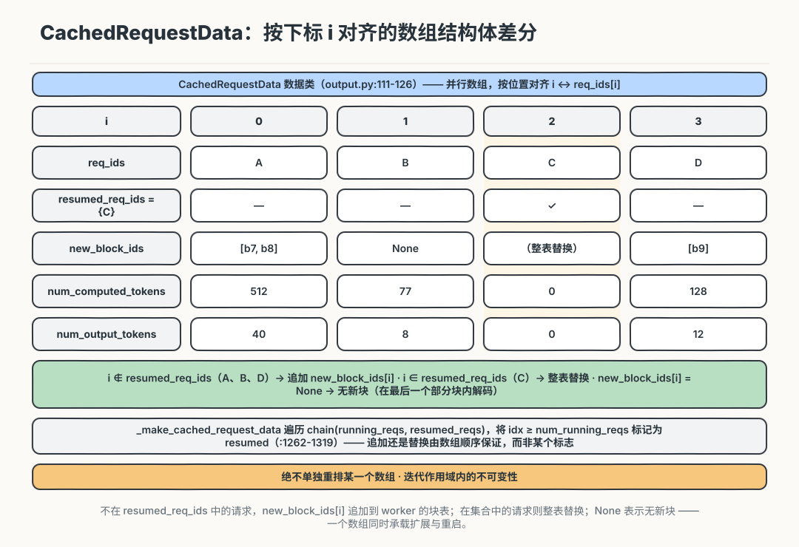</a>

<p class='figure-caption'>CachedRequestData 是一个按位置 i↔req_ids[i] 建立索引的 struct-of-arrays diff：对于不在 resumed_req_ids 中的 req，new_block_ids[i] 会追加到 worker 的 table；对于 set 中的 req，则会整体替换 table；None 表示没有新 block——同一个 array 同时承载 extend 和 restart 两种语义。</p>

这是一个面向所有已缓存 request 的 struct-of-arrays diff。它严格依赖位置对齐：在所有 parallel list 中，索引 `i` 都指向 `req_ids[i]`，consumer 绝不能只重排其中一项而不同步重排其他项。

这里最关键的规则，是 field comment 明确指出的 `new_block_ids` / `resumed_req_ids` 交互方式。对于 `req_id`，如果它*不在* `resumed_req_ids` 中，`new_block_ids[i]` 就会被*追加*到 worker 现有的 block table——正常运行中的 request 会保留原有 block，只继续扩展。对于 `req_id`，如果它*位于* `resumed_req_ids` 中，`new_block_ids[i]` 就会*整体替换*原有 table——resumed request 此前曾被抢占，其 block 已被释放（第 06 篇），如今会携带一张全新的完整 table 重新进入。`None` entry 表示“本 step 没有新 block”（即某次 decode 仍位于最后一个尚未填满的 block 内）。正是这一次 set membership 判断，让同一个 array 无需第二种 message type，就能同时承载“extend”和“restart”两种情况。

有两个字段仅在特定条件下使用：`new_token_ids` 只会在 pipeline parallelism 下填充（scheduler 负责在无法直接通信的 PP stage 之间转运 sampled token；否则为空），`all_token_ids` 则是 MRV1 专用的 connector payload。helper `is_context_phase(req_id)` 返回 `num_output_tokens == 0`，即该 request 仍处于 prefill 阶段。其底层的 `cached_property`（[`output.py:153-161`](https://github.com/vllm-project/vllm/blob/6cf7b26bd4bff60bf378e1af14044280ac0d214c/vllm/v1/core/sched/output.py#L153-L161)）之所以可靠，是因为正如它自己的 docstring 所述，每个 `CachedRequestData` 都会在每次 iteration 中重新构建，使用期间绝不会被修改。这正是“单次 iteration 内不可变”这一 invariant 的具体体现。

### struct 的组装方式 — producer 侧实现依据

`schedule()` 在函数末尾一次性构建整个对象。new-request list 与 cached diff 在 [`scheduler.py:1049-1076`](https://github.com/vllm-project/vllm/blob/6cf7b26bd4bff60bf378e1af14044280ac0d214c/vllm/v1/core/sched/scheduler.py#L1049-L1076) 处分开，随后在 [`scheduler.py:1097-1114`](https://github.com/vllm-project/vllm/blob/6cf7b26bd4bff60bf378e1af14044280ac0d214c/vllm/v1/core/sched/scheduler.py#L1097-L1114) 构造对象：

```python
        scheduler_output = SchedulerOutput(
            scheduled_new_reqs=new_reqs_data,
            scheduled_cached_reqs=cached_reqs_data,
            num_scheduled_tokens=num_scheduled_tokens,
            total_num_scheduled_tokens=total_num_scheduled_tokens,
            scheduled_spec_decode_tokens=scheduled_spec_decode_tokens,
            scheduled_encoder_inputs=scheduled_encoder_inputs,
            num_common_prefix_blocks=num_common_prefix_blocks,
            preempted_req_ids=self.reset_preempted_req_ids,
            # finished_req_ids is an existing state in the scheduler,
            # instead of being newly scheduled in this step.
            # It contains the request IDs that are finished in between
            # the previous and the current steps.
            finished_req_ids=self.finished_req_ids,
            free_encoder_mm_hashes=self.encoder_cache_manager.get_freed_mm_hashes(),
            new_block_ids_to_zero=new_block_ids_to_zero,
            num_spec_tokens_to_schedule=num_spec_tokens_to_schedule,
        )
```

需要注意，`finished_req_ids` 是沿用的 scheduler state，而不是本 step 计算出的结果。它记录的是在上一个 step 与当前 step 之间完成的 request，因此 worker 会在紧接着的下一次 forward pass 中清理这些 request 对应的 cached request/batch state（它们的 KV block 在结束时就已由 scheduler 归还给 pool，[第 7 节](#7-request-queuefcfs-与-priority)）。connector metadata 是在构造*之后*才附加的（[`scheduler.py:1120-1129`](https://github.com/vllm-project/vllm/blob/6cf7b26bd4bff60bf378e1af14044280ac0d214c/vllm/v1/core/sched/scheduler.py#L1120-L1129)），因为构建 KV/EC transfer plan 时需要读取这个完整对象。

cached diff 来自 `_make_cached_request_data`（[`scheduler.py:1262-1319`](https://github.com/vllm-project/vllm/blob/6cf7b26bd4bff60bf378e1af14044280ac0d214c/vllm/v1/core/sched/scheduler.py#L1262-L1319)）。它将 running request 和 resumed request 串成一条 chain 统一迭代，并将尾段标记为 resumed：

```python
        num_running_reqs = len(running_reqs)
        for idx, req in enumerate(itertools.chain(running_reqs, resumed_reqs)):
            ...
            if idx >= num_running_reqs:
                resumed_req_ids.add(req_id)
            ...
            new_block_ids.append(
                req_to_new_blocks[req_id].get_block_ids(allow_none=True)
            )
```

由于 running request 在前、resumed request 在后，`idx >= num_running_reqs` 恰好就是“该 entry 替换其 table”的判定条件，而 `allow_none=True` 则会为“没有新 block”生成 `None` sentinel。因此，consumer 所依赖的 append-vs-replace 语义由 array 顺序在结构上保证，而不是依赖任何需要 runner 信任的 per-request flag。

在构造对象之前，`schedule()` 会 assert 保证其结构合法的不变量——也就是[第 2 节](#2-schedule主循环)完整推导出的四条不变量（[`scheduler.py:1027-1037`](https://github.com/vllm-project/vllm/blob/6cf7b26bd4bff60bf378e1af14044280ac0d214c/vllm/v1/core/sched/scheduler.py#L1027-L1037)）：

```python
        total_num_scheduled_tokens = sum(num_scheduled_tokens.values())
        assert total_num_scheduled_tokens <= self.max_num_scheduled_tokens

        assert token_budget >= 0
        assert len(self.running) <= self.max_num_running_reqs
        ...
        assert len(scheduled_new_reqs) + len(scheduled_resumed_reqs) + len(
            scheduled_running_reqs
        ) <= len(self.running)
```

这些不变量固定了 executor 后续会直接信任的数值：`total_num_scheduled_tokens` 既等于 map 中各值之和，*同时* 不超过 token 预算（[第 2 节](#2-schedule主循环)/[第 3 节](#3-token-预算max_num_scheduled_tokens)）；scheduled request 的数量也绝不会超过 running queue——scheduler 只能调度 `running` 的子集，绝不可能调度其超集。

### executor 如何使用它

消费端的完整逻辑属于 model-runner 文章（第 09 篇），但几处关键的读取逻辑足以确认这份 contract 的结构。runner 直接读取 `total_num_scheduled_tokens` 并 assert 它为正值，然后使用 token map 展开 per-request index 轴（[`gpu_model_runner.py:1924-1925`](https://github.com/vllm-project/vllm/blob/6cf7b26bd4bff60bf378e1af14044280ac0d214c/vllm/v1/worker/gpu_model_runner.py#L1924-L1925)，`:1935`）：

```python
        total_num_scheduled_tokens = scheduler_output.total_num_scheduled_tokens
        assert total_num_scheduled_tokens > 0
        ...
        req_indices = np.repeat(self.arange_np[:num_reqs], num_scheduled_tokens)
```

runner 采用的 batch 顺序，就是 `num_scheduled_tokens.keys()` 的 *dict insertion order*（[`gpu_model_runner.py:1190`](https://github.com/vllm-project/vllm/blob/6cf7b26bd4bff60bf378e1af14044280ac0d214c/vllm/v1/worker/gpu_model_runner.py#L1190)），也就是 scheduler 提交 request 的顺序：先 running，后 waiting。它根据 `resumed_req_ids` 选择对 block table 执行 append 还是 replace（`:1192`），遍历 `scheduled_new_reqs` 来初始化持久化 request cache（`:1218`），消费 `finished_req_ids` 以释放 state（`:1161`、`:1173`），并在设置 `new_block_ids_to_zero` 时将新 block 清零（`:1178-1179`）。structured-output mask 则通过 `get_grammar_bitmask` 返回的 `GrammarOutput` 单独传入（[`output.py:262-267`](https://github.com/vllm-project/vllm/blob/6cf7b26bd4bff60bf378e1af14044280ac0d214c/vllm/v1/core/sched/output.py#L262-L267)）；其中各 bitmask row 与 `structured_output_request_ids` 按 index 对齐，并由两个 `*_structured_output_*` flag 控制。

## 11. Encoder Input 与 Multimodal Scheduling

Multimodal request 在 `token_budget` 之外还引入两项预算：encoder compute 和 encoder output storage。在消费 decoder placeholder token 之前，vision 或 audio encoder 必须先生成 embeddings，并将其保留到最后一个 decoder 读取方完成读取。因此，`_try_schedule_encoder_inputs` 会对每个 encoder item 做全有或全无检查；如果某个 item 放不下，它可能会在该 item 之前缩短 decoder chunk，并将 commit 推迟到 KV allocation 成功之后。Preemption 和 step 后 cleanup 也会更新这两项预算。

### 两项在构造时固定的预算

每个 step 的 token 预算仅由 `max_num_scheduled_tokens` 初始化一次（[第 3 节](#3-token-预算max_num_scheduled_tokens)）。encoder 预算则在 `__init__` 处一次性设定，并拆分为 *compute*（本 step 最多可以生成多少 encoder embeddings）和 *storage*（encoder cache 总共可以持有多少 embeddings）。

[`vllm/v1/core/sched/scheduler.py:221-229`](https://github.com/vllm-project/vllm/blob/6cf7b26bd4bff60bf378e1af14044280ac0d214c/vllm/v1/core/sched/scheduler.py#L221-L229)

```python
        self.max_num_encoder_input_tokens = (
            mm_budget.encoder_compute_budget if mm_budget else 0
        )
        encoder_cache_size = mm_budget.encoder_cache_size if mm_budget else 0
        self.encoder_cache_manager = (
            EncoderDecoderCacheManager(cache_size=encoder_cache_size)
            if self.is_encoder_decoder
            else EncoderCacheManager(cache_size=encoder_cache_size)
        )
```

对于 text-only model，`mm_budget` 为 `None`，因此会得到 `max_num_encoder_input_tokens = 0` 和 `cache_size = 0`：encoder 机制虽然存在，但不会起作用。对于 multimodal model，这两个数都取自 `compute_mm_encoder_budget`，且二者的下限都会设为最大的单个 item，确保一张图像不会因结构性限制而永远无法调度：

[`vllm/v1/core/encoder_cache_manager.py:309-314`](https://github.com/vllm-project/vllm/blob/6cf7b26bd4bff60bf378e1af14044280ac0d214c/vllm/v1/core/encoder_cache_manager.py#L309-L314)

```python
    encoder_compute_budget = max(
        scheduler_config.max_num_encoder_input_tokens, max_tokens_per_mm_item
    )
    encoder_cache_size = max(
        scheduler_config.encoder_cache_size, max_tokens_per_mm_item
    )
```

compute 预算是一个 *per-step* 量：与 token 预算一样，每次进入 `schedule()` 顶部时，它都会重新初始化到一个 local variable 中——`encoder_compute_budget = self.max_num_encoder_input_tokens`（[`scheduler.py:423`](https://github.com/vllm-project/vllm/blob/6cf7b26bd4bff60bf378e1af14044280ac0d214c/vllm/v1/core/sched/scheduler.py#L423)，[第 2 节](#2-schedule主循环)）——并随着 item 被调度而逐步扣减。cache 容量则属于 `EncoderCacheManager` 内部的*持久化* state；它会跨 step 保留，因此已完成计算的图像可以直接复用，无需重新计算。manager 的 docstring 明确指出了一个容易忽略的细节（[`encoder_cache_manager.py:41-45`](https://github.com/vllm-project/vllm/blob/6cf7b26bd4bff60bf378e1af14044280ac0d214c/vllm/v1/core/encoder_cache_manager.py#L41-L45)）：这两项预算都以 encoder *embeddings* 为计量单位，而不是以占据 decoder sequence 位置的 placeholder token 计数。token 预算与 encoder 预算衡量的是不同对象，这也正是它们无法合并的原因。

**Planner：`_try_schedule_encoder_inputs`**

Encoder scheduling 被抽取为一个 pure planner，并分别由 RUNNING sizing path（[`scheduler.py:495-507`](https://github.com/vllm-project/vllm/blob/6cf7b26bd4bff60bf378e1af14044280ac0d214c/vllm/v1/core/sched/scheduler.py#L495-L507)）和 WAITING sizing path（[`scheduler.py:848-860`](https://github.com/vllm-project/vllm/blob/6cf7b26bd4bff60bf378e1af14044280ac0d214c/vllm/v1/core/sched/scheduler.py#L848-L860)）调用。调用时机紧接在 `num_new_tokens` 被限制到 token 预算以内之后、但位于 `allocate_slots` 之前。它返回 `(encoder_inputs_to_schedule, num_new_tokens, encoder_compute_budget, external_load_encoder_input)`——注意，它可能会*缩小* `num_new_tokens`。它的职责（[`scheduler.py:1329-1344`](https://github.com/vllm-project/vllm/blob/6cf7b26bd4bff60bf378e1af14044280ac0d214c/vllm/v1/core/sched/scheduler.py#L1329-L1344)）是找出与 decoder window `[num_computed_tokens, num_computed_tokens + num_new_tokens)` 重叠的 encoder item；对于任何无法接纳的 item，则回退 decoder window，使本 step 恰好停在该 item 之前。

window 根据 placeholder 位置选取，并通过 EAGLE shift 扩宽，避免 spec drafter 的 +1 lookahead 读取落到尚未调度的图像上：

[`vllm/v1/core/sched/scheduler.py:1363-1367`](https://github.com/vllm-project/vllm/blob/6cf7b26bd4bff60bf378e1af14044280ac0d214c/vllm/v1/core/sched/scheduler.py#L1363-L1367)

```python
        lo, hi = get_mm_features_in_window(
            mm_features,
            start=num_computed_tokens,
            end=num_computed_tokens + num_new_tokens + shift_computed_tokens,
        )
```

在两个调用点，`shift_computed_tokens` 都是 `1 if self.use_eagle else 0`（[`scheduler.py:506`](https://github.com/vllm-project/vllm/blob/6cf7b26bd4bff60bf378e1af14044280ac0d214c/vllm/v1/core/sched/scheduler.py#L506)、[`scheduler.py:859`](https://github.com/vllm-project/vllm/blob/6cf7b26bd4bff60bf378e1af14044280ac0d214c/vllm/v1/core/sched/scheduler.py#L859)）。loop 内，如果 item 已在本 step 调度，或已存在于 encoder cache，便可以零开销跳过（`check_and_update_cache`，[`scheduler.py:1398-1406`](https://github.com/vllm-project/vllm/blob/6cf7b26bd4bff60bf378e1af14044280ac0d214c/vllm/v1/core/sched/scheduler.py#L1398-L1406)）——cache hit 是[第 8 节](#8-prefix-cache-感知调度)中 prefix-cache hit 的 Multimodal 对应形式：它无需触及任一预算即可省去这部分工作。关键分支处理的是 item *不在* cache 中且*无法*放入的情况。

### 全有或全无，以及 decoder-chunk clamp

[`vllm/v1/core/sched/scheduler.py:1408-1443`](https://github.com/vllm-project/vllm/blob/6cf7b26bd4bff60bf378e1af14044280ac0d214c/vllm/v1/core/sched/scheduler.py#L1408-L1443)

```python
            # If no encoder input chunking is allowed, we do not want to
            # partially schedule a multimodal item. If the scheduled range would
            # only cover part of the mm input, roll back to before the mm item.
            if (
                self.scheduler_config.disable_chunked_mm_input
                and num_computed_tokens < start_pos
                and (num_computed_tokens + num_new_tokens)
                < (start_pos + num_encoder_tokens)
            ):
                # Account for EAGLE shift when rolling back to avoid
                # encoder cache miss. This ensures the scheduled range
                # stops before start_pos even with the shift.
                num_new_tokens = max(
                    0, start_pos - (num_computed_tokens + shift_computed_tokens)
                )
                break
            if not self.encoder_cache_manager.can_allocate(
                request, i, encoder_compute_budget, num_embeds_to_schedule
            ):
                # The encoder cache is full or the encoder budget is exhausted.
                # NOTE(woosuk): We assume that the encoder input tokens should
                # be processed altogether, as the encoder usually uses
                # bidirectional attention.
                if num_computed_tokens + shift_computed_tokens < start_pos:
                    # We only schedule the decoder tokens just before the
                    # encoder input.
                    num_new_tokens = start_pos - (
                        num_computed_tokens + shift_computed_tokens
                    )
                else:
                    # Because of prefix caching, num_computed_tokens is greater
                    # than start_pos even though its encoder input is not
                    # available. In this case, we can't schedule any token for
                    # the request in this step.
                    num_new_tokens = 0
                break
```

结合 `NOTE(woosuk)` comment 中声明的不变量来理解这两条 clamp 路径：encoder input 必须*整体*处理，因为 encoder 使用双向 attention——不能只计算一半图像的 embeddings，再到下一 step 完成剩余部分。因此，scheduler 绝不会在 item *内部*截断；它截断的是 *decoder chunk*，使其终点落在该 item 的边界上。

- 第一个分支（`disable_chunked_mm_input`）由 config 强制触发。如果关闭了 mm input chunking，且当前 decoder 窗口只能*部分*覆盖某个 item（即满足 `num_computed_tokens < start_pos`，且窗口终点早于 item 终点），就将 `num_new_tokens` 回退到 `start_pos − (num_computed_tokens + shift)`，然后执行 `break`。这样，decoder chunk 会恰好停在图像的第一个 placeholder 处；等后续 step 的完整 budget 足以容纳整张图像时，再一次性处理它。
- 第二个分支处理 budget/cache 情况，只要 `can_allocate` 返回否就会进入该分支。如果 cursor 仍位于 item *之前*（`num_computed_tokens + shift < start_pos`），则只将 decoder token 调度到 `start_pos` 并停止——这同样是在边界处 clamp，但触发原因是资源耗尽，而不是 config。`else` 对应注释中特别指出的 corner case：prefix caching 可能让 `num_computed_tokens` 越过 `start_pos`，但该 item 的 embedding 仍不存在（block 已被 cache，encoder output 却没有），此时已无内容可调度，因此执行 `num_new_tokens = 0`。

两个分支都会执行 `break`。因此，只要窗口内有一个 item 失败，后续 item 就不会再被检查——窗口只处理到第一个无法负担的图像之前，形成连续 prefix。caller 会检查 `num_new_tokens = 0` 的结果：对于 WAITING request，会 break 整个 waiting loop（[`scheduler.py:861-863`](https://github.com/vllm-project/vllm/blob/6cf7b26bd4bff60bf378e1af14044280ac0d214c/vllm/v1/core/sched/scheduler.py#L861-L863)）；对于 RUNNING request，则通过 `continue` 跳过（[`scheduler.py:514-530`](https://github.com/vllm-project/vllm/blob/6cf7b26bd4bff60bf378e1af14044280ac0d214c/vllm/v1/core/sched/scheduler.py#L514-L530)、[第 4 节](#4-先处理-running再接纳-waiting)）。

### `can_allocate`：双重上限存储检查

`can_allocate` 是 clamp 所调用的存储侧决策器。下面是 decoder-only manager 的实现（encoder-decoder model 另有一套实现，见 [`encoder_cache_manager.py:339`](https://github.com/vllm-project/vllm/blob/6cf7b26bd4bff60bf378e1af14044280ac0d214c/vllm/v1/core/encoder_cache_manager.py#L339)）：

[`vllm/v1/core/encoder_cache_manager.py:158-182`](https://github.com/vllm-project/vllm/blob/6cf7b26bd4bff60bf378e1af14044280ac0d214c/vllm/v1/core/encoder_cache_manager.py#L158-L182)

```python
        num_embeds = request.get_num_encoder_embeds(input_id)

        # Not enough compute budget
        if num_embeds > encoder_compute_budget:
            return False

        num_embeds += num_embeds_to_schedule

        # Enough free slots
        if num_embeds <= self.num_free_slots:
            return True

        # Not enough reclaimable slots
        if num_embeds > self.num_freeable_slots:
            return False

        # Not enough free slots but enough reclaimable slots
        # NOTE: Eviction takes place here, but physical memory is not freed
        # until model runner is notified by the scheduler output.
        while num_embeds > self.num_free_slots:
            mm_hash, num_free_embeds = self.freeable.popitem(last=False)
            del self.cached[mm_hash]
            self.freed.append(mm_hash)
            self.num_free_slots += num_free_embeds
        return True
```

<a href='images/vllm-05-26-encoder-can-allocate.svg' target='_blank'>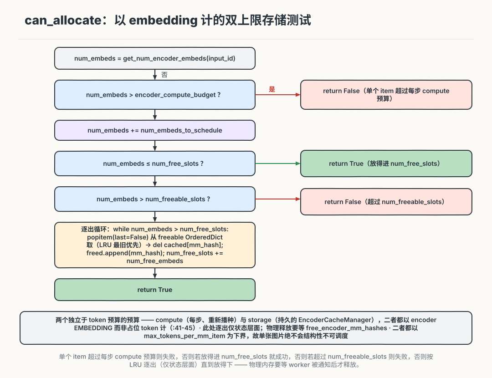</a>

<p class='figure-caption'>can_allocate 是以 embedding 而非 placeholder token 为单位的双重上限存储检查：若单个 item 超出单步 compute budget，则失败；否则先尝试放入 num_free_slots；若无法放入且超出 num_freeable_slots，则失败；其余情况按 LRU 顺序执行 eviction（仅改变状态），直到能够容纳——物理内存只有在 worker 收到通知后才会释放。</p>

这里有两道限制，且按顺序检查。首先是 *compute* gate：如果单个 item 大于当前 step 剩余的 compute budget，立即失败（第 161 行）。随后是 *storage* gate，它会检查两个计数器：`num_free_slots`（立即可用）和 `num_freeable_slots`（evict 掉没有被任何 running request 引用的 entry 后可用）。如果 free slot 足够，检查结束；如果连可回收总量也不足，则失败；否则按 LRU 顺序 evict entry（从 `freeable` 这个 OrderedDict 中执行 `popitem(last=False)`，最旧的优先），直到空间足够。`NOTE` 是其中的关键：这里的 eviction *只改变状态*。被 evict 的 `mm_hash` 会追加到 `self.freed`；worker 中的物理内存不会立即释放，必须等 scheduler 通过 `free_encoder_mm_hashes` 发出该 hash，并由 worker 在下一个 step 执行释放。这与 KV manager“先乐观预留，稍后再通知 worker”的机制一致（第 06 篇）。

### 延迟 commit，以及为何可以 rollback

planner 只修改 compute budget 的*本地副本*并将其返回；只有在 request 真正获准进入调度后，也就是 `allocate_slots` 返回了实际 KV block 之后，caller 才会将其写回。

[`vllm/v1/core/sched/scheduler.py:611-619`](https://github.com/vllm-project/vllm/blob/6cf7b26bd4bff60bf378e1af14044280ac0d214c/vllm/v1/core/sched/scheduler.py#L611-L619)

```python
            # Encoder-related.
            if encoder_inputs_to_schedule:
                scheduled_encoder_inputs[request_id] = encoder_inputs_to_schedule
                # Allocate the encoder cache.
                for i in encoder_inputs_to_schedule:
                    self.encoder_cache_manager.allocate(request, i)
                    if self.ec_connector is not None:
                        self.ec_connector.update_state_after_alloc(request, i)
                encoder_compute_budget = new_encoder_compute_budget
```

这是 RUNNING 路径的 commit；WAITING loop 在 [`scheduler.py:1002-1015`](https://github.com/vllm-project/vllm/blob/6cf7b26bd4bff60bf378e1af14044280ac0d214c/vllm/v1/core/sched/scheduler.py#L1002-L1015) 采用了完全相同的逻辑。只有执行到这里，`encoder_compute_budget` 才会被 `new_encoder_compute_budget` 覆盖，也只有在这里，`EncoderCacheManager.allocate` 才会将 cache slot 绑定到 request。正是先 plan、再分配 KV、最后 commit encoder 的顺序，使 encoder scheduling 可以安全放弃。如果 WAITING loop 中的 KV allocation 失败，request 会在 commit *之前*触发 break，显式保持 reservation 不变：

[`vllm/v1/core/sched/scheduler.py:921-928`](https://github.com/vllm-project/vllm/blob/6cf7b26bd4bff60bf378e1af14044280ac0d214c/vllm/v1/core/sched/scheduler.py#L921-L928)

```python
                if new_blocks is None:
                    # The request cannot be scheduled.

                    # NOTE: we need to untouch the request from the encode cache
                    # manager
                    if request.has_encoder_inputs:
                        self.encoder_cache_manager.free(request)
                    break
```

由于本地的 `encoder_compute_budget` 从未写回，且 `allocate` 从未被调用，放弃该 request 不会产生任何成本，唯一需要执行的是 `free(request)` 调用，用于释放 `check_and_update_cache` 在 planning 阶段取得的所有引用。WAITING 从不执行抢占（[第 4 节](#4-先处理-running再接纳-waiting)、[第 9 节](#9-kv-压力下的-preemption)），只会直接 break。

RUNNING *确实会*执行抢占，而且必须退还被抢占者在当前 step 消耗的 encoder budget，就像退还 token budget 一样（[第 9 节](#9-kv-压力下的-preemption)）。在 PRIORITY 被抢占者路径中：

[`vllm/v1/core/sched/scheduler.py:559-569`](https://github.com/vllm-project/vllm/blob/6cf7b26bd4bff60bf378e1af14044280ac0d214c/vllm/v1/core/sched/scheduler.py#L559-L569)

```python
                            preempted_encoder_inputs = scheduled_encoder_inputs.pop(
                                preempted_req_id, None
                            )
                            if preempted_encoder_inputs:
                                # Restore encoder compute budget if the preempted
                                # request had encoder inputs scheduled in this step.
                                num_embeds_to_restore = sum(
                                    preempted_req.get_num_encoder_embeds(i)
                                    for i in preempted_encoder_inputs
                                )
                                encoder_compute_budget += num_embeds_to_restore
```

如果某个 request 已在当前 step commit 了 encoder 工作，却又被选为抢占对象，其 embedding 数量会加回 `encoder_compute_budget`，供正在准入的 request 使用。这对应于 encoder 侧的 budget 退还机制，与 [`scheduler.py:556`](https://github.com/vllm-project/vllm/blob/6cf7b26bd4bff60bf378e1af14044280ac0d214c/vllm/v1/core/sched/scheduler.py#L556) 处的 token budget 退还 `token_budget += num_scheduled_tokens.pop(...)` 相呼应；两者共同确保 step 内发生抢占时，两类 budget 始终保持一致。被抢占者持有的持久 cache 引用则由 `_preempt_request → encoder_cache_manager.free` 单独释放（[第 9 节](#9-kv-压力下的-preemption)）。

### 释放 encoder output：延迟到最后一个读取方用完之后

不能在 decoder token 刚被调度时就释放 encoder output——此时该 step 尚未执行，而且在 speculative decoding 中，drafter 还可能读取已接受范围之后的一个 token。因此，释放操作会推迟到 forward pass 之后的 `update_from_output`，并且只有在最后一个需要执行 attention 的 token 确实完成计算后才会触发。

[`vllm/v1/core/sched/scheduler.py:1934-1954`](https://github.com/vllm-project/vllm/blob/6cf7b26bd4bff60bf378e1af14044280ac0d214c/vllm/v1/core/sched/scheduler.py#L1934-L1954)

```python
        spec_lookahead = 1 if self.use_eagle else 0

        # Here, we use list(set) to avoid modifying the set while iterating
        # over it.
        for input_id in list(cached_encoder_input_ids):
            mm_feature = request.mm_features[input_id]
            start_pos = mm_feature.mm_position.offset
            num_tokens = mm_feature.mm_position.length
            if self.is_encoder_decoder and request.num_computed_tokens > 0:
                # With Whisper, as soon as we've generated a single token,
                # we know we're done with the encoder input. Cross Attention
                # KVs have been calculated and cached already.
                self.encoder_cache_manager.free_encoder_input(request, input_id)
            elif (
                start_pos + num_tokens + spec_lookahead
                <= request.num_computed_tokens - request.num_output_placeholders
            ):
                # Processed, stored in the decoder KV cache, and far enough past
                # the placeholder range (plus the drafter's look-ahead) that no
                # rejection or drafter gather can reference it.
                self.encoder_cache_manager.free_encoder_input(request, input_id)
```

该逻辑由 `update_from_output` 在 `if request.has_encoder_inputs` 下调用（[`scheduler.py:1624-1626`](https://github.com/vllm-project/vllm/blob/6cf7b26bd4bff60bf378e1af14044280ac0d214c/vllm/v1/core/sched/scheduler.py#L1624-L1626)），每次处理一个 request；正如该处注释所言，“仅在 step 确实执行完毕之后”才会调用。释放条件 `start_pos + num_tokens + spec_lookahead <= num_computed_tokens − num_output_placeholders` 与调度阶段应用的 `shift_computed_tokens` 扩展逻辑互为镜像：进入窗口时，同一个 +1 EAGLE margin 会将图像纳入窗口；离开窗口时，它又会让 embedding 继续保持被引用状态，直到能够确定 drafter 的读取位置已经越过该图像。`free_encoder_input` 同样不会直接释放物理内存——它只是将 entry 移到 `freeable`，并增加 `num_freeable_slots`（[`encoder_cache_manager.py:216-241`](https://github.com/vllm-project/vllm/blob/6cf7b26bd4bff60bf378e1af14044280ac0d214c/vllm/v1/core/encoder_cache_manager.py#L216-L241)），使其成为 `can_allocate` 未来可选择的 eviction 候选。只有后续某次 `can_allocate` 将其 evict 到 `freed`，且 scheduler 发出该列表后，物理内存才会真正释放。

### 写入 SchedulerOutput

有两个 field 会将 multimodal 决策传递给 worker（[第 10 节](#10-scheduleroutputexecutor-会收到什么)）：

[`vllm/v1/core/sched/output.py:204,213-215`](https://github.com/vllm-project/vllm/blob/6cf7b26bd4bff60bf378e1af14044280ac0d214c/vllm/v1/core/sched/output.py#L204)

```python
    scheduled_encoder_inputs: dict[str, list[int]]
    ...
    # list of mm_hash strings associated with the encoder outputs to be
    # freed from the encoder cache.
    free_encoder_mm_hashes: list[str]
```

`scheduled_encoder_inputs` 是按 request 组织的 item index 列表，其中记录了当前 step 必须运行 encoder 的 item（由两个 commit 位置组装而成，见 [`scheduler.py:1103`](https://github.com/vllm-project/vllm/blob/6cf7b26bd4bff60bf378e1af14044280ac0d214c/vllm/v1/core/sched/scheduler.py#L1103)）；`free_encoder_mm_hashes = self.encoder_cache_manager.get_freed_mm_hashes()`（[`scheduler.py:1111`](https://github.com/vllm-project/vllm/blob/6cf7b26bd4bff60bf378e1af14044280ac0d214c/vllm/v1/core/sched/scheduler.py#L1111)）会取出并清空 `freed` 列表，该列表由 `can_allocate` 的 eviction 持续累积，并在每次调用时 reset。external connector prefetch 还增加了第三条通道（`external_load_encoder_input`，在 [`scheduler.py:620-624`](https://github.com/vllm-project/vllm/blob/6cf7b26bd4bff60bf378e1af14044280ac0d214c/vllm/v1/core/sched/scheduler.py#L620-L624) 处 commit，metadata 位于 `ec_connector_metadata`），但整体模式相同：scheduler 负责决策，worker 负责执行。

## 12. 跟踪一次调度步骤

本 trace 跟踪一次 `schedule()` 调用的完整过程：从 token 预算初始化开始，依次经过 queue 遍历、准入，直至 cursor 更新。

`SchedulerInterface.schedule` 界定了单次调用的粒度。

来源：[`vllm/v1/core/sched/interface.py:51-65`](https://github.com/vllm-project/vllm/blob/6cf7b26bd4bff60bf378e1af14044280ac0d214c/vllm/v1/core/sched/interface.py#L51-L65)

```python
    @abstractmethod
    def schedule(self, throttle_prefills: bool = False) -> "SchedulerOutput":
        """Schedule the requests to process in this scheduling step.

        The scheduling decision is made at the iteration level. Each scheduling
        step corresponds to a single forward pass of the model. Therefore, this
        method is called repeatedly by a busy loop in the engine.

        Essentially, the scheduler produces a dictionary of {req_id: num_tokens}
        that specifies how many tokens to process for each request in this
        scheduling step. For example, num_tokens can be as large as the number
        of prompt tokens for new requests, or it can be 1 for the requests that
        are auto-regressively generating new tokens one by one. Otherwise, it
        can be somewhere in between in case of chunked prefills, prefix caching,
        speculative decoding, etc.
        """
```

一次调用会生成一份以 `{req_id: num_tokens}` 为核心的迭代计划。Prefill、decode、cache 命中和 speculative drafts 只会改变这些计数，而不会选择不同的 scheduler 模式；token 数为 0 的计划不一定需要执行模型计算。

### 按执行顺序展开一次调用

<a href='images/vllm-05-10-scheduling-trace.svg' target='_blank'>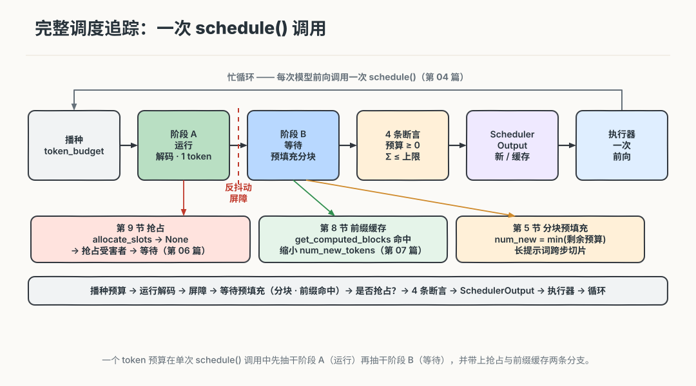</a>

<p class='figure-caption'>在单次 `schedule()` 调用中，同一份 token 预算先在阶段 A（RUNNING）中消耗，再在阶段 B（WAITING）中消耗。</p>

以下是综合整理的一次 `schedule()` 调用 trace，并非逐字摘录的源码片段；每一行都附有指向真实代码位置的 `scheduler.py` anchor，并标明收录完整摘录的对应章节。

```text
schedule(throttle_prefills):                                   # scheduler.py:396
  current_step += 1                                            # :397
  token_budget = max_num_scheduled_tokens                      # :416   (PAUSED_ALL -> 0 at :417-419)
  init ledgers: scheduled_{new,resumed,running,preempted}_reqs # :409-412
                req_to_new_blocks, num_scheduled_tokens{}      # :414-415
                encoder_compute_budget, spec ledgers           # :422-427
  ── PHASE A: RUNNING (decodes + in-flight prefill chunks) ── Section 4
    req_index = 0
    while req_index < len(running) and token_budget > 0:       # :442
      skip guards (async max-tok / PP cadence / DP defer)      # :445-471   (continue, not break)
      num_new = demand; clamp long_prefill; clamp budget;      # :473-489
               clamp max_model_len
      if num_new == 0: req_index += 1; continue                # :514-530
      while True:                                              # :533
        new_blocks = allocate_slots(req, num_new, lookahead)   # :534-539  (article 06)
        if new_blocks is not None: break
        preempt victim (PRIORITY: max key / FCFS: tail pop)    # :547-572
        refund budget += num_scheduled_tokens.pop(victim)      # :556
        if victim == req: break                                # :576-578
      if new_blocks is None: break                             # :580-582
      commit: num_scheduled_tokens[id] = num_new;              # :589
              token_budget -= num_new; req_index += 1          # :590-591
  ── BARRIER ──────────────────────────────────────────────── Section 4
    if preempted_reqs or paused: SKIP PHASE B                  # :636-637  (anti-thrash)
  ── PHASE B: WAITING (new / resumed prefills) ───────────── Section 4
    while (waiting or skipped_waiting) and token_budget > 0:   # :640
      if len(running)+streaming >= max_num_running_reqs: break # :644-645  (max_num_seqs)
      skip guards (blocked KV / LoRA / connector / mm)         # :653-775
      probe prefix cache: get_computed_blocks(req)             # :686-790  (Section 8, article 07)
      num_new = num_tokens - num_computed_tokens               # :810
      clamp long_prefill                                       # :830-832
      if not enable_chunked_prefill and oversize: break        # :836-842  (Section 5)
      num_new = min(num_new, token_budget)                     # :844
      new_blocks = allocate_slots(req, num_new, ...11 args)    # :907-919  (article 06)
      if new_blocks is None: break                             # :921-928  (NO preempt)
      commit: running.append(req); classify new/resumed;       # :950-993
              num_scheduled_tokens[id] = num_new;
              token_budget -= num_new; status = RUNNING
  ── CLOSE ──────────────────────────────────────────────────
    re-queue skipped_waiting; update prefill_capacity_bound    # :1017-1024
    4 asserts (see below)                                      # :1026-1037  Section 2
    build SchedulerOutput (new / cached split)                 # :1049-1114  Section 10
    _update_after_schedule: num_computed += n; is_prefill_chunk# :1169-1195  Section 6
    return scheduler_output                                    # :1138
```

调度决策形成于 `current_step += 1` 与四条断言之间。随后，构建 `SchedulerOutput` 并推进 cursors，会将该决策记录下来，供 executor 和下一步使用。

### 每一步结束时执行的四条断言

调用结束时，会对最终生成的计划执行四条断言。

来源：[`vllm/v1/core/sched/scheduler.py:1026-1037`](https://github.com/vllm-project/vllm/blob/6cf7b26bd4bff60bf378e1af14044280ac0d214c/vllm/v1/core/sched/scheduler.py#L1026-L1037)

```python
        # Check if the scheduling constraints are satisfied.
        total_num_scheduled_tokens = sum(num_scheduled_tokens.values())
        assert total_num_scheduled_tokens <= self.max_num_scheduled_tokens

        assert token_budget >= 0
        assert len(self.running) <= self.max_num_running_reqs
        # Since some requests in the RUNNING queue may not be scheduled in
        # this step, the total number of scheduled requests can be smaller than
        # len(self.running).
        assert len(scheduled_new_reqs) + len(scheduled_resumed_reqs) + len(
            scheduled_running_reqs
        ) <= len(self.running)
```

前两条断言从两个方向核对 token 账本；第三条约束 batch 宽度；第四条允许未调度的 requests 继续常驻。KV 可行性则由 `allocate_slots` 单独检查（第 06 篇）。

### 乐观 cursor：为何下一步已经准备就绪

`schedule()` 返回前做的最后一件事，是推进每个已调度 request 的进度 cursor——此时模型尚未运行。

来源：[`scheduler.py:1169-1195`](https://github.com/vllm-project/vllm/blob/6cf7b26bd4bff60bf378e1af14044280ac0d214c/vllm/v1/core/sched/scheduler.py#L1169-L1195)（完整方法见[第 6 节](#6-continuous-batching成员集合每个-step-都会变化)；此处仅保留其中两行关键代码）

```python
        for req_id, num_scheduled_token in num_scheduled_tokens.items():
            request = self.requests[req_id]
            request.num_computed_tokens += num_scheduled_token
            ...
            request.is_prefill_chunk = request.num_computed_tokens < (
                request.num_tokens + request.num_output_placeholders
            )
```

在执行前推进 cursor，是为了让下一步能够立即开始规划；被拒绝的 speculative tokens 会在 `update_from_output` 中回滚（第 12 篇）。

```text
for this engine step, how many tokens should each request process?
```

### 要点

- 单个 `token_budget` 为整个步骤提供预算，并且先考虑 RUNNING requests，再处理 WAITING 准入。
- Prefill、decode、prefix reuse 和 speculative work，本质上只是同一个 cursor gap 的不同大小。
- `allocate_slots` 给出内存判定结果：RUNNING 可以抢占后重试，而 WAITING 则会退避。
- `SchedulerOutput` 承载最终生成的、以 `req_id` 为 key 的计划；乐观 cursor 更新让下一轮迭代可直接调度，无需引入持久化的 phase mode。

## 13. 参考资料

- https://www.usenix.org/conference/osdi22/presentation/yu
- https://vllm.ai/blog/2025-01-27-v1-alpha-release
- https://vllm.ai/blog/2025-09-05-anatomy-of-vllm
- https://docs.vllm.ai/en/stable/usage/v1_guide/
- https://arxiv.org/abs/2309.06180

*所有代码层面的结论均以 [`vllm-project/vllm@6cf7b26bd`](https://github.com/vllm-project/vllm/tree/6cf7b26bd4bff60bf378e1af14044280ac0d214c) 为依据。*