# KV Cache Manager 与 Paged KV Cache

> 实现迭代很快，因此本文以 [`vllm-project/vllm@6cf7b26bd`](https://github.com/vllm-project/vllm/tree/6cf7b26bd4bff60bf378e1af14044280ac0d214c) 为基准。摘录中的 `...` 表示省略了无关代码；除此之外，未加标记的摘录均与该版本一致。行号引用也指向同一个 commit。

权重占用的 GPU 显存基本固定，而 KV 状态会随每条活跃序列不断增长。因此，KV 容量是限制并发度的主要因素之一，不过 activation、CUDA graph、encoder 状态、模型形状和 scheduler 限制也共享同一份显存预算。PagedAttention 借助虚拟内存类比，解释了固定大小的 block 为何能减少碎片。相比这个类比，具体实现更值得关注。

V1 通过 `KVCacheManager` 在 `KVCacheCoordinator` 之上构建了一层抽象，并配合按类型划分的 cache manager 和共享的 `BlockPool`。因此，分配并不是简单地申请 N 个 block。它会先考虑 prefix 命中、admission 水位、预留容量、sliding-window 回收、connector 持有的 token 和 speculative position，然后才真正提交分配。同一套代码还必须确保引用计数、eviction 顺序、hash 标识、block table 和 slot mapping 始终一致。本文将沿着这些路径，从容量计算一路追踪到 attention 最终使用的索引。

## 1. KV Cache 是 Serving 场景中的内存核心问题

LLM serving 的吞吐量瓶颈通常不在矩阵乘法速度，而在显存能够容纳多少个 request。自回归 decoding 会让此前每个 token 的 K、V tensor 一直驻留在显存中，因为后续每个 full-attention step 都可能再次读取它们（[vLLM 发布博客](https://vllm.ai/blog/2023-06-20-vllm)）。

虽然名为 KV cache，但它并不是那种可以随意丢弃、等 cache miss 时再重新填充的 lookup cache：要继续 decoding，就必须有等价的 KV 可用。在内存压力下，vLLM 的 scheduler *确实会* 释放被抢占 request 的 block——将其 `num_computed_tokens` 重置为零，并在 request 恢复时重新计算 KV（recompute preemption，第 05 篇）。因此，更准确的说法是：丢弃 KV 必然会中断 request，并付出 recompute（或 swap）的代价，绝不可能零成本完成。

V1 将这种压力量化：其内存核算路径会把可用的 GPU 字节数换算成 scheduler 可以支配的精确 block 数量。

### 论文实验中的 65/30 占比：权重固定，KV cache 才是关键变量

在论文的 13B/A100 示例中，权重约占 40 GB GPU 显存的 65%，动态 request 状态接近 30%（[PagedAttention 全文](https://ar5iv.labs.arxiv.org/html/2309.06180)）。权重在启动后保持不变；KV 占用则会随并发 request 的长度增长，因此是运行时更关键的可调因素。

同一个例子表明，单个 request 的 KV 最高可达 1.6 GB，而在 admission 时，该 request 的最终长度仍是未知的（[PagedAttention 全文](https://ar5iv.labs.arxiv.org/html/2309.06180)）。因此，allocator 必须在一个固定区域内，为大量长度不可预测的 sequence 动态扩容。

**朴素打包时，memory 都浪费在哪里：三类浪费**

最直观的实现方式，也是 vLLM 之前的系统通常采用的方式，是为每个 request 分配一块连续内存，并按照其可能达到的最大长度确定大小。论文将由此产生的浪费分为三类：“存在三种 memory 浪费：reserved、internal fragmentation 和 external fragmentation”（[PagedAttention 全文](https://ar5iv.labs.arxiv.org/html/2309.06180)）。

- **Internal fragmentation** 源于按照最大长度过度分配。系统会“根据 request 的最大长度（例如 2048 个 token），预先分配一块连续内存”，这“可能导致严重的 internal fragmentation，因为 request 的实际长度可能短得多”（[PagedAttention 全文](https://ar5iv.labs.arxiv.org/html/2309.06180)）。如果一个 request 只生成了 30 个 token，却预留了 2048 个槽位，那么在其整个生命周期内，其余 2018 个槽位都会被浪费。
- **Reserved** 浪费是指那些*最终会*被填充、但目前仍处于空闲状态的空间：由于“整块内存在 request 的生命周期内始终处于预留状态”，因此即使该 request 后续确实会增长并使用这些槽位，在此之前，其他 request 也无法使用它们。
- **External fragmentation** 就是经典的 malloc 问题：由于“每个 request 的预分配大小可能不同”，空闲内存池会逐渐变成由各种不规则大小的空洞拼成的碎片区域。即使这些空洞的总容量足够，只要其中没有一块大到足以容纳下一个 request，系统就无法接纳它。

早期采用连续内存分配的系统中，真正用于保存 token 状态的 KV memory 仅占 20.4%–38.2%（[PagedAttention 全文](https://ar5iv.labs.arxiv.org/html/2309.06180)）。fixed-size paging 消除了 external fragmentation，并将 internal waste 限制在最后一个未填满的 block 内，据报告可控制在 4% 以下（[vLLM 发布博客](https://vllm.ai/blog/2023-06-20-vllm)）。

<a href='images/vllm-06-03-fragmentation.svg' target='_blank'>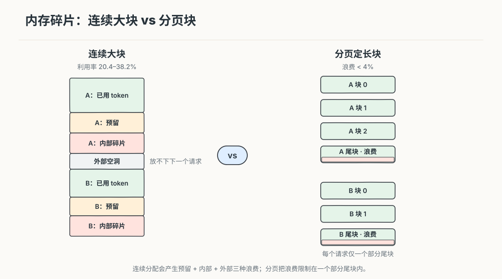</a>

<p class='figure-caption'>连续的 per-request 内存块会产生 reserved、internal 和 external waste，利用率仅为 20.4%–38.2%；分页式 fixed-size block 则将浪费限制在每个 sequence 最后一个未填满的尾部 block 内（<4%）。</p>

实现代码通过三个量体现了同样的思路：每个 block 的字节数、block 总数，以及当前空闲的 block 数量。

### 一个 block 占多少字节？page-size 公式

论文中的“每个 token 800 KB”并不是一个魔法常量，而是由公式计算得出的；V1 会在 `AttentionSpec.real_page_size_bytes` 中针对每个 attention layer 计算该值。

来源：`vllm/v1/kv_cache_interface.py:L187-L202`

```python
    @property
    def real_page_size_bytes(self) -> int:
        if self.kv_quant_mode.is_nvfp4:
            # Packed layout: fp4 data + fp8 block scales per head.
            head_dim = nvfp4_kv_cache_full_dim(self.head_size)
        elif self.kv_quant_mode == KVQuantMode.INT4_PER_TOKEN_HEAD:
            head_dim = self.head_size // 2
        else:
            head_dim = self.head_size
        return (
            2
            * self.block_size
            * self.num_kv_heads
            * head_dim
            * get_dtype_size(self.dtype)
        )
```

因子 `2` 表示 K 和 V（每个 token 对应两个 tensor）。`self.block_size` 是一个 block 可容纳的 token 数。`self.num_kv_heads * head_dim` 是经过 KV heads 间的 tensor-parallel sharding 后，单个 token 的 key（或 value）向量宽度。`get_dtype_size(self.dtype)` 是每个元素占用的字节数（fp16/bf16 为 2）。将这些值相乘，就能得到一个 block 在*单个 layer*上的字节开销。除以 `block_size`，再乘以总 layer 数，即可还原论文给出的每 token 开销：`2 * num_kv_heads * head_dim * dtype_size * num_layers` bytes per token。代入 13B 模型的 shape，结果就是论文中的约 800 KB。quantization 分支也说明了为什么这里使用的是 `@property`，而不是某个固定值：采用 nvfp4 或 int4-per-token-head 的 layer 会存储*更窄的* `head_dim`，因此其 block 的实际体积更小，memory budget 也必须反映这一点。

**memory budget 必须计入实际从原始 KV allocation 中划出的每一个字节，而不能只计算名义上的 K/V payload。** 同级的 `page_size_bytes` property（`vllm/v1/kv_cache_interface.py:L172-L185`）明确体现了这一点：对于 per-token-head quantization，它会*额外计入* scale tensor 占用的空间（“这部分 memory 从原始 KV cache allocation 中划出，因此必须在此纳入 budget”），同时也支持 `page_size_padded` override。如果 budget 计算偏小，engine 就会对外宣称拥有比实际更多的 block，最终在 runtime 发生 OOM，而不是施加 back-pressure。只有准确计算这个值，后续所有 admission 决策才有可靠的基础。

### 整个 KV 区域采用固定 budget，并通过 floor division 划分为 block

下面是至关重要的换算。vLLM 不允许 request 临时随意占用 GPU memory；它会在 startup 阶段一次性计算 KV memory 总可用量，并将其转换为整数个 block。这就是 `get_num_blocks`。

来源：`vllm/v1/core/kv_cache_utils.py:L972-L989`

```python
def get_num_blocks(
    vllm_config: VllmConfig,
    num_layers: int,
    available_memory: int,
    page_size: int,
) -> int:
    """
    Get the number of kv cache blocks.

    Args:
        vllm_config: The global VllmConfig
        num_layers: The number of layers
        available_memory: Memory available for KV cache in bytes.
        page_size: The page size of the KV cache.
    """
    num_blocks = int(available_memory // page_size // num_layers)
    num_blocks = max(num_blocks, 0)
    return may_override_num_blocks(vllm_config, num_blocks)
```

`available_memory` 是扣除 weights 和 profiling 得出的 non-KV reserve 后的剩余空间。`page_size * num_layers` 表示一个覆盖整个模型的 block，因此通过 floor division 可以得到实际能够容纳的完整 block 数。`max(..., 0)` 用于处理 budget 耗尽的情况，`may_override_num_blocks` 则允许在测试中指定固定 capacity。

**只能使用 floor division，绝不能向上取整。** block 数量是该 cache 能够容纳的 KV state 上限；哪怕只多分配一个 block，也意味着 engine 认为自己拥有的某部分物理 memory 实际并不存在。这个在 startup 阶段得到的整数，是 manager 最主要的 KV capacity budget，runtime 中的每次 block allocation 都会消耗该 budget。整体 batching 和 concurrency 还会受到 `max_num_batched_tokens`、`max_num_seqs`、encoder-cache capacity、connector state，以及 execution/graph limits 的约束，因此 block 数并不是系统中唯一影响 batch size 的因素。

**startup guard：如果连一个 request 都容纳不下，就拒绝运行**

显存问题非常严重，因此 vLLM 会在启动阶段直接报错，而不是留到 runtime 才意外暴露。serving 开始之前，它会检查预算是否至少足以容纳一个最大长度的 request。

来源：`vllm/v1/core/kv_cache_utils.py:L749-L764`

```python
    needed_memory = get_needed_memory()

    if needed_memory > available_memory:
        estimated_max_len = estimate_max_model_len(available_memory)
        estimated_msg = ""
        if estimated_max_len > 0:
            estimated_msg = (
                "Based on the available memory, "
                f"the estimated maximum model length is {estimated_max_len}. "
            )

        raise ValueError(
            f"To serve at least one request with the model's max seq len "
            f"({max_model_len}), ({format_gib(needed_memory)} GiB KV "
            f"cache is needed, which is larger than the available KV cache "
            f"memory ({format_gib(available_memory)} GiB). {estimated_msg}"
```

这里的 `needed_memory` 是按 request 计算的量：`FullAttentionSpec.max_memory_usage_bytes` 计算的正是单个最坏情况 request 的开销。

来源：`vllm/v1/kv_cache_interface.py:L237-L245`

```python
    def max_memory_usage_bytes(self, vllm_config: VllmConfig) -> int:
        max_model_len = vllm_config.model_config.max_model_len
        dcp_world_size = vllm_config.parallel_config.decode_context_parallel_size
        pcp_world_size = vllm_config.parallel_config.prefill_context_parallel_size
        # Note(hc): each dcp rank only need save
        # (max_model_len//dcp_world_size) tokens locally.
        if dcp_world_size * pcp_world_size > 1:
            max_model_len = cdiv(max_model_len, dcp_world_size * pcp_world_size)
        return cdiv(max_model_len, self.block_size) * self.page_size_bytes
```

`cdiv(max_model_len, self.block_size)` 表示一个 request 达到 context 上限所需的 block 数量。这里采用向上取整除法，因为即使最后一个 block 未填满，仍会占用一整个 physical block（这正是论文所说的“只有最后一个 block 会产生浪费”，只是以资源核算规则的形式表达）。再乘以 `page_size_bytes`，就能将论文中的“每个 request 最多占用 1.6 GB”从引用结论变成实际计算值。Context parallelism（`dcp`/`pcp`）会将 `max_model_len` 分片到各个 rank，因此每个 rank 只需为自己的本地分片预留预算。

如果一个最坏情况 sequence 的开销超过 `available_memory`，eviction 和 prefix reuse 就无法保证系统继续推进，因此启动会失败，并提示提高 `gpu_memory_utilization` 或降低 `max_model_len`。Paging 可以提高多 request 场景下的利用率，但无法消除单个 request 的这一上限。

**整个 engine 都在监控的 runtime 容量判定依据**

启动时，这项预算会变成 `num_gpu_blocks`；进入 runtime 后，它则变成实时的 free block 数量。`BlockPool` 会预先切分整个 pool——这正是论文所描述的“分配一块连续 GPU DRAM，并将其划分为 physical KV block 的 block engine”的具体实现（[PagedAttention 全文](https://ar5iv.labs.arxiv.org/html/2309.06180)）。

来源：`vllm/v1/core/block_pool.py:L175-L182`

```python
        # All kv-cache blocks.
        self.blocks: list[KVCacheBlock] = [
            KVCacheBlock(idx) for idx in range(num_gpu_blocks)
        ]
        # Free block queue that constructs and manipulates a doubly linked
        # list of free blocks (including eviction candidates when caching is
        # enabled).
        self.free_block_queue = FreeKVCacheBlockQueue(self.blocks)
```

pool 构建完成后，每个 physical slot 从一开始就对应一个 `KVCacheBlock` 对象；request 到来时不会再向 CUDA 申请任何空间。scheduler 每一步只需查看 free queue 的长度，即 `get_num_free_blocks`（`vllm/v1/core/block_pool.py:L692-L698`）。这是一个 O(1) 的容量计数器，其实现方式及同步记账机制已在[第 3 节](#3-kvcacheblock-与-blockpoolfree-list-是一种淘汰结构)中完整讲解。

这是一个 O(1) 计数器，而不是通过遍历得出的结果——每次 allocate/free/evict 操作都会同步维护 `num_free_blocks`（具体机制见本文的 block-pool 和 free-queue 章节）。`allocate_slots` 会将 request 的需求量与该值直接比较；当需求超过供给时，它会返回 `None`（“当前这一步无法调度”），进而触发 preemption。这是 scheduler 无法绕过的硬性准入门槛。

由于所有 free block 都可以互换，只要 free block 数量为 `k`，就足以接纳任何需求不超过 `k` 个 block 的 request。而 contiguous allocator 除了数量之外，还必须掌握各个空闲区域的形态。

## 2. 论文模型：block、block table、共享与 Copy-on-Write

PagedAttention 将 KV 状态切分为固定大小的 **block**。每个 request 都有一张 **block table**，负责将逻辑 block 映射到物理上不连续的 block；refcount 支持 block 共享，而 Copy-on-Write 语义则确保分支产生差异时互不影响。可以将其类比为 `blocks as pages, tokens as bytes, requests as processes`（[PagedAttention 论文](https://ar5iv.labs.arxiv.org/html/2309.06180)；[vLLM 发布博客](https://vllm.ai/blog/2023-06-20-vllm)）。V1 直接实现了前三项基本机制；由于完整 block 不可变且按内容寻址，因此不再需要物理 Copy-on-Write 路径。

阅读后续内容时，请始终牢记论文中的一个关键区分，因为博客对此有所混淆：*PagedAttention* 是 attention **kernel**——它在执行 attention 时聚合分散的 block，从而让物理上不连续的 KV *可以参与计算*；而 *KV block manager* 则是 **内存层**——它负责管理 DRAM pool、block table、allocation/free、refcount 和 CoW，让物理上不连续的 KV *能够存在且保证安全*（[论文：“block engine 会分配一块连续的 GPU DRAM，并将其划分为物理 KV block”](https://ar5iv.labs.arxiv.org/html/2309.06180)）。以下内容全都位于这条分界线的 manager 一侧。kernel 只会在最底层出现一次，作为 consumer 对 manager 生成的映射进行解引用。

<a href='images/vllm-06-01-logical-physical-blocks.svg' target='_blank'>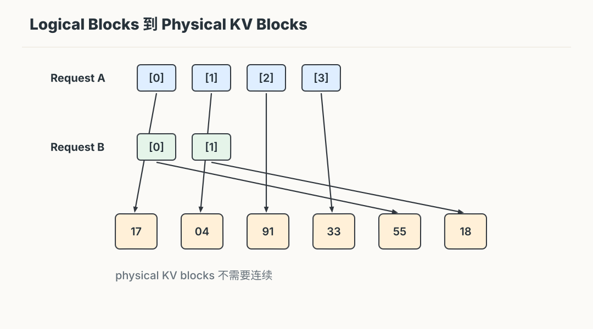</a>
<a href='images/vllm-06-02-copy-on-write.svg' target='_blank'>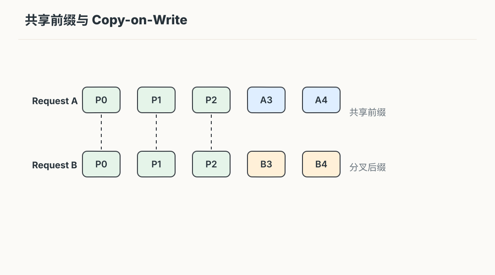</a>

<p class='figure-caption'>左：序列的逻辑 block 通过 block table 映射到物理上不连续的 KV block。右：block 共享 → 分支产生差异（无需物理复制的 CoW *语义*）——两个序列共享一个物理 prefix block，随后分化到各自私有的 suffix block。在 V1 中，这一过程由结构自然实现，因为不可变完整 block 的内容寻址机制使物理复制路径不可达（参见下文的 Copy-on-Write 小节）。</p>

### 四重映射，以及 OS page table 中不存在的那个字段

论文明确指出，block table entry *并不*只是 page table entry：`Each block table entry records the corresponding physical blocks of a logical block and the number of filled positions`（[论文](https://ar5iv.labs.arxiv.org/html/2309.06180)）。OS page table 只需要记录物理 frame；LLM 特有之处在于还要记录“已填充位置的数量”——这也解释了为什么序列的最后一个 block 只填充了一部分，而此前的每个 block 都恰好包含 `block_size` 个 token。（论文的消融实验默认使用 16-token block；在 V1 中，block size 按 spec 分别设置并由 config 驱动，`kv_cache_spec.block_size`，绝不是全局固定常量 16。）

V1 并未将这两部分存放在同一个 struct 中，而是将二者拆开。physical block 部分存放在一个 `[num_reqs, max_blocks]` tensor 中：每一行对应一个 request，各列则按逻辑顺序记录该 request 的 physical block id。填充位置部分完全不存入这张表；构建 slot mapping 时，会根据 request 的 `positions`，为每个 token 重新计算填充位置。两部分最终在地址计算中汇合，将逻辑位置转换为 paged cache 中的一维地址：`slot = block_id·block_size + pos%block_size`（由 slot kernel 实现，见[第 20 节](#20-从-block-table-到-kernelslot_mapping-与-device-tensors)；该 kernel 还承载了此处省略的 context parallelism 机制）。

不考虑 context parallelism 时，`pos // block_size` 用于选择逻辑列，映射表给出对应的 physical block，`pos % block_size` 则给出 block 内的 offset。因此，这张表始终只是从逻辑 block 到 physical block 的映射；填充位置并不与之存放在一起，而是根据 scheduler 维护的 token 位置推导出来。

**“只有最后一个 block 会产生浪费”这一点，是通过拒绝将未填满的 block 纳入 cache 来保证的**

论文的核心结论是 `near-zero waste`，博客还给出了量化结果：`Memory waste only happens in the last block of a sequence ... a mere waste of under 4%`（[博客](https://vllm.ai/blog/2023-06-20-vllm)）；相比之下，连续分配系统的利用率为 `20.4% - 38.2%`（[论文](https://ar5iv.labs.arxiv.org/html/2309.06180)）。统一的 block 大小消除了*外部*碎片（任意空闲 block 都能分配给任意 request），但“只有最后一个 block 会产生浪费”则是由代码单独保证的另一项性质：只有填满的 block 才允许成为 cache 实体。用于生成 block 内容标识的 hash 函数正是以此为前提：

`vllm/v1/core/kv_cache_utils.py:L591-L604`

```python
        curr_block_token_ids: A list of token ids in the current
            block. The current block is assumed to be full.
        extra_keys: Extra keys for the block.
    Returns:
        The hash value of the block and the token ids in the block.
        The entire tuple is used as the hash key of the block.
    """
    if not parent_block_hash:
        parent_block_hash = NONE_HASH

    curr_block_token_ids_tuple = tuple(curr_block_token_ids)
    return BlockHash(
        hash_function((parent_block_hash, curr_block_token_ids_tuple, extra_keys))
    )
```

Lookup 同样只处理完整的 block（`kv_cache_manager.py:L204`）。尾部未填满的 block 没有 hash，因此无法共享。cache hit 也因此以 block 为对齐单位；而 `request.num_tokens - 1` 这一上限可能会让原本可以完全命中的情况重新计算一个 block，以确保 forward pass 仍能生成 logits。

### 引用计数就是一个显式字段，内容标识则只写入一次

论文指出 `we introduce a reference count for each physical block`。在 V1 中，这句话直接落实成了一个 struct 字段。每个物理 GPU slot 都恰好由一个 `KVCacheBlock` 描述（`vllm/v1/core/kv_cache_utils.py:L117-L138`；[第 3 节](#3-kvcacheblock-与-blockpoolfree-list-是一种淘汰结构) 按字段逐一解析了完整的 dataclass），论文所说的 refcount、内容标识，以及它在 free list 中的成员关系，都并列存放在这里。

从这条记录中可以读出三点。第一，`ref_cnt: int = 0`就是论文中每个 physical block 的 reference count，完全是字面含义：block 创建时 reference count 为零。第二，`_block_hash`是`only available when the block is full and cached`；block 的 *identity*（它承载什么内容）与 *reference count*（有多少个 sequence 声明持有它）是彼此正交的字段。因此，一个 block 可以已被 cache 但无人引用（等待发生的 prefix-cache hit），也可以正被引用但尚未 cache（仍在使用的 partial block）。第三，identity 在 eviction 之前只能写入一次，这一点由 `set_block_hash`/`reset_hash` 保证（`vllm/v1/core/kv_cache_utils.py:L148-L162`，完整内容见[第 3 节](#3-kvcacheblock-与-blockpoolfree-list-是一种淘汰结构)）。

`set_block_hash`要求 identity slot 为空；只有执行 eviction 时才会调用 `reset_hash`。因此，一个已被引用的 block 不可能悄悄改变它对外标示的内容。

**Sharing 就是 `touch`：两个 logical block，共用一个 physical block，并将 refcount 加一**

论文将 sharing 描述为 `mapping their logical blocks to the same physical block`（[博客](https://vllm.ai/blog/2023-06-20-vllm)）；文档则将 cache hit 时的复用操作描述为 `increases the reference count of the computed block by one, and removes the block from the free queue`（[Prefix Caching 文档](https://docs.vllm.ai/en/stable/design/prefix_caching/)）。这句话对应的其实就是一个 method：`BlockPool.touch`（`vllm/v1/core/block_pool.py:L597-L612`），[第 23 节](#23-physical-block-的生命周期分配使用释放进入-cache淘汰)逐行解析了它。

Sharing 会将同一个 `block_id`追加到另一个 request 对应的 row 中，并调用 `touch`。如果该 block 已被 cache 但处于空闲状态，`touch`会先将它从 eviction queue 中移除，再递增 `ref_cnt`，从而避免接管与回收之间发生竞态。

### Copy-on-write：V1 为何有意偏离论文设计

论文对最后一个原语的表述非常明确：`vLLM implements a copy-on-write mechanism at the block granularity for the physical blocks that need modification by multiple sequences`（[论文](https://ar5iv.labs.arxiv.org/html/2309.06180)）。其意图就是经典的 OS 模式——内容相同时保持共享；某个 sequence 需要写入并产生分叉时，只复制这个 block。在最初的 vLLM（V0）中，这意味着：当两个 sequence 向一个尚未填满的共享 block 追加不同的 next token 时，会实际复制这个 block。

在 commit `6cf7b26bd`对应的版本中，V1 KV core 并没有 `copy_on_write`/`cow` 的实现。只有不可变的 full block 可以共享；产生差异的 token 会进入各 request 私有的 partial block。因此，V1 通过分配新的 suffix block 而不是复制共享 block，实现了共享直到分叉的语义。

论文机制中保留下来的，是 reference count 这一半的状态维护逻辑：sequence 释放共享 block 时，reference count 会递减。对应的实现是 `free_blocks`（`vllm/v1/core/block_pool.py:L614-L635`），其完整函数体见[第 23 节](#23-physical-block-的生命周期分配使用释放进入-cache淘汰)。

`free_blocks`只有在最后一个 reference 被释放时，才会将 block 归还给 pool。已有 hash 的 block 会进入 queue 尾部，以备后续复用；没有 hash 的 block 会进入 queue 头部，以便更早回收。

## 3. KVCacheBlock 与 BlockPool：Free List 是一种淘汰结构

在 V1 中，free list 和 cache-eviction list 是**同一个双向链表**。该 queue 上的 block 代表可分配容量，而且在被弹出并复用之前，仍可能对应一个有效的 cached prefix。`KVCacheBlock.ref_cnt` 将这两种职责关联起来；`FreeKVCacheBlockQueue` 则决定 eviction 顺序。正是这种合二为一的设计，让 prefix-cache eviction 无需 background scan 即可达到 O(1)（[vLLM V1 alpha](https://vllm.ai/blog/2025-01-27-v1-alpha-release)）。

### `KVCacheBlock`：以 `ref_cnt` 作为 join key 的记录

每个物理 GPU KV slot（索引为 `0 .. num_gpu_blocks-1`）都恰好由一个 `KVCacheBlock` 描述。pool 在构造时会创建 `num_gpu_blocks` 个这样的记录（`block_pool.py:L176-L178`），因此有意将其设计得十分轻量：它是一个 `slots=True` dataclass，不会为每个实例创建 `__dict__`，而是将各字段布局在固定的 slot 数组中。

源码定位 — `vllm/v1/core/kv_cache_utils.py:L117-L138`：

```python
@dataclass(slots=True)
class KVCacheBlock:
    """KV-cache block metadata."""

    # Block ID, ranging from 0 to num_gpu_blocks - 1.
    block_id: int
    # Reference count.
    ref_cnt: int = 0
    # The hash key (block hash + group id) of the block, only available
    # when the block is full and cached.
    _block_hash: BlockHashWithGroupId | None = None
    # Number of prefix tokens covered by _block_hash. For full blocks this is
    # the full block boundary; partial aliases can end inside a cache block.
    _block_hash_num_tokens: int | None = None

    # Used to construct a doubly linked list for free blocks.
    # These two attributes should only be manipulated by FreeKVCacheBlockQueue.
    prev_free_block: "KVCacheBlock | None" = None
    next_free_block: "KVCacheBlock | None" = None

    # Whether the block is a null block that should never be cached.
    is_null: bool = False
```

可以把这些字段看作围绕同一 identity 组合在一起的三个正交关注点：

- `block_id` 是*稳定的*物理 identity。它在构造时仅赋值一次，之后永不改变。原因正如 `BlockHashToBlockMap` 所说明的（[第 7 节](#7-prefix-cache-lookuphashing最长命中与最后一个-token-重计算规则)），pool 刻意不对 cached block 做去重，从而保证“block table 是 append-only 的”。block 在反复经历 allocation、cache、eviction 和 reallocation 的过程中，KV *内容*会不断变化，但其 `block_id` 始终是固定地址，worker 的 block table 可以永远指向它（[第 20 节](#20-从-block-table-到-kernelslot_mapping-与-device-tensors)）。
- `ref_cnt` 是 **allocation** 关注点，也是本节最核心的字段。`ref_cnt == 0` 不仅仅意味着“没有 request 持有这个 block”——对于每个非 null block，它在定义上都等价于“这个 block 当前已链接到 free queue 中，并且是 eviction 候选项”。`ref_cnt > 0` 表示 block 正在使用且已离开 queue。allocate/free/touch 这一整套协作（[第 23 节](#23-physical-block-的生命周期分配使用释放进入-cache淘汰)）就是为了确保这种双向等价关系在每一个可观察时刻都成立。
- `_block_hash` 和 `_block_hash_num_tokens` 属于 **cache** 关注点，只能通过只读的 `block_hash` property 访问。非 `None` 的 hash 表示“这个 block 仍对外提供一个 prefix-cache key”；`None` 则表示它不带任何 cache identity。关键在于，这与 `ref_cnt` *相互独立*：一个 block 可以是 `ref_cnt == 0`（位于 free queue 上），同时仍携带 hash（仍然是 cache-reachable 的）。这种独立性正是“free 但仍在 cache 中”这一状态的具体体现。
- `prev_free_block` / `next_free_block` 是 intrusive list 指针，按照注释要求，只能由 `FreeKVCacheBlockQueue` 操作。block *本身就是*自己的 list node，不存在额外的 wrapper node object。
- `is_null` 标识唯一的 sentinel block（`block_id=0`）；其 `ref_cnt` 有意不做维护，而且绝不能被 free 或 cache。

**hash 在 reset 之前只写一次——phantom-key 防护机制**

hash 字段是私有的（以 `_` 为前缀），且只能通过两个带保护检查的方法修改。

源码定位 — `vllm/v1/core/kv_cache_utils.py:L148-L162`:

```python
    def set_block_hash(
        self,
        block_hash: BlockHashWithGroupId,
        num_tokens: int | None = None,
    ) -> None:
        assert self.block_hash is None and self._block_hash_num_tokens is None, (
            "The block already has a hash. This should not happen."
        )
        self._block_hash = block_hash
        self._block_hash_num_tokens = num_tokens

    def reset_hash(self):
        """Reset the block hash when the block is evicted."""
        self._block_hash = None
        self._block_hash_num_tokens = None
```

`set_block_hash` 不允许对已经设置 hash 的 block 执行：在任一字段被修改之前，assertion 就会触发。恢复到可再次设置状态的唯一途径是 `reset_hash`，pool 会在 eviction 时调用它（`_remove_cached_block_hashes`，[第 23 节](#23-physical-block-的生命周期分配使用释放进入-cache淘汰)）。因此，block 的 primary cache key **在显式 reset 前只能写入一次**。

正向 index `cached_block_hash_to_block` 将 hash 映射到声明该 hash 的 block。如果 `set_block_hash` 悄悄覆盖一个仍然有效的 key，block 对外声明的 key 就会变成 B，而 index 仍会将 key A 解析到这个 block。这会产生 phantom hit：查询 A 时返回的 block，其 KV 实际上已经属于 B。write-once assertion 将唯一合法的状态转换限定为 `hash → reset_hash() → new hash`，而 eviction 是 `reset_hash` 的唯一调用方，因此 index 与 block 对外声明的 key 绝不会在无声无息间出现分歧。这正是 [第 7 节](#7-prefix-cache-lookuphashing最长命中与最后一个-token-重计算规则)所保障的 map 层一致性在 block 层的对应机制。

### 为什么使用手写 intrusive list，而不是 `collections.deque`

free queue 并不是 `deque`。它是一个手写的双向链表，class docstring 也准确说明了这样设计的原因。

源码定位 — `vllm/v1/core/kv_cache_utils.py:L179-L195`:

```python
class FreeKVCacheBlockQueue:
    """This class organizes a list of KVCacheBlock objects to a doubly linked
    list of free blocks. We implement this class instead of using Python
    builtin deque to support removing a block in the middle of the queue
    in O(1) time. To close the performance gap to the builtin deque which is
    implemented in C++, this class does not allocate any Python objects when
    manipulating the linked list. Instead, this class manipulates the
    prev_free_block and next_free_block attributes of the given blocks.

    The queue is ordered by block ID in the beginning. When a block is allocated
    and then freed, it will be appended back with the eviction order:
    1. The least recent used block is at the front (LRU).
    2. If two blocks have the same last accessed time (allocated by the
       same sequence), the one with more hash tokens (the tail of a block
       chain) is at the front.
```

其中直接点明了两个设计考量。首先是 **O(1) 的中间元素移除**。`deque` 可以在两端实现 O(1) 操作，但从内部取出元素需要 O(n)。free queue 的 hot path *必须*支持从中间移除元素：当传入 request 的 prefix 命中一个已 cache 但处于 free 状态的 block（它可能位于 queue 中间的任意位置）时，`touch` 必须准确摘下这个 block，并将其交给对应的 request（[第 23 节](#23-physical-block-的生命周期分配使用释放进入-cache淘汰)）。如果使用 `deque`，每个被 prefix 命中的 block 都需要进行一次线性扫描；而使用 intrusive list 时，block 自身持有 `prev/next`，只需执行常数时间的指针拼接。这个设计*正是* prefix cache 复用不会让分配过程退化到 O(n) 的原因。

其次是 **每次操作都不产生 Python 内存分配**。即便使用一个 `deque` 来存放 `KVCacheBlock`，它仍然只是一个引用容器。虽然其 C 实现已经很快，但作者通过将链接直接存储在 block 内部（`prev_free_block`/`next_free_block`），进一步消除了这部分开销。这样，拼接操作既不会触及 allocator，也不会产生 garbage——每个 node 只需改写两个属性。block pool 的规模可达数万乃至数十万个 block，具体取决于 config 和 GPU，参见 [vLLM 架构剖析](https://vllm.ai/blog/2025-09-05-anatomy-of-vllm)。在每个 scheduler step 都频繁执行 popleft/append 的情况下，wrapper node 带来的 GC 压力会成为不可忽视的性能负担。

docstring 的第二段还定义了**淘汰顺序**：front = LRU = 最先淘汰；对于由同一个 sequence 一次性释放的多个 block，hash token *更多*的 block（即 block 链的尾部）会排得更靠近 front。这个链表类本身并不计算这一 tie-break——“我们在释放某个 request 的 block 时，通过反转 block 顺序来维持该顺序。此操作在该类之外完成。”调用方（`KVCacheManager.free`，[第 23 节](#23-physical-block-的生命周期分配使用释放进入-cache淘汰)）会按逆序传入 block，使 block 链的尾部落在最靠近 front 的位置。

<a href='images/vllm-06-04-free-queue.svg' target='_blank'>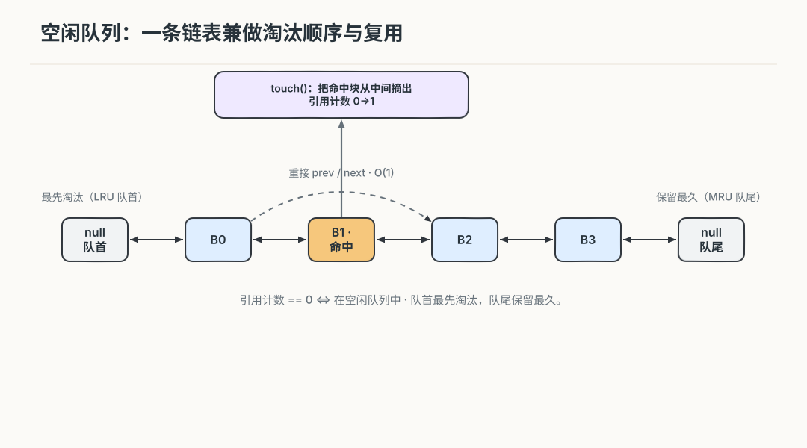</a>

<p class='figure-caption'>一条侵入式双向链表同时承担两种职责——LRU 淘汰顺序从 front（最先淘汰）延伸到 back（保留最久），哨兵节点夹在真实 block 的两端；`touch` 可在 O(1) 时间内将命中的 block 从链表中间摘除。</p>

**哨兵节点：链表损坏的警报器**

构造过程会先按 `block_id` 顺序把真实 block 串成链，再在首尾加上两个虚拟节点。

源码定位 — `vllm/v1/core/kv_cache_utils.py:L211-L229`：

```python
        # Create a fake head and a tail block for the doubly linked list to
        # reduce branching in the code
        #
        # The implementation guaranteed that the fake head and tail
        # are NEVER got popped, so we could safely assume each real blocks
        # in the queue has prev and next blocks.
        self.fake_free_list_head = KVCacheBlock(block_id=-1)
        self.fake_free_list_tail = KVCacheBlock(block_id=-1)
        if self.num_free_blocks > 0:
            # Connect fake_head and fake_tail to the first and last block
            # respectively.
            self.fake_free_list_head.next_free_block = blocks[0]
            blocks[0].prev_free_block = self.fake_free_list_head
            self.fake_free_list_tail.prev_free_block = blocks[-1]
            blocks[-1].next_free_block = self.fake_free_list_tail
        else:
            # For empty list, simply connect the fake head and tail.
            self.fake_free_list_head.next_free_block = self.fake_free_list_tail
            self.fake_free_list_tail.prev_free_block = self.fake_free_list_head
```

两个 `KVCacheBlock(block_id=-1)` 哨兵节点永远不会被弹出。这样做的好处正如注释所说：“我们可以放心地假设，queue 中的每个真实 block 都有前驱和后继 block。”因此，每个 splice 原语（`popleft`、`remove`、`prepend_n`、`append_n`）都能直接改写相邻 block 的指针，无需为链表两端编写特殊分支。空链表分支会将 head 直接连接到 tail，因此即使没有任何真实 block，整个结构仍然合法。

真正位于 queue 中的 block 总会有非 `None` 的 `prev` 和 `next`。因此，如果某个*理应*空闲的 block 上出现 `None` 指针，就能明确判定结构已损坏：要么发生了 double-free，要么该 block 从未真正入队。`remove` 将这一点转化为主动防御机制：它会立即抛出 `RuntimeError(f"remove() called on an invalid block: {block}")`——只要任一指针为 `None`（`kv_cache_utils.py:L307-L310`）；如果第一个 block 没有有效的 `next`，`popleft` 也会抛出对应错误。借助哨兵节点，“block 实际上并不在 queue 中”这类问题不再悄悄破坏链表，而是会在调用点直接触发显式 crash。

**dequeue 原语确保计数器始终准确**

`popleft` 会从 head 移除一个 block。它在整个系统中*恰好调用一次*——在 pool 构造阶段预留 null block（`block_pool.py:L191`，这会设置 `is_null = True`，作用对象是 `block_id=0`）。

源码定位 — `vllm/v1/core/kv_cache_utils.py:L237-L245`：

```python
        if (
            self.fake_free_list_head.next_free_block is self.fake_free_list_tail
            or self.fake_free_list_head.next_free_block is None
        ):
            assert self.num_free_blocks == 0, (
                f"num_free_blocks ({self.num_free_blocks}) is out of sync "
                "with the free list."
            )
            raise ValueError("No free blocks available")
```

注意空链表检查在抛出异常前执行的操作：它会先断言 `num_free_blocks == 0`。这里会交叉核验持续维护的整数计数器与链表的实际拓扑——如果 queue 从结构上看是空的（head 指向 tail），但计数器却不一致，就说明存在同步 bug；该断言会捕获这一问题，避免计数器继续偏离真实状态。

实际分配使用的是批量版 `popleft_n`，其中真正值得关注的是计数维护逻辑。

源码定位 — `vllm/v1/core/kv_cache_utils.py:L277-L299`：

```python
        if n == 0:
            return []
        assert self.num_free_blocks >= n
        self.num_free_blocks -= n

        curr_block = self.fake_free_list_head.next_free_block
        # Pop n blocks from the head of the list
        ret = []
        for _ in range(n):
            assert curr_block is not None
            ret.append(curr_block)
            last_block = curr_block
            curr_block = curr_block.next_free_block
            # Reset prev_free_block and next_free_block of all popped blocks
            last_block.prev_free_block = None
            last_block.next_free_block = None

        if curr_block is not None:
            # The queue is not empty, connect the fake head to
            # the new first block.
            self.fake_free_list_head.next_free_block = curr_block
            curr_block.prev_free_block = self.fake_free_list_head
        return ret
```

来看这段计数逻辑：一开始，`num_free_blocks` 会被恰好减去 `n`；返回的 `n` 个 block 在移出时，两个 pointer *都会*被置空。开销较大的 pointer 重连操作（将伪 head 接到新的队首）只会在循环结束后执行一次，而不是执行 n 次。这个方法内部唯一的容量检查是 `assert self.num_free_blocks >= n`；这里没有 `ValueError` fallback，因为按接口约定，*调用方*（`get_new_blocks`，见[第 23 节](#23-physical-block-的生命周期分配使用释放进入-cache淘汰)）必须已经检查过 `get_num_free_blocks()`。返回的 block 已经脱离 queue，但尚未增加引用：它们虽已离开 queue，却仍保持 `ref_cnt == 0`，直到调用方将其递增。在 `get_new_blocks` 内部的短暂时间窗口中，这构成了对 "`ref_cnt == 0 ⇔ on queue," 的*唯一*一次合法破例，并且会在同一次同步调用内被消除。

### 链表的两端*就是*两种淘汰优先级

淘汰策略正是在 Enqueue 时被编码进拓扑结构的。`free_blocks` 根据 cache 价值拆分回收的 block，并将两组分别压入链表的*不同端点*（[第 23 节](#23-physical-block-的生命周期分配使用释放进入-cache淘汰)会介绍这一拆分逻辑；这里关注的是它调用的基础操作）。

源码定位 — `vllm/v1/core/kv_cache_utils.py:L344-L363`：

```python
    def prepend_n(self, blocks: list[KVCacheBlock]) -> None:
        """Put a list of blocks at the front of the free list."""
        if len(blocks) == 0:
            return

        first_block = self.fake_free_list_head.next_free_block
        assert first_block is not None, (
            "next_free_block of fake_free_list_head should always exist"
        )

        prev_block = self.fake_free_list_head
        for block in blocks:
            block.prev_free_block = prev_block
            prev_block.next_free_block = block
            prev_block = block

        prev_block.next_free_block = first_block
        first_block.prev_free_block = prev_block

        self.num_free_blocks += len(blocks)
```

`prepend_n` 将一个 batch 放到 LRU 前端；`append_n` 则将其放到 MRU 后端。因此，`free_blocks` 会把不带 hash 的 block 放到链表开头，把可复用的已 hash block 追加到链表末尾，直接通过链表位置编码两类淘汰优先级。

### `get_num_free_blocks`：整个 engine 都依赖的 O(1) 容量判定器

`allocate_slots` 中的每项准入决策——水位线检查、预留 block 检查、完整 sequence 可容纳性门控（[第 9 节](#9-allocate_slots-是策略栈而不是一次-allocation)）——最终都归结为将需求量与同一个数值进行比较。

源码定位 — `vllm/v1/core/block_pool.py:L692-L711`：

```python
    def get_num_free_blocks(self) -> int:
        """Get the number of free blocks in the pool.

        Returns:
            The number of free blocks.
        """
        return self.free_block_queue.num_free_blocks

    def get_usage(self) -> float:
        """Get the KV cache usage.

        Returns:
            The KV cache usage (between 0.0 and 1.0).
        """

        # Subtract 1 to account for null block.
        total_gpu_blocks = self.num_gpu_blocks - 1
        if not total_gpu_blocks:
            return 0
        return 1.0 - (self.get_num_free_blocks() / total_gpu_blocks)
```

`get_num_free_blocks` 读取的是每次 queue 拼接操作都会同步维护的计数器。null block 在构造阶段已经移除，因此这个计数和 `get_usage` 表示的都只是可用 block。

## 4. block 从何而来：Memory Profiling、num_gpu_blocks 与 KV Cache 配置

`available_memory` 来自每个 worker 实际执行的一次 profiling forward pass。不同 layer 的异构 KV 规格被统一为相同的 page size 后，engine 会在整个 tensor parallel 和 pipeline parallel cluster 中，取各 worker block 数量的最小值。最终得到的 `num_gpu_blocks` scalar 会用于预先划分[第 3 节](#3-kvcacheblock-与-blockpoolfree-list-是一种淘汰结构)所述的 `BlockPool`。

<a href='images/vllm-06-13-memory-to-blocks.svg' target='_blank'>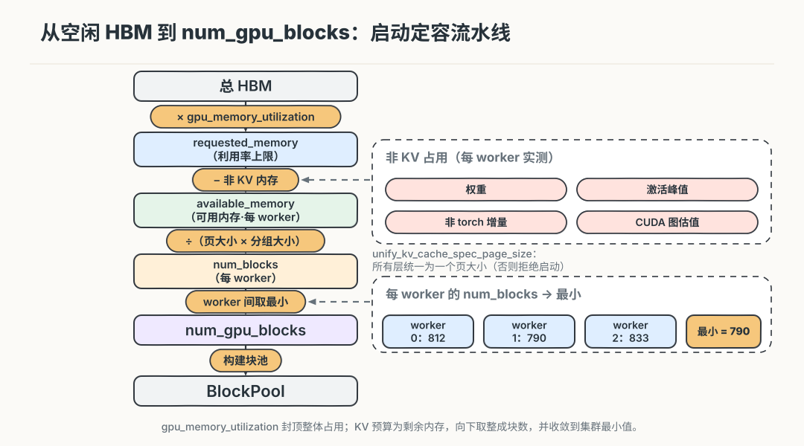</a>

<p class='figure-caption'>HBM 总量 → 利用率上限 → 减去（weights + peak activation + non-torch + cudagraph）→ 每个 worker 的 `available_memory` → ÷（统一的 page_size × group_size）→ 每个 worker 的 `num_blocks` → 在所有 worker 中取最小值 → `num_gpu_blocks` → `BlockPool`。</p>

### 主干：由整个 cluster 汇聚出一个 scalar

最终用于确定 `BlockPool` 大小的 scalar，来自一条跨越三个进程职责边界的链路——每个 worker 都会对自身显存进行 profiling，并上报各自的 layer spec；engine core 将这些结果 fan-in 后进行归并，再把结果 broadcast 回去。engine-core driver 构成了这条链路的主干。

来源：`vllm/v1/engine/core.py:L283-L296`

```python
                available_gpu_memory = self.model_executor.determine_available_memory()
                self.available_gpu_memory_for_kv_cache = available_gpu_memory[0]
        else:
            # Attention free models don't need memory for kv cache
            available_gpu_memory = [0] * len(kv_cache_specs)

        assert len(kv_cache_specs) == len(available_gpu_memory)

        # Track max_model_len before KV cache config to detect auto-fit changes
        max_model_len_before = vllm_config.model_config.max_model_len

        kv_cache_configs = get_kv_cache_configs(
            vllm_config, kv_cache_specs, available_gpu_memory
        )
```

`kv_cache_specs` 是一个 **list，每个 worker 对应一个 dict**（通过 `collective_rpc("get_kv_cache_spec")` gather 得到）；在 pipeline parallelism 下，不同 worker 持有不同的 layer，因此这些 dict 也各不相同。`determine_available_memory()` 返回一个 **字节预算 list，每个 worker 对应一项**（executor 将 RPC fan-out 到各 worker）——每个条目都是对应 worker 自己的“KV cache 可用显存”。`assert len(kv_cache_specs) == len(available_gpu_memory)` 将这两个 list 按位置一一绑定。二者共同传入 `get_kv_cache_configs(vllm_config, kv_cache_specs, available_gpu_memory)`；该函数会逐 worker 调用 `(specs, bytes) → KVCacheConfig`，并将结果归并为一个 `num_blocks`。

来源：`vllm/v1/engine/core.py:L305-L311`

```python
        scheduler_kv_cache_config = generate_scheduler_kv_cache_config(kv_cache_configs)
        vllm_config.cache_config.num_gpu_blocks = scheduler_kv_cache_config.num_blocks
        kv_cache_groups = scheduler_kv_cache_config.kv_cache_groups
        if kv_cache_groups:
            vllm_config.cache_config.block_size = min(
                g.kv_cache_spec.block_size for g in kv_cache_groups
            )
```

`generate_scheduler_kv_cache_config` 将这些 worker config 归并为单个 `num_blocks` 值，用于构建 `BlockPool`。

**利用率上限：`gpu_memory_utilization` 限制的是整体显存占用**

在任何 profiling 开始之前，每个 worker 都会先设定一个硬上限。[第 1 节](#1-kv-cache-是-serving-场景中的内存核心问题) 中用于除法计算的预算，并不是从原始空闲显存中切出的——它取自 `total_memory × gpu_memory_utilization`。

来源：`vllm/v1/worker/utils.py:L410-L423`

```python
    requested_memory = math.ceil(
        init_snapshot.total_memory * cache_config.gpu_memory_utilization
    )

    if init_snapshot.free_memory < requested_memory:
        raise ValueError(
            f"Free memory on device {init_snapshot.device_} "
            f"({format_gib(init_snapshot.free_memory)}/"
            f"{format_gib(init_snapshot.total_memory)} GiB) on startup "
            f"is less than desired GPU memory utilization "
            f"({cache_config.gpu_memory_utilization}, "
            f"{format_gib(requested_memory)} GiB). Decrease GPU memory "
            f"utilization or reduce GPU memory used by other processes."
        )
```

`requested_memory = ceil(total_memory × gpu_memory_utilization)` 限制的是整个 vLLM 的显存占用，而不只是 KV cache。启动快照会在 NCCL 初始化和 allocator 清理完成后采集；如果当前空闲 HBM 低于请求的上限，初始化就会失败，并报告缺口。

**通过 profiling 将上限换算为 KV 字节预算**

`determine_available_memory` 会以最大 batch size 执行一次 dummy forward pass，测量模型*实际*占用的显存，再从 `requested_memory` 中扣除这部分。剩余部分就是 `available_memory`——也就是[第 1 节](#1-kv-cache-是-serving-场景中的内存核心问题) 直接视为已知量的参数。（也可以绕过这一步：如果运维人员显式设置了 `kv_cache_memory_bytes`，就会跳过 profiling，直接使用该确切数量，即 `gpu_worker.py:L448-L451`。）首先会汇总测得的 non-KV 总占用。

来源：`vllm/v1/worker/gpu_worker.py:L495-L499`

```python
        profile_result.non_kv_cache_memory = (
            profile_result.non_torch_increase
            + profile_result.torch_peak_increase
            + profile_result.weights_memory
        )
```

`non_kv_cache_memory` 由三类必须驻留在 HBM、但*不属于* KV cache 的占用组成：PyTorch allocator 之外的原始 CUDA/library allocations（`non_torch_increase`）、dummy forward 期间的 PyTorch activation 峰值（`torch_peak_increase`，在 cudagraph 之前采集，以避免重复计数，`L491-L494`），以及 model weights。随后执行减法，同时防范一种经典的 race condition。

来源：`vllm/v1/worker/gpu_worker.py:L513-L529`

```python
        free_gpu_memory = profile_result.after_profile.free_memory
        # NOTE(woosuk): Here we assume that the other processes using the same
        # GPU did not change their memory usage during the profiling.
        assert self.init_snapshot.free_memory >= free_gpu_memory, (
            "Error in memory profiling. "
            f"Initial free memory {format_gib(self.init_snapshot.free_memory)} GiB, "
            f"current free memory {format_gib(free_gpu_memory)} GiB. "
            "This happens when other processes sharing the same container "
            "release GPU memory while vLLM is profiling during initialization. "
            "To fix this, ensure consistent GPU memory allocation or "
            "isolate vLLM in its own container."
        )
        self.available_kv_cache_memory_bytes = (
            self.requested_memory
            - profile_result.non_kv_cache_memory
            - cudagraph_memory_estimate_applied
        )
```

这里的减法为 `requested_memory − non_kv_cache_memory − cudagraph_estimate`。只有启用相应的 profiling flag，才会计入 CUDA-graph 项。该 assertion 会拒绝 external-memory baseline 发生变化的情况，而不是根据前后不一致的 snapshot 推算容量。

### 所有 layer 使用统一的 page size——`get_num_blocks` 所假定的前提条件

[第 1 节](#1-kv-cache-是-serving-场景中的内存核心问题) 引用了 `get_num_blocks` 及其 floor division `available_memory // page_size // num_layers`，[第 15 节](#15-coordinator-与-hybrid-kv-cache当一种-block-类型不够用时) 则详细介绍了四套彼此独立的 `page_size_bytes` 公式（attention K+V、Mamba state-tensor sum、compressed-MLA、padded）。但两节都没有讨论这两个事实叠加后产生的问题：`KVCacheManager` 只能分配一种固定大小的 block，而 hybrid model 的不同 layer 会报告不同的 `page_size_bytes`。在 grouping 前，必须将它们统一到同一种 page。这正是 `unify_kv_cache_spec_page_size` 的作用。

源码：`vllm/v1/core/kv_cache_utils.py:L1075-L1111`

```python
    max_page_size = max(page_sizes)
    new_kv_cache_spec = {}
    for layer_name, layer_spec in kv_cache_spec.items():
        if layer_spec.page_size_bytes == max_page_size:
            new_kv_cache_spec[layer_name] = layer_spec
        elif isinstance(layer_spec, MambaSpec):
            # MambaSpec's page size is determined by its state shapes and does
            # not scale with block_size, so pad the page instead. This is the
            # same padding mechanism the platform uses to align Mamba pages
            # with the main model's attention page size; it is needed here
            # when another layer (e.g. from a draft model) has a larger page
            # than the already-aligned Mamba page.
            new_spec: KVCacheSpec = replace(layer_spec, page_size_padded=max_page_size)
            assert new_spec.page_size_bytes == max_page_size
            new_kv_cache_spec[layer_name] = new_spec
        else:
            layer_page_size = layer_spec.page_size_bytes
            if max_page_size % layer_page_size == 0:
                ratio = max_page_size // layer_page_size
                new_block_size = layer_spec.block_size * ratio
                new_spec = replace(layer_spec, block_size=new_block_size)
            elif (
                isinstance(layer_spec, AttentionSpec)
                and layer_spec.indexes_kv_by_block_stride
            ):
                new_spec = replace(layer_spec, page_size_padded=max_page_size)
            else:
                raise NotImplementedError(
                    f"Layer {layer_name}: page size is not divisible by the "
                    "maximum page size and cannot be padded. Padding is only "
                    "supported for attention layers whose backend indexes KV "
                    "pages by the block stride (indexes_kv_by_block_stride is "
                    "True)."
                )
            assert new_spec.page_size_bytes == max_page_size
            new_kv_cache_spec[layer_name] = new_spec
    return new_kv_cache_spec
```

目标值是 `max_page_size`，即所有 layer 中最大的 page；每个较小的 layer 都会通过三种机制之一扩展到该大小。已经达到最大值的 layer 保持不变。`MambaSpec` 的 page 由其 state-tensor shape 决定，并不会随 `block_size` 缩放（参见[第 15 节](#15-coordinator-与-hybrid-kv-cache当一种-block-类型不够用时)），因此无法通过增加 token 来扩展，只能进行 **padding**，具体由 `page_size_padded=max_page_size` 完成。对于可整除的 attention layer，会按精确比例（`block_size *= max_page_size // page`）增大其 `block_size`，从而让 page 恰好扩展到最大值——回顾[第 15 节](#15-coordinator-与-hybrid-kv-cache当一种-block-类型不够用时)，attention page 为 `2 · block_size · num_kv_heads · head_dim · dtype`，与 `block_size` 呈线性关系。

对于不可整除的 attention layer，只有 backend 通过 `indexes_kv_by_block_stride` 明确选择支持 padding 时才能进行 padding（它会通过 strided view 读取 padded page）；否则就会触发 `NotImplementedError`——vLLM 宁可拒绝运行，也不会悄无声息地采用错误的 block size。所有分支最终都会执行 `assert new_spec.page_size_bytes == max_page_size`。其后置条件是：**统一后，每个 layer 报告的 `page_size_bytes` 完全相同。** 较小的 layer 此时会多分配内存（这是真实的空间浪费），但这样可以确保单一 block size 在全局范围内有效。对于 hybrid model，这恰好使 `get_num_blocks` 的单一 `page_size` argument（[第 1 节](#1-kv-cache-是-serving-场景中的内存核心问题)）以及 `get_uniform_page_size` 内部的 `assert len(page_sizes) == 1` 都有明确定义。这段逻辑位于默认的通用 grouping 路径上；[第 15 节](#15-coordinator-与-hybrid-kv-cache当一种-block-类型不够用时) 介绍了 group-*topology* dispatch（`get_kv_cache_groups`），它决定这些已统一的 layer 最终会落入多少个 group。

### 从 group 和 byte 到物理 tensor：`get_kv_cache_config_from_groups`

`get_num_blocks`（[第 1 节](#1-kv-cache-是-serving-场景中的内存核心问题)）给出了通用场景下的算术计算，但 config builder 会选择 *divisor* 并生成物理 `KVCacheTensor` layout，而且会针对不同 grouping 采用不同方式。默认的通用路径如下：

源码：`vllm/v1/core/kv_cache_utils.py:L1385-L1402`

```python
        group_size = max(len(group.layer_names) for group in kv_cache_groups)

        page_size = get_uniform_page_size(
            [group.kv_cache_spec for group in kv_cache_groups]
        )
        assert group_size > 0, "group_size must be greater than 0"
        num_blocks = get_num_blocks(
            vllm_config, group_size, available_memory, page_size
        )
        kv_cache_tensors = []
        for i in range(group_size):
            shared_by = []
            for j in range(len(kv_cache_groups)):
                if i < len(kv_cache_groups[j].layer_names):
                    shared_by.append(kv_cache_groups[j].layer_names[i])
            kv_cache_tensors.append(
                KVCacheTensor(size=page_size * num_blocks, shared_by=shared_by)
            )
```

`group_size` 表示 *layers per group*（取所有 group 中的最大值），它正是传给[第 1 节](#1-kv-cache-是-serving-场景中的内存核心问题)中 `get_num_blocks` 的 `num_layers` 参数值，因此对应的向下整除为 `available_memory // page_size // group_size`。`get_uniform_page_size` 用于确认上一步选定的 page size。随后会生成 `group_size` 个 tensor，其中 tensor `i` `shared_by` 每个 group 的第 `i` 个 layer，大小为 `page_size × num_blocks`：不同 group 中的 layer 占用同一物理 tensor 的不同区域，并通过各自的 block table 进行索引（[第 20 节](#20-从-block-table-到-kernelslot_mapping-与-device-tensors)）。

其他 layout 只会改变除数，边界保持不变：uniform spec 按 layer 累加 page size，packed layout 按 slot 累加字节数，而 attention-free model 会保留一个不含 KV tensor 的 null block。每条分支都会在 `available_memory` 内生成一个标量 `num_blocks`。

### 协调 cluster：所有 worker 最终收敛到 `min_num_blocks`

每个 worker 都会根据自身的内存预算和 layer 数量计算 `num_blocks`。在 pipeline parallelism 下，这些值并不相同——layer 更多或可用显存更少的 stage 会得到更少的 block。但 scheduler 面对的是**同一个** block namespace（[第 3 节](#3-kvcacheblock-与-blockpoolfree-list-是一种淘汰结构)、[第 9 节](#9-allocate_slots-是策略栈而不是一次-allocation)），因此整个 cluster 必须就唯一的数量达成一致。具体的协调方式就是按最小值 clamp。

来源：`vllm/v1/core/kv_cache_utils.py:L2132-L2142`

```python
    min_num_blocks = min(
        kv_cache_config.num_blocks for kv_cache_config in kv_cache_configs
    )
    for kv_cache_config in kv_cache_configs:
        num_blocks_old = kv_cache_config.num_blocks
        kv_cache_config.num_blocks = min_num_blocks

        # Shrink tensor size proportionally
        for tensor in kv_cache_config.kv_cache_tensors:
            assert tensor.size % num_blocks_old == 0
            tensor.size = tensor.size // num_blocks_old * min_num_blocks
```

最受限的 worker 决定整个 cluster 的上限。每个 tensor 都按 `min_num_blocks` 等比例缩小；由于其原始大小等于 page size 乘以原 block 数量，整除关系仍然成立。

来源：`vllm/v1/core/kv_cache_utils.py:L1780-L1782`

```python
    assert all(
        [cfg.num_blocks == kv_cache_configs[0].num_blocks for cfg in kv_cache_configs]
    )
```

最后的 assertion 要求所有 worker 的数量完全一致。在 clamp 之前，同一批投影后的 config 还会执行单 request 可行性检查；如果存在 `num_gpu_blocks_override × bytes_per_block`，则用它替换 profiling 得到的内存预算。

**回到 worker：标量变成 pool**

协调后的 config 会 broadcast 回去；每个 worker 记录 `num_blocks`，并将这些 tensor 实体化。

来源：`vllm/v1/worker/gpu_worker.py:L704-L716`

```python
        # Update local config with adjusted num blocks after profiling,
        # so that it's available to the warmup stage.
        self.cache_config.num_gpu_blocks = kv_cache_config.num_blocks

        # Init kv cache connector here, because it requires
        # `kv_cache_config`.
        # NOTE(Kuntai): This need to be done before `initialize_kv_cache`,
        # because `initialize_kv_cache` will inject kv cache groups not
        # related to kv cache connector (e.g. kv cache sharing layers).
        ensure_kv_transfer_initialized(self.vllm_config, kv_cache_config)

        with self._maybe_get_memory_pool_context(tag="kv_cache"):
            self.model_runner.initialize_kv_cache(kv_cache_config)
```

`cache_config.num_gpu_blocks = kv_cache_config.num_blocks` 会在本地记录协调后的标量，随后 `initialize_kv_cache` 在 CuMem pool 内为每个 `KVCacheTensor` 分配空间（大小为 `page_size × num_blocks`）。这个 `num_gpu_blocks` 也正是构造[第 3 节](#3-kvcacheblock-与-blockpoolfree-list-是一种淘汰结构)中的 `BlockPool` 时使用的数量——也就是一个 `KVCacheBlock(idx) for idx in range(num_gpu_blocks)`，正如[第 1 节](#1-kv-cache-是-serving-场景中的内存核心问题)和[第 3 节](#3-kvcacheblock-与-blockpoolfree-list-是一种淘汰结构)所述——同时也是[第 1 节](#1-kv-cache-是-serving-场景中的内存核心问题)中容量计数器监控的 free queue 长度。

## 5. 作为 KV 状态持有者的 Request：block_hashes、num_computed_tokens 与推测 token

在 runtime，`Request`（`vllm/v1/request.py`）是 request KV state 的共享可变权威数据源。它的 token 流决定长度计算；`block_hashes` 为可复用 prefix 生成 fingerprint；`num_computed_tokens` 会乐观推进，并可执行回滚；`spec_token_ids` 则不计入已提交数量。每个与 KV 相关的字段都只有一个 writer，因此即使采用异步调度和 pipeline-parallel 提前执行，这些状态转换仍能保持一致。

<a href='images/vllm-06-19-request-state.svg' target='_blank'>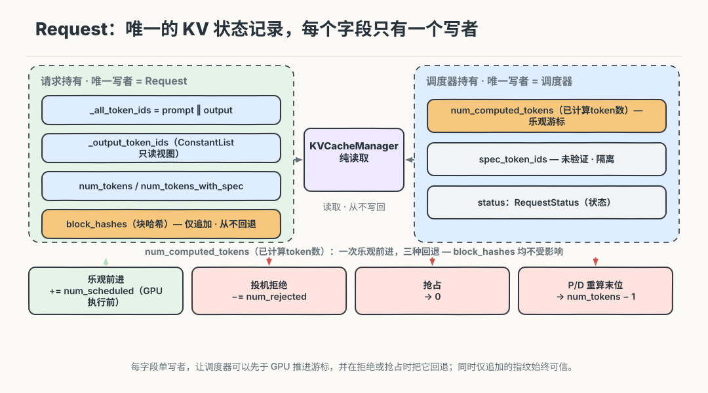</a>

<p class='figure-caption'>`Request` 的 KV-state 字段及其唯一 writer：token 流与 `block_hashes`（append-only，由 `Request` 自身写入），以及 `num_computed_tokens` / `spec_token_ids` / `status`（由 scheduler 写入）；`KVCacheManager` 只读取这些字段，不执行任何写入。</p>

**三条同步增长的 token 流**

整个 KV 路径依赖的长度计算——一个 request 有多少 token、其中多少是输出 token，以及计入尚未验证的 draft 后共有多少 token——都直接根据 list 计算，而不是存储在 counter 中。构造时会初始化这些 list：

`vllm/v1/request.py:L133-L138`

```python
        self._output_token_ids: list[int] = []
        self._all_token_ids: list[int] = (
            self.prompt_token_ids.copy()
            if self.prompt_token_ids is not None
            else [0] * self.num_prompt_tokens
        )
```

`_all_token_ids` 是 `prompt || output` 的拼接结果。它会以 prompt 的**副本**作为初始值，因此绝不会引用或修改调用方传入的 prompt list。若 prompt 仅包含 embeds（`prompt_token_ids is None`），则会初始化为 `num_prompt_tokens` 个用于占位的 0，真实内容则存放在 `prompt_embeds` 中。三个长度属性都直接从这些 list 中读取：

`vllm/v1/request.py:L251-L261`

```python
    @property
    def num_tokens(self) -> int:
        return len(self._all_token_ids)

    @property
    def num_tokens_with_spec(self) -> int:
        return len(self._all_token_ids) + len(self.spec_token_ids)

    @property
    def num_output_tokens(self) -> int:
        return len(self._output_token_ids)
```

`num_tokens` 是*已提交*长度，即 prompt 加上所有已追加的输出，并在每个 decode step 中持续增长。`num_tokens_with_spec` 则是在此基础上**加上**当前附加的 draft，并在需要时动态求和。speculative token 不在 `_all_token_ids` 中；它们尚未经过验证，存放在 `spec_token_ids` 中（见下文）。这种拆分正是[第 10 节](#10-scheduler-契约调度过程如何驱动-kv-cache-manager)中 `schedule()` docstring 所依据的模型（“每个 request 只有 `num_computed_tokens` 和 `num_tokens_with_spec`”），因此这里的属性边界*就是* scheduler 追赶目标循环的边界。

底层的两个 list 绝不能出现偏差。engine 并非仅靠约定来保证这一点，而是在结构层面强制执行：

`vllm/v1/request.py:L164-L168`

```python
        # Read-only views
        # Prevent directly appending to these lists since
        # they should also be updated simultaneously.
        self.output_token_ids = ConstantList(self._output_token_ids)
        self.all_token_ids = ConstantList(self._all_token_ids)
```

engine 的其余部分只能接触到 `ConstantList` wrapper，因此外部代码无法只向其中一个 list append，而不同时更新另一个。唯一获准执行写入的是：

`vllm/v1/request.py:L229-L240`

```python
    def append_output_token_ids(
        self,
        token_ids: int | list[int],
    ) -> None:
        if isinstance(token_ids, int):
            self._output_token_ids.append(token_ids)
            self._all_token_ids.append(token_ids)
        else:
            self._output_token_ids.extend(token_ids)
            self._all_token_ids.extend(token_ids)

        self.update_block_hashes()
```

每次提交输出 token 时，都会先 (1) 向两个底层 list 同步 append，再 (2) 立即刷新 `block_hashes`。输出流和全 token 流只会在这里同步增长；而且每当 `_all_token_ids` 变长时，都会重新计算 `block_hashes`。因此，fingerprint 相对 token 流的滞后量绝不会超过一个未填满的 partial block。不存在只 append token、却不在同一次调用中同步推进 hash list 的代码路径。

### `block_hashes`：仅追加，且*不会*回滚

`block_hashes` 是每个 request 独有的 `BlockHash` list，prefix 中每个完整的 hash-block chunk 对应一个条目。该字段及其 updater 属于 `Request`；至于 hasher 主体——每个条目如何串联其 parent，以及如何纳入 LoRA / multimodal / cache-salt / prompt-embed key——则属于[第 7 节](#7-prefix-cache-lookuphashing最长命中与最后一个-token-重计算规则)和第 07 篇的内容。

`vllm/v1/request.py:L184-L189`

```python
        self.block_hashes: list[BlockHash] = []
        # Store the block hasher without binding self to avoid creating a
        # reference cycle (Request -> partial -> Request) that prevents
        # immediate garbage collection via reference counting.
        self._block_hasher: Callable[[Request], list[BlockHash]] | None = block_hasher
        self.update_block_hashes()
```

这里隐藏着两项设计考量。首先，hasher 特意以 *unbound* 形式存储：它只是一个普通 callable，在调用时接收 `self`，而不是 `partial(fn, self)`。这样可以避免形成 `Request -> partial -> Request` reference cycle，导致这个高频创建、生命周期很短的对象无法及时被 garbage collection。KV manager 从不会让 `Request` 继续存活，因此预期的回收路径是 refcount GC。其次，`update_block_hashes()` 会在 `__init__` 中运行一次，为 prompt 中已有的所有完整 block 计算 hash。updater 本身只有三行：

`vllm/v1/request.py:L242-L245`

```python
    def update_block_hashes(self) -> None:
        """Compute block hashes for any new full blocks and append them."""
        if self._block_hasher is not None:
            self.block_hashes.extend(self._block_hasher(self))
```

`extend`——不赋值、不截断，也绝不 `del`。它只会追加 hasher 返回的新 full-block hash。hasher（即 `kv_cache_utils.py:L688`，[第 7 节](#7-prefix-cache-lookuphashing最长命中与最后一个-token-重计算规则)给出了完整代码）会从 `start_token_idx = len(request.block_hashes) * hash_block_size` 处继续，并拒绝处理尾部任何不完整的 block。因此，重复调用既支持增量计算，又具备幂等性：`len(block_hashes) == num_tokens // hash_block_size`；已 hash 的 prefix 始终覆盖 `<= num_tokens`。

对*本*节而言，关键在于它与下一个字段形成的对比。`block_hashes` **永远不会被截断——即使发生 preemption 或 speculative token rejection 也不例外。** request 被 preempt 时，其 block 会被释放，`num_computed_tokens` 会重置为 0（见下文），但 `block_hashes` list 保持不变，因为这些位置上的 token *内容*并未发生变化：同一份 prompt-plus-output 仍会得到相同的 fingerprint。request 在 resume 时，正是依靠这些 fingerprint，才能通过 `get_computed_blocks` 再次命中自己刚刚释放的 block（或其他 tenant 的相同 prefix）。被拒绝的 draft token 原本就从未 commit 到 `_all_token_ids`，因此也从未产生需要回滚的 hash。由此可见，append-only 并非 updater 偶然呈现的特性；正是这一特性，让被 preempt 或 speculative decoding 发生误判的 request 能够以较低成本恢复。

后续[第 8 节](#8-prefix-cache-写入路径cache_full_blocks-与提交-hash)的 cache-write 路径依赖这种单调性——`block_pool.cache_full_blocks` 会 assert `len(block_hashes) >= num_full_blocks`；只要 hash list 的进度落后于已完成计算的 full block 数量，该断言就会立即触发。

`block_hashes` 仅追加、仅处理 full block，并且在 request 的整个生命周期内始终保持单调，包括 preemption 和 rejection。其长度是判断“已经 hash 到哪里”的 ground truth，并且与所有物理 `block_id` 完全解耦。

### `num_computed_tokens`：乐观 cursor 与三次回滚

`block_hashes` 从不后退，而 `num_computed_tokens` 则会频繁回退。它只是一个普通的可变 int，并非 property；它归 `Request` 所有，但*仅*由 scheduler 写入：

`vllm/v1/request.py:L157-L158`

```python
        self.spec_token_ids: list[int] = []
        self.num_computed_tokens = 0
```

这个 cursor 将“已经计算（或乐观地视为已经计算）”的前缀与“仍待计算”的后缀分隔开来。关键全在 *乐观* 二字，源码也直接点明了这一点：

`vllm/v1/request.py:L144-L147`

```python
        # Tokens of steps whose output is not yet processed (async scheduling
        # and PP run ahead of the GPU); `num_computed_tokens` counts them
        # optimistically.
        self.num_in_flight_tokens = 0
```

cursor 的推进发生在 *schedule* 阶段，此时 GPU 尚未产出任何结果：

`vllm/v1/core/sched/scheduler.py:L1179-L1189`

```python
        num_scheduled_tokens = scheduler_output.num_scheduled_tokens
        for req_id, num_scheduled_token in num_scheduled_tokens.items():
            request = self.requests[req_id]
            request.num_computed_tokens += num_scheduled_token
            request.num_in_flight_tokens += num_scheduled_token
            if self.defer_block_free:
                # Record the in-flight step, to fence deferred block freeing.
                request.last_sched_seq = self.sched_step_seq
            request.is_prefill_chunk = request.num_computed_tokens < (
                request.num_tokens + request.num_output_placeholders
            )
```

cursor 的推进量恰好等于本轮调度的 token 数。这样，*下一轮*调度就能立即继续推进 request（将下一个 prefill chunk 或下一轮 decode 放入 queue），无需等待 forward pass 完成——正是这一机制让 async scheduling 和 PP run-ahead 成为可能。`is_prefill_chunk` 是一个派生 boolean：当且仅当 cursor 尚未到达已提交长度时，request 仍处于 prefill。[第 10 节](#10-scheduler-契约调度过程如何驱动-kv-cache-manager)从协同编排的角度解读了这一循环；本节关注的范围更窄——这个数值实际上是一次*押注*：所有已调度的 token，包括 speculative token，最终都会生效。当押注落空时，三条 code path 会将它回退——其中两条适用于通用场景（spec rejection、preemption），另一条仅限于 P/D remote-KV path；每条路径最终都会让它落到与 cache 中实际内容一致的值。

**回滚 1——speculative rejection。** sampler 接受部分 draft、拒绝其余 draft，而这次乐观推进会严格按照被拒绝的 token 数回退：`if request.num_computed_tokens > 0: request.num_computed_tokens -= num_rejected`（`scheduler.py:L1604-L1611`，并由 `> 0` 提供保护，确保它不会变成负数；在 async 场景下，`num_output_placeholders` 也会同步调整）。[第 14 节](#14-speculative-decoding-遇上-kv-cachelookahead-slots-与-rollback)引用并剖析了完整的回滚过程——包括如何从 sampler output 推导出 `num_rejected = num_draft_tokens - num_accepted`，以及 finish check 如何扣除仍未验证的 draft。对*本节*而言，关键在于 `block_hashes` *不会*被修改——被拒绝的 draft 从未进入 `_all_token_ids`，因此没有任何 hash 需要撤销。这正是将 speculation 排除在 committed state 之外所带来的直接收益。

**回滚 2——preemption 时归零。**

`vllm/v1/core/sched/scheduler.py:L1154-L1161`

```python
        self._free_request_blocks(request)
        self.encoder_cache_manager.free(request)
        self._inflight_prefills.discard(request)
        request.status = RequestStatus.PREEMPTED
        request.num_computed_tokens = 0
        if request.spec_token_ids:
            request.spec_token_ids = []
        request.num_preemptions += 1
```

Preemption 会释放该 request 的 block（preemption 是[第 13 节](#13-压力之下抢占重计算与-block-回收)的主题；free-list 机制见[第 23 节](#23-physical-block-的生命周期分配使用释放进入-cache淘汰)），并将 cursor 硬重置为 0。该 request 恢复执行时必须重新计算整个 prefix，不过借助 prefix caching，其中大部分结果或许可以零成本复用。`spec_token_ids` 会被清空（其中的 draft 会被丢弃），同时 `num_preemptions` 递增，以便 `get_computed_blocks` 在 prefix-cache 统计信息（`kv_cache_manager.py:L239`）中将该 request 标记为“至少重新计算过一次”。此外，正如前文强调的那样，`block_hashes` 会被刻意保留，以便重算时仍能 cache *hit*。

**回退 3（仅限 P/D）——recompute-last-token clamp。** 这并不是一种通用的向下修正：下面四行代码位于 `_update_waiting_for_remote_kv` 内（method 定义见 `scheduler.py:L2414`），属于 remote-KV 接收完成路径，只有 connector load 完成后才会执行。即使整个 prompt 都能命中 cache，也必须保留一个 token 不计算，模型才能输出 logits：

`vllm/v1/core/sched/scheduler.py:L2441-L2444`

```python
            # on a full prompt hit, we need to re-compute the last token
            # in order to be able to sample the next token
            if request.num_computed_tokens == request.num_tokens:
                request.num_computed_tokens = request.num_tokens - 1
```

在普通的非 disaggregated 路径中，这里根本不存在 write 侧回退：在 *read* 侧，`get_computed_blocks` 中的 `max_cache_hit_length = request.num_tokens - 1`（`kv_cache_manager.py:L227`，[第 7 节](#7-prefix-cache-lookuphashing最长命中与最后一个-token-重计算规则)）会阻止 cursor 到达 `num_tokens`，因此它永远不会前进到 `num_tokens`，也就无需执行 clamp。P/D clamp 与 read 侧上限互为对应的 write 侧机制，只对那些通过外部 cache hit 直接填充 cursor 的 connector/remote-KV request 生效。两者之所以存在，是因为 `allocate_slots()` 要求 `num_computed_tokens` 必须 **block-size aligned**（`kv_cache_manager.py:L224-L225`）。因此，即使只回退一个 token，也可能需要重新计算整个 block，而不是单个位置；同理，恢复执行时的 block invalidation 会把 cursor 截断到 block 边界，而不是 block 中间。

**`spec_token_ids`：已挂载、未验证，并与所有已提交状态隔离**

draft 会单独保存在一个 list 中，正是为了确保在验证通过前，任何已提交计数都无法看到它们。

`vllm/v1/request.py:L157`

```python
        self.spec_token_ids: list[int] = []
```

它们只会出现在一个地方，即 `num_tokens_with_spec`（`request.py:L256-L257`，见上文），其他任何地方都不会出现：不在 `num_tokens` 中，不在 `num_computed_tokens` 中，也不在 `block_hashes` 中。draft proposer 会写入该字段：

`vllm/v1/core/sched/scheduler.py:L1972-L1976`

```python
            # Add newly generated spec token ids to the request.
            if self.structured_output_manager.should_advance(request):
                metadata = request.structured_output_request
                spec_token_ids = metadata.grammar.validate_tokens(spec_token_ids)  # type: ignore[union-attr]
            request.spec_token_ids = spec_token_ids
```

该字段一旦失效，就会立即被清空。在 prefill chunk 中，draft 没有任何意义，因此会被丢弃：

`vllm/v1/core/sched/scheduler.py:L1966-L1970`

```python
            if request.is_prefill_chunk:
                # Ignore draft tokens for prefill chunks.
                if request.spec_token_ids:
                    request.spec_token_ids = []
                continue
```

发生 preemption 时，该字段也会被重置（`scheduler.py:L1159-L1160`，见上文）。在 async scheduling 下，该字段甚至会先被设置为一个共享 placeholder，等待真正的 draft 从 worker 返回：

`vllm/v1/core/sched/async_scheduler.py:L44`

```python
            request.spec_token_ids = self._spec_token_placeholders
```

已验证的 draft 只有通过 `append_output_token_ids`（即上文的 token streams 部分）才会进入已提交状态；这也是刷新 `block_hashes` 的唯一路径。这样的路由设计让回滚记账的成本极低：由于 draft 在验证前绝不会进入 `_all_token_ids` 或 `block_hashes`，拒绝它只需将 `num_computed_tokens` 减 1（回滚 1），无需任何其他操作。[第 9 节](#9-allocate_slots-是策略栈而不是一次-allocation)中的 cache 上限（`min(total_computed_tokens + num_new_tokens, request.num_tokens)`）是在外一层贯彻同一原则：prefix cache 只为最终确认的 token 存储 KV，绝不会缓存未经验证的 draft。

**`RequestStatus`：以 enum 顺序编码终态属性**

manager 还会读取另一个字段 `status`。它并非通过集合成员测试来区分终态与活跃态，而是执行整数比较，因此 enum 的声明顺序必须满足严格约束：

`vllm/v1/request.py:L328-L351`

```python
class RequestStatus(enum.IntEnum):
    """Status of a request."""

    WAITING = enum.auto()
    WAITING_FOR_STRUCTURED_OUTPUT_GRAMMAR = enum.auto()
    WAITING_FOR_REMOTE_KVS = enum.auto()
    WAITING_FOR_STREAMING_REQ = enum.auto()
    RUNNING = enum.auto()
    PREEMPTED = enum.auto()
    # Note: anything after PREEMPTED will be considered
    # as a finished status.
    FINISHED_STOPPED = enum.auto()
    FINISHED_LENGTH_CAPPED = enum.auto()
    FINISHED_ABORTED = enum.auto()
    FINISHED_IGNORED = enum.auto()
    FINISHED_ERROR = enum.auto()
    FINISHED_REPETITION = enum.auto()

    def __str__(self) -> str:
        return self.name

    @staticmethod
    def is_finished(status: "RequestStatus") -> bool:
        return status > RequestStatus.PREEMPTED
```

`is_finished` 只执行一次比较，即 `status > PREEMPTED`；按照这种设计，所有在 `PREEMPTED` 之后声明的成员都属于终态。其生命周期为 `WAITING`（/`WAITING_FOR_*`）→ `RUNNING` → 进入 `FINISHED_*` 终态或 `PREEMPTED`，而 `PREEMPTED` 会通过 `_preempt_request` 回到 waiting queue。`allocate_slots` 在 watermark gate 中读取 `status`，并将 `WAITING` 和 `PREEMPTED` 同等视为受准入控制的状态（[第 9 节](#9-allocate_slots-是策略栈而不是一次-allocation)）。终态属性完全由位置决定，因此 `L337-L338` 处的注释至关重要——如果在 `PREEMPTED` *之后*插入新的非终态，它会在不知不觉中被判定为已完成。

### 读写契约：每个字段仅有一个写入方

综合这些字段，就能得到本节开头提出的约束原则。`KVCacheManager` 是 `Request` KV 状态的纯*读取方*，只写入 block pool 状态。`get_computed_blocks` 读取 `block_hashes`、`num_preemptions` 和 `num_tokens`，不会修改 request 中的任何内容（[第 7 节](#7-prefix-cache-lookuphashing最长命中与最后一个-token-重计算规则)）。`allocate_slots` 以 `num_computed_tokens` 作为 block 布局的基础：

`vllm/v1/core/kv_cache_manager.py:L353-L357`

```python
        # The number of computed tokens is the number of computed tokens plus
        # the new prefix caching hits
        num_local_computed_tokens = (
            request.num_computed_tokens + num_new_computed_tokens
        )
```

在 `request.num_computed_tokens` 的基础上，它会再叠加 `num_new_computed_tokens`（vLLM 新命中的 prefix）和 `num_external_computed_tokens`（由 connector 提供，参见[第 11 节](#11-connector-感知分配外部-kvdelay_cache_blocks-与-pd-分离)），读取 `request.status` 用于 watermark gate，并读取 `request.num_tokens` 用于 full-sequence-fit gate——但这些字段中**没有任何一个**会被写回。唯一的写入方是：`Request` 自身负责写入 token streams 和 `block_hashes`（`append_output_token_ids` / `update_block_hashes`），scheduler 则负责写入 `num_computed_tokens`、`spec_token_ids`、`num_preemptions` 和 `status`。任何字段都不会有两个写入方。

## 6. Block Size 与性能边界

`block_size` 对不同路径的影响并不相同。KV 写入路径（`reshape_and_cache`）几乎不受其影响；MLA 会刻意将物理行与配置的 block size 解耦；speculative allocation 则需要以 block 为单位，为被拒绝的 draft 承担分配成本。因此，常见的碎片率与开销之间的权衡主要体现在读取和容量侧，而非均匀分布在整个系统中。

<a href='images/vllm-06-25-block-size.svg' target='_blank'>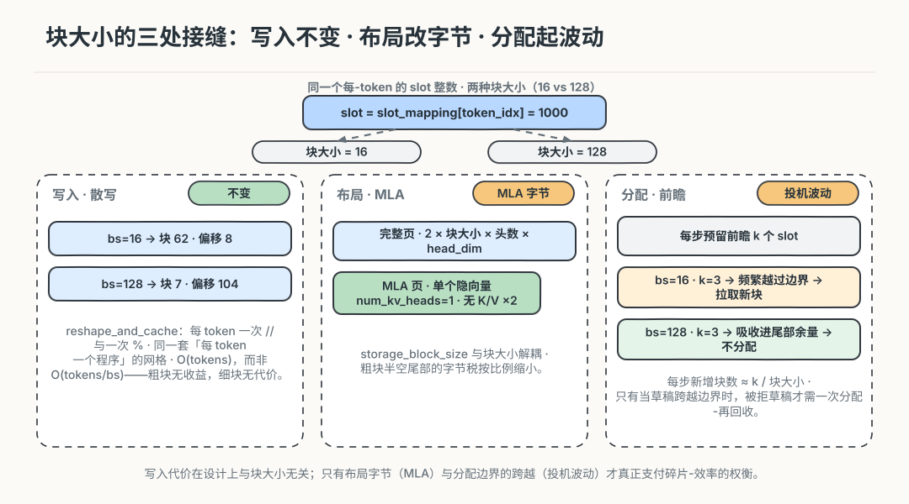</a>

<p class='figure-caption'>图：同一个 per-token `slot_mapping` 值在两种 block size 下的分解——写入开销不受 block size 影响，但布局字节数和跨越分配边界的次数会发生变化。</p>

**写入路径不感知 block size：`reshape_and_cache` 只会被拆分，绝不会被摊销**

在 backend 写入 KV 之前，manager 会将 logical block 解析为 per-token `slot_mapping`。随后，kernel 计算 `block_idx = slot // block_size` 和 `block_offset = slot % block_size`；`block_size` 是编译期常量，而每个 program 仍只写入一个 token 的 K 和 V。因此，写入开销为 O(tokens)，与 block 粒度无关。

`slot < 0` 会在这一步拆分之前排除 CUDA graph padding。更大的 block 主要用于摊销读取侧遍历 block table 的开销，并不会减少 KV 写入次数。

### MLA 将计数的 token 与实际存储的行解耦

MLA 将 `block_size`（逻辑 token 跨度）、`storage_block_size`（存储的 latent 行数）和 `page_size_bytes`（预留字节数）彼此分离。压缩可以减少实际存储的行数，而只 cache 一个 joint latent，则不再需要分别存储 K/V，也无需进行 per-head 扩展。scheduler 仍以 `block_size` 为单位寻址 token 位置。

自定义 `fp8_ds_mla` 布局则采用固定的 584/656 字节 token footprint，并可能额外加入 alignment padding。第 19 节推导了这些布局；allocator 必须按经过 padding 的 page size 预留空间，但不能让 token 索引感知到这些 padding。

**Speculative decoding：为可能永远不会 commit 的 token 预留 block**

`num_lookahead_tokens` 由 speculative method 固定决定：EAGLE、draft-model 和 DSpark 使用 `k`，DFlash 使用 `k+1`。在 drafter 运行前，这些临时位置会被分配真实 slot，但 `request.num_tokens` 处的 cache 发布上限会将它们排除在外。

额外的 block 需求取决于 lookahead 是否跨越当前 block 边界——每一步大约需要 `k / block_size` 个 block。发生拒绝时，cursor 会回退；后续回收则使用可确保 in-flight 安全的 processed-token 边界。因此，临时 KV 可以被覆盖，并且永远不会成为共享 cache entry。

### frontier 真正发挥作用的地方

这三类权衡具有普适性。本文中所有涉及 `block_size` 的路径，都要在这条权衡边界的某一侧付出代价；其中只有一条路径在两个方向上都不受影响：

| 涉及 `block_size` 的路径 | 增大 `block_size` | 减小 `block_size` | 依据所在位置 |
| --- | --- | --- | --- |
| KV write scatter（`reshape_and_cache`） | **不变**——grid 按 token 建立索引，`block_size` 仅作为 `tl.constexpr` 的除数参与计算 | **不变**——program 数量相同，每个 token 的 payload 也相同 | [第 22 节](#22-reshape_and_cachetoken-kv-如何进入物理-block) |
| Paged-attention read gather | 成本更低——连续区段数量更少、长度更长，每个 request 的 block table 也更短 | 成本更高——每个 token 都需要更多 block-table 间接寻址 | 第 08 篇 |
| 尾 block 的内部碎片 | 成本更高——每个 sequence 的最后一个 block 中，最多会有 `block_size - 1` 个 token slot 被闲置 | 成本更低——尾部更短，因而闲置空间更少 | [第 1 节](#1-kv-cache-是-serving-场景中的内存核心问题)和[第 2 节](#2-论文模型blockblock-table共享与-copy-on-write) |
| Prefix-cache 命中粒度 | 更粗——命中范围会向下取整到完整 block；`hash_block_size` 是对应的兜底机制 | 更细——能够在更接近真实边界的位置识别共享 prefix | [第 7 节](#7-prefix-cache-lookuphashing最长命中与最后一个-token-重计算规则)和[第 4 节](#4-block-从何而来memory-profilingnum_gpu_blocks-与-kv-cache-配置) |
| 单个 block 预留的字节数 | 成本按比例升高——除非 MLA 通过解耦 `storage_block_size` 并消除 K/V 的双倍系数来改变基准 | 成本按比例降低 | [第 19 节](#19-mla压缩-latent-kv-cache) |
| Speculative lookahead 引发的分配抖动 | 成本更低——每个 decode step 大约新增 `k / block_size` 个 block，因此大多数 step 都无需分配 | 成本更高——lookahead 更容易跨越 block 边界 | [第 14 节](#14-speculative-decoding-遇上-kv-cachelookahead-slots-与-rollback) |
| Cascade 共享 prefix 粒度 | 更粗——`common_prefix_len // block_size * block_size` 会从 prefix kernel 中截掉更多共享 prefix | 更细——取整后能保留更多真正的公共 prefix | [第 12 节](#12-cascade-attention整个-batch-共享同一个-prefix) |

只有 read-gather 这一行体现了这条边界之所以得名的摊销效应，而它恰好也是本文唯一不展开的内容。如果你的问题是“为了提高 throughput，block 应该设多大”，而不是“block size 会给 memory manager 带来什么代价”，那么接下来应该阅读第 08 篇。

## 7. Prefix-Cache Lookup：Hashing、最长命中与最后一个 Token 重计算规则

Prefix caching 允许 prompt prefix 相同的 request 共享物理 KV block，从而跳过重复计算。lookup 路径必须在不改变归属关系的前提下确认内容一致性，并找出最长且安全的命中范围：它只执行探测，**不会**修改引用计数或 free queue。

该 commit 步骤由 `allocate_slots` 和 `touch` 负责（[第 9 节](#9-allocate_slots-是策略栈而不是一次-allocation)和[第 23 节](#23-physical-block-的生命周期分配使用释放进入-cache淘汰)）。lookup 必须保持无副作用，这样 scheduler 才能在判断 request 是否可接受之前，以推测方式查询“这个 request 可以复用哪些内容？”

**入口是只读 probe，并设有两条保障正确性的逃生路径**

scheduler 只关心一个问题：“这个 request 的 prompt 有多少已经计算完成？”该查询从 `get_computed_blocks` 进入。在执行任何 hashing 之前，两个 guard 会先进行短路处理。

`vllm/v1/core/kv_cache_manager.py:L214-L219`

```python
        # We skip finding the prefix cache hit when prefix caching is
        # disabled or the request is marked as skipping kv cache read
        # (which happens when the request requires prompt logprobs
        # or calls a pooling model with all pooling).
        if not self.enable_caching or request.skip_reading_prefix_cache:
            return self.empty_kv_cache_blocks, 0
```

第一个 guard（`not self.enable_caching`）很好理解。第二个（`request.skip_reading_prefix_cache`）则更为微妙：对于 prompt-logprobs request 和所有 pooling request，模型必须对每个 prompt token *实际执行 forward pass*，才能生成调用方要求的逐 token 输出。如果这些 token 直接从 cache 中获取，forward pass 就不会处理它们，所需的 logprobs/embeddings 也就无法生成。因此，这里要求完整重算是为了保证正确性，而非出于内存考虑，最终 request 返回 `(empty_singleton, 0)`。注意，返回值是共享的 `empty_kv_cache_blocks` singleton（[第 9 节](#9-allocate_slots-是策略栈而不是一次-allocation)），因此常见的“关闭 cache / 主动退出”路径不会分配任何对象。

`get_computed_blocks` 只返回*完整且按 block 对齐*的已计算 prefix（其 `L204` 处的 docstring 明确写道“the computed blocks must be full”），并且绝不会为语义上要求重算的 request 返回 cached KV。prefix“命中”始终只是一种性能优化手段，绝不会改变模型实际执行的计算。

### 重算最后一个 token 规则：即使 100% 命中，也必须留一个 token 执行计算

整条读取路径中最关键也最微妙之处就在这一行，值得逐字阅读它的注释。

`vllm/v1/core/kv_cache_manager.py:L221-L227`

```python
        # NOTE: When all tokens hit the cache, we must recompute the last token
        # to obtain logits. Thus, set max_cache_hit_length to prompt_length - 1.
        # This can trigger recomputation of an entire block, rather than just
        # the single last token, because allocate_slots() requires
        # num_computed_tokens to be block-size aligned. Removing this limitation
        # could slightly improve performance in the future.
        max_cache_hit_length = request.num_tokens - 1
```

cache 命中搜索的上限是 `request.num_tokens - 1`，绝不会达到完整的 prompt 长度。假设某个 request 的整个 prompt 已由此前完全相同的 request 写入 cache。如果 lookup 可以报告 100% 命中，scheduler 就会将所有 prompt token 标记为已计算，`allocate_slots` 将调度 **零个**新 token，forward pass 也就没有任何位置可以生成 logits：第一次 decode 将无从采样。保留最后一个 token，可确保始终至少有一个 token 流经模型。

该注释也如实指出了*粒度代价*。这是因为，`allocate_slots` 要求 `num_computed_tokens` 按 block size 对齐（命中量以完整 block 计算），所以即使只从尾部削去一个 token，也可能导致整个尾部 block 无法命中。如果 prompt 长度恰好是 block size 的整数倍，request 最多需要重新计算 `block_size` 个 token，而不是一个。这是已知且可接受的低效行为，并非 bug；注释也将其标记为未来的优化项。

每个获准进入调度的 request 都至少有一个 token 需要计算，因此第一次 sampling 始终能获得新生成的 logits。这可以避免出现“完整 prompt 已命中 cache，因而没有计算任务被调度，也无法产生输出”的退化状态。

<a href='images/vllm-06-05-recompute-last-token.svg' target='_blank'>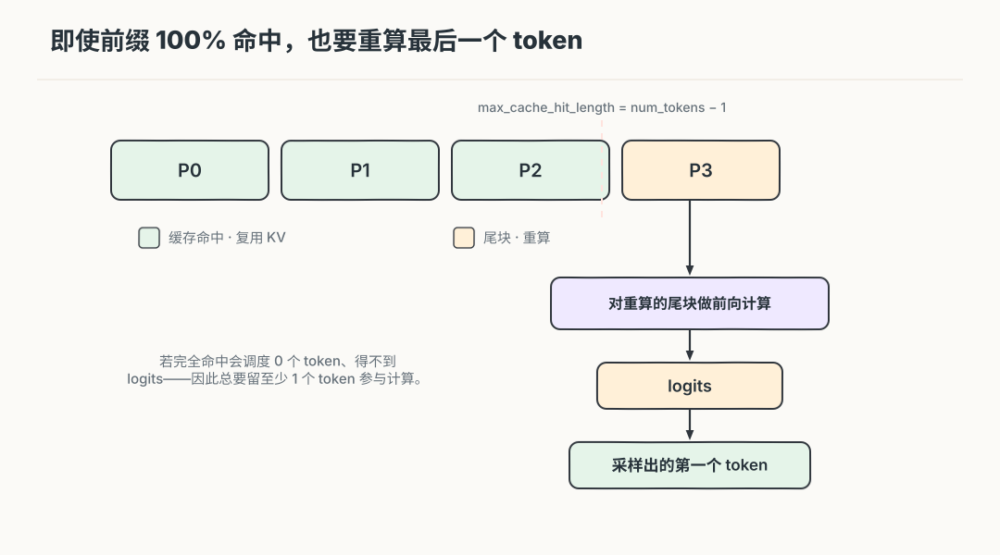</a>

<p class='figure-caption'>即使 prompt 已全部命中 cache（所有 block 均命中），仍会削去最后一个 token，从而丢弃尾部 block 并强制进行部分重算，确保 forward pass 能够生成 logits。</p>

### block 的标识由内容而非位置决定：Merkle hash chain

后续所有逻辑（例如 lookup 最终解析到哪个 cached block）都依赖于对 block *标识*的唯一定义。该标识基于内容寻址，并通过 prefix 串成链。负责生成它的唯一函数是 `hash_block_tokens`。

`vllm/v1/core/kv_cache_utils.py:L598-L604`

```python
    if not parent_block_hash:
        parent_block_hash = NONE_HASH

    curr_block_token_ids_tuple = tuple(curr_block_token_ids)
    return BlockHash(
        hash_function((parent_block_hash, curr_block_token_ids_tuple, extra_keys))
    )
```

参与 hash 的对象是一个三元组：`(parent_block_hash, this block's token ids, extra_keys)`。由于其中包含 *parent* 的 hash，每个 block hash 实际上都是对**截至该 block 边界的整个 prefix**生成的指纹，而不仅仅是该 block 内部的 token。这构成了一条 Merkle 风格的链（参见 [vLLM Prefix Caching 文档](https://docs.vllm.ai/en/stable/design/prefix_caching/)；直观解释可参见 [Sankalp，《prompt caching 的工作原理》](https://sankalp.bearblog.dev/how-prompt-caching-works/)）。由此得到的关键性质会被下文的 longest-hit scan 利用：**如果 block *i* 的 hash 匹配，则可以保证 block 0..i 的 token 内容和 metadata 逐字节完全一致**。反之，只要 prefix 中任意位置有一个 token 不同，后续所有 hash 都会随之发生变化。

需要注意，`hash_function` 是一个参数，而不是硬编码的算法；具体函数会针对每个 engine 注入一次（`caching_hash_fn`）。文档指出，从 v0.11 开始默认使用 SHA-256；而代码只通过 `_CBOR_HASH_FUNCTIONS = frozenset({sha256_cbor, xxhash_cbor})` 对基于 CBOR 的算法族施加约束。最终解析出的确切默认值由 config 决定，这些代码摘录并未将其固定下来（因此，“默认使用 SHA-256”是文档中的说明，并非由这里的代码直接断言）。

两个 block 的 `BlockHash` 相同，当且仅当二者的 parent-prefix、局部 token 和 extra keys 完全一致。该机制确保 cache hit 只会为真正完全相同的 prefix 复用 KV。

<a href='images/vllm-06-06-block-hash-chain.svg' target='_blank'>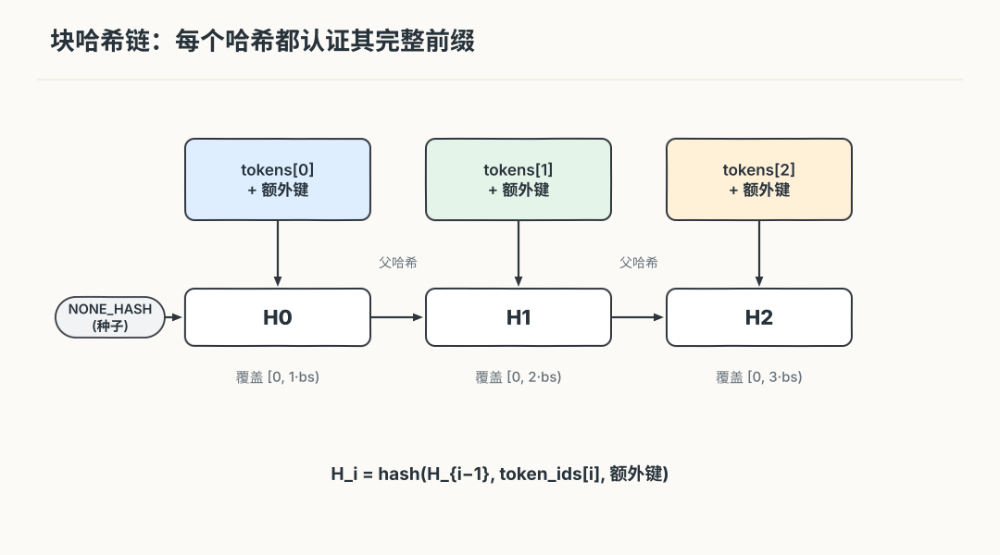</a>

<p class='figure-caption'>`hash_block_tokens` 基于 parent 的 hash 对各 block 的 hash 进行链式计算，因此 block *i* 的 hash 可以证明整个 prefix [0, i·block_size) 完全一致。</p>

**chain seed 同时也承担跨租户隔离职责**

任何 prefix 的第一个 block 都没有 parent。`NONE_HASH` 用来替代这个缺失的 parent，而它的构造方式正是实现多租户隔离的关键。

`vllm/v1/core/kv_cache_utils.py:L99-L114`

```python
def init_none_hash(hash_fn: Callable[[Any], bytes]):
    global NONE_HASH

    hash_seed = os.getenv("PYTHONHASHSEED")
    if hash_seed is None and hash_fn in _CBOR_HASH_FUNCTIONS:
        logger.warning(
            "PYTHONHASHSEED is not set. This will lead to non-reproducible "
            "block-hashes when using CBOR-based hash functions such as "
            "sha256_cbor or xxhash_cbor. Consider setting PYTHONHASHSEED to a "
            "fixed value for reproducibility."
        )

    if hash_seed is None:
        NONE_HASH = BlockHash(os.urandom(32))
    else:
        NONE_HASH = BlockHash(hash_fn(hash_seed))
```

当 `PYTHONHASHSEED` 未设置时，`NONE_HASH` 是每个 process 各自生成的 32 个随机字节。seed 是每条 hash chain 的根，因此，攻击者即便想让精心构造的 prompt 与另一个 process 的 cache 中的 prefix 发生碰撞，也无从下手——他们无法预测每个 process 独有的 seed。这一机制与 CPython 对 `hash()` 的随机化处理类似。一旦设置了 seed，`NONE_HASH` 就会变为确定值，hash 也可以在不同 process 间复现。这是有意进行跨 process 共享的必要条件，包括 engine replica 之间共享 prefix、prefill/decode（P/D）分离以及 KV offloading。

### 额外 key 可避免不匹配的租户、adapter 或模态造成误命中

仅靠 token id 无法唯一标识 KV。同一个 token 序列如果使用了不同的 LoRA adapter、不同的 multimodal 图像或不同的 cache-isolation salt，就会产生*不同的* KV，因此绝不能发生碰撞。`generate_block_hash_extra_keys` 会将这些区分项组装到 hash tuple 的 `extra_keys` slot 中。

`vllm/v1/core/kv_cache_utils.py:L555-L574`

```python
    mm_extra_keys: list[Any]
    mm_extra_keys, new_start_mm_idx = _gen_mm_extra_hash_keys(
        request, start_token_idx, end_token_idx, start_mm_idx
    )
    lora_extra_keys: list[str] = _gen_lora_extra_hash_keys(request)
    cache_salt_keys: list[str] = (
        [request.cache_salt] if (start_token_idx == 0 and request.cache_salt) else []
    )
    prompt_embeds_keys = _gen_prompt_embeds_extra_hash_keys(
        request, start_token_idx, end_token_idx
    )

    extra_keys: list[Any] = (
        lora_extra_keys + mm_extra_keys + cache_salt_keys + prompt_embeds_keys
    )

    if not extra_keys:
        return None, new_start_mm_idx

    return tuple(extra_keys), new_start_mm_idx
```

这四类信息源会按照固定的位置顺序（`lora + mm + salt + prompt_embeds`）组装，而这一顺序本身也是 hash 的一部分，绝不能重新排列。这里有三个关键细节：

- **Cache salt 只应用于第一个 block**（`start_token_idx == 0`）。这个操作看似局部且成本很低，但由于 block 0 的 hash 会沿 chain 传入后续每个 block，只给 block 0 加 salt，就足以让该 request 的*整条* prefix chain 都受到影响。仅用一个 salt 值，就能以 O(1) 的成本将整段会话的 cache 与其他租户隔离开来。
- **Multimodal key 还包含 block 内 offset**（通过 `_gen_mm_extra_hash_keys`），而不只是 content id。因此，即使其他 placeholder token 完全相同，同一张图像只要位于其中不同位置，也会生成不同的 key。
- **纯文本 common path 返回的是 `None`，而不是 empty tuple。** `need_extra_keys`（`L411-L428`）是一个低成本 gate；当 request 没有 LoRA、没有 multimodal feature，也没有 salt 时，hash tuple 的第三个 slot 就是 `None`，hot path 不会产生任何额外的内存分配。

**只有完整 block 才会计算 hash，hash list 只能 append，且不包含 physical id**

Block hash 由每个 request 专属的 closure `request_block_hasher` 生成。每当 request 增长时，该 closure 都会运行，并且*只返回本次新填满的* block hash。

`vllm/v1/core/kv_cache_utils.py:L687-L693`

```python
    def request_block_hasher(request: Request) -> list[BlockHash]:
        start_token_idx = len(request.block_hashes) * hash_block_size
        num_tokens = request.num_tokens

        if start_token_idx + hash_block_size > num_tokens:
            # Early stop when there no new full blocks created.
            return []
```

`vllm/v1/core/kv_cache_utils.py:L707-L726`

```python
        while True:
            end_token_idx = start_token_idx + hash_block_size
            if end_token_idx > num_tokens:
                # We only hash full blocks
                break

            # MM and LoRA requests need extra keys for block-hash computation.
            extra_keys, curr_mm_idx = generate_block_hash_extra_keys(
                request, start_token_idx, end_token_idx, curr_mm_idx
            )

            # Compute the hash of the current block
            block_tokens = request.all_token_ids[start_token_idx:end_token_idx]
            block_hash = hash_block_tokens(
                caching_hash_fn, prev_block_hash_value, block_tokens, extra_keys
            )

            new_block_hashes.append(block_hash)
            start_token_idx += hash_block_size
            prev_block_hash_value = block_hash
```

有三点需要注意：(1) 恢复计算的 index 是 `len(request.block_hashes) * hash_block_size`——已经 hash 的 prefix 绝不会再次 hash，因此追加 tokens 可以增量完成。(2) `end_token_idx > num_tokens` 会跳出 loop，所以未填满的尾部 block 绝不会参与 hash；它会等待 tokens 数量足够、将 block 填满。这正是在代码层面对文档所述“只 cache 完整 blocks”规则的落实。(3) `prev_block_hash_value` 会让 chain 跨 calls 继续向前传递，从而保持 Merkle continuity。closure 的输出随后会拼接到 request 上：

`vllm/v1/request.py:L242-L245`

```python
    def update_block_hashes(self) -> None:
        """Compute block hashes for any new full blocks and append them."""
        if self._block_hasher is not None:
            self.block_hashes.extend(self._block_hasher(self))
```

`request.block_hashes` 是一个按 hash-block 位置索引的 append-only list——index *i* 记录的是 tokens `[0, (i+1)*hash_block_size)` 的 fingerprint。它表示的是纯粹的 content identity，与任何 physical `block_id` 完全解耦。pool 正是据此进行 lookup；request 完全不必知道当前究竟有哪些 physical blocks（如果有）承载着它的 prefix。

### 将 identity 解析为 physical blocks：跨 groups 的 all-or-nothing

这一 lookup 实现在 pool 中，负责将 `BlockHash` 解析为 `KVCacheBlock`。它会同时针对每个 KV-cache group 解析该 hash；任一 group miss，整体就算 miss。

`vllm/v1/core/block_pool.py:L213-L224`

```python
        cached_blocks = []
        for group_id in kv_cache_group_ids:
            block_hash_with_group_id = make_block_hash_with_group_id(
                block_hash, group_id
            )
            block = self.cached_block_hash_to_block.get_one_block(
                block_hash_with_group_id
            )
            if not block:
                return None
            cached_blocks.append(block)
        return cached_blocks
```

physical key 不是单独的 `BlockHash`，而是 `make_block_hash_with_group_id(block_hash, group_id)`；后者在末尾追加了一个 4-byte big-endian group id：

`vllm/v1/core/kv_cache_utils.py:L57-L66`

```python
def make_block_hash_with_group_id(
    block_hash: BlockHash, group_id: int
) -> BlockHashWithGroupId:
    """Pack a `BlockHash` and group id into a `BlockHashWithGroupId`.

    The group id is encoded using 4 bytes in big-endian order and appended to
    the block hash bytes.  This representation avoids creating tuples while
    still allowing us to recover both components when needed.
    """
    return BlockHashWithGroupId(block_hash + group_id.to_bytes(4, "big", signed=False))
```

因此，full-attention group 和 sliding-window group 中的*同一个* token prefix 会生成相同的 `BlockHash`，但对应的 `BlockHashWithGroupId` keys 不同——二者的 physical blocks 绝不会 alias。一旦任意 group miss，`get_cached_block` 就会立刻返回 `None`：只有当所有需要承载该 prefix 的 groups 都 cache 了对应 KV，这个 prefix 才能复用。

其背后的 map `BlockHashToBlockMap` 在 docstring 中记录了一项有意为之的设计选择：

`vllm/v1/core/block_pool.py:L48-L52`

```python
    NOTE #1: We currently don't de-duplicate the blocks in the cache,
    meaning that if a block becomes full and is cached, we don't check
    if there is already an identical block in the cache. This is because
    we want to make sure the allocated block IDs won't change so that
    block tables are append-only.
```

不做 de-duplication 意味着 value 通常只是单个 `KVCacheBlock`；但在真正发生 hash collision 时（即两个不同 blocks 的 hash 相同），`insert`（`L89-L105`）会把该 value 提升为内部的 `{block_id: KVCacheBlock}` dict，而 `get_one_block` 则返回其中任意一个成员。之所以容忍这种情况而不合并 duplicates，是因为合并会在 request 毫不知情的情况下改变其 block table 已记录的 block id；而 block tables（[第 20 节](#20-从-block-table-到-kernelslot_mapping-与-device-tensors)）依赖 append-only 特性。

一次成功解析的 hit 指向真实 blocks；在所有 groups 中，这些 blocks 的 KV 都确实与 request 的 prefix 匹配。而 block 是这个 map 的成员，*并不*意味着它已离开 free queue——cached block 既可能处于 live 状态，*也可能*处于 free-and-evictable 状态（其 docstring `L45-L46` 明确这样说明）。在 commit 时让 hit 变为 non-evictable 是 `touch` 的职责（[第 23 节](#23-physical-block-的生命周期分配使用释放进入-cache淘汰)）；这里的 lookup 只负责读取。

### 最长 hit：扫描方向体现了 attention type 的 memory model

`find_longest_cache_hit` 是每个 `SingleTypeKVCacheManager` 都必须实现的唯一方法（coordinator 的跨 group 不动点将在[第 15 节](#15-coordinator-与-hybrid-kv-cache当一种-block-类型不够用时)介绍）。单类型扫描正是 Merkle-chain 特性发挥价值的地方。Full attention 从左向右扫描，并在首次 miss 时停止：

`vllm/v1/core/single_type_kv_cache_manager.py:L591-L602`

```python
        max_num_blocks = max_length // block_size
        for block_hash in itertools.islice(block_hashes, max_num_blocks):
            # block_hashes is a chain of block hashes. If a block hash is not
            # in the cached_block_hash_to_id, the following block hashes are
            # not computed yet for sure.
            if cached_block := block_pool.get_cached_block(
                block_hash, kv_cache_group_ids
            ):
                for computed, cached in zip(computed_blocks, cached_block):
                    computed.append(cached)
            else:
                break
```

comment 指出了一个关键事实：由于这些 hash 构成一条链，首次 miss 就意味着后续所有 block 也都不在 cache 中，因此扫描可以立即停止。其 probe 复杂度为 O(hit-length)，而非 O(prompt-length)。这正是 [V1 alpha 说明](https://vllm.ai/blog/2025-01-27-v1-alpha-release)中所说的“零开销” prefix caching：每个匹配 block 只需常数级工作量，一旦 miss 便提前终止。

Sliding-window attention 无法采用相同的扫描方式。受 window 限制的 layer 只需要让*最后* `sliding_window` 个 token 常驻，因此有效 hit 必须是靠近末尾的一段连续 block，扫描方向也改为从右向左：

`vllm/v1/core/single_type_kv_cache_manager.py:L727-L741`

```python
        # Search from right to left and early stop when a match is found.
        for i in range(max_num_blocks - 1, -1, -1):
            if cached_block := block_pool.get_cached_block(
                block_hashes[i], kv_cache_group_ids
            ):
                # Skip prefix matching check if the block is not aligned with
                # `alignment_tokens`.
                if num_contiguous_blocks == 0 and block_size != alignment_tokens:
                    post_pop_blocks = i if drop_eagle_block else i + 1
                    if (post_pop_blocks * block_size) % alignment_tokens != 0:
                        continue
                # Add the cached block to the computed blocks.
                for computed, cached in zip(computed_blocks, cached_block):
                    computed[i] = cached
                num_contiguous_blocks += 1
```

result array 会先用 `null_block`（`L720-L723`）填充，扫描过程中再将实际 block 写入对应位置；只有凑齐覆盖一个连续 window 所需的 block 后，才会判定为 hit。两种扫描最后都会执行对齐裁剪：full-attention manager 会不断 pop 末尾 block，直到 `len * block_size` 是 `alignment_tokens`（`L607-L612`）的整数倍。这样，返回的 hit 就能同时在*所有* group 中保持 block 对齐——recompute-last-token comment 所依赖的正是这一性质；它也因此提醒，哪怕只减少一个 token，也可能导致整个 block 被移除。

每种 attention 类型的扫描方式都与自身的 memory model 相匹配：full attention 要求整个 prefix 从左侧开始连续；sliding-window 则只要求右侧存在一个连续 window。两者返回的 prefix 都只会落在 block 边界上。scheduler 最终看到的最长公共 hit，是所有参与 group 都能同时提供服务的长度，绝不会出现某个 group 必须依赖自己从未保留的 KV 才能满足该长度的情况。

## 8. Prefix-Cache 写入路径：cache_full_blocks 与提交 hash

写入路径与 lookup 相互独立。它在 `allocate_slots` 的末尾执行，只发布已经 finalized 的完整 block，并且可以为 P/D transfers 延迟执行。整条 trace 从 `self.coordinator.cache_blocks(request, num_tokens_to_cache)` 开始，到 block 的内容标识进入 hash map 时结束。

这条写入漏斗只会在 lookup 路径能够确认的边界上，发布完整且已经 finalized 的 block。它的各个层级会依次收紧 token 数量、符合条件的 block，以及内容标识。

<a href='images/vllm-06-14-cache-write.svg' target='_blank'>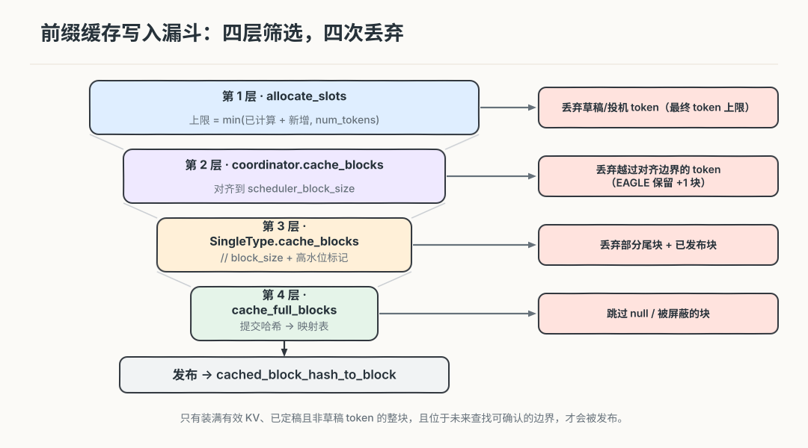</a>

<p class='figure-caption'>四层写入漏斗：从 `allocate_slots` 的 finalized token 上限开始，依次经过 `coordinator.cache_blocks`（scheduler-block 对齐）、`SingleTypeKVCacheManager.cache_blocks`（向下取整到完整 block + 高水位线），最终由 `BlockPool.cache_full_blocks` 将每个 block 的 hash 提交到 `cached_block_hash_to_block`；图中标出了各层丢弃 token/block 的位置（draft 上限、对齐向下取整、整数向下取整、null/mask 跳过）。</p>

**第 1 层：manager guard 与面向各 group 的 fan-out**

这个 façade 方法只有一行，充当入口检查。它会再次检查 caching 是否启用（与[第 9 节](#9-allocate_slots-是策略栈而不是一次-allocation)检查的是同一个 flag；这是因为 `cache_blocks` 同样是 public method，其他 call site 也可能直接调用它），然后将工作委托给 coordinator。

`vllm/v1/core/kv_cache_manager.py:L599-L608`

```python
    def cache_blocks(self, request: Request, num_computed_tokens: int) -> None:
        """Cache the blocks for the request, if enabled.

        Args:
            request: The request to cache the blocks.
            num_computed_tokens: The number of computed tokens, including tokens
                that are already cached and tokens to be cached.
        """
        if self.enable_caching:
            self.coordinator.cache_blocks(request, num_computed_tokens)
```

coordinator 这一层持有 KV-cache group（[第 15 节](#15-coordinator-与-hybrid-kv-cache当一种-block-类型不够用时)）。在通用 / single-group base 实现中，`cache_blocks` 只做简单的 fan-out：将同一个 finalized token 数原样传给每个 `SingleTypeKVCacheManager`。

`vllm/v1/core/kv_cache_coordinator.py:L279-L284`

```python
        for manager in self.single_type_managers:
            manager.cache_blocks(
                request,
                num_computed_tokens,
                retention_interval=self.retention_interval,
            )
```

coordinator 在这里既不知道也不关心 block size；它会把 `num_computed_tokens`（一个 *token* 数）和 `retention_interval`（仅 SWA manager 会使用的 sparse-checkpoint 配置开关）转发给各 per-type manager，由后者自行完成 block 运算。由于 manager tuple 与 `kv_cache_config.kv_cache_groups` 按位置一一对应（[第 15 节](#15-coordinator-与-hybrid-kv-cache当一种-block-类型不够用时)），这个循环只需一次遍历，就能将结果发布到同一个共享 pool 中每个 group 对应的 slice。

### 第 2 层：hybrid 对齐与 EAGLE lookahead 例外

hybrid coordinator 覆盖了上述 fan-out；正是在这个 override 中，写入粒度被强制与读取粒度保持一致。回顾[第 15 节](#15-coordinator-与-hybrid-kv-cache当一种-block-类型不够用时)，该 coordinator 只会在 `scheduler_block_size` 的整数倍处报告 cache hit（即 block size 格点 `hash_block_size | group.block_size | scheduler_block_size`）。如果写入端在比读取端可确认位置更细的边界上发布，这些 key 将成为无法访问的冗余数据。因此，写入端也会向下取整到同一个粗粒度边界。

`vllm/v1/core/kv_cache_coordinator.py:L603-L629`

```python
    def cache_blocks(self, request: Request, num_computed_tokens: int) -> None:
        # Cache hits in this coordinator are always a multiple of
        # ``scheduler_block_size`` tokens (see ``find_longest_cache_hit``).
        # Within an aligned region, SWA groups may only consult a subset of blocks
        # per ``scheduler_block_size``-segment so the unused blocks also stay
        # out of the prefix-cache hash map.
        aligned_num_computed_tokens = (
            num_computed_tokens // self.scheduler_block_size * self.scheduler_block_size
        )
        for manager in self.single_type_managers:
            num_tokens_to_cache = aligned_num_computed_tokens
            # EAGLE groups match one block past each aligned boundary and drop
            # it, so make that lookahead block eligible to be cached.
            if manager.use_eagle and aligned_num_computed_tokens > 0:
                num_tokens_to_cache = min(
                    num_computed_tokens,
                    aligned_num_computed_tokens + manager.block_size,
                )
            # The manager already knows the fine hit granularity
            # (``scheduler_block_size``); retention is passed separately so it
            # can keep both the coarse segment tails and the fine replay
            # boundary (which needs the fine value).
            manager.cache_blocks(
                request,
                num_tokens_to_cache,
                retention_interval=self.retention_interval,
            )
```

`aligned_num_computed_tokens = num_computed_tokens // scheduler_block_size * scheduler_block_size` 会将 finalized count 向下取整到 coarse alignment，因此 writer 绝不会发布到最后一个边界之后；这个边界是 `find_longest_cache_hit` sweep 能够同时对*所有* group 确认的最远位置。EAGLE 分支是唯一一个有意为之的例外：EAGLE draft group 的 lookup 会命中每个 aligned boundary 之后的一个 block，随后再将其丢弃（参见[第 15 节](#15-coordinator-与-hybrid-kv-cache当一种-block-类型不够用时)中各类型的命中规则）。因此，如果 writer 严格向下取整，这个用于 lookahead 的 block 将永远无法进入 cache。该分支会将上限恰好增加一个 `manager.block_size`，但随后又通过 `min(num_computed_tokens, ...)` 重新限制上限，确保它永远不会超过[第 9 节](#9-allocate_slots-是策略栈而不是一次-allocation)已经确定的真实 finalized count。关于 SWA group 会查询“每个 `scheduler_block_size`-segment 中一部分 block”的注释，提前揭示了下两层中的 per-block mask：alignment 负责确定正确的*segment*边界，mask 再丢弃 segment 内 sparse-attention lookup 永远不会读取的各个 block。

**写入粒度与读取粒度一致。** 只有当 prefix length 是后续 lookup 实际可能命中的位置时，才会发布 block。EAGLE 的 +1-block 特例是唯一经过审计的超额发布，并且上下界均受到约束。

**第 3 层：向下取整到完整 block，以及每个 request 的 high-water mark**

per-type manager 将 token count 转换为*block set*，然后调用 pool。这是对“只处理完整 block”的第二重独立保障，此处以 group 自身的 `block_size` 为单位，而它可能是 `hash_block_size` 的整数倍。

`vllm/v1/core/single_type_kv_cache_manager.py:L338-L363`

```python
        num_cached_blocks = self.num_cached_block.get(request.request_id, 0)
        num_full_blocks = num_tokens // self.block_size

        if num_cached_blocks >= num_full_blocks:
            return

        block_mask = self.reachable_block_mask(
            start_block=num_cached_blocks,
            end_block=num_full_blocks,
            alignment_tokens=self.scheduler_block_size,
            kv_cache_spec=self.kv_cache_spec,
            use_eagle=self.use_eagle,
            retention_interval=retention_interval,
            num_prompt_tokens=request.num_prompt_tokens,
        )
        self.block_pool.cache_full_blocks(
            request=request,
            blocks=self.req_to_blocks[request.request_id],
            num_cached_blocks=num_cached_blocks,
            num_full_blocks=num_full_blocks,
            block_size=self.block_size,
            kv_cache_group_id=self.kv_cache_group_id,
            block_mask=block_mask,
        )

        self.num_cached_block[request.request_id] = num_full_blocks
```

`num_full_blocks = num_tokens // self.block_size` 执行的是**整数向下取整**：末尾的 partial block（包含 `num_tokens % block_size` 个 token）永远不具备资格——这与[第 7 节](#7-prefix-cache-lookuphashing最长命中与最后一个-token-重计算规则)在 `request_block_hasher` 中看到的 hasher“只对完整 block 计算 hash”的 break 逻辑在代码层面完全对应。`num_cached_block` 是一个 per-request dict（`self.num_cached_block: dict[str, int]`），记录该 request 已经发布了多少个 block；符合条件的窗口恰好是 `blocks[num_cached_blocks : num_full_blocks]`。如果自上一步以来没有新的 block 填满，`if num_cached_blocks >= num_full_blocks: return` 会直接提前退出。pool 调用返回后，`self.num_cached_block[request.request_id] = num_full_blocks` 会推进 high-water mark。两阶段 touch（[第 15 节](#15-coordinator-与-hybrid-kv-cache当一种-block-类型不够用时)）也会检查同一个 `num_cached_block` dict，用于判断正在运行的 request“不会再产生新的 prefix-cache hit”——写入路径的 bookkeeping 与分配路径的 fast-path guard 共用同一个字段。

`block_mask` 来自 `reachable_block_mask`。对于 full attention，它就是 `None`，也就是将每个非 null block 都写入 cache：

`vllm/v1/core/single_type_kv_cache_manager.py:L376-L383`

```python
        """Per-block mask for ``cache_full_blocks``. ``None`` means cache
        every (non-null) block — the default for full attention.

        Subclasses with sparse hit semantics (SWA) override this to skip
        blocks that can never serve a hit at any alignment-aligned prefix
        length.
        """
        return None
```

sliding-window manager 会将其 override 为 `list[bool]`，后者会丢弃那些从右向左执行 windowed lookup（[第 15 节](#15-coordinator-与-hybrid-kv-cache当一种-block-类型不够用时)）时永远不会访问到的内部 block——因此，即使这些 block 已经“full”，也不会进入 map。Cross-attention 则在更高一层直接选择不参与：它的 `cache_blocks` 会 raise，而不是执行任何 publish（[第 15 节](#15-coordinator-与-hybrid-kv-cache当一种-block-类型不够用时)），因为 encoder KV 按 request 独立，绝不会共享。

**publish 操作具备单调性和幂等性**（高水位标记确保同一个 block 不会被重复处理，因此每个 decode step 重新进入 `cache_blocks` 的开销很小，也不可能重复 publish），并且**只有 full 且可达的 block 才有资格 publish**（整数向下取整 + mask）。

### 第 4 层：BlockPool.cache_full_blocks——真正执行 publish

该方法消费 `request.block_hashes`，本身并不计算 hash。它的 docstring 指回了[第 7 节](#7-prefix-cache-lookuphashing最长命中与最后一个-token-重计算规则)分析过的 producer：“Request object 一经创建以及追加新 token 时，会立即计算 block hash 值”（`block_pool.py:L241-L242`）。它首先选择 hash source，并检查 request 是否已经生成了足够多的条目。

`vllm/v1/core/block_pool.py:L260-L274`

```python
        if num_cached_blocks >= num_full_blocks:
            return
        new_full_blocks = blocks[num_cached_blocks:num_full_blocks]
        assert block_mask is None or len(block_mask) == len(new_full_blocks)
        if block_size == self.hash_block_size:
            # Common case.
            block_hashes: BlockHashList = request.block_hashes
        else:
            # block_size is a multiple of hash_block_size. This happens when
            # different KV cache groups have different block sizes.
            assert block_size % self.hash_block_size == 0
            block_hashes = BlockHashListWithBlockSize(
                request.block_hashes, self.hash_block_size, block_size
            )
        assert len(block_hashes) >= num_full_blocks
```

在常见情况下，该 group 的 `block_size` 等于 `hash_block_size`，因此可以直接读取 `request.block_hashes`（[第 7 节](#7-prefix-cache-lookuphashing最长命中与最后一个-token-重计算规则)介绍的仅追加、不含 physical id 的 content list）。当某个 group 使用更大的 block（其大小是 `hash_block_size` 的整数倍）时，系统会包装 fine-grained hash list，使索引 *i* 返回对应 coarse block 的 hash。该 wrapper 不会重新计算 hash，而是选取 coarse block 最后一个 sub-block 边界处的 fine hash：

`vllm/v1/core/kv_cache_utils.py:L2231-L2234`

```python
    def _get_value_at(self, idx: int) -> BlockHash:
        # The last hash_block_size hash within the target block already chains
        # over the whole prefix, so it is the target block's hash.
        return self.block_hashes[(idx + 1) * self.scale_factor - 1]
```

这之所以成立，恰恰是因为[第 7 节](#7-prefix-cache-lookuphashing最长命中与最后一个-token-重计算规则)确立的 Merkle-chain 特性：一个 `hash_block_size` hash 已经为截止到该边界的整个 prefix 生成了 fingerprint，因此最后一个 sub-block 的 hash 可以有效标识整个 coarse block。`assert len(block_hashes) >= num_full_blocks` 明确体现了 write path 对[第 7 节](#7-prefix-cache-lookuphashing最长命中与最后一个-token-重计算规则)所述 eager `update_block_hashes` 的依赖：如果 Request 不知何故尚未为即将 publish 的 block 计算 hash，这里会直接报错，而不是将一个身份不明的 block 放入 cache。

接下来是逐 block 的 commit loop：

`vllm/v1/core/block_pool.py:L276-L308`

```python
        new_block_hashes = block_hashes[num_cached_blocks:]
        new_hashes: list[ExternalBlockHash] | None = (
            [] if self.enable_kv_cache_events else None
        )
        for i, blk in enumerate(new_full_blocks):
            # Some blocks may be null or masked out when enabling sparse attention
            # like sliding window attention, or Mamba models with prefix-caching
            # in align mode. We skip null blocks here.
            if blk.is_null or (block_mask is not None and not block_mask[i]):
                continue
            block_hash = new_block_hashes[i]
            num_hash_tokens = (num_cached_blocks + i + 1) * block_size

            # Update and added the full block to the cache.
            block_hash_with_group_id = make_block_hash_with_group_id(
                block_hash, kv_cache_group_id
            )
            if blk.block_hash is not None:
                # The only valid case where a "new full block" already has a
                # hash is partial->full promotion of the same cache block.
                assert (
                    blk.block_hash_num_tokens is not None
                    and blk.block_hash_num_tokens < num_hash_tokens
                )
                removed_hashes = self._remove_cached_block_hashes(blk)
                self._emit_block_removed_events(removed_hashes)
            self._insert_block_hash(
                block_hash_with_group_id,
                blk,
                num_tokens=num_hash_tokens,
            )
            if new_hashes is not None:
                new_hashes.append(maybe_convert_block_hash(block_hash))
```

按照 commit 顺序：

1. **跳过 null 或被 mask 掉的 block** — `if blk.is_null or (block_mask is not None and not block_mask[i]): continue`。null block 是共享 sentinel（[第 3 节](#3-kvcacheblock-与-blockpoolfree-list-是一种淘汰结构)），用于代替被跳过的 SWA/Mamba state；masked block 则是被 Layer 3 标记为不可达的 sparse-attention block。二者都不包含有效且可复用的 KV，因此绝不能对外发布。
2. **`num_hash_tokens = (num_cached_blocks + i + 1) * block_size`**：此 block 的 KV 所覆盖 prefix 的 token 数。它与 hash 一同存储（通过 `_insert_block_hash` 的 `num_tokens` argument），也是下方 promotion assertion 用来比较的值。
3. **map key 由 content 和 group 共同构成** — `make_block_hash_with_group_id(block_hash, kv_cache_group_id)` 会将 group id 编码为 4 个 big-endian byte，并追加到 content hash 后（`kv_cache_utils.py:L66`、`block_hash + group_id.to_bytes(4, "big", signed=False)`；[第 7 节](#7-prefix-cache-lookuphashing最长命中与最后一个-token-重计算规则)详细介绍了这种 key 格式）。即使 token prefix 相同，只要属于*不同的* KV-cache group，就会生成不同的 key。因此，full-attention group 中的 hit 绝不可能解析到 sliding-window block（从写入侧来看，对应[第 20 节](#20-从-block-table-到-kernelslot_mapping-与-device-tensors)中的 group-id argument）。
4. **partial→full promotion**：即 `if blk.block_hash is not None` branch。位于 eligible window `[num_cached_blocks:num_full_blocks]` 内的 block 本不应已有 hash：Layer 3 的 high-water mark 会排除所有已发布的对象，而 `get_new_blocks` 会在 block 被重新分配时立即重置其 hash（[第 23 节](#23-physical-block-的生命周期分配使用释放进入-cache淘汰)）。注释指出了唯一合法的例外：某个 block 此前被注册为 *partial* alias（见下文），现在正要 promotion 为 full-block hash。assertion `blk.block_hash_num_tokens < num_hash_tokens` 会确保已有 hash 覆盖的 token 数*严格少于*完整 block，即它确实是更短的 partial prefix，而不是残留的陈旧 full hash。在继续 promotion 之前，会通过 `_remove_cached_block_hashes` 移除旧的 partial hash（[第 23 节](#23-physical-block-的生命周期分配使用释放进入-cache淘汰)分析了其函数体；在这里，它是修复步骤，用于清除 block 的现有身份，以便新的 primary hash 落位）。
5. **发布** — `_insert_block_hash(...)`。[第 23 节](#23-physical-block-的生命周期分配使用释放进入-cache淘汰)已经逐行分析过此方法（它是 eviction 的镜像操作）：第一个 key 会成为该 block 仅写入一次的 primary `_block_hash`，其余 key 则作为 secondary alias 记录在 `cached_block_hashes_by_block` 中；两个 early-out 都保证了该调用具有幂等性。从写入路径来看，关键在于 `cache_full_blocks` 是唯一向其中写入 full-block hash 的 producer，而且会先经过上述支持 promotion 的 guard。

末尾的 `new_hashes.append(...)` 及其下方的 `enable_kv_cache_events` block（`L310-L356`，已省略）会构建一个 `BlockStored` telemetry event，供外部 KV-event subscriber（P/D、offloading）使用；它不属于 GPU 内部的 cache state，也绝不会影响 hit 判定。

**Null 和不可达的 block 从不会被登记；每个 key 都由 content-plus-group 组成，因此不同 group 的 prefix 绝不会发生 alias；block 也只能通过合法且严格更短的 partial entry 预先持有 hash，而该 entry 会在完整 hash 写入前被移除**——因此，map 中绝不会同时存在两个 live key，声称同一个 block 覆盖两个不同长度的 prefix。

**“已经带有 hash 的新 full block”从何而来**

上面的 promotion 分支是在防范一种状态，但在 commit `6cf7b26bd` 对应的版本中，live scheduler 实际上从不会产生这种状态。能够创建该状态的 primitive `cache_partial_block`，在 `vllm/v1/core/` 内部**没有任何 caller**；只有 `tests/v1/core/prefix_cache/test_partial_prefix_cache_primitives.py` 会使用它。更适合将其理解为面向未来兼容的基础设施：等到 partial caching 真正接入 allocation 时，`cache_full_blocks` 的 promotion 路径已经具备正确的实现；但目前到达 `cache_full_blocks` 的 full block，其 `blk.block_hash is None`，所以该分支仍处于休眠状态。即便如此，这个 primitive 仍值得深入分析，因为它补全了 write path 的整体模型。

`vllm/v1/core/block_pool.py:L397-L425`

```python
        if block.is_null:
            return None

        assert block_size > self.hash_block_size
        assert block_size % self.hash_block_size == 0
        assert num_tokens % block_size != 0
        block_hash = self._get_partial_block_hash(request, num_tokens)
        num_hash_blocks = num_tokens // self.hash_block_size
        block_hash_with_group_id = make_block_hash_with_group_id(
            block_hash, kv_cache_group_id
        )
        already_cached = block.block_hash == block_hash_with_group_id or (
            self.cached_block_hash_to_block.contain(
                block_hash_with_group_id, block.block_id
            )
        )
        if (
            not already_cached
            and block.block_hash is not None
            and block.block_hash_num_tokens is not None
            and block.block_hash_num_tokens < num_hash_blocks * self.hash_block_size
        ):
            removed_hashes = self._remove_cached_block_hashes(block)
            self._emit_block_removed_events(removed_hashes)
        self._insert_block_hash(
            block_hash_with_group_id,
            block,
            num_tokens=num_hash_blocks * self.hash_block_size,
        )
```

partial entry 无需进行任何 allocation 或 copy，就能让一个*已有的*大粒度 cache block，从其*内部*的某个*细粒度* prefix 边界变得可达。三个 assert 限定了这种机制唯一有意义的场景：`block_size > hash_block_size`（一个 group 的 block 横跨多个 hash window）以及 `num_tokens % block_size != 0`（该 entry 确实是 partial——它终止于 block 内部）。`_get_partial_block_hash`（`block_pool.py:L459`）返回 `request.block_hashes[num_hash_blocks - 1]`（`L470`）——这同样是 partial 边界处的细粒度 hash；由于它串联了完整 prefix，因此是有效的。随后，它会复用与 full 路径完全相同的 seat-or-alias 机制：如果该 block 已经带有一个更短的 primary hash，就先将其移除（`block.block_hash_num_tokens < num_hash_blocks * hash_block_size`），再由 `_insert_block_hash` 为新 key 安排位置。因此，一个 block 可以先积累 partial hash，之后再通过 `cache_full_blocks` promotion 为 full hash——而 `L296-L299` 处的 promotion assertion，恰好与这里的移除条件互为镜像（promotion 时 `num_tokens` 严格更大，而此前插入 partial entry 时则严格更小）。

**同一个物理 block 的 partial entry 和 full entry，会构成一条 prefix 长度严格递增的链，其中每个 entry 都会修正前一个 entry，因此该 block 绝不会被同时登记为覆盖两个互不兼容的 prefix**——并且，由于每次安排位置都经由 `_insert_block_hash`，每次移除都经由 `_remove_cached_block_hashes`，因此无论 entry 是 partial 还是 full，[第 23 节](#23-physical-block-的生命周期分配使用释放进入-cache淘汰) 所依赖的正向 index 与反向 index 都始终保持配对。

## 9. allocate_slots() 是策略栈，而不是一次 allocation

`get_computed_blocks` 给出 request 可以复用的内容；`allocate_slots` 要么 commit 这一结果，要么以 backpressure 为由拒绝。尽管名字如此，`allocate_slots` 实际上是一条 admission pipeline：只有通过所有 gate 后才会进行 pool allocation，而且该方法可能在完全不修改 pool 的情况下直接返回。它的 return type 明确体现了这一点：

`vllm/v1/core/kv_cache_manager.py:L244-L257`

```python
    def allocate_slots(
        self,
        request: Request,
        num_new_tokens: int,
        num_new_computed_tokens: int = 0,
        new_computed_blocks: KVCacheBlocks | None = None,
        num_lookahead_tokens: int = 0,
        num_external_computed_tokens: int = 0,
        delay_cache_blocks: bool = False,
        num_encoder_tokens: int = 0,
        full_sequence_must_fit: bool = False,
        reserved_blocks: int = 0,
        has_scheduled_reqs: bool = True,
    ) -> KVCacheBlocks | None:
```

`None` 表示 backpressure，而不是 error：scheduler 要么让 request 继续等待，要么抢占一个正在运行的 victim。只有 prediction gate 和 admission gate 都通过后，才会进行物理分配。

<a href='images/vllm-06-07-allocate-slots-flow.svg' target='_blank'>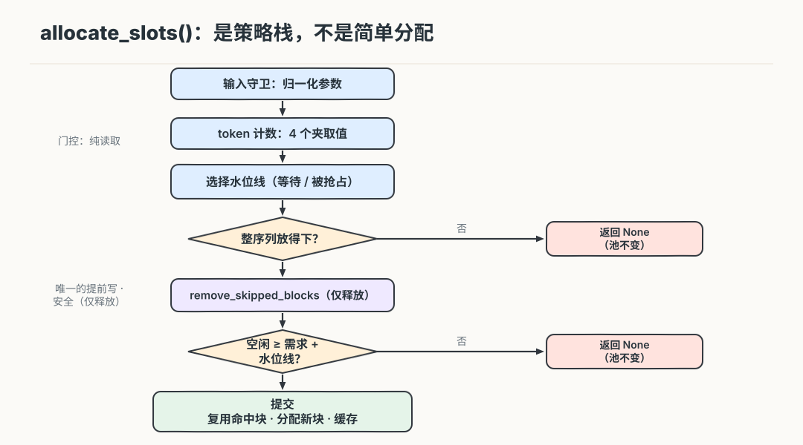</a>

<p class='figure-caption'>allocate_slots pipeline：input guard → token 数量运算 → watermark 选择 → full-sequence gate → skipped block 回收 → per-step admission gate → commit（将 ref 标记为 computed、分配新 block、写入 cache）。commit 线以上的每个菱形节点都可以返回 `None`，而不会修改 pool。</p>

**token 计数并非只有一个，而是四个，而且每个回答的问题都不同**

论文中的模型只有一个数：token 数量。代码里却有四个，它们通过一条紧凑的算术链依次计算。混淆其中任意两个，都会引发一类 bug。前两个计数是在 input guard 将 `new_computed_blocks` 归一化为共享的空 singleton 后立即设置的：

`vllm/v1/core/kv_cache_manager.py:L353-L361`

```python
        # The number of computed tokens is the number of computed tokens plus
        # the new prefix caching hits
        num_local_computed_tokens = (
            request.num_computed_tokens + num_new_computed_tokens
        )
        total_computed_tokens = min(
            num_local_computed_tokens + num_external_computed_tokens,
            self.max_model_len,
        )
```

后两个计数在回收前设置：

`vllm/v1/core/kv_cache_manager.py:L389-L392`

```python
        num_tokens_main_model = total_computed_tokens + num_new_tokens
        num_tokens_need_slot = min(
            num_tokens_main_model + num_lookahead_tokens, self.max_model_len
        )
```

`num_local_computed_tokens` 表示 *vLLM 自身* 已经持有 KV 的 token 数：即 request 当前累计的 `num_computed_tokens`，加上本次调用中新命中的 prefix cache（layout 注释里的 `new_comp`）。`total_computed_tokens` 还会计入 connector 提供的 KV（`ext_comp`，来自 P/D peer），并将结果 clamp 到 `max_model_len`——即使本地命中与 remote KV 的算术和超过 context window，computed prefix 也绝不能声称超出该窗口。`num_tokens_main_model` 表示 *target model 在本 step 实际运行* 的 token 数：computed prefix 加上新 token。`num_tokens_need_slot` 再加上 `num_lookahead_tokens`（speculative/EAGLE draft slot），并再次 clamp。

### 该方法从不 rollback，因此执行顺序*就是*设计本身

`allocate_slots` 没有 `try/except`，没有补偿性 undo，也没有 transaction。一旦修改 pool，后续即使失败也不会再撤销。仅这一事实就决定了整个方法的 body 布局：**所有可能返回 `None` 的 gate，都必须在任何不可逆写入之前执行。** 物理写入是最后三次 coordinator 调用（`allocate_new_computed_blocks`、`allocate_new_blocks`、`cache_blocks`），而该方法中的每个 `return None` 都严格位于它们上方。

看似违背这一原则的地方有且只有一处，而它恰恰是该方法中最有启发性的一行。block 回收发生在最终的 admission gate *之前*：

`vllm/v1/core/kv_cache_manager.py:L394-L407`

```python
        # Free the blocks that are skipped during the attention computation
        # (e.g., tokens outside the sliding window).
        # We can do this even if we cannot schedule this request due to
        # insufficient free blocks.
        # Should call this function before allocating new blocks to reduce
        # the number of evicted blocks.
        # Free on the processed-token basis: in-flight steps' attention windows
        # still read blocks below the optimistic boundary, and rejected spec
        # tokens can roll it back.
        self.coordinator.remove_skipped_blocks(
            request.request_id,
            max(0, total_computed_tokens - request.num_in_flight_tokens),
            num_prompt_tokens=request.num_prompt_tokens,
        )
```

这是一次*写操作*——对于 sliding-window、chunked-local 和 Mamba group，它会释放 block，并将 block table 中对应项置为 null——而且它会无条件执行，哪怕两行之后当前 step 就会返回 `None`。comment 已经明确说明：“即使由于空闲 block 不足而无法调度该 request，我们仍然可以执行此操作。”既然 commit 线之前的其他逻辑都不允许修改状态，为什么这里却是安全的？因为 `remove_skipped_blocks` *在供给维度上单调*：它只会将 block 归还给 pool，绝不会消耗 block。提前执行只可能增加 `get_num_free_blocks()`，从而提高后续 gate 通过的概率，绝不会错误地准入 request。它同时也是幂等的（底层 `_remove_blocks_in_range` 会向后扫描，将已经为 null 的 slot 再次置为 null 也不会产生影响），因此在下一个 step 重试时再次执行几乎没有额外成本。将它放在 gate 之前而非之后只有好处：滑出 window 的 block 可以立即供*当前这次 allocation*使用，从而避免驱逐本可继续 cache 的 prefix block。

另一个微妙之处在于回收边界。它不是 `total_computed_tokens`，而是 `max(0, total_computed_tokens - request.num_in_flight_tokens)`，即*已经处理并 commit*的 prefix；这里会特意减去 in-flight token 数量，将边界向前回退。In-flight forward pass 仍可能读取乐观边界之前的 block，而被拒绝的 speculative batch 也可能让 `num_computed_tokens` 回退；如果按乐观边界释放，就会把仍在使用的 block 归还给 pool。

### 两道 admission gate：都是纯预测，但分别针对不同 budget 估算容量

这套逻辑包含两项独立的容量检查，它们并非重复检查——两者针对不同的 budget，估算不同 token span 的容量需求，而且*都是*纯读操作（`get_num_blocks_to_allocate` 绝不会修改 pool）。第一项是可选检查，由 `full_sequence_must_fit` 控制：

`vllm/v1/core/kv_cache_manager.py:L372-L387`

```python
        if full_sequence_must_fit:
            # First check and fail if the full request sequence won't fit.
            full_num_tokens = min(request.num_tokens, self.max_model_len)

            num_blocks_to_allocate = self.coordinator.get_num_blocks_to_allocate(
                request_id=request.request_id,
                num_tokens=full_num_tokens,
                new_computed_blocks=new_computed_block_list,
                num_encoder_tokens=num_encoder_tokens,
                total_computed_tokens=total_computed_tokens,
                num_tokens_main_model=full_num_tokens,
                apply_admission_cap=True,
            )
            required_blocks = num_blocks_to_allocate + watermark_blocks
            if required_blocks > self.block_pool.get_num_free_blocks():
                return None
```

第二项则会无条件执行，它才是真正保护 commit 的 gate：

`vllm/v1/core/kv_cache_manager.py:L409-L425`

```python
        num_blocks_to_allocate = self.coordinator.get_num_blocks_to_allocate(
            request_id=request.request_id,
            num_tokens=num_tokens_need_slot,
            new_computed_blocks=new_computed_block_list,
            num_encoder_tokens=num_encoder_tokens,
            total_computed_tokens=num_local_computed_tokens
            + num_external_computed_tokens,
            num_tokens_main_model=num_tokens_main_model,
        )

        # Keep `reserved_blocks` free for other in-flight sequences, and an
        # additional watermark of headroom for waiting/preempted admissions.
        available_blocks = self.block_pool.get_num_free_blocks() - reserved_blocks
        required_blocks = num_blocks_to_allocate + watermark_blocks
        if required_blocks > available_blocks:
            # Cannot allocate new blocks
            return None
```

二者有三点区别。第一，**span**：full-sequence gate 针对 `full_num_tokens = min(request.num_tokens, max_model_len)` 进行容量估算，也就是最终的*完整*序列；per-step gate 则只估算 `num_tokens_need_slot`，即当前 step 所需的 slot。第二，**admission cap**：full-sequence gate 会传入 `apply_admission_cap=True`，而 per-step gate 则保留默认值 `False`。这个 flag 至关重要，coordinator 的 docstring 准确解释了原因：

`vllm/v1/core/kv_cache_coordinator.py:L156-L159`

```python
            apply_admission_cap: If True, apply the recycling-aware
                per-request admission cap (SWA / chunked-local). Set only by
                the full-sequence admission gate; per-step allocation must
                leave it False so the predictor matches `allocate_new_blocks`.
```

per-step predictor 必须返回 committing allocator 实际会消耗的数量；如果它应用 recycling 上限，就会低估需求，导致 pool 在 prefill 中途 OOM。full-sequence gate *需要*应用上限后的数量，因为对于 sliding-window spec，整个 sequence 同时存活的 blocks 永远不会超过一个 window 所需的数量。第三，**预算**：full-sequence gate 根据原始的 `get_num_free_blocks()` 进行检查，而 per-step gate 则根据 `get_num_free_blocks() - reserved_blocks` 进行检查。`reserved_blocks` 专门预留给正在 prefill、且需要这些 blocks 才能完成的 in-flight sequence；它用于限制 async KV-connector load，避免新 request 的 admission 导致执行到一半的 sequence 无法继续。随后，两道 gate 都会在需求侧加上 `watermark_blocks`。

full-sequence gate 可以防止 chunked-prefill 过度 admission：如果没有这道 gate，第一个 chunk 可能成功放入，request 也会被接纳，但后续某个 chunk 无法分配时，整个 request 就会卡死。提前检查完整 sequence，并针对 windowed attention 应用 recycling 上限，可以解决 `get_num_blocks_to_allocate` 中 admission-cap 注释提到的 issue #39734 死锁问题（`single_type_kv_cache_manager.py:L153-L154`）。

两项容量检查都会在修改状态之前执行。full-sequence gate 确保 chunked-prefill admission 要么全部成功、要么完全不执行；而 `apply_admission_cap` 则让该 gate 可以采用更严格的 windowed 上界，同时不削弱 per-step predictor 的准确性。

**watermark 是否生效取决于*谁*在申请，而不只是 pool 有多满**

`watermark_blocks` 并非始终生效，而是由两道 gate 上方的一组三分支条件决定是否选用：

`vllm/v1/core/kv_cache_manager.py:L363-L370`

```python
        watermark_blocks = 0
        # The watermark is applied to waiting/preempted requests only, and only
        # when there's at least one request already scheduled.
        if has_scheduled_reqs and request.status in (
            RequestStatus.WAITING,
            RequestStatus.PREEMPTED,
        ):
            watermark_blocks = self.watermark_blocks
```

reserve 本身则在构造时按 pool 的一定比例一次性确定：

`vllm/v1/core/kv_cache_manager.py:L160-L163`

```python
        # Watermark: minimum number of KV cache blocks to keep free when
        # admitting waiting/preempted requests, to avoid frequent preemptions.
        assert watermark >= 0.0, "watermark must be non-negative"
        self.watermark_blocks = int(watermark * kv_cache_config.num_blocks)
```

watermark 是 free blocks 数量的软下限，*新 admission* 的 request 必须在分配后保留这么多 free blocks。它只会在 request 为 `WAITING` 或 `PREEMPTED` 时生效，也就是 request 正在进入或重新进入 running set；此外，还要求 `has_scheduled_reqs` 表明当前 step 已经调度了至少一个 request。对于已经处于 `RUNNING` 状态、只是追加一个 decode token 的 request，则会完全绕过 watermark：它持有的 blocks 是系统已经承诺给它的资源，如果为了保留余量而阻止它生成下一个 token，反而会适得其反。`has_scheduled_reqs` 条件则用于防止另一个极端下的死锁——如果当前没有任何 request 被调度，而 watermark 又挡住了*唯一*的候选 request，系统就会无法继续推进。因此，当该 request 是第一个进入调度流程的 request 时，会豁免这一下限。

**Commit 顺序：先引用复用的 blocks，再获取新的 blocks**

只有通过两道 gate 后才会修改状态，而且两次写操作必须按以下顺序执行：

`vllm/v1/core/kv_cache_manager.py:L427-L445`

```python
        if (
            new_computed_block_list is not self.empty_kv_cache_blocks.blocks
            or num_external_computed_tokens > 0
        ):
            # Append the new computed blocks to the request blocks until now to
            # avoid the case where the new blocks cannot be allocated.
            self.coordinator.allocate_new_computed_blocks(
                request_id=request.request_id,
                new_computed_blocks=new_computed_block_list,
                num_local_computed_tokens=num_local_computed_tokens,
                num_external_computed_tokens=num_external_computed_tokens,
            )

        new_blocks = self.coordinator.allocate_new_blocks(
            request.request_id,
            num_tokens_need_slot,
            num_tokens_main_model,
            num_encoder_tokens,
        )
```

还有两个细节。这里的 guard 做的是 **identity** 检查（`new_computed_block_list is not self.empty_kv_cache_blocks.blocks`），而不是长度或真值检查。之所以可行，是因为此前在 `L348-L351` 处，input guard 已将 `None` argument 规范化为*完全相同的 singleton 实例* `self.empty_kv_cache_blocks.blocks`；因此，pure-miss path 可以 O(1) 跳过 ref-count 步骤，无需逐 group 迭代。如果确实存在要复用的 block（或外部 token），则会先执行 `allocate_new_computed_blocks`：它先增加 prefix-hit block 的引用计数（对应 layout comment 中从 "ref_cnt not increased yet" 到 "increased" 的状态转换），然后 `allocate_new_blocks` 才会从 LRU free queue 中取出新的 block。如果顺序反过来，新 block 分配过程可能会淘汰一个引用计数仍为 0、但当前 request 刚刚决定复用的 cache-hit block。（在 coordinator 内部，同样的原则会扩展到多个 group，即 issue #33775 中先 touch、后 allocate 的两阶段流程。）

### cache 范围上限仅到 finalized token，且与 slot 属于不同维度

最后一个阶段决定哪些内容可以进入 prefix cache，而且它不使用 slot 维度上的任何计数：

`vllm/v1/core/kv_cache_manager.py:L447-L463`

```python
        # P/D: delay caching blocks if we have to recv from
        # remote. Update state for locally cached blocks.
        if not self.enable_caching or delay_cache_blocks:
            return self.create_kv_cache_blocks(new_blocks)

        # NOTE(woosuk): We want to commit (cache) up to num_local_computed_tokens
        # + num_external_computed_tokens + num_new_tokens, but must exclude
        # "non-committable" tokens (e.g., draft tokens that could be rejected).
        # Therefore, we cap the number at `request.num_tokens`, ensuring only
        # "finalized" tokens are cached.
        num_tokens_to_cache = min(
            total_computed_tokens + num_new_tokens,
            request.num_tokens,
        )
        self.coordinator.cache_blocks(request, num_tokens_to_cache)

        return self.create_kv_cache_blocks(new_blocks)
```

第一道短路判断：如果 caching 已禁用，或者设置了 `delay_cache_blocks`（即 P/D 场景，block 的 KV 要到后续 step 才会由 remote peer 传来），则直接返回已分配的 block，但不写入 cache——绝不能为尚未有效的 KV 发布 prefix-cache entry，否则后续 request 可能会命中该 entry 并读到垃圾数据。否则，cache 范围由 `min(total_computed_tokens + num_new_tokens, request.num_tokens)` 决定。其自然范围应是所有已计算 token 加上所有新增 token，但 `num_new_tokens` 包含尚未验证的 draft token。`request.num_tokens` 只统计 finalized token，因此 `min` 会将 cache 范围限制在 committed prefix 以内。注意，这与 slot 维度并不一致：slot 是按 `num_tokens_need_slot` 预留的，其中*包含* lookahead；而 cache 则受 `request.num_tokens` 限制，连当前 step 的 speculative tail 都会*排除*。系统会乐观地预留内存，但保守地写入 cache。

prefix cache 中只会保存 finalized token 的 KV。后来被拒绝的 speculative token 绝不会遗留可供未来 request 复用的 cached block，否则系统就可能提供模型从未真正提交过的 token 所对应的 KV。对于仍在等待 P/D 数据的 block，也必须暂缓写入 cache，直到其 KV 真正就绪。

## 10. Scheduler 契约：调度过程如何驱动 KV Cache Manager

`Scheduler.schedule()` 控制被动式 KV manager 何时执行探测、分配、缓存和释放。在一个 step 中，它会同时消耗 token budget 和 block budget；仅当分配失败时，才会从 running loop 中执行 preempt；对于可能与尚未完成的 GPU 写入产生竞态的释放操作，则通过 fence 加以保护。下文中的 manager 调用正是按照这一执行顺序排列的。

<a href='images/vllm-06-15-scheduler-contract.svg' target='_blank'>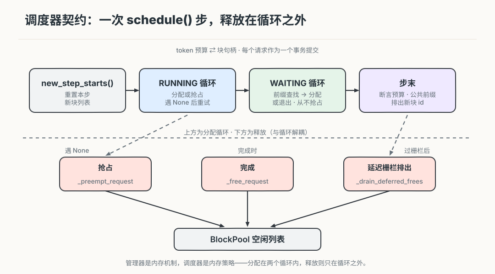</a>

<p class='figure-caption'>以时间线表示一次 `schedule()` step：`new_step_starts` → RUNNING loop（分配或 preempt）→ WAITING loop（lookup → 分配或退出）→ step 结束时执行 assert、计算公共前缀并取出新的 block id；释放操作发生在 preempt、完成以及 allocation loop 外部的延迟 fence 清理阶段。</p>

### 两类 budget，一个 step，原子提交

该调度算法并不区分 prefill 和 decode。`schedule()` 开头的 docstring 概括了整个文件所依据的模型：

`vllm/v1/core/sched/scheduler.py:L398-L407`

```python
        # NOTE(woosuk) on the scheduling algorithm:
        # There's no "decoding phase" nor "prefill phase" in the scheduler.
        # Each request just has the num_computed_tokens and
        # num_tokens_with_spec. num_tokens_with_spec =
        # len(prompt_token_ids) + len(output_token_ids) + len(spec_token_ids).
        # At each step, the scheduler tries to assign tokens to the requests
        # so that each request's num_computed_tokens can catch up its
        # num_tokens_with_spec. This is general enough to cover
        # chunked prefills, prefix caching, speculative decoding,
        # and the "jump decoding" optimization in the future.
```

每个 request 都只是在让 `num_computed_tokens` 追赶 `num_tokens_with_spec`。step 的任务是分配 token，从而缩小二者之间的差距——而分配出去的每个 token，都必须有对应的物理 KV slot 作为支撑。因此，loop 需要同时满足两个相互独立的约束。token 一侧是一个以局部状态形式维护的标量 budget：

`vllm/v1/core/sched/scheduler.py:L414-L419`

```python
        req_to_new_blocks: dict[str, KVCacheBlocks] = {}
        num_scheduled_tokens: dict[str, int] = {}
        token_budget = self.max_num_scheduled_tokens
        if self._pause_state == PauseState.PAUSED_ALL:
            # Do not schedule any requests when paused.
            token_budget = 0
```

`token_budget` 的初始值为 `max_num_scheduled_tokens`（在构造时通过 `scheduler.py:L109` 一次性推导得到），并随着 token 的提交逐步递减。block 一侧则完全不是由 scheduler 跟踪的标量——它存在于 `BlockPool` 的空闲计数中，scheduler 只能通过 `allocate_slots` 返回 `KVCacheBlocks` handle 或 `None` 来获知其状态。`req_to_new_blocks` 按 request 保存该 handle；`num_scheduled_tokens` 保存已提交的 token 数量。关键在于，这两个 map 始终在*同一条*代码路径上写入。下面是 running loop 中的提交逻辑：

`vllm/v1/core/sched/scheduler.py:L584-L591`

```python
            # Schedule the request.
            scheduled_running_reqs.append(request)
            prefill_scheduled |= request.is_prefill_chunk
            request_id = request.request_id
            req_to_new_blocks[request_id] = new_blocks
            num_scheduled_tokens[request_id] = num_new_tokens
            token_budget -= num_new_tokens
            req_index += 1
```

先保存 `new_blocks`（即 manager 刚刚返回的分配结果），再由 `num_scheduled_tokens[request_id]` 记录 token，最后由 `token_budget -= num_new_tokens` 扣减标量 budget——这三次写入之间没有任何分支。waiting loop 在 `L987-L993` 处完全复用了这一模式。不存在未持有 block handle 却扣减 `token_budget` 的路径，也不存在保存 block handle 却不扣减 budget 的路径。

对于每个 request，token 记账与 block 记账都会作为同一笔 transaction 推进。request 绝不可能在没有持有物理 KV block 的情况下消耗调度 budget，否则 batch 可能超出 pool 容量；也不可能持有 block 却不计入 budget，否则 token 数量就会逐渐偏离 KV footprint。这两项约束都会在 step 结束时通过 assert 再次校验（见下文）。

### manager 在构造时绑定到 connector，共享同一个 pool

在任何 step 运行之前，scheduler 都会构建 `KVCacheManager`；仅当存在 KV connector 时，才会把 manager 的 `BlockPool` 的直接引用交给 connector：

`vllm/v1/core/sched/scheduler.py:L277-L280`

```python
        # Bind GPU block pool to the KV connector. This must happen after
        # kv_cache_manager is constructed so block_pool is available.
        if self.connector is not None:
            self.connector.bind_gpu_block_pool(self.kv_cache_manager.block_pool)
```

base connector 将这一扩展点声明为 no-op，由 P/D 和 offloading connector 覆盖：

`vllm/distributed/kv_transfer/kv_connector/v1/base.py:L443-L451`

```python
    def bind_gpu_block_pool(self, gpu_block_pool: "BlockPool") -> None:
        """
        Bind the GPU block pool to the connector for per-GPU block status tracking.
        For example, inc/dec ref counts, or iterate over the prefix cache blocks.

        Args:
            gpu_block_pool: the GPU block pool.
        """
        return
```

`L277-L278` 处的注释明确限定了执行顺序：绑定操作必须在 manager 构造完成*之后*执行，因为它传入的是 `self.kv_cache_manager.block_pool`，也就是 scheduler 通过 `allocate_slots` 分配 block 时使用的同一个 pool 对象。connector 拿到的不是副本或 view，而是完全相同的 pool。因此，外部 KV load 和 save 操作访问的正是 scheduler 已分配的那些 block（connector 所依赖的 ref-count 语义详见[第 23 节](#23-physical-block-的生命周期分配使用释放进入-cache淘汰)）。

每个 engine 只有一个 `BlockPool`，由 scheduler 和 connector 共享。正因如此，connector 的 ref-count 记账才有意义；这也恰恰解释了释放操作为何需要 fence（见下文）：connector 可以通过 load 重新分配并填充一个已释放的 block，而这个 load 与释放该 block 的 GPU write 之间*没有*顺序保证。

**`new_step_starts`：每个 step 仅执行一次的重置**

每个 step 中，manager 的第一次调用会重置该 step 的记账状态：

`vllm/v1/core/kv_cache_manager.py:L623-L625`

```python
    def new_step_starts(self) -> None:
        """Called when a new step is started."""
        self.coordinator.new_step_starts()
```

scheduler 在 `scheduler.py:L432` 处调用它：先初始化本地状态，随后在两个循环开始前立即执行。该调用会经由 coordinator 分发到每个 single-type manager（[第 15 节](#15-coordinator-与-hybrid-kv-cache当一种-block-类型不够用时)），清空“待清零的新 block id”累加器；该累加器会在 step 结束时被取出并清空（见下文）。从调用方角度看，关键在于它的*执行次数*：每个 step 恰好重置一次，而且位于 step 开头、任何分配之前。因此，scheduler 取出累加器内容时，其中只包含当前 step 新分配的 block。

每个 step、每个 group 的新 block 列表都会且只会重置一次。因此，scheduler 交给 worker 用于 KV-cache 清零的列表只包含*当前* step 分配的 block，绝不会夹带上一个 step 的残留项，进而误清零仍在使用的 KV。

**两个调用点刻意采用了不对称形式**

两个 `allocate_slots` 调用点对应不同的 request 状态。RUNNING request 已经持有 block，并且已完成 prefix lookup：

`vllm/v1/core/sched/scheduler.py:L535-L539`

```python
                    new_blocks = self.kv_cache_manager.allocate_slots(
                        request,
                        num_new_tokens,
                        num_lookahead_tokens=self.num_lookahead_tokens,
                    )
```

这里只传入两个位置参数和一个 lookahead count。没有 `new_computed_blocks`、没有 `num_external_computed_tokens`、没有 `full_sequence_must_fit`，也没有 `reserved_blocks`。由于 running request 既不是 `WAITING`，也不是 `PREEMPTED`，因此 `allocate_slots` 内部的 watermark 会计算为零（[第 9 节](#9-allocate_slots-是策略栈而不是一次-allocation)，`kv_cache_manager.py:L363-L370`）。running request 无需承担准入成本，只需要为即将计算的 token 预留 slot。WAITING 调用则使用完整形式：

`vllm/v1/core/sched/scheduler.py:L907-L919`

```python
                new_blocks = self.kv_cache_manager.allocate_slots(
                    request,
                    num_new_tokens,
                    num_new_computed_tokens=num_new_local_computed_tokens,
                    new_computed_blocks=new_computed_blocks,
                    num_lookahead_tokens=effective_lookahead_tokens,
                    num_external_computed_tokens=num_external_computed_tokens,
                    delay_cache_blocks=load_kv_async,
                    num_encoder_tokens=num_encoder_tokens,
                    full_sequence_must_fit=self.scheduler_reserve_full_isl,
                    reserved_blocks=reserved_blocks,
                    has_scheduled_reqs=bool(self.running),
                )
```

每个额外参数都由 *scheduler* 计算并注入；[第 9 节](#9-allocate_slots-是策略栈而不是一次-allocation) 已解释了这些参数在 gate *内部*分别起什么作用，而实际提供它们的是 scheduler。`new_computed_blocks` / `num_new_computed_tokens` 来自 waiting loop 刚刚执行的 prefix-cache lookup（`get_computed_blocks`，[第 7 节](#7-prefix-cache-lookuphashing最长命中与最后一个-token-重计算规则)）。`num_external_computed_tokens` 和 `delay_cache_blocks=load_kv_async` 来自向 connector 查询远端存有多少 KV。`full_sequence_must_fit=self.scheduler_reserve_full_isl` 用于启用 all-or-nothing admission gate。`has_scheduled_reqs=bool(self.running)` 告诉 gate 是否应用 watermark——当且仅当至少已有一个 request 被调度时，它才*会是* `True`。这样，watermark 就不会阻塞首次 admission，进而导致 engine 停滞。`reserved_blocks` 则在上方紧邻位置计算得出（见下文）。

### Preemption 是唯一的恢复手段，且只有 running loop 可以执行 preempt

在 RUNNING loop 中，`None` 会触发 victim eviction 和 retry。FCFS 选择 running 队尾的 request；PRIORITY 则选择优先级最低的 request。如果该 victim 在本 step 的更早阶段已经纳入计划，那么 retry 前会先回滚其 token、block、speculative 和 encoder reservation。

eviction 本身通过 `_preempt_request`（`scheduler.py:L1145-L1167`）执行：它会将 victim 的 block 归还给 pool，把 `num_computed_tokens` 重置为 0（victim 重新 admission 后会再次执行 prefill——不过，它刚释放的 block 仍保留 hash；如果 prefix-cache 命中这些 block，就可以跳过这一步，[第 7 节](#7-prefix-cache-lookuphashing最长命中与最后一个-token-重计算规则)/[第 23 节](#23-physical-block-的生命周期分配使用释放进入-cache淘汰)）；然后将其插回 waiting queue 的*最前端*，确保它先于新到达的 request 恢复执行；最后递增 `num_preemptions`（之后会据此将其 prefix-cache query 标记为 `preempted=True`）。当 victim *就是*当前尝试调度的 request（`preempted_req == request`）时，loop 终止：此时已没有其他 victim 可供 eviction，因此内层 loop 会在 `new_blocks` 仍为 `None` 的状态下 break，外层 running loop 随后也会 break（`L580-L582`）。

WAITING loop 的处理正好相反。当其中的 `allocate_slots` 返回 `None` 时，它不会 preempt 任何 request，而是回滚一次 encoder-cache touch，并直接 break 整个 loop：

`vllm/v1/core/sched/scheduler.py:L921-L928`

```python
                if new_blocks is None:
                    # The request cannot be scheduled.

                    # NOTE: we need to untouch the request from the encode cache
                    # manager
                    if request.has_encoder_inputs:
                        self.encoder_cache_manager.free(request)
                    break
```

而且，只有本 step 没有发生任何 preemption 时，waiting loop 才会运行：

`vllm/v1/core/sched/scheduler.py:L637`

```python
        if not preempted_reqs and self._pause_state == PauseState.UNPAUSED:
```

只有 running retry loop 会执行 eviction。每次 retry 的结果只有三种：成功、移除一个 victim，或走到 self-eviction；一旦发生任何 preemption，本 step 就不会再 admission 新的 waiting work。

### Reservation 可防止不可 preempt 的 async load 陷入 deadlock

完整的 `allocate_slots` 调用中，有一个参数值得单独分析：它由 scheduler 计算，唯一作用是防止一种 preemption 机制无法化解的死锁。异步 KV load（P/D receive）会在整个传输期间持续占用 block，系统无法继续推进，并且无法在 waiting loop 中抢占它。因此，在发起异步 KV load 之前，scheduler 会为其他所有 in-flight prefill 预留后续仍需的 block：

`vllm/v1/core/sched/scheduler.py:L2394-L2412`

```python
    def _request_remaining_blocks(self, request: Request) -> int:
        """Blocks `request` still needs to allocate to hold its full sequence."""
        full_num_tokens = min(request.num_tokens, self.max_model_len)
        return self.kv_cache_manager.coordinator.get_num_blocks_to_allocate(
            request_id=request.request_id,
            num_tokens=full_num_tokens,
            new_computed_blocks=self.kv_cache_manager.empty_kv_cache_blocks.blocks,
            num_encoder_tokens=0,
            total_computed_tokens=request.num_computed_tokens,
            num_tokens_main_model=full_num_tokens,
            apply_admission_cap=True,
        )

    def _inflight_prefill_reserved_blocks(self) -> int:
        """Num blocks in-flight prefills still need to finish (their reservation)."""

        return sum(
            self._request_remaining_blocks(req) for req in self._inflight_prefills
        )
```

`_request_remaining_blocks` 会询问 coordinator 的 block predictor（`get_num_blocks_to_allocate`，[第 15 节](#15-coordinator-与-hybrid-kv-cache当一种-block-类型不够用时)，也就是 admission gate 使用的同一个 predictor）：当前 request 还需要多少 block，才能容纳其*完整* sequence；对于 `apply_admission_cap=True`，则采用紧致的 windowed 上界。将 `_inflight_prefills` 中的结果求和后得到 `reserved_blocks`，[第 9 节](#9-allocate_slots-是策略栈而不是一次-allocation)介绍的 per-step gate 会从空闲 block 数量中扣除该值（`available = free - reserved`）。调用处的注释（`L900-L904`）写得很明确：异步 load“在这里无法被抢占”，因此“只有当它能放进（空闲 block - 其他 in-flight request 的预留量）时才允许进入，以避免死锁和可预见的抢占”。

### 释放操作通过 fence 与 in-flight GPU 写入隔离

block 通过统一的共享路径 `_free_request_blocks` 归还 pool；该路径会在立即释放与延迟释放之间做出选择：

`vllm/v1/core/sched/scheduler.py:L2138-L2151`

```python
    def _free_request_blocks(self, request: Request):
        """Free the request's KV blocks, deferring the return to the block
        pool when an in-flight GPU step may still write them.
        """
        if not self.defer_block_free or (
            # Last scheduled step already processed: no in-flight write remains
            # (always the case for a normal finish), so free now.
            request.last_sched_seq <= self.processed_step_seq
        ):
            self.kv_cache_manager.free(request)
            return
        blocks = self.kv_cache_manager.pop_blocks_for_free(request)
        if blocks:
            self.deferred_frees.append((self.sched_step_seq, blocks))
```

立即释放路径会调用 `kv_cache_manager.free`（该调用会分派给 coordinator，并从尾部开始归还 block，参见[第 23 节](#23-physical-block-的生命周期分配使用释放进入-cache淘汰)）。只有设置了 `defer_block_free` 时，才会触发延迟释放路径。该配置仅为使用 overlapping batch 的 KV *consumer* connector 启用（`scheduler.py:L146-L152`）。这恰好是前文提到的共享 pool 绑定会产生风险的配置：某个 step 可能仍在向已释放 request 的 KV 写入，而 connector 已重新分配这些 block，并通过无序 load 向同一批 block 填充数据。因此，该路径不会立即释放 block，而是将其 *pop 出* 但不归还 pool，并使用当前 schedule sequence number `sched_step_seq` 为它们设置 fence。等到执行写入的 step 所产生的 output 处理完毕后，再由 `update_from_output` 回收这些 block：

`vllm/v1/core/sched/scheduler.py:L1519-L1523`

```python
        # Every GPU write enqueued by this and earlier steps has completed, so it is
        # safe to return deferred-free blocks to the pool.
        if self.defer_block_free and scheduler_output.total_num_scheduled_tokens > 0:
            self.processed_step_seq += 1
            self._drain_deferred_frees()
```

在 schedule 侧，每个非空 step 都会推进 `sched_step_seq`（`L1133-L1134`）；在 output 侧，则会在此处推进 `processed_step_seq`。`_drain_deferred_frees`（`L2153-L2165`）只会归还 fence 序号已经到达的 block。正常完成的 request 会走立即释放路径——request 完成时，`request.last_sched_seq <= self.processed_step_seq` 始终为 true，因为按照定义，它最后一个被 schedule 的 step 此时已经处理完毕。

只要仍在执行的 GPU step 或针对 shared pool 排队的 connector load 还有可能写入某个 block，该 block 就绝不会被放回 free list。两个单调递增的序列计数器共同构成一道 fence：只有当可能写入这些延迟释放 block 的 step 已完成 output 处理后，它们才会重新变为可分配状态，从而避免 shared `BlockPool`（前文所述）引发 use-after-free。

**Step 结束：再次确认 budget，然后移交**

两个 loop 都处理完后，scheduler 会重新检查本 step 全程维护的两项约束，并计算 cascade-attention hint：

`vllm/v1/core/sched/scheduler.py:L1026-L1037`

```python
        # Check if the scheduling constraints are satisfied.
        total_num_scheduled_tokens = sum(num_scheduled_tokens.values())
        assert total_num_scheduled_tokens <= self.max_num_scheduled_tokens

        assert token_budget >= 0
        assert len(self.running) <= self.max_num_running_reqs
        # Since some requests in the RUNNING queue may not be scheduled in
        # this step, the total number of scheduled requests can be smaller than
        # len(self.running).
        assert len(scheduled_new_reqs) + len(scheduled_resumed_reqs) + len(
            scheduled_running_reqs
        ) <= len(self.running)
```

`total_num_scheduled_tokens`（由 per-request map 汇总得到）不得超过上限；`token_budget`（每次 commit 时递减，仅在 rollback 时递增）不得变为负数。随后，scheduler 会向 manager 查询所有 running request 的最长公共前缀（`get_num_common_prefix_blocks(running[0].request_id)`；为何任意 running id 均可，参见[第 15 节](#15-coordinator-与-hybrid-kv-cache当一种-block-类型不够用时)），获取 cascade-attention hint，最后取出由 `new_step_starts` 在 step 开始时 reset 的 per-step new-block list：

`vllm/v1/core/sched/scheduler.py:L1083-L1088`

```python
        # Drain new attention block ids every step so the manager-side list
        # does not grow unbounded; only kv-cache zeroing consumes them.
        new_attn_block_ids = self.kv_cache_manager.take_new_block_ids()
        new_block_ids_to_zero = (
            (new_attn_block_ids or None) if self.needs_kv_cache_zeroing else None
        )
```

`take_new_block_ids` 会拼接每个 single-type manager 累积的 id（参见[第 15 节](#15-coordinator-与-hybrid-kv-cache当一种-block-类型不够用时)），并清空各自的记录。因此，该 list 每个 step 只会被取出一次，与 `new_step_starts` reset 前后呼应。

## 11. Connector 感知分配：外部 KV、delay_cache_blocks 与 P/D 分离

`KVConnectorBase_V1` 使 manager 成为跨节点 KV 传输的一个 endpoint，可用于 P/D 分离、LMCache、NIXL 和 offloading。scheduler 生成 `num_external_computed_tokens` 和 `delay_cache_blocks`，manager 则负责消费它们。这一边界决定了远端 KV 何时可以计入处理进度、block 何时可以发布，以及何时可以释放。

### Connector 边界采用 query/commit 分离，且 query 必须是纯操作

scheduler 侧的 connector API 包含三个严格约束副作用的 hook，类的 docstring 一开始便明确列出了它们：

`vllm/distributed/kv_transfer/kv_connector/v1/base.py:L10-L14`

```
        get_num_new_matched_tokens() - get number of new tokens
            that exist in the remote KV cache. Might be called multiple
            times for a given request and should be side-effect free.
        update_state_after_alloc() - update KVConnector state after
            temporary buffer alloc by the CacheManager.
```

第一个 hook 是纯 **query**，可以重复调用；只有在 manager 确认这些 block 能够容纳后，第二个 hook 才会 **commit** connector state。query 返回：

`vllm/distributed/kv_transfer/kv_connector/v1/base.py:L453-L458`

```python
    @abstractmethod
    def get_num_new_matched_tokens(
        self,
        request: "Request",
        num_computed_tokens: int,
    ) -> tuple[int | None, bool]:
```

输入 `num_computed_tokens` 是 request 在*本地*计算得到的 token 数——即[第 7 节](#7-prefix-cache-lookuphashing最长命中与最后一个-token-重计算规则)中的 `get_computed_blocks` 所产生的本地 prefix-cache 命中长度。connector 返回的是在此基础上还能额外提供多少 token：一个 `int | None`，外加一个 async flag。slot 0 中的 `None` 表示“目前还无法判断，请稍后再问”。docstring 要求，当计数为零时，async flag 必须为 false（`base.py:L475-L477`），且查询不得产生副作用（`base.py:L12`）。准入流程可能跨多个 scheduler step 对同一个 request 进行重试，因此，如果这里产生副作用，就会被重复应用。

**绑定 pool：connector 与 manager 共享同一个分配命名空间**

在执行上述逻辑之前，connector 会在 scheduler 构造时接收一次 manager 用于分配的*同一个* `BlockPool`。[第 10 节](#10-scheduler-契约调度过程如何驱动-kv-cache-manager)给出了这次绑定（`scheduler.py:L277-L280`）。因此，connector 看到的是 manager 由 refcount 管理的 free list 和 hash→block 索引（[第 3 节](#3-kvcacheblock-与-blockpoolfree-list-是一种淘汰结构)/[第 23 节](#23-physical-block-的生命周期分配使用释放进入-cache淘汰)），而不是另一套独立的命名空间。

**生成 `num_external_computed_tokens`：绝不能重叠的两段前缀**

下面来看准入流程的前半段。request 首次被调度时，scheduler 会在完成本地前缀查找后，询问 connector 外部存在多少 KV：

`vllm/v1/core/sched/scheduler.py:L736-L763`

```python
                    # Get externally-cached tokens if using a KVConnector.
                    if self.connector is not None:
                        ext_tokens, load_kv_async = (
                            self.connector.get_num_new_matched_tokens(
                                request, num_new_local_computed_tokens
                            )
                        )

                        if ext_tokens is None:
                            # The request cannot be scheduled because
                            # the KVConnector couldn't determine
                            # the number of matched tokens.
                            request_queue.pop_request()
                            step_skipped_waiting.prepend_request(request)
                            continue

                        num_external_computed_tokens = ext_tokens

                        connector_prefix_cache_queries = (
                            request.num_tokens - num_new_local_computed_tokens
                        )
                        connector_prefix_cache_hits = num_external_computed_tokens

                    # Total computed tokens (local + external).
                    num_computed_tokens = (
                        num_new_local_computed_tokens + num_external_computed_tokens
                    )
                    assert num_computed_tokens <= request.num_tokens
```

`num_new_local_computed_tokens`——来自[第 7 节](#7-prefix-cache-lookuphashing最长命中与最后一个-token-重计算规则)的本地 prefix-cache 命中——会被传*入* connector，因此 connector 只报告在本地命中基础上还能额外提供的前缀，绝不会包含重叠区域。`ext_tokens is None` 分支将 docstring 中的“稍后再问”路径落实为具体逻辑：request 会被 pop 出来，再通过 `step_skipped_waiting.prepend_request` 重新放回 queue，而不是进入调度。这样一来，如果 connector 仍在解析 remote match，就会推迟该 request，而不会被迫做出错误判断。最后的 assertion 会检查本地命中与 connector delta 是否构成两段互不相交的前缀，且总长度不超过 prompt。

### 一个 boolean，三重影响：async ⇒ compute 为零、预留 block、延迟 cache

connector 返回的 async flag 是整个 P/D 路径的关键。如果采用异步加载，这个 step 只会分配接收空间，*不会*调度任何 forward compute：

`vllm/v1/core/sched/scheduler.py:L797-L800`

```python
                if load_kv_async:
                    # KVTransfer: loading remote KV, do not allocate for new work.
                    assert num_external_computed_tokens > 0
                    num_new_tokens = 0
```

`num_new_tokens = 0` 表示该 request 会占用 KV block，但在这个 step 不执行任何模型计算——这些 block 是由 worker 侧 connector 在 scheduler step 之间填充的 *recv buffer*。这里的 assertion 会在实际使用处强制落实 async 要求：异步加载必须能够提供外部 token。这个零值通常意味着 caller 存在 bug；但 manager 知道这里并非如此，因此专门针对这种情况放宽了 empty-request guard：

`vllm/v1/core/kv_cache_manager.py:L340-L346`

```python
        # When loading KV data asynchronously, we may have zero new tokens to
        # compute while still allocating slots for externally computed tokens.
        if num_new_tokens == 0 and num_external_computed_tokens == 0:
            raise ValueError(
                "num_new_tokens must be greater than 0 when there are no "
                "external computed tokens"
            )
```

只有当两个计数都为零时，guard 才会触发。仅有 `num_new_tokens == 0` 是合法的——只要 `num_external_computed_tokens > 0`，这次调用走的就是 async load 路径，需要预留接收空间，而不是 no-op。这两个条件恰好是 `scheduler.py:L797-L800` 中 async 情形的补集。`allocate_slots` 总会完成*某项*工作：要么计算新 token，要么为外部 token 预留接收 block。真正的 no-op 绝不会获准进入，因为这种 request 什么都不处理，只会白白占用一个 scheduler slot。

面向 connector 的两个参数各自都有 docstring，其中第二个参数直接点明了本节讨论的整个机制：

`vllm/v1/core/kv_cache_manager.py:L270-L274`

```python
            num_external_computed_tokens: The number of tokens that their
                KV caches are not cached by vLLM but cached by the connector.
            delay_cache_blocks: Whether to skip caching the blocks. This is
                used by P/D when allocating blocks used in a KV transfer
                which will complete in a future step.
```

这些 token 所占据的 `ext_comp` 区域，是 [第 9 节](#9-allocate_slots-是策略栈而不是一次-allocation) 所引用的 block 布局注释（`kv_cache_manager.py:L290-L322`）中的第三个区段：它位于由 vLLM cache 的 prefix 与待计算的 tail 之间，“不由 vLLM cache，而由 connector cache”。关键在于，尽管这些 block 的 KV 来自 transfer 而非 compute，仍必须完成*分配*，也就是预留空间并设置 ref count。[第 9 节](#9-allocate_slots-是策略栈而不是一次-allocation) 介绍了准入门控的计算方式：将 `num_external_computed_tokens` 计入 `total_computed_tokens`（上限为 `max_model_len`），并相应提高 block 需求量。这里需要牢记的是：外部 token 虽然不产生 compute，仍会占用实际的 GPU block。

<a href='images/vllm-06-16-connector-pd.svg' target='_blank'>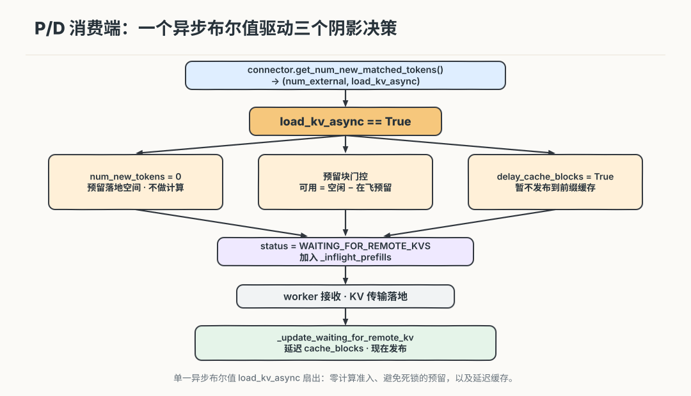</a>

<p class='figure-caption'>P/D consumer 生命周期：connector query → async 准入（num_new_tokens=0、预留 block 门控、delay_cache_blocks）→ WAITING_FOR_REMOTE_KVS → worker recv → 完成后延迟执行 cache_blocks。单一的 async boolean 同时控制三个带阴影的决策点。</p>

### 预留 block：为什么 async load 不能导致 in-flight prefill 资源饥饿

[第 9 节](#9-allocate_slots-是策略栈而不是一次-allocation) 已经介绍了准入门控本身（`kv_cache_manager.py:L419-L425`）：`available = free - reserved_blocks`、`required = demand + watermark`、`required > available ⇒ None`。但没有说明 `reserved_blocks` 的*值*从何而来。这是 caller 的职责，并且只会为 async load 计算：

`vllm/v1/core/sched/scheduler.py:L899-L905`

```python
                reserved_blocks = 0
                if load_kv_async:
                    # An async load holds its blocks for the whole transfer with
                    # no forward progress and isn't preemptible here. Admit it
                    # only if it fits in (free - other in-flight reservations), to
                    # avoid deadlock and predictable preemptions.
                    reserved_blocks = self._inflight_prefill_reserved_blocks()
```

[第 10 节](#10-scheduler-契约调度过程如何驱动-kv-cache-manager) 详细介绍了 `_inflight_prefill_reserved_blocks` 和 `_request_remaining_blocks`。这里，`reserved_blocks` **只**会针对 `load_kv_async` 计算，同一次 `allocate_slots` 调用还会传入 `delay_cache_blocks=load_kv_async`。因此，仅这一个 flag 就同时控制：(a) `num_new_tokens = 0`，(b) 预留门控，以及 (c) 延迟发布。这一切都是因为 KV 要稍后才能到达。

只有在 async connector load 占用所需 block 后，所有已经 in-flight 的 prefill 仍有足够的 free block 可以运行到结束，它才会获准进入。外部 load 绝不会侵占保障既有任务继续推进的资源，因此这两类不可抢占的活动不会因争夺 block pool 而相互 deadlock。

**延迟发布：只有 KV 真正到位后，block 才会进入 prefix cache**

[第 9 节](#9-allocate_slots-是策略栈而不是一次-allocation)引用了 delayed-cache 分支本身（`kv_cache_manager.py:L447-L463`）。在该分支中，`not self.enable_caching or delay_cache_blocks` 直接返回已分配的 blocks，*不会*调用 `cache_blocks`。从 connector 的角度最容易理解其中的原因：`cache_blocks` 负责将 request 的 blocks *发布*到 prefix cache，也就是对其进行 hash，使其他 request 能够找到并复用这些 blocks（[第 7 节](#7-prefix-cache-lookuphashing最长命中与最后一个-token-重计算规则)）。对于 P/D recv，这些 blocks 已经存在并归该 request 所有，但其中的 KV 内容仍在传输途中。此时发布它们，可能会让*另一个* request 命中一个充满垃圾数据或 KV 只写入了一部分的 block。因此，分配时会跳过发布操作，直到传输数据真正落地的准确时刻再执行。

接下来会触发这一边界的 commit 阶段，但仅限成功路径：

`vllm/v1/core/sched/scheduler.py:L930-L939`

```python
                # KVTransfer: the connector uses this info to determine
                # if a load is needed. Note that
                # This information is used to determine if a load is
                # needed for this request.
                if self.connector is not None:
                    self.connector.update_state_after_alloc(
                        request,
                        self.kv_cache_manager.get_blocks(request_id),
                        num_external_computed_tokens,
                    )
```

只有当 `allocate_slots` 返回非 `None` 值后（即准入成功；前面的 `if new_blocks is None: break` 负责处理失败情况），scheduler 才会将具体的 blocks 以及落入其中的 external tokens 数量告知 connector。这就是 query/commit 拆分中的 commit 阶段：`get_num_new_matched_tokens` 发起查询，`update_state_after_alloc` 执行提交。根据其 docstring（`base.py:L488-L507`），对于 async load，这一步可能触发两次：第一次是在分配 recv-buffer blocks 时，第二次是在传输完成并分配所有剩余 blocks 后。

随后，async request 会停驻在一个专用状态中，而不是加入 running set：

`vllm/v1/core/sched/scheduler.py:L950-L971`

```python
                request = request_queue.pop_request()
                if load_kv_async:
                    # If loading async, allocate memory and put request
                    # into the WAITING_FOR_REMOTE_KV state.
                    request.status = RequestStatus.WAITING_FOR_REMOTE_KVS
                    step_skipped_waiting.prepend_request(request)
                    # Set num_computed_tokens even though KVs are not yet loaded.
                    # request.num_computed_tokens will not be used anywhere until
                    # the request finished the KV transfer.
                    #
                    # If a transfer error is reported by the connector,
                    # request.num_computed_tokens will be re-set accordingly in
                    # _update_requests_with_invalid_blocks.
                    #
                    # When the transfer is finished, either successfully or not,
                    # request.num_computed_tokens will correctly reflect the number
                    # of computed tokens.
                    # _update_waiting_for_remote_kv will then cache
                    # only the successfully loaded tokens.
                    request.num_computed_tokens = num_computed_tokens
                    self._inflight_prefills.add(request)
                    continue
```

该 request 进入 `WAITING_FOR_REMOTE_KVS`，并加入 `_inflight_prefills`。这个集合中 remaining blocks 的总数正是上方 reservation gate 的输入，因此，*这次* load 的 blocks 现在也会保护*其他* pending loads 的准入空间。`num_computed_tokens` 会被乐观地设置，但注释特别强调，在传输结果确定之前，任何地方都不会读取它。

当 worker 侧 connector 发出 recv-complete 信号时，延迟的发布操作终于执行，而且能够安全处理部分完成的情况：

`vllm/v1/core/sched/scheduler.py:L2414-L2446`

```python
    def _update_waiting_for_remote_kv(self, request: Request) -> None:
        """
        KV Connector: update request state after async recv is finished.

        When the kv transfer is ready, we cache the blocks
        and the request state will be moved back to WAITING from
        WAITING_FOR_REMOTE_KV.
        """
        assert self.connector is not None

        if request.request_id in self.failed_recving_kv_req_ids:
            # Request had KV load failures; num_computed_tokens was already
            # updated in _update_requests_with_invalid_blocks
            if request.num_computed_tokens:
                # Cache any valid computed tokens.
                self.kv_cache_manager.cache_blocks(request, request.num_computed_tokens)
            else:
                # No valid computed tokens, release allocated blocks.
                # There may be a local cache hit on retry.
                self.kv_cache_manager.free(request)

            self.failed_recving_kv_req_ids.remove(request.request_id)
        else:
            # Now that the blocks are ready, actually cache them.
            # This will cache the blocks iff caching is enabled.
            self.kv_cache_manager.cache_blocks(request, request.num_computed_tokens)

            # on a full prompt hit, we need to re-compute the last token
            # in order to be able to sample the next token
            if request.num_computed_tokens == request.num_tokens:
                request.num_computed_tokens = request.num_tokens - 1

        self.finished_recving_kv_req_ids.remove(request.request_id)
```

至此，delayed-cache 分支开启的流程形成闭环。成功时，`cache_blocks` 会将现已驻留、恰好覆盖 `request.num_computed_tokens` 的 blocks 发布到 prefix cache。这个调用正是此前 `allocate_slots` 跳过的操作，它一直被推迟到 KV 真正有效的那一刻。失败时，只会缓存有效的 prefix；如果没有加载任何内容，则释放全部 blocks。因此，无论传输只完成了一部分还是彻底失败，都不会把垃圾数据发布出去。full-hit 分支会将 `num_computed_tokens` 减 1，从而留下最后一个 token 用于执行 forward pass。这与[第 7 节](#7-prefix-cache-lookuphashing最长命中与最后一个-token-重计算规则)针对 local full hit（`kv_cache_manager.py:L221-L227`）确立的“重算最后一个 token”规则相同，只是这里应用于 remote full hit。

### 镜像过程：producer 侧在 send 完成后*异步*释放 blocks

上文讲的都是 consumer（decode）侧拉取 KV 的流程。P/D 在 producer（prefill）侧也存在一个对称的风险：当某个 prefill instance 完成 prompt KV 的计算后，这些 block 必须保留足够长的时间，才能被*发送*给 decode peer，而对端此时可能尚未拉取这些数据。如果沿正常路径释放，就会在传输过程中回收 block。`request_finished` hook 正是为此提供的兜底机制：

`vllm/distributed/kv_transfer/kv_connector/v1/base.py:L542-L561`

```python
    def request_finished(
        self,
        request: "Request",
        block_ids: list[int],
    ) -> tuple[bool, dict[str, Any] | None]:
        """
        Called exactly once when a request has finished, before its blocks are
        freed.

        The connector may assumes responsibility for freeing the blocks
        asynchronously by returning True.

        Returns:
            True if the request is being saved/sent asynchronously and blocks
            should not be freed until the request_id is returned from
            get_finished().
            Optional KVTransferParams to be included in the request outputs
            returned by the engine.
        """
        return False, None
```

scheduler 会在 `_free_request` 中根据该返回值执行相应逻辑：

`vllm/v1/core/sched/scheduler.py:L2107-L2124`

```python
    def _free_request(
        self, request: Request, delay_free_blocks: bool = False
    ) -> dict[str, Any] | None:
        assert request.is_finished()

        self._inflight_prefills.discard(request)
        connector_delay_free_blocks, kv_xfer_params = self._connector_finished(request)
        self.encoder_cache_manager.free(request)
        request_id = request.request_id
        self.finished_req_ids.add(request_id)
        if self.finished_req_ids_dict is not None:
            self.finished_req_ids_dict[request.client_index].add(request_id)

        delay_free_blocks |= connector_delay_free_blocks
        if not delay_free_blocks:
            self._free_blocks(request)
```

`_connector_finished` 会调用 `request_finished`（在此之前，它会按照[第 9 节](#9-allocate_slots-是策略栈而不是一次-allocation)采用的 processed-token 口径，先回收已滑出 window 的 prefix block，即 `scheduler.py:L2374-L2380`），然后返回 connector 的 `delay_free_blocks` 判定结果。如果 connector 返回 `True`，就表示它已接管这些 block，用于正在进行的发送；此时不会调用 `_free_blocks`，这些 block 将一直保留，直到 connector 通过 `get_finished()` 报告该 request 已完成。这与 consumer 侧延迟 *cache* 的机制完全对偶：consumer 会等 KV 到达后再*发布* block，而 producer 会等 KV 发出后再*释放* block。两者都会跨越异步传输边界，推迟某项 block pool 操作，并将执行时机交由 connector 决定，而不是遵循 scheduler 的常规生命周期（[第 23 节](#23-physical-block-的生命周期分配使用释放进入-cache淘汰)）。

KV 仍在向外传输的 block 绝不会被放回 free list（[第 3 节](#3-kvcacheblock-与-blockpoolfree-list-是一种淘汰结构)），否则 `get_new_blocks` 可能会将它分配给另一个 request，从而覆盖仍然有效、但尚未发送的 KV。在发送期间，block 的所有权会移交给 connector；只有 connector 发出传输完成信号后，pool 才会回收该 block。

## 12. Cascade Attention：整个 batch 共享同一个 prefix

Prefix caching 通过让多个 block table 指向同一批 physical block，消除了共享 prompt 在**存储**上的重复。Cascade attention 则用于降低剩余的计算成本：如果不使用它，一个包含 N 个 request 的 batch 在每一层、每个 step 中，仍要从 HBM 重复读取 N 次共享 prefix。

Cascade attention 只需读取一次：先对全部 N 个拼接后的 query 与共享 KV 执行一次 non-causal kernel，再针对每个 request 的私有 suffix 分别执行 causal kernel，最后通过 log-sum-exp 合并结果。这是精确的 softmax 分解，因此不会影响正确性；它唯一节省的是 prefix 的 HBM bandwidth。该功能需要显式启用，默认关闭（[`vllm/config/model.py:244-250`](https://github.com/vllm-project/vllm/blob/6cf7b26bd4bff60bf378e1af14044280ac0d214c/vllm/config/model.py#L244-L250)，`disable_cascade_attn: bool = True`）。原因正是它虽然不会改变数学结果，却*可能*改变 float 最低若干 bit。

manager 会为这项优化提供一个输入：基于 block refcount 推导出的保守计数，表示整个 running batch 共享的起始 physical block 数量。

<a href='images/vllm-06-20-cascade-prefix.svg' target='_blank'>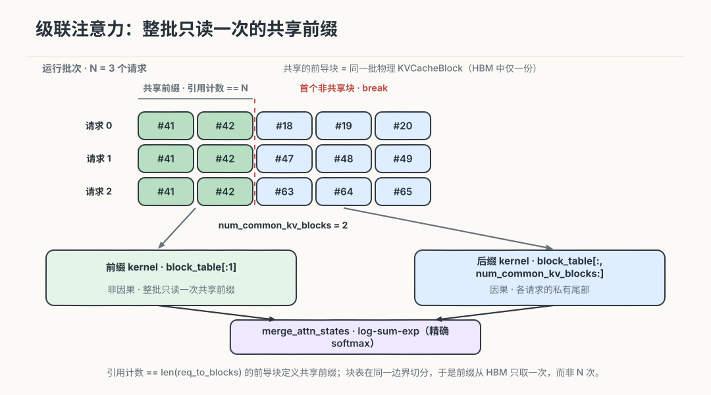</a>

<p class='figure-caption'>图：由 refcount 界定的 common prefix——带有 `ref_cnt == len(req_to_blocks)` 的起始 block，是每个 request 持有的相同 physical block。因此，prefix kernel 可通过 `block_table[:1]` 为整个 batch 只读取一次这些 block，而每个 request 的 suffix 则通过 `block_table[:, num_common_kv_blocks:]` 读取。</p>

### Refcount *就是*共享性的判定条件

scheduler 每个 step 只探测一次 shared prefix，而且只基于单个 request。

[`vllm/v1/core/sched/scheduler.py:1039-1047`](https://github.com/vllm-project/vllm/blob/6cf7b26bd4bff60bf378e1af14044280ac0d214c/vllm/v1/core/sched/scheduler.py#L1039-L1047)
```python
        # Get the longest common prefix among all requests in the running queue.
        # This can be potentially used for cascade attention.
        num_common_prefix_blocks = [0] * len(self.kv_cache_config.kv_cache_groups)
        with record_function_or_nullcontext("schedule: get_num_common_prefix_blocks"):
            if self.running:
                any_request_id = self.running[0].request_id
                num_common_prefix_blocks = (
                    self.kv_cache_manager.get_num_common_prefix_blocks(any_request_id)
                )
```

默认值是每个 group 对应一个全零 list，并且只有 running queue 非空时才会执行探测。关键线索在于变量名：`any_request_id = self.running[0].request_id`。*任意一个* running request 都可以作为 probe。具体做法是遍历某个 request 的 block，并逐一判断其他所有持有 cache 的 request 是否也持有该 block。这个 predicate 具有对称性，因此从哪个 request 开始都不会影响结果。只选择一个 request，才能将复杂度控制在 O(prefix blocks)，而不是 O(requests × blocks)。结果会随 scheduler output 一同传出，每个 KV-cache group 对应一个整数 ([`vllm/v1/core/sched/output.py:205-207`](https://github.com/vllm-project/vllm/blob/6cf7b26bd4bff60bf378e1af14044280ac0d214c/vllm/v1/core/sched/output.py#L205-L207), `num_common_prefix_blocks: list[int]`)。

manager 的 docstring 解释了为什么只需一次 probe。

[`vllm/v1/core/kv_cache_manager.py:531-537`](https://github.com/vllm-project/vllm/blob/6cf7b26bd4bff60bf378e1af14044280ac0d214c/vllm/v1/core/kv_cache_manager.py#L531-L537)
```python
    def get_num_common_prefix_blocks(self, running_request_id: str) -> list[int]:
        """Calculate the number of common prefix blocks for each kv cache group.

        The function selects a running request and iterates through its blocks.
        A block is considered a common prefix block if ALL requests with
        allocated KV cache share it (i.e., ref_cnt equals the number of entries
        in req_to_blocks).
```

真正的扫描逻辑位于 full-attention manager 中——它也是唯一参与这项工作的 single-type manager（下文会进一步说明）。

[`vllm/v1/core/single_type_kv_cache_manager.py:615-623`](https://github.com/vllm-project/vllm/blob/6cf7b26bd4bff60bf378e1af14044280ac0d214c/vllm/v1/core/single_type_kv_cache_manager.py#L615-L623)
```python
    def get_num_common_prefix_blocks(self, running_request_id: str) -> int:
        blocks = self.req_to_blocks[running_request_id]
        num_common_blocks = 0
        for block in blocks:
            if block.ref_cnt == len(self.req_to_blocks):
                num_common_blocks += 1
            else:
                break
        return num_common_blocks
```

`blocks` 是 probe request 按位置排列的 block list（index 0 对应最开始的 tokens）。扫描从左向右进行。`block.ref_cnt` 表示当前有多少个 request 持有该*physical* block；`len(self.req_to_blocks)` 表示这个 group 中有多少个 request 持有任意 KV，也就是“所有 request”这一分母。等式 `ref_cnt == len(req_to_blocks)` 仅当*每一个*持有 cache 的 request 都指向这同一个 physical block 时才成立。由于 prefix caching 会按 content hash 去重，这意味着该 block 在每个 request 的 table 中都位于相同的 prefix 位置。这正是只需单次 probe 的原因：根据定义，refcount 满额的起始 block 存在于所有 request 中。因此，只要枚举 probe request 起始处 refcount 满额的连续 block，就恰好能枚举出整个 batch 的 shared prefix。

首次 miss 时触发 `break` 并不是一种优化，而是定义本身。共享部分必须是一个*连续的* prefix。一旦某个 request 出现分歧，分歧之后的每个 block 都是 per-request 的；即使后续某个 block 碰巧达到 full refcount 也不例外（例如，两个互不相关的 request 恰好共享了对话中段的某个 block）。越过这个断点继续计数，会把不属于 prefix 的 block 误判为共享。scan 会在遇到第一个缺口时停止。

**该计数刻意采用保守策略——绝不多算**

分母中藏着保证 cascade 安全的关键细节。`len(req_to_blocks)` 统计的是所有已分配 KV cache 的 request；docstring 明确指出，这个集合是本 step 中已调度 request 集合的超集。

[`vllm/v1/core/kv_cache_manager.py:539-553`](https://github.com/vllm-project/vllm/blob/6cf7b26bd4bff60bf378e1af14044280ac0d214c/vllm/v1/core/kv_cache_manager.py#L539-L553)
```python
        NOTE(woosuk): The number of requests with allocated KV cache is **greater
        than or equal to** the number of requests scheduled in the current step.
        This is because having allocated KV cache only indicates that:
        1. The request has not yet finished, and
        2. The request holds its blocks unfreed.

        While all scheduled requests must have allocated KV cache, the inverse
        is not necessarily true. There may be requests with allocated KV cache
        that are not scheduled in the current step.

        This can result in an edge case where the number of common prefix blocks
        is 0, even though all scheduled requests share a common prefix. This
        occurs because there may be unscheduled requests that do not share the
        common prefix. Currently, this case cannot be easily detected, so the
        function returns 0 in such cases.
```

因此，这里产生的是方向正确的单侧误差。如果某个 request 处于 running 状态、但在本 step 未被调度，它仍然持有自己的 block，因此仍会抬高分母。如果这个未调度的 request 不共享该 prefix，前导 block 就会满足 `ref_cnt < len(req_to_blocks)`，scan 会提前停止，甚至可能在 block 0 就中止，于是整个 step 都会悄然跳过 cascade。因此，这个估计值可能*过小*（错失一次优化），但绝不会*过大*（引发正确性 bug）。这正是至关重要的 guard，因为 cascade 在 downstream 会让 prefix kernel 代表所有 request 读取 request-0 的 prefix block。一旦 count 把某个 block 判定为共享，但某个仍存活的 request 在该处的 KV 实际不同，cascade 就会向这个 request 提供错误的 KV。将 predicate 绑定到 all-holders set 上的 full refcount，使 false positive 从结构上不可能发生：count 宁可退化为 0，也绝不会谎报。

### 只有 full attention 参与，其他类型一律 opt out

count 会按 KV-cache group 分别展开。base coordinator 会为每个 single-type manager 返回一个 count（[`vllm/v1/core/kv_cache_coordinator.py:315-330`](https://github.com/vllm-project/vllm/blob/6cf7b26bd4bff60bf378e1af14044280ac0d214c/vllm/v1/core/kv_cache_coordinator.py#L315-L330)，即对 `self.single_type_managers` 执行 list comprehension），而 no-prefix-cache coordinator 会直接 short-circuit 整个流程。

[`vllm/v1/core/kv_cache_coordinator.py:414-415`](https://github.com/vllm-project/vllm/blob/6cf7b26bd4bff60bf378e1af14044280ac0d214c/vllm/v1/core/kv_cache_coordinator.py#L414-L415)
```python
    def get_num_common_prefix_blocks(self, running_request_id: str) -> list[int]:
        return [0] * self.num_single_type_manager
```

没有 prefix cache，就不会有去重后的 physical blocks，也就没有可利用的 shared prefix：结果必然为 0，无需 scan。对于 caching coordinator，每个 group 的结果取决于该 group 的 attention type，而所有非 full-attention manager 在设计上都会返回 0。Sliding window（[`single_type_kv_cache_manager.py:869-876`](https://github.com/vllm-project/vllm/blob/6cf7b26bd4bff60bf378e1af14044280ac0d214c/vllm/v1/core/single_type_kv_cache_manager.py#L869-L876)）明确指出：“对于 sliding window layer，prefix blocks 都是 null blocks。因此，不能像 FullAttentionManager 那样统计 ref_cnt。”Chunked local attention（`:1022-1026`）和 Mamba（`:1176-1180`）也都会返回 0，其单行 docstring 均注明“not supported”；cross-attention（`:1397-1400`）同样返回 0，因为“Cross-attention blocks 包含 request 特有的 encoder states，无法在不同 request 之间共享。”

这与[第 16 节](#16-各类型的-block-计算sliding-windowmamba-与-chunked-local-attention)介绍的各 attention type 的 block 计算方式（SWA/Mamba/chunked）完全一致：这些 manager 会刻意将起始 blocks 置空，或使其变为 request 专用（windowed reclamation、in-place state blocks、encoder KV），因此不存在 byte-identical shared prefix 可供一次性读取。`RSWAManager`依然是 `FullAttentionManager`（[`single_type_kv_cache_manager.py:626`](https://github.com/vllm-project/vllm/blob/6cf7b26bd4bff60bf378e1af14044280ac0d214c/vllm/v1/core/single_type_kv_cache_manager.py#L626)）的子类，并继承了该计数逻辑，因为其 full-attention layers 确实会保留共享的起始 blocks。

因此，对于 hybrid model，只有 full-attention group 才可能贡献正数 count，而 per-group list 会让每个 group 独立做出这一判断——这与[第 15 节](#15-coordinator-与-hybrid-kv-cache当一种-block-类型不够用时)介绍的 group-major 规则相同。对于交错包含 full 和 sliding-window layers 的 model，同一步中可以对 full layers 进行 cascade，而 windowed layers 则回退到普通 attention。

### 从 block count 到设有上限的 token length

block count 还不能直接作为可用的 prefix length。model runner 会将每个 group 的 count 转换为 token length，并在 attention backend 看到它之前，先应用两个管理侧的上限。driver（[`gpu_model_runner.py:2565-2601`](https://github.com/vllm-project/vllm/blob/6cf7b26bd4bff60bf378e1af14044280ac0d214c/vllm/v1/worker/gpu_model_runner.py#L2565-L2601)，`_compute_cascade_attn_prefix_lens`）会遍历 groups × attention-groups，对 encoder-only specs 强制设为 0；除非*至少一个* group 最终保留了正数 length，否则返回 `None`。`None`则是 runner 其余部分据以在整个 step 回退到普通 attention 的信号。每个 group 的处理首先将 blocks 转换为 tokens：

[`vllm/v1/worker/gpu_model_runner.py:2629-2632`](https://github.com/vllm-project/vllm/blob/6cf7b26bd4bff60bf378e1af14044280ac0d214c/vllm/v1/worker/gpu_model_runner.py#L2629-L2632)
```python
        common_prefix_len = num_common_prefix_blocks * kv_cache_spec.block_size
        if common_prefix_len == 0:
            # Common case.
            return 0
```

然后应用两个上限：

[`vllm/v1/worker/gpu_model_runner.py:2673-2677`](https://github.com/vllm-project/vllm/blob/6cf7b26bd4bff60bf378e1af14044280ac0d214c/vllm/v1/worker/gpu_model_runner.py#L2673-L2677)
```python
        common_prefix_len = min(common_prefix_len, num_computed_tokens.min())
        # common_prefix_len should be a multiple of the block size.
        common_prefix_len = (
            common_prefix_len // kv_cache_spec.block_size * kv_cache_spec.block_size
        )
```

之所以设置 `min(..., num_computed_tokens.min())` 上限，是因为 prefix kernel 是 non-causal 的——它不会应用任何 mask（[`gpu_model_runner.py:2634-2672`](https://github.com/vllm-project/vllm/blob/6cf7b26bd4bff60bf378e1af14044280ac0d214c/vllm/v1/worker/gpu_model_runner.py#L2634-L2672) 中完整推演的 `[A, B, C, D, E]` 示例解释了原因）。如果声明的 prefix 延伸到某个 request 仍在计算的区域，也就是其 query tokens 所在、KV 尚未最终确定的区域，那么该 request 中较早的 query position 就会违规地向前 attend 到自身尚未真正形成的 prefix。将上限设为 batch 中*最小的* `num_computed_tokens`，可以确保对每个 request 而言，整个无 mask 的 prefix 都完全位于已经确定的 KV 范围内。注释还明确说明了一个有意为之的 off-by-one：代码使用 `[A, B, C]` 而不是 `[A, B, C, D]`，刻意省略“加一”，从而保证 suffix kernel 始终能获得非空 tail。

按 `block_size` 向下取整后，Cascade 便有了统一的 split point：`num_common_kv_blocks = common_prefix_len // block_size`。未按 block 对齐的 prefix 会从中间切开一个 block，而 block table 表示（[第 20 节](#20-从-block-table-到-kernelslot_mapping-与-device-tensors)）无法表达这种情况，runtime 也通过 assert 明确禁止这样做（见下文 [`flash_attn.py:1466`](https://github.com/vllm-project/vllm/blob/6cf7b26bd4bff60bf378e1af14044280ac0d214c/vllm/v1/attention/backends/flash_attn.py#L1466)）。进入 kernel 的 cache hit 同样遵循整 block 规则。经过这些上限约束后，backend 的收益 heuristic（`use_cascade_attention`）仍可能返回零，因此后续若得到正值，就意味着该 split 不仅有效，而且值得执行。

**物理同一性带来的收益：prefix 只需读取一次**

上述所有工作最终确保了一个 runtime 事实：由于纳入计数的 prefix blocks 都具备 `ref_cnt == len(req_to_blocks)`，request-0 的前 `num_common_kv_blocks` 个 block id *就是*每个 request 所持有的同一组 physical blocks。正因如此，prefix kernel 才能通过单行 block table 读取 shared KV。

[`vllm/v1/attention/backends/flash_attn.py:1464-1468`](https://github.com/vllm-project/vllm/blob/6cf7b26bd4bff60bf378e1af14044280ac0d214c/vllm/v1/attention/backends/flash_attn.py#L1464-L1468)
```python
    num_tokens = query.shape[0]
    block_size = key_cache.shape[-3]
    assert common_prefix_len % block_size == 0
    num_common_kv_blocks = common_prefix_len // block_size
    assert num_common_kv_blocks > 0
```

随后，prefix kernel 会读取 `block_table=block_table[:1]`（[`flash_attn.py:1483`](https://github.com/vllm-project/vllm/blob/6cf7b26bd4bff60bf378e1af14044280ac0d214c/vllm/v1/attention/backends/flash_attn.py#L1483)），也就是只读取第 0 行，以 non-causal 方式将所有 query tokens 展平为一个 logical sequence。这样一来，整个 batch 的 shared prefix KV 只需从 HBM 读取一次。suffix kernel 则读取 `block_table=block_table[:, num_common_kv_blocks:]`（[`flash_attn.py:1511`](https://github.com/vllm-project/vllm/blob/6cf7b26bd4bff60bf378e1af14044280ac0d214c/vllm/v1/attention/backends/flash_attn.py#L1511)），也就是读取每个 request 对应的行，但切除 shared prefix 所在的列。这样，每个 request 只会以 causal 方式 attend 自己的 private tail，也不会重复计入任何 prefix block。

两个 partial result 由 `merge_attn_states(output, prefix_output, prefix_lse, suffix_output, suffix_lse)`（[`flash_attn.py:1523`](https://github.com/vllm-project/vllm/blob/6cf7b26bd4bff60bf378e1af14044280ac0d214c/vllm/v1/attention/backends/flash_attn.py#L1523)）合并。它通过 online-softmax rescaling 保证这种分解是精确的，而不是近似的（merge 的数学原理与 two-kernel scheduling 属于第 08 篇的内容）。

block-table slicing 正是 KV-cache manager 的 dedup 发挥作用之处。`block_table[:1]` 可以代表每一行，因为 refcount 检查只接纳物理共享的前导 block，并且会在遇到任一 live request 不具备的 block 之前停止。Runtime assertion 会检查该 slice 是否对齐且非空（`common_prefix_len % block_size == 0`、`num_common_kv_blocks > 0`）。

### 何时值得使用两个 kernel

Cascade 的上下游都有 gate 控制。`self.cascade_attn_enabled = not self.model_config.disable_cascade_attn`（[`gpu_model_runner.py:510`](https://github.com/vllm-project/vllm/blob/6cf7b26bd4bff60bf378e1af14044280ac0d214c/vllm/v1/worker/gpu_model_runner.py#L510)）是来自 `config/model.py` 的显式启用项；CPU 和 XPU runner 会强制禁用它（[`cpu_model_runner.py:34`](https://github.com/vllm-project/vllm/blob/6cf7b26bd4bff60bf378e1af14044280ac0d214c/vllm/v1/worker/cpu_model_runner.py#L34)、[`xpu_model_runner.py:27`](https://github.com/vllm-project/vllm/blob/6cf7b26bd4bff60bf378e1af14044280ac0d214c/vllm/v1/worker/xpu_model_runner.py#L27) 都会设置 `self.cascade_attn_enabled = False`）。在 DBO microbatching 下，runner 还会跳过整个计算过程（[`gpu_model_runner.py:4157-4165`](https://github.com/vllm-project/vllm/blob/6cf7b26bd4bff60bf378e1af14044280ac0d214c/vllm/v1/worker/gpu_model_runner.py#L4157-L4165)，由 `not self.parallel_config.use_ubatching` guard）；`None`/非 `None` 的结果则用于选择 cudagraph mode（`use_cascade_attn=cascade_attn_prefix_lens is not None`、`:4178`）。随后，backend heuristic 会判断一次读取何时优于读取 N 次：

[`vllm/v1/attention/backends/flash_attn.py:1375-1387`](https://github.com/vllm-project/vllm/blob/6cf7b26bd4bff60bf378e1af14044280ac0d214c/vllm/v1/attention/backends/flash_attn.py#L1375-L1387)
```python
    if common_prefix_len < 256:
        return False
    # Cascade attention is currently not supported with these variants.
    if use_alibi or use_sliding_window or use_local_attention:
        return False
    # Too few queries. Probably not worth using cascade attention.
    # We use an arbitrary threshold of 8 queries. TODO: Tune this threshold.
    num_reqs = len(query_lens)
    if num_reqs < 8:
        return False
    # disable cascade attention for DCP
    if dcp_world_size > 1:
        return False
```

`num_reqs < 8` 和 `common_prefix_len < 256` 这两个 gate 将“batch 共享长 prefix”这一前置条件量化：通常只有 batch 足够宽、prefix 足够长时，一次读取而非 N 次读取所节省的带宽，才足以覆盖两个 kernel 加 merge 的开销。对 masking shape 的限制（ALiBi、sliding window、local attention）也与前面 manager 侧的禁用条件一致——Cascade 只会对共享长 prefix、batch 较宽且使用普通 full attention 的 request 触发，而这正是 prefix caching 所要服务的典型 workload。

因此，manager 会为每个 group 提供一个保守计数：每个前导 block 都必须满足 `ref_cnt == len(req_to_blocks)`，一旦遇到例外，扫描立即停止。完成 block 对齐，并将上限限制在已计算的 KV 范围内后，这个计数就能让 attention kernel 仅读取一个 request 的 prefix block，即可服务整个 batch。Cascade 不会改变 softmax；如果共享条件检查失败，它只会放弃这项优化。

## 13. 压力之下：抢占、重计算与 block 回收

运行中 request 的 KV 占用每 `block_size` 个 token 增长一次，因此在 admission 时能够容纳的 batch，后续仍可能耗尽 pool。当 `allocate_slots` 返回 `None` 时，V1 会**抢占**一个运行中的 victim：释放该 request 的 KV、重置其进度，并将其放到 waiting queue 队首，等待重计算。

<a href='images/vllm-06-21-preemption.svg' target='_blank'>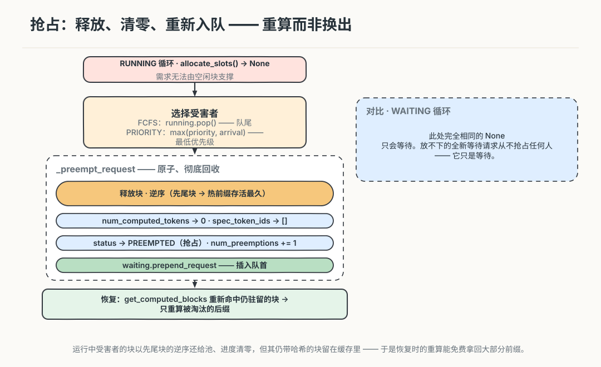</a>

<p class='figure-caption'>图：preemption 生命周期——运行中 victim 的 block 被释放并归还 pool，其 `num_computed_tokens` 被清零，然后插入 waiting queue 队首；恢复执行时重新计算，同时无成本恢复任何仍然存留的 prefix。</p>

**触发条件：`None` 表示需要选出一个 victim**

running loop 将 `None` 视为需要驱逐并重试的信号；waiting loop 则将其视为 backpressure，并停止接纳 request。

源码定位 — [`vllm/v1/core/sched/scheduler.py:534-543`](https://github.com/vllm-project/vllm/blob/6cf7b26bd4bff60bf378e1af14044280ac0d214c/vllm/v1/core/sched/scheduler.py#L534-L543):

```python
                while True:
                    new_blocks = self.kv_cache_manager.allocate_slots(
                        request,
                        num_new_tokens,
                        num_lookahead_tokens=self.num_lookahead_tokens,
                    )

                    if new_blocks is not None:
                        # The request can be scheduled.
                        break
```

源码定位 — `vllm/v1/core/sched/scheduler.py:L545-L578`:

```python
                    # The request cannot be scheduled.
                    # Preempt the lowest-priority request.
                    if self.policy == SchedulingPolicy.PRIORITY:
                        preempted_req = max(
                            self.running,
                            key=lambda r: (r.priority, r.arrival_time),
                        )
                        self.running.remove(preempted_req)
                        if preempted_req in scheduled_running_reqs:
                            preempted_req_id = preempted_req.request_id
                            scheduled_running_reqs.remove(preempted_req)
                            token_budget += num_scheduled_tokens.pop(preempted_req_id)
                            req_to_new_blocks.pop(preempted_req_id)
                            scheduled_spec_decode_tokens.pop(preempted_req_id, None)
                            preempted_encoder_inputs = scheduled_encoder_inputs.pop(
                                preempted_req_id, None
                            )
                            if preempted_encoder_inputs:
                                # Restore encoder compute budget if the preempted
                                # request had encoder inputs scheduled in this step.
                                num_embeds_to_restore = sum(
                                    preempted_req.get_num_encoder_embeds(i)
                                    for i in preempted_encoder_inputs
                                )
                                encoder_compute_budget += num_embeds_to_restore
                            req_index -= 1
                    else:
                        preempted_req = self.running.pop()

                    self._preempt_request(preempted_req, scheduled_timestamp)
                    preempted_reqs.append(preempted_req)
                    if preempted_req == request:
                        # No more request to preempt. Cannot schedule this request.
                        break
```

- 整体上，这是一个围绕单个 request 的 `while True` 重试循环。首先调用 `allocate_slots`；如果它返回 blocks，则执行 `break` 并调度（`:541-543`）。如果它返回 `None`，循环体就恰好驱逐一个 victim，然后回到循环起点，为*同一个* request 重试 `allocate_slots`——每次驱逐都会释放更多 blocks，因此重试此时可能成功。
- **Victim 的选择取决于 policy。** 在默认 FCFS policy 下，victim 是 `self.running.pop()`（`:571-572`），即 running queue 的*队尾*：也就是最近被接纳、沉没成本最低的 request。在 `PRIORITY` 下，victim 是 `max(self.running, key=lambda r: (r.priority, r.arrival_time))`（`:548-551`），即 priority 数值最高（也就是调度优先级*最低*）的 request；若数值相同，则选择到达时间最晚的 request。
- **同一步内回滚。** `PRIORITY` 分支存在一个 FCFS 没有的细节：选中的 victim 可能已在 `schedule()` 的*当前这次迭代中*提前暂定调度。如果确实如此（`:553`），就必须撤销它的全部临时状态，以确保资源账目一致：将其从 `scheduled_running_reqs` 中移除，返还其 token 预算（`token_budget += num_scheduled_tokens.pop(...)`、`:556`），撤销其新 blocks 和 spec-decode tokens 的调度（`:557-558`），并恢复它占用的 encoder 计算预算（`:562-569`）。`req_index -= 1`（`:570`）会回退循环游标，避免下一次迭代跳过某个 request。FCFS 弹出的是队尾；根据队列构造方式，该 request 不可能先于当前 request 被调度，因此无需回滚。
- **终止条件是自指的。** victim 通过 `_preempt_request`（`:574`）被驱逐。如果 victim *就是当前尝试调度的 request*（`:576`），说明其下方已没有可供抢占的 request——`break`。随后，外层 `if new_blocks is None: break`（`:580-582`）会停止整个 step 的调度。

抢占过程既贪心又有界：它会逐个驱逐运行中的 request，直到当前 request 能够容纳；如果发生自抢占，则停止整个 step。新的 waiting request 永远不会驱逐已经接纳的任务。

### `_preempt_request`: 原子化的完整回收

eviction primitive 才是真正将 blocks 归还到 pool 的地方。它刻意采用 all-or-nothing 语义。

源码定位 — [`vllm/v1/core/sched/scheduler.py:1145-1167`](https://github.com/vllm-project/vllm/blob/6cf7b26bd4bff60bf378e1af14044280ac0d214c/vllm/v1/core/sched/scheduler.py#L1145-L1167):

```python
    def _preempt_request(self, request: Request, timestamp: float) -> None:
        """Preempt a request and put it back to the waiting queue.

        NOTE: The request should be popped from the running queue outside of this
        method.
        """
        assert request.status == RequestStatus.RUNNING, (
            "Only running requests can be preempted"
        )
        self._free_request_blocks(request)
        self.encoder_cache_manager.free(request)
        self._inflight_prefills.discard(request)
        request.status = RequestStatus.PREEMPTED
        request.num_computed_tokens = 0
        if request.spec_token_ids:
            request.spec_token_ids = []
        request.num_preemptions += 1
        if self.log_stats:
            request.record_event(EngineCoreEventType.PREEMPTED, timestamp)

        # Put the request back to the waiting queue.
        self.waiting.prepend_request(request)
        self.reset_preempted_req_ids.add(request.request_id)
```

- `assert ... RUNNING`（`:1151-1153`）：只有 running request 可以被抢占，且 caller 必须已经从 `self.running` 中移除了 victim。
- `_free_request_blocks(request)`（`:1154`）会将 request 持有的所有 KV block 归还给 pool（见下一小节）。这些就是回收的显存。
- **进度归零。** `request.num_computed_tokens = 0`（`:1158`）会丢弃记录的*全部*进度——该 request 会被视为尚未进行任何计算，因此恢复执行时，必须对其完整 prompt 以及截至当前已生成的内容重新执行 prefill。所有 speculative draft token 也会被丢弃（`:1159-1160`）；处于 recompute 中途的 request 没有可保留的已验证 draft。
- `request.num_preemptions += 1`（`:1161`）是一个单调递增的 counter，用于驱动 metrics 以及“该 request 是否曾被抢占”相关的分支逻辑（见最后几个小节）。
- **重新插入 queue 头部。** `self.waiting.prepend_request(request)`（`:1166`）执行的是 prepend，而非 append。被抢占的 request 是 engine 已经接纳的任务；让它优先于尚未开始的新 request 重试，既能大致维持 FCFS 公平性，也能限制 victim 的饥饿时间。
- `reset_preempted_req_ids.add(...)`（`:1167`）用于记录 worker 中该 request 对应的持久化 batch slot 现已失效。这个 set 会以 `SchedulerOutput.preempted_req_ids` 的形式传给 worker（[`scheduler.py:1105`](https://github.com/vllm-project/vllm/blob/6cf7b26bd4bff60bf378e1af14044280ac0d214c/vllm/v1/core/sched/scheduler.py#L1105)），并在每一步被消费后清空（[`scheduler.py:1217`](https://github.com/vllm-project/vllm/blob/6cf7b26bd4bff60bf378e1af14044280ac0d214c/vllm/v1/core/sched/scheduler.py#L1217)）。这样，GPU 侧 runner 就知道需要重置该 request 对应的 row，而不是继续向其中追加数据。

执行 `_preempt_request` 后，victim 不再持有任何 KV block，具有 `num_computed_tokens == 0`，状态为 `PREEMPTED`，并位于 waiting queue 的头部。整个过程中不存在只释放一半的状态，也不会出现 refcount 仅部分递减的情况；更关键的是，其 KV 在 CPU 上没有任何副本。恢复只能通过 recomputation 完成。

**在 fence 保护下释放，以及顺序为何重要**

`_preempt_request` 使用与正常结束相同的路径执行释放，因此 preemption 和 completion 共用同一套资源回收逻辑。

源码锚点 — [`vllm/v1/core/sched/scheduler.py:2138-2151`](https://github.com/vllm-project/vllm/blob/6cf7b26bd4bff60bf378e1af14044280ac0d214c/vllm/v1/core/sched/scheduler.py#L2138-L2151)：

```python
    def _free_request_blocks(self, request: Request):
        """Free the request's KV blocks, deferring the return to the block
        pool when an in-flight GPU step may still write them.
        """
        if not self.defer_block_free or (
            # Last scheduled step already processed: no in-flight write remains
            # (always the case for a normal finish), so free now.
            request.last_sched_seq <= self.processed_step_seq
        ):
            self.kv_cache_manager.free(request)
            return
        blocks = self.kv_cache_manager.pop_blocks_for_free(request)
        if blocks:
            self.deferred_frees.append((self.sched_step_seq, blocks))
```

源码锚点 — [`vllm/v1/core/kv_cache_manager.py:465-473`](https://github.com/vllm-project/vllm/blob/6cf7b26bd4bff60bf378e1af14044280ac0d214c/vllm/v1/core/kv_cache_manager.py#L465-L473)：

```python
    def free(self, request: Request) -> None:
        """Free the blocks allocated for the request.
        We free the blocks in reverse order so that the tail blocks are evicted
        first when caching is enabled.

        Args:
            request: The request to free the blocks.
        """
        self.coordinator.free(request.request_id)
```

- 常见情况下（`defer_block_free` 关闭，或 request 最近一次调度的 step 已经 commit），`_free_request_blocks` 会立即调用 `kv_cache_manager.free`（`:2146-2147`）。[第 23 节](#23-physical-block-的生命周期分配使用释放进入-cache淘汰)已经介绍过 `coordinator.free` 在 pool 层面的行为——递减 refcounts，只将 refcount 降至零的 block 重新放回 queue，并根据它们是否仍带有 hash 分开处理。这里的关键在于顺序：释放按 **tail-first** 顺序进行（[`kv_cache_manager.py:467-468`](https://github.com/vllm-project/vllm/blob/6cf7b26bd4bff60bf378e1af14044280ac0d214c/vllm/v1/core/kv_cache_manager.py#L467-L468)），这会将 request 的 tail block 推向 LRU 前端（最先被淘汰），而其 *head*，也就是 prompt-prefix block，则会在可复用 pool 中驻留最久。
- 这种逆序并非 preemption 顺带产生的结果，而是让常见场景下的 recompute 成本保持低廉的关键机制。被抢占的 request 恢复时，最希望拿回的正是这些 prefix block，而逆序释放恰好能让它们保持最高热度。
- `defer_block_free`（[`scheduler.py:130`](https://github.com/vllm-project/vllm/blob/6cf7b26bd4bff60bf378e1af14044280ac0d214c/vllm/v1/core/sched/scheduler.py#L130)，仅在 `:150-152` 处设置）会在 batch 重叠执行（async scheduling 或 PP）时，在释放操作与尚未完成的 GPU write 之间加上 fence。否则，KV *consumer* connector 可能重新分配这些 block，并通过一次与 pending write 没有顺序约束的 load 填充它们。这是 connector-disaggregation 场景需要处理的问题，并不属于 memory-pressure path；[第 11 节](#11-connector-感知分配外部-kvdelay_cache_blocks-与-pd-分离)对此已有介绍——但这也解释了为什么释放操作需要 guard，而不能无条件执行。

### `PREEMPTED` 是仍然存活的 state，而非终点

被抢占的 request 之后还要恢复执行，因此 status 系统将其视为可恢复状态。`RequestStatus` 是一个 `IntEnum`，其 `is_finished` 只做一个比较：`status > RequestStatus.PREEMPTED`（[`request.py:328-351`](https://github.com/vllm-project/vllm/blob/6cf7b26bd4bff60bf378e1af14044280ac0d214c/vllm/v1/request.py#L328-L351)）。因此，在 `PREEMPTED` 之后声明的每个 member 都是 terminal state，而 `PREEMPTED` 本身则是**最后一个未结束的 state**：这个 sentinel 紧贴在 finished 区间的下方。[第 5 节](#5-作为-kv-状态持有者的-requestblock_hashesnum_computed_tokens-与推测-token)已经详细剖析了完整 enum 以及基于位置判定 terminal 的规则；这里要强调的是，被抢占的 request 在整数取值上距离 terminal 只有一步之遥，但它显然仍然存活，并且可以被 scheduler 调度。

恢复执行时，它会重新进入接纳新到达 request 的同一个 waiting loop——[`scheduler.py:978-993`](https://github.com/vllm-project/vllm/blob/6cf7b26bd4bff60bf378e1af14044280ac0d214c/vllm/v1/core/sched/scheduler.py#L978-L993)：

```python
                if request.status == RequestStatus.WAITING:
                    scheduled_new_reqs.append(request)
                elif request.status == RequestStatus.PREEMPTED:
                    scheduled_resumed_reqs.append(request)
                else:
                    raise RuntimeError(f"Invalid request status: {request.status}")

                if self.lora_config and request.lora_request:
                    scheduled_loras.add(request.lora_request.lora_int_id)
                req_to_new_blocks[request_id] = self.kv_cache_manager.get_blocks(
                    request_id
                )
                num_scheduled_tokens[request_id] = num_new_tokens
                token_budget -= num_new_tokens
                request.status = RequestStatus.RUNNING
                request.num_computed_tokens = num_computed_tokens
```

两种 status 仅在 bookkeeping 时有所区分——新 request 进入 `scheduled_new_reqs`，恢复的 request 进入 `scheduled_resumed_reqs`（`:978-983`）——随后两者都会切换到 `RUNNING`（`:992`），并将 `num_computed_tokens` 设为 loop 前面计算出的值（`:993`）。正因为有这个值，recompute 才不再采用朴素的从头重算方式。

### Recompute 并非从零开始：保留下来的 prefix 无需重算

`_preempt_request` 将 `num_computed_tokens` 清零，但释放 block **并不**一定会将其*内容*从 prefix cache 中驱逐。已经释放但仍保留 hash 的 block 会继续留在 LRU cache 中，直到被其他内容复用。因此，当 request 重新经过 waiting queue 时，常规 prefix-cache 查找会再次发现其自身 prefix 中仍驻留在 cache 里的部分。

该查找就是 `get_computed_blocks`，[第 7 节](#7-prefix-cache-lookuphashing最长命中与最后一个-token-重计算规则)已对其做过完整剖析（[`kv_cache_manager.py:202-242`](https://github.com/vllm-project/vllm/blob/6cf7b26bd4bff60bf378e1af14044280ac0d214c/vllm/v1/core/kv_cache_manager.py#L202-L242)），因此这里不再赘述 hashing、`find_longest_cache_hit` fan-out 和 recompute-last-token clamp。对于 preemption 而言，关键在于该查找会给它的 `prefix_cache_stats.record(...)` 加上 `preempted=request.num_preemptions > 0` tag，从而可以观测到由 preemption 触发的 re-hit，并将其与 cold-start hit 区分开来——具体的记录机制是[第 25 节](#25-可观测性prefix-cache-统计与-kv-cache-事件)的主题。随后，hit 结果会通过[第 11 节](#11-connector-感知分配外部-kvdelay_cache_blocks-与-pd-分离)介绍的同一套 local+external 汇总逻辑，计入已恢复 request 的 computed-token count（`scheduler.py:L759-L763`、`num_computed_tokens = num_new_local_computed_tokens + num_external_computed_tokens`）。

恢复时，`get_computed_blocks` 会在 request 的 `block_hashes` 上执行 longest-prefix hit 查找。如果 request 自身的 prefix block 在 waiting queue 中等待期间从未被 LRU eviction，那么 hit 长度就会很大，绝大部分“recompute”都可以跳过——实际只需重新运行未被 cache 的 suffix。这个 hit count 会成为 `num_computed_tokens`（`:760-762`），并在准入时写回 request（`:993`）。`preempted=request.num_preemptions > 0` tag（以及 [`scheduler.py:721`](https://github.com/vllm-project/vllm/blob/6cf7b26bd4bff60bf378e1af14044280ac0d214c/vllm/v1/core/sched/scheduler.py#L721) 处对应的同类 tag）让 prefix-cache stats 能够观测由 preemption 触发的 re-hit，并将其与 cold-start hit 区分开来。

仅依靠 recompute 的 preemption 之所以可行，关键在于：preemption 会释放 request 对其 block 的*所有权*，并将执行进度清零，但不会强制从 prefix cache 中驱逐 block 的*内容*。因此，恢复时 recompute 的成本只涉及那些为了腾出空间而被逐出的 block 所对应的 token。最好情况下（期间没有发生 eviction），恢复几乎没有成本；最坏情况下，则需要执行一次完整的 re-prefill。上文按逆序 free 的做法，正是为了让实际情况更倾向于最好情况。

**`num_preemptions`：唯一事实来源**

字段定义——[`vllm/v1/request.py:179-180`](https://github.com/vllm-project/vllm/blob/6cf7b26bd4bff60bf378e1af14044280ac0d214c/vllm/v1/request.py#L179-L180)：

```python
        # The number of times this request has been preempted by the scheduler.
        self.num_preemptions = 0
```

该字段在 [`scheduler.py:1161`](https://github.com/vllm-project/vllm/blob/6cf7b26bd4bff60bf378e1af14044280ac0d214c/vllm/v1/core/sched/scheduler.py#L1161) 处每发生一次 eviction 就递增一次，并供三个使用方消费。**Metrics：**每个 `PREEMPTED` engine-core event 都会递增每轮迭代的 stats——[`vllm/v1/metrics/stats.py:424-425`](https://github.com/vllm-project/vllm/blob/6cf7b26bd4bff60bf378e1af14044280ac0d214c/vllm/v1/metrics/stats.py#L424-L425)：

```python
            elif event.type == EngineCoreEventType.PREEMPTED:
                self.num_preempted_reqs += 1
```

该值会聚合到 Prometheus counter `vllm:num_preemptions`（[`vllm/v1/metrics/loggers.py:624-627`](https://github.com/vllm-project/vllm/blob/6cf7b26bd4bff60bf378e1af14044280ac0d214c/vllm/v1/metrics/loggers.py#L624-L627)）中；[优化文档](https://docs.vllm.ai/en/stable/configuration/optimization/)要求运维人员监控这一指标，并以此判断是否需要调高 `gpu_memory_utilization` 或调低 `max_num_seqs`。**Cache 统计 tagging：**即上文的 `preempted=...` flags。**异步恢复分类**——remote-KV load 完成后，先前被 preempt 的 request 会回到 `PREEMPTED`，而非作为新的 `WAITING` 进入——[`scheduler.py:2459-2462`](https://github.com/vllm-project/vllm/blob/6cf7b26bd4bff60bf378e1af14044280ac0d214c/vllm/v1/core/sched/scheduler.py#L2459-L2462)：

```python
            if request.num_preemptions:
                request.status = RequestStatus.PREEMPTED
            else:
                request.status = RequestStatus.WAITING
```

对于每个 request，`num_preemptions` 都是单调不减的，也是判断“该 request 是否曾被 preempt”的唯一权威依据；metrics、cache 统计和恢复状态分类均统一使用它。

### 同一 primitive 的另外两处用途

当仍有 request 正在执行却需要重置 prefix cache 时，scheduler 也会通过 `_preempt_request` 强制清空 running queue——[`scheduler.py:2214-2224`](https://github.com/vllm-project/vllm/blob/6cf7b26bd4bff60bf378e1af14044280ac0d214c/vllm/v1/core/sched/scheduler.py#L2214-L2224)：

```python
        if reset_running_requests:
            # For logging.
            timestamp = time.monotonic()
            # Invalidate all the current running requests KV's by pushing them to
            # the waiting queue. In this case, we can reduce the ref count of all
            # the kv blocks to 0 and thus we can make sure the reset is successful.
            # Preempt in reverse order so the requests will be added back to the
            # running queue in FIFO order.
            while self.running:
                request = self.running.pop()
                self._preempt_request(request, timestamp)
```

要安全地重置 cache，所有 block 的 refcount 都必须归零，因此需要 preempt 每个 running request；按逆序 pop，再逐一 prepend，即可在恢复时还原原始 FIFO 顺序。primitive 相同，触发条件不同。

最后，不要把内存压力触发的 preemption 与 connector 作用域内的 `recompute_kv_load_failures` flag 混为一谈（[`scheduler.py:129`](https://github.com/vllm-project/vllm/blob/6cf7b26bd4bff60bf378e1af14044280ac0d214c/vllm/v1/core/sched/scheduler.py#L129)，在 `:143-144` 处由 `kv_load_failure_policy` override，其默认值 `"fail"` 定义于 [`vllm/config/kv_transfer.py:69`](https://github.com/vllm-project/vllm/blob/6cf7b26bd4bff60bf378e1af14044280ac0d214c/vllm/config/kv_transfer.py#L69)）。在 P/D 解耦场景下，如果 KV-*connector* load 失败，该 flag 决定是在本地 recompute 受影响的 token，还是直接将 request 标记为失败。这是一个范围更窄、粒度细化到 token 的决策，将在[第 11 节](#11-connector-感知分配外部-kvdelay_cache_blocks-与-pd-分离)中介绍。它并不是本文所述的 block pool 已满处理路径。

### 为什么选择 recompute，而不是 swap

V0 通过将 victim 的 KV block 复制到 CPU memory（`--swap-space`），并在恢复时复制回来，处理 preemption。V1 则彻底移除了这套机制。对整棵源码树执行 grep，搜索 `swap_out` / `swap_in` / `PreemptionMode`，在 `vllm/v1/` 下找不到任何 swap path；仅有的 `recompute*` symbol 是上文提到的 connector 加载失败 flag。设计文档对此有明确说明——[`docs/configuration/optimization.md:47`](https://docs.vllm.ai/en/stable/configuration/optimization/)：*"在 vLLM V1 中，默认 preemption mode 是 `RECOMPUTE`，而不是 `SWAP`，因为重计算在 V1 架构中的开销更低。"* [`docs/design/metrics.md:505-525`](https://docs.vllm.ai/en/stable/design/metrics/) 还记录了背后的原因：之所以移除 `--swap-space` 及其指标（`vllm:num_requests_swapped`、`vllm:cpu_cache_usage_perc`），是因为 *"prefix caching ... 被证明比 CPU swapping 更合适，因为 block 可以按需逐步驱逐，而 prompt 中被驱逐的部分可以重新计算。"* 默认启用零开销的 prefix caching 后，只需对未命中的 suffix 执行一次 prefill，就能恢复被 preempt 的短 request。相比 swap 所需的双向 PCIe 往返传输和 pinned CPU buffer，这种方式成本更低，也无须管理第二层 memory。V1 只采用这一种策略：代码中不存在 swap fallback。

## 14. Speculative Decoding 遇上 KV Cache：Lookahead Slots 与 Rollback

speculative decoding 会为可能被拒绝的 token 写入 KV。因此，manager 会为每个 speculative position **预留** physical slot，但只会将 finalized token **发布**到 prefix cache。被拒绝的 draft KV 之后可以被覆盖，但绝不能作为 committed state 共享。

当验证阶段拒绝 draft 时，只需执行一次 decrement，就会让 processed-prefix pointer 回退，使释放出来的位置重新计算，而不是直接信任其中的结果。至于 proposer 究竟如何生成这些猜测——例如 EAGLE 的 tree、n-gram matching，以及 accept/reject sampling 的数学原理——是第 12 篇讨论的主题。这里我们只明确这条边界，为其预留 slot、设置上限，并在需要时将其回滚。

<a href='images/vllm-06-26-spec-decode.svg' target='_blank'>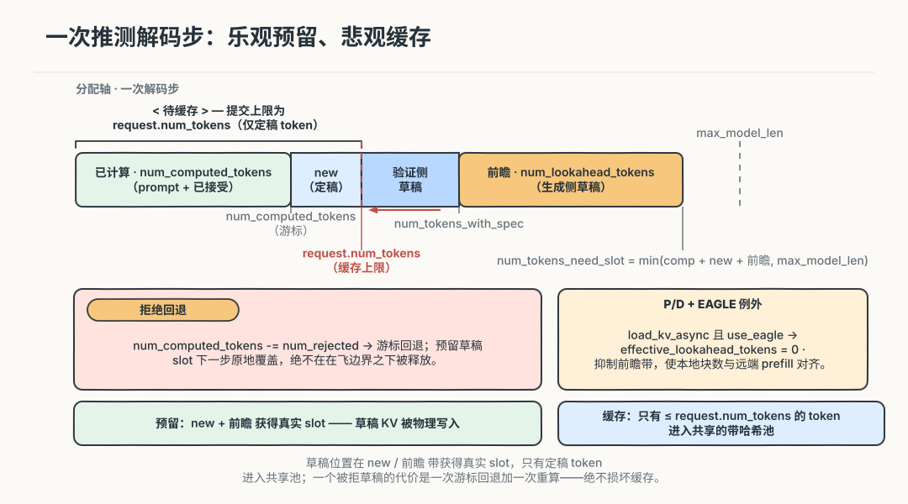</a>

<p class='figure-caption'>图：speculative decoding 下的一个 decode step——draft position 会在 `new` 和 `lookahead` 区域获得 physical slot；prefix-cache commit 以 finalized-token boundary 为上限；被拒绝的 draft 则通过递减 `num_computed_tokens` 使其回退，以便重新计算。</p>

**proposer→KV 边界是一个计数列表**

proposer 的所有计算结果都通过 request 上的一个 field 传入 scheduler：`request.spec_token_ids`，一个普通的 `list[int]`。不会传递更复杂的 object；下游 KV 逻辑看不到 tree、logit 或 acceptance probability，只能看到一个 length。

源码定位——[`vllm/v1/core/sched/scheduler.py:1956-1976`](https://github.com/vllm-project/vllm/blob/6cf7b26bd4bff60bf378e1af14044280ac0d214c/vllm/v1/core/sched/scheduler.py#L1956-L1976)：

```python
    def update_draft_token_ids(self, draft_token_ids: DraftTokenIds) -> None:
        for req_id, spec_token_ids in zip(
            draft_token_ids.req_ids,
            draft_token_ids.draft_token_ids,
        ):
            request = self.requests.get(req_id)
            if request is None or request.is_finished():
                # The request may have been finished. Skip.
                continue

            if request.is_prefill_chunk:
                # Ignore draft tokens for prefill chunks.
                if request.spec_token_ids:
                    request.spec_token_ids = []
                continue

            # Add newly generated spec token ids to the request.
            if self.structured_output_manager.should_advance(request):
                metadata = request.structured_output_request
                spec_token_ids = metadata.grammar.validate_tokens(spec_token_ids)  # type: ignore[union-attr]
            request.spec_token_ids = spec_token_ids
```

- proposer 会在一个 step 结束后运行，并将一个 `DraftTokenIds` batch 交给 scheduler；该方法再将其拆分到各个 request 上。已完成的 request 会被跳过（`:1962-1964`），因为它的 slots 已经被释放。
- 仍处于 prefill 中的 request 会丢弃其 draft token（`:1966-1970`）：对于尚未完成 ingest 的 prompt，无法验证对应的猜测，因此所有残留的 `spec_token_ids` 都会被清空为 `[]`。
- 唯一需要额外处理的转换是 structured-output masking（`:1973-1975`）：如果 request 受 grammar 约束，则违反约束的 draft token 会在写入前被过滤。除此之外都只是直接赋值，即 `request.spec_token_ids = spec_token_ids`（`:1976`）。

proposer 唯一对 KV 可见的输出，是 request 上的一个 `list[int]`。从这里开始，cache path 只会将这些 token 视为*需要 slots 但尚未 finalized 的 position 数量*——即 `num_lookahead_tokens`、`num_draft_tokens`。proposer 的任何内部状态都不会进入 allocation 或 caching 逻辑。正是这道边界，使第 12 篇可以完全负责 proposer，而无需触碰本文所讨论的机制。

这种 finalized 与 speculative 的区别，体现在 request 上的两个 counter 中。[第 5 节](#5-作为-kv-状态持有者的-requestblock_hashesnum_computed_tokens-与推测-token)介绍了完整的 request-state 模型；其中与 spec decode 相关的部分，就是 [`vllm/v1/request.py:251-257`](https://github.com/vllm-project/vllm/blob/6cf7b26bd4bff60bf378e1af14044280ac0d214c/vllm/v1/request.py#L251-L257) 处的这对 counter：

```python
    @property
    def num_tokens(self) -> int:
        return len(self._all_token_ids)

    @property
    def num_tokens_with_spec(self) -> int:
        return len(self._all_token_ids) + len(self.spec_token_ids)
```

`num_tokens` 即 `len(_all_token_ids)` = prompt + **已经 accepted 的** output。draft token 不包含在 `_all_token_ids` 中；在被 accepted 之前，它们会保存在单独的 `spec_token_ids` list 中。因此，`num_tokens` 恰好表示已经 finalized、可以 commit 的长度，也是下文将 draft token 排除在 caching 范围之外的上限。`num_tokens_with_spec` 则会加上尚未 verify 的 draft token：这是 scheduler 必须为其寻找 slots 的*乐观*长度，但 caching 绝不能推进到这个位置。

### `num_lookahead_tokens`：为尚不存在的 token 预留 slots

verify 侧的 draft token 已经包含在 `num_tokens_with_spec` 中。但 spec-decode step 还会运行 proposer，以生成下一轮 draft token，而这些 token 同样需要 slots 来写入 KV。负责这部分预留的是 `num_lookahead_tokens`，它是一个在构造时确定的 per-scheduler 常量。

源码定位——[`vllm/v1/core/sched/scheduler.py:234-257`](https://github.com/vllm-project/vllm/blob/6cf7b26bd4bff60bf378e1af14044280ac0d214c/vllm/v1/core/sched/scheduler.py#L234-L257)：

```python
        self.num_lookahead_tokens = 0
        ...
            if speculative_config.use_eagle():
                self.use_eagle = True
                self.num_lookahead_tokens = self.num_spec_tokens
            if speculative_config.uses_draft_model():
                self.num_lookahead_tokens = self.num_spec_tokens
            if speculative_config.use_dflash():
                # DFlash requires an extra lookahead slot since it uses in-fill-style
                # decoding instead of standard next-token sampling, so it has a query
                # for the last sampled token plus queries for each draft token.
                self.num_lookahead_tokens = self.num_spec_tokens + 1
            if speculative_config.use_dspark():
                # DSpark drafts a block of num_spec_tokens query tokens in which the
                # anchor itself is the first prediction position (no separate bonus
                # query), so it needs exactly num_spec_tokens lookahead slots.
                self.num_lookahead_tokens = self.num_spec_tokens
```

- 如果没有 `speculative_config`，`num_lookahead_tokens` 会保持为 `0`（`:234`），因此 `allocate_slots` 不会额外预留任何 slots：非 spec path 完全不承担 lookahead 开销。
- 对于 EAGLE、draft model 或 DSpark，该数值等于 `num_spec_tokens`——proposer 会在下一次 forward 中，为数量恰好相同的额外 position 写入 KV。
- DFlash 是唯一需要 `num_spec_tokens + 1`（`:252`）的变体：其 in-fill 风格的 decoding 会为最后一个 sampled token 发出一次 query，并为每个 draft token 再发出一次 query，因此所需 slots 数量会比 draft token 多一个。

`num_lookahead_tokens` 表示 proposer 为下一步实际写入 KV 的额外 speculative position 数量；每个 scheduler 会根据 spec-decode variant 解析一次。它是一个预留常量，并不保证这些 token 最终都会被保留。

### 两个 draft 区段：verify-side（`new`）与 propose-side（`lookahead`）

在 speculative decoding 下，一个 decoding request 会同时携带承担两种不同角色的 draft，allocator 会将它们放在 token 轴的两个不同区段中处理。计划在*本轮验证*的 draft 已经计入运行中 request 的新 token 需求。

源码定位 — [`vllm/v1/core/sched/scheduler.py:473-477`](https://github.com/vllm-project/vllm/blob/6cf7b26bd4bff60bf378e1af14044280ac0d214c/vllm/v1/core/sched/scheduler.py#L473-L477)：

```python
            num_new_tokens = (
                request.num_tokens_with_spec
                + request.num_output_placeholders
                - request.num_computed_tokens
            )
```

`num_new_tokens` 根据 `num_tokens_with_spec` 计算得到，因此 verify-side draft 已经包含在 `<new>` 中。随后，同一个 call site 会将 `num_lookahead_tokens=self.num_lookahead_tokens` 直接传给 `allocate_slots`（[`scheduler.py:535-538`](https://github.com/vllm-project/vllm/blob/6cf7b26bd4bff60bf378e1af14044280ac0d214c/vllm/v1/core/sched/scheduler.py#L535-L538)；[第 9 节](#9-allocate_slots-是策略栈而不是一次-allocation)和[第 10 节](#10-scheduler-契约调度过程如何驱动-kv-cache-manager)已经梳理过这条 running-decode 路径），在此基础上为 propose-side 区段预留空间。`allocate_slots` 的 docstring 明确指出了这两个区段 — [`vllm/v1/core/kv_cache_manager.py:320-321`](https://github.com/vllm-project/vllm/blob/6cf7b26bd4bff60bf378e1af14044280ac0d214c/vllm/v1/core/kv_cache_manager.py#L320-L321)：

```
        new       = num_new_tokens, including unverified draft tokens
        lookahead = num_lookahead_tokens
```

[第 9 节](#9-allocate_slots-是策略栈而不是一次-allocation)在介绍 `allocate_slots` policy stack 时，完整梳理了五区域 block 布局图（`comp | new_comp | ext_comp | new | lookahead`）；这里真正需要关注的是 draft 在其中的位置。verify-side draft 位于 `<new>` 内（“包括尚未验证的 draft token”），propose-side draft 则位于其右侧的 `<lookahead>` 内；图中还明确将 `<lookahead>` 放在 `< to be cached >` 括号之外。两个区段都会获得物理 slot，但都不在 cacheable region 内。

**P/D + EAGLE 的 lookahead 置零 guard**

scheduler 只会在一种情况下取消 lookahead 预留：waiting/admit 路径上，EAGLE 模式下的异步 KV 加载。

源码定位 — [`vllm/v1/core/sched/scheduler.py:877-885`](https://github.com/vllm-project/vllm/blob/6cf7b26bd4bff60bf378e1af14044280ac0d214c/vllm/v1/core/sched/scheduler.py#L877-L885)：

```python
                # Handles an edge case when P/D Disaggregation
                # is used with Spec Decoding where an
                # extra block gets allocated which
                # creates a mismatch between the number
                # of local and remote blocks.
                limit_lookahead_tokens = load_kv_async and self.use_eagle
                effective_lookahead_tokens = (
                    0 if limit_lookahead_tokens else self.num_lookahead_tokens
                )
```

- 通常为 `effective_lookahead_tokens = self.num_lookahead_tokens` — admit 会预留与 running decode 相同的 lookahead 区段。
- 唯一的例外是 `load_kv_async and self.use_eagle`（`:882`）：在 P/D disaggregation 下，如果 request 的 KV 正从远端 prefill worker 拉取，*并且*启用了 EAGLE，那么在本地预留 lookahead block 会比远端多分配一个 block，导致本地与远端的 block 数量不同步。
- 在这种情况下，本次 admission 的 lookahead 会被强制设为 `0`，该值随后传入 `allocate_slots(..., num_lookahead_tokens=effective_lookahead_tokens, ...)` 调用（[`scheduler.py:912`](https://github.com/vllm-project/vllm/blob/6cf7b26bd4bff60bf378e1af14044280ac0d214c/vllm/v1/core/sched/scheduler.py#L912)）；[第 11 节](#11-connector-感知分配外部-kvdelay_cache_blocks-与-pd-分离)会从 connector 视角解读这条路径。

### `allocate_slots` 内部：lookahead 扩展 slot 数量，并受上限约束

进入 manager 后，lookahead 区间就变成了一个简单的算术问题：它会扩大实际分配 block 的区域，同时通过 clamp 加以限制，避免失控的推测执行超出模型的位置预算。[第 9 节](#9-allocate_slots-是策略栈而不是一次-allocation) 引用了 clamp 本身并逐行解析，即 `num_tokens_need_slot = min(num_tokens_main_model + num_lookahead_tokens, self.max_model_len)` 中的 `num_tokens_main_model = total_computed_tokens + num_new_tokens`（[`vllm/v1/core/kv_cache_manager.py:389-392`](https://github.com/vllm-project/vllm/blob/6cf7b26bd4bff60bf378e1af14044280ac0d214c/vllm/v1/core/kv_cache_manager.py#L389-L392)）。从 spec 角度来看，这三行代码可以这样理解：

- `num_tokens_main_model` 是 *target* model 本步要计算的长度：此前已处理的全部内容加上 `new`，后者包含 verify 侧的 draft。
- `num_tokens_need_slot` 在此基础上再加上 propose 侧的 `lookahead`。这才是实际分配 block 时使用的长度，从而确保下一次 draft forward 有位置可写。
- `min(..., self.max_model_len)` clamp 是一道保护机制：当 sequence 接近末尾时，过大的 `num_spec_tokens` 否则可能预留超出 context window 的位置。可以为推测执行预留 slot，但绝不能超过 `max_model_len`。

coordinator 正是依据 `num_tokens_need_slot` 执行 allocate 的，参见 [`vllm/v1/core/kv_cache_manager.py:440-445`](https://github.com/vllm-project/vllm/blob/6cf7b26bd4bff60bf378e1af14044280ac0d214c/vllm/v1/core/kv_cache_manager.py#L440-L445)：

```python
        new_blocks = self.coordinator.allocate_new_blocks(
            request.request_id,
            num_tokens_need_slot,
            num_tokens_main_model,
            num_encoder_tokens,
        )
```

系统实际会为 `comp + new + lookahead`（`num_tokens_need_slot`）分配 block，并以 `max_model_len` 为上限。这样，proposer 要写入的每个 draft 位置都有真实的 KV slot，同时推测执行也绝不会预留超出 context window 的位置。`allocate_new_blocks` 在每个 group 上的 fan-out，则由[第 15 节](#15-coordinator-与-hybrid-kv-cache当一种-block-类型不够用时)介绍的 coordinator 机制负责。

### cache 上限：只有最终确认的 token 才会进入共享池

这是整个功能中最关键的一行。虽然上文已经为 draft 准备了 slot，但 prefix cache 的 commit 上限被限制为最终确认的 token 数量，因此被拒绝的 draft 绝不可能已经参与 hash 或被共享。[第 9 节](#9-allocate_slots-是策略栈而不是一次-allocation) 引用了这一上限并逐行解析，即 [`vllm/v1/core/kv_cache_manager.py:452-461`](https://github.com/vllm-project/vllm/blob/6cf7b26bd4bff60bf378e1af14044280ac0d214c/vllm/v1/core/kv_cache_manager.py#L452-L461) 中的 `num_tokens_to_cache = min(total_computed_tokens + num_new_tokens, request.num_tokens)`，其结果会传给 `self.coordinator.cache_blocks(request, num_tokens_to_cache)`。真正与 spec 相关的问题是：为什么这个上限取 `request.num_tokens`？同一个 `allocate_slots` method 的 docstring 也从 draft token 的角度重申了这一点，参见 [`vllm/v1/core/kv_cache_manager.py:324-326`](https://github.com/vllm-project/vllm/blob/6cf7b26bd4bff60bf378e1af14044280ac0d214c/vllm/v1/core/kv_cache_manager.py#L324-L326)：

```
        NOTE: for new tokens which include both verified and unverified draft
        tokens, we only cache the verified tokens (by capping the number at
        `request.num_tokens`).
```

1. `total_computed_tokens + num_new_tokens` 是*乐观估计的*已处理长度，其中包含已有 slot、但尚未完成验证的 draft。
2. `request.num_tokens = len(_all_token_ids)` 是*最终确认的*长度：只包含 prompt 和已接受的 output。Draft 位于 `spec_token_ids`，而不在 `_all_token_ids` 中，因此从设计上就被排除在外。第一小节介绍的 counter 拆分，正是这一上限无需逐 token 维护 spec 状态也能保持正确的原因。
3. 因此，`min(...)` 会将 caching 边界限制在最后一个已最终确认的 token；`cache_blocks` 只会对完全包含在 `num_tokens_to_cache` 范围内的 block 执行 hash 和 commit。

上限之所以不可或缺，是因为 prefix-cache block 按内容寻址，并且会*在不同 request 之间共享*——[第 7 节](#7-prefix-cache-lookuphashing最长命中与最后一个-token-重计算规则)分析了 `find_longest_cache_hit` lookup，[第 8 节](#8-prefix-cache-写入路径cache_full_blocks-与提交-hash)则分析了 `cache_full_blocks` write path。如果对包含未经验证 draft 的 block 执行 hash 并提交，另一条 request（或 rollback 后的同一条 request）就可能命中该 hash，并读回某个后来*被拒绝*的 token 对应的 KV——这会对一条完全无关的 sequence 造成静默数据损坏。将上限设为 `num_tokens`，可以确保只有绝不会被 rollback 的内容才会进入共享的 hashed pool。draft slot 仍然存在，只会在下一次 forward 时被原地覆盖；它们复用的 free-queue 和 hashing 机制见[第 3 节](#3-kvcacheblock-与-blockpoolfree-list-是一种淘汰结构)和[第 8 节](#8-prefix-cache-写入路径cache_full_blocks-与提交-hash)。

prefix cache 最多只会提交到 `request.num_tokens`（已最终确认的 token）。未经验证的 draft（存在于物理 slot 和 `num_computed_tokens` 中）绝不会被 hash 或共享。这样才能避免被拒绝 draft 的 KV 成为其他租户的虚假 cache hit。

### in-flight / rollback 边界下的安全释放

为了减少 eviction，`allocate_slots`会在 allocate *之前*释放被 sliding window 跳过的 block（[第 9 节](#9-allocate_slots-是策略栈而不是一次-allocation)对 `remove_skipped_blocks` 做了整体介绍）。在 speculative decoding 下，这一 free 操作必须格外谨慎：不能释放 in-flight step 仍在读取的 block，也不能释放即将发生的 rejection 会重新纳入作用范围的 block。

源码锚点——[`vllm/v1/core/kv_cache_manager.py:400-407`](https://github.com/vllm-project/vllm/blob/6cf7b26bd4bff60bf378e1af14044280ac0d214c/vllm/v1/core/kv_cache_manager.py#L400-L407)：

```python
        # Free on the processed-token basis: in-flight steps' attention windows
        # still read blocks below the optimistic boundary, and rejected spec
        # tokens can roll it back.
        self.coordinator.remove_skipped_blocks(
            request.request_id,
            max(0, total_computed_tokens - request.num_in_flight_tokens),
            num_prompt_tokens=request.num_prompt_tokens,
        )
```

- skip-free 边界为 `total_computed_tokens - num_in_flight_tokens`，且下限为 0——它被有意设置在乐观推进后的 processed pointer 之前。
- `num_in_flight_tokens`涵盖 forward 仍在执行的 token（包括已调度的 draft）。将 free 边界按该数量回退，可确保这里不会释放仍被 in-flight attention window 读取，或会在 rejection 后恢复的任何 block。

对 skipped block 的释放以已提交（非 in-flight）状态为基准。因此，后续 draft rejection 递减 `num_computed_tokens`（见下一小节）时，绝不会发现必须重新读取的 block 已经被释放。这正是 caching 上限在 free 侧的对应保障。

**Rollback：被拒绝的 draft 会递减 `num_computed_tokens`**

Rollback 会撤销调度时的乐观推进。一个 step 被调度时，*所有*已调度的 token（包括 draft）都会预先计入 `num_computed_tokens`。

源码锚点——[`vllm/v1/core/sched/scheduler.py:1177-1183`](https://github.com/vllm-project/vllm/blob/6cf7b26bd4bff60bf378e1af14044280ac0d214c/vllm/v1/core/sched/scheduler.py#L1177-L1183)：

```python
        # 3. If some tokens (e.g. spec tokens) are rejected later, the number of
        #    computed tokens will be adjusted in update_from_output.
        num_scheduled_tokens = scheduler_output.num_scheduled_tokens
        for req_id, num_scheduled_token in num_scheduled_tokens.items():
            request = self.requests[req_id]
            request.num_computed_tokens += num_scheduled_token
            request.num_in_flight_tokens += num_scheduled_token
```

`:1177`处的注释点明了这一设计：先乐观推进，验证后再修正。修正逻辑位于 `update_from_output`——[`vllm/v1/core/sched/scheduler.py:1591-1615`](https://github.com/vllm-project/vllm/blob/6cf7b26bd4bff60bf378e1af14044280ac0d214c/vllm/v1/core/sched/scheduler.py#L1591-L1615)：

```python
            scheduled_spec_token_ids = (
                scheduler_output.scheduled_spec_decode_tokens.get(req_id)
            )
            # Skip a stale frame still pending discard (async_tokens_to_discard
            # > 0): its pre-reset rejection count would underflow the counters.
            if (
                scheduled_spec_token_ids
                and (generated_token_ids or self.num_sampled_tokens_per_step == 0)
                and request.async_tokens_to_discard == 0
            ):
                num_draft_tokens = len(scheduled_spec_token_ids)
                num_sampled = self.num_sampled_tokens_per_step
                num_accepted = max(len(generated_token_ids) - num_sampled, 0)
                num_rejected = num_draft_tokens - num_accepted
                # num_computed_tokens represents the number of tokens
                # processed in the current step, considering scheduled
                # tokens and rejections. If some tokens are rejected,
                # num_computed_tokens is decreased by the number of rejected
                # tokens.
                if request.num_computed_tokens > 0:
                    request.num_computed_tokens -= num_rejected
                # If async scheduling, num_output_placeholders also includes
                # the scheduled spec tokens count and so is similarly adjusted.
                if request.num_output_placeholders > 0:
                    request.num_output_placeholders -= num_rejected
```

1. `num_draft_tokens` = 当前 step 计划验证的 drafts（`<new>`-band drafts）。
2. `num_accepted = max(len(generated_token_ids) - num_sampled, 0)`：`generated_token_ids` 包含已接受的 drafts，*加上* bonus/base 采样得到的 token；减去 `num_sampled`（`num_sampled_tokens_per_step`）后，得到的就是已接受 drafts 的数量。
3. `num_rejected = num_draft_tokens - num_accepted`。
4. `request.num_computed_tokens -= num_rejected`（`:1610-1611`）执行 rollback。调度时，pointer 会按*所有*已调度 token 向前推进；此处再减去被拒绝的 suffix，使 processed-prefix pointer 精确落在 prompt + accepted 的位置。下一个 step 会从这里重新计算，预留的 draft slots 将被原地覆盖。由于 caching 上限被设为 `num_tokens`，被拒绝的 KV 从未真正提交。
5. 对于 async-scheduling 路径（`:1614-1615`），`num_output_placeholders` 也会同步递减，因为 placeholders 同样计入了已调度的 drafts。

这与[第 13 节](#13-压力之下抢占重计算与-block-回收)中的 preemption 不同：preemption 会将 `num_computed_tokens` *清零*，强制执行完整的 re-prefill。拒绝机制则是一种更精细的处理方式：它只将计数精确减去 `num_rejected`，仅丢弃错误的 suffix，同时保留每个已验证 token 的处理进度和已缓存 KV。

还有一道配套 guard 补全了整个闭环：绝不能因为仍有可能被拒绝的 drafts，就将 request 判定为已完成——参见 [`vllm/v1/core/sched/scheduler.py:445-453`](https://github.com/vllm-project/vllm/blob/6cf7b26bd4bff60bf378e1af14044280ac0d214c/vllm/v1/core/sched/scheduler.py#L445-L453)：

```python
            if (
                request.num_output_placeholders > 0
                # This is (num_computed_tokens + 1) - (num_output_placeholders - 1).
                # Since output placeholders are also included in the computed tokens
                # count, we subtract (num_output_placeholders - 1) to remove any draft
                # tokens, so that we can be sure no further steps are needed even if
                # they are all rejected.
                and request.num_computed_tokens + 2 - request.num_output_placeholders
                >= request.num_prompt_tokens + request.max_tokens
            ):
```

early-exit 条件在与 `max_tokens` 比较前，会先减去携带 drafts 的 placeholders。因此，只有当*即使所有尚未验证的 drafts 都被拒绝，request 依然已经完成*时，该 request 才会被移除。

### 状态转换链

推测位置会获得 slots，但不会获得 cache identities。拒绝发生时，`num_computed_tokens` 会回退，而回收操作始终位于 in-flight boundary 之后。因此，错误的 draft 只会带来重新计算的开销，而不会暴露陈旧的共享 KV。

## 15. Coordinator 与 Hybrid KV Cache：当一种 block 类型不够用时

Hybrid model 混合使用 full、sliding-window、chunked-local、Mamba 和 cross-attention layer，这些 layer 的 pages 无法互换。`KVCacheManager` 将工作委托给 `KVCacheCoordinator`；后者会把一次逻辑 allocation 分发到不同类型的 KV-cache groups，并计算出所有 group 都能复用的唯一对齐 prefix 长度。

**一个 coordinator、一个 pool，以及一个由不同类型 manager 组成且按位置对齐的 tuple**

`KVCacheManager` 只拥有一个 coordinator。它的职责已在 class docstring 中明确说明，而且刻意限定在很小的范围内。

`vllm/v1/core/kv_cache_coordinator.py:L61-L64`

```python
class KVCacheCoordinator(ABC):
    """
    Coordinate the KV cache of different KV cache groups.
    """
```

*KV cache group* 是一组共享同一个 `KVCacheSpec` 的模型层——它们具有相同的 attention type、block size 和字节布局。full-attention 层构成一个 group；采用特定窗口大小的 sliding-window 层则构成另一个 group。coordinator 的 constructor 会具象化所有 subclass 都依赖的三项内容：唯一共享的 `BlockPool`、EAGLE group index 的集合，以及作为核心的数据结构——一个不可变 tuple，其中每个 group 对应一个 `SingleTypeKVCacheManager`。

`vllm/v1/core/kv_cache_coordinator.py:L107-L121`

```python
        self.single_type_managers = tuple(
            get_manager_for_kv_cache_spec(
                kv_cache_spec=kv_cache_group.kv_cache_spec,
                max_in_flight_tokens=max_in_flight_tokens,
                max_model_len=max_model_len,
                block_pool=self.block_pool,
                enable_caching=enable_caching,
                kv_cache_group_id=i,
                dcp_world_size=dcp_world_size,
                pcp_world_size=pcp_world_size,
                scheduler_block_size=self.scheduler_block_size,
                needs_kv_cache_zeroing=self.kv_cache_config.needs_kv_cache_zeroing,
            )
            for i, kv_cache_group in enumerate(self.kv_cache_config.kv_cache_groups)
        )
```

每个 manager 接收的都是*同一个* `self.block_pool`（它在上方的 `L91-L97` 处由 `kv_cache_config.num_blocks` 构造）。物理 VRAM 只有一个共享 pool；各个 group 并不会对其进行分区，而是会相互*争抢*——这一点会在下文讨论准入上限时带来麻烦。该 tuple 由 `enumerate` 构建，因此从构造之初，`single_type_managers[i]` 就与 `kv_cache_config.kv_cache_groups[i]` 一一对应；而且在 coordinator 的整个生命周期内，这个 tuple 都不可变。

**位置对齐。** coordinator 中的每个 fan-out 方法都满足 `single_type_managers[i] ↔ kv_cache_groups[i] ↔ new_computed_blocks[i] ↔ returned_tuple[i]`。正因如此，coordinator 才能将 cache 命中 block 的 per-group slice 通过 `zip` 交给正确的 manager，而无须在数据中携带 group id：index 本身就是 group id。所有 fan-out（`get_num_blocks_to_allocate`、`allocate_new_blocks`、`remove_skipped_blocks`、`find_longest_cache_hit`）都会遍历这个 tuple，正确性依赖于该 tuple 在构造完成后绝不改变顺序。

<a href='images/vllm-06-08-hybrid-groups.svg' target='_blank'>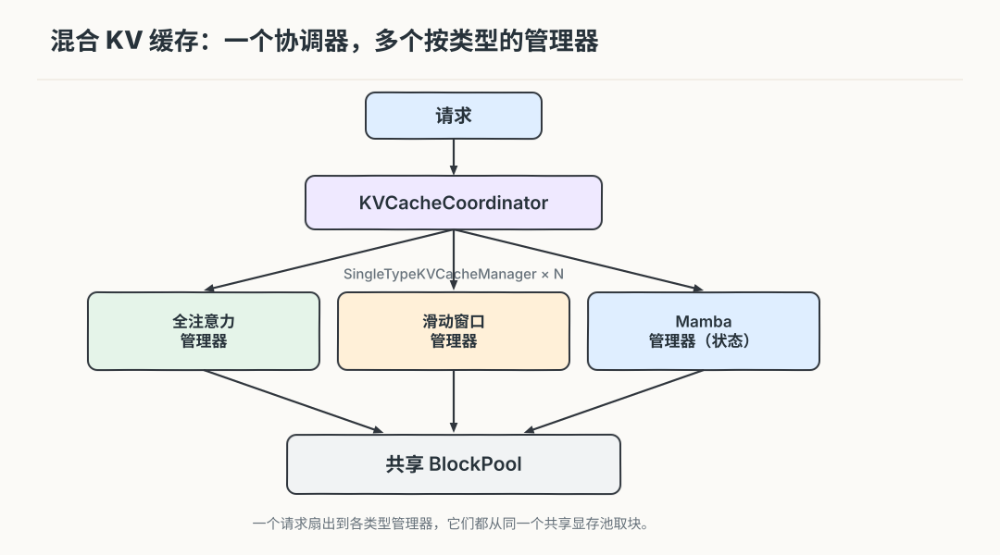</a>

<p class='figure-caption'>一个 `KVCacheCoordinator` 将单个 request 分发给不同类型各自的 `SingleTypeKVCacheManager`（full attention、sliding window、Mamba），而它们全都从同一个共享 `BlockPool` 中获取资源。</p>

### block-size 格：为何一次命中会同时在所有 group 中对齐

不同 group 可以使用不同的 block size。例如，full-attention group 可以使用 16-token block，而 sliding-window group 则使用 64-token block。coordinator 通过整除格来协调这些差异，并在 constructor 中预先通过断言验证相关约束。

`vllm/v1/core/kv_cache_coordinator.py:L83-L89`

```python
        # The scheduling granularity (LCM of all group block sizes), must be a multiple
        # of the hash_block_size and the block size of each group.
        assert scheduler_block_size % hash_block_size == 0 and all(
            scheduler_block_size % g.kv_cache_spec.block_size == 0
            for g in kv_cache_config.kv_cache_groups
        )
        self.scheduler_block_size = scheduler_block_size
```

`scheduler_block_size` 是所有 group 的 block size 的 LCM，并且能被 `hash_block_size`（计算 prefix-cache hash 时采用的粒度）以及每个 group 的 `block_size` 整除。hybrid coordinator 还会断言*反方向*的约束——每个 group 的 block size 本身必须是 `hash_block_size` 的整数倍（`L552-L558`、`"block_size must be divisible by hash_block_size"`）——这样就能将细粒度 hash 重新组合成粒度更粗的 per-group block。

**`hash_block_size | group.block_size | scheduler_block_size`.** coordinator 报告的每个 hit length 都是 `scheduler_block_size` 的整数倍，因此对*每个* group 而言，它也都恰好对应整数个 block——在 hit 边界处，任何 group 都不会拿到不完整的 block。同一个 assert 还表明，DCP/PCP context parallelism 仅适用于 single-group 场景；hybrid constructor 会 assert `dcp_world_size == 1` 和 `pcp_world_size == 1`（`L557-L558`）。

### `page_size_bytes` 是 abstract 的，而这正是关键所在

之所以需要 coordinator 层，是因为“block”并不是一种统一的对象。它的字节数取决于所属 layer 的 attention type，而 base spec 拒绝预设统一的计算公式。

`vllm/v1/kv_cache_interface.py:L108-L116`

```python
    @property
    def page_size_bytes(self) -> int:
        """
        The size of a page with `block_size` tokens in bytes.

        Returns:
            The page size
        """
        raise NotImplementedError
```

`page_size_bytes` 之所以是 abstract 的，是因为这个问题并不存在唯一答案。对于 attention layer，具体的计算逻辑位于 `real_page_size_bytes`：一个普通的 K 和 V tensor，即 `2·block·heads·head_dim·dtype`；对外暴露的 `page_size_bytes` 则以该值为基础，额外加上 per-token-head quantization 所需的 per-token-head scale 字节数，并支持通过 `page_size_padded` 覆盖结果。因此，只要涉及 scale 或 padding，两者就会不同。下面摘录的是 `real_page_size_bytes` 的实现：

`vllm/v1/kv_cache_interface.py:L196-L202`

```python
        return (
            2
            * self.block_size
            * self.num_kv_heads
            * head_dim
            * get_dtype_size(self.dtype)
        )
```

公式中的 `2`（K 和 V）、`num_kv_heads` 和 `head_dim` 都是明显的线索：对于既不存储 key/value、也没有 head dimension 的 layer，这个公式毫无意义。Mamba layer 存储的是 recurrent *state snapshot*，其 page size 则通过对任意 state tensor shape 求和来计算：

`vllm/v1/kv_cache_interface.py:L680-L689`

```python
    @property
    def page_size_bytes(self) -> int:
        page_size = sum(
            prod(shape) * get_dtype_size(dtype)
            for (shape, dtype) in zip(self.shapes, self.dtypes)
        )
        if self.page_size_padded is not None:
            assert self.page_size_padded >= page_size
            return self.page_size_padded
        return page_size
```

没有 `block_size`，没有 `num_kv_heads`，也没有乘以 2。Mamba page 的字节数与它“覆盖”多少 token 毫无关系。（Compressed MLA 还引入了另外两套互不兼容的公式——`storage_block_size = block_size // compress_ratio` layout，以及 `kv_cache_interface.py:L375-L398` 中硬编码的每 token 584/656 字节 layout——因此实际上共有四种互不相关的实现，而不是两种。）vLLM 设计文档给出了一个便于直观理解的公式 `page size = num_layers × block_size × kv_hidden_size`（[Hybrid KV Cache Manager 文档](https://docs.vllm.ai/en/stable/design/hybrid_kv_cache_manager/)）。可以把它视为理解单个 group 的直观模型，而应以上述各 spec 的代码作为 ground truth：对 attention layer 而言，两者可以相互对应；对 Mamba 而言，该公式根本不适用。

字节数*不同*的 layer 甚至可以共存于同一个 group 中——`UniformTypeKVCacheSpecs.page_size_bytes` 会对各组成 page 的大小*求和*，而不是假设它们相等（`kv_cache_interface.py:L797-L799`）。hybrid model 一旦加载，所谓全局统一的“block 字节数”常量就成了伪命题。

论文模型的第二条约束（“block 会一直保留到 request 结束”）同样需要按 type 区分，而其边界集中在一个 method 中。base 实现返回零：

`vllm/v1/core/single_type_kv_cache_manager.py:L547-L558`

```python
    def get_num_skipped_tokens(self, num_computed_tokens: int) -> int:
        """
        Get the number of tokens that will be skipped for attention computation.

        Args:
            num_computed_tokens: The number of tokens that have been computed.

        Returns:
            The number of tokens that will be skipped for attention computation.
        """
        # The default behavior is to not skip any tokens.
        return 0
```

返回 `0` *正是* full-attention 的行为：所有内容始终都留在 window 内，因此 request 执行中途不会释放任何 block。Mamba 则重写了这一行为，只保留最新的 state：

`vllm/v1/core/single_type_kv_cache_manager.py:L1331-L1337`

```python
    def get_num_skipped_tokens(self, num_computed_tokens: int) -> int:
        """
        Get the number of tokens whose mamba state are not needed anymore. Mamba only
        need to keep the state of the last computed token, so we return
        num_computed_tokens - 1.
        """
        return num_computed_tokens - 1
```

Sliding window 返回 `max(0, n - sliding_window + 1)`；chunked-local 会对齐到 chunk 边界；R-SWA 则释放内部的一段空隙。同一个 `remove_skipped_blocks` primitive，在五种不同的 `get_num_skipped_tokens` 驱动下，会产生五种实质迥异的 free-set 形态——不释放任何 block、不断收缩的头部、与 chunk 对齐的头部、内部带状区域，以及单个内部 state block——而它们操作的都是同一个 shared pool。abstract base class 之所以命名为 `SingleTypeKVCacheManager`，原因正在于此：“某一种特定 attention layer 的 kv cache 管理逻辑”（`L33-L37`）。Cross-attention 是唯一的例外，它完全不参与 prefix caching：其 `CrossAttentionManager.cache_blocks` 不会执行 caching，而是直接 *抛出异常*（`single_type_kv_cache_manager.py:L1387-L1395`），因为 encoder KV 为每个 request 所独有，绝不会在不同 request 之间共享。

**dispatch table，以及唯一携带 recycling cap 的分支**

spec 到 manager 的映射保存在 registry 中；`get_manager_for_kv_cache_spec` 会查询该 registry，并且只注入一个特定于类型的 kwarg。

`vllm/v1/core/single_type_kv_cache_manager.py:L1476-L1493`

```python
    # SlidingWindow / ChunkedLocalAttention managers recycle blocks;
    # the runtime admission cap must match the recycling-aware bound the
    # startup pool sizer uses (single source of truth: the spec method).
    # R-SWA also recycles gap blocks but peak physical KV still fits the
    # full-attention bound (prefix + window <= max_model_len), so it inherits
    # FullAttentionSpec sizing without a separate admission cap.
    if isinstance(
        kv_cache_spec,
        (SlidingWindowSpec, ChunkedLocalAttentionSpec),
    ):
        kwargs["max_admission_blocks_per_request"] = (
            kv_cache_spec.max_admission_blocks_per_request(
                max_in_flight_tokens=max_in_flight_tokens,
                max_model_len=max_model_len,
            )
        )
    manager = manager_class(kv_cache_spec, **kwargs)
```

只有两种 block-*recycling* 类型（sliding-window 和 chunked-local）会获得 `max_admission_blocks_per_request`。Full attention、Mamba 和 R-SWA 都不会。原因在于这里存在一种耦合关系，comment 已明确说明：recycling 类型会随着 window 滑动，在 request 执行中途释放 block，因此其 held-block count 的*峰值*会在远低于 `cdiv(tokens, block_size)` 的位置进入平台期。启动阶段的 pool sizer 正是依据这一 plateau 进行估算，因此 runtime admission gate 也必须使用*完全相同*的 bound 进行预留：两边都由同一个 spec method 提供这个值。

**`sum(reservations) ≤ pool ⇔ sum(peak_real_held) ≤ pool`.** 如果 admission gate 按朴素的 per-token count 进行预留，而 pool 却依据 plateau 定容，准入判断就会逐渐偏离实际资源占用。正如 `get_num_blocks_to_allocate` comment 所指出的，这种偏离“会重新引入 issue #39734 中的 deadlock；更糟的是，还会导致 mid-prefill OOM”。R-SWA 被明确排除，因为 prefix + window 已经落在 full-attention bound 之内；而 `SinkFullAttentionManager` 则走向另一个极端，在构造阶段就永久扣留 sink block，不将其放入 free queue（`L1445-L1448`），因此 sizer 不能假定每个 block 都可以自由分配。

### 三种 coordinator，完全由（是否启用 caching、group 数量）决定

coordinator subclass 的选择是以下两个条件的 pure function：是否启用 caching，以及 group 的数量。

`vllm/v1/core/kv_cache_coordinator.py:L796-L835` (已省略 constructor argument 列表)

```python
    if not enable_caching:
        return KVCacheCoordinatorNoPrefixCache(
            ...
        )
    if len(kv_cache_config.kv_cache_groups) == 1:
        return UnitaryKVCacheCoordinator(
            ...
        )
    return HybridKVCacheCoordinator(
        ...
    )
```

`KVCacheCoordinatorNoPrefixCache` 始终无法命中（其 `find_longest_cache_hit` 会返回每个 group 对应的空 list，长度为 0），同时也是唯一接受*任意* group 数量（包括零个）的 coordinator。`UnitaryKVCacheCoordinator` 只处理恰好一个 group，仅调用一次 manager；启用 caching 时会断言 `hash_block_size == block_size`；它还是*唯一*支持 DCP/PCP context parallelism 的 coordinator（会预先将 `block_size` 乘以相应的 world size）。`HybridKVCacheCoordinator` 处理多个 group，并且只有它会执行下文的不动点迭代。

这种拆分让单一类型模型不进入 hybrid 路径，同时避免混合 group 进入 unitary 路径。子类中的断言会强制 unitary 使用 `len(...groups) == 1`，hybrid 使用 `len(attention_groups) > 1`。V1 指南中提到 Mamba/hybrid 模型“尚不支持” prefix caching（[V1 用户指南](https://docs.vllm.ai/en/stable/usage/v1_guide/)），这正是用户能够感知到的结果。

### `find_longest_cache_hit`：唯一的抽象方法与 hybrid 不动点

coordinator 中的其他逻辑均为共享实现；cache 命中搜索是子类*必须*实现的唯一方法。

`vllm/v1/core/kv_cache_coordinator.py:L364-L370`

```python
    @abstractmethod
    def find_longest_cache_hit(
        self,
        block_hashes: list[BlockHash],
        max_cache_hit_length: int,
    ) -> tuple[tuple[list[KVCacheBlock], ...], int]:
        pass
```

给定 request 的 block hash 和一个上界，返回 `(per-group hit blocks, hit length in tokens)`。对于单个 group，只需委托调用一次。对于 hybrid 模型，问题则要棘手得多，因为各个 group 对可复用 prefix 的长度存在*分歧*：full-attention group 只有在全部 L 个 token 仍位于 cache 中时，才能复用长度为 L 的已缓存 prefix；而 sliding-window group 只要求最后一个 window 范围内的 token 连续存在即可复用。能同时满足所有 group 的命中结果是这些条件的*交集*，hybrid coordinator 通过单调收缩迭代求出该结果。进入循环之前，它会将 full attention 排到最前面：

`vllm/v1/core/kv_cache_coordinator.py:L591-L601`

```python
        # Put full attention first: its efficient left-to-right scan provides
        # a tighter initial bound, reducing work for subsequent groups.
        self.attention_groups.sort(
            key=lambda g: not isinstance(g.spec, FullAttentionSpec)
        )

        # Propagate the eagle bit to each manager (default to ``use_eagle=False``).
        for group in self.attention_groups:
            if group.use_eagle:
                for gid in group.group_ids:
                    self.single_type_managers[gid].use_eagle = True
```

随后反复遍历，直到没有任何 group 会继续缩小候选结果：

`vllm/v1/core/kv_cache_coordinator.py:L677-L726`

```python
        while True:
            curr_hit_length = hit_length

            for idx, (spec, group_ids, manager_cls, use_eagle) in enumerate(
                self.attention_groups
            ):
                cached_blocks = hit_blocks_by_group[group_ids[0]]
                if isinstance(spec, FullAttentionSpec) and cached_blocks is not None:
                    # Full attention is downward-closed: we only need to look
                    # up cached blocks once; on subsequent iterations just trim
                    # to the (reduced) current hit length.
                    curr_hit_length = (
                        curr_hit_length // spec.block_size * spec.block_size
                    )
                    continue

                drop_eagle_block = use_eagle and idx not in eagle_verified

                _max_length = curr_hit_length
                if drop_eagle_block:
                    # Eagle needs to match one more block and then pop the last.
                    _max_length = min(
                        curr_hit_length + spec.block_size, max_cache_hit_length
                    )
                hit_blocks = manager_cls.find_longest_cache_hit(
                    block_hashes=_get_block_hashes(spec),
                    max_length=_max_length,
                    kv_cache_group_ids=group_ids,
                    block_pool=self.block_pool,
                    kv_cache_spec=spec,
                    drop_eagle_block=drop_eagle_block,
                    alignment_tokens=self.scheduler_block_size,
                )
                _new_hit_length = len(hit_blocks[0]) * spec.block_size
                if drop_eagle_block:
                    eagle_verified.add(idx)
                elif _new_hit_length < curr_hit_length:
                    # length shrunk; invalidate previous eagle verifications
                    eagle_verified.clear()
                curr_hit_length = _new_hit_length
                for group_id, blocks in zip(group_ids, hit_blocks):
                    hit_blocks_by_group[group_id] = blocks

                longest_hit_length = max(longest_hit_length, curr_hit_length)

            if curr_hit_length >= hit_length:
                break
            hit_length = curr_hit_length
            if is_simple_hybrid:
                break
```

从算法角度来看：

1. **full attention 只查询一次。**它具有向下封闭性（长度 L 命中，则任意 L′ < L 也必然命中），因此，一旦对应的 block 已缓存在 `hit_blocks_by_group` 中，后续 sweep 只需根据当前长度（可能已缩短）*裁剪*结果，无须再次查询 pool（`L684-L691`）。这正是将它排在首位的原因：可以用很低的成本快速确定一个紧致的初始上界。
2. **每个非 full attention group 要么接受当前值，要么缩小 `curr_hit_length`。**它会以当前 candidate 为上界，执行该类型专属的 `find_longest_cache_hit`，返回的 block 数量将成为新的 candidate（`L710`、`L716`）。如果 sliding-window group 找不到连续窗口，就会缩短长度；下一个 group 随后会基于这个更小的上界重新求值。
3. **收敛。**如果完整一轮 sweep 都没有缩小 candidate，外层 loop 就会退出（`curr_hit_length >= hit_length`、`L722`）。candidate 只会减小，且下界为 0，因此算法一定会终止。对于 `is_simple_hybrid` 这种情况（恰好一个 full-attention group 加另一个 group），可以证明只需一轮 sweep 就会达到 fixed point，因此执行一轮后便会退出（`L725-L726`）。
4. **EAGLE 会额外取出一个 block，然后再将其丢弃，**对于每个 candidate length，这项检查最多执行一次；如果后续 group 缩短了长度，就会清除 `eagle_verified`，以便重新检查是否需要丢弃（issue #32802）。

后处理阶段会按照最终长度裁剪 full-attention block，并记录一个跨 request 信号：

`vllm/v1/core/kv_cache_coordinator.py:L728-L741`

```python
        # Truncate full attention blocks to final hit_length (if present)
        first_group = self.attention_groups[0]
        if isinstance(first_group.spec, FullAttentionSpec):
            num_blocks = hit_length // first_group.spec.block_size
            for group_id in first_group.group_ids:
                if (blks := hit_blocks_by_group[group_id]) is not None:
                    del blks[num_blocks:]

        # Uncached shared prefix detection: If any attn. group cached a longer prefix
        # than the current prefix, it is an uncached common prefix across requests:
        self.num_uncached_common_prefix_tokens = longest_hit_length - hit_length
        return tuple(
            blocks if blocks is not None else [] for blocks in hit_blocks_by_group
        ), hit_length
```

**返回的 `hit_length` 是所有 group 共同可复用的前缀**（即所有 group 能够同时从 cache 提供服务的最大长度）。得益于 block-size lattice 和 `alignment_tokens=self.scheduler_block_size`，它在所有 group 中都同时满足 block 对齐。对于 `None` slot，会填入 `[]`，以确保 tuple 长度完整且位置对齐。`num_uncached_common_prefix_tokens = longest_hit_length - hit_length` 表示某个 group 缓存的前缀长于公共命中长度，也就是说，存在尚未缓存的跨 request 公共前缀；其他地方可以将该信号用作优化提示。

**先 touch、后 allocate 的两阶段流程：共享 pool 的反噬**

由于所有 group 共用同一个 pool，首次处理某个 request 时，以什么顺序认领 cache 命中的 block 至关重要。`allocate_new_computed_blocks` 会先 touch 所有 group 的命中结果，然后才允许任何 group 分配新的 block。

`vllm/v1/core/kv_cache_coordinator.py:L206-L232`

```python
        # A running request is already tracked in num_cached_block and won't
        # have new prefix-cache hits, so this is a no-op for it.
        if any(
            request_id in manager.num_cached_block
            for manager in self.single_type_managers
        ):
            assert all(len(blocks) == 0 for blocks in new_computed_blocks)
            return

        # Two-phase allocation (issue #33775): first touch every group's local
        # cache-hit blocks, then allocate external blocks for every group. This
        # ensures an earlier group's external `get_new_blocks` cannot evict a
        # later group's not-yet-touched cache-hit blocks.
        for i, manager in enumerate(self.single_type_managers):
            manager.add_local_computed_blocks(
                request_id,
                new_computed_blocks[i],
                num_local_computed_tokens,
                num_external_computed_tokens,
            )
        if num_external_computed_tokens > 0:
            for manager in self.single_type_managers:
                manager.allocate_external_computed_blocks(
                    request_id,
                    num_local_computed_tokens,
                    num_external_computed_tokens,
                )
```

Phase 1（`L219-L225`）：每个 group 都会调用 `add_local_computed_blocks`，后者通过 `touch` 处理命中的 block，使其 ref count 能够反映新 request 的引用，并将这些 block 移出 eviction queue。Phase 2（`L226-L232`）：仅当存在外部 KV（由 connector 提供）时，每个 group 才会分配新的 block 来接收这些 KV。

一个 cache-hit block 会以 free-but-cached 状态停留在 `ref_cnt == 0` 中，直到被 touch。如果某个*较早* group 的 phase 2 先于某个*较晚* group 的 phase 1 执行，那么较早 group 的 `get_new_blocks` 可能会从 LRU 前端弹出较晚 group 尚未 touch 的 hit block 并将其复用，从而悄无声息地破坏一次有效的 cache hit。先 touch *所有* group，可以在*任何* group 从 shared pool 中取 block 之前，让所有 hit block 都变得不可驱逐。开头的短路判断（`L206-L213`）断言 running request 不会携带新的 cache hit，从而保住 fast path。

## 16. 各类型的 block 计算：Sliding Window、Mamba 与 Chunked Local Attention

各类型 manager 共用三套模板——头部释放、需求预测和启动容量计算——但各自采用不同的 skip policy。同一套机制可以让 full attention 的保留量达到 O(context)，让 sliding window 在 window 高度处进入平台期，让 chunked-local attention 在一个 chunk 处进入平台期，并让 Mamba 的保留量保持为 O(1)。能否安全共存，最终归结为 `sum(reservations) ≤ pool ⇔ sum(peak_real_held) ≤ pool`。

<a href='images/vllm-06-17-per-type-math.svg' target='_blank'>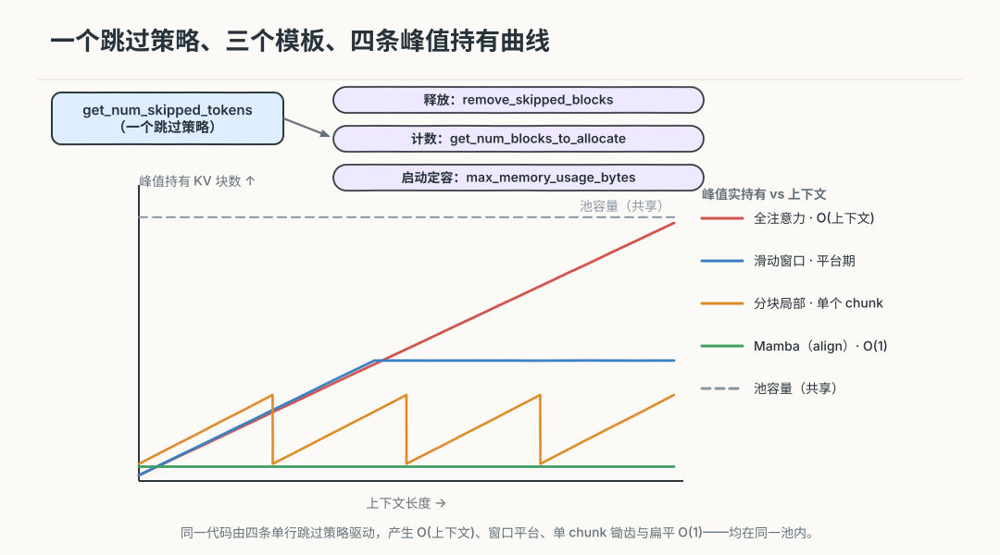</a>

<p class='figure-caption'>同一种 skip policy 贯穿 free、size 和 startup-sizer 三个共用模板，最终针对同一个 shared pool 形成四条不同的峰值持有量曲线。</p>

**第 15 节提到但未展开分析的两个 skip 函数**

[第 15 节](#15-coordinator-与-hybrid-kv-cache当一种-block-类型不够用时)给出了两个极端：base `= 0`（全部保留）和 Mamba `= n - 1`（只保留最后一个 state）。真正需要仔细计算的是中间两种 policy；二者都只有一行实现，前面配有包含完整推演示例的 docstring。Sliding window：

`vllm/v1/core/single_type_kv_cache_manager.py:L864-L867`

```python
        Returns:
            The number of tokens that will be skipped for attention computation.
        """
        return max(0, num_computed_tokens - self.sliding_window + 1)
```

当 `num_computed_tokens` 已经 committed 时，*下一个* token 的 attention window 包含 `sliding_window` 个位置，即 token `[num_computed_tokens - sliding_window + 1 .. num_computed_tokens]`。严格位于该下界之前的内容以后都不可能再被读取，因此可以 skip。这里之所以有 `+1`，是因为 window 还包含即将写入的位置，而不只是已经计算完成的位置。docstring 自带的推演示例（`L845-L859`）结果为 `sliding_window=4, num_computed_tokens=7 → 4`：live window 是 token 4–7，token 0–3 已经失效。注意该函数的形式——它是 `max(0, ...)`，因此其值会一直固定在 `0`，直到 `num_computed_tokens` 首次超过 `sliding_window - 1`；之后每新增一个 token，它就同步增加 1。

**Window 单调性。** `get_num_skipped_tokens` 随 `num_computed_tokens` 单调不减。被 skip 的头部前缀只会增长，因此，在某一步释放的 block，绝不会在后续边界值相等或更大时重新成为“必需”的 block。再结合[第 9 节](#9-allocate_slots-是策略栈而不是一次-allocation)的 processed-token 边界（它会根据 in-flight token 的数量将参数*向回*拉），即可确保释放操作不会影响 in-flight 读取，也能承受 speculative rollback。

Chunked-local attention 会在每个 chunk 边界重置 window，而不是让它持续滚动。因此，其 skip 是向下取整到 chunk 的整数倍，而不是通过减法计算：

`vllm/v1/core/single_type_kv_cache_manager.py:L1017-L1020`

```python
        num_skipped_tokens = (
            num_computed_tokens // self.attention_chunk_size
        ) * self.attention_chunk_size
        return num_skipped_tokens
```

下一个 token 的 attention 范围仅限于*自身所在的 chunk 内部*，因此之前所有完整的 chunk 都已失效。`num_computed_tokens // C * C` 会将该数量向下取整到最接近的 `attention_chunk_size` 整数倍，也就是当前有效 chunk 的起点。docstring 中的几个示例（`L983-L1009`，chunk size 为 8）值得仔细理解，因为其中一个并不直观：`13 → 8`、`7 → 0` 和 `8 → 8`。最后一个示例最能说明问题。在*恰好*位于 chunk 边界时，前一个完整 chunk `[0..7]` 已经被全部 skip，因为接下来要写入的 token（index 8）会开启一个新的 chunk，不会关注它之前的任何 token。Full attention 的 skip 始终保持为 `0`；chunked-local 的 skip 则以整个 chunk 为步长跳变。

**Chunk 对齐。** skip 边界始终是 `attention_chunk_size` 的整数倍，因此释放的 prefix 绝不会跨越当前有效的 chunk。保留下来的 suffix 是 `[chunk_start .. num_computed_tokens]`，即按 chunk 对齐的尾部。因此，`ChunkedLocalAttentionSpec` 可以将 admission 上限控制在一个 chunk，再加上下文所述的 in-flight 超出部分。

### 从 skip 的 token 到释放的 block：基础头部释放模板

Full attention、sliding window 和 chunked-local 都继承了*同一个* `remove_skipped_blocks`；区别仅在于输入，也就是 skip 数量。基类方法体负责将“已 skip 的 token”转化为“已释放的物理 block”：

`vllm/v1/core/single_type_kv_cache_manager.py:L529-L545`

```python
        del num_prompt_tokens
        # Remove the blocks that will be skipped during attention computation.
        num_skipped_tokens = self.get_num_skipped_tokens(processed_computed_tokens)
        if num_skipped_tokens <= 0:
            # This indicates that ALL tokens are inside attention window.
            # Thus we do not need to free any blocks outside attention window.
            # A typical case is full attention that we never free any token
            # before the request is finished.
            return
        blocks = self.req_to_blocks[request_id]
        num_skipped_blocks = num_skipped_tokens // self.block_size
        # `num_skipped_tokens` may include tokens that haven't been allocated yet
        # (e.g., when the attention window moves into the external computed tokens
        # range), so we must cap to the number of blocks that currently exist for
        # this request.
        num_skipped_blocks = min(num_skipped_blocks, len(blocks))
        self._remove_blocks_in_range(request_id, 0, num_skipped_blocks)
```

**Full attention:** 其继承的 `get_num_skipped_tokens` 返回 `0`，触发 `num_skipped_tokens <= 0` 的 early return（`L532-L537`），因此不会释放任何内容。这正是注释中特意指出的“典型情况”。从源码层面看，这就是 Full attention request 在完成前始终持有所有 block 的原因。**Sliding window / chunked-local:** skip 大于 0，因此会释放位于头部的 `num_skipped_tokens // block_size` 个 *blocks*。`// block_size` 的向下取整非常关键——释放以 block 为粒度，因此部分 token 已被 skip 的 block（其中仍有效的 token 还在 window 内）不会被释放；只有位于它之前、已经完全失效的完整 block 才会释放。`min(num_skipped_blocks, len(blocks))` 的 clamp（`L544`）用于防范注释中特别指出的情况：当 window 已经推进到该 manager 尚未实际分配的 external/connector KV 中时，`num_skipped_tokens` 可能超过该 request 实际拥有的 block 数量。此时若释放位置越过 `len(blocks)`，就会发生列表越界访问。

真正执行释放的是共享 helper，而且它的扫描方向至关重要：

`vllm/v1/core/single_type_kv_cache_manager.py:L499-L506`

```python
        freed: list[KVCacheBlock] = []
        for i in range(last_block - 1, first_block - 1, -1):
            if blocks[i] == self._null_block:
                break
            freed.append(blocks[i])
            blocks[i] = self._null_block
        if freed:
            self.block_pool.free_blocks(freed)
```

它会*逆向*遍历这个 range，并在遇到第一个已经为 null 的 slot 时退出。由于每一步只会让被跳过的 head *增大*（即 window 具有单调性），range 的尾部正是刚刚失效的新边界，而前部已在此前的调用中被置为 null。因此，逆向扫描抵达新边界后，一旦重新进入此前已释放的区域就会立即停止。这样既能保证调用的幂等性，又能将复杂度控制在 O(newly-freed)，而不是 O(prefix)。

**null 填充可保持索引不变。** 释放后的 head slot 会被覆写为 `self._null_block`，而不是从 list 中删除。因此，即使对应的 physical block 已被回收，block 在 `req_to_blocks[request_id]` 中的 index 仍与其逻辑 token-block 位置一致。正因如此，一套 dense block-table layout 就能适配所有 attention type：传给 kernel 的 block table（[第 20 节](#20-从-block-table-到-kernelslot_mapping-与-device-tensors)）仍能保持正确的 offset，而被跳过的位置会指向全零的 null block，并由 attention op 通过 mask 排除。释放后的 block 会通过 `free_blocks`（[第 23 节](#23-physical-block-的生命周期分配使用释放进入-cache淘汰)）返回 pool，并按 cache value 重新放入 queue。在 allocation 侧，`add_local_computed_blocks` 也以对称方式遵循这一约定：对于 window 之外命中的 prefix，它会补上 null block，确保 index 始终不会错位。

**Mamba 的 override：align mode double buffer**

Mamba 是本节唯一不能直接沿用 base head-free 逻辑的类型。它在 skip `n - 1`（[第 15 节](#15-coordinator-与-hybrid-kv-cache当一种-block-类型不够用时)）时，已经通过 `super()` 将最后一个 block 之前的所有位置置为 null；但在 `align` mode 下，recurrent layer 还会让*第二个* live block 额外存活一步（当前 step 正是从这个 block *读出* state），因此必须显式释放它：

`vllm/v1/core/single_type_kv_cache_manager.py:L1146-L1174`

```python
    def remove_skipped_blocks(
        self,
        request_id: str,
        processed_computed_tokens: int,
        num_prompt_tokens: int | None = None,
    ) -> None:
        assert isinstance(self.kv_cache_spec, MambaSpec)

        super().remove_skipped_blocks(
            request_id, processed_computed_tokens, num_prompt_tokens
        )
        if self.mamba_cache_mode == "align":
            # `last_state_block_idx` refers to the block index allocated two steps ago.
            # The block allocated in the previous step is used to copy Mamba states
            # into the block allocated in the current step; the earlier block is
            # no longer needed and should be freed here.
            last_state_block_idx = self.last_state_block_idx.get(request_id)
            # Blocks allocated during prefill may be non-contiguous. Use
            # `last_state_block_idx` to free the appropriate block and replace it
            # with a null block.
            if (
                last_state_block_idx is not None
                and last_state_block_idx
                < cdiv(processed_computed_tokens, self.block_size) - 1
            ):
                blocks = self.req_to_blocks[request_id]
                if blocks[last_state_block_idx] != self._null_block:
                    self.block_pool.free_blocks([blocks[last_state_block_idx]])
                    blocks[last_state_block_idx] = self._null_block
```

首先调用 base，将最后一个 block 之前的整个 prefix 置为 null。然后，仅在 `align` mode 下，查找 `last_state_block_idx`，也就是*两个 step 前*分配的 block。这个 recurrence 采用 double buffer：当前 step 从上一个 step 的 state block 中读取，并写入刚分配的 block；完成 copy 后，两个 step 前的 block 才真正失效。guard `last_state_block_idx < cdiv(processed_computed_tokens, block_size) - 1` 可以避免误释放*当前仍为 live* 的 state——只有当被跟踪的 index 严格位于保存最新已提交 token 的 block 之前时，它才会触发。`blocks[...] != self._null_block` 检查则确保，即使 base 已经将该位置置为 null，这次 free 仍然是幂等的（prefill 可能会分配不连续的 block，因此两次 free 的作用范围不一定互不重叠）。

**double-buffer 下限。** Base 的 head-free 逻辑配合 aligned free 后，无论 sequence length 多长，最多只会保留 previous 和 current 两个 state block。因此，spec 会在启动时预留 `2 + num_speculative_blocks` 个 page，使 recurrent-state memory 与 context length 解耦。

### 从 skipped token 到 demand：base predictor

同一个 skip hook 也负责 *sizing*。`remove_skipped_blocks` 已在本 step 中执行过（执行顺序见 [第 9 节](#9-allocate_slots-是策略栈而不是一次-allocation)），因此 base predictor 会问：“未 skip 的 suffix 还需要多少个新 block？”

`vllm/v1/core/single_type_kv_cache_manager.py:L144-L192`

```python
        num_required_blocks = cdiv(num_tokens, self.block_size)
        if apply_admission_cap and self._max_admission_blocks_per_request is not None:
            # Recycling-aware specs (SWA, chunked-local) cap the per-request
            # reservation here so admission matches the startup pool sizer
            # (`SlidingWindowSpec.max_admission_blocks_per_request` / its
            # chunked-local counterpart). `remove_skipped_blocks` runs from
            # `allocate_slots` before each chunk's `get_num_blocks_to_allocate`,
            # so per-request peak real-held blocks <= this cap, which keeps
            # `sum(reservations) <= pool` <=> `sum(peak_real_held) <= pool`.
            # Drift between the two would re-introduce the deadlock from
            # issue #39734 or, worse, mid-prefill OOM.
            num_required_blocks = min(
                num_required_blocks, self._max_admission_blocks_per_request
            )
        num_req_blocks = len(self.req_to_blocks.get(request_id, ()))

        if request_id in self.num_cached_block:
            # Fast-path: a running request won't have any new prefix-cache hits.
            assert len(new_computed_blocks) == 0
            # NOTE: With speculative decoding, request's blocks may be allocated
            # for draft tokens which are later rejected. In this case,
            # num_required_blocks may be smaller than num_req_blocks.
            return max(num_required_blocks - num_req_blocks, 0)

        num_skipped_tokens = self.get_num_skipped_tokens(total_computed_tokens)
        num_local_computed_blocks = len(new_computed_blocks) + num_req_blocks
        # Number of whole blocks that are skipped by the attention window.
        # If nothing is skipped, this is 0.
        num_skipped_blocks = num_skipped_tokens // self.block_size
        # We need blocks for the non-skipped suffix. If there are still
        # local-computed blocks inside the window, they contribute to the
        # required capacity; otherwise, skipped blocks dominate.
        num_new_blocks = max(
            num_required_blocks - max(num_skipped_blocks, num_local_computed_blocks),
            0,
        )

        # Among the `new_computed_blocks`, the first `num_skipped_blocks` worth
        # of blocks are skipped; `num_req_blocks` of those may already be in
        # `req_to_blocks`, so only skip the remainder from `new_computed_blocks`.
        num_skipped_new_computed_blocks = max(0, num_skipped_blocks - num_req_blocks)

        # If a computed block is an eviction candidate (in the free queue and
        # ref_cnt == 0), it will be removed from the free queue when touched by
        # the allocated request, so we must count it in the free-capacity check.
        num_evictable_blocks = self._get_num_evictable_blocks(
            new_computed_blocks[num_skipped_new_computed_blocks:]
        )
        return num_new_blocks + num_evictable_blocks
```

`L145-L157` 处的 admission-cap clamp，是前文在 [第 9 节](#9-allocate_slots-是策略栈而不是一次-allocation) 和 [第 15 节](#15-coordinator-与-hybrid-kv-cache当一种-block-类型不够用时) 讨论过的联动机制在 runtime 侧的实现（即 `apply_admission_cap` flag，以及仅为 SWA/chunked-local 安装 `_max_admission_blocks_per_request` 的 dispatch）；真正新增的是其*下方*的逻辑。关键是 `L176-L179` 处对 skipped block 的扣减：`num_new_blocks = max(num_required_blocks - max(num_skipped_blocks, num_local_computed_blocks), 0)`。这里，skip hook 负责各 type 特有的 sizing。对于 full attention，`num_skipped_blocks = 0`，因此 demand 为 `num_required_blocks - num_local_computed_blocks`——也就是 suffix 的全部成本，没有任何扣减。这正是 full attention 需要承担 O(context) 成本的原因。

对于 sliding-window 和 chunked-local，`num_skipped_blocks` 为正，因此会扣除 window 已丢弃的 head；这样一来，即使 request 很长，也只需为其 *live* suffix 付费。`max(num_skipped_blocks, num_local_computed_blocks)` 会取占主导地位的 bound：如果 window 内仍有 cached/allocated block，下限就由它们决定；一旦 window 滑过所有这些 block，skipped count 就会接管。最后的 `num_evictable_blocks` 项（`L189-L192`）还会计入当前处于 free-but-cached 状态的 prefix-hit block（`ref_cnt == 0`），因为 commit 时一旦 touch 它们，它们就会从 free queue 中移除，必须计入 capacity 消耗——但只计入 non-skipped remainder，因为 skipped head 会被置为 null，而不会被 touch。

**predictor 恰好只为 live suffix 计费。** 对于 windowed type，reservation 跟踪的是 plateau，而不是持续增长的 length；对于 full attention，它跟踪的是完整 length；而且（per-step path 上有 `apply_admission_cap=False`，见 [第 9 节](#9-allocate_slots-是策略栈而不是一次-allocation)），返回值是 `allocate_new_blocks` 实际消耗量的可靠上界，因此 pool 在 gate 和 commit 之间不可能 OOM。

### Mamba 的 demand override：常量，而非与 context 成正比

Full attention、SWA 和 chunked-local 共用上述 predictor。Mamba 则将其完全替换；正是这个替代实现，使其 footprint 变成了与长度无关的常量：

`vllm/v1/core/single_type_kv_cache_manager.py:L1192-L1247`

```python
        if (
            len(new_computed_blocks) > 0
            and new_computed_blocks[-1].block_hash in self.cached_blocks_this_step
        ):
            # Mamba can't rely on blocks generated by other requests in the current step
            # To put it in the next step, we return num_gpu_blocks + 1 so
            # that kv_cache_manager will think there is no enough blocks to allocate now
            # and don't schedule it in the current step.
            return self.block_pool.num_gpu_blocks + 1
        if self.mamba_cache_mode != "align":
            # Allocate extra `num_speculative_blocks` blocks for
            # speculative decoding (MTP/EAGLE) with linear attention.
            if self.num_speculative_blocks > 0:
                num_tokens += (
                    self.kv_cache_spec.block_size * self.num_speculative_blocks
                )
            return super().get_num_blocks_to_allocate(
                request_id,
                num_tokens,
                new_computed_blocks,
                total_computed_tokens,
                num_tokens_main_model,
                apply_admission_cap=apply_admission_cap,
            )
        else:
            # We don't allocate blocks for lookahead tokens in align mode, because if
            # x * block_size tokens are scheduled, num_tokens is
            # x * block_size + num_lookahead_tokens and breaks the alignment.
            # We can ignore lookahead tokens because current draft models don't have
            # mamba layers.
            num_tokens = num_tokens_main_model

            # NOTE(tdouble): this is an over-estimate of how many blocks we need because
            # num_tokens can include draft tokens that will later be rejected.
            num_required_blocks = (
                cdiv(num_tokens, self.block_size) + self.num_speculative_blocks
            )
            num_new_blocks = (
                num_required_blocks
                - len(new_computed_blocks)
                - len(self.req_to_blocks[request_id])
            )
            if num_new_blocks > 0:
                if request_id in self._allocated_block_reqs:
                    # Old request. Needs at most 1 more blocks as we can reuse the
                    # speculative blocks in previous step.
                    num_new_blocks = 1
                else:
                    # First prefill. Allocate 1 block for running state and the
                    # speculative blocks.
                    num_new_blocks = 1 + self.num_speculative_blocks

            num_evictable_computed_blocks = self._get_num_evictable_blocks(
                new_computed_blocks
            )
            return num_new_blocks + num_evictable_computed_blocks
```

它有两个不同之处。第一，调度风险防护机制（`L1192-L1200`）：Mamba request 不能使用另一个 request 在*同一个 step*中刚缓存的 block，因为循环状态尚未物化到该 block 中。为避免风险，manager 会返回 `num_gpu_blocks + 1`（刻意设置得比整个 pool 还大），使 `allocate_slots` 的空闲 block 门控（[第 9 节](#9-allocate_slots-是策略栈而不是一次-allocation)）判定为“无法容纳”，从而将 request 延后到下一个 step。这是一个虚假的“空间不足”信号，纯粹用作持续一个 step 的调度屏障。第二，`align` demand（`L1216-L1247`）：无论 sequence length 是多少，只要满足 `num_new_blocks > 0`，它就会被*改写*为常数——对于已被跟踪的 request，这个常数是 `1`，request 此时已在 `_allocated_block_reqs` 中（`L1234-L1238`，即复用前一个 step 的 speculative block）；首次 prefill 时则是 `1 + num_speculative_blocks`（`L1239-L1242`）。`cdiv(num_tokens, block_size)` 项仅用于判断是否需要*任何*新 block；无论如何，数量上限都是一个 running-state block。

**O(1) working set。** 处于 running 状态的 Mamba request 每个 step 最多请求一个新 block；首次 prefill 则为 `1 + num_speculative_blocks`。block demand 与 `num_tokens` 完全解耦。再配合上文 `align` 的 remove-skipped double-buffer 释放机制，实际持有的 block 数量不会随 context length 增长。正是这一点让 hybrid（attention + Mamba）模型能够共用一个 pool：Mamba group 只带来固定的 per-request 开销，full-attention group 的 O(context) 开销叠加在其上，而不是让两份 O(context) 开销相互竞争。

**单一事实来源的另一端：启动阶段的内存容量计算器**

运行时准入上限（`_max_admission_blocks_per_request`，[第 15 节](#15-coordinator-与-hybrid-kv-cache当一种-block-类型不够用时)中的 dispatch）只构成这组耦合的一半。另一半是启动阶段的 pool 容量计算器 `max_memory_usage_bytes`，它决定 pool 最初包含多少个 block。对于采用回收机制的类型，这两个调用方会共用同一个方法：

`vllm/v1/kv_cache_interface.py:L563-L580` (SlidingWindowSpec)

```python
        # During chunked prefill, we hold KV for the last `sliding_window-1`
        # computed tokens plus the in-flight tokens (frees happen on the
        # processed-token basis); never more than `max_model_len`.
        num_tokens = min(self.sliding_window - 1 + max_in_flight_tokens, max_model_len)
        # +1 because the sliding window may not start from the beginning of
        # the block. E.g. block size 4 and num_token 4 needs two blocks
        # [XXCD][EF] to store the 6-token window [CDEF].
        return cdiv(num_tokens, self.block_size) + 1

    def max_memory_usage_bytes(self, vllm_config: VllmConfig) -> int:
        assert vllm_config.parallel_config.decode_context_parallel_size == 1, (
            "DCP not support sliding window."
        )
        max_blocks = self.max_admission_blocks_per_request(
            max_in_flight_tokens=vllm_config.max_in_flight_tokens,
            max_model_len=vllm_config.model_config.max_model_len,
        )
        return max_blocks * self.page_size_bytes
```

`max_memory_usage_bytes`（`L572-L580`）不会自行另设上限，而是使用与 dispatch 传给 manager 的参数完全相同的参数调用 `max_admission_blocks_per_request`（[第 15 节](#15-coordinator-与-hybrid-kv-cache当一种-block-类型不够用时)）。window 的平台值由 `sliding_window - 1` 个 live token 加上 in-flight 的超出部分构成，并以 `max_model_len` 为上限；`+1` block 则用于补偿 window 未按 block 对齐的情况（注释中的 `[XXCD][EF]` 示例：block size 为 4 时，包含 6 个 token 的 window 会跨越两个 block）。Chunked-local 采用相同模式，只是用一个 chunk 取代一个 window：

`vllm/v1/kv_cache_interface.py:L496-L508` (ChunkedLocalAttentionSpec)

```python
        # During chunked prefill, we hold KV for at most one chunk window plus
        # the in-flight tokens, since frees happen on the processed-token basis.
        num_tokens = min(
            self.attention_chunk_size + max_in_flight_tokens, max_model_len
        )
        return cdiv(num_tokens, self.block_size)

    def max_memory_usage_bytes(self, vllm_config: VllmConfig) -> int:
        max_blocks = self.max_admission_blocks_per_request(
            max_in_flight_tokens=vllm_config.max_in_flight_tokens,
            max_model_len=vllm_config.model_config.max_model_len,
        )
        return max_blocks * self.page_size_bytes
```

Mamba 完全不基于 window 计算容量；其容量值是按 mode 区分的固定常数：

`vllm/v1/kv_cache_interface.py:L691-L700` (MambaSpec)

```python
    def max_memory_usage_bytes(self, vllm_config: VllmConfig) -> int:
        if vllm_config.cache_config.mamba_cache_mode == "all":
            max_model_len = vllm_config.model_config.max_model_len
            return (
                cdiv(max_model_len, self.block_size) + self.num_speculative_blocks
            ) * self.page_size_bytes
        elif vllm_config.cache_config.mamba_cache_mode == "align":
            return self.page_size_bytes * (2 + self.num_speculative_blocks)
        else:
            return self.page_size_bytes * (1 + self.num_speculative_blocks)
```

`align` mode 会预留 `2 + num_speculative_blocks` 个 page，与 `remove_skipped_blocks` 维护的 double buffer 相匹配。`all` mode 从不释放 recurrent history，因此与 full attention 一样，采用 O(context) 的 `cdiv(max_model_len, block_size)` 上界；默认的 `none` mode 则预留一个 page，再加上 speculative lookahead 所需的空间。

**`sum(reservations) ≤ pool ⇔ sum(peak_real_held) ≤ pool`.** 由于 `remove_skipped_blocks` 总是在每个 chunk 的 `get_num_blocks_to_allocate` 之前运行（[第 9 节](#9-allocate_slots-是策略栈而不是一次-allocation)），每个 request 实际持有的 block 峰值绝不会超过 `max_admission_blocks_per_request`。又因为启动阶段的 pool sizer 使用了*同一套*方法，所以只要某个 request 能纳入启动预算，runtime 就确实能够接纳它，反之亦然。如果 runtime gate 按 naive `cdiv(full_len, block_size)` 预留，而 pool 却按 plateau 确定大小，二者就会逐渐失配——长度超过 window 的 request 会在 sizing 阶段获准，却在 prefill 中途卡死。这正是 base predictor 的注释中称为 issue #39734 的 deadlock，甚至还可能导致 prefill 中途 OOM。正是让同一套方法同时服务两个调用方，才从根本上避免了这种失配。

### 四种 profile：一套共享机制

| 类型 | `get_num_skipped_tokens(n)` | `remove_skipped_blocks` 的释放行为 | 每 step demand | admission cap / sizer | 实际持有量峰值 |
|---|---|---|---|---|---|
| FullAttention | `0` | 不释放（early return） | 完整 suffix，不设 cap | 无（`_max_admission… = None`） | O(context) |
| SlidingWindow | `max(0, n - W + 1)` | 释放 rolling window 之前的 head | suffix − 已跳过的 head | `cdiv(W-1+in_flight, bs)+1` | ≈ window 对应的 block 数（plateau） |
| ChunkedLocal | `⌊n/C⌋·C` | 释放所有完整位于此前的 chunk | suffix − 已跳过的 chunk | `cdiv(C+in_flight, bs)` | ≈ 一个 chunk |
| Mamba（`align`） | `n − 1` | 释放除最后一个和 prev state 外的全部内容 | **≤ 1**（running）/ `1+spec`（first） | `2 + spec` 个 page | O(1)（double buffer） |

（`W = sliding_window`、`C = attention_chunk_size`、`bs = block_size`。）

所有行都由*同一个* `allocate_slots` driver（[第 9 节](#9-allocate_slots-是策略栈而不是一次-allocation)）生成，再由*同一个* coordinator（[第 15 节](#15-coordinator-与-hybrid-kv-cache当一种-block-类型不够用时)）分派。Full attention 只重写自身的 cache-hit scan；通过将 skip 设为 `0`，继承了“保留全部内容”的行为。Sliding window 和 chunked-local 都只重写计算 skip 的那一行，base free template、base predictor，以及使用共享来源的 admission cap 则全部继承——两者的全部差异就是 `max(0, n-W+1)` 与 `⌊n/C⌋·C`。Mamba 是唯一还需要同时重写 free 逻辑和 predictor 的类型，因为 recurrent state 并不是 windowed suffix；但即便如此，它仍会先调用 `super()`，只额外执行一次严格局部的释放操作。

Full attention 与 Mamba 使用同一个 driver，但提供不同的单行 retention policy。runtime gate 和 startup sizer 使用相同的 cap；在 processed-token 边界处，freeing 的计算先于 demand。

## 17. Encoder Cache Manager：面向多模态的同级 allocator

多模态输入引入了第二套 cache，即 encoder cache。它采用不同的计量单位和淘汰机制，与 paged KV block 共同承受 scheduler 的资源压力，但拥有独立的 allocator 和生命周期。

`EncoderCacheManager` 会缓存 vision 或 audio embedding，避免对重复的多模态输入再次执行 encoding。与 KV manager 不同，它维护的是 embedding slot 预算，而非 physical block pool；decoder 消费完对应的 placeholder token 后，这些 cache 条目就会被移除。

<a href='images/vllm-06-22-encoder-cache.svg' target='_blank'>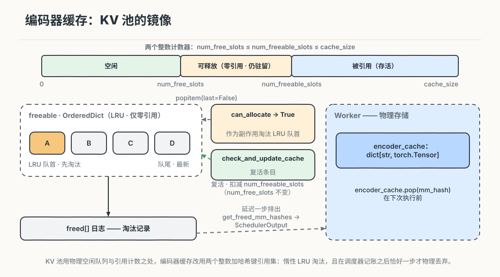</a>

<p class='figure-caption'>双计数器记账（`num_free_slots ≤ num_freeable_slots`）、LRU `freeable` queue，以及延迟一步后排空到 worker 物理 `encoder_cache` dict 中的 `freed` journal。</p>

### 计量单位是 embedding，而不是 token

KV manager 以固定大小的 token block 记账；encoder manager 则以 *encoder embedding* 记账。class docstring 特别强调，二者与模态在 sequence 中占据的 placeholder token 并不是同一个概念。

`vllm/v1/core/encoder_cache_manager.py:L41-L45`

```python
    NOTE: The EncoderCacheManager operates on the level of multimodal embeddings
    instead of encoder tokens (i.e. all tokens that represent the multimodal data
    in the input sequence). This means all break/text tokens in-between multimodal
    embeddings are not considered with respect to the cache size and the number
    of free slots.
```

这种区别并非只是措辞上的差异，而是落实在具体实现中。manager 跟踪的所有数值都来自 `Request.get_num_encoder_embeds`，后者会将计算委托给 placeholder range：

`vllm/multimodal/inputs.py:L152-L156`

```python
    def get_num_embeds(self) -> int:
        if self.embeds_cumsum is None:
            return self.length

        return self.embeds_cumsum[-1] if self.embeds_cumsum else 0
```

一个 `PlaceholderRange` 在 token sequence 中横跨 `[offset, offset+length)` 个位置，但它还带有一个可选的 boolean `is_embed` mask（`inputs.py:L141-L145`），用于标记哪些位置实际接收 embedding，哪些位置是穿插其中的 break/newline/text token。没有 mask 时，embedding 数量等于 `length`；有 mask 时，则等于 `True` 条目的数量（`embeds_cumsum[-1]`）。因此，一个带有 `is_embed = [False, True, False, True, True]` 的“5-token”图像 placeholder run，在 encoder 预算中按 **3** 计，而不是 5。相比之下，scheduler 的 *free* gate 按 token position 工作（`offset`、`length`），因为它要判断的是“decoder 是否已经越过这些 sequence position？”：这两个维度是有意区分开的。

预算衡量的是真正占用 GPU memory 的对象（embedding tensor），而不是占据 sequence position 的对象（placeholder run）。如果按 token 为 cache 定容，就会对 placeholder 中填充了 structural token 的所有模态过度计费，悄然缩小 cache 的实际可用容量。KV 侧采用的策略恰好相反：无论内容是什么，每个 token position 都会占用 block 配额。

**用两个整数 counter 取代 intrusive free queue**

block pool 的 free list（[第 3 节](#3-kvcacheblock-与-blockpoolfree-list-是一种淘汰结构)）是一个借助 `ref_cnt == 0 ⇔ on-queue` 手工实现的侵入式双向链表，并专门针对 O(1) 复杂度的中间节点移除做了优化。encoder manager 则彻底抛弃了这套机制，改用**两个普通整数加一个 `OrderedDict`**来跟踪容量：

`vllm/v1/core/encoder_cache_manager.py:L67-L79`

```python
    def __init__(self, cache_size: int):
        self.cache_size = cache_size
        self.num_free_slots = cache_size
        self.num_freeable_slots = cache_size

        # mm_hash of mm_data => ids of requests that reference the mm_data
        self.cached: dict[str, set[str]] = {}
        # request_id => set of input_ids cached for that request
        self.request_cached_ids: dict[str, set[int]] = {}

        # mm_hash of mm_data => num_encoder_embeds of the mm_data
        self.freeable: OrderedDict[str, int] = OrderedDict()
        self.freed: list[str] = []
```

`cached` 是一种反向 ref-count（`mm_hash → {request_id, …}`），其中，*空集合*表示“该 entry 实际存在，但没有任何活跃 request 引用它”（可淘汰）。这与处于 `ref_cnt == 0` 状态的 KV block 完全类似，区别在于这里会显式保留引用它的 request id，而不是把引用数汇总成一个整数。两个计数器构成了关键的一对：

- `num_free_slots` — 无需淘汰任何内容即可直接分配的容量。
- `num_freeable_slots` — 淘汰由 zero-ref entry 构成的整条 LRU queue 后可分配的容量。

两者之差 `num_freeable_slots − num_free_slots`，就是 `freeable` 中所有 embeds 的总量：这些 embeds 已占用容量，但可以回收。`OrderedDict` 是 LRU（最旧的 entry 位于最前端，即 `mm_hash → num_embeds`），而 `freed` 是一份 eviction journal，其中的记录会被取出并发送给 worker。这些计数始终满足：

```
0 ≤ num_free_slots ≤ num_freeable_slots ≤ cache_size
    and    (mm_hash ∈ freeable)  ⇔  (cached[mm_hash] == set())
```

将 free 与 freeable 拆开后，一个 entry 可以同时处于“未计入立即可用容量”和“仍在物理上驻留且可被复活”这两种状态，也无需像 KV 侧那样调整物理 queue 的结构。zero-ref encoder entry 会以 warm hit 的形式继续驻留，直到确实需要腾出空间；正是这两个计数器的拆分，把这种延迟回收状态编码为算术关系，而不是 list 成员关系。

### `can_allocate`: 以淘汰为副作用的准入门控

KV 侧的 `allocate_slots`（[第 9 节](#9-allocate_slots-是策略栈而不是一次-allocation)）是一套纯粹的策略栈：它计算需求、检查供给，失败时返回 `None`，且*不修改任何状态*。encoder manager 的准入门控则正好相反——它返回 bool；在走向 `True` 的路径上，它可能会**以副作用的形式执行淘汰**，并将淘汰项记入 journal。

`vllm/v1/core/encoder_cache_manager.py:L158-L182`

```python
        num_embeds = request.get_num_encoder_embeds(input_id)

        # Not enough compute budget
        if num_embeds > encoder_compute_budget:
            return False

        num_embeds += num_embeds_to_schedule

        # Enough free slots
        if num_embeds <= self.num_free_slots:
            return True

        # Not enough reclaimable slots
        if num_embeds > self.num_freeable_slots:
            return False

        # Not enough free slots but enough reclaimable slots
        # NOTE: Eviction takes place here, but physical memory is not freed
        # until model runner is notified by the scheduler output.
        while num_embeds > self.num_free_slots:
            mm_hash, num_free_embeds = self.freeable.popitem(last=False)
            del self.cached[mm_hash]
            self.freed.append(mm_hash)
            self.num_free_slots += num_free_embeds
        return True
```

(1) **compute-budget gate** 仅将 `num_embeds` 与 `encoder_compute_budget` 比较——后者是当前 step 中 encoder 最多可计算多少个 embedding 的上限，与 cache-size budget 不同，详见下文。只要单个 item 超过该上限，这个 step 就绝不可能运行它。(2) `num_embeds_to_schedule` 表示本轮 scheduling 中，已经分配给*更早* mm item 的 embedding 累计数量；它也会被纳入计算，因此所有*空间*检查都是累计的。(3) 快速路径：能够放入 `num_free_slots`，return `True`，不做任何修改。(4) 直接拒绝：即便回收全部空间（`> num_freeable_slots`）仍然放不下，return `False`。(5) **Evict-then-admit**：`popitem(last=False)` pop 出 LRU 中最旧的 entry，将其从 `cached` 删除，把它的 `mm_hash` 追加到 `freed` journal，并将额度归还给 `num_free_slots`；如此循环，直到能够放下。由于 `freeable` 始终只保存 zero-ref entry（这一点由 `free_encoder_input` 保证），因此 eviction 绝不会移除仍有 live request 需要的 embedding。

这个 gate 有两个重要特性。首先，eviction 是*惰性的、遵循 LRU 且仅针对 zero-ref entry*——这里不会操作物理 GPU tensor；comment 明确指出：“在 model runner 收到通知前，不会释放物理内存。”其次，return `True` 时会留下 `num_free_slots ≥ num_embeds`，commit 阶段会通过 assert 检查这一点。scheduler 在确定未缓存 multimodal item 的大小时会使用这个结果：它会在无法容纳的 item 之前截断 `num_new_tokens`，让 decoder 仍能继续推进到该位置（`scheduler.py:L1424-L1443`；[第 10 节](#10-scheduler-契约调度过程如何驱动-kv-cache-manager)）。

**`allocate`：admission 后的 commit**

`can_allocate` 负责 reserve 和 evict；`allocate` 负责 commit。这种拆分与 KV coordinator 的 predictor/allocator pair 相呼应（[第 16 节](#16-各类型的-block-计算sliding-windowmamba-与-chunked-local-attention)：`get_num_blocks_to_allocate` 必须是 `allocate_new_blocks` 的上界），而且该约束不是只写在 comment 中，而是由两个 assert 强制保证。

`vllm/v1/core/encoder_cache_manager.py:L202-L210`

```python
        # NOTE: Encoder cache should always have enough space for encoder inputs
        # that are scheduled since eviction takes place at can_allocate().
        assert self.num_free_slots >= num_encoder_embeds
        assert self.num_freeable_slots >= num_encoder_embeds

        self.cached[mm_hash].add(request_id)
        self.request_cached_ids.setdefault(request_id, set()).add(input_id)
        self.num_free_slots -= num_encoder_embeds
        self.num_freeable_slots -= num_encoder_embeds
```

两个 counter 都会扣减相同的 `num_encoder_embeds`：刚完成 allocation 且已有引用的 entry，既不是 free，也不是 freeable。request id 会加入 ref set；同时，input id 也会同步记录到 `request_cached_ids` 名下，以便 manager 之后枚举该 request 持有的全部内容。scheduler 只会在确认 request 可调度后（`scheduler.py:L612-L618`）才调用 `allocate`，并且一次处理一个 item。因此执行到这里时，为腾出空间而进行的 eviction 已经在 `can_allocate` 内完成。

`allocate` 会从两个 budget 中全量扣减，并以 `can_allocate` 已通过为前提。如果 scheduler 绕过 gate 直接 allocation，assert 会立即触发，而不是悄无声息地超额占用 GPU memory。两个 counter 扣减相同的数值，正是这一做法让 `num_free_slots ≤ num_freeable_slots` 在整个 commit 过程中始终成立。

### 复活路径：即将被 evict 的 entry 发生 cache hit

在 KV 一侧，如果 prefix 命中了已 cached 但处于 free 状态的 block，就会调用 `BlockPool.touch`（[第 23 节](#23-physical-block-的生命周期分配使用释放进入-cache淘汰)）：以 O(1) 时间将其从 free queue 中移除，并增加 ref count。encoder manager 中对应的是 `check_and_update_cache`，它执行相同的“取消驱逐 zero-ref entry”操作，但只对 `num_freeable_slots` 做计数运算，绝不会改动 `num_free_slots`。

`vllm/v1/core/encoder_cache_manager.py:L109-L121`

```python
        mm_hash = request.mm_features[input_id].identifier
        # Not cached at all
        if mm_hash not in self.cached:
            return False

        # Cached but currently not referenced by any request
        if not self.cached[mm_hash]:
            num_encoder_embeds = self.freeable.pop(mm_hash)
            self.num_freeable_slots -= num_encoder_embeds

        self.cached[mm_hash].add(request.request_id)
        self.request_cached_ids.setdefault(request.request_id, set()).add(input_id)
        return True
```

真正的 miss（`mm_hash not in cached`）会返回 `False`，scheduler 必须执行计算 + `allocate`。如果命中的是位于 `freeable` LRU 中的 *zero-ref* entry，则将其移出 `freeable`，并从 `num_freeable_slots` 中扣除相应计数，重新将其 pin 住。关键在于，`num_free_slots` 保持不变：这些 slot 从未被物理回收，只是离开了 *可回收* pool。若命中的 entry 仍有引用，则只需将当前 request 加入 ref set。返回 `True` 后，scheduler 就可以通过 `continue` 跳过该 item，而不消耗 compute budget（`scheduler.py:L1403-L1406`）。

复活的 entry 绝不会被重复计入 free 空间。将其移出 `freeable`，并精确扣减 `num_freeable_slots`（保持 `num_free_slots` 不变），即可确保双计数器在整个复活过程中始终准确。这与 `touch` 通过移除 queue 元素为 KV 侧提供的正确性保证相同，只是这里用算术运算来表达。

### 释放采用 lazy 策略并受消费进度约束，而不是为了复用而保留

这是它与 KV cache 最明显的区别。request 结束后，KV block 中的 KV 仍会被*保留*，存放在 pool 的 MRU 尾部，以便跨 request 复用 prefix（[第 23 节](#23-physical-block-的生命周期分配使用释放进入-cache淘汰)）。而一旦 decoder 消费完 encoder embedding 所支撑的 placeholder token，该 embedding 就会被*释放*。这是因为相关信息已经流入 decoder KV，后续不再需要它。`free_encoder_input` 会移除一个 request 的引用：

`vllm/v1/core/encoder_cache_manager.py:L237-L241`

```python
        self.cached[mm_hash].discard(req_id)
        if not self.cached[mm_hash]:
            num_encoder_embeds = request.get_num_encoder_embeds(input_id)
            self.freeable[mm_hash] = num_encoder_embeds
            self.num_freeable_slots += num_encoder_embeds
```

当 ref 数降至零时，entry 就变得*可释放*：它会被追加到 LRU 中（最新的 entry 位于末尾），同时只增加 `num_freeable_slots`。此时不会增加 `num_free_slots`，因为该 tensor 仍实际占用 GPU memory，并且仍可由 `check_and_update_cache` 复活。只有后续 `can_allocate` 需要这部分空间时，它才会真正释放。具体的释放*时机*由 scheduler 决定：只有当前 step 执行完毕后（`scheduler.py:L1624-L1626`，[第 10 节](#10-scheduler-契约调度过程如何驱动-kv-cache-manager)），scheduler 才会运行 free gate，而且只处理 decoder 已经越过的 item：

`vllm/v1/core/sched/scheduler.py:L1947-L1954`

```python
            elif (
                start_pos + num_tokens + spec_lookahead
                <= request.num_computed_tokens - request.num_output_placeholders
            ):
                # Processed, stored in the decoder KV cache, and far enough past
                # the placeholder range (plus the drafter's look-ahead) that no
                # rejection or drafter gather can reference it.
                self.encoder_cache_manager.free_encoder_input(request, input_id)
```

判断条件是：“整个 placeholder 区间 `[start_pos, start_pos+num_tokens)` 都不超过已确认的 decode 边界 `num_computed_tokens − num_output_placeholders`，并留出 `spec_lookahead` 的余量。”`spec_lookahead` 为 `1 if self.use_eagle else 0`（`scheduler.py:L1934`）。这里的 `+1` 并非可有可无：使用 EAGLE speculative decoding 时，drafter 会向前多读一个位置。如果提前一个 step 丢弃 embedding，drafter 执行 gather 时就会遇到 `RuntimeError("Encoder cache miss …")`。worker 在 `gpu_model_runner.py:L3200-L3210` 处的 fallback 只能容忍位于尚未处理的边界处或其后的 feature 缺失。减去 `num_output_placeholders`（在 async scheduling 下，它包含 in-flight spec tokens）可以确保：即使 spec-decode rejection 导致 `num_computed_tokens` 回退，也绝不会提前丢弃 re-decode 仍需要的 embedding。

只要任何 decoder step 仍可能读取某个 encoder embedding，就绝不会将其丢弃；这也包括 speculative drafter 的 lookahead 和 rejection 后的 re-decode。Multimodal encoder 对整个 item 使用 *bidirectional* attention，因此 item 必须作为整体读取；只有越过整个区间并加上 spec margin 后，gate 才会释放它。再明确对比一下 KV policy：KV 会为*后续* request 保留，而 encoder embedding 则针对*当前* request 丢弃——二者属于不同的 cache，生命周期正好相反。

### 物理存储位于 worker；manager 只负责 bookkeeping

block pool *才是* KV cache 的权威数据源——block id 会直接索引 device tensor（[第 20 节](#20-从-block-table-到-kernelslot_mapping-与-device-tensors)）。encoder manager 根本不持有任何 tensor。物理存储只是 model runner 中的一个普通 dict（`self.encoder_cache: dict[str, torch.Tensor]`、`gpu_model_runner.py:L559`），在 encoder 运行后写入（`:L2963`、`:L3141`），且只有收到 scheduler 的指示后才会释放。通知通道是 `freed` journal，每个 step drain 一次：

`vllm/v1/core/encoder_cache_manager.py:L264-L266`

```python
        freed = self.freed
        self.freed = []
        return freed
```

scheduler 将该 list 放入 `SchedulerOutput.free_encoder_mm_hashes`（`scheduler.py:L1111`），worker 会在下一次 model execution 前，准确 pop 掉其中列出的 tensor：

`vllm/v1/worker/gpu_model_runner.py:L1181-L1183`

```python
        # Free the cached encoder outputs.
        for mm_hash in scheduler_output.free_encoder_mm_hashes:
            self.encoder_cache.pop(mm_hash, None)
```

scheduler 的 bookkeeping（`num_free_slots`）与 worker 中的物理 dict *最终一致，二者之间只隔一条 channel*：`can_allocate` 将淘汰项写入 `freed` → `get_freed_mm_hashes` 将其 drain 到 `SchedulerOutput` → worker 执行 `encoder_cache.pop`。这种 one-step lag 是刻意设计的——in-flight step 可能仍在读取某个 tensor，而 scheduler 在 bookkeeping 中已经将其记为 evicted。因此，物理删除会延迟到*下一次* execution 之前执行，绝不会发生在 step 中途。这就是代码强调“只有 model runner 收到通知后，physical memory 才会释放”的原因。其采用的 producer/consumer 机制与 KV block table 相同（先 stage，再 commit，参见[第 21 节](#21-gpu-侧-stagingdevice-block-table-与-attention-metadata)），只不过这里应用于另一个 cache，并使用自己的 drain 流程。

**enc-dec shim：计入 budget，但不复用**

Encoder-decoder 模型（Whisper）目前还不支持*复用* encoder output，因此 scheduler 会实例化一个 subclass，即 `EncoderDecoderCacheManager`（`scheduler.py:L225-L228`）。该 subclass 仅保留*scheduling* 记账逻辑，并将复用机制实现为空壳：`check_and_update_cache` 始终返回 `False`，`can_allocate` 只检查 budget，不执行 eviction，并且完全没有 `freeable`/`num_freeable_slots` state。这里有一处细节值得关注：在没有 LRU queue 的情况下，它如何模拟 base class 中“仅在执行后释放”的顺序语义：

`vllm/v1/core/encoder_cache_manager.py:L369-L377`

```python
    def get_freed_mm_hashes(self) -> list[str]:
        # As encoder cache is not used for enc-dec models, we can free the entries here
        # The actual free happens in the runner, *before* the model is executed.
        # Therefore, `freeable` acts as a buffer to free the entries only after the
        # model is executed, mimicking the state transition of `EncoderCacheManager`.
        to_free = self.to_free
        self.to_free = self.allocated
        self.allocated = []
        return to_free
```

它返回*上一个* step 的 `allocated`（轮转至 `to_free`），并暂存*当前* step 的 `allocated`，留到下一次返回。这相当于一个延迟一步的 buffer。该延迟复现了 base class 在执行后才释放的顺序语义：只有使用某个 entry 的 step 执行完毕后，该 entry 才会被标记为可释放，从而确保 worker 的 `encoder_cache.pop` 绝不会丢弃 in-flight step 仍在读取的 tensor。文档将这个 subclass 定位为临时 shim（`:L319-L322`）；随着两条 path 逐步合流，它最终会并回 base class。

因此，一个多模态 request 会同时经过两个 allocator，而二者采用截然相反的保留策略。KV manager（[第 3 节](#3-kvcacheblock-与-blockpoolfree-list-是一种淘汰结构)–[第 23 节](#23-physical-block-的生命周期分配使用释放进入-cache淘汰)）管理采用 refcount 的 physical block，并保留其中的内容以供 prefix reuse。encoder manager 则通过 `mm_hash` 跟踪 embedding slot budget，具体包括：`num_free_slots ≤ num_freeable_slots ≤ cache_size`、零引用 LRU eviction、由消费状态控制且预留 speculative decoding 余量的释放机制，以及比 bookkeeping 晚一个 step 的 physical-free notification。block pool 使用 queue 和 refcount，而 encoder manager 使用 counter 和以 hash 为 key 的引用集合；KV 内容会保留以供后续复用，而已经消费的 encoder output 则会释放。

## 18. FP8 与量化 KV Cache：每字节容纳更多 token

KV 容量最终由 `num_gpu_blocks = available_memory // page_size_bytes // group_size` 决定。量化 cache 会减小分母，因此无需改动 allocator，就能在相同的 HBM budget 中容纳更多 token block。

Paging 机制本身保持不变。management path 会将 `kv_cache_dtype` 映射为更小的 `page_size_bytes`，同时将可能存放在同一 allocation 中的 quantization scale 纳入空间核算；quantize/dequantize 运算则在 attention kernel 中执行。

<a href='images/vllm-06-27-quantized-kv.svg' target='_blank'>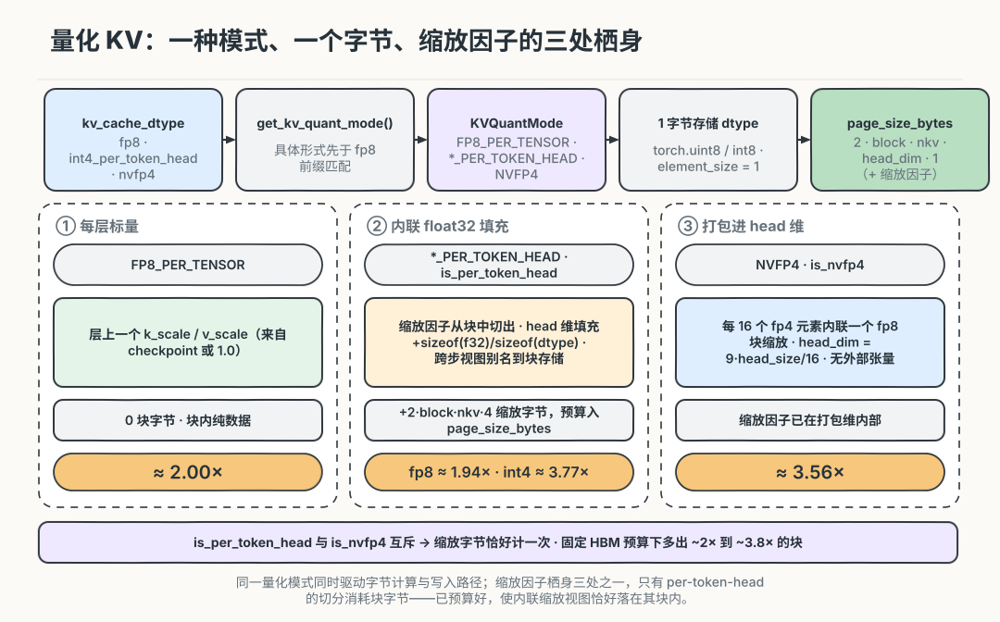</a>

<p class='figure-caption'>`kv_cache_dtype` string → `KVQuantMode` → storage dtype → `page_size_bytes` 这一链路，以及 scale 可存放的三个位置：per-layer scalar（不占用 block byte）、从 block 中划出的 inline padding（per-token-head），或打包在 head dim 内部（NVFP4）。</p>

**dispatch enum：一个 mode 同时决定字节数计算和写入 path**

vLLM 不会在每个分支都对 `kv_cache_dtype` 做字符串匹配，而是一次性将其映射为紧凑的 `IntEnum`，供 page 大小计算逻辑和 write kernel 共同作为 dispatch 依据。

源码定位：`vllm/v1/kv_cache_interface.py:L33-L59`。

```python
class KVQuantMode(IntEnum):
    """KV cache quantization mode.

    Used by attention backends and kernels to dispatch quantization logic
    without string matching on ``kv_cache_dtype``.
    """

    NONE = 0
    FP8_PER_TENSOR = 1  # per-tensor scales (current fp8 path)
    INT8_PER_TOKEN_HEAD = 2  # per-token-head dynamic scales for int8
    FP8_PER_TOKEN_HEAD = 3  # per-token-head dynamic scales for fp8
    INT4_PER_TOKEN_HEAD = 4  # packed 2×int4/byte, RHT + asymmetric zp
    NVFP4 = 5  # packed fp4 data + fp8 block scales

    @property
    def is_per_token_head(self) -> bool:
        """True for any per-token-head quantization mode."""
        return self in (
            KVQuantMode.INT8_PER_TOKEN_HEAD,
            KVQuantMode.FP8_PER_TOKEN_HEAD,
            KVQuantMode.INT4_PER_TOKEN_HEAD,
        )

    @property
    def is_nvfp4(self) -> bool:
        """True for NVFP4 packed quantization mode."""
        return self == KVQuantMode.NVFP4
```

这些模式分为三类，在 `page_size_bytes` 中的计入方式各不相同。**Per-tensor fp8**（`FP8_PER_TENSOR`）的每个 attention layer 只需一个 scale scalar，per-block 开销为零。**Per-token-head** 模式（`is_per_token_head`：int8/fp8/int4）的每个 `(token, head)` 都需要一个 scale，这*就是* per-block 开销。**NVFP4**（`is_nvfp4`）每 16 个 fp4 element 内联打包一个 block-scale，因此其 scale 位于 data region 内，而不是单独划出空间。这也正是 `NVFP4` 被有意排除在 `is_per_token_head` 之外的原因。

这两个 predicate 可以避免重复计数：`is_nvfp4` 与 `is_per_token_head` 互斥，而 `page_size_bytes` 中的两条 scale 计量路径（单独添加一项与增大 `head_dim`）分别由这两个 predicate 控制。由于最多只有一个 predicate 为 true，scale byte 恰好只会计入一次，既不会重复计算，也不会遗漏。

string→enum 的解析顺序确保具体形式先于通用的 `fp8` 前缀命中——`vllm/v1/kv_cache_interface.py:L62-L74`：

```python
def get_kv_quant_mode(kv_cache_dtype: str) -> KVQuantMode:
    """Map a ``kv_cache_dtype`` string to a :class:`KVQuantMode`."""
    if kv_cache_dtype == "int4_per_token_head":
        return KVQuantMode.INT4_PER_TOKEN_HEAD
    if kv_cache_dtype == "int8_per_token_head":
        return KVQuantMode.INT8_PER_TOKEN_HEAD
    if kv_cache_dtype == "fp8_per_token_head":
        return KVQuantMode.FP8_PER_TOKEN_HEAD
    if kv_cache_dtype == "nvfp4":
        return KVQuantMode.NVFP4
    if isinstance(kv_cache_dtype, str) and kv_cache_dtype.startswith("fp8"):
        return KVQuantMode.FP8_PER_TENSOR
    return KVQuantMode.NONE
```

`startswith("fp8")` 这一兜底逻辑会将 `fp8`、`fp8_e4m3` 和 `fp8_e5m2` 统一归入 `FP8_PER_TENSOR`。前面的 `fp8_per_token_head` 检查必须先于它执行，否则该模式会被误判为 per-tensor，导致其 scale 预算被遗漏。

### 真正实现缩减的原因：storage dtype 只有 1 byte

byte 数之所以减少，是因为 KV cache *tensor* 分配时采用了每个 element 1 byte 的 dtype，并不是什么 Python 层面的巧妙处理（NVFP4/int4 还会对最后一维进行 pack，见下文）。

源码定位：`vllm/utils/torch_utils.py:L32-L52`。

```python
STR_DTYPE_TO_TORCH_DTYPE = {
    "float32": torch.float32,
    "half": torch.half,
    "float16": torch.float16,
    "bfloat16": torch.bfloat16,
    "float": torch.float,
    "fp8": torch.uint8,
    "fp8_e4m3": torch.uint8,
    "fp8_e5m2": torch.uint8,
    "int8": torch.int8,
    "int4_per_token_head": torch.uint8,
    "int8_per_token_head": torch.int8,
    "fp8_per_token_head": torch.uint8,
    "fp8_inc": torch.float8_e4m3fn,
    "fp8_ds_mla": torch.uint8,
    "turboquant_k8v4": torch.uint8,
    "turboquant_4bit_nc": torch.uint8,
    "turboquant_k3v4_nc": torch.uint8,
    "turboquant_3bit_nc": torch.uint8,
    "nvfp4": torch.uint8,
}
```

所有 fp8/int4/nvfp4 字符串都会解析为 1-byte dtype（`torch.uint8`）；int8 则解析为 `torch.int8`（同样是 1 byte）。下一节的 page 大小计算会乘以 `get_dtype_size(self.dtype)`，而这个 helper 实际上就是 `element_size()`——`vllm/utils/torch_utils.py:L212-L214`：

```python
def get_dtype_size(dtype: torch.dtype) -> int:
    """Get the size of the data type in bytes."""
    return torch.tensor([], dtype=dtype).element_size()
```

因此，对比 `get_dtype_size(torch.uint8) == 1` 与 `get_dtype_size(torch.bfloat16) == 2`：使用 fp8 存储，而不是采用模型的 bf16 activation dtype，会让每个 element 占用的 byte 数*减半*，所以每个 block 都能用一半的 byte 存储相同数量的 token。cache 在物理上是一个 `uint8` tensor，write kernel 会在写入时通过 `.view()` 将其存为 fp8（见下文），从而确保 allocation 计算与 storage width 始终对应同一个 tensor。

### quant mode 如何重塑 `page_size_bytes`

`real_page_size_bytes` 采用的仍是[第 16 节](#16-各类型的-block-计算sliding-windowmamba-与-chunked-local-attention)针对非量化类型（`2 · block_size · num_kv_heads · head_size · dtype`）推导的那套 K+V tensor 公式；不过 quant mode 改写了其中两个因子（元素大小，即上文所述部分，以及有效的 `head_dim`），而 `page_size_bytes` 还会为 per-token-head mode 单独加上一项 scale 开销。

源码定位：`vllm/v1/kv_cache_interface.py:L172-L202`。

```python
    @property
    def page_size_bytes(self) -> int:
        real_page_size = self.real_page_size_bytes
        # Per-token-head scales are stored in separate tensors managed
        # by the attention backend, but the memory is carved from the
        # raw KV cache allocation so it must be budgeted here.
        if self.kv_quant_mode.is_per_token_head:
            real_page_size += (
                2 * self.block_size * self.num_kv_heads * get_dtype_size(torch.float32)
            )
        if self.page_size_padded is not None:
            assert self.page_size_padded >= real_page_size
            return self.page_size_padded
        return real_page_size

    @property
    def real_page_size_bytes(self) -> int:
        if self.kv_quant_mode.is_nvfp4:
            # Packed layout: fp4 data + fp8 block scales per head.
            head_dim = nvfp4_kv_cache_full_dim(self.head_size)
        elif self.kv_quant_mode == KVQuantMode.INT4_PER_TOKEN_HEAD:
            head_dim = self.head_size // 2
        else:
            head_dim = self.head_size
        return (
            2
            * self.block_size
            * self.num_kv_heads
            * head_dim
            * get_dtype_size(self.dtype)
        )
```

`real_page_size_bytes` 只表示实际存放 token 的数据。quant mode 会选择 `head_dim`：NVFP4 将其扩大到 `nvfp4_kv_cache_full_dim(head_size)`（数据加下文介绍的 inline scale）；INT4 将其减半为 `head_size // 2`（每个 byte packed 两个 int4）；per-tensor fp8 和 int8 则保持 `head_size`，其压缩完全来自仅占 1 byte 的 `elem_bytes`。接着，`page_size_bytes`（这是内存管理中至关重要的一行）只针对 per-token-head mode 额外加上 `2 · block_size · num_kv_heads · sizeof(f32)` 字节：block 中每个 `(slot, head)` 都需要一个 float32 K-scale 和一个 float32 V-scale。注释明确指出了架构层面的事实：这些 scale 字节位于*单独由 backend 管理的 tensor*中，但其内存是从*同一块原始 KV allocation*中切分出来的。因此必须在这里计入，否则 allocator 会规划出过多 block，scale view 也会越过 buffer 末尾。

注意计算顺序：量化附加项会先并入 `real_page_size`，然后才经过 `page_size_padded` gate——因此，当[第 4 节](#4-block-从何而来memory-profilingnum_gpu_blocks-与-kv-cache-配置)中的 `unify_kv_cache_spec_page_size` 随后将量化 layer 补齐到 hybrid model 的统一 page 大小（[第 4 节](#4-block-从何而来memory-profilingnum_gpu_blocks-与-kv-cache-配置)）时，断言 `page_size_padded >= real_page_size` 校验的是已经包含 scale 的大小。

对于 per-token-head layer，`page_size_bytes` 等于量化数据的字节数，**再加上** `2·block_size·num_kv_heads·4` 字节的 scale 开销。下文中 backend 的 inline scale view 之所以安全，正是因为这部分区域已在这里计入 page budget。

用于计算 packed last-dim 的 helper——`vllm/utils/torch_utils.py:L414-L416`：

```python
def nvfp4_kv_cache_full_dim(head_size: int) -> int:
    """Packed last dim for NVFP4 KV cache: fp4 data + fp8 block scales."""
    return head_size // 2 + head_size // 16
```

对单个 head 而言：fp4 数据占 `head_size // 2` 字节（每个 byte packed 两个 fp4），fp8 e4m3 block scale 占 `head_size // 16` 字节（每 16 个 fp4 element 对应一个 scale），合计 `9·head_size/16`。NVFP4 的 scale 采用自描述的 inline 形式，不需要外部 tensor；这也完整解释了为什么它不计入 `is_per_token_head`。

下面给出一组分母计算示例。取示例值 `head_size=128, num_kv_heads=8, block_size=16`（计算严格依据原样列出的公式，并非源码常量）：bf16 baseline 为 `2·16·8·128·2 = 65,536` B/block；per-tensor fp8 为 `32,768` B/block，在没有任何 scale 开销的情况下，block 数量为 **2.00×**；fp8 per-token-head 为 `32,768 + 2·16·8·4 = 33,792` B/block，对应 **1.94×**（其中 +1,024 是 scale 开销）；int4 per-token-head 为 `16,384 + 1,024 = 17,408`，对应 **3.77×**；NVFP4 为 `head_dim = 9·128/16 = 72` → `18,432` B/block，对应 **3.56×**，scale 已经包含在 72 中。HBM budget 固定时，`num_gpu_blocks` 的增长比例恰好就是这些倍数。

同一公式衍生出的两种 spec 变体分别由[第 16 节](#16-各类型的-block-计算sliding-windowmamba-与-chunked-local-attention)（full attention）和[第 19 节](#19-mla压缩-latent-kv-cache)（MLA）负责定义：`FullAttentionSpec.real_page_size_bytes`（`kv_cache_interface.py:L309-L324`）对 `head_size + head_size_v` 求和，而不是直接乘以 2，因为 K 和 V 的 head size 可能不同；针对 NVFP4，它还会分别打包两侧的数据。compressed-MLA 路径（`MLAAttentionSpec.real_page_size_bytes`、`kv_cache_interface.py:L379-L398`）则不使用通用的 `head_dim · elem_bytes` 公式，而是硬编码 DeepSeek 的 fp8 MLA byte layout（V4 使用 `storage_block_size · 584`，V3.2 使用 `block_size · 656`）。在这种 fp8 layout 中，每个 token 占 8 byte 的 scale 已经计入定制 page size，而不是由 `kv_quant_mode` 决定。读取这些 byte 的 MLA kernel 是第 08 篇的主题；从 manager 的角度来看，只需知道这些 spec 会给出 byte 级精确的 page size，随后交由同一个向下取整除法处理。

**不同 family 的 fp8 scale 分别存在哪里**

这正是量化 KV 不仅是 kernel 议题、同时也是 *cache management* 议题的关键所在：这三个 family 将 scale 放在三个物理位置完全不同的地方，其中只有一种不会影响 block 核算。

**Per-tensor fp8——layer 上的一个标量，占用零 block byte。** 对于 `FP8_PER_TENSOR`，每个 attention layer 都有一个 `k_scale`/`v_scale`，从 checkpoint 加载（未提供时默认为 1.0），并保存为 registered buffer。loader 会通过 `vllm/model_executor/layers/quantization/kv_cache.py:L42-L48` 和 `L128-L131` 强制检查它必须是标量：

```python
class BaseKVCacheMethod(QuantizeMethodBase):
    """
    Quant method that adds `_k_scale` and `_v_scale` attributes to the
    Attention layer to support loading those scaling factors from checkpoints.
    The k/v_scale will be used to:
        - quantize k/v_cache entries before saving them to the cache
        - dequantize k/v_cache entries before fetching them from the cache
```

```python
            if not isinstance(k_scale, float) or not isinstance(v_scale, float):
                raise ValueError(
                    "Only support per-tensor scaling factor for fp8 KV cache"
                )
```

由于每个 layer 的 scale 仅为一个 float，因此它不会计入 `page_size_bytes`。这与 `real_page_size_bytes` 的 `else` 分支保持 `head_dim = head_size` 不变、不增加任何内容的行为一致。每个 per-tensor fp8 layer 恰好只有一个 K scale 和一个 V scale，因此 block 中只有纯数据，上文的 2.00× block 倍数无需任何附加说明。

**Per-token-head——从 block 内部直接划出空间存放 scale。** 对于 `*_per_token_head`，loader 会提前退出：先将该 layer 的标量 buffer 固定为 1.0，再删除 checkpoint 中的 scale parameter，然后直接返回。scale 由 kernel 实时计算，因此 checkpoint scale 和 `calculate_kv_scales` 均不起作用——见 `vllm/model_executor/layers/quantization/kv_cache.py:L82-L94`：

```python
        # Per-token-head quantized KV cache: scales are computed dynamically
        # per (token, head) in the kernel at cache-write time.  Checkpoint
        # scales are never used regardless of calculate_kv_scales.
        if kv_cache_uses_per_token_head_scales(layer.kv_cache_dtype):
            layer._k_scale.copy_(1.0)
            layer._v_scale.copy_(1.0)
            layer._k_scale_float = 1.0
            layer._v_scale_float = 1.0
            del layer.k_scale
            del layer.v_scale
            del layer.q_scale
            del layer.prob_scale
            return
```

实时计算出的 scale 必须存放在某块 memory 中，并且这块 memory 要能通过它所缩放数据的同一个 block id 寻址。vLLM 的做法是对 cache tensor 的 head dimension 进行 padding，再将 padding 区域重新解释为 float32。shape padding 见 `vllm/v1/attention/backends/triton_attn.py:L327-L345`：

```python
        if kv_cache_uses_per_token_head_scales(cache_dtype_str):
            # Pad the head dim by sizeof(float32)/sizeof(cache_dtype) so the
            # per-(token, head) scale fits inline after the quantized data;
            # the backend extracts data[:head_size] and scale[head_size:] via
            # typed views (see _ensure_scale_caches).  INT4 packs two values
            # per byte, so the data occupies only head_size // 2 bytes.
            from vllm.utils.torch_utils import (
                STR_DTYPE_TO_TORCH_DTYPE,
                get_dtype_size,
            )

            cache_dtype = STR_DTYPE_TO_TORCH_DTYPE[cache_dtype_str]
            scale_pad = get_dtype_size(torch.float32) // get_dtype_size(cache_dtype)
            if get_kv_quant_mode(cache_dtype_str) == KVQuantMode.INT4_PER_TOKEN_HEAD:
                data_head_size = head_size // 2
            else:
                data_head_size = head_size
            return (num_blocks, 2, block_size, num_kv_heads, data_head_size + scale_pad)
        return (num_blocks, 2, block_size, num_kv_heads, head_size)
```

对于 fp8/int8（1-byte cache），每个 head 有 `scale_pad = 4 // 1 = 4` 个额外元素：恰好是一个 float32。乘以 `(K/V, slot, head)` 后，会得到 `2·block_size·num_kv_heads` 个 float32；按 byte 计算，这恰好等于[上文 `page_size_bytes` reshape](#quant-mode-如何重塑-page_size_bytes)计入 `page_size_bytes` 预算的增量。随后，backend 直接在这些 padding byte 上构造带 stride 的 float32 *view*，而不会分配任何新 tensor——`vllm/v1/attention/backends/triton_attn.py:L431-L452`：

```python
        raw = kv_cache.untyped_storage()
        base_f32 = torch.tensor([], dtype=torch.float32, device=kv_cache.device).set_(
            raw
        )

        # In the raw bytes, each (block, kv_half, slot, head) occupies
        # padded_hs * dtype_sz bytes.  The scale float32 sits at byte
        # offset hs * dtype_sz within that region.
        kv_half_bytes = block_size * nkv * padded_hs * dtype_sz
        full_block_f32 = 2 * kv_half_bytes // 4  # stride between blocks
        slot_f32 = nkv * padded_hs * dtype_sz // 4  # stride between slots
        head_f32 = padded_hs * dtype_sz // 4  # stride between heads
        scale_off_f32 = hs * dtype_sz // 4  # offset to scale within head

        # K scales: kv_half=0
        self._k_scale_cache = torch.as_strided(
            base_f32,
            size=(num_blocks, block_size, nkv),
            stride=(full_block_f32, slot_f32, head_f32),
            storage_offset=scale_off_f32,
        )
        self._k_scale_cache.fill_(1.0)
```

scale tensor 直接 alias 到 KV allocation 自身的 `untyped_storage()`；不存在第二个 buffer。这正是 `page_size_bytes` comment 中“memory 从 raw KV cache allocation 中 carve 出来”的字面实现。由此可确立 *budget↔carve 等式*：这里的 `scale_pad`（`sizeof(f32)/sizeof(cache_dtype)`）与 `page_size_bytes` 增量都源自同一个比例，因此带 stride 的 scale view 会精确落在 allocator 预留的 byte 范围内。只要二者每个 head 相差哪怕一个元素，`as_strided` 就会越过当前 block 的边界进行读写，破坏相邻 block 的数据。这种无声的跨 block 覆写，是最糟糕的一类 KV bug。

**NVFP4——scale 打包在 head dim 内部。** `9·head_size/16` full-dim 会将每个 head 按 `[fp4 data | fp8 e4m3 block scales]` 连续布局，因此单个 `uint8` head region 即可完成 quantize/dequantize 往返，无需外部 scale tensor，也无需单独 carve——这也再次说明了它为何不是 `is_per_token_head`。`[K_data | K_scale | V_data | V_scale]` 的 per-page 拆分及其带 stride 的 view 属于 FlashInfer backend 的职责范围（第 08 篇）；manager 只需知道 `full_dim` byte 数，而它已经掌握了这一信息。

### 将量化后的 KV 写入正确的 physical block

write path `reshape_and_cache` 负责将某个 token 刚计算出的 K/V 写入 allocator 分配的 physical block。[第 22 节](#22-reshape_and_cachetoken-kv-如何进入物理-block)介绍了其通用机制：`slot_mapping[t] = physical_block_id · block_size + (t % block_size)` 是 kernel 实际写入位置的 flat index，由 block table 计算得出。量化不会改变 token 写入的 slot；它改变的是写入的内容，并额外增加一次 scale 写入。backend dispatch 明确体现了这种分支——`vllm/v1/attention/backends/triton_attn.py:L779-L812`：

```python
        if self._is_per_token_head_quant:
            self._ensure_scale_caches(kv_cache)
            key_cache, value_cache = kv_cache.unbind(1)
            k_scale_cache = self._k_scale_cache
            v_scale_cache = self._v_scale_cache
            if self._kv_quant_mode == KVQuantMode.FP8_PER_TOKEN_HEAD:
                key_cache = key_cache.view(self.fp8_dtype)
                value_cache = value_cache.view(self.fp8_dtype)
            triton_reshape_and_cache_flash_per_token_head_quant(
                key,
                value,
                key_cache,
                value_cache,
                k_scale_cache,
                v_scale_cache,
                slot_mapping,
                kv_quant_mode=self._kv_quant_mode,
            )
            return
        # For decoder and cross-attention, use KV cache as before.
        key_cache, value_cache = kv_cache.unbind(1)
        if is_quantized_kv_cache(self.kv_cache_dtype):
            key_cache = key_cache.view(self.fp8_dtype)
            value_cache = value_cache.view(self.fp8_dtype)
        triton_reshape_and_cache_flash(
            key,
            value,
            key_cache,
            value_cache,
            slot_mapping,
            self.kv_cache_dtype,
            layer._k_scale,
            layer._v_scale,
        )
```

两个分支在写入前，都会将 `uint8` cache 通过 `.view(self.fp8_dtype)` 重新解释为 fp8——这个字节级 tensor 正是 `page_size_bytes` 度量的对象。**per-tensor** 分支将该层的标量 `_k_scale`/`_v_scale`（即 checkpoint 中的值）直接传给 kernel；kernel 会先除以该值，再执行类型转换。**per-token-head** 分支则传入*切分出的* `_k_scale_cache`/`_v_scale_cache` view，kernel 会将每个 `(token, head)` scale 写入这些 view，所用 stride 来自同一个由 `slot_mapping` 寻址的 block。由于 scale 区域与该 block 共享底层内存，因此在分配、共享、释放和淘汰（[第 23 节](#23-physical-block-的生命周期分配使用释放进入-cache淘汰)）过程中，data 与 scale 始终处于同一个生命周期；复用的 block 不会残留独立的陈旧 scale 状态。反量化会读取同一组标量/view，而第 08 篇将介绍 kernel 的算术细节（absmax、clamp、INT4 Hadamard rotation）。

对于 speculative 路径，有一点值得特别说明：当 `allocate_slots` 为 draft token 预留 lookahead slot 时（[第 9 节](#9-allocate_slots-是策略栈而不是一次-allocation)），per-token-head 写入 kernel 也会为这些 speculative slot 计算并存储 scale——但 prefix-cache 写入仅限于*已最终确认的* token（`min(total_computed_tokens + num_new_tokens, request.num_tokens)`，[第 9 节](#9-allocate_slots-是策略栈而不是一次-allocation)）；被拒绝的 draft 所占用的 slot 会在下一 step 被直接覆盖。因此，既不存在也不需要量化专用的 rollback；scale 与 data 由同一套机制隔离（[第 5 节](#5-作为-kv-状态持有者的-requestblock_hashesnum_computed_tokens-与推测-token)，proposer 详见第 12 篇）。

### 唯一权威的 allow-list

最后，所有可能进入上述任一路径的字符串，都统一由 `Literal`、`vllm/config/cache.py:L19-L36` 限定；校验日志严格按照同一个 per-token-head predicate 分流——`vllm/config/cache.py:L274-L292`：

```python
    @field_validator("cache_dtype", mode="after")
    @classmethod
    def _validate_cache_dtype(cls, cache_dtype: CacheDType) -> CacheDType:
        if kv_cache_uses_per_token_head_scales(cache_dtype):
            logger.info(
                "Using %s data type to store kv cache. It reduces the GPU "
                "memory footprint and boosts the performance. "
                "Dynamic per-token-head scales will be computed at runtime.",
                str(cache_dtype),
            )
        elif is_quantized_kv_cache(cache_dtype):
            logger.info(
                "Using %s data type to store kv cache. It reduces the GPU "
                "memory footprint and boosts the performance. "
                "Meanwhile, it may cause accuracy drop without a proper "
                "scaling factor",
                str(cache_dtype),
            )
        return cache_dtype
```

per-token-head 模式会提示“scale 在 runtime 计算”（它们是 self-scaling 的）；其他所有量化模式都会警告，如果没有合适的 scale，精度可能受损（这些模式依赖 checkpoint 中的 scale 或 per-tensor dynamic scale）。这里的 guard 是：`Literal` 是唯一入口，因此任何能够到达 `get_kv_quant_mode` 或 `STR_DTYPE_TO_TORCH_DTYPE` 的字符串都必然属于上述集合——不存在任何未处理的 quant 字符串会导致 storage dtype 与字节预算不匹配。

整节内容最终归结为一个等式，也就是[第 1 节](#1-kv-cache-是-serving-场景中的内存核心问题)和[第 4 节](#4-block-从何而来memory-profilingnum_gpu_blocks-与-kv-cache-配置)构建容量计算流程时所依据的等式，只不过现在分母经过了量化：`num_gpu_blocks ≈ available_memory / page_size_bytes`。量化会将 `page_size_bytes` 从 bf16 的 `2·block·nkv·head_size·2` 降至 1 byte（对于 int4/NVFP4，甚至低于 `head_size`），从而使可用 block 数量增加约 2× 到 3.8×。不过，每个 token-head 还需承担 `2·block·nkv·4` byte 的 scale 开销；这部分开销会显式计入预算，确保内联划分出的 scale 区域始终位于其所属的 block 内。量化 block 的 prefix caching 会基于体积更小的字节内容复用相同的 content hash（第 07 篇）；实际的量化和反量化则由 attention kernel 完成（第 08 篇）。manager 只负责计数，而且计算结果是精确的。下一节仍将聚焦这个分母，但会通过改变 slot 的 *shape* 而非 dtype 来缩小 slot：MLA 为每个 token 只保存一个压缩 latent（[第 19 节](#19-mla压缩-latent-kv-cache)）。

## 19. MLA：压缩 Latent KV Cache

Multi-head Latent Attention 改变了 cache slot 的 shape：它不再为每个 head 分别存储 K 和 V row，而是为每个 token 存储一个压缩 latent vector。page 大小计算、tensor shape、写入路径和分组方式都由这一布局决定；attention kernel 内部的重建过程则属于第 08 篇的内容。

<a href='images/vllm-06-28-mla-kv.svg' target='_blank'>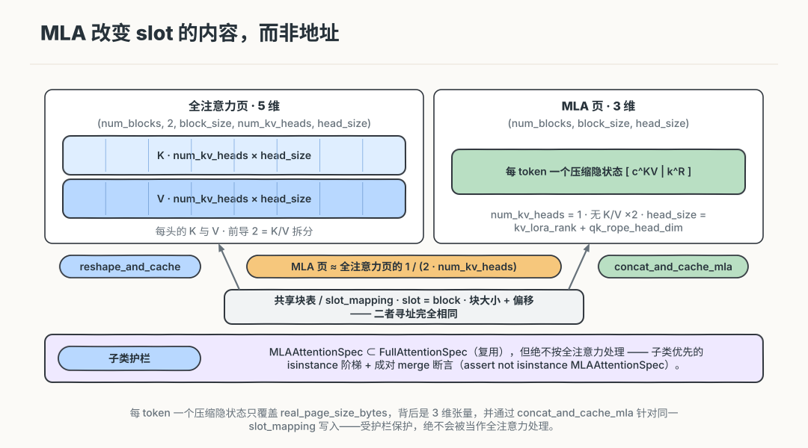</a>

<p class='figure-caption'>MLA page 使用一个 3-D `(num_blocks, block_size, head_size)` tensor，为每个 token 存储一个宽度为 `head_size` 的 latent；相比之下，完整 attention page 存储的是 5-D K/V pair。</p>

**每个 token 只存储一个 latent，而不是每个 head 都存储 K+V**

这一思路源自 DeepSeek-V2（arXiv:2405.04434，[arXiv:2405.04434](https://arxiv.org/abs/2405.04434)）：MLA 不再 cache 完整的 per-head key 和 value（对于 MHA，每个 token 需要存储 `2 * num_heads * head_dim` 个数值），而是对 key 和 value 进行 low-rank 联合压缩，得到一个宽度为 `kv_lora_rank` 的 latent vector `c^{KV}_t`，并额外保留一个宽度为 `qk_rope_head_dim`、与 RoPE 解耦的 key `k^R_t`。cache 中只存储这两部分拼接后的结果；完整的 per-head K 和 V 会通过 up-projection 动态重建，而这些 up-projection 会被吸收到 query/output projection 中，因此不会以 cache 的形式实际 materialize。这种吸收机制属于 kernel 层面的内容（第 08 篇）。在*本*层中，最终只会得到一个 projection，其输出宽度等于两个 cache 部分的宽度之和：

[`vllm/model_executor/models/deepseek_v2.py:509-516`](https://github.com/vllm-project/vllm/blob/6cf7b26bd4bff60bf378e1af14044280ac0d214c/vllm/model_executor/models/deepseek_v2.py#L509-L516)
```python
        self.kv_a_proj_with_mqa = ReplicatedLinear(
            self.hidden_size,
            self.kv_lora_rank + self.qk_rope_head_dim,
            bias=False,
            quant_config=quant_config,
            prefix=f"{prefix}.kv_a_proj_with_mqa",
        )
        self.kv_a_layernorm = RMSNorm(self.kv_lora_rank, eps=config.rms_norm_eps)
```

`kv_a_proj_with_mqa` 将 hidden state 映射为一个宽度为 `kv_lora_rank + qk_rope_head_dim` 的 vector，而拼接得到的这个单一 vector *就是* cache 中实际存放的内容。`_with_mqa` 这个后缀确实就是字面含义——MLA 的 cache 行为与只有一个共享 KV head 的 Multi-Query Attention 相同，因此后续各处都是 `num_kv_heads == 1`。压缩后的 head 宽度严格固定为该和，单 head 数量则被硬编码为：

[`vllm/model_executor/layers/attention/mla_attention.py:379-386`](https://github.com/vllm-project/vllm/blob/6cf7b26bd4bff60bf378e1af14044280ac0d214c/vllm/model_executor/layers/attention/mla_attention.py#L379-L386)
```python
        self.kv_lora_rank = kv_lora_rank
        self.kv_b_proj = kv_b_proj
        self.head_size = kv_lora_rank + qk_rope_head_dim
        self.layer_name = prefix
        self.indexer = indexer

        self.num_kv_heads = 1
        self.qk_head_dim = self.qk_nope_head_dim + self.qk_rope_head_dim
```

MLA cache 的 `head_size` 为 `kv_lora_rank + qk_rope_head_dim` 和 `num_kv_heads = 1`。相比之下，在普通 attention 中，`head_size` 表示每个 head 的 key 维度，这样的 head 一共有 `num_kv_heads` 个，而且 K 和 V 会分别存入 cache。负责生成 KV-cache spec 的 layer 在 comment 中明确记录了这一区别：

[`vllm/model_executor/models/deepseek_v2.py:628-634`](https://github.com/vllm-project/vllm/blob/6cf7b26bd4bff60bf378e1af14044280ac0d214c/vllm/model_executor/models/deepseek_v2.py#L628-L634)
```python
    def get_kv_cache_spec(self, vllm_config: VllmConfig) -> KVCacheSpec:
        return MLAAttentionSpec(
            block_size=self.cache_config.block_size,
            num_kv_heads=1,
            head_size=self.head_dim,
            dtype=self.dtype,
        )  # Only has one vector instead of K + V
```

comment `# Only has one vector instead of K + V` 的含义也是完全字面的：一个 MLA page 对每个 token 只存储**一个** latent vector，而不是为每个 head 存储一个 `(K, V)` pair。page 的字节数、tensor rank 和 merge 规则，都由 `num_kv_heads == 1` 以及不存在系数 2 这两点决定。

对于 MLA layer，KV cache 在每个 layer 中为每个 token 只保存一个压缩后的 latent（`[c^{KV} | k^R]`、宽度 `kv_lora_rank + qk_rope_head_dim`、`num_kv_heads = 1`）。完整的 per-head K 和 V 从不存储，而是在执行 attention 时通过 absorbed up-projection 重建。这正是论文关于 memory 的核心论点，也解释了为什么下面的 page size 计算中既没有 `2×`，也没有 head fan-out。

### page-size 公式：MLA 真正产生差异的地方

Page size 是整个 engine 都会紧盯的数值：在 memory profiling sweep 中，它是 `num_gpu_blocks` 的除数（也就是[第 4 节](#4-block-从何而来memory-profilingnum_gpu_blocks-与-kv-cache-配置)中的 block 大小推导流程），所有 allocator 的 budget 也都要经由它换算。MLA 只 override 了这一个属性。把三个公式并排来看。

基础 `AttentionSpec`，[`vllm/v1/kv_cache_interface.py:187-202`](https://github.com/vllm-project/vllm/blob/6cf7b26bd4bff60bf378e1af14044280ac0d214c/vllm/v1/kv_cache_interface.py#L187-L202)：
```python
    @property
    def real_page_size_bytes(self) -> int:
        if self.kv_quant_mode.is_nvfp4:
            # Packed layout: fp4 data + fp8 block scales per head.
            head_dim = nvfp4_kv_cache_full_dim(self.head_size)
        elif self.kv_quant_mode == KVQuantMode.INT4_PER_TOKEN_HEAD:
            head_dim = self.head_size // 2
        else:
            head_dim = self.head_size
        return (
            2
            * self.block_size
            * self.num_kv_heads
            * head_dim
            * get_dtype_size(self.dtype)
        )
```

`FullAttentionSpec`，[`vllm/v1/kv_cache_interface.py:309-324`](https://github.com/vllm-project/vllm/blob/6cf7b26bd4bff60bf378e1af14044280ac0d214c/vllm/v1/kv_cache_interface.py#L309-L324)：
```python
    @property
    def real_page_size_bytes(self) -> int:
        if self.kv_quant_mode.is_nvfp4:
            ...
            last_dim = nvfp4_kv_cache_full_dim(
                self.head_size
            ) + nvfp4_kv_cache_full_dim(self.head_size_v)
        elif self.kv_quant_mode == KVQuantMode.INT4_PER_TOKEN_HEAD:
            last_dim = self.head_size // 2 + self.head_size_v // 2
        else:
            last_dim = self.head_size + self.head_size_v
        return (
            self.block_size * self.num_kv_heads * last_dim * get_dtype_size(self.dtype)
        )
```

`MLAAttentionSpec`，[`vllm/v1/kv_cache_interface.py:379-398`](https://github.com/vllm-project/vllm/blob/6cf7b26bd4bff60bf378e1af14044280ac0d214c/vllm/v1/kv_cache_interface.py#L379-L398)：
```python
    @property
    def real_page_size_bytes(self) -> int:
        if self.cache_dtype_str == "fp8_ds_mla":
            if self.model_version == "deepseek_v4":
                # DeepseekV4: 448B NoPE + 128B RoPE + 8B fp8 scale = 584B per token.
                # head_size stays semantic (512); bytes are determined here.
                return self.storage_block_size * 584
            # V3.2 main MLA: 656-byte custom layout (kv_lora_rank=512 +
            # qk_rope_head_dim=64, head_size=576). See flashmla_sparse.py.
            return self.block_size * 656
        if self.kv_quant_mode == KVQuantMode.INT4_PER_TOKEN_HEAD:
            head_dim = self.head_size // 2
        else:
            head_dim = self.head_size
        return (
            self.storage_block_size
            * self.num_kv_heads
            * head_dim
            * get_dtype_size(self.dtype)
        )
```

按顺序看最后的公式：
- 基础 `AttentionSpec`：`2 * block_size * num_kv_heads * head_dim * dtype`——开头的 `2` 表示 K 和 V 各占一个 slab，再乘以 KV head 的数量。
- `FullAttentionSpec`：`block_size * num_kv_heads * (head_size + head_size_v) * dtype`——显式对 K 和 V 求和（因此 `head_size_v` 可能不同于 `head_size`），但仍然是 `× num_kv_heads`。
- `MLAAttentionSpec`：`storage_block_size * num_kv_heads(=1) * head_dim * dtype`——**没有 `2`，不做 K+V 求和，并且 `num_kv_heads` 收缩为 1**。

所以，在相同上下文下，一个 MLA page 大约比对应的 full-attention page *小* `2 × num_kv_heads` 倍。不过，实际节省的绝对量比这个倍率看起来还要可观，因为 latent width 本身很小：`get_supported_head_sizes` 将每种 MLA 配置唯一合法的 width 固定为 latent dimension，DeepSeek-V2/V3 使用 `576 = 512 (kv_lora_rank) + 64 (qk_rope_head_dim)`，较小 rank 的变体使用 `320`（下文会验证）；这些数值表示 latent vector 的 width，而不是 per-head key dim。需要注意的是，MLA 仍然沿用了[第 18 节](#18-fp8-与量化-kv-cache每字节容纳更多-token)介绍的 FP8/quantized-KV 机制：`kv_quant_mode` 和 `cache_dtype_str` 在这里选择 packed byte layout 的方式与 full attention 完全相同，而 `page_size_bytes`（`real_page_size_bytes` 的调用方，[`kv_cache_interface.py:172-185`](https://github.com/vllm-project/vllm/blob/6cf7b26bd4bff60bf378e1af14044280ac0d214c/vllm/v1/kv_cache_interface.py#L172-L185)）仍会额外加入 per-token-head scale 的存储空间，并在此基础上应用 `page_size_padded`。

所有使用 `page_size_bytes` 的地方（block 数量预算、`max_memory_usage_bytes`、`KVCacheTensor.size`）都会自动采用 MLA 更小的 page，因为 MLA 只修改了最底层的 `real_page_size_bytes`，上层逻辑完全没动。论文提出的“更小的 KV cache”，最终只需 override 一个 property 即可实现，而无需对 allocator 做特判。

**物理 tensor 是 3-D 的，write path 也按此处理**

与 page size 数值相对应的还有 tensor shape。MLA backend 的 cache tensor 完全去掉了 K/V 轴和 head 轴：

[`vllm/model_executor/layers/attention/mla_attention.py:1215-1223`](https://github.com/vllm-project/vllm/blob/6cf7b26bd4bff60bf378e1af14044280ac0d214c/vllm/model_executor/layers/attention/mla_attention.py#L1215-L1223)
```python
    @staticmethod
    def get_kv_cache_shape(
        num_blocks: int,
        block_size: int,
        num_kv_heads: int,  # assumed to be 1 for MLA
        head_size: int,
        cache_dtype_str: str = "auto",
    ) -> tuple[int, ...]:
        return (num_blocks, block_size, head_size)
```

[`vllm/model_executor/layers/attention/mla_attention.py:1236-1238`](https://github.com/vllm-project/vllm/blob/6cf7b26bd4bff60bf378e1af14044280ac0d214c/vllm/model_executor/layers/attention/mla_attention.py#L1236-L1238)
```python
    @classmethod
    def get_supported_head_sizes(cls) -> list[int]:
        return [320, 576]
```

MLA cache 是 3-D 结构 `(num_blocks, block_size, head_size)`——每个 token slot 存放一个 width 为 `head_size` 的 latent vector；`# assumed to be 1 for MLA` 中还特别注明，`num_kv_heads` 参数会被忽略。相比之下，FlashAttention 的 full-attention tensor 是 5-D 结构 `(num_blocks, 2, block_size, num_kv_heads, head_size)`（这里指 flash_attn backend；最前面的 `2` 表示 K/V 拆分，而 `num_kv_heads` 则是一个实际存在的轴）。关键在于，*block table* 并未改变：block id、paging、prefix-caching 以及 `block_table → slot_mapping` bridge（[第 20 节](#20-从-block-table-到-kernelslot_mapping-与-device-tensors)）对 MLA block 的索引方式与 full-attention block 完全相同。每个 block 仍然覆盖 `block_size` 个 token；只有每个 slot 的字节宽度变小了。

正是这种完全一致的寻址方式，让 write path 可以复用 worker 为其他所有 attention 类型计算的同一个 `slot_mapping`。full attention 会调用 `reshape_and_cache`，将彼此独立的 K 和 V scatter 到 5-D tensor 中（具体写入机制见[第 22 节](#22-reshape_and_cachetoken-kv-如何进入物理-block)）；而 MLA 则通过专用 op，将拼接后的单个 latent scatter 到 3-D tensor 中：

[`vllm/v1/attention/backend.py:1009-1029`](https://github.com/vllm-project/vllm/blob/6cf7b26bd4bff60bf378e1af14044280ac0d214c/vllm/v1/attention/backend.py#L1009-L1029)
```python
    def do_kv_cache_update(
        self,
        kv_c_normed: torch.Tensor,
        k_pe: torch.Tensor,
        kv_cache: torch.Tensor,
        slot_mapping: torch.Tensor,
        kv_cache_dtype: str,
        k_scale: torch.Tensor,
    ) -> None:
        if kv_cache.numel() == 0:
            return
        from vllm import _custom_ops as ops

        ops.concat_and_cache_mla(
            kv_c_normed,
            k_pe.squeeze(1),
            kv_cache,
            slot_mapping.flatten(),
            kv_cache_dtype=kv_cache_dtype,
            scale=k_scale,
        )
```

[`vllm/_custom_ops.py:2546-2556`](https://github.com/vllm-project/vllm/blob/6cf7b26bd4bff60bf378e1af14044280ac0d214c/vllm/_custom_ops.py#L2546-L2556)
```python
def concat_and_cache_mla(
    kv_c: torch.Tensor,
    k_pe: torch.Tensor,
    kv_cache: torch.Tensor,
    slot_mapping: torch.Tensor,
    kv_cache_dtype: str,
    scale: torch.Tensor,
) -> None:
    torch.ops._C_cache_ops.concat_and_cache_mla(
        kv_c, k_pe, kv_cache, slot_mapping, kv_cache_dtype, scale
    )
```

按步骤来看：压缩后的 latent `kv_c_normed`（经 RMSNorm 处理的 `c^{KV}`）与解耦的 RoPE key `k_pe`（`k^R`）分别作为两个独立的 tensor 传入；`concat_and_cache_mla` 将二者 concat，把拼接后的 latent 写入 `kv_cache`，写入位置由 `slot_mapping` 中的展平 offset 指定。这里的 `slot_mapping`，正是 worker 根据 block table 生成的同一个 per-token 展平 index（`slot = physical_block_id * block_size + position % block_size`，[第 20 节](#20-从-block-table-到-kernelslot_mapping-与-device-tensors)）——管理层只计算一套寻址方案，MLA 的 write op 随后将它用于 3-D tensor，而不是 5-D tensor。从 block-manager 的视角来看，一个 token 仍然恰好只占用一个 block 中的一个 slot；差别只在于 kernel 侧的元素宽度。该 op 本身的 concat/RoPE-fusion 和 dtype-scale 细节见第 08 篇。

**subclass 陷阱：为什么 MLA 绝不能按 full attention 合并**

`MLAAttentionSpec` 是 `FullAttentionSpec` 的 *subclass*，这样便可复用 `max_memory_usage_bytes`、window-merge 处理逻辑和 `page_size_bytes` wrapper，同时只需 override `real_page_size_bytes`。这种继承关系本身就像一把上了膛的枪：`MLAAttentionSpec` 能通过 `isinstance(x, FullAttentionSpec)`，因此任何根据 base type 分支的代码，都会悄无声息地把 MLA 当作 full attention，并为它分配一个按 `2×` 放大、尺寸过大的 page。两道机制化解了这一风险。

首先，kind 分类会优先检查最具体的 subclass：

[`vllm/v1/kv_cache_interface.py:860-869`](https://github.com/vllm-project/vllm/blob/6cf7b26bd4bff60bf378e1af14044280ac0d214c/vllm/v1/kv_cache_interface.py#L860-L869)
```python
    # Keep subclass checks before base classes so specialized specs keep their
    # more precise kind.
    if isinstance(kv_cache_spec, SlidingWindowMLASpec):
        return KVCacheSpecKind.SLIDING_WINDOW_MLA
    if isinstance(kv_cache_spec, MLAAttentionSpec):
        return KVCacheSpecKind.MLA_ATTENTION
    if isinstance(kv_cache_spec, SinkFullAttentionSpec):
        return KVCacheSpecKind.SINK_FULL_ATTENTION
    if isinstance(kv_cache_spec, FullAttentionSpec):
        return KVCacheSpecKind.FULL_ATTENTION
```

如果先检查 `FullAttentionSpec`、再检查 `MLAAttentionSpec`，所有 MLA spec 都会被错误标记为 `FULL_ATTENTION`。L860-861 的注释明确规定了这一顺序，因此 routing 可以安全地依赖这套 class hierarchy。

其次（也是风险更高的路径）是合并流程。`FullAttentionSpec.merge` 会阻止 MLA spec 从 base `isinstance` check 中蒙混过关：

[`vllm/v1/kv_cache_interface.py:259-279`](https://github.com/vllm-project/vllm/blob/6cf7b26bd4bff60bf378e1af14044280ac0d214c/vllm/v1/kv_cache_interface.py#L259-L279)
```python
    @classmethod
    def merge(cls, specs: list[Self]) -> Self:
        """
        Merge a list of FullAttentionSpec objects into a single
        FullAttentionSpec object.
        """
        assert all(isinstance(spec, FullAttentionSpec) for spec in specs), (
            "All attention layers in the same KV cache group must be FullAttentionSpec."
        )

        sliding_window = set(
            spec.sliding_window for spec in specs if spec.sliding_window is not None
        )
        attention_chunk_size = set(
            spec.attention_chunk_size
            for spec in specs
            if spec.attention_chunk_size is not None
        )
        assert not any(isinstance(spec, MLAAttentionSpec) for spec in specs), (
            "MLAAttentionSpec should be merged in MLAAttentionSpec.merge"
        )
```

第一个 assert（L265-267）对 MLA spec 来说实际上 *会通过*，因为它是 `FullAttentionSpec` 的 subclass；因此还需要第二个显式 assert（L277-279），拒绝任何 `MLAAttentionSpec`。如果没有这层保护，MLA layer 就会经由 `cls(...)` 被重建为普通的 `FullAttentionSpec`，从而丢失 `cache_dtype_str`、`compress_ratio`、`model_version` 以及经 override 的 page size，最终让 cache 在无声无息间膨胀到 2×。`SinkFullAttentionSpec.merge` 中也重复设置了同样的 guard（[`kv_cache_interface.py:754-756`](https://github.com/vllm-project/vllm/blob/6cf7b26bd4bff60bf378e1af14044280ac0d214c/vllm/v1/kv_cache_interface.py#L754-L756)），而它同样是 `FullAttentionSpec` 的 subclass。正确流程会收集并校验定义 MLA 的字段，然后重建一个真正的 `MLAAttentionSpec`：

[`vllm/v1/kv_cache_interface.py:400-418`](https://github.com/vllm-project/vllm/blob/6cf7b26bd4bff60bf378e1af14044280ac0d214c/vllm/v1/kv_cache_interface.py#L400-L418)
```python
    @classmethod
    def merge(cls, specs: list[Self]) -> Self:
        assert all(isinstance(spec, MLAAttentionSpec) for spec in specs), (
            "All attention layers in the same KV cache group must be MLAAttentionSpec."
        )
        cache_dtype_str_set = set(spec.cache_dtype_str for spec in specs)
        compress_ratio_set = set(spec.compress_ratio for spec in specs)
        model_version_set = set(spec.model_version for spec in specs)
        block_stride_set = set(spec.indexes_kv_by_block_stride for spec in specs)
        assert (
            len(cache_dtype_str_set) == 1
            and len(compress_ratio_set) == 1
            and len(model_version_set) == 1
            and len(block_stride_set) == 1
        ), (
            "All attention layers in the same KV cache group must use the same "
            "quantization method, compress ratio, model version, and KV block "
            "stride indexing."
        )
```

合并到同一个 KV-cache group 中的所有 layer，其字节布局必须完全一致。对于 MLA，这意味着除了 `merge` 通过读取 `specs[0]` 所假定的 shape 一致性之外，`cache_dtype_str`（物理字节布局）、`compress_ratio`（token packing）、`model_version`（是否为 deepseek_v4）以及 `indexes_kv_by_block_stride`（block-stride 索引模式）也必须相同。第一个 spec 的 runtime class 决定运行哪个 `merge`（coordinator/grouping 代码中的 `layer_specs[0].merge(layer_specs)`），因此，以 MLA 开头的列表会被 dispatch 到这里；如果某个混合列表被错误 dispatch 到 full-attention 路径，两个 `assert not ... MLAAttentionSpec` guard 就会将其拦截。

`MLAAttentionSpec ⊂ FullAttentionSpec` 是有意的复用，但绝不能把这个 subtype *当作基类处理*。优先判断 subclass 的 `isinstance` 分支链与成对的 merge assertion，可以确保分类和 grouping 过程中始终保留 single-latent page size 及 layout 字段，避免凭空产生 2× cache，或创建出字节布局相互冲突的 group。

### 压缩比、自定义 fp8 布局与 sliding-window MLA

MLA 中有两个字段专供 DeepseekV4 使用，在其他场景下默认均为 no-op。`compress_ratio` 会将多个逻辑 token 打包到一个存储 slot 中，而 page 计算公式实际乘以的是 `storage_block_size`：

[`vllm/v1/kv_cache_interface.py:375-377`](https://github.com/vllm-project/vllm/blob/6cf7b26bd4bff60bf378e1af14044280ac0d214c/vllm/v1/kv_cache_interface.py#L375-L377)
```python
    @property
    def storage_block_size(self) -> int:
        return self.block_size // self.compress_ratio
```

`storage_block_size = block_size // compress_ratio` 表示每个 block 中实际存储的 token slot 数量。使用默认的 `compress_ratio = 1` 时，DeepSeek-V2/V3 的 `storage_block_size == block_size`（不压缩）。上述 page 公式中的两个 `fp8_ds_mla` 分支会完全绕过元素大小计算，直接返回手工计算的单 token 字节数：DeepseekV4 为 584 字节（`448B NoPE + 128B RoPE + 8B fp8 scale`），V3.2 的主 MLA layout 为 656 字节。这是因为，这些自定义 FlashMLA layout 并不能简单表示为 `dtype_size × width` 的乘积。（各字段的具体构成直接照录源码注释，此处不再重新推导。）这正是 MLA 与[第 18 节](#18-fp8-与量化-kv-cache每字节容纳更多-token)的交汇之处：`cache_dtype_str == "fp8_ds_mla"` 是 MLA 专用的 quant mode，与 full attention 共用的 `kv_quant_mode` NVFP4/INT4 packing 并列存在。

DeepseekV4 还混合使用 dense MLA layer 和 sliding-window MLA layer，因此需要一种 spec：既继承 sliding-window 的 admission 逻辑，又保留 MLA 的字节布局。

[`vllm/v1/kv_cache_interface.py:592-624`](https://github.com/vllm-project/vllm/blob/6cf7b26bd4bff60bf378e1af14044280ac0d214c/vllm/v1/kv_cache_interface.py#L592-L624)
```python
@dataclass(frozen=True, kw_only=True)
class SlidingWindowMLASpec(SlidingWindowSpec):
    """Sliding window attention with MLA cache format."""

    cache_dtype_str: str | None = None
    # DeepseekV4-only: see MLAAttentionSpec.model_version.
    alignment: int | None = None  # Default to None for no padding.
    compress_ratio: int = 1
    model_version: str | None = None

    def __post_init__(self):
        _apply_alignment_padding(self)

    @property
    def storage_block_size(self) -> int:
        return self.block_size // self.compress_ratio

    @property
    def real_page_size_bytes(self) -> int:
        if self.model_version == "deepseek_v4" and self.cache_dtype_str == "fp8_ds_mla":
            # DeepseekV4 FlashMLA: 448B NoPE + 128B RoPE + 8B fp8 scale = 584B
            # per token. FlashInfer's contiguous bf16/fp8 cache falls through to
            # the element-size formula below.
            return self.storage_block_size * 584
        assert self.model_version in (None, "deepseek_v4"), (
            f"Unsupported model version: {self.model_version}"
        )
        return (
            self.storage_block_size
            * self.num_kv_heads
            * self.head_size
            * get_dtype_size(self.dtype)
        )
```

`SlidingWindowMLASpec(SlidingWindowSpec)` 从 *sliding-window* 基类（而非 `FullAttentionSpec`）派生，因此会继承 sliding-window 机制中受窗口范围限制的 block 大小计算逻辑和 `max_admission_blocks_per_request`，但它使用完全相同的单 latent 公式重新实现了 `real_page_size_bytes`。它保留了 MLA 的字节布局（每个 token 一个 latent），同时受 sliding window 的 block 数量上限约束（任一时刻仅约 `sliding_window` 个 token 驻留），因此内存占用远小于同等宽度的稠密 MLA 层。它自己的 `merge` 还要求 `sliding_window` 在 group 内保持唯一（[`kv_cache_interface.py:635,641`](https://github.com/vllm-project/vllm/blob/6cf7b26bd4bff60bf378e1af14044280ac0d214c/vllm/v1/kv_cache_interface.py#L635)）。它属于 `SLIDING_WINDOW_MLA` kind。需要注意的是，它并不是 `MLAAttentionSpec` 的子类（二者的继承体系从 `AttentionSpec` 开始分叉——一个经由 `SlidingWindowSpec`，另一个经由 `FullAttentionSpec`），因此**二者互不构成子类关系**。这也正是 kind 判定链和分组代码需要分别独立检查二者的原因。

分组逻辑以这两种 MLA 子类型为依据（这也是 DeepseekV4 接入[第 15 节](#15-coordinator-与-hybrid-kv-cache当一种-block-类型不够用时)所述 hybrid coordinator/group 的路径）：

[`vllm/v1/core/kv_cache_utils.py:1526-1534`](https://github.com/vllm-project/vllm/blob/6cf7b26bd4bff60bf378e1af14044280ac0d214c/vllm/v1/core/kv_cache_utils.py#L1526-L1534)
```python
    for name, spec in kv_cache_spec.items():
        if isinstance(spec, SlidingWindowMLASpec):
            grouped_swa_mla_specs[(spec.block_size, spec.sliding_window)][name] = spec
        elif isinstance(spec, MLAAttentionSpec):
            mla_specs[name] = spec

    assert len(mla_specs) > 0
    mla_uniform_spec = UniformTypeKVCacheSpecs.from_specs(mla_specs)
    assert mla_uniform_spec is not None
```

稠密 MLA 层会合并为一个 `UniformTypeKVCacheSpecs`；sliding-window MLA 层则按 `(block_size, sliding_window)` 进一步划分子组。这里同样先检查 `SlidingWindowMLASpec` 分支，再检查 `MLAAttentionSpec`，即优先处理更具体的子类/子类型，因为二者虽然都采用 MLA 格式，却必须进入不同的 group。单一类型 group 的 page 等于所有成员层的单 latent page 之和，因此以 layer tuple 为单位汇总时，每层较小的 MLA page 会被正确累加。

最后，即使在 platform probe 层面，page size 计算也只有一个事实来源。platform 为任何 MLA 模型估算每 token 的 page size 时，最终都会回到同一个类：

[`vllm/platforms/interface.py:799-807`](https://github.com/vllm-project/vllm/blob/6cf7b26bd4bff60bf378e1af14044280ac0d214c/vllm/platforms/interface.py#L799-L807)
```python
        # Compute attention page size for 1 token
        if model_config.use_mla:
            attn_page_size_1_token = MLAAttentionSpec(
                block_size=1,
                num_kv_heads=model_config.get_num_kv_heads(parallel_config),
                head_size=model_config.get_head_size(),
                dtype=kv_cache_dtype,
                kv_quant_mode=kv_quant_mode,
            ).page_size_bytes
```

即使是 memory profiling 期间使用的 `block_size=1` probe，也会构造一个 `MLAAttentionSpec` 并读取其 `page_size_bytes`。因此，单 latent 公式是所有 MLA 字节核算的唯一权威依据——无论是 profiling、allocator 预算，还是 tensor 大小计算。

MLA 层会为每个 token cache 一个压缩 latent（`num_kv_heads = 1`，不含 `2×`），只 override `real_page_size_bytes`，底层使用一个 3-D tensor，并通过 `concat_and_cache_mla` 按照其他所有类型共用的同一个 `slot_mapping` 写入。针对它与 `FullAttentionSpec` 的子类型关系，classification 和 merge 阶段都设置了 guard，确保它不会被当作 full attention 处理；它的 DeepseekV4 变体（`compress_ratio`、`fp8_ds_mla`、`SlidingWindowMLASpec`）扩展了布局，但没有改变寻址方式。MLA 缩小了 *slot*，却没有为 block manager 引入新的 *address*；[第 20 节](#20-从-block-table-到-kernelslot_mapping-与-device-tensors)将推导该 address，[第 22 节](#22-reshape_and_cachetoken-kv-如何进入物理-block)则会追踪物理 `concat_and_cache_mla` 写入过程。

## 20. 从 Block Table 到 Kernel：slot_mapping 与 Device Tensors

kernel 接收的是 dense device tensor，而不是 `KVCacheBlock` 对象：`[num_reqs, max_blocks]` block table 将 logical position 映射到 physical block，`slot_mapping` 则为每个 query token 提供一个展平后的 cache offset。CPU-staged 和 GPU-resident 两条路径最终都会把 manager 的 block id 归约为 `block_id * block_size + offset`。

交给 model 的 tensor 在每个 step 都必须拥有*稳定、CUDA-graph-safe 的地址和固定维度*。即使 request 不断进入、增长和离开，physical block id 也会被重新分配，这一点仍不能改变。通过 padding、persistent buffer 和单一发布点，即可提供这种稳定性。

**staging buffer：一个矩阵、三个 view、零额外拷贝**

block table 并不是一个可以直接写入的 GPU tensor。它实际是一个 `CpuGpuBuffer`，而降低其开销的关键在于：它的 numpy view 与 pinned CPU tensor 共享底层存储。

`vllm/v1/worker/block_table.py:L70-L77`

```python
        self.block_table = self._make_buffer(
            self.max_num_reqs, self.max_num_blocks_per_req, dtype=torch.int32
        )
        self.num_blocks_per_row = np.zeros(max_num_reqs, dtype=np.int32)

        self.slot_mapping = self._make_buffer(
            self.max_num_batched_tokens, dtype=torch.int64
        )
```

`vllm/v1/utils.py:L123-L142`

```python
            self.cpu = torch.zeros(
                *size, dtype=dtype, device="cpu", pin_memory=pin_memory
            )
            self.gpu = torch.zeros_like(self.cpu, device=device)
        ...
            self.np = self.cpu.numpy()

    def copy_to_gpu(self, n: int | None = None) -> torch.Tensor:
        if n is None:
            return self.gpu.copy_(self.cpu, non_blocking=True)
        return self.gpu[:n].copy_(self.cpu[:n], non_blocking=True)
```

`self.cpu` 是一个 `pin_memory` tensor（采用 page-locked memory，因此 H2D DMA 可以快速异步执行）；`self.gpu` 是它在 device 端的对应 tensor；`self.np = self.cpu.numpy()` 则是一个与 `self.cpu` *共享存储*的 numpy array。从 numpy view 到经 DMA 传往 GPU 的字节之间，不存在任何 marshalling 步骤——它们就是同一批字节。因此，CPU 侧对 block table 的每次修改都直接作用于 `block_table.np`，随后 `copy_to_gpu(n)` 会将前 `n` 行传送到 `block_table.gpu`，并使用 `non_blocking=True`。

维度设置至关重要。block table 为 `int32`，shape 是 `[max_num_reqs, max_num_blocks_per_req]`——按照最大尺寸一次性分配，此后绝不 resize。`slot_mapping` 为 `int64`（slot index 会索引完整的 flattened KV cache，而其元素数量很容易超过 2^31），size 是 `max_num_batched_tokens`。它为每个 scheduled query token 分配一个 entry，而不是为每个 request 分配。

`block_table.np`、`.cpu` 和 `.gpu` 是同一个 `[max_num_reqs, max_num_blocks_per_req]` 矩阵的三种视图：第 `r` 行对应占据 persistent batch slot `r` 的 request，第 `j` 列则对应该 request 的第 `j` 个 kernel block。只有显式执行 `copy_to_gpu` 后，GPU 才能看到这些数据。因此，runner 可以在一个 step 内随意修改 CPU 上的 table，并在 step 结束时一次性原子发布；kernel 不会在更新过程中读到撕裂数据。

**写入一行，以及真正生效的长度**

随着 request 增长，各行会逐步填充。

`vllm/v1/worker/block_table.py:L102-L122`

```python
    def append_row(
        self,
        block_ids: list[int],
        row_idx: int,
    ) -> None:
        if not block_ids:
            return

        if self.use_hybrid_blocks:
            block_ids = self.map_to_kernel_blocks(
                np.array(block_ids), self.blocks_per_kv_block, self._kernel_block_arange
            )

        num_blocks = len(block_ids)
        start = self.num_blocks_per_row[row_idx]
        self.num_blocks_per_row[row_idx] += num_blocks
        self.block_table.np[row_idx, start : start + num_blocks] = block_ids

    def add_row(self, block_ids: list[int], row_idx: int) -> None:
        self.num_blocks_per_row[row_idx] = 0
        self.append_row(block_ids, row_idx)
```

`append_row` 会从当前 tail `start = num_blocks_per_row[row_idx]` 开始写入新的 logical id，并递增 count。这正是 runner 在 `allocate_slots` 为某个 request 分配了几个新 block 时，每个 step 都会执行的调用（`gpu_model_runner.py:L1426`：`self.input_batch.block_table.append_row(new_block_ids, req_index)`）。`add_row` 唯一的区别，是会先将 count 清零，从而从头*覆盖*整行——当 persistent slot 被（重新）分配给另一个 request 时，就会使用它。

微妙之处在于 `num_blocks_per_row`。block-table tensor 的分配大小固定为 `[max_num_reqs, max_num_blocks_per_req]`，因此，大多数行的大多数列中存放的都是前一个占用者遗留的过期 id 或 0。只有 `num_blocks_per_row[r]` 才是判断第 `r` 行有多少列有效的权威依据。kernel 绝不会越界读取——其访问范围受 `query_start_loc` 和每个 token 的 position 限制，而这些 position 只能索引该 request 实际拥有的列。

由于调用 `append_row` 时从不将未使用的尾部列清零（只会重置 `add_row`/`clear_row`），因此整张表的正确性完全依赖于 `num_blocks_per_row`，同时还要求 position 绝不能超过 request 的实际长度。两次 append 之间，row 从不会被“清空”；它只会不断增长，对应的有效长度计数器也会同步增加。相比每一步都重新分配或对整个巨大矩阵执行 memset，这种做法的开销要低得多。

### kernel-block split：manager block 何时不等于 kernel block

KV cache manager 以 `kv_cache_spec.block_size` 为 block 大小进行分配，但 attention backend 可能使用一个*不同*且更小的 block 对 cache 进行索引。`BlockTable` 会在构造时协调这一差异：

`vllm/v1/worker/block_table.py:L64-L68`

```python
            self.block_size = kernel_block_size
            self.blocks_per_kv_block = block_size // kernel_block_size
            self.use_hybrid_blocks = True

        self.max_num_blocks_per_req = max_num_blocks_per_req * self.blocks_per_kv_block
```

并将每个 manager id 展开为一段连续的 kernel id：

`vllm/v1/worker/block_table.py:L193-L201`

```python
        if blocks_per_kv_block == 1:
            return kv_manager_block_ids

        kernel_block_ids = (
            kv_manager_block_ids.reshape(-1, 1) * blocks_per_kv_block
            + kernel_block_arange
        )

        return kernel_block_ids.reshape(-1)
```

假设 manager block 包含 32 个 token，而 kernel block 包含 16 个 token，则 `blocks_per_kv_block == 2`，manager id `b` 会展开为 kernel id `[b*2, b*2+1]`（docstring 中给出的示例为 `[0,1,2] -> [0,1,2,3,4,5]`）。constructor 还会按相同比例扩大 `max_num_blocks_per_req`，确保加宽后的 row 仍然能够容纳这些 id。从 `append_row` 的视角来看，这一过程完全透明：它始终以 *kernel-block units* 存储各行。

block table 始终采用 attention kernel 进行索引时所使用的 block size，而不是更粗粒度的 allocation block size。下游的 slot 计算公式（`block_id * block_size + offset`）使用 `self.block_size == kernel_block_size`，因此，manager 为提高分配效率而发放较大 block 的策略不会泄漏到 kernel 的寻址逻辑中。这正是 runner 侧与 coordinator 的 `block_size % hash_block_size == 0` lattice（[第 15 节](#15-coordinator-与-hybrid-kv-cache当一种-block-类型不够用时)）相对应的机制：二者都是为了让同一个 logical id 在每种粒度下都能明确解析。

**唯一的 publish point，提前发起以实现 overlap**

CPU table 只有一个位置会被传输到 device：

`vllm/v1/worker/block_table.py:L166-L167`

```python
    def commit_block_table(self, num_reqs: int) -> None:
        self.block_table.copy_to_gpu(num_reqs)
```

而且 runner 会最先发起这项操作，然后才构建 position 和 cumulative sequence length：

`vllm/v1/worker/gpu_model_runner.py:L1929-L1931`

```python
        # OPTIMIZATION: Start copying the block table first.
        # This way, we can overlap the copy with the following CPU operations.
        self.input_batch.block_table.commit_block_table(num_reqs)
```

`copy_to_gpu(num_reqs)` 是一次 `non_blocking=True` H2D DMA，负责传输前 `num_reqs` 行。由于该操作是 async 的，并且源数据位于 pinned memory 中，runner 发起传输后会继续执行 CPU 侧工作（组装 `req_indices`、`query_start_loc`、`positions`），与此同时，DMA 会在后台通过 copy stream 完成传输。

一个 step 中的每个 `append_row`/`add_row`/`move_row` 都必须在 `commit_block_table` *之前*写入 `block_table.np`，而读取 `block_table.gpu` 的 slot-mapping kernel 必须在*之后*运行。正是这个唯一的 publish point，才让上述顺序真正可控：不存在会与之发生 race 的增量 GPU 写入，只有“先随意修改 CPU 端数据，最后统一 flush 一次”。只传输前 `num_reqs` 行——persistent batch 始终保持紧凑排列，使 active request 占据 `[0, num_reqs)` 这些行。

### slot 公式：page table 如何化为算术寻址

`slot_mapping` 并非在 CPU 上构建，而是由 Triton kernel 根据刚刚提交的 block table 和每个 token 的绝对 `position` 在 GPU 上计算得出。

`vllm/v1/worker/block_table.py:L357-L380`

```python
    virtual_block_size = block_size * TOTAL_CP_WORLD_SIZE
    row_offset = req_idx * block_table_stride
    for i in range(start_idx, end_idx, BLOCK_SIZE):
        offsets = i + tl.arange(0, BLOCK_SIZE)
        mask = offsets < end_idx
        pos = tl.load(positions_ptr + offsets, mask=mask, other=0)
        block_indices = pos // virtual_block_size
        block_numbers = tl.load(block_table_ptr + row_offset + block_indices).to(
            tl.int64
        )

        virtual_block_offsets = pos - block_indices * virtual_block_size
        is_local = (
            virtual_block_offsets // CP_KV_CACHE_INTERLEAVE_SIZE
        ) % TOTAL_CP_WORLD_SIZE == TOTAL_CP_RANK
        local_block_offsets = (
            virtual_block_offsets // (TOTAL_CP_WORLD_SIZE * CP_KV_CACHE_INTERLEAVE_SIZE)
        ) * CP_KV_CACHE_INTERLEAVE_SIZE + (
            virtual_block_offsets % CP_KV_CACHE_INTERLEAVE_SIZE
        )

        slot_ids = block_numbers * block_size + local_block_offsets
        slot_ids = tl.where(is_local, slot_ids, PAD_ID)
        tl.store(slot_mapping_ptr + offsets, slot_ids, mask=mask)
```

该 kernel 启动时使用 grid `(num_reqs + 1,)`，每个 request 对应一个 program。因此，`req_idx == tl.program_id(0)` 会直接选中 `query_start_loc` 的一个切片（`start_idx..end_idx`，即该 request 的 query tokens），以及 block table 的*一行*（`row_offset = req_idx * block_table_stride`）。这意味着：CPU path 用于索引 block table 的 `req_idx`，与访问 `query_start_loc` 时使用的索引*相同*，因此二者必须事先保持一致——persistent batch 已按 batch order 紧凑排列，第 `r` 行对应 request `r`。（下文的 GPU path 会通过显式 index map 解除这种耦合。）

在常见情况下，context parallelism 处于关闭状态，因此 `TOTAL_CP_WORLD_SIZE == 1`，进而 `virtual_block_size == block_size`：

1. `block_indices = pos // block_size`：该 request 所在行的哪一*列*存放绝对位置为 `pos` 的 token。
2. `block_numbers = block_table[req_idx, block_indices]`：该列中存储的物理 kernel-block id。
3. `virtual_block_offsets = pos - block_indices * block_size`，也就是 `pos % block_size`：该 token 在所属 block 内的 offset。当 `TOTAL_CP_WORLD_SIZE == 1` 时，`is_local` 始终成立，而 `local_block_offsets` 恰好可化简为 `virtual_block_offsets`。
4. `slot_ids = block_numbers * block_size + local_block_offsets`——**物理 block id × block size + block 内 offset**。这个 int64 就是 attention kernel 为该 token 读写 paged KV cache 时使用的 flat index。

两个 worker path 最终都归一到这一个公式。它也正是 vLLM PagedAttention 设计文档在 kernel 侧描述的寻址方式：token 的 KV 位于 `physical_block_number`、`physical_block_offset`，对应 cache 的布局为 `[num_blocks, num_kv_heads, head_size/x, block_size, x]`（[Paged Attention 文档](https://docs.vllm.ai/en/stable/design/paged_attention/)）。context-parallel 分支（`is_local`、`local_block_offsets`）用于处理 sequence 的 tokens 被分片到多个 CP rank 的情况：每个 rank 只写入属于自己的 token，并将其他所有 token 的 slot 标记为 `PAD_ID`。

<a href='images/vllm-08-01-block-table-to-kv.svg' target='_blank'></a>
<a href='images/vllm-06-09-slot-mapping.svg' target='_blank'>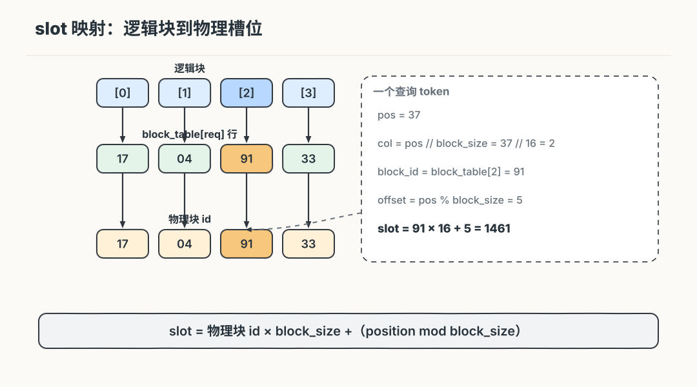</a>

<p class='figure-caption'>一个 request 的 logical block 通过其 block-table 行映射到物理 block id，而每个 query token 最终展平为 `slot = block_id * block_size + position % block_size`。</p>

grid 中最后一个 program 完全不执行寻址——它只负责 padding：

`vllm/v1/worker/block_table.py:L343-L352`

```python
    if req_idx == tl.num_programs(0) - 1:
        # Pad remaining slots for CUDA graph compatibility.
        for i in range(num_tokens, max_num_tokens, BLOCK_SIZE):
            offsets = i + tl.arange(0, BLOCK_SIZE)
            tl.store(
                slot_mapping_ptr + offsets,
                PAD_ID,
                mask=offsets < max_num_tokens,
            )
        return
```

`PAD_SLOT_ID` 为 `-1`（`vllm/v1/attention/backends/utils.py:L45`）。`slot_mapping` buffer 的宽度固定为 `max_num_batched_tokens`，但一次 step 通常调度的 token 更少；尾部 `[num_tokens, max_num_tokens)` 会被填为 `-1`。这样，始终以完整宽度启动的 CUDA-graph replay 会将 padding token 写入一个被 KV-cache write path 忽略的 sentinel slot，而不会破坏真实 block。launch 维度保持固定，未使用的位置也不会造成影响。

### 多 group fan-out，以及为何将 group id 编入 hash

混合模型包含多个 KV-cache group，各自拥有独立的 block-id namespace，block size 也可能不同。因此，block table 并非只有一张，而是*每个 group 各有一张*。

`vllm/v1/worker/block_table.py:L283-L289`

```python
    def append_row(self, block_ids: tuple[list[int], ...], row_idx: int) -> None:
        for i, block_table in enumerate(self.block_tables):
            block_table.append_row(block_ids[i], row_idx)
```

`MultiGroupBlockTable` 为每个 group 持有一个 `BlockTable`，并将每项操作按元素分发；`compute_slot_mapping` 和 `commit_block_table` 同样会遍历所有 group（`L303-L314`），为每个 group 生成一个 `slot_mapping`。每个 group 的 `BlockTable` 都带有各自的 `block_size` 和 `blocks_per_kv_block`，因此 slot 公式会使用该 group cache 对应的正确常量。

从 runner 侧来看，这正是仅用 `BlockHash` 不足以充当 cache key 的原因。pool 以 `BlockHashWithGroupId` 为键存储 block，即在 content hash 后追加 4-byte group id（[第 7 节](#7-prefix-cache-lookuphashing最长命中与最后一个-token-重计算规则)）。这是因为 full-attention group 中的 block id `b` 与 sliding-window group 中的 block id `b` 是*不同的物理 block*，通过*不同的* block table 寻址。group id 正是确保它们的 slot 永不发生 aliasing 的 tag。

group `i` 的 logical id 只会流入 `block_tables[i]`，而 group `i` 的 `slot_mapping` 则使用 group `i` 的 block size 计算。pool/hash 层所保证的 group 间独立性，在这里由 fan-out 机制严格落实：不同 group 的 index 绝不会交叉混用。

### GPU 常驻路径：staged write 与持久且 capture-safe 的 tensor

`vllm/v1/worker/gpu/block_table.py` 以不同的机制实现相同的映射：block-table row 常驻于 `StagedWriteTensor` 中，并通过*分阶段 GPU 写入*进行修改，而不是使用 numpy assignment。

`vllm/v1/worker/gpu/block_table.py:L107-L120`

```python
    def append_block_ids(
        self,
        req_index: int,
        new_block_ids: tuple[list[int], ...],
        overwrite: bool,
    ) -> None:
        for i in range(self.num_kv_cache_groups):
            start = self.num_blocks.np[i, req_index] if not overwrite else 0
            block_ids = new_block_ids[i]
            bpk = self.blocks_per_kv_block[i]
            if bpk > 1:
                block_ids = [b * bpk + k for b in block_ids for k in range(bpk)]
            self.block_tables[i].stage_write(req_index, start, block_ids)
            self.num_blocks.np[i, req_index] = start + len(block_ids)
```

这对应于 `append_row`/`add_row`：`overwrite` 表示执行 `add_row` reset（`start = 0`），否则就在当前 `num_blocks` 处 append；`bpk > 1` expansion 仍采用相同的 kernel-block 拆分，只不过以内联方式完成。但 `stage_write`（`buffer_utils.py:L155-L165`）并不操作 GPU，而只是将 `(index, start, contents, cu_len)` append 到 Python list。随后，所有写入会一次性 flush：

`vllm/v1/worker/gpu/block_table.py:L122-L132`

```python
    def apply_staged_writes(self) -> None:
        if self.num_kv_cache_groups == 1:
            # Single group: write directly, skipping the per-write group lookup.
            self.block_tables[0].apply_write()
        else:
            # Multiple groups: apply all block tables with one fused kernel.
            assert self.fused_writer is not None
            self.fused_writer.apply(
                self.block_tables, self.block_table_ptrs, self.block_table_strides
            )
        self.num_blocks.copy_to_uva()
```

单个 group 会调用 `apply_write`（通过 H2D copy 复制暂存的 index/start/content buffer，并运行 `_apply_write_kernel`，将 diff scatter 到持久化 GPU table 中，`buffer_utils.py:L174-L199`）；multi-group model 则会跨所有 group 使用一个 fused kernel。随后将 `num_blocks` 发布到 UVA：这是一个由 CPU 持有、GPU 可直接读取的 tensor。它相当于 `commit_block_table`，但不会通过 DMA 传输整行，而是仅 scatter *发生变更的*区段；如果相邻 step 之间大多数行都没有变化，这样做的开销更低。

真正传给 model 的 tensor 是独立的，并且绝不会重新分配：

`vllm/v1/worker/gpu/block_table.py:L67-L78`

```python
        # Block tables used for model's forward pass.
        # num_kv_cache_groups x [max_num_reqs, max_num_blocks]
        self.input_block_tables: list[torch.Tensor] = [
            torch.zeros_like(b.gpu) for b in self.block_tables
        ]

        self.slot_mappings = torch.zeros(
            self.num_kv_cache_groups,
            self.max_num_batched_tokens,
            dtype=torch.int64,
            device=self.device,
        )
```

`gather_block_tables` 会将 active batch 的每一行从其持久化 master slot 复制到紧凑排列的 `input_block_tables` 中（并将 padding 行清零），`compute_slot_mappings` 则负责填充 `slot_mappings`。两者返回的都是这些*同一份*预分配 tensor 的 slice。相关方法对此有明确说明：`get_dummy_slot_mappings` 和 `get_dummy_block_tables` 指出，它们“必须返回与 model forward pass 中所用 tensor 内存地址相同的持久化 tensor，而不是分配新的 tensor”（`L153-L158`、`L187-L196`），因为捕获 CUDA graph 时，tensor 地址就已经固定下来了。

CPU path 与 GPU path 在结构上的关键区别，集中体现在 slot kernel 中：

`vllm/v1/worker/gpu/block_table.py:L283-L291`

```python
        block_indices = positions // (block_size * CP_SIZE)
        block_offsets = positions % (block_size * CP_SIZE)
        block_numbers = tl.load(
            block_table_ptr + req_state_idx * block_table_stride + block_indices
        )

        if CP_SIZE == 1:
            # Common case: Context parallelism is not used.
            slot_ids = block_numbers * block_size + block_offsets
```

两者的计算方式完全相同（`slot = block_numbers * block_size + block_offsets`），但具体选择哪一行由 `req_state_idx = tl.load(idx_mapping + batch_idx)` 决定，这是一个显式的 *batch-index → persistent-request-slot* 重映射。CPU path 要求 block-table 的行预先按调度后的 batch 顺序排列（row `r` = batch position `r`）；GPU path 则维护一张以持久化 request slot 为索引的 master table，并通过 `idx_mapping` gather 成 batch 顺序。正是这层间接寻址，使其无需在 CPU 侧执行 `move_row`/`swap_row` compaction。

`slot = physical_block_id * block_size + (position % block_size)`；block table 是每个 request 的 logical→physical 映射，而 `slot_mapping` 则是该映射按 token 展平后的结果。kernel 解引用的 device tensor——CPU path 上是 `block_table.gpu[:num_reqs]`，GPU path 上是 `input_block_tables`/`slot_mappings`——每个 step 只提交一次；为支持 CUDA-graph replay，其地址和维度都保持稳定（GPU path 始终如此；CPU path 则是在固定最大 shape 下如此）。

## 21. GPU 侧 staging：device block table 与 attention metadata

GPU-resident `BlockTables` path 会将暂存的行修改压缩到 CSR buffer 中，使用一个 Triton kernel 跨所有 KV group 应用这些修改，配合 in-flight work 轮转 UVA staging buffer，并通过 `CommonAttentionMetadata` 暴露已提交的 `block_table` 和 `slot_mapping`。

kernel 看到的是每个 step 仅提交一次、并在 forward pass 开始前完成提交的 device tensor。借助这套 staging 机制，跨 group 发布数据的开销得以保持在较低水平，同时在 CUDA-graph replay 和流水线执行期间也能确保安全。

<a href='images/vllm-06-18-gpu-staging.svg' target='_blank'>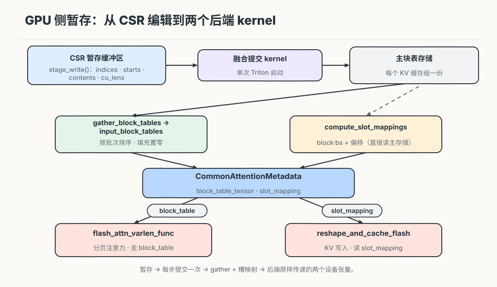</a>

<p class='figure-caption'>GPU runner 路径上的单步流程——以 CSR 形式暂存行编辑 → 单个 fused commit kernel → `gather_block_tables` 进入按 batch 顺序排列的 forward tensor，且 `compute_slot_mappings` → `CommonAttentionMetadata` → 两个读取 `block_table` 和 `slot_mapping` 的 backend kernel。</p>

**staging buffer 采用 CSR 布局，一个 kernel 即可处理完全部内容**

[第 20 节](#20-从-block-table-到-kernelslot_mapping-与-device-tensors)曾将 `stage_write` 描述为“把 `(index, start, contents, cu_len)` append 到 Python list”。这四个 list 并不是四份彼此独立的 log，而是共同组成了一种 compressed sparse row 编码，用于表示任意一组长度可变的行编辑。只有从这个角度理解它们，才能看懂 commit kernel 的工作原理。

`vllm/v1/worker/gpu/buffer_utils.py:L155-L165`

```python
    def stage_write(
        self, index: int, start: int, x: Iterable[int] | Iterable[float]
    ) -> None:
        assert index >= 0
        assert start >= 0
        if not x:
            return
        self._staged_write_indices.append(index)
        self._staged_write_starts.append(start)
        self._staged_write_contents.extend(x)
        self._staged_write_cu_lens.append(len(self._staged_write_contents))
```

每个暂存的编辑都会记录行号（`index`）和起始列（`start`），将 payload *追加*到一个扁平的 contents buffer 中，然后记录该扁平 buffer 当前的累计长度。因此，`_staged_write_cu_lens` 是 payload 长度的严格 prefix sum：第 `p` 次写入的 contents 位于 slice `[cu_lens[p-1], cu_lens[p])`。空写入会被丢弃（`if not x`），因此不会在 commit 时占用 program。这正是 values array 上的 CSR row-pointer array，只不过这里复用了这种标准 sparse matrix 布局，让单个扁平 buffer 能承载任意数量、长度各异的行追加操作，而无需为每一行分别创建 Python object 或发起 device call。

commit kernel 就是 CSR reader。single-group 路径和 fused multi-group 路径共用同一套 kernel body：

`vllm/v1/worker/gpu/buffer_utils.py:L286-L309`

```python
    pid = tl.program_id(0)
    row_idx = tl.load(write_indices_ptr + pid)
    start_idx = tl.load(write_starts_ptr + pid)

    cu_start = tl.load(write_cu_lens_ptr + pid - 1) if pid > 0 else 0
    cu_end = tl.load(write_cu_lens_ptr + pid)
    content_len = cu_end - cu_start

    if MULTI_GROUP:
        # Each write targets a different output tensor (KV cache group);
        # resolve its base pointer and row stride per write.
        group_id = tl.load(write_group_ids_ptr + pid)
        row_ptr = _load_ptr(output_ptr + group_id, tl.int32)
        row_stride = tl.load(output_stride + group_id)
    else:
        row_ptr = output_ptr
        row_stride = output_stride
    row_ptr += row_idx * row_stride + start_idx

    for i in range(0, content_len, BLOCK_SIZE):
        block = i + tl.arange(0, BLOCK_SIZE)
        mask = block < content_len
        content = tl.load(write_contents_ptr + cu_start + block, mask=mask)
        tl.store(row_ptr + block, content, mask=mask)
```

读取时，每个暂存写入对应一个 program：从 CSR array 中恢复行号（`row_idx`）、追加位置所在的列（`start_idx`），以及 contents slice `[cu_start, cu_end)`；解析出目标地址 `base + row_idx*row_stride + start_idx`；再以每块 1024 个元素的粒度流式写入 payload。single-group launch（`apply_write`、`buffer_utils.py:L189-L199`）直接传入 store 自身的 data pointer 和 stride；multi-group 分支则通过 `group_id` 解析每次写入对应的 base pointer 和 stride，而下一小节介绍的 pointer table 正是用来提供这些信息的。

这种 staging 方案保证了两项 invariant。第一，每次执行 `stage_write` 后都有 `_staged_write_cu_lens[-1] == len(_staged_write_contents)`，因此 prefix sum 始终是有效的 CSR row-pointer array，kernel 无需额外的 length array 即可恢复每个 slice。第二，每次写入只会触及其所在行的 `[start_idx, start_idx+content_len)` 列，而 `start_idx` 来自 append 前的 `num_blocks` cursor（[第 20 节](#20-从-block-table-到-kernelslot_mapping-与-device-tensors)中的 `append_block_ids`，`overwrite`-vs-append）。因此，append 绝不会覆盖已有的有效 entry，本 step 未暂存的行也完全不会被触及。换言之，对于未修改的行，commit 具有幂等性。正因如此，在包含数十个大多保持静态的行的 hybrid model 中，每个 step 只需为实际增长的少数行付出开销。

### Pointer/stride 表：单次 launch 覆盖所有 KV-cache group

混合模型的每个 KV-cache group 都有一个独立的 block-table store（[第 20 节](#20-从-block-table-到-kernelslot_mapping-与-device-tensors)中的 `MultiGroupBlockTable` 是其 numpy 对应实现）。在这条执行路径上，每个 store 都对应一块独立的 device allocation，并拥有自己的 row stride。最直接的 commit 实现会在 Python 中遍历各个 group，并为每个 group launch 一次 kernel。相比之下，`BlockTables` 会将每个 store 的原始 `data_ptr()` 和 row stride 缓存到小型 device tensor 中。这样，multi-group commit 只需一次 launch，并通过 `program_id` 索引这些表。

`vllm/v1/worker/gpu/block_table.py:L88-L105`

```python
    def init_block_table_layout_tensors(self) -> None:
        # Called at init and after a CuMem kv_cache wake-up. The ptr tensors
        # cache raw data_ptr() values that go stale once the underlying tensors
        # are reallocated on wake; block_sizes_tensor needs re-populating
        # because its storage lives under the kv_cache pool tag and comes back
        # with undefined contents.
        self.block_table_ptrs = self._make_ptr_tensor(
            [b.gpu for b in self.block_tables]
        )
        self.block_table_strides = torch.tensor(
            [b.gpu.stride(0) for b in self.block_tables],
            dtype=torch.int64,
            device=self.device,
        )
        self.block_sizes_tensor = torch.tensor(
            self.kernel_block_sizes, dtype=torch.int32, device=self.device
        )
        self.input_block_table_ptrs = self._make_ptr_tensor(self.input_block_tables)
```

`_make_ptr_tensor`（`L82-L86`）会将每个 tensor 的 `data_ptr()` 存储为 `uint64`——其中的注释说明，使用 uint64 是为了“覆盖所有可能的地址”。上文 commit kernel 的 `MULTI_GROUP` 分支会执行 `_load_ptr(output_ptr + group_id, ...)`，将 `block_table_ptrs[group_id]` 还原为 typed pointer（`_load_ptr` 会转换这个 raw integer，并断言其满足 16-byte 对齐要求，`buffer_utils.py:L312-L316`）。fused writer `FusedStagedWriter.apply`（`buffer_utils.py:L225-L271`）会将所有 group 的 CSR array 拼接成扁平 buffer，为每次写入标记对应的 `group_id`，并基于累计的 `content_base` 重新调整各 group 的 `cu_lens`，从而让各 group 的 prefix sum 首尾衔接为一个全局 CSR contents buffer。随后，只需按所有 group 的写入总数确定单次 launch 的规模，即可完成全部写入；每次写入都会通过 `block_table_ptrs`/`block_table_strides` 路由到各自的 store。

`block_table_ptrs`、`block_table_strides`、`block_sizes_tensor` 和 `input_block_table_ptrs` 缓存的是 *raw address 和 layout*，而不是 tensor handle。如果底层 store 被重新分配，缓存的 pointer 就会悬空。文档中明确提到的一种情况是 KV-cache pool 经历 CuMem sleep/wake：恢复后的 storage 位于新的地址；而对于 `block_sizes_tensor`，由于它归属于 KV-cache pool tag，其内容也处于未定义状态。正因如此，`init_block_table_layout_tensors` 被设计为幂等操作，并会在 wake 时再次调用。如果跳过这一步，所有 multi-group commit、gather 和 slot-mapping kernel 都会解引用 stale address。用一次 group-parallel launch 取代 Python group-loop 的代价就在于：只要 pool 的地址发生变化，就必须重建 pointer table。

### Round-robin UVA：staging buffer 必须在 in-flight step 结束前保持有效

这些小型 CSR index/start/cu_len array 和 `num_blocks` cursor 并不会通过显式 H2D copy 传到 device，而是使用 UVA——即 pinned host memory 上支持 device 寻址的 zero-copy view（`UvaBuffer.uva = get_accelerator_view_from_cpu_tensor(self.cpu)`、`buffer_utils.py:L48-L50`）。这里存在一个隐患：使用 pipelined engine（`batch_queue_size > 1`）时，step *N* 的 commit kernel 可能仍在读取自己的 UVA buffer，而 step *N+1* 已经开始 staging。如果始终复用同一个 buffer，下一 step 的 host 写入就可能破坏仍在执行的 launch 的输入。解决方案是使用轮转 buffer pool。

`vllm/v1/worker/gpu/buffer_utils.py:L71-L79`

```python
    def copy_to_uva(self, x: torch.Tensor | np.ndarray | list) -> torch.Tensor:
        # Round robin to the next buffer.
        self._curr = (self._curr + 1) % self.max_concurrency
        buf = self._uva_bufs[self._curr]
        # CPU-to-CPU copy
        dst = buf.cpu if isinstance(x, torch.Tensor) else buf.np
        n = len(x)
        dst[:n] = x
        return buf.uva[:n]
```

每次调用都会推进 `_curr`（对 `max_concurrency` 取模），将 payload 写入*该* pinned buffer（这只是一次开销很低的 CPU 到 CPU 拷贝），然后返回 `buf.uva[:n]`——这是一个 accelerator 可寻址窗口，GPU 可直接从中读取，无需单独执行 H2D 传输。默认深度只需设置一次：

`vllm/v1/worker/gpu/buffer_utils.py:L16-L18`

```python
# Default round-robin depth for the UVA buffer pools. Must be >= the number of
# concurrent in-flight steps (engine batch_queue_size).
_DEFAULT_MAX_CONCURRENCY = 2
```

当 pool 深度 ≥ `batch_queue_size` 时，交给步骤 *N* 的 buffer 至少要再过 `max_concurrency` 个步骤才会被复用。因此，尚未 launch（或尚未执行完毕）的 async kernel，绝不会读到已经被下一步骤覆写的 host 内存。`apply_staged_writes` 通过同一轮转机制 publish 更新后的 `num_blocks` cursor，让整套机制形成闭环——`UvaBackedTensor.copy_to_uva`（`buffer_utils.py:L108-L111`）始终将 `self.cpu`/`self.np` 作为持久化的权威数据源，并在每次 commit 时将 `self.gpu` 重新指向新的轮转 buffer。这样，片刻后读取 `self.num_blocks.gpu` 的 gather kernel 始终能看到*当前*步骤刚刚 commit 的计数，而不是被覆写到一半的值。这是 [第 20 节](#20-从-block-table-到-kernelslot_mapping-与-device-tensors) 中单次 publish `commit_block_table` 在 pipeline 安全性上的对应设计，也是 GPU 路径能够只 scatter 发生变化的 span、而无需对整行执行 DMA 的原因。

**`gather_block_tables`：连接主存储与前向 tensor 的唯一桥梁**

[第 20 节](#20-从-block-table-到-kernelslot_mapping-与-device-tensors) 已指出，GPU 路径维护一张按持久 request slot 索引的主表，并通过 `idx_mapping` 按 batch 顺序执行 gather，从而绕过 CPU 路径中的 `move_row`/`swap_row` compaction。下面就是 gather 本身的实现，它同时还充当 CUDA graph 的 padding 清零器。

`vllm/v1/worker/gpu/block_table.py:L210-L236`

```python
    # kv cache group id
    group_id = tl.program_id(0)
    batch_idx = tl.program_id(1)

    stride = tl.load(block_table_strides + group_id)
    max_num_blocks = stride  # stride equals max_num_blocks for this group.
    dst_block_table_ptr = _load_ptr(dst_block_table_ptrs + group_id, tl.int32)
    dst_row_ptr = dst_block_table_ptr + batch_idx * stride

    if batch_idx >= num_reqs:
        # Zero out padded rows.
        for i in tl.range(0, max_num_blocks, BLOCK_SIZE):
            offset = i + tl.arange(0, BLOCK_SIZE)
            tl.store(dst_row_ptr + offset, 0, mask=offset < max_num_blocks)
        return

    req_idx = tl.load(batch_idx_to_req_idx + batch_idx)
    group_num_blocks_ptr = num_blocks_ptr + group_id * num_blocks_stride
    num_blocks = tl.load(group_num_blocks_ptr + req_idx)

    src_block_table_ptr = _load_ptr(src_block_table_ptrs + group_id, tl.int32)
    src_row_ptr = src_block_table_ptr + req_idx * stride

    for i in tl.range(0, num_blocks, BLOCK_SIZE):
        offset = i + tl.arange(0, BLOCK_SIZE)
        block_ids = tl.load(src_row_ptr + offset, mask=offset < num_blocks)
        tl.store(dst_row_ptr + offset, block_ids, mask=offset < num_blocks)
```

grid 为 `(num_kv_cache_groups, num_reqs_padded)`，因此每个 program 负责一个 `(group, batch row)`。如果 `batch_idx >= num_reqs`，program 会将整个目标行清零并返回。否则，它先解析出持久 slot `req_idx = idx_mapping[batch_idx]`，再加载该 request 的有效长度 `num_blocks`；该值来自刚刚 commit 的 `num_blocks.gpu`。随后，它从主表行 `req_idx` 中精确复制相应数量的 kernel-block id，写入 batch 行 `batch_idx`（位于 `input_block_tables[group]` 中）。`stride == max_num_blocks`，因为该 store 在 `[max_num_reqs, max_num_blocks]` 上是连续的。launch 的规模特意设为 `num_reqs_padded`（`gather_block_tables`、`L134-L151`），这样 padding 行的清零就会与拷贝操作*融合进同一次 launch*，而不需要再单独执行 memset。

三点，全都与避免残留状态泄漏有关。(1) 每行只复制 `num_blocks` 个 entry，因此超出有效长度的目标列会保留此前更长占用者留下的内容；也正因如此，所有下游 consumer 都以 `seq_lens`/positions 为准，而绝不会依据目标行宽度。(2) Padding 行（`batch_idx >= num_reqs`）会被*显式*清零，因为返回的 slice 大小为 `num_reqs_padded`，并且可能被 capture 到 CUDA graph 中；如果上一个更大 batch 遗留的 block id 残存在 padding 行中，replay 时就会悄无声息地将其 gather 进来。这正是在 runtime 中落实[第 20 节](#20-从-block-table-到-kernelslot_mapping-与-device-tensors)引用自 `get_dummy_block_tables` 的同一条“持久 tensor，memory address 不变”规则。(3) 还有一个不太显眼却至关重要的事实：`compute_slot_mappings`（`L160-L185`）会直接读取*持久*的 `block_table_ptrs` store，并通过 `req_state_idx = idx_mapping[batch_idx]`（`L276`、`L285-L287`）进行索引——**而不是**读取 gather 后的 `input_block_tables`。

因此，gather 和 slot mapping 是同一个已提交 master store 的两个独立 consumer；gather 只是为了向 attention kernel 提供紧凑、按 batch 顺序排列且已清理 padding 的 block table，而 slot mapping 完全绕过它，直接根据 master row 计算 `block_number*block_size + offset`。（slot mapping 及其 `PAD_SLOT_ID` padding tail 见[第 20 节](#20-从-block-table-到-kernelslot_mapping-与-device-tensors)；这里的新发现仅在于这两个 consumer 并非串联关系。）

`gather_block_tables` 和 `compute_slot_mappings` 都在 `prepare_attn` 内运行，并且是在 `apply_staged_writes` 提交本 step 的修改之后（`model_runner.py:L1129` 负责 commit；`L1175` 调用 `prepare_attn`）。执行顺序是 stage → 一次性全部 commit → gather/slot；任何一个 consumer 都不可能观察到逐步发生的 device update。

### metadata 交接：`CommonAttentionMetadata` 与透传 builder

`prepare_attn` 只返回两个已经就绪的 device object，不返回其他内容：

`vllm/v1/worker/gpu/model_runner.py:L1021-L1037`

```python
    def prepare_attn(
        self, input_batch: InputBatch
    ) -> tuple[tuple[torch.Tensor, ...], torch.Tensor]:
        # Block tables: num_kv_cache_groups x [num_reqs_padded, max_num_blocks].
        block_tables = self.block_tables.gather_block_tables(
            input_batch.idx_mapping,
            num_reqs_padded=input_batch.num_reqs_after_padding,
        )
        # Slot mappings: [num_kv_cache_groups, num_tokens_padded].
        # Kernel pads beyond num_tokens with PAD_SLOT_ID.
        slot_mappings = self.block_tables.compute_slot_mappings(
            input_batch.idx_mapping,
            input_batch.query_start_loc,
            input_batch.positions,
            num_tokens_padded=input_batch.num_tokens_after_padding,
        )
        return block_tables, slot_mappings
```

这两个对象随后传入 `model_state.prepare_attn(input_batch, cg_mode, block_tables, slot_mappings, ...)`（`L1220-L1227`），由它组装 per-group metadata。每个 attention backend 的 `build()` 最终接收的统一对象都是 `CommonAttentionMetadata`，其中两个关键字段为：

`vllm/v1/attention/backend.py:L420-L421`

```python
    block_table_tensor: torch.Tensor
    slot_mapping: torch.Tensor
```

它的 docstring（`L396-L398`）将其描述为：“每个 batch 的 attention metadata，由各 layer 和 backend 共享。`AttentionMetadataBuilder` instance 使用它构造 per-layer metadata。”至此，整个 staging layer（CSR buffer、pointer table、UVA rotation、gather）都被屏蔽；backend 只能看到两个 device tensor。

而 backend builder *不会*对它们做任何转换。`FlashAttentionMetadataBuilder.build` 解包 `block_table_tensor = common_attn_metadata.block_table_tensor` / `slot_mapping = common_attn_metadata.slot_mapping`（`L444-L445`），并将这些引用直接写入 per-layer metadata：

`vllm/v1/attention/backends/flash_attn.py:L607-L614`

```python
        attn_metadata = FlashAttentionMetadata(
            num_actual_tokens=num_actual_tokens,
            max_query_len=max_query_len,
            query_start_loc=query_start_loc,
            max_seq_len=max_seq_len,
            seq_lens=seq_lens,
            block_table=block_table_tensor,
            slot_mapping=slot_mapping,
```

`build` 的主要工作在别处（AOT scheduler metadata、cascade/DCP 拆分）；对于这两个字段，它只是纯粹透传，而 `FlashAttentionMetadata` 又在 `flash_attn.py:L234-L235` 处重新声明了它们。

kernel 解引用的 block table 和 slot mapping，与 worker 提交的内容逐字节完全一致：无需重新推导，也无需重新布局。物理 KV 寻址的正确性*完全*由上层 staging/commit 层负责；builder 从不修改这些值，因此不可能引入不一致。正是这种清晰的职责边界，让双路径设计（[第 20 节](#20-从-block-table-到-kernelslot_mapping-与-device-tensors)的 numpy path 与此处的 GPU path）切实可行：两条路径最终都会生成相同的两个 tensor，而其下的整个 backend 并不关心它们来自哪条路径。

**两个使用方与原地 re-bind**

下游恰好只有两个 kernel 会解引用这些 tensor。`slot_mapping` 负责执行 KV-cache scatter：

`vllm/v1/attention/backends/flash_attn.py:L1033-L1042`

```python
        reshape_and_cache_flash(
            key,
            value,
            key_cache,
            value_cache,
            slot_mapping,
            self.kv_cache_dtype,
            layer._k_scale,
            layer._v_scale,
        )
```

`slot_mapping[t]` 是 token `t` 对应的一维物理 slot；`reshape_and_cache_flash` 会将每个 token 的 K/V scatter 到相应位置，而 `PAD_SLOT_ID = -1` tail（[第 20 节](#20-从-block-table-到-kernelslot_mapping-与-device-tensors)）不会写入任何位置。其附近的注释（`L1028-L1032`）指出，该 op“通过 `slot_mapping` 的 shape 确定实际 token 数量”——因此，token 数量取决于 `slot_mapping` *未经 padding*的长度，而不是经过 padding 的 query tensor。`block_table` 负责驱动 paged attention：

`vllm/v1/attention/backends/flash_attn.py:L952-L966`

```python
                flash_attn_varlen_func(
                    q=query[:num_actual_tokens],
                    k=key_cache,
                    v=value_cache,
                    out=output[:num_actual_tokens],
                    cu_seqlens_q=cu_seqlens_q,
                    max_seqlen_q=max_seqlen_q,
                    seqused_k=seqused_k,
                    max_seqlen_k=max_seqlen_k,
                    softmax_scale=self.scale,
                    causal=causal,
                    alibi_slopes=self.alibi_slopes,
                    window_size=sliding_window_size,
                    block_table=block_table,
                    softcap=self.logits_soft_cap,
```

`block_table`（在 `L845` 处绑定为 `= attn_metadata.block_table`）是 varlen kernel 遍历的 paging map。在 attention 过程中，kernel 通过它收集每个 request 中非连续的 K/V page——这正是[第 20 节](#20-从-block-table-到-kernelslot_mapping-与-device-tensors)在批评 vAttention 时所指的具体间接寻址机制。

最后，对于声明支持 `supports_update_block_table: bool = True`（`flash_attn.py:L327`）的 backend，runner 可以在无需完整重建的情况下，将 paging 切换到一个已经构建好的 metadata 对象上：

`vllm/v1/attention/backends/flash_attn.py:L659-L668`

```python
    def update_block_table(
        self,
        metadata: FlashAttentionMetadata,
        blk_table: torch.Tensor,
        slot_mapping: torch.Tensor,
    ) -> FlashAttentionMetadata:
        new_metadata = copy.copy(metadata)
        new_metadata.block_table = blk_table
        new_metadata.slot_mapping = slot_mapping
        return new_metadata
```

浅层 `copy.copy` *只会*重新指向 `block_table` 和 `slot_mapping`；其余所有字段（AOT scheduler metadata、cascade state、DCP context length）都与原对象共享。因此，当 paging 在执行过程中发生变化时，backend 只会 re-bind 这两个与物理布局相关的 tensor。staging 层每个 step 生成一次这两个 tensor，backend 随后在[第 22 节](#22-reshape_and_cachetoken-kv-如何进入物理-block)中将它们用于物理 KV 写入；[第 23 节](#23-physical-block-的生命周期分配使用释放进入-cache淘汰)则会继续追踪对应 block 的完整生命周期。

## 22. reshape_and_cache：token KV 如何进入物理 block

`block_table` 和 `slot_mapping` 是地址，而不是数据。`reshape_and_cache` 是按 step、按 layer 执行的 CUDA/Triton scatter，负责将新计算出的 K 和 V 值写入这些 slot——这正是在 prefix-cache index 中发布已完成 block 这一逻辑动作所对应的物理操作。

**`slot_mapping[token_idx]` 决定 token 的 KV 写入何处。** write kernel 根据这个整数推导出 `(block, offset)`，并且绝不会解引用 `block_table`，因为[第 21 节](#21-gpu-侧-stagingdevice-block-table-与-attention-metadata)中的构造过程已经把查表结果编码进 slot。第 08 篇中的 read 会反向执行同一套算术运算，因此两端使用的是同一个物理地址。

<a href='images/vllm-06-29-reshape-cache.svg' target='_blank'>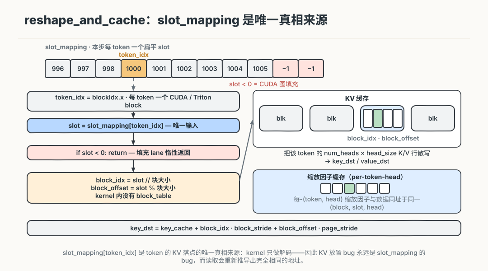</a>

<p class='figure-caption'>图：每个 token 对应一个 CUDA block，负责解码 `slot → (block_idx, block_offset)`，并将该 token 的 K/V scatter 到对应的物理 page；`slot = -1` lane 不执行任何操作。</p>

### write 是 torch.compile 的副作用，并被安排在 read 之前执行

KV write 并不是 attention 的数据输出，而是一个刻意引入的*副作用*。它被安排在 attention read 之前执行，以确保第 *t* 步的 read 能看到第 *t* 步的 token。调用点位于 `unified_kv_cache_update` wrapper 中；该 wrapper 之所以要返回一个值，就是为了在 `torch.compile` 下固定这一执行顺序。

[`vllm/model_executor/layers/attention/attention.py:774-792`](https://github.com/vllm-project/vllm/blob/6cf7b26bd4bff60bf378e1af14044280ac0d214c/vllm/model_executor/layers/attention/attention.py#L774-L792)
```python
    """
    Returns a dummy that is passed to unified_attention to signal a side effect and
    the data dependency between them to ensure torch.compile preserves ordering.
    """
    layer_name = _resolve_layer_name(layer_name)
    _, attn_layer, kv_cache, layer_slot_mapping = get_attention_context(layer_name)
    if layer_slot_mapping is not None:
        assert hasattr(attn_layer.impl, "do_kv_cache_update"), (
            f"{attn_layer.impl.__class__.__name__} does not support kv cache update"
        )
        attn_layer.impl.do_kv_cache_update(  # type: ignore[attr-defined]
            attn_layer,
            key,
            value,
            kv_cache,
            layer_slot_mapping,
        )

    return torch.empty(0, device=kv_cache.device, dtype=kv_cache.dtype)
```

对照 docstring 来看：`layer_slot_mapping` 是从 `ForwardContext` 中取得的、每个 layer 独有的 `slot_mapping`（`forward_context.slot_mapping` 是一个以 layer name 为 key 的 dict，参见 [`attention.py:761-765`](https://github.com/vllm-project/vllm/blob/6cf7b26bd4bff60bf378e1af14044280ac0d214c/vllm/model_executor/layers/attention/attention.py#L761-L765)）。它对 write 进行*门控*——遇到 `None` entry（即该 layer 不持有 KV cache）时，会完全跳过 scatter。随后，该函数返回 `torch.empty(0, ...)`。这是一个零元素 dummy，其唯一作用正如 [`attention.py:774-776`](https://github.com/vllm-project/vllm/blob/6cf7b26bd4bff60bf378e1af14044280ac0d214c/vllm/model_executor/layers/attention/attention.py#L774-L776) 处的 docstring 所述，是“发出存在副作用和数据依赖关系的信号……以确保 torch.compile 保持执行顺序”。正是这个伪数据依赖，阻止 compiler 将 scatter 移到同一 layer 的 attention read *之后*。

**执行顺序：** 第 *t* 步 token 的 scatter-write 会被 compiler 固定在消费这些 token 的 read 之前执行；如果没有 empty-tensor 返回值，`torch.compile` 就可以合法地重排纯副作用 op 与 read，导致 read 读取到过期的 KV。

**`do_kv_cache_update`：对 cache 执行 unbind，让 `slot_mapping` 决定 token 数量**

物理 write 的 dispatch 逻辑位于 backend impl 中。以 FlashAttention 为例：

[`vllm/v1/attention/backends/flash_attn.py:1017-1042`](https://github.com/vllm-project/vllm/blob/6cf7b26bd4bff60bf378e1af14044280ac0d214c/vllm/v1/attention/backends/flash_attn.py#L1017-L1042)
```python
        if self.attn_type in (AttentionType.ENCODER_ONLY, AttentionType.ENCODER):
            # For encoder attention,
            # we use direct Q, K, V tensors without caching
            return

        # Scatter write into the KV cache using slot_mapping indices.
        # No TMA kernel is invoked here, so stride canonicalization is not needed.
        key_cache, value_cache = kv_cache.unbind(1)

        # Reshape the input keys and values and store them in the cache.
        # Skip this if sharing KV cache with an earlier attention layer.
        # NOTE(woosuk): Here, key and value are padded while slot_mapping is
        # not padded. However, we don't need to do key[:num_actual_tokens]
        # and value[:num_actual_tokens] because the reshape_and_cache_flash
        # op uses the slot_mapping's shape to determine the number of
        # actual tokens.
        reshape_and_cache_flash(
            key,
            value,
            key_cache,
            value_cache,
            slot_mapping,
            self.kv_cache_dtype,
            layer._k_scale,
            layer._v_scale,
        )
```

这里有三个关键点。第一，encoder / encoder-only layer 会提前执行 `return`（`L1017-1020`）：其 Q/K/V 会被直接消费，不会进入 paged cache，因此没有可供写入的 slot（参见[第 17 节](#17-encoder-cache-manager面向多模态的同级-allocator)）。第二，`key_cache, value_cache = kv_cache.unbind(1)` 会生成底层 FlashAttention tensor 的 view，因此 store 无需 copy 或重新 materialize。第三，`NOTE(woosuk)` 处的注释（`L1028-1032`）区分了经过 CUDA graph padding 的 `key`/`value` 与长度精确的 `slot_mapping`。该 op 直接采用后者的长度，因此无需执行 `key[:num_actual_tokens]` slice。

**token count：**写入的 token 数等于 `slot_mapping.shape[0]`，与（经过 CUDA-graph padding 的）`key`/`value` leading dimension 无关。如果反过来把这里弄错，转而信任 `key.size(0)`，CUDA-graph padding token 就会把垃圾数据 scatter 到 block 0。

Python `reshape_and_cache_flash` 符号本身也会按 platform dispatch：在 CUDA 上，它绑定到 C++ custom op（[`fa_utils.py:21-22`](https://github.com/vllm-project/vllm/blob/6cf7b26bd4bff60bf378e1af14044280ac0d214c/vllm/v1/attention/backends/fa_utils.py#L21-L22)，`from vllm._custom_ops import reshape_and_cache_flash`）；在 XPU 上绑定到 `ops.reshape_and_cache_flash`；其他 backend（例如 `triton_attn`）则替换为 Triton 实现。它们都采用同一个 8 参数 signature，透传 wrapper 只是一层很薄的 shim：

[`vllm/_custom_ops.py:2457-2476`](https://github.com/vllm-project/vllm/blob/6cf7b26bd4bff60bf378e1af14044280ac0d214c/vllm/_custom_ops.py#L2457-L2476)
```python
def reshape_and_cache_flash(
    key: torch.Tensor,
    value: torch.Tensor,
    key_cache: torch.Tensor,
    value_cache: torch.Tensor,
    slot_mapping: torch.Tensor,
    kv_cache_dtype: str,
    k_scale: torch.Tensor,
    v_scale: torch.Tensor,
) -> None:
    torch.ops._C_cache_ops.reshape_and_cache_flash(
        key,
        value,
        key_cache,
        value_cache,
        slot_mapping,
        kv_cache_dtype,
        k_scale,
        v_scale,
    )
```

### placement 地址计算：`slot → (block_idx, block_offset)`，完全不见 block_table

CUDA kernel 将扁平的 slot 整数转换为物理地址。launcher 直接从 `slot_mapping` 获取 token 数：

[`csrc/libtorch_stable/cache_kernels.cu:761-767`](https://github.com/vllm-project/vllm/blob/6cf7b26bd4bff60bf378e1af14044280ac0d214c/csrc/libtorch_stable/cache_kernels.cu#L761-L767)
```c++
  // In vLLM V1, however, key.size(0) can be larger than slot_mapping.size(0)
  // since key includes padding for CUDA graphs, while slot_mapping does not.
  // In this case, slot_mapping.size(0) represents the actual number of tokens
  // before padding.
  // For compatibility with both cases, we use slot_mapping.size(0) as the
  // number of tokens.
  int num_tokens = slot_mapping.size(0);
```

launch grid 中，每个 token 对应一个 thread block。整个 placement 决策都在 kernel body 中完成，一共只有六行：

[`csrc/libtorch_stable/cache_kernels.cu:326-344`](https://github.com/vllm-project/vllm/blob/6cf7b26bd4bff60bf378e1af14044280ac0d214c/csrc/libtorch_stable/cache_kernels.cu#L326-L344)
```c++
  const int64_t token_idx = blockIdx.x;
  const int64_t slot_idx = slot_mapping[token_idx];
  // NOTE: slot_idx can be -1 if the token is padded
  if (slot_idx < 0) {
    return;
  }
  const int64_t block_idx = slot_idx / block_size;
  const int64_t block_offset = slot_idx % block_size;
  const int n_elems = num_heads * head_size;

  // pointers to the beginning of the source row for this token.
  const scalar_t* __restrict__ key_src = key + token_idx * key_stride;
  const scalar_t* __restrict__ value_src = value + token_idx * value_stride;

  // find the start position inside the kv-cache for this token.
  cache_t* __restrict__ key_dst =
      key_cache + block_idx * block_stride + block_offset * page_stride;
  cache_t* __restrict__ value_dst =
      value_cache + block_idx * block_stride + block_offset * page_stride;
```

逐行来看：`token_idx = blockIdx.x`——这个 CUDA block 只负责一个 token。`slot_idx = slot_mapping[token_idx]`——这是唯一的事实来源，不会再查询任何其他信息。kernel 的参数列表（[`cache_kernels.cu:315-325`](https://github.com/vllm-project/vllm/blob/6cf7b26bd4bff60bf378e1af14044280ac0d214c/csrc/libtorch_stable/cache_kernels.cu#L315-L325)）接收 `slot_mapping`、用于定位和复制 row 的 block/page/key/value stride，以及 scale pointer，**但根本没有 `block_table` pointer**；block identity 已经编码在 `slot` 中。`if (slot_idx < 0) return;` 会丢弃 padding lane：`-1` slot 表示“这里没有真实 token”，因此 CUDA-graph padding token 不会生效，也不会破坏 block 0（构造 slot mapping 时，`-1` 会被写入 padded tail，参见[第 21 节](#21-gpu-侧-stagingdevice-block-table-与-attention-metadata)；这个 kernel 只负责识别该 sentinel）。

接下来是 `block_idx = slot_idx / block_size` 和 `block_offset = slot_idx % block_size`——**它们恰好是 `slot = block_id * block_size + offset` 的逆运算**。扁平整数由此拆解为二元组：（对应哪个物理 block，以及位于该 block 内的哪一行）。最后是 `key_dst = key_cache + block_idx * block_stride + block_offset * page_stride`：`block_stride` 跨过一个完整 block，`page_stride` 跨过 block 内的一个 token slot。随后，以 vectorized 方式将 `n_elems = num_heads * head_size` 个元素从源 row 复制到目标 row（该 copy 针对 NHD 提供连续 head fast path，针对 HND 提供逐 head fast path；layout 机制属于第 08 篇介绍的 read 侧内容）。

**Placement：**`KVcache[block_idx][block_offset] ← token`，其中这个二元组由 `slot = slot_mapping[token_idx]` 推导得出。read kernel（第 08 篇）会解码同一个整数。vAttention 所批评的 block-table 间接寻址（[第 26 节](#26-kv-cache-调优基于配置的运维指南)）在上游已经完成；位于 hot path 的 per-step kernel 只需解码最终得到的 slot。

**fp8 KV cache：写入时应用该 layer 的静态 scale**

当 cache dtype 为 fp8 时，copy 并非简单的类型转换，而是量化。逐元素 op 会根据 KV dtype 在 compile time 选择不同分支：

[`csrc/libtorch_stable/cache_kernels.cu:242-252`](https://github.com/vllm-project/vllm/blob/6cf7b26bd4bff60bf378e1af14044280ac0d214c/csrc/libtorch_stable/cache_kernels.cu#L242-L252)
```c++
struct CopyWithScaleOp {
  float scale;

  __device__ __forceinline__ void operator()(OutT& dst, const InT src) const {
    if constexpr (kv_dt == Fp8KVCacheDataType::kAuto) {
      dst = static_cast<OutT>(src);
    } else {
      dst = fp8::scaled_convert<OutT, InT, kv_dt>(src, scale);
    }
  }
};
```

对于非量化 cache（`kAuto`：fp16/bf16/fp32），写入只是普通的 `static_cast`，不会用到 `scale`。对于 fp8 cache，`fp8::scaled_convert(src, scale)` 会先除以 scale，再打包为 fp8；其中 `scale` 取自 `layer._k_scale` / `layer._v_scale`，也就是一路传递给 `do_kv_cache_update` 的同一组 tensor。scale 可以是单个 `[1]` 值（fast path），也可以是每个 head 一个 `[num_heads]` vector（HND branch）。Triton static-scale path 与 CUDA `CopyWithScaleOp` 的语义一致（`key_load / tl.load(k_scale)`，其中 `tl.store` 会隐式 cast 为 fp8），因此 backend 可以任选一个 kernel，语义完全相同。

**FP8 往返转换：** 存储值为 `convert_to_fp8(src / scale)`；读取时（第 08 篇）会乘以相同的 `layer._k_scale`/`_v_scale`。如果 scale 不同，每个 cache 值都会整体缩放一个固定倍数。

### 动态 per-token-head 量化：scale 随数据一同计算，*并一同存储*

除了 static-scale path，还存在第二个写入 kernel，用于 INT8 / FP8 *per-(token, head)* 量化。在这条 path 中，scale 并非 layer 级常量，而是在写入时根据数据计算出来，并持久化到配套的 scale cache 中。此时，物理写入确实不再只是搬运字节：

[`vllm/v1/attention/ops/triton_reshape_and_cache_flash.py:187-229`](https://github.com/vllm-project/vllm/blob/6cf7b26bd4bff60bf378e1af14044280ac0d214c/vllm/v1/attention/ops/triton_reshape_and_cache_flash.py#L187-L229)
```python
    tok = tl.program_id(0)
    head = tl.program_id(1)

    slot = tl.load(slot_mapping_ptr + tok).to(tl.int64)
    if slot < 0:
        return

    blk = slot // block_size
    slot_in_blk = slot % block_size
    ...
    tl.store(
        k_scale_cache_ptr
        + blk * stride_ks_blk
        + slot_in_blk * stride_ks_slot
        + head * stride_ks_head,
        k_scale,
    )
    ...
```

grid 现在变为 2-D（`(token, head)`），但位置 decode 逻辑不变：`slot < 0` 时 skip，然后是 `blk = slot // block_size`、`slot_in_blk = slot % block_size`。本节关注的 KV 管理要点是 scale *共址*：per-head scale 会写入一个**并行维护的 scale cache**，并与量化数据位于相同的 `(blk, slot_in_blk, head)` coordinate，因此一次 slot decode 就能同时寻址这两个 tensor。至于 *数值* 变换本身——absmax → scale → clamp、int path 的 half-away-from-zero rounding，以及 `QUANT_MAX`/`QUANT_MIN` 边界（取自 cache dtype，即 `_PER_TOKEN_HEAD_QUANT_PARAMS`、[`triton_reshape_and_cache_flash.py:266-269`](https://github.com/vllm-project/vllm/blob/6cf7b26bd4bff60bf378e1af14044280ac0d214c/vllm/v1/attention/ops/triton_reshape_and_cache_flash.py#L266-L269)）——则属于第 08 篇讲解的 kernel 算术。这也正是 [第 18 节](#18-fp8-与量化-kv-cache每字节容纳更多-token) 划定的职责边界：该节将“absmax、clamp、INT4 Hadamard rotation”留给第 08 篇。

**Scale 共址：** 动态 per-token-head 量化会将生成的 scale 存储在与数据相同的 `(block, slot, head)` coordinate 上，读取端通过一次 slot decode 即可同时找到二者。

### 横向关联：MLA 与 speculative decoding

两条相关的写入 path 被有意安排在相邻小节中，因此有必要准确厘清二者的边界。

**MLA 使用不同的 op 执行写入，其 page 布局也不同。** DeepSeek-style Multi-head Latent Attention 不会分别存储 K 和 V；它只 cache 一份压缩后的 latent 和一个 RoPE key。因此，实际执行写入的不是 `reshape_and_cache_flash`，而是 `concat_and_cache_mla`（[`vllm/_custom_ops.py:2546-2556`](https://github.com/vllm-project/vllm/blob/6cf7b26bd4bff60bf378e1af14044280ac0d214c/vllm/_custom_ops.py#L2546-L2556)）。后者的 signature 接收 `kv_c`、`k_pe`、一个 `kv_cache` tensor、`slot_mapping`，以及单个 `scale`。注意，这里没有可供 unbind 的独立 `value_cache` view，也只有一个 scale。从管理角度看，这意味着每个 page 保存的是一行 latent-plus-rope 数据，而不是一对 `[2, block_size, heads, head_size]` K/V，因此以 byte 计的 page size 和 `storage_block_size` 都会不同；这属于[第 19 节](#19-mla压缩-latent-kv-cache)讨论的范畴。至于 MLA *kernel* 的数学计算，即 read 时如何对 latent 做 up-projection，则见第 08 篇。

MLA 的 write 仍会消费同一个 `slot_mapping`，并使用 `slot = block*block_size + offset`，因此上述 placement 计算可以原封不动地沿用。

**Speculative decoding 关注的是 KV 分配，而不是 write kernel。** scatter kernel 完全不关心 token 是已验证还是 speculative；它只会写入 `slot_mapping` 指定的位置。真正微妙之处在上游的 `allocate_slots`：token 布局中的 `new` 区域明确包含尚未验证的 draft token，而 `lookahead` 区域还会为 speculative position 预留额外 slot（见[第 9 节](#9-allocate_slots-是策略栈而不是一次-allocation)；完整的 spec-decode 流程见[第 14 节](#14-speculative-decoding-遇上-kv-cachelookahead-slots-与-rollback)）。这些 lookahead slot 会获得真实有效的 `slot_mapping` 条目，因此在当前 step 中，proposer 的 draft K/V *确实会*写入 block。

绝不能将这部分 KV 当作已经最终确认的数据写入 cache。因此，prefix cache 会将写入范围截断至 `request.num_tokens`，把 draft token 排除在外（仍见[第 9 节](#9-allocate_slots-是策略栈而不是一次-allocation)）。一旦 draft 被拒绝，block table 可以回退 processed-token 边界，而这些 slot 随后会在某个 step 中被直接覆盖。由于 placement 是 `slot` 的无状态函数，因此无需清理底层的物理字节；后续再次写入同一个 `slot` 时，这些内容会被覆盖，而且 prefix cache 从未发布过它们。proposer 自身的工作机制，即如何生成并验证 draft token，见第 12 篇。

## 23. physical block 的生命周期：分配、使用、释放、进入 cache、淘汰

一个 physical block 是 `num_gpu_blocks` 记录之一，会在整个 process 生命周期内反复复用。它的 `block_id` 始终不变，但状态会在 free、allocated、shared、cached-but-free、evicted 和 reallocated 之间循环切换。三个字段共同编码这些状态，而 pool 的各个 mutator 会维护 ownership 与 free queue membership 之间的一条核心关系。

<a href='images/vllm-06-10-block-lifecycle.svg' target='_blank'>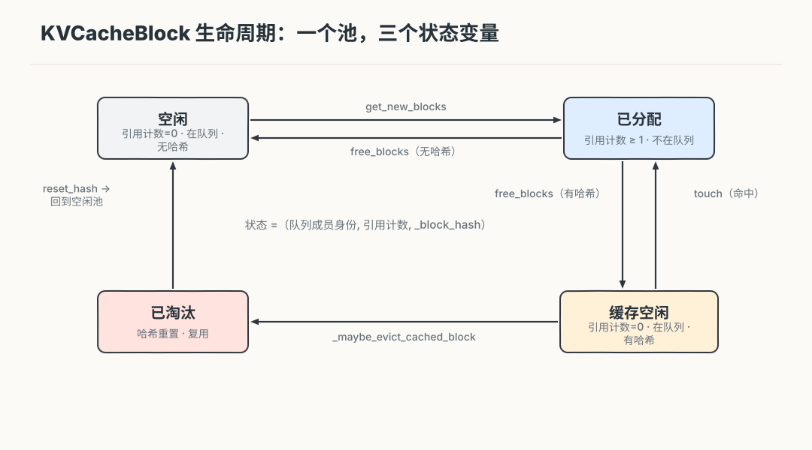</a>

<p class='figure-caption'>`KVCacheBlock` 的生命周期——以 free queue 归属关系、`ref_cnt` 和 `_block_hash` 作为三个状态变量，并由 pool method 完成状态转换。</p>

### 三个状态变量

每个物理 block 都恰好由一个 `KVCacheBlock` 描述。它是一个 `slots=True` dataclass，因此 pool 能以很低的成本容纳数十万个这样的对象（`vllm/v1/core/kv_cache_utils.py:L117-L138`；各字段的完整解析见[第 3 节](#3-kvcacheblock-与-blockpoolfree-list-是一种淘汰结构)）。

block 的状态由元组 `(ref_cnt, _block_hash, free-list membership)` 表示。`block_id` *不是*状态，而是不可变的身份标识。正因如此，block table 才能采用只追加模式，cache map 也刻意永不去重。对于每个非 null block，其 queue 归属关系都遵循以下规则：

> **`ref_cnt == 0` ⇔ 该 block 当前链接在 free queue 中，并且是可被淘汰的候选项。**

`_block_hash` 与上述关系彼此独立：一个 block 即使位于 free queue 中（`ref_cnt == 0`），仍可保留有效的 cache identity。这种 free-but-cached 状态能够以很低的开销实现 prefix 复用。该字段在 reset 前只能写入一次，并通过两个受保护的 method `set_block_hash` 和 `reset_hash` 暴露（`vllm/v1/core/kv_cache_utils.py:L148-L162`，引文见[第 3 节](#3-kvcacheblock-与-blockpoolfree-list-是一种淘汰结构)）。

`set_block_hash` 会断言当前 block 没有 hash，因此，从“已有 hash”恢复为“可设置”状态的唯一路径是 `reset_hash`，并且它只会在淘汰时触发。这可以防止在不知不觉中对仍有效的 block 重新设定 key——这种覆盖操作会导致 `cached_block_hash_to_block` 继续指向一个该 block 已不再声明的 key，进而产生虚假的 cache hit，并解析到错误的 KV。

有一个 block 从不参与这套机制。pool 构造时，null block 会被从 free queue 中单独划出，并永久排除在外。

源码定位 — `vllm/v1/core/block_pool.py:L188-L192`：

```python
        # To represent a placeholder block with block_id=0.
        # The ref_cnt of null_block is not maintained, needs special care to
        # avoid freeing it.
        self.null_block = self.free_block_queue.popleft()
        self.null_block.is_null = True
```

`touch` 和 `free_blocks` 会排除 `is_null`，因为 sentinel 的 `ref_cnt` 没有实际意义，而且它绝不能进入 free queue 或 cache map。这样一来，sliding-window 和 chunked-local manager 就能为 block table 中跳过的 slot 提供有效的 block id，而无须分配真实存储空间。

**分配：`get_new_blocks` 从 LRU 队首取出匿名容量**

分配是 pool 获取新存储空间的唯一入口。它会从 queue 中 least-recently-used 的队首取出调用方并不关心具体身份的 block；调用方只要求“给我 `num_blocks` 份空闲容量”。

源码定位 — `vllm/v1/core/block_pool.py:L542-L572`：

```python
    def get_new_blocks(self, num_blocks: int) -> list[KVCacheBlock]:
        """Get new blocks from the free block pool.

        Note that we do not check block cache in this function.

        Args:
            num_blocks: The number of blocks to allocate.

        Returns:
            A list of new block.
        """
        if num_blocks > self.get_num_free_blocks():
            raise ValueError(f"Cannot get {num_blocks} free blocks from the pool")

        ret: list[KVCacheBlock] = self.free_block_queue.popleft_n(num_blocks)

        # In order to only iterate the list once, we duplicated code a bit
        if self.enable_caching:
            for block in ret:
                self._maybe_evict_cached_block(block)
                assert block.ref_cnt == 0
                block.ref_cnt += 1
                if self.metrics_collector:
                    self.metrics_collector.on_block_allocated(block)
        else:
            for block in ret:
                assert block.ref_cnt == 0
                block.ref_cnt += 1
                if self.metrics_collector:
                    self.metrics_collector.on_block_allocated(block)
        return ret
```

容量检查就在*这里*提前完成，依据是 `get_num_free_blocks()`——queue 维护的 O(1) counter，而不是等到修改 linked list 时再做（`popleft_n` 自身的 assert 只是第二道保险）。代码有意重复了开启 cache 和关闭 cache 两个分支（“我们稍微重复了一点代码”），以确保 hot loop 只需对 `ret` 做一次遍历，无须针对每个 block 执行分支判断。无论走哪个分支，`assert block.ref_cnt == 0` 都会检查上述 queue 不变量：如果 free list 中的 block 仍被引用，就说明数据结构已经损坏。随后，`ref_cnt += 1` 占用该 block。

开启 cache 的分支会在占用 block *之前*执行 `_maybe_evict_cached_block`，这个执行顺序正是关键所在。

每个从 `get_new_blocks` 返回的 block 都确实处于 free 状态（`ref_cnt == 0`）；而且在启用 cache 时，调用方接触它之前，其残留的 prefix-cache 身份信息已经被清除。因此，回收后的 block 绝不可能因为上一位使用者的 token 而被解析为虚假 cache hit；提前进行的容量检查也确保 pool 不会做出超出实际容量的承诺。

### Evict：`_maybe_evict_cached_block` 在复用存储空间前销毁身份信息

`get_new_blocks` 从 LRU 队首取走了一个未指定的 block，但这个 block 可能仍处于 *cached* 状态——它可能仍携带 `_block_hash`，也仍可通过 prefix-cache map 访问。要复用其物理存储，必须先切断所有可能解析到它的路径。

源码锚点 — `vllm/v1/core/block_pool.py:L574-L595`：

```python
    def _maybe_evict_cached_block(self, block: KVCacheBlock) -> bool:
        """
        If a block is cached in `cached_block_hash_to_block`, we reset its hash
        metadata and evict it from the cache.

        Args:
            block: The block to evict.

        Returns:
            True if the block is evicted, False otherwise.
        """
        # Clean up metrics tracking first to prevent leaks
        if self.metrics_collector:
            self.metrics_collector.on_block_evicted(block)

        evicted_hashes = self._remove_cached_block_hashes(block)
        if not evicted_hashes:
            # The block doesn't have hash, eviction is not needed
            return False

        self._emit_block_removed_events(evicted_hashes)
        return True
```

移除时，不仅会收集该 block 的 primary hash，还会收集记录在其 `block_id` 下的所有 *partial-alias* hash。

源码锚点 — `vllm/v1/core/block_pool.py:L484-L503`：

```python
    def _remove_cached_block_hashes(
        self,
        block: KVCacheBlock,
    ) -> list[BlockHashWithGroupId]:
        block_hashes: list[BlockHashWithGroupId] = []
        if block.block_hash is not None:
            block_hashes.append(block.block_hash)
        block_hashes.extend(self.cached_block_hashes_by_block.pop(block.block_id, ()))
        if not block_hashes:
            return []

        removed_hashes: list[BlockHashWithGroupId] = []
        for block_hash in block_hashes:
            if (
                self.cached_block_hash_to_block.pop(block_hash, block.block_id)
                is not None
            ):
                removed_hashes.append(block_hash)
        block.reset_hash()
        return removed_hashes
```

一个 block 可能通过多个 key 被访问：除了 primary `_block_hash`，还包括 `cached_block_hashes_by_block[block_id]` 中累积的所有 secondary key；当不同的 content hash 碰撞到同一个物理 block 时，就会产生这些 secondary key。Eviction 会将它们*全部*从 `cached_block_hash_to_block` 中 pop 掉，随后调用 `reset_hash()` 清除该 block 自身的 metadata。也正因为如此，`set_block_hash` 才能在该 block 的下一轮生命周期中重新生效。metrics 的 `on_block_evicted` 调用被放在*最前面*，即在修改任何 map 之前执行，以“防止泄漏”：如果在 `reset_hash` 之后才调用，collector 接收到的 block 就已经丢失了该 metric 所依据的身份信息。

`_remove_cached_block_hashes` 返回后，prefix-cache index 中不再有任何 primary 或 alias 路径能够解析到该 block，且其 `_block_hash` 为 `None`。这是 `get_new_blocks` *安全*覆写该 block 的 KV storage 所需的前置条件：任何并发的 `get_cached_block` lookup 都不可能指向一个内容即将改变的 block。

**使用与共享：`touch` 回收一个*特定的*空闲但仍 cached 的 block**

Allocation 会占用匿名 capacity；prefix hit 则恰恰相反。当新进入的 request 的 hash 命中某个已缓存、但当前闲置在 free queue 中的 block（`ref_cnt == 0`）时，必须先将这个特定 block 从 eviction list 中移除，以免被其他 request 的 `get_new_blocks` 抢先占用。

源码定位 — `vllm/v1/core/block_pool.py:L597-L612`：

```python
    def touch(self, blocks: Sequence[KVCacheBlock]) -> None:
        """Touch a block increases its reference count by 1, and may remove
        the block from the free queue. This is used when a block is hit by
        another request with the same prefix.

        Args:
            blocks: A list of blocks to touch.
        """
        for block in blocks:
            # ref_cnt=0 means this block is in the free list (i.e. eviction
            # candidate), so remove it.
            if block.ref_cnt == 0 and not block.is_null:
                self.free_block_queue.remove(block)
            block.ref_cnt += 1
            if self.metrics_collector:
                self.metrics_collector.on_block_accessed(block)
```

对于每个命中的 block，`ref_cnt == 0` 表示它位于 free queue 中，因此 `free_block_queue.remove(block)` 可以在 O(1) 时间内将其取出。这正是 free list 采用手写 intrusive doubly linked list、而非 `deque` 的原因：`remove` 只需改写相邻节点的 pointer，就能从链表*中间*摘除 block，既不需要扫描，也不会为每次操作执行 allocation。已在使用中的 block（`ref_cnt > 0`）会跳过移除操作，只增加其 reference count，从而让多个 request 共享引用（即论文中的 block-level sharing，参见 [PagedAttention 论文](https://arxiv.org/abs/2309.06180)）。`touch` 与 `free_blocks` 互为逆操作：前者在 block 获得第一个 live reference 时将其移出 queue；后者则在最后一个 reference 被释放后将其放回 queue。

**Free：通过逆序路径将 eviction order 转化为 cache policy**

释放 request 是一条调用链：`KVCacheManager.free`（`kv_cache_manager.py:L465-L473`，一个仅负责委托给 `self.coordinator.free` 的轻量 façade）→ `KVCacheCoordinator.free` → 每个 `SingleTypeKVCacheManager.free`。关键在最后一步：request 的 block 会以*逆序*归还给 pool。

源码定位 — `vllm/v1/core/single_type_kv_cache_manager.py:L403-L411`：

```python
    def free(self, request_id: str) -> None:
        """
        Free the blocks for the request.

        Args:
            request_id: The request ID.
        """
        # Free blocks in reverse order so that the tail blocks are freed first.
        self.block_pool.free_blocks(reversed(self.pop_blocks_for_free(request_id)))
```

`pop_blocks_for_free` 按*分配*顺序返回 request 的 block（sequence 头部在前）；`reversed(...)` 则从尾部开始，将它们依次传给 `free_blocks`。随后，`free_blocks` 会执行第二次顺序决策。

源码定位 — `vllm/v1/core/block_pool.py:L614-L635`：

```python
    def free_blocks(self, ordered_blocks: Iterable[KVCacheBlock]) -> None:
        """Free a list of blocks. The blocks should be ordered by their
        eviction priority, where the first block will be evicted first.

        Args:
            ordered_blocks: A list of blocks to free ordered by their eviction
                priority.
        """
        # Identify blocks with hash (LRU cache) and without it (will never match in APC)
        blocks_with_hash = []
        blocks_without_hash = []
        for block in ordered_blocks:
            block.ref_cnt -= 1
            if block.ref_cnt == 0 and not block.is_null:
                if block.block_hash is None:
                    blocks_without_hash.append(block)
                else:
                    blocks_with_hash.append(block)

        # Blocks without hash always get evicted first - prepend them last to the tail
        self.free_block_queue.prepend_n(blocks_without_hash)
        self.free_block_queue.append_n(blocks_with_hash)
```

逆序释放会让 request 中复用价值较低的尾部 block 更靠近 eviction front。在 reference count 降至零的 block 中，无 hash 的条目会被插入队首，以便立即复用；有 hash 的条目则会追加到队尾，从而保留更长时间（参见 [Prefix Caching 设计](https://docs.vllm.ai/en/stable/design/prefix_caching/)）。

`ref_cnt -= 1` / `== 0` 这一 gate 是防止 use-after-free 的保护机制：只要 block 仍被另一个 sequence 引用，就绝不会成为 eviction candidate。这样一来，只要还有 live request 正在读取其 shared KV，该 block 就不会被交给新的租户。`is_null` 这一 guard 则确保 sentinel 永远不会进入 queue。两层顺序策略结合后，free queue 会按*复用价值*排序：无 hash 的 capacity 最先被消耗，共享 prefix 最后才被淘汰。因此，即使面临 allocation pressure，prefix cache 中的内容也能尽可能长久地保留下来。

### "已 free 但仍在 cache 中"的二重性——以及确保其一致性的 index

引用计数为零的 hashed block 既是 eviction 候选，也是有效的 cache 条目。命中时，`touch` 会将其重新占用；当 allocation 压力迫使系统复用该 slot 时，`_maybe_evict_cached_block` 会移除其 identity。

为确保这种双重属性不会引发问题，正向 map（`cached_block_hash_to_block`）与反向 index（`cached_block_hashes_by_block`）必须始终严格配对——任何可沿正向查找到的 key，都必须能在 eviction 时通过反向路径移除。

源码定位 — `vllm/v1/core/block_pool.py:L184-L186`：

```python
        # Cache for block lookup
        self.cached_block_hash_to_block: BlockHashToBlockMap = BlockHashToBlockMap()
        self.cached_block_hashes_by_block: dict[int, set[BlockHashWithGroupId]] = {}
```

插入是 eviction 的镜像操作；如果某条路径之后无法完整拆除，就拒绝创建它。

源码定位 — `vllm/v1/core/block_pool.py:L520-L540`：

```python
    def _insert_block_hash(
        self,
        block_hash_with_group_id: BlockHashWithGroupId,
        block: KVCacheBlock,
        num_tokens: int | None,
    ) -> None:
        if block.block_hash == block_hash_with_group_id:
            return

        if self.cached_block_hash_to_block.contain(
            block_hash_with_group_id, block.block_id
        ):
            return

        if block.block_hash is None:
            block.set_block_hash(block_hash_with_group_id, num_tokens=num_tokens)
        else:
            self.cached_block_hashes_by_block.setdefault(block.block_id, set()).add(
                block_hash_with_group_id
            )
        self.cached_block_hash_to_block.insert(block_hash_with_group_id, block)
```

block 获得的第一个 key 会成为其主 `_block_hash`（通过 `set_block_hash` 设置，该操作会断言 slot 原本为空）；映射到同一物理 block 的任何*额外* key，都会作为次级 key 记录在 `cached_block_hashes_by_block[block_id]` 中。两个提前返回分支（与现有主 key 相同，以及 `contain(...)`）使插入操作具备幂等性，因此重复尝试 cache 时绝不会重复注册。这恰好也是 `_remove_cached_block_hashes` 反向遍历的结构：主 key 加上所有次级 key，全部 pop 后，再执行 `reset_hash`。

这对配套 index 可避免 eviction 后残留悬空 key。插入操作会拒绝已存在的 `(key, block_id)`，而 eviction 会移除该 block 的全部 key，因此解析出的 cache 命中始终指向声明了相同 hash 的存储空间。

## 24. KV Offloading：由 CPU 支撑的分层 KV Cache

KV offloading 会将完整 block 复制到速度更慢但容量更大的层级——通常是 pinned CPU memory，也可进一步由 disk 或 remote peer 支撑——并沿用与 GPU prefix cache 相同的 content hash。后续 request 可以通过 DMA 恢复已从 HBM eviction 的 prefix，而无须重新计算。

理解整个子系统的最佳方式，是将其视为**在低一层 memory tier 中复刻的[第 3 节](#3-kvcacheblock-与-blockpoolfree-list-是一种淘汰结构)/[第 23 节](#23-physical-block-的生命周期分配使用释放进入-cache淘汰) block pool**，但有一处刻意设计的反转，后文将逐步展开：GPU pool 位于 scheduling 关键路径上，资源耗尽时必须执行 *preempt*（[第 9 节](#9-allocate_slots-是策略栈而不是一次-allocation)）；offload pool 则位于该路径之外，资源耗尽时只需直接*丢弃*任务。其余机制均被忠实复刻，包括 content-hash identity（[第 7 节](#7-prefix-cache-lookuphashing最长命中与最后一个-token-重计算规则)）、基于引用计数的 free list（[第 23 节](#23-physical-block-的生命周期分配使用释放进入-cache淘汰)）、按 attention type 划分的复用几何结构（[第 16 节](#16-各类型的-block-计算sliding-windowmamba-与-chunked-local-attention)），以及最后一个 token 的重新计算（[第 7 节](#7-prefix-cache-lookuphashing最长命中与最后一个-token-重计算规则)）。

首先澄清一个容易混淆的概念。vLLM 也支持 *model-weight* offloading（`vllm/config/offload.py`，即 `UVAOffloadConfig`/`PrefetchOffloadConfig` backend），用于在 CPU 与 GPU 之间换入换出 transformer 权重。但它属于另一个子系统，不在 KV cache 管理的讨论范围内。本节只讨论 `vllm/v1/kv_offload/` 及其 scheduler 侧 driver `OffloadingConnector`。后者是一个 `KVConnectorBase_V1`，因此它通过与 P/D 分离（[第 11 节](#11-connector-感知分配外部-kvdelay_cache_blocks-与-pd-分离)）*相同的* external-tokens contract 访问 KV cache manager；区别只在于，其后端存储位于本地，而非远端 prefill worker。

<a href='images/vllm-06-23-kv-offload.svg' target='_blank'>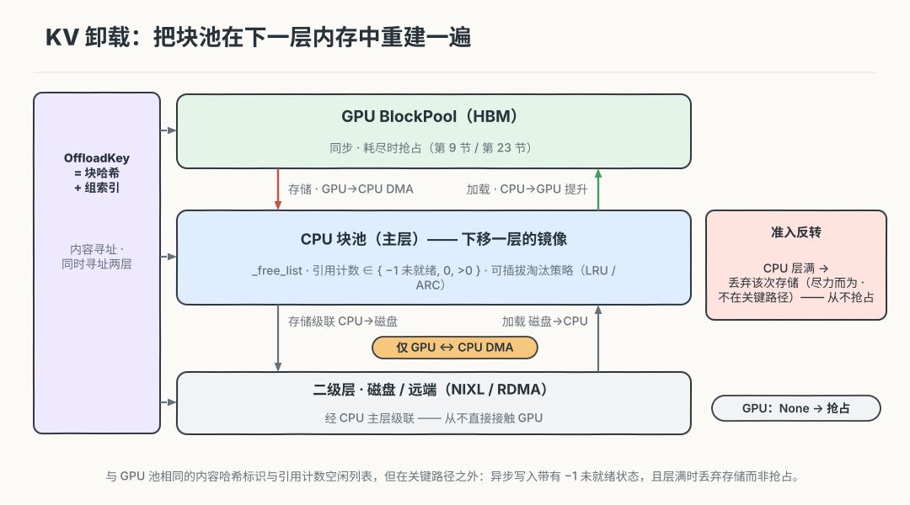</a>

<p class='figure-caption'>KV offloading 在下一层重建了一套 block pool，沿用相同的 content-hash identity 和基于引用计数的 free list，但避开了关键路径：写入异步执行，准入采用 best-effort 策略；资源不足时直接丢弃任务，而不是进行抢占。</p>

**offload key：复用 GPU 侧 content hash 作为跨层地址**

offloaded block 并不通过物理 slot 编号寻址，而是根据其*包含的内容*寻址。`OffloadKey` 使用的正是 GPU prefix cache 计算出的 block-content hash（[第 7 节](#7-prefix-cache-lookuphashing最长命中与最后一个-token-重计算规则)），再拼接 KV-cache group index（[第 15 节](#15-coordinator-与-hybrid-kv-cache当一种-block-类型不够用时)）；它相当于 offload tier 中的 `BlockHashWithGroupId`。

源码锚点 — `vllm/v1/kv_offload/base.py:L26-L36`：

```python
# `OffloadKey` identifies an offloaded block. It combines a block hash with
# its KV cache group index, encoded as raw bytes to avoid tuple GC overhead.
# Use the helper functions below to construct / decompose keys.
OffloadKey = NewType("OffloadKey", bytes)

logger = init_logger(__name__)


def make_offload_key(block_hash: bytes, group_idx: int) -> OffloadKey:
    """Pack a block hash and group index into an `OffloadKey`."""
    return OffloadKey(block_hash + group_idx.to_bytes(4, "big", signed=False))
```

scheduler 侧 driver 直接从 `request.block_hashes`（[第 7 节](#7-prefix-cache-lookuphashing最长命中与最后一个-token-重计算规则)介绍的 append-only Merkle chain）派生 key，并将多个 GPU-block hash 组织成 offload-block 单元（`vllm/distributed/kv_transfer/kv_connector/v1/offloading/scheduler.py:L275-L289`）。由于 key *本身就是* content hash，CPU tier 命中后返回的是该 prefix 先前计算并存储的 KV，而不是重新计算的结果。offload tier 并非一套需要独立处理一致性问题的 cache，而是*同一套* content-addressed cache 的溢出扩展。也正因如此，要让 filesystem tier 支持跨进程、跨 instance 共享，就必须固定 `PYTHONHASHSEED`：chain seed `NONE_HASH`（[第 7 节](#7-prefix-cache-lookuphashing最长命中与最后一个-token-重计算规则)）在不同进程间必须保持确定性，否则相同的 token 内容会生成不同的 key（`docs/features/kv_offloading_usage.md`，"跨进程共享"）。

offloaded KV 不会生成新的 identity。CPU/disk 命中通过与 GPU 侧 prefix 复用相同的 hash 完成解析，从而将[第 7 节](#7-prefix-cache-lookuphashing最长命中与最后一个-token-重计算规则)的 tenant isolation 延伸到 HBM 以下的存储层级。

### 下沉一层的第二套 block pool——并引入 HBM 从未需要的 not-ready 状态

`CPUOffloadingManager` 运行在 scheduler 中。从结构上看，它就是[第 3 节](#3-kvcacheblock-与-blockpoolfree-list-是一种淘汰结构)中的 `BlockPool`：固定的 `_num_blocks` 容量、整数形式的 `_num_allocated_blocks` 高水位标记、一个 `_free_list`，以及可以持续循环复用 slot id 的 `_allocate_blocks`/`_free_block` 原语。它管理的不是 GPU `KVCacheBlock`，而是 `BlockStatus` 记录；这些记录还包含一个 GPU block 所没有的字段。

源码定位 — `vllm/v1/kv_offload/cpu/policies/base.py:L20-L33`：

```python
    _fields_ = [("ref_cnt", ctypes.c_int32), ("block_id", ctypes.c_int64)]

    def __init__(self, block_id: int):
        super().__init__()
        # initialize block as "not ready" (ref_cnt = -1)
        self.ref_cnt = -1
        self.block_id = block_id

    @property
    def is_ready(self) -> bool:
        """
        Returns whether the block is ready to be read.
        """
        return self.ref_cnt >= 0
```

与分配相关的 GPU block 状态有两种（参见[第 23 节](#23-physical-block-的生命周期分配使用释放进入-cache淘汰)）：`ref_cnt == 0`（可 eviction，位于 free queue 中）和 `ref_cnt > 0`（正在使用）。offload block 在此基础上增加了*第三种*状态：`ref_cnt == -1`，即“已经分配 CPU slot，但 store DMA 尚未完成”。在 `complete_store` 将 `ref_cnt` 切换为 `0` 之前，`is_ready` 始终为 false。之所以需要这个状态，是因为 offload 写入是*异步的*：store 是跨多个 scheduler step 才能完成的 DMA。相比之下，GPU KV 由 forward pass 在分配它的同一个 step 内同步写入，因此 GPU block 一经填充便立即有效。`-1` 这个 sentinel，正是同步 tier 与异步 tier 之间的关键区别。

处于写入过程中的 block 对读取方不可见：对于尚未 ready 的 block（`vllm/v1/kv_offload/cpu/manager.py:L127-L132`），`lookup` 返回的是 `HIT_PENDING`，而不是 `HIT`；`prepare_load` 还会 assert `block.is_ready`。这样可以避免 promotion 垃圾数据——load 的 DMA source 绝不可能指向 store 仍在进行中的 slot。

读取侧的 ref-count 机制与[第 23 节](#23-physical-block-的生命周期分配使用释放进入-cache淘汰)中的 `touch`/`free_blocks` 完全对称。发起 promotion DMA 之前，`prepare_load` 会将每个 source block pin 住，防止其被 eviction：

源码定位 — `vllm/v1/kv_offload/cpu/manager.py:L145-L149`：

```python
            if block.ref_cnt == 0:
                self._policy.mark_non_evictable(key)
                self._num_evictable_cache_blocks -= 1  # ref_cnt 0 -> 1
                assert self._num_evictable_cache_blocks >= 0
            block.ref_cnt += 1
```

`complete_load` 会执行相反操作（`ref_cnt -= 1`；当值降至 `0` 时，`mark_evictable`）。这正是[第 23 节](#23-physical-block-的生命周期分配使用释放进入-cache淘汰)中的规则在 offload tier 上的重述：充当 in-flight transfer *source* 的 block，绝不能在 copy 完成前被回收。这里只是把 transfer 从 GPU 内部共享换成了 CPU→GPU promotion，guard 机制完全相同。

**准入逻辑的反转：offloading 只会放弃操作，绝不会 preempt**

当 `allocate_slots` 找不到可用的 GPU block 时，它会返回 `None`，scheduler 随即 *preempt 或 defer* 该 request（参见[第 9 节](#9-allocate_slots-是策略栈而不是一次-allocation)）；GPU pool 是保证正确性的关键资源。当 CPU tier 无法为 store 腾出空间时，它同样返回 `None`，但这里的 `None` 表示“跳过这次 store，继续提供服务”。

源码定位 — `vllm/v1/kv_offload/cpu/manager.py:L191-L197`：

```python
        num_blocks_to_evict = len(keys_to_store) - self._get_num_free_blocks()

        to_evict: list[OffloadKey] = []
        if num_blocks_to_evict > 0:
            if num_blocks_to_evict > self._num_evictable_cache_blocks:
                # Eviction will fail.
                return None
```

`prepare_store` 会计算为容纳新的 store 必须 evict 多少个 CPU block。如果所需 evict 的数量超过实际*可 evict*的数量（`ref_cnt == 0`——pinned load source 不允许被 evict），它就会返回 `None`。caller 会将其视为 no-op：KV 只保留在 HBM 中；如果之后又从 HBM 被 evict，则重新计算。store 路径还会过滤已存在的 key（`self._policy.get(k) is None`）；如果触发 `complete_store(success=False)`，则移除并释放写到一半的 slot，确保 DMA 失败后不会残留虚假条目（`vllm/v1/kv_offload/cpu/manager.py:L259-L264`）。

Offloading 完全采用 best-effort 策略，并且不在关键路径上。CPU tier 饱和只会降低 hit rate，绝不会导致 request stall、preempt 或 block。这正是 offload pool 可以采用比 GPU pool 更粗粒度、更惰性的 eviction 策略的架构原因：下游没有任何环节依赖 store 成功。

Eviction 顺序由可插拔的 `CachePolicy` 控制（默认使用 `lru`，也可使用 `arc`），而不是采用[第 3 节](#3-kvcacheblock-与-blockpoolfree-list-是一种淘汰结构)中手写的 intrusive free queue。`LRUCachePolicy` 维护专用的 `evictable_blocks` `OrderedDict`；执行 `evict` 时，它会从前到后遍历该结构，跳过 `protected` set 中的所有 key。如果无法满足完整数量要求，则以原子方式返回 `None`（`vllm/v1/kv_offload/cpu/policies/lru.py:L54-L77`）。`protected` set 恰好包含当前 batch 正在 store 的 key：已经 resident 的 block 必须在自身 restore 期间保持有效。

### 下层采用更粗粒度的 block，以及由此产生的对齐约束

offload tier 可以使用比 GPU *更大*的 block，将每个 block 的 bookkeeping 和 DMA setup 成本分摊到更多 token 上。两种 block size 之间的关系由配置中的整数倍数决定。

源码定位 — `vllm/v1/kv_offload/base.py:L540-L555`：

```python
        # offloaded_block_size / gpu_block_size
        self.block_size_factor: int = 1

        offloaded_block_size = self.extra_config.get("block_size")
        if offloaded_block_size is not None:
            offloaded_block_size_int = int(offloaded_block_size)
            gpu_block_sizes = set(self.gpu_block_size)
            assert len(gpu_block_sizes) == 1, (
                "If 'block_size' is specified in kv_connector_extra_config, "
                "there must be at least one KV cache group, "
                "and all groups must have the same block size."
            )
            gpu_block_size = gpu_block_sizes.pop()

            assert offloaded_block_size_int % gpu_block_size == 0
            self.block_size_factor = offloaded_block_size_int // gpu_block_size
```

`offloaded_block_size` 必须是 GPU block size 的整数倍（[第 4 节](#4-block-从何而来memory-profilingnum_gpu_blocks-与-kv-cache-配置)），因此一个 offloaded block 会映射到连续的 `block_size_factor` 个 GPU block——这正是 offload tier 中对应于[第 20 节](#20-从-block-table-到-kernelslot_mapping-与-device-tensors)所述 manager-block-to-kernel-block 展开的机制。partial hit 时，这一约束会直接体现出来：GPU load 可能需要从某个 offloaded block 的*内部*开始。因此，`GPULoadStoreSpec` 会携带 `block_indices`（“第 i 个 group 中首个 block 的 block index”），以便 worker 能够“正确跳过首个匹配 offloaded block 的一部分”（`vllm/v1/kv_offload/base.py:L367-L374`）。

CPU 侧更粗的 granularity 并不会迫使 GPU block 重新对齐。load/store spec 为每个 group 携带了足够的 index 信息，使 worker 可以在 GPU-block boundary 处切分 offloaded block。因此，无论 offload block size 如何，[第 20 节](#20-从-block-table-到-kernelslot_mapping-与-device-tensors)中的 block table 都始终保持规整的 kernel-block unit。

### 接入 `allocate_slots`：由 local tier 支撑的 external-tokens contract

offload 通过[第 11 节](#11-connector-感知分配外部-kvdelay_cache_blocks-与-pd-分离)中的 connector 契约接入 KV cache manager，并未引入任何新的 `allocate_slots` 参数。这里有两个关键 hook。

在 *lookup* 侧，`get_num_new_matched_tokens` 会扫描各个 offload tier，检查除 HBM 中已有内容之外还能命中多少，并返回该数量。scheduler 随后通过[第 11 节](#11-connector-感知分配外部-kvdelay_cache_blocks-与-pd-分离)介绍的同一套 local+external 归并逻辑，将其计入 `num_external_computed_tokens`（`scheduler.py:L759-L762`、`num_computed_tokens = num_new_local_computed_tokens + num_external_computed_tokens`）：这里没有引入新的算术逻辑。

connector 返回 `(num_hit_tokens, bool(num_hit_tokens))`——其中第二个元素表示此次加载为*异步*操作（`scheduler.py:L747`），因此 scheduler 会分配目标 block，但本轮不会在这些 block 上执行 compute。这里的两道保护逻辑与前文相呼应。若 request 仍有传输正在进行，系统会将其推迟，而不是再次执行 lookup（返回 `None, False`）；scheduler 对此的处理方式与尚未就绪的 connector 命中完全相同：

源码锚点——`vllm/distributed/kv_transfer/kv_connector/v1/offloading/scheduler.py:L718-L723`：

```python
        if req_status.transfer_jobs:
            logger.debug(
                "Delaying request %s since it still has in-flight transfers",
                request.request_id,
            )
            return None, False
```

此外，`skip_reading_prefix_cache` 会将 offload lookup 短路为零（`scheduler.py:L729-L730`）。这与[第 7 节](#7-prefix-cache-lookuphashing最长命中与最后一个-token-重计算规则)中禁用 GPU prefix 复用的 prompt-logprobs/pooling guard 相同——如果一个 request 必须重新计算逐 token 输出，就不能向其提供从*任何* tier 复用的 KV。

在 *commit* 侧，`update_state_after_alloc` 接收刚分配的 GPU block，并建立 promotion 流程：先通过 `prepare_load` pin 住 CPU 源 block，再在 `GPULoadStoreSpec` 中指定 GPU 目标 block。

源码锚点——`vllm/distributed/kv_transfer/kv_connector/v1/offloading/scheduler.py:L823-L826`：

```python
        src_spec = self.manager.prepare_load(keys_to_load, req_status.req_context)
        dst_spec = GPULoadStoreSpec(
            dst_block_ids, group_sizes=group_sizes, block_indices=block_indices
        )
```

GPU `allocate_slots` 负责预留目标 block；offload manager 负责 pin 住源 block；完成这两步后，worker 才会执行 source→dest DMA。这是 offload tier 版本的[第 15 节](#15-coordinator-与-hybrid-kv-cache当一种-block-类型不够用时)两阶段 touch-before-allocate：在将目标 block 交给 worker *之前*，先确保源 block 不可被驱逐，从而避免并发 eviction 回收正在 promotion 的 block。

### offload lookup 中复现的按类型复用结构

offload manager 不能只匹配扁平的 prefix——它必须完整复现 `SingleTypeKVCacheManager` 系列所执行的、针对不同 attention type 的复用规则（[第 16 节](#16-各类型的-block-计算sliding-windowmamba-与-chunked-local-attention)），因为 hit 必须能够加载到对应类型的 block layout 中。因此，`_lookup` 会执行 full-attention **prefix** 扫描（`_maximal_prefix_lookup`，从前往后，在首次 miss 时停止）和 sliding-window **suffix** 扫描（`_sliding_window_lookup`，从后往前，要求连续 hit 的长度足以覆盖一个完整 window）。当一个 group 收紧另一个 group 的边界时，它会继续迭代直至达到 fixed point——这正是 hybrid coordinator 单调收缩循环在 offload tier 的对应实现（[第 15 节](#15-coordinator-与-hybrid-kv-cache当一种-block-类型不够用时)）。它还复现了 recompute-last-token 缩减逻辑，但仅适用于 sliding-window group（`…/offloading/scheduler.py:L519-L523`，由 `if self._sliding_window_groups:` 控制）；对于仅包含 full-attention 的模型，这个 offload lookup 函数不会执行任何缩减：

源码锚点 — `vllm/distributed/kv_transfer/kv_connector/v1/offloading/scheduler.py:L519-L523`：

```python
        if self._sliding_window_groups:
            # the last prompt token has to be recomputed to get the logprobs
            # for sliding window attention, we must reduce by 1 to make sure
            # we still have a hit after reduction
            max_hit_size_tokens -= 1
```

offload tier 绝不会返回 GPU block layout 无法使用的 hit。Full-attention hit 是按 block 对齐的 prefix；sliding-window hit 是连续 window；Mamba hit 则向下取整到 align size（`round_down(..., self._mamba_align_size)`）。每次 promotion 后的布局都符合对应 attention type 的合法 geometry，因此，[第 16 节](#16-各类型的-block-计算sliding-windowmamba-与-chunked-local-attention)中的准入计算与 tier 无关，始终成立。

### Tiering：CPU primary 是唯一与 GPU 直接相邻的 tier

`TieringOffloadingSpec`（由 `spec_name` 选择，并在 `vllm/v1/kv_offload/factory.py:L69-L73` 中注册）会在 CPU primary 之下添加 secondary tier——可以是 filesystem，也可以是通过 NIXL/RDMA 连接的 remote peer。这里的 topology 约束非常严格。

源码锚点 — `vllm/v1/kv_offload/tiering/base.py:L94-L98`：

```python
    Secondary tiers cannot directly access GPU memory. All data transfers
    must go through the CPU (primary) tier:
      - Store: GPU → CPU (primary) → secondary  (cascade)
      - Load:  secondary → CPU (primary) → GPU  (promotion)
```

只有 CPU tier 拥有 GPU DMA 可以直接访问的 pinned host memory。disk 或 remote hit 必须先暂存到 CPU slot，再向 GPU promotion；store 则按 GPU→CPU→disk 的顺序逐级下沉。面向 GPU 的 transfer 本身使用 copy-engine DMA——对于 GPU→CPU，worker 会刻意选择专用 copy engine，而不是 Triton kernel（“GPU->CPU 受 bandwidth 限制；专用 copy engine 的性能优于 Triton”，`vllm/v1/kv_offload/cpu/gpu_worker.py:L40-L42`）。transfer 会在每次 transfer 独立的 CUDA stream 上发起（`vllm/v1/kv_offload/cpu/gpu_worker.py:L170-171`：“每次 transfer 都使用一个独立的 CUDA stream，并且只有之前各次 transfer 的 stream 全部执行完毕后，它的 stream 才会开始执行”）。“这些 transfer 会与 forward pass 重叠执行”这一点，是根据每次 transfer 独立 stream 的设计推断出来的，并非任何文档引文中明确写出的内容。

无论下方还有多少个 tier，GPU 始终只与一块 pinned CPU 内存区域进行数据传输。disk sharding 或 RDMA session 的复杂性全部封装在 CPU primary 下层，因此面向 HBM 的路径始终保持一致，[第 20 节](#20-从-block-table-到-kernelslot_mapping-与-device-tensors)中的 kernel 侧 layout 也无需改动。

**策略参数：决定哪些数据值得通过 DMA 传输**

由于较慢的 tier 容量有限，且每次传输都会消耗带宽，因此需要通过多道准入条件来决定哪些数据可以下沉。将 `store_threshold` 设为 N ≥ 2 时（默认值 0 表示禁用该过滤器），一个 block 必须被*访问* N 次后才会 offload，因此一次性 prefix 会跳过 DMA（`manager.py:L176-L179`）。`offload_prompt_only`（默认为 `true`）会跳过 decode 阶段的 KV；如果各轮之间会丢弃生成的 token，这一选项会很有用（`base.py:L506-L512`）。按 request 生效的 `max_offload_tokens` 会限制该 request 中符合 offload 条件的数据量。`OffloadPolicy` 则决定是否再次 offload 命中 prefix 的 block：

源码定位 — `vllm/v1/kv_offload/base.py:L64-L71`：

```python
class OffloadPolicy(Enum):
    # Offload only newly-computed blocks as they arrive; prefix-hit
    # blocks (already offloaded by a prior request) are skipped.
    BLOCK_LEVEL = "block_level"
    # Offload all blocks for the request, including prefix hits.
    # Used by tiers that need the complete KV context for a request.
    REQUEST_LEVEL = "request_level"
```

在 `BLOCK_LEVEL` 下，`next_stored_block_idx` 会推进到该 request 的 prefix-hit block 之后，避免重复存储这些 block（`scheduler.py:L820-L821`）；`REQUEST_LEVEL` 则让它停留在 `0`，从而让需要 request *完整*上下文的 tier（例如 P/D peer）获得所有 block。该参数让每个 tier 都能在存储放大与完整性之间权衡，而无需改变共享的 block hash 标识。

## 25. 可观测性：Prefix Cache 统计与 KV Cache 事件

manager 提供三条彼此独立的可观测性通道：prefix 命中统计、结构性 KV cache 事件，以及采样的 block 驻留指标。每条通道都有各自的 producer 和 consumer，但都采用**排空并替换的 snapshot**，确保每份观测数据只会发出一次。

这三条通道分别是：

1. **Prefix cache 命中统计** — 每个 request 的 `(queries=tokens, hits=tokens)` 计数，会汇总为有界滑动窗口命中率和单调递增的 Prometheus counter。仅供内部使用。
2. **KV cache 事件** — 由 block pool 生成的结构性 `BlockStored` / `BlockRemoved` / `AllBlocksCleared` record，组成 batch 后通过 ZMQ 发布给*外部* KV router。
3. **KV 驻留指标** — 按 block 采样的 lifetime / idle / reuse-gap histogram，默认关闭。

<a href='images/vllm-06-24-metrics-events.svg' target='_blank'>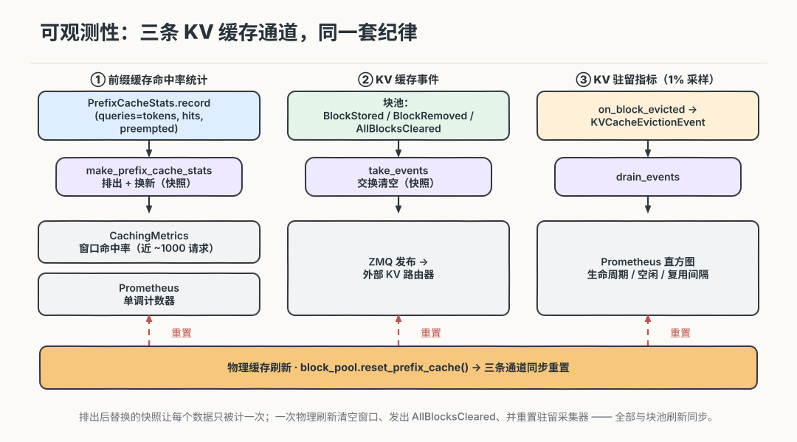</a>

<p class='figure-caption'>KV cache 的三条可观测性通道：命中率统计（内部 → 文本 log + Prometheus counter）、结构性 KV 事件（block pool → ZMQ → 外部 router），以及采样的驻留 histogram——每条通道均通过 snapshot-and-replace 原语排空数据。</p>

### Prefix cache 命中统计：按 token 计量，并隔离 preemption 的影响

这个按 interval 统计的累加器用于回答：“当前 interval 内，request 用多少 token 查询了 prefix cache，其中又有多少命中。”它是一个 `dataclass`，而不是 metric 对象——它保存原始计数，供下游模块进一步转换。

源码位置：[`vllm/v1/metrics/stats.py:131-142`](https://github.com/vllm-project/vllm/blob/6cf7b26bd4bff60bf378e1af14044280ac0d214c/vllm/v1/metrics/stats.py#L131-L142)。

```python
# vllm/v1/metrics/stats.py:131-142
    def record(self, num_tokens: int, num_hits: int, preempted: bool) -> None:
        """Aggregate request information into the stats."""
        if preempted:
            # Previously preempted request
            self.preempted_requests += 1
            self.preempted_queries += num_tokens
            self.preempted_hits += num_hits
        else:
            # New request
            self.requests += 1
            self.queries += num_tokens
            self.hits += num_hits
```

`record` 根据 `preempted`，将每个 request 归入两组互斥的 bucket 之一。`num_tokens` 是整个 request 的 token 数，即*分母*；`num_hits` 则是匹配到的 prefix token 数。此前被 preempt 过的 request（`request.num_preemptions > 0`）会全部计入 `preempted_*` bucket，并被刻意排除在主要的 `requests` / `queries` / `hits` 之外。基础字段的注释（[`stats.py:118-119`](https://github.com/vllm-project/vllm/blob/6cf7b26bd4bff60bf378e1af14044280ac0d214c/vllm/v1/metrics/stats.py#L118-L119)）明确说明了计量单位：“`queries`：指发起查询的 token 数量。”

这种拆分让**命中统计以 token 为计量基准**，同时隔离 preemption 引发的重复查询。当 vLLM V1 通过 recompute 执行 preemption 时（它已不再将 KV swap 到 host，参见[第 10 节](#10-scheduler-契约调度过程如何驱动-kv-cache-manager)；关于 recompute 与 swap 的策略选择，参见[第 13 节](#13-压力之下抢占重计算与-block-回收)），被 preempt 的 request 会再次命中它刚刚释放的同一段 prefix。如果把这种必然发生的重复命中计入主要 counter，那么在内存压力下，报告的命中率就会被推高至接近 100%；而此时恰恰是 operator 最需要真实数据的时候。这种拆分使主要命中率能够真正衡量*跨 request*的 prefix 复用情况。

内部恰好有两个 call site，它们都向同一个对象写入数据。正常路径在 LOOKUP method 内执行记录（参见[第 7 节](#7-prefix-cache-lookuphashing最长命中与最后一个-token-重计算规则)，此处不再展开）——[`vllm/v1/core/kv_cache_manager.py:234-242`](https://github.com/vllm-project/vllm/blob/6cf7b26bd4bff60bf378e1af14044280ac0d214c/vllm/v1/core/kv_cache_manager.py#L234-L242)：

```python
# vllm/v1/core/kv_cache_manager.py:234-242
        if self.log_stats:
            assert self.prefix_cache_stats is not None
            self.prefix_cache_stats.record(
                num_tokens=request.num_tokens,
                num_hits=num_new_computed_tokens,
                preempted=request.num_preemptions > 0,
            )

        return self.create_kv_cache_blocks(computed_blocks), num_new_computed_tokens
```

第二个 call site 位于 scheduler 的 hybrid/Mamba 分支。在该分支中，命中长度由 scheduler 自行计算，而不是由 `get_computed_blocks` 返回（即 coordinator + hybrid-groups 路径，参见[第 15 节](#15-coordinator-与-hybrid-kv-cache当一种-block-类型不够用时)）——[`vllm/v1/core/sched/scheduler.py:716-722`](https://github.com/vllm-project/vllm/blob/6cf7b26bd4bff60bf378e1af14044280ac0d214c/vllm/v1/core/sched/scheduler.py#L716-L722)：

```python
# vllm/v1/core/sched/scheduler.py:716-722
                        if self.kv_cache_manager.log_stats:
                            assert self.kv_cache_manager.prefix_cache_stats is not None
                            self.kv_cache_manager.prefix_cache_stats.record(
                                num_tokens=request.num_tokens,
                                num_hits=num_new_local_computed_tokens,
                                preempted=request.num_preemptions > 0,
                            )
```

两个 call site 都以 `log_stats` 作为 guard 条件，并在操作累加器前 assert 它不是 `None`。这并非多余的防御式代码：该累加器*当且仅当* logging 开启时才会创建——[`vllm/v1/core/kv_cache_manager.py:141`](https://github.com/vllm-project/vllm/blob/6cf7b26bd4bff60bf378e1af14044280ac0d214c/vllm/v1/core/kv_cache_manager.py#L141)：

```python
# vllm/v1/core/kv_cache_manager.py:141
        self.prefix_cache_stats = PrefixCacheStats() if log_stats else None
```

`prefix_cache_stats is None ⇔ log_stats is False`，而且每个 `record` 在控制流上都受该 assertion 支配，因此二者在结构上保持一致——不可能向已禁用的 channel 写入记录。

还有第三个*并行*累加器，用于统计通过 KV connector 从外部获取的 token（即 P/D-disaggregation / offloading 路径，参见[第 11 节](#11-connector-感知分配外部-kvdelay_cache_blocks-与-pd-分离)/[第 24 节](#24-kv-offloading由-cpu-支撑的分层-kv-cache)）。它是 scheduler 上一个独立的 `PrefixCacheStats`，并且只在确有数据可记录时才会更新——[`vllm/v1/core/sched/scheduler.py:940-948`](https://github.com/vllm-project/vllm/blob/6cf7b26bd4bff60bf378e1af14044280ac0d214c/vllm/v1/core/sched/scheduler.py#L940-L948)：

```python
# vllm/v1/core/sched/scheduler.py:940-948
                    if (
                        self.connector_prefix_cache_stats is not None
                        and connector_prefix_cache_queries != 0
                    ):
                        self.connector_prefix_cache_stats.record(
                            num_tokens=connector_prefix_cache_queries,
                            num_hits=connector_prefix_cache_hits,
                            preempted=request.num_preemptions > 0,
                        )
```

External-cache 命中绝不会计入 local prefix-cache 统计，而 `!= 0` guard 会让空闲的 connector step 不追加空更新（这对下文的滑动窗口很重要）。

### 滑动窗口命中率：`CachingMetrics`

日志中的 "Prefix cache hit rate" 应反映*近期*行为，而不是 lifetime average；否则，长期运行的 server 会让这一指标逐渐失去变化。`CachingMetrics` 是一个有界滑动窗口，默认包含 1000 个 request。

源码定位：[`vllm/v1/metrics/stats.py:54-92`](https://github.com/vllm-project/vllm/blob/6cf7b26bd4bff60bf378e1af14044280ac0d214c/vllm/v1/metrics/stats.py#L54-L92)。

```python
# vllm/v1/metrics/stats.py:54-92
    def observe(self, stats: BaseCacheStats):
        ...
        # reset_prefix_cache was invoked before the current update.
        # Reset the metrics before aggregating the current stats.
        if stats.reset:
            self.reset()

        # DO NOT appending empty stats to avoid helpful info get kicked out
        # due to sliding window.
        if stats.requests == 0:
            return

        # Update the metrics.
        self.query_queue.append((stats.requests, stats.queries, stats.hits))
        self.aggregated_requests += stats.requests
        self.aggregated_query_total += stats.queries
        self.aggregated_query_hit += stats.hits

        # Remove the oldest stats until number of requests does not exceed
        # the limit.
        # NOTE: We preserve the latest added stats regardless.
        while (
            len(self.query_queue) > 1
            and self.aggregated_requests > self.max_recent_requests
        ):
            old_requests, old_queries, old_hits = self.query_queue.popleft()
            self.aggregated_requests -= old_requests
            self.aggregated_query_total -= old_queries
            self.aggregated_query_hit -= old_hits
```

`observe` 首先处理 `reset` flag，彻底清空窗口（`reset()`，[`stats.py:94-99`](https://github.com/vllm-project/vllm/blob/6cf7b26bd4bff60bf378e1af14044280ac0d214c/vllm/v1/metrics/stats.py#L94-L99)）。随后，它会在 enqueue *之前*丢弃空更新，避免连续多个空闲日志周期将有用历史挤出 deque。接着，它追加新的 `(requests, queries, hits)` 三元组；当累计的 *request* 数超过 `max_recent_requests` 时，便从队首开始淘汰。不过，即便最新条目本身就超过窗口大小，`len(self.query_queue) > 1` guard 也会确保它被保留下来。命中率按 token 加权计算（[`stats.py:106-111`](https://github.com/vllm-project/vllm/blob/6cf7b26bd4bff60bf378e1af14044280ac0d214c/vllm/v1/metrics/stats.py#L106-L111)）：`aggregated_query_hit / aggregated_query_total`，并对除零情况做了保护。

**快照并重置：drain 原语**

每个日志 step 都必须以原子方式读取累加器并将其清零，避免任何区间被重复统计。这就是 `make_prefix_cache_stats`——[`vllm/v1/core/kv_cache_manager.py:190-200`](https://github.com/vllm-project/vllm/blob/6cf7b26bd4bff60bf378e1af14044280ac0d214c/vllm/v1/core/kv_cache_manager.py#L190-L200)：

```python
# vllm/v1/core/kv_cache_manager.py:190-200
    def make_prefix_cache_stats(self) -> PrefixCacheStats | None:
        """Get (and reset) the prefix cache stats.

        Returns:
            The current prefix caching stats, or None if logging is disabled.
        """
        if not self.log_stats:
            return None
        stats = self.prefix_cache_stats
        self.prefix_cache_stats = PrefixCacheStats()
        return stats
```

`CachingMetrics.observe` 所依据的 `reset` flag 由 `reset_prefix_cache` 设置，但前提是*物理层面*的 block-pool flush 确实成功——[`vllm/v1/core/kv_cache_manager.py:515-529`](https://github.com/vllm-project/vllm/blob/6cf7b26bd4bff60bf378e1af14044280ac0d214c/vllm/v1/core/kv_cache_manager.py#L515-L529)：

```python
# vllm/v1/core/kv_cache_manager.py:524-529
        if not self.block_pool.reset_prefix_cache():
            return False
        if self.log_stats:
            assert self.prefix_cache_stats is not None
            self.prefix_cache_stats.reset = True
        return True
```

`make_prefix_cache_stats` 会交出当前仍在使用的累加器，并在同一组表达式中换入一个新的空累加器。这是一次 hand-off，而不是 copy。`reset_prefix_cache` 会在*尚未 drain*的累加器上设置 `reset=True`，因此该 flag 会随下一次快照传入 `observe`，进而清空窗口。关键在于，只有当 `block_pool.reset_prefix_cache()` 返回 `True` 后，这个 flag 才会被设置。

每个 `PrefixCacheStats` 实例只会被采集一次。只有对应的 cache flush 成功后，metrics 窗口才会重置；如果仍有 block 正在使用、导致 flush 被拒绝，则不会重置。

scheduler 在每个 step 中通过 `make_stats` 将两个累加器与 residency channel 串联起来——[`vllm/v1/core/sched/scheduler.py:2293-2303`](https://github.com/vllm-project/vllm/blob/6cf7b26bd4bff60bf378e1af14044280ac0d214c/vllm/v1/core/sched/scheduler.py#L2293-L2303)：

```python
# vllm/v1/core/sched/scheduler.py:2293-2303
        prefix_cache_stats = self.kv_cache_manager.make_prefix_cache_stats()
        assert prefix_cache_stats is not None
        connector_prefix_cache_stats: PrefixCacheStats | None = None
        if self.connector_prefix_cache_stats is not None:
            connector_prefix_cache_stats = self.connector_prefix_cache_stats
            self.connector_prefix_cache_stats = PrefixCacheStats()
        eviction_events = (
            self.kv_metrics_collector.drain_events()
            if self.kv_metrics_collector is not None
            else []
        )
```

三者都采用 drain-and-replace：local stats 通过 `make_prefix_cache_stats` 处理，connector stats 通过手动 swap 处理，residency event 则通过 `drain_events` 处理。它们会被封装进 `SchedulerStats`，再发送给 logger。注意最外层的 `if not self.log_stats: return None` guard（[`scheduler.py:2291-2292`](https://github.com/vllm-project/vllm/blob/6cf7b26bd4bff60bf378e1af14044280ac0d214c/vllm/v1/core/sched/scheduler.py#L2291-L2292)）：关闭日志后，连 `SchedulerStats` 都不会构造。

同一份 `SchedulerStats` 快照会提供给两种数据形态不同的 consumer：文本 logger 输出的是*窗口命中率*，而 Prometheus 导出的是*单调递增的 lifetime counter*。

文本 logger——[`vllm/v1/metrics/loggers.py:250-271`](https://github.com/vllm-project/vllm/blob/6cf7b26bd4bff60bf378e1af14044280ac0d214c/vllm/v1/metrics/loggers.py#L250-L271)：

```python
# vllm/v1/metrics/loggers.py:250-261
        log_parts.extend(
            [
                "GPU KV cache usage: %.1f%%",
                "Prefix cache hit rate: %.1f%%",
            ]
        )
        log_args.extend(
            [
                self.last_scheduler_stats.kv_cache_usage * 100,
                self.prefix_caching_metrics.hit_rate * 100,
            ]
        )
```

connector 和 multimodal 对应的行只会在其 window 非空时追加（[`loggers.py:266-271`](https://github.com/vllm-project/vllm/blob/6cf7b26bd4bff60bf378e1af14044280ac0d214c/vllm/v1/metrics/loggers.py#L266-L271)），判断依据是 `CachingMetrics.empty` property。因此，未使用 connector 的运行不会误打出 `0.0%` external-cache 行。

Prometheus — [`vllm/v1/metrics/loggers.py:1088-1101`](https://github.com/vllm-project/vllm/blob/6cf7b26bd4bff60bf378e1af14044280ac0d214c/vllm/v1/metrics/loggers.py#L1088-L1101)：

```python
# vllm/v1/metrics/loggers.py:1088-1101
            self.counter_prefix_cache_queries[engine_idx].inc(
                scheduler_stats.prefix_cache_stats.queries
            )
            self.counter_prefix_cache_hits[engine_idx].inc(
                scheduler_stats.prefix_cache_stats.hits
            )

            if scheduler_stats.connector_prefix_cache_stats is not None:
                self.counter_connector_prefix_cache_queries[engine_idx].inc(
                    scheduler_stats.connector_prefix_cache_stats.queries
                )
                self.counter_connector_prefix_cache_hits[engine_idx].inc(
                    scheduler_stats.connector_prefix_cache_stats.hits
                )
```

文本 sink 从 `CachingMetrics.hit_rate` 读取*聚合后的 rate*；Prometheus sink 则通过 `.inc()` 将原始 `queries` 和 `hits` 累加到单调递增的 counter 中（即 `vllm:prefix_cache_queries` / `vllm:prefix_cache_hits`；connector 对应 `vllm:external_prefix_cache_queries` / `..._hits` — [`loggers.py:548-559,571-584`](https://github.com/vllm-project/vllm/blob/6cf7b26bd4bff60bf378e1af14044280ac0d214c/vllm/v1/metrics/loggers.py#L548-L559)）。dashboard 在下游通过 `rate(hits) / rate(queries)` 还原 rate，这是 Prometheus counter 的标准用法（[prometheus.io](https://prometheus.io/docs/concepts/metric_types/#counter)）。

只有文本 logger 使用 window；Prometheus 始终采用 counter。因此，这两个 sink 可以使用不同的时间范围（例如最近 1000 个 request 的平均值与 query 指定的范围），同时仍基于同一批仅 drain 一次的 `queries` 和 `hits`。

### KV cache event：外部契约

Channel 2 并非面向本地运维人员，而是供一个 *out-of-process* KV router 使用，由它决定某个 prefix 位于哪个 engine。该 router 必须能在不共享内存的情况下重建 vLLM 的 block-hash chain，因此 event schema 包含了完成这一过程所需的全部信息。

源码定位：[`vllm/distributed/kv_events.py:49-74`](https://github.com/vllm-project/vllm/blob/6cf7b26bd4bff60bf378e1af14044280ac0d214c/vllm/distributed/kv_events.py#L49-L74)。

```python
# vllm/distributed/kv_events.py:49-74
class BlockStored(KVCacheEvent):
    block_hashes: list[ExternalBlockHash]
    parent_block_hash: ExternalBlockHash | None
    token_ids: list[int]
    block_size: int

    lora_id: int | None
    ...
    medium: str | None
    lora_name: str | None

    extra_keys: list[tuple[Any, ...] | None] | None = None
    """Extra keys used in block hash computation, one entry per block in
    block_hashes. ... Exposed for external
    KV cache consumers to reconstruct block hashes.
    """

    group_idx: int | None = None
    # Store events carry cache-spec metadata so consumers can classify and
    # filter groups as they are learned. Remove events only need group_idx+hash.
    kv_cache_spec_kind: str | None = None
    kv_cache_spec_sliding_window: int | None = None
```

一个 `BlockStored` 包含 block hash、指向前一个 block 的 `parent_block_hash`（使 consumer 能够逐条 edge 重建 prefix tree）、原始 `token_ids`、`block_size`、LoRA 标识、`medium` tier（"GPU"/"CPU"）、每个 block 的 `extra_keys`，以及用于多 group hybrid cache 的 `group_idx` 和 spec metadata。docstring 明确指出，之所以提供 `extra_keys`，是“为了让外部 KV cache consumer 能够重建 block hash”。`BlockRemoved` 的内容很精简，仅包含 hash、medium 和 group（[`kv_events.py:93-96`](https://github.com/vllm-project/vllm/blob/6cf7b26bd4bff60bf378e1af14044280ac0d214c/vllm/distributed/kv_events.py#L93-L96)），因为 consumer 只需执行失效操作；`AllBlocksCleared` 则只是一个简单的 flush signal（[`kv_events.py:108-109`](https://github.com/vllm-project/vllm/blob/6cf7b26bd4bff60bf378e1af14044280ac0d214c/vllm/distributed/kv_events.py#L108-L109)）。该 batch 是一个带 tag 的 union：`KVEventBatch.events: list[BlockStored | BlockRemoved | AllBlocksCleared]`（[`kv_events.py:112-113`](https://github.com/vllm-project/vllm/blob/6cf7b26bd4bff60bf378e1af14044280ac0d214c/vllm/distributed/kv_events.py#L112-L113)），可通过 base struct 上的 `tag=True` 进行 decode。

hash 的 wire 格式由 env 控制 — [`vllm/v1/core/kv_cache_utils.py:79-82`](https://github.com/vllm-project/vllm/blob/6cf7b26bd4bff60bf378e1af14044280ac0d214c/vllm/v1/core/kv_cache_utils.py#L79-L82)：

```python
# vllm/v1/core/kv_cache_utils.py:79-82
def maybe_convert_block_hash(hash_bytes: BlockHash) -> ExternalBlockHash:
    if not envs.VLLM_KV_EVENTS_USE_INT_BLOCK_HASHES:
        return hash_bytes
    return int.from_bytes(hash_bytes, byteorder="big") & ((1 << 64) - 1)
```

producer 和 consumer 必须使用相同的 `VLLM_KV_EVENTS_USE_INT_BLOCK_HASHES` 配置（原始 bytes 或截断为 64-bit 的整数），否则重建出的 hash 将无法匹配。借助 `extra_keys` 和 spec 字段，router 可以确定性地复现 prefix tree；除此之外，本地 pool 并不需要这些信息。

**event 的发送与 hash map 保持同步**

外部镜像要保持正确，前提是：向 `cached_block_hash_to_block` 的*每次*插入都会生成 `BlockStored`，且*每次*移除都会生成 `BlockRemoved`。这些事件是在本文已经介绍过的同一套 WRITE 和 eviction path 内发出的——这里只关注事件发出部分的尾端逻辑。在 `cache_full_blocks` 中（WRITE path，[第 8 节](#8-prefix-cache-写入路径cache_full_blocks-与提交-hash)）——[`vllm/v1/core/block_pool.py:340-356`](https://github.com/vllm-project/vllm/blob/6cf7b26bd4bff60bf378e1af14044280ac0d214c/vllm/v1/core/block_pool.py#L340-L356)：

```python
# vllm/v1/core/block_pool.py:340-356
            self.kv_event_queue.append(
                BlockStored(
                    block_hashes=new_hashes,
                    parent_block_hash=parent_block_hash,
                    token_ids=request.all_token_ids[start_token_idx:end_token_idx],
                    block_size=block_size,
                    lora_id=request.lora_request.adapter_id
                    if request.lora_request
                    else None,
                    medium=MEDIUM_GPU,
                    lora_name=request.lora_request.name
                    if request.lora_request
                    else None,
                    extra_keys=extra_keys_list if extra_keys_list else None,
                    group_idx=kv_cache_group_id,
                )
            )
```

需要注意，只有启用事件时，才会真正构造与之并行的 `new_hashes` list——[`vllm/v1/core/block_pool.py:277-279`](https://github.com/vllm-project/vllm/blob/6cf7b26bd4bff60bf378e1af14044280ac0d214c/vllm/v1/core/block_pool.py#L277-L279)：

```python
# vllm/v1/core/block_pool.py:277-279
        new_hashes: list[ExternalBlockHash] | None = (
            [] if self.enable_kv_cache_events else None
        )
```

所有移除操作都会经过同一个 helper；*每一条* eviction/promotion path（partial→full promotion、hash replacement、真正的 eviction）都会使用它——[`vllm/v1/core/block_pool.py:505-518`](https://github.com/vllm-project/vllm/blob/6cf7b26bd4bff60bf378e1af14044280ac0d214c/vllm/v1/core/block_pool.py#L505-L518)：

```python
# vllm/v1/core/block_pool.py:505-518
    def _emit_block_removed_events(
        self,
        block_hashes: list[BlockHashWithGroupId],
    ) -> None:
        if not self.enable_kv_cache_events:
            return
        for block_hash in block_hashes:
            self.kv_event_queue.append(
                BlockRemoved(
                    block_hashes=[maybe_convert_block_hash(get_block_hash(block_hash))],
                    medium=MEDIUM_GPU,
                    group_idx=get_group_id(block_hash),
                )
            )
```

`AllBlocksCleared` 会从 `reset_prefix_cache` 中入队（[`block_pool.py:687-688`](https://github.com/vllm-project/vllm/blob/6cf7b26bd4bff60bf378e1af14044280ac0d214c/vllm/v1/core/block_pool.py#L687-L688)）。在这条事件路径中，`_emit_block_removed_events` 会从每个 `BlockHashWithGroupId` 中重新解包出 group id（`get_block_hash` / `get_group_id`，即[第 7 节](#7-prefix-cache-lookuphashing最长命中与最后一个-token-重计算规则)介绍的 pack 格式），因此 remove 事件会同时携带裸 hash 及其所属 group。每一处事件发出逻辑（store、remove、clear，以及 `new_hashes` 的分配）都会被同一个 `enable_kv_cache_events` flag 短路。

事件发出点与修改 `cached_block_hash_to_block` 的位置完全一致，因此外部 consumer 无需另建一套状态维护路径，就能重放 hash-map 的 insert/delete log。

### 排空、标注、发布

block pool 持有一个 queue；manager 在结构事件上叠加*语义*元数据；scheduler 则负责将其组成 batch 并发布。pool 的 drain 本质上就是一次 swap——[`vllm/v1/core/block_pool.py:713-723`](https://github.com/vllm-project/vllm/blob/6cf7b26bd4bff60bf378e1af14044280ac0d214c/vllm/v1/core/block_pool.py#L713-L723)：

```python
# vllm/v1/core/block_pool.py:713-723
    def take_events(self) -> list[KVCacheEvent]:
        """Atomically takes all events and clears the queue.
        ...
        """
        if not self.enable_kv_cache_events:
            return []
        events = self.kv_event_queue
        self.kv_event_queue = []
        return events
```

manager 只会为 `BlockStored` 标注其 group 对应的 cache-spec 类型及 sliding window——[`vllm/v1/core/kv_cache_manager.py:571-589`](https://github.com/vllm-project/vllm/blob/6cf7b26bd4bff60bf378e1af14044280ac0d214c/vllm/v1/core/kv_cache_manager.py#L571-L589)：

```python
# vllm/v1/core/kv_cache_manager.py:571-589
        events = self.block_pool.take_events()
        for event in events:
            if not isinstance(event, BlockStored):
                continue
            if event.group_idx is None:
                continue
            if event.group_idx < 0 or event.group_idx >= len(
                self.kv_cache_event_metadata
            ):
                logger.warning(
                    "Group index `%s` not in KV cache metadata", event.group_idx
                )
                continue
            # Annotate here so BlockPool can keep emitting structural cache
            # events without owning semantic KV cache spec metadata.
            kind, sliding_window = self.kv_cache_event_metadata[event.group_idx]
            event.kv_cache_spec_kind = kind
            event.kv_cache_spec_sliding_window = sliding_window
        return events
```

`block_pool.take_events` 通过 swap 将 queue 换成一个全新的 list：整个 drain 是原子的，不会出现部分读取。随后 manager 执行 post-process，为 `kv_cache_spec_kind` / `kv_cache_spec_sliding_window` 填值，数据来自 `kv_cache_event_metadata[group_idx]`（在 constructor 中只构建一次，[`kv_cache_manager.py:164-170`](https://github.com/vllm-project/vllm/blob/6cf7b26bd4bff60bf378e1af14044280ac0d214c/vllm/v1/core/kv_cache_manager.py#L164-L170)）。这是有意划定的分层边界：block pool 只发出结构事件，不了解 cache-spec 语义；manager 负责这些语义，并将其标注到事件上。如果 group index 越界，只会记录日志并跳过，绝不会导致致命错误。

scheduler 会排空 manager + connector 的事件，将其封装成带时间戳的 batch 后发布——[`vllm/v1/core/sched/scheduler.py:1809-1824`](https://github.com/vllm-project/vllm/blob/6cf7b26bd4bff60bf378e1af14044280ac0d214c/vllm/v1/core/sched/scheduler.py#L1809-L1824)：

```python
# vllm/v1/core/sched/scheduler.py:1809-1824
        # collect KV cache events from KV cache manager
        events = self.kv_cache_manager.take_events()

        # collect KV cache events from connector
        if self.connector is not None:
            connector_events = self.connector.take_events()
            if connector_events:
                if events is None:
                    events = list(connector_events)
                else:
                    events.extend(connector_events)

        # publish collected KV cache events
        if events:
            batch = KVEventBatch(ts=time.time(), events=events)
            self.kv_event_publisher.publish(batch)
```

publisher 在构造时只创建一次（`EventPublisherFactory.create`，[`scheduler.py:154-157`](https://github.com/vllm-project/vllm/blob/6cf7b26bd4bff60bf378e1af14044280ac0d214c/vllm/v1/core/sched/scheduler.py#L154-L157)），并传入 DP index。对于 tensor/pipeline-parallel replica，`KVEventAggregator`（[`kv_events.py:116-153`](https://github.com/vllm-project/vllm/blob/6cf7b26bd4bff60bf378e1af14044280ac0d214c/vllm/distributed/kv_events.py#L116-L153)）只会发出从*所有* worker 汇总而来的事件（`count == self._num_workers`），避免 replica 造成事件倍增。（注意：scheduler 其他位置的 `request.take_events()` 调用属于 `EngineCoreEvent` request 生命周期事件——它们使用不同的 channel，并不是 KV block 事件。）

pool 和 manager 两级都采用 swap-and-clear，确保每个 event 只被 drain 一次。只有 `BlockStored`——这个 event 会让 router 获知某个 key——带有 spec annotation；batch 时间戳和 DP index 则用于在整个集群中确定顺序和归属。空 batch 不会被发布。

### KV residency metrics：采样式生命周期 histogram

Channel 3 回答的是另一个问题——*block 的存活时间有多长，以及在 eviction 前会 idle 多久？* 该功能可选且采用采样机制，因为跟踪每个 block 会给热点 allocation 路径带来额外开销。Config 见 [`vllm/config/observability.py:48-54`](https://github.com/vllm-project/vllm/blob/6cf7b26bd4bff60bf378e1af14044280ac0d214c/vllm/config/observability.py#L48-L54)：

```python
# vllm/config/observability.py:48-54
    kv_cache_metrics: bool = False
    """Enable KV cache residency metrics (lifetime, idle time, reuse gaps).
    Uses sampling to minimize overhead.
    Requires log stats to be enabled (i.e., --disable-log-stats not set)."""

    kv_cache_metrics_sample: float = Field(default=0.01, gt=0, le=1)
    """Sampling rate for KV cache metrics (0.0, 1.0]. Default 0.01 = 1% of blocks."""
```

collector 在 allocation 时决定是否将 block 纳入采样，并在 eviction 时为每个被采样的 block 生成一个 `KVCacheEvictionEvent`——参见 [`vllm/v1/core/kv_cache_metrics.py:62-86`](https://github.com/vllm-project/vllm/blob/6cf7b26bd4bff60bf378e1af14044280ac0d214c/vllm/v1/core/kv_cache_metrics.py#L62-L86)：

```python
# vllm/v1/core/kv_cache_metrics.py:62-86
    def on_block_allocated(self, block: "KVCacheBlock") -> None:
        if self.should_sample_block():
            self.block_metrics[block.block_id] = BlockMetricsState()

    def on_block_accessed(self, block: "KVCacheBlock") -> None:
        metrics = self.block_metrics.get(block.block_id)
        if metrics:
            metrics.record_access()

    def on_block_evicted(self, block: "KVCacheBlock") -> None:
        metrics = self.block_metrics.pop(block.block_id, None)
        if not metrics:
            return

        lifetime = metrics.get_lifetime_seconds()
        idle_time = metrics.get_idle_time_seconds()
        reuse_gaps = tuple(metrics.get_reuse_gaps_seconds())

        self._eviction_events.append(
            KVCacheEvictionEvent(
                lifetime_seconds=lifetime,
                idle_seconds=idle_time,
                reuse_gaps_seconds=reuse_gaps,
            )
        )
```

这三个 hook 位于本文前面介绍过的 block 生命周期方法中：在 `get_new_blocks` 中调用 `on_block_allocated`（[`block_pool.py:564-565,570-571`](https://github.com/vllm-project/vllm/blob/6cf7b26bd4bff60bf378e1af14044280ac0d214c/vllm/v1/core/block_pool.py#L564-L565)），在 `touch` 中调用 `on_block_accessed`（[`block_pool.py:611-612`](https://github.com/vllm-project/vllm/blob/6cf7b26bd4bff60bf378e1af14044280ac0d214c/vllm/v1/core/block_pool.py#L611-L612)），并在 `_maybe_evict_cached_block` 一开始就调用 `on_block_evicted`（[`block_pool.py:585-587`](https://github.com/vllm-project/vllm/blob/6cf7b26bd4bff60bf378e1af14044280ac0d214c/vllm/v1/core/block_pool.py#L585-L587)，“优先清理 metrics tracking，防止泄漏”）。每个 block 的 reuse history 是一个 `deque(maxlen=4)`（[`kv_cache_metrics.py:24`](https://github.com/vllm-project/vllm/blob/6cf7b26bd4bff60bf378e1af14044280ac0d214c/vllm/v1/core/kv_cache_metrics.py#L24)），因此每个 block 最多记录三个 reuse gap。

`on_block_allocated` 使用 `random.random() < sample_rate` 决定是否纳入采样——只有约 1% 的 block 会被实际跟踪，因此 `block_metrics` 的大小始终有界。对于未采样的 block，access 和 eviction 都是 no-op（`.get` / `.pop` 返回 `None`）。eviction 会通过 `pop` 移除对应 entry（因此每个被采样的 block 恰好只生成一个 event），而且该操作发生在移除 hash 之前，避免即将失去 identity 的 block 残留在 tracking 中。Prometheus sink 只会在存在 event 时执行观测——参见 [`vllm/v1/metrics/loggers.py:1116-1128`](https://github.com/vllm-project/vllm/blob/6cf7b26bd4bff60bf378e1af14044280ac0d214c/vllm/v1/metrics/loggers.py#L1116-L1128)：

```python
# vllm/v1/metrics/loggers.py:1116-1128
            if (
                self.kv_cache_metrics_enabled
                and scheduler_stats.kv_cache_eviction_events
            ):
                lifetime_hist = self.histogram_kv_block_lifetime[engine_idx]
                idle_hist = self.histogram_kv_block_idle_before_evict[engine_idx]
                reuse_hist = self.histogram_kv_block_reuse_gap[engine_idx]

                for event in scheduler_stats.kv_cache_eviction_events:
                    lifetime_hist.observe(event.lifetime_seconds)
                    idle_hist.observe(event.idle_seconds)
                    for gap in event.reuse_gaps_seconds:
                        reuse_hist.observe(gap)
```

只有启用 `kv_cache_metrics_enabled` 时，才会为每个 engine 创建这三个 histogram（`vllm:kv_block_lifetime_seconds`、`vllm:kv_block_idle_before_evict_seconds`、`vllm:kv_block_reuse_gap_seconds`）；它们共享一组从 1 ms 到 1800 s 的 residency bucket 梯度（[`loggers.py:942-1005`](https://github.com/vllm-project/vllm/blob/6cf7b26bd4bff60bf378e1af14044280ac0d214c/vllm/v1/metrics/loggers.py#L942-L1005)）。

对于约 1% 的采样群体，residency sample 会在 eviction 时生成。始终驻留的 block 不会贡献任何数据；entry 只会在 `sample_rate` 或更低层级被采样，并在 eviction 或 reset 时移除，从而确保 tracking dictionary 的大小有界。因此，这些 histogram 以固定开销描述的是*已被 eviction 的* block 群体，适合用于调优 `num_gpu_blocks` 和 eviction policy，而不是审计每个 block。

## 26. KV Cache 调优：基于配置的运维指南

大多数运维控制项都位于 `CacheConfig`（`vllm/config/cache.py`）中，相关设置则分布在 `UVAOffloadConfig`、`SpeculativeConfig` 中，而 cross-config validation 由 `VllmConfig` 执行。

对于下面的每个配置项，真正需要关注的是其默认值、validator 或 deprecation path，以及足以说明应当调整该配置项的 runtime symptom。

先提醒一个命名陷阱，几乎所有人都会在这里踩坑。engine-arg/CLI flag 是 `--kv-cache-dtype`，但 `CacheConfig` field 是 `cache_dtype`。二者的映射关系是显式定义的——`vllm/engine/arg_utils.py:L1165` 绑定该 flag，`vllm/engine/arg_utils.py:L443` 则将其映射回 field 的默认值：

```python
        cache_group.add_argument("--kv-cache-dtype", **cache_kwargs["cache_dtype"])
```

```python
    kv_cache_dtype: CacheDType = CacheConfig.cache_dtype
```

因此，文档中的 `kv_cache_dtype` 和 config dump 中的 `cache_dtype` 指的是同一个配置项。阅读下文每一组 `--x` / `field_y` 时，都要记住这层映射关系。

<a href='images/vllm-06-30-tuning.svg' target='_blank'>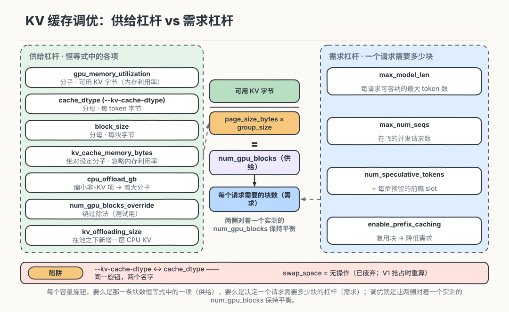</a>

<p class='figure-caption'>将 `CacheConfig` 的配置层映射到它所控制的底层机制——字节预算、bytes-per-block、复用与 spill；每条箭头都标注了讲解对应机制的章节。</p>

**所有容量配置项共同作用的唯一恒等式**

四个配置项（`gpu_memory_utilization`、`block_size`、`cache_dtype`、`num_gpu_blocks_override`）最终都作用于同一个算术恒等式，[第 4 节](#4-block-从何而来memory-profilingnum_gpu_blocks-与-kv-cache-配置)给出了完整推导：**GPU KV block 数量 = 可用 KV bytes ÷ bytes-per-block**；除非 override 直接覆盖整个除法结果。`gpu_memory_utilization` 改变分子；`block_size` 和 `cache_dtype` 改变分母；`num_gpu_blocks_override` 则绕过这次除法。理解本节其余内容时，应始终遵循这一心智模型：下面每个配置项，要么对应这个恒等式中的某一项，要么调节 *demand*（一个 request 需要多少 token），而不是 *supply*（共有多少 block）。字节核算详见[第 4 节](#4-block-从何而来memory-profilingnum_gpu_blocks-与-kv-cache-配置)；本节只讨论配置层。

### `gpu_memory_utilization` — 调节字节预算的杠杆

`vllm/config/cache.py:L68-L75`：

```python
    gpu_memory_utilization: float = Field(default=0.92, gt=0, le=1)
    """The fraction of GPU memory to be used for the model executor, which can
    range from 0 to 1. For example, a value of 0.5 would imply 50% GPU memory
    utilization. If unspecified, will use the default value of 0.92. This is a
    per-instance limit, and only applies to the current vLLM instance. It does
    not matter if you have another vLLM instance running on the same GPU. For
    example, if you have two vLLM instances running on the same GPU, you can
    set the GPU memory utilization to 0.5 for each instance."""
```

Pydantic constraint `gt=0, le=1` 将其限制在 `(0, 1]` 范围内。docstring 中对运维最重要的提醒，是它采用 *per-instance* 语义：该比例表示这个 instance 的完整内存占用（weights + activations + CUDA graphs + KV）最多可占**总** device memory 的多少；它不是为 KV 预留的比例，也不会与同一张卡上的其他共存 instance 协调。[第 4 节](#4-block-从何而来memory-profilingnum_gpu_blocks-与-kv-cache-配置)已经说明，KV 预算只是从 `total_memory × gpu_memory_utilization` 中扣除 weights、activations 和 cudagraph memory 后的*剩余量*。因此，增大这个配置项会扩大该剩余量，进而增大 `num_blocks`。这是影响 KV 容量的最大杠杆，也正因如此，out-of-memory 处理路径会直接点名它。`vllm/v1/core/kv_cache_utils.py:L739-L747`：

```python
    if available_memory <= 0:
        raise ValueError(
            "No available memory for the cache blocks. "
            "Try increasing `gpu_memory_utilization` when initializing the engine "
            "(this flag also controls CPU memory reservation on the CPU "
            "backend, despite its name). "
            "See https://docs.vllm.ai/en/latest/configuration/conserving_memory/ "
            "for more details."
        )
```

稳定版文档也从 preemption 的角度描述了同一个杠杆（[优化](https://docs.vllm.ai/en/stable/configuration/optimization/)，`docs/configuration/optimization.md:L40`）：“增大 `gpu_memory_utilization`。vLLM 会按照这一内存比例预分配 GPU cache。提高 utilization 后，可以提供更多 KV cache 空间。”与之对应的另一种思路是降低 *demand*（`max_model_len` / `max_num_seqs`，同样来自该文档的建议列表），而不是改变 *supply*。

`gpu_memory_utilization` 是一项*会在 boot 时依据实时 free memory 进行校验的硬性预留*（[第 4 节](#4-block-从何而来memory-profilingnum_gpu_blocks-与-kv-cache-配置)中的 snapshot guard），而不是一个会悄然缩减的参考值。此外，还有一个 escape hatch 可以完全覆盖它：`kv_cache_memory_bytes`（`cache.py:L171-L178`）以绝对 byte 数设置 KV budget；其 docstring 也明确说明，“（非 None 时）忽略 `gpu_memory_utilization`”。如果需要在异构显卡上获得可复现的 KV 容量配置，应使用该选项，而不是采用会在不同显卡上换算出不同绝对 byte 数的百分比。

### `block_size` — page 粒度，以及 allocator 信任的来源信息

`vllm/config/cache.py:L47-L53`：

```python
    DEFAULT_BLOCK_SIZE: ClassVar[int] = 16

    block_size: int = Field(default=None, gt=0)  # type: ignore[assignment]
    """Size of a contiguous cache block in number of tokens.
    Accepts None (meaning "use default"). After construction, always int."""
    user_specified_block_size: bool = field(default=False, init=False)
    """Whether block_size was explicitly provided. Derived automatically."""
```

该字段的默认值是 `None`，而不是 `16`。post-init validator 会确定其最终值，同时记录该值是否由用户显式指定。`vllm/config/cache.py:L247-L260`：

```python
    @model_validator(mode="after")
    def _apply_block_size_default(self) -> "CacheConfig":
        # Pydantic re-runs validators when CacheConfig is nested inside
        # another pydantic model (e.g. VllmConfig). Guard against that.
        if self._block_size_resolved:
            return self
        self._block_size_resolved = True
        if self.block_size is None:
            self.block_size = self.DEFAULT_BLOCK_SIZE
        else:
            self.user_specified_block_size = True
        if self.mamba_block_size is not None:
            self.user_specified_mamba_block_size = True
        return self
```

如果未设置，`block_size` 会变为 `16`；如果已设置，`user_specified_block_size` 会切换为 `True`。`_block_size_resolved` guard 确保这一过程具备幂等性，因为只要将 `CacheConfig` 嵌套进 `VllmConfig`，Pydantic 就会重新运行 `mode="after"` validator。没有这个 guard，第二次运行时就会把采用默认值的 `16` 错误记录为用户显式指定。这个来源标记对下游逻辑很重要：[第 4 节](#4-block-从何而来memory-profilingnum_gpu_blocks-与-kv-cache-配置)中的 page-size 统一逻辑会从完成解析的各个 KV-cache group 中选择*最小*的 block size，因此必须能够区分用户有意指定的 `8` 和无意采用的默认值。

physical page 的大小与该值呈线性关系——[第 15 节](#15-coordinator-与-hybrid-kv-cache当一种-block-类型不够用时)中的 attention page 为 `2 · block_size · num_kv_heads · head_dim · dtype`。因此，增大 `block_size` 会得到数量*更少*、但每个可覆盖更多 token 的 block（token 总容量大致不变）。其代价是牺牲更细的尾部碎片控制和 prefix 粒度，换取更短的 block table，以及更少的逐步 bookkeeping 开销。需要注意的是，prefix-cache key 的粒度通过 `hash_block_size`（`cache.py:L56-L67`）实现了解耦：只要每个 KV cache group 的 `block_size` 都能被该值整除，就可以在更细的边界上计算 hash，之后再进行合并。这样，即使使用较大的 physical block，仍然可以按 8-token 粒度计算 hash（关于 hash chain 如何使用它，参见[第 7 节](#7-prefix-cache-lookuphashing最长命中与最后一个-token-重计算规则)）。

构造完成后，`block_size` 始终是正数 `int`，绝不会是 `None`；`user_specified_block_size` 也会准确记录其来源。因此，下游对齐代码绝不会混淆默认值与用户的显式选择。

### `cache_dtype`（`--kv-cache-dtype`）— 每 token 字节数的调节旋钮

`vllm/config/cache.py:L76-L83`：

```python
    cache_dtype: CacheDType = "auto"
    """Data type for kv cache storage. If "auto", will use model data type.
    CUDA 11.8+ supports fp8 (=fp8_e4m3) and fp8_e5m2. ROCm (AMD GPU) supports
    fp8 (=fp8_e4m3). Intel Gaudi (HPU) supports fp8 (using fp8_inc).
    Some models (namely DeepSeekV3.2) default to fp8, set to bfloat16 to use
    bfloat16 instead, this is an invalid option for models that do not default
    to fp8.
    """
```

`"auto"` 跟随 model dtype；fp8/int4/nvfp4 会将 KV 打包进 1-byte 容器，在预算固定时可让 token 容量大致翻倍——[第 18 节](#18-fp8-与量化-kv-cache每字节容纳更多-token)介绍了相关字节计算、合法字符串的 allow-list，以及写入时的 scaling，本节不再赘述。运维侧需要特别注意两点。第一，docstring 的最后两行指出：某些 model（DeepSeek V3.2）*默认*使用 fp8；如果要强制使用 bf16，必须将 `cache_dtype` 显式设为 `bfloat16`。该配置项的默认倾向会随 model 改变，因此“保持 auto”并不总是风险最低的选择。第二，精度取舍不会静默发生，而是会记录到 log 中：`_validate_cache_dtype` validator（`cache.py:L274-L292`，引文见[第 18 节](#18-fp8-与量化-kv-cache每字节容纳更多-token)）会输出一条 info 日志，警告量化 KV cache“如果没有合适的 scaling factor，可能导致精度下降”。

如果需要量化大多数层、但让少数层保持全精度，可以使用 per-layer 例外机制 `kv_cache_dtype_skip_layers`（`cache.py:L116-L118`）——“要跳过 KV cache 量化的 layer pattern。支持 layer index ... 或 attention type name。”

dtype 决定了 page size 分母中的 `get_dtype_size` 因子（[第 18 节](#18-fp8-与量化-kv-cache每字节容纳更多-token)）；validation 会在配置阶段明确提示精度风险，避免质量静默退化。稳定版文档也从 model 层面阐述了相同的容量与精度取舍（[节省内存](https://docs.vllm.ai/en/stable/configuration/conserving_memory/)，`docs/configuration/conserving_memory.md:L30`）：“量化 model 占用的内存更少，但代价是精度更低。”

**`calculate_kv_scales` — 已弃用的 dynamic fp8 scaling 及其 eager pass 开销**

`vllm/config/cache.py:L111-L115`：

```python
    calculate_kv_scales: bool = False
    """Deprecated: This option is deprecated and will be removed in v0.19.
    It enables dynamic calculation of `k_scale` and `v_scale` when
    kv_cache_dtype is fp8. If `False`, the scales will be loaded from the model
    checkpoint if available. Otherwise, the scales will default to 1.0."""
```

系统会通过 warning 明确提示该项已弃用，`vllm/config/cache.py:L262-L272`：

```python
    @field_validator("calculate_kv_scales", mode="after")
    @classmethod
    def _warn_deprecated_calculate_kv_scales(cls, calculate_kv_scales: bool) -> bool:
        if calculate_kv_scales:
            logger.warning(
                "The `--calculate-kv-scales` option is deprecated and will "
                "be removed in v0.19. The scales will be loaded from the "
                "model checkpoint if available, otherwise they default to "
                "1.0."
            )
        return calculate_kv_scales
```

当 `True` 时，fp8 `k_scale`/`v_scale` 会在首次 forward pass 期间动态计算，而不是从 checkpoint 加载（或默认设为 `1.0`）。推荐设为 `False`——使用 checkpoint 中的 scale 速度更快，也不会再走已弃用路径。启用该功能的运维代价不只是精度校准：dynamic scale 计算与 CUDA graph capture 不兼容，因此 model runner 会强制执行一次 eager pass，随后自行关闭该 flag。`vllm/v1/worker/gpu_model_runner.py:L4306-L4312`：

```python
        # Set cudagraph mode to none if calc_kv_scales is true.
        # KV scales calculation involves dynamic operations that are incompatible
        # with CUDA graph capture.
        if self.calculate_kv_scales:
            cudagraph_mode = CUDAGraphMode.NONE
            # Mark KV scales as calculated after the first forward pass
            self.calculate_kv_scales = False
```

启用 dynamic scale 后，只会有一次 pass 退回 eager 模式，随后该功能会自行禁用。因此，你不会在整个运行期间悄悄承受禁用 graph 带来的 latency，但也不能将该 flag 当作持久化 runtime 配置。关于这些 scale 在写入 KV 时的实际应用位置，参见[第 18 节](#18-fp8-与量化-kv-cache每字节容纳更多-token)/[第 22 节](#22-reshape_and_cachetoken-kv-如何进入物理-block)。

### `enable_prefix_caching` + `prefix_caching_hash_algo` — reuse 开关与 hash algorithm 的取舍

`vllm/config/cache.py:L93-L110`：

```python
    enable_prefix_caching: bool = True
    """Whether to enable prefix caching."""
    prefix_caching_hash_algo: PrefixCachingHashAlgo = "sha256"
    """Set the hash algorithm for prefix caching:

    - "sha256" uses Pickle for object serialization before hashing. This is the current
      default, as SHA256 is the most secure choice to avoid potential hash collisions.
    - "sha256_cbor" provides a reproducible, cross-language compatible hash. It
      serializes objects using canonical CBOR and hashes them with SHA-256.
    - "xxhash" uses Pickle serialization with xxHash (128-bit) for faster,
      non-cryptographic hashing. Requires the optional ``xxhash`` package.
      IMPORTANT: Use of a hashing algorithm that is not considered  cryptographically
      secure theoretically increases the risk of hash collisions, which can cause
      undefined behavior or even leak private information in multi-tenant environments.
      Even if collisions are still very unlikely, it is important to consider your
      security risk tolerance against the performance benefits before turning this on.
    - "xxhash_cbor" combines canonical CBOR serialization with xxHash for
      reproducible hashing. Requires the optional ``xxhash`` package."""
```

[第 7 节](#7-prefix-cache-lookuphashing最长命中与最后一个-token-重计算规则)介绍了该开关控制的 lookup/write 机制；从运维角度看，这里的关键在于*算法选择*，docstring 也准确说明了其中的取舍。`sha256`（默认值）最不容易发生碰撞；`xxhash`/`xxhash_cbor`速度更快，但并非加密 hash。docstring 还明确警告，在 multi-tenant serving 场景中，碰撞可能会“泄露私密信息”。`*_cbor`变体的重要性则体现在另一个方面：它们具有可复现性，且不依赖`PYTHONHASHSEED`。正因如此，prefix key 才能*跨 process 共享*——P/D disaggregation（[第 11 节](#11-connector-感知分配外部-kvdelay_cache_blocks-与-pd-分离)）和跨层级 KV offloading（[第 24 节](#24-kv-offloading由-cpu-支撑的分层-kv-cache)）都需要这一特性，因为两个 process 必须为相同 token 计算出一致的内容 hash。

算法的使用位置如下：engine core 只会构建一次 block hasher，并且仅在启用 cache 或 KV connector 时才会构建。`vllm/v1/engine/core.py:L210-L219`：

```python
        self.request_block_hasher: Callable[[Request], list[BlockHash]] | None = None
        if vllm_config.cache_config.enable_prefix_caching or kv_connector is not None:
            caching_hash_fn = get_hash_fn_by_name(
                vllm_config.cache_config.prefix_caching_hash_algo
            )
            init_none_hash(caching_hash_fn)

            self.request_block_hasher = get_request_block_hasher(
                hash_block_size, caching_hash_fn
            )
```

`get_hash_fn_by_name`完整映射了四个合法字符串，传入其他任何值都会报错（`vllm/utils/hashing.py:L91-L100`会分别返回`sha256` / `sha256_cbor` / `xxhash` / `xxhash_cbor`，否则返回`ValueError`）。

真正微妙的是`or kv_connector is not None`这个条件：即使设置了`enable_prefix_caching=False`，connector 仍能获得可用的`request_block_hasher`，因此 P/D 和 offloading 依旧可以使用内容寻址 key。该开关会同时控制本地 read 和 write（[第 7 节](#7-prefix-cache-lookuphashing最长命中与最后一个-token-重计算规则)），因此将其关闭绝不会留下只填充了一半的 GPU cache；但它并不会禁用 connector 所依赖的 hash 计算。

**`num_gpu_blocks_override` — preemption 测试开关**

`vllm/config/cache.py:L87-L89`：

```python
    num_gpu_blocks_override: int | None = None
    """Number of GPU blocks to use. This overrides the profiled `num_gpu_blocks`
    if specified. Does nothing if `None`. Used for testing preemption."""
```

它会用一个明确指定的数量替换 profiling 得到的`num_blocks`。根据文档，该配置项专门用于*测试 preemption*：通过缩小容量，以确定性的方式触发 preempt/recompute 路径（[第 13 节](#13-压力之下抢占重计算与-block-回收)）。[第 4 节](#4-block-从何而来memory-profilingnum_gpu_blocks-与-kv-cache-配置)介绍了其中一个重要细节：override 值会反算成*有效*的`available_memory = override × bytes_per_block`（`kv_cache_utils.py:L2078-L2098`），从而确保 auto-fit planner、admission check 和各 worker 的 config builder 使用同一个容量值。**运维警告：**该 override 不会受 GPU 物理容量限制（如果设置值超过 profiling 得出的可容纳范围，就会在分配时 OOM），而且计算 block 数量时会忽略`gpu_memory_utilization`，但启动阶段的空闲显存预留仍会考虑该参数。应将其视为测试/benchmark 工具，而不是生产环境的容量规划配置项。

### Spill 与 offload — 三类不同资源，其中一类已弃用

经典的“CPU swap buffer”配置项已经移除。`swap_space`根本不是`CacheConfig`的 field；它会在`LLM` constructor 中被拦截并丢弃。`vllm/entrypoints/llm.py:L224-L233`：

```python
        if "swap_space" in kwargs:
            kwargs.pop("swap_space")
            import warnings

            warnings.warn(
                "The 'swap_space' parameter is deprecated and ignored. "
                "It will be removed in a future version.",
                DeprecationWarning,
                stacklevel=2,
            )
```

传入该参数除了产生一个 `DeprecationWarning` 外，不会改变任何行为——V1 通过基于 recompute 的 preemption 来处理容量溢出（[第 13 节](#13-压力之下抢占重计算与-block-回收)），而不是进行 GPU↔CPU KV swap。取而代之的是两个实际生效的参数，分别针对*不同*的资源。要 spill **KV**，使用 `vllm/config/cache.py:L180-L189`：

```python
    kv_offloading_size: float | None = None
    """Size of the KV cache offloading buffer in GiB. When TP > 1, this is
    the total buffer size summed across all TP ranks. By default, this is set
    to None, which means no KV offloading is enabled. When set, vLLM will
    enable KV cache offloading to CPU using the kv_offloading_backend."""

    kv_offloading_backend: KVOffloadingBackend = "native"
    """The backend to use for KV cache offloading. Supported backends include
    'native' (vLLM native CPU offloading), 'lmcache'.
    KV offloading is only activated when kv_offloading_size is set."""
```

这才是真正控制 KV spill 的参数；[第 24 节](#24-kv-offloading由-cpu-支撑的分层-kv-cache)详细解析了它构建的 CPU mirror，以及它与 GPU pool 共享的 content-hash key。与此不同，若要 spill **model weights**，从而*间接*腾出 GPU 显存，可使用 `vllm/config/offload.py:L23-L32`：

```python
    cpu_offload_gb: float = Field(default=0, ge=0)
    """The space in GiB to offload to CPU, per GPU. Default is 0, which means
    no offloading. Intuitively, this argument can be seen as a virtual way to
    increase the GPU memory size. For example, if you have one 24 GB GPU and
    set this to 10, virtually you can think of it as a 34 GB GPU. Then you can
    load a 13B model with BF16 weight, which requires at least 26GB GPU memory.
    Note that this requires fast CPU-GPU interconnect, as part of the model is
    loaded from CPU memory to GPU memory on the fly in each model forward pass.
    This uses UVA (Unified Virtual Addressing) for zero-copy access.
    """
```

这三个参数不能互换：`swap_space` 是 no-op；`kv_offloading_size` 将 KV spill 到以 content hash 为 key 的 CPU tier（[第 24 节](#24-kv-offloading由-cpu-支撑的分层-kv-cache)）；`cpu_offload_gb` 则通过 UVA offload *weights*，减小[第 4 节](#4-block-从何而来memory-profilingnum_gpu_blocks-与-kv-cache-配置)预算中的 non-KV 项，从而增大留给 KV 的剩余空间——但只有 interconnect 足够快时才划算，因为每次 forward pass 都要将 weights 从 host 流式传输到 device。当被逐出的 prefix 需要 recompute 时，使用 `kv_offloading_size`；当 model 只能勉强放下，而 NVLink/PCIe4+ 仍有余量时，使用 `cpu_offload_gb`。

**`mamba_block_size` — 带有严格跨配置约束的 hybrid-SSM 参数**

`vllm/config/cache.py:L127-L130`：

```python
    mamba_block_size: int | None = Field(default=None, gt=0)
    """Size of a contiguous cache block in number of tokens for mamba cache.
    Can be set only when prefix caching is enabled.
    Value must be a multiple of 8 to align with causal_conv1d kernel."""
```

这个参数可独立于 attention `block_size` 设置 Mamba/SSM state cache 的 block 粒度（[第 16 节](#16-各类型的-block-计算sliding-windowmamba-与-chunked-local-attention)介绍了 state tensor 的 page 计算）。其中“只有启用 prefix caching 才能设置”的限制，会在 `VllmConfig`、`vllm/config/vllm.py:L2261-L2273` 上进行跨配置校验：

```python
    @model_validator(mode="after")
    def validate_mamba_block_size(self) -> "VllmConfig":
        if self.model_config is None:
            return self
        mamba_block_size_is_set = (
            self.cache_config.mamba_block_size is not None
            and self.cache_config.mamba_block_size != self.model_config.max_model_len
        )
        if mamba_block_size_is_set and not self.cache_config.enable_prefix_caching:
            raise ValueError(
                "--mamba-block-size can only be set with --enable-prefix-caching"
            )
        return self
```

只有开启 prefix caching，*非默认值*的 `mamba_block_size`（已设置且不等于 `max_model_len`）才合法——因为 Mamba prefix cache 的正确性依赖按 block 对齐的 state snapshot（`mamba_cache_mode`、`cache.py:L139-L147`）。让它保持为 `None`，除非你运行的是启用了 prefix caching 的 hybrid Mamba model，并且需要让 SSM page 与 attention page 对齐。

### Speculative decoding 也是一个 KV 分配参数

面向 operator 的调节项是 `num_speculative_tokens`（`vllm/config/speculative.py:L86-L88`：“speculative token 的数量（如有提供）。如果 draft model config 中已配置该值，则默认使用其中的数量；否则，此项为必填”）。人们很容易以为它只是一个用于权衡计算量与接受率的调节项，但实际上，它还会在每一步中*预留额外的 KV slot*。scheduler 在构造时（`scheduler.py:L243-L257`）会根据具体方法，将其转换成对应的 `num_lookahead_tokens` 常量——通常与 `num_speculative_tokens` 一一对应，但对于 DFlash 的 in-fill query pattern，则为 `+1`；[第 14 节](#14-speculative-decoding-遇上-kv-cachelookahead-slots-与-rollback)引用了这一解析逻辑，并完整梳理了 lookahead/rollback 机制。该数值随后传入 `allocate_slots(..., num_lookahead_tokens=...)`，在这里，它*只会扩大 slot 预留量，而不会扩大 cache 范围*——[第 9 节](#9-allocate_slots-是策略栈而不是一次-allocation)详细解释了这种“乐观预留、保守缓存”的拆分策略（被拒绝的 draft 永远不会进入 shared prefix cache；回收则以 processed token 为基准，因此发生 spec-rollback 时，可以让 `num_computed_tokens` 回退）。至于 proposer 的内部实现，详见第 12 篇。

每增加一个 speculative token，每个 in-flight request 都需要额外预留一个 KV slot。因此，调高 `num_speculative_tokens`，本质上是在用有效 batch 容量（触发 preemption 前可并发的 sequence 数量会减少）换取更高的接受率上限——而且这种权衡会直接受到 `gpu_memory_utilization` 和 `max_num_seqs` 的影响。如果启用 spec-decode 后开始频繁触发 preemption，lookahead 预留很可能就是原因；应按照[第 4 节](#4-block-从何而来memory-profilingnum_gpu_blocks-与-kv-cache-配置)计算的同一套 block budget 来确定其大小。

### 症状 → 调节项速查

| 现象 | 首选调节项 | 机制 / 注意事项 |
|---|---|---|
| 频繁发生 preemption / cache block OOM | 调高 `gpu_memory_utilization`（或调低 `max_model_len` / `max_num_seqs`） | [第 4 节](#4-block-从何而来memory-profilingnum_gpu_blocks-与-kv-cache-配置)中的预算；OOM error 会原样点名该项（`kv_cache_utils.py:L739-L747`） |
| 需要更大的 token 容量，可接受轻微质量损失 | `cache_dtype=fp8`（`--kv-cache-dtype`） | 每 byte 可容纳约 2× token；validator 会发出精度警告（[第 18 节](#18-fp8-与量化-kv-cache每字节容纳更多-token)） |
| 少数 layer 对量化过于敏感 | `kv_cache_dtype_skip_layers` | 支持逐 layer 排除（`cache.py:L116-L118`） |
| 重复的 system prompt / few-shot prefix | 保持 `enable_prefix_caching=True` | miss 时成本接近于零（[第 7 节](#7-prefix-cache-lookuphashing最长命中与最后一个-token-重计算规则)） |
| 多租户、跨 process 共享 key（P/D、offload） | `prefix_caching_hash_algo=sha256_cbor` | 可复现，且不依赖 `PYTHONHASHSEED`（[第 11 节](#11-connector-感知分配外部-kvdelay_cache_blocks-与-pd-分离)、[第 24 节](#24-kv-offloading由-cpu-支撑的分层-kv-cache)） |
| 被 evict 的 prefix 被重新计算 | 设置 `kv_offloading_size` | CPU KV 层（[第 24 节](#24-kv-offloading由-cpu-支撑的分层-kv-cache)）；**不要用** `swap_space`（no-op） |
| model 勉强能放下；有高速 CPU 链路可用 | `cpu_offload_gb` | offload *weight*，为 KV 腾出空间（[第 4 节](#4-block-从何而来memory-profilingnum_gpu_blocks-与-kv-cache-配置)中的对应项） |
| 以确定性方式测试 preempt 路径 | `num_gpu_blocks_override` | 不会被 clamp——设得过高可能导致 OOM |
| spec-decode 导致 preemption | 调低 `num_speculative_tokens` | 每个 token 都会预留一个 lookahead slot（[第 14 节](#14-speculative-decoding-遇上-kv-cachelookahead-slots-与-rollback)） |
| 让不同 GPU 卡上的 KV 大小保持可复现 | `kv_cache_memory_bytes` | 使用绝对 byte 数；忽略 `gpu_memory_utilization` |

贯穿始终的主线是：这些 knob 可以明确分为*供给*杠杆（`gpu_memory_utilization`、`cache_dtype`、`block_size`、`num_gpu_blocks_override`、`kv_cache_memory_bytes`、`cpu_offload_gb`、`kv_offloading_size`）和*需求*杠杆（`max_model_len`、`max_num_seqs`、`num_speculative_tokens`、`enable_prefix_caching`）。每个供给杠杆都是[第 4 节](#4-block-从何而来memory-profilingnum_gpu_blocks-与-kv-cache-配置)容量恒等式中的一项；每个需求杠杆都会改变 request 所需的 block 数量。就机制而言，调优 KV cache，就是围绕 profiling 得到的某个 `num_gpu_blocks`，让供需两端保持平衡。

## 27. 替代方案与权衡：vAttention 与 Paging 的成本

Paging 消除了外部碎片，并支持常数时间分配和基于内容寻址的共享，但也引入了间接寻址与 kernel 特化。vAttention 对虚拟内存替代方案给出了目前最清晰的公开论证（[arXiv:2405.04437](https://arxiv.org/abs/2405.04437)）；它提出的质疑，都能直接对应到前文展示过的代码。

<a href='images/vllm-06-11-pagedattention-vs-vattention.svg' target='_blank'>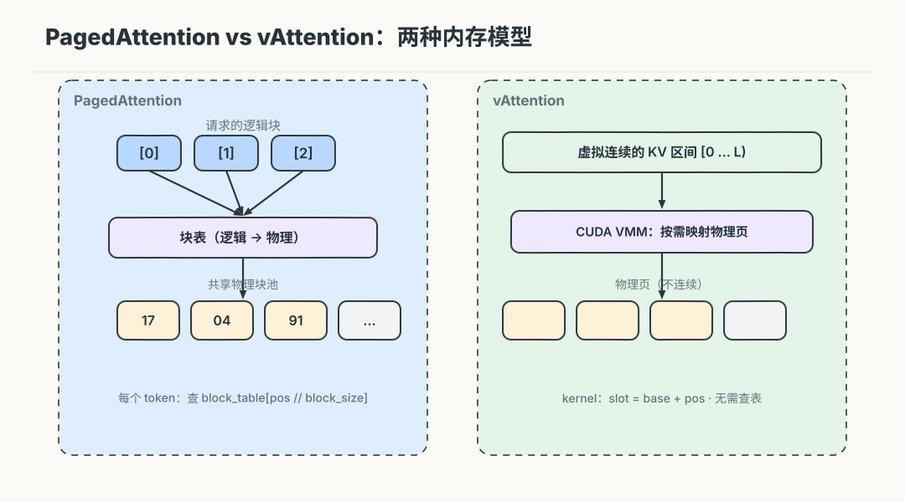</a>

<p class='figure-caption'>两种内存模型的并排对比——PagedAttention（每个 request 的 logical block table 用于索引共享的 physical block pool）与 vAttention（为每个 request 提供虚拟连续的 KV 区间，并通过 CUDA VMM 按需映射 physical page）。</p>

### vAttention 所指出的 indirection，就在 vLLM 自身源码中

VAttention 的核心批评直指抽象设计：“PagedAttention 为了在运行时分配物理内存，最终**把 KV cache 的虚拟内存布局从连续改成了非连续**”；并且，“这种设计会带来**不可忽视的编程和性能开销**”（vAttention 摘要，[arXiv:2405.04437](https://arxiv.org/abs/2405.04437)）。这两种开销并非泛泛而谈。所谓“性能开销”，是因为 KV cache 不再是线性数组，kernel 必须为每个 token 计算地址；所谓“编程开销”，则是必须专门*教会* attention kernel 如何完成这种计算。二者在 vLLM 中都集中体现于同一处——这个函数会把每个 request 的 block table 转换为 paged-attention kernel 所解引用的线性 `slot_mapping`。

来源：`vllm/v1/worker/block_table.py:L359-L380`

```python
    for i in range(start_idx, end_idx, BLOCK_SIZE):
        offsets = i + tl.arange(0, BLOCK_SIZE)
        mask = offsets < end_idx
        pos = tl.load(positions_ptr + offsets, mask=mask, other=0)
        block_indices = pos // virtual_block_size
        block_numbers = tl.load(block_table_ptr + row_offset + block_indices).to(
            tl.int64
        )

        virtual_block_offsets = pos - block_indices * virtual_block_size
        is_local = (
            virtual_block_offsets // CP_KV_CACHE_INTERLEAVE_SIZE
        ) % TOTAL_CP_WORLD_SIZE == TOTAL_CP_RANK
        local_block_offsets = (
            virtual_block_offsets // (TOTAL_CP_WORLD_SIZE * CP_KV_CACHE_INTERLEAVE_SIZE)
        ) * CP_KV_CACHE_INTERLEAVE_SIZE + (
            virtual_block_offsets % CP_KV_CACHE_INTERLEAVE_SIZE
        )

        slot_ids = block_numbers * block_size + local_block_offsets
        slot_ids = tl.where(is_local, slot_ids, PAD_ID)
        tl.store(slot_mapping_ptr + offsets, slot_ids, mask=mask)
```

先忽略 context-parallel 相关机制：当 context parallelism 关闭时，`TOTAL_CP_WORLD_SIZE == 1`，因此 `virtual_block_size == block_size`、`virtual_block_offsets == pos % block_size`，`is_local` 始终为 true，`local_block_offsets` 也会简化为 `pos % block_size`。余下的就是分页机制最核心的地址计算。对于绝对位置为 `pos` 的 token，`block_indices = pos // block_size` 会选中该 request 的 block-table 行中的一个*列*；`block_numbers = tl.load(block_table_ptr + row_offset + block_indices)` 是**第二次内存读取**，会读出该列中保存的*物理* block id；`slot_ids = block_numbers * block_size + (pos % block_size)` 则是 paged KV pool 中最终的线性索引。这就是 vAttention 所说的性能开销——双重间接寻址：如果 cache 连续，kernel 可以直接通过 `base + pos` 计算 slot，完全不需要读取 table；而在这里，每个 token 都必须先执行一次存在数据依赖的 gather（`positions → block_table[column] → slot`），才能访问任何 key 或 value。

这种间接寻址换来的好处是：*逻辑* row 保持稳定，而每一列中的*物理* block id 可以是 pool 分配的任意值。正因如此，`touch`、`free_blocks` 和 `_maybe_evict_cached_block`（[第 23 节](#23-physical-block-的生命周期分配使用释放进入-cache淘汰)）才能通过 pool 回收再利用*空闲*的物理 block——只要仍有活跃 request 引用某个 block（`ref_cnt > 0`），该 block 就会保留原有 id，绝不会在该 request 不知情的情况下被移动或 evict；只有空闲且未被引用的 block 才会重新分配。block table 是逻辑空间与物理空间之间的分界接口，而 slot 公式正是为这层接口付出代价的地方：每个 KV-cache group 中的每个 token 都要计算一次（同一 group 内的各 layer 共享一份 slot mapping，无需逐 layer 重算）。vAttention 的观点是：只要能在始终保持*虚拟*布局连续的前提下解决物理内存碎片问题，就可以避免这项逐 token 开销。

**编程开销：定制的 paged kernel**

第二项开销来自代码开发。上面的片段并非无关紧要的 Python glue code，而是 vLLM 自带的 Triton kernel；其下游的 attention kernel（FlashAttention、FlashInfer）必须接收 `block_table` tensor 和 `slot_mapping`，而不是普通的 pointer 和 length。vLLM 的 PagedAttention 设计文档在 kernel 层面明确说明了这一点：一个 block “存储某个 head 中固定数量（`BLOCK_SIZE`）token 的数据”，`BLOCK_SIZE` 是编译期 template parameter，而 block 寻址通过 `physical_block_number` 和 `physical_block_offset` 的 pointer 运算完成（[vLLM 文档](https://docs.vllm.ai/en/stable/design/paged_attention/)）。vAttention 认为这会成为维护负担，并将自身定位为 PagedAttention 的“**更简单、可移植且高性能**的替代方案”，能够“**开箱即用地支持各种 attention kernel**”（摘要，[arXiv:2405.04437](https://arxiv.org/abs/2405.04437)）。

关键在于 *out-of-the-box*：其核心观点是，PagedAttention 迫使每种 attention kernel 都提供一个专门定制、能够感知 block table 的 paged 版本；而虚拟地址连续的 cache 则可以直接交给未经修改的 dense kernel。关于这种改写负担的具体论述——即 vLLM、FlashAttention 和 FlashInfer 都必须分别维护独立的 paged kernel——位于论文正文而非摘要中，因此应引用 PDF（[arxiv.org](https://arxiv.org/pdf/2405.04437)），而不是摘要。

这并非假设。vLLM block table 中之所以存在 `map_to_kernel_blocks`，正是 paged kernel 接口契约向下游转嫁成本的体现：当 KV manager 的 allocation block size 与 kernel block size 不一致时，必须先将一个 manager block id *展开*为多个 kernel block id，才能写入对应行。

来源：`vllm/v1/worker/block_table.py:L193-L201`

```python
        if blocks_per_kv_block == 1:
            return kv_manager_block_ids

        kernel_block_ids = (
            kv_manager_block_ids.reshape(-1, 1) * blocks_per_kv_block
            + kernel_block_arange
        )

        return kernel_block_ids.reshape(-1)
```

当 manager 与 kernel 的 block size 一致（`blocks_per_kv_block == 1`）时，这只是一次 no-op passthrough。否则，每个 manager id `b` 都会转换为连续序列 `b * blocks_per_kv_block + [0 .. blocks_per_kv_block)`，确保各行始终以 *kernel block 为单位*存储，这正是上文 slot kernel 执行索引时采用的粒度。manager 和 kernel 对 block 有两套不同的定义，每次 append 时都必须在 block table 中完成对齐。虚拟地址连续的设计无需进行这种对齐，因为它根本没有需要对齐的 block table。也就是说，这个展开步骤完全是 paged contract 带来的额外开销，而不是 memory management 本身的固有成本。

**vAttention 的替代方案：消除物理碎片，同时保持虚拟地址连续**

VAttention 采用了一种反向设计：保持 KV cache 在虚拟地址空间中连续，只解决最初促使 paging 出现的物理内存碎片问题。它是“一种**在保持 KV cache 在虚拟内存中连续的同时，缓解物理内存碎片问题的方法**”，具体通过“**使用 CUDA virtual memory management APIs，将虚拟内存分配与物理内存分配解耦**”来实现（摘要，[arXiv:2405.04437](https://arxiv.org/abs/2405.04437)）。具体来说，就是预先为每个 request 预留一段较大的连续*虚拟*地址空间，再随着 sequence 增长按需映射物理页（即 `cuMemAddressReserve` / `cuMemCreate` / `cuMemMap` 这一组 API，摘要中仅统称为“CUDA virtual memory management APIs”）。

由于虚拟地址布局始终是平坦连续的，attention kernel 可以直接按 `base + pos` 对其寻址（不需要加载 `block_table`，也不需要 `slot_mapping`）；而物理页仍可彼此不连续，kernel 对此完全无感。最亮眼的结果是，与使用基于 PagedAttention 的 FlashAttention 和 FlashInfer kernel 相比，该方法“可将 LLM serving 吞吐量提升**最高 1.23 倍**”（摘要）。这一数字和 CUDA-VMM 的整体思路都来自摘要，可以直接引用；更深入的逐 kernel 对比则应视为论文正文中的结论。

### vLLM 为何仍然保留间接寻址

这里必须如实说明文章所面临的取舍。如果 paging 的*唯一*价值只是解决内存碎片，那么 vAttention 的论点几乎无可辩驳——CUDA VMM 能以 page 粒度消除碎片，而且无需修改 kernel。但在 vLLM 中，block table 并不只是解决碎片问题的手段；它还是[第 7 节](#7-prefix-cache-lookuphashing最长命中与最后一个-token-重计算规则)和[第 23 节](#23-physical-block-的生命周期分配使用释放进入-cache淘汰)所述功能的基础，而这些能力并不是每个 request 独占一段连续地址空间的方案天然具备的：

- **基于内容寻址的 prefix 复用。** prefix cache（[第 7 节](#7-prefix-cache-lookuphashing最长命中与最后一个-token-重计算规则)）是一个 `BlockHashWithGroupId → KVCacheBlock` map：由于 block table 在两者之间提供了一层间接映射，任何*物理* block 都可以承载任意 request 的任意*逻辑*位置。lookup 会返回一个 physical block id，对应 request 的 row 只需将该 id 存入某个 column。之所以能这样做，是因为 logical position 与 physical block 已经解耦，而 slot kernel 正是在为同一种解耦付出代价。
- **block 粒度共享。** 共享同一 prompt prefix 的两个 request，可以在两条不同 row 的同一 column 中存入*同一个 physical block id*；该 `KVCacheBlock` 的 refcount（[第 23 节](#23-physical-block-的生命周期分配使用释放进入-cache淘汰)）决定它何时可以被回收。论文中的 copy-on-write model 正是建立在这一点之上：physical id 相同时就共享，写入需要分叉时再分配新的 block。
- **常数时间 eviction。** 已释放但仍在 cache 中的 block 即使位于 free queue，仍可通过 hash map 查到；当后续 prefix hit 再次 re-`touch`es 该 block 时，intrusive doubly-linked list 可以在 O(1) 时间内将其移除。整个 `FreeKVCacheBlockQueue`（[第 3 节](#3-kvcacheblock-与-blockpoolfree-list-是一种淘汰结构)）都是一个按 eviction 顺序组织的索引，其索引对象是*物理* block，而这些 block 的寻址独立于任何 request 的 logical layout。

vAttention 的虚拟连续设计能否以较低成本重建这三项能力，其 abstract 并未给出定论，我也不会断言它能或不能（尚未验证）。但从 vLLM 源码中*可以*确认的是，这三项能力与 vAttention 所移除的 indirection 紧密耦合：在 vLLM 中，manager 带来的收益（[第 3 节](#3-kvcacheblock-与-blockpoolfree-list-是一种淘汰结构)–[第 23 节](#23-physical-block-的生命周期分配使用释放进入-cache淘汰)）与 kernel 的 gather 成本（[第 20 节](#20-从-block-table-到-kernelslot_mapping-与-device-tensors)）只在理论上可以分开——实践中，二者共用同一个 block table。换个更尖锐的说法，这正是论文模型中 manager 与 kernel 之分的另一种表述：PagedAttention kernel 是*提供这些能力的基础原语*，而它的 per-token gather，则是使用 manager 在其上实现的一切能力所必须付出的准入成本。

### 除 gather 外，源码中还能看到的 paging 成本

block-table code 中还清晰暴露出另外两项 paging 成本，值得明确指出，因为只关注 fragmentation 的分析往往会遗漏这类问题。

首先是**面向 CUDA graphs 的 fixed-shape padding。** slot kernel 将最后一个 program instance 专门留给 padding，而不是实际计算：

源码：`vllm/v1/worker/block_table.py:L343-L352`

```python
    if req_idx == tl.num_programs(0) - 1:
        # Pad remaining slots for CUDA graph compatibility.
        for i in range(num_tokens, max_num_tokens, BLOCK_SIZE):
            offsets = i + tl.arange(0, BLOCK_SIZE)
            tl.store(
                slot_mapping_ptr + offsets,
                PAD_ID,
                mask=offsets < max_num_tokens,
            )
        return
```

`slot_mapping` 必须是固定大小的 tensor `[max_num_tokens]`，CUDA-graph replay 才能有效，因此尾部 `[num_tokens, max_num_tokens)` 会用 `PAD_ID`（一个 sentinel physical slot）填充。paged indirection 会让 shape 依赖数据（每一步的 valid slot 数量都不同），因此系统既要付出一个 kernel program 的开销，又要预留一个 sentinel slot，才能维持 shape 恒定。按 `base + pos` 索引的 contiguous cache 也存在同样的 graph 稳定性问题，但这个 padding program 是 paged 路径为此付出的特有代价。

第二，**同一 bridge 有两套完整实现。** vLLM 同时提供 CPU-staged `BlockTable`（由 numpy 写入 pinned `CpuGpuBuffer`，再通过 `commit_block_table` 发布）和 GPU-resident `BlockTables`（暂存的 GPU 写入通过 `apply_staged_writes` flush）。二者都需要跨 `worker/block_table.py` 和 `worker/gpu/block_table.py` 维护 `slot = physical_block_id * block_size + position % block_size`。这种重复的工程实现面是 paged bridge 带来的维护成本；当 KV range 是 contiguous tensor 时，并不存在对应问题。

### vLLM V1 自身的权衡与当前限制

最后，即便在 vLLM 内部，paging 也远未完善。要客观评价这项技术，也必须正视 V1 自身所作的取舍。V1 *移除了* GPU↔CPU KV-cache swapping：“采用新的简化 core architecture 后，vLLM V1 不再需要通过 KV cache swapping 来处理 request preemption”（[vLLM 文档](https://docs.vllm.ai/en/stable/usage/v1_guide/)）——如今 preemption 改为基于 recompute 实现。这是对 V0 paging 机制的有意简化，而不是扩展。此外，作为 content-addressed paging 最具代表性的优势，prefix caching 对指南所列的 Mamba/SSM 和 hybrid models “尚不支持”（同一来源）。这确实是*当前* manager 的限制，而不是论文模型的缺陷：[第 15 节](#15-coordinator-与-hybrid-kv-cache当一种-block-类型不够用时)介绍的 per-type managers 能够为 hybrid models 正确分配资源，但要实现 prefix 复用，仍需完善各 layer 特有的 cache-hit 规则。恰恰在 paging 的主打能力最难发挥的场景中，vAttention 的批评最为有力；以此作为这项权衡的结论，才算公允。

**一句话概括这种权衡。** PagedAttention 的代价是每个 token 都要执行 gather、需要额外编写定制 kernel，以及重复维护 logical↔physical 映射桥梁；换来的则是近乎零碎片，外加内容寻址的 prefix caching、block 粒度的共享/CoW，以及常数时间 eviction。vAttention 借助 CUDA virtual memory 保留了减少碎片的优势，同时去掉 gather，也不再需要重写 kernel——但代价是放弃内容寻址复用，或通过另一套机制重新实现它；而[第 7 节](#7-prefix-cache-lookuphashing最长命中与最后一个-token-重计算规则)和[第 23 节](#23-physical-block-的生命周期分配使用释放进入-cache淘汰)展示了 PagedAttention 如何以极低成本实现这种复用。vLLM V1 并未否认这一批评，而是选择投入建设 manager：[第 3 节](#3-kvcacheblock-与-blockpoolfree-list-是一种淘汰结构)至[第 23 节](#23-physical-block-的生命周期分配使用释放进入-cache淘汰)介绍的整套机制之所以存在，是因为只有做到安全复用，paging 的成本才值得承担；而保障这种复用安全，正是整个 KV cache manager 的职责。

## 28. 源码阅读指南与核心要点

最短且有效的源码阅读路径，是追踪以下六个文件之间传递的对象：`kv_cache_manager.py`、`block_pool.py`、`kv_cache_utils.py`、`kv_cache_coordinator.py`、`single_type_kv_cache_manager.py` 和 `worker/block_table.py`。

<a href='images/vllm-06-12-read-path-callstack.svg' target='_blank'>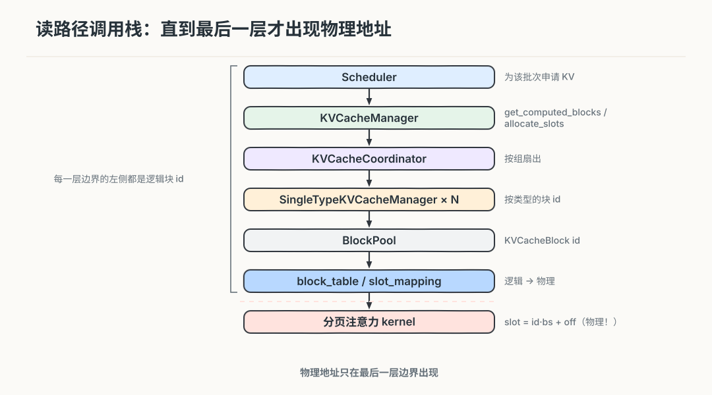</a>

<p class='figure-caption'>以 call stack 展示阅读路径——Scheduler → KVCacheManager → KVCacheCoordinator → SingleTypeKVCacheManager × N → BlockPool → block_table/slot_mapping → paged-attention kernel；每层边界左侧传递的都是 logical block id，physical address 只在最后一层出现。</p>

### 0. 从一个 constructor 开始，因为整个 object graph 都由它串联

不要从 `allocate_slots` 开始，而要从 `KVCacheManager.__init__` 开始，因为只有这里完整组装了整个 object graph，后续每一次 `self.coordinator.…` / `self.block_pool.…` 调用的实际归属也都是在这里确定的。

`vllm/v1/core/kv_cache_manager.py:L143-L158`

```python
        self.coordinator = get_kv_cache_coordinator(
            kv_cache_config=kv_cache_config,
            max_model_len=self.max_model_len,
            max_in_flight_tokens=max_in_flight_tokens,
            use_eagle=self.use_eagle,
            enable_caching=self.enable_caching,
            enable_kv_cache_events=enable_kv_cache_events,
            dcp_world_size=dcp_world_size,
            pcp_world_size=pcp_world_size,
            scheduler_block_size=scheduler_block_size,
            hash_block_size=hash_block_size,
            metrics_collector=self.metrics_collector,
        )
        self.num_kv_cache_groups = len(kv_cache_config.kv_cache_groups)
        self.block_pool = self.coordinator.block_pool
        self.kv_cache_config = kv_cache_config
```

manager 只持有一个 coordinator（由 factory 构建，见下文步骤 1），并且不会自行创建 `BlockPool`，而是直接 alias coordinator 中的对应对象（`self.block_pool = self.coordinator.block_pool`、`L157`）。因此，每个 manager 只有一个 pool，只是可以通过两个名字访问；coordinator 创建的每个 `SingleTypeKVCacheManager` 接收到的也都是同一个 pool。后面你会在 `allocate_slots` 中看到 `self.block_pool.get_num_free_blocks()`，也会在 single-type manager 深处的 `self.block_pool.get_new_blocks()` 中看到它，但二者实际上是同一个对象。这里需要读者明确的 invariant 是：**pool 是所有 group 共享的 singleton**。因此，所有 group 会竞争同一份 VRAM budget；admission 计算（见下文步骤 2）也需要先对各个 group 求和，再与同一个 scalar 比较。

### 1. 在追踪任何逻辑之前，先确定实际生效的是哪条代码路径

源码中有七个具体的 manager 类和三个具体的 coordinator 类；对于任意给定的 model，其中大部分源码实际上都不会执行。阅读时收益最高的一步，是先打开这两个 dispatch function，锁定*你的*实例化路径。这样，面对普通 Llama 时就不会误入 `HybridKVCacheCoordinator`，面对 dense transformer 时也不会误入 `MambaManager`。

`vllm/v1/core/kv_cache_coordinator.py:L796-L809`

```python
    if not enable_caching:
        return KVCacheCoordinatorNoPrefixCache(
            kv_cache_config,
            max_model_len,
            max_in_flight_tokens,
            use_eagle,
            enable_kv_cache_events,
            dcp_world_size=dcp_world_size,
            pcp_world_size=pcp_world_size,
            scheduler_block_size=scheduler_block_size,
            hash_block_size=hash_block_size,
            metrics_collector=metrics_collector,
        )
    if len(kv_cache_config.kv_cache_groups) == 1:
```

coordinator 子类完全由 `(enable_caching, num_groups)` 决定——未启用 caching → `KVCacheCoordinatorNoPrefixCache`；启用 caching 且恰好有一个 group → `UnitaryKVCacheCoordinator`（`L809-L810`）；启用 caching 且有多个 group → `HybridKVCacheCoordinator`（`L823`）。对于开启 prefix caching 的 dense full-attention model，走的*必然*是 Unitary 路径。因此，首次阅读时可以直接跳过 `HybridKVCacheCoordinator.find_longest_cache_hit` 中的整个 fixed-point 迭代过程（[第 15 节](#15-coordinator-与-hybrid-kv-cache当一种-block-类型不够用时)）。该 coordinator 中包含哪些 single-type manager，则由第二层 dispatch 决定——一个 registry 将十一种 spec 类（`single_type_kv_cache_manager.py:L1498-L1553`）映射到七个具体的 manager 类（`:L565,L626,L672,L879,L1029,L1364,L1427`）：

`vllm/v1/core/single_type_kv_cache_manager.py:L1529-L1548`

```python
    # FullAttentionSpec subclasses — grouped with FullAttentionSpec
    KVCacheSpecRegistry.register(
        TQFullAttentionSpec,
        FullAttentionManager,
        uniform_type_base_spec=FullAttentionSpec,
    )
    KVCacheSpecRegistry.register(
        MLAAttentionSpec, FullAttentionManager, uniform_type_base_spec=FullAttentionSpec
    )
    KVCacheSpecRegistry.register(
        RSWASpec, RSWAManager, uniform_type_base_spec=FullAttentionSpec
    )
    # NOTE(Mengqing): HiddenStateCacheSpec won't take part in
    # grouping, thus the uniform_type_base_spec is just a
    # placeholder.
    KVCacheSpecRegistry.register(
        HiddenStateCacheSpec,
        FullAttentionManager,
        uniform_type_base_spec=FullAttentionSpec,
    )
```

`get_manager_for_kv_cache_spec`（`L1451-L1493`）会在该 registry 中查找对应的类。因此，要确认实际运行的是哪个 `find_longest_cache_hit` / `remove_skipped_blocks` 实现，只需在这里查找你的 model spec——`MLAAttentionSpec` 和 `TQFullAttentionSpec` 最终都会映射到 `FullAttentionManager`；而 `RSWASpec` 虽然有专用的 `RSWAManager`，但仍按 full attention 的方式计算 memory size（`uniform_type_base_spec=FullAttentionSpec`）。对读者而言，这可以避免追读当前 configuration 永远不会进入的 branch；对 engine 而言，则可以防止未注册的 spec 悄然 fall through——`get_manager_for_kv_cache_spec` 会 assert `manager_class is not None`（`L1473-L1475`）。[Hybrid KV Cache Manager 设计文档](https://docs.vllm.ai/en/stable/design/hybrid_kv_cache_manager/)是这套 dispatch 的文字版配套说明；code 才是 ground truth，文档中的“每个 group 一个 page size”公式只是为了便于直观理解，并不代表针对每个 spec 的具体计算方式（见下文第 2 步）。

### 2. 盯住一个 scalar——并弄清它的来源

`allocate_slots` 中的每个 scheduling decision，最终都由一个 integer 决定——`get_num_free_blocks`（`vllm/v1/core/block_pool.py:L692-L698`，完整解读见[第 3 节](#3-kvcacheblock-与-blockpoolfree-list-是一种淘汰结构)）——在继续阅读其他内容之前，很值得先把它加入 watch。

这是一个 O(1) counter，由每个 queue mutator（`popleft`、`remove`、`append_n`、`prepend_n`）严格同步维护，无需 traversal。`allocate_slots` 会三次将它与 per-request demand estimate 进行比较：分别是 `full_sequence_must_fit` gate、`reserved_blocks` admission check，以及 `get_new_blocks` 内部的隐式比较。问题的另一半是*总* block 数从何而来：它由 pool sizer 在启动时一次性确定：

`vllm/v1/kv_cache_interface.py:L237-L245`

```python
    def max_memory_usage_bytes(self, vllm_config: VllmConfig) -> int:
        max_model_len = vllm_config.model_config.max_model_len
        dcp_world_size = vllm_config.parallel_config.decode_context_parallel_size
        pcp_world_size = vllm_config.parallel_config.prefill_context_parallel_size
        # Note(hc): each dcp rank only need save
        # (max_model_len//dcp_world_size) tokens locally.
        if dcp_world_size * pcp_world_size > 1:
            max_model_len = cdiv(max_model_len, dcp_world_size * pcp_world_size)
        return cdiv(max_model_len, self.block_size) * self.page_size_bytes
```

full-attention layer 的最坏情况占用量为 `ceil(max_model_len / block_size)` blocks 乘以 `page_size_bytes`：这是一个*受 context 限制的*数量。结合 `MambaSpec.max_memory_usage_bytes`（近乎恒定，不含 `max_model_len` 项）和 `SlidingWindowSpec`（受 window 限制）来看，就能从 sizing 角度理解[第 15 节](#15-coordinator-与-hybrid-kv-cache当一种-block-类型不够用时)的结论：“blocks ∝ tokens”只适用于 full attention。需要牢记的不变量是：`get_num_free_blocks` 报告的 free-block 标量代表真实可用容量，因为 pool 的 sizing 保证能够容纳 per-group 峰值需求的 `sum`，而 null block 在构造时就已从计数中 pop 出去。因此，该数值绝不会虚报容量；这也使得 `allocate_slots` 提前执行的 `return None` 成为严格且如实的 admission gate，而不是乐观猜测（[PagedAttention 论文](https://arxiv.org/abs/2309.06180)解释了为什么这个标量是决定 throughput 的*核心*杠杆）。

### 3. 按 debugger session 顺序阅读

现有文章的 checklist 列出了 breakpoint 和对象；下面将同一组内容整理成*有序* trace，并说明每个 breakpoint 应观察到什么，以及具体细节位于哪个章节：

| # | Breakpoint | 观察结果 | 详见 |
|---|---|---|---|
| 1 | `KVCacheManager.get_computed_blocks` | 一次纯 lookup：先执行 `max_cache_hit_length = num_tokens - 1`，再委托给 coordinator；不改变 ref-count，也不进行 allocation | [第 7 节](#7-prefix-cache-lookuphashing最长命中与最后一个-token-重计算规则) |
| 2 | `KVCacheCoordinator.find_longest_cache_hit` | Unitary → 一次 manager call；Hybrid → monotonic-shrink fixed point；返回 `(per-group blocks, hit_length)` | [第 15 节](#15-coordinator-与-hybrid-kv-cache当一种-block-类型不够用时) |
| 3 | `KVCacheManager.allocate_slots` | policy stack：先 clamp computed tokens，再应用 watermark/reserved/full-sequence gates，执行 `remove_skipped_blocks`，最后 commit | [第 9 节](#9-allocate_slots-是策略栈而不是一次-allocation) |
| 4 | `KVCacheCoordinator.allocate_new_computed_blocks` | 跨 group 的两阶段 touch-before-allocate（issue #33775） | [第 15 节](#15-coordinator-与-hybrid-kv-cache当一种-block-类型不够用时) |
| 5 | `BlockPool.touch` / `get_new_blocks` / `free_blocks` | 同一个 shared free list 上的 ref-count state machine | [第 3 节](#3-kvcacheblock-与-blockpoolfree-list-是一种淘汰结构)、[第 23 节](#23-physical-block-的生命周期分配使用释放进入-cache淘汰) |
| 6 | `KVCacheManager.cache_blocks` | full-block hashing 的上限为 `request.num_tokens`（不含 draft tokens） | [第 7 节](#7-prefix-cache-lookuphashing最长命中与最后一个-token-重计算规则)、[第 9 节](#9-allocate_slots-是策略栈而不是一次-allocation) |
| 7 | `compute_slot_mapping` / slot Triton kernel | logical block ids 转换为 physical addresses | [第 20 节](#20-从-block-table-到-kernelslot_mapping-与-device-tensors) |

需要放进 watch 窗口重点观察的对象——[第 9 节](#9-allocate_slots-是策略栈而不是一次-allocation)逐一走查的四个计数，以及为什么它们是彼此不同的量；如果不给它们命名，你很容易混淆：`num_local_computed_tokens`（累计的 `num_computed_tokens` 加上本次调用的 prefix hit 数）、`total_computed_tokens`（前者再加上所有 external/connector KV，并 clamp 到 `max_model_len`）、`num_tokens_main_model` = `total_computed_tokens + num_new_tokens`（model 实际运行的量），以及 `num_tokens_need_slot` = 前者加上 lookahead，再 clamp 到 `max_model_len`（实际分配 physical slot 的量）。Caching 的上限由 computed 系列值决定；slot reservation 使用 `num_tokens_need_slot`。在 block 这一侧，需要关注：`KVCacheBlock.ref_cnt` 和 `KVCacheBlock._block_hash`（这两个字段共同在 free-list/cache-map 体系中定位一个 block）、`num_free_blocks`、`request.block_hashes`（内容标识，采用 append-only 语义，与任何 `block_id` 完全解耦），以及 `block_table.np/cpu/gpu`（同一个逻辑矩阵的三种 view）。

按这个顺序阅读之所以有效，是因为每个断点产出的对象，恰好就是下一个断点要消费的对象：第 2 个断点产生的 hit block 会作为第 4 个断点处 touch 的输入；第 5 个断点提交的 block id 则会作为第 7 个断点处 slot kernel 的输入。

### 4. 阅读 `BlockPool` 时要牢记的规则

在阅读 `block_pool.py` 之前，如果只记住一个等价关系，那就记住这一条：**对于 non-null block，`ref_cnt == 0` 当且仅当该 block 当前链接在 free queue 中。**所有 mutator 的实现都必须保持这一关系，而 `touch`（`vllm/v1/core/block_pool.py:L597-L612`，逐行解读见[第 23 节](#23-physical-block-的生命周期分配使用释放进入-cache淘汰)）最清楚地展示了这种原子维护过程。

一次 prefix hit 可能会解析到一个已经位于 free queue 中的 cached block。`touch` 会在取得第一个 reference 前将其移除；`get_new_blocks` 和 `free_blocks` 则执行方向相反的状态转换。这些操作共同保证 `ref_cnt == 0 ⇔ on the free queue` 对 non-null block 始终成立。

### 5. 全文最终归结到的那一行

上游的一切（hash、group、admission gate、refcount、block table）之所以存在，都是为了让这一条算术语句能够在每个 token、每个 step 上正确执行（由 slot kernel 实现，参见[第 20 节](#20-从-block-table-到-kernelslot_mapping-与-device-tensors)，`vllm/v1/worker/block_table.py:L357-L380`）。对于每个 token 位置 `pos`，kernel 会在该 request 的 block-table 行中选中对应的列（`pos // block_size`），加载其中存储的 *physical* block id，再加上 block 内偏移。对 context-parallel 机制做化简后（常见情形是：`TOTAL_CP_WORLD_SIZE == 1`，`is_local` 恒为 true），整个 kernel 最终可归结为下面这个唯一值得记住的公式：

```text
slot = physical_block_id * block_size + (position % block_size)
```

这是逻辑布局转换为物理地址的关键时刻，也是任何上游层 bug（例如 table 中的 `block_id` 错误、命中长度未对齐，或已提交的行过期）最终表现为错误读取的唯一位置。前提是：block table 必须在该 kernel 运行*之前*完成所有变更并提交；由 `req_idx` 索引的行必须以 kernel block 为单位保存该 request 的 block。正因如此，当 manager 与 kernel 的 block size 不同时，`map_to_kernel_blocks` 会将一个 manager block 展开为 `blocks_per_kv_block` 个连续的 kernel id。[PagedAttention 文档](https://docs.vllm.ai/en/stable/design/paged_attention/)介绍了 `slot_mapping` 所输入的 kernel 侧 tensor 布局。

### 要点

- 对于每个非 null block，`ref_cnt == 0` 当且仅当该 block 位于 free queue 中时成立；分配、共享、驱逐和复用始终维持这一等价关系。
- Lookup 不产生副作用；准入检查必须先于 pool 变更；任何 group 开始分配前，都必须先 touch 跨 group 的命中项。
- Hash 标识的是内容已经最终确定的完整 block，而非物理所有权；即使完整命中，最后一个 token 仍需重新计算。
- Hybrid manager 会在不同 attention type 之间对齐命中长度和预留量，同时统一使用同一个共享 pool。
- host 侧策略最终生成 kernel 地址 `physical_block_id * block_size + offset`；PagedAttention 使用这份映射，而不负责管理它。

`hash_block_tokens` 可配置；在将其默认值视为互操作契约的一部分之前，应先确认目标 build 中最终解析出的 algorithm。

## 29. 参考资料

**论文**

- Kwon 等，《使用 PagedAttention 的大语言模型服务高效内存管理》（PagedAttention）：https://arxiv.org/abs/2309.06180
- Prabhu 等，《vAttention：无需 PagedAttention 的 LLM 服务动态内存管理》：https://arxiv.org/abs/2405.04437
- Yu 等，《Orca：面向 Transformer 生成模型的分布式服务系统》：https://www.usenix.org/conference/osdi22/presentation/yu

**vLLM 博客**

- 《vLLM：使用 PagedAttention，轻松、快速、低成本地提供 LLM 服务》（发布）：https://vllm.ai/blog/2023-06-20-vllm
- 《vLLM V1：vLLM 核心架构的重大升级》：https://vllm.ai/blog/2025-01-27-v1-alpha-release
- 《探秘 vLLM：高吞吐 LLM 推理系统剖析》：https://vllm.ai/blog/2025-09-05-anatomy-of-vllm

**vLLM 文档**

- 架构概览：https://docs.vllm.ai/en/stable/design/arch_overview/
- Paged Attention：https://docs.vllm.ai/en/stable/design/paged_attention/
- Automatic Prefix Caching（设计）：https://docs.vllm.ai/en/stable/design/prefix_caching/
- Hybrid KV Cache Manager：https://docs.vllm.ai/en/stable/design/hybrid_kv_cache_manager/
- vLLM V1 指南：https://docs.vllm.ai/en/stable/usage/v1_guide/

**已交叉核验的社区源码分析**（用于搭建文章框架和统一术语，并已对照本地源码核验）

- coolclaws/vllm-book：https://github.com/coolclaws/vllm-book
- shizhengLi/vllm-learning：https://github.com/shizhengLi/vllm-learning

*本文中的所有代码结论均以 [`vllm-project/vllm@6cf7b26bd`](https://github.com/vllm-project/vllm/tree/6cf7b26bd4bff60bf378e1af14044280ac0d214c) 对应的本地源码树（commit `6cf7b26bd`）为依据。*