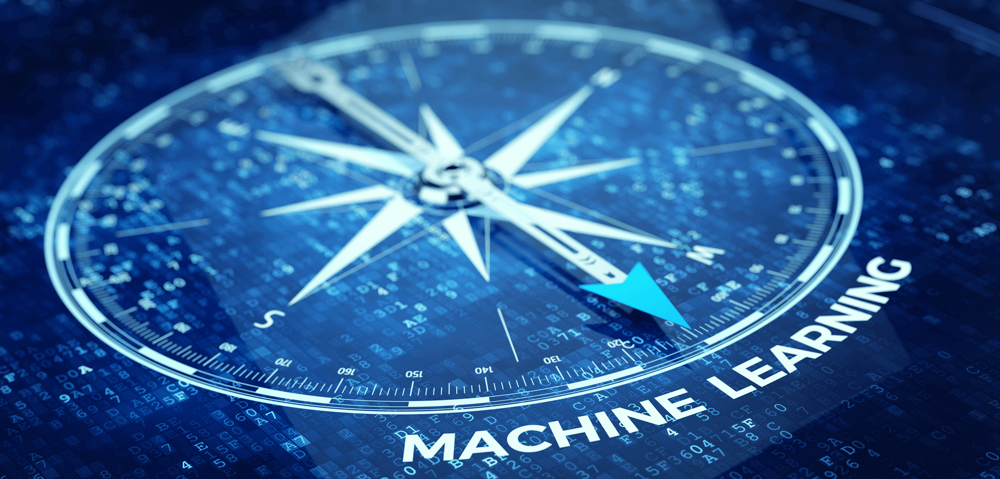
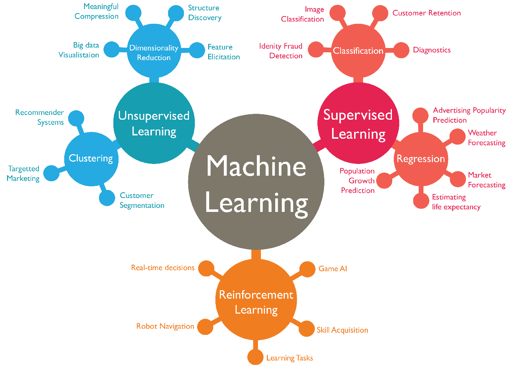
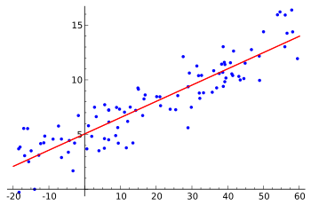
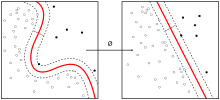
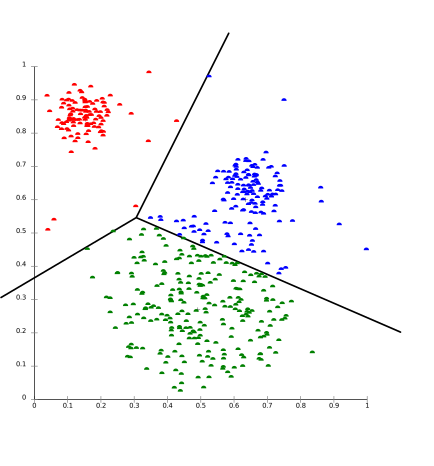

# 一. What is Machine Learning?

在机器学习的历史上，一共出现了两种定义。

- 1956 年，开发了西洋跳棋 AI 程序的 Arthur Samuel 在标志着人工智能学科诞生的达特茅斯会议上定义了 “机器学习” 这个词，定义为，“在没有明确设置的情况下，使计算机具有学习能力的研究领域”。

- 1997 年，Tom Mitchell 提供了一个更现代的定义：“如果用 P 来测量程序在任务 T 中性能。若一个程序通过利用经验 E 在 T 任务中获得了性能改善，则我们就说关于任务 T 和 性能测量 P ，该程序对经验 E 进行了学习。”

例如：玩跳棋。 

E = 玩很多盘跳棋游戏的经验

T = 玩跳棋的任务。

P = 程序将赢得下一场比赛的概率。

# 二. Classify

一般来说，任何机器学习问题都可以分配到两大类中的一个：

有监督学习 supervised learning 和无监督学习 unsupervised learning。

简单的说，监督学习就是我们教计算机去做某件事情，无监督学习是我们让计算机自己学习。

## 1. supervised learning

在监督式学习中，首先有一个数据集，并且已知正确的输出是什么，且输入和输出存在关联。 监督学习问题分为“回归 Regression”和“分类 Classification”问题。

在回归问题中，我们试图预测连续输出中的结果，这意味着我们试图将输入变量映射到某个连续函数。例如给定一个人的照片，根据照片预测年龄，这就是一个回归的问题。

在分类问题中，我们试图预测离散输出中的结果。换句话说，我们试图将输入变量映射到离散类别中。例如给予患有肿瘤的患者，我们必须预测肿瘤是恶性的还是良性的。

## 2. unsupervised learning

无监督学习使我们能够很少或根本不知道我们的结果应该是什么样子。我们可以从数据中得出结构，我们不一定知道变量的影响。 我们可以通过基于数据中变量之间的关系对数据进行聚类来推导出这种结构。 在无监督学习的情况下，没有基于预测结果的反馈。无监督学习可以分为“聚类”和“非聚类”。

聚类：获取1,000,000个不同基因的集合，并找到一种方法将这些基因自动分组成不同变量的相似或相关的组，例如寿命，位置，角色等。 

非聚类：“鸡尾酒会算法”，允许您在混乱的环境中查找结果。 （即在鸡尾酒会上识别来自声音网格的个人声音和音乐）。

------------------------------------------------------

# 三. Review

## Question 1

A computer program is said to learn from experience E with respect to some task T and some performance measure P if its performance on T, as measured by P, improves with experience E. Suppose we feed a learning algorithm a lot of historical weather data, and have it learn to predict weather. In this setting, what is E?

Answer
The process of the algorithm examining a large amount of historical weather data.

解答：  
T := The weather prediction task.  
P := The probability of it correctly predicting a future date's weather.  
E := The process of the algorithm examining a large amount of historical weather data.  

## Question 2
Suppose you are working on weather prediction, and you would like to predict whether or not it will be raining at 5pm tomorrow. You want to use a learning algorithm for this. Would you treat this as a classification or a regression problem?

Answer
Classification

解答：  
当我们试图预测少量离散值输出之一时，分类是合适的，比如是否会下雨（我们可能指定为0级），或者不会（例如1级）。

## Question 3
Suppose you are working on stock market prediction, and you would like to predict the price of a particular stock tomorrow (measured in dollars). You want to use a learning algorithm for this. Would you treat this as a classification or a regression problem?

Answer
Regression

解答：  
当我们试图预测连续价值的产出时，回归是合适的，因为作为一种股票的价格（类似于讲座中的房价例子）。

## Question 4
Some of the problems below are best addressed using a supervised learning algorithm, and the others with an unsupervised learning algorithm. Which of the following would you apply supervised learning to? (Select all that apply.) In each case, assume some appropriate dataset is available for your algorithm to learn from.

解答： 

1. Take a collection of 1000 essays written on the US Economy, and find a way to automatically group these essays into a small number of groups of essays that are somehow "similar" or "related".   
>这是一个无监督的学习/聚类问题（类似于讲座中的Google新闻示例）

2. Given a large dataset of medical records from patients suffering from heart disease, try to learn whether there might be different clusters of such patients for which we might tailor separate treatements.  
>这可以通过使用无监督学习，聚类算法来解决，我们将患者分组到不同的群中。

3. Given genetic (DNA) data from a person, predict the odds of him/her developing diabetes over the next 10 years. 
>这可以作为监督学习，分类问题来解决，我们可以从包含不同人的遗传数据的标记数据集中学习，并告诉我们他们是否患有糖尿病。

4. Given 50 articles written by male authors, and 50 articles written by female authors, learn to predict the gender of a new manuscript's author (when the identity of this author is unknown).
>这可以作为监督学习，分类问题来解决，我们从标记数据中学习以预测性别。

5. In farming, given data on crop yields over the last 50 years, learn to predict next year's crop yields.
>这可以解决为一个监督学习问题，我们从历史数据中学习（用历史作物产量标记）以预测未来作物产量。

6. Examine a large collection of emails that are known to be spam email, to discover if there are sub-types of spam mail.
>这可以使用聚类（无监督学习）算法来解决，以将垃圾邮件聚类为子类型。

7. Examine a web page, and classify whether the content on the web page should be considered "child friendly" (e.g., non-pornographic, etc.) or "adult."
>这可以作为监督学习，分类问题来解决，我们可以从已被标记为“儿童友好”或“成人”的网页数据集中学习。

8. Examine the statistics of two football teams, and predicting which team will win tomorrow's match (given historical data of teams' wins/losses to learn from).
>这可以通过监督式学习来解决，我们从历史记录中学习如何进行赢/输预测。

## Question 5
Which of these is a reasonable definition of machine learning?

Answer
Machine learning is the field of study that gives computers the ability to learn without being explicitly programmed.

解答：  
这是开发了西洋跳棋 AI 程序的 Arthur Samuel 给出的定义。

------------------------------------------------------

> GitHub Repo：[Halfrost-Field](https://github.com/halfrost/Halfrost-Field)
> 
> Follow: [halfrost · GitHub](https://github.com/halfrost)
>
> Source: [https://github.com/halfrost/Halfrost-Field/blob/master/contents/Machine\_Learning/What\_is\_Machine\_Learning.md](https://github.com/halfrost/Halfrost-Field/blob/master/contents/Machine_Learning/What_is_Machine_Learning.md)