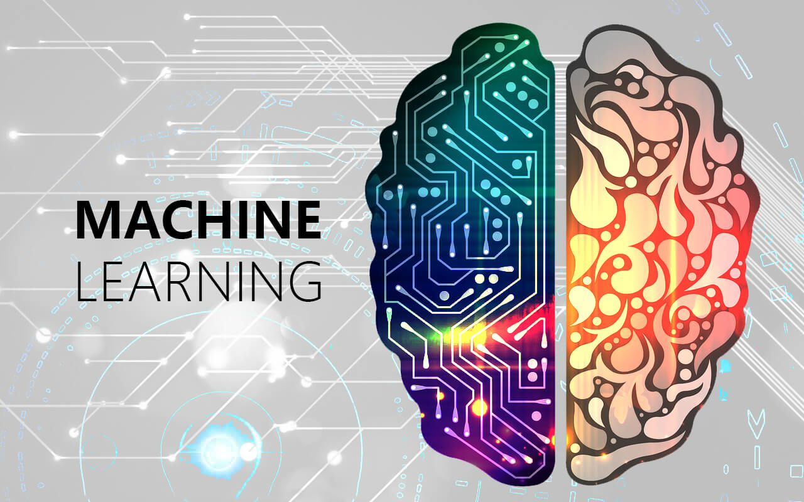

# 目录
- 前言

## 第一周：Welcome

- 1.1 [What is Machine Learning?](https://github.com/halfrost/Halfrost-Field/blob/master/contents/Machine_Learning/What_is_Machine_Learning.md)
- 1.2 [Linear Regression with One Variable](https://github.com/halfrost/Halfrost-Field/blob/master/contents/Machine_Learning/Gradient_descent.ipynb)

## 第二周：Linear Regression with Multiple Variables

- 2.1 [Multivariate Linear Regression](https://github.com/halfrost/Halfrost-Field/blob/master/contents/Machine_Learning/Multivariate_Linear_Regression.ipynb)
- 2.2 [Computing Parameters Analytically](https://github.com/halfrost/Halfrost-Field/blob/master/contents/Machine_Learning/Computing_Parameters_Analytically.ipynb)
- 2.3 [Octave/Matlab Tutorial](https://github.com/halfrost/Halfrost-Field/blob/master/contents/Machine_Learning/Octave_Matlab_Tutorial.ipynb)

## 第三周：Logistic Regression

- 3.1 [Logistic Regression](https://github.com/halfrost/Halfrost-Field/blob/master/contents/Machine_Learning/Logistic_Regression.ipynb)
- 3.2 [Regularization](https://github.com/halfrost/Halfrost-Field/blob/master/contents/Machine_Learning/Regularization.ipynb)

## 第四周：Neural Networks: Representation

- 4.1 [Neural Networks Representation](https://github.com/halfrost/Halfrost-Field/blob/master/contents/Machine_Learning/Neural_Networks_Representation.ipynb)

## 第五周：Neural Networks: Learning

- 5.1 [Neural Networks Learning](https://github.com/halfrost/Halfrost-Field/blob/master/contents/Machine_Learning/Neural_Networks_Learning.ipynb)
- 5.2 [Backpropagation in Practice](https://github.com/halfrost/Halfrost-Field/blob/master/contents/Machine_Learning/Backpropagation_in_Practice.ipynb)

## 第六周：Advice for Applying Machine Learning

- 6.1 [Advice for Applying Machine Learning](https://github.com/halfrost/Halfrost-Field/blob/master/contents/Machine_Learning/Advice_for_Applying_Machine_Learning.ipynb)
- 6.2 [Machine Learning System Design](https://github.com/halfrost/Halfrost-Field/blob/master/contents/Machine_Learning/Machine_Learning_System_Design.ipynb)

## 第七周：Support Vector Machines

- 7.1 [Support Vector Machines](https://github.com/halfrost/Halfrost-Field/blob/master/contents/Machine_Learning/Support_Vector_Machines.ipynb)

## 第八周：Unsupervised Learning

- 8.1 [Unsupervised Learning](https://github.com/halfrost/Halfrost-Field/blob/master/contents/Machine_Learning/Unsupervised_Learning.ipynb)
- 8.2 [Dimensionality Reduction](https://github.com/halfrost/Halfrost-Field/blob/master/contents/Machine_Learning/Dimensionality_Reduction.ipynb)

## 第九周：Anomaly Detection

- 9.1 [Anomaly Detection](https://github.com/halfrost/Halfrost-Field/blob/master/contents/Machine_Learning/Anomaly_Detection.ipynb)
- 9.2 [Recommender Systems](https://github.com/halfrost/Halfrost-Field/blob/master/contents/Machine_Learning/Recommender_Systems.ipynb)

## 第十周：Large Scale Machine Learning

- 10.1 [Large Scale Machine Learning](https://github.com/halfrost/Halfrost-Field/blob/master/contents/Machine_Learning/Large_Scale_Machine_Learning.ipynb)

## 第十一周：Application Example: Photo OCR

- 11.1 [Application Example: Photo OCR](https://github.com/halfrost/Halfrost-Field/blob/master/contents/Machine_Learning/Application_Photo_OCR.ipynb)

## 附录

------------------------------------------------------

> GitHub Repo：[Halfrost-Field](https://github.com/halfrost/Halfrost-Field)
> 
> Follow: [halfrost · GitHub](https://github.com/halfrost)
>
> Source: [https://github.com/halfrost/Halfrost-Field/blob/master/contents/Machine\_Learning/contents.md](https://github.com/halfrost/Halfrost-Field/blob/master/contents/Machine_Learning/contents.md)