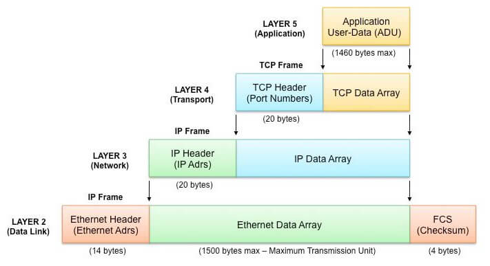
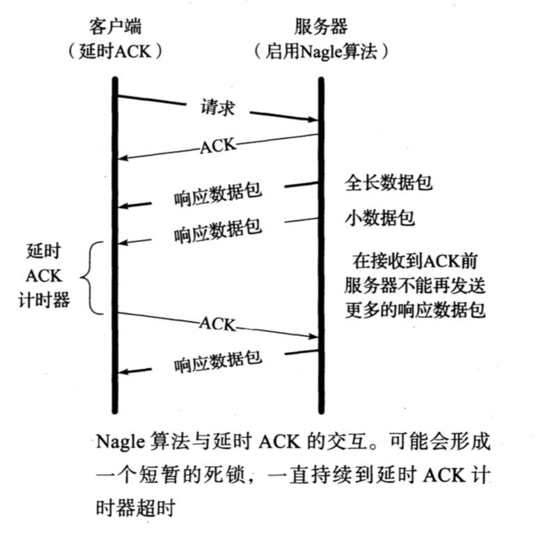
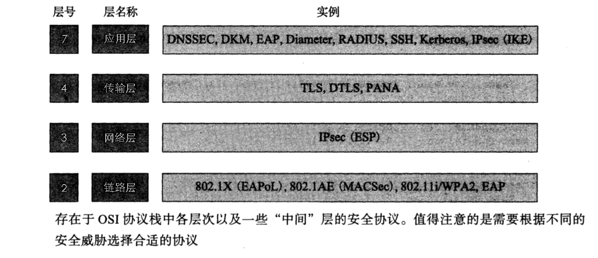

<p align='center'>

</p>

## 一. 端口号

标准的端口号由 Internet 号码分配机构(IANA)分配。这组数字被划分为特定范围，包括
熟知端口号(0 - 1023)、注册端口号(1024 - 49151)和动态/私有端口号(49152 - 65535)。

> 如果我们测试这些标准服务和其他 TCP/IP 服务(Telnet、 FTP、 SMTP等) 使用的端口号，会发现它们大多数是奇数。这是有历史原困的，这些端口号从 NCP 端口号派生而来(NCP 是网络控制协议，在 TCP 之前作为 ARPANET 的传输层协议)。NCP 虽然简单，但不是全双工的，困此每个应用需要两个连接，并为每个应用保留奇偶成对的端口号。当 TCP 和 UDP 成为标准的传输层协议时，每个应用只需要一个端口号，因此来自 NCP 的奇数端口号被使用。


## 二. TCP 初始序列号

在 TCP 数据报中，有一个 序列号 (Sequence Number)。如果序列号被人猜出来，就会展现出 TCP 的脆弱性。

如果选择合适的序列号、IP地址以及端口号，那么任何人都能伪造出一个 TCP 报文段，从而 打断 TCP 的正常连接[RFC5961]。一种抵御上述行为的方法是使初始序列号(或者临时端口 号[RFC6056])变得相对难以被猜出，而另一种方法则是加密。

Linux 系统采用一个相对复杂的过程来选择它的初始序列号。它采用基于时钟的方案，并且针对每一个连接为时钟设置随机的偏移量。随机偏移量是在连接标识(由 2 个 IP 地址与 2 个端口号构成的 4 元组，即 4 元组)的基础上利用加密散列函数得到的。散列函数的输人每隔 5 分钟就会改变一次。在 32 位的初始序列号中，最高的 8 位是一个保密的序列号，而剩余的备位则由散列函数生成。上述方法所生成的序列号很难被猜出，但依然会随着时间而逐步增加。据报告显示， Windows 系统使用了一种基于 RC4[S94] 的类似方案。

## 三. TCP 最大段大小

最大段大小是指 TCP 协议所允许的从对方接收到的最大报文段，因此这也是通信对方在发送数据时能够使用的最大报文段。根据 [RFCO879]，最大段大小只记录 TCP 数据的字节数而不包括其他相关的 TCP 与 IP 头部。当建立一条 TCP 连接时，通信的每一方都要在 SYN 报文段的 MSS 选项中说明自已允许的最大段大小。这 16 位的选项能够说明最大段大小的数值。在没有事先指明的情况下，最大段大小的默认数值为 536 字节。任何主机都应该能够处理至少 576 字节的 IPv4 数据报。如果接照最小的 IPv4 与 TCP 头部计算， TCP 协议要求在每次发送时的最大段大小为 536 字节，这样就正好能够组成一个 576 (20+20+536=576)字节的 IPv4 数据报。

**最大段大小的数值为 1460。 这是 IPv4 协议中的典型值**，因此 IPv4 数据报的大小也相应增加 40 个字节(总共 1500 字节，以太网中最大传输单元与互联网路径最大传输单元的典型数值): 20 字节的 TCP 头部加 20 字节的 IP 头部。

当使用 IPv6 协议时，最大段大小通常为 1440 字节。由于 IPv6 的头部比 IPv4 多 20 个字节，因此最大段大小的数值相 应减少 20 字节。在 [RFC2675] 中 65535 是一个特殊数值，与 IPv6 超长数据报一起用来指定一个表示无限大的有效最大段大小值。在这种情况下，发送方的最大段大小等于路径 MTU 的数值减去 60 字节(40 字节用于 IPv6 头部， 20 字节用于 TCP 头部)。值得注意的是，最大段大小并不是 TCP 通信双方的协商结果，而是一个限定的数值。当通信的一方将自已的最大段大小选项发送给对方时，它已表明自已不愿意在整个连接过程中接收任何大于该尺寸的报文段。

<p align='center'>

</p>


## 四. CLOSE\_WAIT过多的解决方法

情景描述：系统产生大量“Too many open files” 

原因分析：在服务器与客户端通信过程中，因服务器发生了 socket 未关导致的 closed\_wait 发生，致使监听 port 打开的句柄数到了 1024 个，且均处于 close\_wait 的状态，最终造成配置的port被占满出现 “Too many open files”，无法再进行通信。   
close\_wait 状态出现的原因是被动关闭方未关闭socket造成，如附件图所示： 


解决办法：有两种措施可行 

一、解决： 
原因是因为调用 ServerSocket 类的 accept() 方法和 Socket 输入流的 read() 方法时会引起线程阻塞，所以应该用 setSoTimeout() 方法设置超时（缺省的设置是0，即超时永远不会发生）；超时的判断是累计式的，一次设置后，每次调用引起的阻塞时间都从该值中扣除，直至另一次超时设置或有超时异常抛出。   
比如，某种服务需要三次调用 read()，超时设置为1分钟，那么如果某次服务三次 read()调用的总时间超过 1 分钟就会有异常抛出，如果要在同一个 Socket 上反复进行这种服务，就要在每次服务之前设置一次超时。
 
二、规避：   
调整系统参数，包括句柄相关参数和TCP/IP的参数； 

注意：   
/proc/sys/fs/file-max 是整个系统可以打开的文件数的限制，由 sysctl.conf 控制； 
ulimit 修改的是当前 shell 和它的子进程可以打开的文件数的限制，由 limits.conf 控制； 
lsof 是列出系统所占用的资源，但是这些资源不一定会占用打开文件号的；比如：共享内存，信号量，消息队列，内存映射等，虽然占用了这些资源，但不占用打开文件号；   
因此，需要调整的是当前用户的子进程打开的文件数的限制，即 limits.conf 文件的配置； 
如果 `cat /proc/sys/fs/file-max` 值为 65536 或甚至更大，不需要修改该值； 
若 ulimit -a ；其 open files 参数的值小于 4096（默认是1024)， 则采用如下方法修改 open files 参数值为8192；方法如下：  
 
1.使用root登陆，修改文件 /etc/security/limits.conf 
vi /etc/security/limits.conf 添加 
xxx - nofile 8192 
xxx 是一个用户，如果是想所有用户生效的话换成 * ，设置的数值与硬件配置有关，别设置太大了。 

```http
#<domain>      <type>     <item>         <value> 

*         soft    nofile    8192 
*         hard    nofile    8192 

#所有的用户每个进程可以使用8192个文件描述符。
```
 
2.使这些限制生效 
确定文件 /etc/pam.d/login 和 /etc/pam.d/sshd 包含如下行： 
session required pam_limits.so 
然后用户重新登陆一下即可生效。 
3. 在 bash 下可以使用 ulimit -a 参看是否已经修改： 

一、 修改方法：（暂时生效，重新启动服务器后，会还原成默认值） 

```http
sysctl -w net.ipv4.tcp_keepalive_time=600   
sysctl -w net.ipv4.tcp_keepalive_probes=2 
sysctl -w net.ipv4.tcp_keepalive_intvl=2 
```

注意：Linux 的内核参数调整的是否合理要注意观察，看业务高峰时候效果如何。 

二、 若做如上修改后，可起作用；则做如下修改以便永久生效。 
vi /etc/sysctl.conf 

若配置文件中不存在如下信息，则添加： 

```http
net.ipv4.tcp_keepalive_time = 1800 
net.ipv4.tcp_keepalive_probes = 3 
net.ipv4.tcp_keepalive_intvl = 15 
```

编辑完 /etc/sysctl.conf ，要重启 network 才会生效 
/etc/rc.d/init.d/network restart     
然后，执行 sysctl 命令使修改生效，基本上就算完成了。 

------------------------------------------------------------ 
修改原因： 

当客户端因为某种原因先于服务端发出了 FIN 信号，就会导致服务端被动关闭，若服务端不主动关闭 socket 发 FIN 给 Client，此时服务端 Socket 会处于 CLOSE\_WAIT 状态（而不是 LAST\_ACK 状态）。通常来说，一个 CLOSE\_WAIT 会维持至少 2 个小时的时间（系统默认超时时间的是 7200 秒，也就是 2 小时）。如果服务端程序因某个原因导致系统造成一堆 CLOSE\_WAIT 消耗资源，那么通常是等不到释放那一刻，系统就已崩溃。因此，解决这个问题的方法还可以通过修改 TCP/IP 的参数来缩短这个时间，于是修改 tcp\_keepalive\_\*系列参数： 

tcp\_keepalive\_time：   
/proc/sys/net/ipv4/tcp\_keepalive\_time   
INTEGER，默认值是7200(2小时)   
当 keepalive 打开的情况下，TCP 发送 keepalive 消息的频率。建议修改值为 1800秒。 

tcp\_keepalive\_probes：INTEGER   
/proc/sys/net/ipv4/tcp\_keepalive\_probes   
INTEGER，默认值是9   
TCP 发送 keepalive 探测以确定该连接已经断开的次数。(注意:保持连接仅在SO\_KEEPALIVE 套接字选项被打开是才发送.次数默认不需要修改，当然根据情形也可以适当地缩短此值。设置为 5 比较合适) 

tcp\_keepalive\_intvl：INTEGER   
/proc/sys/net/ipv4/tcp\_keepalive\_intvl   
INTEGER，默认值为75   
当探测没有确认时，重新发送探测的频度。探测消息发送的频率（在认定连接失效之前，发送多少个 TCP 的 keepalive 探测包）。乘以 tcp\_keepalive\_probes 就得到对于从开始探测以来没有响应的连接杀除的时间。默认值为 75 秒，也就是没有活动的连接将在大约 11 分钟以后将被丢弃。(对于普通应用来说，这个值有一些偏大，可以根据需要改小.特别是 web 类服务器需要改小该值，15 是个比较合适的值) 

【检测办法】   

1. 系统不再出现“Too many open files”报错现象。 

2. 处于 TIME\_WAIT 状态的 sockets 不会激长。 

在 Linux 上可用以下语句看了一下服务器的 TCP 状态(连接状态数量统计)： 

```http
netstat -n | awk '/^tcp/ {++S[$NF]} END {for(a in S) print a, S[a]}' 
```

返回结果范例如下： 

ESTABLISHED 1423   
FIN\_WAIT1 1   
FIN\_WAIT2 262   
SYN\_SENT 1   
TIME\_WAIT 962  


## 五. TIME\_WAIT 状态

TIME\_WAIT 状态也称为 2MSL 等待状态。在该状态中， TCP 将会等待两倍于最大段生存期(Maximum Segment Lifetime， MSL)的时间，有时也被称作加倍等待。每个实现都必 须为最大段生存期选择一个数值。它代表任何报文段在被丢弃前在网络中被允许存在的最长 时间。我们知道这个时限是有限制的，因为 TCP 报文段是以 IP 数据报的形式传输的， IP数据报拥有 TTL 字段和跳数限制字段。这两个字段限制了 IP 数据报的有效生存时间。

[RFC0793] 将最大段生存期设为 2 分钟。然而在常见实现中，最大段生存期的数值可
以为 30 秒、 1 分钟或者 2 分钟。在绝大多数情况下，这一数值是可以修改的。在 Linux系统中， `net.ipv4.tcp_fin_timeout` 的数值记录了 2MSL 状态需要等待的超时时间(以秒为单位)。 在 Windows 系统，下面的注册键值也保存了超时时间:

```http
HKLM\SYSTEM\currentcontrolSet\Services\Tcpip\parameters\TcpTimedWaitDelay
```

该键值的取值范围是30 - 300秒。对于 IPv6 而言，只需要将键值中的 `Tcpip` 替换为`Tcpip6` 即可。

至于为什么要设置 2MSL 等待时间，答案可以看[这里](https://github.com/halfrost/Halfrost-Field/blob/master/contents/Protocol/TCP:IP.md#%E4%B8%BA%E4%BB%80%E4%B9%88%E5%AE%A2%E6%88%B7%E7%AB%AF%E9%87%8A%E6%94%BE%E6%9C%80%E5%90%8E%E9%9C%80%E8%A6%81-time-wait-%E7%AD%89%E5%BE%85-2msl-%E5%91%A2)


## 六. TCP 重置报文段

TCP 头部的 RST 位字段。一个将该字段置位的报文段被称作“重置报文 段”或简称为“重置” 。一般来说，当发现一个到达的报文段对于相关连接而言是不正确的时， TCP 就会发送一个重置报文段。 (此处，相关连接是指由重置报文段的 TCP 与 IP 头部的4元组所指定的连接)。重置报文段通常会导致 TCP 连接的快速拆卸。

重置报文会有以下的用途：

- 1. 针对不存在端口的连接请求。
- 2. 终止一条连接。
- 3. 半开连接。
- 4. 时间等待错误。


解释一下时间等待错误：

客户端处于 TIME\_WAIT 阶段，这个时候突然接收到服务器发过来的旧报文段时， TCP 会发送一个 ACK 作为响应，其中包含了最新的序列号与 ACK 号(分别是 K 与 L)。然而，当服务器接收到这个报文段以后， 它没有关于这条连接的任何信息，因此发送一个重置报文段作为响应。这并不是服务器的问题，但它却会使客户端过早地从 TIME_WAIT 状态转移至 CLOSED 状态。许多系统规定当处于 TIME\_WAIT 状态时不对重置报文段做出反应，从而避免了上述间题。


## 七. Nagle 算法

在 ssh 连接中，通常单次击键就会引发数据流的传输。如果使用 IPv4，一次按键会生成约 88 字节大小的 TCP/IPv4 包(使用加密和认证) : 20 字节的 IP头部， 20 字节的 TCP 头部(假设没有选项)，数据部分为 48 字节。这些小包(称为微型报 tinygram )会造成相当高的网络传输代价。也就是说，与包的其他部分相比，有效的应用数据所占比例甚微。该问题对于局域网不会有很大影响，因为大部分局域网不存在拥塞， 而且这些包无须传输很远。然而对于广域网来说则会加重拥塞，严重影响网络性能。John Nagle 在 [RFCO896] 中提出了一种简单有效的解决方法，现在称其为 Nagle 算法。

Nagle 算法要求，当一个 TCP 连接中有在传数据(即那些已发送但还未经确认的数据)， 小的报文段(长度小于 SMSS )就不能被发送，直到所有的在传数据都收到ACK。并且，在收到 ACK 后， TCP 需要收集这些小数据，将其整合到一个报文段中发送。这种方法迫使 TCP 遵循停等( stop-and-Wait )规程一只有等接收到所有在传数据的 ACK 后才能继续发送。该算法的精妙之处在于它实现了自时钟(self-CIocking)控制: ACK 返回越快，数据传输也越快。在相对高延迟的广域网中，更需要减少微型报的数目，该算法使得单位时间内发 送的报文段数目更少。也就是说， RTT 控制着发包速率。

### Nagle 算法和延时 ACK 带来的问题

若将延时 ACK 与 Nagle 算法直接结合使用，得到的效果可能不尽如人意。考虑如下情形，客户端使用延时 ACK 方法发送一个对服务器的请求，而服务器端的响应数据并不适合在同一个包中传输。

<p align='center'>

</p>


从上图中可以看到，在接收到来自服务器端的两个包以后，客户端并不立即发送 ACK，而是处于等待状态，希望有数据一同捎带发送。通常情况下， TCP 在接收到两个全长的数据包后就应返回一个 ACK，但这里并非如此。在服务器端，由于使用了 Nagle 算法，直到收到 ACK 前都不能发送新数据，因为任一时刻只允许至多一个包在传。因此延时 ACK 与 Nagle 算法的结合导致了某种程度的死锁(两端互相等待对方做出行动) [MMSV99] [MMO1]。幸运的是，这种死锁并不是永久的，在延时 ACK 计时器超时后死锁会解除。客户端即使仍然没有要发送的数据也无需再等待，而可以只发送 ACK 给服务器。然而，在死锁期间整个传输连接处于空闲状态，使性能变差。在某些情况下，如这里的 ssh 传输，可以禁用 Nagle 算法。

**要求延迟较小的应用，实时网络游戏等，都要禁用这个 Nagle 算法**。

禁用 Nagle 算法有多种方式，主机需求 RFC [RFCl122] 列出了相关方法。若某个应用使 用 Berkeley 套接字 API，可以设置 TCP\_NODELAY 选项。另外，也可以在整个系统中禁用该算法。在 Windows 系统中，使用如下的注册表项:

```http
    HKLM\SOFTWARE\Microsoft\MSMQ\parameters\TCPNoDelay
```

这个双字节类型的值必须由用户添加，应将其设为1。为使更改生效，消息队列也需要重新设置。

## 八. TCP 安全协议与分层


链路层的安全服务致力于保护一跳通信中的信息，网络层的安全服务致力于保护两个主机之间传输的信息，传输层的安全服务致力于保护进程与进程之间的通信，应用层的安全服务致力于保护应用程序操纵的信息。在通信的备层次中，由独立于通信层的应用来负责保护数据的工作也是可以的(例如，文件能够经过加密并以电子邮件附件的 方式发送出去)。


<p align='center'>

</p>

上图展示了与 TCP/IP 结合使用的最常见的安全协议。


有些安全协议会针对某一个协议层，而有一些安全协议则会跨越多个协议层。虽然不会
像 TCP/IP 协议那样被经常讨论，但是一些链路技术(包括它们自已的加密与认证协议)从第  2 层起就开始了保障安全的工作。在 TCP/IP 协议中， EAP 用于建立包含多种机制的身份验证，比如机器证书、用户证书、智能卡、密码等。EAP 常用于拥有后台认证或 AAA 服务器 的企业设置。EAP 还可以用于其他协议的认证，比如 IPsec。

IPsec 是一个提供第 3 层安全的协议集合，其中包括 IKE、 AH 以及ESP。IKE 建立并管理双方之间的安全关联。安全关联涉及认证(AH)或加密(ESP)，并且能够运行于传输或隧道模式。在传输模式中，会修改 IP 头部以进行认证或加密，而在隧道模式中， IP 数据报会被完全放置在一个新的IP数据报中。ESP 是 IPsec 最流行的协议。所有的 IPsec 协议能够使用不同的算洼与参数(加密套件)进行加密、完整性保护、 DH密钥协商以及身份认证。

沿协议栈向上查看，传输层安全(当前版本为TLS l.3)保护了两个应用程序之间的信息。它拥有自已的内部分层，包含一个记录层协议和三个信息交换协议:密码更改协议、警告协议、握手协议。此外，记录协议支持应用数据。记录层负责根据握手协议提供的参数加密数据并保障它们的完整性。密码更改协议用于将之前设定的挂起协议状态更改为活动协议状态。警告协议会指出错误或连接间题。与 TCP/IP 一起使用的 TLS 是使用最广泛的安全 协议，并且它还支持加密的 Web 测览器连接(HTTPS)。TLS 的一个变种称为 DTLS，它将 TLS 应用于数据报协议，比如 UDP 与 DCCP。


## 九. 短连接，并行连接，持久连接与长连接


## 短连接

短连接多用于操作频繁，点对点的通讯，而且连接数不能太多的情况。每个 TCP 连接的建立都需要三次握手，每个 TCP 连接的断开要四次挥手。适用于并发量大，但是每个用户又不需频繁操作的情况。  

但是在用户需要频繁操作的业务场景下(如新用户注册，网购提交订单等)，频繁的使用短连接则会使性能时延产生叠加。

用户登录这些不频繁的操作可以考虑用短连接。

## 并行连接

针对短连接，人们想出了优化的办法，连接多条，形成并行连接。 
    
并行连接允许客户端打开多条连接，并行地执行多个事务，每个事务都有自己的TCP连接。这样可以克服单条连接的空载时间和带宽限制，时延可以重叠起来，而且如果单条连接没有充分利用客户端的网络带宽，可以将未用带宽分配来装载其他对象。  

在PC时代，利用并行连接来充分利用现代浏览器的多线程并发下载能力的场景非常广泛。 
 
但是并行连接也会产生一定的问题，首先并行连接不一定更快，因为带宽资源有限，每个连接都会去竞争这有限的带宽，这样带来的性能提升就很小，甚至没什么提升。  

**一般机器上面并行连接的条数 4 - 6 条**。

## 持久连接

HTTP1.0 版本以后，允许 HTTP 设备在事务处理结束之后将 TCP 连接保持在打开状态，以便为未来的 HTTP 请求重用现存的连接。在事务处理结束之后仍然保持在打开状态的 TCP 连接被称为持久连接。

持久连接的时间参数，通常由服务器设定，比如 nginx 的 keepalivetimeout，keepalive timout 时间值意味着：一个 http 产生的 tcp 连接在传送完最后一个响应后，还需要 hold 住 keepalive\_timeout 秒后，才开始关闭这个连接；


**在 HTTP 1.1 中 所有的连接默认都是持续连接**，除非特殊声明不支持。HTTP 持久连接不使用独立的 keepalive 信息，而是仅仅允许多个请求使用单个连接。然而，Apache 2.0 httpd 的默认连接过期时间是仅仅 15 秒，对于 Apache 2.2 只有 5 秒。短的过期时间的优点是能够快速的传输多个 web 页组件，而不会绑定多个服务器进程或线程太长时间。

持久连接与并行连接相比，带来的优势如下：

1. 避免了每个事务都会打开/关闭一条新的连接，造成时间和带宽的耗费；
2. 避免了 TCP 慢启动特性的存在导致的每条新连接的性能降低；
3. 可打开的并行连接数量实际上是有限的，持久连接则可以减少建立的连接的数量；


## 长连接
  长连接与持久连接本质上非常的相似，持久连接侧重于 HTTP 应用层，特指一次请求结束之后，服务器会在自己设置的 keepalivetimeout 时间到期后才关闭已经建立的连接。长连接则是 client 方与 server 方先建立连接，连接建立后不断开，然后再进行报文发送和接收，直到有一方主动关闭连接为止。

长连接的适用场景也非常的广泛：

1. 监控系统：后台硬件热插拔、LED、温度、电压发生变化等；
2. IM 应用：收发消息的操作；
3. 即时报价系统：例如股市行情 push 等；
4. 推送服务：各种 App 内置的 push 提醒服务；

## 十. 心跳问题

### 心跳的必要性

虽然TCP提供了KeepAlive机制，但是并不能替代应用层心跳保活。原因主要如下：

(1) Keep Alive 机制开启后，TCP 层将在定时时间到后发送相应的 KeepAlive 探针以确定连接可用性。默认时间为7200s(两小时)，失败后重试10次，每次超时时间75s。显然默认值无法满足移动网络下的需求；

(2) 即便修改了(1)中的默认值，也不能很好的满足业务需求。TCP 的 KeepAlive 用于检测连接的死活而不能检测通讯双方的存活状态。比如某台服务器因为某些原因导致负载超高，无法响应任何业务请求，但是使用 TCP 探针则仍旧能够确定连接状态，这就是典型的连接活着但业务提供方已死的状态，对客户端而言，这时的最好选择就是断线后重新连接其他服务器，而不是一直认为当前服务器是可用状态，一直向当前服务器发送些必然会失败的请求。

(3) socks 代理会让 Keep Alive 失效。socks 协议只管转发 TCP 层具体的数据包，而不会转发 TCP 协议内的实现细节的包。所以，一个应用如果使用了 socks 代理，那么 TCP 的 KeepAlive 机制就失效了。

(4) 部分复杂情况下 Keep Alive 会失效，如路由器挂掉，网线直接被拔除等；

**KeepAlive 并不适用于检测双方存活的场景，这种场景还得依赖于应用层的心跳。应用层心跳也具备着更大的灵活性，可以控制检测时机，间隔和处理流程，甚至可以在心跳包上附带额外信息。**


### 心跳时间影响因素

应用层心跳是检测连接有效性以及判断双方是否存活的有效方式。但是心跳过于频繁会带来耗电和耗流量的弊病，心跳频率过低则会影响连接检测的实时性。业内关于心跳时间的设置和优化，主要基于如下几个因素：

1. NAT 超时–大部分移动无线网络运营商在链路一段时间没有数据通讯时，会淘汰 NAT 表中的对应项，造成链路中断；
2. DHCP 租期– DHCP 租期到了需要主动续约，否则会继续使用过期IP导致长连接偶然的断连；
3. 网络状态变化–手机网络和 WIFI 网络切换、网络断开和连上等情况有网络状态的变化，也会使长连接变为无效连接；

以下是网络运营商的一些 NAT 超时时间。

| 地区/网络 | NAT超时时间 |  备注|
| :---: | :---: | :---: | 
|中国移动3G和2G|	5分钟||
|中国联通2G|	5分钟||
|中国电信3G	|大于28分钟||
|美国3G|	大于28分钟||
|台湾3G	|大于28分钟||

所以一般心跳包设置时间都在 3 分钟左右。

### 智能心跳

a）延迟心跳测试法：这是测试结果准确的前提保障，我们认为长连接建立后连续三次成功的短心跳就可以很大程度的保证下一次心跳环境是正常的。

b）成功一次认定，失败连续累积认定：成功是绝对的，连续失败多次才可能是失败。

c）临界值避免：我们使用比计算出的心跳稍微小一点的值做为稳定心跳避免临界值。

d）动态调整：即使在一次完整的智能心跳计算过程中，我们没有找到最好的值，我们还有机会来进行校正。

需要心跳包的背景：

a. 运营商的信令风暴。  
b. 运营商网络换代，NAT超时趋于增大。  
c. Alarm耗电，心跳耗流量。  

动态心跳引入下列状态：

a. 前台活跃态：亮屏，微信在前台，  周期minHeart (4.5min) ，保证体验。  
b. 后台活跃态：微信在后台10分钟内，周期minHeart ，保证体验。  
c. 自适应计算态：步增心跳，尝试获取最大心跳周期(sucHeart)。  
d. 后台稳定态：通过最大周期，保持稳定心跳。  

老版本微信心跳时间维持在 4.5 分钟，即 270 s 左右。

策略可以如下：

初始心跳 180 s，每次发送心跳包都延迟 30 s，如果每次心跳包都能成功发送，就一直往后延，这样做的目的是为了找到最长心跳时间。一旦发现连接失败，就重连，重连上来以后，先把断线以前累计的心跳时长减少 20 s，再尝试以这个新的心跳时长发送心跳。逐渐找到一个最佳值。如果连续 5 次都连接失败，再次重连以初始心跳 180 s 尝试重连。


## 十一. QQ，微信

早期的时候，QQ 还是主要使用 TCP 协议，而后来就转向了采用 UDP 的方式来保持在线，TCP 的方式来上传和下载数据。现在，UDP 是 QQ 的默认工作方式，表现良好。相信这个也被沿用到了微信上。

简单的考证：登录 PC 版 QQ，关闭多余的 QQ 窗口只留下主窗口，并将其最小化。几分钟过后，查看系统网络连接，会发现 QQ 进程已不保有任何 TCP 连接，但有 UDP 网络活动。这时在发送聊天信息，或者打开其他窗口和功能，将发现 QQ 进程会启用 TCP 连接。

登陆成功之后，QQ 有一个 TCP 连接来保持在线状态。这个 TCP 连接的远程端口一般是80，采用 UDP 方式登陆的时候，端口是 8000。


QQ 客户端之间的消息传送采用了 UDP，因为国内的网络环境非常复杂，而且很多用户采用的方式是通过代理服务器共享一条线路上网的方式，在这些复杂的情况下，客户端之间能彼此建立起来 TCP 连接的概率较小，严重影响传送信息的效率。而 UDP 包能够穿透大部分的代理服务器，因此 QQ 选择了 UDP 作为客户之间的主要通信协议。

腾讯采用了上层协议来保证可靠传输：如果客户端使用 UDP 协议发出消息后，服务器收到该包，需要使用 UDP 协议发回一个应答包。如此来保证消息可以无遗漏传输。之所以会发生在客户端明明看到“消息发送失败”但对方又收到了这个消息的情况，就是因为客户端发出的消息服务器已经收到并转发成功，但客户端由于网络原因没有收到服务器的应答包引起的。

总结一下：

登陆采用 TCP 协议和 HTTP 协议，好友之间发送消息，主要采用 UDP 协议，内网传文件采用了 P2P ，不需要服务器中转。


------------------------------------------------------

Reference：  
《TCP/IP 详解 卷1:协议》  

> GitHub Repo：[Halfrost-Field](https://github.com/halfrost/Halfrost-Field)
> 
> Follow: [halfrost · GitHub](https://github.com/halfrost)
>
> Source: [https://halfrost.com/advance\_tcp/](https://halfrost.com/advance_tcp/)