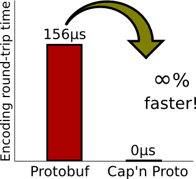

# 深入浅出 FlatBuffers 之 Encode

<p align='center'>

</p>

## 一. FlatBuffers 生成二进制流

FlatBuffers 的使用和 Protocol buffers 基本类似。只不过功能比 Protocol buffers 多了一个解析 JSON 的功能。

- 编写 schema 文件，描述数据结构和接口定义。
- 用 flatc 编译，生成相应语言的代码文件。
- 解析 JSON 数据，把数据存储成对应的 schema，并存入 FlatBuffers 二进制文件中。
- 使用 FlatBuffers 支持的语言（如C ++，Java等）生成的文件进行开发。

接下来简单的定义一个 schema 文件，来看看 FlatBuffers 的使用。

```schema
// Example IDL file for our monster's schema.
namespace MyGame.Sample;
enum Color:byte { Red = 0, Green, Blue = 2 }
union Equipment { Weapon } // Optionally add more tables.
struct Vec3 {
  x:float;
  y:float;
  z:float;
}
table Monster {
  pos:Vec3; // Struct.
  mana:short = 150;
  hp:short = 100;
  name:string;
  friendly:bool = false (deprecated);
  inventory:[ubyte];  // Vector of scalars.
  color:Color = Blue; // Enum.
  weapons:[Weapon];   // Vector of tables.
  equipped:Equipment; // Union.
  path:[Vec3];        // Vector of structs.
}
table Weapon {
  name:string;
  damage:short;
}
root_type Monster;
```

用 flatc 编译之后，利用生成的文件就可以开始开发了。

```go
import (
        flatbuffers "github.com/google/flatbuffers/go"
        sample "MyGame/Sample"
)

// 创建 `FlatBufferBuilder` 实例, 用它来开始创建 FlatBuffers ，初始化大小 1024
// buffer 的大小会根据需要自动增长，所以不必担心空间不够
builder := flatbuffers.NewBuilder(1024)

weaponOne := builder.CreateString("Sword")
weaponTwo := builder.CreateString("Axe")
// 创建第一把武器，剑
sample.WeaponStart(builder)
sample.Weapon.AddName(builder, weaponOne)
sample.Weapon.AddDamage(builder, 3)
sword := sample.WeaponEnd(builder)
// 创建第二把武器，斧
sample.WeaponStart(builder)
sample.Weapon.AddName(builder, weaponTwo)
sample.Weapon.AddDamage(builder, 5)
axe := sample.WeaponEnd(builder)

```

在序列化 Monster 之前，我们需要首先序列化包含在 Monster 其中的所有对象，即我们使用深度优先，先根遍历序列化数据树。这在任何树结构上通常很容易实现。

```go
// 对 name 字段赋值
name := builder.CreateString("Orc")

// 这里需要注意的是，由于是 PrependByte，前置字节，所以循环的时候需要反向迭代
sample.MonsterStartInventoryVector(builder, 10)
for i := 9; i >= 0; i-- {
        builder.PrependByte(byte(i))
}
inv := builder.EndVector(10)
```

上面这段代码中，我们序列化了两个内置的数据类型（字符串和数组）并捕获了它们的返回值。这个值是序列化数据的偏移量，表示它们的存储位置，拿到这个偏移量以后，以便我们在向 Monster 添加字段时可以参考它们。

这里的建议是，如果要创建嵌套对象的数组（例如 tables，字符串数组或其他数组），可以先把它们的偏移量收集到临时数据结构中，然后创建一个包含其偏移量的附加数组去存储所有的偏移量。

如果不是从现有数组创建一个数组，而是逐个序列化元素，请注意顺序，buffers 是从后往前 build 的。

```go
// 创建 FlatBuffer 数组，前置这些武器。
// 注意：因为我们前置数据，所以插入的时候记得要逆序插入。
sample.MonsterStartWeaponsVector(builder, 2)
builder.PrependUOffsetT(axe)
builder.PrependUOffsetT(sword)
weapons := builder.EndVector(2)
```

FlatBuffer 数组现在就包含了他们的偏移量。

另外需要注意的是，处理 structs 数组和 table 是完全不同的，因为 structs 完全是存储在数组中。例如，要为上面的 path 字段创建一个数组：

```go
sample.MonsterStartPathVector(builder, 2)
sample.CreateVec3(builder, 1.0, 2.0, 3.0)
sample.CreateVec3(builder, 4.0, 5.0, 6.0)
path := builder.EndVector(2)
```

上面已经序列化好了非标量的字段，接下来可以继续序列化标量字段了：

```go
// 构建 monster 通过调用 `MonsterStart()` 开始， `MonsterEnd()` 结束。
sample.MonsterStart(builder)
vec3 := sample.CreateVec3(builder, 1.0, 2.0, 3.0)
sample.MonsterAddPos(builder, vec3)
sample.MonsterAddName(builder, name)
sample.MonsterAddColor(builder, sample.ColorRed)
sample.MonsterAddHp(builder, 500)
sample.MonsterAddInventory(builder, inv)
sample.MonsterAddWeapons(builder, weapons)
sample.MonsterAddEquippedType(builder, sample.EquipmentWeapon)
sample.MonsterAddEquipped(builder, axe)
sample.MonsterAddPath(builder, path)
orc := sample.MonsterEnd(builder)
```

还是需要注意如何在 table 中创建 Vec3 struct。与 table 不同，struct 是标量的简单组合，它们总是以内联方式存储，就像标量本身一样。

**重要的提醒**：与 struct 不同，您不应该嵌套序列化 table 或其他对象，这就是为什么我们在 start 之前就创建好了此 monster 引用的所有 string / vectors / table 的原因。如果您尝试在 start 和 end 之间创建它们中的任何一个，则会根据您的语言获得 assert / exception / panic。

在 schema 中定义了 hp 和 mana 的默认值，如果初始化的时候不需要改变，就不需要再把值添加到 buffer 中。这样这个字段不会写入到 buffer 中，可以节约传输消耗，减少 buffer 的大小。所以设置好一个合理的默认值可以节约一定的空间。当然，不必担心 buffer 中没有存这个值，get 的时候会从另外一个地方把默认值读取出来的。

**这也意味着不用担心添加了很多仅在少数实例中使用的字段，它们都默认使用默认值，是不会占用 buffer 的大小的**。

在完成序列化之前，再回顾一下 FlatBuffer union Equipment。每个 FlatBuffer union 都有两部分(具体描述可以看[前一篇文章]())。第一个是隐藏字段 `_type`，它是为了保存 union 所引用的 table 的类型而生成的。这使您可以知道在运行时投入哪种类型。第二个字段是，union 的数据。

所以我们也需要添加 2 个字段，一个是 Equipped Type，另一个是 Equipped union。具体代码在这里(上面初始化过了)：

```go
sample.MonsterAddEquippedType(builder, sample.EquipmentWeapon) // Union type
sample.MonsterAddEquipped(builder, axe) // Union data
```

创建 buffer 之后，你将会得到整个数据相对于根的偏移量，通过调用 finish 方法结束创建，这个偏移量会保存在一个变量中，如下代码，偏移量会保存在 orc 变量中：

```go
// 调用 `Finish()` 方法告诉 builder，monster 构建完成。
builder.Finish(orc)
```

到现在，buffer 就已经构建完成了，可以通过网络发送出去，也可以经过压缩存储起来。最后通过下面这个方法完成最后一步：

```go
// 这个方法必须在 `Finish()` 方法调用之后，才能调用。
buf := builder.FinishedBytes() // Of type `byte[]`.
```

至此，可以把二进制字节写入到文件中，通过网络发送它们了。**请一定要确保发送的文件模式(或者传输协议)是二进制，而不是 text**。如果在 text 格式下传输 FlatBuffer，则 buffer 将会损坏，这将导致您在另外一边读取 buffer 时很难发现问题。


## 二. FlatBuffers 读取二进制流

<p align='center'>

</p>


上一章讲到了如何利用 FlatBuffers 把数据转为二进制流，这一节讲讲如何读取。

读取之前还是需要保证通过二进制模式读取的，其他读取方式读取都读不到正确的数据。

```go
import (
        flatbuffers "github.com/google/flatbuffers/go"
        sample "MyGame/Sample"
)

// 先准备一个二进制数组，存储 buffer 二进制流
var buf []byte = /* the data you just read */
// 从 buffer 中拿到根访问器
monster := sample.GetRootAsMonster(buf, 0)

```

这里默认 offset 是 0，如果想要直接从 `builder.Bytes` 开始读取数据，那么需要传入一个 offset 跳过 `builder.Head()`。由于 builder 构造的时候是逆向构造的，所以 offset 肯定不会是 0 。

由于导入了 flatc 编译出来的文件，里面已经包含了 get 和 set 方法了。带有 deprecated 默认不会生成对应的方法。

```go
hp := monster.Hp()
mana := monster.Mana()
name := string(monster.Name()) // Note: `monster.Name()` returns a byte[].

pos := monster.Pos(nil)
x := pos.X()
y := pos.Y()
z := pos.Z()
```

上述代码获取 pos 传入的是 nil，如果你的程序对性能要求特别高的时候，可以传入一个指针变量，这样就可以重用，减少很多因为 alloc 小对象，垃圾回收时候造成的性能问题。如果小对象特别多，还会造成 GC 相关的问题。

```go
invLength := monster.InventoryLength()
thirdItem := monster.Inventory(2)
```

数组的读取方式和一般数组用法一样的，这里就不再赘述了。

```go
weaponLength := monster.WeaponsLength()
weapon := new(sample.Weapon) // We need a `sample.Weapon` to pass into `monster.Weapons()`
                             // to capture the output of the function.
if monster.Weapons(weapon, 1) {
        secondWeaponName := weapon.Name()
        secondWeaponDamage := weapon.Damage()
}
```

table 的数组，和一般数组的基本用法也是一样的，唯一区别就是里面都是对象，按照对应的处理方式即可。

最后就是 union 的读取方式。我们知道 union 会包含 2 个字段，一个类型和一个数据。需要通过类型去判断反序列化什么数据。

```go
// 新建一个 `flatbuffers.Table` 去存储 `monster.Equipped()` 的结果。
unionTable := new(flatbuffers.Table)
if monster.Equipped(unionTable) {
        unionType := monster.EquippedType()
        if unionType == sample.EquipmentWeapon {
                // Create a `sample.Weapon` object that can be initialized with the contents
                // of the `flatbuffers.Table` (`unionTable`), which was populated by
                // `monster.Equipped()`.
                unionWeapon = new(sample.Weapon)
                unionWeapon.Init(unionTable.Bytes, unionTable.Pos)
                weaponName = unionWeapon.Name()
                weaponDamage = unionWeapon.Damage()
        }
}
```

通过 unionType 对应不同类型，反序列化不同类型的数据。毕竟一个 union 里面只装一个 table。


## 三. 可变的 FlatBuffers


<p align='center'>

</p>

从上面使用方式来看，发送方准备好 buffer 二进制流，发给使用方，使用方拿到 buffer 二进制流以后，从中读取出数据。如果使用方还想把 buffer 稍作更改传递给下一个使用方，只能重新创建一个全新的 buffer ，然后把要更改的字段在创建的时候改掉，再传给下一个使用方。

如果只是小改一个字段，导致又要重新创建一个很大的 buffer，这会非常不方便。如果要更改很多字段，可以考虑从 0 开始新建 buffer，因为这样更加高效，API 也更叫通用。

如果想创建可变的 flatbuffer，需要在 flatc 编译 schema 的时候添加 `--gen-mutable` 编译参数。

编译出来代码会使用 mutate 而不是 set 来表示这是一个特殊用例，尽量避免与构造 FlatBuffer 数据的默认方式混淆。

**mutating API 暂时还不支持 golang**。

请注意，table 中 任何 mutate 函数都会返回布尔值，如果我们尝试设置一个不存在于 buffer 中的字段，则会返回 false。**不存在于 buffer 中的字段有 2 种情况，一种情况是本身没有 set 值，另外一种情况是值和默认值相同**。例如上面里面中的 mana = 150，它由于是默认值，是不会存储在 buffer 中的。如果调用 mutate 方法，将会返回 false，并且它们的值不会被修改。

解决此问题的一种方法是在 FlatBufferBuilder 上调用 ForceDefaults 以强制设置所有字段可写。这当然会增加 buffer 的大小，但这对于可变 buffer 是可以接受的。

如果这种方法还不能被接受，就调用对应的 API (--gen-object-api) 或者反射方法。目前 C++ 版本的 API 在这方面支持的最全。


## 四. FlatBuffers 编码原理

<p align='center'>

</p>

根据上面简单实用的流程，我们一步步的来看看源码。


### 1. 新建 FlatBufferBuilder

```go
builder := flatbuffers.NewBuilder(1024)
```

第一步新建 FlatBufferBuilder，在 builder 中，会初始化最终我们序列化好的，使用 little endian 的二进制流，二进制流是从高内存地址往低内存地址写。

```go
type Builder struct {
	// `Bytes` gives raw access to the buffer. Most users will want to use
	// FinishedBytes() instead.
	Bytes []byte

	minalign  int
	vtable    []UOffsetT
	objectEnd UOffsetT
	vtables   []UOffsetT
	head      UOffsetT
	nested    bool
	finished  bool
}


type (
	// A SOffsetT stores a signed offset into arbitrary data.
	SOffsetT int32
	// A UOffsetT stores an unsigned offset into vector data.
	UOffsetT uint32
	// A VOffsetT stores an unsigned offset in a vtable.
	VOffsetT uint16
)

```

这里有 3 个特殊的类型：SOffsetT、UOffsetT、VOffsetT。SOffsetT 存储的是一个有符号的 offset，UOffsetT 存储的是数组数据的无符号的 offset，VOffsetT 存储的是 vtable 中的无符号的 offset。


Builder 中的 Bytes 是最终序列化的二进制流。新建 FlatBufferBuilder 就是初始化 Builder 结构体：

```go
func NewBuilder(initialSize int) *Builder {
	if initialSize <= 0 {
		initialSize = 0
	}

	b := &Builder{}
	b.Bytes = make([]byte, initialSize)
	b.head = UOffsetT(initialSize)
	b.minalign = 1
	b.vtables = make([]UOffsetT, 0, 16) // sensible default capacity

	return b
}
```

### 2. 序列化标量数据

标量数据包括以下这些类型：Bool、uint8、uint16、uint32、uint64、int8、int16、int32、int64、float32、float64、byte。这些类型的数据的序列化方法都是一样的，这里以 PrependInt16 为例：

```go
func (b *Builder) PrependInt16(x int16) {
	b.Prep(SizeInt16, 0)
	b.PlaceInt16(x)
}
```

具体实现就调用了 2 个函数，一个是 Prep() ，另一个是 PlaceXXX()。Prep() 是一个公共函数，序列化所有标量都会调用这个函数。

```go
func (b *Builder) Prep(size, additionalBytes int) {
	// Track the biggest thing we've ever aligned to.
	if size > b.minalign {
		b.minalign = size
	}
	// Find the amount of alignment needed such that `size` is properly
	// aligned after `additionalBytes`:
	alignSize := (^(len(b.Bytes) - int(b.Head()) + additionalBytes)) + 1
	alignSize &= (size - 1)

	// Reallocate the buffer if needed:
	for int(b.head) <= alignSize+size+additionalBytes {
		oldBufSize := len(b.Bytes)
		b.growByteBuffer()
		b.head += UOffsetT(len(b.Bytes) - oldBufSize)
	}
	b.Pad(alignSize)
}
```

Prep() 函数的第一个入参是 size，这里的 size 是字节单位，有多少个字节大小，这里的 size 就是多少。例如 SizeUint8 = 1、SizeUint16 = 2、SizeUint32 = 4、SizeUint64 = 8。其他类型以此类推。比较特殊的 3 个 offset，大小也是固定的，SOffsetT int32，它的 size = 4；UOffsetT uint32，它的 size = 4；VOffsetT uint16，它的 size = 2。

Prep() 方法有两个作用：

1. 所有的对齐动作。
2. 内存不足时申请额外的内存空间。

在添加完 `additional_bytes` 个字节之后，还要继续添加 size 个字节。这里需要对齐的是最后这个 size 字节，实际也是要添加的对象的大小，比如 Int 就是 4 个字节。最终的效果是分配 `additional_bytes` 之后 offset 是 size 的整数倍，计算需要对齐的字节数在两句话里面实现的：

```go
	alignSize := (^(len(b.Bytes) - int(b.Head()) + additionalBytes)) + 1
	alignSize &= (size - 1)
```

对齐以后，如果有需要，还需要 Reallocate buffer：

```go
func (b *Builder) growByteBuffer() {
	if (int64(len(b.Bytes)) & int64(0xC0000000)) != 0 {
		panic("cannot grow buffer beyond 2 gigabytes")
	}
	newLen := len(b.Bytes) * 2
	if newLen == 0 {
		newLen = 1
	}

	if cap(b.Bytes) >= newLen {
		b.Bytes = b.Bytes[:newLen]
	} else {
		extension := make([]byte, newLen-len(b.Bytes))
		b.Bytes = append(b.Bytes, extension...)
	}

	middle := newLen / 2
	copy(b.Bytes[middle:], b.Bytes[:middle])
}
```

growByteBuffer() 方法会扩容到原来 2 倍的大小。值得注意的是最后的 copy 操作：

```go
copy(b.Bytes[middle:], b.Bytes[:middle])
```

旧的数据实际上会被 copy 到新扩容以后数组的末尾，因为 build buffer 是从后往前 build 的。

Prep() 最后一步就是在当前的 offset 中添 0：

```go
func (b *Builder) Pad(n int) {
	for i := 0; i < n; i++ {
		b.PlaceByte(0)
	}
}
```

在上面的例子中，hp = 500，500 的二进制是 111110100，由于当前 buffer 中是 2 个字节，所以逆序存储 500，为 1111 0100 0000 0001。根据上面提到的对齐规则，500 的类型是 Sizeint16，字节数为 2，当前偏移了 133 个字节(为何是 133 个字节，在下面会提到，这里先暂时接受这个数字)，133 + 2 = 135 个字节，不是 Sizeint16 的倍数了，所以需要字节对齐，对齐的效果就是添加 0 ，对齐到 Sizeint16 的整数倍，根据上面的规则，alignSize 算出来为 1 ，也就是要额外添加 1 个字节的 0 。

那么 500 最终在二进制流中表示的结果为 ：

```c
500 = 1111 0100 0000 0001 0000 0000
	= 244 1 0
```

最后还要提一下标量的默认值的问题，我们知道在 flatbuffer 中，默认值是不会存储在二进制流中，那它存储在哪里呢？它实际上会被 flatc 文件直接编译到代码文件中。我们还是以这里的 hp 为例，它的默认值为 100 。

我们在给 Monster 序列化 hp 的时候，会调用 MonsterAddHp() 方法：

```go
func MonsterAddHp(builder *flatbuffers.Builder, hp int16) {
	builder.PrependInt16Slot(2, hp, 100)
}
```

具体实现就能一眼看到，默认值就直接写好了，默认值 100 会被当做入参传到 builder 中。

```go
func (b *Builder) PrependInt16Slot(o int, x, d int16) {
	if x != d {
		b.PrependInt16(x)
		b.Slot(o)
	}
}
```

在准备插槽 Slot 的时候，如果序列化的值和默认值相当的话，是不会继续往下存入到二进制流中，对应代码就是上面这个 if 判断。只有不等于默认值，才会继续 PrependInt16() 操作。

所有标量序列化的最后一步是把 offset 记录到 vtable 中：

```go
func (b *Builder) Slot(slotnum int) {
	b.vtable[slotnum] = UOffsetT(b.Offset())
}
```

slotnum 是调用者会传递进来，这个值也不需要我们开发者关心，因为这个值是 flatc 自动按照 schema 生成的 num。

```schema
table Monster {
  pos:Vec3; // Struct.
  mana:short = 150;
  hp:short = 100;
  name:string;
  friendly:bool = false (deprecated);
  inventory:[ubyte];  // Vector of scalars.
  color:Color = Blue; // Enum.
  weapons:[Weapon];   // Vector of tables.
  equipped:Equipment; // Union.
  path:[Vec3];        // Vector of structs.
}
```

在 Monster 的定义中，hp 从 pos 往下数，从 0 开始，数到 hp 就是第 2 个，所以 hp 在 builder 的 vtable 中，排在第二个插槽的位置，vtable[2] 中存储的值就是它对应的 offset。


### 3. 序列化数组

在上面的例子中，数组其实分为 3 类，标量数组，table 数组，struct 数组。其实序列化数组的时候，不用考虑里面具体装的是什么。这三种数组的序列化方法都是一样的，都是调用的下面这个方法：

```go
func (b *Builder) StartVector(elemSize, numElems, alignment int) UOffsetT {
	b.assertNotNested()
	b.nested = true
	b.Prep(SizeUint32, elemSize*numElems)
	b.Prep(alignment, elemSize*numElems) // Just in case alignment > int.
	return b.Offset()
}
```

这个方法的入参有 3 个参数，元素的大小，元素个数，对齐字节。

在上面的例子中，标量数组 InventoryVector 里面装的都是 SizeInt8 ，也就是一个字节，所以对齐也是 1 个字节(选数组里面最大的占用字节数)；table 数组 WeaponsVector 里面装的都是 Weapons 类型的 table，table 的元素大小是 string + short = 4 字节，对齐也是 4 字节；struct 数组 PathVector，里面装的都是 Path 类型的 struct，struct 的元素大小是 SizeFloat32 * 3 = 4 * 3 = 12 字节，但是对齐大小只是 4 字节。

StartVector() 方法会先判断一下当前构建是否存在嵌套的情况：

```go
func (b *Builder) assertNotNested() {
	if b.nested {
		panic("Incorrect creation order: object must not be nested.")
	}
}
```

Table/Vector/String 这三者是不能嵌套创建的，builder 中的 nested 也标记了当前是否是嵌套的状态。如果嵌套循环创建，这里就会报 panic。

接着就是两个 Prep() 操作，这里会先进行 SizeUint32 再进行 alignment 的 Prep，原因是 alignment 有可能会大于 SizeUint32。

准备好对齐空间和计算好 offset 了以后，就是往数组里面序列化放元素的过程，调用各种 PrependXXXX() 方法，（上面举例提到了 PrependInt16() 方法，其他类型都类似，这里就不再赘述了）。


数组中装载完数据以后，最后一步需要调用一次 EndVector() 方法，结束数组的序列化：

```go
func (b *Builder) EndVector(vectorNumElems int) UOffsetT {
	b.assertNested()

	// we already made space for this, so write without PrependUint32
	b.PlaceUOffsetT(UOffsetT(vectorNumElems))

	b.nested = false
	return b.Offset()
}
```

EndVector() 内部会调用 PlaceUOffsetT() 方法：

```go
func (b *Builder) PlaceUOffsetT(x UOffsetT) {
	b.head -= UOffsetT(SizeUOffsetT)
	WriteUOffsetT(b.Bytes[b.head:], x)
}

func WriteUOffsetT(buf []byte, n UOffsetT) {
	WriteUint32(buf, uint32(n))
}

func WriteUint32(buf []byte, n uint32) {
	buf[0] = byte(n)
	buf[1] = byte(n >> 8)
	buf[2] = byte(n >> 16)
	buf[3] = byte(n >> 24)
}
```

PlaceUOffsetT() 方法主要是设置 builder 的 UOffset，SizeUOffsetT = 4 字节。把数组的长度序列化到二进制流中。数组的长度是 4 字节。

上面例子中，偏移到 InventoryVector 的 offset 是 60，添加 10 个 1 字节的标量元素以后，就到 70 字节了，由于 alignment = 1，小于 SizeUint32 = 4，所以按照 4 字节对齐，距离 70 最近的，且是 4 字节倍数的就是 72，所以对齐需要额外添加 2 字节的 0 。最终在二进制流里面的表现是 ：

```c
10 0 0 0 0 1 2 3 4 5 6 7 8 9 0 0
```


### 4. 序列化 string

序列化 string 和序列化数组是差不多的，这里可以把 string 当做字节数组来看。

```go
func (b *Builder) CreateString(s string) UOffsetT {
	b.assertNotNested()
	b.nested = true

	b.Prep(int(SizeUOffsetT), (len(s)+1)*SizeByte)
	b.PlaceByte(0)

	l := UOffsetT(len(s))

	b.head -= l
	copy(b.Bytes[b.head:b.head+l], s)

	return b.EndVector(len(s))
}
```

具体实现代码和序列化数组的流程基本一致，多的几步接下来一一解释。同样是先 Prep()，对齐，和数组不同的是，string 的末尾是 null 结束符，所以数组的最后一个字节要加一个字节的 0 。所以多了一句 `b.PlaceByte(0)` 。

`copy(b.Bytes[b.head:b.head+l], s)` 就是把字符串复制到相应的 offset 中。

最后 `b.EndVector()` 同样是把长度再放到二进制流中。注意 2 处处理长度的地方，Prep() 中是考虑了末尾的 0，所以 Prep() 的时候 len(s) + 1，最后 EndVector() 是不考虑末尾 0 的，所以用的是 len(s)。


还是拿上面例子中具体的例子来说明。

```go
weaponOne := builder.CreateString("Sword")
```

最开始我们就序列化了 Sword 字符串。这个字符串对应的 ASCII 码是，83 119 111 114 100。由于字符串末尾还要在填一个 0，所以整个字符串在二进制流中应该是 83 119 111 114 100 0 。考虑一下对齐，由于是 SizeUOffsetT = 4 字节，字符串当前的 offset 是 0，加上字符串长度 6 以后，距离 6 最近的 4 的倍数是 8，所以末尾要再添加 2 个字节的 0 。最后再加上字符串长度 5 (注意这里算长度不要包含字符串末尾的 0)

所以最终 Sword 字符串在二进制流中如下排列：

```c
5 0 0 0 83 119 111 114 100 0 0 0
```


weaponOne offset = 12  
weaponTwo offset = 20  
sword offset = 32  
axe offset = 52  
name offset = 60  
inv offset = 76  
weapons offset = 88  
path offset = 116  
vec3 offset = 128  
Pos offset = 128  
Name offset = 132  
Color offset = 133  
Hp offset = 136  
Inv offset = 140  
Weapons offset = 144  
EquippedType offset = 145  
Equipped offset = 152  
Path offset = 156  
Monster offset = 186  
Finish offset = 192  
最终的 buffer = [32 0 0 0 0 0 26 0 44 0 32 0 0 0 24 0 28 0 0 0 20 0 27 0 16 0 15 0 8 0 4 0 26 0 0 0 40 0 0 0 100 0 0 0 0 0 0 1 56 0 0 0 64 0 0 0 244 1 0 0 72 0 0 0 0 0 128 63 0 0 0 64 0 0 64 64 2 0 0 0 0 0 128 64 0 0 160 64 0 0 192 64 0 0 128 63 0 0 0 64 0 0 64 64 2 0 0 0 52 0 0 0 28 0 0 0 10 0 0 0 0 1 2 3 4 5 6 7 8 9 0 0 3 0 0 0 79 114 99 0 244 255 255 255 0 0 5 0 24 0 0 0 8 0 12 0 8 0 6 0 8 0 0 0 0 0 3 0 12 0 0 0 3 0 0 0 65 120 101 0 5 0 0 0 83 119 111 114 100 0 0 0]  


|32 0 0 0 0 0 | 26 0 44 0 32 0 0 0 24 0 28 0 0 0 20 0 27 0 16 0 15 0 8 0 4 0 26 0 0 0 | 40 0 0 0 | 100 0 0 0 0 0 0 | 1 | 56 0 0 0 | 64 0 0 0 | 244 1 0 | 0 | 72 0 0 0 | 0 0 128 63 0 0 0 64 0 0 64 64 | 2 0 0 0 0 0 128 64 0 0 160 64 0 0 192 64 0 0 128 63 0 0 0 64 0 0 64 64 | 2 0 0 0 52 0 0 0 28 0 0 0 | 10 0 0 0 0 1 2 3 4 5 6 7 8 9 0 0 | 3 0 0 0 79 114 99 0 | 244 255 255 255 0 0 5 0 24 0 0 0 | 8 0 12 0 8 0 6 0  | 8 0 0 0 0 0 3 0 12 0 0 0 | 3 0 0 0 65 120 101 0  |5 0 0 0 83 119 111 114 100 0 0 0 |


## 五. FlatBuffers 解码原理

<p align='center'>

</p>


## 六. FlatBuffers 性能

<p align='center'>

</p>

<p align='center'>

</p>


1. 编码性能：flatbuf 的编码性能要比 protobuf 低得多，前者的性能大概只有后者的一半。在JSON、protobuf 和 flatbuf 之中，flatbuf 编码性能最差，JSON 介于二者之间。

2. 编码后的数据长度：由于通常情况下，传输的数据都会做压缩，因而又分两种情况，编码后未压缩和压缩后的数据长度。flatbuf 编码后的数据，无论是压缩前还是压缩后，都比 protobuf 的数据长得多，前者的大概是后者的两倍。而 JSON 的数据在编码后未压缩的情况，是三者中最长的，但经 GZIP 压缩之后，实际的数据长度与 protobuf 的已经很接近了，同样比 flatbuf 的要短的多。不过对于某些场景，也会发现由于 protobuf 的二进制格式特性，导致经 GZIP 压缩之后的数据长度比 JSON 要长一些。

3. 解码性能：flatbuf 是一种无需解码的二进制格式，因而解码性能要高许多，大概要比 protobuf 快几百倍的样子，因而比 JSON 快的就更多了。

综上，protobuf 在各个方面的平衡比较好。但如果使用场景是，需要经常解码序列化的数据，则有可能从 flatbuf 的特性获得一定的好处，就像 Facebook 之前那样。而 JSON 则胜在方便调试，生态完善，性能还行。


## 六. FlatBuffers 优缺点 

<p align='center'>

</p>

读完本篇 FlatBuffers 编码原理以后，读者应该能明白以下几点：

FlatBuffers 的 API 也比较繁琐，创建 buffer 的 API 和 C++ 的 Cocos2D-X 里面创建 sprite 有点类似。可能就是天生为游戏而生的吧。

与 protocol buffers 相比，**FlatBuffers 可以随机访问任何数据**，而 protocol buffers 只能反序列化所有数据以后，才能读取其中的任何数据。 并且  protocol buffers 在反序列化过程中还需要 copy 操作，需要用到额外的内存。FlatBuffers 不需要额外的内存消耗。


FlatBuffers 优点：

- 1. 不需要解析/拆包就可以访问序列化数据  
访问序列化数据甚至层级数据都不需要解析。归功于此，我们不需要花费时间去初始化解析器（意味着构建复杂的字段映射）和解析数据。
- 2. 直接使用内存  
FlatBuffers 数据使用自己的内存缓冲区，不需要分配其他更多的内存。我们不需要像 JSON 那样在解析数据的时候，为整个层级数据分配额外的内存对象。**FlatBuffers 算是 zero-copy + Random-access reads 版本的 protobuf**。

FlatBuffers 提供的优点并不是无任何妥协。它的缺点也算是为了它的优点做的牺牲。

- 1. 无可读性    
flatBuffers 和 protocol buffers 组织数据的形式都使用的二进制数据形式，这就意味着调试程序难度会增加。(一定程度上也算是优点，有一定“安全性”)  
- 2. API 略繁琐    
由于二进制协议的构造方法，数据必须以“从内到外”的方式插入。构建 FlatBuffers 对象比较麻烦。
- 3. 向后兼容性    
在处理结构化二进制数据时，我们必须考虑对该结构进行更改的可能性。从我们的 schema 中添加或删除字段必须小心。读取旧版本对象时，错误的 schema 更改可能会导致出错了但是没有提示。
- 4. 缺少数据流的处理方式  
在处理大量数据时，如果想流式处理 flatBuffers 数组，可能会遇到一些问题。Flatbuffers 是向后写入的。这意味着我们数据的关键部分都会出现在文件末尾，使流式传输不可行。


与 protocol buffers 相比，FlatBuffers 可以随机访问任何数据，而 protocol buffers 只能反序列化所有数据以后，才能读取其中的任何数据。 并且  protocol buffers 在反序列化过程中还需要 copy 操作，需要用到额外的内存。FlatBuffers 不需要额外的内存消耗。


## 七. 最后


最后的最后，邻近文章结束，又发现了一个性能和特点和 Flatbuffers 类似的开源库

<p align='center'>

</p>


<p align='center'>

</p>

Cap'n Proto 是一个疯狂快速的数据交换格式并且也同样可用于 RPC 系统中。这里有一篇性能对比的文章，[《Cap'n Proto: Cap'n Proto, FlatBuffers, and SBE》](https://capnproto.org/news/2014-06-17-capnproto-flatbuffers-sbe.html)，感兴趣的同学可以当额外的阅读材料看看。


------------------------------------------------------

Reference：  

[flatbuffers 官方文档](https://google.github.io/flatbuffers/index.html)        
[Improving Facebook's performance on Android with FlatBuffers](https://code.facebook.com/posts/872547912839369/improving-facebook-s-performance-on-android-with-flatbuffers/)   
[ Cap'n Proto: Cap'n Proto, FlatBuffers, and SBE](https://capnproto.org/news/2014-06-17-capnproto-flatbuffers-sbe.html)  
[使用 flatbuffer 能在真实游戏项目的数据读写过程中提速多少?
](https://www.zhihu.com/question/28500901)

> GitHub Repo：[Halfrost-Field](https://github.com/halfrost/Halfrost-Field)
> 
> Follow: [halfrost · GitHub](https://github.com/halfrost)
>
> Source: [https://halfrost.com/flatbuffers/](https://halfrost.com/flatbuffers/)