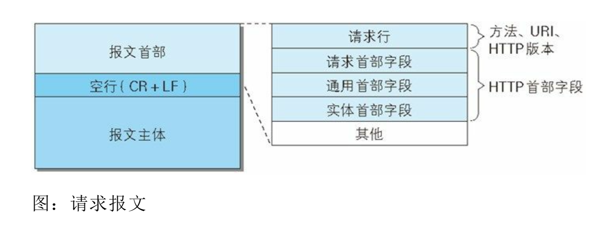
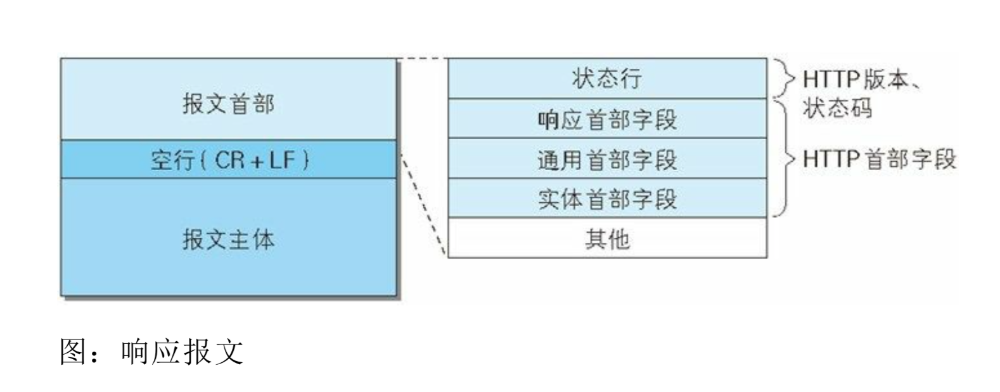
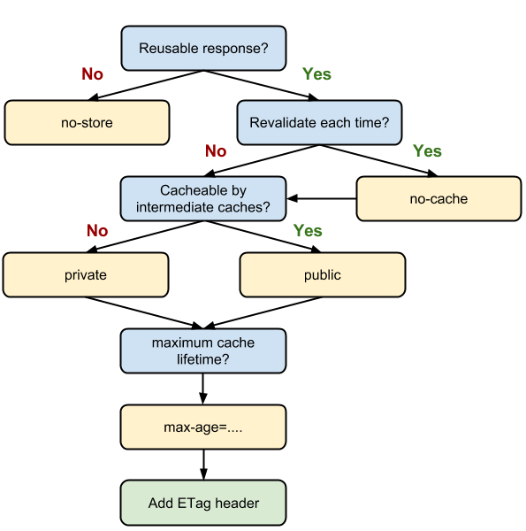
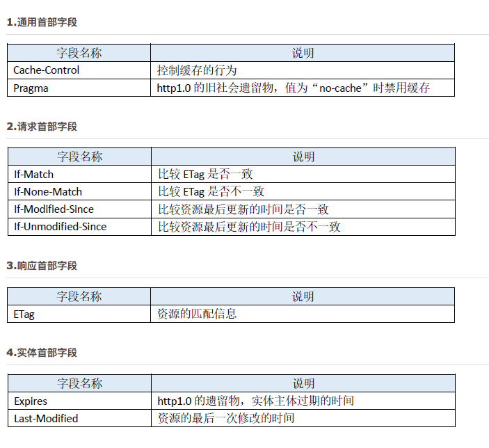
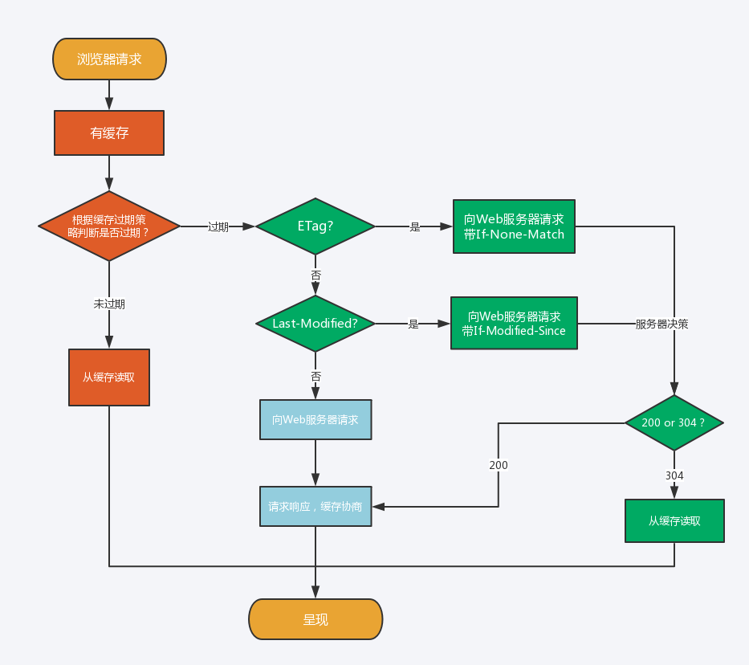
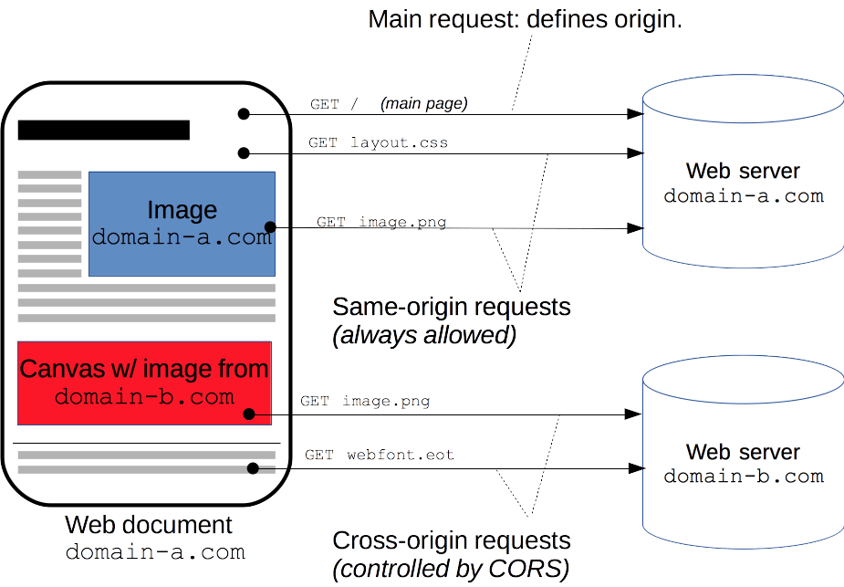
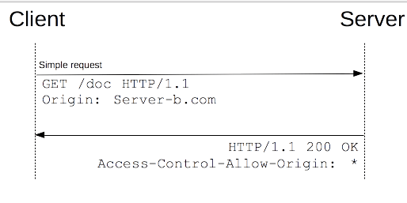
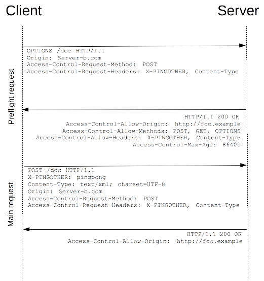
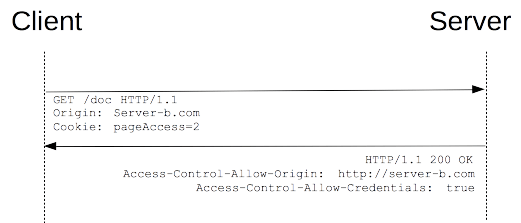

# HTTP 基础概述

<p align='center'>

</p>


Web 使用一种名为 HTTP (HyperText Transfer Protocol，超文本传输协议) 的协议作为规范的。
>HTTP 更加严谨的译名应该是 超文本转移协议。


HTTP 于 1990 年问世。那时的 HTTP 并没有作为正式的标准，因为被称为 HTTP/0.9   
HTTP 正式作为标准被公布是 1996 年 5 月，版本命名为 HTTP/1.0，记载于 RFC1945   
HTTP 在 1997 年 1 月公布了当前最主流的版本，版本命名为 HTTP/1.1，记载于 RFC2616  
HTTP/2 于 2015 年 5 月 14 日发布，引入了服务器推送等多种功能，是目前最新的版本。记载于 RFC7540
(它不叫 HTTP/2.0，是因为标准委员会不打算再发布子版本了，下一个新版本将是 HTTP/3)


## 一. HTTP 支持的方法

HTTP 是一种不保存状态，即 无状态（ stateless ）协议。HTTP 协议自身不对请求和响应之间的通信状态进行保存。也就是说在 HTTP 这个级别，协议对于发送过的请求或响应都不做持久化处理。这也是为了更快的处理大量事务，确保协议的可伸缩性。

HTTP/1.1 虽然是无状态协议，但是为了实现期望的保持状态的功能，特意引入了 Cookie 技术。

| 方法名 | 说明 | 支持的 HTTP 协议版本 | 详细说明|
| :---: | :---: | :---: |:---: |
| GET | 获取资源 | 1.0、1.1 | GET 方法用来请求访问已被 URI 识别的资源。指定的资源经服务器端解析后返回响应内容。（我想访问你的某个资源）|
| POST | 传输实体主体 | 1.0、1.1 | POST 方法用来传输实体的主体。虽然 GET 也可以传输实体的主体，但一般不用 GET 而用 POST，POST 的主要目的并不是获取响应的主体内容。（我想把这条信息告诉你）|
| PUT | 传输文件 | 1.0、1.1 | 要求在请求报文的主体中包含文件内容，然后保存到请求 URI 指定位置。（我想要把这份文件传给你）|
| HEAD | 获取报文首部 | 1.0、1.1 | HEAD 方法和 GET 方法一样，只是不返回报文主体部分。用于确认 URI 的有效性及资源更新的日期时间等等（我想要那个相关信息）|
| DELETE | 删除文件 | 1.0、1.1 | 与 PUT 相反的方法，DELETE 方法按请求 URI 删除指定资源（把这份文件删掉吧）|
| OPTIONS | 询问支持的方法 | 1.1 | OPTIONS 用来查询针对请求 URI 指定的资源支持的方法（你支持哪些方法？）|
| TRACE | 追踪路径 | 1.1 | TRACE 方法是让 Web 服务器将之前的请求通信返回给客户端的方法，TRACE 方法不常用，并且容易引发 XST ( Cross-Site-Tracing ，跨站追踪)攻击，所以通常更不会用到了|
| CONNECT | 要求用隧道协议连接代理 | 1.1 | CONNECT 方法要求在与代理服务器通信时建立隧道，实现用隧道协议进行 TCP 通信，主要使用 SSL （ Secure Sockets Layers ，安全套接层）和 TLS （ Transport Layer Security ，传输层安全）协议把通信内容加密后经网络隧道传输|
| PATCH | 更新部分文件内容| 1.1| **当资源存在的时候**，PATCH 用于资源的部分内容的更新，例如更新某一个字段。具体比如说只更新用户信息的电话号码字段，而 PUT 用于更新某个资源较完整的内容，比如说用户要重填完整表单更新所有信息，后台处理更新时可能只是保留内部记录 ID 不变。<br>**当资源不存在的时候**，PATCH 是修改原来的内容，也可能会产生一个新的版本。比如当资源不存在的时候，PATCH 可能会去创建一个新的资源，这个意义上像是 saveOrUpdate 操作。而 PUT 只对已有资源进行更新操作，所以是 update 操作|
| LINK | 建立和资源之间的联系 | 1.0 | ✖︎最新版中已经废弃✖︎|
| UNLINK | 断开连接关系 | 1.0 | ✖︎最新版中已经废弃✖︎|
|  |  |  | |
| PROPFIND | 获取属性 | 1.1 | WebDAV 获取属性|
| PROPPATCH | 修改属性 | 1.1 | WebDAV 修改属性|
| MKCOL | 创建属性 | 1.1 | WebDAV 创建属性|
| COPY | 复制资源及属性 | 1.1 | WebDAV 复制资源及属性|
| MOVE | 移动资源 | 1.1 | WebDAV 移动资源|
| LOCK | 资源加锁 | 1.1 | WebDAV 资源加锁|
| UNLOCK | 资源解锁 | 1.1 | WebDAV 资源解锁|


在HTTP/1.1规范中幂等性的定义是：

>Methods can also have the property of "idempotence" in that (aside from error or expiration issues) the side-effects of N > 0 identical requests is the same as for a single request.

从定义上看，HTTP 方法的幂等性是指一次和多次请求某一个资源应该具有同样的副作用。幂等性属于语义范畴，正如编译器只能帮助检查语法错误一样，HTTP 规范也没有办法通过消息格式等语法手段来定义它，这可能是它不太受到重视的原因之一。但实际上，幂等性是分布式系统设计中十分重要的概念，而 HTTP 的分布式本质也决定了它在 HTTP 中具有重要地位。


HTTP 方法的安全性指的是不会改变服务器状态，也就是说它只是可读的。所以只有 OPTIONS、GET、HEAD 是安全的，其他都是不安全的。

| HTTP 方法 | 幂等性 | 安全性 |
| :---: | :---: | :---: |
|OPTIONS|	yes	|yes|
|GET	|yes	|yes|
|HEAD	|yes	|yes|
|PUT	|yes	|no|
|DELETE	|yes	|no|
|POST	|no	|no|
|PATCH	|no	|no|

**POST 和 PATCH 这两个不是幂等性的**。  
两次相同的POST请求会在服务器端创建两份资源，它们具有不同的URI。  
对同一URI进行多次PUT的副作用和一次PUT是相同的。  


## 二. HTTP 状态码


服务器返回的  **响应报文**  中第一行为状态行，包含了状态码以及原因短语，用来告知客户端请求的结果。

| 状态码 | 类别 | 原因短语 |
| :---: | :---: | :---: |
| 1XX | Informational（信息性状态码） | 接收的请求正在处理 |
| 2XX | Success（成功状态码） | 请求正常处理完毕 |
| 3XX | Redirection（重定向状态码） | 需要进行附加操作以完成请求 |
| 4XX | Client Error（客户端错误状态码） | 服务器无法处理请求 |
| 5XX | Server Error（服务器错误状态码） | 服务器处理请求出错 |


### 1XX 信息

-  **100 Continue** ：表明到目前为止都很正常，客户端可以继续发送请求或者忽略这个响应。

### 2XX 成功

-  **200 OK** 

-  **204 No Content** ：请求已经成功处理，但是返回的响应报文不包含实体的主体部分。一般在只需要从客户端往服务器发送信息，而不需要返回数据时使用。

-  **206 Partial Content** ：表示客户端进行了范围请求。响应报文包含由 Content-Range 指定范围的实体内容。

### 3XX 重定向

-  **301 Moved Permanently** ：永久性重定向

-  **302 Found** ：临时性重定向

-  **303 See Other** ：和 302 有着相同的功能，但是 303 明确要求客户端应该采用 GET 方法获取资源。

- 注：虽然 HTTP 协议规定 301、302 状态下重定向时不允许把 POST 方法改成 GET 方法，但是大多数浏览器都会在 301、302 和 303 状态下的重定向把 POST 方法改成 GET 方法。

-  **304 Not Modified** ：如果请求报文首部包含一些条件，例如：If-Match，If-ModifiedSince，If-None-Match，If-Range，If-Unmodified-Since，如果不满足条件，则服务器会返回 304 状态码。

-  **307 Temporary Redirect** ：临时重定向，与 302 的含义类似，但是 307 要求浏览器不会把重定向请求的 POST 方法改成 GET 方法。

### 4XX 客户端错误

-  **400 Bad Request** ：请求报文中存在语法错误。

-  **401 Unauthorized** ：该状态码表示发送的请求需要有认证信息（BASIC 认证、DIGEST 认证）。如果之前已进行过一次请求，则表示用户认证失败。

-  **403 Forbidden** ：请求被拒绝，服务器端没有必要给出拒绝的详细理由。

-  **404 Not Found** 

### 5XX 服务器错误

-  **500 Internal Server Error** ：服务器正在执行请求时发生错误。

-  **503 Service Unavilable** ：服务器暂时处于超负载或正在进行停机维护，现在无法处理请求。

------------------------------------------------------------

## RFC 2616 状态码

| 状态码 | 类别 | 原因短语 |含义||
| :---: | :---: | :---: |:---: |:---:|
| 100 | Informational（信息性状态码） | Continue（继续） |收到了请求的起始部分，客户端应该继续请求。|❤|
| 101 | Informational（信息性状态码） | Switching Protocols（切换协议）|服务器正根据客户端的指示将协议切换成 Update 首部列出的协议。|❤|
|||||
| 200 | Success（成功状态码）| OK |服务器已成功处理请求|❤|
| 201 | Success（成功状态码）|Created（已创建）| 对那些要服务器创建对象的请求来说，资源已创建完毕|
| 202 | Success（成功状态码）|Accepted（已接受）| 请求已接受，但服务器尚未处理|
| 203 | Success（成功状态码）|Non-Authoritative Information（非权威信息）| 服务器已将事务成功处理，只是实体首部包含的信息不是来自原始服务器，而是来自资源的副本|
| 204 | Success（成功状态码）|No Content（没有内容）| 响应报文包含一些首部和一个状态行，**但不包含实体的主体内容**，**一般在只需要从客户端往服务器发送信息，而对客户端不需要发送新信息内容的情况下使用**|❤|
| 205 | Success（成功状态码）|Reset Content（重置内容）| 另一个主要用于浏览器的代码。意思是浏览器应该重置当前页面上所有的 HTML 表单 |
| 206 | Success（成功状态码） |Partial Content（部分内容）| 成功执行了一个部分或者 Range (范围)请求，客户端可以通过一些特殊的首部来获取部分或某个范围内的文档<br>**响应报文中包含由 Content-Range、Date、以及 ETag 或者 Content-Location 指定范围的实体内容**|❤|
|||||
|300| Redirection（重定向状态码） |Multiple Choices（多项选择）| 客户端请求了实际指向多个资源的 URL。这个代码是和一个选项列表一起返回的，然后用户就可以选择他希望使用的选项了。服务器可以在 Location 首部包含首选 URL| 
|301| Redirection（重定向状态码） | Moved Permanently（永久移除）| **永久性重定向**，请求的 URL 已移走。响应中应该包含一个 Location URL，说明资源现在所处的位置|❤|
|302| Redirection（重定向状态码）| Found（已找到）| **临时性重定向**，与状态码 301 类似， 但这里的移除是临时的。客户端应该用 Location 首部给出的 URL 对资源进行临时定位|❤|
|303| Redirection（重定向状态码）| See Other（参见其他）| 告诉客户端应该用另一个 URL 获取资源。这个新的 URL 位于响应报文的 Location 首部。303 状态码 和 302 状态码有相同的功能，**但是 303 明确表示客户端应采用 GET 方法获取资源**。|❤|
||||当 301、302、303 响应状态码返回时，几乎所有的浏览器都会把 POST 改成 GET，并删除请求报文内的主体，之后请求会自动再次发送。<br>301、302 标准是禁止将 POST 方法改变成 GET 方法的，但实际使用时大家都会这么做||
|304| Redirection（重定向状态码）| Not Modified（未修改）| 该状态码表示客户端发送附带条件的请求时，服务器允许请求访问资源，但因发生请求未满足条件的情况后，直接返回 304 Not Modified（服务器端资源未改变，可直接使用客户端未过期的缓存）304 状态码返回时，不包含任何响应的主体部分。**304 虽然被划分在 3XX 类别中，但是和重定向一点关系也没有**|❤|
||||（附带条件的请求是指采用 GET 方法的请求报文中包含 If-Match，If-Modified-Since,If-None-Match，If-Range，If-Unmodified-Since 中任一首部）||
|305| Redirection（重定向状态码）| Use Proxy（使用代理）| 必须通过代理访问 资源，代理的位置是在 Location 首部中给出的|
|306|（未使用）||这个状态码当前并未使用|
|307| Redirection（重定向状态码）| Temporary Redirect（临时重定向）| 和状态码 302 类似。但客户端应该用 Location 首部给出的 URL 对资源进行临时定位。<br>307 会遵守浏览器标准，不会从 POST 变成 GET|❤|
|||||
|400|Client Error（客户端错误状态码）| Bad request（坏请求）| 告诉客户端它发送了一条异常请求|❤|
|401|Client Error（客户端错误状态码）| Unauthorized（未授权）| 与适当的首部一起返回，在客户端获得资源访问权之前，请它进行身份认证|❤|
|402|Client Error（客户端错误状态码）| Payment Required（要求付款）| 当前此状态码并未使用，是为未来使用预留的 |
|403|Client Error（客户端错误状态码）| Forbidden（禁止）| 服务器拒绝了请求|❤| 
|404|Client Error（客户端错误状态码）| Not Found（未找到）| 服务器无法找到 所请求的 URL|❤|
|405|Client Error（客户端错误状态码）| Method Not Allowed（不允许使用的方法）|请求中有一个所请求的 URI 不支持的方法。响应中应该包含一个 Allow 首部，以告知客户端所请求的资源支持使用哪些方法| 
|406|Client Error（客户端错误状态码）| Not Acceptable（无法接受）| 客户端可以指定一些参数来说明希望接受哪些类型的实体。服务器没有资源与客户端可接受的 URL 相匹配时可使用此代码| 
|407|Client Error（客户端错误状态码）| Proxy Authentication Required（要求进行代理认证）|和状态码 401 类似，但用于需要进行资源认证的代理服务器|
|408|Client Error（客户端错误状态码）| Request Timeout（请求超时）| 如果客户端完成其请求时花费的时间太长，服务器可以回送这个状态码并关闭连接 |
|409|Client Error（客户端错误状态码）| Conflict（ 冲突）| 发出的请求在资源上造成了一些冲突| 
|410|Client Error（客户端错误状态码）| Gone（消失了）| 除了服务器曾持有这些资源之外，与状态码 404 类似 |
|411|Client Error（客户端错误状态码）| Length Required（要求长度指示）| 服务器要求在请求报文中包含 Content- Length 首部时会使用这个代码。发起的请求中若没有 Content-Length 首部，服务器 是不会接受此资源请求的| 
|412|Client Error（客户端错误状态码）|Precondition Failed（先决条件失败）| 如果客户端发起了一个条件请求， 如果服务器无法满足其中的某个条件，就返回这个响应码| 
|413|Client Error（客户端错误状态码）| Request Entity Too Large（请求实体太大）| 客户端发送的实体主体部分比 服务器能够或者希望处理的要大|
|414|Client Error（客户端错误状态码）| Request URI Too Long（请求 URI 太长）| 客户端发送的请求所携带的请求 URL 超过了服务器能够或者希望处理的长度|
|415 |Client Error（客户端错误状态码）|Unsupported Media Type（不支持的媒体类型）| 服务器无法理解或不支持客户端所发送的实体的内容类型| 
|416 |Client Error（客户端错误状态码）|Requested Range Not Satisfiable（所请求的范围未得到满足）| 请求报文请求的是某范围内的指定资源，但那个范围无效，或者未得到满足 |
|417|Client Error（客户端错误状态码）| Expectation Failed（无法满足期望）| 请求的 Expect 首部包含了一个预期内容，但服务器无法满足||
|||||
|500|Server Error（服务器错误状态码）| Internal Server Error（内部服务器错误）| 服务器遇到了一个错误，使其无法为请求提供服务|❤|
|501 |Server Error（服务器错误状态码）|Not Implemented（未实现）| 服务器无法满足客户端请求的某个功能 |
|502 |Server Error（服务器错误状态码）|Bad Gateway（网关故障）| 作为代理或网关使用的服务器遇到了来自响应链中上游的无效响应 |
|503|Server Error（服务器错误状态码）| Service Unavailable（未提供此服务）| 服务器目前无法为请求提供服务，但过一段时间就可以恢复服务|❤|
|504|Server Error（服务器错误状态码） |Gateway Timeout（网关超时）| 与状态码 408 类似，但是响应来自网关或代理，此网关或代理在等待另一台服务器的响应时出现了超时 |
|505|Server Error（服务器错误状态码）| HTTP Version Not Supported（不支持的 HTTP 版本）| 服务器收到的请求是以它不支持或不愿支持的协议版本表示的|

>在 RFC2616 中定义了 40 种 HTTP 状态码，webDAV ( Web-based Distributed Authoring and Versioning，基于万维网的分布式创作和版本控制)在 RFC4918 和 RFC5842 中，定义了一些特殊的状态码，在 RFC2518、RFC2817、RFC2295、RFC2774、RFC6585 中还额外定义了一些附加的 HTTP 状态码。总共有 60+ 种。具体链接可以见 [HTTP状态码 (wikipedia)](https://zh.wikipedia.org/wiki/HTTP%E7%8A%B6%E6%80%81%E7%A0%81)


webDAV 新增状态码

| 状态码 | 类别 | 原因短语 |含义||
| :---: | :---: | :---: |:---: |:---:|
| 102 | Informational（信息性状态码） | Processing（处理中）|可正常处理请求，但目前是处理中状态。WebDAV请求可能包含许多涉及文件操作的子请求，需要很长时间才能完成请求。该代码表示​​服务器已经收到并正在处理请求，但无响应可用。这样可以防止客户端超时，并假设请求丢失。||
| 207 | Success（成功状态码） | Multi-Status（多种状态）| 存在多种状态。代表之后的消息体将是一个 XML 消息，并且可能依照之前子请求数量的不同，包含一系列独立的响应代码。||
| 208 | Success（成功状态码） | Already Reported（已经响应）| DAV绑定的成员已经在（多状态）响应之前的部分被列举，且未被再次包含。||
|422|Client Error（客户端错误状态码）| Unprocessable Entity（不可处理的实体）| 格式正确，内容有误，无法处理响应||
|423|Client Error（客户端错误状态码）| Locked（被锁定）| 资源已被加锁||
|424|Client Error（客户端错误状态码）| Failed Dependency（失败的依赖）| 处理与某请求关联的请求失败，因为不再维持依赖关系。||
|507|Server Error（服务器错误状态码）| Insufficient Storage（存储空间不足）| 服务器无法存储完成请求所必须的内容。这个状况被认为是临时的。||
|508|Server Error（服务器错误状态码）| Loop Detected（检测到环）| 服务器在处理请求时陷入死循环。|

## 三. MIME 媒体内容


HTTP 仔细地给每种要通过 Web 传输的对象都打上了名为 MIME 类型（MIME type）的数据格式标签。最初设计 MIME（Multipurpose Internet Mail Extension，多用途因特网邮件扩展）是为了解决在不同的电子邮件系统之间搬移报文时存在的问题。MIME 在电子邮件系统中工作得非常好，因此 HTTP 也采纳了它，用它来描述并标记多媒体内容。


RFC2045，“ MIME: Format of Internet Message Bodies”（“ MIME：因特网报文主体的格式”）


常见的主 MIME 类型

| 类型| 描述 | 
| :---: | :---: |
|application |应用程序特有的内容格式（离散类型）|
|audio| 音频格式（离散类型） |
|chemical |化学数据集（离散 IETF 扩展类型）| 
|image| 图片格式（离散类型） |
|message |报文格式（复合类型）| 
|model| 三维模型格式（离散 IETF 扩展类型）| 
|multipart |多部分对象集合（复合类型）|
| text |文本格式（离散类型）| 
|video |视频电影格式（离散类型）|


## 四. HTTP 报文结构

<p align='center'>

</p>


<p align='center'>

</p>


<p align='center'>

</p>


<p align='center'>

</p>


举个例子：


```http

General:

Request URL: https://github.com/halfrost
Request Method: GET
Status Code: 200 OK
Remote Address: 127.0.0.1:6152
Referrer Policy: no-referrer-when-downgrade


```


Response Headers:

<p align='center'>

</p>


```http  

HTTP/1.1 200 OK
Date: Sun, 22 Apr 2018 15:47:27 GMT
Content-Type: text/html; charset=utf-8
Transfer-Encoding: chunked
Server: GitHub.com
Status: 200 OK
Cache-Control: no-cache
Vary: X-Requested-With
Set-Cookie: user_session=GYkmjrs9T6H9r16Gx85; path=/; expires=Sun, 06 May 2018 15:47:27 -0000; secure; HttpOnly
Set-Cookie: __Host-user_session_same_site=GYkmjre6H9r16Gx85; path=/; expires=Sun, 06 May 2018 15:47:27 -0000; secure; HttpOnly; SameSite=Strict
Set-Cookie: _gh_sess=OHppNS84T05ubXZFS2swUm9SUlBqdXNpWlA2bHZZ3alUyUGNLZ0pqMD0tLTNLWDI0K1pTUUFlaWJUVU5XUTJaNFE9PQ%3D%3D--74346822d2bf179f6ff73ce52c8b8606c8f78755; path=/; secure; HttpOnly
X-Request-Id: 855feee9-5be2-482f-911a-b0eb22d55088
X-Runtime: 0.170448
Strict-Transport-Security: max-age=31536000; includeSubdomains; preload
X-Frame-Options: deny
X-Content-Type-Options: nosniff
X-XSS-Protection: 1; mode=block
Referrer-Policy: origin-when-cross-origin, strict-origin-when-cross-origin
Expect-CT: max-age=2592000, report-uri="https://api.github.com/_private/browser/errors"
Content-Security-Policy: default-src 'none'; base-uri 'self'; block-all-mixed-content; child-src render.githubusercontent.com; connect-src 'self' uploads.github.com status.github.com collector.githubapp.com api.github.com www.google-analytics.com github-cloud.s3.amazonaws.com github-production-repository-file-5c1aeb.s3.amazonaws.com github-production-upload-manifest-file-7fdce7.s3.amazonaws.com github-production-user-asset-6210df.s3.amazonaws.com wss://live.github.com; font-src assets-cdn.github.com; form-action 'self' github.com gist.github.com; frame-ancestors 'none'; img-src 'self' data: assets-cdn.github.com identicons.github.com collector.githubapp.com github-cloud.s3.amazonaws.com *.githubusercontent.com; manifest-src 'self'; media-src 'none'; script-src assets-cdn.github.com; style-src 'unsafe-inline' assets-cdn.github.com
X-Runtime-rack: 0.175479
Content-Encoding: gzip
Vary: Accept-Encoding
X-GitHub-Request-Id: B706:3019:355B8D9:52B9B00:5ADCAE85


```


Request Headers:


<p align='center'>

</p>


```http

GET /halfrost HTTP/1.1
Host: github.com
Connection: keep-alive
Cache-Control: max-age=0
Upgrade-Insecure-Requests: 1
User-Agent: Mozilla/5.0 (Linux; Android 6.0; Nexus 5 Build/MRA58N) AppleWebKit/537.36 (KHTML, like Gecko) Chrome/66.0.3359.117 Mobile Safari/537.36
Accept: text/html,application/xhtml+xml,application/xml;q=0.9,image/webp,image/apng,*/*;q=0.8
Referer: https://github.com/halfrost/Halfrost-Field/blob/master/contents/Protocol/HTTP.md
Accept-Encoding: gzip, deflate, br
Accept-Language: zh-CN,zh;q=0.9,en;q=0.8
Cookie: _octo=GH1.1.101205900.1486965233; logged_in=yes; dotcom_user=halfrost; _ga=GA1.2.183217117.1486965233; user_session=GYkmjrs9Ts80x85; __Host-user_session_same_site=GYkmjrs9THGx85; tz=Asia%2FShanghai; _gat=1; _gh_sess=S1JyM0tEbTVEcU50OXRERmUwOVlqRVZiQWp5SDlBeWt3RitrbEczRkxjaWVLWWNVc2k4YjhBTDVQT3BZajEwSGRJOEE2bz0tLVNLRHhiTlVDN2xEUXJ1OFM1ME1VeVE9PQ%3D%3D--59dc56a889d38d30125fbee36df9dab97e7a46c0


```


请求报文是由请求方法，请求 URI，协议版本，可选请求首部字段和内容实体构成的。

响应报文基本上由协议版本，状态码（表示请求成功与失败的数字代码），用以解释状态码的原因短语，可选的响应首部字段以及实体主体构成。


### 1. 通用首部

| 首部 | 描述 | 
| :---: | :---: |
|Cache-Control|控制缓存的行为，用于随报文传送缓存的指示|
|Connection| 允许客户端和服务器指定与请求/响应连接有关的选项| 
|Date| 提供日期和时间标志，说明报文是什么时间创建的 |
|Pragma|报文指令，另一种随报文传送指示的方式，但并不专用于缓存。Pragma 是 HTTP/1.1 之前版本的历史遗留字段，仅作为与 HTTP/1.0 的向后兼容而定义。如果想要所有的服务器保持相同的行为，可以考虑发送 Pragma 指令。例如：Pragma: no-cache Cache-Control: no-cache|
|MIME-Version |给出了发送端使用的 MIME 版本 |
|Trailer| 如果报文采用了分块传输编码（chunked transfer encoding）方式，就可以用这个首部列出位于报文拖挂（trailer）部分的首部集合 |
|Transfer- Encoding |告知接收端为了保证报文的可靠传输，对报文采用了什么编码方式 |
|Update| 给出了发送端可能想要 “升级” 使用的新版本或协议|
|Via |显示了报文经过的中间节点（代理、网关）|
|Warning| 错误通知|


Cache-Control 首部功能很强大。服务器和客户端都可以用它来说明新鲜度，并且除了使用期或过期时间之外，还有很多指令可用。 


| 指令 | 参数 | 报文类型 | 说明 | 
| :---: | :---: | :---: | :---: |
|no-cache ||请求| 在重新向服务器验证之前，不要返回文档的缓存副本 |
|no-store|| 请求| 不要返回文档的缓存副本。不要保存服务器的响应 |
|max-age = [秒]|必须| 请求 |缓存中的文档不能超过指定的使用期 |
|max-stale ( = [秒]) |可省略|请求| 文档允许过期（根据服务器提供的过期信息计算），但不能超过指令中指定的过期值 |
|min-fresh = [秒]|必须|请求| 文档的使用期不能小于这个指定的时间与它的当前存活时间之和。换句话说，响应必须至少在指定的这段时间之内保持新鲜 |
|no-transform|| 请求| 文档在发送之前不允许被转换 |
|only-if-cached ||请求| 只有当文档在缓存中才发送，不要联系原始服务器 |
|cache-extension||请求|新指令标记（token）|
|||||
|public ||响应| 响应可以被任何服务器缓存 |
|private |可省略|响应 |响应可以被缓存，但只能被单个客户端访问 |
|no-cache |可省略|响应 |如果该指令伴随一个首部列表的话，那么内容可以被缓存并提供给客户端，但必须先删除所列出的首部。如果没有指定首部，缓存中的副本在没有重新向服务器验证之前不能提供给客户端 |
|no-store ||响应 |响应不允许被缓存 |
|no-transform ||响应| 响应在提供给客户端之前不能做任何形式的修改 |
|must-revalidate ||响应| 响应在提供给客户端之前必须重新向服务器验证 |
|proxy-revalidate ||响应 |共享的缓存在提供给客户端之前必须重新向原始服务器验证。私有的缓存可以忽略这条指令|
| max-age = [秒]|必须|响应| 指定文档可以被缓存的时间以及新鲜度的最长时间|
|s-max-age = [秒] |必须|响应 |指定文档作为共享缓存时的最长使用时间（如果有 max-age 指令的话，以本指令为准）。私有的缓存可以忽略本指令|
|cache-extension||响应|新指令标记（token）|


> no-cache 和 no-store 的区别：no-cache 代表不缓存过期的资源，缓存会向源服务器进行有效期确认后再处理资源。no-store 才是真正的不缓存。


no-cache 并不代表完全的禁用缓存，而是代表会每次去核对服务端的 Etag，如果相同，那么就不会去服务端下载完整的资源，返回一个 304 Not Modified。（最长缓存 3 年）

no-store 才是真正的禁用缓存，它表示每次服务端都会去下载最新的资源。（当然，通常似乎都用不上）。

public 和 private 的差别主要在于如果是有用户认证环节的页面，设置为private 就只有终端浏览器会缓存，中间 CDN 并不会缓存，而设置为 public，则会在每一个环节缓存。默认不需要设置 public，因为 max-age 已经表明可以由各个环节缓存了（单位为秒）。此刻如果命中缓存，则不会再去请求服务器核对 Etag，而是直接返回 200(from disk)。

当然，由于 public 会在每一个环节缓存，如果对修改更新预览又强需求的网页，那么最好不要使用这一缓存策略，否则还需要刷新 CDN 源，很麻烦。

如果挑选缓存策略，可以见下图：

<p align='center'>

</p>


### HTTP 缓存控制

<p align='center'>

</p>

针对 “Expires 时间是相对服务器而言，无法保证和客户端时间统一” 的问题，http1.1 新增了 Cache-Control 来定义缓存过期时间。注意：若报文中同时出现了 Expires 和 Cache-Control，则以 Cache-Control 为准。

也就是说优先级从高到低分别是 **Pragma -> Cache-Control -> Expires**。

| 头部 | 优势和特点 | 劣势和问题 | 额外说明 | 
| :---: | :---: | :---: | :---: |
|Expires|	1、HTTP 1.0 产物，可以在HTTP 1.0和1.1中使用，简单易用。<br>2、以时刻标识失效时间。|1、时间是由服务器发送的(UTC)，如果服务器时间和客户端时间存在不一致，可能会出现问题。<br>2、存在版本问题，到期之前的修改客户端是不可知的。||
|Cache-Control|1、HTTP 1.1 产物，以时间间隔标识失效时间，解决了Expires服务器和客户端相对时间的问题。<br>2、比Expires多了很多选项设置。|1、HTTP 1.1 才有的内容，不适用于HTTP 1.0 。<br>2、存在版本问题，到期之前的修改客户端是不可知的。||
|Last-Modified|1、不存在版本问题，每次请求都会去服务器进行校验。服务器对比最后修改时间如果相同则返回304，不同返回200以及资源内容。|1、只要资源修改，无论内容是否发生实质性的变化，都会将该资源返回客户端。例如周期性重写，这种情况下该资源包含的数据实际上一样的。<br>2、以时刻作为标识，无法识别一秒内进行多次修改的情况。<br>3、某些服务器不能精确的得到文件的最后修改时间。||
|ETag|1、可以更加精确的判断资源是否被修改，可以识别一秒内多次修改的情况。<br>2、不存在版本问题，每次请求都回去服务器进行校验。|1、计算ETag值需要性能损耗。<br>2、分布式服务器存储的情况下，计算ETag的算法如果不一样，会导致浏览器从一台服务器上获得页面内容后到另外一台服务器上进行验证时发现ETag不匹配的情况。||

1、Expires / Cache-Control  
Expires用时刻来标识失效时间，不免收到时间同步的影响，而Cache-Control使用时间间隔很好的解决了这个问题。 但是 Cache-Control 是 HTTP1.1 才有的，不适用于 HTTP1.0，而 Expires 既适用于 HTTP1.0，也适用于 HTTP1.1，所以说在大多数情况下同时发送这两个头会是一个更好的选择，当客户端两种头都能解析的时候，**会优先使用 Cache-Control**。

2、Last-Modified / ETag  
二者都是通过某个标识值来请求资源， 如果服务器端的资源没有变化，则自动返回 HTTP 304 （Not Changed）状态码，内容为空，这样就节省了传输数据量。而当资源发生比那话后，返回和第一次请求时类似。从而保证不向客户端重复发出资源，也保证当服务器有变化时，客户端能够得到最新的资源。  
其中 Last-Modified 使用文件最后修改作为文件标识值，它无法处理文件一秒内多次修改的情况，而且只要文件修改了哪怕文件实质内容没有修改，也会重新返回资源内容；ETag 作为“被请求变量的实体值”，其完全可以解决 Last-Modified 头部的问题，但是其计算过程需要耗费服务器资源。

3、from-cache / 304    
Expires 和 Cache-Control 都有一个问题就是服务端作为的修改，如果还在缓存时效里，那么客户端是不会去请求服务端资源的（非刷新），这就存在一个资源版本不符的问题，而强制刷新一定会发起 HTTP 请求并返回资源内容，无论该内容在这段时间内是否修改过；**而 Last-Modified 和 Etag 每次请求资源都会发起请求，哪怕是很久都不会有修改的资源，都至少有一次请求响应的消耗**。

对于所有可缓存资源，指定一个 Expires 或 Cache-Control max-age 以及一个 Last-Modified 或 ETag 至关重要。同时使用前者和后者可以很好的相互适应。  
**前者不需要每次都发起一次请求来校验资源时效性，后者保证当资源未出现修改的时候不需要重新发送该资源**。而在用户的不同刷新页面行为中，二者的结合也能很好的利用 HTTP 缓存控制特性，无论是在地址栏输入 URI 然后输入回车进行访问，还是点击刷新按钮，浏览器都能充分利用缓存内容，避免进行不必要的请求与数据传输。

4、避免 304

做法实际上很简单，**它把服务侧 ETag 的那一套理论搬到了前端来使用**。 页面的静态资源以版本形式发布，常用的方法是在文件名或参数带上一串md5或时间标记符：

```http
https://hm.baidu.com/hm.js?e23800c454aa573c0ccb16b52665ac26
http://tb1.bdstatic.com/tb/_/tbean_safe_ajax_94e7ca2.js
http://img1.gtimg.com/ninja/2/2016/04/ninja145972803357449.jpg
```

可以看到上面的例子中有不同的做法，有的在URI后面加上了md5参数，有的将md5值作为文件名的一部分，有的将资源放在特性版本的目录中。

那么在文件没有变动的时候，浏览器不用发起请求直接可以使用缓存文件；而在文件有变化的时候，由于文件版本号的变更，导致文件名变化，请求的 url 变了，自然文件就更新了。这样能确保客户端能及时从服务器收取到新修改的文件。通过这样的处理，增长了静态资源，特别是图片资源的缓存时间，避免该资源很快过期，客户端频繁向服务端发起资源请求，服务器再返回 304 响应的情况（有 Last-Modified/Etag）。


<p align='center'>

</p>


| 用户操作 | HTTP 状态码 | 原因 | 额外说明 | 
| :---: | :---: | :---: | :---: |
|在URI输入栏中输入然后回车|200(from cache)|由 Expires / Cache-Control 控制，Expires 是绝对时间，Cache-Control 是相对时间，两者都存在的时候，Cache-Control 覆盖 Expires ，只要没有失效，浏览器都只访问自己的缓存||
|F5/点击工具栏中的刷新按钮/右键菜单重新加载|304|由 Last-Modified/Etag 控制，当用户本地缓存失效，刷新的时候，浏览器会发送请求给服务器，如果服务端没有变化，则返回 304 给浏览器||
|Ctl+F5|200|当本地浏览器没有缓存或者 304 返回的资源也失效的时候，或者用户强制 Ctl+F5 刷新的时候，浏览器最终才会去下载最新的数据||

总结：

- 需要兼容 HTTP1.0 的时候需要使用 Expires，不然可以考虑直接使用 Cache-Control。
- 需要处理一秒内多次修改的情况，或者其他 Last-Modified 处理不了的情况，才使用 ETag，否则使用 Last-Modified。
- 对于所有可缓存资源，需要指定一个 Expires 或 Cache-Control，同时指定 Last-Modified 或者 Etag。
- 可以通过标识文件版本名、加长缓存时间的方式来减少 304 响应。

------------------------------------------------------------------


Warning 首部是从 HTTP/1.0 的响应首部（Retry-After）演变过来的。该首部通常会告知用户一些与缓存相关的问题的警告。

Warning 首部的格式如下：

```http
Warning: [警告码][警告的主机：端口号]"[警告内容]"([日期内容])

```

HTTP/1.1 中定义了 7 种警告，警告码具备扩展性，今后可以能追加新的警告码。

| 警告码 | 警告内容 | 说明 |
| :---: | :---: | :---: |
|110|Response is stale（响应已过期）| 代理返回已过期的资源|
|111|Revalidation failed（再验证失败）|代理再验证资源有效性时失败（服务器无法到达等原因）|
|112|Disconnection operation（断开连接操作）| 代理与互联网连接被故意切断|
|113|Heuristic expiration（试探性过期）|响应的使用期超过 24 小时（有效缓存的设定时间大于 24 小时的情况下）|
|199|Miscellaneous warning（杂项警告）|任意的警告内容|
|214|Transformation applied（使用了转换）|代理对内容编码或媒体类型等执行了某些处理时|
|299|Miscellaneous persistent warning（持久杂项警告）| 任意的警告内容|


### 2. 请求首部

### 请求信息性首部

| 首部 | 描述 | 
| :---: | :---: |
|Client-IP4| 提供了运行客户端的机器的 IP 地址|
|From| 提供了客户端用户的 E-mail 地址 |
|Host |给出了接收请求的服务器的主机名和端口号 |
|Referer |提供了包含当前请求 URI 的文档的 URL（正确的拼写其实应该是Referrer ，大家一致沿用错误至今） |
|UA-Color |提供了与客户端显示器的显示颜色有关的信息 |
|UA-CPU |给出了客户端 CPU 的类型或制造商 |
|UA-Disp |提供了与客户端显示器（屏幕）能力有关的信息| 
|UA-OS |给出了运行在客户端机器上的操作系统名称及版本 |
|UA-Pixels |提供了客户端显示器的像素信息 |
|User-Agent |将发起请求的应用程序名称告知服务器|

### Accept 首部

| 首部 | 描述 | 
| :---: | :---: |
|Accept |告诉服务器能够发送哪些媒体类型 |
|Accept- Charset |告诉服务器能够发送哪些字符集 |
|Accept- Encoding |告诉服务器能够发送哪些编码方式 |
|Accept- Language |告诉服务器能够发送哪些语言 |
|TE | 告诉服务器可以使用哪些扩展传输的编码|


常见内容编码

常用的内容编码有以下几种：

- gzip（GNU zip）  
  由文件压缩程序 gzip（GNU zip）生成的编码格式（RFC1952），采用 Lempel-Ziv 算法（LZ77）及 32 位循环冗余校验（Cyclic Redundancy Check，统称 CRC）
- compress（UNIX 系统的标准压缩）  
  由 UNIX 文件压缩程序 compress 生成的编码格式，采用 Lempel-Ziv-Welch 算法 （LZW）
- deflate（zlib）  
  组合使用 zlib 格式（RFC1950）及由 deflate 压缩算法（RFC1951）生成的编码格式
- identity（不进行编码）  
  不执行压缩或不会变化的默认编码格式


### 条件请求首部

| 首部 | 描述 | 
| :---: | :---: |
|Expect |允许客户端列出某请求所要求的服务器行为 |
|If-Match| 如果实体标记与文档当前的实体标记相匹配，就获取这份文档 |
|If-Modified-Since |除非在某个指定的日期之后资源被修改过，否则就限制这个请求 |
|If-None-Match |如果提供的实体标记与当前文档的实体标记不相符，就获取文档 |
|If-Range |允许对文档的某个范围进行条件请求 |
|If-Unmodified-Since| 除非在某个指定日期之后资源没有被修改过，否则就限制这个请求 |
|Range |如果服务器支持范围请求，就请求资源的指定范围|

### 安全请求首部

| 首部 | 描述 | 
| :---: | :---: |
|Authorization |包含了客户端提供给服务器，以便对其自身进行认证的数据 |
|Cookie |客户端用它向服务器传送一个令牌 —— 它并不是真正的安全首部，但确实隐含了安全功能 |
| Cookie2 | 用来说明请求端支持的 cookie 版本|

 
### 代理请求首部

| 首部 | 描述 | 
| :---: | :---: |
|Max-Forward |在通往源端服务器的路径上，将请求转发给其他代理或网关的最大次数 —— 与 TRACE 方法一同使用 |
|Proxy-Authorization |与 Authorization 首部相同， 但这个首部是在与代理进行认证时使用的 |
|Proxy-Connection |与 Connection 首部相同， 但这个首部是在与代理建立连接时使用的|


### 3. 响应首部

### 响应信息性首部

| 首部 | 描述 | 
| :---: | :---: |
|Age |（从最初创建开始）响应持续时间 |
|Public | 服务器为其资源支持的请求方法列表 |
|Retry-After |如果资源不可用的话，在此日期或时间重试 Server 服务器应用程序软件的名称和版本 |
|Title | 对 HTML 文档来说，就是 HTML 文档 的源端给出的标题 |
|Warning| 比原因短语中更详细一些的警告报文|


### 协商首部

| 首部 | 描述 | 
| :---: | :---: |
|Accept-Ranges |对此资源来说，服务器可接受的范围类型 |
|Vary |服务器查看的其他首部的列表，可能会使响应发生变化；也就是说，这是一个首部列表，服务器会根据这些首部的内容挑选出最适合的资源版本发送给客户端。首部字段 Vary 可对缓存进行控制。源服务器会向代理服务器传达关于本地缓存使用方法的命令。从代理服务器接收到源服务器返回包含 Vary 指定项的响应之后，若再进行缓存，仅对请求中含有相同 Vary 指定首部字段的请求返回缓存。即使对相同资源发起请求，但由于 Vary 指定的首部字段不相同，因此必须要从源服务器重新获取资源。|

### 安全响应首部

| 首部 | 描述 | 
| :---: | :---: |
|Proxy-Authenticate| 来自代理的对客户端的质询列表 |
|Set-Cookie |不是真正的安全首部，但隐含有安全功能；可以在客户端设置一个令牌，以便服务器对客户端进行标识 |
|Set-Cookie2 |与 Set-Cookie 类似，RFC 2965 Cookie 定义； |
|WWW-Authenticate| 来自服务器的对客户端的质询列表。它会告知客户端适用于访问请求 URI 所指定资源的认证方案（Basic 或是 Digest）和带参数提示的质询（challenge）|


Cookie 的 HttpOnly 属性是 Cookie 的扩展功能，它使 JavaScript 脚本无法获得 Cookie。其主要目的为了防止跨站脚本攻击（Cross-site scripting，XSS）对 Cookie 的信息窃取。

```http
Set-Cookie: name-value;HttpOnly

```

顺带一提，该扩展并非是为了防止 XSS 而开发的。

### 4. 实体首部


### 实体信息性首部

| 首部 | 描述 | 
| :---: | :---: |
|Allow |列出了可以对此实体执行的请求方法 |
|Location |告知客户端实体实际上位于何处；用于将接收端定向到资源的（可能是新的）位置（URL）上去|


### 内容首部

| 首部 | 描述 | 
| :---: | :---: |
|Content-Base16 |解析主体中的相对 URL 时使用的基础 URL |
|Content-Encoding |对主体执行的任意编码方式 |
|Content-Language| 理解主体时最适宜使用的自然语言 |
|Content-Length |主体的长度或尺寸|
| Content-Location |资源实际所处的位置 |
|Content-MD5 |主体的 MD5 校验和|
| Content-Range |在整个资源中此实体表示的字节范围 |
|Content-Type |这个主体的对象类型|


由于 HTTP 首部无法记录二进制值，所以要通过 Base-64 编码处理。采用 Content-MD5 这种方法，对内容上的偶发性改变是无从查证的，也无法检测出恶意篡改。原因在于，内容如果被篡改了，那么同时意味着 Content-MD5 也可以被重新计算后更新，被篡改。所以处在接收阶段的客户端是无法意识到报文主体以及首部字段 Content-MD5 是已经被篡改过的。

### 实体缓存首部

| 首部 | 描述 | 
| :---: | :---: |
|ETag |与此实体相关的实体标记 |
|Expires |实体不再有效，要从原始的源端再次获取此实体的日期和时间 |
|Last-Modified |这个实体最后一次被修改的日期和时间|


Expires 是 Web 服务器响应消息头字段，在响应 http 请求时告诉浏览器在过期时间前浏览器可以直接从浏览器缓存取数据，而无需再次请求。

Expires 的缺点是：响应报文中 Expires 所定义的缓存时间是相对服务器上的时间而言的，其定义的是资源“失效时刻”，如果客户端上的时间跟服务器上的时间不一致，缓存将失效。  

另外，Expires 主要使用在 HTTP1.0 版本。


如果两者的 URI 是相同，所以仅凭 URI 指定缓存的资源是很困难的。若下载过程中出现连续中断、再连接的情况，都会依据 ETag 值指定资源。

ETag 也分为强 ETag 值和弱 ETag 值：

强 ETag 值：

强 ETag 值，不论实体发生多少细微的变化都会改变其值。

```http  
ETag: "usagi-1234"

```

弱 ETag 值：

弱 ETag 值只用于提示资源是否相同。只有资源发生了根本改变，产生差异时才会改变 ETag 值。这时，会在字段值最开始处附加 W/

```http  
ETag: W/"usagi-1234"

```


### 5. 扩展首部


### （1）X-Frame-Options

首部字段 X-Frame-Options 属于 HTTP 响应首部，用于控制网站内容在其他 Web 网站的 Frame 标签内的显示问题。其主要目的是为了防止点击劫持（clickjacking）攻击。

### （2）X-XSS-Protection

首部字段 X-XSS-Protection 属于 HTTP 响应首部，它是针对跨站脚本攻击（XSS）的一种对策，用于控制浏览器 XSS 防护机制的开关。0：将 XSS 过滤设置成无效状态，1：将 XSS 过滤设置成有效状态。

### （3）DNT

首部字段 DNT 属于 HTTP 请求首部，其中 DNT 是 Do Not Track 的简称，意为拒绝个人信息被收集，是表示拒绝被精准广告追踪的一种方法。0：同意被追踪，1：拒绝被追踪。

### （4）P3P

首部字段 P3P 属于 HTTP 响应首部，通过利用 P3P（The Platform for Privacy Preferences，在线隐私偏好平台）技术，可以让 Web 网站上的个人隐私变成一种仅供程序可理解的形式，以达到保护用户隐私的目的。

>在 HTTP 等多种协议中，通过给非标准参数加上前缀 X- ，来区别于标准参数，并使那些非标准的参数作为扩展变成可能。但是这种简单粗暴的做法有百害而无一益，因此在 “RFC6648 - Deprecating the "X-" Prefix and Similar Constructs in Application Protocols ”中提议停止该做法。然而，对已经在使用中的 X- 前缀来说，不应该要求其变更。


HTTP 首部字段将定义成缓存代理和非缓存代理的行为，分为 端到端首部（End-to-end Header）、逐跳首部（Hop-by-hop Header）

- 端到端首部：分在此类别中的首部会转发给请求 / 响应对应的最终接收目标，且必须保存在由缓存生成的相应中，另外规定它必须被转发。
- 逐跳首部：分在此类别中的首部只对单次转发有效，会因通过缓存或代理而不再转发。HTTP/1.1 和之后版本中，如果要使用 hop-by-hop 首部，需提供 Connection 首部字段。（Connection、Keep-Alive、Proxy-Authenticate、Proxy-Authorization、Trailer、TE、Transfer-Encoding、Upgrade 这 8 个首部字段属于逐跳首部，除此以外的字段都属于端到端首部）


## 五. 提高 HTTP 性能

### 1. 并行连接

通过多条 TCP 连接发起并发的 HTTP 请求。

### 2. 持久连接 

重用 TCP 连接，以消除连接及关闭的时延。 持久连接（HTTP Persistent Connections），也称为 HTTP keep-alive 或者 HTTP connection reuse 。

在 HTTP/1.1 中，所有的连接默认都是持久连接。但是服务器端不一定都能够支持持久连接，所以除了服务端，客户端也需要支持持久连接。


### 3. 管道化连接 

通过共享的 TCP 连接发起并发的 HTTP 请求。

持久连接使得多数请求以管线化（pipelining）方式发送成为可能。以前发送请求后需要等待并收到响应，才能发送下一个请求。管线化技术出现后，不用等待响应，直接发送下一个请求。

比如当请求一个包含 10 张图片的 HTML Web 页面，与挨个连接相比，用持久连接可以让请求更快结束。而管线化技术则比持久连接还要快。请求数越多，时间差就越明显。


### 4. 复用的连接

交替传送请求和响应报文（实验阶段）。


## 六. GET 和 POST 的区别

## 参数

GET 和 POST 的请求都能使用额外的参数，但是 GET 的参数是以查询字符串出现在 URL 中，而 POST 的参数存储在内容实体中(依旧是明文传输，只是和 GET 存放的位置不同罢了)。

GET 的传参方式相比于 POST 安全性较差，因为 GET 传的参数在 URL 中是可见的，可能会泄露私密信息。并且 GET 只支持 ASCII 字符，如果参数为中文则可能会出现乱码，而 POST 支持标准字符集。

```http
GET /test/demo_form.asp?name1=value1&name2=value2 HTTP/1.1
```

```http
POST /test/demo_form.asp HTTP/1.1
Host: w3schools.com
name1=value1&name2=value2
```

## 安全

安全的 HTTP 方法不会改变服务器状态，也就是说它只是可读的。

GET 方法是安全的，而 POST 却不是，因为 POST 的目的是传送实体主体内容，这个内容可能是用户上传的表单数据，上传成功之后，服务器可能把这个数据存储到数据库中，因此状态也就发生了改变。

安全的方法除了 GET 之外还有：HEAD、OPTIONS。

不安全的方法除了 POST 之外还有 PUT、DELETE。

## 幂等性

幂等的 HTTP 方法，同样的请求被执行一次与连续执行多次的效果是一样的，服务器的状态也是一样的。换句话说就是，幂等方法不应该具有副作用（统计用途除外）。在正确实现的条件下，GET，HEAD，PUT 和 DELETE 等方法都是幂等的，而 POST 方法不是。所有的安全方法也都是幂等的。

GET /pageX HTTP/1.1 是幂等的。连续调用多次，客户端接收到的结果都是一样的：

```http
GET /pageX HTTP/1.1
GET /pageX HTTP/1.1
GET /pageX HTTP/1.1
GET /pageX HTTP/1.1
```

POST /add_row HTTP/1.1 不是幂等的。如果调用多次，就会增加多行记录：

```http
POST /add_row HTTP/1.1
POST /add_row HTTP/1.1   -> Adds a 2nd row
POST /add_row HTTP/1.1   -> Adds a 3rd row
```

DELETE /idX/delete HTTP/1.1 是幂等的，即便是不同请求之间接收到的状态码不一样：

```http
DELETE /idX/delete HTTP/1.1   -> Returns 200 if idX exists
DELETE /idX/delete HTTP/1.1   -> Returns 404 as it just got deleted
DELETE /idX/delete HTTP/1.1   -> Returns 404
```

## 可缓存

如果要对响应进行缓存，需要满足以下条件：

1. 请求报文的 HTTP 方法本身是可缓存的，包括 GET 和 HEAD，但是 PUT 和 DELETE 不可缓存，POST 在多数情况下不可缓存的。
2. 响应报文的状态码是可缓存的，包括：200, 203, 204, 206, 300, 301, 404, 405, 410, 414, and 501。
3. 响应报文的 Cache-Control 首部字段没有指定不进行缓存。

## XMLHttpRequest

为了阐述 POST 和 GET 的另一个区别，需要先了解 XMLHttpRequest：

> XMLHttpRequest 是一个 API，它为客户端提供了在客户端和服务器之间传输数据的功能。它提供了一个通过 URL 来获取数据的简单方式，并且不会使整个页面刷新。这使得网页只更新一部分页面而不会打扰到用户。XMLHttpRequest 在 AJAX 中被大量使用。

在使用 XMLHttpRequest 的 POST 方法时，浏览器会先发送 Header 再发送 Data。但并不是所有浏览器会这么做，例如火狐就不会。


## 七. HTTP 各版本比较

## HTTP/1.0 与 HTTP/1.1 的区别

1. HTTP/1.1 默认是持久连接
2. HTTP/1.1 支持管线化处理
3. HTTP/1.1 支持虚拟主机
4. HTTP/1.1 新增状态码 100
5. HTTP/1.1 支持分块传输编码
6. HTTP/1.1 新增缓存处理指令 max-age

具体内容见上文

## HTTP/1.1 与 HTTP/2.0 的区别

> [HTTP/2 简介](https://developers.google.com/web/fundamentals/performance/http2/?hl=zh-cn)

### 1. 多路复用

HTTP/2.0 使用多路复用技术，同一个 TCP 连接可以处理多个请求。

### 2. 首部压缩

HTTP/1.1 的首部带有大量信息，而且每次都要重复发送。HTTP/2.0 要求通讯双方各自缓存一份首部字段表，从而避免了重复传输。

### 3. 服务端推送

HTTP/2.0 在客户端请求一个资源时，会把相关的资源一起发送给客户端，客户端就不需要再次发起请求了。例如客户端请求 index.html 页面，服务端就把 index.js 一起发给客户端。

### 4. 二进制格式

HTTP/1.1 的解析是基于文本的，而 HTTP/2.0 采用二进制格式。


## 八. CORS 跨域

当一个资源从与该资源本身所在的服务器不同的域或端口请求一个资源时，资源会发起一个跨域 HTTP 请求。
 
比如，站点 http://domain-a.com 的某 HTML 页面通过  的 src 请求 http://domain-b.com/image.jpg。网络上的许多页面都会加载来自不同域的CSS样式表，图像和脚本等资源。
 
出于安全原因，浏览器限制从脚本内发起的跨源HTTP请求。 例如，XMLHttpRequest和Fetch API遵循同源策略。 这意味着使用这些API的Web应用程序只能从加载应用程序的同一个域请求HTTP资源，除非使用CORS头文件。

（译者注：跨域并不一定是浏览器限制了发起跨站请求，也可能是跨站请求可以正常发起，但是返回结果被浏览器拦截了。最好的例子是 CSRF 跨站攻击原理，请求是发送到了后端服务器无论是否跨域！注意：有些浏览器不允许从 HTTPS 的域跨域访问 HTTP，比如  Chrome 和 Firefox，这些浏览器在请求还未发出的时候就会拦截请求，这是一个特例。）
  
  
  
<p align='center'>

</p>

隶属于 W3C 的 Web 应用工作组推荐了一种新的机制，即跨源资源共享（Cross-Origin Resource Sharing ) CORS。这种机制让Web应用服务器能支持跨站访问控制，从而使得安全地进行跨站数据传输成为可能。需要特别注意的是，这个规范是针对API容器的（比如说XMLHttpReques 或者 Fetch），以减轻跨域HTTP请求的风险。**CORS 需要客户端和服务器同时支持。目前，所有浏览器都支持该机制。 **

跨域资源共享标准（ cross-origin sharing standard ）允许在下列场景中使用跨域 HTTP 请求：

- 前文提到的由 XMLHttpRequest 或 Fetch 发起的跨域 HTTP 请求。
- Web 字体 (CSS 中通过 @font-face 使用跨域字体资源), 因此，网站就可以发布 TrueType 字体资源，并只允许已授权网站进行跨站调用。
- WebGL 贴图
- 使用 drawImage 将 Images/video 画面绘制到 canvas
- 样式表（使用 CSSOM）
- Scripts (未处理的异常)

把CORS分为：简单请求、预请求和附带凭证信息的请求。


### 1. 简单请求

某些请求不会触发 CORS 预检请求。本文称这样的请求为“简单请求”，请注意，该术语并不属于 Fetch （其中定义了 CORS）规范。若请求满足所有下述条件，则该请求可视为“简单请求”：


(1). 使用下列方法之一：  

- GET
- HEAD
- POST

  
(2). Fetch 规范定义了对 CORS 安全的首部字段集合，不得人为设置该集合之外的其他首部字段。该集合为：

Accept  
Accept-Language  
Content-Language  
Content-Type （需要注意额外的限制）  
DPR  
Downlink  
Save-Data  
Viewport-Width  
Width  

(3). Content-Type 的值仅限于下列三者之一：  

- text/plain
- multipart/form-data
- application/x-www-form-urlencoded

(4). 请求中的任意XMLHttpRequestUpload 对象均没有注册任何事件监听器；XMLHttpRequestUpload 对象可以使用 XMLHttpRequest.upload 属性访问。

(5). 请求中没有使用 ReadableStream 对象。


简单来说，重点需要记住的就是两点：

**（1）只使用 GET, HEAD 或者 POST 请求方法。如果使用 POST 向服务器端传送数据，则数据类型(Content-Type)只能是 application/x-www-form-urlencoded, multipart/form-data 或 text/plain中的一种。  
（2）不会使用自定义请求头（类似于 X-Modified 这种）。**


举例：

```javascript

//比如说，假如站点 http://foo.example 的网页应用想要访问 http://bar.other 的资源。以下的 JavaScript 代 
//码应该会在 foo.example 上执行：    
var invocation = new XMLHttpRequest();
var url = 'http://bar.other/resources/public-data/';
function callOtherDomain() {
  if(invocation) {    
    invocation.open('GET', url, true);
    invocation.onreadystatechange = handler;
    invocation.send(); 
  }
}

```

<p align='center'>

</p>


```http

//让我们看看，在这个场景中，浏览器会发送什么的请求到服务器，而服务器又会返回什么给浏览器：
GET /resources/public-data/ HTTP/1.1
Host: bar.other
User-Agent: Mozilla/5.0 (Macintosh; U; Intel Mac OS X 10.5; en-US; rv:1.9.1b3pre) Gecko/20081130 
Minefield/3.1b3pre
Accept: text/html,application/xhtml+xml,application/xml;q=0.9,*/*;q=0.8
Accept-Language: en-us,en;q=0.5
Accept-Encoding: gzip,deflate
Accept-Charset: ISO-8859-1,utf-8;q=0.7,*;q=0.7
Connection: keep-alive
Referer: http://foo.example/examples/access-control/simpleXSInvocation.html
Origin: http://foo.example //该请求来自于 http://foo.exmaple。
//以上是浏览器发送请求

HTTP/1.1 200 OK
Date: Mon, 01 Dec 2008 00:23:53 GMT
Server: Apache/2.0.61 
Access-Control-Allow-Origin: * //这表明服务器接受来自任何站点的跨站请求。如果设置为http://foo.example。其它站点就不能跨站访问 http://bar.other 的资源了。
Keep-Alive: timeout=2, max=100
Connection: Keep-Alive
Transfer-Encoding: chunked
Content-Type: application/xml
//以上是服务器返回信息给浏览器

```

以下情况，请求会返回相关响应信息

- 如果资源是允许公开访问的(就像任何允许GET访问的 HTTP资源),返回Access-Control-Allow-Origin:*头信息就足够了,除非是一些需要Cookies和HTTP身份验证信息的请求。  
- 如果资源访问被限制基于相同的域名,或者如果要访问的资源需要凭证(或设置凭证),那么就有必要对请求头信息中的ORIGIN进行过滤,或者至少响应请求的来源(例如Access\-Control\-Allow\-Origin:http://arunranga.com)。  
另外,将发送Access\-Control\-Allow\-Credentials:TRUE头信息，这在后续部分将进行讨论。

### 2. 预请求

与前述简单请求不同，“需预检的请求”要求必须首先使用 OPTIONS   方法发起一个预检请求到服务器，以获知服务器是否允许该实际请求。"预检请求“的使用，可以避免跨域请求对服务器的用户数据产生未预期的影响。

当请求满足下述任一条件时，即应首先发送预检请求：

(1). 使用了下面任一 HTTP 方法：  

PUT  
DELETE  
CONNECT  
OPTIONS  
TRACE  
PATCH  

(2). 人为设置了对 CORS 安全的首部字段集合之外的其他首部字段。该集合为：

Accept  
Accept-Language  
Content-Language  
Content-Type (but note the additional requirements below)  
DPR  
Downlink  
Save-Data  
Viewport-Width  
Width  

(3). Content-Type 的值不属于下列之一:  

application/x-www-form-urlencoded  
multipart/form-data  
text/plain  

(4). 请求中的XMLHttpRequestUpload 对象注册了任意多个事件监听器。  
(5). 请求中使用了ReadableStream对象。


不同于上面讨论的简单请求，“预请求”要求必须先发送一个 OPTIONS 请求给目的站点，来查明这个跨站请求对于目的站点是不是安全可接受的。这样做，是因为跨站请求可能会对目的站点的数据造成破坏。 当请求具备以下条件，就会被当成预请求处理：

**（1）请求以 GET, HEAD 或者 POST 以外的方法发起请求。或者，使用 POST，但请求数据为 application/x-www-form-urlencoded, multipart/form-data 或者 text/plain 以外的数据类型。比如说，用 POST 发送数据类型为 application/xml 或者 text/xml 的 XML 数据的请求。  
（2）使用自定义请求头（比如添加诸如 X-PINGOTHER）**


举个例子：

```javascript
var invocation = new XMLHttpRequest();
var url = 'http://bar.other/resources/post-here/';
var body = '{C}{C}{C}{C}{C}{C}{C}{C}{C}{C}Arun';
function callOtherDomain(){
  if(invocation){
    invocation.open('POST', url, true);
    invocation.setRequestHeader('X-PINGOTHER', 'pingpong');
    invocation.setRequestHeader('Content-Type', 'application/xml');
    invocation.onreadystatechange = handler;
    invocation.send(body); 
  }
}

```


如上，以 XMLHttpRequest 创建了一个 POST 请求，为该请求添加了一个自定义请求头(X-PINGOTHER: pingpong)，并指定数据类型为 application/xml。所以，该请求是一个“预请求”形式的跨站请求。浏览器使用一个 OPTIONS 发送了一个“预请求”。Firefox 3.1 根据请求参数，决定需要发送一个“预请求”，来探明服务器端是否接受后续真正的请求。 OPTIONS 是 HTTP/1.1 里的方法，用来获取更多服务器端的信息，是一个不应该对服务器数据造成影响的方法。 随同 OPTIONS 请求，以下两个请求头一起被发送：

```http
Access-Control-Request-Method: POST
Access-Control-Request-Headers: X-PINGOTHER

```

假设服务器成功响应返回部分信息如下：


```http
Access-Control-Allow-Origin: http://foo.example //表明服务器允许http://foo.example的请求
Access-Control-Allow-Methods: POST, GET, OPTIONS //表明服务器可以接受POST, GET和 OPTIONS的请求方法
Access-Control-Allow-Headers: X-PINGOTHER //传递一个可接受的自定义请求头列表。服务器也需要设置一个与浏览器对应。否则会报 Request header field X-Requested-With is not allowed by Access-Control-Allow-Headers in preflight response 的错误
Access-Control-Max-Age: 1728000 //告诉浏览器，本次“预请求”的响应结果有效时间是多久。在上面的例子里，1728000秒代表着20天内，浏览器在处理针对该服务器的跨站请求，都可以无需再发送“预请求”，只需根据本次结果进行判断处理。

```


<p align='center'>

</p>


### 3. 附带凭证信息的请求

Fetch 与 CORS 的一个有趣的特性是，可以基于  HTTP cookies 和 HTTP 认证信息发送身份凭证。一般而言，对于跨域 XMLHttpRequest 或 Fetch 请求，浏览器不会发送身份凭证信息。如果要发送凭证信息，需要设置 XMLHttpRequest 的某个特殊标志位。

本例中，http://foo.example 的某脚本向 http://bar.other 发起一个GET 请求，并设置 Cookies：

```javascript
var invocation = new XMLHttpRequest();
var url = 'http://bar.other/resources/credentialed-content/';
    
function callOtherDomain(){
  if(invocation) {
    invocation.open('GET', url, true);
    invocation.withCredentials = true;
    invocation.onreadystatechange = handler;
    invocation.send(); 
  }
}

```

第 7 行将 XMLHttpRequest 的 withCredentials 标志设置为 true，从而向服务器发送 Cookies。因为这是一个简单 GET 请求，所以浏览器不会对其发起“预检请求”。但是，如果服务器端的响应中未携带 Access-Control-Allow-Credentials: true ，浏览器将不会把响应内容返回给请求的发送者。


<p align='center'>

</p>

假设服务器成功响应返回部分信息如下：

```http
Access-Control-Allow-Origin: http://foo.example
Access-Control-Allow-Credentials: true
Set-Cookie: pageAccess=3; expires=Wed, 31-Dec-2008 01:34:53 GMT
```

如果bar.other的响应头里没有Access-Control-Allow-Credentials：true，则响应会被忽略.。特别注意: 给一个带有withCredentials的请求发送响应的时候，服务器端必须指定允许请求的域名,不能使用“\*”。上面这个例子中，如果响应头是这样的 Access-Control-Allow-Origin：\* ，则响应会失败。在这个例子里,因为Access-Control-Allow-Origin的值是 http://foo.example 这个指定的请求域名，所以客户端把带有凭证信息的内容被返回给了客户端。另外注意，更多的cookie信息也被创建了。


## 九. CORS 和 JSONP 对比

- JSONP 只能实现 GET 请求，而 CORS 支持所有类型的 HTTP 请求。

- 使用 CORS，开发者可以使用普通的 XMLHttpRequest 发起请求和获得数据，比起 JSONP 有更好的错误处理。

- JSONP 主要被老的浏览器支持，它们往往不支持 CORS，而绝大多数现代浏览器都已经支持了 CORS）。

- CORS 与 JSONP 相比，无疑更为先进、方便和可靠。


------------------------------------------------------

Reference：  
《图解 HTTP》    
《HTTP 权威指南》    
[RFC2616](https://tools.ietf.org/html/rfc2616)  
[HTTP访问控制（CORS）](https://developer.mozilla.org/zh-CN/docs/Web/HTTP/Access_control_CORS)  
[跨域资源共享 CORS 详解](http://www.ruanyifeng.com/blog/2016/04/cors.html)  
[HTTP缓存控制小结](http://imweb.io/topic/5795dcb6fb312541492eda8c)

> GitHub Repo：[Halfrost-Field](https://github.com/halfrost/Halfrost-Field)
> 
> Follow: [halfrost · GitHub](https://github.com/halfrost)
>
> Source: [https://halfrost.com/http/](https://halfrost.com/http/)