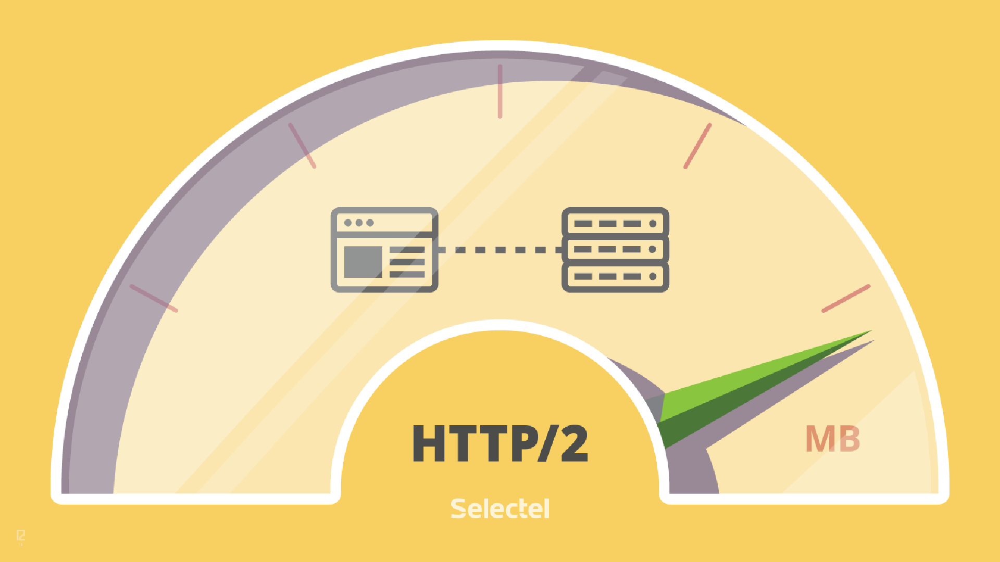
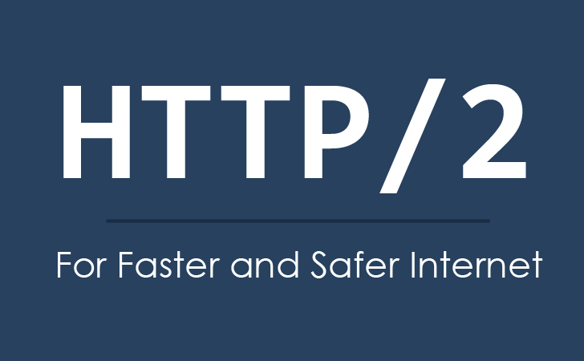
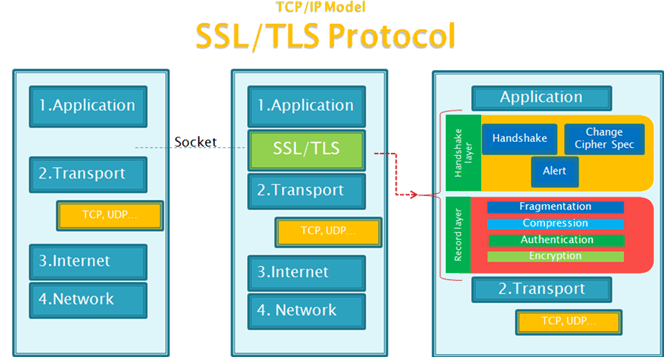

<p align='center'>

</p>


<p align='center'>

</p>


<p align='center'>

</p>


<p align='center'>

</p>

# HTTP/2 Introduction


超文本传输协议(HTTP)是一种非常成功的协议。 但是，HTTP/1.1 使用底层传输的方式（[[RFC7230]，第6节](https://tools.ietf.org/html/rfc7230#section-6)），其中有几个特性对今天的应用程序性能有负面影响。

特别是，HTTP/1.0 在给定的 TCP 连接上一次只允许一个请求未完成。HTTP/1.1 添加了请求流水线操作(request pipelining)，但这只是部分地解决了请求并发性，并且仍然受到队首阻塞的影响。因此，需要发出许多请求的 HTTP/1.0 和 HTTP/1.1 客户端使用多个连接到服务器以实现并发，从而减少延迟。

此外，HTTP 头字段通常是重复且冗长的，导致不必要的网络流量以及导致初始TCP [TCP](https://tools.ietf.org/html/rfc7540#ref-TCP) 拥塞窗口被快速的填充。当在新的 TCP 连接上发出多个请求时，这可能导致过多的延迟。

HTTP/2 通过定义了一个优化过的 HTTP 语义，它与底层连接映射，用这种方式来解决这些问题。具体而言，它允许在同一连接上交错请求和响应消息，并使用 HTTP 头字段的有效编码。它还允许对请求进行优先级排序，使更多重要请求更快地完成，从而进一步提高性能。

HTTP/2 对网络更友好，因为与 HTTP/1.x 相比，可以使用更少的 TCP 连接。这意味着与其他流量和长连接的竞争减少，反过来可以更好地利用可用网络容量。最后，HTTP/2 还可以通过使用二进制消息帧来更有效地处理消息。

## 一. HTTP/2 Protocol Overview

HTTP/2 为 HTTP 语义提供了优化的传输。 HTTP/2 支持 HTTP/1.1 的所有核心功能，但旨在通过多种方式提高效率。

HTTP/2 中的基本协议单元是一个帧([第4.1节](https://tools.ietf.org/html/rfc7540#section-4.1))。每种帧类型都有不同的用途。例如，HEADERS 和 DATA 帧构成了 HTTP 请求和响应的基础([第8.1节](https://tools.ietf.org/html/rfc7540#section-8.1));其他帧类型(如 SETTINGS，WINDOW\_UPDATE 和 PUSH\_PROMISE)用于支持其他 HTTP/2 功能。

通过使每个 HTTP 请求/响应交换与其自己的 stream 流相关联来实现请求的多路复用([第5节](https://tools.ietf.org/html/rfc7540#section-5))。stream 流在很大程度上是彼此独立的，因此阻塞或停止的请求或响应不会阻止其他 stream 流的通信。

流量控制和优先级确保可以有效地使用多路复用流。流量控制([第5.2节](https://tools.ietf.org/html/rfc7540#section-5.2))有助于确保只传输接收者可以使用的数据。确定优先级([第5.3节](https://tools.ietf.org/html/rfc7540#section-5.3))可确保首先将有限的资源定向到最重要的流。

HTTP/2 添加了一种新的交互模式，服务器可以将响应推送到客户端([第8.2节](https://tools.ietf.org/html/rfc7540#section-8.2))。服务器推送允许服务器推测性地将数据发送到服务器预测客户端将需要这些数据的客户端，通过牺牲一些网络流量来抵消潜在的延迟。服务器通过合成请求来完成此操作，并将其作为 PUSH\_PROMISE 帧发送。然后，服务器能够在单独的流上发送对合成请求的响应。

由于连接中使用的 HTTP 头字段可能包含大量冗余数据，因此压缩包含它们的帧([第4.3节](https://tools.ietf.org/html/rfc7540#section-4.3))。允许将许多请求压缩成一个分组的做法对于通常情况下的请求大小具有特别有利的影响。


接下来分 4 部分详细讨论 HTTP/2。

- 解开 HTTP/2 的面纱：HTTP/2 连接是如何建立的([第三章](https://tools.ietf.org/html/rfc7540#section-3))
- 帧([第四章](https://tools.ietf.org/html/rfc7540#section-4))和流([第五章](https://tools.ietf.org/html/rfc7540#section-5))层描述了 HTTP/2 帧的结构和形成多路复用流的方式。
- 帧([第六章](https://tools.ietf.org/html/rfc7540#section-6))和错误([第七章](https://tools.ietf.org/html/rfc7540#section-7))定义了包括 HTTP/2 中使用的帧和错误类型的详细信息。
- HTTP 映射([第八章](https://tools.ietf.org/html/rfc7540#section-8))和附加要求([第九章](https://tools.ietf.org/html/rfc7540#section-9))描述了如何使用帧和流表示 HTTP 语义。

虽然一些帧层和流层概念与 HTTP 隔离，但是该规范没有定义完全通用的帧层。帧层和流层是根据 HTTP 协议和服务器推送的需要而定制的。

## 二. Starting HTTP/2

HTTP/2 连接是在 TCP 连接([TCP](https://tools.ietf.org/html/rfc7540#ref-TCP))之上运行的应用层协议。客户端是 TCP 连接发起者。

HTTP/2 使用 HTTP/1.1 使用的相同 "http" 和 "https" URI scheme。HTTP/2 共享相同的默认端口号: "http" URI 为 80，"https" URI 为 443。因此，需要处理对目标资源 URI (例如 "http://example.org/foo" 或 "https://example.com/bar")的请求的实现，首先需要发现上游服务器(客户端希望建立连接的直接对等方)是否支持 HTTP/2。

对于 "http" 和 "https" URI，确定支持 HTTP/2 的方式是不同的。"http" URI 的发现在 [3.2 节](https://tools.ietf.org/html/rfc7540#section-3.2)中描述。[第 3.3 节](https://tools.ietf.org/html/rfc7540#section-3.3)描述了 "https" URI 的发现。


### 1. HTTP/2 Version Identification

本文档中定义的协议有两个标识符。

- 字符串 "h2" 标识 HTTP/2 使用传输层安全性(TLS)[TLS12](https://tools.ietf.org/html/rfc7540#ref-TLS12)的协议。该标识符用于 TLS 应用层协议协商(ALPN)扩展[TLS-ALPN](https://tools.ietf.org/html/rfc7540#ref-TLS-ALPN)字段以及识别 HTTP/2 over TLS 的任何地方。

"h2" 字符串被序列化为 ALPN 协议标识符，作为两个八位字节序列：0x68,0x32。

- 字符串 "h2c" 标识通过明文 TCP 运行 HTTP/2 的协议。此标识符用于 HTTP/1.1 升级标头字段以及标识 HTTP/2 over TCP 的任何位置。

"h2c" 字符串是从 ALPN 标识符空间保留的，但描述了不使用 TLS 的协议。

协商 "h2" 或 "h2c" 意味着使用本文档中描述的传输，安全性，成帧和消息语义。

### 2. Starting HTTP/2 for "http" URIs

在没有关于下一跳支持 HTTP/2 的先验知识的情况下请求 "http" URI 的客户端使用 HTTP 升级机制([[RFC7230]的第6.7节](https://tools.ietf.org/html/rfc7230#section-6.7))。客户端通过发出包含带有 "h2c" 标记的 Upgrade 头字段的HTTP/1.1 请求来完成此操作。这样的 HTTP/1.1 请求必须包含一个 HTTP2-Settings([第3.2.1节](https://tools.ietf.org/html/rfc7540#section-3.2.1))头字段。

例如：

```c
     GET / HTTP/1.1
     Host: server.example.com
     Connection: Upgrade, HTTP2-Settings
     Upgrade: h2c
     HTTP2-Settings: <base64url encoding of HTTP/2 SETTINGS payload>
```

在客户端可以发送 HTTP/2 帧之前，必须完整地发送包含有效负载主体的请求。这意味着大型请求可以阻止连接的使用，直到完全发送为止。


------------------------------------------------------

Reference：  

[RFC 7540](https://tools.ietf.org/html/rfc7540)

> GitHub Repo：[Halfrost-Field](https://github.com/halfrost/Halfrost-Field)
> 
> Follow: [halfrost · GitHub](https://github.com/halfrost)
>
> Source: []()