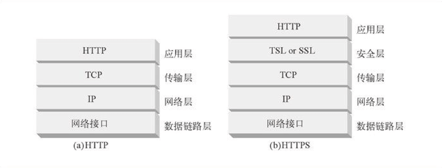

# HTTPS 温故知新（一） —— 开篇


<p align='center'>

</p>


## 一、为什么需要 HTTPS

HTTP1.1 有以下安全性问题：

1. 使用明文(不加密)进行通信，内容可能会被窃听；
2. 不验证通信方的身份，通信方的身份有可能遭遇伪装；
3. 无法证明报文的完整性，报文有可能遭篡改。

由于 HTTP 设计之初没有考虑到这几点，所以基于 HTTP 的这些应用都会存在安全问题。

### 1. 数据没有加密

基于 TCP/IP 的网络，网络各处都会存在被监听的风险。而且如果用 HTTP 协议进行通信，HTTP 本身没有加密功能，所以也无法做到对通信整体(使用 HTTP 协议通信的请求和响应的内容)进行加密。即，HTTP 报文使用明文(指未经过加密的报文)方式发送。

<p align='center'>

</p>

像上图表示的那样，在互联网各个环节都可能被监听。就算是加密通信，也能被监听到通信内容，只不过监听者看到的是密文。要解决 HTTP 上面 3 个大的安全问题，第一步就是要先进行加密通信。于是在传输层增加了一层 SSL（Secure Sockets Layer 安全套接层）/ TLS (Transport Layer Security 安全层传输协议) 来加密 HTTP 的通信内容。

HTTPS (HTTP Secure) 并不是新协议，而是 HTTP 先和 SSL（Secure Sockets Layer 安全套接层）/ TLS (Transport Layer Security 安全层传输协议) 通信，再由 SSL/TLS 和 TCP 通信。也就是说 HTTPS 使用了隧道进行通信。

这个时候可能有同学会有疑问了，为什么不直接对 HTTP 报文进行加密，这样就不需要 SSL/TLS 这一层了。确实，如果直接对 HTTP 报文进行加密也可以做到加密通信，但是虽然解决了第一条，但是后面 2 条就不好解决了。


<p align='center'>

</p>

就算直接对 HTTP 进行加密，HTTP 头部也没有加密，而头部信息也会导致信息不安全。

### 2. 无法验证通信对方的身份

基于 TCP 的 HTTP 虽然可以保证数据能完整的传输给对方，但是无法验证通信对方的身份。HTTP 也由于协议的灵活性，应用的非常广泛。通信的双方无须验证身份，服务器只要接收到能识别的请求，就会返回一个响应，一个 request 就一定会有一个 response。由于不确认通信对方，就会导致一些隐患：

- 服务器无法验证请求来自谁，是否是合法的客户端。
- 客户端收到响应，也无法验证是否是来自合法的服务器。
- 无法阻止海量请求下的 Dos 拒绝攻击（Denial of Service，拒绝服务攻击）

### 3. 无法防止数据被篡改

HTTP 协议是无法保证数据的完整性的。所谓完整性指的是信息的准确度。若无法证明信息的完整性，也就意味着无法判断信息是否准确。

客户端和服务端面对收到的响应和请求，都只能无条件接受，HTTP 也无法知道请求或响应在传输过程中是否已经被篡改了，例如遭到了中间人攻击(Man-in-the-Middle attack，MITM)。

HTTP 也有可以验证报文完整性的方法，但是还是不可靠。比如利用 MD5 和 SHA-1 等散列值校验的方法，用来确认文件的数字签名。（MD5 和 SHA-1 低位数的已经不再安全了，会遭到碰撞攻击，这个之后的文章再细致分析）

有下载服务的 Web 网站也会提供 PGP (Pretty Good Privacy，完美隐私)创建的数字签名及 MD5 算法生成的散列值。PGP 用来证明创建文件的数字签名，MD5 是由单向函数生成的散列值。在 HTTP 的协议下，浏览器是无法知晓数据被篡改了，还是需要用户自己查看。但是如果 PGP 和 MD5 在传输前就被篡改了，用户拿到以后验证对比发现是一致的，这种情况也没法保证数据的完整正确性。

<p align='center'>

</p>

通过使用 SSL，HTTPS 不仅能保证密文传输，重要的是还可以做到验证通信方的身份，保证报文的完整性。完美的解决了 HTTP 在安全性上的三大缺陷。


## 二、部署 HTTPS 有何好处

<p align='center'>

</p>

可能读者有这样的疑惑，除去电商，金融，和钱打交道以外的网站必须要部署 HTTPS，其他的网站用不用 HTTPS 无所谓。笔者之前也有类似的想法，不过这个想法是错误的。

电商，金融，和钱打交道以外的网站必须要部署 HTTPS，这个毫无疑问，是为了防止用户金钱上的损失，但是其他的网站呢？如果不部署 HTTPS，用裸的 HTTP，很容易遭到劫持，包括可能会被 ISP 插入小广告。小广告非常影响用户体验，如果是黄色广告，还会影响用户对这个网站的印象。另外用户浏览了哪些页面，用户行为也很容易被分析出来，这种也算是泄露了用户的隐私。

部署 HTTPS 有以下的好处：

### 1. 使用 HTTP/2 获得更高的性能

内容交付网络和网络托管服务提供商正在开始推广 HTTP/2。在 Velocity 的一次会议上，Load Impact 和 Mozilla 报告说，互联网用户可以通过 HTTP/2 优化比 HTTP/1.1 上的网站性能要好 50-70％。但是想用 HTTP/2 的性能优势，必须要先部署 HTTPS，这个规定也算是对 HTTPS 的一个推广。

### 2. 提高 SEO 排名

谷歌在 2014 年宣布，支持 HTTPS 的网站将会有排名靠前的较大权重。

### 3. 更好的推荐数据

如果采用了谷歌的 Analytics 库，它目前是强制运行在 HTTPS 上的，如果还是使用 HTTP，会由于 Analytics 不会获取 HTTP 网站的 Referral 信息而导致数据不准确。

### 4. 更高的安全性

主流浏览器现在都会针对 HTTPS 网站增加小绿锁标志，没有小绿锁的网站，对用户第一印象就不会很好。

### 5. 提高网站的信任和信誉

Chrome 62 版本以后，如果网页有输入框，没有 HTTPS 的网页一律都显示为不安全。

### 6. HTLM5 新特性

在 Chrome 50版本以后，地理位置，音频视频接口必须要求运行在 HTTPS 上，目的是为了能保证数据传输安全。

### 7. iOS ATS 要求

苹果为了推广HTTPS，在 WWDC 2017 上也宣布新的 App 必须要开启 APS (App Transport Security)安全特性。

## 三、HTTPS 中的密码学

### 1. 对称密钥加密

对称密钥加密（Symmetric-Key Encryption），加密的加密和解密使用同一密钥。

- 优点：运算速度快；
- 缺点：密钥容易被获取。

<p align='center'>

</p>

> 关于对称加密更加详细的内容，可以看笔者之前写的 [《漫游对称加密算法》](https://github.com/halfrost/Halfrost-Field/blob/master/contents/Protocol/HTTPS-symmetric-encryption.md)

### 2. 公开密钥加密

公开密钥加密（Public-Key Encryption），也称为非对称密钥加密，使用一对密钥用于加密和解密，分别为公开密钥和私有密钥。公开密钥所有人都可以获得，通信发送方获得接收方的公开密钥之后，就可以使用公开密钥进行加密，接收方收到通信内容后使用私有密钥解密。

- 优点：更为安全；
- 缺点：运算速度慢；

<p align='center'>

</p>

> 关于公开密钥加密更加详细的内容，可以看笔者之前写的 [《翱游公钥密码算法》](https://github.com/halfrost/Halfrost-Field/blob/master/contents/Protocol/HTTPS-asymmetric-encryption.md)

### 3. HTTPS 采用的加密方式

HTTPS 采用混合的加密机制，使用公开密钥加密用于传输对称密钥，之后使用对称密钥加密进行通信。（下图中的 Session Key 就是对称密钥）


<p align='center'>

</p>


### 4. 认证

HTTPS 通过使用  **证书**  来对通信方进行认证。

数字证书认证机构（CA，Certificate Authority）是客户端与服务器双方都可信赖的第三方机构。服务器的运营人员向 CA 提出公开密钥的申请，CA 在判明提出申请者的身份之后，会对已申请的公开密钥做数字签名，然后分配这个已签名的公开密钥，并将该公开密钥放入公开密钥证书后绑定在一起。

进行 HTTPS 通信时，服务器会把证书发送给客户端，客户端取得其中的公开密钥之后，先进行验证，如果验证通过，就可以开始通信。


<p align='center'>

</p>

> 关于证书更加详细的内容，可以看笔者之前写的 [《随处可见的公钥证书》](https://github.com/halfrost/Halfrost-Field/blob/master/contents/Protocol/HTTPS-digital-certificate.md)

使用 OpenSSL 这套开源程序，每个人都可以构建一套属于自己的认证机构，从而自己给自己颁发服务器证书。浏览器在访问该服务器时，会显示“无法确认连接安全性”或“该网站的安全证书存在问题”等警告消息。

### 5. 完整性

TLS / SSL 提供报文摘要功能来验证完整性。

## 四、HTTPS 中的 TLS / SSL 协议


<p align='center'>

</p>

能让 HTTPS 带来安全性的是其背后的 TLS 协议。它源于九十年代中期在 Netscape 上开发的称为安全套接字层(SSL)的协议。到 20 世纪 90 年代末，Netscape 将 SSL 移交给了 IETF，IETF 将其重命名为 TLS，并从此成为该协议的管理者。许多人仍将 Web 加密称作 SSL，即使绝大多数服务已切换到仅支持 TLS。

<p align='center'>

</p>

- 1994: SSL 1.0 由网景公司提出，主要解决安全传输从 0 到 1 的过程。

- 1995: SSL 2.0. 由 Netscape 提出，这个版本由于设计缺陷，并不安全，很快被发现有严重漏洞，已经废弃。

- 1996: SSL 3.0. 写成 RFC，开始流行。目前（2015年）已经不安全，必须禁用。

- 1999: TLS 1.0. 互联网标准化组织 ISOC 接替 NetScape 公司，发布了 SSL 的升级版 TLS 1.0 版。

- 2006: TLS 1.1. 作为 RFC 4346 发布。主要 fix 了 CBC 模式相关的如 BEAST 攻击等漏洞。

- 2008: TLS 1.2. 作为 RFC 5246 发布。增进安全性。目前（2015 年）应该主要部署的版本，请确保你使用的是这个版本。

- 2018：8月10日 RFC8446 TLS 1.3 协议正式发布，它剔除了 TLS 1.2 协议中不安全的因素，极大地增强了协议的安全性和性能。

在 IETF 中，协议被称为 RFC。TLS 1.0 是 RFC 2246，TLS 1.1 是 RFC 4346，TLS 1.2 是 RFC 5246。现在，TLS 1.3 为 RFC 8446。从 TLS 1.2 到 TLS 1.3，前前后后花了快 10 年的时间。RFC 通常按顺序发布，TLS 正式规范都是以 46 作为 RFC 编号的一部分更像是计划好的，并非巧合。


TLS/SSL 协议位于应用层和传输层 TCP 协议之间。TLS 粗略的划分又可以分为 2 层：

- 靠近应用层的握手协议 TLS Handshaking Protocols
- 靠近 TCP 的记录层协议 TLS Record Protocol

TLS 握手协议还能细分为 5 个子协议：

- change\_cipher\_spec (在 TLS 1.3 中这个协议已经删除，为了兼容 TLS 老版本，可能还会存在)
- alert
- handshake
- application\_data
- heartbeat (这个是 TLS 1.3 新加的，TLS 1.3 之前的版本没有这个协议)

这些子协议之间的关系可以用下图来表示：


<p align='center'>

</p>


### 1. TLS 记录层协议


记录层将上层的信息块分段为 TLSPlaintext 记录，TLSPlaintext 中包含 2^14 字节或更少字节块的数据。根据底层 ContentType 的不同，消息边界的处理方式也不同。TLS 1.3 中的规则比 TLS 1.2 中强制执行的规则更加严格。

握手消息可以合并为单个 TLSPlaintext 记录，或者在几个记录中分段，前提是：

- 握手消息不得与其他记录类型交错。也就是说，如果握手消息被分成两个或多个记录，则它们之间不能有任何其他记录。

- 握手消息绝不能跨越密钥更改。实现方必须验证密钥更改之前的所有消息是否与记录边界对齐; 如果没有，那么他们必须用 "unexpected_message" alert 消息终止连接。因为 ClientHello，EndOfEarlyData，ServerHello，Finished 和 KeyUpdate 消息可以在密钥更改之前立即发生，所以实现方必须将这些消息与记录边界对齐。

实现方绝不能发送握手类型的零长度片段，即使这些片段包含填充。

另外 Alert 消息禁止在记录之间进行分段，并且多条 alert 消息不得合并为单个 TLSPlaintext 记录。换句话说，具有 alert 类型的记录必须只包含一条消息。

应用数据消息包含对 TLS 不透明的数据。应用数据消息始终应该受到保护。可以发送应用数据的零长度片段，因为它们可能作为流量分析对策使用。应用数据片段可以拆分为多个记录，也可以合并为一个记录。

```c
      struct {
          ContentType type;
          ProtocolVersion legacy_record_version;
          uint16 length;
          opaque fragment[TLSPlaintext.length];
      } TLSPlaintext;
```

<p align='center'>

</p>

- type:  
用于处理 TLS 握手层的高级协议。

```c
      enum {
          invalid(0),
          change_cipher_spec(20),
          alert(21),
          handshake(22),
          application_data(23),
          heartbeat(24),  /* RFC 6520 */
          (255)
      } ContentType;
```

ContentType 是对握手协议的封装，消息头类型和握手层子协议编号的对应关系如下：

|消息头类型| ContentType |
|:---:|:---:|
| change\_cipher\_spec |0x014 |
| alert |0x015 |
| handshake |0x016 |
| application\_data |0x017 |
| heartbeat (TLS 1.3 新增)|0x018 |
   

- legacy\_record\_version:  
对于除初始 ClientHello 之外的 TLS 1.3 实现生成的所有记录(即，在 HelloRetryRequest 之后未生成的记录)，必须将其设置为 0x0303，其中出于兼容性目的，它也可以是0x0301。该字段在 TLS 1.3 中已经弃用，必须忽略它。在某些情况下，以前版本的 TLS 将在此字段中使用其他值。

在 TLS 1.3 中，version 为 0x0304，过去版本与 version 的对应关系如下：

|协议版本|version|
|:---:|:---:|
|TLS 1.3 |0x0304 |
|TLS 1.2 |0x0303 |
|TLS 1.1 |0x0302 |
|TLS 1.0 |0x0301 |
|SSL 3.0 |0x0300 |

- length:  
TLSPlaintext.fragment 的长度(以字节为单位)。长度不得超过 2 ^ 14 字节。接收超过此长度的记录的端点必须使用 "record_overflow" alert 消息终止连接。

- fragment:  
正在传输的数据。此字段的值是透明的，它并被视为一个独立的块，由类型字段指定的更高级别协议处理。


当尚未使用密码保护时，TLSPlaintext 结构是直接写入传输线路中的。一旦记录保护开始，TLSPlaintext 记录将受到密码保护。请注意，应用数据记录不得写入未受保护的连接中。所以在握手成功之前，是不能发送应用数据的。

TLS 记录层协议在整个 TLS 协议中的定位如下：

- 封装处理 TLS 上层(握手层)中的平行子协议(TLS 1.3 中是 5 个子协议，TLS 1.2 及更老的版本是 4 个子协议)，加上消息头，打包往下传递给 TCP 处理。

- 对上层应用数据协议进行密码保护，对其他的子协议只是简单封装(即不加密)

>关于 TLS 记录层协议更多细节将在接下来的文章中详细分析。也会对 TLS 1.2 和 TLS 1.3 展开对比。

### 2. TLS 密码切换协议

>**注意**：该协议在 TLS 1.3 标准规范中已经删除，但是实际使用中为了兼容 TLS 老版本和一些消息中间件，所以实际传输中还可能用到这个协议。

change\_cipher\_spec (以下简称 CCS 协议) 协议，是 TLS 记录层对应用数据是否进行加密的分界线。客户端或者服务端一旦收到对端发来的 CCS 协议，就表明接下来传输数据过程中可以对应用数据协议进行加密了。

TLS 记录层在处理上层 5 个协议(密码切换协议，警告协议，握手协议，心跳协议，应用数据协议)的时候，TLS 不同版本对不同协议加密的情况不同，具体情况如下：

|协议版本|密码切换协议|警告协议|握手协议|心跳协议|应用数据协议|
|:---:|:---:|:---:|:---:|:---:|:---:|
|TLS 1.3 | 无 |✅(根据连接状态不同进行加密，即一部分会加密) |✅(一部分加密)|❌|✅|
|TLS 1.2 | ❌ | ❌|❌|无|✅|


>关于 TLS CCS 协议更多细节将在接下来的握手文章中详细分析。也会对 TLS 1.2 和 TLS 1.3 展开对比。

协议数据结构如下：

```c
   struct {
       enum { change_cipher_spec(1), (255) } type;
   } ChangeCipherSpec;
```

经过 TLS 记录层包装以后，结构如下:

<p align='center'>

</p>


### 3. TLS 警告协议

TLS 提供 alert 内容类型用来表示关闭信息和错误。与其他消息一样，alert 消息也会根据当前连接状态的进行加密。在 TLS 1.3 中，错误的严重性隐含在正在发送的警报类型中，并且可以安全地忽略 "level" 字段。"close\_notify" alert 用于表示连接从一个方向开始有序的关闭。收到这样的警报后，TLS 实现方应该表明应用程序的数据结束。

收到错误警报后，TLS 实现方应该向应用程序表示出现了错误，并且不允许在连接上发送或接收任何其他数据。

协议数据结构如下：

```c
      enum { warning(1), fatal(2), (255) } AlertLevel;
      
      struct {
          AlertLevel level;
          AlertDescription description;
      } Alert;
```

经过 TLS 记录层包装以后，结构如下:

<p align='center'>

</p>

TLS 1.3 和 TLS 1.2 在这个协议上改动很小，只是新增加了几个枚举类型。

TLS 1.2 的所有警告描述信息：

```c
enum {
       close_notify(0),
       unexpected_message(10),
       bad_record_mac(20),
       decryption_failed_RESERVED(21),
       record_overflow(22),
       decompression_failure(30),
       handshake_failure(40),
       no_certificate_RESERVED(41),
       bad_certificate(42),
       unsupported_certificate(43),
       certificate_revoked(44),
       certificate_expired(45),
       certificate_unknown(46),
       illegal_parameter(47),
       unknown_ca(48),
       access_denied(49),
       decode_error(50),
       decrypt_error(51),
       export_restriction_RESERVED(60),
       protocol_version(70),
       insufficient_security(71),
       internal_error(80),
       user_canceled(90),
       no_renegotiation(100),
       unsupported_extension(110),           /* new */
       (255)
   } AlertDescription;
```

TLS 1.3 的所有警告描述信息：

```c
      enum {
          close_notify(0),
          unexpected_message(10),
          bad_record_mac(20),
          decryption_failed_RESERVED(21),
          record_overflow(22),
          decompression_failure_RESERVED(30),
          handshake_failure(40),
          no_certificate_RESERVED(41),
          bad_certificate(42),
          unsupported_certificate(43),
          certificate_revoked(44),
          certificate_expired(45),
          certificate_unknown(46),
          illegal_parameter(47),
          unknown_ca(48),
          access_denied(49),
          decode_error(50),
          decrypt_error(51),
          export_restriction_RESERVED(60),
          protocol_version(70),
          insufficient_security(71),
          internal_error(80),
          inappropriate_fallback(86),
          user_canceled(90),
          no_renegotiation_RESERVED(100),
          missing_extension(109),
          unsupported_extension(110),
          certificate_unobtainable_RESERVED(111),
          unrecognized_name(112),
          bad_certificate_status_response(113),
          bad_certificate_hash_value_RESERVED(114),
          unknown_psk_identity(115),
          certificate_required(116),
          no_application_protocol(120),
          (255)
      } AlertDescription;
```

TLS 1.3 比 TLS 1.2 新增了 9 个警告描述信息：

```c
          inappropriate_fallback(86),
          missing_extension(109),
          certificate_unobtainable_RESERVED(111),
          unrecognized_name(112),
          bad_certificate_status_response(113),
          bad_certificate_hash_value_RESERVED(114),
          unknown_psk_identity(115),
          certificate_required(116),
          no_application_protocol(120),

```


### 4. TLS 握手协议

握手协议是整个 TLS 协议簇中最最核心的协议，HTTPS 能保证安全也是因为它的功劳。

握手协议由多个子消息构成，服务端和客户端第一次完成一次握手需要 2-RTT。

握手协议的目的是为了双方协商出密码块，这个密码块会交给 TLS 记录层进行密钥加密。也就是说握手协议达成的“共识”(密码块)是整个 TLS 和 HTTPS 安全的基础。

握手协议在 TLS 1.2 和 TLS 1.3 中发生了很大的变化。TLS 1.3 的 0-RTT 是一个全新的概念。两个版本在密钥协商上，密码套件选择上都有很大不同。

TLS 1.2 协议数据结构如下：

```c
   enum {
       hello_request(0), 
       client_hello(1), 
       server_hello(2),
       certificate(11), 
       server_key_exchange (12),
       certificate_request(13), 
       server_hello_done(14),
       certificate_verify(15), 
       client_key_exchange(16),
       finished(20)
       (255)
   } HandshakeType;

   struct {
       HandshakeType msg_type;
       uint24 length;
       select (HandshakeType) {
           case hello_request:       HelloRequest;
           case client_hello:        ClientHello;
           case server_hello:        ServerHello;
           case certificate:         Certificate;
           case server_key_exchange: ServerKeyExchange;
           case certificate_request: CertificateRequest;
           case server_hello_done:   ServerHelloDone;
           case certificate_verify:  CertificateVerify;
           case client_key_exchange: ClientKeyExchange;
           case finished:            Finished;
       } body;
   } Handshake;
```

TLS 1.3 协议数据结构如下：

```c
      enum {
          hello_request_RESERVED(0),
          client_hello(1),
          server_hello(2),
          hello_verify_request_RESERVED(3),
          new_session_ticket(4),
          end_of_early_data(5),
          hello_retry_request_RESERVED(6),
          encrypted_extensions(8),
          certificate(11),
          server_key_exchange_RESERVED(12),
          certificate_request(13),
          server_hello_done_RESERVED(14),
          certificate_verify(15),
          client_key_exchange_RESERVED(16),
          finished(20),
          certificate_url_RESERVED(21),
          certificate_status_RESERVED(22),
          supplemental_data_RESERVED(23),
          key_update(24),
          message_hash(254),
          (255)
      } HandshakeType;

      struct {
          HandshakeType msg_type;    /* handshake type */
          uint24 length;             /* bytes in message */
          select (Handshake.msg_type) {
              case client_hello:          ClientHello;
              case server_hello:          ServerHello;
              case end_of_early_data:     EndOfEarlyData;
              case encrypted_extensions:  EncryptedExtensions;
              case certificate_request:   CertificateRequest;
              case certificate:           Certificate;
              case certificate_verify:    CertificateVerify;
              case finished:              Finished;
              case new_session_ticket:    NewSessionTicket;
              case key_update:            KeyUpdate;
          };
      } Handshake;
```

经过 TLS 记录层包装以后，结构如下:

<p align='center'>

</p>

握手消息类型虽然有很多种，但是最终传到 TLS 记录层，有些会被合并到一条消息。

>关于 TLS 握手协议更多细节将在接下来的文章中详细分析。也会对 TLS 1.2 和 TLS 1.3 展开对比。

### 5. TLS 应用数据协议

应用数据协议就是 TLS 上层的各种协议，TLS 主要保护的数据就是应用数据协议的数据。


经过 TLS 记录层包装以后，结构如下:

<p align='center'>

</p>

TLS 记录层会根据加密模式的不同在应用数据的末尾加上 MAC 校验数据。

### 6. TLS 心跳协议

这个协议是 TLS 1.3 新增的。更加细节可以看这篇文章[《TLS & DTLS Heartbeat Extension》](https://github.com/halfrost/Halfrost-Field/blob/master/contents/Protocol/TLS_Heartbeat.md)，这篇文章是笔者根据 [[RFC 6520]](https://tools.ietf.org/html/rfc6520) 翻译的。感兴趣的可以去看看这篇文章。这篇文章还涉及到了 DTLS 和 PMTU 发现。

协议数据结构如下：

```c
   enum {
      heartbeat_request(1),
      heartbeat_response(2),
      (255)
   } HeartbeatMessageType;
   
   struct {
      HeartbeatMessageType type;
      uint16 payload_length;
      opaque payload[HeartbeatMessage.payload_length];
      opaque padding[padding_length];
   } HeartbeatMessage;
```

经过 TLS 记录层包装以后，结构如下:

<p align='center'>

</p>

根据 [[RFC6066]](https://tools.ietf.org/html/rfc6066) 中的定义，在协商的时候，HeartbeatMessage 的总长度不得超过 2 ^ 14 或 max\_fragment\_length。

HeartbeatMessage 的长度为 TLS 的TLSPlaintext.length 和 DTLS 的 DTLSPlaintext.length。此外，类型 type 字段的长度是 1 个字节，并且 payload\_length 的长度是 2 个字节。因此，padding\_length 是TLSPlaintext.length  -  payload\_length  -  3 用于 TLS，DTLSPlaintext.length  -  payload\_length  -  3 用于 DTLS。padding\_length 必须至少为 16。

HeartbeatMessage 的发送方必须使用至少 16 个字节的随机填充。必须忽略收到的HeartbeatMessage 消息的填充。


## 五. 接下来

本篇文章作为 HTTPS 的开篇文章，分析了 HTTTPS 协议存在的必要性，HTTPS 带来的好处，HTTPS 安全的本质，以及 TLS 各个子协议之间的关系和作用。

接下来的几篇文章将会详细的对比 TLS 1.2 和 TLS 1.3 在握手协议上的差别，在记录层上的差别，在密钥导出上的差别，以及 TLS 1.3 新增的 0-RTT 到底是怎么回事。


------------------------------------------------------

Reference：
  
《图解 HTTP》    
《深入浅出 HTTPS》  
[TLS 1.3 规范 [RFC 8446]](https://tools.ietf.org/html/rfc8446)  
[TLS 1.2 规范 [RFC 5246]](https://tools.ietf.org/html/rfc5246)

> GitHub Repo：[Halfrost-Field](HTTPS://github.com/halfrost/Halfrost-Field)
> 
> Follow: [halfrost · GitHub](HTTPS://github.com/halfrost)
>
> Source: [https://halfrost.com/HTTPS\_begin/](https://halfrost.com/https-begin/)