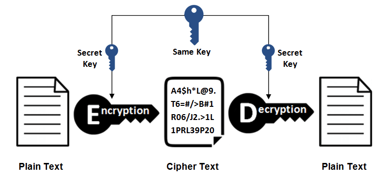
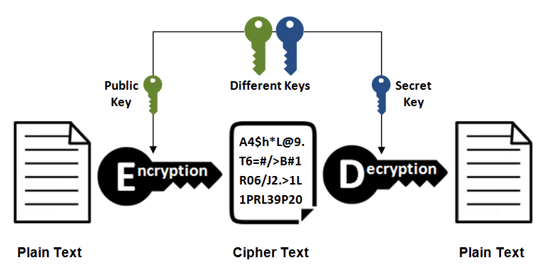
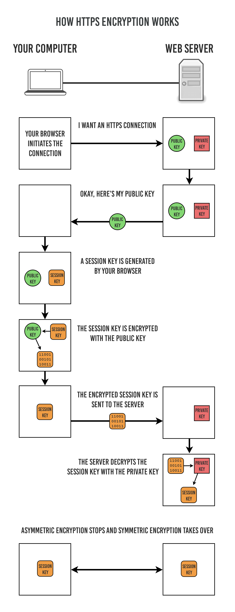
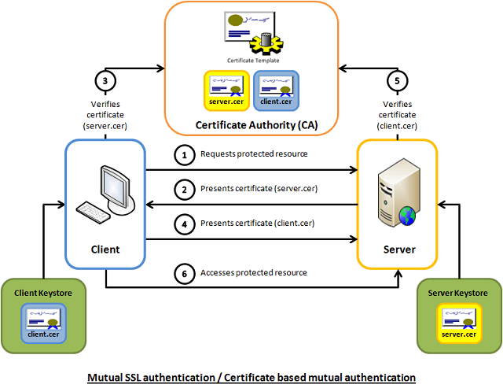

# HTTPS 温故知新（一） —— TLS 握手流程

## 一、为什么需要 HTTPS

HTTP1.1 有以下安全性问题：

1. 使用明文(不加密)进行通信，内容可能会被窃听；
2. 不验证通信方的身份，通信方的身份有可能遭遇伪装；
3. 无法证明报文的完整性，报文有可能遭篡改。

由于 HTTP 设计之初没有考虑到这几点，所以基于 HTTP 的这些应用都会存在安全问题。

### 1. 数据没有加密

基于 TCP/IP 的网络，网络各处都会存在被监听的风险。而且如果用 HTTP 协议进行通信，HTTP 本身没有加密功能，所以也无法做到对通信整体(使用 HTTP 协议通信的请求和响应的内容)进行加密。即，HTTP 报文使用明文(指未经过加密的报文)方式发送。

像上图表示的那样，在互联网各个环节都可能被监听。就算是加密通信，也能被监听到通信内容，只不过监听者看到的是密文。要解决 HTTP 上面 3 个大的安全问题，第一步就是要先进行加密通信。于是在传输层增加了一层 SSL（Secure Sockets Layer 安全套接层）/ TLS (Transport Layer Security 安全层传输协议) 来加密 HTTP 的通信内容。

HTTPS (HTTP Secure)􏵛􏰓􏲹􏱯􏲯􏰓􏰟􏷗􏳈􏰥􏷄􏷅􏴞 并不是新协议，而是 HTTP 先和 SSL（Secure Sockets Layer 安全套接层）/ TLS (Transport Layer Security 安全层传输协议) 通信，再由 SSL/TLS 和 TCP 通信。也就是说 HTTPS 使用了隧道进行通信。

这个时候可能有同学会有疑问了，为什么不直接对 HTTP 报文进行加密，这样就不需要 SSL/TLS 这一层了。确实，如果直接对 HTTP 报文进行加密也可以做到加密通信，但是虽然解决了第一条，但是后面 2 条就不好解决了。

就算直接对 HTTP 进行加密，HTTP 头部也没有加密，而头部信息也会导致信息不安全。

### 2. 无法验证通信对方的身份

基于 TCP 的 HTTP 虽然可以保证数据能完整的传输给对方，但是无法验证通信对方的身份。HTTP 也由于协议的灵活性，应用的非常广泛。通信的双方无须验证身份，服务器只要接收到能识别的请求，就会返回一个响应，一个 request 就一定会有一个 response。由于不确认通信对方，就会导致一些隐患：

- 服务器无法验证请求来自谁，是否是合法的客户端。
- 客户端收到响应，也无法验证是否是来自合法的服务器。
- 无法阻止海量请求下的 Dos 拒绝攻击（Denial of Service，拒绝服务攻击）

### 3. 无法防止数据被篡改

HTTP 协议是无法保证数据的完整性的。所谓完整性指的是信息的准确度。若无法证明信息的完整性，也就意味着无法判断信息是否准确。

客户端和服务端面对收到的响应和请求，都只能无条件接受，HTTP 也无法知道请求或响应在传输过程中是否已经被篡改了，例如遭到了中间人攻击(Man-in-the-Middle attack，MITM)。

HTTP 也有可以验证报文完整性的方法，但是还是不可靠。比如利用 MD5 和 SHA-1 等散列值校验的方法，用来确认文件的数字签名。（MD5 和 SHA-1 低位数的已经不再安全了，会遭到碰撞攻击，这个之后的文章再细致分析）

有下载服务的 Web 网站也会提供 PGP (Pretty Good Privacy，完美隐私)创建的数字签名及 MD5 算法生成的散列值。PGP 用来证明创建文件的数字签名，MD5 是由单向函数生成的散列值。在 HTTP 的协议下，浏览器是无法知晓数据被篡改了，还是需要用户自己查看。但是如果 PGP 和 MD5 在传输前就被篡改了，用户拿到以后验证对比发现是一致的，这种情况也没法保证数据的完整正确性。

通过使用 SSL，HTTPS 不仅能保证密文传输，重要的是还可以做到验证通信方的身份，保证报文的完整性。完美的解决了 HTTP 在安全性上的三大缺陷。

## 二、部署 HTTPS 有何好处

可能读者有这样的疑惑，除去电商，金融，和钱打交道以外的网站必须要部署 HTTPS，其他的网站用不用 HTTPS 无所谓。笔者之前也有类似的想法，不过这个想法是错误的。

电商，金融，和钱打交道以外的网站必须要部署 HTTPS，这个毫无疑问，是为了防止用户金钱上的损失，但是其他的网站呢？如果不部署 HTTPS，用裸的 HTTP，很容易遭到劫持，包括可能会被 ISP 插入小广告。小广告非常影响用户体验，如果是黄色广告，还会影响用户对这个网站的印象。另外用户浏览了哪些页面，用户行为也很容易被分析出来，这种也算是泄露了用户的隐私。

部署 HTTPS 有以下的好处：

### 1. 使用 HTTP/2 获得更高的性能

内容交付网络和网络托管服务提供商正在开始推广 HTTP/2。在 Velocity 的一次会议上，Load Impact 和 Mozilla 报告说，互联网用户可以通过 HTTP/2 优化比 HTTP/1.1 上的网站性能要好 50-70％。但是想用 HTTP/2 的性能优势，必须要先部署 HTTPS，这个规定也算是对 HTTPS 的一个推广。

### 2. 提高 SEO 排名

谷歌在 2014 年宣布，支持 HTTPS 的网站将会有排名靠前的较大权重。

### 3. 更好的推荐数据

如果采用了谷歌的 Analytics 库，它目前是强制运行在 HTTPS 上的，如果还是使用 HTTP，会由于 Analytics 不会获取 HTTP 网站的 Referral 信息而导致数据不准确。

### 4. 更高的安全性

主流浏览器现在都会针对 HTTPS 网站增加小绿锁标志，没有小绿锁的网站，对用户第一印象就不会很好。

### 5. 提高网站的信任和信誉

Chrome 62 版本以后，如果网页有输入框，没有 HTTPS 的网页一律都显示为不安全。

### 6. HTLM5 新特性

在 Chrome 50版本以后，地理位置，音频视频接口必须要求运行在 HTTPS 上，目的是为了能保证数据传输安全。

### 7. iOS ATS 要求

苹果为了推广HTTPS，在 WWDC 2017 上也宣布新的 App 必须要开启 APS (App Transport Security)安全特性。

## 三、加密

### 1. 对称密钥加密

对称密钥加密（Symmetric-Key Encryption），加密的加密和解密使用同一密钥。

- 优点：运算速度快；
- 缺点：密钥容易被获取。

### 2. 公开密钥加密

公开密钥加密（Public-Key Encryption），也称为非对称密钥加密，使用一对密钥用于加密和解密，分别为公开密钥和私有密钥。公开密钥所有人都可以获得，通信发送方获得接收方的公开密钥之后，就可以使用公开密钥进行加密，接收方收到通信内容后使用私有密钥解密。

- 优点：更为安全；
- 缺点：运算速度慢；

### 3. HTTPS 采用的加密方式

HTTPS 采用混合的加密机制，使用公开密钥加密用于传输对称密钥，之后使用对称密钥加密进行通信。（下图中的 Session Key 就是对称密钥）

## 认证

通过使用  **证书**  来对通信方进行认证。

数字证书认证机构（CA，Certificate Authority）是客户端与服务器双方都可信赖的第三方机构。服务器的运营人员向 CA 提出公开密钥的申请，CA 在判明提出申请者的身份之后，会对已申请的公开密钥做数字签名，然后分配这个已签名的公开密钥，并将该公开密钥放入公开密钥证书后绑定在一起。

进行 HTTPS 通信时，服务器会把证书发送给客户端，客户端取得其中的公开密钥之后，先进行验证，如果验证通过，就可以开始通信。

使用 OpenSSL 这套开源程序，每个人都可以构建一套属于自己的认证机构，从而自己给自己颁发服务器证书。浏览器在访问该服务器时，会显示“无法确认连接安全性”或“该网站的安全证书存在问题”等警告消息。

## 完整性

SSL 提供报文摘要功能来验证完整性。

## 四、握手流程

------------------------------------------------------

Reference：
  
《图解 HTTP》    
《HTTP 权威指南》
《深入浅出 HTTPS》  
[How to Migrate from HTTP to HTTPS – Complete Tutorial](https://woorkup.com/http-to-https/)

> GitHub Repo：[Halfrost-Field](HTTPS://github.com/halfrost/Halfrost-Field)
> 
> Follow: [halfrost · GitHub](HTTPS://github.com/halfrost)
>
> Source: 