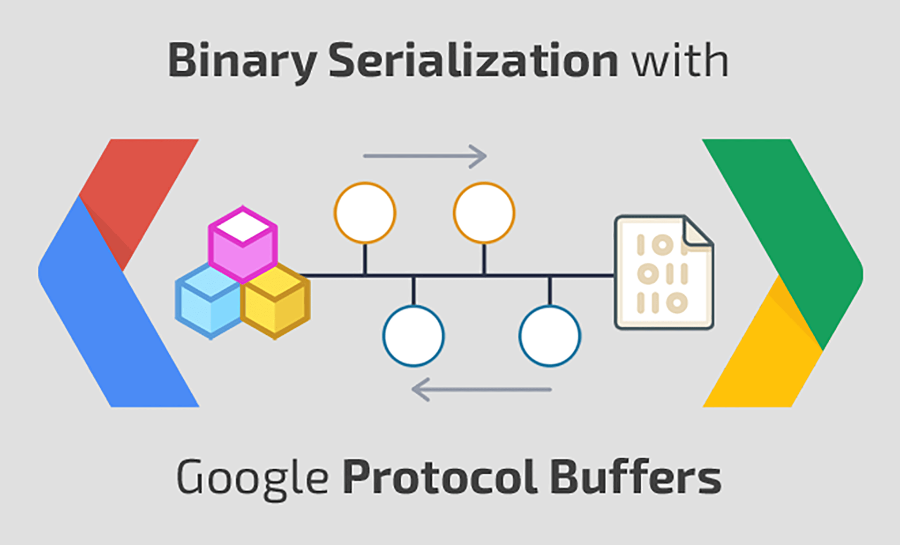
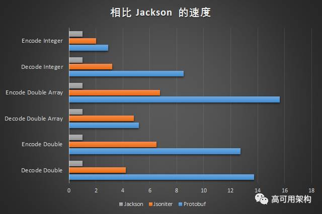
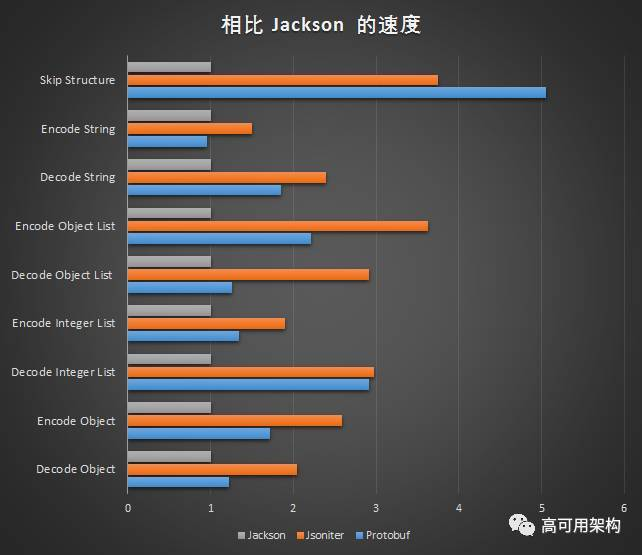

# 高效的序列化/反序列化数据方式 Protobuf

<p align='center'>

</p>


## 一. protocol buffers 序列化

上篇文章中其实已经讲过了 encode 的过程，这篇文章以 golang 为例，从代码实现的层面讲讲序列化和反序列化的过程。

举个 go 使用 protobuf 进行数据序列化和反序列化的例子，本篇文章从这个例子开始。

先新建一个 example 的 message：

```proto
	syntax = "proto2";
	package example;

	enum FOO { X = 17; };

	message Test {
	  required string label = 1;
	  optional int32 type = 2 [default=77];
	  repeated int64 reps = 3;
	  optional group OptionalGroup = 4 {
	    required string RequiredField = 5;
	  }
	}
```

利用 protoc-gen-go 生成对应的 get/ set 方法。代码中就可以用生成的代码进行序列化和反序列化了。

```go
	package main

	import (
		"log"

		"github.com/golang/protobuf/proto"
		"path/to/example"
	)

	func main() {
		test := &example.Test {
			Label: proto.String("hello"),
			Type:  proto.Int32(17),
			Reps:  []int64{1, 2, 3},
			Optionalgroup: &example.Test_OptionalGroup {
				RequiredField: proto.String("good bye"),
			},
		}
		data, err := proto.Marshal(test)
		if err != nil {
			log.Fatal("marshaling error: ", err)
		}
		newTest := &example.Test{}
		err = proto.Unmarshal(data, newTest)
		if err != nil {
			log.Fatal("unmarshaling error: ", err)
		}
		// Now test and newTest contain the same data.
		if test.GetLabel() != newTest.GetLabel() {
			log.Fatalf("data mismatch %q != %q", test.GetLabel(), newTest.GetLabel())
		}
		// etc.
	}
```

上面代码中 proto.Marshal() 是序列化过程。proto.Unmarshal() 是反序列化过程。这一章节先看看序列化过程的实现，下一章节再分析反序列化过程的实现。


```go
// Marshal takes the protocol buffer
// and encodes it into the wire format, returning the data.
func Marshal(pb Message) ([]byte, error) {
	// Can the object marshal itself?
	if m, ok := pb.(Marshaler); ok {
		return m.Marshal()
	}
	p := NewBuffer(nil)
	err := p.Marshal(pb)
	if p.buf == nil && err == nil {
		// Return a non-nil slice on success.
		return []byte{}, nil
	}
	return p.buf, err
}
```

序列化函数一进来，会先调用 message 对象自身的实现的序列化方法。


```go
// Marshaler is the interface representing objects that can marshal themselves.
type Marshaler interface {
	Marshal() ([]byte, error)
}
```

Marshaler 是一个 interface ，这个接口是专门留给对象自定义序列化的。如果有实现，就 return 自己实现的方法。如果没有，接下来就进行默认序列化方式。

```go
	p := NewBuffer(nil)
	err := p.Marshal(pb)
	if p.buf == nil && err == nil {
		// Return a non-nil slice on success.
		return []byte{}, nil
	}
```

新建一个 Buffer，调用 Buffer 的 Marshal() 方法。message 经过序列化以后，数据流会放到 Buffer 的 buf 字节流中。序列化最终返回 buf 字节流即可。

```go
type Buffer struct {
	buf   []byte // encode/decode byte stream
	index int    // read point

	// pools of basic types to amortize allocation.
	bools   []bool
	uint32s []uint32
	uint64s []uint64

	// extra pools, only used with pointer_reflect.go
	int32s   []int32
	int64s   []int64
	float32s []float32
	float64s []float64
}
```

Buffer 的数据结构如上，Buffer 是用于序列化和反序列化 protocol buffers 的缓冲区管理器。它可以在调用的时候重用以减少内存使用量。内部维护了 7 个 pool，3 个基础数据类型的 pool，4 个只能被 pointer\_reflect 使用的 pool。


```go
func (p *Buffer) Marshal(pb Message) error {
	// Can the object marshal itself?
	if m, ok := pb.(Marshaler); ok {
		data, err := m.Marshal()
		p.buf = append(p.buf, data...)
		return err
	}

	t, base, err := getbase(pb)
	// 异常处理
	if structPointer_IsNil(base) {
		return ErrNil
	}
	if err == nil {
		err = p.enc_struct(GetProperties(t.Elem()), base)
	}

	// 用来统计 Encode 次数的
	if collectStats {
		(stats).Encode++ // Parens are to work around a goimports bug.
	}
	// maxMarshalSize = 1<<31 - 1，这个值是 protobuf 可以 encoded 的最大值。
	if len(p.buf) > maxMarshalSize {
		return ErrTooLarge
	}
	return err
}
```

Buffer 的 Marshal() 方法依旧先调用一下对象是否实现了 Marshal() 接口，如果实现了，还是让它自己序列化，序列化之后的二进制数据流加入到 buf 数据流中。

```go
func getbase(pb Message) (t reflect.Type, b structPointer, err error) {
	if pb == nil {
		err = ErrNil
		return
	}
	// get the reflect type of the pointer to the struct.
	t = reflect.TypeOf(pb)
	// get the address of the struct.
	value := reflect.ValueOf(pb)
	b = toStructPointer(value)
	return
}
```

getbase 方法通过 reflect 方法拿到了 message 的类型和对应 value 的结构体指针。拿到结构体指针先做异常处理。

所以序列化最核心的代码其实就一句，p.enc\_struct(GetProperties(t.Elem()), base)

```go
// Encode a struct.
func (o *Buffer) enc_struct(prop *StructProperties, base structPointer) error {
	var state errorState
	// Encode fields in tag order so that decoders may use optimizations
	// that depend on the ordering.
	// https://developers.google.com/protocol-buffers/docs/encoding#order
	for _, i := range prop.order {
		p := prop.Prop[i]
		if p.enc != nil {
			err := p.enc(o, p, base)
			if err != nil {
				if err == ErrNil {
					if p.Required && state.err == nil {
						state.err = &RequiredNotSetError{p.Name}
					}
				} else if err == errRepeatedHasNil {
					// Give more context to nil values in repeated fields.
					return errors.New("repeated field " + p.OrigName + " has nil element")
				} else if !state.shouldContinue(err, p) {
					return err
				}
			}
			if len(o.buf) > maxMarshalSize {
				return ErrTooLarge
			}
		}
	}

	// Do oneof fields.
	if prop.oneofMarshaler != nil {
		m := structPointer_Interface(base, prop.stype).(Message)
		if err := prop.oneofMarshaler(m, o); err == ErrNil {
			return errOneofHasNil
		} else if err != nil {
			return err
		}
	}

	// Add unrecognized fields at the end.
	if prop.unrecField.IsValid() {
		v := *structPointer_Bytes(base, prop.unrecField)
		if len(o.buf)+len(v) > maxMarshalSize {
			return ErrTooLarge
		}
		if len(v) > 0 {
			o.buf = append(o.buf, v...)
		}
	}

	return state.err
}

```

上面代码中可以看到，除去 oneof fields 和 unrecognized fields 是单独最后处理的，其他类型都是调用的 p.enc(o, p, base) 进行序列化的。

Properties 的数据结构定义如下：

```go
type Properties struct {
	Name     string // name of the field, for error messages
	OrigName string // original name before protocol compiler (always set)
	JSONName string // name to use for JSON; determined by protoc
	Wire     string
	WireType int
	Tag      int
	Required bool
	Optional bool
	Repeated bool
	Packed   bool   // relevant for repeated primitives only
	Enum     string // set for enum types only
	proto3   bool   // whether this is known to be a proto3 field; set for []byte only
	oneof    bool   // whether this is a oneof field

	Default     string // default value
	HasDefault  bool   // whether an explicit default was provided
	CustomType  string
	StdTime     bool
	StdDuration bool

	enc           encoder
	valEnc        valueEncoder // set for bool and numeric types only
	field         field
	tagcode       []byte // encoding of EncodeVarint((Tag<<3)|WireType)
	tagbuf        [8]byte
	stype         reflect.Type      // set for struct types only
	sstype        reflect.Type      // set for slices of structs types only
	ctype         reflect.Type      // set for custom types only
	sprop         *StructProperties // set for struct types only
	isMarshaler   bool
	isUnmarshaler bool

	mtype    reflect.Type // set for map types only
	mkeyprop *Properties  // set for map types only
	mvalprop *Properties  // set for map types only

	size    sizer
	valSize valueSizer // set for bool and numeric types only

	dec    decoder
	valDec valueDecoder // set for bool and numeric types only

	// If this is a packable field, this will be the decoder for the packed version of the field.
	packedDec decoder
}

```

在 Properties 这个结构体中，定义了名为 enc 的 encoder 和名为 dec 的 decoder。

encoder 和 decoder 函数定义是完全一样的。

```go
type encoder func(p *Buffer, prop *Properties, base structPointer) error
```

```go
type decoder func(p *Buffer, prop *Properties, base structPointer) error

```

encoder 和 decoder 函数初始化是在 Properties 中：

```go
// Initialize the fields for encoding and decoding.
func (p *Properties) setEncAndDec(typ reflect.Type, f *reflect.StructField, lockGetProp bool) {
	// 下面代码有删减，类似的部分省略了
	// proto3 scalar types
	
	case reflect.Int32:
		if p.proto3 {
			p.enc = (*Buffer).enc_proto3_int32
			p.dec = (*Buffer).dec_proto3_int32
			p.size = size_proto3_int32
		} else {
			p.enc = (*Buffer).enc_ref_int32
			p.dec = (*Buffer).dec_proto3_int32
			p.size = size_ref_int32
		}
	case reflect.Uint32:
		if p.proto3 {
			p.enc = (*Buffer).enc_proto3_uint32
			p.dec = (*Buffer).dec_proto3_int32 // can reuse
			p.size = size_proto3_uint32
		} else {
			p.enc = (*Buffer).enc_ref_uint32
			p.dec = (*Buffer).dec_proto3_int32 // can reuse
			p.size = size_ref_uint32
		}
	case reflect.Float32:
		if p.proto3 {
			p.enc = (*Buffer).enc_proto3_uint32 // can just treat them as bits
			p.dec = (*Buffer).dec_proto3_int32
			p.size = size_proto3_uint32
		} else {
			p.enc = (*Buffer).enc_ref_uint32 // can just treat them as bits
			p.dec = (*Buffer).dec_proto3_int32
			p.size = size_ref_uint32
		}
	case reflect.String:
		if p.proto3 {
			p.enc = (*Buffer).enc_proto3_string
			p.dec = (*Buffer).dec_proto3_string
			p.size = size_proto3_string
		} else {
			p.enc = (*Buffer).enc_ref_string
			p.dec = (*Buffer).dec_proto3_string
			p.size = size_ref_string
		}

	case reflect.Slice:
		switch t2 := t1.Elem(); t2.Kind() {
		default:
			logNoSliceEnc(t1, t2)
			break

		case reflect.Int32:
			if p.Packed {
				p.enc = (*Buffer).enc_slice_packed_int32
				p.size = size_slice_packed_int32
			} else {
				p.enc = (*Buffer).enc_slice_int32
				p.size = size_slice_int32
			}
			p.dec = (*Buffer).dec_slice_int32
			p.packedDec = (*Buffer).dec_slice_packed_int32
		
			default:
				logNoSliceEnc(t1, t2)
				break
			}
		}

	case reflect.Map:
		p.enc = (*Buffer).enc_new_map
		p.dec = (*Buffer).dec_new_map
		p.size = size_new_map

		p.mtype = t1
		p.mkeyprop = &Properties{}
		p.mkeyprop.init(reflect.PtrTo(p.mtype.Key()), "Key", f.Tag.Get("protobuf_key"), nil, lockGetProp)
		p.mvalprop = &Properties{}
		vtype := p.mtype.Elem()
		if vtype.Kind() != reflect.Ptr && vtype.Kind() != reflect.Slice {
			// The value type is not a message (*T) or bytes ([]byte),
			// so we need encoders for the pointer to this type.
			vtype = reflect.PtrTo(vtype)
		}

		p.mvalprop.CustomType = p.CustomType
		p.mvalprop.StdDuration = p.StdDuration
		p.mvalprop.StdTime = p.StdTime
		p.mvalprop.init(vtype, "Value", f.Tag.Get("protobuf_val"), nil, lockGetProp)
	}
	p.setTag(lockGetProp)
}

```

上面代码中，分别把各个类型都进行 switch - case 枚举，每种情况都设置对应的 encode 编码器，decode 解码器，size 大小。proto2 和 proto3 有区别的地方也分成2种不同的情况进行处理。

有以下几种类型，reflect.Bool、reflect.Int32、reflect.Uint32、reflect.Int64、reflect.Uint64、reflect.Float32、reflect.Float64、reflect.String、reflect.Struct、reflect.Ptr、reflect.Slice、reflect.Map 共 12 种大的分类。

下面主要挑 3 类，Int32、String、Map 代码实现进行分析。


### 1. Int32

```go
func (o *Buffer) enc_proto3_int32(p *Properties, base structPointer) error {
	v := structPointer_Word32Val(base, p.field)
	x := int32(word32Val_Get(v)) // permit sign extension to use full 64-bit range
	if x == 0 {
		return ErrNil
	}
	o.buf = append(o.buf, p.tagcode...)
	p.valEnc(o, uint64(x))
	return nil
}
```

处理 Int32 代码比较简单，先把 tagcode 放进 buf 二进制数据流缓冲区，接着序列化 Int32 ，序列化以后紧接着 tagcode 后面放进缓冲区。

```go
// EncodeVarint writes a varint-encoded integer to the Buffer.
// This is the format for the
// int32, int64, uint32, uint64, bool, and enum
// protocol buffer types.
func (p *Buffer) EncodeVarint(x uint64) error {
	for x >= 1<<7 {
		p.buf = append(p.buf, uint8(x&0x7f|0x80))
		x >>= 7
	}
	p.buf = append(p.buf, uint8(x))
	return nil
}
```

Int32 的编码处理方法在[上篇](https://github.com/halfrost/Halfrost-Field/blob/master/contents/Protocol/Protocol-buffers-encode.md)里面讲过，用的 Varint 处理方法。上面这个函数同样适用于处理 int32, int64, uint32, uint64, bool, enum。

顺道也可以看看 sint32、Fixed32 的具体代码实现。

```go
// EncodeZigzag32 writes a zigzag-encoded 32-bit integer
// to the Buffer.
// This is the format used for the sint32 protocol buffer type.
func (p *Buffer) EncodeZigzag32(x uint64) error {
	// use signed number to get arithmetic right shift.
	return p.EncodeVarint(uint64((uint32(x) << 1) ^ uint32((int32(x) >> 31))))
}
```

针对有符号的 sint32 ，采取的是先 Zigzag，然后在 Varint 的处理方式。

```go
// EncodeFixed32 writes a 32-bit integer to the Buffer.
// This is the format for the
// fixed32, sfixed32, and float protocol buffer types.
func (p *Buffer) EncodeFixed32(x uint64) error {
	p.buf = append(p.buf,
		uint8(x),
		uint8(x>>8),
		uint8(x>>16),
		uint8(x>>24))
	return nil
}
```

对于 Fixed32 的处理，仅仅只是位移操作，并没有做什么压缩操作。

### 2. String


```go
func (o *Buffer) enc_proto3_string(p *Properties, base structPointer) error {
	v := *structPointer_StringVal(base, p.field)
	if v == "" {
		return ErrNil
	}
	o.buf = append(o.buf, p.tagcode...)
	o.EncodeStringBytes(v)
	return nil
}
```

序列化字符串也分2步，先把 tagcode 放进去，然后再序列化数据。

```go
// EncodeStringBytes writes an encoded string to the Buffer.
// This is the format used for the proto2 string type.
func (p *Buffer) EncodeStringBytes(s string) error {
	p.EncodeVarint(uint64(len(s)))
	p.buf = append(p.buf, s...)
	return nil
}
```

序列化字符串的时候，会先把字符串的长度通过编码 Varint 的方式，写到 buf 中。长度后面再紧跟着 string。这也就是 tag - length - value 的实现。


### 3. Map


```go
// Encode a map field.
func (o *Buffer) enc_new_map(p *Properties, base structPointer) error {
	var state errorState // XXX: or do we need to plumb this through?

	v := structPointer_NewAt(base, p.field, p.mtype).Elem() // map[K]V
	if v.Len() == 0 {
		return nil
	}

	keycopy, valcopy, keybase, valbase := mapEncodeScratch(p.mtype)

	enc := func() error {
		if err := p.mkeyprop.enc(o, p.mkeyprop, keybase); err != nil {
			return err
		}
		if err := p.mvalprop.enc(o, p.mvalprop, valbase); err != nil && err != ErrNil {
			return err
		}
		return nil
	}

	// Don't sort map keys. It is not required by the spec, and C++ doesn't do it.
	for _, key := range v.MapKeys() {
		val := v.MapIndex(key)

		keycopy.Set(key)
		valcopy.Set(val)

		o.buf = append(o.buf, p.tagcode...)
		if err := o.enc_len_thing(enc, &state); err != nil {
			return err
		}
	}
	return nil
}
```

上述代码也可以序列化字典数组，例如：

```go
map<key_type, value_type> map_field = N;
```

转换成对应的 repeated message 形式再进行序列化。

```
message MapFieldEntry {
		key_type key = 1;
		value_type value = 2;
}
repeated MapFieldEntry map_field = N;
```

map 序列化是针对每个 k-v ，都先放入 tagcode ，然后再序列化 k-v。这里需要化未知长度的结构体的时候需要调用 enc\_len\_thing() 方法。


```go
// Encode something, preceded by its encoded length (as a varint).
func (o *Buffer) enc_len_thing(enc func() error, state *errorState) error {
	iLen := len(o.buf)
	o.buf = append(o.buf, 0, 0, 0, 0) // reserve four bytes for length
	iMsg := len(o.buf)
	err := enc()
	if err != nil && !state.shouldContinue(err, nil) {
		return err
	}
	lMsg := len(o.buf) - iMsg
	lLen := sizeVarint(uint64(lMsg))
	switch x := lLen - (iMsg - iLen); {
	case x > 0: // actual length is x bytes larger than the space we reserved
		// Move msg x bytes right.
		o.buf = append(o.buf, zeroes[:x]...)
		copy(o.buf[iMsg+x:], o.buf[iMsg:iMsg+lMsg])
	case x < 0: // actual length is x bytes smaller than the space we reserved
		// Move msg x bytes left.
		copy(o.buf[iMsg+x:], o.buf[iMsg:iMsg+lMsg])
		o.buf = o.buf[:len(o.buf)+x] // x is negative
	}
	// Encode the length in the reserved space.
	o.buf = o.buf[:iLen]
	o.EncodeVarint(uint64(lMsg))
	o.buf = o.buf[:len(o.buf)+lMsg]
	return state.err
}
```

enc\_len\_thing() 方法会先预存 4 个字节的长度空位。序列化以后算出长度。如果长度比 4 个字节还要长，则右移序列化的二进制数据，把长度填到 tagcode 和数据之间。如果长度小于 4 个字节，相应的要左移。


### 4. slice

最后再举一个数组的例子。以 []int32 为例。

```go
// Encode a slice of int32s ([]int32) in packed format.
func (o *Buffer) enc_slice_packed_int32(p *Properties, base structPointer) error {
	s := structPointer_Word32Slice(base, p.field)
	l := s.Len()
	if l == 0 {
		return ErrNil
	}
	// TODO: Reuse a Buffer.
	buf := NewBuffer(nil)
	for i := 0; i < l; i++ {
		x := int32(s.Index(i)) // permit sign extension to use full 64-bit range
		p.valEnc(buf, uint64(x))
	}

	o.buf = append(o.buf, p.tagcode...)
	o.EncodeVarint(uint64(len(buf.buf)))
	o.buf = append(o.buf, buf.buf...)
	return nil
}
```

序列化这个数组，分3步，先把 tagcode 放进去，然后再序列化整个数组的长度，最后把数组的每个数据都序列化放在后面。最后形成 tag - length - value - value - value 的形式。

上述就是 Protocol Buffer 序列化的过程。

### 序列化小结：

Protocol Buffer 序列化采用 Varint、Zigzag 方法，压缩 int 型整数和带符号的整数。对浮点型数字不做压缩(这里可以进一步的压缩，Protocol Buffer 还有提升空间)。编码 `.proto` 文件，会对 option 和 repeated 字段进行检查，若 optional 或 repeated 字段没有被设置字段值，那么该字段在序列化时的数据中是完全不存在的，即不进行序列化（少编码一个字段）。

上面这两点做到了压缩数据，序列化工作量减少。

序列化的过程都是二进制的位移，速度非常快。数据都以 tag - length - value (或者 tag - value)的形式存在二进制数据流中。采用了 TLV 结构存储数据以后，也摆脱了 JSON 中的 {、}、; 、这些分隔符，没有这些分隔符也算是再一次减少了一部分数据。

这一点做到了序列化速度非常快。

## 二. protocol buffers 反序列化

反序列化的实现完全是序列化实现的逆过程。


```go
func Unmarshal(buf []byte, pb Message) error {
	pb.Reset()
	return UnmarshalMerge(buf, pb)
}
```

在反序列化开始之前，先重置一下缓冲区。

```go
func (p *Buffer) Reset() {
	p.buf = p.buf[0:0] // for reading/writing
	p.index = 0        // for reading
}
```

清空 buf 中的所有数据，并且重置 index。

```go
func UnmarshalMerge(buf []byte, pb Message) error {
	// If the object can unmarshal itself, let it.
	if u, ok := pb.(Unmarshaler); ok {
		return u.Unmarshal(buf)
	}
	return NewBuffer(buf).Unmarshal(pb)
}
```

反序列化数据的开始从上面这个函数开始，如果传进来的 message 的结果和 buf 结果不匹配，最终得到的结果是不可预知的。反序列化之前，同样会先调用一下对应自己身自定义的 Unmarshal() 方法。

```go
type Unmarshaler interface {
	Unmarshal([]byte) error
}
```

Unmarshal() 是一个可以自己实现的接口。

UnmarshalMerge 中会调用 Unmarshal(pb Message) 方法。

```go
func (p *Buffer) Unmarshal(pb Message) error {
	// If the object can unmarshal itself, let it.
	if u, ok := pb.(Unmarshaler); ok {
		err := u.Unmarshal(p.buf[p.index:])
		p.index = len(p.buf)
		return err
	}

	typ, base, err := getbase(pb)
	if err != nil {
		return err
	}

	err = p.unmarshalType(typ.Elem(), GetProperties(typ.Elem()), false, base)

	if collectStats {
		stats.Decode++
	}

	return err
}
```

Unmarshal(pb Message) 这个函数只有一个入参，和 proto.Unmarshal() 方法函数签名不同(前面的函数只有 1 个入参，后面的有 2 个入参)。两者的区别在于，1 个入参的函数实现里面并不会重置 buf 缓冲区，二个入参的会先重置 buf 缓冲区。

这两个函数最终都会调用 unmarshalType() 方法，这个函数是最终支持反序列化的函数。

```go
func (o *Buffer) unmarshalType(st reflect.Type, prop *StructProperties, is_group bool, base structPointer) error {
	var state errorState
	required, reqFields := prop.reqCount, uint64(0)

	var err error
	for err == nil && o.index < len(o.buf) {
		oi := o.index
		var u uint64
		u, err = o.DecodeVarint()
		if err != nil {
			break
		}
		wire := int(u & 0x7)
		
		// 下面代码有省略
		
		dec := p.dec
		
		// 中间代码有省略
		
		decErr := dec(o, p, base)
		if decErr != nil && !state.shouldContinue(decErr, p) {
			err = decErr
		}
		if err == nil && p.Required {
			// Successfully decoded a required field.
			if tag <= 64 {
				// use bitmap for fields 1-64 to catch field reuse.
				var mask uint64 = 1 << uint64(tag-1)
				if reqFields&mask == 0 {
					// new required field
					reqFields |= mask
					required--
				}
			} else {
				// This is imprecise. It can be fooled by a required field
				// with a tag > 64 that is encoded twice; that's very rare.
				// A fully correct implementation would require allocating
				// a data structure, which we would like to avoid.
				required--
			}
		}
	}
	if err == nil {
		if is_group {
			return io.ErrUnexpectedEOF
		}
		if state.err != nil {
			return state.err
		}
		if required > 0 {
			// Not enough information to determine the exact field. If we use extra
			// CPU, we could determine the field only if the missing required field
			// has a tag <= 64 and we check reqFields.
			return &RequiredNotSetError{"{Unknown}"}
		}
	}
	return err
}
```

unmarshalType() 函数比较长，里面处理的情况比较多，有 oneof，WireEndGroup 。真正处理反序列化的函数在 `decErr := dec(o, p, base)` 这一行。

dec 函数在 Properties 的 setEncAndDec() 函数中进行了初始化。上面序列化的时候谈到过那个函数了，这里就不再赘述了。dec() 函数针对每个不同类型都有对应的反序列化函数。

同样的，接下来也举 4 个例子，看看反序列化的实际代码实现。


### 1. Int32

```go
func (o *Buffer) dec_proto3_int32(p *Properties, base structPointer) error {
	u, err := p.valDec(o)
	if err != nil {
		return err
	}
	word32Val_Set(structPointer_Word32Val(base, p.field), uint32(u))
	return nil
}
```

反序列化 Int32 代码比较简单，原理是按照 encode 的逆过程，还原原来的数据。

```go
func (p *Buffer) DecodeVarint() (x uint64, err error) {
	i := p.index
	buf := p.buf

	if i >= len(buf) {
		return 0, io.ErrUnexpectedEOF
	} else if buf[i] < 0x80 {
		p.index++
		return uint64(buf[i]), nil
	} else if len(buf)-i < 10 {
		return p.decodeVarintSlow()
	}

	var b uint64
	// we already checked the first byte
	x = uint64(buf[i]) - 0x80
	i++

	b = uint64(buf[i])
	i++
	x += b << 7
	if b&0x80 == 0 {
		goto done
	}
	x -= 0x80 << 7

	b = uint64(buf[i])
	i++
	x += b << 14
	if b&0x80 == 0 {
		goto done
	}
	x -= 0x80 << 14

	b = uint64(buf[i])
	i++
	x += b << 21
	if b&0x80 == 0 {
		goto done
	}
	x -= 0x80 << 21

	b = uint64(buf[i])
	i++
	x += b << 28
	if b&0x80 == 0 {
		goto done
	}
	x -= 0x80 << 28

	b = uint64(buf[i])
	i++
	x += b << 35
	if b&0x80 == 0 {
		goto done
	}
	x -= 0x80 << 35

	b = uint64(buf[i])
	i++
	x += b << 42
	if b&0x80 == 0 {
		goto done
	}
	x -= 0x80 << 42

	b = uint64(buf[i])
	i++
	x += b << 49
	if b&0x80 == 0 {
		goto done
	}
	x -= 0x80 << 49

	b = uint64(buf[i])
	i++
	x += b << 56
	if b&0x80 == 0 {
		goto done
	}
	x -= 0x80 << 56

	b = uint64(buf[i])
	i++
	x += b << 63
	if b&0x80 == 0 {
		goto done
	}
	// x -= 0x80 << 63 // Always zero.

	return 0, errOverflow

done:
	p.index = i
	return x, nil
}
```

Int32 序列化之后，第一个字节一定是 0x80，那么除去这个字节以后，后面的每个二进制字节都是数据，剩下的步骤就是通过位移操作把每个数字都加起来。上面这个反序列化的函数同样适用于 int32, int64, uint32, uint64, bool, and enum。

顺道也可以看看 sint32、Fixed32 的反序列化具体代码实现。

```go
func (p *Buffer) DecodeZigzag32() (x uint64, err error) {
	x, err = p.DecodeVarint()
	if err != nil {
		return
	}
	x = uint64((uint32(x) >> 1) ^ uint32((int32(x&1)<<31)>>31))
	return
}
```

针对有符号的 sint32 ，反序列化的过程就是先反序列 Varint，再反序列化 Zigzag。


```go
func (p *Buffer) DecodeFixed32() (x uint64, err error) {
	// x, err already 0
	i := p.index + 4
	if i < 0 || i > len(p.buf) {
		err = io.ErrUnexpectedEOF
		return
	}
	p.index = i

	x = uint64(p.buf[i-4])
	x |= uint64(p.buf[i-3]) << 8
	x |= uint64(p.buf[i-2]) << 16
	x |= uint64(p.buf[i-1]) << 24
	return
}
```

Fixed32 反序列化的过程也是通过位移，每个字节的内容都累加，就可以还原出原先的数据。注意这里也要先跳过 tag 的位置。 

### 2. String


```go
func (p *Buffer) DecodeRawBytes(alloc bool) (buf []byte, err error) {
	n, err := p.DecodeVarint()
	if err != nil {
		return nil, err
	}

	nb := int(n)
	if nb < 0 {
		return nil, fmt.Errorf("proto: bad byte length %d", nb)
	}
	end := p.index + nb
	if end < p.index || end > len(p.buf) {
		return nil, io.ErrUnexpectedEOF
	}

	if !alloc {
		// todo: check if can get more uses of alloc=false
		buf = p.buf[p.index:end]
		p.index += nb
		return
	}

	buf = make([]byte, nb)
	copy(buf, p.buf[p.index:])
	p.index += nb
	return
}
```

反序列化 string 先把 length 序列化出来，通过 DecodeVarint 的方式。拿到 length 以后，剩下的就是直接拷贝的过程。在上篇 encode 中，我们知道字符串是不做处理，直接放到二进制流里面的，所以反序列化直接取出即可。

### 3. Map


```go
func (o *Buffer) dec_new_map(p *Properties, base structPointer) error {
	raw, err := o.DecodeRawBytes(false)
	if err != nil {
		return err
	}
	oi := o.index       // index at the end of this map entry
	o.index -= len(raw) // move buffer back to start of map entry

	mptr := structPointer_NewAt(base, p.field, p.mtype) // *map[K]V
	if mptr.Elem().IsNil() {
		mptr.Elem().Set(reflect.MakeMap(mptr.Type().Elem()))
	}
	v := mptr.Elem() // map[K]V

	// 这里省略一些代码，主要是为了 key - value 准备的一些可以双重间接寻址的占位符，具体原因可以见序列化代码里面的 enc_new_map 函数

	// Decode.
	// This parses a restricted wire format, namely the encoding of a message
	// with two fields. See enc_new_map for the format.
	for o.index < oi {
		// tagcode for key and value properties are always a single byte
		// because they have tags 1 and 2.
		tagcode := o.buf[o.index]
		o.index++
		switch tagcode {
		case p.mkeyprop.tagcode[0]:
			if err := p.mkeyprop.dec(o, p.mkeyprop, keybase); err != nil {
				return err
			}
		case p.mvalprop.tagcode[0]:
			if err := p.mvalprop.dec(o, p.mvalprop, valbase); err != nil {
				return err
			}
		default:
			// TODO: Should we silently skip this instead?
			return fmt.Errorf("proto: bad map data tag %d", raw[0])
		}
	}
	keyelem, valelem := keyptr.Elem(), valptr.Elem()
	if !keyelem.IsValid() {
		keyelem = reflect.Zero(p.mtype.Key())
	}
	if !valelem.IsValid() {
		valelem = reflect.Zero(p.mtype.Elem())
	}

	v.SetMapIndex(keyelem, valelem)
	return nil
}
```

反序列化 map 需要把每个 tag 取出来，然后紧接着反序列化每个 key - value。最后会判断 keyelem 和 valelem 是否为零值，如果是零值要分别调用 reflect.Zero 处理零值的情况。

### 4. slice

最后还是举一个数组的例子。以 []int32 为例。

```go
func (o *Buffer) dec_slice_packed_int32(p *Properties, base structPointer) error {
	v := structPointer_Word32Slice(base, p.field)

	nn, err := o.DecodeVarint()
	if err != nil {
		return err
	}
	nb := int(nn) // number of bytes of encoded int32s

	fin := o.index + nb
	if fin < o.index {
		return errOverflow
	}
	for o.index < fin {
		u, err := p.valDec(o)
		if err != nil {
			return err
		}
		v.Append(uint32(u))
	}
	return nil
}
```

反序列化这个数组，分2步，跳过 tagcode 拿到 length，反序列化 length。在 length 这个长度中依次反序列化各个 value。

上述就是 Protocol Buffer 反序列化的过程。

### 反序列化小结：

Protocol Buffer 反序列化直接读取二进制字节数据流，反序列化就是 encode 的反过程，同样是一些二进制操作。反序列化的时候，通常只需要用到 length。tag 值只是用来标识类型的，Properties 的 setEncAndDec() 方法里面已经把每个类型对应的 decode 解码器初始化好了，所以反序列化的时候，tag 值可以直接跳过，从 length 开始处理。

XML 的解析过程就复杂一些。XML 需要从文件中读取出字符串，再转换为 XML 文档对象结构模型。之后，再从 XML 文档对象结构模型中读取指定节点的字符串，最后再将这个字符串转换成指定类型的变量。这个过程非常复杂，其中将 XML 文件转换为文档对象结构模型的过程通常需要完成词法文法分析等大量消耗 CPU 的复杂计算。


## 三. 序列化 / 反序列化性能

Protocol Buffer 一直被人们认为是高性能的存在。也有很多人做过实现，验证了这一说法。例如这个链接里面的实验 [jvm-serializers](https://github.com/eishay/jvm-serializers/wiki)。

在看数据之前，我们可以先理性的分析一下 Protocol Buffer 和 JSON、XML 这些比有哪些优势：

1. Protobuf 采用了 Varint、Zigzag 大幅的压缩了整数类型，也没有 JSON 里面的 {、}、;、这些数据分隔符，有 option 字段标识的，没有数据的时候不会进行反序列化。这几个措施导致 pb 的数据量整体的就比 JSON 少很多。
2. Protobuf 采取的是 TLV 的形式，JSON 这些都是字符串的形式。字符串比对应该比基于数字的字段 tag 更耗时。Protobuf 在正文前有一个大小或者长度的标记，而 JSON 必须全文扫描无法跳过不需要的字段。

下面这张图来自参考链接里面的 《Protobuf有没有比JSON快5倍？用代码来击破pb性能神话》：

<p align='center'>

</p>

从这个实验来看，确实 Protobuf 在序列化数字这方面性能是非常强悍的。

序列化 / 反序列化数字确实是 Protobuf 针对 JSON 和 XML 的优势，但是它也存在一些没有优势的地方。比如字符串。字符串在 Protobuf 中基本没有处理，除了前面加了 tag - length 。在序列化 / 反序列化字符串的过程中，字符串拷贝的速度反而决定的真正的速度。


<p align='center'>

</p>

从上图可以看到 encode 字符串的时候，速度基本和 JSON 相差无几。

## 三. 最后

至此，关于 protocol buffers 的所有，读者应该了然于胸了。

protocol buffers 诞生之初也并不是为了传输数据存在的，只是为了解决服务器多版本协议兼容的问题。实质其实是发明了一个新的跨语言无歧义的 IDL (Interface description language)。只不过人们后来发现用它来传输数据也不错，才开始用 protocol buffers 。

想用 protocol buffers 替换 JSON，可能是考虑到：

1. protocol buffers 相同数据，传输的数据量比 JSON 小，gzip 或者 7zip 压缩以后，网络传输消耗较少。
2. protocol buffers 不是自我描述的，在缺少 `.proto` 文件以后，有一定的加密性，数据传输过程中都是二进制流，并不是明文。
3. protocol buffers 提供了一套工具，自动化生成代码也非常方便。
4. protocol buffers 具有向后兼容性，改变了数据结构以后，对老的版本没有影响。
5. protocol buffers 原生完美兼容 RPC 调用。


如果很少用到整型数字，浮点型数字，全部都是字符串数据，那么 JSON 和 protocol buffers 性能不会差太多。纯前端之间交互的话，选择 JSON 或者 protocol buffers 差别不是很大。

与后端交互过程中，用到 protocol buffers 比较多，笔者认为选择 protocol buffers 除了性能强以外，完美兼容 RPC 调用也是一个重要因素。

------------------------------------------------------

Reference：  

[google 官方文档](https://developers.google.com/protocol-buffers/docs/overview)      
[thrift-protobuf-compare - Benchmarking.wiki](https://code.google.com/archive/p/thrift-protobuf-compare/wikis/Benchmarking.wiki)    
[jvm-serializers](https://github.com/eishay/jvm-serializers/wiki)  
[Protobuf有没有比JSON快5倍？用代码来击破pb性能神话](https://mp.weixin.qq.com/s?__biz=MzA3NDcyMTQyNQ==&mid=2649257430&idx=1&sn=975b6123d8256221f6bac3b99e52af9a&chksm=8767a428b0102d3e6ab7abdf797c481da570cb29e274aa4ff6ecd931f535166b776e6548941d&scene=0&key=399a205ce674169cbedcc1c459650908e22d6a2b81674195c3b251114acdf821dbde7bb49102c6b47f61b26a7a404d74e0e8440cea3675a7ea8f49eafd8639bfb733183a1bfb4603232d6cb8ecd230e5&ascene=0&uin=NTkxMDk2NjU=&devicetype=iMac+MacBookPro12,1+OSX+OSX+10.12.4+build(16E195)&version=12020510&nettype=WIFI&fontScale=100&pass_ticket=wHPj0w18CV8zHl6HCfd9t9LQfs3I0ZULhUILuOHgL0E=)

> GitHub Repo：[Halfrost-Field](https://github.com/halfrost/Halfrost-Field)
> 
> Follow: [halfrost · GitHub](https://github.com/halfrost)
>
> Source: [https://halfrost.com/protobuf\_decode/](https://halfrost.com/protobuf_decode/)