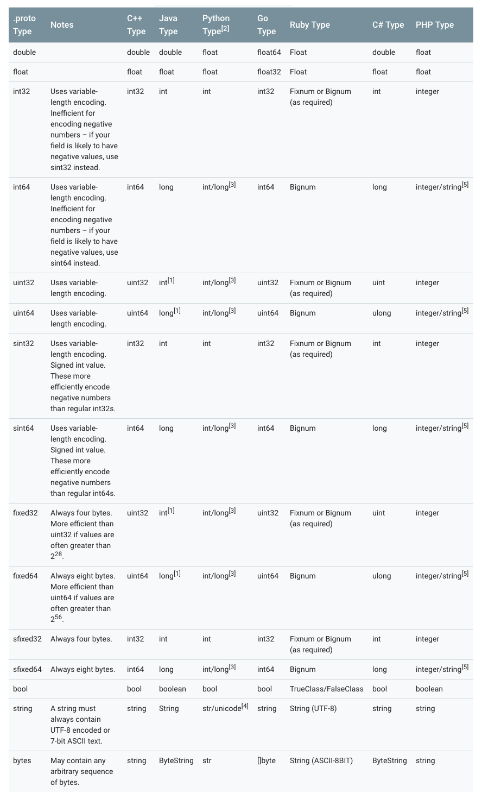
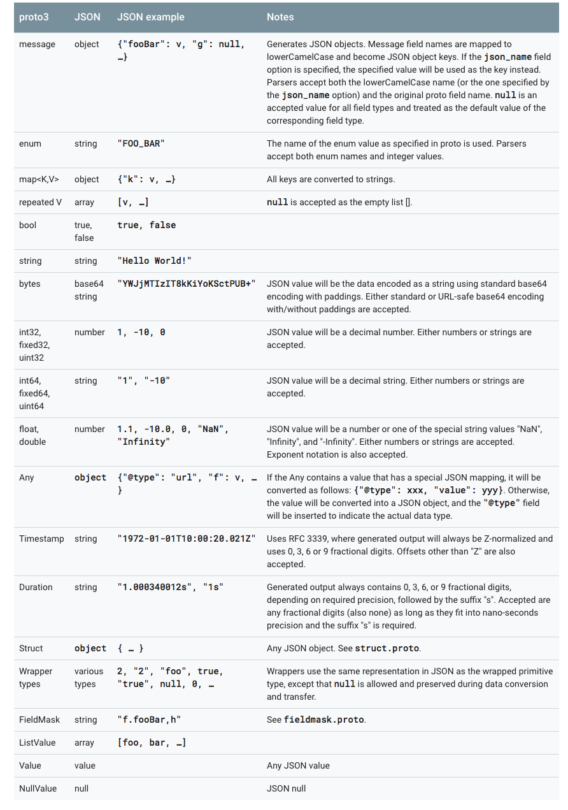

# 高效的数据序列化格式 Protobuf

<p align='center'>

</p>

## 一. protocol buffers 是什么？

Protocol buffers 是一种语言中立，平台无关，可扩展的序列化数据的格式，可用于通信协议，数据存储等。

Protocol buffers 在序列化数据方面，它是灵活的，高效的。相比于 XML 来说，Protocol buffers 更加小巧，更加快速，更加简单。一旦定义了要处理的数据的数据结构之后，就可以利用 Protocol buffers 的代码生成工具生成相关的代码。甚至可以在无需重新部署程序的情况下更新数据结构。只需使用 Protobuf 对数据结构进行一次描述，即可利用各种不同语言或从各种不同数据流中对你的结构化数据轻松读写。

**Protocol buffers 很适合做数据存储或 RPC 数据交换格式。可用于通讯协议、数据存储等领域的语言无关、平台无关、可扩展的序列化结构数据格式**。


## 二. 为什么要发明 protocol buffers ？

<p align='center'>

</p>


大家可能会觉得 Google 发明 protocol buffers 是为了解决序列化速度的，其实真实的原因并不是这样的。

protocol buffers 最先开始是 google 用来解决索引服务器 request/response 协议的。没有 protocol buffers 之前，google 已经存在了一种 request/response 格式，用于手动处理 request/response 的编组和反编组。它也能支持多版本协议，不过代码比较丑陋：

```c
 if (version == 3) {
   ...
 } else if (version > 4) {
   if (version == 5) {
     ...
   }
   ...
 }
```

如果非常明确的格式化协议，会使新协议变得非常复杂。因为开发人员必须确保请求发起者与处理请求的实际服务器之间的所有服务器都能理解新协议，然后才能切换开关以开始使用新协议。

这也就是每个服务器开发人员都遇到过的低版本兼容、新旧协议兼容相关的问题。

protocol buffers 为了解决这些问题，于是就诞生了。protocol buffers 被寄予一下 2 个特点：

- 可以很容易地引入新的字段，并且不需要检查数据的中间服务器可以简单地解析并传递数据，而无需了解所有字段。
- 数据格式更加具有自我描述性，可以用各种语言来处理(C++, Java 等各种语言)

这个版本的 protocol buffers 仍需要自己手写解析的代码。

不过随着系统慢慢发展，演进，protocol buffers 目前具有了更多的特性：

- 自动生成的序列化和反序列化代码避免了手动解析的需要。（官方提供自动生成代码工具，各个语言平台的基本都有）
- 除了用于 RPC（远程过程调用）请求之外，人们开始将 protocol buffers 用作持久存储数据的便捷自描述格式（例如，在Bigtable中）。
- 服务器的 RPC 接口可以先声明为协议的一部分，然后用 protocol compiler 生成基类，用户可以使用服务器接口的实际实现来覆盖它们。


protocol buffers 现在是 Google 用于数据的通用语言。在撰写本文时，谷歌代码树中定义了 48162 种不同的消息类型，包括 12183 个 .proto 文件。它们既用于 RPC 系统，也用于在各种存储系统中持久存储数据。


小结：

**protocol buffers 诞生之初是为了解决服务器端新旧协议(高低版本)兼容性问题，名字也很体贴，“协议缓冲区”。只不过后期慢慢发展成用于传输数据**。


> Protocol Buffers 命名由来： 
>  
> Why the name "Protocol Buffers"?  
The name originates from the early days of the format, before we had the protocol buffer compiler to generate classes for us. At the time, there was a class called ProtocolBuffer which actually acted as a buffer for an individual method. Users would add tag/value pairs to this buffer individually by calling methods like AddValue(tag, value). The raw bytes were stored in a buffer which could then be written out once the message had been constructed.
> 
> Since that time, the "buffers" part of the name has lost its meaning, but it is still the name we use. Today, people usually use the term "protocol message" to refer to a message in an abstract sense, "protocol buffer" to refer to a serialized copy of a message, and "protocol message object" to refer to an in-memory object representing the parsed message.
> 
> 这个名字起源于 format 早期，在我们有 protocol buffer 编译器为我们生成类之前。当时，有一个名为 ProtocolBuffer 的类，它实际上充当了单个方法的缓冲区。用户可以通过调用像 AddValue(tag,value) 这样的方法分别将标签/值对添加到此缓冲区。原始字节存储在一个缓冲区中，一旦构建消息就可以将其写出。 
> 
> 从那时起，名为“缓冲”的部分已经失去了意义，但它仍然是我们使用的名称。今天，人们通常使用术语“protocol message”来指代抽象意义上的消息，“protocol buffer”指的是消息的序列化副本，而“protocol message object”指的是代表内存中对象解析的消息。


## 三. proto3 定义 message

目前 protocol buffers 最新版本是 proto3，与老的版本 proto2 还是有些区别的。这两个版本的 API 不完全兼容。

> proto2 和 proto3 的名字看起来有点扑朔迷离，那是因为当我们最初开源的 protocol buffers 时，它实际上是 Google 的第二个版本了，所以被称为proto2，这也是我们的开源版本号从 v2 开始的原因。初始版名为 proto1，从2001年初开始在谷歌开发的。


在 proto 中，所有结构化的数据都被称为 message。


```proto
message helloworld 
{ 
   required int32     id = 1;  // ID 
   required string    str = 2;  // str 
   optional int32     opt = 3;  //optional field 
}
```

上面这几行语句，定义了一个消息 helloworld，该消息有三个成员，类型为 int32 的 id，另一个为类型为 string 的成员 str。opt 是一个可选的成员，即消息中可以不包含该成员。

接下来说明一些 proto3 中需要注意的地方。

```proto
syntax = "proto3";

message SearchRequest {
  string query = 1;
  int32 page_number = 2;
  int32 result_per_page = 3;
}
```

如果开头第一行不声明 `syntax = "proto3";`，则默认使用 proto2 进行解析。

### 1. 分配字段编号

每个消息定义中的每个字段都有**唯一的编号**。这些字段编号用于标识消息二进制格式中的字段，并且在使用消息类型后不应更改。请注意，范围 1 到 15 中的字段编号需要一个字节进行编码，包括字段编号和字段类型（具体原因见 [Protocol Buffer 编码]() 这一章节）。范围 16 至 2047 中的字段编号需要两个字节。所以你应该保留数字 1 到 15 作为非常频繁出现的消息元素。请记住为将来可能添加的频繁出现的元素留出一些空间。

可以指定的最小字段编号为1，最大字段编号为2^29^-1 或 536,870,911。也不能使用数字 19000 到 19999（FieldDescriptor :: kFirstReservedNumber 到 FieldDescriptor :: kLastReservedNumber），因为它们是为 Protocol Buffers实现保留的。

如果在 .proto 中使用这些保留数字中的一个，Protocol Buffers 编译的时候会报错。

同样，您不能使用任何以前 Protocol Buffers 保留的一些字段号码。保留字段是什么，下一节详细说明。

### 2. 保留字段

如果您通过完全删除某个字段或将其注释掉来更新消息类型，那么未来的用户可以在对该类型进行自己的更新时重新使用该字段号。如果稍后加载到了的旧版本 `.proto` 文件，则会导致服务器出现严重问题，例如数据混乱，隐私错误等等。确保这种情况不会发生的一种方法是指定删除字段的字段编号（或名称，这也可能会导致JSON序列化问题）为 `reserved`。如果将来的任何用户试图使用这些字段标识符，Protocol Buffers 编译器将会报错。

```proto
message Foo {
  reserved 2, 15, 9 to 11;
  reserved "foo", "bar";
}
```

**注意，不能在同一个 `reserved` 语句中混合字段名称和字段编号**。如有需要需要像上面这个例子这样写。

### 3. 默认字段规则

- 字段名不能重复，必须唯一。
- repeated 字段：可以在一个 message 中重复任何数字多次(包括 0 )，不过这些重复值的顺序被保留。

在 proto3 中，纯数字类型的 repeated 字段编码时候默认采用 packed 编码（具体原因见 [Protocol Buffer 编码]() 这一章节）

### 4. 各个语言标量类型对应关系

<p align='center'>

</p>


### 5. 枚举

在 message 中可以嵌入枚举类型。

```proto
message SearchRequest {
  string query = 1;
  int32 page_number = 2;
  int32 result_per_page = 3;
  enum Corpus {
    UNIVERSAL = 0;
    WEB = 1;
    IMAGES = 2;
    LOCAL = 3;
    NEWS = 4;
    PRODUCTS = 5;
    VIDEO = 6;
  }
  Corpus corpus = 4;
}
```

枚举类型需要注意的是，一定要有 0 值。

- 枚举为 0 的是作为零值，当不赋值的时候，就会是零值。
- 为了和 proto2 兼容。在 proto2 中，零值必须是第一个值。

另外在反序列化的过程中，无法被识别的枚举值，将会被保留在 messaage 中。因为消息反序列化时如何表示是依赖于语言的。在支持指定符号范围之外的值的开放枚举类型的语言中，例如 C++ 和 Go，未知的枚举值只是存储为其基础整数表示。在诸如 Java 之类的封闭枚举类型的语言中，枚举值会被用来标识未识别的值，并且特殊的访问器可以访问到底层整数。

在其他情况下，如果消息被序列化，则无法识别的值仍将与消息一起序列化。


### 5. 枚举中的保留值


如果您通过完全删除枚举条目或将其注释掉来更新枚举类型，未来的用户可以在对该类型进行自己的更新时重新使用数值。如果稍后加载到了的旧版本 `.proto` 文件，则会导致服务器出现严重问题，例如数据混乱，隐私错误等等。确保这种情况不会发生的一种方法是指定已删除条目的数字值（或名称，这也可能会导致JSON序列化问题）为 `reserved`。如果将来的任何用户试图使用这些字段标识符，Protocol Buffers 编译器将会报错。您可以使用 `max` 关键字指定您的保留数值范围上升到最大可能值。

```proto
enum Foo {
  reserved 2, 15, 9 to 11, 40 to max;
  reserved "FOO", "BAR";
}
```

**注意，不能在同一个 `reserved` 语句中混合字段名称和字段编号**。如有需要需要像上面这个例子这样写。

### 6. 允许嵌套

Protocol Buffers 定义 message 允许嵌套组合成更加复杂的消息。

```proto
message SearchResponse {
  repeated Result results = 1;
}

message Result {
  string url = 1;
  string title = 2;
  repeated string snippets = 3;
}
```

上面的例子中，SearchResponse 中嵌套使用了 Result 。

更多的例子：

```proto
message SearchResponse {
  message Result {
    string url = 1;
    string title = 2;
    repeated string snippets = 3;
  }
  repeated Result results = 1;
}

message SomeOtherMessage {
  SearchResponse.Result result = 1;
}
```


```proto
message Outer {                  // Level 0
  message MiddleAA {  // Level 1
    message Inner {   // Level 2
      int64 ival = 1;
      bool  booly = 2;
    }
  }
  message MiddleBB {  // Level 1
    message Inner {   // Level 2
      int32 ival = 1;
      bool  booly = 2;
    }
  }
}
```


### 7. 枚举不兼容性

可以导入 proto2 消息类型并在 proto3 消息中使用它们，反之亦然。然而，proto2 枚举不能直接用在 proto3 语法中（但是如果导入的proto2消息使用它们，这是可以的）。


### 8. 更新 message

如果后面发现之前定义 message 需要增加字段了，这个时候就体现出 Protocol Buffer 的优势了，不需要改动之前的代码。不过需要满足以下 10 条规则：

1. 不要改动原有字段的数据结构。
2. 如果您添加新字段，则任何由代码使用“旧”消息格式序列化的消息仍然可以通过新生成的代码进行分析。您应该记住这些元素的默认值，以便新代码可以正确地与旧代码生成的消息进行交互。同样，由新代码创建的消息可以由旧代码解析：旧的二进制文件在解析时会简单地忽略新字段。（具体原因见 [未知字段]() 这一章节）
3. 只要字段号在更新的消息类型中不再使用，字段可以被删除。您可能需要重命名该字段，可能会添加前缀“OBSOLETE_”，或者标记成保留字段号 `reserved`，以便将来的 `.proto` 用户不会意外重复使用该号码。
4. int32，uint32，int64，uint64 和 bool 全都兼容。这意味着您可以将字段从这些类型之一更改为另一个字段而不破坏向前或向后兼容性。如果一个数字从不适合相应类型的线路中解析出来，则会得到与在 C++ 中将该数字转换为该类型相同的效果（例如，如果将 64 位数字读为 int32，它将被截断为 32 位）。
5. sint32 和 sint64 相互兼容，但与其他整数类型不兼容。
6. 只要字节是有效的UTF-8，string 和 bytes 是兼容的。
7. 嵌入式 message 与 bytes 兼容，如果 bytes 包含 message 的 encoded version。
8. fixed32与sfixed32兼容，而fixed64与sfixed64兼容。
9. enum 就数组而言，是可以与 int32，uint32，int64 和 uint64 兼容（请注意，如果它们不适合，值将被截断）。但是请注意，当消息反序列化时，客户端代码可能会以不同的方式对待它们：例如，未识别的 proto3 枚举类型将保留在消息中，但消息反序列化时如何表示是与语言相关的。（这点和语言相关，上面提到过了）Int 域始终只保留它们的值。
10. 将单个**值**更改为新的成员是安全和二进制兼容的。如果您确定一次没有代码设置多个**字段**，则将多个字段移至新的字段可能是安全的。将任何**字段**移到现有字段中都是不安全的。（注意字段和值的区别，字段是 field，值是 value）

### 9. 未知字段

未知数字段是 protocol buffers 序列化的数据，表示解析器无法识别的字段。例如，当一个旧的二进制文件解析由新的二进制文件发送的新数据的数据时，这些新的字段将成为旧的二进制文件中的未知字段。

Proto3 实现可以成功解析未知字段的消息，但是，实现可能会或可能不会支持保留这些未知字段。你不应该依赖保存或删除未知域。对于大多数 Google protocol buffers 实现，未知字段在 proto3 中无法通过相应的 proto 运行时访问，并且在反序列化时被丢弃和遗忘。这是与 proto2 的不同行为，其中未知字段总是与消息一起保存并序列化。

### 10. Map 类型

repeated 类型可以用来表示数组，Map 类型则可以用来表示字典。

```proto
map<key_type, value_type> map_field = N;

map<string, Project> projects = 3;
```

`key_type` 可以是任何 int 或者 string 类型(任何的标量类型，具体可以见上面标量类型对应表格，但是要除去 float、double 和 bytes)

**枚举值也不能作为 key**。

`key_type` 可以是除去 map 以外的任何类型。

需要特别注意的是 ：

- map 是不能用 repeated 修饰的。
- 线性数组和 map 迭代顺序的是不确定的，所以你不能依靠你的 map 是在一个特定的顺序。
- 为 `.proto` 生成文本格式时，map 按 key 排序。数字的 key 按数字排序。
- 从数组中解析或合并时，如果有重复的 key，则使用所看到的最后一个 key（覆盖原则）。从文本格式解析映射时，如果有重复的 key，解析可能会失败。 


Protocol Buffer 虽然不支持 map 类型的数组，但是可以转换一下，用以下思路实现 maps 数组：

```
message MapFieldEntry {
  key_type key = 1;
  value_type value = 2;
}

repeated MapFieldEntry map_field = N;
```

上述写法和 map 数组是完全等价的，所以用 repeated 巧妙的实现了 maps 数组的需求。

### 11. JSON Mapping

Proto3 支持 JSON 中的规范编码，使系统之间共享数据变得更加容易。编码在下表中按类型逐个描述。

如果 JSON 编码数据中缺少值或其值为空，则在解析为 protocol buffer 时，它将被解释为适当的默认值。如果一个字段在协议缓冲区中具有默认值，默认情况下它将在 JSON 编码数据中省略以节省空间。具体 Mapping 的实现可以提供选项决定是否在 JSON 编码的输出中发送具有默认值的字段。

<p align='center'>

</p>

proto3 的 JSON 实现中提供了以下 4 中 options:

- 使用默认值发送字段：在默认情况下，默认值的字段在 proto3 JSON 输出中被忽略。一个实现可以提供一个选项来覆盖这个行为，并使用它们的默认值输出字段。 
- 忽略未知字段：默认情况下，Proto3 JSON 解析器应拒绝未知字段，但可能提供一个选项来忽略解析中的未知字段。 
- 使用 proto 字段名称而不是 lowerCamelCase 名称：默认情况下，proto3 JSON 的 printer 将字段名称转换为 lowerCamelCase 并将其用作 JSON 名称。实现可能会提供一个选项，将原始字段名称用作 JSON 名称。 Proto3 JSON 解析器需要接受转换后的 lowerCamelCase 名称和原始字段名称。 
- 发送枚举形式的枚举值而不是字符串：在 JSON 输出中默认使用枚举值的名称。可以提供一个选项来使用枚举值的数值。


## 四. proto3 定义 Services

如果要使用 RPC（远程过程调用）系统的消息类型，可以在 `.proto` 文件中定义 RPC 服务接口，protocol buffer 编译器将使用所选语言生成服务接口代码和 stubs。所以，例如，如果你定义一个 RPC 服务，入参是 SearchRequest 返回值是 SearchResponse，你可以在你的 `.proto` 文件中定义它，如下所示：

```proto
service SearchService {
  rpc Search (SearchRequest) returns (SearchResponse);
}
```

与 protocol buffer 一起使用的最直接的 RPC 系统是 gRPC：在谷歌开发的语言和平台中立的开源 RPC 系统。gRPC 在 protocol buffer 中工作得非常好，并且允许你通过使用特殊的 protocol buffer 编译插件，直接从 `.proto` 文件中生成 RPC 相关的代码。

如果你不想使用 gRPC，也可以在你自己的 RPC 实现中使用 protocol buffers。您可以在 Proto2 语言指南中找到更多关于这些相关的信息。

还有一些正在进行的第三方项目为 Protocol Buffers 开发 RPC 实现。


## 五. Protocol Buffer 命名规范

message 采用驼峰命名法。message 首字母大写开头。字段名采用下划线分隔法命名。

```proto
message SongServerRequest {
  required string song_name = 1;
}
```

枚举类型采用驼峰命名法。枚举类型首字母大写开头。每个枚举值全部大写，并且采用下划线分隔法命名。

```proto
enum Foo {
  FIRST_VALUE = 0;
  SECOND_VALUE = 1;
}
```

**每个枚举值用分号结束，不是逗号**。

服务名和方法名都采用驼峰命名法。并且首字母都大写开头。

```proto
service FooService {
  rpc GetSomething(FooRequest) returns (FooResponse);
}
```


## 六. Protocol Buffer 编码原理


## 七. protocol buffers 的优缺点

protocol buffers 在序列化方面，与 XML 相比，有诸多优点：

- 更加简单
- 数据体积小 3- 10 倍
- 更快的反序列化速度，提高 20 - 100 倍
- 可以自动化生成更易于编码方式使用的数据访问类

举个例子：

如果要编码一个用户的名字和 email 信息，用 XML 的方式如下：

```xml
  <person>
    <name>John Doe</name>
    <email>jdoe@example.com</email>
  </person>

```

相同需求，如果换成 protocol buffers 来实现，定义文件如下：

```c
# Textual representation of a protocol buffer.
# This is *not* the binary format used on the wire.
person {
  name: "John Doe"
  email: "jdoe@example.com"
}
```

protocol buffers 通过编码以后，以二进制的方式进行数据传输，最多只需要 28 bytes  空间和 100-200 ns 的反序列化时间。但是 XML 则至少需要 69 bytes 空间（经过压缩以后，去掉所有空格）和 5000-10000 的反序列化时间。

上面说的是性能方面的优势。接下来说说编码方面的优势。

protocol buffers 自带代码生成工具，可以生成友好的数据访问存储接口。从而开发人员使用它来编码更加方便。例如上面的例子，如果用 C++ 的方式去读取用户的名字和 email，直接调用对应的 get 方法即可（所有属性的 get 和 set 方法的代码都自动生成好了，只需要调用即可）

```c
  cout << "Name: " << person.name() << endl;
  cout << "E-mail: " << person.email() << endl;
```

而 XML 读取数据会麻烦一些：

```xml
  cout << "Name: "
       << person.getElementsByTagName("name")->item(0)->innerText()
       << endl;
  cout << "E-mail: "
       << person.getElementsByTagName("email")->item(0)->innerText()
       << endl;
```

Protobuf 语义更清晰，无需类似 XML 解析器的东西（因为 Protobuf 编译器会将 .proto 文件编译生成对应的数据访问类以对 Protobuf 数据进行序列化、反序列化操作）。

使用 Protobuf 无需学习复杂的文档对象模型，Protobuf 的编程模式比较友好，简单易学，同时它拥有良好的文档和示例，对于喜欢简单事物的人们而言，Protobuf 比其他的技术更加有吸引力。

protocol buffers 最后一个非常棒的特性是，即“向后”兼容性好，人们不必破坏已部署的、依靠“老”数据格式的程序就可以对数据结构进行升级。这样您的程序就可以不必担心因为消息结构的改变而造成的大规模的代码重构或者迁移的问题。因为添加新的消息中的 field 并不会引起已经发布的程序的任何改变(因为存储方式本来就是无序的，k-v 形式)。

当然 protocol buffers 也并不是完美的，在使用上存在一些局限性。

由于文本并不适合用来描述数据结构，所以 Protobuf 也不适合用来对基于文本的标记文档（如 HTML）建模。另外，由于 XML 具有某种程度上的自解释性，它可以被人直接读取编辑，在这一点上 Protobuf 不行，它以二进制的方式存储，除非你有 .proto 定义，否则你没法直接读出 Protobuf 的任何内容。

------------------------------------------------------

Reference：  

[google 官方文档](https://developers.google.com/protocol-buffers/docs/overview)    
    

> GitHub Repo：[Halfrost-Field](https://github.com/halfrost/Halfrost-Field)
> 
> Follow: [halfrost · GitHub](https://github.com/halfrost)
>
> Source: [https://halfrost.com/protobuf/](https://halfrost.com/protobuf/)