<p align='center'>

</p>


## 一. OSI 模型

OSI 参考模型终究只是一个“模型”，它也只是对各层的作用做了一系列粗略的界定，并没有对协议和接口进行详细的定义。它对学习和设计协议只能起到一个引导的作用。因此，若想要了解协议的更多细节，还是有必要参考每个协议本身的具体规范。


<p align='center'>
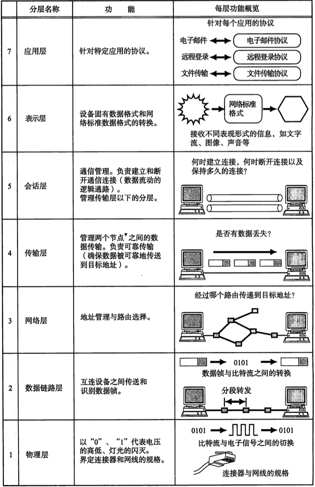
</p>

上图是 《图解 TCP/IP》书上对七层模型的定义。

| 层 | 层级 |说明 |  备注|
| :---: | :---: | :---: | :---: |
| 应用层 | 7 | 为应用程序提供服务并规定应用程序中通信相关的细节| | 
| 表示层 | 6 | 将应用处理的信息转换为适合网络传输的格式，具体来说，将设备固有的数据格式转换为网络标准传输格式，不同设备对同一比特流解释的结果可能会不同| 主要负责数据格式的转换|
| 会话层 | 5 | 负责建立和断开通信连接（数据流动的逻辑通路），以及数据的分割等数据传输相关的管理||
| 传输层 | 4 | 起着可靠传输的作用。只在通信双方节点上进行处理，而无需在路由器上处理。||
| 网络层 | 3 | 将数据传输到目标地址。||
| 数据链路层 | 2 | 负责物理层面上互连的、节点之间的通信传输||
| 物理层 | 1 |负责 0、1 比特流（0、1 序列）与电压的高低、光的闪灭之间的互换||


<p align='center'>
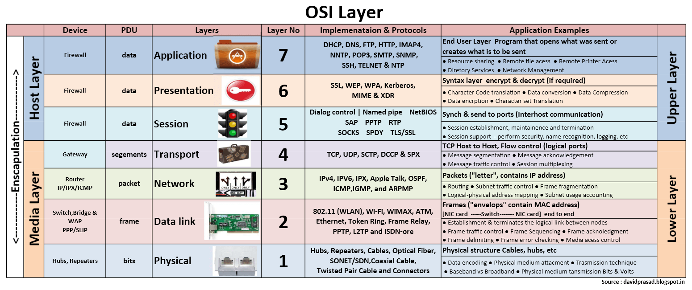
</p>

上图是一些协议在 OSI 模型中的位置。值得注意的是 DNS 是应用层协议，SSL 分别位于第五层会话层和第六层表示层。TLS 位于第五层会话层。（DNS、SSL、TLS 这些协议会在后面详细分析与说明）


<p align='center'>
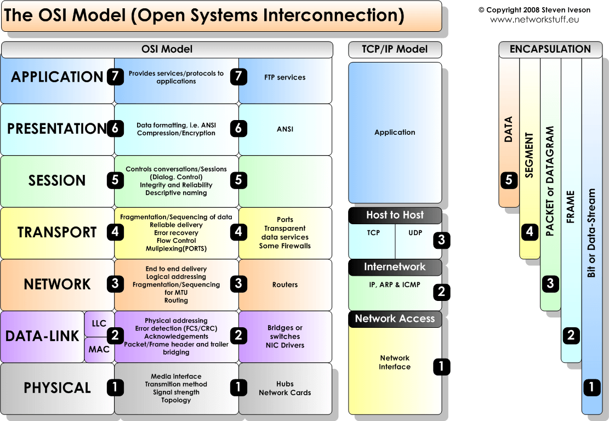
</p>

上图是 TCP/IP 模型和 OSI 模型的对比图。


接下来放2张网络上的图，笔者对图上的内容持有争议，至于下面2张图哪里对哪里错，欢迎开 issue 讨论。

<p align='center'>
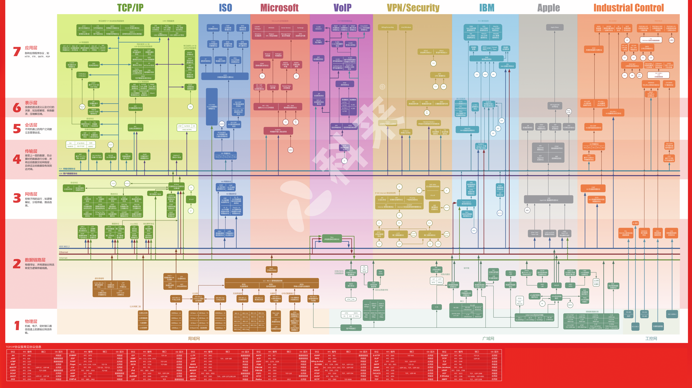
</p>

上面这种图说 DNS 是网络层协议，笔者周围很多朋友都一致认为是应用层协议。还有一个错误是 SSL 是跨第六层和第七层的，这里画的还是不对。

<p align='center'>
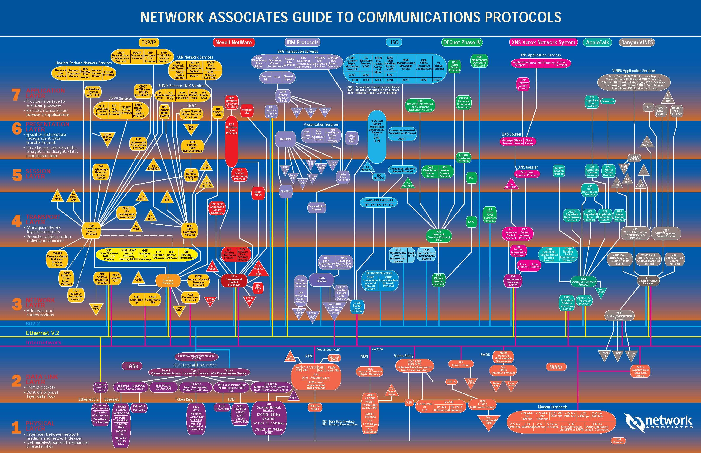
</p>

上面这种图中 DNS 位于应用层，这点赞同，并且也画出了 DNS 是基于 UDP 和 TCP 的。这点也非常不错！（至于有些人不知道 DNS 为何也是基于 TCP 的，这点在 DNS 那里详细分析）。但是上图中没有画出 SSL/TLS 是位于第几层的。

笔者认为上面2张图，虽然看上去非常复杂，内容详尽，但是仔细推敲，还是都有不足和不对的地方。

## 二. OSI 参考模型通信举例

<p align='center'>

</p>

上图是 5 层 TCP/IP 模型中通信时候的数据图。值得说明的一点，在数据链路层的以太网帧里面，除去以太网首部 14 字节，FCS 尾部 4 字节，中间的数据长度在 46-1500 字节之间。


<p align='center'>
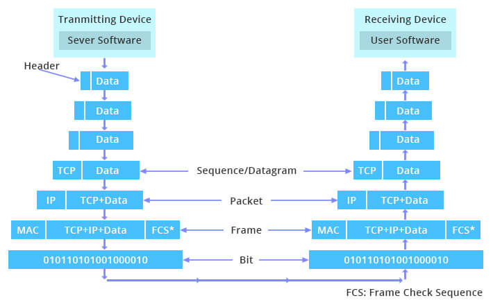
</p>


<p align='center'>
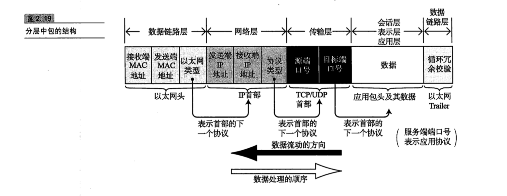
</p>


上图是 OSI 7 层模型中通信时候的数据图。从上图的 7 层模型中，物理层传输的是字节流，数据链路层中包的单位叫，帧。IP、TCP、UDP 网络层的包的单位叫，数据报。TCP、UDP 数据流中的信息叫，段。最后，应用层协议中数据的单位叫，消息。

从第七层应用层一层层的往下，不断的包裹一些协议头，这些协议的头就相当于协议的脸。

<p align='center'>
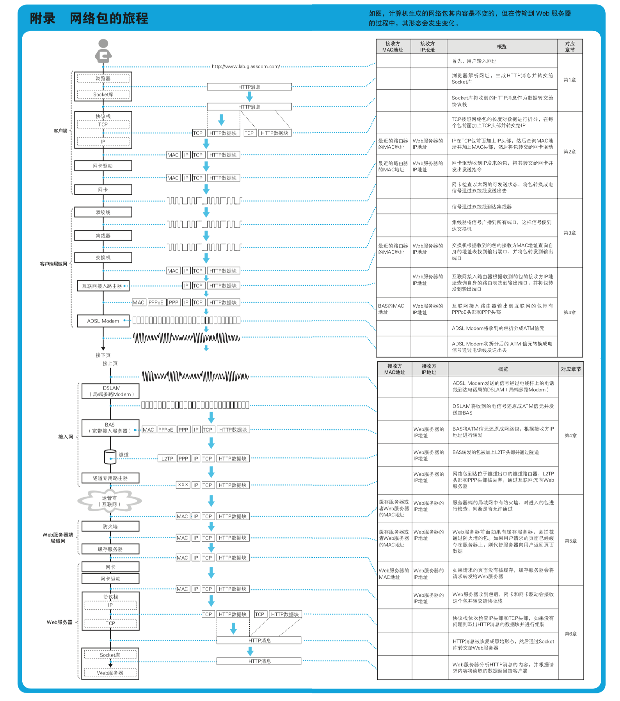
</p>

上图是《网络是怎样连接的》这本书附录里面的一张图。

从上面三种图里面我们可以清楚的看到，一个应用和另一个应用或者和服务器通信，数据是如何流转的。


## 三. TCP/IP 的标准化流程

TCP/IP 协议的标准化流程大致分为以下几个阶段：首先是互联网草案阶段；其次，如果认为可以进行标准化，就记入 RFC 进入提议标准阶段；第三，是草案标准阶段；最后，才进入真正的标准阶段。


<p align='center'>

</p>


## 四. 以太网帧结构


在以太网帧前面有一段前导码（Preamble）的部分，用来对端网卡能够确保与其同步的标志。前导码的末尾有一个叫 SFD（Start Frame Delimiter）的域，以太网的 SFD 是末尾的2位 11，IEEE802.3 的 SFD 是末尾的8位，10101011 。

<p align='center'>
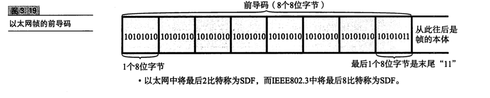
</p>

以太网帧和 IEEE802.3 帧的结构也有所不同，见下图。

<p align='center'>
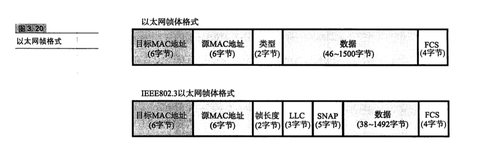
</p>

帧尾都有一个 4 字节的 FCS（Frame Check Sequence）。FCS 表示帧校验序列(Frame Check Sequence)，用于判断帧是否在传输过程中有损坏(比如电子噪声干扰)。FCS 保存着发送帧除以某个多项式的余数，接收到的帧也做相同计算，如果得到的值与 FCS 相同则表示没有出错。

以太网帧比较常见，所以详细说说以太网帧结构。除去目标 Mac 地址，源 Mac 地址，再就是一个类型码。

| 类型编号（16进制） | 协议| |
| :---: | :---: | :---: |
|0000-05DC| IEEE802.3 Length Field (01500)||
|0101-01FF|实验用||
|0800| Internet IP (IPv4)|❤|
|0806| Address Resolution Protocol (ARP)|❤|
|8035| Reverse Address Resolution Protocol (RARP)|❤|
|8037| IPX (Novell NetWare)||
|805B| VMTP (Versatile Message Transaction Protocol) ||
|809B| AppleTalk (EtherTalk)||
|80F3| AppleTalk Address Resolution Protocol (AARP)||
|8100| IEEE802.1Q Customer VLAN| |
|814C| SNMP over Ethernet| |
|8191| NetBIOS/NetBEUI||
|817D| XTP||
|86DD| IP version (IPv6)|❤|
|8847-8848| MPLS (Multi-protocol Label Switching)||
|8863| PPPoE Discovery Stage||
|8864| PPPoE Session Stage||
|9000| Loopback (Configuration Test Protocol)||


<p align='center'>
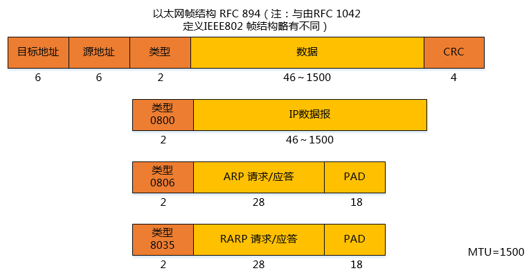
</p>

再来看看 IEEE802.3 帧结构。IEEE802.3 帧结构比以太网帧多了几个部分：帧长度、LLC、SNAP。

数据链路层可以细分成2层：介质访问控制层(Media Access Control，MAC) 和 逻辑链路控制层(Longical Link Control，LLC)。介质访问控制层根据以太网或 FDDI 等不同数据链路所特有的首部信息进行控制。逻辑链路控制层则根据以太网或 FDDI 等不同数据链路所共有的帧头信息进行控制。


<p align='center'>
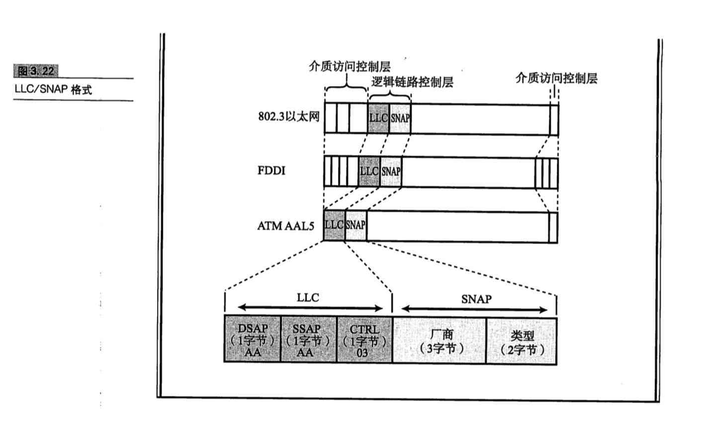
</p>

SNAP 总共5个字节，除去前3个字节代表厂商以外，后面2个字节和以太网帧的类型字段含义一样。

在 VLAN 交换机中，帧的结构还会被追加4个字节，成为下面这样子：


<p align='center'>

</p>


## 五. IP 协议

网络层主要由 IP (Internet Protocol) 和 ICMP (Internet Control Message Protocol) 组成。

IP 属于面向无连接类型，原因有两点：一是为了简化，二是为了提速。为了把数据包发送到最终目标地址，尽最大努力。简单，高速。而可靠性就交给了 TCP 去完成。


每种数据链路的最大传输单元 (Maximum Transmission Unit，MTU)都不同。

以太网一个帧最大可传输 1500 个字节，FDDI 可以最大传输 4352 字节，ATM 最大传输 9180 字节。

|数据链路| MTU (字节) | 总长度 (单位为字节，包含 FCS) |  |
| :---: | :--: | :--: | :--: |
| IP 的最大 MTU | 65535 | - ||
| Hyperchannel | 65535 | - ||
| IP over HIPPI | 65280 | 65320 ||
| 16Mbps IBM Token Ring | 17914| 17958||
| IP over ATM | 9180 | - |❤|
| IEEE802.4 Token Bus | 8166 | 8191 ||
| IEEE802.5 Token Bus | 4464 | 4508 ||
| FDDI | 4352 | 4500 |❤|
| 以太网 | 1500 | 1518 |❤|
| PPP (Default) | 1500| -|❤|
| IEEE802.3 Ethernet | 1492 | 1518 |❤|
| PPPoE | 1492 | - ||
| X.25 | 576 | -||
| IP 的最小 MTU | 68 | - ||

由于 MTU 的不同，所以导致了 IP 的分片和重组。路由器只进行分片，终点 (目标主机) 进行重组。

在路由器进行分片处理的过程中，如果出现了某个分片丢失，那么就会造成整个 IP 数据报作废，为了应对这种问题，产生了 路径 MTU 发现的技术。

主机会首先获取整个路径中所有数据链路的最小MTU，并按照整个大小将数据分片。因此传输过程中的任何一个路由器都不用进行分片工作。

为了找到路径MTU，主机首先发送整个数据包，并将IP首部的禁止分片标志设为1.这样路由器在遇到需要分片才能处理的包时不会分片，而是直接丢弃数据并通过ICMP协议将整个不可达的消息发回给主机。

主机将ICMP通知中的MTU设置为当前MTU，根据整个MTU对数据进行分片处理。如此反复下去，直到不再收到ICMP通知，此时的MTU就是路径MTU。

以UDP协议发送数据为例：

<p align='center'>
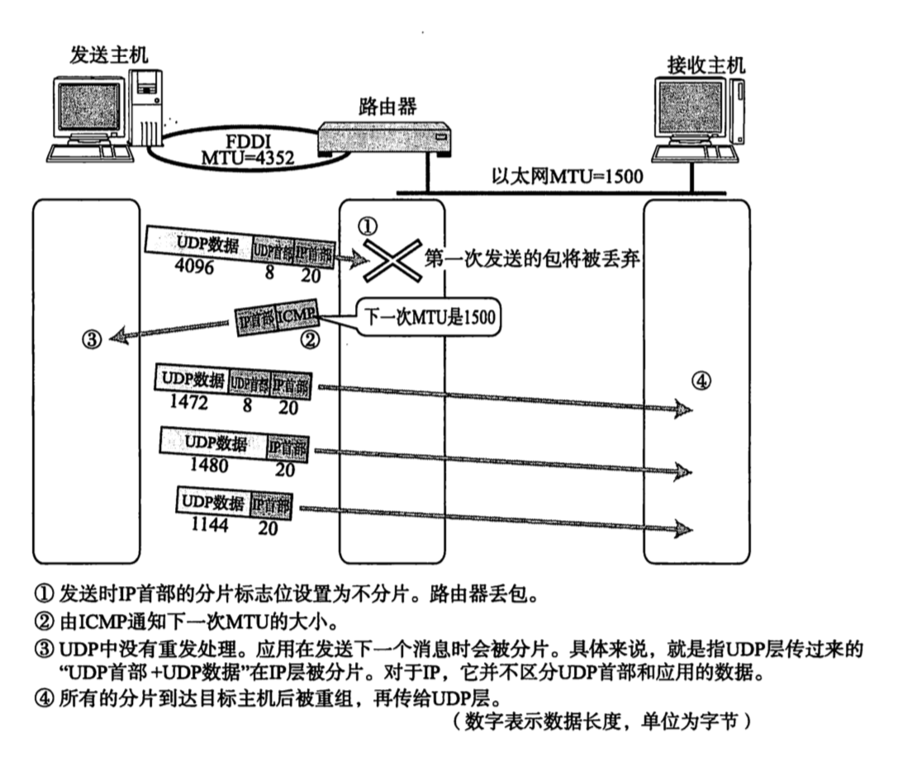
</p>


## 六. IPv4 首部

<p align='center'>
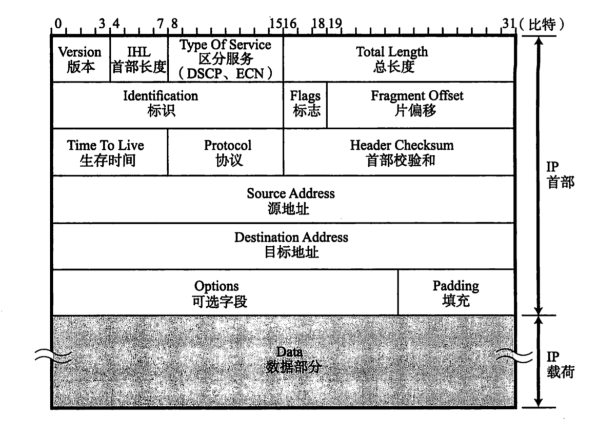
</p>

中间几个字段说明如下：

- 版本号：

|版本| 简称  |  协议 |
| :---: | :--: | :--:|
|4|IP| Internet Protocol version 4|
|5|ST| ST Datagram Mode|
|6|IPv6| Internet Protocol version 6 |
|7|TP/IX| TP/IX: The Next Internet|
|8|PIP| The P Internet Protocol|
|9|TUBA| TUBA |

IPv4 首部版本号为 4 。

- 首部长度（IHL: Internet Header Length）：  
  由 4 比特构成，表明 IP 首部的大小，单位为 4 字节 （32比特）。对于没有可选项的 IP 包，首部长度则设置为 “5”。也就是说，当没有可选项时，IP 首部的长度为 20 字节 （4 * 5 = 20）

- 区分服务：  
  由 8 比特构成，用来表明服务质量。不过目前网络都忽略这个字段。有人提议将 TOS 字段本身再划分成 DSCP（Differential Services Codepoint，差分服务代码点） 和 ECN（Explicit Congestion Notification，显示拥塞通告） 两个字段。 

- 总长度：   
  长度为 16 字节，表示 IP 首部与数据部分结合起来的总字节数。这个字段长 16 字节，因此 IP 包最大长度为 65535（2^16^）字节。
  
  
- 标识：  
  标识 ID 用来标识分片，不同的分片的标识值不同，即使 ID 相同，目标地址、源地址或者协议不同，也都会被认为是不同的分片。
  
- 标志：  
  
|比特| 含义  |
| :---: | :--: |
| 0 | 未使用。现在必须是 0 |
| 1 | 指示是否进行分片，0-可以分片，1-不能分片|
| 2 | 包被分片的情况下，表示是否为最后一个包，0-最后一个分片的包，1-分片中段的包|

- 片偏移：  
  由 13 比特构成，最多可以表示 8192 （2^13^）个相对位置。标志有三位，所以单位为 8 字节。最大可以表示原始数据 8 * 8192 = 65536 个字节的位置。

- 生存时间 (TTL:Time To Live):  
  由 8 比特构成，最初的意思是以秒为单位记录当前包在网络上应该生存的期限。然而，在实际中，它是指中转了多少个路由器，每经过一个路由器，TTL 减少1，直到变为0就丢弃这个包。
    
- 协议：  
  由 8 比特构成，表示 IP 首部的下一个首部隶属于哪个协议。
  
- 首部校验和：  
  由 16 比特（2字节）构成。该字段只校验数据报的首部，不校验数据部分。它主要用来确保 IP 数据报不被破坏。

- 源地址：  
  由 32 比特（4字节）构成。
  
- 目标地址：  
  由 32 比特（4字节）构成。
  
- 可选项：  
  长度可变，通常只在进行试验或者诊断时使用。包含以下几个信息：安全级别，源路径，路径记录，时间戳。
  
- 填充：  
  也称作填充物。在有可选项的情况下，首部长度可能不是 32 比特的整数倍。为此，通过向字段填充0，调整为 32 比特的整数倍。

## 七. IPv6 首部


<p align='center'>
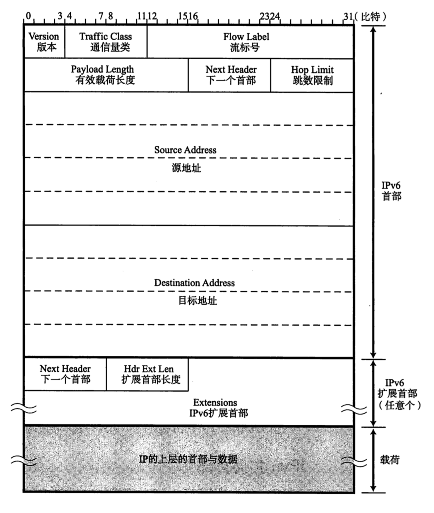
</p>

- 版本号：

IPv6 首部版本号为 6 。

- 通信量类：  
  相当于 IPv4 的 TOS (Type Of Service，TOS)字段，也是 8 比特构成。本来在 IPv6 上打算删掉这个字段（因为在 IPv4 上没有任何建数），不过最后还是保留了。

- 流标号（Flow Label）：  
  由于 20 比特构成，用于服务质量（Qos：Quality Of Service）控制。
  
- 有效载荷长度：      
  指的是包的数据部分。这里和 IPv4 有区别，在 IPv4 里面，TL(Total Length)代表的是总长度。但是在这里，这里 Playload Length 是不包括首部的。
  
- 下一个首部：  
  相当于 IPv4 中的协议字段，由 8 比特构成。通常表示 IP 的上一层协议是 TCP 或者 UDP，不过在有 IPv6 扩展首部的情况下，该字段表示后面第一个扩展首部的协议类型。
  
- 跳数限制：  
  由 8 比特构成，与 IPv4 的 TTL 意思相同。每经过一次路由器就减少 1 。减到 0 就丢弃数据。
  
- 源地址：  
  由 128 比特（8个16位字节）组成。表示发送端 IP 地址。
  
- 目标地址：  
  由 128 比特（8个16位字节）组成。表示接收端 IP 地址。


## 八. DNS (Domain Name System)

DNS 可以将那串字符串自动转换为具体的 IP 地址。DNS 不仅适用于 IPv4，还可以适用于 IPv6 。


|类型| 编号  |  内容 |
| :---: | :--: | :--:|
|A|1| 主机名的 IP 地址 (IPv4)|
|NS|2| 域名服务器|
|CNAME|5| 主机别名对应的规范名称 |
|SOA|6| 区域内权威记录起始标志|
|WKS|11| 已知的服务|
|PTR|12| IP 地址反向解析 |
|HINFO|13| 主机相关的追加信息 |
|MINFO|14| 邮箱与邮件组信息 |
|MX|15| 邮件交换 (Mail Exchange) |
|TXT|16| 文本 |
|SIG|24| 安全证书 |
|KEY|25| 密钥 |
|GPOS|27| 地理位置 |
|AAAA|28| 主机的 IPv6 地址 |
|NXT|30| 下一代域名 |
|SRV|33| 服务器选择 |
|*|255| 所有缓存记录 |


有一种基本的 DNS 消息格式 [RFC6195] 。它用于所有的 DNS 操作（查询、响应、区域传输、通知和动态更新）

<p align='center'>
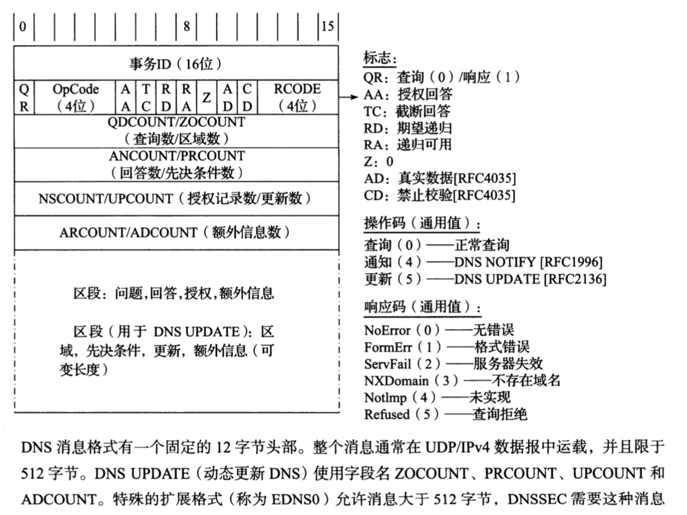
</p>


对于 TCP 和 UDP 来说，DNS 的知名端口号都是 53。最常见的格式使用如下图所示的 UDP/IPv4 的数据报结构。

当解析器发出一个查询消息，而返回的响应消息中 TC 位字段被设置( “被截断”)时， 真实的响应消息的长度超过 512 字节，因此服务器只返回前面的 512 个字节。该解析器可能会使用 TCP 再次发出请求消息，现在这是必须被支持的配置 [RFC5966]。这样就允许返回超过512 字节的消息，因为 TCP 将更大的消息分割成多个报文段。 

**所以 DNS 是基于 UDP 和 TCP 的**。

当一个区域的一个辅助名称服务器开启时，它通常从该区域的主名称服务器执行区域传输。区域传输可能由计时器引起，也可能由 DNSNOTIFY 消息引起。完全区域传输使用 TCP，因为它们可能很大。增量区域传输，即只有更新的条目会被传输，可能 会首先使用 UDP，但如果响应消息太大，就会切换到 TCP，就像常规查询一样。

当使用 UDP 时，解析器和服务器应用软件都必须执行自已的超时和重传。在 [RFC1536] 中给出了这方面的建议。它建议起始超时时间至少为 4 秒，随后的超时导致超时时间的指数增长。Linux 和类 UNIX 系统允许通过修改 `/etc/resoIv.conf` 文件(通过设置 timeout 和 attempts 参数)来改变重传超时参数。


<p align='center'>
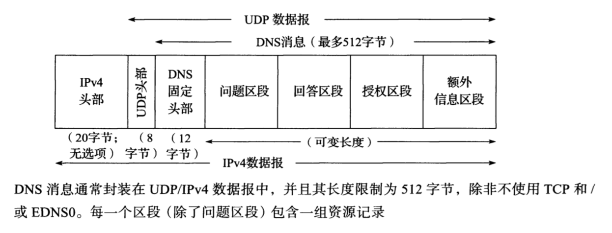
</p>

## 九. ARP (Address Resolution Protocol)

ARP 是一种解决地址问题的协议。以目标 IP 地址为线索，用来定位下一个应该接收数据分包的网络设备对应的 MAC 地址。ARP 只能用于 IPv4 ，不能用于 IPv6 。IPv6 中可以用 ICMPv6 替代 ARP 发送邻居探索消息。


## 十. ICMP

ICMP 主要功能包括，确认 IP 包是否成功送达目标地址，通知在发送过程当中 IP 包被废弃的具体原因，改善网络设置等。有了这些功能以后，就可以获得网络是否正常，设置是否有误，以及设备有何异常等信息，从而便于进行网络上的问题诊断。ICMP 消息大致可以分为两类：一类是通知出错原因的错误消息，另一类是用于诊断的查询信息。

在 IPv6 中，ICMP 的作用被扩大，如果没有 ICMPv6，IPv6 就无法进行正常的通信。


## 十一. TCP

<p align='center'>
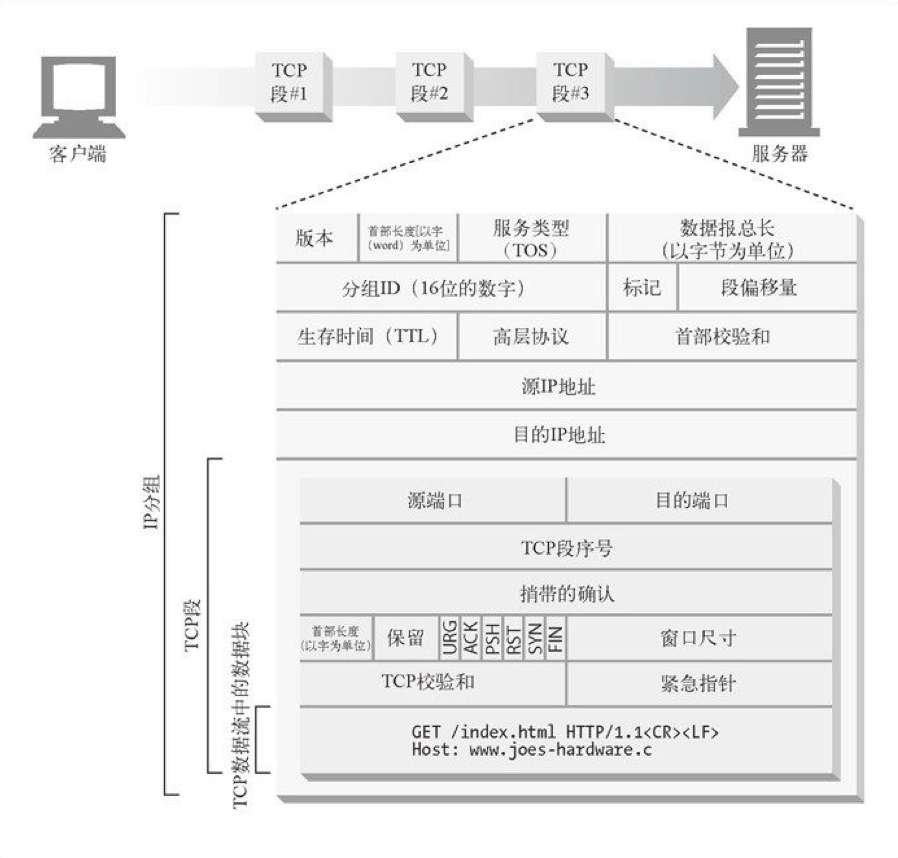
</p>

- TCP 提供一种面向连接的、可靠的字节流服务。  
- 在一个 TCP 连接中，仅有两方进行彼此通信。广播和多播不能用于 TCP。  
- TCP 使用校验和，确认和重传机制来保证可靠传输。  
- TCP 给数据分节进行排序，并使用累积确认保证数据的顺序不变和非重复。  
- TCP 使用滑动窗口机制来实现流量控制，通过动态改变窗口的大小进行拥塞控制。  

TCP 通过检验和、序列号、确认应答、重发控制、连接管理以及窗口控制等机制实现可靠性传输。

IP 协议中的两大关键要素是源 IP 地址和目标 IP 地址。传输层的主要作用是**实现应用程序之间的通信**。因此传输层的协议中新增了三个要素：源端口号，目标端口号和协议号。通过这五个信息，可以唯一识别一个通信。

不同的端口用于区分同一台主机上不同的应用程序。假设你打开了两个浏览器，浏览器 A 发出的请求不会被浏览器 B 接收，这就是因为 A 和 B 具有不同的端口。

协议号用于区分使用的是 TCP 还是 UDP。因此相同两台主机上，相同的两个进程之间的通信，在分别使用 TCP 协议和 UDP 协议时也可以被正确的区分开来。

用一句话来概括就是：“源 IP 地址，目标 IP 地址，源端口号，目标端口号和协议号”这五个信息只要有一个不同，都被认为是不同的通信。

TCP 首部：**不计算选项字段，TCP 首部的长度为 20 byte**  

<p align='center'>
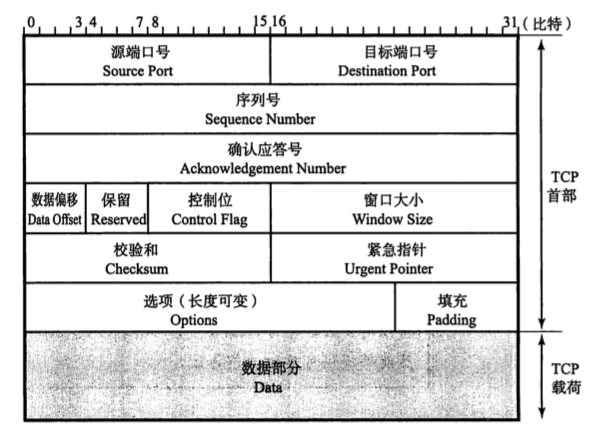
</p>

TCP 中没有单独的字段表示包长度和数据长度。可由 IP 层获知 TCP 的包长，由 TCP 的包长可知数据的长度。

- 序列号 (Sequence Number):  
  字段长 32 位，序列号是指发送数据的位置，每发送一次数据，就累加一次该数据字节数的大小。序列号不会从0 或者 1 开始，而是在建立连接的时候由计算机生成的随机数作为其初始值，通过 SYN 包传给接收端主机。

- 确认应答号 (Acknowledgement Number)：    
  确认应答号字段长度为 32 位。是指下一次应该收到的数据的序列号，实际上，它是指已收到确认应答号减一为止的数据。发送端收到这个确认应答以后可以认为在这个序号以前的数据都已经正常接收了。ACK=1 时有效。

- 数据偏移 (Data Offset):
  该字段表示 TCP 所传输的数据部分应该从 TCP 包的哪个位开始计算，当然也可以把它看作 TCP 首部的长度。该字段长 4 位，单位为 4 字节 (即 32 位)。不包含选项字段的话，数据偏移字段可以设置为 5 。反之，如果该字段的值为 5，那说明从 TCP 包的最一开始到 20 字节为止都是 TCP 首部，余下的部分为 TCP 数据。

- 保留 (Reserved):    
  该字段主要是为了以后扩展使用，其长度为 4 位，一般设置成 0 ，即使收到的包在该字段不为 0 ，此包也不会被丢弃。
  
- 控制位 (Control Flag):    
  字段长为 8 位，从左往右分别如下图：
  
<p align='center'>
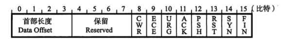
</p>

CWR (Congestion Window Reduced)：    
CWR 标志和后面的 ECE 标志都用于 IP 首部的 ECN 字段，ECE 字段为 1 时，则通知对方已将拥塞窗口缩小。

ECE (ECN-Echo):    
ECE 标志表示 ECN-Echo。置为 1 ，代表会通知对方，从对方到这边的网络有拥塞。

URD (Urgent Flag):  
该位为1，代表包中有需要紧急处理的数据。

ACK (Acknowledgement Flag):    
该位为1，代表确认应答的字段变有效。

PSH (Push Flag):    
该位为1，表示需要将受到的数据立即传给上层应用协议。为 0 表示不用立即传，先进行缓存。

RST (Reset Flag):    
该位为1，表示 TCP 连接中出现异常必须强制断开连接。

SYN (Synchronize Flag):    
为1表示希望建立连接，并在其序列号字段进行序列号的随机初始值的设定。

FIN (Fin Flag):    
该位为1，表示今后再也没有数据发送了，希望断开连接。

- 校验和 (Checksum):

TCP 的校验和和 UDP 的相似，区别在于 TCP 的校验和无法关闭（UDP 可以在校验和字段填 0 ，来关闭校验）**与 UDP 数据报一样，TCP 数据报段在计算校验和时也包括一个 12 字节长的伪首部。**

注：TCP 数据报段伪首部起到双重校验的作用：1、通过伪首部的 IP 地址检验，TCP 可以确认 IP 没有接受不是发给本机的数据报；2、通过伪首部的协议字段检验，TCP 可以确认 IP 没有把应该传给其他高层协议（比如UDP、ICMP或者IGMP）的数据报传给 TCP 。

<p align='center'>
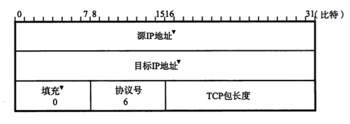
</p>


- 紧急指针：  
该字段为 16 位，只有在 URG 控制位为 1 的时候有效。该字段的数值表示本报文段中紧急数据的指针。

- 选项：    
  选项字段用于提高 TCP 的传输性能，因为根据数据偏移（首部长度）进行控制，所以其长度最大为 40 字节。另外，选项字段尽量调整其为 32 位的整数倍。具有代表性的选项如下图：
  
<p align='center'>
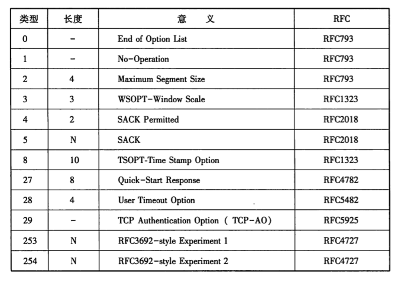
</p>
  


### TCP 滑动窗口


<p align='center'>
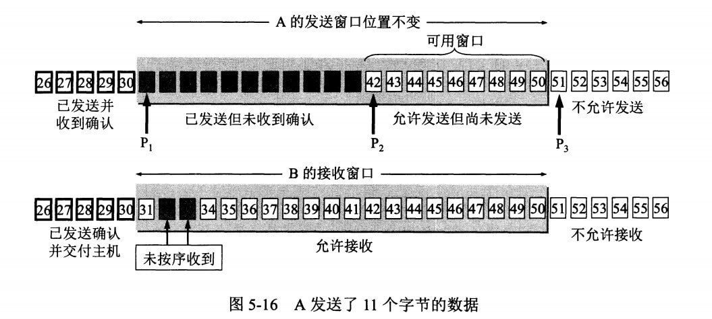
</p>


窗口是缓存的一部分，用来暂时存放字节流。发送方和接收方各有一个窗口，接收方通过 TCP 报文段中的窗口字段告诉发送方自己的窗口大小，发送方根据这个值和其它信息设置自己的窗口大小。

发送窗口内的字节都允许被发送，接收窗口内的字节都允许被接收。如果发送窗口左部的字节已经发送并且收到了确认，那么就将发送窗口向右滑动一定距离，直到左部第一个字节不是已发送并且已确认的状态；接收窗口的滑动类似，接收窗口左部字节已经发送确认并交付主机，就向右滑动接收窗口。

接收窗口只会对窗口内最后一个按序到达的字节进行确认，例如接收窗口已经收到的字节为 {31， 32， 34， 35}，其中 {31， 32} 按序到达，而 {34， 35} 就不是，因此只对字节 32 进行确认。发送方得到一个字节的确认之后，就知道这个字节之前的所有字节都已经被接收。

### TCP 可靠传输

TCP 使用超时重传来实现可靠传输：如果一个已经发送的报文段在超时时间内没有收到确认，那么就重传这个报文段。

一个报文段从发送再到接收到确认所经过的时间称为往返时间 RTT，加权平均往返时间 RTTs 计算如下：

<div align="center"></div> <br>

超时时间 RTO 应该略大于 RTTs，TCP 使用的超时时间计算如下：

<div align="center"></div> <br>

其中 RTT<sub>d</sub> 为偏差。

### TCP 流量控制

流量控制是为了控制发送方发送速率，保证接收方来得及接收。

接收方发送的确认报文中的窗口字段可以用来控制发送方窗口大小，从而影响发送方的发送速率。将窗口字段设置为 0，则发送方不能发送数据。

### TCP 拥塞控制

如果网络出现拥塞，分组将会丢失，此时发送方会继续重传，从而导致网络拥塞程度更高。因此当出现拥塞时，应当控制发送方的速率。这一点和流量控制很像，但是出发点不同。流量控制是为了让接收方能来得及接受，而拥塞控制是为了降低整个网络的拥塞程度。

<p align='center'>
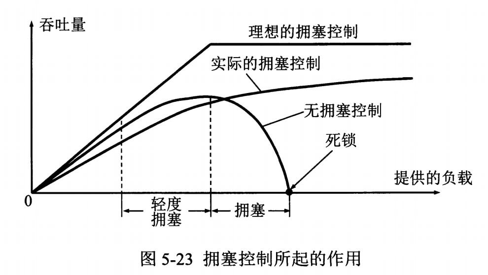
</p>


TCP 主要通过四种算法来进行拥塞控制：慢开始、拥塞避免、快重传、快恢复。发送方需要维护一个叫做拥塞窗口（cwnd）的状态变量。注意拥塞窗口与发送方窗口的区别，拥塞窗口只是一个状态变量，实际决定发送方能发送多少数据的是发送方窗口。

为了便于讨论，做如下假设：

1. 接收方有足够大的接收缓存，因此不会发生流量控制；
2. 虽然 TCP 的窗口基于字节，但是这里设窗口的大小单位为报文段。


<p align='center'>
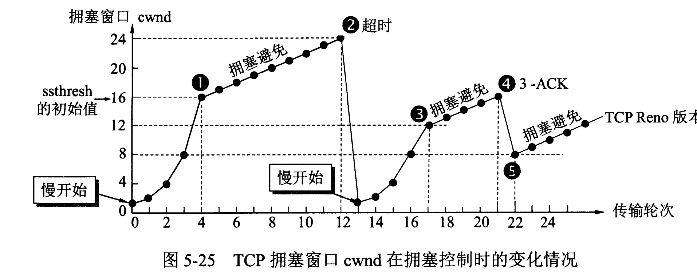
</p>

### 1. 慢开始与拥塞避免

发送的最初执行慢开始，令 cwnd=1，发送方只能发送 1 个报文段；当收到确认后，将 cwnd 加倍，因此之后发送方能够发送的报文段数量为：2、4、8 ...

注意到慢开始每个轮次都将 cwnd 加倍，这样会让 cwnd 增长速度非常快，从而使得发送方发送的速度增长速度过快，网络拥塞的可能也就更高。设置一个慢开始门限 ssthresh，当 cwnd >= ssthresh 时，进入拥塞避免，每个轮次只将 cwnd 加 1。

如果出现了超时，则令 ssthresh = cwnd/2，然后重新执行慢开始。

### 2. 快重传与快恢复

在接收方，要求每次接收到报文段都应该发送对已收到有序报文段的确认，例如已经接收到 M<sub>1</sub> 和 M<sub>2</sub>，此时收到 M<sub>4</sub>，应当发送对 M<sub>2</sub> 的确认。

在发送方，如果收到三个重复确认，那么可以确认下一个报文段丢失，例如收到三个 M<sub>2</sub> ，则 M<sub>3</sub> 丢失。此时执行快重传，立即重传下一个报文段。

在这种情况下，只是丢失个别报文段，而不是网络拥塞，因此执行快恢复，令 ssthresh = cwnd/2 ，cwnd = ssthresh，注意到此时直接进入拥塞避免。

<p align='center'>
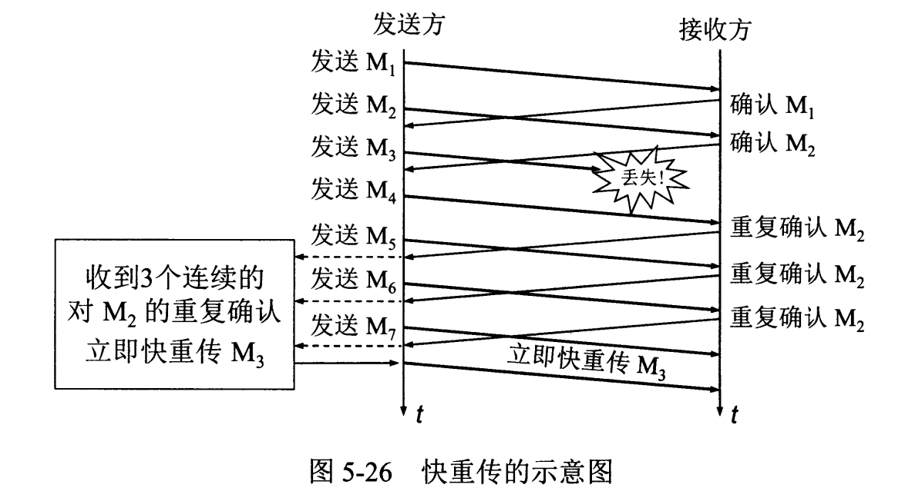
</p>


## 十二. UDP

UDP 是 User Datagram Protocol 的缩写。
UDP 不提供复杂的控制机制，利用 IP 提供面向无连接的通信服务。传输途中即使出现丢包，UDP 也不负责重发，甚至当出现包的到达顺序乱掉时也没有纠正的功能。UDP 面向无连接，它可以随时发送数据。

主要用于以下几个方面：

- 包总量较少的通信 (DNS、SNMP等)  
- 视频、音频等多媒体通信 (即时通信)  
- 限定于 LAN 等特定网络中的应用通信  
- 广播通信 (广播、多播)  

UDP 首部:  

<p align='center'>
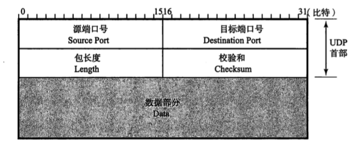
</p>

- 包长度：  
  该字段保存了 UDP 首部的长度跟数据的长度之和。
  
- 校验和：  
校验和用来判断数据在传输过程中是否损坏。计算这个校验和的时候，不仅考虑源端口号和目标端口号，还要考虑 IP 首部中的源 IP 地址，目标 IP 地址和协议号（这些又称为 UDP 伪首部）。这是因为以上五个要素用于识别通信时缺一不可，如果校验和只考虑端口号，那么另外三个要素收到破坏时，应用就无法得知。这有可能导致不该收到包的应用收到了包，该收到包的应用反而没有收到。


<p align='center'>
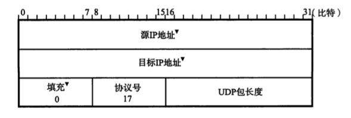
</p>

UDP 会用到上图中的这个伪首部计算校验和。


UDP 是一个简单的协议。它的正式规范 [RFC0768] 只有 3 页 （包括参考文献）。它给用户进程（在 IP 层之上）提供的服务是端口号和校验和。它没有流量控制，没有拥塞控制和差错纠正。它有差错检测（对 UDP/IPv4 可选，但对 UDP/IPv6 强制使用）和消息边界保留。

当要避免建立连接的开销时，当要使用多端点传送时（组播，广播），或者当不需要 TCP 的相对“笨重”的可靠语义（例如排序、流量控制以及重传）时，最常用的就是 UDP 了。多亏了多媒体和点对点应用程序，UDP 正得到越来越多的使用，同时它也是支持 VoIP 的主要协议 [RFC3550][RFC3261] 。它还是那些要必须经过 NAT 而不引入太多额外开销（只为 UDP 头部提供 8 字节）的封装流量的传统方法。在支持一种 IPv6 过渡机制（Teredo）和帮助 NAT 穿越 STUN 方法，用到了 UDP。在 IPSec NAT 穿越的时候也会用到 UDP。另外一个用途就是支持 DNS。

## 十三. TCP 与 UDP 对比

TCP 提供可靠的通信传输，而 UDP 则常被用于让广播和细节控制交给应用的通信传输。

TCP 用于传输层有必要实现可靠传输的情况，由于它是面向有连接并具备顺序控制，重发控制等机制的，所以它可以为应用提供可靠传输。

UDP 主要用于那些对高速传输和实时性有较高要求的通信或广播通信。RIP、DHCP 等基于广播的协议也要依赖于 UDP。

**注意：TCP 并不能保证数据一定会被对方接收到，因为这是不可能的。TCP 能够做到的是，如果有可能，就把数据递送到接收方，否则就（通过放弃重传并且中断连接这一手段）通知用户。因此准确说 TCP 也不是 100% 可靠的协议，它所能提供的是数据的可靠递送或故障的可靠通知。**

## 十四. IP 地址结构

IPv4 地址结构：

<p align='center'>
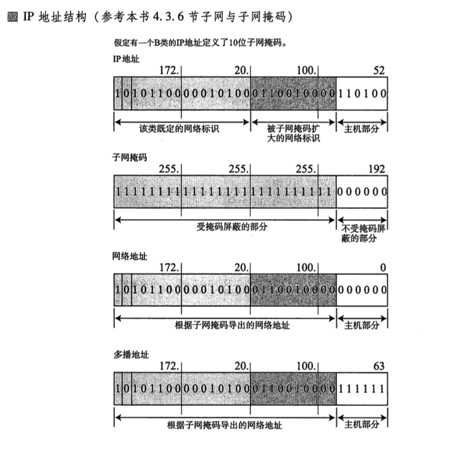
</p>

IPv6 地址结构：


<p align='center'>
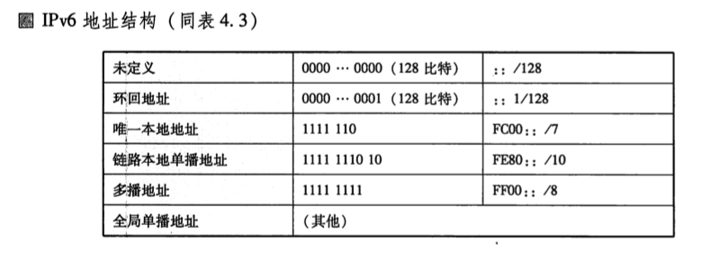
</p>


## 十五. TCP 三次握手

客户端与服务端建立一个 TCP 连接共计需要发送 3 个包才能完成，这个过程称为三次握手（Three-way Handshake）。如上面所述，数据段的序号、确认序号以及滑动窗口大小都在这个过程中完成。socket 编程中，客户端执行 connect() 时，将触发三次握手。

所谓三次握手(Three-way Handshake)，是指建立一个 TCP 连接时，需要客户端和服务器总共发送3个包。

三次握手的目的是连接服务器指定端口，建立 TCP 连接，并同步连接双方的序列号和确认号，交换 TCP 窗口大小信息。在 socket 编程中，客户端执行 connect() 时。将触发三次握手。

- 第一次握手(SYN=1， seq=x):

客户端发送一个 TCP 的 SYN 标志位置1的包，指明客户端打算连接的服务器的端口，以及初始序号 X，保存在包头的序列号(Sequence Number)字段里。**序列号的实现目前会随着时间的变化而变化，所以每次建立连接时的序列号都不同**

发送完毕后，客户端进入 SYN\_SEND 状态。

- 第二次握手(SYN=1， ACK=1， seq=y， ACKnum=x+1):

服务器发回确认包(ACK)应答。即 SYN 标志位和 ACK 标志位均为1。服务器端选择自己 ISN 序列号，放到 Seq 域里，同时将确认序号(Acknowledgement Number)设置为客户的 ISN 加1，即X+1。 发送完毕后，服务器端进入 SYN\_RCVD 状态。

- 第三次握手(ACK=1，ACKnum=y+1)

客户端再次发送确认包(ACK)，SYN 标志位为0，ACK 标志位为1，并且把服务器发来 ACK 的序号字段+1，放在确定字段中发送给对方，并且在数据段放写ISN的+1

发送完毕后，客户端进入 ESTABLISHED 状态，当服务器端接收到这个包时，也进入 ESTABLISHED 状态，TCP 握手结束。

三次握手的过程的示意图如下：


<p align='center'>
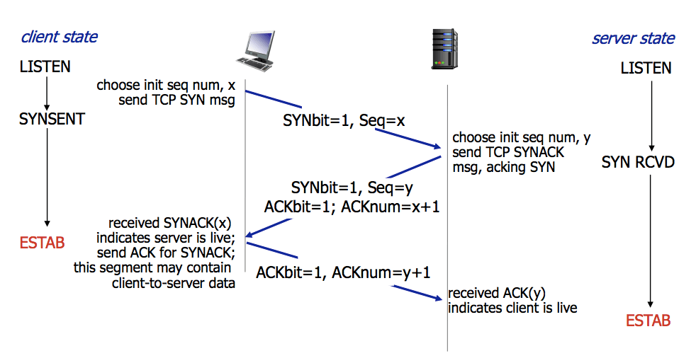
</p>

<p align='center'>
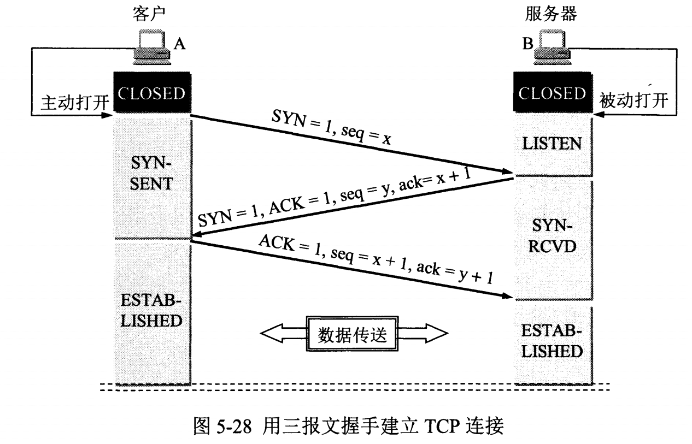
</p>

### 为什么是三次握手

根据一般的思路，我们可能会觉得只要两次握手就可以了，第三步确认看似是多余的。那么 TCP 协议为什么还要费力不讨好的加上这一次握手呢？

这是因为在网络请求中，我们应该时刻记住：“网络是不可靠的，数据包是可能丢失的”。假设没有第三次确认，客户端向服务端发送了 SYN，请求建立连接。由于延迟，服务端没有及时收到这个包。于是客户端重新发送一个 SYN 包。回忆一下介绍 TCP 首部时提到的序列号，这两个包的序列号显然是相同的。

假设服务端接收到了第二个 SYN 包，建立了通信，一段时间后通信结束，连接被关闭。这时候最初被发送的 SYN 包刚刚抵达服务端，服务端又会发送一次 ACK 确认。由于两次握手就建立了连接，此时的服务端就会建立一个新的连接，然而客户端觉得自己并没有请求建立连接，所以就不会向服务端发送数据。从而导致服务端建立了一个空的连接，白白浪费资源。

在三次握手的情况下，服务端直到收到客户端的应答后才会建立连接。因此在上述情况下，客户端会接受到一个相同的 ACK 包，这时候它会抛弃这个数据包，不会和服务端进行第三次握手，因此避免了服务端建立空的连接。


### SYN攻击:

### 1. 什么是 SYN 攻击（SYN Flood）？

在三次握手过程中，服务器发送 SYN-ACK 之后，收到客户端的 ACK 之前的 TCP 连接称为半连接(half-open connect)。此时服务器处于 SYN\_RCVD 状态。当收到 ACK 后，服务器才能转入 ESTABLISHED 状态.

SYN 攻击指的是，攻击客户端在短时间内伪造大量不存在的IP地址，向服务器不断地发送SYN包，服务器回复确认包，并等待客户的确认。由于源地址是不存在的，服务器需要不断的重发直至超时，这些伪造的SYN包将长时间占用未连接队列，正常的SYN请求被丢弃，导致目标系统运行缓慢，严重者会引起网络堵塞甚至系统瘫痪。

SYN 攻击是一种典型的 DoS/DDoS 攻击。

### 2. 如何检测 SYN 攻击？

检测 SYN 攻击非常的方便，当你在服务器上看到大量的半连接状态时，特别是源IP地址是随机的，基本上可以断定这是一次SYN攻击。在 Linux/Unix 上可以使用系统自带的 netstats 命令来检测 SYN 攻击。

```http
# netstat -na TCP | grep SYN_RECV | more，
```

### 3. 如何防御 SYN 攻击？

SYN攻击不能完全被阻止，除非将TCP协议重新设计。我们所做的是尽可能的减轻SYN攻击的危害，常见的防御 SYN 攻击的方法有如下几种：

- 缩短超时（SYN Timeout）时间
- 增加最大半连接数
- 过滤网关防护
- SYN cookies技术


## 十六. TCP 四次挥手

TCP 的连接的拆除需要发送四个包，因此称为四次挥手(Four-way handshake)，也叫做改进的三次握手。客户端或服务器均可主动发起挥手动作，在 socket 编程中，任何一方执行 close() 操作即可产生挥手操作。

- 第一次挥手(FIN=1，seq=x)

假设客户端想要关闭连接，客户端发送一个 FIN 标志位置为1的包，表示自己已经没有数据可以发送了，但是仍然可以接受数据。

发送完毕后，客户端进入 FIN_WAIT_1 状态。

- 第二次挥手(ACK=1，ACKnum=x+1)

服务器端确认客户端的 FIN 包，发送一个确认包，表明自己接受到了客户端关闭连接的请求，但还没有准备好关闭连接。

发送完毕后，服务器端进入 CLOSE\_WAIT 状态，客户端接收到这个确认包之后，进入 FIN\_WAIT\_2 状态，等待服务器端关闭连接。

- 第三次挥手(FIN=1，seq=y)

服务器端准备好关闭连接时，向客户端发送结束连接请求，FIN 置为1。

发送完毕后，服务器端进入 LAST\_ACK 状态，等待来自客户端的最后一个 ACK。

- 第四次挥手(ACK=1，ACKnum=y+1)

客户端接收到来自服务器端的关闭请求，发送一个确认包，并进入 TIME\_WAIT 状态，等待可能出现的要求重传的 ACK 包。

服务器端接收到这个确认包之后，关闭连接，进入 CLOSED 状态。

客户端等待了某个固定时间（两个最大段生命周期，2MSL，2 Maximum Segment Lifetime）之后，没有收到服务器端的 ACK ，认为服务器端已经正常关闭连接，于是自己也关闭连接，进入 CLOSED 状态。

四次挥手的示意图如下：


<p align='center'>
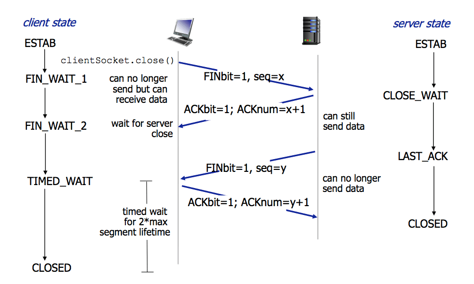
</p>

<p align='center'>
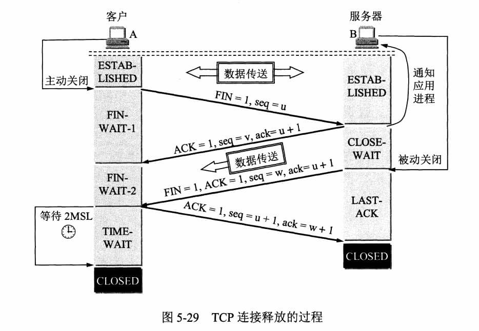
</p>

### TCP 为什么要进行四次挥手？ / 为什么 TCP 建立连接需要三次，而释放连接则需要四次？

因为 TCP 是全双工模式，客户端请求关闭连接后，客户端向服务端的连接关闭（一二次挥手），服务端继续传输之前没传完的数据给客户端（数据传输），服务端向客户端的连接关闭（三四次挥手）。所以 TCP 释放连接时服务器的 ACK 和 FIN 是分开发送的（中间隔着数据传输），而 TCP 建立连接时服务器的 ACK 和 SYN 是一起发送的（第二次握手），所以 TCP 建立连接需要三次，而释放连接则需要四次。

### 为什么 TCP 连接时可以 ACK 和 SYN 一起发送，而释放时则 ACK 和 FIN 分开发送呢？（ACK 和 FIN 分开是指第二次和第三次挥手）

因为客户端请求释放时，服务器可能还有数据需要传输给客户端，因此服务端要先响应客户端 FIN 请求（服务端发送 ACK），然后数据传输，传输完成后，服务端再提出 FIN 请求（服务端发送 FIN）；而连接时则没有中间的数据传输，因此连接时可以 ACK 和 SYN 一起发送。

### 为什么客户端释放最后需要 TIME-WAIT 等待 2MSL 呢？

1. 为了保证客户端发送的最后一个 ACK 报文能够到达服务端。若未成功到达，则服务端超时重传 FIN+ACK 报文段，客户端再重传 ACK，并重新计时。    
2. 防止已失效的连接请求报文段出现在本连接中。TIME-WAIT 持续 2MSL 可使本连接持续的时间内所产生的所有报文段都从网络中消失，这样可使下次连接中不会出现旧的连接报文段。

如果在处于 TIME\_WAIT 状态的客户端返回 ACK 丢失，会发生什么呢？服务端由于没有接收到 ACK 号，可能会重新发送一次 FIN 。这个时候如果客户端不等待一段时间，直接关闭连接，那么通信中对应的端口号也会释放出来了，这时候如果正好有应用程序创建套接字，又恰好分配了这同一个端口号，接着服务器的 FIN 包又刚好发到。本来是要关闭之前的连接，但是由于端口号相同，这个 FIN 就开始断开这个刚刚建立的新连接。这所以需要等待一段时间，就是为了防止这种误操作。


<p align='center'>
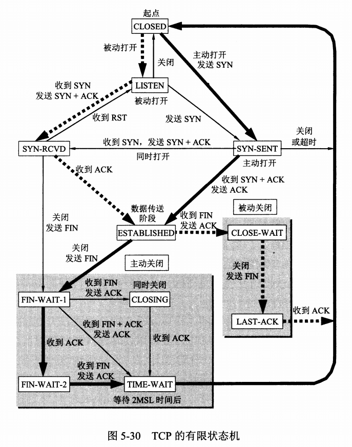
</p>


## 常用端口

知名端口号一般由 0 - 1023 的数字分配而成。

|应用| 应用层协议 | 端口号 | 运输层协议 | 备注 |
| :---: | :--: | :--: | :--: | :--:|
| 域名解析 | DNS | 53 | UDP/TCP | 长度超过 512 字节时使用 TCP |
| 动态主机配置协议 | DHCP | 67/68 | UDP | |
| 简单网络管理协议 | SNMP | 161/162 | UDP | |
| 文件传送协议 | FTP | 20/21 | TCP | 控制连接 21，数据连接 20
| 远程终端协议 | TELNET | 23 | TCP | |
|超文本传送协议 | HTTP | 80 | TCP | |
| 简单邮件传送协议 | SMTP | 25 | TCP | |
| 邮件读取协议 | POP3 | 110 | TCP | |
| 网际报文存取协议 | IMAP | 143 | TCP | |

TCP 代表的知名端口：

<p align='center'>
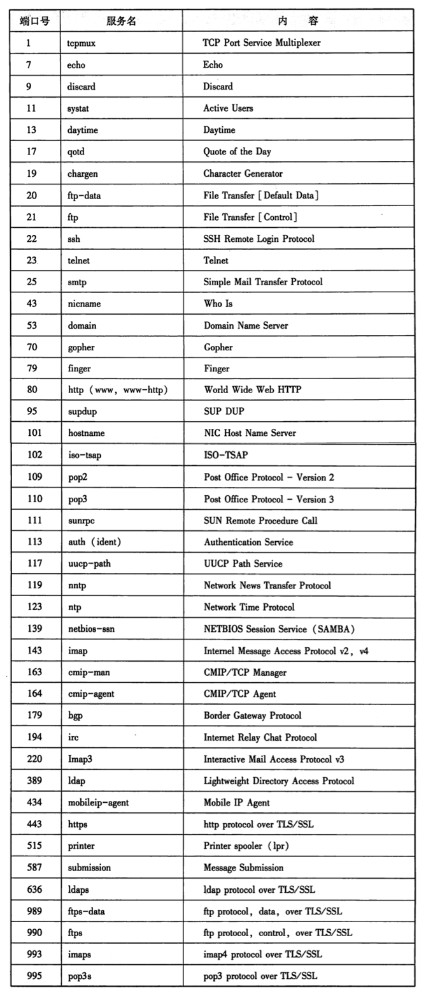
</p>

UDP 代表的知名端口：

<p align='center'>
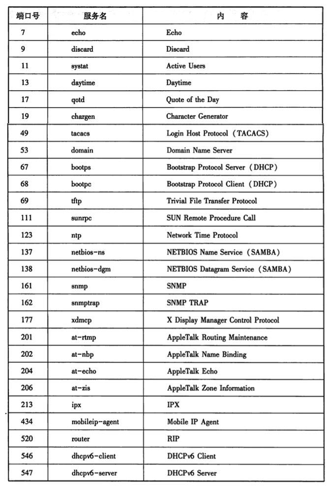
</p>


## 十七. Socket Interfaces


从 Linux 内核的角度来看，一个套接字就是通信的一个端点。 从 Linux 程序的角度来看，套接字是一个有相应描述符的文件。 普通文件的打开操作返回一个文件描述字，而 socket() 用于创建一个 socket 描述符，唯一标识一个 socket。 这个 socket 描述字跟文件描述字一样，后续的操作都有用到它，把它作为参数，通过它来进行一些操作。

常用的函数有：

socket()  
bind()  
listen()  
connect()  
accept()  
write()  
read()  
close()  

### Socket 的交互流程

<p align='center'>
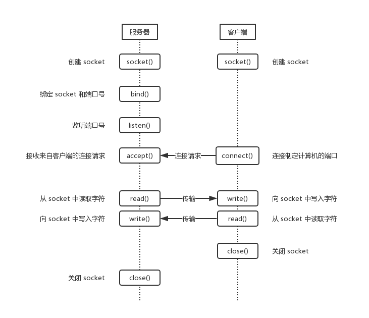
</p>

<p align='center'>
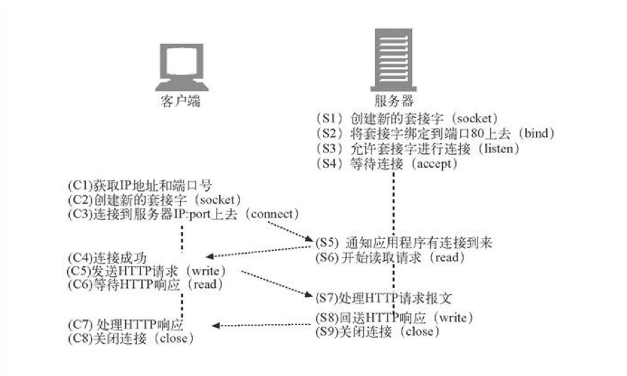
</p>

图中展示了 TCP 协议的 socket 交互流程，描述如下：

1. 服务器根据地址类型、socket 类型、以及协议来创建 socket。
2. 服务器为 socket 绑定 IP 地址和端口号。
3. 服务器 socket 监听端口号请求，随时准备接收客户端发来的连接，这时候服务器的 socket 并没有全部打开。
4. 客户端创建 socket。
5. 客户端打开 socket，根据服务器 IP 地址和端口号试图连接服务器 socket。
6. 服务器 socket 接收到客户端 socket 请求，被动打开，开始接收客户端请求，知道客户端返回连接信息。这时候 socket 进入阻塞状态，阻塞是由于 accept() 方法会一直等到客户端返回连接信息后才返回，然后开始连接下一个客户端的连接请求。
7. 客户端连接成功，向服务器发送连接状态信息。
8. 服务器 accept() 方法返回，连接成功。
9. 服务器和客户端通过网络 I/O 函数进行数据的传输。
10. 客户端关闭 socket。
11. 服务器关闭 socket。

这个过程中，服务器和客户端建立连接的部分，就体现了 TCP 三次握手的原理。


------------------------------------------------------

Reference：  
《图解 TCP/IP》  
《TCP/IP 详解 卷1:协议》  
《网络是怎样连接的》

> GitHub Repo：[Halfrost-Field](https://github.com/halfrost/Halfrost-Field)
> 
> Follow: [halfrost · GitHub](https://github.com/halfrost)
>
> Source: [https://halfrost.com/tcp\_ip/](https://halfrost.com/tcp_ip/)