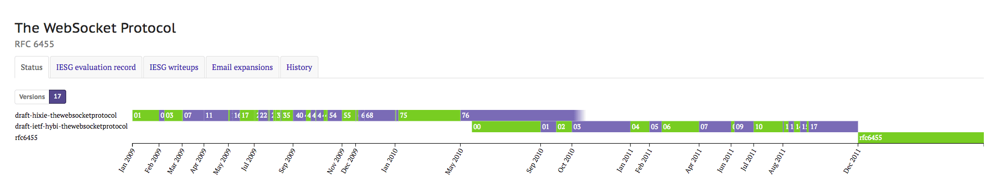
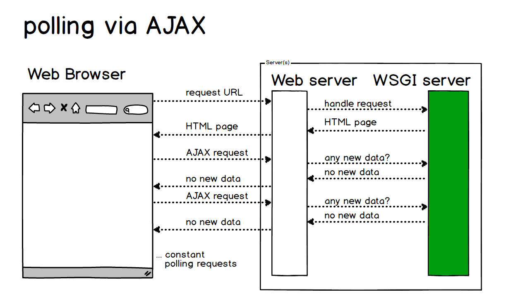
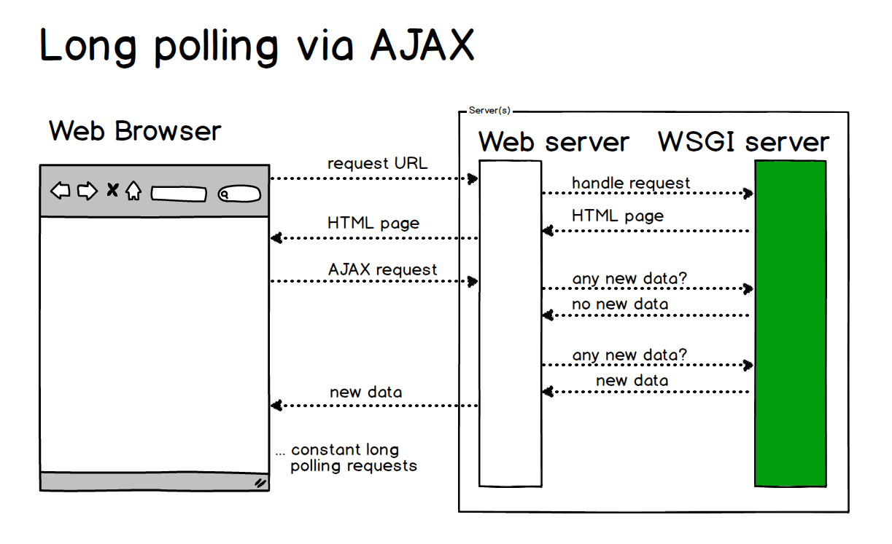
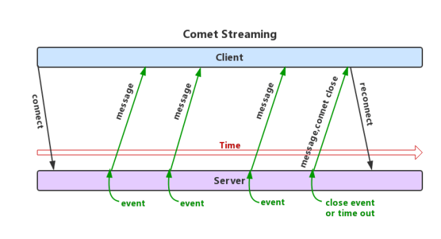
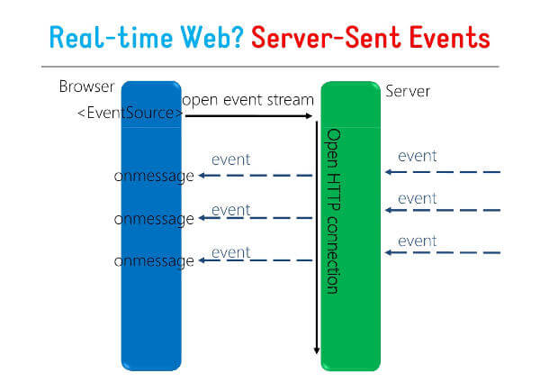
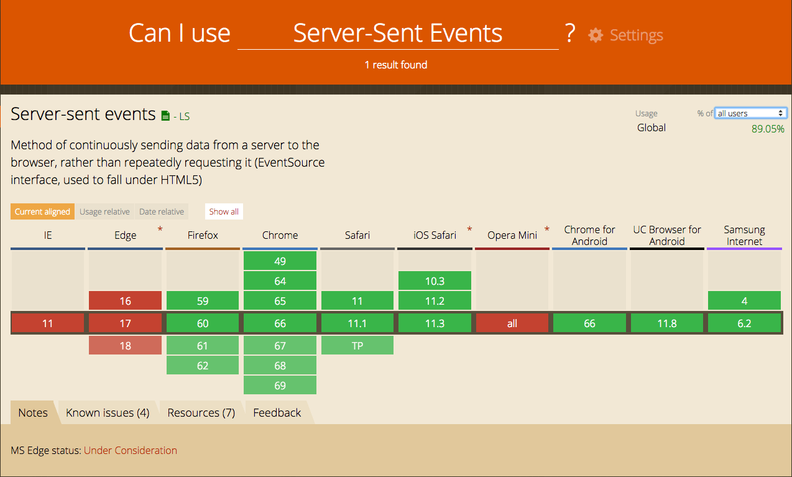
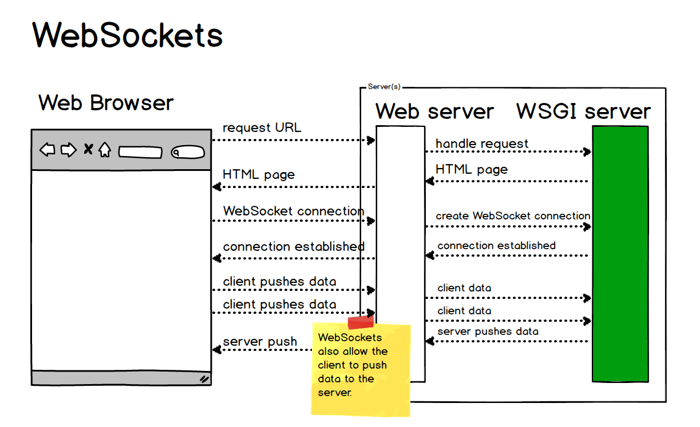
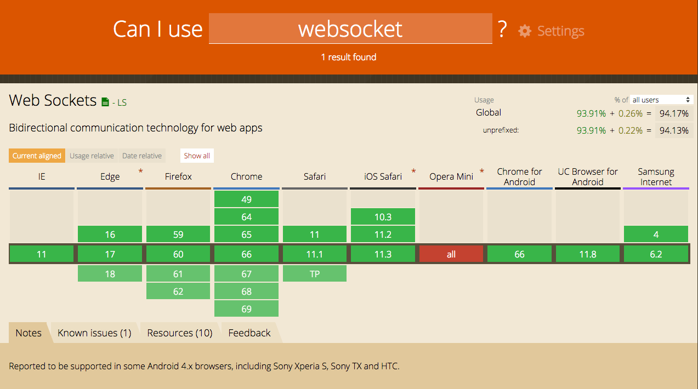

# 全双工通信的 WebSocket

<p align='center'>

</p>


## 一. WebSocket 是什么？

<p align='center'>

</p>


WebSocket 是一种网络通信协议。在 2009 年诞生，于 2011 年被 IETF 定为标准 RFC 6455 通信标准。并由  RFC7936 补充规范。WebSocket API 也被 W3C 定为标准。

WebSocket 是 HTML5 开始提供的一种在单个 TCP 连接上进行**全双工(full-duplex)通讯的协议**。没有了  Request 和 Response 的概念，两者地位完全平等，连接一旦建立，就建立了真•持久性连接，双方可以随时向对方发送数据。


(HTML5 是 HTML 最新版本，包含一些新的标签和全新的 API。HTTP 是一种协议，目前最新版本是 HTTP/2 ，所以 WebSocket 和 HTTP 有一些交集，两者相异的地方还是很多。两者交集的地方在 HTTP 握手阶段，握手成功后，数据就直接从 TCP 通道传输。)

## 二. 为什么要发明 WebSocket ？


在没有 WebSocket 之前，Web 为了实现即时通信，有以下几种方案，最初的 polling ，到之后的 Long polling，最后的基于 streaming 方式，再到最后的 SSE，也是经历了几个不种的演进方式。


## (1) 最开始的短轮询 Polling 阶段 


这种方式下，是不适合获取实时信息的，客户端和服务器之间会一直进行连接，每隔一段时间就询问一次。客户端会轮询，有没有新消息。这种方式连接数会很多，一个接受，一个发送。而且每次发送请求都会有 HTTP 的 Header，会很耗流量，也会消耗 CPU 的利用率。

这个阶段可以看到，一个 Request 对应一个 Response，一来一回一来一回。

在 Web 端，短轮询用 AJAX JSONP Polling 轮询实现。

由于 HTTP 无法无限时长的保持连接，所以不能在服务器和 Web 浏览器之间频繁的长时间进行数据推送，所以 Web 应用通过通过频繁的异步 JavaScript 和 XML (AJAX) 请求来实现轮循。


<p align='center'>

</p>

- 优点：短连接，服务器处理简单，支持跨域、浏览器兼容性较好。
- 缺点：有一定延迟、服务器压力较大，浪费带宽流量、大部分是无效请求。


## (2) 改进版的长轮询 Long polling 阶段（Comet Long polling）


长轮询是对轮询的改进版，客户端发送 HTTP 给服务器之后，有没有新消息，如果没有新消息，就一直等待。直到有消息或者超时了，才会返回给客户端。消息返回后，客户端再次建立连接，如此反复。这种做法在某种程度上减小了网络带宽和 CPU 利用率等问题。

这种方式也有一定的弊端，实时性不高。如果是高实时的系统，肯定不会采用这种办法。因为一个 GET 请求来回需要 2个 RTT，很可能在这段时间内，数据变化很大，客户端拿到的数据已经延后很多了。

另外，网络带宽低利用率的问题也没有从根源上解决。每个 Request 都会带相同的 Header。

对应的，Web 也有 AJAX 长轮询，也叫 XHR 长轮询。

客户端打开一个到服务器端的 AJAX 请求，然后等待响应，服务器端需要一些特定的功能来允许请求被挂起，只要一有事件发生，服务器端就会在挂起的请求中送回响应并关闭该请求。客户端在处理完服务器返回的信息后，再次发出请求，重新建立连接，如此循环。

<p align='center'>

</p>

- 优点：减少轮询次数，低延迟，浏览器兼容性较好。
- 缺点：服务器需要保持大量连接。

## (3) 基于流（Comet Streaming）

### 1. 基于 Iframe 及 htmlfile 的流（Iframe Streaming）

iframe 流方式是在页面中插入一个隐藏的 iframe，利用其 src 属性在服务器和客户端之间创建一条长链接，服务器向 iframe 传输数据（通常是 HTML，内有负责插入信息的 JavaScript），来实时更新页面。iframe 流方式的优点是浏览器兼容好。

<p align='center'>

</p>

使用 iframe 请求一个长连接有一个很明显的不足之处：IE、Morzilla Firefox 下端的进度栏都会显示加载没有完成，而且 IE 上方的图标会不停的转动，表示加载正在进行。

Google 的天才们使用一个称为 “htmlfile” 的 ActiveX 解决了在 IE 中的加载显示问题，并将这种方法用到了 gmail+gtalk 产品中。Alex Russell 在 “What else is burried down in the depth's of Google's amazing JavaScript?”文章中介绍了这种方法。Zeitoun 网站提供的 comet-iframe.tar.gz，封装了一个基于 iframe 和 htmlfile 的 JavaScript comet 对象，支持 IE、Mozilla Firefox 浏览器，可以作为参考。


- 优点：实现简单，在所有支持 iframe 的浏览器上都可用、客户端一次连接、服务器多次推送。
- 缺点：无法准确知道连接状态，IE浏览器在 iframe 请求期间，浏览器 title 一直处于加载状态，底部状态栏也显示正在加载，用户体验不好（htmlfile 通过  ActiveXObject 动态写入内存可以解决此问题）。


### 2. AJAX multipart streaming（XHR Streaming）

实现思路：浏览器必须支持 multi-part 标志，客户端通过 AJAX 发出请求 Request，服务器保持住这个连接，然后可以通过 HTTP1.1 的 chunked encoding 机制（分块传输编码）不断 push 数据给客户端,直到 timeout 或者手动断开连接。

- 优点：客户端一次连接，服务器数据可多次推送。
- 缺点：并非所有的浏览器都支持 multi-part 标志。


### 3. Flash Socket（Flash Streaming）

实现思路：在页面中内嵌入一个使用了 Socket 类的 Flash 程序，JavaScript 通过调用此 Flash 程序提供的 Socket 接口与服务器端的 Socket 接口进行通信，JavaScript 通过 Flash Socket 接收到服务器端传送的数据。

- 优点：实现真正的即时通信，而不是伪即时。
- 缺点：客户端必须安装 Flash 插件；非 HTTP 协议，无法自动穿越防火墙。


### 4. Server-Sent Events

服务器发送事件（SSE）也是 HTML5 公布的一种服务器向浏览器客户端发起数据传输的技术。一旦创建了初始连接，事件流将保持打开状态，直到客户端关闭。该技术通过传统的 HTTP 发送，并具有 WebSockets 缺乏的各种功能，例如自动重新连接、事件 ID 以及发送任意事件的能力。


SSE 就是利用服务器向客户端声明，接下来要发送的是流信息（streaming），会连续不断地发送过来。这时，客户端不会关闭连接，会一直等着服务器发过来的新的数据流，可以类比视频流。SSE 就是利用这种机制，使用流信息向浏览器推送信息。它基于 HTTP 协议，目前除了 IE/Edge，其他浏览器都支持。

SSE 是单向通道，只能服务器向浏览器发送，因为流信息本质上就是下载。

服务器向浏览器发送的 SSE 数据，必须是 UTF-8 编码的文本，具有如下的 HTTP 头信息。

```http
Content-Type: text/event-stream
Cache-Control: no-cache
Connection: keep-alive
```

上面三行之中，第一行的 Content-Type 必须指定 MIME 类型为event-steam

<p align='center'>

</p>

- 优点：适用于更新频繁、低延迟并且数据都是从服务端发到客户端。
- 缺点：浏览器兼容难度高。


<p align='center'>

</p>


以上是常见的四种基于流的做法，Iframe Streaming、XHR Streaming、Flash Streaming、Server-Sent Events。

从浏览器兼容难度看 —— 短轮询/AJAX > 长轮询/Comet > 长连接/SSE

## WebSocket 的到来

从上面这几种演进的方式来看，也是不断改进的过程。

短轮询效率低，非常浪费资源（网络带宽和计算资源）。有一定延迟、服务器压力较大，并且大部分是无效请求。

长轮询虽然省去了大量无效请求，减少了服务器压力和一定的网络带宽的占用，但是还是需要保持大量的连接。

最后到了基于流的方式，在服务器往客户端推送，这个方向的流实时性比较好。但是依旧是单向的，客户端请求服务器依然还需要一次 HTTP 请求。

那么人们就在考虑了，有没有这样一个完美的方案，即能双向通信，又可以节约请求的 header 网络开销，并且有更强的扩展性，最好还可以支持二进制帧，压缩等特性呢？

于是人们就发明了这样一个目前看似“完美”的解决方案 —— WebSocket。

在 HTML5 中公布了 WebSocket 标准以后，直接取代了 Comet 成为服务器推送的新方法。

> Comet 是一种用于 web 的推送技术，能使服务器实时地将更新的信息传送到客户端，而无须客户端发出请求，目前有两种实现方式，长轮询和 iframe 流。


<p align='center'>

</p>

- 优点：
- 较少的控制开销，在连接创建后，服务器和客户端之间交换数据时，用于协议控制的数据包头部相对较小。在不包含扩展的情况下，对于服务器到客户端的内容，此头部大小只有2至10字节（和数据包长度有关）；对于客户端到服务器的内容，此头部还需要加上额外的4字节的掩码。相对于 HTTP 请求每次都要携带完整的头部，此项开销显著减少了。
- 更强的实时性，由于协议是全双工的，所以服务器可以随时主动给客户端下发数据。相对于HTTP请求需要等待客户端发起请求服务端才能响应，延迟明显更少；即使是和Comet等类似的长轮询比较，其也能在短时间内更多次地传递数据。
- 长连接，保持连接状态。与HTTP不同的是，Websocket需要先创建连接，这就使得其成为一种有状态的协议，之后通信时可以省略部分状态信息。而HTTP请求可能需要在每个请求都携带状态信息（如身份认证等）。
- 双向通信、更好的二进制支持。与 HTTP 协议有着良好的兼容性。默认端口也是 80 和 443，并且握手阶段采用 HTTP 协议，因此握手时不容易被屏蔽，能通过各种 HTTP 代理服务器。

- 缺点：部分浏览器不支持（支持的浏览器会越来越多）。
应用场景：较新浏览器支持、不受框架限制、较高扩展性。

<p align='center'>

</p>

一句话总结一下 WebSocket：

WebSocket 是 HTML5 开始提供的一种**独立**在单个 **TCP** 连接上进行**全双工通讯**的**有状态**的协议(它不同于无状态的 HTTP)，并且还能支持二进制帧、扩展协议、部分自定义的子协议、压缩等特性。


**目前看来，WebSocket 是可以完美替代 AJAX 轮询和 Comet 。但是某些场景还是不能替代 SSE，WebSocket 和 SSE 各有所长！**


## 三. WebSocket 握手

WebSocket 的 RFC6455 标准中制定了 2 个高级组件，一个是开放性 HTTP 握手用于协商连接参数，另一个是二进制消息分帧机制用于支持低开销的基于消息的文本和二进制数据传输。接下来就好好谈谈这两个高级组件，这一章节详细的谈谈握手的细节，下一个章节再谈谈二进制消息分帧机制。

首先，在 RFC6455 中写了这样一段话：

>WebSocket 协议尝试在既有 HTTP 基础设施中实现双向 HTTP 通信，因此 也使用 HTTP 的 80 和 443 端口......不过，这个设计不限于通过 HTTP 实现 WebSocket 通信，未来的实现可以在某个专用端口上使用更简单的握手，而 不必重新定义么一个协议。
>										
>——WebSocket Protocol RFC 6455


从这段话中我们可看出制定 WebSocket 协议的人的“野心”或者说对未来的规划有多远，WebSocket 制定之初就已经支持了可以在任意端口上进行握手，而不仅仅是要依靠 HTTP 握手。

不过目前用的对多的还是依靠 HTTP 进行握手。因为 HTTP 的基础设施已经相当完善了。


### 标准的握手流程

接下来看一个具体的 WebSocket 握手的例子。以笔者自己的网站 [https://threes.halfrost.com/](https://threes.halfrost.com/) 为例。

打开这个网站，网页一渲染就会开启一个 wss 的握手请求。握手请求如下：

```http
GET wss://threes.halfrost.com/sockjs/689/8x5nnke6/websocket HTTP/1.1
// 请求的方法必须是GET，HTTP版本必须至少是1.1

Host: threes.halfrost.com
Connection: Upgrade
Pragma: no-cache
Cache-Control: no-cache
Upgrade: websocket
// 请求升级到 WebSocket 协议

Origin: https://threes.halfrost.com
Sec-WebSocket-Version: 13
// 客户端使用的 WebSocket 协议版本

User-Agent: Mozilla/5.0 (Linux; Android 6.0; Nexus 5 Build/MRA58N) AppleWebKit/537.36 (KHTML, like Gecko) Chrome/66.0.3359.181 Mobile Safari/537.36
Accept-Encoding: gzip, deflate, br
Accept-Language: zh-CN,zh;q=0.9,en;q=0.8
Cookie: _ga=GA1.2.00000006.14111111496; _gid=GA1.2.23232376.14343448247; Hm_lvt_d60c126319=1524898423,1525574369,1526206975,1526784803; Hm_lpvt_d606319=1526784803; _gat_53806_2=1
Sec-WebSocket-Key: wZgx0uTOgNUsHGpdWc0T+w==
// 自动生成的键，以验证服务器对协议的支持，其值必须是 nonce 组成的随机选择的 16 字节的被 base64 编码后的值

Sec-WebSocket-Extensions: permessage-deflate; client_max_window_bits
// 可选的客户端支持的协议扩展列表，指示了客户端希望使用的协议级别的扩展

```

这里和普通的 HTTP 协议相比，不同的地方有以下几处：

请求的 URL 是 ws:// 或者 wss:// 开头的，而不是 HTTP:// 或者 HTTPS://。由于 websocket 可能会被用在浏览器以外的场景，所以这里就使用了自定义的 URI。类比 HTTP，ws协议：普通请求，占用与 HTTP 相同的 80 端口；wss协议：基于 SSL 的安全传输，占用与 TLS 相同的 443 端口。

```http
Connection: Upgrade
Upgrade: websocket
```

这两处是普通的 HTTP 报文一般没有的，这里利用 Upgrade 进行了协议升级，指明升级到 websocket 协议。

```http
Sec-WebSocket-Version: 13
Sec-WebSocket-Key: wZgx0uTOgNUsHGpdWc0T+w==
Sec-WebSocket-Extensions: permessage-deflate; client_max_window_bits
```

Sec-WebSocket-Version 表示 WebSocket 的版本，最初 WebSocket 协议太多，不同厂商都有自己的协议版本，不过现在已经定下来了。如果服务端不支持该版本，需要返回一个 Sec-WebSocket-Version，里面包含服务端支持的版本号。（详情见下面的[多版本的 websocket 握手](https://github.com/halfrost/Halfrost-Field/blob/master/contents/Protocol/WebSocket.md#%E5%A4%9A%E7%89%88%E6%9C%AC%E7%9A%84-websocket-%E6%8F%A1%E6%89%8B)一节）

最新版本就是 13，当然有可能存在非常早期的版本 7 ，8（目前基本不会不存在 7，8 的版本了）

**注意**：尽管本文档的草案版本（09、10、11、和 12）发布了（它们多不是编辑上的修改和澄清而不是改变电报协议 [wire protocol]），值 9、10、11、和 12 不被用作有效的 Sec-WebSocket-Version。这些值被保留在 IANA 注册中心，但并将不会被使用。

```http
+--------+-----------------------------------------+----------+
|Version |                Reference                |  Status  |
| Number |                                         |          |
+--------+-----------------------------------------+----------+
| 0      + draft-ietf-hybi-thewebsocketprotocol-00 | Interim  |
+--------+-----------------------------------------+----------+
| 1      + draft-ietf-hybi-thewebsocketprotocol-01 | Interim  |
+--------+-----------------------------------------+----------+
| 2      + draft-ietf-hybi-thewebsocketprotocol-02 | Interim  |
+--------+-----------------------------------------+----------+
| 3      + draft-ietf-hybi-thewebsocketprotocol-03 | Interim  |
+--------+-----------------------------------------+----------+
| 4      + draft-ietf-hybi-thewebsocketprotocol-04 | Interim  |
+--------+-----------------------------------------+----------+
| 5      + draft-ietf-hybi-thewebsocketprotocol-05 | Interim  |
+--------+-----------------------------------------+----------+
| 6      + draft-ietf-hybi-thewebsocketprotocol-06 | Interim  |
+--------+-----------------------------------------+----------+
| 7      + draft-ietf-hybi-thewebsocketprotocol-07 | Interim  |
+--------+-----------------------------------------+----------+
| 8      + draft-ietf-hybi-thewebsocketprotocol-08 | Interim  |
+--------+-----------------------------------------+----------+
| 9      +                Reserved                 |          |
+--------+-----------------------------------------+----------+
| 10     +                Reserved                 |          |
+--------+-----------------------------------------+----------+
| 11     +                Reserved                 |          |
+--------+-----------------------------------------+----------+
| 12     +                Reserved                 |          |
+--------+-----------------------------------------+----------+
| 13     +                RFC 6455                 | Standard |
+--------+-----------------------------------------+----------+
```


>[RFC 6455]
>
>The |Sec-WebSocket-Key| header field is used in the WebSocket opening handshake.  It is sent from the client to the server to provide part of the information used by the server to prove that it received a valid WebSocket opening handshake.  This helps ensure that the server does not accept connections from non-WebSocket clients (e.g., HTTP clients) that are being abused to send data to unsuspecting WebSocket servers.
>
>Sec-WebSocket-Key 字段用于握手阶段。它从客户端发送到服务器以提供部分内容，服务器用来证明它收到的信息，并且能有效的完成 WebSocket 握手。这有助于确保服务器不会接受来自非 WebSocket 客户端的连接（例如 HTTP 客户端）被滥用发送数据到毫无防备的 WebSocket 服务器。

Sec-WebSocket-Key 是由浏览器随机生成的，提供基本的防护，防止恶意或者无意的连接。

Sec-WebSocket-Extensions 是属于升级协商的部分，这里放在下一章节进行详细讲解。

接着来看看 Response：

```http
HTTP/1.1 101 Switching Protocols
// 101 HTTP 响应码确认升级到 WebSocket 协议
Server: nginx/1.12.1
Date: Sun, 20 May 2018 09:06:28 GMT
Connection: upgrade
Upgrade: websocket
Sec-WebSocket-Accept: 375guuMrnCICpulKbj7+JGkOhok=
// 签名的键值验证协议支持
Sec-WebSocket-Extensions: permessage-deflate
// 服务器选择的WebSocket 扩展

```

在 Response 中，用 HTTP 101 响应码回应，确认升级到 WebSocket 协议。

同样也有两个 WebSocket 的 header：

```http
Sec-WebSocket-Accept: 375guuMrnCICpulKbj7+JGkOhok=
// 签名的键值验证协议支持
Sec-WebSocket-Extensions: permessage-deflate
// 服务器选择的 WebSocket 扩展
```

Sec-WebSocket-Accept 是经过服务器确认后，并且加密之后的 Sec-WebSocket-Key。

Sec-WebSocket-Accept 的计算方法如下：

1. 先将客户端请求头里面的 Sec-WebSocket-Key 取出来跟 258EAFA5-E914-47DA-95CA-C5AB0DC85B11 拼接；（258EAFA5-E914-47DA-95CA-C5AB0DC85B11 这个 Globally Unique Identifier (GUID, [RFC4122]) 是唯一固定不变的）
2. 然后进行 SHA-1 哈希，最后进行 base64-encoded 得到的结果就是 Sec-WebSocket-Accept。

伪代码：

```javascript
> toBase64(sha1( Sec-WebSocket-Key + 258EAFA5-E914-47DA-95CA-C5AB0DC85B11 ))
```

同样，Sec-WebSocket-Key/Sec-WebSocket-Accept 只是在握手的时候保证握手成功，但是对数据安全并不保证，用 wss:// 会稍微安全一点。

### 握手中的子协议

WebSocket 握手有可能会涉及到子协议的问题。

先来看看 WebSocket 的对象初始化函数：

```javascript
WebSocket WebSocket(
in DOMString url, 
// 表示要连接的URL。这个URL应该为响应WebSocket的地址。
in optional DOMString protocols 
// 可以是一个单个的协议名字字符串或者包含多个协议名字字符串的数组。默认设为一个空字符串。
);
```

这里有一个 optional ，是一个可以协商协议的数组。

```javascript
var ws = new WebSocket('wss://example.com/socket', ['appProtocol', 'appProtocol-v2']);

ws.onopen = function () {
if (ws.protocol == 'appProtocol-v2') { 
	...
	} else {
	... 
	}
}
```

在创建 WebSocket 对象的时候，可以传递一个可选的子协议数组，告诉服务器，客户端可以理解哪些协议或者希望服务器接收哪些协议。服务器可以从数据里面选择几个支持的协议进行返回，如果一个都不支持，那么会直接导致握手失败。触发 onerror 回调，并断开连接。

这里的子协议可以是自定义的协议。

### 多版本的 websocket 握手

使用 WebSocket 版本通知能力（ Sec-WebSocket-Version 头字段），客户端可以初始请求它选择的 WebSocket 协议的版本（这并不一定必须是客户端支持的最新的）。如果服务器支持请求的版本且握手消息是本来有效的，服务器将接受该版本。如果服务器不支持请求的版本，它必须以一个包含所有它将使用的版本的 Sec-WebSocket-Version 头字段（或多个 Sec-WebSocket-Version 头字段）来响应。 此时，如果客户端支持一个通知的版本，它可以使用新的版本值重做 WebSocket 握手。

举个例子：

```http
GET /chat HTTP/1.1
Host: server.example.com
Upgrade: websocket
Connection: Upgrade
...
Sec-WebSocket-Version: 25
```

服务器不支持 25 的版本，则会返回：

```http
HTTP/1.1 400 Bad Request
...
Sec-WebSocket-Version: 13, 8, 7
```

客户端支持 13 版本的，则需要重新握手：

```http
GET /chat HTTP/1.1
Host: server.example.com
Upgrade: websocket
Connection: Upgrade
...
Sec-WebSocket-Version: 13
```


## 四. WebSocket 升级协商

在 WebSocket 握手阶段，会 5 个带 WebSocket 的 header。这 5 个 header 都是和升级协商相关的。

- Sec-WebSocket-Version  
客户端表明自己想要使用的版本号（一般都是 13 号版本），如果服务器不支持这个版本，则需要返回自己支持的版本。客户端拿到 Response 以后，需要对自己支持的版本号重新握手。这个 header 客户端必须要发送。

- Sec-WebSocket-Key  
客户端请求自动生成的一个 key。这个 header 客户端必须要发送。

- Sec-WebSocket-Accept  
服务器针对客户端的 Sec-WebSocket-Key 计算的响应值。这个 header 服务端必须要发送。

- Sec-WebSocket-Protocol  
用于协商应用子协议:客户端发送支持的协议列表，服务器必须只回应一个协议名。如果服务器一个协议都不能支持，直接握手失败。客户端可以不发送子协议，但是一旦发送，服务器无法支持其中任意一个都会导致握手失败。这个 header 客户端可选发送。

- Sec-WebSocket-Extensions  
用于协商本次连接要使用的 WebSocket 扩展:客户端发送支持的扩展，服务器通过返回相同的首部确认自己支持一或多个扩展。这个 header 客户端可选发送。服务端如果都不支持，不会导致握手失败，但是此次连接不能使用任何扩展。

协商是在握手阶段，握手完成以后，HTTP 通信结束，接下来的全双工全部都交给 WebSocket 协议管理（TCP 通信）。


## 五. WebSocket 协议扩展

负责制定 WebSocket 规范的 HyBi Working Group 就进行了两项扩展 Sec-WebSocket-Extensions：

- 多路复用扩展(A Multiplexing Extension for WebSockets)  
  这个扩展可以将 WebSocket 的逻辑连接独立出来，实现共享底层的 TCP 连接。

- 压缩扩展(Compression Extensions for WebSocket)   
  给 WebSocket 协议增加了压缩功能。（例如 x-webkit-deflate-frame 扩展）

如果不进行多路复用扩展，每个 WebSocket 连接都只能独享专门的一个 TCP 连接，而且当遇到一个巨大的消息分成多个帧的时候，容易产生队首阻塞的情况。队首阻塞会导致延迟，所以分成多个帧的时候能尽量的小是关键。不过在进行了多路复用扩展以后，多个连接复用一个 TCP 连接，每个信道依旧会存在队首阻塞的问题。除了多路复用，还要进行多路并行发送消息。

如果通过 HTTP2 进行 WebSocket 传输，性能会更好一点，毕竟 HTTP2 原生就支持了流的多路复用。利用 HTTP2 的分帧机制进行 WebSocket 的分帧，多个 WebSocket 可以在同一个会话中传输。


## 六. WebSocket 数据帧

WebSocket 另一个高级组件是：二进制消息分帧机制。WebSocket 会把应用的消息分割成一个或多个帧，接收方接到到多个帧会进行组装，等到接收到完整消息之后再通知接收端。

### WebSocket 数据帧结构

WebSocket 数据帧格式如下：

```http
 0                   1                   2                   3
 0 1 2 3 4 5 6 7 8 9 0 1 2 3 4 5 6 7 8 9 0 1 2 3 4 5 6 7 8 9 0 1
 +-+-+-+-+-------+-+-------------+-------------------------------+
 |F|R|R|R| opcode|M| Payload len |    Extended payload length    |
 |I|S|S|S|  (4)  |A|     (7)     |             (16/64)           |
 |N|V|V|V|       |S|             |   (if payload len==126/127)   |
 | |1|2|3|       |K|             |                               |
 +-+-+-+-+-------+-+-------------+ - - - - - - - - - - - - - - - +
 |     Extended payload length continued, if payload len == 127  |
 + - - - - - - - - - - - - - - - +-------------------------------+
 |                               |Masking-key, if MASK set to 1  |
 +-------------------------------+-------------------------------+
 | Masking-key (continued)       |          Payload Data         |
 +-------------------------------- - - - - - - - - - - - - - - - +
 :                     Payload Data continued ...                :
 + - - - - - - - - - - - - - - - - - - - - - - - - - - - - - - - +
 |                     Payload Data continued ...                |
 +---------------------------------------------------------------+
```

- FIN:0表示不是最后一个分片，1表示是最后一个分片。

- RSV1, RSV2, RSV3：

一般情况下全为 0。当客户端、服务端协商采用 WebSocket 扩展时，这三个标志位可以非
0，且值的含义由扩展进行定义。如果出现非零的值，且并没有采用 WebSocket 扩展，连接出错。

- Opcode：

%x0：表示一个延续帧。当 Opcode 为 0 时，表示本次数据传输采用了数据分片，当前收到的数据帧为其中一个数据分片；  
%x1：表示这是一个文本帧（text frame）；  
%x2：表示这是一个二进制帧（binary frame）；  
%x3-7：保留的操作代码，用于后续定义的非控制帧；  
%x8：表示连接断开；  
%x9：表示这是一个心跳请求（ping）；  
%xA：表示这是一个心跳响应（pong）；  
%xB-F：保留的操作代码，用于后续定义的控制帧。  

- Mask：

表示是否要对数据载荷进行**掩码异或**操作。1表示需要，0表示不需要。（只适用于客户端发给服务器的消息，**客户端给服务器发送消息，这里一定为 1**）

- Payload len：

表示数据载荷的长度，这里有 3 种情况：

如果数据长度在 0 - 125 之间，那么 Payload len 用 7 位表示足以，表示的数也就是净荷长度;    
如果数据长度等于 126，那么 Payload len 需要用 7 + 16 位表示，接下来 2 字节表示的 16 位无符号整数才是这一帧的长度;    
如果数据长度等于 127，那么 Payload len 需要用 7 + 64 位表示，接下来 8 字节表示的 64 位无符号整数才是这一帧的长度。    

- Masking-key：

如果 Mask = 0，则没有 Masking-key，如果 Mask = 1，则 Masking-key 长度为 4 字节，32位。

掩码是由客户端随机选择的 32 位值。 当准备一个掩码的帧时，客户端必须从允许的 32 位值集合中选择一个新的掩码键。 掩码键需要是不可预测的；因此，掩码键必须来自一个强大的熵源， 且用于给定帧的掩码键必须不容易被服务器/代理预测用于后续帧的掩码键。 掩码键的不可预测性对防止恶意应用的作者选择出现在报文上的字节是必要的。 RFC 4086 [RFC4086]讨论了什么需要一个用于安全敏感应用的合适的熵源。

掩码不影响“负载数据”的长度。 变换掩码数据到解掩码数据，或反之亦然，以下算法被应用。 相同的算法应用，不管转化的方向，例如，相同的步骤即应用到掩码数据也应用到解掩码数据。

- original-octet-i：为原始数据的第i字节。
- transformed-octet-i：为转换后的数据的第i字节。
- j：为i mod 4的结果。
- masking-key-octet-j：为mask key第j字节。

变换数据的八位位组 i （"transformed-octet-i"）是原始数据的八位位组 i（"original-octet-i"）异或（XOR）i 取模 4 位置的掩码键的八位位组（"masking-key-octet-j"）：

```c
j = i MOD 4
transformed-octet-i = original-octet-i XOR masking-key-octet-j
```


算法简单描述：按位做循环异或运算，先对该位的索引取模来获得 Masking-key 中对应的值 x，然后对该位与 x 做异或，从而得到真实的 byte 数据。  

注意：掩码的作用并不是为了防止数据泄密，而是为了防止客户端中运行的恶意脚本对不支持 WebSocket 的中间设备进行代理缓存投毒攻击(proxy cache poisoning attack)

>要了解这种攻击的细节，请参考 W2SP 2011 的论文[Talking to Yourself for Fun and Profit](http://www.adambarth.com/papers/2011/huang-chen-barth-rescorla-jackson.pdf)。
>

攻击主要分2步，

第一步，先进行一次 WebSocket 连接。黑客通过代理服务器向自己的服务器进行 WebSocket 握手，由于 WebSocket 握手是 HTTP 消息，所以代理服务器把黑客自己服务器的 Response 转发回给黑客的时候，会认为本次 HTTP 请求结束。

<p align='center'>

</p>

第二步，在代理服务器上面制造“投毒”攻击。由于 WebSocket 握手成功，所以黑客可以向自己的服务器上发送数据了，发送一条精心设置过的 HTTP 格式的文本信息。这条数据的 host 需要伪造成普通用户即将要访问的服务器，请求的资源是普通用户即将要请求的资源。代理服务器会认为这是一条新的请求，于是向黑客自己的服务器请求，这时候也需要黑客自己服务器配合，收到这条“投毒”以后的消息以后，立即返回“毒药”，返回一些恶意的脚本资源等等。至此，“投毒”成功。


<p align='center'>

</p>


当用户通过代理服务器请求要请求的安全资源的时候，由于 host 和 url 之前已经被黑客利用 HTTP 格式的文本信息缓存进了代理服务器，“投毒”的资源也被缓存了，这个时候用户请求相同的 host 和 url 的资源的时候，代理缓存服务器发现已经缓存了，就立即会把“投毒”以后的恶意脚本或资源返回给用户。这时候用户就收到了攻击。

所以**客户端发给服务器的时候这里必须要带上 Masking-key，它用于标记 Payload data (包含扩展数据和应用数据两种)**。

- Payload Data: 

载荷数据分为扩展数据和应用数据两种。

扩展数据：如果没有协商使用扩展的话，扩展数据数据为0字节。扩展数据的长度如果存在，必须在握手阶段就固定下来。载荷数据的长度也要算上扩展数据。

应用数据：如果存在扩展数据，则排在扩展数据之后。


### WebSocket 控制帧

控制帧由操作码确定，操作码最高位为 1。 当前定义的用于控制帧的操作码包括 0x8 （Close）、0x9（Ping）、和0xA（Pong）。 操作码 0xB-0xF 保留用于未来尚未定义的控制帧。

控制帧用于传达有关 WebSocket 的状态。 控制帧可以插入到分帧消息的中间。

所有的控制帧必须有一个小于等于125字节的有效载荷长度，控制帧必须不能被分帧。

- 当接收到 0x8 Close 操作码的控制帧以后，可以关闭底层的 TCP 连接了。客户端也可以等待服务器关闭以后，再一段时间没有响应了，再关闭自己的 TCP 连接。

在 RFC6455 中给出了关闭时候建议的状态码，没有规范的定义，只是给了一个预定义的状态码。

| 状态码 | 说明 | 保留✔︎或者不能使用✖︎|
| :---: | :---: | :---:|
|0-999 |该范围内的状态码不被使用。|✖︎|
| 1000 |表示正常关闭，意思是建议的连接已经完成了。 ||
| 1001 |表示端点“离开”（going away），例如服务器关闭或浏览器导航到其他页面。||
| 1002 |表示端点因为协议错误而终止连接。 ||
| 1003 |表示端点由于它收到了不能接收的数据类型（例如，端点仅理解文本数据，但接收到了二进制消息）而终止连接。 ||
| 1004 |保留。可能在将来定义其具体的含义。 |✔︎|
| 1005 |是一个保留值，且不能由端点在关闭控制帧中设置此状态码。 它被指定用在期待一个用于表示没有状态码是实际存在的状态码的应用中。 |✔︎|
| 1006 |是一个保留值，且不能由端点在关闭控制帧中设置此状态码。 它被指定用在期待一个用于表示连接异常关闭的状态码的应用中。 |✔︎|
| 1007 |表示端点因为消息中接收到的数据是不符合消息类型而终止连接（比如，文本消息中存在非 UTF-8[RFC3629] 数据）。 ||
| 1008 |表示端点因为接收到的消息违反其策略而终止连接。 这是一个当没有其他合适状态码（例如 1003 或 1009）或如果需要隐藏策略的具体细节时能被返回的通用状态码。||
| 1009 |表示端点因接收到的消息对它的处理来说太大而终止连接。 ||
| 1010 |表示端点（客户端）因为它期望服务器协商一个或多个扩展，但服务器没有在 WebSocket 握手响应消息中返回它们而终止连接。 所需要的扩展列表应该出现在关闭帧的 reason 部分。 ||
| 1011 |表示服务器端因为遇到了一个不期望的情况使它无法满足请求而终止连接。 ||
| 1012 | ||
| 1013 | ||
| 1014 | ||
| 1015 |是一个保留值，且不能由端点在关闭帧中被设置为状态码。 它被指定用在期待一个用于表示连接由于执行 TLS 握手失败而关闭的状态码的应用中（比如，服务器证书不能验证）。 |✔︎|
|1000-2999| 该范围内的状态码保留给本协议、其未来的修订和一个永久的和现成的公共规范中指定的扩展的定义。|✔︎|
|3000-3999 |该范围内的状态码保留给库、框架和应用使用。 这些状态码直接向 IANA 注册。本规范未定义这些状态码的解释。|✔︎|
|4000-4999 |该范围内的状态码保留用于私有使用且因此不能被注册。 这些状态码可以被在 WebSocket 应用之间的先前的协议使用。 本规范未定义这些状态码的解释。|✔︎|

- 当接收到 0x9 Ping 操作码的控制帧以后，应当立即发送一个包含 pong 操作码的帧响应，除非接收到了一个关闭帧。两端都会在连接建立后、关闭前的任意时间内发送 Ping 帧。Ping 帧可以包含“应用数据”。ping 帧就可以作为 keepalive 心跳包。

- 当接收到 0xA pong 操作码的控制帧以后，知道对方还可响应。Pong 帧必须包含与被响应 Ping 帧的应用程序数据完全相同的数据。如果终端接收到一个 Ping 帧，且还没有对之前的 Ping 帧发送 Pong 响应，终端可能选择发送一个 Pong 帧给最近处理的 Ping 帧。一个 Pong 帧可能被主动发送，这作为单向心跳。尽量不要主动发送 pong 帧。

### WebSocket 分帧规则

分帧规则由 RFC6455 进行定义，应用对如何分帧是无感知的。分帧这一步由客户端和服务器完成。

分帧也可以更好的利用多路复用的协议扩展，多路复用需要可以分割消息为更小的分段来更好的共享输出通道。

RFC 6455 规定的分帧规则如下：

- 一个没有分片的消息由单个带有 FIN 位设置和一个非 0 操作码的帧组成。
- 一个分片的消息由单个带有 FIN 位清零和一个非 0 操作码的帧组成，跟随零个或多个带有 FIN 位清零和操作码设置为 0 的帧，且终止于一个带有 FIN 位设置且 0 操作码的帧。 一个分片的消息概念上是等价于单个大的消息，其负载是等价于按顺序串联片段的负载；然而，在存在扩展的情况下，这个可能不适用扩展定义的“扩展数据”存在的解释。 例如，“扩展数据”可能仅在首个片段开始处存在且应用到随后的片段，或 “扩展数据”可以存在于仅用于到特定片段的每个片段。 在没有“扩展数据”的情况下，以下例子展示了分片如何工作。

例子：对于一个作为三个片段发送的文本消息，第一个片段将有一个 0x1 操作码和一个 FIN 位清零，第二个片段将有一个 0x0 操作码和一个 FIN 位清零，且第三个片段将有 0x0 操作码和一个 FIN 位设置。(0x0 操作码在上面讲解过，表示一个延续帧。当 O操作码 为 0x0 时，表示本次数据传输采用了数据分片，当前收到的数据帧为其中一个数据分片；)

- 控制帧可能被注入到一个分片消息的中间。 控制帧本身必须不被分割。
- 消息分片必须按发送者发送顺序交付给收件人。
- 片段中的一个消息必须不能与片段中的另一个消息交替，除非已协商了一个能解释交替的扩展。
- 一个端点必须能处理一个分片消息中间的控制帧。
- 一个发送者可以为非控制消息创建任何大小的片段。
- 客户端和服务器必须支持接收分片和非分片的消息。
- 由于控制帧不能被分片，一个中间件必须不尝试改变控制帧的分片。
- 如果使用了任何保留的位值且这些值的意思对中间件是未知的，一个中间件必须不改变一个消息的分片。
- 在一个连接上下文中，已经协商了扩展且中间件不知道协商的扩展的语义，一个中间件必须不改变任何消息的分片。同样，没有看见 WebSocket 握手（且没被通知有关它的内容）、导致一个 WebSocket 连接的一个中间件，必须不改变这个链接的任何消息的分片。
- 由于这些规则，一个消息的所有分片是相同类型，以第一个片段的操作码设置。因为控制帧不能被分片，用于一个消息中的所有分片的类型必须或者是文本、或者二进制、或者一个保留的操作码。

注意：如果控制帧不能被插入，一个 ping 延迟，例如，如果跟着一个大消息将是非常长的。因此，要求在分片消息的中间处理控制帧。

实现注意：在没有任何扩展时，一个接收者不必按顺序缓冲整个帧来处理它。例如，如果使用了一个流式 API，一个帧的一部分能被交付到应用。但是，请注意这个假设可能不适用所有未来的 WebSocket 扩展。

### WebSocket 分帧开销

由于一个分帧了的消息包含：开始于：单个帧，FIN 设为 0，opcode 非 0；后接 ：0 个或多个帧，FIN 设为 0，opcode 设为 0；终结于：单个帧，FIN 设为 1，opcode 设为 0。一个分帧了消息在概念上等价于一个未分帧的大消息，它的有效载荷长度等于所有帧的有效载荷长度的累加；然而，有扩展时，这可能不成立，因为扩展定义了出现的 Extension data 的解释。例如，Extension data 可能只出现在第一帧，并用于后续的所有帧，或者 Extension data 出现于所有帧，且只应用于特定的那个帧。

>帧：最小的通信单位，包含可变长度的帧首部和净荷部分，净荷可能包含完整或部分应用消息。
>
>消息：一系列帧，与应用消息对等。

那么通常来说，服务器分帧就 3 种，开始帧，中间帧，结束帧。开始帧和结束帧可以带数据也可以不带数据。**分帧开销主要花费在新增加的帧头信息上**。在不带数据的情况下，开销大小是 1 + 3 + 4 + 1 + 7 + 0 = 16 bit = 2 Byte。中间帧带数据的情况下，开销大小是 1 + 3 + 4 + 1 + 7 + 64 = 80 bit = 10 Byte （假设数据长度 127 bit，所以 playload len 要加上 64 bit）

服务器分帧开销范围就在 [2,10] 字节，客户端要比服务器多增加 Masking-key，这个占用 4 字节 (32 位)，所以客户端分帧开销在 [6,14] 字节。

## 七. WebSocket API 及数据格式

### 1. WebSocket API


WebSocket API 及其简洁，可以调用的函数只有下面这么几个：

```javascript
var ws = new WebSocket('wss://example.com/socket');
ws.onerror = function (error) { ... }
ws.onclose = function () { ... }
ws.onopen = function () {
ws.send("Connection established. Hello server!");
}
ws.onmessage = function(msg) {
	if(msg.data instanceof Blob) {
   		processBlob(msg.data);
  	} else {
       processText(msg.data);
   }
}
```

除去新建 WebSocket 对象和 send() 方法以外，剩下的就是4个回调方法了。

上述的这些方法中，send() 方法需要额外注意一点的是，这个方法是异步的，并不是同步方法。意味着当我们把要发送的内容丢到这个函数中的时候，函数就异步返回了，此时**不要误认为已经发送出去了**。WebSocket 自身有一个排队的机制，数据会先丢到数据缓存区中，然后按照排队的顺序进行发送。

如果是一个巨大的文件排队中，后面又来了一些优先级比这个消息高的消息，比如系统出错，需要立即断开连接。由于排队排在大文件之后，必须等待大文件发送完毕才能发送这个优先级更高的消息。这就造成了队首阻塞的问题了，导致优先级更高的消息延迟。

WebSocket API 制定者考虑到了这个问题，于是给了我们另外 2 个为数不多的可以改变 WebSocket 对象行为的属性，一个是 bufferedAmount，另外一个是 binaryType。

```javascript
if (ws.bufferedAmount == 0)
    ws.send(evt.data);
```

在上述这种情况下就可以使用 bufferedAmount 监听缓存区的数量，从而避免队首阻塞的问题，更进一步也可以和 Priority Queue 结合到一起，实现按照优先级高低来发送消息。


### 2. 数据格式

WebSocket 对传输的格式没有任何限制，可以是文本也可以是二进制，都可以。协议中通过 Opcode 类型字段来区分是 UTF-8 还是二进制。WebSocket API 可以接收 UTF-8 编码的 DOMString 对象，也可以接收 ArrayBuffer、 ArrayBufferView 或 Blob 等二进制数据。

浏览器对接收到的数据，如果不手动设置任何其他选项的话，默认处理是，文本是默认转成 DOMString 对象，二进制数据或者 Blob 对象会直接转给给应用，中间不做任何处理。


```javascript
var ws = new WebSocket('wss://example.com/socket'); 
ws.binaryType = "arraybuffer";
```

唯一能干涉的地方就是把接收到的二进制数据全部都强制转换成 arraybuffer 类型而不是 Blob 类型。至于为何要转换成 arraybuffer 类型， W3C 的候选人给出的建议如下：

>用户代理可以将这个选项看作一个暗示，以决定如何处理接收到的二进制数据:如果这里设置为 “blob”，那就可以放心地将其转存到磁盘上;而如果设置为 “arraybuffer”，那很可能在内存里处理它更有效。自然地，我们鼓励用户代理使用更细微的线索，以决定是否将到来的数据放到内存里。
>
>——The WebSocket API W3C Candidate Recommendation


简单的说：如果转换成了 Blob 对象，就代表了一个不可变的文件对象或者原始数据。如果不需要修改或者不需要切分它，保留成 Blob 对象是一个好的选择。如果要处理这段原始数据，放进内存里面处理明显会更加合适，那么就请转换成 arraybuffer 类型。


## 八. WebSocket 性能和使用场景

有一张来自 WebSocket.org 网站的测试，用 XHR 轮询和 WebSocket 进行对比：

<p align='center'>

</p>

上图中，我们先看蓝色的柱状图，是 Polling 轮询消耗的流量，这次测试，HTTP 请求和响应头信息开销总共包括 871 字节。当然每次测试不同的请求，头的开销不同。这次测试都以 871 字节的请求来测试。

**Use case A**: 1,000 clients polling every second: Network throughput is (871 x 1,000) = 871,000 bytes = 6,968,000 bits per second (6.6 Mbps)  
**Use case B**: 10,000 clients polling every second: Network throughput is (871 x 10,000) = 8,710,000 bytes = 69,680,000 bits per second (66 Mbps)  
**Use case C**: 100,000 clients polling every 1 second: Network throughput is (871 x 100,000) = 87,100,000 bytes = 696,800,000 bits per second (665 Mbps)  
而 Websocket 的 Frame 是 just two bytes of overhead instead of 871，仅仅用 2 个字节就代替了轮询的 871 字节！

**Use case A**: 1,000 clients receive 1 message per second: Network throughput is (2 x 1,000) = 2,000 bytes = 16,000 bits per second (0.015 Mbps)  
**Use case B**: 10,000 clients receive 1 message per second: Network throughput is (2 x 10,000) = 20,000 bytes = 160,000 bits per second (0.153 Mbps)  
**Use case C**: 100,000 clients receive 1 message per second: Network throughput is (2 x 100,000) = 200,000 bytes = 1,600,000 bits per second (1.526 Mbps)  

相同的每秒客户端轮询的次数，当次数高达 10W/s 的高频率次数的时候，Polling 轮询需要消耗 665Mbps，而 Websocket 仅仅只花费了 1.526Mbps，将近 435 倍！！

从结果上看， WebSocket 确实比轮询效率和网速消耗都要好很多。


从使用场景来说，XHR、SSE、WebSocket 各有优缺点。

XHR 相对其他两种方式更加简单，依靠 HTTP 完善的基础设施，很容易实现。不过它不支持请求流，对相应流也不是完美支持（需要支持 Streams API 才能支持响应流）。传输数据格式方面，文本和二进制都支持，也支持压缩。HTTP 对它的报文负责分帧。


SSE 也同样不支持请求流，在进行一次握手以后，服务端就可以以事件源协议把数据作为响应流发给客户端。SSE 只支持文本数据，不能支持二进制。因为 SSE 不是为传输二进制而设计的，如果有必要，可以把二进制对象编码为 base64 形式，然后再使用 SSE 进行传输。SSE 也支持压缩，事件流负责对它进行分帧。

WebSocket 是目前唯一一个通过同一个 TCP 连接实现的全双工的协议，请求流和响应流都完美支持。支持文本和二进制数据，本身自带二进制分帧。在压缩方面差一些，因为有些不支持，例如 x-webkit-deflate-frame 扩展，在笔者上文中距离的那个 ws 请求中服务器就没有支持压缩。

如果所有的网络环境都可以支持 WebSocket 或者 SSE 当然是最好不过的了。但是这是不现实的，网络环境千变万化，有些网络可能就屏蔽了 WebSocket 通信，或者用户设备就不支持 WebSocket 协议，于是 XHR 也就有了用武之地。

如果客户端不需要给服务端发消息，只需要不断的实时更新，那么考虑用 SSE 也是不错的选择。不过 SSE 目前在 IE 和 Edge 上支持的较差。WebSocket 在这方面比 SSE 强。

所以应该根据不同场景选择不同的协议，各取所长。

------------------------------------------------------

Reference：  

[RFC6455](https://tools.ietf.org/html/rfc6455)    
[Server-Sent Events 教程](http://www.ruanyifeng.com/blog/2017/05/server-sent_events.html)    
[Comet：基于 HTTP 长连接的“服务器推”技术](https://www.ibm.com/developerworks/cn/web/wa-lo-comet/)    
[WEB性能权威指南]()  
[What is Sec-WebSocket-Key for?](https://stackoverflow.com/questions/18265128/what-is-sec-websocket-key-for)     
[10.3. Attacks On Infrastructure (Masking)](https://tools.ietf.org/html/rfc6455#section-10.3)    
[Why are WebSockets masked?](https://stackoverflow.com/questions/33250207/why-are-websockets-masked)    
[How does websocket frame masking protect against cache poisoning?](https://security.stackexchange.com/questions/36930/how-does-websocket-frame-masking-protect-against-cache-poisoning)    
[What is the mask in a WebSocket frame?](https://stackoverflow.com/questions/14174184/what-is-the-mask-in-a-websocket-frame)     

> GitHub Repo：[Halfrost-Field](https://github.com/halfrost/Halfrost-Field)
> 
> Follow: [halfrost · GitHub](https://github.com/halfrost)
>
> Source: [https://halfrost.com/websocket/](https://halfrost.com/websocket/)